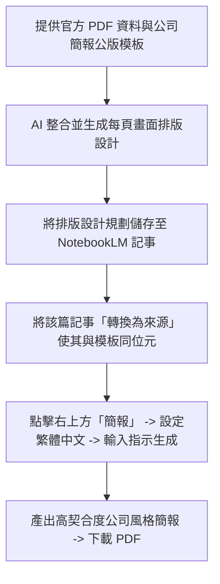

# NotebookLM + PDNob AI 簡報生成與 PDF 後製高階工作流

本卡片記錄「小步學習」分享之企業實戰級簡報生成流程。拒絕「只用一句話叫 AI 生成簡報」的發散作法，改用 **邏輯前置 (3P) + 風格套用 (NotebookLM) + 精細後製 (PDNob)** 協同工作流。

---

## 📐 第一步：邏輯前置 (3P 框架)
在請 AI 製作簡報前，必須先提煉出結構化內容骨架，避免生成內容偏離實用性：
*   **用途 (Purposes)**：簡報欲達成的核心目的（例如：公司內部防疫宣導與規範告知）。
*   **對象 (Persons)**：簡報的受眾與交付對象（例如：公司同仁、高階主管）。
*   **架構 (Positions)**：根據官方資料來源（如疾管署 PDF）所收斂出的頁面內容骨架。

---

## 🎨 第二步：風格套用與範本對齊 (NotebookLM 實作)

---

## 🛠️ 第三步：交付級文件後製 (PDNob 實作 SOP)
由於 NotebookLM 生成的 PPT 實際上是由每頁圖片組成的 PDF，直接透過專業 PDF 編輯器 **PDNob** 進行後製更有效率：

1.  **無損覆蓋浮水印 (遮罩大法)**：
    *   點選「註解」➔「新增形狀 (矩形)」，框選 NotebookLM 產生的預設浮水印。
    *   點選調色盤，使用「取色器」吸取與該頁投影片背景完全相同的顏色，將矩形設為背景同色，即可讓浮水印在視覺上無損隱形。
2.  **添加公司浮水印**：
    *   點選「編輯」➔「水印」➔「添加」。
    *   輸入內部標識文字（例如「限內部防疫宣導使用」），調整字體大小、旋轉角度與透明度（使其清晰且不干擾正文閱讀）。
3.  **置入規範頁碼**：
    *   點選「編輯」➔「頁眉和頁角」。
    *   選擇頁碼置於「右下角」，並設定「封面除外」之套用範圍，以符合專業文件排版。
4.  **封裝互動超連結**：
    *   點選「編輯」➔「超連結 (迴文針圖示)」。
    *   在需要放置連結處拉出選區，設定「打開網頁」並輸入主管機關或延伸閱讀網址。
    *   附上說明文字（如「*來源資料：行政院衛生福利部*」），讓主管或員工可一鍵直連。

---

## 📊 三大 AI 工具生成簡報實測心得

| 工具 | 簡報生成特色 | 踩坑與侷限性 | 推薦等級 |
| :--- | :--- | :--- | :--- |
| **NotebookLM** | 免費版本效果極佳，能深度參考簡報公版模板與字體風格，整合度高。 | 下載的簡報本質上為圖片拼裝，不可在地端直接編輯投影片內的文字。 | ⭐⭐⭐⭐⭐ (首選) |
| **Gemini** | 能抓取模板色系與大體氛圍。 | 常常有自己的堅持，會遺失模板中的 Logo 或細節，且最後一頁會強制附上圖片來源清單。 | ⭐⭐⭐ |
| **ChatGPT** | Thinking 模式 (需付費) 邏輯精準；可用圖片生成極具設計感的頁面。 | 免費帳號極易額度超限；常出現大量方框設計，排版視覺感較弱，且圖片生成後修改繁瑣。 | ⭐⭐⭐ |
