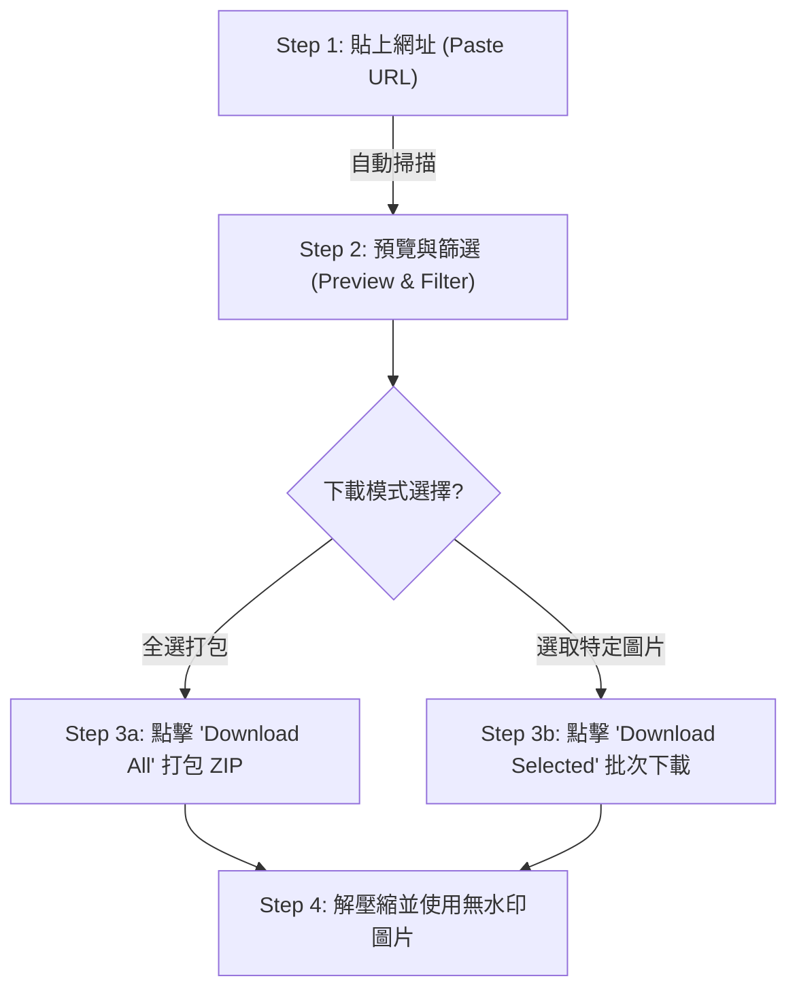

# Image Extraction：「抓圖神器」免安裝 一鍵下載網頁整頁圖片

## 核心觀點
在進行簡報製作、撰寫文章、經營社群（IG/FB）或部落格時，常需從特定網頁下載大量圖片素材。**Image Extraction** 是一個**免費、免安裝**的網頁圖片下載服務，使用者只需輸入目標網頁 URL，系統便會自動掃描、提取頁面上所有圖片，並支援一鍵打包下載，大幅提升圖片素材收集效率。

---

## 🛠️ Image Extraction 核心特色與使用步驟

### 核心特色
1. **完全免費且免安裝**：直接透過網頁端使用，不需下載瀏覽器外掛或執行檔，安全省時。
2. **優先顯示高解析度**：掃描時會自動偵測圖片的多種版本，並優先提供高解析度 (High-Res) 版本。
3. **無浮水印**：下載後的圖片保持原始狀態，無任何浮水印。
4. **多格式支援**：支援 JPEG、PNG、GIF、SVG、WebP 等多種網頁常見圖片格式。
5. **詳細資訊透明**：可預覽每張圖片的檔名、大小、尺寸及格式，支援單張下載或複製圖片原始連結。

---

### 使用步驟 SOP

*   **Step 1：貼上網址**：進入 [Image Extraction](https://www.imageextraction.com/home) 網站後，直接將目標網頁 URL 貼入輸入框，系統即自動掃描圖片。
*   **Step 2：預覽與篩選**：掃描完成後，頁面會列出所有提取到的圖片，可根據需要進行尺寸預覽與格式篩選。
*   **Step 3：選擇下載模式**：
    *   **一鍵打包**：點擊 `Download All` 一鍵將整頁圖片打包為 `.zip` 壓縮檔下載。
    *   **勾選下載**：逐一勾選需要的圖片，再點擊 `Download Selected` 下載指定目標。
*   **Step 4：查看細節**：單獨點擊圖片可查看檔名、大小、格式，亦可複製圖片的 Direct URL 連結。

---

## 雙向連結與延伸閱讀
*   **網頁多圖批次下載與 ChatGPT 應用**：[[ChatGPT-圖片下載腳本|ChatGPT 圖片一次下載腳本]] / [ChatGPT 圖片一次下載腳本](file:///i:/Mark/my-kb/cards/ChatGPT-圖片下載腳本.md) ——若您使用 ChatGPT 生成了多張 DALL-E 圖片，可利用此瀏覽器腳本一鍵打包下載，與 Image Extraction 在不同場景下互補。
*   **視覺化簡報生成工作流**：[[Manus-AI-Agent實戰教學|Manus AI Agent 實戰簡報網站教學]] / [Manus AI Agent 實戰教學](file:///i:/Mark/my-kb/cards/Manus-AI-Agent實戰教學.md) ——當使用 Manus 生成高端專業研究簡報或視覺簡報時，可先利用 Image Extraction 下載參考網頁的高解析配圖作為簡報素材。
*   **個人知識庫母筆記**：[[LLM-Wiki-筆記術|LLM Wiki 個人知識庫筆記術]] / [LLM Wiki 個人知識庫筆記術](file:///i:/Mark/my-kb/wiki/AI%E5%B7%A5%E5%85%B7/LLM-Wiki-%E7%AD%86%E8%A8%98%E8%A1%93.md) ——本卡片將作為「網頁素材高效收集工具案例」，回填更新至永久 Wiki 母筆記中。
