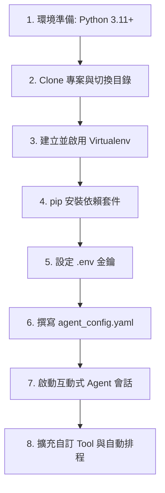

# OpenCode AI Agent 地端部署與自訂工具實戰

本卡片記錄基於開源框架 **OpenCode** 打造免月費、可離線/地端執行連續任務之 AI Agent 的架構原理與部署流程。

---

## 🧠 Harness Engineering 架構解密
三師爸將 AI Agent 架構以 **電腦實體硬體** 進行比喻，以便理解資源調度與執行環境：
*   **CPU** ➔ **LLM 核心模型**：負責邏輯思考與推理決策（例如 gpt-4o-mini 或 gemini-1.5-flash）。
*   **記憶體 (RAM)** ➔ **Context Window / Vector Database**：負責即時上下文與歷史會話狀態。
*   **作業系統 (OS)** ➔ **Agent 核心調度器 (Prompt-Engine + Task-Scheduler)**：調度工具、排程任務並管理生命週期。
*   **周邊設備 (Peripherals)** ➔ **Tool-Registry (工具註冊表)**：外接網路搜尋（Web Search）、代碼執行器（Python Executor）等。

---

## 🛠️ 地端部署 8 步驟 SOP



### 1. 安裝環境與 clone 專案
確保本機已安裝 Python 3.11+，執行以下指令下載專案：
```bash
git clone https://github.com/opencode-org/OpenCode.git
cd OpenCode
```

### 2. 虛擬環境與套件安裝
建議使用隔離的虛擬環境安裝依賴，避免套件衝突：
```bash
python -m venv .venv
.\.venv\Scripts\activate   # Windows 系統
# source .venv/bin/activate  # macOS/Linux 系統

pip install -r requirements.txt
```

### 3. 設定 API 金鑰
於專案根目錄新增 `.env` 檔案並填入對應的 LLM 提供商 Key：
```env
OPENAI_API_KEY=sk-your_openai_key_here
GEMINI_API_KEY=AIzaSy_your_gemini_key_here
```

### 4. 撰寫 Agent 配置檔
建立 `agent_config.yaml` 檔以定義代理人名稱、使用的模型以及外接工具：
```yaml
name: "LocalFreeAgent"
model: "gpt-4o-mini"   # 可動態切換為 "gemini-1.5-flash"
tools:
  - name: web_search
    description: "使用 Bing 搜尋最新即時網路資訊"
  - name: python_executor
    description: "本地隔離執行 Python 程式碼，適合運算與資料整理"
```

### 5. 啟動與除錯
執行啟動命令開啟交互會話，開發期建議加上 `--debug` 參數查看多輪決策鏈（ReAct Loop）：
```bash
python -m opencode.run agent_config.yaml --debug
```

---

## 🚀 自訂工具擴充 (Custom Tool-Registry)
當預設工具無法滿足需求時，可在 `opencode/tools/` 目錄下新增自訂 Python 腳本，實作 `ToolBase` 介面：
1.  **類別宣告**：繼承基礎工具類別。
2.  **型態標註**：精準撰寫方法之 docstring 與參數型態標註（這是 LLM 進行 Tool-Calling 的關鍵依據）。
3.  **封裝邏輯**：內部可串接本地檔案系統、資料庫或第三方 API。
