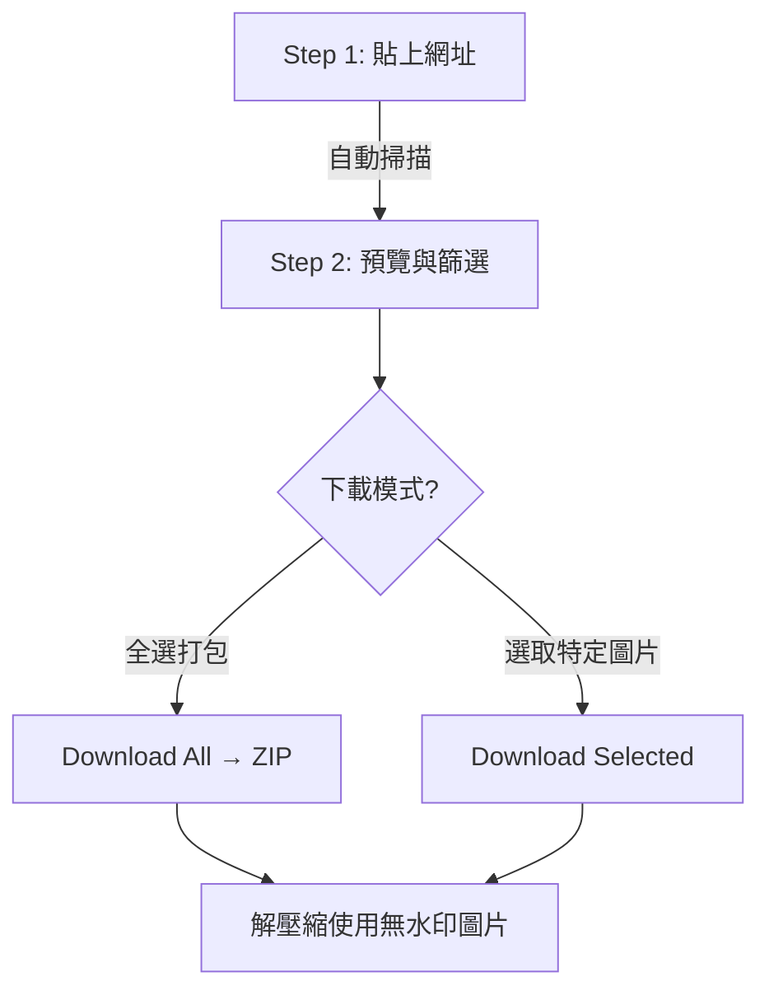

# Image Extraction — 免安裝一鍵抓取網頁整頁圖片

**Image Extraction** 是免費、免安裝的網頁圖片下載服務。輸入目標網頁 URL，系統自動掃描並提取所有圖片，支援一鍵打包下載。適合簡報製作、社群素材收集。

網址：[https://www.imageextraction.com/home](https://www.imageextraction.com/home)

## 核心特色

1. **完全免費且免安裝**：直接網頁端使用
2. **優先顯示高解析度**：自動偵測並提供 High-Res 版本
3. **無浮水印**：下載後保持原始狀態
4. **多格式支援**：JPEG、PNG、GIF、SVG、WebP
5. **詳細資訊透明**：可預覽檔名、大小、尺寸、格式

## 使用步驟 SOP

## 相關筆記

- [ChatGPT & Gemini 圖片下載腳本](file:///i:/Mark/my-kb/wiki/AI工具/ChatGPT-圖片下載腳本.md) — 若需批次下載 AI 生成圖片
- [Manus AI Agent 實戰教學](file:///i:/Mark/my-kb/wiki/AI工具/Manus-AI-Agent實戰教學.md) — 可先用 Image Extraction 抓取參考配圖作為簡報素材
