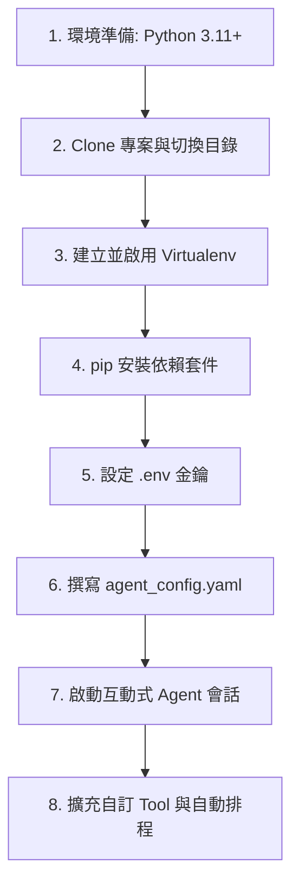

# OpenCode AI Agent 地端部署與自訂工具實戰

基於開源框架 **OpenCode** 打造免月費、可離線執行的地端 AI Agent。

## 架構比喻（Harness Engineering）

| 硬體 | AI 對應概念 |
| :--- | :--- |
| CPU | LLM 核心模型（推理決策） |
| RAM | Context Window / Vector Database |
| 作業系統 | Agent 核心調度器（Prompt-Engine + Task-Scheduler） |
| 周邊設備 | Tool-Registry（網路搜尋、Python 執行器等） |

## 地端部署 8 步驟 SOP



### 關鍵指令

```bash
# Clone 與安裝
git clone https://github.com/opencode-org/OpenCode.git
cd OpenCode
python -m venv .venv
.\.venv\Scripts\activate
pip install -r requirements.txt

# 啟動（Debug 模式可查看 ReAct Loop）
python -m opencode.run agent_config.yaml --debug
```

### agent_config.yaml 範例

```yaml
name: "LocalFreeAgent"
model: "gpt-4o-mini"
tools:
  - name: web_search
    description: "使用 Bing 搜尋最新即時網路資訊"
  - name: python_executor
    description: "本地隔離執行 Python 程式碼"
```

## 自訂工具擴充

在 `opencode/tools/` 下新增 Python 腳本，繼承 `ToolBase` 介面，精準撰寫 docstring 與參數型態標註（這是 LLM 進行 Tool-Calling 的關鍵依據）。

## 相關筆記

- [Codex-Ollama 本地模型串接](file:///i:/Mark/my-kb/wiki/AI工具/Codex-Ollama-本地模型串接.md)
- [用Agent養Agent](file:///i:/Mark/my-kb/wiki/AI工具/用Agent養Agent.md)
