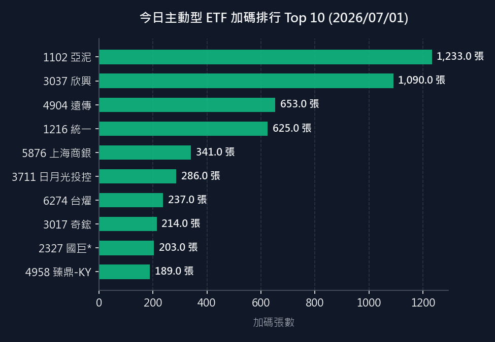
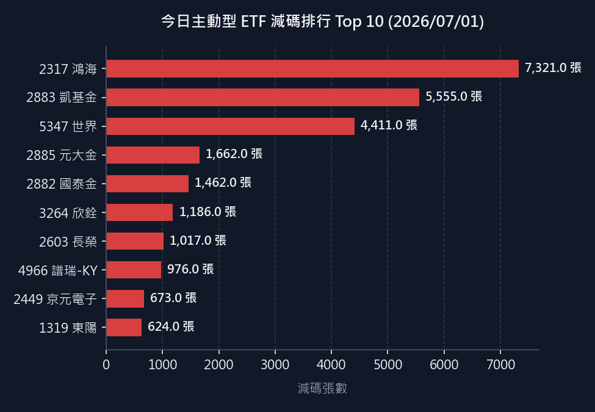

# 主動型 ETF 持股變動

資料來源：`主動型ETF持股明細.xlsx` 最近兩個日期分頁。

比較區間：`20260630` → `20260701`

## 今日加減碼視覺化排行

| 今日加碼 Top 10 | 今日減碼 Top 10 |
| :---: | :---: |
|  |  |

## 00400A

### 新增持股

- 無

### 刪除持股

- 2472 立隆電（0.19%，108 張）

### 投資比例變動

- 1303 南亞：1.20% → 1.29%（+0.09）
- 1519 華城：0.72% → 0.68%（-0.04）
- 1590 亞德客-KY：1.01% → 1.02%（+0.01）
- 2059 川湖：2.25% → 2.29%（+0.04）
- 2303 聯電：1.91% → 1.92%（+0.01）
- 2313 華通：0.50% → 0.46%（-0.04）
- 2327 國巨*：4.02% → 3.93%（-0.09）
- 2330 台積電：7.29% → 7.41%（+0.12）
- 2344 華邦電：1.51% → 1.35%（-0.16）
- 2345 智邦：2.22% → 2.32%（+0.10）
- 2357 華碩：1.32% → 1.21%（-0.11）
- 2360 致茂：3.43% → 3.52%（+0.09）
- 2368 金像電：1.80% → 1.79%（-0.01）
- 2376 技嘉：1.24% → 1.19%（-0.05）
- 2382 廣達：0.96% → 0.95%（-0.01）
- 2383 台光電：7.03% → 7.06%（+0.03）
- 2404 漢唐：0.65% → 0.63%（-0.02）
- 2408 南亞科：2.16% → 1.97%（-0.19）
- 2454 聯發科：7.33% → 7.32%（-0.01）
- 2481 強茂：0.40% → 0.42%（+0.02）
- 2881 富邦金：0.42% → 0.38%（-0.04）
- 2885 元大金：1.03% → 1.02%（-0.01）
- 3017 奇鋐：3.95% → 4.00%（+0.05）
- 3036 文曄：1.26% → 1.21%（-0.05）
- 3037 欣興：3.57% → 4.28%（+0.71）
- 3044 健鼎：2.10% → 2.01%（-0.09）
- 3090 日電貿：0.76% → 0.73%（-0.03）
- 3231 緯創：0.87% → 0.86%（-0.01）
- 3293 鈊象：0.41% → 0.42%（+0.01）
- 3374 精材：0.30% → 0.32%（+0.02）
- 3653 健策：0.85% → 0.82%（-0.03）
- 3665 貿聯-KY：0.80% → 0.83%（+0.03）
- 3711 日月光投控：1.62% → 1.64%（+0.02）
- 5274 信驊：2.20% → 2.24%（+0.04）
- 5347 世界：2.29% → 2.12%（-0.17）
- 5434 崇越：0.43% → 0.41%（-0.02）
- 6121 新普：0.29% → 0.28%（-0.01）
- 6147 頎邦：1.02% → 1.04%（+0.02）
- 6187 萬潤：0.60% → 0.62%（+0.02）
- 6223 旺矽：4.09% → 4.40%（+0.31）
- 6274 台燿：0.80% → 0.79%（-0.01）
- 6285 啟碁：0.74% → 0.70%（-0.04）
- 6488 環球晶：3.37% → 3.62%（+0.25）
- 6510 精測：0.83% → 0.88%（+0.05）
- 6515 穎崴：0.38% → 0.41%（+0.03）
- 6669 緯穎：2.55% → 2.71%（+0.16）
- 7769 鴻勁：0.33% → 0.35%（+0.02）
- 8046 南電：0.31% → 0.30%（-0.01）
- 8210 勤誠：1.26% → 1.24%（-0.02）

## 00401A

### 新增持股

- 無

### 刪除持股

- 1216 統一（0.33%，139 張）
- 1301 台塑（0.07%，44 張）
- 2609 陽明（0.02%，13 張）
- 2615 萬海（0.06%，24 張）
- 2890 永豐金（0.31%，254 張）
- 2912 統一超（0.31%，44 張）
- 3005 神基（0.19%，61 張）
- 3231 緯創（0.34%，71 張）
- 3665 貿聯-KY（0.18%，3 張）
- 4938 和碩（0.33%，128 張）

### 投資比例變動

- 2308 台達電：4.38% → 4.42%（+0.04）
- 2313 華通：1.21% → 1.17%（-0.04）
- 2317 鴻海：0.72% → 0.70%（-0.02）
- 2330 台積電：8.90% → 9.10%（+0.20）
- 2344 華邦電：1.61% → 1.45%（-0.16）
- 2345 智邦：1.53% → 1.68%（+0.15）
- 2357 華碩：1.33% → 1.20%（-0.13）
- 2360 致茂：2.07% → 2.18%（+0.11）
- 2368 金像電：0.47% → 0.48%（+0.01）
- 2379 瑞昱：2.21% → 2.26%（+0.05）
- 2382 廣達：2.40% → 2.36%（-0.04）
- 2383 台光電：2.39% → 2.34%（-0.05）
- 2412 中華電：1.02% → 0.98%（-0.04）
- 2449 京元電子：1.78% → 1.85%（+0.07）
- 2454 聯發科：6.31% → 6.77%（+0.46）
- 2455 全新：0.47% → 0.48%（+0.01）
- 2603 長榮：1.02% → 1.00%（-0.02）
- 2881 富邦金：1.61% → 1.48%（-0.13）
- 2882 國泰金：1.93% → 1.49%（-0.44）
- 2883 凱基金：2.10% → 1.93%（-0.17）
- 2884 玉山金：1.88% → 1.74%（-0.14）
- 2885 元大金：1.86% → 1.81%（-0.05）
- 2886 兆豐金：0.50% → 0.48%（-0.02）
- 2887 台新新光金：1.07% → 1.05%（-0.02）
- 2891 中信金：2.45% → 2.38%（-0.07）
- 3034 聯詠：0.83% → 0.82%（-0.01）
- 3037 欣興：0.76% → 0.78%（+0.02）
- 3044 健鼎：1.52% → 1.49%（-0.03）
- 3167 大量：0.84% → 0.88%（+0.04）
- 3491 昇達科：1.22% → 1.13%（-0.09）
- 3529 力旺：0.54% → 0.53%（-0.01）
- 3653 健策：1.13% → 1.12%（-0.01）
- 3711 日月光投控：2.43% → 2.64%（+0.21）
- 4904 遠傳：0.96% → 0.91%（-0.05）
- 4958 臻鼎-KY：2.63% → 2.68%（+0.05）
- 4991 環宇-KY：0.67% → 0.73%（+0.06）
- 5274 信驊：0.94% → 1.03%（+0.09）
- 5347 世界：1.28% → 1.21%（-0.07）
- 5871 中租-KY：0.79% → 0.54%（-0.25）
- 5904 寶雅：0.59% → 0.61%（+0.02）
- 6187 萬潤：0.67% → 0.70%（+0.03）
- 6223 旺矽：2.45% → 2.61%（+0.16）
- 6285 啟碁：1.99% → 2.03%（+0.04）
- 6415 矽力*-KY：0.95% → 0.90%（-0.05）
- 6510 精測：0.94% → 0.99%（+0.05）
- 6515 穎崴：0.75% → 0.80%（+0.05）
- 6531 愛普*：1.61% → 1.53%（-0.08）
- 6669 緯穎：2.28% → 2.42%（+0.14）
- 6944 兆聯實業：0.55% → 0.52%（-0.03）
- 7769 鴻勁：2.78% → 2.92%（+0.14）
- 7828 創新服務：1.33% → 1.46%（+0.13）
- 8021 尖點：0.36% → 0.37%（+0.01）
- 8464 億豐：1.22% → 1.21%（-0.01）

## 00402A

### 新增持股

- 無

### 刪除持股

- 無

### 投資比例變動

- AAPL.US Apple：6.31% → 6.15%（-0.16）
- AMD.US AMD：5.08% → 5.41%（+0.33）
- AMZN.US Amazon：4.76% → 4.43%（-0.33）
- ANET.US Arista Networks：0.96% → 0.98%（+0.02）
- ARM.US Arm：0.97% → 0.99%（+0.02）
- ASML.US ASML Holding：1.51% → 1.58%（+0.07）
- AXON.US Axon Enterprise：0.84% → 0.91%（+0.07）
- BKNG.US Booking Holdings：0.71% → 0.69%（-0.02）
- CIEN.US Ciena：1.43% → 1.45%（+0.02）
- CLS.US Celestica：0.80% → 0.84%（+0.04）
- COHR.US Coherent：1.71% → 1.70%（-0.01）
- CRWD.US CrowdStrike Holdings：1.22% → 1.24%（+0.02）
- DASH.US DoorDash：0.81% → 0.80%（-0.01）
- GOOG.US Alphabet - Class C Capital Stock：3.32% → 3.30%（-0.02）
- GOOGL.US Alphabet - Class A Common Stock：3.55% → 3.54%（-0.01）
- INTC.US Intel：1.45% → 1.52%（+0.07）
- KLAC.US KLA：2.45% → 2.63%（+0.18）
- LRCX.US Lam Research：4.03% → 4.20%（+0.17）
- MCHP.US Microchip Technology：1.55% → 1.57%（+0.02）
- MDB.US MongoDB：0.56% → 0.55%（-0.01）
- META.US Meta：2.69% → 2.54%（-0.15）
- MRVL.US Marvell：1.67% → 1.77%（+0.10）
- MSFT.US Microsoft：3.10% → 3.11%（+0.01）
- MU.US Micron：7.45% → 7.43%（-0.02）
- NFLX.US Netflix：1.34% → 1.28%（-0.06）
- NOW.US ServiceNow：0.48% → 0.47%（-0.01）
- NVDA.US NVIDIA：7.68% → 7.80%（+0.12）
- ON.US ON Semiconductor：0.25% → 0.27%（+0.02）
- PANW.US Palo Alto：3.07% → 3.12%（+0.05）
- SHOP.US Shopify：0.68% → 0.67%（-0.01）
- SIMO.US Silicon Motion：0.69% → 0.68%（-0.01）
- SPOT.US Spotify：0.44% → 0.43%（-0.01）
- STX.US Seagate：1.41% → 1.39%（-0.02）
- TER.US Teradyne：0.74% → 0.77%（+0.03）
- TSM.US TSMC(ADR)：1.53% → 1.59%（+0.06）
- TXN.US Texas Instruments：2.60% → 2.68%（+0.08）
- UBER.US Uber：0.60% → 0.56%（-0.04）
- V.US Visa：1.35% → 1.34%（-0.01）
- WDC.US Western Digital：3.04% → 2.95%（-0.09）

## 00403A

### 新增持股

- 無

### 刪除持股

- 無

### 投資比例變動

- 1303 南亞：0.73% → 0.79%（+0.06）
- 1560 中砂：0.40% → 0.44%（+0.04）
- 2049 上銀：0.19% → 0.20%（+0.01）
- 2303 聯電：7.15% → 7.27%（+0.12）
- 2308 台達電：2.75% → 2.77%（+0.02）
- 2317 鴻海：0.47% → 0.46%（-0.01）
- 2327 國巨*：6.64% → 6.57%（-0.07）
- 2330 台積電：18.03% → 18.39%（+0.36）
- 2337 旺宏：0.90% → 0.82%（-0.08）
- 2344 華邦電：4.67% → 4.23%（-0.44）
- 2345 智邦：3.04% → 3.20%（+0.16）
- 2360 致茂：0.56% → 0.59%（+0.03）
- 2368 金像電：1.91% → 1.92%（+0.01）
- 2383 台光電：3.75% → 3.62%（-0.13）
- 2454 聯發科：3.53% → 3.57%（+0.04）
- 3017 奇鋐：4.95% → 5.18%（+0.23）
- 3037 欣興：5.56% → 5.34%（-0.22）
- 3189 景碩：1.66% → 1.64%（-0.02）
- 3443 創意：1.26% → 1.30%（+0.04）
- 3533 嘉澤：1.52% → 1.54%（+0.02）
- 3653 健策：1.65% → 1.62%（-0.03）
- 3665 貿聯-KY：0.18% → 0.19%（+0.01）
- 3711 日月光投控：1.97% → 2.14%（+0.17）
- 4958 臻鼎-KY：2.35% → 2.23%（-0.12）
- 4966 譜瑞-KY：0.33% → 0.32%（-0.01）
- 4979 華星光：0.08% → 0.03%（-0.05）
- 5274 信驊：0.43% → 0.44%（+0.01）
- 5347 世界：1.24% → 0.65%（-0.59）
- 6147 頎邦：0.43% → 0.44%（+0.01）
- 6196 帆宣：0.32% → 0.33%（+0.01）
- 6223 旺矽：3.32% → 3.61%（+0.29）
- 6274 台燿：1.66% → 1.65%（-0.01）
- 6415 矽力*-KY：0.31% → 0.30%（-0.01）
- 6442 光聖：0.29% → 0.27%（-0.02）
- 6488 環球晶：1.17% → 1.27%（+0.10）
- 6515 穎崴：0.94% → 1.02%（+0.08）
- 6669 緯穎：2.12% → 2.28%（+0.16）
- 7769 鴻勁：1.05% → 1.11%（+0.06）
- 8046 南電：0.55% → 0.54%（-0.01）
- 8358 金居：0.68% → 0.66%（-0.02）
- 8996 高力：1.40% → 1.39%（-0.01）

## 00404A

### 新增持股

- 無

### 刪除持股

- 無

### 投資比例變動

- 無

## 00405A

### 新增持股

- 無

### 刪除持股

- 無

### 投資比例變動

- 2049 上銀：0.36% → 0.03%（-0.33）
- 2059 川湖：1.25% → 1.29%（+0.04）
- 2327 國巨*：5.52% → 5.79%（+0.27）
- 2330 台積電：2.37% → 2.40%（+0.03）
- 2337 旺宏：1.85% → 1.61%（-0.24）
- 2344 華邦電：5.00% → 4.48%（-0.52）
- 2345 智邦：4.49% → 4.99%（+0.50）
- 2360 致茂：1.26% → 1.32%（+0.06）
- 2368 金像電：1.46% → 1.48%（+0.02）
- 2383 台光電：2.50% → 2.44%（-0.06）
- 2408 南亞科：0.09% → 0.08%（-0.01）
- 2449 京元電子：1.02% → 1.05%（+0.03）
- 2454 聯發科：7.02% → 7.46%（+0.44）
- 3017 奇鋐：4.64% → 6.64%（+2.00）
- 3037 欣興：4.85% → 5.37%（+0.52）
- 3081 聯亞：1.22% → 1.14%（-0.08）
- 3105 穩懋：2.09% → 2.03%（-0.06）
- 3131 弘塑：4.86% → 4.83%（-0.03）
- 3264 欣銓：1.02% → 0.03%（-0.99）
- 3443 創意：2.47% → 3.72%（+1.25）
- 3533 嘉澤：0.08% → 0.01%（-0.07）
- 3583 辛耘：2.17% → 2.19%（+0.02）
- 3653 健策：2.50% → 2.45%（-0.05）
- 3711 日月光投控：0.85% → 0.91%（+0.06）
- 4979 華星光：0.91% → 0.86%（-0.05）
- 5274 信驊：2.10% → 2.26%（+0.16）
- 5347 世界：0.18% → 0.17%（-0.01）
- 6187 萬潤：2.26% → 2.36%（+0.10）
- 6223 旺矽：5.77% → 6.11%（+0.34）
- 6274 台燿：0.44% → 0.45%（+0.01）
- 6291 沛亨：0.54% → 0.47%（-0.07）
- 6442 光聖：1.00% → 0.44%（-0.56）
- 6510 精測：1.71% → 1.78%（+0.07）
- 6515 穎崴：0.80% → 0.82%（+0.02）
- 6526 達發：0.39% → 0.41%（+0.02）
- 7734 印能科技：1.95% → 1.96%（+0.01）
- 7769 鴻勁：2.67% → 2.79%（+0.12）
- 8028 昇陽半導體：1.07% → 1.11%（+0.04）
- 8046 南電：2.57% → 2.68%（+0.11）
- 8210 勤誠：2.38% → 2.43%（+0.05）
- 8299 群聯：1.71% → 1.59%（-0.12）
- 8996 高力：1.74% → 1.76%（+0.02）

## 00407A

### 新增持股

- 無

### 刪除持股

- 無

### 投資比例變動

- 1303 南亞：0.52% → 0.57%（+0.05）
- 1590 亞德客-KY：1.75% → 1.80%（+0.05）
- 2059 川湖：1.88% → 1.95%（+0.07）
- 2303 聯電：1.90% → 1.95%（+0.05）
- 2308 台達電：4.16% → 4.23%（+0.07）
- 2327 國巨*：3.23% → 3.21%（-0.02）
- 2330 台積電：9.09% → 9.41%（+0.32）
- 2344 華邦電：2.12% → 1.93%（-0.19）
- 2345 智邦：3.43% → 3.64%（+0.21）
- 2360 致茂：1.97% → 2.06%（+0.09）
- 2368 金像電：2.31% → 2.34%（+0.03）
- 2376 技嘉：0.74% → 0.72%（-0.02）
- 2379 瑞昱：0.85% → 0.87%（+0.02）
- 2395 研華：1.57% → 1.60%（+0.03）
- 2408 南亞科：1.82% → 1.69%（-0.13）
- 2412 中華電：1.74% → 1.73%（-0.01）
- 2451 創見：0.16% → 0.15%（-0.01）
- 2454 聯發科：7.22% → 7.34%（+0.12）
- 2458 義隆：0.12% → 0.11%（-0.01）
- 3017 奇鋐：3.00% → 3.10%（+0.10）
- 3037 欣興：2.78% → 2.70%（-0.08）
- 3260 威剛：0.18% → 0.17%（-0.01）
- 3293 鈊象：0.60% → 0.62%（+0.02）
- 3443 創意：2.05% → 2.13%（+0.08）
- 3491 昇達科：0.44% → 0.42%（-0.02）
- 3529 力旺：1.91% → 1.92%（+0.01）
- 3533 嘉澤：0.89% → 0.91%（+0.02）
- 3665 貿聯-KY：1.96% → 2.05%（+0.09）
- 3711 日月光投控：2.05% → 2.11%（+0.06）
- 4904 遠傳：0.32% → 0.31%（-0.01）
- 4958 臻鼎-KY：2.43% → 2.31%（-0.12）
- 5274 信驊：1.98% → 2.05%（+0.07）
- 5536 聖暉*：2.04% → 2.11%（+0.07）
- 6223 旺矽：2.36% → 2.58%（+0.22）
- 6415 矽力*-KY：0.47% → 0.46%（-0.01）
- 6446 藥華藥：2.34% → 2.37%（+0.03）
- 6515 穎崴：1.68% → 1.84%（+0.16）
- 6526 達發：0.35% → 0.37%（+0.02）
- 6531 愛普*：1.68% → 1.61%（-0.07）
- 6669 緯穎：1.96% → 2.12%（+0.16）
- 6805 富世達：1.80% → 1.81%（+0.01）
- 8046 南電：2.37% → 2.34%（-0.03）
- 8210 勤誠：1.91% → 1.92%（+0.01）
- 8299 群聯：0.17% → 0.16%（-0.01）

## 00980A

### 新增持股

- 無

### 刪除持股

- 無

### 投資比例變動

- 2059 川湖：4.65% → 4.75%（+0.10）
- 2308 台達電：5.38% → 5.33%（-0.05）
- 2317 鴻海：1.88% → 1.80%（-0.08）
- 2327 國巨*：2.13% → 2.22%（+0.09）
- 2330 台積電：8.93% → 8.96%（+0.03）
- 2344 華邦電：1.39% → 1.24%（-0.15）
- 2345 智邦：1.81% → 1.95%（+0.14）
- 2360 致茂：1.77% → 1.83%（+0.06）
- 2376 技嘉：0.82% → 0.81%（-0.01）
- 2382 廣達：1.16% → 1.11%（-0.05）
- 2383 台光電：4.34% → 4.18%（-0.16）
- 2408 南亞科：1.53% → 1.35%（-0.18）
- 2454 聯發科：6.25% → 6.58%（+0.33）
- 2884 玉山金：0.79% → 0.72%（-0.07）
- 2891 中信金：1.19% → 1.13%（-0.06）
- 3008 大立光：0.91% → 0.85%（-0.06）
- 3017 奇鋐：1.79% → 1.94%（+0.15）
- 3036 文曄：1.33% → 1.27%（-0.06）
- 3037 欣興：3.26% → 3.30%（+0.04）
- 3044 健鼎：0.49% → 0.47%（-0.02）
- 3081 聯亞：2.61% → 2.41%（-0.20）
- 3189 景碩：0.67% → 0.70%（+0.03）
- 3231 緯創：0.64% → 0.63%（-0.01）
- 3264 欣銓：0.22% → 0.23%（+0.01）
- 3443 創意：1.84% → 1.99%（+0.15）
- 3529 力旺：1.03% → 1.00%（-0.03）
- 3653 健策：2.98% → 2.90%（-0.08）
- 3711 日月光投控：1.49% → 1.59%（+0.10）
- 5274 信驊：1.17% → 1.26%（+0.09）
- 5904 寶雅：1.18% → 1.20%（+0.02）
- 6223 旺矽：2.74% → 2.87%（+0.13）
- 6274 台燿：1.20% → 1.24%（+0.04）
- 6442 光聖：0.35% → 0.33%（-0.02）
- 6515 穎崴：2.62% → 2.76%（+0.14）
- 6669 緯穎：1.06% → 1.11%（+0.05）
- 6831 邁科：0.39% → 0.42%（+0.03）
- 7769 鴻勁：3.53% → 3.65%（+0.12）
- 8046 南電：1.41% → 1.45%（+0.04）
- 8210 勤誠：0.81% → 0.82%（+0.01）
- 8299 群聯：1.10% → 1.01%（-0.09）

## 00980D

### 新增持股

- AHOLD FINANCE USA LLC 6.88% 01MAY2029（0.48%，N/A 張）
- ALLY FINANCIAL INC (REG) VAR 13JUN2029（0.55%，N/A 張）
- ARSENAL AIC PARENT LLC SER REGS 11.5 % 01-OCT-2031（0.32%，N/A 張）
- AVIANCA MIDCO 2 PLC SER REGS 9.625000 % 14FEB2030（0.31%，N/A 張）
- BLUE OWL CREDIT INCOME 7.750000 % 15JAN2029（0.53%，N/A 張）
- BLUE OWL CREDIT INCOME 7.950000 % 13JUN2028（0.53%，N/A 張）
- BOSTON PROPERTIES LP (REG) 6.750000 % 01-DEC-2027（0.46%，N/A 張）
- BPCE SA SER REGS VAR 14JAN2046（0.41%，N/A 張）
- BPCE SA SER REGS VAR 19OCT2034（0.43%，N/A 張）
- CALDERYS FINANCING LLC SER REGS (REG S) 11.25% 01JUN2028（0.33%，N/A 張）
- CONCENTRIX CORP (REG) 6.85% 02AUG2033（0.65%，N/A 張）
- COX COMMUNICATIONS INC SER REGS 5.800000 % 15DEC2053（0.41%，N/A 張）
- DELL INT LLC / EMC CORP (REG) 8.35% 15JUL2046（0.57%，N/A 張）
- DISCOVER FINANCIAL SVS (REG) VAR 02NOV2034（0.64%，N/A 張）
- DOW CHEMICAL CO/THE (REG) 5.55% 30NOV2048（0.56%，N/A 張）
- EDISON INTERNATIONAL (REG) 6.95% 15NOV2029（0.58%，N/A 張）
- EG GLOBAL FINANCE PLC SER REGS (REG S) 12% 30NOV2028（0.33%，N/A 張）
- ENBRIDGE ENERGY PARTNERS (REG) 7.375% 15OCT2045（0.53%，N/A 張）
- FORD MOTOR CREDIT CO LLC (REG) 7.35% 04NOV2027（0.33%，N/A 張）
- FREEDOM MORTGAGE CORP SER REGS (REG S) 12.25% 01OCT2030（0.47%，N/A 張）
- GENERAL MOTORS CO (REG) 6.75% 01APR2046（0.57%，N/A 張）
- GLOBAL AUTO HO/AAG FH UK SER REGS (REG S) 11.5% 15AUG2029（0.36%，N/A 張）
- GLOBAL AUTO HO/AAG FH UK SER REGS (REG S) 8.75% 15JAN2032（0.41%，N/A 張）
- GRAY TELEVISION INC SER REGS (REG) (REG S) 10.5% 15JUL2029（0.57%，N/A 張）
- HA SUSTAINABLE INF CAP (REG) 6.375% 01JUL2034（0.35%，N/A 張）
- HPS CORPORATE LENDING FU 6.750000 % 30JAN2029（0.53%，N/A 張）
- HSBC HOLDINGS PLC VAR 03NOV2028（0.33%，N/A 張）
- JBS USA/FOOD/FINANCE (REG) 6.5% 01DEC2052（0.47%，N/A 張）
- LPL HOLDINGS INC (REG) 6.75% 17NOV2028（0.56%，N/A 張）
- META PLATFORMS INC 5.750000 % 15-NOV-2065（0.46%，N/A 張）
- ORACLE CORP 5.55% 06FEB2053（0.26%，N/A 張）
- ORACLE CORP 5.950000 % 26-SEP-2055（0.43%，N/A 張）
- ORACLE CORP 6.000000 % 03AUG2055（0.32%，N/A 張）
- PEPSICO INC (REG) 7.000000 % 01MAR2029（0.31%，N/A 張）
- RIO TINTO FIN USA LTD (REG) 7.125% 15JUL2028（0.56%，N/A 張）
- SABRE GLBL INC SER REGS (REG) 10.750000 % 15NOV2029（0.13%，N/A 張）
- SALESFORCE INC (REG) 6.7% 15MAR2066（0.53%，N/A 張）
- SANTOS FINANCE LTD SER REGS (REG S) 6.875% 19SEP2033（0.29%，N/A 張）
- SPRINT CAPITAL CORP (REG) 6.875% 15NOV2028（0.31%，N/A 張）
- STAPLES INC SER REGS (REG S) 10.75% 01SEP2029（0.44%，N/A 張）
- SYMETRA LIFE INSURANCE SER REGS 6.550000 % 01OCT2055（0.32%，N/A 張）
- TIME WARNER CABLE INC REG 7.3% 01JUL2038（0.31%，N/A 張）
- TIME WARNER CABLE LLC (REG) 6.75% 15JUN2039（0.31%，N/A 張）
- TRANSCANADA PIPELINES LTD 7.625PCT 15/01/2039（0.54%，N/A 張）
- VIACOM INC (REG) 5.85% 01SEP2043（0.58%，N/A 張）

### 刪除持股

- ALLY FINANCIAL INC (REG) 8% 01/11/2031（0.58%，N/A 張）
- AMC GLOBAL MEDIA INC SER REGS (REG) (REG S) 10.5% 15JUL2032（0.69%，N/A 張）
- APOLLO DEBT SOLUTIONS BD 6.900000 % 13APR2029（0.54%，N/A 張）
- ARCELORMITTAL SA 6.55% 29NOV2027（0.54%，N/A 張）
- BANCO SANTANDER SA (REG) 6.607% 07NOV2028（0.66%，N/A 張）
- CHARTER COMM OPT LLC/CAP 6.700000 % 01-DEC-2055（0.49%，N/A 張）
- CHS/COMMUNITY HEALTH SYS SER REGS 9.750000 % 15JAN2034（0.34%，N/A 張）
- CITIGROUP INC 8.125% 15JUL2039（0.64%，N/A 張）
- COTY/HFC PRESTIGE/INT US SER REGS (REG S) 6.625% 15JUL2030（0.55%，N/A 張）
- DELL INT LLC / EMC CORP (REG) 8.1% 15JUL2036（0.59%，N/A 張）
- DEUTSCHE TELEKOM INT FIN (REG) 8.75% 15JUN2030（0.41%，N/A 張）
- DEVON ENERGY CORPORATION (REG) 7.875% 30SEP2031（0.47%，N/A 張）
- DOW CHEMICAL CO/THE 7.375% 01NOV2029（0.60%，N/A 張）
- DOW CHEMICAL CO/THE 9.4% 15MAY2039（0.54%，N/A 張）
- ENEL FINANCE INTL NV SER REGS (REG S) 7.75% 14OCT2052（0.38%，N/A 張）
- FIFTH THIRD BANCORP (REG) 8.25% 01MAR2038（0.66%，N/A 張）
- FORD MOTOR COMPANY (REG) 7.45% 16JUL2031（0.47%，N/A 張）
- FORD MOTOR CREDIT CO LLC (REG) 7.35% 06MAR2030（0.33%，N/A 張）
- GEORGIA-PACIFIC LLC (REG) 7.75% 15NOV2029（0.57%，N/A 張）
- HORIZON MUTUAL HOLDINGS SER REGS 6.200000 % 15NOV2034（0.33%，N/A 張）
- INTESA SANPAOLO SPA SER REGS (REG) 7.200000 % 28NOV2033（0.35%，N/A 張）
- KELLANOVA SER B (REG) 7.450000 % 01APR2031（0.57%，N/A 張）
- LINCOLN NATIONAL CORP (REG) 7.000000 % 15JUN2040（0.47%，N/A 張）
- M&T BANK CORPORATION (REG) VAR 30OCT2029（0.53%，N/A 張）
- NATIONWIDE MUTUAL INSUR 9.375% 15AUG2039（0.53%，N/A 張）
- ORACLE CORP 6.100000 % 26-SEP-2065（0.51%，N/A 張）
- ORACLE CORP 6.125000 % 03AUG2065（0.55%，N/A 張）
- ORACLE CORP 6.9% 09NOV2052（0.55%，N/A 張）
- PROGRESS ENERGY INC (REG) 7.75% 01MAR2031（0.57%，N/A 張）
- SANTANDER HOLDINGS USA VAR 09NOV2031（0.59%，N/A 張）
- SES GLOBAL AMERICAS HLDG SER REGS (REG) 5.300000 % 25MAR2044（0.35%，N/A 張）
- SOCIETE GENERALE SER REGS (REG) (REG S) 7.367% 10JAN2053（0.34%，N/A 張）
- SUNCOR ENERGY INC (REG) 6.85% 01JUN2039（0.34%，N/A 張）
- TIME WARNER ENTERTAINMEN 8.375% 15JUL2033（0.65%，N/A 張）
- TOUCAN FINCO LTD/CAN/US SER REGS 9.500000 % 15MAY2030（0.25%，N/A 張）
- US ACUTE CARE SOLUTIONS SER REGS (REG S) 9.75% 15MAY2029（0.31%，N/A 張）
- VAR ENERGI ASA SER REGS (REG S) 8% 15NOV2032（0.36%，N/A 張）
- VERIZON COMMUNICAT 7.750000 % 01DEC2030（0.44%，N/A 張）
- VIACOMCBS INC (REG) 4.95% 19MAY2050（0.51%，N/A 張）
- VIRGINIA ELEC & POWER CO (REG) 8.875% 15NOV2038（0.59%，N/A 張）
- VISTRA OPERATIONS CO LLC SER REGS (REG S) 6.95% 15OCT2033（0.41%，N/A 張）
- WESTLAKE CORP 6.375000 % 15-NOV-2055（0.53%，N/A 張）

### 投資比例變動

- ALLY FINANCIAL INC (REG) 8% 01NOV2031：0.52% → 0.53%（+0.01）
- APOLLO DEBT SOLUTIONS BD 6.700000 % 29JUL2031：0.33% → 0.34%（+0.01）
- GETTY IMAGES INC SER REGS 11.250000 % 21FEB2030：0.53% → 0.52%（-0.01）

## 00981A

### 新增持股

- 無

### 刪除持股

- 2317 鴻海（0.65%，7307 張）

### 投資比例變動

- 1590 亞德客-KY：0.26% → 0.25%（-0.01）
- 2002 中鋼：0.04% → 0.03%（-0.01）
- 2303 聯電：5.10% → 4.94%（-0.16）
- 2308 台達電：3.84% → 3.77%（-0.07）
- 2327 國巨*：9.37% → 9.66%（+0.29）
- 2330 台積電：10.18% → 10.11%（-0.07）
- 2345 智邦：5.32% → 5.69%（+0.37）
- 2368 金像電：3.45% → 3.42%（-0.03）
- 2383 台光電：8.78% → 8.38%（-0.40）
- 2449 京元電子：0.50% → 0.43%（-0.07）
- 2454 聯發科：7.07% → 7.37%（+0.30）
- 3017 奇鋐：4.29% → 4.59%（+0.30）
- 3037 欣興：5.16% → 5.34%（+0.18）
- 3376 新日興：0.12% → 0.11%（-0.01）
- 3533 嘉澤：0.65% → 0.30%（-0.35）
- 3653 健策：2.70% → 2.60%（-0.10）
- 3665 貿聯-KY：3.26% → 3.28%（+0.02）
- 3711 日月光投控：2.87% → 3.02%（+0.15）
- 4966 譜瑞-KY：0.25% → 0.03%（-0.22）
- 5274 信驊：2.07% → 2.19%（+0.12）
- 5439 高技：0.39% → 0.38%（-0.01）
- 6147 頎邦：0.48% → 0.46%（-0.02）
- 6187 萬潤：0.47% → 0.48%（+0.01）
- 6191 精成科：0.15% → 0.14%（-0.01）
- 6223 旺矽：5.15% → 5.38%（+0.23）
- 6271 同欣電：0.26% → 0.29%（+0.03）
- 6274 台燿：2.82% → 2.94%（+0.12）
- 6488 環球晶：0.11% → 0.13%（+0.02）
- 6510 精測：0.90% → 0.71%（-0.19）
- 6515 穎崴：0.81% → 0.76%（-0.05）
- 6669 緯穎：3.97% → 4.11%（+0.14）
- 6805 富世達：1.06% → 1.04%（-0.02）
- 8046 南電：3.46% → 3.55%（+0.09）
- 8358 金居：0.19% → 0.10%（-0.09）

## 00982A

### 新增持股

- 無

### 刪除持股

- 無

### 投資比例變動

- 1785 光洋科：1.50% → 1.44%（-0.06）
- 2059 川湖：2.54% → 2.59%（+0.05）
- 2303 聯電：2.87% → 2.80%（-0.07）
- 2316 楠梓電：1.38% → 1.36%（-0.02）
- 2327 國巨*：1.72% → 1.79%（+0.07）
- 2330 台積電：9.09% → 9.10%（+0.01）
- 2345 智邦：3.65% → 3.92%（+0.27）
- 2351 順德：0.35% → 0.34%（-0.01）
- 2360 致茂：3.34% → 3.45%（+0.11）
- 2376 技嘉：0.67% → 0.66%（-0.01）
- 2377 微星：1.54% → 1.52%（-0.02）
- 2383 台光電：3.49% → 3.35%（-0.14）
- 2451 創見：0.28% → 0.24%（-0.04）
- 2454 聯發科：6.57% → 6.90%（+0.33）
- 2467 志聖：1.61% → 1.73%（+0.12）
- 2472 立隆電：1.90% → 1.85%（-0.05）
- 2885 元大金：0.27% → 0.26%（-0.01）
- 3008 大立光：1.71% → 1.60%（-0.11）
- 3017 奇鋐：1.83% → 1.97%（+0.14）
- 3036 文曄：0.93% → 0.89%（-0.04）
- 3105 穩懋：3.33% → 3.19%（-0.14）
- 3264 欣銓：1.94% → 1.98%（+0.04）
- 3376 新日興：0.14% → 0.13%（-0.01）
- 3491 昇達科：2.47% → 2.25%（-0.22）
- 3583 辛耘：1.87% → 1.86%（-0.01）
- 3702 大聯大：1.10% → 1.09%（-0.01）
- 3711 日月光投控：1.23% → 1.30%（+0.07）
- 4958 臻鼎-KY：3.52% → 3.50%（-0.02）
- 5274 信驊：0.27% → 0.28%（+0.01）
- 5536 聖暉*：9.07% → 9.24%（+0.17）
- 6139 亞翔：5.71% → 5.16%（-0.55）
- 6147 頎邦：0.95% → 0.93%（-0.02）
- 6187 萬潤：0.17% → 0.18%（+0.01）
- 6223 旺矽：3.63% → 3.79%（+0.16）
- 6239 力成：0.42% → 0.43%（+0.01）
- 6257 矽格：2.04% → 2.11%（+0.07）
- 6274 台燿：1.33% → 1.37%（+0.04）
- 6488 環球晶：2.03% → 2.33%（+0.30）
- 6531 愛普*：1.33% → 1.23%（-0.10）
- 6669 緯穎：2.63% → 2.73%（+0.10）
- 7769 鴻勁：1.15% → 1.18%（+0.03）
- 8016 矽創：1.36% → 1.38%（+0.02）

## 00983A

### 新增持股

- 無

### 刪除持股

- 無

### 投資比例變動

- AMD.US AMD：6.22% → 6.77%（+0.55）
- AMZN.US Amazon：2.62% → 2.63%（+0.01）
- AVGO.US Broadcom：0.70% → 0.72%（+0.02）
- BEAM.US Beam Therapeutics：3.86% → 3.83%（-0.03）
- BWXT.US BWX Technologies：0.82% → 0.85%（+0.03）
- CBRS.US Cerebras：0.49% → 0.51%（+0.02）
- CCJ.US Cameco：0.47% → 0.30%（-0.17）
- COIN.US Coinbase：2.27% → 1.93%（-0.34）
- CRCL.US Circle：1.79% → 1.25%（-0.54）
- CRSP.US CRISPR Therapeutics：3.50% → 3.42%（-0.08）
- CRWV.US CoreWeave：2.36% → 2.48%（+0.12）
- DE.US Deere：0.89% → 0.92%（+0.03）
- GOOG.US Alphabet - Class C Capital Stock：1.08% → 1.09%（+0.01）
- GOOGL.US Alphabet - Class A Common Stock：1.43% → 1.46%（+0.03）
- HOOD.US Robinhood Markets：6.11% → 6.09%（-0.02）
- ILMN.US Illumina：2.90% → 2.85%（-0.05）
- JOBY.US Joby Aviation：0.37% → 0.21%（-0.16）
- LLY.US Eli Lilly：1.65% → 1.62%（-0.03）
- META.US Meta：0.38% → 0.20%（-0.18）
- NTLA.US Intellia Therapeutics：3.09% → 3.18%（+0.09）
- NTRA.US Natera：3.38% → 3.41%（+0.03）
- NVDA.US NVIDIA：2.47% → 2.56%（+0.09）
- P.US Everpure：0.25% → 0.28%（+0.03）
- PLTR.US Palantir Technologies：0.47% → 0.48%（+0.01）
- RBLX.US Roblox：1.30% → 1.31%（+0.01）
- SHOP.US Shopify：3.37% → 3.41%（+0.04）
- SPCX.US SpaceX：4.10% → 4.32%（+0.22）
- TEM.US Tempus：4.82% → 4.84%（+0.02）
- TER.US Teradyne：3.20% → 3.37%（+0.17）
- TSLA.US Tesla：9.62% → 9.06%（-0.56）
- TSM.US TSMC(ADR)：4.00% → 4.24%（+0.24）
- TWST.US Twist Bioscience：4.85% → 5.13%（+0.28）
- TXG.US 10x Genomics：4.95% → 5.17%（+0.22）
- VCYT.US Veracyte：2.77% → 2.73%（-0.04）
- XYZ.US Block：2.17% → 2.13%（-0.04）

## 00983D

### 新增持股

- 無

### 刪除持股

- AET 6 5/8 06/15/36（0.73%，N/A 張）
- MCD 6.3 03/01/38（0.74%，N/A 張）

### 投資比例變動

- ATH 6 5/8 05/19/55：0.87% → 0.86%（-0.01）
- BRITEL 9 5/8 12/15/30：1.33% → 1.34%（+0.01）
- C 8 1/8 07/15/39：2.34% → 2.33%（-0.01）
- CMCSA 6.95 08/15/37：1.02% → 1.01%（-0.01）
- CRWV 9 02/01/31：1.32% → 1.33%（+0.01）
- DOW 9.4 05/15/39：1.91% → 1.90%（-0.01）
- DTV 8 7/8 02/01/30：1.55% → 1.56%（+0.01）
- ENBCN 6.7 11/15/53：1.15% → 1.14%（-0.01）
- GM 6 3/4 04/01/46：1.20% → 1.19%（-0.01）
- GTN 10 1/2 07/15/29：1.64% → 1.65%（+0.01）
- HAL 7.45 09/15/39：1.83% → 1.82%（-0.01）
- HPE 6.35 10/15/45：1.01% → 1.00%（-0.01）
- IEP 10 11/15/29：1.47% → 1.48%（+0.01）
- MBGGR 8 1/2 01/18/31：1.29% → 1.30%（+0.01）
- MOHEGN 11 7/8 04/15/31：1.32% → 1.33%（+0.01）
- RAKUTN 11 1/4 02/15/27：1.76% → 1.77%（+0.01）
- TELEFO 8 1/4 09/15/30：0.99% → 1.00%（+0.01）

## 00984A

### 新增持股

- 1216 統一（1.06%，1166 張）
- 1402 遠東新（0.60%，1725 張）
- 2633 台灣高鐵（0.78%，2401 張）
- 4904 遠傳（0.99%，782 張）
- 4958 臻鼎-KY（0.84%，114 張）

### 刪除持股

- 1477 聚陽（0.09%，33 張）
- 1560 中砂（0.13%，14 張）
- 1736 喬山（0.28%，170 張）
- 1795 美時（0.09%，37 張）
- 2006 東和鋼鐵（0.10%，107 張）
- 2049 上銀（0.42%，105 張）
- 2308 台達電（0.34%，14 張）
- 2313 華通（0.13%，47 張）
- 2345 智邦（0.47%，16 張）
- 2347 聯強（0.44%，377 張）
- 2368 金像電（0.29%，20 張）
- 2376 技嘉（0.54%，130 張）
- 2377 微星（0.30%，171 張）
- 2385 群光（0.07%，56 張）
- 2393 億光（0.28%，326 張）
- 2426 鼎元（0.50%，506 張）
- 2451 創見（0.66%，188 張）
- 2455 全新（0.40%，94 張）
- 2464 盟立（0.45%，222 張）
- 2486 一詮（0.88%，310 張）
- 2548 華固（0.24%，183 張）
- 2603 長榮（2.37%，1017 張）
- 2606 裕民（0.08%，109 張）
- 2645 長榮航太（0.36%，166 張）
- 2883 凱基金（2.09%，5555 張）
- 3005 神基（0.09%，69 張）
- 3006 晶豪科（0.47%，166 張）
- 3017 奇鋐（0.18%，6 張）
- 3081 聯亞（0.77%，30 張）
- 3105 穩懋（0.40%，77 張）
- 3131 弘塑（0.59%，13 張）
- 3227 原相（0.26%，89 張）
- 3264 欣銓（0.24%，86 張）
- 3592 瑞鼎（0.24%，72 張）
- 3596 智易（0.09%，38 張）
- 3706 神達（0.32%，288 張）
- 4766 南寶（0.25%，59 張）
- 4919 新唐（0.46%，214 張）
- 4938 和碩（0.65%，627 張）
- 5269 祥碩（0.34%，18 張）
- 5904 寶雅（0.28%，35 張）
- 6116 彩晶（0.59%，2407 張）
- 6121 新普（0.37%，69 張）
- 6147 頎邦（0.73%，272 張）
- 6176 瑞儀（0.08%，69 張）
- 6197 佳必琪（0.30%，68 張）
- 6285 啟碁（0.38%，128 張）
- 6409 旭隼（0.12%，9 張）
- 6515 穎崴（0.41%，4 張）
- 6592 和潤企業（0.27%，338 張）
- 6670 復盛應用（0.26%，82 張）
- 6715 嘉基（0.49%，92 張）
- 6890 來億-KY（0.30%，116 張）
- 7734 印能科技（0.37%，10 張）
- 7750 新代（0.45%，17 張）
- 7769 鴻勁（0.32%，4 張）
- 8039 台虹（0.44%，253 張）
- 8064 東捷（0.48%，286 張）
- 8069 元太（1.18%，435 張）
- 8081 致新（0.28%，71 張）
- 8210 勤誠（0.17%，11 張）
- 8261 富鼎（0.35%，112 張）
- 8996 高力（0.07%，4 張）
- 9910 豐泰（0.10%，108 張）
- 9939 宏全（0.26%，164 張）

### 投資比例變動

- 1102 亞泥：0.37% → 0.88%（+0.51）
- 2303 聯電：3.79% → 2.83%（-0.96）
- 2327 國巨*：2.11% → 1.70%（-0.41）
- 2330 台積電：2.74% → 2.85%（+0.11）
- 2357 華碩：2.50% → 2.25%（-0.25）
- 2360 致茂：1.32% → 0.75%（-0.57）
- 2382 廣達：3.90% → 2.61%（-1.29）
- 2383 台光電：1.73% → 1.69%（-0.04）
- 2404 漢唐：1.23% → 1.59%（+0.36）
- 2412 中華電：2.07% → 2.26%（+0.19）
- 2454 聯發科：1.24% → 1.43%（+0.19）
- 2467 志聖：0.96% → 0.66%（-0.30）
- 2472 立隆電：1.16% → 1.15%（-0.01）
- 2474 可成：0.62% → 0.70%（+0.08）
- 2618 長榮航：1.81% → 1.45%（-0.36）
- 2881 富邦金：2.74% → 2.52%（-0.22）
- 2882 國泰金：2.50% → 0.66%（-1.84）
- 2885 元大金：2.12% → 0.71%（-1.41）
- 2891 中信金：2.59% → 2.40%（-0.19）
- 2912 統一超：0.59% → 1.02%（+0.43）
- 3026 禾伸堂：1.21% → 1.36%（+0.15）
- 3034 聯詠：2.22% → 2.00%（-0.22）
- 3036 文曄：1.43% → 0.60%（-0.83）
- 3037 欣興：1.24% → 1.28%（+0.04）
- 3045 台灣大：2.41% → 1.98%（-0.43）
- 3090 日電貿：1.33% → 1.34%（+0.01）
- 3167 大量：0.98% → 1.03%（+0.05）
- 3189 景碩：1.62% → 1.48%（-0.14）
- 3293 鈊象：1.14% → 1.23%（+0.09）
- 3443 創意：0.34% → 0.62%（+0.28）
- 3702 大聯大：0.87% → 0.88%（+0.01）
- 3711 日月光投控：0.30% → 0.83%（+0.53）
- 4991 環宇-KY：0.85% → 0.92%（+0.07）
- 5274 信驊：1.74% → 1.26%（-0.48）
- 5434 崇越：0.30% → 0.75%（+0.45）
- 5871 中租-KY：0.96% → 1.00%（+0.04）
- 5876 上海商銀：0.89% → 1.03%（+0.14）
- 6173 信昌電：1.20% → 1.40%（+0.20）
- 6182 合晶：1.17% → 1.36%（+0.19）
- 6187 萬潤：1.06% → 1.11%（+0.05）
- 6196 帆宣：0.54% → 0.91%（+0.37）
- 6223 旺矽：1.23% → 1.15%（-0.08）
- 6274 台燿：1.83% → 2.00%（+0.17）
- 6446 藥華藥：0.11% → 0.88%（+0.77）
- 6451 訊芯-KY：1.01% → 0.57%（-0.44）
- 6531 愛普*：0.42% → 0.87%（+0.45）
- 6831 邁科：0.54% → 0.57%（+0.03）
- 8021 尖點：1.19% → 1.65%（+0.46）
- 8358 金居：1.12% → 1.28%（+0.16）

## 00985A

### 新增持股

- 無

### 刪除持股

- 無

### 投資比例變動

- 1216 統一：1.53% → 1.17%（-0.36）
- 1802 台玻：1.78% → 1.51%（-0.27）
- 2049 上銀：1.86% → 1.48%（-0.38）
- 2059 川湖：2.56% → 2.66%（+0.10）
- 2303 聯電：1.10% → 1.91%（+0.81）
- 2308 台達電：1.52% → 1.53%（+0.01）
- 2317 鴻海：0.19% → 0.15%（-0.04）
- 2330 台積電：25.28% → 25.77%（+0.49）
- 2344 華邦電：0.51% → 0.99%（+0.48）
- 2345 智邦：1.50% → 2.30%（+0.80）
- 2360 致茂：2.31% → 2.43%（+0.12）
- 2368 金像電：1.79% → 1.82%（+0.03）
- 2376 技嘉：2.29% → 2.92%（+0.63）
- 2383 台光電：2.17% → 2.13%（-0.04）
- 2395 研華：1.87% → 1.52%（-0.35）
- 2408 南亞科：0.42% → 0.99%（+0.57）
- 2412 中華電：2.46% → 1.90%（-0.56）
- 2454 聯發科：1.75% → 1.87%（+0.12）
- 2881 富邦金：1.28% → 0.99%（-0.29）
- 2891 中信金：0.83% → 0.65%（-0.18）
- 3008 大立光：1.32% → 2.03%（+0.71）
- 3017 奇鋐：1.86% → 2.04%（+0.18）
- 3036 文曄：1.84% → 1.79%（-0.05）
- 3081 聯亞：2.22% → 1.67%（-0.55）
- 3105 穩懋：1.07% → 0.85%（-0.22）
- 3131 弘塑：2.91% → 2.25%（-0.66）
- 3293 鈊象：1.83% → 1.50%（-0.33）
- 3529 力旺：1.38% → 1.05%（-0.33）
- 3533 嘉澤：0.27% → 0.20%（-0.07）
- 3653 健策：2.20% → 1.76%（-0.44）
- 3661 世芯-KY：2.37% → 3.05%（+0.68）
- 3665 貿聯-KY：0.31% → 0.25%（-0.06）
- 3711 日月光投控：1.54% → 1.29%（-0.25）
- 4904 遠傳：0.74% → 0.57%（-0.17）
- 4958 臻鼎-KY：2.30% → 2.34%（+0.04）
- 6187 萬潤：0.39% → 0.41%（+0.02）
- 6223 旺矽：2.36% → 1.82%（-0.54）
- 6239 力成：0.05% → 0.04%（-0.01）
- 6415 矽力*-KY：0.84% → 0.66%（-0.18）
- 6442 光聖：1.21% → 2.01%（+0.80）
- 6488 環球晶：0.80% → 0.67%（-0.13）
- 6669 緯穎：1.47% → 1.13%（-0.34）
- 6805 富世達：0.28% → 0.22%（-0.06）
- 7769 鴻勁：1.74% → 1.31%（-0.43）
- 8046 南電：2.30% → 1.93%（-0.37）
- 8299 群聯：1.00% → 1.28%（+0.28）
- 8996 高力：1.41% → 1.12%（-0.29）

## 00986A

### 新增持股

- 無

### 刪除持股

- 無

### 投資比例變動

- 2330 台積電：8.15% → 8.06%（-0.09）
- AMD.US AMD：2.24% → 2.53%（+0.29）
- AMZN.US Amazon：3.29% → 3.23%（-0.06）
- AVGO.US Broadcom：6.09% → 5.49%（-0.60）
- CAT.US Caterpillar：2.52% → 2.84%（+0.32）
- COHR.US Coherent：2.50% → 2.49%（-0.01）
- CRWD.US CrowdStrike Holdings：3.32% → 3.47%（+0.15）
- ETN.US Eaton：2.04% → 2.06%（+0.02）
- GEV.US GE Vernova：3.43% → 3.70%（+0.27）
- GOOGL.US Alphabet - Class A Common Stock：6.82% → 6.93%（+0.11）
- GS.US Goldman Sachs：2.84% → 2.70%（-0.14）
- HWM.US Howmet Aerospace：2.31% → 2.21%（-0.10）
- IBIDEN(4062.JP)：2.63% → 2.49%（-0.14）
- LITE.US Lumentum：3.51% → 3.33%（-0.18）
- LLY.US Eli Lilly：2.14% → 2.32%（+0.18）
- LRCX.US Lam Research：3.87% → 4.24%（+0.37）
- MRVL.US Marvell：1.08% → 1.59%（+0.51）
- MSFT.US Microsoft：1.89% → 1.81%（-0.08）
- MU.US Micron：8.01% → 7.27%（-0.74）
- MUFG(8306.JP)：1.22% → 1.15%（-0.07）
- Murata Mfg.(6981.JP)：1.41% → 1.70%（+0.29）
- NET.US Cloudflare：1.44% → 1.43%（-0.01）
- NVDA.US NVIDIA：6.04% → 5.53%（-0.51）
- SNDK.US Sandisk：2.33% → 2.42%（+0.09）
- SNOW.US Snowflake：1.01% → 1.05%（+0.04）
- Siemens Energy AG：1.95% → 2.02%（+0.07）
- TSLA.US Tesla：1.06% → 1.12%（+0.06）
- WMT.US Walmart：1.40% → 0.99%（-0.41）
- Yaskawa Electric(6506.JP)：1.49% → 1.57%（+0.08）
- 嘉能可公司：1.37% → 1.32%（-0.05）
- 施奈德電機公司：1.51% → 1.50%（-0.01）
- 英飛凌科技股份有限公司：3.60% → 3.61%（+0.01）

## 00987A

### 新增持股

- 無

### 刪除持股

- 8299 群聯（2.57%，32 張）

### 投資比例變動

- 2308 台達電：3.09% → 3.12%（+0.03）
- 2327 國巨*：4.26% → 4.22%（-0.04）
- 2330 台積電：7.30% → 7.52%（+0.22）
- 2345 智邦：2.35% → 2.48%（+0.13）
- 2383 台光電：6.17% → 6.28%（+0.11）
- 2408 南亞科：2.45% → 2.26%（-0.19）
- 2454 聯發科：2.43% → 2.46%（+0.03）
- 2455 全新：2.40% → 2.45%（+0.05）
- 3017 奇鋐：7.31% → 7.51%（+0.20）
- 3037 欣興：6.85% → 6.59%（-0.26）
- 3081 聯亞：2.52% → 2.44%（-0.08）
- 3167 大量：1.02% → 1.01%（-0.01）
- 3363 上詮：1.80% → 1.66%（-0.14）
- 3443 創意：3.92% → 4.04%（+0.12）
- 3653 健策：2.08% → 2.04%（-0.04）
- 3665 貿聯-KY：3.22% → 3.35%（+0.13）
- 4764 雙鍵：1.20% → 1.18%（-0.02）
- 5274 信驊：1.67% → 1.72%（+0.05）
- 6139 亞翔：2.02% → 1.98%（-0.04）
- 6187 萬潤：2.69% → 2.84%（+0.15）
- 6223 旺矽：5.54% → 6.03%（+0.49）
- 6274 台燿：4.24% → 4.23%（-0.01）
- 6515 穎崴：1.36% → 1.48%（+0.12）
- 6683 雍智科技：3.02% → 3.16%（+0.14）
- 6805 富世達：4.30% → 4.31%（+0.01）
- 8155 博智：3.31% → 3.29%（-0.02）
- 8358 金居：2.30% → 2.23%（-0.07）
- 8996 高力：4.54% → 4.51%（-0.03）

## 00988A

### 新增持股

- 無

### 刪除持股

- 6515 穎崴（0.39%，30 張）

### 投資比例變動

- 2303 聯電：1.60% → 1.54%（-0.06）
- 2308 台達電：0.54% → 0.53%（-0.01）
- 2327 國巨*：2.36% → 2.85%（+0.49）
- 2330 台積電：1.73% → 1.69%（-0.04）
- 2383 台光電：2.92% → 2.78%（-0.14）
- 2454 聯發科：2.82% → 2.95%（+0.13）
- 3017 奇鋐：0.80% → 0.85%（+0.05）
- 3037 欣興：3.01% → 3.68%（+0.67）
- 3711 日月光投控：1.12% → 1.17%（+0.05）
- 6223 旺矽：1.13% → 1.09%（-0.04）
- 6274 台燿：0.62% → 0.98%（+0.36）
- AIXTRON SE：1.16% → 1.13%（-0.03）
- AMAT.US Applied Materials：2.34% → 3.34%（+1.00）
- AMD.US AMD：5.44% → 5.63%（+0.19）
- ARM.US Arm：1.42% → 1.41%（-0.01）
- BE SEMICONDUCTOR INDUSTRIES：0.99% → 0.37%（-0.62）
- BE.US Bloom Energy：3.27% → 3.46%（+0.19）
- CHAOZHOU THREE-CIRCLE GROU-A：0.51% → 0.49%（-0.02）
- COHR.US Coherent：1.11% → 1.08%（-0.03）
- CRDO.US Credo：1.52% → 1.62%（+0.10）
- Furuya Metal(7826.JP)：0.99% → 0.68%（-0.31）
- IBIDEN(4062.JP)：2.08% → 2.01%（-0.07）
- Kioxia Holdings(285A.JP)：5.79% → 5.63%（-0.16）
- LITE.US Lumentum：2.73% → 2.65%（-0.08）
- Lasertec Corporation(6920.JP)：1.38% → 1.33%（-0.05）
- MICRONICS(6871.JP)：0.75% → 0.71%（-0.04）
- MRVL.US Marvell：3.30% → 3.41%（+0.11）
- MU.US Micron：6.87% → 6.66%（-0.21）
- Meiko Electronics(6787.JP)：1.01% → 0.95%（-0.06）
- Mitsui Kinzoku(5706.JP)：1.74% → 1.70%（-0.04）
- Murata Mfg.(6981.JP)：3.66% → 3.72%（+0.06）
- Nippon Chemi-Con(6997.JP)：2.28% → 2.15%（-0.13）
- PERIC SPECIAL GASES CO LTD-A：0.68% → 0.62%（-0.06）
- SNDK.US Sandisk：4.77% → 5.09%（+0.32）
- STM.US STMicroelectronics：1.84% → 1.77%（-0.07）
- SUMCO(3436.JP)：1.07% → 1.08%（+0.01）
- Samsung Elec Mech(009150.KS)：5.52% → 5.65%（+0.13）
- TAIYO YUDEN(6976.JP)：3.15% → 4.02%（+0.87）
- Tokyo Electron(8035.JP)：2.10% → 2.08%（-0.02）
- Union Tool(6278.JP)：0.63% → 0.62%（-0.01）
- VSH.US Vishay：2.04% → 1.87%（-0.17）
- WDC.US Western Digital：3.03% → 2.86%（-0.17）

## 00989A

### 新增持股

- 無

### 刪除持股

- 無

### 投資比例變動

- ADI.US Analog Devices：1.02% → 1.01%（-0.01）
- ALGM.US Allegro MicroSystems：0.89% → 0.91%（+0.02）
- AMAT.US Applied Materials：0.57% → 0.73%（+0.16）
- AMD.US AMD：3.45% → 3.60%（+0.15）
- AMKR.US Amkor：1.16% → 1.18%（+0.02）
- AMZN.US Amazon：0.62% → 0.59%（-0.03）
- ASML.US ASML Holding：3.03% → 3.10%（+0.07）
- AVGO.US Broadcom：3.49% → 3.43%（-0.06）
- BE.US Bloom Energy：1.45% → 1.71%（+0.26）
- CDNS.US Cadence Design Systems：0.98% → 0.96%（-0.02）
- CIEN.US Ciena：2.07% → 2.05%（-0.02）
- CRM.US Salesforce：0.73% → 0.70%（-0.03）
- CRWD.US CrowdStrike Holdings：2.52% → 2.51%（-0.01）
- DOCN.US DigitalOcean：1.53% → 1.56%（+0.03）
- ENTG.US Entegris：1.32% → 1.35%（+0.03）
- FIGR.US Figure：0.59% → 0.65%（+0.06）
- FN.US Fabrinet：0.68% → 0.70%（+0.02）
- GFS.US GlobalFoundries：1.60% → 1.58%（-0.02）
- GLW.US Corning：2.51% → 2.53%（+0.02）
- GOOG.US Alphabet - Class C Capital Stock：4.06% → 3.96%（-0.10）
- HOOD.US Robinhood Markets：2.26% → 2.16%（-0.10）
- INTC.US Intel：5.08% → 5.23%（+0.15）
- LITE.US Lumentum：1.51% → 1.48%（-0.03）
- LMND.US Lemonade：0.91% → 0.92%（+0.01）
- LRCX.US Lam Research：4.85% → 4.96%（+0.11）
- META.US Meta：1.55% → 1.51%（-0.04）
- MSFT.US Microsoft：0.94% → 0.92%（-0.02）
- MTSI.US MACOM Technology Solutions：1.23% → 1.22%（-0.01）
- MU.US Micron：2.61% → 2.65%（+0.04）
- MXL.US MaxLinear：0.53% → 0.61%（+0.08）
- NET.US Cloudflare：2.04% → 1.99%（-0.05）
- NU.US Nu：0.79% → 0.78%（-0.01）
- NVDA.US NVIDIA：3.40% → 3.38%（-0.02）
- ON.US ON Semiconductor：1.55% → 1.61%（+0.06）
- ORCL.US Oracle：1.33% → 1.28%（-0.05）
- PANW.US Palo Alto：3.70% → 3.69%（-0.01）
- SHOP.US Shopify：1.11% → 1.07%（-0.04）
- SNDK.US Sandisk：2.95% → 3.23%（+0.28）
- SNOW.US Snowflake：2.12% → 2.08%（-0.04）
- SPCX.US SpaceX：0.58% → 0.59%（+0.01）
- SYM.US Symbotic：0.31% → 0.33%（+0.02）
- TEM.US Tempus：0.89% → 0.86%（-0.03）
- TSLA.US Tesla：3.04% → 3.01%（-0.03）
- TSM.US TSMC(ADR)：1.81% → 1.85%（+0.04）
- TTMI.US TTM Technologies：0.74% → 0.72%（-0.02）
- TTWO.US Take-Two：3.47% → 3.40%（-0.07）
- TWLO.US Twilio：1.82% → 1.83%（+0.01）
- TXN.US Texas Instruments：1.41% → 1.42%（+0.01）
- VICR.US Vicor Corporation：1.39% → 1.40%（+0.01）
- WRBY.US Warby Parker：0.68% → 0.66%（-0.02）
- XYZ.US Block：0.70% → 0.66%（-0.04）
- ZM.US Zoom：1.49% → 1.45%（-0.04）

## 00990A

### 新增持股

- KOKUSAI ELECTRIC(6525.JP)（0.64%，142.7 張）
- ONTO.US Onto Innovation（0.62%，24.4 張）
- SCREEN Holdings(7735.JP)（0.62%，85.2 張）

### 刪除持股

- ARM.US Arm（0.95%，39.842 張）
- Advantest(6857.JP)（0.53%，38.7 張）
- DISCO(6146.JP)（0.53%，15.6 張）

### 投資比例變動

- 2303 聯電：1.17% → 1.12%（-0.05）
- 2308 台達電：3.10% → 3.04%（-0.06）
- 2330 台積電：1.88% → 1.83%（-0.05）
- 2383 台光電：1.72% → 1.62%（-0.10）
- 2454 聯發科：2.52% → 2.61%（+0.09）
- 3037 欣興：1.65% → 1.73%（+0.08）
- 3443 創意：0.67% → 0.70%（+0.03）
- 3665 貿聯-KY：0.59% → 0.58%（-0.01）
- 4958 臻鼎-KY：0.59% → 0.62%（+0.03）
- 5347 世界：1.14% → 1.13%（-0.01）
- 6223 旺矽：0.99% → 0.96%（-0.03）
- 6274 台燿：0.91% → 0.94%（+0.03）
- AMAT.US Applied Materials：2.95% → 2.93%（-0.02）
- AMD.US AMD：4.83% → 4.98%（+0.15）
- BE.US Bloom Energy：2.65% → 2.79%（+0.14）
- CIEN.US Ciena：0.61% → 0.59%（-0.02）
- COHR.US Coherent：1.85% → 1.78%（-0.07）
- GLW.US Corning：0.41% → 0.39%（-0.02）
- IBIDEN(4062.JP)：2.40% → 2.30%（-0.10）
- INFINEON TECHNOLOGIES AG：2.54% → 2.51%（-0.03）
- INTC.US Intel：0.91% → 0.92%（+0.01）
- Kioxia Holdings(285A.JP)：5.81% → 5.62%（-0.19）
- LITE.US Lumentum：3.59% → 3.46%（-0.13）
- LRCX.US Lam Research：2.31% → 2.32%（+0.01）
- Lasertec Corporation(6920.JP)：0.56% → 0.54%（-0.02）
- MKSI.US MKS：1.92% → 1.97%（+0.05）
- MRVL.US Marvell：2.62% → 2.69%（+0.07）
- MU.US Micron：6.63% → 6.38%（-0.25）
- Murata Mfg.(6981.JP)：3.19% → 3.23%（+0.04）
- Nippon Chemi-Con(6997.JP)：1.16% → 1.08%（-0.08）
- PENG.US Penguin Solutions：0.79% → 0.84%（+0.05）
- Renesas Electronics(6723.JP)：1.25% → 1.19%（-0.06）
- SK hynix(000660.KS)：2.37% → 2.27%（-0.10）
- SNDK.US Sandisk：6.55% → 6.94%（+0.39）
- STM.US STMicroelectronics：1.67% → 1.60%（-0.07）
- SUMCO(3436.JP)：1.18% → 1.19%（+0.01）
- Samsung Elec Mech(009150.KS)：4.50% → 4.77%（+0.27）
- TAIYO YUDEN(6976.JP)：3.84% → 4.39%（+0.55）
- Tokyo Electron(8035.JP)：0.97% → 1.47%（+0.50）
- UCTT.US Ultra Clean Holdings：0.66% → 1.10%（+0.44）
- VECO.US Veeco Instruments Inc.：1.24% → 0.87%（-0.37）
- VICR.US Vicor Corporation：1.11% → 1.10%（-0.01）
- VSH.US Vishay：1.05% → 0.96%（-0.09）
- WDC.US Western Digital：2.88% → 2.70%（-0.18）

## 00991A

### 新增持股

- 無

### 刪除持股

- 無

### 投資比例變動

- 2059 川湖：3.24% → 3.30%（+0.06）
- 2303 聯電：3.27% → 3.29%（+0.02）
- 2327 國巨*：9.96% → 9.75%（-0.21）
- 2330 台積電：11.64% → 11.85%（+0.21）
- 2344 華邦電：2.36% → 2.11%（-0.25）
- 2345 智邦：3.54% → 3.70%（+0.16）
- 2383 台光電：6.51% → 6.54%（+0.03）
- 2404 漢唐：1.22% → 1.18%（-0.04）
- 2408 南亞科：5.78% → 5.27%（-0.51）
- 2454 聯發科：5.12% → 5.43%（+0.31）
- 2492 華新科：2.57% → 2.68%（+0.11）
- 3037 欣興：5.47% → 5.21%（-0.26）
- 3189 景碩：3.35% → 3.27%（-0.08）
- 3665 貿聯-KY：1.22% → 1.26%（+0.04）
- 3711 日月光投控：2.61% → 2.64%（+0.03）
- 4958 臻鼎-KY：1.34% → 1.26%（-0.08）
- 5274 信驊：2.81% → 2.86%（+0.05）
- 6223 旺矽：3.72% → 4.00%（+0.28）
- 6274 台燿：4.29% → 4.23%（-0.06）
- 6515 穎崴：2.30% → 2.47%（+0.17）
- 6669 緯穎：1.22% → 1.30%（+0.08）
- 7769 鴻勁：2.76% → 2.90%（+0.14）
- 8046 南電：3.53% → 3.43%（-0.10）
- 8210 勤誠：1.26% → 1.24%（-0.02）
- 8299 群聯：5.08% → 4.74%（-0.34）
- 8996 高力：1.37% → 1.34%（-0.03）

## 00992A

### 新增持股

- 無

### 刪除持股

- 無

### 投資比例變動

- 2059 川湖：4.93% → 5.07%（+0.14）
- 2303 聯電：2.63% → 2.67%（+0.04）
- 2327 國巨*：4.08% → 4.03%（-0.05）
- 2330 台積電：7.74% → 7.96%（+0.22）
- 2337 旺宏：0.48% → 0.44%（-0.04）
- 2345 智邦：5.57% → 5.87%（+0.30）
- 2368 金像電：0.89% → 0.90%（+0.01）
- 2383 台光電：6.93% → 7.04%（+0.11）
- 2454 聯發科：3.94% → 3.98%（+0.04）
- 2455 全新：2.18% → 2.23%（+0.05）
- 3008 大立光：4.12% → 4.11%（-0.01）
- 3017 奇鋐：5.82% → 5.97%（+0.15）
- 3037 欣興：5.13% → 4.93%（-0.20）
- 3189 景碩：0.90% → 0.88%（-0.02）
- 3260 威剛：0.33% → 0.32%（-0.01）
- 3363 上詮：0.40% → 0.36%（-0.04）
- 3443 創意：3.44% → 3.55%（+0.11）
- 3583 辛耘：1.17% → 1.16%（-0.01）
- 3661 世芯-KY：2.05% → 2.16%（+0.11）
- 3665 貿聯-KY：4.18% → 4.34%（+0.16）
- 3711 日月光投控：2.53% → 2.59%（+0.06）
- 5289 宜鼎：0.36% → 0.35%（-0.01）
- 6139 亞翔：0.53% → 0.52%（-0.01）
- 6182 合晶：1.26% → 1.37%（+0.11）
- 6187 萬潤：2.78% → 2.94%（+0.16）
- 6223 旺矽：4.54% → 4.93%（+0.39）
- 6515 穎崴：2.68% → 2.41%（-0.27）
- 6584 南俊國際：3.74% → 3.52%（-0.22）
- 7751 竑騰：1.16% → 1.22%（+0.06）
- 8021 尖點：1.97% → 1.90%（-0.07）
- 8299 群聯：2.42% → 2.28%（-0.14）
- 8996 高力：5.77% → 5.73%（-0.04）

## 00993A

### 新增持股

- 無

### 刪除持股

- 無

### 投資比例變動

- 1303 南亞：0.20% → 0.22%（+0.02）
- 2303 聯電：3.27% → 3.32%（+0.05）
- 2308 台達電：3.83% → 3.86%（+0.03）
- 2327 國巨*：6.40% → 6.98%（+0.58）
- 2330 台積電：10.03% → 10.30%（+0.27）
- 2344 華邦電：3.32% → 3.01%（-0.31）
- 2345 智邦：3.23% → 3.40%（+0.17）
- 2347 聯強：0.55% → 0.56%（+0.01）
- 2383 台光電：5.54% → 5.62%（+0.08）
- 2408 南亞科：2.28% → 2.10%（-0.18）
- 2454 聯發科：6.15% → 6.28%（+0.13）
- 2472 立隆電：0.45% → 0.47%（+0.02）
- 2618 長榮航：0.40% → 0.39%（-0.01）
- 2637 慧洋-KY：0.41% → 0.40%（-0.01）
- 2881 富邦金：1.34% → 1.25%（-0.09）
- 2882 國泰金：0.77% → 0.74%（-0.03）
- 2883 凱基金：0.85% → 0.83%（-0.02）
- 2890 永豐金：0.80% → 0.79%（-0.01）
- 2891 中信金：0.73% → 0.72%（-0.01）
- 3017 奇鋐：3.57% → 3.65%（+0.08）
- 3037 欣興：3.52% → 3.38%（-0.14）
- 3044 健鼎：0.42% → 0.41%（-0.01）
- 3189 景碩：2.25% → 2.21%（-0.04）
- 3264 欣銓：1.50% → 1.54%（+0.04）
- 3357 臺慶科：0.34% → 0.32%（-0.02）
- 3406 玉晶光：0.42% → 0.41%（-0.01）
- 3443 創意：1.13% → 1.16%（+0.03）
- 3481 群創：0.43% → 0.42%（-0.01）
- 3665 貿聯-KY：1.51% → 1.56%（+0.05）
- 3711 日月光投控：1.90% → 1.94%（+0.04）
- 4904 遠傳：0.40% → 0.39%（-0.01）
- 4958 臻鼎-KY：2.66% → 2.91%（+0.25）
- 5274 信驊：2.36% → 2.42%（+0.06）
- 5536 聖暉*：1.74% → 1.79%（+0.05）
- 6147 頎邦：0.38% → 0.39%（+0.01）
- 6223 旺矽：4.19% → 4.55%（+0.36）
- 6274 台燿：3.20% → 3.18%（-0.02）
- 6515 穎崴：2.38% → 2.59%（+0.21）
- 6669 緯穎：1.91% → 2.04%（+0.13）
- 8021 尖點：0.44% → 0.43%（-0.01）
- 8358 金居：1.99% → 1.97%（-0.02）
- 8996 高力：0.61% → 0.60%（-0.01）

## 00994A

### 新增持股

- 無

### 刪除持股

- 無

### 投資比例變動

- 2059 川湖：2.68% → 2.75%（+0.07）
- 2303 聯電：0.96% → 0.97%（+0.01）
- 2308 台達電：2.25% → 2.27%（+0.02）
- 2327 國巨*：7.92% → 7.83%（-0.09）
- 2330 台積電：15.15% → 15.57%（+0.42）
- 2344 華邦電：3.28% → 2.36%（-0.92）
- 2345 智邦：4.54% → 4.78%（+0.24）
- 2360 致茂：0.83% → 0.86%（+0.03）
- 2368 金像電：2.18% → 2.19%（+0.01）
- 2383 台光電：6.86% → 6.97%（+0.11）
- 2408 南亞科：2.14% → 1.97%（-0.17）
- 2449 京元電子：0.49% → 0.48%（-0.01）
- 2454 聯發科：6.64% → 6.70%（+0.06）
- 2467 志聖：0.25% → 0.26%（+0.01）
- 3017 奇鋐：3.05% → 3.13%（+0.08）
- 3037 欣興：6.09% → 5.85%（-0.24）
- 3044 健鼎：0.38% → 0.36%（-0.02）
- 3443 創意：1.68% → 1.73%（+0.05）
- 3665 貿聯-KY：0.63% → 0.65%（+0.02）
- 3711 日月光投控：3.23% → 3.30%（+0.07）
- 4958 臻鼎-KY：2.89% → 2.73%（-0.16）
- 5274 信驊：2.16% → 2.22%（+0.06）
- 5347 世界：0.83% → 0.77%（-0.06）
- 6223 旺矽：3.76% → 4.08%（+0.32）
- 6257 矽格：0.52% → 0.53%（+0.01）
- 6274 台燿：4.80% → 4.77%（-0.03）
- 6515 穎崴：0.74% → 1.28%（+0.54）
- 6669 緯穎：0.84% → 0.91%（+0.07）
- 7769 鴻勁：0.47% → 1.13%（+0.66）
- 8046 南電：5.07% → 4.96%（-0.11）
- 8299 群聯：0.35% → 0.33%（-0.02）

## 00995A

### 新增持股

- 3211 順達（0.22%，30 張）

### 刪除持股

- 無

### 投資比例變動

- 2303 聯電：2.09% → 2.10%（+0.01）
- 2308 台達電：3.89% → 3.65%（-0.24）
- 2313 華通：0.38% → 0.35%（-0.03）
- 2327 國巨*：6.26% → 6.15%（-0.11）
- 2330 台積電：9.12% → 9.27%（+0.15）
- 2344 華邦電：0.98% → 0.88%（-0.10）
- 2345 智邦：5.38% → 5.54%（+0.16）
- 2360 致茂：1.02% → 1.05%（+0.03）
- 2368 金像電：3.37% → 3.04%（-0.33）
- 2383 台光電：7.52% → 7.58%（+0.06）
- 2449 京元電子：0.47% → 0.45%（-0.02）
- 2454 聯發科：6.31% → 6.32%（+0.01）
- 2467 志聖：0.30% → 0.31%（+0.01）
- 2472 立隆電：1.33% → 1.22%（-0.11）
- 2885 元大金：0.74% → 0.73%（-0.01）
- 3017 奇鋐：3.89% → 3.96%（+0.07）
- 3037 欣興：4.50% → 4.29%（-0.21）
- 3044 健鼎：0.73% → 0.70%（-0.03）
- 3105 穩懋：0.46% → 0.45%（-0.01）
- 3189 景碩：0.50% → 0.49%（-0.01）
- 3264 欣銓：0.43% → 0.44%（+0.01）
- 3443 創意：0.44% → 0.45%（+0.01）
- 3653 健策：1.86% → 1.81%（-0.05）
- 3665 貿聯-KY：2.46% → 2.54%（+0.08）
- 3711 日月光投控：2.77% → 2.63%（-0.14）
- 4958 臻鼎-KY：1.22% → 1.15%（-0.07）
- 5274 信驊：2.39% → 2.44%（+0.05）
- 5289 宜鼎：0.64% → 0.62%（-0.02）
- 6147 頎邦：0.46% → 0.47%（+0.01）
- 6187 萬潤：0.43% → 0.45%（+0.02）
- 6213 聯茂：0.34% → 0.32%（-0.02）
- 6223 旺矽：3.97% → 4.29%（+0.32）
- 6274 台燿：2.07% → 2.04%（-0.03）
- 6438 迅得：0.40% → 0.42%（+0.02）
- 6510 精測：0.77% → 0.82%（+0.05）
- 6515 穎崴：1.90% → 2.06%（+0.16）
- 6531 愛普*：0.49% → 0.46%（-0.03）
- 6669 緯穎：3.61% → 3.85%（+0.24）
- 7769 鴻勁：1.88% → 1.98%（+0.10）
- 8046 南電：3.65% → 3.55%（-0.10）
- 8150 南茂：0.32% → 0.34%（+0.02）
- 8210 勤誠：0.89% → 0.88%（-0.01）
- 8358 金居：1.04% → 1.00%（-0.04）
- 8996 高力：0.90% → 0.89%（-0.01）

## 00996A

### 新增持股

- 8021 尖點（0.89%，82 張）

### 刪除持股

- 無

### 投資比例變動

- 1303 南亞：0.45% → 0.49%（+0.04）
- 1802 台玻：0.13% → 0.12%（-0.01）
- 2049 上銀：0.36% → 0.39%（+0.03）
- 2308 台達電：3.97% → 4.04%（+0.07）
- 2327 國巨*：8.94% → 8.37%（-0.57）
- 2330 台積電：8.36% → 8.67%（+0.31）
- 2337 旺宏：0.28% → 0.25%（-0.03）
- 2344 華邦電：3.60% → 3.29%（-0.31）
- 2345 智邦：1.84% → 1.39%（-0.45）
- 2360 致茂：1.05% → 1.10%（+0.05）
- 2368 金像電：0.32% → 0.33%（+0.01）
- 2383 台光電：5.32% → 5.45%（+0.13）
- 2408 南亞科：2.59% → 2.41%（-0.18）
- 2454 聯發科：6.66% → 6.79%（+0.13）
- 2467 志聖：0.30% → 0.31%（+0.01）
- 2472 立隆電：5.28% → 4.94%（-0.34）
- 3017 奇鋐：0.54% → 0.56%（+0.02）
- 3037 欣興：2.51% → 2.43%（-0.08）
- 3042 晶技：2.40% → 2.64%（+0.24）
- 3131 弘塑：1.76% → 1.78%（+0.02）
- 3189 景碩：0.97% → 0.96%（-0.01）
- 3443 創意：2.44% → 2.53%（+0.09）
- 3653 健策：1.33% → 1.31%（-0.02）
- 3661 世芯-KY：1.46% → 1.55%（+0.09）
- 3665 貿聯-KY：0.11% → 0.12%（+0.01）
- 3693 營邦：0.29% → 0.28%（-0.01）
- 3711 日月光投控：1.19% → 1.22%（+0.03）
- 4583 台灣精銳：0.34% → 0.35%（+0.01）
- 4958 臻鼎-KY：7.46% → 7.12%（-0.34）
- 5269 祥碩：0.63% → 0.62%（-0.01）
- 6213 聯茂：1.99% → 1.93%（-0.06）
- 6223 旺矽：2.24% → 2.46%（+0.22）
- 6239 力成：0.85% → 0.84%（-0.01）
- 6510 精測：2.29% → 2.48%（+0.19）
- 6526 達發：1.18% → 1.24%（+0.06）
- 6531 愛普*：1.82% → 1.75%（-0.07）
- 6770 力積電：1.29% → 1.20%（-0.09）
- 6830 汎銓：1.90% → 1.74%（-0.16）
- 6831 邁科：2.99% → 3.09%（+0.10）
- 8046 南電：4.02% → 3.97%（-0.05）
- 8210 勤誠：1.67% → 1.68%（+0.01）

## 00997A

### 新增持股

- 無

### 刪除持股

- 無

### 投資比例變動

- 2327 國巨*：1.99% → 2.10%（+0.11）
- 2330 台積電：2.11% → 2.07%（-0.04）
- 2345 智邦：1.67% → 1.71%（+0.04）
- 2383 台光電：1.51% → 1.44%（-0.07）
- 2454 聯發科：0.65% → 0.67%（+0.02）
- AAPL.US Apple：0.70% → 0.69%（-0.01）
- ADBE.US Adobe：0.37% → 0.35%（-0.02）
- ALAB.US Astera Labs：1.15% → 1.17%（+0.02）
- AMAT.US Applied Materials：4.40% → 4.77%（+0.37）
- AMD.US AMD：4.18% → 4.33%（+0.15）
- AMZN.US Amazon：0.49% → 0.47%（-0.02）
- APH.US Amphenol：0.95% → 0.97%（+0.02）
- APP.US Applovin：0.35% → 0.34%（-0.01）
- ARM.US Arm：1.16% → 1.15%（-0.01）
- AVGO.US Broadcom：0.68% → 0.66%（-0.02）
- BE.US Bloom Energy：2.65% → 2.80%（+0.15）
- CDNS.US Cadence Design Systems：0.30% → 0.29%（-0.01）
- CIEN.US Ciena：1.22% → 1.20%（-0.02）
- COHR.US Coherent：1.68% → 1.63%（-0.05）
- CSCO.US Cisco：0.60% → 0.57%（-0.03）
- FTNT.US Fortinet：1.61% → 1.53%（-0.08）
- GE.US GE Aerospace：0.72% → 0.70%（-0.02）
- GLW.US Corning：1.62% → 2.18%（+0.56）
- GOOGL.US Alphabet - Class A Common Stock：2.32% → 2.25%（-0.07）
- HWM.US Howmet Aerospace：0.83% → 0.80%（-0.03）
- IBIDEN(4062.JP)：2.80% → 2.70%（-0.10）
- INTC.US Intel：2.87% → 2.93%（+0.06）
- KLAC.US KLA：0.98% → 1.65%（+0.67）
- Kioxia Holdings(285A.JP)：1.15% → 1.12%（-0.03）
- LITE.US Lumentum：1.33% → 1.29%（-0.04）
- LRCX.US Lam Research：3.30% → 3.34%（+0.04）
- META.US Meta：0.48% → 0.46%（-0.02）
- MPWR.US Monolithic Power Systems：0.51% → 0.52%（+0.01）
- MRVL.US Marvell：3.52% → 3.63%（+0.11）
- MSFT.US Microsoft：0.38% → 0.37%（-0.01）
- MU.US Micron：6.53% → 6.33%（-0.20）
- Murata Mfg.(6981.JP)：2.07% → 2.11%（+0.04）
- NBIS.US Nebius Group：0.88% → 0.89%（+0.01）
- NOK.US Nokia：0.60% → 0.59%（-0.01）
- NVDA.US NVIDIA：1.72% → 1.69%（-0.03）
- PLTR.US Palantir Technologies：0.70% → 0.68%（-0.02）
- SNDK.US Sandisk：6.49% → 6.92%（+0.43）
- STX.US Seagate：4.77% → 4.57%（-0.20）
- Samsung Elec Mech(009150.KS)：3.95% → 4.06%（+0.11）
- TTMI.US TTM Technologies：1.34% → 1.29%（-0.05）
- WDC.US Western Digital：5.35% → 5.04%（-0.31）
- 意法半導體公司：0.38% → 0.37%（-0.01）
- 愛思強股份有限公司：0.84% → 0.82%（-0.02）

## 00998A

### 新增持股

- 無

### 刪除持股

- 無

### 投資比例變動

- BAC.US Bank of America：2.95% → 2.90%（-0.05）
- BPER銀行有限公司：1.13% → 1.16%（+0.03）
- BPM銀行股份公司：1.74% → 1.75%（+0.01）
- C.US Citigroup：3.97% → 3.88%（-0.09）
- Chiba Bank(8331.JP)：1.77% → 1.76%（-0.01）
- GS.US Goldman Sachs：2.37% → 2.34%（-0.03）
- Hokuhoku FG(8377.JP)：2.30% → 2.28%（-0.02）
- IBKR.US Interactive Brokers：1.96% → 1.93%（-0.03）
- JAPAN POST BANK(7182.JP)：2.12% → 2.09%（-0.03）
- JPM.US JPMorgan Chase：1.83% → 1.82%（-0.01）
- Kyushu Financial(7180.JP)：0.83% → 0.82%（-0.01）
- MRX.US Marex：1.91% → 1.97%（+0.06）
- MS.US Morgan Stanley：3.54% → 3.48%（-0.06）
- Mebuki Financial Group(7167.JP)：2.43% → 2.41%（-0.02）
- Mizuho Financial(8411.JP)：0.94% → 0.95%（+0.01）
- NLY.US Annaly Capital Management：4.94% → 4.75%（-0.19）
- Piraeus Bank SA：3.80% → 3.83%（+0.03）
- Resona(8308.JP)：1.21% → 1.20%（-0.01）
- SKSQUARE(402340.KS)：1.28% → 1.31%（+0.03）
- SNEX.US StoneX Group：1.40% → 1.42%（+0.02）
- Samsung Life Insurance(032830.KS)：1.62% → 1.57%（-0.05）
- Unipol保險股份公司：4.26% → 4.37%（+0.11）
- 匯豐控股有限公司：3.84% → 3.85%（+0.01）
- 希臘國家銀行：3.06% → 3.02%（-0.04）
- 東方匯理資產管理有限責任公司：3.05% → 3.10%（+0.05）
- 標準人壽公開有限公司：2.22% → 2.24%（+0.02）
- 法國巴黎銀行有限責任公司：2.65% → 2.69%（+0.04）
- 法通保險集團公開有限公司：1.74% → 1.75%（+0.01）
- 義大利西恩那銀行股份公司：4.54% → 4.58%（+0.04）
- 聯合聖保羅銀行：2.06% → 2.08%（+0.02）
- 荷蘭保險公司：1.17% → 1.18%（+0.01）
- 荷蘭銀行公眾有限公司：3.88% → 3.92%（+0.04）
- 裕信銀行：2.84% → 2.89%（+0.05）

## 00999A

### 新增持股

- 無

### 刪除持股

- 9945 潤泰新（0.76%，3964 張）

### 投資比例變動

- 1319 東陽：1.29% → 0.92%（-0.37）
- 2059 川湖：3.41% → 4.48%（+1.07）
- 2204 中華：1.04% → 1.06%（+0.02）
- 2308 台達電：4.06% → 4.14%（+0.08）
- 2317 鴻海：1.54% → 1.52%（-0.02）
- 2330 台積電：8.32% → 8.65%（+0.33）
- 2345 智邦：1.83% → 1.95%（+0.12）
- 2347 聯強：1.08% → 1.11%（+0.03）
- 2357 華碩：2.95% → 0.96%（-1.99）
- 2360 致茂：1.88% → 1.98%（+0.10）
- 2368 金像電：2.40% → 2.44%（+0.04）
- 2382 廣達：1.16% → 1.18%（+0.02）
- 2383 台光電：3.81% → 3.91%（+0.10）
- 2393 億光：1.17% → 1.20%（+0.03）
- 2408 南亞科：2.55% → 2.37%（-0.18）
- 2451 創見：0.87% → 0.82%（-0.05）
- 2454 聯發科：3.66% → 4.67%（+1.01）
- 2618 長榮航：2.57% → 2.51%（-0.06）
- 2884 玉山金：0.78% → 0.75%（-0.03）
- 2892 第一金：0.92% → 0.93%（+0.01）
- 3017 奇鋐：2.14% → 2.22%（+0.08）
- 3045 台灣大：0.93% → 0.94%（+0.01）
- 3081 聯亞：1.69% → 1.65%（-0.04）
- 3090 日電貿：1.42% → 1.39%（-0.03）
- 3227 原相：0.78% → 0.76%（-0.02）
- 3293 鈊象：0.92% → 0.96%（+0.04）
- 3592 瑞鼎：1.23% → 1.24%（+0.01）
- 3653 健策：2.32% → 2.30%（-0.02）
- 3665 貿聯-KY：1.32% → 1.39%（+0.07）
- 3702 大聯大：0.82% → 0.85%（+0.03）
- 3711 日月光投控：1.76% → 1.82%（+0.06）
- 4746 台耀：0.88% → 0.87%（-0.01）
- 4904 遠傳：0.92% → 0.91%（-0.01）
- 4915 致伸：1.34% → 1.35%（+0.01）
- 5274 信驊：1.53% → 1.22%（-0.31）
- 5534 長虹：1.16% → 1.17%（+0.01）
- 5904 寶雅：0.84% → 0.86%（+0.02）
- 6121 新普：1.29% → 1.26%（-0.03）
- 6223 旺矽：1.82% → 2.01%（+0.19）
- 6515 穎崴：2.08% → 2.28%（+0.20）
- 6669 緯穎：1.12% → 1.22%（+0.10）
- 6670 復盛應用：1.14% → 1.12%（-0.02）
- 6768 志強-KY：0.78% → 0.77%（-0.01）
- 6805 富世達：1.07% → 1.08%（+0.01）
- 7769 鴻勁：2.86% → 3.08%（+0.22）
- 8112 至上：1.05% → 1.02%（-0.03）
- 8299 群聯：1.36% → 1.30%（-0.06）
- 9907 統一實：0.93% → 0.94%（+0.01）
- 9938 百和：1.08% → 1.11%（+0.03）
- 9941 裕融：1.06% → 1.08%（+0.02）
