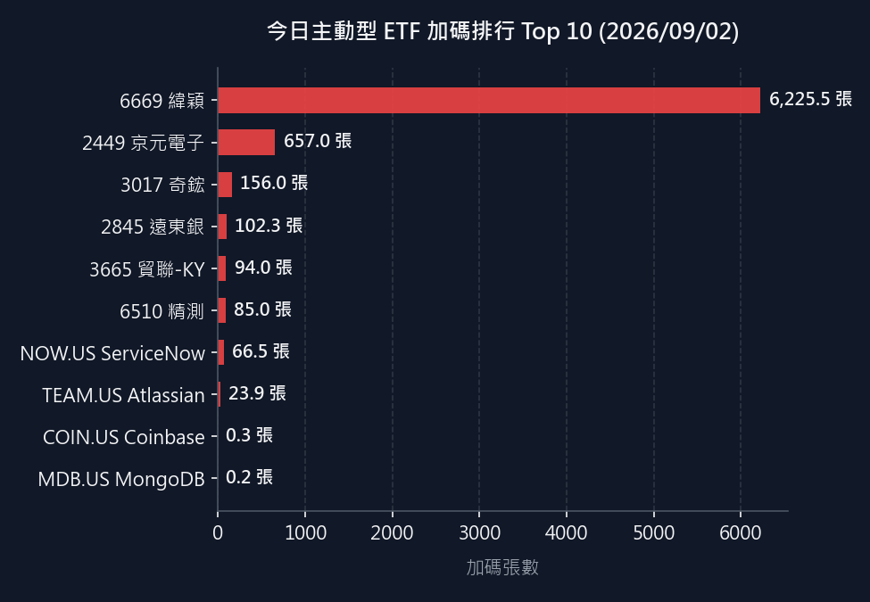
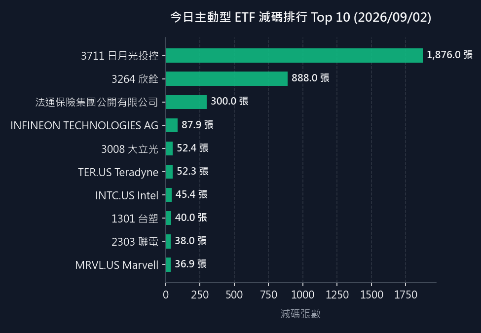

# 主動型 ETF 持股變動

資料來源：`主動型ETF持股明細.xlsx` 最近兩個日期分頁。

比較區間：`20260901` → `20260902`

## 今日加減碼視覺化排行

| 今日加碼 Top 10 | 今日減碼 Top 10 |
| :---: | :---: |
|  |  |

| ETF | 新增 | 刪除 | 比例變動 |
| :-- | --: | --: | --: |
| 00400A | 0 | 0 | 37 |
| 00401A | 0 | 3 | 52 |
| 00402A | 0 | 0 | 42 |
| 00403A | 0 | 0 | 0 |
| 00404A | 0 | 0 | 42 |
| 00405A | 0 | 0 | 0 |
| 00407A | 0 | 0 | 0 |
| 00408A | 0 | 0 | 0 |
| 00980A | 0 | 0 | 46 |
| 00980D | 0 | 0 | 23 |
| 00981A | 0 | 0 | 26 |
| 00982A | 0 | 0 | 39 |
| 00983A | 0 | 0 | 39 |
| 00983D | 0 | 0 | 38 |
| 00984A | 0 | 0 | 81 |
| 00985A | 0 | 0 | 42 |
| 00986A | 0 | 0 | 0 |
| 00987A | 0 | 0 | 0 |
| 00988A | 0 | 0 | 0 |
| 00989A | 0 | 0 | 54 |
| 00990A | 2 | 1 | 46 |
| 00991A | 0 | 0 | 0 |
| 00992A | 0 | 0 | 34 |
| 00993A | 0 | 0 | 0 |
| 00994A | 0 | 0 | 0 |
| 00995A | 1 | 0 | 38 |
| 00996A | 0 | 0 | 0 |
| 00997A | 0 | 1 | 47 |
| 00998A | 2 | 0 | 34 |
| 00999A | 0 | 0 | 46 |

## 00400A

### 新增持股

- 無

### 刪除持股

- 無

### 投資比例變動

- 1303 南亞：1.48% → 1.53%（+0.05）
- 2059 川湖：5.92% → 5.91%（-0.01）
- 2303 聯電：0.94% → 0.92%（-0.02）
- 2308 台達電：2.83% → 2.68%（-0.15）
- 2313 華通：0.95% → 0.96%（+0.01）
- 2330 台積電：8.58% → 8.55%（-0.03）
- 2345 智邦：1.70% → 1.68%（-0.02）
- 2360 致茂：3.25% → 3.22%（-0.03）
- 2368 金像電：1.47% → 1.44%（-0.03）
- 2382 廣達：0.77% → 0.78%（+0.01）
- 2383 台光電：2.36% → 2.32%（-0.04）
- 2449 京元電子：0.95% → 0.94%（-0.01）
- 2454 聯發科：6.90% → 6.97%（+0.07）
- 2881 富邦金：1.53% → 1.54%（+0.01）
- 2885 元大金：1.42% → 1.45%（+0.03）
- 3008 大立光：3.97% → 4.17%（+0.20）
- 3017 奇鋐：3.90% → 3.86%（-0.04）
- 3026 禾伸堂：1.00% → 0.96%（-0.04）
- 3036 文曄：1.02% → 0.99%（-0.03）
- 3037 欣興：3.00% → 3.06%（+0.06）
- 3044 健鼎：1.77% → 1.80%（+0.03）
- 3081 聯亞：0.96% → 0.97%（+0.01）
- 3293 鈊象：0.32% → 0.33%（+0.01）
- 3443 創意：3.87% → 3.88%（+0.01）
- 3529 力旺：1.10% → 1.01%（-0.09）
- 3665 貿聯-KY：1.80% → 1.72%（-0.08）
- 3711 日月光投控：0.96% → 0.95%（-0.01）
- 4979 華星光：0.60% → 0.63%（+0.03）
- 5274 信驊：3.05% → 3.22%（+0.17）
- 5347 世界：0.71% → 0.70%（-0.01）
- 6187 萬潤：2.79% → 2.77%（-0.02）
- 6223 旺矽：4.38% → 4.37%（-0.01）
- 6274 台燿：1.95% → 1.93%（-0.02）
- 6442 光聖：0.91% → 1.01%（+0.10）
- 6488 環球晶：3.17% → 3.15%（-0.02）
- 6515 穎崴：0.49% → 0.51%（+0.02）
- 6669 緯穎：5.86% → 5.97%（+0.11）

## 00401A

### 新增持股

- 無

### 刪除持股

- 1301 台塑（0.08%，40 張）
- 2615 萬海（0.03%，8 張）
- 3167 大量（0.54%，22 張）

### 投資比例變動

- 1216 統一：0.29% → 0.30%（+0.01）
- 1477 聚陽：0.92% → 0.95%（+0.03）
- 2059 川湖：1.23% → 1.24%（+0.01）
- 2303 聯電：0.92% → 0.90%（-0.02）
- 2308 台達電：3.31% → 3.17%（-0.14）
- 2313 華通：1.86% → 1.90%（+0.04）
- 2317 鴻海：0.62% → 0.63%（+0.01）
- 2327 國巨*：0.66% → 0.65%（-0.01）
- 2330 台積電：15.14% → 15.28%（+0.14）
- 2345 智邦：2.23% → 2.24%（+0.01）
- 2357 華碩：1.45% → 1.50%（+0.05）
- 2360 致茂：1.68% → 1.69%（+0.01）
- 2368 金像電：0.33% → 0.32%（-0.01）
- 2379 瑞昱：1.12% → 1.15%（+0.03）
- 2382 廣達：2.35% → 2.39%（+0.04）
- 2383 台光電：1.78% → 1.77%（-0.01）
- 2412 中華電：0.81% → 0.84%（+0.03）
- 2454 聯發科：6.42% → 6.57%（+0.15）
- 2455 全新：2.55% → 2.73%（+0.18）
- 2603 長榮：1.09% → 1.10%（+0.01）
- 2881 富邦金：2.03% → 2.07%（+0.04）
- 2882 國泰金：1.09% → 1.11%（+0.02）
- 2883 凱基金：1.61% → 1.69%（+0.08）
- 2884 玉山金：1.80% → 1.89%（+0.09）
- 2886 兆豐金：1.37% → 1.43%（+0.06）
- 2887 台新新光金：1.10% → 1.16%（+0.06）
- 2890 永豐金：0.29% → 0.31%（+0.02）
- 2891 中信金：1.57% → 1.62%（+0.05）
- 2912 統一超：0.26% → 0.27%（+0.01）
- 3008 大立光：3.48% → 3.36%（-0.12）
- 3037 欣興：2.11% → 2.18%（+0.07）
- 3131 弘塑：0.78% → 0.79%（+0.01）
- 3231 緯創：0.36% → 0.38%（+0.02）
- 3491 昇達科：1.81% → 1.83%（+0.02）
- 4904 遠傳：0.76% → 0.79%（+0.03）
- 4938 和碩：0.32% → 0.33%（+0.01）
- 4958 臻鼎-KY：2.03% → 1.99%（-0.04）
- 5274 信驊：2.00% → 2.13%（+0.13）
- 5904 寶雅*：0.59% → 0.60%（+0.01）
- 6187 萬潤：0.77% → 0.78%（+0.01）
- 6223 旺矽：1.77% → 1.79%（+0.02）
- 6285 啟碁：1.49% → 1.52%（+0.03）
- 6415 矽力*-KY：0.54% → 0.22%（-0.32）
- 6510 精測：0.71% → 0.81%（+0.10）
- 6515 穎崴：1.12% → 1.18%（+0.06）
- 6531 愛普*：1.20% → 1.24%（+0.04）
- 6669 緯穎：2.47% → 2.54%（+0.07）
- 6944 兆聯實業：0.41% → 0.11%（-0.30）
- 7828 創新服務：1.83% → 1.84%（+0.01）
- 8464 億豐：1.07% → 1.11%（+0.04）
- 台股期貨09/26(FITXN*1.TF)：0.15% → 0.00%（-0.15）
- 臺指選擇權09/26 44500 買權：-1.41% → -1.01%（+0.40）

## 00402A

### 新增持股

- 無

### 刪除持股

- 無

### 投資比例變動

- AAPL.US Apple：7.43% → 7.76%（+0.33）
- AMD.US AMD：4.76% → 4.73%（-0.03）
- AMZN.US Amazon：4.62% → 4.61%（-0.01）
- ANET.US Arista Networks：0.85% → 0.84%（-0.01）
- ARM.US Arm：0.96% → 0.95%（-0.01）
- AVGO.US Broadcom：2.25% → 2.29%（+0.04）
- AXON.US Axon Enterprise：1.06% → 0.99%（-0.07）
- BABA.US Alibaba Group：0.55% → 0.56%（+0.01）
- CDNS.US Cadence Design Systems：1.52% → 1.43%（-0.09）
- CIEN.US Ciena：1.09% → 1.05%（-0.04）
- CRWD.US CrowdStrike Holdings：1.59% → 1.51%（-0.08）
- DASH.US DoorDash：0.60% → 0.59%（-0.01）
- FSLY.US Fastly：0.35% → 0.33%（-0.02）
- GOOG.US Alphabet - Class C Capital Stock：3.11% → 3.13%（+0.02）
- GOOGL.US Alphabet - Class A Common Stock：3.54% → 3.56%（+0.02）
- INTC.US Intel：1.20% → 1.22%（+0.02）
- IOT.US Samsara：0.37% → 0.36%（-0.01）
- KLAC.US KLA：1.52% → 1.51%（-0.01）
- LITE.US Lumentum：1.88% → 1.82%（-0.06）
- LRCX.US Lam Research：2.71% → 2.65%（-0.06）
- MCHP.US Microchip Technology：1.14% → 1.13%（-0.01）
- MDB.US MongoDB：0.81% → 0.79%（-0.02）
- META.US Meta：2.81% → 2.89%（+0.08）
- MRVL.US Marvell：1.15% → 1.16%（+0.01）
- MSFT.US Microsoft：5.32% → 5.35%（+0.03）
- MU.US Micron：6.41% → 6.36%（-0.05）
- NFLX.US Netflix：0.91% → 0.93%（+0.02）
- NOW.US ServiceNow：0.89% → 0.88%（-0.01）
- NVDA.US NVIDIA：8.60% → 8.58%（-0.02）
- PANW.US Palo Alto：2.79% → 2.69%（-0.10）
- PLTR.US Palantir Technologies：1.87% → 1.84%（-0.03）
- SHOP.US Shopify：0.92% → 0.89%（-0.03）
- SIMO.US Silicon Motion：0.76% → 0.75%（-0.01）
- SKHY.US SK hynix：1.07% → 1.06%（-0.01）
- SNOW.US Snowflake：1.29% → 1.26%（-0.03）
- SPCX.US SpaceX：0.76% → 0.77%（+0.01）
- SPOT.US Spotify：0.53% → 0.54%（+0.01）
- TER.US Teradyne：0.83% → 0.82%（-0.01）
- TSM.US TSMC(ADR)：1.46% → 1.48%（+0.02）
- TXN.US Texas Instruments：2.17% → 2.15%（-0.02）
- UBER.US Uber：0.50% → 0.51%（+0.01）
- WDC.US Western Digital：2.23% → 2.27%（+0.04）

## 00403A

### 新增持股

- 無

### 刪除持股

- 無

### 投資比例變動

- 無

## 00404A

### 新增持股

- 無

### 刪除持股

- 無

### 投資比例變動

- 1303 南亞：0.77% → 0.79%（+0.02）
- 2059 川湖：1.66% → 1.65%（-0.01）
- 2301 光寶科：1.62% → 1.73%（+0.11）
- 2303 聯電：2.81% → 2.71%（-0.10）
- 2308 台達電：1.97% → 1.86%（-0.11）
- 2330 台積電：22.08% → 21.90%（-0.18）
- 2345 智邦：0.78% → 0.77%（-0.01）
- 2347 聯強：0.69% → 0.71%（+0.02）
- 2351 順德：0.54% → 0.55%（+0.01）
- 2360 致茂：0.66% → 0.65%（-0.01）
- 2379 瑞昱：2.14% → 2.17%（+0.03）
- 2383 台光電：2.98% → 2.92%（-0.06）
- 2395 研華：1.59% → 1.57%（-0.02）
- 2428 興勤：1.17% → 1.16%（-0.01）
- 2439 美律：0.98% → 0.99%（+0.01）
- 2441 超豐：1.85% → 1.82%（-0.03）
- 2454 聯發科：6.53% → 6.56%（+0.03）
- 2458 義隆：1.65% → 1.66%（+0.01）
- 2637 慧洋-KY：1.15% → 1.18%（+0.03）
- 2845 遠東銀：1.75% → 1.71%（-0.04）
- 2885 元大金：2.10% → 2.14%（+0.04）
- 2887 台新新光金：0.67% → 0.69%（+0.02）
- 2890 永豐金：1.01% → 1.04%（+0.03）
- 3017 奇鋐：1.10% → 1.09%（-0.01）
- 3034 聯詠：2.08% → 2.07%（-0.01）
- 3037 欣興：0.66% → 0.67%（+0.01）
- 3135 凌航：1.53% → 1.58%（+0.05）
- 3260 威剛：1.31% → 1.33%（+0.02）
- 3293 鈊象：0.48% → 0.49%（+0.01）
- 3702 大聯大：1.57% → 1.62%（+0.05）
- 3711 日月光投控：3.51% → 3.44%（-0.07）
- 4763 材料*-KY：1.73% → 1.80%（+0.07）
- 4904 遠傳：0.46% → 0.48%（+0.02）
- 5274 信驊：2.43% → 2.56%（+0.13）
- 5434 崇越：1.65% → 1.66%（+0.01）
- 5904 寶雅*：0.50% → 0.51%（+0.01）
- 6139 亞翔：1.76% → 1.68%（-0.08）
- 6196 帆宣：1.77% → 1.75%（-0.02）
- 8081 致新：0.87% → 0.88%（+0.01）
- 台指選擇權09/26 47500 買權：-0.32% → -0.15%（+0.17）
- 台指選擇權10/26 48800 買權：-0.08% → -0.06%（+0.02）
- 台股期貨09/26(FITXN*1.TF)：16.92% → 16.79%（-0.13）

## 00405A

### 新增持股

- 無

### 刪除持股

- 無

### 投資比例變動

- 無

## 00407A

### 新增持股

- 無

### 刪除持股

- 無

### 投資比例變動

- 無

## 00408A

### 新增持股

- 無

### 刪除持股

- 無

### 投資比例變動

- 無

## 00980A

### 新增持股

- 無

### 刪除持股

- 無

### 投資比例變動

- 1303 南亞：2.76% → 2.86%（+0.10）
- 2059 川湖：5.52% → 5.54%（+0.02）
- 2308 台達電：3.68% → 3.49%（-0.19）
- 2317 鴻海：2.40% → 2.41%（+0.01）
- 2327 國巨*：1.65% → 1.60%（-0.05）
- 2344 華邦電：1.97% → 2.05%（+0.08）
- 2345 智邦：1.87% → 1.86%（-0.01）
- 2360 致茂：1.47% → 1.46%（-0.01）
- 2368 金像電：2.35% → 2.31%（-0.04）
- 2376 技嘉：1.22% → 1.25%（+0.03）
- 2382 廣達：1.65% → 1.66%（+0.01）
- 2383 台光電：3.74% → 3.70%（-0.04）
- 2408 南亞科：2.77% → 2.83%（+0.06）
- 2454 聯發科：5.24% → 5.31%（+0.07）
- 2884 玉山金：1.23% → 1.28%（+0.05）
- 2891 中信金：1.47% → 1.50%（+0.03）
- 3008 大立光：0.96% → 1.01%（+0.05）
- 3017 奇鋐：2.23% → 2.21%（-0.02）
- 3026 禾伸堂：0.48% → 0.46%（-0.02）
- 3036 文曄：1.10% → 1.07%（-0.03）
- 3037 欣興：2.67% → 2.73%（+0.06）
- 3044 健鼎：0.85% → 0.86%（+0.01）
- 3081 聯亞：3.82% → 3.87%（+0.05）
- 3189 景碩：0.79% → 0.78%（-0.01）
- 3231 緯創：0.92% → 0.96%（+0.04）
- 3264 欣銓：0.75% → 0.76%（+0.01）
- 3293 鈊象：0.87% → 0.89%（+0.02）
- 3443 創意：1.73% → 1.74%（+0.01）
- 3529 力旺：0.57% → 0.53%（-0.04）
- 3653 健策：1.98% → 1.99%（+0.01）
- 3665 貿聯-KY：0.37% → 0.35%（-0.02）
- 3711 日月光投控：1.57% → 1.55%（-0.02）
- 4958 臻鼎-KY：1.20% → 1.17%（-0.03）
- 5274 信驊：1.53% → 1.62%（+0.09）
- 5904 寶雅*：1.12% → 1.14%（+0.02）
- 6274 台燿：1.48% → 1.47%（-0.01）
- 6442 光聖：0.30% → 0.34%（+0.04）
- 6515 穎崴：1.85% → 1.94%（+0.09）
- 6669 緯穎：1.98% → 2.02%（+0.04）
- 6805 富世達：0.60% → 0.57%（-0.03）
- 6831 邁科：0.54% → 0.55%（+0.01）
- 7769 鴻勁：2.09% → 2.08%（-0.01）
- 8046 南電：1.21% → 1.22%（+0.01）
- 8299 群聯：2.04% → 2.03%（-0.01）
- 8996 高力：1.04% → 1.14%（+0.10）
- 台灣證交所加權股價指數(FITXN*1.TF)：4.05% → 4.06%（+0.01）

## 00980D

### 新增持股

- 無

### 刪除持股

- 無

### 投資比例變動

- ALLY FINANCIAL INC (REG) VAR 13JUN2029：0.53% → 0.54%（+0.01）
- ANHEUSER-BUSCH INBEV WOR (REG) 8.2% 15JAN2039：0.51% → 0.50%（-0.01）
- ATHENE HOLDING LTD (REG) 6.25% 01APR2054：0.74% → 0.75%（+0.01）
- BANK OF AMERICA CORP (REG) 7.75% 14MAY2038：0.51% → 0.50%（-0.01）
- BLUE OWL CREDIT INCOME (REG) 6.6% 15SEP2029：0.37% → 0.38%（+0.01）
- BRIGHTHOUSE FINANCIAL IN (REG) 4.7% 22JUN2047：0.46% → 0.45%（-0.01）
- CHARTER COMM OPT 6.484% 23OCT2045 W/I：0.45% → 0.44%（-0.01）
- CHARTER COMM OPT LLC/CAP (REG) 5.5% 01APR2063：0.49% → 0.48%（-0.01）
- CONCENTRIX CORP (REG) 6.85% 02AUG2033：0.70% → 0.69%（-0.01）
- COREWEAVE INC SER REGS (REG S) 9.25% 01JUN2030：0.41% → 0.40%（-0.01）
- GEORGIA-PACIFIC LLC (REG) 7.75% 15NOV2029：0.55% → 0.56%（+0.01）
- GLOBAL ATLANTIC FIN CO SER REGS 6.750000 % 15MAR2054：0.61% → 0.60%（-0.01）
- HERTZ CORP/THE SER REGS (REG S) 12.625% 15JUL2029：0.29% → 0.28%（-0.01）
- JETBLUE AIRWAYS/LOYALTY SER REGS (REG S) 9.875% 20SEP2031：0.47% → 0.46%（-0.01）
- LINCOLN NATIONAL CORP (REG) 7.000000 % 15JUN2040：0.45% → 0.44%（-0.01）
- MYLAN INC SER WI (REG) 5.2% 15APR2048WI：0.48% → 0.47%（-0.01）
- ORACLE CORP 6.85 % 04-FEB-2066：0.55% → 0.54%（-0.01）
- ORACLE CORP 6.9% 09NOV2052：0.51% → 0.50%（-0.01）
- PACIFIC GAS & ELECTRIC (REG) 6.7% 01APR2053：0.33% → 0.32%（-0.01）
- SPACE EXPLORATION TECH SER 144A (REG) 6.65% 15JUL2056：0.31% → 0.30%（-0.01）
- SUNCOR ENERGY INC (REG) 6.85% 01JUN2039：0.33% → 0.32%（-0.01）
- US 10YR NOTE (CBT)DEC26 21-DEC-2026：17.34% → 17.35%（+0.01）
- US 5YR NOTE (CBT) DEC26 31-DEC-2026：-13.91% → -13.93%（-0.02）

## 00981A

### 新增持股

- 無

### 刪除持股

- 無

### 投資比例變動

- 2303 聯電：4.06% → 3.98%（-0.08）
- 2308 台達電：4.64% → 4.44%（-0.20）
- 2327 國巨*：4.87% → 4.78%（-0.09）
- 2330 台積電：9.23% → 9.31%（+0.08）
- 2345 智邦：4.89% → 4.90%（+0.01）
- 2383 台光電：9.21% → 9.17%（-0.04）
- 2454 聯發科：7.54% → 7.71%（+0.17）
- 3017 奇鋐：6.97% → 6.98%（+0.01）
- 3037 欣興：6.77% → 7.00%（+0.23）
- 3264 欣銓：0.48% → 0.42%（-0.06）
- 3443 創意：0.67% → 0.68%（+0.01）
- 3653 健策：4.84% → 4.90%（+0.06）
- 3665 貿聯-KY：3.65% → 3.53%（-0.12）
- 3711 日月光投控：3.91% → 3.51%（-0.40）
- 4958 臻鼎-KY：0.40% → 0.39%（-0.01）
- 4979 華星光：0.58% → 0.63%（+0.05）
- 5274 信驊：1.22% → 1.31%（+0.09）
- 6223 旺矽：4.60% → 4.64%（+0.04）
- 6274 台燿：2.69% → 2.70%（+0.01）
- 6278 台表科：0.22% → 0.23%（+0.01）
- 6510 精測：0.51% → 0.68%（+0.17）
- 6669 緯穎：5.83% → 6.00%（+0.17）
- 6805 富世達：1.36% → 1.29%（-0.07）
- 8046 南電：3.99% → 4.03%（+0.04）
- 8996 高力：0.52% → 0.58%（+0.06）
- 台指期貨 2026/09(FITXN*1.TF)：2.20% → 2.22%（+0.02）

## 00982A

### 新增持股

- 無

### 刪除持股

- 無

### 投資比例變動

- 2059 川湖：4.91% → 4.90%（-0.01）
- 2301 光寶科：1.86% → 1.98%（+0.12）
- 2303 聯電：1.31% → 1.27%（-0.04）
- 2330 台積電：8.26% → 8.27%（+0.01）
- 2345 智邦：2.61% → 2.57%（-0.04）
- 2360 致茂：3.21% → 3.17%（-0.04）
- 2376 技嘉：1.21% → 1.24%（+0.03）
- 2377 微星：1.27% → 1.29%（+0.02）
- 2383 台光電：3.38% → 3.32%（-0.06）
- 2395 研華：1.98% → 1.96%（-0.02）
- 2428 興勤：1.13% → 1.12%（-0.01）
- 2454 聯發科：6.04% → 6.08%（+0.04）
- 2455 全新：1.55% → 1.63%（+0.08）
- 2478 大毅：1.04% → 1.03%（-0.01）
- 2486 一詮：0.84% → 0.89%（+0.05）
- 2885 元大金：0.28% → 0.29%（+0.01）
- 3008 大立光：3.65% → 3.83%（+0.18）
- 3017 奇鋐：2.42% → 2.39%（-0.03）
- 3090 日電貿：1.10% → 1.09%（-0.01）
- 3105 穩懋：5.30% → 5.18%（-0.12）
- 3231 緯創：1.17% → 1.22%（+0.05）
- 3265 台星科：1.19% → 1.18%（-0.01）
- 3529 力旺：0.46% → 0.43%（-0.03）
- 3711 日月光投控：1.09% → 1.07%（-0.02）
- 4958 臻鼎-KY：3.21% → 3.09%（-0.12）
- 5274 信驊：1.16% → 1.23%（+0.07）
- 5425 台半：1.16% → 1.15%（-0.01）
- 5483 中美晶：1.21% → 1.20%（-0.01）
- 5536 聖暉*：0.77% → 0.72%（-0.05）
- 6139 亞翔：5.52% → 5.26%（-0.26）
- 6214 精誠：1.20% → 1.24%（+0.04）
- 6239 力成：1.02% → 1.03%（+0.01）
- 6274 台燿：1.18% → 1.17%（-0.01）
- 6446 藥華藥：0.10% → 0.11%（+0.01）
- 6472 保瑞：0.82% → 0.84%（+0.02）
- 6488 環球晶：2.08% → 2.06%（-0.02）
- 6531 愛普*：2.98% → 3.05%（+0.07）
- 6669 緯穎：7.51% → 7.02%（-0.49）
- 8996 高力：0.85% → 0.93%（+0.08）

## 00983A

### 新增持股

- 無

### 刪除持股

- 無

### 投資比例變動

- AMD.US AMD：3.18% → 3.21%（+0.03）
- AMZN.US Amazon：2.39% → 2.43%（+0.04）
- AVGO.US Broadcom：0.57% → 0.59%（+0.02）
- BEAM.US Beam Therapeutics：2.02% → 2.06%（+0.04）
- BLSH.US Bullish：1.95% → 1.96%（+0.01）
- BMNR.US BitMine：2.05% → 1.96%（-0.09）
- CBRS.US Cerebras：0.86% → 0.84%（-0.02）
- CERS.US Cerus：0.49% → 0.50%（+0.01）
- COIN.US Coinbase：3.98% → 4.02%（+0.04）
- CRCL.US Circle：4.94% → 4.78%（-0.16）
- CRSP.US CRISPR Therapeutics：4.24% → 4.33%（+0.09）
- CRWV.US CoreWeave：1.39% → 1.38%（-0.01）
- DE.US Deere：1.27% → 1.36%（+0.09）
- FIG.US Figma：0.51% → 0.52%（+0.01）
- GOOG.US Alphabet - Class C Capital Stock：1.32% → 1.35%（+0.03）
- GOOGL.US Alphabet - Class A Common Stock：0.81% → 0.75%（-0.06）
- HOOD.US Robinhood Markets：4.28% → 4.38%（+0.10）
- ILMN.US Illumina：1.60% → 1.61%（+0.01）
- LLY.US Eli Lilly：1.28% → 1.03%（-0.25）
- META.US Meta：0.54% → 0.57%（+0.03）
- NET.US Cloudflare：0.11% → 0.10%（-0.01）
- NTLA.US Intellia Therapeutics：1.22% → 1.18%（-0.04）
- NTRA.US Natera：1.98% → 1.90%（-0.08）
- NVDA.US NVIDIA：1.79% → 1.82%（+0.03）
- PLTR.US Palantir Technologies：3.89% → 3.88%（-0.01）
- RXRX.US Recursion Pharmaceuticals：0.34% → 0.35%（+0.01）
- SHOP.US Shopify：6.55% → 6.19%（-0.36）
- SNOW.US Snowflake：1.81% → 1.80%（-0.01）
- SOFI.US SoFi Technologies：0.73% → 0.59%（-0.14）
- SPCX.US SpaceX：4.97% → 5.13%（+0.16）
- TEM.US Tempus：5.54% → 5.66%（+0.12）
- TSLA.US Tesla：9.46% → 9.33%（-0.13）
- TSM.US TSMC(ADR)：2.18% → 2.25%（+0.07）
- TWST.US Twist Bioscience：4.84% → 4.62%（-0.22）
- TXG.US 10x Genomics：4.27% → 4.24%（-0.03）
- VCYT.US Veracyte：0.26% → 0.27%（+0.01）
- WGS.US GeneDx：1.25% → 1.30%（+0.05）
- XE.US X-Energy：0.83% → 0.86%（+0.03）
- XYZ.US Block：2.42% → 2.38%（-0.04）

## 00983D

### 新增持股

- 無

### 刪除持股

- 無

### 投資比例變動

- ABIBB 8.2 01/15/39：1.93% → 1.92%（-0.01）
- ATH 6 5/8 05/19/55：0.99% → 0.98%（-0.01）
- BATSLN 7.079 08/02/43：1.07% → 1.06%（-0.01）
- BATSLN 7.081 08/02/53：1.31% → 1.30%（-0.01）
- BHCCN 11 09/30/28：1.86% → 1.85%（-0.01）
- BNCN 7 3/8 03/01/33：1.10% → 1.09%（-0.01）
- BRITEL 9 5/8 12/15/30：1.34% → 1.33%（-0.01）
- C 8 1/8 07/15/39：1.92% → 1.90%（-0.02）
- CMCSA 6.95 08/15/37：0.67% → 0.66%（-0.01）
- CP 7 1/8 10/15/31：0.81% → 0.80%（-0.01）
- CRWV 9 02/01/31：0.81% → 0.79%（-0.02）
- DELL 8.1 07/15/36：1.51% → 1.50%（-0.01）
- DELL 8.35 07/15/46：1.39% → 1.38%（-0.01）
- DIS 7 3/4 12/01/45：0.60% → 0.59%（-0.01）
- DOW 9.4 05/15/39：1.93% → 1.91%（-0.02）
- DUK 7 3/4 03/01/31：1.54% → 1.53%（-0.01）
- ED 6 3/4 04/01/38：0.61% → 0.60%（-0.01）
- ENBCN 6.7 11/15/53：1.11% → 1.10%（-0.01）
- HAL 7.45 09/15/39：1.79% → 1.78%（-0.01）
- HSBC 6.332 03/09/44：1.05% → 1.04%（-0.01）
- IEP 10 11/15/29：1.47% → 1.46%（-0.01）
- KMI 6.95 01/15/38：1.05% → 1.04%（-0.01）
- LOW 6.65 09/15/37：0.84% → 0.83%（-0.01）
- LQDW.US iShares Investment Grade Corpora：7.24% → 7.20%（-0.04）
- NVDA 5.55 06/15/46：1.14% → 1.13%（-0.01）
- ORCL 6.9 11/09/52：0.84% → 0.83%（-0.01）
- OXY 6.6 03/15/46：0.74% → 0.73%（-0.01）
- PCG 6 3/4 01/15/53：1.12% → 1.11%（-0.01）
- PCG 6.7 04/01/53：1.10% → 1.09%（-0.01）
- PDM 9 1/4 07/20/28：1.16% → 1.15%（-0.01）
- PFE 7.2 03/15/39：1.41% → 1.40%（-0.01）
- SJM 6 1/2 11/15/53：0.20% → 0.19%（-0.01）
- SPCX 6.6 07/15/46：1.13% → 1.12%（-0.01）
- SUCN 6.85 06/01/39：1.21% → 1.20%（-0.01）
- TIME WARNER CABLE INC 7.300 07/01/38：0.50% → 0.49%（-0.01）
- TLTW.US iShares 20+ Year Treasury Bond B：7.92% → 7.88%（-0.04）
- TRPCN 7 5/8 01/15/39：1.66% → 1.65%（-0.01）
- VZ 7 3/4 12/01/30：1.13% → 1.12%（-0.01）

## 00984A

### 新增持股

- 無

### 刪除持股

- 無

### 投資比例變動

- 1102 亞泥：0.73% → 0.74%（+0.01）
- 1229 聯華：0.28% → 0.29%（+0.01）
- 1303 南亞：2.63% → 2.69%（+0.06）
- 1326 台化：1.36% → 1.35%（-0.01）
- 1560 中砂：0.62% → 0.59%（-0.03）
- 1714 和桐：0.33% → 0.31%（-0.02）
- 1808 潤隆：0.16% → 0.17%（+0.01）
- 2006 東和鋼鐵：0.57% → 0.59%（+0.02）
- 2059 川湖：4.29% → 4.30%（+0.01）
- 2301 光寶科：0.54% → 0.58%（+0.04）
- 2303 聯電：1.19% → 1.14%（-0.05）
- 2317 鴻海：0.69% → 0.68%（-0.01）
- 2324 仁寶：0.29% → 0.30%（+0.01）
- 2330 台積電：3.73% → 3.69%（-0.04）
- 2344 華邦電：0.57% → 0.59%（+0.02）
- 2345 智邦：0.39% → 0.38%（-0.01）
- 2347 聯強：0.46% → 0.47%（+0.01）
- 2351 順德：0.47% → 0.48%（+0.01）
- 2357 華碩：0.84% → 0.85%（+0.01）
- 2360 致茂：0.42% → 0.41%（-0.01）
- 2379 瑞昱：1.09% → 1.10%（+0.01）
- 2383 台光電：1.88% → 1.84%（-0.04）
- 2395 研華：0.57% → 0.56%（-0.01）
- 2404 漢唐：0.77% → 0.72%（-0.05）
- 2408 南亞科：2.10% → 2.12%（+0.02）
- 2412 中華電：0.42% → 0.43%（+0.01）
- 2441 超豐：0.57% → 0.56%（-0.01）
- 2454 聯發科：1.69% → 1.70%（+0.01）
- 2464 盟立：0.88% → 0.97%（+0.09）
- 2467 志聖：0.56% → 0.55%（-0.01）
- 2472 立隆電：0.12% → 0.11%（-0.01）
- 2542 興富發：0.69% → 0.70%（+0.01）
- 2546 根基：0.10% → 0.11%（+0.01）
- 2603 長榮：1.95% → 1.94%（-0.01）
- 2633 台灣高鐵：0.61% → 0.62%（+0.01）
- 2801 彰銀：0.83% → 0.85%（+0.02）
- 2812 台中銀：0.65% → 0.67%（+0.02）
- 2834 臺企銀：0.71% → 0.72%（+0.01）
- 2845 遠東銀：0.56% → 0.55%（-0.01）
- 2880 華南金：1.01% → 1.05%（+0.04）
- 2886 兆豐金：1.00% → 1.03%（+0.03）
- 2892 第一金：0.86% → 0.88%（+0.02）
- 3008 大立光：2.83% → 2.95%（+0.12）
- 3017 奇鋐：0.64% → 0.62%（-0.02）
- 3023 信邦：0.57% → 0.60%（+0.03）
- 3036 文曄：0.24% → 0.23%（-0.01）
- 3037 欣興：1.04% → 1.05%（+0.01）
- 3045 台灣大：1.11% → 1.13%（+0.02）
- 3189 景碩：1.60% → 1.56%（-0.04）
- 3260 威剛：0.27% → 0.28%（+0.01）
- 3264 欣銓：0.93% → 0.92%（-0.01）
- 3450 聯鈞：1.12% → 1.09%（-0.03）
- 3532 台勝科：0.29% → 0.28%（-0.01）
- 3533 嘉澤：0.62% → 0.61%（-0.01）
- 3665 貿聯-KY：0.30% → 0.28%（-0.02）
- 3711 日月光投控：1.19% → 1.16%（-0.03）
- 4763 材料*-KY：0.48% → 0.50%（+0.02）
- 4904 遠傳：0.23% → 0.24%（+0.01）
- 4958 臻鼎-KY：0.83% → 0.80%（-0.03）
- 4966 譜瑞-KY：0.42% → 0.43%（+0.01）
- 5274 信驊：0.54% → 0.56%（+0.02）
- 5534 長虹：0.29% → 0.30%（+0.01）
- 5536 聖暉*：0.23% → 0.22%（-0.01）
- 5871 中租-KY：0.89% → 0.90%（+0.01）
- 5876 上海商銀：0.99% → 1.02%（+0.03）
- 5880 合庫金：0.81% → 0.84%（+0.03）
- 6005 群益證：0.67% → 0.68%（+0.01）
- 6139 亞翔：2.70% → 2.56%（-0.14）
- 6187 萬潤：0.92% → 0.90%（-0.02）
- 6196 帆宣：0.55% → 0.54%（-0.01）
- 6213 聯茂：1.71% → 1.69%（-0.02）
- 6214 精誠：0.27% → 0.28%（+0.01）
- 6223 旺矽：0.64% → 0.63%（-0.01）
- 6274 台燿：0.37% → 0.36%（-0.01）
- 6446 藥華藥：2.32% → 2.34%（+0.02）
- 6548 長科*：1.26% → 1.29%（+0.03）
- 6592 和潤企業：0.09% → 0.10%（+0.01）
- 6669 緯穎：1.15% → 1.16%（+0.01）
- 7734 印能科技：0.23% → 0.22%（-0.01）
- 7769 鴻勁：0.58% → 0.57%（-0.01）
- 8021 尖點：0.28% → 0.29%（+0.01）

## 00985A

### 新增持股

- 無

### 刪除持股

- 無

### 投資比例變動

- 1216 統一：1.19% → 1.21%（+0.02）
- 1301 台塑：1.01% → 1.00%（-0.01）
- 2027 大成鋼：1.96% → 1.97%（+0.01）
- 2303 聯電：1.00% → 0.97%（-0.03）
- 2308 台達電：1.84% → 1.73%（-0.11）
- 2317 鴻海：1.52% → 1.50%（-0.02）
- 2327 國巨*：2.05% → 1.97%（-0.08）
- 2330 台積電：13.51% → 13.37%（-0.14）
- 2344 華邦電：0.40% → 0.41%（+0.01）
- 2345 智邦：2.87% → 2.81%（-0.06）
- 2360 致茂：0.82% → 0.81%（-0.01）
- 2368 金像電：0.22% → 0.21%（-0.01）
- 2376 技嘉：4.11% → 4.19%（+0.08）
- 2383 台光電：2.76% → 2.70%（-0.06）
- 2395 研華：2.10% → 2.06%（-0.04）
- 2408 南亞科：0.94% → 0.95%（+0.01）
- 2412 中華電：3.62% → 3.71%（+0.09）
- 2454 聯發科：2.72% → 2.73%（+0.01）
- 2603 長榮：1.63% → 1.62%（-0.01）
- 2610 華航：1.68% → 1.71%（+0.03）
- 3008 大立光：1.14% → 1.19%（+0.05）
- 3017 奇鋐：2.44% → 2.40%（-0.04）
- 3037 欣興：2.30% → 2.34%（+0.04）
- 3105 穩懋：1.51% → 1.46%（-0.05）
- 3491 昇達科：1.49% → 1.47%（-0.02）
- 3653 健策：1.50% → 1.48%（-0.02）
- 3661 世芯-KY：2.13% → 2.12%（-0.01）
- 3665 貿聯-KY：2.29% → 2.17%（-0.12）
- 3711 日月光投控：2.50% → 2.44%（-0.06）
- 4904 遠傳：3.64% → 3.74%（+0.10）
- 4958 臻鼎-KY：0.23% → 0.22%（-0.01）
- 6147 頎邦：0.89% → 0.90%（+0.01）
- 6187 萬潤：1.42% → 1.40%（-0.02）
- 6442 光聖：1.14% → 1.27%（+0.13）
- 6446 藥華藥：1.70% → 1.72%（+0.02）
- 6488 環球晶：1.63% → 1.60%（-0.03）
- 6669 緯穎：4.11% → 4.16%（+0.05）
- 7750 新代：2.38% → 2.37%（-0.01）
- 7769 鴻勁：0.99% → 0.98%（-0.01）
- 8046 南電：1.44% → 1.43%（-0.01）
- 8996 高力：1.25% → 1.36%（+0.11）
- 台積電期貨(FICDFN*1.TF)：5.06% → 5.02%（-0.04）

## 00986A

### 新增持股

- 無

### 刪除持股

- 無

### 投資比例變動

- 無

## 00987A

### 新增持股

- 無

### 刪除持股

- 無

### 投資比例變動

- 無

## 00988A

### 新增持股

- 無

### 刪除持股

- 無

### 投資比例變動

- 無

## 00989A

### 新增持股

- 無

### 刪除持股

- 無

### 投資比例變動

- ADBE.US Adobe：1.39% → 1.40%（+0.01）
- AMAT.US Applied Materials：0.67% → 0.66%（-0.01）
- AMD.US AMD：2.46% → 2.47%（+0.01）
- AMZN.US Amazon：1.04% → 1.05%（+0.01）
- APP.US Applovin：0.64% → 0.66%（+0.02）
- ASML.US ASML Holding：1.62% → 1.63%（+0.01）
- AVGO.US Broadcom：3.59% → 3.69%（+0.10）
- BE.US Bloom Energy：0.99% → 1.05%（+0.06）
- CBRS.US Cerebras：0.18% → 0.17%（-0.01）
- CDNS.US Cadence Design Systems：0.96% → 0.91%（-0.05）
- CIEN.US Ciena：1.58% → 1.53%（-0.05）
- CRM.US Salesforce：3.35% → 3.45%（+0.10）
- CRWD.US CrowdStrike Holdings：3.32% → 3.18%（-0.14）
- CRWV.US CoreWeave：0.73% → 0.72%（-0.01）
- DOCN.US DigitalOcean：1.25% → 1.27%（+0.02）
- ENTG.US Entegris：0.61% → 0.60%（-0.01）
- ESTC.US Elastic：0.78% → 0.76%（-0.02）
- FIGR.US Figure：0.94% → 0.89%（-0.05）
- GLW.US Corning：1.49% → 1.50%（+0.01）
- GOOG.US Alphabet - Class C Capital Stock：2.77% → 2.81%（+0.04）
- HOOD.US Robinhood Markets：1.87% → 1.90%（+0.03）
- HUBS.US HubSpot：2.08% → 2.06%（-0.02）
- INTC.US Intel：2.57% → 2.62%（+0.05）
- INTU.US Intuit：0.84% → 0.82%（-0.02）
- LITE.US Lumentum：1.69% → 1.65%（-0.04）
- LRCX.US Lam Research：2.00% → 1.98%（-0.02）
- MDB.US MongoDB：0.46% → 0.70%（+0.24）
- META.US Meta：1.47% → 1.52%（+0.05）
- MSFT.US Microsoft：3.24% → 3.29%（+0.05）
- MTSI.US MACOM Technology Solutions：0.95% → 0.97%（+0.02）
- NET.US Cloudflare：2.78% → 2.67%（-0.11）
- NOW.US ServiceNow：2.35% → 2.34%（-0.01）
- NU.US Nu：0.64% → 0.65%（+0.01）
- NVDA.US NVIDIA：3.80% → 3.85%（+0.05）
- ON.US ON Semiconductor：1.37% → 1.38%（+0.01）
- ORCL.US Oracle：1.11% → 1.08%（-0.03）
- PANW.US Palo Alto：4.21% → 4.10%（-0.11）
- PLTR.US Palantir Technologies：1.08% → 1.07%（-0.01）
- ROK.US Rockwell Automation：0.83% → 0.84%（+0.01）
- SHOP.US Shopify：2.04% → 1.99%（-0.05）
- SNDK.US Sandisk：0.63% → 0.64%（+0.01）
- SNOW.US Snowflake：3.25% → 3.23%（-0.02）
- SPCX.US SpaceX：0.78% → 0.80%（+0.02）
- TEAM.US Atlassian：1.27% → 1.26%（-0.01）
- TEM.US Tempus：1.02% → 1.04%（+0.02）
- TSLA.US Tesla：2.93% → 2.92%（-0.01）
- TSM.US TSMC(ADR)：0.99% → 1.02%（+0.03）
- TTWO.US Take-Two：3.10% → 3.14%（+0.04）
- TWLO.US Twilio：2.34% → 2.33%（-0.01）
- TXG.US 10x Genomics：0.39% → 0.38%（-0.01）
- TXN.US Texas Instruments：1.36% → 1.35%（-0.01）
- VICR.US Vicor Corporation：0.52% → 0.50%（-0.02）
- XYZ.US Block：0.79% → 0.77%（-0.02）
- ZM.US Zoom：1.96% → 1.97%（+0.01）

## 00990A

### 新增持股

- 3017 奇鋐（1.49%，158 張）
- 3665 貿聯-KY（0.60%，94 張）

### 刪除持股

- TER.US Teradyne（1.40%，46.32 張）

### 投資比例變動

- 2308 台達電：2.21% → 2.27%（+0.06）
- 2330 台積電：2.65% → 2.73%（+0.08）
- 2345 智邦：0.95% → 1.05%（+0.10）
- 2383 台光電：3.16% → 3.30%（+0.14）
- 2449 京元電子：0.70% → 1.28%（+0.58）
- 2454 聯發科：1.51% → 1.69%（+0.18）
- 3037 欣興：3.11% → 3.07%（-0.04）
- 3711 日月光投控：1.02% → 1.08%（+0.06）
- 6223 旺矽：1.25% → 1.34%（+0.09）
- 6274 台燿：1.47% → 1.50%（+0.03）
- 8046 南電：1.01% → 1.02%（+0.01）
- AMD.US AMD：2.43% → 2.41%（-0.02）
- AMZN.US Amazon：2.41% → 2.40%（-0.01）
- AVGO.US Broadcom：1.01% → 1.02%（+0.01）
- Advantest(6857.JP)：1.60% → 1.61%（+0.01）
- BE.US Bloom Energy：2.57% → 2.70%（+0.13）
- CIEN.US Ciena：1.00% → 0.95%（-0.05）
- COHR.US Coherent：1.26% → 1.25%（-0.01）
- CRDO.US Credo：2.69% → 2.49%（-0.20）
- DELL.US Dell：1.00% → 0.94%（-0.06）
- DIOD.US Diodes：0.87% → 0.85%（-0.02）
- IBIDEN(4062.JP)：0.99% → 1.01%（+0.02）
- INFINEON TECHNOLOGIES AG：1.87% → 1.36%（-0.51）
- INTC.US Intel：1.41% → 1.42%（+0.01）
- Kioxia Holdings(285A.JP)：1.86% → 1.92%（+0.06）
- LITE.US Lumentum：7.98% → 7.69%（-0.29）
- META.US Meta：1.77% → 1.81%（+0.04）
- MRVL.US Marvell：2.87% → 2.39%（-0.48）
- MSFT.US Microsoft：2.11% → 2.12%（+0.01）
- MU.US Micron：2.48% → 2.45%（-0.03）
- Murata Mfg.(6981.JP)：2.62% → 2.68%（+0.06）
- NBIS.US Nebius Group：0.99% → 0.97%（-0.02）
- NOW.US ServiceNow：2.32% → 2.76%（+0.44）
- NTRA.US Natera：1.70% → 1.71%（+0.01）
- PANW.US Palo Alto：2.15% → 2.07%（-0.08）
- PLTR.US Palantir Technologies：2.11% → 2.07%（-0.04）
- RVMD.US Revolution Medicines：0.49% → 0.51%（+0.02）
- SMTC.US Semtech：2.37% → 2.39%（+0.02）
- SNDK.US Sandisk：1.29% → 1.28%（-0.01）
- SNOW.US Snowflake：2.08% → 2.04%（-0.04）
- SPCX.US SpaceX：1.66% → 1.67%（+0.01）
- Samsung Elec Mech(009150.KS)：1.71% → 1.70%（-0.01）
- TEAM.US Atlassian：1.69% → 2.05%（+0.36）
- TSEM.US Tower Semiconductor：2.47% → 2.43%（-0.04）
- TWST.US Twist Bioscience：0.46% → 0.44%（-0.02）
- WDC.US Western Digital：1.91% → 1.94%（+0.03）

## 00991A

### 新增持股

- 無

### 刪除持股

- 無

### 投資比例變動

- 無

## 00992A

### 新增持股

- 無

### 刪除持股

- 無

### 投資比例變動

- 1303 南亞：2.93% → 3.02%（+0.09）
- 1815 富喬：3.21% → 3.33%（+0.12）
- 2059 川湖：7.62% → 7.61%（-0.01）
- 2301 光寶科：0.45% → 0.49%（+0.04）
- 2308 台達電：1.63% → 1.54%（-0.09）
- 2330 台積電：6.24% → 6.22%（-0.02）
- 2345 智邦：5.43% → 5.37%（-0.06）
- 2357 華碩：0.45% → 0.46%（+0.01）
- 2376 技嘉：0.42% → 0.43%（+0.01）
- 2383 台光電：6.01% → 5.92%（-0.09）
- 2404 漢唐：0.39% → 0.37%（-0.02）
- 2454 聯發科：1.43% → 1.45%（+0.02）
- 2455 全新：3.31% → 3.49%（+0.18）
- 3008 大立光：5.96% → 5.35%（-0.61）
- 3017 奇鋐：7.82% → 7.74%（-0.08）
- 3026 禾伸堂：0.44% → 0.42%（-0.02）
- 3037 欣興：5.52% → 5.64%（+0.12）
- 3081 聯亞：0.49% → 0.50%（+0.01）
- 3189 景碩：1.69% → 1.67%（-0.02）
- 3231 緯創：3.02% → 3.14%（+0.12）
- 3443 創意：2.25% → 2.26%（+0.01）
- 3653 健策：0.44% → 0.45%（+0.01）
- 3665 貿聯-KY：6.16% → 5.89%（-0.27）
- 4958 臻鼎-KY：1.23% → 1.18%（-0.05）
- 5274 信驊：0.43% → 0.46%（+0.03）
- 6139 亞翔：0.44% → 0.42%（-0.02）
- 6223 旺矽：3.32% → 3.31%（-0.01）
- 6274 台燿：0.38% → 0.37%（-0.01）
- 6584 南俊國際：3.41% → 3.43%（+0.02）
- 6669 緯穎：1.38% → 1.40%（+0.02）
- 8021 尖點：2.77% → 2.88%（+0.11）
- 8046 南電：2.72% → 2.71%（-0.01）
- 8150 南茂：0.42% → 0.41%（-0.01）
- 8996 高力：4.39% → 4.82%（+0.43）

## 00993A

### 新增持股

- 無

### 刪除持股

- 無

### 投資比例變動

- 無

## 00994A

### 新增持股

- 無

### 刪除持股

- 無

### 投資比例變動

- 無

## 00995A

### 新增持股

- 6510 精測（0.07%，1 張）

### 刪除持股

- 無

### 投資比例變動

- 2303 聯電：0.60% → 0.58%（-0.02）
- 2308 台達電：4.23% → 4.01%（-0.22）
- 2327 國巨*：2.11% → 2.05%（-0.06）
- 2330 台積電：9.52% → 9.48%（-0.04）
- 2344 華邦電：1.20% → 1.25%（+0.05）
- 2345 智邦：3.86% → 3.83%（-0.03）
- 2360 致茂：1.09% → 1.08%（-0.01）
- 2368 金像電：1.87% → 1.83%（-0.04）
- 2383 台光電：8.37% → 8.26%（-0.11）
- 2449 京元電子：0.98% → 0.97%（-0.01）
- 2454 聯發科：6.58% → 6.66%（+0.08）
- 2455 全新：1.09% → 1.15%（+0.06）
- 2486 一詮：0.85% → 0.91%（+0.06）
- 2885 元大金：0.15% → 0.16%（+0.01）
- 3017 奇鋐：5.62% → 5.58%（-0.04）
- 3023 信邦：0.18% → 0.19%（+0.01）
- 3037 欣興：3.64% → 3.11%（-0.53）
- 3044 健鼎：0.10% → 0.11%（+0.01）
- 3189 景碩：0.56% → 0.55%（-0.01）
- 3264 欣銓：0.52% → 0.53%（+0.01）
- 3450 聯鈞：0.52% → 0.51%（-0.01）
- 3653 健策：3.64% → 3.65%（+0.01）
- 3665 貿聯-KY：3.86% → 3.70%（-0.16）
- 3711 日月光投控：2.60% → 2.57%（-0.03）
- 4958 臻鼎-KY：0.65% → 0.63%（-0.02）
- 5274 信驊：3.10% → 3.28%（+0.18）
- 6187 萬潤：0.57% → 0.56%（-0.01）
- 6213 聯茂：0.57% → 0.56%（-0.01）
- 6223 旺矽：4.24% → 4.23%（-0.01）
- 6274 台燿：2.03% → 2.02%（-0.01）
- 6515 穎崴：1.99% → 2.08%（+0.09）
- 6669 緯穎：6.91% → 7.05%（+0.14）
- 6805 富世達：0.42% → 0.40%（-0.02）
- 7769 鴻勁：2.66% → 2.65%（-0.01）
- 8046 南電：4.29% → 4.30%（+0.01）
- 8150 南茂：0.54% → 0.53%（-0.01）
- 8358 金居：0.38% → 0.37%（-0.01）
- 8996 高力：0.48% → 0.53%（+0.05）

## 00996A

### 新增持股

- 無

### 刪除持股

- 無

### 投資比例變動

- 無

## 00997A

### 新增持股

- 無

### 刪除持股

- INTC.US Intel（1.00%，45.448 張）

### 投資比例變動

- 2330 台積電：2.45% → 2.55%（+0.10）
- 2383 台光電：1.73% → 1.83%（+0.10）
- 3037 欣興：2.77% → 2.76%（-0.01）
- AAPL.US Apple：2.39% → 2.51%（+0.12）
- ALAB.US Astera Labs：0.48% → 0.46%（-0.02）
- AMAT.US Applied Materials：0.99% → 0.97%（-0.02）
- AMD.US AMD：3.28% → 2.50%（-0.78）
- AMZN.US Amazon：1.73% → 1.74%（+0.01）
- ANET.US Arista Networks：1.00% → 0.99%（-0.01）
- APH.US Amphenol：1.40% → 1.47%（+0.07）
- APP.US Applovin：0.24% → 0.25%（+0.01）
- AVGO.US Broadcom：1.26% → 1.29%（+0.03）
- AXON.US Axon Enterprise：0.90% → 0.84%（-0.06）
- CDNS.US Cadence Design Systems：0.32% → 0.31%（-0.01）
- CIEN.US Ciena：1.91% → 1.84%（-0.07）
- CRDO.US Credo：2.20% → 2.05%（-0.15）
- CRWD.US CrowdStrike Holdings：3.14% → 2.99%（-0.15）
- CSCO.US Cisco：0.86% → 0.88%（+0.02）
- DT.US Dynatrace：2.33% → 2.30%（-0.03）
- FTNT.US Fortinet：1.09% → 1.05%（-0.04）
- GE.US GE Aerospace：1.89% → 1.39%（-0.50）
- GOOGL.US Alphabet - Class A Common Stock：3.21% → 3.24%（+0.03）
- HWM.US Howmet Aerospace：1.64% → 1.75%（+0.11）
- IBIDEN(4062.JP)：2.84% → 2.91%（+0.07）
- IOT.US Samsara：1.34% → 1.31%（-0.03）
- Kioxia Holdings(285A.JP)：0.70% → 0.73%（+0.03）
- LITE.US Lumentum：3.91% → 3.21%（-0.70）
- LRCX.US Lam Research：1.99% → 1.96%（-0.03）
- META.US Meta：0.73% → 0.76%（+0.03）
- MPWR.US Monolithic Power Systems：0.56% → 0.55%（-0.01）
- MRVL.US Marvell：4.00% → 3.56%（-0.44）
- MSFT.US Microsoft：0.98% → 0.99%（+0.01）
- MU.US Micron：4.71% → 4.69%（-0.02）
- NOW.US ServiceNow：1.02% → 1.98%（+0.96）
- NVDA.US NVIDIA：2.76% → 2.78%（+0.02）
- OKTA.US Okta：1.56% → 1.54%（-0.02）
- PANW.US Palo Alto：2.40% → 2.33%（-0.07）
- PLTR.US Palantir Technologies：1.27% → 1.26%（-0.01）
- RTX.US RTX：1.82% → 1.84%（+0.02）
- SNDK.US Sandisk：3.38% → 3.39%（+0.01）
- SNOW.US Snowflake：2.27% → 2.24%（-0.03）
- STX.US Seagate：2.48% → 2.50%（+0.02）
- Samsung Elec Mech(009150.KS)：2.40% → 2.41%（+0.01）
- TER.US Teradyne：2.42% → 1.87%（-0.55）
- TXN.US Texas Instruments：0.32% → 0.31%（-0.01）
- WDC.US Western Digital：0.99% → 1.01%（+0.02）
- 默克藥廠：1.88% → 1.95%（+0.07）

## 00998A

### 新增持股

- M&G公開有限公司（0.80%，218 張）
- 忠意保險股份公司（1.00%，25 張）

### 刪除持股

- 無

### 投資比例變動

- ARES.US Ares Management：2.55% → 2.50%（-0.05）
- ASR荷蘭公眾有限公司：2.93% → 2.96%（+0.03）
- Admiral集團公開有限公司：2.95% → 2.91%（-0.04）
- BAC.US Bank of America：0.96% → 0.97%（+0.01）
- BLK.US BlackRock：2.41% → 2.38%（-0.03）
- BNY.US Bank of New York Mellon：1.12% → 1.13%（+0.01）
- BPM銀行股份公司：2.88% → 2.90%（+0.02）
- BX.US Blackstone：2.44% → 2.34%（-0.10）
- CHYM.US Chime：2.82% → 2.72%（-0.10）
- Chiba Bank(8331.JP)：1.71% → 1.74%（+0.03）
- JPM.US JPMorgan Chase：1.51% → 1.52%（+0.01）
- MRX.US Marex：1.85% → 1.87%（+0.02）
- Mebuki Financial Group(7167.JP)：2.48% → 2.51%（+0.03）
- Piraeus Bank SA：4.38% → 4.36%（-0.02）
- RELY.US Remitly：1.49% → 1.44%（-0.05）
- Resona(8308.JP)：0.98% → 0.99%（+0.01）
- SHOP.US Shopify：0.78% → 0.74%（-0.04）
- Sumitomo Mitsui Trust Group(8309.JP)：0.95% → 0.97%（+0.02）
- UBS.US UBS Group：2.15% → 2.11%（-0.04）
- V.US Visa：1.47% → 1.45%（-0.02）
- 勞埃德銀行集團：3.45% → 3.50%（+0.05）
- 匯豐控股有限公司：1.76% → 1.78%（+0.02）
- 國民西敏集團公開有限公司：3.84% → 3.89%（+0.05）
- 巴克萊集團：2.50% → 2.46%（-0.04）
- 希臘國家銀行：1.82% → 1.83%（+0.01）
- 德意志銀行：3.42% → 3.43%（+0.01）
- 法國興業銀行股份有限公司：1.30% → 1.33%（+0.03）
- 法通保險集團公開有限公司：3.69% → 2.76%（-0.93）
- 渣打集團有限公司：2.74% → 2.75%（+0.01）
- 義大利西恩那銀行股份公司：2.60% → 2.58%（-0.02）
- 英傑華保險：4.82% → 4.87%（+0.05）
- 荷蘭保險公司：4.85% → 4.92%（+0.07）
- 荷蘭國際集團：1.64% → 1.66%（+0.02）
- 荷蘭銀行公眾有限公司：5.24% → 5.28%（+0.04）

## 00999A

### 新增持股

- 無

### 刪除持股

- 無

### 投資比例變動

- 2059 川湖：3.89% → 3.88%（-0.01）
- 2308 台達電：2.80% → 2.65%（-0.15）
- 2330 台積電：5.84% → 5.82%（-0.02）
- 2345 智邦：1.91% → 1.89%（-0.02）
- 2357 華碩：2.06% → 2.10%（+0.04）
- 2360 致茂：1.22% → 1.21%（-0.01）
- 2368 金像電：2.30% → 2.25%（-0.05）
- 2382 廣達：2.06% → 2.07%（+0.01）
- 2383 台光電：4.31% → 4.24%（-0.07）
- 2393 億光：0.81% → 0.83%（+0.02）
- 2395 研華：1.53% → 1.52%（-0.01）
- 2408 南亞科：2.13% → 2.17%（+0.04）
- 2441 超豐：2.96% → 2.93%（-0.03）
- 2451 創見：1.00% → 1.02%（+0.02）
- 2454 聯發科：3.56% → 3.59%（+0.03）
- 2727 王品：0.64% → 0.66%（+0.02）
- 2880 華南金：1.06% → 1.11%（+0.05）
- 2884 玉山金：1.09% → 1.13%（+0.04）
- 2885 元大金：1.50% → 1.53%（+0.03）
- 2886 兆豐金：1.12% → 1.16%（+0.04）
- 2887 台新新光金：1.64% → 1.71%（+0.07）
- 2890 永豐金：0.97% → 1.01%（+0.04）
- 2892 第一金：1.13% → 1.16%（+0.03）
- 3008 大立光：1.56% → 1.64%（+0.08）
- 3017 奇鋐：1.64% → 1.62%（-0.02）
- 3026 禾伸堂：1.54% → 1.48%（-0.06）
- 3037 欣興：2.18% → 2.23%（+0.05）
- 3081 聯亞：2.49% → 2.52%（+0.03）
- 3227 原相：0.61% → 0.62%（+0.01）
- 3293 鈊象：0.88% → 0.89%（+0.01）
- 3665 貿聯-KY：1.29% → 1.23%（-0.06）
- 3702 大聯大：4.54% → 4.70%（+0.16）
- 3706 神達：3.99% → 4.02%（+0.03）
- 4904 遠傳：0.56% → 0.58%（+0.02）
- 5274 信驊：1.32% → 1.40%（+0.08）
- 5434 崇越：0.74% → 0.75%（+0.01）
- 5534 長虹：1.55% → 1.59%（+0.04）
- 5904 寶雅*：0.68% → 0.69%（+0.01）
- 6121 新普：0.51% → 0.52%（+0.01）
- 6223 旺矽：1.86% → 1.85%（-0.01）
- 6515 穎崴：1.96% → 2.04%（+0.08）
- 6669 緯穎：3.01% → 3.07%（+0.06）
- 6805 富世達：1.00% → 0.94%（-0.06）
- 7769 鴻勁：2.52% → 2.50%（-0.02）
- 9941 裕融：1.87% → 1.97%（+0.10）
- 9958 世紀鋼：0.53% → 0.54%（+0.01）
