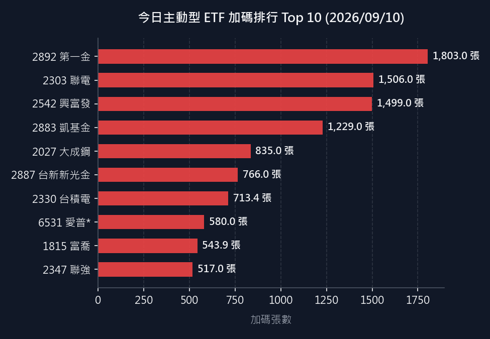
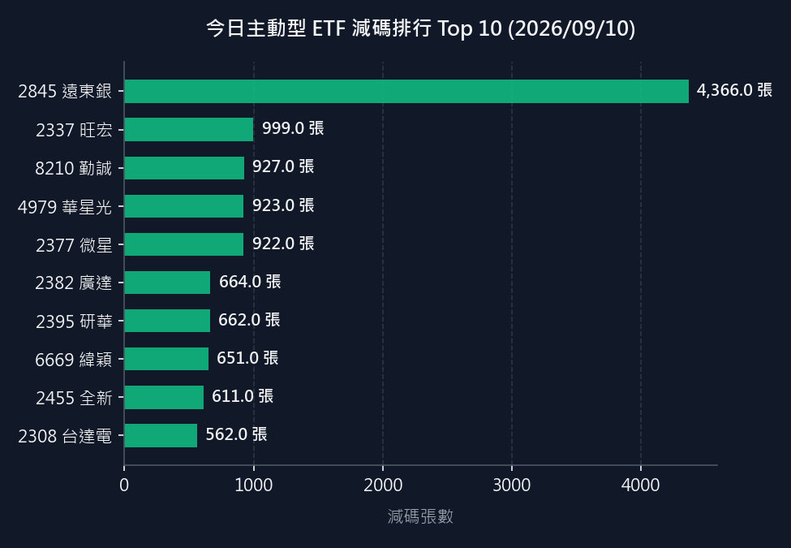

# 主動型 ETF 持股變動

資料來源：`主動型ETF持股明細.xlsx` 最近兩個日期分頁。

比較區間：`20260908` → `20260910`

## 今日加減碼視覺化排行

| 今日加碼 Top 10 | 今日減碼 Top 10 |
| :---: | :---: |
|  |  |

| ETF | 新增 | 刪除 | 比例變動 |
| :-- | --: | --: | --: |
| 00400A | 3 | 1 | 39 |
| 00401A | 2 | 0 | 56 |
| 00402A | 0 | 0 | 48 |
| 00403A | 0 | 0 | 38 |
| 00404A | 15 | 11 | 43 |
| 00405A | 0 | 2 | 36 |
| 00407A | 1 | 1 | 40 |
| 00408A | 1 | 1 | 44 |
| 00980A | 0 | 0 | 48 |
| 00980D | 0 | 1 | 32 |
| 00981A | 0 | 0 | 28 |
| 00982A | 0 | 0 | 42 |
| 00983A | 0 | 0 | 36 |
| 00983D | 0 | 0 | 18 |
| 00984A | 0 | 2 | 74 |
| 00985A | 0 | 0 | 39 |
| 00986A | 1 | 1 | 35 |
| 00987A | 1 | 1 | 24 |
| 00988A | 3 | 2 | 37 |
| 00989A | 0 | 0 | 62 |
| 00990A | 4 | 6 | 39 |
| 00991A | 0 | 0 | 20 |
| 00992A | 2 | 1 | 35 |
| 00993A | 0 | 0 | 44 |
| 00994A | 0 | 4 | 36 |
| 00995A | 0 | 0 | 46 |
| 00996A | 0 | 3 | 39 |
| 00997A | 2 | 1 | 52 |
| 00998A | 4 | 1 | 44 |
| 00999A | 0 | 0 | 48 |

## 00400A

### 新增持股

- 1215 卜蜂（0.04%，100 張）
- 6271 同欣電（0.27%，340 張）
- 6505 台塑化（0.50%，1665 張）

### 刪除持股

- 2382 廣達（0.76%，664 張）

### 投資比例變動

- 1303 南亞：1.52% → 1.59%（+0.07）
- 2059 川湖：5.37% → 5.42%（+0.05）
- 2303 聯電：1.00% → 1.04%（+0.04）
- 2308 台達電：2.81% → 2.61%（-0.20）
- 2313 華通：0.89% → 0.87%（-0.02）
- 2330 台積電：8.91% → 8.85%（-0.06）
- 2345 智邦：1.55% → 1.56%（+0.01）
- 2360 致茂：3.71% → 3.58%（-0.13）
- 2368 金像電：1.42% → 1.38%（-0.04）
- 2383 台光電：3.26% → 3.29%（+0.03）
- 2449 京元電子：0.94% → 0.95%（+0.01）
- 2454 聯發科：7.72% → 7.75%（+0.03）
- 2885 元大金：1.54% → 1.53%（-0.01）
- 3008 大立光：0.91% → 0.94%（+0.03）
- 3017 奇鋐：4.32% → 4.56%（+0.24）
- 3026 禾伸堂：1.05% → 1.13%（+0.08）
- 3036 文曄：1.01% → 1.03%（+0.02）
- 3037 欣興：4.02% → 4.20%（+0.18）
- 3044 健鼎：1.74% → 1.82%（+0.08）
- 3081 聯亞：0.82% → 0.81%（-0.01）
- 3167 大量：0.38% → 0.34%（-0.04）
- 3374 精材：0.56% → 0.58%（+0.02）
- 3443 創意：3.95% → 4.13%（+0.18）
- 3529 力旺：1.20% → 1.16%（-0.04）
- 3653 健策：4.28% → 4.47%（+0.19）
- 3711 日月光投控：1.00% → 1.05%（+0.05）
- 4979 華星光：0.62% → 0.58%（-0.04）
- 5274 信驊：3.18% → 3.10%（-0.08）
- 5347 世界：0.72% → 0.76%（+0.04）
- 6121 新普：0.23% → 0.24%（+0.01）
- 6187 萬潤：2.88% → 2.67%（-0.21）
- 6223 旺矽：4.81% → 4.67%（-0.14）
- 6274 台燿：1.85% → 1.93%（+0.08）
- 6442 光聖：0.96% → 1.03%（+0.07）
- 6488 環球晶：3.12% → 1.99%（-1.13）
- 6515 穎崴：0.56% → 0.53%（-0.03）
- 6669 緯穎：4.16% → 4.18%（+0.02）
- 7750 新代：0.98% → 0.94%（-0.04）
- 7769 鴻勁：0.49% → 0.45%（-0.04）

## 00401A

### 新增持股

- 1303 南亞（0.97%，140 張）
- TAIWAN TAIE C 21OCT26 46800 TWSE（-0.05%，-0.02 張）

### 刪除持股

- 無

### 投資比例變動

- 1216 統一：0.28% → 0.27%（-0.01）
- 1477 聚陽：0.91% → 0.86%（-0.05）
- 2059 川湖：1.20% → 1.01%（-0.19）
- 2303 聯電：1.79% → 1.67%（-0.12）
- 2308 台達電：3.27% → 2.76%（-0.51）
- 2313 華通：1.76% → 1.55%（-0.21）
- 2317 鴻海：0.62% → 0.56%（-0.06）
- 2327 國巨*：0.68% → 0.62%（-0.06）
- 2330 台積電：15.18% → 20.11%（+4.93）
- 2345 智邦：2.11% → 1.84%（-0.27）
- 2357 華碩：1.98% → 1.83%（-0.15）
- 2360 致茂：1.83% → 1.67%（-0.16）
- 2368 金像電：0.30% → 0.26%（-0.04）
- 2379 瑞昱：1.09% → 0.97%（-0.12）
- 2382 廣達：2.37% → 2.14%（-0.23）
- 2383 台光電：1.72% → 1.27%（-0.45）
- 2412 中華電：0.82% → 0.77%（-0.05）
- 2454 聯發科：7.05% → 6.52%（-0.53）
- 2455 全新：2.42% → 2.40%（-0.02）
- 2603 長榮：1.06% → 0.98%（-0.08）
- 2881 富邦金：2.08% → 1.93%（-0.15）
- 2882 國泰金：1.12% → 1.01%（-0.11）
- 2883 凱基金：1.69% → 1.59%（-0.10）
- 2884 玉山金：1.96% → 1.88%（-0.08）
- 2886 兆豐金：1.41% → 1.31%（-0.10）
- 2887 台新新光金：1.11% → 1.06%（-0.05）
- 2890 永豐金：0.30% → 0.28%（-0.02）
- 2891 中信金：1.58% → 1.47%（-0.11）
- 2912 統一超：0.26% → 0.25%（-0.01）
- 3008 大立光：2.55% → 2.40%（-0.15）
- 3034 聯詠：0.21% → 0.20%（-0.01）
- 3037 欣興：2.05% → 2.00%（-0.05）
- 3131 弘塑：0.80% → 0.72%（-0.08）
- 3231 緯創：0.80% → 0.70%（-0.10）
- 3491 昇達科：1.84% → 1.54%（-0.30）
- 3711 日月光投控：1.99% → 1.94%（-0.05）
- 4904 遠傳：0.76% → 0.73%（-0.03）
- 4938 和碩：0.33% → 0.29%（-0.04）
- 4958 臻鼎-KY：1.89% → 1.74%（-0.15）
- 4991 環宇-KY：1.05% → 0.97%（-0.08）
- 5274 信驊：2.23% → 2.02%（-0.21）
- 5347 世界：1.27% → 1.22%（-0.05）
- 5871 中租-KY：0.15% → 0.14%（-0.01）
- 5904 寶雅*：0.57% → 0.53%（-0.04）
- 6187 萬潤：0.76% → 0.67%（-0.09）
- 6223 旺矽：1.78% → 1.70%（-0.08）
- 6285 啟碁：1.43% → 1.26%（-0.17）
- 6510 精測：0.79% → 0.78%（-0.01）
- 6515 穎崴：1.13% → 1.09%（-0.04）
- 6669 緯穎：2.34% → 2.05%（-0.29）
- 6944 兆聯實業：0.11% → 0.10%（-0.01）
- 7769 鴻勁：1.84% → 1.70%（-0.14）
- 7828 創新服務：1.88% → 1.93%（+0.05）
- 8464 億豐：1.03% → 0.98%（-0.05）
- 台股期貨09/26(FITXN*1.TF)：0.19% → 0.10%（-0.09）
- 臺指選擇權09/26 44500 買權：-1.47% → -1.09%（+0.38）

## 00402A

### 新增持股

- 無

### 刪除持股

- 無

### 投資比例變動

- AAPL.US Apple：7.49% → 7.37%（-0.12）
- ADI.US Analog Devices：1.81% → 1.82%（+0.01）
- AMD.US AMD：4.82% → 5.25%（+0.43）
- AMZN.US Amazon：4.59% → 4.47%（-0.12）
- ARM.US Arm：1.00% → 1.05%（+0.05）
- ASML.US ASML Holding：1.68% → 1.69%（+0.01）
- AVGO.US Broadcom：2.17% → 2.21%（+0.04）
- AXON.US Axon Enterprise：0.96% → 0.91%（-0.05）
- BABA.US Alibaba Group：0.55% → 0.53%（-0.02）
- BKNG.US Booking Holdings：0.90% → 0.81%（-0.09）
- CDNS.US Cadence Design Systems：1.31% → 1.27%（-0.04）
- CIEN.US Ciena：0.92% → 1.15%（+0.23）
- CLS.US Celestica：0.89% → 0.95%（+0.06）
- COHR.US Coherent：1.90% → 2.04%（+0.14）
- CRWD.US CrowdStrike Holdings：1.46% → 1.42%（-0.04）
- DASH.US DoorDash：0.54% → 0.51%（-0.03）
- FSLY.US Fastly：0.32% → 0.35%（+0.03）
- GOOG.US Alphabet - Class C Capital Stock：3.10% → 3.03%（-0.07）
- GOOGL.US Alphabet - Class A Common Stock：3.53% → 3.44%（-0.09）
- INTC.US Intel：1.29% → 1.42%（+0.13）
- IOT.US Samsara：0.37% → 0.52%（+0.15）
- KLAC.US KLA：1.60% → 1.58%（-0.02）
- LITE.US Lumentum：1.81% → 2.03%（+0.22）
- LRCX.US Lam Research：2.76% → 2.83%（+0.07）
- MCHP.US Microchip Technology：1.15% → 1.13%（-0.02）
- MDB.US MongoDB：0.65% → 0.42%（-0.23）
- META.US Meta：3.03% → 3.20%（+0.17）
- MRVL.US Marvell：1.21% → 1.27%（+0.06）
- MSFT.US Microsoft：5.23% → 5.14%（-0.09）
- MU.US Micron：6.79% → 6.86%（+0.07）
- NFLX.US Netflix：0.88% → 0.85%（-0.03）
- NOW.US ServiceNow：0.85% → 0.79%（-0.06）
- NVDA.US NVIDIA：8.99% → 8.67%（-0.32）
- PANW.US Palo Alto：2.43% → 2.44%（+0.01）
- PLTR.US Palantir Technologies：1.75% → 1.70%（-0.05）
- SHOP.US Shopify：0.90% → 0.79%（-0.11）
- SIMO.US Silicon Motion：0.79% → 0.85%（+0.06）
- SKHY.US SK hynix：1.15% → 1.29%（+0.14）
- SNOW.US Snowflake：1.31% → 1.07%（-0.24）
- SPOT.US Spotify：0.53% → 0.51%（-0.02）
- STX.US Seagate：1.07% → 1.40%（+0.33）
- TER.US Teradyne：0.85% → 0.91%（+0.06）
- TSM.US TSMC(ADR)：1.50% → 1.52%（+0.02）
- TTWO.US Take-Two：0.68% → 0.67%（-0.01）
- TXN.US Texas Instruments：2.15% → 2.17%（+0.02）
- UBER.US Uber：0.50% → 0.47%（-0.03）
- V.US Visa：1.28% → 1.25%（-0.03）
- WDC.US Western Digital：2.32% → 2.38%（+0.06）

## 00403A

### 新增持股

- 無

### 刪除持股

- 無

### 投資比例變動

- 1303 南亞：1.94% → 2.11%（+0.17）
- 2059 川湖：0.30% → 0.28%（-0.02）
- 2303 聯電：4.90% → 5.02%（+0.12）
- 2308 台達電：3.17% → 2.95%（-0.22）
- 2330 台積電：15.47% → 15.37%（-0.10）
- 2337 旺宏：0.08% → 0.00%（-0.08）
- 2344 華邦電：0.17% → 0.11%（-0.06）
- 2345 智邦：3.02% → 2.90%（-0.12）
- 2360 致茂：1.39% → 1.40%（+0.01）
- 2383 台光電：5.47% → 5.51%（+0.04）
- 2449 京元電子：0.44% → 0.45%（+0.01）
- 2454 聯發科：6.55% → 6.68%（+0.13）
- 2455 全新：0.12% → 0.13%（+0.01）
- 2882 國泰金：0.29% → 0.28%（-0.01）
- 3008 大立光：2.84% → 2.58%（-0.26）
- 3017 奇鋐：6.71% → 6.31%（-0.40）
- 3037 欣興：5.00% → 5.38%（+0.38）
- 3189 景碩：1.72% → 1.80%（+0.08）
- 3264 欣銓：0.10% → 0.11%（+0.01）
- 3443 創意：2.14% → 2.31%（+0.17）
- 3450 聯鈞：0.40% → 0.37%（-0.03）
- 3533 嘉澤：0.26% → 0.20%（-0.06）
- 3583 辛耘：0.36% → 0.37%（+0.01）
- 3653 健策：3.93% → 4.13%（+0.20）
- 3665 貿聯-KY：1.67% → 1.60%（-0.07）
- 3711 日月光投控：1.55% → 1.66%（+0.11）
- 5274 信驊：2.52% → 1.44%（-1.08）
- 6223 旺矽：3.76% → 3.96%（+0.20）
- 6239 力成：0.93% → 0.97%（+0.04）
- 6274 台燿：1.62% → 1.70%（+0.08）
- 6442 光聖：0.37% → 0.40%（+0.03）
- 6488 環球晶：1.69% → 1.64%（-0.05）
- 6669 緯穎：3.24% → 2.98%（-0.26）
- 6805 富世達：0.92% → 1.07%（+0.15）
- 7769 鴻勁：0.53% → 0.54%（+0.01）
- 8046 南電：1.73% → 1.81%（+0.08）
- 8358 金居：0.13% → 0.03%（-0.10）
- 8996 高力：1.22% → 1.32%（+0.10）

## 00404A

### 新增持股

- 2357 華碩（0.89%，35 張）
- 2436 偉詮電（1.08%，614 張）
- 2542 興富發（1.80%，1499 張）
- 2883 凱基金（1.18%，1229 張）
- 2892 第一金（1.77%，1803 張）
- 3374 精材（0.13%，10 張）
- 3680 家登（0.40%，29 張）
- 6206 飛捷（1.00%，286 張）
- 6515 穎崴（0.19%，1 張）
- 7769 鴻勁（1.00%，6 張）
- 8299 群聯（1.07%，20 張）
- iShares MSCI Japan SRI ETF(2851.JP)（0.11%，92 張）
- 台指選擇權10/26 49500 買權（-0.28%，-0.353 張）
- 台指選擇權11/26 50400 買權（-0.02%，-0.018 張）
- 台股期貨10/26(FITXN*1.TF)（7.53%，0.031 張）

### 刪除持股

- 2428 興勤（1.18%，156 張）
- 2441 超豐（1.81%，527 張）
- 2458 義隆（1.55%，407 張）
- 3702 大聯大（1.63%，532 張）
- 4904 遠傳（0.46%，156 張）
- 6139 亞翔（1.68%，78 張）
- 6446 藥華藥（0.08%，2 張）
- 6491 晶碩（0.51%，46 張）
- 8271 宇瞻（0.24%，37 張）
- TWSE 09/16/2026 C47500 Index（-0.29%，-0.301 張）
- TWSE 10/21/2026 C48800 Index（-0.09%，-0.056 張）

### 投資比例變動

- 1303 南亞：0.75% → 0.71%（-0.04）
- 2027 大成鋼：0.44% → 1.42%（+0.98）
- 2059 川湖：1.62% → 0.98%（-0.64）
- 2301 光寶科：1.60% → 0.23%（-1.37）
- 2303 聯電：3.01% → 2.02%（-0.99）
- 2308 台達電：1.94% → 1.86%（-0.08）
- 2317 鴻海：0.71% → 0.62%（-0.09）
- 2330 台積電：22.07% → 22.52%（+0.45）
- 2345 智邦：0.73% → 0.81%（+0.08）
- 2347 聯強：0.71% → 1.81%（+1.10）
- 2351 順德：0.55% → 0.40%（-0.15）
- 2360 致茂：0.71% → 0.62%（-0.09）
- 2379 瑞昱：2.08% → 0.97%（-1.11）
- 2382 廣達：2.26% → 1.93%（-0.33）
- 2383 台光電：2.88% → 2.91%（+0.03）
- 2395 研華：1.51% → 1.16%（-0.35）
- 2439 美律：0.95% → 0.05%（-0.90）
- 2454 聯發科：5.75% → 7.13%（+1.38）
- 2637 慧洋-KY：1.18% → 1.06%（-0.12）
- 2845 遠東銀：1.77% → 0.02%（-1.75）
- 2885 元大金：2.20% → 2.46%（+0.26）
- 2887 台新新光金：0.67% → 1.45%（+0.78）
- 2890 永豐金：1.03% → 1.46%（+0.43）
- 3017 奇鋐：1.10% → 1.25%（+0.15）
- 3034 聯詠：2.01% → 2.04%（+0.03）
- 3037 欣興：0.64% → 0.21%（-0.43）
- 3135 凌航：1.52% → 0.06%（-1.46）
- 3260 威剛：1.30% → 1.14%（-0.16）
- 3264 欣銓：1.24% → 0.43%（-0.81）
- 3293 鈊象：0.48% → 0.42%（-0.06）
- 3443 創意：0.52% → 0.48%（-0.04）
- 3711 日月光投控：3.54% → 3.49%（-0.05）
- 4763 材料*-KY：1.73% → 1.67%（-0.06）
- 5274 信驊：2.71% → 2.82%（+0.11）
- 5434 崇越：1.64% → 1.80%（+0.16）
- 5904 寶雅*：0.48% → 0.43%（-0.05）
- 6196 帆宣：1.78% → 1.64%（-0.14）
- 6223 旺矽：1.04% → 1.09%（+0.05）
- 6257 矽格：0.23% → 1.69%（+1.46）
- 6691 洋基工程：0.23% → 0.20%（-0.03）
- 8016 矽創：0.20% → 0.97%（+0.77）
- 8081 致新：0.84% → 0.73%（-0.11）
- 台股期貨09/26(FITXN*1.TF)：16.86% → 8.23%（-8.63）

## 00405A

### 新增持股

- 無

### 刪除持股

- 3081 聯亞（1.73%，158.4 張）
- 8210 勤誠（0.56%，168 張）

### 投資比例變動

- 2059 川湖：2.08% → 1.93%（-0.15）
- 2303 聯電：0.04% → 0.93%（+0.89）
- 2308 台達電：0.62% → 0.58%（-0.04）
- 2330 台積電：1.57% → 1.60%（+0.03）
- 2345 智邦：3.96% → 3.80%（-0.16）
- 2368 金像電：4.50% → 4.30%（-0.20）
- 2383 台光電：4.15% → 4.16%（+0.01）
- 2454 聯發科：8.14% → 8.28%（+0.14）
- 3017 奇鋐：6.80% → 5.92%（-0.88）
- 3037 欣興：5.31% → 6.25%（+0.94）
- 3131 弘塑：1.38% → 0.65%（-0.73）
- 3163 波若威：0.04% → 0.03%（-0.01）
- 3443 創意：7.70% → 8.28%（+0.58）
- 3450 聯鈞：1.36% → 1.24%（-0.12）
- 3491 昇達科：0.01% → 0.00%（-0.01）
- 3653 健策：6.25% → 5.50%（-0.75）
- 3665 貿聯-KY：4.91% → 4.69%（-0.22）
- 4749 新應材：0.27% → 0.26%（-0.01）
- 4991 環宇-KY：2.11% → 2.14%（+0.03）
- 5274 信驊：3.72% → 3.71%（-0.01）
- 6187 萬潤：0.97% → 0.93%（-0.04）
- 6223 旺矽：5.34% → 6.63%（+1.29）
- 6274 台燿：1.49% → 1.56%（+0.07）
- 6278 台表科：0.97% → 0.98%（+0.01）
- 6285 啟碁：0.34% → 0.33%（-0.01）
- 6488 環球晶：0.38% → 0.37%（-0.01）
- 6510 精測：3.03% → 3.29%（+0.26）
- 6515 穎崴：0.57% → 0.60%（+0.03）
- 6531 愛普*：2.57% → 3.58%（+1.01）
- 6669 緯穎：1.32% → 1.28%（-0.04）
- 6805 富世達：2.19% → 2.17%（-0.02）
- 6831 邁科：0.51% → 0.50%（-0.01）
- 7734 印能科技：1.56% → 1.54%（-0.02）
- 7769 鴻勁：2.81% → 2.84%（+0.03）
- 8046 南電：2.77% → 2.89%（+0.12）
- 8996 高力：1.25% → 1.34%（+0.09）

## 00407A

### 新增持股

- 3131 弘塑（0.89%，91 張）

### 刪除持股

- 2395 研華（1.71%，648 張）

### 投資比例變動

- 1303 南亞：0.71% → 0.77%（+0.06）
- 1560 中砂：0.79% → 0.81%（+0.02）
- 2059 川湖：3.62% → 3.37%（-0.25）
- 2301 光寶科：1.54% → 1.53%（-0.01）
- 2303 聯電：0.56% → 0.57%（+0.01）
- 2308 台達電：3.91% → 2.79%（-1.12）
- 2327 國巨*：2.33% → 2.32%（-0.01）
- 2330 台積電：9.03% → 9.22%（+0.19）
- 2344 華邦電：0.14% → 0.15%（+0.01）
- 2345 智邦：2.85% → 2.74%（-0.11）
- 2360 致茂：2.20% → 1.79%（-0.41）
- 2368 金像電：1.36% → 0.88%（-0.48）
- 2383 台光電：5.47% → 5.49%（+0.02）
- 2408 南亞科：0.98% → 1.00%（+0.02）
- 2454 聯發科：5.67% → 5.76%（+0.09）
- 3008 大立光：2.07% → 2.14%（+0.07）
- 3017 奇鋐：5.68% → 5.89%（+0.21）
- 3034 聯詠：0.72% → 0.75%（+0.03）
- 3037 欣興：4.61% → 4.95%（+0.34）
- 3081 聯亞：1.55% → 1.47%（-0.08）
- 3293 鈊象：0.54% → 0.55%（+0.01）
- 3443 創意：3.58% → 3.85%（+0.27）
- 3491 昇達科：0.90% → 0.83%（-0.07）
- 3529 力旺：0.54% → 0.59%（+0.05）
- 3653 健策：2.49% → 3.07%（+0.58）
- 3665 貿聯-KY：1.97% → 1.89%（-0.08）
- 3711 日月光投控：2.62% → 2.81%（+0.19）
- 4958 臻鼎-KY：0.93% → 0.94%（+0.01）
- 5274 信驊：2.46% → 2.45%（-0.01）
- 5289 宜鼎：0.35% → 0.33%（-0.02）
- 6187 萬潤：1.33% → 1.48%（+0.15）
- 6223 旺矽：2.80% → 2.94%（+0.14）
- 6274 台燿：3.27% → 3.41%（+0.14）
- 6510 精測：1.07% → 1.60%（+0.53）
- 6531 愛普*：0.33% → 0.36%（+0.03）
- 6669 緯穎：4.76% → 3.94%（-0.82）
- 6805 富世達：2.86% → 2.84%（-0.02）
- 8046 南電：1.58% → 1.65%（+0.07）
- 8210 勤誠：0.90% → 0.89%（-0.01）
- 8996 高力：1.69% → 1.82%（+0.13）

## 00408A

### 新增持股

- 2360 致茂（0.43%，3 張）

### 刪除持股

- 2059 川湖（0.89%，1 張）

### 投資比例變動

- 1303 南亞：2.95% → 3.19%（+0.24）
- 2303 聯電：0.64% → 1.12%（+0.48）
- 2308 台達電：2.25% → 1.20%（-1.05）
- 2330 台積電：4.88% → 4.97%（+0.09）
- 2344 華邦電：0.46% → 0.47%（+0.01）
- 2345 智邦：1.07% → 1.03%（-0.04）
- 2357 華碩：2.75% → 2.78%（+0.03）
- 2368 金像電：3.30% → 3.14%（-0.16）
- 2376 技嘉：1.28% → 1.26%（-0.02）
- 2382 廣達：0.89% → 0.88%（-0.01）
- 2383 台光電：3.52% → 3.51%（-0.01）
- 2395 研華：1.48% → 1.46%（-0.02）
- 2408 南亞科：0.99% → 1.01%（+0.02）
- 2449 京元電子：0.87% → 0.89%（+0.02）
- 2454 聯發科：4.26% → 4.32%（+0.06）
- 2801 彰銀：1.42% → 1.47%（+0.05）
- 2880 華南金：1.86% → 1.92%（+0.06）
- 2886 兆豐金：2.79% → 2.18%（-0.61）
- 2891 中信金：1.04% → 1.06%（+0.02）
- 3017 奇鋐：5.69% → 5.88%（+0.19）
- 3037 欣興：1.70% → 2.47%（+0.77）
- 3045 台灣大：2.92% → 2.75%（-0.17）
- 3081 聯亞：0.98% → 0.93%（-0.05）
- 3189 景碩：1.40% → 1.46%（+0.06）
- 3231 緯創：1.64% → 1.57%（-0.07）
- 3491 昇達科：0.68% → 0.62%（-0.06）
- 3653 健策：2.17% → 2.27%（+0.10）
- 3661 世芯-KY：0.26% → 0.27%（+0.01）
- 3711 日月光投控：0.52% → 0.98%（+0.46）
- 5434 崇越：2.01% → 2.00%（-0.01）
- 6187 萬潤：1.31% → 1.26%（-0.05）
- 6223 旺矽：2.11% → 2.20%（+0.09）
- 6239 力成：1.20% → 1.24%（+0.04）
- 6274 台燿：2.28% → 2.37%（+0.09）
- 6488 環球晶：0.93% → 0.42%（-0.51）
- 6515 穎崴：0.45% → 0.94%（+0.49）
- 6669 緯穎：6.42% → 4.18%（-2.24）
- 6805 富世達：1.30% → 1.29%（-0.01）
- 7769 鴻勁：1.89% → 1.90%（+0.01）
- 8046 南電：0.94% → 1.47%（+0.53）
- 8436 大江：1.15% → 0.45%（-0.70）
- 8996 高力：1.03% → 1.10%（+0.07）
- 9802 鈺齊-KY：2.40% → 2.94%（+0.54）
- 9941 裕融：3.00% → 1.85%（-1.15）

## 00980A

### 新增持股

- 無

### 刪除持股

- 無

### 投資比例變動

- 1303 南亞：2.75% → 2.99%（+0.24）
- 2059 川湖：5.49% → 4.29%（-1.20）
- 2308 台達電：3.69% → 3.44%（-0.25）
- 2317 鴻海：2.43% → 2.45%（+0.02）
- 2330 台積電：9.14% → 9.37%（+0.23）
- 2344 華邦電：2.04% → 2.09%（+0.05）
- 2345 智邦：1.80% → 1.74%（-0.06）
- 2360 致茂：1.63% → 1.64%（+0.01）
- 2368 金像電：2.17% → 2.09%（-0.08）
- 2376 技嘉：1.25% → 1.24%（-0.01）
- 2382 廣達：1.69% → 1.68%（-0.01）
- 2383 台光電：3.69% → 3.71%（+0.02）
- 2408 南亞科：2.80% → 2.87%（+0.07）
- 2454 聯發科：5.85% → 5.97%（+0.12）
- 2884 玉山金：1.36% → 1.45%（+0.09）
- 2891 中信金：1.51% → 1.26%（-0.25）
- 3008 大立光：0.85% → 0.89%（+0.04）
- 3017 奇鋐：2.26% → 2.35%（+0.09）
- 3026 禾伸堂：0.51% → 0.95%（+0.44）
- 3036 文曄：1.09% → 1.12%（+0.03）
- 3037 欣興：2.64% → 2.98%（+0.34）
- 3044 健鼎：0.84% → 0.88%（+0.04）
- 3081 聯亞：3.46% → 2.16%（-1.30）
- 3189 景碩：0.74% → 1.21%（+0.47）
- 3231 緯創：1.01% → 1.22%（+0.21）
- 3264 欣銓：0.73% → 0.79%（+0.06）
- 3293 鈊象：0.88% → 0.90%（+0.02）
- 3443 創意：1.73% → 1.86%（+0.13）
- 3529 力旺：0.56% → 0.61%（+0.05）
- 3533 嘉澤：0.29% → 0.28%（-0.01）
- 3653 健策：1.93% → 2.03%（+0.10）
- 3665 貿聯-KY：0.33% → 0.47%（+0.14）
- 3711 日月光投控：1.61% → 2.05%（+0.44）
- 4958 臻鼎-KY：1.14% → 0.76%（-0.38）
- 5274 信驊：1.74% → 1.93%（+0.19）
- 5904 寶雅*：1.11% → 1.13%（+0.02）
- 6213 聯茂：1.22% → 1.27%（+0.05）
- 6223 旺矽：1.95% → 2.05%（+0.10）
- 6274 台燿：1.41% → 1.70%（+0.29）
- 6442 光聖：0.32% → 0.35%（+0.03）
- 6515 穎崴：1.90% → 2.01%（+0.11）
- 6669 緯穎：1.91% → 1.85%（-0.06）
- 7769 鴻勁：2.37% → 2.40%（+0.03）
- 8046 南電：1.05% → 1.36%（+0.31）
- 8210 勤誠：0.89% → 0.44%（-0.45）
- 8299 群聯：2.04% → 1.76%（-0.28）
- 8996 高力：1.11% → 1.19%（+0.08）
- 台灣證交所加權股價指數(FITXN*1.TF)：4.12% → 4.19%（+0.07）

## 00980D

### 新增持股

- 無

### 刪除持股

- US ULTRA BOND CBT DEC26 21-DEC-2026（-0.88%，-0.005 張）

### 投資比例變動

- AMC GLOBAL MEDIA INC SER REGS (REG) (REG S) 10.5% 15JUL2032：0.72% → 0.71%（-0.01）
- ATHENE HOLDING LTD (REG) 6.25% 01APR2054：0.77% → 0.76%（-0.01）
- ATHENE HOLDING LTD 6.625000 % 19MAY2055：0.57% → 0.56%（-0.01）
- AVIANCA MIDCO 2 PLC SER REGS 10.25 % 07-JAN-2032：0.31% → 0.30%（-0.01）
- AVIANCA MIDCO 2 PLC SER REGS 9.625000 % 14FEB2030：0.30% → 0.29%（-0.01）
- BLUE OWL CREDIT INCOME 7.750000 % 15JAN2029：0.54% → 0.53%（-0.01）
- CHARTER COMM OPT LLC/CAP (REG) 5.5% 01APR2063：0.49% → 0.48%（-0.01）
- CHC GROUP LLC SER REGS 11.750000 % 01-SEP-2030：0.44% → 0.45%（+0.01）
- CONCENTRIX CORP (REG) 6.85% 02AUG2033：0.72% → 0.71%（-0.01）
- DAIMLER FINANCE NA LLC REG 8.5% 18JAN2031：0.64% → 0.63%（-0.01）
- DELL INT LLC / EMC CORP (REG) 8.1% 15JUL2036：0.59% → 0.58%（-0.01）
- DELL INT LLC / EMC CORP (REG) 8.35% 15JUL2046：0.56% → 0.55%（-0.01）
- DOW CHEMICAL CO/THE 6.9% 15MAY2053：0.61% → 0.60%（-0.01）
- DOW CHEMICAL CO/THE 9.4% 15MAY2039：0.55% → 0.54%（-0.01）
- GLOBAL AUTO HO/AAG FH UK SER REGS (REG S) 8.75% 15JAN2032：0.43% → 0.42%（-0.01）
- JETBLUE AIRWAYS/LOYALTY SER REGS (REG S) 9.875% 20SEP2031：0.48% → 0.47%（-0.01）
- KELLANOVA SER B (REG) 7.450000 % 01APR2031：0.57% → 0.56%（-0.01）
- LBM ACQUISITION LLC SER REGS 9.500000 % 15JUN2031：0.48% → 0.47%（-0.01）
- META PLATFORMS INC 5.750000 % 15-NOV-2065：0.42% → 0.43%（+0.01）
- MYLAN NV 5.25% 15JUN2046 WI：0.52% → 0.53%（+0.01）
- NISSAN MOTOR CO SER REGS 8.125000 % 17JUL2035：0.53% → 0.52%（-0.01）
- ORACLE CORP 6.000000 % 03AUG2055：0.30% → 0.31%（+0.01）
- ORACLE CORP 6.100000 % 26-SEP-2065：0.48% → 0.49%（+0.01）
- ORACLE CORP 6.125000 % 03AUG2065：0.56% → 0.57%（+0.01）
- SOCIETE GENERALE SER REGS (REG) (REG S) 7.367% 10JAN2053：0.33% → 0.32%（-0.01）
- SPACE EXPLORATION TECH SER 144A (REG) 6.65% 15JUL2056：0.31% → 0.32%（+0.01）
- SYMETRA LIFE INSURANCE SER REGS 6.550000 % 01OCT2055：0.32% → 0.31%（-0.01）
- US 10YR NOTE (CBT)DEC26 21-DEC-2026：17.86% → 17.82%（-0.04）
- US 10YR ULTRA FUT DEC26 21-DEC-2026：-0.70% → -0.87%（-0.17）
- US 5YR NOTE (CBT) DEC26 31-DEC-2026：-14.34% → -14.32%（+0.02）
- US LONG BOND(CBT) DEC26 21-DEC-2026：5.38% → 5.36%（-0.02）
- VIACOMCBS INC (REG) 4.95% 19MAY2050：0.50% → 0.49%（-0.01）

## 00981A

### 新增持股

- 無

### 刪除持股

- 無

### 投資比例變動

- 2303 聯電：4.42% → 4.47%（+0.05）
- 2308 台達電：4.65% → 4.27%（-0.38）
- 2327 國巨*：5.11% → 5.03%（-0.08）
- 2330 台積電：9.40% → 10.24%（+0.84）
- 2345 智邦：4.71% → 4.47%（-0.24）
- 2368 金像電：0.09% → 0.08%（-0.01）
- 2383 台光電：9.06% → 8.99%（-0.07）
- 2449 京元電子：1.21% → 1.23%（+0.02）
- 2454 聯發科：8.57% → 8.62%（+0.05）
- 3017 奇鋐：7.06% → 7.25%（+0.19）
- 3037 欣興：6.69% → 7.11%（+0.42）
- 3264 欣銓：0.40% → 0.42%（+0.02）
- 3443 創意：0.77% → 0.82%（+0.05）
- 3653 健策：4.80% → 5.05%（+0.25）
- 3665 貿聯-KY：3.16% → 2.91%（-0.25）
- 3711 日月光投控：3.62% → 3.85%（+0.23）
- 4979 華星光：0.19% → 0.00%（-0.19）
- 5274 信驊：1.39% → 1.37%（-0.02）
- 6191 精成科：0.11% → 0.12%（+0.01）
- 6223 旺矽：4.72% → 5.04%（+0.32）
- 6274 台燿：2.57% → 2.65%（+0.08）
- 6510 精測：0.77% → 0.82%（+0.05）
- 6515 穎崴：0.23% → 0.24%（+0.01）
- 6669 緯穎：5.61% → 5.36%（-0.25）
- 6805 富世達：1.36% → 1.33%（-0.03）
- 8046 南電：3.43% → 3.55%（+0.12）
- 8210 勤誠：0.71% → 0.49%（-0.22）
- 8996 高力：0.45% → 0.32%（-0.13）

## 00982A

### 新增持股

- 無

### 刪除持股

- 無

### 投資比例變動

- 2059 川湖：4.45% → 4.47%（+0.02）
- 2303 聯電：1.39% → 1.44%（+0.05）
- 2330 台積電：8.70% → 8.66%（-0.04）
- 2345 智邦：2.38% → 2.40%（+0.02）
- 2360 致茂：3.66% → 3.52%（-0.14）
- 2376 技嘉：1.23% → 1.21%（-0.02）
- 2377 微星：1.29% → 0.99%（-0.30）
- 2383 台光電：3.28% → 3.29%（+0.01）
- 2395 研華：1.88% → 1.89%（+0.01）
- 2428 興勤：1.15% → 1.13%（-0.02）
- 2454 聯發科：6.81% → 6.84%（+0.03）
- 2455 全新：1.56% → 1.61%（+0.05）
- 2467 志聖：1.20% → 1.13%（-0.07）
- 2478 大毅：1.04% → 1.07%（+0.03）
- 2885 元大金：0.31% → 0.30%（-0.01）
- 3008 大立光：3.23% → 3.34%（+0.11）
- 3017 奇鋐：2.40% → 2.54%（+0.14）
- 3090 日電貿：1.09% → 1.11%（+0.02）
- 3105 穩懋：4.95% → 5.19%（+0.24）
- 3231 緯創：1.35% → 1.33%（-0.02）
- 3265 台星科：1.11% → 1.13%（+0.02）
- 3491 昇達科：3.45% → 3.15%（-0.30）
- 3529 力旺：0.52% → 0.50%（-0.02）
- 3583 辛耘：1.44% → 1.39%（-0.05）
- 3617 碩天：0.28% → 0.27%（-0.01）
- 3711 日月光投控：1.14% → 1.16%（+0.02）
- 4958 臻鼎-KY：3.13% → 3.08%（-0.05）
- 5274 信驊：1.35% → 1.32%（-0.03）
- 5483 中美晶：1.22% → 1.21%（-0.01）
- 5536 聖暉*：0.76% → 0.77%（+0.01）
- 6139 亞翔：5.46% → 5.52%（+0.06）
- 6196 帆宣：0.30% → 0.32%（+0.02）
- 6214 精誠：1.26% → 1.28%（+0.02）
- 6223 旺矽：3.49% → 3.40%（-0.09）
- 6239 力成：1.03% → 1.07%（+0.04）
- 6274 台燿：1.12% → 1.16%（+0.04）
- 6446 藥華藥：0.12% → 0.11%（-0.01）
- 6472 保瑞：0.84% → 0.82%（-0.02）
- 6488 環球晶：2.05% → 1.97%（-0.08）
- 6531 愛普*：3.03% → 4.14%（+1.11）
- 6669 緯穎：6.39% → 5.41%（-0.98）
- 8996 高力：0.92% → 0.98%（+0.06）

## 00983A

### 新增持股

- 無

### 刪除持股

- 無

### 投資比例變動

- ACHR.US Archer：0.72% → 0.71%（-0.01）
- AMD.US AMD：3.07% → 3.43%（+0.36）
- AVGO.US Broadcom：0.57% → 0.59%（+0.02）
- BEAM.US Beam Therapeutics：2.12% → 1.84%（-0.28）
- BLSH.US Bullish：2.14% → 2.10%（-0.04）
- BMNR.US BitMine：2.10% → 2.09%（-0.01）
- CBRS.US Cerebras：1.02% → 1.03%（+0.01）
- CERS.US Cerus：0.21% → 0.20%（-0.01）
- COIN.US Coinbase：4.21% → 4.08%（-0.13）
- CRCL.US Circle：5.47% → 5.11%（-0.36）
- CRSP.US CRISPR Therapeutics：4.08% → 3.90%（-0.18）
- CRWV.US CoreWeave：1.21% → 1.31%（+0.10）
- FIG.US Figma：0.47% → 0.32%（-0.15）
- HOOD.US Robinhood Markets：5.18% → 5.01%（-0.17）
- ILMN.US Illumina：1.70% → 1.63%（-0.07）
- META.US Meta：0.61% → 0.66%（+0.05）
- NET.US Cloudflare：0.10% → 0.12%（+0.02）
- NTLA.US Intellia Therapeutics：1.11% → 1.09%（-0.02）
- NTRA.US Natera：1.95% → 2.01%（+0.06）
- NVDA.US NVIDIA：1.94% → 1.93%（-0.01）
- PLTR.US Palantir Technologies：3.77% → 3.76%（-0.01）
- RXRX.US Recursion Pharmaceuticals：0.38% → 0.34%（-0.04）
- SHOP.US Shopify：6.44% → 5.44%（-1.00）
- SNOW.US Snowflake：1.80% → 1.81%（+0.01）
- SOFI.US SoFi Technologies：0.53% → 0.52%（-0.01）
- SPCX.US SpaceX：5.35% → 5.47%（+0.12）
- TEM.US Tempus：5.89% → 5.72%（-0.17）
- TER.US Teradyne：0.54% → 0.59%（+0.05）
- TSLA.US Tesla：8.66% → 9.26%（+0.60）
- TSM.US TSMC(ADR)：2.33% → 2.43%（+0.10）
- TWST.US Twist Bioscience：4.27% → 4.40%（+0.13）
- TXG.US 10x Genomics：4.30% → 4.73%（+0.43）
- VCYT.US Veracyte：0.20% → 0.21%（+0.01）
- WGS.US GeneDx：1.32% → 1.36%（+0.04）
- XE.US X-Energy：0.83% → 0.82%（-0.01）
- XYZ.US Block：2.08% → 2.05%（-0.03）

## 00983D

### 新增持股

- 無

### 刪除持股

- 無

### 投資比例變動

- ABIBB 8.2 01/15/39：1.92% → 1.91%（-0.01）
- ALLY 8 11/01/31：1.19% → 1.18%（-0.01）
- AMCX 10 1/2 07/15/32：1.63% → 1.61%（-0.02）
- DT 9 1/4 06/01/32：0.93% → 0.92%（-0.01）
- GE 6 7/8 01/10/39：0.83% → 0.82%（-0.01）
- GM 6 3/4 04/01/46：1.17% → 1.16%（-0.01）
- GT 8 7/8 07/15/32：0.94% → 0.93%（-0.01）
- HAL 7.45 09/15/39：1.79% → 1.78%（-0.01）
- IEP 10 11/15/29：1.45% → 1.46%（+0.01）
- LQDW.US iShares Investment Grade Corpora：7.15% → 7.16%（+0.01）
- NVDA 5.55 06/15/46：1.13% → 1.14%（+0.01）
- ORCL 6.9 11/09/52：0.83% → 0.84%（+0.01）
- PCG 6.7 04/01/53：1.08% → 1.07%（-0.01）
- RAKUTN 11 1/4 02/15/27：1.77% → 1.78%（+0.01）
- SPCX 6.6 07/15/46：1.11% → 1.12%（+0.01）
- SVC 8 7/8 06/15/32：0.48% → 0.47%（-0.01）
- TLTW.US iShares 20+ Year Treasury Bond B：7.86% → 7.82%（-0.04）
- VENLNG 9 1/2 02/01/29：1.39% → 1.40%（+0.01）

## 00984A

### 新增持股

- 無

### 刪除持股

- 2801 彰銀（0.04%，159.175 張）
- 2812 台中銀（0.05%，263.846 張）

### 投資比例變動

- 1102 亞泥：1.80% → 1.84%（+0.04）
- 1229 聯華：0.70% → 0.71%（+0.01）
- 1303 南亞：2.45% → 2.63%（+0.18）
- 1326 台化：1.42% → 1.43%（+0.01）
- 1402 遠東新：2.02% → 2.04%（+0.02）
- 1409 新纖：0.66% → 0.69%（+0.03）
- 1560 中砂：0.53% → 0.54%（+0.01）
- 1907 永豐餘：0.37% → 0.38%（+0.01）
- 2006 東和鋼鐵：1.28% → 1.30%（+0.02）
- 2059 川湖：2.92% → 2.68%（-0.24）
- 2301 光寶科：1.33% → 1.32%（-0.01）
- 2303 聯電：0.98% → 0.99%（+0.01）
- 2313 華通：0.16% → 0.15%（-0.01）
- 2330 台積電：3.98% → 4.04%（+0.06）
- 2344 華邦電：1.44% → 1.46%（+0.02）
- 2351 順德：0.65% → 0.66%（+0.01）
- 2379 瑞昱：2.64% → 2.55%（-0.09）
- 2383 台光電：1.98% → 1.96%（-0.02）
- 2395 研華：1.35% → 1.33%（-0.02）
- 2408 南亞科：2.28% → 2.30%（+0.02）
- 2455 全新：0.72% → 0.78%（+0.06）
- 2464 盟立：1.23% → 1.19%（-0.04）
- 2467 志聖：1.37% → 1.29%（-0.08）
- 2542 興富發：1.71% → 1.68%（-0.03）
- 2603 長榮：3.56% → 3.57%（+0.01）
- 2615 萬海：0.68% → 0.66%（-0.02）
- 2618 長榮航：2.49% → 2.51%（+0.02）
- 2633 台灣高鐵：0.79% → 0.81%（+0.02）
- 2845 遠東銀：0.78% → 0.77%（-0.01）
- 2850 新產：0.38% → 0.39%（+0.01）
- 2851 中再保：0.38% → 0.40%（+0.02）
- 2903 遠百：0.39% → 0.40%（+0.01）
- 3006 晶豪科：0.70% → 0.74%（+0.04）
- 3008 大立光：2.53% → 1.63%（-0.90）
- 3017 奇鋐：1.50% → 1.54%（+0.04）
- 3037 欣興：1.69% → 1.79%（+0.10）
- 3044 健鼎：0.67% → 0.69%（+0.02）
- 3045 台灣大：2.78% → 2.89%（+0.11）
- 3189 景碩：1.42% → 1.47%（+0.05）
- 3264 欣銓：1.81% → 1.94%（+0.13）
- 3374 精材：0.31% → 0.33%（+0.02）
- 3443 創意：0.83% → 0.88%（+0.05）
- 3450 聯鈞：1.06% → 0.96%（-0.10）
- 3532 台勝科：0.71% → 0.74%（+0.03）
- 3653 健策：1.07% → 1.12%（+0.05）
- 3661 世芯-KY：0.28% → 0.29%（+0.01）
- 3665 貿聯-KY：0.66% → 0.63%（-0.03）
- 3711 日月光投控：1.29% → 1.36%（+0.07）
- 4763 材料*-KY：1.21% → 1.17%（-0.04）
- 4967 十銓：0.69% → 0.70%（+0.01）
- 5306 桂盟：0.11% → 0.12%（+0.01）
- 5351 鈺創：0.69% → 0.68%（-0.01）
- 5871 中租-KY：2.15% → 2.18%（+0.03）
- 5876 上海商銀：2.58% → 2.67%（+0.09）
- 6005 群益證：0.15% → 0.14%（-0.01）
- 6139 亞翔：2.14% → 2.21%（+0.07）
- 6173 信昌電：0.46% → 0.48%（+0.02）
- 6187 萬潤：2.26% → 2.14%（-0.12）
- 6213 聯茂：1.27% → 1.30%（+0.03）
- 6214 精誠：0.68% → 0.70%（+0.02）
- 6223 旺矽：0.16% → 0.17%（+0.01）
- 6426 統新：0.45% → 0.49%（+0.04）
- 6446 藥華藥：2.39% → 2.41%（+0.02）
- 6548 長科*：1.48% → 1.44%（-0.04）
- 6584 南俊國際：0.92% → 0.84%（-0.08）
- 6592 和潤企業：0.23% → 0.24%（+0.01）
- 6669 緯穎：1.76% → 1.68%（-0.08）
- 7750 新代：0.69% → 0.65%（-0.04）
- 8021 尖點：0.72% → 0.69%（-0.03）
- 8039 台虹：0.69% → 0.59%（-0.10）
- 8046 南電：1.14% → 1.18%（+0.04）
- 8415 大國鋼：0.24% → 0.23%（-0.01）
- 9802 鈺齊-KY：0.32% → 0.30%（-0.02）
- 9933 中鼎：0.39% → 0.41%（+0.02）

## 00985A

### 新增持股

- 無

### 刪除持股

- 無

### 投資比例變動

- 1216 統一：1.18% → 1.19%（+0.01）
- 1504 東元：1.96% → 1.95%（-0.01）
- 2027 大成鋼：0.97% → 0.96%（-0.01）
- 2059 川湖：0.13% → 0.12%（-0.01）
- 2303 聯電：1.08% → 1.04%（-0.04）
- 2308 台達電：1.83% → 1.68%（-0.15）
- 2317 鴻海：2.47% → 2.44%（-0.03）
- 2327 國巨*：1.64% → 1.61%（-0.03）
- 2330 台積電：13.65% → 14.87%（+1.22）
- 2344 華邦電：0.41% → 0.42%（+0.01）
- 2345 智邦：1.92% → 1.50%（-0.42）
- 2360 致茂：0.90% → 0.89%（-0.01）
- 2376 技嘉：4.18% → 4.07%（-0.11）
- 2377 微星：1.81% → 1.72%（-0.09）
- 2383 台光電：2.70% → 2.66%（-0.04）
- 2395 研華：2.85% → 2.79%（-0.06）
- 2408 南亞科：0.51% → 0.39%（-0.12）
- 2412 中華電：3.68% → 3.76%（+0.08）
- 2891 中信金：1.38% → 1.70%（+0.32）
- 3017 奇鋐：1.68% → 1.71%（+0.03）
- 3037 欣興：2.26% → 1.88%（-0.38）
- 3081 聯亞：0.64% → 0.46%（-0.18）
- 3131 弘塑：0.29% → 0.28%（-0.01）
- 3491 昇達科：1.52% → 1.38%（-0.14）
- 3653 健策：0.96% → 0.72%（-0.24）
- 3661 世芯-KY：2.02% → 1.82%（-0.20）
- 3665 貿聯-KY：1.84% → 1.36%（-0.48）
- 3711 日月光投控：4.14% → 4.37%（+0.23）
- 4904 遠傳：3.69% → 3.82%（+0.13）
- 6147 頎邦：0.93% → 0.71%（-0.22）
- 6187 萬潤：1.00% → 0.73%（-0.27）
- 6442 光聖：2.25% → 2.40%（+0.15）
- 6446 藥華藥：1.73% → 1.74%（+0.01）
- 6488 環球晶：1.31% → 1.25%（-0.06）
- 6669 緯穎：2.68% → 2.55%（-0.13）
- 7750 新代：2.06% → 1.69%（-0.37）
- 8046 南電：1.24% → 1.04%（-0.20）
- 8996 高力：0.89% → 0.94%（+0.05）
- 台積電期貨(FICDFN*1.TF)：5.11% → 5.13%（+0.02）

## 00986A

### 新增持股

- 尼比厄斯集團公眾有限公司（0.26%，0.2 張）

### 刪除持股

- CRDO.US Credo（0.48%，0.5 張）

### 投資比例變動

- 2330 台積電：8.54% → 8.59%（+0.05）
- 2454 聯發科：1.56% → 1.61%（+0.05）
- AAPL.US Apple：1.08% → 1.04%（-0.04）
- AMAT.US Applied Materials：1.79% → 1.80%（+0.01）
- AMD.US AMD：3.75% → 4.00%（+0.25）
- AMZN.US Amazon：4.06% → 3.88%（-0.18）
- AVGO.US Broadcom：3.61% → 3.60%（-0.01）
- COHR.US Coherent：2.06% → 2.17%（+0.11）
- CRWD.US CrowdStrike Holdings：3.59% → 3.42%（-0.17）
- DDOG.US Datadog：0.60% → 0.62%（+0.02）
- ETN.US Eaton：2.30% → 2.28%（-0.02）
- GEV.US GE Vernova：2.64% → 2.61%（-0.03）
- GOOGL.US Alphabet - Class A Common Stock：5.69% → 5.45%（-0.24）
- GS.US Goldman Sachs：3.20% → 3.11%（-0.09）
- HOOD.US Robinhood Markets：0.51% → 0.47%（-0.04）
- HWM.US Howmet Aerospace：2.47% → 2.17%（-0.30）
- JPM.US JPMorgan Chase：1.91% → 1.95%（+0.04）
- LITE.US Lumentum：3.86% → 4.23%（+0.37）
- LLY.US Eli Lilly：2.90% → 2.78%（-0.12）
- LRCX.US Lam Research：2.59% → 2.60%（+0.01）
- MA.US Mastercard：1.14% → 1.09%（-0.05）
- MSFT.US Microsoft：2.80% → 2.70%（-0.10）
- MU.US Micron：4.56% → 4.51%（-0.05）
- MUFG(8306.JP)：1.63% → 1.55%（-0.08）
- Murata Mfg.(6981.JP)：1.81% → 1.79%（-0.02）
- NET.US Cloudflare：1.88% → 2.07%（+0.19）
- NVDA.US NVIDIA：6.46% → 6.14%（-0.32）
- SNDK.US Sandisk：1.95% → 1.94%（-0.01）
- SNOW.US Snowflake：2.08% → 2.00%（-0.08）
- Siemens Energy AG：2.10% → 2.04%（-0.06）
- TSEM.US Tower Semiconductor：0.94% → 1.01%（+0.07）
- 嘉能可公司：1.83% → 1.86%（+0.03）
- 施奈德電機公司：1.69% → 1.67%（-0.02）
- 艾司摩爾控股公司：0.96% → 1.15%（+0.19）
- 英飛凌科技股份有限公司：2.97% → 2.91%（-0.06）

## 00987A

### 新增持股

- 4958 臻鼎-KY（1.94%，100 張）

### 刪除持股

- 2308 台達電（2.01%，28 張）

### 投資比例變動

- 2330 台積電：8.60% → 8.67%（+0.07）
- 2345 智邦：2.28% → 2.16%（-0.12）
- 2383 台光電：6.19% → 6.13%（-0.06）
- 2408 南亞科：2.55% → 2.57%（+0.02）
- 2454 聯發科：5.92% → 5.94%（+0.02）
- 2455 全新：3.98% → 4.29%（+0.31）
- 3017 奇鋐：7.71% → 7.07%（-0.64）
- 3037 欣興：6.12% → 6.48%（+0.36）
- 3081 聯亞：3.55% → 3.31%（-0.24）
- 3443 創意：4.61% → 4.89%（+0.28）
- 3653 健策：3.95% → 4.10%（+0.15）
- 3661 世芯-KY：2.04% → 2.07%（+0.03）
- 3665 貿聯-KY：4.18% → 2.96%（-1.22）
- 6187 萬潤：2.50% → 2.36%（-0.14）
- 6223 旺矽：4.27% → 4.42%（+0.15）
- 6274 台燿：3.99% → 4.11%（+0.12）
- 6510 精測：2.97% → 3.17%（+0.20）
- 6515 穎崴：2.18% → 2.26%（+0.08）
- 6683 雍智科技：2.85% → 2.64%（-0.21）
- 6739 竹陞科技：2.16% → 2.59%（+0.43）
- 6805 富世達：3.17% → 3.10%（-0.07）
- 8046 南電：2.61% → 2.69%（+0.08）
- 8358 金居：2.68% → 2.74%（+0.06）
- 8996 高力：1.69% → 1.79%（+0.10）

## 00988A

### 新增持股

- 2303 聯電（1.35%，5000 張）
- INTC.US Intel（1.46%，230 張）
- ROBOTECHNIK INTELLIGENT TE-A（1.44%，249.997 張）

### 刪除持股

- 6274 台燿（0.34%，130 張）
- DASH.US DoorDash（0.64%，50 張）

### 投資比例變動

- 2308 台達電：2.52% → 1.95%（-0.57）
- 2330 台積電：2.08% → 1.88%（-0.20）
- 2383 台光電：4.35% → 4.09%（-0.26）
- 2454 聯發科：1.69% → 2.20%（+0.51）
- 3017 奇鋐：3.01% → 2.83%（-0.18）
- 3037 欣興：4.49% → 4.91%（+0.42）
- 4979 華星光：1.60% → 1.75%（+0.15）
- 6515 穎崴：1.35% → 1.38%（+0.03）
- AEM.US Agnico Eagle Mines：0.74% → 0.73%（-0.01）
- AIXTRON SE：0.51% → 0.53%（+0.02）
- AMD.US AMD：2.17% → 1.56%（-0.61）
- Appier(4180.JP)：0.56% → 0.52%（-0.04）
- BE.US Bloom Energy：3.83% → 4.03%（+0.20）
- CRCL.US Circle：2.97% → 2.68%（-0.29）
- Furukawa Electric(5801.JP)：0.75% → 0.81%（+0.06）
- HOOD.US Robinhood Markets：2.22% → 2.07%（-0.15）
- INFINEON TECHNOLOGIES AG：1.70% → 1.19%（-0.51）
- Kioxia Holdings(285A.JP)：2.32% → 2.45%（+0.13）
- LENOVO GROUP LTD：1.50% → 1.49%（-0.01）
- LITE.US Lumentum：6.25% → 6.93%（+0.68）
- MSFT.US Microsoft：2.79% → 2.71%（-0.08）
- NET.US Cloudflare：1.18% → 1.32%（+0.14）
- NOW.US ServiceNow：1.97% → 1.81%（-0.16）
- NTRA.US Natera：0.50% → 0.49%（-0.01）
- NVDA.US NVIDIA：2.44% → 2.35%（-0.09）
- PANW.US Palo Alto：3.03% → 3.01%（-0.02）
- PLTR.US Palantir Technologies：2.38% → 2.29%（-0.09）
- SK hynix(000660.KS)：1.12% → 2.05%（+0.93）
- SNDK.US Sandisk：1.37% → 1.06%（-0.31）
- SNOW.US Snowflake：2.66% → 2.58%（-0.08）
- SPCX.US SpaceX：3.59% → 3.98%（+0.39）
- STX.US Seagate：3.09% → 3.19%（+0.10）
- Samsung Elec Mech(009150.KS)：4.41% → 4.37%（-0.04）
- TER.US Teradyne：1.19% → 1.26%（+0.07）
- TSEM.US Tower Semiconductor：2.92% → 2.81%（-0.11）
- TWLO.US Twilio：0.78% → 0.75%（-0.03）
- 中際旭創(3308.HK)：1.32% → 1.52%（+0.20）

## 00989A

### 新增持股

- 無

### 刪除持股

- 無

### 投資比例變動

- ADBE.US Adobe：1.50% → 1.48%（-0.02）
- ADI.US Analog Devices：1.02% → 1.03%（+0.01）
- ALGM.US Allegro MicroSystems：0.56% → 0.54%（-0.02）
- AMD.US AMD：2.50% → 2.80%（+0.30）
- AMZN.US Amazon：1.04% → 1.01%（-0.03）
- APP.US Applovin：0.66% → 0.58%（-0.08）
- ASML.US ASML Holding：1.64% → 1.70%（+0.06）
- AVGO.US Broadcom：3.48% → 3.85%（+0.37）
- BE.US Bloom Energy：1.21% → 1.33%（+0.12）
- CBRS.US Cerebras：0.21% → 0.16%（-0.05）
- CDNS.US Cadence Design Systems：0.83% → 0.81%（-0.02）
- CIEN.US Ciena：0.94% → 0.99%（+0.05）
- CRM.US Salesforce：3.86% → 3.64%（-0.22）
- CRWD.US CrowdStrike Holdings：3.07% → 3.00%（-0.07）
- CRWV.US CoreWeave：0.77% → 0.81%（+0.04）
- DOCN.US DigitalOcean：1.28% → 1.55%（+0.27）
- ENTG.US Entegris：0.62% → 0.64%（+0.02）
- ESTC.US Elastic：0.74% → 0.69%（-0.05）
- FIGR.US Figure：0.92% → 0.98%（+0.06）
- GLW.US Corning：1.07% → 1.17%（+0.10）
- GOOG.US Alphabet - Class C Capital Stock：2.77% → 2.78%（+0.01）
- HOOD.US Robinhood Markets：2.18% → 2.06%（-0.12）
- HUBS.US HubSpot：1.97% → 1.88%（-0.09）
- ILMN.US Illumina：0.40% → 0.37%（-0.03）
- INTC.US Intel：2.75% → 3.05%（+0.30）
- INTU.US Intuit：0.77% → 0.73%（-0.04）
- LITE.US Lumentum：1.63% → 1.88%（+0.25）
- LMND.US Lemonade：0.84% → 0.77%（-0.07）
- LRCX.US Lam Research：2.04% → 2.59%（+0.55）
- MDB.US MongoDB：0.68% → 0.66%（-0.02）
- META.US Meta：1.58% → 2.31%（+0.73）
- MSFT.US Microsoft：3.19% → 3.23%（+0.04）
- MU.US Micron：0.90% → 0.91%（+0.01）
- NET.US Cloudflare：2.54% → 2.87%（+0.33）
- NOW.US ServiceNow：2.25% → 2.09%（-0.16）
- NU.US Nu：0.68% → 0.61%（-0.07）
- NVDA.US NVIDIA：3.97% → 4.75%（+0.78）
- ON.US ON Semiconductor：1.37% → 0.25%（-1.12）
- ORCL.US Oracle：1.19% → 1.24%（+0.05）
- PANW.US Palo Alto：3.67% → 3.74%（+0.07）
- PLTR.US Palantir Technologies：1.01% → 0.98%（-0.03）
- RIVN.US Rivian：1.34% → 1.40%（+0.06）
- ROK.US Rockwell Automation：0.85% → 0.84%（-0.01）
- SHOP.US Shopify：2.01% → 1.80%（-0.21）
- SNDK.US Sandisk：0.70% → 0.67%（-0.03）
- SNOW.US Snowflake：3.31% → 3.26%（-0.05）
- SPCX.US SpaceX：0.81% → 0.80%（-0.01）
- TEAM.US Atlassian：1.24% → 1.20%（-0.04）
- TEM.US Tempus：1.05% → 1.00%（-0.05）
- TSLA.US Tesla：2.82% → 2.94%（+0.12）
- TSM.US TSMC(ADR)：1.03% → 1.04%（+0.01）
- TTMI.US TTM Technologies：0.57% → 0.51%（-0.06）
- TTWO.US Take-Two：3.03% → 3.06%（+0.03）
- TWLO.US Twilio：2.31% → 2.32%（+0.01）
- TXG.US 10x Genomics：0.39% → 0.42%（+0.03）
- TXN.US Texas Instruments：1.34% → 1.40%（+0.06）
- U.US Unity Software：0.87% → 0.88%（+0.01）
- VEEV.US Veeva Systems：0.70% → 0.66%（-0.04）
- VICR.US Vicor Corporation：0.42% → 0.36%（-0.06）
- WRBY.US Warby Parker：0.67% → 0.63%（-0.04）
- XYZ.US Block：0.79% → 0.76%（-0.03）
- ZM.US Zoom：2.05% → 1.95%（-0.10）

## 00990A

### 新增持股

- 2360 致茂（0.83%，130 張）
- 3529 力旺（0.55%，73 張）
- 7769 鴻勁（0.75%，41 張）
- SK hynix(000660.KS)（0.99%，8.301 張）

### 刪除持股

- 3711 日月光投控（1.04%，641 張）
- ALNY.US Alnylam Pharmaceuticals（0.49%，21.08 張）
- NOW.US ServiceNow（2.72%，221.4 張）
- RVMD.US Revolution Medicines（0.50%，27.6 張）
- SPOT.US Spotify（1.43%，30.24 張）
- TEAM.US Atlassian（2.36%，143.3 張）

### 投資比例變動

- 2308 台達電：2.21% → 2.16%（-0.05）
- 2330 台積電：2.69% → 2.73%（+0.04）
- 2345 智邦：0.99% → 0.94%（-0.05）
- 2383 台光電：3.16% → 3.10%（-0.06）
- 2449 京元電子：1.20% → 1.22%（+0.02）
- 2454 聯發科：2.22% → 3.06%（+0.84）
- 3017 奇鋐：1.55% → 1.46%（-0.09）
- 3037 欣興：1.77% → 1.94%（+0.17）
- 3665 貿聯-KY：0.55% → 0.51%（-0.04）
- 6223 旺矽：1.28% → 1.38%（+0.10）
- 6274 台燿：1.41% → 0.86%（-0.55）
- 8046 南電：0.88% → 0.91%（+0.03）
- AMD.US AMD：1.98% → 3.15%（+1.17）
- AMZN.US Amazon：2.93% → 2.34%（-0.59）
- BE.US Bloom Energy：3.18% → 3.34%（+0.16）
- DELL.US Dell：1.65% → 1.67%（+0.02）
- GOOGL.US Alphabet - Class A Common Stock：2.29% → 1.72%（-0.57）
- HOOD.US Robinhood Markets：1.97% → 2.33%（+0.36）
- IBIDEN(4062.JP)：1.02% → 1.57%（+0.55）
- INTC.US Intel：1.52% → 2.62%（+1.10）
- KGC.US Kinross Gold：1.45% → 1.40%（-0.05）
- Kioxia Holdings(285A.JP)：2.09% → 2.20%（+0.11）
- LITE.US Lumentum：5.77% → 7.43%（+1.66）
- META.US Meta：3.17% → 2.79%（-0.38）
- MRVL.US Marvell：2.00% → 2.07%（+0.07）
- MSFT.US Microsoft：3.09% → 3.00%（-0.09）
- MU.US Micron：2.65% → 3.64%（+0.99）
- Murata Mfg.(6981.JP)：2.70% → 1.90%（-0.80）
- NTRA.US Natera：1.75% → 1.24%（-0.51）
- NVDA.US NVIDIA：4.99% → 4.78%（-0.21）
- PANW.US Palo Alto：1.89% → 1.88%（-0.01）
- PLTR.US Palantir Technologies：2.84% → 2.72%（-0.12）
- SMTC.US Semtech：2.66% → 3.41%（+0.75）
- SNDK.US Sandisk：1.44% → 2.44%（+1.00）
- SNOW.US Snowflake：3.22% → 3.12%（-0.10）
- SPCX.US SpaceX：2.22% → 2.47%（+0.25）
- Samsung Elec Mech(009150.KS)：1.68% → 1.69%（+0.01）
- TSEM.US Tower Semiconductor：2.15% → 2.06%（-0.09）
- WDC.US Western Digital：0.97% → 0.99%（+0.02）

## 00991A

### 新增持股

- 無

### 刪除持股

- 無

### 投資比例變動

- 2059 川湖：7.87% → 7.91%（+0.04）
- 2327 國巨*：5.35% → 5.39%（+0.04）
- 2330 台積電：11.80% → 11.69%（-0.11）
- 2345 智邦：3.56% → 3.33%（-0.23）
- 2383 台光電：9.27% → 9.31%（+0.04）
- 2408 南亞科：9.21% → 8.92%（-0.29）
- 2454 聯發科：5.33% → 5.93%（+0.60）
- 3017 奇鋐：5.16% → 5.43%（+0.27）
- 3026 禾伸堂：2.54% → 2.72%（+0.18）
- 3037 欣興：6.00% → 6.24%（+0.24）
- 3081 聯亞：3.24% → 3.20%（-0.04）
- 3189 景碩：4.12% → 4.26%（+0.14）
- 3653 健策：2.37% → 2.47%（+0.10）
- 5274 信驊：3.40% → 3.30%（-0.10）
- 6223 旺矽：2.77% → 3.17%（+0.40）
- 6274 台燿：3.04% → 2.63%（-0.41）
- 6669 緯穎：5.09% → 4.42%（-0.67）
- 7769 鴻勁：2.45% → 2.03%（-0.42）
- 8046 南電：4.19% → 4.37%（+0.18）
- 8299 群聯：2.05% → 2.02%（-0.03）

## 00992A

### 新增持股

- 3711 日月光投控（0.39%，250 張）
- 6515 穎崴（0.89%，51 張）

### 刪除持股

- 2308 台達電（1.68%，382 張）

### 投資比例變動

- 1303 南亞：2.98% → 3.21%（+0.23）
- 1815 富喬：3.35% → 3.48%（+0.13）
- 2059 川湖：6.76% → 6.24%（-0.52）
- 2301 光寶科：0.47% → 0.46%（-0.01）
- 2330 台積電：6.51% → 6.61%（+0.10）
- 2345 智邦：5.35% → 5.10%（-0.25）
- 2357 華碩：0.46% → 0.47%（+0.01）
- 2376 技嘉：0.44% → 0.43%（-0.01）
- 2383 台光電：6.06% → 6.04%（-0.02）
- 2454 聯發科：1.64% → 1.65%（+0.01）
- 2455 全新：3.26% → 2.76%（-0.50）
- 3008 大立光：4.63% → 4.76%（+0.13）
- 3017 奇鋐：8.12% → 8.37%（+0.25）
- 3026 禾伸堂：0.48% → 0.51%（+0.03）
- 3037 欣興：5.59% → 5.96%（+0.37）
- 3081 聯亞：0.46% → 0.43%（-0.03）
- 3189 景碩：1.63% → 1.69%（+0.06）
- 3231 緯創：3.38% → 3.24%（-0.14）
- 3443 創意：2.31% → 2.47%（+0.16）
- 3653 健策：0.44% → 0.46%（+0.02）
- 3661 世芯-KY：2.06% → 2.11%（+0.05）
- 3665 貿聯-KY：5.70% → 5.41%（-0.29）
- 5289 宜鼎：0.33% → 0.31%（-0.02）
- 5347 世界：0.23% → 0.25%（+0.02）
- 6139 亞翔：0.44% → 0.45%（+0.01）
- 6187 萬潤：0.44% → 0.41%（-0.03）
- 6213 聯茂：0.45% → 0.47%（+0.02）
- 6223 旺矽：3.49% → 3.64%（+0.15）
- 6274 台燿：0.37% → 0.38%（+0.01）
- 6584 南俊國際：3.28% → 2.99%（-0.29）
- 6669 緯穎：2.54% → 2.43%（-0.11）
- 8021 尖點：2.94% → 2.84%（-0.10）
- 8046 南電：2.41% → 2.50%（+0.09）
- 8150 南茂：0.42% → 0.43%（+0.01）
- 8996 高力：4.79% → 5.12%（+0.33）

## 00993A

### 新增持股

- 無

### 刪除持股

- 無

### 投資比例變動

- 1303 南亞：3.74% → 3.92%（+0.18）
- 2059 川湖：3.79% → 3.48%（-0.31）
- 2303 聯電：1.73% → 1.61%（-0.12）
- 2308 台達電：2.05% → 1.89%（-0.16）
- 2313 華通：0.39% → 0.37%（-0.02）
- 2327 國巨*：0.95% → 0.93%（-0.02）
- 2330 台積電：8.17% → 8.16%（-0.01）
- 2344 華邦電：2.21% → 2.23%（+0.02）
- 2345 智邦：2.82% → 2.68%（-0.14）
- 2368 金像電：2.18% → 2.06%（-0.12）
- 2383 台光電：5.30% → 5.25%（-0.05）
- 2408 南亞科：3.44% → 3.38%（-0.06）
- 2454 聯發科：6.16% → 6.20%（+0.04）
- 2455 全新：1.59% → 1.72%（+0.13）
- 3008 大立光：1.62% → 1.92%（+0.30）
- 3017 奇鋐：3.50% → 3.59%（+0.09）
- 3036 文曄：0.58% → 0.59%（+0.01）
- 3042 晶技：0.34% → 0.35%（+0.01）
- 3044 健鼎：0.43% → 0.45%（+0.02）
- 3081 聯亞：1.40% → 1.45%（+0.05）
- 3131 弘塑：0.55% → 0.53%（-0.02）
- 3189 景碩：2.16% → 2.23%（+0.07）
- 3264 欣銓：1.25% → 1.34%（+0.09）
- 3443 創意：2.89% → 3.07%（+0.18）
- 3653 健策：1.21% → 1.26%（+0.05）
- 3665 貿聯-KY：2.01% → 1.98%（-0.03）
- 3702 大聯大：0.37% → 0.38%（+0.01）
- 4958 臻鼎-KY：1.96% → 1.88%（-0.08）
- 5274 信驊：2.92% → 2.88%（-0.04）
- 5289 宜鼎：0.72% → 0.67%（-0.05）
- 6139 亞翔：1.19% → 1.23%（+0.04）
- 6147 頎邦：0.68% → 0.69%（+0.01）
- 6223 旺矽：4.28% → 4.22%（-0.06）
- 6239 力成：0.45% → 0.46%（+0.01）
- 6274 台燿：2.55% → 2.63%（+0.08）
- 6415 矽力*-KY：0.38% → 0.37%（-0.01）
- 6510 精測：0.54% → 0.58%（+0.04）
- 6515 穎崴：2.18% → 2.27%（+0.09）
- 6669 緯穎：3.25% → 3.11%（-0.14）
- 6805 富世達：0.79% → 1.54%（+0.75）
- 8046 南電：1.89% → 1.91%（+0.02）
- 8210 勤誠：0.62% → 0.67%（+0.05）
- 8358 金居：0.54% → 0.56%（+0.02）
- 8996 高力：1.54% → 1.72%（+0.18）

## 00994A

### 新增持股

- 無

### 刪除持股

- 2886 兆豐金（0.11%，100 張）
- 3045 台灣大（0.37%，151 張）
- 6488 環球晶（0.84%，41 張）
- 8436 大江（0.00%，1 張）

### 投資比例變動

- 1303 南亞：2.25% → 2.45%（+0.20）
- 2059 川湖：5.31% → 4.39%（-0.92）
- 2303 聯電：0.79% → 1.09%（+0.30）
- 2308 台達電：2.30% → 1.19%（-1.11）
- 2330 台積電：14.16% → 14.50%（+0.34）
- 2345 智邦：2.18% → 2.10%（-0.08）
- 2360 致茂：0.57% → 1.00%（+0.43）
- 2368 金像電：0.38% → 0.36%（-0.02）
- 2383 台光電：6.88% → 6.91%（+0.03）
- 2408 南亞科：1.92% → 1.96%（+0.04）
- 2449 京元電子：0.87% → 0.89%（+0.02）
- 2454 聯發科：6.97% → 7.10%（+0.13）
- 2481 強茂：0.97% → 0.98%（+0.01）
- 2882 國泰金：0.32% → 0.31%（-0.01）
- 3017 奇鋐：7.65% → 7.95%（+0.30）
- 3037 欣興：4.15% → 5.00%（+0.85）
- 3081 聯亞：1.50% → 1.42%（-0.08）
- 3189 景碩：1.64% → 1.71%（+0.07）
- 3231 緯創：0.46% → 0.45%（-0.01）
- 3443 創意：2.40% → 2.58%（+0.18）
- 3491 昇達科：0.64% → 0.59%（-0.05）
- 3653 健策：3.00% → 3.15%（+0.15）
- 3661 世芯-KY：0.34% → 0.35%（+0.01）
- 3665 貿聯-KY：0.57% → 0.55%（-0.02）
- 3711 日月光投控：1.62% → 2.03%（+0.41）
- 6187 萬潤：1.13% → 1.09%（-0.04）
- 6223 旺矽：4.65% → 4.89%（+0.24）
- 6239 力成：1.04% → 1.08%（+0.04）
- 6274 台燿：4.59% → 4.80%（+0.21）
- 6515 穎崴：0.45% → 0.63%（+0.18）
- 6669 緯穎：4.41% → 3.35%（-1.06）
- 6805 富世達：1.44% → 1.43%（-0.01）
- 7769 鴻勁：1.53% → 1.55%（+0.02）
- 8046 南電：2.45% → 2.91%（+0.46）
- 8996 高力：0.95% → 1.02%（+0.07）
- 9941 裕融：0.01% → 0.00%（-0.01）

## 00995A

### 新增持股

- 無

### 刪除持股

- 無

### 投資比例變動

- 2059 川湖：0.58% → 0.53%（-0.05）
- 2303 聯電：0.65% → 0.66%（+0.01）
- 2308 台達電：4.23% → 3.88%（-0.35）
- 2327 國巨*：2.20% → 2.17%（-0.03）
- 2330 台積電：9.67% → 8.97%（-0.70）
- 2344 華邦電：1.24% → 1.25%（+0.01）
- 2345 智邦：3.71% → 3.52%（-0.19）
- 2360 致茂：1.20% → 1.19%（-0.01）
- 2368 金像電：1.72% → 1.63%（-0.09）
- 2383 台光電：8.22% → 8.15%（-0.07）
- 2449 京元電子：0.97% → 0.98%（+0.01）
- 2454 聯發科：7.32% → 7.35%（+0.03）
- 2455 全新：1.05% → 1.13%（+0.08）
- 2467 志聖：0.35% → 0.33%（-0.02）
- 2472 立隆電：0.08% → 0.01%（-0.07）
- 2486 一詮：0.79% → 0.76%（-0.03）
- 2885 元大金：0.16% → 0.17%（+0.01）
- 3017 奇鋐：5.68% → 5.83%（+0.15）
- 3023 信邦：0.20% → 0.19%（-0.01）
- 3037 欣興：2.17% → 2.30%（+0.13）
- 3044 健鼎：0.10% → 0.11%（+0.01）
- 3131 弘塑：0.48% → 0.47%（-0.01）
- 3189 景碩：0.52% → 0.54%（+0.02）
- 3264 欣銓：0.50% → 0.54%（+0.04）
- 3443 創意：0.99% → 1.05%（+0.06）
- 3450 聯鈞：0.49% → 0.44%（-0.05）
- 3653 健策：3.52% → 3.66%（+0.14）
- 3665 貿聯-KY：3.48% → 3.29%（-0.19）
- 3711 日月光投控：2.67% → 2.83%（+0.16）
- 5274 信驊：3.51% → 3.46%（-0.05）
- 5289 宜鼎：0.65% → 0.61%（-0.04）
- 6187 萬潤：0.57% → 0.54%（-0.03）
- 6213 聯茂：0.53% → 0.55%（+0.02）
- 6223 旺矽：4.33% → 4.50%（+0.17）
- 6274 台燿：1.94% → 2.00%（+0.06）
- 6510 精測：1.44% → 1.55%（+0.11）
- 6515 穎崴：2.04% → 2.12%（+0.08）
- 6531 愛普*：0.26% → 0.28%（+0.02）
- 6669 緯穎：6.63% → 6.33%（-0.30）
- 6805 富世達：0.42% → 0.41%（-0.01）
- 7750 新代：0.59% → 0.56%（-0.03）
- 8046 南電：3.71% → 3.83%（+0.12）
- 8150 南茂：0.53% → 0.54%（+0.01）
- 8210 勤誠：0.84% → 0.82%（-0.02）
- 8358 金居：0.37% → 0.38%（+0.01）
- 8996 高力：0.52% → 0.55%（+0.03）

## 00996A

### 新增持股

- 無

### 刪除持股

- 2345 智邦（1.29%，27 張）
- 3661 世芯-KY（1.77%，18 張）
- 4583 台灣精銳（0.34%，30 張）

### 投資比例變動

- 1303 南亞：0.50% → 0.53%（+0.03）
- 2308 台達電：5.07% → 4.77%（-0.30）
- 2317 鴻海：0.06% → 0.05%（-0.01）
- 2327 國巨*：5.10% → 5.22%（+0.12）
- 2330 台積電：10.81% → 10.87%（+0.06）
- 2344 華邦電：1.52% → 1.47%（-0.05）
- 2360 致茂：1.38% → 1.35%（-0.03）
- 2368 金像電：0.37% → 0.36%（-0.01）
- 2383 台光電：6.66% → 6.79%（+0.13）
- 2408 南亞科：1.26% → 1.24%（-0.02）
- 2454 聯發科：7.25% → 6.79%（-0.46）
- 2467 志聖：0.37% → 0.36%（-0.01）
- 2472 立隆電：2.24% → 2.29%（+0.05）
- 3017 奇鋐：2.09% → 2.23%（+0.14）
- 3037 欣興：1.77% → 1.87%（+0.10）
- 3042 晶技：1.56% → 1.66%（+0.10）
- 3131 弘塑：0.32% → 0.31%（-0.01）
- 3189 景碩：2.07% → 2.17%（+0.10）
- 3363 上詮：1.79% → 1.82%（+0.03）
- 3443 創意：3.21% → 3.39%（+0.18）
- 3653 健策：2.71% → 2.87%（+0.16）
- 3693 營邦：1.54% → 1.61%（+0.07）
- 4958 臻鼎-KY：6.94% → 6.34%（-0.60）
- 5269 祥碩：0.75% → 0.74%（-0.01）
- 6223 旺矽：2.69% → 2.65%（-0.04）
- 6239 力成：0.69% → 0.72%（+0.03）
- 6274 台燿：1.21% → 1.28%（+0.07）
- 6278 台表科：3.06% → 3.16%（+0.10）
- 6415 矽力*-KY：1.56% → 1.57%（+0.01）
- 6510 精測：1.24% → 2.18%（+0.94）
- 6531 愛普*：0.11% → 0.13%（+0.02）
- 6683 雍智科技：0.93% → 1.69%（+0.76）
- 6830 汎銓：1.11% → 1.16%（+0.05）
- 7751 竑騰：1.81% → 1.78%（-0.03）
- 8021 尖點：1.58% → 1.56%（-0.02）
- 8046 南電：1.35% → 1.43%（+0.08）
- 8210 勤誠：1.44% → 1.47%（+0.03）
- 8996 高力：2.67% → 2.87%（+0.20）
- 小型臺指期貨(FIMTXN*1.TF)：2.58% → 2.61%（+0.03）

## 00997A

### 新增持股

- 2454 聯發科（0.91%，25 張）
- 6640 均華（0.99%，105 張）

### 刪除持股

- AXON.US Axon Enterprise（0.39%，3.052 張）

### 投資比例變動

- 2330 台積電：2.51% → 2.56%（+0.05）
- 2383 台光電：1.75% → 1.73%（-0.02）
- 3037 欣興：2.56% → 2.81%（+0.25）
- AAPL.US Apple：2.91% → 2.85%（-0.06）
- ADBE.US Adobe：0.55% → 0.52%（-0.03）
- ALAB.US Astera Labs：0.51% → 0.49%（-0.02）
- AMAT.US Applied Materials：1.00% → 1.02%（+0.02）
- AMD.US AMD：2.07% → 2.24%（+0.17）
- AMZN.US Amazon：1.76% → 1.71%（-0.05）
- ANET.US Arista Networks：1.01% → 0.99%（-0.02）
- APH.US Amphenol：1.49% → 1.45%（-0.04）
- APP.US Applovin：0.25% → 0.24%（-0.01）
- AVGO.US Broadcom：1.24% → 1.26%（+0.02）
- BE.US Bloom Energy：0.85% → 1.38%（+0.53）
- CDNS.US Cadence Design Systems：0.29% → 0.28%（-0.01）
- CIEN.US Ciena：1.63% → 1.71%（+0.08）
- COHR.US Coherent：0.63% → 0.68%（+0.05）
- CRDO.US Credo：1.67% → 1.64%（-0.03）
- CRWD.US CrowdStrike Holdings：2.96% → 2.86%（-0.10）
- DT.US Dynatrace：2.25% → 2.18%（-0.07）
- FTNT.US Fortinet：1.02% → 1.01%（-0.01）
- GE.US GE Aerospace：1.42% → 0.68%（-0.74）
- GOOGL.US Alphabet - Class A Common Stock：3.27% → 3.17%（-0.10）
- HOOD.US Robinhood Markets：1.45% → 1.36%（-0.09）
- HWM.US Howmet Aerospace：1.77% → 0.58%（-1.19）
- IBIDEN(4062.JP)：2.96% → 4.01%（+1.05）
- IOT.US Samsara：1.34% → 1.28%（-0.06）
- KLAC.US KLA：0.52% → 0.51%（-0.01）
- Kioxia Holdings(285A.JP)：0.80% → 0.85%（+0.05）
- LITE.US Lumentum：3.25% → 3.62%（+0.37）
- LRCX.US Lam Research：2.07% → 2.11%（+0.04）
- META.US Meta：0.81% → 0.85%（+0.04）
- MPWR.US Monolithic Power Systems：0.55% → 0.54%（-0.01）
- MRK.US Merck：2.47% → 2.41%（-0.06）
- MRVL.US Marvell：3.14% → 3.28%（+0.14）
- MSFT.US Microsoft：0.99% → 0.96%（-0.03）
- MU.US Micron：5.10% → 5.12%（+0.02）
- NOW.US ServiceNow：1.95% → 1.80%（-0.15）
- NVDA.US NVIDIA：2.94% → 2.83%（-0.11）
- OKTA.US Okta：1.57% → 1.58%（+0.01）
- PANW.US Palo Alto：2.14% → 2.13%（-0.01）
- PLTR.US Palantir Technologies：1.21% → 1.17%（-0.04）
- RTX.US RTX：1.80% → 1.76%（-0.04）
- SNDK.US Sandisk：3.83% → 3.86%（+0.03）
- SNOW.US Snowflake：2.36% → 2.30%（-0.06）
- STX.US Seagate：2.60% → 2.69%（+0.09）
- Samsung Elec Mech(009150.KS)：2.39% → 2.40%（+0.01）
- TER.US Teradyne：1.98% → 2.11%（+0.13）
- TWLO.US Twilio：0.87% → 0.84%（-0.03）
- WDC.US Western Digital：1.05% → 1.08%（+0.03）
- 太空探索科技公司：0.78% → 0.77%（-0.01）
- 迪爾：1.22% → 1.19%（-0.03）

## 00998A

### 新增持股

- 202609 歐盟STOXX銀行指數期貨（-7.59%，-0.6 張）
- CRCL.US Circle（1.08%，17 張）
- 標準人壽公開有限公司（1.03%，120 張）
- 賽普勒斯銀行控股公開有限公司（1.12%，135 張）

### 刪除持股

- SHOP.US Shopify（0.72%，6.8 張）

### 投資比例變動

- ARES.US Ares Management：2.35% → 2.12%（-0.23）
- ASR荷蘭公眾有限公司：2.83% → 2.61%（-0.22）
- Admiral集團公開有限公司：3.95% → 3.69%（-0.26）
- BAC.US Bank of America：0.91% → 0.86%（-0.05）
- BLK.US BlackRock：2.21% → 1.98%（-0.23）
- BNY.US Bank of New York Mellon：1.08% → 1.00%（-0.08）
- BPM銀行股份公司：2.72% → 2.57%（-0.15）
- BX.US Blackstone：1.49% → 1.33%（-0.16）
- CHYM.US Chime：2.70% → 3.08%（+0.38）
- Chiba Bank(8331.JP)：1.67% → 1.50%（-0.17）
- GPN.US Global Payments：2.69% → 2.39%（-0.30）
- HOOD.US Robinhood Markets：1.51% → 1.34%（-0.17）
- Hokuhoku FG(8377.JP)：0.97% → 0.89%（-0.08）
- JPM.US JPMorgan Chase：1.44% → 1.34%（-0.10）
- M&G公開有限公司：1.51% → 3.21%（+1.70）
- MRX.US Marex：1.88% → 1.71%（-0.17）
- Mebuki Financial Group(7167.JP)：2.38% → 2.20%（-0.18）
- Piraeus Bank SA：4.26% → 4.00%（-0.26）
- RELY.US Remitly：1.37% → 1.19%（-0.18）
- Resona(8308.JP)：0.95% → 0.86%（-0.09）
- Sumitomo Mitsui Trust Group(8309.JP)：0.92% → 0.85%（-0.07）
- UBS.US UBS Group：2.02% → 1.88%（-0.14）
- Unipol保險股份公司：2.04% → 1.90%（-0.14）
- V.US Visa：1.37% → 1.26%（-0.11）
- WFC.US Wells Fargo：0.98% → 1.84%（+0.86）
- 凱克薩銀行有限責任公司：1.01% → 0.93%（-0.08）
- 勞埃德銀行集團：3.33% → 3.06%（-0.27）
- 匯豐控股有限公司：1.71% → 1.58%（-0.13）
- 國民西敏集團公開有限公司：3.72% → 3.45%（-0.27）
- 巴克萊集團：2.35% → 2.18%（-0.17）
- 希臘國家銀行：1.78% → 1.66%（-0.12）
- 德意志銀行：3.31% → 3.08%（-0.23）
- 忠意保險股份公司：0.95% → 0.89%（-0.06）
- 東方匯理資產管理有限責任公司：2.06% → 1.89%（-0.17）
- 法國巴黎銀行股份有限公司：1.42% → 1.31%（-0.11）
- 法國興業銀行股份有限公司：1.26% → 1.17%（-0.09）
- 法通保險集團公開有限公司：2.62% → 1.87%（-0.75）
- 渣打集團有限公司：2.65% → 2.52%（-0.13）
- 義大利西恩那銀行股份公司：2.46% → 2.32%（-0.14）
- 英傑華保險：4.53% → 4.13%（-0.40）
- 荷蘭保險公司：4.59% → 4.27%（-0.32）
- 荷蘭國際集團：1.62% → 1.52%（-0.10）
- 荷蘭銀行公眾有限公司：5.11% → 4.75%（-0.36）
- 裕信銀行：2.12% → 2.02%（-0.10）

## 00999A

### 新增持股

- 無

### 刪除持股

- 無

### 投資比例變動

- 2059 川湖：3.81% → 3.49%（-0.32）
- 2308 台達電：2.77% → 2.54%（-0.23）
- 2330 台積電：5.87% → 5.92%（+0.05）
- 2345 智邦：1.82% → 1.72%（-0.10）
- 2360 致茂：1.34% → 1.32%（-0.02）
- 2368 金像電：2.10% → 1.98%（-0.12）
- 2382 廣達：2.09% → 2.04%（-0.05）
- 2383 台光電：4.19% → 4.14%（-0.05）
- 2393 億光：0.78% → 0.77%（-0.01）
- 2395 研華：1.46% → 1.43%（-0.03）
- 2408 南亞科：2.12% → 2.14%（+0.02）
- 2441 超豐：2.92% → 2.88%（-0.04）
- 2451 創見：0.97% → 0.96%（-0.01）
- 2454 聯發科：3.91% → 3.93%（+0.02）
- 2618 長榮航：0.34% → 0.35%（+0.01）
- 2727 王品：0.63% → 0.64%（+0.01）
- 2880 華南金：1.11% → 1.14%（+0.03）
- 2884 玉山金：1.19% → 1.24%（+0.05）
- 2885 元大金：1.57% → 1.58%（+0.01）
- 2886 兆豐金：1.16% → 1.17%（+0.01）
- 2887 台新新光金：1.67% → 1.74%（+0.07）
- 2890 永豐金：1.00% → 1.02%（+0.02）
- 2892 第一金：1.17% → 1.20%（+0.03）
- 3008 大立光：1.37% → 1.40%（+0.03）
- 3017 奇鋐：1.64% → 1.68%（+0.04）
- 3026 禾伸堂：1.62% → 1.71%（+0.09）
- 3037 欣興：2.13% → 2.26%（+0.13）
- 3081 聯亞：2.23% → 2.08%（-0.15）
- 3090 日電貿：0.53% → 0.54%（+0.01）
- 3227 原相：0.59% → 0.57%（-0.02）
- 3653 健策：3.73% → 3.86%（+0.13）
- 3665 貿聯-KY：1.15% → 1.09%（-0.06）
- 3702 大聯大：4.73% → 4.93%（+0.20）
- 3706 神達：3.85% → 3.79%（-0.06）
- 4551 智伸科：0.45% → 0.43%（-0.02）
- 4746 台耀：0.90% → 0.92%（+0.02）
- 4904 遠傳：0.57% → 0.59%（+0.02）
- 5274 信驊：1.48% → 1.46%（-0.02）
- 5434 崇越：0.74% → 0.73%（-0.01）
- 5904 寶雅*：0.66% → 0.67%（+0.01）
- 6138 茂達：0.70% → 0.67%（-0.03）
- 6223 旺矽：1.88% → 1.95%（+0.07）
- 6274 台燿：0.88% → 0.91%（+0.03）
- 6515 穎崴：1.98% → 2.06%（+0.08）
- 6669 緯穎：2.86% → 2.73%（-0.13）
- 6805 富世達：0.99% → 0.97%（-0.02）
- 7769 鴻勁：2.81% → 2.80%（-0.01）
- 9941 裕融：1.88% → 1.90%（+0.02）
