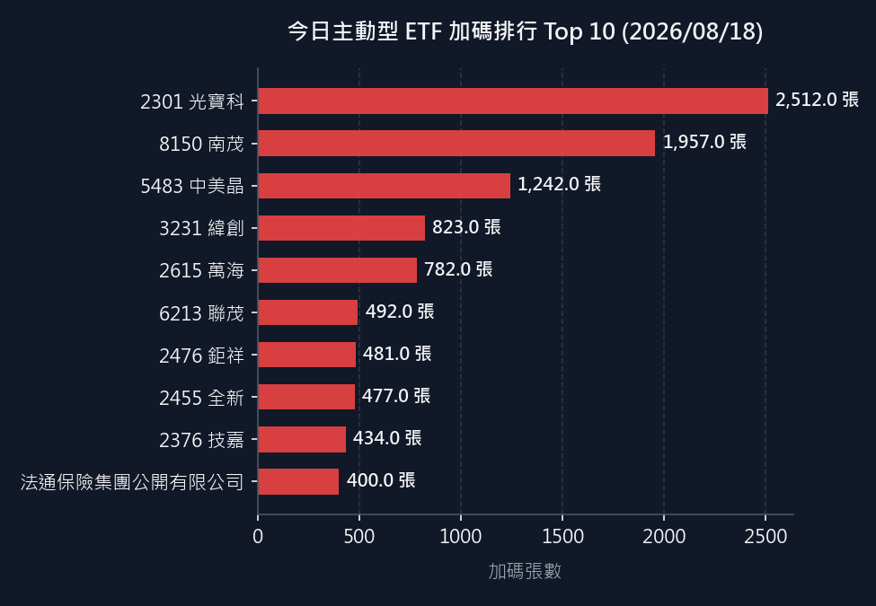
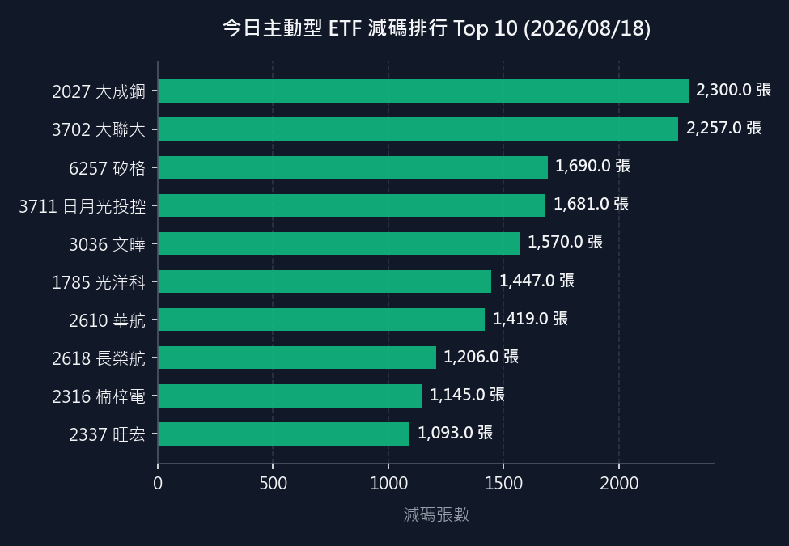

# 主動型 ETF 持股變動

資料來源：`主動型ETF持股明細.xlsx` 最近兩個日期分頁。

比較區間：`20260817` → `20260818`

## 今日加減碼視覺化排行

| 今日加碼 Top 10 | 今日減碼 Top 10 |
| :---: | :---: |
|  |  |

| ETF | 新增 | 刪除 | 比例變動 |
| :-- | --: | --: | --: |
| 00400A | 0 | 1 | 40 |
| 00401A | 1 | 1 | 50 |
| 00402A | 0 | 1 | 44 |
| 00403A | 1 | 1 | 33 |
| 00404A | 0 | 0 | 0 |
| 00405A | 0 | 0 | 31 |
| 00407A | 2 | 3 | 40 |
| 00408A | 0 | 1 | 41 |
| 00980A | 0 | 0 | 0 |
| 00980D | 2 | 0 | 118 |
| 00981A | 0 | 0 | 26 |
| 00982A | 16 | 0 | 43 |
| 00983A | 0 | 0 | 38 |
| 00983D | 0 | 0 | 67 |
| 00984A | 0 | 1 | 84 |
| 00985A | 2 | 2 | 40 |
| 00986A | 0 | 0 | 31 |
| 00987A | 0 | 0 | 25 |
| 00988A | 1 | 1 | 43 |
| 00989A | 0 | 0 | 56 |
| 00990A | 1 | 3 | 44 |
| 00991A | 0 | 0 | 18 |
| 00992A | 13 | 4 | 29 |
| 00993A | 16 | 17 | 33 |
| 00994A | 0 | 1 | 27 |
| 00995A | 0 | 0 | 43 |
| 00996A | 0 | 0 | 43 |
| 00997A | 0 | 0 | 46 |
| 00998A | 0 | 2 | 30 |
| 00999A | 0 | 0 | 51 |

## 00400A

### 新增持股

- 無

### 刪除持股

- 6505 台塑化（0.70%，2995 張）

### 投資比例變動

- 2059 川湖：5.12% → 5.93%（+0.81）
- 2308 台達電：2.77% → 2.72%（-0.05）
- 2313 華通：0.77% → 0.78%（+0.01）
- 2317 鴻海：0.81% → 0.80%（-0.01）
- 2330 台積電：8.11% → 8.18%（+0.07）
- 2345 智邦：1.71% → 1.69%（-0.02）
- 2360 致茂：4.21% → 4.18%（-0.03）
- 2368 金像電：1.18% → 1.27%（+0.09）
- 2383 台光電：6.09% → 6.05%（-0.04）
- 2449 京元電子：1.35% → 0.79%（-0.56）
- 2454 聯發科：6.28% → 6.12%（-0.16）
- 2881 富邦金：0.70% → 0.74%（+0.04）
- 2885 元大金：1.36% → 1.34%（-0.02）
- 3008 大立光：2.58% → 2.73%（+0.15）
- 3017 奇鋐：3.49% → 3.42%（-0.07）
- 3036 文曄：1.55% → 1.04%（-0.51）
- 3037 欣興：5.46% → 5.68%（+0.22）
- 3044 健鼎：1.65% → 1.69%（+0.04）
- 3211 順達：0.80% → 0.79%（-0.01）
- 3293 鈊象：0.32% → 0.33%（+0.01）
- 3374 精材：0.26% → 0.28%（+0.02）
- 3443 創意：3.67% → 3.53%（-0.14）
- 3653 健策：4.35% → 4.27%（-0.08）
- 3665 貿聯-KY：2.49% → 2.66%（+0.17）
- 4979 華星光：0.53% → 0.52%（-0.01）
- 5274 信驊：2.94% → 3.00%（+0.06）
- 5347 世界：0.72% → 0.70%（-0.02）
- 5434 崇越：0.34% → 0.37%（+0.03）
- 6187 萬潤：2.72% → 2.52%（-0.20）
- 6223 旺矽：4.55% → 4.21%（-0.34）
- 6239 力成：0.94% → 0.92%（-0.02）
- 6274 台燿：1.10% → 1.08%（-0.02）
- 6442 光聖：0.88% → 0.85%（-0.03）
- 6488 環球晶：3.16% → 3.33%（+0.17）
- 6515 穎崴：0.46% → 0.44%（-0.02）
- 6669 緯穎：3.06% → 3.00%（-0.06）
- 6715 嘉基：0.19% → 0.20%（+0.01）
- 7750 新代：0.97% → 1.02%（+0.05）
- 7769 鴻勁：0.76% → 0.74%（-0.02）
- 8046 南電：1.11% → 1.09%（-0.02）

## 00401A

### 新增持股

- 台股期貨09/26（-0.14%，N/A 張）

### 刪除持股

- TAIEX FUTURES 16SEP26 FTU6（-0.02%，N/A 張）

### 投資比例變動

- 1477 聚陽：0.81% → 0.79%（-0.02）
- 2059 川湖：1.06% → 1.12%（+0.06）
- 2303 聯電：0.87% → 0.86%（-0.01）
- 2308 台達電：3.44% → 3.37%（-0.07）
- 2313 華通：1.61% → 1.63%（+0.02）
- 2317 鴻海：0.64% → 0.63%（-0.01）
- 2327 國巨*：0.72% → 0.69%（-0.03）
- 2330 台積電：15.40% → 15.49%（+0.09）
- 2345 智邦：2.38% → 2.34%（-0.04）
- 2357 華碩：1.40% → 1.38%（-0.02）
- 2360 致茂：2.01% → 1.99%（-0.02）
- 2368 金像電：0.28% → 0.30%（+0.02）
- 2382 廣達：2.36% → 2.34%（-0.02）
- 2383 台光電：2.07% → 2.05%（-0.02）
- 2412 中華電：0.83% → 0.85%（+0.02）
- 2454 聯發科：6.24% → 6.07%（-0.17）
- 2455 全新：2.02% → 2.05%（+0.03）
- 2603 長榮：1.09% → 1.14%（+0.05）
- 2615 萬海：0.02% → 0.03%（+0.01）
- 2881 富邦金：1.81% → 1.90%（+0.09）
- 2882 國泰金：1.00% → 1.02%（+0.02）
- 2884 玉山金：1.76% → 1.80%（+0.04）
- 2886 兆豐金：1.36% → 1.39%（+0.03）
- 2887 台新新光金：1.04% → 1.05%（+0.01）
- 2891 中信金：1.59% → 1.64%（+0.05）
- 3008 大立光：2.47% → 2.61%（+0.14）
- 3037 欣興：2.52% → 2.62%（+0.10）
- 3167 大量：0.49% → 0.55%（+0.06）
- 3231 緯創：0.38% → 0.37%（-0.01）
- 3491 昇達科：1.70% → 1.62%（-0.08）
- 3653 健策：0.43% → 0.42%（-0.01）
- 3711 日月光投控：2.04% → 2.02%（-0.02）
- 4904 遠傳：0.78% → 0.80%（+0.02）
- 4938 和碩：0.32% → 0.33%（+0.01）
- 4958 臻鼎-KY：1.98% → 1.89%（-0.09）
- 5274 信驊：2.05% → 2.08%（+0.03）
- 5347 世界：1.37% → 1.33%（-0.04）
- 5904 寶雅*：0.63% → 0.66%（+0.03）
- 6187 萬潤：0.81% → 0.75%（-0.06）
- 6223 旺矽：1.96% → 1.80%（-0.16）
- 6285 啟碁：1.50% → 1.48%（-0.02）
- 6510 精測：0.68% → 0.66%（-0.02）
- 6515 穎崴：1.11% → 1.08%（-0.03）
- 6531 愛普*：1.14% → 1.15%（+0.01）
- 6669 緯穎：2.16% → 2.12%（-0.04）
- 6944 兆聯實業：0.46% → 0.45%（-0.01）
- 7769 鴻勁：1.97% → 1.93%（-0.04）
- 7828 創新服務：1.79% → 1.71%（-0.08）
- 8464 億豐：1.11% → 1.12%（+0.01）
- 臺指選擇權08/26 45600 買權：-0.24% → -0.04%（+0.20）

## 00402A

### 新增持股

- 無

### 刪除持股

- NXPI.US NXP Semiconductors（1.11%，10.4 張）

### 投資比例變動

- AAPL.US Apple：7.09% → 7.11%（+0.02）
- ADI.US Analog Devices：1.89% → 1.91%（+0.02）
- AMD.US AMD：4.68% → 4.62%（-0.06）
- AMZN.US Amazon：4.30% → 4.29%（-0.01）
- ANET.US Arista Networks：0.84% → 0.86%（+0.02）
- ARM.US Arm：1.08% → 1.05%（-0.03）
- ASML.US ASML Holding：1.76% → 1.80%（+0.04）
- AXON.US Axon Enterprise：1.11% → 1.10%（-0.01）
- BKNG.US Booking Holdings：0.72% → 0.70%（-0.02）
- CIEN.US Ciena：0.90% → 0.93%（+0.03）
- CLS.US Celestica：0.93% → 0.95%（+0.02）
- COHR.US Coherent：2.13% → 2.31%（+0.18）
- CRWD.US CrowdStrike Holdings：1.45% → 1.43%（-0.02）
- DASH.US DoorDash：0.30% → 0.29%（-0.01）
- FSLY.US Fastly：0.45% → 0.44%（-0.01）
- GOOG.US Alphabet - Class C Capital Stock：3.39% → 3.38%（-0.01）
- GOOGL.US Alphabet - Class A Common Stock：3.35% → 3.34%（-0.01）
- INTC.US Intel：1.34% → 1.36%（+0.02）
- KLAC.US KLA：2.27% → 2.30%（+0.03）
- LITE.US Lumentum：1.85% → 1.95%（+0.10）
- LRCX.US Lam Research：2.90% → 3.01%（+0.11）
- MCHP.US Microchip Technology：1.19% → 1.22%（+0.03）
- MDB.US MongoDB：0.90% → 0.86%（-0.04）
- META.US Meta：2.81% → 2.73%（-0.08）
- MRVL.US Marvell：1.58% → 1.68%（+0.10）
- MSFT.US Microsoft：4.30% → 4.19%（-0.11）
- MU.US Micron：6.49% → 6.79%（+0.30）
- NFLX.US Netflix：0.86% → 0.84%（-0.02）
- NOW.US ServiceNow：0.26% → 0.25%（-0.01）
- NVDA.US NVIDIA：9.21% → 9.24%（+0.03）
- PANW.US Palo Alto：3.37% → 3.31%（-0.06）
- PLTR.US Palantir Technologies：1.51% → 1.50%（-0.01）
- SHOP.US Shopify：0.53% → 0.51%（-0.02）
- SIMO.US Silicon Motion：0.81% → 0.82%（+0.01）
- SKHY.US SK hynix：1.05% → 1.09%（+0.04）
- SPCX.US SpaceX：0.72% → 0.75%（+0.03）
- SPOT.US Spotify：0.28% → 0.27%（-0.01）
- STX.US Seagate：1.19% → 1.23%（+0.04）
- TER.US Teradyne：0.97% → 1.03%（+0.06）
- TSM.US TSMC(ADR)：1.45% → 1.47%（+0.02）
- TTWO.US Take-Two：0.57% → 0.56%（-0.01）
- TXN.US Texas Instruments：2.26% → 2.30%（+0.04）
- V.US Visa：1.09% → 1.08%（-0.01）
- WDC.US Western Digital：2.31% → 2.45%（+0.14）

## 00403A

### 新增持股

- 2059 川湖（0.17%，20 張）

### 刪除持股

- 6415 矽力*-KY（0.00%，1 張）

### 投資比例變動

- 1303 南亞：1.01% → 1.04%（+0.03）
- 1560 中砂：0.63% → 0.43%（-0.20）
- 2303 聯電：5.39% → 5.42%（+0.03）
- 2308 台達電：3.22% → 3.19%（-0.03）
- 2327 國巨*：3.34% → 3.25%（-0.09）
- 2330 台積電：16.18% → 16.45%（+0.27）
- 2337 旺宏：0.44% → 0.42%（-0.02）
- 2344 華邦電：2.86% → 2.85%（-0.01）
- 2345 智邦：2.97% → 2.96%（-0.01）
- 2383 台光電：6.03% → 6.04%（+0.01）
- 2454 聯發科：4.80% → 4.72%（-0.08）
- 2455 全新：0.08% → 0.05%（-0.03）
- 3008 大立光：1.78% → 1.91%（+0.13）
- 3017 奇鋐：6.22% → 5.25%（-0.97）
- 3037 欣興：5.32% → 5.58%（+0.26）
- 3189 景碩：2.16% → 2.12%（-0.04）
- 3264 欣銓：0.09% → 0.08%（-0.01）
- 3443 創意：1.68% → 1.63%（-0.05）
- 3450 聯鈞：0.49% → 0.53%（+0.04）
- 3533 嘉澤：0.67% → 0.57%（-0.10）
- 3583 辛耘：0.33% → 0.32%（-0.01）
- 3653 健策：2.40% → 3.03%（+0.63）
- 3665 貿聯-KY：1.44% → 1.55%（+0.11）
- 5274 信驊：2.05% → 2.11%（+0.06）
- 6223 旺矽：3.45% → 3.22%（-0.23）
- 6239 力成：0.84% → 0.82%（-0.02）
- 6274 台燿：1.51% → 1.50%（-0.01）
- 6442 光聖：0.21% → 0.20%（-0.01）
- 6488 環球晶：1.52% → 1.71%（+0.19）
- 6669 緯穎：2.27% → 2.25%（-0.02）
- 6805 富世達：0.76% → 0.79%（+0.03）
- 8046 南電：1.92% → 1.89%（-0.03）
- 8996 高力：1.09% → 1.08%（-0.01）

## 00404A

### 新增持股

- 無

### 刪除持股

- 無

### 投資比例變動

- 無

## 00405A

### 新增持股

- 無

### 刪除持股

- 無

### 投資比例變動

- 2059 川湖：1.85% → 2.00%（+0.15）
- 2330 台積電：1.37% → 1.41%（+0.04）
- 2345 智邦：3.87% → 3.89%（+0.02）
- 2368 金像電：3.64% → 3.99%（+0.35）
- 2383 台光電：4.30% → 4.35%（+0.05）
- 2449 京元電子：0.66% → 0.65%（-0.01）
- 2454 聯發科：6.21% → 6.17%（-0.04）
- 3008 大立光：1.64% → 1.77%（+0.13）
- 3017 奇鋐：8.09% → 8.06%（-0.03）
- 3037 欣興：5.62% → 5.95%（+0.33）
- 3081 聯亞：1.41% → 1.53%（+0.12）
- 3131 弘塑：1.77% → 1.81%（+0.04）
- 3443 創意：7.84% → 7.67%（-0.17）
- 3653 健策：7.29% → 7.28%（-0.01）
- 3665 貿聯-KY：6.24% → 6.78%（+0.54）
- 3711 日月光投控：0.63% → 0.01%（-0.62）
- 4991 環宇-KY：1.40% → 1.44%（+0.04）
- 5274 信驊：2.95% → 3.06%（+0.11）
- 6187 萬潤：0.88% → 0.83%（-0.05）
- 6223 旺矽：5.06% → 4.76%（-0.30）
- 6274 台燿：1.57% → 1.56%（-0.01）
- 6488 環球晶：0.36% → 0.39%（+0.03）
- 6510 精測：2.26% → 2.24%（-0.02）
- 6515 穎崴：0.49% → 0.48%（-0.01）
- 6669 緯穎：4.13% → 2.22%（-1.91）
- 6805 富世達：1.24% → 1.30%（+0.06）
- 6831 邁科：0.55% → 0.54%（-0.01）
- 7734 印能科技：1.81% → 1.79%（-0.02）
- 8028 昇陽半導體：0.16% → 0.00%（-0.16）
- 8046 南電：3.06% → 3.04%（-0.02）
- 8210 勤誠：0.54% → 0.57%（+0.03）

## 00407A

### 新增持股

- 2615 萬海（0.30%，782 張）
- 3653 健策（0.89%，48 張）

### 刪除持股

- 2376 技嘉（0.72%，575 張）
- 2458 義隆（0.09%，175 張）
- 6415 矽力*-KY（0.03%，20 張）

### 投資比例變動

- 1303 南亞：0.58% → 0.60%（+0.02）
- 2059 川湖：3.37% → 3.64%（+0.27）
- 2301 光寶科：0.09% → 0.98%（+0.89）
- 2303 聯電：2.12% → 2.14%（+0.02）
- 2308 台達電：3.76% → 3.75%（-0.01）
- 2327 國巨*：2.28% → 2.23%（-0.05）
- 2330 台積電：8.33% → 8.53%（+0.20）
- 2344 華邦電：1.81% → 1.82%（+0.01）
- 2345 智邦：2.93% → 2.94%（+0.01）
- 2360 致茂：2.21% → 2.23%（+0.02）
- 2368 金像電：1.90% → 2.08%（+0.18）
- 2379 瑞昱：0.71% → 0.72%（+0.01）
- 2383 台光電：5.98% → 6.03%（+0.05）
- 2395 研華：1.91% → 1.99%（+0.08）
- 2408 南亞科：1.97% → 2.00%（+0.03）
- 2454 聯發科：6.75% → 5.04%（-1.71）
- 3008 大立光：0.11% → 0.59%（+0.48）
- 3017 奇鋐：4.68% → 4.65%（-0.03）
- 3034 聯詠：0.64% → 0.66%（+0.02）
- 3037 欣興：5.14% → 5.42%（+0.28）
- 3293 鈊象：0.52% → 0.55%（+0.03）
- 3443 創意：2.93% → 2.86%（-0.07）
- 3491 昇達科：0.43% → 0.42%（-0.01）
- 3529 力旺：1.80% → 1.82%（+0.02）
- 3665 貿聯-KY：1.92% → 2.08%（+0.16）
- 3711 日月光投控：2.45% → 2.46%（+0.01）
- 4958 臻鼎-KY：1.81% → 1.76%（-0.05）
- 5274 信驊：2.08% → 2.15%（+0.07）
- 5434 崇越：0.18% → 0.20%（+0.02）
- 6187 萬潤：0.48% → 0.46%（-0.02）
- 6223 旺矽：2.58% → 2.42%（-0.16）
- 6274 台燿：3.60% → 3.59%（-0.01）
- 6446 藥華藥：2.65% → 1.02%（-1.63）
- 6515 穎崴：1.37% → 1.35%（-0.02）
- 6526 達發：0.29% → 0.08%（-0.21）
- 6531 愛普*：1.44% → 1.47%（+0.03）
- 6669 緯穎：4.75% → 4.74%（-0.01）
- 6805 富世達：2.30% → 2.42%（+0.12）
- 8046 南電：2.54% → 2.79%（+0.25）
- 8210 勤誠：0.91% → 0.96%（+0.05）

## 00408A

### 新增持股

- 無

### 刪除持股

- 2356 英業達（0.32%，80 張）

### 投資比例變動

- 1477 聚陽：0.25% → 0.24%（-0.01）
- 1537 廣隆：0.19% → 0.40%（+0.21）
- 2059 川湖：2.50% → 2.65%（+0.15）
- 2303 聯電：1.29% → 1.28%（-0.01）
- 2308 台達電：3.88% → 3.81%（-0.07）
- 2317 鴻海：2.70% → 1.84%（-0.86）
- 2327 國巨*：0.37% → 0.07%（-0.30）
- 2330 台積電：5.95% → 6.01%（+0.06）
- 2344 華邦電：1.54% → 1.52%（-0.02）
- 2345 智邦：2.08% → 2.05%（-0.03）
- 2357 華碩：2.44% → 2.41%（-0.03）
- 2360 致茂：3.28% → 3.26%（-0.02）
- 2368 金像電：2.81% → 3.03%（+0.22）
- 2376 技嘉：1.19% → 1.18%（-0.01）
- 2383 台光電：6.13% → 6.14%（+0.01）
- 2395 研華：2.24% → 2.30%（+0.06）
- 2404 漢唐：1.75% → 1.72%（-0.03）
- 2454 聯發科：2.94% → 2.39%（-0.55）
- 2801 彰銀：0.88% → 0.90%（+0.02）
- 2880 華南金：1.56% → 1.60%（+0.04）
- 2886 兆豐金：2.45% → 2.51%（+0.06）
- 2891 中信金：0.95% → 0.98%（+0.03）
- 3017 奇鋐：4.96% → 4.86%（-0.10）
- 3037 欣興：4.20% → 4.37%（+0.17）
- 3045 台灣大：1.21% → 1.23%（+0.02）
- 3231 緯創：1.02% → 1.00%（-0.02）
- 3653 健策：1.62% → 1.59%（-0.03）
- 3665 貿聯-KY：0.13% → 0.14%（+0.01）
- 3702 大聯大：1.75% → 1.70%（-0.05）
- 5434 崇越：1.81% → 1.97%（+0.16）
- 5483 中美晶：1.13% → 1.14%（+0.01）
- 6187 萬潤：1.26% → 1.16%（-0.10）
- 6223 旺矽：1.23% → 0.81%（-0.42）
- 6239 力成：1.13% → 1.10%（-0.03）
- 6274 台燿：1.84% → 1.81%（-0.03）
- 6488 環球晶：1.23% → 1.63%（+0.40）
- 6669 緯穎：5.21% → 5.12%（-0.09）
- 6805 富世達：0.35% → 0.36%（+0.01）
- 7769 鴻勁：1.84% → 1.81%（-0.03）
- 8046 南電：2.82% → 2.76%（-0.06）
- 8996 高力：0.37% → 0.36%（-0.01）

## 00980A

### 新增持股

- 無

### 刪除持股

- 無

### 投資比例變動

- 無

## 00980D

### 新增持股

- CONSOLIDATED ENERGY FIN SER REGS 12.000000 % 15FEB2031（0.54%，N/A 張）
- ORACLE CORP 6.85 % 04-FEB-2066（0.39%，N/A 張）

### 刪除持股

- 無

### 投資比例變動

- AHOLD FINANCE USA LLC 6.88% 01MAY2029：0.48% → 0.47%（-0.01）
- AMC GLOBAL MEDIA INC SER REGS (REG) (REG S) 10.5% 15JUL2032：0.71% → 0.70%（-0.01）
- ANHEUSER-BUSCH INBEV WOR (REG) 8.2% 15JAN2039：0.52% → 0.51%（-0.01）
- APA CORP 6.750000 % 15-FEB-2055：0.36% → 0.35%（-0.01）
- ARCELORMITTAL SA 6.55% 29NOV2027：0.54% → 0.53%（-0.01）
- ARSENAL AIC PARENT LLC SER REGS 11.5 % 01-OCT-2031：0.32% → 0.31%（-0.01）
- ATHENE HOLDING LTD (REG) 6.25% 01APR2054：0.75% → 0.73%（-0.02）
- ATHENE HOLDING LTD 6.625000 % 19MAY2055：0.56% → 0.54%（-0.02）
- AVIANCA MIDCO 2 PLC SER REGS 9.625000 % 14FEB2030：0.31% → 0.30%（-0.01）
- BANCO SANTANDER SA 6.921% 08AUG2033：0.34% → 0.33%（-0.01）
- BARCLAYS PLC (REG) VAR 27JUN2034：0.34% → 0.33%（-0.01）
- BAT CAPITAL CORP (REG) 7.081% 02AUG2053：0.56% → 0.55%（-0.01）
- BAT CAPITAL CORP (REG) 7.75% 19OCT2032：0.45% → 0.44%（-0.01）
- BLUE OWL CREDIT INCOME 7.750000 % 15JAN2029：0.53% → 0.52%（-0.01）
- BLUE OWL TECHNOLOGY FIN CORP II 6.75 % 04APR2029：0.55% → 0.54%（-0.01）
- BRIGHTHOUSE FINANCIAL IN (REG) 4.7% 22JUN2047：0.47% → 0.45%（-0.02）
- BRITISH TELECOMMUNICATIO (BR) 9.625% 15DEC2030：0.57% → 0.56%（-0.01）
- CALDERYS FINANCING LLC SER REGS (REG S) 11.25% 01JUN2028：0.33% → 0.32%（-0.01）
- CAPITAL ONE FINANCIAL CO SER . (REG) VAR 30OCT2031：0.58% → 0.57%（-0.01）
- CARNIVAL CORP SER REGS (REG S) 7% 15AUG2029：0.55% → 0.54%（-0.01）
- CHARTER COMM OPT 6.484% 23OCT2045 W/I：0.45% → 0.44%（-0.01）
- CHARTER COMM OPT LLC/CAP (REG) 5.5% 01APR2063：0.49% → 0.48%（-0.01）
- CHARTER COMM OPT LLC/CAP (REG) 6.834000 % 23OCT2055：0.45% → 0.44%（-0.01）
- CHARTER COMM OPT LLC/CAP 6.700000 % 01-DEC-2055：0.45% → 0.44%（-0.01）
- CITIGROUP INC 8.125% 15JUL2039：0.62% → 0.61%（-0.01）
- CIVITAS RESOURCES INC SER REGS (REG) (REG S) 9.625% 15JUN2033：0.55% → 0.54%（-0.01）
- CONCENTRIX CORP (REG) 6.6% 02AUG2028：0.51% → 0.50%（-0.01）
- CONCENTRIX CORP (REG) 6.85% 02AUG2033：0.70% → 0.68%（-0.02）
- CONOCOPHILLIPS COMPANY (REG) 6.95% 15APR2029：0.51% → 0.50%（-0.01）
- COTY/HFC PRESTIGE/INT US SER REGS (REG S) 6.625% 15JUL2030：0.56% → 0.55%（-0.01）
- COX COMMUNICATIONS INC SER REGS 5.950000 % 01SEP2054：0.53% → 0.52%（-0.01）
- DAIMLER FINANCE NA LLC REG 8.5% 18JAN2031：0.63% → 0.62%（-0.01）
- DELL INT LLC / EMC CORP (REG) 8.1% 15JUL2036：0.58% → 0.57%（-0.01）
- DELL INT LLC / EMC CORP (REG) 8.35% 15JUL2046：0.55% → 0.54%（-0.01）
- DEUTSCHE TELEKOM INT FIN (REG) 8.75% 15JUN2030：0.41% → 0.40%（-0.01）
- DEUTSCHE TELEKOM INT FIN (REG) 9.25% 01JUN2032：0.42% → 0.41%（-0.01）
- DEVON ENERGY CORPORATION (REG) 7.875% 30SEP2031：0.47% → 0.46%（-0.01）
- DISCOVER FINANCIAL SVS (REG) VAR 02NOV2034：0.63% → 0.62%（-0.01）
- DOW CHEMICAL CO/THE (REG) 5.55% 30NOV2048：0.55% → 0.54%（-0.01）
- DOW CHEMICAL CO/THE (REG) 5.6% 15FEB2054：0.59% → 0.58%（-0.01）
- DOW CHEMICAL CO/THE 5.950000 % 15MAR2055：0.49% → 0.48%（-0.01）
- DOW CHEMICAL CO/THE 6.9% 15MAY2053：0.59% → 0.58%（-0.01）
- DOW CHEMICAL CO/THE 9.4% 15MAY2039：0.54% → 0.53%（-0.01）
- F&G ANNUITIES & LIFE INC 6.250000 % 04OCT2034：0.50% → 0.49%（-0.01）
- FIFTH THIRD BANCORP (REG) 8.25% 01MAR2038：0.64% → 0.63%（-0.01）
- FMC CORP (REG) 4.5% 01OCT2049：0.49% → 0.48%（-0.01）
- FMC CORP (REG) 6.375000 % 18MAY2053：0.46% → 0.45%（-0.01）
- FORD MOTOR COMPANY (REG) 7.45% 16JUL2031：0.47% → 0.46%（-0.01）
- FORD MOTOR CREDIT CO LLC (REG) 7.35% 04NOV2027：0.33% → 0.32%（-0.01）
- FORD MOTOR CREDIT CO LLC 7.122% 07NOV2033：0.34% → 0.33%（-0.01）
- FREEDOM MORTGAGE CORP SER REGS (REG S) 12.25% 01OCT2030：0.47% → 0.46%（-0.01）
- GENERAL MOTORS CO (REG) 6.75% 01APR2046：0.56% → 0.55%（-0.01）
- GENERAL MOTORS CO (REG) 6.8% 01OCT2027：0.55% → 0.54%（-0.01）
- GETTY IMAGES INC SER REGS 11.250000 % 21FEB2030：0.48% → 0.47%（-0.01）
- GLENCORE FINANCE CANADA SER REGS 6.900000 % 15-NOV-2037：0.39% → 0.38%（-0.01）
- GLOBAL ATLANTIC FIN CO SER REGS 6.750000 % 15MAR2054：0.61% → 0.60%（-0.01）
- GLOBAL ATLANTIC FIN CO SER REGS 7.950000 % 15JUN2033：0.65% → 0.64%（-0.01）
- GLOBAL AUTO HO/AAG FH UK SER REGS (REG S) 8.75% 15JAN2032：0.43% → 0.42%（-0.01）
- GRAY TELEVISION INC SER REGS (REG) (REG S) 10.5% 15JUL2029：0.57% → 0.56%（-0.01）
- HAH GROUP HOLDING CO LLC SER REGS (REG S) 9.75% 01OCT2031：0.30% → 0.29%（-0.01）
- HERTZ CORP/THE SER REGS (REG S) 12.625% 15JUL2029：0.31% → 0.30%（-0.01）
- HISCOX LTD VAR 11JUN2036：0.43% → 0.42%（-0.01）
- HPS CORPORATE LENDING FU 6.750000 % 30JAN2029：0.53% → 0.52%（-0.01）
- ICAHN ENTERPRISES/FIN (REG) 9.75% 15JAN2029：0.32% → 0.31%（-0.01）
- ICAHN ENTERPRISES/FIN SER REGS 10.000000 % 15NOV2029：0.31% → 0.30%（-0.01）
- INTESA SANPAOLO SPA SER REGS (REG) 7.200000 % 28NOV2033：0.35% → 0.34%（-0.01）
- JBS USA HOLD/FOOD/LUX CO 7.250000 % 15NOV2053：0.47% → 0.46%（-0.01）
- JETBLUE AIRWAYS/LOYALTY SER REGS (REG S) 9.875% 20SEP2031：0.50% → 0.49%（-0.01）
- KELLANOVA SER B (REG) 7.450000 % 01APR2031：0.56% → 0.55%（-0.01）
- LADDER CAP FIN LLLP/CORP SER REGS 7.000000 % 15JUL2031：0.33% → 0.32%（-0.01）
- LINCOLN NATIONAL CORP (REG) 7.000000 % 15JUN2040：0.46% → 0.45%（-0.01）
- META PLATFORMS INC 5.750000 % 15-NOV-2065：0.42% → 0.41%（-0.01）
- METLIFE INC (REG) 10.75% 01AUG2039：0.45% → 0.44%（-0.01）
- MOBIUS MERGER SUB SER REGS 9.000000 % 01JUN2030：0.25% → 0.24%（-0.01）
- MOHEGAN TRIBAL / MS DIG SER REGS 11.875000 % 15APR2031：0.67% → 0.66%（-0.01）
- MPLX LP 6.200000 % 15SEP2055：0.33% → 0.32%（-0.01）
- MYLAN INC (REG) 5.4% 29/11/2043：0.33% → 0.32%（-0.01）
- MYLAN INC SER WI (REG) 5.2% 15APR2048WI：0.48% → 0.47%（-0.01）
- MYLAN NV 5.25% 15JUN2046 WI：0.52% → 0.51%（-0.01）
- NATIONWIDE MUTUAL INSUR 9.375% 15AUG2039：0.52% → 0.51%（-0.01）
- OCCIDENTAL PETROLEUM COR (REG) 7.5% 01MAY2031：0.33% → 0.32%（-0.01）
- OCCIDENTAL PETROLEUM COR 8.875% 15JUL2030：0.53% → 0.54%（+0.01）
- OPEN TEXT CORP SER REGS (REG) (REG S) 6.9% 01DEC2027：0.65% → 0.64%（-0.01）
- ORACLE CORP (REG) 5.500000 % 27SEP2064：0.54% → 0.53%（-0.01）
- ORACLE CORP 6.100000 % 26-SEP-2065：0.48% → 0.47%（-0.01）
- ORACLE CORP 6.125000 % 03AUG2065：0.51% → 0.50%（-0.01）
- ORACLE CORP 6.9% 09NOV2052：0.51% → 0.50%（-0.01）
- OVINTIV INC 7.375% 01NOV2031：0.33% → 0.32%（-0.01）
- PACIFIC GAS & ELECTRIC (REG) 6.7% 01APR2053：0.33% → 0.32%（-0.01）
- PACIFIC GAS & ELECTRIC (REG) 6.75% 15JAN2053：0.33% → 0.32%（-0.01）
- PACIFIC GAS & ELECTRIC 6.95% 15MAR2034：0.33% → 0.32%（-0.01）
- POLARIS INC 6.950000 % 15MAR2029：0.47% → 0.46%（-0.01）
- PROGRESS ENERGY INC (REG) 7.75% 01MAR2031：0.57% → 0.56%（-0.01）
- RIO TINTO FIN USA LTD (REG) 7.125% 15JUL2028：0.56% → 0.55%（-0.01）
- RR DONNELLEY & SONS CO SER REGS (REG S) 9.5% 01AUG2029：0.42% → 0.41%（-0.01）
- SABRE FINANCIAL BORROWER SER REGS 11.125 % 15-JUN-2029：0.53% → 0.52%（-0.01）
- SALESFORCE INC (REG) 6.55% 15MAR2056：0.52% → 0.51%（-0.01）
- SALESFORCE INC (REG) 6.7% 15MAR2066：0.51% → 0.50%（-0.01）
- SANTANDER HOLDINGS USA VAR 09MAR2029：0.47% → 0.46%（-0.01）
- SBL HOLDINGS INC SER REGS 7.200000 % 30OCT2034：0.51% → 0.50%（-0.01）
- SPRINT CAPITAL CORP (REG) 8.75% 15MAR2032：0.41% → 0.40%（-0.01）
- STAPLES INC SER REGS (REG S) 10.75% 01SEP2029：0.48% → 0.47%（-0.01）
- SUNCOR ENERGY INC (REG) 6.8% 15MAY2038：0.42% → 0.41%（-0.01）
- SYMETRA LIFE INSURANCE SER REGS 6.550000 % 01OCT2055：0.31% → 0.30%（-0.01）
- TELEFONICA EUROPE BV (REG) 8.25% 15SEP2030：0.41% → 0.40%（-0.01）
- TIME WARNER CABLE INC REG 7.3% 01JUL2038：0.31% → 0.30%（-0.01）
- UBS GROUP AG SER REGS (REG S) VAR 15NOV2033：0.47% → 0.46%（-0.01）
- US 10YR NOTE (CBT)SEP26 21-SEP-2026：18.23% → 18.06%（-0.17）
- US 10YR ULTRA FUT SEP26 21-SEP-2026：-1.21% → -1.20%（+0.01）
- US 2YR NOTE (CBT) SEP26 30-SEP-2026：1.94% → 1.92%（-0.02）
- US 5YR NOTE (CBT) SEP26 30-SEP-2026：-15.87% → -15.73%（+0.14）
- US LONG BOND(CBT) SEP26 21-SEP-2026：5.30% → 5.23%（-0.07）
- US ULTRA BOND CBT SEP26 21-SEP-2026：-0.35% → -0.34%（+0.01）
- VALERO ENERGY CORP (REG) 7.5% 15APR2032：0.48% → 0.47%（-0.01）
- VIACOM INC (REG) 5.85% 01SEP2043：0.56% → 0.55%（-0.01）
- VIACOMCBS INC (REG) 4.95% 19MAY2050：0.49% → 0.48%（-0.01）
- WESTLAKE CORP 6.375000 % 15-NOV-2055：0.51% → 0.50%（-0.01）
- ZIONS BANCORP NA VAR 19NOV2035：0.41% → 0.40%（-0.01）

## 00981A

### 新增持股

- 無

### 刪除持股

- 無

### 投資比例變動

- 2303 聯電：3.45% → 3.51%（+0.06）
- 2308 台達電：4.32% → 4.33%（+0.01）
- 2327 國巨*：5.01% → 4.92%（-0.09）
- 2330 台積電：9.43% → 9.71%（+0.28）
- 2345 智邦：4.89% → 4.93%（+0.04）
- 2368 金像電：1.15% → 1.08%（-0.07）
- 2383 台光電：10.00% → 10.14%（+0.14）
- 2449 京元電子：0.91% → 0.90%（-0.01）
- 2454 聯發科：7.15% → 7.11%（-0.04）
- 3037 欣興：7.38% → 7.82%（+0.44）
- 3653 健策：4.11% → 4.15%（+0.04）
- 3665 貿聯-KY：3.19% → 3.48%（+0.29）
- 3711 日月光投控：3.89% → 3.93%（+0.04）
- 5274 信驊：2.67% → 2.78%（+0.11）
- 6187 萬潤：0.60% → 0.48%（-0.12）
- 6223 旺矽：4.59% → 4.33%（-0.26）
- 6271 同欣電：0.14% → 0.15%（+0.01）
- 6274 台燿：2.85% → 2.86%（+0.01）
- 6278 台表科：0.18% → 0.19%（+0.01）
- 6510 精測：0.45% → 0.44%（-0.01）
- 6669 緯穎：5.35% → 4.83%（-0.52）
- 6805 富世達：1.41% → 1.49%（+0.08）
- 8046 南電：4.04% → 4.03%（-0.01）
- 8210 勤誠：0.82% → 0.86%（+0.04）
- 8996 高力：0.43% → 0.44%（+0.01）
- 台指期貨(B) 2026/08：2.02% → 2.06%（+0.04）

## 00982A

### 新增持股

- 2301 光寶科（0.48%，879 張）
- 2395 研華（0.47%，344 張）
- 2428 興勤（0.11%，226 張）
- 2455 全新（0.46%，555 張）
- 2476 鉅祥（0.11%，481 張）
- 2478 大毅（0.11%，460 張）
- 3090 日電貿（0.11%，346 張）
- 3265 台星科（0.46%，1358 張）
- 3617 碩天（0.11%，221 張）
- 5425 台半（0.12%，639 張）
- 5483 中美晶（0.46%，1242 張）
- 6196 帆宣（0.11%，113 張）
- 6213 聯茂（0.12%，119 張）
- 6214 精誠（0.46%，1319 張）
- 6672 騰輝電子-KY（0.12%，203 張）
- 8070 長華*（0.23%，2075 張）

### 刪除持股

- 無

### 投資比例變動

- 1785 光洋科：0.87% → 0.59%（-0.28）
- 2059 川湖：4.82% → 5.31%（+0.49）
- 2303 聯電：2.10% → 2.17%（+0.07）
- 2316 楠梓電：1.10% → 0.74%（-0.36）
- 2327 國巨*：0.80% → 0.54%（-0.26）
- 2330 台積電：8.16% → 8.53%（+0.37）
- 2345 智邦：3.55% → 3.63%（+0.08）
- 2351 順德：0.75% → 0.55%（-0.20）
- 2360 致茂：3.75% → 3.85%（+0.10）
- 2376 技嘉：0.30% → 0.66%（+0.36）
- 2377 微星：1.61% → 1.68%（+0.07）
- 2383 台光電：3.94% → 4.05%（+0.11）
- 2451 創見：0.29% → 0.20%（-0.09）
- 2454 聯發科：6.70% → 6.77%（+0.07）
- 2467 志聖：1.68% → 1.70%（+0.02）
- 2472 立隆電：0.70% → 0.47%（-0.23）
- 3008 大立光：2.38% → 2.62%（+0.24）
- 3017 奇鋐：2.43% → 2.50%（+0.07）
- 3036 文曄：0.93% → 0.65%（-0.28）
- 3105 穩懋：3.63% → 3.60%（-0.03）
- 3231 緯創：0.03% → 0.47%（+0.44）
- 3264 欣銓：1.98% → 2.01%（+0.03）
- 3491 昇達科：2.52% → 2.50%（-0.02）
- 3529 力旺：0.42% → 0.43%（+0.01）
- 3583 辛耘：1.60% → 1.62%（+0.02）
- 3702 大聯大：1.19% → 0.81%（-0.38）
- 3711 日月光投控：1.18% → 1.22%（+0.04）
- 4958 臻鼎-KY：3.03% → 3.01%（-0.02）
- 5274 信驊：0.96% → 1.15%（+0.19）
- 5536 聖暉*：6.33% → 5.06%（-1.27）
- 6139 亞翔：6.16% → 6.29%（+0.13）
- 6223 旺矽：3.38% → 3.23%（-0.15）
- 6239 力成：0.37% → 0.38%（+0.01）
- 6257 矽格：1.90% → 1.29%（-0.61）
- 6274 台燿：1.37% → 1.39%（+0.02）
- 6278 台表科：0.82% → 0.57%（-0.25）
- 6446 藥華藥：0.11% → 0.12%（+0.01）
- 6488 環球晶：2.19% → 2.40%（+0.21）
- 6531 愛普*：2.38% → 2.48%（+0.10）
- 6669 緯穎：6.40% → 6.52%（+0.12）
- 7769 鴻勁：1.19% → 0.81%（-0.38）
- 8016 矽創：1.30% → 0.87%（-0.43）
- 8996 高力：0.88% → 0.90%（+0.02）

## 00983A

### 新增持股

- 無

### 刪除持股

- 無

### 投資比例變動

- ACHR.US Archer：0.61% → 0.72%（+0.11）
- AMD.US AMD：4.34% → 4.25%（-0.09）
- AMZN.US Amazon：3.43% → 3.40%（-0.03）
- AVGO.US Broadcom：1.92% → 1.60%（-0.32）
- BEAM.US Beam Therapeutics：2.04% → 2.06%（+0.02）
- BLSH.US Bullish：1.17% → 1.19%（+0.02）
- BMNR.US BitMine：1.30% → 1.34%（+0.04）
- CBRS.US Cerebras：0.87% → 1.00%（+0.13）
- CERS.US Cerus：0.52% → 0.51%（-0.01）
- COIN.US Coinbase：2.10% → 2.12%（+0.02）
- CRCL.US Circle：2.99% → 3.22%（+0.23）
- CRSP.US CRISPR Therapeutics：4.25% → 4.29%（+0.04）
- CRWV.US CoreWeave：1.49% → 1.60%（+0.11）
- DE.US Deere：1.40% → 1.37%（-0.03）
- FIG.US Figma：0.44% → 0.43%（-0.01）
- GOOG.US Alphabet - Class C Capital Stock：1.26% → 1.25%（-0.01）
- GOOGL.US Alphabet - Class A Common Stock：1.01% → 1.00%（-0.01）
- HOOD.US Robinhood Markets：3.85% → 3.86%（+0.01）
- ILMN.US Illumina：2.17% → 2.19%（+0.02）
- KTOS.US Kratos Defense & Security：1.15% → 1.13%（-0.02）
- META.US Meta：1.15% → 1.10%（-0.05）
- NTLA.US Intellia Therapeutics：1.34% → 1.36%（+0.02）
- NTRA.US Natera：2.19% → 2.21%（+0.02）
- PLTR.US Palantir Technologies：3.39% → 3.35%（-0.04）
- RBLX.US Roblox：0.66% → 0.65%（-0.01）
- RXRX.US Recursion Pharmaceuticals：0.30% → 0.29%（-0.01）
- SHOP.US Shopify：7.01% → 6.73%（-0.28）
- SPCX.US SpaceX：3.23% → 3.53%（+0.30）
- TEM.US Tempus：3.41% → 3.36%（-0.05）
- TER.US Teradyne：0.70% → 0.73%（+0.03）
- TSLA.US Tesla：8.23% → 8.12%（-0.11）
- TSM.US TSMC(ADR)：3.59% → 3.61%（+0.02）
- TWST.US Twist Bioscience：4.52% → 4.48%（-0.04）
- TXG.US 10x Genomics：3.86% → 3.97%（+0.11）
- VCYT.US Veracyte：0.59% → 0.60%（+0.01）
- WGS.US GeneDx：1.65% → 1.63%（-0.02）
- XE.US X-Energy：0.68% → 0.66%（-0.02）
- XYZ.US Block：2.36% → 2.28%（-0.08）

## 00983D

### 新增持股

- 無

### 刪除持股

- 無

### 投資比例變動

- ABIBB 8.2 01/15/39：1.97% → 1.95%（-0.02）
- AET 6 5/8 06/15/36：0.74% → 0.73%（-0.01）
- ALLY 8 11/01/31：0.87% → 0.86%（-0.01）
- AMCX 10 1/2 07/15/32：1.65% → 1.64%（-0.01）
- ATH 6 5/8 05/19/55：1.00% → 0.98%（-0.02）
- AWK 6.593 10/15/37：0.72% → 0.71%（-0.01）
- BACR 7.437 11/02/33：1.28% → 1.27%（-0.01）
- BATSLN 7.079 08/02/43：1.08% → 1.07%（-0.01）
- BATSLN 7.081 08/02/53：1.32% → 1.30%（-0.02）
- BHCCN 11 09/30/28：1.87% → 1.86%（-0.01）
- BNCN 7 3/8 03/01/33：1.12% → 1.11%（-0.01）
- BRITEL 9 5/8 12/15/30：1.36% → 1.35%（-0.01）
- BRKHEC 6 3/4 07/01/37：0.82% → 0.81%（-0.01）
- C 8 1/8 07/15/39：1.95% → 1.93%（-0.02）
- CEG 6 1/2 10/01/53：0.77% → 0.76%（-0.01）
- CP 7 1/8 10/15/31：0.83% → 0.82%（-0.01）
- CRWV 9 02/01/31：0.85% → 0.84%（-0.01）
- CYH 10 7/8 01/15/32：1.51% → 1.49%（-0.02）
- DELL 8.1 07/15/36：1.54% → 1.52%（-0.02）
- DELL 8.35 07/15/46：1.41% → 1.39%（-0.02）
- DIS 7 3/4 12/01/45：0.61% → 0.60%（-0.01）
- DOW 6.9 05/15/53：0.74% → 0.73%（-0.01）
- DOW 9.4 05/15/39：1.96% → 1.94%（-0.02）
- DT 9 1/4 06/01/32：0.95% → 0.94%（-0.01）
- DTV 8 7/8 02/01/30：1.61% → 1.60%（-0.01）
- DUK 7 3/4 03/01/31：1.57% → 1.55%（-0.02）
- ED 6 3/4 04/01/38：0.62% → 0.61%（-0.01）
- ENBCN 6.7 11/15/53：1.12% → 1.10%（-0.02）
- FFHCN 6.35 03/22/54：0.70% → 0.69%（-0.01）
- GE 6 7/8 01/10/39：0.85% → 0.84%（-0.01）
- GM 6 3/4 04/01/46：1.19% → 1.17%（-0.02）
- GM 6.6 04/01/36：0.40% → 0.39%（-0.01）
- GTN 10 1/2 07/15/29：1.69% → 1.68%（-0.01）
- HAL 7.45 09/15/39：1.83% → 1.81%（-0.02）
- HPE 6.35 10/15/45：1.00% → 0.98%（-0.02）
- HSBC 6.332 03/09/44：1.06% → 1.05%（-0.01）
- IEP 10 11/15/29：1.50% → 1.49%（-0.01）
- KHC 6 7/8 01/26/39：1.01% → 1.00%（-0.01）
- KMI 6.95 01/15/38：1.07% → 1.06%（-0.01）
- LQDW.US iShares Investment Grade Corpora：7.33% → 7.25%（-0.08）
- MBGGR 8 1/2 01/18/31：1.32% → 1.31%（-0.01）
- MCD 6.3 03/01/38：0.74% → 0.73%（-0.01）
- MOHEGN 11 7/8 04/15/31：1.37% → 1.36%（-0.01）
- MS 7 1/4 04/01/32：1.65% → 1.63%（-0.02）
- NVDA 5.55 06/15/46：1.15% → 1.13%（-0.02）
- OKE 6 5/8 09/01/53：0.70% → 0.69%（-0.01）
- ORCL 6.9 11/09/52：0.85% → 0.84%（-0.01）
- OXY 6.6 03/15/46：0.75% → 0.74%（-0.01）
- PCG 6 3/4 01/15/53：1.15% → 1.13%（-0.02）
- PCG 6.7 04/01/53：1.11% → 1.09%（-0.02）
- PFE 7.2 03/15/39：1.43% → 1.42%（-0.01）
- RAKUTN 11 1/4 02/15/27：1.81% → 1.80%（-0.01）
- RIOLN 7 1/4 03/15/31：0.52% → 0.51%（-0.01）
- S 8 3/4 03/15/32：0.66% → 0.65%（-0.01）
- SABHLD 10 3/4 11/15/29：0.62% → 0.61%（-0.01）
- SJM 6 1/2 11/15/43：0.20% → 0.19%（-0.01）
- SJM 6 1/2 11/15/53：0.20% → 0.19%（-0.01）
- SPCX 6.6 07/15/46：1.14% → 1.12%（-0.02）
- SUCN 6.85 06/01/39：1.23% → 1.22%（-0.01）
- TELEFONICA EMISIONES SAU 7.045 06/20/36：1.56% → 1.55%（-0.01）
- TIME WARNER CABLE INC 6.750 06/15/39：0.48% → 0.47%（-0.01）
- TLTW.US iShares 20+ Year Treasury Bond B：7.18% → 7.08%（-0.10）
- TRPCN 7 5/8 01/15/39：1.70% → 1.68%（-0.02）
- UNITEDHEALTH GROUP INC 6.875 02/15/38：0.87% → 0.86%（-0.01）
- VENLNG 9 1/2 02/01/29：1.42% → 1.41%（-0.01）
- VLO 6 5/8 06/15/37：0.75% → 0.74%（-0.01）
- VZ 7 3/4 12/01/30：1.15% → 1.14%（-0.01）

## 00984A

### 新增持股

- 無

### 刪除持股

- 6531 愛普*（1.08%，126 張）

### 投資比例變動

- 1303 南亞：2.39% → 2.42%（+0.03）
- 1326 台化：1.04% → 1.05%（+0.01）
- 1477 聚陽：0.79% → 0.77%（-0.02）
- 1560 中砂：0.69% → 0.67%（-0.02）
- 2015 豐興：0.07% → 0.08%（+0.01）
- 2049 上銀：0.61% → 0.60%（-0.01）
- 2059 川湖：5.61% → 5.83%（+0.22）
- 2201 裕隆：0.24% → 0.23%（-0.01）
- 2303 聯電：1.37% → 1.34%（-0.03）
- 2317 鴻海：1.37% → 1.36%（-0.01）
- 2324 仁寶：0.62% → 0.61%（-0.01）
- 2330 台積電：3.55% → 3.56%（+0.01）
- 2345 智邦：0.81% → 0.80%（-0.01）
- 2347 聯強：0.96% → 0.93%（-0.03）
- 2351 順德：0.26% → 0.27%（+0.01）
- 2357 華碩：0.93% → 0.92%（-0.01）
- 2360 致茂：0.98% → 0.96%（-0.02）
- 2375 凱美：0.25% → 0.24%（-0.01）
- 2376 技嘉：0.54% → 0.53%（-0.01）
- 2383 台光電：2.00% → 1.98%（-0.02）
- 2393 億光：0.25% → 0.26%（+0.01）
- 2404 漢唐：1.18% → 1.16%（-0.02）
- 2408 南亞科：2.02% → 2.00%（-0.02）
- 2409 友達：0.60% → 0.59%（-0.01）
- 2412 中華電：0.84% → 0.86%（+0.02）
- 2441 超豐：1.15% → 1.11%（-0.04）
- 2454 聯發科：1.60% → 1.55%（-0.05）
- 2464 盟立：0.74% → 0.72%（-0.02）
- 2472 立隆電：0.25% → 0.24%（-0.01）
- 2603 長榮：0.79% → 0.82%（+0.03）
- 2606 裕民：0.08% → 0.09%（+0.01）
- 2801 彰銀：1.53% → 1.55%（+0.02）
- 2812 台中銀：1.24% → 1.27%（+0.03）
- 2834 臺企銀：1.30% → 1.33%（+0.03）
- 2880 華南金：1.90% → 1.94%（+0.04）
- 2882 國泰金：0.75% → 0.77%（+0.02）
- 2885 元大金：0.76% → 0.74%（-0.02）
- 2886 兆豐金：1.94% → 1.97%（+0.03）
- 2891 中信金：0.75% → 0.76%（+0.01）
- 2892 第一金：1.61% → 1.65%（+0.04）
- 3008 大立光：2.50% → 2.64%（+0.14）
- 3026 禾伸堂：0.89% → 0.87%（-0.02）
- 3037 欣興：0.67% → 0.70%（+0.03）
- 3189 景碩：1.73% → 1.67%（-0.06）
- 3264 欣銓：0.25% → 0.24%（-0.01）
- 3443 創意：0.23% → 0.22%（-0.01）
- 3450 聯鈞：0.72% → 0.77%（+0.05）
- 3533 嘉澤：1.21% → 1.17%（-0.04）
- 3702 大聯大：0.48% → 0.47%（-0.01）
- 3711 日月光投控：1.15% → 1.13%（-0.02）
- 4123 晟德：0.20% → 0.21%（+0.01）
- 4764 雙鍵：0.46% → 0.43%（-0.03）
- 4904 遠傳：0.47% → 0.48%（+0.01）
- 4938 和碩：0.65% → 0.66%（+0.01）
- 4958 臻鼎-KY：0.99% → 0.94%（-0.05）
- 4966 譜瑞-KY：0.82% → 0.83%（+0.01）
- 5274 信驊：0.87% → 0.88%（+0.01）
- 5288 豐祥-KY：0.25% → 0.24%（-0.01）
- 5289 宜鼎：1.03% → 0.99%（-0.04）
- 5351 鈺創：1.00% → 0.91%（-0.09）
- 5434 崇越：0.29% → 0.32%（+0.03）
- 5483 中美晶：0.43% → 0.44%（+0.01）
- 5534 長虹：0.23% → 0.24%（+0.01）
- 5880 合庫金：1.55% → 1.57%（+0.02）
- 5904 寶雅*：1.08% → 1.13%（+0.05）
- 6005 群益證：1.16% → 1.17%（+0.01）
- 6139 亞翔：2.86% → 2.79%（-0.07）
- 6197 佳必琪：0.54% → 0.53%（-0.01）
- 6202 盛群：0.26% → 0.25%（-0.01）
- 6213 聯茂：1.82% → 1.86%（+0.04）
- 6223 旺矽：1.14% → 1.05%（-0.09）
- 6257 矽格：0.68% → 0.66%（-0.02）
- 6274 台燿：0.71% → 0.68%（-0.03）
- 6285 啟碁：0.54% → 0.53%（-0.01）
- 6446 藥華藥：2.55% → 2.56%（+0.01）
- 6491 晶碩：0.25% → 0.26%（+0.01）
- 6669 緯穎：0.65% → 0.64%（-0.01）
- 6944 兆聯實業：1.07% → 1.06%（-0.01）
- 7734 印能科技：0.45% → 0.44%（-0.01）
- 7769 鴻勁：1.33% → 1.30%（-0.03）
- 8039 台虹：0.80% → 0.87%（+0.07）
- 8046 南電：0.69% → 0.67%（-0.02）
- 8271 宇瞻：0.55% → 0.54%（-0.01）
- 8436 大江：0.25% → 0.26%（+0.01）

## 00985A

### 新增持股

- 1504 東元（1.01%，1454 張）
- 7750 新代（2.01%，83 張）

### 刪除持股

- 6223 旺矽（0.28%，5 張）
- 6415 矽力*-KY（0.03%，6 張）

### 投資比例變動

- 1216 統一：0.94% → 1.23%（+0.29）
- 1802 台玻：0.22% → 0.20%（-0.02）
- 2027 大成鋼：2.69% → 2.02%（-0.67）
- 2059 川湖：1.45% → 1.54%（+0.09）
- 2303 聯電：0.48% → 0.20%（-0.28）
- 2308 台達電：1.49% → 1.45%（-0.04）
- 2327 國巨*：0.52% → 0.50%（-0.02）
- 2330 台積電：13.57% → 13.63%（+0.06）
- 2344 華邦電：1.07% → 0.77%（-0.30）
- 2345 智邦：2.73% → 2.69%（-0.04）
- 2368 金像電：0.95% → 1.02%（+0.07）
- 2376 技嘉：4.98% → 4.91%（-0.07）
- 2383 台光電：1.95% → 1.39%（-0.56）
- 2395 研華：0.32% → 0.33%（+0.01）
- 2408 南亞科：2.25% → 0.97%（-1.28）
- 2412 中華電：3.38% → 3.77%（+0.39）
- 2454 聯發科：1.95% → 1.89%（-0.06）
- 2603 長榮：3.81% → 4.03%（+0.22）
- 2610 華航：1.71% → 1.72%（+0.01）
- 2891 中信金：0.19% → 0.20%（+0.01）
- 3008 大立光：2.00% → 2.11%（+0.11）
- 3017 奇鋐：2.06% → 2.01%（-0.05）
- 3037 欣興：1.72% → 1.78%（+0.06）
- 3081 聯亞：2.23% → 2.36%（+0.13）
- 3105 穩懋：2.51% → 2.39%（-0.12）
- 3529 力旺：0.23% → 0.18%（-0.05）
- 3653 健策：1.64% → 1.61%（-0.03）
- 3665 貿聯-KY：0.18% → 0.20%（+0.02）
- 3711 日月光投控：1.98% → 1.95%（-0.03）
- 4904 遠傳：3.36% → 3.79%（+0.43）
- 4958 臻鼎-KY：2.14% → 0.78%（-1.36）
- 6147 頎邦：1.65% → 1.62%（-0.03）
- 6187 萬潤：1.54% → 1.42%（-0.12）
- 6442 光聖：2.32% → 2.24%（-0.08）
- 6446 藥華藥：1.46% → 1.47%（+0.01）
- 6669 緯穎：3.37% → 3.30%（-0.07）
- 7769 鴻勁：1.17% → 1.14%（-0.03）
- 8046 南電：0.60% → 0.58%（-0.02）
- 8299 群聯：1.06% → 0.68%（-0.38）
- 8996 高力：1.32% → 1.29%（-0.03）

## 00986A

### 新增持股

- 無

### 刪除持股

- 無

### 投資比例變動

- 2454 聯發科：1.36% → 1.30%（-0.06）
- AAPL.US Apple：0.95% → 0.94%（-0.01）
- AMAT.US Applied Materials：1.83% → 1.92%（+0.09）
- AMD.US AMD：3.19% → 3.63%（+0.44）
- AMZN.US Amazon：3.80% → 3.75%（-0.05）
- AVGO.US Broadcom：4.87% → 4.02%（-0.85）
- COHR.US Coherent：2.19% → 2.34%（+0.15）
- CRDO.US Credo：0.40% → 0.43%（+0.03）
- CRWD.US CrowdStrike Holdings：4.20% → 4.11%（-0.09）
- DDOG.US Datadog：0.40% → 0.63%（+0.23）
- GEV.US GE Vernova：2.75% → 2.76%（+0.01）
- GOOGL.US Alphabet - Class A Common Stock：6.25% → 5.29%（-0.96）
- GS.US Goldman Sachs：2.95% → 2.96%（+0.01）
- HWM.US Howmet Aerospace：2.54% → 2.52%（-0.02）
- JPM.US JPMorgan Chase：1.50% → 1.48%（-0.02）
- LITE.US Lumentum：3.73% → 3.87%（+0.14）
- LLY.US Eli Lilly：2.74% → 2.73%（-0.01）
- LRCX.US Lam Research：2.92% → 3.00%（+0.08）
- MA.US Mastercard：1.03% → 1.01%（-0.02）
- MSFT.US Microsoft：2.56% → 2.46%（-0.10）
- MU.US Micron：4.01% → 4.15%（+0.14）
- MUFG(8306.JP)：1.43% → 1.41%（-0.02）
- NET.US Cloudflare：1.96% → 1.89%（-0.07）
- NVDA.US NVIDIA：6.05% → 6.00%（-0.05）
- SNDK.US Sandisk：1.70% → 1.83%（+0.13）
- SNOW.US Snowflake：1.87% → 1.86%（-0.01）
- Siemens Energy AG：2.11% → 2.13%（+0.02）
- TSEM.US Tower Semiconductor：1.03% → 1.01%（-0.02）
- 嘉能可公司：1.53% → 1.54%（+0.01）
- 施奈德電機公司：1.64% → 1.65%（+0.01）
- 英飛凌科技股份有限公司：2.94% → 2.95%（+0.01）

## 00987A

### 新增持股

- 無

### 刪除持股

- 無

### 投資比例變動

- 2308 台達電：1.89% → 1.90%（+0.01）
- 2330 台積電：7.74% → 7.97%（+0.23）
- 2345 智邦：2.30% → 2.32%（+0.02）
- 2383 台光電：7.74% → 7.85%（+0.11）
- 2408 南亞科：4.51% → 4.60%（+0.09）
- 2454 聯發科：4.64% → 4.63%（-0.01）
- 2455 全新：3.06% → 3.18%（+0.12）
- 3037 欣興：7.63% → 8.09%（+0.46）
- 3081 聯亞：3.78% → 4.11%（+0.33）
- 3363 上詮：2.07% → 2.02%（-0.05）
- 3443 創意：6.29% → 4.74%（-1.55）
- 3653 健策：3.44% → 3.45%（+0.01）
- 3665 貿聯-KY：3.83% → 4.17%（+0.34）
- 5274 信驊：0.18% → 0.19%（+0.01）
- 6187 萬潤：1.29% → 1.22%（-0.07）
- 6223 旺矽：5.61% → 5.29%（-0.32）
- 6274 台燿：4.30% → 4.31%（+0.01）
- 6515 穎崴：1.90% → 1.88%（-0.02）
- 6683 雍智科技：2.47% → 2.44%（-0.03）
- 6739 竹陞科技：1.84% → 1.85%（+0.01）
- 6805 富世達：3.59% → 3.79%（+0.20）
- 7769 鴻勁：2.90% → 2.91%（+0.01）
- 8046 南電：4.22% → 4.21%（-0.01）
- 8358 金居：1.71% → 1.76%（+0.05）
- 8996 高力：1.52% → 1.53%（+0.01）

## 00988A

### 新增持股

- Appier(4180.JP)（0.11%，250 張）

### 刪除持股

- AMAT.US Applied Materials（1.30%，48 張）

### 投資比例變動

- 2308 台達電：1.83% → 2.24%（+0.41）
- 2327 國巨*：1.61% → 1.55%（-0.06）
- 2330 台積電：2.60% → 2.57%（-0.03）
- 2383 台光電：4.59% → 4.66%（+0.07）
- 2454 聯發科：3.13% → 2.47%（-0.66）
- 3017 奇鋐：1.16% → 1.12%（-0.04）
- 3037 欣興：4.43% → 4.80%（+0.37）
- 3711 日月光投控：1.39% → 1.01%（-0.38）
- 4979 華星光：0.39% → 0.40%（+0.01）
- 6223 旺矽：2.61% → 2.31%（-0.30）
- AEHR.US Aehr Test Systems：0.50% → 0.53%（+0.03）
- AMD.US AMD：3.58% → 3.45%（-0.13）
- BE.US Bloom Energy：2.58% → 2.56%（-0.02）
- COHR.US Coherent：1.66% → 1.75%（+0.09）
- CRDO.US Credo：3.13% → 3.34%（+0.21）
- FORMFACTOR INC：1.06% → 1.09%（+0.03）
- INFINEON TECHNOLOGIES AG：1.62% → 1.60%（-0.02）
- Kioxia Holdings(285A.JP)：3.25% → 3.67%（+0.42）
- LITE.US Lumentum：5.80% → 5.95%（+0.15）
- LMT.US Lockheed Martin：1.24% → 1.18%（-0.06）
- MPWR.US Monolithic Power Systems：1.35% → 1.34%（-0.01）
- MRVL.US Marvell：2.44% → 2.52%（+0.08）
- MU.US Micron：3.64% → 3.71%（+0.07）
- Meiko Electronics(6787.JP)：0.98% → 1.02%（+0.04）
- Murata Mfg.(6981.JP)：3.74% → 3.69%（-0.05）
- NET.US Cloudflare：0.76% → 0.72%（-0.04）
- NOW.US ServiceNow：1.79% → 0.83%（-0.96）
- Nippon Chemi-Con(6997.JP)：1.36% → 1.32%（-0.04）
- PANW.US Palo Alto：3.08% → 2.96%（-0.12）
- PLTR.US Palantir Technologies：1.68% → 1.63%（-0.05）
- SNDK.US Sandisk：1.84% → 1.97%（+0.13）
- SNOW.US Snowflake：2.29% → 2.25%（-0.04）
- SPCX.US SpaceX：1.20% → 1.53%（+0.33）
- STX.US Seagate：2.60% → 3.13%（+0.53）
- Samsung Elec Mech(009150.KS)：4.14% → 4.07%（-0.07）
- TAIYO YUDEN(6976.JP)：1.67% → 1.68%（+0.01）
- TER.US Teradyne：1.23% → 1.28%（+0.05）
- TSEM.US Tower Semiconductor：3.08% → 3.00%（-0.08）
- TWLO.US Twilio：0.70% → 0.66%（-0.04）
- WDC.US Western Digital：2.18% → 2.25%（+0.07）
- 三環集團(300408.SZ)：1.79% → 1.77%（-0.02）
- 中際旭創(3308.HK)：0.88% → 0.93%（+0.05）
- 鼎泰高科(301377.SZ)：1.04% → 1.05%（+0.01）

## 00989A

### 新增持股

- 無

### 刪除持股

- 無

### 投資比例變動

- ADBE.US Adobe：0.94% → 0.91%（-0.03）
- AMAT.US Applied Materials：0.68% → 0.72%（+0.04）
- AMD.US AMD：2.65% → 2.62%（-0.03）
- AMKR.US Amkor：0.76% → 0.79%（+0.03）
- APP.US Applovin：0.60% → 0.59%（-0.01）
- ASML.US ASML Holding：1.77% → 1.81%（+0.04）
- BE.US Bloom Energy：1.05% → 1.06%（+0.01）
- CBRS.US Cerebras：0.20% → 0.23%（+0.03）
- CIEN.US Ciena：2.00% → 2.08%（+0.08）
- CRCL.US Circle：0.33% → 0.35%（+0.02）
- CRM.US Salesforce：2.11% → 2.06%（-0.05）
- CRWD.US CrowdStrike Holdings：3.16% → 3.13%（-0.03）
- CRWV.US CoreWeave：0.82% → 0.83%（+0.01）
- DOCN.US DigitalOcean：1.48% → 1.54%（+0.06）
- ENPH.US Enphase Energy：0.19% → 0.18%（-0.01）
- ENTG.US Entegris：0.85% → 0.86%（+0.01）
- ESTC.US Elastic：0.24% → 0.23%（-0.01）
- FIGR.US Figure：0.76% → 0.87%（+0.11）
- FN.US Fabrinet：0.74% → 0.78%（+0.04）
- GFS.US GlobalFoundries：1.12% → 1.10%（-0.02）
- GLW.US Corning：1.88% → 1.97%（+0.09）
- GOOG.US Alphabet - Class C Capital Stock：4.06% → 4.05%（-0.01）
- HOOD.US Robinhood Markets：2.16% → 2.18%（+0.02）
- HUBS.US HubSpot：1.47% → 1.41%（-0.06）
- INTC.US Intel：2.90% → 2.94%（+0.04）
- LITE.US Lumentum：1.71% → 1.80%（+0.09）
- LMND.US Lemonade：0.78% → 0.74%（-0.04）
- LRCX.US Lam Research：2.21% → 2.29%（+0.08）
- META.US Meta：2.57% → 2.48%（-0.09）
- MSFT.US Microsoft：3.09% → 3.01%（-0.08）
- MTSI.US MACOM Technology Solutions：1.08% → 1.12%（+0.04）
- MU.US Micron：0.81% → 0.85%（+0.04）
- NET.US Cloudflare：2.84% → 2.77%（-0.07）
- NOW.US ServiceNow：1.53% → 1.45%（-0.08）
- NU.US Nu：0.92% → 0.89%（-0.03）
- ON.US ON Semiconductor：1.53% → 1.55%（+0.02）
- ORCL.US Oracle：1.33% → 1.29%（-0.04）
- PANW.US Palo Alto：4.37% → 4.29%（-0.08）
- RIVN.US Rivian：1.26% → 1.22%（-0.04）
- ROK.US Rockwell Automation：0.84% → 0.83%（-0.01）
- SHOP.US Shopify：2.10% → 2.03%（-0.07）
- SNDK.US Sandisk：0.61% → 0.66%（+0.05）
- SNOW.US Snowflake：3.11% → 3.13%（+0.02）
- SPCX.US SpaceX：0.72% → 0.76%（+0.04）
- TEM.US Tempus：0.83% → 0.82%（-0.01）
- TSLA.US Tesla：2.69% → 2.68%（-0.01）
- TSM.US TSMC(ADR)：1.11% → 1.13%（+0.02）
- TTMI.US TTM Technologies：0.58% → 0.59%（+0.01）
- TTWO.US Take-Two：3.69% → 3.62%（-0.07）
- TWLO.US Twilio：2.33% → 2.24%（-0.09）
- TXN.US Texas Instruments：1.46% → 1.48%（+0.02）
- U.US Unity Software：0.52% → 0.66%（+0.14）
- VICR.US Vicor Corporation：0.82% → 0.89%（+0.07）
- WRBY.US Warby Parker：0.65% → 0.64%（-0.01）
- XYZ.US Block：0.76% → 0.73%（-0.03）
- ZM.US Zoom：2.10% → 2.09%（-0.01）

## 00990A

### 新增持股

- DIOD.US Diodes（0.92%，111.9 張）

### 刪除持股

- NOW.US ServiceNow（0.95%，98.2 張）
- SHOP.US Shopify（2.03%，168.5 張）
- TEAM.US Atlassian（0.50%，39.8 張）

### 投資比例變動

- 2308 台達電：2.03% → 1.99%（-0.04）
- 2330 台積電：2.37% → 2.33%（-0.04）
- 2345 智邦：0.97% → 0.94%（-0.03）
- 2383 台光電：2.72% → 2.75%（+0.03）
- 2449 京元電子：0.61% → 0.60%（-0.01）
- 2454 聯發科：2.52% → 2.37%（-0.15）
- 3037 欣興：2.85% → 3.07%（+0.22）
- 3711 日月光投控：0.96% → 0.94%（-0.02）
- 6223 旺矽：1.41% → 1.25%（-0.16）
- 6274 台燿：1.04% → 0.97%（-0.07）
- 8046 南電：0.49% → 0.93%（+0.44）
- AEHR.US Aehr Test Systems：1.30% → 1.38%（+0.08）
- AMAT.US Applied Materials：1.87% → 1.92%（+0.05）
- AMD.US AMD：2.41% → 3.27%（+0.86）
- AXTI.US AXT：1.71% → 1.95%（+0.24）
- BE.US Bloom Energy：2.60% → 2.56%（-0.04）
- CIEN.US Ciena：1.01% → 1.02%（+0.01）
- COHR.US Coherent：2.90% → 3.04%（+0.14）
- CRDO.US Credo：2.80% → 2.97%（+0.17）
- DELL.US Dell：2.89% → 2.75%（-0.14）
- FSLY.US Fastly：1.00% → 0.95%（-0.05）
- IBIDEN(4062.JP)：0.92% → 0.93%（+0.01）
- INFINEON TECHNOLOGIES AG：1.86% → 1.82%（-0.04）
- INTC.US Intel：1.46% → 1.44%（-0.02）
- Kioxia Holdings(285A.JP)：3.88% → 4.36%（+0.48）
- LITE.US Lumentum：7.33% → 7.46%（+0.13）
- MRVL.US Marvell：2.77% → 2.84%（+0.07）
- MU.US Micron：5.62% → 6.21%（+0.59）
- Murata Mfg.(6981.JP)：3.23% → 3.17%（-0.06）
- NBIS.US Nebius Group：1.08% → 1.02%（-0.06）
- NVDA.US NVIDIA：1.05% → 1.02%（-0.03）
- PANW.US Palo Alto：1.59% → 1.51%（-0.08）
- PLTR.US Palantir Technologies：0.76% → 0.73%（-0.03）
- RBRK.US Rubrik：0.98% → 0.94%（-0.04）
- SK hynix(000660.KS)：0.97% → 0.95%（-0.02）
- SMTC.US Semtech：1.30% → 1.93%（+0.63）
- SNDK.US Sandisk：3.26% → 3.98%（+0.72）
- SNOW.US Snowflake：2.03% → 1.00%（-1.03）
- Samsung Elec Mech(009150.KS)：3.62% → 3.53%（-0.09）
- TER.US Teradyne：1.52% → 1.56%（+0.04）
- TSEM.US Tower Semiconductor：2.40% → 2.80%（+0.40）
- U.US Unity Software：1.54% → 0.99%（-0.55）
- WDC.US Western Digital：1.96% → 2.01%（+0.05）
- WOLF.US Wolfspeed：0.49% → 1.07%（+0.58）

## 00991A

### 新增持股

- 無

### 刪除持股

- 無

### 投資比例變動

- 2059 川湖：7.44% → 8.00%（+0.56）
- 2327 國巨*：5.07% → 4.94%（-0.13）
- 2330 台積電：12.99% → 13.25%（+0.26）
- 2383 台光電：9.83% → 9.88%（+0.05）
- 2408 南亞科：7.94% → 8.03%（+0.09）
- 2454 聯發科：5.04% → 4.76%（-0.28）
- 3017 奇鋐：4.09% → 4.06%（-0.03）
- 3037 欣興：6.06% → 6.38%（+0.32）
- 3081 聯亞：1.75% → 2.15%（+0.40）
- 3189 景碩：3.53% → 3.47%（-0.06）
- 3653 健策：1.33% → 1.32%（-0.01）
- 5274 信驊：2.22% → 2.29%（+0.07）
- 6223 旺矽：4.52% → 3.87%（-0.65）
- 6274 台燿：3.99% → 3.96%（-0.03）
- 6669 緯穎：4.30% → 4.28%（-0.02）
- 7769 鴻勁：2.92% → 2.91%（-0.01）
- 8046 南電：4.21% → 4.16%（-0.05）
- 8299 群聯：2.26% → 2.23%（-0.03）

## 00992A

### 新增持股

- 2301 光寶科（0.41%，659 張）
- 2357 華碩（0.41%，196 張）
- 2360 致茂（0.40%，76 張）
- 2376 技嘉（0.40%，508 張）
- 2404 漢唐（0.40%，155 張）
- 3026 禾伸堂（0.40%，261 張）
- 3081 聯亞（0.42%，63 張）
- 3653 健策（0.39%，33 張）
- 5274 信驊（0.43%，11 張）
- 6187 萬潤（0.39%，134 張）
- 6213 聯茂（0.42%，373 張）
- 6274 台燿（0.40%，113 張）
- 8150 南茂（0.40%，1957 張）

### 刪除持股

- 2337 旺宏（0.39%，1343 張）
- 3260 威剛（0.32%，358 張）
- 6805 富世達（0.47%，109 張）
- 7734 印能科技（0.39%，56 張）

### 投資比例變動

- 1303 南亞：2.46% → 2.49%（+0.03）
- 2059 川湖：8.06% → 8.55%（+0.49）
- 2308 台達電：2.69% → 2.63%（-0.06）
- 2330 台積電：7.61% → 7.11%（-0.50）
- 2345 智邦：5.58% → 5.47%（-0.11）
- 2383 台光電：6.66% → 6.60%（-0.06）
- 2454 聯發科：3.71% → 3.61%（-0.10）
- 2455 全新：2.59% → 2.63%（+0.04）
- 3008 大立光：4.80% → 5.09%（+0.29）
- 3017 奇鋐：7.12% → 6.95%（-0.17）
- 3037 欣興：6.31% → 6.51%（+0.20）
- 3189 景碩：1.71% → 1.67%（-0.04）
- 3231 緯創：3.23% → 3.00%（-0.23）
- 3264 欣銓：0.04% → 0.03%（-0.01）
- 3443 創意：2.11% → 2.08%（-0.03）
- 3661 世芯-KY：1.97% → 1.83%（-0.14）
- 3665 貿聯-KY：5.59% → 5.95%（+0.36）
- 3711 日月光投控：2.26% → 0.98%（-1.28）
- 4958 臻鼎-KY：1.13% → 1.08%（-0.05）
- 5289 宜鼎：0.34% → 0.33%（-0.01）
- 5347 世界：0.23% → 0.22%（-0.01）
- 6223 旺矽：3.44% → 3.23%（-0.21）
- 6515 穎崴：0.63% → 0.61%（-0.02）
- 6584 南俊國際：3.00% → 3.07%（+0.07）
- 6669 緯穎：1.15% → 1.13%（-0.02）
- 7751 竑騰：0.08% → 0.09%（+0.01）
- 8021 尖點：2.59% → 2.51%（-0.08）
- 8046 南電：0.88% → 0.85%（-0.03）
- 8996 高力：4.47% → 4.38%（-0.09）

## 00993A

### 新增持股

- 1560 中砂（0.22%，31 張）
- 2301 光寶科（0.24%，87 張）
- 2337 旺宏（0.30%，250 張）
- 2368 金像電（0.21%，20 張）
- 2455 全新（0.24%，58 張）
- 2467 志聖（0.25%，45 張）
- 3491 昇達科（0.22%，18 張）
- 3661 世芯-KY（0.19%，5 張）
- 3665 貿聯-KY（1.00%，45 張）
- 6139 亞翔（0.20%，26 張）
- 6187 萬潤（0.26%，21 張）
- 6196 帆宣（0.21%，42 張）
- 6584 南俊國際（0.21%，35 張）
- 8299 群聯（0.42%，21 張）
- 8358 金居（0.19%，47 張）
- 8996 高力（0.22%，19 張）

### 刪除持股

- 1301 台塑（0.24%，416 張）
- 1303 南亞（0.48%，247 張）
- 1590 亞德客-KY（0.23%，16 張）
- 2027 大成鋼（0.43%，882 張）
- 2412 中華電（0.38%，286 張）
- 2610 華航（0.28%，1419 張）
- 2618 長榮航（0.49%，1206 張）
- 2881 富邦金（0.68%，555 張）
- 2882 國泰金（0.41%，432 張）
- 2891 中信金（0.55%，859 張）
- 3008 大立光（1.23%，25 張）
- 3293 鈊象（0.26%，37 張）
- 3481 群創（0.27%，543 張）
- 3702 大聯大（0.41%，381 張）
- 4904 遠傳（0.39%，401 張）
- 6257 矽格（0.20%，99 張）
- 6446 藥華藥（0.47%，34.228 張）

### 投資比例變動

- 2059 川湖：4.42% → 4.72%（+0.30）
- 2303 聯電：1.88% → 1.79%（-0.09）
- 2308 台達電：3.08% → 2.61%（-0.47）
- 2327 國巨*：1.97% → 1.69%（-0.28）
- 2330 台積電：11.73% → 10.64%（-1.09）
- 2344 華邦電：2.11% → 2.48%（+0.37）
- 2345 智邦：2.81% → 2.99%（+0.18）
- 2347 聯強：0.61% → 0.56%（-0.05）
- 2360 致茂：1.93% → 1.35%（-0.58）
- 2383 台光電：5.25% → 6.06%（+0.81）
- 2395 研華：0.45% → 0.43%（-0.02）
- 2408 南亞科：3.23% → 3.55%（+0.32）
- 2454 聯發科：4.57% → 4.30%（-0.27）
- 2883 凱基金：1.10% → 0.84%（-0.26）
- 2885 元大金：1.75% → 1.25%（-0.50）
- 2890 永豐金：1.16% → 0.88%（-0.28）
- 3017 奇鋐：2.57% → 3.72%（+1.15）
- 3037 欣興：4.21% → 5.13%（+0.92）
- 3081 聯亞：1.44% → 1.54%（+0.10）
- 3189 景碩：2.93% → 2.90%（-0.03）
- 3231 緯創：0.35% → 0.40%（+0.05）
- 3264 欣銓：1.27% → 0.91%（-0.36）
- 3443 創意：1.88% → 2.32%（+0.44）
- 3653 健策：1.71% → 1.80%（+0.09）
- 3711 日月光投控：2.44% → 1.92%（-0.52）
- 5274 信驊：3.58% → 4.01%（+0.43）
- 5289 宜鼎：0.57% → 1.00%（+0.43）
- 6223 旺矽：5.87% → 5.88%（+0.01）
- 6274 台燿：3.72% → 4.14%（+0.42）
- 6515 穎崴：2.51% → 2.52%（+0.01）
- 6669 緯穎：3.09% → 3.32%（+0.23）
- 7769 鴻勁：1.84% → 1.75%（-0.09）
- 8046 南電：2.31% → 2.58%（+0.27）

## 00994A

### 新增持股

- 無

### 刪除持股

- 4958 臻鼎-KY（0.40%，43 張）

### 投資比例變動

- 2059 川湖：5.40% → 5.79%（+0.39）
- 2308 台達電：2.63% → 2.60%（-0.03）
- 2317 鴻海：0.19% → 0.00%（-0.19）
- 2327 國巨*：1.89% → 0.62%（-1.27）
- 2330 台積電：13.16% → 13.41%（+0.25）
- 2345 智邦：3.38% → 3.37%（-0.01）
- 2368 金像電：0.30% → 0.33%（+0.03）
- 2383 台光電：9.02% → 9.05%（+0.03）
- 2408 南亞科：3.08% → 3.10%（+0.02）
- 2454 聯發科：5.60% → 5.00%（-0.60）
- 3017 奇鋐：6.21% → 6.14%（-0.07）
- 3037 欣興：6.99% → 7.34%（+0.35）
- 3081 聯亞：0.05% → 0.06%（+0.01）
- 3443 創意：2.08% → 2.02%（-0.06）
- 3653 健策：1.30% → 1.28%（-0.02）
- 3665 貿聯-KY：0.20% → 0.21%（+0.01）
- 5274 信驊：2.52% → 2.59%（+0.07）
- 5483 中美晶：0.80% → 0.82%（+0.02）
- 6187 萬潤：1.01% → 0.94%（-0.07）
- 6223 旺矽：4.54% → 3.73%（-0.81）
- 6239 力成：0.91% → 0.89%（-0.02）
- 6274 台燿：4.73% → 4.68%（-0.05）
- 6488 環球晶：1.14% → 1.55%（+0.41）
- 6669 緯穎：3.22% → 3.19%（-0.03）
- 6805 富世達：0.36% → 0.38%（+0.02）
- 7769 鴻勁：1.39% → 1.38%（-0.01）
- 8046 南電：5.71% → 5.64%（-0.07）

## 00995A

### 新增持股

- 無

### 刪除持股

- 無

### 投資比例變動

- 1326 台化：0.46% → 0.47%（+0.01）
- 2303 聯電：2.11% → 2.12%（+0.01）
- 2308 台達電：4.00% → 3.96%（-0.04）
- 2313 華通：0.37% → 0.38%（+0.01）
- 2327 國巨*：2.11% → 2.05%（-0.06）
- 2330 台積電：8.75% → 8.90%（+0.15）
- 2345 智邦：4.86% → 4.85%（-0.01）
- 2360 致茂：1.18% → 1.19%（+0.01）
- 2368 金像電：1.44% → 1.57%（+0.13）
- 2383 台光電：8.82% → 8.85%（+0.03）
- 2449 京元電子：0.39% → 0.38%（-0.01）
- 2454 聯發科：5.78% → 5.69%（-0.09）
- 2455 全新：0.81% → 0.84%（+0.03）
- 2467 志聖：0.31% → 0.30%（-0.01）
- 2472 立隆電：0.75% → 0.73%（-0.02）
- 2486 一詮：0.69% → 0.70%（+0.01）
- 3017 奇鋐：4.86% → 4.81%（-0.05）
- 3023 信邦：0.68% → 0.69%（+0.01）
- 3037 欣興：5.01% → 5.26%（+0.25）
- 3044 健鼎：0.73% → 0.75%（+0.02）
- 3131 弘塑：0.43% → 0.44%（+0.01）
- 3189 景碩：0.54% → 0.53%（-0.01）
- 3443 創意：0.56% → 0.55%（-0.01）
- 3450 聯鈞：0.42% → 0.46%（+0.04）
- 3653 健策：3.09% → 3.06%（-0.03）
- 3665 貿聯-KY：3.33% → 3.59%（+0.26）
- 3711 日月光投控：2.45% → 2.46%（+0.01）
- 4958 臻鼎-KY：1.04% → 1.00%（-0.04）
- 5274 信驊：2.89% → 2.97%（+0.08）
- 5289 宜鼎：0.65% → 0.64%（-0.01）
- 6187 萬潤：0.72% → 0.67%（-0.05）
- 6213 聯茂：0.46% → 0.48%（+0.02）
- 6223 旺矽：4.25% → 3.97%（-0.28）
- 6274 台燿：2.10% → 2.08%（-0.02）
- 6515 穎崴：1.78% → 1.75%（-0.03）
- 6669 緯穎：5.49% → 5.45%（-0.04）
- 6805 富世達：0.33% → 0.35%（+0.02）
- 7750 新代：0.56% → 0.59%（+0.03）
- 7769 鴻勁：2.86% → 2.84%（-0.02）
- 8046 南電：4.25% → 4.19%（-0.06）
- 8210 勤誠：0.84% → 0.87%（+0.03）
- 8358 金居：0.28% → 0.29%（+0.01）
- 8996 高力：0.75% → 0.74%（-0.01）

## 00996A

### 新增持股

- 無

### 刪除持股

- 無

### 投資比例變動

- 1303 南亞：1.50% → 1.57%（+0.07）
- 2308 台達電：4.77% → 4.81%（+0.04）
- 2327 國巨*：6.02% → 5.96%（-0.06）
- 2330 台積電：9.45% → 9.79%（+0.34）
- 2344 華邦電：3.03% → 2.51%（-0.52）
- 2345 智邦：1.36% → 1.38%（+0.02）
- 2360 致茂：1.30% → 1.32%（+0.02）
- 2368 金像電：0.31% → 0.34%（+0.03）
- 2382 廣達：0.04% → 0.05%（+0.01）
- 2383 台光電：7.12% → 7.27%（+0.15）
- 2408 南亞科：2.28% → 2.34%（+0.06）
- 2454 聯發科：7.22% → 7.23%（+0.01）
- 2472 立隆電：3.36% → 3.33%（-0.03）
- 2881 富邦金：0.05% → 0.06%（+0.01）
- 2882 國泰金：0.05% → 0.06%（+0.01）
- 3017 奇鋐：0.76% → 0.77%（+0.01）
- 3037 欣興：2.98% → 2.58%（-0.40）
- 3042 晶技：1.60% → 1.52%（-0.08）
- 3131 弘塑：0.28% → 0.29%（+0.01）
- 3363 上詮：1.41% → 1.39%（-0.02）
- 3443 創意：3.35% → 3.31%（-0.04）
- 3533 嘉澤：0.07% → 0.08%（+0.01）
- 3653 健策：2.35% → 2.37%（+0.02）
- 3661 世芯-KY：1.61% → 1.54%（-0.07）
- 3665 貿聯-KY：0.14% → 0.15%（+0.01）
- 3693 營邦：1.09% → 1.13%（+0.04）
- 3711 日月光投控：0.47% → 0.48%（+0.01）
- 4958 臻鼎-KY：6.22% → 6.12%（-0.10）
- 5269 祥碩：0.67% → 0.69%（+0.02）
- 6182 合晶：0.42% → 0.43%（+0.01）
- 6213 聯茂：0.06% → 0.07%（+0.01）
- 6223 旺矽：2.42% → 2.30%（-0.12）
- 6274 台燿：0.84% → 0.85%（+0.01）
- 6278 台表科：2.34% → 2.40%（+0.06）
- 6415 矽力*-KY：1.56% → 1.60%（+0.04）
- 6531 愛普*：0.98% → 0.44%（-0.54）
- 6770 力積電：1.23% → 0.66%（-0.57）
- 6831 邁科：3.07% → 2.39%（-0.68）
- 8021 尖點：1.36% → 1.35%（-0.01）
- 8046 南電：2.71% → 2.72%（+0.01）
- 8210 勤誠：1.00% → 1.06%（+0.06）
- 8996 高力：0.75% → 0.76%（+0.01）
- 小型臺指期貨：2.28% → 2.34%（+0.06）

## 00997A

### 新增持股

- 無

### 刪除持股

- 無

### 投資比例變動

- 2330 台積電：2.20% → 2.18%（-0.02）
- 2345 智邦：1.70% → 1.67%（-0.03）
- 2383 台光電：1.76% → 1.79%（+0.03）
- 3037 欣興：1.70% → 1.85%（+0.15）
- AAPL.US Apple：2.68% → 2.63%（-0.05）
- ADBE.US Adobe：0.49% → 0.46%（-0.03）
- ALAB.US Astera Labs：0.47% → 0.46%（-0.01）
- AMAT.US Applied Materials：3.90% → 2.93%（-0.97）
- AMD.US AMD：3.75% → 3.63%（-0.12）
- AMZN.US Amazon：1.59% → 1.56%（-0.03）
- ANET.US Arista Networks：1.71% → 1.70%（-0.01）
- APH.US Amphenol：1.34% → 1.35%（+0.01）
- APP.US Applovin：0.22% → 0.21%（-0.01）
- AVGO.US Broadcom：2.32% → 2.28%（-0.04）
- CIEN.US Ciena：1.95% → 1.99%（+0.04）
- COHR.US Coherent：0.65% → 0.69%（+0.04）
- CRDO.US Credo：1.69% → 1.81%（+0.12）
- CRWD.US CrowdStrike Holdings：2.69% → 2.60%（-0.09）
- CSCO.US Cisco：0.80% → 0.79%（-0.01）
- DT.US Dynatrace：1.90% → 1.81%（-0.09）
- FTNT.US Fortinet：2.46% → 2.35%（-0.11）
- GE.US GE Aerospace：1.88% → 1.86%（-0.02）
- GOOGL.US Alphabet - Class A Common Stock：2.98% → 2.91%（-0.07）
- HWM.US Howmet Aerospace：2.32% → 2.28%（-0.04）
- IBIDEN(4062.JP)：2.64% → 2.70%（+0.06）
- INTC.US Intel：1.99% → 1.98%（-0.01）
- IOT.US Samsara：1.19% → 1.14%（-0.05）
- KLAC.US KLA：1.19% → 1.18%（-0.01）
- Kioxia Holdings(285A.JP)：0.70% → 0.79%（+0.09）
- LITE.US Lumentum：3.18% → 4.31%（+1.13）
- LRCX.US Lam Research：2.73% → 2.78%（+0.05）
- META.US Meta：1.69% → 0.65%（-1.04）
- MRVL.US Marvell：3.82% → 3.96%（+0.14）
- MSFT.US Microsoft：0.78% → 0.74%（-0.04）
- MU.US Micron：4.35% → 4.45%（+0.10）
- NVDA.US NVIDIA：2.56% → 2.52%（-0.04）
- OKTA.US Okta：1.59% → 1.52%（-0.07）
- PANW.US Palo Alto：2.20% → 2.11%（-0.09）
- PLTR.US Palantir Technologies：1.08% → 1.06%（-0.02）
- RTX.US RTX：1.78% → 1.74%（-0.04）
- SNDK.US Sandisk：2.81% → 3.45%（+0.64）
- SNOW.US Snowflake：2.05% → 2.02%（-0.03）
- STX.US Seagate：2.65% → 2.67%（+0.02）
- Samsung Elec Mech(009150.KS)：2.57% → 2.53%（-0.04）
- TER.US Teradyne：2.63% → 2.74%（+0.11）
- WDC.US Western Digital：2.09% → 2.16%（+0.07）

## 00998A

### 新增持股

- 無

### 刪除持股

- Kyushu Financial(7180.JP)（0.79%，100 張）
- 標準人壽公開有限公司（1.53%，150 張）

### 投資比例變動

- ARES.US Ares Management：1.01% → 0.98%（-0.03）
- Admiral集團公開有限公司：2.51% → 2.47%（-0.04）
- BAC.US Bank of America：2.89% → 2.84%（-0.05）
- BLK.US BlackRock：1.62% → 1.58%（-0.04）
- BPM銀行股份公司：3.20% → 3.17%（-0.03）
- BX.US Blackstone：0.96% → 0.93%（-0.03）
- CHYM.US Chime：1.83% → 1.78%（-0.05）
- GPN.US Global Payments：1.06% → 1.02%（-0.04）
- Hokuhoku FG(8377.JP)：1.54% → 1.53%（-0.01）
- JPM.US JPMorgan Chase：2.66% → 2.63%（-0.03）
- Mebuki Financial Group(7167.JP)：2.54% → 2.55%（+0.01）
- Mizuho Financial(8411.JP)：0.95% → 0.93%（-0.02）
- PFG.US Principal Financial：1.49% → 1.46%（-0.03）
- Piraeus Bank SA：4.70% → 4.76%（+0.06）
- RELY.US Remitly：1.54% → 1.53%（-0.01）
- Sumitomo Mitsui Trust Group(8309.JP)：1.44% → 1.43%（-0.01）
- UBS.US UBS Group：2.18% → 2.16%（-0.02）
- USB.US U.S. Bancorp：1.44% → 1.42%（-0.02）
- Unipol保險股份公司：2.98% → 3.02%（+0.04）
- V.US Visa：1.48% → 1.45%（-0.03）
- 勞埃德銀行集團：4.69% → 4.66%（-0.03）
- 巴克萊集團：4.58% → 4.53%（-0.05）
- 德意志銀行：2.61% → 2.58%（-0.03）
- 法國巴黎銀行股份有限公司：2.43% → 2.40%（-0.03）
- 法國興業銀行股份有限公司：3.33% → 3.32%（-0.01）
- 法通保險集團公開有限公司：1.68% → 2.98%（+1.30）
- 渣打集團有限公司：3.42% → 3.44%（+0.02）
- 英傑華保險：1.48% → 2.00%（+0.52）
- 荷蘭銀行公眾有限公司：5.98% → 6.04%（+0.06）
- 裕信銀行：2.81% → 2.78%（-0.03）

## 00999A

### 新增持股

- 無

### 刪除持股

- 無

### 投資比例變動

- 2059 川湖：3.98% → 4.11%（+0.13）
- 2308 台達電：2.50% → 2.41%（-0.09）
- 2330 台積電：4.73% → 4.69%（-0.04）
- 2345 智邦：1.90% → 1.84%（-0.06）
- 2357 華碩：1.83% → 1.77%（-0.06）
- 2360 致茂：1.33% → 1.32%（-0.01）
- 2368 金像電：1.78% → 1.91%（+0.13）
- 2383 台光電：5.06% → 4.92%（-0.14）
- 2393 億光：1.23% → 1.27%（+0.04）
- 2395 研華：1.36% → 1.39%（+0.03）
- 2408 南亞科：2.05% → 2.02%（-0.03）
- 2441 超豐：1.17% → 1.14%（-0.03）
- 2451 創見：1.07% → 1.05%（-0.02）
- 2454 聯發科：3.49% → 3.33%（-0.16）
- 2618 長榮航：0.32% → 0.33%（+0.01）
- 2727 王品：1.21% → 1.23%（+0.02）
- 2880 華南金：2.76% → 2.79%（+0.03）
- 2884 玉山金：0.97% → 0.99%（+0.02）
- 2885 元大金：1.61% → 1.59%（-0.02）
- 2886 兆豐金：3.88% → 3.90%（+0.02）
- 2887 台新新光金：1.76% → 1.78%（+0.02）
- 2890 永豐金：1.28% → 1.30%（+0.02）
- 2892 第一金：3.35% → 3.37%（+0.02）
- 3017 奇鋐：1.42% → 1.39%（-0.03）
- 3026 禾伸堂：1.18% → 1.16%（-0.02）
- 3037 欣興：1.47% → 1.53%（+0.06）
- 3081 聯亞：1.90% → 2.02%（+0.12）
- 3227 原相：0.73% → 0.74%（+0.01）
- 3293 鈊象：0.96% → 0.99%（+0.03）
- 3653 健策：3.22% → 3.11%（-0.11）
- 3665 貿聯-KY：1.12% → 1.19%（+0.07）
- 3702 大聯大：1.11% → 1.08%（-0.03）
- 3711 日月光投控：3.30% → 3.21%（-0.09）
- 4551 智伸科：0.55% → 0.53%（-0.02）
- 4746 台耀：0.96% → 0.97%（+0.01）
- 4904 遠傳：0.99% → 1.02%（+0.03）
- 5274 信驊：1.23% → 1.25%（+0.02）
- 5434 崇越：0.82% → 0.89%（+0.07）
- 5534 長虹：1.32% → 1.33%（+0.01）
- 5904 寶雅*：1.09% → 1.14%（+0.05）
- 6121 新普：1.20% → 1.19%（-0.01）
- 6138 茂達：0.86% → 0.85%（-0.01）
- 6223 旺矽：1.59% → 1.46%（-0.13）
- 6274 台燿：0.97% → 0.95%（-0.02）
- 6435 大中：0.90% → 0.91%（+0.01）
- 6515 穎崴：1.49% → 1.44%（-0.05）
- 6669 緯穎：1.81% → 1.78%（-0.03）
- 6805 富世達：1.78% → 1.84%（+0.06）
- 7769 鴻勁：2.77% → 2.67%（-0.10）
- 8210 勤誠：0.91% → 0.94%（+0.03）
- 9941 裕融：1.53% → 1.56%（+0.03）
