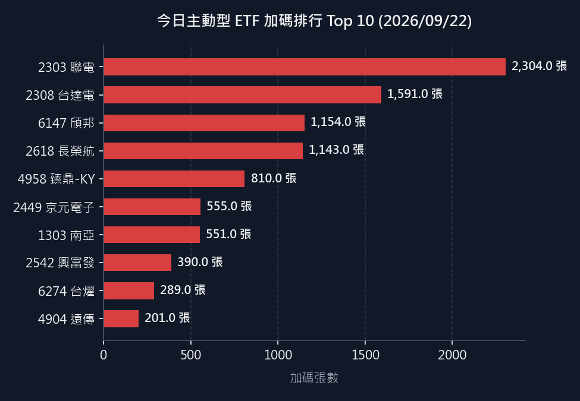
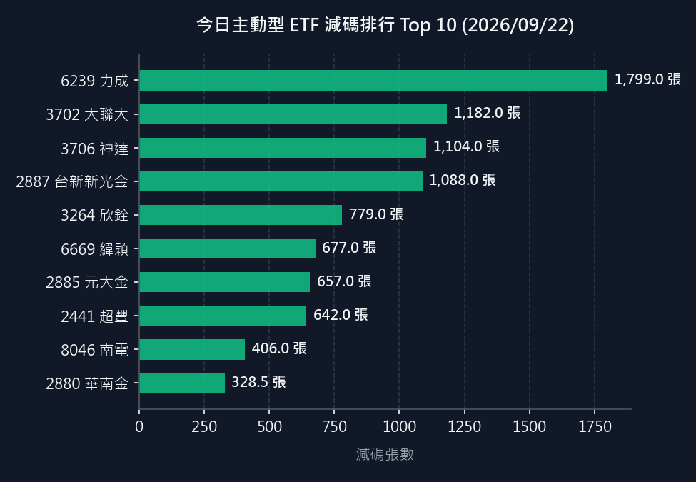

# 主動型 ETF 持股變動

資料來源：`主動型ETF持股明細.xlsx` 最近兩個日期分頁。

比較區間：`20260921` → `20260922`

## 今日加減碼視覺化排行

| 今日加碼 Top 10 | 今日減碼 Top 10 |
| :---: | :---: |
|  |  |

| ETF | 新增 | 刪除 | 比例變動 |
| :-- | --: | --: | --: |
| 00400A | 1 | 3 | 42 |
| 00401A | 1 | 1 | 47 |
| 00402A | 0 | 0 | 48 |
| 00403A | 0 | 1 | 37 |
| 00404A | 0 | 0 | 43 |
| 00405A | 0 | 1 | 33 |
| 00406A | 2 | 2 | 58 |
| 00407A | 0 | 0 | 45 |
| 00408A | 1 | 2 | 46 |
| 00980A | 0 | 0 | 49 |
| 00980D | 0 | 0 | 41 |
| 00981A | 0 | 0 | 30 |
| 00982A | 0 | 0 | 41 |
| 00983A | 0 | 0 | 39 |
| 00983D | 0 | 0 | 24 |
| 00984A | 0 | 0 | 76 |
| 00985A | 0 | 0 | 43 |
| 00986A | 1 | 0 | 32 |
| 00987A | 0 | 0 | 28 |
| 00988A | 1 | 1 | 40 |
| 00989A | 1 | 1 | 60 |
| 00990A | 4 | 3 | 41 |
| 00991A | 0 | 0 | 22 |
| 00992A | 1 | 0 | 37 |
| 00993A | 0 | 0 | 48 |
| 00994A | 1 | 3 | 34 |
| 00995A | 2 | 0 | 45 |
| 00996A | 0 | 1 | 42 |
| 00997A | 1 | 4 | 44 |
| 00998A | 1 | 1 | 50 |
| 00999A | 0 | 0 | 54 |

## 00400A

### 新增持股

- 台指選擇權 2026/10（0.06%，-0.025 張）

### 刪除持股

- 台指選擇權 -25（0.00%，50 張）
- 台指選擇權 -71（0.00%，48 張）
- 商品名稱 口數（0.00%，N/A 張）

### 投資比例變動

- 1215 卜蜂：0.08% → 0.07%（-0.01）
- 1303 南亞：2.51% → 2.84%（+0.33）
- 2059 川湖：5.33% → 5.28%（-0.05）
- 2303 聯電：1.13% → 1.14%（+0.01）
- 2308 台達電：3.16% → 3.85%（+0.69）
- 2313 華通：0.88% → 0.83%（-0.05）
- 2317 鴻海：0.83% → 0.82%（-0.01）
- 2330 台積電：8.82% → 8.61%（-0.21）
- 2345 智邦：1.46% → 1.47%（+0.01）
- 2360 致茂：3.73% → 3.88%（+0.15）
- 2368 金像電：1.34% → 1.33%（-0.01）
- 2383 台光電：3.85% → 3.73%（-0.12）
- 2449 京元電子：1.01% → 1.07%（+0.06）
- 2454 聯發科：7.68% → 8.24%（+0.56）
- 2603 長榮：0.98% → 0.96%（-0.02）
- 2637 慧洋-KY：0.30% → 0.28%（-0.02）
- 3008 大立光：0.87% → 0.85%（-0.02）
- 3017 奇鋐：4.48% → 4.33%（-0.15）
- 3026 禾伸堂：1.12% → 1.07%（-0.05）
- 3036 文曄：1.57% → 1.53%（-0.04）
- 3037 欣興：4.11% → 4.58%（+0.47）
- 3044 健鼎：1.86% → 1.89%（+0.03）
- 3081 聯亞：0.82% → 0.78%（-0.04）
- 3090 日電貿：0.34% → 0.33%（-0.01）
- 3167 大量：0.33% → 0.34%（+0.01）
- 3293 鈊象：0.34% → 0.33%（-0.01）
- 3374 精材：0.52% → 0.56%（+0.04）
- 3443 創意：4.71% → 5.39%（+0.68）
- 3529 力旺：1.20% → 1.39%（+0.19）
- 3653 健策：4.23% → 4.36%（+0.13）
- 3665 貿聯-KY：1.85% → 1.83%（-0.02）
- 3711 日月光投控：1.03% → 1.09%（+0.06）
- 5274 信驊：3.17% → 3.35%（+0.18）
- 5434 崇越：0.37% → 0.36%（-0.01）
- 6187 萬潤：2.58% → 2.45%（-0.13）
- 6223 旺矽：4.79% → 4.31%（-0.48）
- 6271 同欣電：0.27% → 0.26%（-0.01）
- 6442 光聖：0.89% → 0.83%（-0.06）
- 6505 台塑化：1.47% → 1.45%（-0.02）
- 6669 緯穎：3.79% → 3.14%（-0.65）
- 7750 新代：0.83% → 0.80%（-0.03）
- 7769 鴻勁：0.45% → 0.42%（-0.03）

## 00401A

### 新增持股

- 臺指選擇權10/26 46400 買權（-0.98%，-0.32 張）

### 刪除持股

- TAIWAN TAIE C 21OCT26 46400 TWSE（-0.75%，-0.32 張）

### 投資比例變動

- 1303 南亞：0.93% → 0.90%（-0.03）
- 1477 聚陽：0.83% → 0.81%（-0.02）
- 2059 川湖：0.99% → 1.00%（+0.01）
- 2303 聯電：2.27% → 2.57%（+0.30）
- 2308 台達電：2.32% → 2.53%（+0.21）
- 2313 華通：1.54% → 1.31%（-0.23）
- 2327 國巨*：0.59% → 0.61%（+0.02）
- 2330 台積電：19.84% → 19.72%（-0.12）
- 2345 智邦：1.51% → 1.19%（-0.32）
- 2357 華碩：1.75% → 1.73%（-0.02）
- 2360 致茂：1.42% → 1.50%（+0.08）
- 2379 瑞昱：0.99% → 1.03%（+0.04）
- 2382 廣達：2.14% → 2.12%（-0.02）
- 2383 台光電：0.72% → 0.71%（-0.01）
- 2412 中華電：0.79% → 0.78%（-0.01）
- 2454 聯發科：6.39% → 6.98%（+0.59）
- 2455 全新：2.28% → 2.23%（-0.05）
- 2881 富邦金：1.92% → 1.96%（+0.04）
- 2882 國泰金：0.99% → 1.00%（+0.01）
- 2883 凱基金：1.65% → 1.64%（-0.01）
- 2884 玉山金：1.91% → 1.88%（-0.03）
- 2886 兆豐金：1.32% → 1.29%（-0.03）
- 2887 台新新光金：1.10% → 1.06%（-0.04）
- 3008 大立光：2.26% → 2.24%（-0.02）
- 3037 欣興：1.95% → 2.21%（+0.26）
- 3131 弘塑：0.70% → 0.69%（-0.01）
- 3231 緯創：1.62% → 1.56%（-0.06）
- 3491 昇達科：1.75% → 1.64%（-0.11）
- 3711 日月光投控：2.31% → 2.49%（+0.18）
- 4904 遠傳：0.73% → 0.72%（-0.01）
- 4958 臻鼎-KY：1.19% → 1.22%（+0.03）
- 4991 環宇-KY：0.93% → 0.92%（-0.01）
- 5274 信驊：2.05% → 2.21%（+0.16）
- 5904 寶雅*：0.52% → 0.51%（-0.01）
- 6147 頎邦：1.42% → 1.35%（-0.07）
- 6187 萬潤：0.64% → 0.62%（-0.02）
- 6223 旺矽：1.73% → 1.58%（-0.15）
- 6285 啟碁：1.24% → 1.27%（+0.03）
- 6515 穎崴：1.85% → 1.65%（-0.20）
- 6531 愛普*：1.37% → 1.59%（+0.22）
- 6669 緯穎：1.84% → 1.81%（-0.03）
- 7769 鴻勁：1.68% → 1.57%（-0.11）
- 7828 創新服務：1.96% → 1.76%（-0.20）
- 8464 億豐：0.97% → 0.98%（+0.01）
- 台股期貨10/26(FITXN*1.TF)：0.21% → 0.32%（+0.11）
- 臺指選擇權10/26 46000 買權：-0.06% → -0.07%（-0.01）
- 臺指選擇權10/26 46800 買權：-0.04% → -0.05%（-0.01）

## 00402A

### 新增持股

- 無

### 刪除持股

- 無

### 投資比例變動

- AAPL.US Apple：7.98% → 7.78%（-0.20）
- ADI.US Analog Devices：1.83% → 1.88%（+0.05）
- AMD.US AMD：5.56% → 6.09%（+0.53）
- AMZN.US Amazon：4.51% → 4.50%（-0.01）
- ARM.US Arm：0.75% → 0.89%（+0.14）
- ASML.US ASML Holding：1.23% → 1.10%（-0.13）
- AVGO.US Broadcom：2.13% → 2.16%（+0.03）
- AXON.US Axon Enterprise：0.86% → 0.83%（-0.03）
- BABA.US Alibaba Group：0.53% → 0.55%（+0.02）
- BKNG.US Booking Holdings：0.81% → 0.58%（-0.23）
- CDNS.US Cadence Design Systems：1.27% → 1.30%（+0.03）
- CIEN.US Ciena：1.19% → 1.22%（+0.03）
- CLS.US Celestica：0.95% → 0.96%（+0.01）
- COHR.US Coherent：1.64% → 1.72%（+0.08）
- CRWD.US CrowdStrike Holdings：1.71% → 1.58%（-0.13）
- DASH.US DoorDash：0.51% → 0.49%（-0.02）
- FSLY.US Fastly：0.38% → 0.42%（+0.04）
- GOOG.US Alphabet - Class C Capital Stock：3.22% → 3.05%（-0.17）
- GOOGL.US Alphabet - Class A Common Stock：3.66% → 3.63%（-0.03）
- INTC.US Intel：1.35% → 1.46%（+0.11）
- IOT.US Samsara：0.54% → 0.50%（-0.04）
- KLAC.US KLA：1.48% → 1.56%（+0.08）
- LITE.US Lumentum：1.65% → 1.71%（+0.06）
- LRCX.US Lam Research：2.44% → 2.66%（+0.22）
- MCHP.US Microchip Technology：1.11% → 1.14%（+0.03）
- MDB.US MongoDB：0.46% → 0.47%（+0.01）
- META.US Meta：3.38% → 3.57%（+0.19）
- MRVL.US Marvell：1.32% → 1.37%（+0.05）
- MSFT.US Microsoft：5.27% → 4.85%（-0.42）
- MU.US Micron：6.42% → 6.65%（+0.23）
- NFLX.US Netflix：0.86% → 0.81%（-0.05）
- NOW.US ServiceNow：0.84% → 0.81%（-0.03）
- NVDA.US NVIDIA：8.59% → 8.62%（+0.03）
- PANW.US Palo Alto：2.76% → 2.66%（-0.10）
- PLTR.US Palantir Technologies：1.79% → 1.80%（+0.01）
- SHOP.US Shopify：0.81% → 0.84%（+0.03）
- SIMO.US Silicon Motion：0.79% → 0.81%（+0.02）
- SNOW.US Snowflake：1.10% → 1.07%（-0.03）
- SPCX.US SpaceX：0.83% → 0.79%（-0.04）
- SPOT.US Spotify：0.52% → 0.50%（-0.02）
- STX.US Seagate：1.29% → 1.37%（+0.08）
- TER.US Teradyne：0.85% → 0.89%（+0.04）
- TSM.US TSMC(ADR)：1.52% → 1.53%（+0.01）
- TTWO.US Take-Two：0.68% → 0.65%（-0.03）
- TXN.US Texas Instruments：2.17% → 2.21%（+0.04）
- UBER.US Uber：0.48% → 0.46%（-0.02）
- V.US Visa：1.28% → 1.14%（-0.14）
- WDC.US Western Digital：2.12% → 2.18%（+0.06）

## 00403A

### 新增持股

- 無

### 刪除持股

- 3533 嘉澤（0.04%，40 張）

### 投資比例變動

- 1303 南亞：2.07% → 1.99%（-0.08）
- 1560 中砂：0.11% → 0.12%（+0.01）
- 2059 川湖：0.53% → 0.61%（+0.08）
- 2301 光寶科：0.06% → 0.05%（-0.01）
- 2303 聯電：6.03% → 6.12%（+0.09）
- 2308 台達電：3.40% → 3.51%（+0.11）
- 2317 鴻海：0.51% → 0.52%（+0.01）
- 2327 國巨*：2.85% → 2.91%（+0.06）
- 2330 台積電：15.25% → 14.74%（-0.51）
- 2345 智邦：2.57% → 2.52%（-0.05）
- 2360 致茂：1.17% → 1.06%（-0.11）
- 2383 台光電：5.02% → 4.96%（-0.06）
- 2408 南亞科：0.66% → 0.63%（-0.03）
- 2449 京元電子：0.68% → 0.81%（+0.13）
- 2454 聯發科：7.09% → 7.30%（+0.21）
- 2455 全新：0.14% → 0.13%（-0.01）
- 2481 強茂：0.32% → 0.33%（+0.01）
- 3008 大立光：1.15% → 1.14%（-0.01）
- 3017 奇鋐：6.23% → 6.16%（-0.07）
- 3037 欣興：5.53% → 6.04%（+0.51）
- 3189 景碩：2.12% → 2.32%（+0.20）
- 3211 順達：0.50% → 0.49%（-0.01）
- 3443 創意：3.15% → 3.45%（+0.30）
- 3450 聯鈞：0.52% → 0.50%（-0.02）
- 3653 健策：4.13% → 4.14%（+0.01）
- 3665 貿聯-KY：1.90% → 1.85%（-0.05）
- 3711 日月光投控：0.42% → 0.44%（+0.02）
- 5274 信驊：1.53% → 1.61%（+0.08）
- 6223 旺矽：3.87% → 3.75%（-0.12）
- 6239 力成：0.34% → 0.00%（-0.34）
- 6274 台燿：1.75% → 1.74%（-0.01）
- 6488 環球晶：1.67% → 1.73%（+0.06）
- 6669 緯穎：2.74% → 2.52%（-0.22）
- 6805 富世達：1.30% → 1.34%（+0.04）
- 7769 鴻勁：0.50% → 0.51%（+0.01）
- 8046 南電：1.88% → 2.06%（+0.18）
- 8996 高力：1.52% → 1.71%（+0.19）

## 00404A

### 新增持股

- 無

### 刪除持股

- 無

### 投資比例變動

- 1303 南亞：0.75% → 0.74%（-0.01）
- 2027 大成鋼：1.54% → 1.53%（-0.01）
- 2059 川湖：1.14% → 1.17%（+0.03）
- 2301 光寶科：0.25% → 0.26%（+0.01）
- 2303 聯電：2.29% → 2.16%（-0.13）
- 2308 台達電：1.87% → 1.85%（-0.02）
- 2317 鴻海：0.65% → 0.66%（+0.01）
- 2330 台積電：22.45% → 22.55%（+0.10）
- 2345 智邦：0.81% → 0.84%（+0.03）
- 2379 瑞昱：1.03% → 1.08%（+0.05）
- 2382 廣達：2.09% → 2.11%（+0.02）
- 2383 台光電：2.68% → 2.92%（+0.24）
- 2395 研華：1.22% → 1.25%（+0.03）
- 2436 偉詮電：1.07% → 1.14%（+0.07）
- 2454 聯發科：7.06% → 6.89%（-0.17）
- 2542 興富發：1.83% → 1.76%（-0.07）
- 2883 凱基金：1.17% → 1.18%（+0.01）
- 2885 元大金：2.41% → 2.46%（+0.05）
- 2887 台新新光金：1.43% → 1.40%（-0.03）
- 2890 永豐金：1.44% → 1.46%（+0.02）
- 2892 第一金：1.86% → 1.88%（+0.02）
- 3034 聯詠：2.04% → 2.06%（+0.02）
- 3037 欣興：0.22% → 0.26%（+0.04）
- 3260 威剛：1.25% → 1.23%（-0.02）
- 3264 欣銓：0.50% → 0.44%（-0.06）
- 3374 精材：0.10% → 0.11%（+0.01）
- 3443 創意：0.82% → 0.78%（-0.04）
- 3680 家登：0.46% → 0.47%（+0.01）
- 3711 日月光投控：3.50% → 3.46%（-0.04）
- 4763 材料*-KY：1.71% → 1.64%（-0.07）
- 5274 信驊：2.84% → 2.63%（-0.21）
- 5904 寶雅*：0.46% → 0.45%（-0.01）
- 6206 飛捷：0.99% → 1.02%（+0.03）
- 6223 旺矽：1.26% → 1.18%（-0.08）
- 6257 矽格：1.96% → 1.76%（-0.20）
- 6515 穎崴：0.15% → 0.13%（-0.02）
- 7769 鴻勁：1.20% → 1.28%（+0.08）
- 8016 矽創：1.15% → 1.17%（+0.02）
- 8081 致新：0.80% → 0.81%（+0.01）
- 8299 群聯：1.22% → 1.16%（-0.06）
- 台指選擇權10/26 49500 買權：-0.13% → -0.22%（-0.09）
- 台指選擇權11/26 50400 買權：-0.01% → -0.02%（-0.01）
- 台股期貨10/26(FITXN*1.TF)：14.97% → 15.40%（+0.43）

## 00405A

### 新增持股

- 無

### 刪除持股

- 3163 波若威（0.03%，13.3 張）

### 投資比例變動

- 2303 聯電：1.02% → 1.03%（+0.01）
- 2308 台達電：0.60% → 0.65%（+0.05）
- 2330 台積電：1.61% → 1.59%（-0.02）
- 2345 智邦：3.60% → 3.66%（+0.06）
- 2368 金像電：4.21% → 4.23%（+0.02）
- 2383 台光電：3.80% → 3.72%（-0.08）
- 2454 聯發科：8.28% → 8.98%（+0.70）
- 3017 奇鋐：4.75% → 4.63%（-0.12）
- 3037 欣興：6.18% → 6.96%（+0.78）
- 3443 創意：9.54% → 9.80%（+0.26）
- 3450 聯鈞：1.28% → 1.24%（-0.04）
- 3653 健策：5.26% → 5.48%（+0.22）
- 3665 貿聯-KY：5.38% → 5.39%（+0.01）
- 4749 新應材：0.26% → 0.25%（-0.01）
- 4991 環宇-KY：2.08% → 1.79%（-0.29）
- 5274 信驊：3.84% → 4.10%（+0.26）
- 6187 萬潤：0.91% → 0.65%（-0.26）
- 6223 旺矽：6.86% → 6.24%（-0.62）
- 6274 台燿：1.54% → 1.59%（+0.05）
- 6278 台表科：1.01% → 1.08%（+0.07）
- 6285 啟碁：0.33% → 0.34%（+0.01）
- 6488 環球晶：0.38% → 0.39%（+0.01）
- 6510 精測：3.16% → 3.27%（+0.11）
- 6515 穎崴：0.54% → 0.48%（-0.06）
- 6526 達發：0.37% → 0.40%（+0.03）
- 6531 愛普*：3.65% → 3.48%（-0.17）
- 6669 緯穎：0.78% → 0.76%（-0.02）
- 6805 富世達：2.28% → 3.53%（+1.25）
- 6831 邁科：0.49% → 0.46%（-0.03）
- 7734 印能科技：1.47% → 1.25%（-0.22）
- 7769 鴻勁：2.88% → 2.67%（-0.21）
- 8046 南電：2.98% → 3.11%（+0.13）
- 8996 高力：1.48% → 1.69%（+0.21）

## 00406A

### 新增持股

- 3264 欣銓（0.34%，600 張）
- 6147 頎邦（0.47%，1060 張）

### 刪除持股

- 6138 茂達（0.05%，80 張）
- 6196 帆宣（0.07%，60 張）

### 投資比例變動

- 1303 南亞：0.20% → 0.19%（-0.01）
- 1326 台化：0.37% → 0.34%（-0.03）
- 1560 中砂：0.68% → 0.83%（+0.15）
- 2059 川湖：2.15% → 2.07%（-0.08）
- 2303 聯電：1.29% → 1.45%（+0.16）
- 2308 台達電：2.81% → 2.93%（+0.12）
- 2317 鴻海：0.75% → 0.72%（-0.03）
- 2327 國巨*：1.94% → 1.91%（-0.03）
- 2330 台積電：9.39% → 9.15%（-0.24）
- 2344 華邦電：0.45% → 0.41%（-0.04）
- 2345 智邦：3.66% → 3.69%（+0.03）
- 2360 致茂：0.81% → 0.82%（+0.01）
- 2368 金像電：0.39% → 0.38%（-0.01）
- 2383 台光電：5.17% → 5.34%（+0.17）
- 2395 研華：0.18% → 0.17%（-0.01）
- 2449 京元電子：0.82% → 0.85%（+0.03）
- 2454 聯發科：6.14% → 6.53%（+0.39）
- 2455 全新：0.19% → 0.17%（-0.02）
- 2481 強茂：0.38% → 0.37%（-0.01）
- 2486 一詮：0.43% → 0.40%（-0.03）
- 2885 元大金：1.00% → 0.96%（-0.04）
- 2886 兆豐金：0.27% → 0.26%（-0.01）
- 3008 大立光：0.55% → 0.52%（-0.03）
- 3017 奇鋐：6.12% → 5.75%（-0.37）
- 3037 欣興：4.54% → 4.94%（+0.40）
- 3081 聯亞：0.61% → 0.57%（-0.04）
- 3105 穩懋：0.23% → 0.22%（-0.01）
- 3131 弘塑：0.13% → 0.12%（-0.01）
- 3167 大量：0.81% → 0.79%（-0.02）
- 3189 景碩：0.99% → 1.03%（+0.04）
- 3260 威剛：0.15% → 0.14%（-0.01）
- 3363 上詮：0.57% → 0.52%（-0.05）
- 3443 創意：2.09% → 2.33%（+0.24）
- 3450 聯鈞：0.36% → 0.34%（-0.02）
- 3491 昇達科：0.98% → 0.88%（-0.10）
- 3583 辛耘：0.12% → 0.11%（-0.01）
- 3653 健策：3.22% → 3.23%（+0.01）
- 3665 貿聯-KY：1.76% → 2.07%（+0.31）
- 3711 日月光投控：1.52% → 1.57%（+0.05）
- 4958 臻鼎-KY：0.59% → 0.58%（-0.01）
- 5274 信驊：2.82% → 2.91%（+0.09）
- 6187 萬潤：0.43% → 0.40%（-0.03）
- 6213 聯茂：0.54% → 0.56%（+0.02）
- 6223 旺矽：3.90% → 3.81%（-0.09）
- 6285 啟碁：0.16% → 0.15%（-0.01）
- 6488 環球晶：0.75% → 0.74%（-0.01）
- 6515 穎崴：0.75% → 0.64%（-0.11）
- 6531 愛普*：0.23% → 0.32%（+0.09）
- 6669 緯穎：3.27% → 3.08%（-0.19）
- 7769 鴻勁：1.08% → 0.97%（-0.11）
- 8046 南電：2.56% → 2.58%（+0.02）
- 8150 南茂：0.09% → 0.10%（+0.01）
- 8210 勤誠：0.14% → 0.13%（-0.01）
- 8358 金居：0.25% → 0.24%（-0.01）
- 8996 高力：0.47% → 0.51%（+0.04）
- 臺指選擇權第四週週三到期契約：-15.37% → -16.85%（-1.48）
- 臺指選擇權第四週週五到期契約：-5.83% → -6.55%（-0.72）
- 臺股期貨 202610(FITXN*1.TF)：22.83% → 23.07%（+0.24）

## 00407A

### 新增持股

- 無

### 刪除持股

- 無

### 投資比例變動

- 1303 南亞：0.76% → 0.70%（-0.06）
- 1560 中砂：1.00% → 1.01%（+0.01）
- 2059 川湖：2.81% → 2.74%（-0.07）
- 2301 光寶科：1.50% → 1.44%（-0.06）
- 2303 聯電：0.63% → 0.61%（-0.02）
- 2308 台達電：2.57% → 2.68%（+0.11）
- 2327 國巨*：2.25% → 2.23%（-0.02）
- 2330 台積電：9.33% → 8.90%（-0.43）
- 2344 華邦電：0.15% → 0.13%（-0.02）
- 2345 智邦：2.60% → 2.56%（-0.04）
- 2360 致茂：1.90% → 1.92%（+0.02）
- 2368 金像電：0.53% → 0.52%（-0.01）
- 2383 台光電：5.03% → 4.77%（-0.26）
- 2408 南亞科：1.02% → 0.92%（-0.10）
- 2451 創見：0.33% → 0.31%（-0.02）
- 2454 聯發科：5.79% → 6.08%（+0.29）
- 2615 萬海：0.74% → 0.68%（-0.06）
- 3008 大立光：1.55% → 1.46%（-0.09）
- 3017 奇鋐：5.89% → 5.54%（-0.35）
- 3034 聯詠：0.77% → 0.73%（-0.04）
- 3037 欣興：4.92% → 5.35%（+0.43）
- 3081 聯亞：1.50% → 1.40%（-0.10）
- 3131 弘塑：0.89% → 0.84%（-0.05）
- 3231 緯創：0.75% → 0.69%（-0.06）
- 3260 威剛：0.30% → 0.28%（-0.02）
- 3293 鈊象：0.57% → 0.54%（-0.03）
- 3443 創意：4.45% → 4.96%（+0.51）
- 3491 昇達科：0.97% → 0.87%（-0.10）
- 3529 力旺：0.62% → 0.65%（+0.03）
- 3653 健策：2.95% → 2.97%（+0.02）
- 3665 貿聯-KY：2.18% → 2.10%（-0.08）
- 3711 日月光投控：2.78% → 2.88%（+0.10）
- 4958 臻鼎-KY：0.91% → 0.89%（-0.02）
- 5274 信驊：2.55% → 2.67%（+0.12）
- 5289 宜鼎：0.33% → 0.31%（-0.02）
- 5434 崇越：0.20% → 0.19%（-0.01）
- 6187 萬潤：1.46% → 1.35%（-0.11）
- 6223 旺矽：3.05% → 2.68%（-0.37）
- 6446 藥華藥：0.32% → 0.30%（-0.02）
- 6531 愛普*：0.34% → 0.31%（-0.03）
- 6669 緯穎：3.63% → 3.55%（-0.08）
- 6805 富世達：2.08% → 2.15%（+0.07）
- 8046 南電：1.71% → 1.72%（+0.01）
- 8299 群聯：0.34% → 0.32%（-0.02）
- 8996 高力：2.02% → 2.23%（+0.21）

## 00408A

### 新增持股

- 3008 大立光（0.83%，2 張）

### 刪除持股

- 2880 華南金（1.00%，328.5 張）
- 6515 穎崴（0.57%，1.5 張）

### 投資比例變動

- 1303 南亞：1.58% → 1.52%（-0.06）
- 1560 中砂：0.36% → 0.37%（+0.01）
- 2059 川湖：0.42% → 0.41%（-0.01）
- 2303 聯電：2.29% → 3.37%（+1.08）
- 2308 台達電：2.07% → 2.83%（+0.76）
- 2317 鴻海：1.64% → 1.65%（+0.01）
- 2330 台積電：5.83% → 5.45%（-0.38）
- 2344 華邦電：0.46% → 0.45%（-0.01）
- 2345 智邦：0.84% → 0.87%（+0.03）
- 2357 華碩：2.29% → 2.30%（+0.01）
- 2360 致茂：1.24% → 1.27%（+0.03）
- 2368 金像電：3.15% → 3.12%（-0.03）
- 2376 技嘉：1.32% → 1.31%（-0.01）
- 2382 廣達：0.90% → 0.89%（-0.01）
- 2383 台光電：2.56% → 2.53%（-0.03）
- 2395 研華：1.57% → 1.56%（-0.01）
- 2408 南亞科：2.46% → 2.36%（-0.10）
- 2449 京元電子：0.99% → 1.55%（+0.56）
- 2454 聯發科：4.59% → 6.23%（+1.64）
- 2481 強茂：1.06% → 1.07%（+0.01）
- 2542 興富發：2.92% → 4.00%（+1.08）
- 2801 彰銀：2.17% → 2.15%（-0.02）
- 2886 兆豐金：1.90% → 0.95%（-0.95）
- 2891 中信金：1.11% → 1.09%（-0.02）
- 3017 奇鋐：5.14% → 5.08%（-0.06）
- 3037 欣興：3.20% → 3.50%（+0.30）
- 3045 台灣大：2.85% → 2.00%（-0.85）
- 3081 聯亞：1.32% → 1.29%（-0.03）
- 3189 景碩：1.46% → 1.60%（+0.14）
- 3231 緯創：1.59% → 1.53%（-0.06）
- 3264 欣銓：0.82% → 0.79%（-0.03）
- 3443 創意：0.50% → 0.55%（+0.05）
- 3491 昇達科：0.70% → 0.67%（-0.03）
- 3653 健策：2.27% → 2.28%（+0.01）
- 3711 日月光投控：1.00% → 1.49%（+0.49）
- 5434 崇越：2.04% → 2.02%（-0.02）
- 6187 萬潤：1.21% → 1.19%（-0.02）
- 6223 旺矽：2.16% → 2.09%（-0.07）
- 6239 力成：1.28% → 1.27%（-0.01）
- 6488 環球晶：0.43% → 0.44%（+0.01）
- 6669 緯穎：3.77% → 3.69%（-0.08）
- 6805 富世達：1.42% → 1.47%（+0.05）
- 7769 鴻勁：0.98% → 1.00%（+0.02）
- 8046 南電：1.46% → 1.59%（+0.13）
- 8996 高力：1.28% → 1.94%（+0.66）
- 9802 鈺齊-KY：2.05% → 1.54%（-0.51）

## 00980A

### 新增持股

- 無

### 刪除持股

- 無

### 投資比例變動

- 1303 南亞：2.91% → 2.79%（-0.12）
- 2059 川湖：4.32% → 4.23%（-0.09）
- 2308 台達電：3.81% → 3.82%（+0.01）
- 2327 國巨*：1.36% → 1.38%（+0.02）
- 2330 台積電：9.40% → 9.23%（-0.17）
- 2344 華邦電：2.01% → 1.95%（-0.06）
- 2345 智邦：1.61% → 1.66%（+0.05）
- 2360 致茂：1.77% → 1.80%（+0.03）
- 2368 金像電：2.07% → 2.04%（-0.03）
- 2376 技嘉：1.29% → 1.27%（-0.02）
- 2382 廣達：1.71% → 1.68%（-0.03）
- 2383 台光電：3.35% → 3.29%（-0.06）
- 2408 南亞科：2.85% → 2.71%（-0.14）
- 2454 聯發科：6.28% → 6.42%（+0.14）
- 2884 玉山金：1.47% → 1.45%（-0.02）
- 2891 中信金：1.31% → 1.28%（-0.03）
- 3008 大立光：0.84% → 0.83%（-0.01）
- 3017 奇鋐：2.30% → 2.26%（-0.04）
- 3026 禾伸堂：1.14% → 1.11%（-0.03）
- 3036 文曄：1.19% → 1.17%（-0.02）
- 3037 欣興：3.03% → 3.30%（+0.27）
- 3044 健鼎：0.91% → 0.93%（+0.02）
- 3081 聯亞：1.86% → 1.81%（-0.05）
- 3189 景碩：1.34% → 1.46%（+0.12）
- 3231 緯創：1.22% → 1.17%（-0.05）
- 3264 欣銓：0.93% → 0.90%（-0.03）
- 3293 鈊象：0.92% → 0.91%（-0.01）
- 3443 創意：2.26% → 2.46%（+0.20）
- 3529 力旺：0.63% → 0.68%（+0.05）
- 3533 嘉澤：0.28% → 0.30%（+0.02）
- 3653 健策：2.01% → 2.00%（-0.01）
- 3665 貿聯-KY：0.56% → 0.54%（-0.02）
- 3711 日月光投控：2.07% → 2.14%（+0.07）
- 4958 臻鼎-KY：0.71% → 0.74%（+0.03）
- 5274 信驊：2.03% → 2.11%（+0.08）
- 5904 寶雅*：1.12% → 1.10%（-0.02）
- 6213 聯茂：1.31% → 1.30%（-0.01）
- 6223 旺矽：1.83% → 1.76%（-0.07）
- 6274 台燿：1.73% → 1.72%（-0.01）
- 6515 穎崴：1.60% → 1.58%（-0.02）
- 6669 緯穎：1.68% → 1.63%（-0.05）
- 6805 富世達：0.66% → 0.67%（+0.01）
- 6831 邁科：0.47% → 0.46%（-0.01）
- 7769 鴻勁：2.20% → 2.24%（+0.04）
- 8046 南電：1.34% → 1.46%（+0.12）
- 8210 勤誠：0.43% → 0.42%（-0.01）
- 8299 群聯：1.82% → 1.83%（+0.01）
- 8996 高力：1.37% → 1.49%（+0.12）
- 台灣證交所加權股價指數(FITXN*1.TF)：3.00% → 2.98%（-0.02）

## 00980D

### 新增持股

- 無

### 刪除持股

- 無

### 投資比例變動

- AHOLD FINANCE USA LLC 6.88% 01MAY2029：0.49% → 0.48%（-0.01）
- ALLY FINANCIAL INC (REG) VAR 03JAN2030：0.64% → 0.63%（-0.01）
- ALLY FINANCIAL INC (REG) VAR 13JUN2029：0.56% → 0.55%（-0.01）
- APA CORP 6.750000 % 15-FEB-2055：0.37% → 0.38%（+0.01）
- APOLLO DEBT SOLUTIONS BD 6.900000 % 13APR2029：0.56% → 0.55%（-0.01）
- ARIS WATER HOLDINGS LLC SER REGS 7.250000 % 01APR2030：0.48% → 0.47%（-0.01）
- ATHENE HOLDING LTD 6.625000 % 19MAY2055：0.57% → 0.58%（+0.01）
- AVIANCA MIDCO 2 PLC SER REGS 10.25 % 07-JAN-2032：0.28% → 0.29%（+0.01）
- BANCO SANTANDER SA (REG) 6.607% 07NOV2028：0.67% → 0.66%（-0.01）
- BOSTON PROPERTIES LP (REG) 6.750000 % 01-DEC-2027：0.47% → 0.46%（-0.01）
- BRIGHTHOUSE FINANCIAL IN (REG) 4.7% 22JUN2047：0.47% → 0.48%（+0.01）
- BRITISH TELECOMMUNICATIO (BR) 9.625% 15DEC2030：0.58% → 0.57%（-0.01）
- CANTOR FITZGERALD LP SER REGS 7.200000 % 12DEC2028：0.33% → 0.32%（-0.01）
- CHARTER COMM OPT LLC/CAP 6.700000 % 01-DEC-2055：0.47% → 0.46%（-0.01）
- CHC GROUP LLC SER REGS 11.750000 % 01-SEP-2030：0.46% → 0.47%（+0.01）
- GENERAL MOTORS CO (REG) 6.8% 01OCT2027：0.57% → 0.56%（-0.01）
- GEORGIA-PACIFIC LLC (REG) 7.75% 15NOV2029：0.58% → 0.57%（-0.01）
- HAH GROUP HOLDING CO LLC SER REGS (REG S) 9.75% 01OCT2031：0.32% → 0.31%（-0.01）
- HERTZ CORP/THE SER REGS (REG S) 12.625% 15JUL2029：0.30% → 0.31%（+0.01）
- JETBLUE AIRWAYS/LOYALTY SER REGS (REG S) 9.875% 20SEP2031：0.46% → 0.47%（+0.01）
- KINDER MORGAN INC/DELAWA SER GMTN (REG) 7.75% 15JAN2032：0.33% → 0.32%（-0.01）
- KONINKLIJKE KPN NV (REG) 8.375% 01OCT2030：0.44% → 0.43%（-0.01）
- LBM ACQUISITION LLC SER REGS 9.500000 % 15JUN2031：0.46% → 0.45%（-0.01）
- LPL HOLDINGS INC (REG) 6.75% 17NOV2028：0.57% → 0.56%（-0.01）
- NISSAN MOTOR CO SER REGS 8.125000 % 17JUL2035：0.53% → 0.52%（-0.01）
- OPEN TEXT CORP SER REGS (REG) (REG S) 6.9% 01DEC2027：0.67% → 0.66%（-0.01）
- ORACLE CORP 6.85 % 04-FEB-2066：0.57% → 0.56%（-0.01）
- ORACLE CORP 6.9% 09NOV2052：0.53% → 0.52%（-0.01）
- PLANET FINANCIAL GROUP SER REGS 10.500000 % 15DEC2029：0.51% → 0.50%（-0.01）
- POLARIS INC 6.950000 % 15MAR2029：0.48% → 0.47%（-0.01）
- PROGRESS ENERGY INC (REG) 7.75% 01MAR2031：0.58% → 0.57%（-0.01）
- SANTANDER HOLDINGS USA VAR 12JUN2029：0.59% → 0.58%（-0.01）
- SEAGATE DATA STOR SER * 9.625 % 01-DEC-2032：0.57% → 0.56%（-0.01）
- TRUIST FINANCIAL CORP SER MTN VAR 30OCT2029：0.65% → 0.64%（-0.01）
- US 10YR NOTE (CBT)DEC26 21-DEC-2026：17.86% → 17.83%（-0.03）
- US 5YR NOTE (CBT) DEC26 31-DEC-2026：-13.69% → -13.65%（+0.04）
- US ACUTE CARE SOLUTIONS SER REGS (REG S) 9.75% 15MAY2029：0.34% → 0.33%（-0.01）
- US LONG BOND(CBT) DEC26 21-DEC-2026：5.38% → 5.39%（+0.01）
- VIACOM INC (REG) 5.85% 01SEP2043：0.57% → 0.56%（-0.01）
- VIACOMCBS INC (REG) 4.95% 19MAY2050：0.50% → 0.49%（-0.01）
- VIACOMCBS INC 6.875% 30APR2036：0.29% → 0.28%（-0.01）

## 00981A

### 新增持股

- 無

### 刪除持股

- 無

### 投資比例變動

- 2303 聯電：4.95% → 4.91%（-0.04）
- 2308 台達電：4.47% → 4.86%（+0.39）
- 2327 國巨*：4.89% → 4.94%（+0.05）
- 2330 台積電：10.39% → 10.05%（-0.34）
- 2345 智邦：4.27% → 4.26%（-0.01）
- 2368 金像電：0.45% → 0.49%（+0.04）
- 2383 台光電：8.27% → 7.95%（-0.32）
- 2449 京元電子：1.36% → 1.43%（+0.07）
- 2454 聯發科：8.70% → 9.25%（+0.55）
- 3017 奇鋐：7.26% → 6.95%（-0.31）
- 3037 欣興：7.09% → 7.83%（+0.74）
- 3264 欣銓：0.63% → 0.49%（-0.14）
- 3443 創意：1.05% → 1.19%（+0.14）
- 3653 健策：4.94% → 5.04%（+0.10）
- 3665 貿聯-KY：3.37% → 3.05%（-0.32）
- 3711 日月光投控：3.82% → 4.01%（+0.19）
- 4958 臻鼎-KY：0.46% → 0.60%（+0.14）
- 5274 信驊：1.43% → 1.50%（+0.07）
- 6223 旺矽：5.26% → 4.68%（-0.58）
- 6271 同欣電：0.18% → 0.17%（-0.01）
- 6274 台燿：2.63% → 2.83%（+0.20）
- 6278 台表科：0.23% → 0.24%（+0.01）
- 6510 精測：0.56% → 0.51%（-0.05）
- 6515 穎崴：0.22% → 0.19%（-0.03）
- 6669 緯穎：4.55% → 4.07%（-0.48）
- 6805 富世達：1.45% → 1.53%（+0.08）
- 8046 南電：3.69% → 3.63%（-0.06）
- 8210 勤誠：0.44% → 0.36%（-0.08）
- 8996 高力：0.25% → 0.28%（+0.03）
- 台指期貨 2026/10(FITXN*1.TF)：2.29% → 2.26%（-0.03）

## 00982A

### 新增持股

- 無

### 刪除持股

- 無

### 投資比例變動

- 2059 川湖：4.43% → 4.47%（+0.04）
- 2301 光寶科：1.79% → 1.80%（+0.01）
- 2303 聯電：1.58% → 1.62%（+0.04）
- 2330 台積電：8.69% → 8.66%（-0.03）
- 2345 智邦：2.27% → 2.33%（+0.06）
- 2360 致茂：3.70% → 3.93%（+0.23）
- 2376 技嘉：1.23% → 1.26%（+0.03）
- 2377 微星：1.03% → 1.02%（-0.01）
- 2383 台光電：3.00% → 2.97%（-0.03）
- 2395 研華：1.98% → 2.01%（+0.03）
- 2428 興勤：1.17% → 1.14%（-0.03）
- 2454 聯發科：6.83% → 7.48%（+0.65）
- 2455 全新：1.68% → 1.65%（-0.03）
- 2486 一詮：0.75% → 0.74%（-0.01）
- 3008 大立光：3.19% → 3.17%（-0.02）
- 3017 奇鋐：2.51% → 2.47%（-0.04）
- 3105 穩懋：5.62% → 5.61%（-0.01）
- 3231 緯創：1.34% → 1.30%（-0.04）
- 3265 台星科：1.19% → 1.25%（+0.06）
- 3443 創意：0.01% → 0.02%（+0.01）
- 3491 昇達科：3.64% → 3.43%（-0.21）
- 3529 力旺：0.52% → 0.57%（+0.05）
- 3711 日月光投控：1.14% → 1.23%（+0.09）
- 4958 臻鼎-KY：2.94% → 3.03%（+0.09）
- 5274 信驊：1.36% → 1.47%（+0.11）
- 5483 中美晶：1.27% → 1.31%（+0.04）
- 5536 聖暉*：0.80% → 0.79%（-0.01）
- 6139 亞翔：5.37% → 5.22%（-0.15）
- 6213 聯茂：0.38% → 0.40%（+0.02）
- 6214 精誠：1.33% → 1.29%（-0.04）
- 6223 旺矽：3.51% → 3.16%（-0.35）
- 6239 力成：1.07% → 1.09%（+0.02）
- 6274 台燿：1.14% → 1.19%（+0.05）
- 6472 保瑞：0.90% → 0.85%（-0.05）
- 6488 環球晶：2.02% → 2.07%（+0.05）
- 6531 愛普*：3.89% → 3.74%（-0.15）
- 6640 均華：0.33% → 0.29%（-0.04）
- 6669 緯穎：4.79% → 4.22%（-0.57）
- 6672 騰輝電子-KY：0.32% → 0.31%（-0.01）
- 8070 長華*：0.32% → 0.31%（-0.01）
- 8996 高力：1.08% → 1.24%（+0.16）

## 00983A

### 新增持股

- 無

### 刪除持股

- 無

### 投資比例變動

- ACHR.US Archer：0.67% → 0.69%（+0.02）
- AMD.US AMD：3.24% → 3.59%（+0.35）
- AMZN.US Amazon：2.45% → 2.51%（+0.06）
- AVGO.US Broadcom：0.90% → 0.92%（+0.02）
- BEAM.US Beam Therapeutics：1.41% → 1.44%（+0.03）
- BLSH.US Bullish：2.31% → 2.43%（+0.12）
- BMNR.US BitMine：2.21% → 2.42%（+0.21）
- CBRS.US Cerebras：1.02% → 1.08%（+0.06）
- COIN.US Coinbase：4.47% → 4.66%（+0.19）
- CRCL.US Circle：4.97% → 5.16%（+0.19）
- CRSP.US CRISPR Therapeutics：3.84% → 3.99%（+0.15）
- CRWV.US CoreWeave：1.11% → 1.18%（+0.07）
- DE.US Deere：0.96% → 0.97%（+0.01）
- GOOG.US Alphabet - Class C Capital Stock：1.42% → 1.46%（+0.04）
- GOOGL.US Alphabet - Class A Common Stock：0.80% → 0.81%（+0.01）
- HOOD.US Robinhood Markets：4.74% → 4.91%（+0.17）
- ILMN.US Illumina：1.77% → 1.78%（+0.01）
- KTOS.US Kratos Defense & Security：0.72% → 0.74%（+0.02）
- LLY.US Eli Lilly：1.04% → 0.79%（-0.25）
- META.US Meta：0.66% → 0.74%（+0.08）
- NET.US Cloudflare：1.13% → 1.24%（+0.11）
- NTLA.US Intellia Therapeutics：1.02% → 1.03%（+0.01）
- NTRA.US Natera：1.81% → 1.72%（-0.09）
- NVDA.US NVIDIA：2.27% → 2.34%（+0.07）
- PLTR.US Palantir Technologies：3.54% → 3.68%（+0.14）
- RXRX.US Recursion Pharmaceuticals：0.40% → 0.42%（+0.02）
- SHOP.US Shopify：3.92% → 3.57%（-0.35）
- SNOW.US Snowflake：1.60% → 1.03%（-0.57）
- SPCX.US SpaceX：6.03% → 6.04%（+0.01）
- TEM.US Tempus：6.35% → 6.42%（+0.07）
- TER.US Teradyne：0.57% → 0.59%（+0.02）
- TSLA.US Tesla：8.64% → 8.96%（+0.32）
- TSM.US TSMC(ADR)：2.39% → 2.46%（+0.07）
- TWST.US Twist Bioscience：5.20% → 4.98%（-0.22）
- TXG.US 10x Genomics：4.55% → 4.60%（+0.05）
- VCYT.US Veracyte：0.14% → 0.11%（-0.03）
- WGS.US GeneDx：1.57% → 1.53%（-0.04）
- XE.US X-Energy：0.74% → 0.78%（+0.04）
- XYZ.US Block：1.68% → 1.27%（-0.41）

## 00983D

### 新增持股

- 無

### 刪除持股

- 無

### 投資比例變動

- AMCX 10 1/2 07/15/32：1.63% → 1.62%（-0.01）
- ATH 6 5/8 05/19/55：0.99% → 1.00%（+0.01）
- BACR 7.437 11/02/33：1.25% → 1.24%（-0.01）
- C 8 1/8 07/15/39：1.89% → 1.90%（+0.01）
- CRWV 9 02/01/31：1.23% → 1.22%（-0.01）
- DELL 8.35 07/15/46：1.38% → 1.39%（+0.01）
- DIS 7 3/4 12/01/45：0.59% → 0.60%（+0.01）
- DOW 9.4 05/15/39：1.92% → 1.91%（-0.01）
- DTV 8 7/8 02/01/30：1.59% → 1.58%（-0.01）
- ENBCN 6.7 11/15/53：1.11% → 1.12%（+0.01）
- GT 8 7/8 07/15/32：0.91% → 0.90%（-0.01）
- GTN 10 1/2 07/15/29：0.58% → 0.57%（-0.01）
- LQDW.US iShares Investment Grade Corpora：7.21% → 7.20%（-0.01）
- MBGGR 8 1/2 01/18/31：1.29% → 1.28%（-0.01）
- MINAU 9 1/4 10/01/28：0.88% → 0.87%（-0.01）
- MOHEGN 11 7/8 04/15/31：1.35% → 1.34%（-0.01）
- OKE 6 5/8 09/01/53：0.70% → 0.71%（+0.01）
- PCG 6.7 04/01/53：1.08% → 1.09%（+0.01）
- PDM 9 1/4 07/20/28：1.17% → 1.16%（-0.01）
- RAKUTN 11 1/4 02/15/27：1.79% → 1.78%（-0.01）
- SPCX 6.6 07/15/46：1.12% → 1.13%（+0.01）
- TIME WARNER CABLE INC 6.750 06/15/39：0.47% → 0.46%（-0.01）
- TLTW.US iShares 20+ Year Treasury Bond B：7.89% → 7.90%（+0.01）
- VZ 7 3/4 12/01/30：1.13% → 1.12%（-0.01）

## 00984A

### 新增持股

- 無

### 刪除持股

- 無

### 投資比例變動

- 1102 亞泥：1.71% → 1.73%（+0.02）
- 1229 聯華：0.64% → 0.63%（-0.01）
- 1303 南亞：2.57% → 2.50%（-0.07）
- 1326 台化：0.65% → 0.63%（-0.02）
- 1402 遠東新：1.90% → 1.88%（-0.02）
- 1409 新纖：0.68% → 0.67%（-0.01）
- 1560 中砂：0.50% → 0.53%（+0.03）
- 1808 潤隆：0.38% → 0.37%（-0.01）
- 2006 東和鋼鐵：1.31% → 1.28%（-0.03）
- 2059 川湖：2.54% → 2.58%（+0.04）
- 2301 光寶科：1.28% → 1.29%（+0.01）
- 2303 聯電：0.89% → 0.92%（+0.03）
- 2344 華邦電：1.46% → 1.39%（-0.07）
- 2351 順德：0.68% → 0.67%（-0.01）
- 2379 瑞昱：2.68% → 2.78%（+0.10）
- 2383 台光電：1.79% → 1.78%（-0.01）
- 2395 研華：1.40% → 1.42%（+0.02）
- 2408 南亞科：2.35% → 2.23%（-0.12）
- 2454 聯發科：0.19% → 0.21%（+0.02）
- 2464 盟立：1.15% → 1.11%（-0.04）
- 2520 冠德：0.38% → 0.37%（-0.01）
- 2542 興富發：1.74% → 1.65%（-0.09）
- 2603 長榮：3.69% → 3.73%（+0.04）
- 2615 萬海：0.73% → 0.70%（-0.03）
- 2618 長榮航：2.29% → 2.33%（+0.04）
- 2845 遠東銀：1.40% → 1.39%（-0.01）
- 2851 中再保：1.07% → 1.08%（+0.01）
- 2855 統一證：0.75% → 0.80%（+0.05）
- 2881 富邦金：0.73% → 0.74%（+0.01）
- 2882 國泰金：0.98% → 0.99%（+0.01）
- 2883 凱基金：0.81% → 0.80%（-0.01）
- 2885 元大金：1.57% → 1.58%（+0.01）
- 2887 台新新光金：0.80% → 0.77%（-0.03）
- 2890 永豐金：0.76% → 0.77%（+0.01）
- 3006 晶豪科：0.70% → 0.67%（-0.03）
- 3008 大立光：1.57% → 1.56%（-0.01）
- 3017 奇鋐：1.53% → 1.52%（-0.01）
- 3037 欣興：1.64% → 1.87%（+0.23）
- 3044 健鼎：0.71% → 0.74%（+0.03）
- 3045 台灣大：2.77% → 2.74%（-0.03）
- 3189 景碩：1.40% → 1.52%（+0.12）
- 3260 威剛：0.67% → 0.64%（-0.03）
- 3264 欣銓：1.18% → 1.21%（+0.03）
- 3443 創意：1.02% → 1.19%（+0.17）
- 3450 聯鈞：1.40% → 1.37%（-0.03）
- 3532 台勝科：0.71% → 0.68%（-0.03）
- 3653 健策：1.07% → 1.13%（+0.06）
- 3661 世芯-KY：0.18% → 0.19%（+0.01）
- 3665 貿聯-KY：0.56% → 0.57%（+0.01）
- 3711 日月光投控：0.47% → 0.51%（+0.04）
- 4763 材料*-KY：1.01% → 0.96%（-0.05）
- 4958 臻鼎-KY：0.44% → 0.46%（+0.02）
- 4967 十銓：0.70% → 0.69%（-0.01）
- 5274 信驊：0.24% → 0.25%（+0.01）
- 5351 鈺創：0.68% → 0.63%（-0.05）
- 5534 長虹：0.39% → 0.38%（-0.01）
- 5871 中租-KY：2.17% → 2.10%（-0.07）
- 5876 上海商銀：2.50% → 2.51%（+0.01）
- 5904 寶雅*：0.66% → 0.65%（-0.01）
- 6139 亞翔：2.16% → 2.11%（-0.05）
- 6173 信昌電：1.15% → 1.11%（-0.04）
- 6177 達麗：0.37% → 0.36%（-0.01）
- 6187 萬潤：2.10% → 2.04%（-0.06）
- 6213 聯茂：1.27% → 1.37%（+0.10）
- 6214 精誠：0.69% → 0.68%（-0.01）
- 6223 旺矽：0.06% → 0.05%（-0.01）
- 6426 統新：0.45% → 0.43%（-0.02）
- 6446 藥華藥：2.16% → 2.13%（-0.03）
- 6548 長科*：1.41% → 1.39%（-0.02）
- 6584 南俊國際：0.36% → 0.35%（-0.01）
- 6669 緯穎：1.54% → 1.52%（-0.02）
- 8021 尖點：0.72% → 0.75%（+0.03）
- 8039 台虹：0.58% → 0.56%（-0.02）
- 8046 南電：0.67% → 0.71%（+0.04）
- 9802 鈺齊-KY：0.27% → 0.26%（-0.01）
- 9933 中鼎：0.37% → 0.35%（-0.02）

## 00985A

### 新增持股

- 無

### 刪除持股

- 無

### 投資比例變動

- 1216 統一：1.17% → 1.16%（-0.01）
- 1301 台塑：0.68% → 0.67%（-0.01）
- 1504 東元：1.90% → 1.87%（-0.03）
- 2027 大成鋼：0.93% → 0.92%（-0.01）
- 2303 聯電：1.14% → 1.15%（+0.01）
- 2308 台達電：2.13% → 2.14%（+0.01）
- 2317 鴻海：2.42% → 2.43%（+0.01）
- 2327 國巨*：1.72% → 1.75%（+0.03）
- 2330 台積電：14.95% → 14.72%（-0.23）
- 2344 華邦電：0.40% → 0.39%（-0.01）
- 2345 智邦：1.39% → 1.44%（+0.05）
- 2360 致茂：0.97% → 0.99%（+0.02）
- 2376 技嘉：4.26% → 4.21%（-0.05）
- 2377 微星：1.76% → 1.75%（-0.01）
- 2383 台光電：2.87% → 2.83%（-0.04）
- 2395 研華：3.22% → 3.18%（-0.04）
- 2408 南亞科：0.39% → 0.37%（-0.02）
- 2412 中華電：4.08% → 4.06%（-0.02）
- 2454 聯發科：3.18% → 3.26%（+0.08）
- 2603 長榮：1.66% → 1.65%（-0.01）
- 2610 華航：1.68% → 1.69%（+0.01）
- 2891 中信金：0.20% → 0.19%（-0.01）
- 3008 大立光：1.03% → 1.02%（-0.01）
- 3017 奇鋐：2.30% → 2.26%（-0.04）
- 3037 欣興：1.48% → 1.61%（+0.13）
- 3081 聯亞：1.03% → 1.01%（-0.02）
- 3105 穩懋：1.01% → 1.02%（+0.01）
- 3131 弘塑：0.28% → 0.27%（-0.01）
- 3189 景碩：1.53% → 1.67%（+0.14）
- 3491 昇達科：3.02% → 2.92%（-0.10）
- 3665 貿聯-KY：1.61% → 1.56%（-0.05）
- 3711 日月光投控：4.43% → 4.59%（+0.16）
- 4904 遠傳：3.97% → 3.92%（-0.05）
- 6147 頎邦：0.30% → 0.29%（-0.01）
- 6187 萬潤：0.70% → 0.68%（-0.02）
- 6442 光聖：0.97% → 0.95%（-0.02）
- 6488 環球晶：1.26% → 1.30%（+0.04）
- 6669 緯穎：2.32% → 2.27%（-0.05）
- 7750 新代：1.48% → 1.46%（-0.02）
- 7769 鴻勁：1.02% → 1.04%（+0.02）
- 8046 南電：1.93% → 2.10%（+0.17）
- 8996 高力：1.08% → 1.18%（+0.10）
- 台積電期貨(FICDFN*1.TF)：2.60% → 2.57%（-0.03）

## 00986A

### 新增持股

- 伊魯米納公司（0.47%，0.363 張）

### 刪除持股

- 無

### 投資比例變動

- 2330 台積電：8.47% → 8.39%（-0.08）
- 2454 聯發科：1.57% → 1.70%（+0.13）
- AAPL.US Apple：1.88% → 1.82%（-0.06）
- AMAT.US Applied Materials：1.63% → 1.75%（+0.12）
- AMD.US AMD：4.25% → 4.63%（+0.38）
- AMZN.US Amazon：3.92% → 3.89%（-0.03）
- AVGO.US Broadcom：3.48% → 3.51%（+0.03）
- COHR.US Coherent：2.14% → 2.25%（+0.11）
- CRWD.US CrowdStrike Holdings：4.11% → 4.02%（-0.09）
- ETN.US Eaton：2.28% → 2.34%（+0.06）
- GEV.US GE Vernova：2.58% → 2.54%（-0.04）
- GOOGL.US Alphabet - Class A Common Stock：5.80% → 5.72%（-0.08）
- GS.US Goldman Sachs：2.91% → 2.84%（-0.07）
- HOOD.US Robinhood Markets：0.45% → 0.66%（+0.21）
- HWM.US Howmet Aerospace：2.14% → 1.96%（-0.18）
- JPM.US JPMorgan Chase：2.14% → 2.08%（-0.06）
- LITE.US Lumentum：3.88% → 4.00%（+0.12）
- LLY.US Eli Lilly：2.89% → 2.82%（-0.07）
- MA.US Mastercard：1.10% → 1.07%（-0.03）
- MSFT.US Microsoft：2.77% → 2.70%（-0.07）
- MU.US Micron：4.36% → 4.49%（+0.13）
- MUFG(8306.JP)：1.57% → 1.49%（-0.08）
- NET.US Cloudflare：2.23% → 2.27%（+0.04）
- SNDK.US Sandisk：1.80% → 1.90%（+0.10）
- SNOW.US Snowflake：2.07% → 2.01%（-0.06）
- Siemens Energy AG：1.99% → 1.94%（-0.05）
- TSEM.US Tower Semiconductor：1.04% → 1.07%（+0.03）
- 嘉能可公司：1.73% → 1.56%（-0.17）
- 尼比厄斯集團公眾有限公司：0.49% → 0.72%（+0.23）
- 施奈德電機公司：1.65% → 1.64%（-0.01）
- 艾司摩爾控股公司：1.09% → 1.10%（+0.01）
- 英飛凌科技股份有限公司：2.78% → 2.88%（+0.10）

## 00987A

### 新增持股

- 無

### 刪除持股

- 無

### 投資比例變動

- 2330 台積電：8.69% → 8.48%（-0.21）
- 2345 智邦：2.04% → 2.05%（+0.01）
- 2383 台光電：5.57% → 5.40%（-0.17）
- 2408 南亞科：2.62% → 2.42%（-0.20）
- 2454 聯發科：5.92% → 6.35%（+0.43）
- 2455 全新：4.48% → 4.30%（-0.18）
- 3017 奇鋐：7.00% → 6.75%（-0.25）
- 3037 欣興：6.40% → 7.12%（+0.72）
- 3081 聯亞：3.37% → 3.22%（-0.15）
- 3363 上詮：2.49% → 2.34%（-0.15）
- 3443 創意：5.62% → 6.42%（+0.80）
- 3491 昇達科：2.52% → 2.32%（-0.20）
- 3653 健策：3.91% → 4.02%（+0.11）
- 3665 貿聯-KY：3.38% → 3.35%（-0.03）
- 4958 臻鼎-KY：1.86% → 1.87%（+0.01）
- 4991 環宇-KY：1.32% → 1.29%（-0.03）
- 5274 信驊：0.23% → 0.24%（+0.01）
- 6187 萬潤：2.31% → 2.19%（-0.12）
- 6223 旺矽：2.51% → 1.64%（-0.87）
- 6274 台燿：4.04% → 4.14%（+0.10）
- 6510 精測：3.04% → 3.12%（+0.08）
- 6515 穎崴：2.02% → 1.77%（-0.25）
- 6683 雍智科技：3.41% → 3.17%（-0.24）
- 6739 竹陞科技：2.26% → 2.07%（-0.19）
- 6805 富世達：3.24% → 3.45%（+0.21）
- 8046 南電：1.99% → 2.05%（+0.06）
- 8358 金居：2.63% → 2.52%（-0.11）
- 8996 高力：1.97% → 2.22%（+0.25）

## 00988A

### 新增持股

- COIN.US Coinbase（0.84%，70 張）

### 刪除持股

- AIXTRON SE（0.03%，13.635 張）

### 投資比例變動

- 2303 聯電：2.02% → 2.52%（+0.50）
- 2330 台積電：1.90% → 1.87%（-0.03）
- 2383 台光電：2.30% → 2.31%（+0.01）
- 2454 聯發科：2.91% → 3.59%（+0.68）
- 3017 奇鋐：2.75% → 2.84%（+0.09）
- 3037 欣興：4.79% → 5.01%（+0.22）
- 3081 聯亞：0.80% → 0.81%（+0.01）
- 4979 華星光：1.64% → 1.76%（+0.12）
- 6515 穎崴：1.20% → 0.66%（-0.54）
- AMD.US AMD：1.70% → 1.85%（+0.15）
- Appier(4180.JP)：0.58% → 0.55%（-0.03）
- BE.US Bloom Energy：6.14% → 5.73%（-0.41）
- CRWD.US CrowdStrike Holdings：2.01% → 1.96%（-0.05）
- Furukawa Electric(5801.JP)：0.76% → 0.74%（-0.02）
- HOOD.US Robinhood Markets：2.06% → 2.96%（+0.90）
- INFINEON TECHNOLOGIES AG：1.17% → 1.20%（+0.03）
- INTC.US Intel：2.18% → 3.29%（+1.11）
- Kioxia Holdings(285A.JP)：0.74% → 0.77%（+0.03）
- LITE.US Lumentum：6.53% → 6.70%（+0.17）
- MSFT.US Microsoft：3.11% → 3.01%（-0.10）
- MU.US Micron：3.66% → 3.76%（+0.10）
- Murata Mfg.(6981.JP)：4.03% → 4.00%（-0.03）
- NET.US Cloudflare：1.46% → 1.48%（+0.02）
- NOW.US ServiceNow：1.99% → 1.90%（-0.09）
- NTRA.US Natera：0.57% → 0.56%（-0.01）
- NVDA.US NVIDIA：2.40% → 2.39%（-0.01）
- Nippon Chemi-Con(6997.JP)：1.40% → 1.13%（-0.27）
- OKTA.US Okta：1.42% → 1.38%（-0.04）
- PANW.US Palo Alto：3.51% → 3.34%（-0.17）
- PLTR.US Palantir Technologies：2.48% → 2.47%（-0.01）
- ROBOTECHNIK INTELLIGENT TE-A：1.90% → 1.86%（-0.04）
- SK hynix(000660.KS)：1.97% → 2.03%（+0.06）
- SNDK.US Sandisk：0.71% → 0.74%（+0.03）
- SNOW.US Snowflake：2.75% → 2.65%（-0.10）
- SPCX.US SpaceX：5.32% → 5.01%（-0.31）
- STX.US Seagate：1.00% → 1.05%（+0.05）
- Samsung Elec Mech(009150.KS)：4.21% → 4.35%（+0.14）
- TER.US Teradyne：1.54% → 1.60%（+0.06）
- TWLO.US Twilio：1.54% → 1.60%（+0.06）
- 中際旭創(3308.HK)：2.01% → 2.10%（+0.09）

## 00989A

### 新增持股

- MPWR.US Monolithic Power Systems（0.61%，0.175 張）

### 刪除持股

- INTU.US Intuit（0.37%，0.435 張）

### 投資比例變動

- ADBE.US Adobe：1.59% → 1.54%（-0.05）
- ADI.US Analog Devices：1.06% → 1.05%（-0.01）
- ADSK.US Autodesk：0.47% → 0.46%（-0.01）
- ALAB.US Astera Labs：0.16% → 0.39%（+0.23）
- ALGM.US Allegro MicroSystems：0.52% → 0.53%（+0.01）
- AMD.US AMD：2.97% → 3.15%（+0.18）
- AMZN.US Amazon：1.03% → 1.01%（-0.02）
- ASML.US ASML Holding：1.63% → 2.09%（+0.46）
- AVGO.US Broadcom：3.73% → 3.65%（-0.08）
- BE.US Bloom Energy：1.27% → 1.26%（-0.01）
- CDNS.US Cadence Design Systems：0.81% → 0.82%（+0.01）
- CIEN.US Ciena：1.03% → 1.05%（+0.02）
- CRDO.US Credo：0.26% → 0.58%（+0.32）
- CRM.US Salesforce：3.56% → 3.12%（-0.44）
- CRWD.US CrowdStrike Holdings：3.39% → 3.43%（+0.04）
- CRWV.US CoreWeave：0.70% → 0.71%（+0.01）
- DOCN.US DigitalOcean：1.53% → 1.66%（+0.13）
- ENTG.US Entegris：0.65% → 0.63%（-0.02）
- FIGR.US Figure：0.87% → 0.83%（-0.04）
- GLW.US Corning：1.05% → 1.07%（+0.02）
- GOOG.US Alphabet - Class C Capital Stock：2.42% → 2.38%（-0.04）
- HOOD.US Robinhood Markets：2.12% → 2.10%（-0.02）
- HUBS.US HubSpot：1.75% → 1.67%（-0.08）
- ILMN.US Illumina：0.44% → 0.42%（-0.02）
- INTC.US Intel：3.09% → 3.34%（+0.25）
- LITE.US Lumentum：1.74% → 1.72%（-0.02）
- LMND.US Lemonade：0.74% → 0.73%（-0.01）
- LRCX.US Lam Research：2.34% → 2.36%（+0.02）
- MDB.US MongoDB：0.71% → 0.73%（+0.02）
- META.US Meta：3.33% → 3.58%（+0.25）
- MSFT.US Microsoft：3.20% → 2.70%（-0.50）
- MTSI.US MACOM Technology Solutions：0.80% → 0.78%（-0.02）
- MU.US Micron：0.90% → 1.14%（+0.24）
- NET.US Cloudflare：2.98% → 2.86%（-0.12）
- NOW.US ServiceNow：2.14% → 1.85%（-0.29）
- NVDA.US NVIDIA：4.67% → 4.60%（-0.07）
- OKTA.US Okta：0.53% → 0.54%（+0.01）
- PANW.US Palo Alto：3.75% → 3.35%（-0.40）
- PLTR.US Palantir Technologies：1.04% → 1.03%（-0.01）
- RIVN.US Rivian：1.32% → 1.30%（-0.02）
- ROK.US Rockwell Automation：0.82% → 0.81%（-0.01）
- SHOP.US Shopify：2.19% → 2.27%（+0.08）
- SMCI.US Super Micro Computer：0.15% → 0.45%（+0.30）
- SNDK.US Sandisk：0.68% → 0.93%（+0.25）
- SNOW.US Snowflake：3.23% → 2.94%（-0.29）
- SPCX.US SpaceX：0.84% → 0.81%（-0.03）
- SYM.US Symbotic：0.50% → 0.51%（+0.01）
- TEAM.US Atlassian：1.30% → 1.28%（-0.02）
- TEM.US Tempus：1.28% → 1.23%（-0.05）
- TSLA.US Tesla：2.91% → 2.89%（-0.02）
- TSM.US TSMC(ADR)：1.05% → 1.04%（-0.01）
- TTMI.US TTM Technologies：0.49% → 0.50%（+0.01）
- TTWO.US Take-Two：2.94% → 2.90%（-0.04）
- TWLO.US Twilio：2.46% → 2.27%（-0.19）
- TWST.US Twist Bioscience：0.24% → 0.23%（-0.01）
- TXN.US Texas Instruments：1.44% → 1.41%（-0.03）
- VEEV.US Veeva Systems：0.67% → 0.65%（-0.02）
- VICR.US Vicor Corporation：0.44% → 0.43%（-0.01）
- XYZ.US Block：0.74% → 0.73%（-0.01）
- ZM.US Zoom：1.82% → 1.55%（-0.27）

## 00990A

### 新增持股

- AEHR.US Aehr Test Systems（0.76%，93 張）
- FORM.US FormFactor（0.76%，74.8 張）
- Lasertec Corporation(6920.JP)（0.48%，22.6 張）
- MXL.US MaxLinear（0.86%，117.7 張）

### 刪除持股

- AAPL.US Apple（2.09%，69.88 張）
- AMZN.US Amazon（1.07%，48 張）
- WDC.US Western Digital（0.90%，23.862 張）

### 投資比例變動

- 2308 台達電：2.06% → 3.17%（+1.11）
- 2330 台積電：2.74% → 2.69%（-0.05）
- 2360 致茂：0.75% → 0.82%（+0.07）
- 2383 台光電：2.77% → 2.26%（-0.51）
- 2449 京元電子：1.23% → 1.34%（+0.11）
- 2454 聯發科：3.04% → 3.25%（+0.21）
- 3017 奇鋐：1.40% → 1.44%（+0.04）
- 3037 欣興：1.36% → 1.41%（+0.05）
- 3665 貿聯-KY：0.52% → 0.58%（+0.06）
- 6223 旺矽：1.38% → 1.32%（-0.06）
- 7769 鴻勁：0.70% → 0.66%（-0.04）
- 8046 南電：1.03% → 0.98%（-0.05）
- AMD.US AMD：3.41% → 4.75%（+1.34）
- BE.US Bloom Energy：4.87% → 4.82%（-0.05）
- CRWD.US CrowdStrike Holdings：1.62% → 1.57%（-0.05）
- DELL.US Dell：3.43% → 3.21%（-0.22）
- FSLY.US Fastly：1.38% → 1.47%（+0.09）
- GOOGL.US Alphabet - Class A Common Stock：0.78% → 1.25%（+0.47）
- HOOD.US Robinhood Markets：2.29% → 2.46%（+0.17）
- INTC.US Intel：3.03% → 3.82%（+0.79）
- Kioxia Holdings(285A.JP)：1.04% → 1.07%（+0.03）
- LITE.US Lumentum：6.94% → 7.08%（+0.14）
- META.US Meta：3.75% → 3.89%（+0.14）
- MRVL.US Marvell：2.72% → 2.78%（+0.06）
- MSFT.US Microsoft：2.64% → 1.58%（-1.06）
- MU.US Micron：3.55% → 3.63%（+0.08）
- Murata Mfg.(6981.JP)：1.49% → 1.47%（-0.02）
- NET.US Cloudflare：1.36% → 1.37%（+0.01）
- NOK.US Nokia：1.52% → 1.50%（-0.02）
- NTRA.US Natera：1.42% → 1.37%（-0.05）
- NVDA.US NVIDIA：3.83% → 3.00%（-0.83）
- OKTA.US Okta：0.97% → 0.93%（-0.04）
- PANW.US Palo Alto：1.59% → 1.51%（-0.08）
- PLTR.US Palantir Technologies：2.93% → 2.90%（-0.03）
- SK hynix(000660.KS)：0.83% → 0.86%（+0.03）
- SMTC.US Semtech：3.83% → 3.64%（-0.19）
- SNDK.US Sandisk：1.27% → 1.80%（+0.53）
- SNOW.US Snowflake：3.29% → 3.16%（-0.13）
- SPCX.US SpaceX：2.68% → 2.51%（-0.17）
- Samsung Elec Mech(009150.KS)：0.62% → 0.64%（+0.02）
- TWST.US Twist Bioscience：0.98% → 1.00%（+0.02）

## 00991A

### 新增持股

- 無

### 刪除持股

- 無

### 投資比例變動

- 1303 南亞：2.04% → 1.96%（-0.08）
- 2059 川湖：7.98% → 7.99%（+0.01）
- 2303 聯電：2.07% → 2.10%（+0.03）
- 2308 台達電：0.00% → 2.09%（+2.09）
- 2327 國巨*：5.27% → 5.40%（+0.13）
- 2330 台積電：11.94% → 11.79%（-0.15）
- 2345 智邦：2.01% → 2.05%（+0.04）
- 2383 台光電：8.62% → 8.46%（-0.16）
- 2408 南亞科：9.25% → 8.65%（-0.60）
- 2454 聯發科：6.50% → 7.06%（+0.56）
- 3017 奇鋐：5.47% → 5.34%（-0.13）
- 3026 禾伸堂：2.75% → 2.66%（-0.09）
- 3037 欣興：6.39% → 7.20%（+0.81）
- 3081 聯亞：3.31% → 3.21%（-0.10）
- 3189 景碩：4.52% → 4.87%（+0.35）
- 3653 健策：2.05% → 2.13%（+0.08）
- 3711 日月光投控：2.04% → 2.19%（+0.15）
- 5274 信驊：3.46% → 3.70%（+0.24）
- 6223 旺矽：3.33% → 2.02%（-1.31）
- 6669 緯穎：3.14% → 3.07%（-0.07）
- 7769 鴻勁：2.09% → 0.01%（-2.08）
- 8046 南電：4.64% → 4.85%（+0.21）

## 00992A

### 新增持股

- 2308 台達電（0.90%，200 張）

### 刪除持股

- 無

### 投資比例變動

- 1303 南亞：3.13% → 2.97%（-0.16）
- 1815 富喬：3.30% → 3.28%（-0.02）
- 2059 川湖：6.19% → 6.12%（-0.07）
- 2301 光寶科：0.45% → 0.44%（-0.01）
- 2330 台積電：6.63% → 6.47%（-0.16）
- 2345 智邦：4.95% → 4.98%（+0.03）
- 2357 華碩：0.45% → 0.44%（-0.01）
- 2360 致茂：0.42% → 0.44%（+0.02）
- 2383 台光電：5.49% → 5.33%（-0.16）
- 2454 聯發科：1.65% → 2.19%（+0.54）
- 2455 全新：2.28% → 2.19%（-0.09）
- 3008 大立光：4.55% → 4.42%（-0.13）
- 3017 奇鋐：8.30% → 8.00%（-0.30）
- 3026 禾伸堂：0.50% → 0.48%（-0.02）
- 3037 欣興：5.88% → 6.55%（+0.67）
- 3081 聯亞：0.44% → 0.42%（-0.02）
- 3189 景碩：1.70% → 1.81%（+0.11）
- 3231 緯創：3.26% → 3.08%（-0.18）
- 3443 創意：2.83% → 3.24%（+0.41）
- 3653 健策：0.44% → 0.45%（+0.01）
- 3665 貿聯-KY：6.20% → 6.14%（-0.06）
- 3711 日月光投控：0.39% → 0.41%（+0.02）
- 4958 臻鼎-KY：1.14% → 1.15%（+0.01）
- 5274 信驊：0.51% → 0.54%（+0.03）
- 5289 宜鼎：0.32% → 0.31%（-0.01）
- 6139 亞翔：0.44% → 0.42%（-0.02）
- 6187 萬潤：0.40% → 0.38%（-0.02）
- 6213 聯茂：0.46% → 0.48%（+0.02）
- 6223 旺矽：3.76% → 3.38%（-0.38）
- 6274 台燿：0.37% → 0.38%（+0.01）
- 6515 穎崴：0.79% → 0.69%（-0.10）
- 6584 南俊國際：3.10% → 2.91%（-0.19）
- 6669 緯穎：2.22% → 2.14%（-0.08）
- 8021 尖點：2.98% → 3.02%（+0.04）
- 8046 南電：2.57% → 2.66%（+0.09）
- 8150 南茂：0.44% → 0.49%（+0.05）
- 8996 高力：5.63% → 6.36%（+0.73）

## 00993A

### 新增持股

- 無

### 刪除持股

- 無

### 投資比例變動

- 1303 南亞：3.83% → 3.64%（-0.19）
- 2059 川湖：3.45% → 3.43%（-0.02）
- 2303 聯電：1.84% → 1.85%（+0.01）
- 2308 台達電：1.85% → 1.98%（+0.13）
- 2313 華通：0.37% → 0.35%（-0.02）
- 2327 國巨*：0.89% → 0.90%（+0.01）
- 2330 台積電：8.16% → 8.00%（-0.16）
- 2337 旺宏：0.76% → 0.73%（-0.03）
- 2344 華邦電：2.23% → 2.08%（-0.15）
- 2345 智邦：2.53% → 2.55%（+0.02）
- 2347 聯強：0.40% → 0.39%（-0.01）
- 2383 台光電：4.73% → 4.60%（-0.13）
- 2408 南亞科：3.45% → 3.19%（-0.26）
- 2449 京元電子：0.39% → 0.41%（+0.02）
- 2454 聯發科：6.18% → 6.66%（+0.48）
- 2455 全新：1.91% → 1.84%（-0.07）
- 3008 大立光：1.84% → 1.80%（-0.04）
- 3017 奇鋐：3.56% → 3.44%（-0.12）
- 3036 文曄：0.63% → 0.62%（-0.01）
- 3037 欣興：2.95% → 3.30%（+0.35）
- 3042 晶技：0.36% → 0.35%（-0.01）
- 3044 健鼎：0.46% → 0.47%（+0.01）
- 3081 聯亞：1.31% → 1.26%（-0.05）
- 3131 弘塑：0.58% → 0.56%（-0.02）
- 3189 景碩：2.19% → 2.34%（+0.15）
- 3231 緯創：1.85% → 1.75%（-0.10）
- 3264 欣銓：1.48% → 1.49%（+0.01）
- 3443 創意：3.53% → 4.05%（+0.52）
- 3653 健策：1.20% → 1.24%（+0.04）
- 3665 貿聯-KY：2.16% → 2.15%（-0.01）
- 3702 大聯大：0.41% → 0.39%（-0.02）
- 4958 臻鼎-KY：1.81% → 1.83%（+0.02）
- 5274 信驊：2.97% → 3.15%（+0.18）
- 5289 宜鼎：0.69% → 0.66%（-0.03）
- 6139 亞翔：1.19% → 1.14%（-0.05）
- 6147 頎邦：0.85% → 0.80%（-0.05）
- 6223 旺矽：4.41% → 3.98%（-0.43）
- 6239 力成：0.46% → 0.47%（+0.01）
- 6274 台燿：2.48% → 2.55%（+0.07）
- 6415 矽力*-KY：0.40% → 0.39%（-0.01）
- 6510 精測：0.63% → 0.64%（+0.01）
- 6515 穎崴：2.03% → 1.78%（-0.25）
- 6669 緯穎：2.31% → 2.23%（-0.08）
- 6805 富世達：1.63% → 1.74%（+0.11）
- 8046 南電：1.97% → 2.04%（+0.07）
- 8210 勤誠：0.67% → 0.65%（-0.02）
- 8358 金居：0.60% → 0.57%（-0.03）
- 8996 高力：1.89% → 2.14%（+0.25）

## 00994A

### 新增持股

- 3008 大立光（0.42%，3 張）

### 刪除持股

- 2317 鴻海（0.01%，1 張）
- 2882 國泰金（0.32%，130 張）
- 6515 穎崴（0.58%，4 張）

### 投資比例變動

- 1303 南亞：1.01% → 0.96%（-0.05）
- 1560 中砂：0.32% → 0.33%（+0.01）
- 2059 川湖：4.07% → 4.00%（-0.07）
- 2303 聯電：2.63% → 2.79%（+0.16）
- 2308 台達電：1.38% → 1.92%（+0.54）
- 2330 台積電：15.58% → 14.27%（-1.31）
- 2345 智邦：1.62% → 1.63%（+0.01）
- 2360 致茂：1.08% → 1.33%（+0.25）
- 2368 金像電：0.37% → 0.36%（-0.01）
- 2383 台光電：5.49% → 5.29%（-0.20）
- 2408 南亞科：2.47% → 2.27%（-0.20）
- 2449 京元電子：0.98% → 1.24%（+0.26）
- 2454 聯發科：7.29% → 7.91%（+0.62）
- 2481 強茂：1.10% → 1.08%（-0.02）
- 3017 奇鋐：7.97% → 7.64%（-0.33）
- 3037 欣興：5.09% → 5.73%（+0.64）
- 3081 聯亞：1.81% → 1.72%（-0.09）
- 3189 景碩：1.77% → 1.88%（+0.11）
- 3231 緯創：0.46% → 0.44%（-0.02）
- 3264 欣銓：0.34% → 0.55%（+0.21）
- 3443 創意：3.54% → 4.02%（+0.48）
- 3491 昇達科：0.70% → 0.64%（-0.06）
- 3653 健策：3.10% → 3.17%（+0.07）
- 3711 日月光投控：2.05% → 2.20%（+0.15）
- 5274 信驊：2.78% → 2.92%（+0.14）
- 6187 萬潤：1.09% → 1.03%（-0.06）
- 6223 旺矽：5.19% → 4.64%（-0.55）
- 6239 力成：1.12% → 1.11%（-0.01）
- 6274 台燿：4.24% → 4.33%（+0.09）
- 6669 緯穎：2.67% → 2.56%（-0.11）
- 6805 富世達：1.91% → 2.01%（+0.10）
- 7769 鴻勁：1.61% → 0.67%（-0.94）
- 8046 南電：3.09% → 3.17%（+0.08）
- 8996 高力：1.16% → 1.33%（+0.17）

## 00995A

### 新增持股

- 1560 中砂（0.30%，15 張）
- 6147 頎邦（0.43%，94 張）

### 刪除持股

- 無

### 投資比例變動

- 1326 台化：0.58% → 0.55%（-0.03）
- 2059 川湖：0.53% → 0.52%（-0.01）
- 2308 台達電：4.05% → 4.33%（+0.28）
- 2327 國巨*：2.10% → 2.13%（+0.03）
- 2330 台積電：9.09% → 8.88%（-0.21）
- 2344 華邦電：1.27% → 1.18%（-0.09）
- 2345 智邦：3.35% → 3.37%（+0.02）
- 2360 致茂：1.26% → 1.31%（+0.05）
- 2383 台光電：7.48% → 7.25%（-0.23）
- 2449 京元電子：1.06% → 1.12%（+0.06）
- 2454 聯發科：7.40% → 7.94%（+0.54）
- 2455 全新：1.19% → 1.14%（-0.05）
- 2486 一詮：0.76% → 0.73%（-0.03）
- 2885 元大金：0.17% → 0.16%（-0.01）
- 3017 奇鋐：5.83% → 5.62%（-0.21）
- 3037 欣興：2.29% → 2.55%（+0.26）
- 3131 弘塑：0.47% → 0.45%（-0.02）
- 3189 景碩：0.55% → 0.58%（+0.03）
- 3211 順達：0.23% → 0.24%（+0.01）
- 3264 欣銓：0.61% → 0.87%（+0.26）
- 3443 創意：1.21% → 1.39%（+0.18）
- 3450 聯鈞：0.46% → 0.44%（-0.02）
- 3653 健策：3.52% → 3.62%（+0.10）
- 3665 貿聯-KY：3.80% → 3.77%（-0.03）
- 3711 日月光投控：2.80% → 2.97%（+0.17）
- 4958 臻鼎-KY：0.59% → 0.60%（+0.01）
- 5274 信驊：3.61% → 3.81%（+0.20）
- 5289 宜鼎：0.63% → 0.60%（-0.03）
- 6139 亞翔：0.02% → 0.01%（-0.01）
- 6187 萬潤：0.53% → 0.50%（-0.03）
- 6213 聯茂：0.54% → 0.56%（+0.02）
- 6223 旺矽：4.68% → 4.21%（-0.47）
- 6274 台燿：1.98% → 2.03%（+0.05）
- 6510 精測：1.50% → 1.53%（+0.03）
- 6515 穎崴：1.91% → 1.67%（-0.24）
- 6531 愛普*：0.27% → 0.25%（-0.02）
- 6669 緯穎：5.83% → 5.62%（-0.21）
- 6805 富世達：0.44% → 0.47%（+0.03）
- 7750 新代：0.50% → 0.48%（-0.02）
- 7769 鴻勁：3.06% → 2.81%（-0.25）
- 8046 南電：3.97% → 4.10%（+0.13）
- 8150 南茂：0.56% → 0.61%（+0.05）
- 8210 勤誠：0.82% → 0.80%（-0.02）
- 8358 金居：0.37% → 0.36%（-0.01）
- 8996 高力：0.61% → 0.69%（+0.08）

## 00996A

### 新增持股

- 無

### 刪除持股

- 小型臺指期貨(FIMTXN*1.TF)（2.65%，-0.045 張）

### 投資比例變動

- 1303 南亞：0.51% → 0.49%（-0.02）
- 2303 聯電：1.92% → 2.40%（+0.48）
- 2308 台達電：4.96% → 5.35%（+0.39）
- 2327 國巨*：4.82% → 4.92%（+0.10）
- 2330 台積電：10.95% → 9.16%（-1.79）
- 2344 華邦電：1.47% → 1.17%（-0.30）
- 2360 致茂：1.42% → 1.49%（+0.07）
- 2383 台光電：5.47% → 4.76%（-0.71）
- 2408 南亞科：1.27% → 0.97%（-0.30）
- 2454 聯發科：6.56% → 7.10%（+0.54）
- 2467 志聖：0.33% → 0.32%（-0.01）
- 2472 立隆電：2.28% → 2.26%（-0.02）
- 2881 富邦金：0.07% → 0.08%（+0.01）
- 3017 奇鋐：2.22% → 2.16%（-0.06）
- 3037 欣興：1.85% → 2.08%（+0.23）
- 3189 景碩：2.19% → 2.36%（+0.17）
- 3363 上詮：1.75% → 1.66%（-0.09）
- 3443 創意：3.91% → 4.51%（+0.60）
- 3533 嘉澤：0.16% → 0.17%（+0.01）
- 3653 健策：2.75% → 2.86%（+0.11）
- 3665 貿聯-KY：0.16% → 0.17%（+0.01）
- 3693 營邦：1.65% → 1.61%（-0.04）
- 3711 日月光投控：0.08% → 0.09%（+0.01）
- 4958 臻鼎-KY：5.66% → 5.76%（+0.10）
- 5269 祥碩：0.82% → 0.80%（-0.02）
- 6223 旺矽：2.74% → 2.49%（-0.25）
- 6239 力成：0.72% → 0.73%（+0.01）
- 6274 台燿：1.26% → 1.30%（+0.04）
- 6278 台表科：3.24% → 3.48%（+0.24）
- 6415 矽力*-KY：1.70% → 1.64%（-0.06）
- 6510 精測：3.59% → 4.62%（+1.03）
- 6526 達發：0.21% → 0.22%（+0.01）
- 6531 愛普*：0.12% → 0.11%（-0.01）
- 6683 雍智科技：3.20% → 3.43%（+0.23）
- 6770 力積電：0.23% → 0.22%（-0.01）
- 6830 汎銓：1.11% → 1.06%（-0.05）
- 6831 邁科：2.28% → 2.14%（-0.14）
- 7751 竑騰：1.96% → 1.84%（-0.12）
- 8021 尖點：1.65% → 1.68%（+0.03）
- 8046 南電：1.48% → 1.54%（+0.06）
- 8210 勤誠：1.46% → 1.43%（-0.03）
- 8996 高力：2.56% → 2.92%（+0.36）

## 00997A

### 新增持股

- VRT.US Vertiv（0.75%，12.136 張）

### 刪除持股

- ADBE.US Adobe（0.52%，8.282 張）
- ALAB.US Astera Labs（0.50%，6.551 張）
- CIEN.US Ciena（1.79%，20.397 張）
- META.US Meta（0.88%，5.236 張）

### 投資比例變動

- 2330 台積電：2.57% → 2.55%（-0.02）
- 2383 台光電：1.59% → 1.56%（-0.03）
- 2454 聯發科：0.93% → 0.97%（+0.04）
- 3037 欣興：2.80% → 2.86%（+0.06）
- 6640 均華：0.98% → 0.91%（-0.07）
- AAPL.US Apple：2.16% → 2.14%（-0.02）
- AMAT.US Applied Materials：0.99% → 2.02%（+1.03）
- AMD.US AMD：2.44% → 2.64%（+0.20）
- ANET.US Arista Networks：1.04% → 1.06%（+0.02）
- APH.US Amphenol：1.02% → 1.05%（+0.03）
- ARM.US Arm：0.94% → 1.08%（+0.14）
- BE.US Bloom Energy：1.38% → 1.40%（+0.02）
- CDNS.US Cadence Design Systems：0.31% → 0.32%（+0.01）
- CRWD.US CrowdStrike Holdings：3.32% → 3.43%（+0.11）
- DT.US Dynatrace：2.42% → 2.43%（+0.01）
- FTNT.US Fortinet：1.97% → 1.99%（+0.02）
- GOOGL.US Alphabet - Class A Common Stock：1.85% → 1.79%（-0.06）
- HOOD.US Robinhood Markets：0.83% → 0.84%（+0.01）
- HWM.US Howmet Aerospace：0.88% → 0.85%（-0.03）
- IBIDEN(4062.JP)：3.63% → 3.56%（-0.07）
- INTC.US Intel：2.34% → 2.65%（+0.31）
- IOT.US Samsara：1.33% → 0.57%（-0.76）
- KLAC.US KLA：0.50% → 0.51%（+0.01）
- Kioxia Holdings(285A.JP)：0.80% → 0.79%（-0.01）
- LITE.US Lumentum：3.46% → 3.49%（+0.03）
- LRCX.US Lam Research：1.95% → 2.01%（+0.06）
- MRVL.US Marvell：3.46% → 3.59%（+0.13）
- MU.US Micron：4.26% → 4.30%（+0.04）
- NOW.US ServiceNow：1.89% → 1.88%（-0.01）
- NVDA.US NVIDIA：3.28% → 3.29%（+0.01）
- OKTA.US Okta：1.69% → 1.74%（+0.05）
- PANW.US Palo Alto：2.35% → 2.36%（+0.01）
- PLTR.US Palantir Technologies：1.05% → 1.07%（+0.02）
- SNDK.US Sandisk：4.40% → 4.26%（-0.14）
- SNOW.US Snowflake：2.34% → 2.35%（+0.01）
- STX.US Seagate：2.65% → 3.23%（+0.58）
- Samsung Elec Mech(009150.KS)：2.33% → 2.36%（+0.03）
- TER.US Teradyne：2.08% → 1.25%（-0.83）
- WDC.US Western Digital：1.00% → 2.10%（+1.10）
- 太空探索科技公司：0.81% → 0.79%（-0.02）
- 戴爾科技公司：2.43% → 2.42%（-0.01）
- 數據狗公司：0.69% → 0.72%（+0.03）
- 洛克希德馬丁：0.65% → 0.64%（-0.01）
- 迪爾：1.22% → 1.20%（-0.02）

## 00998A

### 新增持股

- 安盛有限責任公司（1.14%，38 張）

### 刪除持股

- 202609 歐盟STOXX銀行指數期貨（2.26%，0.2 張）

### 投資比例變動

- ARES.US Ares Management：0.69% → 0.67%（-0.02）
- ASR荷蘭公眾有限公司：2.38% → 2.25%（-0.13）
- Admiral集團公開有限公司：3.37% → 3.15%（-0.22）
- BLK.US BlackRock：1.30% → 1.91%（+0.61）
- BNY.US Bank of New York Mellon：0.85% → 0.81%（-0.04）
- BPM銀行股份公司：2.26% → 2.20%（-0.06）
- BX.US Blackstone：0.58% → 0.55%（-0.03）
- C.US Citigroup：1.39% → 1.34%（-0.05）
- CHYM.US Chime：2.46% → 2.27%（-0.19）
- Chiba Bank(8331.JP)：1.36% → 1.27%（-0.09）
- EQH.US Equitable Holdings：2.16% → 2.05%（-0.11）
- GPN.US Global Payments：2.10% → 1.99%（-0.11）
- HOOD.US Robinhood Markets：1.15% → 1.23%（+0.08）
- Hokuhoku FG(8377.JP)：0.82% → 0.80%（-0.02）
- JPM.US JPMorgan Chase：2.36% → 2.26%（-0.10）
- M&G公開有限公司：2.81% → 2.63%（-0.18）
- MRX.US Marex：1.49% → 1.46%（-0.03）
- Mebuki Financial Group(7167.JP)：2.00% → 1.88%（-0.12）
- Mizuho Financial(8411.JP)：2.03% → 1.90%（-0.13）
- Piraeus Bank SA：3.48% → 3.33%（-0.15）
- RELY.US Remitly：0.47% → 0.44%（-0.03）
- Resona(8308.JP)：0.78% → 0.73%（-0.05）
- SHINHAN FINANCIAL GROUP(055550.KS)：1.51% → 1.44%（-0.07）
- Sumitomo Mitsui Trust Group(8309.JP)：0.78% → 0.72%（-0.06）
- UBS.US UBS Group：1.56% → 1.49%（-0.07）
- Unipol保險股份公司：1.70% → 1.61%（-0.09）
- V.US Visa：1.14% → 1.51%（+0.37）
- WFC.US Wells Fargo：2.14% → 2.02%（-0.12）
- 凱克薩銀行有限責任公司：1.19% → 1.76%（+0.57）
- 勞埃德銀行集團：2.77% → 2.58%（-0.19）
- 匯豐控股有限公司：1.39% → 1.32%（-0.07）
- 國民西敏集團公開有限公司：3.17% → 3.00%（-0.17）
- 巴克萊集團：1.26% → 0.74%（-0.52）
- 希臘國家銀行：1.47% → 1.40%（-0.07）
- 德意志銀行：3.14% → 2.90%（-0.24）
- 忠意保險股份公司：2.12% → 2.00%（-0.12）
- 東方匯理資產管理有限責任公司：1.63% → 1.56%（-0.07）
- 標準人壽公開有限公司：3.06% → 4.22%（+1.16）
- 比利時聯合金融集團：1.13% → 1.08%（-0.05）
- 法國巴黎銀行股份有限公司：1.17% → 1.63%（+0.46）
- 法國興業銀行股份有限公司：1.05% → 0.99%（-0.06）
- 法通保險集團公開有限公司：1.74% → 1.64%（-0.10）
- 渣打集團有限公司：2.31% → 2.18%（-0.13）
- 義大利西恩那銀行股份公司：2.11% → 2.01%（-0.10）
- 英傑華保險：3.77% → 3.55%（-0.22）
- 荷蘭保險公司：3.84% → 3.64%（-0.20）
- 荷蘭國際集團：2.05% → 1.94%（-0.11）
- 荷蘭銀行公眾有限公司：4.31% → 4.13%（-0.18）
- 裕信銀行：1.77% → 1.69%（-0.08）
- 賽普勒斯銀行控股公開有限公司：3.51% → 3.87%（+0.36）

## 00999A

### 新增持股

- 無

### 刪除持股

- 無

### 投資比例變動

- 2059 川湖：3.43% → 4.24%（+0.81）
- 2308 台達電：2.61% → 3.02%（+0.41）
- 2330 台積電：5.89% → 5.90%（+0.01）
- 2345 智邦：1.61% → 1.66%（+0.05）
- 2357 華碩：1.96% → 1.95%（-0.01）
- 2360 致茂：1.38% → 1.47%（+0.09）
- 2368 金像電：1.92% → 2.09%（+0.17）
- 2382 廣達：2.07% → 2.06%（-0.01）
- 2383 台光電：3.73% → 3.88%（+0.15）
- 2393 億光：0.80% → 0.67%（-0.13）
- 2395 研華：1.49% → 0.75%（-0.74）
- 2408 南亞科：2.16% → 2.04%（-0.12）
- 2441 超豐：3.06% → 2.45%（-0.61）
- 2451 創見：0.95% → 1.11%（+0.16）
- 2454 聯發科：3.88% → 4.27%（+0.39）
- 2618 長榮航：0.34% → 0.77%（+0.43）
- 2727 王品：0.63% → 0.57%（-0.06）
- 2880 華南金：1.20% → 1.17%（-0.03）
- 2884 玉山金：1.27% → 1.26%（-0.01）
- 2885 元大金：1.57% → 1.19%（-0.38）
- 2886 兆豐金：1.18% → 1.17%（-0.01）
- 2887 台新新光金：1.81% → 1.35%（-0.46）
- 2890 永豐金：1.06% → 1.07%（+0.01）
- 3008 大立光：1.32% → 1.54%（+0.22）
- 3017 奇鋐：1.65% → 1.83%（+0.18）
- 3026 禾伸堂：1.68% → 1.65%（-0.03）
- 3037 欣興：2.21% → 2.52%（+0.31）
- 3081 聯亞：2.09% → 2.25%（+0.16）
- 3090 日電貿：0.51% → 0.70%（+0.19）
- 3227 原相：0.58% → 0.74%（+0.16）
- 3293 鈊象：0.90% → 1.14%（+0.24）
- 3653 健策：3.65% → 3.86%（+0.21）
- 3665 貿聯-KY：1.23% → 1.25%（+0.02）
- 3702 大聯大：5.17% → 3.97%（-1.20）
- 3706 神達：3.69% → 2.89%（-0.80）
- 4551 智伸科：0.43% → 0.55%（+0.12）
- 4746 台耀：0.93% → 0.90%（-0.03）
- 4904 遠傳：0.60% → 0.77%（+0.17）
- 5274 信驊：1.49% → 1.62%（+0.13）
- 5434 崇越：0.74% → 0.73%（-0.01）
- 5439 高技：0.34% → 0.61%（+0.27）
- 5534 長虹：1.56% → 1.45%（-0.11）
- 5904 寶雅*：0.67% → 0.74%（+0.07）
- 6121 新普：0.47% → 0.79%（+0.32）
- 6138 茂達：0.67% → 0.83%（+0.16）
- 6223 旺矽：1.99% → 2.07%（+0.08）
- 6274 台燿：0.88% → 1.15%（+0.27）
- 6515 穎崴：1.82% → 1.88%（+0.06）
- 6669 緯穎：2.46% → 2.93%（+0.47）
- 6805 富世達：1.00% → 1.10%（+0.10）
- 7769 鴻勁：2.81% → 2.91%（+0.10）
- 9941 裕融：1.87% → 1.79%（-0.08）
- 9958 世紀鋼：0.55% → 0.54%（-0.01）
- 台灣證交所加權股價指數(FITXN*1.TF)：2.44% → 2.49%（+0.05）
