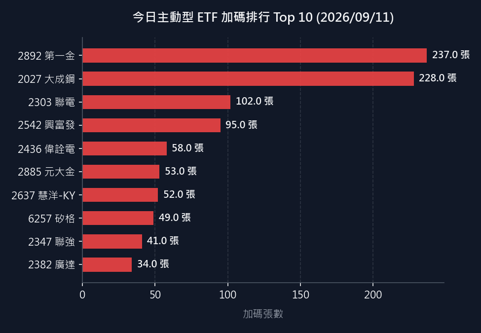
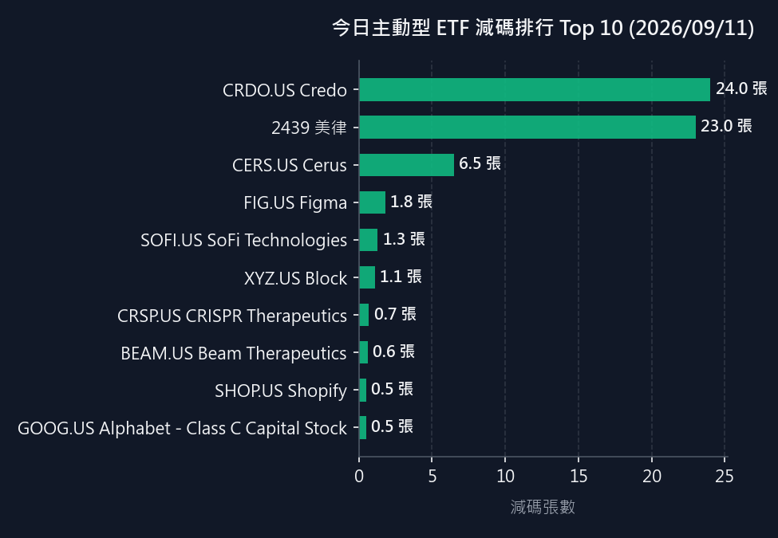

# 主動型 ETF 持股變動

資料來源：`主動型ETF持股明細.xlsx` 最近兩個日期分頁。

比較區間：`20260910` → `20260911`

## 今日加減碼視覺化排行

| 今日加碼 Top 10 | 今日減碼 Top 10 |
| :---: | :---: |
|  |  |

| ETF | 新增 | 刪除 | 比例變動 |
| :-- | --: | --: | --: |
| 00400A | 0 | 0 | 0 |
| 00401A | 0 | 0 | 0 |
| 00402A | 0 | 0 | 0 |
| 00403A | 0 | 0 | 0 |
| 00404A | 0 | 1 | 53 |
| 00405A | 0 | 0 | 0 |
| 00407A | 0 | 0 | 0 |
| 00408A | 0 | 0 | 0 |
| 00980A | 0 | 0 | 0 |
| 00980D | 0 | 0 | 38 |
| 00981A | 0 | 0 | 0 |
| 00982A | 0 | 0 | 0 |
| 00983A | 0 | 0 | 35 |
| 00983D | 0 | 0 | 26 |
| 00984A | 0 | 0 | 0 |
| 00985A | 0 | 0 | 36 |
| 00986A | 0 | 0 | 32 |
| 00987A | 0 | 0 | 0 |
| 00988A | 0 | 0 | 0 |
| 00989A | 0 | 0 | 50 |
| 00990A | 0 | 0 | 0 |
| 00991A | 0 | 0 | 0 |
| 00992A | 0 | 0 | 36 |
| 00993A | 0 | 0 | 0 |
| 00994A | 0 | 0 | 0 |
| 00995A | 0 | 0 | 39 |
| 00996A | 0 | 0 | 39 |
| 00997A | 0 | 1 | 44 |
| 00998A | 0 | 0 | 0 |
| 00999A | 0 | 0 | 0 |

## 00400A

### 新增持股

- 無

### 刪除持股

- 無

### 投資比例變動

- 無

## 00401A

### 新增持股

- 無

### 刪除持股

- 無

### 投資比例變動

- 無

## 00402A

### 新增持股

- 無

### 刪除持股

- 無

### 投資比例變動

- 無

## 00403A

### 新增持股

- 無

### 刪除持股

- 無

### 投資比例變動

- 無

## 00404A

### 新增持股

- 無

### 刪除持股

- 2439 美律（0.05%，23 張）

### 投資比例變動

- 1303 南亞：0.71% → 0.75%（+0.04）
- 2027 大成鋼：1.42% → 1.56%（+0.14）
- 2059 川湖：0.98% → 1.19%（+0.21）
- 2301 光寶科：0.23% → 0.21%（-0.02）
- 2303 聯電：2.02% → 2.24%（+0.22）
- 2308 台達電：1.86% → 1.87%（+0.01）
- 2317 鴻海：0.62% → 0.69%（+0.07）
- 2330 台積電：22.52% → 22.53%（+0.01）
- 2345 智邦：0.81% → 0.83%（+0.02）
- 2351 順德：0.40% → 0.37%（-0.03）
- 2357 華碩：0.89% → 0.88%（-0.01）
- 2360 致茂：0.62% → 0.74%（+0.12）
- 2379 瑞昱：0.97% → 1.07%（+0.10）
- 2382 廣達：1.93% → 2.12%（+0.19）
- 2383 台光電：2.91% → 2.90%（-0.01）
- 2395 研華：1.16% → 1.27%（+0.11）
- 2436 偉詮電：1.08% → 1.11%（+0.03）
- 2454 聯發科：7.13% → 7.03%（-0.10）
- 2542 興富發：1.80% → 1.82%（+0.02）
- 2637 慧洋-KY：1.06% → 1.14%（+0.08）
- 2883 凱基金：1.18% → 1.14%（-0.04）
- 2885 元大金：2.46% → 2.44%（-0.02）
- 2887 台新新光金：1.45% → 1.39%（-0.06）
- 2890 永豐金：1.46% → 1.41%（-0.05）
- 2892 第一金：1.77% → 1.95%（+0.18）
- 3017 奇鋐：1.25% → 1.32%（+0.07）
- 3034 聯詠：2.04% → 2.08%（+0.04）
- 3037 欣興：0.21% → 0.19%（-0.02）
- 3135 凌航：0.06% → 0.05%（-0.01）
- 3260 威剛：1.14% → 1.29%（+0.15）
- 3264 欣銓：0.43% → 0.39%（-0.04）
- 3293 鈊象：0.42% → 0.39%（-0.03）
- 3374 精材：0.13% → 0.11%（-0.02）
- 3443 創意：0.48% → 0.75%（+0.27）
- 3680 家登：0.40% → 0.48%（+0.08）
- 3711 日月光投控：3.49% → 3.53%（+0.04）
- 4763 材料*-KY：1.67% → 1.61%（-0.06）
- 5274 信驊：2.82% → 2.56%（-0.26）
- 5434 崇越：1.80% → 1.84%（+0.04）
- 5904 寶雅*：0.43% → 0.41%（-0.02）
- 6196 帆宣：1.64% → 1.78%（+0.14）
- 6206 飛捷：1.00% → 0.97%（-0.03）
- 6223 旺矽：1.09% → 1.31%（+0.22）
- 6257 矽格：1.69% → 1.82%（+0.13）
- 6515 穎崴：0.19% → 0.17%（-0.02）
- 6691 洋基工程：0.20% → 0.19%（-0.01）
- 7769 鴻勁：1.00% → 1.24%（+0.24）
- 8016 矽創：0.97% → 1.15%（+0.18）
- 8081 致新：0.73% → 0.82%（+0.09）
- 8299 群聯：1.07% → 1.17%（+0.10）
- 台指選擇權10/26 49500 買權：-0.28% → -0.20%（+0.08）
- 台股期貨09/26(FITXN*1.TF)：8.23% → 7.71%（-0.52）
- 台股期貨10/26(FITXN*1.TF)：7.53% → 7.05%（-0.48）

## 00405A

### 新增持股

- 無

### 刪除持股

- 無

### 投資比例變動

- 無

## 00407A

### 新增持股

- 無

### 刪除持股

- 無

### 投資比例變動

- 無

## 00408A

### 新增持股

- 無

### 刪除持股

- 無

### 投資比例變動

- 無

## 00980A

### 新增持股

- 無

### 刪除持股

- 無

### 投資比例變動

- 無

## 00980D

### 新增持股

- 無

### 刪除持股

- 無

### 投資比例變動

- AMC GLOBAL MEDIA INC SER REGS (REG) (REG S) 10.5% 15JUL2032：0.71% → 0.72%（+0.01）
- ARIS WATER HOLDINGS LLC SER REGS 7.250000 % 01APR2030：0.47% → 0.48%（+0.01）
- BLUE OWL CREDIT INCOME 7.750000 % 15JAN2029：0.53% → 0.54%（+0.01）
- BLUE OWL CREDIT INCOME SER WI (REG) 7.75% 16SEP2027：0.55% → 0.56%（+0.01）
- CAPITAL ONE FINANCIAL CO SER . (REG) VAR 30OCT2031：0.58% → 0.59%（+0.01）
- CHARTER COMM OPT 6.484% 23OCT2045 W/I：0.46% → 0.45%（-0.01）
- CHARTER COMM OPT LLC/CAP (REG) 6.834000 % 23OCT2055：0.46% → 0.45%（-0.01）
- CONCENTRIX CORP (REG) 6.85% 02AUG2033：0.71% → 0.70%（-0.01）
- COREWEAVE INC SER REGS (REG S) 9.25% 01JUN2030：0.42% → 0.43%（+0.01）
- COX COMMUNICATIONS INC SER REGS 5.950000 % 01SEP2054：0.54% → 0.53%（-0.01）
- DAIMLER FINANCE NA LLC REG 8.5% 18JAN2031：0.63% → 0.64%（+0.01）
- FIFTH THIRD BANCORP (REG) 8.25% 01MAR2038：0.65% → 0.64%（-0.01）
- FMC CORP (REG) 6.375000 % 18MAY2053：0.48% → 0.47%（-0.01）
- FORD MOTOR CREDIT CO LLC (REG) 7.2% 10JUN2030：0.33% → 0.34%（+0.01）
- FORD MOTOR CREDIT CO LLC 6.798% 07NOV2028：0.33% → 0.34%（+0.01）
- FREEDOM MORTGAGE CORP SER REGS (REG S) 12.25% 01OCT2030：0.47% → 0.48%（+0.01）
- GLOBAL AUTO HO/AAG FH UK SER REGS (REG S) 11.5% 15AUG2029：0.37% → 0.38%（+0.01）
- HA SUSTAINABLE INF CAP (REG) 6.375% 01JUL2034：0.35% → 0.34%（-0.01）
- HORIZON MUTUAL HOLDINGS SER REGS 6.200000 % 15NOV2034：0.32% → 0.33%（+0.01）
- KELLANOVA SER B (REG) 7.450000 % 01APR2031：0.56% → 0.57%（+0.01）
- LBM ACQUISITION LLC SER REGS 9.500000 % 15JUN2031：0.47% → 0.48%（+0.01）
- META PLATFORMS INC 5.750000 % 15-NOV-2065：0.43% → 0.42%（-0.01）
- NISSAN MOTOR CO SER REGS 8.125000 % 17JUL2035：0.52% → 0.53%（+0.01）
- NRG ENERGY INC SER REGS (REG S) 7% 15MAR2033：0.31% → 0.32%（+0.01）
- ONEOK INC 6.625% 01SEP2053：0.59% → 0.58%（-0.01）
- ORACLE CORP 6.100000 % 26-SEP-2065：0.49% → 0.48%（-0.01）
- PEPSICO INC (REG) 7.000000 % 01MAR2029：0.31% → 0.32%（+0.01）
- PLANET FINANCIAL GROUP SER REGS 10.500000 % 15DEC2029：0.50% → 0.51%（+0.01）
- SABRE FINANCIAL BORROWER SER REGS 11.125 % 15-JUN-2029：0.53% → 0.54%（+0.01）
- SANTANDER HOLDINGS USA VAR 09MAR2029：0.47% → 0.48%（+0.01）
- SPACE EXPLORATION TECH SER 144A (REG) 6.65% 15JUL2056：0.32% → 0.31%（-0.01）
- TRUIST FINANCIAL CORP SER MTN VAR 30OCT2029：0.64% → 0.65%（+0.01）
- US 10YR NOTE (CBT)DEC26 21-DEC-2026：17.82% → 17.83%（+0.01）
- US 2YR NOTE (CBT) DEC26 31-DEC-2026：1.64% → 1.65%（+0.01）
- US 5YR NOTE (CBT) DEC26 31-DEC-2026：-14.32% → -14.35%（-0.03）
- US ACUTE CARE SOLUTIONS SER REGS (REG S) 9.75% 15MAY2029：0.33% → 0.34%（+0.01）
- US LONG BOND(CBT) DEC26 21-DEC-2026：5.36% → 5.34%（-0.02）
- VIACOM INC (REG) 5.85% 01SEP2043：0.57% → 0.56%（-0.01）

## 00981A

### 新增持股

- 無

### 刪除持股

- 無

### 投資比例變動

- 無

## 00982A

### 新增持股

- 無

### 刪除持股

- 無

### 投資比例變動

- 無

## 00983A

### 新增持股

- 無

### 刪除持股

- 無

### 投資比例變動

- ACHR.US Archer：0.71% → 0.72%（+0.01）
- AMD.US AMD：3.43% → 3.39%（-0.04）
- AMZN.US Amazon：2.47% → 2.51%（+0.04）
- AVGO.US Broadcom：0.59% → 0.60%（+0.01）
- BEAM.US Beam Therapeutics：1.84% → 1.77%（-0.07）
- BLSH.US Bullish：2.10% → 2.11%（+0.01）
- BMNR.US BitMine：2.09% → 2.13%（+0.04）
- CBRS.US Cerebras：1.03% → 1.02%（-0.01）
- CERS.US Cerus：0.20% → 0.15%（-0.05）
- COIN.US Coinbase：4.08% → 4.11%（+0.03）
- CRCL.US Circle：5.11% → 5.07%（-0.04）
- CRSP.US CRISPR Therapeutics：3.90% → 3.78%（-0.12）
- CRWV.US CoreWeave：1.31% → 1.26%（-0.05）
- DE.US Deere：0.96% → 0.99%（+0.03）
- FIG.US Figma：0.32% → 0.21%（-0.11）
- GOOG.US Alphabet - Class C Capital Stock：1.37% → 1.41%（+0.04）
- GOOGL.US Alphabet - Class A Common Stock：0.76% → 0.78%（+0.02）
- HOOD.US Robinhood Markets：5.01% → 5.03%（+0.02）
- ILMN.US Illumina：1.63% → 1.64%（+0.01）
- KTOS.US Kratos Defense & Security：0.72% → 0.74%（+0.02）
- LLY.US Eli Lilly：1.03% → 1.05%（+0.02）
- NTRA.US Natera：2.01% → 2.03%（+0.02）
- NVDA.US NVIDIA：1.93% → 1.92%（-0.01）
- RXRX.US Recursion Pharmaceuticals：0.34% → 0.35%（+0.01）
- SHOP.US Shopify：5.44% → 5.33%（-0.11）
- SNOW.US Snowflake：1.81% → 1.65%（-0.16）
- SOFI.US SoFi Technologies：0.52% → 0.45%（-0.07）
- SPCX.US SpaceX：5.47% → 5.60%（+0.13）
- TEM.US Tempus：5.72% → 5.60%（-0.12）
- TSLA.US Tesla：9.26% → 9.21%（-0.05）
- TWST.US Twist Bioscience：4.40% → 4.44%（+0.04）
- TXG.US 10x Genomics：4.73% → 4.76%（+0.03）
- WGS.US GeneDx：1.36% → 1.35%（-0.01）
- XE.US X-Energy：0.82% → 0.77%（-0.05）
- XYZ.US Block：2.05% → 1.81%（-0.24）

## 00983D

### 新增持股

- 無

### 刪除持股

- 無

### 投資比例變動

- ALLY 8 11/01/31：1.18% → 1.19%（+0.01）
- AMCX 10 1/2 07/15/32：1.61% → 1.62%（+0.01）
- BATSLN 7.081 08/02/53：1.30% → 1.29%（-0.01）
- BHCCN 11 09/30/28：1.86% → 1.87%（+0.01）
- C 8 1/8 07/15/39：1.90% → 1.89%（-0.01）
- CRWV 9 02/01/31：0.81% → 0.82%（+0.01）
- CYH 10 7/8 01/15/32：1.47% → 1.48%（+0.01）
- DELL 8.1 07/15/36：1.50% → 1.49%（-0.01）
- DELL 8.35 07/15/46：1.38% → 1.37%（-0.01）
- DIS 7 3/4 12/01/45：0.60% → 0.59%（-0.01）
- DOW 9.4 05/15/39：1.92% → 1.91%（-0.01）
- DT 9 1/4 06/01/32：0.92% → 0.93%（+0.01）
- GS 6 1/4 02/01/41：0.32% → 0.31%（-0.01）
- GT 8 7/8 07/15/32：0.93% → 0.92%（-0.01）
- IEP 10 11/15/29：1.46% → 1.47%（+0.01）
- KHC 6 7/8 01/26/39：0.99% → 0.98%（-0.01）
- LQDW.US iShares Investment Grade Corpora：7.16% → 7.15%（-0.01）
- MOHEGN 11 7/8 04/15/31：1.34% → 1.35%（+0.01）
- PDM 9 1/4 07/20/28：1.15% → 1.16%（+0.01）
- PFE 7.2 03/15/39：1.40% → 1.39%（-0.01）
- RAKUTN 11 1/4 02/15/27：1.78% → 1.79%（+0.01）
- SUCN 6.85 06/01/39：1.20% → 1.19%（-0.01）
- SVC 8 7/8 06/15/32：0.47% → 0.48%（+0.01）
- TIME WARNER CABLE INC 6.750 06/15/39：0.47% → 0.46%（-0.01）
- TLTW.US iShares 20+ Year Treasury Bond B：7.82% → 7.79%（-0.03）
- UNITEDHEALTH GROUP INC 6.875 02/15/38：0.85% → 0.84%（-0.01）

## 00984A

### 新增持股

- 無

### 刪除持股

- 無

### 投資比例變動

- 無

## 00985A

### 新增持股

- 無

### 刪除持股

- 無

### 投資比例變動

- 1216 統一：1.19% → 1.20%（+0.01）
- 2027 大成鋼：0.96% → 0.94%（-0.02）
- 2308 台達電：1.68% → 1.65%（-0.03）
- 2317 鴻海：2.44% → 2.45%（+0.01）
- 2327 國巨*：1.61% → 1.55%（-0.06）
- 2344 華邦電：0.42% → 0.40%（-0.02）
- 2345 智邦：1.50% → 1.46%（-0.04）
- 2360 致茂：0.89% → 0.90%（+0.01）
- 2376 技嘉：4.07% → 4.11%（+0.04）
- 2377 微星：1.72% → 1.75%（+0.03）
- 2383 台光電：2.66% → 2.70%（+0.04）
- 2395 研華：2.79% → 2.90%（+0.11）
- 2408 南亞科：0.39% → 0.38%（-0.01）
- 2412 中華電：3.76% → 3.85%（+0.09）
- 2454 聯發科：3.01% → 2.98%（-0.03）
- 2603 長榮：1.60% → 1.65%（+0.05）
- 2610 華航：1.69% → 1.74%（+0.05）
- 2881 富邦金：1.42% → 1.44%（+0.02）
- 2891 中信金：1.70% → 1.72%（+0.02）
- 3017 奇鋐：1.71% → 1.70%（-0.01）
- 3037 欣興：1.88% → 1.87%（-0.01）
- 3131 弘塑：0.28% → 0.27%（-0.01）
- 3491 昇達科：1.38% → 1.47%（+0.09）
- 3653 健策：0.72% → 0.73%（+0.01）
- 3661 世芯-KY：1.82% → 1.66%（-0.16）
- 3665 貿聯-KY：1.36% → 1.34%（-0.02）
- 3711 日月光投控：4.37% → 4.23%（-0.14）
- 4904 遠傳：3.82% → 3.92%（+0.10）
- 6147 頎邦：0.71% → 0.68%（-0.03）
- 6442 光聖：2.40% → 2.26%（-0.14）
- 6446 藥華藥：1.74% → 1.71%（-0.03）
- 7750 新代：1.69% → 1.55%（-0.14）
- 7769 鴻勁：1.11% → 1.10%（-0.01）
- 8046 南電：1.04% → 1.07%（+0.03）
- 8996 高力：0.94% → 0.98%（+0.04）
- 台積電期貨(FICDFN*1.TF)：5.13% → 5.15%（+0.02）

## 00986A

### 新增持股

- 無

### 刪除持股

- 無

### 投資比例變動

- 2330 台積電：8.59% → 8.65%（+0.06）
- 2454 聯發科：1.61% → 1.67%（+0.06）
- AAPL.US Apple：1.04% → 1.09%（+0.05）
- AMAT.US Applied Materials：1.80% → 1.77%（-0.03）
- AMD.US AMD：4.00% → 3.93%（-0.07）
- AMZN.US Amazon：3.88% → 3.93%（+0.05）
- AVGO.US Broadcom：3.60% → 3.62%（+0.02）
- COHR.US Coherent：2.17% → 2.12%（-0.05）
- CRWD.US CrowdStrike Holdings：3.42% → 3.49%（+0.07）
- GEV.US GE Vernova：2.61% → 2.57%（-0.04）
- GOOGL.US Alphabet - Class A Common Stock：5.45% → 5.56%（+0.11）
- GS.US Goldman Sachs：3.11% → 3.13%（+0.02）
- HWM.US Howmet Aerospace：2.17% → 2.16%（-0.01）
- JPM.US JPMorgan Chase：1.95% → 1.97%（+0.02）
- LITE.US Lumentum：4.23% → 4.07%（-0.16）
- LLY.US Eli Lilly：2.78% → 2.82%（+0.04）
- LRCX.US Lam Research：2.60% → 2.49%（-0.11）
- MA.US Mastercard：1.09% → 1.10%（+0.01）
- MSFT.US Microsoft：2.70% → 2.74%（+0.04）
- MU.US Micron：4.51% → 4.36%（-0.15）
- MUFG(8306.JP)：1.55% → 1.60%（+0.05）
- Murata Mfg.(6981.JP)：1.79% → 1.91%（+0.12）
- NET.US Cloudflare：2.07% → 2.08%（+0.01）
- NVDA.US NVIDIA：6.14% → 6.08%（-0.06）
- SNDK.US Sandisk：1.94% → 1.89%（-0.05）
- SNOW.US Snowflake：2.00% → 2.02%（+0.02）
- Siemens Energy AG：2.04% → 2.01%（-0.03）
- TSEM.US Tower Semiconductor：1.01% → 0.99%（-0.02）
- 嘉能可公司：1.86% → 1.81%（-0.05）
- 尼比厄斯集團公眾有限公司：0.26% → 0.25%（-0.01）
- 施奈德電機公司：1.67% → 1.68%（+0.01）
- 英飛凌科技股份有限公司：2.91% → 2.90%（-0.01）

## 00987A

### 新增持股

- 無

### 刪除持股

- 無

### 投資比例變動

- 無

## 00988A

### 新增持股

- 無

### 刪除持股

- 無

### 投資比例變動

- 無

## 00989A

### 新增持股

- 無

### 刪除持股

- 無

### 投資比例變動

- ADBE.US Adobe：1.48% → 1.46%（-0.02）
- AMD.US AMD：2.80% → 2.74%（-0.06）
- AMZN.US Amazon：1.01% → 1.02%（+0.01）
- APP.US Applovin：0.58% → 0.29%（-0.29）
- ASML.US ASML Holding：1.70% → 1.68%（-0.02）
- AVGO.US Broadcom：3.85% → 3.86%（+0.01）
- BE.US Bloom Energy：1.33% → 1.29%（-0.04）
- CDNS.US Cadence Design Systems：0.81% → 0.82%（+0.01）
- CIEN.US Ciena：0.99% → 1.00%（+0.01）
- CRM.US Salesforce：3.64% → 3.68%（+0.04）
- CRWD.US CrowdStrike Holdings：3.00% → 3.05%（+0.05）
- CRWV.US CoreWeave：0.81% → 0.77%（-0.04）
- ENTG.US Entegris：0.64% → 0.63%（-0.01）
- ESTC.US Elastic：0.69% → 0.68%（-0.01）
- FIGR.US Figure：0.98% → 0.95%（-0.03）
- GLW.US Corning：1.17% → 1.15%（-0.02）
- GOOG.US Alphabet - Class C Capital Stock：2.78% → 2.38%（-0.40）
- HOOD.US Robinhood Markets：2.06% → 2.05%（-0.01）
- HUBS.US HubSpot：1.88% → 1.86%（-0.02）
- INTC.US Intel：3.05% → 2.92%（-0.13）
- INTU.US Intuit：0.73% → 0.74%（+0.01）
- LITE.US Lumentum：1.88% → 1.80%（-0.08）
- LMND.US Lemonade：0.77% → 0.79%（+0.02）
- LRCX.US Lam Research：2.59% → 2.48%（-0.11）
- MDB.US MongoDB：0.66% → 0.70%（+0.04）
- META.US Meta：2.31% → 3.31%（+1.00）
- MSFT.US Microsoft：3.23% → 3.28%（+0.05）
- MTSI.US MACOM Technology Solutions：0.82% → 0.79%（-0.03）
- MU.US Micron：0.91% → 0.87%（-0.04）
- NET.US Cloudflare：2.87% → 2.88%（+0.01）
- NOW.US ServiceNow：2.09% → 2.12%（+0.03）
- NU.US Nu：0.61% → 0.62%（+0.01）
- NVDA.US NVIDIA：4.75% → 4.70%（-0.05）
- ORCL.US Oracle：1.24% → 1.19%（-0.05）
- PANW.US Palo Alto：3.74% → 3.58%（-0.16）
- PLTR.US Palantir Technologies：0.98% → 0.97%（-0.01）
- RIVN.US Rivian：1.40% → 1.42%（+0.02）
- SHOP.US Shopify：1.80% → 1.82%（+0.02）
- SNDK.US Sandisk：0.67% → 0.65%（-0.02）
- SNOW.US Snowflake：3.26% → 3.29%（+0.03）
- SPCX.US SpaceX：0.80% → 0.82%（+0.02）
- SYM.US Symbotic：0.51% → 0.49%（-0.02）
- TEAM.US Atlassian：1.20% → 1.23%（+0.03）
- TEM.US Tempus：1.00% → 0.97%（-0.03）
- TTWO.US Take-Two：3.06% → 3.19%（+0.13）
- TWLO.US Twilio：2.32% → 2.39%（+0.07）
- U.US Unity Software：0.88% → 0.89%（+0.01）
- VEEV.US Veeva Systems：0.66% → 0.67%（+0.01）
- XYZ.US Block：0.76% → 0.77%（+0.01）
- ZM.US Zoom：1.95% → 1.96%（+0.01）

## 00990A

### 新增持股

- 無

### 刪除持股

- 無

### 投資比例變動

- 無

## 00991A

### 新增持股

- 無

### 刪除持股

- 無

### 投資比例變動

- 無

## 00992A

### 新增持股

- 無

### 刪除持股

- 無

### 投資比例變動

- 1303 南亞：3.21% → 3.14%（-0.07）
- 1815 富喬：3.48% → 3.58%（+0.10）
- 2059 川湖：6.24% → 6.09%（-0.15）
- 2301 光寶科：0.46% → 0.45%（-0.01）
- 2330 台積電：6.61% → 6.62%（+0.01）
- 2345 智邦：5.10% → 4.98%（-0.12）
- 2357 華碩：0.47% → 0.45%（-0.02）
- 2376 技嘉：0.43% → 0.44%（+0.01）
- 2383 台光電：6.04% → 6.14%（+0.10）
- 2404 漢唐：0.40% → 0.38%（-0.02）
- 2454 聯發科：1.65% → 1.64%（-0.01）
- 2455 全新：2.76% → 2.72%（-0.04）
- 3008 大立光：4.76% → 4.80%（+0.04）
- 3017 奇鋐：8.37% → 8.30%（-0.07）
- 3026 禾伸堂：0.51% → 0.48%（-0.03）
- 3037 欣興：5.96% → 5.97%（+0.01）
- 3081 聯亞：0.43% → 0.44%（+0.01）
- 3189 景碩：1.69% → 1.71%（+0.02）
- 3231 緯創：3.24% → 3.31%（+0.07）
- 3653 健策：0.46% → 0.47%（+0.01）
- 3661 世芯-KY：2.11% → 1.93%（-0.18）
- 3665 貿聯-KY：5.41% → 5.36%（-0.05）
- 3711 日月光投控：0.39% → 0.38%（-0.01）
- 4958 臻鼎-KY：1.19% → 1.22%（+0.03）
- 5274 信驊：0.50% → 0.48%（-0.02）
- 5289 宜鼎：0.31% → 0.32%（+0.01）
- 5347 世界：0.25% → 0.24%（-0.01）
- 6139 亞翔：0.45% → 0.44%（-0.01）
- 6223 旺矽：3.64% → 3.71%（+0.07）
- 6515 穎崴：0.89% → 0.86%（-0.03）
- 6584 南俊國際：2.99% → 3.11%（+0.12）
- 6669 緯穎：2.43% → 2.44%（+0.01）
- 8021 尖點：2.84% → 2.76%（-0.08）
- 8046 南電：2.50% → 2.57%（+0.07）
- 8150 南茂：0.43% → 0.42%（-0.01）
- 8996 高力：5.12% → 5.33%（+0.21）

## 00993A

### 新增持股

- 無

### 刪除持股

- 無

### 投資比例變動

- 無

## 00994A

### 新增持股

- 無

### 刪除持股

- 無

### 投資比例變動

- 無

## 00995A

### 新增持股

- 無

### 刪除持股

- 無

### 投資比例變動

- 2059 川湖：0.53% → 0.52%（-0.01）
- 2303 聯電：0.66% → 0.67%（+0.01）
- 2308 台達電：3.88% → 3.83%（-0.05）
- 2327 國巨*：2.17% → 2.11%（-0.06）
- 2330 台積電：8.97% → 8.98%（+0.01）
- 2344 華邦電：1.25% → 1.23%（-0.02）
- 2345 智邦：3.52% → 3.45%（-0.07）
- 2360 致茂：1.19% → 1.21%（+0.02）
- 2368 金像電：1.63% → 1.64%（+0.01）
- 2383 台光電：8.15% → 8.31%（+0.16）
- 2449 京元電子：0.98% → 0.97%（-0.01）
- 2454 聯發科：7.35% → 7.30%（-0.05）
- 2455 全新：1.13% → 1.12%（-0.01）
- 2467 志聖：0.33% → 0.32%（-0.01）
- 2486 一詮：0.76% → 0.77%（+0.01）
- 3017 奇鋐：5.83% → 5.80%（-0.03）
- 3037 欣興：2.30% → 2.31%（+0.01）
- 3131 弘塑：0.47% → 0.45%（-0.02）
- 3189 景碩：0.54% → 0.55%（+0.01）
- 3211 順達：0.24% → 0.23%（-0.01）
- 3264 欣銓：0.54% → 0.53%（-0.01）
- 3653 健策：3.66% → 3.72%（+0.06）
- 3665 貿聯-KY：3.29% → 3.27%（-0.02）
- 3711 日月光投控：2.83% → 2.75%（-0.08）
- 4958 臻鼎-KY：0.61% → 0.63%（+0.02）
- 5274 信驊：3.46% → 3.39%（-0.07）
- 5289 宜鼎：0.61% → 0.63%（+0.02）
- 6223 旺矽：4.50% → 4.60%（+0.10）
- 6510 精測：1.55% → 1.50%（-0.05）
- 6515 穎崴：2.12% → 2.08%（-0.04）
- 6669 緯穎：6.33% → 6.37%（+0.04）
- 6805 富世達：0.41% → 0.42%（+0.01）
- 7750 新代：0.56% → 0.52%（-0.04）
- 7769 鴻勁：3.00% → 2.99%（-0.01）
- 8046 南電：3.83% → 3.95%（+0.12）
- 8150 南茂：0.54% → 0.52%（-0.02）
- 8210 勤誠：0.82% → 0.83%（+0.01）
- 8358 金居：0.38% → 0.37%（-0.01）
- 8996 高力：0.55% → 0.57%（+0.02）

## 00996A

### 新增持股

- 無

### 刪除持股

- 無

### 投資比例變動

- 1303 南亞：0.53% → 0.52%（-0.01）
- 2308 台達電：4.77% → 4.71%（-0.06）
- 2317 鴻海：0.05% → 0.06%（+0.01）
- 2327 國巨*：5.22% → 5.06%（-0.16）
- 2330 台積電：10.87% → 10.91%（+0.04）
- 2344 華邦電：1.47% → 1.43%（-0.04）
- 2360 致茂：1.35% → 1.37%（+0.02）
- 2383 台光電：6.79% → 6.92%（+0.13）
- 2408 南亞科：1.24% → 1.21%（-0.03）
- 2454 聯發科：6.79% → 6.72%（-0.07）
- 2467 志聖：0.36% → 0.35%（-0.01）
- 2881 富邦金：0.07% → 0.08%（+0.01）
- 3017 奇鋐：2.23% → 2.22%（-0.01）
- 3037 欣興：1.87% → 1.88%（+0.01）
- 3042 晶技：1.66% → 1.65%（-0.01）
- 3131 弘塑：0.31% → 0.29%（-0.02）
- 3189 景碩：2.17% → 2.20%（+0.03）
- 3363 上詮：1.82% → 1.77%（-0.05）
- 3443 創意：3.39% → 3.40%（+0.01）
- 3653 健策：2.87% → 2.92%（+0.05）
- 3693 營邦：1.61% → 1.58%（-0.03）
- 4749 新應材：0.10% → 0.09%（-0.01）
- 4958 臻鼎-KY：6.34% → 6.47%（+0.13）
- 5269 祥碩：0.74% → 0.73%（-0.01）
- 6223 旺矽：2.65% → 2.70%（+0.05）
- 6239 力成：0.72% → 0.70%（-0.02）
- 6278 台表科：3.16% → 3.14%（-0.02）
- 6415 矽力*-KY：1.57% → 1.58%（+0.01）
- 6510 精測：2.18% → 2.11%（-0.07）
- 6531 愛普*：0.13% → 0.12%（-0.01）
- 6683 雍智科技：1.69% → 1.73%（+0.04）
- 6830 汎銓：1.16% → 1.10%（-0.06）
- 6831 邁科：2.34% → 2.45%（+0.11）
- 7751 竑騰：1.78% → 1.73%（-0.05）
- 8021 尖點：1.56% → 1.52%（-0.04）
- 8046 南電：1.43% → 1.47%（+0.04）
- 8210 勤誠：1.47% → 1.48%（+0.01）
- 8996 高力：2.87% → 2.99%（+0.12）
- 小型臺指期貨(FIMTXN*1.TF)：2.61% → 2.63%（+0.02）

## 00997A

### 新增持股

- 無

### 刪除持股

- GE.US GE Aerospace（0.68%，8.479 張）

### 投資比例變動

- 2330 台積電：2.56% → 2.59%（+0.03）
- 2383 台光電：1.73% → 1.76%（+0.03）
- 2454 聯發科：0.91% → 0.94%（+0.03）
- 3037 欣興：2.81% → 2.86%（+0.05）
- 6640 均華：0.99% → 1.02%（+0.03）
- AAPL.US Apple：2.85% → 3.01%（+0.16）
- ALAB.US Astera Labs：0.49% → 0.47%（-0.02）
- AMAT.US Applied Materials：1.02% → 1.01%（-0.01）
- AMD.US AMD：2.24% → 2.20%（-0.04）
- AMZN.US Amazon：1.71% → 1.73%（+0.02）
- APH.US Amphenol：1.45% → 1.46%（+0.01）
- APP.US Applovin：0.24% → 0.25%（+0.01）
- AVGO.US Broadcom：1.26% → 1.27%（+0.01）
- BE.US Bloom Energy：1.38% → 1.35%（-0.03）
- CIEN.US Ciena：1.71% → 1.72%（+0.01）
- COHR.US Coherent：0.68% → 0.67%（-0.01）
- CRDO.US Credo：1.64% → 0.62%（-1.02）
- CRWD.US CrowdStrike Holdings：2.86% → 2.93%（+0.07）
- DT.US Dynatrace：2.18% → 2.26%（+0.08）
- FTNT.US Fortinet：1.01% → 1.04%（+0.03）
- GOOGL.US Alphabet - Class A Common Stock：3.17% → 3.25%（+0.08）
- IBIDEN(4062.JP)：4.01% → 3.94%（-0.07）
- IOT.US Samsara：1.28% → 1.30%（+0.02）
- KLAC.US KLA：0.51% → 0.50%（-0.01）
- Kioxia Holdings(285A.JP)：0.85% → 0.88%（+0.03）
- LITE.US Lumentum：3.62% → 3.49%（-0.13）
- LRCX.US Lam Research：2.11% → 2.03%（-0.08）
- MRVL.US Marvell：3.28% → 3.23%（-0.05）
- MSFT.US Microsoft：0.96% → 0.98%（+0.02）
- MU.US Micron：5.12% → 4.96%（-0.16）
- NOW.US ServiceNow：1.80% → 1.83%（+0.03）
- NVDA.US NVIDIA：2.83% → 2.81%（-0.02）
- OKTA.US Okta：1.58% → 1.59%（+0.01）
- PANW.US Palo Alto：2.13% → 2.19%（+0.06）
- RTX.US RTX：1.76% → 1.79%（+0.03）
- SNDK.US Sandisk：3.86% → 3.77%（-0.09）
- SNOW.US Snowflake：2.30% → 2.33%（+0.03）
- STX.US Seagate：2.69% → 2.67%（-0.02）
- Samsung Elec Mech(009150.KS)：2.40% → 2.43%（+0.03）
- TER.US Teradyne：2.11% → 2.08%（-0.03）
- TWLO.US Twilio：0.84% → 0.88%（+0.04）
- WDC.US Western Digital：1.08% → 1.05%（-0.03）
- 太空探索科技公司：0.77% → 0.79%（+0.02）
- 迪爾：1.19% → 1.21%（+0.02）

## 00998A

### 新增持股

- 無

### 刪除持股

- 無

### 投資比例變動

- 無

## 00999A

### 新增持股

- 無

### 刪除持股

- 無

### 投資比例變動

- 無
