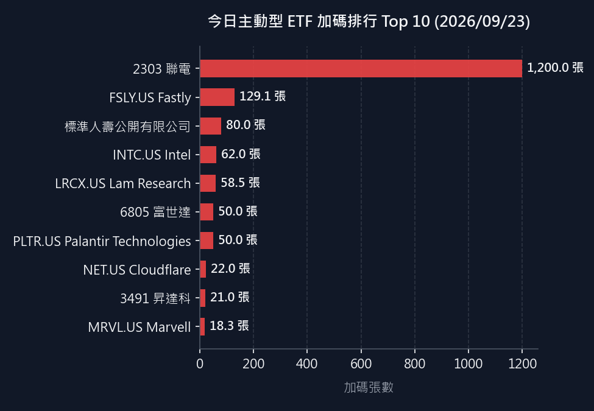
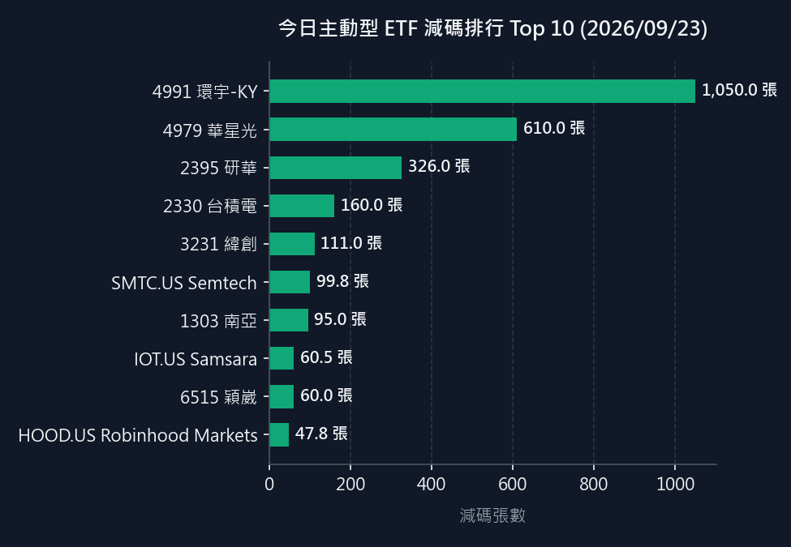

# 主動型 ETF 持股變動

資料來源：`主動型ETF持股明細.xlsx` 最近兩個日期分頁。

比較區間：`20260922` → `20260923`

## 今日加減碼視覺化排行

| 今日加碼 Top 10 | 今日減碼 Top 10 |
| :---: | :---: |
|  |  |

| ETF | 新增 | 刪除 | 比例變動 |
| :-- | --: | --: | --: |
| 00400A | 0 | 0 | 0 |
| 00401A | 1 | 0 | 42 |
| 00402A | 0 | 0 | 44 |
| 00403A | 0 | 0 | 0 |
| 00404A | 0 | 0 | 0 |
| 00405A | 1 | 1 | 30 |
| 00406A | 1 | 1 | 49 |
| 00407A | 0 | 0 | 0 |
| 00408A | 0 | 0 | 0 |
| 00980A | 0 | 0 | 0 |
| 00980D | 0 | 0 | 13 |
| 00981A | 0 | 0 | 0 |
| 00982A | 0 | 0 | 37 |
| 00983A | 0 | 0 | 0 |
| 00983D | 0 | 0 | 0 |
| 00984A | 0 | 0 | 58 |
| 00985A | 0 | 0 | 36 |
| 00986A | 0 | 0 | 32 |
| 00987A | 0 | 0 | 26 |
| 00988A | 0 | 1 | 41 |
| 00989A | 0 | 0 | 0 |
| 00990A | 2 | 0 | 44 |
| 00991A | 0 | 0 | 0 |
| 00992A | 0 | 0 | 0 |
| 00993A | 0 | 0 | 0 |
| 00994A | 0 | 1 | 34 |
| 00995A | 0 | 0 | 43 |
| 00996A | 0 | 0 | 0 |
| 00997A | 0 | 2 | 46 |
| 00998A | 1 | 0 | 43 |
| 00999A | 0 | 0 | 0 |

## 00400A

### 新增持股

- 無

### 刪除持股

- 無

### 投資比例變動

- 無

## 00401A

### 新增持股

- 7856 漢測（0.50%，4 張）

### 刪除持股

- 無

### 投資比例變動

- 1303 南亞：0.90% → 0.88%（-0.02）
- 1477 聚陽：0.81% → 0.82%（+0.01）
- 2059 川湖：1.00% → 0.97%（-0.03）
- 2308 台達電：2.53% → 2.52%（-0.01）
- 2313 華通：1.31% → 1.32%（+0.01）
- 2317 鴻海：0.55% → 0.56%（+0.01）
- 2330 台積電：19.72% → 19.98%（+0.26）
- 2345 智邦：1.19% → 0.82%（-0.37）
- 2360 致茂：1.50% → 1.43%（-0.07）
- 2382 廣達：2.12% → 2.11%（-0.01）
- 2383 台光電：0.71% → 0.74%（+0.03）
- 2454 聯發科：6.98% → 6.97%（-0.01）
- 2455 全新：2.23% → 2.24%（+0.01）
- 2881 富邦金：1.96% → 1.93%（-0.03）
- 2882 國泰金：1.00% → 0.99%（-0.01）
- 2883 凱基金：1.64% → 1.63%（-0.01）
- 2884 玉山金：1.88% → 1.86%（-0.02）
- 2886 兆豐金：1.29% → 1.28%（-0.01）
- 2891 中信金：1.49% → 1.47%（-0.02）
- 3008 大立光：2.24% → 2.15%（-0.09）
- 3034 聯詠：0.21% → 0.20%（-0.01）
- 3037 欣興：2.21% → 2.28%（+0.07）
- 3131 弘塑：0.69% → 0.68%（-0.01）
- 3231 緯創：1.56% → 1.55%（-0.01）
- 3491 昇達科：1.64% → 1.73%（+0.09）
- 3711 日月光投控：2.49% → 2.48%（-0.01）
- 4904 遠傳：0.72% → 0.71%（-0.01）
- 4958 臻鼎-KY：1.22% → 1.18%（-0.04）
- 4991 環宇-KY：0.92% → 0.87%（-0.05）
- 5274 信驊：2.21% → 2.14%（-0.07）
- 6147 頎邦：1.35% → 1.32%（-0.03）
- 6187 萬潤：0.62% → 0.61%（-0.01）
- 6223 旺矽：1.58% → 1.66%（+0.08）
- 6285 啟碁：1.27% → 1.25%（-0.02）
- 6515 穎崴：1.65% → 1.71%（+0.06）
- 6531 愛普*：1.59% → 1.68%（+0.09）
- 6669 緯穎：1.81% → 1.79%（-0.02）
- 7769 鴻勁：1.57% → 1.36%（-0.21）
- 7828 創新服務：1.76% → 1.80%（+0.04）
- 8464 億豐：0.98% → 0.97%（-0.01）
- 台股期貨10/26(FITXN*1.TF)：0.32% → 0.33%（+0.01）
- 臺指選擇權10/26 46400 買權：-0.98% → -1.00%（-0.02）

## 00402A

### 新增持股

- 無

### 刪除持股

- 無

### 投資比例變動

- AAPL.US Apple：7.78% → 7.59%（-0.19）
- ADI.US Analog Devices：1.88% → 1.74%（-0.14）
- AMD.US AMD：6.09% → 6.25%（+0.16）
- AMZN.US Amazon：4.50% → 4.10%（-0.40）
- ANET.US Arista Networks：0.88% → 0.89%（+0.01）
- ARM.US Arm：0.89% → 0.93%（+0.04）
- ASML.US ASML Holding：1.10% → 1.14%（+0.04）
- AVGO.US Broadcom：2.16% → 2.20%（+0.04）
- AXON.US Axon Enterprise：0.83% → 0.72%（-0.11）
- BABA.US Alibaba Group：0.55% → 0.56%（+0.01）
- BKNG.US Booking Holdings：0.58% → 0.57%（-0.01）
- CDNS.US Cadence Design Systems：1.30% → 1.35%（+0.05）
- CIEN.US Ciena：1.22% → 1.25%（+0.03）
- CLS.US Celestica：0.96% → 1.01%（+0.05）
- COHR.US Coherent：1.72% → 1.69%（-0.03）
- CRWD.US CrowdStrike Holdings：1.58% → 1.60%（+0.02）
- FSLY.US Fastly：0.42% → 0.40%（-0.02）
- GOOG.US Alphabet - Class C Capital Stock：3.05% → 3.06%（+0.01）
- GOOGL.US Alphabet - Class A Common Stock：3.63% → 3.49%（-0.14）
- INTC.US Intel：1.46% → 1.51%（+0.05）
- IOT.US Samsara：0.50% → 0.51%（+0.01）
- KLAC.US KLA：1.56% → 1.62%（+0.06）
- LRCX.US Lam Research：2.66% → 2.77%（+0.11）
- MCHP.US Microchip Technology：1.14% → 1.17%（+0.03）
- MDB.US MongoDB：0.47% → 0.50%（+0.03）
- META.US Meta：3.57% → 3.59%（+0.02）
- MRVL.US Marvell：1.37% → 1.41%（+0.04）
- MSFT.US Microsoft：4.85% → 4.67%（-0.18）
- MU.US Micron：6.65% → 7.07%（+0.42）
- NOW.US ServiceNow：0.81% → 0.82%（+0.01）
- PANW.US Palo Alto：2.66% → 2.57%（-0.09）
- PLTR.US Palantir Technologies：1.80% → 1.85%（+0.05）
- SHOP.US Shopify：0.84% → 0.91%（+0.07）
- SIMO.US Silicon Motion：0.81% → 0.87%（+0.06）
- SKHY.US SK hynix：1.11% → 1.16%（+0.05）
- SNOW.US Snowflake：1.07% → 1.08%（+0.01）
- SPCX.US SpaceX：0.79% → 0.81%（+0.02）
- SPOT.US Spotify：0.50% → 0.49%（-0.01）
- STX.US Seagate：1.37% → 1.45%（+0.08）
- TER.US Teradyne：0.89% → 0.94%（+0.05）
- TSM.US TSMC(ADR)：1.53% → 1.57%（+0.04）
- TXN.US Texas Instruments：2.21% → 2.24%（+0.03）
- V.US Visa：1.14% → 1.01%（-0.13）
- WDC.US Western Digital：2.18% → 2.29%（+0.11）

## 00403A

### 新增持股

- 無

### 刪除持股

- 無

### 投資比例變動

- 無

## 00404A

### 新增持股

- 無

### 刪除持股

- 無

### 投資比例變動

- 無

## 00405A

### 新增持股

- 3605 宏致（0.01%，10 張）

### 刪除持股

- 4991 環宇-KY（1.79%，1050 張）

### 投資比例變動

- 2059 川湖：1.92% → 1.88%（-0.04）
- 2330 台積電：1.59% → 1.62%（+0.03）
- 2345 智邦：3.66% → 3.61%（-0.05）
- 2368 金像電：4.23% → 4.64%（+0.41）
- 2383 台光電：3.72% → 3.84%（+0.12）
- 2454 聯發科：8.98% → 8.99%（+0.01）
- 3017 奇鋐：4.63% → 4.74%（+0.11）
- 3037 欣興：6.96% → 7.21%（+0.25）
- 3443 創意：9.80% → 9.21%（-0.59）
- 3450 聯鈞：1.24% → 1.22%（-0.02）
- 3653 健策：5.48% → 6.02%（+0.54）
- 3665 貿聯-KY：5.39% → 5.62%（+0.23）
- 5274 信驊：4.10% → 3.98%（-0.12）
- 6187 萬潤：0.65% → 0.64%（-0.01）
- 6223 旺矽：6.24% → 6.56%（+0.32）
- 6274 台燿：1.59% → 1.61%（+0.02）
- 6278 台表科：1.08% → 1.06%（-0.02）
- 6285 啟碁：0.34% → 0.33%（-0.01）
- 6488 環球晶：0.39% → 0.38%（-0.01）
- 6510 精測：3.27% → 3.08%（-0.19）
- 6515 穎崴：0.48% → 0.50%（+0.02）
- 6526 達發：0.40% → 0.44%（+0.04）
- 6531 愛普*：3.48% → 3.67%（+0.19）
- 6669 緯穎：0.76% → 0.75%（-0.01）
- 6805 富世達：3.53% → 4.14%（+0.61）
- 6831 邁科：0.46% → 0.47%（+0.01）
- 7734 印能科技：1.25% → 1.03%（-0.22）
- 7769 鴻勁：2.67% → 2.59%（-0.08）
- 8046 南電：3.11% → 3.23%（+0.12）
- 8996 高力：1.69% → 1.57%（-0.12）

## 00406A

### 新增持股

- 臺指選擇權第五週週三到期契約（-5.88%，-1.5 張）

### 刪除持股

- 臺指選擇權第四週週三到期契約（-16.85%，-3.85 張）

### 投資比例變動

- 1303 南亞：0.19% → 0.18%（-0.01）
- 1326 台化：0.34% → 0.33%（-0.01）
- 1560 中砂：0.83% → 0.82%（-0.01）
- 2059 川湖：2.07% → 2.00%（-0.07）
- 2303 聯電：1.45% → 1.43%（-0.02）
- 2308 台達電：2.93% → 2.89%（-0.04）
- 2327 國巨*：1.91% → 1.90%（-0.01）
- 2330 台積電：9.15% → 9.42%（+0.27）
- 2345 智邦：3.69% → 3.60%（-0.09）
- 2360 致茂：0.82% → 0.77%（-0.05）
- 2368 金像電：0.38% → 0.41%（+0.03）
- 2383 台光電：5.34% → 5.45%（+0.11）
- 2449 京元電子：0.85% → 0.81%（-0.04）
- 2454 聯發科：6.53% → 6.47%（-0.06）
- 2486 一詮：0.40% → 0.39%（-0.01）
- 2885 元大金：0.96% → 0.93%（-0.03）
- 2886 兆豐金：0.26% → 0.25%（-0.01）
- 3008 大立光：0.52% → 0.50%（-0.02）
- 3017 奇鋐：5.75% → 5.82%（+0.07）
- 3037 欣興：4.94% → 5.05%（+0.11）
- 3081 聯亞：0.57% → 0.53%（-0.04）
- 3131 弘塑：0.12% → 0.11%（-0.01）
- 3167 大量：0.79% → 0.81%（+0.02）
- 3189 景碩：1.03% → 1.01%（-0.02）
- 3264 欣銓：0.34% → 0.31%（-0.03）
- 3363 上詮：0.52% → 0.51%（-0.01）
- 3443 創意：2.33% → 2.31%（-0.02）
- 3450 聯鈞：0.34% → 0.33%（-0.01）
- 3491 昇達科：0.88% → 0.92%（+0.04）
- 3653 健策：3.23% → 3.51%（+0.28）
- 3665 貿聯-KY：2.07% → 2.13%（+0.06）
- 3711 日月光投控：1.57% → 1.56%（-0.01）
- 4958 臻鼎-KY：0.58% → 0.55%（-0.03）
- 5274 信驊：2.91% → 2.79%（-0.12）
- 6147 頎邦：0.47% → 0.46%（-0.01）
- 6187 萬潤：0.40% → 0.39%（-0.01）
- 6213 聯茂：0.56% → 0.55%（-0.01）
- 6223 旺矽：3.81% → 3.97%（+0.16）
- 6488 環球晶：0.74% → 0.71%（-0.03）
- 6510 精測：1.66% → 1.55%（-0.11）
- 6515 穎崴：0.64% → 0.65%（+0.01）
- 6531 愛普*：0.32% → 0.33%（+0.01）
- 6669 緯穎：3.08% → 3.03%（-0.05）
- 6805 富世達：0.22% → 0.23%（+0.01）
- 7769 鴻勁：0.97% → 0.93%（-0.04）
- 8046 南電：2.58% → 2.65%（+0.07）
- 8996 高力：0.51% → 0.47%（-0.04）
- 臺指選擇權第四週週五到期契約：-6.55% → -14.07%（-7.52）
- 臺股期貨 202610(FITXN*1.TF)：23.07% → 22.86%（-0.21）

## 00407A

### 新增持股

- 無

### 刪除持股

- 無

### 投資比例變動

- 無

## 00408A

### 新增持股

- 無

### 刪除持股

- 無

### 投資比例變動

- 無

## 00980A

### 新增持股

- 無

### 刪除持股

- 無

### 投資比例變動

- 無

## 00980D

### 新增持股

- 無

### 刪除持股

- 無

### 投資比例變動

- ARIS WATER HOLDINGS LLC SER REGS 7.250000 % 01APR2030：0.47% → 0.48%（+0.01）
- ATHENE HOLDING LTD 6.625000 % 19MAY2055：0.58% → 0.57%（-0.01）
- CHARTER COMM OPT 6.484% 23OCT2045 W/I：0.46% → 0.45%（-0.01）
- CHARTER COMM OPT LLC/CAP (REG) 5.5% 01APR2063：0.49% → 0.48%（-0.01）
- CHARTER COMM OPT LLC/CAP (REG) 6.834000 % 23OCT2055：0.46% → 0.45%（-0.01）
- CHC GROUP LLC SER REGS 11.750000 % 01-SEP-2030：0.47% → 0.46%（-0.01）
- CONCENTRIX CORP (REG) 6.85% 02AUG2033：0.72% → 0.71%（-0.01）
- OPEN TEXT CORP SER REGS (REG) (REG S) 6.9% 01DEC2027：0.66% → 0.67%（+0.01）
- ORACLE CORP 6.100000 % 26-SEP-2065：0.49% → 0.48%（-0.01）
- ORACLE CORP 6.125000 % 03AUG2065：0.57% → 0.56%（-0.01）
- US 10YR NOTE (CBT)DEC26 21-DEC-2026：17.83% → 17.82%（-0.01）
- VIACOM INC (REG) 5.85% 01SEP2043：0.56% → 0.55%（-0.01）
- VIACOMCBS INC (REG) 4.95% 19MAY2050：0.49% → 0.48%（-0.01）

## 00981A

### 新增持股

- 無

### 刪除持股

- 無

### 投資比例變動

- 無

## 00982A

### 新增持股

- 無

### 刪除持股

- 無

### 投資比例變動

- 2059 川湖：4.47% → 4.39%（-0.08）
- 2330 台積電：8.66% → 8.82%（+0.16）
- 2345 智邦：2.33% → 2.31%（-0.02）
- 2360 致茂：3.93% → 3.75%（-0.18）
- 2377 微星：1.02% → 1.00%（-0.02）
- 2383 台光電：2.97% → 3.07%（+0.10）
- 2395 研華：2.01% → 1.56%（-0.45）
- 2454 聯發科：7.48% → 7.51%（+0.03）
- 2455 全新：1.65% → 1.67%（+0.02）
- 2467 志聖：1.04% → 1.03%（-0.01）
- 2486 一詮：0.74% → 0.73%（-0.01）
- 2885 元大金：0.31% → 0.30%（-0.01）
- 3008 大立光：3.17% → 3.07%（-0.10）
- 3017 奇鋐：2.47% → 2.54%（+0.07）
- 3105 穩懋：5.61% → 5.58%（-0.03）
- 3265 台星科：1.25% → 1.19%（-0.06）
- 3491 昇達科：3.43% → 3.63%（+0.20）
- 3529 力旺：0.57% → 0.60%（+0.03）
- 3583 辛耘：1.09% → 1.07%（-0.02）
- 3711 日月光投控：1.23% → 1.24%（+0.01）
- 4958 臻鼎-KY：3.03% → 2.94%（-0.09）
- 5274 信驊：1.47% → 1.43%（-0.04）
- 5425 台半：1.17% → 1.21%（+0.04）
- 5483 中美晶：1.31% → 1.25%（-0.06）
- 5536 聖暉*：0.79% → 0.80%（+0.01）
- 6139 亞翔：5.22% → 5.39%（+0.17）
- 6196 帆宣：0.32% → 0.33%（+0.01）
- 6223 旺矽：3.16% → 3.33%（+0.17）
- 6239 力成：1.09% → 1.08%（-0.01）
- 6274 台燿：1.19% → 1.21%（+0.02）
- 6472 保瑞：0.85% → 0.89%（+0.04）
- 6488 環球晶：2.07% → 2.04%（-0.03）
- 6531 愛普*：3.74% → 3.96%（+0.22）
- 6640 均華：0.29% → 0.30%（+0.01）
- 6669 緯穎：4.22% → 4.21%（-0.01）
- 6672 騰輝電子-KY：0.31% → 0.32%（+0.01）
- 8996 高力：1.24% → 1.16%（-0.08）

## 00983A

### 新增持股

- 無

### 刪除持股

- 無

### 投資比例變動

- 無

## 00983D

### 新增持股

- 無

### 刪除持股

- 無

### 投資比例變動

- 無

## 00984A

### 新增持股

- 無

### 刪除持股

- 無

### 投資比例變動

- 1102 亞泥：1.73% → 1.75%（+0.02）
- 1303 南亞：2.50% → 2.46%（-0.04）
- 1326 台化：0.63% → 0.62%（-0.01）
- 1402 遠東新：1.88% → 1.89%（+0.01）
- 1808 潤隆：0.37% → 0.33%（-0.04）
- 1907 永豐餘：0.35% → 0.34%（-0.01）
- 2059 川湖：2.58% → 2.52%（-0.06）
- 2301 光寶科：1.29% → 1.28%（-0.01）
- 2330 台積電：3.55% → 3.61%（+0.06）
- 2344 華邦電：1.39% → 1.40%（+0.01）
- 2351 順德：0.67% → 0.64%（-0.03）
- 2379 瑞昱：2.78% → 2.80%（+0.02）
- 2383 台光電：1.78% → 1.84%（+0.06）
- 2408 南亞科：2.23% → 2.31%（+0.08）
- 2464 盟立：1.11% → 1.13%（+0.02）
- 2467 志聖：1.19% → 1.17%（-0.02）
- 2542 興富發：1.65% → 1.44%（-0.21）
- 2603 長榮：3.73% → 3.79%（+0.06）
- 2615 萬海：0.70% → 0.68%（-0.02）
- 2618 長榮航：2.33% → 2.35%（+0.02）
- 2845 遠東銀：1.39% → 1.38%（-0.01）
- 2851 中再保：1.08% → 1.09%（+0.01）
- 2855 統一證：0.80% → 0.81%（+0.01）
- 2883 凱基金：0.80% → 0.81%（+0.01）
- 2885 元大金：1.58% → 1.56%（-0.02）
- 2890 永豐金：0.77% → 0.76%（-0.01）
- 2891 中信金：0.69% → 0.68%（-0.01）
- 3006 晶豪科：0.67% → 0.65%（-0.02）
- 3008 大立光：1.56% → 1.51%（-0.05）
- 3017 奇鋐：1.52% → 1.55%（+0.03）
- 3037 欣興：1.87% → 1.93%（+0.06）
- 3264 欣銓：1.21% → 1.10%（-0.11）
- 3450 聯鈞：1.37% → 1.35%（-0.02）
- 3532 台勝科：0.68% → 0.70%（+0.02）
- 3653 健策：1.13% → 1.24%（+0.11）
- 3665 貿聯-KY：0.57% → 0.59%（+0.02）
- 4763 材料*-KY：0.96% → 0.93%（-0.03）
- 4958 臻鼎-KY：0.46% → 0.44%（-0.02）
- 5351 鈺創：0.63% → 0.65%（+0.02）
- 5871 中租-KY：2.10% → 2.09%（-0.01）
- 5876 上海商銀：2.51% → 2.49%（-0.02）
- 6139 亞翔：2.11% → 2.17%（+0.06）
- 6173 信昌電：1.11% → 1.10%（-0.01）
- 6177 達麗：0.36% → 0.35%（-0.01）
- 6187 萬潤：2.04% → 2.02%（-0.02）
- 6213 聯茂：1.37% → 1.36%（-0.01）
- 6214 精誠：0.68% → 0.67%（-0.01）
- 6223 旺矽：0.05% → 0.06%（+0.01）
- 6426 統新：0.43% → 0.47%（+0.04）
- 6446 藥華藥：2.13% → 2.15%（+0.02）
- 6548 長科*：1.39% → 1.36%（-0.03）
- 6584 南俊國際：0.35% → 0.34%（-0.01）
- 6669 緯穎：1.52% → 1.51%（-0.01）
- 8039 台虹：0.56% → 0.55%（-0.01）
- 8046 南電：0.71% → 0.74%（+0.03）
- 9802 鈺齊-KY：0.26% → 0.27%（+0.01）
- 9933 中鼎：0.35% → 0.36%（+0.01）
- 9941 裕融：0.90% → 0.89%（-0.01）

## 00985A

### 新增持股

- 無

### 刪除持股

- 無

### 投資比例變動

- 1216 統一：1.16% → 1.17%（+0.01）
- 1301 台塑：0.67% → 0.65%（-0.02）
- 1504 東元：1.87% → 1.86%（-0.01）
- 2027 大成鋼：0.92% → 0.91%（-0.01）
- 2308 台達電：2.14% → 2.13%（-0.01）
- 2317 鴻海：2.43% → 2.45%（+0.02）
- 2330 台積電：14.72% → 14.90%（+0.18）
- 2345 智邦：1.44% → 1.42%（-0.02）
- 2360 致茂：0.99% → 0.94%（-0.05）
- 2376 技嘉：4.21% → 4.17%（-0.04）
- 2377 微星：1.75% → 1.71%（-0.04）
- 2383 台光電：2.83% → 2.91%（+0.08）
- 2395 研華：3.18% → 3.16%（-0.02）
- 2408 南亞科：0.37% → 0.38%（+0.01）
- 2454 聯發科：3.26% → 3.25%（-0.01）
- 2610 華航：1.69% → 1.68%（-0.01）
- 3008 大立光：1.02% → 0.98%（-0.04）
- 3017 奇鋐：2.26% → 2.31%（+0.05）
- 3037 欣興：1.61% → 1.66%（+0.05）
- 3081 聯亞：1.01% → 0.95%（-0.06）
- 3105 穩懋：1.02% → 1.01%（-0.01）
- 3189 景碩：1.67% → 1.66%（-0.01）
- 3491 昇達科：2.92% → 3.08%（+0.16）
- 3653 健策：0.71% → 0.78%（+0.07）
- 3661 世芯-KY：1.01% → 1.02%（+0.01）
- 3665 貿聯-KY：1.56% → 1.62%（+0.06）
- 3711 日月光投控：4.59% → 4.58%（-0.01）
- 4904 遠傳：3.92% → 3.90%（-0.02）
- 6147 頎邦：0.29% → 0.28%（-0.01）
- 6446 藥華藥：1.50% → 1.52%（+0.02）
- 6488 環球晶：1.30% → 1.27%（-0.03）
- 6669 緯穎：2.27% → 2.25%（-0.02）
- 7769 鴻勁：1.04% → 1.01%（-0.03）
- 8046 南電：2.10% → 2.17%（+0.07）
- 8996 高力：1.18% → 1.10%（-0.08）
- 台積電期貨(FICDFN*1.TF)：2.57% → 2.58%（+0.01）

## 00986A

### 新增持股

- 無

### 刪除持股

- 無

### 投資比例變動

- 2330 台積電：8.39% → 8.42%（+0.03）
- 2454 聯發科：1.70% → 1.77%（+0.07）
- AAPL.US Apple：1.82% → 1.84%（+0.02）
- AMAT.US Applied Materials：1.75% → 1.79%（+0.04）
- AMD.US AMD：4.63% → 4.73%（+0.10）
- AMZN.US Amazon：3.89% → 3.87%（-0.02）
- AVGO.US Broadcom：3.51% → 3.56%（+0.05）
- COHR.US Coherent：2.25% → 2.19%（-0.06）
- CRWD.US CrowdStrike Holdings：4.02% → 4.07%（+0.05）
- DDOG.US Datadog：0.92% → 0.94%（+0.02）
- ETN.US Eaton：2.34% → 2.40%（+0.06）
- GEV.US GE Vernova：2.54% → 2.58%（+0.04）
- GOOGL.US Alphabet - Class A Common Stock：5.72% → 5.71%（-0.01）
- GS.US Goldman Sachs：2.84% → 2.83%（-0.01）
- HOOD.US Robinhood Markets：0.66% → 0.67%（+0.01）
- HWM.US Howmet Aerospace：1.96% → 1.95%（-0.01）
- JPM.US JPMorgan Chase：2.08% → 2.03%（-0.05）
- LLY.US Eli Lilly：2.82% → 2.85%（+0.03）
- MA.US Mastercard：1.07% → 1.05%（-0.02）
- MU.US Micron：4.49% → 4.75%（+0.26）
- Murata Mfg.(6981.JP)：1.86% → 1.87%（+0.01）
- NET.US Cloudflare：2.27% → 2.30%（+0.03）
- NVDA.US NVIDIA：6.11% → 6.20%（+0.09）
- SNDK.US Sandisk：1.90% → 2.05%（+0.15）
- Siemens Energy AG：1.94% → 1.99%（+0.05）
- TSEM.US Tower Semiconductor：1.07% → 1.09%（+0.02）
- 伊魯米納公司：0.47% → 0.49%（+0.02）
- 嘉能可公司：1.56% → 1.58%（+0.02）
- 尼比厄斯集團公眾有限公司：0.72% → 0.74%（+0.02）
- 施奈德電機公司：1.64% → 1.65%（+0.01）
- 艾司摩爾控股公司：1.10% → 1.12%（+0.02）
- 英飛凌科技股份有限公司：2.88% → 2.99%（+0.11）

## 00987A

### 新增持股

- 無

### 刪除持股

- 無

### 投資比例變動

- 2330 台積電：8.48% → 8.72%（+0.24）
- 2383 台光電：5.40% → 5.64%（+0.24）
- 2408 南亞科：2.42% → 2.54%（+0.12）
- 2454 聯發科：6.35% → 6.43%（+0.08）
- 2455 全新：4.30% → 4.39%（+0.09）
- 3017 奇鋐：6.75% → 6.99%（+0.24）
- 3037 欣興：7.12% → 7.46%（+0.34）
- 3081 聯亞：3.22% → 3.10%（-0.12）
- 3363 上詮：2.34% → 2.31%（-0.03）
- 3443 創意：6.42% → 5.53%（-0.89）
- 3491 昇達科：2.32% → 3.15%（+0.83）
- 3653 健策：4.02% → 4.47%（+0.45）
- 3665 貿聯-KY：3.35% → 3.54%（+0.19）
- 4958 臻鼎-KY：1.87% → 1.83%（-0.04）
- 4991 環宇-KY：1.29% → 1.23%（-0.06）
- 6187 萬潤：2.19% → 2.20%（+0.01）
- 6223 旺矽：1.64% → 1.74%（+0.10）
- 6274 台燿：4.14% → 4.24%（+0.10）
- 6510 精測：3.12% → 2.96%（-0.16）
- 6515 穎崴：1.77% → 1.86%（+0.09）
- 6683 雍智科技：3.17% → 2.05%（-1.12）
- 6739 竹陞科技：2.07% → 2.05%（-0.02）
- 6805 富世達：3.45% → 3.63%（+0.18）
- 8046 南電：2.05% → 2.16%（+0.11）
- 8358 金居：2.52% → 2.58%（+0.06）
- 8996 高力：2.22% → 2.09%（-0.13）

## 00988A

### 新增持股

- 無

### 刪除持股

- 6515 穎崴（0.66%，60 張）

### 投資比例變動

- 2303 聯電：2.52% → 2.90%（+0.38）
- 2330 台積電：1.87% → 0.92%（-0.95）
- 2383 台光電：2.31% → 2.27%（-0.04）
- 2454 聯發科：3.59% → 3.67%（+0.08）
- 3017 奇鋐：2.84% → 2.78%（-0.06）
- 3037 欣興：5.01% → 5.44%（+0.43）
- 3081 聯亞：0.81% → 0.79%（-0.02）
- 4979 華星光：1.76% → 1.02%（-0.74）
- AMD.US AMD：1.85% → 1.84%（-0.01）
- Appier(4180.JP)：0.55% → 0.54%（-0.01）
- BE.US Bloom Energy：5.73% → 5.72%（-0.01）
- COIN.US Coinbase：0.84% → 0.83%（-0.01）
- CRWD.US CrowdStrike Holdings：1.96% → 1.93%（-0.03）
- Furukawa Electric(5801.JP)：0.74% → 0.73%（-0.01）
- HOOD.US Robinhood Markets：2.96% → 2.94%（-0.02）
- INFINEON TECHNOLOGIES AG：1.20% → 1.22%（+0.02）
- INTC.US Intel：3.29% → 3.66%（+0.37）
- Kioxia Holdings(285A.JP)：0.77% → 0.76%（-0.01）
- LENOVO GROUP LTD：1.64% → 1.66%（+0.02）
- LITE.US Lumentum：6.70% → 6.54%（-0.16）
- MSFT.US Microsoft：3.01% → 2.36%（-0.65）
- MU.US Micron：3.76% → 3.89%（+0.13）
- Murata Mfg.(6981.JP)：4.00% → 3.93%（-0.07）
- NET.US Cloudflare：1.48% → 1.71%（+0.23）
- NOW.US ServiceNow：1.90% → 1.86%（-0.04）
- NTRA.US Natera：0.56% → 0.58%（+0.02）
- NVDA.US NVIDIA：2.39% → 2.37%（-0.02）
- Nippon Chemi-Con(6997.JP)：1.13% → 1.11%（-0.02）
- OKTA.US Okta：1.38% → 1.39%（+0.01）
- PANW.US Palo Alto：3.34% → 3.32%（-0.02）
- PLTR.US Palantir Technologies：2.47% → 3.01%（+0.54）
- ROBOTECHNIK INTELLIGENT TE-A：1.86% → 1.79%（-0.07）
- SK hynix(000660.KS)：2.03% → 2.00%（-0.03）
- SNDK.US Sandisk：0.74% → 0.78%（+0.04）
- SNOW.US Snowflake：2.65% → 2.59%（-0.06）
- SPCX.US SpaceX：5.01% → 5.03%（+0.02）
- STX.US Seagate：1.05% → 1.09%（+0.04）
- Samsung Elec Mech(009150.KS)：4.35% → 4.52%（+0.17）
- TER.US Teradyne：1.60% → 1.65%（+0.05）
- TWLO.US Twilio：1.60% → 1.68%（+0.08）
- 中際旭創(3308.HK)：2.10% → 2.02%（-0.08）

## 00989A

### 新增持股

- 無

### 刪除持股

- 無

### 投資比例變動

- 無

## 00990A

### 新增持股

- FIVN.US Five9（0.31%，95.7 張）
- LRCX.US Lam Research（1.53%，58.5 張）

### 刪除持股

- 無

### 投資比例變動

- 2308 台達電：3.17% → 3.20%（+0.03）
- 2330 台積電：2.69% → 2.65%（-0.04）
- 2360 致茂：0.82% → 0.84%（+0.02）
- 2383 台光電：2.26% → 2.23%（-0.03）
- 2449 京元電子：1.34% → 1.40%（+0.06）
- 2454 聯發科：3.25% → 3.34%（+0.09）
- 3017 奇鋐：1.44% → 1.42%（-0.02）
- 3037 欣興：1.41% → 1.54%（+0.13）
- 3529 力旺：0.80% → 0.88%（+0.08）
- 3665 貿聯-KY：0.58% → 0.56%（-0.02）
- 6223 旺矽：1.32% → 1.28%（-0.04）
- 7769 鴻勁：0.66% → 0.67%（+0.01）
- 8046 南電：0.98% → 1.08%（+0.10）
- AEHR.US Aehr Test Systems：0.76% → 0.79%（+0.03）
- AMD.US AMD：4.75% → 4.79%（+0.04）
- Advantest(6857.JP)：1.52% → 1.51%（-0.01）
- BE.US Bloom Energy：4.82% → 4.86%（+0.04）
- DELL.US Dell：3.21% → 3.04%（-0.17）
- FORM.US FormFactor：0.76% → 0.79%（+0.03）
- FSLY.US Fastly：1.47% → 1.67%（+0.20）
- GOOGL.US Alphabet - Class A Common Stock：1.25% → 1.23%（-0.02）
- HOOD.US Robinhood Markets：2.46% → 1.97%（-0.49）
- INTC.US Intel：3.82% → 3.87%（+0.05）
- Kioxia Holdings(285A.JP)：1.07% → 1.06%（-0.01）
- LITE.US Lumentum：7.08% → 6.49%（-0.59）
- Lasertec Corporation(6920.JP)：0.48% → 0.47%（-0.01）
- META.US Meta：3.89% → 4.04%（+0.15）
- MRVL.US Marvell：2.78% → 3.22%（+0.44）
- MSFT.US Microsoft：1.58% → 1.56%（-0.02）
- MU.US Micron：3.63% → 3.79%（+0.16）
- MXL.US MaxLinear：0.86% → 0.87%（+0.01）
- Murata Mfg.(6981.JP)：1.47% → 1.46%（-0.01）
- NET.US Cloudflare：1.37% → 1.67%（+0.30）
- NOK.US Nokia：1.50% → 1.47%（-0.03）
- NTRA.US Natera：1.37% → 1.13%（-0.24）
- OKTA.US Okta：0.93% → 0.95%（+0.02）
- PLTR.US Palantir Technologies：2.90% → 2.92%（+0.02）
- SK hynix(000660.KS)：0.86% → 0.85%（-0.01）
- SMTC.US Semtech：3.64% → 2.10%（-1.54）
- SNDK.US Sandisk：1.80% → 1.92%（+0.12）
- SNOW.US Snowflake：3.16% → 3.11%（-0.05）
- SPCX.US SpaceX：2.51% → 2.55%（+0.04）
- Samsung Elec Mech(009150.KS)：0.64% → 0.66%（+0.02）
- TWST.US Twist Bioscience：1.00% → 0.99%（-0.01）

## 00991A

### 新增持股

- 無

### 刪除持股

- 無

### 投資比例變動

- 無

## 00992A

### 新增持股

- 無

### 刪除持股

- 無

### 投資比例變動

- 無

## 00993A

### 新增持股

- 無

### 刪除持股

- 無

### 投資比例變動

- 無

## 00994A

### 新增持股

- 無

### 刪除持股

- 3231 緯創（0.44%，111 張）

### 投資比例變動

- 1303 南亞：0.96% → 0.47%（-0.49）
- 2059 川湖：4.00% → 3.89%（-0.11）
- 2303 聯電：2.79% → 2.77%（-0.02）
- 2308 台達電：1.92% → 1.91%（-0.01）
- 2330 台積電：14.27% → 14.41%（+0.14）
- 2345 智邦：1.63% → 1.60%（-0.03）
- 2360 致茂：1.33% → 1.26%（-0.07）
- 2368 金像電：0.36% → 0.39%（+0.03）
- 2383 台光電：5.29% → 5.43%（+0.14）
- 2408 南亞科：2.27% → 2.34%（+0.07）
- 2449 京元電子：1.24% → 1.18%（-0.06）
- 2454 聯發科：7.91% → 7.87%（-0.04）
- 2481 強茂：1.08% → 1.09%（+0.01）
- 3008 大立光：0.42% → 0.40%（-0.02）
- 3017 奇鋐：7.64% → 7.77%（+0.13）
- 3037 欣興：5.73% → 6.18%（+0.45）
- 3081 聯亞：1.72% → 1.62%（-0.10）
- 3189 景碩：1.88% → 1.86%（-0.02）
- 3264 欣銓：0.55% → 0.50%（-0.05）
- 3443 創意：4.02% → 4.00%（-0.02）
- 3491 昇達科：0.64% → 1.02%（+0.38）
- 3653 健策：3.17% → 3.47%（+0.30）
- 3665 貿聯-KY：0.64% → 0.66%（+0.02）
- 3711 日月光投控：2.20% → 2.19%（-0.01）
- 5274 信驊：2.92% → 2.82%（-0.10）
- 6187 萬潤：1.03% → 0.70%（-0.33）
- 6223 旺矽：4.64% → 4.85%（+0.21）
- 6239 力成：1.11% → 1.09%（-0.02）
- 6274 台燿：4.33% → 4.36%（+0.03）
- 6669 緯穎：2.56% → 2.53%（-0.03）
- 6805 富世達：2.01% → 2.08%（+0.07）
- 7769 鴻勁：0.67% → 0.65%（-0.02）
- 8046 南電：3.17% → 3.27%（+0.10）
- 8996 高力：1.33% → 1.23%（-0.10）

## 00995A

### 新增持股

- 無

### 刪除持股

- 無

### 投資比例變動

- 1326 台化：0.55% → 0.54%（-0.01）
- 1560 中砂：0.30% → 0.29%（-0.01）
- 2059 川湖：0.52% → 0.51%（-0.01）
- 2303 聯電：0.73% → 0.72%（-0.01）
- 2308 台達電：4.33% → 4.28%（-0.05）
- 2327 國巨*：2.13% → 2.11%（-0.02）
- 2330 台積電：8.88% → 8.95%（+0.07）
- 2344 華邦電：1.18% → 1.17%（-0.01）
- 2345 智邦：3.37% → 3.29%（-0.08）
- 2360 致茂：1.31% → 1.24%（-0.07）
- 2368 金像電：0.82% → 0.89%（+0.07）
- 2383 台光電：7.25% → 7.41%（+0.16）
- 2449 京元電子：1.12% → 1.06%（-0.06）
- 2454 聯發科：7.94% → 7.86%（-0.08）
- 2467 志聖：0.30% → 0.29%（-0.01）
- 2486 一詮：0.73% → 0.71%（-0.02）
- 3017 奇鋐：5.62% → 5.69%（+0.07）
- 3023 信邦：0.19% → 0.18%（-0.01）
- 3037 欣興：2.55% → 2.62%（+0.07）
- 3131 弘塑：0.45% → 0.44%（-0.01）
- 3211 順達：0.24% → 0.23%（-0.01）
- 3264 欣銓：0.87% → 0.79%（-0.08）
- 3443 創意：1.39% → 1.37%（-0.02）
- 3450 聯鈞：0.44% → 0.43%（-0.01）
- 3653 健策：3.62% → 3.94%（+0.32）
- 3665 貿聯-KY：3.77% → 3.88%（+0.11）
- 3711 日月光投控：2.97% → 2.94%（-0.03）
- 4958 臻鼎-KY：0.60% → 0.57%（-0.03）
- 5274 信驊：3.81% → 3.66%（-0.15）
- 6139 亞翔：0.01% → 0.02%（+0.01）
- 6147 頎邦：0.43% → 0.41%（-0.02）
- 6187 萬潤：0.50% → 0.49%（-0.01）
- 6213 聯茂：0.56% → 0.55%（-0.01）
- 6223 旺矽：4.21% → 4.38%（+0.17）
- 6510 精測：1.53% → 1.42%（-0.11）
- 6515 穎崴：1.67% → 1.72%（+0.05）
- 6531 愛普*：0.25% → 0.26%（+0.01）
- 6669 緯穎：5.62% → 5.53%（-0.09）
- 6805 富世達：0.47% → 0.48%（+0.01）
- 7769 鴻勁：2.81% → 2.69%（-0.12）
- 8046 南電：4.10% → 4.22%（+0.12）
- 8210 勤誠：0.80% → 0.79%（-0.01）
- 8996 高力：0.69% → 0.63%（-0.06）

## 00996A

### 新增持股

- 無

### 刪除持股

- 無

### 投資比例變動

- 無

## 00997A

### 新增持股

- 無

### 刪除持股

- IOT.US Samsara（0.57%，60.455 張）
- TER.US Teradyne（1.25%，13.245 張）

### 投資比例變動

- 2330 台積電：2.55% → 2.51%（-0.04）
- 2383 台光電：1.56% → 1.54%（-0.02）
- 2454 聯發科：0.97% → 1.00%（+0.03）
- 3037 欣興：2.86% → 3.11%（+0.25）
- 6640 均華：0.91% → 0.84%（-0.07）
- AAPL.US Apple：2.14% → 2.12%（-0.02）
- AMAT.US Applied Materials：2.02% → 2.04%（+0.02）
- AMD.US AMD：2.64% → 3.23%（+0.59）
- ANET.US Arista Networks：1.06% → 1.49%（+0.43）
- APH.US Amphenol：1.05% → 1.06%（+0.01）
- ARM.US Arm：1.08% → 1.33%（+0.25）
- AVGO.US Broadcom：0.99% → 0.98%（-0.01）
- CDNS.US Cadence Design Systems：0.32% → 0.33%（+0.01）
- COHR.US Coherent：0.72% → 0.68%（-0.04）
- CRWD.US CrowdStrike Holdings：3.43% → 3.89%（+0.46）
- CSCO.US Cisco：0.88% → 0.83%（-0.05）
- DT.US Dynatrace：2.43% → 2.44%（+0.01）
- FTNT.US Fortinet：1.99% → 2.07%（+0.08）
- GE.US GE Aerospace：0.86% → 0.85%（-0.01）
- GOOGL.US Alphabet - Class A Common Stock：1.79% → 1.75%（-0.04）
- HWM.US Howmet Aerospace：0.85% → 0.83%（-0.02）
- IBIDEN(4062.JP)：3.56% → 3.51%（-0.05）
- INTC.US Intel：2.65% → 3.03%（+0.38）
- KLAC.US KLA：0.51% → 0.52%（+0.01）
- Kioxia Holdings(285A.JP)：0.79% → 0.78%（-0.01）
- LITE.US Lumentum：3.49% → 3.42%（-0.07）
- LRCX.US Lam Research：2.01% → 2.05%（+0.04）
- MRK.US Merck：2.44% → 2.43%（-0.01）
- MRVL.US Marvell：3.59% → 3.62%（+0.03）
- MSFT.US Microsoft：1.31% → 1.29%（-0.02）
- MU.US Micron：4.30% → 4.80%（+0.50）
- NOW.US ServiceNow：1.88% → 1.85%（-0.03）
- NVDA.US NVIDIA：3.29% → 3.28%（-0.01）
- OKTA.US Okta：1.74% → 1.77%（+0.03）
- PANW.US Palo Alto：2.36% → 2.35%（-0.01）
- SNDK.US Sandisk：4.26% → 4.50%（+0.24）
- SNOW.US Snowflake：2.35% → 2.30%（-0.05）
- STX.US Seagate：3.23% → 3.35%（+0.12）
- Samsung Elec Mech(009150.KS)：2.36% → 2.47%（+0.11）
- TXN.US Texas Instruments：0.67% → 0.66%（-0.01）
- WDC.US Western Digital：2.10% → 2.16%（+0.06）
- 亞德諾公司：0.83% → 0.84%（+0.01）
- 太空探索科技公司：0.79% → 0.80%（+0.01）
- 戴爾科技公司：2.42% → 2.28%（-0.14）
- 洛克希德馬丁：0.64% → 0.62%（-0.02）
- 迪爾：1.20% → 1.22%（+0.02）

## 00998A

### 新增持股

- IBKR.US Interactive Brokers（1.03%，19 張）

### 刪除持股

- 無

### 投資比例變動

- ARES.US Ares Management：0.67% → 0.66%（-0.01）
- ASR荷蘭公眾有限公司：2.25% → 2.22%（-0.03）
- Admiral集團公開有限公司：3.15% → 3.06%（-0.09）
- BLK.US BlackRock：1.91% → 1.89%（-0.02）
- BNY.US Bank of New York Mellon：0.81% → 0.80%（-0.01）
- BPM銀行股份公司：2.20% → 2.17%（-0.03）
- C.US Citigroup：1.34% → 1.33%（-0.01）
- CHYM.US Chime：2.27% → 2.19%（-0.08）
- Chiba Bank(8331.JP)：1.27% → 1.28%（+0.01）
- EQH.US Equitable Holdings：2.05% → 2.00%（-0.05）
- GPN.US Global Payments：1.99% → 2.00%（+0.01）
- HOOD.US Robinhood Markets：1.23% → 1.25%（+0.02）
- JPM.US JPMorgan Chase：2.26% → 2.20%（-0.06）
- M&G公開有限公司：2.63% → 2.60%（-0.03）
- MRX.US Marex：1.46% → 1.41%（-0.05）
- Mebuki Financial Group(7167.JP)：1.88% → 1.89%（+0.01）
- Piraeus Bank SA：3.33% → 3.32%（-0.01）
- SHINHAN FINANCIAL GROUP(055550.KS)：1.44% → 1.96%（+0.52）
- Sumitomo Mitsui Trust Group(8309.JP)：0.72% → 0.73%（+0.01）
- UBS.US UBS Group：1.49% → 1.45%（-0.04）
- Unipol保險股份公司：1.61% → 1.59%（-0.02）
- V.US Visa：1.51% → 1.49%（-0.02）
- WFC.US Wells Fargo：2.02% → 1.96%（-0.06）
- 凱克薩銀行有限責任公司：1.76% → 1.75%（-0.01）
- 勞埃德銀行集團：2.58% → 2.56%（-0.02）
- 匯豐控股有限公司：1.32% → 1.31%（-0.01）
- 國民西敏集團公開有限公司：3.00% → 2.95%（-0.05）
- 安盛有限責任公司：1.14% → 1.13%（-0.01）
- 巴克萊集團：0.74% → 0.73%（-0.01）
- 希臘國家銀行：1.40% → 1.41%（+0.01）
- 德意志銀行：2.90% → 2.86%（-0.04）
- 忠意保險股份公司：2.00% → 1.94%（-0.06）
- 標準人壽公開有限公司：4.22% → 4.78%（+0.56）
- 法國巴黎銀行股份有限公司：1.63% → 1.64%（+0.01）
- 法國興業銀行股份有限公司：0.99% → 0.97%（-0.02）
- 法通保險集團公開有限公司：1.64% → 1.63%（-0.01）
- 渣打集團有限公司：2.18% → 2.14%（-0.04）
- 義大利西恩那銀行股份公司：2.01% → 2.00%（-0.01）
- 英傑華保險：3.55% → 3.50%（-0.05）
- 荷蘭保險公司：3.64% → 3.59%（-0.05）
- 荷蘭國際集團：1.94% → 1.92%（-0.02）
- 荷蘭銀行公眾有限公司：4.13% → 4.09%（-0.04）
- 賽普勒斯銀行控股公開有限公司：3.87% → 3.88%（+0.01）

## 00999A

### 新增持股

- 無

### 刪除持股

- 無

### 投資比例變動

- 無
