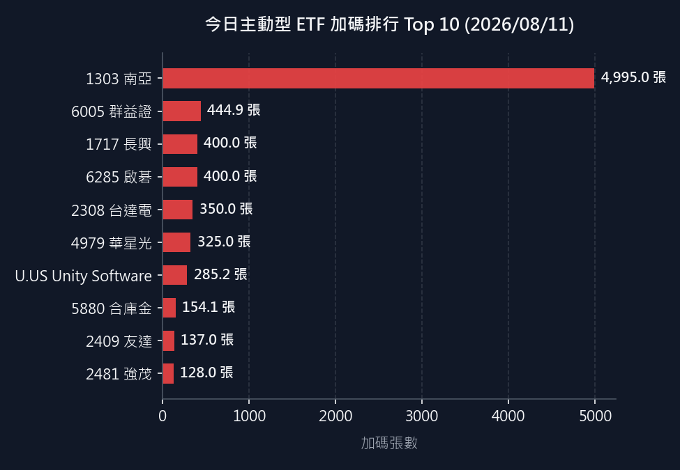
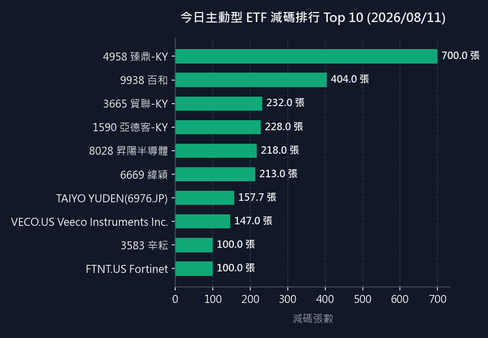

# 主動型 ETF 持股變動

資料來源：`主動型ETF持股明細.xlsx` 最近兩個日期分頁。

比較區間：`20260810` → `20260811`

## 今日加減碼視覺化排行

| 今日加碼 Top 10 | 今日減碼 Top 10 |
| :---: | :---: |
|  |  |

| ETF | 新增 | 刪除 | 比例變動 |
| :-- | --: | --: | --: |
| 00400A | 1 | 0 | 41 |
| 00401A | 0 | 0 | 0 |
| 00402A | 0 | 0 | 48 |
| 00403A | 0 | 0 | 39 |
| 00404A | 0 | 0 | 38 |
| 00405A | 1 | 1 | 35 |
| 00407A | 0 | 0 | 41 |
| 00408A | 2 | 0 | 35 |
| 00980A | 0 | 0 | 42 |
| 00980D | 0 | 0 | 37 |
| 00981A | 0 | 0 | 27 |
| 00982A | 0 | 0 | 37 |
| 00983A | 0 | 0 | 38 |
| 00983D | 0 | 0 | 21 |
| 00984A | 0 | 0 | 78 |
| 00985A | 0 | 0 | 35 |
| 00986A | 0 | 1 | 33 |
| 00987A | 1 | 1 | 21 |
| 00988A | 0 | 1 | 43 |
| 00989A | 0 | 0 | 55 |
| 00990A | 5 | 3 | 44 |
| 00991A | 0 | 0 | 21 |
| 00992A | 0 | 0 | 30 |
| 00993A | 0 | 0 | 48 |
| 00994A | 1 | 0 | 27 |
| 00995A | 0 | 0 | 47 |
| 00996A | 1 | 0 | 36 |
| 00997A | 0 | 0 | 43 |
| 00998A | 1 | 0 | 35 |
| 00999A | 0 | 2 | 54 |

## 00400A

### 新增持股

- 2368 金像電（0.49%，148 張）

### 刪除持股

- 無

### 投資比例變動

- 1303 南亞：0.39% → 0.40%（+0.01）
- 2059 川湖：4.62% → 4.74%（+0.12）
- 2308 台達電：2.78% → 2.74%（-0.04）
- 2313 華通：0.82% → 0.80%（-0.02）
- 2317 鴻海：0.87% → 0.86%（-0.01）
- 2345 智邦：1.69% → 1.65%（-0.04）
- 2360 致茂：3.77% → 3.83%（+0.06）
- 2383 台光電：5.28% → 5.49%（+0.21）
- 2408 南亞科：1.93% → 1.86%（-0.07）
- 2449 京元電子：1.40% → 1.38%（-0.02）
- 2454 聯發科：6.39% → 6.44%（+0.05）
- 2881 富邦金：0.75% → 0.74%（-0.01）
- 2885 元大金：1.41% → 1.40%（-0.01）
- 3008 大立光：2.33% → 2.29%（-0.04）
- 3017 奇鋐：4.62% → 4.58%（-0.04）
- 3036 文曄：1.81% → 1.73%（-0.08）
- 3037 欣興：5.03% → 5.00%（-0.03）
- 3044 健鼎：1.42% → 1.56%（+0.14）
- 3090 日電貿：0.33% → 0.35%（+0.02）
- 3211 順達：0.70% → 0.75%（+0.05）
- 3443 創意：2.95% → 3.21%（+0.26）
- 3529 力旺：1.19% → 1.11%（-0.08）
- 3653 健策：3.51% → 3.42%（-0.09）
- 3665 貿聯-KY：2.66% → 2.65%（-0.01）
- 3711 日月光投控：1.31% → 1.30%（-0.01）
- 4979 華星光：0.05% → 0.09%（+0.04）
- 5274 信驊：2.97% → 2.94%（-0.03）
- 5434 崇越：0.35% → 0.36%（+0.01）
- 6121 新普：0.24% → 0.26%（+0.02）
- 6187 萬潤：2.23% → 2.13%（-0.10）
- 6223 旺矽：5.08% → 5.12%（+0.04）
- 6239 力成：1.02% → 0.99%（-0.03）
- 6274 台燿：1.04% → 1.14%（+0.10）
- 6488 環球晶：2.67% → 2.64%（-0.03）
- 6505 台塑化：0.71% → 0.73%（+0.02）
- 6515 穎崴：0.49% → 0.50%（+0.01）
- 6669 緯穎：3.84% → 3.76%（-0.08）
- 7750 新代：1.04% → 0.98%（-0.06）
- 7769 鴻勁：0.73% → 0.74%（+0.01）
- 8046 南電：1.01% → 1.02%（+0.01）
- 9939 宏全：0.09% → 0.08%（-0.01）

## 00401A

### 新增持股

- 無

### 刪除持股

- 無

### 投資比例變動

- 無

## 00402A

### 新增持股

- 無

### 刪除持股

- 無

### 投資比例變動

- AAPL.US Apple：7.58% → 7.21%（-0.37）
- ADI.US Analog Devices：1.87% → 1.88%（+0.01）
- AMD.US AMD：5.33% → 4.80%（-0.53）
- AMZN.US Amazon：4.43% → 4.59%（+0.16）
- ANET.US Arista Networks：0.79% → 0.82%（+0.03）
- ARM.US Arm：1.08% → 1.04%（-0.04）
- ASML.US ASML Holding：1.64% → 1.67%（+0.03）
- AVGO.US Broadcom：2.71% → 2.73%（+0.02）
- AXON.US Axon Enterprise：1.02% → 1.09%（+0.07）
- BABA.US Alibaba Group：0.60% → 0.63%（+0.03）
- BKNG.US Booking Holdings：0.72% → 0.73%（+0.01）
- CLS.US Celestica：0.87% → 0.88%（+0.01）
- COHR.US Coherent：2.45% → 2.15%（-0.30）
- CRWD.US CrowdStrike Holdings：1.41% → 1.52%（+0.11）
- FSLY.US Fastly：0.34% → 0.42%（+0.08）
- GOOG.US Alphabet - Class C Capital Stock：3.44% → 3.54%（+0.10）
- GOOGL.US Alphabet - Class A Common Stock：3.39% → 3.49%（+0.10）
- INTC.US Intel：1.31% → 1.28%（-0.03）
- IOT.US Samsara：0.25% → 0.24%（-0.01）
- KLAC.US KLA：2.18% → 2.16%（-0.02）
- LITE.US Lumentum：1.76% → 1.64%（-0.12）
- LRCX.US Lam Research：3.58% → 3.60%（+0.02）
- MCHP.US Microchip Technology：1.26% → 1.24%（-0.02）
- MDB.US MongoDB：0.77% → 0.82%（+0.05）
- META.US Meta：2.79% → 2.86%（+0.07）
- MRVL.US Marvell：1.54% → 1.50%（-0.04）
- MSFT.US Microsoft：4.28% → 4.43%（+0.15）
- MU.US Micron：6.22% → 5.80%（-0.42）
- NFLX.US Netflix：0.80% → 0.84%（+0.04）
- NOW.US ServiceNow：0.26% → 0.27%（+0.01）
- NVDA.US NVIDIA：9.03% → 8.99%（-0.04）
- NXPI.US NXP Semiconductors：1.12% → 1.11%（-0.01）
- PANW.US Palo Alto：3.38% → 3.65%（+0.27）
- PLTR.US Palantir Technologies：1.47% → 1.53%（+0.06）
- SHOP.US Shopify：0.51% → 0.53%（+0.02）
- SIMO.US Silicon Motion：0.76% → 0.70%（-0.06）
- SNOW.US Snowflake：0.98% → 1.01%（+0.03）
- SPCX.US SpaceX：0.67% → 0.72%（+0.05）
- SPOT.US Spotify：0.26% → 0.28%（+0.02）
- STX.US Seagate：1.39% → 1.21%（-0.18）
- TER.US Teradyne：0.87% → 0.85%（-0.02）
- TSM.US TSMC(ADR)：1.41% → 1.44%（+0.03）
- TTWO.US Take-Two：0.56% → 0.59%（+0.03）
- TXN.US Texas Instruments：2.28% → 2.29%（+0.01）
- UBER.US Uber：0.48% → 0.51%（+0.03）
- V.US Visa：1.07% → 1.09%（+0.02）
- WDC.US Western Digital：2.38% → 2.23%（-0.15）
- ZS.US Zscaler：0.17% → 0.19%（+0.02）

## 00403A

### 新增持股

- 無

### 刪除持股

- 無

### 投資比例變動

- 1303 南亞：0.10% → 0.64%（+0.54）
- 1560 中砂：0.58% → 0.57%（-0.01）
- 1717 長興：0.07% → 0.09%（+0.02）
- 2049 上銀：0.22% → 0.21%（-0.01）
- 2303 聯電：5.45% → 5.41%（-0.04）
- 2308 台達電：3.10% → 3.06%（-0.04）
- 2317 鴻海：0.48% → 0.47%（-0.01）
- 2327 國巨*：2.89% → 3.09%（+0.20）
- 2330 台積電：16.94% → 16.92%（-0.02）
- 2337 旺宏：0.56% → 0.55%（-0.01）
- 2344 華邦電：4.26% → 4.20%（-0.06）
- 2345 智邦：2.80% → 2.74%（-0.06）
- 2360 致茂：1.02% → 1.04%（+0.02）
- 2383 台光電：4.60% → 4.93%（+0.33）
- 2454 聯發科：4.45% → 4.48%（+0.03）
- 2481 強茂：0.08% → 0.09%（+0.01）
- 3008 大立光：0.64% → 0.63%（-0.01）
- 3017 奇鋐：5.35% → 5.31%（-0.04）
- 3037 欣興：4.71% → 4.68%（-0.03）
- 3211 順達：0.42% → 0.45%（+0.03）
- 3443 創意：1.30% → 1.41%（+0.11）
- 3450 聯鈞：0.47% → 0.42%（-0.05）
- 3533 嘉澤：1.36% → 1.38%（+0.02）
- 3653 健策：2.04% → 1.81%（-0.23）
- 3665 貿聯-KY：1.48% → 1.47%（-0.01）
- 3711 日月光投控：2.83% → 2.80%（-0.03）
- 4958 臻鼎-KY：0.98% → 0.82%（-0.16）
- 5274 信驊：1.85% → 1.83%（-0.02）
- 6223 旺矽：3.67% → 3.69%（+0.02）
- 6239 力成：0.87% → 0.84%（-0.03）
- 6274 台燿：1.38% → 1.50%（+0.12）
- 6415 矽力*-KY：0.07% → 0.05%（-0.02）
- 6488 環球晶：1.27% → 1.25%（-0.02）
- 6669 緯穎：1.69% → 1.65%（-0.04）
- 6805 富世達：0.69% → 0.70%（+0.01）
- 7769 鴻勁：0.62% → 0.58%（-0.04）
- 8046 南電：1.11% → 1.12%（+0.01）
- 8358 金居：0.25% → 0.28%（+0.03）
- 8996 高力：0.97% → 0.95%（-0.02）

## 00404A

### 新增持股

- 無

### 刪除持股

- 無

### 投資比例變動

- 1210 大成：1.81% → 1.85%（+0.04）
- 2059 川湖：0.34% → 0.35%（+0.01）
- 2301 光寶科：1.73% → 1.72%（-0.01）
- 2303 聯電：2.97% → 2.99%（+0.02）
- 2327 國巨*：0.72% → 0.78%（+0.06）
- 2330 台積電：22.33% → 22.58%（+0.25）
- 2360 致茂：1.16% → 1.19%（+0.03）
- 2377 微星：1.83% → 1.82%（-0.01）
- 2383 台光電：2.56% → 2.70%（+0.14）
- 2393 億光：0.73% → 0.76%（+0.03）
- 2428 興勤：0.80% → 0.81%（+0.01）
- 2441 超豐：0.48% → 0.47%（-0.01）
- 2454 聯發科：6.72% → 6.85%（+0.13）
- 2618 長榮航：0.14% → 0.13%（-0.01）
- 2880 華南金：2.68% → 2.67%（-0.01）
- 2885 元大金：1.36% → 1.37%（+0.01）
- 2886 兆豐金：3.10% → 3.02%（-0.08）
- 2892 第一金：3.12% → 2.94%（-0.18）
- 3017 奇鋐：1.02% → 1.03%（+0.01）
- 3022 威強電：0.92% → 0.88%（-0.04）
- 3023 信邦：2.20% → 2.24%（+0.04）
- 3037 欣興：1.30% → 1.31%（+0.01）
- 3264 欣銓：1.76% → 1.74%（-0.02）
- 3443 創意：1.03% → 1.14%（+0.11）
- 3529 力旺：0.16% → 0.15%（-0.01）
- 3653 健策：0.24% → 0.23%（-0.01）
- 3702 大聯大：1.94% → 1.88%（-0.06）
- 3711 日月光投控：3.52% → 3.53%（+0.01）
- 4763 材料*-KY：1.83% → 1.90%（+0.07）
- 5434 崇越：1.58% → 1.62%（+0.04）
- 5871 中租-KY：0.03% → 0.04%（+0.01）
- 6139 亞翔：0.25% → 0.26%（+0.01）
- 6196 帆宣：1.76% → 1.78%（+0.02）
- 6223 旺矽：1.15% → 1.18%（+0.03）
- 6515 穎崴：0.29% → 0.30%（+0.01）
- 8016 矽創：1.18% → 1.17%（-0.01）
- 臺指選擇權08/26 45400 買權：-0.36% → -0.34%（+0.02）
- 臺股期貨08/26：16.42% → 16.54%（+0.12）

## 00405A

### 新增持股

- 6285 啟碁（0.34%，400 張）

### 刪除持股

- 8299 群聯（0.01%，1 張）

### 投資比例變動

- 2059 川湖：1.67% → 1.72%（+0.05）
- 2308 台達電：1.79% → 1.77%（-0.02）
- 2344 華邦電：3.54% → 3.50%（-0.04）
- 2345 智邦：3.84% → 3.76%（-0.08）
- 2368 金像電：3.49% → 3.62%（+0.13）
- 2383 台光電：3.76% → 3.91%（+0.15）
- 2408 南亞科：1.43% → 1.38%（-0.05）
- 2449 京元電子：0.69% → 0.68%（-0.01）
- 2454 聯發科：6.37% → 6.43%（+0.06）
- 3008 大立光：1.49% → 1.47%（-0.02）
- 3017 奇鋐：7.44% → 7.38%（-0.06）
- 3026 禾伸堂：1.14% → 1.25%（+0.11）
- 3037 欣興：5.22% → 5.19%（-0.03）
- 3081 聯亞：1.34% → 1.31%（-0.03）
- 3131 弘塑：1.84% → 1.77%（-0.07）
- 3264 欣銓：0.03% → 0.02%（-0.01）
- 3443 創意：5.07% → 5.51%（+0.44）
- 3583 辛耘：0.64% → 0.41%（-0.23）
- 3653 健策：5.91% → 5.78%（-0.13）
- 5274 信驊：2.01% → 1.99%（-0.02）
- 6187 萬潤：0.72% → 0.69%（-0.03）
- 6223 旺矽：5.69% → 5.74%（+0.05）
- 6274 台燿：1.50% → 1.64%（+0.14）
- 6442 光聖：0.33% → 0.34%（+0.01）
- 6510 精測：2.33% → 2.29%（-0.04）
- 6526 達發：0.31% → 0.30%（-0.01）
- 6669 緯穎：3.92% → 3.85%（-0.07）
- 6805 富世達：0.59% → 1.20%（+0.61）
- 6831 邁科：0.52% → 0.51%（-0.01）
- 7734 印能科技：2.19% → 2.03%（-0.16）
- 7769 鴻勁：2.52% → 2.54%（+0.02）
- 8028 昇陽半導體：0.79% → 0.77%（-0.02）
- 8046 南電：3.93% → 3.98%（+0.05）
- 8210 勤誠：0.60% → 0.57%（-0.03）
- 8996 高力：1.02% → 1.00%（-0.02）

## 00407A

### 新增持股

- 無

### 刪除持股

- 無

### 投資比例變動

- 1303 南亞：0.53% → 0.55%（+0.02）
- 1590 亞德客-KY：2.31% → 2.28%（-0.03）
- 2059 川湖：2.90% → 2.98%（+0.08）
- 2303 聯電：2.13% → 2.12%（-0.01）
- 2308 台達電：3.60% → 3.56%（-0.04）
- 2327 國巨*：2.13% → 2.28%（+0.15）
- 2330 台積電：8.20% → 8.21%（+0.01）
- 2344 華邦電：1.78% → 1.76%（-0.02）
- 2345 智邦：3.10% → 3.04%（-0.06）
- 2360 致茂：1.89% → 1.92%（+0.03）
- 2368 金像電：1.73% → 1.79%（+0.06）
- 2379 瑞昱：0.74% → 0.75%（+0.01）
- 2383 台光電：4.95% → 5.15%（+0.20）
- 2395 研華：1.88% → 1.86%（-0.02）
- 2408 南亞科：1.88% → 1.82%（-0.06）
- 2412 中華電：1.56% → 1.54%（-0.02）
- 2451 創見：0.17% → 0.16%（-0.01）
- 2454 聯發科：6.56% → 6.62%（+0.06）
- 3017 奇鋐：4.08% → 4.05%（-0.03）
- 3034 聯詠：0.68% → 0.67%（-0.01）
- 3037 欣興：4.52% → 4.50%（-0.02）
- 3443 創意：1.84% → 2.01%（+0.17）
- 3491 昇達科：0.40% → 0.41%（+0.01）
- 3529 力旺：2.12% → 1.98%（-0.14）
- 3533 嘉澤：0.93% → 0.94%（+0.01）
- 3711 日月光投控：2.50% → 2.48%（-0.02）
- 4904 遠傳：0.29% → 0.28%（-0.01）
- 4958 臻鼎-KY：1.68% → 1.74%（+0.06）
- 5274 信驊：2.01% → 1.99%（-0.02）
- 5536 聖暉*：1.54% → 1.38%（-0.16）
- 6223 旺矽：2.75% → 2.78%（+0.03）
- 6274 台燿：3.27% → 3.57%（+0.30）
- 6446 藥華藥：2.49% → 2.71%（+0.22）
- 6515 穎崴：1.40% → 1.41%（+0.01）
- 6531 愛普*：1.52% → 1.36%（-0.16）
- 6669 緯穎：4.29% → 4.21%（-0.08）
- 6805 富世達：2.08% → 2.11%（+0.03）
- 8046 南電：2.20% → 2.23%（+0.03）
- 8210 勤誠：1.56% → 1.46%（-0.10）
- 8299 群聯：0.13% → 0.14%（+0.01）
- 8996 高力：0.40% → 0.39%（-0.01）

## 00408A

### 新增持股

- 2327 國巨*（0.37%，10 張）
- 2481 強茂（0.32%，38 張）

### 刪除持股

- 無

### 投資比例變動

- 2059 川湖：2.15% → 2.21%（+0.06）
- 2308 台達電：3.71% → 3.68%（-0.03）
- 2317 鴻海：2.78% → 2.76%（-0.02）
- 2330 台積電：6.57% → 6.61%（+0.04）
- 2344 華邦電：1.51% → 1.49%（-0.02）
- 2345 智邦：1.56% → 0.77%（-0.79）
- 2356 英業達：1.31% → 1.29%（-0.02）
- 2357 華碩：2.11% → 2.16%（+0.05）
- 2360 致茂：2.80% → 2.87%（+0.07）
- 2368 金像電：2.11% → 2.20%（+0.09）
- 2376 技嘉：2.20% → 2.21%（+0.01）
- 2383 台光電：4.45% → 4.64%（+0.19）
- 2395 研華：2.20% → 2.18%（-0.02）
- 2404 漢唐：1.73% → 1.72%（-0.01）
- 2408 南亞科：1.21% → 1.17%（-0.04）
- 2454 聯發科：4.52% → 4.58%（+0.06）
- 2801 彰銀：0.86% → 0.85%（-0.01）
- 2880 華南金：1.72% → 1.70%（-0.02）
- 2886 兆豐金：2.66% → 2.58%（-0.08）
- 3017 奇鋐：3.65% → 3.64%（-0.01）
- 3036 文曄：0.87% → 0.83%（-0.04）
- 3045 台灣大：3.26% → 3.22%（-0.04）
- 3231 緯創：1.04% → 1.03%（-0.01）
- 3653 健策：1.24% → 1.22%（-0.02）
- 3665 貿聯-KY：2.63% → 1.58%（-1.05）
- 3702 大聯大：2.03% → 1.96%（-0.07）
- 5434 崇越：1.79% → 1.81%（+0.02）
- 5876 上海商銀：1.45% → 1.44%（-0.01）
- 5904 寶雅*：1.95% → 2.14%（+0.19）
- 6223 旺矽：1.31% → 1.32%（+0.01）
- 6239 力成：1.16% → 1.13%（-0.03）
- 6274 台燿：1.67% → 1.83%（+0.16）
- 6669 緯穎：4.33% → 4.27%（-0.06）
- 7769 鴻勁：1.70% → 1.71%（+0.01）
- 8046 南電：2.44% → 2.48%（+0.04）

## 00980A

### 新增持股

- 無

### 刪除持股

- 無

### 投資比例變動

- 1303 南亞：2.28% → 2.31%（+0.03）
- 2059 川湖：5.52% → 5.65%（+0.13）
- 2308 台達電：3.74% → 3.68%（-0.06）
- 2317 鴻海：2.12% → 2.08%（-0.04）
- 2327 國巨*：1.01% → 1.07%（+0.06）
- 2330 台積電：8.04% → 8.01%（-0.03）
- 2344 華邦電：1.06% → 1.03%（-0.03）
- 2345 智邦：1.62% → 1.58%（-0.04）
- 2360 致茂：1.53% → 1.55%（+0.02）
- 2368 金像電：1.86% → 1.91%（+0.05）
- 2376 技嘉：1.24% → 1.23%（-0.01）
- 2382 廣達：1.58% → 1.57%（-0.01）
- 2383 台光電：4.10% → 4.24%（+0.14）
- 2408 南亞科：2.66% → 2.56%（-0.10）
- 2454 聯發科：5.63% → 5.65%（+0.02）
- 2884 玉山金：0.84% → 0.81%（-0.03）
- 2891 中信金：1.26% → 1.25%（-0.01）
- 3008 大立光：0.81% → 0.79%（-0.02）
- 3017 奇鋐：1.89% → 1.86%（-0.03）
- 3026 禾伸堂：0.40% → 0.44%（+0.04）
- 3036 文曄：1.34% → 1.27%（-0.07）
- 3037 欣興：2.85% → 2.82%（-0.03）
- 3044 健鼎：0.71% → 0.77%（+0.06）
- 3081 聯亞：3.07% → 2.97%（-0.10）
- 3231 緯創：1.02% → 1.00%（-0.02）
- 3264 欣銓：0.74% → 0.72%（-0.02）
- 3443 創意：1.36% → 1.47%（+0.11）
- 3529 力旺：0.94% → 0.87%（-0.07）
- 3653 健策：1.45% → 1.41%（-0.04）
- 3711 日月光投控：1.28% → 1.27%（-0.01）
- 4958 臻鼎-KY：0.80% → 0.83%（+0.03）
- 5274 信驊：1.54% → 1.52%（-0.02）
- 5904 寶雅*：1.26% → 1.37%（+0.11）
- 6213 聯茂：1.05% → 1.10%（+0.05）
- 6223 旺矽：2.41% → 2.42%（+0.01）
- 6274 台燿：1.39% → 1.51%（+0.12）
- 6669 緯穎：1.59% → 1.55%（-0.04）
- 6805 富世達：0.48% → 0.49%（+0.01）
- 8046 南電：1.17% → 1.18%（+0.01）
- 8210 勤誠：0.76% → 0.71%（-0.05）
- 8299 群聯：2.27% → 2.30%（+0.03）
- 8996 高力：0.99% → 0.97%（-0.02）

## 00980D

### 新增持股

- 無

### 刪除持股

- 無

### 投資比例變動

- ALLY FINANCIAL INC (REG) VAR 13JUN2029：0.54% → 0.55%（+0.01）
- AMC GLOBAL MEDIA INC SER REGS (REG) (REG S) 10.5% 15JUL2032：0.70% → 0.71%（+0.01）
- APA CORP 6.750000 % 15-FEB-2055：0.36% → 0.35%（-0.01）
- APOLLO DEBT SOLUTIONS BD 6.900000 % 13APR2029：0.54% → 0.55%（+0.01）
- ARIS WATER HOLDINGS LLC SER REGS 7.250000 % 01APR2030：0.46% → 0.47%（+0.01）
- ATHENE HOLDING LTD (REG) 6.25% 01APR2054：0.76% → 0.75%（-0.01）
- ATHENE HOLDING LTD 6.625000 % 19MAY2055：0.57% → 0.56%（-0.01）
- BANCO SANTANDER SA (REG) 6.607% 07NOV2028：0.65% → 0.66%（+0.01）
- BAT CAPITAL CORP (REG) 7.079% 02AUG2043：0.32% → 0.31%（-0.01）
- BOSTON PROPERTIES LP (REG) 6.750000 % 01-DEC-2027：0.45% → 0.46%（+0.01）
- CHARTER COMM OPT 6.484% 23OCT2045 W/I：0.45% → 0.44%（-0.01）
- CHARTER COMM OPT LLC/CAP (REG) 6.834000 % 23OCT2055：0.45% → 0.44%（-0.01）
- CHC GROUP LLC SER REGS 11.750000 % 01-SEP-2030：0.43% → 0.42%（-0.01）
- CIMIC FINANCE USA PTY LT SER REGS (REG S) 7% 25MAR2034：0.33% → 0.32%（-0.01）
- COX COMMUNICATIONS INC SER REGS 5.800000 % 15DEC2053：0.39% → 0.38%（-0.01）
- DEUTSCHE BANK NY VAR 10FEB2034：0.34% → 0.33%（-0.01）
- DOW CHEMICAL CO/THE 7.375% 01NOV2029：0.60% → 0.61%（+0.01）
- DOW CHEMICAL CO/THE 9.4% 15MAY2039：0.53% → 0.54%（+0.01）
- ENBRIDGE ENERGY PARTNERS (REG) 7.375% 15OCT2045：0.51% → 0.50%（-0.01）
- ENEL FINANCE INTL NV SER REGS (REG S) 7.75% 14OCT2052：0.37% → 0.36%（-0.01）
- GEORGIA-PACIFIC LLC (REG) 7.75% 15NOV2029：0.56% → 0.57%（+0.01）
- JBS USA/FOOD/FINANCE (REG) 6.5% 01DEC2052：0.46% → 0.45%（-0.01）
- JETBLUE AIRWAYS/LOYALTY SER REGS (REG S) 9.875% 20SEP2031：0.50% → 0.49%（-0.01）
- LPL HOLDINGS INC (REG) 6.75% 17NOV2028：0.55% → 0.56%（+0.01）
- MYLAN NV 5.25% 15JUN2046 WI：0.52% → 0.51%（-0.01）
- ORACLE CORP 5.950000 % 26-SEP-2055：0.41% → 0.40%（-0.01）
- ORACLE CORP 6.125000 % 03AUG2065：0.52% → 0.51%（-0.01）
- PHOTO HOLDINGS LLC SER REGS (REG) (REG S) 12% 01JUL2031：0.51% → 0.52%（+0.01）
- SOCIETE GENERALE SER REGS (REG) (REG S) 7.367% 10JAN2053：0.33% → 0.32%（-0.01）
- TRUIST FINANCIAL CORP SER MTN VAR 30OCT2029：0.63% → 0.64%（+0.01）
- US 10YR NOTE (CBT)SEP26 21-SEP-2026：18.24% → 18.25%（+0.01）
- US 10YR ULTRA FUT SEP26 21-SEP-2026：-2.77% → -1.21%（+1.56）
- US 5YR NOTE (CBT) SEP26 30-SEP-2026：-15.86% → -15.88%（-0.02）
- US LONG BOND(CBT) SEP26 21-SEP-2026：5.32% → 5.31%（-0.01）
- US ULTRA BOND CBT SEP26 21-SEP-2026：0.35% → -0.35%（-0.70）
- VAR ENERGI ASA SER REGS (REG S) 7.5% 15JAN2028：0.32% → 0.33%（+0.01）
- VIRGINIA ELEC & POWER CO (REG) 8.875% 15NOV2038：0.58% → 0.57%（-0.01）

## 00981A

### 新增持股

- 無

### 刪除持股

- 無

### 投資比例變動

- 1590 亞德客-KY：0.12% → 0.00%（-0.12）
- 2308 台達電：4.25% → 4.22%（-0.03）
- 2327 國巨*：4.82% → 5.19%（+0.37）
- 2330 台積電：9.56% → 9.60%（+0.04）
- 2345 智邦：4.60% → 4.53%（-0.07）
- 2360 致茂：0.38% → 0.39%（+0.01）
- 2368 金像電：1.23% → 1.27%（+0.04）
- 2383 台光電：8.51% → 8.90%（+0.39）
- 2449 京元電子：0.93% → 0.92%（-0.01）
- 2454 聯發科：7.14% → 7.24%（+0.10）
- 3017 奇鋐：5.31% → 5.29%（-0.02）
- 3264 欣銓：0.23% → 0.22%（-0.01）
- 3653 健策：3.25% → 3.19%（-0.06）
- 3665 貿聯-KY：3.35% → 3.36%（+0.01）
- 3711 日月光投控：4.07% → 4.06%（-0.01）
- 4958 臻鼎-KY：0.26% → 0.27%（+0.01）
- 4979 華星光：0.33% → 0.37%（+0.04）
- 5274 信驊：2.49% → 2.47%（-0.02）
- 6187 萬潤：0.48% → 0.46%（-0.02）
- 6191 精成科：0.12% → 0.11%（-0.01）
- 6223 旺矽：5.03% → 5.10%（+0.07）
- 6274 台燿：2.66% → 2.92%（+0.26）
- 6510 精測：0.25% → 0.33%（+0.08）
- 6669 緯穎：5.39% → 4.89%（-0.50）
- 6805 富世達：1.29% → 1.31%（+0.02）
- 8046 南電：3.56% → 3.62%（+0.06）
- 8210 勤誠：0.89% → 0.84%（-0.05）

## 00982A

### 新增持股

- 無

### 刪除持股

- 無

### 投資比例變動

- 1785 光洋科：1.01% → 0.92%（-0.09）
- 2059 川湖：4.29% → 4.47%（+0.18）
- 2303 聯電：2.18% → 2.20%（+0.02）
- 2316 楠梓電：1.11% → 1.17%（+0.06）
- 2327 國巨*：0.78% → 0.84%（+0.06）
- 2330 台積電：8.32% → 8.42%（+0.10）
- 2345 智邦：3.45% → 3.42%（-0.03）
- 2351 順德：0.76% → 0.77%（+0.01）
- 2360 致茂：3.31% → 3.41%（+0.10）
- 2383 台光電：3.37% → 3.55%（+0.18）
- 2451 創見：0.30% → 0.29%（-0.01）
- 2454 聯發科：6.73% → 6.87%（+0.14）
- 2467 志聖：1.61% → 1.57%（-0.04）
- 2472 立隆電：0.72% → 0.73%（+0.01）
- 2885 元大金：0.28% → 0.29%（+0.01）
- 3008 大立光：2.13% → 2.12%（-0.01）
- 3017 奇鋐：2.19% → 2.20%（+0.01）
- 3036 文曄：1.07% → 1.04%（-0.03）
- 3105 穩懋：3.21% → 3.11%（-0.10）
- 3264 欣銓：2.07% → 2.06%（-0.01）
- 3491 昇達科：2.38% → 2.47%（+0.09）
- 3529 力旺：0.51% → 0.48%（-0.03）
- 3583 辛耘：1.57% → 1.59%（+0.02）
- 3702 大聯大：1.44% → 1.40%（-0.04）
- 4958 臻鼎-KY：2.91% → 3.05%（+0.14）
- 5536 聖暉*：7.61% → 6.79%（-0.82）
- 6139 亞翔：5.94% → 6.17%（+0.23）
- 6223 旺矽：3.72% → 3.80%（+0.08）
- 6239 力成：0.40% → 0.39%（-0.01）
- 6257 矽格：1.95% → 1.93%（-0.02）
- 6274 台燿：1.28% → 1.42%（+0.14）
- 6278 台表科：0.77% → 0.76%（-0.01）
- 6446 藥華藥：0.11% → 0.12%（+0.01）
- 6531 愛普*：2.59% → 2.35%（-0.24）
- 6669 緯穎：5.97% → 5.93%（-0.04）
- 7769 鴻勁：1.14% → 1.16%（+0.02）
- 8016 矽創：1.38% → 1.36%（-0.02）

## 00983A

### 新增持股

- 無

### 刪除持股

- 無

### 投資比例變動

- ACHR.US Archer：0.34% → 0.37%（+0.03）
- AMD.US AMD：5.17% → 4.96%（-0.21）
- AVGO.US Broadcom：2.07% → 2.01%（-0.06）
- BEAM.US Beam Therapeutics：2.38% → 2.33%（-0.05）
- BLSH.US Bullish：0.99% → 1.02%（+0.03）
- BMNR.US BitMine：1.17% → 1.27%（+0.10）
- CERS.US Cerus：0.40% → 0.43%（+0.03）
- COIN.US Coinbase：2.14% → 2.05%（-0.09）
- CRCL.US Circle：2.24% → 2.34%（+0.10）
- CRSP.US CRISPR Therapeutics：4.20% → 4.14%（-0.06）
- CRWV.US CoreWeave：0.93% → 0.90%（-0.03）
- DE.US Deere：1.41% → 1.36%（-0.05）
- FIG.US Figma：0.40% → 0.43%（+0.03）
- GOOG.US Alphabet - Class C Capital Stock：1.28% → 1.27%（-0.01）
- GOOGL.US Alphabet - Class A Common Stock：1.69% → 1.68%（-0.01）
- HOOD.US Robinhood Markets：3.72% → 3.71%（-0.01）
- ILMN.US Illumina：3.57% → 2.22%（-1.35）
- KTOS.US Kratos Defense & Security：0.81% → 1.02%（+0.21）
- LLY.US Eli Lilly：1.93% → 1.98%（+0.05）
- META.US Meta：1.14% → 1.13%（-0.01）
- NTLA.US Intellia Therapeutics：1.33% → 1.32%（-0.01）
- NTRA.US Natera：2.34% → 2.19%（-0.15）
- NVDA.US NVIDIA：1.67% → 1.60%（-0.07）
- PLTR.US Palantir Technologies：2.13% → 2.94%（+0.81）
- RBLX.US Roblox：1.42% → 1.37%（-0.05）
- SHOP.US Shopify：7.15% → 7.22%（+0.07）
- SOFI.US SoFi Technologies：0.70% → 0.68%（-0.02）
- SPCX.US SpaceX：2.13% → 2.47%（+0.34）
- TEM.US Tempus：3.37% → 3.51%（+0.14）
- TER.US Teradyne：0.62% → 0.59%（-0.03）
- TSLA.US Tesla：7.82% → 7.76%（-0.06）
- TSM.US TSMC(ADR)：3.50% → 3.43%（-0.07）
- TWST.US Twist Bioscience：4.64% → 4.87%（+0.23）
- TXG.US 10x Genomics：4.42% → 4.76%（+0.34）
- VCYT.US Veracyte：1.07% → 1.04%（-0.03）
- WGS.US GeneDx：1.61% → 1.60%（-0.01）
- XE.US X-Energy：0.32% → 0.44%（+0.12）
- XYZ.US Block：2.23% → 2.19%（-0.04）

## 00983D

### 新增持股

- 無

### 刪除持股

- 無

### 投資比例變動

- ABIBB 8.2 01/15/39：1.98% → 1.97%（-0.01）
- BHCCN 11 09/30/28：1.85% → 1.86%（+0.01）
- BRITEL 9 5/8 12/15/30：1.36% → 1.37%（+0.01）
- CEG 6 1/2 10/01/53：0.78% → 0.77%（-0.01）
- CP 7 1/8 10/15/31：0.82% → 0.83%（+0.01）
- CRWV 9 02/01/31：0.84% → 0.83%（-0.01）
- DOW 9.4 05/15/39：1.94% → 1.95%（+0.01）
- DT 9 1/4 06/01/32：0.94% → 0.95%（+0.01）
- DUK 7 3/4 03/01/31：1.56% → 1.57%（+0.01）
- ENBCN 6.7 11/15/53：1.13% → 1.12%（-0.01）
- FFHCN 6.35 03/22/54：0.71% → 0.70%（-0.01）
- GTN 10 1/2 07/15/29：1.69% → 1.70%（+0.01）
- LQDW.US iShares Investment Grade Corpora：7.33% → 7.32%（-0.01）
- MOHEGN 11 7/8 04/15/31：1.36% → 1.37%（+0.01）
- MS 7 1/4 04/01/32：1.64% → 1.65%（+0.01）
- NVDA 5.55 06/15/46：1.16% → 1.15%（-0.01）
- RAKUTN 11 1/4 02/15/27：1.81% → 1.82%（+0.01）
- RIOLN 7 1/4 03/15/31：0.51% → 0.52%（+0.01）
- SPCX 6.6 07/15/46：1.14% → 1.13%（-0.01）
- TLTW.US iShares 20+ Year Treasury Bond B：7.23% → 7.20%（-0.03）
- VENLNG 9 1/2 02/01/29：1.41% → 1.42%（+0.01）

## 00984A

### 新增持股

- 無

### 刪除持股

- 無

### 投資比例變動

- 1303 南亞：2.26% → 2.31%（+0.05）
- 1326 台化：1.05% → 1.03%（-0.02）
- 1409 新纖：0.60% → 0.58%（-0.02）
- 1736 喬山：0.73% → 0.75%（+0.02）
- 1795 美時：0.09% → 0.08%（-0.01）
- 1907 永豐餘：0.52% → 0.51%（-0.01）
- 2049 上銀：0.64% → 0.60%（-0.04）
- 2059 川湖：4.93% → 5.11%（+0.18）
- 2317 鴻海：1.46% → 1.44%（-0.02）
- 2330 台積電：3.60% → 3.61%（+0.01）
- 2345 智邦：0.79% → 0.77%（-0.02）
- 2347 聯強：1.02% → 1.00%（-0.02）
- 2357 華碩：0.83% → 0.85%（+0.02）
- 2360 致茂：0.86% → 0.88%（+0.02）
- 2371 大同：0.09% → 0.08%（-0.01）
- 2375 凱美：0.25% → 0.26%（+0.01）
- 2376 技嘉：0.54% → 0.53%（-0.01）
- 2383 台光電：1.71% → 1.78%（+0.07）
- 2404 漢唐：1.21% → 1.20%（-0.01）
- 2408 南亞科：1.98% → 1.92%（-0.06）
- 2409 友達：0.57% → 0.59%（+0.02）
- 2412 中華電：0.87% → 0.86%（-0.01）
- 2441 超豐：1.28% → 1.22%（-0.06）
- 2454 聯發科：1.60% → 1.61%（+0.01）
- 2464 盟立：0.74% → 0.76%（+0.02）
- 2474 可成：0.37% → 0.38%（+0.01）
- 2535 達欣工：0.22% → 0.21%（-0.01）
- 2546 根基：0.17% → 0.18%（+0.01）
- 2603 長榮：0.74% → 0.76%（+0.02）
- 2801 彰銀：1.53% → 1.51%（-0.02）
- 2812 台中銀：1.26% → 1.24%（-0.02）
- 2834 臺企銀：1.35% → 1.33%（-0.02）
- 2880 華南金：2.04% → 2.02%（-0.02）
- 2882 國泰金：0.79% → 0.77%（-0.02）
- 2886 兆豐金：2.05% → 1.98%（-0.07）
- 2892 第一金：1.73% → 1.61%（-0.12）
- 3008 大立光：2.22% → 2.19%（-0.03）
- 3023 信邦：1.16% → 1.17%（+0.01）
- 3026 禾伸堂：0.78% → 0.85%（+0.07）
- 3033 威健：0.26% → 0.27%（+0.01）
- 3034 聯詠：0.75% → 0.73%（-0.02）
- 3036 文曄：0.58% → 0.56%（-0.02）
- 3189 景碩：1.63% → 1.64%（+0.01）
- 3264 欣銓：0.26% → 0.25%（-0.01）
- 3443 創意：0.18% → 0.20%（+0.02）
- 3450 聯鈞：0.70% → 0.63%（-0.07）
- 3533 嘉澤：1.42% → 1.44%（+0.02）
- 3702 大聯大：0.58% → 0.56%（-0.02）
- 3711 日月光投控：1.20% → 1.19%（-0.01）
- 4764 雙鍵：0.49% → 0.50%（+0.01）
- 4938 和碩：0.66% → 0.65%（-0.01）
- 4958 臻鼎-KY：0.95% → 0.98%（+0.03）
- 4966 譜瑞-KY：0.89% → 0.88%（-0.01）
- 5274 信驊：0.87% → 0.86%（-0.01）
- 5351 鈺創：0.86% → 0.90%（+0.04）
- 5536 聖暉*：0.56% → 0.50%（-0.06）
- 5880 合庫金：1.62% → 1.52%（-0.10）
- 5904 寶雅*：0.32% → 0.35%（+0.03）
- 6121 新普：0.09% → 0.10%（+0.01）
- 6139 亞翔：2.92% → 2.93%（+0.01）
- 6197 佳必琪：0.56% → 0.55%（-0.01）
- 6213 聯茂：1.65% → 1.74%（+0.09）
- 6223 旺矽：1.25% → 1.27%（+0.02）
- 6257 矽格：0.69% → 0.68%（-0.01）
- 6274 台燿：0.66% → 0.73%（+0.07）
- 6285 啟碁：0.58% → 0.57%（-0.01）
- 6446 藥華藥：2.46% → 2.69%（+0.23）
- 6531 愛普*：1.17% → 1.05%（-0.12）
- 6548 長科*：1.18% → 1.16%（-0.02）
- 6669 緯穎：0.61% → 0.60%（-0.01）
- 6944 兆聯實業：1.09% → 1.06%（-0.03）
- 7734 印能科技：0.52% → 0.49%（-0.03）
- 7769 鴻勁：1.27% → 1.28%（+0.01）
- 8039 台虹：0.71% → 0.68%（-0.03）
- 8046 南電：1.06% → 1.07%（+0.01）
- 8210 勤誠：0.24% → 0.22%（-0.02）
- 8271 宇瞻：0.58% → 0.57%（-0.01）
- 9914 美利達：0.26% → 0.29%（+0.03）

## 00985A

### 新增持股

- 無

### 刪除持股

- 無

### 投資比例變動

- 1216 統一：0.97% → 0.98%（+0.01）
- 1802 台玻：0.21% → 0.22%（+0.01）
- 2027 大成鋼：5.06% → 4.97%（-0.09）
- 2049 上銀：0.67% → 0.64%（-0.03）
- 2059 川湖：1.88% → 1.95%（+0.07）
- 2327 國巨*：0.50% → 0.54%（+0.04）
- 2330 台積電：13.85% → 13.94%（+0.09）
- 2344 華邦電：1.09% → 1.08%（-0.01）
- 2345 智邦：2.66% → 2.62%（-0.04）
- 2368 金像電：0.90% → 0.94%（+0.04）
- 2376 技嘉：3.51% → 3.52%（+0.01）
- 2383 台光電：2.72% → 2.85%（+0.13）
- 2408 南亞科：2.22% → 2.16%（-0.06）
- 2412 中華電：3.49% → 3.48%（-0.01）
- 2454 聯發科：1.96% → 1.99%（+0.03）
- 2603 長榮：2.85% → 2.90%（+0.05）
- 2610 華航：1.38% → 1.37%（-0.01）
- 3008 大立光：2.74% → 2.72%（-0.02）
- 3036 文曄：1.79% → 1.72%（-0.07）
- 3081 聯亞：2.08% → 2.04%（-0.04）
- 3105 穩懋：0.57% → 0.55%（-0.02）
- 3131 弘塑：1.20% → 1.16%（-0.04）
- 3529 力旺：0.28% → 0.26%（-0.02）
- 3653 健策：1.31% → 1.29%（-0.02）
- 4904 遠傳：3.49% → 3.47%（-0.02）
- 4958 臻鼎-KY：2.06% → 2.15%（+0.09）
- 6147 頎邦：1.55% → 1.63%（+0.08）
- 6187 萬潤：2.81% → 2.71%（-0.10）
- 6442 光聖：2.09% → 2.12%（+0.03）
- 6446 藥華藥：2.57% → 2.82%（+0.25）
- 6669 緯穎：2.91% → 2.88%（-0.03）
- 7769 鴻勁：1.12% → 1.13%（+0.01）
- 8046 南電：0.54% → 0.55%（+0.01）
- 8299 群聯：1.07% → 1.10%（+0.03）
- 8996 高力：1.99% → 1.97%（-0.02）

## 00986A

### 新增持股

- 無

### 刪除持股

- CAT.US Caterpillar（1.10%，0.25 張）

### 投資比例變動

- 2330 台積電：8.43% → 8.54%（+0.11）
- 2454 聯發科：0.63% → 0.65%（+0.02）
- AAPL.US Apple：0.98% → 0.97%（-0.01）
- AMAT.US Applied Materials：1.69% → 1.92%（+0.23）
- AMD.US AMD：3.03% → 2.96%（-0.07）
- AMZN.US Amazon：4.02% → 4.09%（+0.07）
- AVGO.US Broadcom：5.37% → 5.32%（-0.05）
- COHR.US Coherent：2.58% → 2.22%（-0.36）
- CRDO.US Credo：0.39% → 0.38%（-0.01）
- CRWD.US CrowdStrike Holdings：4.21% → 4.44%（+0.23）
- DDOG.US Datadog：0.37% → 0.41%（+0.04）
- ETN.US Eaton：2.35% → 2.34%（-0.01）
- GEV.US GE Vernova：2.59% → 2.60%（+0.01）
- GOOGL.US Alphabet - Class A Common Stock：6.49% → 6.57%（+0.08）
- HWM.US Howmet Aerospace：2.51% → 2.53%（+0.02）
- JPM.US JPMorgan Chase：1.50% → 1.51%（+0.01）
- LITE.US Lumentum：3.63% → 3.33%（-0.30）
- LLY.US Eli Lilly：2.79% → 2.91%（+0.12）
- LRCX.US Lam Research：2.77% → 2.74%（-0.03）
- MA.US Mastercard：0.88% → 1.04%（+0.16）
- MSFT.US Microsoft：2.62% → 2.66%（+0.04）
- MU.US Micron：3.67% → 3.62%（-0.05）
- MUFG(8306.JP)：1.41% → 1.40%（-0.01）
- Murata Mfg.(6981.JP)：1.68% → 1.69%（+0.01）
- NET.US Cloudflare：1.88% → 1.96%（+0.08）
- NVDA.US NVIDIA：6.09% → 5.94%（-0.15）
- SNDK.US Sandisk：1.27% → 1.30%（+0.03）
- SNOW.US Snowflake：1.90% → 1.93%（+0.03）
- Siemens Energy AG：2.04% → 2.06%（+0.02）
- TSEM.US Tower Semiconductor：0.80% → 0.99%（+0.19）
- Yaskawa Electric(6506.JP)：1.91% → 1.96%（+0.05）
- 嘉能可公司：1.57% → 1.61%（+0.04）
- 英飛凌科技股份有限公司：2.99% → 3.04%（+0.05）

## 00987A

### 新增持股

- 2308 台達電（0.96%，14 張）

### 刪除持股

- 8028 昇陽半導體（2.20%，218 張）

### 投資比例變動

- 2330 台積電：8.19% → 8.15%（-0.04）
- 2345 智邦：2.32% → 2.26%（-0.06）
- 2383 台光電：6.88% → 7.11%（+0.23）
- 2408 南亞科：4.61% → 4.44%（-0.17）
- 2454 聯發科：4.85% → 4.86%（+0.01）
- 2455 全新：3.02% → 2.85%（-0.17）
- 3017 奇鋐：6.14% → 6.05%（-0.09）
- 3037 欣興：7.21% → 7.12%（-0.09）
- 3081 聯亞：3.67% → 3.54%（-0.13）
- 3231 緯創：2.41% → 2.36%（-0.05）
- 3363 上詮：2.27% → 2.12%（-0.15）
- 3443 創意：6.59% → 7.12%（+0.53）
- 3653 健策：2.85% → 2.77%（-0.08）
- 3665 貿聯-KY：4.19% → 4.16%（-0.03）
- 6223 旺矽：6.43% → 6.44%（+0.01）
- 6274 台燿：4.19% → 4.55%（+0.36）
- 6739 竹陞科技：2.01% → 1.90%（-0.11）
- 6805 富世達：3.29% → 3.32%（+0.03）
- 8046 南電：3.93% → 3.96%（+0.03）
- 8358 金居：1.51% → 1.64%（+0.13）
- 8996 高力：1.44% → 1.41%（-0.03）

## 00988A

### 新增持股

- 無

### 刪除持股

- FTNT.US Fortinet（0.90%，100 張）

### 投資比例變動

- 2303 聯電：0.51% → 0.55%（+0.04）
- 2308 台達電：0.92% → 1.06%（+0.14）
- 2327 國巨*：1.46% → 1.58%（+0.12）
- 2330 台積電：3.10% → 3.18%（+0.08）
- 2383 台光電：4.07% → 4.20%（+0.13）
- 2454 聯發科：3.03% → 3.14%（+0.11）
- 3017 奇鋐：1.05% → 1.06%（+0.01）
- 3037 欣興：4.33% → 4.60%（+0.27）
- 3665 貿聯-KY：1.50% → 0.74%（-0.76）
- 3711 日月光投控：1.84% → 2.02%（+0.18）
- 6223 旺矽：2.45% → 2.69%（+0.24）
- AEHR.US Aehr Test Systems：0.82% → 0.86%（+0.04）
- AIXTRON SE：0.52% → 0.54%（+0.02）
- AMAT.US Applied Materials：4.11% → 4.05%（-0.06）
- AMD.US AMD：5.03% → 4.98%（-0.05）
- BE.US Bloom Energy：2.60% → 2.54%（-0.06）
- COHR.US Coherent：1.07% → 1.77%（+0.70）
- CRDO.US Credo：3.17% → 3.10%（-0.07）
- FORMFACTOR INC：1.00% → 0.97%（-0.03）
- INFINEON TECHNOLOGIES AG：1.72% → 1.76%（+0.04）
- Kioxia Holdings(285A.JP)：3.06% → 3.13%（+0.07）
- LITE.US Lumentum：5.12% → 4.77%（-0.35）
- LMT.US Lockheed Martin：1.26% → 1.32%（+0.06）
- MICRONICS(6871.JP)：1.81% → 1.86%（+0.05）
- MPWR.US Monolithic Power Systems：1.42% → 1.43%（+0.01）
- MRVL.US Marvell：2.53% → 2.46%（-0.07）
- MU.US Micron：6.12% → 6.11%（-0.01）
- Meiko Electronics(6787.JP)：0.80% → 0.98%（+0.18）
- Murata Mfg.(6981.JP)：3.49% → 3.58%（+0.09）
- NOW.US ServiceNow：1.90% → 1.98%（+0.08）
- Nippon Chemi-Con(6997.JP)：1.44% → 1.34%（-0.10）
- PANW.US Palo Alto：2.57% → 2.76%（+0.19）
- SNDK.US Sandisk：1.44% → 1.49%（+0.05）
- SNOW.US Snowflake：2.14% → 2.21%（+0.07）
- Samsung Elec Mech(009150.KS)：3.63% → 3.61%（-0.02）
- TER.US Teradyne：1.18% → 1.15%（-0.03）
- TSEM.US Tower Semiconductor：2.66% → 2.71%（+0.05）
- VECO.US Veeco Instruments Inc.：0.46% → 0.02%（-0.44）
- WDC.US Western Digital：2.57% → 2.64%（+0.07）
- 三環集團(300408.SZ)：1.33% → 1.35%（+0.02）
- 中際旭創(3308.HK)：0.72% → 0.83%（+0.11）
- 阿里巴巴－Ｗ(9988.HK)：0.45% → 0.46%（+0.01）
- 鼎泰高科(301377.SZ)：1.10% → 1.09%（-0.01）

## 00989A

### 新增持股

- 無

### 刪除持股

- 無

### 投資比例變動

- ADBE.US Adobe：0.96% → 0.99%（+0.03）
- ADI.US Analog Devices：1.09% → 1.07%（-0.02）
- ALGM.US Allegro MicroSystems：0.62% → 0.60%（-0.02）
- AMAT.US Applied Materials：0.73% → 0.71%（-0.02）
- AMD.US AMD：2.53% → 2.46%（-0.07）
- AMKR.US Amkor：0.72% → 0.69%（-0.03）
- AMZN.US Amazon：1.06% → 1.08%（+0.02）
- APP.US Applovin：0.84% → 0.82%（-0.02）
- ASML.US ASML Holding：1.69% → 1.68%（-0.01）
- AVGO.US Broadcom：4.17% → 4.11%（-0.06）
- BE.US Bloom Energy：1.01% → 0.97%（-0.04）
- CDNS.US Cadence Design Systems：0.93% → 0.91%（-0.02）
- CIEN.US Ciena：1.95% → 1.83%（-0.12）
- CRM.US Salesforce：2.40% → 2.46%（+0.06）
- CRWD.US CrowdStrike Holdings：3.18% → 3.33%（+0.15）
- CRWV.US CoreWeave：0.55% → 0.54%（-0.01）
- DOCN.US DigitalOcean：1.43% → 1.50%（+0.07）
- ENPH.US Enphase Energy：0.20% → 0.19%（-0.01）
- ENTG.US Entegris：0.81% → 0.77%（-0.04）
- FN.US Fabrinet：0.74% → 0.70%（-0.04）
- GFS.US GlobalFoundries：1.12% → 1.04%（-0.08）
- GLW.US Corning：1.91% → 1.81%（-0.10）
- GOOG.US Alphabet - Class C Capital Stock：4.24% → 4.27%（+0.03）
- HOOD.US Robinhood Markets：2.14% → 2.17%（+0.03）
- HUBS.US HubSpot：1.40% → 1.44%（+0.04）
- INTC.US Intel：2.92% → 2.80%（-0.12）
- LITE.US Lumentum：1.67% → 1.53%（-0.14）
- LMND.US Lemonade：0.80% → 0.79%（-0.01）
- LRCX.US Lam Research：2.10% → 2.07%（-0.03）
- META.US Meta：2.62% → 2.63%（+0.01）
- MSFT.US Microsoft：3.17% → 3.21%（+0.04）
- MTSI.US MACOM Technology Solutions：1.08% → 1.03%（-0.05）
- MU.US Micron：0.75% → 0.73%（-0.02）
- NET.US Cloudflare：2.74% → 2.84%（+0.10）
- NOW.US ServiceNow：1.56% → 1.59%（+0.03）
- NVDA.US NVIDIA：3.98% → 3.86%（-0.12）
- ON.US ON Semiconductor：1.53% → 1.50%（-0.03）
- ORCL.US Oracle：1.32% → 1.35%（+0.03）
- PANW.US Palo Alto：4.21% → 4.45%（+0.24）
- PLTR.US Palantir Technologies：0.54% → 0.55%（+0.01）
- RIVN.US Rivian：1.33% → 1.36%（+0.03）
- ROK.US Rockwell Automation：0.84% → 0.82%（-0.02）
- SHOP.US Shopify：2.10% → 2.15%（+0.05）
- SNDK.US Sandisk：0.46% → 0.47%（+0.01）
- SNOW.US Snowflake：3.17% → 3.21%（+0.04）
- SPCX.US SpaceX：0.70% → 0.73%（+0.03）
- TEM.US Tempus：0.84% → 0.89%（+0.05）
- TSLA.US Tesla：2.63% → 2.64%（+0.01）
- TTMI.US TTM Technologies：0.58% → 0.55%（-0.03）
- TTWO.US Take-Two：3.74% → 3.85%（+0.11）
- TWLO.US Twilio：2.40% → 2.49%（+0.09）
- TXN.US Texas Instruments：1.51% → 1.48%（-0.03）
- VICR.US Vicor Corporation：0.79% → 0.74%（-0.05）
- WRBY.US Warby Parker：0.68% → 0.67%（-0.01）
- ZM.US Zoom：2.10% → 2.15%（+0.05）

## 00990A

### 新增持股

- AEHR TEST SYSTEMS（0.52%，59.4 張）
- RBRK.US Rubrik（0.99%，122.5 張）
- SERVICENOW INC（1.03%，98.2 張）
- U.US Unity Software（1.01%，285.2 張）
- WDAY.US Workday（1.04%，68.2 張）

### 刪除持股

- Mitsui Kinzoku(5706.JP)（1.41%，84.6 張）
- TAIYO YUDEN(6976.JP)（0.79%，157.7 張）
- Tokyo Electron(8035.JP)（0.90%，32 張）

### 投資比例變動

- 2303 聯電：0.77% → 0.82%（+0.05）
- 2308 台達電：1.84% → 2.05%（+0.21）
- 2330 台積電：3.45% → 3.51%（+0.06）
- 2383 台光電：2.40% → 2.45%（+0.05）
- 2449 京元電子：0.62% → 0.64%（+0.02）
- 2454 聯發科：2.42% → 2.48%（+0.06）
- 3037 欣興：2.77% → 2.91%（+0.14）
- 3665 貿聯-KY：0.89% → 0.90%（+0.01）
- 3711 日月光投控：0.95% → 1.03%（+0.08）
- 6223 旺矽：1.16% → 1.20%（+0.04）
- 6274 台燿：0.93% → 0.95%（+0.02）
- ALAB.US Astera Labs：0.93% → 0.89%（-0.04）
- AMAT.US Applied Materials：4.17% → 4.08%（-0.09）
- AMD.US AMD：2.88% → 2.82%（-0.06）
- AVGO.US Broadcom：1.03% → 1.02%（-0.01）
- AXT INC：1.34% → 1.13%（-0.21）
- Advantest(6857.JP)：1.46% → 1.57%（+0.11）
- BE.US Bloom Energy：3.11% → 3.01%（-0.10）
- CLOUDFLARE INC - CLASS A：1.01% → 1.06%（+0.05）
- COHR.US Coherent：2.39% → 2.06%（-0.33）
- CRDO.US Credo：2.32% → 2.25%（-0.07）
- DDOG.US Datadog：1.74% → 1.95%（+0.21）
- DELL.US Dell：2.79% → 2.84%（+0.05）
- FURUKAWA ELECTRIC CO LTD：1.62% → 1.67%（+0.05）
- INFINEON TECHNOLOGIES AG：1.96% → 1.98%（+0.02）
- Kioxia Holdings(285A.JP)：2.22% → 2.25%（+0.03）
- LITE.US Lumentum：7.37% → 6.79%（-0.58）
- LRCX.US Lam Research：0.95% → 0.94%（-0.01）
- MRVL.US Marvell：2.34% → 2.25%（-0.09）
- MSFT.US Microsoft：4.65% → 4.75%（+0.10）
- MU.US Micron：3.33% → 3.30%（-0.03）
- Murata Mfg.(6981.JP)：1.60% → 1.63%（+0.03）
- NVDA.US NVIDIA：1.61% → 1.58%（-0.03）
- PANW.US Palo Alto：2.51% → 2.68%（+0.17）
- PLTR.US Palantir Technologies：0.53% → 0.61%（+0.08）
- Renesas Electronics(6723.JP)：1.62% → 1.67%（+0.05）
- SHOP.US Shopify：2.09% → 2.16%（+0.07）
- SMTC.US Semtech：1.35% → 1.29%（-0.06）
- SNDK.US Sandisk：1.69% → 1.74%（+0.05）
- SNOW.US Snowflake：3.11% → 3.18%（+0.07）
- Samsung Elec Mech(009150.KS)：2.66% → 2.68%（+0.02）
- TER.US Teradyne：0.94% → 0.91%（-0.03）
- TSEM.US Tower Semiconductor：2.38% → 2.41%（+0.03）
- WDC.US Western Digital：2.25% → 1.78%（-0.47）

## 00991A

### 新增持股

- 無

### 刪除持股

- 無

### 投資比例變動

- 2059 川湖：6.75% → 6.88%（+0.13）
- 2327 國巨*：5.01% → 5.31%（+0.30）
- 2330 台積電：14.04% → 13.92%（-0.12）
- 2345 智邦：4.42% → 4.30%（-0.12）
- 2383 台光電：8.58% → 8.85%（+0.27）
- 2408 南亞科：7.98% → 7.65%（-0.33）
- 3017 奇鋐：3.77% → 3.70%（-0.07）
- 3026 禾伸堂：1.80% → 1.95%（+0.15）
- 3037 欣興：5.63% → 5.54%（-0.09）
- 3189 景碩：3.42% → 3.39%（-0.03）
- 3231 緯創：1.97% → 1.92%（-0.05）
- 3653 健策：1.08% → 1.05%（-0.03）
- 3665 貿聯-KY：1.12% → 1.11%（-0.01）
- 3711 日月光投控：3.29% → 3.23%（-0.06）
- 5274 信驊：2.26% → 2.21%（-0.05）
- 6223 旺矽：5.09% → 5.08%（-0.01）
- 6274 台燿：3.81% → 4.13%（+0.32）
- 6669 緯穎：3.89% → 3.78%（-0.11）
- 7769 鴻勁：2.85% → 2.84%（-0.01）
- 8046 南電：3.85% → 3.86%（+0.01）
- 8299 群聯：3.01% → 3.04%（+0.03）

## 00992A

### 新增持股

- 無

### 刪除持股

- 無

### 投資比例變動

- 1303 南亞：2.39% → 2.44%（+0.05）
- 1815 富喬：2.30% → 2.28%（-0.02）
- 2059 川湖：8.28% → 8.51%（+0.23）
- 2308 台達電：1.29% → 2.69%（+1.40）
- 2330 台積電：7.94% → 7.95%（+0.01）
- 2337 旺宏：0.43% → 0.42%（-0.01）
- 2345 智邦：5.55% → 5.44%（-0.11）
- 2383 台光電：5.85% → 6.09%（+0.24）
- 2454 聯發科：3.81% → 3.85%（+0.04）
- 2455 全新：2.51% → 2.39%（-0.12）
- 3008 大立光：4.38% → 4.32%（-0.06）
- 3017 奇鋐：6.57% → 6.53%（-0.04）
- 3037 欣興：5.88% → 5.84%（-0.04）
- 3231 緯創：3.51% → 3.45%（-0.06）
- 3260 威剛：0.35% → 0.34%（-0.01）
- 3443 創意：1.72% → 1.87%（+0.15）
- 3661 世芯-KY：1.94% → 2.01%（+0.07）
- 3711 日月光投控：2.43% → 2.42%（-0.01）
- 4958 臻鼎-KY：1.12% → 1.16%（+0.04）
- 5347 世界：0.24% → 0.23%（-0.01）
- 6187 萬潤：2.07% → 1.98%（-0.09）
- 6223 旺矽：3.88% → 3.92%（+0.04）
- 6515 穎崴：0.68% → 0.69%（+0.01）
- 6584 南俊國際：2.76% → 2.83%（+0.07）
- 6669 緯穎：1.10% → 1.08%（-0.02）
- 6805 富世達：0.45% → 0.46%（+0.01）
- 7734 印能科技：0.46% → 0.43%（-0.03）
- 7751 竑騰：0.85% → 0.76%（-0.09）
- 8021 尖點：2.76% → 2.78%（+0.02）
- 8996 高力：4.16% → 4.10%（-0.06）

## 00993A

### 新增持股

- 無

### 刪除持股

- 無

### 投資比例變動

- 1301 台塑：0.24% → 0.23%（-0.01）
- 1590 亞德客-KY：0.28% → 0.26%（-0.02）
- 2027 大成鋼：0.43% → 0.41%（-0.02）
- 2059 川湖：3.91% → 4.06%（+0.15）
- 2303 聯電：2.00% → 1.97%（-0.03）
- 2308 台達電：3.14% → 3.06%（-0.08）
- 2327 國巨*：1.96% → 2.08%（+0.12）
- 2330 台積電：12.24% → 12.19%（-0.05）
- 2344 華邦電：2.21% → 2.15%（-0.06）
- 2345 智邦：2.82% → 2.73%（-0.09）
- 2347 聯強：0.67% → 0.65%（-0.02）
- 2360 致茂：1.76% → 1.77%（+0.01）
- 2383 台光電：4.63% → 4.75%（+0.12）
- 2395 研華：0.47% → 0.46%（-0.01）
- 2408 南亞科：3.27% → 3.12%（-0.15）
- 2412 中華電：0.40% → 0.39%（-0.01）
- 2454 聯發科：4.77% → 4.74%（-0.03）
- 2610 華航：0.30% → 0.29%（-0.01）
- 2618 長榮航：0.53% → 0.51%（-0.02）
- 2881 富邦金：0.73% → 0.72%（-0.01）
- 2882 國泰金：0.45% → 0.43%（-0.02）
- 2883 凱基金：1.14% → 1.12%（-0.02）
- 2885 元大金：1.84% → 1.82%（-0.02）
- 2890 永豐金：1.20% → 1.19%（-0.01）
- 2891 中信金：0.59% → 0.58%（-0.01）
- 3008 大立光：1.18% → 1.13%（-0.05）
- 3017 奇鋐：2.39% → 2.34%（-0.05）
- 3037 欣興：3.81% → 3.82%（+0.01）
- 3081 聯亞：1.34% → 1.31%（-0.03）
- 3189 景碩：2.77% → 2.80%（+0.03）
- 3231 緯創：0.38% → 0.37%（-0.01）
- 3264 欣銓：1.36% → 1.32%（-0.04）
- 3443 創意：1.58% → 1.68%（+0.10）
- 3481 群創：0.29% → 0.27%（-0.02）
- 3653 健策：1.36% → 1.34%（-0.02）
- 3702 大聯大：0.51% → 0.48%（-0.03）
- 3711 日月光投控：2.64% → 2.59%（-0.05）
- 4904 遠傳：0.42% → 0.41%（-0.01）
- 5274 信驊：3.88% → 3.71%（-0.17）
- 5289 宜鼎：0.58% → 0.57%（-0.01）
- 6223 旺矽：6.75% → 6.68%（-0.07）
- 6257 矽格：0.21% → 0.20%（-0.01）
- 6274 台燿：3.47% → 3.83%（+0.36）
- 6446 藥華藥：0.48% → 0.51%（+0.03）
- 6515 穎崴：2.79% → 2.76%（-0.03）
- 6669 緯穎：2.99% → 2.90%（-0.09）
- 7769 鴻勁：1.87% → 1.84%（-0.03）
- 8046 南電：2.08% → 2.12%（+0.04）

## 00994A

### 新增持股

- 2481 強茂（0.25%，90 張）

### 刪除持股

- 無

### 投資比例變動

- 2059 川湖：4.91% → 5.05%（+0.14）
- 2303 聯電：1.04% → 1.03%（-0.01）
- 2308 台達電：2.65% → 2.62%（-0.03）
- 2327 國巨*：1.56% → 2.00%（+0.44）
- 2330 台積電：14.72% → 14.73%（+0.01）
- 2344 華邦電：0.88% → 0.87%（-0.01）
- 2345 智邦：3.49% → 2.79%（-0.70）
- 2360 致茂：2.11% → 2.15%（+0.04）
- 2383 台光電：7.89% → 8.21%（+0.32）
- 2408 南亞科：3.09% → 3.00%（-0.09）
- 2454 聯發科：7.23% → 7.30%（+0.07）
- 3017 奇鋐：5.46% → 5.41%（-0.05）
- 3036 文曄：0.81% → 0.77%（-0.04）
- 3037 欣興：6.50% → 6.47%（-0.03）
- 3443 創意：1.69% → 1.84%（+0.15）
- 3653 健策：1.06% → 1.03%（-0.03）
- 3665 貿聯-KY：2.11% → 1.07%（-1.04）
- 3711 日月光投控：3.24% → 3.22%（-0.02）
- 4958 臻鼎-KY：0.40% → 0.41%（+0.01）
- 5274 信驊：2.57% → 2.54%（-0.03）
- 6223 旺矽：5.12% → 5.17%（+0.05）
- 6239 力成：0.99% → 0.97%（-0.02）
- 6274 台燿：4.53% → 4.95%（+0.42）
- 6515 穎崴：1.07% → 1.08%（+0.01）
- 6669 緯穎：2.48% → 2.43%（-0.05）
- 6805 富世達：0.34% → 0.35%（+0.01）
- 8046 南電：5.24% → 5.30%（+0.06）

## 00995A

### 新增持股

- 無

### 刪除持股

- 無

### 投資比例變動

- 1326 台化：0.47% → 0.46%（-0.01）
- 2303 聯電：2.21% → 2.20%（-0.01）
- 2308 台達電：3.98% → 3.94%（-0.04）
- 2313 華通：0.39% → 0.38%（-0.01）
- 2327 國巨*：2.06% → 2.20%（+0.14）
- 2330 台積電：8.97% → 9.00%（+0.03）
- 2344 華邦電：0.97% → 0.95%（-0.02）
- 2345 智邦：4.75% → 4.66%（-0.09）
- 2360 致茂：1.05% → 1.07%（+0.02）
- 2368 金像電：1.37% → 1.41%（+0.04）
- 2383 台光電：8.44% → 8.78%（+0.34）
- 2449 京元電子：0.40% → 0.39%（-0.01）
- 2454 聯發科：5.85% → 5.90%（+0.05）
- 2455 全新：0.77% → 0.74%（-0.03）
- 2467 志聖：0.30% → 0.28%（-0.02）
- 2472 立隆電：0.78% → 0.79%（+0.01）
- 2486 一詮：0.70% → 0.69%（-0.01）
- 3017 奇鋐：4.41% → 4.38%（-0.03）
- 3037 欣興：4.59% → 4.56%（-0.03）
- 3044 健鼎：0.62% → 0.68%（+0.06）
- 3131 弘塑：0.30% → 0.28%（-0.02）
- 3211 順達：0.22% → 0.24%（+0.02）
- 3264 欣銓：0.48% → 0.47%（-0.01）
- 3443 創意：0.45% → 0.49%（+0.04）
- 3450 聯鈞：0.42% → 0.38%（-0.04）
- 3583 辛耘：1.58% → 1.59%（+0.01）
- 3653 健策：2.48% → 2.42%（-0.06）
- 3665 貿聯-KY：3.54% → 3.53%（-0.01）
- 3711 日月光投控：2.60% → 2.58%（-0.02）
- 4958 臻鼎-KY：1.00% → 1.04%（+0.04）
- 5274 信驊：2.90% → 2.87%（-0.03）
- 5536 聖暉*：0.25% → 0.22%（-0.03）
- 6187 萬潤：0.59% → 0.56%（-0.03）
- 6213 聯茂：0.43% → 0.45%（+0.02）
- 6223 旺矽：4.47% → 4.51%（+0.04）
- 6274 台燿：1.98% → 2.16%（+0.18）
- 6438 迅得：0.41% → 0.40%（-0.01）
- 6515 穎崴：1.77% → 1.92%（+0.15）
- 6531 愛普*：0.24% → 0.21%（-0.03）
- 6669 緯穎：5.16% → 5.06%（-0.10）
- 7750 新代：0.60% → 0.56%（-0.04）
- 7769 鴻勁：2.76% → 2.77%（+0.01）
- 8046 南電：3.83% → 3.88%（+0.05）
- 8150 南茂：0.52% → 0.55%（+0.03）
- 8210 勤誠：0.92% → 0.87%（-0.05）
- 8358 金居：0.14% → 0.15%（+0.01）
- 8996 高力：0.69% → 0.68%（-0.01）

## 00996A

### 新增持股

- 小型臺指期貨（1.28%，N/A 張）

### 刪除持股

- 無

### 投資比例變動

- 1303 南亞：1.44% → 1.47%（+0.03）
- 2308 台達電：4.77% → 4.70%（-0.07）
- 2327 國巨*：5.89% → 6.29%（+0.40）
- 2330 台積電：9.73% → 9.72%（-0.01）
- 2344 華邦電：3.67% → 3.61%（-0.06）
- 2345 智邦：1.34% → 1.31%（-0.03）
- 2360 致茂：1.16% → 1.18%（+0.02）
- 2368 金像電：0.30% → 0.31%（+0.01）
- 2383 台光電：6.16% → 6.40%（+0.24）
- 2408 南亞科：3.40% → 3.28%（-0.12）
- 2454 聯發科：7.33% → 7.38%（+0.05）
- 2467 志聖：0.31% → 0.30%（-0.01）
- 2472 立隆電：3.48% → 3.51%（+0.03）
- 3017 奇鋐：0.70% → 0.69%（-0.01）
- 3037 欣興：2.74% → 2.72%（-0.02）
- 3042 晶技：1.53% → 1.50%（-0.03）
- 3131 弘塑：0.62% → 0.27%（-0.35）
- 3363 上詮：1.32% → 1.24%（-0.08）
- 3443 創意：2.69% → 2.92%（+0.23）
- 3653 健策：1.89% → 1.84%（-0.05）
- 3661 世芯-KY：1.56% → 1.61%（+0.05）
- 3693 營邦：1.08% → 1.05%（-0.03）
- 3711 日月光投控：0.95% → 0.50%（-0.45）
- 4958 臻鼎-KY：6.04% → 6.24%（+0.20）
- 5269 祥碩：0.70% → 0.72%（+0.02）
- 6223 旺矽：2.70% → 2.72%（+0.02）
- 6239 力成：2.18% → 2.12%（-0.06）
- 6274 台燿：0.80% → 0.87%（+0.07）
- 6278 台表科：2.15% → 2.08%（-0.07）
- 6415 矽力*-KY：1.66% → 1.65%（-0.01）
- 6531 愛普*：1.98% → 1.28%（-0.70）
- 6770 力積電：1.48% → 1.45%（-0.03）
- 6831 邁科：2.87% → 2.84%（-0.03）
- 8046 南電：2.94% → 2.97%（+0.03）
- 8210 勤誠：1.11% → 1.04%（-0.07）
- 8996 高力：0.37% → 0.36%（-0.01）

## 00997A

### 新增持股

- 無

### 刪除持股

- 無

### 投資比例變動

- 2330 台積電：2.23% → 2.22%（-0.01）
- 2345 智邦：1.67% → 1.62%（-0.05）
- 3037 欣興：1.60% → 1.68%（+0.08）
- AAPL.US Apple：2.79% → 2.77%（-0.02）
- ADBE.US Adobe：0.50% → 0.52%（+0.02）
- ALAB.US Astera Labs：0.51% → 0.49%（-0.02）
- AMAT.US Applied Materials：4.23% → 4.13%（-0.10）
- AMD.US AMD：5.61% → 5.50%（-0.11）
- AMZN.US Amazon：1.70% → 1.74%（+0.04）
- ANET.US Arista Networks：1.65% → 1.69%（+0.04）
- AVGO.US Broadcom：2.57% → 2.56%（-0.01）
- CIEN.US Ciena：1.10% → 1.04%（-0.06）
- COHR.US Coherent：0.78% → 0.67%（-0.11）
- CRDO.US Credo：1.66% → 1.61%（-0.05）
- CRWD.US CrowdStrike Holdings：2.70% → 2.86%（+0.16）
- CSCO.US Cisco：0.88% → 0.90%（+0.02）
- DT.US Dynatrace：1.94% → 2.02%（+0.08）
- FTNT.US Fortinet：2.50% → 2.59%（+0.09）
- GEV.US GE Vernova：0.46% → 0.47%（+0.01）
- GOOGL.US Alphabet - Class A Common Stock：3.11% → 3.17%（+0.06）
- HWM.US Howmet Aerospace：2.31% → 2.34%（+0.03）
- IBIDEN(4062.JP)：2.46% → 2.59%（+0.13）
- INTC.US Intel：2.01% → 1.95%（-0.06）
- IOT.US Samsara：1.23% → 1.21%（-0.02）
- KLAC.US KLA：1.18% → 1.15%（-0.03）
- Kioxia Holdings(285A.JP)：0.63% → 0.64%（+0.01）
- LITE.US Lumentum：3.11% → 2.87%（-0.24）
- LRCX.US Lam Research：2.61% → 2.59%（-0.02）
- META.US Meta：2.28% → 2.31%（+0.03）
- MRVL.US Marvell：3.39% → 3.26%（-0.13）
- MSFT.US Microsoft：0.79% → 0.81%（+0.02）
- MU.US Micron：4.49% → 3.97%（-0.52）
- NVDA.US NVIDIA：2.59% → 2.54%（-0.05）
- OKTA.US Okta：1.62% → 1.66%（+0.04）
- PANW.US Palo Alto：2.12% → 2.26%（+0.14）
- PLTR.US Palantir Technologies：1.09% → 1.12%（+0.03）
- RTX.US RTX：1.82% → 1.84%（+0.02）
- SNDK.US Sandisk：1.41% → 1.45%（+0.04）
- SNOW.US Snowflake：2.10% → 2.15%（+0.05）
- STX.US Seagate：1.87% → 1.86%（-0.01）
- Samsung Elec Mech(009150.KS)：2.17% → 2.14%（-0.03）
- TER.US Teradyne：2.43% → 2.36%（-0.07）
- WDC.US Western Digital：1.82% → 1.85%（+0.03）

## 00998A

### 新增持股

- CHYM.US Chime（1.08%，42 張）

### 刪除持股

- 無

### 投資比例變動

- Admiral集團公開有限公司：2.56% → 2.48%（-0.08）
- BAC.US Bank of America：3.47% → 3.46%（-0.01）
- BPM銀行股份公司：3.31% → 3.30%（-0.01）
- Chiba Bank(8331.JP)：1.78% → 1.76%（-0.02）
- Hokuhoku FG(8377.JP)：1.50% → 1.43%（-0.07）
- JAPAN POST BANK(7182.JP)：1.02% → 0.98%（-0.04）
- JPM.US JPMorgan Chase：2.72% → 2.70%（-0.02）
- Kyushu Financial(7180.JP)：0.79% → 0.78%（-0.01）
- MRX.US Marex：1.28% → 1.26%（-0.02）
- Mebuki Financial Group(7167.JP)：2.53% → 2.45%（-0.08）
- Mizuho Financial(8411.JP)：0.97% → 0.93%（-0.04）
- PFG.US Principal Financial：1.92% → 1.90%（-0.02）
- Piraeus Bank SA：4.84% → 4.81%（-0.03）
- RELY.US Remitly：1.49% → 1.39%（-0.10）
- Resona(8308.JP)：1.23% → 1.20%（-0.03）
- Sumitomo Mitsui Trust Group(8309.JP)：1.45% → 1.43%（-0.02）
- UBS.US UBS Group：2.63% → 2.61%（-0.02）
- USB.US U.S. Bancorp：1.89% → 1.88%（-0.01）
- Unipol保險股份公司：3.04% → 3.03%（-0.01）
- V.US Visa：1.90% → 1.87%（-0.03）
- 勞埃德銀行集團：4.84% → 4.78%（-0.06）
- 匯豐控股有限公司：1.91% → 1.89%（-0.02）
- 國民西敏集團公開有限公司：5.02% → 4.97%（-0.05）
- 巴克萊集團：4.69% → 4.67%（-0.02）
- 希臘國家銀行：1.89% → 1.88%（-0.01）
- 東方匯理資產管理有限責任公司：2.35% → 2.30%（-0.05）
- 標準人壽公開有限公司：2.35% → 2.31%（-0.04）
- 法國巴黎銀行股份有限公司：2.52% → 2.50%（-0.02）
- 法國興業銀行股份有限公司：3.51% → 3.49%（-0.02）
- 法通保險集團公開有限公司：1.80% → 1.75%（-0.05）
- 渣打集團有限公司：3.53% → 3.52%（-0.01）
- 義大利西恩那銀行股份公司：3.47% → 3.45%（-0.02）
- 英傑華保險：1.50% → 1.47%（-0.03）
- 荷蘭銀行公眾有限公司：5.94% → 5.90%（-0.04）
- 裕信銀行：2.88% → 2.86%（-0.02）

## 00999A

### 新增持股

- 無

### 刪除持股

- 6768 志強-KY（0.08%，148 張）
- 9802 鈺齊-KY（0.10%，178 張）

### 投資比例變動

- 2059 川湖：4.06% → 3.50%（-0.56）
- 2308 台達電：3.34% → 3.38%（+0.04）
- 2330 台積電：4.89% → 5.01%（+0.12）
- 2345 智邦：1.73% → 1.74%（+0.01）
- 2357 華碩：1.54% → 1.60%（+0.06）
- 2360 致茂：1.39% → 1.45%（+0.06）
- 2368 金像電：2.01% → 1.67%（-0.34）
- 2382 廣達：1.08% → 1.11%（+0.03）
- 2383 台光電：4.06% → 4.33%（+0.27）
- 2393 億光：1.17% → 1.23%（+0.06）
- 2395 研華：1.30% → 1.31%（+0.01）
- 2408 南亞科：1.90% → 1.88%（-0.02）
- 2441 超豐：1.22% → 1.19%（-0.03）
- 2451 創見：1.05% → 1.03%（-0.02）
- 2454 聯發科：3.29% → 3.40%（+0.11）
- 2880 華南金：2.96% → 2.99%（+0.03）
- 2885 元大金：1.55% → 1.58%（+0.03）
- 2886 兆豐金：4.10% → 4.04%（-0.06）
- 2887 台新新光金：1.64% → 1.66%（+0.02）
- 2890 永豐金：1.21% → 1.24%（+0.03）
- 2892 第一金：3.38% → 3.22%（-0.16）
- 3017 奇鋐：1.20% → 1.22%（+0.02）
- 3026 禾伸堂：0.97% → 1.09%（+0.12）
- 3037 欣興：1.50% → 1.53%（+0.03）
- 3081 聯亞：1.98% → 1.97%（-0.01）
- 3090 日電貿：0.45% → 0.50%（+0.05）
- 3227 原相：0.75% → 0.76%（+0.01）
- 3293 鈊象：1.01% → 1.04%（+0.03）
- 3665 貿聯-KY：1.10% → 1.13%（+0.03）
- 3702 大聯大：1.26% → 1.23%（-0.03）
- 3706 神達：1.52% → 1.50%（-0.02）
- 3711 日月光投控：3.48% → 3.54%（+0.06）
- 4551 智伸科：0.54% → 0.49%（-0.05）
- 4746 台耀：0.96% → 0.99%（+0.03）
- 4904 遠傳：0.97% → 0.98%（+0.01）
- 5274 信驊：1.41% → 1.43%（+0.02）
- 5434 崇越：0.79% → 0.82%（+0.03）
- 5439 高技：1.05% → 1.06%（+0.01）
- 5534 長虹：1.26% → 1.27%（+0.01）
- 5904 寶雅*：1.09% → 1.22%（+0.13）
- 6121 新普：1.12% → 1.26%（+0.14）
- 6138 茂達：0.82% → 0.84%（+0.02）
- 6223 旺矽：1.64% → 1.70%（+0.06）
- 6274 台燿：1.23% → 1.38%（+0.15）
- 6435 大中：0.88% → 0.90%（+0.02）
- 6515 穎崴：1.91% → 1.53%（-0.38）
- 6805 富世達：1.57% → 1.63%（+0.06）
- 7769 鴻勁：2.49% → 2.56%（+0.07）
- 8210 勤誠：0.93% → 0.90%（-0.03）
- 9938 百和：0.31% → 0.18%（-0.13）
- 9939 宏全：0.99% → 0.95%（-0.04）
- 9941 裕融：1.50% → 1.53%（+0.03）
- 9945 潤泰新：0.84% → 0.85%（+0.01）
- 9958 世紀鋼：0.80% → 0.79%（-0.01）
