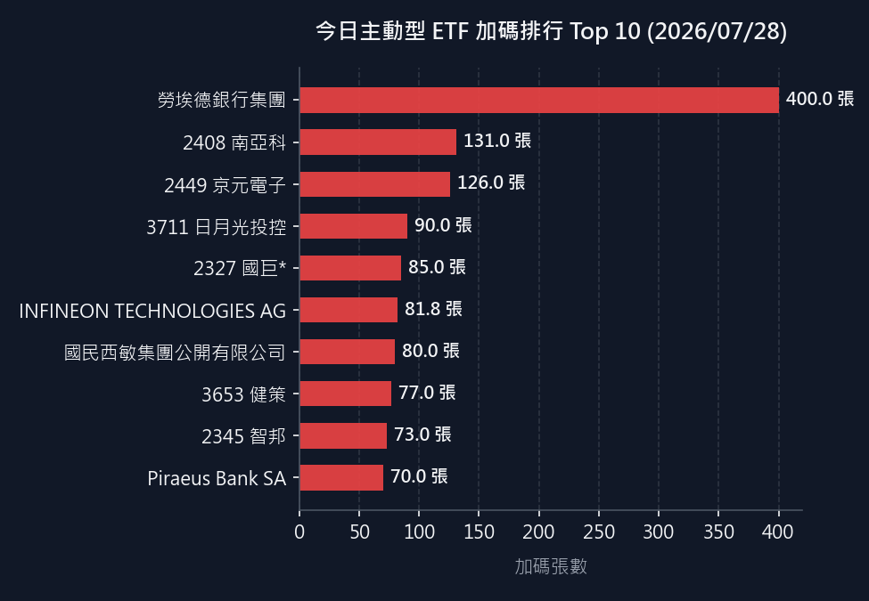
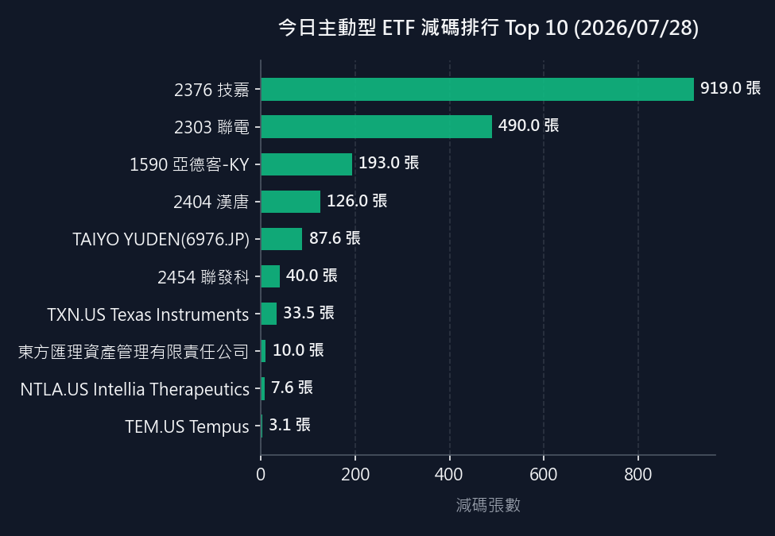

# 主動型 ETF 持股變動

資料來源：`主動型ETF持股明細.xlsx` 最近兩個日期分頁。

比較區間：`20260727` → `20260728`

## 今日加減碼視覺化排行

| 今日加碼 Top 10 | 今日減碼 Top 10 |
| :---: | :---: |
|  |  |

| ETF | 新增 | 刪除 | 比例變動 |
| :-- | --: | --: | --: |
| 00400A | 0 | 3 | 43 |
| 00401A | 0 | 0 | 0 |
| 00402A | 0 | 0 | 48 |
| 00403A | 0 | 0 | 0 |
| 00404A | 0 | 0 | 0 |
| 00405A | 0 | 0 | 0 |
| 00407A | 0 | 0 | 46 |
| 00408A | 0 | 0 | 40 |
| 00980A | 0 | 0 | 0 |
| 00980D | 0 | 0 | 31 |
| 00981A | 0 | 0 | 0 |
| 00982A | 0 | 0 | 0 |
| 00983A | 0 | 0 | 39 |
| 00983D | 0 | 0 | 75 |
| 00984A | 0 | 0 | 0 |
| 00985A | 0 | 0 | 46 |
| 00986A | 0 | 0 | 0 |
| 00987A | 0 | 0 | 0 |
| 00988A | 0 | 0 | 0 |
| 00989A | 0 | 0 | 57 |
| 00990A | 0 | 3 | 44 |
| 00991A | 0 | 0 | 0 |
| 00992A | 0 | 0 | 0 |
| 00993A | 0 | 0 | 0 |
| 00994A | 0 | 0 | 0 |
| 00995A | 0 | 0 | 0 |
| 00996A | 0 | 0 | 0 |
| 00997A | 0 | 0 | 44 |
| 00998A | 0 | 1 | 33 |
| 00999A | 0 | 0 | 0 |

## 00400A

### 新增持股

- 無

### 刪除持股

- 1590 亞德客-KY（1.04%，193 張）
- 2376 技嘉（1.21%，919 張）
- 2404 漢唐（0.53%，126 張）

### 投資比例變動

- 1303 南亞：0.40% → 0.38%（-0.02）
- 2059 川湖：3.51% → 3.34%（-0.17）
- 2303 聯電：0.95% → 0.90%（-0.05）
- 2308 台達電：2.94% → 2.80%（-0.14）
- 2313 華通：0.83% → 0.80%（-0.03）
- 2330 台積電：8.45% → 8.67%（+0.22）
- 2345 智邦：1.91% → 1.84%（-0.07）
- 2357 華碩：1.37% → 1.40%（+0.03）
- 2360 致茂：5.24% → 5.12%（-0.12）
- 2382 廣達：0.80% → 0.83%（+0.03）
- 2383 台光電：5.26% → 5.09%（-0.17）
- 2385 群光：0.13% → 0.14%（+0.01）
- 2408 南亞科：1.99% → 1.90%（-0.09）
- 2454 聯發科：6.08% → 5.05%（-1.03）
- 2881 富邦金：0.40% → 0.41%（+0.01）
- 2885 元大金：1.46% → 1.52%（+0.06）
- 3008 大立光：1.89% → 1.90%（+0.01）
- 3017 奇鋐：4.12% → 4.06%（-0.06）
- 3036 文曄：1.14% → 1.13%（-0.01）
- 3037 欣興：4.25% → 4.05%（-0.20）
- 3044 健鼎：1.52% → 1.48%（-0.04）
- 3090 日電貿：0.35% → 0.33%（-0.02）
- 3211 順達：0.77% → 0.73%（-0.04）
- 3231 緯創：0.93% → 0.95%（+0.02）
- 3293 鈊象：0.36% → 0.38%（+0.02）
- 3374 精材：0.35% → 0.33%（-0.02）
- 3443 創意：2.89% → 2.76%（-0.13）
- 3653 健策：0.83% → 1.87%（+1.04）
- 3665 貿聯-KY：2.86% → 3.11%（+0.25）
- 3711 日月光投控：1.39% → 1.34%（-0.05）
- 4958 臻鼎-KY：0.96% → 0.92%（-0.04）
- 5274 信驊：2.89% → 2.75%（-0.14）
- 5347 世界：0.80% → 0.79%（-0.01）
- 6187 萬潤：2.32% → 2.28%（-0.04）
- 6223 旺矽：3.67% → 3.51%（-0.16）
- 6239 力成：0.03% → 0.02%（-0.01）
- 6442 光聖：0.56% → 0.55%（-0.01）
- 6488 環球晶：3.41% → 3.25%（-0.16）
- 6505 台塑化：0.88% → 0.89%（+0.01）
- 6510 精測：1.32% → 1.30%（-0.02）
- 6669 緯穎：4.38% → 4.28%（-0.10）
- 6715 嘉基：0.21% → 0.20%（-0.01）
- 8046 南電：1.05% → 1.01%（-0.04）

## 00401A

### 新增持股

- 無

### 刪除持股

- 無

### 投資比例變動

- 無

## 00402A

### 新增持股

- 無

### 刪除持股

- 無

### 投資比例變動

- AAPL.US Apple：8.24% → 8.45%（+0.21）
- ADI.US Analog Devices：1.83% → 1.86%（+0.03）
- AMD.US AMD：5.90% → 5.68%（-0.22）
- AMZN.US Amazon：3.84% → 3.89%（+0.05）
- ARM.US Arm：1.02% → 1.06%（+0.04）
- ASML.US ASML Holding：1.69% → 1.62%（-0.07）
- AVGO.US Broadcom：2.47% → 2.52%（+0.05）
- AXON.US Axon Enterprise：0.92% → 0.98%（+0.06）
- BABA.US Alibaba Group：0.54% → 0.56%（+0.02）
- BKNG.US Booking Holdings：0.61% → 0.65%（+0.04）
- CDNS.US Cadence Design Systems：1.77% → 1.86%（+0.09）
- CIEN.US Ciena：1.20% → 1.18%（-0.02）
- CLS.US Celestica：0.86% → 0.91%（+0.05）
- COHR.US Coherent：1.48% → 1.44%（-0.04）
- CRWD.US CrowdStrike Holdings：1.24% → 1.23%（-0.01）
- DASH.US DoorDash：0.24% → 0.26%（+0.02）
- GOOG.US Alphabet - Class C Capital Stock：3.18% → 3.31%（+0.13）
- GOOGL.US Alphabet - Class A Common Stock：3.13% → 3.24%（+0.11）
- INTC.US Intel：1.22% → 1.23%（+0.01）
- IOT.US Samsara：0.20% → 0.22%（+0.02）
- KLAC.US KLA：2.37% → 2.32%（-0.05）
- LITE.US Lumentum：1.37% → 1.30%（-0.07）
- LRCX.US Lam Research：3.59% → 3.48%（-0.11）
- MDB.US MongoDB：0.59% → 0.62%（+0.03）
- META.US Meta：2.87% → 2.91%（+0.04）
- MRVL.US Marvell：1.40% → 1.39%（-0.01）
- MSFT.US Microsoft：3.35% → 3.47%（+0.12）
- MU.US Micron：6.68% → 6.63%（-0.05）
- NFLX.US Netflix：0.78% → 0.79%（+0.01）
- NOW.US ServiceNow：0.21% → 0.23%（+0.02）
- NVDA.US NVIDIA：8.51% → 8.24%（-0.27）
- NXPI.US NXP Semiconductors：1.29% → 1.30%（+0.01）
- PANW.US Palo Alto：3.08% → 3.06%（-0.02）
- PLTR.US Palantir Technologies：1.08% → 1.17%（+0.09）
- SHOP.US Shopify：0.39% → 0.44%（+0.05）
- SIMO.US Silicon Motion：0.82% → 0.75%（-0.07）
- SKHY.US SK hynix：0.99% → 0.93%（-0.06）
- SNOW.US Snowflake：0.81% → 0.84%（+0.03）
- SPOT.US Spotify：0.27% → 0.28%（+0.01）
- STX.US Seagate：1.49% → 1.45%（-0.04）
- TER.US Teradyne：0.82% → 0.80%（-0.02）
- TSM.US TSMC(ADR)：1.63% → 1.64%（+0.01）
- TTWO.US Take-Two：0.54% → 0.58%（+0.04）
- TXN.US Texas Instruments：2.58% → 2.62%（+0.04）
- UBER.US Uber：0.43% → 0.45%（+0.02）
- V.US Visa：1.08% → 1.12%（+0.04）
- WDC.US Western Digital：2.91% → 2.83%（-0.08）
- ZS.US Zscaler：0.15% → 0.16%（+0.01）

## 00403A

### 新增持股

- 無

### 刪除持股

- 無

### 投資比例變動

- 無

## 00404A

### 新增持股

- 無

### 刪除持股

- 無

### 投資比例變動

- 無

## 00405A

### 新增持股

- 無

### 刪除持股

- 無

### 投資比例變動

- 無

## 00407A

### 新增持股

- 無

### 刪除持股

- 無

### 投資比例變動

- 1303 南亞：0.56% → 0.53%（-0.03）
- 1590 亞德客-KY：2.25% → 2.23%（-0.02）
- 2059 川湖：2.14% → 2.02%（-0.12）
- 2303 聯電：1.40% → 1.32%（-0.08）
- 2308 台達電：3.88% → 3.66%（-0.22）
- 2327 國巨*：2.47% → 2.34%（-0.13）
- 2330 台積電：9.02% → 9.19%（+0.17）
- 2344 華邦電：1.69% → 1.59%（-0.10）
- 2345 智邦：3.17% → 3.41%（+0.24）
- 2360 致茂：1.97% → 2.11%（+0.14）
- 2368 金像電：1.78% → 1.69%（-0.09）
- 2376 技嘉：0.78% → 0.76%（-0.02）
- 2379 瑞昱：0.83% → 0.84%（+0.01）
- 2383 台光電：3.88% → 4.21%（+0.33）
- 2395 研華：1.81% → 1.83%（+0.02）
- 2408 南亞科：1.82% → 1.72%（-0.10）
- 2412 中華電：1.78% → 1.88%（+0.10）
- 2454 聯發科：6.47% → 6.12%（-0.35）
- 2458 義隆：0.11% → 0.10%（-0.01）
- 3017 奇鋐：3.55% → 3.87%（+0.32）
- 3037 欣興：3.79% → 3.59%（-0.20）
- 3260 威剛：0.17% → 0.16%（-0.01）
- 3293 鈊象：0.57% → 0.60%（+0.03）
- 3443 創意：1.75% → 1.66%（-0.09）
- 3529 力旺：1.93% → 1.83%（-0.10）
- 3533 嘉澤：1.03% → 1.02%（-0.01）
- 3665 貿聯-KY：2.92% → 3.16%（+0.24）
- 3711 日月光投控：2.48% → 2.56%（+0.08）
- 4904 遠傳：0.34% → 0.35%（+0.01）
- 4958 臻鼎-KY：1.87% → 1.79%（-0.08）
- 5274 信驊：2.00% → 1.89%（-0.11）
- 5289 宜鼎：0.17% → 0.16%（-0.01）
- 5536 聖暉*：1.81% → 1.74%（-0.07）
- 6223 旺矽：2.47% → 2.54%（+0.07）
- 6274 台燿：2.42% → 2.29%（-0.13）
- 6415 矽力*-KY：0.38% → 0.36%（-0.02）
- 6446 藥華藥：2.37% → 2.32%（-0.05）
- 6515 穎崴：1.39% → 1.36%（-0.03）
- 6526 達發：0.31% → 0.30%（-0.01）
- 6531 愛普*：1.35% → 1.27%（-0.08）
- 6669 緯穎：4.35% → 4.23%（-0.12）
- 6805 富世達：1.92% → 1.86%（-0.06）
- 8046 南電：2.22% → 2.12%（-0.10）
- 8210 勤誠：1.81% → 1.73%（-0.08）
- 8299 群聯：0.13% → 0.12%（-0.01）
- 8996 高力：0.39% → 0.37%（-0.02）

## 00408A

### 新增持股

- 無

### 刪除持股

- 無

### 投資比例變動

- 1216 統一：1.02% → 1.06%（+0.04）
- 1303 南亞：0.73% → 0.68%（-0.05）
- 1477 聚陽：1.18% → 1.20%（+0.02）
- 2059 川湖：1.49% → 1.39%（-0.10）
- 2303 聯電：0.45% → 0.42%（-0.03）
- 2308 台達電：3.58% → 3.34%（-0.24）
- 2317 鴻海：2.27% → 2.22%（-0.05）
- 2330 台積電：4.80% → 4.84%（+0.04）
- 2345 智邦：2.82% → 2.66%（-0.16）
- 2356 英業達：1.26% → 1.21%（-0.05）
- 2360 致茂：2.39% → 2.29%（-0.10）
- 2368 金像電：2.04% → 1.91%（-0.13）
- 2376 技嘉：2.20% → 2.13%（-0.07）
- 2382 廣達：1.18% → 1.19%（+0.01）
- 2383 台光電：3.17% → 3.01%（-0.16）
- 2404 漢唐：1.67% → 1.57%（-0.10）
- 2408 南亞科：0.52% → 0.49%（-0.03）
- 2412 中華電：3.37% → 3.50%（+0.13）
- 2454 聯發科：3.97% → 3.71%（-0.26）
- 2603 長榮：1.83% → 1.86%（+0.03）
- 2880 華南金：1.61% → 1.67%（+0.06）
- 2886 兆豐金：2.22% → 2.30%（+0.08）
- 2891 中信金：0.91% → 0.93%（+0.02）
- 2912 統一超：2.44% → 2.51%（+0.07）
- 3017 奇鋐：2.30% → 2.23%（-0.07）
- 3037 欣興：2.64% → 2.47%（-0.17）
- 3045 台灣大：3.34% → 3.48%（+0.14）
- 3231 緯創：3.29% → 3.27%（-0.02）
- 3665 貿聯-KY：1.80% → 1.93%（+0.13）
- 3702 大聯大：1.81% → 1.78%（-0.03）
- 4904 遠傳：0.58% → 0.59%（+0.01）
- 5347 世界：0.47% → 0.46%（-0.01）
- 5434 崇越：2.54% → 2.51%（-0.03）
- 5876 上海商銀：2.31% → 2.26%（-0.05）
- 5904 寶雅：1.64% → 1.73%（+0.09）
- 6223 旺矽：0.51% → 0.48%（-0.03）
- 6274 台燿：1.43% → 1.33%（-0.10）
- 6669 緯穎：3.79% → 3.63%（-0.16）
- 7769 鴻勁：1.65% → 1.61%（-0.04）
- 8046 南電：2.32% → 2.18%（-0.14）

## 00980A

### 新增持股

- 無

### 刪除持股

- 無

### 投資比例變動

- 無

## 00980D

### 新增持股

- 無

### 刪除持股

- 無

### 投資比例變動

- ATHENE HOLDING LTD 6.625000 % 19MAY2055：0.58% → 0.57%（-0.01）
- BANCO SANTANDER SA 6.921% 08AUG2033：0.35% → 0.34%（-0.01）
- BLACKSTONE PRIVATE CRE 7.300000 % 27NOV2028：0.48% → 0.47%（-0.01）
- BLUE OWL CREDIT INCOME SER WI (REG) 7.75% 16SEP2027：0.56% → 0.55%（-0.01）
- CONCENTRIX CORP (REG) 6.85% 02AUG2033：0.68% → 0.69%（+0.01）
- DAIMLER FINANCE NA LLC REG 8.5% 18JAN2031：0.65% → 0.64%（-0.01）
- DOW CHEMICAL CO/THE 5.950000 % 15MAR2055：0.51% → 0.50%（-0.01）
- DOW CHEMICAL CO/THE 6.9% 15MAY2053：0.61% → 0.60%（-0.01）
- FMC CORP (REG) 4.5% 01OCT2049：0.51% → 0.50%（-0.01）
- FORD MOTOR COMPANY 5.291% 08DEC2046：0.28% → 0.29%（+0.01）
- GENERAL MOTORS CO (REG) 6.8% 01OCT2027：0.57% → 0.56%（-0.01）
- GETTY IMAGES INC SER REGS 11.250000 % 21FEB2030：0.51% → 0.52%（+0.01）
- JBS USA/FOOD/FINANCE (REG) 6.5% 01DEC2052：0.46% → 0.47%（+0.01）
- JETBLUE AIRWAYS/LOYALTY SER REGS (REG S) 9.875% 20SEP2031：0.29% → 0.30%（+0.01）
- KELLANOVA SER B (REG) 7.450000 % 01APR2031：0.58% → 0.57%（-0.01）
- ONEOK INC 6.625% 01SEP2053：0.58% → 0.59%（+0.01）
- ORACLE CORP (REG) 5.500000 % 27SEP2064：0.54% → 0.55%（+0.01）
- ORACLE CORP 5.55% 06FEB2053：0.24% → 0.25%（+0.01）
- ORACLE CORP 6.000000 % 03AUG2055：0.30% → 0.31%（+0.01）
- ORACLE CORP 6.125000 % 03AUG2065：0.51% → 0.52%（+0.01）
- ORACLE CORP 6.9% 09NOV2052：0.51% → 0.52%（+0.01）
- OVINTIV INC 7.375% 01NOV2031：0.34% → 0.33%（-0.01）
- RR DONNELLEY & SONS CO SER REGS (REG S) 9.5% 01AUG2029：0.43% → 0.42%（-0.01）
- SBL HOLDINGS INC SER REGS 7.200000 % 30OCT2034：0.53% → 0.52%（-0.01）
- US 10YR NOTE (CBT)SEP26 21-SEP-2026：18.72% → 18.70%（-0.02）
- US 2YR NOTE (CBT) SEP26 30-SEP-2026：1.99% → 1.98%（-0.01）
- US 5YR NOTE (CBT) SEP26 30-SEP-2026：-16.28% → -16.24%（+0.04）
- US LONG BOND(CBT) SEP26 21-SEP-2026：5.49% → 5.50%（+0.01）
- VIACOM INC (REG) 5.85% 01SEP2043：0.56% → 0.57%（+0.01）
- VIACOMCBS INC (REG) 4.95% 19MAY2050：0.49% → 0.50%（+0.01）
- VIACOMCBS INC 6.875% 30APR2036：0.28% → 0.29%（+0.01）

## 00981A

### 新增持股

- 無

### 刪除持股

- 無

### 投資比例變動

- 無

## 00982A

### 新增持股

- 無

### 刪除持股

- 無

### 投資比例變動

- 無

## 00983A

### 新增持股

- 無

### 刪除持股

- 無

### 投資比例變動

- ACHR.US Archer：0.31% → 0.32%（+0.01）
- AMD.US AMD：7.32% → 6.85%（-0.47）
- AMZN.US Amazon：3.22% → 3.16%（-0.06）
- AVGO.US Broadcom：1.98% → 1.96%（-0.02）
- BEAM.US Beam Therapeutics：2.53% → 2.49%（-0.04）
- BLSH.US Bullish：0.87% → 0.89%（+0.02）
- BMNR.US BitMine：0.62% → 0.70%（+0.08）
- CBRS.US Cerebras：0.87% → 0.81%（-0.06）
- CERS.US Cerus：0.54% → 0.56%（+0.02）
- COIN.US Coinbase：1.10% → 1.59%（+0.49）
- CRCL.US Circle：0.92% → 1.37%（+0.45）
- CRSP.US CRISPR Therapeutics：3.98% → 3.94%（-0.04）
- CRWV.US CoreWeave：1.18% → 1.14%（-0.04）
- DE.US Deere：1.25% → 1.22%（-0.03）
- FIG.US Figma：0.39% → 0.42%（+0.03）
- GOOG.US Alphabet - Class C Capital Stock：1.24% → 1.25%（+0.01）
- GOOGL.US Alphabet - Class A Common Stock：1.64% → 1.65%（+0.01）
- HOOD.US Robinhood Markets：4.49% → 4.47%（-0.02）
- ILMN.US Illumina：3.95% → 3.81%（-0.14）
- KTOS.US Kratos Defense & Security：0.10% → 0.18%（+0.08）
- LLY.US Eli Lilly：2.09% → 2.07%（-0.02）
- META.US Meta：1.51% → 1.49%（-0.02）
- NTLA.US Intellia Therapeutics：1.52% → 1.26%（-0.26）
- NTRA.US Natera：2.78% → 2.70%（-0.08）
- NVDA.US NVIDIA：0.89% → 0.84%（-0.05）
- PLTR.US Palantir Technologies：0.51% → 0.54%（+0.03）
- RBLX.US Roblox：3.16% → 3.18%（+0.02）
- SHOP.US Shopify：6.08% → 6.69%（+0.61）
- SOFI.US SoFi Technologies：0.67% → 0.68%（+0.01）
- TEM.US Tempus：4.16% → 3.74%（-0.42）
- TER.US Teradyne：0.62% → 0.58%（-0.04）
- TSLA.US Tesla：7.69% → 7.50%（-0.19）
- TSM.US TSMC(ADR)：3.60% → 3.52%（-0.08）
- TWST.US Twist Bioscience：4.35% → 4.11%（-0.24）
- TXG.US 10x Genomics：5.84% → 5.72%（-0.12）
- VCYT.US Veracyte：1.72% → 1.67%（-0.05）
- WGS.US GeneDx：1.32% → 1.34%（+0.02）
- XE.US X-Energy：0.10% → 0.11%（+0.01）
- XYZ.US Block：2.33% → 2.42%（+0.09）

## 00983D

### 新增持股

- 無

### 刪除持股

- 無

### 投資比例變動

- ABIBB 8.2 01/15/39：2.01% → 1.97%（-0.04）
- ABXCN 7 1/2 09/15/38：0.55% → 0.54%（-0.01）
- AET 6 5/8 06/15/36：0.75% → 0.74%（-0.01）
- ALLY 8 11/01/31：0.53% → 0.86%（+0.33）
- AMCX 10 1/2 07/15/32：1.64% → 1.60%（-0.04）
- ATH 6 5/8 05/19/55：0.87% → 1.00%（+0.13）
- AWK 6.593 10/15/37：0.73% → 0.72%（-0.01）
- BACR 7.437 11/02/33：1.30% → 1.28%（-0.02）
- BATSLN 7.079 08/02/43：1.11% → 1.09%（-0.02）
- BATSLN 7.081 08/02/53：1.36% → 1.33%（-0.03）
- BHCCN 11 09/30/28：1.86% → 1.82%（-0.04）
- BNCN 7 3/8 03/01/33：1.14% → 1.12%（-0.02）
- BRITEL 9 5/8 12/15/30：1.38% → 1.36%（-0.02）
- BRKHEC 6 3/4 07/01/37：0.84% → 0.82%（-0.02）
- C 8 1/8 07/15/39：1.99% → 1.96%（-0.03）
- CEG 6 1/2 10/01/53：0.80% → 0.78%（-0.02）
- CMCSA 6.95 08/15/37：0.68% → 0.67%（-0.01）
- CP 7 1/8 10/15/31：0.84% → 0.82%（-0.02）
- CRWV 9 02/01/31：1.29% → 1.24%（-0.05）
- CYH 10 7/8 01/15/32：1.51% → 1.48%（-0.03）
- DELL 8.1 07/15/36：1.57% → 1.54%（-0.03）
- DELL 8.35 07/15/46：1.46% → 1.43%（-0.03）
- DIS 7 3/4 12/01/45：0.81% → 0.80%（-0.01）
- DOW 6.9 05/15/53：0.76% → 0.74%（-0.02）
- DOW 9.4 05/15/39：1.96% → 1.93%（-0.03）
- DT 9 1/4 06/01/32：0.97% → 0.95%（-0.02）
- DTV 8 7/8 02/01/30：1.62% → 1.59%（-0.03）
- DUK 7 3/4 03/01/31：1.59% → 1.56%（-0.03）
- ED 6 3/4 04/01/38：0.63% → 0.62%（-0.01）
- ENBCN 6.7 11/15/53：1.15% → 1.13%（-0.02）
- ET 6 1/2 02/01/42：0.17% → 0.16%（-0.01）
- FFHCN 6.35 03/22/54：0.72% → 0.70%（-0.02）
- GE 6 3/4 03/15/32：0.59% → 0.58%（-0.01）
- GE 6 7/8 01/10/39：0.87% → 0.85%（-0.02）
- GM 6 3/4 04/01/46：1.21% → 1.19%（-0.02）
- GS 6 1/4 02/01/41：0.17% → 0.32%（+0.15）
- GTN 10 1/2 07/15/29：1.73% → 1.69%（-0.04）
- HAL 7.45 09/15/39：1.87% → 1.83%（-0.04）
- HPE 6.35 10/15/45：1.01% → 0.99%（-0.02）
- HSBC 6.332 03/09/44：1.09% → 1.07%（-0.02）
- IEP 10 11/15/29：1.56% → 1.53%（-0.03）
- KHC 6 7/8 01/26/39：1.02% → 1.01%（-0.01）
- KMI 6.95 01/15/38：1.09% → 1.06%（-0.03）
- LOW 6.65 09/15/37：0.87% → 0.85%（-0.02）
- LQDW.US iShares Investment Grade Corpora：7.50% → 7.35%（-0.15）
- MBGGR 8 1/2 01/18/31：1.34% → 1.31%（-0.03）
- MCD 6.3 03/01/38：0.75% → 0.74%（-0.01）
- MINAU 9 1/4 10/01/28：0.90% → 0.88%（-0.02）
- MOHEGN 11 7/8 04/15/31：1.38% → 1.36%（-0.02）
- MPC 6 1/2 03/01/41：0.17% → 0.16%（-0.01）
- MS 7 1/4 04/01/32：1.49% → 1.63%（+0.14）
- NVDA 5.55 06/15/46：0.90% → 1.17%（+0.27）
- OKE 6 5/8 09/01/53：0.71% → 0.70%（-0.01）
- ORCL 6.9 11/09/52：1.12% → 1.11%（-0.01）
- OXY 6.6 03/15/46：0.76% → 0.74%（-0.02）
- PCG 6 3/4 01/15/53：1.18% → 1.15%（-0.03）
- PCG 6.7 04/01/53：0.97% → 1.11%（+0.14）
- PDM 9 1/4 07/20/28：0.86% → 0.84%（-0.02）
- PFE 7.2 03/15/39：1.47% → 1.44%（-0.03）
- RAKUTN 11 1/4 02/15/27：1.85% → 1.81%（-0.04）
- RIOLN 7 1/4 03/15/31：0.52% → 0.51%（-0.01）
- S 8 3/4 03/15/32：0.67% → 0.66%（-0.01）
- SPCX 6.6 07/15/46：0.85% → 1.11%（+0.26）
- SUCN 6.85 06/01/39：1.25% → 1.22%（-0.03）
- SYY 6.6 04/01/50：0.20% → 0.19%（-0.01）
- TELEFO 8 1/4 09/15/30：1.03% → 1.01%（-0.02）
- TELEFONICA EMISIONES SAU 7.045 06/20/36：1.59% → 1.56%（-0.03）
- TIME WARNER CABLE INC 6.750 06/15/39：0.49% → 0.48%（-0.01）
- TIME WARNER CABLE INC 7.300 07/01/38：0.51% → 0.50%（-0.01）
- TLTW.US iShares 20+ Year Treasury Bond B：7.45% → 7.32%（-0.13）
- TRPCN 7 5/8 01/15/39：1.74% → 1.70%（-0.04）
- UNITEDHEALTH GROUP INC 6.875 02/15/38：0.89% → 0.87%（-0.02）
- VENLNG 9 1/2 02/01/29：1.45% → 1.41%（-0.04）
- VLO 6 5/8 06/15/37：0.76% → 0.75%（-0.01）
- VZ 7 3/4 12/01/30：1.17% → 1.14%（-0.03）

## 00984A

### 新增持股

- 無

### 刪除持股

- 無

### 投資比例變動

- 無

## 00985A

### 新增持股

- 無

### 刪除持股

- 無

### 投資比例變動

- 1216 統一：1.03% → 1.10%（+0.07）
- 2027 大成鋼：3.76% → 3.77%（+0.01）
- 2049 上銀：0.58% → 0.57%（-0.01）
- 2059 川湖：3.50% → 4.06%（+0.56）
- 2303 聯電：2.53% → 2.41%（-0.12）
- 2308 台達電：1.07% → 1.02%（-0.05）
- 2327 國巨*：2.32% → 2.73%（+0.41）
- 2330 台積電：17.29% → 17.73%（+0.44）
- 2344 華邦電：1.01% → 0.96%（-0.05）
- 2345 智邦：2.12% → 2.60%（+0.48）
- 2360 致茂：0.48% → 0.46%（-0.02）
- 2368 金像電：0.90% → 0.86%（-0.04）
- 2376 技嘉：4.21% → 4.17%（-0.04）
- 2383 台光電：2.38% → 2.31%（-0.07）
- 2395 研華：1.48% → 1.51%（+0.03）
- 2408 南亞科：2.11% → 2.57%（+0.46）
- 2412 中華電：3.64% → 3.86%（+0.22）
- 2454 聯發科：1.14% → 1.66%（+0.52）
- 2881 富邦金：0.49% → 0.50%（+0.01）
- 2891 中信金：0.50% → 0.52%（+0.02）
- 3008 大立光：3.33% → 3.36%（+0.03）
- 3017 奇鋐：0.42% → 0.85%（+0.43）
- 3036 文曄：3.21% → 3.18%（-0.03）
- 3037 欣興：0.35% → 0.63%（+0.28）
- 3081 聯亞：1.54% → 1.55%（+0.01）
- 3105 穩懋：0.54% → 0.52%（-0.02）
- 3131 弘塑：1.40% → 1.36%（-0.04）
- 3293 鈊象：1.08% → 1.15%（+0.07）
- 3529 力旺：0.25% → 0.24%（-0.01）
- 3653 健策：1.16% → 1.17%（+0.01）
- 3661 世芯-KY：2.60% → 2.48%（-0.12）
- 3665 貿聯-KY：0.95% → 1.04%（+0.09）
- 3711 日月光投控：0.78% → 0.75%（-0.03）
- 4904 遠傳：3.66% → 3.81%（+0.15）
- 4958 臻鼎-KY：2.15% → 2.06%（-0.09）
- 6147 頎邦：2.64% → 2.52%（-0.12）
- 6187 萬潤：3.20% → 3.14%（-0.06）
- 6223 旺矽：0.29% → 0.28%（-0.01）
- 6415 矽力*-KY：0.29% → 0.28%（-0.01）
- 6442 光聖：3.49% → 3.42%（-0.07）
- 6446 藥華藥：1.50% → 1.48%（-0.02）
- 6488 環球晶：0.18% → 0.47%（+0.29）
- 6669 緯穎：0.89% → 1.45%（+0.56）
- 8046 南電：0.53% → 0.51%（-0.02）
- 8299 群聯：0.99% → 0.95%（-0.04）
- 8996 高力：0.24% → 0.23%（-0.01）

## 00986A

### 新增持股

- 無

### 刪除持股

- 無

### 投資比例變動

- 無

## 00987A

### 新增持股

- 無

### 刪除持股

- 無

### 投資比例變動

- 無

## 00988A

### 新增持股

- 無

### 刪除持股

- 無

### 投資比例變動

- 無

## 00989A

### 新增持股

- 無

### 刪除持股

- 無

### 投資比例變動

- ADI.US Analog Devices：1.13% → 1.12%（-0.01）
- AMAT.US Applied Materials：0.79% → 0.76%（-0.03）
- AMD.US AMD：3.90% → 3.68%（-0.22）
- AMKR.US Amkor：1.12% → 1.04%（-0.08）
- AMZN.US Amazon：0.93% → 0.92%（-0.01）
- APP.US Applovin：0.99% → 1.04%（+0.05）
- ASML.US ASML Holding：2.92% → 2.74%（-0.18）
- AVGO.US Broadcom：4.12% → 4.11%（-0.01）
- BE.US Bloom Energy：1.24% → 1.00%（-0.24）
- CBRS.US Cerebras：0.19% → 0.18%（-0.01）
- CDNS.US Cadence Design Systems：0.97% → 1.00%（+0.03）
- CIEN.US Ciena：2.01% → 1.93%（-0.08）
- CRCL.US Circle：0.31% → 0.33%（+0.02）
- CRM.US Salesforce：1.51% → 1.59%（+0.08）
- CRWD.US CrowdStrike Holdings：2.95% → 2.88%（-0.07）
- DOCN.US DigitalOcean：1.55% → 1.50%（-0.05）
- ENPH.US Enphase Energy：0.13% → 0.14%（+0.01）
- ENTG.US Entegris：1.07% → 1.04%（-0.03）
- FIGR.US Figure：0.74% → 0.77%（+0.03）
- FN.US Fabrinet：0.68% → 0.67%（-0.01）
- GFS.US GlobalFoundries：1.21% → 1.19%（-0.02）
- GLW.US Corning：1.84% → 1.79%（-0.05）
- GOOG.US Alphabet - Class C Capital Stock：4.22% → 4.30%（+0.08）
- HOOD.US Robinhood Markets：2.29% → 2.30%（+0.01）
- HUBS.US HubSpot：0.66% → 1.15%（+0.49）
- INTC.US Intel：3.46% → 3.42%（-0.04）
- LITE.US Lumentum：1.56% → 1.45%（-0.11）
- LMND.US Lemonade：0.99% → 1.01%（+0.02）
- LRCX.US Lam Research：3.04% → 2.89%（-0.15）
- META.US Meta：2.69% → 2.67%（-0.02）
- MSFT.US Microsoft：1.94% → 1.97%（+0.03）
- MTSI.US MACOM Technology Solutions：1.01% → 0.99%（-0.02）
- MU.US Micron：1.87% → 1.81%（-0.06）
- NET.US Cloudflare：2.60% → 2.62%（+0.02）
- NU.US Nu：0.94% → 0.96%（+0.02）
- NVDA.US NVIDIA：3.99% → 3.77%（-0.22）
- ON.US ON Semiconductor：1.77% → 1.81%（+0.04）
- ORCL.US Oracle：1.16% → 1.21%（+0.05）
- PANW.US Palo Alto：4.07% → 3.97%（-0.10）
- PLTR.US Palantir Technologies：0.45% → 0.48%（+0.03）
- RIVN.US Rivian：1.43% → 1.48%（+0.05）
- SHOP.US Shopify：1.35% → 1.50%（+0.15）
- SNDK.US Sandisk：1.06% → 0.94%（-0.12）
- SNOW.US Snowflake：2.77% → 2.80%（+0.03）
- SPCX.US SpaceX：0.64% → 0.63%（-0.01）
- SYM.US Symbotic：0.37% → 0.38%（+0.01）
- TSLA.US Tesla：2.72% → 2.67%（-0.05）
- TSM.US TSMC(ADR)：1.97% → 1.69%（-0.28）
- TTMI.US TTM Technologies：0.64% → 0.60%（-0.04）
- TTWO.US Take-Two：3.82% → 4.00%（+0.18）
- TWLO.US Twilio：2.15% → 2.17%（+0.02）
- TXN.US Texas Instruments：1.61% → 1.60%（-0.01）
- U.US Unity Software：0.31% → 0.32%（+0.01）
- VICR.US Vicor Corporation：0.98% → 0.96%（-0.02）
- WRBY.US Warby Parker：0.68% → 0.69%（+0.01）
- XYZ.US Block：0.78% → 0.81%（+0.03）
- ZM.US Zoom：1.87% → 1.93%（+0.06）

## 00990A

### 新增持股

- 無

### 刪除持股

- KOKUSAI ELECTRIC(6525.JP)（0.75%，173.4 張）
- NOK.US Nokia（0.75%，1003.9 張）
- TXN.US Texas Instruments（0.77%，33.5 張）

### 投資比例變動

- 2303 聯電：1.06% → 0.91%（-0.15）
- 2308 台達電：2.57% → 2.58%（+0.01）
- 2330 台積電：3.44% → 3.53%（+0.09）
- 2383 台光電：1.74% → 1.81%（+0.07）
- 2449 京元電子：0.58% → 0.69%（+0.11）
- 2454 聯發科：2.24% → 2.25%（+0.01）
- 3037 欣興：2.14% → 2.21%（+0.07）
- 3711 日月光投控：1.00% → 1.02%（+0.02）
- 5347 世界：1.00% → 1.02%（+0.02）
- 6223 旺矽：1.09% → 1.12%（+0.03）
- 6274 台燿：0.85% → 0.88%（+0.03）
- AMAT.US Applied Materials：3.68% → 4.12%（+0.44）
- AMD.US AMD：7.02% → 6.80%（-0.22）
- AMZN.US Amazon：0.86% → 0.88%（+0.02）
- ASML.US ASML Holding：1.47% → 1.41%（-0.06）
- AVGO.US Broadcom：0.86% → 0.88%（+0.02）
- BE.US Bloom Energy：1.64% → 1.71%（+0.07）
- DDOG.US Datadog：0.82% → 1.37%（+0.55）
- DELL.US Dell：2.22% → 3.21%（+0.99）
- GOOGL.US Alphabet - Class A Common Stock：1.01% → 1.06%（+0.05）
- ICHR.US Ichor Holdings：1.04% → 0.96%（-0.08）
- INFINEON TECHNOLOGIES AG：2.55% → 3.06%（+0.51）
- Kioxia Holdings(285A.JP)：3.36% → 3.35%（-0.01）
- LITE.US Lumentum：6.20% → 5.91%（-0.29）
- META.US Meta：1.89% → 1.93%（+0.04）
- MRVL.US Marvell：1.63% → 1.62%（-0.01）
- MSFT.US Microsoft：2.03% → 2.11%（+0.08）
- MXL.US MaxLinear：0.88% → 0.82%（-0.06）
- Murata Mfg.(6981.JP)：2.31% → 2.30%（-0.01）
- NVDA.US NVIDIA：1.98% → 1.92%（-0.06）
- ON.US ON Semiconductor：0.54% → 0.56%（+0.02）
- ONTO.US Onto Innovation：1.15% → 1.13%（-0.02）
- Renesas Electronics(6723.JP)：1.66% → 1.67%（+0.01）
- SCREEN Holdings(7735.JP)：1.65% → 1.69%（+0.04）
- SMTC.US Semtech：1.07% → 1.06%（-0.01）
- SNDK.US Sandisk：2.36% → 2.15%（-0.21）
- SNOW.US Snowflake：1.08% → 1.64%（+0.56）
- SUMCO(3436.JP)：1.11% → 1.18%（+0.07）
- Samsung Elec Mech(009150.KS)：3.70% → 3.76%（+0.06）
- TAIYO YUDEN(6976.JP)：2.23% → 1.79%（-0.44）
- TSEM.US Tower Semiconductor：1.30% → 1.77%（+0.47）
- Tokyo Electron(8035.JP)：1.95% → 1.99%（+0.04）
- UCTT.US Ultra Clean Holdings：1.22% → 1.17%（-0.05）
- WDC.US Western Digital：2.71% → 2.65%（-0.06）

## 00991A

### 新增持股

- 無

### 刪除持股

- 無

### 投資比例變動

- 無

## 00992A

### 新增持股

- 無

### 刪除持股

- 無

### 投資比例變動

- 無

## 00993A

### 新增持股

- 無

### 刪除持股

- 無

### 投資比例變動

- 無

## 00994A

### 新增持股

- 無

### 刪除持股

- 無

### 投資比例變動

- 無

## 00995A

### 新增持股

- 無

### 刪除持股

- 無

### 投資比例變動

- 無

## 00996A

### 新增持股

- 無

### 刪除持股

- 無

### 投資比例變動

- 無

## 00997A

### 新增持股

- 無

### 刪除持股

- 無

### 投資比例變動

- 2330 台積電：2.22% → 2.27%（+0.05）
- 2345 智邦：1.68% → 1.73%（+0.05）
- 2383 台光電：1.40% → 1.45%（+0.05）
- 3037 欣興：1.41% → 1.46%（+0.05）
- AAPL.US Apple：3.04% → 3.13%（+0.09）
- ADBE.US Adobe：0.43% → 0.47%（+0.04）
- ALAB.US Astera Labs：1.18% → 1.17%（-0.01）
- AMAT.US Applied Materials：4.93% → 4.84%（-0.09）
- AMD.US AMD：6.26% → 6.04%（-0.22）
- AMZN.US Amazon：1.48% → 1.50%（+0.02）
- APP.US Applovin：0.29% → 0.31%（+0.02）
- AVGO.US Broadcom：1.90% → 1.95%（+0.05）
- CDNS.US Cadence Design Systems：0.30% → 0.32%（+0.02）
- CIEN.US Ciena：1.07% → 1.06%（-0.01）
- COHR.US Coherent：0.91% → 0.89%（-0.02）
- CSCO.US Cisco：0.85% → 0.86%（+0.01）
- DT.US Dynatrace：1.46% → 1.56%（+0.10）
- EW.US Edwards Lifesciences：0.69% → 0.71%（+0.02）
- FTNT.US Fortinet：2.46% → 2.51%（+0.05）
- GE.US GE Aerospace：1.38% → 1.43%（+0.05）
- GOOGL.US Alphabet - Class A Common Stock：2.90% → 3.01%（+0.11）
- HWM.US Howmet Aerospace：2.20% → 2.23%（+0.03）
- IBIDEN(4062.JP)：2.18% → 2.14%（-0.04）
- INTC.US Intel：1.88% → 1.90%（+0.02）
- IOT.US Samsara：1.01% → 1.09%（+0.08）
- KLAC.US KLA：1.29% → 1.27%（-0.02）
- Kioxia Holdings(285A.JP)：1.09% → 1.08%（-0.01）
- LITE.US Lumentum：1.71% → 1.62%（-0.09）
- LRCX.US Lam Research：2.64% → 2.57%（-0.07）
- META.US Meta：2.37% → 2.41%（+0.04）
- MPWR.US Monolithic Power Systems：0.56% → 0.57%（+0.01）
- MRVL.US Marvell：3.11% → 3.08%（-0.03）
- MSFT.US Microsoft：0.62% → 0.64%（+0.02）
- MU.US Micron：4.87% → 4.85%（-0.02）
- NVDA.US NVIDIA：2.45% → 2.37%（-0.08）
- OKTA.US Okta：1.52% → 1.54%（+0.02）
- PLTR.US Palantir Technologies：0.80% → 0.87%（+0.07）
- RTX.US RTX：1.20% → 1.26%（+0.06）
- SNDK.US Sandisk：2.93% → 2.65%（-0.28）
- STX.US Seagate：2.76% → 2.70%（-0.06）
- Samsung Elec Mech(009150.KS)：1.44% → 1.46%（+0.02）
- TER.US Teradyne：1.85% → 1.80%（-0.05）
- TXN.US Texas Instruments：0.32% → 0.33%（+0.01）
- WDC.US Western Digital：3.50% → 3.41%（-0.09）

## 00998A

### 新增持股

- 無

### 刪除持股

- 德國商業銀行（1.04%，28 張）

### 投資比例變動

- AJG.US Arthur J. Gallagher：1.40% → 1.42%（+0.02）
- BAC.US Bank of America：3.56% → 3.54%（-0.02）
- BNY.US Bank of New York Mellon：2.39% → 2.35%（-0.04）
- BPER銀行有限公司：1.12% → 1.11%（-0.01）
- Chiba Bank(8331.JP)：1.86% → 1.88%（+0.02）
- GS.US Goldman Sachs：1.87% → 1.84%（-0.03）
- Hokuhoku FG(8377.JP)：1.46% → 1.50%（+0.04）
- JAPAN POST BANK(7182.JP)：2.23% → 2.20%（-0.03）
- Kyushu Financial(7180.JP)：0.87% → 0.86%（-0.01）
- MFG.US Mizuho Financial Group：0.94% → 0.93%（-0.01）
- MRX.US Marex：2.03% → 1.98%（-0.05）
- MS.US Morgan Stanley：1.71% → 1.69%（-0.02）
- Mebuki Financial Group(7167.JP)：2.49% → 2.50%（+0.01）
- PFG.US Principal Financial：1.93% → 1.95%（+0.02）
- Piraeus Bank SA：5.19% → 5.93%（+0.74）
- Sumitomo Mitsui Trust Group(8309.JP)：1.98% → 1.99%（+0.01）
- UBS.US UBS Group：2.65% → 2.67%（+0.02）
- USB.US U.S. Bancorp：1.98% → 1.95%（-0.03）
- Unipol保險股份公司：4.62% → 4.56%（-0.06）
- V.US Visa：1.95% → 1.97%（+0.02）
- 勞埃德銀行集團：2.41% → 2.95%（+0.54）
- 匯豐控股有限公司：4.02% → 3.99%（-0.03）
- 國民西敏集團公開有限公司：2.39% → 3.02%（+0.63）
- 巴克萊集團：3.09% → 3.10%（+0.01）
- 希臘國家銀行：1.89% → 1.92%（+0.03）
- 東方匯理資產管理有限責任公司：3.08% → 2.21%（-0.87）
- 標準人壽公開有限公司：2.38% → 2.35%（-0.03）
- 法國巴黎銀行股份有限公司：3.30% → 3.33%（+0.03）
- 法國興業銀行股份有限公司：3.34% → 3.35%（+0.01）
- 法通保險集團公開有限公司：1.76% → 1.74%（-0.02）
- 渣打集團有限公司：3.52% → 3.50%（-0.02）
- 義大利西恩那銀行股份公司：4.68% → 4.71%（+0.03）
- 裕信銀行：2.83% → 2.86%（+0.03）

## 00999A

### 新增持股

- 無

### 刪除持股

- 無

### 投資比例變動

- 無
