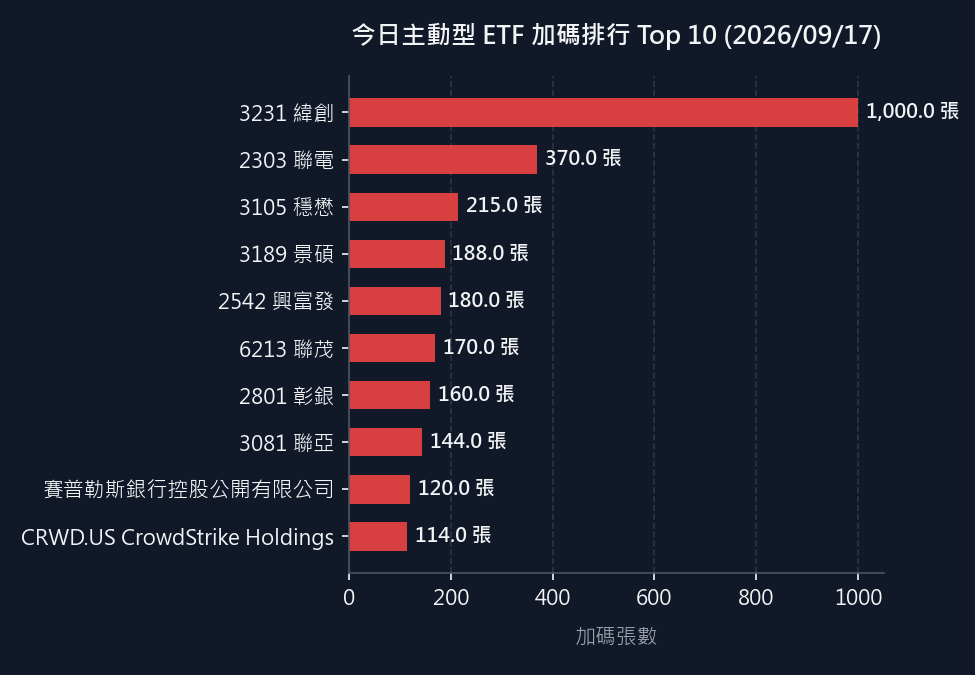
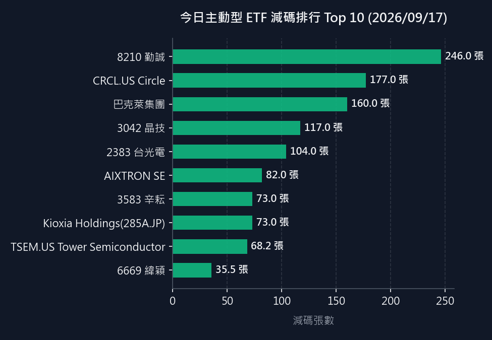

# 主動型 ETF 持股變動

資料來源：`主動型ETF持股明細.xlsx` 最近兩個日期分頁。

比較區間：`20260916` → `20260917`

## 今日加減碼視覺化排行

| 今日加碼 Top 10 | 今日減碼 Top 10 |
| :---: | :---: |
|  |  |

| ETF | 新增 | 刪除 | 比例變動 |
| :-- | --: | --: | --: |
| 00400A | 0 | 0 | 0 |
| 00401A | 0 | 0 | 0 |
| 00402A | 0 | 0 | 43 |
| 00403A | 0 | 0 | 0 |
| 00404A | 0 | 0 | 0 |
| 00405A | 0 | 0 | 31 |
| 00407A | 1 | 1 | 41 |
| 00408A | 1 | 1 | 42 |
| 00980A | 0 | 0 | 41 |
| 00980D | 1 | 0 | 61 |
| 00981A | 0 | 0 | 0 |
| 00982A | 1 | 0 | 36 |
| 00983A | 0 | 1 | 36 |
| 00983D | 0 | 0 | 0 |
| 00984A | 0 | 0 | 0 |
| 00985A | 0 | 0 | 40 |
| 00986A | 0 | 0 | 0 |
| 00987A | 1 | 1 | 25 |
| 00988A | 2 | 2 | 36 |
| 00989A | 0 | 0 | 51 |
| 00990A | 0 | 0 | 0 |
| 00991A | 0 | 0 | 0 |
| 00992A | 0 | 0 | 0 |
| 00993A | 0 | 0 | 42 |
| 00994A | 0 | 0 | 0 |
| 00995A | 0 | 0 | 35 |
| 00996A | 0 | 0 | 38 |
| 00997A | 0 | 0 | 49 |
| 00998A | 1 | 2 | 49 |
| 00999A | 0 | 0 | 0 |

## 00400A

### 新增持股

- 無

### 刪除持股

- 無

### 投資比例變動

- 無

## 00401A

### 新增持股

- 無

### 刪除持股

- 無

### 投資比例變動

- 無

## 00402A

### 新增持股

- 無

### 刪除持股

- 無

### 投資比例變動

- AAPL.US Apple：8.04% → 8.02%（-0.02）
- AMD.US AMD：5.27% → 5.33%（+0.06）
- AMZN.US Amazon：4.57% → 4.50%（-0.07）
- ANET.US Arista Networks：0.87% → 0.88%（+0.01）
- AVGO.US Broadcom：2.14% → 2.13%（-0.01）
- AXON.US Axon Enterprise：0.86% → 0.90%（+0.04）
- BABA.US Alibaba Group：0.55% → 0.54%（-0.01）
- CDNS.US Cadence Design Systems：1.27% → 1.29%（+0.02）
- CIEN.US Ciena：1.18% → 1.20%（+0.02）
- CLS.US Celestica：0.94% → 0.95%（+0.01）
- COHR.US Coherent：1.54% → 1.63%（+0.09）
- CRWD.US CrowdStrike Holdings：1.73% → 1.71%（-0.02）
- DASH.US DoorDash：0.53% → 0.52%（-0.01）
- FSLY.US Fastly：0.39% → 0.38%（-0.01）
- GOOG.US Alphabet - Class C Capital Stock：3.27% → 3.24%（-0.03）
- GOOGL.US Alphabet - Class A Common Stock：3.72% → 3.68%（-0.04）
- INTC.US Intel：1.84% → 1.91%（+0.07）
- IOT.US Samsara：0.58% → 0.56%（-0.02）
- KLAC.US KLA：1.50% → 1.49%（-0.01）
- LITE.US Lumentum：1.58% → 1.73%（+0.15）
- LRCX.US Lam Research：2.52% → 2.49%（-0.03）
- MCHP.US Microchip Technology：1.15% → 1.11%（-0.04）
- MDB.US MongoDB：0.46% → 0.45%（-0.01）
- META.US Meta：3.41% → 3.40%（-0.01）
- MRVL.US Marvell：1.25% → 1.28%（+0.03）
- MSFT.US Microsoft：5.39% → 5.29%（-0.10）
- MU.US Micron：6.24% → 6.20%（-0.04）
- NFLX.US Netflix：0.91% → 0.89%（-0.02）
- NOW.US ServiceNow：0.89% → 0.87%（-0.02）
- NVDA.US NVIDIA：8.51% → 8.55%（+0.04）
- PANW.US Palo Alto：2.83% → 2.82%（-0.01）
- SHOP.US Shopify：0.84% → 0.83%（-0.01）
- SIMO.US Silicon Motion：0.76% → 0.77%（+0.01）
- SNOW.US Snowflake：1.08% → 1.10%（+0.02）
- SPCX.US SpaceX：0.79% → 0.82%（+0.03）
- SPOT.US Spotify：0.57% → 0.55%（-0.02）
- STX.US Seagate：1.27% → 1.28%（+0.01）
- TER.US Teradyne：0.82% → 0.84%（+0.02）
- TSM.US TSMC(ADR)：1.50% → 1.51%（+0.01）
- TTWO.US Take-Two：0.70% → 0.69%（-0.01）
- TXN.US Texas Instruments：2.27% → 2.23%（-0.04）
- V.US Visa：1.33% → 1.30%（-0.03）
- WDC.US Western Digital：2.11% → 2.13%（+0.02）

## 00403A

### 新增持股

- 無

### 刪除持股

- 無

### 投資比例變動

- 無

## 00404A

### 新增持股

- 無

### 刪除持股

- 無

### 投資比例變動

- 無

## 00405A

### 新增持股

- 無

### 刪除持股

- 無

### 投資比例變動

- 2059 川湖：1.94% → 1.99%（+0.05）
- 2303 聯電：0.97% → 1.01%（+0.04）
- 2308 台達電：0.62% → 0.61%（-0.01）
- 2330 台積電：1.63% → 1.67%（+0.04）
- 2345 智邦：3.73% → 3.67%（-0.06）
- 2368 金像電：4.29% → 4.12%（-0.17）
- 2383 台光電：4.13% → 3.83%（-0.30）
- 2454 聯發科：8.34% → 8.32%（-0.02）
- 3017 奇鋐：4.60% → 4.64%（+0.04）
- 3037 欣興：6.34% → 6.23%（-0.11）
- 3443 創意：8.61% → 9.11%（+0.50）
- 3450 聯鈞：1.35% → 1.31%（-0.04）
- 3653 健策：5.22% → 5.36%（+0.14）
- 3665 貿聯-KY：5.09% → 5.15%（+0.06）
- 4749 新應材：0.26% → 0.27%（+0.01）
- 4991 環宇-KY：1.97% → 1.99%（+0.02）
- 5274 信驊：3.80% → 3.82%（+0.02）
- 6187 萬潤：0.93% → 0.92%（-0.01）
- 6223 旺矽：6.94% → 6.84%（-0.10）
- 6274 台燿：1.66% → 1.56%（-0.10）
- 6278 台表科：0.98% → 0.99%（+0.01）
- 6285 啟碁：0.34% → 0.35%（+0.01）
- 6488 環球晶：0.40% → 0.39%（-0.01）
- 6510 精測：3.03% → 3.02%（-0.01）
- 6515 穎崴：0.55% → 0.54%（-0.01）
- 6531 愛普*：3.75% → 3.65%（-0.10）
- 6805 富世達：2.12% → 2.18%（+0.06）
- 6831 邁科：0.50% → 0.51%（+0.01）
- 7734 印能科技：1.43% → 1.49%（+0.06）
- 7769 鴻勁：2.82% → 2.84%（+0.02）
- 8046 南電：3.13% → 3.03%（-0.10）

## 00407A

### 新增持股

- 3231 緯創（0.78%，1000 張）

### 刪除持股

- 8210 勤誠（0.90%，246 張）

### 投資比例變動

- 1303 南亞：0.74% → 0.78%（+0.04）
- 1560 中砂：0.86% → 0.94%（+0.08）
- 1590 亞德客-KY：0.08% → 0.07%（-0.01）
- 2059 川湖：2.76% → 2.87%（+0.11）
- 2301 光寶科：1.52% → 1.53%（+0.01）
- 2303 聯電：0.58% → 0.62%（+0.04）
- 2308 台達電：2.58% → 2.59%（+0.01）
- 2327 國巨*：2.30% → 2.25%（-0.05）
- 2330 台積電：9.47% → 9.56%（+0.09）
- 2345 智邦：2.70% → 2.62%（-0.08）
- 2360 致茂：1.80% → 1.79%（-0.01）
- 2368 金像電：0.53% → 0.52%（-0.01）
- 2383 台光電：5.51% → 5.02%（-0.49）
- 2408 南亞科：0.95% → 0.99%（+0.04）
- 2454 聯發科：5.70% → 5.75%（+0.05）
- 2615 萬海：0.72% → 0.77%（+0.05）
- 3008 大立光：1.53% → 1.51%（-0.02）
- 3017 奇鋐：5.59% → 5.68%（+0.09）
- 3037 欣興：4.99% → 4.90%（-0.09）
- 3081 聯亞：1.46% → 1.48%（+0.02）
- 3131 弘塑：0.89% → 0.91%（+0.02）
- 3293 鈊象：0.57% → 0.59%（+0.02）
- 3443 創意：3.93% → 4.21%（+0.28）
- 3491 昇達科：0.88% → 0.95%（+0.07）
- 3529 力旺：0.60% → 0.61%（+0.01）
- 3665 貿聯-KY：2.04% → 2.06%（+0.02）
- 3711 日月光投控：2.70% → 2.78%（+0.08）
- 4958 臻鼎-KY：0.96% → 0.95%（-0.01）
- 5274 信驊：2.42% → 2.51%（+0.09）
- 5289 宜鼎：0.34% → 0.33%（-0.01）
- 6187 萬潤：1.48% → 1.46%（-0.02）
- 6223 旺矽：3.00% → 3.01%（+0.01）
- 6274 台燿：3.53% → 3.38%（-0.15）
- 6446 藥華藥：0.34% → 0.33%（-0.01）
- 6510 精測：1.49% → 1.46%（-0.03）
- 6531 愛普*：0.33% → 0.34%（+0.01）
- 6669 緯穎：4.10% → 3.76%（-0.34）
- 6805 富世達：1.92% → 1.96%（+0.04）
- 8046 南電：1.76% → 1.72%（-0.04）
- 8299 群聯：0.31% → 0.32%（+0.01）
- 8996 高力：1.80% → 1.90%（+0.10）

## 00408A

### 新增持股

- 2059 川湖（0.41%，0.5 張）

### 刪除持股

- 3661 世芯-KY（0.22%，1 張）

### 投資比例變動

- 1303 南亞：1.51% → 1.60%（+0.09）
- 2303 聯電：1.14% → 1.88%（+0.74）
- 2308 台達電：1.25% → 1.23%（-0.02）
- 2317 鴻海：1.99% → 2.02%（+0.03）
- 2330 台積電：5.81% → 5.86%（+0.05）
- 2344 華邦電：0.45% → 0.46%（+0.01）
- 2345 智邦：0.86% → 0.85%（-0.01）
- 2357 華碩：2.32% → 2.36%（+0.04）
- 2368 金像電：3.05% → 2.93%（-0.12）
- 2376 技嘉：1.29% → 1.31%（+0.02）
- 2382 廣達：0.91% → 0.92%（+0.01）
- 2383 台光電：3.40% → 2.52%（-0.88）
- 2395 研華：1.58% → 1.57%（-0.01）
- 2449 京元電子：0.87% → 0.89%（+0.02）
- 2454 聯發科：4.24% → 4.23%（-0.01）
- 2481 強茂：1.08% → 1.05%（-0.03）
- 2542 興富發：0.92% → 1.51%（+0.59）
- 2801 彰銀：1.94% → 2.32%（+0.38）
- 2880 華南金：2.08% → 2.11%（+0.03）
- 2886 兆豐金：2.28% → 2.33%（+0.05）
- 2891 中信金：1.14% → 1.15%（+0.01）
- 3017 奇鋐：3.40% → 3.42%（+0.02）
- 3037 欣興：2.44% → 2.40%（-0.04）
- 3045 台灣大：2.92% → 2.91%（-0.01）
- 3081 聯亞：1.31% → 1.28%（-0.03）
- 3189 景碩：1.48% → 1.46%（-0.02）
- 3231 緯創：1.59% → 1.63%（+0.04）
- 3443 創意：0.41% → 0.44%（+0.03）
- 3491 昇達科：0.67% → 0.70%（+0.03）
- 3653 健策：2.10% → 2.16%（+0.06）
- 3711 日月光投控：0.93% → 0.95%（+0.02）
- 5434 崇越：2.08% → 2.06%（-0.02）
- 6223 旺矽：2.25% → 2.22%（-0.03）
- 6274 台燿：2.46% → 2.13%（-0.33）
- 6488 環球晶：0.44% → 0.43%（-0.01）
- 6515 穎崴：0.83% → 0.82%（-0.01）
- 6669 緯穎：3.95% → 3.84%（-0.11）
- 6805 富世達：1.23% → 1.26%（+0.03）
- 7769 鴻勁：1.84% → 1.85%（+0.01）
- 8046 南電：1.55% → 1.50%（-0.05）
- 8436 大江：0.44% → 0.45%（+0.01）
- 9802 鈺齊-KY：2.91% → 3.00%（+0.09）

## 00980A

### 新增持股

- 無

### 刪除持股

- 無

### 投資比例變動

- 1303 南亞：2.86% → 2.85%（-0.01）
- 2059 川湖：4.20% → 4.25%（+0.05）
- 2308 台達電：3.61% → 3.64%（+0.03）
- 2317 鴻海：2.54% → 2.51%（-0.03）
- 2327 國巨*：1.39% → 1.37%（-0.02）
- 2330 台積電：9.61% → 9.43%（-0.18）
- 2344 華邦電：1.96% → 2.04%（+0.08）
- 2345 智邦：1.71% → 1.68%（-0.03）
- 2360 致茂：1.65% → 1.63%（-0.02）
- 2376 技嘉：1.27% → 1.28%（+0.01）
- 2382 廣達：1.76% → 1.77%（+0.01）
- 2383 台光電：3.72% → 3.64%（-0.08）
- 2408 南亞科：2.73% → 2.84%（+0.11）
- 2454 聯發科：5.91% → 5.94%（+0.03）
- 3008 大立光：0.84% → 0.85%（+0.01）
- 3017 奇鋐：2.23% → 2.24%（+0.01）
- 3026 禾伸堂：1.11% → 1.16%（+0.05）
- 3036 文曄：1.18% → 1.15%（-0.03）
- 3037 欣興：3.01% → 2.99%（-0.02）
- 3044 健鼎：0.91% → 0.92%（+0.01）
- 3081 聯亞：1.84% → 1.90%（+0.06）
- 3189 景碩：1.37% → 1.39%（+0.02）
- 3231 緯創：1.27% → 1.25%（-0.02）
- 3264 欣銓：0.77% → 0.76%（-0.01）
- 3443 創意：1.91% → 1.92%（+0.01）
- 3529 力旺：0.62% → 0.63%（+0.01）
- 3653 健策：1.96% → 1.90%（-0.06）
- 3711 日月光投控：1.97% → 1.98%（+0.01）
- 4958 臻鼎-KY：0.77% → 0.78%（+0.01）
- 5274 信驊：1.90% → 1.95%（+0.05）
- 5904 寶雅*：1.22% → 1.21%（-0.01）
- 6213 聯茂：1.34% → 1.40%（+0.06）
- 6223 旺矽：1.92% → 1.95%（+0.03）
- 6274 台燿：1.76% → 1.79%（+0.03）
- 6515 穎崴：1.86% → 1.80%（-0.06）
- 6669 緯穎：1.92% → 1.77%（-0.15）
- 6805 富世達：0.59% → 0.58%（-0.01）
- 7769 鴻勁：2.40% → 2.35%（-0.05）
- 8299 群聯：1.73% → 1.75%（+0.02）
- 8996 高力：1.18% → 1.24%（+0.06）
- 台灣證交所加權股價指數(FITXN*1.TF)：3.04% → 3.01%（-0.03）

## 00980D

### 新增持股

- US ULTRA BOND CBT DEC26 21-DEC-2026（-0.35%，-0.002 張）

### 刪除持股

- 無

### 投資比例變動

- AHOLD FINANCE USA LLC 6.88% 01MAY2029：0.48% → 0.49%（+0.01）
- ALLY FINANCIAL INC (REG) VAR 03JAN2030：0.63% → 0.64%（+0.01）
- AMC GLOBAL MEDIA INC SER REGS (REG) (REG S) 10.5% 15JUL2032：0.72% → 0.73%（+0.01）
- APOLLO DEBT SOLUTIONS BD 6.900000 % 13APR2029：0.55% → 0.56%（+0.01）
- ATHENE HOLDING LTD (REG) 6.25% 01APR2054：0.76% → 0.77%（+0.01）
- BAT CAPITAL CORP (REG) 7.081% 02AUG2053：0.57% → 0.58%（+0.01）
- BPCE SA SER REGS VAR 19OCT2034：0.42% → 0.43%（+0.01）
- BRIGHTHOUSE FINANCIAL IN (REG) 4.7% 22JUN2047：0.47% → 0.48%（+0.01）
- BRITISH TELECOMMUNICATIO (BR) 9.625% 15DEC2030：0.57% → 0.58%（+0.01）
- CALDERYS FINANCING LLC SER REGS (REG S) 11.25% 01JUN2028：0.33% → 0.34%（+0.01）
- CHARTER COMM OPT 6.484% 23OCT2045 W/I：0.45% → 0.46%（+0.01）
- CHARTER COMM OPT LLC/CAP (REG) 5.5% 01APR2063：0.48% → 0.49%（+0.01）
- CHS/COMMUNITY HEALTH SYS SER REGS 9.750000 % 15JAN2034：0.33% → 0.34%（+0.01）
- CONCENTRIX CORP (REG) 6.85% 02AUG2033：0.70% → 0.71%（+0.01）
- CONOCOPHILLIPS COMPANY (REG) 6.95% 15APR2029：0.51% → 0.52%（+0.01）
- COX COMMUNICATIONS INC SER REGS 5.950000 % 01SEP2054：0.53% → 0.54%（+0.01）
- DELL INT LLC / EMC CORP (REG) 8.1% 15JUL2036：0.58% → 0.59%（+0.01）
- DELL INT LLC / EMC CORP (REG) 8.35% 15JUL2046：0.55% → 0.56%（+0.01）
- DOW CHEMICAL CO/THE (REG) 5.6% 15FEB2054：0.60% → 0.61%（+0.01）
- DOW CHEMICAL CO/THE 6.9% 15MAY2053：0.60% → 0.61%（+0.01）
- DOW CHEMICAL CO/THE 7.375% 01NOV2029：0.61% → 0.62%（+0.01）
- DOW CHEMICAL CO/THE 9.4% 15MAY2039：0.54% → 0.55%（+0.01）
- ENBRIDGE ENERGY PARTNERS (REG) 7.375% 15OCT2045：0.51% → 0.52%（+0.01）
- FIFTH THIRD BANCORP (REG) 8.25% 01MAR2038：0.64% → 0.65%（+0.01）
- FMC CORP (REG) 6.375000 % 18MAY2053：0.46% → 0.47%（+0.01）
- FORD MOTOR COMPANY 5.291% 08DEC2046：0.28% → 0.29%（+0.01）
- FORD MOTOR CREDIT CO LLC (REG) 7.35% 04NOV2027：0.33% → 0.34%（+0.01）
- GENERAL MOTORS CO (REG) 6.75% 01APR2046：0.56% → 0.57%（+0.01）
- GENERAL MOTORS CO (REG) 6.8% 01OCT2027：0.56% → 0.57%（+0.01）
- GEORGIA-PACIFIC LLC (REG) 7.75% 15NOV2029：0.57% → 0.58%（+0.01）
- GLOBAL ATLANTIC FIN CO SER REGS 6.750000 % 15MAR2054：0.62% → 0.63%（+0.01）
- HA SUSTAINABLE INF CAP (REG) 6.375% 01JUL2034：0.34% → 0.35%（+0.01）
- HISCOX LTD VAR 11JUN2036：0.43% → 0.44%（+0.01）
- KINDER MORGAN INC/DELAWA SER GMTN (REG) 7.75% 15JAN2032：0.32% → 0.33%（+0.01）
- KINDER MORGAN INC/DELAWA SER GMTN (REG) 7.8% 01AUG2031：0.31% → 0.32%（+0.01）
- M&T BANK CORPORATION (REG) VAR 30OCT2029：0.54% → 0.55%（+0.01）
- MYLAN INC (REG) 5.4% 29/11/2043：0.33% → 0.34%（+0.01）
- MYLAN INC SER WI (REG) 5.2% 15APR2048WI：0.49% → 0.50%（+0.01）
- MYLAN NV 5.25% 15JUN2046 WI：0.53% → 0.54%（+0.01）
- NAVIENT CORP (REG) 11.5% 15MAR2031：0.32% → 0.33%（+0.01）
- NISSAN MOTOR CO SER REGS 8.125000 % 17JUL2035：0.52% → 0.53%（+0.01）
- ORACLE CORP 6.85 % 04-FEB-2066：0.56% → 0.57%（+0.01）
- ORACLE CORP 6.9% 09NOV2052：0.52% → 0.53%（+0.01）
- PHOTO HOLDINGS LLC SER REGS (REG) (REG S) 12% 01JUL2031：0.51% → 0.52%（+0.01）
- PLANET FINANCIAL GROUP SER REGS 10.500000 % 15DEC2029：0.50% → 0.51%（+0.01）
- PROGRESS ENERGY INC (REG) 7.75% 01MAR2031：0.57% → 0.58%（+0.01）
- SALESFORCE INC (REG) 6.55% 15MAR2056：0.54% → 0.55%（+0.01）
- SALESFORCE INC (REG) 6.7% 15MAR2066：0.53% → 0.54%（+0.01）
- SBL HOLDINGS INC SER REGS 7.200000 % 30OCT2034：0.51% → 0.52%（+0.01）
- SEAGATE DATA STOR SER * 9.625 % 01-DEC-2032：0.56% → 0.57%（+0.01）
- SES GLOBAL AMERICAS HLDG SER REGS (REG) 5.300000 % 25MAR2044：0.31% → 0.32%（+0.01）
- SOCIETE GENERALE SER REGS (REG) (REG S) 7.367% 10JAN2053：0.32% → 0.33%（+0.01）
- SYMETRA LIFE INSURANCE SER REGS 6.550000 % 01OCT2055：0.31% → 0.32%（+0.01）
- TELEFONICA EUROPE BV (REG) 8.25% 15SEP2030：0.41% → 0.42%（+0.01）
- UNISYS CORP SER REGS 10.625000 % 15JAN2031：0.59% → 0.60%（+0.01）
- US 10YR NOTE (CBT)DEC26 21-DEC-2026：17.83% → 17.89%（+0.06）
- US 2YR NOTE (CBT) DEC26 31-DEC-2026：1.65% → 1.66%（+0.01）
- US 5YR NOTE (CBT) DEC26 31-DEC-2026：-14.36% → -13.73%（+0.63）
- US LONG BOND(CBT) DEC26 21-DEC-2026：5.35% → 5.38%（+0.03）
- VIACOMCBS INC (REG) 4.95% 19MAY2050：0.49% → 0.50%（+0.01）
- WESTLAKE CORP 6.375000 % 15-NOV-2055：0.52% → 0.53%（+0.01）

## 00981A

### 新增持股

- 無

### 刪除持股

- 無

### 投資比例變動

- 無

## 00982A

### 新增持股

- 6213 聯茂（0.19%，170 張）

### 刪除持股

- 無

### 投資比例變動

- 2059 川湖：4.35% → 4.40%（+0.05）
- 2303 聯電：1.47% → 1.48%（+0.01）
- 2330 台積電：8.82% → 8.66%（-0.16）
- 2345 智邦：2.36% → 2.32%（-0.04）
- 2360 致茂：3.51% → 3.48%（-0.03）
- 2377 微星：1.03% → 1.05%（+0.02）
- 2383 台光電：3.28% → 3.21%（-0.07）
- 2428 興勤：1.19% → 1.18%（-0.01）
- 2454 聯發科：6.72% → 6.77%（+0.05）
- 2455 全新：1.65% → 1.61%（-0.04）
- 2467 志聖：1.06% → 1.05%（-0.01）
- 2478 大毅：1.05% → 1.06%（+0.01）
- 2486 一詮：0.76% → 0.75%（-0.01）
- 3008 大立光：3.14% → 3.18%（+0.04）
- 3017 奇鋐：2.39% → 2.40%（+0.01）
- 3090 日電貿：1.08% → 1.10%（+0.02）
- 3105 穩懋：5.34% → 5.47%（+0.13）
- 3231 緯創：1.38% → 1.36%（-0.02）
- 3491 昇達科：3.30% → 3.45%（+0.15）
- 3529 力旺：0.50% → 0.51%（+0.01）
- 3583 辛耘：1.18% → 1.08%（-0.10）
- 4958 臻鼎-KY：3.11% → 3.16%（+0.05）
- 5274 信驊：1.30% → 1.33%（+0.03）
- 5425 台半：1.18% → 1.23%（+0.05）
- 5483 中美晶：1.25% → 1.28%（+0.03）
- 5536 聖暉*：0.78% → 0.77%（-0.01）
- 6139 亞翔：5.47% → 5.34%（-0.13）
- 6214 精誠：1.35% → 1.34%（-0.01）
- 6223 旺矽：3.44% → 3.49%（+0.05）
- 6274 台燿：1.19% → 1.21%（+0.02）
- 6472 保瑞：0.87% → 0.86%（-0.01）
- 6488 環球晶：2.05% → 2.07%（+0.02）
- 6531 愛普*：3.74% → 3.93%（+0.19）
- 6669 緯穎：5.59% → 4.99%（-0.60）
- 6672 騰輝電子-KY：0.32% → 0.33%（+0.01）
- 8996 高力：0.96% → 1.01%（+0.05）

## 00983A

### 新增持股

- 無

### 刪除持股

- FIG.US Figma（0.11%，1.461 張）

### 投資比例變動

- ACHR.US Archer：0.71% → 0.73%（+0.02）
- AMD.US AMD：3.23% → 3.07%（-0.16）
- AMZN.US Amazon：2.47% → 2.52%（+0.05）
- AVGO.US Broadcom：0.87% → 0.90%（+0.03）
- BEAM.US Beam Therapeutics：1.49% → 1.50%（+0.01）
- BLSH.US Bullish：2.29% → 2.25%（-0.04）
- BMNR.US BitMine：2.21% → 2.11%（-0.10）
- CBRS.US Cerebras：0.94% → 1.00%（+0.06）
- COIN.US Coinbase：4.45% → 4.17%（-0.28）
- CRCL.US Circle：5.33% → 4.92%（-0.41）
- CRSP.US CRISPR Therapeutics：3.73% → 3.81%（+0.08）
- CRWV.US CoreWeave：1.14% → 1.16%（+0.02）
- DE.US Deere：0.97% → 1.01%（+0.04）
- GOOG.US Alphabet - Class C Capital Stock：1.44% → 1.48%（+0.04）
- GOOGL.US Alphabet - Class A Common Stock：0.80% → 0.83%（+0.03）
- HOOD.US Robinhood Markets：4.57% → 4.60%（+0.03）
- ILMN.US Illumina：1.65% → 1.84%（+0.19）
- KTOS.US Kratos Defense & Security：0.73% → 0.76%（+0.03）
- LLY.US Eli Lilly：1.04% → 1.08%（+0.04）
- META.US Meta：0.67% → 0.70%（+0.03）
- NET.US Cloudflare：0.72% → 1.08%（+0.36）
- NTRA.US Natera：2.08% → 2.22%（+0.14）
- NVDA.US NVIDIA：2.18% → 2.29%（+0.11）
- PLTR.US Palantir Technologies：3.49% → 3.62%（+0.13）
- SHOP.US Shopify：4.33% → 4.38%（+0.05）
- SNOW.US Snowflake：1.62% → 1.64%（+0.02）
- SOFI.US SoFi Technologies：0.45% → 0.46%（+0.01）
- SPCX.US SpaceX：5.91% → 5.97%（+0.06）
- TEM.US Tempus：5.42% → 6.26%（+0.84）
- TER.US Teradyne：0.51% → 0.54%（+0.03）
- TSLA.US Tesla：8.64% → 8.96%（+0.32）
- TSM.US TSMC(ADR)：2.32% → 2.39%（+0.07）
- TWST.US Twist Bioscience：4.60% → 4.92%（+0.32）
- TXG.US 10x Genomics：4.91% → 5.43%（+0.52）
- WGS.US GeneDx：1.40% → 1.54%（+0.14）
- XYZ.US Block：1.77% → 1.82%（+0.05）

## 00983D

### 新增持股

- 無

### 刪除持股

- 無

### 投資比例變動

- 無

## 00984A

### 新增持股

- 無

### 刪除持股

- 無

### 投資比例變動

- 無

## 00985A

### 新增持股

- 無

### 刪除持股

- 無

### 投資比例變動

- 1216 統一：1.20% → 1.22%（+0.02）
- 1301 台塑：0.67% → 0.69%（+0.02）
- 1504 東元：1.99% → 2.01%（+0.02）
- 2027 大成鋼：0.95% → 0.96%（+0.01）
- 2303 聯電：1.06% → 1.10%（+0.04）
- 2308 台達電：1.75% → 1.72%（-0.03）
- 2317 鴻海：2.47% → 2.49%（+0.02）
- 2327 國巨*：1.54% → 1.68%（+0.14）
- 2330 台積電：14.79% → 15.05%（+0.26）
- 2345 智邦：1.44% → 1.40%（-0.04）
- 2360 致茂：0.88% → 0.87%（-0.01）
- 2376 技嘉：4.15% → 4.20%（+0.05）
- 2377 微星：1.82% → 1.81%（-0.01）
- 2383 台光電：2.58% → 2.38%（-0.20）
- 2395 研華：3.01% → 2.97%（-0.04）
- 2412 中華電：3.96% → 3.99%（+0.03）
- 2454 聯發科：2.96% → 2.94%（-0.02）
- 2603 長榮：1.69% → 1.71%（+0.02）
- 2610 華航：1.71% → 1.74%（+0.03）
- 2881 富邦金：1.50% → 1.48%（-0.02）
- 2891 中信金：1.83% → 1.84%（+0.01）
- 3017 奇鋐：1.61% → 1.80%（+0.19）
- 3037 欣興：1.86% → 1.81%（-0.05）
- 3081 聯亞：0.47% → 0.45%（-0.02）
- 3105 穩懋：0.01% → 1.00%（+0.99）
- 3131 弘塑：0.27% → 0.28%（+0.01）
- 3189 景碩：0.01% → 1.54%（+1.53）
- 3491 昇達科：1.50% → 1.55%（+0.05）
- 3653 健策：0.66% → 0.68%（+0.02）
- 3661 世芯-KY：1.53% → 1.51%（-0.02）
- 3665 貿聯-KY：1.44% → 1.45%（+0.01）
- 3711 日月光投控：4.17% → 4.22%（+0.05）
- 4904 遠傳：3.92% → 3.97%（+0.05）
- 6147 頎邦：0.79% → 0.80%（+0.01）
- 6442 光聖：2.15% → 2.06%（-0.09）
- 6446 藥華藥：1.62% → 1.61%（-0.01）
- 6488 環球晶：1.31% → 1.27%（-0.04）
- 6669 緯穎：2.41% → 2.37%（-0.04）
- 8046 南電：1.10% → 1.99%（+0.89）
- 台積電期貨(FICDFN*1.TF)：2.58% → 2.61%（+0.03）

## 00986A

### 新增持股

- 無

### 刪除持股

- 無

### 投資比例變動

- 無

## 00987A

### 新增持股

- 3491 昇達科（1.47%，25 張）

### 刪除持股

- 3661 世芯-KY（1.81%，13 張）

### 投資比例變動

- 2330 台積電：8.93% → 8.75%（-0.18）
- 2345 智邦：2.14% → 2.11%（-0.03）
- 2383 台光電：6.17% → 6.03%（-0.14）
- 2408 南亞科：2.46% → 2.56%（+0.10）
- 2454 聯發科：5.89% → 5.92%（+0.03）
- 2455 全新：4.43% → 4.31%（-0.12）
- 3017 奇鋐：6.74% → 6.75%（+0.01）
- 3037 欣興：6.56% → 6.52%（-0.04）
- 3081 聯亞：3.31% → 3.42%（+0.11）
- 3363 上詮：2.50% → 2.59%（+0.09）
- 3443 創意：5.02% → 5.04%（+0.02）
- 3653 健策：3.97% → 3.85%（-0.12）
- 3665 貿聯-KY：3.21% → 3.18%（-0.03）
- 4958 臻鼎-KY：1.99% → 2.02%（+0.03）
- 4991 環宇-KY：1.23% → 1.24%（+0.01）
- 6187 萬潤：2.37% → 2.34%（-0.03）
- 6223 旺矽：4.52% → 4.58%（+0.06）
- 6274 台燿：4.27% → 4.34%（+0.07）
- 6510 精測：2.98% → 2.90%（-0.08）
- 6515 穎崴：2.10% → 2.03%（-0.07）
- 6683 雍智科技：3.14% → 3.39%（+0.25）
- 6739 竹陞科技：2.21% → 2.15%（-0.06）
- 6805 富世達：3.03% → 3.01%（-0.02）
- 8358 金居：2.69% → 2.79%（+0.10）
- 8996 高力：1.78% → 1.86%（+0.08）

## 00988A

### 新增持股

- 3081 聯亞（0.83%，150 張）
- OKTA.US Okta（0.94%，80 張）

### 刪除持股

- CRCL.US Circle（0.98%，160 張）
- TSEM.US Tower Semiconductor（0.82%，68.249 張）

### 投資比例變動

- 2303 聯電：1.97% → 1.95%（-0.02）
- 2330 台積電：1.88% → 1.87%（-0.01）
- 2383 台光電：4.23% → 3.00%（-1.23）
- 2454 聯發科：2.98% → 2.94%（-0.04）
- 3017 奇鋐：2.88% → 2.75%（-0.13）
- 3037 欣興：4.99% → 4.91%（-0.08）
- 4979 華星光：1.63% → 1.62%（-0.01）
- 6515 穎崴：1.31% → 1.22%（-0.09）
- AIXTRON SE：0.34% → 0.14%（-0.20）
- AMD.US AMD：1.55% → 1.61%（+0.06）
- BE.US Bloom Energy：5.01% → 5.25%（+0.24）
- CRWD.US CrowdStrike Holdings：0.25% → 1.98%（+1.73）
- Furukawa Electric(5801.JP)：0.78% → 0.77%（-0.01）
- HOOD.US Robinhood Markets：2.16% → 1.97%（-0.19）
- INFINEON TECHNOLOGIES AG：1.18% → 1.20%（+0.02）
- INTC.US Intel：1.83% → 1.90%（+0.07）
- Kioxia Holdings(285A.JP)：2.27% → 0.76%（-1.51）
- LENOVO GROUP LTD：1.55% → 1.62%（+0.07）
- LITE.US Lumentum：6.14% → 6.75%（+0.61）
- MSFT.US Microsoft：2.92% → 3.08%（+0.16）
- MU.US Micron：3.48% → 3.49%（+0.01）
- Murata Mfg.(6981.JP)：3.94% → 4.17%（+0.23）
- NET.US Cloudflare：1.45% → 1.43%（-0.02）
- NOW.US ServiceNow：2.06% → 2.02%（-0.04）
- NVDA.US NVIDIA：2.32% → 2.35%（+0.03）
- Nippon Chemi-Con(6997.JP)：1.35% → 1.47%（+0.12）
- PLTR.US Palantir Technologies：2.45% → 2.46%（+0.01）
- SK hynix(000660.KS)：1.98% → 2.02%（+0.04）
- SNDK.US Sandisk：0.98% → 0.67%（-0.31）
- SNOW.US Snowflake：2.72% → 2.70%（-0.02）
- SPCX.US SpaceX：5.12% → 5.20%（+0.08）
- STX.US Seagate：3.04% → 1.96%（-1.08）
- Samsung Elec Mech(009150.KS)：4.37% → 4.43%（+0.06）
- TER.US Teradyne：1.45% → 1.50%（+0.05）
- TWLO.US Twilio：0.80% → 1.50%（+0.70）
- 中際旭創(3308.HK)：1.89% → 2.00%（+0.11）

## 00989A

### 新增持股

- 無

### 刪除持股

- 無

### 投資比例變動

- ADBE.US Adobe：1.68% → 1.63%（-0.05）
- ADSK.US Autodesk：0.30% → 0.48%（+0.18）
- ALGM.US Allegro MicroSystems：0.52% → 0.51%（-0.01）
- AMD.US AMD：2.72% → 2.76%（+0.04）
- AMZN.US Amazon：1.02% → 1.01%（-0.01）
- ASML.US ASML Holding：1.57% → 1.58%（+0.01）
- BE.US Bloom Energy：1.26% → 1.31%（+0.05）
- CDNS.US Cadence Design Systems：0.80% → 0.82%（+0.02）
- CIEN.US Ciena：1.01% → 1.02%（+0.01）
- CRM.US Salesforce：3.88% → 3.80%（-0.08）
- CRWD.US CrowdStrike Holdings：3.52% → 3.49%（-0.03）
- CRWV.US CoreWeave：0.71% → 0.73%（+0.02）
- DOCN.US DigitalOcean：1.41% → 1.48%（+0.07）
- GLW.US Corning：1.02% → 1.03%（+0.01）
- GOOG.US Alphabet - Class C Capital Stock：2.44% → 2.42%（-0.02）
- HOOD.US Robinhood Markets：1.98% → 1.87%（-0.11）
- HUBS.US HubSpot：1.99% → 1.94%（-0.05）
- ILMN.US Illumina：0.41% → 0.42%（+0.01）
- INTC.US Intel：2.81% → 2.92%（+0.11）
- INTU.US Intuit：0.79% → 0.76%（-0.03）
- LITE.US Lumentum：1.60% → 1.75%（+0.15）
- LMND.US Lemonade：0.80% → 0.78%（-0.02）
- LRCX.US Lam Research：2.23% → 2.22%（-0.01）
- META.US Meta：3.41% → 3.43%（+0.02）
- MSFT.US Microsoft：3.28% → 3.23%（-0.05）
- MTSI.US MACOM Technology Solutions：0.70% → 0.74%（+0.04）
- NET.US Cloudflare：3.07% → 3.04%（-0.03）
- NOW.US ServiceNow：2.27% → 2.24%（-0.03）
- NU.US Nu：0.59% → 0.58%（-0.01）
- NVDA.US NVIDIA：4.53% → 4.56%（+0.03）
- OKTA.US Okta：0.57% → 0.56%（-0.01）
- ORCL.US Oracle：0.27% → 0.28%（+0.01）
- PLTR.US Palantir Technologies：1.02% → 1.03%（+0.01）
- RIVN.US Rivian：1.39% → 1.36%（-0.03）
- ROK.US Rockwell Automation：0.84% → 0.83%（-0.01）
- SHOP.US Shopify：1.85% → 2.25%（+0.40）
- SNOW.US Snowflake：3.19% → 3.27%（+0.08）
- SPCX.US SpaceX：0.80% → 0.84%（+0.04）
- TEM.US Tempus：1.15% → 1.17%（+0.02）
- TSLA.US Tesla：2.89% → 2.90%（+0.01）
- TSM.US TSMC(ADR)：1.02% → 1.03%（+0.01）
- TTWO.US Take-Two：3.09% → 3.08%（-0.01）
- TWLO.US Twilio：2.48% → 2.45%（-0.03）
- TWST.US Twist Bioscience：0.20% → 0.21%（+0.01）
- TXG.US 10x Genomics：0.47% → 0.46%（-0.01）
- TXN.US Texas Instruments：1.44% → 1.43%（-0.01）
- U.US Unity Software：0.92% → 0.90%（-0.02）
- VEEV.US Veeva Systems：0.70% → 0.69%（-0.01）
- WRBY.US Warby Parker：0.64% → 0.61%（-0.03）
- XYZ.US Block：0.77% → 0.75%（-0.02）
- ZM.US Zoom：1.94% → 1.91%（-0.03）

## 00990A

### 新增持股

- 無

### 刪除持股

- 無

### 投資比例變動

- 無

## 00991A

### 新增持股

- 無

### 刪除持股

- 無

### 投資比例變動

- 無

## 00992A

### 新增持股

- 無

### 刪除持股

- 無

### 投資比例變動

- 無

## 00993A

### 新增持股

- 無

### 刪除持股

- 無

### 投資比例變動

- 1303 南亞：3.76% → 3.75%（-0.01）
- 2059 川湖：3.42% → 3.46%（+0.04）
- 2303 聯電：1.66% → 1.74%（+0.08）
- 2308 台達電：1.98% → 1.90%（-0.08）
- 2327 國巨*：0.92% → 0.91%（-0.01）
- 2330 台積電：8.34% → 8.20%（-0.14）
- 2337 旺宏：0.76% → 0.78%（+0.02）
- 2344 華邦電：2.10% → 2.19%（+0.09）
- 2345 智邦：2.65% → 2.61%（-0.04）
- 2368 金像電：2.03% → 2.04%（+0.01）
- 2383 台光電：5.28% → 5.17%（-0.11）
- 2408 南亞科：3.23% → 3.36%（+0.13）
- 2454 聯發科：6.14% → 6.19%（+0.05）
- 2455 全新：1.77% → 1.84%（+0.07）
- 3008 大立光：1.83% → 1.85%（+0.02）
- 3017 奇鋐：3.41% → 3.42%（+0.01）
- 3036 文曄：0.63% → 0.61%（-0.02）
- 3044 健鼎：0.46% → 0.47%（+0.01）
- 3081 聯亞：1.45% → 1.32%（-0.13）
- 3131 弘塑：0.53% → 0.57%（+0.04）
- 3189 景碩：2.26% → 2.24%（-0.02）
- 3231 緯創：1.91% → 1.88%（-0.03）
- 3264 欣銓：1.30% → 1.31%（+0.01）
- 3443 創意：3.15% → 3.17%（+0.02）
- 3653 健策：1.22% → 1.18%（-0.04）
- 3665 貿聯-KY：2.15% → 2.03%（-0.12）
- 3702 大聯大：0.40% → 0.39%（-0.01）
- 4958 臻鼎-KY：1.92% → 1.97%（+0.05）
- 5274 信驊：2.85% → 2.92%（+0.07）
- 6139 亞翔：1.23% → 1.20%（-0.03）
- 6147 頎邦：0.77% → 0.81%（+0.04）
- 6223 旺矽：4.31% → 4.43%（+0.12）
- 6274 台燿：2.73% → 2.66%（-0.07）
- 6415 矽力*-KY：0.39% → 0.40%（+0.01）
- 6510 精測：0.54% → 0.60%（+0.06）
- 6515 穎崴：2.11% → 2.04%（-0.07）
- 6669 緯穎：3.24% → 2.98%（-0.26）
- 6805 富世達：1.50% → 1.57%（+0.07）
- 8299 群聯：0.48% → 0.49%（+0.01）
- 8358 金居：0.54% → 0.63%（+0.09）
- 8996 高力：1.70% → 1.79%（+0.09）
- 台指期貨 2026/10(FITXN*1.TF)：1.90% → 1.71%（-0.19）

## 00994A

### 新增持股

- 無

### 刪除持股

- 無

### 投資比例變動

- 無

## 00995A

### 新增持股

- 無

### 刪除持股

- 無

### 投資比例變動

- 2059 川湖：0.52% → 0.53%（+0.01）
- 2303 聯電：0.67% → 0.69%（+0.02）
- 2308 台達電：4.06% → 4.12%（+0.06）
- 2327 國巨*：2.14% → 2.12%（-0.02）
- 2330 台積電：9.14% → 9.07%（-0.07）
- 2344 華邦電：1.17% → 1.23%（+0.06）
- 2345 智邦：3.46% → 3.43%（-0.03）
- 2368 金像電：0.82% → 0.83%（+0.01）
- 2383 台光電：8.14% → 8.03%（-0.11）
- 2449 京元電子：0.97% → 0.98%（+0.01）
- 2454 聯發科：7.24% → 7.35%（+0.11）
- 2455 全新：1.16% → 1.14%（-0.02）
- 2486 一詮：0.76% → 0.75%（-0.01）
- 3017 奇鋐：5.51% → 5.57%（+0.06）
- 3037 欣興：2.31% → 2.32%（+0.01）
- 3189 景碩：0.54% → 0.56%（+0.02）
- 3443 創意：1.07% → 1.08%（+0.01）
- 3450 聯鈞：0.44% → 0.47%（+0.03）
- 3653 健策：3.52% → 3.45%（-0.07）
- 3711 日月光投控：2.71% → 2.75%（+0.04）
- 4958 臻鼎-KY：0.62% → 0.64%（+0.02）
- 5274 信驊：3.41% → 3.52%（+0.11）
- 5289 宜鼎：0.63% → 0.64%（+0.01）
- 6213 聯茂：0.57% → 0.60%（+0.03）
- 6223 旺矽：4.57% → 4.67%（+0.10）
- 6274 台燿：2.06% → 2.11%（+0.05）
- 6510 精測：1.44% → 1.42%（-0.02）
- 6515 穎崴：1.95% → 1.91%（-0.04）
- 6531 愛普*：0.26% → 0.27%（+0.01）
- 6669 緯穎：6.56% → 6.09%（-0.47）
- 7769 鴻勁：2.98% → 2.95%（-0.03）
- 8046 南電：4.07% → 4.12%（+0.05）
- 8150 南茂：0.52% → 0.53%（+0.01）
- 8358 金居：0.37% → 0.39%（+0.02）
- 8996 高力：0.54% → 0.57%（+0.03）

## 00996A

### 新增持股

- 無

### 刪除持股

- 無

### 投資比例變動

- 1303 南亞：0.50% → 0.53%（+0.03）
- 2303 聯電：0.46% → 1.44%（+0.98）
- 2308 台達電：5.04% → 5.01%（-0.03）
- 2327 國巨*：4.83% → 4.81%（-0.02）
- 2330 台積電：10.92% → 11.21%（+0.29）
- 2344 華邦電：1.43% → 1.45%（+0.02）
- 2360 致茂：1.34% → 1.35%（+0.01）
- 2368 金像電：0.36% → 0.34%（-0.02）
- 2383 台光電：6.38% → 5.70%（-0.68）
- 2454 聯發科：6.50% → 6.51%（+0.01）
- 3017 奇鋐：2.12% → 2.14%（+0.02）
- 3037 欣興：1.87% → 1.85%（-0.02）
- 3042 晶技：0.93% → 0.36%（-0.57）
- 3131 弘塑：0.30% → 0.31%（+0.01）
- 3189 景碩：2.23% → 2.20%（-0.03）
- 3363 上詮：1.81% → 1.74%（-0.07）
- 3443 創意：3.48% → 3.69%（+0.21）
- 3653 健策：2.69% → 2.77%（+0.08）
- 3665 貿聯-KY：0.15% → 0.16%（+0.01）
- 3693 營邦：1.64% → 1.69%（+0.05）
- 4749 新應材：0.09% → 0.10%（+0.01）
- 4958 臻鼎-KY：6.31% → 6.14%（-0.17）
- 5269 祥碩：0.83% → 0.84%（+0.01）
- 6213 聯茂：0.09% → 0.08%（-0.01）
- 6223 旺矽：2.73% → 2.70%（-0.03）
- 6274 台燿：1.34% → 1.26%（-0.08）
- 6278 台表科：3.12% → 3.16%（+0.04）
- 6415 矽力*-KY：1.67% → 1.66%（-0.01）
- 6510 精測：2.48% → 3.39%（+0.91）
- 6683 雍智科技：2.70% → 3.13%（+0.43）
- 6830 汎銓：1.07% → 1.04%（-0.03）
- 6831 邁科：2.30% → 2.32%（+0.02）
- 7751 竑騰：1.90% → 1.95%（+0.05）
- 8021 尖點：1.62% → 1.67%（+0.05）
- 8046 南電：1.53% → 1.49%（-0.04）
- 8210 勤誠：1.47% → 1.50%（+0.03）
- 8996 高力：2.96% → 2.42%（-0.54）
- 小型臺指期貨(FIMTXN*1.TF)：2.66% → 2.70%（+0.04）

## 00997A

### 新增持股

- 無

### 刪除持股

- 無

### 投資比例變動

- 2330 台積電：2.56% → 2.54%（-0.02）
- 2383 台光電：1.71% → 1.68%（-0.03）
- 2454 聯發科：0.90% → 0.91%（+0.01）
- 6640 均華：0.94% → 0.95%（+0.01）
- AAPL.US Apple：3.14% → 3.13%（-0.01）
- ADBE.US Adobe：0.55% → 0.53%（-0.02）
- ALAB.US Astera Labs：0.43% → 0.45%（+0.02）
- AMAT.US Applied Materials：0.96% → 0.94%（-0.02）
- AMD.US AMD：2.27% → 2.29%（+0.02）
- AMZN.US Amazon：1.76% → 1.73%（-0.03）
- ANET.US Arista Networks：1.04% → 1.06%（+0.02）
- APH.US Amphenol：1.45% → 1.43%（-0.02）
- APP.US Applovin：0.27% → 0.26%（-0.01）
- AVGO.US Broadcom：1.23% → 1.22%（-0.01）
- BE.US Bloom Energy：1.39% → 1.44%（+0.05）
- CDNS.US Cadence Design Systems：0.31% → 0.32%（+0.01）
- CIEN.US Ciena：1.77% → 1.79%（+0.02）
- COHR.US Coherent：0.63% → 0.67%（+0.04）
- CRDO.US Credo：0.60% → 0.43%（-0.17）
- CRWD.US CrowdStrike Holdings：3.50% → 3.46%（-0.04）
- CSCO.US Cisco：0.91% → 0.89%（-0.02）
- DT.US Dynatrace：2.49% → 2.48%（-0.01）
- FTNT.US Fortinet：1.17% → 1.15%（-0.02）
- GOOGL.US Alphabet - Class A Common Stock：3.46% → 3.42%（-0.04）
- HOOD.US Robinhood Markets：1.36% → 1.28%（-0.08）
- IBIDEN(4062.JP)：3.71% → 3.65%（-0.06）
- IOT.US Samsara：1.45% → 1.40%（-0.05）
- KEYS.US Keysight Technologies：0.67% → 0.68%（+0.01）
- KLAC.US KLA：0.49% → 0.48%（-0.01）
- Kioxia Holdings(285A.JP)：0.80% → 0.78%（-0.02）
- LITE.US Lumentum：3.22% → 3.50%（+0.28）
- LRCX.US Lam Research：1.89% → 1.87%（-0.02）
- MRVL.US Marvell：3.24% → 3.34%（+0.10）
- MSFT.US Microsoft：1.02% → 1.00%（-0.02）
- MU.US Micron：4.84% → 4.80%（-0.04）
- NOW.US ServiceNow：2.04% → 1.99%（-0.05）
- NVDA.US NVIDIA：2.81% → 2.82%（+0.01）
- OKTA.US Okta：1.82% → 1.79%（-0.03）
- PANW.US Palo Alto：2.50% → 2.49%（-0.01）
- SNDK.US Sandisk：3.50% → 3.46%（-0.04）
- SNOW.US Snowflake：2.35% → 2.39%（+0.04）
- STX.US Seagate：2.45% → 2.47%（+0.02）
- Samsung Elec Mech(009150.KS)：2.32% → 2.40%（+0.08）
- TER.US Teradyne：1.92% → 1.96%（+0.04）
- TWLO.US Twilio：0.94% → 0.92%（-0.02）
- TXN.US Texas Instruments：0.34% → 0.33%（-0.01）
- WDC.US Western Digital：0.96% → 0.97%（+0.01）
- 太空探索科技公司：0.79% → 0.82%（+0.03）
- 迪爾：1.25% → 1.22%（-0.03）

## 00998A

### 新增持股

- SHINHAN FINANCIAL GROUP(055550.KS)（1.02%，20 張）

### 刪除持股

- BAC.US Bank of America（0.77%，20 張）
- CRCL.US Circle（1.08%，17 張）

### 投資比例變動

- 202609 歐盟STOXX銀行指數期貨：2.39% → 2.28%（-0.11）
- ARES.US Ares Management：1.45% → 0.70%（-0.75）
- ASR荷蘭公眾有限公司：2.47% → 2.40%（-0.07）
- Admiral集團公開有限公司：3.53% → 3.39%（-0.14）
- BLK.US BlackRock：1.39% → 1.29%（-0.10）
- BNY.US Bank of New York Mellon：0.92% → 0.86%（-0.06）
- BPM銀行股份公司：2.42% → 2.31%（-0.11）
- BX.US Blackstone：0.63% → 0.58%（-0.05）
- C.US Citigroup：1.06% → 1.40%（+0.34）
- CHYM.US Chime：2.87% → 2.52%（-0.35）
- Chiba Bank(8331.JP)：1.46% → 1.37%（-0.09）
- EQH.US Equitable Holdings：1.12% → 2.18%（+1.06）
- GPN.US Global Payments：2.35% → 2.15%（-0.20）
- HOOD.US Robinhood Markets：1.26% → 1.10%（-0.16）
- Hokuhoku FG(8377.JP)：0.88% → 0.83%（-0.05）
- JPM.US JPMorgan Chase：2.05% → 2.39%（+0.34）
- M&G公開有限公司：2.91% → 2.82%（-0.09）
- MRX.US Marex：1.52% → 1.48%（-0.04）
- Mebuki Financial Group(7167.JP)：2.15% → 2.02%（-0.13）
- Mizuho Financial(8411.JP)：1.11% → 2.06%（+0.95）
- Piraeus Bank SA：3.82% → 3.64%（-0.18）
- RELY.US Remitly：0.51% → 0.48%（-0.03）
- Resona(8308.JP)：0.86% → 0.79%（-0.07）
- Sumitomo Mitsui Trust Group(8309.JP)：0.83% → 0.78%（-0.05）
- UBS.US UBS Group：1.72% → 1.57%（-0.15）
- Unipol保險股份公司：1.79% → 1.72%（-0.07）
- V.US Visa：1.22% → 1.15%（-0.07）
- WFC.US Wells Fargo：2.31% → 2.16%（-0.15）
- 凱克薩銀行有限責任公司：1.29% → 1.22%（-0.07）
- 勞埃德銀行集團：2.88% → 2.79%（-0.09）
- 匯豐控股有限公司：1.48% → 1.39%（-0.09）
- 國民西敏集團公開有限公司：3.23% → 3.17%（-0.06）
- 巴克萊集團：2.02% → 1.27%（-0.75）
- 希臘國家銀行：1.57% → 1.51%（-0.06）
- 德意志銀行：2.82% → 2.65%（-0.17）
- 忠意保險股份公司：1.70% → 2.14%（+0.44）
- 東方匯理資產管理有限責任公司：1.75% → 1.63%（-0.12）
- 標準人壽公開有限公司：1.78% → 2.45%（+0.67）
- 法國巴黎銀行股份有限公司：1.23% → 1.18%（-0.05）
- 法國興業銀行股份有限公司：1.10% → 1.06%（-0.04）
- 法通保險集團公開有限公司：1.78% → 1.76%（-0.02）
- 渣打集團有限公司：2.42% → 2.30%（-0.12）
- 義大利西恩那銀行股份公司：2.18% → 2.12%（-0.06）
- 英傑華保險：3.92% → 3.77%（-0.15）
- 荷蘭保險公司：4.01% → 3.87%（-0.14）
- 荷蘭國際集團：1.44% → 1.38%（-0.06）
- 荷蘭銀行公眾有限公司：4.53% → 4.36%（-0.17）
- 裕信銀行：1.90% → 1.79%（-0.11）
- 賽普勒斯銀行控股公開有限公司：2.37% → 3.19%（+0.82）

## 00999A

### 新增持股

- 無

### 刪除持股

- 無

### 投資比例變動

- 無
