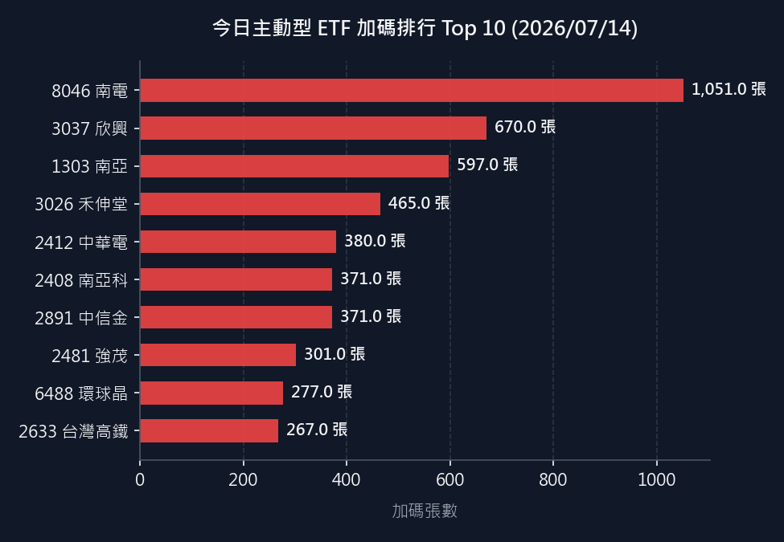
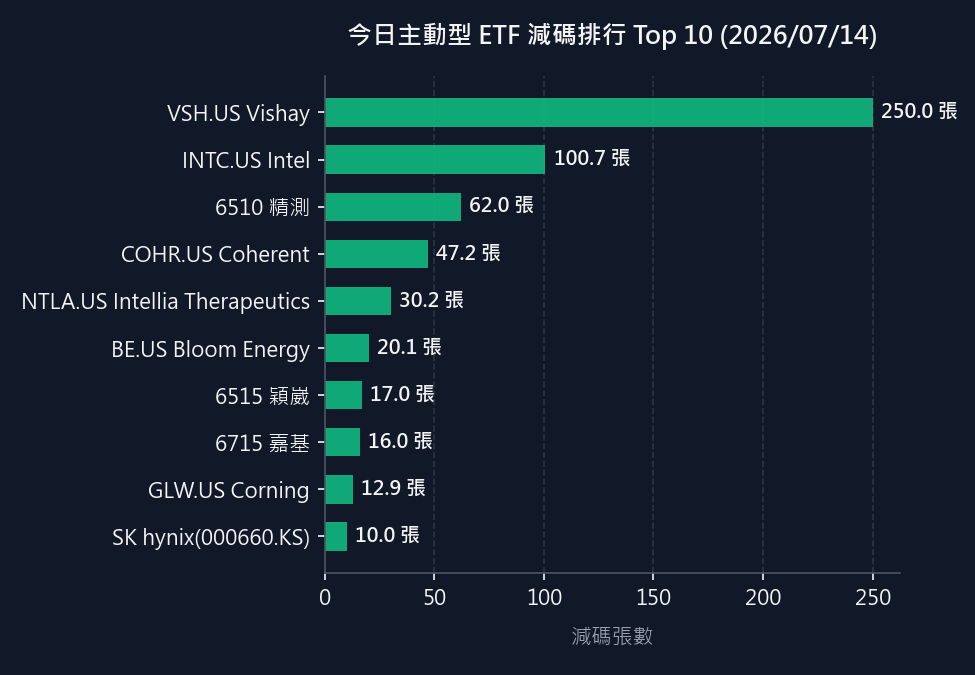

# 主動型 ETF 持股變動

資料來源：`主動型ETF持股明細.xlsx` 最近兩個日期分頁。

比較區間：`20260713` → `20260714`

## 今日加減碼視覺化排行

| 今日加碼 Top 10 | 今日減碼 Top 10 |
| :---: | :---: |
|  |  |

| ETF | 新增 | 刪除 | 比例變動 |
| :-- | --: | --: | --: |
| 00400A | 0 | 0 | 52 |
| 00401A | 0 | 0 | 52 |
| 00402A | 1 | 1 | 45 |
| 00403A | 1 | 0 | 37 |
| 00404A | 0 | 0 | 49 |
| 00405A | 0 | 0 | 43 |
| 00407A | 0 | 0 | 44 |
| 00980A | 0 | 0 | 45 |
| 00980D | 0 | 0 | 42 |
| 00981A | 0 | 0 | 29 |
| 00982A | 0 | 0 | 0 |
| 00983A | 0 | 0 | 36 |
| 00983D | 0 | 0 | 23 |
| 00984A | 1 | 1 | 103 |
| 00985A | 0 | 0 | 41 |
| 00986A | 0 | 1 | 30 |
| 00987A | 0 | 0 | 29 |
| 00988A | 1 | 1 | 39 |
| 00989A | 0 | 0 | 57 |
| 00990A | 1 | 2 | 44 |
| 00991A | 0 | 0 | 25 |
| 00992A | 1 | 0 | 33 |
| 00993A | 0 | 0 | 43 |
| 00994A | 0 | 0 | 29 |
| 00995A | 0 | 0 | 0 |
| 00996A | 0 | 0 | 0 |
| 00997A | 0 | 1 | 51 |
| 00998A | 0 | 1 | 39 |
| 00999A | 0 | 0 | 56 |

## 00400A

### 新增持股

- 無

### 刪除持股

- 無

### 投資比例變動

- 1303 南亞：0.48% → 0.50%（+0.02）
- 1590 亞德客-KY：1.00% → 0.96%（-0.04）
- 2059 川湖：3.41% → 3.34%（-0.07）
- 2303 聯電：1.78% → 1.73%（-0.05）
- 2308 台達電：3.29% → 3.20%（-0.09）
- 2313 華通：1.02% → 0.97%（-0.05）
- 2327 國巨*：1.85% → 1.75%（-0.10）
- 2330 台積電：9.14% → 8.96%（-0.18）
- 2345 智邦：2.13% → 2.00%（-0.13）
- 2357 華碩：1.32% → 1.31%（-0.01）
- 2360 致茂：2.92% → 2.84%（-0.08）
- 2368 金像電：1.06% → 1.02%（-0.04）
- 2376 技嘉：1.21% → 1.19%（-0.02）
- 2383 台光電：5.63% → 5.40%（-0.23）
- 2404 漢唐：0.61% → 0.58%（-0.03）
- 2408 南亞科：2.01% → 2.11%（+0.10）
- 2454 聯發科：6.58% → 6.23%（-0.35）
- 2472 立隆電：0.14% → 0.13%（-0.01）
- 2481 強茂：0.42% → 0.38%（-0.04）
- 2881 富邦金：0.41% → 0.39%（-0.02）
- 2885 元大金：1.07% → 1.03%（-0.04）
- 3017 奇鋐：3.46% → 3.26%（-0.20）
- 3036 文曄：1.23% → 1.18%（-0.05）
- 3037 欣興：3.78% → 3.62%（-0.16）
- 3044 健鼎：1.77% → 1.68%（-0.09）
- 3090 日電貿：0.60% → 0.53%（-0.07）
- 3167 大量：0.20% → 0.21%（+0.01）
- 3211 順達：0.98% → 0.93%（-0.05）
- 3231 緯創：0.79% → 0.77%（-0.02）
- 3293 鈊象：0.38% → 0.37%（-0.01）
- 3443 創意：2.27% → 2.11%（-0.16）
- 3653 健策：0.79% → 0.75%（-0.04）
- 3665 貿聯-KY：2.41% → 2.27%（-0.14）
- 3711 日月光投控：1.59% → 1.51%（-0.08）
- 4958 臻鼎-KY：1.00% → 0.97%（-0.03）
- 5274 信驊：1.98% → 1.88%（-0.10）
- 5347 世界：1.88% → 1.82%（-0.06）
- 5434 崇越：0.44% → 0.43%（-0.01）
- 6121 新普：0.28% → 0.26%（-0.02）
- 6147 頎邦：0.95% → 0.89%（-0.06）
- 6187 萬潤：1.41% → 1.33%（-0.08）
- 6223 旺矽：4.44% → 4.19%（-0.25）
- 6274 台燿：0.74% → 0.66%（-0.08）
- 6442 光聖：0.41% → 0.39%（-0.02）
- 6488 環球晶：4.95% → 5.00%（+0.05）
- 6510 精測：1.24% → 1.19%（-0.05）
- 6515 穎崴：0.78% → 0.73%（-0.05）
- 6669 緯穎：3.94% → 3.85%（-0.09）
- 7769 鴻勁：0.34% → 0.32%（-0.02）
- 8046 南電：1.28% → 1.29%（+0.01）
- 8150 南茂：0.11% → 0.09%（-0.02）
- 8210 勤誠：1.11% → 1.07%（-0.04）

## 00401A

### 新增持股

- 無

### 刪除持股

- 無

### 投資比例變動

- 1216 統一：0.34% → 0.35%（+0.01）
- 1301 台塑：0.08% → 0.09%（+0.01）
- 2303 聯電：1.29% → 1.30%（+0.01）
- 2308 台達電：4.35% → 4.37%（+0.02）
- 2313 華通：1.33% → 1.31%（-0.02）
- 2317 鴻海：0.69% → 0.70%（+0.01）
- 2330 台積電：9.19% → 9.32%（+0.13）
- 2344 華邦電：1.33% → 1.34%（+0.01）
- 2345 智邦：2.25% → 2.18%（-0.07）
- 2357 華碩：1.34% → 1.36%（+0.02）
- 2360 致茂：1.84% → 1.85%（+0.01）
- 2379 瑞昱：2.14% → 2.18%（+0.04）
- 2382 廣達：2.48% → 2.55%（+0.07）
- 2383 台光電：2.09% → 2.07%（-0.02）
- 2412 中華電：0.96% → 0.98%（+0.02）
- 2449 京元電子：1.78% → 1.73%（-0.05）
- 2454 聯發科：6.19% → 6.24%（+0.05）
- 2455 全新：0.46% → 0.45%（-0.01）
- 2603 長榮：1.09% → 1.11%（+0.02）
- 2881 富邦金：1.87% → 1.89%（+0.02）
- 2882 國泰金：1.18% → 1.20%（+0.02）
- 2883 凱基金：2.11% → 2.14%（+0.03）
- 2884 玉山金：1.89% → 1.93%（+0.04）
- 2886 兆豐金：0.69% → 0.71%（+0.02）
- 2887 台新新光金：1.17% → 1.18%（+0.01）
- 2912 統一超：0.33% → 0.34%（+0.01）
- 3034 聯詠：0.74% → 0.76%（+0.02）
- 3044 健鼎：1.18% → 1.15%（-0.03）
- 3131 弘塑：0.60% → 0.58%（-0.02）
- 3167 大量：0.62% → 0.66%（+0.04）
- 3491 昇達科：1.29% → 1.26%（-0.03）
- 3529 力旺：0.63% → 0.61%（-0.02）
- 3653 健策：1.09% → 1.07%（-0.02）
- 3711 日月光投控：2.61% → 2.73%（+0.12）
- 4904 遠傳：0.87% → 0.88%（+0.01）
- 4958 臻鼎-KY：2.98% → 2.96%（-0.02）
- 4991 環宇-KY：0.63% → 0.60%（-0.03）
- 5274 信驊：0.93% → 0.91%（-0.02）
- 5871 中租-KY：0.17% → 0.18%（+0.01）
- 5904 寶雅：0.62% → 0.63%（+0.01）
- 6187 萬潤：0.71% → 0.69%（-0.02）
- 6223 旺矽：2.69% → 2.72%（+0.03）
- 6285 啟碁：2.19% → 2.14%（-0.05）
- 6415 矽力*-KY：0.83% → 0.80%（-0.03）
- 6515 穎崴：0.69% → 0.67%（-0.02）
- 6531 愛普*：1.39% → 1.37%（-0.02）
- 6669 緯穎：2.47% → 2.50%（+0.03）
- 6944 兆聯實業：0.59% → 0.56%（-0.03）
- 7769 鴻勁：2.92% → 2.85%（-0.07）
- 7828 創新服務：1.41% → 1.48%（+0.07）
- 8021 尖點：0.35% → 0.34%（-0.01）
- 8464 億豐：1.29% → 1.31%（+0.02）

## 00402A

### 新增持股

- SKHY.US SK hynix（0.75%，11.4 張）

### 刪除持股

- ON.US ON Semiconductor（0.15%，3.6 張）

### 投資比例變動

- AAPL.US Apple：7.12% → 7.35%（+0.23）
- ADI.US Analog Devices：1.76% → 1.77%（+0.01）
- AMD.US AMD：5.62% → 5.65%（+0.03）
- AMZN.US Amazon：4.11% → 3.97%（-0.14）
- ARM.US Arm：1.16% → 1.09%（-0.07）
- ASML.US ASML Holding：1.58% → 1.56%（-0.02）
- AVGO.US Broadcom：2.56% → 2.52%（-0.04）
- AXON.US Axon Enterprise：1.19% → 1.15%（-0.04）
- BABA.US Alibaba Group：0.48% → 0.50%（+0.02）
- BKNG.US Booking Holdings：0.75% → 0.77%（+0.02）
- CDNS.US Cadence Design Systems：1.90% → 1.92%（+0.02）
- CIEN.US Ciena：1.29% → 1.28%（-0.01）
- COHR.US Coherent：1.56% → 1.51%（-0.05）
- CRWD.US CrowdStrike Holdings：1.22% → 1.19%（-0.03）
- DASH.US DoorDash：0.69% → 0.40%（-0.29）
- GOOG.US Alphabet - Class C Capital Stock：3.42% → 3.46%（+0.04）
- GOOGL.US Alphabet - Class A Common Stock：3.39% → 3.42%（+0.03）
- INTC.US Intel：1.35% → 1.27%（-0.08）
- KLAC.US KLA：2.20% → 2.34%（+0.14）
- LITE.US Lumentum：1.28% → 1.29%（+0.01）
- LRCX.US Lam Research：3.78% → 3.63%（-0.15）
- MCHP.US Microchip Technology：1.68% → 1.65%（-0.03）
- MDB.US MongoDB：0.65% → 0.62%（-0.03）
- META.US Meta：2.90% → 3.10%（+0.20）
- MRVL.US Marvell：1.59% → 1.47%（-0.12）
- MSFT.US Microsoft：3.35% → 3.21%（-0.14）
- MU.US Micron：6.54% → 6.36%（-0.18）
- NFLX.US Netflix：1.24% → 1.25%（+0.01）
- NOW.US ServiceNow：0.36% → 0.38%（+0.02）
- NVDA.US NVIDIA：8.39% → 8.70%（+0.31）
- NXPI.US NXP Semiconductors：1.26% → 1.24%（-0.02）
- PANW.US Palo Alto：2.92% → 2.94%（+0.02）
- PLTR.US Palantir Technologies：1.22% → 1.26%（+0.04）
- SHOP.US Shopify：0.67% → 0.70%（+0.03）
- SIMO.US Silicon Motion：0.89% → 0.85%（-0.04）
- SNOW.US Snowflake：0.74% → 0.76%（+0.02）
- SPCX.US SpaceX：0.72% → 0.68%（-0.04）
- STX.US Seagate：1.41% → 1.40%（-0.01）
- TER.US Teradyne：0.64% → 0.75%（+0.11）
- TSM.US TSMC(ADR)：1.61% → 1.59%（-0.02）
- TTWO.US Take-Two：0.73% → 0.74%（+0.01）
- TXN.US Texas Instruments：3.07% → 3.05%（-0.02）
- UBER.US Uber：0.64% → 0.45%（-0.19）
- V.US Visa：1.18% → 1.01%（-0.17）
- WDC.US Western Digital：2.94% → 2.91%（-0.03）

## 00403A

### 新增持股

- 3008 大立光（0.08%，30 張）

### 刪除持股

- 無

### 投資比例變動

- 1303 南亞：1.05% → 1.18%（+0.13）
- 1560 中砂：0.43% → 0.42%（-0.01）
- 2049 上銀：0.21% → 0.20%（-0.01）
- 2303 聯電：7.15% → 7.10%（-0.05）
- 2308 台達電：2.85% → 2.82%（-0.03）
- 2327 國巨*：3.96% → 3.80%（-0.16）
- 2337 旺宏：0.86% → 0.87%（+0.01）
- 2344 華邦電：4.15% → 4.12%（-0.03）
- 2345 智邦：3.14% → 3.00%（-0.14）
- 2360 致茂：0.52% → 0.51%（-0.01）
- 2368 金像電：1.79% → 1.75%（-0.04）
- 2383 台光電：3.63% → 3.55%（-0.08）
- 2454 聯發科：3.80% → 3.67%（-0.13）
- 3017 奇鋐：4.77% → 4.58%（-0.19）
- 3037 欣興：3.96% → 3.87%（-0.09）
- 3189 景碩：1.64% → 1.62%（-0.02）
- 3211 順達：0.51% → 0.50%（-0.01）
- 3443 創意：1.27% → 1.21%（-0.06）
- 3533 嘉澤：1.53% → 1.50%（-0.03）
- 3583 辛耘：0.44% → 0.43%（-0.01）
- 3653 健策：1.55% → 1.50%（-0.05）
- 3665 貿聯-KY：0.19% → 0.18%（-0.01）
- 3711 日月光投控：2.46% → 2.37%（-0.09）
- 4958 臻鼎-KY：2.79% → 2.74%（-0.05）
- 4966 譜瑞-KY：0.32% → 0.31%（-0.01）
- 5274 信驊：0.42% → 0.52%（+0.10）
- 6223 旺矽：4.13% → 3.97%（-0.16）
- 6274 台燿：1.64% → 1.49%（-0.15）
- 6415 矽力*-KY：0.29% → 0.28%（-0.01）
- 6442 光聖：0.26% → 0.25%（-0.01）
- 6488 環球晶：1.99% → 2.14%（+0.15）
- 6515 穎崴：0.92% → 0.88%（-0.04）
- 6805 富世達：0.50% → 0.47%（-0.03）
- 7769 鴻勁：1.16% → 1.12%（-0.04）
- 8046 南電：1.14% → 1.25%（+0.11）
- 8358 金居：0.54% → 0.50%（-0.04）
- 8996 高力：1.23% → 1.18%（-0.05）

## 00404A

### 新增持股

- 無

### 刪除持股

- 無

### 投資比例變動

- 1303 南亞：0.45% → 0.42%（-0.03）
- 2303 聯電：2.45% → 2.63%（+0.18）
- 2308 台達電：3.92% → 3.78%（-0.14）
- 2317 鴻海：0.40% → 0.42%（+0.02）
- 2327 國巨*：0.69% → 0.71%（+0.02）
- 2330 台積電：22.71% → 22.60%（-0.11）
- 2347 聯強：1.62% → 1.83%（+0.21）
- 2360 致茂：1.06% → 1.02%（-0.04）
- 2382 廣達：2.79% → 2.70%（-0.09）
- 2383 台光電：1.85% → 1.91%（+0.06）
- 2454 聯發科：6.49% → 6.44%（-0.05）
- 2618 長榮航：1.98% → 1.93%（-0.05）
- 2883 凱基金：1.96% → 1.99%（+0.03）
- 2885 元大金：2.33% → 2.37%（+0.04）
- 2891 中信金：2.74% → 2.78%（+0.04）
- 3014 聯陽：1.55% → 1.79%（+0.24）
- 3017 奇鋐：0.67% → 0.69%（+0.02）
- 3034 聯詠：1.85% → 2.07%（+0.22）
- 3037 欣興：0.43% → 0.52%（+0.09）
- 3044 健鼎：1.75% → 1.74%（-0.01）
- 3189 景碩：0.32% → 0.33%（+0.01）
- 3217 優群：1.17% → 1.23%（+0.06）
- 3227 原相：1.63% → 1.80%（+0.17）
- 3260 威剛：0.40% → 0.41%（+0.01）
- 3264 欣銓：1.03% → 0.99%（-0.04）
- 3265 台星科：1.18% → 1.23%（+0.05）
- 3293 鈊象：1.58% → 1.68%（+0.10）
- 3443 創意：0.13% → 0.12%（-0.01）
- 3711 日月光投控：3.90% → 3.68%（-0.22）
- 5274 信驊：1.97% → 1.86%（-0.11）
- 5347 世界：0.68% → 0.74%（+0.06）
- 5434 崇越：1.96% → 1.79%（-0.17）
- 5904 寶雅：1.81% → 1.78%（-0.03）
- 6121 新普：1.12% → 1.07%（-0.05）
- 6139 亞翔：0.24% → 0.25%（+0.01）
- 6196 帆宣：0.36% → 0.37%（+0.01）
- 6223 旺矽：0.90% → 0.84%（-0.06）
- 6239 力成：0.15% → 0.16%（+0.01）
- 6257 矽格：1.77% → 1.75%（-0.02）
- 6488 環球晶：0.22% → 0.18%（-0.04）
- 6515 穎崴：0.33% → 0.31%（-0.02）
- 6531 愛普*：0.19% → 0.20%（+0.01）
- 6903 巨漢：0.29% → 0.28%（-0.01）
- 8016 矽創：0.12% → 0.11%（-0.01）
- 8081 致新：1.67% → 1.74%（+0.07）
- 8299 群聯：1.17% → 1.09%（-0.08）
- 臺指選擇權08/26 49100 買權：-0.37% → -0.27%（+0.10）
- 臺指選擇權09/26 50300 買權：-0.03% → -0.02%（+0.01）
- 臺股期貨08/26：16.83% → 16.28%（-0.55）

## 00405A

### 新增持股

- 無

### 刪除持股

- 無

### 投資比例變動

- 2059 川湖：1.33% → 1.30%（-0.03）
- 2308 台達電：1.06% → 1.03%（-0.03）
- 2327 國巨*：4.05% → 3.81%（-0.24）
- 2330 台積電：2.28% → 2.23%（-0.05）
- 2344 華邦電：3.85% → 3.74%（-0.11）
- 2345 智邦：4.97% → 4.66%（-0.31）
- 2368 金像電：1.24% → 1.19%（-0.05）
- 2383 台光電：3.15% → 3.01%（-0.14）
- 2449 京元電子：0.95% → 0.89%（-0.06）
- 2454 聯發科：6.43% → 6.78%（+0.35）
- 3017 奇鋐：6.03% → 5.67%（-0.36）
- 3026 禾伸堂：2.05% → 1.82%（-0.23）
- 3037 欣興：4.55% → 5.30%（+0.75）
- 3081 聯亞：1.12% → 1.07%（-0.05）
- 3105 穩懋：1.91% → 1.77%（-0.14）
- 3131 弘塑：4.10% → 3.84%（-0.26）
- 3163 波若威：0.22% → 0.21%（-0.01）
- 3443 創意：5.58% → 5.18%（-0.40）
- 3583 辛耘：1.88% → 1.79%（-0.09）
- 3653 健策：2.25% → 2.13%（-0.12）
- 3661 世芯-KY：0.02% → 0.01%（-0.01）
- 3665 貿聯-KY：0.04% → 0.03%（-0.01）
- 3711 日月光投控：0.85% → 0.80%（-0.05）
- 4749 新應材：0.32% → 0.30%（-0.02）
- 5274 信驊：1.92% → 1.82%（-0.10）
- 5347 世界：0.15% → 0.14%（-0.01）
- 6187 萬潤：2.24% → 2.10%（-0.14）
- 6223 旺矽：5.92% → 5.58%（-0.34）
- 6274 台燿：0.41% → 0.36%（-0.05）
- 6291 沛亨：0.39% → 0.36%（-0.03）
- 6442 光聖：0.38% → 0.36%（-0.02）
- 6488 環球晶：5.81% → 6.78%（+0.97）
- 6510 精測：1.46% → 1.41%（-0.05）
- 6515 穎崴：0.66% → 0.62%（-0.04）
- 6526 達發：0.39% → 0.36%（-0.03）
- 6669 緯穎：0.10% → 0.09%（-0.01）
- 7734 印能科技：1.72% → 1.70%（-0.02）
- 7769 鴻勁：2.62% → 2.47%（-0.15）
- 8028 昇陽半導體：1.05% → 1.00%（-0.05）
- 8046 南電：2.83% → 5.17%（+2.34）
- 8210 勤誠：0.97% → 0.93%（-0.04）
- 8299 群聯：1.48% → 1.38%（-0.10）
- 8996 高力：1.37% → 1.28%（-0.09）

## 00407A

### 新增持股

- 無

### 刪除持股

- 無

### 投資比例變動

- 1303 南亞：0.62% → 0.68%（+0.06）
- 1590 亞德客-KY：1.74% → 1.75%（+0.01）
- 2059 川湖：2.06% → 2.08%（+0.02）
- 2303 聯電：1.77% → 1.68%（-0.09）
- 2308 台達電：4.05% → 4.10%（+0.05）
- 2327 國巨*：3.13% → 3.08%（-0.05）
- 2330 台積電：9.23% → 9.45%（+0.22）
- 2344 華邦電：1.71% → 1.74%（+0.03）
- 2345 智邦：3.31% → 3.23%（-0.08）
- 2360 致茂：1.68% → 1.71%（+0.03）
- 2368 金像電：2.01% → 2.02%（+0.01）
- 2376 技嘉：0.73% → 0.75%（+0.02）
- 2379 瑞昱：0.80% → 0.83%（+0.03）
- 2395 研華：1.63% → 1.66%（+0.03）
- 2408 南亞科：1.71% → 1.87%（+0.16）
- 2412 中華電：1.64% → 1.69%（+0.05）
- 2451 創見：0.15% → 0.14%（-0.01）
- 2454 聯發科：6.52% → 6.44%（-0.08）
- 2458 義隆：0.11% → 0.12%（+0.01）
- 3017 奇鋐：3.19% → 3.14%（-0.05）
- 3034 聯詠：0.63% → 0.65%（+0.02）
- 3443 創意：1.80% → 1.74%（-0.06）
- 3491 昇達科：0.42% → 0.41%（-0.01）
- 3529 力旺：1.67% → 1.64%（-0.03）
- 3665 貿聯-KY：1.91% → 1.88%（-0.03）
- 3711 日月光投控：2.02% → 2.00%（-0.02）
- 4904 遠傳：0.29% → 0.30%（+0.01）
- 4958 臻鼎-KY：2.50% → 2.51%（+0.01）
- 5274 信驊：1.82% → 1.79%（-0.03）
- 5289 宜鼎：0.19% → 0.18%（-0.01）
- 5536 聖暉*：1.87% → 1.89%（+0.02）
- 6223 旺矽：2.59% → 2.55%（-0.04）
- 6274 台燿：2.90% → 2.70%（-0.20）
- 6415 矽力*-KY：0.43% → 0.42%（-0.01）
- 6446 藥華藥：2.43% → 2.39%（-0.04）
- 6515 穎崴：1.55% → 1.54%（-0.01）
- 6526 達發：0.36% → 0.35%（-0.01）
- 6531 愛普*：1.51% → 1.50%（-0.01）
- 6669 緯穎：3.21% → 3.27%（+0.06）
- 6805 富世達：1.51% → 1.46%（-0.05）
- 8046 南電：2.55% → 2.67%（+0.12）
- 8210 勤誠：1.70% → 1.71%（+0.01）
- 8299 群聯：0.15% → 0.14%（-0.01）
- 8996 高力：0.47% → 0.46%（-0.01）

## 00980A

### 新增持股

- 無

### 刪除持股

- 無

### 投資比例變動

- 2059 川湖：5.40% → 5.49%（+0.09）
- 2308 台達電：5.45% → 5.50%（+0.05）
- 2317 鴻海：1.85% → 1.89%（+0.04）
- 2327 國巨*：1.71% → 1.68%（-0.03）
- 2330 台積電：9.40% → 9.58%（+0.18）
- 2344 華邦電：1.17% → 1.18%（+0.01）
- 2345 智邦：1.90% → 1.85%（-0.05）
- 2360 致茂：1.61% → 1.62%（+0.01）
- 2368 金像電：2.50% → 2.49%（-0.01）
- 2376 技嘉：0.86% → 0.88%（+0.02）
- 2382 廣達：1.22% → 1.26%（+0.04）
- 2383 台光電：4.70% → 4.69%（-0.01）
- 2408 南亞科：1.46% → 1.59%（+0.13）
- 2454 聯發科：6.25% → 6.15%（-0.10）
- 2884 玉山金：0.81% → 0.83%（+0.02）
- 2891 中信金：1.15% → 1.16%（+0.01）
- 3008 大立光：0.92% → 0.93%（+0.01）
- 3017 奇鋐：1.77% → 1.73%（-0.04）
- 3026 禾伸堂：0.74% → 0.68%（-0.06）
- 3036 文曄：1.37% → 1.36%（-0.01）
- 3037 欣興：3.08% → 3.07%（-0.01）
- 3044 健鼎：0.44% → 0.43%（-0.01）
- 3081 聯亞：2.61% → 2.60%（-0.01）
- 3189 景碩：0.69% → 0.70%（+0.01）
- 3231 緯創：0.61% → 0.62%（+0.01）
- 3264 欣銓：0.24% → 0.23%（-0.01）
- 3443 創意：1.82% → 1.76%（-0.06）
- 3529 力旺：0.93% → 0.90%（-0.03）
- 3653 健策：2.93% → 2.89%（-0.04）
- 3665 貿聯-KY：0.60% → 0.59%（-0.01）
- 3711 日月光投控：1.63% → 1.60%（-0.03）
- 5274 信驊：1.17% → 1.16%（-0.01）
- 5904 寶雅：1.27% → 1.28%（+0.01）
- 6223 旺矽：3.07% → 3.01%（-0.06）
- 6274 台燿：1.22% → 1.13%（-0.09）
- 6442 光聖：0.31% → 0.30%（-0.01）
- 6515 穎崴：2.46% → 2.42%（-0.04）
- 6669 緯穎：1.18% → 1.19%（+0.01）
- 6805 富世達：0.46% → 0.44%（-0.02）
- 6831 邁科：0.37% → 0.36%（-0.01）
- 7769 鴻勁：3.79% → 3.71%（-0.08）
- 8046 南電：1.69% → 1.76%（+0.07）
- 8210 勤誠：0.77% → 0.78%（+0.01）
- 8299 群聯：1.04% → 1.01%（-0.03）
- 8996 高力：1.67% → 1.62%（-0.05）

## 00980D

### 新增持股

- 無

### 刪除持股

- 無

### 投資比例變動

- ALLY FINANCIAL INC (REG) 7.1% 15NOV2027：0.43% → 0.44%（+0.01）
- ARCELORMITTAL SA 6.55% 29NOV2027：0.54% → 0.55%（+0.01）
- ATHENE HOLDING LTD 6.625000 % 19MAY2055：0.58% → 0.57%（-0.01）
- BAT CAPITAL CORP (REG) 7.081% 02AUG2053：0.59% → 0.58%（-0.01）
- CARNIVAL CORP SER REGS (REG S) 7% 15AUG2029：0.55% → 0.56%（+0.01）
- CHARTER COMM OPT 6.484% 23OCT2045 W/I：0.47% → 0.46%（-0.01）
- CHARTER COMM OPT LLC/CAP (REG) 6.834000 % 23OCT2055：0.47% → 0.46%（-0.01）
- CITIGROUP INC 8.125% 15JUL2039：0.64% → 0.63%（-0.01）
- CIVITAS RESOURCES INC SER REGS (REG) (REG S) 9.625% 15JUN2033：0.55% → 0.56%（+0.01）
- CONCENTRIX CORP (REG) 6.6% 02AUG2028：0.50% → 0.51%（+0.01）
- COREWEAVE INC SER REGS (REG S) 9.25% 01JUN2030：0.45% → 0.44%（-0.01）
- COTY/HFC PRESTIGE/INT US SER REGS (REG S) 6.625% 15JUL2030：0.56% → 0.57%（+0.01）
- COX COMMUNICATIONS INC SER REGS 5.950000 % 01SEP2054：0.56% → 0.55%（-0.01）
- DELL INT LLC / EMC CORP (REG) 8.1% 15JUL2036：0.60% → 0.59%（-0.01）
- ENEL FINANCE INTL NV SER REGS (REG S) 7.75% 14OCT2052：0.38% → 0.37%（-0.01）
- FMC CORP (REG) 6.375000 % 18MAY2053：0.48% → 0.47%（-0.01）
- FORD MOTOR CREDIT CO LLC (REG) 7.35% 06MAR2030：0.33% → 0.34%（+0.01）
- FREEDOM MORTGAGE CORP SER REGS (REG S) 12.25% 01OCT2030：0.47% → 0.48%（+0.01）
- GRAY TELEVISION INC SER REGS (REG) (REG S) 10.5% 15JUL2029：0.57% → 0.58%（+0.01）
- META PLATFORMS INC 5.750000 % 15-NOV-2065：0.45% → 0.44%（-0.01）
- MOBIUS MERGER SUB SER REGS 9.000000 % 01JUN2030：0.25% → 0.24%（-0.01）
- MOHEGAN TRIBAL / MS DIG SER REGS 11.875000 % 15APR2031：0.67% → 0.68%（+0.01）
- MYLAN INC (REG) 5.4% 29/11/2043：0.34% → 0.33%（-0.01）
- MYLAN INC SER WI (REG) 5.2% 15APR2048WI：0.50% → 0.49%（-0.01）
- NEPTUNE BIDCO US INC SER REGS (REG S) 9.29% 15APR2029：0.34% → 0.35%（+0.01）
- ORACLE CORP (REG) 5.500000 % 27SEP2064：0.57% → 0.56%（-0.01）
- ORACLE CORP 6.100000 % 26-SEP-2065：0.50% → 0.49%（-0.01）
- PEPSICO INC (REG) 7.000000 % 01MAR2029：0.31% → 0.32%（+0.01）
- PLANET FINANCIAL GROUP SER REGS 10.500000 % 15DEC2029：0.32% → 0.33%（+0.01）
- RIO TINTO FIN USA LTD (REG) 7.125% 15JUL2028：0.56% → 0.57%（+0.01）
- SABRE GLBL INC SER REGS (REG) 10.750000 % 15NOV2029：0.14% → 0.13%（-0.01）
- SBL HOLDINGS INC SER REGS 7.200000 % 30OCT2034：0.53% → 0.52%（-0.01）
- SOCIETE GENERALE SER REGS (REG) (REG S) 7.367% 10JAN2053：0.34% → 0.33%（-0.01）
- TIME WARNER CABLE INC REG 7.3% 01JUL2038：0.32% → 0.31%（-0.01）
- TIME WARNER CABLE LLC (REG) 6.75% 15JUN2039：0.32% → 0.31%（-0.01）
- UNISYS CORP SER REGS 10.625000 % 15JAN2031：0.60% → 0.61%（+0.01）
- US 2YR NOTE (CBT) SEP26 30-SEP-2026：1.96% → 1.97%（+0.01）
- US 5YR NOTE (CBT) SEP26 30-SEP-2026：-16.08% → -16.10%（-0.02）
- US LONG BOND(CBT) SEP26 21-SEP-2026：5.48% → 5.47%（-0.01）
- VIACOM INC (REG) 5.85% 01SEP2043：0.58% → 0.57%（-0.01）
- VIACOMCBS INC 6.875% 30APR2036：0.29% → 0.28%（-0.01）
- WESTLAKE CORP 6.375000 % 15-NOV-2055：0.53% → 0.52%（-0.01）

## 00981A

### 新增持股

- 無

### 刪除持股

- 無

### 投資比例變動

- 2303 聯電：4.94% → 4.95%（+0.01）
- 2308 台達電：3.55% → 3.64%（+0.09）
- 2327 國巨*：7.61% → 7.39%（-0.22）
- 2330 台積電：10.85% → 10.96%（+0.11）
- 2345 智邦：5.66% → 5.47%（-0.19）
- 2368 金像電：3.23% → 3.20%（-0.03）
- 2383 台光電：8.87% → 8.76%（-0.11）
- 2449 京元電子：0.22% → 0.21%（-0.01）
- 2454 聯發科：7.30% → 7.11%（-0.19）
- 3017 奇鋐：4.29% → 4.17%（-0.12）
- 3037 欣興：5.48% → 5.41%（-0.07）
- 3264 欣銓：0.13% → 0.12%（-0.01）
- 3653 健策：2.69% → 2.64%（-0.05）
- 3665 貿聯-KY：3.35% → 3.25%（-0.10）
- 3711 日月光投控：3.77% → 3.71%（-0.06）
- 5274 信驊：2.10% → 2.05%（-0.05）
- 5439 高技：0.41% → 0.39%（-0.02）
- 6147 頎邦：0.46% → 0.44%（-0.02）
- 6187 萬潤：0.51% → 0.50%（-0.01）
- 6223 旺矽：6.03% → 5.86%（-0.17）
- 6271 同欣電：0.26% → 0.25%（-0.01）
- 6274 台燿：2.97% → 2.73%（-0.24）
- 6278 台表科：0.29% → 0.28%（-0.01）
- 6510 精測：0.42% → 0.36%（-0.06）
- 6515 穎崴：0.56% → 0.54%（-0.02）
- 6669 緯穎：4.46% → 4.49%（+0.03）
- 6805 富世達：0.95% → 0.91%（-0.04）
- 8046 南電：4.36% → 4.65%（+0.29）
- 8210 勤誠：0.96% → 0.95%（-0.01）

## 00982A

### 新增持股

- 無

### 刪除持股

- 無

### 投資比例變動

- 無

## 00983A

### 新增持股

- 無

### 刪除持股

- 無

### 投資比例變動

- AMD.US AMD：6.31% → 6.47%（+0.16）
- AMZN.US Amazon：2.82% → 2.96%（+0.14）
- AVGO.US Broadcom：0.30% → 1.50%（+1.20）
- BEAM.US Beam Therapeutics：4.13% → 3.33%（-0.80）
- BWXT.US BWX Technologies：0.26% → 0.25%（-0.01）
- CBRS.US Cerebras：0.55% → 0.59%（+0.04）
- COIN.US Coinbase：1.12% → 1.17%（+0.05）
- CRCL.US Circle：0.85% → 0.89%（+0.04）
- CRSP.US CRISPR Therapeutics：4.79% → 4.52%（-0.27）
- CRWV.US CoreWeave：0.58% → 0.57%（-0.01）
- DE.US Deere：0.89% → 0.92%（+0.03）
- GOOG.US Alphabet - Class C Capital Stock：1.14% → 1.18%（+0.04）
- GOOGL.US Alphabet - Class A Common Stock：1.51% → 1.56%（+0.05）
- HOOD.US Robinhood Markets：7.23% → 6.12%（-1.11）
- ILMN.US Illumina：3.25% → 3.34%（+0.09）
- LLY.US Eli Lilly：1.97% → 2.00%（+0.03）
- META.US Meta：0.24% → 1.33%（+1.09）
- NTLA.US Intellia Therapeutics：3.57% → 2.16%（-1.41）
- NTRA.US Natera：3.66% → 3.72%（+0.06）
- NVDA.US NVIDIA：0.72% → 0.76%（+0.04）
- PLTR.US Palantir Technologies：0.54% → 0.57%（+0.03）
- RBLX.US Roblox：2.70% → 3.16%（+0.46）
- RXRX.US Recursion Pharmaceuticals：0.22% → 0.20%（-0.02）
- SHOP.US Shopify：5.17% → 5.49%（+0.32）
- SNOW.US Snowflake：0.42% → 0.44%（+0.02）
- SOFI.US SoFi Technologies：0.62% → 0.64%（+0.02）
- SPCX.US SpaceX：4.60% → 4.41%（-0.19）
- TEM.US Tempus：6.44% → 6.14%（-0.30）
- TER.US Teradyne：0.53% → 0.52%（-0.01）
- TSLA.US Tesla：8.07% → 8.24%（+0.17）
- TSM.US TSMC(ADR)：3.21% → 3.25%（+0.04）
- TWST.US Twist Bioscience：3.87% → 3.91%（+0.04）
- TXG.US 10x Genomics：5.03% → 4.77%（-0.26）
- VCYT.US Veracyte：1.48% → 1.51%（+0.03）
- WGS.US GeneDx：1.28% → 1.24%（-0.04）
- XYZ.US Block：1.93% → 2.05%（+0.12）

## 00983D

### 新增持股

- 無

### 刪除持股

- 無

### 投資比例變動

- ATH 6 5/8 05/19/55：0.86% → 0.85%（-0.01）
- AWK 6.593 10/15/37：0.72% → 0.71%（-0.01）
- BATSLN 7.079 08/02/43：1.09% → 1.08%（-0.01）
- BATSLN 7.081 08/02/53：1.34% → 1.33%（-0.01）
- BHCCN 11 09/30/28：1.79% → 1.80%（+0.01）
- BNCN 7 3/8 03/01/33：1.10% → 1.11%（+0.01）
- C 8 1/8 07/15/39：2.33% → 2.32%（-0.01）
- CP 7 1/8 10/15/31：0.81% → 0.82%（+0.01）
- CRWV 9 02/01/31：1.33% → 1.31%（-0.02）
- CYH 10 7/8 01/15/32：1.49% → 1.50%（+0.01）
- DELL 8.35 07/15/46：1.63% → 1.62%（-0.01）
- DIS 7 3/4 12/01/45：0.80% → 0.79%（-0.01）
- GM 6 3/4 04/01/46：1.19% → 1.18%（-0.01）
- GTN 10 1/2 07/15/29：1.66% → 1.67%（+0.01）
- HSBC 6.332 03/09/44：1.08% → 1.07%（-0.01）
- HTZ 12 5/8 07/15/29：0.60% → 0.58%（-0.02）
- IEP 10 11/15/29：1.49% → 1.50%（+0.01）
- LQDW.US iShares Investment Grade Corpora：7.30% → 7.29%（-0.01）
- ORCL 6.9 11/09/52：1.37% → 1.36%（-0.01）
- RAKUTN 11 1/4 02/15/27：1.78% → 1.79%（+0.01）
- SUCN 6.85 06/01/39：1.22% → 1.21%（-0.01）
- TIME WARNER CABLE INC 7.300 07/01/38：0.51% → 0.50%（-0.01）
- TLTW.US iShares 20+ Year Treasury Bond B：7.26% → 7.25%（-0.01）

## 00984A

### 新增持股

- 2481 強茂（0.55%，301 張）

### 刪除持股

- 6715 嘉基（0.07%，16 張）

### 投資比例變動

- 1102 亞泥：1.28% → 1.25%（-0.03）
- 1216 統一：1.90% → 1.94%（+0.04）
- 1229 聯華：0.26% → 0.27%（+0.01）
- 1303 南亞：0.55% → 0.72%（+0.17）
- 1326 台化：0.62% → 0.70%（+0.08）
- 1402 遠東新：0.98% → 0.96%（-0.02）
- 1409 新纖：0.57% → 0.58%（+0.01）
- 1513 中興電：0.25% → 0.26%（+0.01）
- 1560 中砂：0.48% → 0.47%（-0.01）
- 1785 光洋科：0.55% → 0.47%（-0.08）
- 1907 永豐餘：0.27% → 0.28%（+0.01）
- 2006 東和鋼鐵：0.39% → 0.40%（+0.01）
- 2049 上銀：0.57% → 0.56%（-0.01）
- 2059 川湖：0.62% → 0.58%（-0.04）
- 2105 正新：0.40% → 0.42%（+0.02）
- 2204 中華：0.27% → 0.28%（+0.01）
- 2206 三陽工業：0.39% → 0.40%（+0.01）
- 2303 聯電：2.28% → 2.13%（-0.15）
- 2327 國巨*：1.26% → 1.11%（-0.15）
- 2330 台積電：2.87% → 2.95%（+0.08）
- 2337 旺宏：0.52% → 0.51%（-0.01）
- 2345 智邦：0.40% → 0.35%（-0.05）
- 2357 華碩：2.47% → 2.59%（+0.12）
- 2360 致茂：0.56% → 0.58%（+0.02）
- 2368 金像電：0.11% → 0.12%（+0.01）
- 2377 微星：0.93% → 0.96%（+0.03）
- 2382 廣達：2.37% → 2.46%（+0.09）
- 2383 台光電：1.86% → 1.79%（-0.07）
- 2404 漢唐：1.80% → 1.78%（-0.02）
- 2412 中華電：2.35% → 2.48%（+0.13）
- 2454 聯發科：1.42% → 1.36%（-0.06）
- 2467 志聖：0.50% → 0.49%（-0.01）
- 2472 立隆電：0.46% → 0.40%（-0.06）
- 2474 可成：0.78% → 0.77%（-0.01）
- 2478 大毅：0.43% → 0.40%（-0.03）
- 2501 國建：0.25% → 0.23%（-0.02）
- 2606 裕民：0.39% → 0.40%（+0.01）
- 2618 長榮航：1.32% → 1.39%（+0.07）
- 2633 台灣高鐵：1.33% → 1.30%（-0.03）
- 2634 漢翔：0.39% → 0.46%（+0.07）
- 2645 長榮航太：0.34% → 0.35%（+0.01）
- 2855 統一證：0.56% → 0.53%（-0.03）
- 2881 富邦金：2.44% → 2.50%（+0.06）
- 2882 國泰金：0.27% → 0.28%（+0.01）
- 2891 中信金：2.40% → 2.35%（-0.05）
- 2912 統一超：1.45% → 1.48%（+0.03）
- 3005 神基：0.41% → 0.43%（+0.02）
- 3008 大立光：0.63% → 0.70%（+0.07）
- 3026 禾伸堂：1.33% → 1.09%（-0.24）
- 3034 聯詠：2.01% → 1.85%（-0.16）
- 3037 欣興：1.57% → 1.59%（+0.02）
- 3045 台灣大：1.77% → 1.90%（+0.13）
- 3090 日電貿：0.50% → 0.42%（-0.08）
- 3131 弘塑：0.04% → 0.03%（-0.01）
- 3167 大量：0.50% → 0.58%（+0.08）
- 3189 景碩：1.15% → 1.13%（-0.02）
- 3227 原相：0.24% → 0.23%（-0.01）
- 3264 欣銓：0.26% → 0.24%（-0.02）
- 3293 鈊象：1.23% → 1.20%（-0.03）
- 3443 創意：0.60% → 0.58%（-0.02）
- 3481 群創：0.53% → 0.48%（-0.05）
- 3532 台勝科：0.65% → 0.76%（+0.11）
- 3592 瑞鼎：0.27% → 0.26%（-0.01）
- 3596 智易：0.37% → 0.38%（+0.01）
- 3702 大聯大：0.93% → 1.06%（+0.13）
- 3711 日月光投控：1.16% → 1.12%（-0.04）
- 4904 遠傳：1.60% → 1.64%（+0.04）
- 4958 臻鼎-KY：1.91% → 2.09%（+0.18）
- 5274 信驊：0.32% → 0.29%（-0.03）
- 5434 崇越：1.03% → 1.13%（+0.10）
- 5483 中美晶：0.44% → 0.53%（+0.09）
- 5536 聖暉*：0.52% → 0.51%（-0.01）
- 5871 中租-KY：1.07% → 1.13%（+0.06）
- 5876 上海商銀：1.18% → 1.26%（+0.08）
- 5904 寶雅：0.28% → 0.26%（-0.02）
- 6121 新普：0.64% → 0.61%（-0.03）
- 6139 亞翔：0.52% → 0.51%（-0.01）
- 6147 頎邦：0.57% → 0.50%（-0.07）
- 6176 瑞儀：0.39% → 0.38%（-0.01）
- 6182 合晶：0.78% → 0.87%（+0.09）
- 6196 帆宣：1.10% → 1.11%（+0.01）
- 6197 佳必琪：0.27% → 0.25%（-0.02）
- 6213 聯茂：1.17% → 1.08%（-0.09）
- 6223 旺矽：1.21% → 1.11%（-0.10）
- 6274 台燿：1.98% → 1.78%（-0.20）
- 6285 啟碁：0.57% → 0.55%（-0.02）
- 6446 藥華藥：2.24% → 2.02%（-0.22）
- 6531 愛普*：1.15% → 1.09%（-0.06）
- 6831 邁科：0.49% → 0.45%（-0.04）
- 6890 來億-KY：0.27% → 0.25%（-0.02）
- 7769 鴻勁：0.57% → 0.59%（+0.02）
- 8016 矽創：1.02% → 0.89%（-0.13）
- 8021 尖點：1.46% → 1.32%（-0.14）
- 8046 南電：1.11% → 1.22%（+0.11）
- 8064 東捷：0.51% → 0.50%（-0.01）
- 8081 致新：0.25% → 0.24%（-0.01）
- 8096 擎亞：0.60% → 0.58%（-0.02）
- 8210 勤誠：0.28% → 0.27%（-0.01）
- 8261 富鼎：0.95% → 0.87%（-0.08）
- 8358 金居：1.27% → 1.12%（-0.15）
- 8415 大國鋼：0.24% → 0.25%（+0.01）
- 9914 美利達：0.24% → 0.26%（+0.02）
- 9939 宏全：0.26% → 0.27%（+0.01）

## 00985A

### 新增持股

- 無

### 刪除持股

- 無

### 投資比例變動

- 1216 統一：1.01% → 1.03%（+0.02）
- 2049 上銀：0.87% → 0.85%（-0.02）
- 2059 川湖：2.95% → 2.98%（+0.03）
- 2303 聯電：1.82% → 1.83%（+0.01）
- 2330 台積電：23.35% → 23.66%（+0.31）
- 2344 華邦電：1.40% → 1.41%（+0.01）
- 2345 智邦：2.18% → 2.11%（-0.07）
- 2360 致茂：1.64% → 1.65%（+0.01）
- 2368 金像電：1.11% → 1.10%（-0.01）
- 2376 技嘉：3.52% → 3.58%（+0.06）
- 2383 台光電：2.07% → 2.05%（-0.02）
- 2395 研華：3.06% → 3.09%（+0.03）
- 2408 南亞科：1.59% → 1.72%（+0.13）
- 2412 中華電：1.88% → 1.92%（+0.04）
- 2454 聯發科：1.24% → 1.22%（-0.02）
- 2891 中信金：0.51% → 0.50%（-0.01）
- 3008 大立光：2.91% → 2.92%（+0.01）
- 3017 奇鋐：1.36% → 1.32%（-0.04）
- 3036 文曄：2.58% → 2.55%（-0.03）
- 3081 聯亞：1.31% → 1.30%（-0.01）
- 3105 穩懋：0.59% → 0.57%（-0.02）
- 3131 弘塑：1.84% → 1.78%（-0.06）
- 3529 力旺：0.63% → 0.61%（-0.02）
- 3653 健策：1.01% → 0.99%（-0.02）
- 3661 世芯-KY：2.98% → 2.74%（-0.24）
- 3665 貿聯-KY：0.24% → 0.23%（-0.01）
- 3711 日月光投控：0.83% → 0.81%（-0.02）
- 4904 遠傳：1.91% → 1.93%（+0.02）
- 4958 臻鼎-KY：2.63% → 2.62%（-0.01）
- 6147 頎邦：2.24% → 2.15%（-0.09）
- 6187 萬潤：2.30% → 2.23%（-0.07）
- 6223 旺矽：1.31% → 1.28%（-0.03）
- 6415 矽力*-KY：0.51% → 0.49%（-0.02）
- 6442 光聖：3.05% → 2.98%（-0.07）
- 6488 環球晶：0.59% → 0.61%（+0.02）
- 6505 台塑化：0.54% → 0.58%（+0.04）
- 6669 緯穎：0.73% → 0.74%（+0.01）
- 7769 鴻勁：0.73% → 0.71%（-0.02）
- 8046 南電：1.19% → 1.23%（+0.04）
- 8299 群聯：1.30% → 1.26%（-0.04）
- 8996 高力：0.72% → 0.70%（-0.02）

## 00986A

### 新增持股

- 無

### 刪除持股

- WMT.US Walmart（1.04%，1.8 張）

### 投資比例變動

- 2330 台積電：8.47% → 8.79%（+0.32）
- AMD.US AMD：2.52% → 2.67%（+0.15）
- AMZN.US Amazon：3.55% → 3.65%（+0.10）
- AVGO.US Broadcom：4.94% → 4.85%（-0.09）
- CAT.US Caterpillar：2.65% → 2.70%（+0.05）
- COHR.US Coherent：2.18% → 2.10%（-0.08）
- CRWD.US CrowdStrike Holdings：3.82% → 3.71%（-0.11）
- ETN.US Eaton：2.08% → 2.12%（+0.04）
- GEV.US GE Vernova：3.59% → 3.57%（-0.02）
- GOOGL.US Alphabet - Class A Common Stock：7.37% → 7.43%（+0.06）
- GS.US Goldman Sachs：2.98% → 3.03%（+0.05）
- HWM.US Howmet Aerospace：2.39% → 2.43%（+0.04）
- IBIDEN(4062.JP)：2.16% → 2.12%（-0.04）
- LITE.US Lumentum：3.15% → 3.16%（+0.01）
- LLY.US Eli Lilly：2.81% → 2.80%（-0.01）
- LRCX.US Lam Research：3.66% → 3.51%（-0.15）
- MRVL.US Marvell：1.37% → 1.26%（-0.11）
- MSFT.US Microsoft：1.97% → 2.06%（+0.09）
- MU.US Micron：5.60% → 4.93%（-0.67）
- MUFG(8306.JP)：1.30% → 1.38%（+0.08）
- Murata Mfg.(6981.JP)：2.10% → 2.06%（-0.04）
- NVDA.US NVIDIA：5.52% → 5.68%（+0.16）
- SNDK.US Sandisk：2.10% → 1.94%（-0.16）
- SNOW.US Snowflake：1.17% → 1.20%（+0.03）
- Siemens Energy AG：2.02% → 1.99%（-0.03）
- TSLA.US Tesla：1.15% → 1.14%（-0.01）
- Yaskawa Electric(6506.JP)：2.16% → 1.94%（-0.22）
- 嘉能可公司：1.41% → 1.45%（+0.04）
- 施奈德電機公司：1.51% → 1.53%（+0.02）
- 英飛凌科技股份有限公司：3.45% → 3.38%（-0.07）

## 00987A

### 新增持股

- 無

### 刪除持股

- 無

### 投資比例變動

- 2327 國巨*：3.40% → 3.35%（-0.05）
- 2330 台積電：8.23% → 8.44%（+0.21）
- 2345 智邦：2.52% → 2.48%（-0.04）
- 2383 台光電：6.53% → 6.55%（+0.02）
- 2408 南亞科：3.81% → 4.17%（+0.36）
- 2454 聯發科：2.44% → 2.41%（-0.03）
- 2455 全新：2.53% → 2.50%（-0.03）
- 3017 奇鋐：7.17% → 7.07%（-0.10）
- 3037 欣興：6.43% → 6.44%（+0.01）
- 3081 聯亞：3.43% → 3.58%（+0.15）
- 3131 弘塑：1.44% → 1.42%（-0.02）
- 3167 大量：2.11% → 2.29%（+0.18）
- 3363 上詮：2.09% → 2.08%（-0.01）
- 3443 創意：3.84% → 3.74%（-0.10）
- 3653 健策：2.16% → 2.14%（-0.02）
- 3665 貿聯-KY：3.50% → 3.44%（-0.06）
- 4764 雙鍵：1.94% → 2.20%（+0.26）
- 5274 信驊：1.67% → 0.15%（-1.52）
- 6139 亞翔：3.18% → 3.10%（-0.08）
- 6223 旺矽：6.72% → 6.64%（-0.08）
- 6271 同欣電：1.88% → 1.86%（-0.02）
- 6274 台燿：4.36% → 4.06%（-0.30）
- 6488 環球晶：1.95% → 3.23%（+1.28）
- 6515 穎崴：1.38% → 1.36%（-0.02）
- 6683 雍智科技：3.26% → 3.04%（-0.22）
- 8028 昇陽半導體：2.00% → 1.99%（-0.01）
- 8046 南電：1.00% → 3.15%（+2.15）
- 8155 博智：3.36% → 3.30%（-0.06）
- 8358 金居：2.13% → 2.03%（-0.10）

## 00988A

### 新增持股

- VECO.US Veeco Instruments Inc.（0.60%，200 張）

### 刪除持股

- 中船特氣(688146.SH)（0.66%，240 張）

### 投資比例變動

- 2303 聯電：1.49% → 1.54%（+0.05）
- 2308 台達電：0.52% → 0.55%（+0.03）
- 2327 國巨*：3.44% → 3.27%（-0.17）
- 2330 台積電：2.39% → 2.53%（+0.14）
- 2383 台光電：2.78% → 2.82%（+0.04）
- 2454 聯發科：2.78% → 2.84%（+0.06）
- 3017 奇鋐：0.81% → 0.80%（-0.01）
- 3037 欣興：3.07% → 3.62%（+0.55）
- 3711 日月光投控：1.51% → 1.57%（+0.06）
- 6223 旺矽：1.64% → 1.61%（-0.03）
- 6274 台燿：0.94% → 0.97%（+0.03）
- AIXTRON SE：1.01% → 0.99%（-0.02）
- AMAT.US Applied Materials：3.78% → 3.86%（+0.08）
- AMD.US AMD：5.75% → 5.89%（+0.14）
- BE.US Bloom Energy：3.30% → 3.14%（-0.16）
- COHR.US Coherent：0.46% → 0.45%（-0.01）
- CRDO.US Credo：2.18% → 2.04%（-0.14）
- FTNT.US Fortinet：0.84% → 1.38%（+0.54）
- KLAC.US KLA：1.53% → 1.55%（+0.02）
- Kioxia Holdings(285A.JP)：5.54% → 5.00%（-0.54）
- LITE.US Lumentum：1.77% → 1.82%（+0.05）
- Lasertec Corporation(6920.JP)：1.19% → 1.30%（+0.11）
- MICRONICS(6871.JP)：1.55% → 1.64%（+0.09）
- MRVL.US Marvell：2.87% → 2.69%（-0.18）
- MU.US Micron：5.39% → 5.34%（-0.05）
- Murata Mfg.(6981.JP)：3.74% → 3.75%（+0.01）
- NOW.US ServiceNow：0.56% → 0.90%（+0.34）
- Nippon Chemi-Con(6997.JP)：1.58% → 1.54%（-0.04）
- SK hynix(000660.KS)：1.53% → 0.65%（-0.88）
- SNDK.US Sandisk：4.58% → 4.32%（-0.26）
- STM.US STMicroelectronics：1.74% → 1.75%（+0.01）
- SUMCO(3436.JP)：1.86% → 2.19%（+0.33）
- Samsung Elec Mech(009150.KS)：4.27% → 3.82%（-0.45）
- TAIYO YUDEN(6976.JP)：3.53% → 2.99%（-0.54）
- Tokyo Electron(8035.JP)：2.47% → 2.60%（+0.13）
- Union Tool(6278.JP)：0.55% → 0.62%（+0.07）
- VSH.US Vishay：1.13% → 0.56%（-0.57）
- WDC.US Western Digital：2.67% → 2.69%（+0.02）
- 三環集團(300408.SZ)：0.61% → 0.53%（-0.08）

## 00989A

### 新增持股

- 無

### 刪除持股

- 無

### 投資比例變動

- ADI.US Analog Devices：1.09% → 1.11%（+0.02）
- ALGM.US Allegro MicroSystems：0.81% → 0.75%（-0.06）
- AMAT.US Applied Materials：0.65% → 0.66%（+0.01）
- AMD.US AMD：3.70% → 3.76%（+0.06）
- AMKR.US Amkor：1.07% → 1.02%（-0.05）
- AMZN.US Amazon：0.67% → 0.70%（+0.03）
- APP.US Applovin：1.21% → 1.07%（-0.14）
- ASML.US ASML Holding：3.07% → 3.06%（-0.01）
- AVGO.US Broadcom：3.97% → 3.96%（-0.01）
- BE.US Bloom Energy：1.58% → 1.49%（-0.09）
- CBRS.US Cerebras：0.16% → 0.18%（+0.02）
- CDNS.US Cadence Design Systems：1.07% → 1.09%（+0.02）
- CIEN.US Ciena：2.11% → 2.12%（+0.01）
- CRCL.US Circle：0.27% → 0.28%（+0.01）
- CRM.US Salesforce：0.80% → 0.87%（+0.07）
- CRWD.US CrowdStrike Holdings：2.85% → 2.80%（-0.05）
- DOCN.US DigitalOcean：1.52% → 1.39%（-0.13）
- ENTG.US Entegris：1.19% → 1.16%（-0.03）
- FIGR.US Figure：0.76% → 0.72%（-0.04）
- FN.US Fabrinet：0.65% → 0.67%（+0.02）
- GFS.US GlobalFoundries：1.46% → 1.39%（-0.07）
- GLW.US Corning：2.08% → 2.06%（-0.02）
- GOOG.US Alphabet - Class C Capital Stock：4.35% → 4.46%（+0.11）
- HOOD.US Robinhood Markets：2.40% → 2.38%（-0.02）
- INTC.US Intel：4.32% → 3.63%（-0.69）
- LITE.US Lumentum：1.47% → 1.50%（+0.03）
- LMND.US Lemonade：1.09% → 1.14%（+0.05）
- LRCX.US Lam Research：3.91% → 3.31%（-0.60）
- META.US Meta：1.84% → 2.66%（+0.82）
- MSFT.US Microsoft：1.03% → 1.09%（+0.06）
- MTSI.US MACOM Technology Solutions：1.11% → 1.07%（-0.04）
- MU.US Micron：2.02% → 1.98%（-0.04）
- MXL.US MaxLinear：0.50% → 0.48%（-0.02）
- NET.US Cloudflare：2.44% → 2.48%（+0.04）
- NU.US Nu：0.87% → 0.91%（+0.04）
- NVDA.US NVIDIA：3.52% → 3.68%（+0.16）
- ON.US ON Semiconductor：1.81% → 1.74%（-0.07）
- ORCL.US Oracle：1.37% → 1.30%（-0.07）
- PANW.US Palo Alto：3.82% → 3.88%（+0.06）
- PLTR.US Palantir Technologies：0.40% → 0.42%（+0.02）
- ROK.US Rockwell Automation：0.92% → 0.94%（+0.02）
- SHOP.US Shopify：1.26% → 1.33%（+0.07）
- SNDK.US Sandisk：2.41% → 2.13%（-0.28）
- SNOW.US Snowflake：2.38% → 2.49%（+0.11）
- SPCX.US SpaceX：0.57% → 0.54%（-0.03）
- SYM.US Symbotic：0.34% → 0.35%（+0.01）
- TEM.US Tempus：0.99% → 0.94%（-0.05）
- TSLA.US Tesla：3.17% → 3.20%（+0.03）
- TSM.US TSMC(ADR)：1.84% → 1.85%（+0.01）
- TTMI.US TTM Technologies：0.63% → 0.60%（-0.03）
- TTWO.US Take-Two：3.65% → 3.77%（+0.12）
- TWLO.US Twilio：2.12% → 2.20%（+0.08）
- TXN.US Texas Instruments：1.61% → 1.62%（+0.01）
- VICR.US Vicor Corporation：1.11% → 1.05%（-0.06）
- WRBY.US Warby Parker：0.70% → 0.68%（-0.02）
- XYZ.US Block：0.73% → 0.78%（+0.05）
- ZM.US Zoom：1.65% → 1.75%（+0.10）

## 00990A

### 新增持股

- NVDA.US NVIDIA（1.53%，98.1 張）

### 刪除持股

- COHR.US Coherent（1.12%，47.24 張）
- INTC.US Intel（0.80%，98.8 張）

### 投資比例變動

- 2303 聯電：1.15% → 1.19%（+0.04）
- 2308 台達電：2.39% → 2.53%（+0.14）
- 2330 台積電：2.44% → 2.60%（+0.16）
- 2383 台光電：1.71% → 1.75%（+0.04）
- 2449 京元電子：0.58% → 0.61%（+0.03）
- 2454 聯發科：2.60% → 2.67%（+0.07）
- 3037 欣興：1.52% → 1.66%（+0.14）
- 3443 創意：0.67% → 0.70%（+0.03）
- 3711 日月光投控：0.98% → 1.02%（+0.04）
- 4958 臻鼎-KY：0.62% → 0.72%（+0.10）
- 5347 世界：0.97% → 1.06%（+0.09）
- 6223 旺矽：1.19% → 1.18%（-0.01）
- 6274 台燿：0.95% → 0.99%（+0.04）
- AMAT.US Applied Materials：3.55% → 3.67%（+0.12）
- AMD.US AMD：6.46% → 6.66%（+0.20）
- ANET.US Arista Networks：1.17% → 1.72%（+0.55）
- ASML.US ASML Holding：0.83% → 0.84%（+0.01）
- BE.US Bloom Energy：2.57% → 2.46%（-0.11）
- DELL.US Dell：1.98% → 1.99%（+0.01）
- IBIDEN(4062.JP)：2.05% → 2.07%（+0.02）
- INFINEON TECHNOLOGIES AG：2.60% → 2.61%（+0.01）
- KOKUSAI ELECTRIC(6525.JP)：1.38% → 1.43%（+0.05）
- Kioxia Holdings(285A.JP)：5.29% → 4.82%（-0.47）
- LITE.US Lumentum：2.97% → 3.57%（+0.60）
- LRCX.US Lam Research：2.06% → 2.03%（-0.03）
- MKSI.US MKS：1.77% → 1.78%（+0.01）
- MRVL.US Marvell：2.38% → 2.25%（-0.13）
- MU.US Micron：5.20% → 4.68%（-0.52）
- Murata Mfg.(6981.JP)：2.91% → 2.95%（+0.04）
- Nippon Chemi-Con(6997.JP)：0.84% → 0.83%（-0.01）
- ON SEMICONDUCTOR：0.53% → 0.52%（-0.01）
- ONTO.US Onto Innovation：1.18% → 1.19%（+0.01）
- Renesas Electronics(6723.JP)：1.80% → 1.76%（-0.04）
- SCREEN Holdings(7735.JP)：1.17% → 1.23%（+0.06）
- SK hynix(000660.KS)：2.09% → 1.88%（-0.21）
- SNDK.US Sandisk：5.37% → 4.65%（-0.72）
- SUMCO(3436.JP)：1.93% → 2.31%（+0.38）
- Samsung Elec Mech(009150.KS)：4.03% → 3.71%（-0.32）
- TAIYO YUDEN(6976.JP)：3.83% → 3.28%（-0.55）
- Tokyo Electron(8035.JP)：1.47% → 1.56%（+0.09）
- UCTT.US Ultra Clean Holdings：1.03% → 1.00%（-0.03）
- VECO.US Veeco Instruments Inc.：0.72% → 0.74%（+0.02）
- VICR.US Vicor Corporation：0.87% → 0.84%（-0.03）
- WDC.US Western Digital：2.65% → 2.69%（+0.04）

## 00991A

### 新增持股

- 無

### 刪除持股

- 無

### 投資比例變動

- 2059 川湖：3.91% → 3.82%（-0.09）
- 2303 聯電：2.89% → 2.81%（-0.08）
- 2327 國巨*：7.57% → 7.13%（-0.44）
- 2330 台積電：13.78% → 13.50%（-0.28）
- 2344 華邦電：1.08% → 1.05%（-0.03）
- 2345 智邦：3.88% → 3.63%（-0.25）
- 2383 台光電：8.27% → 7.92%（-0.35）
- 2404 漢唐：1.08% → 1.02%（-0.06）
- 2408 南亞科：5.40% → 5.83%（+0.43）
- 2454 聯發科：4.89% → 4.62%（-0.27）
- 2492 華新科：2.03% → 1.86%（-0.17）
- 3017 奇鋐：1.97% → 1.86%（-0.11）
- 3026 禾伸堂：2.43% → 2.17%（-0.26）
- 3037 欣興：4.86% → 4.76%（-0.10）
- 3189 景碩：3.08% → 2.99%（-0.09）
- 3665 貿聯-KY：0.65% → 0.61%（-0.04）
- 3711 日月光投控：2.88% → 2.72%（-0.16）
- 5274 信驊：1.14% → 1.08%（-0.06）
- 6223 旺矽：4.91% → 4.72%（-0.19）
- 6274 台燿：4.17% → 3.71%（-0.46）
- 6515 穎崴：2.18% → 2.06%（-0.12）
- 6669 緯穎：2.33% → 2.28%（-0.05）
- 7769 鴻勁：2.70% → 2.72%（+0.02）
- 8046 南電：4.44% → 4.63%（+0.19）
- 8299 群聯：4.38% → 4.08%（-0.30）

## 00992A

### 新增持股

- 3026 禾伸堂（0.93%，459 張）

### 刪除持股

- 無

### 投資比例變動

- 2059 川湖：5.72% → 5.81%（+0.09）
- 2303 聯電：2.60% → 2.62%（+0.02）
- 2327 國巨*：4.08% → 3.98%（-0.10）
- 2330 台積電：8.29% → 8.43%（+0.14）
- 2337 旺宏：0.45% → 0.46%（+0.01）
- 2345 智邦：5.68% → 5.52%（-0.16）
- 2383 台光電：6.98% → 6.94%（-0.04）
- 2454 聯發科：3.75% → 3.68%（-0.07）
- 2455 全新：2.19% → 2.15%（-0.04）
- 3008 大立光：4.41% → 4.44%（+0.03）
- 3017 奇鋐：5.43% → 5.27%（-0.16）
- 3037 欣興：4.58% → 4.54%（-0.04）
- 3189 景碩：0.87% → 0.88%（+0.01）
- 3260 威剛：0.35% → 0.36%（+0.01）
- 3363 上詮：0.44% → 0.43%（-0.01）
- 3443 創意：2.18% → 2.10%（-0.08）
- 3583 辛耘：1.09% → 1.07%（-0.02）
- 3661 世芯-KY：2.15% → 1.99%（-0.16）
- 3665 貿聯-KY：4.31% → 4.20%（-0.11）
- 3711 日月光投控：2.64% → 2.59%（-0.05）
- 5289 宜鼎：0.36% → 0.35%（-0.01）
- 6139 亞翔：0.53% → 0.52%（-0.01）
- 6182 合晶：2.06% → 2.08%（+0.02）
- 6187 萬潤：3.05% → 2.98%（-0.07）
- 6223 旺矽：5.23% → 5.12%（-0.11）
- 6488 環球晶：1.41% → 1.48%（+0.07）
- 6515 穎崴：2.14% → 1.73%（-0.41）
- 6584 南俊國際：3.59% → 3.71%（+0.12）
- 6805 富世達：0.37% → 0.36%（-0.01）
- 7751 竑騰：1.13% → 1.04%（-0.09）
- 8021 尖點：1.84% → 1.81%（-0.03）
- 8299 群聯：2.33% → 2.26%（-0.07）
- 8996 高力：4.89% → 4.75%（-0.14）

## 00993A

### 新增持股

- 無

### 刪除持股

- 無

### 投資比例變動

- 1303 南亞：0.23% → 0.28%（+0.05）
- 1590 亞德客-KY：0.25% → 0.27%（+0.02）
- 2059 川湖：2.82% → 2.86%（+0.04）
- 2303 聯電：3.29% → 3.34%（+0.05）
- 2308 台達電：2.94% → 3.05%（+0.11）
- 2327 國巨*：5.05% → 4.58%（-0.47）
- 2330 台積電：10.89% → 11.42%（+0.53）
- 2344 華邦電：2.60% → 2.54%（-0.06）
- 2345 智邦：4.94% → 4.79%（-0.15）
- 2347 聯強：0.51% → 0.50%（-0.01）
- 2368 金像電：1.91% → 1.89%（-0.02）
- 2383 台光電：5.52% → 5.44%（-0.08）
- 2408 南亞科：1.29% → 1.40%（+0.11）
- 2454 聯發科：6.10% → 5.97%（-0.13）
- 2472 立隆電：0.40% → 0.35%（-0.05）
- 2618 長榮航：0.37% → 0.40%（+0.03）
- 2881 富邦金：0.49% → 0.52%（+0.03）
- 2883 凱基金：0.83% → 0.85%（+0.02）
- 2885 元大金：0.94% → 0.96%（+0.02）
- 2890 永豐金：0.70% → 0.72%（+0.02）
- 2891 中信金：0.57% → 0.56%（-0.01）
- 3017 奇鋐：4.10% → 3.88%（-0.22）
- 3037 欣興：4.16% → 4.37%（+0.21）
- 3042 晶技：0.40% → 0.39%（-0.01）
- 3189 景碩：2.13% → 2.26%（+0.13）
- 3264 欣銓：0.32% → 0.31%（-0.01）
- 3481 群創：0.37% → 0.34%（-0.03）
- 3702 大聯大：0.37% → 0.44%（+0.07）
- 3711 日月光投控：3.15% → 3.13%（-0.02）
- 4904 遠傳：0.36% → 0.37%（+0.01）
- 4958 臻鼎-KY：0.45% → 0.50%（+0.05）
- 5536 聖暉*：2.71% → 2.70%（-0.01）
- 5904 寶雅：0.67% → 0.64%（-0.03）
- 6196 帆宣：0.51% → 0.53%（+0.02）
- 6213 聯茂：0.41% → 0.39%（-0.02）
- 6223 旺矽：5.57% → 5.24%（-0.33）
- 6257 矽格：0.36% → 0.35%（-0.01）
- 6274 台燿：3.05% → 2.85%（-0.20）
- 6446 藥華藥：0.77% → 0.75%（-0.02）
- 6515 穎崴：2.50% → 2.38%（-0.12）
- 6669 緯穎：3.15% → 3.22%（+0.07）
- 8046 南電：2.23% → 2.49%（+0.26）
- 8150 南茂：0.36% → 0.34%（-0.02）

## 00994A

### 新增持股

- 無

### 刪除持股

- 無

### 投資比例變動

- 2059 川湖：3.39% → 3.45%（+0.06）
- 2303 聯電：0.98% → 0.99%（+0.01）
- 2308 台達電：3.19% → 3.22%（+0.03）
- 2327 國巨*：4.91% → 4.82%（-0.09）
- 2330 台積電：16.90% → 17.27%（+0.37）
- 2344 華邦電：0.67% → 0.68%（+0.01）
- 2345 智邦：4.81% → 4.69%（-0.12）
- 2383 台光電：7.17% → 7.15%（-0.02）
- 2408 南亞科：2.20% → 2.40%（+0.20）
- 2449 京元電子：0.49% → 0.48%（-0.01）
- 2454 聯發科：6.58% → 6.47%（-0.11）
- 3017 奇鋐：2.96% → 2.90%（-0.06）
- 3026 禾伸堂：0.33% → 0.30%（-0.03）
- 3037 欣興：5.65% → 5.63%（-0.02）
- 3131 弘塑：0.39% → 0.38%（-0.01）
- 3231 緯創：0.32% → 0.33%（+0.01）
- 3443 創意：1.63% → 1.57%（-0.06）
- 3711 日月光投控：3.50% → 3.44%（-0.06）
- 4958 臻鼎-KY：2.76% → 2.77%（+0.01）
- 5274 信驊：2.14% → 2.11%（-0.03）
- 6223 旺矽：4.77% → 4.68%（-0.09）
- 6257 矽格：0.84% → 0.83%（-0.01）
- 6274 台燿：4.86% → 4.50%（-0.36）
- 6488 環球晶：1.13% → 1.18%（+0.05）
- 6515 穎崴：1.18% → 1.16%（-0.02）
- 6669 緯穎：0.99% → 1.01%（+0.02）
- 7769 鴻勁：1.21% → 1.18%（-0.03）
- 8046 南電：5.97% → 6.23%（+0.26）
- 8299 群聯：0.35% → 0.34%（-0.01）

## 00995A

### 新增持股

- 無

### 刪除持股

- 無

### 投資比例變動

- 無

## 00996A

### 新增持股

- 無

### 刪除持股

- 無

### 投資比例變動

- 無

## 00997A

### 新增持股

- 無

### 刪除持股

- Samsung Elec Mech(009150.KS)（1.42%，7.1 張）

### 投資比例變動

- 2327 國巨*：1.64% → 1.56%（-0.08）
- 2330 台積電：2.05% → 2.17%（+0.12）
- 2345 智邦：1.68% → 1.71%（+0.03）
- 2383 台光電：1.40% → 1.42%（+0.02）
- 2454 聯發科：0.62% → 0.63%（+0.01）
- AAPL.US Apple：1.27% → 1.34%（+0.07）
- ADBE.US Adobe：0.38% → 0.42%（+0.04）
- ALAB.US Astera Labs：1.51% → 1.37%（-0.14）
- AMAT.US Applied Materials：4.37% → 4.46%（+0.09）
- AMD.US AMD：5.64% → 5.77%（+0.13）
- AMZN.US Amazon：0.49% → 0.51%（+0.02）
- ANET.US Arista Networks：1.49% → 1.52%（+0.03）
- APP.US Applovin：0.35% → 0.31%（-0.04）
- BE.US Bloom Energy：2.38% → 1.27%（-1.11）
- CDNS.US Cadence Design Systems：0.30% → 0.31%（+0.01）
- COHR.US Coherent：0.94% → 0.92%（-0.02）
- CRDO.US Credo：1.00% → 0.93%（-0.07）
- CRWD.US CrowdStrike Holdings：1.22% → 1.21%（-0.01）
- CSCO.US Cisco：0.58% → 0.61%（+0.03）
- DT.US Dynatrace：1.42% → 1.46%（+0.04）
- EW.US Edwards Lifesciences：1.37% → 1.44%（+0.07）
- FTNT.US Fortinet：2.04% → 2.09%（+0.05）
- GE.US GE Aerospace：1.25% → 1.29%（+0.04）
- GEV.US GE Vernova：1.52% → 1.54%（+0.02）
- GLW.US Corning：1.01% → 0.50%（-0.51）
- GOOGL.US Alphabet - Class A Common Stock：2.27% → 2.33%（+0.06）
- HWM.US Howmet Aerospace：1.51% → 1.56%（+0.05）
- IBIDEN(4062.JP)：2.21% → 2.22%（+0.01）
- INTC.US Intel：2.37% → 2.27%（-0.10）
- IOT.US Samsara：1.01% → 1.05%（+0.04）
- KEYS.US Keysight Technologies：0.55% → 0.57%（+0.02）
- KLAC.US KLA：1.26% → 1.28%（+0.02）
- LITE.US Lumentum：1.18% → 1.21%（+0.03）
- LRCX.US Lam Research：2.73% → 2.67%（-0.06）
- META.US Meta：0.52% → 1.08%（+0.56）
- MPWR.US Monolithic Power Systems：0.52% → 0.51%（-0.01）
- MRVL.US Marvell：3.78% → 3.54%（-0.24）
- MSFT.US Microsoft：0.38% → 0.41%（+0.03）
- MU.US Micron：5.30% → 5.23%（-0.07）
- NBIS.US Nebius Group：0.70% → 0.71%（+0.01）
- NOK.US Nokia：0.58% → 0.55%（-0.03）
- NVDA.US NVIDIA：1.72% → 1.80%（+0.08）
- OKTA.US Okta：1.02% → 1.00%（-0.02）
- PANW.US Palo Alto：1.24% → 1.26%（+0.02）
- PLTR.US Palantir Technologies：0.75% → 0.79%（+0.04）
- RTX.US RTX：0.99% → 1.04%（+0.05）
- SNDK.US Sandisk：4.57% → 4.12%（-0.45）
- STX.US Seagate：2.96% → 2.99%（+0.03）
- TER.US Teradyne：1.72% → 1.69%（-0.03）
- WDC.US Western Digital：5.54% → 5.57%（+0.03）
- 意法半導體公司：0.36% → 0.37%（+0.01）

## 00998A

### 新增持股

- 無

### 刪除持股

- SKSQUARE(402340.KS)（0.55%，0.7 張）

### 投資比例變動

- BAC.US Bank of America：2.92% → 2.93%（+0.01）
- BNY.US Bank of New York Mellon：2.32% → 2.30%（-0.02）
- BPER銀行有限公司：1.14% → 1.15%（+0.01）
- BPM銀行股份公司：1.74% → 1.76%（+0.02）
- C.US Citigroup：3.75% → 3.77%（+0.02）
- Chiba Bank(8331.JP)：1.88% → 1.90%（+0.02）
- GS.US Goldman Sachs：1.89% → 1.87%（-0.02）
- Hokuhoku FG(8377.JP)：2.48% → 2.51%（+0.03）
- IBKR.US Interactive Brokers：2.05% → 2.01%（-0.04）
- JAPAN POST BANK(7182.JP)：2.17% → 2.18%（+0.01）
- JPM.US JPMorgan Chase：2.70% → 2.69%（-0.01）
- Kyushu Financial(7180.JP)：0.84% → 0.85%（+0.01）
- MFG.US Mizuho Financial Group：0.92% → 0.94%（+0.02）
- MRX.US Marex：2.20% → 2.03%（-0.17）
- MS.US Morgan Stanley：2.78% → 2.77%（-0.01）
- Mebuki Financial Group(7167.JP)：2.57% → 2.53%（-0.04）
- Mizuho Financial(8411.JP)：0.97% → 1.00%（+0.03）
- Piraeus Bank SA：3.77% → 3.80%（+0.03）
- SNEX.US StoneX Group：0.77% → 0.70%（-0.07）
- Sumitomo Mitsui Trust Group(8309.JP)：1.96% → 1.98%（+0.02）
- UBS.US UBS Group：1.99% → 2.00%（+0.01）
- USB.US U.S. Bancorp：1.94% → 1.95%（+0.01）
- Unipol保險股份公司：4.54% → 4.56%（+0.02）
- 勞埃德銀行集團：1.25% → 1.24%（-0.01）
- 匯豐控股有限公司：3.84% → 3.85%（+0.01）
- 國民西敏集團公開有限公司：1.26% → 1.24%（-0.02）
- 巴克萊集團：3.04% → 3.05%（+0.01）
- 德國商業銀行：2.64% → 2.70%（+0.06）
- 東方匯理資產管理有限責任公司：3.12% → 3.15%（+0.03）
- 標準人壽公開有限公司：2.29% → 2.30%（+0.01）
- 法國巴黎銀行有限責任公司：3.17% → 3.20%（+0.03）
- 法國興業銀行股份有限公司：3.22% → 3.28%（+0.06）
- 法通保險集團公開有限公司：1.74% → 1.73%（-0.01）
- 渣打集團有限公司：3.03% → 3.02%（-0.01）
- 羅賓漢市場公司：1.19% → 1.14%（-0.05）
- 義大利西恩那銀行股份公司：4.59% → 4.66%（+0.07）
- 聯合聖保羅銀行：2.09% → 2.13%（+0.04）
- 荷蘭銀行公眾有限公司：3.91% → 3.88%（-0.03）
- 裕信銀行：2.93% → 2.95%（+0.02）

## 00999A

### 新增持股

- 無

### 刪除持股

- 無

### 投資比例變動

- 1319 東陽：0.99% → 1.02%（+0.03）
- 2059 川湖：5.14% → 5.19%（+0.05）
- 2204 中華：1.17% → 1.20%（+0.03）
- 2317 鴻海：0.96% → 0.97%（+0.01）
- 2330 台積電：7.04% → 7.12%（+0.08）
- 2345 智邦：1.92% → 1.86%（-0.06）
- 2347 聯強：1.07% → 1.10%（+0.03）
- 2357 華碩：1.11% → 1.13%（+0.02）
- 2360 致茂：1.75% → 1.76%（+0.01）
- 2368 金像電：2.27% → 2.25%（-0.02）
- 2382 廣達：1.30% → 1.33%（+0.03）
- 2383 台光電：3.93% → 3.89%（-0.04）
- 2393 億光：1.30% → 1.29%（-0.01）
- 2408 南亞科：2.59% → 2.80%（+0.21）
- 2451 創見：0.89% → 0.86%（-0.03）
- 2454 聯發科：4.48% → 4.37%（-0.11）
- 2618 長榮航：1.76% → 1.80%（+0.04）
- 2727 王品：1.20% → 1.19%（-0.01）
- 2884 玉山金：0.85% → 0.87%（+0.02）
- 2886 兆豐金：1.03% → 1.05%（+0.02）
- 2892 第一金：1.03% → 1.05%（+0.02）
- 3017 奇鋐：1.28% → 1.24%（-0.04）
- 3045 台灣大：0.95% → 0.96%（+0.01）
- 3081 聯亞：1.80% → 1.78%（-0.02）
- 3090 日電貿：0.73% → 0.67%（-0.06）
- 3293 鈊象：0.93% → 0.92%（-0.01）
- 3592 瑞鼎：1.22% → 1.23%（+0.01）
- 3653 健策：2.35% → 2.31%（-0.04）
- 3665 貿聯-KY：1.40% → 1.36%（-0.04）
- 3702 大聯大：0.98% → 1.02%（+0.04）
- 3711 日月光投控：1.88% → 1.84%（-0.04）
- 4746 台耀：0.95% → 0.94%（-0.01）
- 4904 遠傳：0.91% → 0.92%（+0.01）
- 4915 致伸：1.32% → 1.34%（+0.02）
- 5274 信驊：1.15% → 1.13%（-0.02）
- 5534 長虹：1.27% → 1.30%（+0.03）
- 6121 新普：1.34% → 1.32%（-0.02）
- 6138 茂達：0.74% → 0.72%（-0.02）
- 6223 旺矽：2.16% → 2.11%（-0.05）
- 6274 台燿：1.31% → 1.20%（-0.11）
- 6515 穎崴：2.06% → 2.00%（-0.06）
- 6669 緯穎：1.31% → 1.32%（+0.01）
- 6670 復盛應用：1.26% → 1.28%（+0.02）
- 6768 志強-KY：0.81% → 0.82%（+0.01）
- 6805 富世達：0.97% → 0.93%（-0.04）
- 7769 鴻勁：3.22% → 3.14%（-0.08）
- 8112 至上：1.08% → 1.07%（-0.01）
- 8210 勤誠：0.99% → 0.98%（-0.01）
- 8299 群聯：1.35% → 1.30%（-0.05）
- 9802 鈺齊-KY：0.74% → 0.75%（+0.01）
- 9907 統一實：1.01% → 1.03%（+0.02）
- 9938 百和：1.22% → 1.23%（+0.01）
- 9939 宏全：0.85% → 0.88%（+0.03）
- 9941 裕融：1.18% → 1.20%（+0.02）
- 9945 潤泰新：0.78% → 0.81%（+0.03）
- 9958 世紀鋼：0.57% → 0.58%（+0.01）
