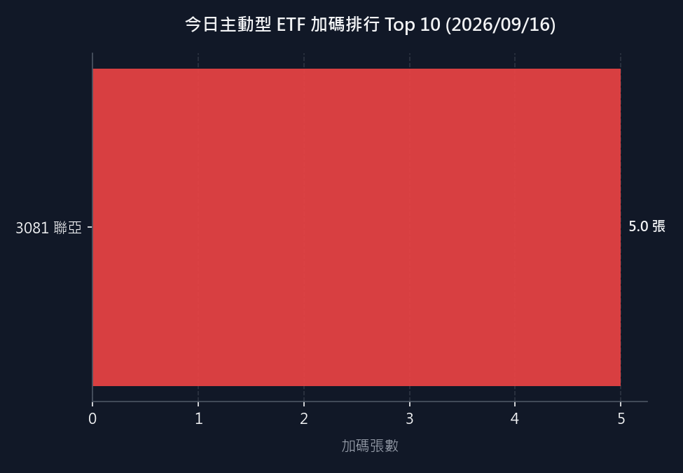

# 主動型 ETF 持股變動

資料來源：`主動型ETF持股明細.xlsx` 最近兩個日期分頁。

比較區間：`20260915` → `20260916`

## 今日加減碼視覺化排行

| 今日加碼 Top 10 | 今日減碼 Top 10 |
| :---: | :---: |
|  |  |

| ETF | 新增 | 刪除 | 比例變動 |
| :-- | --: | --: | --: |
| 00400A | 0 | 0 | 0 |
| 00401A | 0 | 0 | 0 |
| 00402A | 0 | 0 | 0 |
| 00403A | 0 | 0 | 0 |
| 00404A | 0 | 0 | 0 |
| 00405A | 0 | 0 | 30 |
| 00407A | 0 | 0 | 0 |
| 00408A | 0 | 0 | 0 |
| 00980A | 0 | 0 | 0 |
| 00980D | 0 | 0 | 0 |
| 00981A | 0 | 0 | 0 |
| 00982A | 0 | 0 | 0 |
| 00983A | 0 | 0 | 0 |
| 00983D | 0 | 0 | 0 |
| 00984A | 0 | 0 | 0 |
| 00985A | 0 | 0 | 0 |
| 00986A | 0 | 0 | 0 |
| 00987A | 0 | 0 | 0 |
| 00988A | 0 | 0 | 0 |
| 00989A | 0 | 0 | 0 |
| 00990A | 0 | 0 | 43 |
| 00991A | 0 | 0 | 0 |
| 00992A | 0 | 0 | 0 |
| 00993A | 0 | 0 | 0 |
| 00994A | 0 | 0 | 30 |
| 00995A | 0 | 0 | 0 |
| 00996A | 0 | 0 | 0 |
| 00997A | 0 | 0 | 0 |
| 00998A | 0 | 0 | 0 |
| 00999A | 0 | 0 | 46 |

## 00400A

### 新增持股

- 無

### 刪除持股

- 無

### 投資比例變動

- 無

## 00401A

### 新增持股

- 無

### 刪除持股

- 無

### 投資比例變動

- 無

## 00402A

### 新增持股

- 無

### 刪除持股

- 無

### 投資比例變動

- 無

## 00403A

### 新增持股

- 無

### 刪除持股

- 無

### 投資比例變動

- 無

## 00404A

### 新增持股

- 無

### 刪除持股

- 無

### 投資比例變動

- 無

## 00405A

### 新增持股

- 無

### 刪除持股

- 無

### 投資比例變動

- 2059 川湖：1.91% → 1.94%（+0.03）
- 2303 聯電：0.96% → 0.97%（+0.01）
- 2308 台達電：0.61% → 0.62%（+0.01）
- 2330 台積電：1.66% → 1.63%（-0.03）
- 2345 智邦：3.79% → 3.73%（-0.06）
- 2368 金像電：4.26% → 4.29%（+0.03）
- 2383 台光電：4.22% → 4.13%（-0.09）
- 2454 聯發科：8.28% → 8.34%（+0.06）
- 3017 奇鋐：4.58% → 4.60%（+0.02）
- 3037 欣興：6.37% → 6.34%（-0.03）
- 3443 創意：8.55% → 8.61%（+0.06）
- 3450 聯鈞：1.25% → 1.35%（+0.10）
- 3653 健策：5.37% → 5.22%（-0.15）
- 3665 貿聯-KY：5.12% → 5.09%（-0.03）
- 4991 環宇-KY：1.95% → 1.97%（+0.02）
- 5274 信驊：3.70% → 3.80%（+0.10）
- 6187 萬潤：0.94% → 0.93%（-0.01）
- 6223 旺矽：6.84% → 6.94%（+0.10）
- 6274 台燿：1.63% → 1.66%（+0.03）
- 6285 啟碁：0.35% → 0.34%（-0.01）
- 6488 環球晶：0.39% → 0.40%（+0.01）
- 6510 精測：3.10% → 3.03%（-0.07）
- 6515 穎崴：0.56% → 0.55%（-0.01）
- 6531 愛普*：3.57% → 3.75%（+0.18）
- 6669 緯穎：0.89% → 0.82%（-0.07）
- 6805 富世達：2.14% → 2.12%（-0.02）
- 7734 印能科技：1.49% → 1.43%（-0.06）
- 7769 鴻勁：2.87% → 2.82%（-0.05）
- 8046 南電：3.12% → 3.13%（+0.01）
- 8996 高力：1.34% → 1.41%（+0.07）

## 00407A

### 新增持股

- 無

### 刪除持股

- 無

### 投資比例變動

- 無

## 00408A

### 新增持股

- 無

### 刪除持股

- 無

### 投資比例變動

- 無

## 00980A

### 新增持股

- 無

### 刪除持股

- 無

### 投資比例變動

- 無

## 00980D

### 新增持股

- 無

### 刪除持股

- 無

### 投資比例變動

- 無

## 00981A

### 新增持股

- 無

### 刪除持股

- 無

### 投資比例變動

- 無

## 00982A

### 新增持股

- 無

### 刪除持股

- 無

### 投資比例變動

- 無

## 00983A

### 新增持股

- 無

### 刪除持股

- 無

### 投資比例變動

- 無

## 00983D

### 新增持股

- 無

### 刪除持股

- 無

### 投資比例變動

- 無

## 00984A

### 新增持股

- 無

### 刪除持股

- 無

### 投資比例變動

- 無

## 00985A

### 新增持股

- 無

### 刪除持股

- 無

### 投資比例變動

- 無

## 00986A

### 新增持股

- 無

### 刪除持股

- 無

### 投資比例變動

- 無

## 00987A

### 新增持股

- 無

### 刪除持股

- 無

### 投資比例變動

- 無

## 00988A

### 新增持股

- 無

### 刪除持股

- 無

### 投資比例變動

- 無

## 00989A

### 新增持股

- 無

### 刪除持股

- 無

### 投資比例變動

- 無

## 00990A

### 新增持股

- 無

### 刪除持股

- 無

### 投資比例變動

- 2308 台達電：2.04% → 2.11%（+0.07）
- 2330 台積電：2.76% → 2.78%（+0.02）
- 2360 致茂：0.79% → 0.78%（-0.01）
- 2383 台光電：3.23% → 3.11%（-0.12）
- 2449 京元電子：1.24% → 1.23%（-0.01）
- 2454 聯發科：3.16% → 3.09%（-0.07）
- 3017 奇鋐：1.49% → 1.41%（-0.08）
- 3037 欣興：1.98% → 1.95%（-0.03）
- 3529 力旺：0.83% → 0.80%（-0.03）
- 3665 貿聯-KY：0.52% → 0.53%（+0.01）
- 6223 旺矽：1.44% → 1.40%（-0.04）
- 7769 鴻勁：0.74% → 0.72%（-0.02）
- 8046 南電：0.91% → 0.94%（+0.03）
- AAPL.US Apple：2.11% → 2.12%（+0.01）
- AMD.US AMD：3.16% → 3.25%（+0.09）
- AMZN.US Amazon：1.10% → 1.09%（-0.01）
- Advantest(6857.JP)：1.61% → 1.57%（-0.04）
- BE.US Bloom Energy：3.89% → 3.95%（+0.06）
- CRWD.US CrowdStrike Holdings：0.14% → 0.15%（+0.01）
- DELL.US Dell：1.76% → 1.80%（+0.04）
- FSLY.US Fastly：1.42% → 1.40%（-0.02）
- HOOD.US Robinhood Markets：2.44% → 2.38%（-0.06）
- IBIDEN(4062.JP)：0.93% → 0.94%（+0.01）
- INTC.US Intel：2.53% → 2.55%（+0.02）
- Kioxia Holdings(285A.JP)：1.08% → 1.11%（+0.03）
- LITE.US Lumentum：6.63% → 6.71%（+0.08）
- META.US Meta：3.54% → 3.59%（+0.05）
- MRVL.US Marvell：2.53% → 2.58%（+0.05）
- MSFT.US Microsoft：3.26% → 3.23%（-0.03）
- MU.US Micron：3.93% → 3.98%（+0.05）
- Murata Mfg.(6981.JP)：1.48% → 1.54%（+0.06）
- NOK.US Nokia：1.41% → 1.45%（+0.04）
- NTRA.US Natera：1.35% → 1.40%（+0.05）
- NVDA.US NVIDIA：3.77% → 3.82%（+0.05）
- PANW.US Palo Alto：1.63% → 1.64%（+0.01）
- PLTR.US Palantir Technologies：2.94% → 2.95%（+0.01）
- SMTC.US Semtech：3.23% → 3.34%（+0.11）
- SNDK.US Sandisk：2.27% → 2.26%（-0.01）
- SNOW.US Snowflake：3.31% → 3.24%（-0.07）
- SPCX.US SpaceX：2.63% → 2.56%（-0.07）
- Samsung Elec Mech(009150.KS)：0.65% → 0.64%（-0.01）
- TWST.US Twist Bioscience：0.68% → 0.70%（+0.02）
- WDC.US Western Digital：0.92% → 0.90%（-0.02）

## 00991A

### 新增持股

- 無

### 刪除持股

- 無

### 投資比例變動

- 無

## 00992A

### 新增持股

- 無

### 刪除持股

- 無

### 投資比例變動

- 無

## 00993A

### 新增持股

- 無

### 刪除持股

- 無

### 投資比例變動

- 無

## 00994A

### 新增持股

- 無

### 刪除持股

- 無

### 投資比例變動

- 2059 川湖：3.51% → 3.56%（+0.05）
- 2303 聯電：1.12% → 1.13%（+0.01）
- 2308 台達電：0.87% → 0.88%（+0.01）
- 2330 台積電：15.49% → 15.26%（-0.23）
- 2345 智邦：1.65% → 1.63%（-0.02）
- 2360 致茂：1.01% → 1.00%（-0.01）
- 2383 台光電：6.95% → 6.83%（-0.12）
- 2408 南亞科：1.39% → 1.46%（+0.07）
- 2454 聯發科：7.04% → 7.11%（+0.07）
- 2481 強茂：1.03% → 1.11%（+0.08）
- 3017 奇鋐：6.57% → 6.61%（+0.04）
- 3037 欣興：5.06% → 5.05%（-0.01）
- 3081 聯亞：1.42% → 1.79%（+0.37）
- 3189 景碩：1.74% → 1.77%（+0.03）
- 3231 緯創：0.47% → 0.46%（-0.01）
- 3443 創意：3.07% → 3.10%（+0.03）
- 3491 昇達科：0.62% → 0.66%（+0.04）
- 3653 健策：3.06% → 2.98%（-0.08）
- 3661 世芯-KY：0.31% → 0.30%（-0.01）
- 3711 日月光投控：1.95% → 1.97%（+0.02）
- 5274 信驊：2.59% → 2.67%（+0.08）
- 6187 萬潤：1.09% → 1.08%（-0.01）
- 6223 旺矽：5.00% → 5.09%（+0.09）
- 6239 力成：1.08% → 1.09%（+0.01）
- 6274 台燿：4.99% → 5.09%（+0.10）
- 6515 穎崴：0.58% → 0.57%（-0.01）
- 6669 緯穎：3.50% → 3.23%（-0.27）
- 7769 鴻勁：1.56% → 1.53%（-0.03）
- 8046 南電：3.13% → 3.14%（+0.01）
- 8996 高力：1.01% → 1.07%（+0.06）

## 00995A

### 新增持股

- 無

### 刪除持股

- 無

### 投資比例變動

- 無

## 00996A

### 新增持股

- 無

### 刪除持股

- 無

### 投資比例變動

- 無

## 00997A

### 新增持股

- 無

### 刪除持股

- 無

### 投資比例變動

- 無

## 00998A

### 新增持股

- 無

### 刪除持股

- 無

### 投資比例變動

- 無

## 00999A

### 新增持股

- 無

### 刪除持股

- 無

### 投資比例變動

- 2059 川湖：3.29% → 3.40%（+0.11）
- 2308 台達電：2.57% → 2.64%（+0.07）
- 2330 台積電：5.85% → 5.86%（+0.01）
- 2345 智邦：1.63% → 1.64%（+0.01）
- 2357 華碩：1.94% → 1.97%（+0.03）
- 2360 致茂：1.28% → 1.29%（+0.01）
- 2368 金像電：1.87% → 1.92%（+0.05）
- 2382 廣達：2.06% → 2.11%（+0.05）
- 2383 台光電：4.00% → 3.99%（-0.01）
- 2393 億光：0.78% → 0.80%（+0.02）
- 2395 研華：1.51% → 1.54%（+0.03）
- 2408 南亞科：1.96% → 2.08%（+0.12）
- 2441 超豐：2.92% → 2.97%（+0.05）
- 2451 創見：0.94% → 0.98%（+0.04）
- 2454 聯發科：3.74% → 3.84%（+0.10）
- 2880 華南金：1.21% → 1.23%（+0.02）
- 2884 玉山金：1.28% → 1.30%（+0.02）
- 2885 元大金：1.57% → 1.60%（+0.03）
- 2886 兆豐金：1.23% → 1.21%（-0.02）
- 2887 台新新光金：1.81% → 1.86%（+0.05）
- 2890 永豐金：1.07% → 1.09%（+0.02）
- 2892 第一金：1.27% → 1.29%（+0.02）
- 3008 大立光：1.28% → 1.32%（+0.04）
- 3017 奇鋐：1.53% → 1.57%（+0.04）
- 3026 禾伸堂：1.57% → 1.68%（+0.11）
- 3037 欣興：2.19% → 2.22%（+0.03）
- 3081 聯亞：1.99% → 2.10%（+0.11）
- 3090 日電貿：0.51% → 0.52%（+0.01）
- 3227 原相：0.57% → 0.59%（+0.02）
- 3293 鈊象：0.88% → 0.90%（+0.02）
- 3653 健策：3.59% → 3.56%（-0.03）
- 3665 貿聯-KY：1.13% → 1.14%（+0.01）
- 3702 大聯大：4.95% → 4.93%（-0.02）
- 3706 神達：3.64% → 3.72%（+0.08）
- 4551 智伸科：0.42% → 0.43%（+0.01）
- 4904 遠傳：0.61% → 0.60%（-0.01）
- 5274 信驊：1.39% → 1.45%（+0.06）
- 5439 高技：0.33% → 0.34%（+0.01）
- 5904 寶雅*：0.69% → 0.70%（+0.01）
- 6138 茂達：0.66% → 0.68%（+0.02）
- 6223 旺矽：1.91% → 1.98%（+0.07）
- 6274 台燿：0.90% → 0.94%（+0.04）
- 6515 穎崴：1.83% → 1.81%（-0.02）
- 6669 緯穎：2.73% → 2.56%（-0.17）
- 6805 富世達：0.91% → 0.92%（+0.01）
- 台灣證交所加權股價指數(FITXN*1.TF)：0.96% → 2.44%（+1.48）
