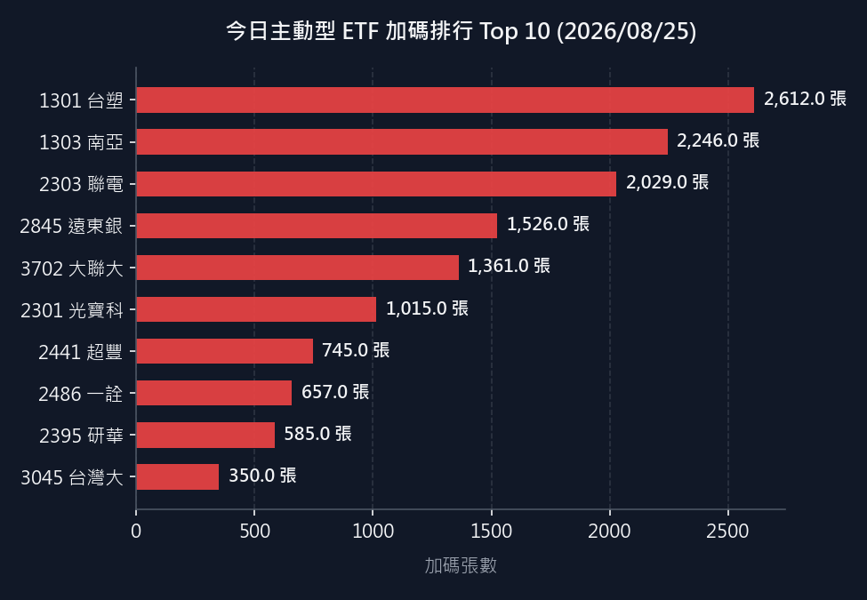
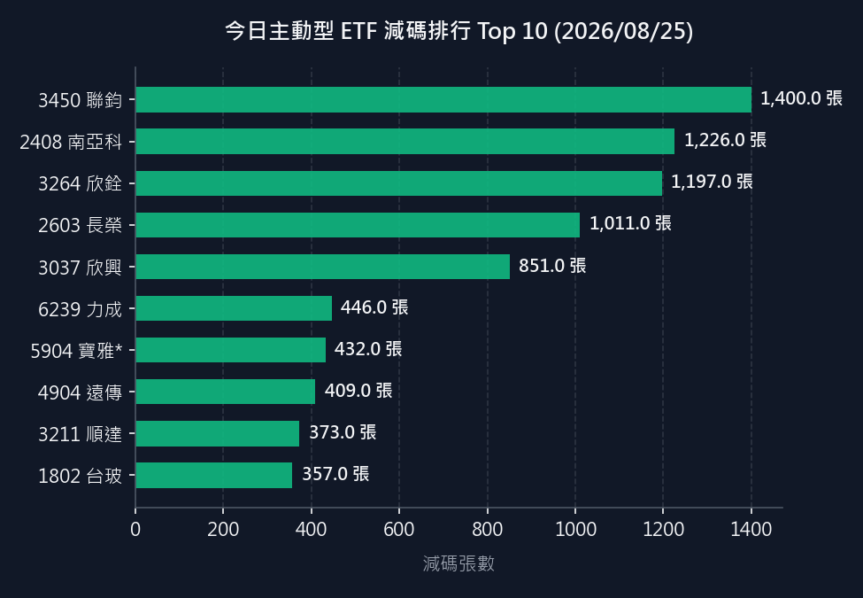

# 主動型 ETF 持股變動

資料來源：`主動型ETF持股明細.xlsx` 最近兩個日期分頁。

比較區間：`20260824` → `20260825`

## 今日加減碼視覺化排行

| 今日加碼 Top 10 | 今日減碼 Top 10 |
| :---: | :---: |
|  |  |

| ETF | 新增 | 刪除 | 比例變動 |
| :-- | --: | --: | --: |
| 00400A | 2 | 3 | 44 |
| 00401A | 1 | 1 | 43 |
| 00402A | 0 | 0 | 44 |
| 00403A | 0 | 0 | 34 |
| 00404A | 1 | 2 | 44 |
| 00405A | 0 | 3 | 34 |
| 00407A | 0 | 0 | 41 |
| 00408A | 0 | 0 | 44 |
| 00980A | 0 | 0 | 45 |
| 00980D | 1 | 1 | 19 |
| 00981A | 1 | 1 | 28 |
| 00982A | 0 | 0 | 40 |
| 00983A | 0 | 0 | 41 |
| 00983D | 0 | 0 | 13 |
| 00984A | 1 | 1 | 80 |
| 00985A | 3 | 3 | 37 |
| 00986A | 0 | 1 | 31 |
| 00987A | 0 | 0 | 25 |
| 00988A | 0 | 0 | 42 |
| 00989A | 0 | 0 | 56 |
| 00990A | 0 | 0 | 43 |
| 00991A | 0 | 0 | 18 |
| 00992A | 0 | 0 | 32 |
| 00993A | 1 | 1 | 39 |
| 00994A | 1 | 2 | 28 |
| 00995A | 0 | 0 | 40 |
| 00996A | 1 | 1 | 38 |
| 00997A | 1 | 0 | 44 |
| 00998A | 0 | 0 | 36 |
| 00999A | 0 | 0 | 51 |

## 00400A

### 新增持股

- 3026 禾伸堂（0.89%，404 張）
- 3711 日月光投控（0.96%，464 張）

### 刪除持股

- 2408 南亞科（2.08%，1119 張）
- 3211 順達（0.46%，373 張）
- 6239 力成（0.42%，446 張）

### 投資比例變動

- 1303 南亞：0.42% → 1.23%（+0.81）
- 2059 川湖：5.81% → 6.17%（+0.36）
- 2303 聯電：0.02% → 0.92%（+0.90）
- 2308 台達電：2.75% → 2.68%（-0.07）
- 2313 華通：0.83% → 0.85%（+0.02）
- 2317 鴻海：0.83% → 0.82%（-0.01）
- 2330 台積電：8.72% → 8.64%（-0.08）
- 2345 智邦：1.63% → 1.62%（-0.01）
- 2360 致茂：3.48% → 3.24%（-0.24）
- 2382 廣達：0.75% → 0.77%（+0.02）
- 2383 台光電：4.83% → 1.49%（-3.34）
- 2449 京元電子：0.82% → 0.84%（+0.02）
- 2454 聯發科：6.28% → 6.17%（-0.11）
- 2881 富邦金：0.80% → 0.84%（+0.04）
- 2885 元大金：1.42% → 1.37%（-0.05）
- 3008 大立光：3.05% → 3.09%（+0.04）
- 3017 奇鋐：3.40% → 3.48%（+0.08）
- 3036 文曄：1.11% → 1.07%（-0.04）
- 3037 欣興：5.66% → 2.39%（-3.27）
- 3044 健鼎：1.67% → 1.68%（+0.01）
- 3090 日電貿：0.34% → 0.35%（+0.01）
- 3167 大量：0.29% → 0.27%（-0.02）
- 3293 鈊象：0.34% → 0.33%（-0.01）
- 3374 精材：0.29% → 0.30%（+0.01）
- 3443 創意：3.75% → 3.72%（-0.03）
- 3529 力旺：0.93% → 0.94%（+0.01）
- 3653 健策：4.70% → 4.52%（-0.18）
- 3665 貿聯-KY：2.27% → 1.22%（-1.05）
- 4979 華星光：0.60% → 0.62%（+0.02）
- 5274 信驊：2.84% → 2.83%（-0.01）
- 5347 世界：0.72% → 0.71%（-0.01）
- 5434 崇越：0.36% → 0.37%（+0.01）
- 6121 新普：0.24% → 0.25%（+0.01）
- 6187 萬潤：2.51% → 2.66%（+0.15）
- 6223 旺矽：4.59% → 4.68%（+0.09）
- 6274 台燿：1.10% → 2.06%（+0.96）
- 6442 光聖：0.88% → 0.92%（+0.04）
- 6488 環球晶：3.11% → 3.23%（+0.12）
- 6515 穎崴：0.47% → 0.46%（-0.01）
- 6669 緯穎：3.09% → 3.17%（+0.08）
- 7750 新代：0.95% → 1.01%（+0.06）
- 7769 鴻勁：0.77% → 0.74%（-0.03）
- 8046 南電：1.04% → 1.06%（+0.02）
- 9939 宏全：0.09% → 0.08%（-0.01）

## 00401A

### 新增持股

- 台股期貨09/26(FITXN*1)（-0.17%，0.024 張）

### 刪除持股

- 台股期貨09/26（-0.21%，0.024 張）

### 投資比例變動

- 1477 聚陽：1.02% → 1.01%（-0.01）
- 2059 川湖：1.34% → 1.32%（-0.02）
- 2308 台達電：3.30% → 3.22%（-0.08）
- 2313 華通：1.69% → 1.71%（+0.02）
- 2327 國巨*：0.68% → 0.67%（-0.01）
- 2330 台積電：15.85% → 15.86%（+0.01）
- 2345 智邦：2.23% → 2.17%（-0.06）
- 2357 華碩：1.43% → 1.42%（-0.01）
- 2360 致茂：1.84% → 1.73%（-0.11）
- 2379 瑞昱：1.16% → 1.17%（+0.01）
- 2383 台光電：1.84% → 1.88%（+0.04）
- 2412 中華電：0.87% → 0.86%（-0.01）
- 2454 聯發科：6.03% → 5.93%（-0.10）
- 2455 全新：1.92% → 2.09%（+0.17）
- 2603 長榮：1.23% → 1.20%（-0.03）
- 2881 富邦金：1.98% → 2.10%（+0.12）
- 2882 國泰金：1.05% → 1.08%（+0.03）
- 2883 凱基金：1.53% → 1.55%（+0.02）
- 2884 玉山金：1.85% → 1.87%（+0.02）
- 2885 元大金：0.52% → 0.51%（-0.01）
- 2886 兆豐金：1.42% → 1.41%（-0.01）
- 3008 大立光：2.73% → 2.87%（+0.14）
- 3037 欣興：2.52% → 2.54%（+0.02）
- 3131 弘塑：0.79% → 0.76%（-0.03）
- 3167 大量：0.48% → 0.49%（+0.01）
- 3491 昇達科：1.72% → 1.67%（-0.05）
- 3711 日月光投控：2.04% → 2.02%（-0.02）
- 4958 臻鼎-KY：1.78% → 1.80%（+0.02）
- 4991 環宇-KY：1.01% → 1.02%（+0.01）
- 5274 信驊：1.89% → 1.91%（+0.02）
- 5347 世界：1.32% → 1.31%（-0.01）
- 5904 寶雅*：0.65% → 0.63%（-0.02）
- 6187 萬潤：0.74% → 0.77%（+0.03）
- 6285 啟碁：1.48% → 1.49%（+0.01）
- 6415 矽力*-KY：0.63% → 0.62%（-0.01）
- 6515 穎崴：1.07% → 1.08%（+0.01）
- 6531 愛普*：1.15% → 1.18%（+0.03）
- 6669 緯穎：2.14% → 2.16%（+0.02）
- 7769 鴻勁：1.89% → 1.86%（-0.03）
- 7828 創新服務：1.67% → 1.62%（-0.05）
- 8021 尖點：0.07% → 0.08%（+0.01）
- 8464 億豐：1.12% → 1.13%（+0.01）
- 臺指選擇權09/26 44500 買權：-0.69% → -0.76%（-0.07）

## 00402A

### 新增持股

- 無

### 刪除持股

- 無

### 投資比例變動

- AAPL.US Apple：7.40% → 7.56%（+0.16）
- ADI.US Analog Devices：1.96% → 1.98%（+0.02）
- AMD.US AMD：4.64% → 4.56%（-0.08）
- AMZN.US Amazon：4.33% → 4.47%（+0.14）
- ANET.US Arista Networks：0.86% → 0.87%（+0.01）
- AVGO.US Broadcom：2.35% → 2.33%（-0.02）
- AXON.US Axon Enterprise：1.23% → 1.19%（-0.04）
- BKNG.US Booking Holdings：0.77% → 0.80%（+0.03）
- CDNS.US Cadence Design Systems：1.50% → 1.51%（+0.01）
- CIEN.US Ciena：0.89% → 0.85%（-0.04）
- CLS.US Celestica：0.89% → 0.90%（+0.01）
- COHR.US Coherent：2.04% → 1.98%（-0.06）
- CRWD.US CrowdStrike Holdings：1.38% → 1.40%（+0.02）
- DASH.US DoorDash：0.33% → 0.34%（+0.01）
- FSLY.US Fastly：0.40% → 0.38%（-0.02）
- GOOG.US Alphabet - Class C Capital Stock：3.32% → 3.41%（+0.09）
- GOOGL.US Alphabet - Class A Common Stock：3.28% → 3.37%（+0.09）
- INTC.US Intel：1.27% → 1.25%（-0.02）
- IOT.US Samsara：0.26% → 0.27%（+0.01）
- KLAC.US KLA：2.21% → 1.68%（-0.53）
- LITE.US Lumentum：1.87% → 1.82%（-0.05）
- LRCX.US Lam Research：2.95% → 2.97%（+0.02）
- MCHP.US Microchip Technology：1.24% → 1.23%（-0.01）
- MDB.US MongoDB：0.91% → 0.86%（-0.05）
- META.US Meta：2.83% → 2.93%（+0.10）
- MRVL.US Marvell：1.82% → 1.80%（-0.02）
- MSFT.US Microsoft：4.52% → 4.65%（+0.13）
- MU.US Micron：6.54% → 6.27%（-0.27）
- NFLX.US Netflix：0.94% → 0.96%（+0.02）
- NOW.US ServiceNow：0.30% → 0.82%（+0.52）
- NVDA.US NVIDIA：8.74% → 8.66%（-0.08）
- PANW.US Palo Alto：3.38% → 2.73%（-0.65）
- SHOP.US Shopify：0.55% → 0.87%（+0.32）
- SIMO.US Silicon Motion：0.84% → 0.80%（-0.04）
- SKHY.US SK hynix：1.11% → 1.08%（-0.03）
- SNOW.US Snowflake：1.08% → 1.34%（+0.26）
- SPOT.US Spotify：0.31% → 0.32%（+0.01）
- STX.US Seagate：1.12% → 1.07%（-0.05）
- TER.US Teradyne：0.94% → 0.93%（-0.01）
- TTWO.US Take-Two：0.60% → 0.59%（-0.01）
- TXN.US Texas Instruments：2.31% → 2.30%（-0.01）
- UBER.US Uber：0.55% → 0.56%（+0.01）
- V.US Visa：1.20% → 1.26%（+0.06）
- WDC.US Western Digital：2.25% → 2.17%（-0.08）

## 00403A

### 新增持股

- 無

### 刪除持股

- 無

### 投資比例變動

- 1303 南亞：1.02% → 1.12%（+0.10）
- 2059 川湖：0.16% → 0.30%（+0.14）
- 2303 聯電：4.14% → 4.46%（+0.32）
- 2308 台達電：3.15% → 3.09%（-0.06）
- 2327 國巨*：3.21% → 3.17%（-0.04）
- 2330 台積電：17.12% → 17.14%（+0.02）
- 2344 華邦電：1.61% → 1.60%（-0.01）
- 2345 智邦：2.78% → 2.79%（+0.01）
- 2360 致茂：1.24% → 1.17%（-0.07）
- 2383 台光電：5.68% → 5.63%（-0.05）
- 2454 聯發科：4.73% → 4.69%（-0.04）
- 3008 大立光：2.08% → 2.13%（+0.05）
- 3017 奇鋐：5.09% → 5.44%（+0.35）
- 3037 欣興：5.43% → 5.51%（+0.08）
- 3189 景碩：2.04% → 2.11%（+0.07）
- 3211 順達：0.41% → 0.39%（-0.02）
- 3264 欣銓：0.08% → 0.09%（+0.01）
- 3450 聯鈞：0.59% → 0.13%（-0.46）
- 3533 嘉澤：0.50% → 0.29%（-0.21）
- 3653 健策：3.45% → 3.34%（-0.11）
- 3665 貿聯-KY：1.62% → 1.48%（-0.14）
- 3711 日月光投控：2.78% → 2.81%（+0.03）
- 4966 譜瑞-KY：0.17% → 0.07%（-0.10）
- 5274 信驊：1.63% → 1.64%（+0.01）
- 6223 旺矽：3.56% → 3.67%（+0.11）
- 6239 力成：0.85% → 0.87%（+0.02）
- 6442 光聖：0.20% → 0.21%（+0.01）
- 6488 環球晶：1.56% → 1.63%（+0.07）
- 6669 緯穎：2.26% → 2.41%（+0.15）
- 6805 富世達：0.73% → 0.86%（+0.13）
- 7769 鴻勁：0.49% → 0.48%（-0.01）
- 8046 南電：1.77% → 1.82%（+0.05）
- 8358 金居：0.21% → 0.20%（-0.01）
- 8996 高力：1.03% → 1.24%（+0.21）

## 00404A

### 新增持股

- 台股期貨09/26(FITXN*1)（16.59%，0.061 張）

### 刪除持股

- 1210 大成（0.52%，328 張）
- 台股期貨09/26（16.56%，0.061 張）

### 投資比例變動

- 1303 南亞：0.65% → 0.64%（-0.01）
- 2027 大成鋼：0.46% → 0.47%（+0.01）
- 2059 川湖：1.61% → 1.73%（+0.12）
- 2301 光寶科：1.44% → 1.65%（+0.21）
- 2303 聯電：2.76% → 2.73%（-0.03）
- 2308 台達電：1.89% → 1.86%（-0.03）
- 2330 台積電：22.83% → 22.33%（-0.50）
- 2345 智邦：0.73% → 0.74%（+0.01）
- 2347 聯強：0.72% → 0.71%（-0.01）
- 2351 順德：0.45% → 0.49%（+0.04）
- 2360 致茂：0.69% → 0.65%（-0.04）
- 2379 瑞昱：2.10% → 2.16%（+0.06）
- 2382 廣達：2.16% → 2.21%（+0.05）
- 2383 台光電：2.73% → 3.04%（+0.31）
- 2395 研華：1.48% → 1.54%（+0.06）
- 2428 興勤：0.84% → 1.18%（+0.34）
- 2441 超豐：1.78% → 1.83%（+0.05）
- 2454 聯發科：5.87% → 5.81%（-0.06）
- 2458 義隆：1.72% → 1.69%（-0.03）
- 2637 慧洋-KY：1.26% → 1.18%（-0.08）
- 2845 遠東銀：1.17% → 1.78%（+0.61）
- 2885 元大金：2.07% → 2.02%（-0.05）
- 2890 永豐金：0.99% → 0.98%（-0.01）
- 3017 奇鋐：0.95% → 0.98%（+0.03）
- 3034 聯詠：2.04% → 2.15%（+0.11）
- 3037 欣興：0.75% → 0.76%（+0.01）
- 3135 凌航：1.63% → 1.57%（-0.06）
- 3260 威剛：1.52% → 1.37%（-0.15）
- 3264 欣銓：1.15% → 1.21%（+0.06）
- 3293 鈊象：0.51% → 0.49%（-0.02）
- 3443 創意：0.51% → 0.50%（-0.01）
- 3702 大聯大：1.92% → 1.77%（-0.15）
- 3711 日月光投控：3.46% → 3.50%（+0.04）
- 4763 材料*-KY：1.75% → 1.60%（-0.15）
- 5274 信驊：2.23% → 2.25%（+0.02）
- 5434 崇越：1.60% → 1.64%（+0.04）
- 6139 亞翔：1.79% → 1.81%（+0.02）
- 6196 帆宣：1.76% → 1.71%（-0.05）
- 6223 旺矽：1.07% → 1.10%（+0.03）
- 6446 藥華藥：0.08% → 0.09%（+0.01）
- 6491 晶碩：0.51% → 0.52%（+0.01）
- 6691 洋基工程：0.22% → 0.23%（+0.01）
- 8081 致新：0.88% → 0.87%（-0.01）
- 台指選擇權09/26 48000 買權：-0.13% → -0.11%（+0.02）

## 00405A

### 新增持股

- 無

### 刪除持股

- 3008 大立光（1.92%，101 張）
- 3026 禾伸堂（0.57%，250 張）
- 6442 光聖（0.36%，70 張）

### 投資比例變動

- 2059 川湖：2.14% → 2.09%（-0.05）
- 2308 台達電：0.58% → 0.56%（-0.02）
- 2330 台積電：1.50% → 1.49%（-0.01）
- 2345 智邦：3.87% → 3.74%（-0.13）
- 2368 金像電：3.77% → 3.81%（+0.04）
- 2383 台光電：4.07% → 4.13%（+0.06）
- 2454 聯發科：6.38% → 6.24%（-0.14）
- 3017 奇鋐：8.10% → 8.24%（+0.14）
- 3037 欣興：5.96% → 5.98%（+0.02）
- 3081 聯亞：1.55% → 1.63%（+0.08）
- 3131 弘塑：1.34% → 1.27%（-0.07）
- 3163 波若威：0.03% → 0.04%（+0.01）
- 3264 欣銓：0.02% → 0.03%（+0.01）
- 3443 創意：7.94% → 8.12%（+0.18）
- 3450 聯鈞：1.16% → 1.21%（+0.05）
- 3653 健策：7.77% → 7.73%（-0.04）
- 3665 貿聯-KY：6.63% → 6.61%（-0.02）
- 4991 環宇-KY：1.84% → 1.86%（+0.02）
- 5274 信驊：2.90% → 2.91%（+0.01）
- 6187 萬潤：0.84% → 0.87%（+0.03）
- 6223 旺矽：5.37% → 5.32%（-0.05）
- 6274 台燿：1.57% → 1.58%（+0.01）
- 6285 啟碁：0.33% → 0.32%（-0.01）
- 6488 環球晶：0.39% → 0.38%（-0.01）
- 6510 精測：2.29% → 2.28%（-0.01）
- 6526 達發：0.30% → 0.29%（-0.01）
- 6669 緯穎：1.11% → 1.12%（+0.01）
- 6805 富世達：1.21% → 1.29%（+0.08）
- 6831 邁科：0.48% → 0.49%（+0.01）
- 7734 印能科技：1.81% → 1.51%（-0.30）
- 7769 鴻勁：2.65% → 2.59%（-0.06）
- 8046 南電：2.96% → 2.98%（+0.02）
- 8210 勤誠：0.57% → 0.56%（-0.01）
- 8996 高力：1.14% → 1.19%（+0.05）

## 00407A

### 新增持股

- 無

### 刪除持股

- 無

### 投資比例變動

- 1303 南亞：0.60% → 0.59%（-0.01）
- 2059 川湖：3.52% → 3.74%（+0.22）
- 2301 光寶科：0.97% → 1.09%（+0.12）
- 2303 聯電：1.47% → 1.58%（+0.11）
- 2308 台達電：3.74% → 3.65%（-0.09）
- 2327 國巨*：2.22% → 2.18%（-0.04）
- 2330 台積電：8.96% → 8.91%（-0.05）
- 2345 智邦：2.79% → 2.78%（-0.01）
- 2360 致茂：2.10% → 1.96%（-0.14）
- 2368 金像電：1.95% → 1.96%（+0.01）
- 2383 台光電：5.73% → 5.64%（-0.09）
- 2395 研華：1.98% → 2.03%（+0.05）
- 2408 南亞科：2.13% → 2.05%（-0.08）
- 2451 創見：0.19% → 0.34%（+0.15）
- 2454 聯發科：4.57% → 4.49%（-0.08）
- 2615 萬海：0.75% → 0.76%（+0.01）
- 3008 大立光：0.65% → 0.66%（+0.01）
- 3017 奇鋐：4.56% → 4.68%（+0.12）
- 3034 聯詠：0.72% → 0.75%（+0.03）
- 3037 欣興：5.33% → 5.37%（+0.04）
- 3081 聯亞：0.99% → 1.00%（+0.01）
- 3260 威剛：0.18% → 0.31%（+0.13）
- 3293 鈊象：0.56% → 0.55%（-0.01）
- 3443 創意：3.43% → 3.40%（-0.03）
- 3529 力旺：0.91% → 0.93%（+0.02）
- 3653 健策：1.98% → 1.91%（-0.07）
- 3665 貿聯-KY：2.19% → 2.00%（-0.19）
- 3711 日月光投控：2.51% → 2.52%（+0.01）
- 4958 臻鼎-KY：1.70% → 1.71%（+0.01）
- 5289 宜鼎：0.19% → 0.37%（+0.18）
- 6187 萬潤：0.90% → 0.95%（+0.05）
- 6223 旺矽：3.22% → 3.29%（+0.07）
- 6274 台燿：3.61% → 3.58%（-0.03）
- 6446 藥華藥：1.06% → 1.12%（+0.06）
- 6515 穎崴：1.42% → 1.38%（-0.04）
- 6669 緯穎：4.81% → 4.94%（+0.13）
- 6805 富世達：2.26% → 2.36%（+0.10）
- 8046 南電：2.64% → 2.69%（+0.05）
- 8210 勤誠：0.91% → 0.93%（+0.02）
- 8299 群聯：0.15% → 0.32%（+0.17）
- 8996 高力：0.43% → 0.73%（+0.30）

## 00408A

### 新增持股

- 無

### 刪除持股

- 無

### 投資比例變動

- 1303 南亞：0.57% → 0.60%（+0.03）
- 1477 聚陽：0.26% → 0.25%（-0.01）
- 2059 川湖：2.75% → 2.71%（-0.04）
- 2303 聯電：1.69% → 1.70%（+0.01）
- 2308 台達電：3.76% → 2.27%（-1.49）
- 2317 鴻海：1.86% → 1.85%（-0.01）
- 2330 台積電：6.20% → 6.26%（+0.06）
- 2344 華邦電：1.58% → 0.45%（-1.13）
- 2345 智邦：1.45% → 1.41%（-0.04）
- 2357 華碩：2.53% → 2.52%（-0.01）
- 2360 致茂：2.11% → 1.00%（-1.11）
- 2368 金像電：2.78% → 2.83%（+0.05）
- 2376 技嘉：1.19% → 1.21%（+0.02）
- 2383 台光電：3.46% → 3.54%（+0.08）
- 2395 研華：1.84% → 1.87%（+0.03）
- 2404 漢唐：1.70% → 1.69%（-0.01）
- 2408 南亞科：1.60% → 1.61%（+0.01）
- 2454 聯發科：0.48% → 0.47%（-0.01）
- 2481 強茂：0.32% → 0.33%（+0.01）
- 2801 彰銀：0.94% → 0.92%（-0.02）
- 2880 華南金：1.64% → 1.65%（+0.01）
- 2886 兆豐金：2.60% → 2.59%（-0.01）
- 2891 中信金：0.97% → 0.98%（+0.01）
- 3017 奇鋐：4.73% → 4.86%（+0.13）
- 3037 欣興：2.19% → 2.22%（+0.03）
- 3045 台灣大：1.32% → 2.78%（+1.46）
- 3081 聯亞：0.35% → 0.37%（+0.02）
- 3231 緯創：1.01% → 1.02%（+0.01）
- 3653 健策：1.97% → 1.98%（+0.01）
- 3702 大聯大：1.84% → 1.81%（-0.03）
- 3711 日月光投控：0.26% → 0.15%（-0.11）
- 4746 台耀：0.93% → 0.90%（-0.03）
- 5434 崇越：1.93% → 1.91%（-0.02）
- 6187 萬潤：1.15% → 1.21%（+0.06）
- 6239 力成：1.15% → 1.16%（+0.01）
- 6274 台燿：1.76% → 1.79%（+0.03）
- 6488 環球晶：1.93% → 1.86%（-0.07）
- 6669 緯穎：5.22% → 5.30%（+0.08）
- 6805 富世達：0.33% → 0.35%（+0.02）
- 7769 鴻勁：1.79% → 1.77%（-0.02）
- 8046 南電：2.60% → 1.91%（-0.69）
- 8436 大江：0.42% → 0.85%（+0.43）
- 8996 高力：0.36% → 0.38%（+0.02）
- 9941 裕融：0.77% → 1.26%（+0.49）

## 00980A

### 新增持股

- 無

### 刪除持股

- 無

### 投資比例變動

- 1303 南亞：2.22% → 2.30%（+0.08）
- 2059 川湖：5.89% → 5.77%（-0.12）
- 2308 台達電：3.58% → 3.49%（-0.09）
- 2317 鴻海：2.39% → 2.36%（-0.03）
- 2327 國巨*：1.67% → 1.63%（-0.04）
- 2330 台積電：9.14% → 9.13%（-0.01）
- 2345 智邦：1.84% → 1.78%（-0.06）
- 2360 致茂：1.57% → 1.47%（-0.10）
- 2368 金像電：1.90% → 1.93%（+0.03）
- 2376 技嘉：1.21% → 1.22%（+0.01）
- 2383 台光電：3.77% → 3.84%（+0.07）
- 2408 南亞科：2.81% → 2.82%（+0.01）
- 2454 聯發科：4.79% → 4.70%（-0.09）
- 2884 玉山金：1.24% → 1.25%（+0.01）
- 3008 大立光：0.72% → 0.75%（+0.03）
- 3017 奇鋐：1.95% → 2.00%（+0.05）
- 3026 禾伸堂：0.44% → 0.42%（-0.02）
- 3036 文曄：1.17% → 1.15%（-0.02）
- 3037 欣興：3.09% → 3.11%（+0.02）
- 3044 健鼎：0.79% → 0.81%（+0.02）
- 3081 聯亞：3.23% → 3.42%（+0.19）
- 3189 景碩：0.75% → 0.78%（+0.03）
- 3231 緯創：0.93% → 0.94%（+0.01）
- 3264 欣銓：0.68% → 0.70%（+0.02）
- 3293 鈊象：0.93% → 0.90%（-0.03）
- 3443 創意：1.62% → 1.66%（+0.04）
- 3533 嘉澤：0.29% → 0.28%（-0.01）
- 3653 健策：1.82% → 1.81%（-0.01）
- 3711 日月光投控：1.59% → 1.57%（-0.02）
- 5274 信驊：1.41% → 1.42%（+0.01）
- 5904 寶雅*：1.21% → 1.18%（-0.03）
- 6213 聯茂：1.19% → 1.29%（+0.10）
- 6223 旺矽：2.05% → 2.04%（-0.01）
- 6274 台燿：1.55% → 1.57%（+0.02）
- 6442 光聖：0.28% → 0.31%（+0.03）
- 6515 穎崴：1.73% → 1.74%（+0.01）
- 6669 緯穎：1.67% → 1.69%（+0.02）
- 6805 富世達：0.47% → 0.50%（+0.03）
- 6831 邁科：0.51% → 0.52%（+0.01）
- 7769 鴻勁：2.33% → 2.29%（-0.04）
- 8046 南電：1.18% → 1.19%（+0.01）
- 8210 勤誠：0.95% → 0.94%（-0.01）
- 8299 群聯：2.15% → 2.07%（-0.08）
- 8996 高力：1.06% → 1.11%（+0.05）
- 台灣證交所加權股價指數：5.03% → 5.00%（-0.03）

## 00980D

### 新增持股

- US 5YR NOTE (CBT) DEC26 31-DEC-2026（-14.91%，-0.09 張）

### 刪除持股

- US 5YR NOTE (CBT) SEP26 30-SEP-2026（-15.78%，-0.095 張）

### 投資比例變動

- ARCELORMITTAL SA 6.55% 29NOV2027：0.54% → 0.53%（-0.01）
- AVIANCA MIDCO 2 PLC SER REGS 9.625000 % 14FEB2030：0.30% → 0.29%（-0.01）
- BARCLAYS PLC (REG) VAR 27JUN2034：0.34% → 0.33%（-0.01）
- BRIGHTHOUSE FINANCIAL IN (REG) 4.7% 22JUN2047：0.45% → 0.46%（+0.01）
- CONCENTRIX CORP (REG) 6.6% 02AUG2028：0.51% → 0.50%（-0.01）
- DOW CHEMICAL CO/THE (REG) 5.6% 15FEB2054：0.58% → 0.59%（+0.01）
- GLOBAL ATLANTIC FIN CO SER REGS 6.750000 % 15MAR2054：0.60% → 0.61%（+0.01）
- INTESA SANPAOLO SPA SER REGS (REG) 7.200000 % 28NOV2033：0.35% → 0.34%（-0.01）
- JETBLUE AIRWAYS/LOYALTY SER REGS (REG S) 9.875% 20SEP2031：0.47% → 0.48%（+0.01）
- MOBIUS MERGER SUB SER REGS 9.000000 % 01JUN2030：0.25% → 0.26%（+0.01）
- ORACLE CORP 5.950000 % 26-SEP-2055：0.40% → 0.39%（-0.01）
- ORACLE CORP 6.100000 % 26-SEP-2065：0.47% → 0.46%（-0.01）
- OVINTIV INC 7.375% 01NOV2031：0.33% → 0.32%（-0.01）
- STAPLES INC SER REGS (REG S) 10.75% 01SEP2029：0.47% → 0.48%（+0.01）
- UBS GROUP AG SER REGS (REG S) VAR 15NOV2033：0.47% → 0.46%（-0.01）
- UNISYS CORP SER REGS 10.625000 % 15JAN2031：0.59% → 0.58%（-0.01）
- US 10YR NOTE (CBT)SEP26 21-SEP-2026：18.12% → 18.11%（-0.01）
- US LONG BOND(CBT) SEP26 21-SEP-2026：5.28% → 5.30%（+0.02）
- US ULTRA BOND CBT SEP26 21-SEP-2026：-0.34% → -0.35%（-0.01）

## 00981A

### 新增持股

- 台指期貨 2026/09(FITXN*1)（2.16%，0.679 張）

### 刪除持股

- 台指期貨 2026/09（2.18%，0.679 張）

### 投資比例變動

- 2002 中鋼：0.04% → 0.03%（-0.01）
- 2303 聯電：3.97% → 3.96%（-0.01）
- 2308 台達電：4.38% → 4.26%（-0.12）
- 2327 國巨*：5.02% → 4.89%（-0.13）
- 2330 台積電：10.12% → 10.09%（-0.03）
- 2345 智邦：4.87% → 4.71%（-0.16）
- 2383 台光電：9.43% → 9.59%（+0.16）
- 2449 京元電子：0.97% → 0.96%（-0.01）
- 2454 聯發科：6.95% → 6.80%（-0.15）
- 3017 奇鋐：6.04% → 6.16%（+0.12）
- 3037 欣興：7.83% → 7.86%（+0.03）
- 3264 欣銓：0.44% → 0.45%（+0.01）
- 3443 創意：0.49% → 0.50%（+0.01）
- 3653 健策：4.45% → 4.43%（-0.02）
- 3665 貿聯-KY：3.44% → 3.43%（-0.01）
- 3711 日月光投控：4.14% → 4.07%（-0.07）
- 4979 華星光：0.48% → 0.52%（+0.04）
- 5274 信驊：2.08% → 2.09%（+0.01）
- 6187 萬潤：0.21% → 0.22%（+0.01）
- 6191 精成科：0.12% → 0.11%（-0.01）
- 6223 旺矽：4.96% → 4.93%（-0.03）
- 6271 同欣電：0.15% → 0.16%（+0.01）
- 6274 台燿：2.87% → 2.89%（+0.02）
- 6669 緯穎：5.03% → 5.07%（+0.04）
- 6805 富世達：1.39% → 1.48%（+0.09）
- 8046 南電：3.92% → 3.95%（+0.03）
- 8210 勤誠：0.86% → 0.85%（-0.01）
- 8996 高力：0.53% → 0.56%（+0.03）

## 00982A

### 新增持股

- 無

### 刪除持股

- 無

### 投資比例變動

- 2059 川湖：5.47% → 5.35%（-0.12）
- 2301 光寶科：1.35% → 1.97%（+0.62）
- 2330 台積電：8.74% → 8.67%（-0.07）
- 2345 智邦：3.09% → 2.97%（-0.12）
- 2360 致茂：3.58% → 3.36%（-0.22）
- 2376 技嘉：1.26% → 1.27%（+0.01）
- 2377 微星：1.30% → 1.28%（-0.02）
- 2383 台光電：3.56% → 3.63%（+0.07）
- 2395 研華：1.22% → 2.01%（+0.79）
- 2428 興勤：1.21% → 1.19%（-0.02）
- 2454 聯發科：6.73% → 6.56%（-0.17）
- 2455 全新：1.23% → 1.34%（+0.11）
- 2467 志聖：1.09% → 1.08%（-0.01）
- 2476 鉅祥：0.31% → 0.32%（+0.01）
- 2478 大毅：1.11% → 1.10%（-0.01）
- 2486 一詮：0.49% → 0.84%（+0.35）
- 3008 大立光：2.84% → 2.97%（+0.13）
- 3017 奇鋐：2.22% → 2.26%（+0.04）
- 3105 穩懋：3.50% → 3.67%（+0.17）
- 3264 欣銓：1.37% → 0.88%（-0.49）
- 3491 昇達科：2.65% → 2.56%（-0.09）
- 3529 力旺：0.42% → 0.41%（-0.01）
- 3583 辛耘：1.63% → 1.62%（-0.01）
- 3617 碩天：0.32% → 0.31%（-0.01）
- 3711 日月光投控：1.16% → 1.15%（-0.01）
- 5425 台半：0.27% → 0.28%（+0.01）
- 5483 中美晶：1.32% → 1.31%（-0.01）
- 5536 聖暉*：0.81% → 0.79%（-0.02）
- 6139 亞翔：5.95% → 5.96%（+0.01）
- 6196 帆宣：0.31% → 0.30%（-0.01）
- 6213 聯茂：0.32% → 0.34%（+0.02）
- 6223 旺矽：3.50% → 3.46%（-0.04）
- 6239 力成：1.06% → 1.05%（-0.01）
- 6274 台燿：1.30% → 1.31%（+0.01）
- 6472 保瑞：0.72% → 0.98%（+0.26）
- 6488 環球晶：2.31% → 2.22%（-0.09）
- 6531 愛普*：2.86% → 2.91%（+0.05）
- 6669 緯穎：6.59% → 6.62%（+0.03）
- 6672 騰輝電子-KY：0.29% → 0.30%（+0.01）
- 8996 高力：0.90% → 0.94%（+0.04）

## 00983A

### 新增持股

- 無

### 刪除持股

- 無

### 投資比例變動

- ACHR.US Archer：0.67% → 0.69%（+0.02）
- AMD.US AMD：3.49% → 3.20%（-0.29）
- AMZN.US Amazon：3.19% → 3.47%（+0.28）
- AVGO.US Broadcom：0.98% → 0.62%（-0.36）
- BEAM.US Beam Therapeutics：2.14% → 2.19%（+0.05）
- BLSH.US Bullish：1.54% → 1.66%（+0.12）
- BMNR.US BitMine：1.63% → 1.85%（+0.22）
- BWXT.US BWX Technologies：0.04% → 0.05%（+0.01）
- CBRS.US Cerebras：0.81% → 0.82%（+0.01）
- CERS.US Cerus：0.46% → 0.47%（+0.01）
- COIN.US Coinbase：3.07% → 3.17%（+0.10）
- CRCL.US Circle：4.01% → 4.29%（+0.28）
- CRSP.US CRISPR Therapeutics：4.46% → 4.59%（+0.13）
- CRWV.US CoreWeave：1.40% → 1.47%（+0.07）
- DE.US Deere：1.21% → 1.30%（+0.09）
- FIG.US Figma：0.45% → 0.48%（+0.03）
- GOOG.US Alphabet - Class C Capital Stock：1.18% → 1.28%（+0.10）
- GOOGL.US Alphabet - Class A Common Stock：0.95% → 1.03%（+0.08）
- HOOD.US Robinhood Markets：4.11% → 4.23%（+0.12）
- ILMN.US Illumina：2.36% → 2.57%（+0.21）
- LLY.US Eli Lilly：1.96% → 2.08%（+0.12）
- META.US Meta：0.88% → 0.54%（-0.34）
- NTLA.US Intellia Therapeutics：1.36% → 1.43%（+0.07）
- NTRA.US Natera：2.21% → 2.34%（+0.13）
- NVDA.US NVIDIA：1.53% → 1.60%（+0.07）
- PLTR.US Palantir Technologies：3.31% → 3.47%（+0.16）
- RBLX.US Roblox：0.48% → 0.11%（-0.37）
- SHOP.US Shopify：6.40% → 6.89%（+0.49）
- SNOW.US Snowflake：1.60% → 1.66%（+0.06）
- SOFI.US SoFi Technologies：0.68% → 0.71%（+0.03）
- SPCX.US SpaceX：3.76% → 3.97%（+0.21）
- TEM.US Tempus：5.31% → 5.19%（-0.12）
- TER.US Teradyne：0.59% → 0.61%（+0.02）
- TSLA.US Tesla：8.20% → 8.48%（+0.28）
- TSM.US TSMC(ADR)：2.36% → 2.48%（+0.12）
- TWST.US Twist Bioscience：4.58% → 4.69%（+0.11）
- TXG.US 10x Genomics：4.15% → 4.36%（+0.21）
- VCYT.US Veracyte：0.29% → 0.31%（+0.02）
- WGS.US GeneDx：1.74% → 1.82%（+0.08）
- XE.US X-Energy：0.74% → 0.77%（+0.03）
- XYZ.US Block：2.21% → 2.35%（+0.14）

## 00983D

### 新增持股

- 無

### 刪除持股

- 無

### 投資比例變動

- AET 6 5/8 06/15/36：0.74% → 0.73%（-0.01）
- BACR 7.437 11/02/33：1.28% → 1.27%（-0.01）
- BHCCN 11 09/30/28：1.87% → 1.86%（-0.01）
- CRWV 9 02/01/31：0.83% → 0.82%（-0.01）
- DOW 6.9 05/15/53：0.74% → 0.75%（+0.01）
- ED 6 3/4 04/01/38：0.62% → 0.61%（-0.01）
- LQDW.US iShares Investment Grade Corpora：7.31% → 7.30%（-0.01）
- NVDA 5.55 06/15/46：1.14% → 1.15%（+0.01）
- OKE 6 5/8 09/01/53：0.69% → 0.70%（+0.01）
- RAKUTN 11 1/4 02/15/27：1.81% → 1.80%（-0.01）
- TELEFONICA EMISIONES SAU 7.045 06/20/36：1.56% → 1.55%（-0.01）
- TLTW.US iShares 20+ Year Treasury Bond B：7.97% → 8.00%（+0.03）
- VENLNG 9 1/2 02/01/29：1.42% → 1.41%（-0.01）

## 00984A

### 新增持股

- 台指期貨 2026/09(FITXN*1)（2.16%，0.024 張）

### 刪除持股

- 台指期貨 2026/09（2.16%，0.024 張）

### 投資比例變動

- 1303 南亞：2.21% → 2.29%（+0.08）
- 1326 台化：1.02% → 1.03%（+0.01）
- 1560 中砂：0.65% → 0.64%（-0.01）
- 1736 喬山：0.67% → 0.66%（-0.01）
- 1907 永豐餘：0.53% → 0.51%（-0.02）
- 2049 上銀：0.57% → 0.56%（-0.01）
- 2059 川湖：5.95% → 5.88%（-0.07）
- 2105 正新：0.27% → 0.26%（-0.01）
- 2201 裕隆：0.25% → 0.24%（-0.01）
- 2317 鴻海：1.35% → 1.33%（-0.02）
- 2324 仁寶：0.63% → 0.61%（-0.02）
- 2330 台積電：3.60% → 3.61%（+0.01）
- 2345 智邦：0.75% → 0.73%（-0.02）
- 2347 聯強：0.97% → 0.94%（-0.03）
- 2360 致茂：0.88% → 0.83%（-0.05）
- 2375 凱美：0.24% → 0.25%（+0.01）
- 2376 技嘉：0.52% → 0.53%（+0.01）
- 2383 台光電：1.76% → 1.79%（+0.03）
- 2393 億光：0.27% → 0.26%（-0.01）
- 2408 南亞科：1.97% → 1.99%（+0.02）
- 2409 友達：0.57% → 0.58%（+0.01）
- 2412 中華電：0.87% → 0.86%（-0.01）
- 2441 超豐：1.12% → 1.13%（+0.01）
- 2454 聯發科：1.52% → 1.50%（-0.02）
- 2464 盟立：0.77% → 0.78%（+0.01）
- 2472 立隆電：0.24% → 0.23%（-0.01）
- 2474 可成：0.38% → 0.37%（-0.01）
- 2476 鉅祥：0.24% → 0.25%（+0.01）
- 2603 長榮：0.87% → 0.85%（-0.02）
- 2606 裕民：0.09% → 0.10%（+0.01）
- 2633 台灣高鐵：0.48% → 0.47%（-0.01）
- 2801 彰銀：1.58% → 1.55%（-0.03）
- 2812 台中銀：1.29% → 1.27%（-0.02）
- 2834 臺企銀：1.34% → 1.33%（-0.01）
- 2880 華南金：1.95% → 1.96%（+0.01）
- 2882 國泰金：0.78% → 0.80%（+0.02）
- 2885 元大金：0.74% → 0.73%（-0.01）
- 2886 兆豐金：2.00% → 1.99%（-0.01）
- 2891 中信金：0.74% → 0.75%（+0.01）
- 3008 大立光：2.72% → 2.87%（+0.15）
- 3033 威健：0.25% → 0.24%（-0.01）
- 3034 聯詠：0.75% → 0.76%（+0.01）
- 3036 文曄：0.51% → 0.50%（-0.01）
- 3037 欣興：0.66% → 0.67%（+0.01）
- 3189 景碩：1.56% → 1.62%（+0.06）
- 3264 欣銓：0.24% → 0.25%（+0.01）
- 3450 聯鈞：0.68% → 0.71%（+0.03）
- 3533 嘉澤：1.17% → 1.16%（-0.01）
- 3702 大聯大：0.50% → 0.49%（-0.01）
- 3711 日月光投控：1.13% → 1.12%（-0.01）
- 4764 雙鍵：0.43% → 0.44%（+0.01）
- 4938 和碩：0.66% → 0.65%（-0.01）
- 4958 臻鼎-KY：0.88% → 0.89%（+0.01）
- 4966 譜瑞-KY：0.83% → 0.82%（-0.01）
- 5288 豐祥-KY：0.25% → 0.24%（-0.01）
- 5289 宜鼎：1.08% → 1.03%（-0.05）
- 5351 鈺創：0.89% → 0.86%（-0.03）
- 5434 崇越：0.31% → 0.30%（-0.01）
- 5534 長虹：0.24% → 0.23%（-0.01）
- 5536 聖暉*：0.46% → 0.45%（-0.01）
- 5880 合庫金：1.60% → 1.59%（-0.01）
- 5904 寶雅*：1.10% → 1.08%（-0.02）
- 6005 群益證：1.18% → 1.17%（-0.01）
- 6139 亞翔：2.74% → 2.76%（+0.02）
- 6196 帆宣：1.10% → 1.06%（-0.04）
- 6197 佳必琪：0.53% → 0.54%（+0.01）
- 6213 聯茂：1.87% → 2.03%（+0.16）
- 6223 旺矽：1.13% → 1.12%（-0.01）
- 6282 康舒：0.25% → 0.24%（-0.01）
- 6469 大樹：0.23% → 0.22%（-0.01）
- 6491 晶碩：0.26% → 0.27%（+0.01）
- 6548 長科*：1.11% → 1.09%（-0.02）
- 6669 緯穎：0.64% → 0.65%（+0.01）
- 7734 印能科技：0.42% → 0.43%（+0.01）
- 7769 鴻勁：1.27% → 1.24%（-0.03）
- 8039 台虹：0.84% → 0.91%（+0.07）
- 8046 南電：0.62% → 0.63%（+0.01）
- 8210 勤誠：0.22% → 0.21%（-0.01）
- 8271 宇瞻：0.58% → 0.56%（-0.02）
- 9938 百和：0.24% → 0.23%（-0.01）

## 00985A

### 新增持股

- 1301 台塑（1.48%，2612 張）
- 3661 世芯-KY（1.52%，40 張）
- 台積電期貨(FICDFN*1)（5.18%，0.11 張）

### 刪除持股

- 1802 台玻（0.20%，357 張）
- 3529 力旺（0.18%，8 張）
- 台積電期貨（5.23%，0.11 張）

### 投資比例變動

- 1216 統一：1.28% → 1.27%（-0.01）
- 1504 東元：2.47% → 2.41%（-0.06）
- 2027 大成鋼：2.13% → 2.08%（-0.05）
- 2059 川湖：1.58% → 1.54%（-0.04）
- 2308 台達電：1.42% → 1.38%（-0.04）
- 2317 鴻海：0.16% → 0.15%（-0.01）
- 2327 國巨*：0.49% → 2.04%（+1.55）
- 2330 台積電：13.92% → 13.85%（-0.07）
- 2345 智邦：2.56% → 2.47%（-0.09）
- 2376 技嘉：4.92% → 4.94%（+0.02）
- 2383 台光電：1.24% → 1.76%（+0.52）
- 2408 南亞科：0.96% → 0.97%（+0.01）
- 2412 中華電：3.85% → 3.79%（-0.06）
- 2454 聯發科：1.88% → 1.83%（-0.05）
- 2603 長榮：4.34% → 1.75%（-2.59）
- 2610 華航：1.79% → 1.76%（-0.03）
- 2881 富邦金：0.20% → 0.21%（+0.01）
- 3008 大立光：0.64% → 1.35%（+0.71）
- 3017 奇鋐：1.93% → 1.97%（+0.04）
- 3036 文曄：1.57% → 1.53%（-0.04）
- 3037 欣興：1.71% → 1.72%（+0.01）
- 3081 聯亞：2.29% → 2.41%（+0.12）
- 3105 穩懋：2.32% → 2.44%（+0.12）
- 3131 弘塑：0.28% → 0.27%（-0.01）
- 3653 健策：2.52% → 2.50%（-0.02）
- 3711 日月光投控：1.98% → 1.94%（-0.04）
- 4904 遠傳：3.88% → 3.85%（-0.03）
- 6147 頎邦：1.59% → 1.69%（+0.10）
- 6187 萬潤：0.67% → 1.88%（+1.21）
- 6442 光聖：2.15% → 2.33%（+0.18）
- 6446 藥華藥：1.59% → 2.02%（+0.43）
- 6669 緯穎：3.33% → 3.35%（+0.02）
- 7750 新代：2.30% → 2.49%（+0.19）
- 7769 鴻勁：1.93% → 1.89%（-0.04）
- 8046 南電：0.54% → 0.55%（+0.01）
- 8299 群聯：0.43% → 0.41%（-0.02）
- 8996 高力：1.29% → 1.35%（+0.06）

## 00986A

### 新增持股

- 無

### 刪除持股

- Yaskawa Electric(6506.JP)（1.87%，11 張）

### 投資比例變動

- 2330 台積電：9.04% → 9.29%（+0.25）
- 2454 聯發科：1.29% → 1.34%（+0.05）
- AAPL.US Apple：1.01% → 1.06%（+0.05）
- AMAT.US Applied Materials：1.87% → 1.92%（+0.05）
- AMD.US AMD：3.60% → 3.63%（+0.03）
- AMZN.US Amazon：3.93% → 4.16%（+0.23）
- AVGO.US Broadcom：3.60% → 3.66%（+0.06）
- COHR.US Coherent：2.05% → 2.03%（-0.02）
- CRWD.US CrowdStrike Holdings：3.44% → 3.57%（+0.13）
- ETN.US Eaton：2.28% → 2.32%（+0.04）
- GEV.US GE Vernova：2.60% → 2.67%（+0.07）
- GOOGL.US Alphabet - Class A Common Stock：5.62% → 5.92%（+0.30）
- GS.US Goldman Sachs：3.11% → 3.23%（+0.12）
- HWM.US Howmet Aerospace：2.51% → 2.54%（+0.03）
- JPM.US JPMorgan Chase：1.81% → 1.92%（+0.11）
- LLY.US Eli Lilly：3.07% → 3.18%（+0.11）
- LRCX.US Lam Research：2.56% → 2.64%（+0.08）
- MA.US Mastercard：1.10% → 1.19%（+0.09）
- MSFT.US Microsoft：2.63% → 2.76%（+0.13）
- MU.US Micron：4.20% → 4.13%（-0.07）
- MUFG(8306.JP)：1.44% → 1.49%（+0.05）
- Murata Mfg.(6981.JP)：1.70% → 1.76%（+0.06）
- NVDA.US NVIDIA：5.83% → 5.91%（+0.08）
- SNDK.US Sandisk：1.73% → 1.69%（-0.04）
- SNOW.US Snowflake：1.99% → 2.01%（+0.02）
- Siemens Energy AG：2.14% → 2.17%（+0.03）
- TSEM.US Tower Semiconductor：0.91% → 0.90%（-0.01）
- 嘉能可公司：1.77% → 1.84%（+0.07）
- 施奈德電機公司：1.70% → 1.74%（+0.04）
- 艾司摩爾控股公司：0.96% → 0.99%（+0.03）
- 英飛凌科技股份有限公司：2.85% → 2.87%（+0.02）

## 00987A

### 新增持股

- 無

### 刪除持股

- 無

### 投資比例變動

- 2308 台達電：1.90% → 1.88%（-0.02）
- 2330 台積電：8.41% → 8.50%（+0.09）
- 2345 智邦：2.21% → 2.24%（+0.03）
- 2383 台光電：6.39% → 6.38%（-0.01）
- 2408 南亞科：4.92% → 3.35%（-1.57）
- 2454 聯發科：4.71% → 4.70%（-0.01）
- 2455 全新：3.23% → 3.38%（+0.15）
- 3017 奇鋐：6.45% → 6.73%（+0.28）
- 3037 欣興：6.99% → 7.15%（+0.16）
- 3081 聯亞：4.28% → 4.40%（+0.12）
- 3363 上詮：2.16% → 2.27%（+0.11）
- 3443 創意：4.35% → 4.38%（+0.03）
- 3653 健策：3.77% → 3.69%（-0.08）
- 3665 貿聯-KY：4.41% → 4.08%（-0.33）
- 6187 萬潤：2.18% → 2.35%（+0.17）
- 6223 旺矽：5.72% → 5.95%（+0.23）
- 6274 台燿：4.35% → 4.38%（+0.03）
- 6515 穎崴：1.99% → 1.97%（-0.02）
- 6683 雍智科技：2.16% → 2.31%（+0.15）
- 6739 竹陞科技：1.88% → 1.89%（+0.01）
- 6805 富世達：3.56% → 3.77%（+0.21）
- 7769 鴻勁：2.98% → 2.93%（-0.05）
- 8046 南電：4.01% → 4.15%（+0.14）
- 8358 金居：1.93% → 1.92%（-0.01）
- 8996 高力：1.48% → 1.67%（+0.19）

## 00988A

### 新增持股

- 無

### 刪除持股

- 無

### 投資比例變動

- 2308 台達電：2.30% → 2.34%（+0.04）
- 2327 國巨*：1.56% → 1.60%（+0.04）
- 2330 台積電：2.85% → 2.89%（+0.04）
- 2383 台光電：4.60% → 4.52%（-0.08）
- 2454 聯發科：2.07% → 2.11%（+0.04）
- 3017 奇鋐：1.44% → 1.47%（+0.03）
- 3037 欣興：5.14% → 5.23%（+0.09）
- 3711 日月光投控：1.07% → 1.11%（+0.04）
- 4979 華星光：0.47% → 0.46%（-0.01）
- 6223 旺矽：2.41% → 2.52%（+0.11）
- AEHR.US Aehr Test Systems：0.41% → 0.40%（-0.01）
- AEM.US Agnico Eagle Mines：0.75% → 0.78%（+0.03）
- AMD.US AMD：3.57% → 3.55%（-0.02）
- Appier(4180.JP)：0.45% → 0.48%（+0.03）
- BE.US Bloom Energy：2.46% → 2.56%（+0.10）
- COHR.US Coherent：1.60% → 1.56%（-0.04）
- CRCL.US Circle：2.04% → 2.10%（+0.06）
- CRDO.US Credo：3.01% → 2.99%（-0.02）
- FORM.US FormFactor：1.00% → 0.97%（-0.03）
- Furukawa Electric(5801.JP)：0.70% → 0.68%（-0.02）
- INFINEON TECHNOLOGIES AG：1.62% → 1.61%（-0.01）
- Kioxia Holdings(285A.JP)：3.57% → 3.44%（-0.13）
- LITE.US Lumentum：5.89% → 5.80%（-0.09）
- MICRONICS(6871.JP)：1.85% → 1.89%（+0.04）
- MRVL.US Marvell：2.82% → 2.81%（-0.01）
- MU.US Micron：3.93% → 3.81%（-0.12）
- Murata Mfg.(6981.JP)：3.50% → 3.58%（+0.08）
- NET.US Cloudflare：0.77% → 0.75%（-0.02）
- Nippon Chemi-Con(6997.JP)：1.28% → 1.29%（+0.01）
- PANW.US Palo Alto：3.12% → 3.14%（+0.02）
- PLTR.US Palantir Technologies：1.88% → 1.89%（+0.01）
- SK hynix(000660.KS)：1.11% → 1.08%（-0.03）
- SNDK.US Sandisk：1.95% → 1.87%（-0.08）
- SPCX.US SpaceX：2.39% → 2.42%（+0.03）
- STX.US Seagate：2.96% → 2.85%（-0.11）
- Samsung Elec Mech(009150.KS)：3.86% → 3.95%（+0.09）
- TSEM.US Tower Semiconductor：2.80% → 2.73%（-0.07）
- TWLO.US Twilio：0.72% → 0.73%（+0.01）
- WDC.US Western Digital：1.07% → 1.04%（-0.03）
- 三環集團(300408.SZ)：1.72% → 1.69%（-0.03）
- 中際旭創(3308.HK)：0.93% → 0.85%（-0.08）
- 鼎泰高科(301377.SZ)：1.05% → 1.02%（-0.03）

## 00989A

### 新增持股

- 無

### 刪除持股

- 無

### 投資比例變動

- ADBE.US Adobe：1.28% → 1.34%（+0.06）
- ADI.US Analog Devices：1.06% → 1.10%（+0.04）
- AMAT.US Applied Materials：0.68% → 0.70%（+0.02）
- AMD.US AMD：2.53% → 2.48%（-0.05）
- AMZN.US Amazon：1.02% → 1.08%（+0.06）
- APP.US Applovin：0.60% → 0.61%（+0.01）
- ASML.US ASML Holding：1.75% → 1.76%（+0.01）
- AVGO.US Broadcom：3.66% → 3.62%（-0.04）
- BE.US Bloom Energy：0.95% → 1.00%（+0.05）
- CDNS.US Cadence Design Systems：0.89% → 0.92%（+0.03）
- CIEN.US Ciena：1.91% → 1.83%（-0.08）
- CRM.US Salesforce：2.33% → 2.37%（+0.04）
- CRWD.US CrowdStrike Holdings：2.90% → 2.85%（-0.05）
- CRWV.US CoreWeave：0.71% → 0.73%（+0.02）
- DOCN.US DigitalOcean：1.36% → 1.34%（-0.02）
- ENTG.US Entegris：0.78% → 0.79%（+0.01）
- ESTC.US Elastic：0.65% → 0.66%（+0.01）
- FIGR.US Figure：0.99% → 1.02%（+0.03）
- FN.US Fabrinet：0.20% → 0.16%（-0.04）
- GLW.US Corning：1.76% → 1.74%（-0.02）
- GOOG.US Alphabet - Class C Capital Stock：2.88% → 2.96%（+0.08）
- HOOD.US Robinhood Markets：2.00% → 1.95%（-0.05）
- HUBS.US HubSpot：1.94% → 2.06%（+0.12）
- INTC.US Intel：2.64% → 2.60%（-0.04）
- INTU.US Intuit：0.84% → 0.88%（+0.04）
- LITE.US Lumentum：1.66% → 1.62%（-0.04）
- LMND.US Lemonade：0.82% → 0.87%（+0.05）
- LRCX.US Lam Research：2.16% → 2.17%（+0.01）
- META.US Meta：1.46% → 1.51%（+0.05）
- MSFT.US Microsoft：3.13% → 3.21%（+0.08）
- MU.US Micron：0.84% → 0.82%（-0.02）
- NET.US Cloudflare：2.73% → 2.66%（-0.07）
- NOW.US ServiceNow：1.99% → 2.07%（+0.08）
- NU.US Nu：0.61% → 0.64%（+0.03）
- NVDA.US NVIDIA：3.89% → 3.84%（-0.05）
- ON.US ON Semiconductor：1.42% → 1.40%（-0.02）
- ORCL.US Oracle：1.34% → 1.32%（-0.02）
- PANW.US Palo Alto：4.03% → 4.02%（-0.01）
- PLTR.US Palantir Technologies：1.06% → 1.08%（+0.02）
- ROK.US Rockwell Automation：0.85% → 0.87%（+0.02）
- SHOP.US Shopify：2.11% → 2.15%（+0.04）
- SNDK.US Sandisk：0.61% → 0.60%（-0.01）
- SNOW.US Snowflake：3.26% → 3.30%（+0.04）
- SPCX.US SpaceX：0.74% → 0.76%（+0.02）
- TEAM.US Atlassian：1.14% → 1.19%（+0.05）
- TEM.US Tempus：1.20% → 1.14%（-0.06）
- TSLA.US Tesla：2.96% → 2.89%（-0.07）
- TSM.US TSMC(ADR)：1.13% → 1.16%（+0.03）
- TTMI.US TTM Technologies：0.47% → 0.48%（+0.01）
- TTWO.US Take-Two：3.46% → 3.43%（-0.03）
- TWLO.US Twilio：2.29% → 2.30%（+0.01）
- TXN.US Texas Instruments：1.43% → 1.42%（-0.01）
- U.US Unity Software：0.96% → 0.98%（+0.02）
- VICR.US Vicor Corporation：0.73% → 0.72%（-0.01）
- XYZ.US Block：0.78% → 0.80%（+0.02）
- ZM.US Zoom：2.20% → 2.19%（-0.01）

## 00990A

### 新增持股

- 無

### 刪除持股

- 無

### 投資比例變動

- 2308 台達電：2.05% → 2.10%（+0.05）
- 2330 台積電：2.60% → 2.64%（+0.04）
- 2345 智邦：0.93% → 0.98%（+0.05）
- 2383 台光電：3.20% → 3.15%（-0.05）
- 2449 京元電子：0.62% → 0.66%（+0.04）
- 2454 聯發科：1.43% → 1.46%（+0.03）
- 3037 欣興：3.30% → 3.37%（+0.07）
- 3711 日月光投控：1.00% → 1.04%（+0.04）
- 6223 旺矽：1.31% → 1.37%（+0.06）
- 6274 台燿：1.49% → 1.50%（+0.01）
- 8046 南電：0.91% → 0.94%（+0.03）
- AEHR.US Aehr Test Systems：0.60% → 0.59%（-0.01）
- AMAT.US Applied Materials：1.96% → 1.99%（+0.03）
- AMD.US AMD：3.41% → 3.39%（-0.02）
- AMZN.US Amazon：1.45% → 1.52%（+0.07）
- AXON.US Axon Enterprise：1.45% → 1.42%（-0.03）
- AXTI.US AXT：1.12% → 1.07%（-0.05）
- Advantest(6857.JP)：1.69% → 1.67%（-0.02）
- BE.US Bloom Energy：2.47% → 2.58%（+0.11）
- CBRS.US Cerebras：0.43% → 0.42%（-0.01）
- CIEN.US Ciena：1.01% → 0.98%（-0.03）
- COHR.US Coherent：1.29% → 1.26%（-0.03）
- CRDO.US Credo：2.69% → 2.68%（-0.01）
- DIOD.US Diodes：0.89% → 0.88%（-0.01）
- Kioxia Holdings(285A.JP)：4.68% → 4.51%（-0.17）
- LITE.US Lumentum：7.43% → 7.34%（-0.09）
- MRVL.US Marvell：4.15% → 4.14%（-0.01）
- MU.US Micron：6.60% → 6.41%（-0.19）
- Murata Mfg.(6981.JP)：3.54% → 3.63%（+0.09）
- NOW.US ServiceNow：1.51% → 1.55%（+0.04）
- NTRA.US Natera：1.53% → 1.55%（+0.02）
- PANW.US Palo Alto：1.07% → 1.08%（+0.01）
- PLTR.US Palantir Technologies：0.85% → 0.86%（+0.01）
- RBRK.US Rubrik：1.04% → 1.05%（+0.01）
- SK hynix(000660.KS)：2.23% → 2.22%（-0.01）
- SMTC.US Semtech：1.73% → 1.74%（+0.01）
- SNDK.US Sandisk：3.96% → 3.82%（-0.14）
- SPCX.US SpaceX：1.56% → 1.58%（+0.02）
- Samsung Elec Mech(009150.KS)：3.39% → 3.50%（+0.11）
- TEAM.US Atlassian：1.47% → 1.51%（+0.04）
- TER.US Teradyne：1.47% → 1.48%（+0.01）
- TSEM.US Tower Semiconductor：2.63% → 2.57%（-0.06）
- WDC.US Western Digital：1.92% → 1.87%（-0.05）

## 00991A

### 新增持股

- 無

### 刪除持股

- 無

### 投資比例變動

- 2059 川湖：8.06% → 8.57%（+0.51）
- 2327 國巨*：5.03% → 4.93%（-0.10）
- 2330 台積電：12.80% → 12.71%（-0.09）
- 2345 智邦：4.20% → 4.18%（-0.02）
- 2383 台光電：9.38% → 9.22%（-0.16）
- 2408 南亞科：8.72% → 8.40%（-0.32）
- 2454 聯發科：4.47% → 4.39%（-0.08）
- 3017 奇鋐：4.23% → 4.34%（+0.11）
- 3026 禾伸堂：2.04% → 2.00%（-0.04）
- 3037 欣興：6.40% → 6.44%（+0.04）
- 3081 聯亞：2.41% → 2.44%（+0.03）
- 3189 景碩：3.92% → 4.03%（+0.11）
- 3653 健策：2.16% → 2.08%（-0.08）
- 6223 旺矽：4.26% → 4.35%（+0.09）
- 6274 台燿：4.23% → 4.19%（-0.04）
- 6669 緯穎：4.43% → 4.55%（+0.12）
- 7769 鴻勁：2.87% → 2.78%（-0.09）
- 8046 南電：4.35% → 4.44%（+0.09）

## 00992A

### 新增持股

- 無

### 刪除持股

- 無

### 投資比例變動

- 1303 南亞：2.36% → 2.42%（+0.06）
- 1815 富喬：2.82% → 2.80%（-0.02）
- 2059 川湖：9.02% → 8.77%（-0.25）
- 2308 台達電：2.64% → 2.55%（-0.09）
- 2330 台積電：7.47% → 7.40%（-0.07）
- 2345 智邦：5.35% → 5.15%（-0.20）
- 2357 華碩：0.44% → 0.43%（-0.01）
- 2360 致茂：0.38% → 0.35%（-0.03）
- 2383 台光電：6.08% → 6.14%（+0.06）
- 2404 漢唐：0.40% → 0.39%（-0.01）
- 2454 聯發科：2.41% → 2.35%（-0.06）
- 2455 全新：2.53% → 2.73%（+0.20）
- 3008 大立光：4.45% → 4.63%（+0.18）
- 3017 奇鋐：6.88% → 6.97%（+0.09）
- 3026 禾伸堂：0.40% → 0.39%（-0.01）
- 3081 聯亞：0.42% → 0.44%（+0.02）
- 3189 景碩：1.61% → 1.66%（+0.05）
- 3231 緯創：3.06% → 3.05%（-0.01）
- 3443 創意：2.12% → 2.16%（+0.04）
- 3661 世芯-KY：1.93% → 1.96%（+0.03）
- 3665 貿聯-KY：5.73% → 5.69%（-0.04）
- 3711 日月光投控：1.02% → 1.00%（-0.02）
- 5289 宜鼎：0.37% → 0.35%（-0.02）
- 5347 世界：0.23% → 0.22%（-0.01）
- 6139 亞翔：0.46% → 0.45%（-0.01）
- 6187 萬潤：0.39% → 0.40%（+0.01）
- 6213 聯茂：0.43% → 0.47%（+0.04）
- 6223 旺矽：3.59% → 3.54%（-0.05）
- 6584 南俊國際：3.15% → 3.13%（-0.02）
- 8021 尖點：2.51% → 2.56%（+0.05）
- 8150 南茂：0.41% → 0.40%（-0.01）
- 8996 高力：4.49% → 4.67%（+0.18）

## 00993A

### 新增持股

- 台指期貨 2026/09(FITXN*1)（1.71%，0.019 張）

### 刪除持股

- 台指期貨 2026/09（1.71%，0.019 張）

### 投資比例變動

- 1560 中砂：0.39% → 0.38%（-0.01）
- 2059 川湖：4.75% → 4.56%（-0.19）
- 2303 聯電：1.75% → 1.74%（-0.01）
- 2308 台達電：1.91% → 1.84%（-0.07）
- 2327 國巨*：1.33% → 1.29%（-0.04）
- 2330 台積電：8.84% → 8.85%（+0.01）
- 2337 旺宏：0.55% → 0.53%（-0.02）
- 2344 華邦電：2.82% → 2.80%（-0.02）
- 2345 智邦：3.10% → 2.98%（-0.12）
- 2347 聯強：0.50% → 0.48%（-0.02）
- 2360 致茂：0.48% → 0.44%（-0.04）
- 2368 金像電：0.40% → 0.39%（-0.01）
- 2383 台光電：6.19% → 6.22%（+0.03）
- 2454 聯發科：3.84% → 3.72%（-0.12）
- 2455 全新：0.43% → 0.46%（+0.03）
- 2467 志聖：0.44% → 0.43%（-0.01）
- 2885 元大金：0.48% → 0.47%（-0.01）
- 2890 永豐金：0.44% → 0.43%（-0.01）
- 3017 奇鋐：4.48% → 4.54%（+0.06）
- 3081 聯亞：0.72% → 0.74%（+0.02）
- 3189 景碩：2.79% → 2.87%（+0.08）
- 3443 創意：2.63% → 2.64%（+0.01）
- 3491 昇達科：0.43% → 0.41%（-0.02）
- 3653 健策：1.91% → 1.86%（-0.05）
- 3665 貿聯-KY：1.80% → 1.79%（-0.01）
- 3711 日月光投控：1.18% → 1.15%（-0.03）
- 5274 信驊：4.02% → 3.96%（-0.06）
- 5289 宜鼎：1.46% → 1.37%（-0.09）
- 6139 亞翔：0.37% → 0.36%（-0.01）
- 6187 萬潤：0.47% → 0.48%（+0.01）
- 6196 帆宣：0.39% → 0.37%（-0.02）
- 6213 聯茂：0.32% → 0.34%（+0.02）
- 6223 旺矽：6.40% → 6.28%（-0.12）
- 6515 穎崴：2.46% → 2.42%（-0.04）
- 6669 緯穎：3.53% → 3.49%（-0.04）
- 7769 鴻勁：1.69% → 1.62%（-0.07）
- 8299 群聯：0.79% → 0.75%（-0.04）
- 8358 金居：0.36% → 0.37%（+0.01）
- 8996 高力：0.40% → 0.41%（+0.01）

## 00994A

### 新增持股

- 3045 台灣大（0.35%，150 張）

### 刪除持股

- 2327 國巨*（0.40%，36 張）
- 2449 京元電子（0.02%，4 張）

### 投資比例變動

- 1303 南亞：0.51% → 0.53%（+0.02）
- 2059 川湖：6.17% → 6.07%（-0.10）
- 2303 聯電：1.46% → 1.47%（+0.01）
- 2308 台達電：2.64% → 1.96%（-0.68）
- 2330 台積電：14.22% → 14.25%（+0.03）
- 2345 智邦：2.83% → 2.75%（-0.08）
- 2360 致茂：1.73% → 1.03%（-0.70）
- 2382 廣達：0.46% → 0.47%（+0.01）
- 2383 台光電：6.54% → 6.68%（+0.14）
- 2408 南亞科：3.22% → 3.25%（+0.03）
- 2454 聯發科：3.23% → 3.18%（-0.05）
- 3017 奇鋐：6.14% → 6.30%（+0.16）
- 3037 欣興：5.35% → 5.41%（+0.06）
- 3081 聯亞：0.62% → 0.66%（+0.04）
- 3443 創意：2.08% → 2.15%（+0.07）
- 3711 日月光投控：2.80% → 2.06%（-0.74）
- 5274 信驊：2.44% → 2.47%（+0.03）
- 6187 萬潤：0.96% → 1.00%（+0.04）
- 6223 旺矽：4.19% → 4.18%（-0.01）
- 6239 力成：0.96% → 0.97%（+0.01）
- 6274 台燿：4.69% → 4.75%（+0.06）
- 6488 環球晶：1.87% → 1.81%（-0.06）
- 6669 緯穎：3.34% → 3.39%（+0.05）
- 6805 富世達：0.35% → 0.37%（+0.02）
- 7769 鴻勁：1.40% → 1.38%（-0.02）
- 8046 南電：5.46% → 4.60%（-0.86）
- 8436 大江：0.00% → 0.01%（+0.01）
- 8996 高力：0.28% → 0.30%（+0.02）

## 00995A

### 新增持股

- 無

### 刪除持股

- 無

### 投資比例變動

- 2059 川湖：0.60% → 0.59%（-0.01）
- 2308 台達電：3.98% → 3.87%（-0.11）
- 2327 國巨*：2.07% → 2.02%（-0.05）
- 2330 台積電：9.36% → 9.35%（-0.01）
- 2345 智邦：4.75% → 4.60%（-0.15）
- 2360 致茂：1.12% → 1.05%（-0.07）
- 2368 金像電：1.46% → 1.48%（+0.02）
- 2383 台光電：8.15% → 8.29%（+0.14）
- 2454 聯發科：5.81% → 5.69%（-0.12）
- 2455 全新：0.80% → 0.87%（+0.07）
- 2472 立隆電：0.74% → 0.73%（-0.01）
- 2486 一詮：0.78% → 0.80%（+0.02）
- 2885 元大金：0.41% → 0.40%（-0.01）
- 3017 奇鋐：4.76% → 4.86%（+0.10）
- 3037 欣興：5.20% → 5.23%（+0.03）
- 3044 健鼎：0.23% → 0.24%（+0.01）
- 3131 弘塑：0.44% → 0.42%（-0.02）
- 3189 景碩：0.51% → 0.53%（+0.02）
- 3264 欣銓：0.46% → 0.47%（+0.01）
- 3443 創意：0.56% → 0.57%（+0.01）
- 3450 聯鈞：0.42% → 0.44%（+0.02）
- 3653 健策：3.22% → 3.21%（-0.01）
- 3711 日月光投控：2.55% → 2.52%（-0.03）
- 4958 臻鼎-KY：0.97% → 0.98%（+0.01）
- 5274 信驊：2.77% → 2.79%（+0.02）
- 5289 宜鼎：0.72% → 0.68%（-0.04）
- 6187 萬潤：0.68% → 0.71%（+0.03）
- 6213 聯茂：0.50% → 0.55%（+0.05）
- 6223 旺矽：4.41% → 4.38%（-0.03）
- 6274 台燿：2.06% → 2.08%（+0.02）
- 6515 穎崴：1.79% → 1.80%（+0.01）
- 6669 緯穎：5.65% → 5.70%（+0.05）
- 6805 富世達：0.32% → 0.34%（+0.02）
- 7750 新代：0.54% → 0.58%（+0.04）
- 7769 鴻勁：2.87% → 2.81%（-0.06）
- 8046 南電：4.02% → 4.06%（+0.04）
- 8150 南茂：0.51% → 0.50%（-0.01）
- 8210 勤誠：0.87% → 0.85%（-0.02）
- 8358 金居：0.30% → 0.31%（+0.01）
- 8996 高力：0.76% → 0.80%（+0.04）

## 00996A

### 新增持股

- 小型臺指期貨(FIMTXN*1)（2.42%，-0.045 張）

### 刪除持股

- 小型臺指期貨（2.43%，-0.045 張）

### 投資比例變動

- 1303 南亞：1.48% → 1.54%（+0.06）
- 2308 台達電：4.82% → 4.70%（-0.12）
- 2327 國巨*：5.98% → 5.30%（-0.68）
- 2344 華邦電：2.29% → 1.74%（-0.55）
- 2345 智邦：1.35% → 1.31%（-0.04）
- 2360 致茂：1.25% → 1.17%（-0.08）
- 2383 台光電：6.68% → 6.82%（+0.14）
- 2408 南亞科：2.06% → 1.51%（-0.55）
- 2454 聯發科：6.81% → 6.69%（-0.12）
- 2472 立隆電：3.36% → 2.75%（-0.61）
- 2881 富邦金：0.06% → 0.07%（+0.01）
- 3017 奇鋐：0.76% → 0.77%（+0.01）
- 3037 欣興：2.54% → 2.56%（+0.02）
- 3042 晶技：1.59% → 1.64%（+0.05）
- 3131 弘塑：0.28% → 0.27%（-0.01）
- 3189 景碩：1.61% → 1.68%（+0.07）
- 3363 上詮：1.41% → 1.54%（+0.13）
- 3443 創意：2.85% → 2.93%（+0.08）
- 3661 世芯-KY：1.62% → 1.66%（+0.04）
- 3693 營邦：1.21% → 1.24%（+0.03）
- 3711 日月光投控：0.50% → 0.49%（-0.01）
- 4583 台灣精銳：0.34% → 0.33%（-0.01）
- 4958 臻鼎-KY：5.91% → 5.96%（+0.05）
- 6182 合晶：0.42% → 0.41%（-0.01）
- 6213 聯茂：0.07% → 0.08%（+0.01）
- 6223 旺矽：2.55% → 2.54%（-0.01）
- 6239 力成：2.15% → 2.16%（+0.01）
- 6274 台燿：0.84% → 0.85%（+0.01）
- 6278 台表科：2.63% → 2.64%（+0.01）
- 6415 矽力*-KY：1.69% → 1.68%（-0.01）
- 6770 力積電：0.22% → 0.21%（-0.01）
- 6830 汎銓：0.27% → 0.52%（+0.25）
- 6831 邁科：1.59% → 1.61%（+0.02）
- 7751 竑騰：0.44% → 0.95%（+0.51）
- 8021 尖點：1.35% → 1.39%（+0.04）
- 8046 南電：2.60% → 2.63%（+0.03）
- 8210 勤誠：1.05% → 1.04%（-0.01）
- 8996 高力：1.55% → 1.92%（+0.37）

## 00997A

### 新增持股

- 默克藥廠（0.81%，21.7 張）

### 刪除持股

- 無

### 投資比例變動

- 2330 台積電：2.40% → 2.43%（+0.03）
- 2345 智邦：0.86% → 0.90%（+0.04）
- 2383 台光電：1.76% → 1.73%（-0.03）
- 3037 欣興：1.96% → 2.00%（+0.04）
- AAPL.US Apple：2.30% → 2.37%（+0.07）
- ADBE.US Adobe：0.55% → 0.57%（+0.02）
- AMAT.US Applied Materials：2.95% → 2.99%（+0.04）
- AMD.US AMD：3.72% → 3.70%（-0.02）
- AMZN.US Amazon：1.69% → 1.77%（+0.08）
- ANET.US Arista Networks：1.73% → 1.78%（+0.05）
- APH.US Amphenol：1.36% → 1.39%（+0.03）
- AVGO.US Broadcom：1.54% → 1.24%（-0.30）
- AXON.US Axon Enterprise：0.98% → 0.96%（-0.02）
- CDNS.US Cadence Design Systems：0.30% → 0.31%（+0.01）
- CIEN.US Ciena：1.94% → 1.88%（-0.06）
- COHR.US Coherent：0.63% → 0.62%（-0.01）
- CRDO.US Credo：2.20% → 2.19%（-0.01）
- CRWD.US CrowdStrike Holdings：2.56% → 2.63%（+0.07）
- CSCO.US Cisco：0.85% → 0.87%（+0.02）
- DT.US Dynatrace：2.06% → 2.11%（+0.05）
- FTNT.US Fortinet：1.60% → 1.63%（+0.03）
- GE.US GE Aerospace：1.92% → 1.95%（+0.03）
- GOOGL.US Alphabet - Class A Common Stock：3.21% → 3.34%（+0.13）
- IBIDEN(4062.JP)：2.63% → 2.65%（+0.02）
- INTC.US Intel：1.38% → 1.37%（-0.01）
- IOT.US Samsara：1.29% → 1.34%（+0.05）
- KEYS.US Keysight Technologies：0.62% → 0.63%（+0.01）
- KLAC.US KLA：1.16% → 0.51%（-0.65）
- Kioxia Holdings(285A.JP)：0.76% → 0.74%（-0.02）
- LITE.US Lumentum：4.23% → 3.19%（-1.04）
- LRCX.US Lam Research：2.78% → 2.83%（+0.05）
- META.US Meta：0.69% → 0.72%（+0.03）
- MRVL.US Marvell：4.40% → 4.38%（-0.02）
- MSFT.US Microsoft：0.71% → 0.73%（+0.02）
- MU.US Micron：4.67% → 4.53%（-0.14）
- NVDA.US NVIDIA：2.63% → 2.64%（+0.01）
- PANW.US Palo Alto：2.21% → 2.23%（+0.02）
- PLTR.US Palantir Technologies：1.21% → 1.22%（+0.01）
- RTX.US RTX：1.81% → 1.86%（+0.05）
- SNDK.US Sandisk：3.38% → 3.26%（-0.12）
- STX.US Seagate：2.50% → 2.41%（-0.09）
- Samsung Elec Mech(009150.KS)：2.10% → 2.18%（+0.08）
- TXN.US Texas Instruments：0.31% → 0.32%（+0.01）
- WDC.US Western Digital：1.50% → 0.97%（-0.53）

## 00998A

### 新增持股

- 無

### 刪除持股

- 無

### 投資比例變動

- ARES.US Ares Management：1.93% → 1.89%（-0.04）
- ASR荷蘭公眾有限公司：0.98% → 1.96%（+0.98）
- Admiral集團公開有限公司：3.05% → 3.03%（-0.02）
- BNY.US Bank of New York Mellon：1.15% → 1.16%（+0.01）
- BPM銀行股份公司：3.13% → 3.02%（-0.11）
- BX.US Blackstone：2.42% → 2.39%（-0.03）
- CHYM.US Chime：2.90% → 2.86%（-0.04）
- Chiba Bank(8331.JP)：1.74% → 1.70%（-0.04）
- GPN.US Global Payments：1.80% → 2.55%（+0.75）
- Hokuhoku FG(8377.JP)：1.42% → 1.38%（-0.04）
- JPM.US JPMorgan Chase：1.55% → 1.56%（+0.01）
- MRX.US Marex：1.47% → 1.85%（+0.38）
- Mebuki Financial Group(7167.JP)：2.50% → 2.45%（-0.05）
- Piraeus Bank SA：4.74% → 4.64%（-0.10）
- RELY.US Remitly：1.54% → 1.52%（-0.02）
- Resona(8308.JP)：0.96% → 0.95%（-0.01）
- Sumitomo Mitsui Trust Group(8309.JP)：1.41% → 1.38%（-0.03）
- UBS.US UBS Group：2.14% → 2.13%（-0.01）
- Unipol保險股份公司：2.87% → 2.86%（-0.01）
- V.US Visa：1.49% → 1.52%（+0.03）
- 勞埃德銀行集團：3.66% → 3.62%（-0.04）
- 匯豐控股有限公司：1.83% → 1.82%（-0.01）
- 國民西敏集團公開有限公司：4.50% → 4.47%（-0.03）
- 巴克萊集團：3.24% → 3.22%（-0.02）
- 希臘國家銀行：1.87% → 1.83%（-0.04）
- 德意志銀行：2.52% → 2.54%（+0.02）
- 東方匯理資產管理有限責任公司：2.21% → 2.18%（-0.03）
- 法國巴黎銀行股份有限公司：2.32% → 2.28%（-0.04）
- 法國興業銀行股份有限公司：3.07% → 3.01%（-0.06）
- 法通保險集團公開有限公司：4.67% → 4.68%（+0.01）
- 渣打集團有限公司：3.32% → 3.33%（+0.01）
- 義大利西恩那銀行股份公司：2.72% → 2.69%（-0.03）
- 英傑華保險：2.75% → 2.76%（+0.01）
- 荷蘭保險公司：1.09% → 1.10%（+0.01）
- 荷蘭國際集團：1.68% → 1.67%（-0.01）
- 荷蘭銀行公眾有限公司：5.82% → 5.77%（-0.05）

## 00999A

### 新增持股

- 無

### 刪除持股

- 無

### 投資比例變動

- 2059 川湖：3.97% → 3.93%（-0.04）
- 2308 台達電：2.62% → 2.57%（-0.05）
- 2330 台積電：5.71% → 5.76%（+0.05）
- 2345 智邦：1.80% → 1.76%（-0.04）
- 2360 致茂：1.25% → 1.18%（-0.07）
- 2368 金像電：1.79% → 1.83%（+0.04）
- 2382 廣達：1.68% → 1.69%（+0.01）
- 2383 台光電：4.16% → 4.28%（+0.12）
- 2393 億光：1.16% → 1.15%（-0.01）
- 2395 研華：1.42% → 1.45%（+0.03）
- 2408 南亞科：2.07% → 2.10%（+0.03）
- 2441 超豐：1.68% → 2.43%（+0.75）
- 2451 創見：1.07% → 1.01%（-0.06）
- 2454 聯發科：3.11% → 3.09%（-0.02）
- 2727 王品：1.18% → 1.19%（+0.01）
- 2880 華南金：1.74% → 1.77%（+0.03）
- 2884 玉山金：1.05% → 1.07%（+0.02）
- 2885 元大金：1.41% → 1.40%（-0.01）
- 2887 台新新光金：1.49% → 1.52%（+0.03）
- 2890 永豐金：1.07% → 1.08%（+0.01）
- 2892 第一金：2.04% → 2.05%（+0.01）
- 3008 大立光：0.74% → 0.79%（+0.05）
- 3017 奇鋐：1.38% → 1.42%（+0.04）
- 3026 禾伸堂：1.18% → 1.15%（-0.03）
- 3037 欣興：2.10% → 2.14%（+0.04）
- 3081 聯亞：2.02% → 2.16%（+0.14）
- 3090 日電貿：0.51% → 0.52%（+0.01）
- 3293 鈊象：0.89% → 0.88%（-0.01）
- 3653 健策：3.42% → 3.45%（+0.03）
- 3665 貿聯-KY：1.15% → 1.16%（+0.01）
- 3702 大聯大：2.53% → 3.84%（+1.31）
- 3706 神達：2.72% → 2.70%（-0.02）
- 3711 日月光投控：1.67% → 0.50%（-1.17）
- 4746 台耀：0.98% → 0.96%（-0.02）
- 4904 遠傳：0.93% → 0.57%（-0.36）
- 5274 信驊：1.17% → 1.19%（+0.02）
- 5439 高技：0.88% → 0.89%（+0.01）
- 5534 長虹：1.65% → 1.54%（-0.11）
- 5904 寶雅*：0.99% → 0.69%（-0.30）
- 6121 新普：0.95% → 0.50%（-0.45）
- 6138 茂達：0.67% → 0.69%（+0.02）
- 6223 旺矽：1.92% → 1.93%（+0.01）
- 6274 台燿：0.94% → 0.96%（+0.02）
- 6435 大中：0.81% → 0.83%（+0.02）
- 6515 穎崴：1.75% → 1.78%（+0.03）
- 6669 緯穎：2.17% → 2.22%（+0.05）
- 6805 富世達：1.40% → 1.51%（+0.11）
- 7769 鴻勁：2.69% → 2.67%（-0.02）
- 9939 宏全：0.72% → 0.71%（-0.01）
- 9941 裕融：1.75% → 1.77%（+0.02）
- 9958 世紀鋼：0.57% → 0.56%（-0.01）
