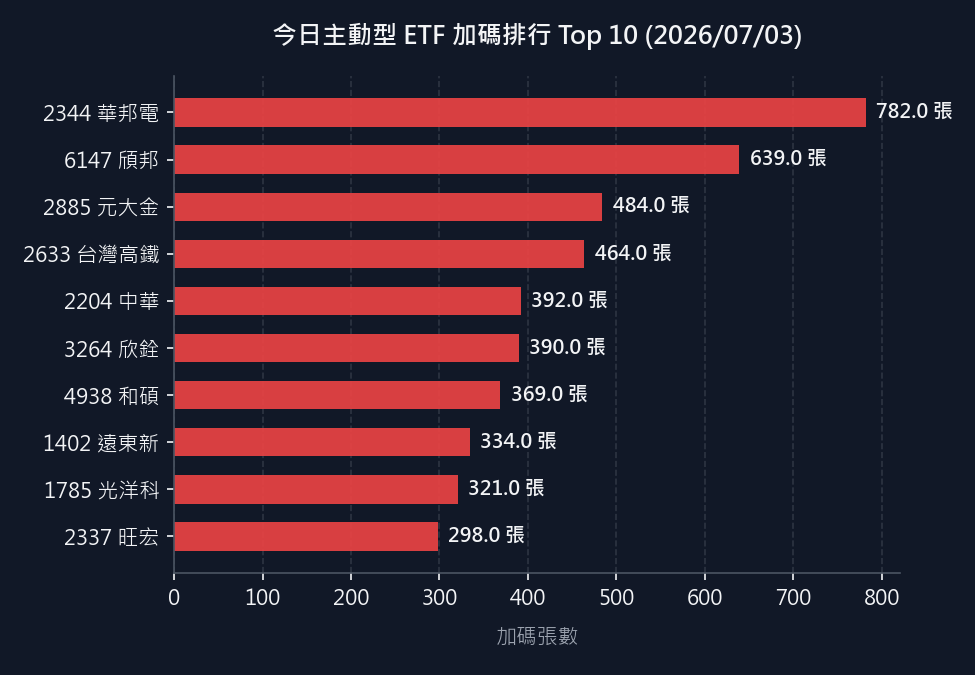
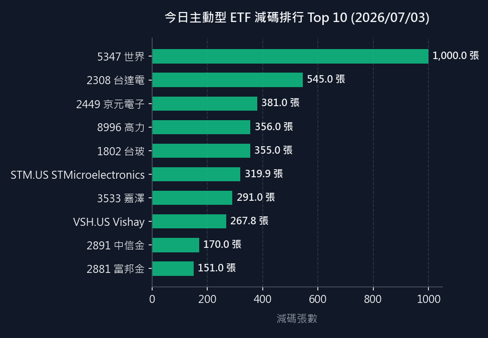

# 主動型 ETF 持股變動

資料來源：`主動型ETF持股明細.xlsx` 最近兩個日期分頁。

比較區間：`20260702` → `20260703`

## 今日加減碼視覺化排行

| 今日加碼 Top 10 | 今日減碼 Top 10 |
| :---: | :---: |
|  |  |

| ETF | 新增 | 刪除 | 比例變動 |
| :-- | --: | --: | --: |
| 00400A | 6 | 0 | 51 |
| 00401A | 7 | 0 | 50 |
| 00402A | 0 | 0 | 48 |
| 00403A | 1 | 1 | 36 |
| 00404A | 0 | 0 | 0 |
| 00405A | 0 | 0 | 39 |
| 00407A | 0 | 0 | 41 |
| 00980A | 0 | 0 | 36 |
| 00980D | 164 | 0 | 3 |
| 00981A | 0 | 1 | 29 |
| 00982A | 0 | 0 | 40 |
| 00983A | 0 | 0 | 38 |
| 00983D | 3 | 0 | 10 |
| 00984A | 69 | 1 | 50 |
| 00985A | 0 | 0 | 44 |
| 00986A | 0 | 0 | 31 |
| 00987A | 1 | 1 | 27 |
| 00988A | 1 | 0 | 41 |
| 00989A | 5 | 0 | 54 |
| 00990A | 1 | 3 | 41 |
| 00991A | 0 | 0 | 27 |
| 00992A | 0 | 0 | 30 |
| 00993A | 0 | 0 | 42 |
| 00994A | 0 | 1 | 31 |
| 00995A | 0 | 0 | 44 |
| 00996A | 0 | 0 | 35 |
| 00997A | 1 | 1 | 48 |
| 00998A | 1 | 0 | 34 |
| 00999A | 0 | 0 | 56 |

## 00400A

### 新增持股

- 2385 群光（0.14%，338 張）
- 2472 立隆電（0.17%，108 張）
- 6139 亞翔（0.04%，12 張）
- 6239 力成（0.03%，25 張）
- 6442 光聖（0.10%，16 張）
- 8150 南茂（0.09%，236 張）

### 刪除持股

- 無

### 投資比例變動

- 1303 南亞：1.27% → 1.25%（-0.02）
- 1590 亞德客-KY：1.02% → 1.05%（+0.03）
- 2059 川湖：2.34% → 2.35%（+0.01）
- 2303 聯電：1.87% → 1.91%（+0.04）
- 2308 台達電：3.35% → 3.49%（+0.14）
- 2327 國巨*：3.61% → 3.54%（-0.07）
- 2330 台積電：7.23% → 7.10%（-0.13）
- 2344 華邦電：1.30% → 1.29%（-0.01）
- 2345 智邦：2.38% → 2.34%（-0.04）
- 2357 華碩：1.22% → 1.23%（+0.01）
- 2360 致茂：3.40% → 3.45%（+0.05）
- 2368 金像電：1.80% → 1.88%（+0.08）
- 2376 技嘉：1.19% → 1.17%（-0.02）
- 2382 廣達：0.93% → 0.94%（+0.01）
- 2383 台光電：7.15% → 7.62%（+0.47）
- 2404 漢唐：0.67% → 0.64%（-0.03）
- 2408 南亞科：1.89% → 1.88%（-0.01）
- 2454 聯發科：7.29% → 6.97%（-0.32）
- 2481 強茂：0.46% → 0.44%（-0.02）
- 2885 元大金：1.01% → 1.02%（+0.01）
- 3017 奇鋐：4.16% → 4.15%（-0.01）
- 3036 文曄：1.24% → 1.25%（+0.01）
- 3037 欣興：4.00% → 3.92%（-0.08）
- 3044 健鼎：1.99% → 2.03%（+0.04）
- 3090 日電貿：0.71% → 0.72%（+0.01）
- 3131 弘塑：0.62% → 0.60%（-0.02）
- 3231 緯創：0.85% → 0.84%（-0.01）
- 3293 鈊象：0.41% → 0.40%（-0.01）
- 3374 精材：0.33% → 0.32%（-0.01）
- 3443 創意：0.51% → 0.48%（-0.03）
- 3653 健策：0.83% → 0.81%（-0.02）
- 3665 貿聯-KY：0.83% → 0.81%（-0.02）
- 3711 日月光投控：1.68% → 1.56%（-0.12）
- 4749 新應材：0.32% → 0.31%（-0.01）
- 5274 信驊：2.30% → 2.22%（-0.08）
- 5347 世界：2.04% → 1.97%（-0.07）
- 5434 崇越：0.41% → 0.40%（-0.01）
- 6121 新普：0.28% → 0.29%（+0.01）
- 6147 頎邦：0.99% → 1.00%（+0.01）
- 6187 萬潤：0.58% → 0.59%（+0.01）
- 6223 旺矽：4.73% → 4.76%（+0.03）
- 6274 台燿：0.79% → 0.82%（+0.03）
- 6285 啟碁：0.72% → 0.71%（-0.01）
- 6488 環球晶：3.92% → 4.04%（+0.12）
- 6510 精測：0.86% → 0.88%（+0.02）
- 6515 穎崴：0.43% → 0.45%（+0.02）
- 6669 緯穎：2.77% → 2.78%（+0.01）
- 6715 嘉基：0.24% → 0.26%（+0.02）
- 7769 鴻勁：0.35% → 0.34%（-0.01）
- 8046 南電：0.29% → 0.30%（+0.01）
- 8210 勤誠：1.25% → 1.23%（-0.02）

## 00401A

### 新增持股

- 1301 台塑（0.08%，44 張）
- 2609 陽明（0.02%，13 張）
- 2615 萬海（0.06%，24 張）
- 2890 永豐金（0.30%，254 張）
- 3005 神基（0.19%，61 張）
- 3665 貿聯-KY（0.06%，1 張）
- 5871 中租-KY（0.17%，48 張）

### 刪除持股

- 無

### 投資比例變動

- 1216 統一：0.31% → 0.32%（+0.01）
- 2303 聯電：1.34% → 1.37%（+0.03）
- 2308 台達電：4.36% → 4.57%（+0.21）
- 2330 台積電：8.92% → 8.80%（-0.12）
- 2345 智邦：2.47% → 2.44%（-0.03）
- 2357 華碩：1.22% → 1.23%（+0.01）
- 2360 致茂：2.11% → 2.16%（+0.05）
- 2368 金像電：0.48% → 0.50%（+0.02）
- 2379 瑞昱：2.21% → 2.12%（-0.09）
- 2382 廣達：2.33% → 2.37%（+0.04）
- 2383 台光電：2.38% → 2.55%（+0.17）
- 2449 京元電子：1.93% → 1.85%（-0.08）
- 2454 聯發科：6.75% → 6.49%（-0.26）
- 2455 全新：0.47% → 0.48%（+0.01）
- 2603 長榮：0.99% → 1.04%（+0.05）
- 2881 富邦金：1.44% → 1.45%（+0.01）
- 2882 國泰金：1.10% → 1.09%（-0.01）
- 2883 凱基金：1.90% → 1.93%（+0.03）
- 2884 玉山金：1.77% → 1.76%（-0.01）
- 2885 元大金：1.80% → 1.83%（+0.03）
- 2886 兆豐金：0.48% → 0.47%（-0.01）
- 2887 台新新光金：1.03% → 1.07%（+0.04）
- 2891 中信金：2.35% → 2.36%（+0.01）
- 3037 欣興：0.73% → 0.72%（-0.01）
- 3044 健鼎：1.48% → 1.52%（+0.04）
- 3131 弘塑：0.70% → 0.68%（-0.02）
- 3167 大量：0.83% → 0.91%（+0.08）
- 3491 昇達科：1.13% → 1.20%（+0.07）
- 3529 力旺：0.53% → 0.49%（-0.04）
- 3653 健策：1.14% → 1.12%（-0.02）
- 3711 日月光投控：2.72% → 2.54%（-0.18）
- 4904 遠傳：0.90% → 0.91%（+0.01）
- 4958 臻鼎-KY：2.65% → 2.70%（+0.05）
- 4991 環宇-KY：0.71% → 0.77%（+0.06）
- 5274 信驊：1.06% → 1.03%（-0.03）
- 5347 世界：1.17% → 1.13%（-0.04）
- 5904 寶雅：0.63% → 0.64%（+0.01）
- 6187 萬潤：0.66% → 0.67%（+0.01）
- 6223 旺矽：2.82% → 2.85%（+0.03）
- 6285 啟碁：2.10% → 2.09%（-0.01）
- 6415 矽力*-KY：0.95% → 0.92%（-0.03）
- 6510 精測：0.97% → 0.99%（+0.02）
- 6515 穎崴：0.83% → 0.88%（+0.05）
- 6531 愛普*：1.44% → 1.47%（+0.03）
- 6669 緯穎：2.49% → 2.51%（+0.02）
- 6944 兆聯實業：0.54% → 0.53%（-0.01）
- 7769 鴻勁：2.94% → 2.86%（-0.08）
- 7828 創新服務：1.60% → 1.51%（-0.09）
- 8021 尖點：0.36% → 0.37%（+0.01）
- 8464 億豐：1.29% → 1.24%（-0.05）

## 00402A

### 新增持股

- 無

### 刪除持股

- 無

### 投資比例變動

- AAPL.US Apple：6.53% → 6.98%（+0.45）
- ADI.US Analog Devices：1.90% → 1.69%（-0.21）
- AMD.US AMD：5.25% → 5.35%（+0.10）
- AMZN.US Amazon：4.53% → 4.61%（+0.08）
- ANET.US Arista Networks：1.01% → 1.03%（+0.02）
- ASML.US ASML Holding：1.53% → 1.56%（+0.03）
- AVGO.US Broadcom：2.42% → 2.31%（-0.11）
- AXON.US Axon Enterprise：1.01% → 1.08%（+0.07）
- BABA.US Alibaba Group：0.65% → 0.42%（-0.23）
- BKNG.US Booking Holdings：0.73% → 0.79%（+0.06）
- CDNS.US Cadence Design Systems：1.76% → 1.85%（+0.09）
- CIEN.US Ciena：1.42% → 1.38%（-0.04）
- CLS.US Celestica：0.87% → 0.86%（-0.01）
- COHR.US Coherent：1.66% → 1.60%（-0.06）
- CRWD.US CrowdStrike Holdings：1.31% → 1.40%（+0.09）
- DASH.US DoorDash：0.85% → 0.92%（+0.07）
- FSLY.US Fastly：0.24% → 0.25%（+0.01）
- GOOG.US Alphabet - Class C Capital Stock：3.49% → 3.44%（-0.05）
- GOOGL.US Alphabet - Class A Common Stock：3.48% → 3.41%（-0.07）
- INTC.US Intel：1.44% → 1.45%（+0.01）
- KLAC.US KLA：2.41% → 2.27%（-0.14）
- LITE.US Lumentum：1.61% → 1.19%（-0.42）
- LRCX.US Lam Research：3.95% → 3.78%（-0.17）
- MCHP.US Microchip Technology：1.60% → 1.62%（+0.02）
- MDB.US MongoDB：0.61% → 0.64%（+0.03）
- META.US Meta：2.88% → 2.69%（-0.19）
- MRVL.US Marvell：1.68% → 1.62%（-0.06）
- MSFT.US Microsoft：3.17% → 3.43%（+0.26）
- MU.US Micron：6.92% → 6.47%（-0.45）
- NFLX.US Netflix：1.16% → 1.29%（+0.13）
- NOW.US ServiceNow：0.52% → 0.56%（+0.04）
- NVDA.US NVIDIA：7.67% → 8.10%（+0.43）
- NXPI.US NXP Semiconductors：1.15% → 1.19%（+0.04）
- ON.US ON Semiconductor：0.28% → 0.29%（+0.01）
- PANW.US Palo Alto：3.36% → 3.17%（-0.19）
- PLTR.US Palantir Technologies：1.30% → 1.42%（+0.12）
- SHOP.US Shopify：0.63% → 0.66%（+0.03）
- SNOW.US Snowflake：0.68% → 0.72%（+0.04）
- SPOT.US Spotify：0.34% → 0.37%（+0.03）
- STX.US Seagate：1.37% → 1.31%（-0.06）
- TER.US Teradyne：0.71% → 0.65%（-0.06）
- TSM.US TSMC(ADR)：1.54% → 1.60%（+0.06）
- TTWO.US Take-Two：0.70% → 0.76%（+0.06）
- TXN.US Texas Instruments：2.80% → 2.93%（+0.13）
- UBER.US Uber：0.59% → 0.64%（+0.05）
- V.US Visa：1.43% → 1.23%（-0.20）
- WDC.US Western Digital：2.88% → 2.76%（-0.12）
- ZS.US Zscaler：0.23% → 0.24%（+0.01）

## 00403A

### 新增持股

- 3264 欣銓（0.04%，300 張）

### 刪除持股

- 5347 世界（0.11%，1000 張）

### 投資比例變動

- 1560 中砂：0.44% → 0.43%（-0.01）
- 2049 上銀：0.21% → 0.20%（-0.01）
- 2303 聯電：7.17% → 7.36%（+0.19）
- 2308 台達電：2.77% → 2.90%（+0.13）
- 2327 國巨*：6.13% → 6.04%（-0.09）
- 2330 台積電：18.23% → 18.01%（-0.22）
- 2337 旺宏：0.84% → 0.82%（-0.02）
- 2344 華邦電：4.11% → 4.20%（+0.09）
- 2345 智邦：3.34% → 3.30%（-0.04）
- 2360 致茂：0.57% → 0.59%（+0.02）
- 2368 金像電：1.96% → 2.06%（+0.10）
- 2383 台光電：3.73% → 3.99%（+0.26）
- 2454 聯發科：3.60% → 3.46%（-0.14）
- 3017 奇鋐：5.46% → 5.48%（+0.02）
- 3037 欣興：5.07% → 5.00%（-0.07）
- 3211 順達：0.37% → 0.36%（-0.01）
- 3443 創意：1.48% → 1.39%（-0.09）
- 3529 力旺：0.67% → 0.62%（-0.05）
- 3533 嘉澤：1.56% → 1.55%（-0.01）
- 3583 辛耘：0.47% → 0.44%（-0.03）
- 3653 健策：1.67% → 1.53%（-0.14）
- 3665 貿聯-KY：0.20% → 0.19%（-0.01）
- 3711 日月光投控：2.35% → 2.20%（-0.15）
- 4958 臻鼎-KY：2.23% → 2.27%（+0.04）
- 5274 信驊：0.46% → 0.45%（-0.01）
- 6223 旺矽：4.19% → 4.25%（+0.06）
- 6274 台燿：1.66% → 1.75%（+0.09）
- 6415 矽力*-KY：0.32% → 0.31%（-0.01）
- 6488 環球晶：1.39% → 1.44%（+0.05）
- 6515 穎崴：1.08% → 1.14%（+0.06）
- 6669 緯穎：2.37% → 2.39%（+0.02）
- 6805 富世達：0.55% → 0.53%（-0.02）
- 7769 鴻勁：1.13% → 1.10%（-0.03）
- 8046 南電：0.53% → 0.54%（+0.01）
- 8358 金居：0.64% → 0.66%（+0.02）
- 8996 高力：1.28% → 1.24%（-0.04）

## 00404A

### 新增持股

- 無

### 刪除持股

- 無

### 投資比例變動

- 無

## 00405A

### 新增持股

- 無

### 刪除持股

- 無

### 投資比例變動

- 2059 川湖：1.32% → 1.35%（+0.03）
- 2308 台達電：1.14% → 1.20%（+0.06）
- 2327 國巨*：5.36% → 5.32%（-0.04）
- 2330 台積電：2.36% → 2.34%（-0.02）
- 2337 旺宏：1.63% → 1.60%（-0.03）
- 2344 華邦電：4.33% → 4.36%（+0.03）
- 2345 智邦：5.16% → 5.15%（-0.01）
- 2360 致茂：1.28% → 1.32%（+0.04）
- 2368 金像電：1.50% → 1.59%（+0.09）
- 2383 台光電：2.49% → 2.68%（+0.19）
- 2449 京元電子：1.10% → 1.07%（-0.03）
- 2454 聯發科：7.48% → 7.24%（-0.24）
- 3017 奇鋐：6.94% → 7.01%（+0.07）
- 3037 欣興：5.05% → 5.02%（-0.03）
- 3081 聯亞：1.12% → 1.21%（+0.09）
- 3105 穩懋：1.99% → 2.00%（+0.01）
- 3131 弘塑：5.11% → 4.97%（-0.14）
- 3163 波若威：0.24% → 0.25%（+0.01）
- 3443 創意：3.92% → 3.72%（-0.20）
- 3583 辛耘：2.19% → 2.06%（-0.13）
- 3653 健策：2.50% → 2.47%（-0.03）
- 3711 日月光投控：0.94% → 0.88%（-0.06）
- 4576 大銀微系統：0.07% → 0.06%（-0.01）
- 4979 華星光：0.04% → 0.05%（+0.01）
- 5274 信驊：2.34% → 2.29%（-0.05）
- 5347 世界：0.17% → 0.16%（-0.01）
- 6187 萬潤：2.22% → 2.29%（+0.07）
- 6223 旺矽：6.62% → 6.75%（+0.13）
- 6274 台燿：0.45% → 0.48%（+0.03）
- 6291 沛亨：0.46% → 0.47%（+0.01）
- 6510 精測：1.75% → 1.80%（+0.05）
- 6515 穎崴：0.86% → 0.91%（+0.05）
- 6669 緯穎：0.10% → 0.11%（+0.01）
- 7734 印能科技：2.07% → 2.03%（-0.04）
- 7769 鴻勁：2.81% → 2.75%（-0.06）
- 8028 昇陽半導體：1.14% → 1.19%（+0.05）
- 8046 南電：2.61% → 2.71%（+0.10）
- 8299 群聯：1.57% → 1.61%（+0.04）
- 8996 高力：1.60% → 1.56%（-0.04）

## 00407A

### 新增持股

- 無

### 刪除持股

- 無

### 投資比例變動

- 1590 亞德客-KY：1.77% → 1.82%（+0.05）
- 2059 川湖：1.94% → 1.96%（+0.02）
- 2303 聯電：1.94% → 1.99%（+0.05）
- 2308 台達電：4.07% → 4.27%（+0.20）
- 2327 國巨*：2.89% → 2.85%（-0.04）
- 2330 台積電：8.99% → 8.88%（-0.11）
- 2345 智邦：3.65% → 3.61%（-0.04）
- 2360 致茂：1.94% → 1.98%（+0.04）
- 2368 金像電：2.30% → 2.42%（+0.12）
- 2376 技嘉：0.71% → 0.70%（-0.01）
- 2379 瑞昱：0.83% → 0.80%（-0.03）
- 2383 台光電：0.11% → 1.59%（+1.48）
- 2395 研華：1.57% → 1.60%（+0.03）
- 2454 聯發科：7.15% → 6.87%（-0.28）
- 3017 奇鋐：3.15% → 3.80%（+0.65）
- 3034 聯詠：0.71% → 0.70%（-0.01）
- 3037 欣興：2.46% → 3.06%（+0.60）
- 3443 創意：2.17% → 2.04%（-0.13）
- 3491 昇達科：0.40% → 0.42%（+0.02）
- 3529 力旺：1.88% → 1.75%（-0.13）
- 3533 嘉澤：0.89% → 0.88%（-0.01）
- 3665 貿聯-KY：2.02% → 1.96%（-0.06）
- 3711 日月光投控：2.12% → 1.98%（-0.14）
- 4904 遠傳：0.30% → 0.31%（+0.01）
- 4958 臻鼎-KY：2.23% → 2.27%（+0.04）
- 5274 信驊：2.08% → 2.01%（-0.07）
- 5289 宜鼎：0.20% → 0.19%（-0.01）
- 5536 聖暉*：2.19% → 2.18%（-0.01）
- 6223 旺矽：2.72% → 2.76%（+0.04）
- 6274 台燿：2.17% → 2.29%（+0.12）
- 6415 矽力*-KY：0.50% → 0.48%（-0.02）
- 6446 藥華藥：2.36% → 2.35%（-0.01）
- 6515 穎崴：1.88% → 1.99%（+0.11）
- 6526 達發：0.36% → 0.35%（-0.01）
- 6531 愛普*：1.57% → 1.60%（+0.03）
- 6669 緯穎：2.12% → 2.13%（+0.01）
- 6805 富世達：1.73% → 1.68%（-0.05）
- 8046 南電：2.22% → 2.28%（+0.06）
- 8210 勤誠：1.89% → 1.87%（-0.02）
- 8299 群聯：0.15% → 0.16%（+0.01）
- 8996 高力：0.51% → 0.50%（-0.01）

## 00980A

### 新增持股

- 無

### 刪除持股

- 無

### 投資比例變動

- 2059 川湖：4.90% → 4.95%（+0.05）
- 2308 台達電：5.29% → 5.55%（+0.26）
- 2327 國巨*：2.06% → 2.03%（-0.03）
- 2330 台積電：8.83% → 8.73%（-0.10）
- 2345 智邦：2.02% → 2.00%（-0.02）
- 2360 致茂：1.79% → 1.82%（+0.03）
- 2368 金像電：2.74% → 2.89%（+0.15）
- 2382 廣達：1.11% → 1.13%（+0.02）
- 2383 台光電：4.28% → 4.59%（+0.31）
- 2454 聯發科：6.61% → 6.35%（-0.26）
- 2884 玉山金：0.74% → 0.73%（-0.01）
- 3008 大立光：0.85% → 0.83%（-0.02）
- 3017 奇鋐：2.03% → 2.04%（+0.01）
- 3036 文曄：1.31% → 1.33%（+0.02）
- 3037 欣興：3.11% → 3.07%（-0.04）
- 3044 健鼎：0.47% → 0.48%（+0.01）
- 3081 聯亞：2.37% → 2.55%（+0.18）
- 3443 創意：2.11% → 1.99%（-0.12）
- 3529 力旺：1.01% → 0.94%（-0.07）
- 3653 健策：2.97% → 2.91%（-0.06）
- 3665 貿聯-KY：0.61% → 0.60%（-0.01）
- 3711 日月光投控：1.64% → 1.54%（-0.10）
- 4958 臻鼎-KY：1.47% → 1.50%（+0.03）
- 5274 信驊：1.30% → 1.26%（-0.04）
- 5904 寶雅：1.23% → 1.27%（+0.04）
- 6223 旺矽：3.12% → 3.16%（+0.04）
- 6274 台燿：1.24% → 1.31%（+0.07）
- 6515 穎崴：2.89% → 3.07%（+0.18）
- 6669 緯穎：1.15% → 1.16%（+0.01）
- 6805 富世達：0.51% → 0.50%（-0.01）
- 6831 邁科：0.45% → 0.43%（-0.02）
- 7769 鴻勁：3.70% → 3.59%（-0.11）
- 8046 南電：1.42% → 1.46%（+0.04）
- 8210 勤誠：0.83% → 0.82%（-0.01）
- 8299 群聯：1.00% → 1.02%（+0.02）
- 8996 高力：1.77% → 1.72%（-0.05）

## 00980D

### 新增持股

- AHOLD FINANCE USA LLC 6.88% 01MAY2029（0.48%，N/A 張）
- ALLY FINANCIAL INC (REG) 7.1% 15NOV2027（0.43%，N/A 張）
- ALLY FINANCIAL INC (REG) 8% 01/11/2031（0.58%，N/A 張）
- ALLY FINANCIAL INC (REG) 8% 01NOV2031（0.53%，N/A 張）
- ALLY FINANCIAL INC (REG) VAR 03JAN2030（0.63%，N/A 張）
- ALLY FINANCIAL INC (REG) VAR 13JUN2029（0.55%，N/A 張）
- AMC GLOBAL MEDIA INC SER REGS (REG) (REG S) 10.5% 15JUL2032（0.70%，N/A 張）
- ANHEUSER-BUSCH INBEV WOR (REG) 8.2% 15JAN2039（0.53%，N/A 張）
- APA CORP 6.750000 % 15-FEB-2055（0.36%，N/A 張）
- APOLLO DEBT SOLUTIONS BD 6.700000 % 29JUL2031（0.34%，N/A 張）
- ARCELORMITTAL SA 6.55% 29NOV2027（0.54%，N/A 張）
- ARIS WATER HOLDINGS LLC SER REGS 7.250000 % 01APR2030（0.47%，N/A 張）
- ARSENAL AIC PARENT LLC SER REGS 11.5 % 01-OCT-2031（0.32%，N/A 張）
- ATHENE HOLDING LTD (REG) 6.25% 01APR2054（0.78%，N/A 張）
- BANCO SANTANDER SA 6.921% 08AUG2033（0.34%，N/A 張）
- BANK OF AMERICA CORP (REG) 7.75% 14MAY2038（0.53%，N/A 張）
- BARCLAYS PLC (REG) VAR 27JUN2034（0.34%，N/A 張）
- BAT CAPITAL CORP (REG) 7.081% 02AUG2053（0.59%，N/A 張）
- BAT CAPITAL CORP (REG) 7.75% 19OCT2032（0.45%，N/A 張）
- BAYER US FINANCE LLC SER REGS 6.875000 % 21NOV2053（0.37%，N/A 張）
- BLUE OWL CREDIT INCOME (REG) 6.6% 15SEP2029（0.38%，N/A 張）
- BLUE OWL CREDIT INCOME 7.750000 % 15JAN2029（0.53%，N/A 張）
- BLUE OWL CREDIT INCOME SER WI (REG) 7.75% 16SEP2027（0.54%，N/A 張）
- BLUE OWL TECHNOLOGY FIN CORP II 6.75 % 04APR2029（0.55%，N/A 張）
- BPCE SA SER REGS VAR 14JAN2046（0.41%，N/A 張）
- BPCE SA SER REGS VAR 19OCT2034（0.43%，N/A 張）
- BRITISH TELECOMMUNICATIO (BR) 9.625% 15DEC2030（0.58%，N/A 張）
- CALDERYS FINANCING LLC SER REGS (REG S) 11.25% 01JUN2028（0.33%，N/A 張）
- CAPITAL ONE FINANCIAL CO SER . (REG) VAR 30OCT2031（0.58%，N/A 張）
- CARNIVAL CORP SER REGS (REG S) 7% 15AUG2029（0.55%，N/A 張）
- CHARTER COMM OPT 6.484% 23OCT2045 W/I（0.47%，N/A 張）
- CHARTER COMM OPT LLC/CAP (REG) 5.5% 01APR2063（0.52%，N/A 張）
- CHARTER COMM OPT LLC/CAP (REG) 6.834000 % 23OCT2055（0.47%，N/A 張）
- CHARTER COMM OPT LLC/CAP 6.700000 % 01-DEC-2055（0.48%，N/A 張）
- CHC GROUP LLC SER REGS 11.750000 % 01-SEP-2030（0.42%，N/A 張）
- CHS/COMMUNITY HEALTH SYS SER REGS 9.750000 % 15JAN2034（0.34%，N/A 張）
- CIMIC FINANCE USA PTY LT SER REGS (REG S) 7% 25MAR2034（0.33%，N/A 張）
- CITIGROUP INC 8.125% 15JUL2039（0.64%，N/A 張）
- CIVITAS RESOURCES INC SER REGS (REG) (REG S) 9.625% 15JUN2033（0.55%，N/A 張）
- CONCENTRIX CORP (REG) 6.85% 02AUG2033（0.66%，N/A 張）
- CONOCOPHILLIPS COMPANY (REG) 6.95% 15APR2029（0.51%，N/A 張）
- COREWEAVE INC SER REGS (REG S) 9.25% 01JUN2030（0.44%，N/A 張）
- COX COMMUNICATIONS INC SER REGS 5.800000 % 15DEC2053（0.41%，N/A 張）
- COX COMMUNICATIONS INC SER REGS 5.950000 % 01SEP2054（0.57%，N/A 張）
- DAIMLER FINANCE NA LLC REG 8.5% 18JAN2031（0.64%，N/A 張）
- DELL INT LLC / EMC CORP (REG) 8.1% 15JUL2036（0.59%，N/A 張）
- DELL INT LLC / EMC CORP (REG) 8.35% 15JUL2046（0.57%，N/A 張）
- DEUTSCHE BANK NY VAR 10FEB2034（0.34%，N/A 張）
- DEUTSCHE BANK NY VAR 20NOV2029（0.47%，N/A 張）
- DEUTSCHE TELEKOM INT FIN (REG) 8.75% 15JUN2030（0.41%，N/A 張）
- DEUTSCHE TELEKOM INT FIN (REG) 9.25% 01JUN2032（0.42%，N/A 張）
- DEVON ENERGY CORPORATION (REG) 7.875% 30SEP2031（0.47%，N/A 張）
- DIRECTV FIN LLC/COINC SER REGS 10.000000 % 15FEB2031（0.40%，N/A 張）
- DOW CHEMICAL CO/THE (REG) 5.55% 30NOV2048（0.56%，N/A 張）
- DOW CHEMICAL CO/THE (REG) 5.6% 15FEB2054（0.60%，N/A 張）
- DOW CHEMICAL CO/THE 7.375% 01NOV2029（0.61%，N/A 張）
- EDISON INTERNATIONAL (REG) 6.95% 15NOV2029（0.58%，N/A 張）
- ENEL FINANCE INTL NV SER REGS (REG S) 7.5% 14OCT2032（0.35%，N/A 張）
- ENEL FINANCE INTL NV SER REGS (REG S) 7.75% 14OCT2052（0.38%，N/A 張）
- ENERGY TRANSFER LP (REG) 7.5% 01JUL2038（0.33%，N/A 張）
- F&G ANNUITIES & LIFE INC 6.250000 % 04OCT2034（0.51%，N/A 張）
- FIFTH THIRD BANCORP (REG) 8.25% 01MAR2038（0.66%，N/A 張）
- FMC CORP (REG) 4.5% 01OCT2049（0.51%，N/A 張）
- FMC CORP (REG) 6.375000 % 18MAY2053（0.48%，N/A 張）
- FORD MOTOR COMPANY (REG) 7.45% 16JUL2031（0.47%，N/A 張）
- FORD MOTOR COMPANY 5.291% 08DEC2046（0.29%，N/A 張）
- FORD MOTOR CREDIT CO LLC (REG) 7.2% 10JUN2030（0.33%，N/A 張）
- FORD MOTOR CREDIT CO LLC (REG) 7.35% 04NOV2027（0.33%，N/A 張）
- FORD MOTOR CREDIT CO LLC (REG) 7.35% 06MAR2030（0.33%，N/A 張）
- FORD MOTOR CREDIT CO LLC 6.798% 07NOV2028（0.33%，N/A 張）
- FORD MOTOR CREDIT CO LLC 7.122% 07NOV2033（0.34%，N/A 張）
- FREEDOM MORTGAGE CORP SER REGS (REG S) 12.25% 01OCT2030（0.47%，N/A 張）
- GENERAL MOTORS CO (REG) 6.75% 01APR2046（0.57%，N/A 張）
- GENERAL MOTORS CO (REG) 6.8% 01OCT2027（0.55%，N/A 張）
- GLOBAL ATLANTIC FIN CO SER REGS 6.750000 % 15MAR2054（0.63%，N/A 張）
- GLOBAL ATLANTIC FIN CO SER REGS 7.950000 % 15JUN2033（0.66%，N/A 張）
- GLOBAL AUTO HO/AAG FH UK SER REGS (REG S) 11.5% 15AUG2029（0.36%，N/A 張）
- GLOBAL AUTO HO/AAG FH UK SER REGS (REG S) 8.75% 15JAN2032（0.42%，N/A 張）
- HA SUSTAINABLE INF CAP (REG) 6.375% 01JUL2034（0.35%，N/A 張）
- HERTZ CORP/THE SER REGS (REG S) 12.625% 15JUL2029（0.35%，N/A 張）
- HORIZON MUTUAL HOLDINGS SER REGS 6.200000 % 15NOV2034（0.33%，N/A 張）
- HPS CORPORATE LENDING FU 6.750000 % 30JAN2029（0.53%，N/A 張）
- HSBC HOLDINGS PLC (REG) VAR 13NOV2034（0.35%，N/A 張）
- HSBC HOLDINGS PLC VAR 03NOV2028（0.33%，N/A 張）
- HSBC HOLDINGS PLC VAR 03NOV2033（0.36%，N/A 張）
- INTESA SANPAOLO SPA SER REGS (REG S) 7.8% 28NOV2053（0.38%，N/A 張）
- INTESA SANPAOLO SPA SER REGS (REG) 7.200000 % 28NOV2033（0.35%，N/A 張）
- JBS USA HOLD/FOOD/LUX CO 7.250000 % 15NOV2053（0.48%，N/A 張）
- KELLANOVA SER B (REG) 7.450000 % 01APR2031（0.57%，N/A 張）
- KINDER MORGAN INC/DELAWA SER GMTN (REG) 7.75% 15JAN2032（0.33%，N/A 張）
- KINDER MORGAN INC/DELAWA SER GMTN (REG) 7.8% 01AUG2031（0.32%，N/A 張）
- KONINKLIJKE KPN NV (REG) 8.375% 01OCT2030（0.44%，N/A 張）
- LPL HOLDINGS INC (REG) 6.75% 17NOV2028（0.56%，N/A 張）
- M&T BANK CORPORATION (REG) VAR 30OCT2029（0.54%，N/A 張）
- MACQUARIE BANK LTD SER REGS (REG S) 6.798% 18JAN2033（0.34%，N/A 張）
- MDC HOLDINGS INC (REG) 6% 15JAN2043（0.33%，N/A 張）
- META PLATFORMS INC 5.750000 % 15-NOV-2065（0.46%，N/A 張）
- METLIFE INC (REG) 10.75% 01AUG2039（0.46%，N/A 張）
- MOHEGAN TRIBAL / MS DIG SER REGS 11.875000 % 15APR2031（0.67%，N/A 張）
- MPLX LP 6.200000 % 15SEP2055（0.34%，N/A 張）
- MYLAN INC SER WI (REG) 5.2% 15APR2048WI（0.50%，N/A 張）
- MYLAN NV 5.25% 15JUN2046 WI（0.53%，N/A 張）
- NATIONWIDE MUTUAL INSUR 9.375% 15AUG2039（0.53%，N/A 張）
- NISSAN MOTOR CO SER REGS 8.125000 % 17JUL2035（0.52%，N/A 張）
- NRG ENERGY INC SER REGS (REG S) 7% 15MAR2033（0.32%，N/A 張）
- OCCIDENTAL PETROLEUM COR 8.875% 15JUL2030（0.53%，N/A 張）
- ONEOK INC 6.625% 01SEP2053（0.59%，N/A 張）
- OPEN TEXT CORP SER REGS (REG) (REG S) 6.9% 01DEC2027（0.65%，N/A 張）
- ORACLE CORP (REG) 5.500000 % 27SEP2064（0.58%，N/A 張）
- ORACLE CORP 5.55% 06FEB2053（0.26%，N/A 張）
- ORACLE CORP 6.100000 % 26-SEP-2065（0.50%，N/A 張）
- ORACLE CORP 6.125000 % 03AUG2065（0.54%，N/A 張）
- ORACLE CORP 6.9% 09NOV2052（0.54%，N/A 張）
- ORANGE SA (REG) 9% 01MAR2031（0.66%，N/A 張）
- PACIFIC GAS & ELEC 6.150000 % 01MAR2055（0.05%，N/A 張）
- PACIFIC GAS & ELECTRIC (REG) 6.7% 01APR2053（0.34%，N/A 張）
- PACIFIC GAS & ELECTRIC (REG) 6.75% 15JAN2053（0.34%，N/A 張）
- PACIFIC GAS & ELECTRIC 6.95% 15MAR2034（0.33%，N/A 張）
- PBF HOLDING CO LLC SER REGS 9.875000 % 15MAR2030（0.35%，N/A 張）
- PEPSICO INC (REG) 7.000000 % 01MAR2029（0.31%，N/A 張）
- PLANET FINANCIAL GROUP SER REGS 10.500000 % 15DEC2029（0.32%，N/A 張）
- POLARIS INC 6.950000 % 15MAR2029（0.47%，N/A 張）
- PROGRESS ENERGY INC (REG) 7.75% 01MAR2031（0.57%，N/A 張）
- RIO TINTO FIN USA LTD (REG) 7.125% 15JUL2028（0.56%，N/A 張）
- RR DONNELLEY & SONS CO SER REGS (REG S) 9.5% 01AUG2029（0.42%，N/A 張）
- SABRE FINANCIAL BORROWER SER REGS 11.125 % 15-JUN-2029（0.53%，N/A 張）
- SABRE GLBL INC SER REGS (REG) 10.750000 % 15NOV2029（0.14%，N/A 張）
- SABRE GLBL INC SER REGS 10.75 % 15-MAR-2030（0.17%，N/A 張）
- SABRE GLBL INC SER REGS 11.125000 % 15JUL2030（0.44%，N/A 張）
- SANTANDER HOLDINGS USA VAR 12JUN2029（0.58%，N/A 張）
- SANTANDER UK GROUP HLDGS (REG) VAR 10JAN2029（0.32%，N/A 張）
- SANTOS FINANCE LTD SER REGS (REG S) 6.875% 19SEP2033（0.29%，N/A 張）
- SBL HOLDINGS INC SER REGS 7.200000 % 30OCT2034（0.52%，N/A 張）
- SOCIETE GENERALE SER REGS (REG) (REG S) 7.367% 10JAN2053（0.34%，N/A 張）
- SPRINT CAPITAL CORP (REG) 6.875% 15NOV2028（0.31%，N/A 張）
- SPRINT CAPITAL CORP (REG) 8.75% 15MAR2032（0.41%，N/A 張）
- STAPLES INC SER REGS (REG S) 10.75% 01SEP2029（0.45%，N/A 張）
- STELLANTIS FIN US INC SER REGS 6.450000 % 18MAR2035（0.32%，N/A 張）
- SUNCOR ENERGY INC (REG) 6.8% 15MAY2038（0.42%，N/A 張）
- SUNCOR ENERGY INC (REG) 6.85% 01JUN2039（0.34%，N/A 張）
- SUNCOR ENERGY INC (REG) 7.15% 01FEB2032（0.32%，N/A 張）
- SYMETRA LIFE INSURANCE SER REGS 6.550000 % 01OCT2055（0.32%，N/A 張）
- TIME WARNER ENTERTAINMEN 8.375% 15JUL2033（0.65%，N/A 張）
- TOUCAN FINCO LTD/CAN/US SER REGS 9.500000 % 15MAY2030（0.25%，N/A 張）
- TRANSCANADA PIPELINES LTD 7.625PCT 15/01/2039（0.54%，N/A 張）
- TRUIST FINANCIAL CORP SER MTN VAR 30OCT2029（0.64%，N/A 張）
- UBS GROUP AG SER REGS (REG S) VAR 15NOV2033（0.48%，N/A 張）
- US 10YR NOTE (CBT)SEP26 21-SEP-2026（18.48%，N/A 張）
- US 10YR ULTRA FUT SEP26 21-SEP-2026（-2.82%，N/A 張）
- US 2YR NOTE (CBT) SEP26 30-SEP-2026（1.95%，N/A 張）
- US 5YR NOTE (CBT) SEP26 30-SEP-2026（-16.01%，N/A 張）
- US ACUTE CARE SOLUTIONS SER REGS (REG S) 9.75% 15MAY2029（0.32%，N/A 張）
- US LONG BOND(CBT) SEP26 21-SEP-2026（5.49%，N/A 張）
- US ULTRA BOND CBT SEP26 21-SEP-2026（0.18%，N/A 張）
- VALERO ENERGY CORP (REG) 7.5% 15APR2032（0.48%，N/A 張）
- VAR ENERGI ASA SER REGS (REG S) 7.5% 15JAN2028（0.33%，N/A 張）
- VAR ENERGI ASA SER REGS (REG S) 8% 15NOV2032（0.36%，N/A 張）
- VERIZON COMMUNICAT 7.750000 % 01DEC2030（0.44%，N/A 張）
- VIACOM INC (REG) 5.85% 01SEP2043（0.58%，N/A 張）
- VIACOMCBS INC 6.875% 30APR2036（0.29%，N/A 張）
- VIRGINIA ELEC & POWER CO (REG) 8.875% 15NOV2038（0.59%，N/A 張）
- VISTRA OPERATIONS CO LLC SER REGS (REG S) 6.95% 15OCT2033（0.41%，N/A 張）
- WESTLAKE CORP 6.375000 % 15-NOV-2055（0.53%，N/A 張）
- ZIONS BANCORP NA VAR 19NOV2035（0.41%，N/A 張）

### 刪除持股

- 無

### 投資比例變動

- GETTY IMAGES INC SER REGS 11.250000 % 21FEB2030：0.48% → 0.49%（+0.01）
- SALESFORCE INC (REG) 6.55% 15MAR2056：0.54% → 0.55%（+0.01）
- TIME WARNER CABLE INC REG 7.3% 01JUL2038：0.31% → 0.32%（+0.01）

## 00981A

### 新增持股

- 無

### 刪除持股

- 3533 嘉澤（0.21%，291 張）

### 投資比例變動

- 1590 亞德客-KY：0.25% → 0.26%（+0.01）
- 2303 聯電：4.86% → 4.99%（+0.13）
- 2308 台達電：3.75% → 3.54%（-0.21）
- 2327 國巨*：8.98% → 8.87%（-0.11）
- 2330 台積電：10.00% → 9.89%（-0.11）
- 2345 智邦：5.91% → 5.86%（-0.05）
- 2368 金像電：3.48% → 3.67%（+0.19）
- 2383 台光電：8.60% → 9.22%（+0.62）
- 2449 京元電子：0.45% → 0.39%（-0.06）
- 2454 聯發科：7.42% → 7.14%（-0.28）
- 3017 奇鋐：4.82% → 4.84%（+0.02）
- 3037 欣興：5.05% → 4.98%（-0.07）
- 3376 新日興：0.11% → 0.12%（+0.01）
- 3653 健策：2.67% → 2.62%（-0.05）
- 3665 貿聯-KY：3.34% → 3.26%（-0.08）
- 3711 日月光投控：3.14% → 2.94%（-0.20）
- 5274 信驊：2.28% → 2.21%（-0.07）
- 6147 頎邦：0.45% → 0.46%（+0.01）
- 6187 萬潤：0.45% → 0.46%（+0.01）
- 6223 旺矽：5.86% → 5.94%（+0.08）
- 6271 同欣電：0.27% → 0.28%（+0.01）
- 6274 台燿：2.96% → 3.12%（+0.16）
- 6278 台表科：0.32% → 0.31%（-0.01）
- 6510 精測：0.50% → 0.46%（-0.04）
- 6515 穎崴：0.80% → 0.76%（-0.04）
- 6669 緯穎：4.26% → 4.30%（+0.04）
- 6805 富世達：1.03% → 1.00%（-0.03）
- 8046 南電：3.47% → 3.59%（+0.12）
- 8210 勤誠：1.01% → 1.00%（-0.01）

## 00982A

### 新增持股

- 無

### 刪除持股

- 無

### 投資比例變動

- 1785 光洋科：1.51% → 1.55%（+0.04）
- 2059 川湖：2.63% → 2.66%（+0.03）
- 2303 聯電：2.70% → 2.76%（+0.06）
- 2316 楠梓電：1.32% → 1.36%（+0.04）
- 2327 國巨*：1.63% → 1.60%（-0.03）
- 2330 台積電：8.85% → 8.74%（-0.11）
- 2345 智邦：3.99% → 3.95%（-0.04）
- 2351 順德：0.35% → 0.34%（-0.01）
- 2360 致茂：3.32% → 3.39%（+0.07）
- 2368 金像電：0.87% → 0.92%（+0.05）
- 2383 台光電：3.37% → 3.60%（+0.23）
- 2451 創見：0.24% → 0.25%（+0.01）
- 2454 聯發科：6.80% → 6.53%（-0.27）
- 2467 志聖：1.73% → 1.61%（-0.12）
- 2472 立隆電：1.83% → 1.81%（-0.02）
- 2885 元大金：0.25% → 0.26%（+0.01）
- 3008 大立光：1.56% → 1.53%（-0.03）
- 3036 文曄：0.90% → 0.91%（+0.01）
- 3105 穩懋：3.11% → 3.09%（-0.02）
- 3264 欣銓：2.10% → 2.08%（-0.02）
- 3491 昇達科：2.23% → 2.35%（+0.12）
- 3583 辛耘：1.83% → 1.71%（-0.12）
- 3702 大聯大：1.05% → 1.07%（+0.02）
- 3711 日月光投控：1.32% → 1.23%（-0.09）
- 4958 臻鼎-KY：3.44% → 3.51%（+0.07）
- 5274 信驊：0.29% → 0.28%（-0.01）
- 5536 聖暉*：9.70% → 9.66%（-0.04）
- 6139 亞翔：5.26% → 5.28%（+0.02）
- 6147 頎邦：0.89% → 0.90%（+0.01）
- 6223 旺矽：4.07% → 4.12%（+0.05）
- 6257 矽格：2.12% → 2.14%（+0.02）
- 6274 台燿：1.35% → 1.42%（+0.07）
- 6278 台表科：0.86% → 0.83%（-0.03）
- 6488 環球晶：2.50% → 2.59%（+0.09）
- 6531 愛普*：1.22% → 1.24%（+0.02）
- 6669 緯穎：2.82% → 2.84%（+0.02）
- 6805 富世達：0.37% → 0.36%（-0.01）
- 7769 鴻勁：1.17% → 1.14%（-0.03）
- 8016 矽創：1.31% → 1.33%（+0.02）
- 8996 高力：0.97% → 0.94%（-0.03）

## 00983A

### 新增持股

- 無

### 刪除持股

- 無

### 投資比例變動

- AMD.US AMD：6.44% → 6.14%（-0.30）
- AMZN.US Amazon：2.73% → 2.79%（+0.06）
- AVGO.US Broadcom：0.72% → 0.49%（-0.23）
- BEAM.US Beam Therapeutics：3.83% → 4.05%（+0.22）
- BWXT.US BWX Technologies：0.85% → 0.87%（+0.02）
- CBRS.US Cerebras：0.52% → 0.49%（-0.03）
- CERS.US Cerus：0.14% → 0.15%（+0.01）
- COIN.US Coinbase：1.12% → 1.18%（+0.06）
- CRCL.US Circle：1.01% → 1.08%（+0.07）
- CRSP.US CRISPR Therapeutics：3.57% → 3.93%（+0.36）
- CRWV.US CoreWeave：2.19% → 1.46%（-0.73）
- DE.US Deere：0.93% → 0.94%（+0.01）
- GOOG.US Alphabet - Class C Capital Stock：1.13% → 1.15%（+0.02）
- GOOGL.US Alphabet - Class A Common Stock：1.51% → 1.53%（+0.02）
- HOOD.US Robinhood Markets：6.75% → 7.14%（+0.39）
- ILMN.US Illumina：3.05% → 3.19%（+0.14）
- LLY.US Eli Lilly：1.65% → 1.71%（+0.06）
- META.US Meta：0.23% → 0.22%（-0.01）
- NTLA.US Intellia Therapeutics：3.32% → 3.44%（+0.12）
- NTRA.US Natera：3.55% → 3.66%（+0.11）
- NVDA.US NVIDIA：1.92% → 1.93%（+0.01）
- P.US Everpure：0.28% → 0.27%（-0.01）
- PLTR.US Palantir Technologies：0.52% → 0.55%（+0.03）
- RBLX.US Roblox：1.43% → 1.40%（-0.03）
- ROKU.US Roku：0.29% → 0.30%（+0.01）
- SHOP.US Shopify：3.72% → 4.07%（+0.35）
- SNOW.US Snowflake：0.35% → 0.36%（+0.01）
- SOFI.US SoFi Technologies：0.61% → 0.62%（+0.01）
- SPCX.US SpaceX：4.07% → 4.27%（+0.20）
- TEM.US Tempus：5.27% → 5.51%（+0.24）
- TER.US Teradyne：3.05% → 2.28%（-0.77）
- TSLA.US Tesla：9.13% → 8.28%（-0.85）
- TSM.US TSMC(ADR)：3.94% → 3.44%（-0.50）
- TWST.US Twist Bioscience：5.22% → 5.17%（-0.05）
- TXG.US 10x Genomics：5.39% → 5.49%（+0.10）
- VCYT.US Veracyte：2.85% → 2.77%（-0.08）
- WGS.US GeneDx：1.13% → 1.09%（-0.04）
- XYZ.US Block：2.22% → 2.31%（+0.09）

## 00983D

### 新增持股

- LQDW.US iShares Investment Grade Corpora（7.30%，100 張）
- TLTW.US iShares 20+ Year Treasury Bond B（7.31%，108 張）
- TRGP 6 1/2 02/15/53（0.16%，N/A 張）

### 刪除持股

- 無

### 投資比例變動

- C 8 1/8 07/15/39：2.33% → 2.34%（+0.01）
- DELL 8.35 07/15/46：1.63% → 1.62%（-0.01）
- DOW 6.9 05/15/53：0.73% → 0.74%（+0.01）
- GTN 10 1/2 07/15/29：1.65% → 1.66%（+0.01）
- HAL 7.45 09/15/39：1.82% → 1.83%（+0.01）
- HTZ 12 5/8 07/15/29：0.63% → 0.62%（-0.01）
- NVDA 5.55 06/15/46：0.61% → 0.60%（-0.01）
- RAKUTN 11 1/4 02/15/27：1.78% → 1.77%（-0.01）
- SYY 6.6 04/01/50：0.20% → 0.19%（-0.01）
- TIME WARNER CABLE INC 7.300 07/01/38：0.50% → 0.51%（+0.01）

## 00984A

### 新增持股

- 1229 聯華（0.26%，506 張）
- 1409 新纖（0.13%，359 張）
- 1513 中興電（0.25%，122 張）
- 1560 中砂（0.49%，56 張）
- 1785 光洋科（0.58%，321 張）
- 1795 美時（0.37%，161 張）
- 1907 永豐餘（0.26%，803 張）
- 2006 東和鋼鐵（0.37%，459 張）
- 2059 川湖（0.56%，6 張）
- 2105 正新（0.39%，1034 張）
- 2204 中華（0.26%，392 張）
- 2206 三陽工業（0.38%，507 張）
- 2308 台達電（0.07%，3 張）
- 2337 旺宏（0.49%，298 張）
- 2345 智邦（0.41%，13 張）
- 2368 金像電（0.14%，9 張）
- 2371 大同（0.37%，1135 張）
- 2385 群光（0.37%，297 張）
- 2455 全新（0.39%，94 張）
- 2458 義隆（0.35%，163 張）
- 2472 立隆電（0.50%，101 張）
- 2501 國建（0.25%，881 張）
- 2606 裕民（0.37%，514 張）
- 2634 漢翔（0.34%，485 張）
- 2645 長榮航太（0.29%，115 張）
- 2646 星宇航空（0.36%，1470 張）
- 2855 統一證（0.56%，929 張）
- 2882 國泰金（0.25%，235 張）
- 2885 元大金（0.38%，484 張）
- 2897 王道銀行（0.25%，2085 張）
- 3005 神基（0.38%，306 張）
- 3006 晶豪科（0.01%，5 張）
- 3044 健鼎（0.36%，59 張）
- 3105 穩懋（0.01%，3 張）
- 3131 弘塑（0.04%，1 張）
- 3167 大量（0.54%，53 張）
- 3227 原相（0.25%，91 張）
- 3264 欣銓（0.26%，90 張）
- 3592 瑞鼎（0.25%，81 張）
- 3596 智易（0.37%，160 張）
- 4919 新唐（0.55%，267 張）
- 4938 和碩（0.36%，369 張）
- 5274 信驊（0.40%，2 張）
- 5483 中美晶（0.42%，172 張）
- 5536 聖暉*（0.58%，35 張）
- 5903 全家（0.05%，24 張）
- 5904 寶雅（0.27%，32 張）
- 6116 彩晶（0.02%，81 張）
- 6139 亞翔（0.54%，49 張）
- 6147 頎邦（0.55%，219 張）
- 6176 瑞儀（0.37%，355 張）
- 6197 佳必琪（0.27%，63 張）
- 6285 啟碁（0.54%，181 張）
- 6592 和潤企業（0.01%，10.14 張）
- 6715 嘉基（0.52%，92 張）
- 6890 來億-KY（0.27%，108 張）
- 7734 印能科技（0.04%，1 張）
- 7750 新代（0.03%，1 張）
- 8039 台虹（0.02%，11 張）
- 8064 東捷（0.54%，318 張）
- 8081 致新（0.27%，72 張）
- 8210 勤誠（0.29%，19 張）
- 8261 富鼎（0.93%，250 張）
- 8415 大國鋼（0.23%，563 張）
- 8996 高力（0.06%，4 張）
- 9914 美利達（0.25%，277 張）
- 9939 宏全（0.25%，177 張）
- 9958 世紀鋼（0.26%，184 張）
- 元大期貨（0.26%，218 張）

### 刪除持股

- 4991 環宇-KY（0.87%，139 張）

### 投資比例變動

- 1102 亞泥：1.17% → 1.25%（+0.08）
- 1216 統一：1.58% → 1.78%（+0.20）
- 1402 遠東新：0.89% → 1.00%（+0.11）
- 2049 上銀：0.55% → 0.58%（+0.03）
- 2303 聯電：2.68% → 2.70%（+0.02）
- 2327 國巨*：1.43% → 1.39%（-0.04）
- 2330 台積電：2.80% → 2.70%（-0.10）
- 2347 聯強：0.79% → 0.93%（+0.14）
- 2357 華碩：2.31% → 2.34%（+0.03）
- 2377 微星：0.75% → 0.88%（+0.13）
- 2382 廣達：2.28% → 2.30%（+0.02）
- 2383 台光電：1.68% → 2.04%（+0.36）
- 2404 漢唐：1.91% → 1.92%（+0.01）
- 2412 中華電：2.36% → 2.38%（+0.02）
- 2454 聯發科：1.50% → 1.41%（-0.09）
- 2467 志聖：0.57% → 0.53%（-0.04）
- 2474 可成：0.74% → 0.77%（+0.03）
- 2618 長榮航：1.40% → 1.37%（-0.03）
- 2633 台灣高鐵：1.15% → 1.28%（+0.13）
- 2881 富邦金：2.38% → 2.36%（-0.02）
- 2912 統一超：1.26% → 1.33%（+0.07）
- 3008 大立光：0.61% → 0.64%（+0.03）
- 3026 禾伸堂：1.32% → 1.25%（-0.07）
- 3034 聯詠：1.95% → 1.91%（-0.04）
- 3037 欣興：1.57% → 1.66%（+0.09）
- 3045 台灣大：1.93% → 1.85%（-0.08）
- 3189 景碩：1.34% → 1.31%（-0.03）
- 3293 鈊象：1.22% → 1.21%（-0.01）
- 3443 創意：0.70% → 0.64%（-0.06）
- 3481 群創：0.68% → 0.54%（-0.14）
- 3702 大聯大：0.90% → 0.92%（+0.02）
- 3711 日月光投控：1.10% → 1.11%（+0.01）
- 4904 遠傳：1.46% → 1.64%（+0.18）
- 4958 臻鼎-KY：1.63% → 1.91%（+0.28）
- 5434 崇越：0.98% → 1.03%（+0.05）
- 5871 中租-KY：1.03% → 1.04%（+0.01）
- 5876 上海商銀：1.09% → 1.11%（+0.02）
- 6121 新普：0.58% → 0.62%（+0.04）
- 6182 合晶：0.66% → 0.71%（+0.05）
- 6196 帆宣：1.10% → 1.13%（+0.03）
- 6213 聯茂：0.86% → 0.93%（+0.07）
- 6223 旺矽：1.21% → 1.20%（-0.01）
- 6274 台燿：2.05% → 2.16%（+0.11）
- 6446 藥華藥：1.69% → 1.94%（+0.25）
- 6531 愛普*：1.08% → 1.18%（+0.10）
- 6831 邁科：0.59% → 0.56%（-0.03）
- 7769 鴻勁：0.58% → 0.56%（-0.02）
- 8016 矽創：0.72% → 0.90%（+0.18）
- 8046 南電：0.84% → 1.04%（+0.20）
- 8358 金居：1.29% → 1.35%（+0.06）

## 00985A

### 新增持股

- 無

### 刪除持股

- 無

### 投資比例變動

- 1216 統一：1.19% → 0.94%（-0.25）
- 1802 台玻：1.27% → 1.01%（-0.26）
- 2049 上銀：1.24% → 1.00%（-0.24）
- 2059 川湖：2.76% → 2.80%（+0.04）
- 2303 聯電：1.89% → 1.94%（+0.05）
- 2308 台達電：1.27% → 1.33%（+0.06）
- 2317 鴻海：0.14% → 0.15%（+0.01）
- 2330 台積電：25.58% → 25.32%（-0.26）
- 2344 華邦電：1.14% → 1.48%（+0.34）
- 2345 智邦：2.40% → 2.38%（-0.02）
- 2360 致茂：2.39% → 1.93%（-0.46）
- 2368 金像電：1.86% → 1.49%（-0.37）
- 2376 技嘉：2.95% → 3.40%（+0.45）
- 2383 台光電：2.20% → 2.36%（+0.16）
- 2395 研華：2.07% → 2.68%（+0.61）
- 2408 南亞科：1.14% → 1.48%（+0.34）
- 2454 聯發科：1.89% → 1.51%（-0.38）
- 2881 富邦金：0.84% → 0.67%（-0.17）
- 2891 中信金：0.65% → 0.51%（-0.14）
- 3008 大立光：2.16% → 2.72%（+0.56）
- 3017 奇鋐：1.76% → 1.77%（+0.01）
- 3036 文曄：2.29% → 2.33%（+0.04）
- 3037 欣興：0.06% → 0.05%（-0.01）
- 3081 聯亞：1.65% → 1.33%（-0.32）
- 3105 穩懋：0.73% → 0.58%（-0.15）
- 3131 弘塑：2.40% → 2.33%（-0.07）
- 3293 鈊象：1.48% → 1.17%（-0.31）
- 3529 力旺：0.87% → 0.65%（-0.22）
- 3653 健策：1.51% → 1.20%（-0.31）
- 3661 世芯-KY：3.38% → 3.21%（-0.17）
- 3711 日月光投控：1.12% → 0.90%（-0.22）
- 4904 遠傳：0.57% → 0.58%（+0.01）
- 4958 臻鼎-KY：2.34% → 2.39%（+0.05）
- 6147 頎邦：0.98% → 1.86%（+0.88）
- 6187 萬潤：1.09% → 1.88%（+0.79）
- 6223 旺矽：1.51% → 1.53%（+0.02）
- 6415 矽力*-KY：0.70% → 0.56%（-0.14）
- 6442 光聖：2.51% → 3.10%（+0.59）
- 6488 環球晶：0.57% → 0.47%（-0.10）
- 6669 緯穎：0.94% → 0.75%（-0.19）
- 7769 鴻勁：1.06% → 0.84%（-0.22）
- 8046 南電：1.60% → 1.32%（-0.28）
- 8299 群聯：1.29% → 1.32%（+0.03）
- 8996 高力：0.94% → 0.77%（-0.17）

## 00986A

### 新增持股

- 無

### 刪除持股

- 無

### 投資比例變動

- 2330 台積電：8.56% → 8.55%（-0.01）
- AMD.US AMD：2.41% → 2.34%（-0.07）
- AMZN.US Amazon：3.35% → 3.42%（+0.07）
- AVGO.US Broadcom：5.48% → 5.08%（-0.40）
- CAT.US Caterpillar：2.70% → 2.67%（-0.03）
- COHR.US Coherent：2.37% → 2.18%（-0.19）
- CRWD.US CrowdStrike Holdings：3.59% → 3.66%（+0.07）
- ETN.US Eaton：2.04% → 2.01%（-0.03）
- GEV.US GE Vernova：3.65% → 3.64%（-0.01）
- GOOGL.US Alphabet - Class A Common Stock：7.15% → 7.25%（+0.10）
- GS.US Goldman Sachs：2.78% → 2.83%（+0.05）
- HWM.US Howmet Aerospace：2.25% → 2.31%（+0.06）
- IBIDEN(4062.JP)：2.75% → 2.55%（-0.20）
- LITE.US Lumentum：3.17% → 2.86%（-0.31）
- LLY.US Eli Lilly：2.36% → 2.44%（+0.08）
- LRCX.US Lam Research：3.91% → 3.58%（-0.33）
- MRVL.US Marvell：1.48% → 1.36%（-0.12）
- MSFT.US Microsoft：1.90% → 1.97%（+0.07）
- MU.US Micron：6.64% → 6.10%（-0.54）
- MUFG(8306.JP)：1.19% → 1.23%（+0.04）
- Murata Mfg.(6981.JP)：1.81% → 1.69%（-0.12）
- NVDA.US NVIDIA：5.57% → 5.59%（+0.02）
- SNDK.US Sandisk：2.21% → 1.93%（-0.28）
- SNOW.US Snowflake：1.10% → 1.11%（+0.01）
- Siemens Energy AG：2.03% → 2.09%（+0.06）
- TSLA.US Tesla：1.16% → 1.09%（-0.07）
- WMT.US Walmart：0.97% → 1.01%（+0.04）
- Yaskawa Electric(6506.JP)：1.67% → 1.62%（-0.05）
- 嘉能可公司：1.34% → 1.37%（+0.03）
- 施奈德電機公司：1.48% → 1.50%（+0.02）
- 英飛凌科技股份有限公司：3.52% → 3.50%（-0.02）

## 00987A

### 新增持股

- 8028 昇陽半導體（1.01%，90 張）

### 刪除持股

- 6187 萬潤（0.92%，27 張）

### 投資比例變動

- 2308 台達電：3.12% → 3.27%（+0.15）
- 2327 國巨*：3.95% → 3.89%（-0.06）
- 2330 台積電：7.48% → 7.38%（-0.10）
- 2345 智邦：2.60% → 2.57%（-0.03）
- 2383 台光電：6.49% → 6.93%（+0.44）
- 2454 聯發科：2.49% → 2.39%（-0.10）
- 2455 全新：2.41% → 2.46%（+0.05）
- 3017 奇鋐：7.95% → 7.96%（+0.01）
- 3037 欣興：6.28% → 6.17%（-0.11）
- 3081 聯亞：2.42% → 2.60%（+0.18）
- 3131 弘塑：1.58% → 1.52%（-0.06）
- 3167 大量：0.97% → 1.06%（+0.09）
- 3363 上詮：1.65% → 1.81%（+0.16）
- 3443 創意：4.32% → 4.05%（-0.27）
- 3653 健策：2.11% → 2.06%（-0.05）
- 3665 貿聯-KY：3.44% → 3.34%（-0.10）
- 4764 雙鍵：1.21% → 1.19%（-0.02）
- 5274 信驊：1.80% → 1.74%（-0.06）
- 6139 亞翔：2.06% → 3.05%（+0.99）
- 6223 旺矽：6.61% → 6.68%（+0.07）
- 6274 台燿：4.28% → 4.50%（+0.22）
- 6515 穎崴：1.57% → 1.66%（+0.09）
- 6683 雍智科技：3.11% → 3.15%（+0.04）
- 6805 富世達：4.28% → 4.15%（-0.13）
- 8155 博智：3.39% → 3.38%（-0.01）
- 8358 金居：2.19% → 2.25%（+0.06）
- 8996 高力：4.15% → 4.02%（-0.13）

## 00988A

### 新增持股

- KLAC.US KLA（0.76%，60 張）

### 刪除持股

- 無

### 投資比例變動

- 2303 聯電：1.61% → 1.67%（+0.06）
- 2308 台達電：0.55% → 0.58%（+0.03）
- 2327 國巨*：2.90% → 2.84%（-0.06）
- 2330 台積電：1.79% → 1.87%（+0.08）
- 2383 台光電：2.90% → 3.14%（+0.24）
- 2454 聯發科：3.07% → 3.26%（+0.19）
- 3017 奇鋐：0.90% → 0.99%（+0.09）
- 3037 欣興：3.64% → 3.63%（-0.01）
- 3711 日月光投控：1.23% → 1.35%（+0.12）
- 6223 旺矽：1.22% → 1.40%（+0.18）
- 6274 台燿：1.01% → 1.07%（+0.06）
- AIXTRON SE：1.13% → 1.08%（-0.05）
- AMAT.US Applied Materials：3.07% → 3.02%（-0.05）
- AMD.US AMD：5.34% → 5.43%（+0.09）
- ARM.US Arm：0.94% → 0.12%（-0.82）
- BE.US Bloom Energy：3.37% → 3.35%（-0.02）
- CHAOZHOU THREE-CIRCLE GROU-A：0.51% → 0.47%（-0.04）
- COHR.US Coherent：1.03% → 0.99%（-0.04）
- CRDO.US Credo：1.58% → 1.56%（-0.02）
- Furuya Metal(7826.JP)：0.37% → 0.11%（-0.26）
- IBIDEN(4062.JP)：2.21% → 2.14%（-0.07）
- INFINEON TECHNOLOGIES AG：2.81% → 2.92%（+0.11）
- Kioxia Holdings(285A.JP)：5.62% → 5.19%（-0.43）
- LITE.US Lumentum：2.52% → 2.43%（-0.09）
- Lasertec Corporation(6920.JP)：1.38% → 1.39%（+0.01）
- MICRONICS(6871.JP)：0.76% → 0.74%（-0.02）
- MRVL.US Marvell：3.17% → 3.04%（-0.13）
- MU.US Micron：6.07% → 6.09%（+0.02）
- Meiko Electronics(6787.JP)：0.46% → 0.47%（+0.01）
- Mitsui Kinzoku(5706.JP)：1.75% → 1.65%（-0.10）
- Murata Mfg.(6981.JP)：3.95% → 3.85%（-0.10）
- Nippon Chemi-Con(6997.JP)：2.30% → 2.18%（-0.12）
- PERIC SPECIAL GASES CO LTD-A：0.68% → 0.69%（+0.01）
- SNDK.US Sandisk：4.63% → 4.22%（-0.41）
- STM.US STMicroelectronics：1.70% → 1.75%（+0.05）
- SUMCO(3436.JP)：1.29% → 1.70%（+0.41）
- Samsung Elec Mech(009150.KS)：5.73% → 5.38%（-0.35）
- TAIYO YUDEN(6976.JP)：5.05% → 5.15%（+0.10）
- Tokyo Electron(8035.JP)：2.16% → 2.13%（-0.03）
- VSH.US Vishay：1.82% → 1.73%（-0.09）
- WDC.US Western Digital：2.73% → 2.61%（-0.12）

## 00989A

### 新增持股

- CBRS.US Cerebras（0.17%，0.35 張）
- CRCL.US Circle（0.28%，1.826 張）
- ENPH.US Enphase Energy（0.13%，1.314 張）
- SYM.US Symbotic（0.34%，3.346 張）
- WOLF.US Wolfspeed（0.14%，1.522 張）

### 刪除持股

- 無

### 投資比例變動

- ADI.US Analog Devices：1.03% → 1.05%（+0.02）
- ALGM.US Allegro MicroSystems：0.86% → 0.79%（-0.07）
- AMAT.US Applied Materials：0.69% → 0.67%（-0.02）
- AMKR.US Amkor：1.15% → 1.04%（-0.11）
- AMZN.US Amazon：0.63% → 0.66%（+0.03）
- APP.US Applovin：1.26% → 1.23%（-0.03）
- ASML.US ASML Holding：3.02% → 3.03%（+0.01）
- AVGO.US Broadcom：3.52% → 3.59%（+0.07）
- BE.US Bloom Energy：1.71% → 1.67%（-0.04）
- CDNS.US Cadence Design Systems：1.01% → 1.04%（+0.03）
- CIEN.US Ciena：2.03% → 1.94%（-0.09）
- CRM.US Salesforce：0.77% → 0.82%（+0.05）
- CRWD.US CrowdStrike Holdings：2.67% → 2.79%（+0.12）
- DOCN.US DigitalOcean：1.50% → 1.41%（-0.09）
- ENTG.US Entegris：1.30% → 1.20%（-0.10）
- FIGR.US Figure：0.73% → 0.79%（+0.06）
- FN.US Fabrinet：0.71% → 0.68%（-0.03）
- GFS.US GlobalFoundries：1.55% → 1.46%（-0.09）
- GLW.US Corning：2.30% → 2.14%（-0.16）
- GOOG.US Alphabet - Class C Capital Stock：4.21% → 4.37%（+0.16）
- HOOD.US Robinhood Markets：2.45% → 2.66%（+0.21）
- INTC.US Intel：4.99% → 4.64%（-0.35）
- LITE.US Lumentum：1.45% → 1.37%（-0.08）
- LMND.US Lemonade：1.03% → 1.11%（+0.08）
- LRCX.US Lam Research：4.71% → 4.41%（-0.30）
- META.US Meta：1.72% → 1.71%（-0.01）
- MSFT.US Microsoft：0.99% → 1.06%（+0.07）
- MTSI.US MACOM Technology Solutions：1.18% → 1.13%（-0.05）
- MU.US Micron：2.48% → 2.45%（-0.03）
- MXL.US MaxLinear：0.56% → 0.48%（-0.08）
- NET.US Cloudflare：2.10% → 2.15%（+0.05）
- NU.US Nu：0.82% → 0.87%（+0.05）
- NVDA.US NVIDIA：3.51% → 3.61%（+0.10）
- ON.US ON Semiconductor：1.69% → 1.70%（+0.01）
- ORCL.US Oracle：1.30% → 1.34%（+0.04）
- PANW.US Palo Alto：3.99% → 4.12%（+0.13）
- PLTR.US Palantir Technologies：0.38% → 0.41%（+0.03）
- RIVN.US Rivian：1.14% → 1.29%（+0.15）
- ROK.US Rockwell Automation：0.91% → 0.93%（+0.02）
- SHOP.US Shopify：1.20% → 1.23%（+0.03）
- SNDK.US Sandisk：3.03% → 2.71%（-0.32）
- SNOW.US Snowflake：2.24% → 2.33%（+0.09）
- SPCX.US SpaceX：0.57% → 0.61%（+0.04）
- TEM.US Tempus：0.96% → 0.98%（+0.02）
- TSLA.US Tesla：3.19% → 3.08%（-0.11）
- TSM.US TSMC(ADR)：1.80% → 1.84%（+0.04）
- TTMI.US TTM Technologies：0.73% → 0.66%（-0.07）
- TTWO.US Take-Two：3.58% → 3.80%（+0.22）
- TWLO.US Twilio：1.95% → 2.04%（+0.09）
- TXN.US Texas Instruments：1.50% → 1.53%（+0.03）
- VICR.US Vicor Corporation：1.35% → 1.14%（-0.21）
- WRBY.US Warby Parker：0.68% → 0.70%（+0.02）
- XYZ.US Block：0.70% → 0.75%（+0.05）
- ZM.US Zoom：1.59% → 1.61%（+0.02）

## 00990A

### 新增持股

- ASML HOLDING NV-NY REG SHS（0.82%，6.34 張）

### 刪除持股

- DIOD.US Diodes（0.80%，111.4 張）
- STM.US STMicroelectronics（1.55%，319.9 張）
- VSH.US Vishay（0.94%，267.8 張）

### 投資比例變動

- 2303 聯電：1.18% → 1.23%（+0.05）
- 2308 台達電：3.17% → 3.35%（+0.18）
- 2330 台積電：1.95% → 2.04%（+0.09）
- 2383 台光電：1.71% → 1.86%（+0.15）
- 2454 聯發科：2.73% → 2.92%（+0.19）
- 3037 欣興：1.72% → 1.73%（+0.01）
- 3443 創意：0.75% → 0.84%（+0.09）
- 3665 貿聯-KY：0.62% → 0.67%（+0.05）
- 4958 臻鼎-KY：0.60% → 0.64%（+0.04）
- 5347 世界：1.09% → 1.13%（+0.04）
- 6223 旺矽：1.08% → 1.24%（+0.16）
- 6274 台燿：0.97% → 1.03%（+0.06）
- AMAT.US Applied Materials：2.71% → 3.17%（+0.46）
- AMD.US AMD：5.04% → 6.16%（+1.12）
- COHR.US Coherent：1.71% → 1.65%（-0.06）
- GLW.US Corning：0.35% → 0.33%（-0.02）
- IBIDEN(4062.JP)：2.55% → 2.49%（-0.06）
- INFINEON TECHNOLOGIES AG：2.46% → 2.70%（+0.24）
- INTC.US Intel：0.86% → 0.87%（+0.01）
- KOKUSAI ELECTRIC(6525.JP)：0.68% → 0.67%（-0.01）
- Kioxia Holdings(285A.JP)：5.64% → 5.25%（-0.39）
- LITE.US Lumentum：3.31% → 2.73%（-0.58）
- LRCX.US Lam Research：2.15% → 2.06%（-0.09）
- Lasertec Corporation(6920.JP)：0.56% → 0.57%（+0.01）
- MKSI.US MKS：1.86% → 1.77%（-0.09）
- MRVL.US Marvell：2.52% → 2.42%（-0.10）
- MU.US Micron：5.85% → 5.90%（+0.05）
- Murata Mfg.(6981.JP)：3.45% → 3.39%（-0.06）
- Nippon Chemi-Con(6997.JP)：1.17% → 1.11%（-0.06）
- ONTO.US Onto Innovation：0.87% → 1.00%（+0.13）
- PENG.US Penguin Solutions：0.78% → 0.75%（-0.03）
- Renesas Electronics(6723.JP)：1.61% → 1.63%（+0.02）
- SK hynix(000660.KS)：2.25% → 2.06%（-0.19）
- SNDK.US Sandisk：6.36% → 5.83%（-0.53）
- SUMCO(3436.JP)：1.42% → 1.48%（+0.06）
- Samsung Elec Mech(009150.KS)：5.14% → 4.81%（-0.33）
- TAIYO YUDEN(6976.JP)：5.05% → 5.39%（+0.34）
- UCTT.US Ultra Clean Holdings：1.03% → 0.90%（-0.13）
- VECO.US Veeco Instruments Inc.：0.83% → 0.73%（-0.10）
- VICR.US Vicor Corporation：1.04% → 0.90%（-0.14）
- WDC.US Western Digital：2.59% → 2.49%（-0.10）

## 00991A

### 新增持股

- 無

### 刪除持股

- 無

### 投資比例變動

- 2059 川湖：3.38% → 3.36%（-0.02）
- 2303 聯電：3.20% → 3.23%（+0.03）
- 2327 國巨*：8.97% → 8.70%（-0.27）
- 2330 台積電：11.58% → 11.59%（+0.01）
- 2344 華邦電：1.22% → 1.20%（-0.02）
- 2345 智邦：3.80% → 3.70%（-0.10）
- 2383 台光電：6.64% → 7.00%（+0.36）
- 2404 漢唐：1.24% → 1.19%（-0.05）
- 2408 南亞科：5.06% → 4.99%（-0.07）
- 2454 聯發科：5.41% → 5.11%（-0.30）
- 2492 華新科：2.48% → 2.44%（-0.04）
- 3017 奇鋐：1.89% → 2.39%（+0.50）
- 3037 欣興：5.01% → 4.99%（-0.02）
- 3189 景碩：3.21% → 3.16%（-0.05）
- 3665 貿聯-KY：0.73% → 0.70%（-0.03）
- 3711 日月光投控：2.71% → 2.68%（-0.03）
- 4958 臻鼎-KY：1.24% → 1.25%（+0.01）
- 5274 信驊：2.94% → 2.81%（-0.13）
- 6223 旺矽：4.81% → 5.00%（+0.19）
- 6274 台燿：4.20% → 4.61%（+0.41）
- 6515 穎崴：2.70% → 2.82%（+0.12）
- 6669 緯穎：1.87% → 2.42%（+0.55）
- 7769 鴻勁：2.92% → 2.79%（-0.13）
- 8046 南電：3.48% → 3.69%（+0.21）
- 8210 勤誠：0.74% → 0.73%（-0.01）
- 8299 群聯：4.64% → 4.66%（+0.02）
- 8996 高力：0.92% → 0.23%（-0.69）

## 00992A

### 新增持股

- 無

### 刪除持股

- 無

### 投資比例變動

- 2059 川湖：5.19% → 5.26%（+0.07）
- 2303 聯電：2.61% → 2.68%（+0.07）
- 2327 國巨*：3.72% → 3.67%（-0.05）
- 2330 台積電：7.79% → 7.72%（-0.07）
- 2337 旺宏：0.44% → 0.43%（-0.01）
- 2345 智邦：6.04% → 6.00%（-0.04）
- 2383 台光電：7.16% → 7.68%（+0.52）
- 2454 聯發科：3.97% → 3.82%（-0.15）
- 2455 全新：2.15% → 2.21%（+0.06）
- 3008 大立光：4.06% → 3.99%（-0.07）
- 3017 奇鋐：6.22% → 6.25%（+0.03）
- 3037 欣興：4.62% → 4.56%（-0.06）
- 3363 上詮：0.36% → 0.39%（+0.03）
- 3443 創意：3.73% → 3.52%（-0.21）
- 3583 辛耘：1.16% → 1.08%（-0.08）
- 3661 世芯-KY：2.37% → 2.24%（-0.13）
- 3665 貿聯-KY：4.38% → 4.28%（-0.10）
- 3711 日月光投控：2.66% → 2.49%（-0.17）
- 5289 宜鼎：0.38% → 0.36%（-0.02）
- 6182 合晶：1.50% → 1.65%（+0.15）
- 6187 萬潤：2.76% → 2.82%（+0.06）
- 6223 旺矽：5.32% → 5.40%（+0.08）
- 6515 穎崴：2.51% → 2.67%（+0.16）
- 6584 南俊國際：3.73% → 3.54%（-0.19）
- 6805 富世達：0.41% → 0.40%（-0.01）
- 7734 印能科技：0.41% → 0.40%（-0.01）
- 7751 竑騰：1.18% → 1.20%（+0.02）
- 8021 尖點：1.84% → 1.88%（+0.04）
- 8299 群聯：2.24% → 2.29%（+0.05）
- 8996 高力：5.19% → 5.05%（-0.14）

## 00993A

### 新增持股

- 無

### 刪除持股

- 無

### 投資比例變動

- 2303 聯電：3.26% → 3.33%（+0.07）
- 2308 台達電：3.84% → 4.01%（+0.17）
- 2327 國巨*：6.49% → 6.37%（-0.12）
- 2330 台積電：10.20% → 10.03%（-0.17）
- 2344 華邦電：2.91% → 2.90%（-0.01）
- 2345 智邦：3.53% → 3.48%（-0.05）
- 2368 金像電：1.89% → 1.98%（+0.09）
- 2383 台光電：5.76% → 6.14%（+0.38）
- 2412 中華電：0.40% → 0.39%（-0.01）
- 2454 聯發科：6.31% → 6.04%（-0.27）
- 2472 立隆電：0.48% → 0.47%（-0.01）
- 2618 長榮航：0.39% → 0.38%（-0.01）
- 2637 慧洋-KY：0.40% → 0.41%（+0.01）
- 2881 富邦金：1.22% → 1.23%（+0.01）
- 2882 國泰金：0.73% → 0.72%（-0.01）
- 2883 凱基金：0.82% → 0.83%（+0.01）
- 2885 元大金：0.90% → 0.91%（+0.01）
- 3008 大立光：0.38% → 0.37%（-0.01）
- 3037 欣興：3.19% → 3.13%（-0.06）
- 3044 健鼎：0.41% → 0.42%（+0.01）
- 3045 台灣大：0.43% → 0.41%（-0.02）
- 3189 景碩：2.07% → 2.06%（-0.01）
- 3264 欣銓：1.66% → 1.63%（-0.03）
- 3357 臺慶科：0.32% → 0.30%（-0.02）
- 3406 玉晶光：0.41% → 0.40%（-0.01）
- 3443 創意：1.23% → 1.15%（-0.08）
- 3481 群創：0.42% → 0.41%（-0.01）
- 3665 貿聯-KY：1.59% → 1.54%（-0.05）
- 3711 日月光投控：2.01% → 1.87%（-0.14）
- 4958 臻鼎-KY：2.90% → 2.94%（+0.04）
- 5274 信驊：2.52% → 2.42%（-0.10）
- 5536 聖暉*：1.91% → 1.90%（-0.01）
- 5904 寶雅：0.43% → 0.44%（+0.01）
- 6147 頎邦：0.37% → 0.38%（+0.01）
- 6196 帆宣：0.45% → 0.44%（-0.01）
- 6223 旺矽：4.95% → 4.99%（+0.04）
- 6274 台燿：3.19% → 3.35%（+0.16）
- 6515 穎崴：2.72% → 2.87%（+0.15）
- 6669 緯穎：2.12% → 2.13%（+0.01）
- 8021 尖點：0.41% → 0.42%（+0.01）
- 8358 金居：1.92% → 1.97%（+0.05）
- 8996 高力：0.55% → 0.53%（-0.02）

## 00994A

### 新增持股

- 無

### 刪除持股

- 8210 勤誠（0.34%，14 張）

### 投資比例變動

- 2059 川湖：2.92% → 2.94%（+0.02）
- 2303 聯電：0.98% → 1.00%（+0.02）
- 2308 台達電：2.31% → 2.95%（+0.64）
- 2327 國巨*：7.45% → 6.85%（-0.60）
- 2330 台積電：15.77% → 15.54%（-0.23）
- 2344 華邦電：2.34% → 1.63%（-0.71）
- 2345 智邦：5.09% → 5.02%（-0.07）
- 2360 致茂：0.86% → 0.87%（+0.01）
- 2368 金像電：2.28% → 2.78%（+0.50）
- 2383 台光電：7.32% → 7.82%（+0.50）
- 2449 京元電子：0.51% → 0.49%（-0.02）
- 2454 聯發科：6.91% → 6.63%（-0.28）
- 2467 志聖：0.27% → 0.01%（-0.26）
- 3008 大立光：0.64% → 0.08%（-0.56）
- 3037 欣興：5.67% → 5.57%（-0.10）
- 3044 健鼎：0.37% → 0.38%（+0.01）
- 3131 弘塑：0.43% → 0.42%（-0.01）
- 3231 緯創：0.33% → 0.32%（-0.01）
- 3443 創意：1.88% → 1.76%（-0.12）
- 3665 貿聯-KY：0.68% → 0.04%（-0.64）
- 3711 日月光投控：3.51% → 3.27%（-0.24）
- 4958 臻鼎-KY：2.79% → 2.84%（+0.05）
- 5274 信驊：2.36% → 2.28%（-0.08）
- 5347 世界：0.77% → 0.75%（-0.02）
- 6223 旺矽：4.55% → 4.60%（+0.05）
- 6274 台燿：4.91% → 5.16%（+0.25）
- 6515 穎崴：1.38% → 1.45%（+0.07）
- 6669 緯穎：0.96% → 0.97%（+0.01）
- 7769 鴻勁：1.17% → 1.14%（-0.03）
- 8046 南電：4.98% → 5.12%（+0.14）
- 8299 群聯：0.33% → 0.34%（+0.01）

## 00995A

### 新增持股

- 無

### 刪除持股

- 無

### 投資比例變動

- 2303 聯電：2.09% → 2.14%（+0.05）
- 2308 台達電：3.49% → 3.64%（+0.15）
- 2327 國巨*：5.77% → 5.67%（-0.10）
- 2330 台積電：9.25% → 9.10%（-0.15）
- 2345 智邦：5.46% → 5.38%（-0.08）
- 2360 致茂：1.04% → 1.05%（+0.01）
- 2368 金像電：3.01% → 3.15%（+0.14）
- 2383 台光電：7.86% → 8.38%（+0.52）
- 2404 漢唐：0.13% → 0.12%（-0.01）
- 2449 京元電子：0.48% → 0.46%（-0.02）
- 2454 聯發科：5.81% → 5.56%（-0.25）
- 2455 全新：0.63% → 0.65%（+0.02）
- 2467 志聖：0.32% → 0.30%（-0.02）
- 2472 立隆電：1.25% → 1.23%（-0.02）
- 3017 奇鋐：3.96% → 3.95%（-0.01）
- 3023 信邦：0.67% → 0.68%（+0.01）
- 3037 欣興：4.10% → 4.02%（-0.08）
- 3044 健鼎：0.71% → 0.73%（+0.02）
- 3105 穩懋：0.45% → 0.44%（-0.01）
- 3264 欣銓：0.48% → 0.47%（-0.01）
- 3443 創意：0.48% → 0.45%（-0.03）
- 3653 健策：1.88% → 1.84%（-0.04）
- 3665 貿聯-KY：2.62% → 2.54%（-0.08）
- 3711 日月光投控：2.72% → 2.53%（-0.19）
- 4958 臻鼎-KY：1.16% → 1.17%（+0.01）
- 5274 信驊：2.56% → 2.47%（-0.09）
- 5289 宜鼎：0.68% → 0.64%（-0.04）
- 5536 聖暉*：0.08% → 0.31%（+0.23）
- 6213 聯茂：0.32% → 0.35%（+0.03）
- 6223 旺矽：4.72% → 4.76%（+0.04）
- 6274 台燿：2.07% → 2.18%（+0.11）
- 6438 迅得：0.43% → 0.41%（-0.02）
- 6510 精測：0.47% → 0.48%（+0.01）
- 6515 穎崴：2.19% → 2.30%（+0.11）
- 6531 愛普*：0.47% → 0.48%（+0.01）
- 6669 緯穎：4.04% → 4.05%（+0.01）
- 6805 富世達：0.27% → 0.26%（-0.01）
- 7750 新代：0.46% → 0.47%（+0.01）
- 7769 鴻勁：2.03% → 1.97%（-0.06）
- 8046 南電：3.51% → 3.61%（+0.10）
- 8150 南茂：0.35% → 0.34%（-0.01）
- 8210 勤誠：0.90% → 0.89%（-0.01）
- 8358 金居：0.51% → 0.21%（-0.30）
- 8996 高力：0.82% → 0.79%（-0.03）

## 00996A

### 新增持股

- 無

### 刪除持股

- 無

### 投資比例變動

- 2308 台達電：4.00% → 4.18%（+0.18）
- 2327 國巨*：7.75% → 7.62%（-0.13）
- 2330 台積電：8.53% → 8.40%（-0.13）
- 2337 旺宏：0.26% → 0.25%（-0.01）
- 2345 智邦：1.44% → 1.42%（-0.02）
- 2360 致茂：1.07% → 1.09%（+0.02）
- 2368 金像電：0.33% → 0.35%（+0.02）
- 2383 台光電：5.57% → 5.95%（+0.38）
- 2454 聯發科：6.80% → 6.52%（-0.28）
- 2467 志聖：0.32% → 0.29%（-0.03）
- 2472 立隆電：4.97% → 4.90%（-0.07）
- 2882 國泰金：0.05% → 0.04%（-0.01）
- 3037 欣興：2.29% → 2.25%（-0.04）
- 3042 晶技：2.90% → 3.16%（+0.26）
- 3131 弘塑：1.89% → 1.82%（-0.07）
- 3189 景碩：0.90% → 0.89%（-0.01）
- 3443 創意：2.68% → 2.51%（-0.17）
- 3653 健策：1.34% → 1.31%（-0.03）
- 3661 世芯-KY：1.70% → 1.61%（-0.09）
- 3665 貿聯-KY：0.12% → 0.11%（-0.01）
- 3693 營邦：0.28% → 0.29%（+0.01）
- 3711 日月光投控：1.26% → 1.18%（-0.08）
- 4958 臻鼎-KY：7.06% → 7.18%（+0.12）
- 6213 聯茂：1.92% → 2.09%（+0.17）
- 6223 旺矽：2.66% → 2.69%（+0.03）
- 6510 精測：2.44% → 2.48%（+0.04）
- 6526 達發：1.24% → 1.23%（-0.01）
- 6531 愛普*：1.75% → 1.78%（+0.03）
- 6770 力積電：1.21% → 1.18%（-0.03）
- 6805 富世達：0.10% → 0.09%（-0.01）
- 6830 汎銓：1.71% → 1.73%（+0.02）
- 6831 邁科：3.27% → 3.13%（-0.14）
- 8021 尖點：0.86% → 0.88%（+0.02）
- 8046 南電：3.87% → 3.98%（+0.11）
- 8210 勤誠：1.70% → 1.68%（-0.02）

## 00997A

### 新增持股

- DT.US Dynatrace（1.16%，120 張）

### 刪除持股

- 愛思強股份有限公司（0.85%，67.671 張）

### 投資比例變動

- 2327 國巨*：2.20% → 2.07%（-0.13）
- 2345 智邦：1.91% → 2.01%（+0.10）
- 2383 台光電：1.55% → 1.60%（+0.05）
- 2454 聯發科：0.72% → 0.73%（+0.01）
- AAPL.US Apple：0.74% → 0.79%（+0.05）
- ADBE.US Adobe：0.38% → 0.40%（+0.02）
- ALAB.US Astera Labs：1.10% → 1.05%（-0.05）
- AMAT.US Applied Materials：4.50% → 4.24%（-0.26）
- AMD.US AMD：4.62% → 4.49%（-0.13）
- AMZN.US Amazon：0.50% → 0.51%（+0.01）
- ANET.US Arista Networks：0.59% → 0.57%（-0.02）
- APH.US Amphenol：0.99% → 0.97%（-0.02）
- APP.US Applovin：0.40% → 0.38%（-0.02）
- ARM.US Arm：1.15% → 1.09%（-0.06）
- AVGO.US Broadcom：0.68% → 0.67%（-0.01）
- BE.US Bloom Energy：2.81% → 2.67%（-0.14）
- CIEN.US Ciena：1.19% → 1.10%（-0.09）
- COHR.US Coherent：1.11% → 1.02%（-0.09）
- CSCO.US Cisco：0.60% → 0.58%（-0.02）
- FTNT.US Fortinet：1.66% → 2.07%（+0.41）
- GE.US GE Aerospace：0.73% → 0.75%（+0.02）
- GLW.US Corning：1.97% → 1.79%（-0.18）
- GOOGL.US Alphabet - Class A Common Stock：2.39% → 2.42%（+0.03）
- HWM.US Howmet Aerospace：0.84% → 0.86%（+0.02）
- IBIDEN(4062.JP)：3.05% → 2.83%（-0.22）
- INTC.US Intel：2.79% → 2.69%（-0.10）
- KEYS.US Keysight Technologies：0.60% → 0.57%（-0.03）
- KLAC.US KLA：1.53% → 1.37%（-0.16）
- Kioxia Holdings(285A.JP)：1.15% → 1.02%（-0.13）
- LITE.US Lumentum：1.26% → 1.16%（-0.10）
- LRCX.US Lam Research：3.17% → 2.89%（-0.28）
- META.US Meta：0.53% → 0.51%（-0.02）
- MPWR.US Monolithic Power Systems：0.52% → 0.51%（-0.01）
- MRVL.US Marvell：3.47% → 3.18%（-0.29）
- MSFT.US Microsoft：0.40% → 0.42%（+0.02）
- MU.US Micron：5.93% → 5.70%（-0.23）
- Murata Mfg.(6981.JP)：3.46% → 3.23%（-0.23）
- NBIS.US Nebius Group：0.78% → 0.74%（-0.04）
- NOK.US Nokia：0.60% → 0.57%（-0.03）
- NVDA.US NVIDIA：1.75% → 1.76%（+0.01）
- PLTR.US Palantir Technologies：0.76% → 0.80%（+0.04）
- SNDK.US Sandisk：6.49% → 5.66%（-0.83）
- STX.US Seagate：4.05% → 3.42%（-0.63）
- Samsung Elec Mech(009150.KS)：4.27% → 3.80%（-0.47）
- TER.US Teradyne：2.12% → 1.86%（-0.26）
- TTMI.US TTM Technologies：1.30% → 1.14%（-0.16）
- WDC.US Western Digital：4.95% → 4.53%（-0.42）
- 意法半導體公司：0.37% → 0.38%（+0.01）

## 00998A

### 新增持股

- USB.US U.S. Bancorp（1.95%，35 張）

### 刪除持股

- 無

### 投資比例變動

- BAC.US Bank of America：2.94% → 2.92%（-0.02）
- BNY.US Bank of New York Mellon：2.27% → 2.25%（-0.02）
- C.US Citigroup：3.85% → 3.80%（-0.05）
- Chiba Bank(8331.JP)：1.76% → 1.79%（+0.03）
- GS.US Goldman Sachs：1.87% → 1.85%（-0.02）
- Hokuhoku FG(8377.JP)：2.31% → 2.37%（+0.06）
- IBKR.US Interactive Brokers：2.05% → 1.98%（-0.07）
- JAPAN POST BANK(7182.JP)：2.08% → 2.12%（+0.04）
- JPM.US JPMorgan Chase：1.83% → 1.82%（-0.01）
- MRX.US Marex：2.09% → 1.98%（-0.11）
- Mebuki Financial Group(7167.JP)：2.42% → 2.49%（+0.07）
- Mizuho Financial(8411.JP)：0.95% → 0.96%（+0.01）
- NLY.US Annaly Capital Management：4.67% → 2.65%（-2.02）
- Piraeus Bank SA：3.86% → 3.84%（-0.02）
- Resona(8308.JP)：1.19% → 1.23%（+0.04）
- SKSQUARE(402340.KS)：1.34% → 1.16%（-0.18）
- SNEX.US StoneX Group：1.47% → 1.42%（-0.05）
- Samsung Life Insurance(032830.KS)：1.50% → 1.43%（-0.07）
- Sumitomo Mitsui Trust Group(8309.JP)：1.86% → 1.89%（+0.03）
- UBS.US UBS Group：1.96% → 1.99%（+0.03）
- Unipol保險股份公司：4.50% → 4.59%（+0.09）
- 巴克萊集團：2.81% → 2.83%（+0.02）
- 希臘國家銀行：3.05% → 3.04%（-0.01）
- 德國商業銀行：1.47% → 1.49%（+0.02）
- 東方匯理資產管理有限責任公司：3.06% → 3.11%（+0.05）
- 標準人壽公開有限公司：2.22% → 2.25%（+0.03）
- 法國興業銀行股份有限公司：3.45% → 3.44%（-0.01）
- 法通保險集團公開有限公司：1.74% → 1.76%（+0.02）
- 渣打集團有限公司：3.02% → 3.03%（+0.01）
- 義大利西恩那銀行股份公司：4.54% → 4.52%（-0.02）
- 聯合聖保羅銀行：2.06% → 2.08%（+0.02）
- 荷蘭保險公司：1.19% → 1.18%（-0.01）
- 荷蘭銀行公眾有限公司：3.86% → 3.91%（+0.05）
- 裕信銀行：2.87% → 2.96%（+0.09）

## 00999A

### 新增持股

- 無

### 刪除持股

- 無

### 投資比例變動

- 1319 東陽：0.93% → 0.94%（+0.01）
- 2059 川湖：4.65% → 4.70%（+0.05）
- 2204 中華：1.07% → 1.08%（+0.01）
- 2308 台達電：4.14% → 4.34%（+0.20）
- 2330 台積電：8.59% → 8.48%（-0.11）
- 2345 智邦：2.04% → 2.02%（-0.02）
- 2347 聯強：1.12% → 1.13%（+0.01）
- 2357 華碩：0.98% → 0.99%（+0.01）
- 2360 致茂：1.94% → 1.98%（+0.04）
- 2368 金像電：2.49% → 2.62%（+0.13）
- 2382 廣達：1.18% → 1.20%（+0.02）
- 2383 台光電：4.03% → 4.31%（+0.28）
- 2393 億光：1.18% → 1.19%（+0.01）
- 2408 南亞科：2.31% → 2.32%（+0.01）
- 2451 創見：0.85% → 0.86%（+0.01）
- 2454 聯發科：4.73% → 4.54%（-0.19）
- 2618 長榮航：2.54% → 2.52%（-0.02）
- 2727 王品：1.16% → 1.14%（-0.02）
- 2886 兆豐金：0.93% → 0.92%（-0.01）
- 3045 台灣大：0.95% → 0.93%（-0.02）
- 3081 聯亞：1.64% → 1.76%（+0.12）
- 3090 日電貿：0.81% → 0.83%（+0.02）
- 3227 原相：0.78% → 0.77%（-0.01）
- 3293 鈊象：0.95% → 0.94%（-0.01）
- 3592 瑞鼎：1.22% → 1.19%（-0.03）
- 3653 健策：2.38% → 2.33%（-0.05）
- 3665 貿聯-KY：1.43% → 1.39%（-0.04）
- 3702 大聯大：0.84% → 0.85%（+0.01）
- 3706 神達：0.57% → 0.55%（-0.02）
- 3711 日月光投控：1.90% → 1.77%（-0.13）
- 4746 台耀：0.88% → 0.89%（+0.01）
- 4904 遠傳：0.91% → 0.92%（+0.01）
- 4915 致伸：1.37% → 1.35%（-0.02）
- 5274 信驊：1.28% → 1.24%（-0.04）
- 5534 長虹：1.17% → 1.19%（+0.02）
- 5904 寶雅：0.89% → 0.91%（+0.02）
- 6121 新普：1.30% → 1.32%（+0.02）
- 6138 茂達：0.83% → 0.79%（-0.04）
- 6223 旺矽：2.19% → 2.22%（+0.03）
- 6274 台燿：1.33% → 1.40%（+0.07）
- 6515 穎崴：2.41% → 2.55%（+0.14）
- 6669 緯穎：1.27% → 1.28%（+0.01）
- 6670 復盛應用：1.14% → 1.16%（+0.02）
- 6782 視陽：0.44% → 0.46%（+0.02）
- 6805 富世達：1.07% → 1.04%（-0.03）
- 7769 鴻勁：3.14% → 3.05%（-0.09）
- 8112 至上：1.02% → 1.06%（+0.04）
- 8210 勤誠：1.06% → 1.05%（-0.01）
- 8299 群聯：1.29% → 1.32%（+0.03）
- 9802 鈺齊-KY：0.67% → 0.69%（+0.02）
- 9907 統一實：0.94% → 0.96%（+0.02）
- 9938 百和：1.10% → 1.12%（+0.02）
- 9939 宏全：0.75% → 0.77%（+0.02）
- 9941 裕融：1.09% → 1.10%（+0.01）
- 9945 潤泰新：0.76% → 0.75%（-0.01）
- 9958 世紀鋼：0.53% → 0.54%（+0.01）
