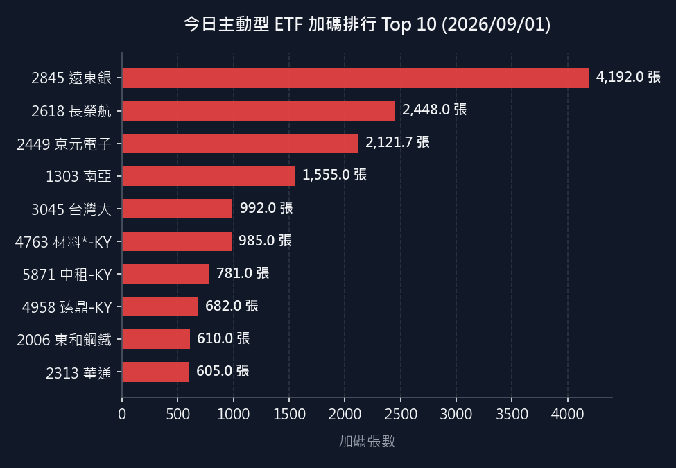
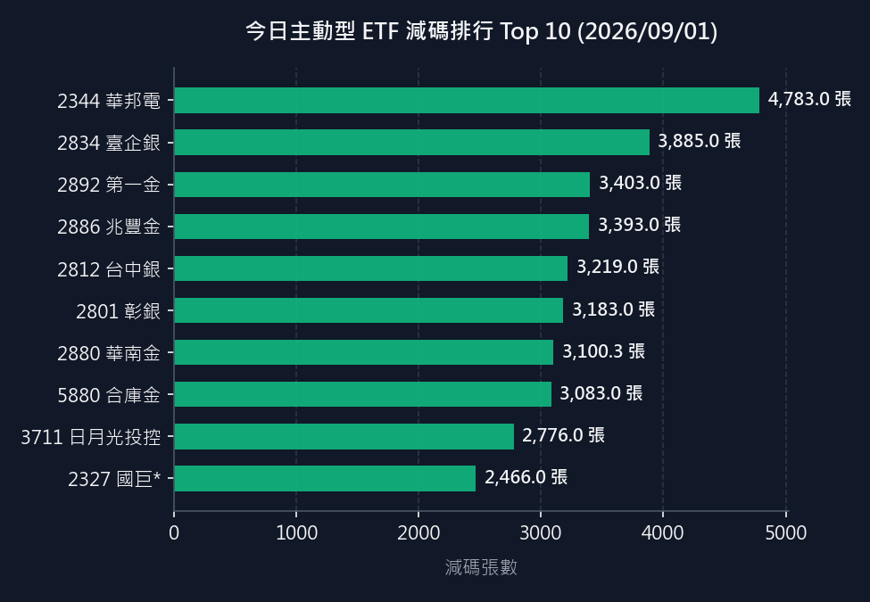

# 主動型 ETF 持股變動

資料來源：`主動型ETF持股明細.xlsx` 最近兩個日期分頁。

比較區間：`20260828` → `20260901`

## 今日加減碼視覺化排行

| 今日加碼 Top 10 | 今日減碼 Top 10 |
| :---: | :---: |
|  |  |

## 00400A

### 新增持股

- 無

### 刪除持股

- 無

### 投資比例變動

- 1303 南亞：1.41% → 1.48%（+0.07）
- 2059 川湖：6.03% → 5.92%（-0.11）
- 2303 聯電：0.93% → 0.94%（+0.01）
- 2308 台達電：2.80% → 2.83%（+0.03）
- 2313 華通：0.92% → 0.95%（+0.03）
- 2317 鴻海：0.83% → 0.84%（+0.01）
- 2345 智邦：1.65% → 1.70%（+0.05）
- 2360 致茂：3.24% → 3.25%（+0.01）
- 2368 金像電：1.37% → 1.47%（+0.10）
- 2382 廣達：0.76% → 0.77%（+0.01）
- 2383 台光電：1.43% → 2.36%（+0.93）
- 2449 京元電子：0.93% → 0.95%（+0.02）
- 2454 聯發科：6.42% → 6.90%（+0.48）
- 2885 元大金：1.38% → 1.42%（+0.04）
- 3008 大立光：3.73% → 3.97%（+0.24）
- 3017 奇鋐：3.87% → 3.90%（+0.03）
- 3026 禾伸堂：1.03% → 1.00%（-0.03）
- 3036 文曄：1.03% → 1.02%（-0.01）
- 3037 欣興：2.36% → 3.00%（+0.64）
- 3044 健鼎：1.74% → 1.77%（+0.03）
- 3081 聯亞：0.93% → 0.96%（+0.03）
- 3374 精材：0.36% → 0.49%（+0.13）
- 3443 創意：3.92% → 3.87%（-0.05）
- 3529 力旺：1.06% → 1.10%（+0.04）
- 3653 健策：4.90% → 4.42%（-0.48）
- 3665 貿聯-KY：1.30% → 1.80%（+0.50）
- 3711 日月光投控：0.99% → 0.96%（-0.03）
- 4979 華星光：0.61% → 0.60%（-0.01）
- 5274 信驊：2.81% → 3.05%（+0.24）
- 5434 崇越：0.36% → 0.37%（+0.01）
- 6223 旺矽：4.11% → 4.38%（+0.27）
- 6274 台燿：2.02% → 1.95%（-0.07）
- 6442 光聖：0.90% → 0.91%（+0.01）
- 6488 環球晶：3.13% → 3.17%（+0.04）
- 6515 穎崴：0.45% → 0.49%（+0.04）
- 6669 緯穎：5.46% → 5.86%（+0.40）
- 7750 新代：0.96% → 0.97%（+0.01）
- 7769 鴻勁：0.76% → 0.40%（-0.36）

## 00401A

### 新增持股

- 無

### 刪除持股

- 2449 京元電子（0.06%，7.25 張）

### 投資比例變動

- 1216 統一：0.30% → 0.29%（-0.01）
- 1477 聚陽：0.95% → 0.92%（-0.03）
- 2059 川湖：1.28% → 1.23%（-0.05）
- 2308 台達電：3.34% → 3.31%（-0.03）
- 2313 華通：1.83% → 1.86%（+0.03）
- 2317 鴻海：0.63% → 0.62%（-0.01）
- 2327 國巨*：0.71% → 0.66%（-0.05）
- 2330 台積電：15.43% → 15.14%（-0.29）
- 2345 智邦：2.21% → 2.23%（+0.02）
- 2357 華碩：1.43% → 1.45%（+0.02）
- 2360 致茂：1.71% → 1.68%（-0.03）
- 2368 金像電：0.31% → 0.33%（+0.02）
- 2379 瑞昱：1.11% → 1.12%（+0.01）
- 2382 廣達：2.34% → 2.35%（+0.01）
- 2412 中華電：0.83% → 0.81%（-0.02）
- 2454 聯發科：6.10% → 6.42%（+0.32）
- 2455 全新：2.17% → 2.55%（+0.38）
- 2881 富邦金：2.07% → 2.03%（-0.04）
- 2882 國泰金：1.07% → 1.09%（+0.02）
- 2883 凱基金：1.55% → 1.61%（+0.06）
- 2885 元大金：0.51% → 0.02%（-0.49）
- 2886 兆豐金：1.40% → 1.37%（-0.03）
- 2887 台新新光金：1.05% → 1.10%（+0.05）
- 2891 中信金：1.56% → 1.57%（+0.01）
- 2912 統一超：0.28% → 0.26%（-0.02）
- 3008 大立光：3.34% → 3.48%（+0.14）
- 3037 欣興：2.48% → 2.11%（-0.37）
- 3131 弘塑：0.81% → 0.78%（-0.03）
- 3491 昇達科：1.90% → 1.81%（-0.09）
- 3711 日月光投控：2.05% → 1.96%（-0.09）
- 4904 遠傳：0.77% → 0.76%（-0.01）
- 4958 臻鼎-KY：1.88% → 2.03%（+0.15）
- 4991 環宇-KY：1.15% → 1.17%（+0.02）
- 5274 信驊：1.87% → 2.00%（+0.13）
- 5347 世界：1.29% → 1.26%（-0.03）
- 5904 寶雅*：0.61% → 0.59%（-0.02）
- 6187 萬潤：0.79% → 0.77%（-0.02）
- 6223 旺矽：1.69% → 1.77%（+0.08）
- 6285 啟碁：1.52% → 1.49%（-0.03）
- 6415 矽力*-KY：0.61% → 0.54%（-0.07）
- 6510 精測：0.63% → 0.71%（+0.08）
- 6515 穎崴：1.05% → 1.12%（+0.07）
- 6531 愛普*：1.15% → 1.20%（+0.05）
- 6669 緯穎：2.34% → 2.47%（+0.13）
- 6944 兆聯實業：0.42% → 0.41%（-0.01）
- 7769 鴻勁：1.88% → 1.66%（-0.22）
- 7828 創新服務：1.87% → 1.83%（-0.04）
- 8464 億豐：1.08% → 1.07%（-0.01）
- 台股期貨09/26(FITXN*1.TF)：0.03% → 0.15%（+0.12）
- 臺指選擇權09/26 44500 買權：-1.10% → -1.41%（-0.31）

## 00402A

### 新增持股

- 無

### 刪除持股

- 無

### 投資比例變動

- AAPL.US Apple：7.27% → 7.43%（+0.16）
- ADI.US Analog Devices：1.85% → 1.81%（-0.04）
- AMD.US AMD：4.75% → 4.76%（+0.01）
- AMZN.US Amazon：4.49% → 4.62%（+0.13）
- ANET.US Arista Networks：0.86% → 0.85%（-0.01）
- ARM.US Arm：1.00% → 0.96%（-0.04）
- ASML.US ASML Holding：1.68% → 1.67%（-0.01）
- AVGO.US Broadcom：2.23% → 2.25%（+0.02）
- AXON.US Axon Enterprise：1.13% → 1.06%（-0.07）
- BABA.US Alibaba Group：0.56% → 0.55%（-0.01）
- CDNS.US Cadence Design Systems：1.54% → 1.52%（-0.02）
- CIEN.US Ciena：1.13% → 1.09%（-0.04）
- CLS.US Celestica：0.89% → 0.85%（-0.04）
- COHR.US Coherent：1.96% → 1.87%（-0.09）
- CRWD.US CrowdStrike Holdings：1.55% → 1.59%（+0.04）
- DASH.US DoorDash：0.59% → 0.60%（+0.01）
- FSLY.US Fastly：0.38% → 0.35%（-0.03）
- GOOG.US Alphabet - Class C Capital Stock：3.08% → 3.11%（+0.03）
- GOOGL.US Alphabet - Class A Common Stock：3.50% → 3.54%（+0.04）
- INTC.US Intel：1.22% → 1.20%（-0.02）
- IOT.US Samsara：0.38% → 0.37%（-0.01）
- KLAC.US KLA：1.57% → 1.52%（-0.05）
- LITE.US Lumentum：1.94% → 1.88%（-0.06）
- LRCX.US Lam Research：2.82% → 2.71%（-0.11）
- MCHP.US Microchip Technology：1.16% → 1.14%（-0.02）
- MDB.US MongoDB：0.77% → 0.81%（+0.04）
- META.US Meta：2.77% → 2.81%（+0.04）
- MRVL.US Marvell：1.56% → 1.15%（-0.41）
- MSFT.US Microsoft：5.22% → 5.32%（+0.10）
- MU.US Micron：6.17% → 6.41%（+0.24）
- NFLX.US Netflix：0.89% → 0.91%（+0.02）
- NOW.US ServiceNow：0.82% → 0.89%（+0.07）
- NVDA.US NVIDIA：8.71% → 8.60%（-0.11）
- PANW.US Palo Alto：2.76% → 2.79%（+0.03）
- PLTR.US Palantir Technologies：1.84% → 1.87%（+0.03）
- SHOP.US Shopify：0.95% → 0.92%（-0.03）
- SIMO.US Silicon Motion：0.78% → 0.76%（-0.02）
- SKHY.US SK hynix：1.04% → 1.07%（+0.03）
- SNOW.US Snowflake：1.26% → 1.29%（+0.03）
- SPCX.US SpaceX：0.73% → 0.76%（+0.03）
- SPOT.US Spotify：0.51% → 0.53%（+0.02）
- STX.US Seagate：1.06% → 1.05%（-0.01）
- TER.US Teradyne：0.88% → 0.83%（-0.05）
- TSM.US TSMC(ADR)：1.48% → 1.46%（-0.02）
- TTWO.US Take-Two：0.73% → 0.70%（-0.03）
- TXN.US Texas Instruments：2.19% → 2.17%（-0.02）
- V.US Visa：1.28% → 1.30%（+0.02）
- WDC.US Western Digital：2.26% → 2.23%（-0.03）

## 00403A

### 新增持股

- 2449 京元電子（0.29%，1700 張）

### 刪除持股

- 無

### 投資比例變動

- 1303 南亞：1.45% → 1.69%（+0.24）
- 1560 中砂：0.12% → 0.13%（+0.01）
- 1717 長興：0.13% → 0.16%（+0.03）
- 2303 聯電：3.88% → 3.99%（+0.11）
- 2308 台達電：3.14% → 3.23%（+0.09）
- 2317 鴻海：0.48% → 0.49%（+0.01）
- 2327 國巨*：3.48% → 2.74%（-0.74）
- 2330 台積電：16.02% → 15.86%（-0.16）
- 2337 旺宏：0.34% → 0.22%（-0.12）
- 2344 華邦電：1.30% → 0.74%（-0.56）
- 2345 智邦：2.92% → 3.06%（+0.14）
- 2360 致茂：1.20% → 1.22%（+0.02）
- 2383 台光電：5.24% → 5.43%（+0.19）
- 2404 漢唐：0.16% → 0.17%（+0.01）
- 2454 聯發科：5.01% → 5.48%（+0.47）
- 2455 全新：0.05% → 0.12%（+0.07）
- 3008 大立光：3.20% → 3.70%（+0.50）
- 3017 奇鋐：6.31% → 6.47%（+0.16）
- 3037 欣興：5.60% → 4.95%（-0.65）
- 3189 景碩：2.44% → 1.79%（-0.65）
- 3211 順達：0.48% → 0.49%（+0.01）
- 3443 創意：2.33% → 2.35%（+0.02）
- 3450 聯鈞：0.15% → 0.32%（+0.17）
- 3583 辛耘：0.36% → 0.37%（+0.01）
- 3653 健策：3.75% → 3.95%（+0.20）
- 3665 貿聯-KY：1.74% → 1.80%（+0.06）
- 3711 日月光投控：2.59% → 2.20%（-0.39）
- 5274 信驊：1.39% → 1.54%（+0.15）
- 6223 旺矽：3.30% → 3.58%（+0.28）
- 6274 台燿：1.69% → 1.66%（-0.03）
- 6488 環球晶：1.62% → 1.68%（+0.06）
- 6669 緯穎：3.01% → 3.29%（+0.28）
- 6805 富世達：1.47% → 1.44%（-0.03）
- 7769 鴻勁：0.50% → 0.46%（-0.04）
- 8996 高力：1.31% → 1.23%（-0.08）

## 00404A

### 新增持股

- 台指選擇權09/26 47500 買權（-0.32%，-0.301 張）
- 台指選擇權10/26 48800 買權（-0.08%，-0.056 張）

### 刪除持股

- 2880 華南金（0.03%，21.34 張）
- 台指選擇權09/26 48000 買權（-0.15%，-0.357 張）
- 台指選擇權10/26 49200 買權（-0.02%，-0.018 張）

### 投資比例變動

- 1303 南亞：0.74% → 0.77%（+0.03）
- 2027 大成鋼：0.44% → 0.45%（+0.01）
- 2059 川湖：1.70% → 1.66%（-0.04）
- 2301 光寶科：1.74% → 1.62%（-0.12）
- 2303 聯電：2.80% → 2.81%（+0.01）
- 2308 台達電：1.96% → 1.97%（+0.01）
- 2317 鴻海：0.72% → 0.71%（-0.01）
- 2330 台積電：22.21% → 22.08%（-0.13）
- 2345 智邦：0.76% → 0.78%（+0.02）
- 2347 聯強：0.70% → 0.69%（-0.01）
- 2351 順德：0.58% → 0.54%（-0.04）
- 2379 瑞昱：2.11% → 2.14%（+0.03）
- 2382 廣達：2.21% → 2.24%（+0.03）
- 2383 台光電：2.94% → 2.98%（+0.04）
- 2395 研華：1.52% → 1.59%（+0.07）
- 2428 興勤：1.22% → 1.17%（-0.05）
- 2439 美律：1.00% → 0.98%（-0.02）
- 2441 超豐：1.86% → 1.85%（-0.01）
- 2454 聯發科：6.12% → 6.53%（+0.41）
- 2458 義隆：1.68% → 1.65%（-0.03）
- 2637 慧洋-KY：1.13% → 1.15%（+0.02）
- 2845 遠東銀：1.74% → 1.75%（+0.01）
- 2885 元大金：2.05% → 2.10%（+0.05）
- 2887 台新新光金：0.63% → 0.67%（+0.04）
- 2890 永豐金：0.98% → 1.01%（+0.03）
- 3037 欣興：0.76% → 0.66%（-0.10）
- 3135 凌航：1.55% → 1.53%（-0.02）
- 3260 威剛：1.33% → 1.31%（-0.02）
- 3264 欣銓：1.32% → 1.31%（-0.01）
- 3443 創意：0.54% → 0.53%（-0.01）
- 3702 大聯大：1.59% → 1.57%（-0.02）
- 3711 日月光投控：3.63% → 3.51%（-0.12）
- 4763 材料*-KY：1.60% → 1.73%（+0.13）
- 4904 遠傳：0.47% → 0.46%（-0.01）
- 5274 信驊：2.25% → 2.43%（+0.18）
- 5434 崇越：1.64% → 1.65%（+0.01）
- 5904 寶雅*：0.51% → 0.50%（-0.01）
- 6139 亞翔：1.80% → 1.76%（-0.04）
- 6196 帆宣：1.75% → 1.77%（+0.02）
- 6223 旺矽：0.97% → 1.03%（+0.06）
- 6446 藥華藥：0.09% → 0.08%（-0.01）
- 6491 晶碩：0.52% → 0.54%（+0.02）
- 8081 致新：0.88% → 0.87%（-0.01）
- 8271 宇瞻：0.26% → 0.25%（-0.01）
- 台股期貨09/26(FITXN*1.TF)：16.85% → 16.92%（+0.07）

## 00405A

### 新增持股

- 無

### 刪除持股

- 無

### 投資比例變動

- 2059 川湖：2.05% → 2.04%（-0.01）
- 2303 聯電：0.03% → 0.04%（+0.01）
- 2308 台達電：0.59% → 0.60%（+0.01）
- 2330 台積電：1.48% → 1.50%（+0.02）
- 2345 智邦：3.83% → 4.01%（+0.18）
- 2368 金像電：4.34% → 4.74%（+0.40）
- 2383 台光電：3.97% → 4.11%（+0.14）
- 2454 聯發科：6.52% → 7.12%（+0.60）
- 3017 奇鋐：9.20% → 7.71%（-1.49）
- 3037 欣興：5.94% → 5.24%（-0.70）
- 3081 聯亞：1.78% → 1.86%（+0.08）
- 3131 弘塑：1.29% → 1.30%（+0.01）
- 3443 創意：8.59% → 7.50%（-1.09）
- 3450 聯鈞：1.41% → 1.40%（-0.01）
- 3653 健策：8.42% → 7.48%（-0.94）
- 3665 貿聯-KY：5.12% → 5.29%（+0.17）
- 4576 大銀微系統：0.05% → 0.06%（+0.01）
- 4991 環宇-KY：2.13% → 2.24%（+0.11）
- 5274 信驊：2.89% → 3.19%（+0.30）
- 6187 萬潤：0.92% → 0.94%（+0.02）
- 6223 旺矽：4.68% → 5.08%（+0.40）
- 6274 台燿：1.55% → 1.52%（-0.03）
- 6488 環球晶：0.36% → 0.38%（+0.02）
- 6510 精測：2.24% → 2.63%（+0.39）
- 6515 穎崴：0.49% → 0.55%（+0.06）
- 6526 達發：0.31% → 0.33%（+0.02）
- 6531 愛普*：2.29% → 2.47%（+0.18）
- 6669 緯穎：1.23% → 1.34%（+0.11）
- 6805 富世達：2.17% → 2.13%（-0.04）
- 6831 邁科：0.53% → 0.52%（-0.01）
- 7734 印能科技：1.53% → 1.48%（-0.05）
- 7769 鴻勁：2.65% → 2.42%（-0.23）
- 8046 南電：3.12% → 3.11%（-0.01）
- 8996 高力：1.22% → 1.14%（-0.08）

## 00407A

### 新增持股

- 6510 精測（0.02%，2 張）

### 刪除持股

- 6515 穎崴（0.19%，8 張）

### 投資比例變動

- 1303 南亞：0.65% → 0.70%（+0.05）
- 1560 中砂：0.46% → 0.50%（+0.04）
- 1590 亞德客-KY：0.07% → 0.08%（+0.01）
- 2059 川湖：3.56% → 3.57%（+0.01）
- 2301 光寶科：1.11% → 1.06%（-0.05）
- 2303 聯電：0.99% → 1.02%（+0.03）
- 2308 台達電：3.70% → 3.81%（+0.11）
- 2327 國巨*：2.26% → 2.18%（-0.08）
- 2330 台積電：8.50% → 8.67%（+0.17）
- 2344 華邦電：0.14% → 0.13%（-0.01）
- 2345 智邦：2.76% → 2.90%（+0.14）
- 2360 致茂：1.90% → 1.94%（+0.04）
- 2368 金像電：2.16% → 2.36%（+0.20）
- 2379 瑞昱：0.21% → 0.22%（+0.01）
- 2383 台光電：5.23% → 5.43%（+0.20）
- 2395 研華：1.92% → 2.07%（+0.15）
- 2408 南亞科：2.06% → 1.16%（-0.90）
- 2451 創見：0.31% → 0.32%（+0.01）
- 2454 聯發科：4.54% → 4.97%（+0.43）
- 2615 萬海：0.64% → 0.66%（+0.02）
- 3008 大立光：0.81% → 1.57%（+0.76）
- 3017 奇鋐：5.34% → 5.48%（+0.14）
- 3034 聯詠：0.70% → 0.71%（+0.01）
- 3037 欣興：5.15% → 4.56%（-0.59）
- 3081 聯亞：1.60% → 1.68%（+0.08）
- 3260 威剛：0.29% → 0.30%（+0.01）
- 3293 鈊象：0.51% → 0.52%（+0.01）
- 3443 創意：3.47% → 3.50%（+0.03）
- 3529 力旺：1.02% → 1.07%（+0.05）
- 3653 健策：2.00% → 2.06%（+0.06）
- 3665 貿聯-KY：2.06% → 2.13%（+0.07）
- 3711 日月光投控：2.50% → 2.49%（-0.01）
- 4958 臻鼎-KY：1.75% → 1.97%（+0.22）
- 5274 信驊：1.91% → 2.12%（+0.21）
- 5434 崇越：0.18% → 0.19%（+0.01）
- 6187 萬潤：1.02% → 1.03%（+0.01）
- 6223 旺矽：2.45% → 2.67%（+0.22）
- 6274 台燿：3.40% → 3.34%（-0.06）
- 6446 藥華藥：1.10% → 0.33%（-0.77）
- 6531 愛普*：0.29% → 0.32%（+0.03）
- 6669 緯穎：5.22% → 5.72%（+0.50）
- 6805 富世達：2.84% → 2.79%（-0.05）
- 8046 南電：2.73% → 2.72%（-0.01）
- 8210 勤誠：0.91% → 0.92%（+0.01）
- 8996 高力：1.04% → 0.98%（-0.06）

## 00408A

### 新增持股

- 2449 京元電子（0.52%，30 張）
- 3661 世芯-KY（0.26%，1 張）

### 刪除持股

- 3702 大聯大（0.50%，80 張）
- 3711 日月光投控（0.15%，4 張）
- 4746 台耀（0.68%，221 張）

### 投資比例變動

- 1303 南亞：2.74% → 2.91%（+0.17）
- 2059 川湖：2.66% → 2.63%（-0.03）
- 2303 聯電：1.17% → 1.19%（+0.02）
- 2308 台達電：2.73% → 2.77%（+0.04）
- 2317 鴻海：1.89% → 1.90%（+0.01）
- 2330 台積電：6.15% → 6.20%（+0.05）
- 2344 華邦電：0.45% → 0.44%（-0.01）
- 2345 智邦：1.45% → 1.09%（-0.36）
- 2357 華碩：2.58% → 2.69%（+0.11）
- 2360 致茂：1.00% → 0.50%（-0.50）
- 2368 金像電：3.23% → 3.49%（+0.26）
- 2376 技嘉：1.19% → 1.22%（+0.03）
- 2382 廣達：0.83% → 0.85%（+0.02）
- 2383 台光電：3.41% → 3.49%（+0.08）
- 2395 研華：1.83% → 1.94%（+0.11）
- 2404 漢唐：1.67% → 1.70%（+0.03）
- 2408 南亞科：1.68% → 1.60%（-0.08）
- 2454 聯發科：1.98% → 2.14%（+0.16）
- 2481 強茂：0.92% → 0.93%（+0.01）
- 2801 彰銀：0.95% → 0.96%（+0.01）
- 2880 華南金：1.64% → 1.71%（+0.07）
- 2886 兆豐金：2.60% → 2.61%（+0.01）
- 2891 中信金：0.96% → 0.99%（+0.03）
- 3017 奇鋐：5.42% → 5.49%（+0.07）
- 3037 欣興：3.17% → 2.77%（-0.40）
- 3045 台灣大：2.73% → 2.79%（+0.06）
- 3081 聯亞：0.82% → 1.06%（+0.24）
- 3189 景碩：1.23% → 1.46%（+0.23）
- 3231 緯創：0.99% → 1.01%（+0.02）
- 3491 昇達科：0.66% → 0.64%（-0.02）
- 3653 健策：2.16% → 2.19%（+0.03）
- 5434 崇越：1.91% → 1.94%（+0.03）
- 6187 萬潤：1.27% → 1.28%（+0.01）
- 6223 旺矽：0.62% → 0.67%（+0.05）
- 6239 力成：1.19% → 1.18%（-0.01）
- 6274 台燿：2.59% → 2.51%（-0.08）
- 6488 環球晶：1.81% → 0.92%（-0.89）
- 6669 緯穎：5.81% → 6.55%（+0.74）
- 6805 富世達：1.31% → 1.27%（-0.04）
- 7769 鴻勁：1.81% → 1.64%（-0.17）
- 8046 南電：2.00% → 1.59%（-0.41）
- 8436 大江：2.45% → 2.60%（+0.15）
- 8996 高力：1.02% → 0.95%（-0.07）
- 9941 裕融：3.07% → 3.34%（+0.27）

## 00980A

### 新增持股

- 無

### 刪除持股

- 無

### 投資比例變動

- 1303 南亞：2.61% → 2.76%（+0.15）
- 2059 川湖：5.60% → 5.52%（-0.08）
- 2308 台達電：3.62% → 3.68%（+0.06）
- 2317 鴻海：2.38% → 2.40%（+0.02）
- 2327 國巨*：1.74% → 1.65%（-0.09）
- 2330 台積電：8.92% → 8.97%（+0.05）
- 2344 華邦電：2.04% → 1.97%（-0.07）
- 2345 智邦：1.81% → 1.87%（+0.06）
- 2360 致茂：1.46% → 1.47%（+0.01）
- 2368 金像電：2.17% → 2.35%（+0.18）
- 2376 技嘉：1.19% → 1.22%（+0.03）
- 2382 廣達：1.61% → 1.65%（+0.04）
- 2383 台光電：3.66% → 3.74%（+0.08）
- 2408 南亞科：2.90% → 2.77%（-0.13）
- 2454 聯發科：4.86% → 5.24%（+0.38）
- 2884 玉山金：1.20% → 1.23%（+0.03）
- 2891 中信金：1.43% → 1.47%（+0.04）
- 3008 大立光：0.90% → 0.96%（+0.06）
- 3017 奇鋐：2.20% → 2.23%（+0.03）
- 3026 禾伸堂：0.49% → 0.48%（-0.01）
- 3037 欣興：3.06% → 2.67%（-0.39）
- 3044 健鼎：0.83% → 0.85%（+0.02）
- 3081 聯亞：3.70% → 3.82%（+0.12）
- 3189 景碩：0.81% → 0.79%（-0.02）
- 3231 緯創：0.91% → 0.92%（+0.01）
- 3443 創意：1.74% → 1.73%（-0.01）
- 3529 力旺：0.55% → 0.57%（+0.02）
- 3653 健策：1.95% → 1.98%（+0.03）
- 3665 貿聯-KY：0.36% → 0.37%（+0.01）
- 3711 日月光投控：1.60% → 1.57%（-0.03）
- 4958 臻鼎-KY：1.08% → 1.20%（+0.12）
- 5274 信驊：1.40% → 1.53%（+0.13）
- 5904 寶雅*：1.14% → 1.12%（-0.02）
- 6213 聯茂：1.37% → 1.29%（-0.08）
- 6223 旺矽：1.77% → 1.90%（+0.13）
- 6274 台燿：1.52% → 1.48%（-0.04）
- 6515 穎崴：1.68% → 1.85%（+0.17）
- 6669 緯穎：1.83% → 1.98%（+0.15）
- 6805 富世達：0.62% → 0.60%（-0.02）
- 6831 邁科：0.55% → 0.54%（-0.01）
- 7769 鴻勁：2.32% → 2.09%（-0.23）
- 8046 南電：1.23% → 1.21%（-0.02）
- 8210 勤誠：0.94% → 0.93%（-0.01）
- 8299 群聯：2.07% → 2.04%（-0.03）
- 8996 高力：1.12% → 1.04%（-0.08）
- 台灣證交所加權股價指數(FITXN*1.TF)：4.99% → 4.05%（-0.94）

## 00980D

### 新增持股

- ORACLE CORP 6.7 % 04-FEB-2056（0.20%，N/A 張）
- SEAGATE DATA STOR SER * 9.625 % 01-DEC-2032（0.55%，N/A 張）

### 刪除持股

- 無

### 投資比例變動

- APOLLO DEBT SOLUTIONS BD 6.900000 % 13APR2029：0.53% → 0.54%（+0.01）
- BLUE OWL CREDIT INCOME (REG) 6.65% 15MAR2031：0.51% → 0.52%（+0.01）
- BLUE OWL CREDIT INCOME SER WI (REG) 7.75% 16SEP2027：0.53% → 0.54%（+0.01）
- CHARTER COMM OPT LLC/CAP (REG) 6.834000 % 23OCT2055：0.45% → 0.44%（-0.01）
- CONCENTRIX CORP (REG) 6.85% 02AUG2033：0.69% → 0.70%（+0.01）
- DOW CHEMICAL CO/THE (REG) 5.55% 30NOV2048：0.55% → 0.54%（-0.01）
- DOW CHEMICAL CO/THE (REG) 5.6% 15FEB2054：0.59% → 0.58%（-0.01）
- DOW CHEMICAL CO/THE 7.375% 01NOV2029：0.59% → 0.60%（+0.01）
- FMC CORP (REG) 6.375000 % 18MAY2053：0.45% → 0.46%（+0.01）
- GETTY IMAGES INC SER REGS 11.250000 % 21FEB2030：0.47% → 0.46%（-0.01）
- GRAY TELEVISION INC SER REGS (REG) (REG S) 10.5% 15JUL2029：0.56% → 0.19%（-0.37）
- JETBLUE AIRWAYS/LOYALTY SER REGS (REG S) 9.875% 20SEP2031：0.48% → 0.47%（-0.01）
- LPL HOLDINGS INC (REG) 6.75% 17NOV2028：0.54% → 0.55%（+0.01）
- METLIFE INC (REG) 10.75% 01AUG2039：0.44% → 0.45%（+0.01）
- ONEOK INC 6.625% 01SEP2053：0.56% → 0.57%（+0.01）
- ORACLE CORP 6.125000 % 03AUG2065：0.50% → 0.55%（+0.05）
- ORACLE CORP 6.85 % 04-FEB-2066：0.40% → 0.55%（+0.15）
- ORACLE CORP 6.9% 09NOV2052：0.50% → 0.51%（+0.01）
- PACIFIC GAS & ELECTRIC (REG) 6.75% 15JAN2053：0.33% → 0.32%（-0.01）
- PEPSICO INC (REG) 7.000000 % 01MAR2029：0.30% → 0.31%（+0.01）
- SBL HOLDINGS INC SER REGS 7.200000 % 30OCT2034：0.49% → 0.50%（+0.01）
- SES GLOBAL AMERICAS HLDG SER REGS (REG) 5.300000 % 25MAR2044：0.32% → 0.31%（-0.01）
- US 10YR NOTE (CBT)DEC26 21-DEC-2026：17.40% → 17.34%（-0.06）
- US 10YR ULTRA FUT DEC26 21-DEC-2026：-1.19% → -0.68%（+0.51）
- US 5YR NOTE (CBT) DEC26 31-DEC-2026：-14.76% → -13.91%（+0.85）
- US LONG BOND(CBT) DEC26 21-DEC-2026：5.24% → 5.21%（-0.03）
- US ULTRA BOND CBT DEC26 21-DEC-2026：-0.34% → -0.85%（-0.51）
- VIACOM INC (REG) 5.85% 01SEP2043：0.56% → 0.55%（-0.01）
- VIACOMCBS INC (REG) 4.95% 19MAY2050：0.49% → 0.48%（-0.01）
- VIRGINIA ELEC & POWER CO (REG) 8.875% 15NOV2038：0.57% → 0.56%（-0.01）

## 00981A

### 新增持股

- 無

### 刪除持股

- 無

### 投資比例變動

- 2303 聯電：3.97% → 4.06%（+0.09）
- 2308 台達電：4.52% → 4.64%（+0.12）
- 2313 華通：0.00% → 0.04%（+0.04）
- 2327 國巨*：5.17% → 4.87%（-0.30）
- 2330 台積電：9.29% → 9.23%（-0.06）
- 2345 智邦：4.75% → 4.89%（+0.14）
- 2368 金像電：0.75% → 0.61%（-0.14）
- 2383 台光電：8.99% → 9.21%（+0.22）
- 2449 京元電子：1.17% → 1.23%（+0.06）
- 2454 聯發科：6.99% → 7.54%（+0.55）
- 3017 奇鋐：6.85% → 6.97%（+0.12）
- 3037 欣興：7.68% → 6.77%（-0.91）
- 3264 欣銓：0.47% → 0.48%（+0.01）
- 3653 健策：4.75% → 4.84%（+0.09）
- 3665 貿聯-KY：3.60% → 3.65%（+0.05）
- 3711 日月光投控：4.12% → 3.91%（-0.21）
- 4958 臻鼎-KY：0.27% → 0.40%（+0.13）
- 4979 華星光：0.66% → 0.58%（-0.08）
- 5274 信驊：1.67% → 1.22%（-0.45）
- 6187 萬潤：0.04% → 0.00%（-0.04）
- 6223 旺矽：4.26% → 4.60%（+0.34）
- 6271 同欣電：0.16% → 0.18%（+0.02）
- 6274 台燿：2.79% → 2.69%（-0.10）
- 6510 精測：0.44% → 0.51%（+0.07）
- 6515 穎崴：0.00% → 0.13%（+0.13）
- 6669 緯穎：5.46% → 5.83%（+0.37）
- 6805 富世達：1.81% → 1.36%（-0.45）
- 8046 南電：4.07% → 3.99%（-0.08）
- 8210 勤誠：0.84% → 0.83%（-0.01）
- 8996 高力：0.56% → 0.52%（-0.04）
- 台指期貨 2026/09(FITXN*1.TF)：2.15% → 2.20%（+0.05）

## 00982A

### 新增持股

- 6640 均華（0.03%，13 張）

### 刪除持股

- 3706 神達（0.00%，1.4 張）

### 投資比例變動

- 2059 川湖：5.13% → 4.91%（-0.22）
- 2301 光寶科：2.02% → 1.86%（-0.16）
- 2303 聯電：1.33% → 1.31%（-0.02）
- 2330 台積電：8.43% → 8.26%（-0.17）
- 2345 智邦：3.00% → 2.61%（-0.39）
- 2360 致茂：3.28% → 3.21%（-0.07）
- 2376 技嘉：1.22% → 1.21%（-0.01）
- 2377 微星：1.23% → 1.27%（+0.04）
- 2383 台光電：3.40% → 3.38%（-0.02）
- 2395 研華：1.92% → 1.98%（+0.06）
- 2428 興勤：1.19% → 1.13%（-0.06）
- 2454 聯發科：5.74% → 6.04%（+0.30）
- 2455 全新：1.32% → 1.55%（+0.23）
- 2476 鉅祥：0.32% → 0.31%（-0.01）
- 2478 大毅：1.12% → 1.04%（-0.08）
- 2486 一詮：0.81% → 0.84%（+0.03）
- 2885 元大金：0.27% → 0.28%（+0.01）
- 3008 大立光：3.51% → 3.65%（+0.14）
- 3017 奇鋐：2.46% → 2.42%（-0.04）
- 3090 日電貿：1.14% → 1.10%（-0.04）
- 3105 穩懋：4.86% → 5.30%（+0.44）
- 3231 緯創：1.18% → 1.17%（-0.01）
- 3265 台星科：1.25% → 1.19%（-0.06）
- 3491 昇達科：3.46% → 3.30%（-0.16）
- 3583 辛耘：1.68% → 1.69%（+0.01）
- 3711 日月光投控：1.15% → 1.09%（-0.06）
- 4958 臻鼎-KY：2.96% → 3.21%（+0.25）
- 5274 信驊：1.09% → 1.16%（+0.07）
- 5425 台半：1.21% → 1.16%（-0.05）
- 5483 中美晶：1.25% → 1.21%（-0.04）
- 5536 聖暉*：0.78% → 0.77%（-0.01）
- 6139 亞翔：5.75% → 5.52%（-0.23）
- 6196 帆宣：0.30% → 0.29%（-0.01）
- 6214 精誠：1.23% → 1.20%（-0.03）
- 6223 旺矽：3.00% → 3.14%（+0.14）
- 6239 力成：1.06% → 1.02%（-0.04）
- 6274 台燿：1.25% → 1.18%（-0.07）
- 6446 藥華藥：0.13% → 0.10%（-0.03）
- 6472 保瑞：0.87% → 0.82%（-0.05）
- 6488 環球晶：2.10% → 2.08%（-0.02）
- 6531 愛普*：2.87% → 2.98%（+0.11）
- 6669 緯穎：7.13% → 7.51%（+0.38）
- 6672 騰輝電子-KY：0.31% → 0.28%（-0.03）
- 8070 長華*：0.29% → 0.27%（-0.02）
- 8996 高力：0.94% → 0.85%（-0.09）

## 00983A

### 新增持股

- 無

### 刪除持股

- 無

### 投資比例變動

- ACHR.US Archer：0.68% → 0.70%（+0.02）
- AMD.US AMD：3.37% → 3.18%（-0.19）
- AMZN.US Amazon：2.25% → 2.39%（+0.14）
- AVGO.US Broadcom：0.54% → 0.57%（+0.03）
- BEAM.US Beam Therapeutics：2.08% → 2.02%（-0.06）
- BLSH.US Bullish：1.84% → 1.95%（+0.11）
- BMNR.US BitMine：1.98% → 2.05%（+0.07）
- CBRS.US Cerebras：0.83% → 0.86%（+0.03）
- CERS.US Cerus：0.48% → 0.49%（+0.01）
- COIN.US Coinbase：3.80% → 3.98%（+0.18）
- CRCL.US Circle：4.64% → 4.94%（+0.30）
- CRSP.US CRISPR Therapeutics：4.21% → 4.24%（+0.03）
- CRWV.US CoreWeave：1.49% → 1.39%（-0.10）
- DE.US Deere：1.15% → 1.27%（+0.12）
- FIG.US Figma：0.54% → 0.51%（-0.03）
- GOOG.US Alphabet - Class C Capital Stock：1.27% → 1.32%（+0.05）
- GOOGL.US Alphabet - Class A Common Stock：1.01% → 0.81%（-0.20）
- HOOD.US Robinhood Markets：4.52% → 4.28%（-0.24）
- ILMN.US Illumina：2.32% → 1.60%（-0.72）
- KTOS.US Kratos Defense & Security：1.03% → 1.02%（-0.01）
- LLY.US Eli Lilly：1.49% → 1.28%（-0.21）
- META.US Meta：0.52% → 0.54%（+0.02）
- NET.US Cloudflare：0.10% → 0.11%（+0.01）
- NTLA.US Intellia Therapeutics：1.28% → 1.22%（-0.06）
- NTRA.US Natera：2.27% → 1.98%（-0.29）
- NVDA.US NVIDIA：1.76% → 1.79%（+0.03）
- PLTR.US Palantir Technologies：3.70% → 3.89%（+0.19）
- RXRX.US Recursion Pharmaceuticals：0.33% → 0.34%（+0.01）
- SHOP.US Shopify：6.54% → 6.55%（+0.01）
- SNOW.US Snowflake：1.71% → 1.81%（+0.10）
- SOFI.US SoFi Technologies：0.75% → 0.73%（-0.02）
- SPCX.US SpaceX：4.55% → 4.97%（+0.42）
- TEM.US Tempus：5.71% → 5.54%（-0.17）
- TER.US Teradyne：0.52% → 0.51%（-0.01）
- TSLA.US Tesla：8.70% → 9.46%（+0.76）
- TSM.US TSMC(ADR)：2.14% → 2.18%（+0.04）
- TWST.US Twist Bioscience：5.09% → 4.84%（-0.25）
- TXG.US 10x Genomics：4.47% → 4.27%（-0.20）
- WGS.US GeneDx：1.93% → 1.25%（-0.68）
- XE.US X-Energy：0.79% → 0.83%（+0.04）
- XYZ.US Block：2.38% → 2.42%（+0.04）

## 00983D

### 新增持股

- 無

### 刪除持股

- 無

### 投資比例變動

- ABIBB 8.2 01/15/39：1.95% → 1.93%（-0.02）
- ABXCN 7 1/2 09/15/38：0.54% → 0.53%（-0.01）
- AET 6 5/8 06/15/36：0.73% → 0.72%（-0.01）
- ALLY 8 11/01/31：0.86% → 1.19%（+0.33）
- AMCX 10 1/2 07/15/32：1.64% → 1.63%（-0.01）
- ATH 6 5/8 05/19/55：1.00% → 0.99%（-0.01）
- AWK 6.593 10/15/37：0.71% → 0.70%（-0.01）
- BACR 7.437 11/02/33：1.27% → 1.25%（-0.02）
- BATSLN 7.079 08/02/43：1.08% → 1.07%（-0.01）
- BATSLN 7.081 08/02/53：1.32% → 1.31%（-0.01）
- BHCCN 11 09/30/28：1.87% → 1.86%（-0.01）
- BNCN 7 3/8 03/01/33：1.11% → 1.10%（-0.01）
- BRITEL 9 5/8 12/15/30：1.35% → 1.34%（-0.01）
- BRKHEC 6 3/4 07/01/37：0.81% → 0.80%（-0.01）
- C 8 1/8 07/15/39：1.94% → 1.92%（-0.02）
- CEG 6 1/2 10/01/53：0.77% → 0.76%（-0.01）
- CP 7 1/8 10/15/31：0.82% → 0.81%（-0.01）
- CRWV 9 02/01/31：0.83% → 0.81%（-0.02）
- CYH 10 7/8 01/15/32：1.49% → 1.48%（-0.01）
- DELL 8.1 07/15/36：1.52% → 1.51%（-0.01）
- DELL 8.35 07/15/46：1.40% → 1.39%（-0.01）
- DIS 7 3/4 12/01/45：0.61% → 0.60%（-0.01）
- DOW 6.9 05/15/53：0.75% → 0.74%（-0.01）
- DOW 9.4 05/15/39：1.95% → 1.93%（-0.02）
- DT 9 1/4 06/01/32：0.94% → 0.93%（-0.01）
- DTV 8 7/8 02/01/30：1.59% → 1.58%（-0.01）
- DUK 7 3/4 03/01/31：1.55% → 1.54%（-0.01）
- ENBCN 6.7 11/15/53：1.12% → 1.11%（-0.01）
- FFHCN 6.35 03/22/54：0.70% → 0.69%（-0.01）
- GE 6 3/4 03/15/32：0.58% → 0.57%（-0.01）
- GE 6 7/8 01/10/39：0.84% → 0.83%（-0.01）
- GM 6 3/4 04/01/46：1.19% → 1.17%（-0.02）
- GT 8 7/8 07/15/32：0.48% → 0.47%（-0.01）
- HAL 7.45 09/15/39：1.82% → 1.79%（-0.03）
- HPE 6.35 10/15/45：0.99% → 0.98%（-0.01）
- HSBC 6.332 03/09/44：1.06% → 1.05%（-0.01）
- IEP 10 11/15/29：1.48% → 1.47%（-0.01）
- KHC 6 7/8 01/26/39：1.00% → 0.99%（-0.01）
- KMI 6.95 01/15/38：1.06% → 1.05%（-0.01）
- LQDW.US iShares Investment Grade Corpora：7.30% → 7.24%（-0.06）
- MBGGR 8 1/2 01/18/31：1.30% → 1.29%（-0.01）
- MCD 6.3 03/01/38：0.73% → 0.72%（-0.01）
- MOHEGN 11 7/8 04/15/31：1.35% → 1.34%（-0.01）
- MS 7 1/4 04/01/32：1.63% → 1.61%（-0.02）
- NTRCN 7 1/8 05/23/36：0.55% → 0.54%（-0.01）
- NVDA 5.55 06/15/46：1.15% → 1.14%（-0.01）
- OXY 6.6 03/15/46：0.75% → 0.74%（-0.01）
- PCG 6 3/4 01/15/53：1.16% → 1.12%（-0.04）
- PCG 6.7 04/01/53：1.12% → 1.10%（-0.02）
- PDM 9 1/4 07/20/28：0.83% → 1.16%（+0.33）
- PFE 7.2 03/15/39：1.42% → 1.41%（-0.01）
- RAKUTN 11 1/4 02/15/27：1.79% → 1.78%（-0.01）
- RIOLN 7 1/4 03/15/31：0.51% → 0.50%（-0.01）
- S 8 3/4 03/15/32：0.65% → 0.93%（+0.28）
- SJM 6 1/2 11/15/43：0.20% → 0.19%（-0.01）
- SUCN 6.85 06/01/39：1.22% → 1.21%（-0.01）
- TELEFO 8 1/4 09/15/30：1.00% → 0.99%（-0.01）
- TELEFONICA EMISIONES SAU 7.045 06/20/36：1.55% → 1.53%（-0.02）
- TIME WARNER CABLE INC 6.750 06/15/39：0.48% → 0.47%（-0.01）
- TLTW.US iShares 20+ Year Treasury Bond B：8.01% → 7.92%（-0.09）
- TRPCN 7 5/8 01/15/39：1.68% → 1.66%（-0.02）
- UNITEDHEALTH GROUP INC 6.875 02/15/38：0.86% → 0.85%（-0.01）
- VENLNG 9 1/2 02/01/29：1.41% → 1.40%（-0.01）
- VLO 6 5/8 06/15/37：0.74% → 0.73%（-0.01）
- VZ 7 3/4 12/01/30：1.14% → 1.13%（-0.01）

## 00984A

### 新增持股

- 1102 亞泥（0.73%，2121 張）
- 1229 聯華（0.28%，694 張）
- 1402 遠東新（0.84%，2912 張）
- 1808 潤隆（0.16%，479 張）
- 2301 光寶科（0.54%，184 張）
- 2313 華通（0.07%，27 張）
- 2344 華邦電（0.57%，331 張）
- 2379 瑞昱（1.09%，149 張）
- 2395 研華（0.57%，82 張）
- 2467 志聖（0.56%，91 張）
- 2520 冠德（0.16%，448 張）
- 2542 興富發（0.69%，1477 張）
- 2615 萬海（0.27%，244 張）
- 2618 長榮航（1.02%，2448 張）
- 2845 遠東銀（0.56%，4192 張）
- 2850 新產（0.16%，100 張）
- 2851 中再保（0.16%，353 張）
- 2897 王道銀行（0.13%，1252 張）
- 2903 遠百（0.16%，732 張）
- 3006 晶豪科（0.27%，97 張）
- 3044 健鼎（0.27%，55 張）
- 3045 台灣大（1.11%，981 張）
- 3260 威剛（0.27%，68 張）
- 3374 精材（0.28%，67 張）
- 3532 台勝科（0.29%，73 張）
- 3653 健策（0.40%，7 張）
- 3661 世芯-KY（0.08%，2 張）
- 3665 貿聯-KY（0.30%，13 張）
- 4763 材料*-KY（0.48%，985 張）
- 4967 十銓（0.28%，102 張）
- 5306 桂盟（0.05%，50 張）
- 5876 上海商銀（0.99%，2273 張）
- 6173 信昌電（0.17%，66 張）
- 6177 達麗（0.16%，347 張）
- 6187 萬潤（0.92%，68 張）
- 6214 精誠（0.27%，152 張）
- 6426 統新（0.16%，62 張）
- 6531 愛普*（0.01%，1 張）
- 6584 南俊國際（0.40%，61 張）
- 6592 和潤企業（0.09%，159 張）
- 7750 新代（0.25%，11 張）
- 7780 大研生醫*（0.05%，289 張）
- 8021 尖點（0.28%，63 張）
- 9802 鈺齊-KY（0.13%，184 張）
- 9933 中鼎（0.16%，403 張）

### 刪除持股

- 無

### 投資比例變動

- 1303 南亞：2.62% → 2.63%（+0.01）
- 1326 台化：1.08% → 1.36%（+0.28）
- 1409 新纖：0.57% → 0.64%（+0.07）
- 1419 新紡：0.09% → 0.05%（-0.04）
- 1477 聚陽：0.75% → 0.38%（-0.37）
- 1560 中砂：0.65% → 0.62%（-0.03）
- 1714 和桐：0.29% → 0.33%（+0.04）
- 1736 喬山：0.64% → 0.32%（-0.32）
- 1795 美時：0.08% → 0.04%（-0.04）
- 1907 永豐餘：0.49% → 0.44%（-0.05）
- 2006 東和鋼鐵：0.08% → 0.57%（+0.49）
- 2015 豐興：0.08% → 0.04%（-0.04）
- 2049 上銀：0.57% → 0.29%（-0.28）
- 2059 川湖：5.78% → 4.29%（-1.49）
- 2105 正新：0.25% → 0.13%（-0.12）
- 2201 裕隆：0.23% → 0.13%（-0.10）
- 2303 聯電：1.45% → 1.19%（-0.26）
- 2317 鴻海：1.36% → 0.69%（-0.67）
- 2324 仁寶：0.58% → 0.29%（-0.29）
- 2330 台積電：3.56% → 3.73%（+0.17）
- 2345 智邦：0.75% → 0.39%（-0.36）
- 2347 聯強：0.92% → 0.46%（-0.46）
- 2351 順德：0.36% → 0.47%（+0.11）
- 2353 宏碁：0.08% → 0.04%（-0.04）
- 2357 華碩：0.96% → 0.84%（-0.12）
- 2360 致茂：0.83% → 0.42%（-0.41）
- 2371 大同：0.09% → 0.05%（-0.04）
- 2375 凱美：0.26% → 0.12%（-0.14）
- 2376 技嘉：0.52% → 0.27%（-0.25）
- 2377 微星：0.41% → 0.22%（-0.19）
- 2383 台光電：1.72% → 1.88%（+0.16）
- 2385 群光：0.08% → 0.04%（-0.04）
- 2393 億光：0.26% → 0.13%（-0.13）
- 2404 漢唐：1.10% → 0.77%（-0.33）
- 2408 南亞科：2.06% → 2.10%（+0.04）
- 2409 友達：0.57% → 0.29%（-0.28）
- 2412 中華電：0.83% → 0.42%（-0.41）
- 2441 超豐：1.13% → 0.57%（-0.56）
- 2454 聯發科：1.56% → 1.69%（+0.13）
- 2464 盟立：0.75% → 0.88%（+0.13）
- 2472 立隆電：0.24% → 0.12%（-0.12）
- 2474 可成：0.37% → 0.19%（-0.18）
- 2476 鉅祥：0.25% → 0.13%（-0.12）
- 2535 達欣工：0.21% → 0.11%（-0.10）
- 2546 根基：0.19% → 0.10%（-0.09）
- 2603 長榮：0.78% → 1.95%（+1.17）
- 2606 裕民：0.09% → 0.05%（-0.04）
- 2633 台灣高鐵：0.46% → 0.61%（+0.15）
- 2801 彰銀：1.59% → 0.83%（-0.76）
- 2812 台中銀：1.24% → 0.65%（-0.59）
- 2834 臺企銀：1.31% → 0.71%（-0.60）
- 2880 華南金：1.94% → 1.01%（-0.93）
- 2882 國泰金：0.80% → 0.42%（-0.38）
- 2885 元大金：0.73% → 0.40%（-0.33）
- 2886 兆豐金：1.99% → 1.00%（-0.99）
- 2891 中信金：0.73% → 0.38%（-0.35）
- 2892 第一金：1.65% → 0.86%（-0.79）
- 3005 神基：0.08% → 0.04%（-0.04）
- 3008 大立光：3.46% → 2.83%（-0.63）
- 3017 奇鋐：0.10% → 0.64%（+0.54）
- 3023 信邦：1.13% → 0.57%（-0.56）
- 3033 威健：0.23% → 0.12%（-0.11）
- 3034 聯詠：0.73% → 0.37%（-0.36）
- 3036 文曄：0.48% → 0.24%（-0.24）
- 3037 欣興：0.66% → 1.04%（+0.38）
- 3189 景碩：1.71% → 1.60%（-0.11）
- 3264 欣銓：0.26% → 0.93%（+0.67）
- 3443 創意：0.24% → 0.47%（+0.23）
- 3450 聯鈞：0.83% → 1.12%（+0.29）
- 3533 嘉澤：1.22% → 0.62%（-0.60）
- 3702 大聯大：0.43% → 0.22%（-0.21）
- 3711 日月光投控：1.15% → 1.19%（+0.04）
- 4123 晟德：0.20% → 0.10%（-0.10）
- 4764 雙鍵：0.51% → 0.25%（-0.26）
- 4904 遠傳：0.46% → 0.23%（-0.23）
- 4938 和碩：0.63% → 0.33%（-0.30）
- 4958 臻鼎-KY：0.94% → 0.83%（-0.11）
- 4966 譜瑞-KY：0.85% → 0.42%（-0.43）
- 5274 信驊：0.80% → 0.54%（-0.26）
- 5288 豐祥-KY：0.24% → 0.12%（-0.12）
- 5289 宜鼎：1.00% → 0.50%（-0.50）
- 5351 鈺創：0.85% → 0.78%（-0.07）
- 5434 崇越：0.30% → 0.15%（-0.15）
- 5483 中美晶：0.42% → 0.21%（-0.21）
- 5534 長虹：0.22% → 0.29%（+0.07）
- 5536 聖暉*：0.45% → 0.23%（-0.22）
- 5871 中租-KY：0.02% → 0.89%（+0.87）
- 5880 合庫金：1.56% → 0.81%（-0.75）
- 5903 全家：0.05% → 0.02%（-0.03）
- 5904 寶雅*：1.05% → 0.85%（-0.20）
- 6005 群益證：1.18% → 0.67%（-0.51）
- 6121 新普：0.09% → 0.04%（-0.05）
- 6139 亞翔：2.72% → 2.70%（-0.02）
- 6196 帆宣：1.07% → 0.55%（-0.52）
- 6197 佳必琪：0.55% → 0.28%（-0.27）
- 6202 盛群：0.26% → 0.13%（-0.13）
- 6213 聯茂：2.18% → 1.71%（-0.47）
- 6223 旺矽：0.99% → 0.64%（-0.35）
- 6257 矽格：0.71% → 0.36%（-0.35）
- 6274 台燿：0.64% → 0.37%（-0.27）
- 6282 康舒：0.24% → 0.12%（-0.12）
- 6285 啟碁：0.54% → 0.27%（-0.27）
- 6446 藥華藥：2.78% → 2.32%（-0.46）
- 6469 大樹：0.22% → 0.11%（-0.11）
- 6491 晶碩：0.26% → 0.14%（-0.12）
- 6548 長科*：1.11% → 1.26%（+0.15）
- 6669 緯穎：0.71% → 1.15%（+0.44）
- 6670 復盛應用：0.08% → 0.20%（+0.12）
- 6944 兆聯實業：1.00% → 0.51%（-0.49）
- 7734 印能科技：0.44% → 0.23%（-0.21）
- 7769 鴻勁：1.27% → 0.58%（-0.69）
- 8039 台虹：1.05% → 0.82%（-0.23）
- 8046 南電：0.66% → 0.91%（+0.25）
- 8210 勤誠：0.21% → 0.11%（-0.10）
- 8271 宇瞻：0.55% → 0.27%（-0.28）
- 8415 大國鋼：0.08% → 0.14%（+0.06）
- 8436 大江：0.25% → 0.12%（-0.13）
- 9914 美利達：0.25% → 0.12%（-0.13）
- 9938 百和：0.23% → 0.11%（-0.12）

## 00985A

### 新增持股

- 無

### 刪除持股

- 無

### 投資比例變動

- 1301 台塑：1.55% → 1.01%（-0.54）
- 1504 東元：2.39% → 2.40%（+0.01）
- 2027 大成鋼：1.92% → 1.96%（+0.04）
- 2059 川湖：0.95% → 0.93%（-0.02）
- 2303 聯電：0.21% → 1.00%（+0.79）
- 2308 台達電：1.82% → 1.84%（+0.02）
- 2317 鴻海：1.51% → 1.52%（+0.01）
- 2327 國巨*：2.17% → 2.05%（-0.12）
- 2344 華邦電：0.42% → 0.40%（-0.02）
- 2345 智邦：2.78% → 2.87%（+0.09）
- 2360 致茂：0.10% → 0.82%（+0.72）
- 2368 金像電：0.20% → 0.22%（+0.02）
- 2376 技嘉：4.03% → 4.11%（+0.08）
- 2383 台光電：2.45% → 2.76%（+0.31）
- 2395 研華：0.93% → 2.10%（+1.17）
- 2408 南亞科：0.99% → 0.94%（-0.05）
- 2412 中華電：3.64% → 3.62%（-0.02）
- 2454 聯發科：2.53% → 2.72%（+0.19）
- 2603 長榮：1.60% → 1.63%（+0.03）
- 2610 華航：1.70% → 1.68%（-0.02）
- 3008 大立光：1.07% → 1.14%（+0.07）
- 3017 奇鋐：2.42% → 2.44%（+0.02）
- 3036 文曄：0.88% → 0.05%（-0.83）
- 3037 欣興：2.13% → 2.30%（+0.17）
- 3081 聯亞：0.97% → 1.00%（+0.03）
- 3105 穩懋：1.36% → 1.51%（+0.15）
- 3491 昇達科：1.53% → 1.49%（-0.04）
- 3653 健策：1.48% → 1.50%（+0.02）
- 3661 世芯-KY：2.05% → 2.13%（+0.08）
- 3665 貿聯-KY：2.04% → 2.29%（+0.25）
- 3711 日月光投控：2.56% → 2.50%（-0.06）
- 4904 遠傳：3.66% → 3.64%（-0.02）
- 4958 臻鼎-KY：0.21% → 0.23%（+0.02）
- 6147 頎邦：0.90% → 0.89%（-0.01）
- 6187 萬潤：1.43% → 1.42%（-0.01）
- 6442 光聖：1.13% → 1.14%（+0.01）
- 6446 藥華藥：2.02% → 1.70%（-0.32）
- 6488 環球晶：0.09% → 1.63%（+1.54）
- 6669 緯穎：3.62% → 4.11%（+0.49）
- 7750 新代：2.36% → 2.38%（+0.02）
- 7769 鴻勁：1.91% → 0.99%（-0.92）
- 8046 南電：1.47% → 1.44%（-0.03）
- 8299 群聯：0.41% → 0.18%（-0.23）
- 8996 高力：1.36% → 1.25%（-0.11）
- 台積電期貨(FICDFN*1.TF)：5.07% → 5.06%（-0.01）

## 00986A

### 新增持股

- 無

### 刪除持股

- 無

### 投資比例變動

- 2330 台積電：9.20% → 8.47%（-0.73）
- 2454 聯發科：1.34% → 1.38%（+0.04）
- AAPL.US Apple：1.04% → 1.06%（+0.02）
- AMAT.US Applied Materials：1.86% → 1.79%（-0.07）
- AMD.US AMD：3.67% → 3.68%（+0.01）
- AMZN.US Amazon：3.95% → 4.06%（+0.11）
- AVGO.US Broadcom：3.68% → 3.72%（+0.04）
- COHR.US Coherent：2.11% → 2.02%（-0.09）
- CRDO.US Credo：0.66% → 0.63%（-0.03）
- CRWD.US CrowdStrike Holdings：3.76% → 3.87%（+0.11）
- DDOG.US Datadog：0.67% → 0.66%（-0.01）
- ETN.US Eaton：2.29% → 2.24%（-0.05）
- GEV.US GE Vernova：2.62% → 2.51%（-0.11）
- GOOGL.US Alphabet - Class A Common Stock：5.62% → 5.68%（+0.06）
- HOOD.US Robinhood Markets：0.45% → 0.43%（-0.02）
- HWM.US Howmet Aerospace：2.50% → 2.32%（-0.18）
- JPM.US JPMorgan Chase：1.85% → 1.89%（+0.04）
- LITE.US Lumentum：4.10% → 3.98%（-0.12）
- LLY.US Eli Lilly：2.91% → 2.90%（-0.01）
- LRCX.US Lam Research：2.63% → 2.52%（-0.11）
- MA.US Mastercard：1.14% → 1.15%（+0.01）
- MSFT.US Microsoft：2.78% → 2.83%（+0.05）
- MU.US Micron：4.12% → 4.28%（+0.16）
- MUFG(8306.JP)：1.49% → 1.54%（+0.05）
- Murata Mfg.(6981.JP)：1.77% → 1.76%（-0.01）
- NET.US Cloudflare：2.03% → 2.04%（+0.01）
- NVDA.US NVIDIA：6.27% → 6.16%（-0.11）
- SNDK.US Sandisk：1.63% → 1.75%（+0.12）
- SNOW.US Snowflake：1.99% → 2.03%（+0.04）
- Siemens Energy AG：2.12% → 2.02%（-0.10）
- TSEM.US Tower Semiconductor：0.91% → 0.86%（-0.05）
- 嘉能可公司：1.78% → 1.80%（+0.02）
- 施奈德電機公司：1.72% → 1.71%（-0.01）
- 艾司摩爾控股公司：0.95% → 0.94%（-0.01）
- 英飛凌科技股份有限公司：2.93% → 2.91%（-0.02）

## 00987A

### 新增持股

- 3661 世芯-KY（2.10%，13 張）

### 刪除持股

- 無

### 投資比例變動

- 2308 台達電：1.95% → 1.98%（+0.03）
- 2330 台積電：8.27% → 8.31%（+0.04）
- 2345 智邦：2.26% → 2.34%（+0.08）
- 2383 台光電：6.04% → 6.19%（+0.15）
- 2408 南亞科：3.42% → 3.27%（-0.15）
- 2454 聯發科：4.84% → 5.22%（+0.38）
- 2455 全新：3.38% → 4.06%（+0.68）
- 3017 奇鋐：7.40% → 7.48%（+0.08）
- 3037 欣興：7.00% → 6.10%（-0.90）
- 3081 聯亞：3.74% → 3.86%（+0.12）
- 3363 上詮：2.47% → 2.76%（+0.29）
- 3443 創意：4.57% → 4.53%（-0.04）
- 3653 健策：3.95% → 4.01%（+0.06）
- 3665 貿聯-KY：4.46% → 4.55%（+0.09）
- 5274 信驊：0.18% → 0.19%（+0.01）
- 6223 旺矽：5.16% → 5.52%（+0.36）
- 6274 台燿：4.24% → 4.11%（-0.13）
- 6515 穎崴：1.90% → 2.09%（+0.19）
- 6683 雍智科技：2.37% → 2.62%（+0.25）
- 6739 竹陞科技：2.16% → 2.17%（+0.01）
- 6805 富世達：3.20% → 3.11%（-0.09）
- 7769 鴻勁：2.96% → 1.33%（-1.63）
- 8046 南電：4.28% → 2.97%（-1.31）
- 8358 金居：2.76% → 2.67%（-0.09）
- 8996 高力：1.68% → 1.56%（-0.12）

## 00988A

### 新增持股

- MSFT.US Microsoft（1.51%，50 張）
- NOW.US ServiceNow（1.32%，150 張）

### 刪除持股

- MRVL.US Marvell（2.85%，205 張）

### 投資比例變動

- 2308 台達電：2.31% → 2.49%（+0.18）
- 2330 台積電：2.85% → 2.93%（+0.08）
- 2383 台光電：4.45% → 4.32%（-0.13）
- 2454 聯發科：1.40% → 1.47%（+0.07）
- 3017 奇鋐：2.03% → 2.35%（+0.32）
- 3037 欣興：5.57% → 4.87%（-0.70）
- 4979 華星光：1.38% → 1.41%（+0.03）
- 6223 旺矽：2.24% → 2.33%（+0.09）
- 6274 台燿：0.34% → 0.35%（+0.01）
- AEM.US Agnico Eagle Mines：0.74% → 0.73%（-0.01）
- AIXTRON SE：0.50% → 0.49%（-0.01）
- AMD.US AMD：3.57% → 3.64%（+0.07）
- Appier(4180.JP)：0.45% → 0.51%（+0.06）
- BE.US Bloom Energy：3.13% → 3.07%（-0.06）
- COHR.US Coherent：1.61% → 1.57%（-0.04）
- CRCL.US Circle：2.60% → 2.73%（+0.13）
- CRDO.US Credo：3.11% → 3.03%（-0.08）
- DASH.US DoorDash：0.67% → 0.69%（+0.02）
- FORM.US FormFactor：0.95% → 0.90%（-0.05）
- Furukawa Electric(5801.JP)：0.74% → 0.75%（+0.01）
- HOOD.US Robinhood Markets：0.76% → 0.75%（-0.01）
- INFINEON TECHNOLOGIES AG：1.63% → 1.65%（+0.02）
- ISC(095340.KS)：0.36% → 0.37%（+0.01）
- Kioxia Holdings(285A.JP)：3.41% → 2.05%（-1.36）
- LITE.US Lumentum：6.44% → 6.37%（-0.07）
- MU.US Micron：3.77% → 3.42%（-0.35）
- Murata Mfg.(6981.JP)：3.56% → 3.62%（+0.06）
- NET.US Cloudflare：0.80% → 1.27%（+0.47）
- NTRA.US Natera：0.49% → 0.48%（-0.01）
- Nippon Chemi-Con(6997.JP)：1.24% → 1.39%（+0.15）
- PANW.US Palo Alto：3.30% → 3.41%（+0.11）
- PLTR.US Palantir Technologies：1.93% → 2.50%（+0.57）
- SK hynix(000660.KS)：1.09% → 1.08%（-0.01）
- SNDK.US Sandisk：1.45% → 1.21%（-0.24）
- SNOW.US Snowflake：2.46% → 2.56%（+0.10）
- SPCX.US SpaceX：2.43% → 2.57%（+0.14）
- STX.US Seagate：2.93% → 2.96%（+0.03）
- Samsung Elec Mech(009150.KS)：4.07% → 4.38%（+0.31）
- TER.US Teradyne：1.18% → 1.15%（-0.03）
- TSEM.US Tower Semiconductor：2.74% → 2.65%（-0.09）
- TWLO.US Twilio：0.76% → 0.77%（+0.01）
- 三環集團(300408.SZ)：1.69% → 1.78%（+0.09）
- 中際旭創(3308.HK)：0.84% → 1.33%（+0.49）
- 鼎泰高科(301377.SZ)：1.04% → 1.09%（+0.05）

## 00989A

### 新增持股

- MDB.US MongoDB（0.46%，0.366 張）
- OKTA.US Okta（0.40%，0.829 張）

### 刪除持股

- FN.US Fabrinet（0.03%，0.027 張）
- GFS.US GlobalFoundries（0.53%，4.145 張）

### 投資比例變動

- ADBE.US Adobe：1.35% → 1.39%（+0.04）
- ADI.US Analog Devices：1.07% → 1.02%（-0.05）
- ALGM.US Allegro MicroSystems：0.56% → 0.55%（-0.01）
- AMAT.US Applied Materials：0.70% → 0.67%（-0.03）
- AMD.US AMD：2.49% → 2.46%（-0.03）
- AMZN.US Amazon：1.01% → 1.04%（+0.03）
- ASML.US ASML Holding：1.68% → 1.62%（-0.06）
- AVGO.US Broadcom：3.60% → 3.59%（-0.01）
- BE.US Bloom Energy：1.03% → 0.99%（-0.04）
- CDNS.US Cadence Design Systems：0.97% → 0.96%（-0.01）
- CIEN.US Ciena：1.68% → 1.58%（-0.10）
- CRM.US Salesforce：2.74% → 3.35%（+0.61）
- CRWD.US CrowdStrike Holdings：3.27% → 3.32%（+0.05）
- DOCN.US DigitalOcean：1.40% → 1.25%（-0.15）
- ENTG.US Entegris：0.79% → 0.61%（-0.18）
- ESTC.US Elastic：0.66% → 0.78%（+0.12）
- FIGR.US Figure：0.96% → 0.94%（-0.02）
- GLW.US Corning：1.55% → 1.49%（-0.06）
- GOOG.US Alphabet - Class C Capital Stock：2.78% → 2.77%（-0.01）
- HOOD.US Robinhood Markets：1.98% → 1.87%（-0.11）
- HUBS.US HubSpot：2.07% → 2.08%（+0.01）
- ILMN.US Illumina：0.31% → 0.29%（-0.02）
- INTC.US Intel：2.64% → 2.57%（-0.07）
- INTU.US Intuit：0.80% → 0.84%（+0.04）
- LITE.US Lumentum：1.79% → 1.69%（-0.10）
- LMND.US Lemonade：0.83% → 0.82%（-0.01）
- LRCX.US Lam Research：2.14% → 2.00%（-0.14）
- META.US Meta：1.48% → 1.47%（-0.01）
- MSFT.US Microsoft：3.19% → 3.24%（+0.05）
- MTSI.US MACOM Technology Solutions：0.98% → 0.95%（-0.03）
- MU.US Micron：0.81% → 0.85%（+0.04）
- NET.US Cloudflare：2.80% → 2.78%（-0.02）
- NOW.US ServiceNow：2.23% → 2.35%（+0.12）
- NU.US Nu：0.65% → 0.64%（-0.01）
- NVDA.US NVIDIA：4.03% → 3.80%（-0.23）
- ON.US ON Semiconductor：1.40% → 1.37%（-0.03）
- ORCL.US Oracle：1.15% → 1.11%（-0.04）
- PLTR.US Palantir Technologies：1.09% → 1.08%（-0.01）
- RIVN.US Rivian：1.39% → 1.36%（-0.03）
- ROK.US Rockwell Automation：0.84% → 0.83%（-0.01）
- SHOP.US Shopify：2.13% → 2.04%（-0.09）
- SNDK.US Sandisk：0.59% → 0.63%（+0.04）
- SNOW.US Snowflake：3.22% → 3.25%（+0.03）
- SPCX.US SpaceX：0.76% → 0.78%（+0.02）
- SYM.US Symbotic：0.48% → 0.47%（-0.01）
- TEAM.US Atlassian：1.23% → 1.27%（+0.04）
- TEM.US Tempus：1.16% → 1.02%（-0.14）
- TSLA.US Tesla：2.82% → 2.93%（+0.11）
- TSM.US TSMC(ADR)：1.16% → 0.99%（-0.17）
- TTMI.US TTM Technologies：0.56% → 0.54%（-0.02）
- TTWO.US Take-Two：3.28% → 3.10%（-0.18）
- TWLO.US Twilio：2.39% → 2.34%（-0.05）
- TWST.US Twist Bioscience：0.22% → 0.20%（-0.02）
- TXN.US Texas Instruments：1.40% → 1.36%（-0.04）
- U.US Unity Software：0.89% → 0.87%（-0.02）
- VEEV.US Veeva Systems：0.56% → 0.58%（+0.02）
- VICR.US Vicor Corporation：0.56% → 0.52%（-0.04）
- XYZ.US Block：0.80% → 0.79%（-0.01）
- ZM.US Zoom：2.01% → 1.96%（-0.05）

## 00990A

### 新增持股

- AVGO.US Broadcom（1.01%，31.56 張）
- DELL.US Dell（1.00%，25.4 張）
- GOOGL.US Alphabet - Class A Common Stock（1.47%，50.4 張）
- SNOW.US Snowflake（2.08%，73 張）

### 刪除持股

- AXTI.US AXT（1.04%，187.22 張）
- CBRS.US Cerebras（0.40%，25.9 張）
- RBRK.US Rubrik（1.09%，122.5 張）
- SK hynix(000660.KS)（2.21%，21.113 張）

### 投資比例變動

- 2308 台達電：2.05% → 2.21%（+0.16）
- 2330 台積電：2.57% → 2.65%（+0.08）
- 2383 台光電：3.07% → 3.16%（+0.09）
- 2449 京元電子：0.66% → 0.70%（+0.04）
- 2454 聯發科：1.44% → 1.51%（+0.07）
- 3037 欣興：3.56% → 3.11%（-0.45）
- 6223 旺矽：1.20% → 1.25%（+0.05）
- 6274 台燿：1.43% → 1.47%（+0.04）
- 8046 南電：1.03% → 1.01%（-0.02）
- AMD.US AMD：3.38% → 2.43%（-0.95）
- AMZN.US Amazon：1.42% → 2.41%（+0.99）
- Advantest(6857.JP)：1.59% → 1.60%（+0.01）
- BE.US Bloom Energy：2.63% → 2.57%（-0.06）
- CIEN.US Ciena：1.01% → 1.00%（-0.01）
- COHR.US Coherent：1.29% → 1.26%（-0.03）
- CRDO.US Credo：2.76% → 2.69%（-0.07）
- DIOD.US Diodes：0.85% → 0.87%（+0.02）
- IBIDEN(4062.JP)：0.96% → 0.99%（+0.03）
- INFINEON TECHNOLOGIES AG：1.84% → 1.87%（+0.03）
- INTC.US Intel：1.40% → 1.41%（+0.01）
- Kioxia Holdings(285A.JP)：3.45% → 1.86%（-1.59）
- LITE.US Lumentum：8.07% → 7.98%（-0.09）
- META.US Meta：1.22% → 1.77%（+0.55）
- MRVL.US Marvell：4.17% → 2.87%（-1.30）
- MSFT.US Microsoft：1.25% → 2.11%（+0.86）
- MU.US Micron：4.34% → 2.48%（-1.86）
- Murata Mfg.(6981.JP)：2.58% → 2.62%（+0.04）
- NBIS.US Nebius Group：1.01% → 0.99%（-0.02）
- NOW.US ServiceNow：1.60% → 2.32%（+0.72）
- NTRA.US Natera：1.73% → 1.70%（-0.03）
- NVDA.US NVIDIA：3.23% → 4.73%（+1.50）
- PANW.US Palo Alto：1.19% → 2.15%（+0.96）
- PLTR.US Palantir Technologies：1.04% → 2.11%（+1.07）
- RVMD.US Revolution Medicines：0.51% → 0.49%（-0.02）
- SMTC.US Semtech：2.45% → 2.37%（-0.08）
- SNDK.US Sandisk：1.68% → 1.29%（-0.39）
- SPCX.US SpaceX：1.58% → 1.66%（+0.08）
- Samsung Elec Mech(009150.KS)：2.53% → 1.71%（-0.82）
- TEAM.US Atlassian：1.57% → 1.69%（+0.12）
- TER.US Teradyne：1.44% → 1.40%（-0.04）
- TSEM.US Tower Semiconductor：2.56% → 2.47%（-0.09）
- TWST.US Twist Bioscience：0.49% → 0.46%（-0.03）
- WDC.US Western Digital：1.90% → 1.91%（+0.01）

## 00991A

### 新增持股

- 2303 聯電（0.00%，9 張）

### 刪除持股

- 2404 漢唐（0.00%，1 張）

### 投資比例變動

- 2059 川湖：8.51% → 8.54%（+0.03）
- 2327 國巨*：5.37% → 5.14%（-0.23）
- 2330 台積電：11.30% → 11.19%（-0.11）
- 2345 智邦：4.22% → 4.26%（+0.04）
- 2383 台光電：8.97% → 9.39%（+0.42）
- 2408 南亞科：8.83% → 8.63%（-0.20）
- 2454 聯發科：4.65% → 4.69%（+0.04）
- 3017 奇鋐：4.90% → 5.14%（+0.24）
- 3026 禾伸堂：2.34% → 2.38%（+0.04）
- 3037 欣興：6.48% → 5.86%（-0.62）
- 3081 聯亞：3.09% → 3.72%（+0.63）
- 3189 景碩：4.30% → 4.32%（+0.02）
- 3653 健策：2.30% → 2.41%（+0.11）
- 5274 信驊：2.20% → 2.49%（+0.29）
- 6223 旺矽：2.23% → 2.48%（+0.25）
- 6274 台燿：4.17% → 3.50%（-0.67）
- 6669 緯穎：5.04% → 5.46%（+0.42）
- 7769 鴻勁：2.73% → 2.13%（-0.60）
- 8046 南電：4.70% → 4.80%（+0.10）
- 8299 群聯：2.21% → 2.26%（+0.05）

## 00992A

### 新增持股

- 無

### 刪除持股

- 3711 日月光投控（1.01%，716 張）

### 投資比例變動

- 1303 南亞：2.72% → 2.93%（+0.21）
- 1815 富喬：3.09% → 3.21%（+0.12）
- 2059 川湖：8.42% → 7.62%（-0.80）
- 2301 光寶科：0.47% → 0.45%（-0.02）
- 2308 台達電：1.58% → 1.63%（+0.05）
- 2330 台積電：7.16% → 6.24%（-0.92）
- 2345 智邦：5.17% → 5.43%（+0.26）
- 2357 華碩：0.43% → 0.45%（+0.02）
- 2376 技嘉：0.40% → 0.42%（+0.02）
- 2383 台光電：5.78% → 6.01%（+0.23）
- 2404 漢唐：0.38% → 0.39%（+0.01）
- 2454 聯發科：2.40% → 1.43%（-0.97）
- 2455 全新：2.71% → 3.31%（+0.60）
- 3008 大立光：5.49% → 5.96%（+0.47）
- 3017 奇鋐：7.62% → 7.82%（+0.20）
- 3037 欣興：6.24% → 5.52%（-0.72）
- 3081 聯亞：0.47% → 0.49%（+0.02）
- 3189 景碩：1.72% → 1.69%（-0.03）
- 3231 緯創：2.92% → 3.02%（+0.10）
- 3443 創意：2.23% → 2.25%（+0.02）
- 3653 健策：0.43% → 0.44%（+0.01）
- 3661 世芯-KY：1.98% → 2.11%（+0.13）
- 3665 貿聯-KY：5.94% → 6.16%（+0.22）
- 4958 臻鼎-KY：1.09% → 1.23%（+0.14）
- 5274 信驊：0.39% → 0.43%（+0.04）
- 6187 萬潤：0.41% → 0.42%（+0.01）
- 6213 聯茂：0.49% → 0.47%（-0.02）
- 6223 旺矽：3.05% → 3.32%（+0.27）
- 6584 南俊國際：3.45% → 3.41%（-0.04）
- 6669 緯穎：1.26% → 1.38%（+0.12）
- 8021 尖點：2.76% → 2.77%（+0.01）
- 8046 南電：0.84% → 2.72%（+1.88）
- 8150 南茂：0.40% → 0.42%（+0.02）
- 8996 高力：4.67% → 4.39%（-0.28）

## 00993A

### 新增持股

- 1303 南亞（1.83%，821 張）
- 2313 華通（0.19%，78 張）
- 2449 京元電子（0.16%，59 張）
- 3008 大立光（0.94%，13 張）
- 3036 文曄（0.28%，149 張）
- 3042 晶技（0.17%，97 張）
- 3044 健鼎（0.21%，43 張）
- 3131 弘塑（0.24%，10 張）
- 3702 大聯大（0.17%，177 張）
- 4958 臻鼎-KY（0.87%，171 張）
- 6147 頎邦（0.30%，173 張）
- 6239 力成（0.21%，77 張）
- 6415 矽力*-KY（0.18%，45 張）
- 6805 富世達（0.78%，36 張）
- 8210 勤誠（0.30%，32 張）

### 刪除持股

- 無

### 投資比例變動

- 1560 中砂：0.38% → 0.20%（-0.18）
- 2059 川湖：4.33% → 4.04%（-0.29）
- 2301 光寶科：0.53% → 0.25%（-0.28）
- 2303 聯電：1.77% → 1.69%（-0.08）
- 2308 台達電：1.91% → 1.95%（+0.04）
- 2327 國巨*：1.37% → 1.09%（-0.28）
- 2330 台積電：8.68% → 8.39%（-0.29）
- 2337 旺宏：0.53% → 0.64%（+0.11）
- 2344 華邦電：2.77% → 2.50%（-0.27）
- 2345 智邦：3.04% → 2.94%（-0.10）
- 2347 聯強：0.46% → 0.43%（-0.03）
- 2360 致茂：0.42% → 0.21%（-0.21）
- 2368 金像電：0.44% → 1.32%（+0.88）
- 2383 台光電：5.93% → 5.68%（-0.25）
- 2395 研華：0.37% → 0.20%（-0.17）
- 2408 南亞科：3.98% → 3.76%（-0.22）
- 2454 聯發科：3.85% → 4.18%（+0.33）
- 2455 全新：0.46% → 0.56%（+0.10）
- 2467 志聖：0.47% → 0.24%（-0.23）
- 2883 凱基金：0.45% → 0.24%（-0.21）
- 2885 元大金：0.47% → 0.28%（-0.19）
- 2890 永豐金：0.43% → 0.22%（-0.21）
- 3017 奇鋐：5.03% → 4.34%（-0.69）
- 3037 欣興：5.92% → 4.19%（-1.73）
- 3081 聯亞：0.78% → 1.20%（+0.42）
- 3189 景碩：3.01% → 2.53%（-0.48）
- 3231 緯創：0.44% → 1.06%（+0.62）
- 3264 欣銓：0.43% → 0.83%（+0.40）
- 3443 創意：2.73% → 2.85%（+0.12）
- 3491 昇達科：0.46% → 0.23%（-0.23）
- 3653 健策：1.97% → 1.62%（-0.35）
- 3661 世芯-KY：0.31% → 0.16%（-0.15）
- 3665 貿聯-KY：1.88% → 1.98%（+0.10）
- 3711 日月光投控：1.18% → 0.58%（-0.60）
- 5274 信驊：3.79% → 3.35%（-0.44）
- 5289 宜鼎：1.32% → 1.02%（-0.30）
- 6139 亞翔：0.35% → 0.75%（+0.40）
- 6187 萬潤：0.49% → 0.25%（-0.24）
- 6196 帆宣：0.37% → 0.19%（-0.18）
- 6213 聯茂：0.36% → 0.17%（-0.19）
- 6223 旺矽：5.48% → 5.92%（+0.44）
- 6274 台燿：4.32% → 3.43%（-0.89）
- 6515 穎崴：2.31% → 2.23%（-0.08）
- 6584 南俊國際：0.42% → 0.20%（-0.22）
- 6669 緯穎：3.75% → 3.49%（-0.26）
- 7769 鴻勁：1.60% → 0.73%（-0.87）
- 8046 南電：2.90% → 2.52%（-0.38）
- 8299 群聯：0.73% → 0.63%（-0.10）
- 8358 金居：0.45% → 0.54%（+0.09）
- 8996 高力：0.41% → 0.92%（+0.51）

## 00994A

### 新增持股

- 2449 京元電子（0.56%，100 張）
- 3661 世芯-KY（0.34%，4 張）

### 刪除持股

- 無

### 投資比例變動

- 1303 南亞：2.02% → 2.18%（+0.16）
- 2059 川湖：5.97% → 5.99%（+0.02）
- 2303 聯電：0.98% → 1.02%（+0.04）
- 2308 台達電：2.49% → 2.58%（+0.09）
- 2330 台積電：14.09% → 14.40%（+0.31）
- 2345 智邦：2.83% → 2.18%（-0.65）
- 2360 致茂：1.04% → 0.66%（-0.38）
- 2368 金像電：0.36% → 0.40%（+0.04）
- 2383 台光電：6.44% → 6.71%（+0.27）
- 2408 南亞科：3.38% → 3.29%（-0.09）
- 2454 聯發科：4.59% → 5.05%（+0.46）
- 2481 強茂：0.89% → 0.92%（+0.03）
- 3017 奇鋐：7.04% → 7.26%（+0.22）
- 3037 欣興：6.26% → 5.56%（-0.70）
- 3045 台灣大：0.34% → 0.35%（+0.01）
- 3081 聯亞：1.31% → 1.59%（+0.28）
- 3189 景碩：1.25% → 1.67%（+0.42）
- 3231 緯創：0.18% → 0.19%（+0.01）
- 3443 創意：2.28% → 2.30%（+0.02）
- 3653 健策：2.87% → 2.97%（+0.10）
- 3665 貿聯-KY：0.22% → 0.61%（+0.39）
- 3711 日月光投控：2.12% → 1.01%（-1.11）
- 5274 信驊：1.99% → 2.22%（+0.23）
- 6187 萬潤：1.06% → 1.08%（+0.02）
- 6223 旺矽：3.29% → 3.59%（+0.30）
- 6274 台燿：4.97% → 4.91%（-0.06）
- 6488 環球晶：1.76% → 0.82%（-0.94）
- 6669 緯穎：3.72% → 4.40%（+0.68）
- 6805 富世達：1.40% → 1.38%（-0.02）
- 7769 鴻勁：1.42% → 1.30%（-0.12）
- 8046 南電：4.83% → 4.30%（-0.53）
- 8996 高力：0.91% → 0.85%（-0.06）

## 00995A

### 新增持股

- 無

### 刪除持股

- 無

### 投資比例變動

- 1326 台化：0.51% → 0.61%（+0.10）
- 2303 聯電：0.58% → 0.60%（+0.02）
- 2308 台達電：4.11% → 4.23%（+0.12）
- 2313 華通：0.00% → 0.01%（+0.01）
- 2327 國巨*：2.19% → 2.11%（-0.08）
- 2330 台積電：9.31% → 9.52%（+0.21）
- 2344 華邦電：1.23% → 1.20%（-0.03）
- 2345 智邦：4.77% → 3.86%（-0.91）
- 2360 致茂：1.07% → 1.09%（+0.02）
- 2368 金像電：1.71% → 1.87%（+0.16）
- 2383 台光電：8.07% → 8.37%（+0.30）
- 2449 京元電子：0.45% → 0.98%（+0.53）
- 2454 聯發科：6.02% → 6.58%（+0.56）
- 2455 全新：0.89% → 1.09%（+0.20）
- 2467 志聖：0.34% → 0.35%（+0.01）
- 2486 一詮：0.80% → 0.85%（+0.05）
- 3017 奇鋐：5.49% → 5.62%（+0.13）
- 3037 欣興：5.26% → 3.64%（-1.62）
- 3189 景碩：0.57% → 0.56%（-0.01）
- 3211 順達：0.24% → 0.25%（+0.01）
- 3264 欣銓：0.51% → 0.52%（+0.01）
- 3443 創意：0.61% → 0.62%（+0.01）
- 3653 健策：3.54% → 3.64%（+0.10）
- 3665 貿聯-KY：3.74% → 3.86%（+0.12）
- 3711 日月光投控：2.62% → 2.60%（-0.02）
- 4958 臻鼎-KY：0.19% → 0.65%（+0.46）
- 5274 信驊：2.81% → 3.10%（+0.29）
- 6187 萬潤：0.56% → 0.57%（+0.01）
- 6213 聯茂：0.59% → 0.57%（-0.02）
- 6223 旺矽：3.90% → 4.24%（+0.34）
- 6274 台燿：2.07% → 2.03%（-0.04）
- 6515 穎崴：1.79% → 1.99%（+0.20）
- 6531 愛普*：0.24% → 0.26%（+0.02）
- 6669 緯穎：6.32% → 6.91%（+0.59）
- 6805 富世達：0.43% → 0.42%（-0.01）
- 7750 新代：0.56% → 0.58%（+0.02）
- 7769 鴻勁：2.91% → 2.66%（-0.25）
- 8046 南電：4.30% → 4.29%（-0.01）
- 8150 南茂：0.52% → 0.54%（+0.02）
- 8210 勤誠：0.87% → 0.88%（+0.01）
- 8358 金居：0.39% → 0.38%（-0.01）
- 8996 高力：0.83% → 0.48%（-0.35）

## 00996A

### 新增持股

- 無

### 刪除持股

- 6182 合晶（0.40%，157 張）

### 投資比例變動

- 1303 南亞：1.74% → 0.80%（-0.94）
- 2308 台達電：4.86% → 5.05%（+0.19）
- 2317 鴻海：0.05% → 0.06%（+0.01）
- 2327 國巨*：5.63% → 4.93%（-0.70）
- 2330 台積電：10.01% → 10.29%（+0.28）
- 2344 華邦電：1.71% → 1.69%（-0.02）
- 2345 智邦：1.32% → 1.40%（+0.08）
- 2360 致茂：1.16% → 1.20%（+0.04）
- 2368 金像電：0.36% → 0.40%（+0.04）
- 2383 台光電：6.47% → 6.78%（+0.31）
- 2408 南亞科：1.55% → 1.51%（-0.04）
- 2454 聯發科：6.35% → 6.41%（+0.06）
- 2467 志聖：0.35% → 0.37%（+0.02）
- 2472 立隆電：2.84% → 2.24%（-0.60）
- 2882 國泰金：0.06% → 0.07%（+0.01）
- 3017 奇鋐：2.02% → 2.09%（+0.07）
- 3037 欣興：2.95% → 2.63%（-0.32）
- 3042 晶技：1.62% → 1.59%（-0.03）
- 3189 景碩：2.20% → 2.18%（-0.02）
- 3363 上詮：1.67% → 1.91%（+0.24）
- 3443 創意：3.06% → 3.11%（+0.05）
- 3653 健策：2.67% → 2.77%（+0.10）
- 3661 世芯-KY：1.69% → 1.81%（+0.12）
- 3693 營邦：1.27% → 1.38%（+0.11）
- 3711 日月光投控：0.50% → 0.07%（-0.43）
- 4583 台灣精銳：0.32% → 0.33%（+0.01）
- 4749 新應材：0.09% → 0.10%（+0.01）
- 4958 臻鼎-KY：6.24% → 7.09%（+0.85）
- 5269 祥碩：0.74% → 0.76%（+0.02）
- 6223 旺矽：2.21% → 2.42%（+0.21）
- 6239 力成：2.19% → 2.22%（+0.03）
- 6274 台燿：1.27% → 1.26%（-0.01）
- 6278 台表科：3.09% → 3.13%（+0.04）
- 6415 矽力*-KY：1.65% → 1.54%（-0.11）
- 6526 達發：0.17% → 0.19%（+0.02）
- 6531 愛普*：0.10% → 0.11%（+0.01）
- 6770 力積電：0.20% → 0.21%（+0.01）
- 6830 汎銓：0.81% → 0.90%（+0.09）
- 7751 竑騰：1.57% → 1.49%（-0.08）
- 8021 尖點：1.51% → 1.53%（+0.02）
- 8046 南電：2.72% → 2.74%（+0.02）
- 8210 勤誠：1.49% → 1.52%（+0.03）
- 8996 高力：2.43% → 2.30%（-0.13）
- 小型臺指期貨(FIMTXN*1.TF)：2.41% → 2.50%（+0.09）

## 00997A

### 新增持股

- NOW.US ServiceNow（1.02%，28.099 張）

### 刪除持股

- 無

### 投資比例變動

- 2330 台積電：2.40% → 2.45%（+0.05）
- 2383 台光電：1.70% → 1.73%（+0.03）
- 3037 欣興：3.21% → 2.77%（-0.44）
- AAPL.US Apple：2.33% → 2.39%（+0.06）
- ADBE.US Adobe：0.57% → 0.59%（+0.02）
- AMAT.US Applied Materials：2.88% → 0.99%（-1.89）
- AMD.US AMD：3.25% → 3.28%（+0.03）
- AMZN.US Amazon：1.67% → 1.73%（+0.06）
- ANET.US Arista Networks：1.84% → 1.00%（-0.84）
- APH.US Amphenol：1.39% → 1.40%（+0.01）
- AVGO.US Broadcom：1.24% → 1.26%（+0.02）
- AXON.US Axon Enterprise：0.95% → 0.90%（-0.05）
- CIEN.US Ciena：1.95% → 1.91%（-0.04）
- COHR.US Coherent：0.64% → 0.61%（-0.03）
- CRDO.US Credo：2.28% → 2.20%（-0.08）
- CRWD.US CrowdStrike Holdings：3.03% → 3.14%（+0.11）
- DT.US Dynatrace：2.23% → 2.33%（+0.10）
- FTNT.US Fortinet：1.08% → 1.09%（+0.01）
- GOOGL.US Alphabet - Class A Common Stock：3.15% → 3.21%（+0.06）
- HWM.US Howmet Aerospace：1.76% → 1.64%（-0.12）
- IBIDEN(4062.JP)：2.80% → 2.84%（+0.04）
- INTC.US Intel：1.40% → 1.00%（-0.40）
- KEYS.US Keysight Technologies：0.64% → 0.65%（+0.01）
- KLAC.US KLA：0.49% → 0.48%（-0.01）
- Kioxia Holdings(285A.JP)：0.72% → 0.70%（-0.02）
- LITE.US Lumentum：4.00% → 3.91%（-0.09）
- LRCX.US Lam Research：2.81% → 1.99%（-0.82）
- META.US Meta：0.72% → 0.73%（+0.01）
- MRVL.US Marvell：4.46% → 4.00%（-0.46）
- MSFT.US Microsoft：0.42% → 0.98%（+0.56）
- MU.US Micron：4.50% → 4.71%（+0.21）
- NVDA.US NVIDIA：2.79% → 2.76%（-0.03）
- OKTA.US Okta：1.30% → 1.56%（+0.26）
- PANW.US Palo Alto：2.35% → 2.40%（+0.05）
- PLTR.US Palantir Technologies：1.24% → 1.27%（+0.03）
- SNDK.US Sandisk：3.14% → 3.38%（+0.24）
- SNOW.US Snowflake：2.20% → 2.27%（+0.07）
- Samsung Elec Mech(009150.KS)：2.21% → 2.40%（+0.19）
- TER.US Teradyne：2.51% → 2.42%（-0.09）
- WDC.US Western Digital：1.00% → 0.99%（-0.01）
- 羅賓漢市場公司：0.76% → 0.75%（-0.01）
- 默克藥廠：1.86% → 1.88%（+0.02）

## 00998A

### 新增持股

- HOOD.US Robinhood Markets（0.97%，12 張）
- SHOP.US Shopify（0.78%，6.8 張）

### 刪除持股

- 無

### 投資比例變動

- ARES.US Ares Management：2.37% → 2.55%（+0.18）
- ASR荷蘭公眾有限公司：2.94% → 2.93%（-0.01）
- Admiral集團公開有限公司：3.07% → 2.95%（-0.12）
- BAC.US Bank of America：1.46% → 0.96%（-0.50）
- BLK.US BlackRock：2.50% → 2.41%（-0.09）
- BNY.US Bank of New York Mellon：1.16% → 1.12%（-0.04）
- BPM銀行股份公司：2.94% → 2.88%（-0.06）
- BX.US Blackstone：2.39% → 2.44%（+0.05）
- CHYM.US Chime：2.91% → 2.82%（-0.09）
- Chiba Bank(8331.JP)：1.73% → 1.71%（-0.02）
- GPN.US Global Payments：2.50% → 2.39%（-0.11）
- JPM.US JPMorgan Chase：1.54% → 1.51%（-0.03）
- MRX.US Marex：1.87% → 1.85%（-0.02）
- Mebuki Financial Group(7167.JP)：2.51% → 2.48%（-0.03）
- Piraeus Bank SA：4.47% → 4.38%（-0.09）
- RELY.US Remitly：1.48% → 1.49%（+0.01）
- Resona(8308.JP)：0.97% → 0.98%（+0.01）
- Sumitomo Mitsui Trust Group(8309.JP)：0.96% → 0.95%（-0.01）
- Unipol保險股份公司：2.21% → 2.15%（-0.06）
- V.US Visa：1.51% → 1.47%（-0.04）
- 勞埃德銀行集團：3.53% → 3.45%（-0.08）
- 匯豐控股有限公司：1.78% → 1.76%（-0.02）
- 國民西敏集團公開有限公司：3.95% → 3.84%（-0.11）
- 巴克萊集團：3.18% → 2.50%（-0.68）
- 希臘國家銀行：1.86% → 1.82%（-0.04）
- 德意志銀行：3.50% → 3.42%（-0.08）
- 東方匯理資產管理有限責任公司：2.17% → 2.12%（-0.05）
- 法國巴黎銀行股份有限公司：2.14% → 1.48%（-0.66）
- 法國興業銀行股份有限公司：2.82% → 1.30%（-1.52）
- 法通保險集團公開有限公司：3.76% → 3.69%（-0.07）
- 渣打集團有限公司：2.78% → 2.74%（-0.04）
- 義大利西恩那銀行股份公司：2.63% → 2.60%（-0.03）
- 英傑華保險：4.43% → 4.82%（+0.39）
- 荷蘭保險公司：4.08% → 4.85%（+0.77）
- 荷蘭國際集團：1.67% → 1.64%（-0.03）
- 荷蘭銀行公眾有限公司：5.29% → 5.24%（-0.05）
- 裕信銀行：2.31% → 2.26%（-0.05）

## 00999A

### 新增持股

- 無

### 刪除持股

- 3711 日月光投控（0.21%，39 張）
- 6435 大中（0.29%，130 張）
- 8210 勤誠（0.66%，78 張）
- 9939 宏全（0.28%，248 張）

### 投資比例變動

- 2059 川湖：3.92% → 3.89%（-0.03）
- 2308 台達電：2.75% → 2.80%（+0.05）
- 2330 台積電：5.79% → 5.84%（+0.05）
- 2345 智邦：1.84% → 1.91%（+0.07）
- 2357 華碩：1.97% → 2.06%（+0.09）
- 2360 致茂：1.21% → 1.22%（+0.01）
- 2368 金像電：2.12% → 2.30%（+0.18）
- 2382 廣達：2.00% → 2.06%（+0.06）
- 2383 台光電：4.19% → 4.31%（+0.12）
- 2393 億光：1.17% → 0.81%（-0.36）
- 2395 研華：1.44% → 1.53%（+0.09）
- 2408 南亞科：2.22% → 2.13%（-0.09）
- 2441 超豐：2.94% → 2.96%（+0.02）
- 2451 創見：0.99% → 1.00%（+0.01）
- 2454 聯發科：3.28% → 3.56%（+0.28）
- 2618 長榮航：0.34% → 0.35%（+0.01）
- 2727 王品：0.95% → 0.64%（-0.31）
- 2880 華南金：1.23% → 1.06%（-0.17）
- 2884 玉山金：1.06% → 1.09%（+0.03）
- 2885 元大金：1.43% → 1.50%（+0.07）
- 2886 兆豐金：1.65% → 1.12%（-0.53）
- 2887 台新新光金：1.53% → 1.64%（+0.11）
- 2890 永豐金：1.09% → 0.97%（-0.12）
- 2892 第一金：1.36% → 1.13%（-0.23）
- 3008 大立光：0.97% → 1.56%（+0.59）
- 3017 奇鋐：1.61% → 1.64%（+0.03）
- 3026 禾伸堂：1.56% → 1.54%（-0.02）
- 3037 欣興：2.49% → 2.18%（-0.31）
- 3081 聯亞：2.40% → 2.49%（+0.09）
- 3293 鈊象：0.87% → 0.88%（+0.01）
- 3653 健策：3.82% → 3.89%（+0.07）
- 3665 貿聯-KY：1.26% → 1.29%（+0.03）
- 3702 大聯大：4.52% → 4.54%（+0.02）
- 3706 神達：3.46% → 3.99%（+0.53）
- 4551 智伸科：0.43% → 0.45%（+0.02）
- 4746 台耀：0.96% → 0.95%（-0.01）
- 5274 信驊：1.21% → 1.32%（+0.11）
- 5434 崇越：0.73% → 0.74%（+0.01）
- 5439 高技：0.54% → 0.38%（-0.16）
- 5534 長虹：1.54% → 1.55%（+0.01）
- 5904 寶雅*：0.69% → 0.68%（-0.01）
- 6223 旺矽：1.72% → 1.86%（+0.14）
- 6274 台燿：0.96% → 0.93%（-0.03）
- 6515 穎崴：1.77% → 1.96%（+0.19）
- 6669 緯穎：2.78% → 3.01%（+0.23）
- 6805 富世達：1.17% → 1.00%（-0.17）
- 7769 鴻勁：2.78% → 2.52%（-0.26）
- 9941 裕融：1.84% → 1.87%（+0.03）
- 9958 世紀鋼：0.54% → 0.53%（-0.01）
