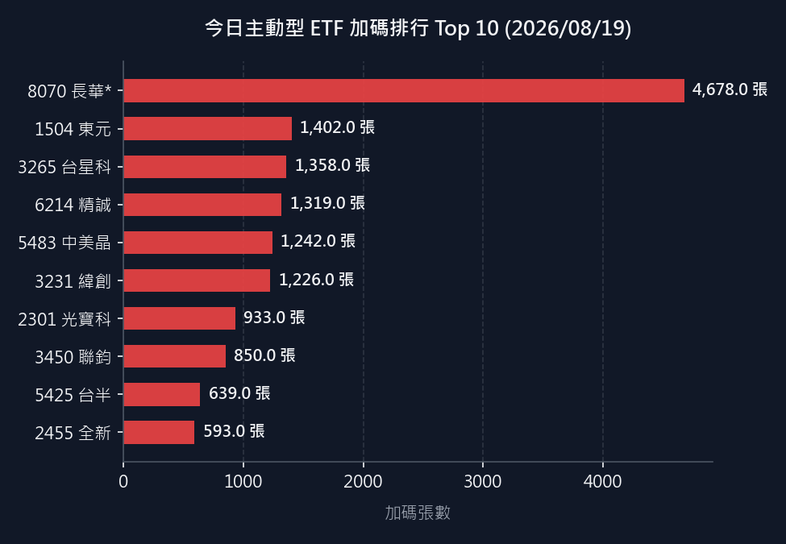
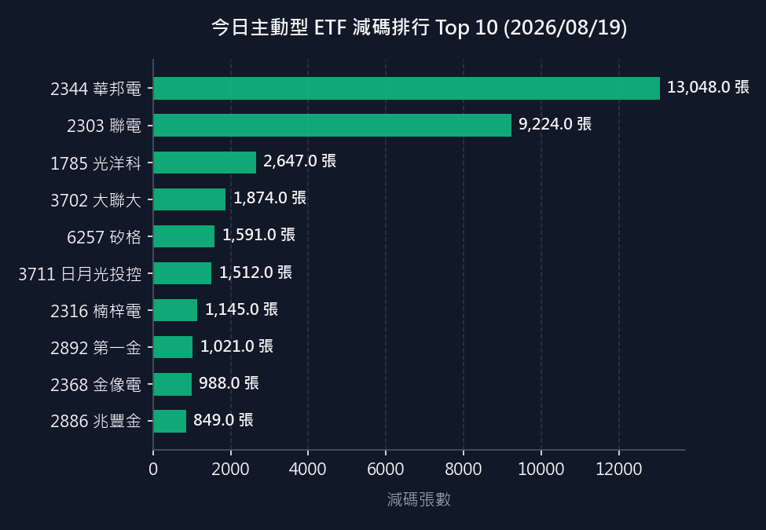

# 主動型 ETF 持股變動

資料來源：`主動型ETF持股明細.xlsx` 最近兩個日期分頁。

比較區間：`20260818` → `20260819`

## 今日加減碼視覺化排行

| 今日加碼 Top 10 | 今日減碼 Top 10 |
| :---: | :---: |
|  |  |

| ETF | 新增 | 刪除 | 比例變動 |
| :-- | --: | --: | --: |
| 00400A | 0 | 1 | 41 |
| 00401A | 0 | 2 | 52 |
| 00402A | 0 | 0 | 50 |
| 00403A | 0 | 0 | 31 |
| 00404A | 0 | 0 | 49 |
| 00405A | 1 | 0 | 34 |
| 00407A | 0 | 0 | 45 |
| 00408A | 0 | 0 | 39 |
| 00980A | 0 | 0 | 46 |
| 00980D | 0 | 2 | 66 |
| 00981A | 2 | 2 | 28 |
| 00982A | 0 | 1 | 57 |
| 00983A | 0 | 0 | 39 |
| 00983D | 0 | 0 | 49 |
| 00984A | 0 | 0 | 66 |
| 00985A | 0 | 0 | 39 |
| 00986A | 1 | 0 | 34 |
| 00987A | 0 | 0 | 25 |
| 00988A | 2 | 2 | 42 |
| 00989A | 0 | 0 | 60 |
| 00990A | 2 | 3 | 41 |
| 00991A | 0 | 0 | 21 |
| 00992A | 0 | 4 | 34 |
| 00993A | 0 | 0 | 49 |
| 00994A | 0 | 1 | 29 |
| 00995A | 0 | 0 | 37 |
| 00996A | 0 | 0 | 38 |
| 00997A | 0 | 0 | 47 |
| 00998A | 1 | 0 | 36 |
| 00999A | 0 | 0 | 55 |

## 00400A

### 新增持股

- 無

### 刪除持股

- 6715 嘉基（0.20%，140 張）

### 投資比例變動

- 1303 南亞：0.41% → 0.40%（-0.01）
- 2059 川湖：5.93% → 6.04%（+0.11）
- 2308 台達電：2.72% → 2.74%（+0.02）
- 2313 華通：0.78% → 0.80%（+0.02）
- 2317 鴻海：0.80% → 0.82%（+0.02）
- 2330 台積電：8.18% → 8.39%（+0.21）
- 2345 智邦：1.69% → 1.68%（-0.01）
- 2360 致茂：4.18% → 3.47%（-0.71）
- 2368 金像電：1.27% → 1.28%（+0.01）
- 2382 廣達：0.73% → 0.77%（+0.04）
- 2383 台光電：6.05% → 4.94%（-1.11）
- 2408 南亞科：1.93% → 1.88%（-0.05）
- 2449 京元電子：0.79% → 0.82%（+0.03）
- 2454 聯發科：6.12% → 6.30%（+0.18）
- 2881 富邦金：0.74% → 0.76%（+0.02）
- 2885 元大金：1.34% → 1.36%（+0.02）
- 3008 大立光：2.73% → 2.98%（+0.25）
- 3017 奇鋐：3.42% → 3.62%（+0.20）
- 3036 文曄：1.04% → 1.08%（+0.04）
- 3037 欣興：5.68% → 5.82%（+0.14）
- 3044 健鼎：1.69% → 1.73%（+0.04）
- 3090 日電貿：0.32% → 0.37%（+0.05）
- 3293 鈊象：0.33% → 0.35%（+0.02）
- 3443 創意：3.53% → 3.51%（-0.02）
- 3653 健策：4.27% → 4.70%（+0.43）
- 3665 貿聯-KY：2.66% → 2.17%（-0.49）
- 4979 華星光：0.52% → 0.54%（+0.02）
- 5274 信驊：3.00% → 2.89%（-0.11）
- 5347 世界：0.70% → 0.71%（+0.01）
- 6121 新普：0.24% → 0.25%（+0.01）
- 6187 萬潤：2.52% → 2.71%（+0.19）
- 6223 旺矽：4.21% → 4.36%（+0.15）
- 6239 力成：0.92% → 0.41%（-0.51）
- 6274 台燿：1.08% → 1.09%（+0.01）
- 6442 光聖：0.85% → 0.87%（+0.02）
- 6488 環球晶：3.33% → 3.21%（-0.12）
- 6515 穎崴：0.44% → 0.47%（+0.03）
- 6669 緯穎：3.00% → 3.11%（+0.11）
- 7750 新代：1.02% → 1.07%（+0.05）
- 7769 鴻勁：0.74% → 0.76%（+0.02）
- 8046 南電：1.09% → 1.07%（-0.02）

## 00401A

### 新增持股

- 無

### 刪除持股

- 2344 華邦電（0.26%，47 張）
- 臺指選擇權08/26 45600 買權（-0.04%，N/A 張）

### 投資比例變動

- 1216 統一：0.30% → 0.31%（+0.01）
- 1477 聚陽：0.79% → 0.97%（+0.18）
- 2059 川湖：1.12% → 1.30%（+0.18）
- 2303 聯電：0.86% → 0.85%（-0.01）
- 2308 台達電：3.37% → 3.33%（-0.04）
- 2327 國巨*：0.69% → 0.71%（+0.02）
- 2330 台積電：15.49% → 15.55%（+0.06）
- 2345 智邦：2.34% → 2.27%（-0.07）
- 2357 華碩：1.38% → 1.42%（+0.04）
- 2360 致茂：1.99% → 1.86%（-0.13）
- 2368 金像電：0.30% → 0.29%（-0.01）
- 2379 瑞昱：1.11% → 1.18%（+0.07）
- 2382 廣達：2.34% → 2.41%（+0.07）
- 2383 台光電：2.05% → 1.97%（-0.08）
- 2412 中華電：0.85% → 0.86%（+0.01）
- 2454 聯發科：6.07% → 6.11%（+0.04）
- 2455 全新：2.05% → 1.98%（-0.07）
- 2603 長榮：1.14% → 1.17%（+0.03）
- 2881 富邦金：1.90% → 1.91%（+0.01）
- 2882 國泰金：1.02% → 1.03%（+0.01）
- 2884 玉山金：1.80% → 1.82%（+0.02）
- 2885 元大金：0.52% → 0.51%（-0.01）
- 2886 兆豐金：1.39% → 1.42%（+0.03）
- 2890 永豐金：0.29% → 0.30%（+0.01）
- 2891 中信金：1.64% → 1.63%（-0.01）
- 2912 統一超：0.27% → 0.28%（+0.01）
- 3008 大立光：2.61% → 2.79%（+0.18）
- 3034 聯詠：0.22% → 0.23%（+0.01）
- 3037 欣興：2.62% → 2.63%（+0.01）
- 3131 弘塑：0.82% → 0.79%（-0.03）
- 3167 大量：0.55% → 0.50%（-0.05）
- 3231 緯創：0.37% → 0.38%（+0.01）
- 3653 健策：0.42% → 0.45%（+0.03）
- 3711 日月光投控：2.02% → 2.01%（-0.01）
- 4904 遠傳：0.80% → 0.81%（+0.01）
- 4958 臻鼎-KY：1.89% → 1.85%（-0.04）
- 4991 環宇-KY：1.09% → 1.12%（+0.03）
- 5274 信驊：2.08% → 1.96%（-0.12）
- 5347 世界：1.33% → 1.32%（-0.01）
- 6187 萬潤：0.75% → 0.79%（+0.04）
- 6223 旺矽：1.80% → 1.83%（+0.03）
- 6285 啟碁：1.48% → 1.50%（+0.02）
- 6510 精測：0.66% → 0.65%（-0.01）
- 6515 穎崴：1.08% → 1.10%（+0.02）
- 6531 愛普*：1.15% → 1.13%（-0.02）
- 6669 緯穎：2.12% → 2.15%（+0.03）
- 6944 兆聯實業：0.45% → 0.46%（+0.01）
- 7769 鴻勁：1.93% → 1.94%（+0.01）
- 7828 創新服務：1.71% → 1.72%（+0.01）
- 8021 尖點：0.27% → 0.07%（-0.20）
- 8464 億豐：1.12% → 1.14%（+0.02）
- 台股期貨09/26：-0.14% → -0.25%（-0.11）

## 00402A

### 新增持股

- 無

### 刪除持股

- 無

### 投資比例變動

- AAPL.US Apple：7.11% → 7.32%（+0.21）
- ADI.US Analog Devices：1.91% → 1.95%（+0.04）
- AMD.US AMD：4.62% → 4.69%（+0.07）
- ANET.US Arista Networks：0.86% → 0.87%（+0.01）
- ARM.US Arm：1.05% → 1.04%（-0.01）
- ASML.US ASML Holding：1.80% → 1.83%（+0.03）
- AVGO.US Broadcom：2.52% → 2.39%（-0.13）
- AXON.US Axon Enterprise：1.10% → 1.20%（+0.10）
- BABA.US Alibaba Group：0.59% → 0.64%（+0.05）
- BKNG.US Booking Holdings：0.70% → 0.76%（+0.06）
- CDNS.US Cadence Design Systems：1.74% → 1.47%（-0.27）
- CIEN.US Ciena：0.93% → 0.90%（-0.03）
- CLS.US Celestica：0.95% → 0.92%（-0.03）
- COHR.US Coherent：2.31% → 2.14%（-0.17）
- CRWD.US CrowdStrike Holdings：1.43% → 1.51%（+0.08）
- DASH.US DoorDash：0.29% → 0.31%（+0.02）
- FSLY.US Fastly：0.44% → 0.43%（-0.01）
- GOOG.US Alphabet - Class C Capital Stock：3.38% → 3.27%（-0.11）
- GOOGL.US Alphabet - Class A Common Stock：3.34% → 3.23%（-0.11）
- INTC.US Intel：1.36% → 1.34%（-0.02）
- IOT.US Samsara：0.24% → 0.26%（+0.02）
- KLAC.US KLA：2.30% → 2.31%（+0.01）
- LITE.US Lumentum：1.95% → 1.86%（-0.09）
- LRCX.US Lam Research：3.01% → 3.05%（+0.04）
- MCHP.US Microchip Technology：1.22% → 1.26%（+0.04）
- MDB.US MongoDB：0.86% → 0.90%（+0.04）
- META.US Meta：2.73% → 2.76%（+0.03）
- MRVL.US Marvell：1.68% → 1.64%（-0.04）
- MSFT.US Microsoft：4.19% → 4.45%（+0.26）
- MU.US Micron：6.79% → 6.28%（-0.51）
- NFLX.US Netflix：0.84% → 0.91%（+0.07）
- NOW.US ServiceNow：0.25% → 0.27%（+0.02）
- NVDA.US NVIDIA：9.24% → 8.85%（-0.39）
- PANW.US Palo Alto：3.31% → 3.49%（+0.18）
- PLTR.US Palantir Technologies：1.50% → 1.59%（+0.09）
- SHOP.US Shopify：0.51% → 0.53%（+0.02）
- SIMO.US Silicon Motion：0.82% → 0.80%（-0.02）
- SKHY.US SK hynix：1.09% → 1.05%（-0.04）
- SNOW.US Snowflake：0.99% → 1.04%（+0.05）
- SPCX.US SpaceX：0.75% → 0.78%（+0.03）
- SPOT.US Spotify：0.27% → 0.30%（+0.03）
- STX.US Seagate：1.23% → 1.18%（-0.05）
- TER.US Teradyne：1.03% → 1.00%（-0.03）
- TSM.US TSMC(ADR)：1.47% → 1.50%（+0.03）
- TTWO.US Take-Two：0.56% → 0.60%（+0.04）
- TXN.US Texas Instruments：2.30% → 2.35%（+0.05）
- UBER.US Uber：0.49% → 0.51%（+0.02）
- V.US Visa：1.08% → 1.16%（+0.08）
- WDC.US Western Digital：2.45% → 2.40%（-0.05）
- ZS.US Zscaler：0.19% → 0.21%（+0.02）

## 00403A

### 新增持股

- 無

### 刪除持股

- 無

### 投資比例變動

- 1303 南亞：1.04% → 0.99%（-0.05）
- 1560 中砂：0.43% → 0.29%（-0.14）
- 2303 聯電：5.42% → 4.75%（-0.67）
- 2308 台達電：3.19% → 3.15%（-0.04）
- 2327 國巨*：3.25% → 3.31%（+0.06）
- 2330 台積電：16.45% → 16.56%（+0.11）
- 2344 華邦電：2.85% → 1.78%（-1.07）
- 2345 智邦：2.96% → 2.88%（-0.08）
- 2360 致茂：1.33% → 1.25%（-0.08）
- 2383 台光電：6.04% → 5.84%（-0.20）
- 2454 聯發科：4.72% → 4.76%（+0.04）
- 3008 大立光：1.91% → 2.04%（+0.13）
- 3017 奇鋐：5.25% → 5.45%（+0.20）
- 3037 欣興：5.58% → 5.61%（+0.03）
- 3211 順達：0.44% → 0.43%（-0.01）
- 3443 創意：1.63% → 1.59%（-0.04）
- 3450 聯鈞：0.53% → 0.60%（+0.07）
- 3533 嘉澤：0.57% → 0.50%（-0.07）
- 3583 辛耘：0.32% → 0.33%（+0.01）
- 3653 健策：3.03% → 3.46%（+0.43）
- 4958 臻鼎-KY：0.14% → 0.13%（-0.01）
- 4966 譜瑞-KY：0.16% → 0.17%（+0.01）
- 5274 信驊：2.11% → 1.67%（-0.44）
- 6223 旺矽：3.22% → 3.27%（+0.05）
- 6239 力成：0.82% → 0.83%（+0.01）
- 6274 台燿：1.50% → 1.48%（-0.02）
- 6488 環球晶：1.71% → 1.62%（-0.09）
- 6669 緯穎：2.25% → 2.28%（+0.03）
- 6805 富世達：0.79% → 0.74%（-0.05）
- 8046 南電：1.89% → 1.83%（-0.06）
- 8996 高力：1.08% → 1.07%（-0.01）

## 00404A

### 新增持股

- 無

### 刪除持股

- 無

### 投資比例變動

- 1210 大成：1.82% → 1.90%（+0.08）
- 1303 南亞：0.19% → 0.18%（-0.01）
- 2059 川湖：0.40% → 0.42%（+0.02）
- 2301 光寶科：1.73% → 1.85%（+0.12）
- 2303 聯電：2.96% → 2.89%（-0.07）
- 2308 台達電：0.94% → 0.90%（-0.04）
- 2327 國巨*：0.73% → 0.71%（-0.02）
- 2330 台積電：22.39% → 22.51%（+0.12）
- 2345 智邦：0.47% → 0.45%（-0.02）
- 2351 順德：0.59% → 0.66%（+0.07）
- 2360 致茂：1.18% → 1.09%（-0.09）
- 2377 微星：1.78% → 1.79%（+0.01）
- 2383 台光電：2.61% → 2.48%（-0.13）
- 2428 興勤：0.82% → 0.85%（+0.03）
- 2441 超豐：0.46% → 0.45%（-0.01）
- 2454 聯發科：6.71% → 6.54%（-0.17）
- 2458 義隆：0.41% → 0.43%（+0.02）
- 2880 華南金：2.79% → 2.85%（+0.06）
- 2885 元大金：1.40% → 1.37%（-0.03）
- 2886 兆豐金：3.20% → 3.32%（+0.12）
- 2892 第一金：3.20% → 3.30%（+0.10）
- 3017 奇鋐：1.02% → 1.03%（+0.01）
- 3022 威強電：0.80% → 0.79%（-0.01）
- 3023 信邦：2.23% → 2.38%（+0.15）
- 3034 聯詠：0.55% → 0.60%（+0.05）
- 3037 欣興：1.28% → 1.33%（+0.05）
- 3260 威剛：0.36% → 0.37%（+0.01）
- 3264 欣銓：1.78% → 1.72%（-0.06）
- 3443 創意：1.03% → 0.96%（-0.07）
- 3653 健策：0.24% → 0.25%（+0.01）
- 3702 大聯大：1.94% → 1.92%（-0.02）
- 3711 日月光投控：3.54% → 3.47%（-0.07）
- 4763 材料*-KY：1.73% → 1.79%（+0.06）
- 5274 信驊：1.92% → 1.83%（-0.09）
- 5289 宜鼎：0.31% → 0.32%（+0.01）
- 5434 崇越：1.57% → 1.66%（+0.09）
- 5871 中租-KY：0.03% → 0.04%（+0.01）
- 5904 寶雅*：1.37% → 1.44%（+0.07）
- 6138 茂達：0.39% → 0.41%（+0.02）
- 6139 亞翔：0.26% → 0.25%（-0.01）
- 6196 帆宣：1.78% → 1.79%（+0.01）
- 6223 旺矽：1.11% → 1.03%（-0.08）
- 6491 晶碩：1.77% → 1.88%（+0.11）
- 6691 洋基工程：2.70% → 2.68%（-0.02）
- 8016 矽創：1.18% → 1.19%（+0.01）
- 8271 宇瞻：0.78% → 0.77%（-0.01）
- 台指選擇權09/26 48000 買權：-0.30% → -0.12%（+0.18）
- 台指選擇權10/26 49200 買權：-0.03% → -0.01%（+0.02）
- 台股期貨09/26：16.47% → 16.35%（-0.12）

## 00405A

### 新增持股

- 3450 聯鈞（1.25%，650 張）

### 刪除持股

- 無

### 投資比例變動

- 2308 台達電：1.77% → 1.75%（-0.02）
- 2330 台積電：1.41% → 1.42%（+0.01）
- 2345 智邦：3.89% → 3.80%（-0.09）
- 2368 金像電：3.99% → 3.96%（-0.03）
- 2383 台光電：4.35% → 4.21%（-0.14）
- 2449 京元電子：0.65% → 0.66%（+0.01）
- 2454 聯發科：6.17% → 6.24%（+0.07）
- 3008 大立光：1.77% → 1.89%（+0.12）
- 3017 奇鋐：8.06% → 8.40%（+0.34）
- 3026 禾伸堂：1.28% → 1.24%（-0.04）
- 3037 欣興：5.95% → 6.00%（+0.05）
- 3081 聯亞：1.53% → 1.43%（-0.10）
- 3131 弘塑：1.81% → 1.29%（-0.52）
- 3443 創意：7.67% → 7.50%（-0.17）
- 3653 健策：7.28% → 7.88%（+0.60）
- 3665 貿聯-KY：6.78% → 6.80%（+0.02）
- 4991 環宇-KY：1.44% → 1.48%（+0.04）
- 5274 信驊：3.06% → 2.91%（-0.15）
- 6187 萬潤：0.83% → 0.87%（+0.04）
- 6223 旺矽：4.76% → 4.85%（+0.09）
- 6274 台燿：1.56% → 1.55%（-0.01）
- 6285 啟碁：0.31% → 0.32%（+0.01）
- 6488 環球晶：0.39% → 0.37%（-0.02）
- 6510 精測：2.24% → 2.20%（-0.04）
- 6515 穎崴：0.48% → 0.50%（+0.02）
- 6526 達發：0.28% → 0.29%（+0.01）
- 6669 緯穎：2.22% → 1.08%（-1.14）
- 6805 富世達：1.30% → 1.22%（-0.08）
- 6831 邁科：0.54% → 0.51%（-0.03）
- 7734 印能科技：1.79% → 1.81%（+0.02）
- 7769 鴻勁：2.59% → 2.61%（+0.02）
- 8046 南電：3.04% → 2.95%（-0.09）
- 8210 勤誠：0.57% → 0.56%（-0.01）
- 8996 高力：1.10% → 1.08%（-0.02）

## 00407A

### 新增持股

- 無

### 刪除持股

- 無

### 投資比例變動

- 1303 南亞：0.60% → 0.58%（-0.02）
- 1560 中砂：0.48% → 0.49%（+0.01）
- 1590 亞德客-KY：0.07% → 0.08%（+0.01）
- 2059 川湖：3.64% → 3.65%（+0.01）
- 2301 光寶科：0.98% → 1.00%（+0.02）
- 2303 聯電：2.14% → 2.13%（-0.01）
- 2308 台達電：3.75% → 3.72%（-0.03）
- 2327 國巨*：2.23% → 2.28%（+0.05）
- 2330 台積電：8.53% → 8.62%（+0.09）
- 2344 華邦電：1.82% → 0.13%（-1.69）
- 2345 智邦：2.94% → 2.88%（-0.06）
- 2360 致茂：2.23% → 2.09%（-0.14）
- 2368 金像電：2.08% → 2.07%（-0.01）
- 2379 瑞昱：0.72% → 0.77%（+0.05）
- 2383 台光電：6.03% → 5.85%（-0.18）
- 2395 研華：1.99% → 2.08%（+0.09）
- 2408 南亞科：2.00% → 1.91%（-0.09）
- 2451 創見：0.16% → 0.17%（+0.01）
- 2454 聯發科：5.04% → 5.11%（+0.07）
- 2615 萬海：0.30% → 0.31%（+0.01）
- 3008 大立光：0.59% → 0.64%（+0.05）
- 3017 奇鋐：4.65% → 4.86%（+0.21）
- 3034 聯詠：0.66% → 0.71%（+0.05）
- 3037 欣興：5.42% → 5.48%（+0.06）
- 3260 威剛：0.16% → 0.17%（+0.01）
- 3293 鈊象：0.55% → 0.57%（+0.02）
- 3443 創意：2.86% → 2.80%（-0.06）
- 3529 力旺：1.82% → 1.80%（-0.02）
- 3653 健策：0.89% → 1.98%（+1.09）
- 3665 貿聯-KY：2.08% → 2.09%（+0.01）
- 3711 日月光投控：2.46% → 2.48%（+0.02）
- 4958 臻鼎-KY：1.76% → 1.74%（-0.02）
- 5274 信驊：2.15% → 2.04%（-0.11）
- 5289 宜鼎：0.17% → 0.18%（+0.01）
- 5434 崇越：0.20% → 0.19%（-0.01）
- 6187 萬潤：0.46% → 0.97%（+0.51）
- 6223 旺矽：2.42% → 2.47%（+0.05）
- 6274 台燿：3.59% → 3.57%（-0.02）
- 6446 藥華藥：1.02% → 1.04%（+0.02）
- 6515 穎崴：1.35% → 1.39%（+0.04）
- 6531 愛普*：1.47% → 0.28%（-1.19）
- 6669 緯穎：4.74% → 4.84%（+0.10）
- 6805 富世達：2.42% → 2.27%（-0.15）
- 8046 南電：2.79% → 2.71%（-0.08）
- 8210 勤誠：0.96% → 0.94%（-0.02）

## 00408A

### 新增持股

- 無

### 刪除持股

- 無

### 投資比例變動

- 1216 統一：0.09% → 0.10%（+0.01）
- 1537 廣隆：0.40% → 0.39%（-0.01）
- 2059 川湖：2.65% → 2.64%（-0.01）
- 2303 聯電：1.28% → 1.26%（-0.02）
- 2308 台達電：3.81% → 3.75%（-0.06）
- 2330 台積電：6.01% → 6.07%（+0.06）
- 2344 華邦電：1.52% → 1.47%（-0.05）
- 2345 智邦：2.05% → 1.99%（-0.06）
- 2357 華碩：2.41% → 2.49%（+0.08）
- 2360 致茂：3.26% → 3.05%（-0.21）
- 2368 金像電：3.03% → 2.99%（-0.04）
- 2376 技嘉：1.18% → 1.20%（+0.02）
- 2382 廣達：1.31% → 1.35%（+0.04）
- 2383 台光電：6.14% → 4.78%（-1.36）
- 2395 研華：2.30% → 2.39%（+0.09）
- 2404 漢唐：1.72% → 1.71%（-0.01）
- 2408 南亞科：1.27% → 1.20%（-0.07）
- 2454 聯發科：2.39% → 2.40%（+0.01）
- 2481 強茂：0.33% → 0.32%（-0.01）
- 2801 彰銀：0.90% → 0.92%（+0.02）
- 2886 兆豐金：2.51% → 2.56%（+0.05）
- 2891 中信金：0.98% → 0.97%（-0.01）
- 3017 奇鋐：4.86% → 5.03%（+0.17）
- 3037 欣興：4.37% → 3.32%（-1.05）
- 3045 台灣大：1.23% → 1.28%（+0.05）
- 3231 緯創：1.00% → 1.02%（+0.02）
- 3653 健策：1.59% → 2.05%（+0.46）
- 3702 大聯大：1.70% → 1.73%（+0.03）
- 3711 日月光投控：0.52% → 0.51%（-0.01）
- 5434 崇越：1.97% → 1.92%（-0.05）
- 5483 中美晶：1.14% → 1.10%（-0.04）
- 6187 萬潤：1.16% → 1.22%（+0.06）
- 6223 旺矽：0.81% → 0.82%（+0.01）
- 6274 台燿：1.81% → 1.78%（-0.03）
- 6488 環球晶：1.63% → 1.54%（-0.09）
- 6669 緯穎：5.12% → 5.18%（+0.06）
- 6805 富世達：0.36% → 0.34%（-0.02）
- 8046 南電：2.76% → 2.66%（-0.10）
- 8996 高力：0.36% → 0.35%（-0.01）

## 00980A

### 新增持股

- 無

### 刪除持股

- 無

### 投資比例變動

- 1303 南亞：2.32% → 2.29%（-0.03）
- 2059 川湖：6.00% → 6.48%（+0.48）
- 2308 台達電：3.65% → 3.60%（-0.05）
- 2317 鴻海：2.35% → 2.38%（+0.03）
- 2330 台積電：7.62% → 7.87%（+0.25）
- 2344 華邦電：1.69% → 1.65%（-0.04）
- 2345 智邦：1.91% → 1.87%（-0.04）
- 2360 致茂：1.67% → 1.59%（-0.08）
- 2368 金像電：1.90% → 2.06%（+0.16）
- 2376 技嘉：1.19% → 1.22%（+0.03）
- 2382 廣達：1.58% → 1.65%（+0.07）
- 2383 台光電：4.14% → 4.04%（-0.10）
- 2408 南亞科：2.75% → 2.66%（-0.09）
- 2884 玉山金：1.15% → 1.21%（+0.06）
- 2891 中信金：1.42% → 1.48%（+0.06）
- 3008 大立光：0.63% → 0.73%（+0.10）
- 3017 奇鋐：2.02% → 2.10%（+0.08）
- 3026 禾伸堂：0.44% → 0.47%（+0.03）
- 3036 文曄：1.12% → 1.17%（+0.05）
- 3037 欣興：3.02% → 3.21%（+0.19）
- 3044 健鼎：0.80% → 0.84%（+0.04）
- 3081 聯亞：3.06% → 3.10%（+0.04）
- 3189 景碩：0.80% → 0.79%（-0.01）
- 3231 緯創：0.93% → 0.96%（+0.03）
- 3293 鈊象：0.88% → 0.95%（+0.07）
- 3443 創意：1.65% → 1.58%（-0.07）
- 3653 健策：1.77% → 1.90%（+0.13）
- 3665 貿聯-KY：0.33% → 0.36%（+0.03）
- 3711 日月光投控：1.55% → 1.56%（+0.01）
- 4958 臻鼎-KY：1.11% → 1.06%（-0.05）
- 5274 信驊：1.49% → 1.46%（-0.03）
- 5904 寶雅*：1.15% → 1.23%（+0.08）
- 6213 聯茂：1.11% → 1.18%（+0.07）
- 6223 旺矽：2.00% → 1.91%（-0.09）
- 6274 台燿：1.43% → 1.42%（-0.01）
- 6442 光聖：0.30% → 0.29%（-0.01）
- 6515 穎崴：1.74% → 1.77%（+0.03）
- 6669 緯穎：1.65% → 1.67%（+0.02）
- 6805 富世達：0.50% → 0.49%（-0.01）
- 6831 邁科：0.60% → 0.55%（-0.05）
- 7769 鴻勁：2.36% → 2.38%（+0.02）
- 8046 南電：1.26% → 1.21%（-0.05）
- 8210 勤誠：0.93% → 0.96%（+0.03）
- 8299 群聯：1.97% → 1.96%（-0.01）
- 8996 高力：1.05% → 1.04%（-0.01）
- 台灣證交所加權股價指數：6.94% → 4.95%（-1.99）

## 00980D

### 新增持股

- 無

### 刪除持股

- CARNIVAL CORP SER REGS (REG S) 7% 15AUG2029（0.54%，N/A 張）
- HSBC HOLDINGS PLC VAR 03NOV2028（0.32%，N/A 張）

### 投資比例變動

- AHOLD FINANCE USA LLC 6.88% 01MAY2029：0.47% → 0.48%（+0.01）
- ARCELORMITTAL SA 6.55% 29NOV2027：0.53% → 0.54%（+0.01）
- BARCLAYS PLC (REG) VAR 27JUN2034：0.33% → 0.34%（+0.01）
- BAT CAPITAL CORP (REG) 7.081% 02AUG2053：0.55% → 0.56%（+0.01）
- BLUE OWL CREDIT INCOME 7.750000 % 15JAN2029：0.52% → 0.53%（+0.01）
- BLUE OWL TECHNOLOGY FIN CORP II 6.75 % 04APR2029：0.54% → 0.55%（+0.01）
- BRITISH TELECOMMUNICATIO (BR) 9.625% 15DEC2030：0.56% → 0.57%（+0.01）
- CAPITAL ONE FINANCIAL CO SER . (REG) VAR 30OCT2031：0.57% → 0.58%（+0.01）
- CHARTER COMM OPT LLC/CAP 6.700000 % 01-DEC-2055：0.44% → 0.45%（+0.01）
- CIVITAS RESOURCES INC SER REGS (REG) (REG S) 9.625% 15JUN2033：0.54% → 0.55%（+0.01）
- CONCENTRIX CORP (REG) 6.6% 02AUG2028：0.50% → 0.51%（+0.01）
- CONCENTRIX CORP (REG) 6.85% 02AUG2033：0.68% → 0.69%（+0.01）
- CONSOLIDATED ENERGY FIN SER REGS 12.000000 % 15FEB2031：0.54% → 0.55%（+0.01）
- COTY/HFC PRESTIGE/INT US SER REGS (REG S) 6.625% 15JUL2030：0.55% → 0.56%（+0.01）
- DAIMLER FINANCE NA LLC REG 8.5% 18JAN2031：0.62% → 0.63%（+0.01）
- DELL INT LLC / EMC CORP (REG) 8.1% 15JUL2036：0.57% → 0.58%（+0.01）
- DEUTSCHE TELEKOM INT FIN (REG) 8.75% 15JUN2030：0.40% → 0.41%（+0.01）
- DEUTSCHE TELEKOM INT FIN (REG) 9.25% 01JUN2032：0.41% → 0.42%（+0.01）
- DISCOVER FINANCIAL SVS (REG) VAR 02NOV2034：0.62% → 0.63%（+0.01）
- DOW CHEMICAL CO/THE 5.950000 % 15MAR2055：0.48% → 0.49%（+0.01）
- DOW CHEMICAL CO/THE 9.4% 15MAY2039：0.53% → 0.54%（+0.01）
- FIFTH THIRD BANCORP (REG) 8.25% 01MAR2038：0.63% → 0.64%（+0.01）
- FORD MOTOR COMPANY (REG) 7.45% 16JUL2031：0.46% → 0.47%（+0.01）
- GENERAL MOTORS CO (REG) 6.8% 01OCT2027：0.54% → 0.55%（+0.01）
- GETTY IMAGES INC SER REGS 11.250000 % 21FEB2030：0.47% → 0.48%（+0.01）
- GLENCORE FINANCE CANADA SER REGS 6.900000 % 15-NOV-2037：0.38% → 0.39%（+0.01）
- GLOBAL AUTO HO/AAG FH UK SER REGS (REG S) 8.75% 15JAN2032：0.42% → 0.43%（+0.01）
- GRAY TELEVISION INC SER REGS (REG) (REG S) 10.5% 15JUL2029：0.56% → 0.57%（+0.01）
- HAH GROUP HOLDING CO LLC SER REGS (REG S) 9.75% 01OCT2031：0.29% → 0.30%（+0.01）
- HISCOX LTD VAR 11JUN2036：0.42% → 0.43%（+0.01）
- HPS CORPORATE LENDING FU 6.750000 % 30JAN2029：0.52% → 0.53%（+0.01）
- INTESA SANPAOLO SPA SER REGS (REG) 7.200000 % 28NOV2033：0.34% → 0.35%（+0.01）
- JETBLUE AIRWAYS/LOYALTY SER REGS (REG S) 9.875% 20SEP2031：0.49% → 0.48%（-0.01）
- KELLANOVA SER B (REG) 7.450000 % 01APR2031：0.55% → 0.56%（+0.01）
- LADDER CAP FIN LLLP/CORP SER REGS 7.000000 % 15JUL2031：0.32% → 0.33%（+0.01）
- METLIFE INC (REG) 10.75% 01AUG2039：0.44% → 0.45%（+0.01）
- MOBIUS MERGER SUB SER REGS 9.000000 % 01JUN2030：0.24% → 0.25%（+0.01）
- MPLX LP 6.200000 % 15SEP2055：0.32% → 0.33%（+0.01）
- MYLAN INC SER WI (REG) 5.2% 15APR2048WI：0.47% → 0.48%（+0.01）
- OCCIDENTAL PETROLEUM COR (REG) 7.5% 01MAY2031：0.32% → 0.33%（+0.01）
- OCCIDENTAL PETROLEUM COR 8.875% 15JUL2030：0.54% → 0.55%（+0.01）
- OPEN TEXT CORP SER REGS (REG) (REG S) 6.9% 01DEC2027：0.64% → 0.65%（+0.01）
- ORACLE CORP 6.125000 % 03AUG2065：0.50% → 0.51%（+0.01）
- ORACLE CORP 6.85 % 04-FEB-2066：0.39% → 0.40%（+0.01）
- ORACLE CORP 6.9% 09NOV2052：0.50% → 0.51%（+0.01）
- OVINTIV INC 7.375% 01NOV2031：0.32% → 0.33%（+0.01）
- PACIFIC GAS & ELECTRIC (REG) 6.7% 01APR2053：0.32% → 0.33%（+0.01）
- PACIFIC GAS & ELECTRIC (REG) 6.75% 15JAN2053：0.32% → 0.33%（+0.01）
- PACIFIC GAS & ELECTRIC 6.95% 15MAR2034：0.32% → 0.33%（+0.01）
- POLARIS INC 6.950000 % 15MAR2029：0.46% → 0.47%（+0.01）
- PROGRESS ENERGY INC (REG) 7.75% 01MAR2031：0.56% → 0.57%（+0.01）
- RIO TINTO FIN USA LTD (REG) 7.125% 15JUL2028：0.55% → 0.56%（+0.01）
- SALESFORCE INC (REG) 6.55% 15MAR2056：0.51% → 0.52%（+0.01）
- SALESFORCE INC (REG) 6.7% 15MAR2066：0.50% → 0.51%（+0.01）
- SANTANDER HOLDINGS USA VAR 09MAR2029：0.46% → 0.47%（+0.01）
- SPRINT CAPITAL CORP (REG) 8.75% 15MAR2032：0.40% → 0.41%（+0.01）
- SYMETRA LIFE INSURANCE SER REGS 6.550000 % 01OCT2055：0.30% → 0.31%（+0.01）
- TELEFONICA EUROPE BV (REG) 8.25% 15SEP2030：0.40% → 0.41%（+0.01）
- UBS GROUP AG SER REGS (REG S) VAR 15NOV2033：0.46% → 0.47%（+0.01）
- US 10YR NOTE (CBT)SEP26 21-SEP-2026：18.06% → 18.20%（+0.14）
- US 10YR ULTRA FUT SEP26 21-SEP-2026：-1.20% → -1.21%（-0.01）
- US 2YR NOTE (CBT) SEP26 30-SEP-2026：1.92% → 1.94%（+0.02）
- US 5YR NOTE (CBT) SEP26 30-SEP-2026：-15.73% → -15.84%（-0.11）
- US LONG BOND(CBT) SEP26 21-SEP-2026：5.23% → 5.28%（+0.05）
- VIACOM INC (REG) 5.85% 01SEP2043：0.55% → 0.56%（+0.01）
- WESTLAKE CORP 6.375000 % 15-NOV-2055：0.50% → 0.51%（+0.01）

## 00981A

### 新增持股

- 2637 慧洋-KY（0.01%，200 張）
- 台指期貨(B) 2026/09（2.11%，0.679 張）

### 刪除持股

- 3533 嘉澤（0.00%，1 張）
- 台指期貨(B) 2026/08（2.06%，N/A 張）

### 投資比例變動

- 2303 聯電：3.51% → 3.53%（+0.02）
- 2308 台達電：4.33% → 4.34%（+0.01）
- 2327 國巨*：4.92% → 5.11%（+0.19）
- 2330 台積電：9.71% → 9.76%（+0.05）
- 2345 智邦：4.93% → 4.88%（-0.05）
- 2360 致茂：0.48% → 0.22%（-0.26）
- 2368 金像電：1.08% → 0.73%（-0.35）
- 2383 台光電：10.14% → 9.96%（-0.18）
- 2449 京元電子：0.90% → 0.93%（+0.03）
- 2454 聯發科：7.11% → 7.19%（+0.08）
- 3017 奇鋐：6.02% → 6.38%（+0.36）
- 3037 欣興：7.82% → 8.02%（+0.20）
- 3264 欣銓：0.42% → 0.43%（+0.01）
- 3653 健策：4.15% → 4.57%（+0.42）
- 3665 貿聯-KY：3.48% → 3.55%（+0.07）
- 3711 日月光投控：3.93% → 4.00%（+0.07）
- 4958 臻鼎-KY：0.27% → 0.26%（-0.01）
- 4979 華星光：0.43% → 0.45%（+0.02）
- 5274 信驊：2.78% → 2.27%（-0.51）
- 6187 萬潤：0.48% → 0.38%（-0.10）
- 6191 精成科：0.11% → 0.12%（+0.01）
- 6223 旺矽：4.33% → 4.49%（+0.16）
- 6274 台燿：2.86% → 2.88%（+0.02）
- 6278 台表科：0.19% → 0.20%（+0.01）
- 6669 緯穎：4.83% → 4.96%（+0.13）
- 6805 富世達：1.49% → 1.42%（-0.07）
- 8046 南電：4.03% → 3.97%（-0.06）
- 8210 勤誠：0.86% → 0.85%（-0.01）

## 00982A

### 新增持股

- 無

### 刪除持股

- 2368 金像電（0.00%，1 張）

### 投資比例變動

- 1785 光洋科：0.59% → 0.06%（-0.53）
- 2059 川湖：5.31% → 5.29%（-0.02）
- 2301 光寶科：0.48% → 0.97%（+0.49）
- 2303 聯電：2.17% → 2.13%（-0.04）
- 2316 楠梓電：0.74% → 0.37%（-0.37）
- 2327 國巨*：0.54% → 0.28%（-0.26）
- 2330 台積電：8.53% → 8.54%（+0.01）
- 2345 智邦：3.63% → 3.52%（-0.11）
- 2351 順德：0.55% → 0.30%（-0.25）
- 2360 致茂：3.85% → 3.60%（-0.25）
- 2376 技嘉：0.66% → 1.02%（+0.36）
- 2377 微星：1.68% → 1.69%（+0.01）
- 2383 台光電：4.05% → 3.90%（-0.15）
- 2395 研華：0.47% → 0.97%（+0.50）
- 2428 興勤：0.11% → 0.23%（+0.12）
- 2451 創見：0.20% → 0.10%（-0.10）
- 2454 聯發科：6.77% → 6.80%（+0.03）
- 2455 全新：0.46% → 0.89%（+0.43）
- 2467 志聖：1.70% → 1.11%（-0.59）
- 2472 立隆電：0.47% → 0.25%（-0.22）
- 2476 鉅祥：0.11% → 0.23%（+0.12）
- 2478 大毅：0.11% → 0.20%（+0.09）
- 3008 大立光：2.62% → 2.79%（+0.17）
- 3017 奇鋐：2.50% → 2.62%（+0.12）
- 3036 文曄：0.65% → 0.33%（-0.32）
- 3090 日電貿：0.11% → 0.19%（+0.08）
- 3105 穩懋：3.60% → 3.54%（-0.06）
- 3231 緯創：0.47% → 0.92%（+0.45）
- 3264 欣銓：2.01% → 2.00%（-0.01）
- 3265 台星科：0.46% → 0.99%（+0.53）
- 3491 昇達科：2.50% → 2.48%（-0.02）
- 3583 辛耘：1.62% → 1.66%（+0.04）
- 3617 碩天：0.11% → 0.23%（+0.12）
- 3702 大聯大：0.81% → 0.42%（-0.39）
- 3711 日月光投控：1.22% → 1.21%（-0.01）
- 4958 臻鼎-KY：3.01% → 2.94%（-0.07）
- 5274 信驊：1.15% → 1.22%（+0.07）
- 5425 台半：0.12% → 0.24%（+0.12）
- 5483 中美晶：0.46% → 0.89%（+0.43）
- 5536 聖暉*：5.06% → 3.57%（-1.49）
- 6139 亞翔：6.29% → 6.25%（-0.04）
- 6196 帆宣：0.11% → 0.23%（+0.12）
- 6213 聯茂：0.12% → 0.23%（+0.11）
- 6214 精誠：0.46% → 0.95%（+0.49）
- 6223 旺矽：3.23% → 3.27%（+0.04）
- 6257 矽格：1.29% → 0.66%（-0.63）
- 6274 台燿：1.39% → 1.37%（-0.02）
- 6278 台表科：0.57% → 0.30%（-0.27）
- 6488 環球晶：2.40% → 2.26%（-0.14）
- 6531 愛普*：2.48% → 2.44%（-0.04）
- 6669 緯穎：6.52% → 6.59%（+0.07）
- 6672 騰輝電子-KY：0.12% → 0.23%（+0.11）
- 6831 邁科：0.39% → 0.36%（-0.03）
- 7769 鴻勁：0.81% → 0.40%（-0.41）
- 8016 矽創：0.87% → 0.46%（-0.41）
- 8070 長華*：0.23% → 0.70%（+0.47）
- 8996 高力：0.90% → 0.88%（-0.02）

## 00983A

### 新增持股

- 無

### 刪除持股

- 無

### 投資比例變動

- ACHR.US Archer：0.72% → 0.73%（+0.01）
- AMD.US AMD：4.25% → 4.18%（-0.07）
- AMZN.US Amazon：3.40% → 3.47%（+0.07）
- AVGO.US Broadcom：1.60% → 1.49%（-0.11）
- BEAM.US Beam Therapeutics：2.06% → 2.07%（+0.01）
- BLSH.US Bullish：1.19% → 1.21%（+0.02）
- BMNR.US BitMine：1.34% → 1.35%（+0.01）
- CBRS.US Cerebras：1.00% → 0.98%（-0.02）
- CERS.US Cerus：0.51% → 0.49%（-0.02）
- COIN.US Coinbase：2.12% → 2.11%（-0.01）
- CRCL.US Circle：3.22% → 3.26%（+0.04）
- CRSP.US CRISPR Therapeutics：4.29% → 4.30%（+0.01）
- CRWV.US CoreWeave：1.60% → 1.45%（-0.15）
- DE.US Deere：1.37% → 1.38%（+0.01）
- FIG.US Figma：0.43% → 0.46%（+0.03）
- GOOG.US Alphabet - Class C Capital Stock：1.25% → 1.28%（+0.03）
- GOOGL.US Alphabet - Class A Common Stock：1.00% → 1.03%（+0.03）
- HOOD.US Robinhood Markets：3.86% → 3.77%（-0.09）
- LLY.US Eli Lilly：1.95% → 2.07%（+0.12）
- META.US Meta：1.10% → 1.08%（-0.02）
- NTLA.US Intellia Therapeutics：1.36% → 1.34%（-0.02）
- NTRA.US Natera：2.21% → 2.25%（+0.04）
- PLTR.US Palantir Technologies：3.35% → 3.42%（+0.07）
- RBLX.US Roblox：0.65% → 0.66%（+0.01）
- RXRX.US Recursion Pharmaceuticals：0.29% → 0.30%（+0.01）
- SHOP.US Shopify：6.73% → 6.81%（+0.08）
- SNOW.US Snowflake：1.67% → 1.69%（+0.02）
- SOFI.US SoFi Technologies：0.70% → 0.69%（-0.01）
- SPCX.US SpaceX：3.53% → 3.73%（+0.20）
- TEM.US Tempus：3.36% → 3.30%（-0.06）
- TER.US Teradyne：0.73% → 0.69%（-0.04）
- TSLA.US Tesla：8.12% → 8.26%（+0.14）
- TSM.US TSMC(ADR)：3.61% → 3.56%（-0.05）
- TWST.US Twist Bioscience：4.48% → 4.30%（-0.18）
- TXG.US 10x Genomics：3.97% → 3.91%（-0.06）
- VCYT.US Veracyte：0.60% → 0.39%（-0.21）
- WGS.US GeneDx：1.63% → 1.65%（+0.02）
- XE.US X-Energy：0.66% → 0.63%（-0.03）
- XYZ.US Block：2.28% → 2.32%（+0.04）

## 00983D

### 新增持股

- 無

### 刪除持股

- 無

### 投資比例變動

- ABIBB 8.2 01/15/39：1.95% → 1.96%（+0.01）
- AET 6 5/8 06/15/36：0.73% → 0.74%（+0.01）
- ALLY 8 11/01/31：0.86% → 0.87%（+0.01）
- ATH 6 5/8 05/19/55：0.98% → 0.97%（-0.01）
- AWK 6.593 10/15/37：0.71% → 0.72%（+0.01）
- BACR 7.437 11/02/33：1.27% → 1.28%（+0.01）
- BATSLN 7.079 08/02/43：1.07% → 1.08%（+0.01）
- BATSLN 7.081 08/02/53：1.30% → 1.31%（+0.01）
- BHCCN 11 09/30/28：1.86% → 1.87%（+0.01）
- BRITEL 9 5/8 12/15/30：1.35% → 1.36%（+0.01）
- BRKHEC 6 3/4 07/01/37：0.81% → 0.82%（+0.01）
- C 8 1/8 07/15/39：1.93% → 1.94%（+0.01）
- CEG 6 1/2 10/01/53：0.76% → 0.77%（+0.01）
- CYH 10 7/8 01/15/32：1.49% → 1.50%（+0.01）
- DELL 8.1 07/15/36：1.52% → 1.53%（+0.01）
- DELL 8.35 07/15/46：1.39% → 1.40%（+0.01）
- DOW 6.9 05/15/53：0.73% → 0.74%（+0.01）
- DOW 9.4 05/15/39：1.94% → 1.95%（+0.01）
- DT 9 1/4 06/01/32：0.94% → 0.95%（+0.01）
- DUK 7 3/4 03/01/31：1.55% → 1.56%（+0.01）
- ED 6 3/4 04/01/38：0.61% → 0.62%（+0.01）
- ENBCN 6.7 11/15/53：1.10% → 1.11%（+0.01）
- GM 6 3/4 04/01/46：1.17% → 1.18%（+0.01）
- GM 6.6 04/01/36：0.39% → 0.40%（+0.01）
- GTN 10 1/2 07/15/29：1.68% → 1.69%（+0.01）
- HAL 7.45 09/15/39：1.81% → 1.82%（+0.01）
- HPE 6.35 10/15/45：0.98% → 0.99%（+0.01）
- HSBC 6.332 03/09/44：1.05% → 1.06%（+0.01）
- KHC 6 7/8 01/26/39：1.00% → 1.01%（+0.01）
- LQDW.US iShares Investment Grade Corpora：7.25% → 7.31%（+0.06）
- MBGGR 8 1/2 01/18/31：1.31% → 1.32%（+0.01）
- MS 7 1/4 04/01/32：1.63% → 1.64%（+0.01）
- NVDA 5.55 06/15/46：1.13% → 1.14%（+0.01）
- OXY 6.6 03/15/46：0.74% → 0.75%（+0.01）
- PCG 6 3/4 01/15/53：1.13% → 1.14%（+0.01）
- PCG 6.7 04/01/53：1.09% → 1.10%（+0.01）
- PFE 7.2 03/15/39：1.42% → 1.43%（+0.01）
- RAKUTN 11 1/4 02/15/27：1.80% → 1.81%（+0.01）
- S 8 3/4 03/15/32：0.65% → 0.66%（+0.01）
- SJM 6 1/2 11/15/43：0.19% → 0.20%（+0.01）
- SJM 6 1/2 11/15/53：0.19% → 0.20%（+0.01）
- SPCX 6.6 07/15/46：1.12% → 1.13%（+0.01）
- TELEFONICA EMISIONES SAU 7.045 06/20/36：1.55% → 1.56%（+0.01）
- TIME WARNER CABLE INC 6.750 06/15/39：0.47% → 0.48%（+0.01）
- TLTW.US iShares 20+ Year Treasury Bond B：7.08% → 7.14%（+0.06）
- TRPCN 7 5/8 01/15/39：1.68% → 1.69%（+0.01）
- UNITEDHEALTH GROUP INC 6.875 02/15/38：0.86% → 0.87%（+0.01）
- VENLNG 9 1/2 02/01/29：1.41% → 1.42%（+0.01）
- VZ 7 3/4 12/01/30：1.14% → 1.15%（+0.01）

## 00984A

### 新增持股

- 無

### 刪除持股

- 無

### 投資比例變動

- 1303 南亞：2.42% → 2.29%（-0.13）
- 1326 台化：1.05% → 1.01%（-0.04）
- 1477 聚陽：0.77% → 0.76%（-0.01）
- 1560 中砂：0.67% → 0.68%（+0.01）
- 1907 永豐餘：0.49% → 0.51%（+0.02）
- 2006 東和鋼鐵：0.08% → 0.09%（+0.01）
- 2059 川湖：5.83% → 5.79%（-0.04）
- 2201 裕隆：0.23% → 0.24%（+0.01）
- 2303 聯電：1.34% → 1.32%（-0.02）
- 2317 鴻海：1.36% → 1.35%（-0.01）
- 2324 仁寶：0.61% → 0.59%（-0.02）
- 2330 台積電：3.56% → 3.55%（-0.01）
- 2345 智邦：0.80% → 0.77%（-0.03）
- 2347 聯強：0.93% → 0.94%（+0.01）
- 2351 順德：0.27% → 0.29%（+0.02）
- 2357 華碩：0.92% → 0.94%（+0.02）
- 2360 致茂：0.96% → 0.90%（-0.06）
- 2375 凱美：0.24% → 0.26%（+0.02）
- 2383 台光電：1.98% → 1.89%（-0.09）
- 2404 漢唐：1.16% → 1.15%（-0.01）
- 2408 南亞科：2.00% → 1.88%（-0.12）
- 2441 超豐：1.11% → 1.12%（+0.01）
- 2464 盟立：0.72% → 0.74%（+0.02）
- 2472 立隆電：0.24% → 0.25%（+0.01）
- 2476 鉅祥：0.24% → 0.25%（+0.01）
- 2546 根基：0.19% → 0.20%（+0.01）
- 2603 長榮：0.82% → 0.84%（+0.02）
- 2633 台灣高鐵：0.46% → 0.47%（+0.01）
- 2801 彰銀：1.55% → 1.57%（+0.02）
- 2812 台中銀：1.27% → 1.28%（+0.01）
- 2834 臺企銀：1.33% → 1.34%（+0.01）
- 2880 華南金：1.94% → 1.93%（-0.01）
- 2885 元大金：0.74% → 0.73%（-0.01）
- 2886 兆豐金：1.97% → 2.00%（+0.03）
- 2891 中信金：0.76% → 0.75%（-0.01）
- 2892 第一金：1.65% → 1.66%（+0.01）
- 3008 大立光：2.64% → 2.79%（+0.15）
- 3023 信邦：1.12% → 1.18%（+0.06）
- 3026 禾伸堂：0.87% → 0.91%（+0.04）
- 3034 聯詠：0.68% → 0.73%（+0.05）
- 3037 欣興：0.70% → 0.69%（-0.01）
- 3189 景碩：1.67% → 1.66%（-0.01）
- 3443 創意：0.22% → 0.21%（-0.01）
- 3450 聯鈞：0.77% → 0.76%（-0.01）
- 3711 日月光投控：1.13% → 1.12%（-0.01）
- 4958 臻鼎-KY：0.94% → 0.92%（-0.02）
- 4966 譜瑞-KY：0.83% → 0.87%（+0.04）
- 5274 信驊：0.88% → 0.83%（-0.05）
- 5289 宜鼎：0.99% → 1.04%（+0.05）
- 5351 鈺創：0.91% → 0.95%（+0.04）
- 5434 崇越：0.32% → 0.31%（-0.01）
- 5483 中美晶：0.44% → 0.42%（-0.02）
- 5880 合庫金：1.57% → 1.58%（+0.01）
- 6139 亞翔：2.79% → 2.76%（-0.03）
- 6197 佳必琪：0.53% → 0.55%（+0.02）
- 6202 盛群：0.25% → 0.26%（+0.01）
- 6213 聯茂：1.86% → 1.87%（+0.01）
- 6223 旺矽：1.05% → 1.06%（+0.01）
- 6257 矽格：0.66% → 0.67%（+0.01）
- 6274 台燿：0.68% → 0.66%（-0.02）
- 6446 藥華藥：2.56% → 2.59%（+0.03）
- 6491 晶碩：0.26% → 0.27%（+0.01）
- 6944 兆聯實業：1.06% → 1.05%（-0.01）
- 8039 台虹：0.87% → 0.86%（-0.01）
- 8046 南電：0.67% → 0.64%（-0.03）
- 9914 美利達：0.24% → 0.27%（+0.03）

## 00985A

### 新增持股

- 無

### 刪除持股

- 無

### 投資比例變動

- 1216 統一：1.23% → 1.26%（+0.03）
- 1504 東元：1.01% → 2.02%（+1.01）
- 2027 大成鋼：2.02% → 2.06%（+0.04）
- 2059 川湖：1.54% → 1.53%（-0.01）
- 2303 聯電：0.20% → 0.19%（-0.01）
- 2308 台達電：1.45% → 1.42%（-0.03）
- 2317 鴻海：0.16% → 0.15%（-0.01）
- 2330 台積電：13.63% → 13.60%（-0.03）
- 2344 華邦電：0.77% → 0.40%（-0.37）
- 2345 智邦：2.69% → 2.59%（-0.10）
- 2360 致茂：0.11% → 0.10%（-0.01）
- 2368 金像電：1.02% → 1.00%（-0.02）
- 2376 技嘉：4.91% → 4.97%（+0.06）
- 2383 台光電：1.39% → 1.33%（-0.06）
- 2395 研華：0.33% → 1.00%（+0.67）
- 2408 南亞科：0.97% → 0.91%（-0.06）
- 2412 中華電：3.77% → 3.79%（+0.02）
- 2603 長榮：4.03% → 4.11%（+0.08）
- 3008 大立光：2.11% → 2.24%（+0.13）
- 3017 奇鋐：2.01% → 2.07%（+0.06）
- 3036 文曄：1.55% → 1.56%（+0.01）
- 3081 聯亞：2.36% → 2.19%（-0.17）
- 3105 穩懋：2.39% → 2.35%（-0.04）
- 3131 弘塑：1.18% → 0.28%（-0.90）
- 3653 健策：1.61% → 1.72%（+0.11）
- 3665 貿聯-KY：0.20% → 0.19%（-0.01）
- 3711 日月光投控：1.95% → 1.94%（-0.01）
- 4904 遠傳：3.79% → 3.83%（+0.04）
- 4958 臻鼎-KY：0.78% → 0.49%（-0.29）
- 6187 萬潤：1.42% → 1.49%（+0.07）
- 6442 光聖：2.24% → 2.23%（-0.01）
- 6446 藥華藥：1.47% → 1.49%（+0.02）
- 6669 緯穎：3.30% → 3.33%（+0.03）
- 7750 新代：2.01% → 2.67%（+0.66）
- 7769 鴻勁：1.14% → 1.97%（+0.83）
- 8046 南電：0.58% → 0.56%（-0.02）
- 8299 群聯：0.68% → 0.39%（-0.29）
- 8996 高力：1.29% → 1.26%（-0.03）
- 台積電期貨：5.11% → 5.08%（-0.03）

## 00986A

### 新增持股

- 艾司摩爾控股公司（0.38%，0.04 張）

### 刪除持股

- 無

### 投資比例變動

- 2330 台積電：8.50% → 8.67%（+0.17）
- 2454 聯發科：1.30% → 1.29%（-0.01）
- AAPL.US Apple：0.94% → 0.98%（+0.04）
- AMAT.US Applied Materials：1.92% → 1.90%（-0.02）
- AMD.US AMD：3.63% → 3.59%（-0.04）
- AMZN.US Amazon：3.75% → 3.84%（+0.09）
- COHR.US Coherent：2.34% → 2.11%（-0.23）
- CRDO.US Credo：0.43% → 0.65%（+0.22）
- CRWD.US CrowdStrike Holdings：4.11% → 4.22%（+0.11）
- DDOG.US Datadog：0.63% → 0.65%（+0.02）
- ETN.US Eaton：2.33% → 2.28%（-0.05）
- GEV.US GE Vernova：2.76% → 2.66%（-0.10）
- GOOGL.US Alphabet - Class A Common Stock：5.29% → 5.46%（+0.17）
- GS.US Goldman Sachs：2.96% → 3.03%（+0.07）
- HWM.US Howmet Aerospace：2.52% → 2.63%（+0.11）
- JPM.US JPMorgan Chase：1.48% → 1.83%（+0.35）
- LITE.US Lumentum：3.87% → 3.60%（-0.27）
- LLY.US Eli Lilly：2.73% → 2.92%（+0.19）
- LRCX.US Lam Research：3.00% → 2.95%（-0.05）
- MA.US Mastercard：1.01% → 1.06%（+0.05）
- MSFT.US Microsoft：2.46% → 2.55%（+0.09）
- MU.US Micron：4.15% → 3.98%（-0.17）
- MUFG(8306.JP)：1.41% → 1.45%（+0.04）
- Murata Mfg.(6981.JP)：1.87% → 1.74%（-0.13）
- NET.US Cloudflare：1.89% → 1.91%（+0.02）
- NVDA.US NVIDIA：6.00% → 5.81%（-0.19）
- SNDK.US Sandisk：1.83% → 1.72%（-0.11）
- SNOW.US Snowflake：1.86% → 1.89%（+0.03）
- Siemens Energy AG：2.13% → 2.08%（-0.05）
- TSEM.US Tower Semiconductor：1.01% → 0.95%（-0.06）
- Yaskawa Electric(6506.JP)：1.94% → 1.88%（-0.06）
- 嘉能可公司：1.54% → 1.58%（+0.04）
- 施奈德電機公司：1.65% → 1.63%（-0.02）
- 英飛凌科技股份有限公司：2.95% → 2.80%（-0.15）

## 00987A

### 新增持股

- 無

### 刪除持股

- 無

### 投資比例變動

- 2308 台達電：1.90% → 1.91%（+0.01）
- 2330 台積電：7.97% → 8.17%（+0.20）
- 2345 智邦：2.32% → 2.30%（-0.02）
- 2383 台光電：7.85% → 6.58%（-1.27）
- 2408 南亞科：4.60% → 4.46%（-0.14）
- 2454 聯發科：4.63% → 4.75%（+0.12）
- 2455 全新：3.18% → 3.14%（-0.04）
- 3017 奇鋐：6.55% → 6.93%（+0.38）
- 3037 欣興：8.09% → 7.24%（-0.85）
- 3081 聯亞：4.11% → 3.91%（-0.20）
- 3363 上詮：2.02% → 2.09%（+0.07）
- 3443 創意：4.74% → 4.09%（-0.65）
- 3653 健策：3.45% → 3.79%（+0.34）
- 3665 貿聯-KY：4.17% → 4.25%（+0.08）
- 5274 信驊：0.19% → 0.18%（-0.01）
- 6187 萬潤：1.22% → 2.37%（+1.15）
- 6223 旺矽：5.29% → 5.48%（+0.19）
- 6274 台燿：4.31% → 4.34%（+0.03）
- 6515 穎崴：1.88% → 1.97%（+0.09）
- 6683 雍智科技：2.44% → 2.39%（-0.05）
- 6739 竹陞科技：1.85% → 1.89%（+0.04）
- 6805 富世達：3.79% → 3.61%（-0.18）
- 7769 鴻勁：2.91% → 2.99%（+0.08）
- 8046 南電：4.21% → 4.15%（-0.06）
- 8358 金居：1.76% → 1.81%（+0.05）

## 00988A

### 新增持股

- Furukawa Electric(5801.JP)（0.77%，500 張）
- SK hynix(000660.KS)（0.97%，15 張）

### 刪除持股

- LMT.US Lockheed Martin（1.18%，38 張）
- NOW.US ServiceNow（0.83%，135 張）

### 投資比例變動

- 2308 台達電：2.24% → 2.31%（+0.07）
- 2327 國巨*：1.55% → 1.57%（+0.02）
- 2330 台積電：2.57% → 2.73%（+0.16）
- 2383 台光電：4.66% → 4.87%（+0.21）
- 2454 聯發科：2.47% → 2.06%（-0.41）
- 3017 奇鋐：1.12% → 1.15%（+0.03）
- 3037 欣興：4.80% → 5.25%（+0.45）
- 3711 日月光投控：1.01% → 1.06%（+0.05）
- 4979 華星光：0.40% → 0.42%（+0.02）
- 6223 旺矽：2.31% → 2.25%（-0.06）
- AEHR.US Aehr Test Systems：0.53% → 0.49%（-0.04）
- AIXTRON SE：0.51% → 0.50%（-0.01）
- AMD.US AMD：3.45% → 3.55%（+0.10）
- BE.US Bloom Energy：2.56% → 2.47%（-0.09）
- COHR.US Coherent：1.75% → 1.64%（-0.11）
- CRDO.US Credo：3.34% → 3.12%（-0.22）
- FORMFACTOR INC：1.09% → 1.05%（-0.04）
- INFINEON TECHNOLOGIES AG：1.60% → 1.59%（-0.01）
- Kioxia Holdings(285A.JP)：3.67% → 3.63%（-0.04）
- LITE.US Lumentum：5.95% → 5.76%（-0.19）
- MICRONICS(6871.JP)：1.87% → 1.93%（+0.06）
- MPWR.US Monolithic Power Systems：1.34% → 1.35%（+0.01）
- MRVL.US Marvell：2.52% → 2.50%（-0.02）
- Meiko Electronics(6787.JP)：1.02% → 1.06%（+0.04）
- Murata Mfg.(6981.JP)：3.69% → 3.57%（-0.12）
- NET.US Cloudflare：0.72% → 0.76%（+0.04）
- Nippon Chemi-Con(6997.JP)：1.32% → 1.35%（+0.03）
- PANW.US Palo Alto：2.96% → 3.16%（+0.20）
- PLTR.US Palantir Technologies：1.63% → 1.74%（+0.11）
- SNDK.US Sandisk：1.97% → 1.92%（-0.05）
- SNOW.US Snowflake：2.25% → 2.38%（+0.13）
- SPCX.US SpaceX：1.53% → 1.94%（+0.41）
- STX.US Seagate：3.13% → 3.06%（-0.07）
- Samsung Elec Mech(009150.KS)：4.07% → 4.00%（-0.07）
- TAIYO YUDEN(6976.JP)：1.68% → 0.63%（-1.05）
- TER.US Teradyne：1.28% → 1.25%（-0.03）
- TSEM.US Tower Semiconductor：3.00% → 2.94%（-0.06）
- TWLO.US Twilio：0.66% → 0.72%（+0.06）
- WDC.US Western Digital：2.25% → 2.24%（-0.01）
- 三環集團(300408.SZ)：1.77% → 1.81%（+0.04）
- 中際旭創(3308.HK)：0.93% → 0.97%（+0.04）
- 鼎泰高科(301377.SZ)：1.05% → 1.15%（+0.10）

## 00989A

### 新增持股

- 無

### 刪除持股

- 無

### 投資比例變動

- ADBE.US Adobe：0.91% → 0.97%（+0.06）
- ALGM.US Allegro MicroSystems：0.62% → 0.57%（-0.05）
- AMAT.US Applied Materials：0.72% → 0.71%（-0.01）
- AMD.US AMD：2.62% → 2.58%（-0.04）
- AMKR.US Amkor：0.79% → 0.73%（-0.06）
- AMZN.US Amazon：1.00% → 1.02%（+0.02）
- APP.US Applovin：0.59% → 0.60%（+0.01）
- ASML.US ASML Holding：1.81% → 1.78%（-0.03）
- AVGO.US Broadcom：3.77% → 3.76%（-0.01）
- BE.US Bloom Energy：1.06% → 0.98%（-0.08）
- CBRS.US Cerebras：0.23% → 0.20%（-0.03）
- CIEN.US Ciena：2.08% → 1.95%（-0.13）
- CRM.US Salesforce：2.06% → 2.18%（+0.12）
- CRWD.US CrowdStrike Holdings：3.13% → 3.21%（+0.08）
- CRWV.US CoreWeave：0.83% → 0.75%（-0.08）
- DOCN.US DigitalOcean：1.54% → 1.47%（-0.07）
- ENTG.US Entegris：0.86% → 0.82%（-0.04）
- ESTC.US Elastic：0.23% → 0.24%（+0.01）
- FIGR.US Figure：0.87% → 0.89%（+0.02）
- FN.US Fabrinet：0.78% → 0.65%（-0.13）
- GFS.US GlobalFoundries：1.10% → 1.05%（-0.05）
- GLW.US Corning：1.97% → 1.87%（-0.10）
- GOOG.US Alphabet - Class C Capital Stock：4.05% → 4.17%（+0.12）
- HOOD.US Robinhood Markets：2.18% → 2.14%（-0.04）
- HUBS.US HubSpot：1.41% → 1.53%（+0.12）
- INTC.US Intel：2.94% → 2.83%（-0.11）
- LITE.US Lumentum：1.80% → 1.67%（-0.13）
- LMND.US Lemonade：0.74% → 0.77%（+0.03）
- LRCX.US Lam Research：2.29% → 2.25%（-0.04）
- META.US Meta：2.48% → 2.44%（-0.04）
- MSFT.US Microsoft：3.01% → 3.11%（+0.10）
- MTSI.US MACOM Technology Solutions：1.12% → 1.04%（-0.08）
- MU.US Micron：0.85% → 0.81%（-0.04）
- NET.US Cloudflare：2.77% → 2.80%（+0.03）
- NOW.US ServiceNow：1.45% → 1.52%（+0.07）
- NU.US Nu：0.89% → 0.90%（+0.01）
- NVDA.US NVIDIA：3.94% → 3.97%（+0.03）
- ON.US ON Semiconductor：1.55% → 1.52%（-0.03）
- ORCL.US Oracle：1.29% → 1.30%（+0.01）
- PANW.US Palo Alto：4.29% → 4.40%（+0.11）
- PLTR.US Palantir Technologies：0.69% → 0.70%（+0.01）
- RIVN.US Rivian：1.22% → 1.25%（+0.03）
- ROK.US Rockwell Automation：0.83% → 0.84%（+0.01）
- SHOP.US Shopify：2.03% → 2.07%（+0.04）
- SNDK.US Sandisk：0.66% → 0.62%（-0.04）
- SNOW.US Snowflake：3.13% → 3.18%（+0.05）
- SPCX.US SpaceX：0.76% → 0.77%（+0.01）
- SYM.US Symbotic：0.46% → 0.45%（-0.01）
- TEM.US Tempus：0.82% → 0.81%（-0.01）
- TSLA.US Tesla：2.68% → 2.74%（+0.06）
- TSM.US TSMC(ADR)：1.13% → 1.12%（-0.01）
- TTMI.US TTM Technologies：0.59% → 0.54%（-0.05）
- TTWO.US Take-Two：3.62% → 3.74%（+0.12）
- TWLO.US Twilio：2.24% → 2.35%（+0.11）
- TXN.US Texas Instruments：1.48% → 1.47%（-0.01）
- U.US Unity Software：0.66% → 0.70%（+0.04）
- VICR.US Vicor Corporation：0.89% → 0.88%（-0.01）
- WRBY.US Warby Parker：0.64% → 0.66%（+0.02）
- XYZ.US Block：0.73% → 0.75%（+0.02）
- ZM.US Zoom：2.09% → 2.14%（+0.05）

## 00990A

### 新增持股

- CBRS.US Cerebras（0.47%，25.9 張）
- SPCX.US SpaceX（1.58%，134.3 張）

### 刪除持股

- NVDA.US NVIDIA（1.02%，59.7 張）
- SNOW.US Snowflake（1.00%，39.8 張）
- U.US Unity Software（0.99%，287.5 張）

### 投資比例變動

- 2308 台達電：1.99% → 2.06%（+0.07）
- 2330 台積電：2.33% → 2.48%（+0.15）
- 2345 智邦：0.94% → 0.98%（+0.04）
- 2383 台光電：2.75% → 2.88%（+0.13）
- 2449 京元電子：0.60% → 0.61%（+0.01）
- 2454 聯發科：2.37% → 2.44%（+0.07）
- 3037 欣興：3.07% → 3.36%（+0.29）
- 3711 日月光投控：0.94% → 0.98%（+0.04）
- 6223 旺矽：1.25% → 1.22%（-0.03）
- 6274 台燿：0.97% → 1.01%（+0.04）
- 8046 南電：0.93% → 0.96%（+0.03）
- AEHR.US Aehr Test Systems：1.38% → 1.26%（-0.12）
- AMAT.US Applied Materials：1.92% → 1.98%（+0.06）
- AMD.US AMD：3.27% → 3.37%（+0.10）
- AXTI.US AXT：1.95% → 1.80%（-0.15）
- Advantest(6857.JP)：1.59% → 1.62%（+0.03）
- BE.US Bloom Energy：2.56% → 2.48%（-0.08）
- CIEN.US Ciena：1.02% → 1.00%（-0.02）
- COHR.US Coherent：3.04% → 2.86%（-0.18）
- CRDO.US Credo：2.97% → 2.78%（-0.19）
- DELL.US Dell：2.75% → 1.84%（-0.91）
- DIOD.US Diodes：0.92% → 0.91%（-0.01）
- FSLY.US Fastly：0.95% → 0.93%（-0.02）
- IBIDEN(4062.JP)：0.93% → 0.96%（+0.03）
- Kioxia Holdings(285A.JP)：4.36% → 4.74%（+0.38）
- LITE.US Lumentum：7.46% → 7.24%（-0.22）
- LRCX.US Lam Research：0.97% → 1.00%（+0.03）
- MRVL.US Marvell：2.84% → 2.82%（-0.02）
- Murata Mfg.(6981.JP)：3.17% → 3.60%（+0.43）
- NBIS.US Nebius Group：1.02% → 1.01%（-0.01）
- PANW.US Palo Alto：1.51% → 1.08%（-0.43）
- PLTR.US Palantir Technologies：0.73% → 0.78%（+0.05）
- RBRK.US Rubrik：0.94% → 1.01%（+0.07）
- SK hynix(000660.KS)：0.95% → 2.04%（+1.09）
- SMTC.US Semtech：1.93% → 1.82%（-0.11）
- SNDK.US Sandisk：3.98% → 3.90%（-0.08）
- Samsung Elec Mech(009150.KS)：3.53% → 3.52%（-0.01）
- TER.US Teradyne：1.56% → 1.53%（-0.03）
- TSEM.US Tower Semiconductor：2.80% → 2.75%（-0.05）
- WDC.US Western Digital：2.01% → 2.00%（-0.01）
- WOLF.US Wolfspeed：1.07% → 1.03%（-0.04）

## 00991A

### 新增持股

- 無

### 刪除持股

- 無

### 投資比例變動

- 2059 川湖：8.00% → 8.31%（+0.31）
- 2327 國巨*：4.94% → 5.13%（+0.19）
- 2330 台積電：13.25% → 12.23%（-1.02）
- 2345 智邦：4.46% → 4.42%（-0.04）
- 2383 台光電：9.88% → 9.72%（-0.16）
- 2408 南亞科：8.03% → 7.79%（-0.24）
- 2454 聯發科：4.76% → 4.89%（+0.13）
- 3017 奇鋐：4.06% → 4.47%（+0.41）
- 3026 禾伸堂：2.01% → 2.15%（+0.14）
- 3037 欣興：6.38% → 6.53%（+0.15）
- 3081 聯亞：2.15% → 2.17%（+0.02）
- 3189 景碩：3.47% → 3.93%（+0.46）
- 3653 健策：1.32% → 2.15%（+0.83）
- 3711 日月光投控：1.93% → 1.02%（-0.91）
- 5274 信驊：2.29% → 2.21%（-0.08）
- 6223 旺矽：3.87% → 4.01%（+0.14）
- 6274 台燿：3.96% → 3.99%（+0.03）
- 6669 緯穎：4.28% → 4.42%（+0.14）
- 7769 鴻勁：2.91% → 2.98%（+0.07）
- 8046 南電：4.16% → 4.09%（-0.07）
- 8299 群聯：2.23% → 2.00%（-0.23）

## 00992A

### 新增持股

- 無

### 刪除持股

- 3264 欣銓（0.03%，72 張）
- 3583 辛耘（0.24%，147 張）
- 6515 穎崴（0.61%，42 張）
- 7751 竑騰（0.09%，25 張）

### 投資比例變動

- 1303 南亞：2.49% → 2.41%（-0.08）
- 1815 富喬：2.37% → 2.51%（+0.14）
- 2059 川湖：8.55% → 8.64%（+0.09）
- 2301 光寶科：0.41% → 0.42%（+0.01）
- 2330 台積電：7.11% → 7.24%（+0.13）
- 2345 智邦：5.47% → 5.38%（-0.09）
- 2357 華碩：0.41% → 0.43%（+0.02）
- 2360 致茂：0.40% → 0.38%（-0.02）
- 2376 技嘉：0.40% → 0.42%（+0.02）
- 2383 台光電：6.60% → 6.45%（-0.15）
- 2454 聯發科：3.61% → 2.41%（-1.20）
- 2455 全新：2.63% → 2.57%（-0.06）
- 3008 大立光：5.09% → 5.50%（+0.41）
- 3017 奇鋐：6.95% → 7.31%（+0.36）
- 3026 禾伸堂：0.40% → 0.42%（+0.02）
- 3037 欣興：6.51% → 6.62%（+0.11）
- 3081 聯亞：0.42% → 0.40%（-0.02）
- 3189 景碩：1.67% → 1.69%（+0.02）
- 3231 緯創：3.00% → 3.11%（+0.11）
- 3443 創意：2.08% → 2.05%（-0.03）
- 3653 健策：0.39% → 0.42%（+0.03）
- 3661 世芯-KY：1.83% → 1.84%（+0.01）
- 3665 貿聯-KY：5.95% → 6.02%（+0.07）
- 3711 日月光投控：0.98% → 0.99%（+0.01）
- 5274 信驊：0.43% → 0.41%（-0.02）
- 5289 宜鼎：0.33% → 0.35%（+0.02）
- 6187 萬潤：0.39% → 0.41%（+0.02）
- 6213 聯茂：0.42% → 0.43%（+0.01）
- 6223 旺矽：3.23% → 3.32%（+0.09）
- 6584 南俊國際：3.07% → 3.16%（+0.09）
- 6669 緯穎：1.13% → 1.16%（+0.03）
- 8021 尖點：2.51% → 2.49%（-0.02）
- 8046 南電：0.85% → 0.83%（-0.02）
- 8996 高力：4.38% → 4.36%（-0.02）

## 00993A

### 新增持股

- 無

### 刪除持股

- 無

### 投資比例變動

- 1560 中砂：0.22% → 0.33%（+0.11）
- 2059 川湖：4.72% → 4.57%（-0.15）
- 2301 光寶科：0.24% → 0.38%（+0.14）
- 2303 聯電：1.79% → 1.69%（-0.10）
- 2308 台達電：2.61% → 2.24%（-0.37）
- 2327 國巨*：1.69% → 1.51%（-0.18）
- 2330 台積電：10.64% → 9.58%（-1.06）
- 2337 旺宏：0.30% → 0.45%（+0.15）
- 2344 華邦電：2.48% → 2.63%（+0.15）
- 2345 智邦：2.99% → 3.05%（+0.06）
- 2347 聯強：0.56% → 0.52%（-0.04）
- 2360 致茂：1.35% → 0.85%（-0.50）
- 2368 金像電：0.21% → 0.34%（+0.13）
- 2383 台光電：6.06% → 6.36%（+0.30）
- 2395 研華：0.43% → 0.41%（-0.02）
- 2408 南亞科：3.55% → 3.64%（+0.09）
- 2454 聯發科：4.30% → 4.08%（-0.22）
- 2455 全新：0.24% → 0.37%（+0.13）
- 2467 志聖：0.25% → 0.38%（+0.13）
- 2883 凱基金：0.84% → 0.63%（-0.21）
- 2885 元大金：1.25% → 0.85%（-0.40）
- 2890 永豐金：0.88% → 0.65%（-0.23）
- 3017 奇鋐：3.72% → 4.23%（+0.51）
- 3037 欣興：5.13% → 5.65%（+0.52）
- 3081 聯亞：1.54% → 1.00%（-0.54）
- 3189 景碩：2.90% → 2.80%（-0.10）
- 3231 緯創：0.40% → 0.43%（+0.03）
- 3264 欣銓：0.91% → 0.63%（-0.28）
- 3443 創意：2.32% → 2.45%（+0.13）
- 3491 昇達科：0.22% → 0.34%（+0.12）
- 3653 健策：1.80% → 1.88%（+0.08）
- 3661 世芯-KY：0.19% → 0.29%（+0.10）
- 3665 貿聯-KY：1.00% → 1.64%（+0.64）
- 3711 日月光投控：1.92% → 1.50%（-0.42）
- 5274 信驊：4.01% → 3.98%（-0.03）
- 5289 宜鼎：1.00% → 1.24%（+0.24）
- 6139 亞翔：0.20% → 0.31%（+0.11）
- 6187 萬潤：0.26% → 0.38%（+0.12）
- 6196 帆宣：0.21% → 0.32%（+0.11）
- 6223 旺矽：5.88% → 5.78%（-0.10）
- 6274 台燿：4.14% → 4.29%（+0.15）
- 6515 穎崴：2.52% → 2.50%（-0.02）
- 6584 南俊國際：0.21% → 0.32%（+0.11）
- 6669 緯穎：3.32% → 3.45%（+0.13）
- 7769 鴻勁：1.75% → 1.71%（-0.04）
- 8046 南電：2.58% → 2.74%（+0.16）
- 8299 群聯：0.42% → 0.64%（+0.22）
- 8358 金居：0.19% → 0.31%（+0.12）
- 8996 高力：0.22% → 0.33%（+0.11）

## 00994A

### 新增持股

- 無

### 刪除持股

- 2344 華邦電（0.85%，250 張）

### 投資比例變動

- 2059 川湖：5.79% → 5.88%（+0.09）
- 2303 聯電：0.98% → 0.99%（+0.01）
- 2308 台達電：2.60% → 2.61%（+0.01）
- 2327 國巨*：0.62% → 0.64%（+0.02）
- 2330 台積電：13.41% → 13.68%（+0.27）
- 2345 智邦：3.37% → 3.33%（-0.04）
- 2360 致茂：2.34% → 2.23%（-0.11）
- 2382 廣達：0.44% → 0.46%（+0.02）
- 2383 台光電：9.05% → 7.94%（-1.11）
- 2408 南亞科：3.10% → 3.00%（-0.10）
- 2454 聯發科：5.00% → 5.11%（+0.11）
- 3017 奇鋐：6.14% → 6.48%（+0.34）
- 3037 欣興：7.34% → 6.48%（-0.86）
- 3081 聯亞：0.06% → 0.05%（-0.01）
- 3443 創意：2.02% → 2.00%（-0.02）
- 3653 健策：1.28% → 1.84%（+0.56）
- 3665 貿聯-KY：0.21% → 0.22%（+0.01）
- 3711 日月光投控：3.01% → 3.06%（+0.05）
- 5274 信驊：2.59% → 2.49%（-0.10）
- 5483 中美晶：0.82% → 0.81%（-0.01）
- 6187 萬潤：0.94% → 1.01%（+0.07）
- 6223 旺矽：3.73% → 3.85%（+0.12）
- 6239 力成：0.89% → 0.91%（+0.02）
- 6274 台燿：4.68% → 4.71%（+0.03）
- 6488 環球晶：1.55% → 1.48%（-0.07）
- 6669 緯穎：3.19% → 3.29%（+0.10）
- 6805 富世達：0.38% → 0.36%（-0.02）
- 7769 鴻勁：1.38% → 1.41%（+0.03）
- 8046 南電：5.64% → 5.53%（-0.11）

## 00995A

### 新增持股

- 無

### 刪除持股

- 無

### 投資比例變動

- 1326 台化：0.47% → 0.46%（-0.01）
- 2303 聯電：2.12% → 2.10%（-0.02）
- 2308 台達電：3.96% → 3.93%（-0.03）
- 2327 國巨*：2.05% → 2.10%（+0.05）
- 2330 台積電：8.90% → 9.01%（+0.11）
- 2344 華邦電：1.16% → 1.13%（-0.03）
- 2345 智邦：4.85% → 4.73%（-0.12）
- 2360 致茂：1.19% → 1.12%（-0.07）
- 2368 金像電：1.57% → 1.56%（-0.01）
- 2383 台光電：8.85% → 8.57%（-0.28）
- 2454 聯發科：5.69% → 5.76%（+0.07）
- 2455 全新：0.84% → 0.81%（-0.03）
- 2472 立隆電：0.73% → 0.77%（+0.04）
- 2486 一詮：0.70% → 0.71%（+0.01）
- 3017 奇鋐：4.81% → 5.01%（+0.20）
- 3023 信邦：0.69% → 0.74%（+0.05）
- 3037 欣興：5.26% → 5.31%（+0.05）
- 3044 健鼎：0.75% → 0.76%（+0.01）
- 3131 弘塑：0.44% → 0.43%（-0.01）
- 3211 順達：0.23% → 0.22%（-0.01）
- 3443 創意：0.55% → 0.54%（-0.01）
- 3653 健策：3.06% → 3.32%（+0.26）
- 3665 貿聯-KY：3.59% → 3.61%（+0.02）
- 4958 臻鼎-KY：1.00% → 0.99%（-0.01）
- 5274 信驊：2.97% → 2.82%（-0.15）
- 5289 宜鼎：0.64% → 0.67%（+0.03）
- 6187 萬潤：0.67% → 0.71%（+0.04）
- 6213 聯茂：0.48% → 0.49%（+0.01）
- 6223 旺矽：3.97% → 4.04%（+0.07）
- 6274 台燿：2.08% → 2.07%（-0.01）
- 6515 穎崴：1.75% → 1.81%（+0.06）
- 6669 緯穎：5.45% → 5.55%（+0.10）
- 6805 富世達：0.35% → 0.33%（-0.02）
- 7750 新代：0.59% → 0.61%（+0.02）
- 7769 鴻勁：2.84% → 2.87%（+0.03）
- 8046 南電：4.19% → 4.06%（-0.13）
- 8210 勤誠：0.87% → 0.86%（-0.01）

## 00996A

### 新增持股

- 無

### 刪除持股

- 無

### 投資比例變動

- 1303 南亞：1.57% → 1.51%（-0.06）
- 2308 台達電：4.81% → 4.79%（-0.02）
- 2327 國巨*：5.96% → 6.12%（+0.16）
- 2330 台積電：9.79% → 9.93%（+0.14）
- 2344 華邦電：2.51% → 2.13%（-0.38）
- 2345 智邦：1.38% → 1.35%（-0.03）
- 2360 致茂：1.32% → 1.25%（-0.07）
- 2383 台光電：7.27% → 7.08%（-0.19）
- 2408 南亞科：2.34% → 1.93%（-0.41）
- 2449 京元電子：0.03% → 0.04%（+0.01）
- 2454 聯發科：7.23% → 7.35%（+0.12）
- 2472 立隆電：3.33% → 3.50%（+0.17）
- 3017 奇鋐：0.77% → 0.80%（+0.03）
- 3037 欣興：2.58% → 2.61%（+0.03）
- 3042 晶技：1.52% → 1.63%（+0.11）
- 3131 弘塑：0.29% → 0.28%（-0.01）
- 3189 景碩：1.67% → 1.68%（+0.01）
- 3363 上詮：1.39% → 1.42%（+0.03）
- 3443 創意：3.31% → 2.75%（-0.56）
- 3653 健策：2.37% → 2.58%（+0.21）
- 3665 貿聯-KY：0.15% → 0.16%（+0.01）
- 3711 日月光投控：0.48% → 0.49%（+0.01）
- 4583 台灣精銳：0.33% → 0.34%（+0.01）
- 4958 臻鼎-KY：6.12% → 6.06%（-0.06）
- 5269 祥碩：0.69% → 0.76%（+0.07）
- 6182 合晶：0.43% → 0.41%（-0.02）
- 6223 旺矽：2.30% → 2.35%（+0.05）
- 6239 力成：2.02% → 2.05%（+0.03）
- 6278 台表科：2.40% → 2.50%（+0.10）
- 6415 矽力*-KY：1.60% → 1.62%（+0.02）
- 6531 愛普*：0.44% → 0.43%（-0.01）
- 6770 力積電：0.66% → 0.64%（-0.02）
- 6831 邁科：2.39% → 2.25%（-0.14）
- 8021 尖點：1.35% → 1.34%（-0.01）
- 8046 南電：2.72% → 2.65%（-0.07）
- 8210 勤誠：1.06% → 1.05%（-0.01）
- 8996 高力：0.76% → 1.21%（+0.45）
- 小型臺指期貨：2.34% → 2.36%（+0.02）

## 00997A

### 新增持股

- 無

### 刪除持股

- 無

### 投資比例變動

- 2330 台積電：2.18% → 2.27%（+0.09）
- 2345 智邦：1.67% → 1.71%（+0.04）
- 2383 台光電：1.79% → 1.84%（+0.05）
- 3037 欣興：1.85% → 1.99%（+0.14）
- AAPL.US Apple：2.63% → 2.21%（-0.42）
- ADBE.US Adobe：0.46% → 0.50%（+0.04）
- AMAT.US Applied Materials：2.93% → 2.97%（+0.04）
- AMD.US AMD：3.63% → 3.66%（+0.03）
- AMZN.US Amazon：1.56% → 1.63%（+0.07）
- ANET.US Arista Networks：1.70% → 1.72%（+0.02）
- APH.US Amphenol：1.35% → 1.33%（-0.02）
- APP.US Applovin：0.21% → 0.22%（+0.01）
- AVGO.US Broadcom：2.28% → 2.33%（+0.05）
- CDNS.US Cadence Design Systems：0.28% → 0.29%（+0.01）
- CIEN.US Ciena：1.99% → 1.91%（-0.08）
- COHR.US Coherent：0.69% → 0.64%（-0.05）
- CRDO.US Credo：1.81% → 2.26%（+0.45）
- CRWD.US CrowdStrike Holdings：2.60% → 2.74%（+0.14）
- CSCO.US Cisco：0.79% → 0.82%（+0.03）
- DT.US Dynatrace：1.81% → 1.98%（+0.17）
- FTNT.US Fortinet：2.35% → 1.58%（-0.77）
- GE.US GE Aerospace：1.86% → 1.99%（+0.13）
- GEV.US GE Vernova：0.48% → 0.47%（-0.01）
- GOOGL.US Alphabet - Class A Common Stock：2.91% → 3.08%（+0.17）
- HWM.US Howmet Aerospace：2.28% → 2.44%（+0.16）
- IBIDEN(4062.JP)：2.70% → 2.74%（+0.04）
- INTC.US Intel：1.98% → 1.95%（-0.03）
- IOT.US Samsara：1.14% → 1.22%（+0.08）
- Kioxia Holdings(285A.JP)：0.79% → 0.77%（-0.02）
- LITE.US Lumentum：4.31% → 4.10%（-0.21）
- LRCX.US Lam Research：2.78% → 2.80%（+0.02）
- META.US Meta：0.65% → 0.66%（+0.01）
- MPWR.US Monolithic Power Systems：0.56% → 0.55%（-0.01）
- MRVL.US Marvell：3.96% → 3.85%（-0.11）
- MSFT.US Microsoft：0.74% → 0.68%（-0.06）
- MU.US Micron：4.45% → 4.37%（-0.08）
- NVDA.US NVIDIA：2.52% → 2.59%（+0.07）
- OKTA.US Okta：1.52% → 1.04%（-0.48）
- PANW.US Palo Alto：2.11% → 2.22%（+0.11）
- PLTR.US Palantir Technologies：1.06% → 1.11%（+0.05）
- RTX.US RTX：1.74% → 1.87%（+0.13）
- SNDK.US Sandisk：3.45% → 3.31%（-0.14）
- SNOW.US Snowflake：2.02% → 2.10%（+0.08）
- STX.US Seagate：2.67% → 2.56%（-0.11）
- Samsung Elec Mech(009150.KS)：2.53% → 2.47%（-0.06）
- TER.US Teradyne：2.74% → 2.63%（-0.11）
- WDC.US Western Digital：2.16% → 2.11%（-0.05）

## 00998A

### 新增持股

- ASR荷蘭公眾有限公司（1.00%，15 張）

### 刪除持股

- 無

### 投資比例變動

- ARES.US Ares Management：0.98% → 0.99%（+0.01）
- Admiral集團公開有限公司：2.47% → 2.50%（+0.03）
- BAC.US Bank of America：2.84% → 2.89%（+0.05）
- BLK.US BlackRock：1.58% → 1.60%（+0.02）
- BNY.US Bank of New York Mellon：2.26% → 2.28%（+0.02）
- BPM銀行股份公司：3.17% → 3.16%（-0.01）
- BX.US Blackstone：0.93% → 0.94%（+0.01）
- CHYM.US Chime：1.78% → 1.83%（+0.05）
- GPN.US Global Payments：1.02% → 1.03%（+0.01）
- Hokuhoku FG(8377.JP)：1.53% → 1.51%（-0.02）
- JPM.US JPMorgan Chase：2.63% → 2.67%（+0.04）
- MRX.US Marex：1.45% → 1.47%（+0.02）
- Mebuki Financial Group(7167.JP)：2.55% → 2.60%（+0.05）
- Mizuho Financial(8411.JP)：0.93% → 0.94%（+0.01）
- PFG.US Principal Financial：1.46% → 1.48%（+0.02）
- Piraeus Bank SA：4.76% → 4.77%（+0.01）
- RELY.US Remitly：1.53% → 1.50%（-0.03）
- Resona(8308.JP)：1.26% → 1.28%（+0.02）
- Sumitomo Mitsui Trust Group(8309.JP)：1.43% → 1.44%（+0.01）
- USB.US U.S. Bancorp：1.42% → 1.43%（+0.01）
- Unipol保險股份公司：3.02% → 3.03%（+0.01）
- V.US Visa：1.45% → 1.49%（+0.04）
- 勞埃德銀行集團：4.66% → 4.36%（-0.30）
- 匯豐控股有限公司：1.85% → 1.84%（-0.01）
- 國民西敏集團公開有限公司：4.83% → 4.60%（-0.23）
- 巴克萊集團：4.53% → 3.90%（-0.63）
- 德意志銀行：2.58% → 2.57%（-0.01）
- 東方匯理資產管理有限責任公司：2.26% → 2.25%（-0.01）
- 法國巴黎銀行股份有限公司：2.40% → 2.38%（-0.02）
- 法國興業銀行股份有限公司：3.32% → 3.25%（-0.07）
- 法通保險集團公開有限公司：2.98% → 3.99%（+1.01）
- 渣打集團有限公司：3.44% → 3.41%（-0.03）
- 義大利西恩那銀行股份公司：3.39% → 2.84%（-0.55）
- 英傑華保險：2.00% → 2.04%（+0.04）
- 荷蘭銀行公眾有限公司：6.04% → 6.03%（-0.01）
- 裕信銀行：2.78% → 2.37%（-0.41）

## 00999A

### 新增持股

- 無

### 刪除持股

- 無

### 投資比例變動

- 2059 川湖：4.11% → 3.80%（-0.31）
- 2330 台積電：4.69% → 4.38%（-0.31）
- 2345 智邦：1.84% → 1.81%（-0.03）
- 2357 華碩：1.77% → 1.86%（+0.09）
- 2360 致茂：1.32% → 1.25%（-0.07）
- 2368 金像電：1.91% → 1.92%（+0.01）
- 2382 廣達：1.19% → 1.24%（+0.05）
- 2383 台光電：4.92% → 4.41%（-0.51）
- 2393 億光：1.27% → 1.32%（+0.05）
- 2395 研華：1.39% → 1.47%（+0.08）
- 2408 南亞科：2.02% → 1.94%（-0.08）
- 2441 超豐：1.14% → 1.17%（+0.03）
- 2451 創見：1.05% → 1.08%（+0.03）
- 2454 聯發科：3.33% → 3.11%（-0.22）
- 2618 長榮航：0.33% → 0.34%（+0.01）
- 2727 王品：1.23% → 1.28%（+0.05）
- 2880 華南金：2.79% → 2.59%（-0.20）
- 2884 玉山金：0.99% → 1.01%（+0.02）
- 2885 元大金：1.59% → 1.60%（+0.01）
- 2886 兆豐金：3.90% → 3.70%（-0.20）
- 2887 台新新光金：1.78% → 1.66%（-0.12）
- 2890 永豐金：1.30% → 1.33%（+0.03）
- 2892 第一金：3.37% → 3.18%（-0.19）
- 3017 奇鋐：1.39% → 1.46%（+0.07）
- 3026 禾伸堂：1.16% → 1.24%（+0.08）
- 3037 欣興：1.53% → 1.55%（+0.02）
- 3081 聯亞：2.02% → 1.91%（-0.11）
- 3090 日電貿：0.48% → 0.54%（+0.06）
- 3227 原相：0.74% → 0.77%（+0.03）
- 3293 鈊象：0.99% → 1.04%（+0.05）
- 3653 健策：3.11% → 3.41%（+0.30）
- 3665 貿聯-KY：1.19% → 1.21%（+0.02）
- 3702 大聯大：1.08% → 1.12%（+0.04）
- 3706 神達：1.57% → 1.62%（+0.05）
- 3711 日月光投控：3.21% → 3.25%（+0.04）
- 4551 智伸科：0.53% → 0.54%（+0.01）
- 4746 台耀：0.97% → 1.00%（+0.03）
- 4904 遠傳：1.02% → 1.05%（+0.03）
- 5274 信驊：1.25% → 1.20%（-0.05）
- 5434 崇越：0.89% → 0.88%（-0.01）
- 5534 長虹：1.33% → 1.38%（+0.05）
- 5904 寶雅*：1.14% → 1.16%（+0.02）
- 6121 新普：1.19% → 1.24%（+0.05）
- 6138 茂達：0.85% → 0.92%（+0.07）
- 6223 旺矽：1.46% → 1.51%（+0.05）
- 6435 大中：0.91% → 0.95%（+0.04）
- 6515 穎崴：1.44% → 1.50%（+0.06）
- 6669 緯穎：1.78% → 1.83%（+0.05）
- 6805 富世達：1.84% → 1.74%（-0.10）
- 7769 鴻勁：2.67% → 2.72%（+0.05）
- 8210 勤誠：0.94% → 0.93%（-0.01）
- 9939 宏全：0.94% → 0.97%（+0.03）
- 9941 裕融：1.56% → 1.63%（+0.07）
- 9945 潤泰新：0.96% → 1.00%（+0.04）
- 9958 世紀鋼：0.73% → 0.74%（+0.01）
