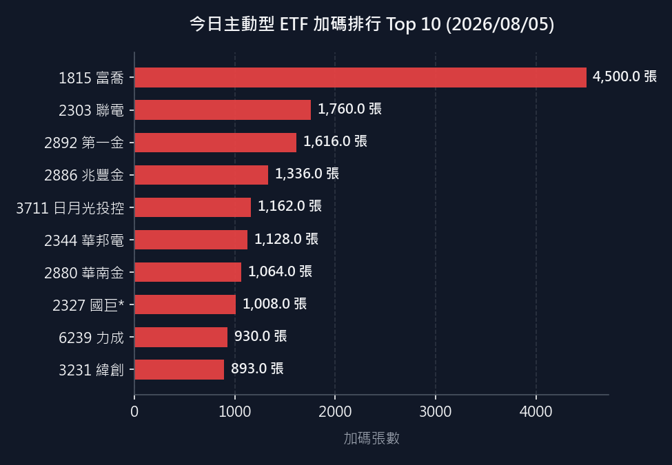
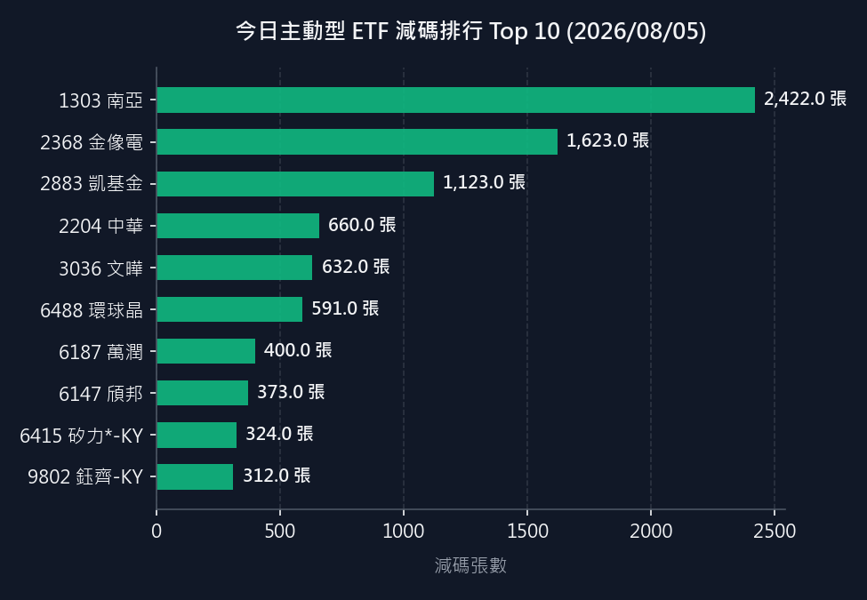

# 主動型 ETF 持股變動

資料來源：`主動型ETF持股明細.xlsx` 最近兩個日期分頁。

比較區間：`20260804` → `20260805`

## 今日加減碼視覺化排行

| 今日加碼 Top 10 | 今日減碼 Top 10 |
| :---: | :---: |
|  |  |

| ETF | 新增 | 刪除 | 比例變動 |
| :-- | --: | --: | --: |
| 00400A | 0 | 0 | 39 |
| 00401A | 18 | 3 | 53 |
| 00402A | 0 | 0 | 49 |
| 00403A | 0 | 0 | 39 |
| 00404A | 0 | 0 | 48 |
| 00405A | 0 | 0 | 34 |
| 00407A | 0 | 0 | 41 |
| 00408A | 1 | 1 | 36 |
| 00980A | 0 | 0 | 49 |
| 00980D | 0 | 0 | 43 |
| 00981A | 0 | 0 | 32 |
| 00982A | 0 | 0 | 41 |
| 00983A | 0 | 0 | 37 |
| 00983D | 0 | 0 | 25 |
| 00984A | 1 | 2 | 98 |
| 00985A | 0 | 0 | 40 |
| 00986A | 2 | 0 | 33 |
| 00987A | 1 | 0 | 25 |
| 00988A | 2 | 0 | 41 |
| 00989A | 1 | 0 | 54 |
| 00990A | 2 | 3 | 45 |
| 00991A | 0 | 0 | 24 |
| 00992A | 0 | 1 | 34 |
| 00993A | 1 | 0 | 48 |
| 00994A | 1 | 0 | 26 |
| 00995A | 1 | 1 | 45 |
| 00996A | 0 | 0 | 41 |
| 00997A | 1 | 0 | 47 |
| 00998A | 0 | 0 | 0 |
| 00999A | 0 | 1 | 54 |

## 00400A

### 新增持股

- 無

### 刪除持股

- 無

### 投資比例變動

- 1303 南亞：0.36% → 0.37%（+0.01）
- 2059 川湖：3.69% → 3.64%（-0.05）
- 2308 台達電：2.49% → 2.51%（+0.02）
- 2313 華通：0.76% → 0.82%（+0.06）
- 2317 鴻海：0.83% → 0.85%（+0.02）
- 2330 台積電：8.19% → 8.40%（+0.21）
- 2345 智邦：1.81% → 1.84%（+0.03）
- 2357 華碩：1.33% → 1.37%（+0.04）
- 2360 致茂：4.49% → 3.47%（-1.02）
- 2383 台光電：5.15% → 5.20%（+0.05）
- 2408 南亞科：1.68% → 1.70%（+0.02）
- 2449 京元電子：1.39% → 1.38%（-0.01）
- 2454 聯發科：6.25% → 6.40%（+0.15）
- 2885 元大金：1.43% → 1.42%（-0.01）
- 2891 中信金：0.86% → 0.87%（+0.01）
- 3008 大立光：1.84% → 2.40%（+0.56）
- 3017 奇鋐：4.36% → 4.53%（+0.17）
- 3036 文曄：1.38% → 1.45%（+0.07）
- 3037 欣興：4.25% → 4.88%（+0.63）
- 3090 日電貿：0.29% → 0.30%（+0.01）
- 3231 緯創：0.94% → 0.92%（-0.02）
- 3443 創意：2.71% → 2.84%（+0.13）
- 3529 力旺：1.08% → 1.09%（+0.01）
- 3653 健策：3.52% → 3.65%（+0.13）
- 3665 貿聯-KY：2.80% → 2.84%（+0.04）
- 3711 日月光投控：1.22% → 1.23%（+0.01）
- 5274 信驊：2.80% → 2.86%（+0.06）
- 6187 萬潤：2.24% → 2.17%（-0.07）
- 6223 旺矽：4.83% → 5.06%（+0.23）
- 6239 力成：0.91% → 0.90%（-0.01）
- 6274 台燿：0.53% → 0.57%（+0.04）
- 6442 光聖：0.54% → 0.52%（-0.02）
- 6488 環球晶：2.80% → 2.71%（-0.09）
- 6505 台塑化：0.70% → 0.69%（-0.01）
- 6510 精測：0.31% → 0.30%（-0.01）
- 6669 緯穎：4.34% → 4.27%（-0.07）
- 6715 嘉基：0.17% → 0.18%（+0.01）
- 7750 新代：0.98% → 1.02%（+0.04）
- 7769 鴻勁：0.72% → 0.76%（+0.04）

## 00401A

### 新增持股

- 1303 南亞（1.56%，200 張）
- 1519 華城（2.89%，99 張）
- 1560 中砂（1.05%，35 張）
- 2059 川湖（2.08%，5 張）
- 2327 國巨*（0.51%，20 張）
- 2408 南亞科（1.17%，60 張）
- 2634 漢翔（2.24%，800 張）
- 3017 奇鋐（3.72%，31 張）
- 3081 聯亞（1.43%，15 張）
- 3665 貿聯-KY（3.11%，30 張）
- 4749 新應材（1.75%，50 張）
- 6274 台燿（1.29%，20 張）
- 6488 環球晶（1.15%，30 張）
- 8046 南電（1.87%，40 張）
- 8358 金居（1.54%，100 張）
- 8996 高力（2.73%，60 張）
- A Plus Asset(244920.KS)（0.06%，7.25 張）
- T.Hasegawa(4958.JP)（2.14%，129 張）

### 刪除持股

- 2449 京元電子（0.06%，7.25 張）
- 3044 健鼎（0.42%，31 張）
- 4958 臻鼎-KY（2.00%，129 張）

### 投資比例變動

- 1216 統一：0.33% → 0.32%（-0.01）
- 2308 台達電：3.68% → 3.36%（-0.32）
- 2313 華通：1.10% → 1.17%（+0.07）
- 2330 台積電：11.19% → 8.46%（-2.73）
- 2344 華邦電：1.18% → 1.23%（+0.05）
- 2345 智邦：2.76% → 1.05%（-1.71）
- 2357 華碩：1.38% → 1.39%（+0.01）
- 2360 致茂：1.88% → 1.79%（-0.09）
- 2368 金像電：0.28% → 0.29%（+0.01）
- 2379 瑞昱：1.29% → 1.30%（+0.01）
- 2382 廣達：1.93% → 1.90%（-0.03）
- 2383 台光電：1.92% → 1.90%（-0.02）
- 2412 中華電：0.96% → 0.93%（-0.03）
- 2454 聯發科：6.84% → 4.40%（-2.44）
- 2455 全新：1.38% → 1.47%（+0.09）
- 2603 長榮：1.12% → 1.08%（-0.04）
- 2881 富邦金：1.85% → 2.08%（+0.23）
- 2882 國泰金：1.16% → 1.14%（-0.02）
- 2883 凱基金：1.66% → 1.67%（+0.01）
- 2884 玉山金：2.03% → 1.98%（-0.05）
- 2885 元大金：0.89% → 0.59%（-0.30）
- 2886 兆豐金：1.70% → 1.67%（-0.03）
- 2887 台新新光金：1.15% → 1.12%（-0.03）
- 2890 永豐金：0.33% → 0.32%（-0.01）
- 2891 中信金：1.81% → 1.79%（-0.02）
- 2912 統一超：0.32% → 0.31%（-0.01）
- 3008 大立光：2.13% → 2.17%（+0.04）
- 3037 欣興：2.39% → 2.43%（+0.04）
- 3131 弘塑：0.42% → 0.38%（-0.04）
- 3167 大量：0.47% → 0.50%（+0.03）
- 3231 緯創：0.45% → 0.43%（-0.02）
- 3491 昇達科：1.72% → 1.83%（+0.11）
- 3529 力旺：0.72% → 0.71%（-0.01）
- 3653 健策：1.40% → 1.13%（-0.27）
- 3711 日月光投控：2.23% → 1.30%（-0.93）
- 4904 遠傳：0.90% → 0.87%（-0.03）
- 4991 環宇-KY：0.66% → 0.70%（+0.04）
- 5274 信驊：1.15% → 1.16%（+0.01）
- 5347 世界：1.50% → 1.48%（-0.02）
- 5871 中租-KY：0.18% → 0.17%（-0.01）
- 5904 寶雅：0.68% → 0.66%（-0.02）
- 6187 萬潤：0.74% → 0.70%（-0.04）
- 6223 旺矽：2.28% → 2.20%（-0.08）
- 6415 矽力*-KY：0.65% → 0.66%（+0.01）
- 6510 精測：0.76% → 0.72%（-0.04）
- 6515 穎崴：1.27% → 1.29%（+0.02）
- 6531 愛普*：1.21% → 1.25%（+0.04）
- 6669 緯穎：2.60% → 2.25%（-0.35）
- 6944 兆聯實業：0.54% → 0.53%（-0.01）
- 7769 鴻勁：2.60% → 2.66%（+0.06）
- 7828 創新服務：1.91% → 2.02%（+0.11）
- 8021 尖點：0.29% → 0.28%（-0.01）
- 8464 億豐：1.29% → 1.25%（-0.04）

## 00402A

### 新增持股

- 無

### 刪除持股

- 無

### 投資比例變動

- AAPL.US Apple：7.48% → 7.37%（-0.11）
- ADI.US Analog Devices：1.77% → 1.80%（+0.03）
- AMD.US AMD：5.45% → 5.64%（+0.19）
- AMZN.US Amazon：4.67% → 4.41%（-0.26）
- ANET.US Arista Networks：0.79% → 0.78%（-0.01）
- ARM.US Arm：0.93% → 1.05%（+0.12）
- ASML.US ASML Holding：1.58% → 1.59%（+0.01）
- AVGO.US Broadcom：2.53% → 2.60%（+0.07）
- AXON.US Axon Enterprise：1.05% → 1.07%（+0.02）
- BABA.US Alibaba Group：0.61% → 0.59%（-0.02）
- BKNG.US Booking Holdings：0.66% → 0.64%（-0.02）
- CDNS.US Cadence Design Systems：1.81% → 1.78%（-0.03）
- CIEN.US Ciena：1.20% → 0.22%（-0.98）
- CLS.US Celestica：0.95% → 1.00%（+0.05）
- COHR.US Coherent：1.73% → 1.87%（+0.14）
- CRWD.US CrowdStrike Holdings：1.36% → 1.37%（+0.01）
- FSLY.US Fastly：0.35% → 0.36%（+0.01）
- GOOG.US Alphabet - Class C Capital Stock：3.69% → 3.60%（-0.09）
- GOOGL.US Alphabet - Class A Common Stock：3.64% → 3.55%（-0.09）
- INTC.US Intel：1.19% → 1.28%（+0.09）
- KLAC.US KLA：2.05% → 2.12%（+0.07）
- LITE.US Lumentum：1.39% → 1.46%（+0.07）
- LRCX.US Lam Research：3.45% → 3.59%（+0.14）
- MCHP.US Microchip Technology：1.38% → 1.43%（+0.05）
- MDB.US MongoDB：0.70% → 0.72%（+0.02）
- META.US Meta：2.83% → 2.73%（-0.10）
- MRVL.US Marvell：1.39% → 1.52%（+0.13）
- MSFT.US Microsoft：4.26% → 4.16%（-0.10）
- MU.US Micron：5.99% → 6.23%（+0.24）
- NFLX.US Netflix：0.81% → 0.78%（-0.03）
- NVDA.US NVIDIA：8.50% → 8.41%（-0.09）
- NXPI.US NXP Semiconductors：1.07% → 1.09%（+0.02）
- PANW.US Palo Alto：3.28% → 3.35%（+0.07）
- PLTR.US Palantir Technologies：1.10% → 1.37%（+0.27）
- SHOP.US Shopify：0.40% → 0.41%（+0.01）
- SIMO.US Silicon Motion：0.76% → 0.78%（+0.02）
- SKHY.US SK hynix：0.91% → 0.95%（+0.04）
- SNOW.US Snowflake：0.93% → 0.92%（-0.01）
- SPCX.US SpaceX：0.59% → 0.63%（+0.04）
- SPOT.US Spotify：0.27% → 0.25%（-0.02）
- STX.US Seagate：1.44% → 1.42%（-0.02）
- TER.US Teradyne：0.85% → 0.91%（+0.06）
- TSM.US TSMC(ADR)：1.63% → 1.62%（-0.01）
- TTWO.US Take-Two：0.57% → 0.54%（-0.03）
- TXN.US Texas Instruments：2.47% → 2.52%（+0.05）
- UBER.US Uber：0.46% → 0.45%（-0.01）
- V.US Visa：1.10% → 1.08%（-0.02）
- WDC.US Western Digital：2.94% → 2.96%（+0.02）
- ZS.US Zscaler：0.16% → 0.17%（+0.01）

## 00403A

### 新增持股

- 無

### 刪除持股

- 無

### 投資比例變動

- 1303 南亞：0.45% → 0.20%（-0.25）
- 1560 中砂：0.58% → 0.57%（-0.01）
- 1717 長興：0.03% → 0.04%（+0.01）
- 2049 上銀：0.19% → 0.21%（+0.02）
- 2303 聯電：5.28% → 5.39%（+0.11）
- 2308 台達電：2.82% → 2.80%（-0.02）
- 2327 國巨*：2.27% → 2.58%（+0.31）
- 2330 台積電：16.85% → 17.04%（+0.19）
- 2337 旺宏：0.52% → 0.49%（-0.03）
- 2344 華邦電：3.70% → 4.00%（+0.30）
- 2345 智邦：3.07% → 3.08%（+0.01）
- 2360 致茂：0.99% → 0.95%（-0.04）
- 2383 台光電：4.40% → 4.38%（-0.02）
- 2454 聯發科：4.23% → 4.27%（+0.04）
- 3008 大立光：0.43% → 0.66%（+0.23）
- 3017 奇鋐：5.14% → 5.26%（+0.12）
- 3037 欣興：4.27% → 4.58%（+0.31）
- 3189 景碩：1.42% → 1.78%（+0.36）
- 3211 順達：0.37% → 0.36%（-0.01）
- 3443 創意：1.21% → 1.25%（+0.04）
- 3450 聯鈞：0.16% → 0.27%（+0.11）
- 3533 嘉澤：1.43% → 1.35%（-0.08）
- 3583 辛耘：0.36% → 0.35%（-0.01）
- 3653 健策：2.45% → 2.50%（+0.05）
- 3711 日月光投控：2.40% → 2.37%（-0.03）
- 4958 臻鼎-KY：1.56% → 1.68%（+0.12）
- 4966 譜瑞-KY：0.27% → 0.23%（-0.04）
- 5274 信驊：1.41% → 1.42%（+0.01）
- 6223 旺矽：3.55% → 3.66%（+0.11）
- 6239 力成：0.65% → 0.76%（+0.11）
- 6274 台燿：1.29% → 1.38%（+0.09）
- 6415 矽力*-KY：0.15% → 0.07%（-0.08）
- 6442 光聖：0.18% → 0.17%（-0.01）
- 6488 環球晶：1.44% → 1.29%（-0.15）
- 6669 緯穎：2.13% → 1.73%（-0.40）
- 6805 富世達：0.64% → 0.63%（-0.01）
- 7769 鴻勁：1.06% → 1.09%（+0.03）
- 8046 南電：1.05% → 1.04%（-0.01）
- 8996 高力：0.94% → 0.93%（-0.01）

## 00404A

### 新增持股

- 無

### 刪除持股

- 無

### 投資比例變動

- 1216 統一：1.89% → 1.83%（-0.06）
- 2303 聯電：2.75% → 2.76%（+0.01）
- 2308 台達電：3.73% → 3.71%（-0.02）
- 2327 國巨*：0.73% → 0.72%（-0.01）
- 2330 台積電：21.42% → 21.68%（+0.26）
- 2345 智邦：1.01% → 1.02%（+0.01）
- 2360 致茂：1.01% → 0.96%（-0.05）
- 2376 技嘉：1.82% → 1.83%（+0.01）
- 2382 廣達：0.38% → 0.37%（-0.01）
- 2383 台光電：2.10% → 2.09%（-0.01）
- 2393 億光：1.50% → 1.54%（+0.04）
- 2402 毅嘉：0.10% → 0.09%（-0.01）
- 2454 聯發科：7.03% → 7.11%（+0.08）
- 2885 元大金：3.05% → 2.99%（-0.06）
- 2887 台新新光金：3.36% → 3.30%（-0.06）
- 2890 永豐金：2.15% → 2.09%（-0.06）
- 3014 聯陽：1.07% → 1.06%（-0.01）
- 3017 奇鋐：0.76% → 0.78%（+0.02）
- 3034 聯詠：0.56% → 0.58%（+0.02）
- 3037 欣興：0.62% → 0.63%（+0.01）
- 3131 弘塑：0.81% → 0.73%（-0.08）
- 3189 景碩：0.31% → 0.33%（+0.02）
- 3260 威剛：0.37% → 0.36%（-0.01）
- 3264 欣銓：1.05% → 1.07%（+0.02）
- 3265 台星科：0.44% → 0.43%（-0.01）
- 3702 大聯大：1.80% → 1.93%（+0.13）
- 3711 日月光投控：3.85% → 3.81%（-0.04）
- 4763 材料*-KY：1.67% → 1.64%（-0.03）
- 5269 祥碩：1.50% → 1.53%（+0.03）
- 5274 信驊：2.18% → 2.20%（+0.02）
- 5347 世界：0.38% → 0.37%（-0.01）
- 5434 崇越：1.62% → 1.59%（-0.03）
- 5871 中租-KY：1.79% → 1.75%（-0.04）
- 5876 上海商銀：1.85% → 1.80%（-0.05）
- 6138 茂達：1.68% → 1.61%（-0.07）
- 6196 帆宣：0.34% → 0.35%（+0.01）
- 6206 飛捷：1.85% → 1.91%（+0.06）
- 6223 旺矽：0.94% → 0.98%（+0.04）
- 6239 力成：1.55% → 1.52%（-0.03）
- 6257 矽格：1.52% → 1.51%（-0.01）
- 6488 環球晶：0.14% → 0.12%（-0.02）
- 6515 穎崴：0.48% → 0.49%（+0.01）
- 6531 愛普*：0.21% → 0.22%（+0.01）
- 8069 元太：0.43% → 0.42%（-0.01）
- 8299 群聯：1.22% → 1.21%（-0.01）
- 臺指選擇權08/26 45400 買權：-0.26% → -0.40%（-0.14）
- 臺指選擇權09/26 46500 買權：-0.02% → -0.03%（-0.01）
- 臺股期貨08/26：16.16% → 16.21%（+0.05）

## 00405A

### 新增持股

- 無

### 刪除持股

- 無

### 投資比例變動

- 2059 川湖：1.34% → 1.31%（-0.03）
- 2330 台積電：1.39% → 1.42%（+0.03）
- 2344 華邦電：3.11% → 3.28%（+0.17）
- 2345 智邦：4.12% → 4.15%（+0.03）
- 2368 金像電：2.19% → 3.49%（+1.30）
- 2449 京元電子：0.69% → 0.68%（-0.01）
- 2454 聯發科：6.23% → 6.32%（+0.09）
- 3008 大立光：0.01% → 0.02%（+0.01）
- 3017 奇鋐：6.05% → 7.22%（+1.17）
- 3026 禾伸堂：0.97% → 1.04%（+0.07）
- 3037 欣興：4.87% → 5.01%（+0.14）
- 3081 聯亞：1.05% → 1.13%（+0.08）
- 3131 弘塑：2.79% → 2.49%（-0.30）
- 3443 創意：4.65% → 4.83%（+0.18）
- 3583 辛耘：0.64% → 0.63%（-0.01）
- 3653 健策：4.00% → 5.10%（+1.10）
- 3665 貿聯-KY：6.68% → 6.71%（+0.03）
- 5274 信驊：1.89% → 1.91%（+0.02）
- 6187 萬潤：0.72% → 0.70%（-0.02）
- 6223 旺矽：5.41% → 5.61%（+0.20）
- 6274 台燿：1.38% → 1.48%（+0.10）
- 6442 光聖：0.33% → 0.32%（-0.01）
- 6488 環球晶：3.71% → 2.61%（-1.10）
- 6510 精測：2.30% → 2.22%（-0.08）
- 6515 穎崴：0.51% → 0.52%（+0.01）
- 6526 達發：0.28% → 0.30%（+0.02）
- 6669 緯穎：4.06% → 3.96%（-0.10）
- 6805 富世達：0.01% → 0.53%（+0.52）
- 6831 邁科：0.52% → 0.49%（-0.03）
- 7734 印能科技：1.97% → 2.14%（+0.17）
- 7769 鴻勁：2.49% → 2.58%（+0.09）
- 8028 昇陽半導體：0.80% → 0.83%（+0.03）
- 8046 南電：3.65% → 3.63%（-0.02）
- 8996 高力：0.98% → 0.96%（-0.02）

## 00407A

### 新增持股

- 無

### 刪除持股

- 無

### 投資比例變動

- 1303 南亞：0.51% → 0.52%（+0.01）
- 1590 亞德客-KY：2.09% → 2.17%（+0.08）
- 2059 川湖：2.31% → 2.26%（-0.05）
- 2303 聯電：2.14% → 2.17%（+0.03）
- 2327 國巨*：2.10% → 2.11%（+0.01）
- 2330 台積電：8.36% → 8.52%（+0.16）
- 2344 華邦電：1.55% → 1.64%（+0.09）
- 2345 智邦：3.47% → 3.50%（+0.03）
- 2360 致茂：1.87% → 1.80%（-0.07）
- 2368 金像電：1.67% → 1.72%（+0.05）
- 2376 技嘉：0.69% → 0.70%（+0.01）
- 2379 瑞昱：0.74% → 0.76%（+0.02）
- 2383 台光電：4.80% → 4.81%（+0.01）
- 2395 研華：1.70% → 1.83%（+0.13）
- 2412 中華電：1.63% → 1.60%（-0.03）
- 2454 聯發科：6.38% → 6.49%（+0.11）
- 3017 奇鋐：4.02% → 4.14%（+0.12）
- 3034 聯詠：0.69% → 0.71%（+0.02）
- 3037 欣興：4.20% → 4.33%（+0.13）
- 3293 鈊象：0.58% → 0.57%（-0.01）
- 3443 創意：1.68% → 1.75%（+0.07）
- 3491 昇達科：0.37% → 0.40%（+0.03）
- 3529 力旺：1.92% → 1.93%（+0.01）
- 3533 嘉澤：1.00% → 0.95%（-0.05）
- 3665 貿聯-KY：3.13% → 3.15%（+0.02）
- 3711 日月光投控：2.42% → 2.41%（-0.01）
- 4904 遠傳：0.30% → 0.29%（-0.01）
- 4958 臻鼎-KY：1.66% → 1.79%（+0.13）
- 5274 信驊：1.98% → 2.02%（+0.04）
- 5536 聖暉*：1.52% → 1.54%（+0.02）
- 6223 旺矽：2.60% → 2.70%（+0.10）
- 6274 台燿：2.99% → 3.22%（+0.23）
- 6415 矽力*-KY：0.34% → 0.35%（+0.01）
- 6446 藥華藥：2.26% → 2.44%（+0.18）
- 6515 穎崴：1.35% → 1.38%（+0.03）
- 6526 達發：0.29% → 0.31%（+0.02）
- 6531 愛普*：1.32% → 1.38%（+0.06）
- 6669 緯穎：4.63% → 4.53%（-0.10）
- 6805 富世達：1.97% → 1.95%（-0.02）
- 8046 南電：2.03% → 2.02%（-0.01）
- 8996 高力：0.38% → 0.37%（-0.01）

## 00408A

### 新增持股

- 2303 聯電（0.93%，130 張）

### 刪除持股

- 2412 中華電（3.19%，400 張）

### 投資比例變動

- 1216 統一：0.95% → 0.94%（-0.01）
- 2059 川湖：1.67% → 1.66%（-0.01）
- 2308 台達電：3.22% → 3.29%（+0.07）
- 2317 鴻海：2.56% → 2.65%（+0.09）
- 2330 台積電：6.26% → 6.50%（+0.24）
- 2344 華邦電：0.73% → 1.39%（+0.66）
- 2345 智邦：3.67% → 3.77%（+0.10）
- 2357 華碩：2.03% → 2.11%（+0.08）
- 2360 致茂：2.59% → 2.54%（-0.05）
- 2368 金像電：1.99% → 2.09%（+0.10）
- 2376 技嘉：2.04% → 2.10%（+0.06）
- 2383 台光電：4.21% → 4.30%（+0.09）
- 2395 研華：1.85% → 2.04%（+0.19）
- 2404 漢唐：1.62% → 1.63%（+0.01）
- 2408 南亞科：0.51% → 1.04%（+0.53）
- 2454 聯發科：4.30% → 4.45%（+0.15）
- 2603 長榮：1.81% → 0.90%（-0.91）
- 2801 彰銀：0.88% → 0.85%（-0.03）
- 2880 華南金：1.64% → 1.67%（+0.03）
- 2886 兆豐金：2.58% → 2.61%（+0.03）
- 2891 中信金：0.91% → 0.93%（+0.02）
- 3017 奇鋐：3.04% → 3.20%（+0.16）
- 3036 文曄：0.50% → 0.83%（+0.33）
- 3037 欣興：3.35% → 3.52%（+0.17）
- 3045 台灣大：3.19% → 3.18%（-0.01）
- 3231 緯創：3.54% → 3.51%（-0.03）
- 3653 健策：0.73% → 1.27%（+0.54）
- 3665 貿聯-KY：1.88% → 1.93%（+0.05）
- 3702 大聯大：1.79% → 1.96%（+0.17）
- 5347 世界：0.45% → 0.46%（+0.01）
- 5434 崇越：2.32% → 2.34%（+0.02）
- 6223 旺矽：0.52% → 1.28%（+0.76）
- 6274 台燿：1.49% → 1.64%（+0.15）
- 6669 緯穎：4.36% → 4.34%（-0.02）
- 7769 鴻勁：1.63% → 1.72%（+0.09）
- 8046 南電：2.20% → 2.24%（+0.04）

## 00980A

### 新增持股

- 無

### 刪除持股

- 無

### 投資比例變動

- 1303 南亞：2.26% → 2.27%（+0.01）
- 2059 川湖：4.75% → 4.57%（-0.18）
- 2308 台達電：3.60% → 3.54%（-0.06）
- 2317 鴻海：2.16% → 2.15%（-0.01）
- 2327 國巨*：1.07% → 1.06%（-0.01）
- 2330 台積電：8.45% → 8.46%（+0.01）
- 2344 華邦電：0.99% → 1.03%（+0.04）
- 2345 智邦：1.87% → 1.86%（-0.01）
- 2360 致茂：1.57% → 1.48%（-0.09）
- 2368 金像電：1.94% → 1.96%（+0.02）
- 2376 技嘉：1.27% → 1.26%（-0.01）
- 2382 廣達：1.63% → 1.59%（-0.04）
- 2383 台光電：4.29% → 4.23%（-0.06）
- 2408 南亞科：2.49% → 2.45%（-0.04）
- 2454 聯發科：5.93% → 5.92%（-0.01）
- 2884 玉山金：0.91% → 0.88%（-0.03）
- 2891 中信金：1.32% → 1.30%（-0.02）
- 3008 大立光：0.86% → 0.87%（+0.01）
- 3017 奇鋐：1.91% → 1.94%（+0.03）
- 3026 禾伸堂：0.37% → 0.39%（+0.02）
- 3036 文曄：1.34% → 1.37%（+0.03）
- 3037 欣興：2.86% → 2.89%（+0.03）
- 3044 健鼎：0.74% → 0.73%（-0.01）
- 3081 聯亞：2.57% → 2.72%（+0.15）
- 3189 景碩：0.78% → 0.81%（+0.03）
- 3231 緯創：1.12% → 1.07%（-0.05）
- 3264 欣銓：0.69% → 0.70%（+0.01）
- 3293 鈊象：1.07% → 1.04%（-0.03）
- 3443 創意：1.34% → 1.37%（+0.03）
- 3529 力旺：0.92% → 0.91%（-0.01）
- 3533 嘉澤：0.14% → 0.13%（-0.01）
- 3653 健策：1.57% → 1.59%（+0.02）
- 3665 貿聯-KY：0.41% → 0.40%（-0.01）
- 3711 日月光投控：1.29% → 1.26%（-0.03）
- 4958 臻鼎-KY：0.82% → 0.87%（+0.05）
- 5904 寶雅：1.24% → 1.19%（-0.05）
- 6213 聯茂：0.82% → 0.87%（+0.05）
- 6223 旺矽：2.46% → 2.52%（+0.06）
- 6274 台燿：1.38% → 1.46%（+0.08）
- 6442 光聖：0.29% → 0.28%（-0.01）
- 6515 穎崴：1.99% → 2.01%（+0.02）
- 6669 緯穎：1.77% → 1.70%（-0.07）
- 6805 富世達：0.47% → 0.46%（-0.01）
- 6831 邁科：0.62% → 0.58%（-0.04）
- 7769 鴻勁：2.48% → 2.53%（+0.05）
- 8046 南電：1.17% → 1.14%（-0.03）
- 8210 勤誠：0.88% → 0.86%（-0.02）
- 8299 群聯：2.18% → 2.13%（-0.05）
- 8996 高力：1.02% → 0.99%（-0.03）

## 00980D

### 新增持股

- 無

### 刪除持股

- 無

### 投資比例變動

- ALLY FINANCIAL INC (REG) VAR 13JUN2029：0.55% → 0.54%（-0.01）
- APOLLO DEBT SOLUTIONS BD 6.900000 % 13APR2029：0.55% → 0.54%（-0.01）
- ARIS WATER HOLDINGS LLC SER REGS 7.250000 % 01APR2030：0.47% → 0.46%（-0.01）
- BANCO SANTANDER SA (REG) 6.607% 07NOV2028：0.66% → 0.65%（-0.01）
- BLACKSTONE PRIVATE CRE 7.300000 % 27NOV2028：0.47% → 0.46%（-0.01）
- BLUE OWL CREDIT INCOME 7.950000 % 13JUN2028：0.53% → 0.52%（-0.01）
- BLUE OWL CREDIT INCOME SER WI (REG) 7.75% 16SEP2027：0.55% → 0.54%（-0.01）
- BOSTON PROPERTIES LP (REG) 6.750000 % 01-DEC-2027：0.46% → 0.45%（-0.01）
- BRIGHTHOUSE FINANCIAL IN (REG) 4.7% 22JUN2047：0.47% → 0.48%（+0.01）
- CONCENTRIX CORP (REG) 6.6% 02AUG2028：0.51% → 0.50%（-0.01）
- COX COMMUNICATIONS INC SER REGS 5.950000 % 01SEP2054：0.53% → 0.54%（+0.01）
- DOW CHEMICAL CO/THE 6.9% 15MAY2053：0.59% → 0.60%（+0.01）
- EDISON INTERNATIONAL (REG) 6.95% 15NOV2029：0.58% → 0.57%（-0.01）
- F&G ANNUITIES & LIFE INC 6.250000 % 04OCT2034：0.51% → 0.50%（-0.01）
- GEORGIA-PACIFIC LLC (REG) 7.75% 15NOV2029：0.57% → 0.56%（-0.01）
- GLOBAL ATLANTIC FIN CO SER REGS 7.950000 % 15JUN2033：0.65% → 0.66%（+0.01）
- GLOBAL AUTO HO/AAG FH UK SER REGS (REG S) 8.75% 15JAN2032：0.43% → 0.42%（-0.01）
- HESS CORP (REG) 7.3% 15AUG2031：0.53% → 0.52%（-0.01）
- HSBC HOLDINGS PLC VAR 03NOV2028：0.33% → 0.32%（-0.01）
- JETBLUE AIRWAYS/LOYALTY SER REGS (REG S) 9.875% 20SEP2031：0.50% → 0.51%（+0.01）
- JH NORTH AMERICA HOLDING SER REGS 6.125000 % 31JUL2032：0.40% → 0.39%（-0.01）
- LBM ACQUISITION LLC SER REGS 9.500000 % 15JUN2031：0.32% → 0.49%（+0.17）
- LPL HOLDINGS INC (REG) 6.75% 17NOV2028：0.56% → 0.55%（-0.01）
- M&T BANK CORPORATION (REG) VAR 30OCT2029：0.54% → 0.53%（-0.01）
- META PLATFORMS INC 5.750000 % 15-NOV-2065：0.42% → 0.43%（+0.01）
- MYLAN INC SER WI (REG) 5.2% 15APR2048WI：0.48% → 0.49%（+0.01）
- PBF HOLDING CO LLC SER REGS 9.875000 % 15MAR2030：0.36% → 0.35%（-0.01）
- PLANET FINANCIAL GROUP SER REGS 10.500000 % 15DEC2029：0.32% → 0.49%（+0.17）
- SABRE GLBL INC SER REGS 11.125000 % 15JUL2030：0.45% → 0.50%（+0.05）
- SALESFORCE INC (REG) 6.7% 15MAR2066：0.51% → 0.52%（+0.01）
- SANTANDER HOLDINGS USA VAR 09NOV2031：0.59% → 0.58%（-0.01）
- SANTANDER HOLDINGS USA VAR 12JUN2029：0.58% → 0.57%（-0.01）
- STAPLES INC SER REGS (REG S) 10.75% 01SEP2029：0.45% → 0.48%（+0.03）
- SUNCOR ENERGY INC (REG) 7.15% 01FEB2032：0.32% → 0.31%（-0.01）
- TIME WARNER CABLE LLC (REG) 6.75% 15JUN2039：0.30% → 0.31%（+0.01）
- TRUIST FINANCIAL CORP SER MTN VAR 30OCT2029：0.64% → 0.63%（-0.01）
- US 10YR NOTE (CBT)SEP26 21-SEP-2026：18.31% → 18.29%（-0.02）
- US 2YR NOTE (CBT) SEP26 30-SEP-2026：1.95% → 1.94%（-0.01）
- US 5YR NOTE (CBT) SEP26 30-SEP-2026：-15.93% → -15.89%（+0.04）
- US LONG BOND(CBT) SEP26 21-SEP-2026：5.34% → 5.35%（+0.01）
- VIACOM INC (REG) 5.85% 01SEP2043：0.55% → 0.56%（+0.01）
- VIACOMCBS INC (REG) 4.95% 19MAY2050：0.48% → 0.49%（+0.01）
- WESTLAKE CORP 6.375000 % 15-NOV-2055：0.51% → 0.52%（+0.01）

## 00981A

### 新增持股

- 無

### 刪除持股

- 無

### 投資比例變動

- 1590 亞德客-KY：0.25% → 0.26%（+0.01）
- 2049 上銀：0.12% → 0.13%（+0.01）
- 2303 聯電：3.48% → 3.49%（+0.01）
- 2308 台達電：3.22% → 3.19%（-0.03）
- 2327 國巨*：4.83% → 4.79%（-0.04）
- 2330 台積電：9.30% → 9.50%（+0.20）
- 2360 致茂：0.30% → 0.29%（-0.01）
- 2368 金像電：2.28% → 1.70%（-0.58）
- 2383 台光電：8.38% → 8.31%（-0.07）
- 2449 京元電子：0.93% → 0.91%（-0.02）
- 2454 聯發科：7.06% → 7.10%（+0.04）
- 3017 奇鋐：5.06% → 5.16%（+0.10）
- 3037 欣興：6.26% → 6.38%（+0.12）
- 3653 健策：3.30% → 3.36%（+0.06）
- 3665 貿聯-KY：3.96% → 3.94%（-0.02）
- 3711 日月光投控：3.20% → 3.37%（+0.17）
- 4958 臻鼎-KY：0.25% → 0.27%（+0.02）
- 4979 華星光：0.28% → 0.30%（+0.02）
- 5274 信驊：2.36% → 2.37%（+0.01）
- 6187 萬潤：0.49% → 0.46%（-0.03）
- 6223 旺矽：4.83% → 4.97%（+0.14）
- 6271 同欣電：0.13% → 0.14%（+0.01）
- 6274 台燿：2.47% → 2.63%（+0.16）
- 6278 台表科：0.17% → 0.18%（+0.01）
- 6510 精測：0.24% → 0.23%（-0.01）
- 6515 穎崴：0.20% → 0.21%（+0.01）
- 6669 緯穎：5.63% → 5.45%（-0.18）
- 6805 富世達：1.04% → 1.02%（-0.02）
- 8046 南電：3.33% → 3.29%（-0.04）
- 8210 勤誠：0.89% → 0.88%（-0.01）
- 8996 高力：0.14% → 0.24%（+0.10）
- 台指期貨(B)：5.64% → 5.63%（-0.01）

## 00982A

### 新增持股

- 無

### 刪除持股

- 無

### 投資比例變動

- 1785 光洋科：0.99% → 0.97%（-0.02）
- 2059 川湖：3.58% → 3.46%（-0.12）
- 2316 楠梓電：1.08% → 1.09%（+0.01）
- 2330 台積電：8.47% → 8.52%（+0.05）
- 2345 智邦：3.86% → 3.85%（-0.01）
- 2351 順德：0.78% → 0.77%（-0.01）
- 2360 致茂：3.28% → 3.12%（-0.16）
- 2376 技嘉：0.73% → 0.72%（-0.01）
- 2377 微星：1.73% → 1.69%（-0.04）
- 2383 台光電：3.42% → 3.39%（-0.03）
- 2451 創見：0.30% → 0.29%（-0.01）
- 2454 聯發科：6.86% → 6.89%（+0.03）
- 2472 立隆電：1.12% → 1.11%（-0.01）
- 2885 元大金：0.30% → 0.29%（-0.01）
- 3008 大立光：2.20% → 2.24%（+0.04）
- 3017 奇鋐：2.15% → 2.19%（+0.04）
- 3036 文曄：1.04% → 1.07%（+0.03）
- 3105 穩懋：2.94% → 3.14%（+0.20）
- 3231 緯創：0.12% → 0.03%（-0.09）
- 3264 欣銓：1.88% → 1.91%（+0.03）
- 3491 昇達科：2.35% → 2.51%（+0.16）
- 3529 力旺：0.49% → 0.48%（-0.01）
- 3583 辛耘：1.65% → 1.61%（-0.04）
- 3702 大聯大：1.36% → 1.45%（+0.09）
- 3711 日月光投控：1.21% → 1.19%（-0.02）
- 4958 臻鼎-KY：2.87% → 3.06%（+0.19）
- 5274 信驊：0.94% → 0.95%（+0.01）
- 6139 亞翔：6.04% → 5.97%（-0.07）
- 6187 萬潤：0.20% → 0.19%（-0.01）
- 6223 旺矽：3.69% → 3.79%（+0.10）
- 6239 力成：0.37% → 0.36%（-0.01）
- 6257 矽格：1.96% → 1.93%（-0.03）
- 6274 台燿：1.23% → 1.31%（+0.08）
- 6278 台表科：0.72% → 0.77%（+0.05）
- 6488 環球晶：2.20% → 1.95%（-0.25）
- 6531 愛普*：2.36% → 2.43%（+0.07）
- 6669 緯穎：6.44% → 6.22%（-0.22）
- 6831 邁科：0.38% → 0.35%（-0.03）
- 7769 鴻勁：1.17% → 1.20%（+0.03）
- 8016 矽創：1.29% → 1.31%（+0.02）
- 8996 高力：0.80% → 0.78%（-0.02）

## 00983A

### 新增持股

- 無

### 刪除持股

- 無

### 投資比例變動

- ACHR.US Archer：0.31% → 0.33%（+0.02）
- AMD.US AMD：6.04% → 6.31%（+0.27）
- AMZN.US Amazon：3.86% → 3.68%（-0.18）
- AVGO.US Broadcom：1.99% → 2.07%（+0.08）
- BEAM.US Beam Therapeutics：2.36% → 2.52%（+0.16）
- BLSH.US Bullish：1.01% → 1.03%（+0.02）
- BMNR.US BitMine：0.96% → 0.98%（+0.02）
- COIN.US Coinbase：2.07% → 2.08%（+0.01）
- CRCL.US Circle：1.97% → 2.02%（+0.05）
- CRSP.US CRISPR Therapeutics：4.09% → 4.28%（+0.19）
- CRWV.US CoreWeave：0.93% → 0.97%（+0.04）
- DE.US Deere：1.45% → 1.44%（-0.01）
- FIG.US Figma：0.45% → 0.48%（+0.03）
- GOOG.US Alphabet - Class C Capital Stock：1.42% → 1.40%（-0.02）
- GOOGL.US Alphabet - Class A Common Stock：1.88% → 1.85%（-0.03）
- HOOD.US Robinhood Markets：3.79% → 3.82%（+0.03）
- KTOS.US Kratos Defense & Security：0.31% → 0.32%（+0.01）
- LLY.US Eli Lilly：1.92% → 1.87%（-0.05）
- META.US Meta：1.32% → 1.16%（-0.16）
- NTLA.US Intellia Therapeutics：1.26% → 1.29%（+0.03）
- NTRA.US Natera：2.32% → 2.31%（-0.01）
- PLTR.US Palantir Technologies：0.51% → 1.41%（+0.90）
- RBLX.US Roblox：2.33% → 1.97%（-0.36）
- RXRX.US Recursion Pharmaceuticals：0.31% → 0.32%（+0.01）
- SHOP.US Shopify：6.13% → 6.30%（+0.17）
- SNOW.US Snowflake：1.55% → 1.56%（+0.01）
- SOFI.US SoFi Technologies：0.72% → 0.73%（+0.01）
- SPCX.US SpaceX：0.35% → 1.62%（+1.27）
- TEM.US Tempus：3.13% → 3.12%（-0.01）
- TER.US Teradyne：0.63% → 0.68%（+0.05）
- TSLA.US Tesla：8.05% → 7.96%（-0.09）
- TWST.US Twist Bioscience：4.64% → 4.46%（-0.18）
- TXG.US 10x Genomics：4.84% → 4.80%（-0.04）
- VCYT.US Veracyte：1.07% → 1.08%（+0.01）
- WGS.US GeneDx：1.49% → 1.52%（+0.03）
- XE.US X-Energy：0.12% → 0.13%（+0.01）
- XYZ.US Block：2.43% → 2.45%（+0.02）

## 00983D

### 新增持股

- 無

### 刪除持股

- 無

### 投資比例變動

- ATH 6 5/8 05/19/55：1.01% → 1.02%（+0.01）
- BATSLN 7.081 08/02/53：1.33% → 1.34%（+0.01）
- CP 7 1/8 10/15/31：0.83% → 0.82%（-0.01）
- DELL 8.35 07/15/46：1.42% → 1.43%（+0.01）
- DT 9 1/4 06/01/32：0.95% → 0.94%（-0.01）
- DUK 7 3/4 03/01/31：1.57% → 1.56%（-0.01）
- GM 6 3/4 04/01/46：1.19% → 1.20%（+0.01）
- GS 6 1/4 02/01/41：0.32% → 0.33%（+0.01）
- GT 8 7/8 07/15/32：0.49% → 0.48%（-0.01）
- GTN 10 1/2 07/15/29：1.70% → 1.69%（-0.01）
- IEP 10 11/15/29：1.56% → 1.55%（-0.01）
- LQDW.US iShares Investment Grade Corpora：7.39% → 7.33%（-0.06）
- MINAU 9 1/4 10/01/28：0.89% → 0.88%（-0.01）
- MS 7 1/4 04/01/32：1.65% → 1.64%（-0.01）
- NTRCN 7 1/8 05/23/36：0.55% → 0.56%（+0.01）
- NVDA 5.55 06/15/46：1.17% → 1.18%（+0.01）
- ORCL 6.9 11/09/52：0.85% → 0.86%（+0.01）
- OXY 6.6 03/15/46：0.74% → 0.75%（+0.01）
- RAKUTN 11 1/4 02/15/27：1.82% → 1.81%（-0.01）
- RIOLN 7 1/4 03/15/31：0.52% → 0.51%（-0.01）
- SPCX 6.6 07/15/46：1.13% → 1.14%（+0.01）
- TELEFONICA EMISIONES SAU 7.045 06/20/36：1.56% → 1.57%（+0.01）
- TLTW.US iShares 20+ Year Treasury Bond B：7.26% → 7.22%（-0.04）
- TRPCN 7 5/8 01/15/39：1.70% → 1.71%（+0.01）
- VENLNG 9 1/2 02/01/29：1.42% → 1.41%（-0.01）

## 00984A

### 新增持股

- 2351 順德（0.27%，155 張）

### 刪除持股

- 2881 富邦金（0.00%，0.025 張）
- 6831 邁科（0.20%，31 張）

### 投資比例變動

- 1303 南亞：2.19% → 2.21%（+0.02）
- 1326 台化：1.09% → 1.07%（-0.02）
- 1409 新纖：0.57% → 0.56%（-0.01）
- 1419 新紡：0.10% → 0.09%（-0.01）
- 1477 聚陽：0.92% → 0.91%（-0.01）
- 1560 中砂：0.68% → 0.67%（-0.01）
- 1736 喬山：0.15% → 0.72%（+0.57）
- 1907 永豐餘：0.52% → 0.51%（-0.01）
- 2006 東和鋼鐵：0.09% → 0.08%（-0.01）
- 2015 豐興：0.08% → 0.07%（-0.01）
- 2049 上銀：0.57% → 0.61%（+0.04）
- 2059 川湖：0.70% → 2.83%（+2.13）
- 2201 裕隆：0.23% → 0.22%（-0.01）
- 2317 鴻海：1.45% → 1.46%（+0.01）
- 2324 仁寶：0.59% → 0.57%（-0.02）
- 2330 台積電：3.65% → 3.71%（+0.06）
- 2337 旺宏：0.23% → 0.22%（-0.01）
- 2347 聯強：1.09% → 1.10%（+0.01）
- 2357 華碩：0.86% → 0.87%（+0.01）
- 2360 致茂：0.86% → 0.82%（-0.04）
- 2371 大同：0.09% → 0.08%（-0.01）
- 2375 凱美：0.26% → 0.25%（-0.01）
- 2376 技嘉：0.32% → 0.54%（+0.22）
- 2377 微星：0.47% → 0.45%（-0.02）
- 2383 台光電：1.79% → 1.73%（-0.06）
- 2393 億光：0.14% → 0.26%（+0.12）
- 2404 漢唐：1.22% → 1.20%（-0.02）
- 2408 南亞科：1.52% → 1.51%（-0.01）
- 2409 友達：0.55% → 0.53%（-0.02）
- 2412 中華電：0.91% → 0.89%（-0.02）
- 2441 超豐：1.06% → 1.02%（-0.04）
- 2454 聯發科：1.64% → 1.65%（+0.01）
- 2464 盟立：0.59% → 0.60%（+0.01）
- 2472 立隆電：0.57% → 0.56%（-0.01）
- 2474 可成：0.35% → 0.34%（-0.01）
- 2476 鉅祥：0.24% → 0.25%（+0.01）
- 2535 達欣工：0.23% → 0.22%（-0.01）
- 2603 長榮：0.75% → 0.73%（-0.02）
- 2633 台灣高鐵：0.49% → 0.48%（-0.01）
- 2801 彰銀：1.70% → 1.59%（-0.11）
- 2812 台中銀：1.34% → 1.30%（-0.04）
- 2834 臺企銀：1.45% → 1.40%（-0.05）
- 2880 華南金：2.11% → 2.08%（-0.03）
- 2882 國泰金：0.81% → 0.80%（-0.01）
- 2885 元大金：0.82% → 0.80%（-0.02）
- 2886 兆豐金：2.14% → 2.11%（-0.03）
- 2891 中信金：0.80% → 0.79%（-0.01）
- 2892 第一金：1.83% → 1.81%（-0.02）
- 3008 大立光：1.75% → 1.79%（+0.04）
- 3023 信邦：1.16% → 1.20%（+0.04）
- 3026 禾伸堂：0.69% → 0.74%（+0.05）
- 3033 威健：0.27% → 0.26%（-0.01）
- 3034 聯詠：0.75% → 0.77%（+0.02）
- 3036 文曄：0.54% → 0.55%（+0.01）
- 3037 欣興：0.62% → 0.61%（-0.01）
- 3167 大量：0.41% → 0.44%（+0.03）
- 3189 景碩：1.34% → 1.41%（+0.07）
- 3450 聯鈞：0.52% → 0.55%（+0.03）
- 3532 台勝科：0.48% → 0.51%（+0.03）
- 3533 嘉澤：1.53% → 1.45%（-0.08）
- 3702 大聯大：0.55% → 0.59%（+0.04）
- 3711 日月光投控：1.17% → 1.16%（-0.01）
- 4764 雙鍵：0.54% → 0.53%（-0.01）
- 4904 遠傳：0.51% → 0.49%（-0.02）
- 4938 和碩：0.68% → 0.67%（-0.01）
- 4958 臻鼎-KY：0.94% → 1.01%（+0.07）
- 4966 譜瑞-KY：0.87% → 0.89%（+0.02）
- 5274 信驊：0.85% → 0.86%（+0.01）
- 5288 豐祥-KY：0.26% → 0.25%（-0.01）
- 5289 宜鼎：0.96% → 0.97%（+0.01）
- 5483 中美晶：0.45% → 0.43%（-0.02）
- 5880 合庫金：1.73% → 1.69%（-0.04）
- 6005 群益證：1.25% → 1.22%（-0.03）
- 6121 新普：0.09% → 0.08%（-0.01）
- 6139 亞翔：2.61% → 2.59%（-0.02）
- 6182 合晶：0.47% → 0.49%（+0.02）
- 6196 帆宣：1.15% → 1.16%（+0.01）
- 6197 佳必琪：0.59% → 0.58%（-0.01）
- 6213 聯茂：1.26% → 1.35%（+0.09）
- 6223 旺矽：1.25% → 1.29%（+0.04）
- 6257 矽格：0.66% → 0.65%（-0.01）
- 6274 台燿：1.21% → 1.29%（+0.08）
- 6446 藥華藥：2.36% → 2.52%（+0.16）
- 6469 大樹：0.15% → 0.24%（+0.09）
- 6491 晶碩：0.27% → 0.28%（+0.01）
- 6531 愛普*：1.07% → 1.11%（+0.04）
- 6548 長科*：1.21% → 1.18%（-0.03）
- 6669 緯穎：0.59% → 0.57%（-0.02）
- 6670 復盛應用：0.08% → 0.07%（-0.01）
- 6944 兆聯實業：1.12% → 1.10%（-0.02）
- 7734 印能科技：0.55% → 0.50%（-0.05）
- 7769 鴻勁：1.24% → 1.28%（+0.04）
- 8021 尖點：0.69% → 0.68%（-0.01）
- 8039 台虹：0.57% → 0.61%（+0.04）
- 8046 南電：1.03% → 1.02%（-0.01）
- 8271 宇瞻：0.54% → 0.53%（-0.01）
- 8436 大江：0.24% → 0.23%（-0.01）
- 9938 百和：0.14% → 0.25%（+0.11）

## 00985A

### 新增持股

- 無

### 刪除持股

- 無

### 投資比例變動

- 1216 統一：0.98% → 0.95%（-0.03）
- 2027 大成鋼：4.25% → 4.56%（+0.31）
- 2049 上銀：0.59% → 0.63%（+0.04）
- 2059 川湖：4.83% → 4.71%（-0.12）
- 2303 聯電：1.51% → 1.52%（+0.01）
- 2308 台達電：0.97% → 0.49%（-0.48）
- 2327 國巨*：3.46% → 3.45%（-0.01）
- 2330 台積電：13.88% → 14.05%（+0.17）
- 2344 華邦電：0.98% → 1.03%（+0.05）
- 2345 智邦：2.93% → 2.94%（+0.01）
- 2360 致茂：0.43% → 0.09%（-0.34）
- 2368 金像電：0.89% → 0.92%（+0.03）
- 2376 技嘉：3.95% → 3.98%（+0.03）
- 2383 台光電：2.72% → 2.71%（-0.01）
- 2395 研華：0.29% → 0.31%（+0.02）
- 2408 南亞科：2.98% → 2.97%（-0.01）
- 2412 中華電：1.31% → 2.04%（+0.73）
- 2454 聯發科：1.97% → 1.99%（+0.02）
- 3008 大立光：3.59% → 3.68%（+0.09）
- 3017 奇鋐：1.80% → 1.84%（+0.04）
- 3036 文曄：3.32% → 1.76%（-1.56）
- 3037 欣興：1.50% → 1.54%（+0.04）
- 3081 聯亞：1.66% → 1.78%（+0.12）
- 3105 穩懋：0.52% → 0.56%（+0.04）
- 3131 弘塑：1.27% → 1.14%（-0.13）
- 3293 鈊象：0.40% → 0.10%（-0.30）
- 3653 健策：1.35% → 1.38%（+0.03）
- 3661 世芯-KY：1.04% → 0.29%（-0.75）
- 4904 遠傳：1.28% → 2.04%（+0.76）
- 4958 臻鼎-KY：2.00% → 2.15%（+0.15）
- 6147 頎邦：2.44% → 2.02%（-0.42）
- 6187 萬潤：3.54% → 3.39%（-0.15）
- 6223 旺矽：0.30% → 0.31%（+0.01）
- 6442 光聖：3.62% → 3.47%（-0.15）
- 6446 藥華藥：1.93% → 2.55%（+0.62）
- 6488 環球晶：0.44% → 0.09%（-0.35）
- 6669 緯穎：1.96% → 2.45%（+0.49）
- 7769 鴻勁：0.25% → 1.17%（+0.92）
- 8299 群聯：0.98% → 0.97%（-0.01）
- 8996 高力：0.24% → 1.15%（+0.91）

## 00986A

### 新增持股

- 2454 聯發科（0.62%，1 張）
- CRDO.US Credo（0.13%，0.103 張）

### 刪除持股

- 無

### 投資比例變動

- 2330 台積電：8.66% → 8.25%（-0.41）
- AAPL.US Apple：0.98% → 0.97%（-0.01）
- AMAT.US Applied Materials：1.68% → 1.72%（+0.04）
- AMD.US AMD：3.13% → 3.27%（+0.14）
- AMZN.US Amazon：4.28% → 4.08%（-0.20）
- AVGO.US Broadcom：5.07% → 5.27%（+0.20）
- CAT.US Caterpillar：1.34% → 1.38%（+0.04）
- COHR.US Coherent：2.02% → 2.21%（+0.19）
- CRWD.US CrowdStrike Holdings：4.09% → 4.16%（+0.07）
- DDOG.US Datadog：0.44% → 0.45%（+0.01）
- ETN.US Eaton：2.36% → 2.33%（-0.03）
- GEV.US GE Vernova：2.71% → 2.67%（-0.04）
- GOOGL.US Alphabet - Class A Common Stock：7.45% → 7.33%（-0.12）
- HWM.US Howmet Aerospace：2.62% → 2.57%（-0.05）
- JPM.US JPMorgan Chase：1.52% → 1.50%（-0.02）
- LITE.US Lumentum：3.28% → 3.48%（+0.20）
- LLY.US Eli Lilly：2.72% → 2.64%（-0.08）
- LRCX.US Lam Research：2.70% → 2.83%（+0.13）
- MA.US Mastercard：0.92% → 0.90%（-0.02）
- MSFT.US Microsoft：2.63% → 2.59%（-0.04）
- MU.US Micron：3.58% → 3.75%（+0.17）
- MUFG(8306.JP)：1.47% → 1.39%（-0.08）
- Murata Mfg.(6981.JP)：1.72% → 1.66%（-0.06）
- NET.US Cloudflare：1.83% → 1.90%（+0.07）
- NVDA.US NVIDIA：5.79% → 5.78%（-0.01）
- SNDK.US Sandisk：1.39% → 1.50%（+0.11）
- SNOW.US Snowflake：1.82% → 1.83%（+0.01）
- Siemens Energy AG：2.02% → 2.00%（-0.02）
- TSEM.US Tower Semiconductor：0.76% → 0.75%（-0.01）
- Yaskawa Electric(6506.JP)：1.87% → 1.88%（+0.01）
- 嘉能可公司：1.56% → 1.55%（-0.01）
- 施奈德電機公司：1.71% → 1.63%（-0.08）
- 英飛凌科技股份有限公司：3.05% → 3.08%（+0.03）

## 00987A

### 新增持股

- 6805 富世達（1.43%，24 張）

### 刪除持股

- 無

### 投資比例變動

- 2330 台積電：8.08% → 8.05%（-0.03）
- 2345 智邦：2.51% → 2.48%（-0.03）
- 2383 台光電：6.76% → 6.63%（-0.13）
- 2408 南亞科：4.05% → 3.97%（-0.08）
- 2454 聯發科：4.79% → 4.76%（-0.03）
- 2455 全新：2.80% → 2.96%（+0.16）
- 3017 奇鋐：8.65% → 8.73%（+0.08）
- 3037 欣興：6.79% → 6.85%（+0.06）
- 3081 聯亞：0.36% → 0.39%（+0.03）
- 3231 緯創：2.47% → 2.35%（-0.12）
- 3363 上詮：2.02% → 2.07%（+0.05）
- 3443 創意：5.45% → 6.20%（+0.75）
- 3653 健策：2.89% → 2.91%（+0.02）
- 3665 貿聯-KY：4.45% → 4.38%（-0.07）
- 4764 雙鍵：1.71% → 1.66%（-0.05）
- 6139 亞翔：2.92% → 2.86%（-0.06）
- 6223 旺矽：6.16% → 6.27%（+0.11）
- 6274 台燿：3.89% → 4.10%（+0.21）
- 6515 穎崴：1.53% → 1.54%（+0.01）
- 6683 雍智科技：2.19% → 2.31%（+0.12）
- 6739 竹陞科技：1.92% → 1.94%（+0.02）
- 7769 鴻勁：2.39% → 2.43%（+0.04）
- 8028 昇陽半導體：2.26% → 2.29%（+0.03）
- 8046 南電：3.68% → 3.59%（-0.09）
- 8358 金居：1.50% → 1.48%（-0.02）

## 00988A

### 新增持股

- FORMFACTOR INC（0.51%，75.454 張）
- 阿里巴巴－Ｗ(9988.HK)（0.45%，500 張）

### 刪除持股

- 無

### 投資比例變動

- 2303 聯電：0.53% → 0.51%（-0.02）
- 2308 台達電：0.90% → 0.89%（-0.01）
- 2327 國巨*：1.53% → 1.50%（-0.03）
- 2330 台積電：3.18% → 2.98%（-0.20）
- 2383 台光電：3.96% → 3.92%（-0.04）
- 2454 聯發科：3.11% → 2.95%（-0.16）
- 3017 奇鋐：0.52% → 0.51%（-0.01）
- 3037 欣興：4.02% → 4.12%（+0.10）
- 3665 貿聯-KY：1.95% → 2.05%（+0.10）
- 3711 日月光投控：1.96% → 1.80%（-0.16）
- 6223 旺矽：1.97% → 2.33%（+0.36）
- AEHR.US Aehr Test Systems：0.75% → 0.86%（+0.11）
- AIXTRON SE：0.50% → 0.49%（-0.01）
- AMAT.US Applied Materials：4.06% → 4.11%（+0.05）
- AMD.US AMD：5.76% → 5.92%（+0.16）
- BE.US Bloom Energy：2.66% → 2.67%（+0.01）
- CRDO.US Credo：2.85% → 2.98%（+0.13）
- FTNT.US Fortinet：0.95% → 0.94%（-0.01）
- IBIDEN(4062.JP)：0.34% → 0.35%（+0.01）
- INFINEON TECHNOLOGIES AG：2.57% → 2.55%（-0.02）
- Kioxia Holdings(285A.JP)：3.27% → 3.31%（+0.04）
- LITE.US Lumentum：3.48% → 4.35%（+0.87）
- LMT.US Lockheed Martin：1.29% → 1.25%（-0.04）
- Lasertec Corporation(6920.JP)：0.98% → 1.01%（+0.03）
- MICRONICS(6871.JP)：1.90% → 1.88%（-0.02）
- MPWR.US Monolithic Power Systems：1.40% → 1.34%（-0.06）
- MRVL.US Marvell：2.30% → 2.49%（+0.19）
- MU.US Micron：5.95% → 6.14%（+0.19）
- Murata Mfg.(6981.JP)：3.58% → 3.40%（-0.18）
- NOW.US ServiceNow：1.79% → 1.78%（-0.01）
- Nippon Chemi-Con(6997.JP)：1.51% → 1.46%（-0.05）
- PANW.US Palo Alto：2.01% → 2.55%（+0.54）
- SNDK.US Sandisk：2.09% → 2.23%（+0.14）
- SNOW.US Snowflake：1.61% → 2.03%（+0.42）
- Samsung Elec Mech(009150.KS)：3.27% → 3.35%（+0.08）
- TAIYO YUDEN(6976.JP)：1.65% → 1.63%（-0.02）
- TSEM.US Tower Semiconductor：2.54% → 2.49%（-0.05）
- Tokyo Electron(8035.JP)：2.24% → 2.20%（-0.04）
- VECO.US Veeco Instruments Inc.：0.92% → 0.93%（+0.01）
- 三環集團(300408.SZ)：0.88% → 0.90%（+0.02）
- 鼎泰高科(301377.SZ)：0.55% → 0.59%（+0.04）

## 00989A

### 新增持股

- CRWV.US CoreWeave（0.46%，1.982 張）

### 刪除持股

- 無

### 投資比例變動

- ADBE.US Adobe：0.96% → 0.95%（-0.01）
- ADI.US Analog Devices：1.06% → 1.07%（+0.01）
- ALGM.US Allegro MicroSystems：0.62% → 0.61%（-0.01）
- AMAT.US Applied Materials：0.74% → 0.75%（+0.01）
- AMD.US AMD：2.73% → 2.81%（+0.08）
- AMKR.US Amkor：0.85% → 0.74%（-0.11）
- AMZN.US Amazon：1.10% → 1.03%（-0.07）
- AVGO.US Broadcom：4.10% → 4.20%（+0.10）
- BE.US Bloom Energy：1.13% → 1.14%（+0.01）
- CDNS.US Cadence Design Systems：0.97% → 0.95%（-0.02）
- CIEN.US Ciena：1.95% → 1.97%（+0.02）
- CRM.US Salesforce：2.44% → 2.41%（-0.03）
- CRWD.US CrowdStrike Holdings：3.16% → 3.17%（+0.01）
- DOCN.US DigitalOcean：1.55% → 1.51%（-0.04）
- ENTG.US Entegris：0.70% → 0.78%（+0.08）
- FIGR.US Figure：0.70% → 0.69%（-0.01）
- FN.US Fabrinet：0.63% → 0.71%（+0.08）
- GFS.US GlobalFoundries：1.09% → 1.10%（+0.01）
- GLW.US Corning：1.89% → 1.99%（+0.10）
- GOOG.US Alphabet - Class C Capital Stock：4.67% → 4.53%（-0.14）
- HOOD.US Robinhood Markets：2.12% → 2.11%（-0.01）
- INTC.US Intel：2.85% → 2.94%（+0.09）
- LITE.US Lumentum：1.54% → 1.62%（+0.08）
- LMND.US Lemonade：0.84% → 0.83%（-0.01）
- LRCX.US Lam Research：2.13% → 2.21%（+0.08）
- META.US Meta：2.74% → 2.63%（-0.11）
- MSFT.US Microsoft：3.23% → 3.14%（-0.09）
- MTSI.US MACOM Technology Solutions：0.94% → 0.96%（+0.02）
- MU.US Micron：0.79% → 0.82%（+0.03）
- NET.US Cloudflare：2.72% → 2.79%（+0.07）
- NOW.US ServiceNow：1.41% → 1.40%（-0.01）
- NU.US Nu：0.93% → 0.89%（-0.04）
- NVDA.US NVIDIA：3.86% → 3.81%（-0.05）
- ON.US ON Semiconductor：1.59% → 1.54%（-0.05）
- ORCL.US Oracle：1.39% → 1.38%（-0.01）
- PANW.US Palo Alto：4.23% → 4.29%（+0.06）
- PLTR.US Palantir Technologies：0.44% → 0.55%（+0.11）
- RIVN.US Rivian：1.35% → 1.33%（-0.02）
- ROK.US Rockwell Automation：0.96% → 0.85%（-0.11）
- SHOP.US Shopify：1.71% → 1.73%（+0.02）
- SNDK.US Sandisk：0.54% → 0.58%（+0.04）
- SNOW.US Snowflake：3.08% → 3.05%（-0.03）
- SPCX.US SpaceX：0.62% → 0.65%（+0.03）
- SYM.US Symbotic：0.41% → 0.40%（-0.01）
- TEM.US Tempus：0.83% → 0.82%（-0.01）
- TSLA.US Tesla：2.71% → 2.65%（-0.06）
- TSM.US TSMC(ADR)：1.13% → 1.12%（-0.01）
- TTMI.US TTM Technologies：0.57% → 0.60%（+0.03）
- TTWO.US Take-Two：3.92% → 3.69%（-0.23）
- TWLO.US Twilio：2.14% → 2.03%（-0.11）
- TXN.US Texas Instruments：1.50% → 1.52%（+0.02）
- VICR.US Vicor Corporation：0.80% → 0.82%（+0.02）
- WRBY.US Warby Parker：0.76% → 0.77%（+0.01）
- XYZ.US Block：0.80% → 0.79%（-0.01）

## 00990A

### 新增持股

- AXT INC（0.91%，171.2 張）
- COHR.US Coherent（0.01%，0.305 張）

### 刪除持股

- AVGO.US Broadcom（0.91%，27.28 張）
- ONTO.US Onto Innovation（1.17%，51.2 張）
- SAMSUNG ELEC(005930.KS)（1.03%，71.925 張）

### 投資比例變動

- 2303 聯電：0.81% → 0.78%（-0.03）
- 2308 台達電：2.34% → 2.30%（-0.04）
- 2330 台積電：3.57% → 3.36%（-0.21）
- 2383 台光電：1.88% → 1.86%（-0.02）
- 2454 聯發科：1.81% → 2.38%（+0.57）
- 3037 欣興：2.27% → 2.32%（+0.05）
- 3665 貿聯-KY：0.88% → 0.92%（+0.04）
- 3711 日月光投控：1.02% → 0.94%（-0.08）
- 5347 世界：0.99% → 0.97%（-0.02）
- 6223 旺矽：1.14% → 1.11%（-0.03）
- AMAT.US Applied Materials：4.17% → 4.22%（+0.05）
- AMD.US AMD：4.95% → 5.08%（+0.13）
- AMZN.US Amazon：1.39% → 1.31%（-0.08）
- ANET.US Arista Networks：1.35% → 1.33%（-0.02）
- Advantest(6857.JP)：1.50% → 1.41%（-0.09）
- BE.US Bloom Energy：3.22% → 3.23%（+0.01）
- CRDO.US Credo：2.11% → 2.20%（+0.09）
- DDOG.US Datadog：2.61% → 2.13%（-0.48）
- DELL.US Dell：2.75% → 2.87%（+0.12）
- FURUKAWA ELECTRIC CO LTD：0.98% → 1.04%（+0.06）
- GOOGL.US Alphabet - Class A Common Stock：1.22% → 1.18%（-0.04）
- INFINEON TECHNOLOGIES AG：3.10% → 3.08%（-0.02）
- Kioxia Holdings(285A.JP)：2.09% → 2.11%（+0.02）
- LITE.US Lumentum：5.43% → 6.72%（+1.29）
- LRCX.US Lam Research：0.93% → 0.96%（+0.03）
- MRVL.US Marvell：1.68% → 1.82%（+0.14）
- MSFT.US Microsoft：4.72% → 4.57%（-0.15）
- MU.US Micron：3.27% → 3.38%（+0.11）
- Mitsui Kinzoku(5706.JP)：0.96% → 0.94%（-0.02）
- Murata Mfg.(6981.JP)：1.03% → 0.98%（-0.05）
- NVDA.US NVIDIA：2.04% → 1.52%（-0.52）
- ON.US ON Semiconductor：0.51% → 0.49%（-0.02）
- PANW.US Palo Alto：2.49% → 2.52%（+0.03）
- Renesas Electronics(6723.JP)：1.77% → 1.68%（-0.09）
- SERVICENOW INC：2.51% → 1.50%（-1.01）
- SHOP.US Shopify：1.68% → 1.69%（+0.01）
- SMTC.US Semtech：1.04% → 1.09%（+0.05）
- SNDK.US Sandisk：1.87% → 1.99%（+0.12）
- SNOW.US Snowflake：3.01% → 2.98%（-0.03）
- Samsung Elec Mech(009150.KS)：1.78% → 1.71%（-0.07）
- TAIYO YUDEN(6976.JP)：0.95% → 0.94%（-0.01）
- TER.US Teradyne：0.94% → 1.00%（+0.06）
- TSEM.US Tower Semiconductor：2.15% → 2.11%（-0.04）
- Tokyo Electron(8035.JP)：0.77% → 0.76%（-0.01）
- WDC.US Western Digital：2.84% → 2.83%（-0.01）

## 00991A

### 新增持股

- 無

### 刪除持股

- 無

### 投資比例變動

- 2059 川湖：5.52% → 5.34%（-0.18）
- 2327 國巨*：5.07% → 5.02%（-0.05）
- 2330 台積電：14.56% → 14.64%（+0.08）
- 2345 智邦：4.85% → 4.84%（-0.01）
- 2383 台光電：8.54% → 8.45%（-0.09）
- 2408 南亞科：6.84% → 7.02%（+0.18）
- 2454 聯發科：5.17% → 5.19%（+0.02）
- 2881 富邦金：0.48% → 0.47%（-0.01）
- 2885 元大金：0.49% → 0.48%（-0.01）
- 3017 奇鋐：3.48% → 3.69%（+0.21）
- 3026 禾伸堂：1.56% → 1.67%（+0.11）
- 3037 欣興：5.37% → 5.46%（+0.09）
- 3189 景碩：2.85% → 2.99%（+0.14）
- 3231 緯創：1.81% → 1.96%（+0.15）
- 3653 健策：1.25% → 1.59%（+0.34）
- 3665 貿聯-KY：1.87% → 2.02%（+0.15）
- 3711 日月光投控：3.13% → 3.08%（-0.05）
- 5274 信驊：2.17% → 2.18%（+0.01）
- 6223 旺矽：4.94% → 5.07%（+0.13）
- 6274 台燿：3.35% → 3.56%（+0.21）
- 6669 緯穎：4.11% → 3.97%（-0.14）
- 7769 鴻勁：2.88% → 2.94%（+0.06）
- 8046 南電：3.64% → 3.58%（-0.06）
- 8299 群聯：2.75% → 2.70%（-0.05）

## 00992A

### 新增持股

- 無

### 刪除持股

- 6488 環球晶（0.91%，394 張）

### 投資比例變動

- 1303 南亞：2.25% → 2.27%（+0.02）
- 1815 富喬：0.35% → 1.24%（+0.89）
- 2059 川湖：6.74% → 6.55%（-0.19）
- 2308 台達電：1.18% → 1.17%（-0.01）
- 2330 台積電：7.91% → 7.98%（+0.07）
- 2337 旺宏：0.39% → 0.37%（-0.02）
- 2345 智邦：6.07% → 6.08%（+0.01）
- 2383 台光電：7.02% → 5.77%（-1.25）
- 2454 聯發科：3.80% → 3.83%（+0.03）
- 2455 全新：2.36% → 2.52%（+0.16）
- 3008 大立光：5.49% → 5.61%（+0.12）
- 3017 奇鋐：6.32% → 6.45%（+0.13）
- 3037 欣興：5.59% → 5.71%（+0.12）
- 3189 景碩：0.82% → 0.86%（+0.04）
- 3231 緯創：3.62% → 3.49%（-0.13）
- 3260 威剛：0.35% → 0.33%（-0.02）
- 3443 創意：2.12% → 2.19%（+0.07）
- 3583 辛耘：0.25% → 0.24%（-0.01）
- 3661 世芯-KY：1.77% → 1.83%（+0.06）
- 3665 貿聯-KY：5.53% → 5.51%（-0.02）
- 3711 日月光投控：2.31% → 2.28%（-0.03）
- 4958 臻鼎-KY：1.08% → 1.15%（+0.07）
- 5347 世界：0.24% → 0.23%（-0.01）
- 6139 亞翔：0.48% → 0.47%（-0.01）
- 6187 萬潤：3.22% → 2.07%（-1.15）
- 6223 旺矽：4.66% → 4.80%（+0.14）
- 6515 穎崴：0.67% → 0.68%（+0.01）
- 6584 南俊國際：2.57% → 2.56%（-0.01）
- 6669 緯穎：1.16% → 1.12%（-0.04）
- 6805 富世達：0.42% → 0.41%（-0.01）
- 7734 印能科技：0.50% → 0.45%（-0.05）
- 8021 尖點：2.37% → 2.34%（-0.03）
- 8299 群聯：1.61% → 1.59%（-0.02）
- 8996 高力：4.07% → 3.98%（-0.09）

## 00993A

### 新增持股

- 3008 大立光（1.15%，25 張）

### 刪除持股

- 無

### 投資比例變動

- 1301 台塑：0.30% → 0.24%（-0.06）
- 1303 南亞：0.59% → 0.46%（-0.13）
- 1590 亞德客-KY：0.13% → 0.27%（+0.14）
- 2027 大成鋼：0.45% → 0.41%（-0.04）
- 2059 川湖：3.26% → 3.15%（-0.11）
- 2303 聯電：2.17% → 2.01%（-0.16）
- 2308 台達電：2.77% → 2.90%（+0.13）
- 2327 國巨*：2.10% → 2.01%（-0.09）
- 2330 台積電：13.27% → 12.54%（-0.73）
- 2344 華邦電：2.33% → 2.11%（-0.22）
- 2345 智邦：3.17% → 3.15%（-0.02）
- 2347 聯強：0.68% → 0.71%（+0.03）
- 2360 致茂：1.68% → 1.65%（-0.03）
- 2383 台光電：4.39% → 4.66%（+0.27）
- 2395 研華：0.52% → 0.45%（-0.07）
- 2408 南亞科：2.37% → 2.94%（+0.57）
- 2412 中華電：0.46% → 0.41%（-0.05）
- 2454 聯發科：4.83% → 4.88%（+0.05）
- 2610 華航：0.17% → 0.33%（+0.16）
- 2618 長榮航：0.58% → 0.55%（-0.03）
- 2881 富邦金：0.94% → 0.75%（-0.19）
- 2882 國泰金：0.50% → 0.45%（-0.05）
- 2883 凱基金：1.53% → 1.18%（-0.35）
- 2885 元大金：1.57% → 1.90%（+0.33）
- 2890 永豐金：1.35% → 1.24%（-0.11）
- 2891 中信金：0.66% → 0.59%（-0.07）
- 3017 奇鋐：2.36% → 2.40%（+0.04）
- 3037 欣興：3.25% → 3.68%（+0.43）
- 3189 景碩：2.21% → 2.65%（+0.44）
- 3231 緯創：0.20% → 0.39%（+0.19）
- 3264 欣銓：1.23% → 1.26%（+0.03）
- 3293 鈊象：0.16% → 0.31%（+0.15）
- 3443 創意：1.51% → 1.55%（+0.04）
- 3481 群創：0.33% → 0.27%（-0.06）
- 3653 健策：1.47% → 1.45%（-0.02）
- 3702 大聯大：0.59% → 0.51%（-0.08）
- 3711 日月光投控：2.57% → 2.52%（-0.05）
- 4904 遠傳：0.50% → 0.42%（-0.08）
- 5274 信驊：3.33% → 3.81%（+0.48）
- 5289 宜鼎：0.31% → 0.59%（+0.28）
- 6223 旺矽：6.45% → 6.87%（+0.42）
- 6257 矽格：0.26% → 0.21%（-0.05）
- 6274 台燿：3.02% → 3.20%（+0.18）
- 6446 藥華藥：0.67% → 0.49%（-0.18）
- 6515 穎崴：2.67% → 2.85%（+0.18）
- 6669 緯穎：2.71% → 3.12%（+0.41）
- 7769 鴻勁：1.93% → 1.98%（+0.05）
- 8046 南電：2.01% → 1.98%（-0.03）

## 00994A

### 新增持股

- 2303 聯電（0.61%，250 張）

### 刪除持股

- 無

### 投資比例變動

- 2059 川湖：4.10% → 3.97%（-0.13）
- 2308 台達電：2.48% → 2.45%（-0.03）
- 2327 國巨*：1.62% → 1.60%（-0.02）
- 2330 台積電：15.05% → 15.14%（+0.09）
- 2344 華邦電：0.48% → 0.84%（+0.36）
- 2345 智邦：5.11% → 5.10%（-0.01）
- 2360 致茂：2.10% → 2.00%（-0.10）
- 2383 台光電：8.04% → 7.96%（-0.08）
- 2408 南亞科：2.55% → 2.79%（+0.24）
- 2454 聯發科：7.39% → 7.43%（+0.04）
- 3017 奇鋐：5.16% → 5.26%（+0.10）
- 3036 文曄：0.39% → 0.81%（+0.42）
- 3037 欣興：6.35% → 6.46%（+0.11）
- 3231 緯創：1.01% → 0.97%（-0.04）
- 3443 創意：1.62% → 1.67%（+0.05）
- 3653 健策：0.60% → 1.13%（+0.53）
- 3665 貿聯-KY：1.75% → 1.74%（-0.01）
- 3711 日月光投控：3.14% → 3.09%（-0.05）
- 4958 臻鼎-KY：0.39% → 0.42%（+0.03）
- 6223 旺矽：4.72% → 5.23%（+0.51）
- 6239 力成：0.92% → 0.90%（-0.02）
- 6274 台燿：4.35% → 4.64%（+0.29）
- 6515 穎崴：1.08% → 1.10%（+0.02）
- 6669 緯穎：2.68% → 2.59%（-0.09）
- 7769 鴻勁：1.40% → 1.43%（+0.03）
- 8046 南電：5.07% → 5.00%（-0.07）

## 00995A

### 新增持股

- 3131 弘塑（0.28%，6 張）

### 刪除持股

- 臺股期貨（1.06%，N/A 張）

### 投資比例變動

- 1326 台化：0.48% → 0.47%（-0.01）
- 2308 台達電：3.65% → 3.60%（-0.05）
- 2313 華通：0.37% → 0.39%（+0.02）
- 2327 國巨*：2.35% → 2.18%（-0.17）
- 2330 台積電：8.12% → 8.16%（+0.04）
- 2344 華邦電：0.84% → 0.91%（+0.07）
- 2345 智邦：5.22% → 5.21%（-0.01）
- 2360 致茂：1.02% → 0.97%（-0.05）
- 2368 金像電：1.56% → 1.59%（+0.03）
- 2383 台光電：8.43% → 8.31%（-0.12）
- 2449 京元電子：0.41% → 0.40%（-0.01）
- 2454 聯發科：5.86% → 5.88%（+0.02）
- 2455 全新：0.73% → 0.78%（+0.05）
- 2472 立隆電：0.78% → 0.77%（-0.01）
- 2486 一詮：0.68% → 0.65%（-0.03）
- 2885 元大金：0.70% → 0.68%（-0.02）
- 3017 奇鋐：4.26% → 4.34%（+0.08）
- 3023 信邦：0.69% → 0.71%（+0.02）
- 3037 欣興：4.39% → 4.46%（+0.07）
- 3044 健鼎：0.63% → 0.62%（-0.01）
- 3189 景碩：0.49% → 0.51%（+0.02）
- 3211 順達：0.20% → 0.19%（-0.01）
- 3264 欣銓：0.42% → 0.43%（+0.01）
- 3443 創意：0.42% → 0.44%（+0.02）
- 3583 辛耘：1.07% → 1.17%（+0.10）
- 3653 健策：2.55% → 2.58%（+0.03）
- 3665 貿聯-KY：3.81% → 3.79%（-0.02）
- 3711 日月光投控：2.48% → 2.44%（-0.04）
- 4958 臻鼎-KY：0.97% → 1.04%（+0.07）
- 5274 信驊：2.79% → 2.80%（+0.01）
- 5439 高技：0.28% → 0.04%（-0.24）
- 6139 亞翔：0.31% → 0.30%（-0.01）
- 6187 萬潤：0.60% → 0.57%（-0.03）
- 6213 聯茂：0.32% → 0.34%（+0.02）
- 6223 旺矽：4.35% → 4.46%（+0.11）
- 6274 台燿：1.87% → 1.98%（+0.11）
- 6515 穎崴：1.75% → 1.78%（+0.03）
- 6531 愛普*：0.21% → 0.22%（+0.01）
- 6669 緯穎：5.46% → 5.27%（-0.19）
- 7750 新代：0.57% → 0.59%（+0.02）
- 7769 鴻勁：2.79% → 2.85%（+0.06）
- 8046 南電：3.64% → 3.58%（-0.06）
- 8150 南茂：0.47% → 0.48%（+0.01）
- 8210 勤誠：1.01% → 1.00%（-0.01）
- 8996 高力：0.67% → 0.66%（-0.01）

## 00996A

### 新增持股

- 無

### 刪除持股

- 無

### 投資比例變動

- 1303 南亞：1.21% → 1.40%（+0.19）
- 2308 台達電：4.47% → 4.39%（-0.08）
- 2327 國巨*：5.93% → 6.02%（+0.09）
- 2330 台積電：9.96% → 9.97%（+0.01）
- 2344 華邦電：3.37% → 3.50%（+0.13）
- 2345 智邦：1.50% → 1.49%（-0.01）
- 2360 致茂：1.15% → 1.09%（-0.06）
- 2368 金像電：0.30% → 0.31%（+0.01）
- 2383 台光電：6.29% → 6.19%（-0.10）
- 2408 南亞科：3.10% → 3.05%（-0.05）
- 2454 聯發科：7.51% → 7.50%（-0.01）
- 2472 立隆電：3.40% → 3.52%（+0.12）
- 3017 奇鋐：0.69% → 0.70%（+0.01）
- 3037 欣興：2.68% → 2.71%（+0.03）
- 3042 晶技：1.51% → 1.52%（+0.01）
- 3131 弘塑：1.52% → 1.36%（-0.16）
- 3189 景碩：1.55% → 1.61%（+0.06）
- 3363 上詮：1.22% → 1.25%（+0.03）
- 3443 創意：2.58% → 2.64%（+0.06）
- 3533 嘉澤：0.10% → 0.09%（-0.01）
- 3653 健策：1.99% → 2.01%（+0.02）
- 3661 世芯-KY：1.46% → 1.50%（+0.04）
- 3665 貿聯-KY：0.17% → 0.16%（-0.01）
- 3693 營邦：0.93% → 0.90%（-0.03）
- 3711 日月光投控：1.26% → 1.24%（-0.02）
- 4583 台灣精銳：0.35% → 0.36%（+0.01）
- 4958 臻鼎-KY：5.99% → 6.35%（+0.36）
- 6182 合晶：0.40% → 0.41%（+0.01）
- 6213 聯茂：0.34% → 0.36%（+0.02）
- 6223 旺矽：2.69% → 2.75%（+0.06）
- 6239 力成：2.04% → 1.97%（-0.07）
- 6274 台燿：0.77% → 0.82%（+0.05）
- 6278 台表科：1.83% → 1.94%（+0.11）
- 6415 矽力*-KY：1.40% → 1.42%（+0.02）
- 6526 達發：0.58% → 0.61%（+0.03）
- 6531 愛普*：1.82% → 1.86%（+0.04）
- 6770 力積電：1.38% → 1.47%（+0.09）
- 6831 邁科：2.75% → 2.57%（-0.18）
- 8021 尖點：1.35% → 1.32%（-0.03）
- 8046 南電：2.86% → 2.80%（-0.06）
- 8210 勤誠：1.24% → 1.22%（-0.02）

## 00997A

### 新增持股

- ALAB.US Astera Labs（0.57%，7.215 張）

### 刪除持股

- 無

### 投資比例變動

- 2330 台積電：2.25% → 2.11%（-0.14）
- 2345 智邦：1.77% → 1.69%（-0.08）
- 2383 台光電：1.47% → 1.45%（-0.02）
- 3037 欣興：1.46% → 1.49%（+0.03）
- AAPL.US Apple：2.79% → 2.72%（-0.07）
- ADBE.US Adobe：0.49% → 0.48%（-0.01）
- AMAT.US Applied Materials：4.22% → 4.27%（+0.05）
- AMD.US AMD：5.84% → 5.99%（+0.15）
- AMZN.US Amazon：1.82% → 1.70%（-0.12）
- ANET.US Arista Networks：1.67% → 1.65%（-0.02）
- APH.US Amphenol：1.01% → 1.02%（+0.01）
- APP.US Applovin：0.31% → 0.30%（-0.01）
- AVGO.US Broadcom：1.97% → 2.01%（+0.04）
- CDNS.US Cadence Design Systems：0.31% → 0.30%（-0.01）
- CIEN.US Ciena：1.08% → 1.09%（+0.01）
- COHR.US Coherent：0.62% → 0.67%（+0.05）
- CRDO.US Credo：1.04% → 1.57%（+0.53）
- CSCO.US Cisco：0.86% → 0.87%（+0.01）
- DT.US Dynatrace：1.57% → 1.54%（-0.03）
- EW.US Edwards Lifesciences：0.75% → 0.72%（-0.03）
- FTNT.US Fortinet：2.65% → 2.62%（-0.03）
- GE.US GE Aerospace：2.00% → 1.96%（-0.04）
- GEV.US GE Vernova：0.50% → 0.49%（-0.01）
- GOOGL.US Alphabet - Class A Common Stock：3.40% → 3.29%（-0.11）
- HWM.US Howmet Aerospace：2.44% → 2.35%（-0.09）
- INTC.US Intel：1.86% → 1.97%（+0.11）
- KEYS.US Keysight Technologies：0.62% → 0.63%（+0.01）
- KLAC.US KLA：1.13% → 1.16%（+0.03）
- Kioxia Holdings(285A.JP)：0.66% → 0.67%（+0.01）
- LITE.US Lumentum：2.73% → 2.94%（+0.21）
- LRCX.US Lam Research：2.56% → 2.65%（+0.09）
- META.US Meta：2.36% → 2.25%（-0.11）
- MPWR.US Monolithic Power Systems：0.57% → 0.54%（-0.03）
- MRVL.US Marvell：3.12% → 3.37%（+0.25）
- MSFT.US Microsoft：0.79% → 0.77%（-0.02）
- MU.US Micron：4.41% → 4.54%（+0.13）
- NVDA.US NVIDIA：2.46% → 2.41%（-0.05）
- PANW.US Palo Alto：1.80% → 1.82%（+0.02）
- PLTR.US Palantir Technologies：0.82% → 1.02%（+0.20）
- RTX.US RTX：1.23% → 1.19%（-0.04）
- SNDK.US Sandisk：2.05% → 2.18%（+0.13）
- SNOW.US Snowflake：1.03% → 1.48%（+0.45）
- STX.US Seagate：1.99% → 1.94%（-0.05）
- Samsung Elec Mech(009150.KS)：1.32% → 1.26%（-0.06）
- TER.US Teradyne：2.43% → 2.57%（+0.14）
- TXN.US Texas Instruments：0.31% → 0.32%（+0.01）
- WDC.US Western Digital：3.36% → 3.35%（-0.01）

## 00998A

### 新增持股

- 無

### 刪除持股

- 無

### 投資比例變動

- 無

## 00999A

### 新增持股

- 無

### 刪除持股

- 9907 統一實（0.10%，888 張）

### 投資比例變動

- 2059 川湖：5.24% → 5.12%（-0.12）
- 2204 中華：1.07% → 0.80%（-0.27）
- 2330 台積電：5.72% → 5.81%（+0.09）
- 2345 智邦：1.91% → 1.93%（+0.02）
- 2357 華碩：1.56% → 1.59%（+0.03）
- 2360 致茂：1.35% → 1.30%（-0.05）
- 2368 金像電：2.01% → 2.06%（+0.05）
- 2382 廣達：1.07% → 1.06%（-0.01）
- 2393 億光：1.11% → 1.15%（+0.04）
- 2395 研華：1.16% → 1.25%（+0.09）
- 2441 超豐：0.76% → 0.87%（+0.11）
- 2451 創見：1.04% → 1.01%（-0.03）
- 2454 聯發科：3.99% → 4.04%（+0.05）
- 2727 王品：1.17% → 1.14%（-0.03）
- 2880 華南金：1.06% → 1.41%（+0.35）
- 2884 玉山金：0.97% → 0.95%（-0.02）
- 2885 元大金：1.61% → 1.59%（-0.02）
- 2886 兆豐金：1.48% → 2.00%（+0.52）
- 2887 台新新光金：1.68% → 1.65%（-0.03）
- 2890 永豐金：1.27% → 1.25%（-0.02）
- 2892 第一金：1.11% → 1.56%（+0.45）
- 3017 奇鋐：1.16% → 1.20%（+0.04）
- 3026 禾伸堂：0.85% → 0.91%（+0.06）
- 3037 欣興：1.44% → 1.48%（+0.04）
- 3081 聯亞：2.02% → 1.70%（-0.32）
- 3293 鈊象：1.02% → 1.00%（-0.02）
- 3653 健策：3.15% → 3.23%（+0.08）
- 3702 大聯大：1.01% → 1.09%（+0.08）
- 3706 神達：1.01% → 1.18%（+0.17）
- 3711 日月光投控：3.33% → 3.31%（-0.02）
- 4746 台耀：0.95% → 0.94%（-0.01）
- 4904 遠傳：0.99% → 0.97%（-0.02）
- 5274 信驊：1.36% → 1.38%（+0.02）
- 5434 崇越：0.81% → 0.79%（-0.02）
- 5439 高技：1.00% → 0.99%（-0.01）
- 5534 長虹：1.28% → 1.27%（-0.01）
- 5904 寶雅：1.02% → 1.00%（-0.02）
- 6121 新普：1.08% → 1.07%（-0.01）
- 6138 茂達：0.87% → 0.84%（-0.03）
- 6223 旺矽：1.98% → 2.06%（+0.08）
- 6274 台燿：1.17% → 1.26%（+0.09）
- 6435 大中：0.88% → 0.87%（-0.01）
- 6515 穎崴：1.89% → 1.94%（+0.05）
- 6669 緯穎：1.69% → 1.65%（-0.04）
- 6670 復盛應用：0.36% → 0.25%（-0.11）
- 6768 志強-KY：0.33% → 0.26%（-0.07）
- 6782 視陽：0.47% → 0.43%（-0.04）
- 6805 富世達：1.13% → 1.32%（+0.19）
- 7769 鴻勁：3.07% → 3.17%（+0.10）
- 9802 鈺齊-KY：0.58% → 0.40%（-0.18）
- 9938 百和：0.90% → 0.70%（-0.20）
- 9941 裕融：1.21% → 1.27%（+0.06）
- 9945 潤泰新：0.85% → 0.82%（-0.03）
- 9958 世紀鋼：0.75% → 0.74%（-0.01）
