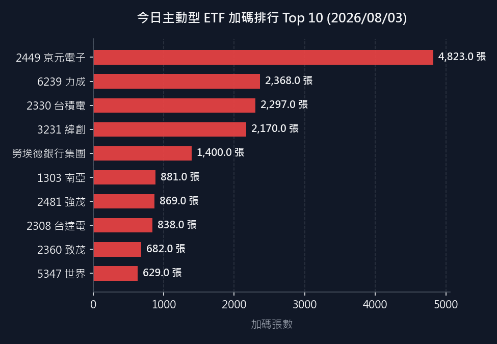
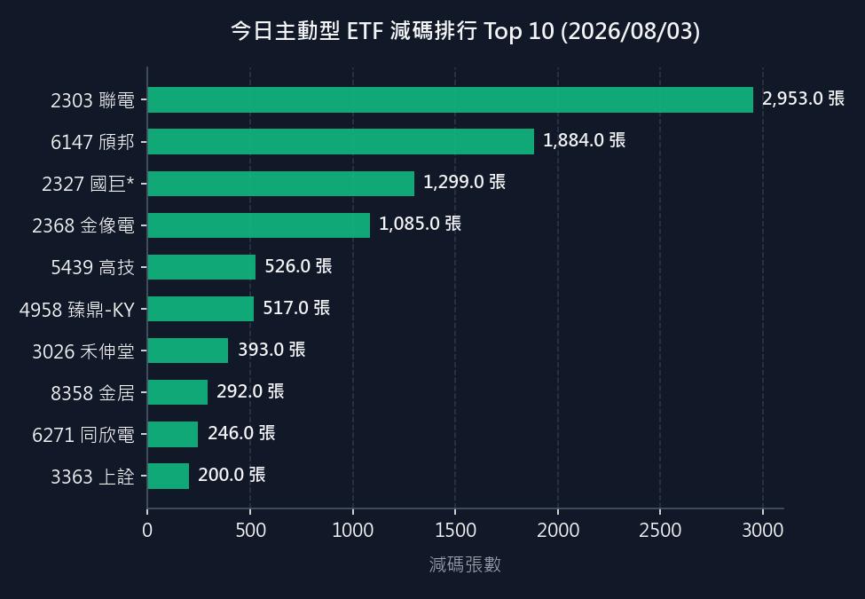

# 主動型 ETF 持股變動

資料來源：`主動型ETF持股明細.xlsx` 最近兩個日期分頁。

比較區間：`20260730` → `20260803`

## 今日加減碼視覺化排行

| 今日加碼 Top 10 | 今日減碼 Top 10 |
| :---: | :---: |
|  |  |

| ETF | 新增 | 刪除 | 比例變動 |
| :-- | --: | --: | --: |
| 00400A | 2 | 1 | 46 |
| 00401A | 0 | 0 | 42 |
| 00402A | 0 | 0 | 48 |
| 00403A | 2 | 1 | 42 |
| 00404A | 1 | 0 | 40 |
| 00405A | 1 | 0 | 36 |
| 00407A | 0 | 0 | 47 |
| 00408A | 2 | 1 | 37 |
| 00980A | 0 | 0 | 49 |
| 00980D | 1 | 0 | 115 |
| 00981A | 2 | 1 | 35 |
| 00982A | 0 | 0 | 42 |
| 00983A | 0 | 0 | 40 |
| 00983D | 1 | 0 | 23 |
| 00984A | 0 | 0 | 106 |
| 00985A | 0 | 0 | 47 |
| 00986A | 2 | 0 | 28 |
| 00987A | 0 | 0 | 22 |
| 00988A | 1 | 1 | 37 |
| 00989A | 1 | 0 | 57 |
| 00990A | 6 | 6 | 41 |
| 00991A | 1 | 0 | 23 |
| 00992A | 2 | 3 | 35 |
| 00993A | 0 | 0 | 48 |
| 00994A | 4 | 3 | 26 |
| 00995A | 2 | 0 | 52 |
| 00996A | 1 | 0 | 45 |
| 00997A | 0 | 0 | 50 |
| 00998A | 0 | 3 | 33 |
| 00999A | 0 | 0 | 63 |

## 00400A

### 新增持股

- 2449 京元電子（0.87%，1071 張）
- 3529 力旺（1.02%，122 張）

### 刪除持股

- 8150 南茂（0.07%，236 張）

### 投資比例變動

- 2059 川湖：3.28% → 3.40%（+0.12）
- 2308 台達電：2.71% → 2.46%（-0.25）
- 2313 華通：0.77% → 0.72%（-0.05）
- 2317 鴻海：0.92% → 0.85%（-0.07）
- 2330 台積電：8.55% → 8.47%（-0.08）
- 2345 智邦：1.76% → 1.85%（+0.09）
- 2357 華碩：1.49% → 1.34%（-0.15）
- 2360 致茂：4.95% → 4.63%（-0.32）
- 2382 廣達：0.83% → 0.69%（-0.14）
- 2383 台光電：4.84% → 5.05%（+0.21）
- 2385 群光：0.14% → 0.12%（-0.02）
- 2408 南亞科：1.61% → 1.55%（-0.06）
- 2454 聯發科：4.91% → 5.23%（+0.32）
- 2881 富邦金：0.41% → 0.37%（-0.04）
- 2885 元大金：1.52% → 1.43%（-0.09）
- 2891 中信金：0.97% → 0.88%（-0.09）
- 3008 大立光：1.92% → 1.70%（-0.22）
- 3017 奇鋐：3.88% → 4.33%（+0.45）
- 3036 文曄：1.12% → 1.07%（-0.05）
- 3037 欣興：3.73% → 4.03%（+0.30）
- 3044 健鼎：1.42% → 1.35%（-0.07）
- 3090 日電貿：0.30% → 0.28%（-0.02）
- 3211 順達：0.69% → 0.59%（-0.10）
- 3231 緯創：0.96% → 0.91%（-0.05）
- 3293 鈊象：0.40% → 0.36%（-0.04）
- 3374 精材：0.31% → 0.29%（-0.02）
- 3443 創意：2.54% → 2.77%（+0.23）
- 3653 健策：2.35% → 2.34%（-0.01）
- 3665 貿聯-KY：3.00% → 2.59%（-0.41）
- 3711 日月光投控：1.23% → 1.29%（+0.06）
- 4958 臻鼎-KY：0.89% → 0.01%（-0.88）
- 5274 信驊：2.74% → 2.92%（+0.18）
- 5347 世界：0.73% → 0.71%（-0.02）
- 5434 崇越：0.40% → 0.35%（-0.05）
- 6121 新普：0.25% → 0.22%（-0.03）
- 6187 萬潤：2.15% → 2.09%（-0.06）
- 6223 旺矽：3.32% → 3.46%（+0.14）
- 6239 力成：0.02% → 0.86%（+0.84）
- 6488 環球晶：2.99% → 2.58%（-0.41）
- 6505 台塑化：0.91% → 0.71%（-0.20）
- 6510 精測：0.79% → 0.30%（-0.49）
- 6669 緯穎：4.23% → 4.19%（-0.04）
- 6715 嘉基：0.18% → 0.17%（-0.01）
- 7769 鴻勁：0.27% → 0.76%（+0.49）
- 8046 南電：0.93% → 0.86%（-0.07）
- 9939 宏全：0.09% → 0.08%（-0.01）

## 00401A

### 新增持股

- 無

### 刪除持股

- 無

### 投資比例變動

- 1216 統一：0.38% → 0.34%（-0.04）
- 1301 台塑：0.09% → 0.08%（-0.01）
- 2303 聯電：1.01% → 1.02%（+0.01）
- 2308 台達電：3.90% → 3.81%（-0.09）
- 2330 台積電：9.09% → 10.52%（+1.43）
- 2345 智邦：2.61% → 2.62%（+0.01）
- 2360 致茂：2.07% → 2.08%（+0.01）
- 2368 金像電：0.32% → 0.33%（+0.01）
- 2379 瑞昱：1.72% → 1.54%（-0.18）
- 2382 廣達：2.02% → 1.92%（-0.10）
- 2412 中華電：1.11% → 1.01%（-0.10）
- 2454 聯發科：6.98% → 7.00%（+0.02）
- 2455 全新：1.17% → 1.18%（+0.01）
- 2603 長榮：1.23% → 1.14%（-0.09）
- 2881 富邦金：2.01% → 1.92%（-0.09）
- 2882 國泰金：1.28% → 1.25%（-0.03）
- 2883 凱基金：2.06% → 2.00%（-0.06）
- 2884 玉山金：2.27% → 2.12%（-0.15）
- 2885 元大金：1.29% → 1.27%（-0.02）
- 2886 兆豐金：1.94% → 1.83%（-0.11）
- 2887 台新新光金：1.20% → 1.19%（-0.01）
- 2890 永豐金：0.37% → 0.35%（-0.02）
- 2891 中信金：1.98% → 1.86%（-0.12）
- 2912 統一超：0.37% → 0.33%（-0.04）
- 3005 神基：0.24% → 0.23%（-0.01）
- 3008 大立光：2.09% → 2.07%（-0.02）
- 3034 聯詠：0.57% → 0.55%（-0.02）
- 3037 欣興：2.09% → 2.10%（+0.01）
- 3491 昇達科：1.24% → 1.46%（+0.22）
- 3529 力旺：0.69% → 0.68%（-0.01）
- 3653 健策：1.13% → 1.14%（+0.01）
- 4904 遠傳：1.06% → 0.96%（-0.10）
- 4938 和碩：0.37% → 0.36%（-0.01）
- 4958 臻鼎-KY：1.90% → 1.91%（+0.01）
- 5274 信驊：1.05% → 1.06%（+0.01）
- 5871 中租-KY：0.19% → 0.18%（-0.01）
- 5904 寶雅：0.73% → 0.66%（-0.07）
- 6223 旺矽：2.17% → 2.18%（+0.01）
- 6285 啟碁：1.63% → 1.62%（-0.01）
- 6515 穎崴：1.09% → 1.10%（+0.01）
- 6531 愛普*：1.02% → 1.03%（+0.01）
- 8464 億豐：1.48% → 1.34%（-0.14）

## 00402A

### 新增持股

- 無

### 刪除持股

- 無

### 投資比例變動

- AAPL.US Apple：8.93% → 7.75%（-1.18）
- ADI.US Analog Devices：1.86% → 1.83%（-0.03）
- AMD.US AMD：5.20% → 5.45%（+0.25）
- AMZN.US Amazon：4.01% → 4.55%（+0.54）
- ANET.US Arista Networks：0.72% → 0.78%（+0.06）
- ARM.US Arm：0.94% → 0.95%（+0.01）
- ASML.US ASML Holding：1.60% → 1.59%（-0.01）
- AVGO.US Broadcom：2.57% → 2.56%（-0.01）
- AXON.US Axon Enterprise：1.05% → 0.98%（-0.07）
- BKNG.US Booking Holdings：0.74% → 0.67%（-0.07）
- CDNS.US Cadence Design Systems：1.93% → 1.87%（-0.06）
- CIEN.US Ciena：1.09% → 1.18%（+0.09）
- CLS.US Celestica：0.99% → 0.94%（-0.05）
- COHR.US Coherent：1.25% → 1.60%（+0.35）
- CRWD.US CrowdStrike Holdings：1.30% → 1.31%（+0.01）
- DASH.US DoorDash：0.29% → 0.27%（-0.02）
- FSLY.US Fastly：0.34% → 0.35%（+0.01）
- GOOG.US Alphabet - Class C Capital Stock：3.58% → 3.60%（+0.02）
- INTC.US Intel：1.16% → 1.21%（+0.05）
- IOT.US Samsara：0.26% → 0.23%（-0.03）
- KLAC.US KLA：2.05% → 2.09%（+0.04）
- LITE.US Lumentum：1.16% → 1.30%（+0.14）
- LRCX.US Lam Research：3.18% → 3.49%（+0.31）
- MCHP.US Microchip Technology：1.41% → 1.39%（-0.02）
- META.US Meta：3.02% → 2.72%（-0.30）
- MRVL.US Marvell：1.26% → 1.37%（+0.11）
- MSFT.US Microsoft：3.67% → 4.13%（+0.46）
- MU.US Micron：5.74% → 6.06%（+0.32）
- NFLX.US Netflix：0.87% → 0.80%（-0.07）
- NOW.US ServiceNow：0.27% → 0.24%（-0.03）
- NVDA.US NVIDIA：8.40% → 8.42%（+0.02）
- NXPI.US NXP Semiconductors：1.23% → 1.11%（-0.12）
- PLTR.US Palantir Technologies：1.16% → 1.09%（-0.07）
- SHOP.US Shopify：0.48% → 0.41%（-0.07）
- SIMO.US Silicon Motion：0.68% → 0.78%（+0.10）
- SKHY.US SK hynix：0.87% → 0.93%（+0.06）
- SNOW.US Snowflake：0.92% → 0.90%（-0.02）
- SPCX.US SpaceX：0.63% → 0.57%（-0.06）
- SPOT.US Spotify：0.31% → 0.28%（-0.03）
- STX.US Seagate：1.43% → 1.52%（+0.09）
- TER.US Teradyne：0.80% → 0.87%（+0.07）
- TSM.US TSMC(ADR)：1.62% → 1.66%（+0.04）
- TTWO.US Take-Two：0.62% → 0.58%（-0.04）
- TXN.US Texas Instruments：2.68% → 2.58%（-0.10）
- UBER.US Uber：0.50% → 0.47%（-0.03）
- V.US Visa：1.20% → 1.13%（-0.07）
- WDC.US Western Digital：2.77% → 3.10%（+0.33）
- ZS.US Zscaler：0.17% → 0.16%（-0.01）

## 00403A

### 新增持股

- 1717 長興（0.02%，500 張）
- 2481 強茂（0.07%，869 張）

### 刪除持股

- 2368 金像電（0.52%，1080 張）

### 投資比例變動

- 1303 南亞：0.43% → 0.44%（+0.01）
- 1560 中砂：0.39% → 0.53%（+0.14）
- 2303 聯電：5.14% → 5.33%（+0.19）
- 2308 台達電：3.00% → 2.79%（-0.21）
- 2317 鴻海：0.50% → 0.47%（-0.03）
- 2327 國巨*：2.01% → 1.92%（-0.09）
- 2330 台積電：17.07% → 17.45%（+0.38）
- 2337 旺宏：0.50% → 0.48%（-0.02）
- 2344 華邦電：3.43% → 3.32%（-0.11）
- 2345 智邦：2.85% → 3.13%（+0.28）
- 2360 致茂：0.92% → 1.02%（+0.10）
- 2383 台光電：3.68% → 4.32%（+0.64）
- 2404 漢唐：0.12% → 0.16%（+0.04）
- 2454 聯發科：3.60% → 4.08%（+0.48）
- 3008 大立光：0.28% → 0.39%（+0.11）
- 3017 奇鋐：4.77% → 5.11%（+0.34）
- 3037 欣興：3.45% → 3.82%（+0.37）
- 3189 景碩：1.22% → 1.30%（+0.08）
- 3211 順達：0.41% → 0.36%（-0.05）
- 3443 創意：1.11% → 1.24%（+0.13）
- 3450 聯鈞：0.07% → 0.08%（+0.01）
- 3533 嘉澤：1.41% → 1.44%（+0.03）
- 3583 辛耘：0.37% → 0.35%（-0.02）
- 3653 健策：2.16% → 2.25%（+0.09）
- 3665 貿聯-KY：1.21% → 1.23%（+0.02）
- 3711 日月光投控：2.11% → 2.27%（+0.16）
- 4958 臻鼎-KY：1.64% → 1.51%（-0.13）
- 4966 譜瑞-KY：0.30% → 0.27%（-0.03）
- 5274 信驊：1.06% → 1.47%（+0.41）
- 6223 旺矽：3.16% → 3.37%（+0.21）
- 6239 力成：0.40% → 0.52%（+0.12）
- 6274 台燿：1.13% → 1.19%（+0.06）
- 6285 啟碁：0.04% → 0.03%（-0.01）
- 6442 光聖：0.16% → 0.17%（+0.01）
- 6488 環球晶：1.34% → 1.31%（-0.03）
- 6515 穎崴：0.43% → 0.11%（-0.32）
- 6669 緯穎：2.03% → 2.06%（+0.03）
- 6805 富世達：0.58% → 0.60%（+0.02）
- 7769 鴻勁：1.02% → 1.12%（+0.10）
- 8046 南電：1.02% → 0.97%（-0.05）
- 8358 金居：0.32% → 0.25%（-0.07）
- 8996 高力：0.91% → 0.87%（-0.04）

## 00404A

### 新增持股

- 臺指選擇權09/26 43900 買權（0.00%，N/A 張）

### 刪除持股

- 無

### 投資比例變動

- 1216 統一：2.14% → 1.91%（-0.23）
- 2303 聯電：2.82% → 2.84%（+0.02）
- 2308 台達電：3.89% → 3.82%（-0.07）
- 2330 台積電：22.49% → 22.65%（+0.16）
- 2345 智邦：0.93% → 0.94%（+0.01）
- 2376 技嘉：1.93% → 1.86%（-0.07）
- 2382 廣達：0.39% → 0.37%（-0.02）
- 2383 台光電：1.94% → 1.96%（+0.02）
- 2393 億光：1.77% → 1.65%（-0.12）
- 2402 毅嘉：0.10% → 0.09%（-0.01）
- 2454 聯發科：6.51% → 6.55%（+0.04）
- 2885 元大金：3.08% → 3.04%（-0.04）
- 2887 台新新光金：3.46% → 3.44%（-0.02）
- 2890 永豐金：2.33% → 2.23%（-0.10）
- 2912 統一超：0.10% → 0.09%（-0.01）
- 3014 聯陽：1.10% → 1.06%（-0.04）
- 3034 聯詠：0.58% → 0.57%（-0.01）
- 3131 弘塑：0.76% → 0.77%（+0.01）
- 3260 威剛：0.39% → 0.38%（-0.01）
- 3264 欣銓：0.96% → 0.97%（+0.01）
- 3702 大聯大：1.79% → 1.74%（-0.05）
- 3711 日月光投控：3.67% → 3.70%（+0.03）
- 4763 材料*-KY：1.82% → 1.69%（-0.13）
- 5269 祥碩：1.60% → 1.47%（-0.13）
- 5274 信驊：2.06% → 2.07%（+0.01）
- 5347 世界：0.37% → 0.38%（+0.01）
- 5434 崇越：1.67% → 1.61%（-0.06）
- 5871 中租-KY：1.96% → 1.81%（-0.15）
- 5876 上海商銀：2.07% → 1.92%（-0.15）
- 6138 茂達：1.62% → 1.52%（-0.10）
- 6196 帆宣：0.34% → 0.33%（-0.01）
- 6206 飛捷：1.72% → 1.67%（-0.05）
- 6223 旺矽：0.85% → 0.86%（+0.01）
- 6257 矽格：1.46% → 1.44%（-0.02）
- 6691 洋基工程：0.70% → 0.69%（-0.01）
- 8016 矽創：0.11% → 0.10%（-0.01）
- 8069 元太：0.44% → 0.42%（-0.02）
- 臺指選擇權08/26 49100 買權：-0.01% → -0.06%（-0.05）
- 臺指選擇權09/26 50300 買權：0.00% → -0.01%（-0.01）
- 臺股期貨08/26：15.81% → 15.72%（-0.09）

## 00405A

### 新增持股

- 3008 大立光（0.02%，1 張）

### 刪除持股

- 無

### 投資比例變動

- 2059 川湖：1.28% → 1.24%（-0.04）
- 2308 台達電：1.93% → 1.82%（-0.11）
- 2330 台積電：0.46% → 0.45%（-0.01）
- 2344 華邦電：2.99% → 2.89%（-0.10）
- 2345 智邦：4.39% → 4.24%（-0.15）
- 2368 金像電：1.78% → 1.73%（-0.05）
- 2383 台光電：2.90% → 2.81%（-0.09）
- 2408 南亞科：1.19% → 1.16%（-0.03）
- 2449 京元電子：0.73% → 0.70%（-0.03）
- 2454 聯發科：6.65% → 6.44%（-0.21）
- 3017 奇鋐：6.26% → 6.07%（-0.19）
- 3026 禾伸堂：1.06% → 0.99%（-0.07）
- 3037 欣興：4.82% → 4.67%（-0.15）
- 3081 聯亞：1.01% → 0.97%（-0.04）
- 3131 弘塑：3.02% → 2.93%（-0.09）
- 3443 創意：4.95% → 4.80%（-0.15）
- 3583 辛耘：0.70% → 0.67%（-0.03）
- 3653 健策：3.29% → 3.19%（-0.10）
- 3665 貿聯-KY：5.52% → 5.35%（-0.17）
- 3711 日月光投控：0.70% → 0.68%（-0.02）
- 4749 新應材：0.27% → 0.26%（-0.01）
- 5274 信驊：2.05% → 1.99%（-0.06）
- 6187 萬潤：0.72% → 0.69%（-0.03）
- 6223 旺矽：5.61% → 5.44%（-0.17）
- 6274 台燿：1.32% → 1.28%（-0.04）
- 6488 環球晶：3.87% → 3.75%（-0.12）
- 6510 精測：1.31% → 1.93%（+0.62）
- 6515 穎崴：0.52% → 0.51%（-0.01）
- 6526 達發：0.31% → 0.29%（-0.02）
- 6669 緯穎：3.04% → 3.97%（+0.93）
- 7734 印能科技：2.09% → 2.02%（-0.07）
- 7769 鴻勁：2.41% → 2.33%（-0.08）
- 8028 昇陽半導體：0.87% → 0.82%（-0.05）
- 8046 南電：3.73% → 3.61%（-0.12）
- 8210 勤誠：0.68% → 0.66%（-0.02）
- 8996 高力：0.94% → 0.91%（-0.03）

## 00407A

### 新增持股

- 無

### 刪除持股

- 無

### 投資比例變動

- 1303 南亞：0.50% → 0.51%（+0.01）
- 1590 亞德客-KY：2.25% → 2.06%（-0.19）
- 2059 川湖：2.01% → 2.02%（+0.01）
- 2303 聯電：1.24% → 2.32%（+1.08）
- 2308 台達電：3.60% → 3.61%（+0.01）
- 2327 國巨*：2.18% → 1.98%（-0.20）
- 2330 台積電：9.20% → 9.28%（+0.08）
- 2344 華邦電：1.49% → 1.37%（-0.12）
- 2345 智邦：3.31% → 3.37%（+0.06）
- 2360 致茂：2.07% → 2.17%（+0.10）
- 2368 金像電：1.58% → 1.57%（-0.01）
- 2376 技嘉：0.78% → 0.75%（-0.03）
- 2379 瑞昱：0.88% → 0.74%（-0.14）
- 2383 台光電：4.06% → 4.30%（+0.24）
- 2395 研華：1.88% → 1.76%（-0.12）
- 2408 南亞科：1.60% → 1.50%（-0.10）
- 2412 中華電：1.94% → 1.76%（-0.18）
- 2454 聯發科：6.03% → 6.23%（+0.20）
- 2458 義隆：0.11% → 0.10%（-0.01）
- 3017 奇鋐：3.75% → 3.80%（+0.05）
- 3034 聯詠：0.77% → 0.72%（-0.05）
- 3037 欣興：3.63% → 3.80%（+0.17）
- 3260 威剛：0.18% → 0.17%（-0.01）
- 3293 鈊象：0.64% → 0.61%（-0.03）
- 3443 創意：1.55% → 1.64%（+0.09）
- 3491 昇達科：0.38% → 0.33%（-0.05）
- 3529 力旺：1.80% → 1.96%（+0.16）
- 3533 嘉澤：0.99% → 0.98%（-0.01）
- 3665 貿聯-KY：3.30% → 3.03%（-0.27）
- 3711 日月光投控：2.40% → 2.44%（+0.04）
- 4904 遠傳：0.36% → 0.33%（-0.03）
- 4958 臻鼎-KY：1.75% → 1.64%（-0.11）
- 5274 信驊：1.92% → 1.97%（+0.05）
- 5434 崇越：0.21% → 0.19%（-0.02）
- 5536 聖暉*：1.68% → 1.51%（-0.17）
- 6223 旺矽：2.45% → 2.47%（+0.02）
- 6274 台燿：2.14% → 2.63%（+0.49）
- 6446 藥華藥：2.33% → 2.10%（-0.23）
- 6515 穎崴：1.29% → 1.26%（-0.03）
- 6526 達發：0.30% → 0.28%（-0.02）
- 6531 愛普*：1.19% → 1.16%（-0.03）
- 6669 緯穎：4.44% → 4.27%（-0.17）
- 6805 富世達：1.82% → 1.77%（-0.05）
- 8046 南電：1.98% → 1.90%（-0.08）
- 8210 勤誠：1.73% → 1.68%（-0.05）
- 8299 群聯：0.12% → 0.11%（-0.01）
- 8996 高力：0.37% → 0.33%（-0.04）

## 00408A

### 新增持股

- 3036 文曄（0.47%，40 張）
- 6239 力成（0.57%，40 張）

### 刪除持股

- 4904 遠傳（0.60%，90 張）

### 投資比例變動

- 1216 統一：1.77% → 1.65%（-0.12）
- 1477 聚陽：1.26% → 1.19%（-0.07）
- 2059 川湖：1.36% → 1.42%（+0.06）
- 2308 台達電：3.30% → 3.36%（+0.06）
- 2317 鴻海：2.18% → 2.64%（+0.46）
- 2330 台積電：4.73% → 6.70%（+1.97）
- 2345 智邦：2.57% → 2.69%（+0.12）
- 2356 英業達：1.20% → 1.23%（+0.03）
- 2357 華碩：2.01% → 2.10%（+0.09）
- 2360 致茂：2.30% → 2.91%（+0.61）
- 2368 金像電：1.74% → 1.82%（+0.08）
- 2376 技嘉：2.12% → 2.13%（+0.01）
- 2383 台光電：3.01% → 3.15%（+0.14）
- 2395 研華：1.91% → 1.87%（-0.04）
- 2404 漢唐：1.60% → 1.66%（+0.06）
- 2408 南亞科：0.42% → 0.43%（+0.01）
- 2412 中華電：3.56% → 3.36%（-0.20）
- 2454 聯發科：3.89% → 4.07%（+0.18）
- 2603 長榮：1.91% → 1.84%（-0.07）
- 2880 華南金：1.76% → 1.71%（-0.05）
- 2886 兆豐金：2.84% → 2.78%（-0.06）
- 2891 中信金：0.96% → 0.94%（-0.02）
- 2912 統一超：2.99% → 2.77%（-0.22）
- 3017 奇鋐：2.14% → 2.24%（+0.10）
- 3037 欣興：2.36% → 2.47%（+0.11）
- 3045 台灣大：3.55% → 3.33%（-0.22）
- 3231 緯創：3.14% → 3.29%（+0.15）
- 3665 貿聯-KY：1.69% → 1.77%（+0.08）
- 3702 大聯大：1.74% → 1.76%（+0.02）
- 5347 世界：0.44% → 0.46%（+0.02）
- 5876 上海商銀：2.35% → 2.27%（-0.08）
- 5904 寶雅：1.87% → 1.78%（-0.09）
- 6223 旺矽：0.46% → 0.48%（+0.02）
- 6274 台燿：1.22% → 1.27%（+0.05）
- 6669 緯穎：3.41% → 3.90%（+0.49）
- 7769 鴻勁：1.60% → 1.68%（+0.08）
- 8046 南電：1.91% → 2.00%（+0.09）

## 00980A

### 新增持股

- 無

### 刪除持股

- 無

### 投資比例變動

- 1303 南亞：1.57% → 2.27%（+0.70）
- 2059 川湖：4.70% → 4.47%（-0.23）
- 2308 台達電：4.09% → 3.63%（-0.46）
- 2317 鴻海：2.48% → 2.26%（-0.22）
- 2327 國巨*：1.26% → 1.08%（-0.18）
- 2330 台積電：10.09% → 8.93%（-1.16）
- 2344 華邦電：1.08% → 0.94%（-0.14）
- 2345 智邦：2.03% → 1.95%（-0.08）
- 2360 致茂：1.90% → 1.65%（-0.25）
- 2368 金像電：2.07% → 1.95%（-0.12）
- 2376 技嘉：1.45% → 1.28%（-0.17）
- 2382 廣達：1.45% → 1.66%（+0.21）
- 2383 台光電：4.48% → 4.30%（-0.18）
- 2408 南亞科：2.58% → 2.34%（-0.24）
- 2454 聯發科：6.13% → 6.20%（+0.07）
- 2884 玉山金：1.02% → 0.95%（-0.07）
- 2891 中信金：1.46% → 1.37%（-0.09）
- 3008 大立光：0.97% → 0.81%（-0.16）
- 3017 奇鋐：1.98% → 1.94%（-0.04）
- 3026 禾伸堂：0.46% → 0.35%（-0.11）
- 3036 文曄：1.42% → 1.33%（-0.09）
- 3037 欣興：2.80% → 2.77%（-0.03）
- 3044 健鼎：0.40% → 0.73%（+0.33）
- 3081 聯亞：2.65% → 2.42%（-0.23）
- 3189 景碩：0.77% → 0.73%（-0.04）
- 3231 緯創：1.07% → 1.10%（+0.03）
- 3264 欣銓：0.38% → 0.69%（+0.31）
- 3293 鈊象：1.19% → 1.10%（-0.09）
- 3443 創意：1.41% → 1.40%（-0.01）
- 3529 力旺：0.90% → 0.88%（-0.02）
- 3533 嘉澤：0.16% → 0.15%（-0.01）
- 3653 健策：1.53% → 1.48%（-0.05）
- 3665 貿聯-KY：0.49% → 0.39%（-0.10）
- 3711 日月光投控：1.44% → 1.39%（-0.05）
- 4958 臻鼎-KY：0.93% → 0.80%（-0.13）
- 5274 信驊：1.52% → 1.66%（+0.14）
- 5904 寶雅：1.63% → 1.28%（-0.35）
- 6213 聯茂：0.83% → 0.79%（-0.04）
- 6223 旺矽：2.63% → 2.51%（-0.12）
- 6274 台燿：1.38% → 1.30%（-0.08）
- 6442 光聖：0.30% → 0.27%（-0.03）
- 6515 穎崴：2.15% → 1.95%（-0.20）
- 6805 富世達：0.49% → 0.45%（-0.04）
- 6831 邁科：0.31% → 0.58%（+0.27）
- 7769 鴻勁：2.73% → 2.67%（-0.06）
- 8046 南電：1.29% → 1.10%（-0.19）
- 8210 勤誠：0.94% → 0.87%（-0.07）
- 8299 群聯：1.31% → 2.18%（+0.87）
- 8996 高力：1.12% → 0.97%（-0.15）

## 00980D

### 新增持股

- LBM ACQUISITION LLC SER REGS 9.500000 % 15JUN2031（0.33%，N/A 張）

### 刪除持股

- 無

### 投資比例變動

- AHOLD FINANCE USA LLC 6.88% 01MAY2029：0.49% → 0.48%（-0.01）
- ALLY FINANCIAL INC (REG) 8% 01/11/2031：0.59% → 0.58%（-0.01）
- ALLY FINANCIAL INC (REG) VAR 03JAN2030：0.64% → 0.63%（-0.01）
- ALLY FINANCIAL INC (REG) VAR 13JUN2029：0.56% → 0.55%（-0.01）
- ANHEUSER-BUSCH INBEV WOR (REG) 8.2% 15JAN2039：0.53% → 0.52%（-0.01）
- APOLLO DEBT SOLUTIONS BD 6.900000 % 13APR2029：0.56% → 0.55%（-0.01）
- ARIS WATER HOLDINGS LLC SER REGS 7.250000 % 01APR2030：0.48% → 0.47%（-0.01）
- ATHENE HOLDING LTD (REG) 6.25% 01APR2054：0.77% → 0.76%（-0.01）
- BANCO SANTANDER SA (REG) 6.607% 07NOV2028：0.67% → 0.66%（-0.01）
- BANCO SANTANDER SA 6.921% 08AUG2033：0.35% → 0.34%（-0.01）
- BANK OF AMERICA CORP (REG) 7.75% 14MAY2038：0.53% → 0.52%（-0.01）
- BARCLAYS PLC (REG) VAR 27JUN2034：0.35% → 0.34%（-0.01）
- BAT CAPITAL CORP (REG) 7.081% 02AUG2053：0.58% → 0.57%（-0.01）
- BAT CAPITAL CORP (REG) 7.75% 19OCT2032：0.46% → 0.45%（-0.01）
- BLACKSTONE PRIVATE CRE 7.300000 % 27NOV2028：0.48% → 0.47%（-0.01）
- BLUE OWL CREDIT INCOME 7.950000 % 13JUN2028：0.54% → 0.53%（-0.01）
- BLUE OWL CREDIT INCOME SER WI (REG) 7.75% 16SEP2027：0.56% → 0.55%（-0.01）
- BLUE OWL TECHNOLOGY FIN CORP II 6.75 % 04APR2029：0.56% → 0.55%（-0.01）
- BOSTON PROPERTIES LP (REG) 6.750000 % 01-DEC-2027：0.47% → 0.46%（-0.01）
- CANTOR FITZGERALD LP SER REGS 7.200000 % 12DEC2028：0.33% → 0.32%（-0.01）
- CHARTER COMM OPT LLC/CAP (REG) 5.5% 01APR2063：0.49% → 0.48%（-0.01）
- CHARTER COMM OPT LLC/CAP 6.700000 % 01-DEC-2055：0.46% → 0.45%（-0.01）
- CHC GROUP LLC SER REGS 11.750000 % 01-SEP-2030：0.44% → 0.43%（-0.01）
- CHS/COMMUNITY HEALTH SYS SER REGS 9.750000 % 15JAN2034：0.34% → 0.33%（-0.01）
- CITIGROUP INC 8.125% 15JUL2039：0.64% → 0.63%（-0.01）
- CONCENTRIX CORP (REG) 6.6% 02AUG2028：0.52% → 0.51%（-0.01）
- CONOCOPHILLIPS COMPANY (REG) 6.95% 15APR2029：0.52% → 0.51%（-0.01）
- COREWEAVE INC SER REGS (REG S) 9.25% 01JUN2030：0.41% → 0.42%（+0.01）
- DAIMLER FINANCE NA LLC REG 8.5% 18JAN2031：0.65% → 0.64%（-0.01）
- DEUTSCHE TELEKOM INT FIN (REG) 8.75% 15JUN2030：0.42% → 0.41%（-0.01）
- DEVON ENERGY CORPORATION (REG) 7.875% 30SEP2031：0.48% → 0.47%（-0.01）
- DISCOVER FINANCIAL SVS (REG) VAR 02NOV2034：0.65% → 0.64%（-0.01）
- DOW CHEMICAL CO/THE (REG) 5.55% 30NOV2048：0.56% → 0.55%（-0.01）
- DOW CHEMICAL CO/THE (REG) 5.6% 15FEB2054：0.60% → 0.59%（-0.01）
- DOW CHEMICAL CO/THE 6.9% 15MAY2053：0.60% → 0.59%（-0.01）
- DOW CHEMICAL CO/THE 7.375% 01NOV2029：0.62% → 0.61%（-0.01）
- DOW CHEMICAL CO/THE 9.4% 15MAY2039：0.55% → 0.54%（-0.01）
- EDISON INTERNATIONAL (REG) 6.95% 15NOV2029：0.59% → 0.58%（-0.01）
- ENBRIDGE ENERGY PARTNERS (REG) 7.375% 15OCT2045：0.52% → 0.51%（-0.01）
- ENEL FINANCE INTL NV SER REGS (REG S) 7.5% 14OCT2032：0.36% → 0.35%（-0.01）
- F&G ANNUITIES & LIFE INC 6.250000 % 04OCT2034：0.52% → 0.51%（-0.01）
- FIFTH THIRD BANCORP (REG) 8.25% 01MAR2038：0.66% → 0.65%（-0.01）
- FMC CORP (REG) 4.5% 01OCT2049：0.50% → 0.49%（-0.01）
- FMC CORP (REG) 6.375000 % 18MAY2053：0.48% → 0.46%（-0.02）
- FORD MOTOR COMPANY (REG) 7.45% 16JUL2031：0.48% → 0.47%（-0.01）
- FORD MOTOR COMPANY 5.291% 08DEC2046：0.29% → 0.28%（-0.01）
- FORD MOTOR CREDIT CO LLC (REG) 7.2% 10JUN2030：0.34% → 0.33%（-0.01）
- FORD MOTOR CREDIT CO LLC 6.500000 % 07FEB2035：0.33% → 0.32%（-0.01）
- FORD MOTOR CREDIT CO LLC 6.798% 07NOV2028：0.34% → 0.33%（-0.01）
- FREEDOM MORTGAGE CORP SER REGS (REG S) 12.25% 01OCT2030：0.48% → 0.47%（-0.01）
- GENERAL MOTORS CO (REG) 6.75% 01APR2046：0.57% → 0.56%（-0.01）
- GENERAL MOTORS CO (REG) 6.8% 01OCT2027：0.57% → 0.56%（-0.01）
- GEORGIA-PACIFIC LLC (REG) 7.75% 15NOV2029：0.58% → 0.57%（-0.01）
- GETTY IMAGES INC SER REGS 11.250000 % 21FEB2030：0.51% → 0.50%（-0.01）
- GLOBAL ATLANTIC FIN CO SER REGS 6.750000 % 15MAR2054：0.63% → 0.62%（-0.01）
- GLOBAL ATLANTIC FIN CO SER REGS 7.950000 % 15JUN2033：0.67% → 0.66%（-0.01）
- HA SUSTAINABLE INF CAP (REG) 6.375% 01JUL2034：0.35% → 0.34%（-0.01）
- HERTZ CORP/THE SER REGS (REG S) 12.625% 15JUL2029：0.30% → 0.29%（-0.01）
- HESS CORP (REG) 7.3% 15AUG2031：0.54% → 0.53%（-0.01）
- HISCOX LTD VAR 11JUN2036：0.44% → 0.43%（-0.01）
- HPS CORPORATE LENDING FU 6.750000 % 30JAN2029：0.54% → 0.53%（-0.01）
- INTESA SANPAOLO SPA SER REGS (REG S) 7.8% 28NOV2053：0.38% → 0.37%（-0.01）
- INTESA SANPAOLO SPA SER REGS (REG) 7.200000 % 28NOV2033：0.36% → 0.35%（-0.01）
- JBS USA HOLD/FOOD/LUX CO 7.250000 % 15NOV2053：0.48% → 0.47%（-0.01）
- JBS USA/FOOD/FINANCE (REG) 6.5% 01DEC2052：0.47% → 0.46%（-0.01）
- JETBLUE AIRWAYS/LOYALTY SER REGS (REG S) 9.875% 20SEP2031：0.30% → 0.49%（+0.19）
- KELLANOVA SER B (REG) 7.450000 % 01APR2031：0.58% → 0.57%（-0.01）
- LINCOLN NATIONAL CORP (REG) 7.000000 % 15JUN2040：0.47% → 0.46%（-0.01）
- LPL HOLDINGS INC (REG) 6.75% 17NOV2028：0.57% → 0.56%（-0.01）
- M&T BANK CORPORATION (REG) VAR 30OCT2029：0.55% → 0.54%（-0.01）
- MDC HOLDINGS INC (REG) 6% 15JAN2043：0.33% → 0.32%（-0.01）
- METLIFE INC (REG) 10.75% 01AUG2039：0.46% → 0.45%（-0.01）
- MPLX LP 6.200000 % 15SEP2055：0.34% → 0.33%（-0.01）
- NAVIENT CORP (REG) 11.5% 15MAR2031：0.32% → 0.31%（-0.01）
- NISSAN MOTOR CO SER REGS 8.125000 % 17JUL2035：0.53% → 0.52%（-0.01）
- OCCIDENTAL PETROLEUM COR (REG) 7.5% 01MAY2031：0.34% → 0.33%（-0.01）
- ONEOK INC 6.625% 01SEP2053：0.58% → 0.57%（-0.01）
- OPEN TEXT CORP SER REGS (REG) (REG S) 6.9% 01DEC2027：0.67% → 0.66%（-0.01）
- ORACLE CORP (REG) 5.500000 % 27SEP2064：0.54% → 0.55%（+0.01）
- ORACLE CORP 5.55% 06FEB2053：0.24% → 0.25%（+0.01）
- ORACLE CORP 6.000000 % 03AUG2055：0.30% → 0.31%（+0.01）
- ORACLE CORP 6.125000 % 03AUG2065：0.51% → 0.52%（+0.01）
- ORACLE CORP 6.9% 09NOV2052：0.51% → 0.52%（+0.01）
- ORANGE SA (REG) 9% 01MAR2031：0.67% → 0.66%（-0.01）
- OVINTIV INC 7.375% 01NOV2031：0.34% → 0.33%（-0.01）
- PACIFIC GAS & ELECTRIC (REG) 6.7% 01APR2053：0.34% → 0.33%（-0.01）
- PACIFIC GAS & ELECTRIC 6.95% 15MAR2034：0.34% → 0.33%（-0.01）
- PLANET FINANCIAL GROUP SER REGS 10.500000 % 15DEC2029：0.33% → 0.32%（-0.01）
- POLARIS INC 6.950000 % 15MAR2029：0.48% → 0.47%（-0.01）
- RR DONNELLEY & SONS CO SER REGS (REG S) 9.5% 01AUG2029：0.43% → 0.42%（-0.01）
- SANTANDER HOLDINGS USA VAR 09MAR2029：0.48% → 0.47%（-0.01）
- SANTANDER HOLDINGS USA VAR 09NOV2031：0.60% → 0.59%（-0.01）
- SANTANDER HOLDINGS USA VAR 12JUN2029：0.59% → 0.58%（-0.01）
- SATURN OIL & GAS INC SER REGS 9.625000 % 15JUN2029：0.63% → 0.62%（-0.01）
- SES GLOBAL AMERICAS HLDG SER REGS (REG) 5.300000 % 25MAR2044：0.35% → 0.34%（-0.01）
- SPRINT CAPITAL CORP (REG) 8.75% 15MAR2032：0.42% → 0.41%（-0.01）
- SUNCOR ENERGY INC (REG) 6.8% 15MAY2038：0.43% → 0.42%（-0.01）
- TIME WARNER ENTERTAINMEN 8.375% 15JUL2033：0.65% → 0.64%（-0.01）
- TRANSCANADA PIPELINES LTD 7.625PCT 15/01/2039：0.54% → 0.53%（-0.01）
- TRUIST FINANCIAL CORP SER MTN VAR 30OCT2029：0.65% → 0.64%（-0.01）
- UNISYS CORP SER REGS 10.625000 % 15JAN2031：0.60% → 0.59%（-0.01）
- US 10YR NOTE (CBT)SEP26 21-SEP-2026：18.78% → 18.47%（-0.31）
- US 10YR ULTRA FUT SEP26 21-SEP-2026：-2.86% → -2.81%（+0.05）
- US 2YR NOTE (CBT) SEP26 30-SEP-2026：1.99% → 1.97%（-0.02）
- US 5YR NOTE (CBT) SEP26 30-SEP-2026：-16.32% → -16.09%（+0.23）
- US ACUTE CARE SOLUTIONS SER REGS (REG S) 9.75% 15MAY2029：0.32% → 0.31%（-0.01）
- US LONG BOND(CBT) SEP26 21-SEP-2026：5.52% → 5.37%（-0.15）
- VALERO ENERGY CORP (REG) 7.5% 15APR2032：0.49% → 0.48%（-0.01）
- VERIZON COMMUNICAT 7.750000 % 01DEC2030：0.45% → 0.44%（-0.01）
- VIACOMCBS INC (REG) 4.95% 19MAY2050：0.49% → 0.48%（-0.01）
- VIACOMCBS INC 6.875% 30APR2036：0.29% → 0.28%（-0.01）
- VIRGINIA ELEC & POWER CO (REG) 8.875% 15NOV2038：0.59% → 0.58%（-0.01）
- VISTRA OPERATIONS CO LLC SER REGS (REG S) 6.95% 15OCT2033：0.42% → 0.41%（-0.01）
- WESTLAKE CORP 6.375000 % 15-NOV-2055：0.52% → 0.51%（-0.01）
- ZIONS BANCORP NA VAR 19NOV2035：0.42% → 0.41%（-0.01）

## 00981A

### 新增持股

- 2049 上銀（0.05%，430 張）
- 2360 致茂（0.31%，472 張）

### 刪除持股

- 5439 高技（0.04%，526 張）

### 投資比例變動

- 1590 亞德客-KY：0.29% → 0.25%（-0.04）
- 2002 中鋼：0.04% → 0.03%（-0.01）
- 2303 聯電：3.95% → 3.43%（-0.52）
- 2308 台達電：3.54% → 3.11%（-0.43）
- 2327 國巨*：4.76% → 4.66%（-0.10）
- 2330 台積電：9.71% → 8.44%（-1.27）
- 2345 智邦：5.09% → 4.97%（-0.12）
- 2368 金像電：2.24% → 2.19%（-0.05）
- 2383 台光電：8.34% → 7.92%（-0.42）
- 2408 南亞科：0.13% → 0.12%（-0.01）
- 2449 京元電子：0.63% → 0.87%（+0.24）
- 2454 聯發科：6.89% → 6.82%（-0.07）
- 3017 奇鋐：4.75% → 4.91%（+0.16）
- 3037 欣興：5.23% → 5.16%（-0.07）
- 3264 欣銓：0.10% → 0.09%（-0.01）
- 3376 新日興：0.11% → 0.10%（-0.01）
- 3653 健策：2.95% → 2.97%（+0.02）
- 3665 貿聯-KY：3.83% → 3.56%（-0.27）
- 3711 日月光投控：3.38% → 3.30%（-0.08）
- 4958 臻鼎-KY：0.26% → 0.24%（-0.02）
- 4979 華星光：0.27% → 0.25%（-0.02）
- 5274 信驊：2.46% → 2.41%（-0.05）
- 6147 頎邦：0.14% → 0.04%（-0.10）
- 6187 萬潤：0.46% → 0.44%（-0.02）
- 6191 精成科：0.13% → 0.11%（-0.02）
- 6223 旺矽：4.81% → 4.70%（-0.11）
- 6271 同欣電：0.15% → 0.12%（-0.03）
- 6274 台燿：2.16% → 2.12%（-0.04）
- 6278 台表科：0.19% → 0.16%（-0.03）
- 6510 精測：0.27% → 0.23%（-0.04）
- 6515 穎崴：0.20% → 0.19%（-0.01）
- 6669 緯穎：4.92% → 5.32%（+0.40）
- 6805 富世達：0.99% → 0.95%（-0.04）
- 8046 南電：3.27% → 3.01%（-0.26）
- 8210 勤誠：0.90% → 0.83%（-0.07）

## 00982A

### 新增持股

- 無

### 刪除持股

- 無

### 投資比例變動

- 1785 光洋科：1.01% → 0.96%（-0.05）
- 2059 川湖：3.10% → 3.12%（+0.02）
- 2303 聯電：2.23% → 2.41%（+0.18）
- 2316 楠梓電：1.13% → 1.08%（-0.05）
- 2327 國巨*：1.00% → 0.91%（-0.09）
- 2330 台積電：10.15% → 9.35%（-0.80）
- 2345 智邦：3.72% → 3.80%（+0.08）
- 2351 順德：0.53% → 0.54%（+0.01）
- 2360 致茂：3.60% → 3.78%（+0.18）
- 2376 技嘉：0.81% → 0.78%（-0.03）
- 2377 微星：1.85% → 1.75%（-0.10）
- 2383 台光電：3.20% → 3.40%（+0.20）
- 2451 創見：0.34% → 0.33%（-0.01）
- 2454 聯發科：6.55% → 6.78%（+0.23）
- 2467 志聖：1.63% → 1.58%（-0.05）
- 2472 立隆電：1.23% → 1.13%（-0.10）
- 3008 大立光：2.24% → 2.18%（-0.06）
- 3017 奇鋐：2.00% → 2.03%（+0.03）
- 3105 穩懋：2.89% → 2.67%（-0.22）
- 3231 緯創：0.12% → 0.11%（-0.01）
- 3264 欣銓：1.87% → 1.82%（-0.05）
- 3491 昇達科：2.38% → 2.06%（-0.32）
- 3529 力旺：0.45% → 0.49%（+0.04）
- 3583 辛耘：1.70% → 1.65%（-0.05）
- 3702 大聯大：1.41% → 1.39%（-0.02）
- 3711 日月光投控：1.21% → 1.23%（+0.02）
- 4958 臻鼎-KY：3.02% → 2.82%（-0.20）
- 5274 信驊：0.94% → 0.96%（+0.02）
- 5536 聖暉*：8.40% → 7.54%（-0.86）
- 6139 亞翔：5.08% → 4.90%（-0.18）
- 6187 萬潤：0.19% → 0.18%（-0.01）
- 6223 旺矽：3.45% → 3.48%（+0.03）
- 6239 力成：0.38% → 0.36%（-0.02）
- 6257 矽格：2.05% → 1.97%（-0.08）
- 6274 台燿：1.10% → 1.09%（-0.01）
- 6278 台表科：0.74% → 0.71%（-0.03）
- 6488 環球晶：2.33% → 2.11%（-0.22）
- 6531 愛普*：1.68% → 1.64%（-0.04）
- 6669 緯穎：5.11% → 4.95%（-0.16）
- 7769 鴻勁：1.15% → 1.26%（+0.11）
- 8016 矽創：1.41% → 1.32%（-0.09）
- 8996 高力：0.77% → 0.70%（-0.07）

## 00983A

### 新增持股

- 無

### 刪除持股

- 無

### 投資比例變動

- ACHR.US Archer：0.29% → 0.30%（+0.01）
- AMD.US AMD：5.66% → 6.03%（+0.37）
- AMZN.US Amazon：3.16% → 3.75%（+0.59）
- AVGO.US Broadcom：1.93% → 2.01%（+0.08）
- BEAM.US Beam Therapeutics：2.44% → 2.36%（-0.08）
- BLSH.US Bullish：0.87% → 0.98%（+0.11）
- BMNR.US BitMine：0.85% → 0.97%（+0.12）
- CBRS.US Cerebras：0.74% → 0.64%（-0.10）
- CERS.US Cerus：0.53% → 0.39%（-0.14）
- COIN.US Coinbase：2.19% → 2.10%（-0.09）
- CRCL.US Circle：1.94% → 2.08%（+0.14）
- CRSP.US CRISPR Therapeutics：4.04% → 4.03%（-0.01）
- CRWV.US CoreWeave：1.00% → 0.79%（-0.21）
- DE.US Deere：1.50% → 1.44%（-0.06）
- FIG.US Figma：0.46% → 0.45%（-0.01）
- GOOG.US Alphabet - Class C Capital Stock：1.32% → 1.38%（+0.06）
- GOOGL.US Alphabet - Class A Common Stock：1.74% → 1.82%（+0.08）
- HOOD.US Robinhood Markets：4.28% → 3.69%（-0.59）
- ILMN.US Illumina：3.99% → 4.16%（+0.17）
- KTOS.US Kratos Defense & Security：0.28% → 0.30%（+0.02）
- LLY.US Eli Lilly：2.13% → 2.00%（-0.13）
- META.US Meta：1.50% → 1.26%（-0.24）
- NTLA.US Intellia Therapeutics：1.30% → 1.27%（-0.03）
- NTRA.US Natera：2.24% → 2.34%（+0.10）
- NVDA.US NVIDIA：0.98% → 1.15%（+0.17）
- RBLX.US Roblox：3.36% → 2.36%（-1.00）
- SHOP.US Shopify：6.95% → 6.24%（-0.71）
- SNOW.US Snowflake：1.16% → 1.50%（+0.34）
- SOFI.US SoFi Technologies：0.62% → 0.66%（+0.04）
- SPCX.US SpaceX：0.16% → 0.34%（+0.18）
- TEM.US Tempus：3.06% → 3.03%（-0.03）
- TER.US Teradyne：0.57% → 0.65%（+0.08）
- TSLA.US Tesla：7.42% → 7.64%（+0.22）
- TSM.US TSMC(ADR)：3.37% → 3.60%（+0.23）
- TWST.US Twist Bioscience：4.03% → 4.28%（+0.25）
- TXG.US 10x Genomics：5.89% → 5.94%（+0.05）
- VCYT.US Veracyte：1.37% → 1.13%（-0.24）
- WGS.US GeneDx：1.44% → 1.45%（+0.01）
- XE.US X-Energy：0.11% → 0.12%（+0.01）
- XYZ.US Block：2.50% → 2.45%（-0.05）

## 00983D

### 新增持股

- GT 8 7/8 07/15/32（0.49%，N/A 張）

### 刪除持股

- 無

### 投資比例變動

- AMCX 10 1/2 07/15/32：1.62% → 1.63%（+0.01）
- BATSLN 7.081 08/02/53：1.34% → 1.33%（-0.01）
- BHCCN 11 09/30/28：1.83% → 1.84%（+0.01）
- BRITEL 9 5/8 12/15/30：1.37% → 1.36%（-0.01）
- BRKHEC 6 3/4 07/01/37：0.83% → 0.82%（-0.01）
- C 8 1/8 07/15/39：1.97% → 1.96%（-0.01）
- CRWV 9 02/01/31：1.22% → 0.83%（-0.39）
- DELL 8.35 07/15/46：1.41% → 1.42%（+0.01）
- DTV 8 7/8 02/01/30：1.60% → 1.61%（+0.01）
- ED 6 3/4 04/01/38：0.63% → 0.62%（-0.01）
- GE 6 3/4 03/15/32：0.59% → 0.58%（-0.01）
- GS 6 1/4 02/01/41：0.33% → 0.32%（-0.01）
- IEP 10 11/15/29：1.54% → 1.55%（+0.01）
- LQDW.US iShares Investment Grade Corpora：7.40% → 7.39%（-0.01）
- NTRCN 7 1/8 05/23/36：0.56% → 0.55%（-0.01）
- NVDA 5.55 06/15/46：1.16% → 1.17%（+0.01）
- ORCL 6.9 11/09/52：0.83% → 0.85%（+0.02）
- PCG 6.7 04/01/53：1.12% → 1.11%（-0.01）
- PFE 7.2 03/15/39：1.45% → 1.44%（-0.01）
- SABHLD 10 3/4 11/15/29：0.60% → 0.61%（+0.01）
- SPCX 6.6 07/15/46：1.11% → 1.13%（+0.02）
- TELEFONICA EMISIONES SAU 7.045 06/20/36：1.57% → 1.56%（-0.01）
- TLTW.US iShares 20+ Year Treasury Bond B：7.30% → 7.26%（-0.04）

## 00984A

### 新增持股

- 無

### 刪除持股

- 無

### 投資比例變動

- 1102 亞泥：1.46% → 1.38%（-0.08）
- 1216 統一：2.21% → 1.96%（-0.25）
- 1229 聯華：0.31% → 0.29%（-0.02）
- 1303 南亞：0.56% → 0.59%（+0.03）
- 1326 台化：0.70% → 0.65%（-0.05）
- 1402 遠東新：1.19% → 1.12%（-0.07）
- 1409 新纖：0.51% → 0.49%（-0.02）
- 1513 中興電：0.27% → 0.26%（-0.01）
- 1560 中砂：0.47% → 0.48%（+0.01）
- 1785 光洋科：0.44% → 0.43%（-0.01）
- 1795 美時：0.40% → 0.37%（-0.03）
- 1907 永豐餘：0.33% → 0.32%（-0.01）
- 2006 東和鋼鐵：0.47% → 0.45%（-0.02）
- 2049 上銀：0.58% → 0.57%（-0.01）
- 2059 川湖：0.58% → 0.60%（+0.02）
- 2105 正新：0.44% → 0.42%（-0.02）
- 2204 中華：0.31% → 0.29%（-0.02）
- 2206 三陽工業：0.48% → 0.46%（-0.02）
- 2303 聯電：1.90% → 2.11%（+0.21）
- 2327 國巨*：0.83% → 0.77%（-0.06）
- 2330 台積電：3.05% → 3.16%（+0.11）
- 2337 旺宏：0.43% → 0.40%（-0.03）
- 2345 智邦：0.35% → 0.37%（+0.02）
- 2347 聯強：1.07% → 1.11%（+0.04）
- 2357 華碩：3.18% → 3.20%（+0.02）
- 2360 致茂：0.66% → 0.71%（+0.05）
- 2371 大同：0.38% → 0.36%（-0.02）
- 2377 微星：1.02% → 0.99%（-0.03）
- 2382 廣達：2.39% → 2.12%（-0.27）
- 2383 台光電：1.66% → 1.80%（+0.14）
- 2404 漢唐：1.81% → 1.84%（+0.03）
- 2412 中華電：2.99% → 2.80%（-0.19）
- 2454 聯發科：1.31% → 1.39%（+0.08）
- 2458 義隆：0.34% → 0.33%（-0.01）
- 2467 志聖：0.48% → 0.47%（-0.01）
- 2472 立隆電：0.31% → 0.29%（-0.02）
- 2474 可成：0.84% → 0.80%（-0.04）
- 2481 強茂：0.40% → 0.39%（-0.01）
- 2501 國建：0.29% → 0.27%（-0.02）
- 2606 裕民：0.44% → 0.43%（-0.01）
- 2618 長榮航：1.62% → 1.59%（-0.03）
- 2633 台灣高鐵：1.58% → 1.49%（-0.09）
- 2634 漢翔：0.47% → 0.45%（-0.02）
- 2645 長榮航太：0.30% → 0.29%（-0.01）
- 2646 星宇航空：0.44% → 0.42%（-0.02）
- 2881 富邦金：2.81% → 2.79%（-0.02）
- 2882 國泰金：0.31% → 0.32%（+0.01）
- 2885 元大金：0.44% → 0.45%（+0.01）
- 2891 中信金：2.57% → 2.53%（-0.04）
- 2897 王道銀行：0.32% → 0.30%（-0.02）
- 2912 統一超：1.69% → 1.48%（-0.21）
- 3008 大立光：0.71% → 0.70%（-0.01）
- 3026 禾伸堂：0.72% → 0.64%（-0.08）
- 3034 聯詠：2.29% → 2.22%（-0.07）
- 3037 欣興：1.43% → 1.54%（+0.11）
- 3044 健鼎：0.29% → 0.30%（+0.01）
- 3045 台灣大：2.26% → 2.11%（-0.15）
- 3090 日電貿：0.26% → 0.24%（-0.02）
- 3167 大量：0.37% → 0.35%（-0.02）
- 3189 景碩：1.10% → 1.14%（+0.04）
- 3227 原相：0.25% → 0.24%（-0.01）
- 3293 鈊象：1.42% → 1.41%（-0.01）
- 3443 創意：0.53% → 0.58%（+0.05）
- 3481 群創：0.40% → 0.41%（+0.01）
- 3532 台勝科：0.55% → 0.46%（-0.09）
- 3592 瑞鼎：0.26% → 0.24%（-0.02）
- 3596 智易：0.38% → 0.37%（-0.01）
- 3711 日月光投控：0.99% → 1.04%（+0.05）
- 4904 遠傳：2.10% → 1.95%（-0.15）
- 4938 和碩：0.43% → 0.41%（-0.02）
- 4958 臻鼎-KY：1.53% → 1.47%（-0.06）
- 5274 信驊：0.33% → 0.35%（+0.02）
- 5434 崇越：1.18% → 1.13%（-0.05）
- 5483 中美晶：0.41% → 0.36%（-0.05）
- 5536 聖暉*：0.48% → 0.44%（-0.04）
- 5871 中租-KY：1.25% → 1.16%（-0.09）
- 5876 上海商銀：1.44% → 1.39%（-0.05）
- 5903 全家：0.07% → 0.06%（-0.01）
- 5904 寶雅：0.33% → 0.31%（-0.02）
- 6023 元大期：0.32% → 0.30%（-0.02）
- 6121 新普：0.64% → 0.61%（-0.03）
- 6139 亞翔：0.47% → 0.46%（-0.01）
- 6147 頎邦：0.39% → 0.38%（-0.01）
- 6176 瑞儀：0.42% → 0.39%（-0.03）
- 6182 合晶：0.50% → 0.44%（-0.06）
- 6196 帆宣：1.05% → 1.03%（-0.02）
- 6197 佳必琪：0.25% → 0.24%（-0.01）
- 6213 聯茂：0.88% → 0.87%（-0.01）
- 6223 旺矽：1.00% → 1.03%（+0.03）
- 6274 台燿：1.50% → 1.53%（+0.03）
- 6285 啟碁：0.55% → 0.53%（-0.02）
- 6446 藥華藥：2.04% → 1.88%（-0.16）
- 6831 邁科：0.37% → 0.36%（-0.01）
- 6890 來億-KY：0.28% → 0.26%（-0.02）
- 7769 鴻勁：0.54% → 0.60%（+0.06）
- 8016 矽創：0.86% → 0.82%（-0.04）
- 8021 尖點：1.22% → 1.17%（-0.05）
- 8046 南電：0.94% → 0.93%（-0.01）
- 8081 致新：0.25% → 0.24%（-0.01）
- 8096 擎亞：0.47% → 0.44%（-0.03）
- 8261 富鼎：0.56% → 0.49%（-0.07）
- 8358 金居：0.84% → 0.78%（-0.06）
- 8415 大國鋼：0.30% → 0.28%（-0.02）
- 9914 美利達：0.31% → 0.28%（-0.03）
- 9939 宏全：0.32% → 0.30%（-0.02）
- 9958 世紀鋼：0.28% → 0.26%（-0.02）

## 00985A

### 新增持股

- 無

### 刪除持股

- 無

### 投資比例變動

- 1216 統一：1.17% → 0.99%（-0.18）
- 1802 台玻：0.20% → 0.19%（-0.01）
- 2027 大成鋼：4.68% → 4.35%（-0.33）
- 2049 上銀：0.58% → 0.60%（+0.02）
- 2059 川湖：4.09% → 4.48%（+0.39）
- 2303 聯電：3.40% → 3.55%（+0.15）
- 2308 台達電：1.01% → 0.97%（-0.04）
- 2327 國巨*：3.48% → 3.43%（-0.05）
- 2330 台積電：14.82% → 14.45%（-0.37）
- 2345 智邦：2.71% → 3.00%（+0.29）
- 2360 致茂：0.46% → 0.45%（-0.01）
- 2368 金像電：0.82% → 0.89%（+0.07）
- 2376 技嘉：4.31% → 3.94%（-0.37）
- 2383 台光電：2.44% → 2.69%（+0.25）
- 2395 研華：1.57% → 1.49%（-0.08）
- 2408 南亞科：2.72% → 2.76%（+0.04）
- 2412 中華電：1.51% → 1.35%（-0.16）
- 2454 聯發科：1.80% → 2.03%（+0.23）
- 2881 富邦金：0.51% → 0.49%（-0.02）
- 2891 中信金：0.55% → 0.52%（-0.03）
- 3008 大立光：3.57% → 3.33%（-0.24）
- 3017 奇鋐：1.01% → 1.11%（+0.10）
- 3036 文曄：3.24% → 3.25%（+0.01）
- 3037 欣興：0.60% → 0.68%（+0.08）
- 3081 聯亞：1.46% → 1.54%（+0.08）
- 3105 穩懋：0.50% → 0.48%（-0.02）
- 3131 弘塑：1.27% → 1.23%（-0.04）
- 3293 鈊象：1.23% → 1.17%（-0.06）
- 3529 力旺：0.24% → 0.25%（+0.01）
- 3653 健策：1.21% → 1.25%（+0.04）
- 3661 世芯-KY：0.96% → 1.01%（+0.05）
- 3665 貿聯-KY：1.03% → 0.93%（-0.10）
- 3711 日月光投控：0.71% → 0.79%（+0.08）
- 4904 遠傳：1.52% → 1.33%（-0.19）
- 4958 臻鼎-KY：2.05% → 1.94%（-0.11）
- 6147 頎邦：2.39% → 2.33%（-0.06）
- 6187 萬潤：3.25% → 3.32%（+0.07）
- 6223 旺矽：0.27% → 0.30%（+0.03）
- 6415 矽力*-KY：0.27% → 0.28%（+0.01）
- 6442 光聖：3.24% → 3.36%（+0.12）
- 6446 藥華藥：1.58% → 1.55%（-0.03）
- 6488 環球晶：0.45% → 0.40%（-0.05）
- 6669 緯穎：1.53% → 1.60%（+0.07）
- 7769 鴻勁：0.24% → 0.27%（+0.03）
- 8046 南電：0.48% → 0.47%（-0.01）
- 8299 群聯：0.92% → 0.97%（+0.05）
- 8996 高力：0.23% → 0.22%（-0.01）

## 00986A

### 新增持股

- DDOG.US Datadog（0.46%，0.3 張）
- MA.US Mastercard（0.65%，0.2 張）

### 刪除持股

- 無

### 投資比例變動

- 2330 台積電：8.83% → 8.45%（-0.38）
- AAPL.US Apple：1.20% → 1.13%（-0.07）
- AMD.US AMD：2.79% → 3.02%（+0.23）
- AMZN.US Amazon：3.75% → 3.73%（-0.02）
- AVGO.US Broadcom：5.25% → 5.26%（+0.01）
- CAT.US Caterpillar：2.54% → 1.37%（-1.17）
- COHR.US Coherent：1.70% → 1.83%（+0.13）
- CRWD.US CrowdStrike Holdings：3.97% → 3.93%（-0.04）
- ETN.US Eaton：2.14% → 2.19%（+0.05）
- GEV.US GE Vernova：3.19% → 2.78%（-0.41）
- GOOGL.US Alphabet - Class A Common Stock：7.95% → 7.54%（-0.41）
- GS.US Goldman Sachs：3.18% → 3.19%（+0.01）
- HWM.US Howmet Aerospace：2.74% → 2.66%（-0.08）
- JPM.US JPMorgan Chase：1.63% → 1.59%（-0.04）
- LITE.US Lumentum：2.77% → 3.06%（+0.29）
- LLY.US Eli Lilly：3.21% → 2.94%（-0.27）
- LRCX.US Lam Research：2.53% → 2.86%（+0.33）
- MSFT.US Microsoft：2.31% → 2.55%（+0.24）
- MU.US Micron：3.49% → 3.96%（+0.47）
- MUFG(8306.JP)：1.58% → 1.46%（-0.12）
- Murata Mfg.(6981.JP)：1.57% → 1.55%（-0.02）
- NVDA.US NVIDIA：5.94% → 5.73%（-0.21）
- SNOW.US Snowflake：1.42% → 1.68%（+0.26）
- Siemens Energy AG：2.00% → 2.08%（+0.08）
- Yaskawa Electric(6506.JP)：1.84% → 1.73%（-0.11）
- 嘉能可公司：1.64% → 1.63%（-0.01）
- 施奈德電機公司：1.64% → 1.75%（+0.11）
- 英飛凌科技股份有限公司：2.93% → 3.08%（+0.15）

## 00987A

### 新增持股

- 無

### 刪除持股

- 無

### 投資比例變動

- 2330 台積電：9.50% → 8.52%（-0.98）
- 2345 智邦：2.59% → 2.61%（+0.02）
- 2383 台光電：7.02% → 6.77%（-0.25）
- 2408 南亞科：3.77% → 3.80%（+0.03）
- 2454 聯發科：4.96% → 5.00%（+0.04）
- 2455 全新：2.61% → 2.63%（+0.02）
- 3017 奇鋐：8.69% → 8.76%（+0.07）
- 3037 欣興：6.51% → 6.57%（+0.06）
- 3363 上詮：1.94% → 1.95%（+0.01）
- 3443 創意：5.63% → 5.69%（+0.06）
- 3653 健策：2.70% → 2.71%（+0.01）
- 3665 貿聯-KY：4.57% → 4.19%（-0.38）
- 4764 雙鍵：1.94% → 1.80%（-0.14）
- 6139 亞翔：2.95% → 2.93%（-0.02）
- 6223 旺矽：6.20% → 6.26%（+0.06）
- 6274 台燿：3.63% → 3.66%（+0.03）
- 6683 雍智科技：2.10% → 2.11%（+0.01）
- 6739 竹陞科技：0.74% → 1.80%（+1.06）
- 7769 鴻勁：2.69% → 2.57%（-0.12）
- 8028 昇陽半導體：1.92% → 2.27%（+0.35）
- 8046 南電：3.65% → 3.46%（-0.19）
- 8358 金居：1.48% → 1.49%（+0.01）

## 00988A

### 新增持股

- SNOW.US Snowflake（0.77%，40 張）

### 刪除持股

- SUMCO(3436.JP)（0.61%，500 張）

### 投資比例變動

- 2308 台達電：1.00% → 0.97%（-0.03）
- 2327 國巨*：1.64% → 1.40%（-0.24）
- 2330 台積電：3.45% → 3.27%（-0.18）
- 2383 台光電：3.52% → 3.80%（+0.28）
- 2454 聯發科：2.93% → 2.85%（-0.08）
- 3017 奇鋐：0.50% → 0.48%（-0.02）
- 3037 欣興：3.46% → 3.68%（+0.22）
- 3665 貿聯-KY：2.27% → 1.96%（-0.31）
- 3711 日月光投控：1.88% → 1.80%（-0.08）
- 6223 旺矽：1.90% → 1.80%（-0.10）
- AMAT.US Applied Materials：3.99% → 4.35%（+0.36）
- AMD.US AMD：5.97% → 6.39%（+0.42）
- BE.US Bloom Energy：2.33% → 2.79%（+0.46）
- CRDO.US Credo：2.40% → 2.58%（+0.18）
- FTNT.US Fortinet：1.04% → 0.99%（-0.05）
- IBIDEN(4062.JP)：0.33% → 0.32%（-0.01）
- INFINEON TECHNOLOGIES AG：2.63% → 2.73%（+0.10）
- Kioxia Holdings(285A.JP)：2.86% → 2.79%（-0.07）
- LITE.US Lumentum：3.14% → 3.43%（+0.29）
- LMT.US Lockheed Martin：1.47% → 1.40%（-0.07）
- Lasertec Corporation(6920.JP)：0.92% → 0.86%（-0.06）
- MICRONICS(6871.JP)：1.72% → 1.73%（+0.01）
- MRVL.US Marvell：1.44% → 1.53%（+0.09）
- MU.US Micron：5.44% → 6.10%（+0.66）
- Murata Mfg.(6981.JP)：3.48% → 3.40%（-0.08）
- NOW.US ServiceNow：2.12% → 1.91%（-0.21）
- Nippon Chemi-Con(6997.JP)：1.36% → 1.31%（-0.05）
- PANW.US Palo Alto：1.92% → 2.09%（+0.17）
- SNDK.US Sandisk：1.93% → 2.30%（+0.37）
- Samsung Elec Mech(009150.KS)：3.19% → 2.60%（-0.59）
- TAIYO YUDEN(6976.JP)：1.68% → 1.54%（-0.14）
- TSEM.US Tower Semiconductor：2.38% → 2.53%（+0.15）
- Tokyo Electron(8035.JP)：2.28% → 2.25%（-0.03）
- VECO.US Veeco Instruments Inc.：0.90% → 0.96%（+0.06）
- WDC.US Western Digital：2.50% → 2.74%（+0.24）
- 三環集團(300408.SZ)：0.98% → 0.90%（-0.08）
- 鼎泰高科(301377.SZ)：0.69% → 0.60%（-0.09）

## 00989A

### 新增持股

- ESTC.US Elastic（0.19%，1.086 張）

### 刪除持股

- 無

### 投資比例變動

- ADBE.US Adobe：1.09% → 0.98%（-0.11）
- ADI.US Analog Devices：1.12% → 1.11%（-0.01）
- ALGM.US Allegro MicroSystems：0.68% → 0.63%（-0.05）
- AMAT.US Applied Materials：0.67% → 0.75%（+0.08）
- AMD.US AMD：2.81% → 2.75%（-0.06）
- AMKR.US Amkor：0.77% → 0.86%（+0.09）
- AMZN.US Amazon：0.95% → 1.08%（+0.13）
- APP.US Applovin：1.06% → 1.00%（-0.06）
- BE.US Bloom Energy：0.92% → 1.10%（+0.18）
- CBRS.US Cerebras：0.17% → 0.19%（+0.02）
- CDNS.US Cadence Design Systems：1.04% → 1.01%（-0.03）
- CIEN.US Ciena：1.78% → 1.93%（+0.15）
- CRCL.US Circle：0.32% → 0.31%（-0.01）
- CRM.US Salesforce：2.67% → 2.49%（-0.18）
- CRWD.US CrowdStrike Holdings：3.02% → 3.06%（+0.04）
- DOCN.US DigitalOcean：1.40% → 1.47%（+0.07）
- ENTG.US Entegris：0.65% → 0.69%（+0.04）
- FIGR.US Figure：0.70% → 0.67%（-0.03）
- GFS.US GlobalFoundries：1.11% → 1.12%（+0.01）
- GLW.US Corning：1.73% → 1.84%（+0.11）
- GOOG.US Alphabet - Class C Capital Stock：4.54% → 4.60%（+0.06）
- HOOD.US Robinhood Markets：2.27% → 2.09%（-0.18）
- HUBS.US HubSpot：1.90% → 1.71%（-0.19）
- INTC.US Intel：2.77% → 2.91%（+0.14）
- LITE.US Lumentum：1.29% → 1.45%（+0.16）
- LMND.US Lemonade：0.81% → 0.79%（-0.02）
- LRCX.US Lam Research：2.07% → 2.18%（+0.11）
- META.US Meta：2.77% → 2.66%（-0.11）
- MSFT.US Microsoft：2.66% → 3.17%（+0.51）
- MTSI.US MACOM Technology Solutions：0.90% → 0.95%（+0.05）
- MU.US Micron：0.76% → 0.81%（+0.05）
- NET.US Cloudflare：2.81% → 2.76%（-0.05）
- NOW.US ServiceNow：1.55% → 1.41%（-0.14）
- NU.US Nu：0.98% → 0.95%（-0.03）
- NVDA.US NVIDIA：3.84% → 3.86%（+0.02）
- ON.US ON Semiconductor：1.69% → 1.66%（-0.03）
- ORCL.US Oracle：1.25% → 1.31%（+0.06）
- PANW.US Palo Alto：4.13% → 4.15%（+0.02）
- PLTR.US Palantir Technologies：0.47% → 0.45%（-0.02）
- RIVN.US Rivian：1.55% → 1.37%（-0.18）
- ROK.US Rockwell Automation：0.99% → 0.98%（-0.01）
- SHOP.US Shopify：2.03% → 1.76%（-0.27）
- SNDK.US Sandisk：0.61% → 0.53%（-0.08）
- SNOW.US Snowflake：3.06% → 3.02%（-0.04）
- SPCX.US SpaceX：0.65% → 0.60%（-0.05）
- TEM.US Tempus：0.81% → 0.82%（+0.01）
- TSLA.US Tesla：2.71% → 2.69%（-0.02）
- TSM.US TSMC(ADR)：1.13% → 1.16%（+0.03）
- TTMI.US TTM Technologies：0.52% → 0.56%（+0.04）
- TTWO.US Take-Two：4.25% → 3.99%（-0.26）
- TXN.US Texas Instruments：1.63% → 1.58%（-0.05）
- U.US Unity Software：0.36% → 0.34%（-0.02）
- VICR.US Vicor Corporation：0.89% → 0.80%（-0.09）
- WOLF.US Wolfspeed：0.09% → 0.10%（+0.01）
- WRBY.US Warby Parker：0.76% → 0.74%（-0.02）
- XYZ.US Block：0.86% → 0.81%（-0.05）
- ZM.US Zoom：2.06% → 2.04%（-0.02）

## 00990A

### 新增持股

- Advantest(6857.JP)（1.56%，88.1 張）
- FURUKAWA ELECTRIC CO LTD（0.97%，565.6 張）
- LRCX.US Lam Research（0.95%，37.2 張）
- Mitsui Kinzoku(5706.JP)（0.97%，57.1 張）
- SAMSUNG ELEC(005930.KS)（1.15%，71.925 張）
- TER.US Teradyne（0.98%，30.32 張）

### 刪除持股

- 6274 台燿（0.81%，268 張）
- GLW.US Corning（0.33%，27.768 張）
- META.US Meta（2.18%，38.64 張）
- SCREEN Holdings(7735.JP)（1.43%，207.1 張）
- UCTT.US Ultra Clean Holdings（1.07%，159.184 張）
- WDAY.US Workday（1.67%，102.9 張）

### 投資比例變動

- 2303 聯電：0.85% → 0.86%（+0.01）
- 2308 台達電：2.52% → 2.51%（-0.01）
- 2330 台積電：3.77% → 3.78%（+0.01）
- 2383 台光電：1.76% → 1.85%（+0.09）
- 2449 京元電子：0.64% → 0.61%（-0.03）
- 2454 聯發科：1.66% → 1.70%（+0.04）
- 3037 欣興：2.05% → 2.13%（+0.08）
- 3711 日月光投控：0.95% → 0.96%（+0.01）
- 5347 世界：0.99% → 1.02%（+0.03）
- AMAT.US Applied Materials：3.99% → 4.21%（+0.22）
- AMD.US AMD：5.27% → 5.30%（+0.03）
- AMZN.US Amazon：0.99% → 1.07%（+0.08）
- ANET.US Arista Networks：1.31% → 1.36%（+0.05）
- AVGO.US Broadcom：0.97% → 0.93%（-0.04）
- BE.US Bloom Energy：2.74% → 3.12%（+0.38）
- CRDO.US Credo：1.44% → 2.06%（+0.62）
- DDOG.US Datadog：2.61% → 2.63%（+0.02）
- DELL.US Dell：3.18% → 3.17%（-0.01）
- GOOGL.US Alphabet - Class A Common Stock：1.25% → 1.20%（-0.05）
- INFINEON TECHNOLOGIES AG：3.03% → 3.19%（+0.16）
- Kioxia Holdings(285A.JP)：1.77% → 1.99%（+0.22）
- LITE.US Lumentum：4.76% → 5.12%（+0.36）
- MRVL.US Marvell：1.61% → 1.67%（+0.06）
- MSFT.US Microsoft：2.43% → 4.13%（+1.70）
- MU.US Micron：3.31% → 3.34%（+0.03）
- Murata Mfg.(6981.JP)：0.97% → 1.07%（+0.10）
- NVDA.US NVIDIA：2.13% → 2.04%（-0.09）
- ON.US ON Semiconductor：0.57% → 0.53%（-0.04）
- ONTO.US Onto Innovation：1.08% → 1.16%（+0.08）
- PANW.US Palo Alto：1.56% → 2.45%（+0.89）
- Renesas Electronics(6723.JP)：1.56% → 1.57%（+0.01）
- SERVICENOW INC：2.89% → 2.52%（-0.37）
- SHOP.US Shopify：2.10% → 1.73%（-0.37）
- SMTC.US Semtech：1.03% → 1.06%（+0.03）
- SNDK.US Sandisk：1.67% → 1.81%（+0.14）
- SNOW.US Snowflake：2.89% → 2.96%（+0.07）
- Samsung Elec Mech(009150.KS)：2.32% → 1.77%（-0.55）
- TAIYO YUDEN(6976.JP)：1.11% → 0.99%（-0.12）
- TSEM.US Tower Semiconductor：1.70% → 2.07%（+0.37）
- Tokyo Electron(8035.JP)：0.90% → 0.78%（-0.12）
- WDC.US Western Digital：2.82% → 3.02%（+0.20）

## 00991A

### 新增持股

- 3653 健策（0.40%，100 張）

### 刪除持股

- 無

### 投資比例變動

- 2059 川湖：4.87% → 4.08%（-0.79）
- 2308 台達電：1.53% → 1.63%（+0.10）
- 2327 國巨*：5.19% → 4.35%（-0.84）
- 2330 台積電：13.37% → 15.14%（+1.77）
- 2345 智邦：4.99% → 4.18%（-0.81）
- 2360 致茂：1.91% → 1.70%（-0.21）
- 2383 台光電：8.70% → 7.30%（-1.40）
- 2404 漢唐：1.22% → 1.02%（-0.20）
- 2408 南亞科：6.47% → 5.42%（-1.05）
- 2454 聯發科：5.30% → 4.44%（-0.86）
- 3017 奇鋐：2.88% → 2.68%（-0.20）
- 3026 禾伸堂：1.75% → 1.41%（-0.34）
- 3037 欣興：4.61% → 3.87%（-0.74）
- 3189 景碩：2.81% → 2.35%（-0.46）
- 3665 貿聯-KY：1.71% → 1.55%（-0.16）
- 3711 日月光投控：3.22% → 2.70%（-0.52）
- 5274 信驊：1.91% → 1.69%（-0.22）
- 6223 旺矽：4.95% → 4.15%（-0.80）
- 6274 台燿：3.29% → 2.76%（-0.53）
- 6669 緯穎：3.34% → 3.24%（-0.10）
- 7769 鴻勁：3.07% → 2.57%（-0.50）
- 8046 南電：3.81% → 3.19%（-0.62）
- 8299 群聯：2.72% → 2.28%（-0.44）

## 00992A

### 新增持股

- 2308 台達電（1.30%，300 張）
- 5347 世界（0.25%，629 張）

### 刪除持股

- 2303 聯電（2.15%，7000 張）
- 2327 國巨*（1.89%，1247 張）
- 3491 昇達科（0.00%，1 張）

### 投資比例變動

- 2059 川湖：6.27% → 6.07%（-0.20）
- 2330 台積電：9.27% → 9.00%（-0.27）
- 2337 旺宏：0.41% → 0.36%（-0.05）
- 2345 智邦：6.18% → 6.06%（-0.12）
- 2383 台光電：6.92% → 7.05%（+0.13）
- 2454 聯發科：3.83% → 3.81%（-0.02）
- 2455 全新：2.25% → 2.12%（-0.13）
- 3008 大立光：4.84% → 5.54%（+0.70）
- 3017 奇鋐：6.29% → 6.13%（-0.16）
- 3026 禾伸堂：1.29% → 0.62%（-0.67）
- 3037 欣興：4.32% → 4.35%（+0.03）
- 3189 景碩：0.76% → 0.74%（-0.02）
- 3231 緯創：2.88% → 3.56%（+0.68）
- 3260 威剛：0.42% → 0.38%（-0.04）
- 3264 欣銓：0.04% → 0.03%（-0.01）
- 3363 上詮：0.44% → 0.13%（-0.31）
- 3443 創意：2.08% → 2.12%（+0.04）
- 3583 辛耘：0.27% → 0.25%（-0.02）
- 3661 世芯-KY：1.81% → 1.74%（-0.07）
- 3665 貿聯-KY：5.98% → 5.49%（-0.49）
- 3711 日月光投控：2.44% → 2.39%（-0.05）
- 5289 宜鼎：0.34% → 0.33%（-0.01）
- 6139 亞翔：0.50% → 0.47%（-0.03）
- 6187 萬潤：3.25% → 2.99%（-0.26）
- 6223 旺矽：4.68% → 4.54%（-0.14）
- 6488 環球晶：1.02% → 0.89%（-0.13）
- 6515 穎崴：0.68% → 0.64%（-0.04）
- 6584 南俊國際：2.90% → 2.50%（-0.40）
- 6669 緯穎：1.18% → 1.10%（-0.08）
- 6805 富世達：0.41% → 0.39%（-0.02）
- 7734 印能科技：0.52% → 0.50%（-0.02）
- 7751 竑騰：0.99% → 1.01%（+0.02）
- 8021 尖點：2.37% → 2.13%（-0.24）
- 8299 群聯：1.66% → 1.58%（-0.08）
- 8996 高力：4.20% → 3.68%（-0.52）

## 00993A

### 新增持股

- 無

### 刪除持股

- 無

### 投資比例變動

- 1301 台塑：0.45% → 0.41%（-0.04）
- 2027 大成鋼：0.56% → 0.50%（-0.06）
- 2059 川湖：3.17% → 3.15%（-0.02）
- 2303 聯電：2.51% → 2.49%（-0.02）
- 2308 台達電：2.82% → 2.74%（-0.08）
- 2327 國巨*：2.02% → 2.01%（-0.01）
- 2330 台積電：15.10% → 15.03%（-0.07）
- 2344 華邦電：2.48% → 2.46%（-0.02）
- 2345 智邦：2.92% → 2.90%（-0.02）
- 2347 聯強：0.68% → 0.67%（-0.01）
- 2360 致茂：1.90% → 1.89%（-0.01）
- 2368 金像電：1.18% → 1.17%（-0.01）
- 2383 台光電：3.93% → 3.91%（-0.02）
- 2395 研華：0.66% → 0.62%（-0.04）
- 2408 南亞科：1.98% → 1.96%（-0.02）
- 2412 中華電：0.61% → 0.54%（-0.07）
- 2454 聯發科：4.42% → 4.39%（-0.03）
- 2618 長榮航：0.69% → 0.64%（-0.05）
- 2637 慧洋-KY：0.69% → 0.63%（-0.06）
- 2881 富邦金：1.36% → 1.29%（-0.07）
- 2882 國泰金：0.62% → 0.60%（-0.02）
- 2883 凱基金：2.25% → 2.16%（-0.09）
- 2885 元大金：1.31% → 1.28%（-0.03）
- 2890 永豐金：1.70% → 1.61%（-0.09）
- 2891 中信金：0.84% → 0.78%（-0.06）
- 3017 奇鋐：2.35% → 2.34%（-0.01）
- 3037 欣興：2.58% → 2.57%（-0.01）
- 3189 景碩：1.92% → 1.91%（-0.01）
- 3264 欣銓：1.15% → 1.14%（-0.01）
- 3443 創意：1.37% → 1.36%（-0.01）
- 3481 群創：0.41% → 0.40%（-0.01）
- 3653 健策：1.47% → 1.46%（-0.01）
- 3702 大聯大：0.72% → 0.69%（-0.03）
- 3711 日月光投控：2.35% → 2.33%（-0.02）
- 4904 遠傳：0.71% → 0.64%（-0.07）
- 4958 臻鼎-KY：1.44% → 1.43%（-0.01）
- 5274 信驊：2.63% → 2.61%（-0.02）
- 6196 帆宣：0.57% → 0.55%（-0.02）
- 6223 旺矽：5.64% → 5.61%（-0.03）
- 6257 矽格：0.34% → 0.33%（-0.01）
- 6274 台燿：2.62% → 2.60%（-0.02）
- 6446 藥華藥：0.97% → 0.91%（-0.06）
- 6488 環球晶：0.90% → 0.89%（-0.01）
- 6515 穎崴：2.28% → 2.27%（-0.01）
- 6669 緯穎：2.17% → 2.16%（-0.01）
- 7769 鴻勁：2.02% → 2.01%（-0.01）
- 8046 南電：1.86% → 1.84%（-0.02）
- 8358 金居：0.75% → 0.74%（-0.01）

## 00994A

### 新增持股

- 2317 鴻海（0.21%，40 張）
- 2886 兆豐金（0.11%，100 張）
- 3036 文曄（0.39%，90 張）
- 6239 力成（0.50%，100 張）

### 刪除持股

- 2912 統一超（0.01%，1 張）
- 3045 台灣大（0.01%，2 張）
- 4904 遠傳（0.01%，2.003 張）

### 投資比例變動

- 1216 統一：0.10% → 0.08%（-0.02）
- 2059 川湖：3.66% → 3.81%（+0.15）
- 2308 台達電：2.72% → 2.47%（-0.25）
- 2327 國巨*：2.36% → 1.61%（-0.75）
- 2330 台積電：15.55% → 15.68%（+0.13）
- 2345 智邦：4.75% → 5.24%（+0.49）
- 2360 致茂：1.83% → 2.18%（+0.35）
- 2368 金像電：2.06% → 2.12%（+0.06）
- 2383 台光電：7.50% → 7.94%（+0.44）
- 2408 南亞科：2.45% → 2.36%（-0.09）
- 2454 聯發科：7.07% → 7.63%（+0.56）
- 3017 奇鋐：4.57% → 5.16%（+0.59）
- 3037 欣興：5.25% → 5.68%（+0.43）
- 3231 緯創：1.04% → 0.98%（-0.06）
- 3443 創意：1.53% → 1.67%（+0.14）
- 3665 貿聯-KY：1.89% → 1.63%（-0.26）
- 3711 日月光投控：3.18% → 3.34%（+0.16）
- 4958 臻鼎-KY：0.42% → 0.38%（-0.04）
- 5274 信驊：2.49% → 2.65%（+0.16）
- 5347 世界：0.68% → 0.67%（-0.01）
- 6223 旺矽：4.54% → 4.74%（+0.20）
- 6274 台燿：3.93% → 4.04%（+0.11）
- 6515 穎崴：1.06% → 1.05%（-0.01）
- 6669 緯穎：2.13% → 2.61%（+0.48）
- 7769 鴻勁：1.39% → 1.48%（+0.09）
- 8046 南電：5.06% → 4.72%（-0.34）

## 00995A

### 新增持股

- 1326 台化（0.45%，400 張）
- 臺股期貨（4.78%，N/A 張）

### 刪除持股

- 無

### 投資比例變動

- 2303 聯電：1.88% → 2.10%（+0.22）
- 2308 台達電：3.65% → 3.44%（-0.21）
- 2313 華通：0.34% → 0.33%（-0.01）
- 2327 國巨*：2.26% → 2.21%（-0.05）
- 2330 台積電：9.19% → 7.99%（-1.20）
- 2344 華邦電：0.75% → 0.73%（-0.02）
- 2345 智邦：5.18% → 5.08%（-0.10）
- 2360 致茂：1.21% → 1.01%（-0.20）
- 2368 金像電：1.58% → 1.47%（-0.11）
- 2383 台光電：8.09% → 7.87%（-0.22）
- 2404 漢唐：0.12% → 0.11%（-0.01）
- 2449 京元電子：0.40% → 0.37%（-0.03）
- 2454 聯發科：5.83% → 5.72%（-0.11）
- 2455 全新：0.65% → 0.64%（-0.01）
- 2467 志聖：0.29% → 0.27%（-0.02）
- 2472 立隆電：0.80% → 0.74%（-0.06）
- 2486 一詮：0.62% → 0.61%（-0.01）
- 2885 元大金：0.76% → 0.66%（-0.10）
- 3017 奇鋐：4.11% → 4.03%（-0.08）
- 3023 信邦：0.75% → 0.67%（-0.08）
- 3026 禾伸堂：0.05% → 0.03%（-0.02）
- 3037 欣興：4.05% → 3.97%（-0.08）
- 3044 健鼎：0.65% → 0.58%（-0.07）
- 3167 大量：0.16% → 0.11%（-0.05）
- 3189 景碩：0.44% → 0.43%（-0.01）
- 3211 順達：0.21% → 0.18%（-0.03）
- 3264 欣銓：0.42% → 0.40%（-0.02）
- 3443 創意：0.42% → 0.41%（-0.01）
- 3583 辛耘：0.36% → 0.99%（+0.63）
- 3653 健策：2.29% → 2.24%（-0.05）
- 3665 貿聯-KY：3.30% → 3.35%（+0.05）
- 3711 日月光投控：2.55% → 2.50%（-0.05）
- 4958 臻鼎-KY：0.98% → 0.89%（-0.09）
- 5274 信驊：2.83% → 2.78%（-0.05）
- 5289 宜鼎：0.63% → 0.60%（-0.03）
- 5439 高技：0.29% → 0.28%（-0.01）
- 5536 聖暉*：0.26% → 0.22%（-0.04）
- 6139 亞翔：0.27% → 0.26%（-0.01）
- 6187 萬潤：0.49% → 0.48%（-0.01）
- 6223 旺矽：4.21% → 4.13%（-0.08）
- 6274 台燿：1.67% → 1.64%（-0.03）
- 6438 迅得：0.43% → 0.38%（-0.05）
- 6515 穎崴：1.67% → 1.61%（-0.06）
- 6531 愛普*：0.24% → 0.23%（-0.01）
- 6669 緯穎：5.13% → 5.04%（-0.09）
- 6805 富世達：0.27% → 0.26%（-0.01）
- 7750 新代：0.54% → 0.53%（-0.01）
- 7769 鴻勁：2.19% → 2.79%（+0.60）
- 8046 南電：3.47% → 3.20%（-0.27）
- 8150 南茂：0.29% → 0.43%（+0.14）
- 8210 勤誠：0.88% → 0.82%（-0.06）
- 8996 高力：0.61% → 0.59%（-0.02）

## 00996A

### 新增持股

- 6278 台表科（0.43%，120 張）

### 刪除持股

- 無

### 投資比例變動

- 1303 南亞：1.25% → 1.22%（-0.03）
- 2049 上銀：0.48% → 0.45%（-0.03）
- 2308 台達電：4.67% → 4.85%（+0.18）
- 2327 國巨*：5.80% → 5.65%（-0.15）
- 2330 台積電：11.47% → 11.17%（-0.30）
- 2344 華邦電：3.08% → 2.99%（-0.09）
- 2345 智邦：1.52% → 1.48%（-0.04）
- 2360 致茂：1.39% → 1.35%（-0.04）
- 2382 廣達：0.05% → 0.04%（-0.01）
- 2383 台光電：6.40% → 6.23%（-0.17）
- 2408 南亞科：2.82% → 2.75%（-0.07）
- 2454 聯發科：7.62% → 7.41%（-0.21）
- 2467 志聖：0.32% → 0.31%（-0.01）
- 2472 立隆電：3.55% → 3.40%（-0.15）
- 2882 國泰金：0.07% → 0.06%（-0.01）
- 3017 奇鋐：0.68% → 0.66%（-0.02）
- 3026 禾伸堂：0.22% → 0.21%（-0.01）
- 3037 欣興：2.52% → 2.45%（-0.07）
- 3042 晶技：1.48% → 1.43%（-0.05）
- 3131 弘塑：1.57% → 1.53%（-0.04）
- 3189 景碩：1.41% → 1.37%（-0.04）
- 3363 上詮：0.50% → 0.48%（-0.02）
- 3443 創意：2.62% → 2.55%（-0.07）
- 3653 健策：1.82% → 1.77%（-0.05）
- 3661 世芯-KY：1.46% → 1.42%（-0.04）
- 3665 貿聯-KY：0.17% → 0.16%（-0.01）
- 3693 營邦：0.27% → 0.26%（-0.01）
- 3711 日月光投控：1.32% → 1.29%（-0.03）
- 4583 台灣精銳：0.39% → 0.34%（-0.05）
- 4749 新應材：0.10% → 0.09%（-0.01）
- 4958 臻鼎-KY：6.14% → 5.98%（-0.16）
- 5269 祥碩：0.84% → 0.74%（-0.10）
- 6182 合晶：0.42% → 0.39%（-0.03）
- 6213 聯茂：0.32% → 0.31%（-0.01）
- 6223 旺矽：2.65% → 2.58%（-0.07）
- 6239 力成：1.42% → 1.82%（+0.40）
- 6274 台燿：0.70% → 0.69%（-0.01）
- 6415 矽力*-KY：1.51% → 1.47%（-0.04）
- 6526 達發：1.30% → 1.22%（-0.08）
- 6531 愛普*：1.66% → 1.61%（-0.05）
- 6770 力積電：0.91% → 0.89%（-0.02）
- 6831 邁科：1.93% → 1.88%（-0.05）
- 8021 尖點：1.23% → 1.20%（-0.03）
- 8046 南電：2.77% → 2.70%（-0.07）
- 8210 勤誠：1.24% → 1.21%（-0.03）

## 00997A

### 新增持股

- 無

### 刪除持股

- 無

### 投資比例變動

- 2330 台積電：2.30% → 2.35%（+0.05）
- 2345 智邦：1.60% → 1.65%（+0.05）
- 2383 台光電：1.34% → 1.43%（+0.09）
- 3037 欣興：1.28% → 1.36%（+0.08）
- AAPL.US Apple：3.42% → 2.89%（-0.53）
- ADBE.US Adobe：0.56% → 0.49%（-0.07）
- AMAT.US Applied Materials：3.91% → 4.21%（+0.30）
- AMD.US AMD：5.70% → 5.84%（+0.14）
- AMZN.US Amazon：1.60% → 1.77%（+0.17）
- ANET.US Arista Networks：1.57% → 1.66%（+0.09）
- APH.US Amphenol：1.03% → 1.02%（-0.01）
- APP.US Applovin：0.33% → 0.30%（-0.03）
- AVGO.US Broadcom：2.04% → 1.99%（-0.05）
- CDNS.US Cadence Design Systems：0.34% → 0.32%（-0.02）
- CIEN.US Ciena：1.00% → 1.06%（+0.06）
- COHR.US Coherent：0.79% → 0.57%（-0.22）
- CRDO.US Credo：0.93% → 1.01%（+0.08）
- CRWD.US CrowdStrike Holdings：2.58% → 2.54%（-0.04）
- CSCO.US Cisco：0.92% → 0.88%（-0.04）
- DT.US Dynatrace：1.70% → 1.59%（-0.11）
- EW.US Edwards Lifesciences：0.80% → 0.74%（-0.06）
- FTNT.US Fortinet：2.74% → 2.68%（-0.06）
- GE.US GE Aerospace：2.09% → 1.99%（-0.10）
- GEV.US GE Vernova：0.49% → 0.50%（+0.01）
- GOOGL.US Alphabet - Class A Common Stock：3.37% → 3.30%（-0.07）
- HWM.US Howmet Aerospace：2.55% → 2.44%（-0.11）
- IBIDEN(4062.JP)：1.88% → 2.19%（+0.31）
- INTC.US Intel：1.84% → 1.88%（+0.04）
- IOT.US Samsara：1.30% → 1.16%（-0.14）
- KEYS.US Keysight Technologies：0.63% → 0.62%（-0.01）
- KLAC.US KLA：1.16% → 1.15%（-0.01）
- Kioxia Holdings(285A.JP)：0.82% → 0.63%（-0.19）
- LITE.US Lumentum：1.49% → 2.55%（+1.06）
- LRCX.US Lam Research：2.41% → 2.59%（+0.18）
- META.US Meta：2.58% → 2.27%（-0.31）
- MPWR.US Monolithic Power Systems：0.58% → 0.61%（+0.03）
- MRVL.US Marvell：2.89% → 3.07%（+0.18）
- MSFT.US Microsoft：0.70% → 0.77%（+0.07）
- MU.US Micron：4.32% → 4.45%（+0.13）
- NVDA.US NVIDIA：2.49% → 2.43%（-0.06）
- OKTA.US Okta：1.66% → 1.60%（-0.06）
- PANW.US Palo Alto：1.79% → 1.75%（-0.04）
- PLTR.US Palantir Technologies：0.88% → 0.82%（-0.06）
- RTX.US RTX：1.35% → 1.25%（-0.10）
- SNDK.US Sandisk：1.44% → 1.97%（+0.53）
- STX.US Seagate：2.01% → 2.08%（+0.07）
- Samsung Elec Mech(009150.KS)：1.25% → 1.30%（+0.05）
- TER.US Teradyne：1.87% → 2.49%（+0.62）
- TXN.US Texas Instruments：0.35% → 0.33%（-0.02）
- WDC.US Western Digital：3.04% → 3.54%（+0.50）

## 00998A

### 新增持股

- 無

### 刪除持股

- BPER銀行有限公司（0.56%，40 張）
- GS.US Goldman Sachs（1.32%，1.5 張）
- MS.US Morgan Stanley（1.64%，9 張）

### 投資比例變動

- AJG.US Arthur J. Gallagher：1.54% → 1.39%（-0.15）
- BAC.US Bank of America：3.55% → 3.51%（-0.04）
- BPM銀行股份公司：1.72% → 1.74%（+0.02）
- Chiba Bank(8331.JP)：1.84% → 1.79%（-0.05）
- Hokuhoku FG(8377.JP)：1.45% → 1.42%（-0.03）
- IBKR.US Interactive Brokers：1.85% → 1.84%（-0.01）
- JAPAN POST BANK(7182.JP)：2.11% → 2.03%（-0.08）
- JPM.US JPMorgan Chase：2.78% → 2.76%（-0.02）
- Kyushu Financial(7180.JP)：0.83% → 0.81%（-0.02）
- Mebuki Financial Group(7167.JP)：2.46% → 2.45%（-0.01）
- Mizuho Financial(8411.JP)：0.95% → 0.96%（+0.01）
- PFG.US Principal Financial：2.03% → 1.98%（-0.05）
- Piraeus Bank SA：6.18% → 7.03%（+0.85）
- Resona(8308.JP)：1.23% → 1.19%（-0.04）
- Sumitomo Mitsui Trust Group(8309.JP)：2.02% → 1.95%（-0.07）
- UBS.US UBS Group：2.69% → 2.67%（-0.02）
- USB.US U.S. Bancorp：1.97% → 1.92%（-0.05）
- Unipol保險股份公司：3.50% → 2.99%（-0.51）
- V.US Visa：2.05% → 1.98%（-0.07）
- 勞埃德銀行集團：2.92% → 4.85%（+1.93）
- 匯豐控股有限公司：2.95% → 2.96%（+0.01）
- 國民西敏集團公開有限公司：3.01% → 3.15%（+0.14）
- 巴克萊集團：4.10% → 4.18%（+0.08）
- 希臘國家銀行：2.00% → 1.94%（-0.06）
- 東方匯理資產管理有限責任公司：2.25% → 2.37%（+0.12）
- 標準人壽公開有限公司：2.37% → 2.38%（+0.01）
- 法國巴黎銀行股份有限公司：3.38% → 3.42%（+0.04）
- 法國興業銀行股份有限公司：3.37% → 3.51%（+0.14）
- 義大利西恩那銀行股份公司：4.68% → 4.65%（-0.03）
- 聯合聖保羅銀行：2.17% → 1.31%（-0.86）
- 荷蘭國際集團：1.53% → 2.40%（+0.87）
- 荷蘭銀行公眾有限公司：3.77% → 5.09%（+1.32）
- 裕信銀行：2.85% → 2.87%（+0.02）

## 00999A

### 新增持股

- 無

### 刪除持股

- 無

### 投資比例變動

- 2059 川湖：4.38% → 4.81%（+0.43）
- 2204 中華：1.23% → 1.10%（-0.13）
- 2308 台達電：3.22% → 3.02%（-0.20）
- 2330 台積電：6.04% → 5.89%（-0.15）
- 2345 智邦：1.77% → 1.94%（+0.17）
- 2357 華碩：1.59% → 1.56%（-0.03）
- 2360 致茂：1.49% → 1.39%（-0.10）
- 2368 金像電：1.79% → 1.97%（+0.18）
- 2382 廣達：1.10% → 1.06%（-0.04）
- 2383 台光電：3.80% → 3.98%（+0.18）
- 2393 億光：1.32% → 1.20%（-0.12）
- 2395 研華：1.22% → 1.17%（-0.05）
- 2408 南亞科：1.71% → 1.88%（+0.17）
- 2441 超豐：0.66% → 0.71%（+0.05）
- 2451 創見：1.10% → 1.04%（-0.06）
- 2454 聯發科：3.71% → 4.07%（+0.36）
- 2618 長榮航：0.35% → 0.34%（-0.01）
- 2727 王品：1.33% → 1.19%（-0.14）
- 2880 華南金：1.16% → 1.06%（-0.10）
- 2884 玉山金：1.07% → 0.99%（-0.08）
- 2885 元大金：1.64% → 1.61%（-0.03）
- 2886 兆豐金：1.67% → 1.52%（-0.15）
- 2887 台新新光金：1.74% → 1.68%（-0.06）
- 2890 永豐金：1.39% → 1.30%（-0.09）
- 2892 第一金：1.24% → 1.14%（-0.10）
- 3017 奇鋐：1.05% → 1.15%（+0.10）
- 3026 禾伸堂：0.81% → 0.79%（-0.02）
- 3037 欣興：1.24% → 1.36%（+0.12）
- 3081 聯亞：1.70% → 1.86%（+0.16）
- 3090 日電貿：0.37% → 0.40%（+0.03）
- 3227 原相：0.74% → 0.73%（-0.01）
- 3293 鈊象：1.09% → 1.02%（-0.07）
- 3653 健策：2.65% → 2.89%（+0.24）
- 3706 神達：1.04% → 1.00%（-0.04）
- 3711 日月光投控：3.20% → 3.51%（+0.31）
- 4551 智伸科：0.53% → 0.51%（-0.02）
- 4746 台耀：1.00% → 0.95%（-0.05）
- 4904 遠傳：1.15% → 1.02%（-0.13）
- 5274 信驊：1.29% → 1.42%（+0.13）
- 5434 崇越：0.84% → 0.81%（-0.03）
- 5439 高技：0.92% → 0.97%（+0.05）
- 5534 長虹：1.44% → 1.30%（-0.14）
- 5904 寶雅：1.13% → 1.03%（-0.10）
- 6121 新普：1.13% → 1.07%（-0.06）
- 6138 茂達：0.84% → 0.82%（-0.02）
- 6223 旺矽：1.79% → 1.97%（+0.18）
- 6274 台燿：0.98% → 1.07%（+0.09）
- 6435 大中：0.81% → 0.88%（+0.07）
- 6515 穎崴：1.69% → 1.82%（+0.13）
- 6669 緯穎：1.48% → 1.63%（+0.15）
- 6670 復盛應用：0.54% → 0.49%（-0.05）
- 6768 志強-KY：0.45% → 0.41%（-0.04）
- 6782 視陽：0.49% → 0.47%（-0.02）
- 6805 富世達：0.97% → 1.06%（+0.09）
- 7769 鴻勁：3.10% → 3.22%（+0.12）
- 8210 勤誠：0.95% → 0.99%（+0.04）
- 9802 鈺齊-KY：0.66% → 0.60%（-0.06）
- 9907 統一實：0.30% → 0.27%（-0.03）
- 9938 百和：1.38% → 1.26%（-0.12）
- 9939 宏全：1.02% → 0.92%（-0.10）
- 9941 裕融：1.35% → 1.23%（-0.12）
- 9945 潤泰新：0.94% → 0.86%（-0.08）
- 9958 世紀鋼：0.80% → 0.75%（-0.05）
