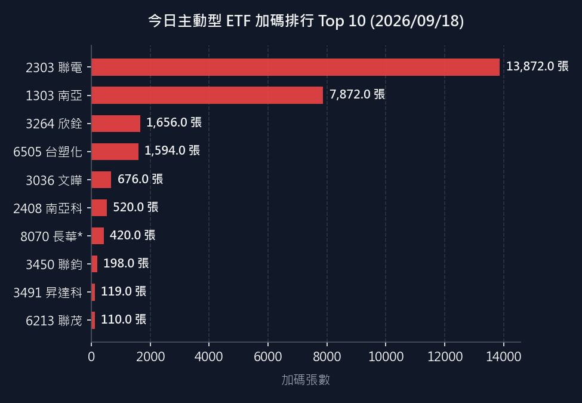
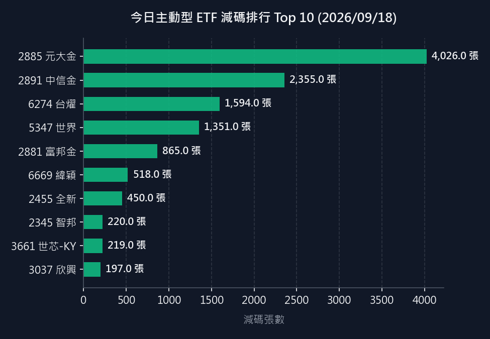

# 主動型 ETF 持股變動

資料來源：`主動型ETF持股明細.xlsx` 最近兩個日期分頁。

比較區間：`20260917` → `20260918`

## 今日加減碼視覺化排行

| 今日加碼 Top 10 | 今日減碼 Top 10 |
| :---: | :---: |
|  |  |

| ETF | 新增 | 刪除 | 比例變動 |
| :-- | --: | --: | --: |
| 00400A | 2 | 4 | 40 |
| 00401A | 1 | 1 | 44 |
| 00402A | 1 | 0 | 41 |
| 00403A | 0 | 0 | 35 |
| 00404A | 0 | 0 | 46 |
| 00405A | 0 | 0 | 33 |
| 00407A | 0 | 0 | 40 |
| 00408A | 0 | 0 | 0 |
| 00980A | 0 | 0 | 45 |
| 00980D | 0 | 0 | 28 |
| 00981A | 0 | 0 | 22 |
| 00982A | 0 | 0 | 39 |
| 00983A | 0 | 0 | 37 |
| 00983D | 0 | 0 | 42 |
| 00984A | 0 | 0 | 70 |
| 00985A | 0 | 0 | 44 |
| 00986A | 0 | 0 | 32 |
| 00987A | 0 | 0 | 26 |
| 00988A | 0 | 1 | 41 |
| 00989A | 0 | 0 | 56 |
| 00990A | 1 | 0 | 43 |
| 00991A | 1 | 1 | 20 |
| 00992A | 0 | 1 | 35 |
| 00993A | 0 | 0 | 47 |
| 00994A | 2 | 1 | 33 |
| 00995A | 0 | 0 | 40 |
| 00996A | 0 | 0 | 40 |
| 00997A | 7 | 5 | 43 |
| 00998A | 1 | 0 | 44 |
| 00999A | 0 | 0 | 46 |

## 00400A

### 新增持股

- 台指選擇權 -25（0.00%，50 張）
- 台指選擇權 -71（0.00%，48 張）

### 刪除持股

- 5347 世界（0.77%，1351 張）
- 6274 台燿（0.89%，175 張）
- 6515 穎崴（0.47%，21 張）
- 台指選擇權 -17（0.00%，48 張）

### 投資比例變動

- 1303 南亞：1.50% → 2.51%（+1.01）
- 2059 川湖：5.34% → 5.33%（-0.01）
- 2303 聯電：1.07% → 1.13%（+0.06）
- 2308 台達電：3.24% → 3.16%（-0.08）
- 2313 華通：0.90% → 0.88%（-0.02）
- 2317 鴻海：0.86% → 0.83%（-0.03）
- 2330 台積電：8.87% → 8.82%（-0.05）
- 2345 智邦：1.51% → 1.46%（-0.05）
- 2360 致茂：3.54% → 3.73%（+0.19）
- 2368 金像電：1.35% → 1.34%（-0.01）
- 2383 台光電：4.16% → 3.85%（-0.31）
- 2449 京元電子：0.94% → 1.01%（+0.07）
- 2454 聯發科：7.67% → 7.68%（+0.01）
- 2603 長榮：1.01% → 0.98%（-0.03）
- 2637 慧洋-KY：0.31% → 0.30%（-0.01）
- 2881 富邦金：1.71% → 1.62%（-0.09）
- 2885 元大金：1.57% → 0.54%（-1.03）
- 3017 奇鋐：4.31% → 4.48%（+0.17）
- 3036 文曄：1.05% → 1.57%（+0.52）
- 3037 欣興：4.19% → 4.11%（-0.08）
- 3044 健鼎：1.88% → 1.86%（-0.02）
- 3081 聯亞：0.83% → 0.82%（-0.01）
- 3090 日電貿：0.35% → 0.34%（-0.01）
- 3167 大量：0.34% → 0.33%（-0.01）
- 3443 創意：4.22% → 4.71%（+0.49）
- 3529 力旺：1.19% → 1.20%（+0.01）
- 3653 健策：4.17% → 4.23%（+0.06）
- 3665 貿聯-KY：1.73% → 1.85%（+0.12）
- 3711 日月光投控：1.01% → 1.03%（+0.02）
- 5274 信驊：3.12% → 3.17%（+0.05）
- 5434 崇越：0.39% → 0.37%（-0.02）
- 6121 新普：0.24% → 0.23%（-0.01）
- 6187 萬潤：2.62% → 2.58%（-0.04）
- 6223 旺矽：4.80% → 4.79%（-0.01）
- 6271 同欣電：0.28% → 0.27%（-0.01）
- 6442 光聖：0.93% → 0.89%（-0.04）
- 6488 環球晶：2.10% → 2.04%（-0.06）
- 6505 台塑化：0.96% → 1.47%（+0.51）
- 6669 緯穎：3.98% → 3.79%（-0.19）
- 7769 鴻勁：0.44% → 0.45%（+0.01）

## 00401A

### 新增持股

- TAIWAN TAIE C 21OCT26 46400 TWSE（-0.57%，-0.32 張）

### 刪除持股

- 臺指選擇權09/26 44500 買權（-0.56%，-0.32 張）

### 投資比例變動

- 1303 南亞：0.90% → 0.94%（+0.04）
- 1477 聚陽：0.84% → 0.85%（+0.01）
- 2059 川湖：0.98% → 1.00%（+0.02）
- 2303 聯電：1.68% → 1.74%（+0.06）
- 2308 台達電：2.36% → 2.31%（-0.05）
- 2313 華通：1.56% → 1.51%（-0.05）
- 2327 國巨*：0.59% → 0.58%（-0.01）
- 2330 台積電：19.75% → 20.02%（+0.27）
- 2345 智邦：1.75% → 1.70%（-0.05）
- 2357 華碩：1.76% → 1.77%（+0.01）
- 2360 致茂：1.62% → 1.61%（-0.01）
- 2379 瑞昱：1.01% → 1.00%（-0.01）
- 2382 廣達：2.19% → 2.20%（+0.01）
- 2383 台光電：0.77% → 0.71%（-0.06）
- 2454 聯發科：6.32% → 6.25%（-0.07）
- 2455 全新：2.26% → 2.33%（+0.07）
- 2603 長榮：1.02% → 1.03%（+0.01）
- 2881 富邦金：2.01% → 1.98%（-0.03）
- 2882 國泰金：1.04% → 1.03%（-0.01）
- 2883 凱基金：1.69% → 1.70%（+0.01）
- 2884 玉山金：1.97% → 1.99%（+0.02）
- 2886 兆豐金：1.35% → 1.37%（+0.02）
- 2887 台新新光金：1.13% → 1.12%（-0.01）
- 3008 大立光：2.25% → 2.16%（-0.09）
- 3037 欣興：1.96% → 1.91%（-0.05）
- 3131 弘塑：0.69% → 0.71%（+0.02）
- 3231 緯創：1.63% → 1.66%（+0.03）
- 3491 昇達科：1.65% → 1.70%（+0.05）
- 3711 日月光投控：2.25% → 2.27%（+0.02）
- 4958 臻鼎-KY：1.28% → 1.23%（-0.05）
- 5274 信驊：2.00% → 1.99%（-0.01）
- 5347 世界：1.21% → 1.26%（+0.05）
- 5904 寶雅*：0.55% → 0.54%（-0.01）
- 6147 頎邦：1.14% → 1.15%（+0.01）
- 6187 萬潤：0.64% → 0.63%（-0.01）
- 6223 旺矽：1.72% → 1.68%（-0.04）
- 6285 啟碁：1.23% → 1.27%（+0.04）
- 6515 穎崴：1.84% → 1.80%（-0.04）
- 6531 愛普*：1.39% → 1.34%（-0.05）
- 6669 緯穎：1.92% → 1.88%（-0.04）
- 7769 鴻勁：1.62% → 1.61%（-0.01）
- 7828 創新服務：1.90% → 1.82%（-0.08）
- 8464 億豐：1.01% → 1.00%（-0.01）
- 台股期貨10/26(FITXN*1.TF)：0.01% → 0.07%（+0.06）

## 00402A

### 新增持股

- ARM.US Arm（0.75%，6 張）

### 刪除持股

- 無

### 投資比例變動

- AAPL.US Apple：8.02% → 7.98%（-0.04）
- ADI.US Analog Devices：1.87% → 1.83%（-0.04）
- AMD.US AMD：5.33% → 5.56%（+0.23）
- AMZN.US Amazon：4.50% → 4.51%（+0.01）
- AXON.US Axon Enterprise：0.90% → 0.86%（-0.04）
- BABA.US Alibaba Group：0.54% → 0.53%（-0.01）
- BKNG.US Booking Holdings：0.83% → 0.81%（-0.02）
- CDNS.US Cadence Design Systems：1.29% → 1.27%（-0.02）
- CIEN.US Ciena：1.20% → 1.19%（-0.01）
- COHR.US Coherent：1.63% → 1.64%（+0.01）
- DASH.US DoorDash：0.52% → 0.51%（-0.01）
- GOOG.US Alphabet - Class C Capital Stock：3.24% → 3.22%（-0.02）
- GOOGL.US Alphabet - Class A Common Stock：3.68% → 3.66%（-0.02）
- INTC.US Intel：1.91% → 1.35%（-0.56）
- IOT.US Samsara：0.56% → 0.54%（-0.02）
- KLAC.US KLA：1.49% → 1.48%（-0.01）
- LITE.US Lumentum：1.73% → 1.65%（-0.08）
- LRCX.US Lam Research：2.49% → 2.44%（-0.05）
- MDB.US MongoDB：0.45% → 0.46%（+0.01）
- META.US Meta：3.40% → 3.38%（-0.02）
- MRVL.US Marvell：1.28% → 1.32%（+0.04）
- MSFT.US Microsoft：5.29% → 5.27%（-0.02）
- MU.US Micron：6.20% → 6.42%（+0.22）
- NFLX.US Netflix：0.89% → 0.86%（-0.03）
- NOW.US ServiceNow：0.87% → 0.84%（-0.03）
- NVDA.US NVIDIA：8.55% → 8.59%（+0.04）
- PANW.US Palo Alto：2.82% → 2.76%（-0.06）
- PLTR.US Palantir Technologies：1.80% → 1.79%（-0.01）
- SHOP.US Shopify：0.83% → 0.81%（-0.02）
- SIMO.US Silicon Motion：0.77% → 0.79%（+0.02）
- SKHY.US SK hynix：1.08% → 1.11%（+0.03）
- SPCX.US SpaceX：0.82% → 0.83%（+0.01）
- SPOT.US Spotify：0.55% → 0.52%（-0.03）
- STX.US Seagate：1.28% → 1.29%（+0.01）
- TER.US Teradyne：0.84% → 0.85%（+0.01）
- TSM.US TSMC(ADR)：1.51% → 1.52%（+0.01）
- TTWO.US Take-Two：0.69% → 0.68%（-0.01）
- TXN.US Texas Instruments：2.23% → 2.17%（-0.06）
- UBER.US Uber：0.49% → 0.48%（-0.01）
- V.US Visa：1.30% → 1.28%（-0.02）
- WDC.US Western Digital：2.13% → 2.12%（-0.01）

## 00403A

### 新增持股

- 無

### 刪除持股

- 無

### 投資比例變動

- 1303 南亞：2.01% → 2.13%（+0.12）
- 1560 中砂：0.09% → 0.10%（+0.01）
- 2059 川湖：0.36% → 0.45%（+0.09）
- 2303 聯電：5.20% → 5.71%（+0.51）
- 2308 台達電：3.13% → 3.09%（-0.04）
- 2327 國巨*：2.85% → 2.82%（-0.03）
- 2330 台積電：15.52% → 15.86%（+0.34）
- 2345 智邦：2.82% → 2.77%（-0.05）
- 2383 台光電：5.41% → 5.01%（-0.40）
- 2408 南亞科：0.25% → 0.39%（+0.14）
- 2449 京元電子：0.45% → 0.46%（+0.01）
- 2454 聯發科：6.66% → 6.64%（-0.02）
- 2455 全新：0.13% → 0.14%（+0.01）
- 2481 強茂：0.34% → 0.33%（-0.01）
- 3008 大立光：1.57% → 1.12%（-0.45）
- 3017 奇鋐：6.02% → 6.06%（+0.04）
- 3037 欣興：5.41% → 5.31%（-0.10）
- 3189 景碩：2.10% → 2.07%（-0.03）
- 3211 順達：0.49% → 0.48%（-0.01）
- 3264 欣銓：0.10% → 0.11%（+0.01）
- 3443 創意：2.55% → 2.69%（+0.14）
- 3450 聯鈞：0.40% → 0.46%（+0.06）
- 3533 嘉澤：0.16% → 0.12%（-0.04）
- 3583 辛耘：0.36% → 0.37%（+0.01）
- 3653 健策：3.89% → 3.98%（+0.09）
- 3665 貿聯-KY：1.72% → 1.73%（+0.01）
- 3711 日月光投控：0.40% → 0.41%（+0.01）
- 5274 信驊：1.46% → 1.47%（+0.01）
- 6223 旺矽：4.10% → 4.04%（-0.06）
- 6274 台燿：1.79% → 1.67%（-0.12）
- 6442 光聖：0.37% → 0.35%（-0.02）
- 6488 環球晶：1.75% → 1.70%（-0.05）
- 6669 緯穎：2.86% → 2.83%（-0.03）
- 6805 富世達：1.03% → 1.06%（+0.03）
- 8046 南電：2.04% → 1.97%（-0.07）

## 00404A

### 新增持股

- 無

### 刪除持股

- 無

### 投資比例變動

- 1303 南亞：0.77% → 0.76%（-0.01）
- 2027 大成鋼：1.63% → 1.57%（-0.06）
- 2059 川湖：1.14% → 1.15%（+0.01）
- 2301 光寶科：0.26% → 0.25%（-0.01）
- 2303 聯電：2.29% → 2.22%（-0.07）
- 2308 台達電：1.90% → 1.86%（-0.04）
- 2330 台積電：22.88% → 22.72%（-0.16）
- 2345 智邦：0.83% → 0.80%（-0.03）
- 2347 聯強：1.84% → 1.81%（-0.03）
- 2357 華碩：0.93% → 0.89%（-0.04）
- 2379 瑞昱：1.06% → 1.04%（-0.02）
- 2382 廣達：2.14% → 2.15%（+0.01）
- 2383 台光電：2.89% → 2.65%（-0.24）
- 2395 研華：1.27% → 1.24%（-0.03）
- 2436 偉詮電：1.14% → 1.10%（-0.04）
- 2454 聯發科：7.24% → 6.92%（-0.32）
- 2542 興富發：1.86% → 1.84%（-0.02）
- 2637 慧洋-KY：1.25% → 1.17%（-0.08）
- 2883 凱基金：1.20% → 1.21%（+0.01）
- 2885 元大金：2.48% → 2.44%（-0.04）
- 2887 台新新光金：1.48% → 1.46%（-0.02）
- 2890 永豐金：1.49% → 1.50%（+0.01）
- 2892 第一金：1.93% → 1.95%（+0.02）
- 3017 奇鋐：1.35% → 1.27%（-0.08）
- 3034 聯詠：2.13% → 2.05%（-0.08）
- 3037 欣興：0.23% → 0.22%（-0.01）
- 3260 威剛：1.34% → 1.28%（-0.06）
- 3264 欣銓：0.43% → 0.47%（+0.04）
- 3293 鈊象：0.47% → 0.48%（+0.01）
- 3443 創意：0.73% → 0.76%（+0.03）
- 3680 家登：0.46% → 0.47%（+0.01）
- 3711 日月光投控：3.58% → 3.46%（-0.12）
- 4763 材料*-KY：1.57% → 1.66%（+0.09）
- 5274 信驊：2.78% → 2.76%（-0.02）
- 5434 崇越：1.81% → 1.77%（-0.04）
- 5904 寶雅*：0.48% → 0.47%（-0.01）
- 6196 帆宣：1.81% → 1.78%（-0.03）
- 6206 飛捷：1.03% → 1.04%（+0.01）
- 6223 旺矽：1.26% → 1.23%（-0.03）
- 6515 穎崴：0.15% → 0.14%（-0.01）
- 7769 鴻勁：1.31% → 1.15%（-0.16）
- 8016 矽創：1.18% → 1.16%（-0.02）
- 8081 致新：0.84% → 0.82%（-0.02）
- 8299 群聯：1.17% → 1.16%（-0.01）
- 台指選擇權10/26 49500 買權：-0.08% → -0.09%（-0.01）
- 台股期貨10/26(FITXN*1.TF)：15.05% → 15.06%（+0.01）

## 00405A

### 新增持股

- 無

### 刪除持股

- 無

### 投資比例變動

- 2059 川湖：1.99% → 1.92%（-0.07）
- 2303 聯電：1.01% → 1.02%（+0.01）
- 2308 台達電：0.61% → 0.60%（-0.01）
- 2330 台積電：1.67% → 1.61%（-0.06）
- 2345 智邦：3.67% → 3.60%（-0.07）
- 2368 金像電：4.12% → 4.21%（+0.09）
- 2383 台光電：3.83% → 3.80%（-0.03）
- 2449 京元電子：0.04% → 0.05%（+0.01）
- 2454 聯發科：8.32% → 8.28%（-0.04）
- 3017 奇鋐：4.64% → 4.75%（+0.11）
- 3037 欣興：6.23% → 6.18%（-0.05）
- 3443 創意：9.11% → 9.54%（+0.43）
- 3450 聯鈞：1.31% → 1.28%（-0.03）
- 3653 健策：5.36% → 5.26%（-0.10）
- 3665 貿聯-KY：5.15% → 5.38%（+0.23）
- 4749 新應材：0.27% → 0.26%（-0.01）
- 4991 環宇-KY：1.99% → 2.08%（+0.09）
- 5274 信驊：3.82% → 3.84%（+0.02）
- 6187 萬潤：0.92% → 0.91%（-0.01）
- 6223 旺矽：6.84% → 6.86%（+0.02）
- 6274 台燿：1.56% → 1.54%（-0.02）
- 6278 台表科：0.99% → 1.01%（+0.02）
- 6285 啟碁：0.35% → 0.33%（-0.02）
- 6488 環球晶：0.39% → 0.38%（-0.01）
- 6510 精測：3.02% → 3.16%（+0.14）
- 6526 達發：0.35% → 0.37%（+0.02）
- 6669 緯穎：0.82% → 0.78%（-0.04）
- 6805 富世達：2.18% → 2.28%（+0.10）
- 6831 邁科：0.51% → 0.49%（-0.02）
- 7734 印能科技：1.49% → 1.47%（-0.02）
- 7769 鴻勁：2.84% → 2.88%（+0.04）
- 8046 南電：3.03% → 2.98%（-0.05）
- 8996 高力：1.41% → 1.48%（+0.07）

## 00407A

### 新增持股

- 無

### 刪除持股

- 無

### 投資比例變動

- 1303 南亞：0.78% → 0.76%（-0.02）
- 1560 中砂：0.94% → 1.00%（+0.06）
- 2059 川湖：2.87% → 2.81%（-0.06）
- 2301 光寶科：1.53% → 1.50%（-0.03）
- 2303 聯電：0.62% → 0.63%（+0.01）
- 2308 台達電：2.59% → 2.57%（-0.02）
- 2330 台積電：9.56% → 9.33%（-0.23）
- 2344 華邦電：0.14% → 0.15%（+0.01）
- 2345 智邦：2.62% → 2.60%（-0.02）
- 2360 致茂：1.79% → 1.90%（+0.11）
- 2368 金像電：0.52% → 0.53%（+0.01）
- 2383 台光電：5.02% → 5.03%（+0.01）
- 2408 南亞科：0.99% → 1.02%（+0.03）
- 2454 聯發科：5.75% → 5.79%（+0.04）
- 2615 萬海：0.77% → 0.74%（-0.03）
- 3008 大立光：1.51% → 1.55%（+0.04）
- 3017 奇鋐：5.68% → 5.89%（+0.21）
- 3034 聯詠：0.78% → 0.77%（-0.01）
- 3037 欣興：4.90% → 4.92%（+0.02）
- 3081 聯亞：1.48% → 1.50%（+0.02）
- 3131 弘塑：0.91% → 0.89%（-0.02）
- 3231 緯創：0.78% → 0.75%（-0.03）
- 3260 威剛：0.31% → 0.30%（-0.01）
- 3293 鈊象：0.59% → 0.57%（-0.02）
- 3443 創意：4.21% → 4.45%（+0.24）
- 3491 昇達科：0.95% → 0.97%（+0.02）
- 3529 力旺：0.61% → 0.62%（+0.01）
- 3653 健策：2.97% → 2.95%（-0.02）
- 3665 貿聯-KY：2.06% → 2.18%（+0.12）
- 4958 臻鼎-KY：0.95% → 0.91%（-0.04）
- 5274 信驊：2.51% → 2.55%（+0.04）
- 5434 崇越：0.21% → 0.20%（-0.01）
- 6223 旺矽：3.01% → 3.05%（+0.04）
- 6446 藥華藥：0.33% → 0.32%（-0.01）
- 6510 精測：1.46% → 1.54%（+0.08）
- 6669 緯穎：3.76% → 3.63%（-0.13）
- 6805 富世達：1.96% → 2.08%（+0.12）
- 8046 南電：1.72% → 1.71%（-0.01）
- 8299 群聯：0.32% → 0.34%（+0.02）
- 8996 高力：1.90% → 2.02%（+0.12）

## 00408A

### 新增持股

- 無

### 刪除持股

- 無

### 投資比例變動

- 無

## 00980A

### 新增持股

- 無

### 刪除持股

- 無

### 投資比例變動

- 1303 南亞：2.85% → 3.01%（+0.16）
- 2059 川湖：4.25% → 4.35%（+0.10）
- 2308 台達電：3.64% → 3.59%（-0.05）
- 2317 鴻海：2.51% → 2.54%（+0.03）
- 2327 國巨*：1.37% → 1.35%（-0.02）
- 2330 台積電：9.43% → 9.63%（+0.20）
- 2344 華邦電：2.04% → 2.06%（+0.02）
- 2345 智邦：1.68% → 1.65%（-0.03）
- 2368 金像電：2.05% → 1.97%（-0.08）
- 2376 技嘉：1.28% → 1.30%（+0.02）
- 2382 廣達：1.77% → 1.79%（+0.02）
- 2383 台光電：3.64% → 3.37%（-0.27）
- 2408 南亞科：2.84% → 2.82%（-0.02）
- 2454 聯發科：5.94% → 5.91%（-0.03）
- 2884 玉山金：1.55% → 1.58%（+0.03）
- 2891 中信金：1.38% → 1.39%（+0.01）
- 3008 大立光：0.85% → 0.83%（-0.02）
- 3017 奇鋐：2.24% → 2.25%（+0.01）
- 3026 禾伸堂：1.16% → 1.15%（-0.01）
- 3036 文曄：1.15% → 1.23%（+0.08）
- 3037 欣興：2.99% → 2.93%（-0.06）
- 3044 健鼎：0.92% → 0.91%（-0.01）
- 3081 聯亞：1.90% → 1.85%（-0.05）
- 3189 景碩：1.39% → 1.37%（-0.02）
- 3231 緯創：1.25% → 1.28%（+0.03）
- 3264 欣銓：0.76% → 0.84%（+0.08）
- 3293 鈊象：0.94% → 0.96%（+0.02）
- 3443 創意：1.92% → 2.02%（+0.10）
- 3533 嘉澤：0.28% → 0.29%（+0.01）
- 3653 健策：1.90% → 1.95%（+0.05）
- 3711 日月光投控：1.98% → 2.01%（+0.03）
- 4958 臻鼎-KY：0.78% → 0.76%（-0.02）
- 5274 信驊：1.95% → 1.96%（+0.01）
- 5904 寶雅*：1.21% → 1.20%（-0.01）
- 6213 聯茂：1.40% → 1.26%（-0.14）
- 6223 旺矽：1.95% → 1.91%（-0.04）
- 6274 台燿：1.79% → 1.67%（-0.12）
- 6442 光聖：0.31% → 0.30%（-0.01）
- 6515 穎崴：1.80% → 1.78%（-0.02）
- 6669 緯穎：1.77% → 1.75%（-0.02）
- 6805 富世達：0.58% → 0.60%（+0.02）
- 7769 鴻勁：2.35% → 2.36%（+0.01）
- 8046 南電：1.46% → 1.41%（-0.05）
- 8210 勤誠：0.44% → 0.45%（+0.01）
- 台灣證交所加權股價指數(FITXN*1.TF)：3.01% → 3.04%（+0.03）

## 00980D

### 新增持股

- 無

### 刪除持股

- 無

### 投資比例變動

- AHOLD FINANCE USA LLC 6.88% 01MAY2029：0.49% → 0.48%（-0.01）
- ALLY FINANCIAL INC (REG) VAR 03JAN2030：0.64% → 0.63%（-0.01）
- AMC GLOBAL MEDIA INC SER REGS (REG) (REG S) 10.5% 15JUL2032：0.73% → 0.72%（-0.01）
- APA CORP 6.750000 % 15-FEB-2055：0.37% → 0.38%（+0.01）
- BAYER US FINANCE LLC SER REGS 6.875000 % 21NOV2053：0.35% → 0.36%（+0.01）
- CALDERYS FINANCING LLC SER REGS (REG S) 11.25% 01JUN2028：0.34% → 0.33%（-0.01）
- CHARTER COMM OPT LLC/CAP 6.700000 % 01-DEC-2055：0.46% → 0.47%（+0.01）
- CHS/COMMUNITY HEALTH SYS SER REGS 9.750000 % 15JAN2034：0.34% → 0.33%（-0.01）
- CONOCOPHILLIPS COMPANY (REG) 6.95% 15APR2029：0.52% → 0.51%（-0.01）
- DOW CHEMICAL CO/THE 6.9% 15MAY2053：0.61% → 0.62%（+0.01）
- DOW CHEMICAL CO/THE 7.375% 01NOV2029：0.62% → 0.61%（-0.01）
- FORD MOTOR CREDIT CO LLC (REG) 7.35% 04NOV2027：0.34% → 0.33%（-0.01）
- GENERAL MOTORS CO (REG) 6.8% 01OCT2027：0.57% → 0.56%（-0.01）
- GEORGIA-PACIFIC LLC (REG) 7.75% 15NOV2029：0.58% → 0.57%（-0.01）
- GLOBAL ATLANTIC FIN CO SER REGS 6.750000 % 15MAR2054：0.63% → 0.64%（+0.01）
- HERTZ CORP/THE SER REGS (REG S) 12.625% 15JUL2029：0.29% → 0.30%（+0.01）
- HISCOX LTD VAR 11JUN2036：0.44% → 0.43%（-0.01）
- JBS USA HOLD/FOOD/LUX CO 7.250000 % 15NOV2053：0.47% → 0.48%（+0.01）
- M&T BANK CORPORATION (REG) VAR 30OCT2029：0.55% → 0.54%（-0.01）
- NAVIENT CORP (REG) 11.5% 15MAR2031：0.33% → 0.32%（-0.01）
- NISSAN MOTOR CO SER REGS 8.125000 % 17JUL2035：0.53% → 0.52%（-0.01）
- ORACLE CORP 6.125000 % 03AUG2065：0.57% → 0.58%（+0.01）
- SEAGATE DATA STOR SER * 9.625 % 01-DEC-2032：0.57% → 0.56%（-0.01）
- TELEFONICA EUROPE BV (REG) 8.25% 15SEP2030：0.42% → 0.41%（-0.01）
- US 10YR NOTE (CBT)DEC26 21-DEC-2026：17.89% → 17.86%（-0.03）
- US 2YR NOTE (CBT) DEC26 31-DEC-2026：1.66% → 1.65%（-0.01）
- US 5YR NOTE (CBT) DEC26 31-DEC-2026：-13.73% → -13.69%（+0.04）
- US LONG BOND(CBT) DEC26 21-DEC-2026：5.38% → 5.39%（+0.01）

## 00981A

### 新增持股

- 無

### 刪除持股

- 無

### 投資比例變動

- 2303 聯電：4.69% → 4.88%（+0.19）
- 2308 台達電：4.59% → 4.53%（-0.06）
- 2327 國巨*：4.96% → 4.91%（-0.05）
- 2330 台積電：10.47% → 10.68%（+0.21）
- 2345 智邦：4.41% → 4.32%（-0.09）
- 2383 台光電：8.95% → 8.28%（-0.67）
- 2449 京元電子：1.24% → 1.26%（+0.02）
- 2454 聯發科：8.71% → 8.67%（-0.04）
- 3017 奇鋐：7.00% → 7.04%（+0.04）
- 3037 欣興：7.23% → 7.09%（-0.14）
- 3264 欣銓：0.42% → 0.60%（+0.18）
- 3443 創意：0.94% → 1.00%（+0.06）
- 3653 健策：4.88% → 5.00%（+0.12）
- 3665 貿聯-KY：3.17% → 3.20%（+0.03）
- 3711 日月光投控：3.77% → 3.83%（+0.06）
- 4958 臻鼎-KY：0.50% → 0.48%（-0.02）
- 6223 旺矽：5.28% → 5.20%（-0.08）
- 6274 台燿：2.83% → 2.65%（-0.18）
- 6669 緯穎：5.21% → 5.02%（-0.19）
- 6805 富世達：1.31% → 1.34%（+0.03）
- 8046 南電：3.86% → 3.73%（-0.13）
- 台指期貨 2026/10(FITXN*1.TF)：2.32% → 2.34%（+0.02）

## 00982A

### 新增持股

- 無

### 刪除持股

- 無

### 投資比例變動

- 2059 川湖：4.40% → 4.52%（+0.12）
- 2301 光寶科：1.82% → 1.83%（+0.01）
- 2303 聯電：1.48% → 1.55%（+0.07）
- 2330 台積電：8.66% → 8.88%（+0.22）
- 2345 智邦：2.32% → 2.28%（-0.04）
- 2360 致茂：3.48% → 3.49%（+0.01）
- 2376 技嘉：1.24% → 1.27%（+0.03）
- 2383 台光電：3.21% → 2.98%（-0.23）
- 2395 研華：2.05% → 2.04%（-0.01）
- 2428 興勤：1.18% → 1.19%（+0.01）
- 2454 聯發科：6.77% → 6.76%（-0.01）
- 2455 全新：1.61% → 1.67%（+0.06）
- 2467 志聖：1.05% → 1.06%（+0.01）
- 2478 大毅：1.06% → 1.05%（-0.01）
- 3008 大立光：3.18% → 3.10%（-0.08）
- 3017 奇鋐：2.40% → 2.42%（+0.02）
- 3090 日電貿：1.10% → 1.08%（-0.02）
- 3105 穩懋：5.47% → 5.49%（+0.02）
- 3231 緯創：1.36% → 1.39%（+0.03）
- 3265 台星科：1.11% → 1.15%（+0.04）
- 3491 昇達科：3.45% → 3.58%（+0.13）
- 3583 辛耘：1.08% → 1.11%（+0.03）
- 3617 碩天：0.28% → 0.31%（+0.03）
- 3711 日月光投控：1.11% → 1.13%（+0.02）
- 4958 臻鼎-KY：3.16% → 3.07%（-0.09）
- 5274 信驊：1.33% → 1.34%（+0.01）
- 5425 台半：1.23% → 1.21%（-0.02）
- 6139 亞翔：5.34% → 5.28%（-0.06）
- 6213 聯茂：0.19% → 0.28%（+0.09）
- 6214 精誠：1.34% → 1.36%（+0.02）
- 6223 旺矽：3.49% → 3.44%（-0.05）
- 6239 力成：1.06% → 1.07%（+0.01）
- 6274 台燿：1.21% → 1.13%（-0.08）
- 6472 保瑞：0.86% → 0.89%（+0.03）
- 6488 環球晶：2.07% → 2.03%（-0.04）
- 6531 愛普*：3.93% → 3.83%（-0.10）
- 6669 緯穎：4.99% → 4.95%（-0.04）
- 6672 騰輝電子-KY：0.33% → 0.32%（-0.01）
- 8070 長華*：0.28% → 0.33%（+0.05）

## 00983A

### 新增持股

- 無

### 刪除持股

- 無

### 投資比例變動

- ACHR.US Archer：0.73% → 0.69%（-0.04）
- AMD.US AMD：3.07% → 3.17%（+0.10）
- AMZN.US Amazon：2.52% → 2.43%（-0.09）
- AVGO.US Broadcom：0.90% → 0.88%（-0.02）
- BEAM.US Beam Therapeutics：1.50% → 1.40%（-0.10）
- BLSH.US Bullish：2.25% → 2.11%（-0.14）
- BMNR.US BitMine：2.11% → 2.04%（-0.07）
- COIN.US Coinbase：4.17% → 4.02%（-0.15）
- CRCL.US Circle：4.92% → 4.63%（-0.29）
- CRSP.US CRISPR Therapeutics：3.81% → 3.90%（+0.09）
- CRWV.US CoreWeave：1.16% → 1.10%（-0.06）
- DE.US Deere：1.01% → 0.97%（-0.04）
- GOOG.US Alphabet - Class C Capital Stock：1.48% → 1.42%（-0.06）
- GOOGL.US Alphabet - Class A Common Stock：0.83% → 0.79%（-0.04）
- HOOD.US Robinhood Markets：4.60% → 4.36%（-0.24）
- ILMN.US Illumina：1.84% → 1.82%（-0.02）
- KTOS.US Kratos Defense & Security：0.76% → 0.73%（-0.03）
- LLY.US Eli Lilly：1.08% → 1.04%（-0.04）
- META.US Meta：0.70% → 0.68%（-0.02）
- NET.US Cloudflare：1.08% → 1.17%（+0.09）
- NTLA.US Intellia Therapeutics：1.05% → 1.03%（-0.02）
- NTRA.US Natera：2.22% → 2.09%（-0.13）
- NVDA.US NVIDIA：2.29% → 2.25%（-0.04）
- PLTR.US Palantir Technologies：3.62% → 3.53%（-0.09）
- RXRX.US Recursion Pharmaceuticals：0.36% → 0.37%（+0.01）
- SHOP.US Shopify：4.38% → 3.94%（-0.44）
- SOFI.US SoFi Technologies：0.46% → 0.43%（-0.03）
- SPCX.US SpaceX：5.97% → 6.14%（+0.17）
- TEM.US Tempus：6.26% → 6.79%（+0.53）
- TSLA.US Tesla：8.96% → 8.72%（-0.24）
- TSM.US TSMC(ADR)：2.39% → 2.37%（-0.02）
- TWST.US Twist Bioscience：4.92% → 5.14%（+0.22）
- TXG.US 10x Genomics：5.43% → 4.85%（-0.58）
- VCYT.US Veracyte：0.20% → 0.14%（-0.06）
- WGS.US GeneDx：1.54% → 1.63%（+0.09）
- XE.US X-Energy：0.74% → 0.77%（+0.03）
- XYZ.US Block：1.82% → 1.69%（-0.13）

## 00983D

### 新增持股

- 無

### 刪除持股

- 無

### 投資比例變動

- ABIBB 8.2 01/15/39：1.90% → 1.92%（+0.02）
- ATH 6 5/8 05/19/55：0.98% → 0.99%（+0.01）
- BACR 7.437 11/02/33：1.24% → 1.25%（+0.01）
- BATSLN 7.079 08/02/43：1.06% → 1.07%（+0.01）
- BATSLN 7.081 08/02/53：1.30% → 1.31%（+0.01）
- BRKHEC 6 3/4 07/01/37：0.79% → 0.80%（+0.01）
- C 8 1/8 07/15/39：1.89% → 1.90%（+0.01）
- CEG 6 1/2 10/01/53：0.76% → 0.77%（+0.01）
- DELL 8.1 07/15/36：1.49% → 1.50%（+0.01）
- DELL 8.35 07/15/46：1.37% → 1.39%（+0.02）
- DIS 7 3/4 12/01/45：0.59% → 0.60%（+0.01）
- DOW 6.9 05/15/53：0.74% → 0.75%（+0.01）
- DOW 9.4 05/15/39：1.90% → 1.92%（+0.02）
- ENBCN 6.7 11/15/53：1.10% → 1.12%（+0.02）
- FFHCN 6.35 03/22/54：0.69% → 0.70%（+0.01）
- GE 6 7/8 01/10/39：0.82% → 0.83%（+0.01）
- GM 6 3/4 04/01/46：1.16% → 1.17%（+0.01）
- GS 6 1/4 02/01/41：0.31% → 0.32%（+0.01）
- HAL 7.45 09/15/39：1.78% → 1.79%（+0.01）
- HPE 6.35 10/15/45：0.97% → 0.99%（+0.02）
- HSBC 6.332 03/09/44：1.04% → 1.05%（+0.01）
- IEP 10 11/15/29：1.49% → 1.50%（+0.01）
- KHC 6 7/8 01/26/39：0.98% → 0.99%（+0.01）
- KMI 6.95 01/15/38：1.04% → 1.05%（+0.01）
- LOW 6.65 09/15/37：0.82% → 0.83%（+0.01）
- LQDW.US iShares Investment Grade Corpora：7.14% → 7.20%（+0.06）
- MBGGR 8 1/2 01/18/31：1.28% → 1.29%（+0.01）
- MCD 6.3 03/01/38：0.71% → 0.72%（+0.01）
- NVDA 5.55 06/15/46：1.14% → 1.15%（+0.01）
- OKE 6 5/8 09/01/53：0.70% → 0.71%（+0.01）
- ORCL 6.9 11/09/52：0.84% → 0.85%（+0.01）
- PCG 6 3/4 01/15/53：1.11% → 1.12%（+0.01）
- PCG 6.7 04/01/53：1.07% → 1.09%（+0.02）
- PDM 9 1/4 07/20/28：1.17% → 1.16%（-0.01）
- PFE 7.2 03/15/39：1.39% → 1.40%（+0.01）
- SJM 6 1/2 11/15/53：0.19% → 0.20%（+0.01）
- SPCX 6.6 07/15/46：1.11% → 1.13%（+0.02）
- SUCN 6.85 06/01/39：1.19% → 1.20%（+0.01）
- TELEFONICA EMISIONES SAU 7.045 06/20/36：1.52% → 1.53%（+0.01）
- TLTW.US iShares 20+ Year Treasury Bond B：7.80% → 7.89%（+0.09）
- TRPCN 7 5/8 01/15/39：1.64% → 1.65%（+0.01）
- UNITEDHEALTH GROUP INC 6.875 02/15/38：0.84% → 0.85%（+0.01）

## 00984A

### 新增持股

- 無

### 刪除持股

- 無

### 投資比例變動

- 1102 亞泥：1.74% → 1.75%（+0.01）
- 1229 聯華：0.64% → 0.65%（+0.01）
- 1303 南亞：2.48% → 2.60%（+0.12）
- 1326 台化：0.64% → 0.67%（+0.03）
- 1402 遠東新：1.90% → 1.94%（+0.04）
- 1409 新纖：0.68% → 0.70%（+0.02）
- 1560 中砂：0.42% → 0.46%（+0.04）
- 1808 潤隆：0.36% → 0.37%（+0.01）
- 1907 永豐餘：0.35% → 0.36%（+0.01）
- 2006 東和鋼鐵：1.24% → 1.25%（+0.01）
- 2059 川湖：2.51% → 2.55%（+0.04）
- 2303 聯電：0.83% → 0.86%（+0.03）
- 2330 台積電：3.52% → 3.57%（+0.05）
- 2351 順德：0.68% → 0.69%（+0.01）
- 2357 華碩：0.66% → 0.67%（+0.01）
- 2379 瑞昱：2.71% → 2.68%（-0.03）
- 2383 台光電：1.90% → 1.75%（-0.15）
- 2395 研華：1.44% → 1.42%（-0.02）
- 2408 南亞科：2.26% → 2.23%（-0.03）
- 2464 盟立：1.09% → 1.06%（-0.03）
- 2520 冠德：0.37% → 0.38%（+0.01）
- 2542 興富發：1.71% → 1.74%（+0.03）
- 2603 長榮：3.80% → 3.86%（+0.06）
- 2615 萬海：0.71% → 0.74%（+0.03）
- 2618 長榮航：2.31% → 2.35%（+0.04）
- 2845 遠東銀：1.44% → 1.45%（+0.01）
- 2851 中再保：1.08% → 1.09%（+0.01）
- 2855 統一證：0.74% → 0.75%（+0.01）
- 2881 富邦金：0.75% → 0.74%（-0.01）
- 2882 國泰金：1.02% → 1.01%（-0.01）
- 2883 凱基金：0.82% → 0.83%（+0.01）
- 2885 元大金：1.59% → 1.57%（-0.02）
- 2887 台新新光金：0.82% → 0.81%（-0.01）
- 2890 永豐金：0.78% → 0.79%（+0.01）
- 3006 晶豪科：0.69% → 0.68%（-0.01）
- 3008 大立光：1.55% → 1.50%（-0.05）
- 3037 欣興：1.64% → 1.60%（-0.04）
- 3044 健鼎：0.71% → 0.70%（-0.01）
- 3045 台灣大：2.84% → 2.82%（-0.02）
- 3189 景碩：1.41% → 1.38%（-0.03）
- 3260 威剛：0.69% → 0.68%（-0.01）
- 3264 欣銓：1.00% → 1.09%（+0.09）
- 3443 創意：0.90% → 0.94%（+0.04）
- 3450 聯鈞：1.44% → 1.39%（-0.05）
- 3653 健策：1.04% → 1.06%（+0.02）
- 3711 日月光投控：0.45% → 0.46%（+0.01）
- 4763 材料*-KY：0.92% → 0.98%（+0.06）
- 4958 臻鼎-KY：0.47% → 0.45%（-0.02）
- 4967 十銓：0.71% → 0.70%（-0.01）
- 5306 桂盟：0.11% → 0.10%（-0.01）
- 5534 長虹：0.38% → 0.39%（+0.01）
- 5871 中租-KY：2.23% → 2.22%（-0.01）
- 5904 寶雅*：0.69% → 0.68%（-0.01）
- 6139 亞翔：2.13% → 2.09%（-0.04）
- 6173 信昌電：1.18% → 1.13%（-0.05）
- 6177 達麗：0.36% → 0.37%（+0.01）
- 6187 萬潤：2.09% → 2.07%（-0.02）
- 6213 聯茂：1.42% → 1.27%（-0.15）
- 6214 精誠：0.69% → 0.70%（+0.01）
- 6426 統新：0.41% → 0.44%（+0.03）
- 6446 藥華藥：2.26% → 2.24%（-0.02）
- 6548 長科*：1.38% → 1.40%（+0.02）
- 6584 南俊國際：0.36% → 0.35%（-0.01）
- 6669 緯穎：1.59% → 1.57%（-0.02）
- 6670 復盛應用：0.36% → 0.37%（+0.01）
- 8021 尖點：0.71% → 0.72%（+0.01）
- 8039 台虹：0.60% → 0.56%（-0.04）
- 8046 南電：0.69% → 0.66%（-0.03）
- 9802 鈺齊-KY：0.27% → 0.28%（+0.01）
- 9941 裕融：0.93% → 0.92%（-0.01）

## 00985A

### 新增持股

- 無

### 刪除持股

- 無

### 投資比例變動

- 1216 統一：1.22% → 1.18%（-0.04）
- 1301 台塑：0.69% → 0.68%（-0.01）
- 1504 東元：2.01% → 1.92%（-0.09）
- 2027 大成鋼：0.96% → 0.95%（-0.01）
- 2303 聯電：1.10% → 1.14%（+0.04）
- 2308 台達電：1.72% → 1.74%（+0.02）
- 2317 鴻海：2.49% → 2.44%（-0.05）
- 2327 國巨*：1.68% → 1.71%（+0.03）
- 2330 台積電：15.05% → 14.93%（-0.12）
- 2344 華邦電：0.40% → 0.42%（+0.02）
- 2345 智邦：1.40% → 1.41%（+0.01）
- 2360 致茂：0.87% → 0.94%（+0.07）
- 2376 技嘉：4.20% → 4.12%（-0.08）
- 2377 微星：1.81% → 1.79%（-0.02）
- 2383 台光電：2.38% → 2.89%（+0.51）
- 2395 研華：2.97% → 2.92%（-0.05）
- 2408 南亞科：0.38% → 0.40%（+0.02）
- 2412 中華電：3.99% → 3.92%（-0.07）
- 2454 聯發科：2.94% → 3.01%（+0.07）
- 2603 長榮：1.71% → 1.66%（-0.05）
- 2610 華航：1.74% → 1.69%（-0.05）
- 2881 富邦金：1.48% → 0.20%（-1.28）
- 2891 中信金：1.84% → 0.20%（-1.64）
- 3008 大立光：0.06% → 1.04%（+0.98）
- 3017 奇鋐：1.80% → 2.32%（+0.52）
- 3037 欣興：1.81% → 1.85%（+0.04）
- 3081 聯亞：0.45% → 1.04%（+0.59）
- 3105 穩懋：1.00% → 1.03%（+0.03）
- 3189 景碩：1.54% → 1.55%（+0.01）
- 3491 昇達科：1.55% → 3.13%（+1.58）
- 3661 世芯-KY：1.51% → 1.59%（+0.08）
- 3665 貿聯-KY：1.45% → 1.56%（+0.11）
- 3711 日月光投控：4.22% → 4.29%（+0.07）
- 4904 遠傳：3.97% → 3.91%（-0.06）
- 6147 頎邦：0.80% → 0.85%（+0.05）
- 6442 光聖：2.06% → 2.10%（+0.04）
- 6446 藥華藥：1.61% → 1.55%（-0.06）
- 6488 環球晶：1.27% → 1.29%（+0.02）
- 6669 緯穎：2.37% → 2.32%（-0.05）
- 7750 新代：1.48% → 1.49%（+0.01）
- 7769 鴻勁：1.08% → 1.12%（+0.04）
- 8046 南電：1.99% → 2.01%（+0.02）
- 8996 高力：0.96% → 1.04%（+0.08）
- 台積電期貨(FICDFN*1.TF)：2.61% → 2.59%（-0.02）

## 00986A

### 新增持股

- 無

### 刪除持股

- 無

### 投資比例變動

- 2330 台積電：8.53% → 8.47%（-0.06）
- 2454 聯發科：1.58% → 1.57%（-0.01）
- AAPL.US Apple：1.89% → 1.88%（-0.01）
- AMAT.US Applied Materials：1.68% → 1.63%（-0.05）
- AMD.US AMD：4.02% → 4.25%（+0.23）
- AMZN.US Amazon：3.97% → 3.92%（-0.05）
- COHR.US Coherent：2.01% → 2.14%（+0.13）
- CRWD.US CrowdStrike Holdings：4.15% → 4.11%（-0.04）
- ETN.US Eaton：2.24% → 2.28%（+0.04）
- GEV.US GE Vernova：2.52% → 2.58%（+0.06）
- GOOGL.US Alphabet - Class A Common Stock：5.90% → 5.80%（-0.10）
- GS.US Goldman Sachs：3.06% → 2.91%（-0.15）
- HOOD.US Robinhood Markets：0.47% → 0.45%（-0.02）
- HWM.US Howmet Aerospace：2.18% → 2.14%（-0.04）
- JPM.US JPMorgan Chase：2.21% → 2.14%（-0.07）
- LITE.US Lumentum：3.73% → 3.88%（+0.15）
- LLY.US Eli Lilly：2.91% → 2.89%（-0.02）
- MA.US Mastercard：1.14% → 1.10%（-0.04）
- MSFT.US Microsoft：2.83% → 2.77%（-0.06）
- MU.US Micron：4.23% → 4.36%（+0.13）
- MUFG(8306.JP)：1.62% → 1.57%（-0.05）
- Murata Mfg.(6981.JP)：1.91% → 1.86%（-0.05）
- NET.US Cloudflare：2.24% → 2.23%（-0.01）
- NVDA.US NVIDIA：6.05% → 6.11%（+0.06）
- SNDK.US Sandisk：1.75% → 1.80%（+0.05）
- SNOW.US Snowflake：2.03% → 2.07%（+0.04）
- Siemens Energy AG：1.92% → 1.99%（+0.07）
- TSEM.US Tower Semiconductor：0.95% → 1.04%（+0.09）
- 嘉能可公司：1.77% → 1.73%（-0.04）
- 尼比厄斯集團公眾有限公司：0.47% → 0.49%（+0.02）
- 施奈德電機公司：1.63% → 1.65%（+0.02）
- 英飛凌科技股份有限公司：2.86% → 2.78%（-0.08）

## 00987A

### 新增持股

- 無

### 刪除持股

- 無

### 投資比例變動

- 2330 台積電：8.75% → 9.00%（+0.25）
- 2345 智邦：2.11% → 2.08%（-0.03）
- 2383 台光電：6.03% → 5.61%（-0.42）
- 2408 南亞科：2.56% → 2.55%（-0.01）
- 2454 聯發科：5.92% → 5.94%（+0.02）
- 2455 全新：4.31% → 4.51%（+0.20）
- 3017 奇鋐：6.75% → 6.83%（+0.08）
- 3037 欣興：6.52% → 6.43%（-0.09）
- 3081 聯亞：3.42% → 3.34%（-0.08）
- 3363 上詮：2.59% → 2.50%（-0.09）
- 3443 創意：5.04% → 5.36%（+0.32）
- 3491 昇達科：1.47% → 2.51%（+1.04）
- 3653 健策：3.85% → 3.97%（+0.12）
- 3665 貿聯-KY：3.18% → 3.23%（+0.05）
- 4958 臻鼎-KY：2.02% → 1.96%（-0.06）
- 4991 環宇-KY：1.24% → 1.26%（+0.02）
- 5274 信驊：0.22% → 0.23%（+0.01）
- 6223 旺矽：4.58% → 4.53%（-0.05）
- 6274 台燿：4.34% → 4.08%（-0.26）
- 6515 穎崴：2.03% → 2.02%（-0.01）
- 6683 雍智科技：3.39% → 3.38%（-0.01）
- 6739 竹陞科技：2.15% → 2.23%（+0.08）
- 6805 富世達：3.01% → 3.10%（+0.09）
- 8046 南電：2.89% → 2.81%（-0.08）
- 8358 金居：2.79% → 2.64%（-0.15）
- 8996 高力：1.86% → 1.88%（+0.02）

## 00988A

### 新增持股

- 無

### 刪除持股

- AEM.US Agnico Eagle Mines（0.74%，60 張）

### 投資比例變動

- 2303 聯電：1.95% → 2.02%（+0.07）
- 2330 台積電：1.87% → 1.90%（+0.03）
- 2383 台光電：3.00% → 2.30%（-0.70）
- 2454 聯發科：2.94% → 2.91%（-0.03）
- 3037 欣興：4.91% → 4.79%（-0.12）
- 3081 聯亞：0.83% → 0.80%（-0.03）
- 4979 華星光：1.62% → 1.64%（+0.02）
- 6515 穎崴：1.22% → 1.20%（-0.02）
- AIXTRON SE：0.14% → 0.03%（-0.11）
- AMD.US AMD：1.61% → 1.70%（+0.09）
- Appier(4180.JP)：0.59% → 0.58%（-0.01）
- BE.US Bloom Energy：5.25% → 6.14%（+0.89）
- CRWD.US CrowdStrike Holdings：1.98% → 2.01%（+0.03）
- Furukawa Electric(5801.JP)：0.77% → 0.76%（-0.01）
- HOOD.US Robinhood Markets：1.97% → 2.06%（+0.09）
- INFINEON TECHNOLOGIES AG：1.20% → 1.17%（-0.03）
- INTC.US Intel：1.90% → 2.18%（+0.28）
- Kioxia Holdings(285A.JP)：0.76% → 0.74%（-0.02）
- LENOVO GROUP LTD：1.62% → 1.64%（+0.02）
- LITE.US Lumentum：6.75% → 6.53%（-0.22）
- MSFT.US Microsoft：3.08% → 3.11%（+0.03）
- MU.US Micron：3.49% → 3.66%（+0.17）
- Murata Mfg.(6981.JP)：4.17% → 4.03%（-0.14）
- NET.US Cloudflare：1.43% → 1.46%（+0.03）
- NOW.US ServiceNow：2.02% → 1.99%（-0.03）
- NTRA.US Natera：0.54% → 0.57%（+0.03）
- NVDA.US NVIDIA：2.35% → 2.40%（+0.05）
- Nippon Chemi-Con(6997.JP)：1.47% → 1.40%（-0.07）
- OKTA.US Okta：0.94% → 1.42%（+0.48）
- PANW.US Palo Alto：3.53% → 3.51%（-0.02）
- PLTR.US Palantir Technologies：2.46% → 2.48%（+0.02）
- ROBOTECHNIK INTELLIGENT TE-A：1.92% → 1.90%（-0.02）
- SK hynix(000660.KS)：2.02% → 1.97%（-0.05）
- SNDK.US Sandisk：0.67% → 0.71%（+0.04）
- SNOW.US Snowflake：2.70% → 2.75%（+0.05）
- SPCX.US SpaceX：5.20% → 5.32%（+0.12）
- STX.US Seagate：1.96% → 1.00%（-0.96）
- Samsung Elec Mech(009150.KS)：4.43% → 4.21%（-0.22）
- TER.US Teradyne：1.50% → 1.54%（+0.04）
- TWLO.US Twilio：1.50% → 1.54%（+0.04）
- 中際旭創(3308.HK)：2.00% → 2.01%（+0.01）

## 00989A

### 新增持股

- 無

### 刪除持股

- 無

### 投資比例變動

- ADBE.US Adobe：1.63% → 1.61%（-0.02）
- ADI.US Analog Devices：1.04% → 1.03%（-0.01）
- ADSK.US Autodesk：0.48% → 0.47%（-0.01）
- AMD.US AMD：2.76% → 2.89%（+0.13）
- AVGO.US Broadcom：3.60% → 3.62%（+0.02）
- BE.US Bloom Energy：1.31% → 1.34%（+0.03）
- CDNS.US Cadence Design Systems：0.82% → 0.80%（-0.02）
- CRM.US Salesforce：3.80% → 3.62%（-0.18）
- CRWD.US CrowdStrike Holdings：3.49% → 3.50%（+0.01）
- CRWV.US CoreWeave：0.73% → 0.69%（-0.04）
- DOCN.US DigitalOcean：1.48% → 1.56%（+0.08）
- ENTG.US Entegris：0.60% → 0.61%（+0.01）
- ESTC.US Elastic：0.70% → 0.72%（+0.02）
- FIGR.US Figure：0.83% → 0.82%（-0.01）
- GENB.US Generate Biomedicines：0.10% → 0.11%（+0.01）
- GOOG.US Alphabet - Class C Capital Stock：2.42% → 2.41%（-0.01）
- HOOD.US Robinhood Markets：1.87% → 1.93%（+0.06）
- HUBS.US HubSpot：1.94% → 1.85%（-0.09）
- ILMN.US Illumina：0.42% → 0.45%（+0.03）
- INTC.US Intel：2.92% → 3.08%（+0.16）
- INTU.US Intuit：0.76% → 0.73%（-0.03）
- LITE.US Lumentum：1.75% → 1.67%（-0.08）
- LMND.US Lemonade：0.78% → 0.76%（-0.02）
- LRCX.US Lam Research：2.22% → 2.18%（-0.04）
- MDB.US MongoDB：0.71% → 0.73%（+0.02）
- META.US Meta：3.43% → 3.41%（-0.02）
- MSFT.US Microsoft：3.23% → 3.22%（-0.01）
- MTSI.US MACOM Technology Solutions：0.74% → 0.76%（+0.02）
- MU.US Micron：0.84% → 0.87%（+0.03）
- NET.US Cloudflare：3.04% → 3.07%（+0.03）
- NOW.US ServiceNow：2.24% → 2.18%（-0.06）
- NU.US Nu：0.58% → 0.57%（-0.01）
- NVDA.US NVIDIA：4.56% → 4.59%（+0.03）
- ORCL.US Oracle：0.28% → 0.29%（+0.01）
- PANW.US Palo Alto：3.93% → 3.86%（-0.07）
- RIVN.US Rivian：1.36% → 1.35%（-0.01）
- ROK.US Rockwell Automation：0.83% → 0.81%（-0.02）
- SHOP.US Shopify：2.25% → 2.19%（-0.06）
- SNDK.US Sandisk：0.59% → 0.61%（+0.02）
- SNOW.US Snowflake：3.27% → 3.28%（+0.01）
- SPCX.US SpaceX：0.84% → 0.85%（+0.01）
- SYM.US Symbotic：0.52% → 0.53%（+0.01）
- TEM.US Tempus：1.17% → 1.32%（+0.15）
- TSLA.US Tesla：2.90% → 2.91%（+0.01）
- TSM.US TSMC(ADR)：1.03% → 1.04%（+0.01）
- TTWO.US Take-Two：3.08% → 3.01%（-0.07）
- TWLO.US Twilio：2.45% → 2.48%（+0.03）
- TWST.US Twist Bioscience：0.21% → 0.23%（+0.02）
- TXG.US 10x Genomics：0.46% → 0.48%（+0.02）
- TXN.US Texas Instruments：1.43% → 1.39%（-0.04）
- U.US Unity Software：0.90% → 0.87%（-0.03）
- VEEV.US Veeva Systems：0.69% → 0.68%（-0.01）
- VICR.US Vicor Corporation：0.37% → 0.43%（+0.06）
- WRBY.US Warby Parker：0.61% → 0.62%（+0.01）
- XYZ.US Block：0.75% → 0.74%（-0.01）
- ZM.US Zoom：1.91% → 1.88%（-0.03）

## 00990A

### 新增持股

- OKTA.US Okta（0.97%，57.4 張）

### 刪除持股

- 無

### 投資比例變動

- 2308 台達電：2.11% → 2.06%（-0.05）
- 2330 台積電：2.78% → 2.74%（-0.04）
- 2360 致茂：0.78% → 0.75%（-0.03）
- 2383 台光電：3.11% → 2.77%（-0.34）
- 2454 聯發科：3.09% → 3.04%（-0.05）
- 3017 奇鋐：1.41% → 1.40%（-0.01）
- 3037 欣興：1.95% → 1.36%（-0.59）
- 3665 貿聯-KY：0.53% → 0.52%（-0.01）
- 6223 旺矽：1.40% → 1.38%（-0.02）
- 7769 鴻勁：0.72% → 0.70%（-0.02）
- 8046 南電：0.94% → 1.03%（+0.09）
- AAPL.US Apple：2.12% → 2.09%（-0.03）
- AMD.US AMD：3.25% → 3.41%（+0.16）
- AMZN.US Amazon：1.09% → 1.07%（-0.02）
- Advantest(6857.JP)：1.57% → 1.52%（-0.05）
- BE.US Bloom Energy：3.95% → 4.87%（+0.92）
- CRWD.US CrowdStrike Holdings：0.15% → 1.62%（+1.47）
- DELL.US Dell：1.80% → 3.43%（+1.63）
- FSLY.US Fastly：1.40% → 1.38%（-0.02）
- GOOGL.US Alphabet - Class A Common Stock：0.80% → 0.78%（-0.02）
- HOOD.US Robinhood Markets：2.38% → 2.29%（-0.09）
- IBIDEN(4062.JP)：0.94% → 0.87%（-0.07）
- INTC.US Intel：2.55% → 3.03%（+0.48）
- Kioxia Holdings(285A.JP)：1.11% → 1.04%（-0.07）
- LITE.US Lumentum：6.71% → 6.94%（+0.23）
- META.US Meta：3.59% → 3.75%（+0.16）
- MRVL.US Marvell：2.58% → 2.72%（+0.14）
- MSFT.US Microsoft：3.23% → 2.64%（-0.59）
- MU.US Micron：3.98% → 3.55%（-0.43）
- Murata Mfg.(6981.JP)：1.54% → 1.49%（-0.05）
- NET.US Cloudflare：1.38% → 1.36%（-0.02）
- NOK.US Nokia：1.45% → 1.52%（+0.07）
- NTRA.US Natera：1.40% → 1.42%（+0.02）
- NVDA.US NVIDIA：3.82% → 3.83%（+0.01）
- PANW.US Palo Alto：1.64% → 1.59%（-0.05）
- PLTR.US Palantir Technologies：2.95% → 2.93%（-0.02）
- SK hynix(000660.KS)：0.85% → 0.83%（-0.02）
- SMTC.US Semtech：3.34% → 3.83%（+0.49）
- SNDK.US Sandisk：2.26% → 1.27%（-0.99）
- SNOW.US Snowflake：3.24% → 3.29%（+0.05）
- SPCX.US SpaceX：2.56% → 2.68%（+0.12）
- Samsung Elec Mech(009150.KS)：0.64% → 0.62%（-0.02）
- TWST.US Twist Bioscience：0.70% → 0.98%（+0.28）

## 00991A

### 新增持股

- 1303 南亞（2.04%，6700 張）

### 刪除持股

- 2912 統一超（0.00%，1 張）

### 投資比例變動

- 2059 川湖：7.89% → 7.98%（+0.09）
- 2303 聯電：0.00% → 2.07%（+2.07）
- 2327 國巨*：5.26% → 5.27%（+0.01）
- 2330 台積電：11.84% → 11.94%（+0.10）
- 2345 智邦：2.65% → 2.01%（-0.64）
- 2383 台光電：9.19% → 8.62%（-0.57）
- 2408 南亞科：8.90% → 9.25%（+0.35）
- 2454 聯發科：6.41% → 6.50%（+0.09）
- 3017 奇鋐：5.20% → 5.47%（+0.27）
- 3026 禾伸堂：2.73% → 2.75%（+0.02）
- 3037 欣興：6.42% → 6.39%（-0.03）
- 3189 景碩：4.56% → 4.52%（-0.04）
- 3653 健策：1.99% → 2.05%（+0.06）
- 3711 日月光投控：1.98% → 2.04%（+0.06）
- 5274 信驊：3.36% → 3.46%（+0.10）
- 6223 旺矽：3.30% → 3.33%（+0.03）
- 6274 台燿：2.59% → 0.00%（-2.59）
- 6669 緯穎：4.25% → 3.14%（-1.11）
- 7769 鴻勁：2.01% → 2.09%（+0.08）
- 8046 南電：4.77% → 4.64%（-0.13）

## 00992A

### 新增持股

- 無

### 刪除持股

- 3661 世芯-KY（1.80%，215 張）

### 投資比例變動

- 1303 南亞：3.06% → 3.13%（+0.07）
- 1815 富喬：3.40% → 3.30%（-0.10）
- 2059 川湖：6.20% → 6.19%（-0.01）
- 2301 光寶科：0.46% → 0.45%（-0.01）
- 2330 台積電：6.66% → 6.63%（-0.03）
- 2345 智邦：4.96% → 4.95%（-0.01）
- 2357 華碩：0.46% → 0.45%（-0.01）
- 2360 致茂：0.40% → 0.42%（+0.02）
- 2376 技嘉：0.45% → 0.44%（-0.01）
- 2383 台光電：5.93% → 5.49%（-0.44）
- 2404 漢唐：0.40% → 0.42%（+0.02）
- 2455 全新：2.78% → 2.28%（-0.50）
- 3008 大立光：4.58% → 4.55%（-0.03）
- 3017 奇鋐：7.97% → 8.30%（+0.33）
- 3026 禾伸堂：0.51% → 0.50%（-0.01）
- 3037 欣興：5.98% → 5.88%（-0.10）
- 3189 景碩：1.74% → 1.70%（-0.04）
- 3231 緯創：3.33% → 3.26%（-0.07）
- 3443 創意：2.54% → 2.83%（+0.29）
- 3653 健策：0.43% → 0.44%（+0.01）
- 3665 貿聯-KY：5.81% → 6.20%（+0.39）
- 3711 日月光投控：0.38% → 0.39%（+0.01）
- 4958 臻鼎-KY：1.24% → 1.14%（-0.10）
- 5274 信驊：0.50% → 0.51%（+0.01）
- 5347 世界：0.25% → 0.26%（+0.01）
- 6187 萬潤：0.41% → 0.40%（-0.01）
- 6213 聯茂：0.51% → 0.46%（-0.05）
- 6223 旺矽：3.77% → 3.76%（-0.01）
- 6274 台燿：0.40% → 0.37%（-0.03）
- 6584 南俊國際：3.11% → 3.10%（-0.01）
- 6669 緯穎：2.33% → 2.22%（-0.11）
- 8021 尖點：2.96% → 2.98%（+0.02）
- 8046 南電：2.68% → 2.57%（-0.11）
- 8150 南茂：0.43% → 0.44%（+0.01）
- 8996 高力：5.32% → 5.63%（+0.31）

## 00993A

### 新增持股

- 無

### 刪除持股

- 無

### 投資比例變動

- 1303 南亞：3.75% → 3.96%（+0.21）
- 2059 川湖：3.46% → 3.55%（+0.09）
- 2303 聯電：1.74% → 1.82%（+0.08）
- 2308 台達電：1.90% → 1.87%（-0.03）
- 2313 華通：0.38% → 0.37%（-0.01）
- 2327 國巨*：0.91% → 0.90%（-0.01）
- 2330 台積電：8.20% → 8.38%（+0.18）
- 2337 旺宏：0.78% → 0.76%（-0.02）
- 2344 華邦電：2.19% → 2.21%（+0.02）
- 2345 智邦：2.61% → 2.56%（-0.05）
- 2368 金像電：2.04% → 1.96%（-0.08）
- 2383 台光電：5.17% → 4.79%（-0.38）
- 2408 南亞科：3.36% → 3.34%（-0.02）
- 2449 京元電子：0.36% → 0.37%（+0.01）
- 2454 聯發科：6.19% → 6.17%（-0.02）
- 2455 全新：1.84% → 1.91%（+0.07）
- 2885 元大金：0.08% → 0.07%（-0.01）
- 3008 大立光：1.85% → 1.80%（-0.05）
- 3017 奇鋐：3.42% → 3.45%（+0.03）
- 3036 文曄：0.61% → 0.66%（+0.05）
- 3037 欣興：3.01% → 2.95%（-0.06）
- 3042 晶技：0.37% → 0.36%（-0.01）
- 3081 聯亞：1.32% → 1.29%（-0.03）
- 3131 弘塑：0.57% → 0.59%（+0.02）
- 3189 景碩：2.24% → 2.21%（-0.03）
- 3231 緯創：1.88% → 1.93%（+0.05）
- 3264 欣銓：1.31% → 1.45%（+0.14）
- 3443 創意：3.17% → 3.35%（+0.18）
- 3653 健策：1.18% → 1.21%（+0.03）
- 3665 貿聯-KY：2.03% → 2.05%（+0.02）
- 3702 大聯大：0.39% → 0.41%（+0.02）
- 4958 臻鼎-KY：1.97% → 1.90%（-0.07）
- 5274 信驊：2.92% → 2.94%（+0.02）
- 5289 宜鼎：0.70% → 0.69%（-0.01）
- 6139 亞翔：1.20% → 1.18%（-0.02）
- 6147 頎邦：0.81% → 0.82%（+0.01）
- 6223 旺矽：4.43% → 4.36%（-0.07）
- 6239 力成：0.46% → 0.47%（+0.01）
- 6274 台燿：2.66% → 2.49%（-0.17）
- 6415 矽力*-KY：0.40% → 0.39%（-0.01）
- 6510 精測：0.60% → 0.59%（-0.01）
- 6515 穎崴：2.04% → 2.02%（-0.02）
- 6669 緯穎：2.98% → 2.95%（-0.03）
- 6805 富世達：1.57% → 1.61%（+0.04）
- 8046 南電：2.05% → 1.99%（-0.06）
- 8210 勤誠：0.68% → 0.69%（+0.01）
- 8358 金居：0.63% → 0.60%（-0.03）

## 00994A

### 新增持股

- 1560 中砂（0.32%，16 張）
- 3264 欣銓（0.34%，56 張）

### 刪除持股

- 3661 世芯-KY（0.30%，4 張）

### 投資比例變動

- 1303 南亞：0.97% → 1.01%（+0.04）
- 2059 川湖：3.56% → 4.07%（+0.51）
- 2303 聯電：1.13% → 2.63%（+1.50）
- 2308 台達電：0.88% → 1.38%（+0.50）
- 2330 台積電：15.26% → 15.58%（+0.32）
- 2345 智邦：1.63% → 1.62%（-0.01）
- 2360 致茂：1.00% → 1.08%（+0.08）
- 2368 金像電：0.36% → 0.37%（+0.01）
- 2383 台光電：6.83% → 5.49%（-1.34）
- 2408 南亞科：1.46% → 2.47%（+1.01）
- 2449 京元電子：0.89% → 0.98%（+0.09）
- 2454 聯發科：7.11% → 7.29%（+0.18）
- 2481 強茂：1.11% → 1.10%（-0.01）
- 2882 國泰金：0.33% → 0.32%（-0.01）
- 3017 奇鋐：6.61% → 7.97%（+1.36）
- 3037 欣興：5.05% → 5.09%（+0.04）
- 3081 聯亞：1.79% → 1.81%（+0.02）
- 3443 創意：3.10% → 3.54%（+0.44）
- 3491 昇達科：0.66% → 0.70%（+0.04）
- 3653 健策：2.98% → 3.10%（+0.12）
- 3665 貿聯-KY：0.59% → 0.64%（+0.05）
- 3711 日月光投控：1.97% → 2.05%（+0.08）
- 5274 信驊：2.67% → 2.78%（+0.11）
- 6187 萬潤：1.08% → 1.09%（+0.01）
- 6223 旺矽：5.09% → 5.19%（+0.10）
- 6239 力成：1.09% → 1.12%（+0.03）
- 6274 台燿：5.09% → 4.24%（-0.85）
- 6515 穎崴：0.57% → 0.58%（+0.01）
- 6669 緯穎：3.23% → 2.67%（-0.56）
- 6805 富世達：1.40% → 1.91%（+0.51）
- 7769 鴻勁：1.53% → 1.61%（+0.08）
- 8046 南電：3.14% → 3.09%（-0.05）
- 8996 高力：1.07% → 1.16%（+0.09）

## 00995A

### 新增持股

- 無

### 刪除持股

- 無

### 投資比例變動

- 1326 台化：0.58% → 0.61%（+0.03）
- 2059 川湖：0.53% → 0.54%（+0.01）
- 2303 聯電：0.69% → 0.72%（+0.03）
- 2308 台達電：4.12% → 4.10%（-0.02）
- 2327 國巨*：2.12% → 2.11%（-0.01）
- 2330 台積電：9.07% → 9.34%（+0.27）
- 2344 華邦電：1.23% → 1.25%（+0.02）
- 2345 智邦：3.43% → 3.39%（-0.04）
- 2360 致茂：1.19% → 1.20%（+0.01）
- 2368 金像電：0.83% → 0.80%（-0.03）
- 2383 台光電：8.03% → 7.49%（-0.54）
- 2449 京元電子：0.98% → 1.00%（+0.02）
- 2454 聯發科：7.35% → 7.37%（+0.02）
- 2455 全新：1.14% → 1.19%（+0.05）
- 2486 一詮：0.75% → 0.76%（+0.01）
- 3017 奇鋐：5.57% → 5.64%（+0.07）
- 3037 欣興：2.32% → 2.29%（-0.03）
- 3131 弘塑：0.46% → 0.48%（+0.02）
- 3189 景碩：0.56% → 0.55%（-0.01）
- 3264 欣銓：0.52% → 0.58%（+0.06）
- 3443 創意：1.08% → 1.15%（+0.07）
- 3653 健策：3.45% → 3.56%（+0.11）
- 3665 貿聯-KY：3.54% → 3.61%（+0.07）
- 3711 日月光投控：2.75% → 2.81%（+0.06）
- 4958 臻鼎-KY：0.64% → 0.62%（-0.02）
- 5274 信驊：3.52% → 3.56%（+0.04）
- 5289 宜鼎：0.64% → 0.63%（-0.01）
- 6213 聯茂：0.60% → 0.55%（-0.05）
- 6223 旺矽：4.67% → 4.63%（-0.04）
- 6274 台燿：2.11% → 1.99%（-0.12）
- 6515 穎崴：1.91% → 1.90%（-0.01）
- 6531 愛普*：0.27% → 0.26%（-0.01）
- 6669 緯穎：6.09% → 6.06%（-0.03）
- 6805 富世達：0.40% → 0.42%（+0.02）
- 7769 鴻勁：2.95% → 2.99%（+0.04）
- 8046 南電：4.12% → 4.01%（-0.11）
- 8150 南茂：0.53% → 0.54%（+0.01）
- 8210 勤誠：0.83% → 0.85%（+0.02）
- 8358 金居：0.39% → 0.37%（-0.02）
- 8996 高力：0.57% → 0.58%（+0.01）

## 00996A

### 新增持股

- 無

### 刪除持股

- 無

### 投資比例變動

- 1303 南亞：0.53% → 0.51%（-0.02）
- 1802 台玻：0.14% → 0.13%（-0.01）
- 2303 聯電：1.44% → 1.92%（+0.48）
- 2308 台達電：5.01% → 4.96%（-0.05）
- 2327 國巨*：4.81% → 4.82%（+0.01）
- 2330 台積電：11.21% → 10.95%（-0.26）
- 2344 華邦電：1.45% → 1.47%（+0.02）
- 2360 致茂：1.35% → 1.42%（+0.07）
- 2368 金像電：0.34% → 0.36%（+0.02）
- 2383 台光電：5.70% → 5.47%（-0.23）
- 2408 南亞科：1.22% → 1.27%（+0.05）
- 2449 京元電子：0.04% → 0.05%（+0.01）
- 2454 聯發科：6.51% → 6.56%（+0.05）
- 2472 立隆電：2.29% → 2.28%（-0.01）
- 2881 富邦金：0.08% → 0.07%（-0.01）
- 3017 奇鋐：2.14% → 2.22%（+0.08）
- 3131 弘塑：0.31% → 0.30%（-0.01）
- 3189 景碩：2.20% → 2.19%（-0.01）
- 3363 上詮：1.74% → 1.75%（+0.01）
- 3443 創意：3.69% → 3.91%（+0.22）
- 3533 嘉澤：0.08% → 0.16%（+0.08）
- 3653 健策：2.77% → 2.75%（-0.02）
- 3693 營邦：1.69% → 1.65%（-0.04）
- 4749 新應材：0.10% → 0.09%（-0.01）
- 4958 臻鼎-KY：6.14% → 5.66%（-0.48）
- 5269 祥碩：0.84% → 0.82%（-0.02）
- 6223 旺矽：2.70% → 2.74%（+0.04）
- 6278 台表科：3.16% → 3.24%（+0.08）
- 6415 矽力*-KY：1.66% → 1.70%（+0.04）
- 6510 精測：3.39% → 3.59%（+0.20）
- 6526 達發：0.19% → 0.21%（+0.02）
- 6683 雍智科技：3.13% → 3.20%（+0.07）
- 6830 汎銓：1.04% → 1.11%（+0.07）
- 6831 邁科：2.32% → 2.28%（-0.04）
- 7751 竑騰：1.95% → 1.96%（+0.01）
- 8021 尖點：1.67% → 1.65%（-0.02）
- 8046 南電：1.49% → 1.48%（-0.01）
- 8210 勤誠：1.50% → 1.46%（-0.04）
- 8996 高力：2.42% → 2.56%（+0.14）
- 小型臺指期貨(FIMTXN*1.TF)：2.70% → 2.65%（-0.05）

## 00997A

### 新增持股

- ARM.US Arm（0.92%，13.562 張）
- GE.US GE Aerospace（0.88%，10.935 張）
- INTC.US Intel（1.53%，55 張）
- 亞德諾公司（0.81%，8.777 張）
- 戴爾科技公司（2.56%，17 張）
- 數據狗公司（0.72%，11.884 張）
- 洛克希德馬丁（0.67%，4.854 張）

### 刪除持股

- APP.US Applovin（0.26%，3.145 張）
- CRDO.US Credo（0.43%，10.234 張）
- KEYS.US Keysight Technologies（0.68%，8.196 張）
- RTX.US RTX（1.82%，35.894 張）
- TWLO.US Twilio（0.92%，15 張）

### 投資比例變動

- 2330 台積電：2.54% → 2.57%（+0.03）
- 2383 台光電：1.68% → 1.54%（-0.14）
- 2454 聯發科：0.91% → 0.90%（-0.01）
- 3037 欣興：2.79% → 2.71%（-0.08）
- 6640 均華：0.95% → 0.94%（-0.01）
- AAPL.US Apple：3.13% → 2.20%（-0.93）
- ALAB.US Astera Labs：0.45% → 0.49%（+0.04）
- AMD.US AMD：2.29% → 2.42%（+0.13）
- AMZN.US Amazon：1.73% → 1.75%（+0.02）
- APH.US Amphenol：1.43% → 1.05%（-0.38）
- AVGO.US Broadcom：1.22% → 0.98%（-0.24）
- BE.US Bloom Energy：1.44% → 1.49%（+0.05）
- COHR.US Coherent：0.67% → 0.68%（+0.01）
- CRWD.US CrowdStrike Holdings：3.46% → 3.49%（+0.03）
- CSCO.US Cisco：0.89% → 0.90%（+0.01）
- FTNT.US Fortinet：1.15% → 2.03%（+0.88）
- GOOGL.US Alphabet - Class A Common Stock：3.42% → 1.87%（-1.55）
- HOOD.US Robinhood Markets：1.28% → 0.77%（-0.51）
- HWM.US Howmet Aerospace：0.59% → 0.87%（+0.28）
- IBIDEN(4062.JP)：3.65% → 3.51%（-0.14）
- IOT.US Samsara：1.40% → 1.37%（-0.03）
- KLAC.US KLA：0.48% → 0.49%（+0.01）
- Kioxia Holdings(285A.JP)：0.78% → 0.75%（-0.03）
- LITE.US Lumentum：3.50% → 3.37%（-0.13）
- LRCX.US Lam Research：1.87% → 1.85%（-0.02）
- MPWR.US Monolithic Power Systems：0.53% → 0.54%（+0.01）
- MRK.US Merck：2.46% → 2.48%（+0.02）
- MRVL.US Marvell：3.34% → 3.47%（+0.13）
- MSFT.US Microsoft：1.00% → 1.35%（+0.35）
- MU.US Micron：4.80% → 4.16%（-0.64）
- NOW.US ServiceNow：1.99% → 1.96%（-0.03）
- NVDA.US NVIDIA：2.82% → 2.86%（+0.04）
- PANW.US Palo Alto：2.49% → 2.46%（-0.03）
- PLTR.US Palantir Technologies：1.25% → 1.06%（-0.19）
- SNDK.US Sandisk：3.46% → 3.64%（+0.18）
- SNOW.US Snowflake：2.39% → 2.42%（+0.03）
- STX.US Seagate：2.47% → 2.52%（+0.05）
- Samsung Elec Mech(009150.KS)：2.40% → 2.27%（-0.13）
- TER.US Teradyne：1.96% → 2.01%（+0.05）
- TXN.US Texas Instruments：0.33% → 0.66%（+0.33）
- WDC.US Western Digital：0.97% → 0.98%（+0.01）
- 太空探索科技公司：0.82% → 0.83%（+0.01）
- 迪爾：1.22% → 1.24%（+0.02）

## 00998A

### 新增持股

- 比利時聯合金融集團（1.13%，12 張）

### 刪除持股

- 無

### 投資比例變動

- 202609 歐盟STOXX銀行指數期貨：2.28% → 2.26%（-0.02）
- ARES.US Ares Management：0.70% → 0.69%（-0.01）
- ASR荷蘭公眾有限公司：2.40% → 2.38%（-0.02）
- Admiral集團公開有限公司：3.39% → 3.37%（-0.02）
- BLK.US BlackRock：1.29% → 1.30%（+0.01）
- BNY.US Bank of New York Mellon：0.86% → 0.85%（-0.01）
- BPM銀行股份公司：2.31% → 2.26%（-0.05）
- C.US Citigroup：1.40% → 1.39%（-0.01）
- CHYM.US Chime：2.52% → 2.46%（-0.06）
- Chiba Bank(8331.JP)：1.37% → 1.36%（-0.01）
- EQH.US Equitable Holdings：2.18% → 2.16%（-0.02）
- GPN.US Global Payments：2.15% → 2.10%（-0.05）
- HOOD.US Robinhood Markets：1.10% → 1.15%（+0.05）
- Hokuhoku FG(8377.JP)：0.83% → 0.82%（-0.01）
- JPM.US JPMorgan Chase：2.39% → 2.36%（-0.03）
- M&G公開有限公司：2.82% → 2.81%（-0.01）
- MRX.US Marex：1.48% → 1.49%（+0.01）
- Mebuki Financial Group(7167.JP)：2.02% → 2.00%（-0.02）
- Mizuho Financial(8411.JP)：2.06% → 2.03%（-0.03）
- Piraeus Bank SA：3.64% → 3.48%（-0.16）
- RELY.US Remitly：0.48% → 0.47%（-0.01）
- Resona(8308.JP)：0.79% → 0.78%（-0.01）
- SHINHAN FINANCIAL GROUP(055550.KS)：1.02% → 1.51%（+0.49）
- UBS.US UBS Group：1.57% → 1.56%（-0.01）
- Unipol保險股份公司：1.72% → 1.70%（-0.02）
- V.US Visa：1.15% → 1.14%（-0.01）
- WFC.US Wells Fargo：2.16% → 2.14%（-0.02）
- 凱克薩銀行有限責任公司：1.22% → 1.19%（-0.03）
- 勞埃德銀行集團：2.79% → 2.77%（-0.02）
- 巴克萊集團：1.27% → 1.26%（-0.01）
- 希臘國家銀行：1.51% → 1.47%（-0.04）
- 德意志銀行：2.65% → 3.14%（+0.49）
- 忠意保險股份公司：2.14% → 2.12%（-0.02）
- 標準人壽公開有限公司：2.45% → 3.06%（+0.61）
- 法國巴黎銀行股份有限公司：1.18% → 1.17%（-0.01）
- 法國興業銀行股份有限公司：1.06% → 1.05%（-0.01）
- 法通保險集團公開有限公司：1.76% → 1.74%（-0.02）
- 渣打集團有限公司：2.30% → 2.31%（+0.01）
- 義大利西恩那銀行股份公司：2.12% → 2.11%（-0.01）
- 荷蘭保險公司：3.87% → 3.84%（-0.03）
- 荷蘭國際集團：1.38% → 2.05%（+0.67）
- 荷蘭銀行公眾有限公司：4.36% → 4.31%（-0.05）
- 裕信銀行：1.79% → 1.77%（-0.02）
- 賽普勒斯銀行控股公開有限公司：3.19% → 3.51%（+0.32）

## 00999A

### 新增持股

- 無

### 刪除持股

- 無

### 投資比例變動

- 2059 川湖：3.40% → 3.47%（+0.07）
- 2308 台達電：2.64% → 2.60%（-0.04）
- 2330 台積電：5.86% → 5.97%（+0.11）
- 2345 智邦：1.64% → 1.60%（-0.04）
- 2357 華碩：1.97% → 1.99%（+0.02）
- 2368 金像電：1.92% → 1.84%（-0.08）
- 2382 廣達：2.11% → 2.13%（+0.02）
- 2383 台光電：3.99% → 3.69%（-0.30）
- 2395 研華：1.54% → 1.52%（-0.02）
- 2408 南亞科：2.08% → 2.06%（-0.02）
- 2441 超豐：2.97% → 3.02%（+0.05）
- 2451 創見：0.98% → 0.96%（-0.02）
- 2454 聯發科：3.84% → 3.81%（-0.03）
- 2880 華南金：1.23% → 1.24%（+0.01）
- 2884 玉山金：1.30% → 1.33%（+0.03）
- 2885 元大金：1.60% → 1.59%（-0.01）
- 2886 兆豐金：1.21% → 1.24%（+0.03）
- 2887 台新新光金：1.86% → 1.85%（-0.01）
- 2890 永豐金：1.09% → 1.11%（+0.02）
- 2892 第一金：1.29% → 1.31%（+0.02）
- 3008 大立光：1.32% → 1.27%（-0.05）
- 3026 禾伸堂：1.68% → 1.65%（-0.03）
- 3037 欣興：2.22% → 2.17%（-0.05）
- 3081 聯亞：2.10% → 2.03%（-0.07）
- 3090 日電貿：0.52% → 0.51%（-0.01）
- 3227 原相：0.59% → 0.58%（-0.01）
- 3293 鈊象：0.90% → 0.92%（+0.02）
- 3653 健策：3.56% → 3.64%（+0.08）
- 3665 貿聯-KY：1.14% → 1.15%（+0.01）
- 3702 大聯大：4.93% → 5.16%（+0.23）
- 3706 神達：3.72% → 3.79%（+0.07）
- 4551 智伸科：0.43% → 0.44%（+0.01）
- 4746 台耀：0.92% → 0.96%（+0.04）
- 4904 遠傳：0.60% → 0.61%（+0.01）
- 5434 崇越：0.76% → 0.75%（-0.01）
- 5534 長虹：1.53% → 1.56%（+0.03）
- 5904 寶雅*：0.70% → 0.69%（-0.01）
- 6138 茂達：0.68% → 0.67%（-0.01）
- 6223 旺矽：1.98% → 1.94%（-0.04）
- 6274 台燿：0.94% → 0.87%（-0.07）
- 6515 穎崴：1.81% → 1.78%（-0.03）
- 6669 緯穎：2.56% → 2.53%（-0.03）
- 6805 富世達：0.92% → 0.94%（+0.02）
- 7769 鴻勁：2.70% → 2.71%（+0.01）
- 9958 世紀鋼：0.54% → 0.56%（+0.02）
- 台灣證交所加權股價指數(FITXN*1.TF)：2.44% → 2.46%（+0.02）
