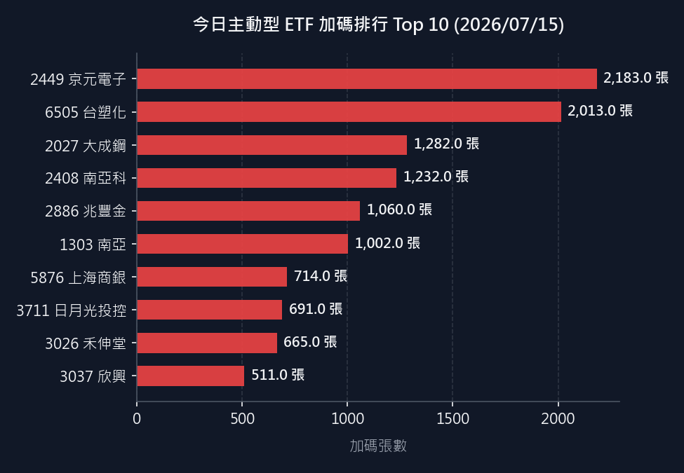
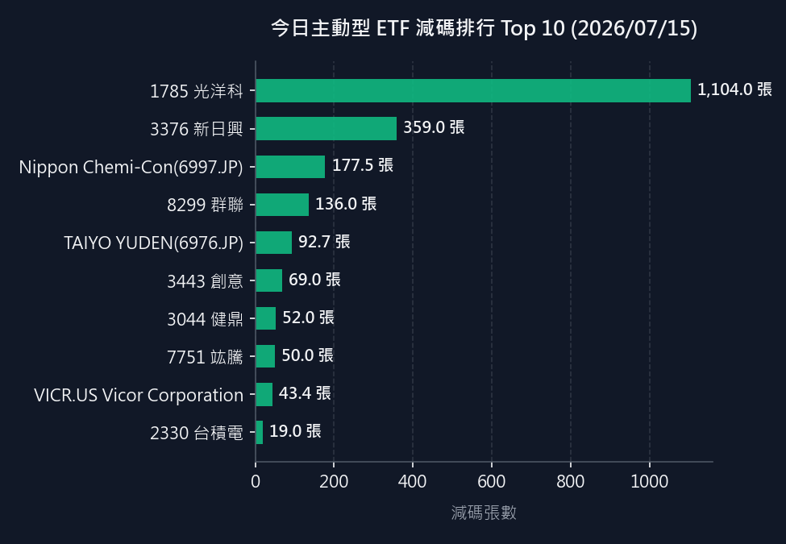

# 主動型 ETF 持股變動

資料來源：`主動型ETF持股明細.xlsx` 最近兩個日期分頁。

比較區間：`20260714` → `20260715`

## 今日加減碼視覺化排行

| 今日加碼 Top 10 | 今日減碼 Top 10 |
| :---: | :---: |
|  |  |

| ETF | 新增 | 刪除 | 比例變動 |
| :-- | --: | --: | --: |
| 00400A | 0 | 0 | 49 |
| 00401A | 1 | 0 | 46 |
| 00402A | 0 | 0 | 45 |
| 00403A | 1 | 0 | 37 |
| 00404A | 0 | 0 | 42 |
| 00405A | 0 | 0 | 39 |
| 00407A | 0 | 0 | 44 |
| 00408A | 39 | 0 | 0 |
| 00980A | 0 | 0 | 38 |
| 00980D | 0 | 0 | 18 |
| 00981A | 0 | 0 | 24 |
| 00982A | 0 | 1 | 39 |
| 00983A | 0 | 0 | 33 |
| 00983D | 0 | 0 | 17 |
| 00984A | 0 | 0 | 92 |
| 00985A | 0 | 0 | 43 |
| 00986A | 0 | 0 | 27 |
| 00987A | 0 | 1 | 26 |
| 00988A | 0 | 0 | 40 |
| 00989A | 0 | 0 | 47 |
| 00990A | 3 | 3 | 43 |
| 00991A | 0 | 0 | 25 |
| 00992A | 0 | 0 | 31 |
| 00993A | 0 | 0 | 39 |
| 00994A | 0 | 0 | 29 |
| 00995A | 0 | 0 | 48 |
| 00996A | 0 | 1 | 36 |
| 00997A | 0 | 0 | 51 |
| 00998A | 1 | 1 | 32 |
| 00999A | 0 | 0 | 51 |

## 00400A

### 新增持股

- 無

### 刪除持股

- 無

### 投資比例變動

- 1303 南亞：0.50% → 0.52%（+0.02）
- 1590 亞德客-KY：0.96% → 0.99%（+0.03）
- 2059 川湖：3.34% → 3.44%（+0.10）
- 2303 聯電：1.73% → 1.84%（+0.11）
- 2308 台達電：3.20% → 3.16%（-0.04）
- 2313 華通：0.97% → 1.03%（+0.06）
- 2327 國巨*：1.75% → 1.74%（-0.01）
- 2330 台積電：8.96% → 8.77%（-0.19）
- 2345 智邦：2.00% → 1.99%（-0.01）
- 2357 華碩：1.31% → 1.28%（-0.03）
- 2360 致茂：2.84% → 2.89%（+0.05）
- 2368 金像電：1.02% → 1.00%（-0.02）
- 2382 廣達：0.98% → 0.95%（-0.03）
- 2383 台光電：5.40% → 5.36%（-0.04）
- 2385 群光：0.14% → 0.13%（-0.01）
- 2404 漢唐：0.58% → 0.61%（+0.03）
- 2408 南亞科：2.11% → 2.20%（+0.09）
- 2454 聯發科：6.23% → 6.17%（-0.06）
- 2472 立隆電：0.13% → 0.14%（+0.01）
- 2481 強茂：0.38% → 0.37%（-0.01）
- 2885 元大金：1.03% → 1.01%（-0.02）
- 3017 奇鋐：3.26% → 3.23%（-0.03）
- 3036 文曄：1.18% → 1.12%（-0.06）
- 3037 欣興：3.62% → 3.76%（+0.14）
- 3044 健鼎：1.68% → 1.65%（-0.03）
- 3090 日電貿：0.53% → 0.50%（-0.03）
- 3167 大量：0.21% → 0.20%（-0.01）
- 3211 順達：0.93% → 0.88%（-0.05）
- 3231 緯創：0.77% → 0.76%（-0.01）
- 3293 鈊象：0.37% → 0.35%（-0.02）
- 3374 精材：0.38% → 0.41%（+0.03）
- 3443 創意：2.11% → 2.10%（-0.01）
- 3653 健策：0.75% → 0.78%（+0.03）
- 3665 貿聯-KY：2.27% → 2.37%（+0.10）
- 3711 日月光投控：1.51% → 1.56%（+0.05）
- 4958 臻鼎-KY：0.97% → 0.92%（-0.05）
- 5274 信驊：1.88% → 1.95%（+0.07）
- 5347 世界：1.82% → 1.89%（+0.07）
- 5434 崇越：0.43% → 0.42%（-0.01）
- 6147 頎邦：0.89% → 0.95%（+0.06）
- 6187 萬潤：1.33% → 1.41%（+0.08）
- 6223 旺矽：4.19% → 4.06%（-0.13）
- 6442 光聖：0.39% → 0.41%（+0.02）
- 6488 環球晶：5.00% → 4.74%（-0.26）
- 6510 精測：1.19% → 1.20%（+0.01）
- 6669 緯穎：3.85% → 3.88%（+0.03）
- 7769 鴻勁：0.32% → 0.33%（+0.01）
- 8046 南電：1.29% → 1.37%（+0.08）
- 8150 南茂：0.09% → 0.10%（+0.01）

## 00401A

### 新增持股

- 3008 大立光（1.13%，9 張）

### 刪除持股

- 無

### 投資比例變動

- 1216 統一：0.35% → 0.34%（-0.01）
- 2303 聯電：1.30% → 1.39%（+0.09）
- 2308 台達電：4.37% → 4.34%（-0.03）
- 2313 華通：1.31% → 1.40%（+0.09）
- 2330 台積電：9.32% → 9.17%（-0.15）
- 2344 華邦電：1.34% → 1.43%（+0.09）
- 2357 華碩：1.36% → 1.35%（-0.01）
- 2360 致茂：1.85% → 1.89%（+0.04）
- 2368 金像電：0.42% → 0.41%（-0.01）
- 2379 瑞昱：2.18% → 2.13%（-0.05）
- 2382 廣達：2.55% → 2.50%（-0.05）
- 2412 中華電：0.98% → 0.95%（-0.03）
- 2449 京元電子：1.73% → 1.30%（-0.43）
- 2454 聯發科：6.24% → 6.23%（-0.01）
- 2455 全新：0.45% → 0.44%（-0.01）
- 2882 國泰金：1.20% → 1.18%（-0.02）
- 2883 凱基金：2.14% → 2.13%（-0.01）
- 2884 玉山金：1.93% → 1.88%（-0.05）
- 2885 元大金：1.50% → 1.24%（-0.26）
- 2886 兆豐金：0.71% → 1.12%（+0.41）
- 2891 中信金：2.33% → 2.00%（-0.33）
- 2912 統一超：0.34% → 0.33%（-0.01）
- 3034 聯詠：0.76% → 0.75%（-0.01）
- 3037 欣興：0.70% → 0.73%（+0.03）
- 3044 健鼎：1.15% → 0.45%（-0.70）
- 3131 弘塑：0.58% → 0.60%（+0.02）
- 3491 昇達科：1.26% → 1.22%（-0.04）
- 3529 力旺：0.61% → 0.63%（+0.02）
- 3653 健策：1.07% → 1.12%（+0.05）
- 3711 日月光投控：2.73% → 2.84%（+0.11）
- 4904 遠傳：0.88% → 0.87%（-0.01）
- 4958 臻鼎-KY：2.96% → 2.84%（-0.12）
- 5274 信驊：0.91% → 0.95%（+0.04）
- 5347 世界：1.09% → 1.14%（+0.05）
- 6187 萬潤：0.69% → 0.74%（+0.05）
- 6223 旺矽：2.72% → 2.65%（-0.07）
- 6285 啟碁：2.14% → 2.26%（+0.12）
- 6510 精測：0.69% → 0.70%（+0.01）
- 6515 穎崴：0.67% → 0.68%（+0.01）
- 6531 愛普*：1.37% → 1.46%（+0.09）
- 6669 緯穎：2.50% → 2.53%（+0.03）
- 6944 兆聯實業：0.56% → 0.58%（+0.02）
- 7769 鴻勁：2.85% → 2.92%（+0.07）
- 7828 創新服務：1.48% → 1.44%（-0.04）
- 8021 尖點：0.34% → 0.36%（+0.02）
- 8464 億豐：1.31% → 1.24%（-0.07）

## 00402A

### 新增持股

- 無

### 刪除持股

- 無

### 投資比例變動

- AAPL.US Apple：7.35% → 7.23%（-0.12）
- ADI.US Analog Devices：1.77% → 1.79%（+0.02）
- AMD.US AMD：5.65% → 5.74%（+0.09）
- AMZN.US Amazon：3.97% → 3.94%（-0.03）
- ANET.US Arista Networks：0.82% → 0.72%（-0.10）
- ARM.US Arm：1.09% → 1.02%（-0.07）
- ASML.US ASML Holding：1.56% → 1.59%（+0.03）
- AVGO.US Broadcom：2.52% → 2.34%（-0.18）
- AXON.US Axon Enterprise：1.15% → 1.14%（-0.01）
- BKNG.US Booking Holdings：0.77% → 0.76%（-0.01）
- CDNS.US Cadence Design Systems：1.92% → 1.89%（-0.03）
- CRWD.US CrowdStrike Holdings：1.19% → 1.32%（+0.13）
- DASH.US DoorDash：0.40% → 0.39%（-0.01）
- FSLY.US Fastly：0.28% → 0.29%（+0.01）
- GOOG.US Alphabet - Class C Capital Stock：3.46% → 3.30%（-0.16）
- GOOGL.US Alphabet - Class A Common Stock：3.42% → 3.26%（-0.16）
- INTC.US Intel：1.27% → 1.32%（+0.05）
- KLAC.US KLA：2.34% → 2.40%（+0.06）
- LITE.US Lumentum：1.29% → 1.35%（+0.06）
- LRCX.US Lam Research：3.63% → 3.77%（+0.14）
- MCHP.US Microchip Technology：1.65% → 1.69%（+0.04）
- MDB.US MongoDB：0.62% → 0.63%（+0.01）
- MRVL.US Marvell：1.47% → 1.49%（+0.02）
- MSFT.US Microsoft：3.21% → 3.13%（-0.08）
- MU.US Micron：6.36% → 6.62%（+0.26）
- NFLX.US Netflix：1.25% → 0.97%（-0.28）
- NOW.US ServiceNow：0.38% → 0.36%（-0.02）
- NVDA.US NVIDIA：8.70% → 8.30%（-0.40）
- NXPI.US NXP Semiconductors：1.24% → 1.26%（+0.02）
- PANW.US Palo Alto：2.94% → 3.11%（+0.17）
- PLTR.US Palantir Technologies：1.26% → 1.29%（+0.03）
- SHOP.US Shopify：0.70% → 0.55%（-0.15）
- SIMO.US Silicon Motion：0.85% → 0.87%（+0.02）
- SKHY.US SK hynix：0.75% → 0.94%（+0.19）
- SNOW.US Snowflake：0.76% → 0.78%（+0.02）
- SPCX.US SpaceX：0.68% → 0.66%（-0.02）
- STX.US Seagate：1.40% → 1.42%（+0.02）
- TER.US Teradyne：0.75% → 0.77%（+0.02）
- TSM.US TSMC(ADR)：1.59% → 1.58%（-0.01）
- TTWO.US Take-Two：0.74% → 0.72%（-0.02）
- TXN.US Texas Instruments：3.05% → 3.10%（+0.05）
- UBER.US Uber：0.45% → 0.44%（-0.01）
- V.US Visa：1.01% → 1.00%（-0.01）
- WDC.US Western Digital：2.91% → 2.93%（+0.02）
- ZS.US Zscaler：0.14% → 0.15%（+0.01）

## 00403A

### 新增持股

- 2404 漢唐（0.05%，60 張）

### 刪除持股

- 無

### 投資比例變動

- 1303 南亞：1.18% → 1.37%（+0.19）
- 1560 中砂：0.42% → 0.45%（+0.03）
- 2303 聯電：7.10% → 7.57%（+0.47）
- 2308 台達電：2.82% → 2.91%（+0.09）
- 2317 鴻海：0.47% → 0.46%（-0.01）
- 2327 國巨*：3.80% → 3.78%（-0.02）
- 2330 台積電：19.41% → 18.98%（-0.43）
- 2337 旺宏：0.87% → 0.90%（+0.03）
- 2344 華邦電：4.12% → 4.39%（+0.27）
- 2345 智邦：3.00% → 2.99%（-0.01）
- 2360 致茂：0.51% → 0.63%（+0.12）
- 2368 金像電：1.75% → 1.71%（-0.04）
- 2383 台光電：3.55% → 3.52%（-0.03）
- 2454 聯發科：3.67% → 3.64%（-0.03）
- 3008 大立光：0.08% → 0.07%（-0.01）
- 3017 奇鋐：4.58% → 4.54%（-0.04）
- 3037 欣興：3.87% → 4.02%（+0.15）
- 3189 景碩：1.62% → 1.65%（+0.03）
- 3211 順達：0.50% → 0.47%（-0.03）
- 3443 創意：1.21% → 1.20%（-0.01）
- 3533 嘉澤：1.50% → 1.53%（+0.03）
- 3583 辛耘：0.43% → 0.46%（+0.03）
- 3653 健策：1.50% → 1.55%（+0.05）
- 3665 貿聯-KY：0.18% → 0.29%（+0.11）
- 3711 日月光投控：2.37% → 2.45%（+0.08）
- 4958 臻鼎-KY：2.74% → 2.61%（-0.13）
- 5274 信驊：0.52% → 0.67%（+0.15）
- 6223 旺矽：3.97% → 3.85%（-0.12）
- 6274 台燿：1.49% → 1.48%（-0.01）
- 6442 光聖：0.25% → 0.26%（+0.01）
- 6488 環球晶：2.14% → 2.02%（-0.12）
- 6669 緯穎：2.43% → 2.45%（+0.02）
- 6805 富世達：0.47% → 0.48%（+0.01）
- 7769 鴻勁：1.12% → 1.14%（+0.02）
- 8046 南電：1.25% → 1.50%（+0.25）
- 8358 金居：0.50% → 0.49%（-0.01）
- 8996 高力：1.18% → 1.15%（-0.03）

## 00404A

### 新增持股

- 無

### 刪除持股

- 無

### 投資比例變動

- 1303 南亞：0.42% → 0.45%（+0.03）
- 2303 聯電：2.63% → 2.82%（+0.19）
- 2308 台達電：3.78% → 3.76%（-0.02）
- 2330 台積電：22.60% → 22.26%（-0.34）
- 2345 智邦：0.94% → 0.95%（+0.01）
- 2347 聯強：1.83% → 1.88%（+0.05）
- 2356 英業達：0.22% → 0.21%（-0.01）
- 2360 致茂：1.02% → 1.05%（+0.03）
- 2382 廣達：2.70% → 2.64%（-0.06）
- 2454 聯發科：6.44% → 6.42%（-0.02）
- 2618 長榮航：1.93% → 1.94%（+0.01）
- 2885 元大金：2.37% → 2.33%（-0.04）
- 2891 中信金：2.78% → 2.65%（-0.13）
- 3014 聯陽：1.79% → 1.73%（-0.06）
- 3034 聯詠：2.07% → 2.04%（-0.03）
- 3037 欣興：0.52% → 0.54%（+0.02）
- 3044 健鼎：1.74% → 1.72%（-0.02）
- 3189 景碩：0.33% → 0.34%（+0.01）
- 3217 優群：1.23% → 1.20%（-0.03）
- 3227 原相：1.80% → 1.74%（-0.06）
- 3260 威剛：0.41% → 0.40%（-0.01）
- 3264 欣銓：0.99% → 1.00%（+0.01）
- 3265 台星科：1.23% → 1.25%（+0.02）
- 3293 鈊象：1.68% → 1.63%（-0.05）
- 3592 瑞鼎：1.23% → 1.19%（-0.04）
- 3711 日月光投控：3.68% → 3.83%（+0.15）
- 5274 信驊：1.86% → 1.94%（+0.08）
- 5347 世界：0.74% → 0.77%（+0.03）
- 5434 崇越：1.79% → 1.77%（-0.02）
- 5904 寶雅：1.78% → 1.80%（+0.02）
- 6121 新普：1.07% → 1.04%（-0.03）
- 6139 亞翔：0.25% → 0.26%（+0.01）
- 6196 帆宣：0.37% → 0.39%（+0.02）
- 6223 旺矽：0.84% → 0.82%（-0.02）
- 6257 矽格：1.75% → 1.80%（+0.05）
- 6488 環球晶：0.18% → 0.17%（-0.01）
- 6531 愛普*：0.20% → 0.22%（+0.02）
- 6903 巨漢：0.28% → 0.29%（+0.01）
- 8016 矽創：0.11% → 0.10%（-0.01）
- 8081 致新：1.74% → 1.67%（-0.07）
- 臺指選擇權08/26 49100 買權：-0.27% → -0.32%（-0.05）
- 臺股期貨08/26：16.28% → 16.23%（-0.05）

## 00405A

### 新增持股

- 無

### 刪除持股

- 無

### 投資比例變動

- 2059 川湖：1.30% → 1.33%（+0.03）
- 2308 台達電：1.03% → 1.02%（-0.01）
- 2327 國巨*：3.81% → 3.78%（-0.03）
- 2330 台積電：2.23% → 2.17%（-0.06）
- 2337 旺宏：1.51% → 1.55%（+0.04）
- 2344 華邦電：3.74% → 3.97%（+0.23）
- 2345 智邦：4.66% → 4.62%（-0.04）
- 2368 金像電：1.19% → 1.16%（-0.03）
- 2383 台光電：3.01% → 2.97%（-0.04）
- 2408 南亞科：0.08% → 1.52%（+1.44）
- 2449 京元電子：0.89% → 0.91%（+0.02）
- 2454 聯發科：6.78% → 6.70%（-0.08）
- 3017 奇鋐：5.67% → 5.60%（-0.07）
- 3026 禾伸堂：1.82% → 1.81%（-0.01）
- 3037 欣興：5.30% → 5.48%（+0.18）
- 3081 聯亞：1.07% → 1.04%（-0.03）
- 3105 穩懋：1.77% → 1.74%（-0.03）
- 3131 弘塑：3.84% → 3.91%（+0.07）
- 3443 創意：5.18% → 5.13%（-0.05）
- 3583 辛耘：1.79% → 1.90%（+0.11）
- 3653 健策：2.13% → 2.20%（+0.07）
- 3665 貿聯-KY：0.03% → 0.04%（+0.01）
- 3711 日月光投控：0.80% → 0.82%（+0.02）
- 4749 新應材：0.30% → 0.31%（+0.01）
- 5274 信驊：1.82% → 1.88%（+0.06）
- 5347 世界：0.14% → 0.15%（+0.01）
- 6187 萬潤：2.10% → 2.23%（+0.13）
- 6223 旺矽：5.58% → 5.38%（-0.20）
- 6291 沛亨：0.36% → 0.35%（-0.01）
- 6442 光聖：0.36% → 0.37%（+0.01）
- 6488 環球晶：6.78% → 6.40%（-0.38）
- 6526 達發：0.36% → 0.35%（-0.01）
- 6669 緯穎：0.09% → 0.10%（+0.01）
- 7734 印能科技：1.70% → 1.81%（+0.11）
- 7769 鴻勁：2.47% → 2.51%（+0.04）
- 8028 昇陽半導體：1.00% → 1.06%（+0.06）
- 8046 南電：5.17% → 5.48%（+0.31）
- 8299 群聯：1.38% → 0.01%（-1.37）
- 8996 高力：1.28% → 1.25%（-0.03）

## 00407A

### 新增持股

- 無

### 刪除持股

- 無

### 投資比例變動

- 1303 南亞：0.68% → 0.71%（+0.03）
- 1590 亞德客-KY：1.75% → 1.79%（+0.04）
- 2059 川湖：2.08% → 2.14%（+0.06）
- 2303 聯電：1.68% → 1.78%（+0.10）
- 2308 台達電：4.10% → 4.04%（-0.06）
- 2327 國巨*：3.08% → 3.05%（-0.03）
- 2330 台積電：9.45% → 9.21%（-0.24）
- 2344 華邦電：1.74% → 1.84%（+0.10）
- 2345 智邦：3.23% → 3.21%（-0.02）
- 2360 致茂：1.71% → 1.73%（+0.02）
- 2368 金像電：2.02% → 1.97%（-0.05）
- 2376 技嘉：0.75% → 0.74%（-0.01）
- 2379 瑞昱：0.83% → 0.80%（-0.03）
- 2383 台光電：3.83% → 3.78%（-0.05）
- 2395 研華：1.66% → 1.62%（-0.04）
- 2408 南亞科：1.87% → 1.94%（+0.07）
- 2412 中華電：1.69% → 1.63%（-0.06）
- 2451 創見：0.14% → 0.15%（+0.01）
- 2454 聯發科：6.44% → 6.36%（-0.08）
- 2458 義隆：0.12% → 0.11%（-0.01）
- 3017 奇鋐：3.14% → 3.10%（-0.04）
- 3034 聯詠：0.65% → 0.64%（-0.01）
- 3037 欣興：3.91% → 4.05%（+0.14）
- 3293 鈊象：0.56% → 0.54%（-0.02）
- 3443 創意：1.74% → 1.73%（-0.01）
- 3491 昇達科：0.41% → 0.39%（-0.02）
- 3529 力旺：1.64% → 1.94%（+0.30）
- 3533 嘉澤：0.83% → 0.85%（+0.02）
- 3665 貿聯-KY：1.88% → 1.95%（+0.07）
- 3711 日月光投控：2.00% → 2.06%（+0.06）
- 4904 遠傳：0.30% → 0.29%（-0.01）
- 4958 臻鼎-KY：2.51% → 2.38%（-0.13）
- 5274 信驊：1.79% → 1.85%（+0.06）
- 5536 聖暉*：1.89% → 1.98%（+0.09）
- 6223 旺矽：2.55% → 2.46%（-0.09）
- 6274 台燿：2.70% → 2.68%（-0.02）
- 6446 藥華藥：2.39% → 2.54%（+0.15）
- 6515 穎崴：1.54% → 1.53%（-0.01）
- 6526 達發：0.35% → 0.33%（-0.02）
- 6531 愛普*：1.50% → 1.59%（+0.09）
- 6669 緯穎：3.27% → 3.28%（+0.01）
- 6805 富世達：1.46% → 1.78%（+0.32）
- 8046 南電：2.67% → 2.83%（+0.16）
- 8996 高力：0.46% → 0.45%（-0.01）

## 00408A

### 新增持股

- 1216 統一（1.98%，450 張）
- 1477 聚陽（1.46%，120 張）
- 2059 川湖（1.43%，3 張）
- 2308 台達電（3.70%，35 張）
- 2317 鴻海（2.01%，150 張）
- 2330 台積電（6.28%，46 張）
- 2345 智邦（2.10%，16 張）
- 2356 英業達（1.13%，330 張）
- 2357 華碩（1.71%，43 張）
- 2368 金像電（2.18%，38 張）
- 2376 技嘉（2.02%，105 張）
- 2382 廣達（3.24%，152 張）
- 2383 台光電（1.99%，7 張）
- 2395 研華（1.64%，55 張）
- 2404 漢唐（1.80%，25 張）
- 2408 南亞科（0.54%，20 張）
- 2412 中華電（2.98%，400 張）
- 2454 聯發科（2.09%，10 張）
- 2603 長榮（1.67%，150 張）
- 2880 華南金（1.41%，650 張）
- 2885 元大金（1.95%，520 張）
- 2886 兆豐金（1.93%，750 張）
- 2891 中信金（1.42%，400 張）
- 2912 統一超（2.05%，150 張）
- 3037 欣興（2.72%，52 張）
- 3045 台灣大（2.99%，490 張）
- 3231 緯創（1.95%，240 張）
- 3702 大聯大（1.70%，260 張）
- 4904 遠傳（1.78%，330 張）
- 4958 臻鼎-KY（1.63%，47 張）
- 5347 世界（0.52%，50 張）
- 5434 崇越（2.43%，78 張）
- 5876 上海商銀（1.75%，700 張）
- 5904 寶雅（1.97%，52 張）
- 6257 矽格（1.06%，80 張）
- 6274 台燿（1.53%，19 張）
- 6669 緯穎（2.28%，8 張）
- 7769 鴻勁（0.94%，2.5 張）
- 8046 南電（2.22%，28 張）

### 刪除持股

- 無

### 投資比例變動

- 無

## 00980A

### 新增持股

- 無

### 刪除持股

- 無

### 投資比例變動

- 2059 川湖：5.49% → 5.68%（+0.19）
- 2308 台達電：5.50% → 5.46%（-0.04）
- 2317 鴻海：1.89% → 1.87%（-0.02）
- 2327 國巨*：1.68% → 1.67%（-0.01）
- 2330 台積電：9.58% → 9.40%（-0.18）
- 2344 華邦電：1.18% → 1.26%（+0.08）
- 2360 致茂：1.62% → 1.66%（+0.04）
- 2368 金像電：2.49% → 2.45%（-0.04）
- 2376 技嘉：0.88% → 0.89%（+0.01）
- 2382 廣達：1.26% → 1.23%（-0.03）
- 2383 台光電：4.69% → 4.66%（-0.03）
- 2408 南亞科：1.59% → 1.66%（+0.07）
- 2454 聯發科：6.15% → 6.11%（-0.04）
- 2884 玉山金：0.83% → 0.81%（-0.02）
- 2891 中信金：1.16% → 1.10%（-0.06）
- 3008 大立光：0.93% → 0.86%（-0.07）
- 3017 奇鋐：1.73% → 1.72%（-0.01）
- 3036 文曄：1.36% → 1.30%（-0.06）
- 3037 欣興：3.07% → 3.20%（+0.13）
- 3044 健鼎：0.43% → 0.42%（-0.01）
- 3081 聯亞：2.60% → 2.53%（-0.07）
- 3189 景碩：0.70% → 0.71%（+0.01）
- 3293 鈊象：0.55% → 0.53%（-0.02）
- 3443 創意：1.76% → 1.75%（-0.01）
- 3529 力旺：0.90% → 0.92%（+0.02）
- 3653 健策：2.89% → 3.01%（+0.12）
- 3665 貿聯-KY：0.59% → 0.62%（+0.03）
- 3711 日月光投控：1.60% → 1.66%（+0.06）
- 4958 臻鼎-KY：1.71% → 1.64%（-0.07）
- 5274 信驊：1.16% → 1.21%（+0.05）
- 5904 寶雅：1.28% → 1.29%（+0.01）
- 6223 旺矽：3.01% → 2.92%（-0.09）
- 6442 光聖：0.30% → 0.32%（+0.02）
- 6669 緯穎：1.19% → 1.21%（+0.02）
- 6805 富世達：0.44% → 0.46%（+0.02）
- 7769 鴻勁：3.71% → 3.80%（+0.09）
- 8046 南電：1.76% → 1.88%（+0.12）
- 8996 高力：1.62% → 1.59%（-0.03）

## 00980D

### 新增持股

- 無

### 刪除持股

- 無

### 投資比例變動

- CHC GROUP LLC SER REGS 11.750000 % 01-SEP-2030：0.41% → 0.42%（+0.01）
- DEUTSCHE TELEKOM INT FIN (REG) 8.75% 15JUN2030：0.41% → 0.42%（+0.01）
- ENEL FINANCE INTL NV SER REGS (REG S) 7.5% 14OCT2032：0.35% → 0.36%（+0.01）
- FMC CORP (REG) 4.5% 01OCT2049：0.51% → 0.50%（-0.01）
- GETTY IMAGES INC SER REGS 11.250000 % 21FEB2030：0.51% → 0.53%（+0.02）
- HERTZ CORP/THE SER REGS (REG S) 12.625% 15JUL2029：0.33% → 0.31%（-0.02）
- MOBIUS MERGER SUB SER REGS 9.000000 % 01JUN2030：0.24% → 0.25%（+0.01）
- ORACLE CORP 5.950000 % 26-SEP-2055：0.42% → 0.41%（-0.01）
- ORACLE CORP 6.125000 % 03AUG2065：0.53% → 0.52%（-0.01）
- ORACLE CORP 6.9% 09NOV2052：0.53% → 0.52%（-0.01）
- SABRE GLBL INC SER REGS 11.125000 % 15JUL2030：0.44% → 0.43%（-0.01）
- SALESFORCE INC (REG) 6.55% 15MAR2056：0.54% → 0.53%（-0.01）
- SALESFORCE INC (REG) 6.7% 15MAR2066：0.53% → 0.52%（-0.01）
- UNISYS CORP SER REGS 10.625000 % 15JAN2031：0.61% → 0.60%（-0.01）
- US 10YR NOTE (CBT)SEP26 21-SEP-2026：18.54% → 18.56%（+0.02）
- US 5YR NOTE (CBT) SEP26 30-SEP-2026：-16.10% → -16.12%（-0.02）
- US LONG BOND(CBT) SEP26 21-SEP-2026：5.47% → 5.48%（+0.01）
- VIACOMCBS INC (REG) 4.95% 19MAY2050：0.50% → 0.49%（-0.01）

## 00981A

### 新增持股

- 無

### 刪除持股

- 無

### 投資比例變動

- 2303 聯電：4.95% → 5.24%（+0.29）
- 2308 台達電：3.64% → 3.57%（-0.07）
- 2327 國巨*：7.39% → 7.30%（-0.09）
- 2330 台積電：10.96% → 10.64%（-0.32）
- 2345 智邦：5.47% → 5.40%（-0.07）
- 2368 金像電：3.20% → 3.11%（-0.09）
- 2383 台光電：8.76% → 8.62%（-0.14）
- 2449 京元電子：0.21% → 0.46%（+0.25）
- 2454 聯發科：7.11% → 7.00%（-0.11）
- 3017 奇鋐：4.17% → 4.10%（-0.07）
- 3037 欣興：5.41% → 5.67%（+0.26）
- 3653 健策：2.64% → 2.71%（+0.07）
- 3665 貿聯-KY：3.25% → 3.37%（+0.12）
- 3711 日月光投控：3.71% → 3.93%（+0.22）
- 5274 信驊：2.05% → 2.28%（+0.23）
- 5439 高技：0.39% → 0.38%（-0.01）
- 6147 頎邦：0.44% → 0.47%（+0.03）
- 6187 萬潤：0.50% → 0.53%（+0.03）
- 6191 精成科：0.15% → 0.14%（-0.01）
- 6223 旺矽：5.86% → 5.64%（-0.22）
- 6271 同欣電：0.25% → 0.24%（-0.01）
- 6274 台燿：2.73% → 2.70%（-0.03）
- 6805 富世達：0.91% → 0.92%（+0.01）
- 8046 南電：4.65% → 4.91%（+0.26）

## 00982A

### 新增持股

- 無

### 刪除持股

- 3376 新日興（0.14%，359 張）

### 投資比例變動

- 1785 光洋科：1.38% → 1.03%（-0.35）
- 2059 川湖：2.90% → 3.05%（+0.15）
- 2303 聯電：2.69% → 2.91%（+0.22）
- 2316 楠梓電：1.23% → 1.18%（-0.05）
- 2327 國巨*：1.35% → 1.32%（-0.03）
- 2330 台積電：9.42% → 9.40%（-0.02）
- 2345 智邦：3.75% → 3.66%（-0.09）
- 2351 順德：0.70% → 0.67%（-0.03）
- 2360 致茂：2.99% → 3.07%（+0.08）
- 2368 金像電：0.79% → 0.78%（-0.01）
- 2376 技嘉：0.70% → 0.71%（+0.01）
- 2377 微星：1.65% → 1.64%（-0.01）
- 2383 台光電：3.28% → 3.25%（-0.03）
- 2454 聯發科：6.43% → 6.31%（-0.12）
- 2467 志聖：1.68% → 1.67%（-0.01）
- 2472 立隆電：1.58% → 1.56%（-0.02）
- 3008 大立光：1.70% → 1.71%（+0.01）
- 3017 奇鋐：1.78% → 1.73%（-0.05）
- 3036 文曄：0.94% → 0.89%（-0.05）
- 3105 穩懋：3.28% → 3.13%（-0.15）
- 3264 欣銓：2.04% → 2.03%（-0.01）
- 3491 昇達科：2.39% → 2.26%（-0.13）
- 3583 辛耘：1.72% → 1.83%（+0.11）
- 3702 大聯大：1.23% → 1.25%（+0.02）
- 3711 日月光投控：1.31% → 1.34%（+0.03）
- 4958 臻鼎-KY：3.99% → 3.81%（-0.18）
- 5274 信驊：0.26% → 0.27%（+0.01）
- 5536 聖暉*：8.60% → 9.13%（+0.53）
- 6139 亞翔：5.31% → 5.38%（+0.07）
- 6147 頎邦：0.89% → 0.92%（+0.03）
- 6187 萬潤：0.18% → 0.19%（+0.01）
- 6223 旺矽：4.00% → 3.81%（-0.19）
- 6257 矽格：2.13% → 2.16%（+0.03）
- 6274 台燿：1.33% → 1.23%（-0.10）
- 6278 台表科：0.77% → 0.76%（-0.01）
- 6531 愛普*：1.22% → 1.37%（+0.15）
- 6669 緯穎：2.89% → 2.97%（+0.08）
- 8016 矽創：1.40% → 1.30%（-0.10）
- 8996 高力：0.91% → 0.87%（-0.04）

## 00983A

### 新增持股

- 無

### 刪除持股

- 無

### 投資比例變動

- AMD.US AMD：6.47% → 6.58%（+0.11）
- AMZN.US Amazon：2.96% → 2.94%（-0.02）
- AVGO.US Broadcom：1.50% → 1.73%（+0.23）
- BEAM.US Beam Therapeutics：3.33% → 2.97%（-0.36）
- BWXT.US BWX Technologies：0.25% → 0.11%（-0.14）
- COIN.US Coinbase：1.17% → 1.19%（+0.02）
- CRCL.US Circle：0.89% → 0.88%（-0.01）
- CRSP.US CRISPR Therapeutics：4.52% → 4.35%（-0.17）
- CRWV.US CoreWeave：0.57% → 0.54%（-0.03）
- DE.US Deere：0.92% → 0.91%（-0.01）
- GOOG.US Alphabet - Class C Capital Stock：1.18% → 1.19%（+0.01）
- GOOGL.US Alphabet - Class A Common Stock：1.56% → 1.58%（+0.02）
- HOOD.US Robinhood Markets：6.12% → 6.27%（+0.15）
- ILMN.US Illumina：3.34% → 3.33%（-0.01）
- LLY.US Eli Lilly：2.00% → 1.94%（-0.06）
- NTLA.US Intellia Therapeutics：2.16% → 2.19%（+0.03）
- NTRA.US Natera：3.72% → 3.68%（-0.04）
- NVDA.US NVIDIA：0.76% → 0.78%（+0.02）
- PLTR.US Palantir Technologies：0.57% → 0.59%（+0.02）
- RBLX.US Roblox：3.16% → 3.10%（-0.06）
- SHOP.US Shopify：5.49% → 5.48%（-0.01）
- SNOW.US Snowflake：0.44% → 0.45%（+0.01）
- SOFI.US SoFi Technologies：0.64% → 0.65%（+0.01）
- SPCX.US SpaceX：4.41% → 4.28%（-0.13）
- TEM.US Tempus：6.14% → 6.39%（+0.25）
- TER.US Teradyne：0.52% → 0.53%（+0.01）
- TSLA.US Tesla：8.24% → 8.20%（-0.04）
- TSM.US TSMC(ADR)：3.25% → 3.21%（-0.04）
- TWST.US Twist Bioscience：3.91% → 3.97%（+0.06）
- TXG.US 10x Genomics：4.77% → 5.19%（+0.42）
- VCYT.US Veracyte：1.51% → 1.47%（-0.04）
- WGS.US GeneDx：1.24% → 1.20%（-0.04）
- XYZ.US Block：2.05% → 2.07%（+0.02）

## 00983D

### 新增持股

- 無

### 刪除持股

- 無

### 投資比例變動

- AWK 6.593 10/15/37：0.71% → 0.72%（+0.01）
- BHCCN 11 09/30/28：1.80% → 1.81%（+0.01）
- BRITEL 9 5/8 12/15/30：1.34% → 1.35%（+0.01）
- C 8 1/8 07/15/39：2.32% → 2.33%（+0.01）
- CYH 10 7/8 01/15/32：1.50% → 1.49%（-0.01）
- DIS 7 3/4 12/01/45：0.79% → 0.80%（+0.01）
- DTV 8 7/8 02/01/30：1.57% → 1.58%（+0.01）
- HPE 6.35 10/15/45：1.00% → 0.99%（-0.01）
- HTZ 12 5/8 07/15/29：0.58% → 0.55%（-0.03）
- IEP 10 11/15/29：1.50% → 1.51%（+0.01）
- LQDW.US iShares Investment Grade Corpora：7.29% → 7.30%（+0.01）
- ORCL 6 1/2 04/15/38：0.40% → 0.39%（-0.01）
- ORCL 6.9 11/09/52：1.36% → 1.35%（-0.01）
- SABHLD 10 3/4 11/15/29：0.59% → 0.58%（-0.01）
- SUCN 6.85 06/01/39：1.21% → 1.22%（+0.01）
- TLTW.US iShares 20+ Year Treasury Bond B：7.25% → 7.26%（+0.01）
- VZ 7 3/4 12/01/30：1.13% → 1.14%（+0.01）

## 00984A

### 新增持股

- 無

### 刪除持股

- 無

### 投資比例變動

- 1102 亞泥：1.25% → 1.24%（-0.01）
- 1216 統一：1.94% → 1.90%（-0.04）
- 1229 聯華：0.27% → 0.26%（-0.01）
- 1303 南亞：0.72% → 0.76%（+0.04）
- 1326 台化：0.70% → 0.72%（+0.02）
- 1402 遠東新：0.96% → 1.02%（+0.06）
- 1409 新纖：0.58% → 0.55%（-0.03）
- 1560 中砂：0.47% → 0.50%（+0.03）
- 1795 美時：0.40% → 0.39%（-0.01）
- 1907 永豐餘：0.28% → 0.29%（+0.01）
- 2049 上銀：0.56% → 0.55%（-0.01）
- 2059 川湖：0.58% → 0.59%（+0.01）
- 2105 正新：0.42% → 0.41%（-0.01）
- 2204 中華：0.28% → 0.27%（-0.01）
- 2206 三陽工業：0.40% → 0.39%（-0.01）
- 2303 聯電：2.13% → 2.27%（+0.14）
- 2330 台積電：2.95% → 2.88%（-0.07）
- 2337 旺宏：0.51% → 0.53%（+0.02）
- 2347 聯強：0.91% → 0.93%（+0.02）
- 2357 華碩：2.59% → 2.56%（-0.03）
- 2360 致茂：0.58% → 0.59%（+0.01）
- 2368 金像電：0.12% → 0.11%（-0.01）
- 2371 大同：0.38% → 0.37%（-0.01）
- 2377 微星：0.96% → 0.94%（-0.02）
- 2382 廣達：2.46% → 2.41%（-0.05）
- 2383 台光電：1.79% → 1.78%（-0.01）
- 2404 漢唐：1.78% → 1.89%（+0.11）
- 2412 中華電：2.48% → 2.42%（-0.06）
- 2454 聯發科：1.36% → 1.35%（-0.01）
- 2458 義隆：0.36% → 0.35%（-0.01）
- 2467 志聖：0.49% → 0.52%（+0.03）
- 2472 立隆電：0.40% → 0.42%（+0.02）
- 2474 可成：0.77% → 0.76%（-0.01）
- 2478 大毅：0.40% → 0.43%（+0.03）
- 2481 強茂：0.55% → 0.53%（-0.02）
- 2501 國建：0.23% → 0.25%（+0.02）
- 2618 長榮航：1.39% → 1.40%（+0.01）
- 2633 台灣高鐵：1.30% → 1.34%（+0.04）
- 2634 漢翔：0.46% → 0.45%（-0.01）
- 2855 統一證：0.53% → 0.52%（-0.01）
- 2881 富邦金：2.50% → 2.51%（+0.01）
- 2882 國泰金：0.28% → 0.27%（-0.01）
- 2885 元大金：0.40% → 0.39%（-0.01）
- 2891 中信金：2.35% → 2.25%（-0.10）
- 2897 王道銀行：0.27% → 0.26%（-0.01）
- 2912 統一超：1.48% → 1.46%（-0.02）
- 3005 神基：0.43% → 0.42%（-0.01）
- 3008 大立光：0.70% → 0.65%（-0.05）
- 3026 禾伸堂：1.09% → 1.10%（+0.01）
- 3034 聯詠：1.85% → 1.83%（-0.02）
- 3037 欣興：1.59% → 1.67%（+0.08）
- 3044 健鼎：0.32% → 0.31%（-0.01）
- 3045 台灣大：1.90% → 1.85%（-0.05）
- 3090 日電貿：0.42% → 0.39%（-0.03）
- 3189 景碩：1.13% → 1.15%（+0.02）
- 3293 鈊象：1.20% → 1.16%（-0.04）
- 3481 群創：0.48% → 0.47%（-0.01）
- 3532 台勝科：0.76% → 0.79%（+0.03）
- 3592 瑞鼎：0.26% → 0.24%（-0.02）
- 3596 智易：0.38% → 0.37%（-0.01）
- 3702 大聯大：1.06% → 1.01%（-0.05）
- 3711 日月光投控：1.12% → 1.16%（+0.04）
- 4904 遠傳：1.64% → 1.62%（-0.02）
- 4919 新唐：0.52% → 0.54%（+0.02）
- 4958 臻鼎-KY：2.09% → 2.00%（-0.09）
- 5274 信驊：0.29% → 0.31%（+0.02）
- 5434 崇越：1.13% → 1.12%（-0.01）
- 5483 中美晶：0.53% → 0.57%（+0.04）
- 5536 聖暉*：0.51% → 0.54%（+0.03）
- 5871 中租-KY：1.13% → 1.11%（-0.02）
- 5876 上海商銀：1.26% → 1.22%（-0.04）
- 5903 全家：0.06% → 0.05%（-0.01）
- 6121 新普：0.61% → 0.60%（-0.01）
- 6139 亞翔：0.51% → 0.53%（+0.02）
- 6147 頎邦：0.50% → 0.54%（+0.04）
- 6182 合晶：0.87% → 0.81%（-0.06）
- 6196 帆宣：1.11% → 1.17%（+0.06）
- 6213 聯茂：1.08% → 1.01%（-0.07）
- 6223 旺矽：1.11% → 1.08%（-0.03）
- 6274 台燿：1.78% → 1.79%（+0.01）
- 6285 啟碁：0.55% → 0.58%（+0.03）
- 6446 藥華藥：2.02% → 2.16%（+0.14）
- 6531 愛普*：1.09% → 1.16%（+0.07）
- 6890 來億-KY：0.25% → 0.24%（-0.01）
- 7769 鴻勁：0.59% → 0.60%（+0.01）
- 8016 矽創：0.89% → 0.85%（-0.04）
- 8021 尖點：1.32% → 1.39%（+0.07）
- 8046 南電：1.22% → 1.30%（+0.08）
- 8081 致新：0.24% → 0.23%（-0.01）
- 8096 擎亞：0.58% → 0.53%（-0.05）
- 8261 富鼎：0.87% → 0.84%（-0.03）
- 8358 金居：1.12% → 1.10%（-0.02）

## 00985A

### 新增持股

- 無

### 刪除持股

- 無

### 投資比例變動

- 1216 統一：1.03% → 1.01%（-0.02）
- 1802 台玻：0.86% → 0.85%（-0.01）
- 2027 大成鋼：0.55% → 1.09%（+0.54）
- 2049 上銀：0.85% → 0.84%（-0.01）
- 2059 川湖：2.98% → 3.43%（+0.45）
- 2303 聯電：1.83% → 1.97%（+0.14）
- 2330 台積電：23.66% → 21.73%（-1.93）
- 2344 華邦電：1.41% → 1.51%（+0.10）
- 2345 智邦：2.11% → 2.12%（+0.01）
- 2360 致茂：1.65% → 1.48%（-0.17）
- 2368 金像電：1.10% → 0.99%（-0.11）
- 2376 技嘉：3.58% → 3.60%（+0.02）
- 2383 台光電：2.05% → 2.40%（+0.35）
- 2395 研華：3.09% → 3.04%（-0.05）
- 2408 南亞科：1.72% → 2.22%（+0.50）
- 2412 中華電：1.92% → 1.87%（-0.05）
- 2454 聯發科：1.22% → 1.10%（-0.12）
- 2881 富邦金：0.64% → 0.65%（+0.01）
- 2891 中信金：0.50% → 0.48%（-0.02）
- 3008 大立光：2.92% → 2.70%（-0.22）
- 3036 文曄：2.55% → 2.44%（-0.11）
- 3037 欣興：0.05% → 0.37%（+0.32）
- 3081 聯亞：1.30% → 1.27%（-0.03）
- 3131 弘塑：1.78% → 1.64%（-0.14）
- 3293 鈊象：1.12% → 1.01%（-0.11）
- 3529 力旺：0.61% → 0.62%（+0.01）
- 3653 健策：0.99% → 1.03%（+0.04）
- 3661 世芯-KY：2.74% → 2.68%（-0.06）
- 3665 貿聯-KY：0.23% → 0.24%（+0.01）
- 3711 日月光投控：0.81% → 0.84%（+0.03）
- 4904 遠傳：1.93% → 1.91%（-0.02）
- 4958 臻鼎-KY：2.62% → 2.69%（+0.07）
- 6147 頎邦：2.15% → 2.31%（+0.16）
- 6187 萬潤：2.23% → 2.39%（+0.16）
- 6223 旺矽：1.28% → 1.12%（-0.16）
- 6442 光聖：2.98% → 3.28%（+0.30）
- 6488 環球晶：0.61% → 0.58%（-0.03）
- 6505 台塑化：0.58% → 2.06%（+1.48）
- 6669 緯穎：0.74% → 0.75%（+0.01）
- 7769 鴻勁：0.71% → 0.73%（+0.02）
- 8046 南電：1.23% → 1.11%（-0.12）
- 8299 群聯：1.26% → 2.05%（+0.79）
- 8996 高力：0.70% → 0.69%（-0.01）

## 00986A

### 新增持股

- 無

### 刪除持股

- 無

### 投資比例變動

- 2330 台積電：8.79% → 8.53%（-0.26）
- AMD.US AMD：2.67% → 2.69%（+0.02）
- AMZN.US Amazon：3.65% → 3.58%（-0.07）
- AVGO.US Broadcom：4.85% → 4.82%（-0.03）
- CAT.US Caterpillar：2.70% → 2.65%（-0.05）
- COHR.US Coherent：2.10% → 2.08%（-0.02）
- CRWD.US CrowdStrike Holdings：3.71% → 4.08%（+0.37）
- ETN.US Eaton：2.12% → 2.14%（+0.02）
- GOOGL.US Alphabet - Class A Common Stock：7.43% → 7.42%（-0.01）
- GS.US Goldman Sachs：3.03% → 3.23%（+0.20）
- IBIDEN(4062.JP)：2.12% → 2.00%（-0.12）
- LITE.US Lumentum：3.16% → 3.28%（+0.12）
- LLY.US Eli Lilly：2.80% → 2.68%（-0.12）
- LRCX.US Lam Research：3.51% → 3.61%（+0.10）
- MSFT.US Microsoft：2.06% → 1.99%（-0.07）
- MU.US Micron：4.93% → 5.07%（+0.14）
- MUFG(8306.JP)：1.38% → 1.37%（-0.01）
- Murata Mfg.(6981.JP)：2.06% → 2.02%（-0.04）
- NET.US Cloudflare：1.70% → 1.74%（+0.04）
- NVDA.US NVIDIA：5.68% → 5.79%（+0.11）
- SNDK.US Sandisk：1.94% → 2.00%（+0.06）
- SNOW.US Snowflake：1.20% → 1.21%（+0.01）
- TSLA.US Tesla：1.14% → 1.12%（-0.02）
- Yaskawa Electric(6506.JP)：1.94% → 1.73%（-0.21）
- 嘉能可公司：1.45% → 1.46%（+0.01）
- 施奈德電機公司：1.53% → 1.52%（-0.01）
- 英飛凌科技股份有限公司：3.38% → 3.37%（-0.01）

## 00987A

### 新增持股

- 無

### 刪除持股

- 3131 弘塑（1.42%，12 張）

### 投資比例變動

- 2327 國巨*：3.35% → 3.33%（-0.02）
- 2330 台積電：8.44% → 8.26%（-0.18）
- 2345 智邦：2.48% → 2.46%（-0.02）
- 2383 台光電：6.55% → 6.49%（-0.06）
- 2408 南亞科：4.17% → 4.34%（+0.17）
- 2454 聯發科：2.41% → 2.39%（-0.02）
- 2455 全新：2.50% → 2.43%（-0.07）
- 3017 奇鋐：7.07% → 7.00%（-0.07）
- 3037 欣興：6.44% → 6.69%（+0.25）
- 3081 聯亞：3.58% → 3.48%（-0.10）
- 3167 大量：2.29% → 2.95%（+0.66）
- 3443 創意：3.74% → 3.72%（-0.02）
- 3653 健策：2.14% → 2.22%（+0.08）
- 3665 貿聯-KY：3.44% → 3.59%（+0.15）
- 4764 雙鍵：2.20% → 2.34%（+0.14）
- 5274 信驊：0.15% → 0.16%（+0.01）
- 6139 亞翔：3.10% → 3.23%（+0.13）
- 6223 旺矽：6.64% → 6.43%（-0.21）
- 6271 同欣電：1.86% → 1.79%（-0.07）
- 6274 台燿：4.06% → 4.05%（-0.01）
- 6488 環球晶：3.23% → 3.06%（-0.17）
- 6683 雍智科技：3.04% → 2.87%（-0.17）
- 8028 昇陽半導體：1.99% → 2.11%（+0.12）
- 8046 南電：3.15% → 3.35%（+0.20）
- 8155 博智：3.30% → 3.33%（+0.03）
- 8358 金居：2.03% → 1.98%（-0.05）

## 00988A

### 新增持股

- 無

### 刪除持股

- 無

### 投資比例變動

- 2303 聯電：1.54% → 1.50%（-0.04）
- 2308 台達電：0.55% → 0.54%（-0.01）
- 2327 國巨*：3.27% → 3.08%（-0.19）
- 2330 台積電：2.53% → 2.48%（-0.05）
- 2383 台光電：2.82% → 2.71%（-0.11）
- 2454 聯發科：2.84% → 2.69%（-0.15）
- 3017 奇鋐：0.80% → 0.75%（-0.05）
- 3037 欣興：3.62% → 3.46%（-0.16）
- 3711 日月光投控：1.57% → 1.48%（-0.09）
- 6223 旺矽：1.61% → 1.52%（-0.09）
- 6274 台燿：0.97% → 0.86%（-0.11）
- AIXTRON SE：0.99% → 1.01%（+0.02）
- AMAT.US Applied Materials：3.86% → 4.27%（+0.41）
- AMD.US AMD：5.89% → 5.97%（+0.08）
- BE.US Bloom Energy：3.14% → 3.62%（+0.48）
- CRDO.US Credo：2.04% → 2.01%（-0.03）
- FTNT.US Fortinet：1.38% → 1.42%（+0.04）
- IBIDEN(4062.JP)：1.70% → 1.62%（-0.08）
- INFINEON TECHNOLOGIES AG：2.69% → 2.72%（+0.03）
- KLAC.US KLA：1.55% → 1.59%（+0.04）
- Kioxia Holdings(285A.JP)：5.00% → 5.09%（+0.09）
- LITE.US Lumentum：1.82% → 1.91%（+0.09）
- Lasertec Corporation(6920.JP)：1.30% → 1.29%（-0.01）
- MICRONICS(6871.JP)：1.64% → 1.62%（-0.02）
- MRVL.US Marvell：2.69% → 2.72%（+0.03）
- MU.US Micron：5.34% → 5.54%（+0.20）
- Murata Mfg.(6981.JP)：3.75% → 3.72%（-0.03）
- NOW.US ServiceNow：0.90% → 1.11%（+0.21）
- Nippon Chemi-Con(6997.JP)：1.54% → 1.53%（-0.01）
- SK hynix(000660.KS)：0.65% → 0.69%（+0.04）
- SNDK.US Sandisk：4.32% → 4.48%（+0.16）
- STM.US STMicroelectronics：1.75% → 1.77%（+0.02）
- SUMCO(3436.JP)：2.19% → 2.73%（+0.54）
- Samsung Elec Mech(009150.KS)：3.82% → 3.77%（-0.05）
- TAIYO YUDEN(6976.JP)：2.99% → 2.95%（-0.04）
- Tokyo Electron(8035.JP)：2.60% → 2.56%（-0.04）
- Union Tool(6278.JP)：0.62% → 0.61%（-0.01）
- VECO.US Veeco Instruments Inc.：0.60% → 1.23%（+0.63）
- VSH.US Vishay：0.56% → 0.55%（-0.01）
- 三環集團(300408.SZ)：0.53% → 0.57%（+0.04）

## 00989A

### 新增持股

- 無

### 刪除持股

- 無

### 投資比例變動

- ADI.US Analog Devices：1.11% → 1.10%（-0.01）
- AMAT.US Applied Materials：0.66% → 0.67%（+0.01）
- AMKR.US Amkor：1.02% → 1.06%（+0.04）
- AMZN.US Amazon：0.70% → 0.68%（-0.02）
- APP.US Applovin：1.07% → 1.06%（-0.01）
- ASML.US ASML Holding：3.06% → 3.07%（+0.01）
- AVGO.US Broadcom：3.96% → 3.91%（-0.05）
- BE.US Bloom Energy：1.49% → 1.52%（+0.03）
- CBRS.US Cerebras：0.18% → 0.17%（-0.01）
- CDNS.US Cadence Design Systems：1.09% → 1.06%（-0.03）
- CIEN.US Ciena：2.12% → 2.07%（-0.05）
- CRM.US Salesforce：0.87% → 0.83%（-0.04）
- CRWD.US CrowdStrike Holdings：2.80% → 3.07%（+0.27）
- ENTG.US Entegris：1.16% → 1.17%（+0.01）
- FIGR.US Figure：0.72% → 0.70%（-0.02）
- FN.US Fabrinet：0.67% → 0.66%（-0.01）
- GFS.US GlobalFoundries：1.39% → 1.34%（-0.05）
- GOOG.US Alphabet - Class C Capital Stock：4.46% → 4.43%（-0.03）
- HOOD.US Robinhood Markets：2.38% → 2.40%（+0.02）
- INTC.US Intel：3.63% → 3.70%（+0.07）
- LITE.US Lumentum：1.50% → 1.55%（+0.05）
- LMND.US Lemonade：1.14% → 1.10%（-0.04）
- LRCX.US Lam Research：3.31% → 3.39%（+0.08）
- META.US Meta：2.66% → 2.62%（-0.04）
- MSFT.US Microsoft：1.09% → 1.05%（-0.04）
- MU.US Micron：1.98% → 2.03%（+0.05）
- MXL.US MaxLinear：0.48% → 0.49%（+0.01）
- NET.US Cloudflare：2.48% → 2.53%（+0.05）
- NVDA.US NVIDIA：3.68% → 3.73%（+0.05）
- ON.US ON Semiconductor：1.74% → 1.76%（+0.02）
- ORCL.US Oracle：1.30% → 1.24%（-0.06）
- PANW.US Palo Alto：3.88% → 4.05%（+0.17）
- PLTR.US Palantir Technologies：0.42% → 0.43%（+0.01）
- RIVN.US Rivian：1.41% → 1.39%（-0.02）
- SHOP.US Shopify：1.33% → 1.31%（-0.02）
- SNDK.US Sandisk：2.13% → 2.18%（+0.05）
- SPCX.US SpaceX：0.54% → 0.66%（+0.12）
- TEM.US Tempus：0.94% → 0.96%（+0.02）
- TSLA.US Tesla：3.20% → 3.14%（-0.06）
- TSM.US TSMC(ADR)：1.85% → 1.80%（-0.05）
- TTWO.US Take-Two：3.77% → 3.57%（-0.20）
- TWLO.US Twilio：2.20% → 2.14%（-0.06）
- VICR.US Vicor Corporation：1.05% → 1.08%（+0.03）
- WOLF.US Wolfspeed：0.13% → 0.12%（-0.01）
- WRBY.US Warby Parker：0.68% → 0.67%（-0.01）
- XYZ.US Block：0.78% → 0.77%（-0.01）
- ZM.US Zoom：1.75% → 1.70%（-0.05）

## 00990A

### 新增持股

- AVGO.US Broadcom（0.80%，27.28 張）
- DDOG.US Datadog（0.82%，40.2 張）
- SNOW.US Snowflake（1.01%，48.7 張）

### 刪除持股

- 3443 創意（0.70%，69 張）
- VECO.US Veeco Instruments Inc.（0.74%，173 張）
- VICR.US Vicor Corporation（0.84%，43.4 張）

### 投資比例變動

- 2303 聯電：1.19% → 1.15%（-0.04）
- 2308 台達電：2.53% → 2.45%（-0.08）
- 2330 台積電：2.60% → 2.55%（-0.05）
- 2383 台光電：1.75% → 1.68%（-0.07）
- 2449 京元電子：0.61% → 0.57%（-0.04）
- 2454 聯發科：2.67% → 2.52%（-0.15）
- 3037 欣興：1.66% → 1.58%（-0.08）
- 3711 日月光投控：1.02% → 0.96%（-0.06）
- 4958 臻鼎-KY：0.72% → 0.69%（-0.03）
- 5347 世界：1.06% → 1.02%（-0.04）
- 6223 旺矽：1.18% → 1.11%（-0.07）
- 6274 台燿：0.99% → 0.88%（-0.11）
- AMAT.US Applied Materials：3.67% → 3.74%（+0.07）
- AMD.US AMD：6.66% → 6.74%（+0.08）
- ANET.US Arista Networks：1.72% → 1.71%（-0.01）
- ASML.US ASML Holding：0.84% → 1.36%（+0.52）
- BE.US Bloom Energy：2.46% → 2.53%（+0.07）
- DELL.US Dell：1.99% → 2.10%（+0.11）
- GLW.US Corning：0.32% → 0.33%（+0.01）
- IBIDEN(4062.JP)：2.07% → 1.96%（-0.11）
- INFINEON TECHNOLOGIES AG：2.61% → 2.60%（-0.01）
- KOKUSAI ELECTRIC(6525.JP)：1.43% → 1.38%（-0.05）
- Kioxia Holdings(285A.JP)：4.82% → 4.37%（-0.45）
- LITE.US Lumentum：3.57% → 5.10%（+1.53）
- LRCX.US Lam Research：2.03% → 2.10%（+0.07）
- MKSI.US MKS：1.78% → 1.79%（+0.01）
- MRVL.US Marvell：2.25% → 2.27%（+0.02）
- MU.US Micron：4.68% → 4.85%（+0.17）
- Murata Mfg.(6981.JP)：2.95% → 2.91%（-0.04）
- NVDA.US NVIDIA：1.53% → 1.57%（+0.04）
- Nippon Chemi-Con(6997.JP)：0.83% → 0.51%（-0.32）
- ON SEMICONDUCTOR：0.52% → 0.53%（+0.01）
- ONTO.US Onto Innovation：1.19% → 1.23%（+0.04）
- PENG.US Penguin Solutions：1.48% → 1.47%（-0.01）
- Renesas Electronics(6723.JP)：1.76% → 1.70%（-0.06）
- SCREEN Holdings(7735.JP)：1.23% → 1.24%（+0.01）
- SK hynix(000660.KS)：1.88% → 1.39%（-0.49）
- SNDK.US Sandisk：4.65% → 4.81%（+0.16）
- SUMCO(3436.JP)：2.31% → 2.35%（+0.04）
- Samsung Elec Mech(009150.KS)：3.71% → 3.58%（-0.13）
- TAIYO YUDEN(6976.JP)：3.28% → 2.71%（-0.57）
- Tokyo Electron(8035.JP)：1.56% → 1.53%（-0.03）
- UCTT.US Ultra Clean Holdings：1.00% → 1.05%（+0.05）

## 00991A

### 新增持股

- 無

### 刪除持股

- 無

### 投資比例變動

- 2059 川湖：3.82% → 4.11%（+0.29）
- 2303 聯電：2.81% → 2.96%（+0.15）
- 2327 國巨*：7.13% → 7.32%（+0.19）
- 2330 台積電：13.50% → 13.05%（-0.45）
- 2344 華邦電：1.05% → 1.10%（+0.05）
- 2345 智邦：3.63% → 3.87%（+0.24）
- 2383 台光電：7.92% → 8.09%（+0.17）
- 2404 漢唐：1.02% → 1.06%（+0.04）
- 2408 南亞科：5.83% → 6.19%（+0.36）
- 2454 聯發科：4.62% → 4.76%（+0.14）
- 2492 華新科：1.86% → 1.74%（-0.12）
- 3017 奇鋐：1.86% → 2.01%（+0.15）
- 3026 禾伸堂：2.17% → 2.35%（+0.18）
- 3037 欣興：4.76% → 5.07%（+0.31）
- 3189 景碩：2.99% → 3.01%（+0.02）
- 3665 貿聯-KY：0.61% → 1.12%（+0.51）
- 3711 日月光投控：2.72% → 2.96%（+0.24）
- 5274 信驊：1.08% → 1.11%（+0.03）
- 6223 旺矽：4.72% → 4.68%（-0.04）
- 6274 台燿：3.71% → 3.84%（+0.13）
- 6515 穎崴：2.06% → 2.03%（-0.03）
- 6669 緯穎：2.28% → 2.27%（-0.01）
- 7769 鴻勁：2.72% → 2.91%（+0.19）
- 8046 南電：4.63% → 5.05%（+0.42）
- 8299 群聯：4.08% → 4.02%（-0.06）

## 00992A

### 新增持股

- 無

### 刪除持股

- 無

### 投資比例變動

- 2059 川湖：5.81% → 6.00%（+0.19）
- 2303 聯電：2.62% → 2.80%（+0.18）
- 2327 國巨*：3.98% → 3.97%（-0.01）
- 2330 台積電：8.43% → 8.27%（-0.16）
- 2337 旺宏：0.46% → 0.48%（+0.02）
- 2345 智邦：5.52% → 5.51%（-0.01）
- 2383 台光電：6.94% → 6.89%（-0.05）
- 2454 聯發科：3.68% → 3.66%（-0.02）
- 2455 全新：2.15% → 2.09%（-0.06）
- 3008 大立光：4.44% → 4.09%（-0.35）
- 3017 奇鋐：5.27% → 5.23%（-0.04）
- 3026 禾伸堂：0.93% → 1.84%（+0.91）
- 3037 欣興：4.54% → 4.73%（+0.19）
- 3189 景碩：0.88% → 0.90%（+0.02）
- 3260 威剛：0.36% → 0.35%（-0.01）
- 3443 創意：2.10% → 2.09%（-0.01）
- 3583 辛耘：1.07% → 1.15%（+0.08）
- 3661 世芯-KY：1.99% → 1.94%（-0.05）
- 3665 貿聯-KY：4.20% → 4.40%（+0.20）
- 3711 日月光投控：2.59% → 2.68%（+0.09）
- 6139 亞翔：0.52% → 0.54%（+0.02）
- 6182 合晶：2.08% → 1.95%（-0.13）
- 6187 萬潤：2.98% → 3.18%（+0.20）
- 6223 旺矽：5.12% → 4.97%（-0.15）
- 6488 環球晶：1.48% → 1.41%（-0.07）
- 6584 南俊國際：3.71% → 3.58%（-0.13）
- 6805 富世達：0.36% → 0.37%（+0.01）
- 7734 印能科技：0.38% → 0.41%（+0.03）
- 7751 竑騰：1.04% → 0.93%（-0.11）
- 8021 尖點：1.81% → 1.92%（+0.11）
- 8996 高力：4.75% → 4.65%（-0.10）

## 00993A

### 新增持股

- 無

### 刪除持股

- 無

### 投資比例變動

- 1303 南亞：0.28% → 0.30%（+0.02）
- 1590 亞德客-KY：0.27% → 0.28%（+0.01）
- 2059 川湖：2.86% → 2.95%（+0.09）
- 2303 聯電：3.34% → 3.55%（+0.21）
- 2308 台達電：3.05% → 3.00%（-0.05）
- 2327 國巨*：4.58% → 4.55%（-0.03）
- 2330 台積電：11.42% → 11.17%（-0.25）
- 2344 華邦電：2.54% → 2.70%（+0.16）
- 2345 智邦：4.79% → 4.75%（-0.04）
- 2347 聯強：0.50% → 0.51%（+0.01）
- 2368 金像電：1.89% → 1.85%（-0.04）
- 2383 台光電：5.44% → 5.38%（-0.06）
- 2408 南亞科：1.40% → 1.45%（+0.05）
- 2454 聯發科：5.97% → 5.91%（-0.06）
- 2472 立隆電：0.35% → 0.36%（+0.01）
- 2883 凱基金：0.85% → 0.84%（-0.01）
- 2885 元大金：0.96% → 0.93%（-0.03）
- 2890 永豐金：0.72% → 0.70%（-0.02）
- 2891 中信金：0.56% → 0.53%（-0.03）
- 3017 奇鋐：3.88% → 3.84%（-0.04）
- 3037 欣興：4.37% → 4.52%（+0.15）
- 3189 景碩：2.26% → 2.29%（+0.03）
- 3665 貿聯-KY：2.26% → 2.35%（+0.09）
- 3702 大聯大：0.44% → 0.41%（-0.03）
- 3711 日月光投控：3.13% → 3.22%（+0.09）
- 4958 臻鼎-KY：0.50% → 0.48%（-0.02）
- 5274 信驊：1.89% → 1.95%（+0.06）
- 5289 宜鼎：0.42% → 0.41%（-0.01）
- 5536 聖暉*：2.70% → 2.83%（+0.13）
- 6196 帆宣：0.53% → 0.55%（+0.02）
- 6213 聯茂：0.39% → 0.36%（-0.03）
- 6223 旺矽：5.24% → 5.06%（-0.18）
- 6257 矽格：0.35% → 0.36%（+0.01）
- 6274 台燿：2.85% → 2.83%（-0.02）
- 6446 藥華藥：0.75% → 0.80%（+0.05）
- 6669 緯穎：3.22% → 3.24%（+0.02）
- 8021 尖點：0.42% → 0.44%（+0.02）
- 8046 南電：2.49% → 2.64%（+0.15）
- 8150 南茂：0.34% → 0.36%（+0.02）

## 00994A

### 新增持股

- 無

### 刪除持股

- 無

### 投資比例變動

- 2059 川湖：3.45% → 3.58%（+0.13）
- 2303 聯電：0.99% → 1.07%（+0.08）
- 2308 台達電：3.22% → 3.20%（-0.02）
- 2330 台積電：17.27% → 16.98%（-0.29）
- 2344 華邦電：0.68% → 0.72%（+0.04）
- 2345 智邦：4.69% → 4.74%（+0.05）
- 2360 致茂：0.22% → 0.23%（+0.01）
- 2368 金像電：2.42% → 2.39%（-0.03）
- 2383 台光電：7.15% → 7.14%（-0.01）
- 2404 漢唐：0.02% → 0.03%（+0.01）
- 2408 南亞科：2.40% → 2.74%（+0.34）
- 2449 京元電子：0.48% → 0.49%（+0.01）
- 2454 聯發科：6.47% → 6.45%（-0.02）
- 3017 奇鋐：2.90% → 2.89%（-0.01）
- 3037 欣興：5.63% → 5.88%（+0.25）
- 3081 聯亞：0.40% → 0.39%（-0.01）
- 3131 弘塑：0.38% → 0.39%（+0.01）
- 3231 緯創：0.33% → 0.32%（-0.01）
- 3711 日月光投控：3.44% → 3.58%（+0.14）
- 4958 臻鼎-KY：2.77% → 2.93%（+0.16）
- 5274 信驊：2.11% → 2.21%（+0.10）
- 5347 世界：0.75% → 0.79%（+0.04）
- 6223 旺矽：4.68% → 4.56%（-0.12）
- 6257 矽格：0.83% → 0.86%（+0.03）
- 6274 台燿：4.50% → 4.55%（+0.05）
- 6488 環球晶：1.18% → 1.13%（-0.05）
- 6669 緯穎：1.01% → 1.02%（+0.01）
- 7769 鴻勁：1.18% → 1.21%（+0.03）
- 8046 南電：6.23% → 6.67%（+0.44）

## 00995A

### 新增持股

- 無

### 刪除持股

- 無

### 投資比例變動

- 2303 聯電：2.13% → 2.30%（+0.17）
- 2308 台達電：3.67% → 3.66%（-0.01）
- 2313 華通：0.42% → 0.44%（+0.02）
- 2327 國巨*：4.90% → 4.78%（-0.12）
- 2330 台積電：9.07% → 9.05%（-0.02）
- 2344 華邦電：0.86% → 0.93%（+0.07）
- 2345 智邦：5.24% → 5.09%（-0.15）
- 2360 致茂：0.95% → 0.98%（+0.03）
- 2368 金像電：2.79% → 2.74%（-0.05）
- 2383 台光電：7.81% → 7.74%（-0.07）
- 2404 漢唐：0.12% → 0.13%（+0.01）
- 2454 聯發科：5.61% → 5.47%（-0.14）
- 2455 全新：0.66% → 0.63%（-0.03）
- 2467 志聖：0.32% → 0.31%（-0.01）
- 2472 立隆電：1.10% → 1.09%（-0.01）
- 2885 元大金：0.67% → 0.65%（-0.02）
- 3017 奇鋐：3.52% → 3.43%（-0.09）
- 3026 禾伸堂：0.14% → 0.13%（-0.01）
- 3037 欣興：4.15% → 4.30%（+0.15）
- 3044 健鼎：0.68% → 0.66%（-0.02）
- 3105 穩懋：0.48% → 0.46%（-0.02）
- 3167 大量：0.25% → 0.26%（+0.01）
- 3189 景碩：0.50% → 0.52%（+0.02）
- 3211 順達：0.27% → 0.25%（-0.02）
- 3443 創意：0.42% → 0.41%（-0.01）
- 3653 健策：1.90% → 1.95%（+0.05）
- 3665 貿聯-KY：2.62% → 2.68%（+0.06）
- 3711 日月光投控：2.75% → 2.80%（+0.05）
- 4958 臻鼎-KY：1.37% → 1.31%（-0.06）
- 5274 信驊：2.36% → 2.42%（+0.06）
- 5289 宜鼎：0.66% → 0.64%（-0.02）
- 5439 高技：0.40% → 0.38%（-0.02）
- 5536 聖暉*：0.28% → 0.30%（+0.02）
- 6147 頎邦：0.47% → 0.49%（+0.02）
- 6187 萬潤：0.49% → 0.51%（+0.02）
- 6213 聯茂：0.36% → 0.33%（-0.03）
- 6223 旺矽：4.73% → 4.51%（-0.22）
- 6274 台燿：2.09% → 1.93%（-0.16）
- 6510 精測：0.27% → 0.28%（+0.01）
- 6515 穎崴：1.90% → 1.87%（-0.03）
- 6531 愛普*：0.48% → 0.50%（+0.02）
- 6669 緯穎：4.22% → 4.33%（+0.11）
- 7750 新代：0.48% → 0.47%（-0.01）
- 7769 鴻勁：2.12% → 2.13%（+0.01）
- 8046 南電：4.28% → 4.76%（+0.48）
- 8210 勤誠：0.85% → 0.86%（+0.01）
- 8358 金居：0.20% → 0.18%（-0.02）
- 8996 高力：0.79% → 0.75%（-0.04）

## 00996A

### 新增持股

- 無

### 刪除持股

- 6830 汎銓（1.64%，198 張）

### 投資比例變動

- 1303 南亞：0.59% → 1.15%（+0.56）
- 2049 上銀：0.40% → 0.39%（-0.01）
- 2308 台達電：4.16% → 4.17%（+0.01）
- 2317 鴻海：0.05% → 0.04%（-0.01）
- 2327 國巨*：6.50% → 6.82%（+0.32）
- 2330 台積電：9.16% → 9.17%（+0.01）
- 2337 旺宏：0.27% → 0.29%（+0.02）
- 2344 華邦電：3.14% → 3.39%（+0.25）
- 2345 智邦：1.36% → 1.33%（-0.03）
- 2360 致茂：0.97% → 1.00%（+0.03）
- 2368 金像電：0.31% → 0.30%（-0.01）
- 2383 台光電：5.48% → 5.44%（-0.04）
- 2408 南亞科：2.63% → 2.99%（+0.36）
- 2454 聯發科：6.50% → 6.36%（-0.14）
- 2472 立隆電：4.32% → 4.30%（-0.02）
- 3017 奇鋐：0.51% → 0.50%（-0.01）
- 3026 禾伸堂：0.85% → 1.04%（+0.19）
- 3037 欣興：2.29% → 2.38%（+0.09）
- 3042 晶技：3.11% → 3.04%（-0.07）
- 3189 景碩：0.96% → 0.99%（+0.03）
- 3443 創意：2.33% → 2.25%（-0.08）
- 3653 健策：1.34% → 1.38%（+0.04）
- 3661 世芯-KY：1.56% → 1.41%（-0.15）
- 3711 日月光投控：1.27% → 1.29%（+0.02）
- 4958 臻鼎-KY：8.28% → 7.93%（-0.35）
- 6182 合晶：0.75% → 1.15%（+0.40）
- 6213 聯茂：2.09% → 1.95%（-0.14）
- 6223 旺矽：2.65% → 2.52%（-0.13）
- 6239 力成：0.85% → 1.31%（+0.46）
- 6510 精測：1.22% → 1.24%（+0.02）
- 6526 達發：1.30% → 1.23%（-0.07）
- 6531 愛普*：1.76% → 1.86%（+0.10）
- 6831 邁科：2.69% → 2.64%（-0.05）
- 8021 尖點：0.87% → 0.92%（+0.05）
- 8046 南電：4.66% → 5.20%（+0.54）
- 8210 勤誠：1.07% → 1.08%（+0.01）

## 00997A

### 新增持股

- 無

### 刪除持股

- 無

### 投資比例變動

- 2327 國巨*：1.56% → 1.47%（-0.09）
- 2330 台積電：2.17% → 2.12%（-0.05）
- 2345 智邦：1.71% → 1.60%（-0.11）
- 2383 台光電：1.42% → 1.36%（-0.06）
- 2454 聯發科：0.63% → 0.59%（-0.04）
- AAPL.US Apple：1.34% → 1.31%（-0.03）
- ADBE.US Adobe：0.42% → 0.39%（-0.03）
- ALAB.US Astera Labs：1.37% → 1.35%（-0.02）
- AMAT.US Applied Materials：4.46% → 4.56%（+0.10）
- AMD.US AMD：5.77% → 5.83%（+0.06）
- AMZN.US Amazon：0.51% → 0.50%（-0.01）
- ANET.US Arista Networks：1.52% → 1.51%（-0.01）
- AVGO.US Broadcom：1.20% → 1.79%（+0.59）
- BE.US Bloom Energy：1.27% → 1.31%（+0.04）
- CDNS.US Cadence Design Systems：0.31% → 0.30%（-0.01）
- CIEN.US Ciena：1.14% → 1.13%（-0.01）
- CRDO.US Credo：0.93% → 0.91%（-0.02）
- CRWD.US CrowdStrike Holdings：1.21% → 1.33%（+0.12）
- CSCO.US Cisco：0.61% → 0.59%（-0.02）
- EW.US Edwards Lifesciences：1.44% → 1.39%（-0.05）
- FTNT.US Fortinet：2.09% → 2.14%（+0.05）
- GE.US GE Aerospace：1.29% → 1.27%（-0.02）
- GEV.US GE Vernova：1.54% → 1.56%（+0.02）
- GLW.US Corning：0.50% → 0.51%（+0.01）
- GOOGL.US Alphabet - Class A Common Stock：2.33% → 2.34%（+0.01）
- HWM.US Howmet Aerospace：1.56% → 1.57%（+0.01）
- IBIDEN(4062.JP)：2.22% → 2.10%（-0.12）
- INTC.US Intel：2.27% → 2.34%（+0.07）
- IOT.US Samsara：1.05% → 1.03%（-0.02）
- KLAC.US KLA：1.28% → 1.30%（+0.02）
- LITE.US Lumentum：1.21% → 1.26%（+0.05）
- LRCX.US Lam Research：2.67% → 2.76%（+0.09）
- META.US Meta：1.08% → 1.48%（+0.40）
- MPWR.US Monolithic Power Systems：0.51% → 0.53%（+0.02）
- MRVL.US Marvell：3.54% → 3.57%（+0.03）
- MSFT.US Microsoft：0.41% → 0.40%（-0.01）
- MU.US Micron：5.23% → 5.41%（+0.18）
- Murata Mfg.(6981.JP)：2.64% → 2.61%（-0.03）
- NBIS.US Nebius Group：0.71% → 0.65%（-0.06）
- NOK.US Nokia：0.55% → 0.54%（-0.01）
- NVDA.US NVIDIA：1.80% → 1.85%（+0.05）
- OKTA.US Okta：1.00% → 1.09%（+0.09）
- PANW.US Palo Alto：1.26% → 1.33%（+0.07）
- PLTR.US Palantir Technologies：0.79% → 0.80%（+0.01）
- RTX.US RTX：1.04% → 1.01%（-0.03）
- SNDK.US Sandisk：4.12% → 4.26%（+0.14）
- STX.US Seagate：2.99% → 3.01%（+0.02）
- TER.US Teradyne：1.69% → 1.72%（+0.03）
- TXN.US Texas Instruments：0.32% → 0.33%（+0.01）
- WDC.US Western Digital：5.57% → 5.56%（-0.01）
- 意法半導體公司：0.37% → 0.36%（-0.01）

## 00998A

### 新增持股

- AJG.US Arthur J. Gallagher（1.44%，6.4 張）

### 刪除持股

- SNEX.US StoneX Group（0.70%，7 張）

### 投資比例變動

- BAC.US Bank of America：2.93% → 2.96%（+0.03）
- BNY.US Bank of New York Mellon：2.30% → 2.33%（+0.03）
- BPER銀行有限公司：1.15% → 1.13%（-0.02）
- BPM銀行股份公司：1.76% → 1.73%（-0.03）
- C.US Citigroup：3.77% → 3.55%（-0.22）
- GS.US Goldman Sachs：1.87% → 2.02%（+0.15）
- Hokuhoku FG(8377.JP)：2.51% → 2.50%（-0.01）
- IBKR.US Interactive Brokers：2.01% → 2.04%（+0.03）
- JAPAN POST BANK(7182.JP)：2.18% → 2.17%（-0.01）
- JPM.US JPMorgan Chase：2.69% → 2.74%（+0.05）
- Kyushu Financial(7180.JP)：0.85% → 0.84%（-0.01）
- MRX.US Marex：2.03% → 2.04%（+0.01）
- MS.US Morgan Stanley：2.77% → 2.83%（+0.06）
- Mebuki Financial Group(7167.JP)：2.53% → 2.50%（-0.03）
- Sumitomo Mitsui Trust Group(8309.JP)：1.98% → 1.97%（-0.01）
- UBS.US UBS Group：2.00% → 2.05%（+0.05）
- USB.US U.S. Bancorp：1.95% → 1.93%（-0.02）
- Unipol保險股份公司：4.56% → 4.49%（-0.07）
- 匯豐控股有限公司：3.85% → 3.89%（+0.04）
- 國民西敏集團公開有限公司：1.24% → 1.22%（-0.02）
- 巴克萊集團：3.05% → 3.08%（+0.03）
- 希臘國家銀行：3.02% → 2.94%（-0.08）
- 德國商業銀行：2.70% → 2.69%（-0.01）
- 東方匯理資產管理有限責任公司：3.15% → 3.16%（+0.01）
- 標準人壽公開有限公司：2.30% → 2.32%（+0.02）
- 法國巴黎銀行有限責任公司：3.20% → 3.21%（+0.01）
- 法通保險集團公開有限公司：1.73% → 1.74%（+0.01）
- 渣打集團有限公司：3.02% → 3.04%（+0.02）
- 羅賓漢市場公司：1.14% → 1.17%（+0.03）
- 義大利西恩那銀行股份公司：4.66% → 4.65%（-0.01）
- 聯合聖保羅銀行：2.13% → 2.12%（-0.01）
- 裕信銀行：2.95% → 2.91%（-0.04）

## 00999A

### 新增持股

- 無

### 刪除持股

- 無

### 投資比例變動

- 1319 東陽：1.02% → 1.00%（-0.02）
- 2059 川湖：5.19% → 5.39%（+0.20）
- 2204 中華：1.20% → 1.18%（-0.02）
- 2308 台達電：4.28% → 4.27%（-0.01）
- 2317 鴻海：0.97% → 0.96%（-0.01）
- 2330 台積電：7.12% → 7.02%（-0.10）
- 2347 聯強：1.10% → 1.12%（+0.02）
- 2357 華碩：1.13% → 1.12%（-0.01）
- 2360 致茂：1.76% → 1.80%（+0.04）
- 2368 金像電：2.25% → 2.22%（-0.03）
- 2382 廣達：1.33% → 1.31%（-0.02）
- 2408 南亞科：2.80% → 2.93%（+0.13）
- 2451 創見：0.86% → 0.89%（+0.03）
- 2618 長榮航：1.80% → 1.82%（+0.02）
- 2727 王品：1.19% → 1.17%（-0.02）
- 2884 玉山金：0.87% → 0.85%（-0.02）
- 2886 兆豐金：1.05% → 1.00%（-0.05）
- 2892 第一金：1.05% → 1.01%（-0.04）
- 3045 台灣大：0.96% → 0.94%（-0.02）
- 3081 聯亞：1.78% → 1.75%（-0.03）
- 3090 日電貿：0.67% → 0.63%（-0.04）
- 3227 原相：0.72% → 0.70%（-0.02）
- 3293 鈊象：0.92% → 0.89%（-0.03）
- 3592 瑞鼎：1.23% → 1.19%（-0.04）
- 3653 健策：2.31% → 2.41%（+0.10）
- 3665 貿聯-KY：1.36% → 1.43%（+0.07）
- 3702 大聯大：1.02% → 0.97%（-0.05）
- 3711 日月光投控：1.84% → 1.91%（+0.07）
- 4746 台耀：0.94% → 0.95%（+0.01）
- 4904 遠傳：0.92% → 0.91%（-0.01）
- 4915 致伸：1.34% → 1.31%（-0.03）
- 5274 信驊：1.13% → 1.18%（+0.05）
- 5534 長虹：1.30% → 1.28%（-0.02）
- 5904 寶雅：0.92% → 0.93%（+0.01）
- 6121 新普：1.32% → 1.29%（-0.03）
- 6138 茂達：0.72% → 0.71%（-0.01）
- 6223 旺矽：2.11% → 2.06%（-0.05）
- 6274 台燿：1.20% → 1.21%（+0.01）
- 6515 穎崴：2.00% → 2.02%（+0.02）
- 6669 緯穎：1.32% → 1.34%（+0.02）
- 6670 復盛應用：1.28% → 1.27%（-0.01）
- 6768 志強-KY：0.82% → 0.81%（-0.01）
- 6805 富世達：0.93% → 0.96%（+0.03）
- 7769 鴻勁：3.14% → 3.22%（+0.08）
- 8112 至上：1.07% → 1.08%（+0.01）
- 8210 勤誠：0.98% → 0.99%（+0.01）
- 9802 鈺齊-KY：0.75% → 0.74%（-0.01）
- 9907 統一實：1.03% → 1.01%（-0.02）
- 9938 百和：1.23% → 1.22%（-0.01）
- 9939 宏全：0.88% → 0.86%（-0.02）
- 9941 裕融：1.20% → 1.19%（-0.01）
