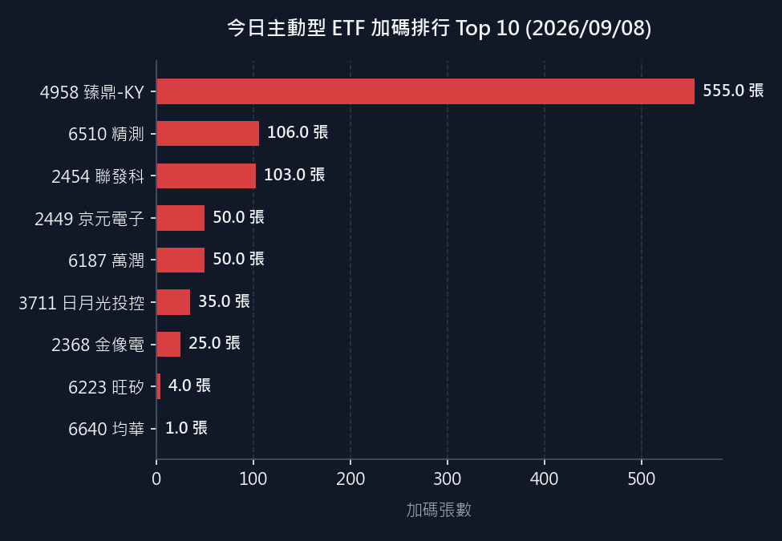
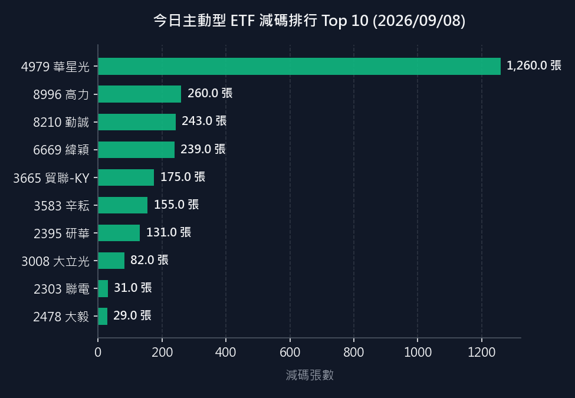

# 主動型 ETF 持股變動

資料來源：`主動型ETF持股明細.xlsx` 最近兩個日期分頁。

比較區間：`20260907` → `20260908`

## 今日加減碼視覺化排行

| 今日加碼 Top 10 | 今日減碼 Top 10 |
| :---: | :---: |
|  |  |

| ETF | 新增 | 刪除 | 比例變動 |
| :-- | --: | --: | --: |
| 00400A | 0 | 0 | 40 |
| 00401A | 0 | 0 | 0 |
| 00402A | 0 | 0 | 1 |
| 00403A | 0 | 0 | 0 |
| 00404A | 0 | 0 | 0 |
| 00405A | 0 | 0 | 0 |
| 00407A | 0 | 0 | 43 |
| 00408A | 0 | 0 | 0 |
| 00980A | 0 | 0 | 48 |
| 00980D | 0 | 0 | 0 |
| 00981A | 0 | 0 | 31 |
| 00982A | 0 | 0 | 44 |
| 00983A | 0 | 0 | 0 |
| 00983D | 0 | 0 | 0 |
| 00984A | 0 | 0 | 69 |
| 00985A | 0 | 0 | 0 |
| 00986A | 0 | 0 | 0 |
| 00987A | 0 | 0 | 0 |
| 00988A | 0 | 0 | 0 |
| 00989A | 0 | 0 | 0 |
| 00990A | 0 | 0 | 0 |
| 00991A | 0 | 0 | 20 |
| 00992A | 0 | 0 | 37 |
| 00993A | 0 | 0 | 44 |
| 00994A | 0 | 0 | 36 |
| 00995A | 0 | 0 | 0 |
| 00996A | 0 | 0 | 40 |
| 00997A | 0 | 0 | 0 |
| 00998A | 1 | 1 | 0 |
| 00999A | 0 | 0 | 0 |

## 00400A

### 新增持股

- 無

### 刪除持股

- 無

### 投資比例變動

- 1303 南亞：1.47% → 1.52%（+0.05）
- 2059 川湖：5.87% → 5.37%（-0.50）
- 2303 聯電：1.03% → 1.00%（-0.03）
- 2308 台達電：2.83% → 2.81%（-0.02）
- 2313 華通：0.91% → 0.89%（-0.02）
- 2330 台積電：8.73% → 8.91%（+0.18）
- 2345 智邦：1.64% → 1.55%（-0.09）
- 2360 致茂：3.60% → 3.71%（+0.11）
- 2368 金像電：1.36% → 1.42%（+0.06）
- 2382 廣達：0.79% → 0.76%（-0.03）
- 2383 台光電：3.30% → 3.26%（-0.04）
- 2454 聯發科：7.68% → 7.72%（+0.04）
- 2881 富邦金：1.59% → 1.61%（+0.02）
- 2885 元大金：1.51% → 1.54%（+0.03）
- 3008 大立光：2.77% → 0.91%（-1.86）
- 3017 奇鋐：4.42% → 4.32%（-0.10）
- 3026 禾伸堂：1.07% → 1.05%（-0.02）
- 3037 欣興：3.94% → 4.02%（+0.08）
- 3044 健鼎：1.75% → 1.74%（-0.01）
- 3081 聯亞：0.86% → 0.82%（-0.04）
- 3167 大量：0.35% → 0.38%（+0.03）
- 3293 鈊象：0.32% → 0.33%（+0.01）
- 3374 精材：0.55% → 0.56%（+0.01）
- 3443 創意：3.87% → 3.95%（+0.08）
- 3529 力旺：1.08% → 1.20%（+0.12）
- 3653 健策：4.29% → 4.28%（-0.01）
- 3665 貿聯-KY：1.62% → 1.63%（+0.01）
- 3711 日月光投控：0.99% → 1.00%（+0.01）
- 4979 華星光：0.59% → 0.62%（+0.03）
- 5274 信驊：3.45% → 3.18%（-0.27）
- 6121 新普：0.24% → 0.23%（-0.01）
- 6187 萬潤：2.80% → 2.88%（+0.08）
- 6223 旺矽：4.48% → 4.81%（+0.33）
- 6274 台燿：1.86% → 1.85%（-0.01）
- 6442 光聖：0.95% → 0.96%（+0.01）
- 6488 環球晶：3.13% → 3.12%（-0.01）
- 6515 穎崴：0.50% → 0.56%（+0.06）
- 6669 緯穎：5.63% → 4.16%（-1.47）
- 7750 新代：0.99% → 0.98%（-0.01）
- 7769 鴻勁：0.45% → 0.49%（+0.04）

## 00401A

### 新增持股

- 無

### 刪除持股

- 無

### 投資比例變動

- 無

## 00402A

### 新增持股

- 無

### 刪除持股

- 無

### 投資比例變動

- INTC.US Intel：1.28% → 1.29%（+0.01）

## 00403A

### 新增持股

- 無

### 刪除持股

- 無

### 投資比例變動

- 無

## 00404A

### 新增持股

- 無

### 刪除持股

- 無

### 投資比例變動

- 無

## 00405A

### 新增持股

- 無

### 刪除持股

- 無

### 投資比例變動

- 無

## 00407A

### 新增持股

- 無

### 刪除持股

- 無

### 投資比例變動

- 1303 南亞：0.70% → 0.71%（+0.01）
- 1560 中砂：0.75% → 0.79%（+0.04）
- 1590 亞德客-KY：0.08% → 0.07%（-0.01）
- 2059 川湖：3.63% → 3.62%（-0.01）
- 2301 光寶科：1.59% → 1.54%（-0.05）
- 2303 聯電：0.51% → 0.56%（+0.05）
- 2308 台達電：3.88% → 3.91%（+0.03）
- 2327 國巨*：2.24% → 2.33%（+0.09）
- 2330 台積電：8.90% → 9.03%（+0.13）
- 2345 智邦：2.87% → 2.85%（-0.02）
- 2360 致茂：2.02% → 2.20%（+0.18）
- 2368 金像電：1.27% → 1.36%（+0.09）
- 2383 台光電：5.42% → 5.47%（+0.05）
- 2395 研華：2.15% → 1.71%（-0.44）
- 2408 南亞科：0.94% → 0.98%（+0.04）
- 2454 聯發科：5.28% → 5.67%（+0.39）
- 2615 萬海：0.69% → 0.68%（-0.01）
- 3008 大立光：2.32% → 2.07%（-0.25）
- 3017 奇鋐：5.96% → 5.68%（-0.28）
- 3034 聯詠：0.70% → 0.72%（+0.02）
- 3037 欣興：4.40% → 4.61%（+0.21）
- 3081 聯亞：1.61% → 1.55%（-0.06）
- 3260 威剛：0.30% → 0.31%（+0.01）
- 3443 創意：3.52% → 3.58%（+0.06）
- 3491 昇達科：0.91% → 0.90%（-0.01）
- 3529 力旺：0.50% → 0.54%（+0.04）
- 3653 健策：2.60% → 2.49%（-0.11）
- 3665 貿聯-KY：2.06% → 1.97%（-0.09）
- 3711 日月光投控：2.49% → 2.62%（+0.13）
- 4958 臻鼎-KY：0.86% → 0.93%（+0.07）
- 5274 信驊：2.25% → 2.46%（+0.21）
- 5289 宜鼎：0.34% → 0.35%（+0.01）
- 6187 萬潤：1.02% → 1.33%（+0.31）
- 6223 旺矽：2.64% → 2.80%（+0.16）
- 6446 藥華藥：0.34% → 0.35%（+0.01）
- 6510 精測：0.64% → 1.07%（+0.43）
- 6531 愛普*：0.31% → 0.33%（+0.02）
- 6669 緯穎：5.83% → 4.76%（-1.07）
- 6805 富世達：2.80% → 2.86%（+0.06）
- 8046 南電：1.59% → 1.58%（-0.01）
- 8210 勤誠：0.95% → 0.90%（-0.05）
- 8299 群聯：0.31% → 0.32%（+0.01）
- 8996 高力：1.78% → 1.69%（-0.09）

## 00408A

### 新增持股

- 無

### 刪除持股

- 無

### 投資比例變動

- 無

## 00980A

### 新增持股

- 無

### 刪除持股

- 無

### 投資比例變動

- 1303 南亞：2.73% → 2.75%（+0.02）
- 2059 川湖：5.56% → 5.49%（-0.07）
- 2308 台達電：3.70% → 3.69%（-0.01）
- 2317 鴻海：2.47% → 2.43%（-0.04）
- 2327 國巨*：1.68% → 1.73%（+0.05）
- 2330 台積電：9.10% → 9.14%（+0.04）
- 2344 華邦電：2.00% → 2.04%（+0.04）
- 2345 智邦：1.83% → 1.80%（-0.03）
- 2360 致茂：1.51% → 1.63%（+0.12）
- 2368 金像電：2.06% → 2.17%（+0.11）
- 2376 技嘉：1.26% → 1.25%（-0.01）
- 2382 廣達：1.71% → 1.69%（-0.02）
- 2408 南亞科：2.73% → 2.80%（+0.07）
- 2454 聯發科：5.51% → 5.85%（+0.34）
- 2884 玉山金：1.38% → 1.36%（-0.02）
- 2891 中信金：1.55% → 1.51%（-0.04）
- 3008 大立光：0.96% → 0.85%（-0.11）
- 3017 奇鋐：2.40% → 2.26%（-0.14）
- 3026 禾伸堂：0.47% → 0.51%（+0.04）
- 3036 文曄：1.11% → 1.09%（-0.02）
- 3037 欣興：2.55% → 2.64%（+0.09）
- 3044 健鼎：0.85% → 0.84%（-0.01）
- 3081 聯亞：3.63% → 3.46%（-0.17）
- 3189 景碩：0.76% → 0.74%（-0.02）
- 3231 緯創：1.03% → 1.01%（-0.02）
- 3264 欣銓：0.74% → 0.73%（-0.01）
- 3293 鈊象：0.90% → 0.88%（-0.02）
- 3443 創意：1.72% → 1.73%（+0.01）
- 3529 力旺：0.53% → 0.56%（+0.03）
- 3533 嘉澤：0.30% → 0.29%（-0.01）
- 3653 健策：2.03% → 1.93%（-0.10）
- 3665 貿聯-KY：0.35% → 0.33%（-0.02）
- 3711 日月光投控：1.55% → 1.61%（+0.06）
- 4958 臻鼎-KY：1.07% → 1.14%（+0.07）
- 5274 信驊：1.60% → 1.74%（+0.14）
- 5904 寶雅*：1.13% → 1.11%（-0.02）
- 6213 聯茂：1.25% → 1.22%（-0.03）
- 6223 旺矽：1.86% → 1.95%（+0.09）
- 6274 台燿：1.43% → 1.41%（-0.02）
- 6442 光聖：0.33% → 0.32%（-0.01）
- 6515 穎崴：1.95% → 1.90%（-0.05）
- 6669 緯穎：2.00% → 1.91%（-0.09）
- 6831 邁科：0.55% → 0.51%（-0.04）
- 7769 鴻勁：2.19% → 2.37%（+0.18）
- 8046 南電：1.07% → 1.05%（-0.02）
- 8210 勤誠：0.95% → 0.89%（-0.06）
- 8299 群聯：1.99% → 2.04%（+0.05）
- 8996 高力：1.18% → 1.11%（-0.07）

## 00980D

### 新增持股

- 無

### 刪除持股

- 無

### 投資比例變動

- 無

## 00981A

### 新增持股

- 無

### 刪除持股

- 無

### 投資比例變動

- 2303 聯電：4.09% → 4.42%（+0.33）
- 2308 台達電：4.67% → 4.65%（-0.02）
- 2327 國巨*：4.96% → 5.11%（+0.15）
- 2330 台積電：9.38% → 9.40%（+0.02）
- 2345 智邦：4.80% → 4.71%（-0.09）
- 2368 金像電：0.08% → 0.09%（+0.01）
- 2383 台光電：9.09% → 9.06%（-0.03）
- 2449 京元電子：1.19% → 1.21%（+0.02）
- 2454 聯發科：7.94% → 8.57%（+0.63）
- 3017 奇鋐：7.51% → 7.06%（-0.45）
- 3037 欣興：6.47% → 6.69%（+0.22）
- 3376 新日興：0.13% → 0.12%（-0.01）
- 3443 創意：0.76% → 0.77%（+0.01）
- 3653 健策：5.08% → 4.80%（-0.28）
- 3665 貿聯-KY：3.48% → 3.16%（-0.32）
- 3711 日月光投控：3.49% → 3.62%（+0.13）
- 4958 臻鼎-KY：0.35% → 0.47%（+0.12）
- 4979 華星光：0.49% → 0.19%（-0.30）
- 5274 信驊：1.28% → 1.39%（+0.11）
- 6191 精成科：0.12% → 0.11%（-0.01）
- 6223 旺矽：4.51% → 4.72%（+0.21）
- 6271 同欣電：0.19% → 0.18%（-0.01）
- 6274 台燿：2.60% → 2.57%（-0.03）
- 6278 台表科：0.23% → 0.22%（-0.01）
- 6510 精測：0.66% → 0.77%（+0.11）
- 6515 穎崴：0.24% → 0.23%（-0.01）
- 6669 緯穎：5.88% → 5.61%（-0.27）
- 6805 富世達：1.35% → 1.36%（+0.01）
- 8046 南電：3.51% → 3.43%（-0.08）
- 8210 勤誠：0.85% → 0.71%（-0.14）
- 8996 高力：0.60% → 0.45%（-0.15）

## 00982A

### 新增持股

- 無

### 刪除持股

- 無

### 投資比例變動

- 2059 川湖：4.91% → 4.45%（-0.46）
- 2301 光寶科：1.94% → 1.85%（-0.09）
- 2303 聯電：1.31% → 1.39%（+0.08）
- 2330 台積電：8.37% → 8.70%（+0.33）
- 2345 智邦：2.52% → 2.38%（-0.14）
- 2360 致茂：3.26% → 3.66%（+0.40）
- 2376 技嘉：1.24% → 1.23%（-0.01）
- 2377 微星：1.35% → 1.29%（-0.06）
- 2383 台光電：3.30% → 3.28%（-0.02）
- 2395 研華：2.02% → 1.88%（-0.14）
- 2428 興勤：1.17% → 1.15%（-0.02）
- 2454 聯發科：6.29% → 6.81%（+0.52）
- 2455 全新：1.59% → 1.56%（-0.03）
- 2467 志聖：1.17% → 1.20%（+0.03）
- 2478 大毅：1.07% → 1.04%（-0.03）
- 2486 一詮：0.80% → 0.77%（-0.03）
- 2885 元大金：0.30% → 0.31%（+0.01）
- 3008 大立光：3.64% → 3.23%（-0.41）
- 3017 奇鋐：2.58% → 2.40%（-0.18）
- 3090 日電貿：1.14% → 1.09%（-0.05）
- 3105 穩懋：4.97% → 4.95%（-0.02）
- 3231 緯創：1.42% → 1.35%（-0.07）
- 3265 台星科：1.17% → 1.11%（-0.06）
- 3491 昇達科：3.44% → 3.45%（+0.01）
- 3529 力旺：0.43% → 0.52%（+0.09）
- 3583 辛耘：1.58% → 1.44%（-0.14）
- 3711 日月光投控：1.07% → 1.14%（+0.07）
- 4958 臻鼎-KY：2.83% → 3.13%（+0.30）
- 5274 信驊：1.21% → 1.35%（+0.14）
- 5425 台半：1.16% → 1.13%（-0.03）
- 5483 中美晶：1.24% → 1.22%（-0.02）
- 5536 聖暉*：0.75% → 0.76%（+0.01）
- 6139 亞翔：5.37% → 5.46%（+0.09）
- 6214 精誠：1.25% → 1.26%（+0.01）
- 6223 旺矽：3.06% → 3.49%（+0.43）
- 6239 力成：1.02% → 1.03%（+0.01）
- 6274 台燿：1.13% → 1.12%（-0.01）
- 6446 藥華藥：0.11% → 0.12%（+0.01）
- 6472 保瑞：0.83% → 0.84%（+0.01）
- 6488 環球晶：2.09% → 2.05%（-0.04）
- 6531 愛普*：2.93% → 3.03%（+0.10）
- 6669 緯穎：6.91% → 6.39%（-0.52）
- 6672 騰輝電子-KY：0.30% → 0.31%（+0.01）
- 8996 高力：0.96% → 0.92%（-0.04）

## 00983A

### 新增持股

- 無

### 刪除持股

- 無

### 投資比例變動

- 無

## 00983D

### 新增持股

- 無

### 刪除持股

- 無

### 投資比例變動

- 無

## 00984A

### 新增持股

- 無

### 刪除持股

- 無

### 投資比例變動

- 1102 亞泥：1.81% → 1.80%（-0.01）
- 1229 聯華：0.71% → 0.70%（-0.01）
- 1303 南亞：2.41% → 2.45%（+0.04）
- 1326 台化：1.39% → 1.42%（+0.03）
- 1402 遠東新：2.06% → 2.02%（-0.04）
- 1409 新纖：0.67% → 0.66%（-0.01）
- 1560 中砂：0.51% → 0.53%（+0.02）
- 1907 永豐餘：0.38% → 0.37%（-0.01）
- 2006 東和鋼鐵：1.29% → 1.28%（-0.01）
- 2301 光寶科：1.38% → 1.33%（-0.05）
- 2303 聯電：0.89% → 0.98%（+0.09）
- 2313 華通：0.17% → 0.16%（-0.01）
- 2330 台積電：3.90% → 3.98%（+0.08）
- 2344 華邦電：1.40% → 1.44%（+0.04）
- 2351 順德：0.67% → 0.65%（-0.02）
- 2357 華碩：0.70% → 0.68%（-0.02）
- 2379 瑞昱：2.59% → 2.64%（+0.05）
- 2383 台光電：1.96% → 1.98%（+0.02）
- 2395 研華：1.42% → 1.35%（-0.07）
- 2408 南亞科：2.20% → 2.28%（+0.08）
- 2454 聯發科：0.27% → 0.29%（+0.02）
- 2455 全新：0.76% → 0.72%（-0.04）
- 2464 盟立：1.28% → 1.23%（-0.05）
- 2467 志聖：1.34% → 1.37%（+0.03）
- 2542 興富發：1.74% → 1.71%（-0.03）
- 2603 長榮：3.57% → 3.56%（-0.01）
- 2618 長榮航：2.53% → 2.49%（-0.04）
- 2633 台灣高鐵：0.80% → 0.79%（-0.01）
- 2850 新產：0.39% → 0.38%（-0.01）
- 2851 中再保：0.40% → 0.38%（-0.02）
- 2903 遠百：0.40% → 0.39%（-0.01）
- 3006 晶豪科：0.66% → 0.70%（+0.04）
- 3008 大立光：2.82% → 2.53%（-0.29）
- 3017 奇鋐：1.58% → 1.50%（-0.08）
- 3037 欣興：1.61% → 1.69%（+0.08）
- 3044 健鼎：0.66% → 0.67%（+0.01）
- 3045 台灣大：2.81% → 2.78%（-0.03）
- 3189 景碩：1.44% → 1.42%（-0.02）
- 3234 光環：0.77% → 0.74%（-0.03）
- 3260 威剛：0.66% → 0.68%（+0.02）
- 3264 欣銓：1.82% → 1.81%（-0.01）
- 3374 精材：0.29% → 0.31%（+0.02）
- 3443 創意：0.82% → 0.83%（+0.01）
- 3653 健策：1.12% → 1.07%（-0.05）
- 3661 世芯-KY：0.30% → 0.28%（-0.02）
- 3665 貿聯-KY：0.69% → 0.66%（-0.03）
- 3711 日月光投控：1.22% → 1.29%（+0.07）
- 4763 材料*-KY：1.20% → 1.21%（+0.01）
- 4958 臻鼎-KY：0.54% → 0.59%（+0.05）
- 5274 信驊：0.21% → 0.23%（+0.02）
- 5351 鈺創：0.66% → 0.69%（+0.03）
- 5534 長虹：0.39% → 0.38%（-0.01）
- 5871 中租-KY：2.14% → 2.15%（+0.01）
- 5876 上海商銀：2.55% → 2.58%（+0.03）
- 6173 信昌電：0.42% → 0.46%（+0.04）
- 6177 達麗：0.41% → 0.40%（-0.01）
- 6187 萬潤：2.16% → 2.26%（+0.10）
- 6213 聯茂：1.29% → 1.27%（-0.02）
- 6426 統新：0.41% → 0.45%（+0.04）
- 6446 藥華藥：2.37% → 2.39%（+0.02）
- 6548 長科*：1.52% → 1.48%（-0.04）
- 6584 南俊國際：0.95% → 0.92%（-0.03）
- 6592 和潤企業：0.24% → 0.23%（-0.01）
- 6669 緯穎：1.82% → 1.76%（-0.06）
- 7750 新代：0.70% → 0.69%（-0.01）
- 8021 尖點：0.65% → 0.72%（+0.07）
- 8039 台虹：0.63% → 0.69%（+0.06）
- 8046 南電：1.15% → 1.14%（-0.01）
- 9933 中鼎：0.40% → 0.39%（-0.01）

## 00985A

### 新增持股

- 無

### 刪除持股

- 無

### 投資比例變動

- 無

## 00986A

### 新增持股

- 無

### 刪除持股

- 無

### 投資比例變動

- 無

## 00987A

### 新增持股

- 無

### 刪除持股

- 無

### 投資比例變動

- 無

## 00988A

### 新增持股

- 無

### 刪除持股

- 無

### 投資比例變動

- 無

## 00989A

### 新增持股

- 無

### 刪除持股

- 無

### 投資比例變動

- 無

## 00990A

### 新增持股

- 無

### 刪除持股

- 無

### 投資比例變動

- 無

## 00991A

### 新增持股

- 無

### 刪除持股

- 無

### 投資比例變動

- 2059 川湖：8.69% → 7.87%（-0.82）
- 2327 國巨*：5.29% → 5.35%（+0.06）
- 2330 台積電：11.49% → 11.80%（+0.31）
- 2345 智邦：3.82% → 3.56%（-0.26）
- 2383 台光電：9.37% → 9.27%（-0.10）
- 2408 南亞科：8.59% → 9.21%（+0.62）
- 2454 聯發科：4.99% → 5.33%（+0.34）
- 3017 奇鋐：5.60% → 5.16%（-0.44）
- 3026 禾伸堂：2.37% → 2.54%（+0.17）
- 3037 欣興：5.66% → 6.00%（+0.34）
- 3081 聯亞：3.58% → 3.24%（-0.34）
- 3189 景碩：4.21% → 4.12%（-0.09）
- 3653 健策：2.51% → 2.37%（-0.14）
- 5274 信驊：3.08% → 3.40%（+0.32）
- 6223 旺矽：2.46% → 2.77%（+0.31）
- 6274 台燿：3.08% → 3.04%（-0.04）
- 6669 緯穎：5.57% → 5.09%（-0.48）
- 7769 鴻勁：2.10% → 2.45%（+0.35）
- 8046 南電：4.30% → 4.19%（-0.11）
- 8299 群聯：1.97% → 2.05%（+0.08）

## 00992A

### 新增持股

- 無

### 刪除持股

- 無

### 投資比例變動

- 1303 南亞：2.91% → 2.98%（+0.07）
- 1815 富喬：3.05% → 3.35%（+0.30）
- 2059 川湖：6.73% → 6.76%（+0.03）
- 2301 光寶科：0.48% → 0.47%（-0.01）
- 2308 台達電：1.65% → 1.68%（+0.03）
- 2330 台積電：6.37% → 6.51%（+0.14）
- 2345 智邦：5.34% → 5.35%（+0.01）
- 2357 華碩：0.48% → 0.46%（-0.02）
- 2360 致茂：0.37% → 0.40%（+0.03）
- 2376 技嘉：0.43% → 0.44%（+0.01）
- 2383 台光電：5.96% → 6.06%（+0.10）
- 2404 漢唐：0.39% → 0.40%（+0.01）
- 2454 聯發科：1.52% → 1.64%（+0.12）
- 2455 全新：3.44% → 3.26%（-0.18）
- 3008 大立光：5.14% → 4.63%（-0.51）
- 3017 奇鋐：8.46% → 8.12%（-0.34）
- 3026 禾伸堂：0.43% → 0.48%（+0.05）
- 3037 欣興：5.30% → 5.59%（+0.29）
- 3081 聯亞：0.47% → 0.46%（-0.01）
- 3189 景碩：1.64% → 1.63%（-0.01）
- 3231 緯創：3.40% → 3.38%（-0.02）
- 3443 創意：2.26% → 2.31%（+0.05）
- 3653 健策：0.46% → 0.44%（-0.02）
- 3661 世芯-KY：2.15% → 2.06%（-0.09）
- 3665 貿聯-KY：5.90% → 5.70%（-0.20）
- 4958 臻鼎-KY：1.10% → 1.19%（+0.09）
- 5274 信驊：0.46% → 0.50%（+0.04）
- 5289 宜鼎：0.32% → 0.33%（+0.01）
- 5347 世界：0.22% → 0.23%（+0.01）
- 6187 萬潤：0.41% → 0.44%（+0.03）
- 6213 聯茂：0.46% → 0.45%（-0.01）
- 6223 旺矽：3.27% → 3.49%（+0.22）
- 6584 南俊國際：3.35% → 3.28%（-0.07）
- 6669 緯穎：2.61% → 2.54%（-0.07）
- 8021 尖點：2.67% → 2.94%（+0.27）
- 8046 南電：2.42% → 2.41%（-0.01）
- 8996 高力：5.02% → 4.79%（-0.23）

## 00993A

### 新增持股

- 無

### 刪除持股

- 無

### 投資比例變動

- 1303 南亞：3.72% → 3.74%（+0.02）
- 2059 川湖：3.84% → 3.79%（-0.05）
- 2303 聯電：1.60% → 1.73%（+0.13）
- 2308 台達電：2.06% → 2.05%（-0.01）
- 2313 華通：0.41% → 0.39%（-0.02）
- 2327 國巨*：0.92% → 0.95%（+0.03）
- 2330 台積電：8.14% → 8.17%（+0.03）
- 2344 華邦電：2.17% → 2.21%（+0.04）
- 2345 智邦：2.87% → 2.82%（-0.05）
- 2368 金像電：2.07% → 2.18%（+0.11）
- 2408 南亞科：3.36% → 3.44%（+0.08）
- 2449 京元電子：0.35% → 0.36%（+0.01）
- 2454 聯發科：5.81% → 6.16%（+0.35）
- 2455 全新：1.71% → 1.59%（-0.12）
- 3008 大立光：1.83% → 1.62%（-0.21）
- 3017 奇鋐：3.71% → 3.50%（-0.21）
- 3036 文曄：0.59% → 0.58%（-0.01）
- 3037 欣興：2.88% → 2.98%（+0.10）
- 3044 健鼎：0.44% → 0.43%（-0.01）
- 3081 聯亞：1.47% → 1.40%（-0.07）
- 3131 弘塑：0.52% → 0.55%（+0.03）
- 3189 景碩：2.21% → 2.16%（-0.05）
- 3231 緯創：1.87% → 1.83%（-0.04）
- 3264 欣銓：1.27% → 1.25%（-0.02）
- 3443 創意：2.87% → 2.89%（+0.02）
- 3653 健策：1.28% → 1.21%（-0.07）
- 3665 貿聯-KY：2.12% → 2.01%（-0.11）
- 4958 臻鼎-KY：1.84% → 1.96%（+0.12）
- 5274 信驊：2.70% → 2.92%（+0.22）
- 5289 宜鼎：0.71% → 0.72%（+0.01）
- 6139 亞翔：1.20% → 1.19%（-0.01）
- 6147 頎邦：0.66% → 0.68%（+0.02）
- 6223 旺矽：4.08% → 4.28%（+0.20）
- 6274 台燿：2.58% → 2.55%（-0.03）
- 6415 矽力*-KY：0.39% → 0.38%（-0.01）
- 6510 精測：0.53% → 0.54%（+0.01）
- 6515 穎崴：2.24% → 2.18%（-0.06）
- 6669 緯穎：3.41% → 3.25%（-0.16）
- 6805 富世達：0.78% → 0.79%（+0.01）
- 8046 南電：1.93% → 1.89%（-0.04）
- 8210 勤誠：0.66% → 0.62%（-0.04）
- 8299 群聯：0.48% → 0.49%（+0.01）
- 8358 金居：0.53% → 0.54%（+0.01）
- 8996 高力：1.65% → 1.54%（-0.11）

## 00994A

### 新增持股

- 無

### 刪除持股

- 無

### 投資比例變動

- 1303 南亞：2.20% → 2.25%（+0.05）
- 2059 川湖：5.30% → 5.31%（+0.01）
- 2303 聯電：0.72% → 0.79%（+0.07）
- 2308 台達電：2.27% → 2.30%（+0.03）
- 2330 台積電：13.96% → 14.16%（+0.20）
- 2345 智邦：2.19% → 2.18%（-0.01）
- 2360 致茂：0.30% → 0.57%（+0.27）
- 2368 金像電：0.36% → 0.38%（+0.02）
- 2383 台光電：6.79% → 6.88%（+0.09）
- 2408 南亞科：1.84% → 1.92%（+0.08）
- 2449 京元電子：0.56% → 0.87%（+0.31）
- 2454 聯發科：6.01% → 6.97%（+0.96）
- 2481 強茂：0.96% → 0.97%（+0.01）
- 3017 奇鋐：8.00% → 7.65%（-0.35）
- 3037 欣興：3.95% → 4.15%（+0.20）
- 3045 台灣大：0.38% → 0.37%（-0.01）
- 3081 聯亞：1.55% → 1.50%（-0.05）
- 3189 景碩：1.65% → 1.64%（-0.01）
- 3231 緯創：0.47% → 0.46%（-0.01）
- 3443 創意：2.35% → 2.40%（+0.05）
- 3653 健策：3.12% → 3.00%（-0.12）
- 3661 世芯-KY：0.36% → 0.34%（-0.02）
- 3665 貿聯-KY：0.59% → 0.57%（-0.02）
- 3711 日月光投控：1.02% → 1.62%（+0.60）
- 5274 信驊：2.38% → 2.62%（+0.24）
- 6187 萬潤：1.08% → 1.13%（+0.05）
- 6223 旺矽：3.93% → 4.65%（+0.72）
- 6239 力成：1.03% → 1.04%（+0.01）
- 6274 台燿：4.58% → 4.59%（+0.01）
- 6488 環球晶：0.85% → 0.84%（-0.01）
- 6669 緯穎：4.55% → 4.41%（-0.14）
- 6805 富世達：1.40% → 1.44%（+0.04）
- 7769 鴻勁：1.40% → 1.53%（+0.13）
- 8046 南電：2.47% → 2.45%（-0.02）
- 8996 高力：0.99% → 0.95%（-0.04）
- 9941 裕融：0.02% → 0.01%（-0.01）

## 00995A

### 新增持股

- 無

### 刪除持股

- 無

### 投資比例變動

- 無

## 00996A

### 新增持股

- 無

### 刪除持股

- 無

### 投資比例變動

- 1303 南亞：0.48% → 0.50%（+0.02）
- 2308 台達電：5.14% → 5.07%（-0.07）
- 2327 國巨*：5.23% → 5.10%（-0.13）
- 2330 台積電：10.63% → 10.81%（+0.18）
- 2344 華邦電：1.43% → 1.52%（+0.09）
- 2345 智邦：1.37% → 1.29%（-0.08）
- 2360 致茂：1.35% → 1.38%（+0.03）
- 2368 金像電：0.38% → 0.37%（-0.01）
- 2383 台光電：6.76% → 6.66%（-0.10）
- 2408 南亞科：1.21% → 1.26%（+0.05）
- 2454 聯發科：7.24% → 7.25%（+0.01）
- 2472 立隆電：2.32% → 2.24%（-0.08）
- 3017 奇鋐：2.15% → 2.09%（-0.06）
- 3037 欣興：1.74% → 1.77%（+0.03）
- 3042 晶技：1.58% → 1.56%（-0.02）
- 3131 弘塑：0.31% → 0.32%（+0.01）
- 3189 景碩：2.08% → 2.07%（-0.01）
- 3363 上詮：1.80% → 1.79%（-0.01）
- 3443 創意：3.15% → 3.21%（+0.06）
- 3653 健策：2.73% → 2.71%（-0.02）
- 3661 世芯-KY：1.76% → 1.77%（+0.01）
- 3665 貿聯-KY：0.15% → 0.14%（-0.01）
- 3693 營邦：1.55% → 1.54%（-0.01）
- 4583 台灣精銳：0.33% → 0.34%（+0.01）
- 4958 臻鼎-KY：6.80% → 6.94%（+0.14）
- 5269 祥碩：0.77% → 0.75%（-0.02）
- 6213 聯茂：0.07% → 0.08%（+0.01）
- 6223 旺矽：2.52% → 2.69%（+0.17）
- 6274 台燿：1.22% → 1.21%（-0.01）
- 6278 台表科：3.13% → 3.06%（-0.07）
- 6415 矽力*-KY：1.57% → 1.56%（-0.01）
- 6510 精測：1.17% → 1.24%（+0.07）
- 6531 愛普*：0.12% → 0.11%（-0.01）
- 6683 雍智科技：0.92% → 0.93%（+0.01）
- 6770 力積電：0.22% → 0.23%（+0.01）
- 7751 竑騰：1.84% → 1.81%（-0.03）
- 8021 尖點：1.61% → 1.58%（-0.03）
- 8046 南電：1.37% → 1.35%（-0.02）
- 8210 勤誠：1.47% → 1.44%（-0.03）
- 8996 高力：2.66% → 2.67%（+0.01）

## 00997A

### 新增持股

- 無

### 刪除持股

- 無

### 投資比例變動

- 無

## 00998A

### 新增持股

- WFC.US Wells Fargo（0.98%，15 張）

### 刪除持股

- 富國銀行（0.98%，15 張）

### 投資比例變動

- 無

## 00999A

### 新增持股

- 無

### 刪除持股

- 無

### 投資比例變動

- 無
