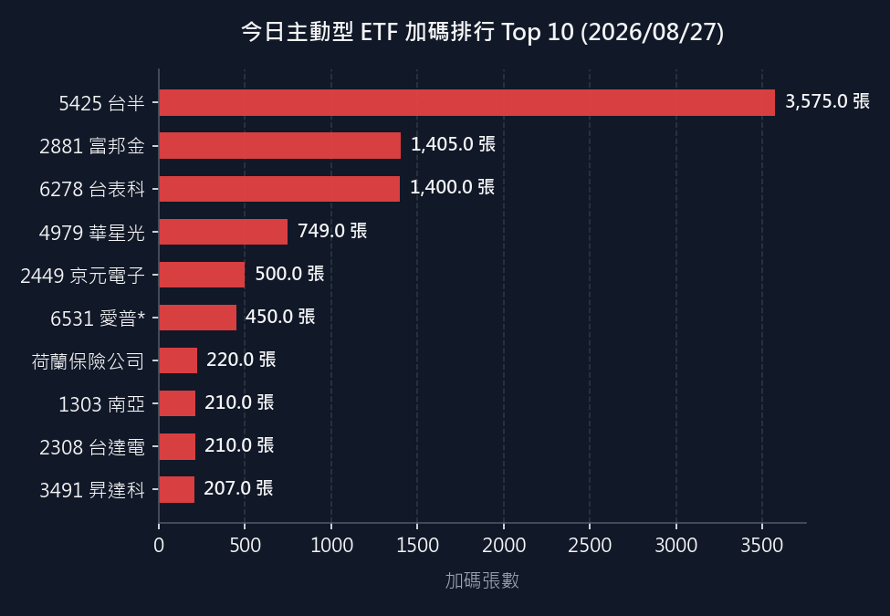
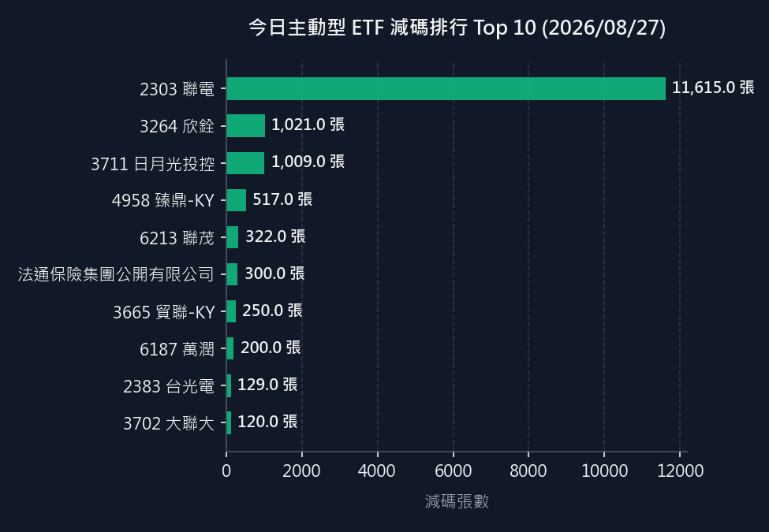

# 主動型 ETF 持股變動

資料來源：`主動型ETF持股明細.xlsx` 最近兩個日期分頁。

比較區間：`20260826` → `20260827`

## 今日加減碼視覺化排行

| 今日加碼 Top 10 | 今日減碼 Top 10 |
| :---: | :---: |
|  |  |

| ETF | 新增 | 刪除 | 比例變動 |
| :-- | --: | --: | --: |
| 00400A | 0 | 0 | 40 |
| 00401A | 0 | 0 | 0 |
| 00402A | 0 | 0 | 50 |
| 00403A | 0 | 0 | 37 |
| 00404A | 0 | 0 | 0 |
| 00405A | 1 | 0 | 32 |
| 00407A | 0 | 0 | 41 |
| 00408A | 2 | 2 | 41 |
| 00980A | 0 | 0 | 43 |
| 00980D | 5 | 2 | 42 |
| 00981A | 0 | 0 | 30 |
| 00982A | 0 | 2 | 39 |
| 00983A | 0 | 0 | 41 |
| 00983D | 0 | 0 | 12 |
| 00984A | 0 | 0 | 87 |
| 00985A | 0 | 0 | 41 |
| 00986A | 1 | 0 | 31 |
| 00987A | 0 | 0 | 25 |
| 00988A | 4 | 1 | 37 |
| 00989A | 0 | 0 | 49 |
| 00990A | 4 | 1 | 42 |
| 00991A | 0 | 0 | 18 |
| 00992A | 0 | 0 | 35 |
| 00993A | 0 | 0 | 43 |
| 00994A | 2 | 0 | 27 |
| 00995A | 0 | 0 | 47 |
| 00996A | 0 | 0 | 39 |
| 00997A | 1 | 0 | 44 |
| 00998A | 0 | 0 | 35 |
| 00999A | 0 | 0 | 48 |

## 00400A

### 新增持股

- 無

### 刪除持股

- 無

### 投資比例變動

- 1303 南亞：1.32% → 1.46%（+0.14）
- 2059 川湖：6.13% → 6.07%（-0.06）
- 2303 聯電：0.89% → 0.85%（-0.04）
- 2308 台達電：2.68% → 2.72%（+0.04）
- 2313 華通：0.84% → 0.93%（+0.09）
- 2317 鴻海：0.81% → 0.83%（+0.02）
- 2330 台積電：8.58% → 8.57%（-0.01）
- 2345 智邦：1.60% → 1.63%（+0.03）
- 2360 致茂：3.20% → 3.22%（+0.02）
- 2368 金像電：1.26% → 1.25%（-0.01）
- 2383 台光電：1.54% → 1.44%（-0.10）
- 2449 京元電子：0.84% → 0.85%（+0.01）
- 2454 聯發科：6.37% → 6.25%（-0.12）
- 2881 富邦金：0.81% → 1.51%（+0.70）
- 2885 元大金：1.35% → 1.36%（+0.01）
- 3008 大立光：3.33% → 3.66%（+0.33）
- 3017 奇鋐：3.64% → 3.86%（+0.22）
- 3026 禾伸堂：0.85% → 0.94%（+0.09）
- 3036 文曄：1.03% → 1.02%（-0.01）
- 3037 欣興：2.47% → 2.52%（+0.05）
- 3081 聯亞：0.92% → 0.95%（+0.03）
- 3167 大量：0.28% → 0.29%（+0.01）
- 3374 精材：0.31% → 0.33%（+0.02）
- 3443 創意：4.00% → 3.87%（-0.13）
- 3529 力旺：1.01% → 1.11%（+0.10）
- 3653 健策：4.86% → 4.80%（-0.06）
- 3665 貿聯-KY：1.16% → 1.19%（+0.03）
- 3711 日月光投控：0.94% → 0.97%（+0.03）
- 4979 華星光：0.60% → 0.62%（+0.02）
- 5274 信驊：2.82% → 2.76%（-0.06）
- 5347 世界：0.71% → 0.70%（-0.01）
- 6121 新普：0.24% → 0.25%（+0.01）
- 6187 萬潤：2.66% → 2.93%（+0.27）
- 6223 旺矽：4.12% → 4.17%（+0.05）
- 6274 台燿：2.08% → 1.96%（-0.12）
- 6442 光聖：0.90% → 0.89%（-0.01）
- 6488 環球晶：3.06% → 3.09%（+0.03）
- 6515 穎崴：0.43% → 0.44%（+0.01）
- 6669 緯穎：5.15% → 5.18%（+0.03）
- 7750 新代：0.99% → 1.03%（+0.04）

## 00401A

### 新增持股

- 無

### 刪除持股

- 無

### 投資比例變動

- 無

## 00402A

### 新增持股

- 無

### 刪除持股

- 無

### 投資比例變動

- AAPL.US Apple：7.46% → 7.38%（-0.08）
- ADI.US Analog Devices：1.97% → 1.87%（-0.10）
- AMD.US AMD：4.73% → 4.52%（-0.21）
- AMZN.US Amazon：4.40% → 4.65%（+0.25）
- ARM.US Arm：1.01% → 1.00%（-0.01）
- ASML.US ASML Holding：1.81% → 1.72%（-0.09）
- AVGO.US Broadcom：2.29% → 2.17%（-0.12）
- AXON.US Axon Enterprise：1.21% → 1.14%（-0.07）
- BABA.US Alibaba Group：0.61% → 0.59%（-0.02）
- BKNG.US Booking Holdings：0.79% → 0.98%（+0.19）
- CDNS.US Cadence Design Systems：1.57% → 1.51%（-0.06）
- CIEN.US Ciena：0.88% → 1.16%（+0.28）
- CLS.US Celestica：0.92% → 0.88%（-0.04）
- COHR.US Coherent：2.05% → 1.99%（-0.06）
- CRWD.US CrowdStrike Holdings：1.34% → 1.31%（-0.03）
- DASH.US DoorDash：0.35% → 0.61%（+0.26）
- FSLY.US Fastly：0.38% → 0.36%（-0.02）
- GOOG.US Alphabet - Class C Capital Stock：3.35% → 3.16%（-0.19）
- GOOGL.US Alphabet - Class A Common Stock：3.32% → 3.58%（+0.26）
- INTC.US Intel：1.24% → 1.19%（-0.05）
- IOT.US Samsara：0.26% → 0.37%（+0.11）
- KLAC.US KLA：1.67% → 1.60%（-0.07）
- LITE.US Lumentum：1.92% → 1.94%（+0.02）
- LRCX.US Lam Research：2.98% → 2.82%（-0.16）
- MCHP.US Microchip Technology：1.20% → 1.16%（-0.04）
- MDB.US MongoDB：0.86% → 0.73%（-0.13）
- META.US Meta：2.95% → 2.84%（-0.11）
- MRVL.US Marvell：1.86% → 1.81%（-0.05）
- MSFT.US Microsoft：5.12% → 5.23%（+0.11）
- MU.US Micron：6.35% → 6.09%（-0.26）
- NFLX.US Netflix：0.98% → 0.92%（-0.06）
- NOW.US ServiceNow：0.81% → 0.76%（-0.05）
- NVDA.US NVIDIA：8.73% → 8.19%（-0.54）
- PANW.US Palo Alto：2.62% → 2.49%（-0.13）
- PLTR.US Palantir Technologies：1.63% → 1.79%（+0.16）
- SHOP.US Shopify：0.88% → 0.94%（+0.06）
- SIMO.US Silicon Motion：0.79% → 0.82%（+0.03）
- SKHY.US SK hynix：1.09% → 1.03%（-0.06）
- SNOW.US Snowflake：1.30% → 1.23%（-0.07）
- SPCX.US SpaceX：0.77% → 0.74%（-0.03）
- SPOT.US Spotify：0.33% → 0.54%（+0.21）
- STX.US Seagate：1.09% → 1.07%（-0.02）
- TER.US Teradyne：0.92% → 0.87%（-0.05）
- TSM.US TSMC(ADR)：1.54% → 1.47%（-0.07）
- TTWO.US Take-Two：0.59% → 0.75%（+0.16）
- TXN.US Texas Instruments：2.28% → 2.19%（-0.09）
- UBER.US Uber：0.56% → 0.52%（-0.04）
- V.US Visa：1.25% → 1.32%（+0.07）
- WDC.US Western Digital：2.22% → 2.34%（+0.12）
- ZS.US Zscaler：0.19% → 0.18%（-0.01）

## 00403A

### 新增持股

- 無

### 刪除持股

- 無

### 投資比例變動

- 1303 南亞：1.25% → 1.40%（+0.15）
- 1560 中砂：0.16% → 0.12%（-0.04）
- 1717 長興：0.10% → 0.11%（+0.01）
- 2303 聯電：4.31% → 3.52%（-0.79）
- 2308 台達電：2.93% → 3.03%（+0.10）
- 2317 鴻海：0.46% → 0.48%（+0.02）
- 2327 國巨*：3.06% → 3.23%（+0.17）
- 2330 台積電：16.87% → 17.19%（+0.32）
- 2337 旺宏：0.33% → 0.34%（+0.01）
- 2344 華邦電：1.58% → 1.66%（+0.08）
- 2345 智邦：2.76% → 2.87%（+0.11）
- 2360 致茂：1.15% → 1.18%（+0.03）
- 2383 台光電：5.80% → 5.23%（-0.57）
- 3008 大立光：2.29% → 2.88%（+0.59）
- 3017 奇鋐：5.79% → 6.25%（+0.46）
- 3037 欣興：5.71% → 5.93%（+0.22）
- 3189 景碩：2.33% → 2.47%（+0.14）
- 3211 順達：0.42% → 0.47%（+0.05）
- 3443 創意：2.21% → 2.19%（-0.02）
- 3450 聯鈞：0.13% → 0.14%（+0.01）
- 3583 辛耘：0.35% → 0.36%（+0.01）
- 3653 健策：3.62% → 3.65%（+0.03）
- 3665 貿聯-KY：1.40% → 1.47%（+0.07）
- 3711 日月光投控：2.76% → 2.52%（-0.24）
- 4958 臻鼎-KY：0.13% → 0.00%（-0.13）
- 4966 譜瑞-KY：0.07% → 0.08%（+0.01）
- 5274 信驊：1.64% → 1.63%（-0.01）
- 6223 旺矽：3.23% → 3.33%（+0.10）
- 6239 力成：0.89% → 0.88%（-0.01）
- 6274 台燿：1.69% → 1.63%（-0.06）
- 6488 環球晶：1.55% → 1.59%（+0.04）
- 6669 緯穎：2.61% → 2.67%（+0.06）
- 6805 富世達：1.02% → 1.24%（+0.22）
- 7769 鴻勁：0.48% → 0.49%（+0.01）
- 8046 南電：1.81% → 2.03%（+0.22）
- 8358 金居：0.21% → 0.23%（+0.02）
- 8996 高力：1.21% → 1.35%（+0.14）

## 00404A

### 新增持股

- 無

### 刪除持股

- 無

### 投資比例變動

- 無

## 00405A

### 新增持股

- 6278 台表科（0.97%，1400 張）

### 刪除持股

- 無

### 投資比例變動

- 2059 川湖：2.05% → 2.02%（-0.03）
- 2308 台達電：0.55% → 0.56%（+0.01）
- 2345 智邦：3.65% → 3.71%（+0.06）
- 2368 金像電：3.94% → 3.90%（-0.04）
- 2383 台光電：4.20% → 3.91%（-0.29）
- 2449 京元電子：0.03% → 0.04%（+0.01）
- 2454 聯發科：6.36% → 6.23%（-0.13）
- 3017 奇鋐：8.51% → 9.00%（+0.49）
- 3037 欣興：6.12% → 6.22%（+0.10）
- 3081 聯亞：1.73% → 1.79%（+0.06）
- 3131 弘塑：1.35% → 1.27%（-0.08）
- 3264 欣銓：0.02% → 0.03%（+0.01）
- 3443 創意：8.62% → 8.32%（-0.30）
- 3450 聯鈞：1.25% → 1.26%（+0.01）
- 3653 健策：8.21% → 8.09%（-0.12）
- 3665 貿聯-KY：6.16% → 4.59%（-1.57）
- 4749 新應材：0.24% → 0.25%（+0.01）
- 4991 環宇-KY：1.97% → 2.17%（+0.20）
- 5274 信驊：2.86% → 2.79%（-0.07）
- 6187 萬潤：0.86% → 0.95%（+0.09）
- 6223 旺矽：4.62% → 4.66%（+0.04）
- 6274 台燿：1.57% → 1.48%（-0.09）
- 6510 精測：2.16% → 2.25%（+0.09）
- 6526 達發：0.29% → 0.30%（+0.01）
- 6531 愛普*：0.92% → 2.31%（+1.39）
- 6805 富世達：1.37% → 2.02%（+0.65）
- 6831 邁科：0.48% → 0.50%（+0.02）
- 7734 印能科技：1.56% → 1.44%（-0.12）
- 7769 鴻勁：2.55% → 2.56%（+0.01）
- 8046 南電：2.93% → 3.21%（+0.28）
- 8210 勤誠：0.55% → 0.54%（-0.01）
- 8996 高力：1.13% → 1.24%（+0.11）

## 00407A

### 新增持股

- 無

### 刪除持股

- 無

### 投資比例變動

- 1303 南亞：0.63% → 0.69%（+0.06）
- 1560 中砂：0.46% → 0.47%（+0.01）
- 2059 川湖：3.72% → 3.68%（-0.04）
- 2301 光寶科：1.11% → 1.09%（-0.02）
- 2303 聯電：1.52% → 0.93%（-0.59）
- 2308 台達電：3.65% → 3.70%（+0.05）
- 2327 國巨*：2.10% → 2.18%（+0.08）
- 2330 台積電：8.76% → 8.77%（+0.01）
- 2344 華邦電：0.13% → 0.14%（+0.01）
- 2345 智邦：2.75% → 2.81%（+0.06）
- 2360 致茂：1.93% → 1.95%（+0.02）
- 2368 金像電：2.05% → 2.03%（-0.02）
- 2383 台光電：5.80% → 5.43%（-0.37）
- 2395 研華：2.04% → 2.01%（-0.03）
- 2408 南亞科：2.04% → 2.14%（+0.10）
- 2454 聯發科：4.63% → 4.55%（-0.08）
- 2615 萬海：0.68% → 0.67%（-0.01）
- 3008 大立光：0.71% → 0.79%（+0.08）
- 3017 奇鋐：4.89% → 5.49%（+0.60）
- 3034 聯詠：0.74% → 0.73%（-0.01）
- 3037 欣興：5.56% → 5.67%（+0.11）
- 3081 聯亞：1.07% → 1.61%（+0.54）
- 3260 威剛：0.30% → 0.31%（+0.01）
- 3443 創意：3.65% → 3.54%（-0.11）
- 3491 昇達科：0.45% → 0.48%（+0.03）
- 3529 力旺：1.00% → 1.10%（+0.10）
- 3653 健策：2.05% → 2.03%（-0.02）
- 3665 貿聯-KY：1.89% → 1.94%（+0.05）
- 3711 日月光投控：2.46% → 2.53%（+0.07）
- 4958 臻鼎-KY：1.70% → 1.80%（+0.10）
- 5274 信驊：2.00% → 1.96%（-0.04）
- 6187 萬潤：0.95% → 1.05%（+0.10）
- 6223 旺矽：2.89% → 2.56%（-0.33）
- 6274 台燿：3.60% → 3.41%（-0.19）
- 6446 藥華藥：1.17% → 1.15%（-0.02）
- 6515 穎崴：1.30% → 0.20%（-1.10）
- 6669 緯穎：5.09% → 5.13%（+0.04）
- 6805 富世達：2.53% → 2.78%（+0.25）
- 8046 南電：2.68% → 2.95%（+0.27）
- 8210 勤誠：0.92% → 0.91%（-0.01）
- 8996 高力：0.70% → 1.06%（+0.36）

## 00408A

### 新增持股

- 3189 景碩（1.26%，22 張）
- 3491 昇達科（0.62%，7 張）

### 刪除持股

- 1537 廣隆（0.19%，26 張）
- 5876 上海商銀（0.02%，8.2 張）

### 投資比例變動

- 1303 南亞：1.94% → 2.85%（+0.91）
- 2059 川湖：2.72% → 2.69%（-0.03）
- 2303 聯電：1.66% → 1.08%（-0.58）
- 2308 台達電：2.30% → 2.33%（+0.03）
- 2317 鴻海：1.85% → 1.89%（+0.04）
- 2330 台積電：6.16% → 6.19%（+0.03）
- 2344 華邦電：0.45% → 0.47%（+0.02）
- 2345 智邦：1.41% → 1.44%（+0.03）
- 2360 致茂：0.99% → 1.00%（+0.01）
- 2368 金像電：2.99% → 2.97%（-0.02）
- 2376 技嘉：1.21% → 1.19%（-0.02）
- 2382 廣達：1.35% → 1.36%（+0.01）
- 2383 台光電：3.68% → 3.44%（-0.24）
- 2395 研華：1.89% → 1.86%（-0.03）
- 2404 漢唐：1.69% → 1.68%（-0.01）
- 2408 南亞科：1.61% → 1.69%（+0.08）
- 2454 聯發科：1.97% → 1.94%（-0.03）
- 2481 強茂：0.71% → 0.70%（-0.01）
- 2801 彰銀：0.92% → 0.95%（+0.03）
- 2886 兆豐金：2.53% → 2.51%（-0.02）
- 2891 中信金：0.97% → 0.96%（-0.01）
- 3017 奇鋐：5.12% → 5.44%（+0.32）
- 3037 欣興：2.32% → 3.40%（+1.08）
- 3045 台灣大：2.74% → 2.75%（+0.01）
- 3081 聯亞：0.81% → 0.84%（+0.03）
- 3231 緯創：1.02% → 1.01%（-0.01）
- 3653 健策：2.15% → 2.12%（-0.03）
- 3702 大聯大：1.75% → 0.89%（-0.86）
- 4746 台耀：0.90% → 0.91%（+0.01）
- 6187 萬潤：1.22% → 1.34%（+0.12）
- 6223 旺矽：0.79% → 0.80%（+0.01）
- 6239 力成：1.20% → 1.16%（-0.04）
- 6274 台燿：2.68% → 2.53%（-0.15）
- 6488 環球晶：1.78% → 1.80%（+0.02）
- 6669 緯穎：5.51% → 5.55%（+0.04）
- 6805 富世達：0.76% → 1.25%（+0.49）
- 7769 鴻勁：1.78% → 1.79%（+0.01）
- 8046 南電：1.92% → 2.11%（+0.19）
- 8436 大江：1.64% → 2.07%（+0.43）
- 8996 高力：0.37% → 1.07%（+0.70）
- 9941 裕融：1.88% → 2.56%（+0.68）

## 00980A

### 新增持股

- 無

### 刪除持股

- 無

### 投資比例變動

- 1303 南亞：2.47% → 2.71%（+0.24）
- 2059 川湖：5.72% → 5.65%（-0.07）
- 2308 台達電：3.49% → 3.52%（+0.03）
- 2317 鴻海：2.33% → 2.39%（+0.06）
- 2327 國巨*：1.58% → 1.63%（+0.05）
- 2330 台積電：8.97% → 8.94%（-0.03）
- 2344 華邦電：2.05% → 2.10%（+0.05）
- 2345 智邦：1.76% → 1.79%（+0.03）
- 2360 致茂：1.44% → 1.45%（+0.01）
- 2368 金像電：2.02% → 1.99%（-0.03）
- 2376 技嘉：1.20% → 1.18%（-0.02）
- 2383 台光電：3.95% → 3.69%（-0.26）
- 2408 南亞科：2.79% → 2.92%（+0.13）
- 2454 聯發科：4.84% → 4.74%（-0.10）
- 2884 玉山金：1.21% → 1.20%（-0.01）
- 2891 中信金：1.44% → 1.42%（-0.02）
- 3008 大立光：0.81% → 0.89%（+0.08）
- 3017 奇鋐：2.08% → 2.21%（+0.13）
- 3026 禾伸堂：0.41% → 0.45%（+0.04）
- 3036 文曄：1.11% → 1.09%（-0.02）
- 3037 欣興：3.22% → 3.27%（+0.05）
- 3081 聯亞：3.67% → 3.80%（+0.13）
- 3189 景碩：0.80% → 0.83%（+0.03）
- 3231 緯創：0.93% → 0.92%（-0.01）
- 3443 創意：1.78% → 1.72%（-0.06）
- 3529 力旺：0.52% → 0.57%（+0.05）
- 3653 健策：1.95% → 1.92%（-0.03）
- 3665 貿聯-KY：0.32% → 0.33%（+0.01）
- 3711 日月光投控：1.54% → 1.57%（+0.03）
- 4958 臻鼎-KY：1.03% → 1.08%（+0.05）
- 5274 信驊：1.42% → 1.38%（-0.04）
- 5904 寶雅*：1.15% → 1.14%（-0.01）
- 6213 聯茂：1.39% → 1.34%（-0.05）
- 6223 旺矽：1.79% → 1.81%（+0.02）
- 6274 台燿：1.58% → 1.49%（-0.09）
- 6515 穎崴：1.63% → 1.65%（+0.02）
- 6669 緯穎：1.74% → 1.75%（+0.01）
- 6805 富世達：0.54% → 0.59%（+0.05）
- 6831 邁科：0.52% → 0.53%（+0.01）
- 8046 南電：1.18% → 1.30%（+0.12）
- 8210 勤誠：0.93% → 0.91%（-0.02）
- 8299 群聯：2.06% → 2.09%（+0.03）
- 8996 高力：1.07% → 1.17%（+0.10）

## 00980D

### 新增持股

- AVIANCA MIDCO 2 PLC SER REGS 10.25 % 07-JAN-2032（0.31%，N/A 張）
- HSBC HOLDINGS PLC VAR 03NOV2028（0.32%，N/A 張）
- SPACE EXPLORATION TECH SER 144A (REG) 6.65% 15JUL2056（0.31%，N/A 張）
- US 10YR NOTE (CBT)DEC26 21-DEC-2026（17.42%，0.104 張）
- US 10YR ULTRA FUT DEC26 21-DEC-2026（-1.19%，-0.007 張）

### 刪除持股

- US 10YR NOTE (CBT)SEP26 21-SEP-2026（18.09%，0.107 張）
- US 10YR ULTRA FUT SEP26 21-SEP-2026（-1.20%，-0.007 張）

### 投資比例變動

- ALLY FINANCIAL INC (REG) VAR 03JAN2030：0.62% → 0.61%（-0.01）
- ALLY FINANCIAL INC (REG) VAR 13JUN2029：0.54% → 0.53%（-0.01）
- ATHENE HOLDING LTD (REG) 6.25% 01APR2054：0.75% → 0.74%（-0.01）
- BANCO SANTANDER SA (REG) 6.607% 07NOV2028：0.65% → 0.64%（-0.01）
- BLUE OWL CREDIT INCOME (REG) 6.6% 15SEP2029：0.38% → 0.37%（-0.01）
- BLUE OWL CREDIT INCOME (REG) 6.65% 15MAR2031：0.52% → 0.51%（-0.01）
- BLUE OWL CREDIT INCOME SER WI (REG) 7.75% 16SEP2027：0.54% → 0.53%（-0.01）
- BPCE SA SER REGS VAR 19OCT2034：0.42% → 0.41%（-0.01）
- BRIGHTHOUSE FINANCIAL IN (REG) 4.7% 22JUN2047：0.47% → 0.46%（-0.01）
- CANTOR FITZGERALD LP SER REGS 7.200000 % 12DEC2028：0.32% → 0.31%（-0.01）
- CHC GROUP LLC SER REGS 11.750000 % 01-SEP-2030：0.43% → 0.42%（-0.01）
- CHS/COMMUNITY HEALTH SYS SER REGS 9.750000 % 15JAN2034：0.33% → 0.32%（-0.01）
- CONSOLIDATED ENERGY FIN SER REGS 12.000000 % 15FEB2031：0.55% → 0.54%（-0.01）
- DEUTSCHE BANK NY VAR 20NOV2029：0.46% → 0.45%（-0.01）
- DOW CHEMICAL CO/THE 9.4% 15MAY2039：0.54% → 0.53%（-0.01）
- EDISON INTERNATIONAL (REG) 6.95% 15NOV2029：0.57% → 0.56%（-0.01）
- ENEL FINANCE INTL NV SER REGS (REG S) 7.5% 14OCT2032：0.35% → 0.34%（-0.01）
- FIFTH THIRD BANCORP (REG) 8.25% 01MAR2038：0.64% → 0.63%（-0.01）
- FMC CORP (REG) 4.5% 01OCT2049：0.49% → 0.48%（-0.01）
- FORD MOTOR CREDIT CO LLC 6.500000 % 07FEB2035：0.32% → 0.31%（-0.01）
- FORD MOTOR CREDIT CO LLC 6.798% 07NOV2028：0.33% → 0.32%（-0.01）
- GLENCORE FINANCE CANADA SER REGS 6.900000 % 15-NOV-2037：0.39% → 0.38%（-0.01）
- HESS CORP (REG) 7.3% 15AUG2031：0.52% → 0.51%（-0.01）
- JBS USA HOLD/FOOD/LUX CO 7.250000 % 15NOV2053：0.47% → 0.46%（-0.01）
- KONINKLIJKE KPN NV (REG) 8.375% 01OCT2030：0.43% → 0.42%（-0.01）
- LBM ACQUISITION LLC SER REGS 9.500000 % 15JUN2031：0.48% → 0.47%（-0.01）
- M&T BANK CORPORATION (REG) VAR 30OCT2029：0.53% → 0.52%（-0.01）
- METLIFE INC (REG) 10.75% 01AUG2039：0.45% → 0.44%（-0.01）
- ONEOK INC 6.625% 01SEP2053：0.57% → 0.56%（-0.01）
- PACIFIC GAS & ELECTRIC 6.95% 15MAR2034：0.33% → 0.32%（-0.01）
- SALESFORCE INC (REG) 6.7% 15MAR2066：0.51% → 0.50%（-0.01）
- SANTANDER HOLDINGS USA VAR 09NOV2031：0.58% → 0.57%（-0.01）
- SANTANDER HOLDINGS USA VAR 12JUN2029：0.57% → 0.56%（-0.01）
- SBL HOLDINGS INC SER REGS 7.200000 % 30OCT2034：0.50% → 0.49%（-0.01）
- STELLANTIS FIN US INC SER REGS 6.450000 % 18MAR2035：0.32% → 0.31%（-0.01）
- TRANSCANADA PIPELINES LTD 7.625PCT 15/01/2039：0.52% → 0.51%（-0.01）
- TRUIST FINANCIAL CORP SER MTN VAR 30OCT2029：0.63% → 0.62%（-0.01）
- US 2YR NOTE (CBT) DEC26 31-DEC-2026：1.60% → 1.59%（-0.01）
- US 5YR NOTE (CBT) DEC26 31-DEC-2026：-14.87% → -14.78%（+0.09）
- US LONG BOND(CBT) SEP26 21-SEP-2026：5.31% → 5.27%（-0.04）
- US ULTRA BOND CBT SEP26 21-SEP-2026：-0.35% → -0.34%（+0.01）
- VIACOM INC (REG) 5.85% 01SEP2043：0.56% → 0.55%（-0.01）

## 00981A

### 新增持股

- 無

### 刪除持股

- 無

### 投資比例變動

- 2303 聯電：3.81% → 3.65%（-0.16）
- 2308 台達電：4.25% → 4.42%（+0.17）
- 2327 國巨*：4.70% → 4.85%（+0.15）
- 2330 台積電：9.90% → 9.87%（-0.03）
- 2345 智邦：4.65% → 4.73%（+0.08）
- 2368 金像電：0.70% → 0.69%（-0.01）
- 2383 台光電：9.85% → 9.11%（-0.74）
- 2449 京元電子：0.95% → 1.00%（+0.05）
- 2454 聯發科：7.01% → 6.85%（-0.16）
- 3017 奇鋐：6.51% → 6.88%（+0.37）
- 3037 欣興：8.12% → 8.25%（+0.13）
- 3264 欣銓：0.44% → 0.45%（+0.01）
- 3376 新日興：0.12% → 0.13%（+0.01）
- 3443 創意：0.69% → 0.66%（-0.03）
- 3653 健策：4.75% → 4.68%（-0.07）
- 3665 貿聯-KY：3.23% → 3.31%（+0.08）
- 3711 日月光投控：3.98% → 4.06%（+0.08）
- 4958 臻鼎-KY：0.26% → 0.27%（+0.01）
- 4979 華星光：0.50% → 0.67%（+0.17）
- 5274 信驊：2.08% → 1.80%（-0.28）
- 6187 萬潤：0.22% → 0.14%（-0.08）
- 6223 旺矽：4.32% → 4.36%（+0.04）
- 6274 台燿：2.90% → 2.74%（-0.16）
- 6278 台表科：0.22% → 0.23%（+0.01）
- 6510 精測：0.43% → 0.45%（+0.02）
- 6669 緯穎：5.21% → 5.23%（+0.02）
- 6805 富世達：1.58% → 1.74%（+0.16）
- 8046 南電：3.92% → 4.29%（+0.37）
- 8210 勤誠：0.83% → 0.82%（-0.01）
- 8996 高力：0.54% → 0.59%（+0.05）

## 00982A

### 新增持股

- 無

### 刪除持股

- 3264 欣銓（0.44%，1021 張）
- 6213 聯茂（0.37%，322 張）

### 投資比例變動

- 2059 川湖：5.30% → 5.21%（-0.09）
- 2301 光寶科：1.99% → 1.94%（-0.05）
- 2303 聯電：1.29% → 1.23%（-0.06）
- 2330 台積電：8.50% → 8.49%（-0.01）
- 2345 智邦：2.93% → 2.98%（+0.05）
- 2360 致茂：3.30% → 3.29%（-0.01）
- 2376 技嘉：1.25% → 1.22%（-0.03）
- 2377 微星：1.26% → 1.25%（-0.01）
- 2383 台光電：3.72% → 3.45%（-0.27）
- 2395 研華：2.01% → 1.96%（-0.05）
- 2454 聯發科：6.75% → 6.62%（-0.13）
- 2467 志聖：1.12% → 1.15%（+0.03）
- 2478 大毅：1.08% → 1.10%（+0.02）
- 2486 一詮：0.83% → 0.82%（-0.01）
- 3008 大立光：3.18% → 3.48%（+0.30）
- 3017 奇鋐：2.36% → 2.48%（+0.12）
- 3090 日電貿：1.11% → 1.12%（+0.01）
- 3105 穩懋：3.82% → 4.21%（+0.39）
- 3231 緯創：1.23% → 1.21%（-0.02）
- 3265 台星科：1.19% → 1.20%（+0.01）
- 3491 昇達科：2.64% → 3.30%（+0.66）
- 3529 力旺：0.44% → 0.48%（+0.04）
- 3583 辛耘：1.68% → 1.73%（+0.05）
- 3617 碩天：0.30% → 0.29%（-0.01）
- 3711 日月光投控：1.12% → 1.14%（+0.02）
- 4958 臻鼎-KY：2.82% → 2.98%（+0.16）
- 5274 信驊：1.11% → 1.08%（-0.03）
- 5425 台半：0.43% → 1.09%（+0.66）
- 5483 中美晶：1.25% → 1.26%（+0.01）
- 6139 亞翔：6.04% → 5.88%（-0.16）
- 6196 帆宣：0.31% → 0.30%（-0.01）
- 6223 旺矽：3.04% → 3.07%（+0.03）
- 6239 力成：1.07% → 1.04%（-0.03）
- 6274 台燿：1.31% → 1.23%（-0.08）
- 6472 保瑞：0.93% → 0.89%（-0.04）
- 6488 環球晶：2.09% → 2.10%（+0.01）
- 6669 緯穎：6.79% → 6.83%（+0.04）
- 8070 長華*：0.29% → 0.28%（-0.01）
- 8996 高力：0.90% → 0.98%（+0.08）

## 00983A

### 新增持股

- 無

### 刪除持股

- 無

### 投資比例變動

- ACHR.US Archer：0.66% → 0.68%（+0.02）
- AMD.US AMD：3.27% → 3.38%（+0.11）
- AMZN.US Amazon：3.36% → 2.27%（-1.09）
- AVGO.US Broadcom：0.60% → 0.52%（-0.08）
- BEAM.US Beam Therapeutics：2.33% → 2.34%（+0.01）
- BLSH.US Bullish：1.69% → 1.80%（+0.11）
- BMNR.US BitMine：1.85% → 1.92%（+0.07）
- BWXT.US BWX Technologies：0.04% → 0.05%（+0.01）
- CBRS.US Cerebras：0.79% → 0.81%（+0.02）
- CERS.US Cerus：0.47% → 0.48%（+0.01）
- COIN.US Coinbase：3.42% → 3.51%（+0.09）
- CRCL.US Circle：4.38% → 4.41%（+0.03）
- CRSP.US CRISPR Therapeutics：4.77% → 4.78%（+0.01）
- CRWV.US CoreWeave：1.46% → 1.51%（+0.05）
- DE.US Deere：1.23% → 1.28%（+0.05）
- FIG.US Figma：0.47% → 0.48%（+0.01）
- GOOG.US Alphabet - Class C Capital Stock：1.24% → 1.26%（+0.02）
- GOOGL.US Alphabet - Class A Common Stock：1.00% → 1.01%（+0.01）
- HOOD.US Robinhood Markets：4.45% → 4.44%（-0.01）
- ILMN.US Illumina：2.41% → 2.28%（-0.13）
- KTOS.US Kratos Defense & Security：0.97% → 1.01%（+0.04）
- LLY.US Eli Lilly：2.01% → 1.99%（-0.02）
- META.US Meta：0.54% → 0.52%（-0.02）
- NTLA.US Intellia Therapeutics：1.50% → 1.37%（-0.13）
- NTRA.US Natera：2.34% → 2.26%（-0.08）
- NVDA.US NVIDIA：1.59% → 1.61%（+0.02）
- PLTR.US Palantir Technologies：3.32% → 3.51%（+0.19）
- SHOP.US Shopify：6.58% → 6.34%（-0.24）
- SNOW.US Snowflake：1.59% → 1.63%（+0.04）
- SOFI.US SoFi Technologies：0.72% → 0.73%（+0.01）
- SPCX.US SpaceX：4.08% → 4.36%（+0.28）
- TEM.US Tempus：5.25% → 5.39%（+0.14）
- TER.US Teradyne：0.60% → 0.61%（+0.01）
- TSLA.US Tesla：8.26% → 8.45%（+0.19）
- TSM.US TSMC(ADR)：2.46% → 2.53%（+0.07）
- TWST.US Twist Bioscience：4.86% → 4.96%（+0.10）
- TXG.US 10x Genomics：4.31% → 4.41%（+0.10）
- VCYT.US Veracyte：0.32% → 0.26%（-0.06）
- WGS.US GeneDx：1.82% → 1.94%（+0.12）
- XE.US X-Energy：0.79% → 0.78%（-0.01）
- XYZ.US Block：2.24% → 2.32%（+0.08）

## 00983D

### 新增持股

- 無

### 刪除持股

- 無

### 投資比例變動

- ATH 6 5/8 05/19/55：0.99% → 1.00%（+0.01）
- BATSLN 7.081 08/02/53：1.33% → 1.32%（-0.01）
- BHCCN 11 09/30/28：1.86% → 1.87%（+0.01）
- ED 6 3/4 04/01/38：0.62% → 0.61%（-0.01）
- GM 6.6 04/01/36：0.40% → 0.39%（-0.01）
- GT 8 7/8 07/15/32：0.47% → 0.48%（+0.01）
- KHC 6 7/8 01/26/39：1.01% → 1.00%（-0.01）
- LQDW.US iShares Investment Grade Corpora：7.29% → 7.30%（+0.01）
- MBGGR 8 1/2 01/18/31：1.31% → 1.30%（-0.01）
- MINAU 9 1/4 10/01/28：0.87% → 0.88%（+0.01）
- PFE 7.2 03/15/39：1.43% → 1.42%（-0.01）
- SABHLD 10 3/4 11/15/29：0.61% → 0.62%（+0.01）

## 00984A

### 新增持股

- 無

### 刪除持股

- 無

### 投資比例變動

- 1303 南亞：2.29% → 2.72%（+0.43）
- 1326 台化：1.03% → 1.10%（+0.07）
- 1477 聚陽：0.79% → 0.76%（-0.03）
- 1560 中砂：0.64% → 0.65%（+0.01）
- 1714 和桐：0.30% → 0.29%（-0.01）
- 1736 喬山：0.66% → 0.65%（-0.01）
- 1795 美時：0.09% → 0.08%（-0.01）
- 2006 東和鋼鐵：0.09% → 0.08%（-0.01）
- 2049 上銀：0.56% → 0.58%（+0.02）
- 2059 川湖：5.88% → 5.77%（-0.11）
- 2303 聯電：1.42% → 1.32%（-0.10）
- 2317 鴻海：1.33% → 1.36%（+0.03）
- 2324 仁寶：0.61% → 0.59%（-0.02）
- 2330 台積電：3.61% → 3.56%（-0.05）
- 2345 智邦：0.73% → 0.74%（+0.01）
- 2347 聯強：0.94% → 0.93%（-0.01）
- 2351 順德：0.31% → 0.37%（+0.06）
- 2357 華碩：0.94% → 0.96%（+0.02）
- 2360 致茂：0.83% → 0.82%（-0.01）
- 2375 凱美：0.25% → 0.26%（+0.01）
- 2376 技嘉：0.53% → 0.52%（-0.01）
- 2377 微星：0.42% → 0.41%（-0.01）
- 2383 台光電：1.79% → 1.73%（-0.06）
- 2404 漢唐：1.12% → 1.10%（-0.02）
- 2408 南亞科：1.99% → 2.07%（+0.08）
- 2409 友達：0.58% → 0.56%（-0.02）
- 2412 中華電：0.86% → 0.84%（-0.02）
- 2441 超豐：1.13% → 1.10%（-0.03）
- 2454 聯發科：1.50% → 1.52%（+0.02）
- 2464 盟立：0.78% → 0.84%（+0.06）
- 2472 立隆電：0.23% → 0.24%（+0.01）
- 2476 鉅祥：0.25% → 0.26%（+0.01）
- 2546 根基：0.20% → 0.19%（-0.01）
- 2603 長榮：0.85% → 0.79%（-0.06）
- 2606 裕民：0.10% → 0.09%（-0.01）
- 2801 彰銀：1.55% → 1.59%（+0.04）
- 2812 台中銀：1.27% → 1.24%（-0.03）
- 2834 臺企銀：1.33% → 1.30%（-0.03）
- 2880 華南金：1.96% → 1.90%（-0.06）
- 2882 國泰金：0.80% → 0.78%（-0.02）
- 2886 兆豐金：1.99% → 1.92%（-0.07）
- 2891 中信金：0.75% → 0.73%（-0.02）
- 2892 第一金：1.66% → 1.61%（-0.05）
- 3008 大立光：2.87% → 3.41%（+0.54）
- 3017 奇鋐：0.09% → 0.10%（+0.01）
- 3023 信邦：1.17% → 1.15%（-0.02）
- 3034 聯詠：0.76% → 0.73%（-0.03）
- 3036 文曄：0.50% → 0.48%（-0.02）
- 3037 欣興：0.67% → 0.71%（+0.04）
- 3189 景碩：1.62% → 1.75%（+0.13）
- 3443 創意：0.22% → 0.23%（+0.01）
- 3450 聯鈞：0.71% → 0.76%（+0.05）
- 3533 嘉澤：1.16% → 1.15%（-0.01）
- 3702 大聯大：0.49% → 0.44%（-0.05）
- 3711 日月光投控：1.12% → 1.13%（+0.01）
- 4123 晟德：0.21% → 0.20%（-0.01）
- 4764 雙鍵：0.44% → 0.47%（+0.03）
- 4904 遠傳：0.48% → 0.47%（-0.01）
- 4938 和碩：0.65% → 0.64%（-0.01）
- 4958 臻鼎-KY：0.89% → 0.94%（+0.05）
- 4966 譜瑞-KY：0.82% → 0.86%（+0.04）
- 5274 信驊：0.80% → 0.78%（-0.02）
- 5289 宜鼎：1.03% → 1.02%（-0.01）
- 5483 中美晶：0.43% → 0.42%（-0.01）
- 5534 長虹：0.23% → 0.22%（-0.01）
- 5880 合庫金：1.59% → 1.56%（-0.03）
- 5904 寶雅*：1.08% → 1.05%（-0.03）
- 6005 群益證：1.17% → 1.18%（+0.01）
- 6196 帆宣：1.06% → 1.08%（+0.02）
- 6197 佳必琪：0.54% → 0.55%（+0.01）
- 6202 盛群：0.25% → 0.26%（+0.01）
- 6213 聯茂：2.03% → 2.12%（+0.09）
- 6223 旺矽：1.12% → 1.00%（-0.12）
- 6257 矽格：0.66% → 0.67%（+0.01）
- 6274 台燿：0.65% → 0.63%（-0.02）
- 6282 康舒：0.24% → 0.25%（+0.01）
- 6285 啟碁：0.52% → 0.54%（+0.02）
- 6446 藥華藥：2.74% → 2.82%（+0.08）
- 6491 晶碩：0.27% → 0.26%（-0.01）
- 6548 長科*：1.09% → 1.14%（+0.05）
- 6669 緯穎：0.65% → 0.67%（+0.02）
- 6944 兆聯實業：1.02% → 1.01%（-0.01）
- 7734 印能科技：0.43% → 0.42%（-0.01）
- 7769 鴻勁：1.24% → 1.25%（+0.01）
- 8039 台虹：0.91% → 1.09%（+0.18）
- 8046 南電：0.63% → 0.69%（+0.06）
- 9914 美利達：0.26% → 0.25%（-0.01）

## 00985A

### 新增持股

- 無

### 刪除持股

- 無

### 投資比例變動

- 1216 統一：1.24% → 1.22%（-0.02）
- 1301 台塑：1.51% → 1.57%（+0.06）
- 1504 東元：2.38% → 2.43%（+0.05）
- 2027 大成鋼：2.01% → 1.94%（-0.07）
- 2059 川湖：1.53% → 1.50%（-0.03）
- 2303 聯電：0.20% → 0.19%（-0.01）
- 2327 國巨*：1.98% → 2.02%（+0.04）
- 2330 台積電：13.64% → 13.48%（-0.16）
- 2344 華邦電：0.42% → 0.43%（+0.01）
- 2345 智邦：2.45% → 2.47%（+0.02）
- 2360 致茂：0.10% → 0.09%（-0.01）
- 2376 技嘉：4.89% → 4.75%（-0.14）
- 2383 台光電：1.81% → 1.67%（-0.14）
- 2395 研華：0.97% → 0.94%（-0.03）
- 2408 南亞科：0.96% → 0.99%（+0.03）
- 2412 中華電：3.70% → 3.65%（-0.05）
- 2454 聯發科：1.90% → 1.84%（-0.06）
- 2610 華航：1.76% → 1.74%（-0.02）
- 2881 富邦金：0.20% → 0.21%（+0.01）
- 3008 大立光：1.45% → 1.58%（+0.13）
- 3017 奇鋐：2.06% → 2.16%（+0.10）
- 3036 文曄：1.30% → 1.26%（-0.04）
- 3037 欣興：1.78% → 1.80%（+0.02）
- 3081 聯亞：2.60% → 2.66%（+0.06）
- 3105 穩懋：2.15% → 2.34%（+0.19）
- 3131 弘塑：0.29% → 0.28%（-0.01）
- 3653 健策：1.49% → 1.45%（-0.04）
- 3661 世芯-KY：1.52% → 1.47%（-0.05）
- 3665 貿聯-KY：0.17% → 0.18%（+0.01）
- 3711 日月光投控：1.91% → 1.93%（+0.02）
- 4904 遠傳：3.72% → 3.70%（-0.02）
- 4958 臻鼎-KY：0.20% → 0.21%（+0.01）
- 6187 萬潤：1.89% → 2.05%（+0.16）
- 6442 光聖：1.64% → 1.61%（-0.03）
- 6446 藥華藥：2.10% → 2.05%（-0.05）
- 6669 緯穎：3.46% → 3.44%（-0.02）
- 7750 新代：2.46% → 2.52%（+0.06）
- 7769 鴻勁：1.89% → 1.87%（-0.02）
- 8046 南電：0.54% → 0.59%（+0.05）
- 8996 高力：1.30% → 1.41%（+0.11）
- 台積電期貨(FICDFN*1.TF)：5.12% → 5.06%（-0.06）

## 00986A

### 新增持股

- HOOD.US Robinhood Markets（0.45%，0.741 張）

### 刪除持股

- 無

### 投資比例變動

- 2330 台積電：9.31% → 9.33%（+0.02）
- 2454 聯發科：1.32% → 1.39%（+0.07）
- AMAT.US Applied Materials：1.89% → 1.88%（-0.01）
- AMZN.US Amazon：4.11% → 4.08%（-0.03）
- AVGO.US Broadcom：3.61% → 3.58%（-0.03）
- COHR.US Coherent：2.11% → 2.14%（+0.03）
- CRDO.US Credo：0.64% → 0.63%（-0.01）
- CRWD.US CrowdStrike Holdings：3.44% → 3.17%（-0.27）
- DDOG.US Datadog：0.63% → 0.64%（+0.01）
- ETN.US Eaton：2.30% → 2.35%（+0.05）
- GEV.US GE Vernova：2.61% → 2.67%（+0.06）
- GOOGL.US Alphabet - Class A Common Stock：5.85% → 5.74%（-0.11）
- GS.US Goldman Sachs：3.27% → 3.20%（-0.07）
- HWM.US Howmet Aerospace：2.52% → 2.56%（+0.04）
- JPM.US JPMorgan Chase：1.91% → 1.89%（-0.02）
- LITE.US Lumentum：3.88% → 4.10%（+0.22）
- LLY.US Eli Lilly：3.12% → 2.99%（-0.13）
- LRCX.US Lam Research：2.65% → 2.63%（-0.02）
- MA.US Mastercard：1.18% → 1.17%（-0.01）
- MSFT.US Microsoft：2.76% → 2.78%（+0.02）
- MUFG(8306.JP)：1.49% → 1.51%（+0.02）
- Murata Mfg.(6981.JP)：1.76% → 1.77%（+0.01）
- NET.US Cloudflare：1.87% → 1.91%（+0.04）
- NVDA.US NVIDIA：5.99% → 5.86%（-0.13）
- SNDK.US Sandisk：1.67% → 1.68%（+0.01）
- SNOW.US Snowflake：1.96% → 1.94%（-0.02）
- Siemens Energy AG：2.20% → 2.17%（-0.03）
- TSEM.US Tower Semiconductor：0.90% → 0.93%（+0.03）
- 嘉能可公司：1.85% → 1.83%（-0.02）
- 施奈德電機公司：1.75% → 1.76%（+0.01）
- 英飛凌科技股份有限公司：2.87% → 2.88%（+0.01）

## 00987A

### 新增持股

- 無

### 刪除持股

- 無

### 投資比例變動

- 2308 台達電：1.87% → 1.86%（-0.01）
- 2330 台積電：8.29% → 8.15%（-0.14）
- 2345 智邦：2.19% → 2.20%（+0.01）
- 2383 台光電：6.52% → 6.00%（-0.52）
- 2408 南亞科：3.29% → 3.40%（+0.11）
- 2454 聯發科：4.82% → 4.65%（-0.17）
- 2455 全新：3.35% → 3.34%（-0.01）
- 3017 奇鋐：6.98% → 7.28%（+0.30）
- 3037 欣興：7.35% → 7.36%（+0.01）
- 3081 聯亞：4.69% → 4.79%（+0.10）
- 3363 上詮：2.30% → 2.45%（+0.15）
- 3443 創意：4.67% → 4.45%（-0.22）
- 3653 健策：3.93% → 3.82%（-0.11）
- 3665 貿聯-KY：3.82% → 3.86%（+0.04）
- 5274 信驊：0.18% → 0.17%（-0.01）
- 6187 萬潤：2.33% → 2.53%（+0.20）
- 6223 旺矽：5.19% → 5.17%（-0.02）
- 6274 台燿：4.38% → 4.07%（-0.31）
- 6683 雍智科技：2.25% → 2.43%（+0.18）
- 6739 竹陞科技：1.91% → 2.06%（+0.15）
- 6805 富世達：4.02% → 4.35%（+0.33）
- 7769 鴻勁：2.90% → 2.86%（-0.04）
- 8046 南電：4.10% → 4.43%（+0.33）
- 8358 金居：1.95% → 2.12%（+0.17）
- 8996 高力：1.60% → 1.72%（+0.12）

## 00988A

### 新增持股

- 6274 台燿（0.37%，130 張）
- DASH.US DoorDash（0.69%，50 張）
- HOOD.US Robinhood Markets（0.76%，120 張）
- NTRA.US Natera（0.50%，25 張）

### 刪除持股

- AEHR.US Aehr Test Systems（0.39%，70 張）

### 投資比例變動

- 2308 台達電：2.26% → 2.32%（+0.06）
- 2327 國巨*：1.55% → 1.53%（-0.02）
- 2330 台積電：2.87% → 2.89%（+0.02）
- 2383 台光電：4.57% → 4.82%（+0.25）
- 2454 聯發科：1.37% → 1.45%（+0.08）
- 3017 奇鋐：1.49% → 1.60%（+0.11）
- 3037 欣興：5.23% → 5.55%（+0.32）
- 6223 旺矽：2.49% → 2.24%（-0.25）
- AEM.US Agnico Eagle Mines：0.79% → 0.75%（-0.04）
- AIXTRON SE：0.51% → 0.50%（-0.01）
- AMD.US AMD：3.65% → 3.66%（+0.01）
- BE.US Bloom Energy：3.18% → 3.19%（+0.01）
- COHR.US Coherent：1.60% → 1.64%（+0.04）
- CRCL.US Circle：2.59% → 2.53%（-0.06）
- CRDO.US Credo：2.99% → 2.98%（-0.01）
- Furukawa Electric(5801.JP)：0.73% → 0.72%（-0.01）
- INFINEON TECHNOLOGIES AG：1.59% → 1.60%（+0.01）
- ISC(095340.KS)：0.35% → 0.34%（-0.01）
- Kioxia Holdings(285A.JP)：3.39% → 3.31%（-0.08）
- LITE.US Lumentum：6.07% → 6.43%（+0.36）
- MICRONICS(6871.JP)：1.89% → 1.84%（-0.05）
- MPWR.US Monolithic Power Systems：1.38% → 1.37%（-0.01）
- MRVL.US Marvell：2.89% → 2.94%（+0.05）
- MU.US Micron：3.83% → 3.85%（+0.02）
- Murata Mfg.(6981.JP)：3.54% → 3.57%（+0.03）
- NET.US Cloudflare：0.73% → 0.75%（+0.02）
- PANW.US Palo Alto：2.99% → 2.98%（-0.01）
- PLTR.US Palantir Technologies：1.82% → 1.87%（+0.05）
- SK hynix(000660.KS)：1.09% → 1.07%（-0.02）
- SNDK.US Sandisk：1.82% → 1.49%（-0.33）
- SNOW.US Snowflake：2.41% → 2.40%（-0.01）
- SPCX.US SpaceX：2.42% → 2.45%（+0.03）
- STX.US Seagate：2.89% → 2.97%（+0.08）
- Samsung Elec Mech(009150.KS)：4.07% → 3.91%（-0.16）
- TER.US Teradyne：1.18% → 1.17%（-0.01）
- TSEM.US Tower Semiconductor：2.70% → 2.81%（+0.11）
- TWLO.US Twilio：0.72% → 0.74%（+0.02）

## 00989A

### 新增持股

- 無

### 刪除持股

- 無

### 投資比例變動

- ALGM.US Allegro MicroSystems：0.56% → 0.55%（-0.01）
- AMD.US AMD：2.59% → 2.60%（+0.01）
- AVGO.US Broadcom：3.58% → 3.57%（-0.01）
- BE.US Bloom Energy：1.06% → 1.07%（+0.01）
- CBRS.US Cerebras：0.18% → 0.17%（-0.01）
- CDNS.US Cadence Design Systems：0.96% → 0.97%（+0.01）
- CIEN.US Ciena：1.68% → 1.75%（+0.07）
- CRWD.US CrowdStrike Holdings：2.76% → 2.81%（+0.05）
- DOCN.US DigitalOcean：1.34% → 1.37%（+0.03）
- ENTG.US Entegris：0.78% → 0.80%（+0.02）
- ESTC.US Elastic：0.63% → 0.62%（-0.01）
- FIGR.US Figure：1.07% → 0.97%（-0.10）
- FN.US Fabrinet：0.11% → 0.06%（-0.05）
- GLW.US Corning：1.54% → 1.60%（+0.06）
- GOOG.US Alphabet - Class C Capital Stock：2.93% → 2.89%（-0.04）
- HOOD.US Robinhood Markets：2.10% → 2.03%（-0.07）
- HUBS.US HubSpot：1.99% → 1.98%（-0.01）
- INTC.US Intel：2.59% → 2.62%（+0.03）
- INTU.US Intuit：0.85% → 0.82%（-0.03）
- LITE.US Lumentum：1.72% → 1.82%（+0.10）
- LMND.US Lemonade：0.87% → 0.86%（-0.01）
- LRCX.US Lam Research：2.19% → 2.18%（-0.01）
- META.US Meta：1.53% → 1.55%（+0.02）
- MSFT.US Microsoft：3.22% → 3.25%（+0.03）
- MTSI.US MACOM Technology Solutions：0.98% → 1.00%（+0.02）
- NET.US Cloudflare：2.62% → 2.68%（+0.06）
- NOW.US ServiceNow：2.04% → 2.02%（-0.02）
- NU.US Nu：0.65% → 0.66%（+0.01）
- NVDA.US NVIDIA：3.90% → 3.84%（-0.06）
- ON.US ON Semiconductor：1.41% → 1.42%（+0.01）
- ORCL.US Oracle：1.13% → 1.17%（+0.04）
- PANW.US Palo Alto：3.87% → 3.86%（-0.01）
- PLTR.US Palantir Technologies：1.05% → 1.08%（+0.03）
- RIVN.US Rivian：1.44% → 1.40%（-0.04）
- ROK.US Rockwell Automation：0.86% → 0.87%（+0.01）
- SHOP.US Shopify：2.20% → 2.15%（-0.05）
- SNDK.US Sandisk：0.59% → 0.60%（+0.01）
- SNOW.US Snowflake：3.22% → 3.20%（-0.02）
- SPCX.US SpaceX：0.77% → 0.78%（+0.01）
- TEAM.US Atlassian：1.15% → 1.16%（+0.01）
- TSLA.US Tesla：2.89% → 2.85%（-0.04）
- TTMI.US TTM Technologies：0.50% → 0.54%（+0.04）
- TWLO.US Twilio：2.30% → 2.34%（+0.04）
- TXN.US Texas Instruments：1.42% → 1.43%（+0.01）
- U.US Unity Software：0.95% → 0.94%（-0.01）
- VEEV.US Veeva Systems：0.30% → 0.29%（-0.01）
- VICR.US Vicor Corporation：0.53% → 0.54%（+0.01）
- WRBY.US Warby Parker：0.70% → 0.69%（-0.01）
- ZM.US Zoom：2.09% → 1.95%（-0.14）

## 00990A

### 新增持股

- META.US Meta（1.25%，25.6 張）
- MSFT.US Microsoft（1.24%，29.68 張）
- RVMD.US Revolution Medicines（0.50%，27.6 張）
- TWST.US Twist Bioscience（0.49%，38.5 張）

### 刪除持股

- AEHR.US Aehr Test Systems（0.57%，69.854 張）

### 投資比例變動

- 2308 台達電：2.03% → 2.05%（+0.02）
- 2330 台積電：2.62% → 2.60%（-0.02）
- 2383 台光電：3.19% → 3.32%（+0.13）
- 2454 聯發科：1.43% → 1.49%（+0.06）
- 3037 欣興：3.37% → 3.53%（+0.16）
- 3711 日月光投控：1.02% → 1.01%（-0.01）
- 6223 旺矽：1.35% → 1.20%（-0.15）
- 6274 台燿：1.50% → 1.53%（+0.03）
- 8046 南電：0.94% → 0.95%（+0.01）
- AMAT.US Applied Materials：1.94% → 1.91%（-0.03）
- AMD.US AMD：3.49% → 3.46%（-0.03）
- AMZN.US Amazon：1.49% → 1.46%（-0.03）
- AXON.US Axon Enterprise：1.44% → 1.40%（-0.04）
- AXTI.US AXT：1.08% → 1.03%（-0.05）
- Advantest(6857.JP)：1.63% → 1.67%（+0.04）
- BE.US Bloom Energy：2.70% → 2.67%（-0.03）
- CBRS.US Cerebras：0.41% → 0.40%（-0.01）
- CIEN.US Ciena：1.00% → 1.03%（+0.03）
- COHR.US Coherent：1.30% → 1.31%（+0.01）
- CRDO.US Credo：2.68% → 2.64%（-0.04）
- DIOD.US Diodes：0.89% → 0.86%（-0.03）
- INFINEON TECHNOLOGIES AG：1.82% → 1.81%（-0.01）
- INTC.US Intel：1.37% → 1.36%（-0.01）
- Kioxia Holdings(285A.JP)：4.45% → 4.29%（-0.16）
- LITE.US Lumentum：7.69% → 8.03%（+0.34）
- MRVL.US Marvell：4.26% → 4.28%（+0.02）
- MU.US Micron：6.45% → 4.41%（-2.04）
- Murata Mfg.(6981.JP)：3.59% → 3.57%（-0.02）
- NOW.US ServiceNow：1.51% → 1.47%（-0.04）
- NTRA.US Natera：1.57% → 1.75%（+0.18）
- PANW.US Palo Alto：1.03% → 1.01%（-0.02）
- PLTR.US Palantir Technologies：0.82% → 1.00%（+0.18）
- RBRK.US Rubrik：0.97% → 0.99%（+0.02）
- SK hynix(000660.KS)：2.19% → 2.17%（-0.02）
- SMTC.US Semtech：1.80% → 1.96%（+0.16）
- SNDK.US Sandisk：3.72% → 1.71%（-2.01）
- SPCX.US SpaceX：1.59% → 1.58%（-0.01）
- Samsung Elec Mech(009150.KS)：3.55% → 3.41%（-0.14）
- TEAM.US Atlassian：1.45% → 1.44%（-0.01）
- TER.US Teradyne：1.45% → 1.42%（-0.03）
- TSEM.US Tower Semiconductor：2.55% → 2.61%（+0.06）
- WDC.US Western Digital：1.90% → 1.95%（+0.05）

## 00991A

### 新增持股

- 無

### 刪除持股

- 無

### 投資比例變動

- 2059 川湖：8.61% → 8.48%（-0.13）
- 2327 國巨*：4.81% → 4.96%（+0.15）
- 2330 台積電：11.80% → 11.74%（-0.06）
- 2345 智邦：4.07% → 4.12%（+0.05）
- 2383 台光電：9.60% → 8.93%（-0.67）
- 2408 南亞科：8.42% → 8.78%（+0.36）
- 2454 聯發科：4.59% → 4.48%（-0.11）
- 3017 奇鋐：4.59% → 4.84%（+0.25）
- 3026 禾伸堂：1.93% → 2.11%（+0.18）
- 3037 欣興：6.75% → 6.84%（+0.09）
- 3081 聯亞：2.65% → 3.13%（+0.48）
- 3189 景碩：4.20% → 4.35%（+0.15）
- 3653 健策：2.27% → 2.23%（-0.04）
- 5274 信驊：2.20% → 2.14%（-0.06）
- 6223 旺矽：3.28% → 2.72%（-0.56）
- 6274 台燿：4.27% → 4.02%（-0.25）
- 8046 南電：4.46% → 4.88%（+0.42）
- 8299 群聯：2.18% → 2.20%（+0.02）

## 00992A

### 新增持股

- 無

### 刪除持股

- 無

### 投資比例變動

- 1303 南亞：2.59% → 2.83%（+0.24）
- 1815 富喬：2.94% → 2.90%（-0.04）
- 2059 川湖：8.66% → 8.52%（-0.14）
- 2301 光寶科：0.46% → 0.45%（-0.01）
- 2308 台達電：2.54% → 2.56%（+0.02）
- 2330 台積電：7.24% → 7.20%（-0.04）
- 2345 智邦：5.06% → 5.13%（+0.07）
- 2357 華碩：0.44% → 0.43%（-0.01）
- 2376 技嘉：0.41% → 0.40%（-0.01）
- 2383 台光電：6.29% → 5.85%（-0.44）
- 2454 聯發科：2.41% → 2.35%（-0.06）
- 2455 全新：2.70% → 2.73%（+0.03）
- 3008 大立光：4.95% → 5.42%（+0.47）
- 3017 奇鋐：7.25% → 7.64%（+0.39）
- 3026 禾伸堂：0.37% → 0.40%（+0.03）
- 3037 欣興：6.61% → 6.70%（+0.09）
- 3081 聯亞：0.47% → 0.49%（+0.02）
- 3189 景碩：1.71% → 1.76%（+0.05）
- 3231 緯創：3.03% → 2.97%（-0.06）
- 3443 創意：2.30% → 2.22%（-0.08）
- 3661 世芯-KY：1.95% → 1.90%（-0.05）
- 3665 貿聯-KY：5.34% → 5.45%（+0.11）
- 3711 日月光投控：0.97% → 0.99%（+0.02）
- 4958 臻鼎-KY：1.04% → 1.09%（+0.05）
- 5274 信驊：0.40% → 0.38%（-0.02）
- 6139 亞翔：0.46% → 0.45%（-0.01）
- 6187 萬潤：0.40% → 0.44%（+0.04）
- 6213 聯茂：0.50% → 0.48%（-0.02）
- 6223 旺矽：3.10% → 3.12%（+0.02）
- 6274 台燿：0.40% → 0.37%（-0.03）
- 6584 南俊國際：3.09% → 3.16%（+0.07）
- 8021 尖點：2.58% → 2.59%（+0.01）
- 8046 南電：0.81% → 0.89%（+0.08）
- 8150 南茂：0.41% → 0.40%（-0.01）
- 8996 高力：4.47% → 4.88%（+0.41）

## 00993A

### 新增持股

- 無

### 刪除持股

- 無

### 投資比例變動

- 2059 川湖：4.56% → 4.50%（-0.06）
- 2303 聯電：1.74% → 1.62%（-0.12）
- 2308 台達電：1.84% → 1.87%（+0.03）
- 2330 台積電：8.85% → 8.71%（-0.14）
- 2337 旺宏：0.53% → 0.54%（+0.01）
- 2344 華邦電：2.80% → 2.86%（+0.06）
- 2345 智邦：2.98% → 3.02%（+0.04）
- 2347 聯強：0.48% → 0.47%（-0.01）
- 2360 致茂：0.44% → 0.43%（-0.01）
- 2368 金像電：0.39% → 0.41%（+0.02）
- 2383 台光電：6.22% → 6.01%（-0.21）
- 2395 研華：0.39% → 0.38%（-0.01）
- 2408 南亞科：3.86% → 4.03%（+0.17）
- 2454 聯發科：3.72% → 3.78%（+0.06）
- 2455 全新：0.46% → 0.47%（+0.01）
- 2467 志聖：0.43% → 0.46%（+0.03）
- 3017 奇鋐：4.54% → 5.05%（+0.51）
- 3037 欣興：5.99% → 6.35%（+0.36）
- 3081 聯亞：0.74% → 0.83%（+0.09）
- 3189 景碩：2.87% → 3.09%（+0.22）
- 3264 欣銓：0.40% → 0.41%（+0.01）
- 3443 創意：2.64% → 2.76%（+0.12）
- 3491 昇達科：0.41% → 0.45%（+0.04）
- 3653 健策：1.86% → 1.98%（+0.12）
- 3661 世芯-KY：0.34% → 0.33%（-0.01）
- 3665 貿聯-KY：1.79% → 1.74%（-0.05）
- 3711 日月光投控：1.15% → 1.16%（+0.01）
- 5274 信驊：3.96% → 3.87%（-0.09）
- 5289 宜鼎：1.37% → 1.36%（-0.01）
- 6139 亞翔：0.36% → 0.37%（+0.01）
- 6187 萬潤：0.48% → 0.53%（+0.05）
- 6196 帆宣：0.37% → 0.38%（+0.01）
- 6213 聯茂：0.34% → 0.36%（+0.02）
- 6223 旺矽：6.28% → 5.61%（-0.67）
- 6274 台燿：4.42% → 4.23%（-0.19）
- 6515 穎崴：2.42% → 2.32%（-0.10）
- 6584 南俊國際：0.38% → 0.39%（+0.01）
- 6669 緯穎：3.49% → 3.63%（+0.14）
- 7769 鴻勁：1.62% → 1.63%（+0.01）
- 8046 南電：2.79% → 3.06%（+0.27）
- 8299 群聯：0.75% → 0.76%（+0.01）
- 8358 金居：0.37% → 0.41%（+0.04）
- 8996 高力：0.41% → 0.44%（+0.03）

## 00994A

### 新增持股

- 3189 景碩（1.27%，70 張）
- 3491 昇達科（0.56%，20 張）

### 刪除持股

- 無

### 投資比例變動

- 1303 南亞：1.32% → 2.07%（+0.75）
- 2059 川湖：6.05% → 5.97%（-0.08）
- 2303 聯電：1.42% → 0.89%（-0.53）
- 2308 台達電：1.96% → 1.98%（+0.02）
- 2330 台積電：14.11% → 14.02%（-0.09）
- 2345 智邦：2.73% → 2.77%（+0.04）
- 2360 致茂：1.02% → 1.03%（+0.01）
- 2383 台光電：6.91% → 6.43%（-0.48）
- 2408 南亞科：3.23% → 3.38%（+0.15）
- 2454 聯發科：4.54% → 4.44%（-0.10）
- 2481 強茂：0.60% → 0.58%（-0.02）
- 3017 奇鋐：6.61% → 6.98%（+0.37）
- 3037 欣興：5.62% → 6.64%（+1.02）
- 3081 聯亞：1.29% → 1.34%（+0.05）
- 3443 創意：2.32% → 2.23%（-0.09）
- 3653 健策：2.84% → 2.80%（-0.04）
- 3711 日月光投控：2.02% → 2.06%（+0.04）
- 5274 信驊：2.47% → 2.40%（-0.07）
- 6187 萬潤：1.01% → 1.11%（+0.10）
- 6223 旺矽：3.69% → 3.72%（+0.03）
- 6239 力成：0.99% → 0.96%（-0.03）
- 6274 台燿：5.10% → 4.81%（-0.29）
- 6488 環球晶：1.71% → 1.73%（+0.02）
- 6669 緯穎：3.50% → 3.51%（+0.01）
- 6805 富世達：0.80% → 1.32%（+0.52）
- 8046 南電：4.59% → 5.03%（+0.44）
- 8996 高力：0.28% → 0.93%（+0.65）

## 00995A

### 新增持股

- 無

### 刪除持股

- 無

### 投資比例變動

- 1326 台化：0.50% → 0.52%（+0.02）
- 2059 川湖：0.60% → 0.59%（-0.01）
- 2303 聯電：0.81% → 0.59%（-0.22）
- 2308 台達電：3.97% → 4.02%（+0.05）
- 2313 華通：0.00% → 0.01%（+0.01）
- 2327 國巨*：1.99% → 2.06%（+0.07）
- 2330 台積電：9.42% → 9.40%（-0.02）
- 2344 華邦電：1.24% → 1.28%（+0.04）
- 2345 智邦：4.66% → 4.75%（+0.09）
- 2360 致茂：1.06% → 1.07%（+0.01）
- 2368 金像電：1.59% → 1.58%（-0.01）
- 2383 台光電：8.74% → 8.18%（-0.56）
- 2454 聯發科：6.01% → 5.91%（-0.10）
- 2455 全新：0.89% → 0.90%（+0.01）
- 2467 志聖：0.32% → 0.33%（+0.01）
- 2472 立隆電：0.14% → 0.15%（+0.01）
- 2486 一詮：0.81% → 0.80%（-0.01）
- 2885 元大金：0.40% → 0.41%（+0.01）
- 3017 奇鋐：5.20% → 5.52%（+0.32）
- 3023 信邦：0.73% → 0.38%（-0.35）
- 3037 欣興：5.54% → 5.66%（+0.12）
- 3044 健鼎：0.25% → 0.10%（-0.15）
- 3189 景碩：0.56% → 0.59%（+0.03）
- 3211 順達：0.22% → 0.25%（+0.03）
- 3264 欣銓：0.48% → 0.49%（+0.01）
- 3443 創意：0.63% → 0.61%（-0.02）
- 3450 聯鈞：0.47% → 0.48%（+0.01）
- 3653 健策：3.54% → 3.50%（-0.04）
- 3665 貿聯-KY：3.35% → 3.44%（+0.09）
- 3711 日月光投控：2.52% → 2.59%（+0.07）
- 4958 臻鼎-KY：0.35% → 0.19%（-0.16）
- 5274 信驊：2.84% → 2.78%（-0.06）
- 5289 宜鼎：0.68% → 0.69%（+0.01）
- 6187 萬潤：0.72% → 0.80%（+0.08）
- 6213 聯茂：0.60% → 0.58%（-0.02）
- 6223 旺矽：3.95% → 4.00%（+0.05）
- 6274 台燿：2.14% → 2.03%（-0.11）
- 6515 穎崴：1.74% → 1.77%（+0.03）
- 6669 緯穎：6.01% → 6.06%（+0.05）
- 6805 富世達：0.38% → 0.41%（+0.03）
- 7750 新代：0.59% → 0.61%（+0.02）
- 7769 鴻勁：2.87% → 2.89%（+0.02）
- 8046 南電：4.13% → 4.55%（+0.42）
- 8150 南茂：0.53% → 0.52%（-0.01）
- 8210 勤誠：0.86% → 0.85%（-0.01）
- 8358 金居：0.32% → 0.36%（+0.04）
- 8996 高力：0.79% → 0.87%（+0.08）

## 00996A

### 新增持股

- 無

### 刪除持股

- 無

### 投資比例變動

- 1303 南亞：1.64% → 1.80%（+0.16）
- 1802 台玻：0.13% → 0.12%（-0.01）
- 2308 台達電：4.69% → 4.72%（+0.03）
- 2327 國巨*：5.10% → 5.25%（+0.15）
- 2330 台積電：10.07% → 9.99%（-0.08）
- 2344 華邦電：1.72% → 1.75%（+0.03）
- 2345 智邦：1.29% → 1.31%（+0.02）
- 2368 金像電：0.34% → 0.33%（-0.01）
- 2383 台光電：7.00% → 6.50%（-0.50）
- 2408 南亞科：1.49% → 1.55%（+0.06）
- 2454 聯發科：6.89% → 6.18%（-0.71）
- 2467 志聖：0.33% → 0.34%（+0.01）
- 2472 立隆電：2.69% → 2.80%（+0.11）
- 2881 富邦金：0.06% → 0.07%（+0.01）
- 3017 奇鋐：1.47% → 2.01%（+0.54）
- 3037 欣興：2.65% → 3.14%（+0.49）
- 3042 晶技：1.60% → 1.65%（+0.05）
- 3189 景碩：1.72% → 2.24%（+0.52）
- 3363 上詮：1.56% → 1.68%（+0.12）
- 3443 創意：3.14% → 3.02%（-0.12）
- 3533 嘉澤：0.08% → 0.07%（-0.01）
- 3653 健策：2.67% → 2.62%（-0.05）
- 3661 世芯-KY：1.66% → 1.61%（-0.05）
- 3693 營邦：1.22% → 1.21%（-0.01）
- 3711 日月光投控：0.48% → 0.49%（+0.01）
- 4583 台灣精銳：0.32% → 0.33%（+0.01）
- 4958 臻鼎-KY：5.93% → 6.21%（+0.28）
- 6223 旺矽：2.23% → 2.24%（+0.01）
- 6239 力成：2.21% → 2.12%（-0.09）
- 6274 台燿：1.32% → 1.24%（-0.08）
- 6278 台表科：3.09% → 3.17%（+0.08）
- 6770 力積電：0.21% → 0.20%（-0.01）
- 6831 邁科：2.07% → 2.35%（+0.28）
- 7751 竑騰：1.39% → 1.75%（+0.36）
- 8021 尖點：1.40% → 1.41%（+0.01）
- 8046 南電：2.61% → 2.85%（+0.24）
- 8210 勤誠：1.48% → 1.45%（-0.03）
- 8996 高力：2.09% → 2.52%（+0.43）
- 小型臺指期貨(FIMTXN*1.TF)：2.41% → 2.40%（-0.01）

## 00997A

### 新增持股

- 羅賓漢市場公司（0.77%，29.077 張）

### 刪除持股

- 無

### 投資比例變動

- 2330 台積電：2.43% → 2.44%（+0.01）
- 2383 台光電：1.76% → 1.85%（+0.09）
- 3037 欣興：2.02% → 2.13%（+0.11）
- AAPL.US Apple：2.34% → 2.36%（+0.02）
- ALAB.US Astera Labs：0.45% → 0.46%（+0.01）
- AMAT.US Applied Materials：2.93% → 2.92%（-0.01）
- AMD.US AMD：3.83% → 3.34%（-0.49）
- AMZN.US Amazon：1.74% → 1.73%（-0.01）
- ANET.US Arista Networks：1.78% → 1.88%（+0.10）
- APH.US Amphenol：1.40% → 1.42%（+0.02）
- AVGO.US Broadcom：1.22% → 1.21%（-0.01）
- AXON.US Axon Enterprise：0.97% → 0.96%（-0.01）
- CIEN.US Ciena：1.93% → 2.01%（+0.08）
- COHR.US Coherent：0.64% → 0.65%（+0.01）
- CRDO.US Credo：2.20% → 2.19%（-0.01）
- CRWD.US CrowdStrike Holdings：2.52% → 2.57%（+0.05）
- CSCO.US Cisco：0.87% → 0.88%（+0.01）
- DT.US Dynatrace：2.13% → 2.19%（+0.06）
- FTNT.US Fortinet：1.63% → 1.66%（+0.03）
- GE.US GE Aerospace：1.97% → 1.99%（+0.02）
- GOOGL.US Alphabet - Class A Common Stock：3.28% → 3.23%（-0.05）
- HWM.US Howmet Aerospace：2.33% → 2.37%（+0.04）
- IBIDEN(4062.JP)：2.78% → 2.79%（+0.01）
- INTC.US Intel：1.36% → 1.37%（+0.01）
- IOT.US Samsara：1.28% → 1.30%（+0.02）
- Kioxia Holdings(285A.JP)：0.72% → 0.70%（-0.02）
- LITE.US Lumentum：3.36% → 3.55%（+0.19）
- LRCX.US Lam Research：2.84% → 2.82%（-0.02）
- META.US Meta：0.73% → 0.74%（+0.01）
- MRVL.US Marvell：4.54% → 4.62%（+0.08）
- MSFT.US Microsoft：0.73% → 0.42%（-0.31）
- MU.US Micron：4.59% → 4.60%（+0.01）
- NVDA.US NVIDIA：2.66% → 2.61%（-0.05）
- OKTA.US Okta：1.00% → 1.03%（+0.03）
- PANW.US Palo Alto：2.13% → 2.12%（-0.01）
- PLTR.US Palantir Technologies：1.18% → 1.21%（+0.03）
- RTX.US RTX：1.85% → 1.86%（+0.01）
- SNDK.US Sandisk：3.20% → 3.23%（+0.03）
- SNOW.US Snowflake：2.17% → 2.15%（-0.02）
- STX.US Seagate：2.46% → 2.53%（+0.07）
- Samsung Elec Mech(009150.KS)：2.22% → 2.16%（-0.06）
- TER.US Teradyne：2.53% → 2.50%（-0.03）
- WDC.US Western Digital：0.99% → 1.03%（+0.04）
- 默克藥廠：1.54% → 1.94%（+0.40）

## 00998A

### 新增持股

- 無

### 刪除持股

- 無

### 投資比例變動

- ARES.US Ares Management：1.92% → 2.33%（+0.41）
- ASR荷蘭公眾有限公司：2.94% → 2.87%（-0.07）
- BAC.US Bank of America：1.48% → 1.46%（-0.02）
- BLK.US BlackRock：2.52% → 2.48%（-0.04）
- BNY.US Bank of New York Mellon：1.17% → 1.15%（-0.02）
- BPM銀行股份公司：2.99% → 2.97%（-0.02）
- BX.US Blackstone：2.38% → 2.35%（-0.03）
- CHYM.US Chime：2.88% → 2.86%（-0.02）
- GPN.US Global Payments：2.53% → 2.47%（-0.06）
- Hokuhoku FG(8377.JP)：1.40% → 1.41%（+0.01）
- JPM.US JPMorgan Chase：1.55% → 1.54%（-0.01）
- MRX.US Marex：1.85% → 1.86%（+0.01）
- Mebuki Financial Group(7167.JP)：2.47% → 2.48%（+0.01）
- PFG.US Principal Financial：1.41% → 0.97%（-0.44）
- Piraeus Bank SA：4.43% → 4.49%（+0.06）
- RELY.US Remitly：1.50% → 1.45%（-0.05）
- UBS.US UBS Group：2.15% → 2.13%（-0.02）
- Unipol保險股份公司：2.24% → 2.21%（-0.03）
- V.US Visa：1.52% → 1.50%（-0.02）
- 勞埃德銀行集團：3.61% → 3.58%（-0.03）
- 匯豐控股有限公司：1.80% → 1.79%（-0.01）
- 國民西敏集團公開有限公司：4.47% → 3.99%（-0.48）
- 巴克萊集團：3.22% → 3.20%（-0.02）
- 希臘國家銀行：1.84% → 1.85%（+0.01）
- 德意志銀行：2.54% → 2.63%（+0.09）
- 東方匯理資產管理有限責任公司：2.18% → 2.17%（-0.01）
- 法國興業銀行股份有限公司：2.98% → 2.94%（-0.04）
- 法通保險集團公開有限公司：4.69% → 3.73%（-0.96）
- 渣打集團有限公司：3.24% → 2.79%（-0.45）
- 義大利西恩那銀行股份公司：2.69% → 2.65%（-0.04）
- 英傑華保險：3.55% → 3.97%（+0.42）
- 荷蘭保險公司：2.05% → 3.64%（+1.59）
- 荷蘭國際集團：1.67% → 1.68%（+0.01）
- 荷蘭銀行公眾有限公司：5.28% → 5.29%（+0.01）
- 裕信銀行：2.34% → 2.36%（+0.02）

## 00999A

### 新增持股

- 無

### 刪除持股

- 無

### 投資比例變動

- 2308 台達電：2.60% → 2.66%（+0.06）
- 2330 台積電：5.72% → 5.78%（+0.06）
- 2345 智邦：1.76% → 1.81%（+0.05）
- 2357 華碩：1.96% → 1.98%（+0.02）
- 2360 致茂：1.18% → 1.20%（+0.02）
- 2368 金像電：1.93% → 1.94%（+0.01）
- 2382 廣達：1.69% → 1.71%（+0.02）
- 2383 台光電：4.45% → 4.20%（-0.25）
- 2395 研華：1.47% → 1.46%（-0.01）
- 2408 南亞科：2.10% → 2.23%（+0.13）
- 2441 超豐：2.89% → 2.83%（-0.06）
- 2451 創見：1.00% → 1.01%（+0.01）
- 2454 聯發科：3.21% → 3.19%（-0.02）
- 2727 王品：1.04% → 1.05%（+0.01）
- 2880 華南金：1.37% → 1.38%（+0.01）
- 2885 元大金：1.39% → 1.42%（+0.03）
- 2887 台新新光金：1.51% → 1.52%（+0.01）
- 2890 永豐金：1.06% → 1.08%（+0.02）
- 2892 第一金：1.52% → 1.54%（+0.02）
- 3008 大立光：0.85% → 0.95%（+0.10）
- 3017 奇鋐：1.50% → 1.61%（+0.11）
- 3026 禾伸堂：1.28% → 1.43%（+0.15）
- 3037 欣興：2.23% → 2.30%（+0.07）
- 3081 聯亞：2.34% → 2.45%（+0.11）
- 3090 日電貿：0.51% → 0.53%（+0.02）
- 3227 原相：0.60% → 0.61%（+0.01）
- 3293 鈊象：0.86% → 0.87%（+0.01）
- 3653 健策：3.74% → 3.73%（-0.01）
- 3665 貿聯-KY：1.11% → 1.15%（+0.04）
- 3702 大聯大：4.83% → 4.59%（-0.24）
- 3706 神達：2.66% → 2.69%（+0.03）
- 4551 智伸科：0.42% → 0.46%（+0.04）
- 4746 台耀：0.95% → 0.97%（+0.02）
- 4904 遠傳：0.56% → 0.57%（+0.01）
- 5274 信驊：1.20% → 1.18%（-0.02）
- 5439 高技：0.90% → 0.96%（+0.06）
- 5904 寶雅*：0.68% → 0.69%（+0.01）
- 6121 新普：0.49% → 0.51%（+0.02）
- 6138 茂達：0.70% → 0.72%（+0.02）
- 6223 旺矽：1.71% → 1.75%（+0.04）
- 6274 台燿：0.97% → 0.93%（-0.04）
- 6435 大中：0.58% → 0.59%（+0.01）
- 6515 穎崴：1.69% → 1.73%（+0.04）
- 6669 緯穎：2.30% → 2.34%（+0.04）
- 6805 富世達：1.17% → 1.30%（+0.13）
- 7769 鴻勁：2.69% → 2.72%（+0.03）
- 9939 宏全：0.56% → 0.57%（+0.01）
- 9941 裕融：1.73% → 1.77%（+0.04）
