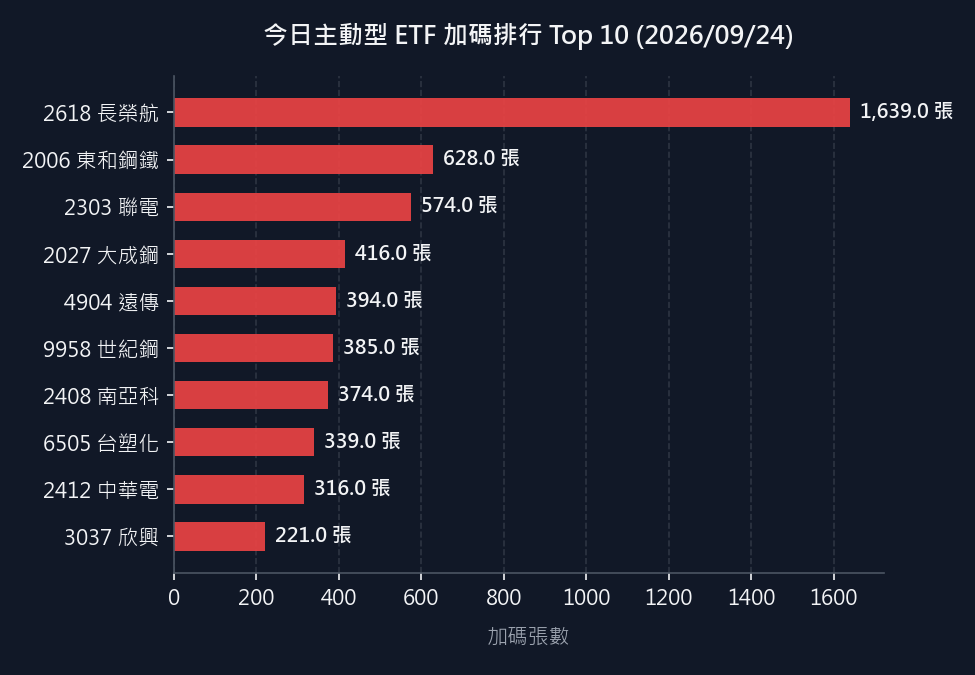
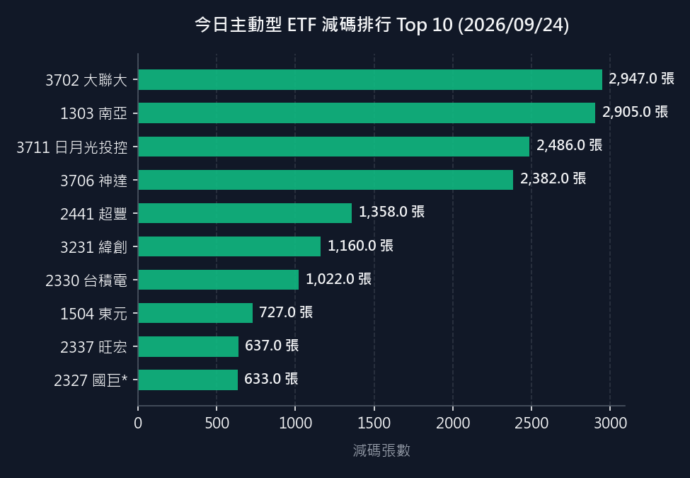

# 主動型 ETF 持股變動

資料來源：`主動型ETF持股明細.xlsx` 最近兩個日期分頁。

比較區間：`20260923` → `20260924`

## 今日加減碼視覺化排行

| 今日加碼 Top 10 | 今日減碼 Top 10 |
| :---: | :---: |
|  |  |

| ETF | 新增 | 刪除 | 比例變動 |
| :-- | --: | --: | --: |
| 00400A | 0 | 0 | 36 |
| 00401A | 0 | 0 | 0 |
| 00402A | 0 | 0 | 0 |
| 00403A | 0 | 0 | 36 |
| 00404A | 0 | 0 | 38 |
| 00405A | 0 | 0 | 0 |
| 00406A | 0 | 0 | 0 |
| 00407A | 0 | 0 | 41 |
| 00408A | 0 | 2 | 49 |
| 00980A | 0 | 0 | 46 |
| 00980D | 0 | 1 | 41 |
| 00981A | 0 | 0 | 30 |
| 00982A | 0 | 0 | 39 |
| 00983A | 1 | 0 | 38 |
| 00983D | 0 | 0 | 48 |
| 00984A | 0 | 0 | 0 |
| 00985A | 3 | 3 | 38 |
| 00986A | 0 | 0 | 0 |
| 00987A | 0 | 0 | 0 |
| 00988A | 1 | 0 | 32 |
| 00989A | 0 | 0 | 54 |
| 00990A | 1 | 3 | 41 |
| 00991A | 0 | 0 | 19 |
| 00992A | 1 | 0 | 36 |
| 00993A | 18 | 16 | 34 |
| 00994A | 1 | 0 | 30 |
| 00995A | 0 | 0 | 0 |
| 00996A | 0 | 0 | 39 |
| 00997A | 0 | 0 | 0 |
| 00998A | 0 | 0 | 0 |
| 00999A | 1 | 0 | 53 |

## 00400A

### 新增持股

- 無

### 刪除持股

- 無

### 投資比例變動

- 1303 南亞：2.84% → 2.80%（-0.04）
- 2059 川湖：5.28% → 5.17%（-0.11）
- 2308 台達電：3.85% → 3.86%（+0.01）
- 2313 華通：0.83% → 0.84%（+0.01）
- 2317 鴻海：0.82% → 0.83%（+0.01）
- 2330 台積電：8.61% → 8.77%（+0.16）
- 2345 智邦：1.47% → 1.46%（-0.01）
- 2360 致茂：3.88% → 3.71%（-0.17）
- 2368 金像電：1.33% → 1.46%（+0.13）
- 2383 台光電：3.73% → 3.87%（+0.14）
- 2449 京元電子：1.07% → 1.03%（-0.04）
- 2454 聯發科：8.24% → 7.78%（-0.46）
- 2881 富邦金：1.62% → 1.61%（-0.01）
- 2885 元大金：0.54% → 0.53%（-0.01）
- 3008 大立光：0.85% → 0.82%（-0.03）
- 3017 奇鋐：4.33% → 4.44%（+0.11）
- 3026 禾伸堂：1.07% → 1.05%（-0.02）
- 3036 文曄：1.53% → 1.54%（+0.01）
- 3037 欣興：4.58% → 4.76%（+0.18）
- 3044 健鼎：1.89% → 1.91%（+0.02）
- 3081 聯亞：0.78% → 0.75%（-0.03）
- 3167 大量：0.34% → 0.35%（+0.01）
- 3374 精材：0.56% → 0.54%（-0.02）
- 3443 創意：5.39% → 5.41%（+0.02）
- 3529 力旺：1.39% → 1.48%（+0.09）
- 3653 健策：4.36% → 4.81%（+0.45）
- 3665 貿聯-KY：1.83% → 1.91%（+0.08）
- 5274 信驊：3.35% → 3.26%（-0.09）
- 5434 崇越：0.36% → 0.37%（+0.01）
- 6187 萬潤：2.45% → 2.44%（-0.01）
- 6223 旺矽：4.31% → 4.54%（+0.23）
- 6442 光聖：0.83% → 0.84%（+0.01）
- 6488 環球晶：2.04% → 2.01%（-0.03）
- 6669 緯穎：3.14% → 3.13%（-0.01）
- 7750 新代：0.80% → 0.81%（+0.01）
- 7769 鴻勁：0.42% → 0.14%（-0.28）

## 00401A

### 新增持股

- 無

### 刪除持股

- 無

### 投資比例變動

- 無

## 00402A

### 新增持股

- 無

### 刪除持股

- 無

### 投資比例變動

- 無

## 00403A

### 新增持股

- 無

### 刪除持股

- 無

### 投資比例變動

- 1303 南亞：1.99% → 2.01%（+0.02）
- 1717 長興：0.07% → 0.04%（-0.03）
- 2301 光寶科：0.05% → 0.06%（+0.01）
- 2303 聯電：6.12% → 6.28%（+0.16）
- 2308 台達電：3.51% → 3.60%（+0.09）
- 2317 鴻海：0.52% → 0.54%（+0.02）
- 2327 國巨*：2.91% → 3.00%（+0.09）
- 2330 台積電：14.74% → 13.73%（-1.01）
- 2345 智邦：2.52% → 2.35%（-0.17）
- 2360 致茂：1.06% → 0.71%（-0.35）
- 2383 台光電：4.96% → 5.25%（+0.29）
- 2404 漢唐：0.18% → 0.00%（-0.18）
- 2408 南亞科：0.63% → 0.94%（+0.31）
- 2449 京元電子：0.81% → 0.80%（-0.01）
- 2454 聯發科：7.30% → 7.49%（+0.19）
- 2455 全新：0.13% → 0.14%（+0.01）
- 2481 強茂：0.33% → 0.34%（+0.01）
- 3008 大立光：1.14% → 1.13%（-0.01）
- 3017 奇鋐：6.16% → 6.47%（+0.31）
- 3037 欣興：6.04% → 6.42%（+0.38）
- 3189 景碩：2.32% → 2.37%（+0.05）
- 3211 順達：0.49% → 0.50%（+0.01）
- 3443 創意：3.45% → 3.54%（+0.09）
- 3450 聯鈞：0.50% → 0.51%（+0.01）
- 3653 健策：4.14% → 4.67%（+0.53）
- 3665 貿聯-KY：1.85% → 1.98%（+0.13）
- 3711 日月光投控：0.44% → 0.00%（-0.44）
- 5274 信驊：1.61% → 1.27%（-0.34）
- 6223 旺矽：3.75% → 4.04%（+0.29）
- 6274 台燿：1.74% → 1.81%（+0.07）
- 6442 光聖：0.34% → 0.35%（+0.01）
- 6488 環球晶：1.73% → 1.74%（+0.01）
- 6805 富世達：1.34% → 1.43%（+0.09）
- 7769 鴻勁：0.51% → 0.31%（-0.20）
- 8046 南電：2.06% → 2.19%（+0.13）
- 8996 高力：1.71% → 1.64%（-0.07）

## 00404A

### 新增持股

- 無

### 刪除持股

- 無

### 投資比例變動

- 1303 南亞：0.74% → 0.73%（-0.01）
- 2027 大成鋼：1.53% → 1.54%（+0.01）
- 2059 川湖：1.17% → 1.15%（-0.02）
- 2317 鴻海：0.66% → 0.67%（+0.01）
- 2330 台積電：22.55% → 22.93%（+0.38）
- 2345 智邦：0.84% → 0.83%（-0.01）
- 2347 聯強：1.79% → 1.89%（+0.10）
- 2351 順德：0.40% → 0.38%（-0.02）
- 2357 華碩：0.88% → 0.89%（+0.01）
- 2360 致茂：0.73% → 0.70%（-0.03）
- 2379 瑞昱：1.08% → 1.09%（+0.01）
- 2382 廣達：2.11% → 2.10%（-0.01）
- 2383 台光電：2.92% → 3.02%（+0.10）
- 2436 偉詮電：1.14% → 1.11%（-0.03）
- 2454 聯發科：6.89% → 6.91%（+0.02）
- 2542 興富發：1.76% → 1.53%（-0.23）
- 2885 元大金：2.46% → 2.43%（-0.03）
- 2890 永豐金：1.46% → 1.45%（-0.01）
- 3017 奇鋐：1.33% → 1.37%（+0.04）
- 3034 聯詠：2.06% → 2.02%（-0.04）
- 3037 欣興：0.26% → 0.27%（+0.01）
- 3260 威剛：1.23% → 1.22%（-0.01）
- 3264 欣銓：0.44% → 0.40%（-0.04）
- 3680 家登：0.47% → 0.46%（-0.01）
- 3711 日月光投控：3.46% → 3.47%（+0.01）
- 4763 材料*-KY：1.64% → 1.59%（-0.05）
- 5274 信驊：2.63% → 2.56%（-0.07）
- 5434 崇越：1.75% → 1.78%（+0.03）
- 5904 寶雅*：0.45% → 0.46%（+0.01）
- 6196 帆宣：1.82% → 1.87%（+0.05）
- 6206 飛捷：1.02% → 1.01%（-0.01）
- 6223 旺矽：1.18% → 1.24%（+0.06）
- 6257 矽格：1.76% → 1.75%（-0.01）
- 6515 穎崴：0.13% → 0.14%（+0.01）
- 7769 鴻勁：1.28% → 1.25%（-0.03）
- 8299 群聯：1.16% → 1.18%（+0.02）
- 台指選擇權10/26 49500 買權：-0.22% → -0.23%（-0.01）
- 台股期貨10/26(FITXN*1.TF)：15.40% → 15.44%（+0.04）

## 00405A

### 新增持股

- 無

### 刪除持股

- 無

### 投資比例變動

- 無

## 00406A

### 新增持股

- 無

### 刪除持股

- 無

### 投資比例變動

- 無

## 00407A

### 新增持股

- 無

### 刪除持股

- 無

### 投資比例變動

- 1303 南亞：0.70% → 0.72%（+0.02）
- 1560 中砂：1.01% → 1.03%（+0.02）
- 2059 川湖：2.74% → 2.67%（-0.07）
- 2301 光寶科：1.44% → 1.45%（+0.01）
- 2303 聯電：0.61% → 0.59%（-0.02）
- 2308 台達電：2.68% → 2.69%（+0.01）
- 2327 國巨*：2.23% → 2.26%（+0.03）
- 2330 台積電：8.90% → 8.95%（+0.05）
- 2345 智邦：2.56% → 2.54%（-0.02）
- 2360 致茂：1.92% → 1.81%（-0.11）
- 2368 金像電：0.52% → 0.55%（+0.03）
- 2379 瑞昱：0.23% → 0.22%（-0.01）
- 2383 台光電：4.77% → 4.95%（+0.18）
- 2408 南亞科：0.92% → 0.93%（+0.01）
- 2454 聯發科：6.08% → 6.19%（+0.11）
- 3008 大立光：1.46% → 1.43%（-0.03）
- 3017 奇鋐：5.54% → 5.80%（+0.26）
- 3034 聯詠：0.73% → 0.72%（-0.01）
- 3037 欣興：5.35% → 5.66%（+0.31）
- 3081 聯亞：1.40% → 1.33%（-0.07）
- 3231 緯創：0.69% → 0.71%（+0.02）
- 3293 鈊象：0.54% → 0.57%（+0.03）
- 3443 創意：4.96% → 5.07%（+0.11）
- 3491 昇達科：0.87% → 0.92%（+0.05）
- 3529 力旺：0.65% → 0.67%（+0.02）
- 3653 健策：2.97% → 3.51%（+0.54）
- 3665 貿聯-KY：2.10% → 2.20%（+0.10）
- 3711 日月光投控：2.88% → 2.90%（+0.02）
- 4958 臻鼎-KY：0.89% → 0.87%（-0.02）
- 5274 信驊：2.67% → 2.55%（-0.12）
- 5289 宜鼎：0.31% → 0.32%（+0.01）
- 5434 崇越：0.19% → 0.20%（+0.01）
- 6187 萬潤：1.35% → 1.33%（-0.02）
- 6223 旺矽：2.68% → 2.70%（+0.02）
- 6274 台燿：3.38% → 3.51%（+0.13）
- 6510 精測：1.54% → 1.38%（-0.16）
- 6531 愛普*：0.31% → 0.33%（+0.02）
- 6669 緯穎：3.55% → 3.68%（+0.13）
- 6805 富世達：2.15% → 2.18%（+0.03）
- 8046 南電：1.72% → 1.83%（+0.11）
- 8996 高力：2.23% → 2.06%（-0.17）

## 00408A

### 新增持股

- 無

### 刪除持股

- 2886 兆豐金（0.95%，289 張）
- 8436 大江（0.44%，64 張）

### 投資比例變動

- 1303 南亞：1.52% → 1.24%（-0.28）
- 1560 中砂：0.37% → 0.39%（+0.02）
- 2059 川湖：0.41% → 0.42%（+0.01）
- 2303 聯電：3.37% → 3.49%（+0.12）
- 2308 台達電：2.83% → 2.94%（+0.11）
- 2317 鴻海：1.65% → 1.73%（+0.08）
- 2330 台積電：5.45% → 5.74%（+0.29）
- 2344 華邦電：0.45% → 0.47%（+0.02）
- 2345 智邦：0.87% → 0.89%（+0.02）
- 2357 華碩：2.30% → 1.94%（-0.36）
- 2360 致茂：1.27% → 1.26%（-0.01）
- 2368 金像電：3.12% → 3.54%（+0.42）
- 2376 技嘉：1.31% → 1.36%（+0.05）
- 2382 廣達：0.89% → 0.23%（-0.66）
- 2383 台光電：2.53% → 2.71%（+0.18）
- 2395 研華：1.56% → 1.61%（+0.05）
- 2408 南亞科：2.36% → 2.54%（+0.18）
- 2449 京元電子：1.55% → 1.54%（-0.01）
- 2454 聯發科：6.23% → 6.44%（+0.21）
- 2481 強茂：1.07% → 1.12%（+0.05）
- 2542 興富發：4.00% → 3.60%（-0.40）
- 2801 彰銀：2.15% → 2.19%（+0.04）
- 2891 中信金：1.09% → 1.12%（+0.03）
- 3008 大立光：0.83% → 0.84%（+0.01）
- 3017 奇鋐：5.08% → 5.39%（+0.31）
- 3037 欣興：3.50% → 4.15%（+0.65）
- 3045 台灣大：2.00% → 2.08%（+0.08）
- 3081 聯亞：1.29% → 1.27%（-0.02）
- 3189 景碩：1.60% → 1.65%（+0.05）
- 3231 緯創：1.53% → 0.36%（-1.17）
- 3264 欣銓：0.79% → 0.75%（-0.04）
- 3443 創意：0.55% → 0.57%（+0.02）
- 3491 昇達科：0.67% → 1.06%（+0.39）
- 3653 健策：2.28% → 2.60%（+0.32）
- 3665 貿聯-KY：0.15% → 0.16%（+0.01）
- 3711 日月光投控：1.49% → 1.54%（+0.05）
- 5434 崇越：2.02% → 2.12%（+0.10）
- 6187 萬潤：1.19% → 0.89%（-0.30）
- 6223 旺矽：2.09% → 2.28%（+0.19）
- 6239 力成：1.27% → 1.30%（+0.03）
- 6274 台燿：2.25% → 2.37%（+0.12）
- 6488 環球晶：0.44% → 0.45%（+0.01）
- 6669 緯穎：3.69% → 3.80%（+0.11）
- 6805 富世達：1.47% → 1.58%（+0.11）
- 7769 鴻勁：1.00% → 1.01%（+0.01）
- 8046 南電：1.59% → 1.72%（+0.13）
- 8996 高力：1.94% → 1.87%（-0.07）
- 9802 鈺齊-KY：1.54% → 1.35%（-0.19）
- 9941 裕融：0.80% → 0.82%（+0.02）

## 00980A

### 新增持股

- 無

### 刪除持股

- 無

### 投資比例變動

- 1303 南亞：2.79% → 2.85%（+0.06）
- 2059 川湖：4.23% → 4.10%（-0.13）
- 2317 鴻海：2.42% → 2.38%（-0.04）
- 2327 國巨*：1.38% → 1.39%（+0.01）
- 2345 智邦：1.66% → 1.63%（-0.03）
- 2360 致茂：1.80% → 1.68%（-0.12）
- 2368 金像電：2.04% → 2.15%（+0.11）
- 2376 技嘉：1.27% → 1.24%（-0.03）
- 2382 廣達：1.68% → 1.65%（-0.03）
- 2383 台光電：3.29% → 3.40%（+0.11）
- 2408 南亞科：2.71% → 2.73%（+0.02）
- 2454 聯發科：6.42% → 6.52%（+0.10）
- 2884 玉山金：1.45% → 1.43%（-0.02）
- 2891 中信金：1.28% → 1.25%（-0.03）
- 3008 大立光：0.83% → 0.80%（-0.03）
- 3017 奇鋐：2.26% → 2.36%（+0.10）
- 3026 禾伸堂：1.11% → 1.15%（+0.04）
- 3036 文曄：1.17% → 1.18%（+0.01）
- 3037 欣興：3.30% → 3.47%（+0.17）
- 3044 健鼎：0.93% → 0.92%（-0.01）
- 3081 聯亞：1.81% → 1.72%（-0.09）
- 3189 景碩：1.46% → 1.54%（+0.08）
- 3231 緯創：1.17% → 1.19%（+0.02）
- 3264 欣銓：0.90% → 0.79%（-0.11）
- 3293 鈊象：0.91% → 0.95%（+0.04）
- 3443 創意：2.46% → 2.49%（+0.03）
- 3529 力旺：0.68% → 0.70%（+0.02）
- 3533 嘉澤：0.30% → 0.29%（-0.01）
- 3653 健策：2.00% → 2.36%（+0.36）
- 3665 貿聯-KY：0.54% → 0.56%（+0.02）
- 3711 日月光投控：2.14% → 2.15%（+0.01）
- 4958 臻鼎-KY：0.74% → 0.71%（-0.03）
- 5274 信驊：2.11% → 1.99%（-0.12）
- 5904 寶雅*：1.10% → 1.07%（-0.03）
- 6213 聯茂：1.30% → 1.42%（+0.12）
- 6223 旺矽：1.76% → 1.77%（+0.01）
- 6274 台燿：1.72% → 1.78%（+0.06）
- 6515 穎崴：1.58% → 1.59%（+0.01）
- 6669 緯穎：1.63% → 1.62%（-0.01）
- 6805 富世達：0.67% → 0.68%（+0.01）
- 6831 邁科：0.46% → 0.45%（-0.01）
- 7769 鴻勁：2.24% → 2.05%（-0.19）
- 8046 南電：1.46% → 1.54%（+0.08）
- 8299 群聯：1.83% → 1.77%（-0.06）
- 8996 高力：1.49% → 1.37%（-0.12）
- 台灣證交所加權股價指數(FITXN*1.TF)：2.98% → 2.96%（-0.02）

## 00980D

### 新增持股

- 無

### 刪除持股

- SABRE GLBL INC SER REGS (REG) 10.750000 % 15NOV2029（0.14%，N/A 張）

### 投資比例變動

- AHOLD FINANCE USA LLC 6.88% 01MAY2029：0.48% → 0.49%（+0.01）
- ALLY FINANCIAL INC (REG) VAR 03JAN2030：0.63% → 0.64%（+0.01）
- ALLY FINANCIAL INC (REG) VAR 13JUN2029：0.55% → 0.56%（+0.01）
- APA CORP 6.750000 % 15-FEB-2055：0.38% → 0.37%（-0.01）
- APOLLO DEBT SOLUTIONS BD 6.900000 % 13APR2029：0.55% → 0.56%（+0.01）
- BANCO SANTANDER SA (REG) 6.607% 07NOV2028：0.66% → 0.67%（+0.01）
- BOSTON PROPERTIES LP (REG) 6.750000 % 01-DEC-2027：0.46% → 0.47%（+0.01）
- BRITISH TELECOMMUNICATIO (BR) 9.625% 15DEC2030：0.57% → 0.58%（+0.01）
- CALDERYS FINANCING LLC SER REGS (REG S) 11.25% 01JUN2028：0.33% → 0.34%（+0.01）
- CANTOR FITZGERALD LP SER REGS 7.200000 % 12DEC2028：0.32% → 0.33%（+0.01）
- CHARTER COMM OPT LLC/CAP 6.700000 % 01-DEC-2055：0.46% → 0.45%（-0.01）
- CONCENTRIX CORP (REG) 6.6% 02AUG2028：0.52% → 0.53%（+0.01）
- CONCENTRIX CORP (REG) 6.85% 02AUG2033：0.71% → 0.72%（+0.01）
- CONOCOPHILLIPS COMPANY (REG) 6.95% 15APR2029：0.51% → 0.52%（+0.01）
- DELL INT LLC / EMC CORP (REG) 8.35% 15JUL2046：0.56% → 0.55%（-0.01）
- DOW CHEMICAL CO/THE 7.375% 01NOV2029：0.61% → 0.62%（+0.01）
- DOW CHEMICAL CO/THE 9.4% 15MAY2039：0.55% → 0.54%（-0.01）
- FORD MOTOR CREDIT CO LLC (REG) 7.35% 04NOV2027：0.33% → 0.34%（+0.01）
- GENERAL MOTORS CO (REG) 6.75% 01APR2046：0.57% → 0.56%（-0.01）
- GENERAL MOTORS CO (REG) 6.8% 01OCT2027：0.56% → 0.57%（+0.01）
- GEORGIA-PACIFIC LLC (REG) 7.75% 15NOV2029：0.57% → 0.58%（+0.01）
- GLOBAL ATLANTIC FIN CO SER REGS 6.750000 % 15MAR2054：0.64% → 0.63%（-0.01）
- JETBLUE AIRWAYS/LOYALTY SER REGS (REG S) 9.875% 20SEP2031：0.47% → 0.46%（-0.01）
- KINDER MORGAN INC/DELAWA SER GMTN (REG) 7.75% 15JAN2032：0.32% → 0.33%（+0.01）
- KONINKLIJKE KPN NV (REG) 8.375% 01OCT2030：0.43% → 0.44%（+0.01）
- LPL HOLDINGS INC (REG) 6.75% 17NOV2028：0.56% → 0.57%（+0.01）
- M&T BANK CORPORATION (REG) VAR 30OCT2029：0.54% → 0.55%（+0.01）
- NISSAN MOTOR CO SER REGS 8.125000 % 17JUL2035：0.52% → 0.53%（+0.01）
- PBF HOLDING CO LLC SER REGS 9.875000 % 15MAR2030：0.36% → 0.37%（+0.01）
- POLARIS INC 6.950000 % 15MAR2029：0.47% → 0.48%（+0.01）
- PROGRESS ENERGY INC (REG) 7.75% 01MAR2031：0.57% → 0.58%（+0.01）
- RR DONNELLEY & SONS CO SER REGS (REG S) 9.5% 01AUG2029：0.42% → 0.43%（+0.01）
- SANTANDER HOLDINGS USA VAR 12JUN2029：0.58% → 0.59%（+0.01）
- SEAGATE DATA STOR SER * 9.625 % 01-DEC-2032：0.56% → 0.57%（+0.01）
- SYMETRA LIFE INSURANCE SER REGS 6.550000 % 01OCT2055：0.32% → 0.31%（-0.01）
- TELEFONICA EUROPE BV (REG) 8.25% 15SEP2030：0.41% → 0.42%（+0.01）
- TIME WARNER CABLE INC REG 7.3% 01JUL2038：0.31% → 0.30%（-0.01）
- TRUIST FINANCIAL CORP SER MTN VAR 30OCT2029：0.64% → 0.65%（+0.01）
- US 2YR NOTE (CBT) DEC26 31-DEC-2026：1.65% → 1.66%（+0.01）
- US 5YR NOTE (CBT) DEC26 31-DEC-2026：-13.65% → -13.69%（-0.04）
- US LONG BOND(CBT) DEC26 21-DEC-2026：5.39% → 5.35%（-0.04）

## 00981A

### 新增持股

- 無

### 刪除持股

- 無

### 投資比例變動

- 2303 聯電：4.91% → 4.87%（-0.04）
- 2308 台達電：4.86% → 4.81%（-0.05）
- 2327 國巨*：4.94% → 4.91%（-0.03）
- 2330 台積電：10.05% → 10.12%（+0.07）
- 2345 智邦：4.26% → 4.17%（-0.09）
- 2368 金像電：0.49% → 0.65%（+0.16）
- 2383 台光電：7.95% → 8.14%（+0.19）
- 2449 京元電子：1.43% → 1.36%（-0.07）
- 2454 聯發科：9.25% → 9.18%（-0.07）
- 3017 奇鋐：6.95% → 7.05%（+0.10）
- 3037 欣興：7.83% → 8.04%（+0.21）
- 3264 欣銓：0.49% → 0.45%（-0.04）
- 3376 新日興：0.11% → 0.10%（-0.01）
- 3443 創意：1.19% → 1.18%（-0.01）
- 3653 健策：5.04% → 5.50%（+0.46）
- 3665 貿聯-KY：3.05% → 3.15%（+0.10）
- 3711 日月光投控：4.01% → 3.66%（-0.35）
- 4958 臻鼎-KY：0.60% → 0.57%（-0.03）
- 5274 信驊：1.50% → 1.44%（-0.06）
- 6191 精成科：0.12% → 0.11%（-0.01）
- 6223 旺矽：4.68% → 4.88%（+0.20）
- 6274 台燿：2.83% → 2.96%（+0.13）
- 6278 台表科：0.24% → 0.23%（-0.01）
- 6510 精測：0.51% → 0.30%（-0.21）
- 6669 緯穎：4.07% → 3.69%（-0.38）
- 6805 富世達：1.53% → 1.57%（+0.04）
- 8046 南電：3.63% → 3.73%（+0.10）
- 8210 勤誠：0.36% → 0.35%（-0.01）
- 8996 高力：0.28% → 0.25%（-0.03）
- 台指期貨 2026/10(FITXN*1.TF)：2.26% → 2.24%（-0.02）

## 00982A

### 新增持股

- 無

### 刪除持股

- 無

### 投資比例變動

- 2059 川湖：4.39% → 4.37%（-0.02）
- 2301 光寶科：1.80% → 1.82%（+0.02）
- 2303 聯電：1.62% → 1.56%（-0.06）
- 2330 台積電：8.82% → 8.77%（-0.05）
- 2345 智邦：2.31% → 2.03%（-0.28）
- 2360 致茂：3.75% → 3.69%（-0.06）
- 2376 技嘉：1.26% → 1.24%（-0.02）
- 2383 台光電：3.07% → 3.08%（+0.01）
- 2395 研華：1.56% → 1.37%（-0.19）
- 2454 聯發科：7.51% → 7.68%（+0.17）
- 2467 志聖：1.03% → 1.04%（+0.01）
- 2486 一詮：0.73% → 0.74%（+0.01）
- 3008 大立光：3.07% → 3.10%（+0.03）
- 3017 奇鋐：2.54% → 2.61%（+0.07）
- 3105 穩懋：5.58% → 5.66%（+0.08）
- 3231 緯創：1.30% → 1.33%（+0.03）
- 3265 台星科：1.19% → 1.21%（+0.02）
- 3491 昇達科：3.63% → 3.62%（-0.01）
- 3529 力旺：0.60% → 0.59%（-0.01）
- 3583 辛耘：1.07% → 1.09%（+0.02）
- 3711 日月光投控：1.24% → 1.21%（-0.03）
- 4958 臻鼎-KY：2.94% → 2.97%（+0.03）
- 5274 信驊：1.43% → 1.41%（-0.02）
- 5425 台半：1.21% → 1.19%（-0.02）
- 5483 中美晶：1.25% → 1.27%（+0.02）
- 5536 聖暉*：0.80% → 0.81%（+0.01）
- 6139 亞翔：5.39% → 5.50%（+0.11）
- 6196 帆宣：0.33% → 0.34%（+0.01）
- 6213 聯茂：0.40% → 0.45%（+0.05）
- 6223 旺矽：3.33% → 3.22%（-0.11）
- 6274 台燿：1.21% → 1.23%（+0.02）
- 6472 保瑞：0.89% → 0.86%（-0.03）
- 6488 環球晶：2.04% → 2.03%（-0.01）
- 6531 愛普*：3.96% → 4.00%（+0.04）
- 6640 均華：0.30% → 0.29%（-0.01）
- 6669 緯穎：4.21% → 4.25%（+0.04）
- 6672 騰輝電子-KY：0.32% → 0.35%（+0.03）
- 8070 長華*：0.31% → 0.32%（+0.01）
- 8996 高力：1.16% → 1.15%（-0.01）

## 00983A

### 新增持股

- 火箭實驗室美國公司（0.54%，2.41 張）

### 刪除持股

- 無

### 投資比例變動

- ACHR.US Archer：0.69% → 0.74%（+0.05）
- AMD.US AMD：3.59% → 3.28%（-0.31）
- AMZN.US Amazon：2.51% → 2.45%（-0.06）
- AVGO.US Broadcom：0.92% → 0.91%（-0.01）
- BEAM.US Beam Therapeutics：1.44% → 1.40%（-0.04）
- BLSH.US Bullish：2.43% → 2.46%（+0.03）
- BMNR.US BitMine：2.42% → 2.38%（-0.04）
- CERS.US Cerus：0.16% → 0.01%（-0.15）
- COIN.US Coinbase：4.66% → 4.65%（-0.01）
- CRCL.US Circle：5.16% → 5.06%（-0.10）
- CRSP.US CRISPR Therapeutics：3.99% → 3.85%（-0.14）
- CRWV.US CoreWeave：1.18% → 1.21%（+0.03）
- DE.US Deere：0.97% → 0.51%（-0.46）
- GOOG.US Alphabet - Class C Capital Stock：1.46% → 1.41%（-0.05）
- GOOGL.US Alphabet - Class A Common Stock：0.81% → 0.49%（-0.32）
- HOOD.US Robinhood Markets：4.91% → 4.63%（-0.28）
- ILMN.US Illumina：1.78% → 1.73%（-0.05）
- KTOS.US Kratos Defense & Security：0.74% → 0.71%（-0.03）
- LLY.US Eli Lilly：0.79% → 0.78%（-0.01）
- META.US Meta：0.74% → 0.75%（+0.01）
- NET.US Cloudflare：1.24% → 1.25%（+0.01）
- NTLA.US Intellia Therapeutics：1.03% → 0.56%（-0.47）
- NTRA.US Natera：1.72% → 1.65%（-0.07）
- NVDA.US NVIDIA：2.34% → 2.35%（+0.01）
- PLTR.US Palantir Technologies：3.68% → 3.23%（-0.45）
- RXRX.US Recursion Pharmaceuticals：0.42% → 0.77%（+0.35）
- SHOP.US Shopify：3.57% → 3.72%（+0.15）
- SNOW.US Snowflake：1.03% → 0.51%（-0.52）
- SPCX.US SpaceX：6.04% → 5.97%（-0.07）
- TEM.US Tempus：6.42% → 5.61%（-0.81）
- TER.US Teradyne：0.59% → 0.61%（+0.02）
- TSLA.US Tesla：8.96% → 8.90%（-0.06）
- TSM.US TSMC(ADR)：2.46% → 2.50%（+0.04）
- TWST.US Twist Bioscience：4.98% → 4.30%（-0.68）
- TXG.US 10x Genomics：4.60% → 3.89%（-0.71）
- WGS.US GeneDx：1.53% → 1.14%（-0.39）
- XE.US X-Energy：0.78% → 0.79%（+0.01）
- XYZ.US Block：1.27% → 1.23%（-0.04）

## 00983D

### 新增持股

- 無

### 刪除持股

- 無

### 投資比例變動

- ABIBB 8.2 01/15/39：1.92% → 1.91%（-0.01）
- ABXCN 7 1/2 09/15/38：0.53% → 0.52%（-0.01）
- AMCX 10 1/2 07/15/32：1.62% → 1.63%（+0.01）
- ATH 6 5/8 05/19/55：1.00% → 0.98%（-0.02）
- BACR 7.437 11/02/33：1.24% → 1.25%（+0.01）
- BHCCN 11 09/30/28：1.88% → 1.89%（+0.01）
- BNCN 7 3/8 03/01/33：1.09% → 1.08%（-0.01）
- BRKHEC 6 3/4 07/01/37：0.80% → 0.79%（-0.01）
- C 8 1/8 07/15/39：1.90% → 1.89%（-0.01）
- CEG 6 1/2 10/01/53：0.77% → 0.76%（-0.01）
- CRWV 9 02/01/31：1.22% → 1.23%（+0.01）
- CYH 10 7/8 01/15/32：1.48% → 1.49%（+0.01）
- DELL 8.35 07/15/46：1.39% → 1.38%（-0.01）
- DIS 7 3/4 12/01/45：0.60% → 0.59%（-0.01）
- DTV 8 7/8 02/01/30：1.58% → 1.59%（+0.01）
- ENBCN 6.7 11/15/53：1.12% → 1.11%（-0.01）
- FFHCN 6.35 03/22/54：0.70% → 0.69%（-0.01）
- GE 6 7/8 01/10/39：0.83% → 0.82%（-0.01）
- GM 6 3/4 04/01/46：1.17% → 1.16%（-0.01）
- GS 6 1/4 02/01/41：0.32% → 0.31%（-0.01）
- GT 8 7/8 07/15/32：0.90% → 0.91%（+0.01）
- GTN 10 1/2 07/15/29：0.57% → 0.58%（+0.01）
- HAL 7.45 09/15/39：1.79% → 1.78%（-0.01）
- HPE 6.35 10/15/45：0.99% → 0.98%（-0.01）
- HSBC 6.332 03/09/44：1.05% → 1.04%（-0.01）
- KMI 6.95 01/15/38：1.05% → 1.04%（-0.01）
- LOW 6.65 09/15/37：0.83% → 0.82%（-0.01）
- LQDW.US iShares Investment Grade Corpora：7.20% → 7.24%（+0.04）
- MBGGR 8 1/2 01/18/31：1.28% → 1.29%（+0.01）
- MCD 6.3 03/01/38：0.72% → 0.71%（-0.01）
- MINAU 9 1/4 10/01/28：0.87% → 0.88%（+0.01）
- MOHEGN 11 7/8 04/15/31：1.34% → 1.35%（+0.01）
- NVDA 5.55 06/15/46：1.15% → 1.14%（-0.01）
- OKE 6 5/8 09/01/53：0.71% → 0.70%（-0.01）
- ORCL 6 1/2 04/15/38：0.39% → 0.38%（-0.01）
- ORCL 6.9 11/09/52：0.84% → 0.83%（-0.01）
- PCG 6.7 04/01/53：1.09% → 1.08%（-0.01）
- PDM 9 1/4 07/20/28：1.16% → 1.17%（+0.01）
- RAKUTN 11 1/4 02/15/27：1.78% → 1.80%（+0.02）
- SJM 6 1/2 11/15/53：0.20% → 0.19%（-0.01）
- SPCX 6.6 07/15/46：1.13% → 1.12%（-0.01）
- SUCN 6.85 06/01/39：1.20% → 1.19%（-0.01）
- SVC 8 7/8 06/15/32：0.47% → 0.48%（+0.01）
- TELEFONICA EMISIONES SAU 7.045 06/20/36：1.53% → 1.52%（-0.01）
- TIME WARNER CABLE INC 7.300 07/01/38：0.49% → 0.48%（-0.01）
- TLTW.US iShares 20+ Year Treasury Bond B：7.90% → 7.88%（-0.02）
- TRPCN 7 5/8 01/15/39：1.66% → 1.65%（-0.01）
- VZ 7 3/4 12/01/30：1.12% → 1.13%（+0.01）

## 00984A

### 新增持股

- 無

### 刪除持股

- 無

### 投資比例變動

- 無

## 00985A

### 新增持股

- 3324 雙鴻（0.29%，18 張）
- 6526 達發（0.80%，102 張）
- 6531 愛普*（0.71%，76 張）

### 刪除持股

- 2891 中信金（0.19%，297 張）
- 3036 文曄（0.00%，1 張）
- 8299 群聯（0.02%，1 張）

### 投資比例變動

- 1216 統一：1.17% → 1.16%（-0.01）
- 1301 台塑：0.65% → 0.66%（+0.01）
- 1504 東元：1.86% → 1.40%（-0.46）
- 2027 大成鋼：0.91% → 0.94%（+0.03）
- 2303 聯電：1.15% → 1.11%（-0.04）
- 2308 台達電：2.13% → 2.15%（+0.02）
- 2317 鴻海：2.45% → 2.00%（-0.45）
- 2327 國巨*：1.75% → 1.78%（+0.03）
- 2330 台積電：14.90% → 14.78%（-0.12）
- 2360 致茂：0.94% → 0.93%（-0.01）
- 2376 技嘉：4.17% → 3.49%（-0.68）
- 2377 微星：1.71% → 1.72%（+0.01）
- 2383 台光電：2.91% → 2.94%（+0.03）
- 2395 研華：3.16% → 3.26%（+0.10）
- 2408 南亞科：0.38% → 0.37%（-0.01）
- 2412 中華電：4.06% → 4.05%（-0.01）
- 2454 聯發科：3.25% → 3.32%（+0.07）
- 2610 華航：1.68% → 1.67%（-0.01）
- 3008 大立光：0.98% → 1.00%（+0.02）
- 3017 奇鋐：2.31% → 2.37%（+0.06）
- 3037 欣興：1.66% → 1.70%（+0.04）
- 3081 聯亞：0.95% → 0.96%（+0.01）
- 3105 穩懋：1.01% → 1.02%（+0.01）
- 3189 景碩：1.66% → 1.06%（-0.60）
- 3491 昇達科：3.08% → 3.06%（-0.02）
- 3653 健策：0.78% → 0.84%（+0.06）
- 3661 世芯-KY：1.02% → 1.03%（+0.01）
- 3711 日月光投控：4.58% → 4.63%（+0.05）
- 4904 遠傳：3.90% → 3.91%（+0.01）
- 6187 萬潤：0.68% → 0.67%（-0.01）
- 6442 光聖：0.95% → 0.96%（+0.01）
- 6446 藥華藥：1.52% → 1.49%（-0.03）
- 6669 緯穎：2.25% → 2.26%（+0.01）
- 7750 新代：1.46% → 1.48%（+0.02）
- 7769 鴻勁：1.01% → 0.96%（-0.05）
- 8046 南電：2.17% → 1.49%（-0.68）
- 8996 高力：1.10% → 0.79%（-0.31）
- 台積電期貨(FICDFN*1.TF)：2.58% → 2.57%（-0.01）

## 00986A

### 新增持股

- 無

### 刪除持股

- 無

### 投資比例變動

- 無

## 00987A

### 新增持股

- 無

### 刪除持股

- 無

### 投資比例變動

- 無

## 00988A

### 新增持股

- IREN.US IREN（0.91%，325 張）

### 刪除持股

- 無

### 投資比例變動

- 2330 台積電：0.92% → 0.93%（+0.01）
- 2383 台光電：2.27% → 2.34%（+0.07）
- 2454 聯發科：3.67% → 3.68%（+0.01）
- 3017 奇鋐：2.78% → 3.31%（+0.53）
- 3037 欣興：5.44% → 5.64%（+0.20）
- 3081 聯亞：0.79% → 0.75%（-0.04）
- 4979 華星光：1.02% → 0.50%（-0.52）
- AMD.US AMD：1.84% → 1.82%（-0.02）
- BE.US Bloom Energy：5.72% → 5.95%（+0.23）
- COIN.US Coinbase：0.83% → 0.82%（-0.01）
- CRWD.US CrowdStrike Holdings：1.93% → 2.03%（+0.10）
- HOOD.US Robinhood Markets：2.94% → 2.91%（-0.03）
- INFINEON TECHNOLOGIES AG：1.22% → 1.19%（-0.03）
- INTC.US Intel：3.66% → 4.00%（+0.34）
- LENOVO GROUP LTD：1.66% → 1.67%（+0.01）
- LITE.US Lumentum：6.54% → 6.49%（-0.05）
- MSFT.US Microsoft：2.36% → 1.19%（-1.17）
- MU.US Micron：3.89% → 3.81%（-0.08）
- NOW.US ServiceNow：1.86% → 1.92%（+0.06）
- NVDA.US NVIDIA：2.37% → 2.34%（-0.03）
- OKTA.US Okta：1.39% → 1.46%（+0.07）
- PANW.US Palo Alto：3.32% → 3.49%（+0.17）
- PLTR.US Palantir Technologies：3.01% → 3.12%（+0.11）
- ROBOTECHNIK INTELLIGENT TE-A：1.79% → 1.77%（-0.02）
- SK hynix(000660.KS)：2.00% → 2.03%（+0.03）
- SNDK.US Sandisk：0.78% → 0.75%（-0.03）
- SNOW.US Snowflake：2.59% → 2.58%（-0.01）
- SPCX.US SpaceX：5.03% → 4.83%（-0.20）
- Samsung Elec Mech(009150.KS)：4.52% → 4.59%（+0.07）
- TER.US Teradyne：1.65% → 1.61%（-0.04）
- TWLO.US Twilio：1.68% → 1.72%（+0.04）
- 中際旭創(3308.HK)：2.02% → 1.98%（-0.04）

## 00989A

### 新增持股

- 無

### 刪除持股

- 無

### 投資比例變動

- ADBE.US Adobe：1.54% → 1.46%（-0.08）
- ADI.US Analog Devices：1.05% → 1.06%（+0.01）
- ADSK.US Autodesk：0.46% → 0.45%（-0.01）
- ALAB.US Astera Labs：0.39% → 0.57%（+0.18）
- ALGM.US Allegro MicroSystems：0.53% → 0.52%（-0.01）
- AMD.US AMD：3.15% → 3.17%（+0.02）
- AMZN.US Amazon：1.01% → 0.99%（-0.02）
- ASML.US ASML Holding：2.09% → 2.12%（+0.03）
- AVGO.US Broadcom：3.65% → 3.63%（-0.02）
- CDNS.US Cadence Design Systems：0.82% → 0.83%（+0.01）
- CIEN.US Ciena：1.05% → 1.04%（-0.01）
- CRDO.US Credo：0.58% → 0.84%（+0.26）
- CRM.US Salesforce：3.12% → 3.05%（-0.07）
- CRWD.US CrowdStrike Holdings：3.43% → 3.41%（-0.02）
- CRWV.US CoreWeave：0.71% → 0.72%（+0.01）
- DOCN.US DigitalOcean：1.66% → 1.64%（-0.02）
- ENTG.US Entegris：0.63% → 0.66%（+0.03）
- ESTC.US Elastic：0.70% → 0.69%（-0.01）
- FIGR.US Figure：0.83% → 0.87%（+0.04）
- GOOG.US Alphabet - Class C Capital Stock：2.38% → 2.33%（-0.05）
- HUBS.US HubSpot：1.67% → 1.69%（+0.02）
- ILMN.US Illumina：0.42% → 0.43%（+0.01）
- INTC.US Intel：3.34% → 3.36%（+0.02）
- LITE.US Lumentum：1.72% → 1.69%（-0.03）
- LMND.US Lemonade：0.73% → 0.72%（-0.01）
- LRCX.US Lam Research：2.36% → 2.41%（+0.05）
- MDB.US MongoDB：0.73% → 0.76%（+0.03）
- META.US Meta：3.58% → 3.53%（-0.05）
- MPWR.US Monolithic Power Systems：0.61% → 0.97%（+0.36）
- MSFT.US Microsoft：2.70% → 2.65%（-0.05）
- MTSI.US MACOM Technology Solutions：0.78% → 0.77%（-0.01）
- MU.US Micron：1.14% → 1.19%（+0.05）
- NET.US Cloudflare：2.86% → 2.85%（-0.01）
- NOW.US ServiceNow：1.85% → 1.82%（-0.03）
- NVDA.US NVIDIA：4.60% → 4.59%（-0.01）
- OKTA.US Okta：0.54% → 0.55%（+0.01）
- PANW.US Palo Alto：3.35% → 3.34%（-0.01）
- RIVN.US Rivian：1.30% → 1.27%（-0.03）
- SHOP.US Shopify：2.27% → 2.41%（+0.14）
- SNDK.US Sandisk：0.93% → 0.99%（+0.06）
- SNOW.US Snowflake：2.94% → 2.89%（-0.05）
- SYM.US Symbotic：0.51% → 0.52%（+0.01）
- TEAM.US Atlassian：1.28% → 1.23%（-0.05）
- TEM.US Tempus：1.23% → 1.21%（-0.02）
- TTMI.US TTM Technologies：0.50% → 0.51%（+0.01）
- TTWO.US Take-Two：2.90% → 2.82%（-0.08）
- TWLO.US Twilio：2.27% → 2.41%（+0.14）
- TXN.US Texas Instruments：1.41% → 1.40%（-0.01）
- U.US Unity Software：0.87% → 0.86%（-0.01）
- VEEV.US Veeva Systems：0.65% → 0.64%（-0.01）
- VICR.US Vicor Corporation：0.43% → 0.51%（+0.08）
- WRBY.US Warby Parker：0.58% → 0.56%（-0.02）
- XYZ.US Block：0.73% → 0.72%（-0.01）
- ZM.US Zoom：1.55% → 1.54%（-0.01）

## 00990A

### 新增持股

- SHOP.US Shopify（0.63%，52.1 張）

### 刪除持股

- MXL.US MaxLinear（0.87%，117.7 張）
- NOK.US Nokia（1.47%，1615 張）
- SK hynix(000660.KS)（0.85%，7.445 張）

### 投資比例變動

- 2330 台積電：2.65% → 2.70%（+0.05）
- 2360 致茂：0.84% → 0.80%（-0.04）
- 2383 台光電：2.23% → 1.79%（-0.44）
- 2449 京元電子：1.40% → 1.35%（-0.05）
- 2454 聯發科：3.34% → 3.35%（+0.01）
- 3017 奇鋐：1.42% → 1.46%（+0.04）
- 3037 欣興：1.54% → 1.60%（+0.06）
- 3529 力旺：0.88% → 0.93%（+0.05）
- 3665 貿聯-KY：0.56% → 0.58%（+0.02）
- 6223 旺矽：1.28% → 0.90%（-0.38）
- 7769 鴻勁：0.67% → 0.65%（-0.02）
- 8046 南電：1.08% → 1.12%（+0.04）
- AEHR.US Aehr Test Systems：0.79% → 0.96%（+0.17）
- AMD.US AMD：4.79% → 4.72%（-0.07）
- BE.US Bloom Energy：4.86% → 4.84%（-0.02）
- CRWD.US CrowdStrike Holdings：1.57% → 1.64%（+0.07）
- DELL.US Dell：3.04% → 3.05%（+0.01）
- FIVN.US Five9：0.31% → 0.30%（-0.01）
- FORM.US FormFactor：0.79% → 1.04%（+0.25）
- FSLY.US Fastly：1.67% → 1.90%（+0.23）
- GOOGL.US Alphabet - Class A Common Stock：1.23% → 0.71%（-0.52）
- HOOD.US Robinhood Markets：1.97% → 1.94%（-0.03）
- INTC.US Intel：3.87% → 3.83%（-0.04）
- Kioxia Holdings(285A.JP)：1.06% → 1.07%（+0.01）
- LITE.US Lumentum：6.49% → 6.44%（-0.05）
- LRCX.US Lam Research：1.53% → 1.52%（-0.01）
- META.US Meta：4.04% → 4.59%（+0.55）
- MRVL.US Marvell：3.22% → 3.21%（-0.01）
- MSFT.US Microsoft：1.56% → 1.07%（-0.49）
- MU.US Micron：3.79% → 4.68%（+0.89）
- NET.US Cloudflare：1.67% → 2.16%（+0.49）
- NVDA.US NVIDIA：3.00% → 2.96%（-0.04）
- OKTA.US Okta：0.95% → 0.99%（+0.04）
- PANW.US Palo Alto：1.51% → 1.59%（+0.08）
- PLTR.US Palantir Technologies：2.92% → 3.03%（+0.11）
- SMTC.US Semtech：2.10% → 2.04%（-0.06）
- SNDK.US Sandisk：1.92% → 2.81%（+0.89）
- SNOW.US Snowflake：3.11% → 3.10%（-0.01）
- SPCX.US SpaceX：2.55% → 2.45%（-0.10）
- Samsung Elec Mech(009150.KS)：0.66% → 0.67%（+0.01）
- TWST.US Twist Bioscience：0.99% → 0.95%（-0.04）

## 00991A

### 新增持股

- 無

### 刪除持股

- 無

### 投資比例變動

- 1303 南亞：1.96% → 1.92%（-0.04）
- 2059 川湖：7.99% → 7.66%（-0.33）
- 2327 國巨*：5.40% → 4.84%（-0.56）
- 2330 台積電：11.79% → 11.99%（+0.20）
- 2345 智邦：2.05% → 1.91%（-0.14）
- 2383 台光電：8.46% → 8.74%（+0.28）
- 2408 南亞科：8.65% → 8.77%（+0.12）
- 2454 聯發科：7.06% → 7.07%（+0.01）
- 3017 奇鋐：5.34% → 5.47%（+0.13）
- 3026 禾伸堂：2.66% → 2.62%（-0.04）
- 3037 欣興：7.20% → 7.47%（+0.27）
- 3081 聯亞：3.21% → 3.04%（-0.17）
- 3189 景碩：4.87% → 4.86%（-0.01）
- 3653 健策：2.13% → 2.35%（+0.22）
- 3711 日月光投控：2.19% → 2.06%（-0.13）
- 5274 信驊：3.70% → 3.60%（-0.10）
- 6223 旺矽：2.02% → 1.99%（-0.03）
- 6669 緯穎：3.07% → 3.05%（-0.02）
- 8046 南電：4.85% → 5.04%（+0.19）

## 00992A

### 新增持股

- 3131 弘塑（0.01%，1 張）

### 刪除持股

- 無

### 投資比例變動

- 1303 南亞：2.97% → 2.06%（-0.91）
- 1815 富喬：3.28% → 3.15%（-0.13）
- 2059 川湖：6.12% → 6.01%（-0.11）
- 2301 光寶科：0.44% → 0.45%（+0.01）
- 2308 台達電：0.90% → 0.91%（+0.01）
- 2330 台積電：6.47% → 6.56%（+0.09）
- 2345 智邦：4.98% → 4.97%（-0.01）
- 2360 致茂：0.44% → 0.41%（-0.03）
- 2383 台光電：5.33% → 5.58%（+0.25）
- 2404 漢唐：0.42% → 0.47%（+0.05）
- 2454 聯發科：2.19% → 2.25%（+0.06）
- 2455 全新：2.19% → 2.24%（+0.05）
- 3008 大立光：4.42% → 4.35%（-0.07）
- 3017 奇鋐：8.00% → 8.45%（+0.45）
- 3026 禾伸堂：0.48% → 0.50%（+0.02）
- 3037 欣興：6.55% → 6.98%（+0.43）
- 3081 聯亞：0.42% → 0.40%（-0.02）
- 3189 景碩：1.81% → 1.93%（+0.12）
- 3231 緯創：3.08% → 3.17%（+0.09）
- 3443 創意：3.24% → 3.32%（+0.08）
- 3653 健策：0.45% → 0.54%（+0.09）
- 3665 貿聯-KY：6.14% → 6.45%（+0.31）
- 4958 臻鼎-KY：1.15% → 1.13%（-0.02）
- 5274 信驊：0.54% → 0.52%（-0.02）
- 5347 世界：0.26% → 0.25%（-0.01）
- 6139 亞翔：0.42% → 0.45%（+0.03）
- 6213 聯茂：0.48% → 0.53%（+0.05）
- 6223 旺矽：3.38% → 4.42%（+1.04）
- 6274 台燿：0.38% → 0.40%（+0.02）
- 6515 穎崴：0.69% → 0.71%（+0.02）
- 6584 南俊國際：2.91% → 2.86%（-0.05）
- 6669 緯穎：2.14% → 2.16%（+0.02）
- 8021 尖點：3.02% → 3.06%（+0.04）
- 8046 南電：2.66% → 2.85%（+0.19）
- 8150 南茂：0.49% → 0.52%（+0.03）
- 8996 高力：6.36% → 5.92%（-0.44）

## 00993A

### 新增持股

- 1560 中砂（0.86%，93 張）
- 2006 東和鋼鐵（0.52%，628 張）
- 2027 大成鋼（0.19%，416 張）
- 2301 光寶科（0.22%，80 張）
- 2360 致茂（0.32%，14 張）
- 2395 研華（0.52%，76 張）
- 2412 中華電（0.45%，319 張）
- 2603 長榮（0.29%，121 張）
- 2606 裕民（0.33%，446 張）
- 2618 長榮航（0.18%，429 張）
- 3324 雙鴻（0.54%，35 張）
- 3406 玉晶光（0.25%，29 張）
- 3491 昇達科（0.15%，10 張）
- 3532 台勝科（0.30%，70 張）
- 3711 日月光投控（0.51%，76 張）
- 4904 遠傳（0.24%，237 張）
- 6213 聯茂（0.50%，95 張）
- 6505 台塑化（0.29%，339 張）

### 刪除持股

- 2337 旺宏（0.73%，637 張）
- 2368 金像電（2.01%，200 張）
- 2449 京元電子（0.41%，134 張）
- 3036 文曄（0.62%，312 張）
- 3042 晶技（0.35%，196 張）
- 3131 弘塑（0.56%，24 張）
- 3231 緯創（1.75%，1003 張）
- 3264 欣銓（1.49%，559 張）
- 3702 大聯大（0.39%，359 張）
- 6139 亞翔（1.14%，165 張）
- 6239 力成（0.47%，165 張）
- 6415 矽力*-KY（0.39%，93 張）
- 6510 精測（0.64%，18 張）
- 6515 穎崴（1.78%，32 張）
- 8210 勤誠（0.65%，75 張）
- 8996 高力（2.14%，134 張）

### 投資比例變動

- 1303 南亞：3.64% → 1.26%（-2.38）
- 2059 川湖：3.43% → 2.41%（-1.02）
- 2303 聯電：1.85% → 2.85%（+1.00）
- 2308 台達電：1.98% → 1.99%（+0.01）
- 2313 華通：0.35% → 0.24%（-0.11）
- 2327 國巨*：0.90% → 2.03%（+1.13）
- 2330 台積電：8.00% → 8.42%（+0.42）
- 2344 華邦電：2.08% → 2.06%（-0.02）
- 2345 智邦：2.55% → 2.37%（-0.18）
- 2347 聯強：0.39% → 0.43%（+0.04）
- 2383 台光電：4.60% → 4.88%（+0.28）
- 2408 南亞科：3.19% → 3.07%（-0.12）
- 2454 聯發科：6.66% → 6.60%（-0.06）
- 2455 全新：1.84% → 1.87%（+0.03）
- 3008 大立光：1.80% → 1.56%（-0.24）
- 3017 奇鋐：3.44% → 5.33%（+1.89）
- 3037 欣興：3.30% → 5.54%（+2.24）
- 3044 健鼎：0.47% → 0.28%（-0.19）
- 3081 聯亞：1.26% → 0.49%（-0.77）
- 3189 景碩：2.34% → 3.77%（+1.43）
- 3443 創意：4.05% → 5.29%（+1.24）
- 3653 健策：1.24% → 1.37%（+0.13）
- 3665 貿聯-KY：2.15% → 1.89%（-0.26）
- 4958 臻鼎-KY：1.83% → 1.17%（-0.66）
- 5274 信驊：3.15% → 4.06%（+0.91）
- 5289 宜鼎：0.66% → 0.04%（-0.62）
- 6147 頎邦：0.80% → 0.24%（-0.56）
- 6223 旺矽：3.98% → 4.37%（+0.39）
- 6274 台燿：2.55% → 2.25%（-0.30）
- 6669 緯穎：2.23% → 4.40%（+2.17）
- 6805 富世達：1.74% → 0.56%（-1.18）
- 8046 南電：2.04% → 2.90%（+0.86）
- 8299 群聯：0.51% → 0.22%（-0.29）
- 8358 金居：0.57% → 0.58%（+0.01）

## 00994A

### 新增持股

- 3026 禾伸堂（0.30%，17 張）

### 刪除持股

- 無

### 投資比例變動

- 1303 南亞：0.47% → 0.49%（+0.02）
- 1560 中砂：0.33% → 0.34%（+0.01）
- 2059 川湖：3.89% → 3.86%（-0.03）
- 2303 聯電：2.77% → 2.66%（-0.11）
- 2308 台達電：1.91% → 1.92%（+0.01）
- 2330 台積電：14.41% → 14.18%（-0.23）
- 2345 智邦：1.60% → 1.59%（-0.01）
- 2360 致茂：1.26% → 1.24%（-0.02）
- 2368 金像電：0.39% → 0.38%（-0.01）
- 2383 台光電：5.43% → 5.45%（+0.02）
- 2408 南亞科：2.34% → 1.84%（-0.50）
- 2449 京元電子：1.18% → 1.21%（+0.03）
- 2454 聯發科：7.87% → 7.99%（+0.12）
- 3017 奇鋐：7.77% → 7.93%（+0.16）
- 3037 欣興：6.18% → 6.29%（+0.11）
- 3081 聯亞：1.62% → 1.63%（+0.01）
- 3189 景碩：1.86% → 2.12%（+0.26）
- 3264 欣銓：0.50% → 0.48%（-0.02）
- 3443 創意：4.00% → 4.05%（+0.05）
- 3491 昇達科：1.02% → 1.01%（-0.01）
- 3653 健策：3.47% → 3.73%（+0.26）
- 3711 日月光投控：2.19% → 2.20%（+0.01）
- 5274 信驊：2.82% → 2.75%（-0.07）
- 6223 旺矽：4.85% → 4.66%（-0.19）
- 6239 力成：1.09% → 1.08%（-0.01）
- 6274 台燿：4.36% → 4.45%（+0.09）
- 6805 富世達：2.08% → 2.02%（-0.06）
- 7769 鴻勁：0.65% → 0.49%（-0.16）
- 8046 南電：3.27% → 3.34%（+0.07）
- 8996 高力：1.23% → 1.22%（-0.01）

## 00995A

### 新增持股

- 無

### 刪除持股

- 無

### 投資比例變動

- 無

## 00996A

### 新增持股

- 無

### 刪除持股

- 無

### 投資比例變動

- 1303 南亞：0.49% → 0.51%（+0.02）
- 2303 聯電：2.40% → 2.34%（-0.06）
- 2308 台達電：5.35% → 5.44%（+0.09）
- 2327 國巨*：4.92% → 5.06%（+0.14）
- 2330 台積電：9.16% → 9.32%（+0.16）
- 2344 華邦電：1.17% → 0.97%（-0.20）
- 2360 致茂：1.49% → 0.34%（-1.15）
- 2368 金像電：0.36% → 0.38%（+0.02）
- 2383 台光電：4.76% → 4.25%（-0.51）
- 2408 南亞科：0.97% → 0.79%（-0.18）
- 2454 聯發科：7.10% → 7.33%（+0.23）
- 2467 志聖：0.32% → 0.33%（+0.01）
- 2472 立隆電：2.26% → 2.30%（+0.04）
- 2881 富邦金：0.08% → 0.07%（-0.01）
- 3017 奇鋐：2.16% → 2.55%（+0.39）
- 3037 欣興：2.08% → 2.23%（+0.15）
- 3042 晶技：0.36% → 0.40%（+0.04）
- 3189 景碩：2.36% → 2.53%（+0.17）
- 3443 創意：4.51% → 4.65%（+0.14）
- 3653 健策：2.86% → 3.43%（+0.57）
- 3693 營邦：1.61% → 1.70%（+0.09）
- 4958 臻鼎-KY：5.76% → 5.44%（-0.32）
- 5269 祥碩：0.80% → 0.81%（+0.01）
- 6213 聯茂：0.08% → 0.09%（+0.01）
- 6223 旺矽：2.49% → 2.55%（+0.06）
- 6239 力成：0.73% → 0.39%（-0.34）
- 6274 台燿：1.30% → 1.37%（+0.07）
- 6278 台表科：3.48% → 3.49%（+0.01）
- 6510 精測：4.62% → 4.59%（-0.03）
- 6526 達發：0.22% → 0.25%（+0.03）
- 6531 愛普*：0.11% → 0.12%（+0.01）
- 6683 雍智科技：3.43% → 3.32%（-0.11）
- 6770 力積電：0.22% → 0.23%（+0.01）
- 6831 邁科：2.14% → 2.11%（-0.03）
- 7751 竑騰：1.84% → 1.99%（+0.15）
- 8021 尖點：1.68% → 1.71%（+0.03）
- 8046 南電：1.54% → 1.66%（+0.12）
- 8210 勤誠：1.43% → 1.45%（+0.02）
- 8996 高力：2.92% → 2.73%（-0.19）

## 00997A

### 新增持股

- 無

### 刪除持股

- 無

### 投資比例變動

- 無

## 00998A

### 新增持股

- 無

### 刪除持股

- 無

### 投資比例變動

- 無

## 00999A

### 新增持股

- 3529 力旺（1.14%，41 張）

### 刪除持股

- 無

### 投資比例變動

- 2059 川湖：4.24% → 4.14%（-0.10）
- 2308 台達電：3.02% → 3.04%（+0.02）
- 2330 台積電：5.90% → 5.94%（+0.04）
- 2345 智邦：1.66% → 1.65%（-0.01）
- 2360 致茂：1.47% → 1.38%（-0.09）
- 2368 金像電：2.09% → 2.22%（+0.13）
- 2382 廣達：2.06% → 2.04%（-0.02）
- 2383 台光電：3.88% → 4.04%（+0.16）
- 2393 億光：0.67% → 0.40%（-0.27）
- 2395 研華：0.75% → 0.19%（-0.56）
- 2408 南亞科：2.04% → 2.07%（+0.03）
- 2441 超豐：2.45% → 0.95%（-1.50）
- 2454 聯發科：4.27% → 4.68%（+0.41）
- 2618 長榮航：0.77% → 1.19%（+0.42）
- 2727 王品：0.57% → 0.39%（-0.18）
- 2880 華南金：1.17% → 1.15%（-0.02）
- 2884 玉山金：1.26% → 1.25%（-0.01）
- 2885 元大金：1.19% → 1.16%（-0.03）
- 2886 兆豐金：1.17% → 1.15%（-0.02）
- 2887 台新新光金：1.35% → 1.34%（-0.01）
- 2890 永豐金：1.07% → 1.06%（-0.01）
- 2892 第一金：1.25% → 1.24%（-0.01）
- 3008 大立光：1.54% → 1.66%（+0.12）
- 3017 奇鋐：1.83% → 2.05%（+0.22）
- 3026 禾伸堂：1.65% → 1.71%（+0.06）
- 3037 欣興：2.52% → 3.40%（+0.88）
- 3081 聯亞：2.25% → 2.36%（+0.11）
- 3090 日電貿：0.70% → 0.85%（+0.15）
- 3227 原相：0.74% → 0.95%（+0.21）
- 3293 鈊象：1.14% → 1.35%（+0.21）
- 3653 健策：3.86% → 4.58%（+0.72）
- 3665 貿聯-KY：1.25% → 1.31%（+0.06）
- 3702 大聯大：3.97% → 1.51%（-2.46）
- 3706 神達：2.89% → 1.25%（-1.64）
- 4551 智伸科：0.55% → 0.57%（+0.02）
- 4746 台耀：0.90% → 0.79%（-0.11）
- 4904 遠傳：0.77% → 0.91%（+0.14）
- 5274 信驊：1.62% → 1.53%（-0.09）
- 5434 崇越：0.73% → 0.75%（+0.02）
- 5439 高技：0.61% → 0.79%（+0.18）
- 5534 長虹：1.45% → 1.31%（-0.14）
- 5904 寶雅*：0.74% → 0.81%（+0.07）
- 6121 新普：0.79% → 1.02%（+0.23）
- 6138 茂達：0.83% → 0.84%（+0.01）
- 6223 旺矽：2.07% → 2.23%（+0.16）
- 6274 台燿：1.15% → 1.34%（+0.19）
- 6515 穎崴：1.88% → 2.06%（+0.18）
- 6669 緯穎：2.93% → 3.44%（+0.51）
- 6805 富世達：1.10% → 0.91%（-0.19）
- 7769 鴻勁：2.91% → 3.12%（+0.21）
- 9941 裕融：1.79% → 1.52%（-0.27）
- 9958 世紀鋼：0.54% → 0.85%（+0.31）
- 台灣證交所加權股價指數(FITXN*1.TF)：2.49% → 2.48%（-0.01）
