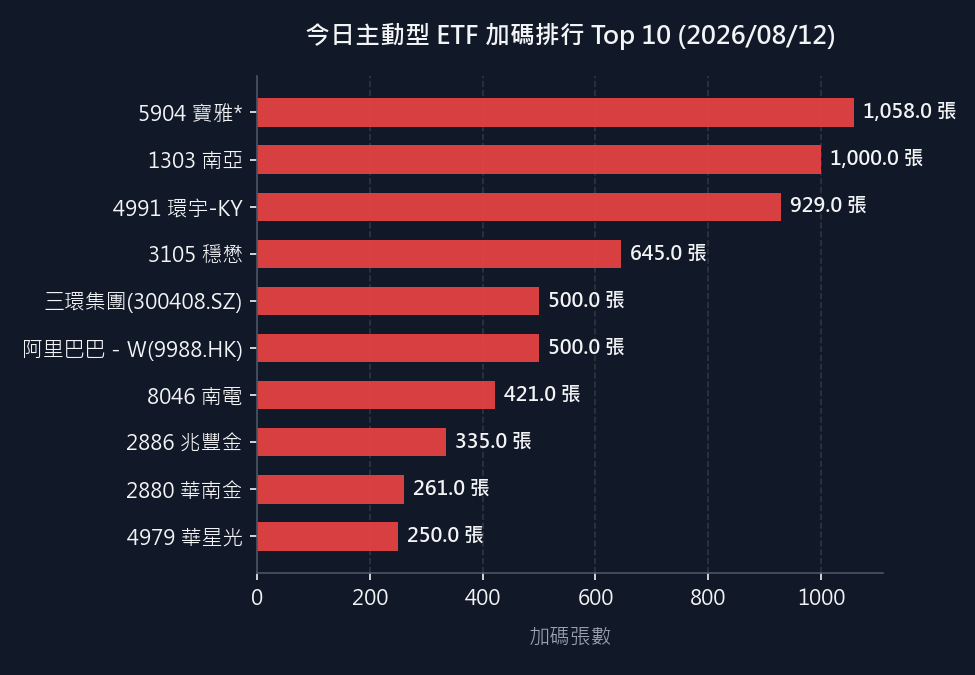
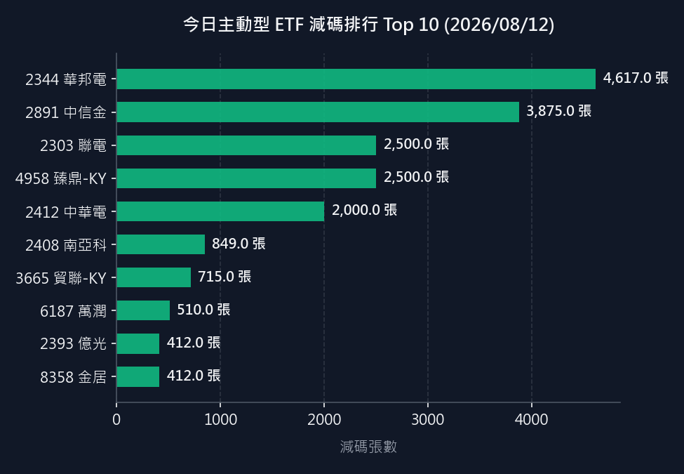

# 主動型 ETF 持股變動

資料來源：`主動型ETF持股明細.xlsx` 最近兩個日期分頁。

比較區間：`20260811` → `20260812`

## 今日加減碼視覺化排行

| 今日加碼 Top 10 | 今日減碼 Top 10 |
| :---: | :---: |
|  |  |

| ETF | 新增 | 刪除 | 比例變動 |
| :-- | --: | --: | --: |
| 00400A | 0 | 1 | 42 |
| 00401A | 4 | 0 | 56 |
| 00402A | 0 | 0 | 40 |
| 00403A | 0 | 0 | 41 |
| 00404A | 1 | 1 | 43 |
| 00405A | 1 | 1 | 37 |
| 00407A | 0 | 0 | 42 |
| 00408A | 1 | 0 | 43 |
| 00980A | 1 | 0 | 44 |
| 00980D | 0 | 0 | 16 |
| 00981A | 1 | 1 | 27 |
| 00982A | 0 | 0 | 38 |
| 00983A | 1 | 0 | 38 |
| 00983D | 0 | 0 | 11 |
| 00984A | 1 | 0 | 79 |
| 00985A | 1 | 0 | 42 |
| 00986A | 0 | 0 | 32 |
| 00987A | 0 | 0 | 25 |
| 00988A | 2 | 2 | 38 |
| 00989A | 0 | 0 | 55 |
| 00990A | 2 | 1 | 42 |
| 00991A | 1 | 2 | 20 |
| 00992A | 1 | 0 | 33 |
| 00993A | 1 | 0 | 40 |
| 00994A | 2 | 0 | 29 |
| 00995A | 0 | 0 | 45 |
| 00996A | 0 | 0 | 39 |
| 00997A | 0 | 0 | 43 |
| 00998A | 0 | 0 | 24 |
| 00999A | 0 | 0 | 53 |

## 00400A

### 新增持股

- 無

### 刪除持股

- 2891 中信金（0.88%，3875 張）

### 投資比例變動

- 1303 南亞：0.40% → 0.39%（-0.01）
- 2059 川湖：4.74% → 4.55%（-0.19）
- 2308 台達電：2.74% → 2.67%（-0.07）
- 2313 華通：0.80% → 0.77%（-0.03）
- 2317 鴻海：0.86% → 0.87%（+0.01）
- 2330 台積電：8.37% → 8.28%（-0.09）
- 2345 智邦：1.65% → 1.68%（+0.03）
- 2360 致茂：3.83% → 3.97%（+0.14）
- 2368 金像電：0.49% → 1.18%（+0.69）
- 2382 廣達：0.71% → 0.72%（+0.01）
- 2383 台光電：5.49% → 5.58%（+0.09）
- 2408 南亞科：1.86% → 1.81%（-0.05）
- 2449 京元電子：1.38% → 1.42%（+0.04）
- 2454 聯發科：6.44% → 6.31%（-0.13）
- 2881 富邦金：0.74% → 0.72%（-0.02）
- 2885 元大金：1.40% → 1.38%（-0.02）
- 3008 大立光：2.29% → 2.36%（+0.07）
- 3017 奇鋐：4.58% → 4.74%（+0.16）
- 3036 文曄：1.73% → 1.68%（-0.05）
- 3037 欣興：5.00% → 4.95%（-0.05）
- 3044 健鼎：1.56% → 1.68%（+0.12）
- 3090 日電貿：0.35% → 0.34%（-0.01）
- 3211 順達：0.75% → 0.85%（+0.10）
- 3293 鈊象：0.36% → 0.35%（-0.01）
- 3374 精材：0.31% → 0.30%（-0.01）
- 3443 創意：3.21% → 3.26%（+0.05）
- 3529 力旺：1.11% → 1.09%（-0.02）
- 3653 健策：3.42% → 3.69%（+0.27）
- 3665 貿聯-KY：2.65% → 2.55%（-0.10）
- 3711 日月光投控：1.30% → 1.26%（-0.04）
- 5274 信驊：2.94% → 3.04%（+0.10）
- 5347 世界：0.73% → 0.72%（-0.01）
- 6187 萬潤：2.13% → 2.30%（+0.17）
- 6223 旺矽：5.12% → 5.25%（+0.13）
- 6239 力成：0.99% → 0.97%（-0.02）
- 6274 台燿：1.14% → 1.11%（-0.03）
- 6442 光聖：0.55% → 0.60%（+0.05）
- 6488 環球晶：2.64% → 2.84%（+0.20）
- 6505 台塑化：0.73% → 0.70%（-0.03）
- 6669 緯穎：3.76% → 3.75%（-0.01）
- 6715 嘉基：0.17% → 0.19%（+0.02）
- 8046 南電：1.02% → 1.10%（+0.08）

## 00401A

### 新增持股

- 1477 聚陽（0.46%，68 張）
- 2059 川湖（0.93%，2.528 張）
- 臺指選擇權08/26 45600 買權（-0.33%，N/A 張）
- 臺股期貨08/26（-0.03%，N/A 張）

### 刪除持股

- 無

### 投資比例變動

- 1216 統一：0.31% → 0.30%（-0.01）
- 2303 聯電：0.93% → 0.88%（-0.05）
- 2308 台達電：3.50% → 3.30%（-0.20）
- 2313 華通：1.73% → 1.61%（-0.12）
- 2317 鴻海：0.70% → 0.68%（-0.02）
- 2330 台積電：15.16% → 15.61%（+0.45）
- 2344 華邦電：1.24% → 0.53%（-0.71）
- 2345 智邦：2.37% → 2.32%（-0.05）
- 2357 華碩：1.29% → 1.28%（-0.01）
- 2360 致茂：1.83% → 1.89%（+0.06）
- 2368 金像電：0.27% → 0.28%（+0.01）
- 2379 瑞昱：1.24% → 1.20%（-0.04）
- 2382 廣達：1.86% → 2.32%（+0.46）
- 2383 台光電：1.82% → 1.88%（+0.06）
- 2412 中華電：0.88% → 0.84%（-0.04）
- 2454 聯發科：6.45% → 6.24%（-0.21）
- 2455 全新：1.39% → 1.88%（+0.49）
- 2603 長榮：1.07% → 1.02%（-0.05）
- 2881 富邦金：1.96% → 1.85%（-0.11）
- 2882 國泰金：1.09% → 1.02%（-0.07）
- 2883 凱基金：1.56% → 1.49%（-0.07）
- 2884 玉山金：1.86% → 1.73%（-0.13）
- 2885 元大金：0.55% → 0.53%（-0.02）
- 2886 兆豐金：1.57% → 1.43%（-0.14）
- 2887 台新新光金：1.06% → 1.01%（-0.05）
- 2890 永豐金：0.30% → 0.29%（-0.01）
- 2891 中信金：1.71% → 1.63%（-0.08）
- 2912 統一超：0.29% → 0.28%（-0.01）
- 3008 大立光：2.26% → 2.25%（-0.01）
- 3034 聯詠：0.24% → 0.23%（-0.01）
- 3037 欣興：2.36% → 2.27%（-0.09）
- 3131 弘塑：0.38% → 0.84%（+0.46）
- 3167 大量：0.48% → 0.47%（-0.01）
- 3231 緯創：0.41% → 0.39%（-0.02）
- 3491 昇達科：1.67% → 1.70%（+0.03）
- 3529 力旺：0.73% → 0.16%（-0.57）
- 3653 健策：1.02% → 0.36%（-0.66）
- 3711 日月光投控：2.21% → 2.08%（-0.13）
- 4904 遠傳：0.83% → 0.79%（-0.04）
- 4938 和碩：0.34% → 0.33%（-0.01）
- 4958 臻鼎-KY：1.95% → 1.87%（-0.08）
- 4991 環宇-KY：0.72% → 1.09%（+0.37）
- 5274 信驊：1.13% → 2.11%（+0.98）
- 5347 世界：1.40% → 1.36%（-0.04）
- 5904 寶雅*：0.69% → 0.68%（-0.01）
- 6223 旺矽：2.22% → 2.24%（+0.02）
- 6285 啟碁：1.67% → 1.57%（-0.10）
- 6415 矽力*-KY：0.66% → 0.61%（-0.05）
- 6510 精測：0.71% → 0.67%（-0.04）
- 6531 愛普*：1.28% → 1.16%（-0.12）
- 6669 緯穎：2.07% → 1.98%（-0.09）
- 6944 兆聯實業：0.48% → 0.45%（-0.03）
- 7769 鴻勁：2.42% → 1.90%（-0.52）
- 7828 創新服務：1.81% → 1.84%（+0.03）
- 8021 尖點：0.29% → 0.28%（-0.01）
- 8464 億豐：1.19% → 1.18%（-0.01）

## 00402A

### 新增持股

- 無

### 刪除持股

- 無

### 投資比例變動

- AAPL.US Apple：7.21% → 7.15%（-0.06）
- ADI.US Analog Devices：1.88% → 1.89%（+0.01）
- AMD.US AMD：4.80% → 4.86%（+0.06）
- AMZN.US Amazon：4.59% → 4.50%（-0.09）
- ANET.US Arista Networks：0.82% → 0.85%（+0.03）
- ARM.US Arm：1.04% → 1.05%（+0.01）
- ASML.US ASML Holding：1.67% → 1.74%（+0.07）
- AVGO.US Broadcom：2.73% → 2.70%（-0.03）
- AXON.US Axon Enterprise：1.09% → 1.17%（+0.08）
- BABA.US Alibaba Group：0.63% → 0.61%（-0.02）
- CDNS.US Cadence Design Systems：1.80% → 1.78%（-0.02）
- CLS.US Celestica：0.88% → 0.87%（-0.01）
- COHR.US Coherent：2.15% → 2.17%（+0.02）
- CRWD.US CrowdStrike Holdings：1.52% → 1.50%（-0.02）
- FSLY.US Fastly：0.42% → 0.44%（+0.02）
- GOOG.US Alphabet - Class C Capital Stock：3.54% → 3.42%（-0.12）
- GOOGL.US Alphabet - Class A Common Stock：3.49% → 3.36%（-0.13）
- INTC.US Intel：1.28% → 1.29%（+0.01）
- IOT.US Samsara：0.24% → 0.25%（+0.01）
- KLAC.US KLA：2.16% → 2.26%（+0.10）
- LITE.US Lumentum：1.64% → 1.66%（+0.02）
- LRCX.US Lam Research：3.60% → 3.66%（+0.06）
- MDB.US MongoDB：0.82% → 0.87%（+0.05）
- META.US Meta：2.86% → 2.89%（+0.03）
- MRVL.US Marvell：1.50% → 1.53%（+0.03）
- MSFT.US Microsoft：4.43% → 4.42%（-0.01）
- MU.US Micron：5.80% → 5.87%（+0.07）
- NFLX.US Netflix：0.84% → 0.83%（-0.01）
- NOW.US ServiceNow：0.27% → 0.28%（+0.01）
- NVDA.US NVIDIA：8.99% → 8.97%（-0.02）
- NXPI.US NXP Semiconductors：1.11% → 1.13%（+0.02）
- PLTR.US Palantir Technologies：1.53% → 1.54%（+0.01）
- SIMO.US Silicon Motion：0.70% → 0.68%（-0.02）
- SKHY.US SK hynix：0.86% → 0.90%（+0.04）
- SPCX.US SpaceX：0.72% → 0.69%（-0.03）
- STX.US Seagate：1.21% → 1.24%（+0.03）
- TER.US Teradyne：0.85% → 0.89%（+0.04）
- TSM.US TSMC(ADR)：1.44% → 1.45%（+0.01）
- TXN.US Texas Instruments：2.29% → 2.30%（+0.01）
- V.US Visa：1.09% → 1.10%（+0.01）

## 00403A

### 新增持股

- 無

### 刪除持股

- 無

### 投資比例變動

- 1303 南亞：0.64% → 0.73%（+0.09）
- 1560 中砂：0.57% → 0.60%（+0.03）
- 1717 長興：0.09% → 0.11%（+0.02）
- 2303 聯電：5.41% → 5.37%（-0.04）
- 2308 台達電：3.06% → 3.01%（-0.05）
- 2317 鴻海：0.47% → 0.48%（+0.01）
- 2327 國巨*：3.09% → 3.00%（-0.09）
- 2330 台積電：16.92% → 16.94%（+0.02）
- 2337 旺宏：0.55% → 0.57%（+0.02）
- 2344 華邦電：4.20% → 4.14%（-0.06）
- 2345 智邦：2.74% → 2.83%（+0.09）
- 2360 致茂：1.04% → 1.09%（+0.05）
- 2383 台光電：4.93% → 5.18%（+0.25）
- 2454 聯發科：4.48% → 4.44%（-0.04）
- 2481 強茂：0.09% → 0.08%（-0.01）
- 3008 大立光：0.63% → 1.17%（+0.54）
- 3017 奇鋐：5.31% → 5.66%（+0.35）
- 3189 景碩：1.99% → 2.02%（+0.03）
- 3211 順達：0.45% → 0.46%（+0.01）
- 3264 欣銓：0.09% → 0.08%（-0.01）
- 3443 創意：1.41% → 1.45%（+0.04）
- 3450 聯鈞：0.42% → 0.45%（+0.03）
- 3583 辛耘：0.35% → 0.37%（+0.02）
- 3653 健策：1.81% → 1.98%（+0.17）
- 3665 貿聯-KY：1.47% → 1.43%（-0.04）
- 3711 日月光投控：2.80% → 2.75%（-0.05）
- 4958 臻鼎-KY：0.82% → 0.13%（-0.69）
- 4966 譜瑞-KY：0.17% → 0.16%（-0.01）
- 5274 信驊：1.83% → 2.06%（+0.23）
- 6223 旺矽：3.69% → 3.87%（+0.18）
- 6239 力成：0.84% → 0.83%（-0.01）
- 6274 台燿：1.50% → 1.49%（-0.01）
- 6415 矽力*-KY：0.05% → 0.04%（-0.01）
- 6442 光聖：0.18% → 0.20%（+0.02）
- 6488 環球晶：1.25% → 1.37%（+0.12）
- 6669 緯穎：1.65% → 1.67%（+0.02）
- 6805 富世達：0.70% → 0.71%（+0.01）
- 7769 鴻勁：0.58% → 0.47%（-0.11）
- 8046 南電：1.12% → 1.26%（+0.14）
- 8358 金居：0.28% → 0.21%（-0.07）
- 8996 高力：0.95% → 1.04%（+0.09）

## 00404A

### 新增持股

- 5904 寶雅*（0.52%，220 張）

### 刪除持股

- 2393 億光（0.76%，412 張）

### 投資比例變動

- 1210 大成：1.85% → 1.82%（-0.03）
- 2301 光寶科：1.72% → 1.67%（-0.05）
- 2327 國巨*：0.78% → 0.71%（-0.07）
- 2330 台積電：22.58% → 22.49%（-0.09）
- 2345 智邦：0.43% → 0.45%（+0.02）
- 2351 順德：0.57% → 0.58%（+0.01）
- 2360 致茂：1.19% → 1.14%（-0.05）
- 2377 微星：1.82% → 1.79%（-0.03）
- 2383 台光電：2.70% → 2.63%（-0.07）
- 2428 興勤：0.81% → 0.80%（-0.01）
- 2454 聯發科：6.85% → 6.64%（-0.21）
- 2458 義隆：0.40% → 0.41%（+0.01）
- 2618 長榮航：0.13% → 0.14%（+0.01）
- 2880 華南金：2.67% → 2.65%（-0.02）
- 2885 元大金：1.37% → 1.38%（+0.01）
- 2886 兆豐金：3.02% → 3.13%（+0.11）
- 2892 第一金：2.94% → 3.17%（+0.23）
- 3017 奇鋐：1.03% → 1.00%（-0.03）
- 3022 威強電：0.88% → 0.86%（-0.02）
- 3023 信邦：2.24% → 2.22%（-0.02）
- 3037 欣興：1.31% → 1.32%（+0.01）
- 3264 欣銓：1.74% → 1.72%（-0.02）
- 3443 創意：1.14% → 1.18%（+0.04）
- 3653 健策：0.23% → 0.26%（+0.03）
- 3702 大聯大：1.88% → 1.84%（-0.04）
- 3711 日月光投控：3.53% → 3.50%（-0.03）
- 4763 材料*-KY：1.90% → 1.78%（-0.12）
- 5274 信驊：2.28% → 2.42%（+0.14）
- 5289 宜鼎：0.29% → 0.31%（+0.02）
- 5434 崇越：1.62% → 1.59%（-0.03）
- 6138 茂達：0.38% → 0.39%（+0.01）
- 6196 帆宣：1.78% → 1.75%（-0.03）
- 6223 旺矽：1.18% → 1.23%（+0.05）
- 6257 矽格：0.39% → 0.40%（+0.01）
- 6488 環球晶：0.12% → 0.13%（+0.01）
- 6491 晶碩：1.85% → 1.80%（-0.05）
- 6515 穎崴：0.30% → 0.31%（+0.01）
- 6691 洋基工程：2.67% → 2.70%（+0.03）
- 8016 矽創：1.17% → 1.19%（+0.02）
- 8271 宇瞻：0.79% → 0.78%（-0.01）
- 臺指選擇權08/26 45400 買權：-0.34% → -0.41%（-0.07）
- 臺指選擇權09/26 46500 買權：-0.03% → -0.04%（-0.01）
- 臺股期貨08/26：16.54% → 16.74%（+0.20）

## 00405A

### 新增持股

- 4991 環宇-KY（1.42%，900 張）

### 刪除持股

- 2408 南亞科（1.38%，849 張）

### 投資比例變動

- 2059 川湖：1.72% → 1.65%（-0.07）
- 2308 台達電：1.77% → 1.71%（-0.06）
- 2330 台積電：1.43% → 1.41%（-0.02）
- 2344 華邦電：3.50% → 0.81%（-2.69）
- 2345 智邦：3.76% → 3.82%（+0.06）
- 2368 金像電：3.62% → 3.67%（+0.05）
- 2383 台光電：3.91% → 3.96%（+0.05）
- 2449 京元電子：0.68% → 0.70%（+0.02）
- 2454 聯發科：6.43% → 6.28%（-0.15）
- 3008 大立光：1.47% → 1.51%（+0.04）
- 3017 奇鋐：7.38% → 7.61%（+0.23）
- 3026 禾伸堂：1.25% → 1.29%（+0.04）
- 3037 欣興：5.19% → 5.12%（-0.07）
- 3081 聯亞：1.31% → 1.41%（+0.10）
- 3131 弘塑：1.77% → 1.85%（+0.08）
- 3443 創意：5.51% → 7.00%（+1.49）
- 3583 辛耘：0.41% → 0.06%（-0.35）
- 3653 健策：5.78% → 6.22%（+0.44）
- 3665 貿聯-KY：6.34% → 6.43%（+0.09）
- 3711 日月光投控：0.68% → 0.65%（-0.03）
- 5274 信驊：1.99% → 2.05%（+0.06）
- 6187 萬潤：0.69% → 0.75%（+0.06）
- 6223 旺矽：5.74% → 5.87%（+0.13）
- 6274 台燿：1.64% → 1.60%（-0.04）
- 6285 啟碁：0.34% → 0.33%（-0.01）
- 6442 光聖：0.34% → 0.36%（+0.02）
- 6488 環球晶：0.31% → 0.33%（+0.02）
- 6510 精測：2.29% → 2.26%（-0.03）
- 6515 穎崴：0.53% → 0.54%（+0.01）
- 6526 達發：0.30% → 0.29%（-0.01）
- 6669 緯穎：3.85% → 3.83%（-0.02）
- 6831 邁科：0.51% → 0.55%（+0.04）
- 7734 印能科技：2.03% → 2.06%（+0.03）
- 7769 鴻勁：2.54% → 2.53%（-0.01）
- 8046 南電：3.98% → 4.28%（+0.30）
- 8210 勤誠：0.57% → 0.55%（-0.02）
- 8996 高力：1.00% → 1.08%（+0.08）

## 00407A

### 新增持股

- 無

### 刪除持股

- 無

### 投資比例變動

- 1303 南亞：0.55% → 0.54%（-0.01）
- 1590 亞德客-KY：2.28% → 2.32%（+0.04）
- 2059 川湖：2.98% → 2.91%（-0.07）
- 2303 聯電：2.12% → 2.11%（-0.01）
- 2308 台達電：3.56% → 3.52%（-0.04）
- 2327 國巨*：2.28% → 2.22%（-0.06）
- 2330 台積電：8.21% → 8.25%（+0.04）
- 2344 華邦電：1.76% → 1.74%（-0.02）
- 2345 智邦：3.04% → 2.80%（-0.24）
- 2360 致茂：1.92% → 2.02%（+0.10）
- 2368 金像電：1.79% → 1.86%（+0.07）
- 2376 技嘉：0.70% → 0.74%（+0.04）
- 2383 台光電：5.15% → 5.32%（+0.17）
- 2395 研華：1.86% → 1.92%（+0.06）
- 2408 南亞科：1.82% → 1.79%（-0.03）
- 2412 中華電：1.54% → 0.60%（-0.94）
- 2454 聯發科：6.62% → 6.59%（-0.03）
- 3017 奇鋐：4.05% → 4.26%（+0.21）
- 3037 欣興：4.50% → 4.52%（+0.02）
- 3293 鈊象：0.57% → 0.55%（-0.02）
- 3443 創意：2.01% → 2.07%（+0.06）
- 3491 昇達科：0.41% → 0.42%（+0.01）
- 3529 力旺：1.98% → 1.97%（-0.01）
- 3533 嘉澤：0.94% → 0.39%（-0.55）
- 3665 貿聯-KY：2.85% → 1.91%（-0.94）
- 3711 日月光投控：2.48% → 2.44%（-0.04）
- 4958 臻鼎-KY：1.74% → 1.67%（-0.07）
- 5274 信驊：1.99% → 2.09%（+0.10）
- 5289 宜鼎：0.16% → 0.17%（+0.01）
- 5536 聖暉*：1.38% → 0.80%（-0.58）
- 6223 旺矽：2.78% → 2.89%（+0.11）
- 6274 台燿：3.57% → 3.55%（-0.02）
- 6415 矽力*-KY：0.36% → 0.34%（-0.02）
- 6446 藥華藥：2.71% → 2.67%（-0.04）
- 6515 穎崴：1.41% → 1.46%（+0.05）
- 6526 達發：0.30% → 0.29%（-0.01）
- 6531 愛普*：1.36% → 1.43%（+0.07）
- 6669 緯穎：4.21% → 4.26%（+0.05）
- 6805 富世達：2.11% → 2.16%（+0.05）
- 8046 南電：2.23% → 2.44%（+0.21）
- 8210 勤誠：1.46% → 0.89%（-0.57）
- 8996 高力：0.39% → 0.43%（+0.04）

## 00408A

### 新增持股

- 5483 中美晶（0.66%，60 張）

### 刪除持股

- 無

### 投資比例變動

- 1477 聚陽：0.27% → 0.26%（-0.01）
- 2059 川湖：2.21% → 2.14%（-0.07）
- 2303 聯電：1.29% → 1.27%（-0.02）
- 2308 台達電：3.68% → 3.60%（-0.08）
- 2317 鴻海：2.76% → 2.79%（+0.03）
- 2327 國巨*：0.37% → 0.36%（-0.01）
- 2330 台積電：6.61% → 5.84%（-0.77）
- 2344 華邦電：1.49% → 1.47%（-0.02）
- 2345 智邦：0.77% → 0.79%（+0.02）
- 2356 英業達：1.29% → 1.35%（+0.06）
- 2357 華碩：2.16% → 2.17%（+0.01）
- 2360 致茂：2.87% → 2.99%（+0.12）
- 2368 金像電：2.20% → 2.72%（+0.52）
- 2376 技嘉：2.21% → 2.33%（+0.12）
- 2382 廣達：0.85% → 1.25%（+0.40）
- 2383 台光電：4.64% → 4.74%（+0.10）
- 2395 研華：2.18% → 2.23%（+0.05）
- 2404 漢唐：1.72% → 1.68%（-0.04）
- 2408 南亞科：1.17% → 1.14%（-0.03）
- 2454 聯發科：4.58% → 3.56%（-1.02）
- 2481 強茂：0.32% → 0.31%（-0.01）
- 2801 彰銀：0.85% → 0.86%（+0.01）
- 2880 華南金：1.70% → 1.66%（-0.04）
- 2886 兆豐金：2.58% → 2.51%（-0.07）
- 2891 中信金：0.96% → 0.95%（-0.01）
- 3017 奇鋐：3.64% → 3.79%（+0.15）
- 3036 文曄：0.83% → 0.81%（-0.02）
- 3037 欣興：3.69% → 3.67%（-0.02）
- 3045 台灣大：3.22% → 3.18%（-0.04）
- 3653 健策：1.22% → 1.32%（+0.10）
- 3665 貿聯-KY：1.58% → 1.53%（-0.05）
- 3702 大聯大：1.96% → 1.88%（-0.08）
- 3711 日月光投控：0.53% → 0.51%（-0.02）
- 5434 崇越：1.81% → 1.83%（+0.02）
- 5876 上海商銀：1.44% → 1.41%（-0.03）
- 5904 寶雅*：2.14% → 1.02%（-1.12）
- 6223 旺矽：1.32% → 1.37%（+0.05）
- 6239 力成：1.13% → 1.12%（-0.01）
- 6274 台燿：1.83% → 1.80%（-0.03）
- 6669 緯穎：4.27% → 4.28%（+0.01）
- 6805 富世達：0.32% → 0.33%（+0.01）
- 7769 鴻勁：1.71% → 1.72%（+0.01）
- 8046 南電：2.48% → 2.69%（+0.21）

## 00980A

### 新增持股

- 台灣證交所加權股價指數（7.12%，N/A 張）

### 刪除持股

- 無

### 投資比例變動

- 1303 南亞：2.31% → 2.26%（-0.05）
- 2059 川湖：5.65% → 5.43%（-0.22）
- 2308 台達電：3.68% → 3.58%（-0.10）
- 2317 鴻海：2.08% → 2.10%（+0.02）
- 2327 國巨*：1.07% → 1.03%（-0.04）
- 2330 台積電：8.01% → 7.93%（-0.08）
- 2344 華邦電：1.03% → 1.01%（-0.02）
- 2345 智邦：1.58% → 1.61%（+0.03）
- 2360 致茂：1.55% → 1.61%（+0.06）
- 2368 金像電：1.91% → 1.95%（+0.04）
- 2376 技嘉：1.23% → 1.29%（+0.06）
- 2382 廣達：1.57% → 1.59%（+0.02）
- 2383 台光電：4.24% → 4.31%（+0.07）
- 2408 南亞科：2.56% → 2.48%（-0.08）
- 2454 聯發科：5.65% → 5.55%（-0.10）
- 2884 玉山金：0.81% → 0.79%（-0.02）
- 2891 中信金：1.25% → 1.22%（-0.03）
- 3008 大立光：0.79% → 0.82%（+0.03）
- 3017 奇鋐：1.86% → 1.93%（+0.07）
- 3026 禾伸堂：0.44% → 0.45%（+0.01）
- 3036 文曄：1.27% → 1.23%（-0.04）
- 3037 欣興：2.82% → 2.79%（-0.03）
- 3044 健鼎：0.77% → 0.83%（+0.06）
- 3081 聯亞：2.97% → 3.20%（+0.23）
- 3264 欣銓：0.72% → 0.70%（-0.02）
- 3293 鈊象：1.02% → 0.97%（-0.05）
- 3443 創意：1.47% → 1.50%（+0.03）
- 3529 力旺：0.87% → 0.86%（-0.01）
- 3653 健策：1.41% → 1.53%（+0.12）
- 3665 貿聯-KY：0.36% → 0.34%（-0.02）
- 3711 日月光投控：1.27% → 1.23%（-0.04）
- 4958 臻鼎-KY：0.83% → 0.78%（-0.05）
- 5274 信驊：1.52% → 1.57%（+0.05）
- 5904 寶雅*：1.37% → 1.28%（-0.09）
- 6213 聯茂：1.10% → 1.11%（+0.01）
- 6223 旺矽：2.42% → 2.48%（+0.06）
- 6274 台燿：1.51% → 1.48%（-0.03）
- 6442 光聖：0.28% → 0.30%（+0.02）
- 6515 穎崴：1.92% → 1.95%（+0.03）
- 6831 邁科：0.57% → 0.61%（+0.04）
- 8046 南電：1.18% → 1.27%（+0.09）
- 8210 勤誠：0.71% → 0.69%（-0.02）
- 8299 群聯：2.30% → 2.38%（+0.08）
- 8996 高力：0.97% → 1.05%（+0.08）

## 00980D

### 新增持股

- 無

### 刪除持股

- 無

### 投資比例變動

- APA CORP 6.750000 % 15-FEB-2055：0.35% → 0.36%（+0.01）
- BLACKSTONE PRIVATE CRE 7.300000 % 27NOV2028：0.46% → 0.47%（+0.01）
- CIMIC FINANCE USA PTY LT SER REGS (REG S) 7% 25MAR2034：0.32% → 0.33%（+0.01）
- CONCENTRIX CORP (REG) 6.85% 02AUG2033：0.69% → 0.70%（+0.01）
- DEUTSCHE BANK NY VAR 10FEB2034：0.33% → 0.34%（+0.01）
- ENBRIDGE ENERGY PARTNERS (REG) 7.375% 15OCT2045：0.50% → 0.51%（+0.01）
- GETTY IMAGES INC SER REGS 11.250000 % 21FEB2030：0.50% → 0.48%（-0.02）
- JETBLUE AIRWAYS/LOYALTY SER REGS (REG S) 9.875% 20SEP2031：0.49% → 0.50%（+0.01）
- LBM ACQUISITION LLC SER REGS 9.500000 % 15JUN2031：0.48% → 0.47%（-0.01）
- MYLAN NV 5.25% 15JUN2046 WI：0.51% → 0.52%（+0.01）
- US 10YR NOTE (CBT)SEP26 21-SEP-2026：18.25% → 18.28%（+0.03）
- US 10YR ULTRA FUT SEP26 21-SEP-2026：-1.21% → -1.22%（-0.01）
- US 2YR NOTE (CBT) SEP26 30-SEP-2026：1.94% → 1.95%（+0.01）
- US 5YR NOTE (CBT) SEP26 30-SEP-2026：-15.88% → -15.90%（-0.02）
- US LONG BOND(CBT) SEP26 21-SEP-2026：5.31% → 5.32%（+0.01）
- VIACOMCBS INC 6.875% 30APR2036：0.29% → 0.28%（-0.01）

## 00981A

### 新增持股

- 台指期貨 2026/08（2.01%，N/A 張）

### 刪除持股

- 台指期貨(B)（5.78%，N/A 張）

### 投資比例變動

- 2303 聯電：3.57% → 3.51%（-0.06）
- 2308 台達電：4.22% → 4.12%（-0.10）
- 2327 國巨*：5.19% → 4.99%（-0.20）
- 2330 台積電：9.60% → 9.54%（-0.06）
- 2345 智邦：4.53% → 4.63%（+0.10）
- 2360 致茂：0.39% → 0.44%（+0.05）
- 2368 金像電：1.27% → 1.30%（+0.03）
- 2383 台光電：8.90% → 9.07%（+0.17）
- 2449 京元電子：0.92% → 0.95%（+0.03）
- 2454 聯發科：7.24% → 7.12%（-0.12）
- 3017 奇鋐：5.29% → 5.59%（+0.30）
- 3037 欣興：6.63% → 6.58%（-0.05）
- 3653 健策：3.19% → 3.46%（+0.27）
- 3665 貿聯-KY：3.36% → 3.24%（-0.12）
- 3711 日月光投控：4.06% → 3.95%（-0.11）
- 4958 臻鼎-KY：0.27% → 0.26%（-0.01）
- 4979 華星光：0.37% → 0.44%（+0.07）
- 5274 信驊：2.47% → 2.74%（+0.27）
- 6187 萬潤：0.46% → 0.50%（+0.04）
- 6223 旺矽：5.10% → 5.25%（+0.15）
- 6274 台燿：2.92% → 2.87%（-0.05）
- 6510 精測：0.33% → 0.44%（+0.11）
- 6669 緯穎：4.89% → 4.90%（+0.01）
- 6805 富世達：1.31% → 1.35%（+0.04）
- 8046 南電：3.62% → 3.97%（+0.35）
- 8210 勤誠：0.84% → 0.82%（-0.02）
- 8996 高力：0.25% → 0.31%（+0.06）

## 00982A

### 新增持股

- 無

### 刪除持股

- 無

### 投資比例變動

- 1785 光洋科：0.92% → 0.90%（-0.02）
- 2059 川湖：4.47% → 4.29%（-0.18）
- 2303 聯電：2.20% → 2.16%（-0.04）
- 2316 楠梓電：1.17% → 1.08%（-0.09）
- 2327 國巨*：0.84% → 0.81%（-0.03）
- 2330 台積電：8.42% → 8.35%（-0.07）
- 2345 智邦：3.42% → 3.49%（+0.07）
- 2360 致茂：3.41% → 3.54%（+0.13）
- 2376 技嘉：0.30% → 0.32%（+0.02）
- 2377 微星：1.71% → 1.85%（+0.14）
- 2383 台光電：3.55% → 3.61%（+0.06）
- 2451 創見：0.29% → 0.30%（+0.01）
- 2454 聯發科：6.87% → 6.75%（-0.12）
- 2467 志聖：1.57% → 1.60%（+0.03）
- 2472 立隆電：0.73% → 0.74%（+0.01）
- 2885 元大金：0.29% → 0.28%（-0.01）
- 3008 大立光：2.12% → 2.19%（+0.07）
- 3017 奇鋐：2.20% → 2.28%（+0.08）
- 3036 文曄：1.04% → 1.01%（-0.03）
- 3105 穩懋：3.11% → 3.40%（+0.29）
- 3264 欣銓：2.06% → 1.99%（-0.07）
- 3491 昇達科：2.47% → 2.51%（+0.04）
- 3583 辛耘：1.59% → 1.64%（+0.05）
- 3702 大聯大：1.40% → 1.34%（-0.06）
- 3711 日月光投控：1.25% → 1.22%（-0.03）
- 4958 臻鼎-KY：3.05% → 2.89%（-0.16）
- 5274 信驊：0.96% → 1.00%（+0.04）
- 5536 聖暉*：6.79% → 6.51%（-0.28）
- 6139 亞翔：6.17% → 6.29%（+0.12）
- 6187 萬潤：0.19% → 0.20%（+0.01）
- 6223 旺矽：3.80% → 3.90%（+0.10）
- 6257 矽格：1.93% → 1.96%（+0.03）
- 6274 台燿：1.42% → 1.39%（-0.03）
- 6488 環球晶：1.89% → 2.04%（+0.15）
- 6531 愛普*：2.35% → 2.44%（+0.09）
- 6669 緯穎：5.93% → 5.92%（-0.01）
- 6831 邁科：0.36% → 0.39%（+0.03）
- 8996 高力：0.80% → 0.86%（+0.06）

## 00983A

### 新增持股

- NET.US Cloudflare（0.10%，0.118 張）

### 刪除持股

- 無

### 投資比例變動

- ACHR.US Archer：0.37% → 0.41%（+0.04）
- AMD.US AMD：4.96% → 4.60%（-0.36）
- AMZN.US Amazon：3.54% → 3.50%（-0.04）
- AVGO.US Broadcom：2.01% → 2.00%（-0.01）
- BEAM.US Beam Therapeutics：2.33% → 2.32%（-0.01）
- BLSH.US Bullish：1.02% → 1.03%（+0.01）
- BMNR.US BitMine：1.27% → 1.28%（+0.01）
- CBRS.US Cerebras：0.68% → 0.70%（+0.02）
- CERS.US Cerus：0.43% → 0.44%（+0.01）
- COIN.US Coinbase：2.05% → 2.07%（+0.02）
- CRCL.US Circle：2.34% → 2.57%（+0.23）
- CRSP.US CRISPR Therapeutics：4.14% → 4.23%（+0.09）
- CRWV.US CoreWeave：0.90% → 0.93%（+0.03）
- DE.US Deere：1.36% → 1.40%（+0.04）
- GOOG.US Alphabet - Class C Capital Stock：1.27% → 1.24%（-0.03）
- GOOGL.US Alphabet - Class A Common Stock：1.68% → 1.64%（-0.04）
- HOOD.US Robinhood Markets：3.71% → 3.75%（+0.04）
- ILMN.US Illumina：2.22% → 2.25%（+0.03）
- KTOS.US Kratos Defense & Security：1.02% → 1.05%（+0.03）
- META.US Meta：1.13% → 1.15%（+0.02）
- NTLA.US Intellia Therapeutics：1.32% → 1.33%（+0.01）
- NTRA.US Natera：2.19% → 2.18%（-0.01）
- NVDA.US NVIDIA：1.60% → 1.62%（+0.02）
- PLTR.US Palantir Technologies：2.94% → 3.08%（+0.14）
- RBLX.US Roblox：1.37% → 0.99%（-0.38）
- RXRX.US Recursion Pharmaceuticals：0.30% → 0.31%（+0.01）
- SHOP.US Shopify：7.22% → 7.18%（-0.04）
- SNOW.US Snowflake：1.66% → 1.68%（+0.02）
- SPCX.US SpaceX：2.47% → 2.53%（+0.06）
- TEM.US Tempus：3.51% → 3.59%（+0.08）
- TER.US Teradyne：0.59% → 0.62%（+0.03）
- TSLA.US Tesla：7.76% → 7.88%（+0.12）
- TSM.US TSMC(ADR)：3.43% → 3.50%（+0.07）
- TWST.US Twist Bioscience：4.87% → 4.80%（-0.07）
- TXG.US 10x Genomics：4.76% → 4.69%（-0.07）
- VCYT.US Veracyte：1.04% → 1.05%（+0.01）
- WGS.US GeneDx：1.60% → 1.70%（+0.10）
- XYZ.US Block：2.19% → 2.22%（+0.03）

## 00983D

### 新增持股

- 無

### 刪除持股

- 無

### 投資比例變動

- AMCX 10 1/2 07/15/32：1.64% → 1.65%（+0.01）
- C 8 1/8 07/15/39：1.96% → 1.95%（-0.01）
- DELL 8.35 07/15/46：1.42% → 1.41%（-0.01）
- IEP 10 11/15/29：1.51% → 1.50%（-0.01）
- LOW 6.65 09/15/37：0.85% → 0.84%（-0.01）
- MINAU 9 1/4 10/01/28：0.88% → 0.89%（+0.01）
- NTRCN 7 1/8 05/23/36：0.55% → 0.56%（+0.01）
- OXY 6.6 03/15/46：0.75% → 0.76%（+0.01）
- RAKUTN 11 1/4 02/15/27：1.82% → 1.81%（-0.01）
- TELEFONICA EMISIONES SAU 7.045 06/20/36：1.57% → 1.56%（-0.01）
- TLTW.US iShares 20+ Year Treasury Bond B：7.20% → 7.21%（+0.01）

## 00984A

### 新增持股

- 台指期貨 2026/08（2.16%，N/A 張）

### 刪除持股

- 無

### 投資比例變動

- 1303 南亞：2.31% → 2.28%（-0.03）
- 1326 台化：1.03% → 1.05%（+0.02）
- 1409 新纖：0.58% → 0.59%（+0.01）
- 1477 聚陽：0.87% → 0.85%（-0.02）
- 1560 中砂：0.66% → 0.69%（+0.03）
- 1714 和桐：0.28% → 0.31%（+0.03）
- 1736 喬山：0.75% → 0.72%（-0.03）
- 1907 永豐餘：0.51% → 0.50%（-0.01）
- 2059 川湖：5.11% → 4.85%（-0.26）
- 2201 裕隆：0.22% → 0.24%（+0.02）
- 2303 聯電：1.41% → 1.39%（-0.02）
- 2317 鴻海：1.44% → 1.47%（+0.03）
- 2324 仁寶：0.55% → 0.60%（+0.05）
- 2330 台積電：3.61% → 3.60%（-0.01）
- 2345 智邦：0.77% → 0.79%（+0.02）
- 2351 順德：0.26% → 0.27%（+0.01）
- 2357 華碩：0.85% → 0.86%（+0.01）
- 2360 致茂：0.88% → 0.92%（+0.04）
- 2375 凱美：0.26% → 0.25%（-0.01）
- 2376 技嘉：0.53% → 0.57%（+0.04）
- 2377 微星：0.45% → 0.49%（+0.04）
- 2383 台光電：1.78% → 1.82%（+0.04）
- 2404 漢唐：1.20% → 1.17%（-0.03）
- 2408 南亞科：1.92% → 1.88%（-0.04）
- 2412 中華電：0.86% → 0.85%（-0.01）
- 2441 超豐：1.22% → 1.23%（+0.01）
- 2454 聯發科：1.61% → 1.60%（-0.01）
- 2464 盟立：0.76% → 0.79%（+0.03）
- 2472 立隆電：0.26% → 0.27%（+0.01）
- 2474 可成：0.38% → 0.37%（-0.01）
- 2603 長榮：0.76% → 0.74%（-0.02）
- 2633 台灣高鐵：0.47% → 0.46%（-0.01）
- 2801 彰銀：1.51% → 1.54%（+0.03）
- 2880 華南金：2.02% → 2.09%（+0.07）
- 2886 兆豐金：1.98% → 2.04%（+0.06）
- 2891 中信金：0.78% → 0.77%（-0.01）
- 2892 第一金：1.61% → 1.62%（+0.01）
- 3008 大立光：2.19% → 2.28%（+0.09）
- 3017 奇鋐：0.08% → 0.09%（+0.01）
- 3023 信邦：1.17% → 1.14%（-0.03）
- 3026 禾伸堂：0.85% → 0.89%（+0.04）
- 3033 威健：0.27% → 0.26%（-0.01）
- 3036 文曄：0.56% → 0.54%（-0.02）
- 3189 景碩：1.64% → 1.65%（+0.01）
- 3450 聯鈞：0.63% → 0.67%（+0.04）
- 3702 大聯大：0.56% → 0.54%（-0.02）
- 3711 日月光投控：1.19% → 1.17%（-0.02）
- 4123 晟德：0.23% → 0.22%（-0.01）
- 4764 雙鍵：0.50% → 0.52%（+0.02）
- 4938 和碩：0.65% → 0.66%（+0.01）
- 4958 臻鼎-KY：0.98% → 0.94%（-0.04）
- 4966 譜瑞-KY：0.88% → 0.87%（-0.01）
- 5274 信驊：0.86% → 0.90%（+0.04）
- 5288 豐祥-KY：0.25% → 0.24%（-0.01）
- 5289 宜鼎：1.00% → 1.03%（+0.03）
- 5351 鈺創：0.90% → 0.91%（+0.01）
- 5434 崇越：0.30% → 0.31%（+0.01）
- 5483 中美晶：0.40% → 0.43%（+0.03）
- 5534 長虹：0.22% → 0.23%（+0.01）
- 5536 聖暉*：0.50% → 0.48%（-0.02）
- 5880 合庫金：1.52% → 1.51%（-0.01）
- 5904 寶雅*：0.35% → 1.18%（+0.83）
- 6005 群益證：1.16% → 1.17%（+0.01）
- 6121 新普：0.10% → 0.09%（-0.01）
- 6139 亞翔：2.93% → 2.89%（-0.04）
- 6196 帆宣：1.13% → 1.10%（-0.03）
- 6213 聯茂：1.74% → 1.77%（+0.03）
- 6223 旺矽：1.27% → 1.31%（+0.04）
- 6257 矽格：0.68% → 0.70%（+0.02）
- 6274 台燿：0.73% → 0.72%（-0.01）
- 6285 啟碁：0.57% → 0.56%（-0.01）
- 6446 藥華藥：2.69% → 2.63%（-0.06）
- 6531 愛普*：1.05% → 1.10%（+0.05）
- 7734 印能科技：0.49% → 0.50%（+0.01）
- 7769 鴻勁：1.28% → 1.29%（+0.01）
- 8039 台虹：0.68% → 0.71%（+0.03）
- 8046 南電：1.07% → 0.68%（-0.39）
- 8271 宇瞻：0.57% → 0.56%（-0.01）
- 9914 美利達：0.29% → 0.28%（-0.01）

## 00985A

### 新增持股

- 台灣證交所加權股價指數（5.34%，N/A 張）

### 刪除持股

- 無

### 投資比例變動

- 1216 統一：0.98% → 0.97%（-0.01）
- 2027 大成鋼：4.97% → 4.95%（-0.02）
- 2049 上銀：0.64% → 0.20%（-0.44）
- 2059 川湖：1.95% → 1.89%（-0.06）
- 2308 台達電：0.54% → 1.30%（+0.76）
- 2327 國巨*：0.54% → 0.52%（-0.02）
- 2330 台積電：13.94% → 13.89%（-0.05）
- 2344 華邦電：1.08% → 1.06%（-0.02）
- 2345 智邦：2.62% → 2.69%（+0.07）
- 2360 致茂：0.10% → 0.11%（+0.01）
- 2368 金像電：0.94% → 0.96%（+0.02）
- 2376 技嘉：3.52% → 3.97%（+0.45）
- 2383 台光電：2.85% → 2.92%（+0.07）
- 2395 研華：0.33% → 0.34%（+0.01）
- 2408 南亞科：2.16% → 2.11%（-0.05）
- 2412 中華電：3.48% → 3.44%（-0.04）
- 2454 聯發科：1.99% → 1.96%（-0.03）
- 2603 長榮：2.90% → 2.82%（-0.08）
- 2610 華航：1.37% → 1.35%（-0.02）
- 2881 富邦金：0.20% → 0.19%（-0.01）
- 3008 大立光：2.72% → 2.83%（+0.11）
- 3017 奇鋐：1.86% → 1.94%（+0.08）
- 3036 文曄：1.72% → 1.68%（-0.04）
- 3081 聯亞：2.04% → 2.21%（+0.17）
- 3105 穩懋：0.55% → 2.57%（+2.02）
- 3131 弘塑：1.16% → 1.22%（+0.06）
- 3653 健策：1.29% → 1.40%（+0.11）
- 3665 貿聯-KY：0.37% → 0.19%（-0.18）
- 3711 日月光投控：0.78% → 0.99%（+0.21）
- 4904 遠傳：3.47% → 3.43%（-0.04）
- 4958 臻鼎-KY：2.15% → 2.04%（-0.11）
- 6147 頎邦：1.63% → 1.56%（-0.07）
- 6187 萬潤：2.71% → 1.71%（-1.00）
- 6223 旺矽：0.31% → 0.32%（+0.01）
- 6442 光聖：2.12% → 2.31%（+0.19）
- 6446 藥華藥：2.82% → 2.75%（-0.07）
- 6488 環球晶：0.08% → 0.09%（+0.01）
- 6669 緯穎：2.88% → 2.89%（+0.01）
- 7769 鴻勁：1.13% → 1.14%（+0.01）
- 8046 南電：0.55% → 0.59%（+0.04）
- 8299 群聯：1.10% → 1.15%（+0.05）
- 8996 高力：1.97% → 2.14%（+0.17）

## 00986A

### 新增持股

- 無

### 刪除持股

- 無

### 投資比例變動

- 2330 台積電：8.54% → 8.59%（+0.05）
- 2454 聯發科：0.65% → 0.66%（+0.01）
- AAPL.US Apple：0.97% → 0.96%（-0.01）
- AMAT.US Applied Materials：1.92% → 1.94%（+0.02）
- AMD.US AMD：2.96% → 2.99%（+0.03）
- AMZN.US Amazon：4.09% → 4.01%（-0.08）
- AVGO.US Broadcom：5.32% → 5.25%（-0.07）
- COHR.US Coherent：2.22% → 2.25%（+0.03）
- CRDO.US Credo：0.38% → 0.39%（+0.01）
- CRWD.US CrowdStrike Holdings：4.44% → 4.38%（-0.06）
- DDOG.US Datadog：0.41% → 0.39%（-0.02）
- ETN.US Eaton：2.34% → 2.42%（+0.08）
- GEV.US GE Vernova：2.60% → 2.66%（+0.06）
- GOOGL.US Alphabet - Class A Common Stock：6.57% → 6.33%（-0.24）
- HWM.US Howmet Aerospace：2.53% → 2.52%（-0.01）
- JPM.US JPMorgan Chase：1.51% → 1.52%（+0.01）
- LITE.US Lumentum：3.33% → 3.37%（+0.04）
- LLY.US Eli Lilly：2.91% → 2.88%（-0.03）
- LRCX.US Lam Research：2.74% → 2.79%（+0.05）
- MA.US Mastercard：1.04% → 1.03%（-0.01）
- MSFT.US Microsoft：2.66% → 2.65%（-0.01）
- MU.US Micron：3.62% → 3.66%（+0.04）
- MUFG(8306.JP)：1.40% → 1.39%（-0.01）
- NET.US Cloudflare：1.96% → 1.94%（-0.02）
- NVDA.US NVIDIA：5.94% → 5.95%（+0.01）
- SNDK.US Sandisk：1.30% → 1.34%（+0.04）
- Siemens Energy AG：2.06% → 2.12%（+0.06）
- TSEM.US Tower Semiconductor：0.99% → 0.98%（-0.01）
- Yaskawa Electric(6506.JP)：1.96% → 1.95%（-0.01）
- 嘉能可公司：1.61% → 1.63%（+0.02）
- 施奈德電機公司：1.65% → 1.67%（+0.02）
- 英飛凌科技股份有限公司：3.04% → 3.05%（+0.01）

## 00987A

### 新增持股

- 無

### 刪除持股

- 無

### 投資比例變動

- 2308 台達電：0.96% → 0.92%（-0.04）
- 2330 台積電：8.15% → 7.97%（-0.18）
- 2345 智邦：2.26% → 2.27%（+0.01）
- 2383 台光電：7.11% → 7.15%（+0.04）
- 2408 南亞科：4.44% → 4.25%（-0.19）
- 2454 聯發科：4.86% → 4.71%（-0.15）
- 2455 全新：2.85% → 2.89%（+0.04）
- 3017 奇鋐：6.05% → 6.19%（+0.14）
- 3037 欣興：7.12% → 6.97%（-0.15）
- 3081 聯亞：3.54% → 3.78%（+0.24）
- 3231 緯創：2.36% → 2.32%（-0.04）
- 3363 上詮：2.12% → 2.14%（+0.02）
- 3443 創意：7.12% → 7.15%（+0.03）
- 3653 健策：2.77% → 2.95%（+0.18）
- 3665 貿聯-KY：4.16% → 3.95%（-0.21）
- 6223 旺矽：6.44% → 6.54%（+0.10）
- 6274 台燿：4.55% → 4.40%（-0.15）
- 6515 穎崴：2.09% → 2.10%（+0.01）
- 6683 雍智科技：2.45% → 2.42%（-0.03）
- 6739 竹陞科技：1.90% → 1.89%（-0.01）
- 6805 富世達：3.32% → 3.30%（-0.02）
- 7769 鴻勁：2.40% → 2.38%（-0.02）
- 8046 南電：3.96% → 4.22%（+0.26）
- 8358 金居：1.64% → 1.75%（+0.11）
- 8996 高力：1.41% → 1.50%（+0.09）

## 00988A

### 新增持股

- NET.US Cloudflare（0.79%，45 張）
- PLTR.US Palantir Technologies（0.80%，80 張）

### 刪除持股

- 2303 聯電（0.55%，2500 張）
- 3665 貿聯-KY（0.74%，190 張）

### 投資比例變動

- 2308 台達電：1.06% → 1.49%（+0.43）
- 2327 國巨*：1.58% → 1.69%（+0.11）
- 2330 台積電：3.18% → 3.17%（-0.01）
- 2383 台光電：4.20% → 4.35%（+0.15）
- 2454 聯發科：3.14% → 3.16%（+0.02）
- 3017 奇鋐：1.06% → 1.05%（-0.01）
- 3037 欣興：4.60% → 4.55%（-0.05）
- 3711 日月光投控：2.02% → 2.00%（-0.02）
- 6223 旺矽：2.69% → 2.70%（+0.01）
- AEHR.US Aehr Test Systems：0.86% → 0.94%（+0.08）
- AIXTRON SE：0.54% → 0.55%（+0.01）
- AMAT.US Applied Materials：4.05% → 2.54%（-1.51）
- BE.US Bloom Energy：2.54% → 2.53%（-0.01）
- COHR.US Coherent：1.77% → 1.78%（+0.01）
- CRDO.US Credo：3.10% → 3.17%（+0.07）
- FORMFACTOR INC：0.97% → 1.04%（+0.07）
- Kioxia Holdings(285A.JP)：3.13% → 3.09%（-0.04）
- LMT.US Lockheed Martin：1.32% → 1.29%（-0.03）
- MICRONICS(6871.JP)：1.86% → 1.84%（-0.02）
- MPWR.US Monolithic Power Systems：1.43% → 1.44%（+0.01）
- MRVL.US Marvell：2.46% → 2.48%（+0.02）
- MU.US Micron：6.11% → 4.95%（-1.16）
- Meiko Electronics(6787.JP)：0.98% → 0.97%（-0.01）
- Murata Mfg.(6981.JP)：3.58% → 3.53%（-0.05）
- NOW.US ServiceNow：1.98% → 1.96%（-0.02）
- Nippon Chemi-Con(6997.JP)：1.34% → 1.32%（-0.02）
- PANW.US Palo Alto：2.76% → 3.28%（+0.52）
- SNDK.US Sandisk：1.49% → 1.52%（+0.03）
- SNOW.US Snowflake：2.21% → 2.19%（-0.02）
- Samsung Elec Mech(009150.KS)：3.61% → 3.59%（-0.02）
- TAIYO YUDEN(6976.JP)：1.56% → 1.54%（-0.02）
- TER.US Teradyne：1.15% → 1.19%（+0.04）
- TSEM.US Tower Semiconductor：2.71% → 2.66%（-0.05）
- WDC.US Western Digital：2.64% → 2.62%（-0.02）
- 三環集團(300408.SZ)：1.35% → 1.92%（+0.57）
- 中際旭創(3308.HK)：0.83% → 0.81%（-0.02）
- 阿里巴巴－Ｗ(9988.HK)：0.46% → 0.92%（+0.46）
- 鼎泰高科(301377.SZ)：1.09% → 1.06%（-0.03）

## 00989A

### 新增持股

- 無

### 刪除持股

- 無

### 投資比例變動

- ADBE.US Adobe：0.99% → 0.96%（-0.03）
- ADI.US Analog Devices：1.07% → 1.08%（+0.01）
- AMAT.US Applied Materials：0.71% → 0.72%（+0.01）
- AMD.US AMD：2.46% → 2.49%（+0.03）
- AMKR.US Amkor：0.69% → 0.71%（+0.02）
- AMZN.US Amazon：1.08% → 1.06%（-0.02）
- APP.US Applovin：0.82% → 0.77%（-0.05）
- ASML.US ASML Holding：1.68% → 1.75%（+0.07）
- AVGO.US Broadcom：4.11% → 4.06%（-0.05）
- BE.US Bloom Energy：0.97% → 0.98%（+0.01）
- CDNS.US Cadence Design Systems：0.91% → 0.90%（-0.01）
- CIEN.US Ciena：1.83% → 1.84%（+0.01）
- CRCL.US Circle：0.32% → 0.34%（+0.02）
- CRM.US Salesforce：2.46% → 2.47%（+0.01）
- CRWD.US CrowdStrike Holdings：3.33% → 3.30%（-0.03）
- CRWV.US CoreWeave：0.54% → 0.55%（+0.01）
- DOCN.US DigitalOcean：1.50% → 1.40%（-0.10）
- ENPH.US Enphase Energy：0.19% → 0.20%（+0.01）
- ENTG.US Entegris：0.77% → 0.80%（+0.03）
- ESTC.US Elastic：0.21% → 0.22%（+0.01）
- FIGR.US Figure：0.71% → 0.69%（-0.02）
- GFS.US GlobalFoundries：1.04% → 1.06%（+0.02）
- GLW.US Corning：1.81% → 1.84%（+0.03）
- GOOG.US Alphabet - Class C Capital Stock：4.27% → 4.13%（-0.14）
- HUBS.US HubSpot：1.44% → 1.47%（+0.03）
- INTC.US Intel：2.80% → 2.82%（+0.02）
- LITE.US Lumentum：1.53% → 1.55%（+0.02）
- LMND.US Lemonade：0.79% → 0.80%（+0.01）
- LRCX.US Lam Research：2.07% → 2.10%（+0.03）
- META.US Meta：2.63% → 2.65%（+0.02）
- MSFT.US Microsoft：3.21% → 3.20%（-0.01）
- MTSI.US MACOM Technology Solutions：1.03% → 1.05%（+0.02）
- MU.US Micron：0.73% → 0.74%（+0.01）
- NET.US Cloudflare：2.84% → 2.81%（-0.03）
- NOW.US ServiceNow：1.59% → 1.60%（+0.01）
- NU.US Nu：0.85% → 0.84%（-0.01）
- NVDA.US NVIDIA：3.86% → 3.87%（+0.01）
- ON.US ON Semiconductor：1.50% → 1.53%（+0.03）
- ORCL.US Oracle：1.35% → 1.30%（-0.05）
- RIVN.US Rivian：1.36% → 1.37%（+0.01）
- ROK.US Rockwell Automation：0.82% → 0.85%（+0.03）
- SHOP.US Shopify：2.15% → 2.12%（-0.03）
- SNDK.US Sandisk：0.47% → 0.48%（+0.01）
- SPCX.US SpaceX：0.73% → 0.70%（-0.03）
- SYM.US Symbotic：0.44% → 0.46%（+0.02）
- TEM.US Tempus：0.89% → 0.90%（+0.01）
- TSLA.US Tesla：2.64% → 2.67%（+0.03）
- TSM.US TSMC(ADR)：1.11% → 1.12%（+0.01）
- TTWO.US Take-Two：3.85% → 3.81%（-0.04）
- TWLO.US Twilio：2.49% → 2.55%（+0.06）
- TXN.US Texas Instruments：1.48% → 1.49%（+0.01）
- U.US Unity Software：0.49% → 0.50%（+0.01）
- VICR.US Vicor Corporation：0.74% → 0.75%（+0.01）
- WRBY.US Warby Parker：0.67% → 0.64%（-0.03）
- ZM.US Zoom：2.15% → 2.14%（-0.01）

## 00990A

### 新增持股

- FASTLY INC - CLASS A（0.52%，217.9 張）
- TEAM.US Atlassian（0.50%，39.8 張）

### 刪除持股

- ALAB.US Astera Labs（0.89%，34 張）

### 投資比例變動

- 2308 台達電：2.05% → 2.03%（-0.02）
- 2330 台積電：3.51% → 3.52%（+0.01）
- 2383 台光電：2.45% → 2.55%（+0.10）
- 2449 京元電子：0.64% → 0.63%（-0.01）
- 2454 聯發科：2.48% → 2.51%（+0.03）
- 3037 欣興：2.91% → 2.90%（-0.01）
- 6223 旺矽：1.20% → 1.21%（+0.01）
- 6274 台燿：0.95% → 1.04%（+0.09）
- AEHR TEST SYSTEMS：0.52% → 0.90%（+0.38）
- AMAT.US Applied Materials：4.08% → 4.10%（+0.02）
- AMD.US AMD：2.82% → 2.35%（-0.47）
- AVGO.US Broadcom：1.02% → 1.00%（-0.02）
- AXT INC：1.13% → 1.12%（-0.01）
- Advantest(6857.JP)：1.57% → 1.56%（-0.01）
- BE.US Bloom Energy：3.01% → 2.52%（-0.49）
- CLOUDFLARE INC - CLASS A：1.06% → 1.04%（-0.02）
- COHR.US Coherent：2.06% → 2.08%（+0.02）
- CRDO.US Credo：2.25% → 2.31%（+0.06）
- DDOG.US Datadog：1.95% → 1.84%（-0.11）
- DELL.US Dell：2.84% → 2.73%（-0.11）
- FURUKAWA ELECTRIC CO LTD：1.67% → 1.66%（-0.01）
- Kioxia Holdings(285A.JP)：2.25% → 2.23%（-0.02）
- LITE.US Lumentum：6.79% → 6.84%（+0.05）
- LRCX.US Lam Research：0.94% → 0.95%（+0.01）
- MRVL.US Marvell：2.25% → 2.29%（+0.04）
- MSFT.US Microsoft：4.75% → 4.72%（-0.03）
- MU.US Micron：3.30% → 3.32%（+0.02）
- Murata Mfg.(6981.JP)：1.63% → 1.61%（-0.02）
- NVDA.US NVIDIA：1.58% → 1.57%（-0.01）
- PANW.US Palo Alto：2.68% → 2.67%（-0.01）
- PLTR.US Palantir Technologies：0.61% → 0.80%（+0.19）
- RBRK.US Rubrik：0.99% → 0.98%（-0.01）
- Renesas Electronics(6723.JP)：1.67% → 1.65%（-0.02）
- SHOP.US Shopify：2.16% → 2.12%（-0.04）
- SMTC.US Semtech：1.29% → 1.28%（-0.01）
- SNDK.US Sandisk：1.74% → 1.78%（+0.04）
- SNOW.US Snowflake：3.18% → 3.17%（-0.01）
- Samsung Elec Mech(009150.KS)：2.68% → 2.65%（-0.03）
- TER.US Teradyne：0.91% → 0.95%（+0.04）
- TSEM.US Tower Semiconductor：2.41% → 2.37%（-0.04）
- U.US Unity Software：1.01% → 1.03%（+0.02）
- WDAY.US Workday：1.04% → 1.02%（-0.02）

## 00991A

### 新增持股

- 3081 聯亞（0.63%，208 張）

### 刪除持股

- 2885 元大金（0.03%，381 張）
- 3665 貿聯-KY（1.11%，450 張）

### 投資比例變動

- 2059 川湖：6.88% → 6.64%（-0.24）
- 2327 國巨*：5.31% → 5.11%（-0.20）
- 2330 台積電：13.92% → 13.84%（-0.08）
- 2345 智邦：4.30% → 4.39%（+0.09）
- 2383 台光電：8.85% → 9.03%（+0.18）
- 2408 南亞科：7.65% → 7.45%（-0.20）
- 2454 聯發科：5.17% → 5.09%（-0.08）
- 3017 奇鋐：3.70% → 3.85%（+0.15）
- 3026 禾伸堂：1.95% → 2.04%（+0.09）
- 3037 欣興：5.54% → 5.51%（-0.03）
- 3189 景碩：3.39% → 3.40%（+0.01）
- 3653 健策：1.05% → 1.13%（+0.08）
- 3711 日月光投控：3.23% → 3.15%（-0.08）
- 5274 信驊：2.21% → 2.31%（+0.10）
- 6223 旺矽：5.08% → 5.24%（+0.16）
- 6274 台燿：4.13% → 4.06%（-0.07）
- 6669 緯穎：3.78% → 3.79%（+0.01）
- 7769 鴻勁：2.84% → 2.86%（+0.02）
- 8046 南電：3.86% → 4.18%（+0.32）
- 8299 群聯：3.04% → 3.17%（+0.13）

## 00992A

### 新增持股

- 8046 南電（0.89%，300 張）

### 刪除持股

- 無

### 投資比例變動

- 1303 南亞：2.44% → 2.41%（-0.03）
- 1815 富喬：2.28% → 2.29%（+0.01）
- 2059 川湖：8.51% → 8.27%（-0.24）
- 2308 台達電：2.69% → 2.65%（-0.04）
- 2330 台積電：7.95% → 7.96%（+0.01）
- 2337 旺宏：0.42% → 0.43%（+0.01）
- 2345 智邦：5.44% → 5.61%（+0.17）
- 2383 台光電：6.09% → 6.26%（+0.17）
- 2454 聯發科：3.85% → 3.82%（-0.03）
- 2455 全新：2.39% → 2.48%（+0.09）
- 3008 大立光：4.32% → 4.51%（+0.19）
- 3017 奇鋐：6.53% → 6.83%（+0.30）
- 3037 欣興：5.84% → 5.85%（+0.01）
- 3189 景碩：1.67% → 1.69%（+0.02）
- 3231 緯創：3.45% → 3.47%（+0.02）
- 3443 創意：1.87% → 1.92%（+0.05）
- 3583 辛耘：0.24% → 0.25%（+0.01）
- 3661 世芯-KY：2.01% → 2.04%（+0.03）
- 3665 貿聯-KY：6.03% → 5.86%（-0.17）
- 3711 日月光投控：2.42% → 2.37%（-0.05）
- 4958 臻鼎-KY：1.16% → 1.10%（-0.06）
- 5289 宜鼎：0.34% → 0.35%（+0.01）
- 5347 世界：0.23% → 0.24%（+0.01）
- 6187 萬潤：1.98% → 1.09%（-0.89）
- 6223 旺矽：3.92% → 4.07%（+0.15）
- 6515 穎崴：0.69% → 0.71%（+0.02）
- 6584 南俊國際：2.83% → 2.84%（+0.01）
- 6669 緯穎：1.08% → 1.09%（+0.01）
- 6805 富世達：0.46% → 0.47%（+0.01）
- 7734 印能科技：0.43% → 0.44%（+0.01）
- 7751 竑騰：0.76% → 0.56%（-0.20）
- 8021 尖點：2.78% → 2.68%（-0.10）
- 8996 高力：4.10% → 4.47%（+0.37）

## 00993A

### 新增持股

- 台指期貨 2026/08（1.71%，N/A 張）

### 刪除持股

- 無

### 投資比例變動

- 1590 亞德客-KY：0.26% → 0.27%（+0.01）
- 2059 川湖：4.06% → 3.91%（-0.15）
- 2303 聯電：1.97% → 1.94%（-0.03）
- 2308 台達電：3.06% → 3.00%（-0.06）
- 2327 國巨*：2.08% → 2.00%（-0.08）
- 2330 台積電：12.19% → 12.09%（-0.10）
- 2344 華邦電：2.15% → 2.11%（-0.04）
- 2345 智邦：2.73% → 2.79%（+0.06）
- 2347 聯強：0.65% → 0.64%（-0.01）
- 2360 致茂：1.77% → 1.84%（+0.07）
- 2383 台光電：4.75% → 4.85%（+0.10）
- 2395 研華：0.46% → 0.47%（+0.01）
- 2408 南亞科：3.12% → 3.04%（-0.08）
- 2454 聯發科：4.74% → 4.66%（-0.08）
- 2881 富邦金：0.72% → 0.70%（-0.02）
- 2883 凱基金：1.12% → 1.11%（-0.01）
- 2885 元大金：1.82% → 1.80%（-0.02）
- 2891 中信金：0.58% → 0.57%（-0.01）
- 3008 大立光：1.13% → 1.17%（+0.04）
- 3017 奇鋐：2.34% → 2.43%（+0.09）
- 3037 欣興：3.82% → 3.80%（-0.02）
- 3081 聯亞：1.31% → 1.42%（+0.11）
- 3189 景碩：2.80% → 2.81%（+0.01）
- 3264 欣銓：1.32% → 1.29%（-0.03）
- 3293 鈊象：0.31% → 0.29%（-0.02）
- 3443 創意：1.68% → 1.72%（+0.04）
- 3653 健策：1.34% → 1.45%（+0.11）
- 3702 大聯大：0.48% → 0.47%（-0.01）
- 3711 日月光投控：2.59% → 2.52%（-0.07）
- 4904 遠傳：0.41% → 0.40%（-0.01）
- 5274 信驊：3.71% → 3.86%（+0.15）
- 5289 宜鼎：0.57% → 0.58%（+0.01）
- 6223 旺矽：6.68% → 6.89%（+0.21）
- 6257 矽格：0.20% → 0.21%（+0.01）
- 6274 台燿：3.83% → 3.76%（-0.07）
- 6446 藥華藥：0.51% → 0.50%（-0.01）
- 6515 穎崴：2.76% → 2.82%（+0.06）
- 6669 緯穎：2.90% → 2.91%（+0.01）
- 7769 鴻勁：1.84% → 1.85%（+0.01）
- 8046 南電：2.12% → 2.30%（+0.18）

## 00994A

### 新增持股

- 2368 金像電（0.31%，16 張）
- 5483 中美晶（0.32%，90 張）

### 刪除持股

- 無

### 投資比例變動

- 2059 川湖：5.05% → 4.85%（-0.20）
- 2303 聯電：1.03% → 1.01%（-0.02）
- 2308 台達電：2.62% → 2.56%（-0.06）
- 2327 國巨*：2.00% → 1.92%（-0.08）
- 2330 台積電：14.73% → 13.56%（-1.17）
- 2344 華邦電：0.87% → 0.85%（-0.02）
- 2345 智邦：2.79% → 2.84%（+0.05）
- 2360 致茂：2.15% → 2.23%（+0.08）
- 2382 廣達：0.31% → 0.44%（+0.13）
- 2383 台光電：8.21% → 8.35%（+0.14）
- 2408 南亞科：3.00% → 2.90%（-0.10）
- 2454 聯發科：7.30% → 6.08%（-1.22）
- 2481 強茂：0.25% → 0.24%（-0.01）
- 2886 兆豐金：0.10% → 0.09%（-0.01）
- 3017 奇鋐：5.41% → 5.61%（+0.20）
- 3036 文曄：0.77% → 0.75%（-0.02）
- 3037 欣興：6.47% → 6.40%（-0.07）
- 3443 創意：1.84% → 1.87%（+0.03）
- 3653 健策：1.03% → 1.11%（+0.08）
- 3665 貿聯-KY：1.07% → 1.03%（-0.04）
- 3711 日月光投控：3.22% → 3.12%（-0.10）
- 4958 臻鼎-KY：0.41% → 0.39%（-0.02）
- 5274 信驊：2.54% → 2.64%（+0.10）
- 6223 旺矽：5.17% → 5.30%（+0.13）
- 6239 力成：0.97% → 0.94%（-0.03）
- 6274 台燿：4.95% → 4.85%（-0.10）
- 6515 穎崴：1.08% → 1.10%（+0.02）
- 7769 鴻勁：1.36% → 1.37%（+0.01）
- 8046 南電：5.30% → 5.72%（+0.42）

## 00995A

### 新增持股

- 無

### 刪除持股

- 無

### 投資比例變動

- 2303 聯電：2.20% → 2.15%（-0.05）
- 2308 台達電：3.94% → 3.82%（-0.12）
- 2313 華通：0.38% → 0.37%（-0.01）
- 2327 國巨*：2.20% → 2.10%（-0.10）
- 2330 台積電：9.00% → 8.86%（-0.14）
- 2344 華邦電：0.95% → 0.93%（-0.02）
- 2345 智邦：4.66% → 4.73%（+0.07）
- 2360 致茂：1.07% → 1.11%（+0.04）
- 2368 金像電：1.41% → 1.44%（+0.03）
- 2383 台光電：8.78% → 8.86%（+0.08）
- 2449 京元電子：0.39% → 0.41%（+0.02）
- 2454 聯發科：5.90% → 5.77%（-0.13）
- 2455 全新：0.74% → 0.75%（+0.01）
- 2467 志聖：0.28% → 0.29%（+0.01）
- 2486 一詮：0.69% → 0.67%（-0.02）
- 2885 元大金：0.67% → 0.66%（-0.01）
- 3017 奇鋐：4.38% → 4.52%（+0.14）
- 3023 信邦：0.71% → 0.69%（-0.02）
- 3037 欣興：4.56% → 4.50%（-0.06）
- 3044 健鼎：0.68% → 0.74%（+0.06）
- 3131 弘塑：0.28% → 0.30%（+0.02）
- 3264 欣銓：0.47% → 0.45%（-0.02）
- 3443 創意：0.49% → 0.50%（+0.01）
- 3450 聯鈞：0.38% → 0.39%（+0.01）
- 3583 辛耘：1.59% → 1.62%（+0.03）
- 3653 健策：2.42% → 2.60%（+0.18）
- 3665 貿聯-KY：3.53% → 3.39%（-0.14）
- 3711 日月光投控：2.58% → 2.50%（-0.08）
- 4958 臻鼎-KY：1.04% → 0.98%（-0.06）
- 5274 信驊：2.87% → 2.97%（+0.10）
- 5289 宜鼎：0.64% → 0.65%（+0.01）
- 5536 聖暉*：0.22% → 0.11%（-0.11）
- 6139 亞翔：0.31% → 0.30%（-0.01）
- 6187 萬潤：0.56% → 0.61%（+0.05）
- 6223 旺矽：4.51% → 4.61%（+0.10）
- 6274 台燿：2.16% → 2.11%（-0.05）
- 6438 迅得：0.40% → 0.41%（+0.01）
- 6515 穎崴：1.92% → 1.95%（+0.03）
- 6531 愛普*：0.21% → 0.22%（+0.01）
- 6669 緯穎：5.06% → 5.03%（-0.03）
- 8046 南電：3.88% → 4.17%（+0.29）
- 8150 南茂：0.55% → 0.50%（-0.05）
- 8210 勤誠：0.87% → 0.84%（-0.03）
- 8358 金居：0.15% → 0.16%（+0.01）
- 8996 高力：0.68% → 0.73%（+0.05）

## 00996A

### 新增持股

- 無

### 刪除持股

- 無

### 投資比例變動

- 1303 南亞：1.47% → 1.44%（-0.03）
- 1802 台玻：0.11% → 0.12%（+0.01）
- 2308 台達電：4.70% → 4.60%（-0.10）
- 2327 國巨*：6.29% → 6.05%（-0.24）
- 2330 台積電：9.72% → 9.66%（-0.06）
- 2344 華邦電：3.61% → 3.54%（-0.07）
- 2345 智邦：1.31% → 1.34%（+0.03）
- 2360 致茂：1.18% → 1.23%（+0.05）
- 2383 台光電：6.40% → 6.53%（+0.13）
- 2408 南亞科：3.28% → 3.19%（-0.09）
- 2454 聯發科：7.38% → 7.27%（-0.11）
- 2467 志聖：0.30% → 0.31%（+0.01）
- 2472 立隆電：3.51% → 3.54%（+0.03）
- 3017 奇鋐：0.69% → 0.72%（+0.03）
- 3037 欣興：2.72% → 2.70%（-0.02）
- 3131 弘塑：0.27% → 0.29%（+0.02）
- 3189 景碩：1.60% → 1.61%（+0.01）
- 3363 上詮：1.24% → 1.27%（+0.03）
- 3443 創意：2.92% → 2.98%（+0.06）
- 3653 健策：1.84% → 2.00%（+0.16）
- 3661 世芯-KY：1.61% → 1.63%（+0.02）
- 3665 貿聯-KY：0.15% → 0.14%（-0.01）
- 3711 日月光投控：0.50% → 0.49%（-0.01）
- 4583 台灣精銳：0.34% → 0.33%（-0.01）
- 4958 臻鼎-KY：6.24% → 5.92%（-0.32）
- 5269 祥碩：0.72% → 0.71%（-0.01）
- 6182 合晶：0.33% → 0.36%（+0.03）
- 6223 旺矽：2.72% → 2.80%（+0.08）
- 6239 力成：2.12% → 2.08%（-0.04）
- 6274 台燿：0.87% → 0.86%（-0.01）
- 6278 台表科：2.08% → 2.09%（+0.01）
- 6415 矽力*-KY：1.65% → 1.56%（-0.09）
- 6531 愛普*：1.28% → 1.33%（+0.05）
- 6770 力積電：1.45% → 1.58%（+0.13）
- 6831 邁科：2.84% → 3.07%（+0.23）
- 8021 尖點：1.43% → 1.37%（-0.06）
- 8046 南電：2.97% → 3.22%（+0.25）
- 8210 勤誠：1.04% → 1.01%（-0.03）
- 8996 高力：0.36% → 0.39%（+0.03）

## 00997A

### 新增持股

- 無

### 刪除持股

- 無

### 投資比例變動

- 2345 智邦：1.62% → 1.59%（-0.03）
- 2383 台光電：1.53% → 1.59%（+0.06）
- 3037 欣興：1.68% → 1.67%（-0.01）
- AAPL.US Apple：2.77% → 2.74%（-0.03）
- ADBE.US Adobe：0.52% → 0.50%（-0.02）
- ALAB.US Astera Labs：0.49% → 0.48%（-0.01）
- AMAT.US Applied Materials：4.13% → 4.16%（+0.03）
- AMD.US AMD：5.50% → 5.55%（+0.05）
- AMZN.US Amazon：1.74% → 1.70%（-0.04）
- ANET.US Arista Networks：1.69% → 1.74%（+0.05）
- APP.US Applovin：0.25% → 0.23%（-0.02）
- AVGO.US Broadcom：2.56% → 2.52%（-0.04）
- CDNS.US Cadence Design Systems：0.30% → 0.29%（-0.01）
- COHR.US Coherent：0.67% → 0.68%（+0.01）
- CRDO.US Credo：1.61% → 1.65%（+0.04）
- CRWD.US CrowdStrike Holdings：2.86% → 2.82%（-0.04）
- CSCO.US Cisco：0.90% → 0.88%（-0.02）
- DT.US Dynatrace：2.02% → 1.98%（-0.04）
- FTNT.US Fortinet：2.59% → 2.55%（-0.04）
- GE.US GE Aerospace：1.93% → 1.94%（+0.01）
- GEV.US GE Vernova：0.47% → 0.48%（+0.01）
- GOOGL.US Alphabet - Class A Common Stock：3.17% → 3.04%（-0.13）
- HWM.US Howmet Aerospace：2.34% → 2.32%（-0.02）
- IBIDEN(4062.JP)：2.59% → 2.57%（-0.02）
- IOT.US Samsara：1.21% → 1.22%（+0.01）
- KEYS.US Keysight Technologies：0.63% → 0.64%（+0.01）
- KLAC.US KLA：1.15% → 1.20%（+0.05）
- Kioxia Holdings(285A.JP)：0.64% → 0.63%（-0.01）
- LITE.US Lumentum：2.87% → 2.89%（+0.02）
- LRCX.US Lam Research：2.59% → 2.63%（+0.04）
- META.US Meta：2.31% → 2.32%（+0.01）
- MPWR.US Monolithic Power Systems：0.57% → 0.58%（+0.01）
- MRVL.US Marvell：3.26% → 3.31%（+0.05）
- MU.US Micron：3.97% → 4.00%（+0.03）
- NVDA.US NVIDIA：2.54% → 2.53%（-0.01）
- OKTA.US Okta：1.66% → 1.65%（-0.01）
- PANW.US Palo Alto：2.26% → 2.25%（-0.01）
- PLTR.US Palantir Technologies：1.12% → 1.11%（-0.01）
- SNDK.US Sandisk：1.45% → 1.49%（+0.04）
- SNOW.US Snowflake：2.15% → 2.14%（-0.01）
- STX.US Seagate：1.86% → 1.91%（+0.05）
- Samsung Elec Mech(009150.KS)：2.14% → 2.12%（-0.02）
- TER.US Teradyne：2.36% → 2.45%（+0.09）

## 00998A

### 新增持股

- 無

### 刪除持股

- 無

### 投資比例變動

- AJG.US Arthur J. Gallagher：1.05% → 1.06%（+0.01）
- Admiral集團公開有限公司：2.48% → 2.44%（-0.04）
- BAC.US Bank of America：3.46% → 3.49%（+0.03）
- BNY.US Bank of New York Mellon：2.26% → 2.29%（+0.03）
- BPM銀行股份公司：3.30% → 3.28%（-0.02）
- CHYM.US Chime：1.08% → 1.12%（+0.04）
- JPM.US JPMorgan Chase：2.70% → 2.73%（+0.03）
- Piraeus Bank SA：4.81% → 4.82%（+0.01）
- RELY.US Remitly：1.39% → 1.43%（+0.04）
- USB.US U.S. Bancorp：1.88% → 1.89%（+0.01）
- V.US Visa：1.87% → 1.89%（+0.02）
- 勞埃德銀行集團：4.78% → 4.77%（-0.01）
- 匯豐控股有限公司：1.89% → 1.90%（+0.01）
- 國民西敏集團公開有限公司：4.97% → 4.96%（-0.01）
- 東方匯理資產管理有限責任公司：2.30% → 2.31%（+0.01）
- 標準人壽公開有限公司：2.31% → 2.25%（-0.06）
- 法國巴黎銀行股份有限公司：2.50% → 2.49%（-0.01）
- 法國興業銀行股份有限公司：3.49% → 3.48%（-0.01）
- 法通保險集團公開有限公司：1.75% → 1.71%（-0.04）
- 渣打集團有限公司：3.52% → 3.51%（-0.01）
- 義大利西恩那銀行股份公司：3.45% → 3.47%（+0.02）
- 英傑華保險：1.47% → 1.46%（-0.01）
- 荷蘭銀行公眾有限公司：5.90% → 5.91%（+0.01）
- 裕信銀行：2.86% → 2.87%（+0.01）

## 00999A

### 新增持股

- 無

### 刪除持股

- 無

### 投資比例變動

- 2059 川湖：3.50% → 3.43%（-0.07）
- 2308 台達電：3.38% → 3.35%（-0.03）
- 2330 台積電：5.01% → 5.06%（+0.05）
- 2345 智邦：1.74% → 1.80%（+0.06）
- 2357 華碩：1.60% → 1.63%（+0.03）
- 2360 致茂：1.45% → 1.21%（-0.24）
- 2368 金像電：1.67% → 1.73%（+0.06）
- 2382 廣達：1.11% → 1.14%（+0.03）
- 2383 台光電：4.33% → 4.49%（+0.16）
- 2393 億光：1.23% → 1.21%（-0.02）
- 2395 研華：1.31% → 1.36%（+0.05）
- 2408 南亞科：1.88% → 1.86%（-0.02）
- 2441 超豐：1.19% → 1.21%（+0.02）
- 2451 創見：1.03% → 1.06%（+0.03）
- 2727 王品：1.21% → 1.20%（-0.01）
- 2880 華南金：2.99% → 2.96%（-0.03）
- 2885 元大金：1.58% → 1.59%（+0.01）
- 2886 兆豐金：4.04% → 3.99%（-0.05）
- 2890 永豐金：1.24% → 1.27%（+0.03）
- 2892 第一金：3.22% → 3.27%（+0.05）
- 3017 奇鋐：1.22% → 1.29%（+0.07）
- 3026 禾伸堂：1.09% → 1.15%（+0.06）
- 3037 欣興：1.53% → 1.29%（-0.24）
- 3081 聯亞：1.97% → 1.82%（-0.15）
- 3090 日電貿：0.50% → 0.49%（-0.01）
- 3227 原相：0.76% → 0.74%（-0.02）
- 3293 鈊象：1.04% → 1.01%（-0.03）
- 3653 健策：2.41% → 2.65%（+0.24）
- 3665 貿聯-KY：1.13% → 1.11%（-0.02）
- 3702 大聯大：1.23% → 1.21%（-0.02）
- 3706 神達：1.50% → 1.54%（+0.04）
- 3711 日月光投控：3.54% → 3.50%（-0.04）
- 4551 智伸科：0.49% → 0.54%（+0.05）
- 4746 台耀：0.99% → 0.97%（-0.02）
- 5274 信驊：1.43% → 1.24%（-0.19）
- 5434 崇越：0.82% → 0.83%（+0.01）
- 5439 高技：1.06% → 1.09%（+0.03）
- 5534 長虹：1.27% → 1.28%（+0.01）
- 5904 寶雅*：1.22% → 1.15%（-0.07）
- 6121 新普：1.26% → 1.25%（-0.01）
- 6138 茂達：0.84% → 0.85%（+0.01）
- 6223 旺矽：1.70% → 1.77%（+0.07）
- 6274 台燿：1.38% → 1.08%（-0.30）
- 6515 穎崴：1.53% → 1.59%（+0.06）
- 6669 緯穎：1.59% → 1.62%（+0.03）
- 6782 視陽：0.46% → 0.36%（-0.10）
- 6805 富世達：1.63% → 1.67%（+0.04）
- 7769 鴻勁：2.56% → 2.61%（+0.05）
- 8210 勤誠：0.90% → 0.89%（-0.01）
- 9938 百和：0.18% → 0.09%（-0.09）
- 9939 宏全：0.95% → 0.94%（-0.01）
- 9941 裕融：1.53% → 1.54%（+0.01）
- 9958 世紀鋼：0.79% → 0.75%（-0.04）
