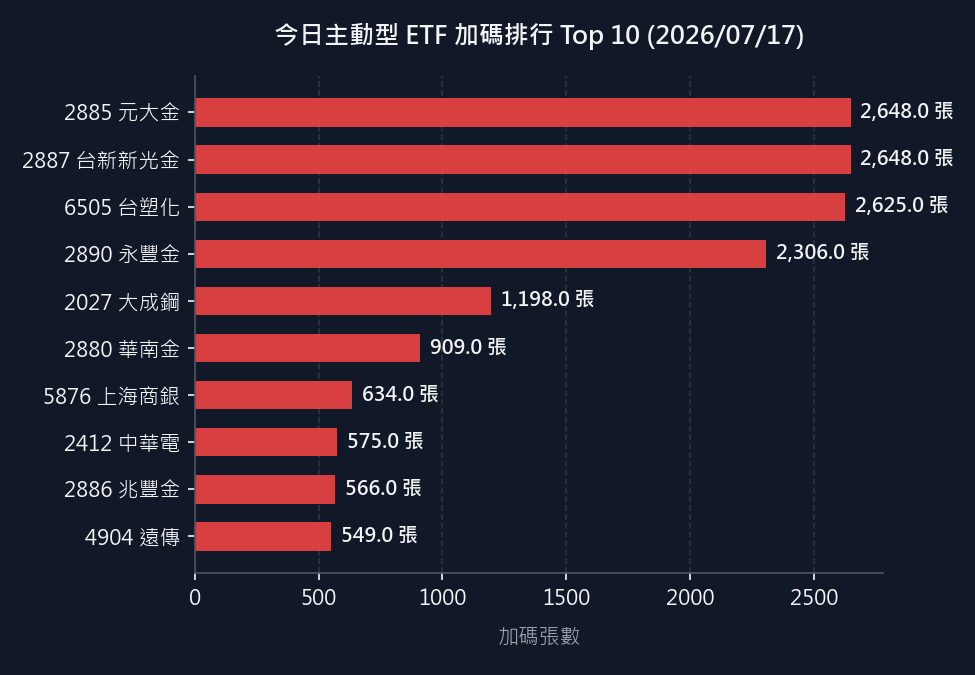
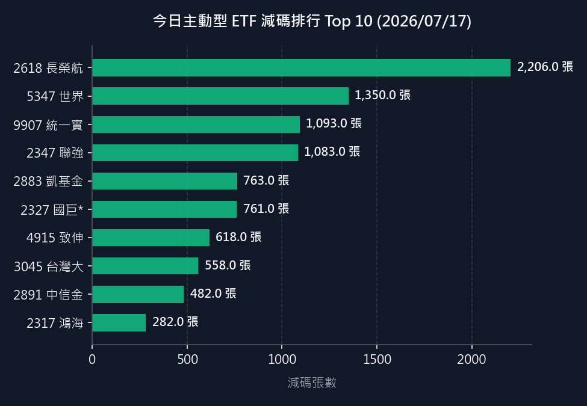

# 主動型 ETF 持股變動

資料來源：`主動型ETF持股明細.xlsx` 最近兩個日期分頁。

比較區間：`20260716` → `20260717`

## 今日加減碼視覺化排行

| 今日加碼 Top 10 | 今日減碼 Top 10 |
| :---: | :---: |
|  |  |

| ETF | 新增 | 刪除 | 比例變動 |
| :-- | --: | --: | --: |
| 00400A | 1 | 1 | 49 |
| 00401A | 0 | 0 | 57 |
| 00402A | 0 | 0 | 46 |
| 00403A | 0 | 0 | 41 |
| 00404A | 0 | 0 | 66 |
| 00405A | 0 | 0 | 42 |
| 00407A | 0 | 0 | 44 |
| 00408A | 0 | 0 | 38 |
| 00980A | 0 | 0 | 44 |
| 00980D | 0 | 0 | 82 |
| 00981A | 0 | 0 | 26 |
| 00982A | 0 | 0 | 40 |
| 00983A | 0 | 0 | 36 |
| 00983D | 0 | 1 | 49 |
| 00984A | 0 | 0 | 102 |
| 00985A | 0 | 0 | 48 |
| 00986A | 1 | 0 | 32 |
| 00987A | 0 | 0 | 27 |
| 00988A | 2 | 1 | 40 |
| 00989A | 0 | 0 | 57 |
| 00990A | 4 | 2 | 43 |
| 00991A | 0 | 0 | 25 |
| 00992A | 0 | 0 | 33 |
| 00993A | 0 | 0 | 44 |
| 00994A | 0 | 6 | 28 |
| 00995A | 0 | 0 | 48 |
| 00996A | 0 | 0 | 37 |
| 00997A | 0 | 2 | 49 |
| 00998A | 0 | 0 | 39 |
| 00999A | 1 | 2 | 68 |

## 00400A

### 新增持股

- 9939 宏全（0.06%，120 張）

### 刪除持股

- 6515 穎崴（0.69%，27 張）

### 投資比例變動

- 1303 南亞：0.52% → 0.49%（-0.03）
- 1590 亞德客-KY：0.99% → 0.98%（-0.01）
- 2059 川湖：3.55% → 3.44%（-0.11）
- 2303 聯電：1.80% → 1.72%（-0.08）
- 2308 台達電：3.23% → 3.13%（-0.10）
- 2313 華通：0.99% → 0.95%（-0.04）
- 2327 國巨*：1.71% → 1.64%（-0.07）
- 2330 台積電：8.98% → 8.85%（-0.13）
- 2345 智邦：2.00% → 1.91%（-0.09）
- 2357 華碩：1.31% → 1.36%（+0.05）
- 2360 致茂：4.11% → 4.06%（-0.05）
- 2368 金像電：0.99% → 0.97%（-0.02）
- 2376 技嘉：1.18% → 1.20%（+0.02）
- 2382 廣達：0.89% → 0.87%（-0.02）
- 2383 台光電：5.32% → 5.09%（-0.23）
- 2404 漢唐：0.60% → 0.59%（-0.01）
- 2408 南亞科：2.03% → 1.94%（-0.09）
- 2454 聯發科：6.18% → 5.98%（-0.20）
- 2481 強茂：0.36% → 0.35%（-0.01）
- 2881 富邦金：0.39% → 0.41%（+0.02）
- 2885 元大金：1.02% → 1.05%（+0.03）
- 3017 奇鋐：3.86% → 4.05%（+0.19）
- 3036 文曄：1.11% → 1.14%（+0.03）
- 3037 欣興：3.59% → 3.43%（-0.16）
- 3090 日電貿：0.47% → 0.46%（-0.01）
- 3167 大量：0.20% → 0.19%（-0.01）
- 3211 順達：0.89% → 0.85%（-0.04）
- 3231 緯創：0.78% → 0.79%（+0.01）
- 3293 鈊象：0.36% → 0.37%（+0.01）
- 3374 精材：0.41% → 0.39%（-0.02）
- 3443 創意：2.16% → 2.10%（-0.06）
- 3653 健策：0.81% → 0.82%（+0.01）
- 3665 貿聯-KY：2.46% → 2.36%（-0.10）
- 3711 日月光投控：1.57% → 1.51%（-0.06）
- 4958 臻鼎-KY：0.87% → 0.84%（-0.03）
- 5274 信驊：1.97% → 1.95%（-0.02）
- 5347 世界：1.92% → 0.92%（-1.00）
- 6121 新普：0.26% → 0.27%（+0.01）
- 6147 頎邦：0.93% → 0.89%（-0.04）
- 6187 萬潤：1.42% → 1.37%（-0.05）
- 6223 旺矽：4.04% → 3.86%（-0.18）
- 6442 光聖：0.39% → 0.40%（+0.01）
- 6488 環球晶：4.44% → 4.27%（-0.17）
- 6505 台塑化：0.21% → 0.98%（+0.77）
- 6510 精測：1.16% → 1.19%（+0.03）
- 6669 緯穎：3.94% → 3.78%（-0.16）
- 7769 鴻勁：0.33% → 0.32%（-0.01）
- 8046 南電：1.25% → 1.20%（-0.05）
- 8210 勤誠：1.12% → 1.10%（-0.02）

## 00401A

### 新增持股

- 無

### 刪除持股

- 無

### 投資比例變動

- 1216 統一：0.34% → 0.37%（+0.03）
- 2303 聯電：1.34% → 1.28%（-0.06）
- 2308 台達電：4.42% → 4.28%（-0.14）
- 2313 華通：1.34% → 1.28%（-0.06）
- 2317 鴻海：0.71% → 0.73%（+0.02）
- 2330 台積電：9.31% → 9.15%（-0.16）
- 2344 華邦電：1.37% → 1.31%（-0.06）
- 2345 智邦：2.17% → 2.07%（-0.10）
- 2357 華碩：1.36% → 1.41%（+0.05）
- 2360 致茂：1.99% → 1.96%（-0.03）
- 2368 金像電：0.42% → 0.41%（-0.01）
- 2379 瑞昱：2.02% → 2.16%（+0.14）
- 2382 廣達：2.31% → 2.27%（-0.04）
- 2383 台光電：2.04% → 1.95%（-0.09）
- 2412 中華電：0.98% → 1.06%（+0.08）
- 2449 京元電子：1.35% → 1.29%（-0.06）
- 2454 聯發科：6.15% → 5.94%（-0.21）
- 2455 全新：0.44% → 0.42%（-0.02）
- 2603 長榮：1.11% → 1.17%（+0.06）
- 2881 富邦金：1.85% → 1.95%（+0.10）
- 2882 國泰金：1.19% → 1.23%（+0.04）
- 2883 凱基金：2.17% → 2.26%（+0.09）
- 2884 玉山金：1.91% → 2.04%（+0.13）
- 2885 元大金：1.24% → 1.28%（+0.04）
- 2886 兆豐金：1.18% → 1.27%（+0.09）
- 2887 台新新光金：1.18% → 1.23%（+0.05）
- 2890 永豐金：0.32% → 0.34%（+0.02）
- 2891 中信金：1.99% → 2.08%（+0.09）
- 2912 統一超：0.34% → 0.36%（+0.02）
- 3034 聯詠：0.74% → 0.77%（+0.03）
- 3037 欣興：0.68% → 0.65%（-0.03）
- 3131 弘塑：0.61% → 0.58%（-0.03）
- 3167 大量：0.63% → 0.60%（-0.03）
- 3491 昇達科：1.39% → 1.53%（+0.14）
- 3529 力旺：0.65% → 0.64%（-0.01）
- 3653 健策：1.16% → 1.17%（+0.01）
- 3711 日月光投控：2.86% → 2.73%（-0.13）
- 4904 遠傳：0.92% → 1.00%（+0.08）
- 4938 和碩：0.33% → 0.35%（+0.02）
- 4958 臻鼎-KY：2.66% → 2.54%（-0.12）
- 4991 環宇-KY：0.57% → 0.54%（-0.03）
- 5274 信驊：0.95% → 0.94%（-0.01）
- 5347 世界：1.15% → 1.10%（-0.05）
- 5871 中租-KY：0.18% → 0.19%（+0.01）
- 5904 寶雅：0.58% → 0.61%（+0.03）
- 6187 萬潤：0.74% → 0.71%（-0.03）
- 6223 旺矽：2.62% → 2.50%（-0.12）
- 6285 啟碁：2.18% → 2.11%（-0.07）
- 6415 矽力*-KY：0.75% → 0.73%（-0.02）
- 6510 精測：0.67% → 0.68%（+0.01）
- 6515 穎崴：0.63% → 0.60%（-0.03）
- 6531 愛普*：1.41% → 1.34%（-0.07）
- 6669 緯穎：2.47% → 2.37%（-0.10）
- 7769 鴻勁：3.02% → 2.90%（-0.12）
- 7828 創新服務：1.60% → 1.53%（-0.07）
- 8021 尖點：0.36% → 0.34%（-0.02）
- 8464 億豐：1.26% → 1.34%（+0.08）

## 00402A

### 新增持股

- 無

### 刪除持股

- 無

### 投資比例變動

- AAPL.US Apple：7.71% → 8.13%（+0.42）
- ADI.US Analog Devices：1.83% → 1.84%（+0.01）
- AMD.US AMD：5.69% → 5.58%（-0.11）
- AMZN.US Amazon：4.01% → 4.07%（+0.06）
- ANET.US Arista Networks：0.70% → 0.71%（+0.01）
- ARM.US Arm：1.03% → 1.01%（-0.02）
- ASML.US ASML Holding：1.67% → 1.70%（+0.03）
- AVGO.US Broadcom：2.43% → 2.39%（-0.04）
- AXON.US Axon Enterprise：1.16% → 1.20%（+0.04）
- BABA.US Alibaba Group：0.53% → 0.55%（+0.02）
- BKNG.US Booking Holdings：0.60% → 0.63%（+0.03）
- CDNS.US Cadence Design Systems：1.91% → 1.95%（+0.04）
- CIEN.US Ciena：1.22% → 1.18%（-0.04）
- CLS.US Celestica：0.89% → 0.84%（-0.05）
- COHR.US Coherent：1.49% → 1.43%（-0.06）
- CRWD.US CrowdStrike Holdings：1.33% → 1.36%（+0.03）
- FSLY.US Fastly：0.29% → 0.30%（+0.01）
- GOOG.US Alphabet - Class C Capital Stock：3.51% → 3.47%（-0.04）
- GOOGL.US Alphabet - Class A Common Stock：3.45% → 3.42%（-0.03）
- INTC.US Intel：1.29% → 1.26%（-0.03）
- KLAC.US KLA：2.40% → 2.43%（+0.03）
- LITE.US Lumentum：1.28% → 1.25%（-0.03）
- LRCX.US Lam Research：3.75% → 3.72%（-0.03）
- MCHP.US Microchip Technology：1.72% → 1.69%（-0.03）
- MDB.US MongoDB：0.63% → 0.64%（+0.01）
- META.US Meta：3.12% → 3.16%（+0.04）
- MRVL.US Marvell：1.41% → 1.34%（-0.07）
- MSFT.US Microsoft：3.30% → 3.47%（+0.17）
- MU.US Micron：6.24% → 6.10%（-0.14）
- NFLX.US Netflix：1.00% → 1.04%（+0.04）
- NVDA.US NVIDIA：8.57% → 8.63%（+0.06）
- PANW.US Palo Alto：3.20% → 3.32%（+0.12）
- PLTR.US Palantir Technologies：1.12% → 1.16%（+0.04）
- SHOP.US Shopify：0.40% → 0.42%（+0.02）
- SIMO.US Silicon Motion：0.85% → 0.81%（-0.04）
- SKHY.US SK hynix：1.07% → 0.96%（-0.11）
- SNOW.US Snowflake：0.78% → 0.81%（+0.03）
- SPOT.US Spotify：0.25% → 0.26%（+0.01）
- STX.US Seagate：1.37% → 1.28%（-0.09）
- TER.US Teradyne：0.76% → 0.74%（-0.02）
- TSM.US TSMC(ADR)：1.61% → 1.63%（+0.02）
- TTWO.US Take-Two：0.54% → 0.55%（+0.01）
- TXN.US Texas Instruments：3.13% → 3.14%（+0.01）
- UBER.US Uber：0.45% → 0.48%（+0.03）
- V.US Visa：1.02% → 1.09%（+0.07）
- WDC.US Western Digital：2.74% → 2.58%（-0.16）

## 00403A

### 新增持股

- 無

### 刪除持股

- 無

### 投資比例變動

- 1303 南亞：1.35% → 1.27%（-0.08）
- 1560 中砂：0.34% → 0.32%（-0.02）
- 2049 上銀：0.21% → 0.20%（-0.01）
- 2303 聯電：7.41% → 6.97%（-0.44）
- 2308 台達電：3.06% → 3.03%（-0.03）
- 2327 國巨*：3.74% → 3.16%（-0.58）
- 2330 台積電：19.52% → 18.93%（-0.59）
- 2337 旺宏：0.84% → 0.81%（-0.03）
- 2344 華邦電：4.25% → 4.00%（-0.25）
- 2345 智邦：3.01% → 2.93%（-0.08）
- 2360 致茂：0.84% → 0.81%（-0.03）
- 2368 金像電：1.71% → 1.65%（-0.06）
- 2383 台光電：3.51% → 3.31%（-0.20）
- 2404 漢唐：0.05% → 0.10%（+0.05）
- 2454 聯發科：3.66% → 3.59%（-0.07）
- 2455 全新：0.09% → 0.08%（-0.01）
- 3017 奇鋐：4.74% → 4.90%（+0.16）
- 3037 欣興：3.85% → 3.62%（-0.23）
- 3189 景碩：1.53% → 1.44%（-0.09）
- 3211 順達：0.47% → 0.45%（-0.02）
- 3264 欣銓：0.09% → 0.08%（-0.01）
- 3443 創意：1.24% → 1.19%（-0.05）
- 3533 嘉澤：1.55% → 1.49%（-0.06）
- 3583 辛耘：0.46% → 0.43%（-0.03）
- 3653 健策：1.64% → 1.62%（-0.02）
- 3665 貿聯-KY：0.36% → 0.34%（-0.02）
- 3711 日月光投控：2.59% → 2.44%（-0.15）
- 4958 臻鼎-KY：2.48% → 2.33%（-0.15）
- 4966 譜瑞-KY：0.31% → 0.30%（-0.01）
- 5274 信驊：0.81% → 0.79%（-0.02）
- 6223 旺矽：3.84% → 3.62%（-0.22）
- 6239 力成：0.18% → 0.17%（-0.01）
- 6274 台燿：1.36% → 1.28%（-0.08）
- 6415 矽力*-KY：0.26% → 0.25%（-0.01）
- 6488 環球晶：1.90% → 1.80%（-0.10）
- 6515 穎崴：0.83% → 0.67%（-0.16）
- 6669 緯穎：2.50% → 2.36%（-0.14）
- 7769 鴻勁：1.15% → 1.09%（-0.06）
- 8046 南電：1.38% → 1.30%（-0.08）
- 8358 金居：0.47% → 0.45%（-0.02）
- 8996 高力：1.11% → 1.05%（-0.06）

## 00404A

### 新增持股

- 無

### 刪除持股

- 無

### 投資比例變動

- 1216 統一：0.70% → 1.52%（+0.82）
- 1303 南亞：0.29% → 0.27%（-0.02）
- 2303 聯電：2.67% → 2.51%（-0.16）
- 2308 台達電：3.81% → 3.69%（-0.12）
- 2317 鴻海：0.29% → 0.14%（-0.15）
- 2327 國巨*：0.70% → 0.68%（-0.02）
- 2330 台積電：22.61% → 22.13%（-0.48）
- 2345 智邦：0.94% → 0.89%（-0.05）
- 2347 聯強：1.26% → 0.64%（-0.62）
- 2356 英業達：0.14% → 0.07%（-0.07）
- 2360 致茂：1.10% → 1.07%（-0.03）
- 2376 技嘉：0.63% → 1.33%（+0.70）
- 2382 廣達：1.76% → 1.06%（-0.70）
- 2383 台光電：1.88% → 1.91%（+0.03）
- 2393 億光：0.60% → 1.22%（+0.62）
- 2402 毅嘉：0.03% → 0.07%（+0.04）
- 2454 聯發科：6.38% → 6.18%（-0.20）
- 2618 長榮航：1.29% → 0.66%（-0.63）
- 2883 凱基金：1.35% → 0.69%（-0.66）
- 2885 元大金：2.56% → 2.89%（+0.33）
- 2887 台新新光金：1.14% → 2.40%（+1.26）
- 2890 永豐金：0.89% → 1.65%（+0.76）
- 2891 中信金：1.76% → 0.91%（-0.85）
- 2912 統一超：0.04% → 0.07%（+0.03）
- 3014 聯陽：1.49% → 1.29%（-0.20）
- 3017 奇鋐：0.71% → 0.73%（+0.02）
- 3034 聯詠：1.57% → 1.12%（-0.45）
- 3044 健鼎：1.14% → 0.55%（-0.59）
- 3131 弘塑：0.28% → 0.53%（+0.25）
- 3189 景碩：0.31% → 0.29%（-0.02）
- 3217 優群：0.79% → 0.39%（-0.40）
- 3227 原相：1.13% → 0.55%（-0.58）
- 3260 威剛：0.39% → 0.38%（-0.01）
- 3264 欣銓：1.06% → 0.98%（-0.08）
- 3265 台星科：1.00% → 0.70%（-0.30）
- 3293 鈊象：1.08% → 0.54%（-0.54）
- 3592 瑞鼎：0.78% → 0.39%（-0.39）
- 3702 大聯大：0.58% → 1.22%（+0.64）
- 3711 日月光投控：3.75% → 3.52%（-0.23）
- 4763 材料*-KY：0.60% → 1.22%（+0.62）
- 5269 祥碩：0.61% → 1.22%（+0.61）
- 5274 信驊：1.95% → 1.90%（-0.05）
- 5347 世界：0.66% → 0.62%（-0.04）
- 5434 崇越：1.90% → 1.81%（-0.09）
- 5871 中租-KY：0.65% → 1.37%（+0.72）
- 5876 上海商銀：0.65% → 1.38%（+0.73）
- 5904 寶雅：1.10% → 0.56%（-0.54）
- 6121 新普：0.71% → 0.35%（-0.36）
- 6138 茂達：0.58% → 1.18%（+0.60）
- 6139 亞翔：0.25% → 0.27%（+0.02）
- 6196 帆宣：0.39% → 0.38%（-0.01）
- 6206 飛捷：0.54% → 1.18%（+0.64）
- 6223 旺矽：0.81% → 0.76%（-0.05）
- 6239 力成：0.62% → 1.05%（+0.43）
- 6257 矽格：1.81% → 1.70%（-0.11）
- 6488 環球晶：0.16% → 0.15%（-0.01）
- 6515 穎崴：0.29% → 0.28%（-0.01）
- 6531 愛普*：0.21% → 0.20%（-0.01）
- 6691 洋基工程：0.26% → 0.51%（+0.25）
- 6903 巨漢：0.19% → 0.09%（-0.10）
- 8016 矽創：0.10% → 0.11%（+0.01）
- 8069 元太：0.13% → 0.28%（+0.15）
- 8081 致新：1.10% → 0.54%（-0.56）
- 臺指選擇權08/26 49100 買權：-0.26% → -0.07%（+0.19）
- 臺指選擇權09/26 50300 買權：-0.02% → -0.01%（+0.01）
- 臺股期貨08/26：16.15% → 15.75%（-0.40）

## 00405A

### 新增持股

- 無

### 刪除持股

- 無

### 投資比例變動

- 2059 川湖：1.38% → 1.31%（-0.07）
- 2303 聯電：0.05% → 0.04%（-0.01）
- 2308 台達電：1.04% → 0.99%（-0.05）
- 2327 國巨*：3.75% → 3.51%（-0.24）
- 2330 台積電：2.25% → 2.17%（-0.08）
- 2337 旺宏：1.46% → 1.39%（-0.07）
- 2344 華邦電：3.86% → 3.62%（-0.24）
- 2345 智邦：4.67% → 4.38%（-0.29）
- 2368 金像電：1.16% → 2.12%（+0.96）
- 2383 台光電：2.98% → 2.79%（-0.19）
- 2408 南亞科：1.42% → 1.33%（-0.09）
- 2449 京元電子：0.96% → 0.90%（-0.06）
- 2454 聯發科：6.76% → 6.40%（-0.36）
- 3017 奇鋐：5.87% → 6.04%（+0.17）
- 3026 禾伸堂：1.69% → 1.58%（-0.11）
- 3037 欣興：5.27% → 4.93%（-0.34）
- 3081 聯亞：0.98% → 0.93%（-0.05）
- 3105 穩懋：1.70% → 1.60%（-0.10）
- 3131 弘塑：4.05% → 3.79%（-0.26）
- 3163 波若威：0.21% → 0.20%（-0.01）
- 3443 創意：5.32% → 5.07%（-0.25）
- 3583 辛耘：1.91% → 1.79%（-0.12）
- 3653 健策：2.33% → 2.29%（-0.04）
- 3665 貿聯-KY：0.04% → 0.03%（-0.01）
- 3711 日月光投控：0.84% → 0.79%（-0.05）
- 4749 新應材：0.31% → 0.30%（-0.01）
- 5274 信驊：1.92% → 1.86%（-0.06）
- 5347 世界：0.15% → 0.14%（-0.01）
- 6187 萬潤：2.26% → 2.13%（-0.13）
- 6223 旺矽：5.40% → 6.05%（+0.65）
- 6274 台燿：0.33% → 1.32%（+0.99）
- 6291 沛亨：0.35% → 0.33%（-0.02）
- 6488 環球晶：6.05% → 5.69%（-0.36）
- 6515 穎崴：0.59% → 0.55%（-0.04）
- 6526 達發：0.34% → 0.33%（-0.01）
- 6669 緯穎：0.10% → 0.09%（-0.01）
- 7734 印能科技：1.91% → 1.79%（-0.12）
- 7769 鴻勁：2.55% → 2.40%（-0.15）
- 8028 昇陽半導體：1.18% → 1.11%（-0.07）
- 8046 南電：5.05% → 4.73%（-0.32）
- 8210 勤誠：0.98% → 0.94%（-0.04）
- 8996 高力：1.21% → 1.13%（-0.08）

## 00407A

### 新增持股

- 無

### 刪除持股

- 無

### 投資比例變動

- 1303 南亞：0.69% → 0.68%（-0.01）
- 1590 亞德客-KY：1.79% → 1.82%（+0.03）
- 2059 川湖：2.21% → 2.17%（-0.04）
- 2303 聯電：1.74% → 1.70%（-0.04）
- 2308 台達電：4.12% → 4.08%（-0.04）
- 2327 國巨*：3.00% → 2.93%（-0.07）
- 2330 台積電：9.43% → 9.33%（-0.10）
- 2344 華邦電：1.77% → 1.73%（-0.04）
- 2345 智邦：3.22% → 3.14%（-0.08）
- 2360 致茂：1.83% → 1.84%（+0.01）
- 2368 金像電：1.95% → 1.96%（+0.01）
- 2376 技嘉：0.74% → 0.77%（+0.03）
- 2379 瑞昱：0.76% → 0.83%（+0.07）
- 2383 台光電：3.76% → 3.67%（-0.09）
- 2395 研華：1.63% → 1.71%（+0.08）
- 2408 南亞科：1.79% → 1.75%（-0.04）
- 2412 中華電：1.69% → 1.86%（+0.17）
- 2451 創見：0.14% → 0.15%（+0.01）
- 2454 聯發科：6.36% → 6.29%（-0.07）
- 3017 奇鋐：3.22% → 3.45%（+0.23）
- 3034 聯詠：0.64% → 0.68%（+0.04）
- 3037 欣興：3.86% → 3.77%（-0.09）
- 3293 鈊象：0.55% → 0.58%（+0.03）
- 3443 創意：1.77% → 1.76%（-0.01）
- 3491 昇達科：0.44% → 0.49%（+0.05）
- 3529 力旺：1.96% → 1.98%（+0.02）
- 3533 嘉澤：1.04% → 1.05%（+0.01）
- 3665 貿聯-KY：2.32% → 2.27%（-0.05）
- 3711 日月光投控：2.54% → 2.48%（-0.06）
- 4904 遠傳：0.31% → 0.34%（+0.03）
- 4958 臻鼎-KY：2.25% → 2.20%（-0.05）
- 5434 崇越：0.22% → 0.23%（+0.01）
- 5536 聖暉*：2.02% → 1.98%（-0.04）
- 6223 旺矽：2.45% → 2.39%（-0.06）
- 6274 台燿：2.45% → 2.39%（-0.06）
- 6415 矽力*-KY：0.40% → 0.39%（-0.01）
- 6446 藥華藥：2.46% → 2.52%（+0.06）
- 6515 穎崴：1.44% → 1.40%（-0.04）
- 6531 愛普*：1.55% → 1.52%（-0.03）
- 6669 緯穎：3.34% → 3.26%（-0.08）
- 6805 富世達：1.82% → 1.88%（+0.06）
- 8046 南電：2.58% → 2.53%（-0.05）
- 8210 勤誠：1.77% → 1.79%（+0.02）
- 8996 高力：0.43% → 0.42%（-0.01）

## 00408A

### 新增持股

- 無

### 刪除持股

- 無

### 投資比例變動

- 1216 統一：2.12% → 2.50%（+0.38）
- 1477 聚陽：1.57% → 1.56%（-0.01）
- 2059 川湖：1.55% → 1.42%（-0.13）
- 2308 台達電：3.97% → 2.72%（-1.25）
- 2317 鴻海：2.17% → 2.11%（-0.06）
- 2330 台積電：6.75% → 5.26%（-1.49）
- 2345 智邦：2.21% → 2.01%（-0.20）
- 2356 英業達：1.19% → 1.16%（-0.03）
- 2357 華碩：1.83% → 1.81%（-0.02）
- 2368 金像電：2.27% → 2.12%（-0.15）
- 2376 技嘉：2.11% → 2.05%（-0.06）
- 2382 廣達：3.19% → 1.51%（-1.68）
- 2383 台光電：2.08% → 1.89%（-0.19）
- 2395 研華：1.74% → 1.70%（-0.04）
- 2404 漢唐：1.86% → 1.74%（-0.12）
- 2408 南亞科：0.52% → 0.48%（-0.04）
- 2412 中華電：3.24% → 3.32%（+0.08）
- 2454 聯發科：2.20% → 2.03%（-0.17）
- 2880 華南金：1.52% → 1.57%（+0.05）
- 2885 元大金：2.07% → 2.03%（-0.04）
- 2886 兆豐金：2.08% → 2.15%（+0.07）
- 2891 中信金：1.50% → 1.49%（-0.01）
- 2912 統一超：2.19% → 2.49%（+0.30）
- 3037 欣興：2.73% → 2.48%（-0.25）
- 3045 台灣大：3.22% → 3.28%（+0.06）
- 3231 緯創：2.09% → 2.01%（-0.08）
- 3702 大聯大：1.76% → 1.71%（-0.05）
- 4904 遠傳：1.98% → 2.05%（+0.07）
- 4958 臻鼎-KY：1.62% → 1.47%（-0.15）
- 5347 世界：0.56% → 0.51%（-0.05）
- 5434 崇越：2.77% → 2.64%（-0.13）
- 5876 上海商銀：1.87% → 2.23%（+0.36）
- 5904 寶雅：1.93% → 1.92%（-0.01）
- 6257 矽格：1.13% → 1.03%（-0.10）
- 6274 台燿：1.47% → 1.34%（-0.13）
- 6669 緯穎：2.44% → 2.22%（-0.22）
- 7769 鴻勁：1.00% → 0.91%（-0.09）
- 8046 南電：2.13% → 1.94%（-0.19）

## 00980A

### 新增持股

- 無

### 刪除持股

- 無

### 投資比例變動

- 2059 川湖：5.86% → 5.76%（-0.10）
- 2308 台達電：5.57% → 5.49%（-0.08）
- 2317 鴻海：1.92% → 2.00%（+0.08）
- 2327 國巨*：1.65% → 1.60%（-0.05）
- 2344 華邦電：1.22% → 1.19%（-0.03）
- 2345 智邦：1.86% → 1.80%（-0.06）
- 2360 致茂：1.75% → 1.76%（+0.01）
- 2368 金像電：2.43% → 2.42%（-0.01）
- 2376 技嘉：0.88% → 0.91%（+0.03）
- 2382 廣達：1.15% → 1.14%（-0.01）
- 2383 台光電：4.64% → 4.50%（-0.14）
- 2408 南亞科：1.54% → 1.49%（-0.05）
- 2454 聯發科：6.13% → 6.02%（-0.11）
- 2884 玉山金：0.83% → 0.90%（+0.07）
- 2891 中信金：1.11% → 1.17%（+0.06）
- 3008 大立光：0.92% → 0.93%（+0.01）
- 3017 奇鋐：1.79% → 1.91%（+0.12）
- 3026 禾伸堂：0.63% → 0.61%（-0.02）
- 3036 文曄：1.29% → 1.33%（+0.04）
- 3037 欣興：3.05% → 2.96%（-0.09）
- 3081 聯亞：2.37% → 2.33%（-0.04）
- 3189 景碩：0.66% → 0.64%（-0.02）
- 3231 緯創：0.63% → 0.65%（+0.02）
- 3264 欣銓：0.25% → 0.24%（-0.01）
- 3293 鈊象：0.54% → 0.56%（+0.02）
- 3443 創意：1.80% → 1.78%（-0.02）
- 3529 力旺：0.93% → 0.94%（+0.01）
- 3653 健策：3.16% → 3.22%（+0.06）
- 3665 貿聯-KY：0.64% → 0.62%（-0.02）
- 3711 日月光投控：1.68% → 1.63%（-0.05）
- 4958 臻鼎-KY：1.55% → 1.51%（-0.04）
- 5274 信驊：1.22% → 1.23%（+0.01）
- 5904 寶雅：1.20% → 1.28%（+0.08）
- 6223 旺矽：2.91% → 2.82%（-0.09）
- 6274 台燿：1.04% → 1.01%（-0.03）
- 6442 光聖：0.31% → 0.32%（+0.01）
- 6515 穎崴：2.28% → 2.21%（-0.07）
- 6669 緯穎：1.23% → 1.20%（-0.03）
- 6805 富世達：0.47% → 0.48%（+0.01）
- 6831 邁科：0.35% → 0.34%（-0.01）
- 7769 鴻勁：3.83% → 3.75%（-0.08）
- 8046 南電：1.72% → 1.67%（-0.05）
- 8299 群聯：0.96% → 0.94%（-0.02）
- 8996 高力：1.53% → 1.49%（-0.04）

## 00980D

### 新增持股

- 無

### 刪除持股

- 無

### 投資比例變動

- AHOLD FINANCE USA LLC 6.88% 01MAY2029：0.48% → 0.49%（+0.01）
- ALLY FINANCIAL INC (REG) 7.1% 15NOV2027：0.43% → 0.44%（+0.01）
- ALLY FINANCIAL INC (REG) 8% 01/11/2031：0.58% → 0.59%（+0.01）
- AMC GLOBAL MEDIA INC SER REGS (REG) (REG S) 10.5% 15JUL2032：0.71% → 0.72%（+0.01）
- APA CORP 6.750000 % 15-FEB-2055：0.36% → 0.37%（+0.01）
- ARCELORMITTAL SA 6.55% 29NOV2027：0.54% → 0.55%（+0.01）
- ATHENE HOLDING LTD (REG) 6.25% 01APR2054：0.77% → 0.78%（+0.01）
- ATHENE HOLDING LTD 6.625000 % 19MAY2055：0.57% → 0.58%（+0.01）
- BANCO SANTANDER SA (REG) 6.607% 07NOV2028：0.66% → 0.67%（+0.01）
- BAT CAPITAL CORP (REG) 7.081% 02AUG2053：0.58% → 0.59%（+0.01）
- BAT CAPITAL CORP (REG) 7.75% 19OCT2032：0.45% → 0.46%（+0.01）
- BLUE OWL CREDIT INCOME (REG) 6.6% 15SEP2029：0.38% → 0.39%（+0.01）
- BLUE OWL CREDIT INCOME 7.750000 % 15JAN2029：0.53% → 0.54%（+0.01）
- BLUE OWL TECHNOLOGY FIN CORP II 6.75 % 04APR2029：0.55% → 0.56%（+0.01）
- CARNIVAL CORP SER REGS (REG S) 7% 15AUG2029：0.55% → 0.56%（+0.01）
- CHARTER COMM OPT 6.484% 23OCT2045 W/I：0.46% → 0.47%（+0.01）
- CHARTER COMM OPT LLC/CAP (REG) 6.834000 % 23OCT2055：0.46% → 0.47%（+0.01）
- CHARTER COMM OPT LLC/CAP 6.700000 % 01-DEC-2055：0.47% → 0.48%（+0.01）
- CITIGROUP INC 8.125% 15JUL2039：0.63% → 0.64%（+0.01）
- CIVITAS RESOURCES INC SER REGS (REG) (REG S) 9.625% 15JUN2033：0.55% → 0.56%（+0.01）
- CONCENTRIX CORP (REG) 6.85% 02AUG2033：0.67% → 0.68%（+0.01）
- CONOCOPHILLIPS COMPANY (REG) 6.95% 15APR2029：0.51% → 0.52%（+0.01）
- COX COMMUNICATIONS INC SER REGS 5.950000 % 01SEP2054：0.55% → 0.56%（+0.01）
- DELL INT LLC / EMC CORP (REG) 8.1% 15JUL2036：0.59% → 0.60%（+0.01）
- DEUTSCHE TELEKOM INT FIN (REG) 8.75% 15JUN2030：0.41% → 0.42%（+0.01）
- DEVON ENERGY CORPORATION (REG) 7.875% 30SEP2031：0.47% → 0.48%（+0.01）
- DIRECTV FIN LLC/COINC SER REGS 10.000000 % 15FEB2031：0.40% → 0.41%（+0.01）
- DOW CHEMICAL CO/THE (REG) 5.55% 30NOV2048：0.56% → 0.57%（+0.01）
- DOW CHEMICAL CO/THE (REG) 5.6% 15FEB2054：0.60% → 0.61%（+0.01）
- DOW CHEMICAL CO/THE 5.950000 % 15MAR2055：0.50% → 0.51%（+0.01）
- DOW CHEMICAL CO/THE 6.9% 15MAY2053：0.60% → 0.61%（+0.01）
- EDISON INTERNATIONAL (REG) 6.95% 15NOV2029：0.58% → 0.59%（+0.01）
- ENEL FINANCE INTL NV SER REGS (REG S) 7.75% 14OCT2052：0.37% → 0.38%（+0.01）
- F&G ANNUITIES & LIFE INC 6.250000 % 04OCT2034：0.51% → 0.52%（+0.01）
- FMC CORP (REG) 6.375000 % 18MAY2053：0.47% → 0.48%（+0.01）
- FORD MOTOR COMPANY (REG) 7.45% 16JUL2031：0.47% → 0.48%（+0.01）
- FORD MOTOR COMPANY 5.291% 08DEC2046：0.28% → 0.29%（+0.01）
- FORD MOTOR CREDIT CO LLC (REG) 7.2% 10JUN2030：0.33% → 0.34%（+0.01）
- FORD MOTOR CREDIT CO LLC 6.500000 % 07FEB2035：0.32% → 0.33%（+0.01）
- FREEDOM MORTGAGE CORP SER REGS (REG S) 12.25% 01OCT2030：0.47% → 0.48%（+0.01）
- GEORGIA-PACIFIC LLC (REG) 7.75% 15NOV2029：0.57% → 0.58%（+0.01）
- GLOBAL AUTO HO/AAG FH UK SER REGS (REG S) 8.75% 15JAN2032：0.42% → 0.43%（+0.01）
- HAH GROUP HOLDING CO LLC SER REGS (REG S) 9.75% 01OCT2031：0.29% → 0.30%（+0.01）
- HERTZ CORP/THE SER REGS (REG S) 12.625% 15JUL2029：0.31% → 0.29%（-0.02）
- ICAHN ENTERPRISES/FIN (REG) 9.75% 15JAN2029：0.32% → 0.33%（+0.01）
- INTESA SANPAOLO SPA SER REGS (REG) 7.200000 % 28NOV2033：0.35% → 0.36%（+0.01）
- META PLATFORMS INC 5.750000 % 15-NOV-2065：0.44% → 0.45%（+0.01）
- MOBIUS MERGER SUB SER REGS 9.000000 % 01JUN2030：0.24% → 0.25%（+0.01）
- MOHEGAN TRIBAL / MS DIG SER REGS 11.875000 % 15APR2031：0.67% → 0.68%（+0.01）
- MYLAN INC (REG) 5.4% 29/11/2043：0.33% → 0.34%（+0.01）
- MYLAN INC SER WI (REG) 5.2% 15APR2048WI：0.49% → 0.50%（+0.01）
- ONEOK INC 6.625% 01SEP2053：0.58% → 0.59%（+0.01）
- ORACLE CORP 5.950000 % 26-SEP-2055：0.41% → 0.42%（+0.01）
- ORACLE CORP 6.125000 % 03AUG2065：0.52% → 0.53%（+0.01）
- ORACLE CORP 6.9% 09NOV2052：0.52% → 0.53%（+0.01）
- ORANGE SA (REG) 9% 01MAR2031：0.66% → 0.67%（+0.01）
- PACIFIC GAS & ELECTRIC 6.95% 15MAR2034：0.33% → 0.34%（+0.01）
- POLARIS INC 6.950000 % 15MAR2029：0.47% → 0.48%（+0.01）
- SABRE FINANCIAL BORROWER SER REGS 11.125 % 15-JUN-2029：0.52% → 0.53%（+0.01）
- SABRE GLBL INC SER REGS (REG) 10.750000 % 15NOV2029：0.13% → 0.14%（+0.01）
- SALESFORCE INC (REG) 6.7% 15MAR2066：0.52% → 0.53%（+0.01）
- SANTANDER HOLDINGS USA VAR 09NOV2031：0.59% → 0.60%（+0.01）
- SBL HOLDINGS INC SER REGS 7.200000 % 30OCT2034：0.52% → 0.53%（+0.01）
- SOCIETE GENERALE SER REGS (REG) (REG S) 7.367% 10JAN2053：0.33% → 0.34%（+0.01）
- SPRINT CAPITAL CORP (REG) 8.75% 15MAR2032：0.41% → 0.42%（+0.01）
- STELLANTIS FIN US INC SER REGS 6.450000 % 18MAR2035：0.32% → 0.33%（+0.01）
- SUNCOR ENERGY INC (REG) 6.8% 15MAY2038：0.42% → 0.43%（+0.01）
- TIME WARNER CABLE INC REG 7.3% 01JUL2038：0.31% → 0.32%（+0.01）
- TIME WARNER CABLE LLC (REG) 6.75% 15JUN2039：0.31% → 0.32%（+0.01）
- TIME WARNER ENTERTAINMEN 8.375% 15JUL2033：0.65% → 0.66%（+0.01）
- TRUIST FINANCIAL CORP SER MTN VAR 30OCT2029：0.64% → 0.65%（+0.01）
- UNISYS CORP SER REGS 10.625000 % 15JAN2031：0.60% → 0.61%（+0.01）
- US 10YR NOTE (CBT)SEP26 21-SEP-2026：18.58% → 18.66%（+0.08）
- US 10YR ULTRA FUT SEP26 21-SEP-2026：-2.83% → -2.84%（-0.01）
- US 2YR NOTE (CBT) SEP26 30-SEP-2026：1.97% → 1.98%（+0.01）
- US 5YR NOTE (CBT) SEP26 30-SEP-2026：-16.12% → -16.19%（-0.07）
- US LONG BOND(CBT) SEP26 21-SEP-2026：5.48% → 5.50%（+0.02）
- VALERO ENERGY CORP (REG) 7.5% 15APR2032：0.48% → 0.49%（+0.01）
- VIACOM INC (REG) 5.85% 01SEP2043：0.56% → 0.57%（+0.01）
- VIRGINIA ELEC & POWER CO (REG) 8.875% 15NOV2038：0.59% → 0.60%（+0.01）
- VISTRA OPERATIONS CO LLC SER REGS (REG S) 6.95% 15OCT2033：0.41% → 0.42%（+0.01）
- WESTLAKE CORP 6.375000 % 15-NOV-2055：0.52% → 0.53%（+0.01）

## 00981A

### 新增持股

- 無

### 刪除持股

- 無

### 投資比例變動

- 2303 聯電：5.12% → 4.92%（-0.20）
- 2308 台達電：3.65% → 3.56%（-0.09）
- 2327 國巨*：7.20% → 6.93%（-0.27）
- 2330 台積電：10.92% → 10.81%（-0.11）
- 2345 智邦：5.43% → 5.23%（-0.20）
- 2368 金像電：3.09% → 3.04%（-0.05）
- 2383 台光電：8.59% → 8.26%（-0.33）
- 2449 京元電子：0.61% → 0.59%（-0.02）
- 2454 聯發科：7.02% → 6.83%（-0.19）
- 3017 奇鋐：4.27% → 4.51%（+0.24）
- 3037 欣興：5.42% → 5.21%（-0.21）
- 3653 健策：2.85% → 2.87%（+0.02）
- 3665 貿聯-KY：3.49% → 3.37%（-0.12）
- 3711 日月光投控：4.07% → 3.91%（-0.16）
- 5274 信驊：2.31% → 2.30%（-0.01）
- 5439 高技：0.38% → 0.36%（-0.02）
- 6147 頎邦：0.46% → 0.44%（-0.02）
- 6187 萬潤：0.53% → 0.51%（-0.02）
- 6223 旺矽：5.62% → 5.40%（-0.22）
- 6271 同欣電：0.25% → 0.24%（-0.01）
- 6274 台燿：2.47% → 2.38%（-0.09）
- 6510 精測：0.35% → 0.36%（+0.01）
- 6515 穎崴：0.32% → 0.31%（-0.01）
- 6669 緯穎：4.57% → 4.41%（-0.16）
- 6805 富世達：0.95% → 0.96%（+0.01）
- 8046 南電：4.49% → 4.32%（-0.17）

## 00982A

### 新增持股

- 無

### 刪除持股

- 無

### 投資比例變動

- 1785 光洋科：0.98% → 1.00%（+0.02）
- 2059 川湖：3.13% → 3.08%（-0.05）
- 2303 聯電：2.83% → 2.75%（-0.08）
- 2316 楠梓電：1.18% → 1.15%（-0.03）
- 2327 國巨*：1.29% → 1.26%（-0.03）
- 2330 台積電：9.59% → 9.61%（+0.02）
- 2345 智邦：3.65% → 3.56%（-0.09）
- 2351 順德：0.64% → 0.63%（-0.01）
- 2360 致茂：3.23% → 3.25%（+0.02）
- 2376 技嘉：0.70% → 0.73%（+0.03）
- 2377 微星：1.62% → 1.71%（+0.09）
- 2383 台光電：3.22% → 3.14%（-0.08）
- 2454 聯發科：6.29% → 6.19%（-0.10）
- 2467 志聖：1.77% → 1.72%（-0.05）
- 2472 立隆電：1.48% → 1.44%（-0.04）
- 2885 元大金：0.28% → 0.29%（+0.01）
- 3008 大立光：2.03% → 2.06%（+0.03）
- 3017 奇鋐：1.79% → 1.91%（+0.12）
- 3036 文曄：0.88% → 0.92%（+0.04）
- 3105 穩懋：3.02% → 2.94%（-0.08）
- 3264 欣銓：2.17% → 2.11%（-0.06）
- 3491 昇達科：2.50% → 2.79%（+0.29）
- 3583 辛耘：1.82% → 1.77%（-0.05）
- 3702 大聯大：1.23% → 1.28%（+0.05）
- 3711 日月光投控：1.35% → 1.31%（-0.04）
- 4958 臻鼎-KY：3.59% → 3.50%（-0.09）
- 5274 信驊：0.35% → 0.36%（+0.01）
- 5536 聖暉*：9.31% → 9.07%（-0.24）
- 6139 亞翔：5.25% → 5.23%（-0.02）
- 6147 頎邦：0.90% → 0.88%（-0.02）
- 6223 旺矽：3.77% → 3.67%（-0.10）
- 6239 力成：0.44% → 0.43%（-0.01）
- 6257 矽格：2.18% → 2.13%（-0.05）
- 6274 台燿：1.12% → 1.09%（-0.03）
- 6488 環球晶：3.07% → 3.01%（-0.06）
- 6531 愛普*：1.55% → 1.51%（-0.04）
- 6669 緯穎：3.01% → 2.94%（-0.07）
- 7769 鴻勁：1.20% → 1.18%（-0.02）
- 8016 矽創：1.28% → 1.34%（+0.06）
- 8996 高力：0.83% → 0.81%（-0.02）

## 00983A

### 新增持股

- 無

### 刪除持股

- 無

### 投資比例變動

- AMD.US AMD：6.47% → 6.39%（-0.08）
- AMZN.US Amazon：3.08% → 3.15%（+0.07）
- AVGO.US Broadcom：1.78% → 1.76%（-0.02）
- BEAM.US Beam Therapeutics：3.02% → 2.90%（-0.12）
- CBRS.US Cerebras：0.54% → 0.55%（+0.01）
- CERS.US Cerus：0.16% → 0.17%（+0.01）
- COIN.US Coinbase：1.25% → 1.26%（+0.01）
- CRCL.US Circle：0.93% → 0.58%（-0.35）
- CRSP.US CRISPR Therapeutics：4.51% → 4.44%（-0.07）
- CRWV.US CoreWeave：0.53% → 0.20%（-0.33）
- DE.US Deere：0.93% → 0.99%（+0.06）
- GOOG.US Alphabet - Class C Capital Stock：1.26% → 1.25%（-0.01）
- GOOGL.US Alphabet - Class A Common Stock：1.66% → 1.65%（-0.01）
- HOOD.US Robinhood Markets：6.50% → 6.22%（-0.28）
- ILMN.US Illumina：3.32% → 3.52%（+0.20）
- LLY.US Eli Lilly：1.76% → 1.86%（+0.10）
- META.US Meta：1.39% → 1.41%（+0.02）
- NTLA.US Intellia Therapeutics：2.18% → 1.80%（-0.38）
- NTRA.US Natera：2.91% → 2.96%（+0.05）
- NVDA.US NVIDIA：0.80% → 0.81%（+0.01）
- PLTR.US Palantir Technologies：0.60% → 0.63%（+0.03）
- RBLX.US Roblox：3.31% → 3.27%（-0.04）
- RXRX.US Recursion Pharmaceuticals：0.20% → 0.19%（-0.01）
- SHOP.US Shopify：5.49% → 5.80%（+0.31）
- SNOW.US Snowflake：0.45% → 0.47%（+0.02）
- SOFI.US SoFi Technologies：0.63% → 0.64%（+0.01）
- SPCX.US SpaceX：4.33% → 4.37%（+0.04）
- TEM.US Tempus：6.35% → 6.20%（-0.15）
- TER.US Teradyne：0.53% → 0.52%（-0.01）
- TSLA.US Tesla：8.32% → 8.60%（+0.28）
- TSM.US TSMC(ADR)：3.26% → 3.33%（+0.07）
- TWST.US Twist Bioscience：4.05% → 4.16%（+0.11）
- TXG.US 10x Genomics：5.03% → 5.10%（+0.07）
- VCYT.US Veracyte：1.58% → 1.64%（+0.06）
- WGS.US GeneDx：1.29% → 1.26%（-0.03）
- XYZ.US Block：2.16% → 2.24%（+0.08）

## 00983D

### 新增持股

- 無

### 刪除持股

- HTZ 12 5/8 07/15/29（0.55%，N/A 張）

### 投資比例變動

- ABIBB 8.2 01/15/39：1.96% → 1.97%（+0.01）
- AET 6 5/8 06/15/36：0.73% → 0.74%（+0.01）
- ALLY 8 11/01/31：0.51% → 0.52%（+0.01）
- AMCX 10 1/2 07/15/32：1.60% → 1.62%（+0.02）
- ATH 6 5/8 05/19/55：0.85% → 0.86%（+0.01）
- BACR 7.437 11/02/33：1.95% → 1.96%（+0.01）
- BATSLN 7.079 08/02/43：1.08% → 1.09%（+0.01）
- BATSLN 7.081 08/02/53：1.33% → 1.34%（+0.01）
- BHCCN 11 09/30/28：1.80% → 1.82%（+0.02）
- BRITEL 9 5/8 12/15/30：1.34% → 1.35%（+0.01）
- BRKHEC 6 3/4 07/01/37：0.81% → 0.82%（+0.01）
- C 8 1/8 07/15/39：2.33% → 2.34%（+0.01）
- CEG 6 1/2 10/01/53：0.78% → 0.79%（+0.01）
- CRWV 9 02/01/31：1.31% → 1.30%（-0.01）
- CYH 10 7/8 01/15/32：1.49% → 1.50%（+0.01）
- DELL 8.1 07/15/36：1.71% → 1.72%（+0.01）
- DELL 8.35 07/15/46：1.62% → 1.63%（+0.01）
- DOW 9.4 05/15/39：1.91% → 1.92%（+0.01）
- DTV 8 7/8 02/01/30：1.57% → 1.58%（+0.01）
- DUK 7 3/4 03/01/31：1.55% → 1.56%（+0.01）
- ENBCN 6.7 11/15/53：1.13% → 1.14%（+0.01）
- GM 6.6 04/01/36：0.39% → 0.40%（+0.01）
- GTN 10 1/2 07/15/29：1.67% → 1.68%（+0.01）
- HAL 7.45 09/15/39：1.82% → 1.83%（+0.01）
- HPE 6.35 10/15/45：0.99% → 1.00%（+0.01）
- HSBC 6.332 03/09/44：1.07% → 1.08%（+0.01）
- IEP 10 11/15/29：1.50% → 1.51%（+0.01）
- KMI 6.95 01/15/38：1.06% → 1.07%（+0.01）
- LQDW.US iShares Investment Grade Corpora：7.30% → 7.34%（+0.04）
- MBGGR 8 1/2 01/18/31：1.30% → 1.31%（+0.01）
- MCD 6.3 03/01/38：0.73% → 0.74%（+0.01）
- MINAU 9 1/4 10/01/28：0.87% → 0.88%（+0.01）
- MOHEGN 11 7/8 04/15/31：1.34% → 1.35%（+0.01）
- MS 7 1/4 04/01/32：1.45% → 1.46%（+0.01）
- NVDA 5.55 06/15/46：0.89% → 0.90%（+0.01）
- ORCL 6 1/2 04/15/38：0.39% → 0.40%（+0.01）
- ORCL 6.9 11/09/52：1.35% → 1.37%（+0.02）
- PDM 9 1/4 07/20/28：0.83% → 0.84%（+0.01）
- PFE 7.2 03/15/39：1.43% → 1.44%（+0.01）
- RAKUTN 11 1/4 02/15/27：1.79% → 1.80%（+0.01）
- S 8 3/4 03/15/32：0.65% → 0.66%（+0.01）
- SABHLD 10 3/4 11/15/29：0.58% → 0.59%（+0.01）
- TELEFO 8 1/4 09/15/30：1.00% → 1.01%（+0.01）
- TELEFONICA EMISIONES SAU 7.045 06/20/36：1.55% → 1.56%（+0.01）
- TIME WARNER CABLE INC 7.300 07/01/38：0.50% → 0.51%（+0.01）
- TLTW.US iShares 20+ Year Treasury Bond B：7.25% → 7.29%（+0.04）
- VENLNG 9 1/2 02/01/29：1.40% → 1.41%（+0.01）
- VLO 6 5/8 06/15/37：0.74% → 0.75%（+0.01）
- VZ 7 3/4 12/01/30：1.13% → 1.14%（+0.01）

## 00984A

### 新增持股

- 無

### 刪除持股

- 無

### 投資比例變動

- 1102 亞泥：1.22% → 1.27%（+0.05）
- 1216 統一：1.97% → 2.07%（+0.10）
- 1303 南亞：0.77% → 0.72%（-0.05）
- 1402 遠東新：1.07% → 1.11%（+0.04）
- 1409 新纖：0.58% → 0.56%（-0.02）
- 1560 中砂：0.50% → 0.47%（-0.03）
- 1785 光洋科：0.45% → 0.44%（-0.01）
- 1795 美時：0.40% → 0.39%（-0.01）
- 1907 永豐餘：0.29% → 0.30%（+0.01）
- 2006 東和鋼鐵：0.41% → 0.42%（+0.01）
- 2049 上銀：0.59% → 0.56%（-0.03）
- 2059 川湖：0.63% → 0.59%（-0.04）
- 2105 正新：0.43% → 0.45%（+0.02）
- 2206 三陽工業：0.41% → 0.42%（+0.01）
- 2303 聯電：2.26% → 2.11%（-0.15）
- 2327 國巨*：1.12% → 1.04%（-0.08）
- 2330 台積電：3.02% → 2.86%（-0.16）
- 2337 旺宏：0.51% → 0.48%（-0.03）
- 2345 智邦：0.36% → 0.34%（-0.02）
- 2347 聯強：0.97% → 0.98%（+0.01）
- 2357 華碩：2.65% → 2.70%（+0.05）
- 2360 致茂：0.64% → 0.62%（-0.02）
- 2377 微星：0.95% → 0.97%（+0.02）
- 2382 廣達：2.30% → 2.21%（-0.09）
- 2383 台光電：1.81% → 1.69%（-0.12）
- 2404 漢唐：1.90% → 1.83%（-0.07）
- 2412 中華電：2.56% → 2.70%（+0.14）
- 2454 聯發科：1.38% → 1.30%（-0.08）
- 2458 義隆：0.36% → 0.35%（-0.01）
- 2467 志聖：0.57% → 0.53%（-0.04）
- 2472 立隆電：0.40% → 0.38%（-0.02）
- 2474 可成：0.78% → 0.80%（+0.02）
- 2478 大毅：0.41% → 0.38%（-0.03）
- 2481 強茂：0.53% → 0.50%（-0.03）
- 2501 國建：0.26% → 0.27%（+0.01）
- 2606 裕民：0.41% → 0.40%（-0.01）
- 2618 長榮航：1.44% → 1.47%（+0.03）
- 2633 台灣高鐵：1.40% → 1.44%（+0.04）
- 2645 長榮航太：0.34% → 0.33%（-0.01）
- 2646 星宇航空：0.39% → 0.40%（+0.01）
- 2881 富邦金：2.52% → 2.61%（+0.09）
- 2882 國泰金：0.28% → 0.29%（+0.01）
- 2885 元大金：0.40% → 0.41%（+0.01）
- 2891 中信金：2.31% → 2.36%（+0.05）
- 2897 王道銀行：0.27% → 0.28%（+0.01）
- 2912 統一超：1.52% → 1.56%（+0.04）
- 3008 大立光：0.70% → 0.69%（-0.01）
- 3026 禾伸堂：1.04% → 0.97%（-0.07）
- 3034 聯詠：1.89% → 1.92%（+0.03）
- 3037 欣興：1.62% → 1.52%（-0.10）
- 3044 健鼎：0.32% → 0.31%（-0.01）
- 3045 台灣大：1.94% → 2.03%（+0.09）
- 3090 日電貿：0.38% → 0.37%（-0.01）
- 3167 大量：0.57% → 0.53%（-0.04）
- 3189 景碩：1.08% → 1.01%（-0.07）
- 3227 原相：0.23% → 0.22%（-0.01）
- 3264 欣銓：0.27% → 0.25%（-0.02）
- 3293 鈊象：1.20% → 1.21%（+0.01）
- 3443 創意：0.61% → 0.58%（-0.03）
- 3481 群創：0.48% → 0.46%（-0.02）
- 3532 台勝科：0.74% → 0.69%（-0.05）
- 3592 瑞鼎：0.25% → 0.24%（-0.01）
- 3711 日月光投控：1.20% → 1.12%（-0.08）
- 4904 遠傳：1.76% → 1.86%（+0.10）
- 4919 新唐：0.52% → 0.49%（-0.03）
- 4938 和碩：0.38% → 0.39%（+0.01）
- 4958 臻鼎-KY：1.94% → 1.81%（-0.13）
- 5274 信驊：0.32% → 0.31%（-0.01）
- 5434 崇越：1.24% → 1.21%（-0.03）
- 5483 中美晶：0.55% → 0.52%（-0.03）
- 5536 聖暉*：0.56% → 0.53%（-0.03）
- 5871 中租-KY：1.16% → 1.19%（+0.03）
- 5876 上海商銀：1.28% → 1.33%（+0.05）
- 5904 寶雅：0.24% → 0.25%（+0.01）
- 6023 元大期：0.29% → 0.28%（-0.01）
- 6139 亞翔：0.53% → 0.51%（-0.02）
- 6147 頎邦：0.54% → 0.50%（-0.04）
- 6182 合晶：0.78% → 0.73%（-0.05）
- 6196 帆宣：1.22% → 1.16%（-0.06）
- 6197 佳必琪：0.26% → 0.25%（-0.01）
- 6213 聯茂：1.02% → 1.03%（+0.01）
- 6223 旺矽：1.09% → 1.02%（-0.07）
- 6274 台燿：1.67% → 1.57%（-0.10）
- 6285 啟碁：0.58% → 0.55%（-0.03）
- 6446 藥華藥：2.13% → 2.10%（-0.03）
- 6531 愛普*：1.16% → 1.08%（-0.08）
- 6831 邁科：0.44% → 0.41%（-0.03）
- 6890 來億-KY：0.25% → 0.26%（+0.01）
- 7769 鴻勁：0.62% → 0.59%（-0.03）
- 8016 矽創：0.85% → 0.86%（+0.01）
- 8021 尖點：1.37% → 1.28%（-0.09）
- 8046 南電：1.21% → 1.14%（-0.07）
- 8064 東捷：0.50% → 0.48%（-0.02）
- 8081 致新：0.23% → 0.22%（-0.01）
- 8096 擎亞：0.53% → 0.50%（-0.03）
- 8210 勤誠：0.29% → 0.28%（-0.01）
- 8261 富鼎：0.79% → 0.74%（-0.05）
- 8358 金居：1.08% → 1.01%（-0.07）
- 8415 大國鋼：0.25% → 0.26%（+0.01）
- 9914 美利達：0.29% → 0.30%（+0.01）
- 9939 宏全：0.28% → 0.29%（+0.01）
- 9958 世紀鋼：0.27% → 0.26%（-0.01）

## 00985A

### 新增持股

- 無

### 刪除持股

- 無

### 投資比例變動

- 1216 統一：1.02% → 1.10%（+0.08）
- 1802 台玻：0.83% → 0.81%（-0.02）
- 2027 大成鋼：1.09% → 1.66%（+0.57）
- 2049 上銀：0.87% → 0.86%（-0.01）
- 2059 川湖：3.51% → 3.41%（-0.10）
- 2303 聯電：1.91% → 1.83%（-0.08）
- 2308 台達電：1.11% → 1.08%（-0.03）
- 2317 鴻海：0.15% → 0.16%（+0.01）
- 2330 台積電：22.11% → 21.83%（-0.28）
- 2344 華邦電：1.45% → 1.39%（-0.06）
- 2345 智邦：2.11% → 2.02%（-0.09）
- 2360 致茂：1.55% → 1.09%（-0.46）
- 2368 金像電：0.97% → 0.96%（-0.01）
- 2376 技嘉：3.55% → 3.64%（+0.09）
- 2383 台光電：2.37% → 2.27%（-0.10）
- 2395 研華：3.04% → 3.13%（+0.09）
- 2408 南亞科：2.04% → 1.96%（-0.08）
- 2412 中華電：1.92% → 2.74%（+0.82）
- 2454 聯發科：1.10% → 1.06%（-0.04）
- 2881 富邦金：0.63% → 0.67%（+0.04）
- 2891 中信金：0.48% → 0.50%（+0.02）
- 3017 奇鋐：1.36% → 1.02%（-0.34）
- 3036 文曄：2.41% → 2.47%（+0.06）
- 3037 欣興：0.35% → 0.33%（-0.02）
- 3081 聯亞：1.18% → 0.92%（-0.26）
- 3105 穩懋：0.54% → 0.52%（-0.02）
- 3131 弘塑：1.67% → 1.17%（-0.50）
- 3189 景碩：0.02% → 0.01%（-0.01）
- 3293 鈊象：1.02% → 1.05%（+0.03）
- 3529 力旺：0.63% → 0.62%（-0.01）
- 3653 健策：1.07% → 1.08%（+0.01）
- 3661 世芯-KY：2.72% → 2.68%（-0.04）
- 3665 貿聯-KY：0.25% → 0.24%（-0.01）
- 3711 日月光投控：0.84% → 0.81%（-0.03）
- 4904 遠傳：2.02% → 2.75%（+0.73）
- 4958 臻鼎-KY：2.53% → 2.43%（-0.10）
- 6147 頎邦：2.25% → 2.16%（-0.09）
- 6187 萬潤：2.39% → 2.31%（-0.08）
- 6223 旺矽：1.11% → 0.77%（-0.34）
- 6415 矽力*-KY：0.46% → 0.29%（-0.17）
- 6442 光聖：3.11% → 3.19%（+0.08）
- 6488 環球晶：0.54% → 0.52%（-0.02）
- 6505 台塑化：2.28% → 2.74%（+0.46）
- 6669 緯穎：0.76% → 0.73%（-0.03）
- 7769 鴻勁：0.73% → 0.70%（-0.03）
- 8046 南電：1.01% → 0.78%（-0.23）
- 8299 群聯：1.94% → 1.86%（-0.08）
- 8996 高力：0.66% → 0.63%（-0.03）

## 00986A

### 新增持股

- AAPL.US Apple（0.61%，0.339 張）

### 刪除持股

- 無

### 投資比例變動

- 2330 台積電：8.68% → 9.04%（+0.36）
- AMD.US AMD：2.75% → 2.69%（-0.06）
- AMZN.US Amazon：3.72% → 3.76%（+0.04）
- AVGO.US Broadcom：4.93% → 4.83%（-0.10）
- CAT.US Caterpillar：2.62% → 2.59%（-0.03）
- COHR.US Coherent：2.03% → 1.93%（-0.10）
- CRWD.US CrowdStrike Holdings：4.04% → 4.11%（+0.07）
- ETN.US Eaton：2.15% → 2.13%（-0.02）
- GEV.US GE Vernova：3.57% → 3.62%（+0.05）
- GOOGL.US Alphabet - Class A Common Stock：7.72% → 7.62%（-0.10）
- GS.US Goldman Sachs：3.30% → 3.24%（-0.06）
- HWM.US Howmet Aerospace：2.47% → 2.48%（+0.01）
- IBIDEN(4062.JP)：2.17% → 2.02%（-0.15）
- JPM.US JPMorgan Chase：0.59% → 0.60%（+0.01）
- LITE.US Lumentum：3.05% → 2.96%（-0.09）
- LLY.US Eli Lilly：2.71% → 2.83%（+0.12）
- LRCX.US Lam Research：3.53% → 3.48%（-0.05）
- MRVL.US Marvell：1.40% → 1.31%（-0.09）
- MSFT.US Microsoft：2.06% → 2.15%（+0.09）
- MU.US Micron：4.71% → 4.34%（-0.37）
- MUFG(8306.JP)：1.42% → 1.44%（+0.02）
- Murata Mfg.(6981.JP)：2.04% → 1.95%（-0.09）
- NET.US Cloudflare：1.71% → 1.76%（+0.05）
- NVDA.US NVIDIA：5.86% → 5.90%（+0.04）
- SNDK.US Sandisk：2.10% → 1.89%（-0.21）
- SNOW.US Snowflake：1.20% → 1.23%（+0.03）
- Siemens Energy AG：1.99% → 2.02%（+0.03）
- TSLA.US Tesla：1.13% → 1.16%（+0.03）
- Yaskawa Electric(6506.JP)：1.76% → 1.82%（+0.06）
- 嘉能可公司：1.45% → 1.50%（+0.05）
- 施奈德電機公司：1.53% → 1.55%（+0.02）
- 英飛凌科技股份有限公司：3.20% → 3.19%（-0.01）

## 00987A

### 新增持股

- 無

### 刪除持股

- 無

### 投資比例變動

- 2327 國巨*：3.33% → 3.27%（-0.06）
- 2330 台積電：8.60% → 8.68%（+0.08）
- 2345 智邦：2.51% → 2.46%（-0.05）
- 2383 台光電：6.56% → 6.44%（-0.12）
- 2408 南亞科：4.08% → 4.00%（-0.08）
- 2454 聯發科：2.43% → 2.41%（-0.02）
- 2455 全新：2.48% → 2.43%（-0.05）
- 3017 奇鋐：7.40% → 7.97%（+0.57）
- 3037 欣興：6.48% → 6.35%（-0.13）
- 3081 聯亞：3.31% → 3.29%（-0.02）
- 3167 大量：2.90% → 2.84%（-0.06）
- 3363 上詮：1.99% → 1.97%（-0.02）
- 3443 創意：3.89% → 3.88%（-0.01）
- 3653 健策：2.36% → 2.43%（+0.07）
- 3665 貿聯-KY：3.78% → 3.72%（-0.06）
- 4764 雙鍵：2.17% → 2.13%（-0.04）
- 6139 亞翔：3.22% → 3.23%（+0.01）
- 6223 旺矽：6.50% → 6.37%（-0.13）
- 6271 同欣電：1.85% → 1.82%（-0.03）
- 6274 台燿：3.76% → 3.70%（-0.06）
- 6488 環球晶：2.92% → 2.87%（-0.05）
- 6515 穎崴：1.30% → 1.28%（-0.02）
- 6683 雍智科技：2.72% → 2.66%（-0.06）
- 8028 昇陽半導體：2.38% → 2.33%（-0.05）
- 8046 南電：3.75% → 3.68%（-0.07）
- 8155 博智：3.32% → 3.33%（+0.01）
- 8358 金居：1.94% → 1.91%（-0.03）

## 00988A

### 新增持股

- PANW.US Palo Alto（0.99%，50 張）
- 鼎泰高科(301377.SZ)（0.51%，134.988 張）

### 刪除持股

- COHR.US Coherent（0.44%，27.5 張）

### 投資比例變動

- 2303 聯電：1.64% → 1.66%（+0.02）
- 2308 台達電：0.54% → 0.58%（+0.04）
- 2327 國巨*：3.15% → 3.22%（+0.07）
- 2330 台積電：2.49% → 2.64%（+0.15）
- 2383 台光電：3.10% → 3.19%（+0.09）
- 2454 聯發科：2.74% → 2.84%（+0.10）
- 3017 奇鋐：0.41% → 0.44%（+0.03）
- 3037 欣興：3.70% → 3.66%（-0.04）
- 3711 日月光投控：2.02% → 2.12%（+0.10）
- 6223 旺矽：1.51% → 1.56%（+0.05）
- 6274 台燿：0.89% → 0.84%（-0.05）
- AIXTRON SE：0.97% → 0.90%（-0.07）
- AMAT.US Applied Materials：4.15% → 4.22%（+0.07）
- AMD.US AMD：5.75% → 5.72%（-0.03）
- BE.US Bloom Energy：3.93% → 3.57%（-0.36）
- CRDO.US Credo：1.92% → 1.85%（-0.07）
- FTNT.US Fortinet：1.40% → 1.52%（+0.12）
- IBIDEN(4062.JP)：1.74% → 0.78%（-0.96）
- INFINEON TECHNOLOGIES AG：2.55% → 2.58%（+0.03）
- KLAC.US KLA：1.90% → 1.96%（+0.06）
- Kioxia Holdings(285A.JP)：5.38% → 4.27%（-1.11）
- LITE.US Lumentum：1.75% → 1.46%（-0.29）
- Lasertec Corporation(6920.JP)：2.11% → 2.07%（-0.04）
- MICRONICS(6871.JP)：1.66% → 1.64%（-0.02）
- MRVL.US Marvell：2.52% → 1.99%（-0.53）
- MU.US Micron：5.08% → 4.56%（-0.52）
- Murata Mfg.(6981.JP)：3.72% → 3.61%（-0.11）
- NOW.US ServiceNow：1.11% → 1.57%（+0.46）
- Nippon Chemi-Con(6997.JP)：1.54% → 1.59%（+0.05）
- SK hynix(000660.KS)：0.72% → 0.69%（-0.03）
- SNDK.US Sandisk：4.11% → 3.49%（-0.62）
- STM.US STMicroelectronics：1.71% → 1.66%（-0.05）
- SUMCO(3436.JP)：2.61% → 2.49%（-0.12）
- Samsung Elec Mech(009150.KS)：4.07% → 4.01%（-0.06）
- TAIYO YUDEN(6976.JP)：3.13% → 3.27%（+0.14）
- TSEM.US Tower Semiconductor：0.90% → 1.39%（+0.49）
- Tokyo Electron(8035.JP)：2.67% → 2.68%（+0.01）
- Union Tool(6278.JP)：0.60% → 0.58%（-0.02）
- WDC.US Western Digital：2.45% → 1.82%（-0.63）
- 三環集團(300408.SZ)：0.54% → 0.53%（-0.01）

## 00989A

### 新增持股

- 無

### 刪除持股

- 無

### 投資比例變動

- ADI.US Analog Devices：1.12% → 1.10%（-0.02）
- ALGM.US Allegro MicroSystems：0.74% → 0.69%（-0.05）
- AMAT.US Applied Materials：0.67% → 0.68%（+0.01）
- AMD.US AMD：3.73% → 3.57%（-0.16）
- AMKR.US Amkor：1.05% → 1.04%（-0.01）
- AMZN.US Amazon：0.72% → 0.75%（+0.03）
- APP.US Applovin：1.10% → 1.04%（-0.06）
- ASML.US ASML Holding：3.22% → 3.23%（+0.01）
- AVGO.US Broadcom：4.07% → 3.84%（-0.23）
- BE.US Bloom Energy：1.53% → 1.32%（-0.21）
- CDNS.US Cadence Design Systems：1.07% → 1.03%（-0.04）
- CIEN.US Ciena：1.99% → 1.90%（-0.09）
- CRM.US Salesforce：0.85% → 1.26%（+0.41）
- CRWD.US CrowdStrike Holdings：3.09% → 3.12%（+0.03）
- DOCN.US DigitalOcean：1.35% → 1.40%（+0.05）
- ENTG.US Entegris：1.13% → 1.16%（+0.03）
- FIGR.US Figure：0.75% → 0.79%（+0.04）
- FN.US Fabrinet：0.69% → 0.63%（-0.06）
- GFS.US GlobalFoundries：1.34% → 1.25%（-0.09）
- GLW.US Corning：1.96% → 1.89%（-0.07）
- GOOG.US Alphabet - Class C Capital Stock：4.50% → 4.46%（-0.04）
- HOOD.US Robinhood Markets：2.51% → 2.44%（-0.07）
- INTC.US Intel：3.53% → 3.46%（-0.07）
- LITE.US Lumentum：1.47% → 1.37%（-0.10）
- LMND.US Lemonade：1.06% → 1.01%（-0.05）
- LRCX.US Lam Research：3.27% → 3.04%（-0.23）
- META.US Meta：2.76% → 2.86%（+0.10）
- MSFT.US Microsoft：1.06% → 1.94%（+0.88）
- MTSI.US MACOM Technology Solutions：1.06% → 0.99%（-0.07）
- MU.US Micron：1.92% → 1.65%（-0.27）
- MXL.US MaxLinear：0.48% → 0.43%（-0.05）
- NET.US Cloudflare：2.51% → 2.57%（+0.06）
- NU.US Nu：0.92% → 0.88%（-0.04）
- NVDA.US NVIDIA：3.84% → 3.81%（-0.03）
- ON.US ON Semiconductor：1.79% → 1.71%（-0.08）
- ORCL.US Oracle：1.21% → 1.20%（-0.01）
- PANW.US Palo Alto：4.16% → 4.23%（+0.07）
- PLTR.US Palantir Technologies：0.44% → 0.47%（+0.03）
- RIVN.US Rivian：1.45% → 1.47%（+0.02）
- ROK.US Rockwell Automation：0.94% → 0.92%（-0.02）
- SHOP.US Shopify：1.32% → 1.41%（+0.09）
- SNDK.US Sandisk：1.96% → 0.99%（-0.97）
- SNOW.US Snowflake：2.52% → 2.65%（+0.13）
- SPCX.US SpaceX：0.67% → 0.69%（+0.02）
- SYM.US Symbotic：0.35% → 0.37%（+0.02）
- TEM.US Tempus：0.96% → 0.95%（-0.01）
- TSLA.US Tesla：3.20% → 3.23%（+0.03）
- TSM.US TSMC(ADR)：1.84% → 1.91%（+0.07）
- TTMI.US TTM Technologies：0.63% → 0.60%（-0.03）
- TTWO.US Take-Two：3.77% → 3.76%（-0.01）
- TWLO.US Twilio：2.13% → 2.21%（+0.08）
- TXN.US Texas Instruments：1.63% → 1.59%（-0.04）
- VICR.US Vicor Corporation：1.09% → 1.02%（-0.07）
- WOLF.US Wolfspeed：0.13% → 0.12%（-0.01）
- WRBY.US Warby Parker：0.69% → 0.73%（+0.04）
- XYZ.US Block：0.81% → 0.78%（-0.03）
- ZM.US Zoom：1.77% → 1.88%（+0.11）

## 00990A

### 新增持股

- AMZN.US Amazon（1.54%，77.4 張）
- GOOGL.US Alphabet - Class A Common Stock（2.51%，88.72 張）
- META.US Meta（2.05%，38.64 張）
- MSFT.US Microsoft（1.07%，33.28 張）

### 刪除持股

- Nippon Chemi-Con(6997.JP)（0.27%，154.8 張）
- PENG.US Penguin Solutions（1.38%，250.6 張）

### 投資比例變動

- 2303 聯電：1.28% → 1.29%（+0.01）
- 2308 台達電：2.51% → 2.66%（+0.15）
- 2330 台積電：2.58% → 2.75%（+0.17）
- 2383 台光電：1.72% → 1.78%（+0.06）
- 2449 京元電子：0.60% → 0.66%（+0.06）
- 2454 聯發科：2.07% → 2.15%（+0.08）
- 3037 欣興：2.20% → 2.18%（-0.02）
- 3711 日月光投控：1.03% → 1.08%（+0.05）
- 4958 臻鼎-KY：1.01% → 0.99%（-0.02）
- 5347 世界：1.10% → 1.16%（+0.06）
- 6223 旺矽：1.12% → 1.15%（+0.03）
- 6274 台燿：0.91% → 0.86%（-0.05）
- AMAT.US Applied Materials：3.66% → 3.74%（+0.08）
- AMD.US AMD：6.55% → 6.53%（-0.02）
- ANET.US Arista Networks：1.62% → 1.16%（-0.46）
- ASML.US ASML Holding：1.39% → 1.44%（+0.05）
- BE.US Bloom Energy：2.51% → 2.28%（-0.23）
- DDOG.US Datadog：0.81% → 0.84%（+0.03）
- GLW.US Corning：0.31% → 0.29%（-0.02）
- IBIDEN(4062.JP)：1.60% → 1.00%（-0.60）
- INFINEON TECHNOLOGIES AG：2.50% → 2.51%（+0.01）
- KOKUSAI ELECTRIC(6525.JP)：1.45% → 1.40%（-0.05）
- Kioxia Holdings(285A.JP)：4.66% → 3.13%（-1.53）
- LITE.US Lumentum：4.73% → 4.68%（-0.05）
- LRCX.US Lam Research：2.05% → 2.06%（+0.01）
- MKSI.US MKS：1.78% → 1.76%（-0.02）
- MRVL.US Marvell：2.12% → 1.08%（-1.04）
- MU.US Micron：4.03% → 3.01%（-1.02）
- Murata Mfg.(6981.JP)：2.93% → 2.85%（-0.08）
- NVDA.US NVIDIA：1.58% → 1.62%（+0.04）
- ON.US ON Semiconductor：0.52% → 0.53%（+0.01）
- ONTO.US Onto Innovation：1.18% → 1.15%（-0.03）
- Renesas Electronics(6723.JP)：1.75% → 1.71%（-0.04）
- SCREEN Holdings(7735.JP)：1.30% → 1.92%（+0.62）
- SK hynix(000660.KS)：1.52% → 1.43%（-0.09）
- SNDK.US Sandisk：3.99% → 1.84%（-2.15）
- SNOW.US Snowflake：1.00% → 1.05%（+0.05）
- SUMCO(3436.JP)：2.26% → 2.17%（-0.09）
- Samsung Elec Mech(009150.KS)：4.05% → 3.89%（-0.16）
- TAIYO YUDEN(6976.JP)：2.90% → 2.52%（-0.38）
- Tokyo Electron(8035.JP)：1.61% → 2.16%（+0.55）
- UCTT.US Ultra Clean Holdings：1.23% → 1.18%（-0.05）
- WDC.US Western Digital：2.47% → 2.36%（-0.11）

## 00991A

### 新增持股

- 無

### 刪除持股

- 無

### 投資比例變動

- 2059 川湖：4.40% → 4.23%（-0.17）
- 2303 聯電：2.92% → 2.77%（-0.15）
- 2327 國巨*：7.28% → 6.92%（-0.36）
- 2330 台積電：13.51% → 13.23%（-0.28）
- 2344 華邦電：1.08% → 1.02%（-0.06）
- 2345 智邦：3.93% → 3.74%（-0.19）
- 2383 台光電：8.12% → 7.73%（-0.39）
- 2404 漢唐：1.06% → 1.04%（-0.02）
- 2408 南亞科：5.77% → 5.49%（-0.28）
- 2454 聯發科：4.82% → 4.64%（-0.18）
- 2492 華新科：1.60% → 1.52%（-0.08）
- 3017 奇鋐：2.12% → 2.21%（+0.09）
- 3026 禾伸堂：2.19% → 2.09%（-0.10）
- 3037 欣興：4.88% → 4.64%（-0.24）
- 3189 景碩：2.81% → 2.67%（-0.14）
- 3665 貿聯-KY：1.17% → 1.12%（-0.05）
- 3711 日月光投控：3.02% → 2.87%（-0.15）
- 5274 信驊：1.13% → 1.11%（-0.02）
- 6223 旺矽：4.70% → 4.47%（-0.23）
- 6274 台燿：3.54% → 3.38%（-0.16）
- 6515 穎崴：1.93% → 1.83%（-0.10）
- 6669 緯穎：2.33% → 2.22%（-0.11）
- 7769 鴻勁：2.96% → 2.84%（-0.12）
- 8046 南電：4.65% → 4.43%（-0.22）
- 8299 群聯：2.84% → 2.70%（-0.14）

## 00992A

### 新增持股

- 無

### 刪除持股

- 無

### 投資比例變動

- 2059 川湖：6.35% → 6.23%（-0.12）
- 2303 聯電：2.80% → 2.72%（-0.08）
- 2327 國巨*：4.01% → 3.89%（-0.12）
- 2330 台積電：8.69% → 8.68%（-0.01）
- 2337 旺宏：0.46% → 0.45%（-0.01）
- 2345 智邦：5.67% → 5.50%（-0.17）
- 2383 台光電：7.03% → 6.82%（-0.21）
- 2454 聯發科：3.76% → 3.69%（-0.07）
- 2455 全新：2.16% → 2.09%（-0.07）
- 3008 大立光：4.48% → 4.54%（+0.06）
- 3017 奇鋐：5.58% → 5.94%（+0.36）
- 3026 禾伸堂：1.74% → 1.69%（-0.05）
- 3037 欣興：4.63% → 4.49%（-0.14）
- 3189 景碩：0.85% → 0.82%（-0.03）
- 3260 威剛：0.36% → 0.35%（-0.01）
- 3363 上詮：0.42% → 0.41%（-0.01）
- 3443 創意：2.21% → 2.18%（-0.03）
- 3583 辛耘：0.31% → 0.30%（-0.01）
- 3661 世芯-KY：2.03% → 2.02%（-0.01）
- 3665 貿聯-KY：4.67% → 4.54%（-0.13）
- 3711 日月光投控：2.78% → 2.70%（-0.08）
- 6182 合晶：1.87% → 1.81%（-0.06）
- 6187 萬潤：3.28% → 3.21%（-0.07）
- 6223 旺矽：5.08% → 4.92%（-0.16）
- 6488 環球晶：1.35% → 1.32%（-0.03）
- 6515 穎崴：1.67% → 1.62%（-0.05）
- 6584 南俊國際：3.59% → 3.48%（-0.11）
- 6805 富世達：0.39% → 0.40%（+0.01）
- 7734 印能科技：0.44% → 0.43%（-0.01）
- 7751 竑騰：0.99% → 0.97%（-0.02）
- 8021 尖點：1.90% → 1.84%（-0.06）
- 8299 群聯：2.21% → 2.14%（-0.07）
- 8996 高力：4.59% → 4.46%（-0.13）

## 00993A

### 新增持股

- 無

### 刪除持股

- 無

### 投資比例變動

- 2059 川湖：3.05% → 3.03%（-0.02）
- 2303 聯電：3.49% → 3.42%（-0.07）
- 2308 台達電：3.08% → 3.06%（-0.02）
- 2327 國巨*：4.50% → 4.42%（-0.08）
- 2330 台積電：11.51% → 11.60%（+0.09）
- 2344 華邦電：2.62% → 2.57%（-0.05）
- 2345 智邦：4.80% → 4.71%（-0.09）
- 2347 聯強：0.52% → 0.56%（+0.04）
- 2368 金像電：1.84% → 1.85%（+0.01）
- 2383 台光電：5.38% → 5.28%（-0.10）
- 2395 研華：0.25% → 0.26%（+0.01）
- 2408 南亞科：1.35% → 1.32%（-0.03）
- 2454 聯發科：5.95% → 5.90%（-0.05）
- 2472 立隆電：0.35% → 0.34%（-0.01）
- 2618 長榮航：0.41% → 0.44%（+0.03）
- 2881 富邦金：0.51% → 0.56%（+0.05）
- 2883 凱基金：0.87% → 0.93%（+0.06）
- 2885 元大金：0.95% → 1.00%（+0.05）
- 2890 永豐金：0.71% → 0.78%（+0.07）
- 2891 中信金：0.53% → 0.57%（+0.04）
- 3017 奇鋐：4.01% → 4.32%（+0.31）
- 3023 信邦：0.29% → 0.30%（+0.01）
- 3037 欣興：4.34% → 4.25%（-0.09）
- 3042 晶技：0.39% → 0.38%（-0.01）
- 3189 景碩：2.13% → 2.09%（-0.04）
- 3264 欣銓：0.34% → 0.33%（-0.01）
- 3665 貿聯-KY：2.45% → 2.41%（-0.04）
- 3702 大聯大：0.41% → 0.43%（+0.02）
- 3711 日月光投控：3.28% → 3.21%（-0.07）
- 4904 遠傳：0.39% → 0.43%（+0.04）
- 4958 臻鼎-KY：0.45% → 0.44%（-0.01）
- 5274 信驊：1.99% → 2.02%（+0.03）
- 5289 宜鼎：0.40% → 0.39%（-0.01）
- 5536 聖暉*：2.91% → 2.86%（-0.05）
- 5904 寶雅：0.60% → 0.64%（+0.04）
- 6213 聯茂：0.36% → 0.38%（+0.02）
- 6223 旺矽：5.06% → 4.96%（-0.10）
- 6274 台燿：2.60% → 2.56%（-0.04）
- 6446 藥華藥：0.78% → 0.81%（+0.03）
- 6515 穎崴：2.24% → 2.20%（-0.04）
- 6669 緯穎：3.31% → 3.25%（-0.06）
- 7769 鴻勁：0.20% → 0.19%（-0.01）
- 8021 尖點：0.43% → 0.42%（-0.01）
- 8046 南電：2.42% → 2.38%（-0.04）

## 00994A

### 新增持股

- 無

### 刪除持股

- 2344 華邦電（0.71%，200 張）
- 2382 廣達（0.01%，1 張）
- 3026 禾伸堂（0.28%，18 張）
- 3044 健鼎（0.09%，10 張）
- 3131 弘塑（0.40%，6 張）
- 8299 群聯（0.33%，8 張）

### 投資比例變動

- 2059 川湖：3.73% → 3.72%（-0.01）
- 2303 聯電：1.05% → 1.03%（-0.02）
- 2308 台達電：3.30% → 2.32%（-0.98）
- 2327 國巨*：4.79% → 4.72%（-0.07）
- 2330 台積電：17.57% → 16.42%（-1.15）
- 2345 智邦：4.81% → 4.73%（-0.08）
- 2368 金像電：2.39% → 2.41%（+0.02）
- 2383 台光電：7.17% → 7.06%（-0.11）
- 2408 南亞科：2.56% → 2.52%（-0.04）
- 2449 京元電子：0.52% → 0.51%（-0.01）
- 2454 聯發科：6.53% → 6.50%（-0.03）
- 3017 奇鋐：3.04% → 3.28%（+0.24）
- 3037 欣興：5.67% → 5.57%（-0.10）
- 3081 聯亞：0.37% → 0.03%（-0.34）
- 3231 緯創：0.33% → 0.35%（+0.02）
- 3711 日月光投控：3.65% → 3.59%（-0.06）
- 4904 遠傳：0.04% → 0.05%（+0.01）
- 4958 臻鼎-KY：2.80% → 2.76%（-0.04）
- 5274 信驊：2.26% → 2.30%（+0.04）
- 5347 世界：0.81% → 0.80%（-0.01）
- 6223 旺矽：4.58% → 4.51%（-0.07）
- 6257 矽格：0.88% → 0.87%（-0.01）
- 6274 台燿：4.20% → 4.15%（-0.05）
- 6488 環球晶：1.07% → 1.06%（-0.01）
- 6515 穎崴：1.11% → 1.09%（-0.02）
- 6669 緯穎：1.05% → 1.04%（-0.01）
- 7769 鴻勁：1.24% → 1.23%（-0.01）
- 8046 南電：6.15% → 6.06%（-0.09）

## 00995A

### 新增持股

- 無

### 刪除持股

- 無

### 投資比例變動

- 2303 聯電：2.25% → 2.20%（-0.05）
- 2308 台達電：3.75% → 3.73%（-0.02）
- 2313 華通：0.43% → 0.42%（-0.01）
- 2327 國巨*：4.73% → 4.63%（-0.10）
- 2330 台積電：9.30% → 9.44%（+0.14）
- 2344 華邦電：0.90% → 0.88%（-0.02）
- 2345 智邦：5.13% → 5.03%（-0.10）
- 2360 致茂：1.04% → 1.05%（+0.01）
- 2368 金像電：2.73% → 2.74%（+0.01）
- 2383 台光電：7.72% → 7.57%（-0.15）
- 2449 京元電子：0.49% → 0.48%（-0.01）
- 2454 聯發科：5.50% → 5.45%（-0.05）
- 2455 全新：0.64% → 0.62%（-0.02）
- 2467 志聖：0.34% → 0.33%（-0.01）
- 2472 立隆電：1.04% → 1.02%（-0.02）
- 2885 元大金：0.66% → 0.70%（+0.04）
- 3017 奇鋐：3.58% → 3.85%（+0.27）
- 3023 信邦：0.72% → 0.75%（+0.03）
- 3037 欣興：4.11% → 4.03%（-0.08）
- 3044 健鼎：0.66% → 0.68%（+0.02）
- 3167 大量：0.26% → 0.25%（-0.01）
- 3189 景碩：0.48% → 0.47%（-0.01）
- 3211 順達：0.26% → 0.25%（-0.01）
- 3264 欣銓：0.51% → 0.50%（-0.01）
- 3653 健策：2.05% → 2.11%（+0.06）
- 3665 貿聯-KY：2.79% → 2.74%（-0.05）
- 3711 日月光投控：2.84% → 2.78%（-0.06）
- 4958 臻鼎-KY：1.24% → 1.22%（-0.02）
- 5274 信驊：2.46% → 2.49%（+0.03）
- 5289 宜鼎：0.62% → 0.61%（-0.01）
- 5439 高技：0.38% → 0.37%（-0.01）
- 5536 聖暉*：0.31% → 0.30%（-0.01）
- 6147 頎邦：0.48% → 0.47%（-0.01）
- 6187 萬潤：0.52% → 0.51%（-0.01）
- 6213 聯茂：0.33% → 0.35%（+0.02）
- 6223 旺矽：4.50% → 4.41%（-0.09）
- 6274 台燿：1.77% → 1.74%（-0.03）
- 6438 迅得：0.43% → 0.44%（+0.01）
- 6510 精測：0.27% → 0.28%（+0.01）
- 6515 穎崴：1.76% → 1.72%（-0.04）
- 6531 愛普*：0.49% → 0.48%（-0.01）
- 6669 緯穎：4.42% → 4.35%（-0.07）
- 7750 新代：0.47% → 0.48%（+0.01）
- 7769 鴻勁：2.15% → 2.12%（-0.03）
- 8046 南電：4.36% → 4.28%（-0.08）
- 8210 勤誠：0.90% → 0.91%（+0.01）
- 8358 金居：0.18% → 0.17%（-0.01）
- 8996 高力：0.72% → 0.71%（-0.01）

## 00996A

### 新增持股

- 無

### 刪除持股

- 無

### 投資比例變動

- 1303 南亞：1.42% → 1.39%（-0.03）
- 2308 台達電：4.31% → 4.30%（-0.01）
- 2327 國巨*：6.81% → 6.70%（-0.11）
- 2330 台積電：9.54% → 9.66%（+0.12）
- 2344 華邦電：3.32% → 3.27%（-0.05）
- 2345 智邦：1.35% → 1.33%（-0.02）
- 2360 致茂：1.07% → 1.09%（+0.02）
- 2368 金像電：0.30% → 0.31%（+0.01）
- 2383 台光電：5.49% → 5.40%（-0.09）
- 2408 南亞科：2.80% → 2.76%（-0.04）
- 2454 聯發科：6.46% → 6.43%（-0.03）
- 2472 立隆電：4.15% → 4.08%（-0.07）
- 2881 富邦金：0.05% → 0.06%（+0.01）
- 3017 奇鋐：0.53% → 0.57%（+0.04）
- 3026 禾伸堂：0.98% → 0.96%（-0.02）
- 3037 欣興：2.30% → 2.26%（-0.04）
- 3042 晶技：3.08% → 3.04%（-0.04）
- 3131 弘塑：1.76% → 1.73%（-0.03）
- 3189 景碩：0.93% → 0.91%（-0.02）
- 3653 健策：1.46% → 1.51%（+0.05）
- 3661 世芯-KY：1.46% → 1.47%（+0.01）
- 3665 貿聯-KY：0.13% → 0.12%（-0.01）
- 3711 日月光投控：1.32% → 1.30%（-0.02）
- 4583 台灣精銳：0.39% → 0.40%（+0.01）
- 4958 臻鼎-KY：7.62% → 7.50%（-0.12）
- 5269 祥碩：0.72% → 0.74%（+0.02）
- 6182 合晶：1.35% → 1.33%（-0.02）
- 6213 聯茂：1.94% → 2.08%（+0.14）
- 6223 旺矽：2.55% → 2.51%（-0.04）
- 6239 力成：1.36% → 1.35%（-0.01）
- 6510 精測：0.64% → 0.67%（+0.03）
- 6526 達發：1.22% → 1.21%（-0.01）
- 6531 愛普*：1.84% → 1.81%（-0.03）
- 6831 邁科：2.60% → 2.55%（-0.05）
- 8021 尖點：0.89% → 0.88%（-0.01）
- 8046 南電：4.81% → 4.74%（-0.07）
- 8210 勤誠：1.14% → 1.16%（+0.02）

## 00997A

### 新增持股

- 無

### 刪除持股

- GLW.US Corning（0.48%，12.897 張）
- NOK.US Nokia（0.53%，220 張）

### 投資比例變動

- 2327 國巨*：1.54% → 1.56%（+0.02）
- 2330 台積電：2.19% → 2.31%（+0.12）
- 2345 智邦：1.68% → 1.73%（+0.05）
- 2383 台光電：1.42% → 1.45%（+0.03）
- 2454 聯發科：0.62% → 0.64%（+0.02）
- AAPL.US Apple：1.39% → 2.23%（+0.84）
- ADBE.US Adobe：0.41% → 0.45%（+0.04）
- ALAB.US Astera Labs：1.34% → 1.28%（-0.06）
- AMAT.US Applied Materials：4.89% → 4.94%（+0.05）
- AMD.US AMD：5.75% → 5.69%（-0.06）
- AMZN.US Amazon：0.53% → 1.57%（+1.04）
- ANET.US Arista Networks：1.46% → 1.49%（+0.03）
- APH.US Amphenol：0.91% → 0.93%（+0.02）
- AVGO.US Broadcom：1.85% → 1.84%（-0.01）
- BE.US Bloom Energy：1.31% → 0.87%（-0.44）
- CDNS.US Cadence Design Systems：0.30% → 0.31%（+0.01）
- CIEN.US Ciena：1.08% → 1.05%（-0.03）
- COHR.US Coherent：0.90% → 0.87%（-0.03）
- CRDO.US Credo：0.90% → 0.86%（-0.04）
- CRWD.US CrowdStrike Holdings：1.51% → 2.16%（+0.65）
- CSCO.US Cisco：0.57% → 0.59%（+0.02）
- DT.US Dynatrace：1.49% → 1.55%（+0.06）
- EW.US Edwards Lifesciences：1.38% → 1.45%（+0.07）
- FTNT.US Fortinet：2.16% → 2.56%（+0.40）
- GEV.US GE Vernova：1.57% → 1.61%（+0.04）
- GOOGL.US Alphabet - Class A Common Stock：2.47% → 3.46%（+0.99）
- HWM.US Howmet Aerospace：1.62% → 2.03%（+0.41）
- IBIDEN(4062.JP)：2.31% → 2.18%（-0.13）
- INTC.US Intel：2.28% → 2.24%（-0.04）
- IOT.US Samsara：1.04% → 1.12%（+0.08）
- KEYS.US Keysight Technologies：0.58% → 0.59%（+0.01）
- KLAC.US KLA：1.30% → 1.33%（+0.03）
- LITE.US Lumentum：1.19% → 1.17%（-0.02）
- META.US Meta：1.56% → 2.60%（+1.04）
- MPWR.US Monolithic Power Systems：0.53% → 0.54%（+0.01）
- MRVL.US Marvell：3.38% → 2.58%（-0.80）
- MSFT.US Microsoft：0.42% → 0.44%（+0.02）
- MU.US Micron：5.09% → 4.14%（-0.95）
- Murata Mfg.(6981.JP)：2.67% → 2.58%（-0.09）
- NBIS.US Nebius Group：0.68% → 0.61%（-0.07）
- NVDA.US NVIDIA：2.37% → 2.41%（+0.04）
- OKTA.US Okta：1.09% → 1.12%（+0.03）
- PANW.US Palo Alto：1.36% → 1.42%（+0.06）
- PLTR.US Palantir Technologies：0.82% → 0.86%（+0.04）
- RTX.US RTX：1.04% → 1.08%（+0.04）
- SNDK.US Sandisk：4.00% → 3.24%（-0.76）
- STX.US Seagate：2.90% → 2.26%（-0.64）
- TER.US Teradyne：1.70% → 1.68%（-0.02）
- WDC.US Western Digital：5.19% → 3.97%（-1.22）

## 00998A

### 新增持股

- 無

### 刪除持股

- 無

### 投資比例變動

- AJG.US Arthur J. Gallagher：1.40% → 1.45%（+0.05）
- BAC.US Bank of America：3.54% → 3.53%（-0.01）
- BNY.US Bank of New York Mellon：2.44% → 2.42%（-0.02）
- C.US Citigroup：2.38% → 2.33%（-0.05）
- Chiba Bank(8331.JP)：1.90% → 1.84%（-0.06）
- GS.US Goldman Sachs：2.04% → 1.94%（-0.10）
- HOOD.US Robinhood Markets：1.19% → 1.09%（-0.10）
- Hokuhoku FG(8377.JP)：2.53% → 2.48%（-0.05）
- IBKR.US Interactive Brokers：2.07% → 1.95%（-0.12）
- JAPAN POST BANK(7182.JP)：2.19% → 2.13%（-0.06）
- JPM.US JPMorgan Chase：2.76% → 2.73%（-0.03）
- Kyushu Financial(7180.JP)：0.86% → 0.84%（-0.02）
- MFG.US Mizuho Financial Group：0.94% → 0.91%（-0.03）
- MRX.US Marex：2.01% → 1.96%（-0.05）
- MS.US Morgan Stanley：2.83% → 2.70%（-0.13）
- Mebuki Financial Group(7167.JP)：2.50% → 2.46%（-0.04）
- Mizuho Financial(8411.JP)：1.01% → 0.99%（-0.02）
- Piraeus Bank SA：3.73% → 3.69%（-0.04）
- Resona(8308.JP)：1.30% → 1.28%（-0.02）
- Sumitomo Mitsui Trust Group(8309.JP)：1.99% → 1.97%（-0.02）
- UBS.US UBS Group：2.09% → 2.03%（-0.06）
- USB.US U.S. Bancorp：1.95% → 1.98%（+0.03）
- Unipol保險股份公司：4.49% → 4.58%（+0.09）
- 勞埃德銀行集團：1.25% → 1.64%（+0.39）
- 匯豐控股有限公司：3.86% → 3.93%（+0.07）
- 國民西敏集團公開有限公司：1.24% → 1.59%（+0.35）
- 巴克萊集團：3.11% → 3.14%（+0.03）
- 希臘國家銀行：2.86% → 2.83%（-0.03）
- 德國商業銀行：2.61% → 2.62%（+0.01）
- 東方匯理資產管理有限責任公司：3.15% → 3.19%（+0.04）
- 標準人壽公開有限公司：2.33% → 2.37%（+0.04）
- 法國巴黎銀行股份有限公司：3.21% → 3.23%（+0.02）
- 法國興業銀行股份有限公司：3.32% → 3.30%（-0.02）
- 法通保險集團公開有限公司：1.75% → 1.77%（+0.02）
- 渣打集團有限公司：3.54% → 3.56%（+0.02）
- 義大利西恩那銀行股份公司：4.63% → 4.61%（-0.02）
- 聯合聖保羅銀行：2.11% → 2.14%（+0.03）
- 荷蘭銀行公眾有限公司：3.88% → 3.85%（-0.03）
- 裕信銀行：2.87% → 2.93%（+0.06）

## 00999A

### 新增持股

- 5434 崇越（0.25%，54 張）

### 刪除持股

- 8112 至上（0.32%，477 張）
- 8299 群聯（0.37%，24 張）

### 投資比例變動

- 1319 東陽：0.81% → 0.71%（-0.10）
- 2059 川湖：5.56% → 4.79%（-0.77）
- 2204 中華：1.20% → 1.23%（+0.03）
- 2308 台達電：4.36% → 3.73%（-0.63）
- 2317 鴻海：0.99% → 0.51%（-0.48）
- 2330 台積電：7.20% → 7.08%（-0.12）
- 2345 智邦：1.87% → 1.79%（-0.08）
- 2347 聯強：1.14% → 0.59%（-0.55）
- 2357 華碩：1.14% → 1.41%（+0.27）
- 2360 致茂：1.90% → 1.35%（-0.55）
- 2368 金像電：2.21% → 2.16%（-0.05）
- 2382 廣達：1.22% → 1.20%（-0.02）
- 2383 台光電：3.87% → 3.70%（-0.17）
- 2393 億光：1.32% → 1.34%（+0.02）
- 2395 研華：1.04% → 1.07%（+0.03）
- 2408 南亞科：2.72% → 2.21%（-0.51）
- 2441 超豐：0.11% → 0.45%（+0.34）
- 2451 創見：0.89% → 0.87%（-0.02）
- 2454 聯發科：4.38% → 3.95%（-0.43）
- 2618 長榮航：1.83% → 1.34%（-0.49）
- 2727 王品：1.09% → 1.18%（+0.09）
- 2880 華南金：0.16% → 0.48%（+0.32）
- 2884 玉山金：0.87% → 0.93%（+0.06）
- 2885 元大金：0.22% → 1.58%（+1.36）
- 2886 兆豐金：1.03% → 1.34%（+0.31）
- 2887 台新新光金：0.24% → 0.70%（+0.46）
- 2890 永豐金：0.18% → 0.77%（+0.59）
- 2892 第一金：1.05% → 1.12%（+0.07）
- 3017 奇鋐：1.29% → 1.02%（-0.27）
- 3026 禾伸堂：0.20% → 0.59%（+0.39）
- 3037 欣興：0.33% → 0.92%（+0.59）
- 3045 台灣大：0.97% → 0.51%（-0.46）
- 3081 聯亞：1.63% → 1.58%（-0.05）
- 3227 原相：0.69% → 0.68%（-0.01）
- 3293 鈊象：0.91% → 0.94%（+0.03）
- 3592 瑞鼎：0.98% → 0.68%（-0.30）
- 3653 健策：2.53% → 2.54%（+0.01）
- 3665 貿聯-KY：1.49% → 1.12%（-0.37）
- 3702 大聯大：0.96% → 0.98%（+0.02）
- 3706 神達：0.65% → 0.79%（+0.14）
- 3711 日月光投控：1.94% → 2.54%（+0.60）
- 4551 智伸科：0.08% → 0.24%（+0.16）
- 4746 台耀：0.95% → 0.98%（+0.03）
- 4904 遠傳：0.97% → 1.05%（+0.08）
- 4915 致伸：1.08% → 0.78%（-0.30）
- 5274 信驊：1.20% → 1.18%（-0.02）
- 5439 高技：0.14% → 0.74%（+0.60）
- 5534 長虹：1.33% → 1.40%（+0.07）
- 5904 寶雅：0.86% → 0.90%（+0.04）
- 6121 新普：1.11% → 1.13%（+0.02）
- 6138 茂達：0.71% → 0.70%（-0.01）
- 6223 旺矽：2.05% → 1.96%（-0.09）
- 6274 台燿：1.11% → 1.06%（-0.05）
- 6435 大中：0.10% → 0.62%（+0.52）
- 6515 穎崴：1.90% → 1.81%（-0.09）
- 6669 緯穎：1.36% → 1.31%（-0.05）
- 6670 復盛應用：1.29% → 1.14%（-0.15）
- 6768 志強-KY：0.70% → 0.65%（-0.05）
- 6782 視陽：0.48% → 0.49%（+0.01）
- 6805 富世達：0.99% → 1.00%（+0.01）
- 7769 鴻勁：3.25% → 3.13%（-0.12）
- 8210 勤誠：1.03% → 1.02%（-0.01）
- 9802 鈺齊-KY：0.70% → 0.64%（-0.06）
- 9907 統一實：0.87% → 0.78%（-0.09）
- 9938 百和：1.25% → 1.30%（+0.05）
- 9939 宏全：0.87% → 0.92%（+0.05）
- 9941 裕融：1.23% → 1.28%（+0.05）
- 9945 潤泰新：0.83% → 0.87%（+0.04）
