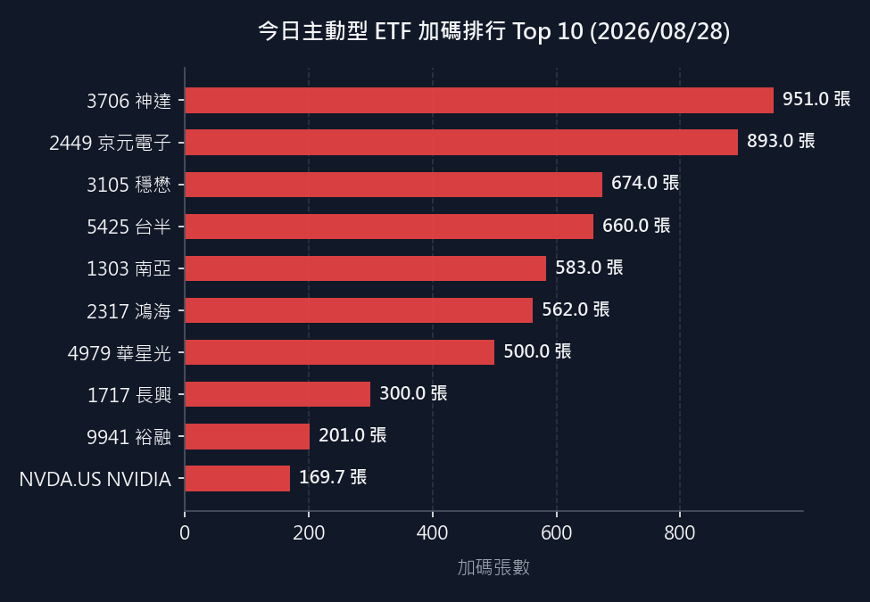
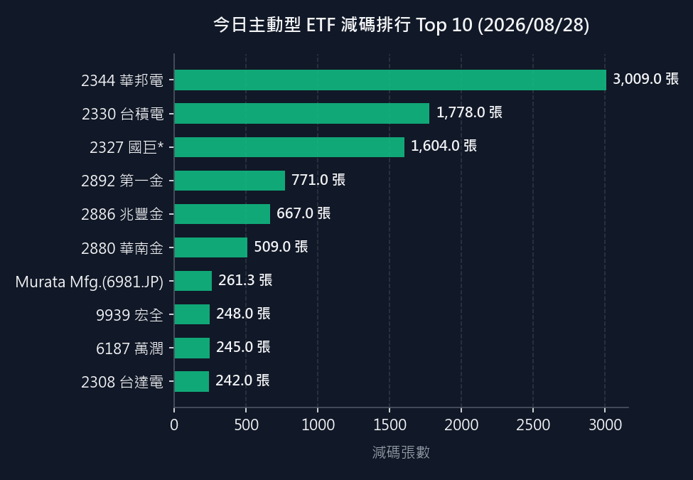

# 主動型 ETF 持股變動

資料來源：`主動型ETF持股明細.xlsx` 最近兩個日期分頁。

比較區間：`20260827` → `20260828`

## 今日加減碼視覺化排行

| 今日加碼 Top 10 | 今日減碼 Top 10 |
| :---: | :---: |
|  |  |

| ETF | 新增 | 刪除 | 比例變動 |
| :-- | --: | --: | --: |
| 00400A | 0 | 0 | 42 |
| 00401A | 0 | 2 | 54 |
| 00402A | 0 | 1 | 45 |
| 00403A | 0 | 0 | 35 |
| 00404A | 0 | 0 | 42 |
| 00405A | 0 | 0 | 38 |
| 00407A | 0 | 0 | 46 |
| 00408A | 0 | 0 | 43 |
| 00980A | 0 | 0 | 45 |
| 00980D | 2 | 2 | 18 |
| 00981A | 0 | 0 | 30 |
| 00982A | 0 | 0 | 42 |
| 00983A | 0 | 0 | 37 |
| 00983D | 0 | 0 | 7 |
| 00984A | 0 | 0 | 67 |
| 00985A | 1 | 1 | 42 |
| 00986A | 0 | 0 | 31 |
| 00987A | 0 | 0 | 26 |
| 00988A | 0 | 1 | 42 |
| 00989A | 0 | 1 | 66 |
| 00990A | 2 | 2 | 41 |
| 00991A | 0 | 0 | 20 |
| 00992A | 0 | 0 | 33 |
| 00993A | 0 | 0 | 45 |
| 00994A | 0 | 1 | 32 |
| 00995A | 0 | 0 | 43 |
| 00996A | 0 | 0 | 43 |
| 00997A | 0 | 0 | 47 |
| 00998A | 0 | 1 | 34 |
| 00999A | 0 | 1 | 50 |

## 00400A

### 新增持股

- 無

### 刪除持股

- 無

### 投資比例變動

- 1303 南亞：1.46% → 1.41%（-0.05）
- 2059 川湖：6.07% → 6.03%（-0.04）
- 2303 聯電：0.85% → 0.93%（+0.08）
- 2308 台達電：2.72% → 2.80%（+0.08）
- 2313 華通：0.93% → 0.92%（-0.01）
- 2330 台積電：8.57% → 8.58%（+0.01）
- 2345 智邦：1.63% → 1.65%（+0.02）
- 2360 致茂：3.22% → 3.24%（+0.02）
- 2368 金像電：1.25% → 1.37%（+0.12）
- 2383 台光電：1.44% → 1.43%（-0.01）
- 2449 京元電子：0.85% → 0.93%（+0.08）
- 2454 聯發科：6.25% → 6.42%（+0.17）
- 2881 富邦金：1.51% → 1.53%（+0.02）
- 2885 元大金：1.36% → 1.38%（+0.02）
- 3008 大立光：3.66% → 3.73%（+0.07）
- 3017 奇鋐：3.86% → 3.87%（+0.01）
- 3026 禾伸堂：0.94% → 1.03%（+0.09）
- 3036 文曄：1.02% → 1.03%（+0.01）
- 3037 欣興：2.52% → 2.36%（-0.16）
- 3044 健鼎：1.71% → 1.74%（+0.03）
- 3081 聯亞：0.95% → 0.93%（-0.02）
- 3090 日電貿：0.34% → 0.35%（+0.01）
- 3167 大量：0.29% → 0.31%（+0.02）
- 3374 精材：0.33% → 0.36%（+0.03）
- 3443 創意：3.87% → 3.92%（+0.05）
- 3529 力旺：1.11% → 1.06%（-0.05）
- 3653 健策：4.80% → 4.90%（+0.10）
- 3665 貿聯-KY：1.19% → 1.30%（+0.11）
- 3711 日月光投控：0.97% → 0.99%（+0.02）
- 4979 華星光：0.62% → 0.61%（-0.01）
- 5274 信驊：2.76% → 2.81%（+0.05）
- 5347 世界：0.70% → 0.71%（+0.01）
- 5434 崇越：0.37% → 0.36%（-0.01）
- 6187 萬潤：2.93% → 2.79%（-0.14）
- 6223 旺矽：4.17% → 4.11%（-0.06）
- 6274 台燿：1.96% → 2.02%（+0.06）
- 6442 光聖：0.89% → 0.90%（+0.01）
- 6488 環球晶：3.09% → 3.13%（+0.04）
- 6515 穎崴：0.44% → 0.45%（+0.01）
- 6669 緯穎：5.18% → 5.46%（+0.28）
- 7750 新代：1.03% → 0.96%（-0.07）
- 7769 鴻勁：0.74% → 0.76%（+0.02）

## 00401A

### 新增持股

- 無

### 刪除持股

- 3653 健策（0.47%，2.653 張）
- 8021 尖點（0.08%，6 張）

### 投資比例變動

- 1216 統一：0.31% → 0.30%（-0.01）
- 1477 聚陽：0.97% → 0.95%（-0.02）
- 2059 川湖：1.32% → 1.28%（-0.04）
- 2303 聯電：0.89% → 0.92%（+0.03）
- 2308 台達電：3.24% → 3.34%（+0.10）
- 2313 華通：1.72% → 1.83%（+0.11）
- 2317 鴻海：0.62% → 0.63%（+0.01）
- 2327 國巨*：0.65% → 0.71%（+0.06）
- 2330 台積電：15.71% → 15.43%（-0.28）
- 2345 智邦：2.16% → 2.21%（+0.05）
- 2357 華碩：1.47% → 1.43%（-0.04）
- 2368 金像電：0.29% → 0.31%（+0.02）
- 2379 瑞昱：1.16% → 1.11%（-0.05）
- 2382 廣達：2.38% → 2.34%（-0.04）
- 2383 台光電：1.94% → 1.78%（-0.16）
- 2412 中華電：0.84% → 0.83%（-0.01）
- 2449 京元電子：0.05% → 0.06%（+0.01）
- 2454 聯發科：6.16% → 6.10%（-0.06）
- 2455 全新：2.10% → 2.17%（+0.07）
- 2603 長榮：1.11% → 1.09%（-0.02）
- 2881 富邦金：2.03% → 2.07%（+0.04）
- 2882 國泰金：1.06% → 1.07%（+0.01）
- 2884 玉山金：1.83% → 1.80%（-0.03）
- 2886 兆豐金：1.38% → 1.40%（+0.02）
- 2887 台新新光金：1.07% → 1.05%（-0.02）
- 2891 中信金：1.59% → 1.56%（-0.03）
- 3008 大立光：3.11% → 3.34%（+0.23）
- 3034 聯詠：0.24% → 0.22%（-0.02）
- 3037 欣興：2.65% → 2.48%（-0.17）
- 3131 弘塑：0.82% → 0.81%（-0.01）
- 3167 大量：0.51% → 0.54%（+0.03）
- 3231 緯創：0.37% → 0.36%（-0.01）
- 3491 昇達科：1.74% → 1.90%（+0.16）
- 3711 日月光投控：1.99% → 2.05%（+0.06）
- 4904 遠傳：0.79% → 0.77%（-0.02）
- 4938 和碩：0.33% → 0.32%（-0.01）
- 4958 臻鼎-KY：1.80% → 1.88%（+0.08）
- 4991 環宇-KY：1.10% → 1.15%（+0.05）
- 5274 信驊：1.91% → 1.87%（-0.04）
- 5347 世界：1.30% → 1.29%（-0.01）
- 5871 中租-KY：0.16% → 0.15%（-0.01）
- 5904 寶雅*：0.62% → 0.61%（-0.01）
- 6187 萬潤：0.77% → 0.79%（+0.02）
- 6223 旺矽：1.72% → 1.69%（-0.03）
- 6415 矽力*-KY：0.64% → 0.61%（-0.03）
- 6515 穎崴：1.03% → 1.05%（+0.02）
- 6531 愛普*：1.22% → 1.15%（-0.07）
- 6669 緯穎：2.24% → 2.34%（+0.10）
- 6944 兆聯實業：0.44% → 0.42%（-0.02）
- 7769 鴻勁：1.87% → 1.88%（+0.01）
- 7828 創新服務：1.66% → 1.87%（+0.21）
- 8464 億豐：1.13% → 1.08%（-0.05）
- 台股期貨09/26(FITXN*1.TF)：-0.02% → 0.03%（+0.05）
- 臺指選擇權09/26 44500 買權：-1.04% → -1.10%（-0.06）

## 00402A

### 新增持股

- 無

### 刪除持股

- ZS.US Zscaler（0.18%，2.3 張）

### 投資比例變動

- AAPL.US Apple：7.38% → 7.27%（-0.11）
- ADI.US Analog Devices：1.87% → 1.85%（-0.02）
- AMD.US AMD：4.52% → 4.75%（+0.23）
- AMZN.US Amazon：4.65% → 4.49%（-0.16）
- ANET.US Arista Networks：0.88% → 0.86%（-0.02）
- ASML.US ASML Holding：1.72% → 1.68%（-0.04）
- AVGO.US Broadcom：2.17% → 2.23%（+0.06）
- AXON.US Axon Enterprise：1.14% → 1.13%（-0.01）
- BABA.US Alibaba Group：0.59% → 0.56%（-0.03）
- BKNG.US Booking Holdings：0.98% → 0.93%（-0.05）
- CDNS.US Cadence Design Systems：1.51% → 1.54%（+0.03）
- CIEN.US Ciena：1.16% → 1.13%（-0.03）
- CLS.US Celestica：0.88% → 0.89%（+0.01）
- COHR.US Coherent：1.99% → 1.96%（-0.03）
- CRWD.US CrowdStrike Holdings：1.31% → 1.55%（+0.24）
- DASH.US DoorDash：0.61% → 0.59%（-0.02）
- FSLY.US Fastly：0.36% → 0.38%（+0.02）
- GOOG.US Alphabet - Class C Capital Stock：3.16% → 3.08%（-0.08）
- GOOGL.US Alphabet - Class A Common Stock：3.58% → 3.50%（-0.08）
- INTC.US Intel：1.19% → 1.22%（+0.03）
- IOT.US Samsara：0.37% → 0.38%（+0.01）
- KLAC.US KLA：1.60% → 1.57%（-0.03）
- MDB.US MongoDB：0.73% → 0.77%（+0.04）
- META.US Meta：2.84% → 2.77%（-0.07）
- MRVL.US Marvell：1.81% → 1.56%（-0.25）
- MSFT.US Microsoft：5.23% → 5.22%（-0.01）
- MU.US Micron：6.09% → 6.17%（+0.08）
- NFLX.US Netflix：0.92% → 0.89%（-0.03）
- NOW.US ServiceNow：0.76% → 0.82%（+0.06）
- NVDA.US NVIDIA：8.19% → 8.71%（+0.52）
- PANW.US Palo Alto：2.49% → 2.76%（+0.27）
- PLTR.US Palantir Technologies：1.79% → 1.84%（+0.05）
- SHOP.US Shopify：0.94% → 0.95%（+0.01）
- SIMO.US Silicon Motion：0.82% → 0.78%（-0.04）
- SKHY.US SK hynix：1.03% → 1.04%（+0.01）
- SNOW.US Snowflake：1.23% → 1.26%（+0.03）
- SPCX.US SpaceX：0.74% → 0.73%（-0.01）
- SPOT.US Spotify：0.54% → 0.51%（-0.03）
- STX.US Seagate：1.07% → 1.06%（-0.01）
- TER.US Teradyne：0.87% → 0.88%（+0.01）
- TSM.US TSMC(ADR)：1.47% → 1.48%（+0.01）
- TTWO.US Take-Two：0.75% → 0.73%（-0.02）
- UBER.US Uber：0.52% → 0.50%（-0.02）
- V.US Visa：1.32% → 1.28%（-0.04）
- WDC.US Western Digital：2.34% → 2.26%（-0.08）

## 00403A

### 新增持股

- 無

### 刪除持股

- 無

### 投資比例變動

- 1303 南亞：1.40% → 1.45%（+0.05）
- 1717 長興：0.11% → 0.13%（+0.02）
- 2303 聯電：3.52% → 3.88%（+0.36）
- 2308 台達電：3.03% → 3.14%（+0.11）
- 2327 國巨*：3.23% → 3.48%（+0.25）
- 2330 台積電：17.19% → 16.02%（-1.17）
- 2344 華邦電：1.66% → 1.30%（-0.36）
- 2345 智邦：2.87% → 2.92%（+0.05）
- 2360 致茂：1.18% → 1.20%（+0.02）
- 2383 台光電：5.23% → 5.24%（+0.01）
- 2454 聯發科：4.85% → 5.01%（+0.16）
- 3008 大立光：2.88% → 3.20%（+0.32）
- 3017 奇鋐：6.25% → 6.31%（+0.06）
- 3037 欣興：5.93% → 5.60%（-0.33）
- 3189 景碩：2.47% → 2.44%（-0.03）
- 3211 順達：0.47% → 0.48%（+0.01）
- 3264 欣銓：0.09% → 0.10%（+0.01）
- 3443 創意：2.19% → 2.33%（+0.14）
- 3450 聯鈞：0.14% → 0.15%（+0.01）
- 3533 嘉澤：0.24% → 0.26%（+0.02）
- 3653 健策：3.65% → 3.75%（+0.10）
- 3665 貿聯-KY：1.47% → 1.74%（+0.27）
- 3711 日月光投控：2.52% → 2.59%（+0.07）
- 5274 信驊：1.63% → 1.39%（-0.24）
- 6223 旺矽：3.33% → 3.30%（-0.03）
- 6239 力成：0.88% → 0.92%（+0.04）
- 6274 台燿：1.63% → 1.69%（+0.06）
- 6442 光聖：0.21% → 0.22%（+0.01）
- 6488 環球晶：1.59% → 1.62%（+0.03）
- 6669 緯穎：2.67% → 3.01%（+0.34）
- 6805 富世達：1.24% → 1.47%（+0.23）
- 7769 鴻勁：0.49% → 0.50%（+0.01）
- 8046 南電：2.03% → 1.95%（-0.08）
- 8358 金居：0.23% → 0.19%（-0.04）
- 8996 高力：1.35% → 1.31%（-0.04）

## 00404A

### 新增持股

- 無

### 刪除持股

- 無

### 投資比例變動

- 1303 南亞：0.69% → 0.74%（+0.05）
- 2027 大成鋼：0.46% → 0.44%（-0.02）
- 2059 川湖：1.72% → 1.70%（-0.02）
- 2301 光寶科：1.68% → 1.74%（+0.06）
- 2303 聯電：2.65% → 2.80%（+0.15）
- 2308 台達電：1.87% → 1.96%（+0.09）
- 2317 鴻海：0.70% → 0.72%（+0.02）
- 2330 台積電：22.09% → 22.21%（+0.12）
- 2345 智邦：0.73% → 0.76%（+0.03）
- 2351 順德：0.53% → 0.58%（+0.05）
- 2360 致茂：0.65% → 0.66%（+0.01）
- 2379 瑞昱：2.14% → 2.11%（-0.03）
- 2382 廣達：2.20% → 2.21%（+0.01）
- 2383 台光電：3.15% → 2.94%（-0.21）
- 2395 研華：1.55% → 1.52%（-0.03）
- 2428 興勤：1.17% → 1.22%（+0.05）
- 2439 美律：1.04% → 1.00%（-0.04）
- 2441 超豐：1.85% → 1.86%（+0.01）
- 2454 聯發科：6.03% → 6.12%（+0.09）
- 2458 義隆：1.69% → 1.68%（-0.01）
- 2637 慧洋-KY：1.11% → 1.13%（+0.02）
- 2885 元大金：2.00% → 2.05%（+0.05）
- 2890 永豐金：0.96% → 0.98%（+0.02）
- 3017 奇鋐：1.03% → 1.10%（+0.07）
- 3034 聯詠：2.12% → 2.08%（-0.04）
- 3037 欣興：0.79% → 0.76%（-0.03）
- 3135 凌航：1.59% → 1.55%（-0.04）
- 3264 欣銓：1.21% → 1.32%（+0.11）
- 3443 創意：0.55% → 0.54%（-0.01）
- 3702 大聯大：1.71% → 1.59%（-0.12）
- 3711 日月光投控：3.45% → 3.63%（+0.18）
- 4763 材料*-KY：1.63% → 1.60%（-0.03）
- 5274 信驊：2.26% → 2.25%（-0.01）
- 5434 崇越：1.66% → 1.64%（-0.02）
- 5904 寶雅*：0.52% → 0.51%（-0.01）
- 6139 亞翔：1.85% → 1.80%（-0.05）
- 6196 帆宣：1.77% → 1.75%（-0.02）
- 6257 矽格：0.22% → 0.24%（+0.02）
- 8081 致新：0.89% → 0.88%（-0.01）
- 8271 宇瞻：0.25% → 0.26%（+0.01）
- 台指選擇權09/26 48000 買權：-0.17% → -0.15%（+0.02）
- 台股期貨09/26(FITXN*1.TF)：16.67% → 16.85%（+0.18）

## 00405A

### 新增持股

- 無

### 刪除持股

- 無

### 投資比例變動

- 2059 川湖：2.02% → 2.05%（+0.03）
- 2308 台達電：0.56% → 0.59%（+0.03）
- 2330 台積電：1.45% → 1.48%（+0.03）
- 2345 智邦：3.71% → 3.83%（+0.12）
- 2368 金像電：3.90% → 4.34%（+0.44）
- 2383 台光電：3.91% → 3.97%（+0.06）
- 2454 聯發科：6.23% → 6.52%（+0.29）
- 3017 奇鋐：9.00% → 9.20%（+0.20）
- 3037 欣興：6.22% → 5.94%（-0.28）
- 3081 聯亞：1.79% → 1.78%（-0.01）
- 3131 弘塑：1.27% → 1.29%（+0.02）
- 3443 創意：8.32% → 8.59%（+0.27）
- 3450 聯鈞：1.26% → 1.41%（+0.15）
- 3491 昇達科：0.00% → 0.01%（+0.01）
- 3653 健策：8.09% → 8.42%（+0.33）
- 3665 貿聯-KY：4.59% → 5.12%（+0.53）
- 4749 新應材：0.25% → 0.26%（+0.01）
- 4991 環宇-KY：2.17% → 2.13%（-0.04）
- 5274 信驊：2.79% → 2.89%（+0.10）
- 6187 萬潤：0.95% → 0.92%（-0.03）
- 6223 旺矽：4.66% → 4.68%（+0.02）
- 6274 台燿：1.48% → 1.55%（+0.07）
- 6278 台表科：0.97% → 0.96%（-0.01）
- 6285 啟碁：0.33% → 0.34%（+0.01）
- 6488 環球晶：0.35% → 0.36%（+0.01）
- 6510 精測：2.25% → 2.24%（-0.01）
- 6515 穎崴：0.47% → 0.49%（+0.02）
- 6526 達發：0.30% → 0.31%（+0.01）
- 6531 愛普*：2.31% → 2.29%（-0.02）
- 6669 緯穎：1.14% → 1.23%（+0.09）
- 6805 富世達：2.02% → 2.17%（+0.15）
- 6831 邁科：0.50% → 0.53%（+0.03）
- 7734 印能科技：1.44% → 1.53%（+0.09）
- 7769 鴻勁：2.56% → 2.65%（+0.09）
- 8021 尖點：0.01% → 0.02%（+0.01）
- 8046 南電：3.21% → 3.12%（-0.09）
- 8210 勤誠：0.54% → 0.57%（+0.03）
- 8996 高力：1.24% → 1.22%（-0.02）

## 00407A

### 新增持股

- 無

### 刪除持股

- 無

### 投資比例變動

- 1303 南亞：0.69% → 0.65%（-0.04）
- 1560 中砂：0.47% → 0.46%（-0.01）
- 1590 亞德客-KY：0.08% → 0.07%（-0.01）
- 2059 川湖：3.68% → 3.56%（-0.12）
- 2301 光寶科：1.09% → 1.11%（+0.02）
- 2303 聯電：0.93% → 0.99%（+0.06）
- 2327 國巨*：2.18% → 2.26%（+0.08）
- 2330 台積電：8.77% → 8.50%（-0.27）
- 2345 智邦：2.81% → 2.76%（-0.05）
- 2360 致茂：1.95% → 1.90%（-0.05）
- 2368 金像電：2.03% → 2.16%（+0.13）
- 2379 瑞昱：0.22% → 0.21%（-0.01）
- 2383 台光電：5.43% → 5.23%（-0.20）
- 2395 研華：2.01% → 1.92%（-0.09）
- 2408 南亞科：2.14% → 2.06%（-0.08）
- 2451 創見：0.33% → 0.31%（-0.02）
- 2454 聯發科：4.55% → 4.54%（-0.01）
- 2615 萬海：0.67% → 0.64%（-0.03）
- 3008 大立光：0.79% → 0.81%（+0.02）
- 3017 奇鋐：5.49% → 5.34%（-0.15）
- 3034 聯詠：0.73% → 0.70%（-0.03）
- 3037 欣興：5.67% → 5.15%（-0.52）
- 3081 聯亞：1.61% → 1.60%（-0.01）
- 3260 威剛：0.31% → 0.29%（-0.02）
- 3293 鈊象：0.53% → 0.51%（-0.02）
- 3443 創意：3.54% → 3.47%（-0.07）
- 3491 昇達科：0.48% → 0.49%（+0.01）
- 3529 力旺：1.10% → 1.02%（-0.08）
- 3653 健策：2.03% → 2.00%（-0.03）
- 3665 貿聯-KY：1.94% → 2.06%（+0.12）
- 3711 日月光投控：2.53% → 2.50%（-0.03）
- 4958 臻鼎-KY：1.80% → 1.75%（-0.05）
- 5274 信驊：1.96% → 1.91%（-0.05）
- 5289 宜鼎：0.36% → 0.35%（-0.01）
- 5434 崇越：0.19% → 0.18%（-0.01）
- 6187 萬潤：1.05% → 1.02%（-0.03）
- 6223 旺矽：2.56% → 2.45%（-0.11）
- 6274 台燿：3.41% → 3.40%（-0.01）
- 6446 藥華藥：1.15% → 1.10%（-0.05）
- 6515 穎崴：0.20% → 0.19%（-0.01）
- 6531 愛普*：0.31% → 0.29%（-0.02）
- 6669 緯穎：5.13% → 5.22%（+0.09）
- 6805 富世達：2.78% → 2.84%（+0.06）
- 8046 南電：2.95% → 2.73%（-0.22）
- 8299 群聯：0.32% → 0.31%（-0.01）
- 8996 高力：1.06% → 1.04%（-0.02）

## 00408A

### 新增持股

- 無

### 刪除持股

- 無

### 投資比例變動

- 1216 統一：0.10% → 0.09%（-0.01）
- 1303 南亞：2.85% → 2.74%（-0.11）
- 2059 川湖：2.69% → 2.66%（-0.03）
- 2303 聯電：1.08% → 1.17%（+0.09）
- 2308 台達電：2.33% → 2.73%（+0.40）
- 2330 台積電：6.19% → 6.15%（-0.04）
- 2344 華邦電：0.47% → 0.45%（-0.02）
- 2345 智邦：1.44% → 1.45%（+0.01）
- 2357 華碩：2.61% → 2.58%（-0.03）
- 2368 金像電：2.97% → 3.23%（+0.26）
- 2382 廣達：1.36% → 0.83%（-0.53）
- 2383 台光電：3.44% → 3.41%（-0.03）
- 2395 研華：1.86% → 1.83%（-0.03）
- 2404 漢唐：1.68% → 1.67%（-0.01）
- 2408 南亞科：1.69% → 1.68%（-0.01）
- 2454 聯發科：1.94% → 1.98%（+0.04）
- 2481 強茂：0.70% → 0.92%（+0.22）
- 2880 華南金：1.62% → 1.64%（+0.02）
- 2886 兆豐金：2.51% → 2.60%（+0.09）
- 3017 奇鋐：5.44% → 5.42%（-0.02）
- 3037 欣興：3.40% → 3.17%（-0.23）
- 3045 台灣大：2.75% → 2.73%（-0.02）
- 3081 聯亞：0.84% → 0.82%（-0.02）
- 3189 景碩：1.26% → 1.23%（-0.03）
- 3231 緯創：1.01% → 0.99%（-0.02）
- 3491 昇達科：0.62% → 0.66%（+0.04）
- 3653 健策：2.12% → 2.16%（+0.04）
- 3665 貿聯-KY：0.13% → 0.14%（+0.01）
- 3702 大聯大：0.89% → 0.50%（-0.39）
- 4746 台耀：0.91% → 0.68%（-0.23）
- 5434 崇越：1.94% → 1.91%（-0.03）
- 6187 萬潤：1.34% → 1.27%（-0.07）
- 6223 旺矽：0.80% → 0.62%（-0.18）
- 6239 力成：1.16% → 1.19%（+0.03）
- 6274 台燿：2.53% → 2.59%（+0.06）
- 6488 環球晶：1.80% → 1.81%（+0.01）
- 6669 緯穎：5.55% → 5.81%（+0.26）
- 6805 富世達：1.25% → 1.31%（+0.06）
- 7769 鴻勁：1.79% → 1.81%（+0.02）
- 8046 南電：2.11% → 2.00%（-0.11）
- 8436 大江：2.07% → 2.45%（+0.38）
- 8996 高力：1.07% → 1.02%（-0.05）
- 9941 裕融：2.56% → 3.07%（+0.51）

## 00980A

### 新增持股

- 無

### 刪除持股

- 無

### 投資比例變動

- 1303 南亞：2.71% → 2.61%（-0.10）
- 2059 川湖：5.65% → 5.60%（-0.05）
- 2308 台達電：3.52% → 3.62%（+0.10）
- 2317 鴻海：2.39% → 2.38%（-0.01）
- 2327 國巨*：1.63% → 1.74%（+0.11）
- 2330 台積電：8.94% → 8.92%（-0.02）
- 2344 華邦電：2.10% → 2.04%（-0.06）
- 2345 智邦：1.79% → 1.81%（+0.02）
- 2360 致茂：1.45% → 1.46%（+0.01）
- 2368 金像電：1.99% → 2.17%（+0.18）
- 2376 技嘉：1.18% → 1.19%（+0.01）
- 2382 廣達：1.62% → 1.61%（-0.01）
- 2383 台光電：3.69% → 3.66%（-0.03）
- 2408 南亞科：2.92% → 2.90%（-0.02）
- 2454 聯發科：4.74% → 4.86%（+0.12）
- 2891 中信金：1.42% → 1.43%（+0.01）
- 3008 大立光：0.89% → 0.90%（+0.01）
- 3017 奇鋐：2.21% → 2.20%（-0.01）
- 3026 禾伸堂：0.45% → 0.49%（+0.04）
- 3036 文曄：1.09% → 1.10%（+0.01）
- 3037 欣興：3.27% → 3.06%（-0.21）
- 3044 健鼎：0.82% → 0.83%（+0.01）
- 3081 聯亞：3.80% → 3.70%（-0.10）
- 3189 景碩：0.83% → 0.81%（-0.02）
- 3231 緯創：0.92% → 0.91%（-0.01）
- 3264 欣銓：0.70% → 0.75%（+0.05）
- 3443 創意：1.72% → 1.74%（+0.02）
- 3529 力旺：0.57% → 0.55%（-0.02）
- 3533 嘉澤：0.28% → 0.30%（+0.02）
- 3653 健策：1.92% → 1.95%（+0.03）
- 3665 貿聯-KY：0.33% → 0.36%（+0.03）
- 3711 日月光投控：1.57% → 1.60%（+0.03）
- 5274 信驊：1.38% → 1.40%（+0.02）
- 6213 聯茂：1.34% → 1.37%（+0.03）
- 6223 旺矽：1.81% → 1.77%（-0.04）
- 6274 台燿：1.49% → 1.52%（+0.03）
- 6515 穎崴：1.65% → 1.68%（+0.03）
- 6669 緯穎：1.75% → 1.83%（+0.08）
- 6805 富世達：0.59% → 0.62%（+0.03）
- 6831 邁科：0.53% → 0.55%（+0.02）
- 7769 鴻勁：2.28% → 2.32%（+0.04）
- 8046 南電：1.30% → 1.23%（-0.07）
- 8210 勤誠：0.91% → 0.94%（+0.03）
- 8299 群聯：2.09% → 2.07%（-0.02）
- 8996 高力：1.17% → 1.12%（-0.05）

## 00980D

### 新增持股

- US LONG BOND(CBT) DEC26 21-DEC-2026（5.24%，0.031 張）
- US ULTRA BOND CBT DEC26 21-DEC-2026（-0.34%，-0.002 張）

### 刪除持股

- US LONG BOND(CBT) SEP26 21-SEP-2026（5.27%，0.031 張）
- US ULTRA BOND CBT SEP26 21-SEP-2026（-0.34%，-0.002 張）

### 投資比例變動

- ALLY FINANCIAL INC (REG) 8% 01/11/2031：0.57% → 0.56%（-0.01）
- APOLLO DEBT SOLUTIONS BD 6.900000 % 13APR2029：0.54% → 0.53%（-0.01）
- CONSOLIDATED ENERGY FIN SER REGS 12.000000 % 15FEB2031：0.54% → 0.55%（+0.01）
- DOW CHEMICAL CO/THE 7.375% 01NOV2029：0.60% → 0.59%（-0.01）
- F&G ANNUITIES & LIFE INC 6.250000 % 04OCT2034：0.49% → 0.48%（-0.01）
- FMC CORP (REG) 6.375000 % 18MAY2053：0.46% → 0.45%（-0.01）
- FORD MOTOR CREDIT CO LLC (REG) 7.2% 10JUN2030：0.33% → 0.32%（-0.01）
- GEORGIA-PACIFIC LLC (REG) 7.75% 15NOV2029：0.56% → 0.55%（-0.01）
- HUTCHISON WHAM INT 03/33 SER REGS (REG S) 7.45% 24NOV2033：0.40% → 0.39%（-0.01）
- LPL HOLDINGS INC (REG) 6.75% 17NOV2028：0.55% → 0.54%（-0.01）
- ORACLE CORP 6.85 % 04-FEB-2066：0.39% → 0.40%（+0.01）
- PEPSICO INC (REG) 7.000000 % 01MAR2029：0.31% → 0.30%（-0.01）
- PHOTO HOLDINGS LLC SER REGS (REG) (REG S) 12% 01JUL2031：0.51% → 0.50%（-0.01）
- SALESFORCE INC (REG) 6.7% 15MAR2066：0.50% → 0.51%（+0.01）
- TIME WARNER ENTERTAINMEN 8.375% 15JUL2033：0.63% → 0.62%（-0.01）
- US 10YR NOTE (CBT)DEC26 21-DEC-2026：17.42% → 17.40%（-0.02）
- US 5YR NOTE (CBT) DEC26 31-DEC-2026：-14.78% → -14.76%（+0.02）
- VIACOM INC (REG) 5.85% 01SEP2043：0.55% → 0.56%（+0.01）

## 00981A

### 新增持股

- 無

### 刪除持股

- 無

### 投資比例變動

- 2303 聯電：3.65% → 3.97%（+0.32）
- 2308 台達電：4.42% → 4.52%（+0.10）
- 2327 國巨*：4.85% → 5.17%（+0.32）
- 2330 台積電：9.87% → 9.29%（-0.58）
- 2345 智邦：4.73% → 4.75%（+0.02）
- 2368 金像電：0.69% → 0.75%（+0.06）
- 2383 台光電：9.11% → 8.99%（-0.12）
- 2449 京元電子：1.00% → 1.17%（+0.17）
- 2454 聯發科：6.85% → 6.99%（+0.14）
- 3017 奇鋐：6.88% → 6.85%（-0.03）
- 3037 欣興：8.25% → 7.68%（-0.57）
- 3264 欣銓：0.45% → 0.47%（+0.02）
- 3443 創意：0.66% → 0.67%（+0.01）
- 3653 健策：4.68% → 4.75%（+0.07）
- 3665 貿聯-KY：3.31% → 3.60%（+0.29）
- 3711 日月光投控：4.06% → 4.12%（+0.06）
- 4966 譜瑞-KY：0.03% → 0.00%（-0.03）
- 4979 華星光：0.67% → 0.66%（-0.01）
- 5274 信驊：1.80% → 1.67%（-0.13）
- 6187 萬潤：0.14% → 0.04%（-0.10）
- 6191 精成科：0.11% → 0.12%（+0.01）
- 6223 旺矽：4.36% → 4.26%（-0.10）
- 6274 台燿：2.74% → 2.79%（+0.05）
- 6278 台表科：0.23% → 0.22%（-0.01）
- 6510 精測：0.45% → 0.44%（-0.01）
- 6669 緯穎：5.23% → 5.46%（+0.23）
- 6805 富世達：1.74% → 1.81%（+0.07）
- 8046 南電：4.29% → 4.07%（-0.22）
- 8210 勤誠：0.82% → 0.84%（+0.02）
- 8996 高力：0.59% → 0.56%（-0.03）

## 00982A

### 新增持股

- 無

### 刪除持股

- 無

### 投資比例變動

- 2059 川湖：5.21% → 5.13%（-0.08）
- 2301 光寶科：1.94% → 2.02%（+0.08）
- 2303 聯電：1.23% → 1.33%（+0.10）
- 2330 台積電：8.49% → 8.43%（-0.06）
- 2345 智邦：2.98% → 3.00%（+0.02）
- 2360 致茂：3.29% → 3.28%（-0.01）
- 2377 微星：1.25% → 1.23%（-0.02）
- 2383 台光電：3.45% → 3.40%（-0.05）
- 2395 研華：1.96% → 1.92%（-0.04）
- 2428 興勤：1.17% → 1.19%（+0.02）
- 2454 聯發科：6.62% → 5.74%（-0.88）
- 2455 全新：1.33% → 1.32%（-0.01）
- 2467 志聖：1.15% → 1.18%（+0.03）
- 2478 大毅：1.10% → 1.12%（+0.02）
- 2486 一詮：0.82% → 0.81%（-0.01）
- 3008 大立光：3.48% → 3.51%（+0.03）
- 3017 奇鋐：2.48% → 2.46%（-0.02）
- 3090 日電貿：1.12% → 1.14%（+0.02）
- 3105 穩懋：4.21% → 4.86%（+0.65）
- 3231 緯創：1.21% → 1.18%（-0.03）
- 3265 台星科：1.20% → 1.25%（+0.05）
- 3491 昇達科：3.30% → 3.46%（+0.16）
- 3529 力旺：0.48% → 0.46%（-0.02）
- 3583 辛耘：1.73% → 1.68%（-0.05）
- 3617 碩天：0.29% → 0.28%（-0.01）
- 3711 日月光投控：1.14% → 1.15%（+0.01）
- 4958 臻鼎-KY：2.98% → 2.96%（-0.02）
- 5274 信驊：1.08% → 1.09%（+0.01）
- 5425 台半：1.09% → 1.21%（+0.12）
- 5483 中美晶：1.26% → 1.25%（-0.01）
- 5536 聖暉*：0.77% → 0.78%（+0.01）
- 6139 亞翔：5.88% → 5.75%（-0.13）
- 6214 精誠：1.25% → 1.23%（-0.02）
- 6223 旺矽：3.07% → 3.00%（-0.07）
- 6239 力成：1.04% → 1.06%（+0.02）
- 6274 台燿：1.23% → 1.25%（+0.02）
- 6472 保瑞：0.89% → 0.87%（-0.02）
- 6531 愛普*：2.97% → 2.87%（-0.10）
- 6669 緯穎：6.83% → 7.13%（+0.30）
- 6672 騰輝電子-KY：0.30% → 0.31%（+0.01）
- 8070 長華*：0.28% → 0.29%（+0.01）
- 8996 高力：0.98% → 0.94%（-0.04）

## 00983A

### 新增持股

- 無

### 刪除持股

- 無

### 投資比例變動

- AMD.US AMD：3.38% → 3.37%（-0.01）
- AMZN.US Amazon：2.27% → 2.25%（-0.02）
- AVGO.US Broadcom：0.52% → 0.54%（+0.02）
- BEAM.US Beam Therapeutics：2.34% → 2.08%（-0.26）
- BLSH.US Bullish：1.80% → 1.84%（+0.04）
- BMNR.US BitMine：1.92% → 1.98%（+0.06）
- CBRS.US Cerebras：0.81% → 0.83%（+0.02）
- COIN.US Coinbase：3.51% → 3.80%（+0.29）
- CRCL.US Circle：4.41% → 4.64%（+0.23）
- CRSP.US CRISPR Therapeutics：4.78% → 4.21%（-0.57）
- CRWV.US CoreWeave：1.51% → 1.49%（-0.02）
- DE.US Deere：1.28% → 1.15%（-0.13）
- FIG.US Figma：0.48% → 0.54%（+0.06）
- GOOG.US Alphabet - Class C Capital Stock：1.26% → 1.27%（+0.01）
- HOOD.US Robinhood Markets：4.44% → 4.52%（+0.08）
- ILMN.US Illumina：2.28% → 2.32%（+0.04）
- KTOS.US Kratos Defense & Security：1.01% → 1.03%（+0.02）
- LLY.US Eli Lilly：1.99% → 1.49%（-0.50）
- NET.US Cloudflare：0.09% → 0.10%（+0.01）
- NTLA.US Intellia Therapeutics：1.37% → 1.28%（-0.09）
- NTRA.US Natera：2.26% → 2.27%（+0.01）
- NVDA.US NVIDIA：1.61% → 1.76%（+0.15）
- PLTR.US Palantir Technologies：3.51% → 3.70%（+0.19）
- RBLX.US Roblox：0.11% → 0.01%（-0.10）
- SHOP.US Shopify：6.34% → 6.54%（+0.20）
- SNOW.US Snowflake：1.63% → 1.71%（+0.08）
- SOFI.US SoFi Technologies：0.73% → 0.75%（+0.02）
- SPCX.US SpaceX：4.36% → 4.55%（+0.19）
- TEM.US Tempus：5.39% → 5.71%（+0.32）
- TER.US Teradyne：0.61% → 0.52%（-0.09）
- TSLA.US Tesla：8.45% → 8.70%（+0.25）
- TSM.US TSMC(ADR)：2.53% → 2.14%（-0.39）
- TWST.US Twist Bioscience：4.96% → 5.09%（+0.13）
- TXG.US 10x Genomics：4.41% → 4.47%（+0.06）
- WGS.US GeneDx：1.94% → 1.93%（-0.01）
- XE.US X-Energy：0.78% → 0.79%（+0.01）
- XYZ.US Block：2.32% → 2.38%（+0.06）

## 00983D

### 新增持股

- 無

### 刪除持股

- 無

### 投資比例變動

- ABIBB 8.2 01/15/39：1.96% → 1.95%（-0.01）
- CRWV 9 02/01/31：0.82% → 0.83%（+0.01）
- GTN 10 1/2 07/15/29：1.68% → 0.57%（-1.11）
- LOW 6.65 09/15/37：0.85% → 0.84%（-0.01）
- MINAU 9 1/4 10/01/28：0.88% → 0.87%（-0.01）
- SABHLD 10 3/4 11/15/29：0.62% → 0.61%（-0.01）
- TLTW.US iShares 20+ Year Treasury Bond B：8.02% → 8.01%（-0.01）

## 00984A

### 新增持股

- 無

### 刪除持股

- 無

### 投資比例變動

- 1303 南亞：2.72% → 2.62%（-0.10）
- 1326 台化：1.10% → 1.08%（-0.02）
- 1409 新纖：0.59% → 0.57%（-0.02）
- 1477 聚陽：0.76% → 0.75%（-0.01）
- 1736 喬山：0.65% → 0.64%（-0.01）
- 1907 永豐餘：0.51% → 0.49%（-0.02）
- 2049 上銀：0.58% → 0.57%（-0.01）
- 2059 川湖：5.77% → 5.78%（+0.01）
- 2105 正新：0.26% → 0.25%（-0.01）
- 2201 裕隆：0.24% → 0.23%（-0.01）
- 2303 聯電：1.32% → 1.45%（+0.13）
- 2324 仁寶：0.59% → 0.58%（-0.01）
- 2345 智邦：0.74% → 0.75%（+0.01）
- 2347 聯強：0.93% → 0.92%（-0.01）
- 2351 順德：0.37% → 0.36%（-0.01）
- 2360 致茂：0.82% → 0.83%（+0.01）
- 2383 台光電：1.73% → 1.72%（-0.01）
- 2408 南亞科：2.07% → 2.06%（-0.01）
- 2409 友達：0.56% → 0.57%（+0.01）
- 2412 中華電：0.84% → 0.83%（-0.01）
- 2441 超豐：1.10% → 1.13%（+0.03）
- 2454 聯發科：1.52% → 1.56%（+0.04）
- 2464 盟立：0.84% → 0.75%（-0.09）
- 2476 鉅祥：0.26% → 0.25%（-0.01）
- 2535 達欣工：0.22% → 0.21%（-0.01）
- 2603 長榮：0.79% → 0.78%（-0.01）
- 2633 台灣高鐵：0.47% → 0.46%（-0.01）
- 2834 臺企銀：1.30% → 1.31%（+0.01）
- 2880 華南金：1.90% → 1.94%（+0.04）
- 2882 國泰金：0.78% → 0.80%（+0.02）
- 2886 兆豐金：1.92% → 1.99%（+0.07）
- 2892 第一金：1.61% → 1.65%（+0.04）
- 3008 大立光：3.41% → 3.46%（+0.05）
- 3023 信邦：1.15% → 1.13%（-0.02）
- 3033 威健：0.24% → 0.23%（-0.01）
- 3037 欣興：0.71% → 0.66%（-0.05）
- 3189 景碩：1.75% → 1.71%（-0.04）
- 3264 欣銓：0.25% → 0.26%（+0.01）
- 3443 創意：0.23% → 0.24%（+0.01）
- 3450 聯鈞：0.76% → 0.83%（+0.07）
- 3533 嘉澤：1.15% → 1.22%（+0.07）
- 3702 大聯大：0.44% → 0.43%（-0.01）
- 3711 日月光投控：1.13% → 1.15%（+0.02）
- 4764 雙鍵：0.47% → 0.51%（+0.04）
- 4904 遠傳：0.47% → 0.46%（-0.01）
- 4938 和碩：0.64% → 0.63%（-0.01）
- 4966 譜瑞-KY：0.86% → 0.85%（-0.01）
- 5274 信驊：0.78% → 0.80%（+0.02）
- 5289 宜鼎：1.02% → 1.00%（-0.02）
- 5351 鈺創：0.86% → 0.85%（-0.01）
- 6139 亞翔：2.76% → 2.72%（-0.04）
- 6196 帆宣：1.08% → 1.07%（-0.01）
- 6213 聯茂：2.12% → 2.18%（+0.06）
- 6223 旺矽：1.00% → 0.99%（-0.01）
- 6257 矽格：0.67% → 0.71%（+0.04）
- 6274 台燿：0.63% → 0.64%（+0.01）
- 6282 康舒：0.25% → 0.24%（-0.01）
- 6446 藥華藥：2.82% → 2.78%（-0.04）
- 6548 長科*：1.14% → 1.11%（-0.03）
- 6669 緯穎：0.67% → 0.71%（+0.04）
- 6944 兆聯實業：1.01% → 1.00%（-0.01）
- 7734 印能科技：0.42% → 0.44%（+0.02）
- 7769 鴻勁：1.25% → 1.27%（+0.02）
- 8039 台虹：1.09% → 1.05%（-0.04）
- 8046 南電：0.69% → 0.66%（-0.03）
- 8271 宇瞻：0.56% → 0.55%（-0.01）
- 8436 大江：0.26% → 0.25%（-0.01）

## 00985A

### 新增持股

- 3491 昇達科（1.53%，107 張）

### 刪除持股

- 2049 上銀（0.19%，55 張）

### 投資比例變動

- 1216 統一：1.22% → 1.19%（-0.03）
- 1301 台塑：1.57% → 1.55%（-0.02）
- 1504 東元：2.43% → 2.39%（-0.04）
- 2027 大成鋼：1.94% → 1.92%（-0.02）
- 2059 川湖：1.50% → 0.95%（-0.55）
- 2303 聯電：0.19% → 0.21%（+0.02）
- 2308 台達電：1.38% → 1.82%（+0.44）
- 2317 鴻海：0.15% → 1.51%（+1.36）
- 2327 國巨*：2.02% → 2.17%（+0.15）
- 2330 台積電：13.48% → 13.51%（+0.03）
- 2344 華邦電：0.43% → 0.42%（-0.01）
- 2345 智邦：2.47% → 2.78%（+0.31）
- 2360 致茂：0.09% → 0.10%（+0.01）
- 2368 金像電：0.19% → 0.20%（+0.01）
- 2376 技嘉：4.75% → 4.03%（-0.72）
- 2383 台光電：1.67% → 2.45%（+0.78）
- 2395 研華：0.94% → 0.93%（-0.01）
- 2412 中華電：3.65% → 3.64%（-0.01）
- 2454 聯發科：1.84% → 2.53%（+0.69）
- 2603 長榮：1.61% → 1.60%（-0.01）
- 2610 華航：1.74% → 1.70%（-0.04）
- 3008 大立光：1.58% → 1.07%（-0.51）
- 3017 奇鋐：2.16% → 2.42%（+0.26）
- 3036 文曄：1.26% → 0.88%（-0.38）
- 3037 欣興：1.80% → 2.13%（+0.33）
- 3081 聯亞：2.66% → 0.97%（-1.69）
- 3105 穩懋：2.34% → 1.36%（-0.98）
- 3653 健策：1.45% → 1.48%（+0.03）
- 3661 世芯-KY：1.47% → 2.05%（+0.58）
- 3665 貿聯-KY：0.18% → 2.04%（+1.86）
- 3711 日月光投控：1.93% → 2.56%（+0.63）
- 4904 遠傳：3.70% → 3.66%（-0.04）
- 6147 頎邦：1.30% → 0.90%（-0.40）
- 6187 萬潤：2.05% → 1.43%（-0.62）
- 6442 光聖：1.61% → 1.13%（-0.48）
- 6446 藥華藥：2.05% → 2.02%（-0.03）
- 6669 緯穎：3.44% → 3.62%（+0.18）
- 7750 新代：2.52% → 2.36%（-0.16）
- 7769 鴻勁：1.87% → 1.91%（+0.04）
- 8046 南電：0.59% → 1.47%（+0.88）
- 8996 高力：1.41% → 1.36%（-0.05）
- 台積電期貨(FICDFN*1.TF)：5.06% → 5.07%（+0.01）

## 00986A

### 新增持股

- 無

### 刪除持股

- 無

### 投資比例變動

- 2330 台積電：9.33% → 9.20%（-0.13）
- 2454 聯發科：1.39% → 1.34%（-0.05）
- AAPL.US Apple：1.05% → 1.04%（-0.01）
- AMAT.US Applied Materials：1.88% → 1.86%（-0.02）
- AMD.US AMD：3.77% → 3.67%（-0.10）
- AMZN.US Amazon：4.08% → 3.95%（-0.13）
- AVGO.US Broadcom：3.58% → 3.68%（+0.10）
- COHR.US Coherent：2.14% → 2.11%（-0.03）
- CRDO.US Credo：0.63% → 0.66%（+0.03）
- CRWD.US CrowdStrike Holdings：3.17% → 3.76%（+0.59）
- DDOG.US Datadog：0.64% → 0.67%（+0.03）
- ETN.US Eaton：2.35% → 2.29%（-0.06）
- GEV.US GE Vernova：2.67% → 2.62%（-0.05）
- GOOGL.US Alphabet - Class A Common Stock：5.74% → 5.62%（-0.12）
- GS.US Goldman Sachs：3.20% → 3.15%（-0.05）
- HWM.US Howmet Aerospace：2.56% → 2.50%（-0.06）
- JPM.US JPMorgan Chase：1.89% → 1.85%（-0.04）
- LLY.US Eli Lilly：2.99% → 2.91%（-0.08）
- MA.US Mastercard：1.17% → 1.14%（-0.03）
- MU.US Micron：4.20% → 4.12%（-0.08）
- MUFG(8306.JP)：1.51% → 1.49%（-0.02）
- NET.US Cloudflare：1.91% → 2.03%（+0.12）
- NVDA.US NVIDIA：5.86% → 6.27%（+0.41）
- SNDK.US Sandisk：1.68% → 1.63%（-0.05）
- SNOW.US Snowflake：1.94% → 1.99%（+0.05）
- Siemens Energy AG：2.17% → 2.12%（-0.05）
- TSEM.US Tower Semiconductor：0.93% → 0.91%（-0.02）
- 嘉能可公司：1.83% → 1.78%（-0.05）
- 施奈德電機公司：1.76% → 1.72%（-0.04）
- 艾司摩爾控股公司：0.98% → 0.95%（-0.03）
- 英飛凌科技股份有限公司：2.88% → 2.93%（+0.05）

## 00987A

### 新增持股

- 無

### 刪除持股

- 無

### 投資比例變動

- 2308 台達電：1.86% → 1.95%（+0.09）
- 2330 台積電：8.15% → 8.27%（+0.12）
- 2345 智邦：2.20% → 2.26%（+0.06）
- 2383 台光電：6.00% → 6.04%（+0.04）
- 2408 南亞科：3.40% → 3.42%（+0.02）
- 2454 聯發科：4.65% → 4.84%（+0.19）
- 2455 全新：3.34% → 3.38%（+0.04）
- 3017 奇鋐：7.28% → 7.40%（+0.12）
- 3037 欣興：7.36% → 7.00%（-0.36）
- 3081 聯亞：4.79% → 3.74%（-1.05）
- 3363 上詮：2.45% → 2.47%（+0.02）
- 3443 創意：4.45% → 4.57%（+0.12）
- 3653 健策：3.82% → 3.95%（+0.13）
- 3665 貿聯-KY：3.86% → 4.46%（+0.60）
- 5274 信驊：0.17% → 0.18%（+0.01）
- 6187 萬潤：2.53% → 2.44%（-0.09）
- 6223 旺矽：5.17% → 5.16%（-0.01）
- 6274 台燿：4.07% → 4.24%（+0.17）
- 6515 穎崴：1.84% → 1.90%（+0.06）
- 6683 雍智科技：2.43% → 2.37%（-0.06）
- 6739 竹陞科技：2.06% → 2.16%（+0.10）
- 6805 富世達：4.35% → 3.20%（-1.15）
- 7769 鴻勁：2.86% → 2.96%（+0.10）
- 8046 南電：4.43% → 4.28%（-0.15）
- 8358 金居：2.12% → 2.76%（+0.64）
- 8996 高力：1.72% → 1.68%（-0.04）

## 00988A

### 新增持股

- 無

### 刪除持股

- 2327 國巨*（1.53%，1550 張）

### 投資比例變動

- 2308 台達電：2.32% → 2.31%（-0.01）
- 2330 台積電：2.89% → 2.85%（-0.04）
- 2383 台光電：4.82% → 4.45%（-0.37）
- 2454 聯發科：1.45% → 1.40%（-0.05）
- 3017 奇鋐：1.60% → 2.03%（+0.43）
- 3037 欣興：5.55% → 5.57%（+0.02）
- 4979 華星光：0.81% → 1.38%（+0.57）
- 6274 台燿：0.37% → 0.34%（-0.03）
- AEM.US Agnico Eagle Mines：0.75% → 0.74%（-0.01）
- AMD.US AMD：3.66% → 3.57%（-0.09）
- BE.US Bloom Energy：3.19% → 3.13%（-0.06）
- COHR.US Coherent：1.64% → 1.61%（-0.03）
- CRCL.US Circle：2.53% → 2.60%（+0.07）
- CRDO.US Credo：2.98% → 3.11%（+0.13）
- DASH.US DoorDash：0.69% → 0.67%（-0.02）
- Furukawa Electric(5801.JP)：0.72% → 0.74%（+0.02）
- INFINEON TECHNOLOGIES AG：1.60% → 1.63%（+0.03）
- ISC(095340.KS)：0.34% → 0.36%（+0.02）
- Kioxia Holdings(285A.JP)：3.31% → 3.41%（+0.10）
- LITE.US Lumentum：6.43% → 6.44%（+0.01）
- MICRONICS(6871.JP)：1.84% → 1.77%（-0.07）
- MPWR.US Monolithic Power Systems：1.37% → 1.36%（-0.01）
- MRVL.US Marvell：2.94% → 2.85%（-0.09）
- MU.US Micron：3.85% → 3.77%（-0.08）
- Murata Mfg.(6981.JP)：3.57% → 3.56%（-0.01）
- NET.US Cloudflare：0.75% → 0.80%（+0.05）
- NTRA.US Natera：0.50% → 0.49%（-0.01）
- Nippon Chemi-Con(6997.JP)：1.26% → 1.24%（-0.02）
- PANW.US Palo Alto：2.98% → 3.30%（+0.32）
- PLTR.US Palantir Technologies：1.87% → 1.93%（+0.06）
- SK hynix(000660.KS)：1.07% → 1.09%（+0.02）
- SNDK.US Sandisk：1.49% → 1.45%（-0.04）
- SNOW.US Snowflake：2.40% → 2.46%（+0.06）
- SPCX.US SpaceX：2.45% → 2.43%（-0.02）
- STX.US Seagate：2.97% → 2.93%（-0.04）
- Samsung Elec Mech(009150.KS)：3.91% → 4.07%（+0.16）
- TER.US Teradyne：1.17% → 1.18%（+0.01）
- TSEM.US Tower Semiconductor：2.81% → 2.74%（-0.07）
- TWLO.US Twilio：0.74% → 0.76%（+0.02）
- 三環集團(300408.SZ)：1.66% → 1.69%（+0.03）
- 中際旭創(3308.HK)：0.83% → 0.84%（+0.01）
- 鼎泰高科(301377.SZ)：1.00% → 1.04%（+0.04）

## 00989A

### 新增持股

- 無

### 刪除持股

- AMKR.US Amkor（0.47%，3.535 張）

### 投資比例變動

- ADBE.US Adobe：1.32% → 1.35%（+0.03）
- ADI.US Analog Devices：1.10% → 1.07%（-0.03）
- ALGM.US Allegro MicroSystems：0.55% → 0.56%（+0.01）
- AMAT.US Applied Materials：0.69% → 0.70%（+0.01）
- AMD.US AMD：2.60% → 2.49%（-0.11）
- AMZN.US Amazon：1.07% → 1.01%（-0.06）
- APP.US Applovin：0.63% → 0.64%（+0.01）
- ASML.US ASML Holding：1.75% → 1.68%（-0.07）
- AVGO.US Broadcom：3.57% → 3.60%（+0.03）
- BE.US Bloom Energy：1.07% → 1.03%（-0.04）
- CBRS.US Cerebras：0.17% → 0.18%（+0.01）
- CIEN.US Ciena：1.75% → 1.68%（-0.07）
- CRM.US Salesforce：2.31% → 2.74%（+0.43）
- CRWD.US CrowdStrike Holdings：2.81% → 3.27%（+0.46）
- CRWV.US CoreWeave：0.74% → 0.73%（-0.01）
- DOCN.US DigitalOcean：1.37% → 1.40%（+0.03）
- ENTG.US Entegris：0.80% → 0.79%（-0.01）
- ESTC.US Elastic：0.62% → 0.66%（+0.04）
- FIGR.US Figure：0.97% → 0.96%（-0.01）
- FN.US Fabrinet：0.06% → 0.03%（-0.03）
- GFS.US GlobalFoundries：0.81% → 0.53%（-0.28）
- GLW.US Corning：1.60% → 1.55%（-0.05）
- GOOG.US Alphabet - Class C Capital Stock：2.89% → 2.78%（-0.11）
- HOOD.US Robinhood Markets：2.03% → 1.98%（-0.05）
- HUBS.US HubSpot：1.98% → 2.07%（+0.09）
- ILMN.US Illumina：0.30% → 0.31%（+0.01）
- INTC.US Intel：2.62% → 2.64%（+0.02）
- INTU.US Intuit：0.82% → 0.80%（-0.02）
- LITE.US Lumentum：1.82% → 1.79%（-0.03）
- LMND.US Lemonade：0.86% → 0.83%（-0.03）
- LRCX.US Lam Research：2.18% → 2.14%（-0.04）
- META.US Meta：1.55% → 1.48%（-0.07）
- MSFT.US Microsoft：3.25% → 3.19%（-0.06）
- MTSI.US MACOM Technology Solutions：1.00% → 0.98%（-0.02）
- MU.US Micron：0.84% → 0.81%（-0.03）
- NET.US Cloudflare：2.68% → 2.80%（+0.12）
- NOW.US ServiceNow：2.02% → 2.23%（+0.21）
- NU.US Nu：0.66% → 0.65%（-0.01）
- NVDA.US NVIDIA：3.84% → 4.03%（+0.19）
- ON.US ON Semiconductor：1.42% → 1.40%（-0.02）
- ORCL.US Oracle：1.17% → 1.15%（-0.02）
- PANW.US Palo Alto：3.86% → 4.21%（+0.35）
- PLTR.US Palantir Technologies：1.08% → 1.09%（+0.01）
- RIVN.US Rivian：1.40% → 1.39%（-0.01）
- ROK.US Rockwell Automation：0.87% → 0.84%（-0.03）
- SHOP.US Shopify：2.15% → 2.13%（-0.02）
- SNDK.US Sandisk：0.60% → 0.59%（-0.01）
- SNOW.US Snowflake：3.20% → 3.22%（+0.02）
- SPCX.US SpaceX：0.78% → 0.76%（-0.02）
- SYM.US Symbotic：0.47% → 0.48%（+0.01）
- TEAM.US Atlassian：1.16% → 1.23%（+0.07）
- TEM.US Tempus：1.17% → 1.16%（-0.01）
- TSLA.US Tesla：2.85% → 2.82%（-0.03）
- TSM.US TSMC(ADR)：1.17% → 1.16%（-0.01）
- TTMI.US TTM Technologies：0.54% → 0.56%（+0.02）
- TTWO.US Take-Two：3.40% → 3.28%（-0.12）
- TWLO.US Twilio：2.34% → 2.39%（+0.05）
- TWST.US Twist Bioscience：0.21% → 0.22%（+0.01）
- TXG.US 10x Genomics：0.15% → 0.39%（+0.24）
- TXN.US Texas Instruments：1.43% → 1.40%（-0.03）
- U.US Unity Software：0.94% → 0.89%（-0.05）
- VEEV.US Veeva Systems：0.29% → 0.56%（+0.27）
- VICR.US Vicor Corporation：0.54% → 0.56%（+0.02）
- WRBY.US Warby Parker：0.69% → 0.68%（-0.01）
- XYZ.US Block：0.81% → 0.80%（-0.01）
- ZM.US Zoom：1.95% → 2.01%（+0.06）

## 00990A

### 新增持股

- NBIS.US Nebius Group（1.01%，55.5 張）
- NVDA.US NVIDIA（3.23%，170 張）

### 刪除持股

- AMAT.US Applied Materials（1.91%，47.106 張）
- AXON.US Axon Enterprise（1.40%，27.32 張）

### 投資比例變動

- 2330 台積電：2.60% → 2.57%（-0.03）
- 2345 智邦：0.94% → 0.95%（+0.01）
- 2383 台光電：3.32% → 3.07%（-0.25）
- 2449 京元電子：0.65% → 0.66%（+0.01）
- 2454 聯發科：1.49% → 1.44%（-0.05）
- 3037 欣興：3.53% → 3.56%（+0.03）
- 3711 日月光投控：1.01% → 1.02%（+0.01）
- 6274 台燿：1.53% → 1.43%（-0.10）
- 8046 南電：0.95% → 1.03%（+0.08）
- AMD.US AMD：3.46% → 3.38%（-0.08）
- AMZN.US Amazon：1.46% → 1.42%（-0.04）
- AXTI.US AXT：1.03% → 1.04%（+0.01）
- Advantest(6857.JP)：1.67% → 1.59%（-0.08）
- BE.US Bloom Energy：2.67% → 2.63%（-0.04）
- CIEN.US Ciena：1.03% → 1.01%（-0.02）
- COHR.US Coherent：1.31% → 1.29%（-0.02）
- CRDO.US Credo：2.64% → 2.76%（+0.12）
- DIOD.US Diodes：0.86% → 0.85%（-0.01）
- INFINEON TECHNOLOGIES AG：1.81% → 1.84%（+0.03）
- INTC.US Intel：1.36% → 1.40%（+0.04）
- Kioxia Holdings(285A.JP)：4.29% → 3.45%（-0.84）
- LITE.US Lumentum：8.03% → 8.07%（+0.04）
- META.US Meta：1.25% → 1.22%（-0.03）
- MRVL.US Marvell：4.28% → 4.17%（-0.11）
- MSFT.US Microsoft：1.24% → 1.25%（+0.01）
- MU.US Micron：4.41% → 4.34%（-0.07）
- Murata Mfg.(6981.JP)：3.57% → 2.58%（-0.99）
- NOW.US ServiceNow：1.47% → 1.60%（+0.13）
- NTRA.US Natera：1.75% → 1.73%（-0.02）
- PANW.US Palo Alto：1.01% → 1.19%（+0.18）
- PLTR.US Palantir Technologies：1.00% → 1.04%（+0.04）
- RBRK.US Rubrik：0.99% → 1.09%（+0.10）
- RVMD.US Revolution Medicines：0.50% → 0.51%（+0.01）
- SK hynix(000660.KS)：2.17% → 2.21%（+0.04）
- SMTC.US Semtech：1.96% → 2.45%（+0.49）
- SNDK.US Sandisk：1.71% → 1.68%（-0.03）
- Samsung Elec Mech(009150.KS)：3.41% → 2.53%（-0.88）
- TEAM.US Atlassian：1.44% → 1.57%（+0.13）
- TER.US Teradyne：1.42% → 1.44%（+0.02）
- TSEM.US Tower Semiconductor：2.61% → 2.56%（-0.05）
- WDC.US Western Digital：1.95% → 1.90%（-0.05）

## 00991A

### 新增持股

- 無

### 刪除持股

- 無

### 投資比例變動

- 2059 川湖：8.48% → 8.51%（+0.03）
- 2327 國巨*：4.96% → 5.37%（+0.41）
- 2330 台積電：11.74% → 11.30%（-0.44）
- 2345 智邦：4.12% → 4.22%（+0.10）
- 2383 台光電：8.93% → 8.97%（+0.04）
- 2408 南亞科：8.78% → 8.83%（+0.05）
- 2454 聯發科：4.48% → 4.65%（+0.17）
- 3017 奇鋐：4.84% → 4.90%（+0.06）
- 3026 禾伸堂：2.11% → 2.34%（+0.23）
- 3037 欣興：6.84% → 6.48%（-0.36）
- 3081 聯亞：3.13% → 3.09%（-0.04）
- 3189 景碩：4.35% → 4.30%（-0.05）
- 3653 健策：2.23% → 2.30%（+0.07）
- 5274 信驊：2.14% → 2.20%（+0.06）
- 6223 旺矽：2.72% → 2.23%（-0.49）
- 6274 台燿：4.02% → 4.17%（+0.15）
- 6669 緯穎：4.74% → 5.04%（+0.30）
- 7769 鴻勁：2.65% → 2.73%（+0.08）
- 8046 南電：4.88% → 4.70%（-0.18）
- 8299 群聯：2.20% → 2.21%（+0.01）

## 00992A

### 新增持股

- 無

### 刪除持股

- 無

### 投資比例變動

- 1303 南亞：2.83% → 2.72%（-0.11）
- 1815 富喬：2.90% → 3.09%（+0.19）
- 2059 川湖：8.52% → 8.42%（-0.10）
- 2301 光寶科：0.45% → 0.47%（+0.02）
- 2308 台達電：2.56% → 1.58%（-0.98）
- 2330 台積電：7.20% → 7.16%（-0.04）
- 2345 智邦：5.13% → 5.17%（+0.04）
- 2383 台光電：5.85% → 5.78%（-0.07）
- 2454 聯發科：2.35% → 2.40%（+0.05）
- 2455 全新：2.73% → 2.71%（-0.02）
- 3008 大立光：5.42% → 5.49%（+0.07）
- 3017 奇鋐：7.64% → 7.62%（-0.02）
- 3026 禾伸堂：0.40% → 0.44%（+0.04）
- 3037 欣興：6.70% → 6.24%（-0.46）
- 3081 聯亞：0.49% → 0.47%（-0.02）
- 3189 景碩：1.76% → 1.72%（-0.04）
- 3231 緯創：2.97% → 2.92%（-0.05）
- 3443 創意：2.22% → 2.23%（+0.01）
- 3661 世芯-KY：1.90% → 1.98%（+0.08）
- 3665 貿聯-KY：5.45% → 5.94%（+0.49）
- 3711 日月光投控：0.99% → 1.01%（+0.02）
- 5274 信驊：0.38% → 0.39%（+0.01）
- 5289 宜鼎：0.34% → 0.33%（-0.01）
- 6139 亞翔：0.45% → 0.44%（-0.01）
- 6187 萬潤：0.44% → 0.41%（-0.03）
- 6213 聯茂：0.48% → 0.49%（+0.01）
- 6223 旺矽：3.12% → 3.05%（-0.07）
- 6274 台燿：0.37% → 0.38%（+0.01）
- 6584 南俊國際：3.16% → 3.45%（+0.29）
- 6669 緯穎：1.20% → 1.26%（+0.06）
- 8021 尖點：2.59% → 2.76%（+0.17）
- 8046 南電：0.89% → 0.84%（-0.05）
- 8996 高力：4.88% → 4.67%（-0.21）

## 00993A

### 新增持股

- 無

### 刪除持股

- 無

### 投資比例變動

- 2059 川湖：4.50% → 4.33%（-0.17）
- 2301 光寶科：0.50% → 0.53%（+0.03）
- 2303 聯電：1.62% → 1.77%（+0.15）
- 2308 台達電：1.87% → 1.91%（+0.04）
- 2327 國巨*：1.29% → 1.37%（+0.08）
- 2330 台積電：8.71% → 8.68%（-0.03）
- 2337 旺宏：0.54% → 0.53%（-0.01）
- 2344 華邦電：2.86% → 2.77%（-0.09）
- 2345 智邦：3.02% → 3.04%（+0.02）
- 2347 聯強：0.47% → 0.46%（-0.01）
- 2360 致茂：0.43% → 0.42%（-0.01）
- 2368 金像電：0.41% → 0.44%（+0.03）
- 2383 台光電：6.01% → 5.93%（-0.08）
- 2395 研華：0.38% → 0.37%（-0.01）
- 2408 南亞科：4.03% → 3.98%（-0.05）
- 2454 聯發科：3.78% → 3.85%（+0.07）
- 2455 全新：0.47% → 0.46%（-0.01）
- 2467 志聖：0.46% → 0.47%（+0.01）
- 3017 奇鋐：5.05% → 5.03%（-0.02）
- 3037 欣興：6.35% → 5.92%（-0.43）
- 3081 聯亞：0.83% → 0.78%（-0.05）
- 3189 景碩：3.09% → 3.01%（-0.08）
- 3231 緯創：0.45% → 0.44%（-0.01）
- 3264 欣銓：0.41% → 0.43%（+0.02）
- 3443 創意：2.76% → 2.73%（-0.03）
- 3491 昇達科：0.45% → 0.46%（+0.01）
- 3653 健策：1.98% → 1.97%（-0.01）
- 3661 世芯-KY：0.33% → 0.31%（-0.02）
- 3665 貿聯-KY：1.74% → 1.88%（+0.14）
- 3711 日月光投控：1.16% → 1.18%（+0.02）
- 5274 信驊：3.87% → 3.79%（-0.08）
- 5289 宜鼎：1.36% → 1.32%（-0.04）
- 6139 亞翔：0.37% → 0.35%（-0.02）
- 6187 萬潤：0.53% → 0.49%（-0.04）
- 6196 帆宣：0.38% → 0.37%（-0.01）
- 6223 旺矽：5.61% → 5.48%（-0.13）
- 6274 台燿：4.23% → 4.32%（+0.09）
- 6515 穎崴：2.32% → 2.31%（-0.01）
- 6584 南俊國際：0.39% → 0.42%（+0.03）
- 6669 緯穎：3.63% → 3.75%（+0.12）
- 7769 鴻勁：1.63% → 1.60%（-0.03）
- 8046 南電：3.06% → 2.90%（-0.16）
- 8299 群聯：0.76% → 0.73%（-0.03）
- 8358 金居：0.41% → 0.45%（+0.04）
- 8996 高力：0.44% → 0.41%（-0.03）

## 00994A

### 新增持股

- 無

### 刪除持股

- 2382 廣達（0.46%，70 張）

### 投資比例變動

- 1303 南亞：2.07% → 2.02%（-0.05）
- 2303 聯電：0.89% → 0.98%（+0.09）
- 2308 台達電：1.98% → 2.49%（+0.51）
- 2317 鴻海：0.00% → 0.01%（+0.01）
- 2330 台積電：14.02% → 14.09%（+0.07）
- 2345 智邦：2.77% → 2.83%（+0.06）
- 2360 致茂：1.03% → 1.04%（+0.01）
- 2368 金像電：0.33% → 0.36%（+0.03）
- 2383 台光電：6.43% → 6.44%（+0.01）
- 2454 聯發科：4.44% → 4.59%（+0.15）
- 2481 強茂：0.58% → 0.89%（+0.31）
- 2886 兆豐金：0.09% → 0.10%（+0.01）
- 3017 奇鋐：6.98% → 7.04%（+0.06）
- 3037 欣興：6.64% → 6.26%（-0.38）
- 3081 聯亞：1.34% → 1.31%（-0.03）
- 3189 景碩：1.27% → 1.25%（-0.02）
- 3443 創意：2.23% → 2.28%（+0.05）
- 3491 昇達科：0.56% → 0.60%（+0.04）
- 3653 健策：2.80% → 2.87%（+0.07）
- 3665 貿聯-KY：0.20% → 0.22%（+0.02）
- 3711 日月光投控：2.06% → 2.12%（+0.06）
- 5274 信驊：2.40% → 1.99%（-0.41）
- 6187 萬潤：1.11% → 1.06%（-0.05）
- 6223 旺矽：3.72% → 3.29%（-0.43）
- 6239 力成：0.96% → 1.00%（+0.04）
- 6274 台燿：4.81% → 4.97%（+0.16）
- 6488 環球晶：1.73% → 1.76%（+0.03）
- 6669 緯穎：3.51% → 3.72%（+0.21）
- 6805 富世達：1.32% → 1.40%（+0.08）
- 7769 鴻勁：1.38% → 1.42%（+0.04）
- 8046 南電：5.03% → 4.83%（-0.20）
- 8996 高力：0.93% → 0.91%（-0.02）

## 00995A

### 新增持股

- 無

### 刪除持股

- 無

### 投資比例變動

- 1326 台化：0.52% → 0.51%（-0.01）
- 2059 川湖：0.59% → 0.58%（-0.01）
- 2303 聯電：0.59% → 0.58%（-0.01）
- 2308 台達電：4.02% → 4.11%（+0.09）
- 2313 華通：0.01% → 0.00%（-0.01）
- 2327 國巨*：2.06% → 2.19%（+0.13）
- 2330 台積電：9.40% → 9.31%（-0.09）
- 2344 華邦電：1.28% → 1.23%（-0.05）
- 2345 智邦：4.75% → 4.77%（+0.02）
- 2368 金像電：1.58% → 1.71%（+0.13）
- 2383 台光電：8.18% → 8.07%（-0.11）
- 2449 京元電子：0.41% → 0.45%（+0.04）
- 2454 聯發科：5.91% → 6.02%（+0.11）
- 2455 全新：0.90% → 0.89%（-0.01）
- 2467 志聖：0.33% → 0.34%（+0.01）
- 2472 立隆電：0.15% → 0.08%（-0.07）
- 2885 元大金：0.41% → 0.15%（-0.26）
- 3017 奇鋐：5.52% → 5.49%（-0.03）
- 3023 信邦：0.38% → 0.18%（-0.20）
- 3037 欣興：5.66% → 5.26%（-0.40）
- 3189 景碩：0.59% → 0.57%（-0.02）
- 3211 順達：0.25% → 0.24%（-0.01）
- 3264 欣銓：0.49% → 0.51%（+0.02）
- 3450 聯鈞：0.48% → 0.52%（+0.04）
- 3653 健策：3.50% → 3.54%（+0.04）
- 3665 貿聯-KY：3.44% → 3.74%（+0.30）
- 3711 日月光投控：2.59% → 2.62%（+0.03）
- 5274 信驊：2.78% → 2.81%（+0.03）
- 5289 宜鼎：0.69% → 0.67%（-0.02）
- 6187 萬潤：0.80% → 0.56%（-0.24）
- 6213 聯茂：0.58% → 0.59%（+0.01）
- 6223 旺矽：4.00% → 3.90%（-0.10）
- 6274 台燿：2.03% → 2.07%（+0.04）
- 6515 穎崴：1.77% → 1.79%（+0.02）
- 6531 愛普*：0.25% → 0.24%（-0.01）
- 6669 緯穎：6.06% → 6.32%（+0.26）
- 6805 富世達：0.41% → 0.43%（+0.02）
- 7750 新代：0.61% → 0.56%（-0.05）
- 7769 鴻勁：2.89% → 2.91%（+0.02）
- 8046 南電：4.55% → 4.30%（-0.25）
- 8210 勤誠：0.85% → 0.87%（+0.02）
- 8358 金居：0.36% → 0.39%（+0.03）
- 8996 高力：0.87% → 0.83%（-0.04）

## 00996A

### 新增持股

- 無

### 刪除持股

- 無

### 投資比例變動

- 1303 南亞：1.80% → 1.74%（-0.06）
- 1802 台玻：0.12% → 0.13%（+0.01）
- 2308 台達電：4.72% → 4.86%（+0.14）
- 2327 國巨*：5.25% → 5.63%（+0.38）
- 2330 台積電：9.99% → 10.01%（+0.02）
- 2344 華邦電：1.75% → 1.71%（-0.04）
- 2345 智邦：1.31% → 1.32%（+0.01）
- 2360 致茂：1.15% → 1.16%（+0.01）
- 2368 金像電：0.33% → 0.36%（+0.03）
- 2383 台光電：6.50% → 6.47%（-0.03）
- 2454 聯發科：6.18% → 6.35%（+0.17）
- 2467 志聖：0.34% → 0.35%（+0.01）
- 2472 立隆電：2.80% → 2.84%（+0.04）
- 3017 奇鋐：2.01% → 2.02%（+0.01）
- 3037 欣興：3.14% → 2.95%（-0.19）
- 3042 晶技：1.65% → 1.62%（-0.03）
- 3189 景碩：2.24% → 2.20%（-0.04）
- 3363 上詮：1.68% → 1.67%（-0.01）
- 3443 創意：3.02% → 3.06%（+0.04）
- 3533 嘉澤：0.07% → 0.08%（+0.01）
- 3653 健策：2.62% → 2.67%（+0.05）
- 3661 世芯-KY：1.61% → 1.69%（+0.08）
- 3665 貿聯-KY：0.14% → 0.16%（+0.02）
- 3693 營邦：1.21% → 1.27%（+0.06）
- 3711 日月光投控：0.49% → 0.50%（+0.01）
- 4583 台灣精銳：0.33% → 0.32%（-0.01）
- 4958 臻鼎-KY：6.21% → 6.24%（+0.03）
- 5269 祥碩：0.75% → 0.74%（-0.01）
- 6182 合晶：0.39% → 0.40%（+0.01）
- 6223 旺矽：2.24% → 2.21%（-0.03）
- 6239 力成：2.12% → 2.19%（+0.07）
- 6274 台燿：1.24% → 1.27%（+0.03）
- 6278 台表科：3.17% → 3.09%（-0.08）
- 6415 矽力*-KY：1.70% → 1.65%（-0.05）
- 6531 愛普*：0.11% → 0.10%（-0.01）
- 6830 汎銓：0.82% → 0.81%（-0.01）
- 6831 邁科：2.35% → 2.45%（+0.10）
- 7751 竑騰：1.75% → 1.57%（-0.18）
- 8021 尖點：1.41% → 1.51%（+0.10）
- 8046 南電：2.85% → 2.72%（-0.13）
- 8210 勤誠：1.45% → 1.49%（+0.04）
- 8996 高力：2.52% → 2.43%（-0.09）
- 小型臺指期貨(FIMTXN*1.TF)：2.40% → 2.41%（+0.01）

## 00997A

### 新增持股

- 無

### 刪除持股

- 無

### 投資比例變動

- 2330 台積電：2.44% → 2.40%（-0.04）
- 2383 台光電：1.85% → 1.70%（-0.15）
- 3037 欣興：2.13% → 3.21%（+1.08）
- AAPL.US Apple：2.36% → 2.33%（-0.03）
- ADBE.US Adobe：0.55% → 0.57%（+0.02）
- ALAB.US Astera Labs：0.46% → 0.48%（+0.02）
- AMAT.US Applied Materials：2.92% → 2.88%（-0.04）
- AMD.US AMD：3.34% → 3.25%（-0.09）
- AMZN.US Amazon：1.73% → 1.67%（-0.06）
- ANET.US Arista Networks：1.88% → 1.84%（-0.04）
- APH.US Amphenol：1.42% → 1.39%（-0.03）
- AVGO.US Broadcom：1.21% → 1.24%（+0.03）
- AXON.US Axon Enterprise：0.96% → 0.95%（-0.01）
- CIEN.US Ciena：2.01% → 1.95%（-0.06）
- COHR.US Coherent：0.65% → 0.64%（-0.01）
- CRDO.US Credo：2.19% → 2.28%（+0.09）
- CRWD.US CrowdStrike Holdings：2.57% → 3.03%（+0.46）
- CSCO.US Cisco：0.88% → 0.86%（-0.02）
- DT.US Dynatrace：2.19% → 2.23%（+0.04）
- FTNT.US Fortinet：1.66% → 1.08%（-0.58）
- GE.US GE Aerospace：1.99% → 1.89%（-0.10）
- GOOGL.US Alphabet - Class A Common Stock：3.23% → 3.15%（-0.08）
- HWM.US Howmet Aerospace：2.37% → 1.76%（-0.61）
- IBIDEN(4062.JP)：2.79% → 2.80%（+0.01）
- INTC.US Intel：1.37% → 1.40%（+0.03）
- IOT.US Samsara：1.30% → 1.34%（+0.04）
- KLAC.US KLA：0.50% → 0.49%（-0.01）
- Kioxia Holdings(285A.JP)：0.70% → 0.72%（+0.02）
- LITE.US Lumentum：3.55% → 4.00%（+0.45）
- LRCX.US Lam Research：2.82% → 2.81%（-0.01）
- META.US Meta：0.74% → 0.72%（-0.02）
- MPWR.US Monolithic Power Systems：0.57% → 0.56%（-0.01）
- MRVL.US Marvell：4.62% → 4.46%（-0.16）
- MU.US Micron：4.60% → 4.50%（-0.10）
- NVDA.US NVIDIA：2.61% → 2.79%（+0.18）
- OKTA.US Okta：1.03% → 1.30%（+0.27）
- PANW.US Palo Alto：2.12% → 2.35%（+0.23）
- PLTR.US Palantir Technologies：1.21% → 1.24%（+0.03）
- RTX.US RTX：1.86% → 1.82%（-0.04）
- SNDK.US Sandisk：3.23% → 3.14%（-0.09）
- SNOW.US Snowflake：2.15% → 2.20%（+0.05）
- STX.US Seagate：2.53% → 2.48%（-0.05）
- Samsung Elec Mech(009150.KS)：2.16% → 2.21%（+0.05）
- TER.US Teradyne：2.50% → 2.51%（+0.01）
- WDC.US Western Digital：1.03% → 1.00%（-0.03）
- 羅賓漢市場公司：0.77% → 0.76%（-0.01）
- 默克藥廠：1.94% → 1.86%（-0.08）

## 00998A

### 新增持股

- 無

### 刪除持股

- PFG.US Principal Financial（0.97%，11 張）

### 投資比例變動

- ARES.US Ares Management：2.33% → 2.37%（+0.04）
- ASR荷蘭公眾有限公司：2.87% → 2.94%（+0.07）
- Admiral集團公開有限公司：3.08% → 3.07%（-0.01）
- BLK.US BlackRock：2.48% → 2.50%（+0.02）
- BNY.US Bank of New York Mellon：1.15% → 1.16%（+0.01）
- BPM銀行股份公司：2.97% → 2.94%（-0.03）
- BX.US Blackstone：2.35% → 2.39%（+0.04）
- CHYM.US Chime：2.86% → 2.91%（+0.05）
- Chiba Bank(8331.JP)：1.74% → 1.73%（-0.01）
- GPN.US Global Payments：2.47% → 2.50%（+0.03）
- Hokuhoku FG(8377.JP)：1.41% → 1.02%（-0.39）
- MRX.US Marex：1.86% → 1.87%（+0.01）
- Mebuki Financial Group(7167.JP)：2.48% → 2.51%（+0.03）
- Piraeus Bank SA：4.49% → 4.47%（-0.02）
- RELY.US Remitly：1.45% → 1.48%（+0.03）
- Resona(8308.JP)：0.96% → 0.97%（+0.01）
- Sumitomo Mitsui Trust Group(8309.JP)：1.40% → 0.96%（-0.44）
- UBS.US UBS Group：2.13% → 2.15%（+0.02）
- V.US Visa：1.50% → 1.51%（+0.01）
- 勞埃德銀行集團：3.58% → 3.53%（-0.05）
- 匯豐控股有限公司：1.79% → 1.78%（-0.01）
- 國民西敏集團公開有限公司：3.99% → 3.95%（-0.04）
- 巴克萊集團：3.20% → 3.18%（-0.02）
- 希臘國家銀行：1.85% → 1.86%（+0.01）
- 德意志銀行：2.63% → 3.50%（+0.87）
- 法國巴黎銀行股份有限公司：2.22% → 2.14%（-0.08）
- 法國興業銀行股份有限公司：2.94% → 2.82%（-0.12）
- 法通保險集團公開有限公司：3.73% → 3.76%（+0.03）
- 渣打集團有限公司：2.79% → 2.78%（-0.01）
- 義大利西恩那銀行股份公司：2.65% → 2.63%（-0.02）
- 英傑華保險：3.97% → 4.43%（+0.46）
- 荷蘭保險公司：3.64% → 4.08%（+0.44）
- 荷蘭國際集團：1.68% → 1.67%（-0.01）
- 裕信銀行：2.36% → 2.31%（-0.05）

## 00999A

### 新增持股

- 無

### 刪除持股

- 9945 潤泰新（0.41%，1665 張）

### 投資比例變動

- 2059 川湖：3.94% → 3.92%（-0.02）
- 2308 台達電：2.66% → 2.75%（+0.09）
- 2330 台積電：5.78% → 5.79%（+0.01）
- 2345 智邦：1.81% → 1.84%（+0.03）
- 2357 華碩：1.98% → 1.97%（-0.01）
- 2360 致茂：1.20% → 1.21%（+0.01）
- 2368 金像電：1.94% → 2.12%（+0.18）
- 2382 廣達：1.71% → 2.00%（+0.29）
- 2383 台光電：4.20% → 4.19%（-0.01）
- 2395 研華：1.46% → 1.44%（-0.02）
- 2408 南亞科：2.23% → 2.22%（-0.01）
- 2441 超豐：2.83% → 2.94%（+0.11）
- 2451 創見：1.01% → 0.99%（-0.02）
- 2454 聯發科：3.19% → 3.28%（+0.09）
- 2618 長榮航：0.35% → 0.34%（-0.01）
- 2727 王品：1.05% → 0.95%（-0.10）
- 2880 華南金：1.38% → 1.23%（-0.15）
- 2884 玉山金：1.05% → 1.06%（+0.01）
- 2885 元大金：1.42% → 1.43%（+0.01）
- 2886 兆豐金：1.83% → 1.65%（-0.18）
- 2887 台新新光金：1.52% → 1.53%（+0.01）
- 2890 永豐金：1.08% → 1.09%（+0.01）
- 2892 第一金：1.54% → 1.36%（-0.18）
- 3008 大立光：0.95% → 0.97%（+0.02）
- 3026 禾伸堂：1.43% → 1.56%（+0.13）
- 3037 欣興：2.30% → 2.49%（+0.19）
- 3081 聯亞：2.45% → 2.40%（-0.05）
- 3090 日電貿：0.53% → 0.54%（+0.01）
- 3653 健策：3.73% → 3.82%（+0.09）
- 3665 貿聯-KY：1.15% → 1.26%（+0.11）
- 3702 大聯大：4.59% → 4.52%（-0.07）
- 3706 神達：2.69% → 3.46%（+0.77）
- 3711 日月光投控：0.20% → 0.21%（+0.01）
- 4551 智伸科：0.46% → 0.43%（-0.03）
- 4746 台耀：0.97% → 0.96%（-0.01）
- 4904 遠傳：0.57% → 0.56%（-0.01）
- 5274 信驊：1.18% → 1.21%（+0.03）
- 5439 高技：0.96% → 0.54%（-0.42）
- 5534 長虹：1.55% → 1.54%（-0.01）
- 6223 旺矽：1.75% → 1.72%（-0.03）
- 6274 台燿：0.93% → 0.96%（+0.03）
- 6435 大中：0.59% → 0.29%（-0.30）
- 6515 穎崴：1.73% → 1.77%（+0.04）
- 6669 緯穎：2.34% → 2.78%（+0.44）
- 6805 富世達：1.30% → 1.17%（-0.13）
- 7769 鴻勁：2.72% → 2.78%（+0.06）
- 8210 勤誠：0.64% → 0.66%（+0.02）
- 9939 宏全：0.57% → 0.28%（-0.29）
- 9941 裕融：1.77% → 1.84%（+0.07）
- 9958 世紀鋼：0.55% → 0.54%（-0.01）
