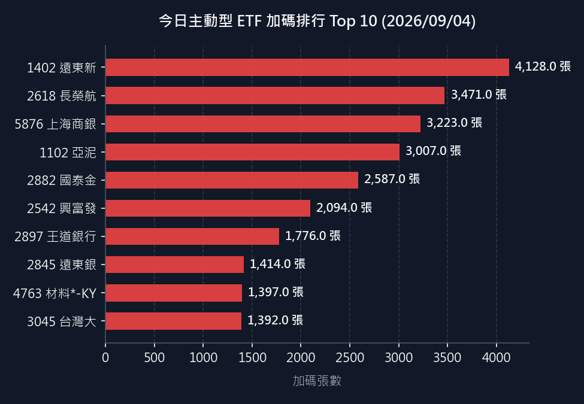
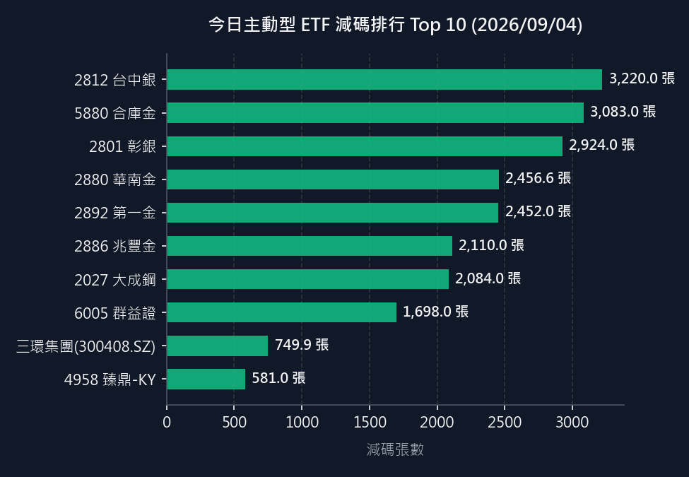

# 主動型 ETF 持股變動

資料來源：`主動型ETF持股明細.xlsx` 最近兩個日期分頁。

比較區間：`20260903` → `20260904`

## 今日加減碼視覺化排行

| 今日加碼 Top 10 | 今日減碼 Top 10 |
| :---: | :---: |
|  |  |

| ETF | 新增 | 刪除 | 比例變動 |
| :-- | --: | --: | --: |
| 00400A | 0 | 0 | 42 |
| 00401A | 0 | 1 | 49 |
| 00402A | 0 | 0 | 45 |
| 00403A | 0 | 1 | 37 |
| 00404A | 0 | 1 | 45 |
| 00405A | 0 | 0 | 32 |
| 00407A | 0 | 0 | 41 |
| 00408A | 2 | 0 | 42 |
| 00980A | 0 | 0 | 46 |
| 00980D | 0 | 0 | 6 |
| 00981A | 0 | 0 | 31 |
| 00982A | 0 | 0 | 0 |
| 00983A | 0 | 0 | 38 |
| 00983D | 0 | 0 | 5 |
| 00984A | 2 | 67 | 97 |
| 00985A | 1 | 1 | 40 |
| 00986A | 0 | 0 | 33 |
| 00987A | 1 | 0 | 25 |
| 00988A | 3 | 6 | 41 |
| 00989A | 0 | 0 | 59 |
| 00990A | 3 | 2 | 39 |
| 00991A | 0 | 0 | 20 |
| 00992A | 0 | 0 | 0 |
| 00993A | 1 | 0 | 42 |
| 00994A | 3 | 0 | 35 |
| 00995A | 0 | 0 | 45 |
| 00996A | 0 | 0 | 0 |
| 00997A | 1 | 0 | 46 |
| 00998A | 0 | 0 | 0 |
| 00999A | 0 | 0 | 47 |

## 00400A

### 新增持股

- 無

### 刪除持股

- 無

### 投資比例變動

- 1303 南亞：1.53% → 1.44%（-0.09）
- 2059 川湖：5.91% → 5.86%（-0.05）
- 2303 聯電：0.92% → 0.94%（+0.02）
- 2308 台達電：2.68% → 2.80%（+0.12）
- 2313 華通：0.96% → 0.95%（-0.01）
- 2317 鴻海：0.84% → 0.85%（+0.01）
- 2330 台積電：8.55% → 8.57%（+0.02）
- 2345 智邦：1.68% → 1.64%（-0.04）
- 2360 致茂：3.22% → 3.28%（+0.06）
- 2368 金像電：1.44% → 1.27%（-0.17）
- 2382 廣達：0.78% → 0.79%（+0.01）
- 2383 台光電：2.32% → 2.29%（-0.03）
- 2449 京元電子：0.94% → 0.90%（-0.04）
- 2454 聯發科：6.97% → 7.14%（+0.17）
- 2881 富邦金：1.54% → 1.61%（+0.07）
- 2885 元大金：1.45% → 1.50%（+0.05）
- 3008 大立光：4.17% → 3.92%（-0.25）
- 3017 奇鋐：3.86% → 4.13%（+0.27）
- 3026 禾伸堂：0.96% → 0.97%（+0.01）
- 3036 文曄：0.99% → 1.01%（+0.02）
- 3037 欣興：3.06% → 2.81%（-0.25）
- 3044 健鼎：1.80% → 1.74%（-0.06）
- 3081 聯亞：0.97% → 0.89%（-0.08）
- 3090 日電貿：0.35% → 0.36%（+0.01）
- 3167 大量：0.31% → 0.32%（+0.01）
- 3293 鈊象：0.33% → 0.32%（-0.01）
- 3374 精材：0.49% → 0.50%（+0.01）
- 3443 創意：3.88% → 3.80%（-0.08）
- 3529 力旺：1.01% → 1.00%（-0.01）
- 3653 健策：4.42% → 4.47%（+0.05）
- 3665 貿聯-KY：1.72% → 1.68%（-0.04）
- 3711 日月光投控：0.95% → 0.94%（-0.01）
- 5274 信驊：3.22% → 3.15%（-0.07）
- 6121 新普：0.25% → 0.24%（-0.01）
- 6187 萬潤：2.77% → 2.67%（-0.10）
- 6223 旺矽：4.37% → 4.22%（-0.15）
- 6274 台燿：1.93% → 1.85%（-0.08）
- 6442 光聖：1.01% → 0.98%（-0.03）
- 6488 環球晶：3.15% → 3.16%（+0.01）
- 6669 緯穎：5.97% → 5.82%（-0.15）
- 7750 新代：0.97% → 1.01%（+0.04）
- 7769 鴻勁：0.40% → 0.41%（+0.01）

## 00401A

### 新增持股

- 無

### 刪除持股

- 6415 矽力*-KY（0.22%，16 張）

### 投資比例變動

- 2059 川湖：1.24% → 1.22%（-0.02）
- 2308 台達電：3.17% → 3.26%（+0.09）
- 2313 華通：1.90% → 1.82%（-0.08）
- 2317 鴻海：0.63% → 0.62%（-0.01）
- 2327 國巨*：0.65% → 0.62%（-0.03）
- 2330 台積電：15.28% → 15.47%（+0.19）
- 2345 智邦：2.24% → 2.21%（-0.03）
- 2357 華碩：1.50% → 1.74%（+0.24）
- 2360 致茂：1.69% → 1.74%（+0.05）
- 2368 金像電：0.32% → 0.31%（-0.01）
- 2379 瑞昱：1.15% → 1.11%（-0.04）
- 2382 廣達：2.39% → 2.40%（+0.01）
- 2383 台光電：1.77% → 1.74%（-0.03）
- 2412 中華電：0.84% → 0.86%（+0.02）
- 2454 聯發科：6.57% → 6.74%（+0.17）
- 2455 全新：2.73% → 2.67%（-0.06）
- 2603 長榮：1.10% → 1.14%（+0.04）
- 2881 富邦金：2.07% → 2.15%（+0.08）
- 2882 國泰金：1.11% → 1.16%（+0.05）
- 2883 凱基金：1.69% → 1.72%（+0.03）
- 2884 玉山金：1.89% → 2.04%（+0.15）
- 2886 兆豐金：1.43% → 1.49%（+0.06）
- 2887 台新新光金：1.16% → 1.18%（+0.02）
- 2891 中信金：1.62% → 1.66%（+0.04）
- 2912 統一超：0.27% → 0.28%（+0.01）
- 3008 大立光：3.36% → 2.88%（-0.48）
- 3037 欣興：2.18% → 2.09%（-0.09）
- 3131 弘塑：0.79% → 0.78%（-0.01）
- 3231 緯創：0.38% → 0.53%（+0.15）
- 3491 昇達科：1.83% → 1.80%（-0.03）
- 3711 日月光投控：1.96% → 1.98%（+0.02）
- 4904 遠傳：0.79% → 0.81%（+0.02）
- 4958 臻鼎-KY：1.99% → 1.84%（-0.15）
- 4991 環宇-KY：1.17% → 1.08%（-0.09）
- 5274 信驊：2.13% → 2.17%（+0.04）
- 5347 世界：1.26% → 1.25%（-0.01）
- 5904 寶雅*：0.60% → 0.59%（-0.01）
- 6187 萬潤：0.78% → 0.76%（-0.02）
- 6223 旺矽：1.79% → 1.72%（-0.07）
- 6285 啟碁：1.52% → 1.46%（-0.06）
- 6510 精測：0.81% → 0.80%（-0.01）
- 6515 穎崴：1.18% → 1.19%（+0.01）
- 6531 愛普*：1.24% → 1.19%（-0.05）
- 6669 緯穎：2.54% → 2.44%（-0.10）
- 7769 鴻勁：1.66% → 1.73%（+0.07）
- 7828 創新服務：1.84% → 1.85%（+0.01）
- 8464 億豐：1.11% → 1.10%（-0.01）
- 台股期貨09/26(FITXN*1.TF)：0.00% → -0.05%（-0.05）
- 臺指選擇權09/26 44500 買權：-1.01% → -0.84%（+0.17）

## 00402A

### 新增持股

- 無

### 刪除持股

- 無

### 投資比例變動

- ADI.US Analog Devices：1.82% → 1.80%（-0.02）
- AMD.US AMD：4.71% → 4.66%（-0.05）
- AMZN.US Amazon：4.62% → 4.65%（+0.03）
- ANET.US Arista Networks：0.83% → 0.84%（+0.01）
- ARM.US Arm：0.95% → 0.97%（+0.02）
- ASML.US ASML Holding：1.69% → 1.63%（-0.06）
- AVGO.US Broadcom：2.28% → 2.19%（-0.09）
- AXON.US Axon Enterprise：0.97% → 1.02%（+0.05）
- BABA.US Alibaba Group：0.56% → 0.55%（-0.01）
- BKNG.US Booking Holdings：0.95% → 0.92%（-0.03）
- CDNS.US Cadence Design Systems：1.41% → 1.38%（-0.03）
- CIEN.US Ciena：1.03% → 0.92%（-0.11）
- CLS.US Celestica：0.81% → 0.89%（+0.08）
- COHR.US Coherent：1.85% → 1.80%（-0.05）
- CRWD.US CrowdStrike Holdings：1.43% → 1.49%（+0.06）
- DASH.US DoorDash：0.59% → 0.58%（-0.01）
- FSLY.US Fastly：0.32% → 0.33%（+0.01）
- GOOG.US Alphabet - Class C Capital Stock：3.15% → 3.17%（+0.02）
- GOOGL.US Alphabet - Class A Common Stock：3.59% → 3.61%（+0.02）
- INTC.US Intel：1.23% → 1.24%（+0.01）
- IOT.US Samsara：0.34% → 0.36%（+0.02）
- KLAC.US KLA：1.52% → 1.51%（-0.01）
- LITE.US Lumentum：1.83% → 1.76%（-0.07）
- LRCX.US Lam Research：2.64% → 2.66%（+0.02）
- MDB.US MongoDB：0.68% → 0.69%（+0.01）
- META.US Meta：2.97% → 3.03%（+0.06）
- MSFT.US Microsoft：5.31% → 5.40%（+0.09）
- MU.US Micron：6.53% → 6.48%（-0.05）
- NFLX.US Netflix：0.95% → 0.94%（-0.01）
- NOW.US ServiceNow：0.84% → 0.89%（+0.05）
- NVDA.US NVIDIA：8.91% → 8.95%（+0.04）
- PLTR.US Palantir Technologies：1.74% → 1.85%（+0.11）
- SHOP.US Shopify：0.90% → 0.92%（+0.02）
- SIMO.US Silicon Motion：0.76% → 0.74%（-0.02）
- SKHY.US SK hynix：1.09% → 1.08%（-0.01）
- SNOW.US Snowflake：1.21% → 1.40%（+0.19）
- SPCX.US SpaceX：0.76% → 0.80%（+0.04）
- STX.US Seagate：1.04% → 1.02%（-0.02）
- TER.US Teradyne：0.83% → 0.82%（-0.01）
- TSM.US TSMC(ADR)：1.49% → 1.48%（-0.01）
- TTWO.US Take-Two：0.70% → 0.69%（-0.01）
- TXN.US Texas Instruments：2.16% → 2.14%（-0.02）
- UBER.US Uber：0.52% → 0.51%（-0.01）
- V.US Visa：1.32% → 1.31%（-0.01）
- WDC.US Western Digital：2.27% → 2.21%（-0.06）

## 00403A

### 新增持股

- 無

### 刪除持股

- 4958 臻鼎-KY（0.00%，1 張）

### 投資比例變動

- 1303 南亞：2.00% → 1.90%（-0.10）
- 1560 中砂：0.13% → 0.14%（+0.01）
- 1717 長興：0.16% → 0.15%（-0.01）
- 2303 聯電：3.92% → 3.98%（+0.06）
- 2308 台達電：2.96% → 3.08%（+0.12）
- 2327 國巨*：2.69% → 2.61%（-0.08）
- 2330 台積電：15.59% → 15.99%（+0.40）
- 2344 華邦電：0.56% → 0.54%（-0.02）
- 2360 致茂：1.23% → 1.28%（+0.05）
- 2383 台光電：5.43% → 5.39%（-0.04）
- 2449 京元電子：0.29% → 0.28%（-0.01）
- 2454 聯發科：5.62% → 5.84%（+0.22）
- 2481 強茂：0.00% → 0.13%（+0.13）
- 2882 國泰金：0.08% → 0.29%（+0.21）
- 3008 大立光：3.94% → 3.69%（-0.25）
- 3017 奇鋐：6.49% → 6.62%（+0.13）
- 3037 欣興：5.13% → 4.98%（-0.15）
- 3189 景碩：1.79% → 1.68%（-0.11）
- 3211 順達：0.49% → 0.48%（-0.01）
- 3443 創意：2.39% → 2.40%（+0.01）
- 3450 聯鈞：0.41% → 0.39%（-0.02）
- 3653 健策：4.01% → 3.99%（-0.02）
- 3665 貿聯-KY：1.75% → 1.73%（-0.02）
- 3711 日月光投控：1.65% → 1.69%（+0.04）
- 4966 譜瑞-KY：0.08% → 0.01%（-0.07）
- 5274 信驊：2.09% → 2.39%（+0.30）
- 6223 旺矽：3.62% → 3.54%（-0.08）
- 6239 力成：0.93% → 0.94%（+0.01）
- 6274 台燿：1.67% → 1.63%（-0.04）
- 6442 光聖：0.25% → 0.39%（+0.14）
- 6488 環球晶：1.69% → 1.65%（-0.04）
- 6669 緯穎：3.39% → 3.29%（-0.10）
- 6805 富世達：1.12% → 0.87%（-0.25）
- 7769 鴻勁：0.46% → 0.49%（+0.03）
- 8046 南電：1.97% → 1.82%（-0.15）
- 8358 金居：0.13% → 0.12%（-0.01）
- 8996 高力：1.37% → 1.31%（-0.06）

## 00404A

### 新增持股

- 無

### 刪除持股

- 5871 中租-KY（0.04%，10.8 張）

### 投資比例變動

- 1303 南亞：0.79% → 0.74%（-0.05）
- 2059 川湖：1.65% → 1.63%（-0.02）
- 2301 光寶科：1.73% → 1.67%（-0.06）
- 2303 聯電：2.71% → 2.77%（+0.06）
- 2308 台達電：1.86% → 1.94%（+0.08）
- 2317 鴻海：0.71% → 0.72%（+0.01）
- 2330 台積電：21.90% → 21.87%（-0.03）
- 2345 智邦：0.77% → 0.74%（-0.03）
- 2351 順德：0.55% → 0.57%（+0.02）
- 2360 致茂：0.65% → 0.66%（+0.01）
- 2379 瑞昱：2.17% → 2.06%（-0.11）
- 2382 廣達：2.24% → 2.27%（+0.03）
- 2383 台光電：2.92% → 2.87%（-0.05）
- 2395 研華：1.57% → 1.59%（+0.02）
- 2428 興勤：1.16% → 1.20%（+0.04）
- 2439 美律：0.99% → 0.98%（-0.01）
- 2441 超豐：1.82% → 1.80%（-0.02）
- 2454 聯發科：6.56% → 6.70%（+0.14）
- 2458 義隆：1.66% → 1.60%（-0.06）
- 2637 慧洋-KY：1.18% → 1.21%（+0.03）
- 2845 遠東銀：1.71% → 1.78%（+0.07）
- 2885 元大金：2.14% → 2.21%（+0.07）
- 2890 永豐金：1.04% → 1.05%（+0.01）
- 3017 奇鋐：1.09% → 1.16%（+0.07）
- 3034 聯詠：2.07% → 1.98%（-0.09）
- 3037 欣興：0.67% → 0.61%（-0.06）
- 3135 凌航：1.58% → 1.54%（-0.04）
- 3260 威剛：1.33% → 1.27%（-0.06）
- 3264 欣銓：1.31% → 1.26%（-0.05）
- 3293 鈊象：0.49% → 0.48%（-0.01）
- 3443 創意：0.53% → 0.51%（-0.02）
- 3702 大聯大：1.62% → 1.63%（+0.01）
- 3711 日月光投控：3.44% → 3.40%（-0.04）
- 4763 材料*-KY：1.80% → 1.74%（-0.06）
- 5274 信驊：2.56% → 2.49%（-0.07）
- 5434 崇越：1.66% → 1.65%（-0.01）
- 5904 寶雅*：0.51% → 0.49%（-0.02）
- 6139 亞翔：1.68% → 1.69%（+0.01）
- 6196 帆宣：1.75% → 1.81%（+0.06）
- 6223 旺矽：1.03% → 0.99%（-0.04）
- 6257 矽格：0.24% → 0.23%（-0.01）
- 6491 晶碩：0.54% → 0.52%（-0.02）
- 8081 致新：0.88% → 0.85%（-0.03）
- 8271 宇瞻：0.25% → 0.24%（-0.01）
- 台指選擇權09/26 47500 買權：-0.15% → -0.17%（-0.02）

## 00405A

### 新增持股

- 無

### 刪除持股

- 無

### 投資比例變動

- 1590 亞德客-KY：0.00% → 0.01%（+0.01）
- 2303 聯電：0.03% → 0.04%（+0.01）
- 2308 台達電：0.58% → 0.61%（+0.03）
- 2330 台積電：1.52% → 1.57%（+0.05）
- 2345 智邦：4.03% → 4.06%（+0.03）
- 2368 金像電：4.72% → 4.55%（-0.17）
- 2383 台光電：4.11% → 4.12%（+0.01）
- 2454 聯發科：7.31% → 7.65%（+0.34）
- 3017 奇鋐：6.58% → 6.76%（+0.18）
- 3037 欣興：5.44% → 5.32%（-0.12）
- 3081 聯亞：1.91% → 1.81%（-0.10）
- 3131 弘塑：1.30% → 1.32%（+0.02）
- 3443 創意：7.64% → 7.75%（+0.11）
- 3450 聯鈞：1.39% → 1.32%（-0.07）
- 3653 健策：6.37% → 6.39%（+0.02）
- 3665 貿聯-KY：5.14% → 5.13%（-0.01）
- 4749 新應材：0.27% → 0.26%（-0.01）
- 4991 環宇-KY：2.26% → 2.13%（-0.13）
- 5274 信驊：3.43% → 3.56%（+0.13）
- 6223 旺矽：5.14% → 5.06%（-0.08）
- 6274 台燿：1.54% → 1.51%（-0.03）
- 6278 台表科：0.99% → 0.98%（-0.01）
- 6285 啟碁：0.35% → 0.34%（-0.01）
- 6488 環球晶：0.38% → 0.37%（-0.01）
- 6510 精測：3.00% → 3.01%（+0.01）
- 6515 穎崴：0.58% → 0.59%（+0.01）
- 6531 愛普*：2.56% → 2.51%（-0.05）
- 6669 緯穎：1.39% → 1.36%（-0.03）
- 6805 富世達：2.04% → 2.08%（+0.04）
- 7769 鴻勁：2.44% → 2.59%（+0.15）
- 8046 南電：3.16% → 2.93%（-0.23）
- 8996 高力：1.27% → 1.23%（-0.04）

## 00407A

### 新增持股

- 無

### 刪除持股

- 無

### 投資比例變動

- 1303 南亞：0.73% → 0.70%（-0.03）
- 1560 中砂：0.48% → 0.75%（+0.27）
- 2059 川湖：3.59% → 3.63%（+0.04）
- 2301 光寶科：1.15% → 1.59%（+0.44）
- 2303 聯電：0.49% → 0.51%（+0.02）
- 2308 台達電：3.63% → 3.88%（+0.25）
- 2327 國巨*：2.13% → 2.24%（+0.11）
- 2330 台積電：8.71% → 8.90%（+0.19）
- 2345 智邦：2.89% → 2.87%（-0.02）
- 2360 致茂：1.94% → 2.02%（+0.08）
- 2368 金像電：2.33% → 1.27%（-1.06）
- 2383 台光電：5.39% → 5.42%（+0.03）
- 2395 研華：2.07% → 2.15%（+0.08）
- 2408 南亞科：1.19% → 0.94%（-0.25）
- 2451 創見：0.33% → 0.32%（-0.01）
- 2454 聯發科：5.06% → 5.28%（+0.22）
- 2615 萬海：0.67% → 0.69%（+0.02）
- 3008 大立光：2.42% → 2.32%（-0.10）
- 3017 奇鋐：5.47% → 5.96%（+0.49）
- 3034 聯詠：0.72% → 0.70%（-0.02）
- 3037 欣興：4.70% → 4.40%（-0.30）
- 3081 聯亞：1.71% → 1.61%（-0.10）
- 3293 鈊象：0.53% → 0.54%（+0.01）
- 3443 創意：3.54% → 3.52%（-0.02）
- 3491 昇達科：0.49% → 0.91%（+0.42）
- 3653 健策：2.08% → 2.60%（+0.52）
- 3711 日月光投控：2.47% → 2.49%（+0.02）
- 4958 臻鼎-KY：1.92% → 0.86%（-1.06）
- 5274 信驊：2.26% → 2.25%（-0.01）
- 5289 宜鼎：0.35% → 0.34%（-0.01）
- 5434 崇越：0.19% → 0.20%（+0.01）
- 6187 萬潤：1.04% → 1.02%（-0.02）
- 6223 旺矽：2.68% → 2.64%（-0.04）
- 6274 台燿：3.34% → 3.27%（-0.07）
- 6510 精測：0.16% → 0.64%（+0.48）
- 6531 愛普*：0.33% → 0.31%（-0.02）
- 6669 緯穎：5.87% → 5.83%（-0.04）
- 6805 富世達：2.65% → 2.80%（+0.15）
- 8046 南電：2.74% → 1.59%（-1.15）
- 8210 勤誠：0.92% → 0.95%（+0.03）
- 8996 高力：1.72% → 1.78%（+0.06）

## 00408A

### 新增持股

- 2882 國泰金（0.33%，45 張）
- 6515 穎崴（0.46%，1 張）

### 刪除持股

- 無

### 投資比例變動

- 1303 南亞：3.04% → 2.89%（-0.15）
- 2059 川湖：2.67% → 2.64%（-0.03）
- 2308 台達電：2.11% → 2.19%（+0.08）
- 2317 鴻海：1.93% → 1.95%（+0.02）
- 2330 台積電：4.74% → 4.85%（+0.11）
- 2344 華邦電：0.46% → 0.44%（-0.02）
- 2357 華碩：2.78% → 2.73%（-0.05）
- 2368 金像電：3.46% → 3.31%（-0.15）
- 2376 技嘉：1.27% → 1.26%（-0.01）
- 2382 廣達：0.86% → 0.88%（+0.02）
- 2383 台光電：3.49% → 3.46%（-0.03）
- 2395 研華：1.95% → 1.94%（-0.01）
- 2408 南亞科：1.66% → 0.94%（-0.72）
- 2449 京元電子：0.52% → 0.51%（-0.01）
- 2454 聯發科：2.74% → 2.84%（+0.10）
- 2481 強茂：0.91% → 0.98%（+0.07）
- 2801 彰銀：1.01% → 1.45%（+0.44）
- 2880 華南金：1.81% → 1.87%（+0.06）
- 2886 兆豐金：2.73% → 2.87%（+0.14）
- 2891 中信金：1.02% → 1.06%（+0.04）
- 3017 奇鋐：5.52% → 5.62%（+0.10）
- 3037 欣興：2.87% → 2.06%（-0.81）
- 3045 台灣大：2.90% → 3.01%（+0.11）
- 3081 聯亞：1.09% → 1.02%（-0.07）
- 3189 景碩：1.47% → 1.37%（-0.10）
- 3231 緯創：1.07% → 1.60%（+0.53）
- 3491 昇達科：0.65% → 0.64%（-0.01）
- 3653 健策：2.22% → 2.21%（-0.01）
- 5434 崇越：1.99% → 2.00%（+0.01）
- 6187 萬潤：1.29% → 1.28%（-0.01）
- 6223 旺矽：1.36% → 1.32%（-0.04）
- 6239 力成：1.19% → 1.21%（+0.02）
- 6274 台燿：2.53% → 2.29%（-0.24）
- 6488 環球晶：0.93% → 0.91%（-0.02）
- 6669 緯穎：6.74% → 6.56%（-0.18）
- 6805 富世達：1.22% → 1.23%（+0.01）
- 7769 鴻勁：1.65% → 1.73%（+0.08）
- 8046 南電：1.62% → 1.13%（-0.49）
- 8436 大江：2.66% → 2.67%（+0.01）
- 8996 高力：1.05% → 1.01%（-0.04）
- 9802 鈺齊-KY：0.51% → 1.09%（+0.58）
- 9941 裕融：3.56% → 3.57%（+0.01）

## 00980A

### 新增持股

- 無

### 刪除持股

- 無

### 投資比例變動

- 1303 南亞：2.86% → 2.73%（-0.13）
- 2059 川湖：5.54% → 5.56%（+0.02）
- 2308 台達電：3.49% → 3.70%（+0.21）
- 2317 鴻海：2.41% → 2.47%（+0.06）
- 2327 國巨*：1.60% → 1.68%（+0.08）
- 2330 台積電：8.97% → 9.10%（+0.13）
- 2344 華邦電：2.05% → 2.00%（-0.05）
- 2345 智邦：1.86% → 1.83%（-0.03）
- 2360 致茂：1.46% → 1.51%（+0.05）
- 2368 金像電：2.31% → 2.06%（-0.25）
- 2376 技嘉：1.25% → 1.26%（+0.01）
- 2382 廣達：1.66% → 1.71%（+0.05）
- 2383 台光電：3.70% → 3.69%（-0.01）
- 2408 南亞科：2.83% → 2.73%（-0.10）
- 2454 聯發科：5.31% → 5.51%（+0.20）
- 2884 玉山金：1.28% → 1.38%（+0.10）
- 2891 中信金：1.50% → 1.55%（+0.05）
- 3008 大立光：1.01% → 0.96%（-0.05）
- 3017 奇鋐：2.21% → 2.40%（+0.19）
- 3026 禾伸堂：0.46% → 0.47%（+0.01）
- 3036 文曄：1.07% → 1.11%（+0.04）
- 3037 欣興：2.73% → 2.55%（-0.18）
- 3044 健鼎：0.86% → 0.85%（-0.01）
- 3081 聯亞：3.87% → 3.63%（-0.24）
- 3189 景碩：0.78% → 0.76%（-0.02）
- 3231 緯創：0.96% → 1.03%（+0.07）
- 3264 欣銓：0.76% → 0.74%（-0.02）
- 3293 鈊象：0.89% → 0.90%（+0.01）
- 3443 創意：1.74% → 1.72%（-0.02）
- 3653 健策：1.99% → 2.03%（+0.04）
- 4958 臻鼎-KY：1.17% → 1.07%（-0.10）
- 5274 信驊：1.62% → 1.60%（-0.02）
- 5904 寶雅*：1.14% → 1.13%（-0.01）
- 6213 聯茂：1.29% → 1.25%（-0.04）
- 6223 旺矽：1.90% → 1.86%（-0.04）
- 6274 台燿：1.47% → 1.43%（-0.04）
- 6442 光聖：0.34% → 0.33%（-0.01）
- 6515 穎崴：1.94% → 1.95%（+0.01）
- 6669 緯穎：2.02% → 2.00%（-0.02）
- 6805 富世達：0.57% → 0.60%（+0.03）
- 7769 鴻勁：2.08% → 2.19%（+0.11）
- 8046 南電：1.22% → 1.07%（-0.15）
- 8210 勤誠：0.93% → 0.95%（+0.02）
- 8299 群聯：2.03% → 1.99%（-0.04）
- 8996 高力：1.14% → 1.18%（+0.04）
- 台灣證交所加權股價指數(FITXN*1.TF)：4.06% → 4.12%（+0.06）

## 00980D

### 新增持股

- 無

### 刪除持股

- 無

### 投資比例變動

- HERTZ CORP/THE SER REGS (REG S) 12.625% 15JUL2029：0.29% → 0.28%（-0.01）
- LINCOLN NATIONAL CORP (REG) 7.000000 % 15JUN2040：0.44% → 0.45%（+0.01）
- US 10YR NOTE (CBT)DEC26 21-DEC-2026：17.36% → 17.38%（+0.02）
- US 5YR NOTE (CBT) DEC26 31-DEC-2026：-13.94% → -13.95%（-0.01）
- US LONG BOND(CBT) DEC26 21-DEC-2026：5.22% → 5.23%（+0.01）
- VIACOM INC (REG) 5.85% 01SEP2043：0.55% → 0.56%（+0.01）

## 00981A

### 新增持股

- 無

### 刪除持股

- 無

### 投資比例變動

- 2002 中鋼：0.04% → 0.03%（-0.01）
- 2303 聯電：4.05% → 4.09%（+0.04）
- 2308 台達電：4.63% → 4.67%（+0.04）
- 2327 國巨*：4.64% → 4.96%（+0.32）
- 2330 台積電：9.56% → 9.38%（-0.18）
- 2345 智邦：4.91% → 4.80%（-0.11）
- 2368 金像電：0.09% → 0.08%（-0.01）
- 2383 台光電：9.12% → 9.09%（-0.03）
- 2449 京元電子：1.21% → 1.19%（-0.02）
- 2454 聯發科：8.02% → 7.94%（-0.08）
- 3017 奇鋐：7.13% → 7.51%（+0.38）
- 3037 欣興：6.80% → 6.47%（-0.33）
- 3264 欣銓：0.41% → 0.40%（-0.01）
- 3443 創意：0.78% → 0.76%（-0.02）
- 3653 健策：4.95% → 5.08%（+0.13）
- 3665 貿聯-KY：3.50% → 3.48%（-0.02）
- 3711 日月光投控：3.60% → 3.49%（-0.11）
- 4958 臻鼎-KY：0.36% → 0.35%（-0.01）
- 4979 華星光：0.45% → 0.49%（+0.04）
- 5274 信驊：1.35% → 1.28%（-0.07）
- 6223 旺矽：4.54% → 4.51%（-0.03）
- 6271 同欣電：0.17% → 0.19%（+0.02）
- 6274 台燿：2.64% → 2.60%（-0.04）
- 6510 精測：0.68% → 0.66%（-0.02）
- 6515 穎崴：0.14% → 0.24%（+0.10）
- 6669 緯穎：5.83% → 5.88%（+0.05）
- 6805 富世達：1.32% → 1.35%（+0.03）
- 8046 南電：3.70% → 3.51%（-0.19）
- 8210 勤誠：0.84% → 0.85%（+0.01）
- 8996 高力：0.56% → 0.60%（+0.04）
- 台指期貨 2026/09(FITXN*1.TF)：2.26% → 2.24%（-0.02）

## 00982A

### 新增持股

- 無

### 刪除持股

- 無

### 投資比例變動

- 無

## 00983A

### 新增持股

- 無

### 刪除持股

- 無

### 投資比例變動

- ACHR.US Archer：0.71% → 0.70%（-0.01）
- AMD.US AMD：3.23% → 2.96%（-0.27）
- AMZN.US Amazon：2.45% → 2.39%（-0.06）
- AVGO.US Broadcom：0.59% → 0.55%（-0.04）
- BEAM.US Beam Therapeutics：2.10% → 2.04%（-0.06）
- BLSH.US Bullish：1.96% → 2.09%（+0.13）
- BMNR.US BitMine：1.96% → 2.16%（+0.20）
- CERS.US Cerus：0.50% → 0.32%（-0.18）
- COIN.US Coinbase：4.02% → 4.25%（+0.23）
- CRCL.US Circle：4.79% → 5.36%（+0.57）
- CRSP.US CRISPR Therapeutics：4.38% → 4.18%（-0.20）
- CRWV.US CoreWeave：1.20% → 1.11%（-0.09）
- DE.US Deere：1.42% → 1.35%（-0.07）
- FIG.US Figma：0.50% → 0.47%（-0.03）
- GOOG.US Alphabet - Class C Capital Stock：1.37% → 1.34%（-0.03）
- GOOGL.US Alphabet - Class A Common Stock：0.77% → 0.75%（-0.02）
- HOOD.US Robinhood Markets：4.57% → 5.12%（+0.55）
- KTOS.US Kratos Defense & Security：1.00% → 0.87%（-0.13）
- LLY.US Eli Lilly：1.04% → 1.00%（-0.04）
- META.US Meta：0.59% → 0.58%（-0.01）
- NTLA.US Intellia Therapeutics：1.20% → 1.15%（-0.05）
- NTRA.US Natera：1.95% → 1.89%（-0.06）
- NVDA.US NVIDIA：1.90% → 1.86%（-0.04）
- PLTR.US Palantir Technologies：3.69% → 3.83%（+0.14）
- RXRX.US Recursion Pharmaceuticals：0.36% → 0.35%（-0.01）
- SHOP.US Shopify：6.34% → 6.27%（-0.07）
- SNOW.US Snowflake：1.64% → 1.84%（+0.20）
- SPCX.US SpaceX：5.12% → 5.24%（+0.12）
- TEM.US Tempus：5.69% → 5.71%（+0.02）
- TER.US Teradyne：0.52% → 0.50%（-0.02）
- TSLA.US Tesla：9.30% → 9.34%（+0.04）
- TSM.US TSMC(ADR)：2.28% → 2.20%（-0.08）
- TWST.US Twist Bioscience：4.52% → 4.27%（-0.25）
- TXG.US 10x Genomics：4.26% → 4.20%（-0.06）
- VCYT.US Veracyte：0.29% → 0.27%（-0.02）
- WGS.US GeneDx：1.34% → 1.30%（-0.04）
- XE.US X-Energy：0.85% → 0.81%（-0.04）
- XYZ.US Block：2.09% → 2.03%（-0.06）

## 00983D

### 新增持股

- 無

### 刪除持股

- 無

### 投資比例變動

- ATH 6 5/8 05/19/55：0.99% → 0.98%（-0.01）
- CP 7 1/8 10/15/31：0.80% → 0.81%（+0.01）
- CRWV 9 02/01/31：0.80% → 0.81%（+0.01）
- HAL 7.45 09/15/39：1.78% → 1.79%（+0.01）
- RAKUTN 11 1/4 02/15/27：1.78% → 1.77%（-0.01）

## 00984A

### 新增持股

- 2455 全新（0.76%，144 張）
- 3234 光環（0.77%，372 張）

### 刪除持股

- 1419 新紡（0.05%，70 張）
- 1477 聚陽（0.38%，196 張）
- 1714 和桐（0.31%，1789 張）
- 1736 喬山（0.32%，259 張）
- 2015 豐興（0.04%，60 張）
- 2049 上銀（0.29%，82 張）
- 2105 正新（0.13%，420 張）
- 2201 裕隆（0.13%，417 張）
- 2317 鴻海（0.68%，274 張）
- 2324 仁寶（0.30%，752 張）
- 2345 智邦（0.38%，18 張）
- 2347 聯強（0.47%，541 張）
- 2353 宏碁（0.04%，129 張）
- 2360 致茂（0.41%，21 張）
- 2371 大同（0.05%，161 張）
- 2375 凱美（0.12%，100 張）
- 2376 技嘉（0.27%，76 張）
- 2377 微星（0.22%，145 張）
- 2385 群光（0.04%，37 張）
- 2393 億光（0.13%，202 張）
- 2409 友達（0.29%，1122 張）
- 2412 中華電（0.43%，314 張）
- 2441 超豐（0.56%，489 張）
- 2472 立隆電（0.11%，53 張）
- 2474 可成（0.19%，91 張）
- 2476 鉅祥（0.13%，103 張）
- 2535 達欣工（0.11%，121 張）
- 2606 裕民（0.05%，63 張）
- 2834 臺企銀（0.72%，4216.94 張）
- 2880 華南金（1.05%，2456.63 張）
- 2882 國泰金（0.42%，388 張）
- 2886 兆豐金（1.03%，2110 張）
- 2891 中信金（0.38%，577 張）
- 2892 第一金（0.88%，2452 張）
- 3005 神基（0.04%，34 張）
- 3023 信邦（0.60%，183 張）
- 3033 威健（0.12%，265 張）
- 3034 聯詠（0.37%，68 張）
- 3036 文曄（0.23%，126 張）
- 3533 嘉澤（0.61%，36 張）
- 3702 大聯大（0.22%，221 張）
- 4764 雙鍵（0.25%，104 張）
- 4904 遠傳（0.24%，236 張）
- 4938 和碩（0.33%，365 張）
- 4966 譜瑞-KY（0.43%，74 張）
- 5288 豐祥-KY（0.12%，64 張）
- 5434 崇越（0.15%，29 張）
- 5483 中美晶（0.21%，118 張）
- 5536 聖暉*（0.22%，27 張）
- 5903 全家（0.02%，13 張）
- 6121 新普（0.04%，11 張）
- 6196 帆宣（0.54%，111 張）
- 6197 佳必琪（0.28%，91 張）
- 6202 盛群（0.13%，220 張）
- 6257 矽格（0.36%，166 張）
- 6282 康舒（0.12%，276 張）
- 6285 啟碁（0.27%，112 張）
- 6469 大樹（0.11%，163.971 張）
- 6491 晶碩（0.14%，36 張）
- 6944 兆聯實業（0.51%，72 張）
- 7734 印能科技（0.22%，8 張）
- 7769 鴻勁（0.57%，10 張）
- 8210 勤誠（0.11%，11 張）
- 8271 宇瞻（0.27%，122 張）
- 8436 大江（0.12%，103 張）
- 9914 美利達（0.12%，153 張）
- 9938 百和（0.11%，274 張）

### 投資比例變動

- 1102 亞泥：0.74% → 1.81%（+1.07）
- 1229 聯華：0.29% → 0.71%（+0.42）
- 1303 南亞：2.69% → 2.41%（-0.28）
- 1326 台化：1.35% → 1.39%（+0.04）
- 1402 遠東新：0.84% → 2.06%（+1.22）
- 1409 新纖：0.64% → 0.67%（+0.03）
- 1560 中砂：0.59% → 0.51%（-0.08）
- 1795 美時：0.04% → 0.00%（-0.04）
- 1808 潤隆：0.17% → 0.40%（+0.23）
- 1907 永豐餘：0.44% → 0.38%（-0.06）
- 2006 東和鋼鐵：0.59% → 1.29%（+0.70）
- 2059 川湖：4.30% → 2.92%（-1.38）
- 2301 光寶科：0.58% → 1.38%（+0.80）
- 2303 聯電：1.14% → 0.89%（-0.25）
- 2313 華通：0.07% → 0.17%（+0.10）
- 2330 台積電：3.69% → 3.90%（+0.21）
- 2344 華邦電：0.59% → 1.40%（+0.81）
- 2351 順德：0.48% → 0.67%（+0.19）
- 2357 華碩：0.85% → 0.70%（-0.15）
- 2379 瑞昱：1.10% → 2.59%（+1.49）
- 2383 台光電：1.84% → 1.96%（+0.12）
- 2395 研華：0.56% → 1.42%（+0.86）
- 2404 漢唐：0.72% → 0.39%（-0.33）
- 2408 南亞科：2.12% → 2.20%（+0.08）
- 2454 聯發科：1.70% → 0.27%（-1.43）
- 2464 盟立：0.97% → 1.28%（+0.31）
- 2467 志聖：0.55% → 1.34%（+0.79）
- 2520 冠德：0.16% → 0.40%（+0.24）
- 2542 興富發：0.70% → 1.74%（+1.04）
- 2546 根基：0.11% → 0.02%（-0.09）
- 2603 長榮：1.94% → 3.57%（+1.63）
- 2615 萬海：0.27% → 0.68%（+0.41）
- 2618 長榮航：1.02% → 2.53%（+1.51）
- 2633 台灣高鐵：0.62% → 0.80%（+0.18）
- 2801 彰銀：0.85% → 0.04%（-0.81）
- 2812 台中銀：0.67% → 0.05%（-0.62）
- 2845 遠東銀：0.55% → 0.78%（+0.23）
- 2850 新產：0.16% → 0.39%（+0.23）
- 2851 中再保：0.16% → 0.40%（+0.24）
- 2885 元大金：0.40% → 0.03%（-0.37）
- 2897 王道銀行：0.13% → 0.33%（+0.20）
- 2903 遠百：0.16% → 0.40%（+0.24）
- 3006 晶豪科：0.27% → 0.66%（+0.39）
- 3008 大立光：2.95% → 2.82%（-0.13）
- 3017 奇鋐：0.62% → 1.58%（+0.96）
- 3037 欣興：1.05% → 1.61%（+0.56）
- 3044 健鼎：0.27% → 0.66%（+0.39）
- 3045 台灣大：1.13% → 2.81%（+1.68）
- 3189 景碩：1.56% → 1.44%（-0.12）
- 3260 威剛：0.28% → 0.66%（+0.38）
- 3264 欣銓：0.92% → 1.82%（+0.90）
- 3374 精材：0.28% → 0.29%（+0.01）
- 3443 創意：0.47% → 0.82%（+0.35）
- 3450 聯鈞：1.09% → 1.06%（-0.03）
- 3532 台勝科：0.28% → 0.71%（+0.43）
- 3653 健策：0.40% → 1.12%（+0.72）
- 3661 世芯-KY：0.08% → 0.30%（+0.22）
- 3665 貿聯-KY：0.28% → 0.69%（+0.41）
- 3711 日月光投控：1.16% → 1.22%（+0.06）
- 4123 晟德：0.10% → 0.01%（-0.09）
- 4763 材料*-KY：0.50% → 1.20%（+0.70）
- 4958 臻鼎-KY：0.80% → 0.54%（-0.26）
- 4967 十銓：0.28% → 0.69%（+0.41）
- 5274 信驊：0.56% → 0.21%（-0.35）
- 5289 宜鼎：0.50% → 0.02%（-0.48）
- 5306 桂盟：0.05% → 0.11%（+0.06）
- 5351 鈺創：0.78% → 0.66%（-0.12）
- 5534 長虹：0.30% → 0.39%（+0.09）
- 5871 中租-KY：0.90% → 2.14%（+1.24）
- 5876 上海商銀：1.02% → 2.55%（+1.53）
- 5880 合庫金：0.84% → 0.04%（-0.80）
- 5904 寶雅*：0.85% → 0.65%（-0.20）
- 6005 群益證：0.68% → 0.15%（-0.53）
- 6139 亞翔：2.56% → 2.14%（-0.42）
- 6173 信昌電：0.17% → 0.42%（+0.25）
- 6177 達麗：0.16% → 0.41%（+0.25）
- 6187 萬潤：0.90% → 2.16%（+1.26）
- 6213 聯茂：1.69% → 1.29%（-0.40）
- 6214 精誠：0.28% → 0.68%（+0.40）
- 6223 旺矽：0.63% → 0.16%（-0.47）
- 6274 台燿：0.36% → 0.10%（-0.26）
- 6426 統新：0.16% → 0.41%（+0.25）
- 6446 藥華藥：2.34% → 2.37%（+0.03）
- 6531 愛普*：0.01% → 0.04%（+0.03）
- 6548 長科*：1.29% → 1.52%（+0.23）
- 6584 南俊國際：0.40% → 0.95%（+0.55）
- 6592 和潤企業：0.10% → 0.24%（+0.14）
- 6669 緯穎：1.16% → 1.82%（+0.66）
- 6670 復盛應用：0.20% → 0.38%（+0.18）
- 7750 新代：0.25% → 0.70%（+0.45）
- 7780 大研生醫*：0.05% → 0.12%（+0.07）
- 8021 尖點：0.29% → 0.65%（+0.36）
- 8039 台虹：0.82% → 0.63%（-0.19）
- 8046 南電：0.91% → 1.15%（+0.24）
- 8415 大國鋼：0.14% → 0.24%（+0.10）
- 9802 鈺齊-KY：0.13% → 0.32%（+0.19）
- 9933 中鼎：0.16% → 0.40%（+0.24）

## 00985A

### 新增持股

- 2377 微星（1.86%，1213 張）

### 刪除持股

- 4958 臻鼎-KY（0.21%，46 張）

### 投資比例變動

- 1216 統一：1.21% → 1.19%（-0.02）
- 1301 台塑：0.70% → 0.69%（-0.01）
- 2027 大成鋼：2.03% → 1.00%（-1.03）
- 2303 聯電：0.97% → 0.99%（+0.02）
- 2308 台達電：1.78% → 1.82%（+0.04）
- 2317 鴻海：1.50% → 2.48%（+0.98）
- 2327 國巨*：1.46% → 1.58%（+0.12）
- 2330 台積電：13.57% → 13.47%（-0.10）
- 2345 智邦：1.96% → 1.94%（-0.02）
- 2360 致茂：0.84% → 0.83%（-0.01）
- 2368 金像電：0.20% → 0.01%（-0.19）
- 2376 技嘉：4.11% → 4.17%（+0.06）
- 2383 台光電：2.66% → 2.68%（+0.02）
- 2395 研華：2.04% → 3.00%（+0.96）
- 2408 南亞科：0.48% → 0.49%（+0.01）
- 2412 中華電：3.77% → 3.70%（-0.07）
- 2603 長榮：1.67% → 1.61%（-0.06）
- 2610 華航：1.74% → 1.71%（-0.03）
- 2881 富邦金：1.42% → 1.44%（+0.02）
- 3017 奇鋐：1.66% → 1.76%（+0.10）
- 3036 文曄：0.05% → 0.00%（-0.05）
- 3037 欣興：2.25% → 2.16%（-0.09）
- 3105 穩懋：0.87% → 0.01%（-0.86）
- 3491 昇達科：1.45% → 1.53%（+0.08）
- 3653 健策：0.98% → 1.00%（+0.02）
- 3661 世芯-KY：2.07% → 2.13%（+0.06）
- 3665 貿聯-KY：1.91% → 1.92%（+0.01）
- 3711 日月光投控：4.01% → 3.95%（-0.06）
- 4904 遠傳：3.83% → 3.79%（-0.04）
- 6147 頎邦：0.94% → 0.90%（-0.04）
- 6187 萬潤：0.97% → 0.95%（-0.02）
- 6442 光聖：2.39% → 2.33%（-0.06）
- 6446 藥華藥：1.80% → 1.72%（-0.08）
- 6488 環球晶：1.28% → 1.33%（+0.05）
- 6669 緯穎：3.99% → 2.78%（-1.21）
- 7750 新代：1.95% → 2.11%（+0.16）
- 8046 南電：1.30% → 1.25%（-0.05）
- 8299 群聯：0.17% → 0.02%（-0.15）
- 8996 高力：0.87% → 0.94%（+0.07）
- 台積電期貨(FICDFN*1.TF)：5.08% → 5.04%（-0.04）

## 00986A

### 新增持股

- 無

### 刪除持股

- 無

### 投資比例變動

- 2330 台積電：8.83% → 8.54%（-0.29）
- 2454 聯發科：1.56% → 1.55%（-0.01）
- AMAT.US Applied Materials：1.77% → 1.73%（-0.04）
- AMD.US AMD：3.68% → 3.63%（-0.05）
- AMZN.US Amazon：4.09% → 4.12%（+0.03）
- AVGO.US Broadcom：3.81% → 3.65%（-0.16）
- COHR.US Coherent：2.03% → 1.95%（-0.08）
- CRDO.US Credo：0.59% → 0.47%（-0.12）
- CRWD.US CrowdStrike Holdings：3.69% → 3.66%（-0.03）
- DDOG.US Datadog：0.64% → 0.61%（-0.03）
- ETN.US Eaton：2.24% → 2.26%（+0.02）
- GEV.US GE Vernova：2.57% → 2.68%（+0.11）
- GOOGL.US Alphabet - Class A Common Stock：5.76% → 5.84%（+0.08）
- GS.US Goldman Sachs：3.16% → 3.24%（+0.08）
- HOOD.US Robinhood Markets：0.44% → 0.53%（+0.09）
- HWM.US Howmet Aerospace：2.48% → 2.52%（+0.04）
- JPM.US JPMorgan Chase：1.93% → 1.95%（+0.02）
- LITE.US Lumentum：3.88% → 3.76%（-0.12）
- LLY.US Eli Lilly：2.99% → 2.96%（-0.03）
- MSFT.US Microsoft：2.87% → 2.90%（+0.03）
- MU.US Micron：4.28% → 4.36%（+0.08）
- MUFG(8306.JP)：1.59% → 1.63%（+0.04）
- Murata Mfg.(6981.JP)：1.83% → 1.75%（-0.08）
- NET.US Cloudflare：1.96% → 1.94%（-0.02）
- NVDA.US NVIDIA：6.23% → 6.49%（+0.26）
- SNDK.US Sandisk：1.76% → 1.77%（+0.01）
- SNOW.US Snowflake：2.01% → 2.23%（+0.22）
- Siemens Energy AG：2.06% → 2.11%（+0.05）
- TSEM.US Tower Semiconductor：0.85% → 0.88%（+0.03）
- 嘉能可公司：1.85% → 1.86%（+0.01）
- 施奈德電機公司：1.72% → 1.71%（-0.01）
- 艾司摩爾控股公司：0.95% → 0.94%（-0.01）
- 英飛凌科技股份有限公司：2.95% → 2.93%（-0.02）

## 00987A

### 新增持股

- 4991 環宇-KY（1.37%，71 張）

### 刪除持股

- 無

### 投資比例變動

- 2308 台達電：1.87% → 1.96%（+0.09）
- 2330 台積電：8.28% → 8.55%（+0.27）
- 2345 智邦：2.31% → 2.33%（+0.02）
- 2383 台光電：6.09% → 6.10%（+0.01）
- 2408 南亞科：3.34% → 2.41%（-0.93）
- 2454 聯發科：5.28% → 5.52%（+0.24）
- 2455 全新：4.29% → 4.28%（-0.01）
- 3017 奇鋐：7.41% → 7.61%（+0.20）
- 3037 欣興：6.23% → 6.09%（-0.14）
- 3081 聯亞：3.90% → 3.70%（-0.20）
- 3363 上詮：2.79% → 2.85%（+0.06）
- 3443 創意：4.55% → 4.61%（+0.06）
- 3653 健策：4.01% → 4.02%（+0.01）
- 3661 世芯-KY：2.11% → 2.09%（-0.02）
- 3665 貿聯-KY：4.35% → 4.34%（-0.01）
- 6223 旺矽：5.51% → 4.01%（-1.50）
- 6274 台燿：4.08% → 4.01%（-0.07）
- 6510 精測：1.06% → 2.00%（+0.94）
- 6515 穎崴：2.18% → 2.23%（+0.05）
- 6683 雍智科技：2.93% → 2.86%（-0.07）
- 6739 竹陞科技：2.16% → 2.14%（-0.02）
- 6805 富世達：2.93% → 3.00%（+0.07）
- 8046 南電：2.96% → 2.75%（-0.21）
- 8358 金居：2.60% → 2.50%（-0.10）
- 8996 高力：1.71% → 1.65%（-0.06）

## 00988A

### 新增持股

- 6515 穎崴（0.85%，62 張）
- LENOVO GROUP LTD（0.72%，3000 張）
- NVDA.US NVIDIA（2.13%，150 張）

### 刪除持股

- 6223 旺矽（2.52%，242 張）
- FORM.US FormFactor（0.88%，150.454 張）
- ISC(095340.KS)（0.08%，11.006 張）
- MICRONICS(6871.JP)（0.87%，185 張）
- MPWR.US Monolithic Power Systems（1.35%，18 張）
- 鼎泰高科(301377.SZ)（1.03%，291.988 張）

### 投資比例變動

- 2308 台達電：2.59% → 2.47%（-0.12）
- 2330 台積電：2.58% → 2.56%（-0.02）
- 2383 台光電：4.56% → 4.33%（-0.23）
- 2454 聯發科：1.66% → 1.69%（+0.03）
- 3017 奇鋐：2.40% → 2.35%（-0.05）
- 3037 欣興：4.86% → 4.68%（-0.18）
- 4979 華星光：1.43% → 1.38%（-0.05）
- 6274 台燿：0.36% → 0.34%（-0.02）
- AEM.US Agnico Eagle Mines：0.71% → 0.77%（+0.06）
- AIXTRON SE：0.50% → 0.51%（+0.01）
- AMD.US AMD：3.64% → 3.11%（-0.53）
- Appier(4180.JP)：0.51% → 0.53%（+0.02）
- BE.US Bloom Energy：3.26% → 3.65%（+0.39）
- COHR.US Coherent：1.58% → 0.82%（-0.76）
- CRCL.US Circle：2.62% → 3.07%（+0.45）
- CRDO.US Credo：2.84% → 1.02%（-1.82）
- Furukawa Electric(5801.JP)：0.74% → 0.71%（-0.03）
- HOOD.US Robinhood Markets：0.76% → 1.55%（+0.79）
- INFINEON TECHNOLOGIES AG：1.67% → 1.70%（+0.03）
- Kioxia Holdings(285A.JP)：2.14% → 2.25%（+0.11）
- LITE.US Lumentum：6.20% → 6.15%（-0.05）
- MSFT.US Microsoft：2.02% → 2.59%（+0.57）
- MU.US Micron：3.42% → 3.57%（+0.15）
- Murata Mfg.(6981.JP)：3.75% → 3.68%（-0.07）
- NET.US Cloudflare：1.22% → 1.24%（+0.02）
- NOW.US ServiceNow：2.00% → 2.08%（+0.08）
- NTRA.US Natera：0.49% → 0.51%（+0.02）
- Nippon Chemi-Con(6997.JP)：1.43% → 1.33%（-0.10）
- PANW.US Palo Alto：3.31% → 3.09%（-0.22）
- PLTR.US Palantir Technologies：2.47% → 2.55%（+0.08）
- SK hynix(000660.KS)：1.10% → 1.08%（-0.02）
- SNDK.US Sandisk：1.22% → 1.25%（+0.03）
- SNOW.US Snowflake：2.54% → 2.87%（+0.33）
- SPCX.US SpaceX：2.60% → 2.79%（+0.19）
- STX.US Seagate：2.99% → 2.97%（-0.02）
- Samsung Elec Mech(009150.KS)：4.36% → 4.28%（-0.08）
- TER.US Teradyne：1.13% → 1.15%（+0.02）
- TSEM.US Tower Semiconductor：2.63% → 2.77%（+0.14）
- TWLO.US Twilio：0.77% → 0.82%（+0.05）
- 三環集團(300408.SZ)：1.73% → 1.02%（-0.71）
- 中際旭創(3308.HK)：1.37% → 1.34%（-0.03）

## 00989A

### 新增持股

- 無

### 刪除持股

- 無

### 投資比例變動

- ADBE.US Adobe：1.38% → 1.36%（-0.02）
- ADI.US Analog Devices：1.04% → 1.00%（-0.04）
- ALGM.US Allegro MicroSystems：0.56% → 0.54%（-0.02）
- AMAT.US Applied Materials：0.66% → 0.29%（-0.37）
- AMD.US AMD：2.47% → 2.39%（-0.08）
- AMZN.US Amazon：1.06% → 1.04%（-0.02）
- APP.US Applovin：0.68% → 0.65%（-0.03）
- ASML.US ASML Holding：1.66% → 1.57%（-0.09）
- AVGO.US Broadcom：3.69% → 3.47%（-0.22）
- BE.US Bloom Energy：1.08% → 1.13%（+0.05）
- CDNS.US Cadence Design Systems：0.90% → 0.87%（-0.03）
- CIEN.US Ciena：1.52% → 1.18%（-0.34）
- CRM.US Salesforce：3.46% → 3.44%（-0.02）
- CRWD.US CrowdStrike Holdings：3.03% → 3.10%（+0.07）
- CRWV.US CoreWeave：0.72% → 0.73%（+0.01）
- DOCN.US DigitalOcean：1.23% → 1.24%（+0.01）
- ENTG.US Entegris：0.61% → 0.59%（-0.02）
- ESTC.US Elastic：0.74% → 0.77%（+0.03）
- FIGR.US Figure：0.88% → 0.93%（+0.05）
- GLW.US Corning：1.49% → 1.31%（-0.18）
- GOOG.US Alphabet - Class C Capital Stock：2.85% → 2.80%（-0.05）
- HOOD.US Robinhood Markets：1.98% → 2.23%（+0.25）
- INTC.US Intel：2.68% → 2.63%（-0.05）
- INTU.US Intuit：0.83% → 0.80%（-0.03）
- LITE.US Lumentum：1.66% → 1.57%（-0.09）
- LRCX.US Lam Research：1.98% → 1.94%（-0.04）
- MSFT.US Microsoft：3.29% → 3.26%（-0.03）
- MTSI.US MACOM Technology Solutions：0.96% → 0.79%（-0.17）
- MU.US Micron：0.87% → 0.85%（-0.02）
- NET.US Cloudflare：2.58% → 2.60%（+0.02）
- NOW.US ServiceNow：2.25% → 2.32%（+0.07）
- NU.US Nu：0.70% → 0.69%（-0.01）
- NVDA.US NVIDIA：4.01% → 3.94%（-0.07）
- OKTA.US Okta：0.39% → 0.50%（+0.11）
- ON.US ON Semiconductor：1.38% → 1.36%（-0.02）
- ORCL.US Oracle：1.13% → 1.15%（+0.02）
- PANW.US Palo Alto：3.75% → 3.66%（-0.09）
- PLTR.US Palantir Technologies：1.02% → 1.06%（+0.04）
- RIVN.US Rivian：1.37% → 1.35%（-0.02）
- ROK.US Rockwell Automation：0.86% → 0.84%（-0.02）
- SHOP.US Shopify：2.03% → 2.02%（-0.01）
- SNDK.US Sandisk：0.65% → 0.63%（-0.02）
- SNOW.US Snowflake：3.11% → 3.50%（+0.39）
- SPCX.US SpaceX：0.79% → 0.82%（+0.03）
- TEAM.US Atlassian：1.27% → 1.28%（+0.01）
- TEM.US Tempus：1.04% → 1.05%（+0.01）
- TSLA.US Tesla：2.95% → 3.00%（+0.05）
- TSM.US TSMC(ADR)：1.03% → 1.00%（-0.03）
- TTMI.US TTM Technologies：0.54% → 0.52%（-0.02）
- TTWO.US Take-Two：3.16% → 3.02%（-0.14）
- TWLO.US Twilio：2.33% → 2.39%（+0.06）
- TWST.US Twist Bioscience：0.20% → 0.19%（-0.01）
- TXN.US Texas Instruments：1.37% → 1.32%（-0.05）
- U.US Unity Software：0.88% → 0.87%（-0.01）
- VEEV.US Veeva Systems：0.59% → 0.57%（-0.02）
- VICR.US Vicor Corporation：0.52% → 0.40%（-0.12）
- WRBY.US Warby Parker：0.68% → 0.64%（-0.04）
- XYZ.US Block：0.82% → 0.80%（-0.02）
- ZM.US Zoom：2.01% → 1.99%（-0.02）

## 00990A

### 新增持股

- ALNY.US Alnylam Pharmaceuticals（0.49%，21.08 張）
- HOOD.US Robinhood Markets（0.04%，3.855 張）
- SPOT.US Spotify（1.49%，30.24 張）

### 刪除持股

- AVGO.US Broadcom（1.03%，31.56 張）
- CIEN.US Ciena（0.95%，30.197 張）

### 投資比例變動

- 2308 台達電：2.13% → 2.15%（+0.02）
- 2330 台積電：2.70% → 2.69%（-0.01）
- 2345 智邦：1.03% → 1.00%（-0.03）
- 2383 台光電：3.22% → 3.11%（-0.11）
- 2449 京元電子：1.26% → 1.20%（-0.06）
- 2454 聯發科：1.69% → 1.71%（+0.02）
- 3017 奇鋐：1.46% → 1.44%（-0.02）
- 3037 欣興：3.11% → 2.93%（-0.18）
- 3665 貿聯-KY：0.57% → 0.55%（-0.02）
- 6223 旺矽：1.33% → 1.26%（-0.07）
- 6274 台燿：1.48% → 1.40%（-0.08）
- 8046 南電：1.01% → 0.90%（-0.11）
- AMD.US AMD：2.43% → 2.41%（-0.02）
- AMZN.US Amazon：2.94% → 2.97%（+0.03）
- BE.US Bloom Energy：2.79% → 3.00%（+0.21）
- DELL.US Dell：1.11% → 1.16%（+0.05）
- GOOGL.US Alphabet - Class A Common Stock：2.32% → 2.34%（+0.02）
- IBIDEN(4062.JP)：1.00% → 0.99%（-0.01）
- INTC.US Intel：1.45% → 1.47%（+0.02）
- Kioxia Holdings(285A.JP)：1.95% → 2.00%（+0.05）
- LITE.US Lumentum：7.81% → 5.62%（-2.19）
- META.US Meta：2.61% → 3.18%（+0.57）
- MRVL.US Marvell：2.38% → 1.89%（-0.49）
- MSFT.US Microsoft：3.13% → 3.19%（+0.06）
- MU.US Micron：2.54% → 2.53%（-0.01）
- Murata Mfg.(6981.JP)：2.59% → 2.61%（+0.02）
- NOW.US ServiceNow：2.68% → 2.84%（+0.16）
- NTRA.US Natera：1.76% → 1.77%（+0.01）
- NVDA.US NVIDIA：4.95% → 5.01%（+0.06）
- PANW.US Palo Alto：1.90% → 1.91%（+0.01）
- PLTR.US Palantir Technologies：1.97% → 2.11%（+0.14）
- SMTC.US Semtech：2.45% → 2.46%（+0.01）
- SNOW.US Snowflake：1.98% → 3.45%（+1.47）
- SPCX.US SpaceX：1.67% → 1.77%（+0.10）
- Samsung Elec Mech(009150.KS)：1.70% → 1.63%（-0.07）
- TEAM.US Atlassian：2.07% → 2.46%（+0.39）
- TSEM.US Tower Semiconductor：2.03% → 2.02%（-0.01）
- TWST.US Twist Bioscience：0.65% → 0.63%（-0.02）
- WDC.US Western Digital：1.96% → 1.43%（-0.53）

## 00991A

### 新增持股

- 無

### 刪除持股

- 無

### 投資比例變動

- 2059 川湖：8.59% → 8.69%（+0.10）
- 2327 國巨*：5.02% → 5.29%（+0.27）
- 2330 台積電：11.23% → 11.49%（+0.26）
- 2345 智邦：3.85% → 3.82%（-0.03）
- 2383 台光電：9.31% → 9.37%（+0.06）
- 2408 南亞科：8.86% → 8.59%（-0.27）
- 2454 聯發科：4.77% → 4.99%（+0.22）
- 3017 奇鋐：5.13% → 5.60%（+0.47）
- 3026 禾伸堂：2.30% → 2.37%（+0.07）
- 3037 欣興：6.03% → 5.66%（-0.37）
- 3081 聯亞：3.79% → 3.58%（-0.21）
- 3189 景碩：4.30% → 4.21%（-0.09）
- 3653 健策：2.43% → 2.51%（+0.08）
- 5274 信驊：3.09% → 3.08%（-0.01）
- 6223 旺矽：2.49% → 2.46%（-0.03）
- 6274 台燿：3.15% → 3.08%（-0.07）
- 6669 緯穎：5.60% → 5.57%（-0.03）
- 7769 鴻勁：1.98% → 2.10%（+0.12）
- 8046 南電：4.83% → 4.30%（-0.53）
- 8299 群聯：2.00% → 1.97%（-0.03）

## 00992A

### 新增持股

- 無

### 刪除持股

- 無

### 投資比例變動

- 無

## 00993A

### 新增持股

- 6510 精測（0.54%，16 張）

### 刪除持股

- 無

### 投資比例變動

- 1303 南亞：3.75% → 3.72%（-0.03）
- 2308 台達電：1.93% → 2.03%（+0.10）
- 2327 國巨*：0.88% → 0.85%（-0.03）
- 2330 台積電：7.98% → 8.24%（+0.26）
- 2337 旺宏：0.76% → 0.75%（-0.01）
- 2344 華邦電：2.21% → 2.15%（-0.06）
- 2345 智邦：2.89% → 2.91%（+0.02）
- 2347 聯強：0.38% → 0.39%（+0.01）
- 2368 金像電：2.28% → 2.22%（-0.06）
- 2383 台光電：5.27% → 5.29%（+0.02）
- 2408 南亞科：3.46% → 3.30%（-0.16）
- 2454 聯發科：5.56% → 5.83%（+0.27）
- 2455 全新：1.67% → 1.73%（+0.06）
- 3008 大立光：1.91% → 1.80%（-0.11）
- 3017 奇鋐：3.46% → 3.50%（+0.04）
- 3036 文曄：0.57% → 0.60%（+0.03）
- 3037 欣興：3.07% → 3.01%（-0.06）
- 3044 健鼎：0.43% → 0.44%（+0.01）
- 3081 聯亞：1.53% → 1.48%（-0.05）
- 3131 弘塑：0.52% → 0.53%（+0.01）
- 3189 景碩：2.26% → 2.14%（-0.12）
- 3231 緯創：1.70% → 1.81%（+0.11）
- 3264 欣銓：1.27% → 1.29%（+0.02）
- 3443 創意：2.88% → 2.93%（+0.05）
- 3653 健策：1.30% → 1.25%（-0.05）
- 3702 大聯大：0.35% → 0.37%（+0.02）
- 4958 臻鼎-KY：1.93% → 1.88%（-0.05）
- 5274 信驊：3.57% → 2.81%（-0.76）
- 5289 宜鼎：0.73% → 0.72%（-0.01）
- 6139 亞翔：1.16% → 1.19%（+0.03）
- 6147 頎邦：0.66% → 0.70%（+0.04）
- 6223 旺矽：4.14% → 4.07%（-0.07）
- 6239 力成：0.44% → 0.46%（+0.02）
- 6274 台燿：2.63% → 2.59%（-0.04）
- 6415 矽力*-KY：0.37% → 0.39%（+0.02）
- 6515 穎崴：2.34% → 2.26%（-0.08）
- 6669 緯穎：3.58% → 3.35%（-0.23）
- 6805 富世達：0.74% → 0.76%（+0.02）
- 8046 南電：2.17% → 2.02%（-0.15）
- 8210 勤誠：0.63% → 0.65%（+0.02）
- 8358 金居：0.53% → 0.51%（-0.02）
- 8996 高力：1.51% → 1.53%（+0.02）

## 00994A

### 新增持股

- 2801 彰銀（0.02%，40 張）
- 2882 國泰金（0.32%，130 張）
- 6515 穎崴（0.46%，3 張）

### 刪除持股

- 無

### 投資比例變動

- 1303 南亞：2.27% → 2.20%（-0.07）
- 2059 川湖：6.06% → 6.12%（+0.06）
- 2303 聯電：0.68% → 0.70%（+0.02）
- 2308 台達電：2.11% → 2.23%（+0.12）
- 2330 台積電：13.51% → 14.10%（+0.59）
- 2345 智邦：2.18% → 2.22%（+0.04）
- 2360 致茂：0.29% → 0.31%（+0.02）
- 2368 金像電：0.39% → 0.38%（-0.01）
- 2383 台光電：6.69% → 6.77%（+0.08）
- 2408 南亞科：3.40% → 1.81%（-1.59）
- 2449 京元電子：0.56% → 0.57%（+0.01）
- 2454 聯發科：5.70% → 6.02%（+0.32）
- 2481 強茂：0.89% → 0.98%（+0.09）
- 2886 兆豐金：0.10% → 0.11%（+0.01）
- 3017 奇鋐：7.27% → 7.55%（+0.28）
- 3037 欣興：5.75% → 4.82%（-0.93）
- 3045 台灣大：0.36% → 0.39%（+0.03）
- 3081 聯亞：1.63% → 1.56%（-0.07）
- 3189 景碩：1.68% → 1.60%（-0.08）
- 3231 緯創：0.20% → 0.45%（+0.25）
- 3443 創意：2.34% → 2.40%（+0.06）
- 3491 昇達科：0.60% → 0.61%（+0.01）
- 3653 健策：3.00% → 3.04%（+0.04）
- 3711 日月光投控：1.01% → 1.05%（+0.04）
- 5274 信驊：2.37% → 2.48%（+0.11）
- 6187 萬潤：1.09% → 1.10%（+0.01）
- 6223 旺矽：3.95% → 3.93%（-0.02）
- 6239 力成：1.01% → 1.04%（+0.03）
- 6274 台燿：4.93% → 4.61%（-0.32）
- 6488 環球晶：0.83% → 0.82%（-0.01）
- 6669 緯穎：4.54% → 4.48%（-0.06）
- 6805 富世達：1.32% → 1.36%（+0.04）
- 7769 鴻勁：1.31% → 1.40%（+0.09）
- 8046 南電：4.35% → 3.14%（-1.21）
- 8996 高力：0.95% → 0.93%（-0.02）

## 00995A

### 新增持股

- 無

### 刪除持股

- 無

### 投資比例變動

- 1326 台化：0.60% → 0.59%（-0.01）
- 2059 川湖：0.58% → 0.59%（+0.01）
- 2303 聯電：0.59% → 0.61%（+0.02）
- 2308 台達電：4.18% → 4.25%（+0.07）
- 2327 國巨*：1.99% → 2.14%（+0.15）
- 2330 台積電：9.71% → 9.61%（-0.10）
- 2344 華邦電：1.21% → 1.22%（+0.01）
- 2345 智邦：3.83% → 3.78%（-0.05）
- 2360 致茂：1.13% → 1.12%（-0.01）
- 2368 金像電：1.76% → 1.64%（-0.12）
- 2383 台光電：8.22% → 8.25%（+0.03）
- 2449 京元電子：0.96% → 0.95%（-0.01）
- 2454 聯發科：6.93% → 6.91%（-0.02）
- 2455 全新：1.14% → 1.13%（-0.01）
- 2467 志聖：0.35% → 0.34%（-0.01）
- 2486 一詮：0.84% → 0.81%（-0.03）
- 3017 奇鋐：5.70% → 6.04%（+0.34）
- 3037 欣興：2.19% → 2.10%（-0.09）
- 3044 健鼎：0.11% → 0.10%（-0.01）
- 3131 弘塑：0.46% → 0.45%（-0.01）
- 3189 景碩：0.52% → 0.54%（+0.02）
- 3211 順達：0.24% → 0.25%（+0.01）
- 3264 欣銓：0.52% → 0.51%（-0.01）
- 3443 創意：0.63% → 0.98%（+0.35）
- 3450 聯鈞：0.48% → 0.49%（+0.01）
- 3653 健策：3.64% → 3.73%（+0.09）
- 3665 貿聯-KY：3.67% → 3.68%（+0.01）
- 3711 日月光投控：2.63% → 2.58%（-0.05）
- 4958 臻鼎-KY：0.59% → 0.58%（-0.01）
- 5274 信驊：3.39% → 3.25%（-0.14）
- 6187 萬潤：0.56% → 0.55%（-0.01）
- 6223 旺矽：4.14% → 4.15%（+0.01）
- 6274 台燿：1.97% → 1.96%（-0.01）
- 6510 精測：1.16% → 1.42%（+0.26）
- 6515 穎崴：2.12% → 2.10%（-0.02）
- 6531 愛普*：0.26% → 0.25%（-0.01）
- 6669 緯穎：6.85% → 6.96%（+0.11）
- 6805 富世達：0.41% → 0.42%（+0.01）
- 7750 新代：0.57% → 0.61%（+0.04）
- 7769 鴻勁：2.79% → 2.78%（-0.01）
- 8046 南電：3.96% → 3.80%（-0.16）
- 8150 南茂：0.54% → 0.53%（-0.01）
- 8210 勤誠：0.88% → 0.90%（+0.02）
- 8358 金居：0.36% → 0.37%（+0.01）
- 8996 高力：0.51% → 0.55%（+0.04）

## 00996A

### 新增持股

- 無

### 刪除持股

- 無

### 投資比例變動

- 無

## 00997A

### 新增持股

- 迪爾（1.25%，7.067 張）

### 刪除持股

- 無

### 投資比例變動

- 2330 台積電：2.53% → 2.52%（-0.01）
- 2383 台光電：1.80% → 1.73%（-0.07）
- 3037 欣興：2.82% → 2.65%（-0.17）
- AAPL.US Apple：3.03% → 3.04%（+0.01）
- ADBE.US Adobe：0.59% → 0.60%（+0.01）
- ALAB.US Astera Labs：0.46% → 0.47%（+0.01）
- AMAT.US Applied Materials：0.99% → 0.97%（-0.02）
- AMD.US AMD：2.54% → 2.01%（-0.53）
- AMZN.US Amazon：1.78% → 1.79%（+0.01）
- ANET.US Arista Networks：0.99% → 1.01%（+0.02）
- APH.US Amphenol：1.48% → 1.50%（+0.02）
- APP.US Applovin：0.26% → 0.25%（-0.01）
- AVGO.US Broadcom：1.31% → 1.26%（-0.05）
- AXON.US Axon Enterprise：0.40% → 0.42%（+0.02）
- CDNS.US Cadence Design Systems：0.31% → 0.30%（-0.01）
- CIEN.US Ciena：1.85% → 1.64%（-0.21）
- COHR.US Coherent：0.62% → 0.61%（-0.01）
- CRDO.US Credo：1.66% → 1.64%（-0.02）
- CRWD.US CrowdStrike Holdings：2.89% → 3.03%（+0.14）
- CSCO.US Cisco：0.90% → 0.88%（-0.02）
- DT.US Dynatrace：2.27% → 2.33%（+0.06）
- GOOGL.US Alphabet - Class A Common Stock：3.34% → 3.36%（+0.02）
- HOOD.US Robinhood Markets：0.80% → 0.94%（+0.14）
- HWM.US Howmet Aerospace：1.78% → 1.81%（+0.03）
- IBIDEN(4062.JP)：2.94% → 2.89%（-0.05）
- IOT.US Samsara：1.26% → 1.32%（+0.06）
- KLAC.US KLA：0.50% → 0.49%（-0.01）
- Kioxia Holdings(285A.JP)：0.75% → 0.77%（+0.02）
- LITE.US Lumentum：3.29% → 3.18%（-0.11）
- LRCX.US Lam Research：1.99% → 2.00%（+0.01）
- META.US Meta：0.79% → 0.81%（+0.02）
- MPWR.US Monolithic Power Systems：0.56% → 0.55%（-0.01）
- MRK.US Merck：2.56% → 2.55%（-0.01）
- MRVL.US Marvell：2.98% → 2.99%（+0.01）
- MSFT.US Microsoft：1.01% → 1.02%（+0.01）
- MU.US Micron：4.92% → 4.89%（-0.03）
- NOW.US ServiceNow：1.94% → 2.04%（+0.10）
- NVDA.US NVIDIA：2.93% → 2.96%（+0.03）
- OKTA.US Okta：1.54% → 1.59%（+0.05）
- PLTR.US Palantir Technologies：1.21% → 1.29%（+0.08）
- SNDK.US Sandisk：3.51% → 3.48%（-0.03）
- SNOW.US Snowflake：2.19% → 2.53%（+0.34）
- STX.US Seagate：2.54% → 2.48%（-0.06）
- Samsung Elec Mech(009150.KS)：2.41% → 2.32%（-0.09）
- TER.US Teradyne：1.94% → 1.91%（-0.03）
- WDC.US Western Digital：1.03% → 1.01%（-0.02）

## 00998A

### 新增持股

- 無

### 刪除持股

- 無

### 投資比例變動

- 無

## 00999A

### 新增持股

- 無

### 刪除持股

- 無

### 投資比例變動

- 2059 川湖：3.88% → 3.84%（-0.04）
- 2308 台達電：2.65% → 2.74%（+0.09）
- 2330 台積電：5.82% → 5.94%（+0.12）
- 2345 智邦：1.89% → 1.88%（-0.01）
- 2357 華碩：2.10% → 2.06%（-0.04）
- 2360 致茂：1.21% → 1.26%（+0.05）
- 2368 金像電：2.25% → 2.15%（-0.10）
- 2382 廣達：2.07% → 2.10%（+0.03）
- 2383 台光電：4.24% → 4.20%（-0.04）
- 2395 研華：1.52% → 1.51%（-0.01）
- 2408 南亞科：2.17% → 2.04%（-0.13）
- 2441 超豐：2.93% → 2.92%（-0.01）
- 2451 創見：1.02% → 1.00%（-0.02）
- 2454 聯發科：3.59% → 3.71%（+0.12）
- 2618 長榮航：0.35% → 0.36%（+0.01）
- 2880 華南金：1.11% → 1.14%（+0.03）
- 2884 玉山金：1.13% → 1.23%（+0.10）
- 2885 元大金：1.53% → 1.60%（+0.07）
- 2886 兆豐金：1.16% → 1.21%（+0.05）
- 2887 台新新光金：1.71% → 1.76%（+0.05）
- 2890 永豐金：1.01% → 1.04%（+0.03）
- 2892 第一金：1.16% → 1.20%（+0.04）
- 3008 大立光：1.64% → 1.53%（-0.11）
- 3017 奇鋐：1.62% → 1.65%（+0.03）
- 3026 禾伸堂：1.48% → 1.40%（-0.08）
- 3037 欣興：2.23% → 2.16%（-0.07）
- 3081 聯亞：2.52% → 2.35%（-0.17）
- 3090 日電貿：0.54% → 0.53%（-0.01）
- 3293 鈊象：0.89% → 0.90%（+0.01）
- 3653 健策：3.89% → 3.85%（-0.04）
- 3665 貿聯-KY：1.23% → 1.22%（-0.01）
- 3702 大聯大：4.70% → 4.79%（+0.09）
- 3706 神達：4.02% → 3.96%（-0.06）
- 4746 台耀：0.95% → 0.93%（-0.02）
- 4904 遠傳：0.58% → 0.60%（+0.02）
- 5274 信驊：1.40% → 1.43%（+0.03）
- 5439 高技：0.38% → 0.37%（-0.01）
- 5534 長虹：1.59% → 1.63%（+0.04）
- 5904 寶雅*：0.69% → 0.68%（-0.01）
- 6121 新普：0.52% → 0.51%（-0.01）
- 6138 茂達：0.72% → 0.71%（-0.01）
- 6223 旺矽：1.85% → 1.80%（-0.05）
- 6274 台燿：0.93% → 0.90%（-0.03）
- 6515 穎崴：2.04% → 2.06%（+0.02）
- 6669 緯穎：3.07% → 2.96%（-0.11）
- 6805 富世達：0.94% → 0.95%（+0.01）
- 7769 鴻勁：2.50% → 2.62%（+0.12）
