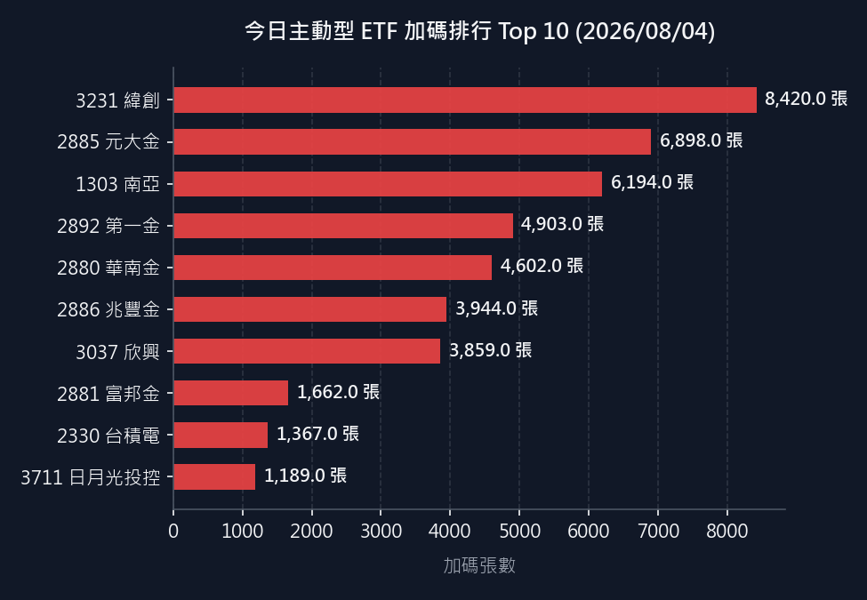
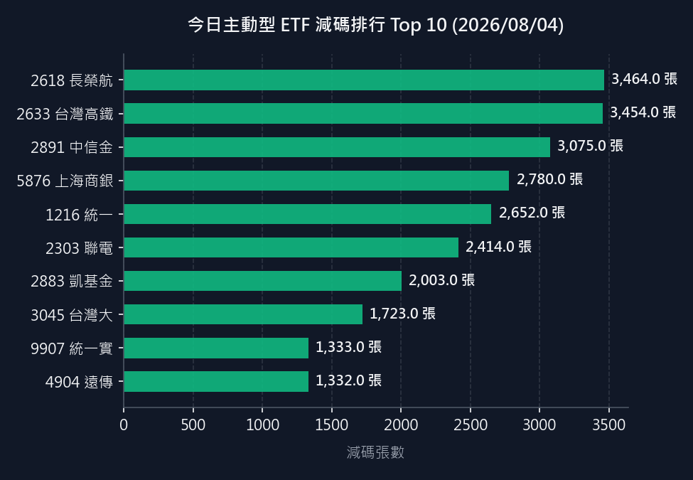

# 主動型 ETF 持股變動

資料來源：`主動型ETF持股明細.xlsx` 最近兩個日期分頁。

比較區間：`20260803` → `20260804`

## 今日加減碼視覺化排行

| 今日加碼 Top 10 | 今日減碼 Top 10 |
| :---: | :---: |
|  |  |

| ETF | 新增 | 刪除 | 比例變動 |
| :-- | --: | --: | --: |
| 00400A | 2 | 1 | 42 |
| 00401A | 0 | 1 | 58 |
| 00402A | 0 | 0 | 47 |
| 00403A | 3 | 1 | 42 |
| 00404A | 2 | 3 | 50 |
| 00405A | 1 | 0 | 40 |
| 00407A | 0 | 0 | 47 |
| 00408A | 3 | 1 | 39 |
| 00980A | 0 | 0 | 48 |
| 00980D | 0 | 1 | 77 |
| 00981A | 15 | 1 | 32 |
| 00982A | 0 | 0 | 41 |
| 00983A | 0 | 0 | 37 |
| 00983D | 0 | 0 | 13 |
| 00984A | 54 | 40 | 78 |
| 00985A | 0 | 0 | 47 |
| 00986A | 2 | 0 | 32 |
| 00987A | 2 | 0 | 24 |
| 00988A | 1 | 0 | 41 |
| 00989A | 0 | 0 | 60 |
| 00990A | 1 | 0 | 47 |
| 00991A | 3 | 3 | 21 |
| 00992A | 3 | 2 | 31 |
| 00993A | 5 | 7 | 43 |
| 00994A | 2 | 3 | 24 |
| 00995A | 0 | 2 | 51 |
| 00996A | 0 | 2 | 43 |
| 00997A | 1 | 0 | 44 |
| 00998A | 0 | 0 | 33 |
| 00999A | 0 | 0 | 53 |

## 00400A

### 新增持股

- 6274 台燿（0.53%，114 張）
- 7750 新代（0.98%，122 張）

### 刪除持股

- 4958 臻鼎-KY（0.01%，8 張）

### 投資比例變動

- 1303 南亞：0.35% → 0.36%（+0.01）
- 2059 川湖：3.40% → 3.69%（+0.29）
- 2308 台達電：2.46% → 2.49%（+0.03）
- 2313 華通：0.72% → 0.76%（+0.04）
- 2317 鴻海：0.85% → 0.83%（-0.02）
- 2330 台積電：8.47% → 8.19%（-0.28）
- 2345 智邦：1.85% → 1.81%（-0.04）
- 2357 華碩：1.34% → 1.33%（-0.01）
- 2360 致茂：4.63% → 4.49%（-0.14）
- 2383 台光電：5.05% → 5.15%（+0.10）
- 2408 南亞科：1.55% → 1.68%（+0.13）
- 2449 京元電子：0.87% → 1.39%（+0.52）
- 2454 聯發科：5.23% → 6.25%（+1.02）
- 2881 富邦金：0.37% → 0.75%（+0.38）
- 2891 中信金：0.88% → 0.86%（-0.02）
- 3008 大立光：1.70% → 1.84%（+0.14）
- 3017 奇鋐：4.33% → 4.36%（+0.03）
- 3036 文曄：1.07% → 1.38%（+0.31）
- 3037 欣興：4.03% → 4.25%（+0.22）
- 3044 健鼎：1.35% → 1.40%（+0.05）
- 3090 日電貿：0.28% → 0.29%（+0.01）
- 3211 順達：0.59% → 0.61%（+0.02）
- 3231 緯創：0.91% → 0.94%（+0.03）
- 3293 鈊象：0.36% → 0.35%（-0.01）
- 3443 創意：2.77% → 2.71%（-0.06）
- 3529 力旺：1.02% → 1.08%（+0.06）
- 3653 健策：2.34% → 3.52%（+1.18）
- 3665 貿聯-KY：2.59% → 2.80%（+0.21）
- 3711 日月光投控：1.29% → 1.22%（-0.07）
- 5274 信驊：2.92% → 2.80%（-0.12）
- 5347 世界：0.71% → 0.72%（+0.01）
- 6121 新普：0.22% → 0.23%（+0.01）
- 6187 萬潤：2.09% → 2.24%（+0.15）
- 6223 旺矽：3.46% → 4.83%（+1.37）
- 6239 力成：0.86% → 0.91%（+0.05）
- 6442 光聖：0.50% → 0.54%（+0.04）
- 6488 環球晶：2.58% → 2.80%（+0.22）
- 6505 台塑化：0.71% → 0.70%（-0.01）
- 6510 精測：0.30% → 0.31%（+0.01）
- 6669 緯穎：4.19% → 4.34%（+0.15）
- 7769 鴻勁：0.76% → 0.72%（-0.04）
- 8046 南電：0.86% → 0.94%（+0.08）

## 00401A

### 新增持股

- 無

### 刪除持股

- 3005 神基（0.23%，59 張）

### 投資比例變動

- 1216 統一：0.34% → 0.33%（-0.01）
- 2303 聯電：1.02% → 0.97%（-0.05）
- 2308 台達電：3.81% → 3.68%（-0.13）
- 2313 華通：0.96% → 1.10%（+0.14）
- 2317 鴻海：0.74% → 0.72%（-0.02）
- 2330 台積電：10.52% → 11.19%（+0.67）
- 2344 華邦電：1.03% → 1.18%（+0.15）
- 2345 智邦：2.62% → 2.76%（+0.14）
- 2357 華碩：1.55% → 1.38%（-0.17）
- 2360 致茂：2.08% → 1.88%（-0.20）
- 2368 金像電：0.33% → 0.28%（-0.05）
- 2379 瑞昱：1.54% → 1.29%（-0.25）
- 2382 廣達：1.92% → 1.93%（+0.01）
- 2383 台光電：1.89% → 1.92%（+0.03）
- 2412 中華電：1.01% → 0.96%（-0.05）
- 2449 京元電子：0.52% → 0.06%（-0.46）
- 2454 聯發科：7.00% → 6.84%（-0.16）
- 2455 全新：1.18% → 1.38%（+0.20）
- 2603 長榮：1.14% → 1.12%（-0.02）
- 2615 萬海：0.07% → 0.02%（-0.05）
- 2881 富邦金：1.92% → 1.85%（-0.07）
- 2882 國泰金：1.25% → 1.16%（-0.09）
- 2883 凱基金：2.00% → 1.66%（-0.34）
- 2884 玉山金：2.12% → 2.03%（-0.09）
- 2885 元大金：1.27% → 0.89%（-0.38）
- 2886 兆豐金：1.83% → 1.70%（-0.13）
- 2887 台新新光金：1.19% → 1.15%（-0.04）
- 2890 永豐金：0.35% → 0.33%（-0.02）
- 2891 中信金：1.86% → 1.81%（-0.05）
- 2912 統一超：0.33% → 0.32%（-0.01）
- 3008 大立光：2.07% → 2.13%（+0.06）
- 3034 聯詠：0.55% → 0.26%（-0.29）
- 3037 欣興：2.10% → 2.39%（+0.29）
- 3131 弘塑：0.47% → 0.42%（-0.05）
- 3167 大量：0.38% → 0.47%（+0.09）
- 3231 緯創：0.41% → 0.45%（+0.04）
- 3491 昇達科：1.46% → 1.72%（+0.26）
- 3529 力旺：0.68% → 0.72%（+0.04）
- 3653 健策：1.14% → 1.40%（+0.26）
- 3711 日月光投控：2.16% → 2.23%（+0.07）
- 4904 遠傳：0.96% → 0.90%（-0.06）
- 4958 臻鼎-KY：1.91% → 2.00%（+0.09）
- 4991 環宇-KY：0.53% → 0.66%（+0.13）
- 5274 信驊：1.06% → 1.15%（+0.09）
- 5347 世界：1.57% → 1.50%（-0.07）
- 5904 寶雅：0.66% → 0.68%（+0.02）
- 6187 萬潤：0.64% → 0.74%（+0.10）
- 6223 旺矽：2.18% → 2.28%（+0.10）
- 6285 啟碁：1.62% → 1.79%（+0.17）
- 6510 精測：0.66% → 0.76%（+0.10）
- 6515 穎崴：1.10% → 1.27%（+0.17）
- 6531 愛普*：1.03% → 1.21%（+0.18）
- 6669 緯穎：2.39% → 2.60%（+0.21）
- 6944 兆聯實業：0.51% → 0.54%（+0.03）
- 7769 鴻勁：2.74% → 2.60%（-0.14）
- 7828 創新服務：1.65% → 1.91%（+0.26）
- 8021 尖點：0.24% → 0.29%（+0.05）
- 8464 億豐：1.34% → 1.29%（-0.05）

## 00402A

### 新增持股

- 無

### 刪除持股

- 無

### 投資比例變動

- AAPL.US Apple：7.75% → 7.48%（-0.27）
- ADI.US Analog Devices：1.83% → 1.77%（-0.06）
- AMZN.US Amazon：4.55% → 4.67%（+0.12）
- ANET.US Arista Networks：0.78% → 0.79%（+0.01）
- ARM.US Arm：0.95% → 0.93%（-0.02）
- ASML.US ASML Holding：1.59% → 1.58%（-0.01）
- AVGO.US Broadcom：2.56% → 2.53%（-0.03）
- AXON.US Axon Enterprise：0.98% → 1.05%（+0.07）
- BABA.US Alibaba Group：0.59% → 0.61%（+0.02）
- BKNG.US Booking Holdings：0.67% → 0.66%（-0.01）
- CDNS.US Cadence Design Systems：1.87% → 1.81%（-0.06）
- CIEN.US Ciena：1.18% → 1.20%（+0.02）
- CLS.US Celestica：0.94% → 0.95%（+0.01）
- COHR.US Coherent：1.60% → 1.73%（+0.13）
- CRWD.US CrowdStrike Holdings：1.31% → 1.36%（+0.05）
- GOOG.US Alphabet - Class C Capital Stock：3.60% → 3.69%（+0.09）
- GOOGL.US Alphabet - Class A Common Stock：3.53% → 3.64%（+0.11）
- INTC.US Intel：1.21% → 1.19%（-0.02）
- KLAC.US KLA：2.09% → 2.05%（-0.04）
- LITE.US Lumentum：1.30% → 1.39%（+0.09）
- LRCX.US Lam Research：3.49% → 3.45%（-0.04）
- MCHP.US Microchip Technology：1.39% → 1.38%（-0.01）
- MDB.US MongoDB：0.68% → 0.70%（+0.02）
- META.US Meta：2.72% → 2.83%（+0.11）
- MRVL.US Marvell：1.37% → 1.39%（+0.02）
- MSFT.US Microsoft：4.13% → 4.26%（+0.13）
- MU.US Micron：6.06% → 5.99%（-0.07）
- NFLX.US Netflix：0.80% → 0.81%（+0.01）
- NOW.US ServiceNow：0.24% → 0.25%（+0.01）
- NVDA.US NVIDIA：8.42% → 8.50%（+0.08）
- NXPI.US NXP Semiconductors：1.11% → 1.07%（-0.04）
- PANW.US Palo Alto：3.20% → 3.28%（+0.08）
- PLTR.US Palantir Technologies：1.09% → 1.10%（+0.01）
- SHOP.US Shopify：0.41% → 0.40%（-0.01）
- SIMO.US Silicon Motion：0.78% → 0.76%（-0.02）
- SKHY.US SK hynix：0.93% → 0.91%（-0.02）
- SNOW.US Snowflake：0.90% → 0.93%（+0.03）
- SPCX.US SpaceX：0.57% → 0.59%（+0.02）
- SPOT.US Spotify：0.28% → 0.27%（-0.01）
- STX.US Seagate：1.52% → 1.44%（-0.08）
- TER.US Teradyne：0.87% → 0.85%（-0.02）
- TSM.US TSMC(ADR)：1.66% → 1.63%（-0.03）
- TTWO.US Take-Two：0.58% → 0.57%（-0.01）
- TXN.US Texas Instruments：2.58% → 2.47%（-0.11）
- UBER.US Uber：0.47% → 0.46%（-0.01）
- V.US Visa：1.13% → 1.10%（-0.03）
- WDC.US Western Digital：3.10% → 2.94%（-0.16）

## 00403A

### 新增持股

- 5347 世界（0.00%，1 張）
- 6196 帆宣（0.00%，1 張）
- 8299 群聯（0.00%，1 張）

### 刪除持股

- 6515 穎崴（0.11%，29 張）

### 投資比例變動

- 1303 南亞：0.44% → 0.45%（+0.01）
- 1560 中砂：0.53% → 0.58%（+0.05）
- 1717 長興：0.02% → 0.03%（+0.01）
- 2303 聯電：5.33% → 5.28%（-0.05）
- 2308 台達電：2.79% → 2.82%（+0.03）
- 2317 鴻海：0.47% → 0.46%（-0.01）
- 2327 國巨*：1.92% → 2.27%（+0.35）
- 2330 台積電：17.45% → 16.85%（-0.60）
- 2337 旺宏：0.48% → 0.52%（+0.04）
- 2344 華邦電：3.32% → 3.70%（+0.38）
- 2345 智邦：3.13% → 3.07%（-0.06）
- 2360 致茂：1.02% → 0.99%（-0.03）
- 2383 台光電：4.32% → 4.40%（+0.08）
- 2454 聯發科：4.08% → 4.23%（+0.15）
- 2455 全新：0.06% → 0.07%（+0.01）
- 2481 強茂：0.07% → 0.08%（+0.01）
- 3008 大立光：0.39% → 0.43%（+0.04）
- 3017 奇鋐：5.11% → 5.14%（+0.03）
- 3037 欣興：3.82% → 4.27%（+0.45）
- 3189 景碩：1.30% → 1.42%（+0.12）
- 3211 順達：0.36% → 0.37%（+0.01）
- 3443 創意：1.24% → 1.21%（-0.03）
- 3450 聯鈞：0.08% → 0.16%（+0.08）
- 3533 嘉澤：1.44% → 1.43%（-0.01）
- 3583 辛耘：0.35% → 0.36%（+0.01）
- 3653 健策：2.25% → 2.45%（+0.20）
- 3665 貿聯-KY：1.23% → 1.45%（+0.22）
- 3711 日月光投控：2.27% → 2.40%（+0.13）
- 4958 臻鼎-KY：1.51% → 1.56%（+0.05）
- 5274 信驊：1.47% → 1.41%（-0.06）
- 6223 旺矽：3.37% → 3.55%（+0.18）
- 6239 力成：0.52% → 0.65%（+0.13）
- 6274 台燿：1.19% → 1.29%（+0.10）
- 6285 啟碁：0.03% → 0.05%（+0.02）
- 6442 光聖：0.17% → 0.18%（+0.01）
- 6488 環球晶：1.31% → 1.44%（+0.13）
- 6669 緯穎：2.06% → 2.13%（+0.07）
- 6805 富世達：0.60% → 0.64%（+0.04）
- 7769 鴻勁：1.12% → 1.06%（-0.06）
- 8046 南電：0.97% → 1.05%（+0.08）
- 8358 金居：0.25% → 0.26%（+0.01）
- 8996 高力：0.87% → 0.94%（+0.07）

## 00404A

### 新增持股

- 臺指選擇權08/26 45400 買權（-0.26%，N/A 張）
- 臺指選擇權09/26 46500 買權（-0.02%，N/A 張）

### 刪除持股

- 臺指選擇權08/26 49100 買權（-0.06%，N/A 張）
- 臺指選擇權09/26 43900 買權（0.00%，N/A 張）
- 臺指選擇權09/26 50300 買權（-0.01%，N/A 張）

### 投資比例變動

- 1216 統一：1.91% → 1.89%（-0.02）
- 2303 聯電：2.84% → 2.75%（-0.09）
- 2308 台達電：3.82% → 3.73%（-0.09）
- 2327 國巨*：0.65% → 0.73%（+0.08）
- 2330 台積電：22.65% → 21.42%（-1.23）
- 2345 智邦：0.94% → 1.01%（+0.07）
- 2360 致茂：1.11% → 1.01%（-0.10）
- 2376 技嘉：1.86% → 1.82%（-0.04）
- 2382 廣達：0.37% → 0.38%（+0.01）
- 2383 台光電：1.96% → 2.10%（+0.14）
- 2393 億光：1.65% → 1.50%（-0.15）
- 2402 毅嘉：0.09% → 0.10%（+0.01）
- 2454 聯發科：6.55% → 7.03%（+0.48）
- 2885 元大金：3.04% → 3.05%（+0.01）
- 2887 台新新光金：3.44% → 3.36%（-0.08）
- 2890 永豐金：2.23% → 2.15%（-0.08）
- 2912 統一超：0.09% → 0.08%（-0.01）
- 3014 聯陽：1.06% → 1.07%（+0.01）
- 3017 奇鋐：0.68% → 0.76%（+0.08）
- 3034 聯詠：0.57% → 0.56%（-0.01）
- 3037 欣興：0.53% → 0.62%（+0.09）
- 3131 弘塑：0.77% → 0.81%（+0.04）
- 3189 景碩：0.26% → 0.31%（+0.05）
- 3260 威剛：0.38% → 0.37%（-0.01）
- 3264 欣銓：0.97% → 1.05%（+0.08）
- 3265 台星科：0.42% → 0.44%（+0.02）
- 3443 創意：0.11% → 0.12%（+0.01）
- 3702 大聯大：1.74% → 1.80%（+0.06）
- 3711 日月光投控：3.70% → 3.85%（+0.15）
- 4763 材料*-KY：1.69% → 1.67%（-0.02）
- 5269 祥碩：1.47% → 1.50%（+0.03）
- 5274 信驊：2.07% → 2.18%（+0.11）
- 5434 崇越：1.61% → 1.62%（+0.01）
- 5871 中租-KY：1.81% → 1.79%（-0.02）
- 5876 上海商銀：1.92% → 1.85%（-0.07）
- 6138 茂達：1.52% → 1.68%（+0.16）
- 6139 亞翔：0.23% → 0.25%（+0.02）
- 6196 帆宣：0.33% → 0.34%（+0.01）
- 6206 飛捷：1.67% → 1.85%（+0.18）
- 6223 旺矽：0.86% → 0.94%（+0.08）
- 6239 力成：1.44% → 1.55%（+0.11）
- 6257 矽格：1.44% → 1.52%（+0.08）
- 6488 環球晶：0.13% → 0.14%（+0.01）
- 6515 穎崴：0.43% → 0.48%（+0.05）
- 6531 愛普*：0.18% → 0.21%（+0.03）
- 6691 洋基工程：0.69% → 0.71%（+0.02）
- 8016 矽創：0.10% → 0.11%（+0.01）
- 8069 元太：0.42% → 0.43%（+0.01）
- 8299 群聯：1.11% → 1.22%（+0.11）
- 臺股期貨08/26：15.72% → 16.16%（+0.44）

## 00405A

### 新增持股

- 6831 邁科（0.52%，250 張）

### 刪除持股

- 無

### 投資比例變動

- 1590 亞德客-KY：0.01% → 0.00%（-0.01）
- 2059 川湖：1.24% → 1.34%（+0.10）
- 2303 聯電：0.04% → 0.03%（-0.01）
- 2308 台達電：1.82% → 1.60%（-0.22）
- 2330 台積電：0.45% → 1.39%（+0.94）
- 2344 華邦電：2.89% → 3.11%（+0.22）
- 2345 智邦：4.24% → 4.12%（-0.12）
- 2368 金像電：1.73% → 2.19%（+0.46）
- 2383 台光電：2.81% → 3.66%（+0.85）
- 2408 南亞科：1.16% → 1.24%（+0.08）
- 2449 京元電子：0.70% → 0.69%（-0.01）
- 2454 聯發科：6.44% → 6.23%（-0.21）
- 3008 大立光：0.02% → 0.01%（-0.01）
- 3017 奇鋐：6.07% → 6.05%（-0.02）
- 3026 禾伸堂：0.99% → 0.97%（-0.02）
- 3037 欣興：4.67% → 4.87%（+0.20）
- 3081 聯亞：0.97% → 1.05%（+0.08）
- 3131 弘塑：2.93% → 2.79%（-0.14）
- 3443 創意：4.80% → 4.65%（-0.15）
- 3583 辛耘：0.67% → 0.64%（-0.03）
- 3653 健策：3.19% → 4.00%（+0.81）
- 3665 貿聯-KY：5.35% → 6.68%（+1.33）
- 3711 日月光投控：0.68% → 0.63%（-0.05）
- 4749 新應材：0.26% → 0.25%（-0.01）
- 5274 信驊：1.99% → 1.89%（-0.10）
- 5347 世界：0.12% → 0.11%（-0.01）
- 6187 萬潤：0.69% → 0.72%（+0.03）
- 6223 旺矽：5.44% → 5.41%（-0.03）
- 6274 台燿：1.28% → 1.38%（+0.10）
- 6442 光聖：0.31% → 0.33%（+0.02）
- 6488 環球晶：3.75% → 3.71%（-0.04）
- 6510 精測：1.93% → 2.30%（+0.37）
- 6526 達發：0.29% → 0.28%（-0.01）
- 6669 緯穎：3.97% → 4.06%（+0.09）
- 7734 印能科技：2.02% → 1.97%（-0.05）
- 7769 鴻勁：2.33% → 2.49%（+0.16）
- 8028 昇陽半導體：0.82% → 0.80%（-0.02）
- 8046 南電：3.61% → 3.65%（+0.04）
- 8210 勤誠：0.66% → 0.65%（-0.01）
- 8996 高力：0.91% → 0.98%（+0.07）

## 00407A

### 新增持股

- 無

### 刪除持股

- 無

### 投資比例變動

- 1590 亞德客-KY：2.06% → 2.09%（+0.03）
- 2059 川湖：2.02% → 2.31%（+0.29）
- 2303 聯電：2.32% → 2.14%（-0.18）
- 2308 台達電：3.61% → 3.36%（-0.25）
- 2327 國巨*：1.98% → 2.10%（+0.12）
- 2330 台積電：9.28% → 8.36%（-0.92）
- 2344 華邦電：1.37% → 1.55%（+0.18）
- 2345 智邦：3.37% → 3.47%（+0.10）
- 2360 致茂：2.17% → 1.87%（-0.30）
- 2368 金像電：1.57% → 1.67%（+0.10）
- 2376 技嘉：0.75% → 0.69%（-0.06）
- 2383 台光電：4.30% → 4.80%（+0.50）
- 2395 研華：1.76% → 1.70%（-0.06）
- 2408 南亞科：1.50% → 1.71%（+0.21）
- 2412 中華電：1.76% → 1.63%（-0.13）
- 2451 創見：0.17% → 0.16%（-0.01）
- 2454 聯發科：6.23% → 6.38%（+0.15）
- 3017 奇鋐：3.80% → 4.02%（+0.22）
- 3034 聯詠：0.72% → 0.69%（-0.03）
- 3037 欣興：3.80% → 4.20%（+0.40）
- 3260 威剛：0.17% → 0.16%（-0.01）
- 3293 鈊象：0.61% → 0.58%（-0.03）
- 3443 創意：1.64% → 1.68%（+0.04）
- 3491 昇達科：0.33% → 0.37%（+0.04）
- 3529 力旺：1.96% → 1.92%（-0.04）
- 3533 嘉澤：0.98% → 1.00%（+0.02）
- 3665 貿聯-KY：3.03% → 3.13%（+0.10）
- 3711 日月光投控：2.44% → 2.42%（-0.02）
- 4904 遠傳：0.33% → 0.30%（-0.03）
- 4958 臻鼎-KY：1.64% → 1.66%（+0.02）
- 5274 信驊：1.97% → 1.98%（+0.01）
- 5289 宜鼎：0.16% → 0.17%（+0.01）
- 5434 崇越：0.19% → 0.18%（-0.01）
- 5536 聖暉*：1.51% → 1.52%（+0.01）
- 6223 旺矽：2.47% → 2.60%（+0.13）
- 6274 台燿：2.63% → 2.99%（+0.36）
- 6415 矽力*-KY：0.35% → 0.34%（-0.01）
- 6446 藥華藥：2.10% → 2.26%（+0.16）
- 6515 穎崴：1.26% → 1.35%（+0.09）
- 6526 達發：0.28% → 0.29%（+0.01）
- 6531 愛普*：1.16% → 1.32%（+0.16）
- 6669 緯穎：4.27% → 4.63%（+0.36）
- 6805 富世達：1.77% → 1.97%（+0.20）
- 8046 南電：1.90% → 2.03%（+0.13）
- 8210 勤誠：1.68% → 1.74%（+0.06）
- 8299 群聯：0.11% → 0.12%（+0.01）
- 8996 高力：0.33% → 0.38%（+0.05）

## 00408A

### 新增持股

- 2344 華邦電（0.73%，80 張）
- 2801 彰銀（0.88%，600 張）
- 3653 健策（0.73%，3 張）

### 刪除持股

- 2912 統一超（2.77%，205 張）

### 投資比例變動

- 1216 統一：1.65% → 0.95%（-0.70）
- 1477 聚陽：1.19% → 0.26%（-0.93）
- 2059 川湖：1.42% → 1.67%（+0.25）
- 2308 台達電：3.36% → 3.22%（-0.14）
- 2317 鴻海：2.64% → 2.56%（-0.08）
- 2330 台積電：6.70% → 6.26%（-0.44）
- 2345 智邦：2.69% → 3.67%（+0.98）
- 2356 英業達：1.23% → 1.27%（+0.04）
- 2357 華碩：2.10% → 2.03%（-0.07）
- 2360 致茂：2.91% → 2.59%（-0.32）
- 2368 金像電：1.82% → 1.99%（+0.17）
- 2376 技嘉：2.13% → 2.04%（-0.09）
- 2383 台光電：3.15% → 4.21%（+1.06）
- 2395 研華：1.87% → 1.85%（-0.02）
- 2404 漢唐：1.66% → 1.62%（-0.04）
- 2408 南亞科：0.43% → 0.51%（+0.08）
- 2412 中華電：3.36% → 3.19%（-0.17）
- 2454 聯發科：4.07% → 4.30%（+0.23）
- 2603 長榮：1.84% → 1.81%（-0.03）
- 2880 華南金：1.71% → 1.64%（-0.07）
- 2886 兆豐金：2.78% → 2.58%（-0.20）
- 2891 中信金：0.94% → 0.91%（-0.03）
- 3017 奇鋐：2.24% → 3.04%（+0.80）
- 3036 文曄：0.47% → 0.50%（+0.03）
- 3037 欣興：2.47% → 3.35%（+0.88）
- 3045 台灣大：3.33% → 3.19%（-0.14）
- 3231 緯創：3.29% → 3.54%（+0.25）
- 3665 貿聯-KY：1.77% → 1.88%（+0.11）
- 3702 大聯大：1.76% → 1.79%（+0.03）
- 5347 世界：0.46% → 0.45%（-0.01）
- 5434 崇越：2.35% → 2.32%（-0.03）
- 5876 上海商銀：2.27% → 2.14%（-0.13）
- 5904 寶雅：1.78% → 1.73%（-0.05）
- 6223 旺矽：0.48% → 0.52%（+0.04）
- 6239 力成：0.57% → 1.01%（+0.44）
- 6274 台燿：1.27% → 1.49%（+0.22）
- 6669 緯穎：3.90% → 4.36%（+0.46）
- 7769 鴻勁：1.68% → 1.63%（-0.05）
- 8046 南電：2.00% → 2.20%（+0.20）

## 00980A

### 新增持股

- 無

### 刪除持股

- 無

### 投資比例變動

- 1303 南亞：2.27% → 2.26%（-0.01）
- 2059 川湖：4.47% → 4.75%（+0.28）
- 2308 台達電：3.63% → 3.60%（-0.03）
- 2317 鴻海：2.26% → 2.16%（-0.10）
- 2327 國巨*：1.08% → 1.07%（-0.01）
- 2330 台積電：8.93% → 8.45%（-0.48）
- 2344 華邦電：0.94% → 0.99%（+0.05）
- 2345 智邦：1.95% → 1.87%（-0.08）
- 2360 致茂：1.65% → 1.57%（-0.08）
- 2368 金像電：1.95% → 1.94%（-0.01）
- 2376 技嘉：1.28% → 1.27%（-0.01）
- 2382 廣達：1.66% → 1.63%（-0.03）
- 2383 台光電：4.30% → 4.29%（-0.01）
- 2408 南亞科：2.34% → 2.49%（+0.15）
- 2454 聯發科：6.20% → 5.93%（-0.27）
- 2884 玉山金：0.95% → 0.91%（-0.04）
- 2891 中信金：1.37% → 1.32%（-0.05）
- 3008 大立光：0.81% → 0.86%（+0.05）
- 3017 奇鋐：1.94% → 1.91%（-0.03）
- 3026 禾伸堂：0.35% → 0.37%（+0.02）
- 3036 文曄：1.33% → 1.34%（+0.01）
- 3037 欣興：2.77% → 2.86%（+0.09）
- 3044 健鼎：0.73% → 0.74%（+0.01）
- 3081 聯亞：2.42% → 2.57%（+0.15）
- 3189 景碩：0.73% → 0.78%（+0.05）
- 3231 緯創：1.10% → 1.12%（+0.02）
- 3293 鈊象：1.10% → 1.07%（-0.03）
- 3443 創意：1.40% → 1.34%（-0.06）
- 3529 力旺：0.88% → 0.92%（+0.04）
- 3533 嘉澤：0.15% → 0.14%（-0.01）
- 3653 健策：1.48% → 1.57%（+0.09）
- 3665 貿聯-KY：0.39% → 0.41%（+0.02）
- 3711 日月光投控：1.39% → 1.29%（-0.10）
- 4958 臻鼎-KY：0.80% → 0.82%（+0.02）
- 5274 信驊：1.66% → 1.56%（-0.10）
- 5904 寶雅：1.28% → 1.24%（-0.04）
- 6213 聯茂：0.79% → 0.82%（+0.03）
- 6223 旺矽：2.51% → 2.46%（-0.05）
- 6274 台燿：1.30% → 1.38%（+0.08）
- 6442 光聖：0.27% → 0.29%（+0.02）
- 6515 穎崴：1.95% → 1.99%（+0.04）
- 6669 緯穎：1.75% → 1.77%（+0.02）
- 6805 富世達：0.45% → 0.47%（+0.02）
- 6831 邁科：0.58% → 0.62%（+0.04）
- 7769 鴻勁：2.67% → 2.48%（-0.19）
- 8046 南電：1.10% → 1.17%（+0.07）
- 8210 勤誠：0.87% → 0.88%（+0.01）
- 8996 高力：0.97% → 1.02%（+0.05）

## 00980D

### 新增持股

- 無

### 刪除持股

- SATURN OIL & GAS INC SER REGS 9.625000 % 15JUN2029（0.62%，N/A 張）

### 投資比例變動

- ALLY FINANCIAL INC (REG) 7.1% 15NOV2027：0.44% → 0.43%（-0.01）
- ALLY FINANCIAL INC (REG) 8% 01NOV2031：0.53% → 0.52%（-0.01）
- ALLY FINANCIAL INC (REG) VAR 03JAN2030：0.63% → 0.62%（-0.01）
- AMC GLOBAL MEDIA INC SER REGS (REG) (REG S) 10.5% 15JUL2032：0.71% → 0.70%（-0.01）
- APOLLO DEBT SOLUTIONS BD 6.700000 % 29JUL2031：0.34% → 0.33%（-0.01）
- ARCELORMITTAL SA 6.55% 29NOV2027：0.55% → 0.54%（-0.01）
- BLUE OWL CREDIT INCOME (REG) 6.6% 15SEP2029：0.39% → 0.38%（-0.01）
- BLUE OWL CREDIT INCOME (REG) 6.65% 15MAR2031：0.53% → 0.52%（-0.01）
- BLUE OWL CREDIT INCOME 7.750000 % 15JAN2029：0.54% → 0.53%（-0.01）
- BPCE SA SER REGS VAR 19OCT2034：0.43% → 0.42%（-0.01）
- BRIGHTHOUSE FINANCIAL IN (REG) 4.7% 22JUN2047：0.48% → 0.47%（-0.01）
- BRITISH TELECOMMUNICATIO (BR) 9.625% 15DEC2030：0.58% → 0.57%（-0.01）
- CAPITAL ONE FINANCIAL CO SER . (REG) VAR 30OCT2031：0.59% → 0.58%（-0.01）
- CARNIVAL CORP SER REGS (REG S) 7% 15AUG2029：0.56% → 0.55%（-0.01）
- CHS/COMMUNITY HEALTH SYS SER REGS 10.875000 % 15JAN2032：0.43% → 0.42%（-0.01）
- CITIGROUP INC 8.125% 15JUL2039：0.63% → 0.62%（-0.01）
- CIVITAS RESOURCES INC SER REGS (REG) (REG S) 9.625% 15JUN2033：0.56% → 0.55%（-0.01）
- CONCENTRIX CORP (REG) 6.85% 02AUG2033：0.69% → 0.68%（-0.01）
- COTY/HFC PRESTIGE/INT US SER REGS (REG S) 6.625% 15JUL2030：0.57% → 0.56%（-0.01）
- COX COMMUNICATIONS INC SER REGS 5.950000 % 01SEP2054：0.54% → 0.53%（-0.01）
- DAIMLER FINANCE NA LLC REG 8.5% 18JAN2031：0.64% → 0.63%（-0.01）
- DELL INT LLC / EMC CORP (REG) 8.1% 15JUL2036：0.59% → 0.58%（-0.01）
- DELL INT LLC / EMC CORP (REG) 8.35% 15JUL2046：0.56% → 0.55%（-0.01）
- DEUTSCHE BANK NY VAR 20NOV2029：0.47% → 0.46%（-0.01）
- DEUTSCHE TELEKOM INT FIN (REG) 9.25% 01JUN2032：0.43% → 0.42%（-0.01）
- DIRECTV FIN LLC/COINC SER REGS 10.000000 % 15FEB2031：0.41% → 0.40%（-0.01）
- DISCOVER FINANCIAL SVS (REG) VAR 02NOV2034：0.64% → 0.63%（-0.01）
- DOW CHEMICAL CO/THE 5.950000 % 15MAR2055：0.50% → 0.49%（-0.01）
- ENEL FINANCE INTL NV SER REGS (REG S) 7.75% 14OCT2052：0.37% → 0.36%（-0.01）
- FORD MOTOR CREDIT CO LLC (REG) 7.35% 06MAR2030：0.34% → 0.33%（-0.01）
- GENERAL MOTORS CO (REG) 6.8% 01OCT2027：0.56% → 0.55%（-0.01）
- GLENCORE FINANCE CANADA SER REGS 6.900000 % 15-NOV-2037：0.40% → 0.39%（-0.01）
- GLOBAL ATLANTIC FIN CO SER REGS 7.950000 % 15JUN2033：0.66% → 0.65%（-0.01）
- GRAY TELEVISION INC SER REGS (REG) (REG S) 10.5% 15JUL2029：0.58% → 0.57%（-0.01）
- HAH GROUP HOLDING CO LLC SER REGS (REG S) 9.75% 01OCT2031：0.30% → 0.29%（-0.01）
- HORIZON MUTUAL HOLDINGS SER REGS 6.200000 % 15NOV2034：0.33% → 0.32%（-0.01）
- HUTCHISON WHAM INT 03/33 SER REGS (REG S) 7.45% 24NOV2033：0.41% → 0.40%（-0.01）
- JETBLUE AIRWAYS/LOYALTY SER REGS (REG S) 9.875% 20SEP2031：0.49% → 0.50%（+0.01）
- KELLANOVA SER B (REG) 7.450000 % 01APR2031：0.57% → 0.56%（-0.01）
- KINDER MORGAN INC/DELAWA SER GMTN (REG) 7.75% 15JAN2032：0.33% → 0.32%（-0.01）
- KINDER MORGAN INC/DELAWA SER GMTN (REG) 7.8% 01AUG2031：0.32% → 0.31%（-0.01）
- KONINKLIJKE KPN NV (REG) 8.375% 01OCT2030：0.44% → 0.43%（-0.01）
- LBM ACQUISITION LLC SER REGS 9.500000 % 15JUN2031：0.33% → 0.32%（-0.01）
- MACQUARIE BANK LTD SER REGS (REG S) 6.798% 18JAN2033：0.34% → 0.33%（-0.01）
- META PLATFORMS INC 5.750000 % 15-NOV-2065：0.43% → 0.42%（-0.01）
- MOBIUS MERGER SUB SER REGS 9.000000 % 01JUN2030：0.25% → 0.23%（-0.02）
- MOHEGAN TRIBAL / MS DIG SER REGS 11.875000 % 15APR2031：0.68% → 0.67%（-0.01）
- MYLAN INC SER WI (REG) 5.2% 15APR2048WI：0.49% → 0.48%（-0.01）
- NATIONWIDE MUTUAL INSUR 9.375% 15AUG2039：0.53% → 0.52%（-0.01）
- NEPTUNE BIDCO US INC SER REGS (REG S) 9.29% 15APR2029：0.35% → 0.34%（-0.01）
- NRG ENERGY INC SER REGS (REG S) 7% 15MAR2033：0.32% → 0.31%（-0.01）
- OCCIDENTAL PETROLEUM COR 8.875% 15JUL2030：0.54% → 0.53%（-0.01）
- OPEN TEXT CORP SER REGS (REG) (REG S) 6.9% 01DEC2027：0.66% → 0.65%（-0.01）
- ORANGE SA (REG) 9% 01MAR2031：0.66% → 0.65%（-0.01）
- PACIFIC GAS & ELECTRIC (REG) 6.75% 15JAN2053：0.34% → 0.33%（-0.01）
- PEPSICO INC (REG) 7.000000 % 01MAR2029：0.32% → 0.31%（-0.01）
- PROGRESS ENERGY INC (REG) 7.75% 01MAR2031：0.58% → 0.57%（-0.01）
- RIO TINTO FIN USA LTD (REG) 7.125% 15JUL2028：0.57% → 0.56%（-0.01）
- SABRE FINANCIAL BORROWER SER REGS 11.125 % 15-JUN-2029：0.53% → 0.52%（-0.01）
- SALESFORCE INC (REG) 6.7% 15MAR2066：0.52% → 0.51%（-0.01）
- SANTANDER UK GROUP HLDGS (REG) VAR 10JAN2029：0.33% → 0.32%（-0.01）
- SANTOS FINANCE LTD SER REGS (REG S) 6.875% 19SEP2033：0.29% → 0.28%（-0.01）
- SBL HOLDINGS INC SER REGS 7.200000 % 30OCT2034：0.52% → 0.51%（-0.01）
- SPRINT CAPITAL CORP (REG) 6.875% 15NOV2028：0.32% → 0.31%（-0.01）
- STELLANTIS FIN US INC SER REGS 6.450000 % 18MAR2035：0.33% → 0.32%（-0.01）
- SUNCOR ENERGY INC (REG) 6.85% 01JUN2039：0.34% → 0.33%（-0.01）
- SYMETRA LIFE INSURANCE SER REGS 6.550000 % 01OCT2055：0.32% → 0.31%（-0.01）
- TELEFONICA EUROPE BV (REG) 8.25% 15SEP2030：0.42% → 0.41%（-0.01）
- TIME WARNER CABLE LLC (REG) 6.75% 15JUN2039：0.31% → 0.30%（-0.01）
- UBS GROUP AG SER REGS (REG S) VAR 15NOV2033：0.48% → 0.47%（-0.01）
- US 10YR NOTE (CBT)SEP26 21-SEP-2026：18.47% → 18.31%（-0.16）
- US 10YR ULTRA FUT SEP26 21-SEP-2026：-2.81% → -2.78%（+0.03）
- US 2YR NOTE (CBT) SEP26 30-SEP-2026：1.97% → 1.95%（-0.02）
- US 5YR NOTE (CBT) SEP26 30-SEP-2026：-16.09% → -15.93%（+0.16）
- US LONG BOND(CBT) SEP26 21-SEP-2026：5.37% → 5.34%（-0.03）
- VAR ENERGI ASA SER REGS (REG S) 8% 15NOV2032：0.36% → 0.35%（-0.01）
- VIACOM INC (REG) 5.85% 01SEP2043：0.56% → 0.55%（-0.01）

## 00981A

### 新增持股

- 2313 華通（0.00%，1 張）
- 2317 鴻海（0.00%，1 張）
- 2382 廣達（0.00%，1 張）
- 2439 美律（0.00%，1 張）
- 2481 強茂（0.00%，5 張）
- 3008 大立光（0.00%，1 張）
- 3443 創意（0.00%，1 張）
- 3533 嘉澤（0.00%，1 張）
- 3661 世芯-KY（0.00%，1 張）
- 5347 世界（0.00%，1 張）
- 6488 環球晶（0.00%，1 張）
- 8150 南茂（0.00%，1 張）
- 8358 金居（0.00%，1 張）
- 8996 高力（0.14%，412 張）
- 台指期貨(B)（5.64%，N/A 張）

### 刪除持股

- 6147 頎邦（0.04%，938 張）

### 投資比例變動

- 2049 上銀：0.05% → 0.12%（+0.07）
- 2303 聯電：3.43% → 3.48%（+0.05）
- 2308 台達電：3.11% → 3.22%（+0.11）
- 2327 國巨*：4.66% → 4.83%（+0.17）
- 2330 台積電：8.44% → 9.30%（+0.86）
- 2345 智邦：4.97% → 4.99%（+0.02）
- 2360 致茂：0.31% → 0.30%（-0.01）
- 2368 金像電：2.19% → 2.28%（+0.09）
- 2383 台光電：7.92% → 8.38%（+0.46）
- 2408 南亞科：0.12% → 0.14%（+0.02）
- 2449 京元電子：0.87% → 0.93%（+0.06）
- 2454 聯發科：6.82% → 7.06%（+0.24）
- 3017 奇鋐：4.91% → 5.06%（+0.15）
- 3037 欣興：5.16% → 6.26%（+1.10）
- 3264 欣銓：0.09% → 0.10%（+0.01）
- 3653 健策：2.97% → 3.30%（+0.33）
- 3665 貿聯-KY：3.56% → 3.96%（+0.40）
- 3711 日月光投控：3.30% → 3.20%（-0.10）
- 4958 臻鼎-KY：0.24% → 0.25%（+0.01）
- 4979 華星光：0.25% → 0.28%（+0.03）
- 5274 信驊：2.41% → 2.36%（-0.05）
- 6187 萬潤：0.44% → 0.49%（+0.05）
- 6223 旺矽：4.70% → 4.83%（+0.13）
- 6271 同欣電：0.12% → 0.13%（+0.01）
- 6274 台燿：2.12% → 2.47%（+0.35）
- 6278 台表科：0.16% → 0.17%（+0.01）
- 6510 精測：0.23% → 0.24%（+0.01）
- 6515 穎崴：0.19% → 0.20%（+0.01）
- 6669 緯穎：5.32% → 5.63%（+0.31）
- 6805 富世達：0.95% → 1.04%（+0.09）
- 8046 南電：3.01% → 3.33%（+0.32）
- 8210 勤誠：0.83% → 0.89%（+0.06）

## 00982A

### 新增持股

- 無

### 刪除持股

- 無

### 投資比例變動

- 1785 光洋科：0.96% → 0.99%（+0.03）
- 2059 川湖：3.12% → 3.58%（+0.46）
- 2303 聯電：2.41% → 2.20%（-0.21）
- 2327 國巨*：0.91% → 0.95%（+0.04）
- 2330 台積電：9.35% → 8.47%（-0.88）
- 2345 智邦：3.80% → 3.86%（+0.06）
- 2351 順德：0.54% → 0.78%（+0.24）
- 2360 致茂：3.78% → 3.28%（-0.50）
- 2376 技嘉：0.78% → 0.73%（-0.05）
- 2377 微星：1.75% → 1.73%（-0.02）
- 2383 台光電：3.40% → 3.42%（+0.02）
- 2451 創見：0.33% → 0.30%（-0.03）
- 2454 聯發科：6.78% → 6.86%（+0.08）
- 2467 志聖：1.58% → 1.54%（-0.04）
- 2472 立隆電：1.13% → 1.12%（-0.01）
- 2885 元大金：0.31% → 0.30%（-0.01）
- 3008 大立光：2.18% → 2.20%（+0.02）
- 3017 奇鋐：2.03% → 2.15%（+0.12）
- 3105 穩懋：2.67% → 2.94%（+0.27）
- 3231 緯創：0.11% → 0.12%（+0.01）
- 3264 欣銓：1.82% → 1.88%（+0.06）
- 3491 昇達科：2.06% → 2.35%（+0.29）
- 3702 大聯大：1.39% → 1.36%（-0.03）
- 3711 日月光投控：1.23% → 1.21%（-0.02）
- 4958 臻鼎-KY：2.82% → 2.87%（+0.05）
- 5274 信驊：0.96% → 0.94%（-0.02）
- 5536 聖暉*：7.54% → 7.53%（-0.01）
- 6139 亞翔：4.90% → 6.04%（+1.14）
- 6187 萬潤：0.18% → 0.20%（+0.02）
- 6223 旺矽：3.48% → 3.69%（+0.21）
- 6239 力成：0.36% → 0.37%（+0.01）
- 6257 矽格：1.97% → 1.96%（-0.01）
- 6274 台燿：1.09% → 1.23%（+0.14）
- 6278 台表科：0.71% → 0.72%（+0.01）
- 6488 環球晶：2.11% → 2.20%（+0.09）
- 6531 愛普*：1.64% → 2.36%（+0.72）
- 6669 緯穎：4.95% → 6.44%（+1.49）
- 6831 邁科：0.00% → 0.38%（+0.38）
- 7769 鴻勁：1.26% → 1.17%（-0.09）
- 8016 矽創：1.32% → 1.29%（-0.03）
- 8996 高力：0.70% → 0.80%（+0.10）

## 00983A

### 新增持股

- 無

### 刪除持股

- 無

### 投資比例變動

- ACHR.US Archer：0.30% → 0.31%（+0.01）
- AMD.US AMD：6.03% → 6.04%（+0.01）
- AMZN.US Amazon：3.75% → 3.86%（+0.11）
- AVGO.US Broadcom：2.01% → 1.99%（-0.02）
- BLSH.US Bullish：0.98% → 1.01%（+0.03）
- BMNR.US BitMine：0.97% → 0.96%（-0.01）
- CBRS.US Cerebras：0.64% → 0.70%（+0.06）
- COIN.US Coinbase：2.10% → 2.07%（-0.03）
- CRCL.US Circle：2.08% → 1.97%（-0.11）
- CRSP.US CRISPR Therapeutics：4.03% → 4.09%（+0.06）
- CRWV.US CoreWeave：0.79% → 0.93%（+0.14）
- DE.US Deere：1.44% → 1.45%（+0.01）
- GOOG.US Alphabet - Class C Capital Stock：1.38% → 1.42%（+0.04）
- GOOGL.US Alphabet - Class A Common Stock：1.82% → 1.88%（+0.06）
- HOOD.US Robinhood Markets：3.69% → 3.79%（+0.10）
- ILMN.US Illumina：4.16% → 3.95%（-0.21）
- KTOS.US Kratos Defense & Security：0.30% → 0.31%（+0.01）
- LLY.US Eli Lilly：2.00% → 1.92%（-0.08）
- META.US Meta：1.26% → 1.32%（+0.06）
- NTLA.US Intellia Therapeutics：1.27% → 1.26%（-0.01）
- NTRA.US Natera：2.34% → 2.32%（-0.02）
- NVDA.US NVIDIA：1.15% → 1.63%（+0.48）
- RBLX.US Roblox：2.36% → 2.33%（-0.03）
- RXRX.US Recursion Pharmaceuticals：0.30% → 0.31%（+0.01）
- SHOP.US Shopify：6.24% → 6.13%（-0.11）
- SNOW.US Snowflake：1.50% → 1.55%（+0.05）
- SOFI.US SoFi Technologies：0.66% → 0.72%（+0.06）
- SPCX.US SpaceX：0.34% → 0.35%（+0.01）
- TEM.US Tempus：3.03% → 3.13%（+0.10）
- TER.US Teradyne：0.65% → 0.63%（-0.02）
- TSLA.US Tesla：7.64% → 8.05%（+0.41）
- TSM.US TSMC(ADR)：3.60% → 3.56%（-0.04）
- TWST.US Twist Bioscience：4.28% → 4.64%（+0.36）
- TXG.US 10x Genomics：5.94% → 4.84%（-1.10）
- VCYT.US Veracyte：1.13% → 1.07%（-0.06）
- WGS.US GeneDx：1.45% → 1.49%（+0.04）
- XYZ.US Block：2.45% → 2.43%（-0.02）

## 00983D

### 新增持股

- 無

### 刪除持股

- 無

### 投資比例變動

- BACR 7.437 11/02/33：1.29% → 1.28%（-0.01）
- BNCN 7 3/8 03/01/33：1.13% → 1.12%（-0.01）
- CRWV 9 02/01/31：0.83% → 0.84%（+0.01）
- DOW 6.9 05/15/53：0.74% → 0.75%（+0.01）
- DTV 8 7/8 02/01/30：1.61% → 1.60%（-0.01）
- FFHCN 6.35 03/22/54：0.70% → 0.71%（+0.01）
- HPE 6.35 10/15/45：0.99% → 1.00%（+0.01）
- IEP 10 11/15/29：1.55% → 1.56%（+0.01）
- MBGGR 8 1/2 01/18/31：1.33% → 1.32%（-0.01）
- MOHEGN 11 7/8 04/15/31：1.37% → 1.36%（-0.01）
- PDM 9 1/4 07/20/28：0.85% → 0.84%（-0.01）
- TELEFO 8 1/4 09/15/30：1.02% → 1.01%（-0.01）
- TRPCN 7 5/8 01/15/39：1.71% → 1.70%（-0.01）

## 00984A

### 新增持股

- 1419 新紡（0.10%，140 張）
- 1477 聚陽（0.92%，391 張）
- 1714 和桐（0.26%，1695 張）
- 1736 喬山（0.15%，116 張）
- 2015 豐興（0.08%，113 張）
- 2201 裕隆（0.23%，790 張）
- 2317 鴻海（1.45%，547 張）
- 2324 仁寶（0.59%，1503 張）
- 2353 宏碁（0.08%，257 張）
- 2375 凱美（0.26%，200 張）
- 2376 技嘉（0.32%，90 張）
- 2393 億光（0.14%，229 張）
- 2408 南亞科（1.52%，330 張）
- 2409 友達（0.55%，2112 張）
- 2441 超豐（1.06%，835 張）
- 2464 盟立（0.59%，344 張）
- 2476 鉅祥（0.24%，194 張）
- 2535 達欣工（0.23%，241 張）
- 2546 根基（0.17%，163 張）
- 2603 長榮（0.75%，345 張）
- 2801 彰銀（1.70%，6367 張）
- 2812 台中銀（1.34%，6702.846 張）
- 2834 臺企銀（1.45%，8101.94 張）
- 2880 華南金（2.11%，4602 張）
- 2886 兆豐金（2.14%，3993 張）
- 2892 第一金（1.83%，4903 張）
- 3017 奇鋐（0.08%，3 張）
- 3023 信邦（1.16%，365 張）
- 3033 威健（0.27%，530 張）
- 3036 文曄（0.54%，238 張）
- 3450 聯鈞（0.52%，113 張）
- 3533 嘉澤（1.53%，72 張）
- 4123 晟德（0.24%，585 張）
- 4764 雙鍵（0.54%，196 張）
- 4966 譜瑞-KY（0.87%，140 張）
- 5288 豐祥-KY（0.26%，128 張）
- 5289 宜鼎（0.96%，64 張）
- 5534 長虹（0.23%，284 張）
- 5880 合庫金（1.73%，6166 張）
- 6005 群益證（1.25%，3396 張）
- 6202 盛群（0.23%，374 張）
- 6257 矽格（0.66%，312 張）
- 6282 康舒（0.26%，522 張）
- 6469 大樹（0.15%，193.972 張）
- 6491 晶碩（0.27%，71 張）
- 6548 長科*（1.21%，1545 張）
- 6669 緯穎（0.59%，9 張）
- 6670 復盛應用（0.08%，28 張）
- 6944 兆聯實業（1.12%，135 張）
- 7734 印能科技（0.55%，14 張）
- 8039 台虹（0.57%，267 張）
- 8271 宇瞻（0.54%，228 張）
- 8436 大江（0.24%，196 張）
- 9938 百和（0.14%，314 張）

### 刪除持股

- 1102 亞泥（1.38%，3860 張）
- 1216 統一（1.96%，2446 張）
- 1402 遠東新（1.12%，3788 張）
- 1513 中興電（0.26%，154 張）
- 1785 光洋科（0.43%，397 張）
- 2204 中華（0.29%，511 張）
- 2206 三陽工業（0.46%，649 張）
- 2308 台達電（0.05%，3 張）
- 2382 廣達（2.12%，669 張）
- 2458 義隆（0.33%，199 張）
- 2467 志聖（0.47%，90 張）
- 2478 大毅（0.30%，252 張）
- 2501 國建（0.27%，1133 張）
- 2618 長榮航（1.59%，3374 張）
- 2634 漢翔（0.45%，675 張）
- 2645 長榮航太（0.29%，145 張）
- 2646 星宇航空（0.42%，1789 張）
- 2855 統一證（0.53%，1131 張）
- 2897 王道銀行（0.30%，2669 張）
- 2912 統一超（1.48%，606 張）
- 3044 健鼎（0.30%，74 張）
- 3045 台灣大（2.11%，1723 張）
- 3131 弘塑（0.03%，1 張）
- 3227 原相（0.24%，116 張）
- 3293 鈊象（1.41%，167 張）
- 3481 群創（0.41%，822 張）
- 3592 瑞鼎（0.24%，99 張）
- 3596 智易（0.37%，195 張）
- 4919 新唐（0.41%，325 張）
- 6147 頎邦（0.38%，266 張）
- 6176 瑞儀（0.39%，433 張）
- 6592 和潤企業（0.01%，10.14 張）
- 6890 來億-KY（0.26%，140 張）
- 8016 矽創（0.82%，283 張）
- 8064 東捷（0.39%，387 張）
- 8081 致新（0.24%，88 張）
- 8096 擎亞（0.44%，361 張）
- 8261 富鼎（0.49%，275 張）
- 9939 宏全（0.30%，216 張）
- 9958 世紀鋼（0.26%，233 張）

### 投資比例變動

- 1229 聯華：0.29% → 0.00%（-0.29）
- 1303 南亞：0.59% → 2.19%（+1.60）
- 1326 台化：0.65% → 1.09%（+0.44）
- 1409 新纖：0.49% → 0.57%（+0.08）
- 1560 中砂：0.48% → 0.68%（+0.20）
- 1795 美時：0.37% → 0.09%（-0.28）
- 1907 永豐餘：0.32% → 0.52%（+0.20）
- 2006 東和鋼鐵：0.45% → 0.09%（-0.36）
- 2059 川湖：0.60% → 0.70%（+0.10）
- 2105 正新：0.42% → 0.27%（-0.15）
- 2303 聯電：2.11% → 1.43%（-0.68）
- 2327 國巨*：0.77% → 0.42%（-0.35）
- 2330 台積電：3.16% → 3.65%（+0.49）
- 2337 旺宏：0.40% → 0.23%（-0.17）
- 2345 智邦：0.37% → 0.81%（+0.44）
- 2347 聯強：1.11% → 1.09%（-0.02）
- 2357 華碩：3.20% → 0.86%（-2.34）
- 2360 致茂：0.71% → 0.86%（+0.15）
- 2368 金像電：0.09% → 0.05%（-0.04）
- 2371 大同：0.36% → 0.09%（-0.27）
- 2377 微星：0.99% → 0.47%（-0.52）
- 2383 台光電：1.80% → 1.79%（-0.01）
- 2385 群光：0.42% → 0.08%（-0.34）
- 2404 漢唐：1.84% → 1.22%（-0.62）
- 2412 中華電：2.80% → 0.91%（-1.89）
- 2454 聯發科：1.39% → 1.64%（+0.25）
- 2472 立隆電：0.29% → 0.57%（+0.28）
- 2474 可成：0.80% → 0.35%（-0.45）
- 2481 強茂：0.39% → 0.21%（-0.18）
- 2606 裕民：0.43% → 0.08%（-0.35）
- 2633 台灣高鐵：1.49% → 0.49%（-1.00）
- 2881 富邦金：2.79% → 0.00%（-2.79）
- 2882 國泰金：0.32% → 0.81%（+0.49）
- 2885 元大金：0.45% → 0.82%（+0.37）
- 2891 中信金：2.53% → 0.80%（-1.73）
- 3005 神基：0.46% → 0.08%（-0.38）
- 3008 大立光：0.70% → 1.75%（+1.05）
- 3026 禾伸堂：0.64% → 0.69%（+0.05）
- 3034 聯詠：2.22% → 0.75%（-1.47）
- 3037 欣興：1.54% → 0.62%（-0.92）
- 3090 日電貿：0.24% → 0.13%（-0.11）
- 3167 大量：0.35% → 0.41%（+0.06）
- 3189 景碩：1.14% → 1.34%（+0.20）
- 3264 欣銓：0.21% → 0.24%（+0.03）
- 3443 創意：0.58% → 0.18%（-0.40）
- 3532 台勝科：0.46% → 0.48%（+0.02）
- 3702 大聯大：1.08% → 0.55%（-0.53）
- 3711 日月光投控：1.04% → 1.17%（+0.13）
- 4904 遠傳：1.95% → 0.51%（-1.44）
- 4938 和碩：0.41% → 0.68%（+0.27）
- 4958 臻鼎-KY：1.47% → 0.94%（-0.53）
- 5274 信驊：0.35% → 0.85%（+0.50）
- 5434 崇越：1.13% → 0.31%（-0.82）
- 5483 中美晶：0.36% → 0.45%（+0.09）
- 5536 聖暉*：0.44% → 0.56%（+0.12）
- 5871 中租-KY：1.16% → 0.02%（-1.14）
- 5876 上海商銀：1.39% → 0.01%（-1.38）
- 5903 全家：0.06% → 0.05%（-0.01）
- 5904 寶雅：0.31% → 0.30%（-0.01）
- 6023 元大期：0.30% → 0.04%（-0.26）
- 6121 新普：0.61% → 0.09%（-0.52）
- 6139 亞翔：0.46% → 2.61%（+2.15）
- 6182 合晶：0.44% → 0.47%（+0.03）
- 6196 帆宣：1.03% → 1.15%（+0.12）
- 6197 佳必琪：0.24% → 0.59%（+0.35）
- 6213 聯茂：0.87% → 1.26%（+0.39）
- 6223 旺矽：1.03% → 1.25%（+0.22）
- 6274 台燿：1.53% → 1.21%（-0.32）
- 6285 啟碁：0.53% → 0.60%（+0.07）
- 6446 藥華藥：1.88% → 2.36%（+0.48）
- 6531 愛普*：0.91% → 1.07%（+0.16）
- 6831 邁科：0.36% → 0.20%（-0.16）
- 7769 鴻勁：0.60% → 1.24%（+0.64）
- 8021 尖點：1.17% → 0.69%（-0.48）
- 8046 南電：0.93% → 1.03%（+0.10）
- 8358 金居：0.78% → 0.43%（-0.35）
- 8415 大國鋼：0.28% → 0.08%（-0.20）
- 9914 美利達：0.28% → 0.25%（-0.03）

## 00985A

### 新增持股

- 無

### 刪除持股

- 無

### 投資比例變動

- 1216 統一：0.99% → 0.98%（-0.01）
- 1802 台玻：0.19% → 0.21%（+0.02）
- 2027 大成鋼：4.35% → 4.25%（-0.10）
- 2049 上銀：0.60% → 0.59%（-0.01）
- 2059 川湖：4.48% → 4.83%（+0.35）
- 2303 聯電：3.55% → 1.51%（-2.04）
- 2317 鴻海：0.17% → 0.16%（-0.01）
- 2327 國巨*：3.43% → 3.46%（+0.03）
- 2330 台積電：14.45% → 13.88%（-0.57）
- 2344 華邦電：0.91% → 0.98%（+0.07）
- 2345 智邦：3.00% → 2.93%（-0.07）
- 2360 致茂：0.45% → 0.43%（-0.02）
- 2376 技嘉：3.94% → 3.95%（+0.01）
- 2383 台光電：2.69% → 2.72%（+0.03）
- 2395 研華：1.49% → 0.29%（-1.20）
- 2408 南亞科：2.76% → 2.98%（+0.22）
- 2412 中華電：1.35% → 1.31%（-0.04）
- 2454 聯發科：2.03% → 1.97%（-0.06）
- 2881 富邦金：0.49% → 0.20%（-0.29）
- 2891 中信金：0.52% → 0.20%（-0.32）
- 3008 大立光：3.33% → 3.59%（+0.26）
- 3017 奇鋐：1.11% → 1.80%（+0.69）
- 3036 文曄：3.25% → 3.32%（+0.07）
- 3037 欣興：0.68% → 1.50%（+0.82）
- 3081 聯亞：1.54% → 1.66%（+0.12）
- 3105 穩懋：0.48% → 0.52%（+0.04）
- 3131 弘塑：1.23% → 1.27%（+0.04）
- 3189 景碩：0.01% → 0.02%（+0.01）
- 3293 鈊象：1.17% → 0.40%（-0.77）
- 3529 力旺：0.25% → 0.26%（+0.01）
- 3653 健策：1.25% → 1.35%（+0.10）
- 3661 世芯-KY：1.01% → 1.04%（+0.03）
- 3665 貿聯-KY：0.93% → 1.01%（+0.08）
- 3711 日月光投控：0.79% → 0.74%（-0.05）
- 4904 遠傳：1.33% → 1.28%（-0.05）
- 4958 臻鼎-KY：1.94% → 2.00%（+0.06）
- 6147 頎邦：2.33% → 2.44%（+0.11）
- 6187 萬潤：3.32% → 3.54%（+0.22）
- 6415 矽力*-KY：0.28% → 0.03%（-0.25）
- 6442 光聖：3.36% → 3.62%（+0.26）
- 6446 藥華藥：1.55% → 1.93%（+0.38）
- 6488 環球晶：0.40% → 0.44%（+0.04）
- 6669 緯穎：1.60% → 1.96%（+0.36）
- 7769 鴻勁：0.27% → 0.25%（-0.02）
- 8046 南電：0.47% → 0.51%（+0.04）
- 8299 群聯：0.97% → 0.98%（+0.01）
- 8996 高力：0.22% → 0.24%（+0.02）

## 00986A

### 新增持股

- AMAT.US Applied Materials（1.68%，0.6 張）
- TSEM.US Tower Semiconductor（0.76%，0.6 張）

### 刪除持股

- 無

### 投資比例變動

- 2330 台積電：8.45% → 8.66%（+0.21）
- AAPL.US Apple：1.13% → 0.98%（-0.15）
- AMD.US AMD：3.02% → 3.13%（+0.11）
- AMZN.US Amazon：3.73% → 4.28%（+0.55）
- AVGO.US Broadcom：5.26% → 5.07%（-0.19）
- CAT.US Caterpillar：1.37% → 1.34%（-0.03）
- COHR.US Coherent：1.83% → 2.02%（+0.19）
- CRWD.US CrowdStrike Holdings：3.93% → 4.09%（+0.16）
- DDOG.US Datadog：0.46% → 0.44%（-0.02）
- ETN.US Eaton：2.19% → 2.36%（+0.17）
- GEV.US GE Vernova：2.78% → 2.71%（-0.07）
- GOOGL.US Alphabet - Class A Common Stock：7.54% → 7.45%（-0.09）
- GS.US Goldman Sachs：3.19% → 3.04%（-0.15）
- HWM.US Howmet Aerospace：2.66% → 2.62%（-0.04）
- JPM.US JPMorgan Chase：1.59% → 1.52%（-0.07）
- LITE.US Lumentum：3.06% → 3.28%（+0.22）
- LLY.US Eli Lilly：2.94% → 2.72%（-0.22）
- LRCX.US Lam Research：2.86% → 2.70%（-0.16）
- MA.US Mastercard：0.65% → 0.92%（+0.27）
- MSFT.US Microsoft：2.55% → 2.63%（+0.08）
- MU.US Micron：3.96% → 3.58%（-0.38）
- MUFG(8306.JP)：1.46% → 1.47%（+0.01）
- Murata Mfg.(6981.JP)：1.55% → 1.72%（+0.17）
- NET.US Cloudflare：1.92% → 1.83%（-0.09）
- NVDA.US NVIDIA：5.73% → 5.79%（+0.06）
- SNDK.US Sandisk：0.02% → 1.39%（+1.37）
- SNOW.US Snowflake：1.68% → 1.82%（+0.14）
- Siemens Energy AG：2.08% → 2.02%（-0.06）
- Yaskawa Electric(6506.JP)：1.73% → 1.87%（+0.14）
- 嘉能可公司：1.63% → 1.56%（-0.07）
- 施奈德電機公司：1.75% → 1.71%（-0.04）
- 英飛凌科技股份有限公司：3.08% → 3.05%（-0.03）

## 00987A

### 新增持股

- 3231 緯創（2.47%，327 張）
- 6515 穎崴（1.53%，6 張）

### 刪除持股

- 無

### 投資比例變動

- 2330 台積電：8.52% → 8.08%（-0.44）
- 2345 智邦：2.61% → 2.51%（-0.10）
- 2383 台光電：6.77% → 6.76%（-0.01）
- 2408 南亞科：3.80% → 4.05%（+0.25）
- 2454 聯發科：5.00% → 4.79%（-0.21）
- 2455 全新：2.63% → 2.80%（+0.17）
- 3017 奇鋐：8.76% → 8.65%（-0.11）
- 3037 欣興：6.57% → 6.79%（+0.22）
- 3081 聯亞：0.34% → 0.36%（+0.02）
- 3363 上詮：1.95% → 2.02%（+0.07）
- 3443 創意：5.69% → 5.45%（-0.24）
- 3653 健策：2.71% → 2.89%（+0.18）
- 3665 貿聯-KY：4.19% → 4.45%（+0.26）
- 4764 雙鍵：1.80% → 1.71%（-0.09）
- 5274 信驊：0.19% → 0.18%（-0.01）
- 6139 亞翔：2.93% → 2.92%（-0.01）
- 6223 旺矽：6.26% → 6.16%（-0.10）
- 6274 台燿：3.66% → 3.89%（+0.23）
- 6683 雍智科技：2.11% → 2.19%（+0.08）
- 6739 竹陞科技：1.80% → 1.92%（+0.12）
- 7769 鴻勁：2.57% → 2.39%（-0.18）
- 8028 昇陽半導體：2.27% → 2.26%（-0.01）
- 8046 南電：3.46% → 3.68%（+0.22）
- 8358 金居：1.49% → 1.50%（+0.01）

## 00988A

### 新增持股

- MPWR.US Monolithic Power Systems（1.40%，18 張）

### 刪除持股

- 無

### 投資比例變動

- 2303 聯電：0.54% → 0.53%（-0.01）
- 2308 台達電：0.97% → 0.90%（-0.07）
- 2327 國巨*：1.40% → 1.53%（+0.13）
- 2330 台積電：3.27% → 3.18%（-0.09）
- 2383 台光電：3.80% → 3.96%（+0.16）
- 2454 聯發科：2.85% → 3.11%（+0.26）
- 3017 奇鋐：0.48% → 0.52%（+0.04）
- 3037 欣興：3.68% → 4.02%（+0.34）
- 3665 貿聯-KY：1.96% → 1.95%（-0.01）
- 3711 日月光投控：1.80% → 1.96%（+0.16）
- 6223 旺矽：1.80% → 1.97%（+0.17）
- AEHR.US Aehr Test Systems：0.05% → 0.75%（+0.70）
- AIXTRON SE：0.51% → 0.50%（-0.01）
- AMAT.US Applied Materials：4.35% → 4.06%（-0.29）
- AMD.US AMD：6.39% → 5.76%（-0.63）
- BE.US Bloom Energy：2.79% → 2.66%（-0.13）
- CRDO.US Credo：2.58% → 2.85%（+0.27）
- FTNT.US Fortinet：0.99% → 0.95%（-0.04）
- IBIDEN(4062.JP)：0.32% → 0.34%（+0.02）
- INFINEON TECHNOLOGIES AG：2.73% → 2.57%（-0.16）
- Kioxia Holdings(285A.JP)：2.79% → 3.27%（+0.48）
- LITE.US Lumentum：3.43% → 3.48%（+0.05）
- LMT.US Lockheed Martin：1.40% → 1.29%（-0.11）
- Lasertec Corporation(6920.JP)：0.86% → 0.98%（+0.12）
- MICRONICS(6871.JP)：1.73% → 1.90%（+0.17）
- MRVL.US Marvell：1.53% → 2.30%（+0.77）
- MU.US Micron：6.10% → 5.95%（-0.15）
- Murata Mfg.(6981.JP)：3.40% → 3.58%（+0.18）
- NOW.US ServiceNow：1.91% → 1.79%（-0.12）
- Nippon Chemi-Con(6997.JP)：1.31% → 1.51%（+0.20）
- PANW.US Palo Alto：2.09% → 2.01%（-0.08）
- SNDK.US Sandisk：2.30% → 2.09%（-0.21）
- SNOW.US Snowflake：0.77% → 1.61%（+0.84）
- Samsung Elec Mech(009150.KS)：2.60% → 3.27%（+0.67）
- TAIYO YUDEN(6976.JP)：1.54% → 1.65%（+0.11）
- TSEM.US Tower Semiconductor：2.53% → 2.54%（+0.01）
- Tokyo Electron(8035.JP)：2.25% → 2.24%（-0.01）
- VECO.US Veeco Instruments Inc.：0.96% → 0.92%（-0.04）
- WDC.US Western Digital：2.74% → 3.21%（+0.47）
- 三環集團(300408.SZ)：0.90% → 0.88%（-0.02）
- 鼎泰高科(301377.SZ)：0.60% → 0.55%（-0.05）

## 00989A

### 新增持股

- 無

### 刪除持股

- 無

### 投資比例變動

- ADBE.US Adobe：0.98% → 0.96%（-0.02）
- ADI.US Analog Devices：1.11% → 1.06%（-0.05）
- ALGM.US Allegro MicroSystems：0.63% → 0.62%（-0.01）
- AMAT.US Applied Materials：0.75% → 0.74%（-0.01）
- AMD.US AMD：2.75% → 2.73%（-0.02）
- AMKR.US Amkor：0.86% → 0.85%（-0.01）
- AMZN.US Amazon：1.08% → 1.10%（+0.02）
- APP.US Applovin：1.00% → 0.99%（-0.01）
- ASML.US ASML Holding：1.71% → 1.68%（-0.03）
- AVGO.US Broadcom：4.18% → 4.10%（-0.08）
- BE.US Bloom Energy：1.10% → 1.13%（+0.03）
- CBRS.US Cerebras：0.19% → 0.20%（+0.01）
- CDNS.US Cadence Design Systems：1.01% → 0.97%（-0.04）
- CIEN.US Ciena：1.93% → 1.95%（+0.02）
- CRCL.US Circle：0.31% → 0.29%（-0.02）
- CRM.US Salesforce：2.49% → 2.44%（-0.05）
- CRWD.US CrowdStrike Holdings：3.06% → 3.16%（+0.10）
- DOCN.US DigitalOcean：1.47% → 1.55%（+0.08）
- ENPH.US Enphase Energy：0.13% → 0.14%（+0.01）
- ENTG.US Entegris：0.69% → 0.70%（+0.01）
- ESTC.US Elastic：0.19% → 0.20%（+0.01）
- FIGR.US Figure：0.67% → 0.70%（+0.03）
- FN.US Fabrinet：0.62% → 0.63%（+0.01）
- GFS.US GlobalFoundries：1.12% → 1.09%（-0.03）
- GLW.US Corning：1.84% → 1.89%（+0.05）
- GOOG.US Alphabet - Class C Capital Stock：4.60% → 4.67%（+0.07）
- HOOD.US Robinhood Markets：2.09% → 2.12%（+0.03）
- HUBS.US HubSpot：1.71% → 1.68%（-0.03）
- INTC.US Intel：2.91% → 2.85%（-0.06）
- LITE.US Lumentum：1.45% → 1.54%（+0.09）
- LMND.US Lemonade：0.79% → 0.84%（+0.05）
- LRCX.US Lam Research：2.18% → 2.13%（-0.05）
- META.US Meta：2.66% → 2.74%（+0.08）
- MSFT.US Microsoft：3.17% → 3.23%（+0.06）
- MTSI.US MACOM Technology Solutions：0.95% → 0.94%（-0.01）
- MU.US Micron：0.81% → 0.79%（-0.02）
- NET.US Cloudflare：2.76% → 2.72%（-0.04）
- NU.US Nu：0.95% → 0.93%（-0.02）
- ON.US ON Semiconductor：1.66% → 1.59%（-0.07）
- ORCL.US Oracle：1.31% → 1.39%（+0.08）
- PANW.US Palo Alto：4.15% → 4.23%（+0.08）
- PLTR.US Palantir Technologies：0.45% → 0.44%（-0.01）
- RIVN.US Rivian：1.37% → 1.35%（-0.02）
- ROK.US Rockwell Automation：0.98% → 0.96%（-0.02）
- SHOP.US Shopify：1.76% → 1.71%（-0.05）
- SNDK.US Sandisk：0.53% → 0.54%（+0.01）
- SNOW.US Snowflake：3.02% → 3.08%（+0.06）
- SPCX.US SpaceX：0.60% → 0.62%（+0.02）
- SYM.US Symbotic：0.39% → 0.41%（+0.02）
- TEM.US Tempus：0.82% → 0.83%（+0.01）
- TSLA.US Tesla：2.69% → 2.71%（+0.02）
- TSM.US TSMC(ADR)：1.16% → 1.13%（-0.03）
- TTMI.US TTM Technologies：0.56% → 0.57%（+0.01）
- TTWO.US Take-Two：3.99% → 3.92%（-0.07）
- TWLO.US Twilio：2.21% → 2.14%（-0.07）
- TXN.US Texas Instruments：1.58% → 1.50%（-0.08）
- U.US Unity Software：0.34% → 0.35%（+0.01）
- WRBY.US Warby Parker：0.74% → 0.76%（+0.02）
- XYZ.US Block：0.81% → 0.80%（-0.01）
- ZM.US Zoom：2.04% → 2.03%（-0.01）

## 00990A

### 新增持股

- 3665 貿聯-KY（0.88%，160 張）

### 刪除持股

- 無

### 投資比例變動

- 2303 聯電：0.86% → 0.81%（-0.05）
- 2308 台達電：2.51% → 2.34%（-0.17）
- 2330 台積電：3.78% → 3.57%（-0.21）
- 2383 台光電：1.85% → 1.88%（+0.03）
- 2449 京元電子：0.61% → 0.62%（+0.01）
- 2454 聯發科：1.70% → 1.81%（+0.11）
- 3037 欣興：2.13% → 2.27%（+0.14）
- 3711 日月光投控：0.96% → 1.02%（+0.06）
- 5347 世界：1.02% → 0.99%（-0.03）
- 6223 旺矽：1.07% → 1.14%（+0.07）
- AMAT.US Applied Materials：4.21% → 4.17%（-0.04）
- AMD.US AMD：5.30% → 4.95%（-0.35）
- AMZN.US Amazon：1.07% → 1.39%（+0.32）
- ANET.US Arista Networks：1.36% → 1.35%（-0.01）
- AVGO.US Broadcom：0.93% → 0.91%（-0.02）
- Advantest(6857.JP)：1.56% → 1.50%（-0.06）
- BE.US Bloom Energy：3.12% → 3.22%（+0.10）
- CRDO.US Credo：2.06% → 2.11%（+0.05）
- DDOG.US Datadog：2.63% → 2.61%（-0.02）
- DELL.US Dell：3.17% → 2.75%（-0.42）
- FURUKAWA ELECTRIC CO LTD：0.97% → 0.98%（+0.01）
- GOOGL.US Alphabet - Class A Common Stock：1.20% → 1.22%（+0.02）
- INFINEON TECHNOLOGIES AG：3.19% → 3.10%（-0.09）
- Kioxia Holdings(285A.JP)：1.99% → 2.09%（+0.10）
- LITE.US Lumentum：5.12% → 5.43%（+0.31）
- LRCX.US Lam Research：0.95% → 0.93%（-0.02）
- MRVL.US Marvell：1.67% → 1.68%（+0.01）
- MSFT.US Microsoft：4.13% → 4.72%（+0.59）
- MU.US Micron：3.34% → 3.27%（-0.07）
- Mitsui Kinzoku(5706.JP)：0.97% → 0.96%（-0.01）
- Murata Mfg.(6981.JP)：1.07% → 1.03%（-0.04）
- ON.US ON Semiconductor：0.53% → 0.51%（-0.02）
- ONTO.US Onto Innovation：1.16% → 1.17%（+0.01）
- PANW.US Palo Alto：2.45% → 2.49%（+0.04）
- Renesas Electronics(6723.JP)：1.57% → 1.77%（+0.20）
- SAMSUNG ELEC(005930.KS)：1.15% → 1.03%（-0.12）
- SERVICENOW INC：2.52% → 2.51%（-0.01）
- SHOP.US Shopify：1.73% → 1.68%（-0.05）
- SMTC.US Semtech：1.06% → 1.04%（-0.02）
- SNDK.US Sandisk：1.81% → 1.87%（+0.06）
- SNOW.US Snowflake：2.96% → 3.01%（+0.05）
- Samsung Elec Mech(009150.KS)：1.77% → 1.78%（+0.01）
- TAIYO YUDEN(6976.JP)：0.99% → 0.95%（-0.04）
- TER.US Teradyne：0.98% → 0.94%（-0.04）
- TSEM.US Tower Semiconductor：2.07% → 2.15%（+0.08）
- Tokyo Electron(8035.JP)：0.78% → 0.77%（-0.01）
- WDC.US Western Digital：3.02% → 2.84%（-0.18）

## 00991A

### 新增持股

- 2881 富邦金（0.48%，3200 張）
- 2885 元大金（0.49%，6100 張）
- 3231 緯創（1.81%，8000 張）

### 刪除持股

- 2308 台達電（1.63%，860 張）
- 2360 致茂（1.70%，700 張）
- 2404 漢唐（1.02%，799 張）

### 投資比例變動

- 2059 川湖：4.08% → 5.52%（+1.44）
- 2327 國巨*：4.35% → 5.07%（+0.72）
- 2330 台積電：15.14% → 14.56%（-0.58）
- 2345 智邦：4.18% → 4.85%（+0.67）
- 2383 台光電：7.30% → 8.54%（+1.24）
- 2408 南亞科：5.42% → 6.84%（+1.42）
- 2454 聯發科：4.44% → 5.17%（+0.73）
- 3017 奇鋐：2.68% → 3.48%（+0.80）
- 3026 禾伸堂：1.41% → 1.56%（+0.15）
- 3037 欣興：3.87% → 5.37%（+1.50）
- 3189 景碩：2.35% → 2.85%（+0.50）
- 3653 健策：0.40% → 1.25%（+0.85）
- 3665 貿聯-KY：1.55% → 1.87%（+0.32）
- 3711 日月光投控：2.70% → 3.13%（+0.43）
- 5274 信驊：1.69% → 2.17%（+0.48）
- 6223 旺矽：4.15% → 4.94%（+0.79）
- 6274 台燿：2.76% → 3.35%（+0.59）
- 6669 緯穎：3.24% → 4.11%（+0.87）
- 7769 鴻勁：2.57% → 2.88%（+0.31）
- 8046 南電：3.19% → 3.64%（+0.45）
- 8299 群聯：2.28% → 2.75%（+0.47）

## 00992A

### 新增持股

- 1303 南亞（2.25%，5445 張）
- 1815 富喬（0.35%，1777 張）
- 4958 臻鼎-KY（1.08%，1000 張）

### 刪除持股

- 3026 禾伸堂（0.62%，518 張）
- 3363 上詮（0.13%，100 張）

### 投資比例變動

- 2059 川湖：6.07% → 6.74%（+0.67）
- 2308 台達電：1.30% → 1.18%（-0.12）
- 2330 台積電：9.00% → 7.91%（-1.09）
- 2337 旺宏：0.36% → 0.39%（+0.03）
- 2345 智邦：6.06% → 6.07%（+0.01）
- 2383 台光電：7.05% → 7.02%（-0.03）
- 2454 聯發科：3.81% → 3.80%（-0.01）
- 2455 全新：2.12% → 2.36%（+0.24）
- 3008 大立光：5.54% → 5.49%（-0.05）
- 3017 奇鋐：6.13% → 6.32%（+0.19）
- 3037 欣興：4.35% → 5.59%（+1.24）
- 3189 景碩：0.74% → 0.82%（+0.08）
- 3231 緯創：3.56% → 3.62%（+0.06）
- 3260 威剛：0.38% → 0.35%（-0.03）
- 3661 世芯-KY：1.74% → 1.77%（+0.03）
- 3665 貿聯-KY：5.49% → 5.53%（+0.04）
- 3711 日月光投控：2.39% → 2.31%（-0.08）
- 5289 宜鼎：0.33% → 0.34%（+0.01）
- 5347 世界：0.25% → 0.24%（-0.01）
- 6139 亞翔：0.47% → 0.48%（+0.01）
- 6187 萬潤：2.99% → 3.22%（+0.23）
- 6223 旺矽：4.54% → 4.66%（+0.12）
- 6488 環球晶：0.89% → 0.91%（+0.02）
- 6515 穎崴：0.64% → 0.67%（+0.03）
- 6584 南俊國際：2.50% → 2.57%（+0.07）
- 6669 緯穎：1.10% → 1.16%（+0.06）
- 6805 富世達：0.39% → 0.42%（+0.03）
- 7751 竑騰：1.01% → 1.03%（+0.02）
- 8021 尖點：2.13% → 2.37%（+0.24）
- 8299 群聯：1.58% → 1.61%（+0.03）
- 8996 高力：3.68% → 4.07%（+0.39）

## 00993A

### 新增持股

- 1590 亞德客-KY（0.13%，9 張）
- 2610 華航（0.17%，736 張）
- 3231 緯創（0.20%，96 張）
- 3293 鈊象（0.16%，20 張）
- 5289 宜鼎（0.31%，21 張）

### 刪除持股

- 2368 金像電（1.17%，136 張）
- 2637 慧洋-KY（0.63%，739 張）
- 4958 臻鼎-KY（1.43%，320 張）
- 6196 帆宣（0.55%，109 張）
- 6488 環球晶（0.89%，96 張）
- 8021 尖點（0.35%，99 張）
- 8358 金居（0.74%，230 張）

### 投資比例變動

- 1301 台塑：0.41% → 0.30%（-0.11）
- 1303 南亞：0.79% → 0.59%（-0.20）
- 2027 大成鋼：0.50% → 0.45%（-0.05）
- 2059 川湖：3.15% → 3.26%（+0.11）
- 2303 聯電：2.49% → 2.17%（-0.32）
- 2308 台達電：2.74% → 2.77%（+0.03）
- 2327 國巨*：2.01% → 2.10%（+0.09）
- 2330 台積電：15.03% → 13.27%（-1.76）
- 2344 華邦電：2.46% → 2.33%（-0.13）
- 2345 智邦：2.90% → 3.17%（+0.27）
- 2347 聯強：0.67% → 0.68%（+0.01）
- 2360 致茂：1.89% → 1.68%（-0.21）
- 2383 台光電：3.91% → 4.39%（+0.48）
- 2395 研華：0.62% → 0.52%（-0.10）
- 2408 南亞科：1.96% → 2.37%（+0.41）
- 2412 中華電：0.54% → 0.46%（-0.08）
- 2454 聯發科：4.39% → 4.83%（+0.44）
- 2618 長榮航：0.64% → 0.58%（-0.06）
- 2881 富邦金：1.29% → 0.94%（-0.35）
- 2882 國泰金：0.60% → 0.50%（-0.10）
- 2883 凱基金：2.16% → 1.53%（-0.63）
- 2885 元大金：1.28% → 1.57%（+0.29）
- 2890 永豐金：1.61% → 1.35%（-0.26）
- 2891 中信金：0.78% → 0.66%（-0.12）
- 3017 奇鋐：2.34% → 2.36%（+0.02）
- 3037 欣興：2.57% → 3.25%（+0.68）
- 3189 景碩：1.91% → 2.21%（+0.30）
- 3264 欣銓：1.14% → 1.23%（+0.09）
- 3443 創意：1.36% → 1.51%（+0.15）
- 3481 群創：0.40% → 0.33%（-0.07）
- 3653 健策：1.46% → 1.47%（+0.01）
- 3702 大聯大：0.69% → 0.59%（-0.10）
- 3711 日月光投控：2.33% → 2.57%（+0.24）
- 4904 遠傳：0.64% → 0.50%（-0.14）
- 5274 信驊：2.61% → 3.33%（+0.72）
- 6223 旺矽：5.61% → 6.45%（+0.84）
- 6257 矽格：0.33% → 0.26%（-0.07）
- 6274 台燿：2.60% → 3.02%（+0.42）
- 6446 藥華藥：0.91% → 0.67%（-0.24）
- 6515 穎崴：2.27% → 2.67%（+0.40）
- 6669 緯穎：2.16% → 2.71%（+0.55）
- 7769 鴻勁：2.01% → 1.93%（-0.08）
- 8046 南電：1.84% → 2.01%（+0.17）

## 00994A

### 新增持股

- 2344 華邦電（0.48%，150 張）
- 3653 健策（0.60%，7 張）

### 刪除持股

- 1216 統一（0.08%，50 張）
- 2368 金像電（2.12%，116 張）
- 5347 世界（0.67%，210 張）

### 投資比例變動

- 2059 川湖：3.81% → 4.10%（+0.29）
- 2308 台達電：2.47% → 2.48%（+0.01）
- 2327 國巨*：1.61% → 1.62%（+0.01）
- 2330 台積電：15.68% → 15.05%（-0.63）
- 2345 智邦：5.24% → 5.11%（-0.13）
- 2360 致茂：2.18% → 2.10%（-0.08）
- 2383 台光電：7.94% → 8.04%（+0.10）
- 2408 南亞科：2.36% → 2.55%（+0.19）
- 2454 聯發科：7.63% → 7.39%（-0.24）
- 2886 兆豐金：0.11% → 0.10%（-0.01）
- 3037 欣興：5.68% → 6.35%（+0.67）
- 3231 緯創：0.98% → 1.01%（+0.03）
- 3443 創意：1.67% → 1.62%（-0.05）
- 3665 貿聯-KY：1.63% → 1.75%（+0.12）
- 3711 日月光投控：3.34% → 3.14%（-0.20）
- 4958 臻鼎-KY：0.38% → 0.39%（+0.01）
- 5274 信驊：2.65% → 2.53%（-0.12）
- 6223 旺矽：4.74% → 4.72%（-0.02）
- 6239 力成：0.50% → 0.92%（+0.42）
- 6274 台燿：4.04% → 4.35%（+0.31）
- 6515 穎崴：1.05% → 1.08%（+0.03）
- 6669 緯穎：2.61% → 2.68%（+0.07）
- 7769 鴻勁：1.48% → 1.40%（-0.08）
- 8046 南電：4.72% → 5.07%（+0.35）

## 00995A

### 新增持股

- 無

### 刪除持股

- 3026 禾伸堂（0.03%，3 張）
- 3167 大量（0.11%，10 張）

### 投資比例變動

- 1326 台化：0.45% → 0.48%（+0.03）
- 2303 聯電：2.10% → 2.18%（+0.08）
- 2308 台達電：3.44% → 3.65%（+0.21）
- 2313 華通：0.33% → 0.37%（+0.04）
- 2327 國巨*：2.21% → 2.35%（+0.14）
- 2330 台積電：7.99% → 8.12%（+0.13）
- 2344 華邦電：0.73% → 0.84%（+0.11）
- 2345 智邦：5.08% → 5.22%（+0.14）
- 2360 致茂：1.01% → 1.02%（+0.01）
- 2368 金像電：1.47% → 1.56%（+0.09）
- 2383 台光電：7.87% → 8.43%（+0.56）
- 2449 京元電子：0.37% → 0.41%（+0.04）
- 2454 聯發科：5.72% → 5.86%（+0.14）
- 2455 全新：0.64% → 0.73%（+0.09）
- 2467 志聖：0.27% → 0.28%（+0.01）
- 2472 立隆電：0.74% → 0.78%（+0.04）
- 2486 一詮：0.61% → 0.68%（+0.07）
- 2885 元大金：0.66% → 0.70%（+0.04）
- 3017 奇鋐：4.03% → 4.26%（+0.23）
- 3023 信邦：0.67% → 0.69%（+0.02）
- 3037 欣興：3.97% → 4.39%（+0.42）
- 3044 健鼎：0.58% → 0.63%（+0.05）
- 3189 景碩：0.43% → 0.49%（+0.06）
- 3211 順達：0.18% → 0.20%（+0.02）
- 3264 欣銓：0.40% → 0.42%（+0.02）
- 3443 創意：0.41% → 0.42%（+0.01）
- 3583 辛耘：0.99% → 1.07%（+0.08）
- 3653 健策：2.24% → 2.55%（+0.31）
- 3665 貿聯-KY：3.35% → 3.81%（+0.46）
- 3711 日月光投控：2.50% → 2.48%（-0.02）
- 4958 臻鼎-KY：0.89% → 0.97%（+0.08）
- 5274 信驊：2.78% → 2.79%（+0.01）
- 5289 宜鼎：0.60% → 0.64%（+0.04）
- 5536 聖暉*：0.22% → 0.24%（+0.02）
- 6139 亞翔：0.26% → 0.31%（+0.05）
- 6187 萬潤：0.48% → 0.60%（+0.12）
- 6213 聯茂：0.29% → 0.32%（+0.03）
- 6223 旺矽：4.13% → 4.35%（+0.22）
- 6274 台燿：1.64% → 1.87%（+0.23）
- 6438 迅得：0.38% → 0.41%（+0.03）
- 6515 穎崴：1.61% → 1.75%（+0.14）
- 6531 愛普*：0.23% → 0.21%（-0.02）
- 6669 緯穎：5.04% → 5.46%（+0.42）
- 6805 富世達：0.26% → 0.29%（+0.03）
- 7750 新代：0.53% → 0.57%（+0.04）
- 8046 南電：3.20% → 3.64%（+0.44）
- 8150 南茂：0.43% → 0.47%（+0.04）
- 8210 勤誠：0.82% → 1.01%（+0.19）
- 8358 金居：0.13% → 0.14%（+0.01）
- 8996 高力：0.59% → 0.67%（+0.08）
- 臺股期貨：4.78% → 1.06%（-3.72）

## 00996A

### 新增持股

- 無

### 刪除持股

- 2049 上銀（0.45%，58 張）
- 3026 禾伸堂（0.21%，18 張）

### 投資比例變動

- 1303 南亞：1.22% → 1.21%（-0.01）
- 2308 台達電：4.85% → 4.47%（-0.38）
- 2317 鴻海：0.06% → 0.05%（-0.01）
- 2327 國巨*：5.65% → 5.93%（+0.28）
- 2330 台積電：11.17% → 9.96%（-1.21）
- 2344 華邦電：2.99% → 3.37%（+0.38）
- 2345 智邦：1.48% → 1.50%（+0.02）
- 2360 致茂：1.35% → 1.15%（-0.20）
- 2368 金像電：0.29% → 0.30%（+0.01）
- 2383 台光電：6.23% → 6.29%（+0.06）
- 2408 南亞科：2.75% → 3.10%（+0.35）
- 2454 聯發科：7.41% → 7.51%（+0.10）
- 2467 志聖：0.31% → 0.30%（-0.01）
- 2881 富邦金：0.07% → 0.06%（-0.01）
- 3017 奇鋐：0.66% → 0.69%（+0.03）
- 3037 欣興：2.45% → 2.68%（+0.23）
- 3042 晶技：1.43% → 1.51%（+0.08）
- 3131 弘塑：1.53% → 1.52%（-0.01）
- 3189 景碩：1.37% → 1.55%（+0.18）
- 3363 上詮：0.48% → 1.22%（+0.74）
- 3443 創意：2.55% → 2.58%（+0.03）
- 3653 健策：1.77% → 1.99%（+0.22）
- 3661 世芯-KY：1.42% → 1.46%（+0.04）
- 3665 貿聯-KY：0.16% → 0.17%（+0.01）
- 3693 營邦：0.26% → 0.93%（+0.67）
- 3711 日月光投控：1.29% → 1.26%（-0.03）
- 4583 台灣精銳：0.34% → 0.35%（+0.01）
- 4958 臻鼎-KY：5.98% → 5.99%（+0.01）
- 5269 祥碩：0.74% → 0.72%（-0.02）
- 6182 合晶：0.39% → 0.40%（+0.01）
- 6213 聯茂：0.31% → 0.34%（+0.03）
- 6223 旺矽：2.58% → 2.69%（+0.11）
- 6239 力成：1.82% → 2.04%（+0.22）
- 6274 台燿：0.69% → 0.77%（+0.08）
- 6278 台表科：0.43% → 1.83%（+1.40）
- 6415 矽力*-KY：1.47% → 1.40%（-0.07）
- 6526 達發：1.22% → 0.58%（-0.64）
- 6531 愛普*：1.61% → 1.82%（+0.21）
- 6770 力積電：0.89% → 1.38%（+0.49）
- 6831 邁科：1.88% → 2.75%（+0.87）
- 8021 尖點：1.20% → 1.35%（+0.15）
- 8046 南電：2.70% → 2.86%（+0.16）
- 8210 勤誠：1.21% → 1.24%（+0.03）

## 00997A

### 新增持股

- SNOW.US Snowflake（1.03%，14.68 張）

### 刪除持股

- 無

### 投資比例變動

- 2330 台積電：2.35% → 2.25%（-0.10）
- 2345 智邦：1.65% → 1.77%（+0.12）
- 2383 台光電：1.43% → 1.47%（+0.04）
- 3037 欣興：1.36% → 1.46%（+0.10）
- AAPL.US Apple：2.89% → 2.79%（-0.10）
- AMAT.US Applied Materials：4.21% → 4.22%（+0.01）
- AMZN.US Amazon：1.77% → 1.82%（+0.05）
- ANET.US Arista Networks：1.66% → 1.67%（+0.01）
- APH.US Amphenol：1.02% → 1.01%（-0.01）
- APP.US Applovin：0.30% → 0.31%（+0.01）
- AVGO.US Broadcom：1.99% → 1.97%（-0.02）
- CDNS.US Cadence Design Systems：0.32% → 0.31%（-0.01）
- CIEN.US Ciena：1.06% → 1.08%（+0.02）
- COHR.US Coherent：0.57% → 0.62%（+0.05）
- CRDO.US Credo：1.01% → 1.04%（+0.03）
- CRWD.US CrowdStrike Holdings：2.54% → 2.64%（+0.10）
- CSCO.US Cisco：0.88% → 0.86%（-0.02）
- DT.US Dynatrace：1.59% → 1.57%（-0.02）
- EW.US Edwards Lifesciences：0.74% → 0.75%（+0.01）
- FTNT.US Fortinet：2.68% → 2.65%（-0.03）
- GE.US GE Aerospace：1.99% → 2.00%（+0.01）
- GOOGL.US Alphabet - Class A Common Stock：3.30% → 3.40%（+0.10）
- IBIDEN(4062.JP)：2.19% → 2.05%（-0.14）
- INTC.US Intel：1.88% → 1.86%（-0.02）
- IOT.US Samsara：1.16% → 1.13%（-0.03）
- KLAC.US KLA：1.15% → 1.13%（-0.02）
- Kioxia Holdings(285A.JP)：0.63% → 0.66%（+0.03）
- LITE.US Lumentum：2.55% → 2.73%（+0.18）
- LRCX.US Lam Research：2.59% → 2.56%（-0.03）
- META.US Meta：2.27% → 2.36%（+0.09）
- MPWR.US Monolithic Power Systems：0.61% → 0.57%（-0.04）
- MRVL.US Marvell：3.07% → 3.12%（+0.05）
- MSFT.US Microsoft：0.77% → 0.79%（+0.02）
- MU.US Micron：4.45% → 4.41%（-0.04）
- NVDA.US NVIDIA：2.43% → 2.46%（+0.03）
- OKTA.US Okta：1.60% → 1.56%（-0.04）
- PANW.US Palo Alto：1.75% → 1.80%（+0.05）
- RTX.US RTX：1.25% → 1.23%（-0.02）
- SNDK.US Sandisk：1.97% → 2.05%（+0.08）
- STX.US Seagate：2.08% → 1.99%（-0.09）
- Samsung Elec Mech(009150.KS)：1.30% → 1.32%（+0.02）
- TER.US Teradyne：2.49% → 2.43%（-0.06）
- TXN.US Texas Instruments：0.33% → 0.31%（-0.02）
- WDC.US Western Digital：3.54% → 3.36%（-0.18）

## 00998A

### 新增持股

- 無

### 刪除持股

- 無

### 投資比例變動

- AJG.US Arthur J. Gallagher：1.39% → 1.37%（-0.02）
- BAC.US Bank of America：3.51% → 3.50%（-0.01）
- BNY.US Bank of New York Mellon：2.32% → 2.29%（-0.03）
- BPM銀行股份公司：1.74% → 3.20%（+1.46）
- Hokuhoku FG(8377.JP)：1.42% → 1.45%（+0.03）
- IBKR.US Interactive Brokers：1.84% → 1.81%（-0.03）
- JAPAN POST BANK(7182.JP)：2.03% → 2.04%（+0.01）
- JPM.US JPMorgan Chase：2.76% → 2.73%（-0.03）
- Kyushu Financial(7180.JP)：0.81% → 0.82%（+0.01）
- MRX.US Marex：1.98% → 1.93%（-0.05）
- Mebuki Financial Group(7167.JP)：2.45% → 2.44%（-0.01）
- Piraeus Bank SA：7.03% → 6.94%（-0.09）
- Resona(8308.JP)：1.19% → 1.23%（+0.04）
- Sumitomo Mitsui Trust Group(8309.JP)：1.95% → 1.45%（-0.50）
- UBS.US UBS Group：2.67% → 2.63%（-0.04）
- USB.US U.S. Bancorp：1.92% → 1.93%（+0.01）
- Unipol保險股份公司：2.99% → 3.03%（+0.04）
- V.US Visa：1.98% → 1.95%（-0.03）
- 勞埃德銀行集團：4.85% → 5.00%（+0.15）
- 匯豐控股有限公司：2.96% → 2.04%（-0.92）
- 國民西敏集團公開有限公司：3.15% → 4.19%（+1.04）
- 希臘國家銀行：1.94% → 1.96%（+0.02）
- 東方匯理資產管理有限責任公司：2.37% → 2.40%（+0.03）
- 標準人壽公開有限公司：2.38% → 2.36%（-0.02）
- 法國巴黎銀行股份有限公司：3.42% → 3.44%（+0.02）
- 法國興業銀行股份有限公司：3.51% → 3.54%（+0.03）
- 渣打集團有限公司：3.60% → 3.57%（-0.03）
- 義大利西恩那銀行股份公司：4.65% → 3.44%（-1.21）
- 聯合聖保羅銀行：1.31% → 1.33%（+0.02）
- 英傑華保險：1.51% → 1.50%（-0.01）
- 荷蘭國際集團：2.40% → 2.36%（-0.04）
- 荷蘭銀行公眾有限公司：5.09% → 5.08%（-0.01）
- 裕信銀行：2.87% → 2.91%（+0.04）

## 00999A

### 新增持股

- 無

### 刪除持股

- 無

### 投資比例變動

- 2059 川湖：4.81% → 5.24%（+0.43）
- 2204 中華：1.10% → 1.07%（-0.03）
- 2308 台達電：3.02% → 3.07%（+0.05）
- 2330 台積電：5.89% → 5.72%（-0.17）
- 2345 智邦：1.94% → 1.91%（-0.03）
- 2360 致茂：1.39% → 1.35%（-0.04）
- 2368 金像電：1.97% → 2.01%（+0.04）
- 2382 廣達：1.06% → 1.07%（+0.01）
- 2383 台光電：3.98% → 4.07%（+0.09）
- 2393 億光：1.20% → 1.11%（-0.09）
- 2395 研華：1.17% → 1.16%（-0.01）
- 2408 南亞科：1.88% → 2.05%（+0.17）
- 2441 超豐：0.71% → 0.76%（+0.05）
- 2454 聯發科：4.07% → 3.99%（-0.08）
- 2618 長榮航：0.34% → 0.33%（-0.01）
- 2727 王品：1.19% → 1.17%（-0.02）
- 2884 玉山金：0.99% → 0.97%（-0.02）
- 2886 兆豐金：1.52% → 1.48%（-0.04）
- 2890 永豐金：1.30% → 1.27%（-0.03）
- 2892 第一金：1.14% → 1.11%（-0.03）
- 3017 奇鋐：1.15% → 1.16%（+0.01）
- 3026 禾伸堂：0.79% → 0.85%（+0.06）
- 3037 欣興：1.36% → 1.44%（+0.08）
- 3081 聯亞：1.86% → 2.02%（+0.16）
- 3090 日電貿：0.40% → 0.42%（+0.02）
- 3227 原相：0.73% → 0.76%（+0.03）
- 3653 健策：2.89% → 3.15%（+0.26）
- 3665 貿聯-KY：1.10% → 1.20%（+0.10）
- 3706 神達：1.00% → 1.01%（+0.01）
- 3711 日月光投控：3.51% → 3.33%（-0.18）
- 4551 智伸科：0.51% → 0.52%（+0.01）
- 4904 遠傳：1.02% → 0.99%（-0.03）
- 5274 信驊：1.42% → 1.36%（-0.06）
- 5439 高技：0.97% → 1.00%（+0.03）
- 5534 長虹：1.30% → 1.28%（-0.02）
- 5904 寶雅：1.03% → 1.02%（-0.01）
- 6121 新普：1.07% → 1.08%（+0.01）
- 6138 茂達：0.82% → 0.87%（+0.05）
- 6223 旺矽：1.97% → 1.98%（+0.01）
- 6274 台燿：1.07% → 1.17%（+0.10）
- 6515 穎崴：1.82% → 1.89%（+0.07）
- 6669 緯穎：1.63% → 1.69%（+0.06）
- 6670 復盛應用：0.49% → 0.36%（-0.13）
- 6768 志強-KY：0.41% → 0.33%（-0.08）
- 6805 富世達：1.06% → 1.13%（+0.07）
- 7769 鴻勁：3.22% → 3.07%（-0.15）
- 8210 勤誠：0.99% → 1.03%（+0.04）
- 9802 鈺齊-KY：0.60% → 0.58%（-0.02）
- 9907 統一實：0.27% → 0.10%（-0.17）
- 9938 百和：1.26% → 0.90%（-0.36）
- 9939 宏全：0.92% → 0.93%（+0.01）
- 9941 裕融：1.23% → 1.21%（-0.02）
- 9945 潤泰新：0.86% → 0.85%（-0.01）
