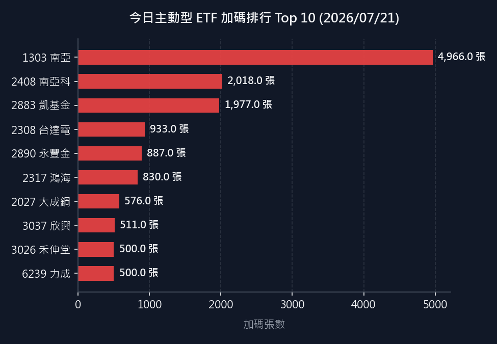
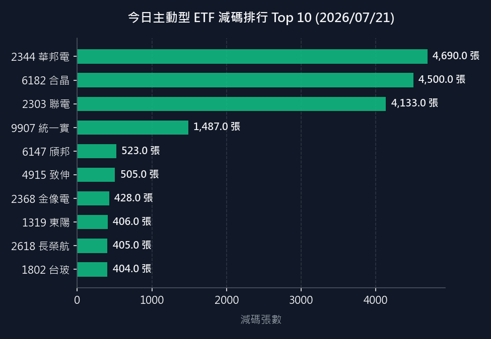

# 主動型 ETF 持股變動

資料來源：`主動型ETF持股明細.xlsx` 最近兩個日期分頁。

比較區間：`20260720` → `20260721`

## 今日加減碼視覺化排行

| 今日加碼 Top 10 | 今日減碼 Top 10 |
| :---: | :---: |
|  |  |

| ETF | 新增 | 刪除 | 比例變動 |
| :-- | --: | --: | --: |
| 00400A | 1 | 0 | 48 |
| 00401A | 0 | 0 | 54 |
| 00402A | 0 | 0 | 42 |
| 00403A | 1 | 0 | 34 |
| 00404A | 0 | 0 | 44 |
| 00405A | 0 | 0 | 37 |
| 00407A | 0 | 0 | 40 |
| 00408A | 2 | 0 | 36 |
| 00980A | 0 | 0 | 39 |
| 00980D | 0 | 0 | 31 |
| 00981A | 0 | 0 | 28 |
| 00982A | 0 | 1 | 38 |
| 00983A | 1 | 0 | 33 |
| 00983D | 0 | 0 | 77 |
| 00984A | 0 | 0 | 85 |
| 00985A | 1 | 1 | 48 |
| 00986A | 0 | 1 | 31 |
| 00987A | 0 | 2 | 24 |
| 00988A | 0 | 2 | 35 |
| 00989A | 1 | 1 | 49 |
| 00990A | 0 | 0 | 38 |
| 00991A | 1 | 2 | 24 |
| 00992A | 0 | 1 | 32 |
| 00993A | 9 | 0 | 47 |
| 00994A | 0 | 0 | 28 |
| 00995A | 2 | 0 | 42 |
| 00996A | 0 | 1 | 39 |
| 00997A | 0 | 0 | 41 |
| 00998A | 0 | 0 | 28 |
| 00999A | 0 | 3 | 66 |

## 00400A

### 新增持股

- 2317 鴻海（0.91%，960 張）

### 刪除持股

- 無

### 投資比例變動

- 1303 南亞：0.47% → 0.46%（-0.01）
- 1590 亞德客-KY：1.05% → 1.01%（-0.04）
- 2059 川湖：3.42% → 3.47%（+0.05）
- 2303 聯電：1.57% → 1.04%（-0.53）
- 2308 台達電：3.11% → 3.15%（+0.04）
- 2313 華通：0.90% → 0.89%（-0.01）
- 2330 台積電：9.08% → 8.88%（-0.20）
- 2357 華碩：1.35% → 1.36%（+0.01）
- 2360 致茂：4.08% → 5.16%（+1.08）
- 2376 技嘉：1.24% → 1.21%（-0.03）
- 2382 廣達：0.86% → 0.83%（-0.03）
- 2383 台光電：5.04% → 5.41%（+0.37）
- 2404 漢唐：0.58% → 0.56%（-0.02）
- 2454 聯發科：6.00% → 6.21%（+0.21）
- 2481 強茂：0.32% → 0.31%（-0.01）
- 2881 富邦金：0.41% → 0.39%（-0.02）
- 2885 元大金：1.03% → 0.95%（-0.08）
- 3017 奇鋐：3.99% → 4.08%（+0.09）
- 3036 文曄：1.14% → 1.13%（-0.01）
- 3037 欣興：3.28% → 3.97%（+0.69）
- 3044 健鼎：1.64% → 1.61%（-0.03）
- 3090 日電貿：0.42% → 0.40%（-0.02）
- 3167 大量：0.18% → 0.17%（-0.01）
- 3211 順達：0.79% → 0.80%（+0.01）
- 3231 緯創：0.82% → 0.81%（-0.01）
- 3293 鈊象：0.38% → 0.37%（-0.01）
- 3374 精材：0.38% → 0.40%（+0.02）
- 3443 創意：2.08% → 3.01%（+0.93）
- 3653 健策：0.82% → 0.85%（+0.03）
- 3665 貿聯-KY：2.46% → 2.72%（+0.26）
- 4958 臻鼎-KY：0.78% → 1.06%（+0.28）
- 5274 信驊：1.97% → 2.52%（+0.55）
- 5347 世界：0.84% → 0.81%（-0.03）
- 5434 崇越：0.44% → 0.42%（-0.02）
- 6121 新普：0.26% → 0.25%（-0.01）
- 6147 頎邦：0.83% → 0.82%（-0.01）
- 6187 萬潤：1.33% → 1.34%（+0.01）
- 6223 旺矽：3.81% → 3.87%（+0.06）
- 6442 光聖：0.38% → 0.37%（-0.01）
- 6488 環球晶：4.41% → 3.95%（-0.46）
- 6505 台塑化：0.95% → 0.98%（+0.03）
- 6510 精測：1.19% → 1.34%（+0.15）
- 6669 緯穎：3.88% → 3.91%（+0.03）
- 7769 鴻勁：0.32% → 0.33%（+0.01）
- 8046 南電：1.16% → 1.18%（+0.02）
- 8150 南茂：0.10% → 0.09%（-0.01）
- 8210 勤誠：1.10% → 1.12%（+0.02）
- 9939 宏全：0.06% → 0.09%（+0.03）

## 00401A

### 新增持股

- 無

### 刪除持股

- 無

### 投資比例變動

- 1216 統一：0.36% → 0.34%（-0.02）
- 2303 聯電：1.13% → 1.12%（-0.01）
- 2308 台達電：4.09% → 4.22%（+0.13）
- 2313 華通：1.17% → 1.18%（+0.01）
- 2330 台積電：9.05% → 9.00%（-0.05）
- 2344 華邦電：1.24% → 1.23%（-0.01）
- 2345 智邦：2.65% → 2.70%（+0.05）
- 2357 華碩：1.35% → 1.39%（+0.04）
- 2360 致茂：1.90% → 1.99%（+0.09）
- 2368 金像電：0.40% → 0.41%（+0.01）
- 2379 瑞昱：2.08% → 2.12%（+0.04）
- 2382 廣達：2.15% → 2.11%（-0.04）
- 2383 台光電：1.86% → 1.96%（+0.10）
- 2412 中華電：1.04% → 0.99%（-0.05）
- 2449 京元電子：1.19% → 1.18%（-0.01）
- 2454 聯發科：6.41% → 6.75%（+0.34）
- 2603 長榮：1.13% → 1.12%（-0.01）
- 2881 富邦金：1.89% → 1.81%（-0.08）
- 2882 國泰金：1.19% → 1.17%（-0.02）
- 2883 凱基金：2.17% → 2.09%（-0.08）
- 2884 玉山金：2.03% → 2.01%（-0.02）
- 2885 元大金：1.21% → 1.13%（-0.08）
- 2886 兆豐金：1.72% → 1.66%（-0.06）
- 2887 台新新光金：1.19% → 1.14%（-0.05）
- 2890 永豐金：0.33% → 0.32%（-0.01）
- 2891 中信金：2.01% → 1.96%（-0.05）
- 2912 統一超：0.35% → 0.33%（-0.02）
- 3008 大立光：1.81% → 1.78%（-0.03）
- 3034 聯詠：0.75% → 0.74%（-0.01）
- 3037 欣興：0.60% → 0.63%（+0.03）
- 3131 弘塑：0.56% → 0.55%（-0.01）
- 3167 大量：0.56% → 0.54%（-0.02）
- 3491 昇達科：1.34% → 1.25%（-0.09）
- 3529 力旺：0.61% → 0.60%（-0.01）
- 3653 健策：1.14% → 1.20%（+0.06）
- 3711 日月光投控：2.59% → 2.63%（+0.04）
- 4904 遠傳：0.99% → 0.92%（-0.07）
- 4958 臻鼎-KY：2.28% → 2.32%（+0.04）
- 4991 環宇-KY：0.51% → 0.54%（+0.03）
- 5274 信驊：0.92% → 0.96%（+0.04）
- 5347 世界：1.54% → 1.50%（-0.04）
- 5871 中租-KY：0.19% → 0.18%（-0.01）
- 6187 萬潤：0.66% → 0.68%（+0.02）
- 6223 旺矽：2.38% → 2.45%（+0.07）
- 6415 矽力*-KY：0.70% → 0.72%（+0.02）
- 6510 精測：0.66% → 0.65%（-0.01）
- 6515 穎崴：0.59% → 0.62%（+0.03）
- 6531 愛普*：1.25% → 1.31%（+0.06）
- 6669 緯穎：2.34% → 2.39%（+0.05）
- 6944 兆聯實業：0.54% → 0.55%（+0.01）
- 7769 鴻勁：2.80% → 2.90%（+0.10）
- 7828 創新服務：1.96% → 1.97%（+0.01）
- 8021 尖點：0.30% → 0.27%（-0.03）
- 8464 億豐：1.31% → 1.26%（-0.05）

## 00402A

### 新增持股

- 無

### 刪除持股

- 無

### 投資比例變動

- AAPL.US Apple：8.22% → 8.04%（-0.18）
- ADI.US Analog Devices：1.84% → 1.82%（-0.02）
- AMD.US AMD：5.57% → 5.65%（+0.08）
- AMZN.US Amazon：4.07% → 4.11%（+0.04）
- ARM.US Arm：1.04% → 1.05%（+0.01）
- ASML.US ASML Holding：1.68% → 1.67%（-0.01）
- AVGO.US Broadcom：2.39% → 2.43%（+0.04）
- AXON.US Axon Enterprise：1.14% → 1.18%（+0.04）
- BABA.US Alibaba Group：0.55% → 0.57%（+0.02）
- BKNG.US Booking Holdings：0.62% → 0.61%（-0.01）
- CIEN.US Ciena：1.15% → 1.16%（+0.01）
- CLS.US Celestica：0.84% → 0.86%（+0.02）
- COHR.US Coherent：1.45% → 1.49%（+0.04）
- CRWD.US CrowdStrike Holdings：1.36% → 1.33%（-0.03）
- DASH.US DoorDash：0.25% → 0.26%（+0.01）
- GOOG.US Alphabet - Class C Capital Stock：3.43% → 3.48%（+0.05）
- GOOGL.US Alphabet - Class A Common Stock：3.38% → 3.42%（+0.04）
- INTC.US Intel：1.25% → 1.27%（+0.02）
- KLAC.US KLA：2.38% → 2.32%（-0.06）
- LITE.US Lumentum：1.31% → 1.36%（+0.05）
- LRCX.US Lam Research：3.67% → 3.58%（-0.09）
- MCHP.US Microchip Technology：1.49% → 1.48%（-0.01）
- MDB.US MongoDB：0.61% → 0.63%（+0.02）
- MRVL.US Marvell：1.35% → 1.40%（+0.05）
- MSFT.US Microsoft：3.44% → 3.51%（+0.07）
- MU.US Micron：6.13% → 6.24%（+0.11）
- NFLX.US Netflix：0.98% → 0.96%（-0.02）
- NVDA.US NVIDIA：8.55% → 8.52%（-0.03）
- PANW.US Palo Alto：3.39% → 3.29%（-0.10）
- PLTR.US Palantir Technologies：1.16% → 1.18%（+0.02）
- SHOP.US Shopify：0.42% → 0.43%（+0.01）
- SIMO.US Silicon Motion：0.80% → 0.76%（-0.04）
- SKHY.US SK hynix：0.98% → 0.96%（-0.02）
- SNOW.US Snowflake：0.81% → 0.83%（+0.02）
- SPCX.US SpaceX：0.64% → 0.62%（-0.02）
- SPOT.US Spotify：0.26% → 0.27%（+0.01）
- STX.US Seagate：1.37% → 1.39%（+0.02）
- TER.US Teradyne：0.75% → 0.78%（+0.03）
- TSM.US TSMC(ADR)：1.60% → 1.62%（+0.02）
- TTWO.US Take-Two：0.55% → 0.56%（+0.01）
- V.US Visa：1.08% → 1.09%（+0.01）
- WDC.US Western Digital：2.66% → 2.71%（+0.05）

## 00403A

### 新增持股

- 6285 啟碁（0.01%，100 張）

### 刪除持股

- 無

### 投資比例變動

- 1303 南亞：1.19% → 1.18%（-0.01）
- 2303 聯電：6.26% → 6.14%（-0.12）
- 2308 台達電：2.96% → 3.15%（+0.19）
- 2327 國巨*：2.43% → 2.45%（+0.02）
- 2330 台積電：19.08% → 18.78%（-0.30）
- 2344 華邦電：3.88% → 3.79%（-0.09）
- 2345 智邦：2.91% → 2.97%（+0.06）
- 2360 致茂：0.80% → 0.83%（+0.03）
- 2383 台光電：3.22% → 3.70%（+0.48）
- 2454 聯發科：3.54% → 3.75%（+0.21）
- 3017 奇鋐：4.73% → 4.87%（+0.14）
- 3037 欣興：3.40% → 3.59%（+0.19）
- 3189 景碩：1.40% → 1.46%（+0.06）
- 3211 順達：0.41% → 0.42%（+0.01）
- 3443 創意：1.15% → 1.20%（+0.05）
- 3533 嘉澤：1.52% → 1.53%（+0.01）
- 3583 辛耘：0.42% → 0.41%（-0.01）
- 3653 健策：1.64% → 1.87%（+0.23）
- 3665 貿聯-KY：0.42% → 0.46%（+0.04）
- 3711 日月光投控：2.36% → 2.47%（+0.11）
- 4958 臻鼎-KY：2.13% → 2.15%（+0.02）
- 4966 譜瑞-KY：0.29% → 0.28%（-0.01）
- 5274 信驊：0.91% → 0.94%（+0.03）
- 6223 旺矽：3.50% → 3.58%（+0.08）
- 6239 力成：0.15% → 0.23%（+0.08）
- 6274 台燿：1.23% → 1.26%（+0.03）
- 6442 光聖：0.24% → 0.17%（-0.07）
- 6488 環球晶：1.91% → 1.72%（-0.19）
- 6515 穎崴：0.63% → 0.60%（-0.03）
- 6669 緯穎：2.38% → 2.40%（+0.02）
- 6805 富世達：0.48% → 0.53%（+0.05）
- 7769 鴻勁：1.08% → 1.19%（+0.11）
- 8046 南電：1.24% → 1.27%（+0.03）
- 8996 高力：1.00% → 0.96%（-0.04）

## 00404A

### 新增持股

- 無

### 刪除持股

- 無

### 投資比例變動

- 1216 統一：2.15% → 2.04%（-0.11）
- 2303 聯電：2.27% → 2.25%（-0.02）
- 2308 台達電：3.74% → 3.85%（+0.11）
- 2327 國巨*：0.65% → 0.66%（+0.01）
- 2330 台積電：22.95% → 22.81%（-0.14）
- 2345 智邦：0.95% → 0.97%（+0.02）
- 2360 致茂：1.06% → 1.11%（+0.05）
- 2376 技嘉：2.00% → 1.98%（-0.02）
- 2383 台光電：1.87% → 1.97%（+0.10）
- 2393 億光：1.82% → 1.76%（-0.06）
- 2454 聯發科：6.35% → 6.68%（+0.33）
- 2885 元大金：2.96% → 2.76%（-0.20）
- 2887 台新新光金：3.44% → 3.28%（-0.16）
- 2890 永豐金：2.20% → 2.14%（-0.06）
- 2912 統一超：0.10% → 0.09%（-0.01）
- 3017 奇鋐：0.65% → 0.68%（+0.03）
- 3037 欣興：0.52% → 0.55%（+0.03）
- 3131 弘塑：0.79% → 0.78%（-0.01）
- 3189 景碩：0.29% → 0.30%（+0.01）
- 3260 威剛：0.38% → 0.39%（+0.01）
- 3264 欣銓：0.91% → 0.92%（+0.01）
- 3265 台星科：0.45% → 0.46%（+0.01）
- 3443 創意：0.11% → 0.12%（+0.01）
- 3702 大聯大：1.76% → 1.77%（+0.01）
- 3711 日月光投控：3.43% → 3.48%（+0.05）
- 4763 材料*-KY：1.94% → 1.93%（-0.01）
- 5269 祥碩：1.83% → 1.68%（-0.15）
- 5274 信驊：1.90% → 1.99%（+0.09）
- 5347 世界：0.39% → 0.38%（-0.01）
- 5434 崇越：1.69% → 1.62%（-0.07）
- 5871 中租-KY：2.01% → 1.94%（-0.07）
- 5876 上海商銀：1.97% → 1.89%（-0.08）
- 6138 茂達：1.72% → 1.81%（+0.09）
- 6206 飛捷：1.78% → 1.75%（-0.03）
- 6223 旺矽：0.75% → 0.77%（+0.02）
- 6239 力成：1.43% → 1.39%（-0.04）
- 6257 矽格：1.68% → 1.65%（-0.03）
- 6488 環球晶：0.19% → 0.18%（-0.01）
- 6515 穎崴：0.28% → 0.29%（+0.01）
- 6531 愛普*：0.21% → 0.22%（+0.01）
- 8069 元太：0.40% → 0.42%（+0.02）
- 8299 群聯：1.06% → 1.08%（+0.02）
- 臺指選擇權08/26 49100 買權：-0.03% → -0.10%（-0.07）
- 臺股期貨08/26：15.84% → 15.76%（-0.08）

## 00405A

### 新增持股

- 無

### 刪除持股

- 無

### 投資比例變動

- 2059 川湖：1.30% → 1.26%（-0.04）
- 2308 台達電：0.98% → 1.00%（+0.02）
- 2327 國巨*：3.20% → 3.21%（+0.01）
- 2330 台積電：2.22% → 2.17%（-0.05）
- 2337 旺宏：1.32% → 1.30%（-0.02）
- 2344 華邦電：3.56% → 3.45%（-0.11）
- 2368 金像電：2.14% → 2.13%（-0.01）
- 2383 台光電：2.76% → 2.86%（+0.10）
- 2408 南亞科：1.29% → 1.30%（+0.01）
- 2449 京元電子：0.86% → 0.83%（-0.03）
- 2454 聯發科：6.41% → 6.64%（+0.23）
- 3017 奇鋐：5.92% → 6.06%（+0.14）
- 3026 禾伸堂：1.44% → 1.49%（+0.05）
- 3037 欣興：4.71% → 4.88%（+0.17）
- 3081 聯亞：0.91% → 0.90%（-0.01）
- 3105 穩懋：1.52% → 1.55%（+0.03）
- 3131 弘塑：3.77% → 3.68%（-0.09）
- 3443 創意：5.00% → 5.18%（+0.18）
- 3583 辛耘：1.76% → 1.71%（-0.05）
- 3653 健策：2.30% → 2.39%（+0.09）
- 4749 新應材：0.31% → 0.29%（-0.02）
- 5274 信驊：1.88% → 1.93%（+0.05）
- 5347 世界：0.13% → 0.12%（-0.01）
- 6187 萬潤：2.07% → 2.08%（+0.01）
- 6223 旺矽：5.96% → 6.04%（+0.08）
- 6274 台燿：1.29% → 1.33%（+0.04）
- 6291 沛亨：0.31% → 0.30%（-0.01）
- 6442 光聖：0.34% → 0.33%（-0.01）
- 6488 環球晶：5.87% → 5.27%（-0.60）
- 6510 精測：1.39% → 1.35%（-0.04）
- 6515 穎崴：0.56% → 0.58%（+0.02）
- 7734 印能科技：1.80% → 1.87%（+0.07）
- 7769 鴻勁：2.40% → 2.45%（+0.05）
- 8028 昇陽半導體：1.07% → 1.02%（-0.05）
- 8046 南電：4.59% → 4.66%（+0.07）
- 8210 勤誠：0.94% → 0.96%（+0.02）
- 8996 高力：1.10% → 1.04%（-0.06）

## 00407A

### 新增持股

- 無

### 刪除持股

- 無

### 投資比例變動

- 1303 南亞：0.64% → 0.63%（-0.01）
- 1590 亞德客-KY：2.23% → 2.13%（-0.10）
- 2059 川湖：2.14% → 2.07%（-0.07）
- 2303 聯電：1.54% → 1.50%（-0.04）
- 2308 台達電：4.03% → 4.07%（+0.04）
- 2330 台積電：9.52% → 9.29%（-0.23）
- 2344 華邦電：1.70% → 1.65%（-0.05）
- 2345 智邦：3.16% → 3.15%（-0.01）
- 2360 致茂：1.84% → 1.90%（+0.06）
- 2368 金像電：1.97% → 1.96%（-0.01）
- 2376 技嘉：0.79% → 0.76%（-0.03）
- 2383 台光電：3.61% → 3.73%（+0.12）
- 2395 研華：1.73% → 1.79%（+0.06）
- 2408 南亞科：1.70% → 1.69%（-0.01）
- 2412 中華電：1.89% → 1.77%（-0.12）
- 2454 聯發科：6.28% → 6.48%（+0.20）
- 3017 奇鋐：3.37% → 3.44%（+0.07）
- 3034 聯詠：0.68% → 0.67%（-0.01）
- 3037 欣興：3.58% → 3.70%（+0.12）
- 3293 鈊象：0.60% → 0.57%（-0.03）
- 3443 創意：1.73% → 1.79%（+0.06）
- 3491 昇達科：0.44% → 0.40%（-0.04）
- 3529 力旺：1.95% → 1.89%（-0.06）
- 3665 貿聯-KY：2.65% → 2.73%（+0.08）
- 3711 日月光投控：2.60% → 2.59%（-0.01）
- 4904 遠傳：0.35% → 0.32%（-0.03）
- 5274 信驊：1.88% → 1.93%（+0.05）
- 5434 崇越：0.22% → 0.21%（-0.01）
- 5536 聖暉*：1.99% → 1.96%（-0.03）
- 6223 旺矽：2.35% → 2.38%（+0.03）
- 6274 台燿：2.32% → 2.39%（+0.07）
- 6415 矽力*-KY：0.39% → 0.40%（+0.01）
- 6446 藥華藥：2.49% → 2.34%（-0.15）
- 6515 穎崴：1.41% → 1.46%（+0.05）
- 6531 愛普*：1.45% → 1.50%（+0.05）
- 6669 緯穎：3.52% → 3.71%（+0.19）
- 6805 富世達：1.84% → 1.87%（+0.03）
- 8046 南電：2.44% → 2.47%（+0.03）
- 8210 勤誠：1.78% → 1.89%（+0.11）
- 8996 高力：0.41% → 0.39%（-0.02）

## 00408A

### 新增持股

- 2360 致茂（1.17%，10 張）
- 3017 奇鋐（1.35%，10 張）

### 刪除持股

- 無

### 投資比例變動

- 1216 統一：2.50% → 2.41%（-0.09）
- 1477 聚陽：1.55% → 1.52%（-0.03）
- 2308 台達電：2.65% → 2.78%（+0.13）
- 2317 鴻海：2.11% → 2.15%（+0.04）
- 2330 台積電：5.29% → 5.33%（+0.04）
- 2345 智邦：2.00% → 2.07%（+0.07）
- 2356 英業達：1.13% → 1.15%（+0.02）
- 2357 華碩：1.77% → 1.84%（+0.07）
- 2368 金像電：2.11% → 2.17%（+0.06）
- 2383 台光電：1.84% → 1.97%（+0.13）
- 2395 研華：1.70% → 1.81%（+0.11）
- 2404 漢唐：1.70% → 1.67%（-0.03）
- 2408 南亞科：0.46% → 0.47%（+0.01）
- 2412 中華電：3.33% → 3.23%（-0.10）
- 2454 聯發科：2.00% → 2.78%（+0.78）
- 2603 長榮：1.76% → 1.77%（+0.01）
- 2880 華南金：1.55% → 1.54%（-0.01）
- 2885 元大金：1.96% → 1.85%（-0.11）
- 2886 兆豐金：2.16% → 2.12%（-0.04）
- 2891 中信金：1.47% → 1.46%（-0.01）
- 2912 統一超：2.48% → 2.40%（-0.08）
- 3037 欣興：2.34% → 2.50%（+0.16）
- 3045 台灣大：3.29% → 3.20%（-0.09）
- 3231 緯創：2.49% → 2.52%（+0.03）
- 3665 貿聯-KY：0.44% → 1.16%（+0.72）
- 3702 大聯大：1.66% → 1.69%（+0.03）
- 4904 遠傳：2.06% → 1.96%（-0.10）
- 5347 世界：0.46% → 0.45%（-0.01）
- 5434 崇越：2.54% → 2.48%（-0.06）
- 5876 上海商銀：2.24% → 2.18%（-0.06）
- 5904 寶雅：1.90% → 1.92%（+0.02）
- 6274 台燿：1.28% → 1.37%（+0.09）
- 6488 環球晶：0.61% → 0.56%（-0.05）
- 6669 緯穎：2.24% → 3.20%（+0.96）
- 7769 鴻勁：0.90% → 1.70%（+0.80）
- 8046 南電：1.85% → 1.94%（+0.09）

## 00980A

### 新增持股

- 無

### 刪除持股

- 無

### 投資比例變動

- 2059 川湖：5.72% → 5.55%（-0.17）
- 2308 台達電：5.43% → 5.51%（+0.08）
- 2317 鴻海：2.02% → 2.00%（-0.02）
- 2330 台積電：9.87% → 9.66%（-0.21）
- 2344 華邦電：1.17% → 1.13%（-0.04）
- 2360 致茂：1.76% → 1.82%（+0.06）
- 2368 金像電：2.44% → 2.43%（-0.01）
- 2376 技嘉：0.94% → 0.91%（-0.03）
- 2382 廣達：1.12% → 1.09%（-0.03）
- 2383 台光電：4.45% → 4.61%（+0.16）
- 2454 聯發科：6.03% → 6.24%（+0.21）
- 2884 玉山金：0.93% → 0.90%（-0.03）
- 2891 中信金：1.18% → 1.13%（-0.05）
- 3008 大立光：0.91% → 0.88%（-0.03）
- 3017 奇鋐：1.88% → 1.92%（+0.04）
- 3026 禾伸堂：0.56% → 0.58%（+0.02）
- 3036 文曄：1.34% → 1.32%（-0.02）
- 3037 欣興：2.83% → 2.93%（+0.10）
- 3044 健鼎：0.43% → 0.42%（-0.01）
- 3081 聯亞：2.29% → 2.28%（-0.01）
- 3189 景碩：0.63% → 0.66%（+0.03）
- 3231 緯創：0.67% → 0.66%（-0.01）
- 3293 鈊象：0.59% → 0.56%（-0.03）
- 3443 創意：1.76% → 1.82%（+0.06）
- 3529 力旺：0.93% → 0.90%（-0.03）
- 3653 健策：3.24% → 3.36%（+0.12）
- 3665 貿聯-KY：0.65% → 0.67%（+0.02）
- 5274 信驊：1.24% → 1.27%（+0.03）
- 5904 寶雅：1.28% → 1.25%（-0.03）
- 6223 旺矽：2.78% → 2.82%（+0.04）
- 6274 台燿：0.98% → 1.01%（+0.03）
- 6442 光聖：0.30% → 0.29%（-0.01）
- 6515 穎崴：2.23% → 2.31%（+0.08）
- 6805 富世達：0.47% → 0.48%（+0.01）
- 7769 鴻勁：3.75% → 3.82%（+0.07）
- 8046 南電：1.62% → 1.65%（+0.03）
- 8210 勤誠：0.81% → 0.82%（+0.01）
- 8299 群聯：0.92% → 0.93%（+0.01）
- 8996 高力：1.44% → 1.37%（-0.07）

## 00980D

### 新增持股

- 無

### 刪除持股

- 無

### 投資比例變動

- ALLY FINANCIAL INC (REG) VAR 13JUN2029：0.55% → 0.56%（+0.01）
- APA CORP 6.750000 % 15-FEB-2055：0.37% → 0.36%（-0.01）
- ARIS WATER HOLDINGS LLC SER REGS 7.250000 % 01APR2030：0.47% → 0.48%（+0.01）
- CANTOR FITZGERALD LP SER REGS 7.200000 % 12DEC2028：0.32% → 0.33%（+0.01）
- CHARTER COMM OPT 6.484% 23OCT2045 W/I：0.47% → 0.46%（-0.01）
- COX COMMUNICATIONS INC SER REGS 5.950000 % 01SEP2054：0.56% → 0.55%（-0.01）
- DOW CHEMICAL CO/THE (REG) 5.55% 30NOV2048：0.57% → 0.56%（-0.01）
- DOW CHEMICAL CO/THE (REG) 5.6% 15FEB2054：0.61% → 0.60%（-0.01）
- DOW CHEMICAL CO/THE 5.950000 % 15MAR2055：0.51% → 0.50%（-0.01）
- DOW CHEMICAL CO/THE 6.9% 15MAY2053：0.61% → 0.60%（-0.01）
- DOW CHEMICAL CO/THE 9.4% 15MAY2039：0.54% → 0.55%（+0.01）
- FMC CORP (REG) 4.5% 01OCT2049：0.50% → 0.51%（+0.01）
- FORD MOTOR CREDIT CO LLC 6.798% 07NOV2028：0.33% → 0.34%（+0.01）
- GLOBAL ATLANTIC FIN CO SER REGS 6.750000 % 15MAR2054：0.64% → 0.63%（-0.01）
- HERTZ CORP/THE SER REGS (REG S) 12.625% 15JUL2029：0.29% → 0.30%（+0.01）
- LPL HOLDINGS INC (REG) 6.75% 17NOV2028：0.56% → 0.57%（+0.01）
- META PLATFORMS INC 5.750000 % 15-NOV-2065：0.45% → 0.44%（-0.01）
- NISSAN MOTOR CO SER REGS 8.125000 % 17JUL2035：0.52% → 0.53%（+0.01）
- ONEOK INC 6.625% 01SEP2053：0.59% → 0.58%（-0.01）
- ORACLE CORP (REG) 5.500000 % 27SEP2064：0.56% → 0.55%（-0.01）
- ORACLE CORP 5.950000 % 26-SEP-2055：0.42% → 0.41%（-0.01）
- ORACLE CORP 6.9% 09NOV2052：0.53% → 0.52%（-0.01）
- SANTANDER HOLDINGS USA VAR 09MAR2029：0.47% → 0.48%（+0.01）
- SANTANDER HOLDINGS USA VAR 12JUN2029：0.58% → 0.59%（+0.01）
- SOCIETE GENERALE SER REGS (REG) (REG S) 7.367% 10JAN2053：0.34% → 0.33%（-0.01）
- US 10YR NOTE (CBT)SEP26 21-SEP-2026：18.68% → 18.66%（-0.02）
- US 10YR ULTRA FUT SEP26 21-SEP-2026：-2.85% → -2.84%（+0.01）
- US LONG BOND(CBT) SEP26 21-SEP-2026：5.52% → 5.49%（-0.03）
- VIACOM INC (REG) 5.85% 01SEP2043：0.56% → 0.57%（+0.01）
- VIACOMCBS INC 6.875% 30APR2036：0.28% → 0.29%（+0.01）
- VIRGINIA ELEC & POWER CO (REG) 8.875% 15NOV2038：0.60% → 0.59%（-0.01）

## 00981A

### 新增持股

- 無

### 刪除持股

- 無

### 投資比例變動

- 1590 亞德客-KY：0.28% → 0.27%（-0.01）
- 2303 聯電：4.49% → 4.34%（-0.15）
- 2308 台達電：3.57% → 3.80%（+0.23）
- 2327 國巨*：6.30% → 6.26%（-0.04）
- 2330 台積電：11.06% → 10.74%（-0.32）
- 2345 智邦：5.28% → 5.24%（-0.04）
- 2368 金像電：3.07% → 3.04%（-0.03）
- 2383 台光電：8.15% → 8.37%（+0.22）
- 2449 京元電子：0.67% → 0.64%（-0.03）
- 2454 聯發科：6.83% → 7.01%（+0.18）
- 3017 奇鋐：4.51% → 4.69%（+0.18）
- 3037 欣興：4.97% → 5.21%（+0.24）
- 3376 新日興：0.13% → 0.12%（-0.01）
- 3653 健策：2.89% → 2.97%（+0.08）
- 3665 貿聯-KY：3.51% → 3.60%（+0.09）
- 3711 日月光投控：3.84% → 3.80%（-0.04）
- 5274 信驊：2.31% → 2.36%（+0.05）
- 5439 高技：0.32% → 0.28%（-0.04）
- 6147 頎邦：0.41% → 0.37%（-0.04）
- 6191 精成科：0.14% → 0.13%（-0.01）
- 6223 旺矽：5.31% → 5.35%（+0.04）
- 6271 同欣電：0.23% → 0.22%（-0.01）
- 6274 台燿：2.31% → 2.37%（+0.06）
- 6510 精測：0.36% → 0.34%（-0.02）
- 6515 穎崴：0.31% → 0.32%（+0.01）
- 6669 緯穎：4.51% → 4.50%（-0.01）
- 6805 富世達：0.94% → 0.99%（+0.05）
- 8046 南電：4.19% → 4.22%（+0.03）

## 00982A

### 新增持股

- 無

### 刪除持股

- 2368 金像電（0.79%，396 張）

### 投資比例變動

- 1785 光洋科：1.00% → 0.98%（-0.02）
- 2059 川湖：3.09% → 3.02%（-0.07）
- 2303 聯電：2.54% → 2.50%（-0.04）
- 2316 楠梓電：1.14% → 1.10%（-0.04）
- 2327 國巨*：1.15% → 1.16%（+0.01）
- 2330 台積電：9.83% → 9.71%（-0.12）
- 2345 智邦：3.66% → 3.69%（+0.03）
- 2360 致茂：3.31% → 3.46%（+0.15）
- 2376 技嘉：0.76% → 0.74%（-0.02）
- 2377 微星：1.74% → 1.71%（-0.03）
- 2383 台光電：3.14% → 3.29%（+0.15）
- 2451 創見：0.25% → 0.26%（+0.01）
- 2454 聯發科：6.25% → 6.53%（+0.28）
- 2467 志聖：1.65% → 1.60%（-0.05）
- 2472 立隆電：1.36% → 1.33%（-0.03）
- 2885 元大金：0.29% → 0.27%（-0.02）
- 3008 大立光：2.03% → 1.98%（-0.05）
- 3017 奇鋐：1.87% → 1.93%（+0.06）
- 3105 穩懋：2.85% → 2.94%（+0.09）
- 3264 欣銓：2.03% → 2.06%（+0.03）
- 3491 昇達科：2.60% → 2.40%（-0.20）
- 3583 辛耘：1.77% → 1.74%（-0.03）
- 3702 大聯大：1.28% → 1.27%（-0.01）
- 3711 日月光投控：1.30% → 1.31%（+0.01）
- 4958 臻鼎-KY：3.28% → 3.31%（+0.03）
- 5274 信驊：0.86% → 0.89%（+0.03）
- 5536 聖暉*：9.27% → 9.20%（-0.07）
- 6187 萬潤：0.18% → 0.19%（+0.01）
- 6223 旺矽：3.61% → 3.70%（+0.09）
- 6239 力成：0.40% → 0.39%（-0.01）
- 6257 矽格：2.14% → 2.09%（-0.05）
- 6274 台燿：1.08% → 1.13%（+0.05）
- 6278 台表科：0.76% → 0.77%（+0.01）
- 6488 環球晶：3.12% → 2.83%（-0.29）
- 6531 愛普*：1.46% → 1.53%（+0.07）
- 6669 緯穎：3.06% → 3.10%（+0.04）
- 7769 鴻勁：1.20% → 1.24%（+0.04）
- 8996 高力：0.80% → 0.77%（-0.03）

## 00983A

### 新增持股

- FIG.US Figma（0.23%，3.359 張）

### 刪除持股

- 無

### 投資比例變動

- AMD.US AMD：6.47% → 6.76%（+0.29）
- AMZN.US Amazon：3.19% → 3.32%（+0.13）
- AVGO.US Broadcom：1.79% → 1.88%（+0.09）
- BEAM.US Beam Therapeutics：2.58% → 2.54%（-0.04）
- CBRS.US Cerebras：0.54% → 0.57%（+0.03）
- CERS.US Cerus：0.17% → 0.45%（+0.28）
- COIN.US Coinbase：1.26% → 0.94%（-0.32）
- CRCL.US Circle：0.31% → 0.34%（+0.03）
- CRSP.US CRISPR Therapeutics：4.04% → 3.85%（-0.19）
- CRWV.US CoreWeave：0.20% → 0.21%（+0.01）
- DE.US Deere：1.01% → 1.02%（+0.01）
- GOOG.US Alphabet - Class C Capital Stock：1.25% → 1.31%（+0.06）
- GOOGL.US Alphabet - Class A Common Stock：1.65% → 1.73%（+0.08）
- HOOD.US Robinhood Markets：5.69% → 5.06%（-0.63）
- ILMN.US Illumina：3.53% → 3.60%（+0.07）
- META.US Meta：1.41% → 1.57%（+0.16）
- NTLA.US Intellia Therapeutics：1.77% → 1.48%（-0.29）
- NTRA.US Natera：3.04% → 3.03%（-0.01）
- NVDA.US NVIDIA：0.81% → 0.84%（+0.03）
- PLTR.US Palantir Technologies：0.63% → 0.66%（+0.03）
- RBLX.US Roblox：3.20% → 3.39%（+0.19）
- SHOP.US Shopify：6.14% → 6.37%（+0.23）
- SNOW.US Snowflake：0.48% → 0.73%（+0.25）
- SOFI.US SoFi Technologies：0.65% → 0.66%（+0.01）
- SPCX.US SpaceX：4.27% → 4.25%（-0.02）
- TEM.US Tempus：5.95% → 5.03%（-0.92）
- TER.US Teradyne：0.53% → 0.56%（+0.03）
- TSLA.US Tesla：8.60% → 8.58%（-0.02）
- TSM.US TSMC(ADR)：3.31% → 3.44%（+0.13）
- TWST.US Twist Bioscience：4.38% → 4.20%（-0.18）
- TXG.US 10x Genomics：5.13% → 5.22%（+0.09）
- WGS.US GeneDx：1.32% → 1.30%（-0.02）
- XYZ.US Block：2.25% → 2.29%（+0.04）

## 00983D

### 新增持股

- 無

### 刪除持股

- 無

### 投資比例變動

- ABIBB 8.2 01/15/39：1.97% → 2.01%（+0.04）
- ABXCN 7 1/2 09/15/38：0.54% → 0.55%（+0.01）
- AET 6 5/8 06/15/36：0.74% → 0.75%（+0.01）
- ALLY 8 11/01/31：0.52% → 0.53%（+0.01）
- AMCX 10 1/2 07/15/32：1.61% → 1.65%（+0.04）
- ATH 6 5/8 05/19/55：0.86% → 0.88%（+0.02）
- AWK 6.593 10/15/37：0.72% → 0.73%（+0.01）
- BACR 7.437 11/02/33：1.96% → 1.30%（-0.66）
- BATSLN 7.079 08/02/43：1.09% → 1.11%（+0.02）
- BATSLN 7.081 08/02/53：1.34% → 1.36%（+0.02）
- BHCCN 11 09/30/28：1.82% → 1.86%（+0.04）
- BNCN 7 3/8 03/01/33：1.12% → 1.14%（+0.02）
- BRITEL 9 5/8 12/15/30：1.35% → 1.38%（+0.03）
- BRKHEC 6 3/4 07/01/37：0.82% → 0.84%（+0.02）
- C 8 1/8 07/15/39：2.34% → 2.00%（-0.34）
- CEG 6 1/2 10/01/53：0.79% → 0.80%（+0.01）
- CMCSA 6.95 08/15/37：1.01% → 0.69%（-0.32）
- CP 7 1/8 10/15/31：0.82% → 0.84%（+0.02）
- CRWV 9 02/01/31：1.29% → 1.32%（+0.03）
- CYH 10 7/8 01/15/32：1.49% → 1.52%（+0.03）
- DELL 8.1 07/15/36：1.72% → 1.57%（-0.15）
- DELL 8.35 07/15/46：1.63% → 1.46%（-0.17）
- DIS 7 3/4 12/01/45：0.80% → 0.82%（+0.02）
- DOW 6.9 05/15/53：0.74% → 0.76%（+0.02）
- DOW 9.4 05/15/39：1.92% → 1.96%（+0.04）
- DT 9 1/4 06/01/32：0.94% → 0.96%（+0.02）
- DTV 8 7/8 02/01/30：1.58% → 1.61%（+0.03）
- DUK 7 3/4 03/01/31：1.56% → 1.59%（+0.03）
- ED 6 3/4 04/01/38：0.62% → 0.63%（+0.01）
- ENBCN 6.7 11/15/53：1.14% → 1.16%（+0.02）
- ET 6 1/2 02/01/42：0.16% → 0.17%（+0.01）
- FFHCN 6.35 03/22/54：0.71% → 0.72%（+0.01）
- GE 6 3/4 03/15/32：0.58% → 0.59%（+0.01）
- GE 6 7/8 01/10/39：0.85% → 0.87%（+0.02）
- GM 6 3/4 04/01/46：1.19% → 1.21%（+0.02）
- GS 6 1/4 02/01/41：0.16% → 0.17%（+0.01）
- GTN 10 1/2 07/15/29：1.68% → 1.71%（+0.03）
- HAL 7.45 09/15/39：1.83% → 1.87%（+0.04）
- HPE 6.35 10/15/45：1.00% → 1.02%（+0.02）
- HSBC 6.332 03/09/44：1.07% → 1.09%（+0.02）
- IEP 10 11/15/29：1.51% → 1.55%（+0.04）
- KHC 6 7/8 01/26/39：1.01% → 1.03%（+0.02）
- KMI 6.95 01/15/38：1.07% → 1.09%（+0.02）
- LOW 6.65 09/15/37：0.85% → 0.86%（+0.01）
- LQDW.US iShares Investment Grade Corpora：7.34% → 7.49%（+0.15）
- MBGGR 8 1/2 01/18/31：1.31% → 1.34%（+0.03）
- MCD 6.3 03/01/38：0.74% → 0.75%（+0.01）
- MINAU 9 1/4 10/01/28：0.87% → 0.90%（+0.03）
- MOHEGN 11 7/8 04/15/31：1.35% → 1.38%（+0.03）
- MPC 6 1/2 03/01/41：0.16% → 0.17%（+0.01）
- MS 7 1/4 04/01/32：1.46% → 1.49%（+0.03）
- NTRCN 7 1/8 05/23/36：0.55% → 0.57%（+0.02）
- NVDA 5.55 06/15/46：0.89% → 0.91%（+0.02）
- OKE 6 5/8 09/01/53：0.70% → 0.71%（+0.01）
- ORCL 6.9 11/09/52：1.36% → 1.15%（-0.21）
- OXY 6.6 03/15/46：0.74% → 0.76%（+0.02）
- PCG 6 3/4 01/15/53：1.16% → 1.17%（+0.01）
- PCG 6.7 04/01/53：0.96% → 0.97%（+0.01）
- PDM 9 1/4 07/20/28：0.83% → 0.85%（+0.02）
- PFE 7.2 03/15/39：1.44% → 1.47%（+0.03）
- RAKUTN 11 1/4 02/15/27：1.80% → 1.84%（+0.04）
- RIOLN 7 1/4 03/15/31：0.51% → 0.52%（+0.01）
- S 8 3/4 03/15/32：0.66% → 0.67%（+0.01）
- SABHLD 10 3/4 11/15/29：0.59% → 0.60%（+0.01）
- SPCX 6.6 07/15/46：0.86% → 0.88%（+0.02）
- SUCN 6.85 06/01/39：1.23% → 1.25%（+0.02）
- SYY 6.6 04/01/50：0.19% → 0.20%（+0.01）
- TELEFO 8 1/4 09/15/30：1.01% → 1.03%（+0.02）
- TELEFONICA EMISIONES SAU 7.045 06/20/36：1.56% → 1.59%（+0.03）
- TIME WARNER CABLE INC 6.750 06/15/39：0.48% → 0.49%（+0.01）
- TIME WARNER CABLE INC 7.300 07/01/38：0.51% → 0.52%（+0.01）
- TLTW.US iShares 20+ Year Treasury Bond B：7.30% → 7.44%（+0.14）
- TRPCN 7 5/8 01/15/39：1.71% → 1.74%（+0.03）
- UNITEDHEALTH GROUP INC 6.875 02/15/38：0.87% → 0.89%（+0.02）
- VENLNG 9 1/2 02/01/29：1.41% → 1.44%（+0.03）
- VLO 6 5/8 06/15/37：0.75% → 0.76%（+0.01）
- VZ 7 3/4 12/01/30：1.14% → 1.16%（+0.02）

## 00984A

### 新增持股

- 無

### 刪除持股

- 無

### 投資比例變動

- 1102 亞泥：1.27% → 1.24%（-0.03）
- 1216 統一：2.10% → 2.02%（-0.08）
- 1303 南亞：0.68% → 0.69%（+0.01）
- 1326 台化：0.71% → 0.74%（+0.03）
- 1402 遠東新：1.10% → 1.07%（-0.03）
- 1409 新纖：0.55% → 0.54%（-0.01）
- 1560 中砂：0.47% → 0.48%（+0.01）
- 1785 光洋科：0.44% → 0.43%（-0.01）
- 1795 美時：0.40% → 0.39%（-0.01）
- 2006 東和鋼鐵：0.42% → 0.41%（-0.01）
- 2049 上銀：0.56% → 0.55%（-0.01）
- 2105 正新：0.45% → 0.42%（-0.03）
- 2204 中華：0.29% → 0.28%（-0.01）
- 2206 三陽工業：0.43% → 0.41%（-0.02）
- 2303 聯電：1.92% → 1.93%（+0.01）
- 2327 國巨*：0.95% → 0.98%（+0.03）
- 2330 台積電：2.93% → 2.94%（+0.01）
- 2345 智邦：0.34% → 0.35%（+0.01）
- 2347 聯強：0.97% → 0.96%（-0.01）
- 2357 華碩：2.67% → 2.77%（+0.10）
- 2360 致茂：0.62% → 0.66%（+0.04）
- 2382 廣達：2.16% → 2.15%（-0.01）
- 2383 台光電：1.67% → 1.77%（+0.10）
- 2385 群光：0.40% → 0.39%（-0.01）
- 2404 漢唐：1.81% → 1.77%（-0.04）
- 2412 中華電：2.74% → 2.66%（-0.08）
- 2454 聯發科：1.30% → 1.39%（+0.09）
- 2467 志聖：0.50% → 0.49%（-0.01）
- 2474 可成：0.82% → 0.80%（-0.02）
- 2478 大毅：0.35% → 0.36%（+0.01）
- 2501 國建：0.27% → 0.26%（-0.01）
- 2633 台灣高鐵：1.45% → 1.42%（-0.03）
- 2634 漢翔：0.47% → 0.50%（+0.03）
- 2855 統一證：0.52% → 0.51%（-0.01）
- 2881 富邦金：2.61% → 2.53%（-0.08）
- 2882 國泰金：0.29% → 0.28%（-0.01）
- 2885 元大金：0.40% → 0.37%（-0.03）
- 2891 中信金：2.36% → 2.33%（-0.03）
- 2897 王道銀行：0.28% → 0.27%（-0.01）
- 2912 統一超：1.58% → 1.53%（-0.05）
- 3005 神基：0.44% → 0.45%（+0.01）
- 3026 禾伸堂：0.88% → 0.94%（+0.06）
- 3034 聯詠：1.92% → 1.94%（+0.02）
- 3037 欣興：1.45% → 1.54%（+0.09）
- 3045 台灣大：2.06% → 2.00%（-0.06）
- 3090 日電貿：0.33% → 0.32%（-0.01）
- 3167 大量：0.52% → 0.50%（-0.02）
- 3189 景碩：1.00% → 1.06%（+0.06）
- 3264 欣銓：0.23% → 0.24%（+0.01）
- 3293 鈊象：1.26% → 1.24%（-0.02）
- 3443 創意：0.57% → 0.60%（+0.03）
- 3481 群創：0.44% → 0.43%（-0.01）
- 3532 台勝科：0.77% → 0.69%（-0.08）
- 3702 大聯大：1.00% → 1.02%（+0.02）
- 3711 日月光投控：1.10% → 1.13%（+0.03）
- 4904 遠傳：1.91% → 1.80%（-0.11）
- 4938 和碩：0.38% → 0.39%（+0.01）
- 4958 臻鼎-KY：1.68% → 1.73%（+0.05）
- 5274 信驊：0.31% → 0.33%（+0.02）
- 5434 崇越：1.18% → 1.15%（-0.03）
- 5483 中美晶：0.51% → 0.48%（-0.03）
- 5536 聖暉*：0.53% → 0.54%（+0.01）
- 5871 中租-KY：1.23% → 1.21%（-0.02）
- 5876 上海商銀：1.35% → 1.31%（-0.04）
- 6023 元大期：0.28% → 0.27%（-0.01）
- 6147 頎邦：0.47% → 0.48%（+0.01）
- 6182 合晶：0.66% → 0.62%（-0.04）
- 6196 帆宣：1.12% → 1.13%（+0.01）
- 6213 聯茂：1.05% → 1.12%（+0.07）
- 6223 旺矽：1.00% → 1.05%（+0.05）
- 6274 台燿：1.52% → 1.62%（+0.10）
- 6285 啟碁：0.55% → 0.56%（+0.01）
- 6446 藥華藥：2.08% → 2.01%（-0.07）
- 6531 愛普*：1.04% → 1.11%（+0.07）
- 6831 邁科：0.38% → 0.40%（+0.02）
- 7769 鴻勁：0.59% → 0.61%（+0.02）
- 8016 矽創：0.83% → 0.85%（+0.02）
- 8021 尖點：1.16% → 1.05%（-0.11）
- 8046 南電：1.10% → 1.15%（+0.05）
- 8081 致新：0.22% → 0.23%（+0.01）
- 8096 擎亞：0.50% → 0.53%（+0.03）
- 8210 勤誠：0.28% → 0.29%（+0.01）
- 8261 富鼎：0.68% → 0.70%（+0.02）
- 8358 金居：0.95% → 0.98%（+0.03）
- 9914 美利達：0.29% → 0.28%（-0.01）

## 00985A

### 新增持股

- 2327 國巨*（2.98%，435 張）

### 刪除持股

- 6805 富世達（0.19%，14 張）

### 投資比例變動

- 1216 統一：1.11% → 1.06%（-0.05）
- 1802 台玻：0.77% → 0.53%（-0.24）
- 2027 大成鋼：1.67% → 1.63%（-0.04）
- 2049 上銀：0.85% → 0.54%（-0.31）
- 2059 川湖：3.38% → 3.34%（-0.04）
- 2303 聯電：1.67% → 2.96%（+1.29）
- 2308 台達電：1.07% → 1.11%（+0.04）
- 2330 台積電：22.34% → 22.27%（-0.07）
- 2344 華邦電：1.37% → 1.35%（-0.02）
- 2345 智邦：2.05% → 2.09%（+0.04）
- 2360 致茂：1.09% → 1.15%（+0.06）
- 2368 金像電：0.97% → 0.98%（+0.01）
- 2376 技嘉：3.75% → 3.70%（-0.05）
- 2383 台光電：2.24% → 2.37%（+0.13）
- 2395 研華：3.18% → 3.36%（+0.18）
- 2408 南亞科：1.91% → 1.94%（+0.03）
- 2412 中華電：2.79% → 2.68%（-0.11）
- 2454 聯發科：1.07% → 1.12%（+0.05）
- 2881 富邦金：0.67% → 0.46%（-0.21）
- 2891 中信金：0.50% → 0.49%（-0.01）
- 3008 大立光：2.80% → 2.77%（-0.03）
- 3017 奇鋐：1.00% → 1.04%（+0.04）
- 3036 文曄：2.47% → 2.49%（+0.02）
- 3037 欣興：0.32% → 0.34%（+0.02）
- 3081 聯亞：0.90% → 0.91%（+0.01）
- 3105 穩懋：0.50% → 0.52%（+0.02）
- 3131 弘塑：1.17% → 1.50%（+0.33）
- 3189 景碩：0.01% → 0.02%（+0.01）
- 3293 鈊象：1.10% → 1.07%（-0.03）
- 3529 力旺：0.61% → 0.60%（-0.01）
- 3653 健策：1.09% → 1.15%（+0.06）
- 3661 世芯-KY：2.61% → 2.60%（-0.01）
- 3665 貿聯-KY：0.25% → 0.27%（+0.02）
- 3711 日月光投控：0.79% → 0.81%（+0.02）
- 4904 遠傳：2.82% → 2.64%（-0.18）
- 4958 臻鼎-KY：2.26% → 2.30%（+0.04）
- 6147 頎邦：2.00% → 2.03%（+0.03）
- 6187 萬潤：2.24% → 2.29%（+0.05）
- 6223 旺矽：0.75% → 0.78%（+0.03）
- 6415 矽力*-KY：0.29% → 0.30%（+0.01）
- 6442 光聖：3.02% → 3.00%（-0.02）
- 6488 環球晶：0.54% → 0.49%（-0.05）
- 6505 台塑化：2.65% → 2.79%（+0.14）
- 6669 緯穎：0.75% → 0.77%（+0.02）
- 7769 鴻勁：0.70% → 0.73%（+0.03）
- 8046 南電：0.75% → 0.78%（+0.03）
- 8299 群聯：1.83% → 1.00%（-0.83）
- 8996 高力：0.61% → 0.59%（-0.02）

## 00986A

### 新增持股

- 無

### 刪除持股

- MRVL.US Marvell（1.34%，1.3 張）

### 投資比例變動

- 2330 台積電：8.53% → 8.60%（+0.07）
- AAPL.US Apple：0.62% → 0.60%（-0.02）
- AMD.US AMD：2.71% → 2.74%（+0.03）
- AMZN.US Amazon：3.79% → 3.81%（+0.02）
- AVGO.US Broadcom：4.87% → 4.94%（+0.07）
- CAT.US Caterpillar：2.65% → 2.59%（-0.06）
- COHR.US Coherent：1.97% → 2.02%（+0.05）
- CRWD.US CrowdStrike Holdings：4.17% → 4.05%（-0.12）
- ETN.US Eaton：2.19% → 2.18%（-0.01）
- GEV.US GE Vernova：3.76% → 3.82%（+0.06）
- GOOGL.US Alphabet - Class A Common Stock：7.59% → 7.66%（+0.07）
- GS.US Goldman Sachs：3.21% → 3.16%（-0.05）
- HWM.US Howmet Aerospace：2.53% → 2.51%（-0.02）
- IBIDEN(4062.JP)：1.85% → 1.84%（-0.01）
- JPM.US JPMorgan Chase：0.61% → 0.92%（+0.31）
- LITE.US Lumentum：3.13% → 3.25%（+0.12）
- LLY.US Eli Lilly：2.90% → 2.81%（-0.09）
- LRCX.US Lam Research：3.46% → 3.37%（-0.09）
- MSFT.US Microsoft：2.15% → 2.19%（+0.04）
- MU.US Micron：4.40% → 4.46%（+0.06）
- MUFG(8306.JP)：1.41% → 1.40%（-0.01）
- Murata Mfg.(6981.JP)：1.80% → 1.79%（-0.01）
- NET.US Cloudflare：1.82% → 1.78%（-0.04）
- NVDA.US NVIDIA：5.88% → 5.86%（-0.02）
- SNDK.US Sandisk：1.85% → 1.89%（+0.04）
- SNOW.US Snowflake：1.25% → 1.27%（+0.02）
- Siemens Energy AG：2.04% → 2.09%（+0.05）
- TSLA.US Tesla：1.15% → 1.11%（-0.04）
- Yaskawa Electric(6506.JP)：1.73% → 1.71%（-0.02）
- 嘉能可公司：1.52% → 1.50%（-0.02）
- 英飛凌科技股份有限公司：3.19% → 3.18%（-0.01）

## 00987A

### 新增持股

- 無

### 刪除持股

- 2327 國巨*（2.95%，111 張）
- 8155 博智（1.56%，131 張）

### 投資比例變動

- 2330 台積電：8.82% → 8.64%（-0.18）
- 2345 智邦：2.47% → 2.48%（+0.01）
- 2383 台光電：6.31% → 6.54%（+0.23）
- 2408 南亞科：3.86% → 3.87%（+0.01）
- 2454 聯發科：2.40% → 3.51%（+1.11）
- 2455 全新：2.40% → 2.41%（+0.01）
- 3017 奇鋐：7.76% → 7.95%（+0.19）
- 3037 欣興：6.02% → 6.25%（+0.23）
- 3081 聯亞：3.20% → 0.29%（-2.91）
- 3167 大量：2.73% → 2.56%（-0.17）
- 3363 上詮：1.97% → 1.93%（-0.04）
- 3443 創意：3.80% → 3.94%（+0.14）
- 3653 健策：2.43% → 2.53%（+0.10）
- 3665 貿聯-KY：3.85% → 3.99%（+0.14）
- 4764 雙鍵：1.93% → 2.00%（+0.07）
- 5274 信驊：0.16% → 0.17%（+0.01）
- 6139 亞翔：3.14% → 3.12%（-0.02）
- 6223 旺矽：6.22% → 6.32%（+0.10）
- 6271 同欣電：1.73% → 1.70%（-0.03）
- 6274 台燿：3.57% → 3.69%（+0.12）
- 6488 環球晶：2.94% → 2.64%（-0.30）
- 6683 雍智科技：2.43% → 2.42%（-0.01）
- 8028 昇陽半導體：2.23% → 2.14%（-0.09）
- 8046 南電：3.55% → 3.60%（+0.05）

## 00988A

### 新增持股

- 無

### 刪除持股

- 6274 台燿（0.54%，255 張）
- SK hynix(000660.KS)（0.72%，10 張）

### 投資比例變動

- 2303 聯電：1.56% → 1.43%（-0.13）
- 2327 國巨*：3.04% → 2.77%（-0.27）
- 2330 台積電：3.11% → 3.18%（+0.07）
- 2383 台光電：3.01% → 2.98%（-0.03）
- 2454 聯發科：2.71% → 2.72%（+0.01）
- 3017 奇鋐：0.46% → 0.45%（-0.01）
- 3037 欣興：3.45% → 3.29%（-0.16）
- 3711 日月光投控：2.00% → 1.97%（-0.03）
- 6223 旺矽：1.47% → 1.45%（-0.02）
- AIXTRON SE：0.82% → 0.53%（-0.29）
- AMD.US AMD：5.95% → 6.10%（+0.15）
- BE.US Bloom Energy：3.90% → 3.61%（-0.29）
- CRDO.US Credo：1.90% → 2.00%（+0.10）
- INFINEON TECHNOLOGIES AG：2.67% → 2.70%（+0.03）
- KLAC.US KLA：1.99% → 1.96%（-0.03）
- Kioxia Holdings(285A.JP)：3.39% → 3.41%（+0.02）
- LITE.US Lumentum：1.59% → 1.67%（+0.08）
- Lasertec Corporation(6920.JP)：1.97% → 1.98%（+0.01）
- MICRONICS(6871.JP)：1.51% → 1.52%（+0.01）
- MRVL.US Marvell：1.44% → 1.50%（+0.06）
- MU.US Micron：4.77% → 4.91%（+0.14）
- Murata Mfg.(6981.JP)：3.44% → 3.47%（+0.03）
- NOW.US ServiceNow：1.63% → 1.67%（+0.04）
- Nippon Chemi-Con(6997.JP)：1.45% → 1.47%（+0.02）
- PANW.US Palo Alto：1.47% → 1.85%（+0.38）
- SNDK.US Sandisk：2.78% → 2.87%（+0.09）
- SUMCO(3436.JP)：2.22% → 2.24%（+0.02）
- Samsung Elec Mech(009150.KS)：4.21% → 4.41%（+0.20）
- TAIYO YUDEN(6976.JP)：2.39% → 2.41%（+0.02）
- TSEM.US Tower Semiconductor：1.44% → 1.41%（-0.03）
- Tokyo Electron(8035.JP)：2.58% → 2.60%（+0.02）
- VECO.US Veeco Instruments Inc.：1.53% → 1.50%（-0.03）
- WDC.US Western Digital：1.40% → 1.44%（+0.04）
- 三環集團(300408.SZ)：0.51% → 0.48%（-0.03）
- 鼎泰高科(301377.SZ)：0.70% → 0.62%（-0.08）

## 00989A

### 新增持股

- HUBS.US HubSpot（0.72%，1.185 張）

### 刪除持股

- MXL.US MaxLinear（0.42%，2.197 張）

### 投資比例變動

- ADI.US Analog Devices：1.10% → 1.09%（-0.01）
- AMD.US AMD：3.58% → 3.64%（+0.06）
- AMKR.US Amkor：1.05% → 1.04%（-0.01）
- AMZN.US Amazon：0.95% → 0.96%（+0.01）
- APP.US Applovin：1.03% → 1.04%（+0.01）
- ASML.US ASML Holding：3.20% → 2.79%（-0.41）
- AVGO.US Broadcom：3.85% → 3.94%（+0.09）
- BE.US Bloom Energy：1.39% → 1.28%（-0.11）
- CIEN.US Ciena：1.85% → 1.88%（+0.03）
- CRCL.US Circle：0.29% → 0.32%（+0.03）
- CRM.US Salesforce：1.27% → 1.54%（+0.27）
- CRWD.US CrowdStrike Holdings：3.15% → 3.08%（-0.07）
- ENTG.US Entegris：1.21% → 1.17%（-0.04）
- FIGR.US Figure：0.75% → 0.79%（+0.04）
- FN.US Fabrinet：0.66% → 0.68%（+0.02）
- GFS.US GlobalFoundries：1.25% → 1.24%（-0.01）
- GLW.US Corning：1.87% → 1.85%（-0.02）
- GOOG.US Alphabet - Class C Capital Stock：4.41% → 4.49%（+0.08）
- HOOD.US Robinhood Markets：2.33% → 2.32%（-0.01）
- INTC.US Intel：3.43% → 3.51%（+0.08）
- LITE.US Lumentum：1.44% → 1.51%（+0.07）
- LMND.US Lemonade：1.06% → 1.07%（+0.01）
- LRCX.US Lam Research：3.01% → 2.95%（-0.06）
- META.US Meta：2.81% → 2.82%（+0.01）
- MSFT.US Microsoft：1.93% → 1.97%（+0.04）
- MTSI.US MACOM Technology Solutions：0.97% → 0.98%（+0.01）
- MU.US Micron：1.66% → 1.69%（+0.03）
- NET.US Cloudflare：2.66% → 2.61%（-0.05）
- NU.US Nu：0.87% → 0.90%（+0.03）
- NVDA.US NVIDIA：3.77% → 3.79%（+0.02）
- ON.US ON Semiconductor：1.72% → 1.71%（-0.01）
- ORCL.US Oracle：1.23% → 1.19%（-0.04）
- PANW.US Palo Alto：4.34% → 4.23%（-0.11）
- PLTR.US Palantir Technologies：0.46% → 0.47%（+0.01）
- RIVN.US Rivian：1.52% → 1.51%（-0.01）
- ROK.US Rockwell Automation：0.92% → 0.91%（-0.01）
- SHOP.US Shopify：1.41% → 1.43%（+0.02）
- SNDK.US Sandisk：0.96% → 0.99%（+0.03）
- SNOW.US Snowflake：2.68% → 2.73%（+0.05）
- SPCX.US SpaceX：0.66% → 0.64%（-0.02）
- TEM.US Tempus：0.95% → 0.87%（-0.08）
- TSLA.US Tesla：3.19% → 3.10%（-0.09）
- TSM.US TSMC(ADR)：1.88% → 1.90%（+0.02）
- TTMI.US TTM Technologies：0.62% → 0.63%（+0.01）
- TTWO.US Take-Two：3.76% → 3.80%（+0.04）
- TWLO.US Twilio：2.24% → 2.23%（-0.01）
- TXN.US Texas Instruments：1.57% → 1.58%（+0.01）
- VICR.US Vicor Corporation：1.07% → 1.04%（-0.03）
- WRBY.US Warby Parker：0.71% → 0.66%（-0.05）

## 00990A

### 新增持股

- 無

### 刪除持股

- 無

### 投資比例變動

- 2303 聯電：1.22% → 1.10%（-0.12）
- 2308 台達電：2.54% → 2.49%（-0.05）
- 2330 台積電：2.66% → 2.70%（+0.04）
- 2383 台光電：1.67% → 1.64%（-0.03）
- 2449 京元電子：0.62% → 0.58%（-0.04）
- 2454 聯發科：2.05% → 2.03%（-0.02）
- 3037 欣興：2.05% → 1.94%（-0.11）
- 3711 日月光投控：1.02% → 0.99%（-0.03）
- 4958 臻鼎-KY：0.93% → 0.86%（-0.07）
- 5347 世界：1.09% → 0.99%（-0.10）
- 6223 旺矽：1.09% → 1.06%（-0.03）
- 6274 台燿：0.81% → 0.78%（-0.03）
- AMAT.US Applied Materials：3.69% → 3.66%（-0.03）
- AMD.US AMD：6.76% → 6.86%（+0.10）
- AMZN.US Amazon：2.12% → 2.14%（+0.02）
- ASML.US ASML Holding：1.48% → 1.47%（-0.01）
- AVGO.US Broadcom：0.85% → 0.86%（+0.01）
- BE.US Bloom Energy：1.94% → 1.78%（-0.16）
- DDOG.US Datadog：0.87% → 0.88%（+0.01）
- GLW.US Corning：0.30% → 0.29%（-0.01）
- GOOGL.US Alphabet - Class A Common Stock：2.57% → 2.61%（+0.04）
- INFINEON TECHNOLOGIES AG：2.62% → 2.60%（-0.02）
- Kioxia Holdings(285A.JP)：2.75% → 2.74%（-0.01）
- LITE.US Lumentum：5.09% → 5.31%（+0.22）
- LRCX.US Lam Research：2.11% → 2.06%（-0.05）
- META.US Meta：2.09% → 2.08%（-0.01）
- MRVL.US Marvell：1.13% → 1.16%（+0.03）
- MSFT.US Microsoft：2.12% → 2.16%（+0.04）
- MU.US Micron：3.13% → 3.19%（+0.06）
- NVDA.US NVIDIA：1.66% → 1.67%（+0.01）
- ON.US ON Semiconductor：0.55% → 0.54%（-0.01）
- ONTO.US Onto Innovation：1.20% → 1.19%（-0.01）
- SK hynix(000660.KS)：1.49% → 1.43%（-0.06）
- SNDK.US Sandisk：1.84% → 1.89%（+0.05）
- SNOW.US Snowflake：1.09% → 1.12%（+0.03）
- TSEM.US Tower Semiconductor：0.81% → 0.79%（-0.02）
- UCTT.US Ultra Clean Holdings：1.23% → 1.22%（-0.01）
- WDC.US Western Digital：2.53% → 2.58%（+0.05）

## 00991A

### 新增持股

- 1303 南亞（1.26%，4800 張）

### 刪除持股

- 2344 華邦電（0.99%，4800 張）
- 2492 華新科（1.37%，3600 張）

### 投資比例變動

- 2059 川湖：4.25% → 4.27%（+0.02）
- 2303 聯電：2.50% → 1.80%（-0.70）
- 2308 台達電：0.02% → 1.25%（+1.23）
- 2327 國巨*：6.22% → 6.45%（+0.23）
- 2330 台積電：13.37% → 13.54%（+0.17）
- 2345 智邦：4.30% → 4.45%（+0.15）
- 2383 台光電：7.54% → 8.40%（+0.86）
- 2404 漢唐：1.01% → 1.23%（+0.22）
- 2408 南亞科：5.28% → 6.50%（+1.22）
- 2454 聯發科：4.58% → 4.91%（+0.33）
- 3017 奇鋐：2.34% → 2.67%（+0.33）
- 3026 禾伸堂：1.87% → 2.46%（+0.59）
- 3037 欣興：4.37% → 4.69%（+0.32）
- 3189 景碩：2.80% → 2.99%（+0.19）
- 3665 貿聯-KY：1.15% → 1.23%（+0.08）
- 3711 日月光投控：3.28% → 3.39%（+0.11）
- 5274 信驊：1.11% → 1.18%（+0.07）
- 6223 旺矽：4.34% → 4.72%（+0.38）
- 6274 台燿：3.24% → 3.47%（+0.23）
- 6515 穎崴：1.83% → 1.87%（+0.04）
- 6669 緯穎：2.70% → 3.01%（+0.31）
- 7769 鴻勁：2.97% → 3.13%（+0.16）
- 8046 南電：4.40% → 4.78%（+0.38）
- 8299 群聯：2.62% → 2.73%（+0.11）

## 00992A

### 新增持股

- 無

### 刪除持股

- 6182 合晶（1.69%，4500 張）

### 投資比例變動

- 2059 川湖：6.30% → 6.13%（-0.17）
- 2303 聯電：2.53% → 2.47%（-0.06）
- 2327 國巨*：3.61% → 3.63%（+0.02）
- 2330 台積電：9.05% → 8.90%（-0.15）
- 2337 旺宏：0.44% → 0.43%（-0.01）
- 2345 智邦：6.27% → 6.29%（+0.02）
- 2383 台光電：6.87% → 7.14%（+0.27）
- 2454 聯發科：3.76% → 3.91%（+0.15）
- 2455 全新：2.12% → 2.13%（+0.01）
- 3008 大立光：4.52% → 4.39%（-0.13）
- 3017 奇鋐：5.94% → 6.10%（+0.16）
- 3026 禾伸堂：1.57% → 1.63%（+0.06）
- 3037 欣興：4.37% → 4.54%（+0.17）
- 3189 景碩：0.83% → 0.86%（+0.03）
- 3363 上詮：0.42% → 0.41%（-0.01）
- 3443 創意：2.19% → 2.28%（+0.09）
- 3583 辛耘：0.30% → 0.29%（-0.01）
- 3661 世芯-KY：2.01% → 1.97%（-0.04）
- 3665 貿聯-KY：4.82% → 5.01%（+0.19）
- 3711 日月光投控：2.70% → 2.71%（+0.01）
- 6139 亞翔：0.54% → 0.53%（-0.01）
- 6187 萬潤：3.17% → 3.20%（+0.03）
- 6223 旺矽：4.94% → 5.03%（+0.09）
- 6488 環球晶：1.38% → 1.25%（-0.13）
- 6515 穎崴：1.66% → 1.73%（+0.07）
- 6584 南俊國際：3.34% → 3.17%（-0.17）
- 6805 富世達：0.39% → 0.40%（+0.01）
- 7734 印能科技：0.44% → 0.46%（+0.02）
- 7751 竑騰：0.97% → 0.99%（+0.02）
- 8021 尖點：1.71% → 1.50%（-0.21）
- 8299 群聯：2.14% → 2.17%（+0.03）
- 8996 高力：4.39% → 4.21%（-0.18）

## 00993A

### 新增持股

- 1301 台塑（0.23%，358 張）
- 2027 大成鋼（0.24%，576 張）
- 2360 致茂（0.87%，42 張）
- 2412 中華電（0.27%，190 張）
- 2637 慧洋-KY（0.32%，383 張）
- 2882 國泰金（0.28%，285 張）
- 3653 健策（0.69%，19 張）
- 6488 環球晶（0.66%，53 張）
- 8358 金居（0.48%，118 張）

### 刪除持股

- 無

### 投資比例變動

- 1303 南亞：0.28% → 0.61%（+0.33）
- 1590 亞德客-KY：0.31% → 0.13%（-0.18）
- 2059 川湖：3.04% → 3.03%（-0.01）
- 2303 聯電：3.15% → 2.90%（-0.25）
- 2308 台達電：3.07% → 2.96%（-0.11）
- 2327 國巨*：4.06% → 3.25%（-0.81）
- 2330 台積電：11.99% → 12.81%（+0.82）
- 2344 華邦電：2.56% → 2.66%（+0.10）
- 2345 智邦：4.81% → 3.72%（-1.09）
- 2368 金像電：1.89% → 1.56%（-0.33）
- 2383 台光電：5.27% → 4.46%（-0.81）
- 2395 研華：0.27% → 0.28%（+0.01）
- 2408 南亞科：1.30% → 1.79%（+0.49）
- 2454 聯發科：5.97% → 5.13%（-0.84）
- 2472 立隆電：0.32% → 0.14%（-0.18）
- 2618 長榮航：0.44% → 0.51%（+0.07）
- 2881 富邦金：0.56% → 0.88%（+0.32）
- 2883 凱基金：0.94% → 1.49%（+0.55）
- 2885 元大金：0.99% → 1.03%（+0.04）
- 2890 永豐金：0.79% → 1.12%（+0.33）
- 2891 中信金：0.58% → 0.64%（+0.06）
- 3017 奇鋐：4.28% → 3.10%（-1.18）
- 3023 信邦：0.31% → 0.13%（-0.18）
- 3037 欣興：4.10% → 3.32%（-0.78）
- 3042 晶技：0.36% → 0.16%（-0.20）
- 3189 景碩：2.09% → 2.12%（+0.03）
- 3264 欣銓：0.31% → 0.82%（+0.51）
- 3481 群創：0.33% → 0.38%（+0.05）
- 3665 貿聯-KY：2.54% → 1.17%（-1.37）
- 3702 大聯大：0.43% → 0.55%（+0.12）
- 3711 日月光投控：3.19% → 2.81%（-0.38）
- 4904 遠傳：0.45% → 0.51%（+0.06）
- 4958 臻鼎-KY：0.42% → 1.19%（+0.77）
- 5274 信驊：2.05% → 2.26%（+0.21）
- 5289 宜鼎：0.38% → 0.17%（-0.21）
- 5536 聖暉*：2.92% → 1.28%（-1.64）
- 5904 寶雅：0.65% → 0.29%（-0.36）
- 6196 帆宣：0.55% → 0.57%（+0.02）
- 6213 聯茂：0.39% → 0.18%（-0.21）
- 6223 旺矽：4.93% → 5.49%（+0.56）
- 6274 台燿：2.51% → 2.60%（+0.09）
- 6446 藥華藥：0.81% → 0.86%（+0.05）
- 6515 穎崴：2.24% → 2.32%（+0.08）
- 6669 緯穎：3.37% → 2.57%（-0.80）
- 7769 鴻勁：0.20% → 1.13%（+0.93）
- 8046 南電：2.34% → 2.26%（-0.08）
- 8150 南茂：0.37% → 0.16%（-0.21）

## 00994A

### 新增持股

- 無

### 刪除持股

- 無

### 投資比例變動

- 2059 川湖：3.60% → 3.49%（-0.11）
- 2303 聯電：0.92% → 0.90%（-0.02）
- 2308 台達電：2.24% → 2.27%（+0.03）
- 2327 國巨*：4.19% → 4.20%（+0.01）
- 2330 台積電：16.38% → 16.08%（-0.30）
- 2360 致茂：0.24% → 0.88%（+0.64）
- 2368 金像電：2.38% → 2.37%（-0.01）
- 2383 台光電：6.80% → 7.04%（+0.24）
- 2404 漢唐：0.03% → 0.02%（-0.01）
- 2408 南亞科：2.39% → 2.40%（+0.01）
- 2449 京元電子：0.48% → 0.46%（-0.02）
- 2454 聯發科：6.35% → 6.65%（+0.30）
- 3017 奇鋐：3.14% → 3.99%（+0.85）
- 3037 欣興：5.19% → 5.38%（+0.19）
- 3231 緯創：0.51% → 0.50%（-0.01）
- 3443 創意：1.58% → 1.63%（+0.05）
- 3665 貿聯-KY：0.48% → 1.04%（+0.56）
- 4904 遠傳：0.05% → 0.04%（-0.01）
- 5274 信驊：2.26% → 2.33%（+0.07）
- 5347 世界：0.71% → 0.68%（-0.03）
- 6223 旺矽：4.33% → 4.39%（+0.06）
- 6257 矽格：0.84% → 0.81%（-0.03）
- 6274 台燿：3.93% → 4.06%（+0.13）
- 6488 環球晶：1.51% → 1.36%（-0.15）
- 6515 穎崴：1.07% → 1.11%（+0.04）
- 6669 緯穎：1.04% → 1.77%（+0.73）
- 7769 鴻勁：1.19% → 1.49%（+0.30）
- 8046 南電：5.74% → 5.83%（+0.09）

## 00995A

### 新增持股

- 2486 一詮（0.45%，100 張）
- 3357 臺慶科（0.23%，50 張）

### 刪除持股

- 無

### 投資比例變動

- 2303 聯電：2.01% → 1.95%（-0.06）
- 2308 台達電：3.70% → 3.73%（+0.03）
- 2313 華通：0.40% → 0.39%（-0.01）
- 2327 國巨*：4.23% → 4.21%（-0.02）
- 2330 台積電：9.62% → 9.38%（-0.24）
- 2344 華邦電：0.87% → 0.84%（-0.03）
- 2345 智邦：5.09% → 5.06%（-0.03）
- 2360 致茂：1.06% → 1.09%（+0.03）
- 2368 金像電：2.77% → 2.74%（-0.03）
- 2383 台光電：7.49% → 7.71%（+0.22）
- 2404 漢唐：0.13% → 0.12%（-0.01）
- 2449 京元電子：0.46% → 0.45%（-0.01）
- 2454 聯發科：5.47% → 5.63%（+0.16）
- 2467 志聖：0.31% → 0.30%（-0.01）
- 2472 立隆電：0.95% → 0.92%（-0.03）
- 2885 元大金：0.69% → 0.63%（-0.06）
- 3017 奇鋐：3.78% → 3.85%（+0.07）
- 3023 信邦：0.75% → 0.72%（-0.03）
- 3037 欣興：3.85% → 3.97%（+0.12）
- 3044 健鼎：0.67% → 0.65%（-0.02）
- 3167 大量：0.24% → 0.23%（-0.01）
- 3189 景碩：0.47% → 0.48%（+0.01）
- 3443 創意：0.41% → 0.43%（+0.02）
- 3653 健策：2.12% → 2.19%（+0.07）
- 3665 貿聯-KY：2.86% → 2.95%（+0.09）
- 3711 日月光投控：2.74% → 2.72%（-0.02）
- 5274 信驊：2.52% → 2.57%（+0.05）
- 5439 高技：0.36% → 0.35%（-0.01）
- 6147 頎邦：0.44% → 0.43%（-0.01）
- 6213 聯茂：0.36% → 0.37%（+0.01）
- 6223 旺矽：4.35% → 4.39%（+0.04）
- 6274 台燿：1.69% → 1.74%（+0.05）
- 6438 迅得：0.45% → 0.43%（-0.02）
- 6510 精測：0.28% → 0.27%（-0.01）
- 6515 穎崴：1.74% → 1.79%（+0.05）
- 6531 愛普*：0.47% → 0.48%（+0.01）
- 7750 新代：0.52% → 0.51%（-0.01）
- 7769 鴻勁：2.13% → 2.16%（+0.03）
- 8046 南電：4.16% → 4.20%（+0.04）
- 8150 南茂：0.41% → 0.39%（-0.02）
- 8210 勤誠：0.91% → 0.92%（+0.01）
- 8996 高力：0.69% → 0.65%（-0.04）

## 00996A

### 新增持股

- 無

### 刪除持股

- 2337 旺宏（0.26%，92 張）

### 投資比例變動

- 1303 南亞：1.35% → 1.34%（-0.01）
- 1802 台玻：0.12% → 0.11%（-0.01）
- 2049 上銀：0.43% → 0.41%（-0.02）
- 2308 台達電：4.38% → 4.44%（+0.06）
- 2327 國巨*：6.27% → 6.75%（+0.48）
- 2330 台積電：10.15% → 9.95%（-0.20）
- 2344 華邦電：3.30% → 3.21%（-0.09）
- 2360 致茂：1.12% → 1.16%（+0.04）
- 2382 廣達：0.05% → 0.04%（-0.01）
- 2383 台光電：5.48% → 5.68%（+0.20）
- 2454 聯發科：6.62% → 6.86%（+0.24）
- 2467 志聖：0.32% → 0.31%（-0.01）
- 2472 立隆電：3.90% → 3.78%（-0.12）
- 3017 奇鋐：0.57% → 0.59%（+0.02）
- 3026 禾伸堂：0.90% → 0.93%（+0.03）
- 3037 欣興：2.22% → 2.30%（+0.08）
- 3042 晶技：1.87% → 1.88%（+0.01）
- 3131 弘塑：1.76% → 1.72%（-0.04）
- 3189 景碩：1.39% → 1.44%（+0.05）
- 3443 創意：2.38% → 2.47%（+0.09）
- 3653 健策：1.57% → 1.62%（+0.05）
- 3661 世芯-KY：1.48% → 1.45%（-0.03）
- 3665 貿聯-KY：0.13% → 0.14%（+0.01）
- 4583 台灣精銳：0.41% → 0.40%（-0.01）
- 4958 臻鼎-KY：7.15% → 7.17%（+0.02）
- 5269 祥碩：0.79% → 0.72%（-0.07）
- 6182 合晶：1.25% → 1.13%（-0.12）
- 6213 聯茂：2.18% → 2.26%（+0.08）
- 6223 旺矽：2.53% → 2.58%（+0.05）
- 6239 力成：1.30% → 1.25%（-0.05）
- 6415 矽力*-KY：0.46% → 0.47%（+0.01）
- 6510 精測：0.69% → 0.67%（-0.02）
- 6526 達發：1.22% → 1.23%（+0.01）
- 6531 愛普*：1.79% → 1.86%（+0.07）
- 6770 力積電：0.52% → 0.95%（+0.43）
- 6831 邁科：2.39% → 2.45%（+0.06）
- 8021 尖點：1.24% → 1.09%（-0.15）
- 8046 南電：4.73% → 4.80%（+0.07）
- 8210 勤誠：1.19% → 1.21%（+0.02）

## 00997A

### 新增持股

- 無

### 刪除持股

- 無

### 投資比例變動

- 2327 國巨*：1.23% → 1.11%（-0.12）
- 2330 台積電：2.16% → 2.19%（+0.03）
- 2383 台光電：1.32% → 1.29%（-0.03）
- 2454 聯發科：0.59% → 0.58%（-0.01）
- AAPL.US Apple：3.04% → 2.97%（-0.07）
- ADBE.US Adobe：0.46% → 0.45%（-0.01）
- ALAB.US Astera Labs：1.23% → 1.25%（+0.02）
- AMAT.US Applied Materials：4.73% → 4.68%（-0.05）
- AMD.US AMD：5.70% → 5.77%（+0.07）
- AMZN.US Amazon：1.57% → 1.58%（+0.01）
- ANET.US Arista Networks：1.51% → 1.52%（+0.01）
- APH.US Amphenol：0.93% → 0.92%（-0.01）
- AVGO.US Broadcom：1.84% → 1.87%（+0.03）
- CDNS.US Cadence Design Systems：0.29% → 0.28%（-0.01）
- COHR.US Coherent：0.89% → 0.91%（+0.02）
- CRDO.US Credo：0.85% → 0.88%（+0.03）
- CRWD.US CrowdStrike Holdings：2.19% → 2.13%（-0.06）
- CSCO.US Cisco：0.83% → 0.81%（-0.02）
- DT.US Dynatrace：1.55% → 1.56%（+0.01）
- EW.US Edwards Lifesciences：1.43% → 1.42%（-0.01）
- FTNT.US Fortinet：2.60% → 2.57%（-0.03）
- GE.US GE Aerospace：1.35% → 1.32%（-0.03）
- GEV.US GE Vernova：1.67% → 1.70%（+0.03）
- GOOGL.US Alphabet - Class A Common Stock：3.44% → 3.48%（+0.04）
- HWM.US Howmet Aerospace：2.07% → 2.06%（-0.01）
- IBIDEN(4062.JP)：1.99% → 1.98%（-0.01）
- INTC.US Intel：2.23% → 2.27%（+0.04）
- KLAC.US KLA：1.30% → 1.27%（-0.03）
- LITE.US Lumentum：1.23% → 1.28%（+0.05）
- LRCX.US Lam Research：2.70% → 2.64%（-0.06）
- META.US Meta：2.56% → 2.55%（-0.01）
- MRVL.US Marvell：2.62% → 2.70%（+0.08）
- MSFT.US Microsoft：0.64% → 0.65%（+0.01）
- MU.US Micron：4.18% → 4.25%（+0.07）
- OKTA.US Okta：1.64% → 1.62%（-0.02）
- PANW.US Palo Alto：1.85% → 1.79%（-0.06）
- PLTR.US Palantir Technologies：0.86% → 0.87%（+0.01）
- SNDK.US Sandisk：2.62% → 2.68%（+0.06）
- STX.US Seagate：2.42% → 2.46%（+0.04）
- TER.US Teradyne：1.70% → 1.76%（+0.06）
- WDC.US Western Digital：3.10% → 3.15%（+0.05）

## 00998A

### 新增持股

- 無

### 刪除持股

- 無

### 投資比例變動

- BAC.US Bank of America：3.60% → 3.55%（-0.05）
- BPM銀行股份公司：1.75% → 1.77%（+0.02）
- C.US Citigroup：1.17% → 1.16%（-0.01）
- GS.US Goldman Sachs：1.92% → 1.91%（-0.01）
- IBKR.US Interactive Brokers：1.96% → 1.99%（+0.03）
- JPM.US JPMorgan Chase：2.77% → 2.76%（-0.01）
- MRX.US Marex：1.90% → 1.98%（+0.08）
- MS.US Morgan Stanley：1.75% → 1.72%（-0.03）
- PFG.US Principal Financial：1.54% → 2.03%（+0.49）
- Piraeus Bank SA：3.70% → 3.68%（-0.02）
- UBS.US UBS Group：2.05% → 2.00%（-0.05）
- Unipol保險股份公司：4.58% → 4.62%（+0.04）
- V.US Visa：2.01% → 2.02%（+0.01）
- 匯豐控股有限公司：3.99% → 3.97%（-0.02）
- 國民西敏集團公開有限公司：1.63% → 1.62%（-0.01）
- 巴克萊集團：3.14% → 3.12%（-0.02）
- 希臘國家銀行：1.81% → 1.84%（+0.03）
- 德國商業銀行：2.59% → 2.60%（+0.01）
- 東方匯理資產管理有限責任公司：3.23% → 3.22%（-0.01）
- 標準人壽公開有限公司：2.42% → 2.40%（-0.02）
- 法國巴黎銀行股份有限公司：3.27% → 3.31%（+0.04）
- 法國興業銀行股份有限公司：3.31% → 3.34%（+0.03）
- 法通保險集團公開有限公司：1.81% → 1.80%（-0.01）
- 渣打集團有限公司：3.58% → 3.55%（-0.03）
- 義大利西恩那銀行股份公司：4.62% → 4.65%（+0.03）
- 聯合聖保羅銀行：2.14% → 2.16%（+0.02）
- 荷蘭銀行公眾有限公司：3.86% → 3.87%（+0.01）
- 裕信銀行：2.92% → 2.94%（+0.02）

## 00999A

### 新增持股

- 無

### 刪除持股

- 2317 鴻海（0.26%，130 張）
- 2347 聯強（0.29%，417 張）
- 3045 台灣大（0.26%，279 張）

### 投資比例變動

- 1319 東陽：0.49% → 0.24%（-0.25）
- 2059 川湖：4.49% → 4.41%（-0.08）
- 2204 中華：1.25% → 1.19%（-0.06）
- 2308 台達電：3.39% → 3.48%（+0.09）
- 2330 台積電：6.00% → 5.95%（-0.05）
- 2345 智邦：1.81% → 1.83%（+0.02）
- 2357 華碩：1.40% → 1.43%（+0.03）
- 2360 致茂：1.36% → 1.42%（+0.06）
- 2368 金像電：2.18% → 2.20%（+0.02）
- 2382 廣達：1.18% → 1.15%（-0.03）
- 2383 台光電：3.65% → 3.83%（+0.18）
- 2393 億光：1.36% → 1.31%（-0.05）
- 2395 研華：1.09% → 1.14%（+0.05）
- 2408 南亞科：1.88% → 1.90%（+0.02）
- 2451 創見：0.85% → 0.86%（+0.01）
- 2454 聯發科：3.62% → 3.79%（+0.17）
- 2618 長榮航：0.68% → 0.46%（-0.22）
- 2727 王品：1.20% → 1.17%（-0.03）
- 2880 華南金：1.02% → 1.00%（-0.02）
- 2884 玉山金：0.96% → 0.94%（-0.02）
- 2885 元大金：1.55% → 1.44%（-0.11）
- 2886 兆豐金：1.37% → 1.42%（+0.05）
- 2887 台新新光金：1.72% → 1.64%（-0.08）
- 2890 永豐金：1.31% → 1.27%（-0.04）
- 2892 第一金：1.12% → 1.09%（-0.03）
- 3017 奇鋐：1.00% → 1.04%（+0.04）
- 3026 禾伸堂：1.11% → 1.16%（+0.05）
- 3037 欣興：1.23% → 1.29%（+0.06）
- 3081 聯亞：1.55% → 1.56%（+0.01）
- 3090 日電貿：0.53% → 0.51%（-0.02）
- 3227 原相：0.70% → 0.71%（+0.01）
- 3293 鈊象：0.97% → 0.94%（-0.03）
- 3592 瑞鼎：0.47% → 0.23%（-0.24）
- 3653 健策：2.55% → 2.68%（+0.13）
- 3665 貿聯-KY：0.99% → 1.04%（+0.05）
- 3706 神達：1.03% → 1.01%（-0.02）
- 3711 日月光投控：2.89% → 3.61%（+0.72）
- 4551 智伸科：0.60% → 0.58%（-0.02）
- 4746 台耀：0.98% → 0.95%（-0.03）
- 4904 遠傳：1.08% → 1.00%（-0.08）
- 4915 致伸：0.55% → 0.27%（-0.28）
- 5274 信驊：1.19% → 1.24%（+0.05）
- 5434 崇越：0.54% → 0.87%（+0.33）
- 5439 高技：0.71% → 1.15%（+0.44）
- 5534 長虹：1.40% → 1.34%（-0.06）
- 5904 寶雅：0.91% → 0.90%（-0.01）
- 6121 新普：1.11% → 1.09%（-0.02）
- 6138 茂達：0.89% → 0.94%（+0.05）
- 6223 旺矽：1.92% → 1.98%（+0.06）
- 6274 台燿：1.03% → 1.08%（+0.05）
- 6435 大中：0.58% → 1.00%（+0.42）
- 6515 穎崴：1.83% → 1.92%（+0.09）
- 6669 緯穎：1.34% → 1.36%（+0.02）
- 6670 復盛應用：1.04% → 0.70%（-0.34）
- 6768 志強-KY：0.60% → 0.51%（-0.09）
- 6782 視陽：0.51% → 0.48%（-0.03）
- 6805 富世達：0.98% → 1.01%（+0.03）
- 7769 鴻勁：3.13% → 3.23%（+0.10）
- 8210 勤誠：1.02% → 1.05%（+0.03）
- 9802 鈺齊-KY：0.65% → 0.62%（-0.03）
- 9907 統一實：0.63% → 0.43%（-0.20）
- 9938 百和：1.34% → 1.30%（-0.04）
- 9939 宏全：0.96% → 0.94%（-0.02）
- 9941 裕融：1.29% → 1.25%（-0.04）
- 9945 潤泰新：0.88% → 0.85%（-0.03）
- 9958 世紀鋼：0.59% → 0.82%（+0.23）
