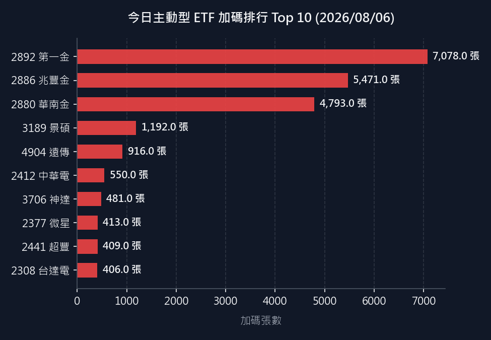
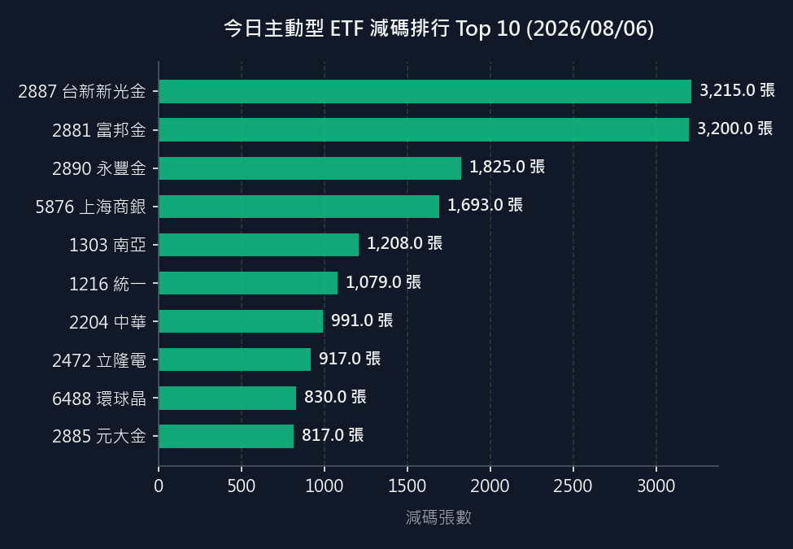

# 主動型 ETF 持股變動

資料來源：`主動型ETF持股明細.xlsx` 最近兩個日期分頁。

比較區間：`20260805` → `20260806`

## 今日加減碼視覺化排行

| 今日加碼 Top 10 | 今日減碼 Top 10 |
| :---: | :---: |
|  |  |

| ETF | 新增 | 刪除 | 比例變動 |
| :-- | --: | --: | --: |
| 00400A | 1 | 0 | 44 |
| 00401A | 2 | 17 | 58 |
| 00402A | 0 | 1 | 41 |
| 00403A | 0 | 0 | 41 |
| 00404A | 19 | 16 | 34 |
| 00405A | 1 | 0 | 38 |
| 00407A | 0 | 0 | 46 |
| 00408A | 0 | 1 | 38 |
| 00980A | 0 | 0 | 45 |
| 00980D | 1 | 0 | 20 |
| 00981A | 0 | 0 | 30 |
| 00982A | 0 | 0 | 39 |
| 00983A | 0 | 0 | 37 |
| 00983D | 0 | 0 | 10 |
| 00984A | 1 | 4 | 90 |
| 00985A | 0 | 0 | 39 |
| 00986A | 0 | 0 | 30 |
| 00987A | 0 | 1 | 25 |
| 00988A | 2 | 0 | 41 |
| 00989A | 0 | 0 | 61 |
| 00990A | 3 | 1 | 45 |
| 00991A | 0 | 1 | 22 |
| 00992A | 0 | 0 | 34 |
| 00993A | 1 | 0 | 42 |
| 00994A | 0 | 0 | 27 |
| 00995A | 1 | 0 | 46 |
| 00996A | 0 | 0 | 38 |
| 00997A | 0 | 1 | 44 |
| 00998A | 3 | 0 | 35 |
| 00999A | 0 | 0 | 57 |

## 00400A

### 新增持股

- 6515 穎崴（0.48%，21 張）

### 刪除持股

- 無

### 投資比例變動

- 2059 川湖：3.64% → 3.86%（+0.22）
- 2308 台達電：2.51% → 2.53%（+0.02）
- 2317 鴻海：0.85% → 0.86%（+0.01）
- 2330 台積電：8.40% → 8.19%（-0.21）
- 2345 智邦：1.84% → 1.85%（+0.01）
- 2357 華碩：1.37% → 1.33%（-0.04）
- 2360 致茂：3.47% → 3.61%（+0.14）
- 2382 廣達：0.69% → 0.68%（-0.01）
- 2383 台光電：5.20% → 5.22%（+0.02）
- 2408 南亞科：1.70% → 1.74%（+0.04）
- 2454 聯發科：6.40% → 6.22%（-0.18）
- 2881 富邦金：0.75% → 0.72%（-0.03）
- 2885 元大金：1.42% → 1.37%（-0.05）
- 2891 中信金：0.87% → 0.85%（-0.02）
- 3008 大立光：2.40% → 2.41%（+0.01）
- 3017 奇鋐：4.53% → 4.84%（+0.31）
- 3036 文曄：1.45% → 1.49%（+0.04）
- 3037 欣興：4.88% → 4.86%（-0.02）
- 3044 健鼎：1.40% → 1.39%（-0.01）
- 3090 日電貿：0.30% → 0.31%（+0.01）
- 3211 順達：0.61% → 0.66%（+0.05）
- 3231 緯創：0.92% → 0.90%（-0.02）
- 3443 創意：2.84% → 2.88%（+0.04）
- 3529 力旺：1.09% → 1.10%（+0.01）
- 3653 健策：3.65% → 3.71%（+0.06）
- 3665 貿聯-KY：2.84% → 2.83%（-0.01）
- 3711 日月光投控：1.23% → 1.22%（-0.01）
- 5274 信驊：2.86% → 2.97%（+0.11）
- 5347 世界：0.72% → 0.69%（-0.03）
- 5434 崇越：0.35% → 0.34%（-0.01）
- 6187 萬潤：2.17% → 2.37%（+0.20）
- 6223 旺矽：5.06% → 5.07%（+0.01）
- 6239 力成：0.90% → 0.94%（+0.04）
- 6274 台燿：0.57% → 1.08%（+0.51）
- 6442 光聖：0.52% → 0.54%（+0.02）
- 6488 環球晶：2.71% → 2.68%（-0.03）
- 6505 台塑化：0.69% → 0.68%（-0.01）
- 6510 精測：0.30% → 0.31%（+0.01）
- 6669 緯穎：4.27% → 4.30%（+0.03）
- 6715 嘉基：0.18% → 0.17%（-0.01）
- 7750 新代：1.02% → 0.97%（-0.05）
- 7769 鴻勁：0.76% → 0.74%（-0.02）
- 8046 南電：0.94% → 0.97%（+0.03）
- 9939 宏全：0.08% → 0.09%（+0.01）

## 00401A

### 新增持股

- 2449 京元電子（0.06%，7.25 張）
- 4958 臻鼎-KY（2.05%，129 張）

### 刪除持股

- 1303 南亞（1.56%，200 張）
- 1519 華城（2.89%，99 張）
- 1560 中砂（1.05%，35 張）
- 2059 川湖（2.08%，5 張）
- 2408 南亞科（1.17%，60 張）
- 2634 漢翔（2.24%，800 張）
- 3017 奇鋐（3.72%，31 張）
- 3081 聯亞（1.43%，15 張）
- 3665 貿聯-KY（3.11%，30 張）
- 4749 新應材（1.75%，50 張）
- 6274 台燿（1.29%，20 張）
- 6488 環球晶（1.15%，30 張）
- 8046 南電（1.87%，40 張）
- 8358 金居（1.54%，100 張）
- 8996 高力（2.73%，60 張）
- A Plus Asset(244920.KS)（0.06%，7.25 張）
- T.Hasegawa(4958.JP)（2.14%，129 張）

### 投資比例變動

- 1216 統一：0.32% → 0.31%（-0.01）
- 1301 台塑：0.08% → 0.07%（-0.01）
- 2303 聯電：0.97% → 0.94%（-0.03）
- 2308 台達電：3.36% → 3.33%（-0.03）
- 2313 華通：1.17% → 1.53%（+0.36）
- 2327 國巨*：0.51% → 0.45%（-0.06）
- 2330 台積電：8.46% → 13.90%（+5.44）
- 2344 華邦電：1.23% → 1.21%（-0.02）
- 2345 智邦：1.05% → 2.71%（+1.66）
- 2357 華碩：1.39% → 1.32%（-0.07）
- 2360 致茂：1.79% → 1.83%（+0.04）
- 2379 瑞昱：1.30% → 1.25%（-0.05）
- 2382 廣達：1.90% → 1.84%（-0.06）
- 2383 台光電：1.90% → 1.87%（-0.03）
- 2412 中華電：0.93% → 0.91%（-0.02）
- 2454 聯發科：4.40% → 6.55%（+2.15）
- 2455 全新：1.47% → 1.38%（-0.09）
- 2603 長榮：1.08% → 1.04%（-0.04）
- 2881 富邦金：2.08% → 1.97%（-0.11）
- 2882 國泰金：1.14% → 1.08%（-0.06）
- 2883 凱基金：1.67% → 1.57%（-0.10）
- 2884 玉山金：1.98% → 1.92%（-0.06）
- 2885 元大金：0.59% → 0.56%（-0.03）
- 2886 兆豐金：1.67% → 1.59%（-0.08）
- 2887 台新新光金：1.12% → 1.05%（-0.07）
- 2890 永豐金：0.32% → 0.31%（-0.01）
- 2891 中信金：1.79% → 1.70%（-0.09）
- 2912 統一超：0.31% → 0.30%（-0.01）
- 3008 大立光：2.17% → 2.14%（-0.03）
- 3034 聯詠：0.26% → 0.25%（-0.01）
- 3037 欣興：2.43% → 2.38%（-0.05）
- 3131 弘塑：0.38% → 0.37%（-0.01）
- 3167 大量：0.50% → 0.54%（+0.04）
- 3231 緯創：0.43% → 0.41%（-0.02）
- 3491 昇達科：1.83% → 1.87%（+0.04）
- 3529 力旺：0.71% → 0.70%（-0.01）
- 3653 健策：1.13% → 1.12%（-0.01）
- 3711 日月光投控：1.30% → 2.14%（+0.84）
- 4904 遠傳：0.87% → 0.86%（-0.01）
- 4938 和碩：0.36% → 0.34%（-0.02）
- 4991 環宇-KY：0.70% → 0.64%（-0.06）
- 5274 信驊：1.16% → 1.18%（+0.02）
- 5347 世界：1.48% → 1.39%（-0.09）
- 5871 中租-KY：0.17% → 0.16%（-0.01）
- 5904 寶雅：0.66% → 0.64%（-0.02）
- 6187 萬潤：0.70% → 0.75%（+0.05）
- 6223 旺矽：2.20% → 2.30%（+0.10）
- 6285 啟碁：1.79% → 1.66%（-0.13）
- 6415 矽力*-KY：0.66% → 0.65%（-0.01）
- 6510 精測：0.72% → 0.73%（+0.01）
- 6515 穎崴：1.29% → 1.23%（-0.06）
- 6531 愛普*：1.25% → 1.28%（+0.03）
- 6669 緯穎：2.25% → 2.22%（-0.03）
- 6944 兆聯實業：0.53% → 0.52%（-0.01）
- 7769 鴻勁：2.66% → 2.57%（-0.09）
- 7828 創新服務：2.02% → 1.97%（-0.05）
- 8021 尖點：0.28% → 0.29%（+0.01）
- 8464 億豐：1.25% → 1.24%（-0.01）

## 00402A

### 新增持股

- 無

### 刪除持股

- CIEN.US Ciena（0.22%，1.2 張）

### 投資比例變動

- AAPL.US Apple：7.37% → 7.57%（+0.20）
- ADI.US Analog Devices：1.80% → 1.82%（+0.02）
- AMD.US AMD：5.64% → 5.35%（-0.29）
- AMZN.US Amazon：4.41% → 4.43%（+0.02）
- ANET.US Arista Networks：0.78% → 0.83%（+0.05）
- AVGO.US Broadcom：2.60% → 2.66%（+0.06）
- AXON.US Axon Enterprise：1.07% → 1.10%（+0.03）
- BABA.US Alibaba Group：0.59% → 0.60%（+0.01）
- BKNG.US Booking Holdings：0.64% → 0.70%（+0.06）
- CDNS.US Cadence Design Systems：1.78% → 1.80%（+0.02）
- COHR.US Coherent：1.87% → 2.13%（+0.26）
- CRWD.US CrowdStrike Holdings：1.37% → 1.39%（+0.02）
- DASH.US DoorDash：0.27% → 0.28%（+0.01）
- FSLY.US Fastly：0.36% → 0.39%（+0.03）
- GOOG.US Alphabet - Class C Capital Stock：3.60% → 3.53%（-0.07）
- GOOGL.US Alphabet - Class A Common Stock：3.55% → 3.48%（-0.07）
- INTC.US Intel：1.28% → 1.31%（+0.03）
- KLAC.US KLA：2.12% → 2.13%（+0.01）
- LITE.US Lumentum：1.46% → 1.64%（+0.18）
- LRCX.US Lam Research：3.59% → 3.55%（-0.04）
- MCHP.US Microchip Technology：1.43% → 1.17%（-0.26）
- MDB.US MongoDB：0.72% → 0.73%（+0.01）
- META.US Meta：2.73% → 2.79%（+0.06）
- MRVL.US Marvell：1.52% → 1.50%（-0.02）
- MSFT.US Microsoft：4.16% → 4.20%（+0.04）
- MU.US Micron：6.23% → 6.37%（+0.14）
- NFLX.US Netflix：0.78% → 0.81%（+0.03）
- NVDA.US NVIDIA：8.41% → 8.90%（+0.49）
- PANW.US Palo Alto：3.35% → 3.39%（+0.04）
- SHOP.US Shopify：0.41% → 0.49%（+0.08）
- SIMO.US Silicon Motion：0.78% → 0.73%（-0.05）
- SNOW.US Snowflake：0.92% → 0.94%（+0.02）
- SPCX.US SpaceX：0.63% → 0.55%（-0.08）
- SPOT.US Spotify：0.25% → 0.26%（+0.01）
- STX.US Seagate：1.42% → 1.44%（+0.02）
- TER.US Teradyne：0.91% → 0.90%（-0.01）
- TSM.US TSMC(ADR)：1.62% → 1.40%（-0.22）
- TXN.US Texas Instruments：2.52% → 2.23%（-0.29）
- UBER.US Uber：0.45% → 0.44%（-0.01）
- V.US Visa：1.08% → 1.10%（+0.02）
- WDC.US Western Digital：2.96% → 2.86%（-0.10）

## 00403A

### 新增持股

- 無

### 刪除持股

- 無

### 投資比例變動

- 1303 南亞：0.20% → 0.10%（-0.10）
- 1560 中砂：0.57% → 0.58%（+0.01）
- 1717 長興：0.04% → 0.05%（+0.01）
- 2049 上銀：0.21% → 0.20%（-0.01）
- 2303 聯電：5.39% → 5.34%（-0.05）
- 2308 台達電：2.80% → 2.84%（+0.04）
- 2317 鴻海：0.46% → 0.47%（+0.01）
- 2327 國巨*：2.58% → 2.54%（-0.04）
- 2330 台積電：17.04% → 16.69%（-0.35）
- 2337 旺宏：0.49% → 0.54%（+0.05）
- 2344 華邦電：4.00% → 4.03%（+0.03）
- 2345 智邦：3.08% → 3.09%（+0.01）
- 2360 致茂：0.95% → 0.99%（+0.04）
- 2383 台光電：4.38% → 4.41%（+0.03）
- 2454 聯發科：4.27% → 4.36%（+0.09）
- 2481 強茂：0.08% → 0.09%（+0.01）
- 3008 大立光：0.66% → 0.67%（+0.01）
- 3017 奇鋐：5.26% → 5.65%（+0.39）
- 3189 景碩：1.78% → 2.02%（+0.24）
- 3211 順達：0.36% → 0.40%（+0.04）
- 3443 創意：1.25% → 1.27%（+0.02）
- 3450 聯鈞：0.27% → 0.33%（+0.06）
- 3533 嘉澤：1.35% → 1.36%（+0.01）
- 3583 辛耘：0.35% → 0.37%（+0.02）
- 3653 健策：2.50% → 2.55%（+0.05）
- 3665 貿聯-KY：1.45% → 1.58%（+0.13）
- 3711 日月光投控：2.37% → 2.48%（+0.11）
- 4958 臻鼎-KY：1.68% → 1.65%（-0.03）
- 4966 譜瑞-KY：0.23% → 0.20%（-0.03）
- 5274 信驊：1.42% → 1.72%（+0.30）
- 6223 旺矽：3.66% → 3.68%（+0.02）
- 6239 力成：0.76% → 0.80%（+0.04）
- 6274 台燿：1.38% → 1.43%（+0.05）
- 6442 光聖：0.17% → 0.18%（+0.01）
- 6488 環球晶：1.29% → 1.28%（-0.01）
- 6669 緯穎：1.73% → 1.74%（+0.01）
- 6805 富世達：0.63% → 0.69%（+0.06）
- 7769 鴻勁：1.09% → 0.94%（-0.15）
- 8046 南電：1.04% → 1.08%（+0.04）
- 8358 金居：0.26% → 0.28%（+0.02）
- 8996 高力：0.93% → 1.01%（+0.08）

## 00404A

### 新增持股

- 1210 大成（1.49%，947 張）
- 1303 南亞（0.16%，32 張）
- 2059 川湖（0.29%，1 張）
- 2301 光寶科（1.74%，242 張）
- 2351 順德（0.58%，118 張）
- 2377 微星（1.82%，413 張）
- 2428 興勤（0.81%，122 張）
- 2441 超豐（0.46%，131 張）
- 2458 義隆（0.41%，97 張）
- 2618 長榮航（0.14%，112 張）
- 2880 華南金（2.68%，2134 張）
- 2886 兆豐金（3.06%，2130 張）
- 2892 第一金（3.08%，3038 張）
- 3022 威強電（0.98%，343 張）
- 3023 信邦（2.26%，245 張）
- 3529 力旺（0.15%，2 張）
- 3653 健策（0.25%，2 張）
- 6491 晶碩（1.77%，164 張）
- 8271 宇瞻（0.83%，117 張）

### 刪除持股

- 1216 統一（1.83%，879 張）
- 2376 技嘉（1.83%，188 張）
- 2382 廣達（0.37%，43 張）
- 2402 毅嘉（0.09%，61 張）
- 2912 統一超（0.08%，13 張）
- 3014 聯陽（1.06%，287 張）
- 3131 弘塑（0.73%，11 張）
- 3189 景碩（0.33%，14 張）
- 3265 台星科（0.43%，98 張）
- 5269 祥碩（1.53%，38 張）
- 5347 世界（0.37%，84 張）
- 6206 飛捷（1.91%，453 張）
- 6239 力成（1.52%，208 張）
- 6531 愛普*（0.22%，9 張）
- 8069 元太（0.42%，75 張）
- 8299 群聯（1.21%，23 張）

### 投資比例變動

- 2303 聯電：2.76% → 2.94%（+0.18）
- 2308 台達電：3.71% → 0.96%（-2.75）
- 2330 台積電：21.68% → 21.88%（+0.20）
- 2345 智邦：1.02% → 0.48%（-0.54）
- 2360 致茂：0.96% → 1.24%（+0.28）
- 2383 台光電：2.09% → 2.58%（+0.49）
- 2393 億光：1.54% → 0.90%（-0.64）
- 2454 聯發科：7.11% → 6.55%（-0.56）
- 2885 元大金：2.99% → 1.34%（-1.65）
- 2887 台新新光金：3.30% → 0.03%（-3.27）
- 2890 永豐金：2.09% → 0.04%（-2.05）
- 3017 奇鋐：0.78% → 1.09%（+0.31）
- 3034 聯詠：0.58% → 0.57%（-0.01）
- 3037 欣興：0.63% → 1.28%（+0.65）
- 3260 威剛：0.36% → 0.37%（+0.01）
- 3264 欣銓：1.07% → 1.87%（+0.80）
- 3443 創意：0.12% → 1.15%（+1.03）
- 3702 大聯大：1.93% → 1.88%（-0.05）
- 3711 日月光投控：3.81% → 3.50%（-0.31）
- 4763 材料*-KY：1.64% → 1.82%（+0.18）
- 5274 信驊：2.20% → 2.31%（+0.11）
- 5434 崇越：1.59% → 1.57%（-0.02）
- 5871 中租-KY：1.75% → 0.03%（-1.72）
- 5876 上海商銀：1.80% → 0.02%（-1.78）
- 6138 茂達：1.61% → 0.38%（-1.23）
- 6139 亞翔：0.25% → 0.26%（+0.01）
- 6196 帆宣：0.35% → 1.77%（+1.42）
- 6223 旺矽：0.98% → 1.17%（+0.19）
- 6257 矽格：1.51% → 0.39%（-1.12）
- 6515 穎崴：0.49% → 0.29%（-0.20）
- 6691 洋基工程：0.71% → 2.76%（+2.05）
- 8016 矽創：0.11% → 1.22%（+1.11）
- 臺指選擇權08/26 45400 買權：-0.40% → -0.32%（+0.08）
- 臺股期貨08/26：16.21% → 16.18%（-0.03）

## 00405A

### 新增持股

- 8021 尖點（0.01%，10 張）

### 刪除持股

- 無

### 投資比例變動

- 1590 亞德客-KY：0.00% → 0.01%（+0.01）
- 2059 川湖：1.31% → 1.38%（+0.07）
- 2330 台積電：1.42% → 1.37%（-0.05）
- 2344 華邦電：3.28% → 3.27%（-0.01）
- 2345 智邦：4.15% → 4.14%（-0.01）
- 2368 金像電：3.49% → 3.61%（+0.12）
- 2383 台光電：3.66% → 3.65%（-0.01）
- 2408 南亞科：1.24% → 1.27%（+0.03）
- 2449 京元電子：0.68% → 0.67%（-0.01）
- 2454 聯發科：6.32% → 6.11%（-0.21）
- 3008 大立光：0.02% → 1.52%（+1.50）
- 3017 奇鋐：7.22% → 7.67%（+0.45）
- 3026 禾伸堂：1.04% → 1.12%（+0.08）
- 3037 欣興：5.01% → 4.96%（-0.05）
- 3081 聯亞：1.13% → 1.22%（+0.09）
- 3131 弘塑：2.49% → 1.72%（-0.77）
- 3443 創意：4.83% → 4.86%（+0.03）
- 3583 辛耘：0.63% → 0.66%（+0.03）
- 3653 健策：5.10% → 6.17%（+1.07）
- 3665 貿聯-KY：6.71% → 6.66%（-0.05）
- 3711 日月光投控：0.63% → 0.62%（-0.01）
- 5274 信驊：1.91% → 1.97%（+0.06）
- 5347 世界：0.11% → 0.10%（-0.01）
- 6187 萬潤：0.70% → 0.76%（+0.06）
- 6223 旺矽：5.61% → 5.59%（-0.02）
- 6274 台燿：1.48% → 1.52%（+0.04）
- 6488 環球晶：2.61% → 0.31%（-2.30）
- 6510 精測：2.22% → 2.26%（+0.04）
- 6515 穎崴：0.52% → 0.51%（-0.01）
- 6669 緯穎：3.96% → 3.97%（+0.01）
- 6805 富世達：0.53% → 0.58%（+0.05）
- 6831 邁科：0.49% → 0.53%（+0.04）
- 7734 印能科技：2.14% → 2.08%（-0.06）
- 7769 鴻勁：2.58% → 2.52%（-0.06）
- 8028 昇陽半導體：0.83% → 0.79%（-0.04）
- 8046 南電：3.63% → 3.73%（+0.10）
- 8210 勤誠：0.65% → 0.67%（+0.02）
- 8996 高力：0.96% → 1.04%（+0.08）

## 00407A

### 新增持股

- 無

### 刪除持股

- 無

### 投資比例變動

- 1303 南亞：0.52% → 0.50%（-0.02）
- 1590 亞德客-KY：2.17% → 2.24%（+0.07）
- 2059 川湖：2.26% → 2.41%（+0.15）
- 2303 聯電：2.17% → 2.06%（-0.11）
- 2308 台達電：3.36% → 3.26%（-0.10）
- 2327 國巨*：2.11% → 2.08%（-0.03）
- 2330 台積電：8.52% → 7.98%（-0.54）
- 2344 華邦電：1.64% → 1.66%（+0.02）
- 2345 智邦：3.50% → 3.37%（-0.13）
- 2368 金像電：1.72% → 1.80%（+0.08）
- 2376 技嘉：0.70% → 0.67%（-0.03）
- 2379 瑞昱：0.76% → 0.71%（-0.05）
- 2383 台光電：4.81% → 4.86%（+0.05）
- 2395 研華：1.83% → 1.72%（-0.11）
- 2408 南亞科：1.71% → 1.68%（-0.03）
- 2412 中華電：1.60% → 1.53%（-0.07）
- 2454 聯發科：6.49% → 6.35%（-0.14）
- 2458 義隆：0.10% → 0.09%（-0.01）
- 3017 奇鋐：4.14% → 4.24%（+0.10）
- 3034 聯詠：0.71% → 0.67%（-0.04）
- 3037 欣興：4.33% → 4.34%（+0.01）
- 3293 鈊象：0.57% → 0.55%（-0.02）
- 3443 創意：1.75% → 1.78%（+0.03）
- 3491 昇達科：0.40% → 0.42%（+0.02）
- 3529 力旺：1.93% → 1.95%（+0.02）
- 3533 嘉澤：0.95% → 0.91%（-0.04）
- 3665 貿聯-KY：3.15% → 3.02%（-0.13）
- 3711 日月光投控：2.41% → 2.31%（-0.10）
- 4904 遠傳：0.29% → 0.28%（-0.01）
- 4958 臻鼎-KY：1.79% → 1.69%（-0.10）
- 5274 信驊：2.02% → 1.99%（-0.03）
- 5289 宜鼎：0.17% → 0.18%（+0.01）
- 5434 崇越：0.18% → 0.17%（-0.01）
- 6223 旺矽：2.70% → 2.72%（+0.02）
- 6274 台燿：3.22% → 3.35%（+0.13）
- 6415 矽力*-KY：0.35% → 0.33%（-0.02）
- 6446 藥華藥：2.44% → 2.36%（-0.08）
- 6515 穎崴：1.38% → 1.36%（-0.02）
- 6526 達發：0.31% → 0.30%（-0.01）
- 6531 愛普*：1.38% → 1.45%（+0.07）
- 6669 緯穎：4.53% → 4.37%（-0.16）
- 6805 富世達：1.95% → 2.04%（+0.09）
- 8046 南電：2.02% → 2.11%（+0.09）
- 8210 勤誠：1.74% → 1.75%（+0.01）
- 8299 群聯：0.12% → 0.13%（+0.01）
- 8996 高力：0.37% → 0.41%（+0.04）

## 00408A

### 新增持股

- 無

### 刪除持股

- 2603 長榮（0.90%，75 張）

### 投資比例變動

- 1216 統一：0.94% → 0.09%（-0.85）
- 1477 聚陽：0.26% → 0.27%（+0.01）
- 2059 川湖：1.66% → 1.81%（+0.15）
- 2303 聯電：0.93% → 0.94%（+0.01）
- 2308 台達電：3.29% → 3.41%（+0.12）
- 2317 鴻海：2.65% → 2.76%（+0.11）
- 2330 台積電：6.50% → 6.46%（-0.04）
- 2344 華邦電：1.39% → 1.43%（+0.04）
- 2345 智邦：3.77% → 3.88%（+0.11）
- 2356 英業達：1.27% → 1.29%（+0.02）
- 2357 華碩：2.11% → 2.10%（-0.01）
- 2360 致茂：2.54% → 2.71%（+0.17）
- 2368 金像電：2.09% → 2.23%（+0.14）
- 2376 技嘉：2.10% → 2.15%（+0.05）
- 2383 台光電：4.30% → 4.43%（+0.13）
- 2404 漢唐：1.63% → 1.74%（+0.11）
- 2408 南亞科：1.04% → 1.09%（+0.05）
- 2454 聯發科：4.45% → 4.44%（-0.01）
- 2880 華南金：1.67% → 1.71%（+0.04）
- 2891 中信金：0.93% → 0.92%（-0.01）
- 3017 奇鋐：3.20% → 3.86%（+0.66）
- 3036 文曄：0.83% → 0.88%（+0.05）
- 3037 欣興：3.52% → 3.60%（+0.08）
- 3045 台灣大：3.18% → 3.23%（+0.05）
- 3231 緯創：3.51% → 3.50%（-0.01）
- 3653 健策：1.27% → 1.33%（+0.06）
- 3665 貿聯-KY：1.93% → 2.83%（+0.90）
- 3702 大聯大：1.96% → 1.95%（-0.01）
- 5347 世界：0.46% → 0.45%（-0.01）
- 5434 崇越：2.34% → 1.76%（-0.58）
- 5876 上海商銀：2.14% → 1.45%（-0.69）
- 5904 寶雅：1.73% → 1.76%（+0.03）
- 6223 旺矽：1.28% → 1.31%（+0.03）
- 6239 力成：1.01% → 1.08%（+0.07）
- 6274 台燿：1.64% → 1.73%（+0.09）
- 6669 緯穎：4.34% → 4.48%（+0.14）
- 7769 鴻勁：1.72% → 1.74%（+0.02）
- 8046 南電：2.24% → 2.37%（+0.13）

## 00980A

### 新增持股

- 無

### 刪除持股

- 無

### 投資比例變動

- 1303 南亞：2.27% → 2.24%（-0.03）
- 2059 川湖：4.57% → 4.78%（+0.21）
- 2308 台達電：3.54% → 3.53%（-0.01）
- 2317 鴻海：2.15% → 2.16%（+0.01）
- 2327 國巨*：1.06% → 1.02%（-0.04）
- 2330 台積電：8.46% → 8.15%（-0.31）
- 2344 華邦電：1.03% → 1.02%（-0.01）
- 2345 智邦：1.86% → 1.84%（-0.02）
- 2360 致茂：1.48% → 1.52%（+0.04）
- 2368 金像電：1.96% → 2.01%（+0.05）
- 2376 技嘉：1.26% → 1.24%（-0.02）
- 2382 廣達：1.59% → 1.55%（-0.04）
- 2383 台光電：4.23% → 4.19%（-0.04）
- 2408 南亞科：2.45% → 2.48%（+0.03）
- 2454 聯發科：5.92% → 5.68%（-0.24）
- 2884 玉山金：0.88% → 0.86%（-0.02）
- 2891 中信金：1.30% → 1.25%（-0.05）
- 3017 奇鋐：1.94% → 2.05%（+0.11）
- 3026 禾伸堂：0.39% → 0.41%（+0.02）
- 3036 文曄：1.37% → 1.39%（+0.02）
- 3037 欣興：2.89% → 2.85%（-0.04）
- 3044 健鼎：0.73% → 0.71%（-0.02）
- 3081 聯亞：2.72% → 2.93%（+0.21）
- 3189 景碩：0.81% → 0.82%（+0.01）
- 3231 緯創：1.07% → 1.03%（-0.04）
- 3264 欣銓：0.70% → 0.71%（+0.01）
- 3293 鈊象：1.04% → 1.03%（-0.01）
- 3529 力旺：0.91% → 0.90%（-0.01）
- 3653 健策：1.59% → 1.60%（+0.01）
- 3711 日月光投控：1.26% → 1.24%（-0.02）
- 4958 臻鼎-KY：0.87% → 0.84%（-0.03）
- 5274 信驊：1.56% → 1.59%（+0.03）
- 5904 寶雅：1.19% → 1.17%（-0.02）
- 6213 聯茂：0.87% → 0.94%（+0.07）
- 6223 旺矽：2.52% → 2.49%（-0.03）
- 6274 台燿：1.46% → 1.49%（+0.03）
- 6515 穎崴：2.01% → 1.94%（-0.07）
- 6669 緯穎：1.70% → 1.69%（-0.01）
- 6805 富世達：0.46% → 0.49%（+0.03）
- 6831 邁科：0.58% → 0.62%（+0.04）
- 7769 鴻勁：2.53% → 2.46%（-0.07）
- 8046 南電：1.14% → 1.17%（+0.03）
- 8210 勤誠：0.86% → 0.89%（+0.03）
- 8299 群聯：2.13% → 2.29%（+0.16）
- 8996 高力：0.99% → 1.07%（+0.08）

## 00980D

### 新增持股

- PHOTO HOLDINGS LLC SER REGS (REG) (REG S) 12% 01JUL2031（0.51%，N/A 張）

### 刪除持股

- 無

### 投資比例變動

- APA CORP 6.750000 % 15-FEB-2055：0.36% → 0.35%（-0.01）
- BRIGHTHOUSE FINANCIAL IN (REG) 4.7% 22JUN2047：0.48% → 0.47%（-0.01）
- CHARTER COMM OPT LLC/CAP (REG) 5.5% 01APR2063：0.48% → 0.49%（+0.01）
- CONOCOPHILLIPS COMPANY (REG) 6.95% 15APR2029：0.51% → 0.50%（-0.01）
- COX COMMUNICATIONS INC SER REGS 5.950000 % 01SEP2054：0.54% → 0.53%（-0.01）
- DOW CHEMICAL CO/THE 7.375% 01NOV2029：0.61% → 0.60%（-0.01）
- ENEL FINANCE INTL NV SER REGS (REG S) 7.75% 14OCT2052：0.36% → 0.37%（+0.01）
- F&G ANNUITIES & LIFE INC 6.250000 % 04OCT2034：0.50% → 0.51%（+0.01）
- GLOBAL ATLANTIC FIN CO SER REGS 7.950000 % 15JUN2033：0.66% → 0.65%（-0.01）
- HERTZ CORP/THE SER REGS (REG S) 12.625% 15JUL2029：0.29% → 0.28%（-0.01）
- HSBC HOLDINGS PLC (REG) VAR 13NOV2034：0.35% → 0.34%（-0.01）
- ICAHN ENTERPRISES/FIN (REG) 9.75% 15JAN2029：0.33% → 0.32%（-0.01）
- ICAHN ENTERPRISES/FIN SER REGS 10.000000 % 15NOV2029：0.32% → 0.31%（-0.01）
- MYLAN INC SER WI (REG) 5.2% 15APR2048WI：0.49% → 0.48%（-0.01）
- RR DONNELLEY & SONS CO SER REGS (REG S) 9.5% 01AUG2029：0.42% → 0.41%（-0.01）
- US 10YR NOTE (CBT)SEP26 21-SEP-2026：18.29% → 18.26%（-0.03）
- US 5YR NOTE (CBT) SEP26 30-SEP-2026：-15.89% → -15.86%（+0.03）
- US LONG BOND(CBT) SEP26 21-SEP-2026：5.35% → 5.34%（-0.01）
- VAR ENERGI ASA SER REGS (REG S) 7.5% 15JAN2028：0.33% → 0.32%（-0.01）
- VISTRA OPERATIONS CO LLC SER REGS (REG S) 6.95% 15OCT2033：0.41% → 0.40%（-0.01）

## 00981A

### 新增持股

- 無

### 刪除持股

- 無

### 投資比例變動

- 1590 亞德客-KY：0.26% → 0.27%（+0.01）
- 2303 聯電：3.49% → 3.45%（-0.04）
- 2308 台達電：3.19% → 3.53%（+0.34）
- 2327 國巨*：4.79% → 4.69%（-0.10）
- 2330 台積電：9.50% → 9.28%（-0.22）
- 2345 智邦：4.99% → 5.00%（+0.01）
- 2360 致茂：0.29% → 0.30%（+0.01）
- 2368 金像電：1.70% → 1.59%（-0.11）
- 2383 台光電：8.31% → 8.34%（+0.03）
- 2454 聯發科：7.10% → 6.90%（-0.20）
- 3017 奇鋐：5.16% → 5.51%（+0.35）
- 3037 欣興：6.38% → 6.36%（-0.02）
- 3376 新日興：0.10% → 0.11%（+0.01）
- 3653 健策：3.36% → 3.42%（+0.06）
- 3665 貿聯-KY：3.94% → 3.93%（-0.01）
- 3711 日月光投控：3.37% → 3.35%（-0.02）
- 4958 臻鼎-KY：0.27% → 0.26%（-0.01）
- 5274 信驊：2.37% → 2.46%（+0.09）
- 6187 萬潤：0.46% → 0.51%（+0.05）
- 6223 旺矽：4.97% → 4.98%（+0.01）
- 6274 台燿：2.63% → 2.72%（+0.09）
- 6278 台表科：0.18% → 0.17%（-0.01）
- 6510 精測：0.23% → 0.24%（+0.01）
- 6515 穎崴：0.21% → 0.05%（-0.16）
- 6669 緯穎：5.45% → 5.49%（+0.04）
- 6805 富世達：1.02% → 1.17%（+0.15）
- 8046 南電：3.29% → 3.40%（+0.11）
- 8210 勤誠：0.88% → 1.00%（+0.12）
- 8996 高力：0.24% → 0.26%（+0.02）
- 台指期貨(B)：5.63% → 5.55%（-0.08）

## 00982A

### 新增持股

- 無

### 刪除持股

- 無

### 投資比例變動

- 1785 光洋科：0.97% → 0.98%（+0.01）
- 2059 川湖：3.46% → 3.62%（+0.16）
- 2303 聯電：2.20% → 2.14%（-0.06）
- 2327 國巨*：0.95% → 0.78%（-0.17）
- 2330 台積電：8.52% → 8.22%（-0.30）
- 2345 智邦：3.85% → 3.81%（-0.04）
- 2360 致茂：3.12% → 3.20%（+0.08）
- 2376 技嘉：0.72% → 0.71%（-0.01）
- 2383 台光電：3.39% → 3.36%（-0.03）
- 2451 創見：0.29% → 0.30%（+0.01）
- 2454 聯發科：6.89% → 6.62%（-0.27）
- 2467 志聖：1.54% → 1.51%（-0.03）
- 2472 立隆電：1.11% → 0.71%（-0.40）
- 2885 元大金：0.29% → 0.28%（-0.01）
- 3008 大立光：2.24% → 2.22%（-0.02）
- 3017 奇鋐：2.19% → 2.32%（+0.13）
- 3036 文曄：1.07% → 1.09%（+0.02）
- 3105 穩懋：3.14% → 3.16%（+0.02）
- 3264 欣銓：1.91% → 1.96%（+0.05）
- 3491 昇達科：2.51% → 2.58%（+0.07）
- 3583 辛耘：1.61% → 1.65%（+0.04）
- 3702 大聯大：1.45% → 1.38%（-0.07）
- 3711 日月光投控：1.19% → 1.17%（-0.02）
- 4958 臻鼎-KY：3.06% → 2.97%（-0.09）
- 5274 信驊：0.95% → 0.97%（+0.02）
- 5536 聖暉*：7.53% → 7.74%（+0.21）
- 6139 亞翔：5.97% → 6.11%（+0.14）
- 6187 萬潤：0.19% → 0.21%（+0.02）
- 6223 旺矽：3.79% → 3.75%（-0.04）
- 6239 力成：0.36% → 0.37%（+0.01）
- 6274 台燿：1.31% → 1.33%（+0.02）
- 6278 台表科：0.77% → 0.73%（-0.04）
- 6488 環球晶：1.95% → 1.92%（-0.03）
- 6531 愛普*：2.43% → 2.51%（+0.08）
- 6669 緯穎：6.22% → 6.19%（-0.03）
- 6831 邁科：0.35% → 0.38%（+0.03）
- 7769 鴻勁：1.20% → 1.17%（-0.03）
- 8016 矽創：1.31% → 1.36%（+0.05）
- 8996 高力：0.78% → 0.84%（+0.06）

## 00983A

### 新增持股

- 無

### 刪除持股

- 無

### 投資比例變動

- ACHR.US Archer：0.33% → 0.32%（-0.01）
- AMD.US AMD：6.31% → 5.87%（-0.44）
- AMZN.US Amazon：3.68% → 3.62%（-0.06）
- AVGO.US Broadcom：2.07% → 2.08%（+0.01）
- BEAM.US Beam Therapeutics：2.52% → 2.41%（-0.11）
- BMNR.US BitMine：0.98% → 1.00%（+0.02）
- CBRS.US Cerebras：0.70% → 0.66%（-0.04）
- CERS.US Cerus：0.39% → 0.40%（+0.01）
- COIN.US Coinbase：2.08% → 2.07%（-0.01）
- CRSP.US CRISPR Therapeutics：4.28% → 4.23%（-0.05）
- CRWV.US CoreWeave：0.97% → 0.95%（-0.02）
- DE.US Deere：1.44% → 1.43%（-0.01）
- FIG.US Figma：0.48% → 0.50%（+0.02）
- GOOG.US Alphabet - Class C Capital Stock：1.40% → 1.34%（-0.06）
- GOOGL.US Alphabet - Class A Common Stock：1.85% → 1.78%（-0.07）
- HOOD.US Robinhood Markets：3.82% → 3.80%（-0.02）
- ILMN.US Illumina：3.95% → 3.90%（-0.05）
- KTOS.US Kratos Defense & Security：0.32% → 0.34%（+0.02）
- LLY.US Eli Lilly：1.87% → 1.96%（+0.09）
- META.US Meta：1.16% → 1.17%（+0.01）
- NTLA.US Intellia Therapeutics：1.29% → 1.26%（-0.03）
- NTRA.US Natera：2.31% → 2.19%（-0.12）
- NVDA.US NVIDIA：1.63% → 1.69%（+0.06）
- PLTR.US Palantir Technologies：1.41% → 1.82%（+0.41）
- RBLX.US Roblox：1.97% → 1.57%（-0.40）
- RXRX.US Recursion Pharmaceuticals：0.32% → 0.30%（-0.02）
- SHOP.US Shopify：6.30% → 7.39%（+1.09）
- SOFI.US SoFi Technologies：0.73% → 0.71%（-0.02）
- SPCX.US SpaceX：1.62% → 1.64%（+0.02）
- TEM.US Tempus：3.12% → 3.10%（-0.02）
- TER.US Teradyne：0.68% → 0.66%（-0.02）
- TSLA.US Tesla：7.96% → 7.85%（-0.11）
- TSM.US TSMC(ADR)：3.56% → 3.54%（-0.02）
- TWST.US Twist Bioscience：4.46% → 5.17%（+0.71）
- TXG.US 10x Genomics：4.80% → 4.30%（-0.50）
- WGS.US GeneDx：1.52% → 1.50%（-0.02）
- XYZ.US Block：2.45% → 2.44%（-0.01）

## 00983D

### 新增持股

- 無

### 刪除持股

- 無

### 投資比例變動

- BHCCN 11 09/30/28：1.84% → 1.85%（+0.01）
- CRWV 9 02/01/31：0.84% → 0.83%（-0.01）
- CYH 10 7/8 01/15/32：1.50% → 1.49%（-0.01）
- DELL 8.35 07/15/46：1.43% → 1.42%（-0.01）
- ED 6 3/4 04/01/38：0.62% → 0.63%（+0.01）
- IEP 10 11/15/29：1.55% → 1.53%（-0.02）
- NTRCN 7 1/8 05/23/36：0.56% → 0.55%（-0.01）
- PCG 6.7 04/01/53：1.11% → 1.12%（+0.01）
- SPCX 6.6 07/15/46：1.14% → 1.12%（-0.02）
- TLTW.US iShares 20+ Year Treasury Bond B：7.22% → 7.23%（+0.01）

## 00984A

### 新增持股

- 5351 鈺創（0.45%，427 張）

### 刪除持股

- 2327 國巨*（0.42%，70 張）
- 2368 金像電（0.05%，5 張）
- 2481 強茂（0.21%，154 張）
- 3090 日電貿（0.13%，87 張）

### 投資比例變動

- 1326 台化：1.07% → 1.05%（-0.02）
- 1409 新纖：0.56% → 0.55%（-0.01）
- 1477 聚陽：0.91% → 0.90%（-0.01）
- 1714 和桐：0.26% → 0.28%（+0.02）
- 1736 喬山：0.72% → 0.75%（+0.03）
- 1795 美時：0.09% → 0.08%（-0.01）
- 1907 永豐餘：0.51% → 0.52%（+0.01）
- 2006 東和鋼鐵：0.08% → 0.09%（+0.01）
- 2049 上銀：0.61% → 0.60%（-0.01）
- 2059 川湖：2.83% → 4.22%（+1.39）
- 2303 聯電：1.43% → 1.41%（-0.02）
- 2317 鴻海：1.46% → 1.47%（+0.01）
- 2330 台積電：3.71% → 3.62%（-0.09）
- 2337 旺宏：0.22% → 0.24%（+0.02）
- 2347 聯強：1.10% → 1.06%（-0.04）
- 2357 華碩：0.87% → 0.84%（-0.03）
- 2360 致茂：0.82% → 0.85%（+0.03）
- 2376 技嘉：0.54% → 0.53%（-0.01）
- 2377 微星：0.45% → 0.46%（+0.01）
- 2404 漢唐：1.20% → 1.24%（+0.04）
- 2408 南亞科：1.51% → 1.83%（+0.32）
- 2412 中華電：0.89% → 0.88%（-0.01）
- 2441 超豐：1.02% → 1.05%（+0.03）
- 2454 聯發科：1.65% → 1.60%（-0.05）
- 2464 盟立：0.60% → 0.74%（+0.14）
- 2472 立隆電：0.56% → 0.26%（-0.30）
- 2474 可成：0.34% → 0.35%（+0.01）
- 2535 達欣工：0.22% → 0.23%（+0.01）
- 2603 長榮：0.73% → 0.72%（-0.01）
- 2801 彰銀：1.59% → 1.54%（-0.05）
- 2812 台中銀：1.30% → 1.26%（-0.04）
- 2834 臺企銀：1.40% → 1.37%（-0.03）
- 2880 華南金：2.08% → 2.07%（-0.01）
- 2882 國泰金：0.80% → 0.77%（-0.03）
- 2885 元大金：0.80% → 0.77%（-0.03）
- 2886 兆豐金：2.11% → 2.05%（-0.06）
- 2891 中信金：0.79% → 0.76%（-0.03）
- 2892 第一金：1.81% → 1.77%（-0.04）
- 3008 大立光：1.79% → 2.12%（+0.33）
- 3017 奇鋐：0.08% → 0.09%（+0.01）
- 3026 禾伸堂：0.74% → 0.79%（+0.05）
- 3034 聯詠：0.77% → 0.75%（-0.02）
- 3036 文曄：0.55% → 0.57%（+0.02）
- 3167 大量：0.44% → 0.47%（+0.03）
- 3189 景碩：1.41% → 1.43%（+0.02）
- 3264 欣銓：0.24% → 0.25%（+0.01）
- 3450 聯鈞：0.55% → 0.67%（+0.12）
- 3532 台勝科：0.51% → 0.50%（-0.01）
- 3702 大聯大：0.59% → 0.57%（-0.02）
- 3711 日月光投控：1.16% → 1.15%（-0.01）
- 4123 晟德：0.24% → 0.23%（-0.01）
- 4764 雙鍵：0.53% → 0.52%（-0.01）
- 4938 和碩：0.67% → 0.65%（-0.02）
- 4958 臻鼎-KY：1.01% → 0.98%（-0.03）
- 4966 譜瑞-KY：0.89% → 0.86%（-0.03）
- 5274 信驊：0.86% → 0.89%（+0.03）
- 5289 宜鼎：0.97% → 1.05%（+0.08）
- 5434 崇越：0.31% → 0.30%（-0.01）
- 5536 聖暉*：0.56% → 0.58%（+0.02）
- 5880 合庫金：1.69% → 1.64%（-0.05）
- 5904 寶雅：0.30% → 0.29%（-0.01）
- 6005 群益證：1.22% → 1.20%（-0.02）
- 6023 元大期：0.04% → 0.03%（-0.01）
- 6121 新普：0.08% → 0.09%（+0.01）
- 6139 亞翔：2.59% → 2.68%（+0.09）
- 6182 合晶：0.49% → 0.51%（+0.02）
- 6196 帆宣：1.16% → 1.14%（-0.02）
- 6213 聯茂：1.35% → 1.46%（+0.11）
- 6223 旺矽：1.29% → 1.28%（-0.01）
- 6257 矽格：0.65% → 0.66%（+0.01）
- 6274 台燿：1.29% → 0.70%（-0.59）
- 6285 啟碁：0.60% → 0.57%（-0.03）
- 6446 藥華藥：2.52% → 2.41%（-0.11）
- 6469 大樹：0.24% → 0.23%（-0.01）
- 6491 晶碩：0.28% → 0.27%（-0.01）
- 6531 愛普*：1.11% → 1.16%（+0.05）
- 6548 長科*：1.18% → 1.17%（-0.01）
- 6669 緯穎：0.57% → 0.64%（+0.07）
- 6670 復盛應用：0.07% → 0.08%（+0.01）
- 6944 兆聯實業：1.10% → 1.09%（-0.01）
- 7734 印能科技：0.50% → 0.48%（-0.02）
- 7769 鴻勁：1.28% → 1.25%（-0.03）
- 8021 尖點：0.68% → 0.71%（+0.03）
- 8039 台虹：0.61% → 0.59%（-0.02）
- 8046 南電：1.02% → 1.05%（+0.03）
- 8210 勤誠：0.27% → 0.28%（+0.01）
- 8271 宇瞻：0.53% → 0.57%（+0.04）
- 8358 金居：0.43% → 0.47%（+0.04）
- 8436 大江：0.23% → 0.24%（+0.01）
- 9938 百和：0.25% → 0.24%（-0.01）

## 00985A

### 新增持股

- 無

### 刪除持股

- 無

### 投資比例變動

- 1216 統一：0.95% → 0.93%（-0.02）
- 2027 大成鋼：4.56% → 4.67%（+0.11）
- 2049 上銀：0.63% → 0.62%（-0.01）
- 2059 川湖：4.71% → 3.07%（-1.64）
- 2303 聯電：1.52% → 1.49%（-0.03）
- 2317 鴻海：0.16% → 0.17%（+0.01）
- 2327 國巨*：3.45% → 1.87%（-1.58）
- 2330 台積電：14.05% → 13.64%（-0.41）
- 2344 華邦電：1.03% → 1.02%（-0.01）
- 2345 智邦：2.94% → 2.93%（-0.01）
- 2360 致茂：0.09% → 0.10%（+0.01）
- 2368 金像電：0.92% → 0.95%（+0.03）
- 2376 技嘉：3.98% → 3.95%（-0.03）
- 2395 研華：0.31% → 0.30%（-0.01）
- 2408 南亞科：2.97% → 2.01%（-0.96）
- 2412 中華電：2.04% → 2.96%（+0.92）
- 2454 聯發科：1.99% → 1.92%（-0.07）
- 2881 富邦金：0.20% → 0.19%（-0.01）
- 2891 中信金：0.20% → 0.19%（-0.01）
- 3008 大立光：3.68% → 2.49%（-1.19）
- 3017 奇鋐：1.84% → 1.96%（+0.12）
- 3036 文曄：1.76% → 1.80%（+0.04）
- 3037 欣興：1.54% → 1.53%（-0.01）
- 3081 聯亞：1.78% → 1.93%（+0.15）
- 3131 弘塑：1.14% → 1.15%（+0.01）
- 3653 健策：1.38% → 1.40%（+0.02）
- 3665 貿聯-KY：1.01% → 1.00%（-0.01）
- 3711 日月光投控：0.74% → 0.73%（-0.01）
- 4904 遠傳：2.04% → 2.99%（+0.95）
- 4958 臻鼎-KY：2.15% → 2.09%（-0.06）
- 6147 頎邦：2.02% → 1.51%（-0.51）
- 6187 萬潤：3.39% → 3.68%（+0.29）
- 6442 光聖：3.47% → 3.54%（+0.07）
- 6446 藥華藥：2.55% → 2.43%（-0.12）
- 6669 緯穎：2.45% → 2.64%（+0.19）
- 7769 鴻勁：1.17% → 1.14%（-0.03）
- 8046 南電：0.51% → 0.52%（+0.01）
- 8299 群聯：0.97% → 1.05%（+0.08）
- 8996 高力：1.15% → 1.25%（+0.10）

## 00986A

### 新增持股

- 無

### 刪除持股

- 無

### 投資比例變動

- 2330 台積電：8.25% → 8.60%（+0.35）
- 2454 聯發科：0.62% → 0.65%（+0.03）
- AAPL.US Apple：0.97% → 0.98%（+0.01）
- AMAT.US Applied Materials：1.72% → 1.68%（-0.04）
- AMD.US AMD：3.27% → 3.04%（-0.23）
- AMZN.US Amazon：4.08% → 4.01%（-0.07）
- CAT.US Caterpillar：1.38% → 1.37%（-0.01）
- COHR.US Coherent：2.21% → 2.24%（+0.03）
- CRDO.US Credo：0.13% → 0.12%（-0.01）
- CRWD.US CrowdStrike Holdings：4.16% → 4.14%（-0.02）
- ETN.US Eaton：2.33% → 2.35%（+0.02）
- GOOGL.US Alphabet - Class A Common Stock：7.33% → 7.04%（-0.29）
- GS.US Goldman Sachs：3.04% → 3.06%（+0.02）
- HWM.US Howmet Aerospace：2.57% → 2.60%（+0.03）
- JPM.US JPMorgan Chase：1.50% → 1.51%（+0.01）
- LITE.US Lumentum：3.48% → 3.39%（-0.09）
- LLY.US Eli Lilly：2.64% → 2.77%（+0.13）
- LRCX.US Lam Research：2.83% → 2.75%（-0.08）
- MSFT.US Microsoft：2.59% → 2.56%（-0.03）
- MUFG(8306.JP)：1.39% → 1.42%（+0.03）
- Murata Mfg.(6981.JP)：1.66% → 1.83%（+0.17）
- NET.US Cloudflare：1.90% → 1.85%（-0.05）
- NVDA.US NVIDIA：5.78% → 5.99%（+0.21）
- SNDK.US Sandisk：1.50% → 1.42%（-0.08）
- Siemens Energy AG：2.00% → 2.01%（+0.01）
- TSEM.US Tower Semiconductor：0.75% → 0.67%（-0.08）
- Yaskawa Electric(6506.JP)：1.88% → 1.97%（+0.09）
- 嘉能可公司：1.55% → 1.62%（+0.07）
- 施奈德電機公司：1.63% → 1.64%（+0.01）
- 英飛凌科技股份有限公司：3.08% → 2.92%（-0.16）

## 00987A

### 新增持股

- 無

### 刪除持股

- 6139 亞翔（2.86%，96 張）

### 投資比例變動

- 2330 台積電：8.05% → 7.78%（-0.27）
- 2345 智邦：2.48% → 2.47%（-0.01）
- 2383 台光電：6.63% → 6.59%（-0.04）
- 2408 南亞科：3.97% → 4.02%（+0.05）
- 2454 聯發科：4.76% → 4.58%（-0.18）
- 2455 全新：2.96% → 2.79%（-0.17）
- 3017 奇鋐：8.73% → 9.24%（+0.51）
- 3037 欣興：6.85% → 6.75%（-0.10）
- 3081 聯亞：0.39% → 0.42%（+0.03）
- 3231 緯創：2.35% → 2.26%（-0.09）
- 3363 上詮：2.07% → 2.05%（-0.02）
- 3443 創意：6.20% → 6.22%（+0.02）
- 3653 健策：2.91% → 2.93%（+0.02）
- 3665 貿聯-KY：4.38% → 4.33%（-0.05）
- 4764 雙鍵：1.66% → 1.64%（-0.02）
- 6223 旺矽：6.27% → 6.21%（-0.06）
- 6274 台燿：4.10% → 4.19%（+0.09）
- 6515 穎崴：1.54% → 1.98%（+0.44）
- 6683 雍智科技：2.31% → 2.25%（-0.06）
- 6739 竹陞科技：1.94% → 2.04%（+0.10）
- 6805 富世達：1.43% → 3.15%（+1.72）
- 7769 鴻勁：2.43% → 2.37%（-0.06）
- 8028 昇陽半導體：2.29% → 2.19%（-0.10）
- 8046 南電：3.59% → 3.67%（+0.08）
- 8358 金居：1.48% → 1.60%（+0.12）

## 00988A

### 新增持股

- Meiko Electronics(6787.JP)（0.70%，80 張）
- TER.US Teradyne（0.76%，35 張）

### 刪除持股

- 無

### 投資比例變動

- 2303 聯電：0.51% → 0.52%（+0.01）
- 2308 台達電：0.89% → 0.91%（+0.02）
- 2327 國巨*：1.50% → 1.54%（+0.04）
- 2330 台積電：2.98% → 3.09%（+0.11）
- 2383 台光電：3.92% → 4.00%（+0.08）
- 2454 聯發科：2.95% → 3.05%（+0.10）
- 3017 奇鋐：0.51% → 0.54%（+0.03）
- 3037 欣興：4.12% → 4.32%（+0.20）
- 3665 貿聯-KY：2.05% → 2.10%（+0.05）
- 3711 日月光投控：1.80% → 1.83%（+0.03）
- 6223 旺矽：2.33% → 2.46%（+0.13）
- AEHR.US Aehr Test Systems：0.86% → 0.77%（-0.09）
- AMAT.US Applied Materials：4.11% → 4.00%（-0.11）
- AMD.US AMD：5.92% → 4.93%（-0.99）
- BE.US Bloom Energy：2.67% → 2.73%（+0.06）
- CRDO.US Credo：2.98% → 2.80%（-0.18）
- FORMFACTOR INC：0.51% → 0.48%（-0.03）
- FTNT.US Fortinet：0.94% → 0.91%（-0.03）
- IBIDEN(4062.JP)：0.35% → 0.43%（+0.08）
- INFINEON TECHNOLOGIES AG：2.55% → 1.63%（-0.92）
- Kioxia Holdings(285A.JP)：3.31% → 3.44%（+0.13）
- LITE.US Lumentum：4.35% → 4.21%（-0.14）
- LMT.US Lockheed Martin：1.25% → 1.22%（-0.03）
- Lasertec Corporation(6920.JP)：1.01% → 1.07%（+0.06）
- MICRONICS(6871.JP)：1.88% → 2.07%（+0.19）
- MRVL.US Marvell：2.49% → 2.40%（-0.09）
- MU.US Micron：6.14% → 6.12%（-0.02）
- Murata Mfg.(6981.JP)：3.40% → 3.72%（+0.32）
- NOW.US ServiceNow：1.78% → 1.75%（-0.03）
- Nippon Chemi-Con(6997.JP)：1.46% → 1.59%（+0.13）
- PANW.US Palo Alto：2.55% → 2.51%（-0.04）
- SNDK.US Sandisk：2.23% → 2.10%（-0.13）
- SNOW.US Snowflake：2.03% → 2.02%（-0.01）
- Samsung Elec Mech(009150.KS)：3.35% → 3.59%（+0.24）
- TAIYO YUDEN(6976.JP)：1.63% → 1.77%（+0.14）
- TSEM.US Tower Semiconductor：2.49% → 2.19%（-0.30）
- Tokyo Electron(8035.JP)：2.20% → 1.13%（-1.07）
- VECO.US Veeco Instruments Inc.：0.93% → 0.91%（-0.02）
- WDC.US Western Digital：3.21% → 3.02%（-0.19）
- 三環集團(300408.SZ)：0.90% → 1.32%（+0.42）
- 鼎泰高科(301377.SZ)：0.59% → 0.84%（+0.25）

## 00989A

### 新增持股

- 無

### 刪除持股

- 無

### 投資比例變動

- ADBE.US Adobe：0.95% → 0.96%（+0.01）
- ADI.US Analog Devices：1.07% → 1.08%（+0.01）
- ALGM.US Allegro MicroSystems：0.61% → 0.60%（-0.01）
- AMAT.US Applied Materials：0.75% → 0.74%（-0.01）
- AMD.US AMD：2.81% → 2.58%（-0.23）
- AMKR.US Amkor：0.74% → 0.72%（-0.02）
- AMZN.US Amazon：1.03% → 1.08%（+0.05）
- APP.US Applovin：0.99% → 1.03%（+0.04）
- ASML.US ASML Holding：1.68% → 1.67%（-0.01）
- AVGO.US Broadcom：4.20% → 4.16%（-0.04）
- BE.US Bloom Energy：1.14% → 1.11%（-0.03）
- CBRS.US Cerebras：0.20% → 0.18%（-0.02）
- CDNS.US Cadence Design Systems：0.95% → 0.94%（-0.01）
- CIEN.US Ciena：1.97% → 1.98%（+0.01）
- CRCL.US Circle：0.29% → 0.28%（-0.01）
- CRM.US Salesforce：2.41% → 2.46%（+0.05）
- CRWD.US CrowdStrike Holdings：3.17% → 3.18%（+0.01）
- CRWV.US CoreWeave：0.46% → 0.51%（+0.05）
- DOCN.US DigitalOcean：1.51% → 1.47%（-0.04）
- ENPH.US Enphase Energy：0.14% → 0.17%（+0.03）
- ENTG.US Entegris：0.78% → 0.79%（+0.01）
- ESTC.US Elastic：0.20% → 0.18%（-0.02）
- FIGR.US Figure：0.69% → 0.72%（+0.03）
- GFS.US GlobalFoundries：1.10% → 1.05%（-0.05）
- GLW.US Corning：1.99% → 1.84%（-0.15）
- GOOG.US Alphabet - Class C Capital Stock：4.53% → 4.42%（-0.11）
- HOOD.US Robinhood Markets：2.11% → 2.18%（+0.07）
- HUBS.US HubSpot：1.68% → 1.70%（+0.02）
- INTC.US Intel：2.94% → 2.97%（+0.03）
- LITE.US Lumentum：1.62% → 1.59%（-0.03）
- LMND.US Lemonade：0.83% → 0.80%（-0.03）
- LRCX.US Lam Research：2.21% → 2.12%（-0.09）
- META.US Meta：2.63% → 2.66%（+0.03）
- MSFT.US Microsoft：3.14% → 3.16%（+0.02）
- MTSI.US MACOM Technology Solutions：0.96% → 0.94%（-0.02）
- MU.US Micron：0.82% → 0.78%（-0.04）
- NET.US Cloudflare：2.79% → 2.73%（-0.06）
- NOW.US ServiceNow：1.40% → 1.50%（+0.10）
- NU.US Nu：0.89% → 0.91%（+0.02）
- NVDA.US NVIDIA：3.81% → 3.98%（+0.17）
- ON.US ON Semiconductor：1.54% → 1.48%（-0.06）
- ORCL.US Oracle：1.38% → 1.32%（-0.06）
- PLTR.US Palantir Technologies：0.55% → 0.51%（-0.04）
- RIVN.US Rivian：1.33% → 1.32%（-0.01）
- ROK.US Rockwell Automation：0.85% → 0.87%（+0.02）
- SHOP.US Shopify：1.73% → 2.04%（+0.31）
- SNDK.US Sandisk：0.58% → 0.52%（-0.06）
- SNOW.US Snowflake：3.05% → 3.11%（+0.06）
- SPCX.US SpaceX：0.65% → 0.58%（-0.07）
- SYM.US Symbotic：0.40% → 0.52%（+0.12）
- TEM.US Tempus：0.82% → 0.77%（-0.05）
- TSLA.US Tesla：2.65% → 2.63%（-0.02）
- TTWO.US Take-Two：3.69% → 3.64%（-0.05）
- TWLO.US Twilio：2.03% → 1.96%（-0.07）
- TXN.US Texas Instruments：1.52% → 1.50%（-0.02）
- U.US Unity Software：0.35% → 0.42%（+0.07）
- VICR.US Vicor Corporation：0.82% → 0.80%（-0.02）
- WOLF.US Wolfspeed：0.10% → 0.09%（-0.01）
- WRBY.US Warby Parker：0.77% → 0.76%（-0.01）
- XYZ.US Block：0.79% → 0.80%（+0.01）
- ZM.US Zoom：2.03% → 2.07%（+0.04）

## 00990A

### 新增持股

- ALAB.US Astera Labs（0.88%，34 張）
- CLOUDFLARE INC - CLASS A（0.49%，20.4 張）
- PLTR.US Palantir Technologies（0.49%，37.8 張）

### 刪除持股

- ON.US ON Semiconductor（0.49%，74.8 張）

### 投資比例變動

- 2303 聯電：0.78% → 0.80%（+0.02）
- 2308 台達電：2.30% → 2.35%（+0.05）
- 2330 台積電：3.36% → 3.50%（+0.14）
- 2383 台光電：1.86% → 1.91%（+0.05）
- 2449 京元電子：0.62% → 0.63%（+0.01）
- 2454 聯發科：2.38% → 2.47%（+0.09）
- 3037 欣興：2.32% → 2.45%（+0.13）
- 3665 貿聯-KY：0.92% → 0.95%（+0.03）
- 3711 日月光投控：0.94% → 0.96%（+0.02）
- 5347 世界：0.97% → 0.99%（+0.02）
- 6223 旺矽：1.11% → 1.18%（+0.07）
- AMAT.US Applied Materials：4.22% → 4.13%（-0.09）
- AMD.US AMD：5.08% → 2.87%（-2.21）
- AMZN.US Amazon：1.31% → 1.28%（-0.03）
- ANET.US Arista Networks：1.33% → 1.38%（+0.05）
- AXT INC：0.91% → 0.96%（+0.05）
- Advantest(6857.JP)：1.41% → 1.54%（+0.13）
- BE.US Bloom Energy：3.23% → 3.32%（+0.09）
- COHR.US Coherent：0.01% → 1.03%（+1.02）
- CRDO.US Credo：2.20% → 2.08%（-0.12）
- DDOG.US Datadog：2.13% → 2.10%（-0.03）
- DELL.US Dell：2.87% → 2.84%（-0.03）
- FURUKAWA ELECTRIC CO LTD：1.04% → 1.65%（+0.61）
- GOOGL.US Alphabet - Class A Common Stock：1.18% → 1.14%（-0.04）
- INFINEON TECHNOLOGIES AG：3.08% → 1.90%（-1.18）
- Kioxia Holdings(285A.JP)：2.11% → 2.53%（+0.42）
- LITE.US Lumentum：6.72% → 6.54%（-0.18）
- LRCX.US Lam Research：0.96% → 0.93%（-0.03）
- MRVL.US Marvell：1.82% → 1.76%（-0.06）
- MSFT.US Microsoft：4.57% → 4.53%（-0.04）
- Mitsui Kinzoku(5706.JP)：0.94% → 1.55%（+0.61）
- Murata Mfg.(6981.JP)：0.98% → 1.73%（+0.75）
- NVDA.US NVIDIA：1.52% → 1.57%（+0.05）
- PANW.US Palo Alto：2.52% → 2.50%（-0.02）
- Renesas Electronics(6723.JP)：1.68% → 1.65%（-0.03）
- SERVICENOW INC：1.50% → 1.49%（-0.01）
- SHOP.US Shopify：1.69% → 1.98%（+0.29）
- SMTC.US Semtech：1.09% → 1.02%（-0.07）
- SNDK.US Sandisk：1.99% → 1.88%（-0.11）
- Samsung Elec Mech(009150.KS)：1.71% → 2.47%（+0.76）
- TAIYO YUDEN(6976.JP)：0.94% → 1.02%（+0.08）
- TER.US Teradyne：1.00% → 0.96%（-0.04）
- TSEM.US Tower Semiconductor：2.11% → 1.86%（-0.25）
- Tokyo Electron(8035.JP)：0.76% → 0.78%（+0.02）
- WDC.US Western Digital：2.83% → 2.68%（-0.15）

## 00991A

### 新增持股

- 無

### 刪除持股

- 2881 富邦金（0.47%，3200 張）

### 投資比例變動

- 2059 川湖：5.34% → 5.65%（+0.31）
- 2327 國巨*：5.02% → 4.91%（-0.11）
- 2330 台積電：14.64% → 14.28%（-0.36）
- 2345 智邦：4.84% → 4.85%（+0.01）
- 2383 台光電：8.45% → 8.48%（+0.03）
- 2408 南亞科：7.02% → 7.18%（+0.16）
- 2454 聯發科：5.19% → 5.04%（-0.15）
- 2885 元大金：0.48% → 0.46%（-0.02）
- 3017 奇鋐：3.69% → 3.94%（+0.25）
- 3026 禾伸堂：1.67% → 1.79%（+0.12）
- 3037 欣興：5.46% → 5.44%（-0.02）
- 3189 景碩：2.99% → 3.43%（+0.44）
- 3231 緯創：1.96% → 1.91%（-0.05）
- 3653 健策：1.59% → 1.62%（+0.03）
- 3665 貿聯-KY：2.02% → 2.01%（-0.01）
- 3711 日月光投控：3.08% → 3.06%（-0.02）
- 5274 信驊：2.18% → 2.26%（+0.08）
- 6274 台燿：3.56% → 3.93%（+0.37）
- 6669 緯穎：3.97% → 3.99%（+0.02）
- 7769 鴻勁：2.94% → 2.90%（-0.04）
- 8046 南電：3.58% → 3.71%（+0.13）
- 8299 群聯：2.70% → 2.94%（+0.24）

## 00992A

### 新增持股

- 無

### 刪除持股

- 無

### 投資比例變動

- 1303 南亞：2.27% → 2.25%（-0.02）
- 1815 富喬：1.24% → 1.26%（+0.02）
- 2059 川湖：6.55% → 6.86%（+0.31）
- 2330 台積電：7.98% → 7.71%（-0.27）
- 2337 旺宏：0.37% → 0.40%（+0.03）
- 2345 智邦：6.08% → 6.04%（-0.04）
- 2383 台光電：5.77% → 5.73%（-0.04）
- 2454 聯發科：3.83% → 3.69%（-0.14）
- 2455 全新：2.52% → 2.38%（-0.14）
- 3008 大立光：5.61% → 5.58%（-0.03）
- 3017 奇鋐：6.45% → 6.83%（+0.38）
- 3037 欣興：5.71% → 5.63%（-0.08）
- 3189 景碩：0.86% → 1.66%（+0.80）
- 3231 緯創：3.49% → 3.37%（-0.12）
- 3260 威剛：0.33% → 0.35%（+0.02）
- 3264 欣銓：0.03% → 0.04%（+0.01）
- 3583 辛耘：0.24% → 0.25%（+0.01）
- 3661 世芯-KY：1.83% → 1.82%（-0.01）
- 3665 貿聯-KY：5.51% → 6.38%（+0.87）
- 3711 日月光投控：2.28% → 2.25%（-0.03）
- 4958 臻鼎-KY：1.15% → 1.12%（-0.03）
- 5289 宜鼎：0.34% → 0.37%（+0.03）
- 5347 世界：0.23% → 0.22%（-0.01）
- 6139 亞翔：0.47% → 0.48%（+0.01）
- 6187 萬潤：2.07% → 2.18%（+0.11）
- 6223 旺矽：4.80% → 4.76%（-0.04）
- 6515 穎崴：0.68% → 0.66%（-0.02）
- 6584 南俊國際：2.56% → 2.59%（+0.03）
- 6805 富世達：0.41% → 0.44%（+0.03）
- 7734 印能科技：0.45% → 0.44%（-0.01）
- 7751 竑騰：1.03% → 0.88%（-0.15）
- 8021 尖點：2.34% → 2.42%（+0.08）
- 8299 群聯：1.59% → 1.72%（+0.13）
- 8996 高力：3.98% → 4.29%（+0.31）

## 00993A

### 新增持股

- 3081 聯亞（0.67%，28 張）

### 刪除持股

- 無

### 投資比例變動

- 1590 亞德客-KY：0.27% → 0.28%（+0.01）
- 2027 大成鋼：0.41% → 0.42%（+0.01）
- 2059 川湖：3.15% → 3.33%（+0.18）
- 2303 聯電：2.01% → 1.99%（-0.02）
- 2308 台達電：2.90% → 2.92%（+0.02）
- 2327 國巨*：2.01% → 1.96%（-0.05）
- 2330 台積電：12.54% → 12.26%（-0.28）
- 2345 智邦：3.15% → 3.16%（+0.01）
- 2347 聯強：0.71% → 0.69%（-0.02）
- 2360 致茂：1.65% → 1.72%（+0.07）
- 2383 台光電：4.66% → 4.67%（+0.01）
- 2395 研華：0.45% → 0.44%（-0.01）
- 2408 南亞科：2.94% → 3.00%（+0.06）
- 2412 中華電：0.41% → 0.40%（-0.01）
- 2454 聯發科：4.88% → 4.75%（-0.13）
- 2610 華航：0.33% → 0.32%（-0.01）
- 2618 長榮航：0.55% → 0.54%（-0.01）
- 2881 富邦金：0.75% → 0.72%（-0.03）
- 2882 國泰金：0.45% → 0.44%（-0.01）
- 2883 凱基金：1.18% → 1.13%（-0.05）
- 2885 元大金：1.90% → 1.82%（-0.08）
- 2890 永豐金：1.24% → 1.20%（-0.04）
- 2891 中信金：0.59% → 0.57%（-0.02）
- 3008 大立光：1.15% → 1.20%（+0.05）
- 3017 奇鋐：2.40% → 2.56%（+0.16）
- 3037 欣興：3.68% → 3.71%（+0.03）
- 3189 景碩：2.65% → 2.76%（+0.11）
- 3231 緯創：0.39% → 0.38%（-0.01）
- 3264 欣銓：1.26% → 1.30%（+0.04）
- 3443 創意：1.55% → 1.57%（+0.02）
- 3481 群創：0.27% → 0.28%（+0.01）
- 3653 健策：1.45% → 1.47%（+0.02）
- 3702 大聯大：0.51% → 0.50%（-0.01）
- 3711 日月光投控：2.52% → 2.51%（-0.01）
- 5274 信驊：3.81% → 3.96%（+0.15）
- 5289 宜鼎：0.59% → 0.64%（+0.05）
- 6274 台燿：3.20% → 3.58%（+0.38）
- 6446 藥華藥：0.49% → 0.47%（-0.02）
- 6515 穎崴：2.85% → 2.78%（-0.07）
- 6669 緯穎：3.12% → 3.13%（+0.01）
- 7769 鴻勁：1.98% → 1.94%（-0.04）
- 8046 南電：1.98% → 2.05%（+0.07）

## 00994A

### 新增持股

- 無

### 刪除持股

- 無

### 投資比例變動

- 2059 川湖：3.97% → 4.18%（+0.21）
- 2303 聯電：0.61% → 0.60%（-0.01）
- 2308 台達電：2.45% → 2.47%（+0.02）
- 2327 國巨*：1.60% → 1.56%（-0.04）
- 2330 台積電：15.14% → 14.70%（-0.44）
- 2345 智邦：5.10% → 5.08%（-0.02）
- 2360 致茂：2.00% → 2.06%（+0.06）
- 2383 台光電：7.96% → 7.95%（-0.01）
- 2408 南亞科：2.79% → 2.84%（+0.05）
- 2454 聯發科：7.43% → 7.18%（-0.25）
- 3017 奇鋐：5.26% → 5.82%（+0.56）
- 3036 文曄：0.81% → 0.83%（+0.02）
- 3037 欣興：6.46% → 6.40%（-0.06）
- 3081 聯亞：0.04% → 0.05%（+0.01）
- 3231 緯創：0.97% → 0.94%（-0.03）
- 3443 創意：1.67% → 1.68%（+0.01）
- 3653 健策：1.13% → 1.14%（+0.01）
- 3665 貿聯-KY：1.74% → 2.29%（+0.55）
- 3711 日月光投控：3.09% → 3.06%（-0.03）
- 4958 臻鼎-KY：0.42% → 0.41%（-0.01）
- 5274 信驊：2.53% → 2.61%（+0.08）
- 6223 旺矽：5.23% → 5.20%（-0.03）
- 6239 力成：0.90% → 0.93%（+0.03）
- 6274 台燿：4.64% → 4.76%（+0.12）
- 6515 穎崴：1.10% → 1.07%（-0.03）
- 7769 鴻勁：1.43% → 1.40%（-0.03）
- 8046 南電：5.00% → 5.14%（+0.14）

## 00995A

### 新增持股

- 3450 聯鈞（0.39%，40 張）

### 刪除持股

- 無

### 投資比例變動

- 1326 台化：0.47% → 0.46%（-0.01）
- 2303 聯電：2.18% → 2.16%（-0.02）
- 2308 台達電：3.60% → 3.64%（+0.04）
- 2327 國巨*：2.18% → 2.14%（-0.04）
- 2330 台積電：8.16% → 8.63%（+0.47）
- 2345 智邦：5.21% → 5.23%（+0.02）
- 2360 致茂：0.97% → 1.01%（+0.04）
- 2368 金像電：1.59% → 1.65%（+0.06）
- 2383 台光電：8.31% → 8.37%（+0.06）
- 2404 漢唐：0.11% → 0.12%（+0.01）
- 2454 聯發科：5.88% → 5.72%（-0.16）
- 2455 全新：0.78% → 0.74%（-0.04）
- 2472 立隆電：0.77% → 0.76%（-0.01）
- 2486 一詮：0.65% → 0.68%（+0.03）
- 2885 元大金：0.68% → 0.65%（-0.03）
- 3017 奇鋐：4.34% → 4.64%（+0.30）
- 3023 信邦：0.71% → 0.72%（+0.01）
- 3037 欣興：4.46% → 4.45%（-0.01）
- 3044 健鼎：0.62% → 0.61%（-0.01）
- 3189 景碩：0.51% → 0.52%（+0.01）
- 3211 順達：0.19% → 0.21%（+0.02）
- 3264 欣銓：0.43% → 0.45%（+0.02）
- 3583 辛耘：1.17% → 1.22%（+0.05）
- 3653 健策：2.58% → 2.63%（+0.05）
- 3665 貿聯-KY：3.79% → 3.78%（-0.01）
- 3711 日月光投控：2.44% → 2.43%（-0.01）
- 4958 臻鼎-KY：1.04% → 1.02%（-0.02）
- 5274 信驊：2.80% → 2.91%（+0.11）
- 5289 宜鼎：0.64% → 0.70%（+0.06）
- 5439 高技：0.04% → 0.05%（+0.01）
- 5536 聖暉*：0.24% → 0.25%（+0.01）
- 6139 亞翔：0.30% → 0.31%（+0.01）
- 6187 萬潤：0.57% → 0.63%（+0.06）
- 6213 聯茂：0.34% → 0.37%（+0.03）
- 6223 旺矽：4.46% → 4.47%（+0.01）
- 6274 台燿：1.98% → 2.05%（+0.07）
- 6515 穎崴：1.78% → 1.74%（-0.04）
- 6531 愛普*：0.22% → 0.23%（+0.01）
- 6669 緯穎：5.27% → 5.31%（+0.04）
- 6805 富世達：0.29% → 0.31%（+0.02）
- 7750 新代：0.59% → 0.56%（-0.03）
- 7769 鴻勁：2.85% → 2.81%（-0.04）
- 8046 南電：3.58% → 3.70%（+0.12）
- 8210 勤誠：1.00% → 1.05%（+0.05）
- 8358 金居：0.14% → 0.15%（+0.01）
- 8996 高力：0.66% → 0.72%（+0.06）

## 00996A

### 新增持股

- 無

### 刪除持股

- 無

### 投資比例變動

- 2308 台達電：4.39% → 4.43%（+0.04）
- 2327 國巨*：6.02% → 5.88%（-0.14）
- 2330 台積電：9.97% → 9.71%（-0.26）
- 2344 華邦電：3.50% → 3.51%（+0.01）
- 2360 致茂：1.09% → 1.13%（+0.04）
- 2368 金像電：0.31% → 0.32%（+0.01）
- 2383 台光電：6.19% → 6.21%（+0.02）
- 2408 南亞科：3.05% → 3.12%（+0.07）
- 2454 聯發科：7.50% → 7.28%（-0.22）
- 2472 立隆電：3.52% → 3.46%（-0.06）
- 3017 奇鋐：0.70% → 0.74%（+0.04）
- 3037 欣興：2.71% → 2.70%（-0.01）
- 3042 晶技：1.52% → 1.48%（-0.04）
- 3131 弘塑：1.36% → 0.60%（-0.76）
- 3189 景碩：1.61% → 1.64%（+0.03）
- 3443 創意：2.64% → 2.67%（+0.03）
- 3653 健策：2.01% → 2.04%（+0.03）
- 3661 世芯-KY：1.50% → 1.51%（+0.01）
- 3693 營邦：0.90% → 1.16%（+0.26）
- 3711 日月光投控：1.24% → 1.23%（-0.01）
- 4583 台灣精銳：0.36% → 0.35%（-0.01）
- 4749 新應材：0.09% → 0.10%（+0.01）
- 4958 臻鼎-KY：6.35% → 6.21%（-0.14）
- 5269 祥碩：0.72% → 0.71%（-0.01）
- 6182 合晶：0.41% → 0.42%（+0.01）
- 6213 聯茂：0.36% → 0.40%（+0.04）
- 6223 旺矽：2.75% → 2.74%（-0.01）
- 6239 力成：1.97% → 2.05%（+0.08）
- 6274 台燿：0.82% → 0.84%（+0.02）
- 6278 台表科：1.94% → 1.86%（-0.08）
- 6415 矽力*-KY：1.42% → 1.41%（-0.01）
- 6526 達發：0.61% → 0.18%（-0.43）
- 6531 愛普*：1.86% → 1.94%（+0.08）
- 6770 力積電：1.47% → 1.46%（-0.01）
- 6831 邁科：2.57% → 2.87%（+0.30）
- 8021 尖點：1.32% → 1.38%（+0.06）
- 8046 南電：2.80% → 2.89%（+0.09）
- 8210 勤誠：1.22% → 1.27%（+0.05）

## 00997A

### 新增持股

- 無

### 刪除持股

- EW.US Edwards Lifesciences（0.72%，36.953 張）

### 投資比例變動

- 2330 台積電：2.11% → 2.20%（+0.09）
- 2345 智邦：1.69% → 1.75%（+0.06）
- 2383 台光電：1.45% → 1.50%（+0.05）
- 3037 欣興：1.49% → 1.58%（+0.09）
- AAPL.US Apple：2.72% → 2.75%（+0.03）
- ALAB.US Astera Labs：0.57% → 0.50%（-0.07）
- AMAT.US Applied Materials：4.27% → 4.18%（-0.09）
- AMD.US AMD：5.99% → 5.59%（-0.40）
- AMZN.US Amazon：1.70% → 1.68%（-0.02）
- ANET.US Arista Networks：1.65% → 1.72%（+0.07）
- APH.US Amphenol：1.02% → 1.03%（+0.01）
- AVGO.US Broadcom：2.01% → 2.02%（+0.01）
- COHR.US Coherent：0.67% → 0.68%（+0.01）
- CRDO.US Credo：1.57% → 1.48%（-0.09）
- CRWD.US CrowdStrike Holdings：2.64% → 2.63%（-0.01）
- DT.US Dynatrace：1.54% → 1.72%（+0.18）
- FTNT.US Fortinet：2.62% → 2.56%（-0.06）
- GE.US GE Aerospace：1.96% → 1.99%（+0.03）
- GOOGL.US Alphabet - Class A Common Stock：3.29% → 3.17%（-0.12）
- HWM.US Howmet Aerospace：2.35% → 2.38%（+0.03）
- IBIDEN(4062.JP)：2.05% → 2.57%（+0.52）
- INTC.US Intel：1.97% → 1.99%（+0.02）
- IOT.US Samsara：1.13% → 1.14%（+0.01）
- KEYS.US Keysight Technologies：0.63% → 0.62%（-0.01）
- KLAC.US KLA：1.16% → 1.14%（-0.02）
- Kioxia Holdings(285A.JP)：0.67% → 0.70%（+0.03）
- LITE.US Lumentum：2.94% → 2.87%（-0.07）
- LRCX.US Lam Research：2.65% → 2.57%（-0.08）
- META.US Meta：2.25% → 2.26%（+0.01）
- MPWR.US Monolithic Power Systems：0.54% → 0.55%（+0.01）
- MRVL.US Marvell：3.37% → 3.26%（-0.11）
- MSFT.US Microsoft：0.77% → 0.76%（-0.01）
- MU.US Micron：4.54% → 4.56%（+0.02）
- NVDA.US NVIDIA：2.41% → 2.51%（+0.10）
- PANW.US Palo Alto：1.82% → 1.81%（-0.01）
- PLTR.US Palantir Technologies：1.02% → 0.99%（-0.03）
- RTX.US RTX：1.19% → 1.22%（+0.03）
- SNDK.US Sandisk：2.18% → 2.07%（-0.11）
- SNOW.US Snowflake：1.48% → 1.49%（+0.01）
- STX.US Seagate：1.94% → 1.93%（-0.01）
- Samsung Elec Mech(009150.KS)：1.26% → 2.23%（+0.97）
- TER.US Teradyne：2.57% → 2.49%（-0.08）
- TXN.US Texas Instruments：0.32% → 0.31%（-0.01）
- WDC.US Western Digital：3.35% → 3.18%（-0.17）

## 00998A

### 新增持股

- Admiral集團公開有限公司（1.41%，33.5 張）
- RELY.US Remitly（0.98%，48 張）
- 德意志銀行（2.65%，83 張）

### 刪除持股

- 無

### 投資比例變動

- AJG.US Arthur J. Gallagher：1.37% → 1.06%（-0.31）
- BAC.US Bank of America：3.50% → 3.47%（-0.03）
- BNY.US Bank of New York Mellon：2.29% → 2.28%（-0.01）
- BPM銀行股份公司：3.20% → 3.22%（+0.02）
- Chiba Bank(8331.JP)：1.79% → 1.76%（-0.03）
- Hokuhoku FG(8377.JP)：1.45% → 1.48%（+0.03）
- IBKR.US Interactive Brokers：1.81% → 1.05%（-0.76）
- JAPAN POST BANK(7182.JP)：2.04% → 1.03%（-1.01）
- MRX.US Marex：1.93% → 1.36%（-0.57）
- Mizuho Financial(8411.JP)：0.96% → 0.97%（+0.01）
- PFG.US Principal Financial：1.98% → 1.94%（-0.04）
- Piraeus Bank SA：6.94% → 5.38%（-1.56）
- Resona(8308.JP)：1.23% → 1.22%（-0.01）
- Sumitomo Mitsui Trust Group(8309.JP)：1.45% → 1.44%（-0.01）
- UBS.US UBS Group：2.63% → 2.62%（-0.01）
- USB.US U.S. Bancorp：1.93% → 1.90%（-0.03）
- Unipol保險股份公司：3.03% → 3.09%（+0.06）
- V.US Visa：1.95% → 1.93%（-0.02）
- 勞埃德銀行集團：5.00% → 4.93%（-0.07）
- 匯豐控股有限公司：2.04% → 1.89%（-0.15）
- 國民西敏集團公開有限公司：4.19% → 4.06%（-0.13）
- 巴克萊集團：4.18% → 4.80%（+0.62）
- 希臘國家銀行：1.96% → 1.89%（-0.07）
- 東方匯理資產管理有限責任公司：2.40% → 2.36%（-0.04）
- 標準人壽公開有限公司：2.36% → 2.32%（-0.04）
- 法國巴黎銀行股份有限公司：3.44% → 2.51%（-0.93）
- 法國興業銀行股份有限公司：3.54% → 3.51%（-0.03）
- 法通保險集團公開有限公司：1.76% → 1.73%（-0.03）
- 渣打集團有限公司：3.57% → 3.52%（-0.05）
- 義大利西恩那銀行股份公司：3.44% → 3.47%（+0.03）
- 聯合聖保羅銀行：1.33% → 1.32%（-0.01）
- 英傑華保險：1.50% → 1.47%（-0.03）
- 荷蘭國際集團：2.36% → 2.35%（-0.01）
- 荷蘭銀行公眾有限公司：5.08% → 5.06%（-0.02）
- 裕信銀行：2.91% → 2.89%（-0.02）

## 00999A

### 新增持股

- 無

### 刪除持股

- 無

### 投資比例變動

- 2059 川湖：5.12% → 4.49%（-0.63）
- 2204 中華：0.80% → 0.39%（-0.41）
- 2308 台達電：3.07% → 3.10%（+0.03）
- 2330 台積電：5.81% → 5.09%（-0.72）
- 2357 華碩：1.59% → 1.54%（-0.05）
- 2360 致茂：1.30% → 1.35%（+0.05）
- 2368 金像電：2.06% → 2.15%（+0.09）
- 2382 廣達：1.06% → 1.04%（-0.02）
- 2383 台光電：4.07% → 4.09%（+0.02）
- 2393 億光：1.15% → 1.16%（+0.01）
- 2395 研華：1.25% → 1.22%（-0.03）
- 2408 南亞科：2.05% → 1.74%（-0.31）
- 2441 超豐：0.87% → 1.17%（+0.30）
- 2451 創見：1.01% → 1.04%（+0.03）
- 2454 聯發科：4.04% → 3.94%（-0.10）
- 2618 長榮航：0.33% → 0.32%（-0.01）
- 2727 王品：1.14% → 1.13%（-0.01）
- 2880 華南金：1.41% → 2.33%（+0.92）
- 2884 玉山金：0.95% → 0.94%（-0.01）
- 2885 元大金：1.59% → 1.53%（-0.06）
- 2886 兆豐金：2.00% → 3.26%（+1.26）
- 2887 台新新光金：1.65% → 1.58%（-0.07）
- 2890 永豐金：1.25% → 1.21%（-0.04）
- 2892 第一金：1.56% → 2.65%（+1.09）
- 3017 奇鋐：1.20% → 1.28%（+0.08）
- 3026 禾伸堂：0.91% → 0.98%（+0.07）
- 3081 聯亞：1.70% → 1.86%（+0.16）
- 3090 日電貿：0.42% → 0.44%（+0.02）
- 3227 原相：0.76% → 0.73%（-0.03）
- 3653 健策：3.23% → 2.60%（-0.63）
- 3702 大聯大：1.09% → 1.06%（-0.03）
- 3706 神達：1.18% → 1.53%（+0.35）
- 3711 日月光投控：3.31% → 3.30%（-0.01）
- 4551 智伸科：0.52% → 0.53%（+0.01）
- 5274 信驊：1.38% → 1.44%（+0.06）
- 5439 高技：0.99% → 1.03%（+0.04）
- 5534 長虹：1.27% → 1.25%（-0.02）
- 5904 寶雅：1.00% → 0.99%（-0.01）
- 6121 新普：1.07% → 1.09%（+0.02）
- 6138 茂達：0.84% → 0.83%（-0.01）
- 6223 旺矽：2.06% → 1.67%（-0.39）
- 6274 台燿：1.26% → 1.30%（+0.04）
- 6435 大中：0.87% → 0.88%（+0.01）
- 6515 穎崴：1.94% → 1.90%（-0.04）
- 6669 緯穎：1.65% → 1.66%（+0.01）
- 6670 復盛應用：0.25% → 0.13%（-0.12）
- 6768 志強-KY：0.26% → 0.18%（-0.08）
- 6782 視陽：0.43% → 0.44%（+0.01）
- 6805 富世達：1.32% → 1.44%（+0.12）
- 7769 鴻勁：3.17% → 2.57%（-0.60）
- 8210 勤誠：1.03% → 1.08%（+0.05）
- 9802 鈺齊-KY：0.40% → 0.28%（-0.12）
- 9938 百和：0.70% → 0.55%（-0.15）
- 9939 宏全：0.93% → 0.98%（+0.05）
- 9941 裕融：1.27% → 1.38%（+0.11）
- 9945 潤泰新：0.82% → 0.81%（-0.01）
- 9958 世紀鋼：0.74% → 0.76%（+0.02）
