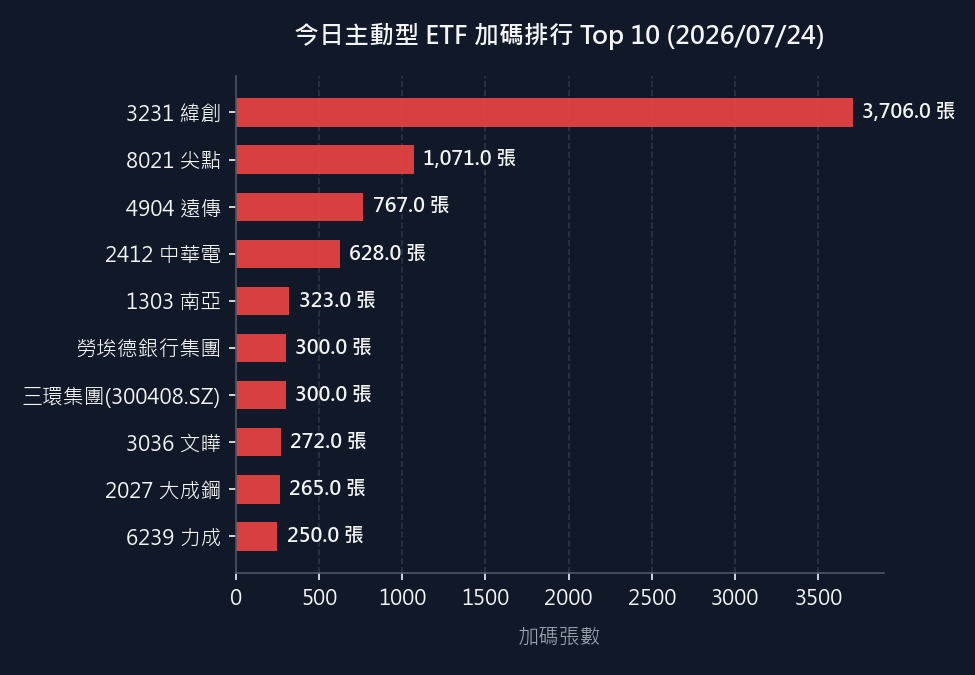
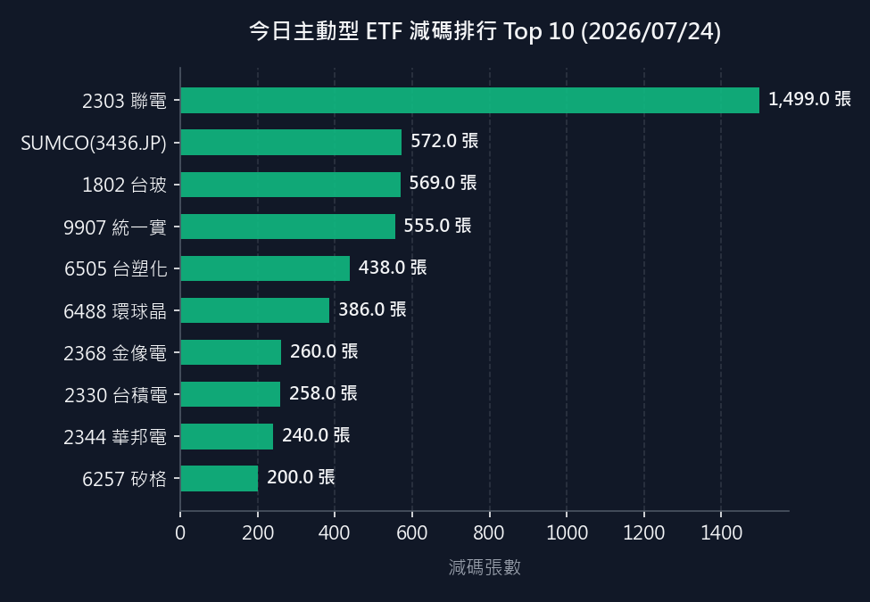

# 主動型 ETF 持股變動

資料來源：`主動型ETF持股明細.xlsx` 最近兩個日期分頁。

比較區間：`20260723` → `20260724`

## 今日加減碼視覺化排行

| 今日加碼 Top 10 | 今日減碼 Top 10 |
| :---: | :---: |
|  |  |

| ETF | 新增 | 刪除 | 比例變動 |
| :-- | --: | --: | --: |
| 00400A | 0 | 0 | 49 |
| 00401A | 0 | 0 | 61 |
| 00402A | 1 | 0 | 43 |
| 00403A | 0 | 0 | 38 |
| 00404A | 0 | 0 | 40 |
| 00405A | 0 | 1 | 37 |
| 00407A | 0 | 0 | 41 |
| 00408A | 0 | 2 | 40 |
| 00980A | 0 | 0 | 42 |
| 00980D | 0 | 1 | 24 |
| 00981A | 1 | 0 | 23 |
| 00982A | 1 | 0 | 40 |
| 00983A | 1 | 2 | 35 |
| 00983D | 0 | 0 | 18 |
| 00984A | 0 | 0 | 96 |
| 00985A | 0 | 0 | 47 |
| 00986A | 0 | 0 | 28 |
| 00987A | 1 | 1 | 24 |
| 00988A | 0 | 0 | 38 |
| 00989A | 0 | 0 | 48 |
| 00990A | 1 | 2 | 44 |
| 00991A | 0 | 1 | 24 |
| 00992A | 2 | 0 | 31 |
| 00993A | 0 | 0 | 45 |
| 00994A | 0 | 1 | 28 |
| 00995A | 0 | 0 | 47 |
| 00996A | 0 | 0 | 38 |
| 00997A | 1 | 1 | 46 |
| 00998A | 0 | 1 | 36 |
| 00999A | 0 | 2 | 59 |

## 00400A

### 新增持股

- 無

### 刪除持股

- 無

### 投資比例變動

- 1303 南亞：0.45% → 0.42%（-0.03）
- 1590 亞德客-KY：1.00% → 1.05%（+0.05）
- 2059 川湖：3.43% → 3.34%（-0.09）
- 2303 聯電：1.03% → 0.98%（-0.05）
- 2308 台達電：3.10% → 3.04%（-0.06）
- 2313 華通：0.88% → 0.85%（-0.03）
- 2317 鴻海：0.92% → 0.93%（+0.01）
- 2327 國巨*：1.50% → 1.42%（-0.08）
- 2330 台積電：8.53% → 8.60%（+0.07）
- 2345 智邦：1.95% → 1.92%（-0.03）
- 2357 華碩：1.37% → 1.42%（+0.05）
- 2360 致茂：5.31% → 5.28%（-0.03）
- 2376 技嘉：1.21% → 1.24%（+0.03）
- 2383 台光電：5.49% → 5.28%（-0.21）
- 2385 群光：0.13% → 0.14%（+0.01）
- 2408 南亞科：1.92% → 1.86%（-0.06）
- 2454 聯發科：6.31% → 6.30%（-0.01）
- 2881 富邦金：0.39% → 0.40%（+0.01）
- 2885 元大金：0.94% → 0.97%（+0.03）
- 3008 大立光：0.94% → 0.91%（-0.03）
- 3017 奇鋐：4.13% → 4.15%（+0.02）
- 3036 文曄：1.15% → 1.17%（+0.02）
- 3037 欣興：4.43% → 4.28%（-0.15）
- 3090 日電貿：0.38% → 0.37%（-0.01）
- 3167 大量：0.16% → 0.14%（-0.02）
- 3231 緯創：0.90% → 0.96%（+0.06）
- 3293 鈊象：0.35% → 0.36%（+0.01）
- 3374 精材：0.40% → 0.38%（-0.02）
- 3443 創意：3.08% → 2.95%（-0.13）
- 3653 健策：0.87% → 0.83%（-0.04）
- 3665 貿聯-KY：3.00% → 2.98%（-0.02）
- 3711 日月光投控：1.46% → 1.42%（-0.04）
- 4958 臻鼎-KY：1.02% → 1.00%（-0.02）
- 5274 信驊：3.02% → 2.95%（-0.07）
- 5347 世界：0.84% → 0.81%（-0.03）
- 5434 崇越：0.41% → 0.42%（+0.01）
- 6121 新普：0.25% → 0.26%（+0.01）
- 6147 頎邦：0.80% → 0.74%（-0.06）
- 6187 萬潤：2.26% → 2.14%（-0.12）
- 6223 旺矽：3.96% → 3.73%（-0.23）
- 6442 光聖：0.58% → 0.57%（-0.01）
- 6488 環球晶：3.54% → 3.35%（-0.19）
- 6505 台塑化：1.03% → 0.98%（-0.05）
- 6510 精測：1.35% → 1.31%（-0.04）
- 6669 緯穎：4.11% → 4.44%（+0.33）
- 6715 嘉基：0.22% → 0.23%（+0.01）
- 7769 鴻勁：0.31% → 0.30%（-0.01）
- 8046 南電：1.18% → 1.10%（-0.08）
- 8150 南茂：0.09% → 0.08%（-0.01）

## 00401A

### 新增持股

- 無

### 刪除持股

- 無

### 投資比例變動

- 1216 統一：0.34% → 0.35%（+0.01）
- 2303 聯電：1.11% → 1.06%（-0.05）
- 2308 台達電：4.18% → 4.09%（-0.09）
- 2313 華通：1.17% → 1.13%（-0.04）
- 2317 鴻海：0.72% → 0.73%（+0.01）
- 2330 台積電：8.66% → 8.71%（+0.05）
- 2344 華邦電：1.23% → 1.21%（-0.02）
- 2345 智邦：2.74% → 2.70%（-0.04）
- 2357 華碩：1.41% → 1.45%（+0.04）
- 2360 致茂：2.05% → 2.03%（-0.02）
- 2368 金像電：0.37% → 0.36%（-0.01）
- 2379 瑞昱：2.02% → 2.08%（+0.06）
- 2382 廣達：2.12% → 2.13%（+0.01）
- 2383 台光電：1.95% → 1.87%（-0.08）
- 2412 中華電：0.95% → 0.99%（+0.04）
- 2449 京元電子：1.17% → 0.59%（-0.58）
- 2454 聯發科：7.30% → 7.28%（-0.02）
- 2455 全新：0.50% → 0.95%（+0.45）
- 2603 長榮：1.09% → 1.13%（+0.04）
- 2615 萬海：0.06% → 0.07%（+0.01）
- 2881 富邦金：1.82% → 1.86%（+0.04）
- 2882 國泰金：1.15% → 1.18%（+0.03）
- 2883 凱基金：2.10% → 2.15%（+0.05）
- 2884 玉山金：1.87% → 1.95%（+0.08）
- 2885 元大金：1.13% → 1.16%（+0.03）
- 2886 兆豐金：1.59% → 1.65%（+0.06）
- 2887 台新新光金：1.09% → 1.12%（+0.03）
- 2890 永豐金：0.31% → 0.33%（+0.02）
- 2891 中信金：1.92% → 1.98%（+0.06）
- 2912 統一超：0.33% → 0.35%（+0.02）
- 3008 大立光：1.90% → 1.85%（-0.05）
- 3034 聯詠：0.76% → 0.79%（+0.03）
- 3037 欣興：0.70% → 0.68%（-0.02）
- 3131 弘塑：0.58% → 0.56%（-0.02）
- 3167 大量：0.52% → 0.48%（-0.04）
- 3231 緯創：0.39% → 0.42%（+0.03）
- 3491 昇達科：1.32% → 1.24%（-0.08）
- 3529 力旺：0.66% → 0.67%（+0.01）
- 3653 健策：1.17% → 1.12%（-0.05）
- 3711 日月光投控：2.61% → 2.35%（-0.26）
- 4904 遠傳：0.90% → 0.95%（+0.05）
- 4938 和碩：0.35% → 0.37%（+0.02）
- 4958 臻鼎-KY：2.24% → 2.19%（-0.05）
- 4991 環宇-KY：0.63% → 0.62%（-0.01）
- 5274 信驊：1.08% → 1.06%（-0.02）
- 5347 世界：1.67% → 1.60%（-0.07）
- 5871 中租-KY：0.18% → 0.19%（+0.01）
- 5904 寶雅：0.56% → 0.59%（+0.03）
- 6187 萬潤：0.68% → 0.64%（-0.04）
- 6223 旺矽：2.47% → 2.32%（-0.15）
- 6285 啟碁：2.10% → 2.08%（-0.02）
- 6415 矽力*-KY：0.71% → 0.72%（+0.01）
- 6510 精測：0.70% → 0.68%（-0.02）
- 6515 穎崴：0.63% → 0.80%（+0.17）
- 6531 愛普*：1.33% → 1.30%（-0.03）
- 6669 緯穎：2.51% → 2.70%（+0.19）
- 6944 兆聯實業：0.56% → 0.55%（-0.01）
- 7769 鴻勁：2.75% → 2.65%（-0.10）
- 7828 創新服務：2.04% → 1.92%（-0.12）
- 8021 尖點：0.29% → 0.27%（-0.02）
- 8464 億豐：1.23% → 1.28%（+0.05）

## 00402A

### 新增持股

- IOT.US Samsara（0.19%，13.4 張）

### 刪除持股

- 無

### 投資比例變動

- ADI.US Analog Devices：1.85% → 1.84%（-0.01）
- AMD.US AMD：6.07% → 6.01%（-0.06）
- AMZN.US Amazon：3.94% → 3.81%（-0.13）
- ANET.US Arista Networks：0.73% → 0.74%（+0.01）
- ARM.US Arm：1.08% → 1.09%（+0.01）
- ASML.US ASML Holding：1.69% → 1.72%（+0.03）
- AVGO.US Broadcom：2.50% → 2.51%（+0.01）
- AXON.US Axon Enterprise：1.08% → 1.09%（+0.01）
- BKNG.US Booking Holdings：0.60% → 0.59%（-0.01）
- CDNS.US Cadence Design Systems：1.78% → 1.77%（-0.01）
- CIEN.US Ciena：1.19% → 1.24%（+0.05）
- CLS.US Celestica：0.91% → 0.93%（+0.02）
- COHR.US Coherent：1.59% → 1.62%（+0.03）
- CRWD.US CrowdStrike Holdings：1.24% → 1.22%（-0.02）
- DASH.US DoorDash：0.24% → 0.23%（-0.01）
- FSLY.US Fastly：0.30% → 0.29%（-0.01）
- GOOG.US Alphabet - Class C Capital Stock：3.32% → 3.13%（-0.19）
- GOOGL.US Alphabet - Class A Common Stock：3.26% → 3.07%（-0.19）
- INTC.US Intel：1.32% → 1.30%（-0.02）
- KLAC.US KLA：2.35% → 2.43%（+0.08）
- LITE.US Lumentum：1.45% → 1.47%（+0.02）
- LRCX.US Lam Research：3.65% → 3.71%（+0.06）
- MCHP.US Microchip Technology：1.53% → 1.48%（-0.05）
- MDB.US MongoDB：0.59% → 0.58%（-0.01）
- META.US Meta：2.94% → 2.88%（-0.06）
- MRVL.US Marvell：1.48% → 1.49%（+0.01）
- MSFT.US Microsoft：3.33% → 3.30%（-0.03）
- MU.US Micron：6.77% → 7.09%（+0.32）
- NFLX.US Netflix：0.74% → 0.75%（+0.01）
- NVDA.US NVIDIA：8.49% → 8.50%（+0.01）
- NXPI.US NXP Semiconductors：1.30% → 1.31%（+0.01）
- PANW.US Palo Alto：3.10% → 3.05%（-0.05）
- PLTR.US Palantir Technologies：1.06% → 1.07%（+0.01）
- SHOP.US Shopify：0.40% → 0.38%（-0.02）
- SIMO.US Silicon Motion：0.83% → 0.86%（+0.03）
- SKHY.US SK hynix：1.03% → 1.07%（+0.04）
- SPCX.US SpaceX：0.58% → 0.61%（+0.03）
- STX.US Seagate：1.54% → 1.57%（+0.03）
- TER.US Teradyne：0.84% → 0.86%（+0.02）
- TXN.US Texas Instruments：2.64% → 2.60%（-0.04）
- UBER.US Uber：0.45% → 0.44%（-0.01）
- V.US Visa：1.04% → 1.05%（+0.01）
- WDC.US Western Digital：3.04% → 3.09%（+0.05）

## 00403A

### 新增持股

- 無

### 刪除持股

- 無

### 投資比例變動

- 1303 南亞：1.25% → 1.17%（-0.08）
- 2049 上銀：0.19% → 0.20%（+0.01）
- 2303 聯電：6.24% → 6.00%（-0.24）
- 2308 台達電：3.39% → 3.35%（-0.04）
- 2317 鴻海：0.49% → 0.50%（+0.01）
- 2327 國巨*：2.48% → 2.38%（-0.10）
- 2330 台積電：16.55% → 16.82%（+0.27）
- 2344 華邦電：3.82% → 3.81%（-0.01）
- 2345 智邦：3.12% → 3.10%（-0.02）
- 2360 致茂：0.97% → 0.98%（+0.01）
- 2368 金像電：1.15% → 1.00%（-0.15）
- 2383 台光電：4.02% → 3.90%（-0.12）
- 2454 聯發科：3.98% → 4.00%（+0.02）
- 3017 奇鋐：4.99% → 5.07%（+0.08）
- 3037 欣興：4.04% → 3.93%（-0.11）
- 3189 景碩：1.50% → 1.41%（-0.09）
- 3211 順達：0.46% → 0.47%（+0.01）
- 3443 創意：1.32% → 1.28%（-0.04）
- 3533 嘉澤：1.50% → 1.51%（+0.01）
- 3583 辛耘：0.41% → 0.40%（-0.01）
- 3653 健策：2.05% → 1.97%（-0.08）
- 3665 貿聯-KY：0.81% → 0.93%（+0.12）
- 3711 日月光投控：2.46% → 2.42%（-0.04）
- 4958 臻鼎-KY：1.85% → 1.83%（-0.02）
- 4966 譜瑞-KY：0.29% → 0.30%（+0.01）
- 5274 信驊：1.15% → 1.13%（-0.02）
- 6223 旺矽：3.71% → 3.52%（-0.19）
- 6239 力成：0.41% → 0.45%（+0.04）
- 6274 台燿：1.33% → 1.30%（-0.03）
- 6415 矽力*-KY：0.25% → 0.26%（+0.01）
- 6442 光聖：0.19% → 0.18%（-0.01）
- 6488 環球晶：1.56% → 1.49%（-0.07）
- 6669 緯穎：1.95% → 2.12%（+0.17）
- 6805 富世達：0.60% → 0.61%（+0.01）
- 7769 鴻勁：1.15% → 1.12%（-0.03）
- 8046 南電：1.28% → 1.20%（-0.08）
- 8358 金居：0.42% → 0.40%（-0.02）
- 8996 高力：1.02% → 0.99%（-0.03）

## 00404A

### 新增持股

- 無

### 刪除持股

- 無

### 投資比例變動

- 1216 統一：1.93% → 1.99%（+0.06）
- 2303 聯電：2.28% → 2.15%（-0.13）
- 2308 台達電：3.86% → 3.76%（-0.10）
- 2327 國巨*：0.68% → 0.64%（-0.04）
- 2330 台積電：22.26% → 22.33%（+0.07）
- 2345 智邦：0.98% → 0.97%（-0.01）
- 2360 致茂：1.15% → 1.16%（+0.01）
- 2376 技嘉：1.98% → 2.06%（+0.08）
- 2382 廣達：0.40% → 0.41%（+0.01）
- 2383 台光電：2.05% → 1.95%（-0.10）
- 2393 億光：1.71% → 1.73%（+0.02）
- 2454 聯發科：6.87% → 6.85%（-0.02）
- 2885 元大金：2.79% → 2.85%（+0.06）
- 2887 台新新光金：3.21% → 3.24%（+0.03）
- 3014 聯陽：1.09% → 1.08%（-0.01）
- 3017 奇鋐：0.65% → 0.70%（+0.05）
- 3034 聯詠：0.61% → 0.64%（+0.03）
- 3037 欣興：0.60% → 0.56%（-0.04）
- 3131 弘塑：0.77% → 0.75%（-0.02）
- 3189 景碩：0.32% → 0.29%（-0.03）
- 3260 威剛：0.39% → 0.40%（+0.01）
- 3264 欣銓：0.94% → 0.92%（-0.02）
- 3702 大聯大：1.83% → 1.87%（+0.04）
- 3711 日月光投控：3.54% → 3.39%（-0.15）
- 4763 材料*-KY：1.88% → 1.93%（+0.05）
- 5274 信驊：2.14% → 2.08%（-0.06）
- 5347 世界：0.41% → 0.39%（-0.02）
- 5434 崇越：1.64% → 1.65%（+0.01）
- 5871 中租-KY：1.90% → 1.89%（-0.01）
- 5876 上海商銀：1.83% → 1.92%（+0.09）
- 6138 茂達：1.89% → 1.90%（+0.01）
- 6196 帆宣：0.38% → 0.37%（-0.01）
- 6206 飛捷：1.81% → 1.96%（+0.15）
- 6223 旺矽：0.77% → 0.75%（-0.02）
- 6239 力成：1.48% → 1.44%（-0.04）
- 6257 矽格：1.67% → 1.66%（-0.01）
- 6488 環球晶：0.18% → 0.15%（-0.03）
- 8299 群聯：1.09% → 1.07%（-0.02）
- 臺指選擇權08/26 49100 買權：-0.09% → -0.05%（+0.04）
- 臺股期貨08/26：15.55% → 15.63%（+0.08）

## 00405A

### 新增持股

- 無

### 刪除持股

- 2049 上銀（0.02%，19 張）

### 投資比例變動

- 2059 川湖：1.26% → 1.24%（-0.02）
- 2308 台達電：0.99% → 0.98%（-0.01）
- 2327 國巨*：3.23% → 3.12%（-0.11）
- 2330 台積電：2.10% → 0.44%（-1.66）
- 2344 華邦電：3.47% → 3.49%（+0.02）
- 2368 金像電：1.98% → 1.99%（+0.01）
- 2383 台光電：2.92% → 2.86%（-0.06）
- 2408 南亞科：1.32% → 1.30%（-0.02）
- 2449 京元電子：0.83% → 0.82%（-0.01）
- 2454 聯發科：6.80% → 6.89%（+0.09）
- 3017 奇鋐：6.18% → 6.31%（+0.13）
- 3026 禾伸堂：1.48% → 1.42%（-0.06）
- 3037 欣興：5.14% → 5.04%（-0.10）
- 3081 聯亞：1.06% → 1.07%（+0.01）
- 3105 穩懋：1.61% → 1.58%（-0.03）
- 3131 弘塑：3.63% → 3.59%（-0.04）
- 3443 創意：5.35% → 5.20%（-0.15）
- 3583 辛耘：1.68% → 1.38%（-0.30）
- 3653 健策：2.44% → 2.82%（+0.38）
- 3665 貿聯-KY：4.13% → 4.18%（+0.05）
- 3711 日月光投控：0.77% → 0.76%（-0.01）
- 5274 信驊：2.06% → 2.05%（-0.01）
- 6187 萬潤：2.07% → 1.80%（-0.27）
- 6223 旺矽：6.24% → 5.96%（-0.28）
- 6274 台燿：1.49% → 1.46%（-0.03）
- 6291 沛亨：0.30% → 0.31%（+0.01）
- 6488 環球晶：4.75% → 4.57%（-0.18）
- 6510 精測：1.36% → 1.34%（-0.02）
- 6515 穎崴：0.56% → 0.55%（-0.01）
- 6526 達發：0.31% → 0.33%（+0.02）
- 6669 緯穎：0.10% → 3.18%（+3.08）
- 7734 印能科技：1.91% → 2.11%（+0.20）
- 7769 鴻勁：2.36% → 2.32%（-0.04）
- 8028 昇陽半導體：0.98% → 1.02%（+0.04）
- 8046 南電：4.67% → 4.41%（-0.26）
- 8210 勤誠：0.94% → 0.70%（-0.24）
- 8996 高力：1.11% → 1.08%（-0.03）

## 00407A

### 新增持股

- 無

### 刪除持股

- 無

### 投資比例變動

- 1303 南亞：0.62% → 0.57%（-0.05）
- 1590 亞德客-KY：2.13% → 2.23%（+0.10）
- 2059 川湖：2.06% → 2.01%（-0.05）
- 2303 聯電：1.50% → 1.43%（-0.07）
- 2308 台達電：4.04% → 3.97%（-0.07）
- 2327 國巨*：2.68% → 2.55%（-0.13）
- 2330 台積電：8.98% → 9.07%（+0.09）
- 2344 華邦電：1.65% → 1.64%（-0.01）
- 2345 智邦：3.20% → 3.16%（-0.04）
- 2360 致茂：1.97% → 1.96%（-0.01）
- 2368 金像電：1.82% → 1.80%（-0.02）
- 2376 技嘉：0.77% → 0.79%（+0.02）
- 2379 瑞昱：0.79% → 0.82%（+0.03）
- 2383 台光電：3.81% → 3.85%（+0.04）
- 2408 南亞科：1.73% → 1.68%（-0.05）
- 2412 中華電：1.70% → 1.77%（+0.07）
- 2451 創見：0.14% → 0.16%（+0.02）
- 3017 奇鋐：3.51% → 3.54%（+0.03）
- 3034 聯詠：0.68% → 0.71%（+0.03）
- 3037 欣興：3.89% → 3.77%（-0.12）
- 3293 鈊象：0.55% → 0.57%（+0.02）
- 3443 創意：1.84% → 1.77%（-0.07）
- 3491 昇達科：0.43% → 0.41%（-0.02）
- 3529 力旺：1.93% → 1.97%（+0.04）
- 3665 貿聯-KY：3.02% → 3.01%（-0.01）
- 3711 日月光投控：2.57% → 2.51%（-0.06）
- 4904 遠傳：0.31% → 0.33%（+0.02）
- 4958 臻鼎-KY：1.96% → 1.93%（-0.03）
- 5274 信驊：2.06% → 2.02%（-0.04）
- 5536 聖暉*：1.90% → 1.84%（-0.06）
- 6223 旺矽：2.45% → 2.48%（+0.03）
- 6274 台燿：2.50% → 2.42%（-0.08）
- 6415 矽力*-KY：0.39% → 0.40%（+0.01）
- 6446 藥華藥：2.22% → 2.27%（+0.05）
- 6515 穎崴：1.40% → 1.38%（-0.02）
- 6526 達發：0.31% → 0.32%（+0.01）
- 6531 愛普*：1.53% → 1.50%（-0.03）
- 6669 緯穎：3.93% → 4.36%（+0.43）
- 8046 南電：2.47% → 2.31%（-0.16）
- 8210 勤誠：1.85% → 1.78%（-0.07）
- 8996 高力：0.41% → 0.40%（-0.01）

## 00408A

### 新增持股

- 無

### 刪除持股

- 6257 矽格（1.07%，80 張）
- 6488 環球晶（0.53%，8 張）

### 投資比例變動

- 1216 統一：1.00% → 1.02%（+0.02）
- 1303 南亞：0.82% → 0.74%（-0.08）
- 1477 聚陽：1.14% → 1.16%（+0.02）
- 2059 川湖：1.46% → 1.39%（-0.07）
- 2303 聯電：0.49% → 0.46%（-0.03）
- 2308 台達電：3.78% → 3.64%（-0.14）
- 2317 鴻海：2.28% → 2.27%（-0.01）
- 2330 台積電：5.38% → 4.81%（-0.57）
- 2345 智邦：2.89% → 2.79%（-0.10）
- 2356 英業達：1.23% → 1.28%（+0.05）
- 2357 華碩：1.96% → 1.99%（+0.03）
- 2360 致茂：2.42% → 2.37%（-0.05）
- 2368 金像電：2.12% → 2.05%（-0.07）
- 2376 技嘉：2.20% → 2.23%（+0.03）
- 2382 廣達：1.21% → 1.20%（-0.01）
- 2383 台光電：3.32% → 3.13%（-0.19）
- 2395 研華：1.95% → 1.91%（-0.04）
- 2404 漢唐：1.72% → 1.68%（-0.04）
- 2408 南亞科：0.50% → 0.48%（-0.02）
- 2412 中華電：3.27% → 3.33%（+0.06）
- 2454 聯發科：4.13% → 4.04%（-0.09）
- 2603 長榮：1.81% → 1.85%（+0.04）
- 2886 兆豐金：2.14% → 2.18%（+0.04）
- 2891 中信金：0.90% → 0.91%（+0.01）
- 2912 統一超：2.38% → 2.45%（+0.07）
- 3017 奇鋐：2.31% → 2.28%（-0.03）
- 3037 欣興：2.76% → 2.61%（-0.15）
- 3045 台灣大：3.25% → 3.34%（+0.09）
- 3231 緯創：2.98% → 3.32%（+0.34）
- 3665 貿聯-KY：1.89% → 1.85%（-0.04）
- 3702 大聯大：1.87% → 1.83%（-0.04）
- 4904 遠傳：0.55% → 0.57%（+0.02）
- 5347 世界：0.50% → 0.47%（-0.03）
- 5876 上海商銀：2.17% → 2.27%（+0.10）
- 5904 寶雅：1.54% → 1.60%（+0.06）
- 6223 旺矽：0.55% → 0.51%（-0.04）
- 6274 台燿：1.50% → 1.42%（-0.08）
- 6669 緯穎：3.56% → 3.78%（+0.22）
- 7769 鴻勁：1.72% → 1.63%（-0.09）
- 8046 南電：2.62% → 2.39%（-0.23）

## 00980A

### 新增持股

- 無

### 刪除持股

- 無

### 投資比例變動

- 1303 南亞：1.46% → 1.74%（+0.28）
- 2059 川湖：4.56% → 4.48%（-0.08）
- 2308 台達電：4.75% → 4.30%（-0.45）
- 2317 鴻海：2.28% → 2.33%（+0.05）
- 2327 國巨*：1.47% → 1.41%（-0.06）
- 2330 台積電：9.31% → 9.49%（+0.18）
- 2344 華邦電：1.13% → 1.14%（+0.01）
- 2345 智邦：2.09% → 2.08%（-0.01）
- 2360 致茂：1.88% → 1.90%（+0.02）
- 2376 技嘉：1.35% → 1.41%（+0.06）
- 2382 廣達：1.33% → 1.35%（+0.02）
- 2383 台光電：4.70% → 4.57%（-0.13）
- 2408 南亞科：2.31% → 2.58%（+0.27）
- 2454 聯發科：6.37% → 6.43%（+0.06）
- 2884 玉山金：0.84% → 0.89%（+0.05）
- 2891 中信金：1.27% → 1.32%（+0.05）
- 3008 大立光：0.89% → 0.87%（-0.02）
- 3017 奇鋐：1.95% → 1.99%（+0.04）
- 3026 禾伸堂：0.57% → 0.55%（-0.02）
- 3036 文曄：1.35% → 1.40%（+0.05）
- 3037 欣興：3.08% → 3.00%（-0.08）
- 3189 景碩：0.88% → 0.83%（-0.05）
- 3231 緯創：0.92% → 0.99%（+0.07）
- 3293 鈊象：0.98% → 1.02%（+0.04）
- 3443 創意：1.58% → 1.53%（-0.05）
- 3529 力旺：0.92% → 0.94%（+0.02）
- 3653 健策：2.27% → 1.40%（-0.87）
- 3711 日月光投控：1.59% → 1.56%（-0.03）
- 5274 信驊：1.55% → 1.53%（-0.02）
- 5904 寶雅：1.21% → 1.30%（+0.09）
- 6213 聯茂：0.68% → 0.91%（+0.23）
- 6223 旺矽：2.90% → 2.76%（-0.14）
- 6274 台燿：1.34% → 1.49%（+0.15）
- 6515 穎崴：2.22% → 2.21%（-0.01）
- 6669 緯穎：1.57% → 1.72%（+0.15）
- 6805 富世達：0.48% → 0.49%（+0.01）
- 6831 邁科：0.34% → 0.36%（+0.02）
- 7769 鴻勁：2.88% → 2.82%（-0.06）
- 8046 南電：1.53% → 1.44%（-0.09）
- 8210 勤誠：0.95% → 0.92%（-0.03）
- 8299 群聯：1.41% → 1.40%（-0.01）
- 8996 高力：1.19% → 1.16%（-0.03）

## 00980D

### 新增持股

- 無

### 刪除持股

- US ULTRA BOND CBT SEP26 21-SEP-2026（0.18%，N/A 張）

### 投資比例變動

- BANCO SANTANDER SA 6.921% 08AUG2033：0.35% → 0.34%（-0.01）
- BAT CAPITAL CORP (REG) 7.081% 02AUG2053：0.59% → 0.58%（-0.01）
- BLUE OWL CREDIT INCOME SER WI (REG) 7.75% 16SEP2027：0.55% → 0.56%（+0.01）
- CONCENTRIX CORP (REG) 6.6% 02AUG2028：0.51% → 0.52%（+0.01）
- COREWEAVE INC SER REGS (REG S) 9.25% 01JUN2030：0.44% → 0.43%（-0.01）
- GENERAL MOTORS CO (REG) 6.8% 01OCT2027：0.56% → 0.57%（+0.01）
- GETTY IMAGES INC SER REGS 11.250000 % 21FEB2030：0.54% → 0.51%（-0.03）
- JBS USA/FOOD/FINANCE (REG) 6.5% 01DEC2052：0.47% → 0.46%（-0.01）
- JETBLUE AIRWAYS/LOYALTY SER REGS (REG S) 9.875% 20SEP2031：0.30% → 0.29%（-0.01）
- ORACLE CORP (REG) 5.500000 % 27SEP2064：0.55% → 0.54%（-0.01）
- ORACLE CORP 5.55% 06FEB2053：0.25% → 0.24%（-0.01）
- ORACLE CORP 6.125000 % 03AUG2065：0.52% → 0.51%（-0.01）
- RR DONNELLEY & SONS CO SER REGS (REG S) 9.5% 01AUG2029：0.42% → 0.43%（+0.01）
- SABRE GLBL INC SER REGS (REG) 10.750000 % 15NOV2029：0.14% → 0.13%（-0.01）
- SALESFORCE INC (REG) 6.55% 15MAR2056：0.54% → 0.53%（-0.01）
- SALESFORCE INC (REG) 6.7% 15MAR2066：0.53% → 0.52%（-0.01）
- SES GLOBAL AMERICAS HLDG SER REGS (REG) 5.300000 % 25MAR2044：0.35% → 0.34%（-0.01）
- STAPLES INC SER REGS (REG S) 10.75% 01SEP2029：0.46% → 0.45%（-0.01）
- UNISYS CORP SER REGS 10.625000 % 15JAN2031：0.60% → 0.59%（-0.01）
- US 2YR NOTE (CBT) SEP26 30-SEP-2026：1.98% → 1.99%（+0.01）
- US 5YR NOTE (CBT) SEP26 30-SEP-2026：-16.23% → -16.24%（-0.01）
- US LONG BOND(CBT) SEP26 21-SEP-2026：5.49% → 5.48%（-0.01）
- VIACOM INC (REG) 5.85% 01SEP2043：0.57% → 0.56%（-0.01）
- VIACOMCBS INC (REG) 4.95% 19MAY2050：0.50% → 0.49%（-0.01）

## 00981A

### 新增持股

- 4979 華星光（0.30%，1874 張）

### 刪除持股

- 無

### 投資比例變動

- 1590 亞德客-KY：0.27% → 0.28%（+0.01）
- 2303 聯電：4.28% → 4.14%（-0.14）
- 2308 台達電：3.74% → 3.72%（-0.02）
- 2327 國巨*：6.24% → 6.03%（-0.21）
- 2330 台積電：10.17% → 10.41%（+0.24）
- 2368 金像電：2.51% → 2.52%（+0.01）
- 2383 台光電：8.47% → 8.28%（-0.19）
- 2454 聯發科：7.10% → 7.20%（+0.10）
- 3017 奇鋐：4.73% → 4.83%（+0.10）
- 3037 欣興：5.43% → 5.33%（-0.10）
- 3653 健策：3.00% → 2.91%（-0.09）
- 3665 貿聯-KY：3.95% → 3.99%（+0.04）
- 3711 日月光投控：3.79% → 3.74%（-0.05）
- 5274 信驊：2.49% → 2.47%（-0.02）
- 5439 高技：0.24% → 0.23%（-0.01）
- 6147 頎邦：0.30% → 0.28%（-0.02）
- 6187 萬潤：0.49% → 0.47%（-0.02）
- 6223 旺矽：5.45% → 5.21%（-0.24）
- 6274 台燿：2.46% → 2.41%（-0.05）
- 6669 緯穎：4.72% → 5.18%（+0.46）
- 6805 富世達：1.00% → 1.02%（+0.02）
- 8046 南電：4.18% → 3.95%（-0.23）
- 8210 勤誠：0.96% → 0.93%（-0.03）

## 00982A

### 新增持股

- 3231 緯創（0.04%，100 張）

### 刪除持股

- 無

### 投資比例變動

- 1785 光洋科：0.97% → 0.98%（+0.01）
- 2059 川湖：3.01% → 2.97%（-0.04）
- 2303 聯電：2.49% → 2.41%（-0.08）
- 2316 楠梓電：1.13% → 1.12%（-0.01）
- 2327 國巨*：1.17% → 1.13%（-0.04）
- 2330 台積電：9.40% → 9.60%（+0.20）
- 2345 智邦：3.75% → 3.74%（-0.01）
- 2351 順德：0.56% → 0.58%（+0.02）
- 2360 致茂：3.58% → 3.62%（+0.04）
- 2376 技嘉：0.75% → 0.78%（+0.03）
- 2377 微星：1.73% → 1.74%（+0.01）
- 2383 台光電：3.36% → 3.28%（-0.08）
- 2451 創見：0.26% → 0.29%（+0.03）
- 2454 聯發科：6.69% → 6.77%（+0.08）
- 2472 立隆電：1.31% → 1.28%（-0.03）
- 2885 元大金：0.27% → 0.28%（+0.01）
- 3008 大立光：2.00% → 1.98%（-0.02）
- 3017 奇鋐：1.97% → 2.01%（+0.04）
- 3036 文曄：0.96% → 1.00%（+0.04）
- 3105 穩懋：3.06% → 3.00%（-0.06）
- 3264 欣銓：2.07% → 2.08%（+0.01）
- 3491 昇達科：2.55% → 2.44%（-0.11）
- 3529 力旺：0.46% → 0.48%（+0.02）
- 3583 辛耘：1.70% → 1.68%（-0.02）
- 3702 大聯大：1.34% → 1.36%（+0.02）
- 3711 日月光投控：1.30% → 1.29%（-0.01）
- 4958 臻鼎-KY：3.19% → 3.18%（-0.01）
- 5536 聖暉*：8.96% → 8.78%（-0.18）
- 6139 亞翔：5.28% → 5.62%（+0.34）
- 6147 頎邦：0.42% → 0.40%（-0.02）
- 6187 萬潤：0.19% → 0.18%（-0.01）
- 6223 旺矽：3.81% → 3.64%（-0.17）
- 6257 矽格：2.12% → 2.13%（+0.01）
- 6274 台燿：1.19% → 1.16%（-0.03）
- 6488 環球晶：2.55% → 2.45%（-0.10）
- 6531 愛普*：2.03% → 2.01%（-0.02）
- 6669 緯穎：3.30% → 3.62%（+0.32）
- 7769 鴻勁：1.19% → 1.17%（-0.02）
- 8016 矽創：1.32% → 1.36%（+0.04）
- 8996 高力：0.82% → 0.80%（-0.02）

## 00983A

### 新增持股

- XE.US X-Energy（0.11%，2.406 張）

### 刪除持股

- SPCX.US SpaceX（4.05%，12.59 張）
- X-Energy Inc（0.11%，2.406 張）

### 投資比例變動

- AMD.US AMD：7.35% → 7.41%（+0.06）
- AMZN.US Amazon：3.22% → 3.17%（-0.05）
- AVGO.US Broadcom：1.95% → 1.99%（+0.04）
- BEAM.US Beam Therapeutics：2.54% → 2.55%（+0.01）
- BLSH.US Bullish：0.45% → 0.76%（+0.31）
- BMNR.US BitMine：0.51% → 0.64%（+0.13）
- CBRS.US Cerebras：0.77% → 0.84%（+0.07）
- CERS.US Cerus：0.53% → 0.52%（-0.01）
- CRCL.US Circle：0.34% → 0.71%（+0.37）
- CRSP.US CRISPR Therapeutics：3.83% → 3.98%（+0.15）
- CRWV.US CoreWeave：0.71% → 1.12%（+0.41）
- DE.US Deere：1.05% → 1.08%（+0.03）
- FIG.US Figma：0.38% → 0.36%（-0.02）
- GOOG.US Alphabet - Class C Capital Stock：1.26% → 1.21%（-0.05）
- GOOGL.US Alphabet - Class A Common Stock：1.66% → 1.59%（-0.07）
- HOOD.US Robinhood Markets：4.69% → 4.71%（+0.02）
- ILMN.US Illumina：3.68% → 3.92%（+0.24）
- LLY.US Eli Lilly：1.93% → 2.03%（+0.10）
- NTLA.US Intellia Therapeutics：1.50% → 1.54%（+0.04）
- NTRA.US Natera：2.83% → 2.92%（+0.09）
- NVDA.US NVIDIA：0.87% → 0.88%（+0.01）
- PLTR.US Palantir Technologies：0.60% → 0.62%（+0.02）
- RBLX.US Roblox：3.13% → 3.10%（-0.03）
- RXRX.US Recursion Pharmaceuticals：0.20% → 0.21%（+0.01）
- SHOP.US Shopify：6.00% → 5.86%（-0.14）
- SNOW.US Snowflake：0.94% → 0.96%（+0.02）
- TEM.US Tempus：4.34% → 4.39%（+0.05）
- TER.US Teradyne：0.62% → 0.65%（+0.03）
- TSLA.US Tesla：8.60% → 7.59%（-1.01）
- TSM.US TSMC(ADR)：3.57% → 3.63%（+0.06）
- TWST.US Twist Bioscience：4.48% → 4.54%（+0.06）
- TXG.US 10x Genomics：5.63% → 5.93%（+0.30）
- VCYT.US Veracyte：1.67% → 1.72%（+0.05）
- WGS.US GeneDx：1.33% → 1.39%（+0.06）
- XYZ.US Block：2.22% → 2.26%（+0.04）

## 00983D

### 新增持股

- 無

### 刪除持股

- 無

### 投資比例變動

- AMCX 10 1/2 07/15/32：1.65% → 1.64%（-0.01）
- CRWV 9 02/01/31：1.32% → 1.30%（-0.02）
- CYH 10 7/8 01/15/32：1.53% → 1.51%（-0.02）
- DELL 8.1 07/15/36：1.57% → 1.56%（-0.01）
- DIS 7 3/4 12/01/45：0.82% → 0.81%（-0.01）
- GTN 10 1/2 07/15/29：1.72% → 1.73%（+0.01）
- HAL 7.45 09/15/39：1.87% → 1.86%（-0.01）
- LOW 6.65 09/15/37：0.87% → 0.86%（-0.01）
- NVDA 5.55 06/15/46：0.91% → 0.90%（-0.01）
- ORCL 6 1/2 04/15/38：0.40% → 0.39%（-0.01）
- ORCL 6.9 11/09/52：1.12% → 1.13%（+0.01）
- PCG 6 3/4 01/15/53：1.17% → 1.18%（+0.01）
- RAKUTN 11 1/4 02/15/27：1.84% → 1.85%（+0.01）
- SABHLD 10 3/4 11/15/29：0.60% → 0.59%（-0.01）
- SPCX 6.6 07/15/46：0.87% → 0.85%（-0.02）
- TLTW.US iShares 20+ Year Treasury Bond B：7.43% → 7.44%（+0.01）
- VENLNG 9 1/2 02/01/29：1.44% → 1.45%（+0.01）
- VZ 7 3/4 12/01/30：1.16% → 1.17%（+0.01）

## 00984A

### 新增持股

- 無

### 刪除持股

- 無

### 投資比例變動

- 1102 亞泥：1.30% → 1.34%（+0.04）
- 1216 統一：1.95% → 2.01%（+0.06）
- 1303 南亞：0.69% → 0.64%（-0.05）
- 1326 台化：0.77% → 0.74%（-0.03）
- 1402 遠東新：1.06% → 1.10%（+0.04）
- 1409 新纖：0.53% → 0.54%（+0.01）
- 1513 中興電：0.25% → 0.26%（+0.01）
- 1560 中砂：0.50% → 0.49%（-0.01）
- 1795 美時：0.38% → 0.39%（+0.01）
- 1907 永豐餘：0.29% → 0.30%（+0.01）
- 2006 東和鋼鐵：0.41% → 0.43%（+0.02）
- 2059 川湖：0.59% → 0.57%（-0.02）
- 2105 正新：0.41% → 0.42%（+0.01）
- 2204 中華：0.26% → 0.28%（+0.02）
- 2206 三陽工業：0.39% → 0.42%（+0.03）
- 2303 聯電：2.29% → 2.17%（-0.12）
- 2327 國巨*：1.01% → 0.96%（-0.05）
- 2330 台積電：3.04% → 3.03%（-0.01）
- 2347 聯強：0.99% → 1.02%（+0.03）
- 2357 華碩：2.89% → 2.98%（+0.09）
- 2360 致茂：0.69% → 0.68%（-0.01）
- 2377 微星：1.01% → 1.00%（-0.01）
- 2382 廣達：2.32% → 2.33%（+0.01）
- 2383 台光電：1.84% → 1.77%（-0.07）
- 2385 群光：0.40% → 0.41%（+0.01）
- 2404 漢唐：1.85% → 1.83%（-0.02）
- 2412 中華電：2.63% → 2.72%（+0.09）
- 2454 聯發科：1.44% → 1.43%（-0.01）
- 2467 志聖：0.50% → 0.49%（-0.01）
- 2472 立隆電：0.35% → 0.34%（-0.01）
- 2474 可成：0.80% → 0.81%（+0.01）
- 2501 國建：0.26% → 0.27%（+0.01）
- 2606 裕民：0.41% → 0.42%（+0.01）
- 2618 長榮航：1.42% → 1.46%（+0.04）
- 2633 台灣高鐵：1.41% → 1.45%（+0.04）
- 2634 漢翔：0.43% → 0.47%（+0.04）
- 2646 星宇航空：0.39% → 0.40%（+0.01）
- 2855 統一證：0.52% → 0.53%（+0.01）
- 2881 富邦金：2.63% → 2.67%（+0.04）
- 2885 元大金：0.40% → 0.41%（+0.01）
- 2891 中信金：2.36% → 2.42%（+0.06）
- 2897 王道銀行：0.26% → 0.29%（+0.03）
- 2912 統一超：1.48% → 1.55%（+0.07）
- 3005 神基：0.44% → 0.45%（+0.01）
- 3008 大立光：0.68% → 0.67%（-0.01）
- 3026 禾伸堂：0.94% → 0.89%（-0.05）
- 3034 聯詠：2.04% → 2.11%（+0.07）
- 3037 欣興：1.65% → 1.60%（-0.05）
- 3045 台灣大：1.99% → 2.07%（+0.08）
- 3090 日電貿：0.31% → 0.30%（-0.01）
- 3167 大量：0.47% → 0.43%（-0.04）
- 3189 景碩：1.34% → 1.24%（-0.10）
- 3227 原相：0.24% → 0.25%（+0.01）
- 3264 欣銓：0.25% → 0.24%（-0.01）
- 3293 鈊象：1.23% → 1.26%（+0.03）
- 3443 創意：0.63% → 0.60%（-0.03）
- 3481 群創：0.44% → 0.43%（-0.01）
- 3532 台勝科：0.68% → 0.62%（-0.06）
- 3592 瑞鼎：0.24% → 0.25%（+0.01）
- 3711 日月光投控：1.15% → 1.12%（-0.03）
- 4904 遠傳：1.81% → 1.91%（+0.10）
- 4938 和碩：0.40% → 0.42%（+0.02）
- 4958 臻鼎-KY：1.69% → 1.68%（-0.01）
- 5274 信驊：0.35% → 0.34%（-0.01）
- 5434 崇越：1.20% → 1.22%（+0.02）
- 5536 聖暉*：0.53% → 0.52%（-0.01）
- 5871 中租-KY：1.17% → 1.20%（+0.03）
- 5876 上海商銀：1.29% → 1.36%（+0.07）
- 5904 寶雅：0.26% → 0.28%（+0.02）
- 6121 新普：0.62% → 0.64%（+0.02）
- 6147 頎邦：0.48% → 0.45%（-0.03）
- 6176 瑞儀：0.39% → 0.40%（+0.01）
- 6182 合晶：0.60% → 0.55%（-0.05）
- 6196 帆宣：1.14% → 1.13%（-0.01）
- 6213 聯茂：1.09% → 1.00%（-0.09）
- 6223 旺矽：1.16% → 1.09%（-0.07）
- 6274 台燿：1.72% → 1.68%（-0.04）
- 6285 啟碁：0.59% → 0.58%（-0.01）
- 6446 藥華藥：1.94% → 1.97%（+0.03）
- 6531 愛普*：1.18% → 1.15%（-0.03）
- 6831 邁科：0.44% → 0.45%（+0.01）
- 6890 來億-KY：0.24% → 0.26%（+0.02）
- 7769 鴻勁：0.60% → 0.58%（-0.02）
- 8016 矽創：0.87% → 0.88%（+0.01）
- 8021 尖點：1.10% → 1.31%（+0.21）
- 8046 南電：1.17% → 1.09%（-0.08）
- 8064 東捷：0.44% → 0.42%（-0.02）
- 8081 致新：0.23% → 0.24%（+0.01）
- 8096 擎亞：0.52% → 0.54%（+0.02）
- 8210 勤誠：0.29% → 0.28%（-0.01）
- 8261 富鼎：0.67% → 0.63%（-0.04）
- 8358 金居：1.01% → 0.94%（-0.07）
- 8415 大國鋼：0.27% → 0.28%（+0.01）
- 9914 美利達：0.27% → 0.28%（+0.01）
- 9939 宏全：0.29% → 0.30%（+0.01）
- 9958 世紀鋼：0.25% → 0.27%（+0.02）

## 00985A

### 新增持股

- 無

### 刪除持股

- 無

### 投資比例變動

- 1216 統一：1.00% → 1.05%（+0.05）
- 1802 台玻：0.52% → 0.21%（-0.31）
- 2027 大成鋼：3.39% → 3.57%（+0.18）
- 2049 上銀：0.56% → 0.57%（+0.01）
- 2059 川湖：3.36% → 3.29%（-0.07）
- 2303 聯電：3.45% → 3.31%（-0.14）
- 2308 台達電：1.11% → 1.09%（-0.02）
- 2317 鴻海：0.16% → 0.17%（+0.01）
- 2327 國巨*：3.55% → 3.39%（-0.16）
- 2330 台積電：18.18% → 17.40%（-0.78）
- 2344 華邦電：1.37% → 0.98%（-0.39）
- 2345 智邦：2.14% → 2.12%（-0.02）
- 2360 致茂：1.21% → 0.47%（-0.74）
- 2376 技嘉：4.14% → 4.30%（+0.16）
- 2383 台光電：2.44% → 2.37%（-0.07）
- 2395 研華：1.49% → 1.50%（+0.01）
- 2408 南亞科：2.00% → 1.95%（-0.05）
- 2412 中華電：2.60% → 3.62%（+1.02）
- 2454 聯發科：1.16% → 1.17%（+0.01）
- 2881 富邦金：0.47% → 0.48%（+0.01）
- 2891 中信金：0.49% → 0.51%（+0.02）
- 3008 大立光：2.81% → 3.21%（+0.40）
- 3017 奇鋐：1.07% → 0.42%（-0.65）
- 3036 文曄：2.61% → 3.27%（+0.66）
- 3037 欣興：0.36% → 0.35%（-0.01）
- 3105 穩懋：0.54% → 0.53%（-0.01）
- 3131 弘塑：1.49% → 1.46%（-0.03）
- 3189 景碩：0.02% → 0.01%（-0.01）
- 3293 鈊象：1.04% → 1.07%（+0.03）
- 3529 力旺：0.63% → 0.26%（-0.37）
- 3653 健策：1.19% → 1.14%（-0.05）
- 3661 世芯-KY：2.56% → 2.58%（+0.02）
- 3711 日月光投控：0.81% → 0.79%（-0.02）
- 4904 遠傳：2.60% → 3.61%（+1.01）
- 4958 臻鼎-KY：2.24% → 2.21%（-0.03）
- 6147 頎邦：2.90% → 2.71%（-0.19）
- 6187 萬潤：3.07% → 2.93%（-0.14）
- 6223 旺矽：0.81% → 0.30%（-0.51）
- 6415 矽力*-KY：0.30% → 0.31%（+0.01）
- 6442 光聖：3.36% → 3.38%（+0.02）
- 6488 環球晶：0.45% → 0.17%（-0.28）
- 6505 台塑化：1.46% → 1.01%（-0.45）
- 6669 緯穎：0.82% → 0.89%（+0.07）
- 7769 鴻勁：0.71% → 0.25%（-0.46）
- 8046 南電：0.79% → 0.55%（-0.24）
- 8299 群聯：1.02% → 1.00%（-0.02）
- 8996 高力：0.63% → 0.24%（-0.39）

## 00986A

### 新增持股

- 無

### 刪除持股

- 無

### 投資比例變動

- 2330 台積電：8.64% → 8.75%（+0.11）
- AMD.US AMD：2.92% → 2.88%（-0.04）
- AMZN.US Amazon：3.63% → 3.50%（-0.13）
- AVGO.US Broadcom：5.04% → 5.03%（-0.01）
- CAT.US Caterpillar：2.59% → 2.63%（+0.04）
- COHR.US Coherent：2.15% → 2.18%（+0.03）
- CRWD.US CrowdStrike Holdings：3.74% → 3.68%（-0.06）
- ETN.US Eaton：2.15% → 2.22%（+0.07）
- GEV.US GE Vernova：3.39% → 3.58%（+0.19）
- GOOGL.US Alphabet - Class A Common Stock：7.24% → 6.79%（-0.45）
- GS.US Goldman Sachs：3.20% → 3.16%（-0.04）
- HWM.US Howmet Aerospace：2.53% → 2.61%（+0.08）
- JPM.US JPMorgan Chase：0.92% → 0.93%（+0.01）
- LITE.US Lumentum：3.43% → 3.47%（+0.04）
- LLY.US Eli Lilly：2.77% → 2.85%（+0.08）
- LRCX.US Lam Research：3.42% → 3.45%（+0.03）
- MSFT.US Microsoft：2.07% → 2.04%（-0.03）
- MU.US Micron：4.82% → 5.02%（+0.20）
- MUFG(8306.JP)：1.43% → 1.47%（+0.04）
- Murata Mfg.(6981.JP)：1.89% → 1.96%（+0.07）
- NET.US Cloudflare：1.71% → 1.68%（-0.03）
- NVDA.US NVIDIA：5.95% → 5.91%（-0.04）
- SNDK.US Sandisk：2.12% → 2.15%（+0.03）
- SNOW.US Snowflake：1.21% → 1.20%（-0.01）
- TSLA.US Tesla：1.09% → 0.94%（-0.15）
- Yaskawa Electric(6506.JP)：1.86% → 1.92%（+0.06）
- 嘉能可公司：1.52% → 1.54%（+0.02）
- 英飛凌科技股份有限公司：3.37% → 3.20%（-0.17）

## 00987A

### 新增持股

- 6739 竹陞科技（0.87%，20 張）

### 刪除持股

- 3167 大量（2.39%，88 張）

### 投資比例變動

- 2330 台積電：8.39% → 8.57%（+0.18）
- 2345 智邦：2.49% → 2.52%（+0.03）
- 2383 台光電：6.77% → 6.55%（-0.22）
- 2408 南亞科：4.15% → 3.90%（-0.25）
- 2454 聯發科：3.59% → 4.86%（+1.27）
- 2455 全新：2.58% → 2.77%（+0.19）
- 3017 奇鋐：7.57% → 8.30%（+0.73）
- 3037 欣興：6.70% → 6.46%（-0.24）
- 3081 聯亞：0.31% → 0.34%（+0.03）
- 3363 上詮：2.04% → 2.19%（+0.15）
- 3443 創意：4.08% → 4.95%（+0.87）
- 3653 健策：2.45% → 2.50%（+0.05）
- 3665 貿聯-KY：4.11% → 4.47%（+0.36）
- 4764 雙鍵：1.93% → 1.94%（+0.01）
- 6139 亞翔：3.15% → 3.27%（+0.12）
- 6223 旺矽：6.29% → 6.24%（-0.05）
- 6271 同欣電：1.68% → 1.63%（-0.05）
- 6274 台燿：3.95% → 3.80%（-0.15）
- 6488 環球晶：2.65% → 2.30%（-0.35）
- 6683 雍智科技：2.46% → 2.51%（+0.05）
- 7769 鴻勁：1.24% → 2.45%（+1.21）
- 8028 昇陽半導體：2.11% → 2.14%（+0.03）
- 8046 南電：3.85% → 3.42%（-0.43）
- 8358 金居：1.83% → 1.70%（-0.13）

## 00988A

### 新增持股

- 無

### 刪除持股

- 無

### 投資比例變動

- 2303 聯電：1.40% → 1.05%（-0.35）
- 2327 國巨*：2.13% → 2.10%（-0.03）
- 2383 台光電：3.53% → 3.51%（-0.02）
- 2454 聯發科：2.88% → 2.89%（+0.01）
- 3017 奇鋐：0.44% → 0.47%（+0.03）
- 3037 欣興：3.66% → 3.61%（-0.05）
- 3665 貿聯-KY：0.89% → 1.41%（+0.52）
- 3711 日月光投控：1.99% → 1.96%（-0.03）
- 6223 旺矽：1.92% → 1.99%（+0.07）
- AIXTRON SE：0.52% → 0.50%（-0.02）
- AMAT.US Applied Materials：4.07% → 4.12%（+0.05）
- AMD.US AMD：6.16% → 6.00%（-0.16）
- BE.US Bloom Energy：3.68% → 3.66%（-0.02）
- CRDO.US Credo：2.49% → 2.57%（+0.08）
- FTNT.US Fortinet：1.69% → 1.64%（-0.05）
- IBIDEN(4062.JP)：0.37% → 0.36%（-0.01）
- INFINEON TECHNOLOGIES AG：2.71% → 2.54%（-0.17）
- KLAC.US KLA：1.87% → 1.90%（+0.03）
- Kioxia Holdings(285A.JP)：3.86% → 3.70%（-0.16）
- LITE.US Lumentum：2.57% → 3.48%（+0.91）
- Lasertec Corporation(6920.JP)：1.87% → 1.95%（+0.08）
- MICRONICS(6871.JP)：1.93% → 2.01%（+0.08）
- MRVL.US Marvell：1.49% → 1.48%（-0.01）
- MU.US Micron：5.67% → 5.83%（+0.16）
- Murata Mfg.(6981.JP)：3.75% → 3.83%（+0.08）
- NOW.US ServiceNow：1.40% → 1.35%（-0.05）
- Nippon Chemi-Con(6997.JP)：1.42% → 1.40%（-0.02）
- PANW.US Palo Alto：1.64% → 1.59%（-0.05）
- SNDK.US Sandisk：3.05% → 3.06%（+0.01）
- STM.US STMicroelectronics：1.70% → 0.87%（-0.83）
- SUMCO(3436.JP)：1.99% → 1.25%（-0.74）
- Samsung Elec Mech(009150.KS)：4.10% → 4.51%（+0.41）
- TAIYO YUDEN(6976.JP)：2.51% → 2.43%（-0.08）
- TSEM.US Tower Semiconductor：1.79% → 2.64%（+0.85）
- Tokyo Electron(8035.JP)：2.42% → 2.41%（-0.01）
- VECO.US Veeco Instruments Inc.：1.49% → 1.48%（-0.01）
- WDC.US Western Digital：1.52% → 2.42%（+0.90）
- 三環集團(300408.SZ)：0.50% → 0.76%（+0.26）

## 00989A

### 新增持股

- 無

### 刪除持股

- 無

### 投資比例變動

- ALGM.US Allegro MicroSystems：0.73% → 0.75%（+0.02）
- AMAT.US Applied Materials：0.78% → 0.81%（+0.03）
- AMZN.US Amazon：0.93% → 0.91%（-0.02）
- APP.US Applovin：0.99% → 0.98%（-0.01）
- ASML.US ASML Holding：2.85% → 2.92%（+0.07）
- AVGO.US Broadcom：4.07% → 4.12%（+0.05）
- BE.US Bloom Energy：1.39% → 1.42%（+0.03）
- CBRS.US Cerebras：0.19% → 0.20%（+0.01）
- CIEN.US Ciena：1.94% → 2.04%（+0.10）
- CRCL.US Circle：0.31% → 0.30%（-0.01）
- CRM.US Salesforce：1.43% → 1.41%（-0.02）
- CRWD.US CrowdStrike Holdings：2.89% → 2.87%（-0.02）
- DOCN.US DigitalOcean：1.70% → 1.60%（-0.10）
- FIGR.US Figure：0.77% → 0.76%（-0.01）
- FN.US Fabrinet：0.70% → 0.72%（+0.02）
- GFS.US GlobalFoundries：1.26% → 1.25%（-0.01）
- GLW.US Corning：1.84% → 1.91%（+0.07）
- GOOG.US Alphabet - Class C Capital Stock：4.31% → 4.10%（-0.21）
- HOOD.US Robinhood Markets：2.40% → 2.39%（-0.01）
- HUBS.US HubSpot：0.63% → 0.60%（-0.03）
- LITE.US Lumentum：1.61% → 1.66%（+0.05）
- LMND.US Lemonade：0.99% → 0.97%（-0.02）
- LRCX.US Lam Research：3.03% → 3.10%（+0.07）
- META.US Meta：2.70% → 2.67%（-0.03）
- MTSI.US MACOM Technology Solutions：1.02% → 1.04%（+0.02）
- MU.US Micron：1.85% → 1.95%（+0.10）
- NET.US Cloudflare：2.54% → 2.53%（-0.01）
- NVDA.US NVIDIA：3.89% → 3.92%（+0.03）
- ORCL.US Oracle：1.21% → 1.18%（-0.03）
- PANW.US Palo Alto：4.01% → 3.98%（-0.03）
- PLTR.US Palantir Technologies：0.43% → 0.44%（+0.01）
- RIVN.US Rivian：1.48% → 1.45%（-0.03）
- ROK.US Rockwell Automation：0.90% → 0.92%（+0.02）
- SHOP.US Shopify：1.34% → 1.30%（-0.04）
- SNDK.US Sandisk：1.12% → 1.15%（+0.03）
- SNOW.US Snowflake：2.63% → 2.66%（+0.03）
- SPCX.US SpaceX：0.61% → 0.64%（+0.03）
- SYM.US Symbotic：0.37% → 0.36%（-0.01）
- TSLA.US Tesla：3.09% → 2.70%（-0.39）
- TSM.US TSMC(ADR)：1.96% → 1.98%（+0.02）
- TTMI.US TTM Technologies：0.67% → 0.69%（+0.02）
- TTWO.US Take-Two：3.66% → 3.69%（+0.03）
- TWLO.US Twilio：1.96% → 2.02%（+0.06）
- TXN.US Texas Instruments：1.61% → 1.60%（-0.01）
- VICR.US Vicor Corporation：0.96% → 1.05%（+0.09）
- WOLF.US Wolfspeed：0.12% → 0.11%（-0.01）
- WRBY.US Warby Parker：0.65% → 0.66%（+0.01）
- XYZ.US Block：0.74% → 0.75%（+0.01）

## 00990A

### 新增持股

- NOK.US Nokia（0.76%，1003.9 張）

### 刪除持股

- IBIDEN(4062.JP)（1.01%，116.2 張）
- SK hynix(000660.KS)（1.38%，14.366 張）

### 投資比例變動

- 2308 台達電：2.55% → 2.56%（+0.01）
- 2330 台積電：3.32% → 3.34%（+0.02）
- 2449 京元電子：0.59% → 0.58%（-0.01）
- 2454 聯發科：2.17% → 2.20%（+0.03）
- 3037 欣興：2.18% → 2.16%（-0.02）
- 3711 日月光投控：1.01% → 1.00%（-0.01）
- 5347 世界：1.03% → 1.02%（-0.01）
- 6223 旺矽：1.08% → 1.13%（+0.05）
- 6274 台燿：0.87% → 0.86%（-0.01）
- AMAT.US Applied Materials：3.60% → 3.65%（+0.05）
- AMD.US AMD：7.02% → 6.86%（-0.16）
- AMZN.US Amazon：1.46% → 0.82%（-0.64）
- ANET.US Arista Networks：1.17% → 1.18%（+0.01）
- AVGO.US Broadcom：0.84% → 0.83%（-0.01）
- CRDO.US Credo：1.50% → 1.55%（+0.05）
- DDOG.US Datadog：0.77% → 0.76%（-0.01）
- DELL.US Dell：1.62% → 2.11%（+0.49）
- GLW.US Corning：0.33% → 0.34%（+0.01）
- GOOGL.US Alphabet - Class A Common Stock：1.88% → 0.95%（-0.93）
- ICHR.US Ichor Holdings：0.79% → 1.07%（+0.28）
- INFINEON TECHNOLOGIES AG：2.64% → 2.48%（-0.16）
- KOKUSAI ELECTRIC(6525.JP)：0.72% → 0.75%（+0.03）
- Kioxia Holdings(285A.JP)：3.66% → 3.52%（-0.14）
- LITE.US Lumentum：6.37% → 6.40%（+0.03）
- META.US Meta：1.89% → 1.82%（-0.07）
- MRVL.US Marvell：1.68% → 1.66%（-0.02）
- MSFT.US Microsoft：1.96% → 1.91%（-0.05）
- MU.US Micron：3.47% → 3.58%（+0.11）
- MXL.US MaxLinear：0.81% → 1.06%（+0.25）
- Murata Mfg.(6981.JP)：2.19% → 2.25%（+0.06）
- NVDA.US NVIDIA：1.62% → 1.89%（+0.27）
- ON.US ON Semiconductor：0.54% → 0.52%（-0.02）
- ONTO.US Onto Innovation：1.18% → 1.16%（-0.02）
- Renesas Electronics(6723.JP)：1.67% → 1.68%（+0.01）
- SCREEN Holdings(7735.JP)：1.63% → 1.64%（+0.01）
- SMTC.US Semtech：0.70% → 1.11%（+0.41）
- SNDK.US Sandisk：2.48% → 2.50%（+0.02）
- SNOW.US Snowflake：1.02% → 1.01%（-0.01）
- SUMCO(3436.JP)：1.11% → 1.09%（-0.02）
- Samsung Elec Mech(009150.KS)：3.99% → 3.81%（-0.18）
- TAIYO YUDEN(6976.JP)：2.33% → 2.25%（-0.08）
- TSEM.US Tower Semiconductor：1.32% → 1.37%（+0.05）
- TXN.US Texas Instruments：0.77% → 0.74%（-0.03）
- UCTT.US Ultra Clean Holdings：1.26% → 1.25%（-0.01）

## 00991A

### 新增持股

- 無

### 刪除持股

- 6488 環球晶（0.43%，300 張）

### 投資比例變動

- 1303 南亞：1.52% → 1.44%（-0.08）
- 2059 川湖：4.21% → 4.19%（-0.02）
- 2303 聯電：1.78% → 1.73%（-0.05）
- 2327 國巨*：6.70% → 6.51%（-0.19）
- 2330 台積電：12.36% → 12.72%（+0.36）
- 2345 智邦：4.48% → 4.50%（+0.02）
- 2383 台光電：8.51% → 8.36%（-0.15）
- 2404 漢唐：1.20% → 1.21%（+0.01）
- 2408 南亞科：6.78% → 6.73%（-0.05）
- 2454 聯發科：4.98% → 5.48%（+0.50）
- 3017 奇鋐：2.70% → 2.77%（+0.07）
- 3026 禾伸堂：2.42% → 2.34%（-0.08）
- 3037 欣興：4.89% → 4.82%（-0.07）
- 3189 景碩：3.03% → 2.89%（-0.14）
- 3665 貿聯-KY：1.73% → 1.76%（+0.03）
- 3711 日月光投控：3.50% → 3.48%（-0.02）
- 5274 信驊：1.61% → 1.60%（-0.01）
- 6223 旺矽：4.82% → 4.63%（-0.19）
- 6274 台燿：3.69% → 3.64%（-0.05）
- 6515 穎崴：1.78% → 1.79%（+0.01）
- 6669 緯穎：3.16% → 3.49%（+0.33）
- 7769 鴻勁：2.99% → 2.95%（-0.04）
- 8046 南電：4.74% → 4.50%（-0.24）
- 8299 群聯：2.71% → 2.72%（+0.01）

## 00992A

### 新增持股

- 3231 緯創（1.65%，3496 張）
- 6669 緯穎（1.16%，77 張）

### 刪除持股

- 無

### 投資比例變動

- 2059 川湖：6.04% → 5.98%（-0.06）
- 2303 聯電：2.44% → 2.37%（-0.07）
- 2327 國巨*：3.62% → 3.27%（-0.35）
- 2330 台積電：8.50% → 8.72%（+0.22）
- 2345 智邦：6.31% → 6.33%（+0.02）
- 2383 台光電：7.21% → 7.07%（-0.14）
- 2454 聯發科：3.96% → 4.02%（+0.06）
- 2455 全新：2.39% → 2.42%（+0.03）
- 3008 大立光：4.37% → 4.35%（-0.02）
- 3017 奇鋐：6.15% → 6.30%（+0.15）
- 3026 禾伸堂：1.59% → 1.54%（-0.05）
- 3037 欣興：4.72% → 4.65%（-0.07）
- 3189 景碩：0.87% → 0.83%（-0.04）
- 3260 威剛：0.34% → 0.36%（+0.02）
- 3363 上詮：0.44% → 0.46%（+0.02）
- 3443 創意：2.32% → 2.27%（-0.05）
- 3661 世芯-KY：1.90% → 1.93%（+0.03）
- 3665 貿聯-KY：5.49% → 5.56%（+0.07）
- 3711 日月光投控：2.66% → 2.64%（-0.02）
- 5289 宜鼎：0.34% → 0.35%（+0.01）
- 6139 亞翔：0.54% → 0.55%（+0.01）
- 6187 萬潤：3.14% → 3.03%（-0.11）
- 6223 旺矽：5.12% → 4.91%（-0.21）
- 6488 環球晶：1.11% → 1.07%（-0.04）
- 6584 南俊國際：3.12% → 3.16%（+0.04）
- 6805 富世達：0.40% → 0.41%（+0.01）
- 7734 印能科技：0.46% → 0.51%（+0.05）
- 7751 竑騰：0.95% → 0.94%（-0.01）
- 8021 尖點：1.53% → 2.44%（+0.91）
- 8299 群聯：2.15% → 2.14%（-0.01）
- 8996 高力：4.41% → 4.33%（-0.08）

## 00993A

### 新增持股

- 無

### 刪除持股

- 無

### 投資比例變動

- 1303 南亞：0.89% → 0.84%（-0.05）
- 2027 大成鋼：0.47% → 0.49%（+0.02）
- 2059 川湖：3.02% → 2.98%（-0.04）
- 2303 聯電：2.62% → 2.53%（-0.09）
- 2308 台達電：2.88% → 2.86%（-0.02）
- 2327 國巨*：2.56% → 2.47%（-0.09）
- 2330 台積電：13.65% → 13.98%（+0.33）
- 2344 華邦電：2.80% → 2.81%（+0.01）
- 2347 聯強：0.57% → 0.61%（+0.04）
- 2360 致茂：1.78% → 1.80%（+0.02）
- 2368 金像電：1.27% → 1.28%（+0.01）
- 2383 台光電：3.85% → 3.76%（-0.09）
- 2395 研華：0.60% → 0.61%（+0.01）
- 2408 南亞科：2.13% → 2.10%（-0.03）
- 2412 中華電：0.49% → 0.52%（+0.03）
- 2454 聯發科：4.39% → 4.45%（+0.06）
- 2618 長榮航：0.56% → 0.58%（+0.02）
- 2637 慧洋-KY：0.60% → 0.64%（+0.04）
- 2881 富邦金：1.17% → 1.22%（+0.05）
- 2882 國泰金：0.53% → 0.55%（+0.02）
- 2883 凱基金：1.99% → 2.07%（+0.08）
- 2885 元大金：1.09% → 1.14%（+0.05）
- 2890 永豐金：1.39% → 1.47%（+0.08）
- 2891 中信金：0.70% → 0.74%（+0.04）
- 3017 奇鋐：2.26% → 2.30%（+0.04）
- 3037 欣興：2.68% → 2.63%（-0.05）
- 3189 景碩：2.16% → 2.05%（-0.11）
- 3264 欣銓：1.29% → 1.30%（+0.01）
- 3443 創意：1.44% → 1.40%（-0.04）
- 3653 健策：1.44% → 1.39%（-0.05）
- 3702 大聯大：0.69% → 0.70%（+0.01）
- 3711 日月光投控：2.50% → 2.48%（-0.02）
- 4904 遠傳：0.57% → 0.62%（+0.05）
- 5274 信驊：2.56% → 2.55%（-0.01）
- 6196 帆宣：0.59% → 0.60%（+0.01）
- 6223 旺矽：6.09% → 5.82%（-0.27）
- 6274 台燿：2.87% → 2.81%（-0.06）
- 6446 藥華藥：0.91% → 0.94%（+0.03）
- 6488 環球晶：1.07% → 1.03%（-0.04）
- 6515 穎崴：2.37% → 2.36%（-0.01）
- 6669 緯穎：2.01% → 2.21%（+0.20）
- 7769 鴻勁：1.93% → 1.89%（-0.04）
- 8021 尖點：0.40% → 0.38%（-0.02）
- 8046 南電：2.26% → 2.14%（-0.12）
- 8358 金居：0.93% → 0.88%（-0.05）

## 00994A

### 新增持股

- 無

### 刪除持股

- 6488 環球晶（1.22%，54 張）

### 投資比例變動

- 1303 南亞：0.32% → 0.30%（-0.02）
- 2059 川湖：3.47% → 3.44%（-0.03）
- 2303 聯電：1.00% → 0.97%（-0.03）
- 2308 台達電：2.82% → 2.81%（-0.01）
- 2327 國巨*：3.29% → 2.59%（-0.70）
- 2330 台積電：15.06% → 14.41%（-0.65）
- 2345 智邦：4.78% → 4.79%（+0.01）
- 2360 致茂：1.78% → 1.80%（+0.02）
- 2368 金像電：2.20% → 2.21%（+0.01）
- 2383 台光電：7.70% → 7.54%（-0.16）
- 2408 南亞科：2.44% → 2.41%（-0.03）
- 2454 聯發科：7.18% → 7.30%（+0.12）
- 3017 奇鋐：4.40% → 4.50%（+0.10）
- 3037 欣興：5.65% → 5.55%（-0.10）
- 3231 緯創：0.56% → 0.95%（+0.39）
- 3443 創意：1.68% → 1.64%（-0.04）
- 3665 貿聯-KY：1.70% → 1.73%（+0.03）
- 3711 日月光投控：3.41% → 3.38%（-0.03）
- 4958 臻鼎-KY：0.88% → 0.44%（-0.44）
- 5274 信驊：2.48% → 2.47%（-0.01）
- 5347 世界：0.71% → 0.70%（-0.01）
- 6223 旺矽：4.90% → 4.69%（-0.21）
- 6257 矽格：0.82% → 0.28%（-0.54）
- 6274 台燿：4.25% → 4.18%（-0.07）
- 6515 穎崴：1.06% → 1.07%（+0.01）
- 6669 緯穎：1.87% → 2.06%（+0.19）
- 7769 鴻勁：1.43% → 1.41%（-0.02）
- 8046 南電：5.85% → 5.54%（-0.31）

## 00995A

### 新增持股

- 無

### 刪除持股

- 無

### 投資比例變動

- 2303 聯電：1.94% → 1.88%（-0.06）
- 2308 台達電：3.68% → 3.67%（-0.01）
- 2313 華通：0.39% → 0.38%（-0.01）
- 2327 國巨*：4.22% → 4.08%（-0.14）
- 2330 台積電：9.05% → 9.28%（+0.23）
- 2345 智邦：5.11% → 5.12%（+0.01）
- 2360 致茂：1.12% → 1.13%（+0.01）
- 2368 金像電：2.54% → 2.55%（+0.01）
- 2383 台光電：7.84% → 7.68%（-0.16）
- 2454 聯發科：5.73% → 5.82%（+0.09）
- 2455 全新：0.70% → 0.71%（+0.01）
- 2472 立隆電：0.89% → 0.88%（-0.01）
- 2486 一詮：0.72% → 0.69%（-0.03）
- 2885 元大金：0.62% → 0.65%（+0.03）
- 3017 奇鋐：3.90% → 3.99%（+0.09）
- 3023 信邦：0.69% → 0.68%（-0.01）
- 3037 欣興：4.16% → 4.08%（-0.08）
- 3044 健鼎：0.63% → 0.64%（+0.01）
- 3105 穩懋：0.22% → 0.21%（-0.01）
- 3167 大量：0.21% → 0.20%（-0.01）
- 3189 景碩：0.49% → 0.46%（-0.03）
- 3211 順達：0.23% → 0.24%（+0.01）
- 3357 臺慶科：0.21% → 0.22%（+0.01）
- 3443 創意：0.44% → 0.43%（-0.01）
- 3583 辛耘：0.38% → 0.37%（-0.01）
- 3653 健策：2.22% → 2.16%（-0.06）
- 3665 貿聯-KY：3.24% → 3.28%（+0.04）
- 3711 日月光投控：2.69% → 2.66%（-0.03）
- 5274 信驊：2.73% → 2.72%（-0.01）
- 5289 宜鼎：0.60% → 0.63%（+0.03）
- 5536 聖暉*：0.29% → 0.28%（-0.01）
- 6139 亞翔：0.29% → 0.30%（+0.01）
- 6147 頎邦：0.21% → 0.20%（-0.01）
- 6187 萬潤：0.49% → 0.47%（-0.02）
- 6213 聯茂：0.34% → 0.32%（-0.02）
- 6223 旺矽：4.50% → 4.31%（-0.19）
- 6274 台燿：1.81% → 1.78%（-0.03）
- 6438 迅得：0.41% → 0.43%（+0.02）
- 6669 緯穎：4.70% → 5.17%（+0.47）
- 6805 富世達：0.26% → 0.27%（+0.01）
- 7750 新代：0.52% → 0.51%（-0.01）
- 7769 鴻勁：2.07% → 2.03%（-0.04）
- 8046 南電：4.18% → 3.96%（-0.22）
- 8150 南茂：0.35% → 0.34%（-0.01）
- 8210 勤誠：0.90% → 0.87%（-0.03）
- 8358 金居：0.16% → 0.15%（-0.01）
- 8996 高力：0.69% → 0.67%（-0.02）

## 00996A

### 新增持股

- 無

### 刪除持股

- 無

### 投資比例變動

- 1303 南亞：1.32% → 1.26%（-0.06）
- 2049 上銀：0.42% → 0.43%（+0.01）
- 2308 台達電：4.46% → 4.47%（+0.01）
- 2327 國巨*：6.87% → 6.69%（-0.18）
- 2330 台積電：9.72% → 10.04%（+0.32）
- 2344 華邦電：3.25% → 3.30%（+0.05）
- 2345 智邦：1.42% → 1.43%（+0.01）
- 2360 致茂：1.22% → 1.24%（+0.02）
- 2382 廣達：0.04% → 0.05%（+0.01）
- 2383 台光電：5.86% → 5.79%（-0.07）
- 2408 南亞科：2.85% → 2.83%（-0.02）
- 2454 聯發科：7.08% → 7.25%（+0.17）
- 2467 志聖：0.30% → 0.31%（+0.01）
- 2472 立隆電：3.74% → 3.71%（-0.03）
- 2882 國泰金：0.05% → 0.06%（+0.01）
- 3017 奇鋐：0.61% → 0.62%（+0.01）
- 3026 禾伸堂：0.93% → 0.90%（-0.03）
- 3037 欣興：2.45% → 2.42%（-0.03）
- 3042 晶技：1.80% → 1.91%（+0.11）
- 3189 景碩：1.49% → 1.43%（-0.06）
- 3443 創意：2.57% → 2.53%（-0.04）
- 3653 健策：1.67% → 1.64%（-0.03）
- 3661 世芯-KY：1.43% → 1.46%（+0.03）
- 3665 貿聯-KY：0.15% → 0.16%（+0.01）
- 4583 台灣精銳：0.40% → 0.41%（+0.01）
- 4958 臻鼎-KY：6.98% → 7.03%（+0.05）
- 5269 祥碩：0.70% → 0.73%（+0.03）
- 6182 合晶：1.08% → 1.03%（-0.05）
- 6213 聯茂：2.15% → 2.05%（-0.10）
- 6223 旺矽：2.68% → 2.58%（-0.10）
- 6239 力成：1.32% → 1.33%（+0.01）
- 6415 矽力*-KY：0.47% → 0.97%（+0.50）
- 6526 達發：1.21% → 1.27%（+0.06）
- 6770 力積電：0.94% → 0.93%（-0.01）
- 6831 邁科：2.68% → 2.86%（+0.18）
- 8021 尖點：1.32% → 1.27%（-0.05）
- 8046 南電：4.33% → 3.60%（-0.73）
- 8210 勤誠：1.20% → 1.18%（-0.02）

## 00997A

### 新增持股

- 3037 欣興（1.46%，240 張）

### 刪除持股

- 意法半導體公司（0.36%，24.826 張）

### 投資比例變動

- 2330 台積電：2.18% → 2.20%（+0.02）
- 2345 智邦：1.66% → 1.70%（+0.04）
- 2454 聯發科：0.65% → 0.66%（+0.01）
- AAPL.US Apple：2.86% → 2.83%（-0.03）
- ADBE.US Adobe：0.40% → 0.39%（-0.01）
- ALAB.US Astera Labs：1.29% → 1.28%（-0.01）
- AMAT.US Applied Materials：4.89% → 4.99%（+0.10）
- AMD.US AMD：6.36% → 6.24%（-0.12）
- AMZN.US Amazon：1.50% → 1.43%（-0.07）
- ANET.US Arista Networks：1.51% → 1.53%（+0.02）
- APH.US Amphenol：0.93% → 0.94%（+0.01）
- APP.US Applovin：0.30% → 0.29%（-0.01）
- AVGO.US Broadcom：1.90% → 1.89%（-0.01）
- CDNS.US Cadence Design Systems：0.30% → 0.29%（-0.01）
- CIEN.US Ciena：1.05% → 1.08%（+0.03）
- COHR.US Coherent：0.96% → 0.97%（+0.01）
- CRDO.US Credo：1.04% → 1.08%（+0.04）
- CRWD.US CrowdStrike Holdings：1.95% → 1.91%（-0.04）
- DT.US Dynatrace：1.39% → 1.37%（-0.02）
- FTNT.US Fortinet：2.40% → 2.36%（-0.04）
- GE.US GE Aerospace：1.27% → 1.31%（+0.04）
- GEV.US GE Vernova：1.50% → 1.09%（-0.41）
- GOOGL.US Alphabet - Class A Common Stock：2.97% → 2.77%（-0.20）
- HWM.US Howmet Aerospace：2.05% → 2.11%（+0.06）
- IBIDEN(4062.JP)：2.21% → 2.20%（-0.01）
- INTC.US Intel：2.55% → 1.96%（-0.59）
- IOT.US Samsara：0.97% → 0.92%（-0.05）
- KLAC.US KLA：1.27% → 1.29%（+0.02）
- Kioxia Holdings(285A.JP)：1.20% → 1.16%（-0.04）
- LITE.US Lumentum：1.78% → 1.80%（+0.02）
- LRCX.US Lam Research：2.65% → 2.67%（+0.02）
- META.US Meta：2.39% → 2.32%（-0.07）
- MPWR.US Monolithic Power Systems：0.56% → 0.57%（+0.01）
- MRVL.US Marvell：3.24% → 3.23%（-0.01）
- MSFT.US Microsoft：0.61% → 0.60%（-0.01）
- MU.US Micron：4.87% → 5.05%（+0.18）
- NVDA.US NVIDIA：2.41% → 2.38%（-0.03）
- PANW.US Palo Alto：1.66% → 1.62%（-0.04）
- PLTR.US Palantir Technologies：0.78% → 0.77%（-0.01）
- RTX.US RTX：1.06% → 1.14%（+0.08）
- SNDK.US Sandisk：3.13% → 3.16%（+0.03）
- STX.US Seagate：2.83% → 2.86%（+0.03）
- Samsung Elec Mech(009150.KS)：1.39% → 1.51%（+0.12）
- TER.US Teradyne：1.88% → 1.91%（+0.03）
- TXN.US Texas Instruments：0.33% → 0.32%（-0.01）
- WDC.US Western Digital：3.59% → 3.62%（+0.03）

## 00998A

### 新增持股

- 無

### 刪除持股

- C.US Citigroup（1.16%，10 張）

### 投資比例變動

- AJG.US Arthur J. Gallagher：1.37% → 1.38%（+0.01）
- BAC.US Bank of America：3.52% → 3.55%（+0.03）
- BNY.US Bank of New York Mellon：2.40% → 2.43%（+0.03）
- BPER銀行有限公司：1.11% → 1.10%（-0.01）
- Chiba Bank(8331.JP)：1.83% → 1.88%（+0.05）
- GS.US Goldman Sachs：1.93% → 1.92%（-0.01）
- Hokuhoku FG(8377.JP)：1.43% → 1.47%（+0.04）
- IBKR.US Interactive Brokers：1.97% → 1.96%（-0.01）
- JAPAN POST BANK(7182.JP)：2.21% → 2.26%（+0.05）
- JPM.US JPMorgan Chase：2.76% → 2.81%（+0.05）
- Kyushu Financial(7180.JP)：0.86% → 0.88%（+0.02）
- MFG.US Mizuho Financial Group：0.92% → 0.94%（+0.02）
- MRX.US Marex：2.03% → 2.00%（-0.03）
- Mebuki Financial Group(7167.JP)：2.43% → 2.48%（+0.05）
- Mizuho Financial(8411.JP)：0.99% → 1.03%（+0.04）
- PFG.US Principal Financial：1.90% → 1.91%（+0.01）
- Piraeus Bank SA：3.79% → 3.74%（-0.05）
- Resona(8308.JP)：1.25% → 1.28%（+0.03）
- Sumitomo Mitsui Trust Group(8309.JP)：2.00% → 2.02%（+0.02）
- UBS.US UBS Group：2.69% → 2.66%（-0.03）
- USB.US U.S. Bancorp：1.99% → 1.98%（-0.01）
- Unipol保險股份公司：4.56% → 4.60%（+0.04）
- V.US Visa：1.93% → 1.94%（+0.01）
- 勞埃德銀行集團：2.03% → 2.41%（+0.38）
- 匯豐控股有限公司：3.99% → 4.00%（+0.01）
- 國民西敏集團公開有限公司：1.61% → 2.40%（+0.79）
- 德國商業銀行：2.62% → 2.52%（-0.10）
- 東方匯理資產管理有限責任公司：3.09% → 3.12%（+0.03）
- 標準人壽公開有限公司：2.37% → 2.38%（+0.01）
- 法國巴黎銀行股份有限公司：3.32% → 3.28%（-0.04）
- 法國興業銀行股份有限公司：3.37% → 3.32%（-0.05）
- 法通保險集團公開有限公司：1.77% → 1.76%（-0.01）
- 義大利西恩那銀行股份公司：4.66% → 4.63%（-0.03）
- 聯合聖保羅銀行：2.14% → 2.11%（-0.03）
- 荷蘭銀行公眾有限公司：3.84% → 3.79%（-0.05）
- 裕信銀行：2.92% → 2.82%（-0.10）

## 00999A

### 新增持股

- 無

### 刪除持股

- 3592 瑞鼎（0.12%，62 張）
- 4915 致伸（0.13%，252 張）

### 投資比例變動

- 2059 川湖：4.47% → 4.34%（-0.13）
- 2204 中華：1.08% → 1.11%（+0.03）
- 2308 台達電：3.52% → 3.44%（-0.08）
- 2330 台積電：5.85% → 5.89%（+0.04）
- 2345 智邦：1.89% → 1.86%（-0.03）
- 2357 華碩：1.47% → 1.52%（+0.05）
- 2360 致茂：1.50% → 1.49%（-0.01）
- 2368 金像電：2.08% → 2.05%（-0.03）
- 2383 台光電：3.98% → 3.83%（-0.15）
- 2393 億光：1.28% → 1.30%（+0.02）
- 2408 南亞科：1.97% → 1.91%（-0.06）
- 2441 超豐：0.80% → 0.77%（-0.03）
- 2451 創見：0.88% → 0.98%（+0.10）
- 2454 聯發科：3.95% → 3.94%（-0.01）
- 2618 長榮航：0.31% → 0.32%（+0.01）
- 2727 王品：1.13% → 1.16%（+0.03）
- 2880 華南金：0.99% → 1.01%（+0.02）
- 2884 玉山金：0.90% → 0.93%（+0.03）
- 2885 元大金：1.46% → 1.50%（+0.04）
- 2886 兆豐金：1.39% → 1.44%（+0.05）
- 2887 台新新光金：1.61% → 1.64%（+0.03）
- 2890 永豐金：1.21% → 1.26%（+0.05）
- 2892 第一金：1.06% → 1.10%（+0.04）
- 3026 禾伸堂：1.17% → 1.11%（-0.06）
- 3037 欣興：1.38% → 1.33%（-0.05）
- 3081 聯亞：1.86% → 1.84%（-0.02）
- 3090 日電貿：0.49% → 0.48%（-0.01）
- 3227 原相：0.73% → 0.75%（+0.02）
- 3293 鈊象：0.92% → 0.95%（+0.03）
- 3653 健策：2.78% → 2.65%（-0.13）
- 3706 神達：1.01% → 1.03%（+0.02）
- 3711 日月光投控：3.65% → 3.55%（-0.10）
- 4551 智伸科：0.59% → 0.60%（+0.01）
- 4746 台耀：0.93% → 0.95%（+0.02）
- 4904 遠傳：0.99% → 1.05%（+0.06）
- 5274 信驊：1.35% → 1.32%（-0.03）
- 5434 崇越：0.87% → 0.89%（+0.02）
- 5439 高技：1.10% → 1.07%（-0.03）
- 5534 長虹：1.30% → 1.34%（+0.04）
- 5904 寶雅：0.89% → 0.94%（+0.05）
- 6121 新普：1.10% → 1.14%（+0.04）
- 6138 茂達：0.94% → 1.00%（+0.06）
- 6223 旺矽：2.07% → 1.95%（-0.12）
- 6274 台燿：1.15% → 1.11%（-0.04）
- 6435 大中：1.01% → 0.96%（-0.05）
- 6515 穎崴：1.88% → 1.84%（-0.04）
- 6669 緯穎：1.47% → 1.58%（+0.11）
- 6670 復盛應用：0.49% → 0.51%（+0.02）
- 6768 志強-KY：0.46% → 0.41%（-0.05）
- 6782 視陽：0.45% → 0.46%（+0.01）
- 7769 鴻勁：3.16% → 3.05%（-0.11）
- 8210 勤誠：1.04% → 1.00%（-0.04）
- 9802 鈺齊-KY：0.60% → 0.61%（+0.01）
- 9907 統一實：0.33% → 0.27%（-0.06）
- 9938 百和：1.26% → 1.30%（+0.04）
- 9939 宏全：0.91% → 0.93%（+0.02）
- 9941 裕融：1.21% → 1.24%（+0.03）
- 9945 潤泰新：0.82% → 0.84%（+0.02）
- 9958 世紀鋼：0.77% → 0.80%（+0.03）
