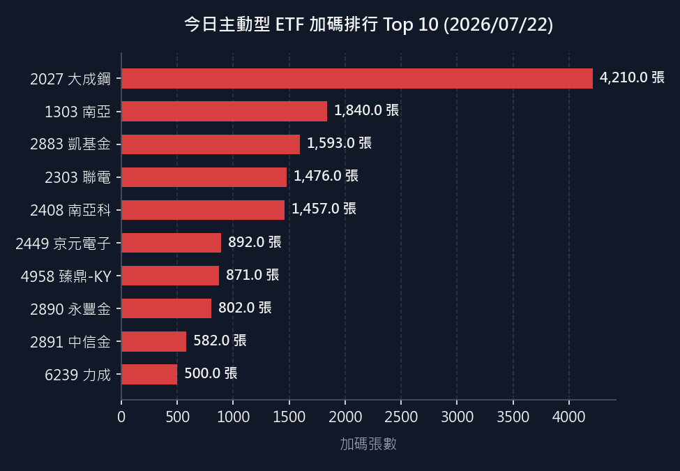
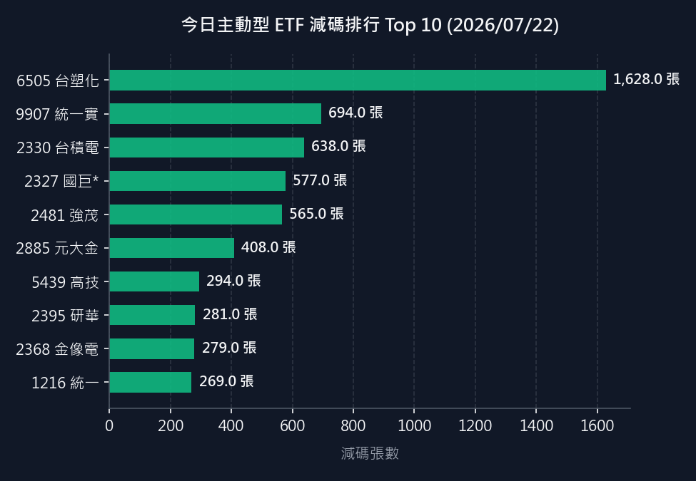

# 主動型 ETF 持股變動

資料來源：`主動型ETF持股明細.xlsx` 最近兩個日期分頁。

比較區間：`20260721` → `20260722`

## 今日加減碼視覺化排行

| 今日加碼 Top 10 | 今日減碼 Top 10 |
| :---: | :---: |
|  |  |

| ETF | 新增 | 刪除 | 比例變動 |
| :-- | --: | --: | --: |
| 00400A | 1 | 3 | 44 |
| 00401A | 0 | 0 | 0 |
| 00402A | 0 | 0 | 48 |
| 00403A | 0 | 0 | 40 |
| 00404A | 0 | 0 | 41 |
| 00405A | 0 | 0 | 39 |
| 00407A | 0 | 0 | 42 |
| 00408A | 2 | 1 | 38 |
| 00980A | 2 | 0 | 47 |
| 00980D | 0 | 0 | 26 |
| 00981A | 2 | 0 | 27 |
| 00982A | 1 | 0 | 37 |
| 00983A | 1 | 0 | 36 |
| 00983D | 0 | 0 | 13 |
| 00984A | 0 | 0 | 97 |
| 00985A | 0 | 0 | 40 |
| 00986A | 0 | 0 | 27 |
| 00987A | 1 | 0 | 25 |
| 00988A | 2 | 1 | 35 |
| 00989A | 0 | 0 | 54 |
| 00990A | 3 | 1 | 46 |
| 00991A | 1 | 0 | 25 |
| 00992A | 0 | 0 | 30 |
| 00993A | 1 | 10 | 47 |
| 00994A | 1 | 1 | 27 |
| 00995A | 1 | 0 | 43 |
| 00996A | 0 | 0 | 38 |
| 00997A | 0 | 1 | 47 |
| 00998A | 0 | 1 | 36 |
| 00999A | 0 | 1 | 65 |

## 00400A

### 新增持股

- 3008 大立光（0.91%，61 張）

### 刪除持股

- 2368 金像電（0.98%，260 張）
- 2481 強茂（0.31%，565 張）
- 8210 勤誠（1.12%，250 張）

### 投資比例變動

- 1303 南亞：0.46% → 0.48%（+0.02）
- 1590 亞德客-KY：1.01% → 1.03%（+0.02）
- 2059 川湖：3.47% → 3.41%（-0.06）
- 2308 台達電：3.15% → 3.12%（-0.03）
- 2313 華通：0.89% → 0.86%（-0.03）
- 2317 鴻海：0.91% → 0.90%（-0.01）
- 2327 國巨*：1.50% → 1.52%（+0.02）
- 2330 台積電：8.88% → 8.54%（-0.34）
- 2345 智邦：1.94% → 1.93%（-0.01）
- 2357 華碩：1.36% → 1.35%（-0.01）
- 2360 致茂：5.16% → 5.25%（+0.09）
- 2376 技嘉：1.21% → 1.19%（-0.02）
- 2382 廣達：0.83% → 0.81%（-0.02）
- 2383 台光電：5.41% → 5.54%（+0.13）
- 2385 群光：0.14% → 0.13%（-0.01）
- 2404 漢唐：0.56% → 0.55%（-0.01）
- 2408 南亞科：1.90% → 2.02%（+0.12）
- 2454 聯發科：6.21% → 6.30%（+0.09）
- 2885 元大金：0.95% → 0.94%（-0.01）
- 3017 奇鋐：4.08% → 3.85%（-0.23）
- 3036 文曄：1.13% → 1.10%（-0.03）
- 3037 欣興：3.97% → 4.21%（+0.24）
- 3044 健鼎：1.61% → 1.60%（-0.01）
- 3167 大量：0.17% → 0.16%（-0.01）
- 3231 緯創：0.81% → 0.85%（+0.04）
- 3293 鈊象：0.37% → 0.35%（-0.02）
- 3374 精材：0.40% → 0.42%（+0.02）
- 3443 創意：3.01% → 3.09%（+0.08）
- 3653 健策：0.85% → 0.82%（-0.03）
- 3665 貿聯-KY：2.72% → 2.78%（+0.06）
- 4958 臻鼎-KY：1.06% → 1.13%（+0.07）
- 5274 信驊：2.52% → 3.02%（+0.50）
- 5347 世界：0.81% → 0.86%（+0.05）
- 6147 頎邦：0.82% → 0.87%（+0.05）
- 6187 萬潤：1.34% → 2.34%（+1.00）
- 6223 旺矽：3.87% → 3.81%（-0.06）
- 6442 光聖：0.37% → 0.40%（+0.03）
- 6488 環球晶：3.95% → 3.93%（-0.02）
- 6505 台塑化：0.98% → 0.95%（-0.03）
- 6510 精測：1.34% → 1.33%（-0.01）
- 6669 緯穎：3.91% → 4.15%（+0.24）
- 6715 嘉基：0.21% → 0.20%（-0.01）
- 7769 鴻勁：0.33% → 0.31%（-0.02）
- 8046 南電：1.18% → 1.26%（+0.08）

## 00401A

### 新增持股

- 無

### 刪除持股

- 無

### 投資比例變動

- 無

## 00402A

### 新增持股

- 無

### 刪除持股

- 無

### 投資比例變動

- AAPL.US Apple：8.04% → 7.82%（-0.22）
- ADI.US Analog Devices：1.82% → 1.81%（-0.01）
- AMD.US AMD：5.65% → 5.93%（+0.28）
- AMZN.US Amazon：4.11% → 3.95%（-0.16）
- ARM.US Arm：1.05% → 1.09%（+0.04）
- ASML.US ASML Holding：1.67% → 1.68%（+0.01）
- AVGO.US Broadcom：2.43% → 2.41%（-0.02）
- AXON.US Axon Enterprise：1.18% → 1.11%（-0.07）
- BABA.US Alibaba Group：0.57% → 0.54%（-0.03）
- BKNG.US Booking Holdings：0.61% → 0.60%（-0.01）
- CDNS.US Cadence Design Systems：1.78% → 1.80%（+0.02）
- CIEN.US Ciena：1.16% → 1.21%（+0.05）
- CLS.US Celestica：0.86% → 0.92%（+0.06）
- COHR.US Coherent：1.49% → 1.60%（+0.11）
- CRWD.US CrowdStrike Holdings：1.33% → 1.24%（-0.09）
- DASH.US DoorDash：0.26% → 0.25%（-0.01）
- FSLY.US Fastly：0.31% → 0.30%（-0.01）
- GOOG.US Alphabet - Class C Capital Stock：3.48% → 3.33%（-0.15）
- GOOGL.US Alphabet - Class A Common Stock：3.42% → 3.27%（-0.15）
- INTC.US Intel：1.27% → 1.34%（+0.07）
- KLAC.US KLA：2.32% → 2.36%（+0.04）
- LITE.US Lumentum：1.36% → 1.45%（+0.09）
- LRCX.US Lam Research：3.58% → 3.65%（+0.07）
- MDB.US MongoDB：0.63% → 0.59%（-0.04）
- META.US Meta：3.10% → 2.99%（-0.11）
- MRVL.US Marvell：1.40% → 1.45%（+0.05）
- MSFT.US Microsoft：3.51% → 3.36%（-0.15）
- MU.US Micron：6.24% → 6.79%（+0.55）
- NFLX.US Netflix：0.96% → 0.94%（-0.02）
- NOW.US ServiceNow：0.22% → 0.21%（-0.01）
- NVDA.US NVIDIA：8.52% → 8.51%（-0.01）
- NXPI.US NXP Semiconductors：1.27% → 1.26%（-0.01）
- PANW.US Palo Alto：3.29% → 3.14%（-0.15）
- PLTR.US Palantir Technologies：1.18% → 1.12%（-0.06）
- SHOP.US Shopify：0.43% → 0.41%（-0.02）
- SIMO.US Silicon Motion：0.76% → 0.81%（+0.05）
- SKHY.US SK hynix：0.96% → 1.06%（+0.10）
- SNOW.US Snowflake：0.83% → 0.79%（-0.04）
- SPOT.US Spotify：0.27% → 0.26%（-0.01）
- STX.US Seagate：1.39% → 1.50%（+0.11）
- TER.US Teradyne：0.78% → 0.84%（+0.06）
- TSM.US TSMC(ADR)：1.62% → 1.65%（+0.03）
- TTWO.US Take-Two：0.56% → 0.53%（-0.03）
- TXN.US Texas Instruments：2.61% → 2.59%（-0.02）
- UBER.US Uber：0.47% → 0.45%（-0.02）
- V.US Visa：1.09% → 1.04%（-0.05）
- WDC.US Western Digital：2.71% → 2.96%（+0.25）
- ZS.US Zscaler：0.16% → 0.15%（-0.01）

## 00403A

### 新增持股

- 無

### 刪除持股

- 無

### 投資比例變動

- 1303 南亞：1.18% → 1.32%（+0.14）
- 2303 聯電：6.14% → 6.25%（+0.11）
- 2308 台達電：3.15% → 3.25%（+0.10）
- 2327 國巨*：2.45% → 2.50%（+0.05）
- 2330 台積電：18.78% → 17.34%（-1.44）
- 2337 旺宏：0.75% → 0.80%（+0.05）
- 2344 華邦電：3.79% → 4.05%（+0.26）
- 2345 智邦：2.97% → 3.06%（+0.09）
- 2360 致茂：0.83% → 0.96%（+0.13）
- 2368 金像電：1.23% → 1.15%（-0.08）
- 2383 台光電：3.70% → 4.04%（+0.34）
- 2404 漢唐：0.10% → 0.13%（+0.03）
- 2454 聯發科：3.75% → 3.94%（+0.19）
- 3008 大立光：0.15% → 0.14%（-0.01）
- 3017 奇鋐：4.87% → 4.63%（-0.24）
- 3037 欣興：3.59% → 4.04%（+0.45）
- 3189 景碩：1.46% → 1.52%（+0.06）
- 3211 順達：0.42% → 0.47%（+0.05）
- 3443 創意：1.20% → 1.32%（+0.12）
- 3533 嘉澤：1.53% → 1.48%（-0.05）
- 3653 健策：1.87% → 1.81%（-0.06）
- 3665 貿聯-KY：0.46% → 0.61%（+0.15）
- 3711 日月光投控：2.47% → 2.49%（+0.02）
- 4958 臻鼎-KY：2.15% → 2.30%（+0.15）
- 4966 譜瑞-KY：0.28% → 0.29%（+0.01）
- 5274 信驊：0.94% → 1.01%（+0.07）
- 6223 旺矽：3.58% → 3.55%（-0.03）
- 6239 力成：0.23% → 0.33%（+0.10）
- 6274 台燿：1.26% → 1.35%（+0.09）
- 6285 啟碁：0.01% → 0.04%（+0.03）
- 6415 矽力*-KY：0.25% → 0.26%（+0.01）
- 6442 光聖：0.17% → 0.18%（+0.01）
- 6488 環球晶：1.72% → 1.73%（+0.01）
- 6515 穎崴：0.60% → 0.57%（-0.03）
- 6669 緯穎：2.40% → 2.57%（+0.17）
- 6805 富世達：0.53% → 0.51%（-0.02）
- 7769 鴻勁：1.19% → 1.14%（-0.05）
- 8046 南電：1.27% → 1.35%（+0.08）
- 8358 金居：0.42% → 0.43%（+0.01）
- 8996 高力：0.96% → 1.02%（+0.06）

## 00404A

### 新增持股

- 無

### 刪除持股

- 無

### 投資比例變動

- 1216 統一：2.04% → 1.93%（-0.11）
- 2303 聯電：2.25% → 2.28%（+0.03）
- 2308 台達電：3.85% → 3.86%（+0.01）
- 2327 國巨*：0.66% → 0.68%（+0.02）
- 2330 台積電：22.81% → 22.26%（-0.55）
- 2345 智邦：0.97% → 0.98%（+0.01）
- 2360 致茂：1.11% → 1.15%（+0.04）
- 2382 廣達：0.41% → 0.40%（-0.01）
- 2383 台光電：1.97% → 2.05%（+0.08）
- 2393 億光：1.76% → 1.71%（-0.05）
- 2454 聯發科：6.68% → 6.87%（+0.19）
- 2885 元大金：2.76% → 2.79%（+0.03）
- 2887 台新新光金：3.28% → 3.21%（-0.07）
- 2890 永豐金：2.14% → 2.10%（-0.04）
- 3014 聯陽：1.08% → 1.09%（+0.01）
- 3017 奇鋐：0.68% → 0.65%（-0.03）
- 3034 聯詠：0.60% → 0.61%（+0.01）
- 3037 欣興：0.55% → 0.60%（+0.05）
- 3131 弘塑：0.78% → 0.77%（-0.01）
- 3189 景碩：0.30% → 0.32%（+0.02）
- 3264 欣銓：0.92% → 0.94%（+0.02）
- 3702 大聯大：1.77% → 1.83%（+0.06）
- 3711 日月光投控：3.48% → 3.54%（+0.06）
- 4763 材料*-KY：1.93% → 1.88%（-0.05）
- 5269 祥碩：1.68% → 1.66%（-0.02）
- 5274 信驊：1.99% → 2.14%（+0.15）
- 5347 世界：0.38% → 0.41%（+0.03）
- 5434 崇越：1.62% → 1.64%（+0.02）
- 5871 中租-KY：1.94% → 1.90%（-0.04）
- 5876 上海商銀：1.89% → 1.83%（-0.06）
- 6138 茂達：1.81% → 1.89%（+0.08）
- 6139 亞翔：0.26% → 0.27%（+0.01）
- 6206 飛捷：1.75% → 1.81%（+0.06）
- 6239 力成：1.39% → 1.48%（+0.09）
- 6257 矽格：1.65% → 1.67%（+0.02）
- 6515 穎崴：0.29% → 0.28%（-0.01）
- 6531 愛普*：0.22% → 0.23%（+0.01）
- 6691 洋基工程：0.76% → 0.75%（-0.01）
- 8299 群聯：1.08% → 1.09%（+0.01）
- 臺指選擇權08/26 49100 買權：-0.10% → -0.09%（+0.01）
- 臺股期貨08/26：15.76% → 15.55%（-0.21）

## 00405A

### 新增持股

- 無

### 刪除持股

- 無

### 投資比例變動

- 2059 川湖：1.26% → 1.25%（-0.01）
- 2308 台達電：1.00% → 0.99%（-0.01）
- 2327 國巨*：3.21% → 3.26%（+0.05）
- 2330 台積電：2.17% → 2.10%（-0.07）
- 2337 旺宏：1.30% → 1.38%（+0.08）
- 2344 華邦電：3.45% → 3.69%（+0.24）
- 2368 金像電：2.13% → 1.98%（-0.15）
- 2383 台光電：2.86% → 2.94%（+0.08）
- 2408 南亞科：1.30% → 1.38%（+0.08）
- 2449 京元電子：0.83% → 0.86%（+0.03）
- 2454 聯發科：6.64% → 6.75%（+0.11）
- 3017 奇鋐：6.06% → 5.74%（-0.32）
- 3026 禾伸堂：1.49% → 1.41%（-0.08）
- 3037 欣興：4.88% → 5.20%（+0.32）
- 3081 聯亞：0.90% → 0.96%（+0.06）
- 3105 穩懋：1.55% → 1.59%（+0.04）
- 3131 弘塑：3.68% → 3.60%（-0.08）
- 3163 波若威：0.19% → 0.20%（+0.01）
- 3443 創意：5.18% → 5.33%（+0.15）
- 3583 辛耘：1.71% → 1.69%（-0.02）
- 3653 健策：2.39% → 2.30%（-0.09）
- 3665 貿聯-KY：0.04% → 0.89%（+0.85）
- 4749 新應材：0.29% → 0.28%（-0.01）
- 5274 信驊：1.93% → 2.06%（+0.13）
- 5347 世界：0.12% → 0.13%（+0.01）
- 6187 萬潤：2.08% → 2.13%（+0.05）
- 6223 旺矽：6.04% → 5.99%（-0.05）
- 6274 台燿：1.33% → 1.42%（+0.09）
- 6442 光聖：0.33% → 0.35%（+0.02）
- 6488 環球晶：5.27% → 5.26%（-0.01）
- 6510 精測：1.35% → 1.34%（-0.01）
- 6515 穎崴：0.58% → 0.55%（-0.03）
- 6669 緯穎：0.09% → 0.10%（+0.01）
- 7734 印能科技：1.87% → 1.82%（-0.05）
- 7769 鴻勁：2.45% → 2.34%（-0.11）
- 8028 昇陽半導體：1.02% → 1.00%（-0.02）
- 8046 南電：4.66% → 4.96%（+0.30）
- 8210 勤誠：0.96% → 0.92%（-0.04）
- 8996 高力：1.04% → 1.11%（+0.07）

## 00407A

### 新增持股

- 無

### 刪除持股

- 無

### 投資比例變動

- 1303 南亞：0.63% → 0.65%（+0.02）
- 1590 亞德客-KY：2.13% → 2.17%（+0.04）
- 2059 川湖：2.07% → 2.04%（-0.03）
- 2308 台達電：4.07% → 4.04%（-0.03）
- 2327 國巨*：2.66% → 2.70%（+0.04）
- 2330 台積電：9.29% → 8.96%（-0.33）
- 2344 華邦電：1.65% → 1.75%（+0.10）
- 2345 智邦：3.15% → 3.14%（-0.01）
- 2360 致茂：1.90% → 1.94%（+0.04）
- 2368 金像電：1.96% → 1.82%（-0.14）
- 2376 技嘉：0.76% → 0.75%（-0.01）
- 2379 瑞昱：0.83% → 0.79%（-0.04）
- 2383 台光電：3.73% → 3.83%（+0.10）
- 2395 研華：1.79% → 1.82%（+0.03）
- 2408 南亞科：1.69% → 1.81%（+0.12）
- 2412 中華電：1.77% → 1.71%（-0.06）
- 2454 聯發科：6.48% → 6.58%（+0.10）
- 3017 奇鋐：3.44% → 3.26%（-0.18）
- 3034 聯詠：0.67% → 0.68%（+0.01）
- 3037 欣興：3.70% → 3.94%（+0.24）
- 3293 鈊象：0.57% → 0.55%（-0.02）
- 3443 創意：1.79% → 1.84%（+0.05）
- 3491 昇達科：0.40% → 0.43%（+0.03）
- 3529 力旺：1.89% → 2.01%（+0.12）
- 3533 嘉澤：1.08% → 1.03%（-0.05）
- 3665 貿聯-KY：2.73% → 2.80%（+0.07）
- 3711 日月光投控：2.59% → 2.60%（+0.01）
- 4904 遠傳：0.32% → 0.31%（-0.01）
- 4958 臻鼎-KY：2.04% → 2.17%（+0.13）
- 5274 信驊：1.93% → 2.06%（+0.13）
- 5289 宜鼎：0.16% → 0.17%（+0.01）
- 5536 聖暉*：1.96% → 1.91%（-0.05）
- 6223 旺矽：2.38% → 2.35%（-0.03）
- 6274 台燿：2.39% → 2.54%（+0.15）
- 6446 藥華藥：2.34% → 2.28%（-0.06）
- 6515 穎崴：1.46% → 1.38%（-0.08）
- 6531 愛普*：1.50% → 1.54%（+0.04）
- 6669 緯穎：3.71% → 3.95%（+0.24）
- 6805 富世達：1.87% → 1.79%（-0.08）
- 8046 南電：2.47% → 2.63%（+0.16）
- 8210 勤誠：1.89% → 1.81%（-0.08）
- 8996 高力：0.39% → 0.41%（+0.02）

## 00408A

### 新增持股

- 1303 南亞（0.86%，70 張）
- 2303 聯電（0.49%，60 張）

### 刪除持股

- 2885 元大金（1.85%，520 張）

### 投資比例變動

- 1216 統一：2.41% → 1.00%（-1.41）
- 2059 川湖：1.39% → 1.44%（+0.05）
- 2308 台達電：2.78% → 3.78%（+1.00）
- 2317 鴻海：2.15% → 2.23%（+0.08）
- 2330 台積電：5.33% → 5.37%（+0.04）
- 2345 智邦：2.07% → 2.16%（+0.09）
- 2356 英業達：1.15% → 1.20%（+0.05）
- 2357 華碩：1.84% → 1.92%（+0.08）
- 2360 致茂：1.17% → 2.39%（+1.22）
- 2368 金像電：2.17% → 2.11%（-0.06）
- 2376 技嘉：2.08% → 2.16%（+0.08）
- 2382 廣達：1.15% → 1.19%（+0.04）
- 2383 台光電：1.97% → 3.33%（+1.36）
- 2395 研華：1.81% → 1.94%（+0.13）
- 2404 漢唐：1.67% → 1.74%（+0.07）
- 2408 南亞科：0.47% → 0.53%（+0.06）
- 2412 中華電：3.23% → 3.27%（+0.04）
- 2454 聯發科：2.78% → 4.09%（+1.31）
- 2603 長榮：1.77% → 1.83%（+0.06）
- 2880 華南金：1.54% → 1.58%（+0.04）
- 2886 兆豐金：2.12% → 2.14%（+0.02）
- 2891 中信金：1.46% → 1.51%（+0.05）
- 2912 統一超：2.40% → 2.41%（+0.01）
- 3017 奇鋐：1.35% → 1.34%（-0.01）
- 3037 欣興：2.50% → 2.79%（+0.29）
- 3045 台灣大：3.20% → 3.26%（+0.06）
- 3231 緯創：2.52% → 2.81%（+0.29）
- 3665 貿聯-KY：1.16% → 1.25%（+0.09）
- 3702 大聯大：1.69% → 1.81%（+0.12）
- 4904 遠傳：1.96% → 0.55%（-1.41）
- 5347 世界：0.45% → 0.51%（+0.06）
- 5434 崇越：2.48% → 2.60%（+0.12）
- 5904 寶雅：1.92% → 1.53%（-0.39）
- 6257 矽格：1.01% → 1.06%（+0.05）
- 6274 台燿：1.37% → 1.52%（+0.15）
- 6488 環球晶：0.56% → 0.59%（+0.03）
- 6669 緯穎：3.20% → 3.57%（+0.37）
- 8046 南電：1.94% → 2.78%（+0.84）

## 00980A

### 新增持股

- 1303 南亞（0.96%，751 張）
- 6213 聯茂（0.42%，188 張）

### 刪除持股

- 無

### 投資比例變動

- 2059 川湖：5.55% → 5.49%（-0.06）
- 2308 台達電：5.51% → 4.78%（-0.73）
- 2317 鴻海：2.00% → 2.24%（+0.24）
- 2327 國巨*：1.46% → 1.49%（+0.03）
- 2330 台積電：9.66% → 9.35%（-0.31）
- 2344 華邦電：1.13% → 1.21%（+0.08）
- 2345 智邦：1.82% → 2.06%（+0.24）
- 2360 致茂：1.82% → 1.87%（+0.05）
- 2368 金像電：2.43% → 2.27%（-0.16）
- 2376 技嘉：0.91% → 1.18%（+0.27）
- 2382 廣達：1.09% → 1.31%（+0.22）
- 2383 台光電：4.61% → 4.76%（+0.15）
- 2408 南亞科：1.45% → 1.88%（+0.43）
- 2454 聯發科：6.24% → 6.36%（+0.12）
- 2884 玉山金：0.90% → 0.86%（-0.04）
- 2891 中信金：1.13% → 1.28%（+0.15）
- 3008 大立光：0.88% → 0.86%（-0.02）
- 3017 奇鋐：1.92% → 1.82%（-0.10）
- 3026 禾伸堂：0.58% → 0.55%（-0.03）
- 3036 文曄：1.32% → 1.30%（-0.02）
- 3037 欣興：2.93% → 3.13%（+0.20）
- 3081 聯亞：2.28% → 2.43%（+0.15）
- 3189 景碩：0.66% → 0.68%（+0.02）
- 3231 緯創：0.66% → 0.71%（+0.05）
- 3264 欣銓：0.23% → 0.42%（+0.19）
- 3293 鈊象：0.56% → 0.83%（+0.27）
- 3443 創意：1.82% → 1.88%（+0.06）
- 3529 力旺：0.90% → 0.96%（+0.06）
- 3533 嘉澤：0.17% → 0.16%（-0.01）
- 3653 健策：3.36% → 2.15%（-1.21）
- 3665 貿聯-KY：0.67% → 0.42%（-0.25）
- 3711 日月光投控：1.60% → 1.61%（+0.01）
- 4958 臻鼎-KY：1.40% → 1.09%（-0.31）
- 5274 信驊：1.27% → 1.36%（+0.09）
- 5904 寶雅：1.25% → 1.21%（-0.04）
- 6223 旺矽：2.82% → 2.80%（-0.02）
- 6274 台燿：1.01% → 1.08%（+0.07）
- 6442 光聖：0.29% → 0.31%（+0.02）
- 6515 穎崴：2.31% → 2.20%（-0.11）
- 6669 緯穎：1.23% → 1.42%（+0.19）
- 6805 富世達：0.48% → 0.46%（-0.02）
- 6831 邁科：0.31% → 0.32%（+0.01）
- 7769 鴻勁：3.82% → 3.15%（-0.67）
- 8046 南電：1.65% → 1.76%（+0.11）
- 8210 勤誠：0.82% → 0.93%（+0.11）
- 8299 群聯：0.93% → 1.41%（+0.48）
- 8996 高力：1.37% → 1.47%（+0.10）

## 00980D

### 新增持股

- 無

### 刪除持股

- 無

### 投資比例變動

- ALLY FINANCIAL INC (REG) VAR 03JAN2030：0.63% → 0.64%（+0.01）
- AMC GLOBAL MEDIA INC SER REGS (REG) (REG S) 10.5% 15JUL2032：0.71% → 0.72%（+0.01）
- APOLLO DEBT SOLUTIONS BD 6.900000 % 13APR2029：0.55% → 0.56%（+0.01）
- BLUE OWL CREDIT INCOME 7.950000 % 13JUN2028：0.53% → 0.54%（+0.01）
- CHARTER COMM OPT LLC/CAP (REG) 5.5% 01APR2063：0.51% → 0.50%（-0.01）
- CHARTER COMM OPT LLC/CAP (REG) 6.834000 % 23OCT2055：0.47% → 0.46%（-0.01）
- CHC GROUP LLC SER REGS 11.750000 % 01-SEP-2030：0.42% → 0.43%（+0.01）
- DISCOVER FINANCIAL SVS (REG) VAR 02NOV2034：0.64% → 0.65%（+0.01）
- DOW CHEMICAL CO/THE 7.375% 01NOV2029：0.61% → 0.62%（+0.01）
- HERTZ CORP/THE SER REGS (REG S) 12.625% 15JUL2029：0.30% → 0.31%（+0.01）
- M&T BANK CORPORATION (REG) VAR 30OCT2029：0.54% → 0.55%（+0.01）
- MYLAN INC SER WI (REG) 5.2% 15APR2048WI：0.50% → 0.49%（-0.01）
- OPEN TEXT CORP SER REGS (REG) (REG S) 6.9% 01DEC2027：0.66% → 0.67%（+0.01）
- ORACLE CORP 6.000000 % 03AUG2055：0.31% → 0.30%（-0.01）
- ORACLE CORP 6.100000 % 26-SEP-2065：0.49% → 0.48%（-0.01）
- ORACLE CORP 6.9% 09NOV2052：0.52% → 0.51%（-0.01）
- SATURN OIL & GAS INC SER REGS 9.625000 % 15JUN2029：0.62% → 0.63%（+0.01）
- TIME WARNER CABLE INC REG 7.3% 01JUL2038：0.32% → 0.31%（-0.01）
- TIME WARNER CABLE LLC (REG) 6.75% 15JUN2039：0.32% → 0.31%（-0.01）
- UNISYS CORP SER REGS 10.625000 % 15JAN2031：0.61% → 0.60%（-0.01）
- US 10YR NOTE (CBT)SEP26 21-SEP-2026：18.66% → 18.67%（+0.01）
- US 10YR ULTRA FUT SEP26 21-SEP-2026：-2.84% → -2.85%（-0.01）
- US 5YR NOTE (CBT) SEP26 30-SEP-2026：-16.20% → -16.23%（-0.03）
- US LONG BOND(CBT) SEP26 21-SEP-2026：5.49% → 5.50%（+0.01）
- VERIZON COMMUNICAT 7.750000 % 01DEC2030：0.44% → 0.45%（+0.01）
- VIACOMCBS INC (REG) 4.95% 19MAY2050：0.49% → 0.50%（+0.01）

## 00981A

### 新增持股

- 2408 南亞科（0.15%，940 張）
- 4958 臻鼎-KY（0.34%，1682 張）

### 刪除持股

- 無

### 投資比例變動

- 2002 中鋼：0.04% → 0.03%（-0.01）
- 2303 聯電：4.34% → 4.32%（-0.02）
- 2308 台達電：3.80% → 3.76%（-0.04）
- 2327 國巨*：6.26% → 6.34%（+0.08）
- 2330 台積電：10.74% → 10.21%（-0.53）
- 2345 智邦：5.24% → 5.20%（-0.04）
- 2368 金像電：3.04% → 2.81%（-0.23）
- 2383 台光電：8.37% → 8.57%（+0.20）
- 2449 京元電子：0.64% → 0.75%（+0.11）
- 2454 聯發科：7.01% → 7.10%（+0.09）
- 3017 奇鋐：4.69% → 4.41%（-0.28）
- 3037 欣興：5.21% → 5.53%（+0.32）
- 3653 健策：2.97% → 2.85%（-0.12）
- 3665 貿聯-KY：3.60% → 3.67%（+0.07）
- 3711 日月光投控：3.80% → 3.85%（+0.05）
- 5274 信驊：2.36% → 2.50%（+0.14）
- 5439 高技：0.28% → 0.24%（-0.04）
- 6147 頎邦：0.37% → 0.36%（-0.01）
- 6187 萬潤：0.50% → 0.51%（+0.01）
- 6223 旺矽：5.35% → 5.27%（-0.08）
- 6274 台燿：2.37% → 2.51%（+0.14）
- 6278 台表科：0.27% → 0.26%（-0.01）
- 6515 穎崴：0.32% → 0.22%（-0.10）
- 6669 緯穎：4.50% → 4.78%（+0.28）
- 6805 富世達：0.99% → 0.94%（-0.05）
- 8046 南電：4.22% → 4.46%（+0.24）
- 8210 勤誠：0.98% → 0.94%（-0.04）

## 00982A

### 新增持股

- 3529 力旺（0.48%，93 張）

### 刪除持股

- 無

### 投資比例變動

- 1785 光洋科：0.98% → 0.99%（+0.01）
- 2059 川湖：3.02% → 2.98%（-0.04）
- 2316 楠梓電：1.10% → 1.11%（+0.01）
- 2327 國巨*：1.16% → 1.18%（+0.02）
- 2330 台積電：9.71% → 9.36%（-0.35）
- 2345 智邦：3.69% → 3.68%（-0.01）
- 2360 致茂：3.46% → 3.53%（+0.07）
- 2376 技嘉：0.74% → 0.73%（-0.01）
- 2377 微星：1.71% → 1.76%（+0.05）
- 2383 台光電：3.29% → 3.37%（+0.08）
- 2451 創見：0.26% → 0.25%（-0.01）
- 2454 聯發科：6.53% → 6.63%（+0.10）
- 2467 志聖：1.60% → 1.59%（-0.01）
- 3008 大立光：1.98% → 1.93%（-0.05）
- 3017 奇鋐：1.93% → 1.83%（-0.10）
- 3036 文曄：0.94% → 0.91%（-0.03）
- 3105 穩懋：2.94% → 3.01%（+0.07）
- 3491 昇達科：2.40% → 2.55%（+0.15）
- 3583 辛耘：1.74% → 1.72%（-0.02）
- 3702 大聯大：1.27% → 1.30%（+0.03）
- 3711 日月光投控：1.31% → 1.32%（+0.01）
- 4958 臻鼎-KY：3.31% → 3.52%（+0.21）
- 5274 信驊：0.89% → 0.95%（+0.06）
- 5536 聖暉*：9.20% → 8.98%（-0.22）
- 6139 亞翔：5.17% → 5.19%（+0.02）
- 6147 頎邦：0.85% → 0.91%（+0.06）
- 6223 旺矽：3.70% → 3.65%（-0.05）
- 6239 力成：0.39% → 0.41%（+0.02）
- 6274 台燿：1.13% → 1.20%（+0.07）
- 6278 台表科：0.77% → 0.74%（-0.03）
- 6488 環球晶：2.83% → 2.82%（-0.01）
- 6531 愛普*：1.53% → 2.01%（+0.48）
- 6669 緯穎：3.10% → 3.30%（+0.20）
- 6831 邁科：0.00% → 0.01%（+0.01）
- 7769 鴻勁：1.24% → 1.18%（-0.06）
- 8016 矽創：1.31% → 1.32%（+0.01）
- 8996 高力：0.77% → 0.82%（+0.05）

## 00983A

### 新增持股

- ACHR.US Archer（0.32%，22.076 張）

### 刪除持股

- 無

### 投資比例變動

- AMD.US AMD：6.76% → 7.08%（+0.32）
- AMZN.US Amazon：3.32% → 3.18%（-0.14）
- AVGO.US Broadcom：1.88% → 1.86%（-0.02）
- BEAM.US Beam Therapeutics：2.54% → 2.55%（+0.01）
- CBRS.US Cerebras：0.57% → 0.65%（+0.08）
- CERS.US Cerus：0.45% → 0.53%（+0.08）
- COIN.US Coinbase：0.94% → 1.00%（+0.06）
- CRCL.US Circle：0.34% → 0.36%（+0.02）
- CRSP.US CRISPR Therapeutics：3.85% → 3.82%（-0.03）
- CRWV.US CoreWeave：0.21% → 0.22%（+0.01）
- DE.US Deere：1.02% → 0.99%（-0.03）
- FIG.US Figma：0.23% → 0.38%（+0.15）
- GOOG.US Alphabet - Class C Capital Stock：1.31% → 1.25%（-0.06）
- GOOGL.US Alphabet - Class A Common Stock：1.73% → 1.65%（-0.08）
- HOOD.US Robinhood Markets：5.06% → 4.67%（-0.39）
- ILMN.US Illumina：3.60% → 3.64%（+0.04）
- LLY.US Eli Lilly：1.92% → 1.91%（-0.01）
- META.US Meta：1.57% → 1.52%（-0.05）
- NTLA.US Intellia Therapeutics：1.48% → 1.51%（+0.03）
- NTRA.US Natera：3.03% → 2.80%（-0.23）
- NVDA.US NVIDIA：0.84% → 0.83%（-0.01）
- PLTR.US Palantir Technologies：0.66% → 0.63%（-0.03）
- RBLX.US Roblox：3.39% → 3.24%（-0.15）
- RXRX.US Recursion Pharmaceuticals：0.19% → 0.20%（+0.01）
- SHOP.US Shopify：6.37% → 6.10%（-0.27）
- SNOW.US Snowflake：0.73% → 0.83%（+0.10）
- SOFI.US SoFi Technologies：0.66% → 0.67%（+0.01）
- TEM.US Tempus：5.03% → 4.93%（-0.10）
- TER.US Teradyne：0.56% → 0.61%（+0.05）
- TSLA.US Tesla：8.58% → 8.51%（-0.07）
- TSM.US TSMC(ADR)：3.44% → 3.52%（+0.08）
- TWST.US Twist Bioscience：4.20% → 4.46%（+0.26）
- TXG.US 10x Genomics：5.22% → 5.52%（+0.30）
- VCYT.US Veracyte：1.67% → 1.68%（+0.01）
- WGS.US GeneDx：1.30% → 1.28%（-0.02）
- XYZ.US Block：2.29% → 2.25%（-0.04）

## 00983D

### 新增持股

- 無

### 刪除持股

- 無

### 投資比例變動

- CMCSA 6.95 08/15/37：0.69% → 0.68%（-0.01）
- DOW 9.4 05/15/39：1.96% → 1.97%（+0.01）
- DTV 8 7/8 02/01/30：1.61% → 1.62%（+0.01）
- ENBCN 6.7 11/15/53：1.16% → 1.15%（-0.01）
- GTN 10 1/2 07/15/29：1.71% → 1.72%（+0.01）
- HAL 7.45 09/15/39：1.87% → 1.86%（-0.01）
- IEP 10 11/15/29：1.55% → 1.56%（+0.01）
- NTRCN 7 1/8 05/23/36：0.57% → 0.56%（-0.01）
- ORCL 6.9 11/09/52：1.15% → 1.13%（-0.02）
- PDM 9 1/4 07/20/28：0.85% → 0.86%（+0.01）
- SPCX 6.6 07/15/46：0.88% → 0.87%（-0.01）
- TIME WARNER CABLE INC 7.300 07/01/38：0.52% → 0.51%（-0.01）
- TLTW.US iShares 20+ Year Treasury Bond B：7.44% → 7.43%（-0.01）

## 00984A

### 新增持股

- 無

### 刪除持股

- 無

### 投資比例變動

- 1102 亞泥：1.24% → 1.28%（+0.04）
- 1216 統一：2.02% → 1.92%（-0.10）
- 1229 聯華：0.28% → 0.27%（-0.01）
- 1303 南亞：0.69% → 0.73%（+0.04）
- 1326 台化：0.74% → 0.75%（+0.01）
- 1402 遠東新：1.07% → 1.06%（-0.01）
- 1560 中砂：0.48% → 0.50%（+0.02）
- 1785 光洋科：0.43% → 0.45%（+0.02）
- 1907 永豐餘：0.30% → 0.29%（-0.01）
- 2049 上銀：0.55% → 0.57%（+0.02）
- 2059 川湖：0.59% → 0.58%（-0.01）
- 2105 正新：0.42% → 0.40%（-0.02）
- 2204 中華：0.28% → 0.27%（-0.01）
- 2206 三陽工業：0.41% → 0.38%（-0.03）
- 2303 聯電：1.93% → 2.28%（+0.35）
- 2327 國巨*：0.98% → 1.02%（+0.04）
- 2330 台積電：2.94% → 2.92%（-0.02）
- 2337 旺宏：0.46% → 0.50%（+0.04）
- 2345 智邦：0.35% → 0.37%（+0.02）
- 2347 聯強：0.96% → 0.98%（+0.02）
- 2357 華碩：2.77% → 2.82%（+0.05）
- 2360 致茂：0.66% → 0.68%（+0.02）
- 2371 大同：0.38% → 0.37%（-0.01）
- 2377 微星：0.97% → 1.02%（+0.05）
- 2382 廣達：2.15% → 2.26%（+0.11）
- 2383 台光電：1.77% → 1.84%（+0.07）
- 2385 群光：0.39% → 0.40%（+0.01）
- 2404 漢唐：1.77% → 1.85%（+0.08）
- 2412 中華電：2.66% → 2.62%（-0.04）
- 2454 聯發科：1.39% → 1.42%（+0.03）
- 2458 義隆：0.34% → 0.36%（+0.02）
- 2467 志聖：0.49% → 0.50%（+0.01）
- 2472 立隆電：0.35% → 0.36%（+0.01）
- 2478 大毅：0.36% → 0.38%（+0.02）
- 2481 強茂：0.46% → 0.49%（+0.03）
- 2618 長榮航：1.48% → 1.46%（-0.02）
- 2633 台灣高鐵：1.42% → 1.40%（-0.02）
- 2634 漢翔：0.50% → 0.44%（-0.06）
- 2645 長榮航太：0.32% → 0.29%（-0.03）
- 2646 星宇航空：0.41% → 0.39%（-0.02）
- 2855 統一證：0.51% → 0.52%（+0.01）
- 2881 富邦金：2.53% → 2.57%（+0.04）
- 2885 元大金：0.37% → 0.39%（+0.02）
- 2891 中信金：2.33% → 2.36%（+0.03）
- 2912 統一超：1.53% → 1.49%（-0.04）
- 3005 神基：0.45% → 0.44%（-0.01）
- 3008 大立光：0.67% → 0.66%（-0.01）
- 3026 禾伸堂：0.94% → 0.89%（-0.05）
- 3034 聯詠：1.94% → 2.01%（+0.07）
- 3037 欣興：1.54% → 1.65%（+0.11）
- 3044 健鼎：0.31% → 0.32%（+0.01）
- 3045 台灣大：2.00% → 1.99%（-0.01）
- 3090 日電貿：0.32% → 0.33%（+0.01）
- 3167 大量：0.50% → 0.47%（-0.03）
- 3189 景碩：1.06% → 1.35%（+0.29）
- 3227 原相：0.23% → 0.24%（+0.01）
- 3293 鈊象：1.24% → 1.23%（-0.01）
- 3443 創意：0.60% → 0.63%（+0.03）
- 3481 群創：0.43% → 0.44%（+0.01）
- 3532 台勝科：0.69% → 0.74%（+0.05）
- 3702 大聯大：1.02% → 1.06%（+0.04）
- 3711 日月光投控：1.13% → 1.16%（+0.03）
- 4919 新唐：0.47% → 0.48%（+0.01）
- 4958 臻鼎-KY：1.73% → 1.86%（+0.13）
- 5274 信驊：0.33% → 0.35%（+0.02）
- 5434 崇越：1.15% → 1.20%（+0.05）
- 5483 中美晶：0.48% → 0.50%（+0.02）
- 5536 聖暉*：0.54% → 0.53%（-0.01）
- 5871 中租-KY：1.21% → 1.19%（-0.02）
- 5876 上海商銀：1.31% → 1.28%（-0.03）
- 5904 寶雅：0.25% → 0.26%（+0.01）
- 6023 元大期：0.27% → 0.29%（+0.02）
- 6121 新普：0.61% → 0.62%（+0.01）
- 6139 亞翔：0.50% → 0.52%（+0.02）
- 6147 頎邦：0.48% → 0.51%（+0.03）
- 6176 瑞儀：0.38% → 0.39%（+0.01）
- 6182 合晶：0.62% → 0.61%（-0.01）
- 6196 帆宣：1.13% → 1.14%（+0.01）
- 6213 聯茂：1.12% → 1.15%（+0.03）
- 6223 旺矽：1.05% → 1.11%（+0.06）
- 6274 台燿：1.62% → 1.74%（+0.12）
- 6285 啟碁：0.56% → 0.57%（+0.01）
- 6446 藥華藥：2.01% → 1.98%（-0.03）
- 6531 愛普*：1.11% → 1.17%（+0.06）
- 6831 邁科：0.40% → 0.41%（+0.01）
- 6890 來億-KY：0.26% → 0.25%（-0.01）
- 7769 鴻勁：0.61% → 0.59%（-0.02）
- 8016 矽創：0.85% → 0.87%（+0.02）
- 8021 尖點：1.05% → 1.12%（+0.07）
- 8046 南電：1.15% → 1.23%（+0.08）
- 8064 東捷：0.45% → 0.46%（+0.01）
- 8096 擎亞：0.53% → 0.52%（-0.01）
- 8210 勤誠：0.29% → 0.28%（-0.01）
- 8261 富鼎：0.70% → 0.72%（+0.02）
- 8358 金居：0.98% → 1.02%（+0.04）
- 9914 美利達：0.28% → 0.27%（-0.01）
- 9939 宏全：0.30% → 0.29%（-0.01）

## 00985A

### 新增持股

- 無

### 刪除持股

- 無

### 投資比例變動

- 1216 統一：1.06% → 1.00%（-0.06）
- 2027 大成鋼：1.63% → 3.33%（+1.70）
- 2049 上銀：0.54% → 0.56%（+0.02）
- 2059 川湖：3.34% → 3.32%（-0.02）
- 2303 聯電：2.96% → 3.45%（+0.49）
- 2327 國巨*：2.98% → 3.58%（+0.60）
- 2330 台積電：22.27% → 21.66%（-0.61）
- 2344 華邦電：1.35% → 1.45%（+0.10）
- 2345 智邦：2.09% → 2.10%（+0.01）
- 2360 致茂：1.15% → 1.19%（+0.04）
- 2368 金像電：0.98% → 0.92%（-0.06）
- 2376 技嘉：3.70% → 4.06%（+0.36）
- 2383 台光電：2.37% → 2.45%（+0.08）
- 2395 研華：3.36% → 1.48%（-1.88）
- 2408 南亞科：1.94% → 2.09%（+0.15）
- 2412 中華電：2.68% → 2.60%（-0.08）
- 2454 聯發科：1.12% → 1.15%（+0.03）
- 3008 大立光：2.77% → 2.71%（-0.06）
- 3017 奇鋐：1.04% → 0.99%（-0.05）
- 3036 文曄：2.49% → 2.45%（-0.04）
- 3037 欣興：0.34% → 0.36%（+0.02）
- 3081 聯亞：0.91% → 0.98%（+0.07）
- 3105 穩懋：0.52% → 0.53%（+0.01）
- 3131 弘塑：1.50% → 1.47%（-0.03）
- 3293 鈊象：1.07% → 1.05%（-0.02）
- 3529 力旺：0.60% → 0.65%（+0.05）
- 3653 健策：1.15% → 1.12%（-0.03）
- 3661 世芯-KY：2.60% → 2.61%（+0.01）
- 3711 日月光投控：0.81% → 0.82%（+0.01）
- 4904 遠傳：2.64% → 2.61%（-0.03）
- 4958 臻鼎-KY：2.30% → 2.47%（+0.17）
- 6147 頎邦：2.03% → 3.14%（+1.11）
- 6187 萬潤：2.29% → 3.16%（+0.87）
- 6442 光聖：3.00% → 3.22%（+0.22）
- 6505 台塑化：2.79% → 1.33%（-1.46）
- 6669 緯穎：0.77% → 0.82%（+0.05）
- 7769 鴻勁：0.73% → 0.70%（-0.03）
- 8046 南電：0.78% → 0.83%（+0.05）
- 8299 群聯：1.00% → 1.01%（+0.01）
- 8996 高力：0.59% → 0.64%（+0.05）

## 00986A

### 新增持股

- 無

### 刪除持股

- 無

### 投資比例變動

- 2330 台積電：8.60% → 8.64%（+0.04）
- AAPL.US Apple：0.60% → 0.59%（-0.01）
- AMD.US AMD：2.74% → 2.88%（+0.14）
- AMZN.US Amazon：3.81% → 3.66%（-0.15）
- AVGO.US Broadcom：4.94% → 4.90%（-0.04）
- COHR.US Coherent：2.02% → 2.18%（+0.16）
- CRWD.US CrowdStrike Holdings：4.05% → 3.79%（-0.26）
- ETN.US Eaton：2.18% → 2.13%（-0.05）
- GEV.US GE Vernova：3.82% → 3.71%（-0.11）
- GOOGL.US Alphabet - Class A Common Stock：7.66% → 7.34%（-0.32）
- IBIDEN(4062.JP)：1.84% → 1.98%（+0.14）
- JPM.US JPMorgan Chase：0.92% → 0.91%（-0.01）
- LITE.US Lumentum：3.25% → 3.45%（+0.20）
- LLY.US Eli Lilly：2.81% → 2.80%（-0.01）
- LRCX.US Lam Research：3.37% → 3.44%（+0.07）
- MSFT.US Microsoft：2.19% → 2.10%（-0.09）
- MU.US Micron：4.46% → 4.86%（+0.40）
- Murata Mfg.(6981.JP)：1.79% → 1.82%（+0.03）
- NET.US Cloudflare：1.78% → 1.73%（-0.05）
- NVDA.US NVIDIA：5.86% → 5.81%（-0.05）
- SNDK.US Sandisk：1.89% → 2.10%（+0.21）
- SNOW.US Snowflake：1.27% → 1.22%（-0.05）
- Siemens Energy AG：2.09% → 2.10%（+0.01）
- TSLA.US Tesla：1.11% → 1.10%（-0.01）
- Yaskawa Electric(6506.JP)：1.71% → 1.66%（-0.05）
- 施奈德電機公司：1.56% → 1.54%（-0.02）
- 英飛凌科技股份有限公司：3.18% → 3.26%（+0.08）

## 00987A

### 新增持股

- 7769 鴻勁（1.24%，5 張）

### 刪除持股

- 無

### 投資比例變動

- 2330 台積電：8.64% → 8.39%（-0.25）
- 2345 智邦：2.48% → 2.49%（+0.01）
- 2383 台光電：6.54% → 6.77%（+0.23）
- 2408 南亞科：3.87% → 4.15%（+0.28）
- 2454 聯發科：3.51% → 3.59%（+0.08）
- 2455 全新：2.41% → 2.58%（+0.17）
- 3017 奇鋐：7.95% → 7.57%（-0.38）
- 3037 欣興：6.25% → 6.70%（+0.45）
- 3081 聯亞：0.29% → 0.31%（+0.02）
- 3167 大量：2.56% → 2.39%（-0.17）
- 3363 上詮：1.93% → 2.04%（+0.11）
- 3443 創意：3.94% → 4.08%（+0.14）
- 3653 健策：2.53% → 2.45%（-0.08）
- 3665 貿聯-KY：3.99% → 4.11%（+0.12）
- 4764 雙鍵：2.00% → 1.93%（-0.07）
- 5274 信驊：0.17% → 0.18%（+0.01）
- 6139 亞翔：3.12% → 3.15%（+0.03）
- 6223 旺矽：6.32% → 6.29%（-0.03）
- 6271 同欣電：1.70% → 1.68%（-0.02）
- 6274 台燿：3.69% → 3.95%（+0.26）
- 6488 環球晶：2.64% → 2.65%（+0.01）
- 6683 雍智科技：2.42% → 2.46%（+0.04）
- 8028 昇陽半導體：2.14% → 2.11%（-0.03）
- 8046 南電：3.60% → 3.85%（+0.25）
- 8358 金居：1.79% → 1.83%（+0.04）

## 00988A

### 新增持股

- 3665 貿聯-KY（0.43%，126 張）
- AEHR.US Aehr Test Systems（0.06%，10.459 張）

### 刪除持股

- Union Tool(6278.JP)（0.19%，30 張）

### 投資比例變動

- 2303 聯電：1.43% → 1.37%（-0.06）
- 2327 國巨*：2.77% → 2.05%（-0.72）
- 2330 台積電：3.18% → 3.08%（-0.10）
- 2383 台光電：2.98% → 3.37%（+0.39）
- 2454 聯發科：2.72% → 2.78%（+0.06）
- 3037 欣興：3.29% → 3.37%（+0.08）
- 3711 日月光投控：1.97% → 1.94%（-0.03）
- AMAT.US Applied Materials：4.19% → 4.20%（+0.01）
- AMD.US AMD：6.10% → 6.16%（+0.06）
- BE.US Bloom Energy：3.61% → 3.87%（+0.26）
- CRDO.US Credo：2.00% → 2.47%（+0.47）
- FTNT.US Fortinet：1.89% → 1.74%（-0.15）
- IBIDEN(4062.JP)：0.34% → 0.35%（+0.01）
- INFINEON TECHNOLOGIES AG：2.70% → 2.66%（-0.04）
- KLAC.US KLA：1.96% → 1.92%（-0.04）
- Kioxia Holdings(285A.JP)：3.41% → 3.73%（+0.32）
- LITE.US Lumentum：1.67% → 2.63%（+0.96）
- Lasertec Corporation(6920.JP)：1.98% → 1.88%（-0.10）
- MRVL.US Marvell：1.50% → 1.49%（-0.01）
- MU.US Micron：4.91% → 5.81%（+0.90）
- Murata Mfg.(6981.JP)：3.47% → 3.39%（-0.08）
- NOW.US ServiceNow：1.67% → 1.52%（-0.15）
- Nippon Chemi-Con(6997.JP)：1.47% → 1.34%（-0.13）
- PANW.US Palo Alto：1.85% → 1.70%（-0.15）
- SNDK.US Sandisk：2.87% → 3.07%（+0.20）
- STM.US STMicroelectronics：1.73% → 1.71%（-0.02）
- SUMCO(3436.JP)：2.24% → 2.08%（-0.16）
- Samsung Elec Mech(009150.KS)：4.41% → 4.12%（-0.29）
- TAIYO YUDEN(6976.JP)：2.41% → 2.39%（-0.02）
- TSEM.US Tower Semiconductor：1.41% → 1.82%（+0.41）
- Tokyo Electron(8035.JP)：2.60% → 2.49%（-0.11）
- VECO.US Veeco Instruments Inc.：1.50% → 1.52%（+0.02）
- WDC.US Western Digital：1.44% → 1.51%（+0.07）
- 三環集團(300408.SZ)：0.48% → 0.53%（+0.05）
- 鼎泰高科(301377.SZ)：0.62% → 0.65%（+0.03）

## 00989A

### 新增持股

- 無

### 刪除持股

- 無

### 投資比例變動

- ALGM.US Allegro MicroSystems：0.69% → 0.71%（+0.02）
- AMAT.US Applied Materials：0.65% → 0.78%（+0.13）
- AMD.US AMD：3.64% → 3.83%（+0.19）
- AMKR.US Amkor：1.04% → 1.08%（+0.04）
- AMZN.US Amazon：0.96% → 0.93%（-0.03）
- APP.US Applovin：1.04% → 1.02%（-0.02）
- ASML.US ASML Holding：2.79% → 2.81%（+0.02）
- AVGO.US Broadcom：3.94% → 3.92%（-0.02）
- BE.US Bloom Energy：1.28% → 1.43%（+0.15）
- CBRS.US Cerebras：0.16% → 0.19%（+0.03）
- CDNS.US Cadence Design Systems：0.95% → 0.96%（+0.01）
- CIEN.US Ciena：1.88% → 1.97%（+0.09）
- CRCL.US Circle：0.32% → 0.33%（+0.01）
- CRM.US Salesforce：1.54% → 1.47%（-0.07）
- CRWD.US CrowdStrike Holdings：3.08% → 2.89%（-0.19）
- DOCN.US DigitalOcean：1.44% → 1.61%（+0.17）
- ENPH.US Enphase Energy：0.14% → 0.13%（-0.01）
- ENTG.US Entegris：1.17% → 1.09%（-0.08）
- FN.US Fabrinet：0.68% → 0.71%（+0.03）
- GFS.US GlobalFoundries：1.24% → 1.26%（+0.02）
- GLW.US Corning：1.85% → 1.91%（+0.06）
- GOOG.US Alphabet - Class C Capital Stock：4.49% → 4.30%（-0.19）
- HOOD.US Robinhood Markets：2.32% → 2.42%（+0.10）
- HUBS.US HubSpot：0.72% → 0.67%（-0.05）
- INTC.US Intel：3.51% → 3.71%（+0.20）
- LITE.US Lumentum：1.51% → 1.61%（+0.10）
- LMND.US Lemonade：1.07% → 1.06%（-0.01）
- LRCX.US Lam Research：2.95% → 3.01%（+0.06）
- META.US Meta：2.82% → 2.73%（-0.09）
- MSFT.US Microsoft：1.97% → 1.90%（-0.07）
- MTSI.US MACOM Technology Solutions：0.98% → 1.00%（+0.02）
- MU.US Micron：1.69% → 1.85%（+0.16）
- NET.US Cloudflare：2.61% → 2.54%（-0.07）
- NVDA.US NVIDIA：3.79% → 3.76%（-0.03）
- ON.US ON Semiconductor：1.71% → 1.75%（+0.04）
- ORCL.US Oracle：1.19% → 1.21%（+0.02）
- PANW.US Palo Alto：4.23% → 4.04%（-0.19）
- PLTR.US Palantir Technologies：0.47% → 0.45%（-0.02）
- ROK.US Rockwell Automation：0.91% → 0.90%（-0.01）
- SHOP.US Shopify：1.43% → 1.37%（-0.06）
- SNDK.US Sandisk：0.99% → 1.10%（+0.11）
- SNOW.US Snowflake：2.73% → 2.63%（-0.10）
- SYM.US Symbotic：0.36% → 0.37%（+0.01）
- TEM.US Tempus：0.87% → 0.86%（-0.01）
- TSLA.US Tesla：3.10% → 3.09%（-0.01）
- TSM.US TSMC(ADR)：1.90% → 1.95%（+0.05）
- TTMI.US TTM Technologies：0.63% → 0.67%（+0.04）
- TTWO.US Take-Two：3.80% → 3.65%（-0.15）
- TWLO.US Twilio：2.23% → 2.07%（-0.16）
- TXN.US Texas Instruments：1.58% → 1.57%（-0.01）
- VICR.US Vicor Corporation：1.04% → 0.94%（-0.10）
- WRBY.US Warby Parker：0.66% → 0.64%（-0.02）
- XYZ.US Block：0.77% → 0.76%（-0.01）
- ZM.US Zoom：1.87% → 1.79%（-0.08）

## 00990A

### 新增持股

- CRDO.US Credo（1.49%，84.3 張）
- MXL.US MaxLinear（0.21%，31.701 張）
- TXN.US Texas Instruments（0.77%，33.5 張）

### 刪除持股

- 4958 臻鼎-KY（0.86%，693 張）

### 投資比例變動

- 2303 聯電：1.10% → 1.07%（-0.03）
- 2308 台達電：2.49% → 2.52%（+0.03）
- 2330 台積電：2.70% → 3.37%（+0.67）
- 2383 台光電：1.64% → 1.69%（+0.05）
- 2449 京元電子：0.58% → 0.57%（-0.01）
- 2454 聯發科：2.03% → 2.10%（+0.07）
- 3037 欣興：1.94% → 2.01%（+0.07）
- 5347 世界：0.99% → 0.94%（-0.05）
- 6223 旺矽：1.06% → 1.07%（+0.01）
- 6274 台燿：0.78% → 0.80%（+0.02）
- AMAT.US Applied Materials：3.66% → 3.71%（+0.05）
- AMD.US AMD：6.86% → 7.00%（+0.14）
- AMZN.US Amazon：2.14% → 2.00%（-0.14）
- ANET.US Arista Networks：1.21% → 1.18%（-0.03）
- ASML.US ASML Holding：1.47% → 1.44%（-0.03）
- AVGO.US Broadcom：0.86% → 0.83%（-0.03）
- BE.US Bloom Energy：1.78% → 1.92%（+0.14）
- DDOG.US Datadog：0.88% → 0.81%（-0.07）
- GLW.US Corning：0.29% → 0.36%（+0.07）
- GOOGL.US Alphabet - Class A Common Stock：2.61% → 2.43%（-0.18）
- IBIDEN(4062.JP)：0.94% → 0.98%（+0.04）
- INFINEON TECHNOLOGIES AG：2.60% → 2.61%（+0.01）
- KOKUSAI ELECTRIC(6525.JP)：1.30% → 0.76%（-0.54）
- Kioxia Holdings(285A.JP)：2.74% → 3.03%（+0.29）
- LITE.US Lumentum：5.31% → 6.50%（+1.19）
- LRCX.US Lam Research：2.06% → 2.04%（-0.02）
- META.US Meta：2.08% → 1.96%（-0.12）
- MKSI.US MKS：1.80% → 1.00%（-0.80）
- MRVL.US Marvell：1.16% → 1.67%（+0.51）
- MSFT.US Microsoft：2.16% → 2.02%（-0.14）
- MU.US Micron：3.19% → 3.55%（+0.36）
- Murata Mfg.(6981.JP)：2.17% → 2.14%（-0.03）
- NVDA.US NVIDIA：1.67% → 1.60%（-0.07）
- ONTO.US Onto Innovation：1.19% → 1.21%（+0.02）
- Renesas Electronics(6723.JP)：1.65% → 1.64%（-0.01）
- SCREEN Holdings(7735.JP)：1.76% → 1.70%（-0.06）
- SK hynix(000660.KS)：1.43% → 1.41%（-0.02）
- SMTC.US Semtech：0.69% → 0.71%（+0.02）
- SNDK.US Sandisk：1.89% → 2.50%（+0.61）
- SNOW.US Snowflake：1.12% → 1.04%（-0.08）
- SUMCO(3436.JP)：1.76% → 1.15%（-0.61）
- Samsung Elec Mech(009150.KS)：4.05% → 3.94%（-0.11）
- TSEM.US Tower Semiconductor：0.79% → 1.34%（+0.55）
- Tokyo Electron(8035.JP)：2.07% → 1.99%（-0.08）
- UCTT.US Ultra Clean Holdings：1.22% → 1.32%（+0.10）
- WDC.US Western Digital：2.58% → 2.74%（+0.16）

## 00991A

### 新增持股

- 6488 環球晶（0.48%，300 張）

### 刪除持股

- 無

### 投資比例變動

- 1303 南亞：1.26% → 1.28%（+0.02）
- 2059 川湖：4.27% → 4.17%（-0.10）
- 2303 聯電：1.80% → 1.78%（-0.02）
- 2308 台達電：1.25% → 1.47%（+0.22）
- 2327 國巨*：6.45% → 6.77%（+0.32）
- 2330 台積電：13.54% → 12.63%（-0.91）
- 2345 智邦：4.45% → 4.40%（-0.05）
- 2383 台光電：8.40% → 8.55%（+0.15）
- 2404 漢唐：1.23% → 1.21%（-0.02）
- 2408 南亞科：6.50% → 7.09%（+0.59）
- 2454 聯發科：4.91% → 4.94%（+0.03）
- 3017 奇鋐：2.67% → 2.50%（-0.17）
- 3026 禾伸堂：2.46% → 2.30%（-0.16）
- 3037 欣興：4.69% → 4.95%（+0.26）
- 3189 景碩：2.99% → 3.06%（+0.07）
- 3665 貿聯-KY：1.23% → 1.52%（+0.29）
- 3711 日月光投控：3.39% → 3.54%（+0.15）
- 5274 信驊：1.18% → 1.60%（+0.42）
- 6223 旺矽：4.72% → 4.62%（-0.10）
- 6274 台燿：3.47% → 3.65%（+0.18）
- 6515 穎崴：1.87% → 1.75%（-0.12）
- 6669 緯穎：3.01% → 3.18%（+0.17）
- 7769 鴻勁：3.13% → 2.96%（-0.17）
- 8046 南電：4.78% → 5.02%（+0.24）
- 8299 群聯：2.73% → 2.70%（-0.03）

## 00992A

### 新增持股

- 無

### 刪除持股

- 無

### 投資比例變動

- 2059 川湖：6.13% → 6.06%（-0.07）
- 2327 國巨*：3.63% → 3.69%（+0.06）
- 2330 台積電：8.90% → 8.58%（-0.32）
- 2337 旺宏：0.43% → 0.46%（+0.03）
- 2345 智邦：6.29% → 6.28%（-0.01）
- 2383 台光電：7.14% → 7.34%（+0.20）
- 2454 聯發科：3.91% → 3.98%（+0.07）
- 2455 全新：2.13% → 2.27%（+0.14）
- 3008 大立光：4.39% → 4.27%（-0.12）
- 3017 奇鋐：6.10% → 5.77%（-0.33）
- 3026 禾伸堂：1.63% → 1.53%（-0.10）
- 3037 欣興：4.54% → 4.84%（+0.30）
- 3189 景碩：0.86% → 0.89%（+0.03）
- 3363 上詮：0.41% → 0.43%（+0.02）
- 3443 創意：2.28% → 2.35%（+0.07）
- 3661 世芯-KY：1.97% → 1.96%（-0.01）
- 3665 貿聯-KY：5.01% → 5.14%（+0.13）
- 3711 日月光投控：2.71% → 2.72%（+0.01）
- 5289 宜鼎：0.33% → 0.34%（+0.01）
- 6139 亞翔：0.53% → 0.54%（+0.01）
- 6187 萬潤：3.20% → 3.27%（+0.07）
- 6223 旺矽：5.03% → 4.98%（-0.05）
- 6488 環球晶：1.25% → 1.24%（-0.01）
- 6515 穎崴：1.73% → 0.69%（-1.04）
- 6584 南俊國際：3.17% → 3.13%（-0.04）
- 6805 富世達：0.40% → 0.39%（-0.01）
- 7734 印能科技：0.46% → 0.45%（-0.01）
- 7751 竑騰：0.99% → 1.02%（+0.03）
- 8021 尖點：1.50% → 1.60%（+0.10）
- 8996 高力：4.21% → 4.48%（+0.27）

## 00993A

### 新增持股

- 3443 創意（1.34%，31 張）

### 刪除持股

- 1590 亞德客-KY（0.13%，9 張）
- 2472 立隆電（0.14%，49 張）
- 3023 信邦（0.13%，41 張）
- 3042 晶技（0.16%，94 張）
- 3665 貿聯-KY（1.17%，57 張）
- 5289 宜鼎（0.17%，13 張）
- 5536 聖暉*（1.28%，105 張）
- 5904 寶雅（0.29%，44 張）
- 6213 聯茂（0.18%，50 張）
- 8150 南茂（0.16%，147 張）

### 投資比例變動

- 1301 台塑：0.23% → 0.43%（+0.20）
- 1303 南亞：0.61% → 0.90%（+0.29）
- 2027 大成鋼：0.24% → 0.45%（+0.21）
- 2059 川湖：3.03% → 2.98%（-0.05）
- 2303 聯電：2.90% → 2.62%（-0.28）
- 2308 台達電：2.96% → 2.87%（-0.09）
- 2327 國巨*：3.25% → 2.58%（-0.67）
- 2330 台積電：12.81% → 13.62%（+0.81）
- 2344 華邦電：2.66% → 2.82%（+0.16）
- 2345 智邦：3.72% → 2.86%（-0.86）
- 2347 聯強：0.56% → 0.57%（+0.01）
- 2360 致茂：0.87% → 1.69%（+0.82）
- 2368 金像電：1.56% → 1.27%（-0.29）
- 2383 台光電：4.46% → 3.87%（-0.59）
- 2395 研華：0.28% → 0.58%（+0.30）
- 2408 南亞科：1.79% → 1.91%（+0.12）
- 2412 中華電：0.27% → 0.49%（+0.22）
- 2454 聯發科：5.13% → 4.36%（-0.77）
- 2618 長榮航：0.51% → 0.57%（+0.06）
- 2637 慧洋-KY：0.32% → 0.60%（+0.28）
- 2881 富邦金：0.88% → 1.16%（+0.28）
- 2882 國泰金：0.28% → 0.52%（+0.24）
- 2883 凱基金：1.49% → 1.96%（+0.47）
- 2885 元大金：1.03% → 1.08%（+0.05）
- 2890 永豐金：1.12% → 1.41%（+0.29）
- 2891 中信金：0.64% → 0.71%（+0.07）
- 3017 奇鋐：3.10% → 2.09%（-1.01）
- 3037 欣興：3.32% → 2.71%（-0.61）
- 3189 景碩：2.12% → 2.19%（+0.07）
- 3264 欣銓：0.82% → 1.25%（+0.43）
- 3481 群創：0.38% → 0.42%（+0.04）
- 3653 健策：0.69% → 1.35%（+0.66）
- 3702 大聯大：0.55% → 0.67%（+0.12）
- 3711 日月光投控：2.81% → 2.53%（-0.28）
- 4904 遠傳：0.51% → 0.57%（+0.06）
- 4958 臻鼎-KY：1.19% → 1.27%（+0.08）
- 5274 信驊：2.26% → 2.40%（+0.14）
- 6196 帆宣：0.57% → 0.59%（+0.02）
- 6223 旺矽：5.49% → 5.84%（+0.35）
- 6274 台燿：2.60% → 2.76%（+0.16）
- 6446 藥華藥：0.86% → 0.92%（+0.06）
- 6488 環球晶：0.66% → 1.10%（+0.44）
- 6669 緯穎：2.57% → 2.02%（-0.55）
- 7769 鴻勁：1.13% → 1.91%（+0.78）
- 8021 尖點：0.38% → 0.41%（+0.03）
- 8046 南電：2.26% → 2.40%（+0.14）
- 8358 金居：0.48% → 0.88%（+0.40）

## 00994A

### 新增持股

- 1303 南亞（0.33%，80 張）

### 刪除持股

- 4904 遠傳（0.04%，20.003 張）

### 投資比例變動

- 2059 川湖：3.49% → 3.43%（-0.06）
- 2303 聯電：0.90% → 1.01%（+0.11）
- 2308 台達電：2.27% → 2.82%（+0.55）
- 2327 國巨*：4.20% → 4.25%（+0.05）
- 2330 台積電：16.08% → 15.45%（-0.63）
- 2345 智邦：4.67% → 4.64%（-0.03）
- 2360 致茂：0.88% → 1.75%（+0.87）
- 2368 金像電：2.37% → 2.19%（-0.18）
- 2383 台光電：7.04% → 7.73%（+0.69）
- 2408 南亞科：2.40% → 2.54%（+0.14）
- 2449 京元電子：0.46% → 0.47%（+0.01）
- 2454 聯發科：6.65% → 7.12%（+0.47）
- 3017 奇鋐：3.99% → 3.76%（-0.23）
- 3037 欣興：5.38% → 5.71%（+0.33）
- 3231 緯創：0.50% → 0.53%（+0.03）
- 3443 創意：1.63% → 1.67%（+0.04）
- 3665 貿聯-KY：1.04% → 1.06%（+0.02）
- 4958 臻鼎-KY：1.23% → 1.30%（+0.07）
- 5274 信驊：2.33% → 2.47%（+0.14）
- 5347 世界：0.68% → 0.72%（+0.04）
- 6223 旺矽：4.39% → 4.33%（-0.06）
- 6274 台燿：4.06% → 4.30%（+0.24）
- 6488 環球晶：1.36% → 1.35%（-0.01）
- 6515 穎崴：1.11% → 1.05%（-0.06）
- 6669 緯穎：1.77% → 1.88%（+0.11）
- 7769 鴻勁：1.49% → 1.42%（-0.07）
- 8046 南電：5.83% → 6.19%（+0.36）

## 00995A

### 新增持股

- 3583 辛耘（0.38%，25 張）

### 刪除持股

- 無

### 投資比例變動

- 2308 台達電：3.73% → 3.70%（-0.03）
- 2313 華通：0.39% → 0.38%（-0.01）
- 2327 國巨*：4.21% → 4.27%（+0.06）
- 2330 台積電：9.38% → 9.01%（-0.37）
- 2344 華邦電：0.84% → 0.89%（+0.05）
- 2345 智邦：5.06% → 5.04%（-0.02）
- 2360 致茂：1.09% → 1.11%（+0.02）
- 2368 金像電：2.74% → 2.55%（-0.19）
- 2383 台光電：7.71% → 7.92%（+0.21）
- 2449 京元電子：0.45% → 0.46%（+0.01）
- 2454 聯發科：5.63% → 5.71%（+0.08）
- 2455 全新：0.62% → 0.66%（+0.04）
- 2486 一詮：0.45% → 0.47%（+0.02）
- 2885 元大金：0.63% → 0.62%（-0.01）
- 3017 奇鋐：3.85% → 3.63%（-0.22）
- 3037 欣興：3.97% → 4.22%（+0.25）
- 3105 穩懋：0.21% → 0.22%（+0.01）
- 3167 大量：0.23% → 0.21%（-0.02）
- 3189 景碩：0.48% → 0.49%（+0.01）
- 3357 臺慶科：0.23% → 0.22%（-0.01）
- 3443 創意：0.43% → 0.44%（+0.01）
- 3653 健策：2.19% → 2.11%（-0.08）
- 3665 貿聯-KY：2.95% → 3.01%（+0.06）
- 4958 臻鼎-KY：1.13% → 1.20%（+0.07）
- 5274 信驊：2.57% → 2.74%（+0.17）
- 5289 宜鼎：0.59% → 0.60%（+0.01）
- 5439 高技：0.35% → 0.33%（-0.02）
- 5536 聖暉*：0.30% → 0.29%（-0.01）
- 6147 頎邦：0.43% → 0.46%（+0.03）
- 6187 萬潤：0.50% → 0.51%（+0.01）
- 6223 旺矽：4.39% → 4.33%（-0.06）
- 6274 台燿：1.74% → 1.85%（+0.11）
- 6515 穎崴：1.79% → 1.70%（-0.09）
- 6531 愛普*：0.48% → 0.49%（+0.01）
- 6669 緯穎：4.46% → 4.74%（+0.28）
- 6805 富世達：0.26% → 0.25%（-0.01）
- 7750 新代：0.51% → 0.49%（-0.02）
- 7769 鴻勁：2.16% → 2.06%（-0.10）
- 8046 南電：4.20% → 4.45%（+0.25）
- 8150 南茂：0.39% → 0.36%（-0.03）
- 8210 勤誠：0.92% → 0.88%（-0.04）
- 8358 金居：0.16% → 0.17%（+0.01）
- 8996 高力：0.65% → 0.69%（+0.04）

## 00996A

### 新增持股

- 無

### 刪除持股

- 無

### 投資比例變動

- 1303 南亞：1.34% → 1.37%（+0.03）
- 2308 台達電：4.44% → 4.39%（-0.05）
- 2327 國巨*：6.75% → 6.83%（+0.08）
- 2330 台積電：9.95% → 9.55%（-0.40）
- 2344 華邦電：3.21% → 3.40%（+0.19）
- 2345 智邦：1.38% → 1.37%（-0.01）
- 2360 致茂：1.16% → 1.18%（+0.02）
- 2368 金像電：0.32% → 0.29%（-0.03）
- 2383 台光電：5.68% → 5.81%（+0.13）
- 2408 南亞科：2.76% → 2.93%（+0.17）
- 2454 聯發科：6.86% → 6.93%（+0.07）
- 2467 志聖：0.31% → 0.30%（-0.01）
- 2472 立隆電：3.78% → 3.77%（-0.01）
- 2882 國泰金：0.06% → 0.05%（-0.01）
- 3017 奇鋐：0.59% → 0.55%（-0.04）
- 3026 禾伸堂：0.93% → 0.87%（-0.06）
- 3037 欣興：2.30% → 2.44%（+0.14）
- 3042 晶技：1.88% → 1.83%（-0.05）
- 3131 弘塑：1.72% → 1.67%（-0.05）
- 3189 景碩：1.44% → 1.49%（+0.05）
- 3443 創意：2.47% → 2.52%（+0.05）
- 3653 健策：1.62% → 1.56%（-0.06）
- 3661 世芯-KY：1.45% → 1.44%（-0.01）
- 4583 台灣精銳：0.40% → 0.39%（-0.01）
- 4749 新應材：0.10% → 0.09%（-0.01）
- 4958 臻鼎-KY：7.17% → 7.59%（+0.42）
- 5269 祥碩：0.72% → 0.69%（-0.03）
- 6182 合晶：1.13% → 1.09%（-0.04）
- 6223 旺矽：2.58% → 2.53%（-0.05）
- 6239 力成：1.25% → 1.30%（+0.05）
- 6510 精測：0.67% → 0.66%（-0.01）
- 6526 達發：1.23% → 1.20%（-0.03）
- 6531 愛普*：1.86% → 1.90%（+0.04）
- 6770 力積電：0.95% → 0.96%（+0.01）
- 6831 邁科：2.45% → 2.50%（+0.05）
- 8021 尖點：1.09% → 1.15%（+0.06）
- 8046 南電：4.80% → 5.07%（+0.27）
- 8210 勤誠：1.21% → 1.15%（-0.06）

## 00997A

### 新增持股

- 無

### 刪除持股

- 2327 國巨*（1.11%，252 張）

### 投資比例變動

- 2330 台積電：2.19% → 2.17%（-0.02）
- 2345 智邦：1.58% → 1.60%（+0.02）
- 2383 台光電：1.29% → 1.36%（+0.07）
- 2454 聯發科：0.58% → 0.61%（+0.03）
- AAPL.US Apple：2.97% → 2.86%（-0.11）
- ADBE.US Adobe：0.45% → 0.42%（-0.03）
- ALAB.US Astera Labs：1.25% → 1.24%（-0.01）
- AMAT.US Applied Materials：4.68% → 4.95%（+0.27）
- AMD.US AMD：5.77% → 6.23%（+0.46）
- AMZN.US Amazon：1.58% → 1.51%（-0.07）
- ANET.US Arista Networks：1.52% → 1.50%（-0.02）
- APH.US Amphenol：0.92% → 0.93%（+0.01）
- APP.US Applovin：0.32% → 0.31%（-0.01）
- AVGO.US Broadcom：1.87% → 1.84%（-0.03）
- CDNS.US Cadence Design Systems：0.28% → 0.30%（+0.02）
- CIEN.US Ciena：1.03% → 1.07%（+0.04）
- COHR.US Coherent：0.91% → 0.97%（+0.06）
- CRDO.US Credo：0.88% → 1.01%（+0.13）
- CRWD.US CrowdStrike Holdings：2.13% → 1.97%（-0.16）
- CSCO.US Cisco：0.81% → 0.79%（-0.02）
- DT.US Dynatrace：1.56% → 1.43%（-0.13）
- EW.US Edwards Lifesciences：1.42% → 1.35%（-0.07）
- FTNT.US Fortinet：2.57% → 2.44%（-0.13）
- GE.US GE Aerospace：1.32% → 1.27%（-0.05）
- GEV.US GE Vernova：1.70% → 1.63%（-0.07）
- GOOGL.US Alphabet - Class A Common Stock：3.48% → 3.29%（-0.19）
- HWM.US Howmet Aerospace：2.06% → 2.03%（-0.03）
- IBIDEN(4062.JP)：1.98% → 2.11%（+0.13）
- INTC.US Intel：2.27% → 2.61%（+0.34）
- IOT.US Samsara：1.16% → 1.05%（-0.11）
- KLAC.US KLA：1.27% → 1.28%（+0.01）
- LITE.US Lumentum：1.28% → 1.79%（+0.51）
- LRCX.US Lam Research：2.64% → 2.66%（+0.02）
- META.US Meta：2.55% → 2.45%（-0.10）
- MRVL.US Marvell：2.70% → 3.18%（+0.48）
- MSFT.US Microsoft：0.65% → 0.61%（-0.04）
- MU.US Micron：4.25% → 4.90%（+0.65）
- NVDA.US NVIDIA：2.39% → 2.34%（-0.05）
- OKTA.US Okta：1.62% → 1.49%（-0.13）
- PANW.US Palo Alto：1.79% → 1.69%（-0.10）
- PLTR.US Palantir Technologies：0.87% → 0.82%（-0.05）
- RTX.US RTX：1.09% → 1.05%（-0.04）
- SNDK.US Sandisk：2.68% → 3.09%（+0.41）
- STX.US Seagate：2.46% → 2.76%（+0.30）
- TER.US Teradyne：1.76% → 1.89%（+0.13）
- TXN.US Texas Instruments：0.33% → 0.32%（-0.01）
- WDC.US Western Digital：3.15% → 3.52%（+0.37）

## 00998A

### 新增持股

- 無

### 刪除持股

- HOOD.US Robinhood Markets（0.81%，9 張）

### 投資比例變動

- AJG.US Arthur J. Gallagher：1.47% → 1.41%（-0.06）
- BAC.US Bank of America：3.55% → 3.53%（-0.02）
- BNY.US Bank of New York Mellon：2.41% → 2.40%（-0.01）
- BPER銀行有限公司：1.13% → 1.11%（-0.02）
- BPM銀行股份公司：1.77% → 1.75%（-0.02）
- C.US Citigroup：1.16% → 1.18%（+0.02）
- Chiba Bank(8331.JP)：1.76% → 1.81%（+0.05）
- GS.US Goldman Sachs：1.91% → 1.93%（+0.02）
- Hokuhoku FG(8377.JP)：1.36% → 1.42%（+0.06）
- IBKR.US Interactive Brokers：1.99% → 2.01%（+0.02）
- JAPAN POST BANK(7182.JP)：2.10% → 2.19%（+0.09）
- Kyushu Financial(7180.JP)：0.83% → 0.85%（+0.02）
- MFG.US Mizuho Financial Group：0.89% → 0.92%（+0.03）
- MRX.US Marex：1.98% → 2.01%（+0.03）
- MS.US Morgan Stanley：1.72% → 1.73%（+0.01）
- Mebuki Financial Group(7167.JP)：2.38% → 2.41%（+0.03）
- Mizuho Financial(8411.JP)：0.95% → 0.97%（+0.02）
- PFG.US Principal Financial：2.03% → 1.94%（-0.09）
- Piraeus Bank SA：3.68% → 3.81%（+0.13）
- Resona(8308.JP)：1.24% → 1.25%（+0.01）
- Sumitomo Mitsui Trust Group(8309.JP)：1.94% → 1.98%（+0.04）
- UBS.US UBS Group：2.00% → 2.69%（+0.69）
- USB.US U.S. Bancorp：2.00% → 1.98%（-0.02）
- Unipol保險股份公司：4.62% → 4.51%（-0.11）
- V.US Visa：2.02% → 1.96%（-0.06）
- 匯豐控股有限公司：3.97% → 3.96%（-0.01）
- 希臘國家銀行：1.84% → 1.86%（+0.02）
- 東方匯理資產管理有限責任公司：3.22% → 3.16%（-0.06）
- 標準人壽公開有限公司：2.40% → 2.36%（-0.04）
- 法國巴黎銀行股份有限公司：3.31% → 3.30%（-0.01）
- 法國興業銀行股份有限公司：3.34% → 3.36%（+0.02）
- 法通保險集團公開有限公司：1.80% → 1.77%（-0.03）
- 渣打集團有限公司：3.55% → 3.52%（-0.03）
- 義大利西恩那銀行股份公司：4.65% → 4.60%（-0.05）
- 聯合聖保羅銀行：2.16% → 2.13%（-0.03）
- 裕信銀行：2.94% → 2.93%（-0.01）

## 00999A

### 新增持股

- 無

### 刪除持股

- 1319 東陽（0.24%，405 張）

### 投資比例變動

- 2059 川湖：4.41% → 4.44%（+0.03）
- 2204 中華：1.19% → 1.16%（-0.03）
- 2308 台達電：3.48% → 3.53%（+0.05）
- 2330 台積電：5.95% → 5.86%（-0.09）
- 2345 智邦：1.83% → 1.87%（+0.04）
- 2357 華碩：1.43% → 1.45%（+0.02）
- 2360 致茂：1.42% → 1.48%（+0.06）
- 2368 金像電：2.20% → 2.09%（-0.11）
- 2382 廣達：1.15% → 1.16%（+0.01）
- 2383 台光電：3.83% → 4.02%（+0.19）
- 2393 億光：1.31% → 1.29%（-0.02）
- 2395 研華：1.14% → 1.19%（+0.05）
- 2408 南亞科：1.90% → 2.07%（+0.17）
- 2441 超豐：0.80% → 0.81%（+0.01）
- 2451 創見：0.86% → 0.87%（+0.01）
- 2454 聯發科：3.79% → 3.94%（+0.15）
- 2618 長榮航：0.46% → 0.32%（-0.14）
- 2727 王品：1.17% → 1.14%（-0.03）
- 2884 玉山金：0.94% → 0.91%（-0.03）
- 2885 元大金：1.44% → 1.46%（+0.02）
- 2886 兆豐金：1.42% → 1.39%（-0.03）
- 2887 台新新光金：1.64% → 1.62%（-0.02）
- 2890 永豐金：1.27% → 1.26%（-0.01）
- 2892 第一金：1.09% → 1.07%（-0.02）
- 3017 奇鋐：1.04% → 1.01%（-0.03）
- 3026 禾伸堂：1.16% → 1.12%（-0.04）
- 3037 欣興：1.29% → 1.40%（+0.11）
- 3081 聯亞：1.56% → 1.70%（+0.14）
- 3090 日電貿：0.51% → 0.53%（+0.02）
- 3227 原相：0.71% → 0.73%（+0.02）
- 3293 鈊象：0.94% → 0.93%（-0.01）
- 3592 瑞鼎：0.23% → 0.12%（-0.11）
- 3653 健策：2.68% → 2.64%（-0.04）
- 3665 貿聯-KY：1.04% → 1.09%（+0.05）
- 3702 大聯大：0.96% → 1.01%（+0.05）
- 3706 神達：1.01% → 1.00%（-0.01）
- 3711 日月光投控：3.61% → 3.70%（+0.09）
- 4551 智伸科：0.58% → 0.57%（-0.01）
- 4746 台耀：0.95% → 0.94%（-0.01）
- 4915 致伸：0.27% → 0.13%（-0.14）
- 5274 信驊：1.24% → 1.35%（+0.11）
- 5434 崇越：0.87% → 0.89%（+0.02）
- 5439 高技：1.15% → 1.12%（-0.03）
- 5534 長虹：1.34% → 1.31%（-0.03）
- 5904 寶雅：0.90% → 0.89%（-0.01）
- 6121 新普：1.09% → 1.11%（+0.02）
- 6138 茂達：0.94% → 0.99%（+0.05）
- 6223 旺矽：1.98% → 2.00%（+0.02）
- 6274 台燿：1.08% → 1.17%（+0.09）
- 6435 大中：1.00% → 1.05%（+0.05）
- 6515 穎崴：1.92% → 1.85%（-0.07）
- 6669 緯穎：1.36% → 1.48%（+0.12）
- 6670 復盛應用：0.70% → 0.49%（-0.21）
- 6768 志強-KY：0.51% → 0.45%（-0.06）
- 6782 視陽：0.48% → 0.46%（-0.02）
- 6805 富世達：1.01% → 0.98%（-0.03）
- 7769 鴻勁：3.23% → 3.15%（-0.08）
- 8210 勤誠：1.05% → 1.02%（-0.03）
- 9802 鈺齊-KY：0.62% → 0.61%（-0.01）
- 9907 統一實：0.43% → 0.33%（-0.10）
- 9938 百和：1.30% → 1.27%（-0.03）
- 9939 宏全：0.94% → 0.93%（-0.01）
- 9941 裕融：1.25% → 1.21%（-0.04）
- 9945 潤泰新：0.85% → 0.83%（-0.02）
- 9958 世紀鋼：0.82% → 0.81%（-0.01）
