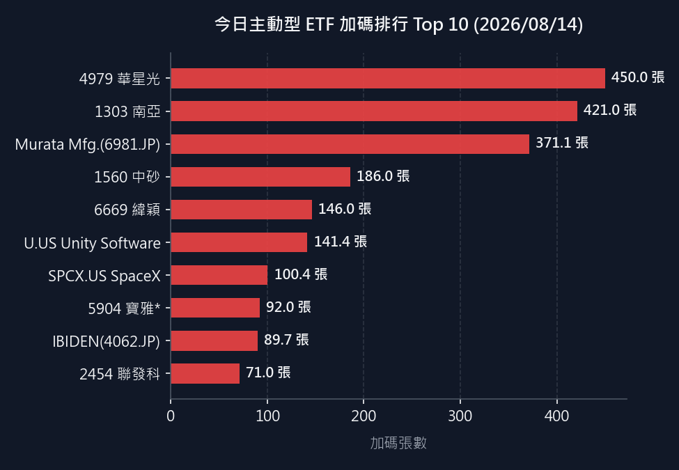
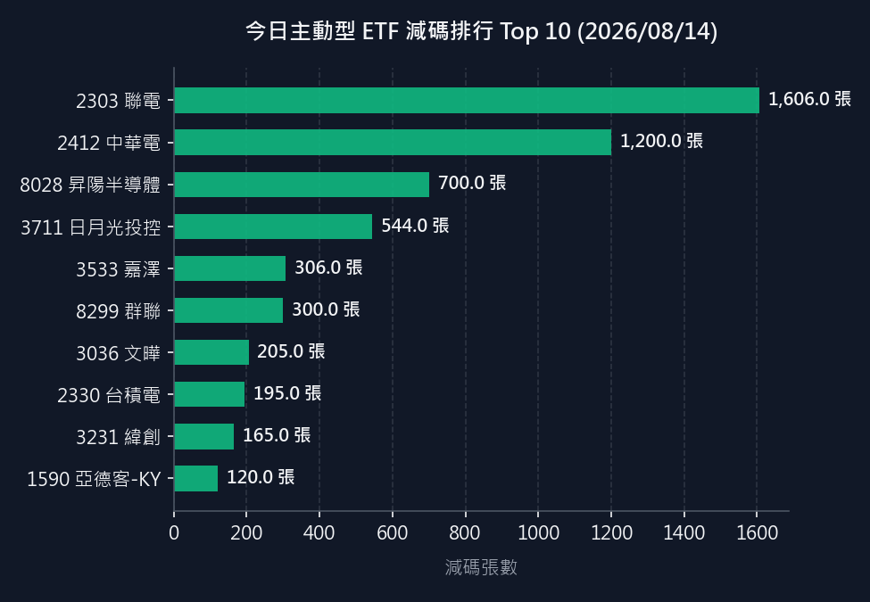

# 主動型 ETF 持股變動

資料來源：`主動型ETF持股明細.xlsx` 最近兩個日期分頁。

比較區間：`20260813` → `20260814`

## 今日加減碼視覺化排行

| 今日加碼 Top 10 | 今日減碼 Top 10 |
| :---: | :---: |
|  |  |

| ETF | 新增 | 刪除 | 比例變動 |
| :-- | --: | --: | --: |
| 00400A | 0 | 0 | 36 |
| 00401A | 0 | 0 | 51 |
| 00402A | 1 | 0 | 40 |
| 00403A | 0 | 0 | 31 |
| 00404A | 0 | 0 | 42 |
| 00405A | 0 | 0 | 32 |
| 00407A | 1 | 1 | 43 |
| 00408A | 2 | 0 | 39 |
| 00980A | 0 | 0 | 39 |
| 00980D | 0 | 0 | 29 |
| 00981A | 1 | 1 | 23 |
| 00982A | 0 | 1 | 38 |
| 00983A | 0 | 0 | 41 |
| 00983D | 0 | 0 | 17 |
| 00984A | 0 | 0 | 82 |
| 00985A | 0 | 0 | 37 |
| 00986A | 0 | 0 | 31 |
| 00987A | 0 | 0 | 22 |
| 00988A | 3 | 1 | 40 |
| 00989A | 0 | 0 | 56 |
| 00990A | 2 | 4 | 43 |
| 00991A | 0 | 0 | 21 |
| 00992A | 0 | 0 | 30 |
| 00993A | 1 | 1 | 42 |
| 00994A | 2 | 1 | 31 |
| 00995A | 0 | 1 | 35 |
| 00996A | 0 | 0 | 40 |
| 00997A | 0 | 0 | 46 |
| 00998A | 1 | 0 | 39 |
| 00999A | 0 | 0 | 53 |

## 00400A

### 新增持股

- 無

### 刪除持股

- 無

### 投資比例變動

- 1303 南亞：0.38% → 0.42%（+0.04）
- 2059 川湖：4.56% → 4.66%（+0.10）
- 2313 華通：0.77% → 0.79%（+0.02）
- 2317 鴻海：0.83% → 0.82%（-0.01）
- 2330 台積電：8.23% → 8.10%（-0.13）
- 2345 智邦：1.70% → 1.72%（+0.02）
- 2360 致茂：4.10% → 4.11%（+0.01）
- 2382 廣達：0.71% → 0.72%（+0.01）
- 2383 台光電：5.46% → 5.92%（+0.46）
- 2408 南亞科：1.90% → 1.89%（-0.01）
- 2449 京元電子：1.37% → 1.34%（-0.03）
- 2454 聯發科：6.55% → 6.53%（-0.02）
- 2881 富邦金：0.72% → 0.73%（+0.01）
- 3008 大立光：2.37% → 2.34%（-0.03）
- 3017 奇鋐：5.14% → 5.20%（+0.06）
- 3036 文曄：1.64% → 1.60%（-0.04）
- 3037 欣興：4.88% → 4.98%（+0.10）
- 3044 健鼎：1.69% → 1.67%（-0.02）
- 3211 順達：0.83% → 0.80%（-0.03）
- 3443 創意：3.47% → 3.43%（-0.04）
- 3529 力旺：1.09% → 1.07%（-0.02）
- 3653 健策：3.78% → 3.96%（+0.18）
- 4979 華星光：0.54% → 0.50%（-0.04）
- 5274 信驊：3.02% → 3.06%（+0.04）
- 5347 世界：0.73% → 0.72%（-0.01）
- 5434 崇越：0.35% → 0.34%（-0.01）
- 6121 新普：0.25% → 0.24%（-0.01）
- 6187 萬潤：2.50% → 2.51%（+0.01）
- 6223 旺矽：5.10% → 5.06%（-0.04）
- 6239 力成：0.96% → 0.94%（-0.02）
- 6274 台燿：1.10% → 1.15%（+0.05）
- 6488 環球晶：3.08% → 3.04%（-0.04）
- 6505 台塑化：0.69% → 0.70%（+0.01）
- 6669 緯穎：3.72% → 3.95%（+0.23）
- 7769 鴻勁：0.76% → 0.74%（-0.02）
- 8046 南電：1.04% → 1.12%（+0.08）

## 00401A

### 新增持股

- 無

### 刪除持股

- 無

### 投資比例變動

- 1301 台塑：0.07% → 0.08%（+0.01）
- 2059 川湖：0.94% → 0.96%（+0.02）
- 2303 聯電：0.88% → 0.86%（-0.02）
- 2308 台達電：3.43% → 3.45%（+0.02）
- 2313 華通：1.61% → 1.65%（+0.04）
- 2327 國巨*：0.78% → 0.74%（-0.04）
- 2330 台積電：15.54% → 15.40%（-0.14）
- 2344 華邦電：0.25% → 0.26%（+0.01）
- 2345 智邦：2.34% → 2.39%（+0.05）
- 2357 華碩：1.39% → 1.49%（+0.10）
- 2360 致茂：1.95% → 1.97%（+0.02）
- 2379 瑞昱：1.17% → 1.12%（-0.05）
- 2382 廣達：2.28% → 2.32%（+0.04）
- 2383 台光電：1.84% → 2.01%（+0.17）
- 2449 京元電子：0.06% → 0.05%（-0.01）
- 2454 聯發科：6.48% → 6.50%（+0.02）
- 2455 全新：1.85% → 1.84%（-0.01）
- 2603 長榮：1.01% → 1.04%（+0.03）
- 2881 富邦金：1.85% → 1.87%（+0.02）
- 2882 國泰金：1.01% → 1.03%（+0.02）
- 2883 凱基金：1.49% → 1.50%（+0.01）
- 2884 玉山金：1.73% → 1.76%（+0.03）
- 2886 兆豐金：1.33% → 1.39%（+0.06）
- 2887 台新新光金：1.01% → 1.06%（+0.05）
- 2890 永豐金：0.29% → 0.30%（+0.01）
- 2891 中信金：1.61% → 1.60%（-0.01）
- 3008 大立光：2.26% → 2.25%（-0.01）
- 3034 聯詠：0.23% → 0.22%（-0.01）
- 3037 欣興：2.24% → 2.30%（+0.06）
- 3131 弘塑：0.86% → 0.83%（-0.03）
- 3491 昇達科：1.71% → 1.76%（+0.05）
- 3653 健策：0.37% → 0.39%（+0.02）
- 3711 日月光投控：2.07% → 2.05%（-0.02）
- 4958 臻鼎-KY：1.87% → 1.93%（+0.06）
- 4991 環宇-KY：1.06% → 1.02%（-0.04）
- 5274 信驊：2.09% → 2.13%（+0.04）
- 5347 世界：1.37% → 1.36%（-0.01）
- 5871 中租-KY：0.16% → 0.15%（-0.01）
- 5904 寶雅*：0.67% → 0.65%（-0.02）
- 6187 萬潤：0.74% → 0.75%（+0.01）
- 6415 矽力*-KY：0.62% → 0.64%（+0.02）
- 6510 精測：0.66% → 0.71%（+0.05）
- 6515 穎崴：1.13% → 1.14%（+0.01）
- 6531 愛普*：1.13% → 1.22%（+0.09）
- 6669 緯穎：1.97% → 2.10%（+0.13）
- 7769 鴻勁：1.96% → 1.92%（-0.04）
- 7828 創新服務：1.93% → 1.78%（-0.15）
- 8021 尖點：0.27% → 0.28%（+0.01）
- 8464 億豐：1.09% → 1.13%（+0.04）
- 臺指選擇權08/26 45600 買權：-0.40% → -0.30%（+0.10）
- 臺股期貨08/26：0.04% → 0.01%（-0.03）

## 00402A

### 新增持股

- CIEN.US Ciena（0.92%，4.6 張）

### 刪除持股

- 無

### 投資比例變動

- AAPL.US Apple：7.00% → 7.03%（+0.03）
- ADI.US Analog Devices：1.87% → 1.84%（-0.03）
- AMD.US AMD：4.89% → 4.36%（-0.53）
- AMZN.US Amazon：4.37% → 4.31%（-0.06）
- ANET.US Arista Networks：0.89% → 0.86%（-0.03）
- ARM.US Arm：1.05% → 1.07%（+0.02）
- ASML.US ASML Holding：1.73% → 1.75%（+0.02）
- AXON.US Axon Enterprise：1.09% → 1.11%（+0.02）
- BABA.US Alibaba Group：0.59% → 0.57%（-0.02）
- CLS.US Celestica：0.94% → 0.96%（+0.02）
- COHR.US Coherent：2.32% → 2.13%（-0.19）
- CRWD.US CrowdStrike Holdings：1.48% → 1.50%（+0.02）
- FSLY.US Fastly：0.43% → 0.45%（+0.02）
- GOOGL.US Alphabet - Class A Common Stock：3.32% → 3.33%（+0.01）
- INTC.US Intel：1.32% → 1.36%（+0.04）
- IOT.US Samsara：0.24% → 0.25%（+0.01）
- LITE.US Lumentum：1.86% → 1.75%（-0.11）
- LRCX.US Lam Research：3.79% → 2.92%（-0.87）
- MCHP.US Microchip Technology：1.20% → 1.16%（-0.04）
- MDB.US MongoDB：0.85% → 0.92%（+0.07）
- META.US Meta：2.76% → 2.82%（+0.06）
- MRVL.US Marvell：1.55% → 1.58%（+0.03）
- MSFT.US Microsoft：4.27% → 4.29%（+0.02）
- MU.US Micron：6.08% → 6.31%（+0.23）
- NFLX.US Netflix：0.81% → 0.85%（+0.04）
- NVDA.US NVIDIA：9.13% → 9.11%（-0.02）
- NXPI.US NXP Semiconductors：1.10% → 1.09%（-0.01）
- PANW.US Palo Alto：3.64% → 3.45%（-0.19）
- PLTR.US Palantir Technologies：1.48% → 1.54%（+0.06）
- SHOP.US Shopify：0.51% → 0.54%（+0.03）
- SIMO.US Silicon Motion：0.72% → 0.74%（+0.02）
- SKHY.US SK hynix：0.97% → 1.04%（+0.07）
- SNOW.US Snowflake：1.00% → 1.01%（+0.01）
- SPCX.US SpaceX：0.75% → 0.72%（-0.03）
- STX.US Seagate：1.32% → 1.12%（-0.20）
- TER.US Teradyne：0.93% → 0.95%（+0.02）
- TXN.US Texas Instruments：2.23% → 2.20%（-0.03）
- V.US Visa：1.08% → 1.09%（+0.01）
- WDC.US Western Digital：2.29% → 2.20%（-0.09）
- ZS.US Zscaler：0.19% → 0.20%（+0.01）

## 00403A

### 新增持股

- 無

### 刪除持股

- 無

### 投資比例變動

- 1303 南亞：0.73% → 0.86%（+0.13）
- 1560 中砂：0.58% → 0.61%（+0.03）
- 1717 長興：0.11% → 0.10%（-0.01）
- 2303 聯電：5.40% → 5.32%（-0.08）
- 2308 台達電：3.15% → 3.19%（+0.04）
- 2327 國巨*：3.56% → 3.39%（-0.17）
- 2330 台積電：16.05% → 15.99%（-0.06）
- 2337 旺宏：0.56% → 0.57%（+0.01）
- 2344 華邦電：2.72% → 2.86%（+0.14）
- 2345 智邦：2.88% → 2.95%（+0.07）
- 2360 致茂：1.26% → 1.28%（+0.02）
- 2383 台光電：5.11% → 5.80%（+0.69）
- 2454 聯發科：4.73% → 4.94%（+0.21）
- 3008 大立光：1.31% → 1.46%（+0.15）
- 3017 奇鋐：6.18% → 6.33%（+0.15）
- 3037 欣興：4.65% → 4.80%（+0.15）
- 3189 景碩：1.99% → 2.04%（+0.05）
- 3211 順達：0.45% → 0.44%（-0.01）
- 3450 聯鈞：0.46% → 0.45%（-0.01）
- 3533 嘉澤：1.04% → 0.77%（-0.27）
- 3653 健策：2.04% → 2.16%（+0.12）
- 3665 貿聯-KY：1.45% → 1.47%（+0.02）
- 3711 日月光投控：2.75% → 2.74%（-0.01）
- 4958 臻鼎-KY：0.13% → 0.14%（+0.01）
- 5274 信驊：2.06% → 2.11%（+0.05）
- 6223 旺矽：3.78% → 3.80%（+0.02）
- 6274 台燿：1.48% → 1.57%（+0.09）
- 6442 光聖：0.19% → 0.20%（+0.01）
- 6669 緯穎：1.67% → 2.18%（+0.51）
- 8046 南電：1.46% → 1.59%（+0.13）
- 8996 高力：1.13% → 1.14%（+0.01）

## 00404A

### 新增持股

- 無

### 刪除持股

- 無

### 投資比例變動

- 1210 大成：1.79% → 1.80%（+0.01）
- 1303 南亞：0.17% → 0.19%（+0.02）
- 2059 川湖：0.35% → 0.36%（+0.01）
- 2301 光寶科：1.72% → 1.73%（+0.01）
- 2303 聯電：3.01% → 2.97%（-0.04）
- 2308 台達電：1.02% → 1.04%（+0.02）
- 2327 國巨*：0.78% → 0.74%（-0.04）
- 2330 台積電：22.53% → 22.48%（-0.05）
- 2345 智邦：0.45% → 0.47%（+0.02）
- 2360 致茂：1.18% → 1.20%（+0.02）
- 2377 微星：1.77% → 1.70%（-0.07）
- 2383 台光電：2.60% → 2.86%（+0.26）
- 2428 興勤：0.82% → 0.81%（-0.01）
- 2441 超豐：0.47% → 0.46%（-0.01）
- 2454 聯發科：6.94% → 7.01%（+0.07）
- 2458 義隆：0.40% → 0.41%（+0.01）
- 2880 華南金：2.41% → 2.43%（+0.02）
- 2885 元大金：1.39% → 1.41%（+0.02）
- 2886 兆豐金：2.93% → 3.07%（+0.14）
- 2887 台新新光金：0.03% → 0.04%（+0.01）
- 2892 第一金：3.15% → 3.22%（+0.07）
- 3017 奇鋐：1.10% → 1.12%（+0.02）
- 3022 威強電：0.80% → 0.77%（-0.03）
- 3023 信邦：2.18% → 2.21%（+0.03）
- 3034 聯詠：0.57% → 0.55%（-0.02）
- 3037 欣興：1.31% → 1.36%（+0.05）
- 3264 欣銓：1.82% → 1.81%（-0.01）
- 3653 健策：0.26% → 0.28%（+0.02）
- 3702 大聯大：1.85% → 1.75%（-0.10）
- 4763 材料*-KY：1.73% → 1.75%（+0.02）
- 5274 信驊：1.92% → 1.97%（+0.05）
- 5289 宜鼎：0.31% → 0.30%（-0.01）
- 5871 中租-KY：0.04% → 0.03%（-0.01）
- 5904 寶雅*：1.21% → 1.40%（+0.19）
- 6138 茂達：0.40% → 0.39%（-0.01）
- 6196 帆宣：1.78% → 1.80%（+0.02）
- 6491 晶碩：1.75% → 1.77%（+0.02）
- 6691 洋基工程：2.66% → 2.70%（+0.04）
- 8016 矽創：1.20% → 1.18%（-0.02）
- 8271 宇瞻：0.77% → 0.79%（+0.02）
- 台指選擇權09/26 48000 買權：-0.44% → -0.37%（+0.07）
- 台股期貨09/26：16.09% → 16.24%（+0.15）

## 00405A

### 新增持股

- 無

### 刪除持股

- 無

### 投資比例變動

- 2059 川湖：1.65% → 1.68%（+0.03）
- 2330 台積電：1.40% → 1.38%（-0.02）
- 2345 智邦：3.85% → 3.90%（+0.05）
- 2368 金像電：3.65% → 3.67%（+0.02）
- 2383 台光電：3.87% → 4.19%（+0.32）
- 2449 京元電子：0.68% → 0.66%（-0.02）
- 2454 聯發科：6.51% → 6.48%（-0.03）
- 3008 大立光：1.51% → 1.49%（-0.02）
- 3017 奇鋐：8.25% → 8.33%（+0.08）
- 3026 禾伸堂：1.29% → 1.20%（-0.09）
- 3037 欣興：5.04% → 5.14%（+0.10）
- 3081 聯亞：1.35% → 1.29%（-0.06）
- 3131 弘塑：1.88% → 1.81%（-0.07）
- 3264 欣銓：0.03% → 0.02%（-0.01）
- 3443 創意：7.45% → 7.35%（-0.10）
- 3653 健策：6.35% → 6.65%（+0.30）
- 3665 貿聯-KY：6.47% → 6.46%（-0.01）
- 3711 日月光投控：0.65% → 0.64%（-0.01）
- 4991 環宇-KY：1.38% → 1.33%（-0.05）
- 5274 信驊：3.05% → 3.08%（+0.03）
- 6223 旺矽：5.69% → 5.64%（-0.05）
- 6274 台燿：1.57% → 1.64%（+0.07）
- 6285 啟碁：0.32% → 0.31%（-0.01）
- 6510 精測：2.22% → 2.35%（+0.13）
- 6669 緯穎：3.80% → 4.03%（+0.23）
- 6805 富世達：1.18% → 1.16%（-0.02）
- 6831 邁科：0.54% → 0.55%（+0.01）
- 7734 印能科技：1.97% → 1.82%（-0.15）
- 7769 鴻勁：2.61% → 2.54%（-0.07）
- 8028 昇陽半導體：0.76% → 0.16%（-0.60）
- 8046 南電：2.88% → 3.09%（+0.21）
- 8210 勤誠：0.53% → 0.54%（+0.01）

## 00407A

### 新增持股

- 1560 中砂（0.47%，186 張）

### 刪除持股

- 3533 嘉澤（0.35%，56 張）

### 投資比例變動

- 1303 南亞：0.54% → 0.60%（+0.06）
- 1590 亞德客-KY：0.68% → 0.07%（-0.61）
- 2059 川湖：2.95% → 3.03%（+0.08）
- 2303 聯電：2.13% → 2.08%（-0.05）
- 2308 台達電：3.70% → 3.72%（+0.02）
- 2327 國巨*：2.44% → 2.30%（-0.14）
- 2330 台積電：8.31% → 8.21%（-0.10）
- 2344 華邦電：1.74% → 1.81%（+0.07）
- 2345 智邦：2.86% → 2.91%（+0.05）
- 2360 致茂：2.12% → 2.13%（+0.01）
- 2368 金像電：1.87% → 1.89%（+0.02）
- 2376 技嘉：0.78% → 0.79%（+0.01）
- 2379 瑞昱：0.74% → 0.70%（-0.04）
- 2383 台光電：5.27% → 5.74%（+0.47）
- 2395 研華：1.95% → 1.92%（-0.03）
- 2412 中華電：0.60% → 0.04%（-0.56）
- 2451 創見：0.17% → 0.16%（-0.01）
- 2454 聯發科：6.93% → 6.94%（+0.01）
- 3017 奇鋐：4.67% → 4.75%（+0.08）
- 3034 聯詠：0.67% → 0.64%（-0.03）
- 3037 欣興：4.51% → 4.63%（+0.12）
- 3293 鈊象：0.54% → 0.53%（-0.01）
- 3443 創意：2.73% → 2.71%（-0.02）
- 3491 昇達科：0.43% → 0.44%（+0.01）
- 3529 力旺：2.00% → 1.98%（-0.02）
- 3665 貿聯-KY：1.95% → 1.96%（+0.01）
- 3711 日月光投控：2.45% → 2.43%（-0.02）
- 4958 臻鼎-KY：1.69% → 1.74%（+0.05）
- 5274 信驊：2.10% → 2.14%（+0.04）
- 5289 宜鼎：0.17% → 0.16%（-0.01）
- 5536 聖暉*：0.79% → 0.81%（+0.02）
- 6223 旺矽：2.84% → 2.83%（-0.01）
- 6274 台燿：3.54% → 3.73%（+0.19）
- 6415 矽力*-KY：0.35% → 0.37%（+0.02）
- 6446 藥華藥：2.67% → 2.79%（+0.12）
- 6515 穎崴：1.37% → 1.38%（+0.01）
- 6526 達發：0.30% → 0.29%（-0.01）
- 6531 愛普*：1.41% → 1.52%（+0.11）
- 6669 緯穎：4.29% → 4.57%（+0.28）
- 6805 富世達：2.15% → 2.13%（-0.02）
- 8046 南電：2.34% → 2.53%（+0.19）
- 8210 勤誠：0.88% → 0.89%（+0.01）
- 8299 群聯：0.15% → 0.14%（-0.01）

## 00408A

### 新增持股

- 6488 環球晶（0.85%，14 張）
- 8996 高力（0.39%，5 張）

### 刪除持股

- 無

### 投資比例變動

- 1477 聚陽：0.27% → 0.26%（-0.01）
- 2059 川湖：2.22% → 2.26%（+0.04）
- 2303 聯電：1.32% → 1.28%（-0.04）
- 2308 台達電：3.88% → 3.87%（-0.01）
- 2317 鴻海：2.77% → 2.74%（-0.03）
- 2327 國巨*：0.40% → 0.38%（-0.02）
- 2330 台積電：6.06% → 5.92%（-0.14）
- 2344 華邦電：1.50% → 1.55%（+0.05）
- 2345 智邦：0.82% → 2.08%（+1.26）
- 2356 英業達：1.37% → 1.39%（+0.02）
- 2357 華碩：2.44% → 2.58%（+0.14）
- 2360 致茂：3.20% → 3.19%（-0.01）
- 2368 金像電：2.81% → 2.82%（+0.01）
- 2376 技嘉：2.50% → 2.52%（+0.02）
- 2383 台光電：4.82% → 5.97%（+1.15）
- 2395 研華：2.32% → 2.27%（-0.05）
- 2404 漢唐：1.71% → 1.70%（-0.01）
- 2454 聯發科：3.83% → 3.81%（-0.02）
- 2481 強茂：0.33% → 0.32%（-0.01）
- 2801 彰銀：0.88% → 0.87%（-0.01）
- 2880 華南金：1.55% → 1.54%（-0.01）
- 2886 兆豐金：2.41% → 2.49%（+0.08）
- 2891 中信金：0.97% → 0.95%（-0.02）
- 3017 奇鋐：5.03% → 5.07%（+0.04）
- 3036 文曄：0.82% → 0.48%（-0.34）
- 3037 欣興：3.75% → 3.81%（+0.06）
- 3045 台灣大：1.25% → 1.17%（-0.08）
- 3231 緯創：1.07% → 1.05%（-0.02）
- 3653 健策：1.40% → 1.46%（+0.06）
- 3665 貿聯-KY：1.60% → 1.59%（-0.01）
- 3702 大聯大：1.94% → 1.80%（-0.14）
- 3711 日月光投控：0.53% → 0.52%（-0.01）
- 5434 崇越：1.85% → 1.82%（-0.03）
- 6223 旺矽：1.38% → 1.36%（-0.02）
- 6239 力成：1.15% → 1.12%（-0.03）
- 6274 台燿：1.84% → 1.92%（+0.08）
- 6669 緯穎：4.41% → 5.05%（+0.64）
- 7769 鴻勁：1.84% → 1.79%（-0.05）
- 8046 南電：2.65% → 2.83%（+0.18）

## 00980A

### 新增持股

- 無

### 刪除持股

- 無

### 投資比例變動

- 1303 南亞：2.23% → 2.42%（+0.19）
- 2059 川湖：5.43% → 5.49%（+0.06）
- 2308 台達電：3.71% → 3.68%（-0.03）
- 2317 鴻海：2.00% → 1.97%（-0.03）
- 2327 國巨*：1.11% → 1.04%（-0.07）
- 2330 台積電：7.87% → 7.67%（-0.20）
- 2344 華邦電：0.99% → 1.02%（+0.03）
- 2360 致茂：1.66% → 1.64%（-0.02）
- 2383 台光電：4.22% → 4.53%（+0.31）
- 2408 南亞科：2.60% → 2.57%（-0.03）
- 2454 聯發科：5.75% → 5.67%（-0.08）
- 2891 中信金：1.20% → 1.18%（-0.02）
- 3008 大立光：0.82% → 0.80%（-0.02）
- 3026 禾伸堂：0.45% → 0.42%（-0.03）
- 3036 文曄：1.20% → 1.16%（-0.04）
- 3037 欣興：2.74% → 2.77%（+0.03）
- 3044 健鼎：0.83% → 0.81%（-0.02）
- 3081 聯亞：3.09% → 2.91%（-0.18）
- 3231 緯創：1.00% → 0.97%（-0.03）
- 3264 欣銓：0.73% → 0.71%（-0.02）
- 3293 鈊象：0.94% → 0.91%（-0.03）
- 3443 創意：1.59% → 1.56%（-0.03）
- 3529 力旺：0.86% → 0.83%（-0.03）
- 3653 健策：1.56% → 1.62%（+0.06）
- 3665 貿聯-KY：0.35% → 0.34%（-0.01）
- 3711 日月光投控：1.22% → 1.19%（-0.03）
- 4958 臻鼎-KY：0.78% → 0.79%（+0.01）
- 5904 寶雅*：1.25% → 1.19%（-0.06）
- 6213 聯茂：1.10% → 1.12%（+0.02）
- 6223 旺矽：2.41% → 2.36%（-0.05）
- 6274 台燿：1.46% → 1.51%（+0.05）
- 6515 穎崴：1.81% → 1.79%（-0.02）
- 6669 緯穎：1.54% → 1.62%（+0.08）
- 6805 富世達：0.48% → 0.47%（-0.01）
- 7769 鴻勁：2.41% → 2.32%（-0.09）
- 8046 南電：1.20% → 1.28%（+0.08）
- 8299 群聯：2.42% → 2.19%（-0.23）
- 8996 高力：1.13% → 1.12%（-0.01）
- 台灣證交所加權股價指數：7.09% → 6.99%（-0.10）

## 00980D

### 新增持股

- 無

### 刪除持股

- 無

### 投資比例變動

- ALLY FINANCIAL INC (REG) VAR 13JUN2029：0.55% → 0.54%（-0.01）
- APOLLO DEBT SOLUTIONS BD 6.900000 % 13APR2029：0.55% → 0.54%（-0.01）
- ARIS WATER HOLDINGS LLC SER REGS 7.250000 % 01APR2030：0.47% → 0.46%（-0.01）
- BANK OF AMERICA CORP (REG) 7.75% 14MAY2038：0.52% → 0.51%（-0.01）
- CALDERYS FINANCING LLC SER REGS (REG S) 11.25% 01JUN2028：0.33% → 0.32%（-0.01）
- CHARTER COMM OPT LLC/CAP (REG) 5.5% 01APR2063：0.48% → 0.49%（+0.01）
- CHARTER COMM OPT LLC/CAP (REG) 6.834000 % 23OCT2055：0.44% → 0.45%（+0.01）
- CONCENTRIX CORP (REG) 6.85% 02AUG2033：0.70% → 0.69%（-0.01）
- CONOCOPHILLIPS COMPANY (REG) 6.95% 15APR2029：0.51% → 0.50%（-0.01）
- DEUTSCHE BANK NY VAR 10FEB2034：0.34% → 0.33%（-0.01）
- DOW CHEMICAL CO/THE 7.375% 01NOV2029：0.61% → 0.60%（-0.01）
- FMC CORP (REG) 4.5% 01OCT2049：0.49% → 0.48%（-0.01）
- FORD MOTOR CREDIT CO LLC (REG) 7.35% 04NOV2027：0.33% → 0.32%（-0.01）
- FREEDOM MORTGAGE CORP SER REGS (REG S) 12.25% 01OCT2030：0.47% → 0.46%（-0.01）
- GEORGIA-PACIFIC LLC (REG) 7.75% 15NOV2029：0.57% → 0.56%（-0.01）
- HERTZ CORP/THE SER REGS (REG S) 12.625% 15JUL2029：0.32% → 0.31%（-0.01）
- HSBC HOLDINGS PLC VAR 03NOV2033：0.36% → 0.35%（-0.01）
- JH NORTH AMERICA HOLDING SER REGS 6.125000 % 31JUL2032：0.40% → 0.39%（-0.01）
- ORACLE CORP 5.950000 % 26-SEP-2055：0.40% → 0.41%（+0.01）
- ORACLE CORP 6.000000 % 03AUG2055：0.30% → 0.31%（+0.01）
- ORACLE CORP 6.125000 % 03AUG2065：0.51% → 0.52%（+0.01）
- RR DONNELLEY & SONS CO SER REGS (REG S) 9.5% 01AUG2029：0.42% → 0.41%（-0.01）
- TIME WARNER CABLE LLC (REG) 6.75% 15JUN2039：0.30% → 0.31%（+0.01）
- TIME WARNER ENTERTAINMEN 8.375% 15JUL2033：0.64% → 0.63%（-0.01）
- US 10YR NOTE (CBT)SEP26 21-SEP-2026：18.27% → 18.25%（-0.02）
- US 5YR NOTE (CBT) SEP26 30-SEP-2026：-15.89% → -15.86%（+0.03）
- VAR ENERGI ASA SER REGS (REG S) 7.5% 15JAN2028：0.33% → 0.32%（-0.01）
- VERIZON COMMUNICAT 7.750000 % 01DEC2030：0.44% → 0.43%（-0.01）
- VIRGINIA ELEC & POWER CO (REG) 8.875% 15NOV2038：0.58% → 0.57%（-0.01）

## 00981A

### 新增持股

- 台指期貨(B) 2026/08（1.99%，N/A 張）

### 刪除持股

- 台指期貨 2026/08（2.01%，N/A 張）

### 投資比例變動

- 2303 聯電：3.50% → 3.40%（-0.10）
- 2308 台達電：4.28% → 4.27%（-0.01）
- 2327 國巨*：5.40% → 5.06%（-0.34）
- 2330 台積電：9.48% → 9.30%（-0.18）
- 2345 智邦：4.80% → 4.85%（+0.05）
- 2383 台光電：8.88% → 9.60%（+0.72）
- 2449 京元電子：0.92% → 0.89%（-0.03）
- 2454 聯發科：7.39% → 7.34%（-0.05）
- 3017 奇鋐：6.06% → 6.11%（+0.05）
- 3037 欣興：6.49% → 6.60%（+0.11）
- 3264 欣銓：0.44% → 0.43%（-0.01）
- 3653 健策：3.53% → 3.69%（+0.16）
- 3665 貿聯-KY：3.27% → 3.25%（-0.02）
- 3711 日月光投控：3.92% → 3.85%（-0.07）
- 4979 華星光：0.44% → 0.41%（-0.03）
- 5274 信驊：2.72% → 2.75%（+0.03）
- 6223 旺矽：5.09% → 5.04%（-0.05）
- 6274 台燿：2.82% → 2.95%（+0.13）
- 6510 精測：0.43% → 0.46%（+0.03）
- 6669 緯穎：4.86% → 5.14%（+0.28）
- 6805 富世達：1.33% → 1.31%（-0.02）
- 8046 南電：3.76% → 4.02%（+0.26）
- 8210 勤誠：0.79% → 0.80%（+0.01）

## 00982A

### 新增持股

- 無

### 刪除持股

- 6187 萬潤（0.22%，91 張）

### 投資比例變動

- 1785 光洋科：0.91% → 0.87%（-0.04）
- 2059 川湖：4.31% → 4.39%（+0.08）
- 2303 聯電：2.16% → 2.09%（-0.07）
- 2316 楠梓電：1.08% → 1.05%（-0.03）
- 2327 國巨*：0.88% → 0.82%（-0.06）
- 2330 台積電：8.31% → 8.15%（-0.16）
- 2345 智邦：3.53% → 3.57%（+0.04）
- 2351 順德：0.76% → 0.75%（-0.01）
- 2360 致茂：3.66% → 3.65%（-0.01）
- 2377 微星：1.82% → 1.71%（-0.11）
- 2383 台光電：3.54% → 3.83%（+0.29）
- 2451 創見：0.30% → 0.29%（-0.01）
- 2454 聯發科：7.01% → 6.97%（-0.04）
- 2467 志聖：1.57% → 1.53%（-0.04）
- 2472 立隆電：0.74% → 0.71%（-0.03）
- 3008 大立光：2.20% → 2.17%（-0.03）
- 3017 奇鋐：2.48% → 2.50%（+0.02）
- 3036 文曄：0.98% → 0.96%（-0.02）
- 3105 穩懋：3.54% → 3.45%（-0.09）
- 3264 欣銓：2.10% → 2.05%（-0.05）
- 3491 昇達科：2.53% → 2.58%（+0.05）
- 3529 力旺：0.48% → 0.47%（-0.01）
- 3583 辛耘：1.58% → 1.56%（-0.02）
- 3702 大聯大：1.33% → 1.24%（-0.09）
- 3711 日月光投控：1.21% → 1.19%（-0.02）
- 4958 臻鼎-KY：2.89% → 2.95%（+0.06）
- 5536 聖暉*：6.32% → 6.46%（+0.14）
- 6139 亞翔：6.17% → 6.10%（-0.07）
- 6223 旺矽：3.79% → 3.75%（-0.04）
- 6239 力成：0.38% → 0.37%（-0.01）
- 6257 矽格：1.95% → 1.90%（-0.05）
- 6274 台燿：1.37% → 1.43%（+0.06）
- 6278 台表科：0.74% → 0.76%（+0.02）
- 6488 環球晶：2.21% → 2.17%（-0.04）
- 6531 愛普*：2.37% → 2.55%（+0.18）
- 6669 緯穎：5.89% → 6.23%（+0.34）
- 7769 鴻勁：1.20% → 1.16%（-0.04）
- 8016 矽創：1.36% → 1.32%（-0.04）

## 00983A

### 新增持股

- 無

### 刪除持股

- 無

### 投資比例變動

- ACHR.US Archer：0.38% → 0.42%（+0.04）
- AMD.US AMD：4.67% → 4.68%（+0.01）
- AMZN.US Amazon：3.43% → 3.41%（-0.02）
- AVGO.US Broadcom：2.00% → 2.01%（+0.01）
- BEAM.US Beam Therapeutics：2.30% → 1.99%（-0.31）
- BLSH.US Bullish：1.03% → 1.15%（+0.12）
- BMNR.US BitMine：1.27% → 1.30%（+0.03）
- CBRS.US Cerebras：0.78% → 0.69%（-0.09）
- CERS.US Cerus：0.46% → 0.49%（+0.03）
- COIN.US Coinbase：2.07% → 2.14%（+0.07）
- CRCL.US Circle：2.70% → 2.86%（+0.16）
- CRWV.US CoreWeave：1.31% → 1.48%（+0.17）
- DE.US Deere：1.40% → 1.39%（-0.01）
- FIG.US Figma：0.41% → 0.45%（+0.04）
- GOOGL.US Alphabet - Class A Common Stock：1.29% → 0.99%（-0.30）
- HOOD.US Robinhood Markets：3.76% → 3.95%（+0.19）
- ILMN.US Illumina：2.25% → 2.16%（-0.09）
- KTOS.US Kratos Defense & Security：1.12% → 1.10%（-0.02）
- LLY.US Eli Lilly：1.98% → 1.97%（-0.01）
- META.US Meta：1.11% → 1.14%（+0.03）
- NET.US Cloudflare：0.10% → 0.11%（+0.01）
- NTLA.US Intellia Therapeutics：1.34% → 1.31%（-0.03）
- NTRA.US Natera：2.19% → 2.16%（-0.03）
- NVDA.US NVIDIA：1.67% → 1.68%（+0.01）
- PLTR.US Palantir Technologies：3.13% → 3.28%（+0.15）
- RBLX.US Roblox：0.78% → 0.65%（-0.13）
- RXRX.US Recursion Pharmaceuticals：0.30% → 0.31%（+0.01）
- SHOP.US Shopify：7.06% → 7.10%（+0.04）
- SNOW.US Snowflake：1.66% → 1.69%（+0.03）
- SOFI.US SoFi Technologies：0.68% → 0.70%（+0.02）
- SPCX.US SpaceX：2.95% → 3.01%（+0.06）
- TEM.US Tempus：3.51% → 3.50%（-0.01）
- TER.US Teradyne：0.66% → 0.67%（+0.01）
- TSLA.US Tesla：7.75% → 8.03%（+0.28）
- TSM.US TSMC(ADR)：3.55% → 3.57%（+0.02）
- TWST.US Twist Bioscience：4.87% → 4.71%（-0.16）
- TXG.US 10x Genomics：4.62% → 4.10%（-0.52）
- VCYT.US Veracyte：1.01% → 0.97%（-0.04）
- WGS.US GeneDx：1.71% → 1.65%（-0.06）
- XE.US X-Energy：0.44% → 0.49%（+0.05）
- XYZ.US Block：2.19% → 2.33%（+0.14）

## 00983D

### 新增持股

- 無

### 刪除持股

- 無

### 投資比例變動

- BATSLN 7.079 08/02/43：1.08% → 1.09%（+0.01）
- BATSLN 7.081 08/02/53：1.32% → 1.33%（+0.01）
- DTV 8 7/8 02/01/30：1.61% → 1.60%（-0.01）
- DUK 7 3/4 03/01/31：1.57% → 1.56%（-0.01）
- GTN 10 1/2 07/15/29：1.70% → 1.69%（-0.01）
- HAL 7.45 09/15/39：1.84% → 1.83%（-0.01）
- MOHEGN 11 7/8 04/15/31：1.37% → 1.36%（-0.01）
- MS 7 1/4 04/01/32：1.65% → 1.64%（-0.01）
- NTRCN 7 1/8 05/23/36：0.56% → 0.55%（-0.01）
- NVDA 5.55 06/15/46：1.15% → 1.16%（+0.01）
- ORCL 6.9 11/09/52：0.85% → 0.86%（+0.01）
- OXY 6.6 03/15/46：0.75% → 0.76%（+0.01）
- RAKUTN 11 1/4 02/15/27：1.81% → 1.80%（-0.01）
- RIOLN 7 1/4 03/15/31：0.52% → 0.51%（-0.01）
- SABHLD 10 3/4 11/15/29：0.61% → 0.62%（+0.01）
- SPCX 6.6 07/15/46：1.14% → 1.15%（+0.01）
- TLTW.US iShares 20+ Year Treasury Bond B：7.19% → 7.21%（+0.02）

## 00984A

### 新增持股

- 無

### 刪除持股

- 無

### 投資比例變動

- 1303 南亞：2.27% → 2.49%（+0.22）
- 1326 台化：1.04% → 1.06%（+0.02）
- 1477 聚陽：0.85% → 0.84%（-0.01）
- 1560 中砂：0.67% → 0.68%（+0.01）
- 1714 和桐：0.30% → 0.29%（-0.01）
- 1736 喬山：0.72% → 0.70%（-0.02）
- 1907 永豐餘：0.50% → 0.48%（-0.02）
- 2006 東和鋼鐵：0.09% → 0.08%（-0.01）
- 2015 豐興：0.08% → 0.07%（-0.01）
- 2049 上銀：0.62% → 0.60%（-0.02）
- 2059 川湖：4.96% → 5.07%（+0.11）
- 2105 正新：0.26% → 0.25%（-0.01）
- 2303 聯電：1.41% → 1.36%（-0.05）
- 2317 鴻海：1.42% → 1.40%（-0.02）
- 2324 仁寶：0.59% → 0.64%（+0.05）
- 2330 台積電：3.62% → 3.55%（-0.07）
- 2345 智邦：0.81% → 0.82%（+0.01）
- 2347 聯強：1.00% → 0.99%（-0.01）
- 2351 順德：0.27% → 0.26%（-0.01）
- 2357 華碩：0.94% → 0.99%（+0.05）
- 2375 凱美：0.28% → 0.26%（-0.02）
- 2376 技嘉：0.59% → 0.60%（+0.01）
- 2377 微星：0.48% → 0.46%（-0.02）
- 2383 台光電：1.80% → 1.95%（+0.15）
- 2408 南亞科：1.99% → 1.98%（-0.01）
- 2412 中華電：0.85% → 0.84%（-0.01）
- 2441 超豐：1.22% → 1.17%（-0.05）
- 2464 盟立：0.79% → 0.77%（-0.02）
- 2472 立隆電：0.27% → 0.26%（-0.01）
- 2476 鉅祥：0.25% → 0.24%（-0.01）
- 2546 根基：0.19% → 0.18%（-0.01）
- 2603 長榮：0.74% → 0.75%（+0.01）
- 2834 臺企銀：1.32% → 1.31%（-0.01）
- 2880 華南金：1.90% → 1.89%（-0.01）
- 2882 國泰金：0.76% → 0.78%（+0.02）
- 2886 兆豐金：1.92% → 1.98%（+0.06）
- 2891 中信金：0.76% → 0.75%（-0.01）
- 2892 第一金：1.61% → 1.62%（+0.01）
- 3008 大立光：2.31% → 2.28%（-0.03）
- 3026 禾伸堂：0.90% → 0.84%（-0.06）
- 3033 威健：0.26% → 0.25%（-0.01）
- 3034 聯詠：0.73% → 0.69%（-0.04）
- 3036 文曄：0.54% → 0.52%（-0.02）
- 3037 欣興：0.60% → 0.62%（+0.02）
- 3189 景碩：1.64% → 1.65%（+0.01）
- 3450 聯鈞：0.69% → 0.67%（-0.02）
- 3533 嘉澤：1.29% → 1.22%（-0.07）
- 3702 大聯大：0.54% → 0.50%（-0.04）
- 3711 日月光投控：1.17% → 1.15%（-0.02）
- 4764 雙鍵：0.51% → 0.48%（-0.03）
- 4904 遠傳：0.47% → 0.46%（-0.01）
- 4938 和碩：0.69% → 0.68%（-0.01）
- 4958 臻鼎-KY：0.95% → 0.97%（+0.02）
- 4966 譜瑞-KY：0.86% → 0.83%（-0.03）
- 5274 信驊：0.90% → 0.91%（+0.01）
- 5289 宜鼎：1.03% → 0.99%（-0.04）
- 5351 鈺創：0.96% → 0.99%（+0.03）
- 5534 長虹：0.23% → 0.24%（+0.01）
- 5536 聖暉*：0.47% → 0.48%（+0.01）
- 5880 合庫金：1.52% → 1.51%（-0.01）
- 5904 寶雅*：1.17% → 1.12%（-0.05）
- 6005 群益證：1.16% → 1.17%（+0.01）
- 6139 亞翔：2.86% → 2.83%（-0.03）
- 6196 帆宣：1.12% → 1.11%（-0.01）
- 6197 佳必琪：0.56% → 0.55%（-0.01）
- 6202 盛群：0.27% → 0.26%（-0.01）
- 6213 聯茂：1.78% → 1.82%（+0.04）
- 6223 旺矽：1.29% → 1.27%（-0.02）
- 6257 矽格：0.70% → 0.68%（-0.02）
- 6274 台燿：0.71% → 0.75%（+0.04）
- 6446 藥華藥：2.63% → 2.72%（+0.09）
- 6531 愛普*：1.08% → 1.16%（+0.08）
- 6548 長科*：1.14% → 1.11%（-0.03）
- 6669 緯穎：0.60% → 0.64%（+0.04）
- 6944 兆聯實業：1.07% → 1.05%（-0.02）
- 7734 印能科技：0.48% → 0.46%（-0.02）
- 7769 鴻勁：1.34% → 1.30%（-0.04）
- 8039 台虹：0.77% → 0.84%（+0.07）
- 8046 南電：0.65% → 0.70%（+0.05）
- 8271 宇瞻：0.55% → 0.56%（+0.01）
- 8436 大江：0.25% → 0.24%（-0.01）
- 9914 美利達：0.26% → 0.25%（-0.01）

## 00985A

### 新增持股

- 無

### 刪除持股

- 無

### 投資比例變動

- 1802 台玻：0.21% → 0.22%（+0.01）
- 2027 大成鋼：3.48% → 3.32%（-0.16）
- 2059 川湖：1.29% → 1.33%（+0.04）
- 2303 聯電：0.49% → 0.48%（-0.01）
- 2308 台達電：1.49% → 1.50%（+0.01）
- 2327 國巨*：0.57% → 0.54%（-0.03）
- 2330 台積電：13.77% → 13.66%（-0.11）
- 2344 華邦電：1.04% → 1.09%（+0.05）
- 2345 智邦：2.71% → 2.77%（+0.06）
- 2368 金像電：0.95% → 0.96%（+0.01）
- 2376 技嘉：4.45% → 4.54%（+0.09）
- 2383 台光電：2.84% → 3.11%（+0.27）
- 2395 研華：0.34% → 0.33%（-0.01）
- 2408 南亞科：2.21% → 2.22%（+0.01）
- 2412 中華電：3.38% → 3.39%（+0.01）
- 2454 聯發科：2.03% → 2.04%（+0.01）
- 2603 長榮：2.78% → 2.85%（+0.07）
- 3008 大立光：3.23% → 3.22%（-0.01）
- 3017 奇鋐：2.09% → 2.13%（+0.04）
- 3036 文曄：1.63% → 1.60%（-0.03）
- 3037 欣興：1.54% → 1.58%（+0.04）
- 3081 聯亞：2.13% → 2.04%（-0.09）
- 3105 穩懋：2.44% → 2.40%（-0.04）
- 3131 弘塑：1.24% → 1.20%（-0.04）
- 3653 健策：1.43% → 1.51%（+0.08）
- 3711 日月光投控：1.49% → 1.48%（-0.01）
- 4904 遠傳：3.32% → 3.34%（+0.02）
- 4958 臻鼎-KY：2.03% → 2.10%（+0.07）
- 6147 頎邦：1.61% → 1.56%（-0.05）
- 6187 萬潤：1.42% → 1.43%（+0.01）
- 6442 光聖：2.23% → 2.24%（+0.01）
- 6446 藥華藥：2.71% → 2.84%（+0.13）
- 6669 緯穎：2.86% → 3.06%（+0.20）
- 7769 鴻勁：1.17% → 1.15%（-0.02）
- 8046 南電：0.56% → 0.61%（+0.05）
- 8299 群聯：1.16% → 1.07%（-0.09）
- 台積電期貨：5.16% → 5.14%（-0.02）

## 00986A

### 新增持股

- 無

### 刪除持股

- 無

### 投資比例變動

- 2330 台積電：8.53% → 8.57%（+0.04）
- 2454 聯發科：0.64% → 1.35%（+0.71）
- AMAT.US Applied Materials：1.99% → 1.93%（-0.06）
- AMD.US AMD：3.00% → 2.98%（-0.02）
- AMZN.US Amazon：3.87% → 3.82%（-0.05）
- AVGO.US Broadcom：5.17% → 5.16%（-0.01）
- COHR.US Coherent：2.39% → 2.19%（-0.20）
- CRDO.US Credo：0.42% → 0.41%（-0.01）
- CRWD.US CrowdStrike Holdings：4.31% → 4.35%（+0.04）
- DDOG.US Datadog：0.37% → 0.39%（+0.02）
- ETN.US Eaton：2.38% → 2.33%（-0.05）
- GEV.US GE Vernova：2.69% → 2.70%（+0.01）
- GOOGL.US Alphabet - Class A Common Stock：6.22% → 6.24%（+0.02）
- HWM.US Howmet Aerospace：2.48% → 2.47%（-0.01）
- JPM.US JPMorgan Chase：1.51% → 1.49%（-0.02）
- LITE.US Lumentum：3.76% → 3.53%（-0.23）
- LLY.US Eli Lilly：2.84% → 2.80%（-0.04）
- LRCX.US Lam Research：2.87% → 2.95%（+0.08）
- MA.US Mastercard：1.01% → 1.02%（+0.01）
- MSFT.US Microsoft：2.55% → 2.56%（+0.01）
- MU.US Micron：3.77% → 3.91%（+0.14）
- MUFG(8306.JP)：1.40% → 1.44%（+0.04）
- Murata Mfg.(6981.JP)：1.71% → 1.88%（+0.17）
- NET.US Cloudflare：1.93% → 2.04%（+0.11）
- SNDK.US Sandisk：1.39% → 1.57%（+0.18）
- SNOW.US Snowflake：1.89% → 1.91%（+0.02）
- Siemens Energy AG：2.12% → 2.10%（-0.02）
- TSEM.US Tower Semiconductor：1.01% → 0.98%（-0.03）
- 嘉能可公司：1.60% → 1.56%（-0.04）
- 施奈德電機公司：1.67% → 1.65%（-0.02）
- 英飛凌科技股份有限公司：3.01% → 2.96%（-0.05）

## 00987A

### 新增持股

- 無

### 刪除持股

- 無

### 投資比例變動

- 2330 台積電：7.93% → 7.82%（-0.11）
- 2345 智邦：2.30% → 2.34%（+0.04）
- 2383 台光電：7.00% → 7.60%（+0.60）
- 2454 聯發科：4.89% → 4.88%（-0.01）
- 2455 全新：2.85% → 2.82%（-0.03）
- 3017 奇鋐：6.71% → 6.80%（+0.09）
- 3037 欣興：6.87% → 7.03%（+0.16）
- 3081 聯亞：3.64% → 3.48%（-0.16）
- 3231 緯創：2.33% → 1.14%（-1.19）
- 3363 上詮：2.01% → 1.97%（-0.04）
- 3443 創意：7.61% → 5.94%（-1.67）
- 3653 健策：3.02% → 3.17%（+0.15）
- 6223 旺矽：6.34% → 6.30%（-0.04）
- 6274 台燿：4.34% → 4.56%（+0.22）
- 6515 穎崴：1.95% → 1.96%（+0.01）
- 6683 雍智科技：2.62% → 2.58%（-0.04）
- 6739 竹陞科技：1.89% → 1.83%（-0.06）
- 6805 富世達：3.44% → 3.40%（-0.04）
- 7769 鴻勁：2.94% → 2.87%（-0.07）
- 8046 南電：4.00% → 4.31%（+0.31）
- 8358 金居：1.74% → 1.77%（+0.03）
- 8996 高力：1.63% → 1.62%（-0.01）

## 00988A

### 新增持股

- 4979 華星光（0.43%，450 張）
- SPCX.US SpaceX（0.77%，100 張）
- STX.US Seagate（1.00%，20 張）

### 刪除持股

- 阿里巴巴－Ｗ(9988.HK)（0.86%，1000 張）

### 投資比例變動

- 2308 台達電：1.43% → 1.49%（+0.06）
- 2327 國巨*：1.60% → 1.73%（+0.13）
- 2330 台積電：3.10% → 2.67%（-0.43）
- 2383 台光電：4.36% → 4.27%（-0.09）
- 2454 聯發科：3.06% → 3.17%（+0.11）
- 3017 奇鋐：1.07% → 1.16%（+0.09）
- 3037 欣興：4.45% → 4.39%（-0.06）
- 3711 日月光投控：1.91% → 1.90%（-0.01）
- 6223 旺矽：2.73% → 2.65%（-0.08）
- AEHR.US Aehr Test Systems：1.00% → 0.47%（-0.53）
- AIXTRON SE：0.55% → 0.52%（-0.03）
- AMAT.US Applied Materials：2.05% → 1.97%（-0.08）
- AMD.US AMD：3.46% → 3.41%（-0.05）
- BE.US Bloom Energy：2.75% → 2.69%（-0.06）
- COHR.US Coherent：1.86% → 1.69%（-0.17）
- CRDO.US Credo：3.33% → 3.25%（-0.08）
- INFINEON TECHNOLOGIES AG：1.71% → 1.66%（-0.05）
- Kioxia Holdings(285A.JP)：3.11% → 3.17%（+0.06）
- LITE.US Lumentum：6.01% → 5.59%（-0.42）
- LMT.US Lockheed Martin：1.27% → 1.23%（-0.04）
- MICRONICS(6871.JP)：1.79% → 1.82%（+0.03）
- MPWR.US Monolithic Power Systems：1.41% → 1.33%（-0.08）
- MRVL.US Marvell：2.45% → 2.47%（+0.02）
- MU.US Micron：3.52% → 3.61%（+0.09）
- Meiko Electronics(6787.JP)：0.99% → 1.02%（+0.03）
- Murata Mfg.(6981.JP)：3.52% → 3.82%（+0.30）
- NET.US Cloudflare：0.77% → 0.81%（+0.04）
- Nippon Chemi-Con(6997.JP)：1.30% → 1.34%（+0.04）
- PANW.US Palo Alto：3.20% → 3.22%（+0.02）
- PLTR.US Palantir Technologies：1.23% → 1.26%（+0.03）
- SNDK.US Sandisk：1.56% → 1.74%（+0.18）
- Samsung Elec Mech(009150.KS)：3.67% → 3.98%（+0.31）
- TAIYO YUDEN(6976.JP)：1.60% → 1.68%（+0.08）
- TER.US Teradyne：1.22% → 1.23%（+0.01）
- TSEM.US Tower Semiconductor：3.11% → 2.98%（-0.13）
- TWLO.US Twilio：0.75% → 0.74%（-0.01）
- WDC.US Western Digital：2.63% → 2.12%（-0.51）
- 三環集團(300408.SZ)：1.83% → 1.81%（-0.02）
- 中際旭創(3308.HK)：0.86% → 0.87%（+0.01）
- 鼎泰高科(301377.SZ)：1.07% → 1.05%（-0.02）

## 00989A

### 新增持股

- 無

### 刪除持股

- 無

### 投資比例變動

- ADBE.US Adobe：0.93% → 0.96%（+0.03）
- ADI.US Analog Devices：1.06% → 1.04%（-0.02）
- ALGM.US Allegro MicroSystems：0.59% → 0.61%（+0.02）
- AMAT.US Applied Materials：0.74% → 0.71%（-0.03）
- AMD.US AMD：2.51% → 2.47%（-0.04）
- AMKR.US Amkor：0.72% → 0.74%（+0.02）
- AMZN.US Amazon：1.03% → 1.00%（-0.03）
- APP.US Applovin：0.73% → 0.58%（-0.15）
- ASML.US ASML Holding：1.74% → 1.75%（+0.01）
- AVGO.US Broadcom：4.01% → 3.97%（-0.04）
- BE.US Bloom Energy：1.09% → 1.06%（-0.03）
- CBRS.US Cerebras：0.24% → 0.20%（-0.04）
- CDNS.US Cadence Design Systems：0.88% → 0.87%（-0.01）
- CIEN.US Ciena：2.02% → 2.04%（+0.02）
- CRCL.US Circle：0.33% → 0.35%（+0.02）
- CRM.US Salesforce：2.39% → 2.14%（-0.25）
- CRWD.US CrowdStrike Holdings：3.25% → 3.26%（+0.01）
- CRWV.US CoreWeave：0.65% → 0.82%（+0.17）
- DOCN.US DigitalOcean：1.53% → 1.49%（-0.04）
- ESTC.US Elastic：0.22% → 0.24%（+0.02）
- FIGR.US Figure：0.75% → 0.77%（+0.02）
- FN.US Fabrinet：0.75% → 0.73%（-0.02）
- GFS.US GlobalFoundries：1.09% → 1.07%（-0.02）
- GLW.US Corning：1.91% → 1.78%（-0.13）
- GOOG.US Alphabet - Class C Capital Stock：4.07% → 4.03%（-0.04）
- HOOD.US Robinhood Markets：2.16% → 2.23%（+0.07）
- HUBS.US HubSpot：1.38% → 1.56%（+0.18）
- INTC.US Intel：2.88% → 2.93%（+0.05）
- LITE.US Lumentum：1.74% → 1.61%（-0.13）
- LMND.US Lemonade：0.77% → 0.78%（+0.01）
- LRCX.US Lam Research：2.18% → 2.22%（+0.04）
- META.US Meta：2.53% → 2.56%（+0.03）
- MSFT.US Microsoft：3.09% → 3.07%（-0.02）
- MTSI.US MACOM Technology Solutions：1.07% → 1.04%（-0.03）
- MU.US Micron：0.77% → 0.79%（+0.02）
- NET.US Cloudflare：2.82% → 2.95%（+0.13）
- NU.US Nu：0.82% → 0.83%（+0.01）
- NVDA.US NVIDIA：3.94% → 3.90%（-0.04）
- ON.US ON Semiconductor：1.55% → 1.49%（-0.06）
- PANW.US Palo Alto：4.43% → 4.46%（+0.03）
- PLTR.US Palantir Technologies：0.53% → 0.70%（+0.17）
- RIVN.US Rivian：1.31% → 1.28%（-0.03）
- ROK.US Rockwell Automation：0.85% → 0.82%（-0.03）
- SHOP.US Shopify：2.06% → 2.14%（+0.08）
- SNDK.US Sandisk：0.50% → 0.56%（+0.06）
- SPCX.US SpaceX：0.76% → 0.72%（-0.04）
- TEM.US Tempus：0.87% → 0.85%（-0.02）
- TSLA.US Tesla：2.59% → 2.65%（+0.06）
- TSM.US TSMC(ADR)：1.13% → 1.11%（-0.02）
- TTMI.US TTM Technologies：0.58% → 0.57%（-0.01）
- TTWO.US Take-Two：3.65% → 3.58%（-0.07）
- TWLO.US Twilio：2.43% → 2.42%（-0.01）
- TXN.US Texas Instruments：1.45% → 1.41%（-0.04）
- VICR.US Vicor Corporation：0.80% → 0.79%（-0.01）
- XYZ.US Block：0.72% → 0.75%（+0.03）
- ZM.US Zoom：2.09% → 2.15%（+0.06）

## 00990A

### 新增持股

- IBIDEN(4062.JP)（0.96%，89.7 張）
- WOLF.US Wolfspeed（0.49%，198.6 張）

### 刪除持股

- 2303 聯電（0.49%，1606 張）
- AVGO.US Broadcom（0.97%，29.32 張）
- FURUKAWA ELECTRIC CO LTD（1.71%，811.8 張）
- Renesas Electronics(6723.JP)（1.59%，837.7 張）

### 投資比例變動

- 2308 台達電：1.95% → 2.04%（+0.09）
- 2330 台積電：3.43% → 2.94%（-0.49）
- 2345 智邦：0.94% → 0.96%（+0.02）
- 2383 台光電：2.56% → 2.53%（-0.03）
- 2449 京元電子：0.64% → 0.63%（-0.01）
- 2454 聯發科：2.43% → 2.54%（+0.11）
- 3037 欣興：2.83% → 2.81%（-0.02）
- 6223 旺矽：1.22% → 1.20%（-0.02）
- 6274 台燿：1.01% → 1.00%（-0.01）
- AEHR TEST SYSTEMS：1.28% → 1.21%（-0.07）
- AMAT.US Applied Materials：4.13% → 3.99%（-0.14）
- AMD.US AMD：2.31% → 2.29%（-0.02）
- AXT INC：1.67% → 1.63%（-0.04）
- Advantest(6857.JP)：1.52% → 1.57%（+0.05）
- BE.US Bloom Energy：2.73% → 2.70%（-0.03）
- CIEN.US Ciena：0.54% → 0.55%（+0.01）
- COHR.US Coherent：3.23% → 2.94%（-0.29）
- CRDO.US Credo：2.95% → 2.90%（-0.05）
- DELL.US Dell：2.90% → 2.94%（+0.04）
- FASTLY INC - CLASS A：0.97% → 1.02%（+0.05）
- INFINEON TECHNOLOGIES AG：1.93% → 1.88%（-0.05）
- Kioxia Holdings(285A.JP)：2.24% → 2.98%（+0.74）
- LITE.US Lumentum：7.52% → 7.03%（-0.49）
- LRCX.US Lam Research：0.97% → 0.99%（+0.02）
- MRVL.US Marvell：2.76% → 2.80%（+0.04）
- MU.US Micron：4.89% → 5.05%（+0.16）
- Murata Mfg.(6981.JP)：1.61% → 3.29%（+1.68）
- NVDA.US NVIDIA：1.57% → 1.56%（-0.01）
- PANW.US Palo Alto：1.63% → 1.65%（+0.02）
- PLTR.US Palantir Technologies：0.76% → 0.79%（+0.03）
- RBRK.US Rubrik：0.94% → 1.02%（+0.08）
- SERVICENOW INC：0.98% → 0.99%（+0.01）
- SHOP.US Shopify：2.02% → 2.11%（+0.09）
- SMTC.US Semtech：1.32% → 1.25%（-0.07）
- SNDK.US Sandisk：1.83% → 2.06%（+0.23）
- SNOW.US Snowflake：2.09% → 2.10%（+0.01）
- Samsung Elec Mech(009150.KS)：2.71% → 3.51%（+0.80）
- TEAM.US Atlassian：0.49% → 0.52%（+0.03）
- TER.US Teradyne：1.49% → 1.50%（+0.01）
- TSEM.US Tower Semiconductor：2.39% → 2.30%（-0.09）
- U.US Unity Software：1.01% → 1.54%（+0.53）
- WDAY.US Workday：0.95% → 1.11%（+0.16）
- WDC.US Western Digital：1.78% → 1.89%（+0.11）

## 00991A

### 新增持股

- 無

### 刪除持股

- 無

### 投資比例變動

- 2059 川湖：6.64% → 6.80%（+0.16）
- 2327 國巨*：5.53% → 5.21%（-0.32）
- 2330 台積電：13.21% → 13.02%（-0.19）
- 2345 智邦：4.43% → 4.50%（+0.07）
- 2383 台光電：8.83% → 9.59%（+0.76）
- 2408 南亞科：7.81% → 7.80%（-0.01）
- 3017 奇鋐：4.17% → 4.22%（+0.05）
- 3026 禾伸堂：2.03% → 1.90%（-0.13）
- 3037 欣興：5.43% → 5.55%（+0.12）
- 3081 聯亞：1.45% → 1.38%（-0.07）
- 3189 景碩：3.33% → 3.37%（+0.04）
- 3231 緯創：1.92% → 1.89%（-0.03）
- 3653 健策：1.16% → 1.21%（+0.05）
- 3711 日月光投控：2.31% → 1.94%（-0.37）
- 5274 信驊：2.29% → 2.32%（+0.03）
- 6223 旺矽：5.08% → 5.04%（-0.04）
- 6274 台燿：3.99% → 4.19%（+0.20）
- 6669 緯穎：3.76% → 4.20%（+0.44）
- 7769 鴻勁：2.94% → 2.87%（-0.07）
- 8046 南電：3.96% → 4.26%（+0.30）
- 8299 群聯：3.22% → 2.26%（-0.96）

## 00992A

### 新增持股

- 無

### 刪除持股

- 無

### 投資比例變動

- 1303 南亞：2.36% → 2.57%（+0.21）
- 1815 富喬：2.24% → 2.27%（+0.03）
- 2059 川湖：8.21% → 8.34%（+0.13）
- 2308 台達電：2.73% → 2.71%（-0.02）
- 2330 台積電：7.84% → 7.67%（-0.17）
- 2345 智邦：5.61% → 5.66%（+0.05）
- 2383 台光電：6.07% → 6.54%（+0.47）
- 2454 聯發科：3.93% → 3.89%（-0.04）
- 2455 全新：2.42% → 2.38%（-0.04）
- 3008 大立光：4.48% → 4.41%（-0.07）
- 3017 奇鋐：7.34% → 7.38%（+0.04）
- 3037 欣興：5.72% → 5.80%（+0.08）
- 3189 景碩：1.64% → 1.65%（+0.01）
- 3231 緯創：3.46% → 3.38%（-0.08）
- 3260 威剛：0.34% → 0.33%（-0.01）
- 3443 創意：2.03% → 1.99%（-0.04）
- 3665 貿聯-KY：5.86% → 5.82%（-0.04）
- 3711 日月光投控：2.34% → 2.29%（-0.05）
- 4958 臻鼎-KY：1.09% → 1.11%（+0.02）
- 5289 宜鼎：0.34% → 0.33%（-0.01）
- 6139 亞翔：0.46% → 0.45%（-0.01）
- 6223 旺矽：3.91% → 3.86%（-0.05）
- 6584 南俊國際：3.05% → 3.07%（+0.02）
- 6669 緯穎：1.07% → 1.13%（+0.06）
- 6805 富世達：0.46% → 0.45%（-0.01）
- 7734 印能科技：0.42% → 0.39%（-0.03）
- 7751 竑騰：0.45% → 0.49%（+0.04）
- 8021 尖點：2.64% → 2.65%（+0.01）
- 8046 南電：0.83% → 0.89%（+0.06）
- 8996 高力：4.80% → 4.75%（-0.05）

## 00993A

### 新增持股

- 台指期貨 2026/09（1.71%，N/A 張）

### 刪除持股

- 台指期貨 2026/08（1.71%，N/A 張）

### 投資比例變動

- 1301 台塑：0.23% → 0.24%（+0.01）
- 1303 南亞：0.46% → 0.50%（+0.04）
- 2027 大成鋼：0.43% → 0.41%（-0.02）
- 2059 川湖：3.94% → 4.01%（+0.07）
- 2303 聯電：1.93% → 1.87%（-0.06）
- 2308 台達電：3.09% → 3.08%（-0.01）
- 2327 國巨*：2.15% → 2.02%（-0.13）
- 2330 台積電：11.94% → 11.68%（-0.26）
- 2344 華邦電：2.07% → 2.14%（+0.07）
- 2345 智邦：2.79% → 2.82%（+0.03）
- 2360 致茂：1.89% → 1.88%（-0.01）
- 2383 台光電：4.72% → 5.10%（+0.38）
- 2395 研華：0.46% → 0.45%（-0.01）
- 2408 南亞科：3.18% → 3.15%（-0.03）
- 2454 聯發科：4.79% → 4.75%（-0.04）
- 2610 華航：0.28% → 0.27%（-0.01）
- 2618 長榮航：0.48% → 0.47%（-0.01）
- 2882 國泰金：0.42% → 0.43%（+0.01）
- 2890 永豐金：1.18% → 1.19%（+0.01）
- 2891 中信金：0.56% → 0.55%（-0.01）
- 3008 大立光：1.14% → 1.12%（-0.02）
- 3017 奇鋐：2.63% → 2.64%（+0.01）
- 3037 欣興：3.77% → 3.83%（+0.06）
- 3081 聯亞：1.38% → 1.31%（-0.07）
- 3189 景碩：2.77% → 2.79%（+0.02）
- 3231 緯創：0.37% → 0.36%（-0.01）
- 3264 欣銓：1.34% → 1.31%（-0.03）
- 3293 鈊象：0.28% → 0.27%（-0.01）
- 3443 創意：1.79% → 1.76%（-0.03）
- 3653 健策：1.49% → 1.56%（+0.07）
- 3702 大聯大：0.46% → 0.43%（-0.03）
- 3711 日月光投控：2.49% → 2.45%（-0.04）
- 5274 信驊：3.69% → 3.72%（+0.03）
- 5289 宜鼎：0.57% → 0.55%（-0.02）
- 6223 旺矽：6.60% → 6.52%（-0.08）
- 6257 矽格：0.21% → 0.20%（-0.01）
- 6274 台燿：3.74% → 3.90%（+0.16）
- 6446 藥華藥：0.48% → 0.50%（+0.02）
- 6515 穎崴：2.57% → 2.56%（-0.01）
- 6669 緯穎：2.85% → 3.01%（+0.16）
- 7769 鴻勁：1.85% → 1.80%（-0.05）
- 8046 南電：2.17% → 2.32%（+0.15）

## 00994A

### 新增持股

- 6488 環球晶（0.85%，45 張）
- 8996 高力（0.29%，12 張）

### 刪除持股

- 3036 文曄（0.73%，180 張）

### 投資比例變動

- 2059 川湖：4.86% → 4.93%（+0.07）
- 2303 聯電：1.01% → 0.98%（-0.03）
- 2308 台達電：2.66% → 2.64%（-0.02）
- 2317 鴻海：0.20% → 0.19%（-0.01）
- 2327 國巨*：2.08% → 1.94%（-0.14）
- 2330 台積電：13.47% → 13.18%（-0.29）
- 2344 華邦電：0.84% → 0.86%（+0.02）
- 2345 智邦：2.88% → 3.41%（+0.53）
- 2360 致茂：2.31% → 2.29%（-0.02）
- 2368 金像電：0.31% → 0.30%（-0.01）
- 2383 台光電：8.18% → 8.80%（+0.62）
- 2408 南亞科：3.05% → 3.02%（-0.03）
- 2454 聯發科：6.32% → 6.24%（-0.08）
- 2481 強茂：0.24% → 0.23%（-0.01）
- 3017 奇鋐：6.39% → 6.41%（+0.02）
- 3037 欣興：6.32% → 6.40%（+0.08）
- 3443 創意：2.00% → 1.95%（-0.05）
- 3653 健策：1.14% → 1.18%（+0.04）
- 3665 貿聯-KY：1.04% → 1.03%（-0.01）
- 3711 日月光投控：3.10% → 3.03%（-0.07）
- 4958 臻鼎-KY：0.39% → 0.40%（+0.01）
- 5274 信驊：2.62% → 2.63%（+0.01）
- 5483 中美晶：0.82% → 0.81%（-0.01）
- 6187 萬潤：0.58% → 0.57%（-0.01）
- 6223 旺矽：5.15% → 5.07%（-0.08）
- 6239 力成：0.94% → 0.91%（-0.03）
- 6274 台燿：4.78% → 4.97%（+0.19）
- 6669 緯穎：2.41% → 3.14%（+0.73）
- 6805 富世達：0.35% → 0.34%（-0.01）
- 7769 鴻勁：1.41% → 1.36%（-0.05）
- 8046 南電：5.43% → 5.78%（+0.35）

## 00995A

### 新增持股

- 無

### 刪除持股

- 3583 辛耘（0.75%，54 張）

### 投資比例變動

- 1326 台化：0.46% → 0.47%（+0.01）
- 2303 聯電：2.15% → 2.10%（-0.05）
- 2308 台達電：3.98% → 3.99%（+0.01）
- 2327 國巨*：2.29% → 2.16%（-0.13）
- 2330 台積電：8.82% → 8.74%（-0.08）
- 2344 華邦電：1.13% → 1.17%（+0.04）
- 2345 智邦：4.79% → 4.87%（+0.08）
- 2368 金像電：1.43% → 1.45%（+0.02）
- 2383 台光電：8.74% → 8.55%（-0.19）
- 2449 京元電子：0.39% → 0.38%（-0.01）
- 2472 立隆電：0.79% → 0.76%（-0.03）
- 2486 一詮：0.67% → 0.65%（-0.02）
- 3017 奇鋐：4.92% → 4.99%（+0.07）
- 3037 欣興：4.45% → 4.56%（+0.11）
- 3044 健鼎：0.74% → 0.73%（-0.01）
- 3131 弘塑：0.46% → 0.44%（-0.02）
- 3264 欣銓：0.47% → 0.46%（-0.01）
- 3450 聯鈞：0.40% → 0.39%（-0.01）
- 3653 健策：2.67% → 2.81%（+0.14）
- 3711 日月光投控：2.49% → 2.46%（-0.03）
- 4958 臻鼎-KY：0.98% → 1.01%（+0.03）
- 5274 信驊：2.96% → 3.00%（+0.04）
- 5289 宜鼎：0.65% → 0.63%（-0.02）
- 6213 聯茂：0.45% → 0.46%（+0.01）
- 6223 旺矽：4.49% → 4.47%（-0.02）
- 6274 台燿：2.09% → 2.19%（+0.10）
- 6438 迅得：0.40% → 0.39%（-0.01）
- 6515 穎崴：1.81% → 1.82%（+0.01）
- 6531 愛普*：0.22% → 0.23%（+0.01）
- 6669 緯穎：5.01% → 5.33%（+0.32）
- 6805 富世達：0.32% → 0.31%（-0.01）
- 7769 鴻勁：2.86% → 2.79%（-0.07）
- 8046 南電：3.97% → 4.27%（+0.30）
- 8210 勤誠：0.82% → 0.83%（+0.01）
- 8358 金居：0.28% → 0.29%（+0.01）

## 00996A

### 新增持股

- 無

### 刪除持股

- 無

### 投資比例變動

- 1303 南亞：1.42% → 1.56%（+0.14）
- 2327 國巨*：6.55% → 6.16%（-0.39）
- 2330 台積電：9.58% → 9.43%（-0.15）
- 2344 華邦電：3.48% → 3.61%（+0.13）
- 2345 智邦：1.35% → 1.37%（+0.02）
- 2383 台光電：6.38% → 6.91%（+0.53）
- 2408 南亞科：3.34% → 2.78%（-0.56）
- 2449 京元電子：0.04% → 0.03%（-0.01）
- 2454 聯發科：7.52% → 7.50%（-0.02）
- 2467 志聖：0.30% → 0.29%（-0.01）
- 2472 立隆電：3.52% → 3.41%（-0.11）
- 2882 國泰金：0.05% → 0.06%（+0.01）
- 3017 奇鋐：0.77% → 0.78%（+0.01）
- 3037 欣興：2.66% → 2.71%（+0.05）
- 3042 晶技：1.52% → 1.47%（-0.05）
- 3131 弘塑：0.29% → 0.28%（-0.01）
- 3189 景碩：1.57% → 1.59%（+0.02）
- 3363 上詮：1.36% → 1.33%（-0.03）
- 3443 創意：3.17% → 3.12%（-0.05）
- 3653 健策：2.04% → 2.14%（+0.10）
- 3661 世芯-KY：1.66% → 1.67%（+0.01）
- 3693 營邦：1.14% → 1.11%（-0.03）
- 3711 日月光投控：0.48% → 0.47%（-0.01）
- 4583 台灣精銳：0.34% → 0.33%（-0.01）
- 4958 臻鼎-KY：5.90% → 6.05%（+0.15）
- 5269 祥碩：0.69% → 0.67%（-0.02）
- 6182 合晶：0.39% → 0.38%（-0.01）
- 6223 旺矽：2.71% → 2.69%（-0.02）
- 6239 力成：2.06% → 2.02%（-0.04）
- 6274 台燿：0.85% → 0.88%（+0.03）
- 6278 台表科：2.25% → 2.31%（+0.06）
- 6415 矽力*-KY：1.59% → 1.65%（+0.06）
- 6531 愛普*：0.97% → 1.05%（+0.08）
- 6770 力積電：1.76% → 1.84%（+0.08）
- 6831 邁科：3.03% → 3.05%（+0.02）
- 8021 尖點：1.36% → 1.37%（+0.01）
- 8046 南電：3.05% → 3.27%（+0.22）
- 8210 勤誠：0.98% → 0.99%（+0.01）
- 8996 高力：0.42% → 0.79%（+0.37）
- 小型臺指期貨：1.27% → 2.27%（+1.00）

## 00997A

### 新增持股

- 無

### 刪除持股

- 無

### 投資比例變動

- 2330 台積電：2.23% → 2.22%（-0.01）
- 2345 智邦：1.64% → 1.67%（+0.03）
- 2383 台光電：1.64% → 1.61%（-0.03）
- 3037 欣興：1.68% → 1.66%（-0.02）
- AAPL.US Apple：2.70% → 2.67%（-0.03）
- ADBE.US Adobe：0.49% → 0.50%（+0.01）
- ALAB.US Astera Labs：0.48% → 0.47%（-0.01）
- AMAT.US Applied Materials：4.31% → 4.11%（-0.20）
- AMD.US AMD：5.62% → 5.49%（-0.13）
- AMZN.US Amazon：1.66% → 1.61%（-0.05）
- ANET.US Arista Networks：1.85% → 1.75%（-0.10）
- APH.US Amphenol：1.39% → 1.33%（-0.06）
- AVGO.US Broadcom：2.51% → 2.46%（-0.05）
- CDNS.US Cadence Design Systems：0.29% → 0.28%（-0.01）
- CIEN.US Ciena：1.15% → 1.16%（+0.01）
- COHR.US Coherent：0.73% → 0.66%（-0.07）
- CRDO.US Credo：1.78% → 1.73%（-0.05）
- CRWD.US CrowdStrike Holdings：2.80% → 2.79%（-0.01）
- CSCO.US Cisco：0.90% → 0.81%（-0.09）
- DT.US Dynatrace：1.96% → 1.97%（+0.01）
- FTNT.US Fortinet：2.52% → 2.54%（+0.02）
- GE.US GE Aerospace：1.91% → 1.85%（-0.06）
- GEV.US GE Vernova：0.49% → 0.48%（-0.01）
- GOOGL.US Alphabet - Class A Common Stock：3.03% → 2.98%（-0.05）
- HWM.US Howmet Aerospace：2.31% → 2.27%（-0.04）
- IBIDEN(4062.JP)：2.63% → 2.73%（+0.10）
- INTC.US Intel：2.00% → 2.03%（+0.03）
- IOT.US Samsara：1.19% → 1.23%（+0.04）
- KEYS.US Keysight Technologies：0.66% → 0.65%（-0.01）
- KLAC.US KLA：1.24% → 1.22%（-0.02）
- Kioxia Holdings(285A.JP)：0.66% → 0.67%（+0.01）
- LITE.US Lumentum：3.26% → 3.02%（-0.24）
- LRCX.US Lam Research：2.74% → 2.77%（+0.03）
- META.US Meta：2.23% → 2.24%（+0.01）
- MPWR.US Monolithic Power Systems：0.58% → 0.55%（-0.03）
- MU.US Micron：4.17% → 4.25%（+0.08）
- NVDA.US NVIDIA：2.60% → 2.56%（-0.04）
- OKTA.US Okta：1.61% → 1.67%（+0.06）
- PLTR.US Palantir Technologies：1.08% → 1.11%（+0.03）
- RTX.US RTX：1.82% → 1.76%（-0.06）
- SNDK.US Sandisk：1.56% → 1.74%（+0.18）
- SNOW.US Snowflake：2.12% → 2.10%（-0.02）
- STX.US Seagate：2.03% → 2.08%（+0.05）
- Samsung Elec Mech(009150.KS)：2.23% → 2.47%（+0.24）
- TXN.US Texas Instruments：0.31% → 0.30%（-0.01）
- WDC.US Western Digital：1.91% → 2.00%（+0.09）

## 00998A

### 新增持股

- GPN.US Global Payments（1.09%，14 張）

### 刪除持股

- 無

### 投資比例變動

- AJG.US Arthur J. Gallagher：1.05% → 1.04%（-0.01）
- Admiral集團公開有限公司：2.47% → 2.50%（+0.03）
- BAC.US Bank of America：3.47% → 3.41%（-0.06）
- BLK.US BlackRock：0.79% → 0.81%（+0.02）
- BNY.US Bank of New York Mellon：2.28% → 2.26%（-0.02）
- BPM銀行股份公司：3.22% → 3.20%（-0.02）
- BX.US Blackstone：0.99% → 1.00%（+0.01）
- CHYM.US Chime：1.82% → 1.85%（+0.03）
- Chiba Bank(8331.JP)：1.77% → 1.83%（+0.06）
- Hokuhoku FG(8377.JP)：1.47% → 1.52%（+0.05）
- JPM.US JPMorgan Chase：2.71% → 2.68%（-0.03）
- Kyushu Financial(7180.JP)：0.77% → 0.80%（+0.03）
- MRX.US Marex：1.46% → 1.48%（+0.02）
- Mebuki Financial Group(7167.JP)：2.47% → 2.53%（+0.06）
- Mizuho Financial(8411.JP)：0.94% → 0.97%（+0.03）
- PFG.US Principal Financial：1.50% → 1.51%（+0.01）
- Piraeus Bank SA：4.74% → 4.69%（-0.05）
- RELY.US Remitly：1.44% → 1.51%（+0.07）
- Resona(8308.JP)：1.21% → 1.26%（+0.05）
- Sumitomo Mitsui Trust Group(8309.JP)：1.43% → 1.46%（+0.03）
- UBS.US UBS Group：2.22% → 2.20%（-0.02）
- USB.US U.S. Bancorp：1.45% → 1.44%（-0.01）
- Unipol保險股份公司：3.03% → 2.96%（-0.07）
- V.US Visa：1.48% → 1.50%（+0.02）
- 勞埃德銀行集團：4.74% → 4.71%（-0.03）
- 匯豐控股有限公司：1.88% → 1.86%（-0.02）
- 國民西敏集團公開有限公司：4.93% → 4.83%（-0.10）
- 巴克萊集團：4.62% → 4.59%（-0.03）
- 希臘國家銀行：1.85% → 1.82%（-0.03）
- 德意志銀行：2.63% → 2.60%（-0.03）
- 東方匯理資產管理有限責任公司：2.26% → 2.25%（-0.01）
- 標準人壽公開有限公司：1.52% → 1.53%（+0.01）
- 法國巴黎銀行股份有限公司：2.45% → 2.44%（-0.01）
- 法國興業銀行股份有限公司：3.39% → 3.37%（-0.02）
- 法通保險集團公開有限公司：1.68% → 1.65%（-0.03）
- 渣打集團有限公司：3.46% → 3.44%（-0.02）
- 英傑華保險：1.45% → 1.46%（+0.01）
- 荷蘭國際集團：1.76% → 1.75%（-0.01）
- 荷蘭銀行公眾有限公司：6.09% → 6.02%（-0.07）

## 00999A

### 新增持股

- 無

### 刪除持股

- 無

### 投資比例變動

- 2059 川湖：3.49% → 3.60%（+0.11）
- 2308 台達電：3.54% → 2.89%（-0.65）
- 2330 台積電：5.12% → 4.86%（-0.26）
- 2345 智邦：1.85% → 1.89%（+0.04）
- 2357 華碩：1.80% → 1.93%（+0.13）
- 2360 致茂：1.28% → 1.29%（+0.01）
- 2368 金像電：1.75% → 1.78%（+0.03）
- 2382 廣達：1.14% → 1.16%（+0.02）
- 2383 台光電：4.47% → 4.88%（+0.41）
- 2393 億光：1.25% → 1.22%（-0.03）
- 2395 研華：1.39% → 1.37%（-0.02）
- 2441 超豐：1.21% → 1.17%（-0.04）
- 2451 創見：1.09% → 1.07%（-0.02）
- 2454 聯發科：3.59% → 3.60%（+0.01）
- 2618 長榮航：0.31% → 0.30%（-0.01）
- 2727 王品：1.18% → 1.20%（+0.02）
- 2880 華南金：2.71% → 2.72%（+0.01）
- 2884 玉山金：0.94% → 0.96%（+0.02）
- 2885 元大金：1.62% → 1.63%（+0.01）
- 2886 兆豐金：3.77% → 3.92%（+0.15）
- 2887 台新新光金：1.69% → 1.78%（+0.09）
- 2890 永豐金：1.27% → 1.30%（+0.03）
- 2892 第一金：3.28% → 3.32%（+0.04）
- 3017 奇鋐：1.42% → 1.45%（+0.03）
- 3026 禾伸堂：1.17% → 1.10%（-0.07）
- 3037 欣興：1.29% → 1.33%（+0.04）
- 3081 聯亞：1.79% → 1.72%（-0.07）
- 3090 日電貿：0.50% → 0.51%（+0.01）
- 3227 原相：0.74% → 0.73%（-0.01）
- 3293 鈊象：0.99% → 0.98%（-0.01）
- 3653 健策：2.76% → 2.91%（+0.15）
- 3702 大聯大：1.22% → 1.14%（-0.08）
- 3706 神達：1.54% → 1.57%（+0.03）
- 3711 日月光投控：3.54% → 3.29%（-0.25）
- 4551 智伸科：0.55% → 0.52%（-0.03）
- 4746 台耀：0.96% → 0.94%（-0.02）
- 5274 信驊：1.25% → 1.27%（+0.02）
- 5434 崇越：0.83% → 0.82%（-0.01）
- 5534 長虹：1.29% → 1.31%（+0.02）
- 5904 寶雅*：1.15% → 1.12%（-0.03）
- 6121 新普：1.25% → 1.21%（-0.04）
- 6138 茂達：0.88% → 0.87%（-0.01）
- 6274 台燿：1.08% → 1.14%（+0.06）
- 6435 大中：0.96% → 0.91%（-0.05）
- 6515 穎崴：1.50% → 1.51%（+0.01）
- 6669 緯穎：1.64% → 1.75%（+0.11）
- 6782 視陽：0.25% → 0.12%（-0.13）
- 6805 富世達：1.67% → 1.66%（-0.01）
- 7769 鴻勁：2.74% → 2.69%（-0.05）
- 8210 勤誠：0.88% → 0.90%（+0.02）
- 9939 宏全：0.95% → 0.94%（-0.01）
- 9941 裕融：1.55% → 1.53%（-0.02）
- 9945 潤泰新：0.85% → 0.94%（+0.09）
