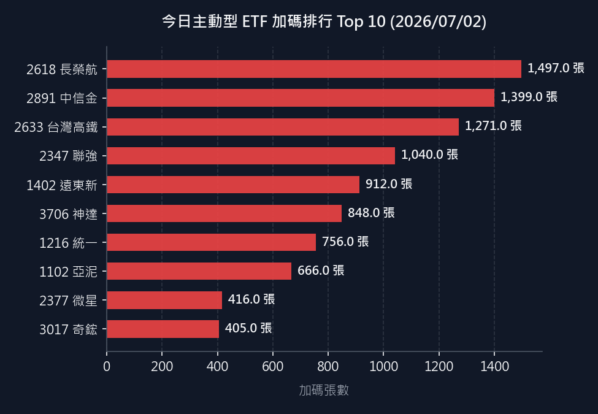
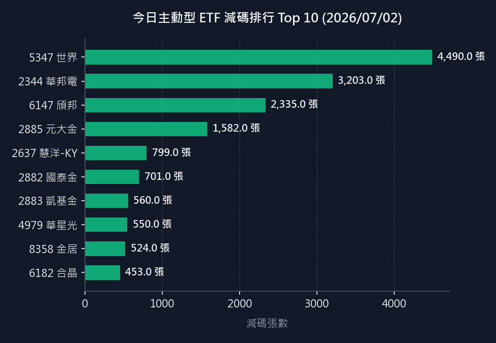

# 主動型 ETF 持股變動

資料來源：`主動型ETF持股明細.xlsx` 最近兩個日期分頁。

比較區間：`20260701` → `20260702`

## 今日加減碼視覺化排行

| 今日加碼 Top 10 | 今日減碼 Top 10 |
| :---: | :---: |
|  |  |

| ETF | 新增 | 刪除 | 比例變動 |
| :-- | --: | --: | --: |
| 00400A | 0 | 0 | 46 |
| 00401A | 4 | 1 | 49 |
| 00402A | 0 | 0 | 49 |
| 00403A | 0 | 1 | 39 |
| 00404A | 20 | 21 | 32 |
| 00405A | 0 | 0 | 38 |
| 00407A | 0 | 0 | 45 |
| 00980A | 0 | 0 | 39 |
| 00980D | 39 | 41 | 3 |
| 00981A | 0 | 1 | 32 |
| 00982A | 0 | 0 | 42 |
| 00983A | 0 | 0 | 36 |
| 00983D | 27 | 0 | 13 |
| 00984A | 9 | 9 | 46 |
| 00985A | 0 | 0 | 42 |
| 00986A | 0 | 0 | 32 |
| 00987A | 1 | 0 | 27 |
| 00988A | 0 | 1 | 41 |
| 00989A | 0 | 1 | 54 |
| 00990A | 0 | 1 | 47 |
| 00991A | 0 | 0 | 27 |
| 00992A | 0 | 1 | 30 |
| 00993A | 0 | 0 | 39 |
| 00994A | 0 | 0 | 32 |
| 00995A | 1 | 0 | 47 |
| 00996A | 0 | 0 | 34 |
| 00997A | 0 | 0 | 48 |
| 00998A | 0 | 0 | 37 |
| 00999A | 6 | 0 | 47 |

## 00400A

### 新增持股

- 無

### 刪除持股

- 無

### 投資比例變動

- 1303 南亞：1.29% → 1.27%（-0.02）
- 1519 華城：0.68% → 0.69%（+0.01）
- 2059 川湖：2.29% → 2.34%（+0.05）
- 2303 聯電：1.92% → 1.87%（-0.05）
- 2308 台達電：3.51% → 3.35%（-0.16）
- 2313 華通：0.46% → 0.47%（+0.01）
- 2327 國巨*：3.93% → 3.61%（-0.32）
- 2330 台積電：7.41% → 7.23%（-0.18）
- 2344 華邦電：1.35% → 1.30%（-0.05）
- 2345 智邦：2.32% → 2.38%（+0.06）
- 2357 華碩：1.21% → 1.22%（+0.01）
- 2360 致茂：3.52% → 3.40%（-0.12）
- 2368 金像電：1.79% → 1.80%（+0.01）
- 2382 廣達：0.95% → 0.93%（-0.02）
- 2383 台光電：7.06% → 7.15%（+0.09）
- 2404 漢唐：0.63% → 0.67%（+0.04）
- 2408 南亞科：1.97% → 1.89%（-0.08）
- 2454 聯發科：7.32% → 7.29%（-0.03）
- 2481 強茂：0.42% → 0.46%（+0.04）
- 2881 富邦金：0.38% → 0.37%（-0.01）
- 2885 元大金：1.02% → 1.01%（-0.01）
- 3017 奇鋐：4.00% → 4.16%（+0.16）
- 3036 文曄：1.21% → 1.24%（+0.03）
- 3037 欣興：4.28% → 4.00%（-0.28）
- 3044 健鼎：2.01% → 1.99%（-0.02）
- 3090 日電貿：0.73% → 0.71%（-0.02）
- 3131 弘塑：0.60% → 0.62%（+0.02）
- 3231 緯創：0.86% → 0.85%（-0.01）
- 3293 鈊象：0.42% → 0.41%（-0.01）
- 3374 精材：0.32% → 0.33%（+0.01）
- 3443 創意：0.48% → 0.51%（+0.03）
- 3653 健策：0.82% → 0.83%（+0.01）
- 3711 日月光投控：1.64% → 1.68%（+0.04）
- 4749 新應材：0.31% → 0.32%（+0.01）
- 5274 信驊：2.24% → 2.30%（+0.06）
- 5347 世界：2.12% → 2.04%（-0.08）
- 6147 頎邦：1.04% → 0.99%（-0.05）
- 6187 萬潤：0.62% → 0.58%（-0.04）
- 6223 旺矽：4.40% → 4.73%（+0.33）
- 6285 啟碁：0.70% → 0.72%（+0.02）
- 6488 環球晶：3.62% → 3.92%（+0.30）
- 6510 精測：0.88% → 0.86%（-0.02）
- 6515 穎崴：0.41% → 0.43%（+0.02）
- 6669 緯穎：2.71% → 2.77%（+0.06）
- 8046 南電：0.30% → 0.29%（-0.01）
- 8210 勤誠：1.24% → 1.25%（+0.01）

## 00401A

### 新增持股

- 1216 統一（0.31%，139 張）
- 2912 統一超（0.30%，44 張）
- 3231 緯創（0.34%，71 張）
- 4938 和碩（0.32%，128 張）

### 刪除持股

- 5871 中租-KY（0.54%，156 張）

### 投資比例變動

- 2303 聯電：1.37% → 1.34%（-0.03）
- 2308 台達電：4.42% → 4.36%（-0.06）
- 2313 華通：1.17% → 1.21%（+0.04）
- 2317 鴻海：0.70% → 0.67%（-0.03）
- 2330 台積電：9.10% → 8.92%（-0.18）
- 2344 華邦電：1.45% → 1.40%（-0.05）
- 2345 智邦：1.68% → 2.47%（+0.79）
- 2357 華碩：1.20% → 1.22%（+0.02）
- 2360 致茂：2.18% → 2.11%（-0.07）
- 2379 瑞昱：2.26% → 2.21%（-0.05）
- 2382 廣達：2.36% → 2.33%（-0.03）
- 2383 台光電：2.34% → 2.38%（+0.04）
- 2412 中華電：0.98% → 0.97%（-0.01）
- 2449 京元電子：1.85% → 1.93%（+0.08）
- 2454 聯發科：6.77% → 6.75%（-0.02）
- 2455 全新：0.48% → 0.47%（-0.01）
- 2603 長榮：1.00% → 0.99%（-0.01）
- 2881 富邦金：1.48% → 1.44%（-0.04）
- 2882 國泰金：1.49% → 1.10%（-0.39）
- 2883 凱基金：1.93% → 1.90%（-0.03）
- 2884 玉山金：1.74% → 1.77%（+0.03）
- 2885 元大金：1.81% → 1.80%（-0.01）
- 2887 台新新光金：1.05% → 1.03%（-0.02）
- 2891 中信金：2.38% → 2.35%（-0.03）
- 3037 欣興：0.78% → 0.73%（-0.05）
- 3044 健鼎：1.49% → 1.48%（-0.01）
- 3131 弘塑：0.66% → 0.70%（+0.04）
- 3167 大量：0.88% → 0.83%（-0.05）
- 3653 健策：1.12% → 1.14%（+0.02）
- 3711 日月光投控：2.64% → 2.72%（+0.08）
- 4904 遠傳：0.91% → 0.90%（-0.01）
- 4958 臻鼎-KY：2.68% → 2.65%（-0.03）
- 4991 環宇-KY：0.73% → 0.71%（-0.02）
- 5274 信驊：1.03% → 1.06%（+0.03）
- 5347 世界：1.21% → 1.17%（-0.04）
- 5904 寶雅：0.61% → 0.63%（+0.02）
- 6187 萬潤：0.70% → 0.66%（-0.04）
- 6223 旺矽：2.61% → 2.82%（+0.21）
- 6285 啟碁：2.03% → 2.10%（+0.07）
- 6415 矽力*-KY：0.90% → 0.95%（+0.05）
- 6510 精測：0.99% → 0.97%（-0.02）
- 6515 穎崴：0.80% → 0.83%（+0.03）
- 6531 愛普*：1.53% → 1.44%（-0.09）
- 6669 緯穎：2.42% → 2.49%（+0.07）
- 6944 兆聯實業：0.52% → 0.54%（+0.02）
- 7769 鴻勁：2.92% → 2.94%（+0.02）
- 7828 創新服務：1.46% → 1.60%（+0.14）
- 8021 尖點：0.37% → 0.36%（-0.01）
- 8464 億豐：1.21% → 1.29%（+0.08）

## 00402A

### 新增持股

- 無

### 刪除持股

- 無

### 投資比例變動

- AAPL.US Apple：6.15% → 6.53%（+0.38）
- ADI.US Analog Devices：1.86% → 1.90%（+0.04）
- AMD.US AMD：5.41% → 5.25%（-0.16）
- AMZN.US Amazon：4.43% → 4.53%（+0.10）
- ANET.US Arista Networks：0.98% → 1.01%（+0.03）
- ARM.US Arm：0.99% → 0.98%（-0.01）
- ASML.US ASML Holding：1.58% → 1.53%（-0.05）
- AVGO.US Broadcom：2.37% → 2.42%（+0.05）
- AXON.US Axon Enterprise：0.91% → 1.01%（+0.10）
- BABA.US Alibaba Group：0.61% → 0.65%（+0.04）
- BKNG.US Booking Holdings：0.69% → 0.73%（+0.04）
- CDNS.US Cadence Design Systems：1.68% → 1.76%（+0.08）
- CIEN.US Ciena：1.45% → 1.42%（-0.03）
- CLS.US Celestica：0.84% → 0.87%（+0.03）
- COHR.US Coherent：1.70% → 1.66%（-0.04）
- CRWD.US CrowdStrike Holdings：1.24% → 1.31%（+0.07）
- DASH.US DoorDash：0.80% → 0.85%（+0.05）
- FSLY.US Fastly：0.23% → 0.24%（+0.01）
- GOOG.US Alphabet - Class C Capital Stock：3.30% → 3.49%（+0.19）
- GOOGL.US Alphabet - Class A Common Stock：3.54% → 3.48%（-0.06）
- INTC.US Intel：1.52% → 1.44%（-0.08）
- KLAC.US KLA：2.63% → 2.41%（-0.22）
- LITE.US Lumentum：1.66% → 1.61%（-0.05）
- LRCX.US Lam Research：4.20% → 3.95%（-0.25）
- MCHP.US Microchip Technology：1.57% → 1.60%（+0.03）
- MDB.US MongoDB：0.55% → 0.61%（+0.06）
- META.US Meta：2.54% → 2.88%（+0.34）
- MRVL.US Marvell：1.77% → 1.68%（-0.09）
- MSFT.US Microsoft：3.11% → 3.17%（+0.06）
- MU.US Micron：7.43% → 6.92%（-0.51）
- NFLX.US Netflix：1.28% → 1.16%（-0.12）
- NOW.US ServiceNow：0.47% → 0.52%（+0.05）
- NVDA.US NVIDIA：7.80% → 7.67%（-0.13）
- NXPI.US NXP Semiconductors：1.11% → 1.15%（+0.04）
- ON.US ON Semiconductor：0.27% → 0.28%（+0.01）
- PANW.US Palo Alto：3.12% → 3.36%（+0.24）
- PLTR.US Palantir Technologies：1.16% → 1.30%（+0.14）
- SHOP.US Shopify：0.67% → 0.63%（-0.04）
- SNOW.US Snowflake：0.64% → 0.68%（+0.04）
- SPOT.US Spotify：0.43% → 0.34%（-0.09）
- STX.US Seagate：1.39% → 1.37%（-0.02）
- TER.US Teradyne：0.77% → 0.71%（-0.06）
- TSM.US TSMC(ADR)：1.59% → 1.54%（-0.05）
- TTWO.US Take-Two：0.67% → 0.70%（+0.03）
- TXN.US Texas Instruments：2.68% → 2.80%（+0.12）
- UBER.US Uber：0.56% → 0.59%（+0.03）
- V.US Visa：1.34% → 1.43%（+0.09）
- WDC.US Western Digital：2.95% → 2.88%（-0.07）
- ZS.US Zscaler：0.21% → 0.23%（+0.02）

## 00403A

### 新增持股

- 無

### 刪除持股

- 4979 華星光（0.03%，100 張）

### 投資比例變動

- 1303 南亞：0.79% → 0.86%（+0.07）
- 2049 上銀：0.20% → 0.21%（+0.01）
- 2303 聯電：7.27% → 7.17%（-0.10）
- 2317 鴻海：0.46% → 0.44%（-0.02）
- 2327 國巨*：6.57% → 6.13%（-0.44）
- 2330 台積電：18.39% → 18.23%（-0.16）
- 2337 旺宏：0.82% → 0.84%（+0.02）
- 2344 華邦電：4.23% → 4.11%（-0.12）
- 2345 智邦：3.20% → 3.34%（+0.14）
- 2360 致茂：0.59% → 0.57%（-0.02）
- 2368 金像電：1.92% → 1.96%（+0.04）
- 2383 台光電：3.62% → 3.73%（+0.11）
- 2454 聯發科：3.57% → 3.60%（+0.03）
- 3017 奇鋐：5.18% → 5.46%（+0.28）
- 3037 欣興：5.34% → 5.07%（-0.27）
- 3189 景碩：1.64% → 1.54%（-0.10）
- 3443 創意：1.30% → 1.48%（+0.18）
- 3529 力旺：0.66% → 0.67%（+0.01）
- 3533 嘉澤：1.54% → 1.56%（+0.02）
- 3653 健策：1.62% → 1.67%（+0.05）
- 3665 貿聯-KY：0.19% → 0.20%（+0.01）
- 3711 日月光投控：2.14% → 2.35%（+0.21）
- 4966 譜瑞-KY：0.32% → 0.34%（+0.02）
- 5274 信驊：0.44% → 0.46%（+0.02）
- 5347 世界：0.65% → 0.11%（-0.54）
- 6147 頎邦：0.44% → 0.12%（-0.32）
- 6196 帆宣：0.33% → 0.34%（+0.01）
- 6223 旺矽：3.61% → 4.19%（+0.58）
- 6274 台燿：1.65% → 1.66%（+0.01）
- 6415 矽力*-KY：0.30% → 0.32%（+0.02）
- 6442 光聖：0.27% → 0.28%（+0.01）
- 6488 環球晶：1.27% → 1.39%（+0.12）
- 6515 穎崴：1.02% → 1.08%（+0.06）
- 6669 緯穎：2.28% → 2.37%（+0.09）
- 6805 富世達：0.56% → 0.55%（-0.01）
- 7769 鴻勁：1.11% → 1.13%（+0.02）
- 8046 南電：0.54% → 0.53%（-0.01）
- 8358 金居：0.66% → 0.64%（-0.02）
- 8996 高力：1.39% → 1.28%（-0.11）

## 00404A

### 新增持股

- 1303 南亞（0.43%，75 張）
- 2317 鴻海（0.39%，56 張）
- 2356 英業達（0.22%，111 張）
- 2618 長榮航（1.90%，1497 張）
- 2890 永豐金（0.23%，200 張）
- 2891 中信金（2.78%，1374 張）
- 3014 聯陽（1.76%，375 張）
- 3044 健鼎（1.80%，123 張）
- 3217 優群（1.26%，243 張）
- 3227 原相（1.83%，270 張）
- 3293 鈊象（1.66%，72 張）
- 3592 瑞鼎（1.27%，160 張）
- 5904 寶雅（1.82%，90 張）
- 6121 新普（1.12%，93 張）
- 6139 亞翔（0.24%，9 張）
- 6257 矽格（1.83%，252 張）
- 6903 巨漢（0.30%，25 張）
- 8081 致新（1.84%，201 張）
- 臺指選擇權07/26 48600 買權（-0.23%，N/A 張）
- 臺指選擇權08/26 50400 買權（-0.03%，N/A 張）

### 刪除持股

- 2351 順德（0.18%，28 張）
- 2357 華碩（2.15%，103 張）
- 2368 金像電（0.82%，23 張）
- 2404 漢唐（0.59%，15 張）
- 2451 創見（0.25%，32 張）
- 2603 長榮（2.02%，366 張）
- 2606 裕民（1.10%，612 張）
- 2637 慧洋-KY（1.73%，799 張）
- 3010 華立（0.27%，71 張）
- 3131 弘塑（0.22%，2 張）
- 3529 力旺（0.61%，7 張）
- 4766 南寶（1.11%，108 張）
- 4961 天鈺（0.61%，123 張）
- 5289 宜鼎（0.48%，10 張）
- 6414 樺漢（1.80%，163 張）
- 6640 均華（0.06%，2 張）
- 6669 緯穎（0.55%，4 張）
- 6679 鈺太（0.57%，73 張）
- 8028 昇陽半導體（0.28%，30 張）
- 臺指選擇權07/26 49200 買權（-0.14%，N/A 張）
- 臺指選擇權08/26 51000 買權（-0.02%，N/A 張）

### 投資比例變動

- 2303 聯電：1.28% → 2.54%（+1.26）
- 2308 台達電：4.89% → 3.76%（-1.13）
- 2327 國巨*：0.48% → 0.67%（+0.19）
- 2330 台積電：22.89% → 22.08%（-0.81）
- 2345 智邦：0.97% → 1.03%（+0.06）
- 2347 聯強：0.90% → 1.76%（+0.86）
- 2360 致茂：1.61% → 1.02%（-0.59）
- 2382 廣達：2.69% → 2.62%（-0.07）
- 2383 台光電：1.29% → 1.96%（+0.67）
- 2454 聯發科：7.04% → 6.59%（-0.45）
- 2883 凱基金：2.56% → 1.96%（-0.60）
- 2885 元大金：3.58% → 2.39%（-1.19）
- 3017 奇鋐：1.36% → 0.79%（-0.57）
- 3034 聯詠：0.46% → 2.06%（+1.60）
- 3037 欣興：0.38% → 0.45%（+0.07）
- 3189 景碩：0.53% → 0.31%（-0.22）
- 3260 威剛：1.31% → 0.39%（-0.92）
- 3264 欣銓：1.01% → 1.10%（+0.09）
- 3265 台星科：1.75% → 1.27%（-0.48）
- 3443 創意：1.16% → 0.15%（-1.01）
- 3711 日月光投控：3.76% → 3.72%（-0.04）
- 5274 信驊：2.17% → 2.26%（+0.09）
- 5347 世界：0.75% → 0.72%（-0.03）
- 5434 崇越：1.95% → 1.83%（-0.12）
- 6196 帆宣：1.82% → 0.37%（-1.45）
- 6223 旺矽：1.18% → 0.94%（-0.24）
- 6239 力成：0.16% → 0.15%（-0.01）
- 6515 穎崴：0.60% → 0.40%（-0.20）
- 6531 愛普*：0.42% → 0.19%（-0.23）
- 8016 矽創：1.82% → 0.11%（-1.71）
- 8299 群聯：1.28% → 1.17%（-0.11）
- 臺股期貨07/26：11.74% → 16.70%（+4.96）

## 00405A

### 新增持股

- 無

### 刪除持股

- 無

### 投資比例變動

- 2059 川湖：1.29% → 1.32%（+0.03）
- 2308 台達電：1.15% → 1.14%（-0.01）
- 2327 國巨*：5.79% → 5.36%（-0.43）
- 2330 台積電：2.40% → 2.36%（-0.04）
- 2337 旺宏：1.61% → 1.63%（+0.02）
- 2344 華邦電：4.48% → 4.33%（-0.15）
- 2345 智邦：4.99% → 5.16%（+0.17）
- 2360 致茂：1.32% → 1.28%（-0.04）
- 2368 金像電：1.48% → 1.50%（+0.02）
- 2383 台光電：2.44% → 2.49%（+0.05）
- 2449 京元電子：1.05% → 1.10%（+0.05）
- 2454 聯發科：7.46% → 7.48%（+0.02）
- 3017 奇鋐：6.64% → 6.94%（+0.30）
- 3037 欣興：5.37% → 5.05%（-0.32）
- 3081 聯亞：1.14% → 1.12%（-0.02）
- 3105 穩懋：2.03% → 1.99%（-0.04）
- 3131 弘塑：4.83% → 5.11%（+0.28）
- 3163 波若威：0.23% → 0.24%（+0.01）
- 3443 創意：3.72% → 3.92%（+0.20）
- 3653 健策：2.45% → 2.50%（+0.05）
- 3711 日月光投控：0.91% → 0.94%（+0.03）
- 4576 大銀微系統：0.06% → 0.07%（+0.01）
- 4749 新應材：0.34% → 0.35%（+0.01）
- 4979 華星光：0.86% → 0.04%（-0.82）
- 5274 信驊：2.26% → 2.34%（+0.08）
- 6187 萬潤：2.36% → 2.22%（-0.14）
- 6223 旺矽：6.11% → 6.62%（+0.51）
- 6291 沛亨：0.47% → 0.46%（-0.01）
- 6442 光聖：0.44% → 0.46%（+0.02）
- 6510 精測：1.78% → 1.75%（-0.03）
- 6515 穎崴：0.82% → 0.86%（+0.04）
- 7734 印能科技：1.96% → 2.07%（+0.11）
- 7769 鴻勁：2.79% → 2.81%（+0.02）
- 8028 昇陽半導體：1.11% → 1.14%（+0.03）
- 8046 南電：2.68% → 2.61%（-0.07）
- 8210 勤誠：2.43% → 2.45%（+0.02）
- 8299 群聯：1.59% → 1.57%（-0.02）
- 8996 高力：1.76% → 1.60%（-0.16）

## 00407A

### 新增持股

- 無

### 刪除持股

- 無

### 投資比例變動

- 1303 南亞：0.57% → 0.62%（+0.05）
- 1590 亞德客-KY：1.80% → 1.77%（-0.03）
- 2059 川湖：1.95% → 1.94%（-0.01）
- 2303 聯電：1.95% → 1.94%（-0.01）
- 2308 台達電：4.23% → 4.07%（-0.16）
- 2327 國巨*：3.21% → 2.89%（-0.32）
- 2330 台積電：9.41% → 8.99%（-0.42）
- 2344 華邦電：1.93% → 1.81%（-0.12）
- 2345 智邦：3.64% → 3.65%（+0.01）
- 2360 致茂：2.06% → 1.94%（-0.12）
- 2368 金像電：2.34% → 2.30%（-0.04）
- 2376 技嘉：0.72% → 0.71%（-0.01）
- 2379 瑞昱：0.87% → 0.83%（-0.04）
- 2395 研華：1.60% → 1.57%（-0.03）
- 2408 南亞科：1.69% → 1.59%（-0.10）
- 2412 中華電：1.73% → 1.67%（-0.06）
- 2454 聯發科：7.34% → 7.15%（-0.19）
- 3017 奇鋐：3.10% → 3.15%（+0.05）
- 3034 聯詠：0.72% → 0.71%（-0.01）
- 3037 欣興：2.70% → 2.46%（-0.24）
- 3293 鈊象：0.62% → 0.59%（-0.03）
- 3443 創意：2.13% → 2.17%（+0.04）
- 3491 昇達科：0.42% → 0.40%（-0.02）
- 3529 力旺：1.92% → 1.88%（-0.04）
- 3533 嘉澤：0.91% → 0.89%（-0.02）
- 3665 貿聯-KY：2.05% → 2.02%（-0.03）
- 3711 日月光投控：2.11% → 2.12%（+0.01）
- 4904 遠傳：0.31% → 0.30%（-0.01）
- 4958 臻鼎-KY：2.31% → 2.23%（-0.08）
- 5274 信驊：2.05% → 2.08%（+0.03）
- 5289 宜鼎：0.19% → 0.20%（+0.01）
- 5434 崇越：0.20% → 0.19%（-0.01）
- 5536 聖暉*：2.11% → 2.19%（+0.08）
- 6223 旺矽：2.58% → 2.72%（+0.14）
- 6274 台燿：2.23% → 2.17%（-0.06）
- 6415 矽力*-KY：0.46% → 0.50%（+0.04）
- 6446 藥華藥：2.37% → 2.36%（-0.01）
- 6515 穎崴：1.84% → 1.88%（+0.04）
- 6526 達發：0.37% → 0.36%（-0.01）
- 6531 愛普*：1.61% → 1.57%（-0.04）
- 6805 富世達：1.81% → 1.73%（-0.08）
- 8046 南電：2.34% → 2.22%（-0.12）
- 8210 勤誠：1.92% → 1.89%（-0.03）
- 8299 群聯：0.16% → 0.15%（-0.01）
- 8996 高力：0.56% → 0.51%（-0.05）

## 00980A

### 新增持股

- 無

### 刪除持股

- 無

### 投資比例變動

- 2059 川湖：4.75% → 4.90%（+0.15）
- 2308 台達電：5.33% → 5.29%（-0.04）
- 2317 鴻海：1.80% → 1.74%（-0.06）
- 2327 國巨*：2.22% → 2.06%（-0.16）
- 2330 台積電：8.96% → 8.83%（-0.13）
- 2344 華邦電：1.24% → 1.20%（-0.04）
- 2345 智邦：1.95% → 2.02%（+0.07）
- 2360 致茂：1.83% → 1.79%（-0.04）
- 2368 金像電：2.70% → 2.74%（+0.04）
- 2383 台光電：4.18% → 4.28%（+0.10）
- 2408 南亞科：1.35% → 1.31%（-0.04）
- 2454 聯發科：6.58% → 6.61%（+0.03）
- 2884 玉山金：0.72% → 0.74%（+0.02）
- 3017 奇鋐：1.94% → 2.03%（+0.09）
- 3036 文曄：1.27% → 1.31%（+0.04）
- 3037 欣興：3.30% → 3.11%（-0.19）
- 3081 聯亞：2.41% → 2.37%（-0.04）
- 3189 景碩：0.70% → 0.65%（-0.05）
- 3264 欣銓：0.23% → 0.24%（+0.01）
- 3293 鈊象：0.57% → 0.56%（-0.01）
- 3443 創意：1.99% → 2.11%（+0.12）
- 3529 力旺：1.00% → 1.01%（+0.01）
- 3653 健策：2.90% → 2.97%（+0.07）
- 3665 貿聯-KY：0.60% → 0.61%（+0.01）
- 3711 日月光投控：1.59% → 1.64%（+0.05）
- 4958 臻鼎-KY：1.48% → 1.47%（-0.01）
- 5274 信驊：1.26% → 1.30%（+0.04）
- 5904 寶雅：1.20% → 1.23%（+0.03）
- 6223 旺矽：2.87% → 3.12%（+0.25）
- 6442 光聖：0.33% → 0.34%（+0.01）
- 6515 穎崴：2.76% → 2.89%（+0.13）
- 6669 緯穎：1.11% → 1.15%（+0.04）
- 6805 富世達：0.52% → 0.51%（-0.01）
- 6831 邁科：0.42% → 0.45%（+0.03）
- 7769 鴻勁：3.65% → 3.70%（+0.05）
- 8046 南電：1.45% → 1.42%（-0.03）
- 8210 勤誠：0.82% → 0.83%（+0.01）
- 8299 群聯：1.01% → 1.00%（-0.01）
- 8996 高力：1.94% → 1.77%（-0.17）

## 00980D

### 新增持股

- APOLLO DEBT SOLUTIONS BD 6.900000 % 13APR2029（0.55%，N/A 張）
- ATHENE HOLDING LTD 6.625000 % 19MAY2055（0.58%，N/A 張）
- BANCO SANTANDER SA (REG) 6.607% 07NOV2028（0.66%，N/A 張）
- BAT CAPITAL CORP (REG) 7.079% 02AUG2043（0.32%，N/A 張）
- BLACKSTONE PRIVATE CRE 7.300000 % 27NOV2028（0.46%，N/A 張）
- BLUE OWL CREDIT INCOME (REG) 6.65% 15MAR2031（0.52%，N/A 張）
- BRIGHTHOUSE FINANCIAL IN (REG) 4.7% 22JUN2047（0.49%，N/A 張）
- CANTOR FITZGERALD LP SER REGS 7.200000 % 12DEC2028（0.32%，N/A 張）
- CHS/COMMUNITY HEALTH SYS SER REGS 10.875000 % 15JAN2032（0.43%，N/A 張）
- CONCENTRIX CORP (REG) 6.6% 02AUG2028（0.50%，N/A 張）
- COTY/HFC PRESTIGE/INT US SER REGS (REG S) 6.625% 15JUL2030（0.56%，N/A 張）
- DOW CHEMICAL CO/THE 5.950000 % 15MAR2055（0.50%，N/A 張）
- DOW CHEMICAL CO/THE 6.9% 15MAY2053（0.60%，N/A 張）
- DOW CHEMICAL CO/THE 9.4% 15MAY2039（0.54%，N/A 張）
- FORD MOTOR CREDIT CO LLC 6.500000 % 07FEB2035（0.32%，N/A 張）
- GEORGIA-PACIFIC LLC (REG) 7.75% 15NOV2029（0.57%，N/A 張）
- GLENCORE FINANCE CANADA SER REGS 6.900000 % 15-NOV-2037（0.40%，N/A 張）
- HAH GROUP HOLDING CO LLC SER REGS (REG S) 9.75% 01OCT2031（0.29%，N/A 張）
- HESS CORP (REG) 7.3% 15AUG2031（0.53%，N/A 張）
- HISCOX LTD VAR 11JUN2036（0.44%，N/A 張）
- HUTCHISON WHAM INT 03/33 SER REGS (REG S) 7.45% 24NOV2033（0.41%，N/A 張）
- ICAHN ENTERPRISES/FIN (REG) 9.75% 15JAN2029（0.32%，N/A 張）
- ICAHN ENTERPRISES/FIN SER REGS 10.000000 % 15NOV2029（0.31%，N/A 張）
- JETBLUE AIRWAYS/LOYALTY SER REGS (REG S) 9.875% 20SEP2031（0.31%，N/A 張）
- JH NORTH AMERICA HOLDING SER REGS 6.125000 % 31JUL2032（0.40%，N/A 張）
- LADDER CAP FIN LLLP/CORP SER REGS 7.000000 % 15JUL2031（0.33%，N/A 張）
- LINCOLN NATIONAL CORP (REG) 7.000000 % 15JUN2040（0.47%，N/A 張）
- MOBIUS MERGER SUB SER REGS 9.000000 % 01JUN2030（0.24%，N/A 張）
- NAVIENT CORP (REG) 11.5% 15MAR2031（0.31%，N/A 張）
- NEPTUNE BIDCO US INC SER REGS (REG S) 9.29% 15APR2029（0.34%，N/A 張）
- OVINTIV INC 7.375% 01NOV2031（0.33%，N/A 張）
- SALESFORCE INC (REG) 6.55% 15MAR2056（0.54%，N/A 張）
- SANTANDER HOLDINGS USA VAR 09MAR2029（0.47%，N/A 張）
- SANTANDER HOLDINGS USA VAR 09NOV2031（0.59%，N/A 張）
- SATURN OIL & GAS INC SER REGS 9.625000 % 15JUN2029（0.61%，N/A 張）
- SES GLOBAL AMERICAS HLDG SER REGS (REG) 5.300000 % 25MAR2044（0.34%，N/A 張）
- TELEFONICA EUROPE BV (REG) 8.25% 15SEP2030（0.41%，N/A 張）
- UNISYS CORP SER REGS 10.625000 % 15JAN2031（0.58%，N/A 張）
- VIACOMCBS INC (REG) 4.95% 19MAY2050（0.51%，N/A 張）

### 刪除持股

- AHOLD FINANCE USA LLC 6.88% 01MAY2029（0.48%，N/A 張）
- ALLY FINANCIAL INC (REG) 8% 01NOV2031（0.53%，N/A 張）
- ALLY FINANCIAL INC (REG) VAR 13JUN2029（0.55%，N/A 張）
- APOLLO DEBT SOLUTIONS BD 6.700000 % 29JUL2031（0.34%，N/A 張）
- ARSENAL AIC PARENT LLC SER REGS 11.5 % 01-OCT-2031（0.32%，N/A 張）
- BANCO SANTANDER SA 6.921% 08AUG2033（0.34%，N/A 張）
- BLUE OWL CREDIT INCOME 7.750000 % 15JAN2029（0.53%，N/A 張）
- BPCE SA SER REGS VAR 14JAN2046（0.41%，N/A 張）
- BPCE SA SER REGS VAR 19OCT2034（0.43%，N/A 張）
- BRITISH TELECOMMUNICATIO (BR) 9.625% 15DEC2030（0.57%，N/A 張）
- CALDERYS FINANCING LLC SER REGS (REG S) 11.25% 01JUN2028（0.33%，N/A 張）
- CONCENTRIX CORP (REG) 6.85% 02AUG2033（0.65%，N/A 張）
- COX COMMUNICATIONS INC SER REGS 5.800000 % 15DEC2053（0.41%，N/A 張）
- DELL INT LLC / EMC CORP (REG) 8.35% 15JUL2046（0.57%，N/A 張）
- DOW CHEMICAL CO/THE (REG) 5.55% 30NOV2048（0.56%，N/A 張）
- EDISON INTERNATIONAL (REG) 6.95% 15NOV2029（0.58%，N/A 張）
- ENEL FINANCE INTL NV SER REGS (REG S) 7.5% 14OCT2032（0.35%，N/A 張）
- FORD MOTOR CREDIT CO LLC (REG) 7.35% 04NOV2027（0.33%，N/A 張）
- FREEDOM MORTGAGE CORP SER REGS (REG S) 12.25% 01OCT2030（0.47%，N/A 張）
- GENERAL MOTORS CO (REG) 6.75% 01APR2046（0.57%，N/A 張）
- GLOBAL AUTO HO/AAG FH UK SER REGS (REG S) 11.5% 15AUG2029（0.36%，N/A 張）
- GLOBAL AUTO HO/AAG FH UK SER REGS (REG S) 8.75% 15JAN2032（0.41%，N/A 張）
- HA SUSTAINABLE INF CAP (REG) 6.375% 01JUL2034（0.35%，N/A 張）
- HPS CORPORATE LENDING FU 6.750000 % 30JAN2029（0.53%，N/A 張）
- HSBC HOLDINGS PLC VAR 03NOV2028（0.33%，N/A 張）
- LPL HOLDINGS INC (REG) 6.75% 17NOV2028（0.56%，N/A 張）
- META PLATFORMS INC 5.750000 % 15-NOV-2065（0.46%，N/A 張）
- OCCIDENTAL PETROLEUM COR 8.875% 15JUL2030（0.53%，N/A 張）
- ONEOK INC 6.625% 01SEP2053（0.59%，N/A 張）
- ORACLE CORP 5.55% 06FEB2053（0.26%，N/A 張）
- PEPSICO INC (REG) 7.000000 % 01MAR2029（0.31%，N/A 張）
- PLANET FINANCIAL GROUP SER REGS 10.500000 % 15DEC2029（0.32%，N/A 張）
- RIO TINTO FIN USA LTD (REG) 7.125% 15JUL2028（0.56%，N/A 張）
- SABRE GLBL INC SER REGS (REG) 10.750000 % 15NOV2029（0.13%，N/A 張）
- SANTOS FINANCE LTD SER REGS (REG S) 6.875% 19SEP2033（0.29%，N/A 張）
- SPRINT CAPITAL CORP (REG) 6.875% 15NOV2028（0.31%，N/A 張）
- SPRINT CAPITAL CORP (REG) 8.75% 15MAR2032（0.41%，N/A 張）
- STAPLES INC SER REGS (REG S) 10.75% 01SEP2029（0.44%，N/A 張）
- SYMETRA LIFE INSURANCE SER REGS 6.550000 % 01OCT2055（0.32%，N/A 張）
- TRANSCANADA PIPELINES LTD 7.625PCT 15/01/2039（0.54%，N/A 張）
- VIACOM INC (REG) 5.85% 01SEP2043（0.58%，N/A 張）

### 投資比例變動

- ENBRIDGE ENERGY PARTNERS (REG) 7.375% 15OCT2045：0.53% → 0.52%（-0.01）
- GETTY IMAGES INC SER REGS 11.250000 % 21FEB2030：0.52% → 0.48%（-0.04）
- TIME WARNER CABLE LLC (REG) 6.75% 15JUN2039：0.31% → 0.32%（+0.01）

## 00981A

### 新增持股

- 無

### 刪除持股

- 8358 金居（0.10%，490 張）

### 投資比例變動

- 2303 聯電：4.94% → 4.86%（-0.08）
- 2308 台達電：3.77% → 3.75%（-0.02）
- 2327 國巨*：9.66% → 8.98%（-0.68）
- 2330 台積電：10.11% → 10.00%（-0.11）
- 2345 智邦：5.69% → 5.91%（+0.22）
- 2368 金像電：3.42% → 3.48%（+0.06）
- 2383 台光電：8.38% → 8.60%（+0.22）
- 2449 京元電子：0.43% → 0.45%（+0.02）
- 2454 聯發科：7.37% → 7.42%（+0.05）
- 3017 奇鋐：4.59% → 4.82%（+0.23）
- 3037 欣興：5.34% → 5.05%（-0.29）
- 3264 欣銓：0.12% → 0.13%（+0.01）
- 3533 嘉澤：0.30% → 0.21%（-0.09）
- 3653 健策：2.60% → 2.67%（+0.07）
- 3665 貿聯-KY：3.28% → 3.34%（+0.06）
- 3711 日月光投控：3.02% → 3.14%（+0.12）
- 5274 信驊：2.19% → 2.28%（+0.09）
- 5439 高技：0.38% → 0.42%（+0.04）
- 6147 頎邦：0.46% → 0.45%（-0.01）
- 6187 萬潤：0.48% → 0.45%（-0.03）
- 6191 精成科：0.14% → 0.15%（+0.01）
- 6223 旺矽：5.38% → 5.86%（+0.48）
- 6271 同欣電：0.29% → 0.27%（-0.02）
- 6274 台燿：2.94% → 2.96%（+0.02）
- 6278 台表科：0.30% → 0.32%（+0.02）
- 6488 環球晶：0.13% → 0.02%（-0.11）
- 6510 精測：0.71% → 0.50%（-0.21）
- 6515 穎崴：0.76% → 0.80%（+0.04）
- 6669 緯穎：4.11% → 4.26%（+0.15）
- 6805 富世達：1.04% → 1.03%（-0.01）
- 8046 南電：3.55% → 3.47%（-0.08）
- 8210 勤誠：0.99% → 1.01%（+0.02）

## 00982A

### 新增持股

- 無

### 刪除持股

- 無

### 投資比例變動

- 1785 光洋科：1.44% → 1.51%（+0.07）
- 2059 川湖：2.59% → 2.63%（+0.04）
- 2303 聯電：2.80% → 2.70%（-0.10）
- 2316 楠梓電：1.36% → 1.32%（-0.04）
- 2327 國巨*：1.79% → 1.63%（-0.16）
- 2330 台積電：9.10% → 8.85%（-0.25）
- 2345 智邦：3.92% → 3.99%（+0.07）
- 2351 順德：0.34% → 0.35%（+0.01）
- 2360 致茂：3.45% → 3.32%（-0.13）
- 2368 金像電：0.88% → 0.87%（-0.01）
- 2376 技嘉：0.66% → 0.65%（-0.01）
- 2377 微星：1.52% → 1.47%（-0.05）
- 2383 台光電：3.35% → 3.37%（+0.02）
- 2454 聯發科：6.90% → 6.80%（-0.10）
- 2472 立隆電：1.85% → 1.83%（-0.02）
- 2885 元大金：0.26% → 0.25%（-0.01）
- 3008 大立光：1.60% → 1.56%（-0.04）
- 3017 奇鋐：1.97% → 2.04%（+0.07）
- 3036 文曄：0.89% → 0.90%（+0.01）
- 3105 穩懋：3.19% → 3.11%（-0.08）
- 3264 欣銓：1.98% → 2.10%（+0.12）
- 3491 昇達科：2.25% → 2.23%（-0.02）
- 3583 辛耘：1.86% → 1.83%（-0.03）
- 3702 大聯大：1.09% → 1.05%（-0.04）
- 3711 日月光投控：1.30% → 1.32%（+0.02）
- 4958 臻鼎-KY：3.50% → 3.44%（-0.06）
- 5274 信驊：0.28% → 0.29%（+0.01）
- 5536 聖暉*：9.24% → 9.70%（+0.46）
- 6139 亞翔：5.16% → 5.26%（+0.10）
- 6147 頎邦：0.93% → 0.89%（-0.04）
- 6187 萬潤：0.18% → 0.17%（-0.01）
- 6223 旺矽：3.79% → 4.07%（+0.28）
- 6257 矽格：2.11% → 2.12%（+0.01）
- 6274 台燿：1.37% → 1.35%（-0.02）
- 6278 台表科：0.83% → 0.86%（+0.03）
- 6488 環球晶：2.33% → 2.50%（+0.17）
- 6531 愛普*：1.23% → 1.22%（-0.01）
- 6669 緯穎：2.73% → 2.82%（+0.09）
- 6805 富世達：0.38% → 0.37%（-0.01）
- 7769 鴻勁：1.18% → 1.17%（-0.01）
- 8016 矽創：1.38% → 1.31%（-0.07）
- 8996 高力：1.08% → 0.97%（-0.11）

## 00983A

### 新增持股

- 無

### 刪除持股

- 無

### 投資比例變動

- AMD.US AMD：6.77% → 6.44%（-0.33）
- AMZN.US Amazon：2.63% → 2.73%（+0.10）
- CBRS.US Cerebras：0.51% → 0.52%（+0.01）
- CCJ.US Cameco：0.30% → 0.11%（-0.19）
- CERS.US Cerus：0.13% → 0.14%（+0.01）
- COIN.US Coinbase：1.93% → 1.12%（-0.81）
- CRCL.US Circle：1.25% → 1.01%（-0.24）
- CRSP.US CRISPR Therapeutics：3.42% → 3.57%（+0.15）
- CRWV.US CoreWeave：2.48% → 2.19%（-0.29）
- DE.US Deere：0.92% → 0.93%（+0.01）
- GOOG.US Alphabet - Class C Capital Stock：1.09% → 1.13%（+0.04）
- GOOGL.US Alphabet - Class A Common Stock：1.46% → 1.51%（+0.05）
- HOOD.US Robinhood Markets：6.09% → 6.75%（+0.66）
- ILMN.US Illumina：2.85% → 3.05%（+0.20）
- JOBY.US Joby Aviation：0.21% → 0.11%（-0.10）
- LLY.US Eli Lilly：1.62% → 1.65%（+0.03）
- META.US Meta：0.20% → 0.23%（+0.03）
- NTLA.US Intellia Therapeutics：3.18% → 3.32%（+0.14）
- NTRA.US Natera：3.41% → 3.55%（+0.14）
- NVDA.US NVIDIA：2.56% → 1.92%（-0.64）
- PLTR.US Palantir Technologies：0.48% → 0.52%（+0.04）
- RBLX.US Roblox：1.31% → 1.43%（+0.12）
- ROKU.US Roku：0.28% → 0.29%（+0.01）
- SHOP.US Shopify：3.41% → 3.72%（+0.31）
- SNOW.US Snowflake：0.33% → 0.35%（+0.02）
- SOFI.US SoFi Technologies：0.58% → 0.61%（+0.03）
- SPCX.US SpaceX：4.32% → 4.07%（-0.25）
- TEM.US Tempus：4.84% → 5.27%（+0.43）
- TER.US Teradyne：3.37% → 3.05%（-0.32）
- TSLA.US Tesla：9.06% → 9.13%（+0.07）
- TSM.US TSMC(ADR)：4.24% → 3.94%（-0.30）
- TWST.US Twist Bioscience：5.13% → 5.22%（+0.09）
- TXG.US 10x Genomics：5.17% → 5.39%（+0.22）
- VCYT.US Veracyte：2.73% → 2.85%（+0.12）
- WGS.US GeneDx：1.06% → 1.13%（+0.07）
- XYZ.US Block：2.13% → 2.22%（+0.09）

## 00983D

### 新增持股

- ABXCN 7 1/2 09/15/38（0.54%，N/A 張）
- AET 6 5/8 06/15/36（0.73%，N/A 張）
- ALLY 8 11/01/31（0.51%，N/A 張）
- AWK 6.593 10/15/37（0.72%，N/A 張）
- ED 6 3/4 04/01/38（0.62%，N/A 張）
- ET 6 1/2 02/01/42（0.16%，N/A 張）
- FFHCN 6.35 03/22/54（0.72%，N/A 張）
- GE 6 3/4 03/15/32（0.57%，N/A 張）
- GM 6.6 04/01/36（0.39%，N/A 張）
- GS 6 1/4 02/01/41（0.16%，N/A 張）
- HTZ 12 5/8 07/15/29（0.63%，N/A 張）
- MCD 6.3 03/01/38（0.73%，N/A 張）
- MPC 6 1/2 03/01/41（0.16%，N/A 張）
- NTRCN 7 1/8 05/23/36（0.55%，N/A 張）
- NVDA 5.55 06/15/46（0.61%，N/A 張）
- OKE 6 5/8 09/01/53（0.70%，N/A 張）
- ORCL 6 1/2 04/15/38（0.40%，N/A 張）
- RIOLN 7 1/4 03/15/31（0.51%，N/A 張）
- S 8 3/4 03/15/32（0.65%，N/A 張）
- SABHLD 10 3/4 11/15/29（0.59%，N/A 張）
- SJM 6 1/2 11/15/43（0.20%，N/A 張）
- SJM 6 1/2 11/15/53（0.20%，N/A 張）
- SPCX 6.6 07/15/46（0.59%，N/A 張）
- SYY 6.6 04/01/50（0.20%，N/A 張）
- T 6.55 02/15/39（0.20%，N/A 張）
- TIME WARNER CABLE INC 6.750 06/15/39（0.48%，N/A 張）
- TIME WARNER CABLE INC 7.300 07/01/38（0.50%，N/A 張）

### 刪除持股

- 無

### 投資比例變動

- AMCX 10 1/2 07/15/32：1.57% → 1.58%（+0.01）
- BACR 7.437 11/02/33：1.94% → 1.95%（+0.01）
- BATSLN 7.081 08/02/53：1.35% → 1.34%（-0.01）
- BRKHEC 6 3/4 07/01/37：0.82% → 0.81%（-0.01）
- CRWV 9 02/01/31：1.33% → 1.32%（-0.01）
- CYH 10 7/8 01/15/32：1.48% → 1.49%（+0.01）
- DOW 6.9 05/15/53：0.74% → 0.73%（-0.01）
- MINAU 9 1/4 10/01/28：0.86% → 0.87%（+0.01）
- ORCL 6.9 11/09/52：1.41% → 1.40%（-0.01）
- PCG 6 3/4 01/15/53：1.16% → 1.15%（-0.01）
- PCG 6.7 04/01/53：0.96% → 0.95%（-0.01）
- RAKUTN 11 1/4 02/15/27：1.77% → 1.78%（+0.01）
- VENLNG 9 1/2 02/01/29：1.38% → 1.39%（+0.01）

## 00984A

### 新增持股

- 2049 上銀（0.55%，132 張）
- 2347 聯強（0.79%，715 張）
- 2377 微星（0.75%，441 張）
- 3008 大立光（0.61%，12 張）
- 6121 新普（0.58%，118 張）
- 6213 聯茂（0.86%，203 張）
- 7769 鴻勁（0.58%，7 張）
- 8016 矽創（0.72%，186 張）
- 8046 南電（0.84%，62 張）

### 刪除持股

- 2472 立隆電（1.15%，221 張）
- 2882 國泰金（0.66%，570 張）
- 2885 元大金（0.71%，885 張）
- 3036 文曄（0.60%，231 張）
- 3167 大量（1.03%，100 張）
- 5274 信驊（1.26%，6 張）
- 6173 信昌電（1.40%，336 張）
- 6187 萬潤（1.11%，85 張）
- 6451 訊芯-KY（0.57%，89 張）

### 投資比例變動

- 1102 亞泥：0.88% → 1.17%（+0.29）
- 1216 統一：1.06% → 1.58%（+0.52）
- 1402 遠東新：0.60% → 0.89%（+0.29）
- 2303 聯電：2.83% → 2.68%（-0.15）
- 2327 國巨*：1.70% → 1.43%（-0.27）
- 2330 台積電：2.85% → 2.80%（-0.05）
- 2357 華碩：2.25% → 2.31%（+0.06）
- 2360 致茂：0.75% → 0.71%（-0.04）
- 2382 廣達：2.61% → 2.28%（-0.33）
- 2383 台光電：1.69% → 1.68%（-0.01）
- 2404 漢唐：1.59% → 1.91%（+0.32）
- 2412 中華電：2.26% → 2.36%（+0.10）
- 2454 聯發科：1.43% → 1.50%（+0.07）
- 2467 志聖：0.66% → 0.57%（-0.09）
- 2474 可成：0.70% → 0.74%（+0.04）
- 2618 長榮航：1.45% → 1.40%（-0.05）
- 2633 台灣高鐵：0.78% → 1.15%（+0.37）
- 2881 富邦金：2.52% → 2.38%（-0.14）
- 2891 中信金：2.40% → 2.33%（-0.07）
- 2912 統一超：1.02% → 1.26%（+0.24）
- 3026 禾伸堂：1.36% → 1.32%（-0.04）
- 3034 聯詠：2.00% → 1.95%（-0.05）
- 3037 欣興：1.28% → 1.57%（+0.29）
- 3045 台灣大：1.98% → 1.93%（-0.05）
- 3090 日電貿：1.34% → 1.28%（-0.06）
- 3189 景碩：1.48% → 1.34%（-0.14）
- 3293 鈊象：1.23% → 1.22%（-0.01）
- 3443 創意：0.62% → 0.70%（+0.08）
- 3481 群創：0.70% → 0.68%（-0.02）
- 3702 大聯大：0.88% → 0.90%（+0.02）
- 3711 日月光投控：0.83% → 1.10%（+0.27）
- 4904 遠傳：0.99% → 1.46%（+0.47）
- 4958 臻鼎-KY：0.84% → 1.63%（+0.79）
- 4991 環宇-KY：0.92% → 0.87%（-0.05）
- 5434 崇越：0.75% → 0.98%（+0.23）
- 5871 中租-KY：1.00% → 1.03%（+0.03）
- 5876 上海商銀：1.03% → 1.09%（+0.06）
- 6182 合晶：1.36% → 0.66%（-0.70）
- 6196 帆宣：0.91% → 1.10%（+0.19）
- 6223 旺矽：1.15% → 1.21%（+0.06）
- 6274 台燿：2.00% → 2.05%（+0.05）
- 6446 藥華藥：0.88% → 1.69%（+0.81）
- 6531 愛普*：0.87% → 1.08%（+0.21）
- 6831 邁科：0.57% → 0.59%（+0.02）
- 8021 尖點：1.65% → 1.69%（+0.04）
- 8358 金居：1.28% → 1.29%（+0.01）

## 00985A

### 新增持股

- 無

### 刪除持股

- 無

### 投資比例變動

- 1216 統一：1.17% → 1.19%（+0.02）
- 1802 台玻：1.51% → 1.27%（-0.24）
- 2049 上銀：1.48% → 1.24%（-0.24）
- 2059 川湖：2.66% → 2.76%（+0.10）
- 2303 聯電：1.91% → 1.89%（-0.02）
- 2308 台達電：1.53% → 1.27%（-0.26）
- 2317 鴻海：0.15% → 0.14%（-0.01）
- 2330 台積電：25.77% → 25.58%（-0.19）
- 2344 華邦電：0.99% → 1.14%（+0.15）
- 2345 智邦：2.30% → 2.40%（+0.10）
- 2360 致茂：2.43% → 2.39%（-0.04）
- 2368 金像電：1.82% → 1.86%（+0.04）
- 2376 技嘉：2.92% → 2.95%（+0.03）
- 2383 台光電：2.13% → 2.20%（+0.07）
- 2395 研華：1.52% → 2.07%（+0.55）
- 2408 南亞科：0.99% → 1.14%（+0.15）
- 2412 中華電：1.90% → 1.91%（+0.01）
- 2454 聯發科：1.87% → 1.89%（+0.02）
- 2881 富邦金：0.99% → 0.84%（-0.15）
- 3008 大立光：2.03% → 2.16%（+0.13）
- 3017 奇鋐：2.04% → 1.76%（-0.28）
- 3036 文曄：1.79% → 2.29%（+0.50）
- 3081 聯亞：1.67% → 1.65%（-0.02）
- 3105 穩懋：0.85% → 0.73%（-0.12）
- 3131 弘塑：2.25% → 2.40%（+0.15）
- 3293 鈊象：1.50% → 1.48%（-0.02）
- 3529 力旺：1.05% → 0.87%（-0.18）
- 3533 嘉澤：0.20% → 0.21%（+0.01）
- 3653 健策：1.76% → 1.51%（-0.25）
- 3661 世芯-KY：3.05% → 3.38%（+0.33）
- 3711 日月光投控：1.29% → 1.12%（-0.17）
- 6147 頎邦：0.67% → 0.98%（+0.31）
- 6187 萬潤：0.41% → 1.09%（+0.68）
- 6223 旺矽：1.82% → 1.51%（-0.31）
- 6415 矽力*-KY：0.66% → 0.70%（+0.04）
- 6442 光聖：2.01% → 2.51%（+0.50）
- 6488 環球晶：0.67% → 0.57%（-0.10）
- 6669 緯穎：1.13% → 0.94%（-0.19）
- 7769 鴻勁：1.31% → 1.06%（-0.25）
- 8046 南電：1.93% → 1.60%（-0.33）
- 8299 群聯：1.28% → 1.29%（+0.01）
- 8996 高力：1.12% → 0.94%（-0.18）

## 00986A

### 新增持股

- 無

### 刪除持股

- 無

### 投資比例變動

- 2330 台積電：8.06% → 8.56%（+0.50）
- AMD.US AMD：2.53% → 2.41%（-0.12）
- AMZN.US Amazon：3.23% → 3.35%（+0.12）
- AVGO.US Broadcom：5.49% → 5.48%（-0.01）
- CAT.US Caterpillar：2.84% → 2.70%（-0.14）
- COHR.US Coherent：2.49% → 2.37%（-0.12）
- CRWD.US CrowdStrike Holdings：3.47% → 3.59%（+0.12）
- ETN.US Eaton：2.06% → 2.04%（-0.02）
- GEV.US GE Vernova：3.70% → 3.65%（-0.05）
- GOOGL.US Alphabet - Class A Common Stock：6.93% → 7.15%（+0.22）
- GS.US Goldman Sachs：2.70% → 2.78%（+0.08）
- HWM.US Howmet Aerospace：2.21% → 2.25%（+0.04）
- IBIDEN(4062.JP)：2.49% → 2.75%（+0.26）
- LITE.US Lumentum：3.33% → 3.17%（-0.16）
- LLY.US Eli Lilly：2.32% → 2.36%（+0.04）
- LRCX.US Lam Research：4.24% → 3.91%（-0.33）
- MRVL.US Marvell：1.59% → 1.48%（-0.11）
- MSFT.US Microsoft：1.81% → 1.90%（+0.09）
- MU.US Micron：7.27% → 6.64%（-0.63）
- MUFG(8306.JP)：1.15% → 1.19%（+0.04）
- Murata Mfg.(6981.JP)：1.70% → 1.81%（+0.11）
- NET.US Cloudflare：1.43% → 1.46%（+0.03）
- NVDA.US NVIDIA：5.53% → 5.57%（+0.04）
- SNDK.US Sandisk：2.42% → 2.21%（-0.21）
- SNOW.US Snowflake：1.05% → 1.10%（+0.05）
- Siemens Energy AG：2.02% → 2.03%（+0.01）
- TSLA.US Tesla：1.12% → 1.16%（+0.04）
- WMT.US Walmart：0.99% → 0.97%（-0.02）
- Yaskawa Electric(6506.JP)：1.57% → 1.67%（+0.10）
- 嘉能可公司：1.32% → 1.34%（+0.02）
- 施奈德電機公司：1.50% → 1.48%（-0.02）
- 英飛凌科技股份有限公司：3.61% → 3.52%（-0.09）

## 00987A

### 新增持股

- 3131 弘塑（1.58%，12 張）

### 刪除持股

- 無

### 投資比例變動

- 2327 國巨*：4.22% → 3.95%（-0.27）
- 2330 台積電：7.52% → 7.48%（-0.04）
- 2345 智邦：2.48% → 2.60%（+0.12）
- 2383 台光電：6.28% → 6.49%（+0.21）
- 2408 南亞科：2.26% → 2.21%（-0.05）
- 2454 聯發科：2.46% → 2.49%（+0.03）
- 2455 全新：2.45% → 2.41%（-0.04）
- 3017 奇鋐：7.51% → 7.95%（+0.44）
- 3037 欣興：6.59% → 6.28%（-0.31）
- 3081 聯亞：2.44% → 2.42%（-0.02）
- 3167 大量：1.01% → 0.97%（-0.04）
- 3363 上詮：1.66% → 1.65%（-0.01）
- 3443 創意：4.04% → 4.32%（+0.28）
- 3653 健策：2.04% → 2.11%（+0.07）
- 3665 貿聯-KY：3.35% → 3.44%（+0.09）
- 4764 雙鍵：1.18% → 1.21%（+0.03）
- 5274 信驊：1.72% → 1.80%（+0.08）
- 6139 亞翔：1.98% → 2.06%（+0.08）
- 6187 萬潤：2.84% → 0.92%（-1.92）
- 6223 旺矽：6.03% → 6.61%（+0.58）
- 6274 台燿：4.23% → 4.28%（+0.05）
- 6515 穎崴：1.48% → 1.57%（+0.09）
- 6683 雍智科技：3.16% → 3.11%（-0.05）
- 6805 富世達：4.31% → 4.28%（-0.03）
- 8155 博智：3.29% → 3.39%（+0.10）
- 8358 金居：2.23% → 2.19%（-0.04）
- 8996 高力：4.51% → 4.15%（-0.36）

## 00988A

### 新增持股

- 無

### 刪除持股

- BE SEMICONDUCTOR INDUSTRIES（0.37%，23 張）

### 投資比例變動

- 2303 聯電：1.54% → 1.61%（+0.07）
- 2308 台達電：0.53% → 0.55%（+0.02）
- 2327 國巨*：2.85% → 2.90%（+0.05）
- 2330 台積電：1.69% → 1.79%（+0.10）
- 2383 台光電：2.78% → 2.90%（+0.12）
- 2454 聯發科：2.95% → 3.07%（+0.12）
- 3017 奇鋐：0.85% → 0.90%（+0.05）
- 3037 欣興：3.68% → 3.64%（-0.04）
- 3711 日月光投控：1.17% → 1.23%（+0.06）
- 6223 旺矽：1.09% → 1.22%（+0.13）
- 6274 台燿：0.98% → 1.01%（+0.03）
- AMAT.US Applied Materials：3.34% → 3.07%（-0.27）
- AMD.US AMD：5.63% → 5.34%（-0.29）
- ARM.US Arm：1.41% → 0.94%（-0.47）
- BE.US Bloom Energy：3.46% → 3.37%（-0.09）
- CHAOZHOU THREE-CIRCLE GROU-A：0.49% → 0.51%（+0.02）
- COHR.US Coherent：1.08% → 1.03%（-0.05）
- CRDO.US Credo：1.62% → 1.58%（-0.04）
- Furuya Metal(7826.JP)：0.68% → 0.37%（-0.31）
- IBIDEN(4062.JP)：2.01% → 2.21%（+0.20）
- INFINEON TECHNOLOGIES AG：2.89% → 2.81%（-0.08）
- Kioxia Holdings(285A.JP)：5.63% → 5.62%（-0.01）
- LITE.US Lumentum：2.65% → 2.52%（-0.13）
- Lasertec Corporation(6920.JP)：1.33% → 1.38%（+0.05）
- MICRONICS(6871.JP)：0.71% → 0.76%（+0.05）
- MRVL.US Marvell：3.41% → 3.17%（-0.24）
- MU.US Micron：6.66% → 6.07%（-0.59）
- Meiko Electronics(6787.JP)：0.95% → 0.46%（-0.49）
- Mitsui Kinzoku(5706.JP)：1.70% → 1.75%（+0.05）
- Murata Mfg.(6981.JP)：3.72% → 3.95%（+0.23）
- Nippon Chemi-Con(6997.JP)：2.15% → 2.30%（+0.15）
- PERIC SPECIAL GASES CO LTD-A：0.62% → 0.68%（+0.06）
- SNDK.US Sandisk：5.09% → 4.63%（-0.46）
- STM.US STMicroelectronics：1.77% → 1.70%（-0.07）
- SUMCO(3436.JP)：1.08% → 1.29%（+0.21）
- Samsung Elec Mech(009150.KS)：5.65% → 5.73%（+0.08）
- TAIYO YUDEN(6976.JP)：4.02% → 5.05%（+1.03）
- Tokyo Electron(8035.JP)：2.08% → 2.16%（+0.08）
- Union Tool(6278.JP)：0.62% → 0.64%（+0.02）
- VSH.US Vishay：1.87% → 1.82%（-0.05）
- WDC.US Western Digital：2.86% → 2.73%（-0.13）

## 00989A

### 新增持股

- 無

### 刪除持股

- SYM.US Symbotic（0.33%，3.346 張）

### 投資比例變動

- ADI.US Analog Devices：1.01% → 1.03%（+0.02）
- ALGM.US Allegro MicroSystems：0.91% → 0.86%（-0.05）
- AMAT.US Applied Materials：0.73% → 0.69%（-0.04）
- AMD.US AMD：3.60% → 3.52%（-0.08）
- AMKR.US Amkor：1.18% → 1.15%（-0.03）
- AMZN.US Amazon：0.59% → 0.63%（+0.04）
- APP.US Applovin：1.10% → 1.26%（+0.16）
- ASML.US ASML Holding：3.10% → 3.02%（-0.08）
- AVGO.US Broadcom：3.43% → 3.52%（+0.09）
- CDNS.US Cadence Design Systems：0.96% → 1.01%（+0.05）
- CIEN.US Ciena：2.05% → 2.03%（-0.02）
- CRM.US Salesforce：0.70% → 0.77%（+0.07）
- CRWD.US CrowdStrike Holdings：2.51% → 2.67%（+0.16）
- DOCN.US DigitalOcean：1.56% → 1.50%（-0.06）
- ENTG.US Entegris：1.35% → 1.30%（-0.05）
- FIGR.US Figure：0.65% → 0.73%（+0.08）
- FN.US Fabrinet：0.70% → 0.71%（+0.01）
- GFS.US GlobalFoundries：1.58% → 1.55%（-0.03）
- GLW.US Corning：2.53% → 2.30%（-0.23）
- GOOG.US Alphabet - Class C Capital Stock：3.96% → 4.21%（+0.25）
- HOOD.US Robinhood Markets：2.16% → 2.45%（+0.29）
- INTC.US Intel：5.23% → 4.99%（-0.24）
- LITE.US Lumentum：1.48% → 1.45%（-0.03）
- LMND.US Lemonade：0.92% → 1.03%（+0.11）
- LRCX.US Lam Research：4.96% → 4.71%（-0.25）
- META.US Meta：1.51% → 1.72%（+0.21）
- MSFT.US Microsoft：0.92% → 0.99%（+0.07）
- MTSI.US MACOM Technology Solutions：1.22% → 1.18%（-0.04）
- MU.US Micron：2.65% → 2.48%（-0.17）
- MXL.US MaxLinear：0.61% → 0.56%（-0.05）
- NET.US Cloudflare：1.99% → 2.10%（+0.11）
- NU.US Nu：0.78% → 0.82%（+0.04）
- NVDA.US NVIDIA：3.38% → 3.51%（+0.13）
- ON.US ON Semiconductor：1.61% → 1.69%（+0.08）
- ORCL.US Oracle：1.28% → 1.30%（+0.02）
- PANW.US Palo Alto：3.69% → 3.99%（+0.30）
- PLTR.US Palantir Technologies：0.34% → 0.38%（+0.04）
- RIVN.US Rivian：1.10% → 1.14%（+0.04）
- ROK.US Rockwell Automation：0.89% → 0.91%（+0.02）
- SHOP.US Shopify：1.07% → 1.20%（+0.13）
- SNDK.US Sandisk：3.23% → 3.03%（-0.20）
- SNOW.US Snowflake：2.08% → 2.24%（+0.16）
- SPCX.US SpaceX：0.59% → 0.57%（-0.02）
- TEM.US Tempus：0.86% → 0.96%（+0.10）
- TSLA.US Tesla：3.01% → 3.19%（+0.18）
- TSM.US TSMC(ADR)：1.85% → 1.80%（-0.05）
- TTMI.US TTM Technologies：0.72% → 0.73%（+0.01）
- TTWO.US Take-Two：3.40% → 3.58%（+0.18）
- TWLO.US Twilio：1.83% → 1.95%（+0.12）
- TXN.US Texas Instruments：1.42% → 1.50%（+0.08）
- VICR.US Vicor Corporation：1.40% → 1.35%（-0.05）
- WRBY.US Warby Parker：0.66% → 0.68%（+0.02）
- XYZ.US Block：0.66% → 0.70%（+0.04）
- ZM.US Zoom：1.45% → 1.59%（+0.14）

## 00990A

### 新增持股

- 無

### 刪除持股

- CIEN.US Ciena（0.59%，18.16 張）

### 投資比例變動

- 2303 聯電：1.12% → 1.18%（+0.06）
- 2308 台達電：3.04% → 3.17%（+0.13）
- 2330 台積電：1.83% → 1.95%（+0.12）
- 2383 台光電：1.62% → 1.71%（+0.09）
- 2454 聯發科：2.61% → 2.73%（+0.12）
- 3037 欣興：1.73% → 1.72%（-0.01）
- 3443 創意：0.70% → 0.75%（+0.05）
- 3665 貿聯-KY：0.58% → 0.62%（+0.04）
- 4958 臻鼎-KY：0.62% → 0.60%（-0.02）
- 5347 世界：1.13% → 1.09%（-0.04）
- 6223 旺矽：0.96% → 1.08%（+0.12）
- 6274 台燿：0.94% → 0.97%（+0.03）
- AMAT.US Applied Materials：2.93% → 2.71%（-0.22）
- AMD.US AMD：4.98% → 5.04%（+0.06）
- BE.US Bloom Energy：2.79% → 2.73%（-0.06）
- COHR.US Coherent：1.78% → 1.71%（-0.07）
- DIOD.US Diodes：0.81% → 0.80%（-0.01）
- GLW.US Corning：0.39% → 0.35%（-0.04）
- IBIDEN(4062.JP)：2.30% → 2.55%（+0.25）
- INFINEON TECHNOLOGIES AG：2.51% → 2.46%（-0.05）
- INTC.US Intel：0.92% → 0.86%（-0.06）
- KOKUSAI ELECTRIC(6525.JP)：0.64% → 0.68%（+0.04）
- Kioxia Holdings(285A.JP)：5.62% → 5.64%（+0.02）
- LITE.US Lumentum：3.46% → 3.31%（-0.15）
- LRCX.US Lam Research：2.32% → 2.15%（-0.17）
- Lasertec Corporation(6920.JP)：0.54% → 0.56%（+0.02）
- MKSI.US MKS：1.97% → 1.86%（-0.11）
- MRVL.US Marvell：2.69% → 2.52%（-0.17）
- MU.US Micron：6.38% → 5.85%（-0.53）
- Murata Mfg.(6981.JP)：3.23% → 3.45%（+0.22）
- Nippon Chemi-Con(6997.JP)：1.08% → 1.17%（+0.09）
- ONTO.US Onto Innovation：0.62% → 0.87%（+0.25）
- PENG.US Penguin Solutions：0.84% → 0.78%（-0.06）
- Renesas Electronics(6723.JP)：1.19% → 1.61%（+0.42）
- SCREEN Holdings(7735.JP)：0.62% → 0.70%（+0.08）
- SK hynix(000660.KS)：2.27% → 2.25%（-0.02）
- SNDK.US Sandisk：6.94% → 6.36%（-0.58）
- STM.US STMicroelectronics：1.60% → 1.55%（-0.05）
- SUMCO(3436.JP)：1.19% → 1.42%（+0.23）
- Samsung Elec Mech(009150.KS)：4.77% → 5.14%（+0.37）
- TAIYO YUDEN(6976.JP)：4.39% → 5.05%（+0.66）
- Tokyo Electron(8035.JP)：1.47% → 1.53%（+0.06）
- UCTT.US Ultra Clean Holdings：1.10% → 1.03%（-0.07）
- VECO.US Veeco Instruments Inc.：0.87% → 0.83%（-0.04）
- VICR.US Vicor Corporation：1.10% → 1.04%（-0.06）
- VSH.US Vishay：0.96% → 0.94%（-0.02）
- WDC.US Western Digital：2.70% → 2.59%（-0.11）

## 00991A

### 新增持股

- 無

### 刪除持股

- 無

### 投資比例變動

- 2059 川湖：3.30% → 3.38%（+0.08）
- 2303 聯電：3.29% → 3.20%（-0.09）
- 2327 國巨*：9.75% → 8.97%（-0.78）
- 2330 台積電：11.85% → 11.58%（-0.27）
- 2344 華邦電：2.11% → 1.22%（-0.89）
- 2345 智邦：3.70% → 3.80%（+0.10）
- 2383 台光電：6.54% → 6.64%（+0.10）
- 2404 漢唐：1.18% → 1.24%（+0.06）
- 2408 南亞科：5.27% → 5.06%（-0.21）
- 2454 聯發科：5.43% → 5.41%（-0.02）
- 2492 華新科：2.68% → 2.48%（-0.20）
- 3017 奇鋐：0.03% → 1.89%（+1.86）
- 3037 欣興：5.21% → 5.01%（-0.20）
- 3189 景碩：3.27% → 3.21%（-0.06）
- 3665 貿聯-KY：1.26% → 0.73%（-0.53）
- 3711 日月光投控：2.64% → 2.71%（+0.07）
- 4958 臻鼎-KY：1.26% → 1.24%（-0.02）
- 5274 信驊：2.86% → 2.94%（+0.08）
- 6223 旺矽：4.00% → 4.81%（+0.81）
- 6274 台燿：4.23% → 4.20%（-0.03）
- 6515 穎崴：2.47% → 2.70%（+0.23）
- 6669 緯穎：1.30% → 1.87%（+0.57）
- 7769 鴻勁：2.90% → 2.92%（+0.02）
- 8046 南電：3.43% → 3.48%（+0.05）
- 8210 勤誠：1.24% → 0.74%（-0.50）
- 8299 群聯：4.74% → 4.64%（-0.10）
- 8996 高力：1.34% → 0.92%（-0.42）

## 00992A

### 新增持股

- 無

### 刪除持股

- 2368 金像電（0.90%，325 張）

### 投資比例變動

- 2059 川湖：5.07% → 5.19%（+0.12）
- 2303 聯電：2.67% → 2.61%（-0.06）
- 2327 國巨*：4.03% → 3.72%（-0.31）
- 2330 台積電：7.96% → 7.79%（-0.17）
- 2345 智邦：5.87% → 6.04%（+0.17）
- 2383 台光電：7.04% → 7.16%（+0.12）
- 2454 聯發科：3.98% → 3.97%（-0.01）
- 2455 全新：2.23% → 2.15%（-0.08）
- 3008 大立光：4.11% → 4.06%（-0.05）
- 3017 奇鋐：5.97% → 6.22%（+0.25）
- 3037 欣興：4.93% → 4.62%（-0.31）
- 3189 景碩：0.88% → 0.82%（-0.06）
- 3260 威剛：0.32% → 0.33%（+0.01）
- 3443 創意：3.55% → 3.73%（+0.18）
- 3661 世芯-KY：2.16% → 2.37%（+0.21）
- 3665 貿聯-KY：4.34% → 4.38%（+0.04）
- 3711 日月光投控：2.59% → 2.66%（+0.07）
- 5289 宜鼎：0.35% → 0.38%（+0.03）
- 6139 亞翔：0.52% → 0.53%（+0.01）
- 6182 合晶：1.37% → 1.50%（+0.13）
- 6187 萬潤：2.94% → 2.76%（-0.18）
- 6223 旺矽：4.93% → 5.32%（+0.39）
- 6515 穎崴：2.41% → 2.51%（+0.10）
- 6584 南俊國際：3.52% → 3.73%（+0.21）
- 6805 富世達：0.42% → 0.41%（-0.01）
- 7734 印能科技：0.39% → 0.41%（+0.02）
- 7751 竑騰：1.22% → 1.18%（-0.04）
- 8021 尖點：1.90% → 1.84%（-0.06）
- 8299 群聯：2.28% → 2.24%（-0.04）
- 8996 高力：5.73% → 5.19%（-0.54）

## 00993A

### 新增持股

- 無

### 刪除持股

- 無

### 投資比例變動

- 1303 南亞：0.22% → 0.24%（+0.02）
- 2303 聯電：3.32% → 3.26%（-0.06）
- 2308 台達電：3.86% → 3.84%（-0.02）
- 2327 國巨*：6.98% → 6.49%（-0.49）
- 2330 台積電：10.30% → 10.20%（-0.10）
- 2344 華邦電：3.01% → 2.91%（-0.10）
- 2345 智邦：3.40% → 3.53%（+0.13）
- 2368 金像電：1.86% → 1.89%（+0.03）
- 2383 台光電：5.62% → 5.76%（+0.14）
- 2408 南亞科：2.10% → 2.03%（-0.07）
- 2454 聯發科：6.28% → 6.31%（+0.03）
- 2472 立隆電：0.47% → 0.48%（+0.01）
- 2881 富邦金：1.25% → 1.22%（-0.03）
- 2882 國泰金：0.74% → 0.73%（-0.01）
- 2883 凱基金：0.83% → 0.82%（-0.01）
- 2890 永豐金：0.79% → 0.78%（-0.01）
- 2891 中信金：0.72% → 0.71%（-0.01）
- 3017 奇鋐：3.65% → 3.83%（+0.18）
- 3037 欣興：3.38% → 3.19%（-0.19）
- 3045 台灣大：0.42% → 0.43%（+0.01）
- 3189 景碩：2.21% → 2.07%（-0.14）
- 3264 欣銓：1.54% → 1.66%（+0.12）
- 3443 創意：1.16% → 1.23%（+0.07）
- 3665 貿聯-KY：1.56% → 1.59%（+0.03）
- 3711 日月光投控：1.94% → 2.01%（+0.07）
- 4958 臻鼎-KY：2.91% → 2.90%（-0.01）
- 5274 信驊：2.42% → 2.52%（+0.10）
- 5536 聖暉*：1.79% → 1.91%（+0.12）
- 5904 寶雅：0.42% → 0.43%（+0.01）
- 6147 頎邦：0.39% → 0.37%（-0.02）
- 6196 帆宣：0.43% → 0.45%（+0.02）
- 6223 旺矽：4.55% → 4.95%（+0.40）
- 6274 台燿：3.18% → 3.19%（+0.01）
- 6446 藥華藥：0.43% → 0.44%（+0.01）
- 6515 穎崴：2.59% → 2.72%（+0.13）
- 6669 緯穎：2.04% → 2.12%（+0.08）
- 8021 尖點：0.43% → 0.41%（-0.02）
- 8358 金居：1.97% → 1.92%（-0.05）
- 8996 高力：0.60% → 0.55%（-0.05）

## 00994A

### 新增持股

- 無

### 刪除持股

- 無

### 投資比例變動

- 2059 川湖：2.75% → 2.92%（+0.17）
- 2303 聯電：0.97% → 0.98%（+0.01）
- 2308 台達電：2.27% → 2.31%（+0.04）
- 2327 國巨*：7.83% → 7.45%（-0.38）
- 2330 台積電：15.57% → 15.77%（+0.20）
- 2344 華邦電：2.36% → 2.34%（-0.02）
- 2345 智邦：4.78% → 5.09%（+0.31）
- 2368 金像電：2.19% → 2.28%（+0.09）
- 2383 台光電：6.97% → 7.32%（+0.35）
- 2408 南亞科：1.97% → 1.96%（-0.01）
- 2449 京元電子：0.48% → 0.51%（+0.03）
- 2454 聯發科：6.70% → 6.91%（+0.21）
- 2467 志聖：0.26% → 0.27%（+0.01）
- 3008 大立光：0.62% → 0.64%（+0.02）
- 3017 奇鋐：3.13% → 3.37%（+0.24）
- 3037 欣興：5.85% → 5.67%（-0.18）
- 3044 健鼎：0.36% → 0.37%（+0.01）
- 3131 弘塑：0.40% → 0.43%（+0.03）
- 3231 緯創：0.32% → 0.33%（+0.01）
- 3443 創意：1.73% → 1.88%（+0.15）
- 3665 貿聯-KY：0.65% → 0.68%（+0.03）
- 3711 日月光投控：3.30% → 3.51%（+0.21）
- 4958 臻鼎-KY：2.73% → 2.79%（+0.06）
- 5274 信驊：2.22% → 2.36%（+0.14）
- 6223 旺矽：4.08% → 4.55%（+0.47）
- 6257 矽格：0.53% → 0.56%（+0.03）
- 6274 台燿：4.77% → 4.91%（+0.14）
- 6515 穎崴：1.28% → 1.38%（+0.10）
- 6669 緯穎：0.91% → 0.96%（+0.05）
- 7769 鴻勁：1.13% → 1.17%（+0.04）
- 8046 南電：4.96% → 4.98%（+0.02）
- 8210 勤誠：0.33% → 0.34%（+0.01）

## 00995A

### 新增持股

- 5536 聖暉*（0.08%，3 張）

### 刪除持股

- 無

### 投資比例變動

- 2303 聯電：2.10% → 2.09%（-0.01）
- 2308 台達電：3.65% → 3.49%（-0.16）
- 2313 華通：0.35% → 0.37%（+0.02）
- 2327 國巨*：6.15% → 5.77%（-0.38）
- 2330 台積電：9.27% → 9.25%（-0.02）
- 2344 華邦電：0.88% → 0.86%（-0.02）
- 2345 智邦：5.54% → 5.46%（-0.08）
- 2360 致茂：1.05% → 1.04%（-0.01）
- 2368 金像電：3.04% → 3.01%（-0.03）
- 2383 台光電：7.58% → 7.86%（+0.28）
- 2404 漢唐：0.12% → 0.13%（+0.01）
- 2449 京元電子：0.45% → 0.48%（+0.03）
- 2454 聯發科：6.32% → 5.81%（-0.51）
- 2455 全新：0.64% → 0.63%（-0.01）
- 2467 志聖：0.31% → 0.32%（+0.01）
- 2472 立隆電：1.22% → 1.25%（+0.03）
- 2885 元大金：0.73% → 0.59%（-0.14）
- 3037 欣興：4.29% → 4.10%（-0.19）
- 3044 健鼎：0.70% → 0.71%（+0.01）
- 3189 景碩：0.49% → 0.46%（-0.03）
- 3264 欣銓：0.44% → 0.48%（+0.04）
- 3443 創意：0.45% → 0.48%（+0.03）
- 3653 健策：1.81% → 1.88%（+0.07）
- 3665 貿聯-KY：2.54% → 2.62%（+0.08）
- 3711 日月光投控：2.63% → 2.72%（+0.09）
- 4958 臻鼎-KY：1.15% → 1.16%（+0.01）
- 5274 信驊：2.44% → 2.56%（+0.12）
- 5289 宜鼎：0.62% → 0.68%（+0.06）
- 5439 高技：0.37% → 0.41%（+0.04）
- 6139 亞翔：0.28% → 0.29%（+0.01）
- 6147 頎邦：0.47% → 0.46%（-0.01）
- 6187 萬潤：0.45% → 0.44%（-0.01）
- 6223 旺矽：4.29% → 4.72%（+0.43）
- 6274 台燿：2.04% → 2.07%（+0.03）
- 6438 迅得：0.42% → 0.43%（+0.01）
- 6510 精測：0.82% → 0.47%（-0.35）
- 6515 穎崴：2.06% → 2.19%（+0.13）
- 6531 愛普*：0.46% → 0.47%（+0.01）
- 6669 緯穎：3.85% → 4.04%（+0.19）
- 6805 富世達：0.33% → 0.27%（-0.06）
- 7750 新代：0.44% → 0.46%（+0.02）
- 7769 鴻勁：1.98% → 2.03%（+0.05）
- 8046 南電：3.55% → 3.51%（-0.04）
- 8150 南茂：0.34% → 0.35%（+0.01）
- 8210 勤誠：0.88% → 0.90%（+0.02）
- 8358 金居：1.00% → 0.51%（-0.49）
- 8996 高力：0.89% → 0.82%（-0.07）

## 00996A

### 新增持股

- 無

### 刪除持股

- 無

### 投資比例變動

- 1303 南亞：0.49% → 0.53%（+0.04）
- 2308 台達電：4.04% → 4.00%（-0.04）
- 2327 國巨*：8.37% → 7.75%（-0.62）
- 2330 台積電：8.67% → 8.53%（-0.14）
- 2337 旺宏：0.25% → 0.26%（+0.01）
- 2344 華邦電：3.29% → 3.17%（-0.12）
- 2345 智邦：1.39% → 1.44%（+0.05）
- 2360 致茂：1.10% → 1.07%（-0.03）
- 2383 台光電：5.45% → 5.57%（+0.12）
- 2408 南亞科：2.41% → 2.33%（-0.08）
- 2454 聯發科：6.79% → 6.80%（+0.01）
- 2467 志聖：0.31% → 0.32%（+0.01）
- 2472 立隆電：4.94% → 4.97%（+0.03）
- 3017 奇鋐：0.56% → 0.58%（+0.02）
- 3037 欣興：2.43% → 2.29%（-0.14）
- 3042 晶技：2.64% → 2.90%（+0.26）
- 3131 弘塑：1.78% → 1.89%（+0.11）
- 3189 景碩：0.96% → 0.90%（-0.06）
- 3443 創意：2.53% → 2.68%（+0.15）
- 3653 健策：1.31% → 1.34%（+0.03）
- 3661 世芯-KY：1.55% → 1.70%（+0.15）
- 3711 日月光投控：1.22% → 1.26%（+0.04）
- 4583 台灣精銳：0.35% → 0.36%（+0.01）
- 4958 臻鼎-KY：7.12% → 7.06%（-0.06）
- 5269 祥碩：0.62% → 0.65%（+0.03）
- 6213 聯茂：1.93% → 1.92%（-0.01）
- 6223 旺矽：2.46% → 2.66%（+0.20）
- 6510 精測：2.48% → 2.44%（-0.04）
- 6770 力積電：1.20% → 1.21%（+0.01）
- 6830 汎銓：1.74% → 1.71%（-0.03）
- 6831 邁科：3.09% → 3.27%（+0.18）
- 8021 尖點：0.89% → 0.86%（-0.03）
- 8046 南電：3.97% → 3.87%（-0.10）
- 8210 勤誠：1.68% → 1.70%（+0.02）

## 00997A

### 新增持股

- 無

### 刪除持股

- 無

### 投資比例變動

- 2327 國巨*：2.10% → 2.20%（+0.10）
- 2330 台積電：2.07% → 2.25%（+0.18）
- 2345 智邦：1.71% → 1.91%（+0.20）
- 2383 台光電：1.44% → 1.55%（+0.11）
- 2454 聯發科：0.67% → 0.72%（+0.05）
- AAPL.US Apple：0.69% → 0.74%（+0.05）
- ADBE.US Adobe：0.35% → 0.38%（+0.03）
- ALAB.US Astera Labs：1.17% → 1.10%（-0.07）
- AMAT.US Applied Materials：4.77% → 4.50%（-0.27）
- AMD.US AMD：4.33% → 4.62%（+0.29）
- AMZN.US Amazon：0.47% → 0.50%（+0.03）
- ANET.US Arista Networks：0.57% → 0.59%（+0.02）
- APH.US Amphenol：0.97% → 0.99%（+0.02）
- APP.US Applovin：0.34% → 0.40%（+0.06）
- AVGO.US Broadcom：0.66% → 0.68%（+0.02）
- BE.US Bloom Energy：2.80% → 2.81%（+0.01）
- CDNS.US Cadence Design Systems：0.29% → 0.31%（+0.02）
- CIEN.US Ciena：1.20% → 1.19%（-0.01）
- COHR.US Coherent：1.63% → 1.11%（-0.52）
- CSCO.US Cisco：0.57% → 0.60%（+0.03）
- FTNT.US Fortinet：1.53% → 1.66%（+0.13）
- GE.US GE Aerospace：0.70% → 0.73%（+0.03）
- GLW.US Corning：2.18% → 1.97%（-0.21）
- GOOGL.US Alphabet - Class A Common Stock：2.25% → 2.39%（+0.14）
- HWM.US Howmet Aerospace：0.80% → 0.84%（+0.04）
- IBIDEN(4062.JP)：2.70% → 3.05%（+0.35）
- INTC.US Intel：2.93% → 2.79%（-0.14）
- KLAC.US KLA：1.65% → 1.53%（-0.12）
- Kioxia Holdings(285A.JP)：1.12% → 1.15%（+0.03）
- LITE.US Lumentum：1.29% → 1.26%（-0.03）
- LRCX.US Lam Research：3.34% → 3.17%（-0.17）
- META.US Meta：0.46% → 0.53%（+0.07）
- MRVL.US Marvell：3.63% → 3.47%（-0.16）
- MSFT.US Microsoft：0.37% → 0.40%（+0.03）
- MU.US Micron：6.33% → 5.93%（-0.40）
- Murata Mfg.(6981.JP)：2.11% → 3.46%（+1.35）
- NBIS.US Nebius Group：0.89% → 0.78%（-0.11）
- NOK.US Nokia：0.59% → 0.60%（+0.01）
- NVDA.US NVIDIA：1.69% → 1.75%（+0.06）
- PLTR.US Palantir Technologies：0.68% → 0.76%（+0.08）
- SNDK.US Sandisk：6.92% → 6.49%（-0.43）
- STX.US Seagate：4.57% → 4.05%（-0.52）
- Samsung Elec Mech(009150.KS)：4.06% → 4.27%（+0.21）
- TER.US Teradyne：2.28% → 2.12%（-0.16）
- TTMI.US TTM Technologies：1.29% → 1.30%（+0.01）
- TXN.US Texas Instruments：0.31% → 0.32%（+0.01）
- WDC.US Western Digital：5.04% → 4.95%（-0.09）
- 愛思強股份有限公司：0.82% → 0.85%（+0.03）

## 00998A

### 新增持股

- 無

### 刪除持股

- 無

### 投資比例變動

- BAC.US Bank of America：2.90% → 2.94%（+0.04）
- BPER銀行有限公司：1.16% → 1.14%（-0.02）
- BPM銀行股份公司：1.75% → 1.73%（-0.02）
- C.US Citigroup：3.88% → 3.85%（-0.03）
- GS.US Goldman Sachs：2.34% → 1.87%（-0.47）
- Hokuhoku FG(8377.JP)：2.28% → 2.31%（+0.03）
- IBKR.US Interactive Brokers：1.93% → 2.05%（+0.12）
- JAPAN POST BANK(7182.JP)：2.09% → 2.08%（-0.01）
- JPM.US JPMorgan Chase：1.82% → 1.83%（+0.01）
- Kyushu Financial(7180.JP)：0.82% → 0.83%（+0.01）
- MFG.US Mizuho Financial Group：0.89% → 0.90%（+0.01）
- MRX.US Marex：1.97% → 2.09%（+0.12）
- MS.US Morgan Stanley：3.48% → 2.71%（-0.77）
- Mebuki Financial Group(7167.JP)：2.41% → 2.42%（+0.01）
- NLY.US Annaly Capital Management：4.75% → 4.67%（-0.08）
- Piraeus Bank SA：3.83% → 3.86%（+0.03）
- Resona(8308.JP)：1.20% → 1.19%（-0.01）
- SKSQUARE(402340.KS)：1.31% → 1.34%（+0.03）
- SNEX.US StoneX Group：1.42% → 1.47%（+0.05）
- Samsung Life Insurance(032830.KS)：1.57% → 1.50%（-0.07）
- UBS.US UBS Group：1.97% → 1.96%（-0.01）
- Unipol保險股份公司：4.37% → 4.50%（+0.13）
- 匯豐控股有限公司：3.85% → 3.84%（-0.01）
- 巴克萊集團：2.79% → 2.81%（+0.02）
- 希臘國家銀行：3.02% → 3.05%（+0.03）
- 德國商業銀行：1.49% → 1.47%（-0.02）
- 東方匯理資產管理有限責任公司：3.10% → 3.06%（-0.04）
- 標準人壽公開有限公司：2.24% → 2.22%（-0.02）
- 法國巴黎銀行有限責任公司：2.69% → 3.27%（+0.58）
- 法國興業銀行股份有限公司：2.85% → 3.45%（+0.60）
- 法通保險集團公開有限公司：1.75% → 1.74%（-0.01）
- 渣打集團有限公司：3.00% → 3.02%（+0.02）
- 義大利西恩那銀行股份公司：4.58% → 4.54%（-0.04）
- 聯合聖保羅銀行：2.08% → 2.06%（-0.02）
- 荷蘭保險公司：1.18% → 1.19%（+0.01）
- 荷蘭銀行公眾有限公司：3.92% → 3.86%（-0.06）
- 裕信銀行：2.89% → 2.87%（-0.02）

## 00999A

### 新增持股

- 3706 神達（0.57%，848 張）
- 6138 茂達（0.83%，275 張）
- 6782 視陽（0.44%，308 張）
- 9802 鈺齊-KY（0.67%，1285 張）
- 9945 潤泰新（0.76%，3964 張）
- 9958 世紀鋼（0.53%，626 張）

### 刪除持股

- 無

### 投資比例變動

- 1319 東陽：0.92% → 0.93%（+0.01）
- 2059 川湖：4.48% → 4.65%（+0.17）
- 2204 中華：1.06% → 1.07%（+0.01）
- 2317 鴻海：1.52% → 0.90%（-0.62）
- 2330 台積電：8.65% → 8.59%（-0.06）
- 2345 智邦：1.95% → 2.04%（+0.09）
- 2347 聯強：1.11% → 1.12%（+0.01）
- 2357 華碩：0.96% → 0.98%（+0.02）
- 2360 致茂：1.98% → 1.94%（-0.04）
- 2368 金像電：2.44% → 2.49%（+0.05）
- 2383 台光電：3.91% → 4.03%（+0.12）
- 2393 億光：1.20% → 1.18%（-0.02）
- 2408 南亞科：2.37% → 2.31%（-0.06）
- 2451 創見：0.82% → 0.85%（+0.03）
- 2454 聯發科：4.67% → 4.73%（+0.06）
- 2618 長榮航：2.51% → 2.54%（+0.03）
- 2727 王品：1.14% → 1.16%（+0.02）
- 2884 玉山金：0.75% → 0.77%（+0.02）
- 2892 第一金：0.93% → 0.91%（-0.02）
- 3017 奇鋐：2.22% → 1.46%（-0.76）
- 3045 台灣大：0.94% → 0.95%（+0.01）
- 3081 聯亞：1.65% → 1.64%（-0.01）
- 3090 日電貿：1.39% → 0.81%（-0.58）
- 3227 原相：0.76% → 0.78%（+0.02）
- 3293 鈊象：0.96% → 0.95%（-0.01）
- 3592 瑞鼎：1.24% → 1.22%（-0.02）
- 3653 健策：2.30% → 2.38%（+0.08）
- 3665 貿聯-KY：1.39% → 1.43%（+0.04）
- 3702 大聯大：0.85% → 0.84%（-0.01）
- 3711 日月光投控：1.82% → 1.90%（+0.08）
- 4746 台耀：0.87% → 0.88%（+0.01）
- 4915 致伸：1.35% → 1.37%（+0.02）
- 5274 信驊：1.22% → 1.28%（+0.06）
- 5904 寶雅：0.86% → 0.89%（+0.03）
- 6121 新普：1.26% → 1.30%（+0.04）
- 6223 旺矽：2.01% → 2.19%（+0.18）
- 6274 台燿：1.31% → 1.33%（+0.02）
- 6515 穎崴：2.28% → 2.41%（+0.13）
- 6669 緯穎：1.22% → 1.27%（+0.05）
- 6670 復盛應用：1.12% → 1.14%（+0.02）
- 6805 富世達：1.08% → 1.07%（-0.01）
- 7769 鴻勁：3.08% → 3.14%（+0.06）
- 8210 勤誠：1.03% → 1.06%（+0.03）
- 8299 群聯：1.30% → 1.29%（-0.01）
- 9938 百和：1.11% → 1.10%（-0.01）
- 9939 宏全：0.81% → 0.75%（-0.06）
- 9941 裕融：1.08% → 1.09%（+0.01）
