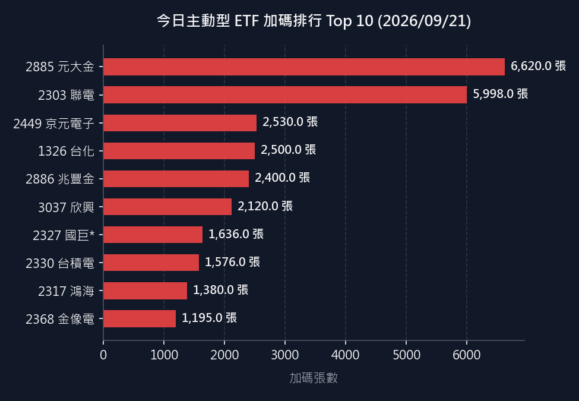
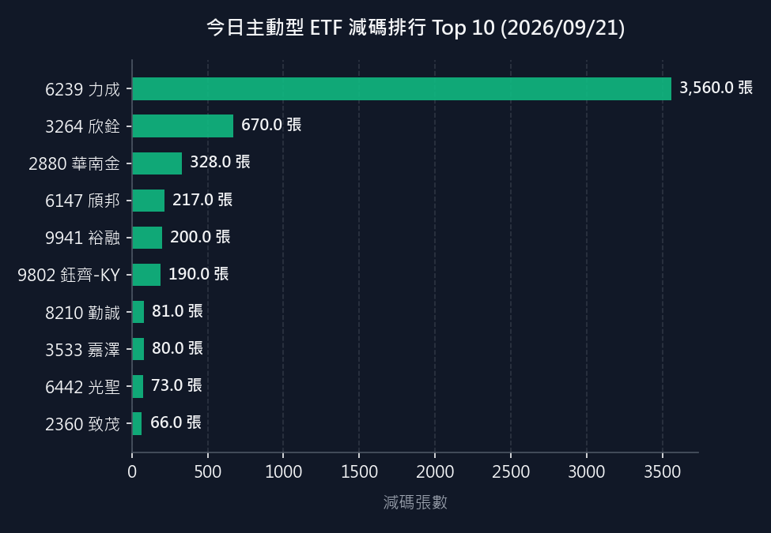

# 主動型 ETF 持股變動

資料來源：`主動型ETF持股明細.xlsx` 最近兩個日期分頁。

比較區間：`20260918` → `20260921`

## 今日加減碼視覺化排行

| 今日加碼 Top 10 | 今日減碼 Top 10 |
| :---: | :---: |
|  |  |

| ETF | 新增 | 刪除 | 比例變動 |
| :-- | --: | --: | --: |
| 00400A | 0 | 0 | 0 |
| 00401A | 0 | 1 | 56 |
| 00402A | 0 | 0 | 0 |
| 00403A | 0 | 0 | 41 |
| 00404A | 0 | 0 | 49 |
| 00405A | 0 | 0 | 0 |
| 00406A | 65 | 0 | 0 |
| 00407A | 0 | 0 | 0 |
| 00408A | 2 | 1 | 45 |
| 00980A | 0 | 0 | 49 |
| 00980D | 0 | 0 | 21 |
| 00981A | 0 | 0 | 29 |
| 00982A | 0 | 0 | 43 |
| 00983A | 0 | 0 | 36 |
| 00983D | 0 | 0 | 20 |
| 00984A | 0 | 0 | 74 |
| 00985A | 0 | 0 | 40 |
| 00986A | 0 | 0 | 0 |
| 00987A | 0 | 0 | 26 |
| 00988A | 0 | 0 | 0 |
| 00989A | 3 | 1 | 58 |
| 00990A | 0 | 0 | 0 |
| 00991A | 0 | 0 | 0 |
| 00992A | 0 | 0 | 0 |
| 00993A | 0 | 0 | 42 |
| 00994A | 0 | 0 | 0 |
| 00995A | 0 | 0 | 40 |
| 00996A | 0 | 0 | 0 |
| 00997A | 0 | 2 | 54 |
| 00998A | 0 | 0 | 0 |
| 00999A | 0 | 0 | 49 |

## 00400A

### 新增持股

- 無

### 刪除持股

- 無

### 投資比例變動

- 無

## 00401A

### 新增持股

- 無

### 刪除持股

- 6944 兆聯實業（0.09%，4.8 張）

### 投資比例變動

- 1216 統一：0.27% → 0.26%（-0.01）
- 1303 南亞：0.94% → 0.93%（-0.01）
- 1477 聚陽：0.85% → 0.83%（-0.02）
- 2059 川湖：1.00% → 0.99%（-0.01）
- 2303 聯電：1.74% → 2.27%（+0.53）
- 2308 台達電：2.31% → 2.32%（+0.01）
- 2313 華通：1.51% → 1.54%（+0.03）
- 2317 鴻海：0.56% → 0.55%（-0.01）
- 2327 國巨*：0.58% → 0.59%（+0.01）
- 2330 台積電：20.02% → 19.84%（-0.18）
- 2345 智邦：1.70% → 1.51%（-0.19）
- 2357 華碩：1.77% → 1.75%（-0.02）
- 2360 致茂：1.61% → 1.42%（-0.19）
- 2379 瑞昱：1.00% → 0.99%（-0.01）
- 2382 廣達：2.20% → 2.14%（-0.06）
- 2383 台光電：0.71% → 0.72%（+0.01）
- 2412 中華電：0.80% → 0.79%（-0.01）
- 2454 聯發科：6.25% → 6.39%（+0.14）
- 2455 全新：2.33% → 2.28%（-0.05）
- 2603 長榮：1.03% → 1.00%（-0.03）
- 2881 富邦金：1.98% → 1.92%（-0.06）
- 2882 國泰金：1.03% → 0.99%（-0.04）
- 2883 凱基金：1.70% → 1.65%（-0.05）
- 2884 玉山金：1.99% → 1.91%（-0.08）
- 2886 兆豐金：1.37% → 1.32%（-0.05）
- 2887 台新新光金：1.12% → 1.10%（-0.02）
- 2890 永豐金：0.30% → 0.29%（-0.01）
- 2891 中信金：1.56% → 1.49%（-0.07）
- 2912 統一超：0.25% → 0.24%（-0.01）
- 3008 大立光：2.16% → 2.26%（+0.10）
- 3037 欣興：1.91% → 1.95%（+0.04）
- 3131 弘塑：0.71% → 0.70%（-0.01）
- 3231 緯創：1.66% → 1.62%（-0.04）
- 3491 昇達科：1.70% → 1.75%（+0.05）
- 3711 日月光投控：2.27% → 2.31%（+0.04）
- 4904 遠傳：0.74% → 0.73%（-0.01）
- 4958 臻鼎-KY：1.23% → 1.19%（-0.04）
- 4991 環宇-KY：0.86% → 0.93%（+0.07）
- 5274 信驊：1.99% → 2.05%（+0.06）
- 5347 世界：1.26% → 1.28%（+0.02）
- 5871 中租-KY：0.14% → 0.13%（-0.01）
- 5904 寶雅*：0.54% → 0.52%（-0.02）
- 6147 頎邦：1.15% → 1.42%（+0.27）
- 6187 萬潤：0.63% → 0.64%（+0.01）
- 6223 旺矽：1.68% → 1.73%（+0.05）
- 6285 啟碁：1.27% → 1.24%（-0.03）
- 6515 穎崴：1.80% → 1.85%（+0.05）
- 6531 愛普*：1.34% → 1.37%（+0.03）
- 6669 緯穎：1.88% → 1.84%（-0.04）
- 7769 鴻勁：1.61% → 1.68%（+0.07）
- 7828 創新服務：1.82% → 1.96%（+0.14）
- 8464 億豐：1.00% → 0.97%（-0.03）
- TAIWAN TAIE C 21OCT26 46400 TWSE：-0.57% → -0.75%（-0.18）
- 台股期貨10/26(FITXN*1.TF)：0.07% → 0.21%（+0.14）
- 臺指選擇權10/26 46000 買權：-0.04% → -0.06%（-0.02）
- 臺指選擇權10/26 46800 買權：-0.03% → -0.04%（-0.01）

## 00402A

### 新增持股

- 無

### 刪除持股

- 無

### 投資比例變動

- 無

## 00403A

### 新增持股

- 無

### 刪除持股

- 無

### 投資比例變動

- 1303 南亞：2.13% → 2.07%（-0.06）
- 1560 中砂：0.10% → 0.11%（+0.01）
- 2059 川湖：0.45% → 0.53%（+0.08）
- 2303 聯電：5.71% → 6.03%（+0.32）
- 2308 台達電：3.09% → 3.40%（+0.31）
- 2317 鴻海：0.53% → 0.51%（-0.02）
- 2327 國巨*：2.82% → 2.85%（+0.03）
- 2330 台積電：15.86% → 15.25%（-0.61）
- 2345 智邦：2.77% → 2.57%（-0.20）
- 2360 致茂：1.39% → 1.17%（-0.22）
- 2383 台光電：5.01% → 5.02%（+0.01）
- 2404 漢唐：0.17% → 0.18%（+0.01）
- 2408 南亞科：0.39% → 0.66%（+0.27）
- 2449 京元電子：0.46% → 0.68%（+0.22）
- 2454 聯發科：6.64% → 7.09%（+0.45）
- 2481 強茂：0.33% → 0.32%（-0.01）
- 2882 國泰金：0.30% → 0.29%（-0.01）
- 3008 大立光：1.12% → 1.15%（+0.03）
- 3017 奇鋐：6.06% → 6.23%（+0.17）
- 3037 欣興：5.31% → 5.53%（+0.22）
- 3189 景碩：2.07% → 2.12%（+0.05）
- 3211 順達：0.48% → 0.50%（+0.02）
- 3264 欣銓：0.11% → 0.00%（-0.11）
- 3443 創意：2.69% → 3.15%（+0.46）
- 3450 聯鈞：0.46% → 0.52%（+0.06）
- 3533 嘉澤：0.12% → 0.04%（-0.08）
- 3583 辛耘：0.37% → 0.36%（-0.01）
- 3653 健策：3.98% → 4.13%（+0.15）
- 3665 貿聯-KY：1.73% → 1.90%（+0.17）
- 3711 日月光投控：0.41% → 0.42%（+0.01）
- 5274 信驊：1.47% → 1.53%（+0.06）
- 6223 旺矽：4.04% → 3.87%（-0.17）
- 6239 力成：0.98% → 0.34%（-0.64）
- 6274 台燿：1.67% → 1.75%（+0.08）
- 6442 光聖：0.35% → 0.34%（-0.01）
- 6488 環球晶：1.70% → 1.67%（-0.03）
- 6669 緯穎：2.83% → 2.74%（-0.09）
- 6805 富世達：1.06% → 1.30%（+0.24）
- 7769 鴻勁：0.53% → 0.50%（-0.03）
- 8046 南電：1.97% → 1.88%（-0.09）
- 8996 高力：1.37% → 1.52%（+0.15）

## 00404A

### 新增持股

- 無

### 刪除持股

- 無

### 投資比例變動

- 1303 南亞：0.76% → 0.75%（-0.01）
- 2027 大成鋼：1.57% → 1.54%（-0.03）
- 2059 川湖：1.15% → 1.14%（-0.01）
- 2303 聯電：2.22% → 2.29%（+0.07）
- 2308 台達電：1.86% → 1.87%（+0.01）
- 2317 鴻海：0.66% → 0.65%（-0.01）
- 2330 台積電：22.72% → 22.45%（-0.27）
- 2345 智邦：0.80% → 0.81%（+0.01）
- 2347 聯強：1.81% → 1.79%（-0.02）
- 2351 順德：0.41% → 0.40%（-0.01）
- 2357 華碩：0.89% → 0.88%（-0.01）
- 2360 致茂：0.69% → 0.73%（+0.04）
- 2379 瑞昱：1.04% → 1.03%（-0.01）
- 2382 廣達：2.15% → 2.09%（-0.06）
- 2383 台光電：2.65% → 2.68%（+0.03）
- 2395 研華：1.24% → 1.22%（-0.02）
- 2436 偉詮電：1.10% → 1.07%（-0.03）
- 2454 聯發科：6.92% → 7.06%（+0.14）
- 2542 興富發：1.84% → 1.83%（-0.01）
- 2637 慧洋-KY：1.17% → 1.14%（-0.03）
- 2883 凱基金：1.21% → 1.17%（-0.04）
- 2885 元大金：2.44% → 2.41%（-0.03）
- 2887 台新新光金：1.46% → 1.43%（-0.03）
- 2890 永豐金：1.50% → 1.44%（-0.06）
- 2892 第一金：1.95% → 1.86%（-0.09）
- 3017 奇鋐：1.27% → 1.33%（+0.06）
- 3034 聯詠：2.05% → 2.04%（-0.01）
- 3260 威剛：1.28% → 1.25%（-0.03）
- 3264 欣銓：0.47% → 0.50%（+0.03）
- 3293 鈊象：0.48% → 0.47%（-0.01）
- 3443 創意：0.76% → 0.82%（+0.06）
- 3680 家登：0.47% → 0.46%（-0.01）
- 3711 日月光投控：3.46% → 3.50%（+0.04）
- 4763 材料*-KY：1.66% → 1.71%（+0.05）
- 5274 信驊：2.76% → 2.84%（+0.08）
- 5434 崇越：1.77% → 1.75%（-0.02）
- 5904 寶雅*：0.47% → 0.46%（-0.01）
- 6196 帆宣：1.78% → 1.82%（+0.04）
- 6206 飛捷：1.04% → 0.99%（-0.05）
- 6223 旺矽：1.23% → 1.26%（+0.03）
- 6257 矽格：1.83% → 1.96%（+0.13）
- 6515 穎崴：0.14% → 0.15%（+0.01）
- 6691 洋基工程：0.18% → 0.19%（+0.01）
- 7769 鴻勁：1.15% → 1.20%（+0.05）
- 8016 矽創：1.16% → 1.15%（-0.01）
- 8081 致新：0.82% → 0.80%（-0.02）
- 8299 群聯：1.16% → 1.22%（+0.06）
- 台指選擇權10/26 49500 買權：-0.09% → -0.13%（-0.04）
- 台股期貨10/26(FITXN*1.TF)：15.06% → 14.97%（-0.09）

## 00405A

### 新增持股

- 無

### 刪除持股

- 無

### 投資比例變動

- 無

## 00406A

### 新增持股

- 1303 南亞（0.20%，395 張）
- 1326 台化（0.37%，2500 張）
- 1560 中砂（0.68%，355 張）
- 2059 川湖（2.15%，80 張）
- 2303 聯電（1.29%，3850 張）
- 2308 台達電（2.81%，753 張）
- 2317 鴻海（0.75%，1400 張）
- 2327 國巨*（1.94%，1638 張）
- 2330 台積電（9.39%，1776 張）
- 2344 華邦電（0.45%，1173 張）
- 2345 智邦（3.66%，918 張）
- 2360 致茂（0.81%，164 張）
- 2368 金像電（0.39%，180 張）
- 2383 台光電（5.17%，492 張）
- 2395 研華（0.18%，121 張）
- 2449 京元電子（0.82%，1310 張）
- 2454 聯發科（6.14%，607 張）
- 2455 全新（0.19%，155 張）
- 2481 強茂（0.38%，1060 張）
- 2486 一詮（0.43%，837 張）
- 2885 元大金（1.00%，6620 張）
- 2886 兆豐金（0.27%，2500 張）
- 3008 大立光（0.55%，40 張）
- 3017 奇鋐（6.12%，830 張）
- 3037 欣興（4.54%，2155 張）
- 3081 聯亞（0.61%，98 張）
- 3105 穩懋（0.23%，216 張）
- 3131 弘塑（0.13%，24 張）
- 3167 大量（0.81%，450 張）
- 3189 景碩（0.99%，554 張）
- 3260 威剛（0.15%，180 張）
- 3363 上詮（0.57%，389 張）
- 3443 創意（2.09%，136 張）
- 3450 聯鈞（0.36%，315 張）
- 3491 昇達科（0.98%，290 張）
- 3583 辛耘（0.12%，78 張）
- 3653 健策（3.22%，271 張）
- 3665 貿聯-KY（1.76%，371 張）
- 3711 日月光投控（1.52%，1110 張）
- 4958 臻鼎-KY（0.59%，579 張）
- 5274 信驊（2.82%，68 張）
- 5289 宜鼎（0.07%，26.517 張）
- 6138 茂達（0.05%，80 張）
- 6139 亞翔（0.11%，72 張）
- 6187 萬潤（0.43%，160 張）
- 6196 帆宣（0.07%，60 張）
- 6213 聯茂（0.54%，501 張）
- 6223 旺矽（3.90%，313 張）
- 6274 台燿（1.50%，508 張）
- 6285 啟碁（0.16%，323 張）
- 6488 環球晶（0.75%，372 張）
- 6510 精測（1.66%，220 張）
- 6515 穎崴（0.75%，54 張）
- 6531 愛普*（0.23%，110 張）
- 6669 緯穎（3.27%，711.711 張）
- 6805 富世達（0.22%，44 張）
- 7769 鴻勁（1.08%，77 張）
- 8046 南電（2.56%，1082 張）
- 8150 南茂（0.09%，455 張）
- 8210 勤誠（0.14%，71 張）
- 8358 金居（0.25%，235 張）
- 8996 高力（0.47%，152 張）
- 臺指選擇權第四週週三到期契約（-15.37%，-3.85 張）
- 臺指選擇權第四週週五到期契約（-5.83%，-1.65 張）
- 臺股期貨 202610(FITXN*1.TF)（22.83%，1.12 張）

### 刪除持股

- 無

### 投資比例變動

- 無

## 00407A

### 新增持股

- 無

### 刪除持股

- 無

### 投資比例變動

- 無

## 00408A

### 新增持股

- 1560 中砂（0.36%，6 張）
- 3264 欣銓（0.82%，44 張）

### 刪除持股

- 2882 國泰金（0.34%，45 張）

### 投資比例變動

- 1303 南亞：1.60% → 1.58%（-0.02）
- 2059 川湖：0.41% → 0.42%（+0.01）
- 2303 聯電：1.88% → 2.29%（+0.41）
- 2308 台達電：1.23% → 2.07%（+0.84）
- 2317 鴻海：2.02% → 1.64%（-0.38）
- 2330 台積電：5.86% → 5.83%（-0.03）
- 2345 智邦：0.85% → 0.84%（-0.01）
- 2357 華碩：2.36% → 2.29%（-0.07）
- 2360 致茂：0.42% → 1.24%（+0.82）
- 2368 金像電：2.93% → 3.15%（+0.22）
- 2376 技嘉：1.31% → 1.32%（+0.01）
- 2382 廣達：0.92% → 0.90%（-0.02）
- 2383 台光電：2.52% → 2.56%（+0.04）
- 2408 南亞科：0.92% → 2.46%（+1.54）
- 2449 京元電子：0.89% → 0.99%（+0.10）
- 2454 聯發科：4.23% → 4.59%（+0.36）
- 2481 強茂：1.05% → 1.06%（+0.01）
- 2542 興富發：1.51% → 2.92%（+1.41）
- 2801 彰銀：2.32% → 2.17%（-0.15）
- 2880 華南金：2.11% → 1.00%（-1.11）
- 2886 兆豐金：2.33% → 1.90%（-0.43）
- 2891 中信金：1.15% → 1.11%（-0.04）
- 3017 奇鋐：3.42% → 5.14%（+1.72）
- 3037 欣興：2.40% → 3.20%（+0.80）
- 3045 台灣大：2.91% → 2.85%（-0.06）
- 3081 聯亞：1.28% → 1.32%（+0.04）
- 3231 緯創：1.63% → 1.59%（-0.04）
- 3443 創意：0.44% → 0.50%（+0.06）
- 3653 健策：2.16% → 2.27%（+0.11）
- 3665 貿聯-KY：0.13% → 0.15%（+0.02）
- 3711 日月光投控：0.95% → 1.00%（+0.05）
- 5434 崇越：2.06% → 2.04%（-0.02）
- 6187 萬潤：1.22% → 1.21%（-0.01）
- 6223 旺矽：2.22% → 2.16%（-0.06）
- 6239 力成：1.23% → 1.28%（+0.05）
- 6274 台燿：2.13% → 2.25%（+0.12）
- 6515 穎崴：0.82% → 0.57%（-0.25）
- 6669 緯穎：3.84% → 3.77%（-0.07）
- 6805 富世達：1.26% → 1.42%（+0.16）
- 7769 鴻勁：1.85% → 0.98%（-0.87）
- 8046 南電：1.50% → 1.46%（-0.04）
- 8436 大江：0.45% → 0.44%（-0.01）
- 8996 高力：1.13% → 1.28%（+0.15）
- 9802 鈺齊-KY：3.00% → 2.05%（-0.95）
- 9941 裕融：1.91% → 0.80%（-1.11）

## 00980A

### 新增持股

- 無

### 刪除持股

- 無

### 投資比例變動

- 1303 南亞：3.01% → 2.91%（-0.10）
- 2059 川湖：4.35% → 4.32%（-0.03）
- 2308 台達電：3.59% → 3.81%（+0.22）
- 2317 鴻海：2.54% → 2.42%（-0.12）
- 2327 國巨*：1.35% → 1.36%（+0.01）
- 2330 台積電：9.63% → 9.40%（-0.23）
- 2344 華邦電：2.06% → 2.01%（-0.05）
- 2345 智邦：1.65% → 1.61%（-0.04）
- 2360 致茂：1.63% → 1.77%（+0.14）
- 2368 金像電：1.97% → 2.07%（+0.10）
- 2376 技嘉：1.30% → 1.29%（-0.01）
- 2382 廣達：1.79% → 1.71%（-0.08）
- 2383 台光電：3.37% → 3.35%（-0.02）
- 2408 南亞科：2.82% → 2.85%（+0.03）
- 2454 聯發科：5.91% → 6.28%（+0.37）
- 2884 玉山金：1.58% → 1.47%（-0.11）
- 2891 中信金：1.39% → 1.31%（-0.08）
- 3008 大立光：0.83% → 0.84%（+0.01）
- 3017 奇鋐：2.25% → 2.30%（+0.05）
- 3026 禾伸堂：1.15% → 1.14%（-0.01）
- 3036 文曄：1.23% → 1.19%（-0.04）
- 3037 欣興：2.93% → 3.03%（+0.10）
- 3081 聯亞：1.85% → 1.86%（+0.01）
- 3189 景碩：1.37% → 1.34%（-0.03）
- 3231 緯創：1.28% → 1.22%（-0.06）
- 3264 欣銓：0.84% → 0.93%（+0.09）
- 3293 鈊象：0.96% → 0.92%（-0.04）
- 3443 創意：2.02% → 2.26%（+0.24）
- 3533 嘉澤：0.29% → 0.28%（-0.01）
- 3653 健策：1.95% → 2.01%（+0.06）
- 3665 貿聯-KY：0.51% → 0.56%（+0.05）
- 3711 日月光投控：2.01% → 2.07%（+0.06）
- 4958 臻鼎-KY：0.76% → 0.71%（-0.05）
- 5274 信驊：1.96% → 2.03%（+0.07）
- 5904 寶雅*：1.20% → 1.12%（-0.08）
- 6213 聯茂：1.26% → 1.31%（+0.05）
- 6223 旺矽：1.91% → 1.83%（-0.08）
- 6274 台燿：1.67% → 1.73%（+0.06）
- 6442 光聖：0.30% → 0.29%（-0.01）
- 6515 穎崴：1.78% → 1.60%（-0.18）
- 6669 緯穎：1.75% → 1.68%（-0.07）
- 6805 富世達：0.60% → 0.66%（+0.06）
- 6831 邁科：0.50% → 0.47%（-0.03）
- 7769 鴻勁：2.36% → 2.20%（-0.16）
- 8046 南電：1.41% → 1.34%（-0.07）
- 8210 勤誠：0.45% → 0.43%（-0.02）
- 8299 群聯：1.75% → 1.82%（+0.07）
- 8996 高力：1.24% → 1.37%（+0.13）
- 台灣證交所加權股價指數(FITXN*1.TF)：3.04% → 3.00%（-0.04）

## 00980D

### 新增持股

- 無

### 刪除持股

- 無

### 投資比例變動

- AHOLD FINANCE USA LLC 6.88% 01MAY2029：0.48% → 0.49%（+0.01）
- ALLY FINANCIAL INC (REG) VAR 03JAN2030：0.63% → 0.64%（+0.01）
- APA CORP 6.750000 % 15-FEB-2055：0.38% → 0.37%（-0.01）
- AVIANCA MIDCO 2 PLC SER REGS 10.25 % 07-JAN-2032：0.29% → 0.28%（-0.01）
- BPCE SA SER REGS VAR 19OCT2034：0.43% → 0.42%（-0.01）
- BRIGHTHOUSE FINANCIAL IN (REG) 4.7% 22JUN2047：0.48% → 0.47%（-0.01）
- CHC GROUP LLC SER REGS 11.750000 % 01-SEP-2030：0.45% → 0.46%（+0.01）
- CONCENTRIX CORP (REG) 6.85% 02AUG2033：0.71% → 0.72%（+0.01）
- DOW CHEMICAL CO/THE 6.9% 15MAY2053：0.62% → 0.61%（-0.01）
- FMC CORP (REG) 6.375000 % 18MAY2053：0.47% → 0.46%（-0.01）
- GENERAL MOTORS CO (REG) 6.8% 01OCT2027：0.56% → 0.57%（+0.01）
- GEORGIA-PACIFIC LLC (REG) 7.75% 15NOV2029：0.57% → 0.58%（+0.01）
- HAH GROUP HOLDING CO LLC SER REGS (REG S) 9.75% 01OCT2031：0.31% → 0.32%（+0.01）
- JBS USA HOLD/FOOD/LUX CO 7.250000 % 15NOV2053：0.48% → 0.47%（-0.01）
- JETBLUE AIRWAYS/LOYALTY SER REGS (REG S) 9.875% 20SEP2031：0.47% → 0.46%（-0.01）
- LBM ACQUISITION LLC SER REGS 9.500000 % 15JUN2031：0.47% → 0.46%（-0.01）
- NISSAN MOTOR CO SER REGS 8.125000 % 17JUL2035：0.52% → 0.53%（+0.01）
- ORACLE CORP 6.125000 % 03AUG2065：0.58% → 0.57%（-0.01）
- SEAGATE DATA STOR SER * 9.625 % 01-DEC-2032：0.56% → 0.57%（+0.01）
- US ACUTE CARE SOLUTIONS SER REGS (REG S) 9.75% 15MAY2029：0.33% → 0.34%（+0.01）
- US LONG BOND(CBT) DEC26 21-DEC-2026：5.39% → 5.38%（-0.01）

## 00981A

### 新增持股

- 無

### 刪除持股

- 無

### 投資比例變動

- 2002 中鋼：0.04% → 0.03%（-0.01）
- 2303 聯電：4.88% → 4.95%（+0.07）
- 2308 台達電：4.53% → 4.47%（-0.06）
- 2327 國巨*：4.91% → 4.89%（-0.02）
- 2330 台積電：10.68% → 10.39%（-0.29）
- 2345 智邦：4.32% → 4.27%（-0.05）
- 2368 金像電：0.08% → 0.45%（+0.37）
- 2383 台光電：8.28% → 8.27%（-0.01）
- 2449 京元電子：1.26% → 1.36%（+0.10）
- 2454 聯發科：8.67% → 8.70%（+0.03）
- 3017 奇鋐：7.04% → 7.26%（+0.22）
- 3264 欣銓：0.60% → 0.63%（+0.03）
- 3443 創意：1.00% → 1.05%（+0.05）
- 3653 健策：5.00% → 4.94%（-0.06）
- 3665 貿聯-KY：3.20% → 3.37%（+0.17）
- 3711 日月光投控：3.83% → 3.82%（-0.01）
- 4958 臻鼎-KY：0.48% → 0.46%（-0.02）
- 5274 信驊：1.41% → 1.43%（+0.02）
- 6223 旺矽：5.20% → 5.26%（+0.06）
- 6271 同欣電：0.19% → 0.18%（-0.01）
- 6274 台燿：2.65% → 2.63%（-0.02）
- 6278 台表科：0.22% → 0.23%（+0.01）
- 6510 精測：0.53% → 0.56%（+0.03）
- 6669 緯穎：5.02% → 4.55%（-0.47）
- 6805 富世達：1.34% → 1.45%（+0.11）
- 8046 南電：3.73% → 3.69%（-0.04）
- 8210 勤誠：0.50% → 0.44%（-0.06）
- 8996 高力：0.23% → 0.25%（+0.02）
- 台指期貨 2026/10(FITXN*1.TF)：2.34% → 2.29%（-0.05）

## 00982A

### 新增持股

- 無

### 刪除持股

- 無

### 投資比例變動

- 2059 川湖：4.52% → 4.43%（-0.09）
- 2301 光寶科：1.83% → 1.79%（-0.04）
- 2303 聯電：1.55% → 1.58%（+0.03）
- 2330 台積電：8.88% → 8.69%（-0.19）
- 2345 智邦：2.28% → 2.27%（-0.01）
- 2360 致茂：3.49% → 3.70%（+0.21）
- 2376 技嘉：1.27% → 1.23%（-0.04）
- 2377 微星：1.05% → 1.03%（-0.02）
- 2383 台光電：2.98% → 3.00%（+0.02）
- 2395 研華：2.04% → 1.98%（-0.06）
- 2428 興勤：1.19% → 1.17%（-0.02）
- 2454 聯發科：6.76% → 6.83%（+0.07）
- 2455 全新：1.67% → 1.68%（+0.01）
- 2467 志聖：1.06% → 1.04%（-0.02）
- 2478 大毅：1.05% → 1.03%（-0.02）
- 3008 大立光：3.10% → 3.19%（+0.09）
- 3017 奇鋐：2.42% → 2.51%（+0.09）
- 3090 日電貿：1.08% → 1.07%（-0.01）
- 3105 穩懋：5.49% → 5.62%（+0.13）
- 3231 緯創：1.39% → 1.34%（-0.05）
- 3265 台星科：1.15% → 1.19%（+0.04）
- 3491 昇達科：3.58% → 3.64%（+0.06）
- 3529 力旺：0.51% → 0.52%（+0.01）
- 3583 辛耘：1.11% → 1.09%（-0.02）
- 3617 碩天：0.31% → 0.30%（-0.01）
- 3711 日月光投控：1.13% → 1.14%（+0.01）
- 4958 臻鼎-KY：3.07% → 2.94%（-0.13）
- 5274 信驊：1.34% → 1.36%（+0.02）
- 5425 台半：1.21% → 1.17%（-0.04）
- 5483 中美晶：1.28% → 1.27%（-0.01）
- 5536 聖暉*：0.77% → 0.80%（+0.03）
- 6139 亞翔：5.28% → 5.37%（+0.09）
- 6213 聯茂：0.28% → 0.38%（+0.10）
- 6214 精誠：1.36% → 1.33%（-0.03）
- 6223 旺矽：3.44% → 3.51%（+0.07）
- 6274 台燿：1.13% → 1.14%（+0.01）
- 6472 保瑞：0.89% → 0.90%（+0.01）
- 6488 環球晶：2.03% → 2.02%（-0.01）
- 6531 愛普*：3.83% → 3.89%（+0.06）
- 6640 均華：0.32% → 0.33%（+0.01）
- 6669 緯穎：4.95% → 4.79%（-0.16）
- 8070 長華*：0.33% → 0.32%（-0.01）
- 8996 高力：1.01% → 1.08%（+0.07）

## 00983A

### 新增持股

- 無

### 刪除持股

- 無

### 投資比例變動

- ACHR.US Archer：0.69% → 0.67%（-0.02）
- AMD.US AMD：3.17% → 3.24%（+0.07）
- AMZN.US Amazon：2.43% → 2.45%（+0.02）
- AVGO.US Broadcom：0.88% → 0.90%（+0.02）
- BEAM.US Beam Therapeutics：1.40% → 1.41%（+0.01）
- BLSH.US Bullish：2.11% → 2.31%（+0.20）
- BMNR.US BitMine：2.04% → 2.21%（+0.17）
- CBRS.US Cerebras：1.00% → 1.02%（+0.02）
- COIN.US Coinbase：4.02% → 4.47%（+0.45）
- CRCL.US Circle：4.63% → 4.97%（+0.34）
- CRSP.US CRISPR Therapeutics：3.90% → 3.84%（-0.06）
- CRWV.US CoreWeave：1.10% → 1.11%（+0.01）
- DE.US Deere：0.97% → 0.96%（-0.01）
- GOOGL.US Alphabet - Class A Common Stock：0.79% → 0.80%（+0.01）
- HOOD.US Robinhood Markets：4.36% → 4.74%（+0.38）
- ILMN.US Illumina：1.82% → 1.77%（-0.05）
- KTOS.US Kratos Defense & Security：0.73% → 0.72%（-0.01）
- META.US Meta：0.68% → 0.66%（-0.02）
- NET.US Cloudflare：1.17% → 1.13%（-0.04）
- NTLA.US Intellia Therapeutics：1.03% → 1.02%（-0.01）
- NTRA.US Natera：2.09% → 1.81%（-0.28）
- NVDA.US NVIDIA：2.25% → 2.27%（+0.02）
- PLTR.US Palantir Technologies：3.53% → 3.54%（+0.01）
- RXRX.US Recursion Pharmaceuticals：0.37% → 0.40%（+0.03）
- SHOP.US Shopify：3.94% → 3.92%（-0.02）
- SNOW.US Snowflake：1.64% → 1.60%（-0.04）
- SPCX.US SpaceX：6.14% → 6.03%（-0.11）
- TEM.US Tempus：6.79% → 6.35%（-0.44）
- TER.US Teradyne：0.54% → 0.57%（+0.03）
- TSLA.US Tesla：8.72% → 8.64%（-0.08）
- TSM.US TSMC(ADR)：2.37% → 2.39%（+0.02）
- TWST.US Twist Bioscience：5.14% → 5.20%（+0.06）
- TXG.US 10x Genomics：4.85% → 4.55%（-0.30）
- WGS.US GeneDx：1.63% → 1.57%（-0.06）
- XE.US X-Energy：0.77% → 0.74%（-0.03）
- XYZ.US Block：1.69% → 1.68%（-0.01）

## 00983D

### 新增持股

- 無

### 刪除持股

- 無

### 投資比例變動

- BHCCN 11 09/30/28：1.87% → 1.88%（+0.01）
- C 8 1/8 07/15/39：1.90% → 1.89%（-0.01）
- CRWV 9 02/01/31：0.81% → 1.23%（+0.42）
- DELL 8.35 07/15/46：1.39% → 1.38%（-0.01）
- DIS 7 3/4 12/01/45：0.60% → 0.59%（-0.01）
- DTV 8 7/8 02/01/30：1.58% → 1.59%（+0.01）
- ENBCN 6.7 11/15/53：1.12% → 1.11%（-0.01）
- GTN 10 1/2 07/15/29：0.57% → 0.58%（+0.01）
- IEP 10 11/15/29：1.50% → 1.51%（+0.01）
- LQDW.US iShares Investment Grade Corpora：7.20% → 7.21%（+0.01）
- MINAU 9 1/4 10/01/28：0.87% → 0.88%（+0.01）
- MOHEGN 11 7/8 04/15/31：1.34% → 1.35%（+0.01）
- OKE 6 5/8 09/01/53：0.71% → 0.70%（-0.01）
- ORCL 6.9 11/09/52：0.85% → 0.84%（-0.01）
- PCG 6.7 04/01/53：1.09% → 1.08%（-0.01）
- PDM 9 1/4 07/20/28：1.16% → 1.17%（+0.01）
- SPCX 6.6 07/15/46：1.13% → 1.12%（-0.01）
- TIME WARNER CABLE INC 6.750 06/15/39：0.46% → 0.47%（+0.01）
- TRPCN 7 5/8 01/15/39：1.65% → 1.66%（+0.01）
- VZ 7 3/4 12/01/30：1.12% → 1.13%（+0.01）

## 00984A

### 新增持股

- 無

### 刪除持股

- 無

### 投資比例變動

- 1102 亞泥：1.75% → 1.71%（-0.04）
- 1229 聯華：0.65% → 0.64%（-0.01）
- 1303 南亞：2.60% → 2.57%（-0.03）
- 1326 台化：0.67% → 0.65%（-0.02）
- 1402 遠東新：1.94% → 1.90%（-0.04）
- 1409 新纖：0.70% → 0.68%（-0.02）
- 1560 中砂：0.46% → 0.50%（+0.04）
- 1808 潤隆：0.37% → 0.38%（+0.01）
- 1907 永豐餘：0.36% → 0.35%（-0.01）
- 2006 東和鋼鐵：1.25% → 1.31%（+0.06）
- 2059 川湖：2.55% → 2.54%（-0.01）
- 2301 光寶科：1.29% → 1.28%（-0.01）
- 2303 聯電：0.86% → 0.89%（+0.03）
- 2330 台積電：3.57% → 3.55%（-0.02）
- 2344 華邦電：1.41% → 1.46%（+0.05）
- 2351 順德：0.69% → 0.68%（-0.01）
- 2357 華碩：0.67% → 0.66%（-0.01）
- 2383 台光電：1.75% → 1.79%（+0.04）
- 2395 研華：1.42% → 1.40%（-0.02）
- 2408 南亞科：2.23% → 2.35%（+0.12）
- 2464 盟立：1.06% → 1.15%（+0.09）
- 2603 長榮：3.86% → 3.69%（-0.17）
- 2615 萬海：0.74% → 0.73%（-0.01）
- 2618 長榮航：2.35% → 2.29%（-0.06）
- 2633 台灣高鐵：0.83% → 0.80%（-0.03）
- 2845 遠東銀：1.45% → 1.40%（-0.05）
- 2850 新產：0.37% → 0.36%（-0.01）
- 2851 中再保：1.09% → 1.07%（-0.02）
- 2881 富邦金：0.74% → 0.73%（-0.01）
- 2882 國泰金：1.01% → 0.98%（-0.03）
- 2883 凱基金：0.83% → 0.81%（-0.02）
- 2887 台新新光金：0.81% → 0.80%（-0.01）
- 2890 永豐金：0.79% → 0.76%（-0.03）
- 2891 中信金：0.72% → 0.69%（-0.03）
- 2897 王道銀行：0.32% → 0.31%（-0.01）
- 3006 晶豪科：0.68% → 0.70%（+0.02）
- 3008 大立光：1.50% → 1.57%（+0.07）
- 3017 奇鋐：1.45% → 1.53%（+0.08）
- 3037 欣興：1.60% → 1.64%（+0.04）
- 3044 健鼎：0.70% → 0.71%（+0.01）
- 3045 台灣大：2.82% → 2.77%（-0.05）
- 3189 景碩：1.38% → 1.40%（+0.02）
- 3260 威剛：0.68% → 0.67%（-0.01）
- 3264 欣銓：1.09% → 1.18%（+0.09）
- 3443 創意：0.94% → 1.02%（+0.08）
- 3450 聯鈞：1.39% → 1.40%（+0.01）
- 3653 健策：1.06% → 1.07%（+0.01）
- 3661 世芯-KY：0.17% → 0.18%（+0.01）
- 3665 貿聯-KY：0.52% → 0.56%（+0.04）
- 3711 日月光投控：0.46% → 0.47%（+0.01）
- 4763 材料*-KY：0.98% → 1.01%（+0.03）
- 4958 臻鼎-KY：0.45% → 0.44%（-0.01）
- 5274 信驊：0.23% → 0.24%（+0.01）
- 5351 鈺創：0.64% → 0.68%（+0.04）
- 5871 中租-KY：2.22% → 2.17%（-0.05）
- 5876 上海商銀：2.58% → 2.50%（-0.08）
- 5904 寶雅*：0.68% → 0.66%（-0.02）
- 6139 亞翔：2.09% → 2.16%（+0.07）
- 6173 信昌電：1.13% → 1.15%（+0.02）
- 6187 萬潤：2.07% → 2.10%（+0.03）
- 6214 精誠：0.70% → 0.69%（-0.01）
- 6426 統新：0.44% → 0.45%（+0.01）
- 6446 藥華藥：2.24% → 2.16%（-0.08）
- 6548 長科*：1.40% → 1.41%（+0.01）
- 6584 南俊國際：0.35% → 0.36%（+0.01）
- 6592 和潤企業：0.22% → 0.21%（-0.01）
- 6669 緯穎：1.57% → 1.54%（-0.03）
- 6670 復盛應用：0.37% → 0.36%（-0.01）
- 8039 台虹：0.56% → 0.58%（+0.02）
- 8046 南電：0.66% → 0.67%（+0.01）
- 8415 大國鋼：0.05% → 0.04%（-0.01）
- 9802 鈺齊-KY：0.28% → 0.27%（-0.01）
- 9933 中鼎：0.38% → 0.37%（-0.01）
- 9941 裕融：0.92% → 0.90%（-0.02）

## 00985A

### 新增持股

- 無

### 刪除持股

- 無

### 投資比例變動

- 1216 統一：1.18% → 1.17%（-0.01）
- 1504 東元：1.92% → 1.90%（-0.02）
- 2027 大成鋼：0.95% → 0.93%（-0.02）
- 2308 台達電：1.74% → 2.13%（+0.39）
- 2317 鴻海：2.44% → 2.42%（-0.02）
- 2327 國巨*：1.71% → 1.72%（+0.01）
- 2330 台積電：14.93% → 14.95%（+0.02）
- 2344 華邦電：0.42% → 0.40%（-0.02）
- 2345 智邦：1.41% → 1.39%（-0.02）
- 2360 致茂：0.94% → 0.97%（+0.03）
- 2376 技嘉：4.12% → 4.26%（+0.14）
- 2377 微星：1.79% → 1.76%（-0.03）
- 2383 台光電：2.89% → 2.87%（-0.02）
- 2395 研華：2.92% → 3.22%（+0.30）
- 2408 南亞科：0.40% → 0.39%（-0.01）
- 2412 中華電：3.92% → 4.08%（+0.16）
- 2454 聯發科：3.01% → 3.18%（+0.17）
- 2610 華航：1.69% → 1.68%（-0.01）
- 3008 大立光：1.04% → 1.03%（-0.01）
- 3017 奇鋐：2.32% → 2.30%（-0.02）
- 3037 欣興：1.85% → 1.48%（-0.37）
- 3081 聯亞：1.04% → 1.03%（-0.01）
- 3105 穩懋：1.03% → 1.01%（-0.02）
- 3189 景碩：1.55% → 1.53%（-0.02）
- 3491 昇達科：3.13% → 3.02%（-0.11）
- 3653 健策：0.68% → 0.71%（+0.03）
- 3661 世芯-KY：1.59% → 1.01%（-0.58）
- 3665 貿聯-KY：1.56% → 1.61%（+0.05）
- 3711 日月光投控：4.29% → 4.43%（+0.14）
- 4904 遠傳：3.91% → 3.97%（+0.06）
- 6147 頎邦：0.85% → 0.30%（-0.55）
- 6187 萬潤：0.71% → 0.70%（-0.01）
- 6442 光聖：2.10% → 0.97%（-1.13）
- 6446 藥華藥：1.55% → 1.50%（-0.05）
- 6488 環球晶：1.29% → 1.26%（-0.03）
- 7750 新代：1.49% → 1.48%（-0.01）
- 7769 鴻勁：1.12% → 1.02%（-0.10）
- 8046 南電：2.01% → 1.93%（-0.08）
- 8996 高力：1.04% → 1.08%（+0.04）
- 台積電期貨(FICDFN*1.TF)：2.59% → 2.60%（+0.01）

## 00986A

### 新增持股

- 無

### 刪除持股

- 無

### 投資比例變動

- 無

## 00987A

### 新增持股

- 無

### 刪除持股

- 無

### 投資比例變動

- 2330 台積電：9.00% → 8.69%（-0.31）
- 2345 智邦：2.08% → 2.04%（-0.04）
- 2383 台光電：5.61% → 5.57%（-0.04）
- 2408 南亞科：2.55% → 2.62%（+0.07）
- 2454 聯發科：5.94% → 5.92%（-0.02）
- 2455 全新：4.51% → 4.48%（-0.03）
- 3017 奇鋐：6.83% → 7.00%（+0.17）
- 3037 欣興：6.43% → 6.40%（-0.03）
- 3081 聯亞：3.34% → 3.37%（+0.03）
- 3363 上詮：2.50% → 2.49%（-0.01）
- 3443 創意：5.36% → 5.62%（+0.26）
- 3491 昇達科：2.51% → 2.52%（+0.01）
- 3653 健策：3.97% → 3.91%（-0.06）
- 3665 貿聯-KY：3.23% → 3.38%（+0.15）
- 4958 臻鼎-KY：1.96% → 1.86%（-0.10）
- 4991 環宇-KY：1.26% → 1.32%（+0.06）
- 6187 萬潤：2.34% → 2.31%（-0.03）
- 6223 旺矽：4.53% → 2.51%（-2.02）
- 6274 台燿：4.08% → 4.04%（-0.04）
- 6510 精測：2.90% → 3.04%（+0.14）
- 6683 雍智科技：3.38% → 3.41%（+0.03）
- 6739 竹陞科技：2.23% → 2.26%（+0.03）
- 6805 富世達：3.10% → 3.24%（+0.14）
- 8046 南電：2.81% → 1.99%（-0.82）
- 8358 金居：2.64% → 2.63%（-0.01）
- 8996 高力：1.88% → 1.97%（+0.09）

## 00988A

### 新增持股

- 無

### 刪除持股

- 無

### 投資比例變動

- 無

## 00989A

### 新增持股

- ALAB.US Astera Labs（0.16%，0.182 張）
- CRDO.US Credo（0.26%，0.529 張）
- SMCI.US Super Micro Computer（0.15%，1.323 張）

### 刪除持股

- ORCL.US Oracle（0.29%，0.683 張）

### 投資比例變動

- ADBE.US Adobe：1.61% → 1.59%（-0.02）
- ADI.US Analog Devices：1.03% → 1.06%（+0.03）
- ALGM.US Allegro MicroSystems：0.51% → 0.52%（+0.01）
- AMD.US AMD：2.89% → 2.97%（+0.08）
- AMZN.US Amazon：1.01% → 1.03%（+0.02）
- ASML.US ASML Holding：1.58% → 1.63%（+0.05）
- AVGO.US Broadcom：3.62% → 3.73%（+0.11）
- BE.US Bloom Energy：1.34% → 1.27%（-0.07）
- CBRS.US Cerebras：0.16% → 0.17%（+0.01）
- CDNS.US Cadence Design Systems：0.80% → 0.81%（+0.01）
- CIEN.US Ciena：1.02% → 1.03%（+0.01）
- CRM.US Salesforce：3.62% → 3.56%（-0.06）
- CRWD.US CrowdStrike Holdings：3.50% → 3.39%（-0.11）
- CRWV.US CoreWeave：0.69% → 0.70%（+0.01）
- DOCN.US DigitalOcean：1.56% → 1.53%（-0.03）
- ENTG.US Entegris：0.61% → 0.65%（+0.04）
- ESTC.US Elastic：0.72% → 0.70%（-0.02）
- FIGR.US Figure：0.82% → 0.87%（+0.05）
- GLW.US Corning：1.03% → 1.05%（+0.02）
- GOOG.US Alphabet - Class C Capital Stock：2.41% → 2.42%（+0.01）
- HOOD.US Robinhood Markets：1.93% → 2.12%（+0.19）
- HUBS.US HubSpot：1.85% → 1.75%（-0.10）
- ILMN.US Illumina：0.45% → 0.44%（-0.01）
- INTC.US Intel：3.08% → 3.09%（+0.01）
- INTU.US Intuit：0.73% → 0.37%（-0.36）
- LITE.US Lumentum：1.67% → 1.74%（+0.07）
- LMND.US Lemonade：0.76% → 0.74%（-0.02）
- LRCX.US Lam Research：2.18% → 2.34%（+0.16）
- MDB.US MongoDB：0.73% → 0.71%（-0.02）
- META.US Meta：3.41% → 3.33%（-0.08）
- MSFT.US Microsoft：3.22% → 3.20%（-0.02）
- MTSI.US MACOM Technology Solutions：0.76% → 0.80%（+0.04）
- MU.US Micron：0.87% → 0.90%（+0.03）
- NET.US Cloudflare：3.07% → 2.98%（-0.09）
- NOW.US ServiceNow：2.18% → 2.14%（-0.04）
- NU.US Nu：0.57% → 0.56%（-0.01）
- NVDA.US NVIDIA：4.59% → 4.67%（+0.08）
- OKTA.US Okta：0.56% → 0.53%（-0.03）
- PANW.US Palo Alto：3.86% → 3.75%（-0.11）
- PLTR.US Palantir Technologies：1.03% → 1.04%（+0.01）
- RIVN.US Rivian：1.35% → 1.32%（-0.03）
- ROK.US Rockwell Automation：0.81% → 0.82%（+0.01）
- SNDK.US Sandisk：0.61% → 0.68%（+0.07）
- SNOW.US Snowflake：3.28% → 3.23%（-0.05）
- SPCX.US SpaceX：0.85% → 0.84%（-0.01）
- SYM.US Symbotic：0.53% → 0.50%（-0.03）
- TEAM.US Atlassian：1.31% → 1.30%（-0.01）
- TEM.US Tempus：1.32% → 1.28%（-0.04）
- TSM.US TSMC(ADR)：1.04% → 1.05%（+0.01）
- TTMI.US TTM Technologies：0.48% → 0.49%（+0.01）
- TTWO.US Take-Two：3.01% → 2.94%（-0.07）
- TWLO.US Twilio：2.48% → 2.46%（-0.02）
- TWST.US Twist Bioscience：0.23% → 0.24%（+0.01）
- TXN.US Texas Instruments：1.39% → 1.44%（+0.05）
- VEEV.US Veeva Systems：0.68% → 0.67%（-0.01）
- VICR.US Vicor Corporation：0.43% → 0.44%（+0.01）
- WRBY.US Warby Parker：0.62% → 0.58%（-0.04）
- ZM.US Zoom：1.88% → 1.82%（-0.06）

## 00990A

### 新增持股

- 無

### 刪除持股

- 無

### 投資比例變動

- 無

## 00991A

### 新增持股

- 無

### 刪除持股

- 無

### 投資比例變動

- 無

## 00992A

### 新增持股

- 無

### 刪除持股

- 無

### 投資比例變動

- 無

## 00993A

### 新增持股

- 無

### 刪除持股

- 無

### 投資比例變動

- 1303 南亞：3.96% → 3.83%（-0.13）
- 2059 川湖：3.55% → 3.45%（-0.10）
- 2303 聯電：1.82% → 1.84%（+0.02）
- 2308 台達電：1.87% → 1.85%（-0.02）
- 2327 國巨*：0.90% → 0.89%（-0.01）
- 2330 台積電：8.38% → 8.16%（-0.22）
- 2344 華邦電：2.21% → 2.23%（+0.02）
- 2345 智邦：2.56% → 2.53%（-0.03）
- 2347 聯強：0.41% → 0.40%（-0.01）
- 2368 金像電：1.96% → 2.01%（+0.05）
- 2383 台光電：4.79% → 4.73%（-0.06）
- 2408 南亞科：3.34% → 3.45%（+0.11）
- 2449 京元電子：0.37% → 0.39%（+0.02）
- 2454 聯發科：6.17% → 6.18%（+0.01）
- 3008 大立光：1.80% → 1.84%（+0.04）
- 3017 奇鋐：3.45% → 3.56%（+0.11）
- 3036 文曄：0.66% → 0.63%（-0.03）
- 3044 健鼎：0.47% → 0.46%（-0.01）
- 3081 聯亞：1.29% → 1.31%（+0.02）
- 3131 弘塑：0.59% → 0.58%（-0.01）
- 3189 景碩：2.21% → 2.19%（-0.02）
- 3231 緯創：1.93% → 1.85%（-0.08）
- 3264 欣銓：1.45% → 1.48%（+0.03）
- 3443 創意：3.35% → 3.53%（+0.18）
- 3653 健策：1.21% → 1.20%（-0.01）
- 3665 貿聯-KY：2.05% → 2.16%（+0.11）
- 4958 臻鼎-KY：1.90% → 1.81%（-0.09）
- 5274 信驊：2.94% → 2.97%（+0.03）
- 6139 亞翔：1.18% → 1.19%（+0.01）
- 6147 頎邦：0.82% → 0.85%（+0.03）
- 6223 旺矽：4.36% → 4.41%（+0.05）
- 6239 力成：0.47% → 0.46%（-0.01）
- 6274 台燿：2.49% → 2.48%（-0.01）
- 6415 矽力*-KY：0.39% → 0.40%（+0.01）
- 6510 精測：0.59% → 0.63%（+0.04）
- 6515 穎崴：2.02% → 2.03%（+0.01）
- 6669 緯穎：2.95% → 2.31%（-0.64）
- 6805 富世達：1.61% → 1.63%（+0.02）
- 8046 南電：1.99% → 1.97%（-0.02）
- 8210 勤誠：0.69% → 0.67%（-0.02）
- 8299 群聯：0.49% → 0.51%（+0.02）
- 8996 高力：1.79% → 1.89%（+0.10）

## 00994A

### 新增持股

- 無

### 刪除持股

- 無

### 投資比例變動

- 無

## 00995A

### 新增持股

- 無

### 刪除持股

- 無

### 投資比例變動

- 1326 台化：0.61% → 0.58%（-0.03）
- 2059 川湖：0.54% → 0.53%（-0.01）
- 2303 聯電：0.72% → 0.73%（+0.01）
- 2308 台達電：4.10% → 4.05%（-0.05）
- 2327 國巨*：2.11% → 2.10%（-0.01）
- 2330 台積電：9.34% → 9.09%（-0.25）
- 2344 華邦電：1.25% → 1.27%（+0.02）
- 2345 智邦：3.39% → 3.35%（-0.04）
- 2360 致茂：1.20% → 1.26%（+0.06）
- 2368 金像電：0.80% → 0.82%（+0.02）
- 2383 台光電：7.49% → 7.48%（-0.01）
- 2449 京元電子：1.00% → 1.06%（+0.06）
- 2454 聯發科：7.37% → 7.40%（+0.03）
- 2467 志聖：0.31% → 0.30%（-0.01）
- 3017 奇鋐：5.64% → 5.83%（+0.19）
- 3023 信邦：0.20% → 0.19%（-0.01）
- 3131 弘塑：0.48% → 0.47%（-0.01）
- 3211 順達：0.24% → 0.23%（-0.01）
- 3264 欣銓：0.58% → 0.61%（+0.03）
- 3443 創意：1.15% → 1.21%（+0.06）
- 3450 聯鈞：0.47% → 0.46%（-0.01）
- 3653 健策：3.56% → 3.52%（-0.04）
- 3665 貿聯-KY：3.61% → 3.80%（+0.19）
- 3711 日月光投控：2.81% → 2.80%（-0.01）
- 4958 臻鼎-KY：0.62% → 0.59%（-0.03）
- 5274 信驊：3.56% → 3.61%（+0.05）
- 6187 萬潤：0.54% → 0.53%（-0.01）
- 6213 聯茂：0.55% → 0.54%（-0.01）
- 6223 旺矽：4.63% → 4.68%（+0.05）
- 6274 台燿：1.99% → 1.98%（-0.01）
- 6510 精測：1.42% → 1.50%（+0.08）
- 6515 穎崴：1.90% → 1.91%（+0.01）
- 6531 愛普*：0.26% → 0.27%（+0.01）
- 6669 緯穎：6.06% → 5.83%（-0.23）
- 6805 富世達：0.42% → 0.44%（+0.02）
- 7769 鴻勁：2.99% → 3.06%（+0.07）
- 8046 南電：4.01% → 3.97%（-0.04）
- 8150 南茂：0.54% → 0.56%（+0.02）
- 8210 勤誠：0.85% → 0.82%（-0.03）
- 8996 高力：0.58% → 0.61%（+0.03）

## 00996A

### 新增持股

- 無

### 刪除持股

- 無

### 投資比例變動

- 無

## 00997A

### 新增持股

- 無

### 刪除持股

- AMZN.US Amazon（1.75%，27.274 張）
- MPWR.US Monolithic Power Systems（0.54%，1.799 張）

### 投資比例變動

- 2383 台光電：1.54% → 1.59%（+0.05）
- 2454 聯發科：0.90% → 0.93%（+0.03）
- 3037 欣興：2.71% → 2.80%（+0.09）
- 6640 均華：0.94% → 0.98%（+0.04）
- AAPL.US Apple：2.20% → 2.16%（-0.04）
- ADBE.US Adobe：0.53% → 0.52%（-0.01）
- ALAB.US Astera Labs：0.49% → 0.50%（+0.01）
- AMAT.US Applied Materials：0.94% → 0.99%（+0.05）
- AMD.US AMD：2.42% → 2.44%（+0.02）
- ANET.US Arista Networks：1.06% → 1.04%（-0.02）
- APH.US Amphenol：1.05% → 1.02%（-0.03）
- ARM.US Arm：0.92% → 0.94%（+0.02）
- AVGO.US Broadcom：0.98% → 0.99%（+0.01）
- BE.US Bloom Energy：1.49% → 1.38%（-0.11）
- CDNS.US Cadence Design Systems：0.32% → 0.31%（-0.01）
- COHR.US Coherent：0.68% → 0.72%（+0.04）
- CRWD.US CrowdStrike Holdings：3.49% → 3.32%（-0.17）
- CSCO.US Cisco：0.90% → 0.88%（-0.02）
- DT.US Dynatrace：2.48% → 2.42%（-0.06）
- FTNT.US Fortinet：2.03% → 1.97%（-0.06）
- GE.US GE Aerospace：0.88% → 0.86%（-0.02）
- GOOGL.US Alphabet - Class A Common Stock：1.87% → 1.85%（-0.02）
- HOOD.US Robinhood Markets：0.77% → 0.83%（+0.06）
- HWM.US Howmet Aerospace：0.87% → 0.88%（+0.01）
- IBIDEN(4062.JP)：3.51% → 3.63%（+0.12）
- INTC.US Intel：1.53% → 2.34%（+0.81）
- IOT.US Samsara：1.37% → 1.33%（-0.04）
- KLAC.US KLA：0.49% → 0.50%（+0.01）
- Kioxia Holdings(285A.JP)：0.75% → 0.80%（+0.05）
- LITE.US Lumentum：3.37% → 3.46%（+0.09）
- LRCX.US Lam Research：1.85% → 1.95%（+0.10）
- META.US Meta：0.91% → 0.88%（-0.03）
- MRK.US Merck：2.48% → 2.44%（-0.04）
- MRVL.US Marvell：3.47% → 3.46%（-0.01）
- MSFT.US Microsoft：1.35% → 1.31%（-0.04）
- MU.US Micron：4.16% → 4.26%（+0.10）
- NOW.US ServiceNow：1.96% → 1.89%（-0.07）
- NVDA.US NVIDIA：2.86% → 3.28%（+0.42）
- OKTA.US Okta：1.79% → 1.69%（-0.10）
- PANW.US Palo Alto：2.46% → 2.35%（-0.11）
- PLTR.US Palantir Technologies：1.06% → 1.05%（-0.01）
- SNDK.US Sandisk：3.64% → 4.40%（+0.76）
- SNOW.US Snowflake：2.42% → 2.34%（-0.08）
- STX.US Seagate：2.52% → 2.65%（+0.13）
- Samsung Elec Mech(009150.KS)：2.27% → 2.33%（+0.06）
- TER.US Teradyne：2.01% → 2.08%（+0.07）
- TXN.US Texas Instruments：0.66% → 0.67%（+0.01）
- WDC.US Western Digital：0.98% → 1.00%（+0.02）
- 亞德諾公司：0.81% → 0.83%（+0.02）
- 太空探索科技公司：0.83% → 0.81%（-0.02）
- 戴爾科技公司：2.56% → 2.43%（-0.13）
- 數據狗公司：0.72% → 0.69%（-0.03）
- 洛克希德馬丁：0.67% → 0.65%（-0.02）
- 迪爾：1.24% → 1.22%（-0.02）

## 00998A

### 新增持股

- 無

### 刪除持股

- 無

### 投資比例變動

- 無

## 00999A

### 新增持股

- 無

### 刪除持股

- 無

### 投資比例變動

- 2059 川湖：3.47% → 3.43%（-0.04）
- 2308 台達電：2.60% → 2.61%（+0.01）
- 2330 台積電：5.97% → 5.89%（-0.08）
- 2345 智邦：1.60% → 1.61%（+0.01）
- 2357 華碩：1.99% → 1.96%（-0.03）
- 2360 致茂：1.29% → 1.38%（+0.09）
- 2368 金像電：1.84% → 1.92%（+0.08）
- 2382 廣達：2.13% → 2.07%（-0.06）
- 2383 台光電：3.69% → 3.73%（+0.04）
- 2395 研華：1.52% → 1.49%（-0.03）
- 2408 南亞科：2.06% → 2.16%（+0.10）
- 2441 超豐：3.02% → 3.06%（+0.04）
- 2451 創見：0.96% → 0.95%（-0.01）
- 2454 聯發科：3.81% → 3.88%（+0.07）
- 2618 長榮航：0.35% → 0.34%（-0.01）
- 2727 王品：0.64% → 0.63%（-0.01）
- 2880 華南金：1.24% → 1.20%（-0.04）
- 2884 玉山金：1.33% → 1.27%（-0.06）
- 2885 元大金：1.59% → 1.57%（-0.02）
- 2886 兆豐金：1.24% → 1.18%（-0.06）
- 2887 台新新光金：1.85% → 1.81%（-0.04）
- 2890 永豐金：1.11% → 1.06%（-0.05）
- 2892 第一金：1.31% → 1.25%（-0.06）
- 3008 大立光：1.27% → 1.32%（+0.05）
- 3017 奇鋐：1.57% → 1.65%（+0.08）
- 3026 禾伸堂：1.65% → 1.68%（+0.03）
- 3037 欣興：2.17% → 2.21%（+0.04）
- 3081 聯亞：2.03% → 2.09%（+0.06）
- 3293 鈊象：0.92% → 0.90%（-0.02）
- 3653 健策：3.64% → 3.65%（+0.01）
- 3665 貿聯-KY：1.15% → 1.23%（+0.08）
- 3702 大聯大：5.16% → 5.17%（+0.01）
- 3706 神達：3.79% → 3.69%（-0.10）
- 4551 智伸科：0.44% → 0.43%（-0.01）
- 4746 台耀：0.96% → 0.93%（-0.03）
- 4904 遠傳：0.61% → 0.60%（-0.01）
- 5274 信驊：1.45% → 1.49%（+0.04）
- 5434 崇越：0.75% → 0.74%（-0.01）
- 5904 寶雅*：0.69% → 0.67%（-0.02）
- 6121 新普：0.48% → 0.47%（-0.01）
- 6223 旺矽：1.94% → 1.99%（+0.05）
- 6274 台燿：0.87% → 0.88%（+0.01）
- 6515 穎崴：1.78% → 1.82%（+0.04）
- 6669 緯穎：2.53% → 2.46%（-0.07）
- 6805 富世達：0.94% → 1.00%（+0.06）
- 7769 鴻勁：2.71% → 2.81%（+0.10）
- 9941 裕融：1.94% → 1.87%（-0.07）
- 9958 世紀鋼：0.56% → 0.55%（-0.01）
- 台灣證交所加權股價指數(FITXN*1.TF)：2.46% → 2.44%（-0.02）
