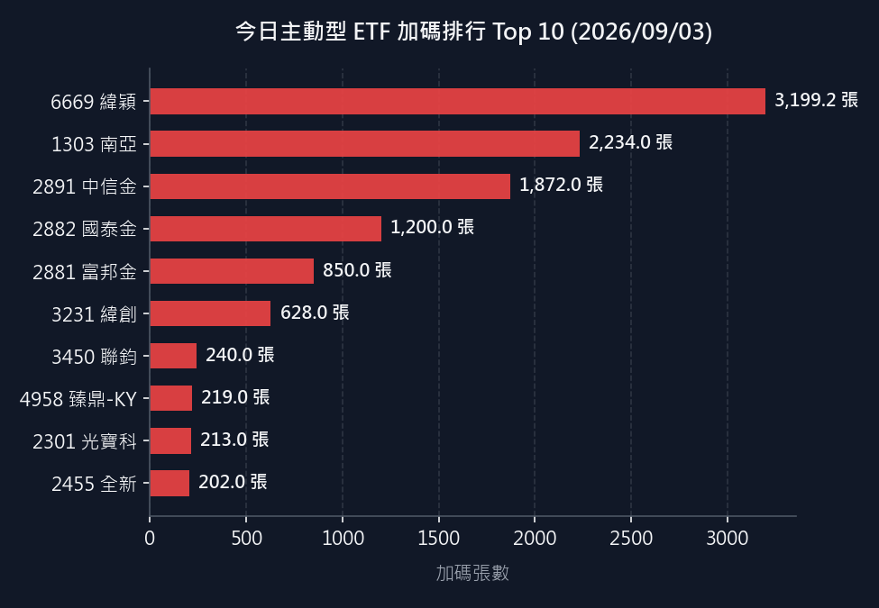
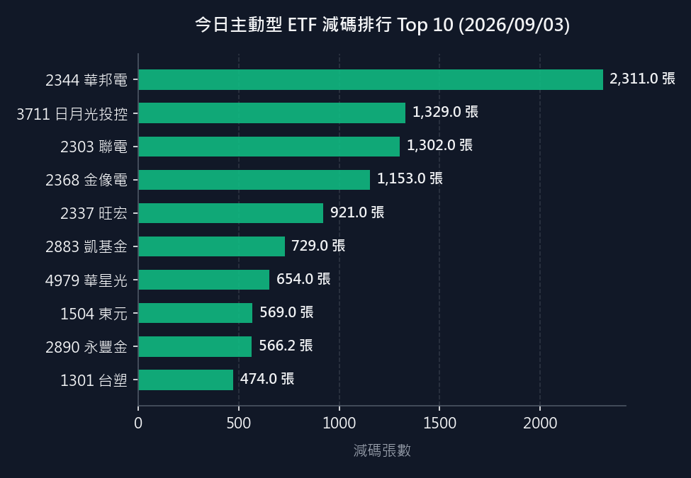

# 主動型 ETF 持股變動

資料來源：`主動型ETF持股明細.xlsx` 最近兩個日期分頁。

比較區間：`20260902` → `20260903`

## 今日加減碼視覺化排行

| 今日加碼 Top 10 | 今日減碼 Top 10 |
| :---: | :---: |
|  |  |

| ETF | 新增 | 刪除 | 比例變動 |
| :-- | --: | --: | --: |
| 00400A | 0 | 0 | 0 |
| 00401A | 0 | 0 | 0 |
| 00402A | 0 | 0 | 45 |
| 00403A | 2 | 1 | 34 |
| 00404A | 0 | 0 | 0 |
| 00405A | 0 | 0 | 34 |
| 00407A | 0 | 0 | 38 |
| 00408A | 1 | 2 | 43 |
| 00980A | 0 | 0 | 0 |
| 00980D | 0 | 0 | 13 |
| 00981A | 0 | 0 | 30 |
| 00982A | 0 | 1 | 39 |
| 00983A | 0 | 0 | 36 |
| 00983D | 1 | 0 | 11 |
| 00984A | 0 | 0 | 0 |
| 00985A | 0 | 0 | 47 |
| 00986A | 0 | 0 | 33 |
| 00987A | 1 | 1 | 25 |
| 00988A | 0 | 0 | 43 |
| 00989A | 0 | 0 | 55 |
| 00990A | 0 | 5 | 40 |
| 00991A | 0 | 0 | 20 |
| 00992A | 0 | 0 | 32 |
| 00993A | 0 | 15 | 50 |
| 00994A | 0 | 1 | 32 |
| 00995A | 0 | 0 | 41 |
| 00996A | 0 | 0 | 36 |
| 00997A | 2 | 2 | 43 |
| 00998A | 0 | 0 | 39 |
| 00999A | 0 | 0 | 0 |

## 00400A

### 新增持股

- 無

### 刪除持股

- 無

### 投資比例變動

- 無

## 00401A

### 新增持股

- 無

### 刪除持股

- 無

### 投資比例變動

- 無

## 00402A

### 新增持股

- 無

### 刪除持股

- 無

### 投資比例變動

- AAPL.US Apple：7.76% → 7.77%（+0.01）
- ADI.US Analog Devices：1.81% → 1.82%（+0.01）
- AMD.US AMD：4.73% → 4.71%（-0.02）
- AMZN.US Amazon：4.61% → 4.62%（+0.01）
- ANET.US Arista Networks：0.84% → 0.83%（-0.01）
- ASML.US ASML Holding：1.67% → 1.69%（+0.02）
- AVGO.US Broadcom：2.29% → 2.28%（-0.01）
- AXON.US Axon Enterprise：0.99% → 0.97%（-0.02）
- BKNG.US Booking Holdings：0.93% → 0.95%（+0.02）
- CDNS.US Cadence Design Systems：1.43% → 1.41%（-0.02）
- CIEN.US Ciena：1.05% → 1.03%（-0.02）
- CLS.US Celestica：0.85% → 0.81%（-0.04）
- COHR.US Coherent：1.87% → 1.85%（-0.02）
- CRWD.US CrowdStrike Holdings：1.51% → 1.43%（-0.08）
- FSLY.US Fastly：0.33% → 0.32%（-0.01）
- GOOG.US Alphabet - Class C Capital Stock：3.13% → 3.15%（+0.02）
- GOOGL.US Alphabet - Class A Common Stock：3.56% → 3.59%（+0.03）
- INTC.US Intel：1.22% → 1.23%（+0.01）
- IOT.US Samsara：0.36% → 0.34%（-0.02）
- KLAC.US KLA：1.51% → 1.52%（+0.01）
- LITE.US Lumentum：1.82% → 1.83%（+0.01）
- LRCX.US Lam Research：2.65% → 2.64%（-0.01）
- MCHP.US Microchip Technology：1.13% → 1.15%（+0.02）
- MDB.US MongoDB：0.79% → 0.68%（-0.11）
- META.US Meta：2.89% → 2.97%（+0.08）
- MRVL.US Marvell：1.16% → 1.14%（-0.02）
- MSFT.US Microsoft：5.35% → 5.31%（-0.04）
- MU.US Micron：6.36% → 6.53%（+0.17）
- NFLX.US Netflix：0.93% → 0.95%（+0.02）
- NOW.US ServiceNow：0.88% → 0.84%（-0.04）
- NVDA.US NVIDIA：8.58% → 8.91%（+0.33）
- PANW.US Palo Alto：2.69% → 2.45%（-0.24）
- PLTR.US Palantir Technologies：1.84% → 1.74%（-0.10）
- SHOP.US Shopify：0.89% → 0.90%（+0.01）
- SIMO.US Silicon Motion：0.75% → 0.76%（+0.01）
- SKHY.US SK hynix：1.06% → 1.09%（+0.03）
- SNOW.US Snowflake：1.26% → 1.21%（-0.05）
- SPCX.US SpaceX：0.77% → 0.76%（-0.01）
- SPOT.US Spotify：0.54% → 0.56%（+0.02）
- STX.US Seagate：1.05% → 1.04%（-0.01）
- TER.US Teradyne：0.82% → 0.83%（+0.01）
- TSM.US TSMC(ADR)：1.48% → 1.49%（+0.01）
- TXN.US Texas Instruments：2.15% → 2.16%（+0.01）
- UBER.US Uber：0.51% → 0.52%（+0.01）
- V.US Visa：1.30% → 1.32%（+0.02）

## 00403A

### 新增持股

- 2301 光寶科（0.06%，300 張）
- 2882 國泰金（0.08%，1200 張）

### 刪除持股

- 5347 世界（0.00%，1 張）

### 投資比例變動

- 1303 南亞：1.69% → 2.00%（+0.31）
- 2303 聯電：3.99% → 3.92%（-0.07）
- 2308 台達電：3.23% → 2.96%（-0.27）
- 2317 鴻海：0.49% → 0.50%（+0.01）
- 2327 國巨*：2.74% → 2.69%（-0.05）
- 2330 台積電：15.86% → 15.59%（-0.27）
- 2337 旺宏：0.22% → 0.15%（-0.07）
- 2344 華邦電：0.74% → 0.56%（-0.18）
- 2345 智邦：3.06% → 3.07%（+0.01）
- 2360 致茂：1.22% → 1.23%（+0.01）
- 2404 漢唐：0.17% → 0.16%（-0.01）
- 2454 聯發科：5.48% → 5.62%（+0.14）
- 2455 全新：0.12% → 0.13%（+0.01）
- 3008 大立光：3.70% → 3.94%（+0.24）
- 3017 奇鋐：6.47% → 6.49%（+0.02）
- 3037 欣興：4.95% → 5.13%（+0.18）
- 3443 創意：2.35% → 2.39%（+0.04）
- 3450 聯鈞：0.32% → 0.41%（+0.09）
- 3533 嘉澤：0.26% → 0.27%（+0.01）
- 3583 辛耘：0.37% → 0.38%（+0.01）
- 3653 健策：3.95% → 4.01%（+0.06）
- 3665 貿聯-KY：1.80% → 1.75%（-0.05）
- 3711 日月光投控：2.20% → 1.65%（-0.55）
- 5274 信驊：1.54% → 2.09%（+0.55）
- 6223 旺矽：3.58% → 3.62%（+0.04）
- 6239 力成：0.92% → 0.93%（+0.01）
- 6274 台燿：1.66% → 1.67%（+0.01）
- 6442 光聖：0.22% → 0.25%（+0.03）
- 6488 環球晶：1.68% → 1.69%（+0.01）
- 6669 緯穎：3.29% → 3.39%（+0.10）
- 6805 富世達：1.44% → 1.12%（-0.32）
- 8046 南電：1.95% → 1.97%（+0.02）
- 8358 金居：0.19% → 0.13%（-0.06）
- 8996 高力：1.23% → 1.37%（+0.14）

## 00404A

### 新增持股

- 無

### 刪除持股

- 無

### 投資比例變動

- 無

## 00405A

### 新增持股

- 無

### 刪除持股

- 無

### 投資比例變動

- 2059 川湖：2.04% → 2.07%（+0.03）
- 2303 聯電：0.04% → 0.03%（-0.01）
- 2308 台達電：0.60% → 0.58%（-0.02）
- 2330 台積電：1.50% → 1.52%（+0.02）
- 2345 智邦：4.01% → 4.03%（+0.02）
- 2368 金像電：4.74% → 4.72%（-0.02）
- 2454 聯發科：7.12% → 7.31%（+0.19）
- 3017 奇鋐：7.71% → 6.58%（-1.13）
- 3037 欣興：5.24% → 5.44%（+0.20）
- 3081 聯亞：1.86% → 1.91%（+0.05）
- 3163 波若威：0.03% → 0.04%（+0.01）
- 3443 創意：7.50% → 7.64%（+0.14）
- 3450 聯鈞：1.40% → 1.39%（-0.01）
- 3653 健策：7.48% → 6.37%（-1.11）
- 3665 貿聯-KY：5.29% → 5.14%（-0.15）
- 4749 新應材：0.26% → 0.27%（+0.01）
- 4991 環宇-KY：2.24% → 2.26%（+0.02）
- 5274 信驊：3.19% → 3.43%（+0.24）
- 6223 旺矽：5.08% → 5.14%（+0.06）
- 6274 台燿：1.52% → 1.54%（+0.02）
- 6278 台表科：0.96% → 0.99%（+0.03）
- 6285 啟碁：0.34% → 0.35%（+0.01）
- 6510 精測：2.63% → 3.00%（+0.37）
- 6515 穎崴：0.55% → 0.58%（+0.03）
- 6526 達發：0.33% → 0.34%（+0.01）
- 6531 愛普*：2.47% → 2.56%（+0.09）
- 6669 緯穎：1.34% → 1.39%（+0.05）
- 6805 富世達：2.13% → 2.04%（-0.09）
- 6831 邁科：0.52% → 0.54%（+0.02）
- 7734 印能科技：1.48% → 1.49%（+0.01）
- 7769 鴻勁：2.42% → 2.44%（+0.02）
- 8046 南電：3.11% → 3.16%（+0.05）
- 8210 勤誠：0.57% → 0.58%（+0.01）
- 8996 高力：1.14% → 1.27%（+0.13）

## 00407A

### 新增持股

- 無

### 刪除持股

- 無

### 投資比例變動

- 1303 南亞：0.70% → 0.73%（+0.03）
- 1560 中砂：0.50% → 0.48%（-0.02）
- 2059 川湖：3.57% → 3.59%（+0.02）
- 2301 光寶科：1.06% → 1.15%（+0.09）
- 2303 聯電：1.02% → 0.49%（-0.53）
- 2308 台達電：3.81% → 3.63%（-0.18）
- 2327 國巨*：2.18% → 2.13%（-0.05）
- 2330 台積電：8.67% → 8.71%（+0.04）
- 2344 華邦電：0.13% → 0.14%（+0.01）
- 2345 智邦：2.90% → 2.89%（-0.01）
- 2368 金像電：2.36% → 2.33%（-0.03）
- 2383 台光電：5.43% → 5.39%（-0.04）
- 2408 南亞科：1.16% → 1.19%（+0.03）
- 2451 創見：0.32% → 0.33%（+0.01）
- 2454 聯發科：4.97% → 5.06%（+0.09）
- 2615 萬海：0.66% → 0.67%（+0.01）
- 3008 大立光：1.57% → 2.42%（+0.85）
- 3017 奇鋐：5.48% → 5.47%（-0.01）
- 3034 聯詠：0.71% → 0.72%（+0.01）
- 3037 欣興：4.56% → 4.70%（+0.14）
- 3081 聯亞：1.68% → 1.71%（+0.03）
- 3293 鈊象：0.52% → 0.53%（+0.01）
- 3443 創意：3.50% → 3.54%（+0.04）
- 3529 力旺：1.07% → 0.50%（-0.57）
- 3653 健策：2.06% → 2.08%（+0.02）
- 3665 貿聯-KY：2.13% → 2.06%（-0.07）
- 3711 日月光投控：2.49% → 2.47%（-0.02）
- 4958 臻鼎-KY：1.97% → 1.92%（-0.05）
- 5274 信驊：2.12% → 2.26%（+0.14）
- 6187 萬潤：1.03% → 1.04%（+0.01）
- 6223 旺矽：2.67% → 2.68%（+0.01）
- 6446 藥華藥：0.33% → 0.34%（+0.01）
- 6510 精測：0.02% → 0.16%（+0.14）
- 6531 愛普*：0.32% → 0.33%（+0.01）
- 6669 緯穎：5.72% → 5.87%（+0.15）
- 6805 富世達：2.79% → 2.65%（-0.14）
- 8046 南電：2.72% → 2.74%（+0.02）
- 8996 高力：0.98% → 1.72%（+0.74）

## 00408A

### 新增持股

- 9802 鈺齊-KY（0.51%，110 張）

### 刪除持股

- 2360 致茂（0.50%，4 張）
- 2404 漢唐（1.70%，25 張）

### 投資比例變動

- 1216 統一：0.09% → 0.10%（+0.01）
- 1303 南亞：2.91% → 3.04%（+0.13）
- 2059 川湖：2.63% → 2.67%（+0.04）
- 2303 聯電：1.19% → 0.57%（-0.62）
- 2308 台達電：2.77% → 2.11%（-0.66）
- 2317 鴻海：1.90% → 1.93%（+0.03）
- 2330 台積電：6.20% → 4.74%（-1.46）
- 2344 華邦電：0.44% → 0.46%（+0.02）
- 2345 智邦：1.09% → 1.10%（+0.01）
- 2357 華碩：2.69% → 2.78%（+0.09）
- 2368 金像電：3.49% → 3.46%（-0.03）
- 2376 技嘉：1.22% → 1.27%（+0.05）
- 2382 廣達：0.85% → 0.86%（+0.01）
- 2395 研華：1.94% → 1.95%（+0.01）
- 2408 南亞科：1.60% → 1.66%（+0.06）
- 2454 聯發科：2.14% → 2.74%（+0.60）
- 2481 強茂：0.93% → 0.91%（-0.02）
- 2801 彰銀：0.96% → 1.01%（+0.05）
- 2880 華南金：1.71% → 1.81%（+0.10）
- 2886 兆豐金：2.61% → 2.73%（+0.12）
- 2891 中信金：0.99% → 1.02%（+0.03）
- 3017 奇鋐：5.49% → 5.52%（+0.03）
- 3037 欣興：2.77% → 2.87%（+0.10）
- 3045 台灣大：2.79% → 2.90%（+0.11）
- 3081 聯亞：1.06% → 1.09%（+0.03）
- 3189 景碩：1.46% → 1.47%（+0.01）
- 3231 緯創：1.01% → 1.07%（+0.06）
- 3491 昇達科：0.64% → 0.65%（+0.01）
- 3653 健策：2.19% → 2.22%（+0.03）
- 3661 世芯-KY：0.26% → 0.27%（+0.01）
- 5434 崇越：1.94% → 1.99%（+0.05）
- 6187 萬潤：1.28% → 1.29%（+0.01）
- 6223 旺矽：0.67% → 1.36%（+0.69）
- 6239 力成：1.18% → 1.19%（+0.01）
- 6274 台燿：2.51% → 2.53%（+0.02）
- 6488 環球晶：0.92% → 0.93%（+0.01）
- 6669 緯穎：6.55% → 6.74%（+0.19）
- 6805 富世達：1.27% → 1.22%（-0.05）
- 7769 鴻勁：1.64% → 1.65%（+0.01）
- 8046 南電：1.59% → 1.62%（+0.03）
- 8436 大江：2.60% → 2.66%（+0.06）
- 8996 高力：0.95% → 1.05%（+0.10）
- 9941 裕融：3.34% → 3.56%（+0.22）

## 00980A

### 新增持股

- 無

### 刪除持股

- 無

### 投資比例變動

- 無

## 00980D

### 新增持股

- 無

### 刪除持股

- 無

### 投資比例變動

- ATHENE HOLDING LTD (REG) 6.25% 01APR2054：0.75% → 0.74%（-0.01）
- AVIANCA MIDCO 2 PLC SER REGS 10.25 % 07-JAN-2032：0.31% → 0.30%（-0.01）
- CHARTER COMM OPT LLC/CAP (REG) 5.5% 01APR2063：0.48% → 0.49%（+0.01）
- COREWEAVE INC SER REGS (REG S) 9.25% 01JUN2030：0.40% → 0.41%（+0.01）
- FMC CORP (REG) 4.5% 01OCT2049：0.48% → 0.49%（+0.01）
- FORD MOTOR CREDIT CO LLC (REG) 7.2% 10JUN2030：0.32% → 0.33%（+0.01）
- GLOBAL ATLANTIC FIN CO SER REGS 6.750000 % 15MAR2054：0.60% → 0.61%（+0.01）
- HERTZ CORP/THE SER REGS (REG S) 12.625% 15JUL2029：0.28% → 0.29%（+0.01）
- ORACLE CORP 5.950000 % 26-SEP-2055：0.40% → 0.39%（-0.01）
- ORACLE CORP 6.125000 % 03AUG2065：0.55% → 0.54%（-0.01）
- US 10YR NOTE (CBT)DEC26 21-DEC-2026：17.35% → 17.36%（+0.01）
- US 5YR NOTE (CBT) DEC26 31-DEC-2026：-13.93% → -13.94%（-0.01）
- US LONG BOND(CBT) DEC26 21-DEC-2026：5.21% → 5.22%（+0.01）

## 00981A

### 新增持股

- 無

### 刪除持股

- 無

### 投資比例變動

- 2002 中鋼：0.03% → 0.04%（+0.01）
- 2303 聯電：3.98% → 4.05%（+0.07）
- 2308 台達電：4.44% → 4.63%（+0.19）
- 2327 國巨*：4.78% → 4.64%（-0.14）
- 2330 台積電：9.31% → 9.56%（+0.25）
- 2345 智邦：4.90% → 4.91%（+0.01）
- 2368 金像電：0.61% → 0.09%（-0.52）
- 2383 台光電：9.17% → 9.12%（-0.05）
- 2449 京元電子：1.23% → 1.21%（-0.02）
- 2454 聯發科：7.71% → 8.02%（+0.31）
- 3017 奇鋐：6.98% → 7.13%（+0.15）
- 3037 欣興：7.00% → 6.80%（-0.20）
- 3264 欣銓：0.42% → 0.41%（-0.01）
- 3443 創意：0.68% → 0.78%（+0.10）
- 3653 健策：4.90% → 4.95%（+0.05）
- 3665 貿聯-KY：3.53% → 3.50%（-0.03）
- 3711 日月光投控：3.51% → 3.60%（+0.09）
- 4958 臻鼎-KY：0.39% → 0.36%（-0.03）
- 4979 華星光：0.63% → 0.45%（-0.18）
- 5274 信驊：1.31% → 1.35%（+0.04）
- 6223 旺矽：4.64% → 4.54%（-0.10）
- 6271 同欣電：0.18% → 0.17%（-0.01）
- 6274 台燿：2.70% → 2.64%（-0.06）
- 6515 穎崴：0.13% → 0.14%（+0.01）
- 6669 緯穎：6.00% → 5.83%（-0.17）
- 6805 富世達：1.29% → 1.32%（+0.03）
- 8046 南電：4.03% → 3.70%（-0.33）
- 8210 勤誠：0.83% → 0.84%（+0.01）
- 8996 高力：0.58% → 0.56%（-0.02）
- 台指期貨 2026/09(FITXN*1.TF)：2.22% → 2.26%（+0.04）

## 00982A

### 新增持股

- 無

### 刪除持股

- 8046 南電（0.00%，1 張）

### 投資比例變動

- 2059 川湖：4.90% → 4.89%（-0.01）
- 2301 光寶科：1.98% → 1.93%（-0.05）
- 2303 聯電：1.27% → 1.29%（+0.02）
- 2330 台積電：8.27% → 8.51%（+0.24）
- 2345 智邦：2.57% → 2.58%（+0.01）
- 2360 致茂：3.17% → 3.32%（+0.15）
- 2376 技嘉：1.24% → 1.23%（-0.01）
- 2383 台光電：3.32% → 3.31%（-0.01）
- 2428 興勤：1.12% → 1.13%（+0.01）
- 2454 聯發科：6.08% → 6.34%（+0.26）
- 2455 全新：1.63% → 1.62%（-0.01）
- 2478 大毅：1.03% → 1.00%（-0.03）
- 2486 一詮：0.89% → 0.83%（-0.06）
- 2885 元大金：0.29% → 0.30%（+0.01）
- 3008 大立光：3.83% → 3.61%（-0.22）
- 3017 奇鋐：2.39% → 2.45%（+0.06）
- 3090 日電貿：1.09% → 1.08%（-0.01）
- 3105 穩懋：5.18% → 5.06%（-0.12）
- 3231 緯創：1.22% → 1.39%（+0.17）
- 3265 台星科：1.18% → 1.17%（-0.01）
- 3491 昇達科：3.30% → 3.29%（-0.01）
- 3583 辛耘：1.69% → 1.71%（+0.02）
- 3711 日月光投控：1.07% → 1.10%（+0.03）
- 4958 臻鼎-KY：3.09% → 2.91%（-0.18）
- 5274 信驊：1.23% → 1.27%（+0.04）
- 5425 台半：1.15% → 1.17%（+0.02）
- 5483 中美晶：1.20% → 1.22%（+0.02）
- 5536 聖暉*：0.72% → 0.74%（+0.02）
- 6139 亞翔：5.26% → 5.33%（+0.07）
- 6196 帆宣：0.29% → 0.30%（+0.01）
- 6214 精誠：1.24% → 1.27%（+0.03）
- 6223 旺矽：3.14% → 3.08%（-0.06）
- 6239 力成：1.03% → 1.04%（+0.01）
- 6274 台燿：1.17% → 1.14%（-0.03）
- 6488 環球晶：2.06% → 2.02%（-0.04）
- 6531 愛普*：3.05% → 3.01%（-0.04）
- 6640 均華：0.03% → 0.24%（+0.21）
- 6669 緯穎：7.02% → 6.84%（-0.18）
- 8996 高力：0.93% → 0.90%（-0.03）

## 00983A

### 新增持股

- 無

### 刪除持股

- 無

### 投資比例變動

- ACHR.US Archer：0.70% → 0.71%（+0.01）
- AMD.US AMD：3.21% → 3.23%（+0.02）
- AMZN.US Amazon：2.43% → 2.45%（+0.02）
- BEAM.US Beam Therapeutics：2.06% → 2.10%（+0.04）
- CBRS.US Cerebras：0.84% → 0.90%（+0.06）
- CRCL.US Circle：4.78% → 4.79%（+0.01）
- CRSP.US CRISPR Therapeutics：4.33% → 4.38%（+0.05）
- CRWV.US CoreWeave：1.38% → 1.20%（-0.18）
- DE.US Deere：1.36% → 1.42%（+0.06）
- FIG.US Figma：0.52% → 0.50%（-0.02）
- GOOG.US Alphabet - Class C Capital Stock：1.35% → 1.37%（+0.02）
- GOOGL.US Alphabet - Class A Common Stock：0.75% → 0.77%（+0.02）
- HOOD.US Robinhood Markets：4.38% → 4.57%（+0.19）
- ILMN.US Illumina：1.61% → 1.67%（+0.06）
- KTOS.US Kratos Defense & Security：1.02% → 1.00%（-0.02）
- LLY.US Eli Lilly：1.03% → 1.04%（+0.01）
- META.US Meta：0.57% → 0.59%（+0.02）
- NTLA.US Intellia Therapeutics：1.18% → 1.20%（+0.02）
- NTRA.US Natera：1.90% → 1.95%（+0.05）
- NVDA.US NVIDIA：1.82% → 1.90%（+0.08）
- PLTR.US Palantir Technologies：3.88% → 3.69%（-0.19）
- RXRX.US Recursion Pharmaceuticals：0.35% → 0.36%（+0.01）
- SHOP.US Shopify：6.19% → 6.34%（+0.15）
- SNOW.US Snowflake：1.80% → 1.64%（-0.16）
- SOFI.US SoFi Technologies：0.59% → 0.52%（-0.07）
- SPCX.US SpaceX：5.13% → 5.12%（-0.01）
- TEM.US Tempus：5.66% → 5.69%（+0.03）
- TER.US Teradyne：0.51% → 0.52%（+0.01）
- TSLA.US Tesla：9.33% → 9.30%（-0.03）
- TSM.US TSMC(ADR)：2.25% → 2.28%（+0.03）
- TWST.US Twist Bioscience：4.62% → 4.52%（-0.10）
- TXG.US 10x Genomics：4.24% → 4.26%（+0.02）
- VCYT.US Veracyte：0.27% → 0.29%（+0.02）
- WGS.US GeneDx：1.30% → 1.34%（+0.04）
- XE.US X-Energy：0.86% → 0.85%（-0.01）
- XYZ.US Block：2.38% → 2.09%（-0.29）

## 00983D

### 新增持股

- SVC 8 7/8 06/15/32（0.48%，N/A 張）

### 刪除持股

- 無

### 投資比例變動

- ATH 6 5/8 05/19/55：0.98% → 0.99%（+0.01）
- BHCCN 11 09/30/28：1.85% → 1.86%（+0.01）
- CRWV 9 02/01/31：0.79% → 0.80%（+0.01）
- CYH 10 7/8 01/15/32：1.48% → 1.47%（-0.01）
- DIS 7 3/4 12/01/45：0.59% → 0.60%（+0.01）
- DOW 9.4 05/15/39：1.91% → 1.92%（+0.01）
- GT 8 7/8 07/15/32：0.47% → 0.94%（+0.47）
- LQDW.US iShares Investment Grade Corpora：7.20% → 7.16%（-0.04）
- PCG 6.7 04/01/53：1.09% → 1.08%（-0.01）
- SPCX 6.6 07/15/46：1.12% → 1.11%（-0.01）
- TLTW.US iShares 20+ Year Treasury Bond B：7.88% → 7.84%（-0.04）

## 00984A

### 新增持股

- 無

### 刪除持股

- 無

### 投資比例變動

- 無

## 00985A

### 新增持股

- 無

### 刪除持股

- 無

### 投資比例變動

- 1301 台塑：1.00% → 0.70%（-0.30）
- 1504 東元：2.40% → 1.99%（-0.41）
- 2027 大成鋼：1.97% → 2.03%（+0.06）
- 2059 川湖：0.93% → 0.13%（-0.80）
- 2308 台達電：1.73% → 1.78%（+0.05）
- 2327 國巨*：1.97% → 1.46%（-0.51）
- 2330 台積電：13.37% → 13.57%（+0.20）
- 2344 華邦電：0.41% → 0.40%（-0.01）
- 2345 智邦：2.81% → 1.96%（-0.85）
- 2360 致茂：0.81% → 0.84%（+0.03）
- 2368 金像電：0.21% → 0.20%（-0.01）
- 2376 技嘉：4.19% → 4.11%（-0.08）
- 2383 台光電：2.70% → 2.66%（-0.04）
- 2395 研華：2.06% → 2.04%（-0.02）
- 2408 南亞科：0.95% → 0.48%（-0.47）
- 2412 中華電：3.71% → 3.77%（+0.06）
- 2454 聯發科：2.73% → 2.81%（+0.08）
- 2603 長榮：1.62% → 1.67%（+0.05）
- 2610 華航：1.71% → 1.74%（+0.03）
- 2881 富邦金：0.21% → 1.42%（+1.21）
- 2891 中信金：0.19% → 1.42%（+1.23）
- 3008 大立光：1.19% → 0.07%（-1.12）
- 3017 奇鋐：2.40% → 1.66%（-0.74）
- 3037 欣興：2.34% → 2.25%（-0.09）
- 3081 聯亞：1.00% → 0.66%（-0.34）
- 3105 穩懋：1.46% → 0.87%（-0.59）
- 3131 弘塑：0.28% → 0.27%（-0.01）
- 3189 景碩：0.02% → 0.01%（-0.01）
- 3491 昇達科：1.47% → 1.45%（-0.02）
- 3653 健策：1.48% → 0.98%（-0.50）
- 3661 世芯-KY：2.12% → 2.07%（-0.05）
- 3665 貿聯-KY：2.17% → 1.91%（-0.26）
- 3711 日月光投控：2.44% → 4.01%（+1.57）
- 4904 遠傳：3.74% → 3.83%（+0.09）
- 4958 臻鼎-KY：0.22% → 0.21%（-0.01）
- 6147 頎邦：0.90% → 0.94%（+0.04）
- 6187 萬潤：1.40% → 0.97%（-0.43）
- 6442 光聖：1.27% → 2.39%（+1.12）
- 6446 藥華藥：1.72% → 1.80%（+0.08）
- 6488 環球晶：1.60% → 1.28%（-0.32）
- 6669 緯穎：4.16% → 3.99%（-0.17）
- 7750 新代：2.37% → 1.95%（-0.42）
- 7769 鴻勁：0.98% → 1.02%（+0.04）
- 8046 南電：1.43% → 1.30%（-0.13）
- 8299 群聯：0.18% → 0.17%（-0.01）
- 8996 高力：1.36% → 0.87%（-0.49）
- 台積電期貨(FICDFN*1.TF)：5.02% → 5.08%（+0.06）

## 00986A

### 新增持股

- 無

### 刪除持股

- 無

### 投資比例變動

- 2330 台積電：8.47% → 8.83%（+0.36）
- 2454 聯發科：1.38% → 1.56%（+0.18）
- AAPL.US Apple：1.06% → 1.12%（+0.06）
- AMAT.US Applied Materials：1.79% → 1.77%（-0.02）
- AMZN.US Amazon：4.06% → 4.09%（+0.03）
- AVGO.US Broadcom：3.72% → 3.81%（+0.09）
- COHR.US Coherent：2.02% → 2.03%（+0.01）
- CRDO.US Credo：0.63% → 0.59%（-0.04）
- CRWD.US CrowdStrike Holdings：3.87% → 3.69%（-0.18）
- DDOG.US Datadog：0.66% → 0.64%（-0.02）
- GEV.US GE Vernova：2.51% → 2.57%（+0.06）
- GOOGL.US Alphabet - Class A Common Stock：5.68% → 5.76%（+0.08）
- GS.US Goldman Sachs：3.15% → 3.16%（+0.01）
- HOOD.US Robinhood Markets：0.43% → 0.44%（+0.01）
- HWM.US Howmet Aerospace：2.32% → 2.48%（+0.16）
- JPM.US JPMorgan Chase：1.89% → 1.93%（+0.04）
- LITE.US Lumentum：3.98% → 3.88%（-0.10）
- LLY.US Eli Lilly：2.90% → 2.99%（+0.09）
- LRCX.US Lam Research：2.52% → 2.49%（-0.03）
- MA.US Mastercard：1.15% → 1.16%（+0.01）
- MSFT.US Microsoft：2.83% → 2.87%（+0.04）
- MUFG(8306.JP)：1.54% → 1.59%（+0.05）
- Murata Mfg.(6981.JP)：1.76% → 1.83%（+0.07）
- NET.US Cloudflare：2.04% → 1.96%（-0.08）
- NVDA.US NVIDIA：6.16% → 6.23%（+0.07）
- SNDK.US Sandisk：1.75% → 1.76%（+0.01）
- SNOW.US Snowflake：2.03% → 2.01%（-0.02）
- Siemens Energy AG：2.02% → 2.06%（+0.04）
- TSEM.US Tower Semiconductor：0.86% → 0.85%（-0.01）
- 嘉能可公司：1.80% → 1.85%（+0.05）
- 施奈德電機公司：1.71% → 1.72%（+0.01）
- 艾司摩爾控股公司：0.94% → 0.95%（+0.01）
- 英飛凌科技股份有限公司：2.91% → 2.95%（+0.04）

## 00987A

### 新增持股

- 6510 精測（1.06%，8 張）

### 刪除持股

- 7769 鴻勁（1.33%，6 張）

### 投資比例變動

- 2308 台達電：1.98% → 1.87%（-0.11）
- 2330 台積電：8.31% → 8.28%（-0.03）
- 2345 智邦：2.34% → 2.31%（-0.03）
- 2383 台光電：6.19% → 6.09%（-0.10）
- 2408 南亞科：3.27% → 3.34%（+0.07）
- 2454 聯發科：5.22% → 5.28%（+0.06）
- 2455 全新：4.06% → 4.29%（+0.23）
- 3017 奇鋐：7.48% → 7.41%（-0.07）
- 3037 欣興：6.10% → 6.23%（+0.13）
- 3081 聯亞：3.86% → 3.90%（+0.04）
- 3363 上詮：2.76% → 2.79%（+0.03）
- 3443 創意：4.53% → 4.55%（+0.02）
- 3661 世芯-KY：2.10% → 2.11%（+0.01）
- 3665 貿聯-KY：4.55% → 4.35%（-0.20）
- 5274 信驊：0.19% → 0.21%（+0.02）
- 6187 萬潤：2.44% → 2.43%（-0.01）
- 6223 旺矽：5.52% → 5.51%（-0.01）
- 6274 台燿：4.11% → 4.08%（-0.03）
- 6515 穎崴：2.09% → 2.18%（+0.09）
- 6683 雍智科技：2.62% → 2.93%（+0.31）
- 6739 竹陞科技：2.17% → 2.16%（-0.01）
- 6805 富世達：3.11% → 2.93%（-0.18）
- 8046 南電：2.97% → 2.96%（-0.01）
- 8358 金居：2.67% → 2.60%（-0.07）
- 8996 高力：1.56% → 1.71%（+0.15）

## 00988A

### 新增持股

- 無

### 刪除持股

- 無

### 投資比例變動

- 2308 台達電：2.49% → 2.59%（+0.10）
- 2330 台積電：2.93% → 2.58%（-0.35）
- 2383 台光電：4.32% → 4.56%（+0.24）
- 2454 聯發科：1.47% → 1.66%（+0.19）
- 3017 奇鋐：2.35% → 2.40%（+0.05）
- 3037 欣興：4.87% → 4.86%（-0.01）
- 4979 華星光：1.41% → 1.43%（+0.02）
- 6223 旺矽：2.33% → 2.52%（+0.19）
- 6274 台燿：0.35% → 0.36%（+0.01）
- AEM.US Agnico Eagle Mines：0.73% → 0.71%（-0.02）
- AIXTRON SE：0.49% → 0.50%（+0.01）
- BE.US Bloom Energy：3.07% → 3.26%（+0.19）
- COHR.US Coherent：1.57% → 1.58%（+0.01）
- CRCL.US Circle：2.73% → 2.62%（-0.11）
- CRDO.US Credo：3.03% → 2.84%（-0.19）
- FORM.US FormFactor：0.90% → 0.88%（-0.02）
- Furukawa Electric(5801.JP)：0.75% → 0.74%（-0.01）
- HOOD.US Robinhood Markets：0.75% → 0.76%（+0.01）
- INFINEON TECHNOLOGIES AG：1.65% → 1.67%（+0.02）
- ISC(095340.KS)：0.37% → 0.08%（-0.29）
- Kioxia Holdings(285A.JP)：2.05% → 2.14%（+0.09）
- LITE.US Lumentum：6.37% → 6.20%（-0.17）
- MICRONICS(6871.JP)：1.77% → 0.87%（-0.90）
- MPWR.US Monolithic Power Systems：1.36% → 1.35%（-0.01）
- MSFT.US Microsoft：1.51% → 2.02%（+0.51）
- Murata Mfg.(6981.JP)：3.62% → 3.75%（+0.13）
- NET.US Cloudflare：1.27% → 1.22%（-0.05）
- NOW.US ServiceNow：1.32% → 2.00%（+0.68）
- NTRA.US Natera：0.48% → 0.49%（+0.01）
- Nippon Chemi-Con(6997.JP)：1.39% → 1.43%（+0.04）
- PANW.US Palo Alto：3.41% → 3.31%（-0.10）
- PLTR.US Palantir Technologies：2.50% → 2.47%（-0.03）
- SK hynix(000660.KS)：1.08% → 1.10%（+0.02）
- SNDK.US Sandisk：1.21% → 1.22%（+0.01）
- SNOW.US Snowflake：2.56% → 2.54%（-0.02）
- SPCX.US SpaceX：2.57% → 2.60%（+0.03）
- STX.US Seagate：2.96% → 2.99%（+0.03）
- Samsung Elec Mech(009150.KS)：4.38% → 4.36%（-0.02）
- TER.US Teradyne：1.15% → 1.13%（-0.02）
- TSEM.US Tower Semiconductor：2.65% → 2.63%（-0.02）
- 三環集團(300408.SZ)：1.78% → 1.73%（-0.05）
- 中際旭創(3308.HK)：1.33% → 1.37%（+0.04）
- 鼎泰高科(301377.SZ)：1.09% → 1.03%（-0.06）

## 00989A

### 新增持股

- 無

### 刪除持股

- 無

### 投資比例變動

- ADBE.US Adobe：1.40% → 1.38%（-0.02）
- ADI.US Analog Devices：1.02% → 1.04%（+0.02）
- ALGM.US Allegro MicroSystems：0.55% → 0.56%（+0.01）
- AMZN.US Amazon：1.05% → 1.06%（+0.01）
- APP.US Applovin：0.66% → 0.68%（+0.02）
- ASML.US ASML Holding：1.63% → 1.66%（+0.03）
- BE.US Bloom Energy：1.05% → 1.08%（+0.03）
- CBRS.US Cerebras：0.17% → 0.19%（+0.02）
- CDNS.US Cadence Design Systems：0.91% → 0.90%（-0.01）
- CIEN.US Ciena：1.53% → 1.52%（-0.01）
- CRM.US Salesforce：3.45% → 3.46%（+0.01）
- CRWD.US CrowdStrike Holdings：3.18% → 3.03%（-0.15）
- DOCN.US DigitalOcean：1.27% → 1.23%（-0.04）
- ENTG.US Entegris：0.60% → 0.61%（+0.01）
- ESTC.US Elastic：0.76% → 0.74%（-0.02）
- FIGR.US Figure：0.89% → 0.88%（-0.01）
- GLW.US Corning：1.50% → 1.49%（-0.01）
- GOOG.US Alphabet - Class C Capital Stock：2.81% → 2.85%（+0.04）
- HOOD.US Robinhood Markets：1.90% → 1.98%（+0.08）
- HUBS.US HubSpot：2.06% → 2.03%（-0.03）
- ILMN.US Illumina：0.29% → 0.30%（+0.01）
- INTC.US Intel：2.62% → 2.68%（+0.06）
- INTU.US Intuit：0.82% → 0.83%（+0.01）
- LITE.US Lumentum：1.65% → 1.66%（+0.01）
- LMND.US Lemonade：0.82% → 0.86%（+0.04）
- MDB.US MongoDB：0.70% → 0.61%（-0.09）
- META.US Meta：1.52% → 1.57%（+0.05）
- MTSI.US MACOM Technology Solutions：0.97% → 0.96%（-0.01）
- MU.US Micron：0.85% → 0.87%（+0.02）
- NET.US Cloudflare：2.67% → 2.58%（-0.09）
- NOW.US ServiceNow：2.34% → 2.25%（-0.09）
- NU.US Nu：0.65% → 0.70%（+0.05）
- NVDA.US NVIDIA：3.85% → 4.01%（+0.16）
- OKTA.US Okta：0.40% → 0.39%（-0.01）
- ORCL.US Oracle：1.08% → 1.13%（+0.05）
- PANW.US Palo Alto：4.10% → 3.75%（-0.35）
- PLTR.US Palantir Technologies：1.07% → 1.02%（-0.05）
- RIVN.US Rivian：1.36% → 1.37%（+0.01）
- ROK.US Rockwell Automation：0.84% → 0.86%（+0.02）
- SHOP.US Shopify：1.99% → 2.03%（+0.04）
- SNDK.US Sandisk：0.64% → 0.65%（+0.01）
- SNOW.US Snowflake：3.23% → 3.11%（-0.12）
- SPCX.US SpaceX：0.80% → 0.79%（-0.01）
- SYM.US Symbotic：0.47% → 0.49%（+0.02）
- TEAM.US Atlassian：1.26% → 1.27%（+0.01）
- TSLA.US Tesla：2.92% → 2.95%（+0.03）
- TSM.US TSMC(ADR)：1.02% → 1.03%（+0.01）
- TTWO.US Take-Two：3.14% → 3.16%（+0.02）
- TXG.US 10x Genomics：0.38% → 0.39%（+0.01）
- TXN.US Texas Instruments：1.35% → 1.37%（+0.02）
- U.US Unity Software：0.87% → 0.88%（+0.01）
- VEEV.US Veeva Systems：0.58% → 0.59%（+0.01）
- VICR.US Vicor Corporation：0.50% → 0.52%（+0.02）
- XYZ.US Block：0.77% → 0.82%（+0.05）
- ZM.US Zoom：1.97% → 2.01%（+0.04）

## 00990A

### 新增持股

- 無

### 刪除持股

- COHR.US Coherent（1.25%，52.539 張）
- CRDO.US Credo（2.49%，138 張）
- DIOD.US Diodes（0.85%，111.9 張）
- INFINEON TECHNOLOGIES AG（1.36%，244.923 張）
- NBIS.US Nebius Group（0.97%，55.5 張）

### 投資比例變動

- 2308 台達電：2.27% → 2.13%（-0.14）
- 2330 台積電：2.73% → 2.70%（-0.03）
- 2345 智邦：1.05% → 1.03%（-0.02）
- 2383 台光電：3.30% → 3.22%（-0.08）
- 2449 京元電子：1.28% → 1.26%（-0.02）
- 3017 奇鋐：1.49% → 1.46%（-0.03）
- 3037 欣興：3.07% → 3.11%（+0.04）
- 3665 貿聯-KY：0.60% → 0.57%（-0.03）
- 3711 日月光投控：1.08% → 1.05%（-0.03）
- 6223 旺矽：1.34% → 1.33%（-0.01）
- 6274 台燿：1.50% → 1.48%（-0.02）
- 8046 南電：1.02% → 1.01%（-0.01）
- AMD.US AMD：2.41% → 2.43%（+0.02）
- AMZN.US Amazon：2.40% → 2.94%（+0.54）
- AVGO.US Broadcom：1.02% → 1.03%（+0.01）
- Advantest(6857.JP)：1.61% → 1.59%（-0.02）
- BE.US Bloom Energy：2.70% → 2.79%（+0.09）
- DELL.US Dell：0.94% → 1.11%（+0.17）
- GOOGL.US Alphabet - Class A Common Stock：1.47% → 2.32%（+0.85）
- IBIDEN(4062.JP)：1.01% → 1.00%（-0.01）
- INTC.US Intel：1.42% → 1.45%（+0.03）
- Kioxia Holdings(285A.JP)：1.92% → 1.95%（+0.03）
- LITE.US Lumentum：7.69% → 7.81%（+0.12）
- META.US Meta：1.81% → 2.61%（+0.80）
- MRVL.US Marvell：2.39% → 2.38%（-0.01）
- MSFT.US Microsoft：2.12% → 3.13%（+1.01）
- MU.US Micron：2.45% → 2.54%（+0.09）
- Murata Mfg.(6981.JP)：2.68% → 2.59%（-0.09）
- NOW.US ServiceNow：2.76% → 2.68%（-0.08）
- NTRA.US Natera：1.71% → 1.76%（+0.05）
- NVDA.US NVIDIA：4.73% → 4.95%（+0.22）
- PANW.US Palo Alto：2.07% → 1.90%（-0.17）
- PLTR.US Palantir Technologies：2.07% → 1.97%（-0.10）
- SMTC.US Semtech：2.39% → 2.45%（+0.06）
- SNDK.US Sandisk：1.28% → 1.31%（+0.03）
- SNOW.US Snowflake：2.04% → 1.98%（-0.06）
- TEAM.US Atlassian：2.05% → 2.07%（+0.02）
- TSEM.US Tower Semiconductor：2.43% → 2.03%（-0.40）
- TWST.US Twist Bioscience：0.44% → 0.65%（+0.21）
- WDC.US Western Digital：1.94% → 1.96%（+0.02）

## 00991A

### 新增持股

- 無

### 刪除持股

- 無

### 投資比例變動

- 2059 川湖：8.54% → 8.59%（+0.05）
- 2327 國巨*：5.14% → 5.02%（-0.12）
- 2330 台積電：11.19% → 11.23%（+0.04）
- 2345 智邦：4.26% → 3.85%（-0.41）
- 2383 台光電：9.39% → 9.31%（-0.08）
- 2408 南亞科：8.63% → 8.86%（+0.23）
- 2454 聯發科：4.69% → 4.77%（+0.08）
- 3017 奇鋐：5.14% → 5.13%（-0.01）
- 3026 禾伸堂：2.38% → 2.30%（-0.08）
- 3037 欣興：5.86% → 6.03%（+0.17）
- 3081 聯亞：3.72% → 3.79%（+0.07）
- 3189 景碩：4.32% → 4.30%（-0.02）
- 3653 健策：2.41% → 2.43%（+0.02）
- 5274 信驊：2.49% → 3.09%（+0.60）
- 6223 旺矽：2.48% → 2.49%（+0.01）
- 6274 台燿：3.50% → 3.15%（-0.35）
- 6669 緯穎：5.46% → 5.60%（+0.14）
- 7769 鴻勁：2.13% → 1.98%（-0.15）
- 8046 南電：4.80% → 4.83%（+0.03）
- 8299 群聯：2.26% → 2.00%（-0.26）

## 00992A

### 新增持股

- 無

### 刪除持股

- 無

### 投資比例變動

- 1303 南亞：3.02% → 2.92%（-0.10）
- 1815 富喬：3.33% → 3.17%（-0.16）
- 2059 川湖：7.61% → 6.69%（-0.92）
- 2301 光寶科：0.49% → 0.48%（-0.01）
- 2308 台達電：1.54% → 1.63%（+0.09）
- 2330 台積電：6.22% → 6.48%（+0.26）
- 2345 智邦：5.37% → 5.45%（+0.08）
- 2360 致茂：0.35% → 0.37%（+0.02）
- 2383 台光電：5.92% → 5.97%（+0.05）
- 2404 漢唐：0.37% → 0.39%（+0.02）
- 2454 聯發科：1.45% → 1.53%（+0.08）
- 2455 全新：3.49% → 3.51%（+0.02）
- 3008 大立光：5.35% → 5.09%（-0.26）
- 3017 奇鋐：7.74% → 8.02%（+0.28）
- 3026 禾伸堂：0.42% → 0.40%（-0.02）
- 3037 欣興：5.64% → 5.56%（-0.08）
- 3081 聯亞：0.50% → 0.48%（-0.02）
- 3189 景碩：1.67% → 1.59%（-0.08）
- 3231 緯創：3.14% → 3.32%（+0.18）
- 3443 創意：2.26% → 2.31%（+0.05）
- 3665 貿聯-KY：5.89% → 5.92%（+0.03）
- 4958 臻鼎-KY：1.18% → 1.13%（-0.05）
- 5274 信驊：0.46% → 0.48%（+0.02）
- 6139 亞翔：0.42% → 0.43%（+0.01）
- 6213 聯茂：0.47% → 0.46%（-0.01）
- 6223 旺矽：3.31% → 3.28%（-0.03）
- 6584 南俊國際：3.43% → 3.41%（-0.02）
- 6669 緯穎：1.40% → 1.38%（-0.02）
- 8021 尖點：2.88% → 2.69%（-0.19）
- 8046 南電：2.71% → 2.54%（-0.17）
- 8150 南茂：0.41% → 0.42%（+0.01）
- 8996 高力：4.82% → 4.69%（-0.13）

## 00993A

### 新增持股

- 無

### 刪除持股

- 1560 中砂（0.20%，28 張）
- 2301 光寶科（0.25%，87 張）
- 2360 致茂（0.21%，11 張）
- 2395 研華（0.20%，29 張）
- 2467 志聖（0.24%，41 張）
- 2883 凱基金（0.24%，729 張）
- 2890 永豐金（0.22%，566.22 張）
- 3491 昇達科（0.23%，16 張）
- 3661 世芯-KY（0.16%，4 張）
- 3711 日月光投控（0.58%，100 張）
- 6187 萬潤（0.25%，19 張）
- 6196 帆宣（0.19%，39 張）
- 6213 聯茂（0.17%，33 張）
- 6584 南俊國際（0.20%，32 張）
- 7769 鴻勁（0.73%，13 張）

### 投資比例變動

- 1303 南亞：1.83% → 3.75%（+1.92）
- 2059 川湖：4.04% → 3.80%（-0.24）
- 2303 聯電：1.69% → 1.57%（-0.12）
- 2308 台達電：1.95% → 1.93%（-0.02）
- 2313 華通：0.19% → 0.39%（+0.20）
- 2327 國巨*：1.09% → 0.88%（-0.21）
- 2330 台積電：8.39% → 7.98%（-0.41）
- 2337 旺宏：0.64% → 0.76%（+0.12）
- 2344 華邦電：2.50% → 2.21%（-0.29）
- 2345 智邦：2.94% → 2.89%（-0.05）
- 2347 聯強：0.43% → 0.38%（-0.05）
- 2368 金像電：1.32% → 2.28%（+0.96）
- 2383 台光電：5.68% → 5.27%（-0.41）
- 2408 南亞科：3.76% → 3.46%（-0.30）
- 2449 京元電子：0.16% → 0.35%（+0.19）
- 2454 聯發科：4.18% → 5.56%（+1.38）
- 2455 全新：0.56% → 1.67%（+1.11）
- 2885 元大金：0.28% → 0.07%（-0.21）
- 3008 大立光：0.94% → 1.91%（+0.97）
- 3017 奇鋐：4.34% → 3.46%（-0.88）
- 3036 文曄：0.28% → 0.57%（+0.29）
- 3037 欣興：4.19% → 3.07%（-1.12）
- 3042 晶技：0.17% → 0.34%（+0.17）
- 3044 健鼎：0.21% → 0.43%（+0.22）
- 3081 聯亞：1.20% → 1.53%（+0.33）
- 3131 弘塑：0.24% → 0.52%（+0.28）
- 3189 景碩：2.53% → 2.26%（-0.27）
- 3231 緯創：1.06% → 1.70%（+0.64）
- 3264 欣銓：0.83% → 1.27%（+0.44）
- 3443 創意：2.85% → 2.88%（+0.03）
- 3653 健策：1.62% → 1.30%（-0.32）
- 3665 貿聯-KY：1.98% → 2.12%（+0.14）
- 3702 大聯大：0.17% → 0.35%（+0.18）
- 4958 臻鼎-KY：0.87% → 1.93%（+1.06）
- 5274 信驊：3.35% → 3.57%（+0.22）
- 5289 宜鼎：1.02% → 0.73%（-0.29）
- 6139 亞翔：0.75% → 1.16%（+0.41）
- 6147 頎邦：0.30% → 0.66%（+0.36）
- 6223 旺矽：5.92% → 4.14%（-1.78）
- 6239 力成：0.21% → 0.44%（+0.23）
- 6274 台燿：3.43% → 2.63%（-0.80）
- 6415 矽力*-KY：0.18% → 0.37%（+0.19）
- 6515 穎崴：2.23% → 2.34%（+0.11）
- 6669 緯穎：3.49% → 3.58%（+0.09）
- 6805 富世達：0.78% → 0.74%（-0.04）
- 8046 南電：2.52% → 2.17%（-0.35）
- 8210 勤誠：0.30% → 0.63%（+0.33）
- 8299 群聯：0.63% → 0.48%（-0.15）
- 8358 金居：0.54% → 0.53%（-0.01）
- 8996 高力：0.92% → 1.51%（+0.59）

## 00994A

### 新增持股

- 無

### 刪除持股

- 2404 漢唐（0.02%，1 張）

### 投資比例變動

- 1303 南亞：2.18% → 2.27%（+0.09）
- 2059 川湖：5.99% → 6.06%（+0.07）
- 2303 聯電：1.02% → 0.68%（-0.34）
- 2308 台達電：2.58% → 2.11%（-0.47）
- 2330 台積電：14.40% → 13.51%（-0.89）
- 2360 致茂：0.66% → 0.29%（-0.37）
- 2368 金像電：0.40% → 0.39%（-0.01）
- 2383 台光電：6.71% → 6.69%（-0.02）
- 2408 南亞科：3.29% → 3.40%（+0.11）
- 2454 聯發科：5.05% → 5.70%（+0.65）
- 2481 強茂：0.92% → 0.89%（-0.03）
- 3017 奇鋐：7.26% → 7.27%（+0.01）
- 3037 欣興：5.56% → 5.75%（+0.19）
- 3045 台灣大：0.35% → 0.36%（+0.01）
- 3081 聯亞：1.59% → 1.63%（+0.04）
- 3189 景碩：1.67% → 1.68%（+0.01）
- 3231 緯創：0.19% → 0.20%（+0.01）
- 3443 創意：2.30% → 2.34%（+0.04）
- 3653 健策：2.97% → 3.00%（+0.03）
- 3661 世芯-KY：0.34% → 0.35%（+0.01）
- 3665 貿聯-KY：0.61% → 0.59%（-0.02）
- 5274 信驊：2.22% → 2.37%（+0.15）
- 6187 萬潤：1.08% → 1.09%（+0.01）
- 6223 旺矽：3.59% → 3.95%（+0.36）
- 6239 力成：1.00% → 1.01%（+0.01）
- 6274 台燿：4.91% → 4.93%（+0.02）
- 6488 環球晶：0.82% → 0.83%（+0.01）
- 6669 緯穎：4.40% → 4.54%（+0.14）
- 6805 富世達：1.38% → 1.32%（-0.06）
- 7769 鴻勁：1.30% → 1.31%（+0.01）
- 8046 南電：4.30% → 4.35%（+0.05）
- 8996 高力：0.85% → 0.95%（+0.10）

## 00995A

### 新增持股

- 無

### 刪除持股

- 無

### 投資比例變動

- 1326 台化：0.61% → 0.60%（-0.01）
- 2303 聯電：0.58% → 0.59%（+0.01）
- 2308 台達電：4.01% → 4.18%（+0.17）
- 2327 國巨*：2.05% → 1.99%（-0.06）
- 2330 台積電：9.48% → 9.71%（+0.23）
- 2344 華邦電：1.25% → 1.21%（-0.04）
- 2360 致茂：1.08% → 1.13%（+0.05）
- 2368 金像電：1.83% → 1.76%（-0.07）
- 2383 台光電：8.26% → 8.22%（-0.04）
- 2449 京元電子：0.97% → 0.96%（-0.01）
- 2454 聯發科：6.66% → 6.93%（+0.27）
- 2455 全新：1.15% → 1.14%（-0.01）
- 2486 一詮：0.91% → 0.84%（-0.07）
- 2885 元大金：0.16% → 0.17%（+0.01）
- 3017 奇鋐：5.58% → 5.70%（+0.12）
- 3023 信邦：0.19% → 0.20%（+0.01）
- 3037 欣興：3.11% → 2.19%（-0.92）
- 3189 景碩：0.55% → 0.52%（-0.03）
- 3211 順達：0.25% → 0.24%（-0.01）
- 3264 欣銓：0.53% → 0.52%（-0.01）
- 3443 創意：0.62% → 0.63%（+0.01）
- 3450 聯鈞：0.51% → 0.48%（-0.03）
- 3653 健策：3.65% → 3.64%（-0.01）
- 3665 貿聯-KY：3.70% → 3.67%（-0.03）
- 3711 日月光投控：2.57% → 2.63%（+0.06）
- 4958 臻鼎-KY：0.63% → 0.59%（-0.04）
- 5274 信驊：3.28% → 3.39%（+0.11）
- 5289 宜鼎：0.67% → 0.65%（-0.02）
- 6213 聯茂：0.56% → 0.55%（-0.01）
- 6223 旺矽：4.23% → 4.14%（-0.09）
- 6274 台燿：2.02% → 1.97%（-0.05）
- 6510 精測：0.07% → 1.16%（+1.09）
- 6515 穎崴：2.08% → 2.12%（+0.04）
- 6669 緯穎：7.05% → 6.85%（-0.20）
- 6805 富世達：0.40% → 0.41%（+0.01）
- 7750 新代：0.58% → 0.57%（-0.01）
- 7769 鴻勁：2.65% → 2.79%（+0.14）
- 8046 南電：4.30% → 3.96%（-0.34）
- 8150 南茂：0.53% → 0.54%（+0.01）
- 8358 金居：0.37% → 0.36%（-0.01）
- 8996 高力：0.53% → 0.51%（-0.02）

## 00996A

### 新增持股

- 無

### 刪除持股

- 無

### 投資比例變動

- 1303 南亞：0.80% → 0.48%（-0.32）
- 2327 國巨*：4.93% → 4.69%（-0.24）
- 2330 台積電：10.29% → 10.67%（+0.38）
- 2344 華邦電：1.69% → 1.39%（-0.30）
- 2345 智邦：1.40% → 1.41%（+0.01）
- 2360 致茂：1.20% → 1.26%（+0.06）
- 2368 金像電：0.40% → 0.38%（-0.02）
- 2383 台光電：6.78% → 6.73%（-0.05）
- 2408 南亞科：1.51% → 1.16%（-0.35）
- 2454 聯發科：6.41% → 6.82%（+0.41）
- 2472 立隆電：2.24% → 2.19%（-0.05）
- 3017 奇鋐：2.09% → 2.14%（+0.05）
- 3037 欣興：2.63% → 2.65%（+0.02）
- 3042 晶技：1.59% → 1.61%（+0.02）
- 3189 景碩：2.18% → 2.05%（-0.13）
- 3363 上詮：1.91% → 1.99%（+0.08）
- 3443 創意：3.11% → 3.18%（+0.07）
- 3653 健策：2.77% → 2.80%（+0.03）
- 3661 世芯-KY：1.81% → 1.82%（+0.01）
- 3693 營邦：1.38% → 1.52%（+0.14）
- 4583 台灣精銳：0.33% → 0.35%（+0.02）
- 4958 臻鼎-KY：7.09% → 6.50%（-0.59）
- 5269 祥碩：0.76% → 0.79%（+0.03）
- 6223 旺矽：2.42% → 2.39%（-0.03）
- 6239 力成：2.22% → 1.47%（-0.75）
- 6274 台燿：1.26% → 1.24%（-0.02）
- 6278 台表科：3.13% → 3.18%（+0.05）
- 6415 矽力*-KY：1.54% → 1.60%（+0.06）
- 6830 汎銓：0.90% → 0.99%（+0.09）
- 6831 邁科：2.45% → 2.49%（+0.04）
- 7751 竑騰：1.49% → 1.39%（-0.10）
- 8021 尖點：1.53% → 1.49%（-0.04）
- 8046 南電：2.74% → 2.56%（-0.18）
- 8210 勤誠：1.52% → 1.54%（+0.02）
- 8996 高力：2.30% → 2.45%（+0.15）
- 小型臺指期貨(FIMTXN*1.TF)：2.50% → 2.57%（+0.07）

## 00997A

### 新增持股

- HOOD.US Robinhood Markets（0.80%，29.077 張）
- MRK.US Merck（2.56%，65.967 張）

### 刪除持股

- 羅賓漢市場公司（0.75%，29.077 張）
- 默克藥廠（1.95%，52.081 張）

### 投資比例變動

- 2330 台積電：2.55% → 2.53%（-0.02）
- 2383 台光電：1.83% → 1.80%（-0.03）
- 3037 欣興：2.76% → 2.82%（+0.06）
- AAPL.US Apple：2.51% → 3.03%（+0.52）
- AMAT.US Applied Materials：0.97% → 0.99%（+0.02）
- AMD.US AMD：2.50% → 2.54%（+0.04）
- AMZN.US Amazon：1.74% → 1.78%（+0.04）
- APH.US Amphenol：1.47% → 1.48%（+0.01）
- APP.US Applovin：0.25% → 0.26%（+0.01）
- AVGO.US Broadcom：1.29% → 1.31%（+0.02）
- AXON.US Axon Enterprise：0.84% → 0.40%（-0.44）
- CIEN.US Ciena：1.84% → 1.85%（+0.01）
- COHR.US Coherent：0.61% → 0.62%（+0.01）
- CRDO.US Credo：2.05% → 1.66%（-0.39）
- CRWD.US CrowdStrike Holdings：2.99% → 2.89%（-0.10）
- CSCO.US Cisco：0.88% → 0.90%（+0.02）
- DT.US Dynatrace：2.30% → 2.27%（-0.03）
- FTNT.US Fortinet：1.05% → 1.03%（-0.02）
- GE.US GE Aerospace：1.39% → 1.42%（+0.03）
- GOOGL.US Alphabet - Class A Common Stock：3.24% → 3.34%（+0.10）
- HWM.US Howmet Aerospace：1.75% → 1.78%（+0.03）
- IBIDEN(4062.JP)：2.91% → 2.94%（+0.03）
- IOT.US Samsara：1.31% → 1.26%（-0.05）
- KEYS.US Keysight Technologies：0.65% → 0.67%（+0.02）
- KLAC.US KLA：0.48% → 0.50%（+0.02）
- Kioxia Holdings(285A.JP)：0.73% → 0.75%（+0.02）
- LITE.US Lumentum：3.21% → 3.29%（+0.08）
- LRCX.US Lam Research：1.96% → 1.99%（+0.03）
- META.US Meta：0.76% → 0.79%（+0.03）
- MPWR.US Monolithic Power Systems：0.55% → 0.56%（+0.01）
- MRVL.US Marvell：3.56% → 2.98%（-0.58）
- MSFT.US Microsoft：0.99% → 1.01%（+0.02）
- MU.US Micron：4.69% → 4.92%（+0.23）
- NOW.US ServiceNow：1.98% → 1.94%（-0.04）
- NVDA.US NVIDIA：2.78% → 2.93%（+0.15）
- PANW.US Palo Alto：2.33% → 2.16%（-0.17）
- PLTR.US Palantir Technologies：1.26% → 1.21%（-0.05）
- SNDK.US Sandisk：3.39% → 3.51%（+0.12）
- SNOW.US Snowflake：2.24% → 2.19%（-0.05）
- STX.US Seagate：2.50% → 2.54%（+0.04）
- TER.US Teradyne：1.87% → 1.94%（+0.07）
- TXN.US Texas Instruments：0.31% → 0.32%（+0.01）
- WDC.US Western Digital：1.01% → 1.03%（+0.02）

## 00998A

### 新增持股

- 無

### 刪除持股

- 無

### 投資比例變動

- ARES.US Ares Management：2.50% → 2.44%（-0.06）
- ASR荷蘭公眾有限公司：2.96% → 2.93%（-0.03）
- Admiral集團公開有限公司：2.91% → 4.29%（+1.38）
- BAC.US Bank of America：0.97% → 0.96%（-0.01）
- BLK.US BlackRock：2.38% → 2.30%（-0.08）
- BNY.US Bank of New York Mellon：1.13% → 1.12%（-0.01）
- BPM銀行股份公司：2.90% → 2.86%（-0.04）
- BX.US Blackstone：2.34% → 1.58%（-0.76）
- CHYM.US Chime：2.72% → 2.83%（+0.11）
- Chiba Bank(8331.JP)：1.74% → 1.69%（-0.05）
- GPN.US Global Payments：2.39% → 2.43%（+0.04）
- HOOD.US Robinhood Markets：0.97% → 0.99%（+0.02）
- Hokuhoku FG(8377.JP)：1.02% → 1.00%（-0.02）
- JPM.US JPMorgan Chase：1.52% → 1.51%（-0.01）
- M&G公開有限公司：0.80% → 0.78%（-0.02）
- MRX.US Marex：1.87% → 1.82%（-0.05）
- Mebuki Financial Group(7167.JP)：2.51% → 2.42%（-0.09）
- Piraeus Bank SA：4.36% → 4.33%（-0.03）
- RELY.US Remitly：1.44% → 1.48%（+0.04）
- Resona(8308.JP)：0.99% → 0.97%（-0.02）
- Sumitomo Mitsui Trust Group(8309.JP)：0.97% → 0.94%（-0.03）
- Unipol保險股份公司：2.15% → 2.12%（-0.03）
- 勞埃德銀行集團：3.50% → 3.44%（-0.06）
- 匯豐控股有限公司：1.78% → 1.77%（-0.01）
- 國民西敏集團公開有限公司：3.89% → 3.85%（-0.04）
- 巴克萊集團：2.46% → 2.41%（-0.05）
- 希臘國家銀行：1.83% → 1.81%（-0.02）
- 德意志銀行：3.43% → 3.41%（-0.02）
- 忠意保險股份公司：1.00% → 0.98%（-0.02）
- 東方匯理資產管理有限責任公司：2.12% → 2.10%（-0.02）
- 法國巴黎銀行股份有限公司：1.48% → 1.47%（-0.01）
- 法國興業銀行股份有限公司：1.33% → 1.29%（-0.04）
- 法通保險集團公開有限公司：2.76% → 2.69%（-0.07）
- 義大利西恩那銀行股份公司：2.58% → 2.54%（-0.04）
- 英傑華保險：4.87% → 4.79%（-0.08）
- 荷蘭保險公司：4.92% → 4.73%（-0.19）
- 荷蘭國際集團：1.66% → 1.67%（+0.01）
- 荷蘭銀行公眾有限公司：5.28% → 5.27%（-0.01）
- 裕信銀行：2.26% → 2.24%（-0.02）

## 00999A

### 新增持股

- 無

### 刪除持股

- 無

### 投資比例變動

- 無
