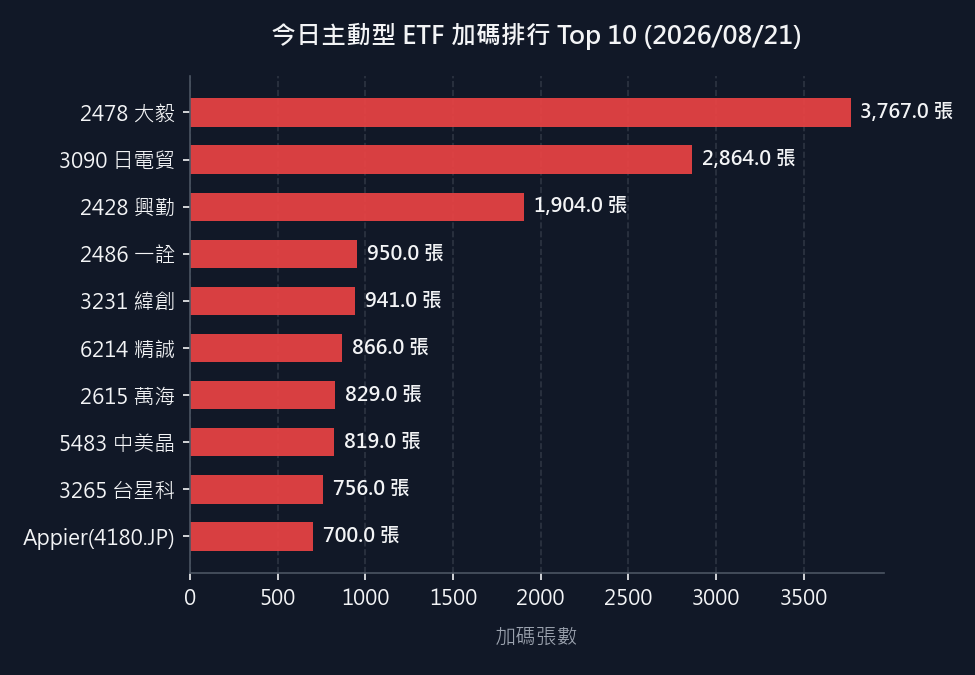
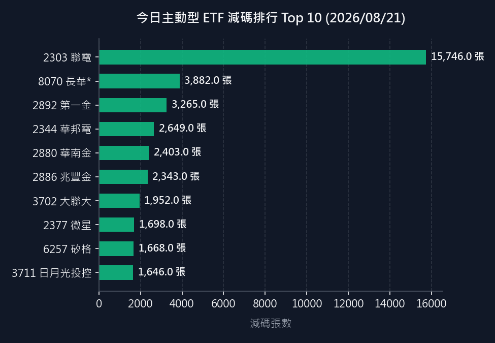

# 主動型 ETF 持股變動

資料來源：`主動型ETF持股明細.xlsx` 最近兩個日期分頁。

比較區間：`20260819` → `20260821`

## 今日加減碼視覺化排行

| 今日加碼 Top 10 | 今日減碼 Top 10 |
| :---: | :---: |
|  |  |

| ETF | 新增 | 刪除 | 比例變動 |
| :-- | --: | --: | --: |
| 00400A | 1 | 0 | 43 |
| 00401A | 1 | 0 | 46 |
| 00402A | 0 | 0 | 48 |
| 00403A | 0 | 0 | 34 |
| 00404A | 14 | 14 | 40 |
| 00405A | 0 | 0 | 35 |
| 00407A | 1 | 1 | 45 |
| 00408A | 2 | 1 | 40 |
| 00980A | 0 | 0 | 49 |
| 00980D | 0 | 0 | 37 |
| 00981A | 0 | 0 | 28 |
| 00982A | 2 | 13 | 47 |
| 00983A | 0 | 0 | 42 |
| 00983D | 0 | 0 | 23 |
| 00984A | 0 | 2 | 79 |
| 00985A | 0 | 0 | 43 |
| 00986A | 0 | 0 | 32 |
| 00987A | 0 | 0 | 25 |
| 00988A | 4 | 2 | 40 |
| 00989A | 2 | 1 | 60 |
| 00990A | 5 | 5 | 41 |
| 00991A | 0 | 0 | 21 |
| 00992A | 0 | 0 | 35 |
| 00993A | 1 | 0 | 48 |
| 00994A | 2 | 1 | 29 |
| 00995A | 1 | 0 | 44 |
| 00996A | 0 | 0 | 38 |
| 00997A | 1 | 1 | 47 |
| 00998A | 1 | 2 | 38 |
| 00999A | 0 | 0 | 52 |

## 00400A

### 新增持股

- 3167 大量（0.29%，115 張）

### 刪除持股

- 無

### 投資比例變動

- 1303 南亞：0.40% → 0.42%（+0.02）
- 2059 川湖：6.04% → 5.81%（-0.23）
- 2308 台達電：2.74% → 2.75%（+0.01）
- 2313 華通：0.80% → 0.83%（+0.03）
- 2317 鴻海：0.82% → 0.83%（+0.01）
- 2330 台積電：8.39% → 8.72%（+0.33）
- 2345 智邦：1.68% → 1.63%（-0.05）
- 2360 致茂：3.47% → 3.48%（+0.01）
- 2368 金像電：1.28% → 1.20%（-0.08）
- 2382 廣達：0.77% → 0.75%（-0.02）
- 2383 台光電：4.94% → 4.83%（-0.11）
- 2408 南亞科：1.88% → 2.08%（+0.20）
- 2454 聯發科：6.30% → 6.28%（-0.02）
- 2881 富邦金：0.76% → 0.80%（+0.04）
- 2885 元大金：1.36% → 1.42%（+0.06）
- 3008 大立光：2.98% → 3.05%（+0.07）
- 3017 奇鋐：3.62% → 3.40%（-0.22）
- 3036 文曄：1.08% → 1.11%（+0.03）
- 3037 欣興：5.82% → 5.66%（-0.16）
- 3044 健鼎：1.73% → 1.67%（-0.06）
- 3090 日電貿：0.37% → 0.34%（-0.03）
- 3211 順達：0.79% → 0.46%（-0.33）
- 3293 鈊象：0.35% → 0.34%（-0.01）
- 3374 精材：0.28% → 0.29%（+0.01）
- 3443 創意：3.51% → 3.75%（+0.24）
- 3529 力旺：0.96% → 0.93%（-0.03）
- 3665 貿聯-KY：2.17% → 2.27%（+0.10）
- 4979 華星光：0.54% → 0.60%（+0.06）
- 5274 信驊：2.89% → 2.84%（-0.05）
- 5347 世界：0.71% → 0.72%（+0.01）
- 5434 崇越：0.37% → 0.36%（-0.01）
- 6121 新普：0.25% → 0.24%（-0.01）
- 6187 萬潤：2.71% → 2.51%（-0.20）
- 6223 旺矽：4.36% → 4.59%（+0.23）
- 6239 力成：0.41% → 0.42%（+0.01）
- 6274 台燿：1.09% → 1.10%（+0.01）
- 6442 光聖：0.87% → 0.88%（+0.01）
- 6488 環球晶：3.21% → 3.11%（-0.10）
- 6669 緯穎：3.11% → 3.09%（-0.02）
- 7750 新代：1.07% → 0.95%（-0.12）
- 7769 鴻勁：0.76% → 0.77%（+0.01）
- 8046 南電：1.07% → 1.04%（-0.03）
- 9939 宏全：0.08% → 0.09%（+0.01）

## 00401A

### 新增持股

- TAIWAN TAIE C 16SEP26 44500 TWSE（-0.83%，-0.32 張）

### 刪除持股

- 無

### 投資比例變動

- 1301 台塑：0.07% → 0.08%（+0.01）
- 1477 聚陽：0.97% → 1.02%（+0.05）
- 2059 川湖：1.30% → 1.23%（-0.07）
- 2303 聯電：0.85% → 0.86%（+0.01）
- 2308 台達電：3.33% → 3.29%（-0.04）
- 2313 華通：1.63% → 1.68%（+0.05）
- 2327 國巨*：0.71% → 0.68%（-0.03）
- 2330 台積電：15.55% → 15.93%（+0.38）
- 2345 智邦：2.27% → 2.17%（-0.10）
- 2360 致茂：1.86% → 1.84%（-0.02）
- 2368 金像電：0.29% → 0.27%（-0.02）
- 2379 瑞昱：1.18% → 1.14%（-0.04）
- 2382 廣達：2.41% → 2.34%（-0.07）
- 2383 台光電：1.97% → 1.90%（-0.07）
- 2454 聯發科：6.11% → 6.02%（-0.09）
- 2455 全新：1.98% → 2.03%（+0.05）
- 2603 長榮：1.17% → 1.22%（+0.05）
- 2881 富邦金：1.91% → 1.99%（+0.08）
- 2882 國泰金：1.03% → 1.05%（+0.02）
- 2883 凱基金：1.49% → 1.54%（+0.05）
- 2885 元大金：0.51% → 0.52%（+0.01）
- 2886 兆豐金：1.42% → 1.41%（-0.01）
- 2887 台新新光金：1.05% → 1.08%（+0.03）
- 2912 統一超：0.28% → 0.29%（+0.01）
- 3008 大立光：2.79% → 2.82%（+0.03）
- 3037 欣興：2.63% → 2.52%（-0.11）
- 3131 弘塑：0.79% → 0.78%（-0.01）
- 3167 大量：0.50% → 0.52%（+0.02）
- 3231 緯創：0.38% → 0.36%（-0.02）
- 3491 昇達科：1.62% → 1.69%（+0.07）
- 4904 遠傳：0.81% → 0.82%（+0.01）
- 4958 臻鼎-KY：1.85% → 1.78%（-0.07）
- 4991 環宇-KY：1.12% → 1.10%（-0.02）
- 5274 信驊：1.96% → 1.90%（-0.06）
- 5871 中租-KY：0.15% → 0.16%（+0.01）
- 5904 寶雅*：0.66% → 0.63%（-0.03）
- 6187 萬潤：0.79% → 0.72%（-0.07）
- 6223 旺矽：1.83% → 1.90%（+0.07）
- 6415 矽力*-KY：0.61% → 0.62%（+0.01）
- 6510 精測：0.65% → 0.64%（-0.01）
- 6515 穎崴：1.10% → 1.11%（+0.01）
- 6531 愛普*：1.13% → 1.19%（+0.06）
- 6669 緯穎：2.15% → 2.10%（-0.05）
- 6944 兆聯實業：0.46% → 0.44%（-0.02）
- 7769 鴻勁：1.94% → 1.92%（-0.02）
- 台股期貨09/26：-0.25% → -0.15%（+0.10）

## 00402A

### 新增持股

- 無

### 刪除持股

- 無

### 投資比例變動

- AAPL.US Apple：7.32% → 7.45%（+0.13）
- ADI.US Analog Devices：1.95% → 1.94%（-0.01）
- AMD.US AMD：4.69% → 4.60%（-0.09）
- AMZN.US Amazon：4.29% → 4.36%（+0.07）
- ANET.US Arista Networks：0.87% → 0.84%（-0.03）
- ARM.US Arm：1.04% → 1.05%（+0.01）
- ASML.US ASML Holding：1.83% → 1.80%（-0.03）
- AVGO.US Broadcom：2.39% → 2.32%（-0.07）
- AXON.US Axon Enterprise：1.20% → 1.21%（+0.01）
- BABA.US Alibaba Group：0.64% → 0.67%（+0.03）
- BKNG.US Booking Holdings：0.76% → 0.77%（+0.01）
- CDNS.US Cadence Design Systems：1.47% → 1.48%（+0.01）
- CIEN.US Ciena：0.90% → 0.89%（-0.01）
- CLS.US Celestica：0.92% → 0.90%（-0.02）
- COHR.US Coherent：2.14% → 2.05%（-0.09）
- CRWD.US CrowdStrike Holdings：1.51% → 1.37%（-0.14）
- DASH.US DoorDash：0.31% → 0.33%（+0.02）
- FSLY.US Fastly：0.43% → 0.37%（-0.06）
- GOOG.US Alphabet - Class C Capital Stock：3.27% → 3.28%（+0.01）
- GOOGL.US Alphabet - Class A Common Stock：3.23% → 3.24%（+0.01）
- INTC.US Intel：1.34% → 1.30%（-0.04）
- KLAC.US KLA：2.31% → 2.23%（-0.08）
- LITE.US Lumentum：1.86% → 1.90%（+0.04）
- LRCX.US Lam Research：3.05% → 2.92%（-0.13）
- MCHP.US Microchip Technology：1.26% → 1.23%（-0.03）
- MDB.US MongoDB：0.90% → 0.89%（-0.01）
- META.US Meta：2.76% → 2.81%（+0.05）
- MRVL.US Marvell：1.64% → 1.93%（+0.29）
- MSFT.US Microsoft：4.45% → 4.51%（+0.06）
- MU.US Micron：6.28% → 6.59%（+0.31）
- NFLX.US Netflix：0.91% → 0.95%（+0.04）
- NOW.US ServiceNow：0.27% → 0.30%（+0.03）
- NVDA.US NVIDIA：8.85% → 8.82%（-0.03）
- PANW.US Palo Alto：3.49% → 3.31%（-0.18）
- PLTR.US Palantir Technologies：1.59% → 1.63%（+0.04）
- SHOP.US Shopify：0.53% → 0.54%（+0.01）
- SIMO.US Silicon Motion：0.80% → 0.81%（+0.01）
- SKHY.US SK hynix：1.05% → 1.11%（+0.06）
- SPCX.US SpaceX：0.78% → 0.74%（-0.04）
- SPOT.US Spotify：0.30% → 0.31%（+0.01）
- STX.US Seagate：1.18% → 1.13%（-0.05）
- TER.US Teradyne：1.00% → 0.96%（-0.04）
- TSM.US TSMC(ADR)：1.50% → 1.53%（+0.03）
- TXN.US Texas Instruments：2.35% → 2.32%（-0.03）
- UBER.US Uber：0.51% → 0.55%（+0.04）
- V.US Visa：1.16% → 1.18%（+0.02）
- WDC.US Western Digital：2.40% → 2.30%（-0.10）
- ZS.US Zscaler：0.21% → 0.20%（-0.01）

## 00403A

### 新增持股

- 無

### 刪除持股

- 無

### 投資比例變動

- 1303 南亞：0.99% → 1.02%（+0.03）
- 1560 中砂：0.29% → 0.16%（-0.13）
- 1717 長興：0.10% → 0.11%（+0.01）
- 2059 川湖：0.17% → 0.16%（-0.01）
- 2303 聯電：4.75% → 4.14%（-0.61）
- 2327 國巨*：3.31% → 3.21%（-0.10）
- 2330 台積電：16.56% → 17.12%（+0.56）
- 2337 旺宏：0.42% → 0.33%（-0.09）
- 2344 華邦電：1.78% → 1.61%（-0.17）
- 2345 智邦：2.88% → 2.78%（-0.10）
- 2360 致茂：1.25% → 1.24%（-0.01）
- 2383 台光電：5.84% → 5.68%（-0.16）
- 2454 聯發科：4.76% → 4.73%（-0.03）
- 2481 強茂：0.12% → 0.00%（-0.12）
- 3008 大立光：2.04% → 2.08%（+0.04）
- 3017 奇鋐：5.45% → 5.09%（-0.36）
- 3037 欣興：5.61% → 5.43%（-0.18）
- 3189 景碩：2.12% → 2.04%（-0.08）
- 3211 順達：0.43% → 0.41%（-0.02）
- 3443 創意：1.59% → 2.02%（+0.43）
- 3450 聯鈞：0.60% → 0.59%（-0.01）
- 3653 健策：3.46% → 3.45%（-0.01）
- 3665 貿聯-KY：1.55% → 1.62%（+0.07）
- 3711 日月光投控：2.76% → 2.78%（+0.02）
- 5274 信驊：1.67% → 1.63%（-0.04）
- 6223 旺矽：3.27% → 3.56%（+0.29）
- 6239 力成：0.83% → 0.85%（+0.02）
- 6274 台燿：1.48% → 1.59%（+0.11）
- 6488 環球晶：1.62% → 1.56%（-0.06）
- 6669 緯穎：2.28% → 2.26%（-0.02）
- 6805 富世達：0.74% → 0.73%（-0.01）
- 8046 南電：1.83% → 1.77%（-0.06）
- 8358 金居：0.19% → 0.21%（+0.02）
- 8996 高力：1.07% → 1.03%（-0.04）

## 00404A

### 新增持股

- 2027 大成鋼（0.46%，307 張）
- 2317 鴻海（0.70%，95 張）
- 2347 聯強（0.72%，272 張）
- 2379 瑞昱（2.10%，98 張）
- 2382 廣達（2.16%，223 張）
- 2395 研華（1.48%，76 張）
- 2439 美律（1.06%，426 張）
- 2637 慧洋-KY（1.26%，410 張）
- 2845 遠東銀（1.17%，2840 張）
- 3135 凌航（1.63%，318 張）
- 3293 鈊象（0.51%，23 張）
- 4904 遠傳（0.48%，156 張）
- 6446 藥華藥（0.08%，2 張）
- 8081 致新（0.88%，114 張）

### 刪除持股

- 2327 國巨*（0.71%，41 張）
- 2377 微星（1.79%，406 張）
- 2618 長榮航（0.14%，112 張）
- 2886 兆豐金（3.32%，2343 張）
- 2892 第一金（3.30%，3265 張）
- 3022 威強電（0.79%，284 張）
- 3023 信邦（2.38%，245 張）
- 3529 力旺（0.14%，2 張）
- 3653 健策（0.25%，1.5 張）
- 5289 宜鼎（0.32%，7 張）
- 5876 上海商銀（0.02%，14.23 張）
- 6138 茂達（0.41%，46 張）
- 6488 環球晶（0.15%，5 張）
- 6515 穎崴（0.19%，1 張）

### 投資比例變動

- 1210 大成：1.90% → 0.52%（-1.38）
- 1303 南亞：0.18% → 0.65%（+0.47）
- 2059 川湖：0.42% → 1.61%（+1.19）
- 2301 光寶科：1.85% → 1.44%（-0.41）
- 2303 聯電：2.89% → 2.76%（-0.13）
- 2308 台達電：0.90% → 1.89%（+0.99）
- 2330 台積電：22.51% → 22.83%（+0.32）
- 2345 智邦：0.45% → 0.73%（+0.28）
- 2351 順德：0.66% → 0.45%（-0.21）
- 2360 致茂：1.09% → 0.69%（-0.40）
- 2383 台光電：2.48% → 2.73%（+0.25）
- 2428 興勤：0.85% → 0.84%（-0.01）
- 2441 超豐：0.45% → 1.78%（+1.33）
- 2454 聯發科：6.54% → 5.87%（-0.67）
- 2458 義隆：0.43% → 1.72%（+1.29）
- 2880 華南金：2.85% → 0.03%（-2.82）
- 2885 元大金：1.37% → 2.07%（+0.70）
- 2887 台新新光金：0.04% → 0.63%（+0.59）
- 2890 永豐金：0.04% → 0.99%（+0.95）
- 3017 奇鋐：1.03% → 0.95%（-0.08）
- 3034 聯詠：0.60% → 2.04%（+1.44）
- 3037 欣興：1.33% → 0.75%（-0.58）
- 3260 威剛：0.37% → 1.52%（+1.15）
- 3264 欣銓：1.72% → 1.15%（-0.57）
- 3443 創意：0.96% → 0.51%（-0.45）
- 3711 日月光投控：3.47% → 3.46%（-0.01）
- 4763 材料*-KY：1.79% → 1.75%（-0.04）
- 5274 信驊：1.83% → 2.23%（+0.40）
- 5434 崇越：1.66% → 1.60%（-0.06）
- 5904 寶雅*：1.44% → 0.52%（-0.92）
- 6139 亞翔：0.25% → 1.79%（+1.54）
- 6196 帆宣：1.79% → 1.76%（-0.03）
- 6223 旺矽：1.03% → 1.07%（+0.04）
- 6257 矽格：0.40% → 0.22%（-0.18）
- 6491 晶碩：1.88% → 0.51%（-1.37）
- 6691 洋基工程：2.68% → 0.22%（-2.46）
- 8016 矽創：1.19% → 0.20%（-0.99）
- 8271 宇瞻：0.77% → 0.26%（-0.51）
- 台指選擇權09/26 48000 買權：-0.12% → -0.13%（-0.01）
- 台股期貨09/26：16.35% → 16.56%（+0.21）

## 00405A

### 新增持股

- 無

### 刪除持股

- 無

### 投資比例變動

- 2059 川湖：2.00% → 1.94%（-0.06）
- 2308 台達電：1.75% → 0.57%（-1.18）
- 2330 台積電：1.42% → 1.49%（+0.07）
- 2345 智邦：3.80% → 3.72%（-0.08）
- 2368 金像電：3.96% → 3.76%（-0.20）
- 2383 台光電：4.21% → 4.16%（-0.05）
- 2449 京元電子：0.66% → 0.03%（-0.63）
- 2454 聯發科：6.24% → 6.28%（+0.04）
- 3008 大立光：1.89% → 1.96%（+0.07）
- 3017 奇鋐：8.40% → 7.95%（-0.45）
- 3026 禾伸堂：1.24% → 0.55%（-0.69）
- 3037 欣興：6.00% → 5.88%（-0.12）
- 3081 聯亞：1.43% → 1.60%（+0.17）
- 3163 波若威：0.03% → 0.04%（+0.01）
- 3443 創意：7.50% → 8.10%（+0.60）
- 3450 聯鈞：1.25% → 1.24%（-0.01）
- 3653 健策：7.88% → 7.96%（+0.08）
- 3665 貿聯-KY：6.80% → 7.19%（+0.39）
- 4749 新應材：0.24% → 0.25%（+0.01）
- 4991 環宇-KY：1.48% → 1.99%（+0.51）
- 5274 信驊：2.91% → 2.88%（-0.03）
- 6187 萬潤：0.87% → 0.82%（-0.05）
- 6223 旺矽：4.85% → 5.15%（+0.30）
- 6274 台燿：1.55% → 1.58%（+0.03）
- 6285 啟碁：0.32% → 0.33%（+0.01）
- 6442 光聖：0.36% → 0.37%（+0.01）
- 6488 環球晶：0.37% → 0.36%（-0.01）
- 6510 精測：2.20% → 2.24%（+0.04）
- 6515 穎崴：0.50% → 0.51%（+0.01）
- 6805 富世達：1.22% → 1.23%（+0.01）
- 6831 邁科：0.51% → 0.50%（-0.01）
- 7769 鴻勁：2.61% → 2.65%（+0.04）
- 8046 南電：2.95% → 2.90%（-0.05）
- 8210 勤誠：0.56% → 0.55%（-0.01）
- 8996 高力：1.08% → 1.06%（-0.02）

## 00407A

### 新增持股

- 3081 聯亞（0.99%，90 張）

### 刪除持股

- 6526 達發（0.08%，38 張）

### 投資比例變動

- 1303 南亞：0.58% → 0.60%（+0.02）
- 1560 中砂：0.49% → 0.47%（-0.02）
- 2059 川湖：3.65% → 3.52%（-0.13）
- 2301 光寶科：1.00% → 0.97%（-0.03）
- 2303 聯電：2.13% → 1.47%（-0.66）
- 2308 台達電：3.72% → 3.74%（+0.02）
- 2327 國巨*：2.28% → 2.22%（-0.06）
- 2330 台積電：8.62% → 8.96%（+0.34）
- 2344 華邦電：0.13% → 0.14%（+0.01）
- 2345 智邦：2.88% → 2.79%（-0.09）
- 2360 致茂：2.09% → 2.10%（+0.01）
- 2368 金像電：2.07% → 1.95%（-0.12）
- 2379 瑞昱：0.77% → 0.22%（-0.55）
- 2383 台光電：5.85% → 5.73%（-0.12）
- 2395 研華：2.08% → 1.98%（-0.10）
- 2408 南亞科：1.91% → 2.13%（+0.22）
- 2451 創見：0.17% → 0.19%（+0.02）
- 2454 聯發科：5.11% → 4.57%（-0.54）
- 2615 萬海：0.31% → 0.75%（+0.44）
- 3008 大立光：0.64% → 0.65%（+0.01）
- 3017 奇鋐：4.86% → 4.56%（-0.30）
- 3034 聯詠：0.71% → 0.72%（+0.01）
- 3037 欣興：5.48% → 5.33%（-0.15）
- 3260 威剛：0.17% → 0.18%（+0.01）
- 3293 鈊象：0.57% → 0.56%（-0.01）
- 3443 創意：2.80% → 3.43%（+0.63）
- 3491 昇達科：0.42% → 0.44%（+0.02）
- 3529 力旺：1.80% → 0.91%（-0.89）
- 3665 貿聯-KY：2.09% → 2.19%（+0.10）
- 3711 日月光投控：2.48% → 2.51%（+0.03）
- 4958 臻鼎-KY：1.74% → 1.70%（-0.04）
- 5274 信驊：2.04% → 2.01%（-0.03）
- 5289 宜鼎：0.18% → 0.19%（+0.01）
- 6187 萬潤：0.97% → 0.90%（-0.07）
- 6223 旺矽：2.47% → 3.22%（+0.75）
- 6274 台燿：3.57% → 3.61%（+0.04）
- 6446 藥華藥：1.04% → 1.06%（+0.02）
- 6515 穎崴：1.39% → 1.42%（+0.03）
- 6531 愛普*：0.28% → 0.30%（+0.02）
- 6669 緯穎：4.84% → 4.81%（-0.03）
- 6805 富世達：2.27% → 2.26%（-0.01）
- 8046 南電：2.71% → 2.64%（-0.07）
- 8210 勤誠：0.94% → 0.91%（-0.03）
- 8299 群聯：0.14% → 0.15%（+0.01）
- 8996 高力：0.45% → 0.43%（-0.02）

## 00408A

### 新增持股

- 4746 台耀（0.52%，155 張）
- 9941 裕融（0.37%，70 張）

### 刪除持股

- 2327 國巨*（0.07%，2 張）

### 投資比例變動

- 1477 聚陽：0.24% → 0.25%（+0.01）
- 1537 廣隆：0.39% → 0.38%（-0.01）
- 2059 川湖：2.64% → 2.61%（-0.03）
- 2308 台達電：3.75% → 3.71%（-0.04）
- 2317 鴻海：1.84% → 1.85%（+0.01）
- 2330 台積電：6.07% → 6.11%（+0.04）
- 2344 華邦電：1.47% → 1.55%（+0.08）
- 2345 智邦：1.99% → 1.98%（-0.01）
- 2357 華碩：2.49% → 2.46%（-0.03）
- 2360 致茂：3.05% → 2.14%（-0.91）
- 2368 金像電：2.99% → 2.95%（-0.04）
- 2376 技嘉：1.20% → 1.18%（-0.02）
- 2382 廣達：1.35% → 1.33%（-0.02）
- 2383 台光電：4.78% → 4.87%（+0.09）
- 2395 研華：2.39% → 2.32%（-0.07）
- 2404 漢唐：1.71% → 1.68%（-0.03）
- 2408 南亞科：1.20% → 1.29%（+0.09）
- 2454 聯發科：2.40% → 0.46%（-1.94）
- 2481 強茂：0.32% → 0.33%（+0.01）
- 2880 華南金：1.60% → 1.59%（-0.01）
- 2886 兆豐金：2.56% → 2.53%（-0.03）
- 2891 中信金：0.97% → 0.95%（-0.02）
- 3017 奇鋐：5.03% → 4.85%（-0.18）
- 3037 欣興：3.32% → 3.35%（+0.03）
- 3045 台灣大：1.28% → 1.29%（+0.01）
- 3231 緯創：1.02% → 1.01%（-0.01）
- 3653 健策：2.05% → 2.10%（+0.05）
- 3702 大聯大：1.73% → 1.70%（-0.03）
- 3711 日月光投控：0.51% → 0.26%（-0.25）
- 5434 崇越：1.92% → 1.91%（-0.01）
- 5483 中美晶：1.10% → 1.17%（+0.07）
- 6187 萬潤：1.22% → 1.19%（-0.03）
- 6223 旺矽：0.82% → 0.88%（+0.06）
- 6239 力成：1.10% → 1.13%（+0.03）
- 6274 台燿：1.78% → 1.87%（+0.09）
- 6488 環球晶：1.54% → 1.55%（+0.01）
- 6669 緯穎：5.18% → 5.14%（-0.04）
- 6805 富世達：0.34% → 0.35%（+0.01）
- 7769 鴻勁：1.81% → 1.82%（+0.01）
- 8046 南電：2.66% → 2.69%（+0.03）

## 00980A

### 新增持股

- 無

### 刪除持股

- 無

### 投資比例變動

- 1303 南亞：2.29% → 2.35%（+0.06）
- 2059 川湖：6.48% → 5.42%（-1.06）
- 2308 台達電：3.60% → 3.58%（-0.02）
- 2317 鴻海：2.38% → 2.39%（+0.01）
- 2327 國巨*：1.50% → 1.67%（+0.17）
- 2330 台積電：7.87% → 9.18%（+1.31）
- 2344 華邦電：1.65% → 2.10%（+0.45）
- 2345 智邦：1.87% → 1.79%（-0.08）
- 2360 致茂：1.59% → 1.57%（-0.02）
- 2368 金像電：2.06% → 1.92%（-0.14）
- 2376 技嘉：1.22% → 1.19%（-0.03）
- 2382 廣達：1.65% → 1.60%（-0.05）
- 2383 台光電：4.04% → 3.91%（-0.13）
- 2408 南亞科：2.66% → 2.93%（+0.27）
- 2454 聯發科：4.93% → 4.77%（-0.16）
- 2884 玉山金：1.21% → 1.22%（+0.01）
- 2891 中信金：1.48% → 1.49%（+0.01）
- 3008 大立光：0.73% → 0.74%（+0.01）
- 3017 奇鋐：2.10% → 1.94%（-0.16）
- 3026 禾伸堂：0.47% → 0.43%（-0.04）
- 3036 文曄：1.17% → 1.20%（+0.03）
- 3037 欣興：3.21% → 3.09%（-0.12）
- 3044 健鼎：0.84% → 0.80%（-0.04）
- 3081 聯亞：3.10% → 3.38%（+0.28）
- 3189 景碩：0.79% → 0.76%（-0.03）
- 3231 緯創：0.96% → 0.92%（-0.04）
- 3264 欣銓：0.68% → 0.67%（-0.01）
- 3293 鈊象：0.95% → 0.93%（-0.02）
- 3443 創意：1.58% → 1.67%（+0.09）
- 3529 力旺：0.50% → 0.48%（-0.02）
- 3533 嘉澤：0.29% → 0.28%（-0.01）
- 3653 健策：1.90% → 1.88%（-0.02）
- 3665 貿聯-KY：0.36% → 0.37%（+0.01）
- 4958 臻鼎-KY：1.06% → 1.03%（-0.03）
- 5274 信驊：1.46% → 1.42%（-0.04）
- 5904 寶雅*：1.23% → 1.18%（-0.05）
- 6213 聯茂：1.18% → 1.25%（+0.07）
- 6223 旺矽：1.91% → 1.99%（+0.08）
- 6274 台燿：1.42% → 1.58%（+0.16）
- 6515 穎崴：1.77% → 1.78%（+0.01）
- 6669 緯穎：1.67% → 1.65%（-0.02）
- 6805 富世達：0.49% → 0.48%（-0.01）
- 6831 邁科：0.55% → 0.53%（-0.02）
- 7769 鴻勁：2.38% → 2.36%（-0.02）
- 8046 南電：1.21% → 1.17%（-0.04）
- 8210 勤誠：0.96% → 0.92%（-0.04）
- 8299 群聯：1.96% → 2.07%（+0.11）
- 8996 高力：1.04% → 1.00%（-0.04）
- 台灣證交所加權股價指數：4.95% → 5.02%（+0.07）

## 00980D

### 新增持股

- 無

### 刪除持股

- 無

### 投資比例變動

- AHOLD FINANCE USA LLC 6.88% 01MAY2029：0.48% → 0.47%（-0.01）
- ATHENE HOLDING LTD (REG) 6.25% 01APR2054：0.73% → 0.74%（+0.01）
- ATHENE HOLDING LTD 6.625000 % 19MAY2055：0.54% → 0.55%（+0.01）
- BLUE OWL CREDIT INCOME 7.750000 % 15JAN2029：0.53% → 0.52%（-0.01）
- BLUE OWL TECHNOLOGY FIN CORP II 6.75 % 04APR2029：0.55% → 0.54%（-0.01）
- BRITISH TELECOMMUNICATIO (BR) 9.625% 15DEC2030：0.57% → 0.56%（-0.01）
- CAPITAL ONE FINANCIAL CO SER . (REG) VAR 30OCT2031：0.58% → 0.57%（-0.01）
- CHARTER COMM OPT 6.484% 23OCT2045 W/I：0.44% → 0.45%（+0.01）
- CHARTER COMM OPT LLC/CAP (REG) 5.5% 01APR2063：0.48% → 0.49%（+0.01）
- CHARTER COMM OPT LLC/CAP (REG) 6.834000 % 23OCT2055：0.44% → 0.45%（+0.01）
- CHC GROUP LLC SER REGS 11.750000 % 01-SEP-2030：0.39% → 0.43%（+0.04）
- COREWEAVE INC SER REGS (REG S) 9.25% 01JUN2030：0.42% → 0.41%（-0.01）
- COTY/HFC PRESTIGE/INT US SER REGS (REG S) 6.625% 15JUL2030：0.56% → 0.55%（-0.01）
- COX COMMUNICATIONS INC SER REGS 5.950000 % 01SEP2054：0.52% → 0.53%（+0.01）
- DEUTSCHE TELEKOM INT FIN (REG) 8.75% 15JUN2030：0.41% → 0.40%（-0.01）
- DOW CHEMICAL CO/THE (REG) 5.55% 30NOV2048：0.54% → 0.55%（+0.01）
- DOW CHEMICAL CO/THE 6.9% 15MAY2053：0.58% → 0.59%（+0.01）
- FORD MOTOR COMPANY (REG) 7.45% 16JUL2031：0.47% → 0.46%（-0.01）
- GETTY IMAGES INC SER REGS 11.250000 % 21FEB2030：0.48% → 0.47%（-0.01）
- HERTZ CORP/THE SER REGS (REG S) 12.625% 15JUL2029：0.30% → 0.29%（-0.01）
- HISCOX LTD VAR 11JUN2036：0.43% → 0.42%（-0.01）
- HPS CORPORATE LENDING FU 6.750000 % 30JAN2029：0.53% → 0.52%（-0.01）
- JETBLUE AIRWAYS/LOYALTY SER REGS (REG S) 9.875% 20SEP2031：0.48% → 0.47%（-0.01）
- LADDER CAP FIN LLLP/CORP SER REGS 7.000000 % 15JUL2031：0.33% → 0.32%（-0.01）
- ORACLE CORP 6.125000 % 03AUG2065：0.51% → 0.50%（-0.01）
- ORACLE CORP 6.85 % 04-FEB-2066：0.40% → 0.39%（-0.01）
- ORACLE CORP 6.9% 09NOV2052：0.51% → 0.50%（-0.01）
- POLARIS INC 6.950000 % 15MAR2029：0.47% → 0.46%（-0.01）
- PROGRESS ENERGY INC (REG) 7.75% 01MAR2031：0.57% → 0.56%（-0.01）
- SANTANDER HOLDINGS USA VAR 09MAR2029：0.47% → 0.46%（-0.01）
- SPRINT CAPITAL CORP (REG) 8.75% 15MAR2032：0.41% → 0.40%（-0.01）
- US 10YR NOTE (CBT)SEP26 21-SEP-2026：18.20% → 18.15%（-0.05）
- US 2YR NOTE (CBT) SEP26 30-SEP-2026：1.94% → 1.93%（-0.01）
- US 5YR NOTE (CBT) SEP26 30-SEP-2026：-15.84% → -15.79%（+0.05）
- US ACUTE CARE SOLUTIONS SER REGS (REG S) 9.75% 15MAY2029：0.32% → 0.31%（-0.01）
- US LONG BOND(CBT) SEP26 21-SEP-2026：5.28% → 5.30%（+0.02）
- US ULTRA BOND CBT SEP26 21-SEP-2026：-0.34% → -0.35%（-0.01）

## 00981A

### 新增持股

- 無

### 刪除持股

- 無

### 投資比例變動

- 2002 中鋼：0.03% → 0.04%（+0.01）
- 2303 聯電：3.53% → 3.62%（+0.09）
- 2308 台達電：4.34% → 4.37%（+0.03）
- 2327 國巨*：5.11% → 4.99%（-0.12）
- 2330 台積電：9.76% → 10.16%（+0.40）
- 2345 智邦：4.88% → 4.74%（-0.14）
- 2360 致茂：0.22% → 0.00%（-0.22）
- 2368 金像電：0.73% → 0.67%（-0.06）
- 2383 台光電：9.96% → 9.76%（-0.20）
- 2454 聯發科：7.19% → 6.92%（-0.27）
- 3017 奇鋐：6.38% → 6.00%（-0.38）
- 3037 欣興：8.02% → 7.82%（-0.20）
- 3443 創意：0.00% → 0.28%（+0.28）
- 3653 健策：4.57% → 4.59%（+0.02）
- 3665 貿聯-KY：3.55% → 3.77%（+0.22）
- 3711 日月光投控：4.00% → 4.06%（+0.06）
- 4979 華星光：0.45% → 0.50%（+0.05）
- 5274 信驊：2.27% → 2.24%（-0.03）
- 6187 萬潤：0.38% → 0.20%（-0.18）
- 6223 旺矽：4.49% → 4.82%（+0.33）
- 6274 台燿：2.88% → 2.92%（+0.04）
- 6278 台表科：0.20% → 0.22%（+0.02）
- 6510 精測：0.44% → 0.45%（+0.01）
- 6669 緯穎：4.96% → 4.94%（-0.02）
- 8046 南電：3.97% → 3.88%（-0.09）
- 8210 勤誠：0.85% → 0.83%（-0.02）
- 8996 高力：0.44% → 0.43%（-0.01）
- 台指期貨(B) 2026/09：2.11% → 2.18%（+0.07）

## 00982A

### 新增持股

- 2486 一詮（0.47%，950 張）
- 6472 保瑞（0.48%，516 張）

### 刪除持股

- 1785 光洋科（0.06%，290 張）
- 2316 楠梓電（0.37%，1181 張）
- 2327 國巨*（0.28%，236 張）
- 2351 順德（0.30%，788 張）
- 2451 創見（0.10%，177 張）
- 2472 立隆電（0.25%，518 張）
- 3036 文曄（0.33%，818 張）
- 3702 大聯大（0.42%，1930 張）
- 6257 矽格（0.66%，1639 張）
- 6278 台表科（0.30%，836 張）
- 6831 邁科（0.36%，300 張）
- 7769 鴻勁（0.40%，31 張）
- 8016 矽創（0.46%，772 張）

### 投資比例變動

- 2059 川湖：5.29% → 5.08%（-0.21）
- 2301 光寶科：0.97% → 1.23%（+0.26）
- 2303 聯電：2.13% → 1.26%（-0.87）
- 2330 台積電：8.54% → 8.87%（+0.33）
- 2345 智邦：3.52% → 3.41%（-0.11）
- 2360 致茂：3.60% → 3.63%（+0.03）
- 2376 技嘉：1.02% → 1.25%（+0.23）
- 2377 微星：1.69% → 1.27%（-0.42）
- 2383 台光電：3.90% → 3.73%（-0.17）
- 2395 研華：0.97% → 1.20%（+0.23）
- 2428 興勤：0.23% → 1.22%（+0.99）
- 2454 聯發科：6.80% → 6.78%（-0.02）
- 2455 全新：0.89% → 1.31%（+0.42）
- 2467 志聖：1.11% → 1.15%（+0.04）
- 2476 鉅祥：0.23% → 0.31%（+0.08）
- 2478 大毅：0.20% → 1.14%（+0.94）
- 2885 元大金：0.28% → 0.29%（+0.01）
- 3008 大立光：2.79% → 2.96%（+0.17）
- 3017 奇鋐：2.62% → 2.23%（-0.39）
- 3090 日電貿：0.19% → 1.15%（+0.96）
- 3105 穩懋：3.54% → 3.68%（+0.14）
- 3231 緯創：0.92% → 1.24%（+0.32）
- 3264 欣銓：2.00% → 1.66%（-0.34）
- 3265 台星科：0.99% → 1.19%（+0.20）
- 3491 昇達科：2.48% → 2.62%（+0.14）
- 3529 力旺：0.43% → 0.41%（-0.02）
- 3583 辛耘：1.66% → 1.67%（+0.01）
- 3617 碩天：0.23% → 0.32%（+0.09）
- 3711 日月光投控：1.21% → 1.15%（-0.06）
- 4958 臻鼎-KY：2.94% → 2.87%（-0.07）
- 5274 信驊：1.22% → 1.13%（-0.09）
- 5425 台半：0.24% → 0.28%（+0.04）
- 5483 中美晶：0.89% → 1.28%（+0.39）
- 5536 聖暉*：3.57% → 0.83%（-2.74）
- 6139 亞翔：6.25% → 5.98%（-0.27）
- 6196 帆宣：0.23% → 0.31%（+0.08）
- 6213 聯茂：0.23% → 0.34%（+0.11）
- 6214 精誠：0.95% → 1.29%（+0.34）
- 6223 旺矽：3.27% → 3.44%（+0.17）
- 6239 力成：0.38% → 0.39%（+0.01）
- 6274 台燿：1.37% → 1.33%（-0.04）
- 6488 環球晶：2.26% → 2.16%（-0.10）
- 6531 愛普*：2.44% → 2.99%（+0.55）
- 6669 緯穎：6.59% → 6.54%（-0.05）
- 6672 騰輝電子-KY：0.23% → 0.30%（+0.07）
- 8070 長華*：0.70% → 0.29%（-0.41）
- 8996 高力：0.88% → 0.85%（-0.03）

## 00983A

### 新增持股

- 無

### 刪除持股

- 無

### 投資比例變動

- ACHR.US Archer：0.73% → 0.67%（-0.06）
- AMD.US AMD：4.18% → 3.58%（-0.60）
- AMZN.US Amazon：3.47% → 3.31%（-0.16）
- AVGO.US Broadcom：1.49% → 1.00%（-0.49）
- BEAM.US Beam Therapeutics：2.07% → 2.11%（+0.04）
- BLSH.US Bullish：1.21% → 1.42%（+0.21）
- BMNR.US BitMine：1.35% → 1.51%（+0.16）
- CBRS.US Cerebras：0.98% → 0.90%（-0.08）
- CERS.US Cerus：0.49% → 0.47%（-0.02）
- COIN.US Coinbase：2.11% → 2.61%（+0.50）
- CRCL.US Circle：3.26% → 3.85%（+0.59）
- CRSP.US CRISPR Therapeutics：4.30% → 4.50%（+0.20）
- CRWV.US CoreWeave：1.45% → 1.48%（+0.03）
- DE.US Deere：1.38% → 1.20%（-0.18）
- GOOG.US Alphabet - Class C Capital Stock：1.28% → 1.21%（-0.07）
- GOOGL.US Alphabet - Class A Common Stock：1.03% → 0.97%（-0.06）
- HOOD.US Robinhood Markets：3.77% → 3.74%（-0.03）
- ILMN.US Illumina：2.19% → 2.37%（+0.18）
- KTOS.US Kratos Defense & Security：1.13% → 1.03%（-0.10）
- LLY.US Eli Lilly：2.07% → 2.00%（-0.07）
- META.US Meta：1.08% → 0.96%（-0.12）
- NET.US Cloudflare：0.10% → 0.09%（-0.01）
- NTLA.US Intellia Therapeutics：1.34% → 1.37%（+0.03）
- NTRA.US Natera：2.25% → 2.24%（-0.01）
- NVDA.US NVIDIA：1.70% → 1.60%（-0.10）
- PLTR.US Palantir Technologies：3.42% → 3.31%（-0.11）
- RBLX.US Roblox：0.66% → 0.65%（-0.01）
- RXRX.US Recursion Pharmaceuticals：0.30% → 0.31%（+0.01）
- SHOP.US Shopify：6.81% → 6.52%（-0.29）
- SNOW.US Snowflake：1.69% → 1.59%（-0.10）
- SOFI.US SoFi Technologies：0.69% → 0.67%（-0.02）
- SPCX.US SpaceX：3.73% → 3.65%（-0.08）
- TEM.US Tempus：3.30% → 4.53%（+1.23）
- TER.US Teradyne：0.69% → 0.62%（-0.07）
- TSLA.US Tesla：8.26% → 8.02%（-0.24）
- TSM.US TSMC(ADR)：3.56% → 3.42%（-0.14）
- TWST.US Twist Bioscience：4.30% → 4.43%（+0.13）
- TXG.US 10x Genomics：3.91% → 4.21%（+0.30）
- VCYT.US Veracyte：0.39% → 0.30%（-0.09）
- WGS.US GeneDx：1.65% → 1.70%（+0.05）
- XE.US X-Energy：0.63% → 0.75%（+0.12）
- XYZ.US Block：2.32% → 2.23%（-0.09）

## 00983D

### 新增持股

- 無

### 刪除持股

- 無

### 投資比例變動

- ALLY 8 11/01/31：0.87% → 0.86%（-0.01）
- ATH 6 5/8 05/19/55：0.97% → 0.99%（+0.02）
- AWK 6.593 10/15/37：0.72% → 0.71%（-0.01）
- BATSLN 7.081 08/02/53：1.31% → 1.32%（+0.01）
- BHCCN 11 09/30/28：1.87% → 1.86%（-0.01）
- BRITEL 9 5/8 12/15/30：1.36% → 1.35%（-0.01）
- BRKHEC 6 3/4 07/01/37：0.82% → 0.81%（-0.01）
- CRWV 9 02/01/31：0.84% → 0.82%（-0.02）
- DT 9 1/4 06/01/32：0.95% → 0.94%（-0.01）
- FFHCN 6.35 03/22/54：0.69% → 0.70%（+0.01）
- GT 8 7/8 07/15/32：0.48% → 0.47%（-0.01）
- HPE 6.35 10/15/45：0.99% → 1.00%（+0.01）
- IEP 10 11/15/29：1.49% → 1.48%（-0.01）
- MBGGR 8 1/2 01/18/31：1.32% → 1.31%（-0.01）
- NVDA 5.55 06/15/46：1.14% → 1.15%（+0.01）
- OKE 6 5/8 09/01/53：0.69% → 0.70%（+0.01）
- PCG 6 3/4 01/15/53：1.14% → 1.15%（+0.01）
- PCG 6.7 04/01/53：1.10% → 1.11%（+0.01）
- RAKUTN 11 1/4 02/15/27：1.81% → 1.80%（-0.01）
- TLTW.US iShares 20+ Year Treasury Bond B：7.14% → 7.99%（+0.85）
- TRPCN 7 5/8 01/15/39：1.69% → 1.68%（-0.01）
- UNITEDHEALTH GROUP INC 6.875 02/15/38：0.87% → 0.86%（-0.01）
- VZ 7 3/4 12/01/30：1.15% → 1.14%（-0.01）

## 00984A

### 新增持股

- 無

### 刪除持股

- 3026 禾伸堂（0.91%，131 張）
- 5876 上海商銀（0.01%，27.8 張）

### 投資比例變動

- 1303 南亞：2.29% → 2.35%（+0.06）
- 1326 台化：1.01% → 1.07%（+0.06）
- 1409 新纖：0.58% → 0.59%（+0.01）
- 1477 聚陽：0.76% → 0.80%（+0.04）
- 1560 中砂：0.68% → 0.65%（-0.03）
- 1714 和桐：0.30% → 0.31%（+0.01）
- 1736 喬山：0.67% → 0.69%（+0.02）
- 1795 美時：0.08% → 0.09%（+0.01）
- 1907 永豐餘：0.51% → 0.53%（+0.02）
- 2049 上銀：0.60% → 0.57%（-0.03）
- 2059 川湖：5.79% → 5.51%（-0.28）
- 2105 正新：0.26% → 0.27%（+0.01）
- 2201 裕隆：0.24% → 0.25%（+0.01）
- 2303 聯電：1.32% → 1.33%（+0.01）
- 2330 台積電：3.55% → 3.64%（+0.09）
- 2345 智邦：0.77% → 0.74%（-0.03）
- 2347 聯強：0.94% → 0.95%（+0.01）
- 2360 致茂：0.90% → 0.89%（-0.01）
- 2375 凱美：0.26% → 0.25%（-0.01）
- 2376 技嘉：0.53% → 0.52%（-0.01）
- 2377 微星：0.43% → 0.41%（-0.02）
- 2383 台光電：1.89% → 1.83%（-0.06）
- 2404 漢唐：1.15% → 1.11%（-0.04）
- 2408 南亞科：1.88% → 2.07%（+0.19）
- 2409 友達：0.59% → 0.58%（-0.01）
- 2441 超豐：1.12% → 1.11%（-0.01）
- 2454 聯發科：1.55% → 1.53%（-0.02）
- 2464 盟立：0.74% → 0.73%（-0.01）
- 2472 立隆電：0.25% → 0.23%（-0.02）
- 2476 鉅祥：0.25% → 0.24%（-0.01）
- 2546 根基：0.20% → 0.21%（+0.01）
- 2603 長榮：0.84% → 0.87%（+0.03）
- 2801 彰銀：1.57% → 1.58%（+0.01）
- 2812 台中銀：1.28% → 1.27%（-0.01）
- 2834 臺企銀：1.34% → 1.35%（+0.01）
- 2880 華南金：1.93% → 1.96%（+0.03）
- 2882 國泰金：0.77% → 0.78%（+0.01）
- 2885 元大金：0.73% → 0.75%（+0.02）
- 2891 中信金：0.75% → 0.76%（+0.01）
- 3008 大立光：2.79% → 2.83%（+0.04）
- 3023 信邦：1.18% → 1.17%（-0.01）
- 3036 文曄：0.51% → 0.52%（+0.01）
- 3037 欣興：0.69% → 0.67%（-0.02）
- 3189 景碩：1.66% → 1.59%（-0.07）
- 3443 創意：0.21% → 0.23%（+0.02）
- 3450 聯鈞：0.76% → 0.74%（-0.02）
- 3533 嘉澤：1.17% → 1.16%（-0.01）
- 3702 大聯大：0.47% → 0.49%（+0.02）
- 4123 晟德：0.21% → 0.22%（+0.01）
- 4764 雙鍵：0.43% → 0.46%（+0.03）
- 4904 遠傳：0.48% → 0.49%（+0.01）
- 4938 和碩：0.66% → 0.65%（-0.01）
- 4958 臻鼎-KY：0.92% → 0.89%（-0.03）
- 4966 譜瑞-KY：0.87% → 0.84%（-0.03）
- 5274 信驊：0.83% → 0.80%（-0.03）
- 5288 豐祥-KY：0.24% → 0.25%（+0.01）
- 5289 宜鼎：1.04% → 1.07%（+0.03）
- 5351 鈺創：0.95% → 0.93%（-0.02）
- 5434 崇越：0.31% → 0.30%（-0.01）
- 5880 合庫金：1.58% → 1.60%（+0.02）
- 5904 寶雅*：1.13% → 1.08%（-0.05）
- 6005 群益證：1.17% → 1.19%（+0.02）
- 6139 亞翔：2.76% → 2.75%（-0.01）
- 6196 帆宣：1.11% → 1.09%（-0.02）
- 6197 佳必琪：0.55% → 0.53%（-0.02）
- 6202 盛群：0.26% → 0.25%（-0.01）
- 6213 聯茂：1.87% → 1.98%（+0.11）
- 6223 旺矽：1.06% → 1.10%（+0.04）
- 6257 矽格：0.67% → 0.66%（-0.01）
- 6469 大樹：0.22% → 0.23%（+0.01）
- 6548 長科*：1.11% → 1.08%（-0.03）
- 6669 緯穎：0.64% → 0.63%（-0.01）
- 6944 兆聯實業：1.05% → 1.02%（-0.03）
- 7734 印能科技：0.44% → 0.43%（-0.01）
- 7769 鴻勁：1.30% → 1.29%（-0.01）
- 8039 台虹：0.86% → 0.89%（+0.03）
- 8046 南電：0.64% → 0.62%（-0.02）
- 8210 勤誠：0.22% → 0.21%（-0.01）
- 8271 宇瞻：0.54% → 0.57%（+0.03）

## 00985A

### 新增持股

- 無

### 刪除持股

- 無

### 投資比例變動

- 1216 統一：1.26% → 1.27%（+0.01）
- 1504 東元：2.02% → 2.47%（+0.45）
- 2027 大成鋼：2.06% → 2.08%（+0.02）
- 2049 上銀：0.20% → 0.19%（-0.01）
- 2059 川湖：1.53% → 1.45%（-0.08）
- 2303 聯電：0.19% → 0.20%（+0.01）
- 2317 鴻海：0.15% → 0.16%（+0.01）
- 2327 國巨*：0.50% → 0.49%（-0.01）
- 2330 台積電：13.60% → 13.98%（+0.38）
- 2344 華邦電：0.40% → 0.43%（+0.03）
- 2345 智邦：2.59% → 2.49%（-0.10）
- 2368 金像電：1.00% → 0.93%（-0.07）
- 2376 技嘉：4.97% → 4.85%（-0.12）
- 2383 台光電：1.33% → 1.29%（-0.04）
- 2395 研華：1.00% → 0.94%（-0.06）
- 2408 南亞科：0.91% → 1.01%（+0.10）
- 2412 中華電：3.79% → 3.81%（+0.02）
- 2454 聯發科：1.89% → 1.87%（-0.02）
- 2603 長榮：4.11% → 4.31%（+0.20）
- 2610 華航：1.72% → 1.77%（+0.05）
- 2881 富邦金：0.19% → 0.20%（+0.01）
- 3008 大立光：2.24% → 0.66%（-1.58）
- 3017 奇鋐：2.07% → 1.92%（-0.15）
- 3036 文曄：1.56% → 1.60%（+0.04）
- 3037 欣興：1.78% → 1.71%（-0.07）
- 3081 聯亞：2.19% → 2.39%（+0.20）
- 3105 穩懋：2.35% → 2.41%（+0.06）
- 3131 弘塑：0.28% → 0.27%（-0.01）
- 3529 力旺：0.18% → 0.17%（-0.01）
- 3653 健策：1.72% → 2.61%（+0.89）
- 3665 貿聯-KY：0.19% → 0.20%（+0.01）
- 4904 遠傳：3.83% → 3.88%（+0.05）
- 4958 臻鼎-KY：0.49% → 0.48%（-0.01）
- 6147 頎邦：1.62% → 1.57%（-0.05）
- 6187 萬潤：1.49% → 0.66%（-0.83）
- 6488 環球晶：0.10% → 0.09%（-0.01）
- 6669 緯穎：3.33% → 3.27%（-0.06）
- 7750 新代：2.67% → 2.36%（-0.31）
- 7769 鴻勁：1.97% → 1.96%（-0.01）
- 8046 南電：0.56% → 0.54%（-0.02）
- 8299 群聯：0.39% → 0.41%（+0.02）
- 8996 高力：1.26% → 1.22%（-0.04）
- 台積電期貨：5.08% → 5.23%（+0.15）

## 00986A

### 新增持股

- 無

### 刪除持股

- 無

### 投資比例變動

- 2330 台積電：8.67% → 8.93%（+0.26）
- 2454 聯發科：1.29% → 1.26%（-0.03）
- AAPL.US Apple：0.98% → 1.02%（+0.04）
- AMZN.US Amazon：3.84% → 3.98%（+0.14）
- AVGO.US Broadcom：4.02% → 3.58%（-0.44）
- COHR.US Coherent：2.11% → 2.06%（-0.05）
- CRDO.US Credo：0.65% → 0.63%（-0.02）
- CRWD.US CrowdStrike Holdings：4.22% → 3.43%（-0.79）
- DDOG.US Datadog：0.65% → 0.64%（-0.01）
- ETN.US Eaton：2.28% → 2.27%（-0.01）
- GEV.US GE Vernova：2.66% → 2.64%（-0.02）
- GOOGL.US Alphabet - Class A Common Stock：5.46% → 5.58%（+0.12）
- GS.US Goldman Sachs：3.03% → 3.01%（-0.02）
- HWM.US Howmet Aerospace：2.63% → 2.54%（-0.09）
- LITE.US Lumentum：3.60% → 3.75%（+0.15）
- LLY.US Eli Lilly：2.92% → 3.06%（+0.14）
- LRCX.US Lam Research：2.95% → 2.55%（-0.40）
- MA.US Mastercard：1.06% → 1.10%（+0.04）
- MSFT.US Microsoft：2.55% → 2.63%（+0.08）
- MU.US Micron：3.98% → 4.26%（+0.28）
- MUFG(8306.JP)：1.45% → 1.43%（-0.02）
- NET.US Cloudflare：1.91% → 1.83%（-0.08）
- NVDA.US NVIDIA：5.81% → 5.92%（+0.11）
- SNDK.US Sandisk：1.72% → 1.75%（+0.03）
- SNOW.US Snowflake：1.89% → 1.93%（+0.04）
- Siemens Energy AG：2.08% → 2.14%（+0.06）
- TSEM.US Tower Semiconductor：0.95% → 0.92%（-0.03）
- Yaskawa Electric(6506.JP)：1.88% → 1.91%（+0.03）
- 嘉能可公司：1.58% → 1.74%（+0.16）
- 施奈德電機公司：1.63% → 1.69%（+0.06）
- 艾司摩爾控股公司：0.38% → 0.96%（+0.58）
- 英飛凌科技股份有限公司：2.80% → 2.83%（+0.03）

## 00987A

### 新增持股

- 無

### 刪除持股

- 無

### 投資比例變動

- 2308 台達電：1.91% → 1.90%（-0.01）
- 2330 台積電：8.17% → 8.41%（+0.24）
- 2345 智邦：2.30% → 2.21%（-0.09）
- 2383 台光電：6.58% → 6.39%（-0.19）
- 2408 南亞科：4.46% → 4.92%（+0.46）
- 2454 聯發科：4.75% → 4.71%（-0.04）
- 2455 全新：3.14% → 3.23%（+0.09）
- 3017 奇鋐：6.93% → 6.45%（-0.48）
- 3037 欣興：7.24% → 6.99%（-0.25）
- 3081 聯亞：3.91% → 4.28%（+0.37）
- 3363 上詮：2.09% → 2.16%（+0.07）
- 3443 創意：4.09% → 4.35%（+0.26）
- 3653 健策：3.79% → 3.77%（-0.02）
- 3665 貿聯-KY：4.25% → 4.41%（+0.16）
- 6187 萬潤：2.37% → 2.18%（-0.19）
- 6223 旺矽：5.48% → 5.72%（+0.24）
- 6274 台燿：4.34% → 4.35%（+0.01）
- 6515 穎崴：1.97% → 1.99%（+0.02）
- 6683 雍智科技：2.39% → 2.16%（-0.23）
- 6739 竹陞科技：1.89% → 1.88%（-0.01）
- 6805 富世達：3.61% → 3.56%（-0.05）
- 7769 鴻勁：2.99% → 2.98%（-0.01）
- 8046 南電：4.15% → 4.01%（-0.14）
- 8358 金居：1.81% → 1.93%（+0.12）
- 8996 高力：1.53% → 1.48%（-0.05）

## 00988A

### 新增持股

- AEM.US Agnico Eagle Mines（0.73%，60 張）
- CRCL.US Circle（0.96%，200 張）
- FORM.US FormFactor（1.00%，150.454 張）
- ISC(095340.KS)（0.35%，50 張）

### 刪除持股

- FORMFACTOR INC（1.05%，150.454 張）
- TAIYO YUDEN(6976.JP)（0.63%，180 張）

### 投資比例變動

- 2308 台達電：2.31% → 2.27%（-0.04）
- 2330 台積電：2.73% → 2.78%（+0.05）
- 2383 台光電：4.87% → 4.80%（-0.07）
- 2454 聯發科：2.06% → 2.00%（-0.06）
- 3017 奇鋐：1.15% → 1.48%（+0.33）
- 3037 欣興：5.25% → 5.34%（+0.09）
- 4979 華星光：0.42% → 0.46%（+0.04）
- 6223 旺矽：2.25% → 2.47%（+0.22）
- AEHR.US Aehr Test Systems：0.49% → 0.43%（-0.06）
- AMD.US AMD：3.55% → 3.52%（-0.03）
- Appier(4180.JP)：0.11% → 0.45%（+0.34）
- BE.US Bloom Energy：2.47% → 2.45%（-0.02）
- COHR.US Coherent：1.64% → 1.59%（-0.05）
- CRDO.US Credo：3.12% → 3.00%（-0.12）
- Furukawa Electric(5801.JP)：0.77% → 0.70%（-0.07）
- Kioxia Holdings(285A.JP)：3.63% → 3.47%（-0.16）
- LITE.US Lumentum：5.76% → 5.93%（+0.17）
- MICRONICS(6871.JP)：1.93% → 1.85%（-0.08）
- MPWR.US Monolithic Power Systems：1.35% → 1.36%（+0.01）
- MRVL.US Marvell：2.50% → 2.97%（+0.47）
- MU.US Micron：3.71% → 3.93%（+0.22）
- Meiko Electronics(6787.JP)：1.06% → 0.51%（-0.55）
- Murata Mfg.(6981.JP)：3.57% → 3.54%（-0.03）
- NET.US Cloudflare：0.76% → 0.72%（-0.04）
- Nippon Chemi-Con(6997.JP)：1.35% → 1.29%（-0.06）
- PANW.US Palo Alto：3.16% → 3.02%（-0.14）
- PLTR.US Palantir Technologies：1.74% → 1.81%（+0.07）
- SK hynix(000660.KS)：0.97% → 1.06%（+0.09）
- SNDK.US Sandisk：1.92% → 1.94%（+0.02）
- SNOW.US Snowflake：2.38% → 2.41%（+0.03）
- SPCX.US SpaceX：1.94% → 2.32%（+0.38）
- STX.US Seagate：3.06% → 2.94%（-0.12）
- Samsung Elec Mech(009150.KS)：4.00% → 4.05%（+0.05）
- TER.US Teradyne：1.25% → 1.22%（-0.03）
- TSEM.US Tower Semiconductor：2.94% → 2.80%（-0.14）
- TWLO.US Twilio：0.72% → 0.70%（-0.02）
- WDC.US Western Digital：2.24% → 1.08%（-1.16）
- 三環集團(300408.SZ)：1.81% → 1.67%（-0.14）
- 中際旭創(3308.HK)：0.97% → 0.89%（-0.08）
- 鼎泰高科(301377.SZ)：1.15% → 1.03%（-0.12）

## 00989A

### 新增持股

- INTU.US Intuit（0.84%，0.866 張）
- TEAM.US Atlassian（1.18%，2.509 張）

### 刪除持股

- CRCL.US Circle（0.35%，1.826 張）

### 投資比例變動

- ADBE.US Adobe：0.97% → 1.28%（+0.31）
- ALGM.US Allegro MicroSystems：0.57% → 0.54%（-0.03）
- AMAT.US Applied Materials：0.71% → 0.70%（-0.01）
- AMD.US AMD：2.58% → 2.54%（-0.04）
- AMKR.US Amkor：0.73% → 0.69%（-0.04）
- AMZN.US Amazon：1.02% → 1.04%（+0.02）
- APP.US Applovin：0.60% → 0.61%（+0.01）
- ASML.US ASML Holding：1.78% → 1.76%（-0.02）
- AVGO.US Broadcom：3.76% → 3.66%（-0.10）
- BE.US Bloom Energy：0.98% → 0.97%（-0.01）
- CDNS.US Cadence Design Systems：0.88% → 0.89%（+0.01）
- CIEN.US Ciena：1.95% → 1.92%（-0.03）
- CRM.US Salesforce：2.18% → 2.32%（+0.14）
- CRWD.US CrowdStrike Holdings：3.21% → 2.92%（-0.29）
- CRWV.US CoreWeave：0.75% → 0.74%（-0.01）
- DOCN.US DigitalOcean：1.47% → 1.36%（-0.11）
- ENPH.US Enphase Energy：0.18% → 0.19%（+0.01）
- ENTG.US Entegris：0.82% → 0.80%（-0.02）
- ESTC.US Elastic：0.24% → 0.66%（+0.42）
- FIGR.US Figure：0.89% → 0.92%（+0.03）
- FN.US Fabrinet：0.65% → 0.61%（-0.04）
- GFS.US GlobalFoundries：1.05% → 1.02%（-0.03）
- GLW.US Corning：1.87% → 1.80%（-0.07）
- GOOG.US Alphabet - Class C Capital Stock：4.17% → 2.89%（-1.28）
- HOOD.US Robinhood Markets：2.14% → 1.78%（-0.36）
- HUBS.US HubSpot：1.53% → 1.96%（+0.43）
- INTC.US Intel：2.83% → 2.74%（-0.09）
- LITE.US Lumentum：1.67% → 1.71%（+0.04）
- LMND.US Lemonade：0.77% → 0.79%（+0.02）
- LRCX.US Lam Research：2.25% → 2.17%（-0.08）
- META.US Meta：2.44% → 1.47%（-0.97）
- MSFT.US Microsoft：3.11% → 3.15%（+0.04）
- MTSI.US MACOM Technology Solutions：1.04% → 0.96%（-0.08）
- MU.US Micron：0.81% → 0.86%（+0.05）
- NET.US Cloudflare：2.80% → 2.63%（-0.17）
- NOW.US ServiceNow：1.52% → 2.04%（+0.52）
- NU.US Nu：0.90% → 0.60%（-0.30）
- NVDA.US NVIDIA：3.97% → 3.98%（+0.01）
- ON.US ON Semiconductor：1.52% → 1.45%（-0.07）
- ORCL.US Oracle：1.30% → 1.31%（+0.01）
- PANW.US Palo Alto：4.40% → 3.99%（-0.41）
- PLTR.US Palantir Technologies：0.70% → 1.03%（+0.33）
- RIVN.US Rivian：1.25% → 1.38%（+0.13）
- ROK.US Rockwell Automation：0.84% → 0.85%（+0.01）
- SHOP.US Shopify：2.07% → 2.11%（+0.04）
- SNOW.US Snowflake：3.18% → 3.19%（+0.01）
- SPCX.US SpaceX：0.77% → 0.73%（-0.04）
- SYM.US Symbotic：0.45% → 0.47%（+0.02）
- TEM.US Tempus：0.81% → 1.11%（+0.30）
- TSLA.US Tesla：2.74% → 2.85%（+0.11）
- TSM.US TSMC(ADR)：1.12% → 1.14%（+0.02）
- TTMI.US TTM Technologies：0.54% → 0.50%（-0.04）
- TTWO.US Take-Two：3.74% → 3.51%（-0.23）
- TWLO.US Twilio：2.35% → 2.26%（-0.09）
- TXN.US Texas Instruments：1.47% → 1.45%（-0.02）
- U.US Unity Software：0.70% → 0.96%（+0.26）
- VICR.US Vicor Corporation：0.88% → 0.77%（-0.11）
- WRBY.US Warby Parker：0.66% → 0.72%（+0.06）
- XYZ.US Block：0.75% → 0.77%（+0.02）
- ZM.US Zoom：2.14% → 2.21%（+0.07）

## 00990A

### 新增持股

- AMZN.US Amazon（1.45%，66.4 張）
- AXON.US Axon Enterprise（1.41%，27.32 張）
- NOW.US ServiceNow（1.51%，138.8 張）
- NTRA.US Natera（1.48%，54.3 張）
- TEAM.US Atlassian（1.49%，101.3 張）

### 刪除持股

- DELL.US Dell（1.84%，47.9 張）
- FSLY.US Fastly（0.93%，429 張）
- LRCX.US Lam Research（1.00%，37.2 張）
- NBIS.US Nebius Group（1.01%，49.8 張）
- WOLF.US Wolfspeed（1.03%，401.1 張）

### 投資比例變動

- 2308 台達電：2.06% → 2.02%（-0.04）
- 2330 台積電：2.48% → 2.53%（+0.05）
- 2345 智邦：0.98% → 0.95%（-0.03）
- 2383 台光電：2.88% → 3.33%（+0.45）
- 2449 京元電子：0.61% → 0.62%（+0.01）
- 2454 聯發科：2.44% → 1.38%（-1.06）
- 3037 欣興：3.36% → 3.43%（+0.07）
- 3711 日月光投控：0.98% → 0.99%（+0.01）
- 6223 旺矽：1.22% → 1.34%（+0.12）
- 6274 台燿：1.01% → 1.56%（+0.55）
- 8046 南電：0.96% → 0.95%（-0.01）
- AEHR.US Aehr Test Systems：1.26% → 0.62%（-0.64）
- AMAT.US Applied Materials：1.98% → 1.96%（-0.02）
- AMD.US AMD：3.37% → 3.35%（-0.02）
- AXTI.US AXT：1.80% → 1.15%（-0.65）
- Advantest(6857.JP)：1.62% → 1.65%（+0.03）
- BE.US Bloom Energy：2.48% → 2.46%（-0.02）
- CBRS.US Cerebras：0.47% → 0.46%（-0.01）
- CIEN.US Ciena：1.00% → 0.99%（-0.01）
- COHR.US Coherent：2.86% → 1.28%（-1.58）
- CRDO.US Credo：2.78% → 2.68%（-0.10）
- DIOD.US Diodes：0.91% → 0.85%（-0.06）
- IBIDEN(4062.JP)：0.96% → 0.91%（-0.05）
- INFINEON TECHNOLOGIES AG：1.82% → 1.81%（-0.01）
- INTC.US Intel：1.44% → 1.41%（-0.03）
- Kioxia Holdings(285A.JP)：4.74% → 4.53%（-0.21）
- LITE.US Lumentum：7.24% → 7.47%（+0.23）
- MRVL.US Marvell：2.82% → 3.36%（+0.54）
- MU.US Micron：6.21% → 6.59%（+0.38）
- Murata Mfg.(6981.JP)：3.60% → 3.57%（-0.03）
- PANW.US Palo Alto：1.08% → 1.04%（-0.04）
- PLTR.US Palantir Technologies：0.78% → 0.81%（+0.03）
- RBRK.US Rubrik：1.01% → 1.00%（-0.01）
- SK hynix(000660.KS)：2.04% → 2.15%（+0.11）
- SMTC.US Semtech：1.82% → 1.72%（-0.10）
- SNDK.US Sandisk：3.90% → 3.93%（+0.03）
- SPCX.US SpaceX：1.58% → 1.51%（-0.07）
- Samsung Elec Mech(009150.KS)：3.52% → 3.54%（+0.02）
- TER.US Teradyne：1.53% → 1.49%（-0.04）
- TSEM.US Tower Semiconductor：2.75% → 2.62%（-0.13）
- WDC.US Western Digital：2.00% → 1.94%（-0.06）

## 00991A

### 新增持股

- 無

### 刪除持股

- 無

### 投資比例變動

- 2059 川湖：8.31% → 8.06%（-0.25）
- 2327 國巨*：5.13% → 5.03%（-0.10）
- 2330 台積電：12.23% → 12.80%（+0.57）
- 2345 智邦：4.42% → 4.20%（-0.22）
- 2383 台光電：9.72% → 9.38%（-0.34）
- 2408 南亞科：7.79% → 8.72%（+0.93）
- 2454 聯發科：4.89% → 4.47%（-0.42）
- 3017 奇鋐：4.47% → 4.23%（-0.24）
- 3026 禾伸堂：2.15% → 2.04%（-0.11）
- 3037 欣興：6.53% → 6.40%（-0.13）
- 3081 聯亞：2.17% → 2.41%（+0.24）
- 3189 景碩：3.93% → 3.92%（-0.01）
- 3653 健策：2.15% → 2.16%（+0.01）
- 3711 日月光投控：1.02% → 0.01%（-1.01）
- 5274 信驊：2.21% → 2.18%（-0.03）
- 6223 旺矽：4.01% → 4.26%（+0.25）
- 6274 台燿：3.99% → 4.23%（+0.24）
- 6669 緯穎：4.42% → 4.43%（+0.01）
- 7769 鴻勁：2.98% → 2.87%（-0.11）
- 8046 南電：4.09% → 4.35%（+0.26）
- 8299 群聯：2.00% → 2.16%（+0.16）

## 00992A

### 新增持股

- 無

### 刪除持股

- 無

### 投資比例變動

- 1303 南亞：2.41% → 2.49%（+0.08）
- 1815 富喬：2.51% → 2.91%（+0.40）
- 2059 川湖：8.64% → 8.30%（-0.34）
- 2301 光寶科：0.42% → 0.41%（-0.01）
- 2308 台達電：2.63% → 2.64%（+0.01）
- 2330 台積電：7.24% → 7.51%（+0.27）
- 2345 智邦：5.38% → 5.21%（-0.17）
- 2376 技嘉：0.42% → 0.41%（-0.01）
- 2383 台光電：6.45% → 6.30%（-0.15）
- 2404 漢唐：0.40% → 0.39%（-0.01）
- 2454 聯發科：2.41% → 2.40%（-0.01）
- 2455 全新：2.57% → 2.67%（+0.10）
- 3008 大立光：5.50% → 4.59%（-0.91）
- 3017 奇鋐：7.31% → 6.84%（-0.47）
- 3026 禾伸堂：0.42% → 0.40%（-0.02）
- 3037 欣興：6.62% → 6.42%（-0.20）
- 3081 聯亞：0.40% → 0.44%（+0.04）
- 3189 景碩：1.69% → 1.63%（-0.06）
- 3231 緯創：3.11% → 3.03%（-0.08）
- 3443 創意：2.05% → 2.19%（+0.14）
- 3661 世芯-KY：1.84% → 1.90%（+0.06）
- 3665 貿聯-KY：6.02% → 6.30%（+0.28）
- 3711 日月光投控：0.99% → 1.00%（+0.01）
- 4958 臻鼎-KY：1.08% → 1.05%（-0.03）
- 5274 信驊：0.41% → 0.40%（-0.01）
- 5289 宜鼎：0.35% → 0.36%（+0.01）
- 5347 世界：0.22% → 0.23%（+0.01）
- 6187 萬潤：0.41% → 0.38%（-0.03）
- 6213 聯茂：0.43% → 0.46%（+0.03）
- 6223 旺矽：3.32% → 3.49%（+0.17）
- 6584 南俊國際：3.16% → 3.13%（-0.03）
- 6669 緯穎：1.16% → 1.15%（-0.01）
- 8021 尖點：2.49% → 2.54%（+0.05）
- 8046 南電：0.83% → 0.81%（-0.02）
- 8996 高力：4.36% → 4.24%（-0.12）

## 00993A

### 新增持股

- 6213 聯茂（0.33%，66 張）

### 刪除持股

- 無

### 投資比例變動

- 1560 中砂：0.33% → 0.39%（+0.06）
- 2059 川湖：4.57% → 4.36%（-0.21）
- 2301 光寶科：0.38% → 0.45%（+0.07）
- 2303 聯電：1.69% → 1.63%（-0.06）
- 2308 台達電：2.24% → 1.90%（-0.34）
- 2327 國巨*：1.51% → 1.32%（-0.19）
- 2330 台積電：9.58% → 8.94%（-0.64）
- 2337 旺宏：0.45% → 0.53%（+0.08）
- 2344 華邦電：2.63% → 2.85%（+0.22）
- 2345 智邦：3.05% → 3.02%（-0.03）
- 2347 聯強：0.52% → 0.49%（-0.03）
- 2360 致茂：0.85% → 0.48%（-0.37）
- 2368 金像電：0.34% → 0.40%（+0.06）
- 2383 台光電：6.36% → 6.40%（+0.04）
- 2395 研華：0.41% → 0.38%（-0.03）
- 2408 南亞科：3.64% → 4.02%（+0.38）
- 2454 聯發科：4.08% → 3.82%（-0.26）
- 2455 全新：0.37% → 0.45%（+0.08）
- 2467 志聖：0.38% → 0.45%（+0.07）
- 2883 凱基金：0.63% → 0.45%（-0.18）
- 2885 元大金：0.85% → 0.49%（-0.36）
- 2890 永豐金：0.65% → 0.44%（-0.21）
- 3017 奇鋐：4.23% → 4.44%（+0.21）
- 3037 欣興：5.65% → 5.98%（+0.33）
- 3081 聯亞：1.00% → 0.75%（-0.25）
- 3189 景碩：2.80% → 2.81%（+0.01）
- 3231 緯創：0.43% → 0.45%（+0.02）
- 3264 欣銓：0.63% → 0.39%（-0.24）
- 3443 創意：2.45% → 2.71%（+0.26）
- 3491 昇達科：0.34% → 0.42%（+0.08）
- 3653 健策：1.88% → 1.97%（+0.09）
- 3661 世芯-KY：0.29% → 0.33%（+0.04）
- 3665 貿聯-KY：1.64% → 1.98%（+0.34）
- 3711 日月光投控：1.50% → 1.15%（-0.35）
- 5274 信驊：3.98% → 4.03%（+0.05）
- 5289 宜鼎：1.24% → 1.43%（+0.19）
- 6139 亞翔：0.31% → 0.37%（+0.06）
- 6187 萬潤：0.38% → 0.46%（+0.08）
- 6196 帆宣：0.32% → 0.38%（+0.06）
- 6223 旺矽：5.78% → 6.21%（+0.43）
- 6274 台燿：4.29% → 4.49%（+0.20）
- 6515 穎崴：2.50% → 2.53%（+0.03）
- 6584 南俊國際：0.32% → 0.38%（+0.06）
- 6669 緯穎：3.45% → 3.46%（+0.01）
- 8046 南電：2.74% → 2.76%（+0.02）
- 8299 群聯：0.64% → 0.76%（+0.12）
- 8358 金居：0.31% → 0.37%（+0.06）
- 8996 高力：0.33% → 0.38%（+0.05）

## 00994A

### 新增持股

- 1303 南亞（0.54%，140 張）
- 9941 裕融（0.02%，11 張）

### 刪除持股

- 5483 中美晶（0.81%，230 張）

### 投資比例變動

- 2059 川湖：5.88% → 5.66%（-0.22）
- 2303 聯電：0.99% → 1.01%（+0.02）
- 2308 台達電：2.61% → 2.62%（+0.01）
- 2327 國巨*：0.64% → 0.40%（-0.24）
- 2330 台積電：13.68% → 14.20%（+0.52）
- 2345 智邦：3.33% → 2.74%（-0.59）
- 2360 致茂：2.23% → 1.73%（-0.50）
- 2368 金像電：0.33% → 0.31%（-0.02）
- 2382 廣達：0.46% → 0.45%（-0.01）
- 2383 台光電：7.94% → 7.77%（-0.17）
- 2408 南亞科：3.00% → 3.35%（+0.35）
- 2454 聯發科：5.11% → 3.20%（-1.91）
- 3017 奇鋐：6.48% → 6.08%（-0.40）
- 3037 欣興：6.48% → 5.33%（-1.15）
- 3081 聯亞：0.05% → 0.65%（+0.60）
- 3443 創意：2.00% → 2.15%（+0.15）
- 3653 健策：1.84% → 1.85%（+0.01）
- 3665 貿聯-KY：0.22% → 0.23%（+0.01）
- 3711 日月光投控：3.06% → 2.74%（-0.32）
- 5274 信驊：2.49% → 2.45%（-0.04）
- 6187 萬潤：1.01% → 0.94%（-0.07）
- 6223 旺矽：3.85% → 4.06%（+0.21）
- 6239 力成：0.91% → 0.94%（+0.03）
- 6274 台燿：4.71% → 4.75%（+0.04）
- 6488 環球晶：1.48% → 1.44%（-0.04）
- 6669 緯穎：3.29% → 3.27%（-0.02）
- 7769 鴻勁：1.41% → 1.42%（+0.01）
- 8046 南電：5.53% → 5.39%（-0.14）
- 8996 高力：0.27% → 0.26%（-0.01）

## 00995A

### 新增持股

- 2059 川湖（0.55%，2 張）

### 刪除持股

- 無

### 投資比例變動

- 1326 台化：0.46% → 0.49%（+0.03）
- 2303 聯電：2.10% → 1.68%（-0.42）
- 2308 台達電：3.93% → 3.96%（+0.03）
- 2313 華通：0.38% → 0.40%（+0.02）
- 2327 國巨*：2.10% → 2.05%（-0.05）
- 2330 台積電：9.01% → 9.35%（+0.34）
- 2344 華邦電：1.13% → 1.24%（+0.11）
- 2345 智邦：4.73% → 4.60%（-0.13）
- 2368 金像電：1.56% → 1.47%（-0.09）
- 2383 台光電：8.57% → 8.41%（-0.16）
- 2449 京元電子：0.38% → 0.39%（+0.01）
- 2454 聯發科：5.76% → 5.77%（+0.01）
- 2455 全新：0.81% → 0.84%（+0.03）
- 2467 志聖：0.30% → 0.31%（+0.01）
- 2472 立隆電：0.77% → 0.73%（-0.04）
- 2486 一詮：0.71% → 0.75%（+0.04）
- 2885 元大金：0.65% → 0.41%（-0.24）
- 3017 奇鋐：5.01% → 4.71%（-0.30）
- 3037 欣興：5.31% → 5.18%（-0.13）
- 3044 健鼎：0.76% → 0.24%（-0.52）
- 3189 景碩：0.53% → 0.52%（-0.01）
- 3443 創意：0.54% → 0.58%（+0.04）
- 3450 聯鈞：0.46% → 0.45%（-0.01）
- 3653 健策：3.32% → 3.33%（+0.01）
- 3665 貿聯-KY：3.61% → 3.79%（+0.18）
- 3711 日月光投控：2.46% → 2.50%（+0.04）
- 4958 臻鼎-KY：0.99% → 0.97%（-0.02）
- 5274 信驊：2.82% → 2.78%（-0.04）
- 5289 宜鼎：0.67% → 0.71%（+0.04）
- 6187 萬潤：0.71% → 0.66%（-0.05）
- 6213 聯茂：0.49% → 0.53%（+0.04）
- 6223 旺矽：4.04% → 4.27%（+0.23）
- 6274 台燿：2.07% → 2.09%（+0.02）
- 6438 迅得：0.40% → 0.01%（-0.39）
- 6515 穎崴：1.81% → 1.84%（+0.03）
- 6531 愛普*：0.22% → 0.24%（+0.02）
- 6669 緯穎：5.55% → 5.53%（-0.02）
- 7750 新代：0.61% → 0.55%（-0.06）
- 7769 鴻勁：2.87% → 2.90%（+0.03）
- 8046 南電：4.06% → 3.97%（-0.09）
- 8150 南茂：0.49% → 0.50%（+0.01）
- 8210 勤誠：0.86% → 0.83%（-0.03）
- 8358 金居：0.29% → 0.31%（+0.02）
- 8996 高力：0.74% → 0.72%（-0.02）

## 00996A

### 新增持股

- 無

### 刪除持股

- 無

### 投資比例變動

- 1303 南亞：1.51% → 1.56%（+0.05）
- 2308 台達電：4.79% → 4.78%（-0.01）
- 2327 國巨*：6.12% → 5.92%（-0.20）
- 2330 台積電：9.93% → 10.25%（+0.32）
- 2344 華邦電：2.13% → 2.31%（+0.18）
- 2345 智邦：1.35% → 1.30%（-0.05）
- 2368 金像電：0.34% → 0.32%（-0.02）
- 2383 台光電：7.08% → 6.88%（-0.20）
- 2408 南亞科：1.93% → 2.13%（+0.20）
- 2449 京元電子：0.04% → 0.03%（-0.01）
- 2454 聯發科：7.35% → 6.75%（-0.60）
- 2467 志聖：0.32% → 0.33%（+0.01）
- 2472 立隆電：3.50% → 3.28%（-0.22）
- 3017 奇鋐：0.80% → 0.75%（-0.05）
- 3037 欣興：2.61% → 2.53%（-0.08）
- 3042 晶技：1.63% → 1.67%（+0.04）
- 3131 弘塑：0.28% → 0.27%（-0.01）
- 3189 景碩：1.68% → 1.62%（-0.06）
- 3363 上詮：1.42% → 1.47%（+0.05）
- 3443 創意：2.75% → 2.93%（+0.18）
- 3653 健策：2.58% → 2.56%（-0.02）
- 3661 世芯-KY：1.54% → 1.58%（+0.04）
- 3693 營邦：1.13% → 1.15%（+0.02）
- 4958 臻鼎-KY：6.06% → 5.89%（-0.17）
- 5269 祥碩：0.76% → 0.74%（-0.02）
- 6182 合晶：0.41% → 0.40%（-0.01）
- 6223 旺矽：2.35% → 2.47%（+0.12）
- 6239 力成：2.05% → 2.10%（+0.05）
- 6278 台表科：2.50% → 2.70%（+0.20）
- 6415 矽力*-KY：1.62% → 1.65%（+0.03）
- 6531 愛普*：0.43% → 0.10%（-0.33）
- 6770 力積電：0.64% → 0.21%（-0.43）
- 6831 邁科：2.25% → 1.64%（-0.61）
- 8021 尖點：1.34% → 1.36%（+0.02）
- 8046 南電：2.65% → 2.56%（-0.09）
- 8210 勤誠：1.05% → 1.01%（-0.04）
- 8996 高力：1.21% → 1.16%（-0.05）
- 小型臺指期貨：2.36% → 2.41%（+0.05）

## 00997A

### 新增持股

- 泰瑟國際公司（0.95%，6.5 張）

### 刪除持股

- GEV.US GE Vernova（0.47%，2.044 張）

### 投資比例變動

- 2330 台積電：2.27% → 2.34%（+0.07）
- 2345 智邦：1.71% → 0.88%（-0.83）
- 2383 台光電：1.84% → 1.83%（-0.01）
- 3037 欣興：1.99% → 2.04%（+0.05）
- AAPL.US Apple：2.21% → 2.30%（+0.09）
- ADBE.US Adobe：0.50% → 0.54%（+0.04）
- ALAB.US Astera Labs：0.46% → 0.45%（-0.01）
- AMAT.US Applied Materials：2.97% → 2.96%（-0.01）
- AMD.US AMD：3.66% → 3.67%（+0.01）
- AMZN.US Amazon：1.63% → 1.69%（+0.06）
- ANET.US Arista Networks：1.72% → 1.69%（-0.03）
- APH.US Amphenol：1.33% → 1.32%（-0.01）
- APP.US Applovin：0.22% → 0.23%（+0.01）
- AVGO.US Broadcom：2.33% → 1.51%（-0.82）
- COHR.US Coherent：0.64% → 0.62%（-0.02）
- CRDO.US Credo：2.26% → 2.19%（-0.07）
- CRWD.US CrowdStrike Holdings：2.74% → 2.53%（-0.21）
- CSCO.US Cisco：0.82% → 0.84%（+0.02）
- DT.US Dynatrace：1.98% → 2.04%（+0.06）
- FTNT.US Fortinet：1.58% → 1.56%（-0.02）
- GE.US GE Aerospace：1.99% → 1.89%（-0.10）
- GOOGL.US Alphabet - Class A Common Stock：3.08% → 3.15%（+0.07）
- HWM.US Howmet Aerospace：2.44% → 2.35%（-0.09）
- IBIDEN(4062.JP)：2.74% → 2.62%（-0.12）
- INTC.US Intel：1.95% → 1.92%（-0.03）
- IOT.US Samsara：1.22% → 1.25%（+0.03）
- KEYS.US Keysight Technologies：0.65% → 0.62%（-0.03）
- KLAC.US KLA：1.18% → 1.16%（-0.02）
- Kioxia Holdings(285A.JP)：0.77% → 0.74%（-0.03）
- LITE.US Lumentum：4.10% → 4.26%（+0.16）
- LRCX.US Lam Research：2.80% → 2.74%（-0.06）
- META.US Meta：0.66% → 0.68%（+0.02）
- MPWR.US Monolithic Power Systems：0.55% → 0.56%（+0.01）
- MRVL.US Marvell：3.85% → 4.63%（+0.78）
- MSFT.US Microsoft：0.68% → 0.70%（+0.02）
- MU.US Micron：4.37% → 4.67%（+0.30）
- NVDA.US NVIDIA：2.59% → 2.64%（+0.05）
- OKTA.US Okta：1.04% → 1.01%（-0.03）
- PANW.US Palo Alto：2.22% → 2.14%（-0.08）
- PLTR.US Palantir Technologies：1.11% → 1.16%（+0.05）
- RTX.US RTX：1.87% → 1.82%（-0.05）
- SNDK.US Sandisk：3.31% → 3.37%（+0.06）
- SNOW.US Snowflake：2.10% → 2.15%（+0.05）
- STX.US Seagate：2.56% → 2.49%（-0.07）
- Samsung Elec Mech(009150.KS)：2.47% → 2.21%（-0.26）
- TER.US Teradyne：2.63% → 2.58%（-0.05）
- WDC.US Western Digital：2.11% → 1.52%（-0.59）

## 00998A

### 新增持股

- 荷蘭保險公司（1.12%，150 張）

### 刪除持股

- Mizuho Financial(8411.JP)（0.94%，21.5 張）
- USB.US U.S. Bancorp（1.43%，27 張）

### 投資比例變動

- ARES.US Ares Management：0.99% → 1.96%（+0.97）
- Admiral集團公開有限公司：2.50% → 3.07%（+0.57）
- BAC.US Bank of America：2.89% → 1.78%（-1.11）
- BLK.US BlackRock：1.60% → 2.53%（+0.93）
- BNY.US Bank of New York Mellon：2.28% → 1.16%（-1.12）
- BPM銀行股份公司：3.16% → 3.22%（+0.06）
- BX.US Blackstone：0.94% → 2.44%（+1.50）
- CHYM.US Chime：1.83% → 2.89%（+1.06）
- Chiba Bank(8331.JP)：1.81% → 1.76%（-0.05）
- GPN.US Global Payments：1.03% → 1.82%（+0.79）
- Hokuhoku FG(8377.JP)：1.51% → 1.43%（-0.08）
- JPM.US JPMorgan Chase：2.67% → 1.59%（-1.08）
- MRX.US Marex：1.47% → 1.43%（-0.04）
- Mebuki Financial Group(7167.JP)：2.60% → 2.50%（-0.10）
- PFG.US Principal Financial：1.48% → 1.45%（-0.03）
- Piraeus Bank SA：4.77% → 4.80%（+0.03）
- RELY.US Remitly：1.50% → 1.46%（-0.04）
- Resona(8308.JP)：1.28% → 0.97%（-0.31）
- Sumitomo Mitsui Trust Group(8309.JP)：1.44% → 1.42%（-0.02）
- UBS.US UBS Group：2.16% → 2.19%（+0.03）
- Unipol保險股份公司：3.03% → 2.91%（-0.12）
- V.US Visa：1.49% → 1.50%（+0.01）
- 勞埃德銀行集團：4.36% → 3.69%（-0.67）
- 匯豐控股有限公司：1.84% → 1.85%（+0.01）
- 國民西敏集團公開有限公司：4.60% → 4.55%（-0.05）
- 巴克萊集團：3.90% → 3.29%（-0.61）
- 希臘國家銀行：1.86% → 1.87%（+0.01）
- 德意志銀行：2.57% → 2.58%（+0.01）
- 東方匯理資產管理有限責任公司：2.25% → 2.27%（+0.02）
- 法國巴黎銀行股份有限公司：2.38% → 2.34%（-0.04）
- 法國興業銀行股份有限公司：3.25% → 3.16%（-0.09）
- 法通保險集團公開有限公司：3.99% → 4.81%（+0.82）
- 渣打集團有限公司：3.41% → 3.38%（-0.03）
- 義大利西恩那銀行股份公司：2.84% → 2.82%（-0.02）
- 英傑華保險：2.04% → 2.80%（+0.76）
- 荷蘭國際集團：1.74% → 1.71%（-0.03）
- 荷蘭銀行公眾有限公司：6.03% → 5.93%（-0.10）
- 裕信銀行：2.37% → 2.39%（+0.02）

## 00999A

### 新增持股

- 無

### 刪除持股

- 無

### 投資比例變動

- 2059 川湖：3.80% → 3.64%（-0.16）
- 2330 台積電：4.38% → 4.52%（+0.14）
- 2345 智邦：1.81% → 1.75%（-0.06）
- 2368 金像電：1.92% → 1.80%（-0.12）
- 2382 廣達：1.24% → 1.21%（-0.03）
- 2383 台光電：4.41% → 4.29%（-0.12）
- 2393 億光：1.32% → 1.33%（+0.01）
- 2395 研華：1.47% → 1.38%（-0.09）
- 2408 南亞科：1.94% → 2.15%（+0.21）
- 2441 超豐：1.17% → 1.16%（-0.01）
- 2451 創見：1.08% → 1.21%（+0.13）
- 2454 聯發科：3.11% → 3.09%（-0.02）
- 2618 長榮航：0.34% → 0.35%（+0.01）
- 2727 王品：1.28% → 1.31%（+0.03）
- 2880 華南金：2.59% → 2.65%（+0.06）
- 2884 玉山金：1.01% → 1.03%（+0.02）
- 2885 元大金：1.60% → 1.65%（+0.05）
- 2886 兆豐金：3.70% → 3.72%（+0.02）
- 2887 台新新光金：1.66% → 1.71%（+0.05）
- 2890 永豐金：1.33% → 1.35%（+0.02）
- 2892 第一金：3.18% → 3.21%（+0.03）
- 3017 奇鋐：1.46% → 1.36%（-0.10）
- 3026 禾伸堂：1.24% → 1.16%（-0.08）
- 3037 欣興：1.55% → 1.50%（-0.05）
- 3081 聯亞：1.91% → 2.10%（+0.19）
- 3090 日電貿：0.54% → 0.51%（-0.03）
- 3227 原相：0.77% → 0.76%（-0.01）
- 3293 鈊象：1.04% → 1.02%（-0.02）
- 3653 健策：3.41% → 3.39%（-0.02）
- 3665 貿聯-KY：1.21% → 1.26%（+0.05）
- 3702 大聯大：1.12% → 1.17%（+0.05）
- 3711 日月光投控：3.25% → 3.27%（+0.02）
- 4551 智伸科：0.54% → 0.53%（-0.01）
- 4746 台耀：1.00% → 1.04%（+0.04）
- 4904 遠傳：1.05% → 1.07%（+0.02）
- 5274 信驊：1.20% → 1.17%（-0.03）
- 5434 崇越：0.88% → 0.86%（-0.02）
- 5439 高技：1.11% → 1.14%（+0.03）
- 5534 長虹：1.38% → 1.41%（+0.03）
- 5904 寶雅*：1.16% → 1.12%（-0.04）
- 6121 新普：1.24% → 1.21%（-0.03）
- 6138 茂達：0.92% → 0.88%（-0.04）
- 6223 旺矽：1.51% → 1.58%（+0.07）
- 6435 大中：0.95% → 0.93%（-0.02）
- 6515 穎崴：1.50% → 1.52%（+0.02）
- 6669 緯穎：1.83% → 1.81%（-0.02）
- 6805 富世達：1.74% → 1.72%（-0.02）
- 8210 勤誠：0.93% → 0.90%（-0.03）
- 9939 宏全：0.97% → 1.01%（+0.04）
- 9941 裕融：1.63% → 1.65%（+0.02）
- 9945 潤泰新：1.00% → 0.99%（-0.01）
- 9958 世紀鋼：0.74% → 0.77%（+0.03）
