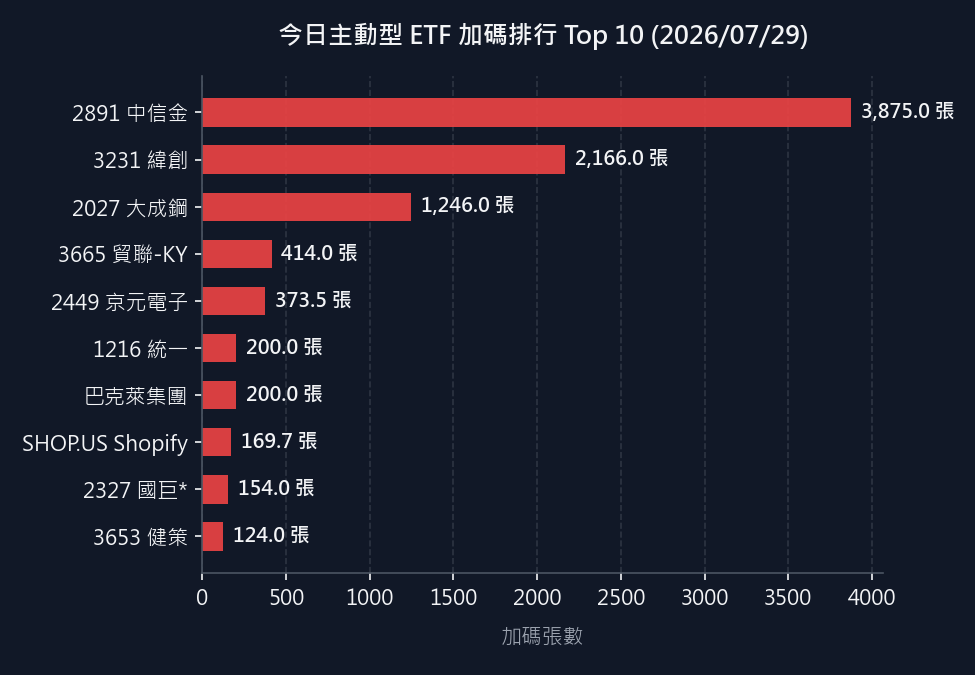
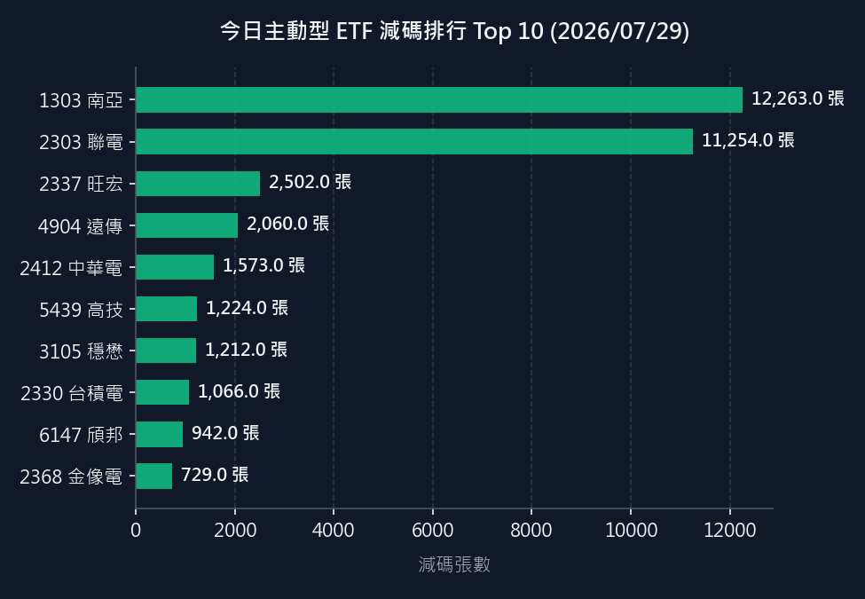

# 主動型 ETF 持股變動

資料來源：`主動型ETF持股明細.xlsx` 最近兩個日期分頁。

比較區間：`20260728` → `20260729`

## 今日加減碼視覺化排行

| 今日加碼 Top 10 | 今日減碼 Top 10 |
| :---: | :---: |
|  |  |

| ETF | 新增 | 刪除 | 比例變動 |
| :-- | --: | --: | --: |
| 00400A | 1 | 0 | 42 |
| 00401A | 0 | 0 | 62 |
| 00402A | 0 | 0 | 52 |
| 00403A | 0 | 0 | 42 |
| 00404A | 0 | 0 | 50 |
| 00405A | 1 | 2 | 41 |
| 00407A | 0 | 0 | 44 |
| 00408A | 0 | 2 | 40 |
| 00980A | 0 | 0 | 46 |
| 00980D | 0 | 0 | 13 |
| 00981A | 0 | 0 | 33 |
| 00982A | 0 | 0 | 42 |
| 00983A | 0 | 0 | 37 |
| 00983D | 0 | 0 | 40 |
| 00984A | 0 | 0 | 113 |
| 00985A | 0 | 0 | 45 |
| 00986A | 0 | 1 | 29 |
| 00987A | 0 | 0 | 24 |
| 00988A | 1 | 0 | 37 |
| 00989A | 1 | 0 | 60 |
| 00990A | 2 | 4 | 41 |
| 00991A | 0 | 3 | 22 |
| 00992A | 0 | 0 | 33 |
| 00993A | 0 | 0 | 49 |
| 00994A | 4 | 3 | 26 |
| 00995A | 0 | 0 | 48 |
| 00996A | 1 | 1 | 46 |
| 00997A | 0 | 0 | 51 |
| 00998A | 1 | 0 | 37 |
| 00999A | 0 | 0 | 64 |

## 00400A

### 新增持股

- 2891 中信金（0.97%，3875 張）

### 刪除持股

- 無

### 投資比例變動

- 1303 南亞：0.38% → 0.35%（-0.03）
- 2059 川湖：3.34% → 3.28%（-0.06）
- 2303 聯電：0.90% → 0.02%（-0.88）
- 2308 台達電：2.80% → 2.71%（-0.09）
- 2313 華通：0.80% → 0.77%（-0.03）
- 2317 鴻海：0.91% → 0.92%（+0.01）
- 2330 台積電：8.67% → 8.55%（-0.12）
- 2345 智邦：1.84% → 1.76%（-0.08）
- 2357 華碩：1.40% → 1.49%（+0.09）
- 2360 致茂：5.12% → 4.95%（-0.17）
- 2383 台光電：5.09% → 4.84%（-0.25）
- 2408 南亞科：1.90% → 1.61%（-0.29）
- 2454 聯發科：5.05% → 4.91%（-0.14）
- 3008 大立光：1.90% → 1.92%（+0.02）
- 3017 奇鋐：4.06% → 3.88%（-0.18）
- 3036 文曄：1.13% → 1.12%（-0.01）
- 3037 欣興：4.05% → 3.73%（-0.32）
- 3044 健鼎：1.48% → 1.42%（-0.06）
- 3090 日電貿：0.33% → 0.30%（-0.03）
- 3211 順達：0.73% → 0.69%（-0.04）
- 3231 緯創：0.95% → 0.96%（+0.01）
- 3293 鈊象：0.38% → 0.40%（+0.02）
- 3374 精材：0.33% → 0.31%（-0.02）
- 3443 創意：2.76% → 2.54%（-0.22）
- 3653 健策：1.87% → 2.35%（+0.48）
- 3665 貿聯-KY：3.11% → 3.00%（-0.11）
- 3711 日月光投控：1.34% → 1.23%（-0.11）
- 4958 臻鼎-KY：0.92% → 0.89%（-0.03）
- 5274 信驊：2.75% → 2.74%（-0.01）
- 5347 世界：0.79% → 0.73%（-0.06）
- 5434 崇越：0.41% → 0.40%（-0.01）
- 6187 萬潤：2.28% → 2.15%（-0.13）
- 6223 旺矽：3.51% → 3.32%（-0.19）
- 6442 光聖：0.55% → 0.50%（-0.05）
- 6488 環球晶：3.25% → 2.99%（-0.26）
- 6505 台塑化：0.89% → 0.91%（+0.02）
- 6510 精測：1.30% → 0.79%（-0.51）
- 6669 緯穎：4.28% → 4.23%（-0.05）
- 6715 嘉基：0.20% → 0.18%（-0.02）
- 7769 鴻勁：0.30% → 0.27%（-0.03）
- 8046 南電：1.01% → 0.93%（-0.08）
- 8150 南茂：0.08% → 0.07%（-0.01）

## 00401A

### 新增持股

- 無

### 刪除持股

- 無

### 投資比例變動

- 1216 統一：0.35% → 0.39%（+0.04）
- 2303 聯電：1.05% → 0.94%（-0.11）
- 2308 台達電：4.02% → 3.79%（-0.23）
- 2313 華通：1.12% → 1.06%（-0.06）
- 2317 鴻海：0.73% → 0.76%（+0.03）
- 2330 台積電：8.72% → 9.02%（+0.30）
- 2344 華邦電：1.26% → 1.13%（-0.13）
- 2345 智邦：2.72% → 2.57%（-0.15）
- 2357 華碩：1.44% → 1.59%（+0.15）
- 2360 致茂：2.05% → 1.98%（-0.07）
- 2368 金像電：0.36% → 0.33%（-0.03）
- 2379 瑞昱：2.13% → 2.28%（+0.15）
- 2382 廣達：2.10% → 2.23%（+0.13）
- 2383 台光電：1.90% → 1.79%（-0.11）
- 2412 中華電：1.00% → 1.11%（+0.11）
- 2449 京元電子：0.60% → 0.54%（-0.06）
- 2454 聯發科：7.15% → 6.77%（-0.38）
- 2455 全新：1.30% → 1.20%（-0.10）
- 2603 長榮：1.12% → 1.22%（+0.10）
- 2881 富邦金：1.90% → 1.99%（+0.09）
- 2882 國泰金：1.20% → 1.26%（+0.06）
- 2883 凱基金：1.97% → 2.07%（+0.10）
- 2884 玉山金：1.97% → 2.19%（+0.22）
- 2885 元大金：1.19% → 1.26%（+0.07）
- 2886 兆豐金：1.68% → 1.88%（+0.20）
- 2887 台新新光金：1.14% → 1.18%（+0.04）
- 2890 永豐金：0.34% → 0.36%（+0.02）
- 2891 中信金：1.78% → 1.94%（+0.16）
- 2912 統一超：0.35% → 0.39%（+0.04）
- 3005 神基：0.22% → 0.24%（+0.02）
- 3008 大立光：2.07% → 2.15%（+0.08）
- 3034 聯詠：0.80% → 0.87%（+0.07）
- 3037 欣興：0.69% → 0.62%（-0.07）
- 3044 健鼎：0.43% → 0.42%（-0.01）
- 3131 弘塑：0.54% → 0.49%（-0.05）
- 3167 大量：0.46% → 0.41%（-0.05）
- 3231 緯創：0.41% → 0.44%（+0.03）
- 3491 昇達科：1.21% → 1.18%（-0.03）
- 3529 力旺：0.66% → 0.62%（-0.04）
- 3653 健策：1.15% → 1.19%（+0.04）
- 3711 日月光投控：2.34% → 2.12%（-0.22）
- 4904 遠傳：0.97% → 1.06%（+0.09）
- 4938 和碩：0.37% → 0.38%（+0.01）
- 4958 臻鼎-KY：2.14% → 2.04%（-0.10）
- 4991 環宇-KY：0.64% → 0.58%（-0.06）
- 5274 信驊：1.06% → 1.03%（-0.03）
- 5347 世界：1.60% → 1.50%（-0.10）
- 5871 中租-KY：0.19% → 0.20%（+0.01）
- 5904 寶雅：0.61% → 0.72%（+0.11）
- 6187 萬潤：0.71% → 0.67%（-0.04）
- 6223 旺矽：2.33% → 2.16%（-0.17）
- 6285 啟碁：2.09% → 2.00%（-0.09）
- 6415 矽力*-KY：0.70% → 0.64%（-0.06）
- 6510 精測：0.69% → 0.68%（-0.01）
- 6515 穎崴：1.19% → 1.11%（-0.08）
- 6531 愛普*：1.17% → 1.05%（-0.12）
- 6669 緯穎：2.71% → 2.68%（-0.03）
- 6944 兆聯實業：0.55% → 0.53%（-0.02）
- 7769 鴻勁：2.68% → 2.51%（-0.17）
- 7828 創新服務：1.92% → 1.73%（-0.19）
- 8021 尖點：0.29% → 0.26%（-0.03）
- 8464 億豐：1.32% → 1.45%（+0.13）

## 00402A

### 新增持股

- 無

### 刪除持股

- 無

### 投資比例變動

- AAPL.US Apple：8.45% → 8.74%（+0.29）
- ADI.US Analog Devices：1.86% → 1.87%（+0.01）
- AMD.US AMD：5.68% → 5.34%（-0.34）
- AMZN.US Amazon：3.89% → 3.97%（+0.08）
- ANET.US Arista Networks：0.74% → 0.75%（+0.01）
- ARM.US Arm：1.06% → 0.99%（-0.07）
- ASML.US ASML Holding：1.62% → 1.59%（-0.03）
- AVGO.US Broadcom：2.52% → 2.56%（+0.04）
- AXON.US Axon Enterprise：0.98% → 1.05%（+0.07）
- BABA.US Alibaba Group：0.56% → 0.57%（+0.01）
- BKNG.US Booking Holdings：0.65% → 0.71%（+0.06）
- CDNS.US Cadence Design Systems：1.86% → 1.94%（+0.08）
- CIEN.US Ciena：1.18% → 1.12%（-0.06）
- CLS.US Celestica：0.91% → 1.02%（+0.11）
- COHR.US Coherent：1.44% → 1.32%（-0.12）
- CRWD.US CrowdStrike Holdings：1.23% → 1.28%（+0.05）
- DASH.US DoorDash：0.26% → 0.28%（+0.02）
- FSLY.US Fastly：0.31% → 0.33%（+0.02）
- GOOG.US Alphabet - Class C Capital Stock：3.31% → 3.44%（+0.13）
- GOOGL.US Alphabet - Class A Common Stock：3.24% → 3.39%（+0.15）
- INTC.US Intel：1.23% → 1.18%（-0.05）
- IOT.US Samsara：0.22% → 0.24%（+0.02）
- KLAC.US KLA：2.32% → 2.23%（-0.09）
- LITE.US Lumentum：1.30% → 1.21%（-0.09）
- LRCX.US Lam Research：3.48% → 3.29%（-0.19）
- MCHP.US Microchip Technology：1.46% → 1.45%（-0.01）
- MDB.US MongoDB：0.62% → 0.64%（+0.02）
- META.US Meta：2.91% → 2.97%（+0.06）
- MRVL.US Marvell：1.39% → 1.31%（-0.08）
- MSFT.US Microsoft：3.47% → 3.58%（+0.11）
- MU.US Micron：6.63% → 6.19%（-0.44）
- NFLX.US Netflix：0.79% → 0.83%（+0.04）
- NOW.US ServiceNow：0.23% → 0.25%（+0.02）
- NVDA.US NVIDIA：8.24% → 8.45%（+0.21）
- NXPI.US NXP Semiconductors：1.30% → 1.29%（-0.01）
- PANW.US Palo Alto：3.06% → 3.15%（+0.09）
- PLTR.US Palantir Technologies：1.17% → 1.13%（-0.04）
- SHOP.US Shopify：0.44% → 0.47%（+0.03）
- SIMO.US Silicon Motion：0.75% → 0.70%（-0.05）
- SKHY.US SK hynix：0.93% → 0.86%（-0.07）
- SNOW.US Snowflake：0.84% → 0.85%（+0.01）
- SPCX.US SpaceX：0.60% → 0.63%（+0.03）
- SPOT.US Spotify：0.28% → 0.29%（+0.01）
- STX.US Seagate：1.45% → 1.36%（-0.09）
- TER.US Teradyne：0.80% → 0.78%（-0.02）
- TSM.US TSMC(ADR)：1.64% → 1.65%（+0.01）
- TTWO.US Take-Two：0.58% → 0.60%（+0.02）
- TXN.US Texas Instruments：2.62% → 2.66%（+0.04）
- UBER.US Uber：0.45% → 0.48%（+0.03）
- V.US Visa：1.12% → 1.15%（+0.03）
- WDC.US Western Digital：2.83% → 2.70%（-0.13）
- ZS.US Zscaler：0.16% → 0.17%（+0.01）

## 00403A

### 新增持股

- 無

### 刪除持股

- 無

### 投資比例變動

- 1303 南亞：1.14% → 0.43%（-0.71）
- 1560 中砂：0.42% → 0.39%（-0.03）
- 2049 上銀：0.20% → 0.19%（-0.01）
- 2303 聯電：5.87% → 5.14%（-0.73）
- 2308 台達電：3.27% → 3.00%（-0.27）
- 2327 國巨*：2.30% → 2.01%（-0.29）
- 2330 台積電：16.70% → 17.07%（+0.37）
- 2337 旺宏：0.77% → 0.50%（-0.27）
- 2344 華邦電：3.92% → 3.43%（-0.49）
- 2345 智邦：3.10% → 2.85%（-0.25）
- 2360 致茂：0.98% → 0.92%（-0.06）
- 2368 金像電：0.99% → 0.52%（-0.47）
- 2383 台光電：4.01% → 3.68%（-0.33）
- 2454 聯發科：3.90% → 3.60%（-0.30）
- 2455 全新：0.07% → 0.06%（-0.01）
- 3008 大立光：0.15% → 0.28%（+0.13）
- 3017 奇鋐：5.07% → 4.77%（-0.30）
- 3037 欣興：3.95% → 3.45%（-0.50）
- 3189 景碩：1.40% → 1.22%（-0.18）
- 3211 順達：0.46% → 0.41%（-0.05）
- 3443 創意：1.27% → 1.11%（-0.16）
- 3450 聯鈞：0.05% → 0.07%（+0.02）
- 3533 嘉澤：1.48% → 1.41%（-0.07）
- 3583 辛耘：0.41% → 0.37%（-0.04）
- 3653 健策：2.01% → 2.16%（+0.15）
- 3665 貿聯-KY：0.99% → 1.21%（+0.22）
- 3711 日月光投控：2.38% → 2.11%（-0.27）
- 4958 臻鼎-KY：1.77% → 1.64%（-0.13）
- 5274 信驊：1.12% → 1.06%（-0.06）
- 6223 旺矽：3.50% → 3.16%（-0.34）
- 6239 力成：0.44% → 0.40%（-0.04）
- 6274 台燿：1.29% → 1.13%（-0.16）
- 6415 矽力*-KY：0.25% → 0.15%（-0.10）
- 6442 光聖：0.18% → 0.16%（-0.02）
- 6488 環球晶：1.53% → 1.34%（-0.19）
- 6515 穎崴：0.58% → 0.43%（-0.15）
- 6669 緯穎：2.11% → 2.03%（-0.08）
- 6805 富世達：0.62% → 0.58%（-0.04）
- 7769 鴻勁：1.12% → 1.02%（-0.10）
- 8046 南電：1.15% → 1.02%（-0.13）
- 8358 金居：0.40% → 0.32%（-0.08）
- 8996 高力：0.98% → 0.91%（-0.07）

## 00404A

### 新增持股

- 無

### 刪除持股

- 無

### 投資比例變動

- 1216 統一：1.99% → 2.23%（+0.24）
- 2303 聯電：2.13% → 1.91%（-0.22）
- 2308 台達電：3.71% → 3.49%（-0.22）
- 2327 國巨*：0.62% → 0.56%（-0.06）
- 2330 台積電：22.43% → 23.15%（+0.72）
- 2345 智邦：0.99% → 0.93%（-0.06）
- 2360 致茂：1.17% → 1.13%（-0.04）
- 2376 技嘉：2.04% → 2.07%（+0.03）
- 2382 廣達：0.41% → 0.43%（+0.02）
- 2383 台光電：1.98% → 1.86%（-0.12）
- 2393 億光：1.70% → 1.77%（+0.07）
- 2454 聯發科：6.75% → 6.38%（-0.37）
- 2885 元大金：2.94% → 3.12%（+0.18）
- 2887 台新新光金：3.33% → 3.43%（+0.10）
- 2890 永豐金：2.17% → 2.33%（+0.16）
- 2912 統一超：0.09% → 0.10%（+0.01）
- 3014 聯陽：1.10% → 1.12%（+0.02）
- 3017 奇鋐：0.70% → 0.68%（-0.02）
- 3034 聯詠：0.65% → 0.70%（+0.05）
- 3037 欣興：0.57% → 0.51%（-0.06）
- 3131 弘塑：0.73% → 0.66%（-0.07）
- 3189 景碩：0.29% → 0.26%（-0.03）
- 3260 威剛：0.43% → 0.46%（+0.03）
- 3264 欣銓：0.91% → 0.82%（-0.09）
- 3265 台星科：0.46% → 0.43%（-0.03）
- 3443 創意：0.12% → 0.11%（-0.01）
- 3702 大聯大：1.85% → 1.87%（+0.02）
- 3711 日月光投控：3.37% → 3.05%（-0.32）
- 4763 材料*-KY：1.92% → 2.00%（+0.08）
- 5269 祥碩：1.67% → 1.93%（+0.26）
- 5274 信驊：2.09% → 2.02%（-0.07）
- 5347 世界：0.39% → 0.36%（-0.03）
- 5434 崇越：1.63% → 1.62%（-0.01）
- 5871 中租-KY：1.90% → 2.01%（+0.11）
- 5876 上海商銀：1.96% → 2.06%（+0.10）
- 6138 茂達：1.82% → 1.72%（-0.10）
- 6139 亞翔：0.25% → 0.24%（-0.01）
- 6196 帆宣：0.36% → 0.35%（-0.01）
- 6206 飛捷：1.82% → 1.99%（+0.17）
- 6223 旺矽：0.76% → 0.70%（-0.06）
- 6239 力成：1.44% → 1.33%（-0.11）
- 6257 矽格：1.66% → 1.54%（-0.12）
- 6488 環球晶：0.16% → 0.14%（-0.02）
- 6515 穎崴：0.28% → 0.26%（-0.02）
- 6531 愛普*：0.20% → 0.18%（-0.02）
- 6691 洋基工程：0.74% → 0.73%（-0.01）
- 8069 元太：0.41% → 0.43%（+0.02）
- 8299 群聯：1.07% → 0.98%（-0.09）
- 臺指選擇權08/26 49100 買權：-0.05% → -0.02%（+0.03）
- 臺股期貨08/26：15.72% → 15.93%（+0.21）

## 00405A

### 新增持股

- 6805 富世達（0.01%，1 張）

### 刪除持股

- 3105 穩懋（1.64%，1212 張）
- 6291 沛亨（0.31%，220 張）

### 投資比例變動

- 2059 川湖：1.32% → 1.27%（-0.05）
- 2303 聯電：0.04% → 0.03%（-0.01）
- 2308 台達電：0.96% → 0.91%（-0.05）
- 2327 國巨*：3.02% → 2.73%（-0.29）
- 2330 台積電：0.44% → 0.46%（+0.02）
- 2344 華邦電：3.59% → 3.25%（-0.34）
- 2345 智邦：4.50% → 4.28%（-0.22）
- 2368 金像電：1.96% → 1.78%（-0.18）
- 2383 台光電：2.87% → 2.73%（-0.14）
- 2408 南亞科：1.41% → 1.27%（-0.14）
- 2449 京元電子：0.83% → 0.75%（-0.08）
- 2454 聯發科：6.71% → 6.41%（-0.30）
- 3017 奇鋐：6.32% → 6.15%（-0.17）
- 3026 禾伸堂：1.29% → 1.17%（-0.12）
- 3037 欣興：5.06% → 4.58%（-0.48）
- 3081 聯亞：1.09% → 1.03%（-0.06）
- 3131 弘塑：3.45% → 3.13%（-0.32）
- 3163 波若威：0.21% → 0.03%（-0.18）
- 3264 欣銓：0.03% → 0.02%（-0.01）
- 3443 創意：5.14% → 4.66%（-0.48）
- 3583 辛耘：1.43% → 0.72%（-0.71）
- 3653 健策：2.88% → 3.44%（+0.56）
- 3665 貿聯-KY：4.04% → 5.98%（+1.94）
- 3711 日月光投控：0.75% → 0.68%（-0.07）
- 4749 新應材：0.28% → 0.27%（-0.01）
- 5274 信驊：2.03% → 1.99%（-0.04）
- 5347 世界：0.13% → 0.12%（-0.01）
- 6187 萬潤：1.96% → 0.75%（-1.21）
- 6223 旺矽：5.93% → 5.54%（-0.39）
- 6274 台燿：1.46% → 1.32%（-0.14）
- 6442 光聖：0.35% → 0.33%（-0.02）
- 6488 環球晶：4.70% → 4.25%（-0.45）
- 6515 穎崴：0.56% → 0.53%（-0.03）
- 6526 達發：0.32% → 0.31%（-0.01）
- 6669 緯穎：3.17% → 3.16%（-0.01）
- 7734 印能科技：2.07% → 2.08%（+0.01）
- 7769 鴻勁：2.32% → 2.19%（-0.13）
- 8028 昇陽半導體：1.05% → 0.95%（-0.10）
- 8046 南電：4.24% → 3.87%（-0.37）
- 8210 勤誠：0.72% → 0.70%（-0.02）
- 8996 高力：1.07% → 1.03%（-0.04）

## 00407A

### 新增持股

- 無

### 刪除持股

- 無

### 投資比例變動

- 1303 南亞：0.53% → 0.50%（-0.03）
- 1590 亞德客-KY：2.23% → 2.25%（+0.02）
- 2059 川湖：2.02% → 2.01%（-0.01）
- 2303 聯電：1.32% → 1.24%（-0.08）
- 2308 台達電：3.66% → 3.60%（-0.06）
- 2327 國巨*：2.34% → 2.18%（-0.16）
- 2330 台積電：9.19% → 9.20%（+0.01）
- 2344 華邦電：1.59% → 1.49%（-0.10）
- 2345 智邦：3.41% → 3.31%（-0.10）
- 2360 致茂：2.11% → 2.07%（-0.04）
- 2368 金像電：1.69% → 1.58%（-0.11）
- 2376 技嘉：0.76% → 0.78%（+0.02）
- 2379 瑞昱：0.84% → 0.88%（+0.04）
- 2383 台光電：4.21% → 4.06%（-0.15）
- 2395 研華：1.83% → 1.88%（+0.05）
- 2408 南亞科：1.72% → 1.60%（-0.12）
- 2412 中華電：1.88% → 1.94%（+0.06）
- 2451 創見：0.16% → 0.17%（+0.01）
- 2454 聯發科：6.12% → 6.03%（-0.09）
- 2458 義隆：0.10% → 0.11%（+0.01）
- 3017 奇鋐：3.87% → 3.75%（-0.12）
- 3034 聯詠：0.72% → 0.77%（+0.05）
- 3037 欣興：3.59% → 3.63%（+0.04）
- 3260 威剛：0.16% → 0.18%（+0.02）
- 3293 鈊象：0.60% → 0.64%（+0.04）
- 3443 創意：1.66% → 1.55%（-0.11）
- 3491 昇達科：0.39% → 0.38%（-0.01）
- 3529 力旺：1.83% → 1.80%（-0.03）
- 3533 嘉澤：1.02% → 0.99%（-0.03）
- 3665 貿聯-KY：3.16% → 3.30%（+0.14）
- 3711 日月光投控：2.56% → 2.40%（-0.16）
- 4904 遠傳：0.35% → 0.36%（+0.01）
- 4958 臻鼎-KY：1.79% → 1.75%（-0.04）
- 5274 信驊：1.89% → 1.92%（+0.03）
- 5536 聖暉*：1.74% → 1.68%（-0.06）
- 6223 旺矽：2.54% → 2.45%（-0.09）
- 6274 台燿：2.29% → 2.14%（-0.15）
- 6415 矽力*-KY：0.36% → 0.35%（-0.01）
- 6446 藥華藥：2.32% → 2.33%（+0.01）
- 6515 穎崴：1.36% → 1.29%（-0.07）
- 6531 愛普*：1.27% → 1.19%（-0.08）
- 6669 緯穎：4.23% → 4.44%（+0.21）
- 6805 富世達：1.86% → 1.82%（-0.04）
- 8046 南電：2.12% → 1.98%（-0.14）

## 00408A

### 新增持股

- 無

### 刪除持股

- 1303 南亞（0.68%，70 張）
- 2303 聯電（0.42%，60 張）

### 投資比例變動

- 1216 統一：1.06% → 1.84%（+0.78）
- 1477 聚陽：1.20% → 1.24%（+0.04）
- 2059 川湖：1.39% → 1.36%（-0.03）
- 2308 台達電：3.34% → 3.23%（-0.11）
- 2317 鴻海：2.22% → 2.26%（+0.04）
- 2330 台積電：4.84% → 4.77%（-0.07）
- 2345 智邦：2.66% → 2.55%（-0.11）
- 2356 英業達：1.21% → 1.27%（+0.06）
- 2357 華碩：1.96% → 2.08%（+0.12）
- 2360 致茂：2.29% → 2.22%（-0.07）
- 2368 金像電：1.91% → 1.76%（-0.15）
- 2376 技嘉：2.13% → 2.15%（+0.02）
- 2382 廣達：1.19% → 1.20%（+0.01）
- 2383 台光電：3.01% → 2.87%（-0.14）
- 2395 研華：1.90% → 1.92%（+0.02）
- 2404 漢唐：1.57% → 1.61%（+0.04）
- 2408 南亞科：0.49% → 0.45%（-0.04）
- 2412 中華電：3.50% → 3.58%（+0.08）
- 2454 聯發科：3.71% → 3.61%（-0.10）
- 2603 長榮：1.86% → 1.92%（+0.06）
- 2880 華南金：1.67% → 1.73%（+0.06）
- 2886 兆豐金：2.30% → 2.38%（+0.08）
- 2891 中信金：0.93% → 0.95%（+0.02）
- 2912 統一超：2.51% → 3.14%（+0.63）
- 3017 奇鋐：2.23% → 2.13%（-0.10）
- 3037 欣興：2.47% → 2.28%（-0.19）
- 3045 台灣大：3.48% → 3.55%（+0.07）
- 3231 緯創：3.27% → 3.34%（+0.07）
- 3665 貿聯-KY：1.93% → 1.86%（-0.07）
- 3702 大聯大：1.78% → 1.75%（-0.03）
- 4904 遠傳：0.59% → 0.61%（+0.02）
- 5347 世界：0.46% → 0.42%（-0.04）
- 5434 崇越：2.51% → 2.44%（-0.07）
- 5876 上海商銀：2.26% → 2.34%（+0.08）
- 5904 寶雅：1.73% → 1.88%（+0.15）
- 6223 旺矽：0.48% → 0.46%（-0.02）
- 6274 台燿：1.33% → 1.23%（-0.10）
- 6669 緯穎：3.63% → 3.59%（-0.04）
- 7769 鴻勁：1.61% → 1.48%（-0.13）
- 8046 南電：2.18% → 2.01%（-0.17）

## 00980A

### 新增持股

- 無

### 刪除持股

- 無

### 投資比例變動

- 1303 南亞：1.69% → 1.57%（-0.12）
- 2059 川湖：4.78% → 4.70%（-0.08）
- 2308 台達電：4.21% → 4.09%（-0.12）
- 2317 鴻海：2.32% → 2.48%（+0.16）
- 2327 國巨*：1.37% → 1.26%（-0.11）
- 2330 台積電：9.45% → 10.09%（+0.64）
- 2344 華邦電：1.17% → 1.08%（-0.09）
- 2345 智邦：2.09% → 2.03%（-0.06）
- 2368 金像電：2.23% → 2.07%（-0.16）
- 2376 技嘉：1.38% → 1.45%（+0.07）
- 2382 廣達：1.32% → 1.45%（+0.13）
- 2383 台光電：4.61% → 4.48%（-0.13）
- 2408 南亞科：2.79% → 2.58%（-0.21）
- 2454 聯發科：6.28% → 6.13%（-0.15）
- 2884 玉山金：0.89% → 1.02%（+0.13）
- 2891 中信金：1.30% → 1.46%（+0.16）
- 3008 大立光：0.91% → 0.97%（+0.06）
- 3017 奇鋐：1.99% → 1.98%（-0.01）
- 3026 禾伸堂：0.50% → 0.46%（-0.04）
- 3036 文曄：1.38% → 1.42%（+0.04）
- 3037 欣興：3.02% → 2.80%（-0.22）
- 3044 健鼎：0.41% → 0.40%（-0.01）
- 3081 聯亞：2.72% → 2.65%（-0.07）
- 3189 景碩：0.83% → 0.77%（-0.06）
- 3231 緯創：0.98% → 1.07%（+0.09）
- 3264 欣銓：0.41% → 0.38%（-0.03）
- 3293 鈊象：1.03% → 1.19%（+0.16）
- 3443 創意：1.52% → 1.41%（-0.11）
- 3529 力旺：0.92% → 0.90%（-0.02）
- 3653 健策：1.43% → 1.53%（+0.10）
- 3665 貿聯-KY：0.44% → 0.49%（+0.05）
- 3711 日月光投控：1.54% → 1.44%（-0.10）
- 4958 臻鼎-KY：0.95% → 0.93%（-0.02）
- 5904 寶雅：1.32% → 1.63%（+0.31）
- 6213 聯茂：0.90% → 0.83%（-0.07）
- 6223 旺矽：2.76% → 2.63%（-0.13）
- 6274 台燿：1.49% → 1.38%（-0.11）
- 6442 光聖：0.31% → 0.30%（-0.01）
- 6515 穎崴：2.23% → 2.15%（-0.08）
- 6669 緯穎：1.71% → 1.75%（+0.04）
- 6805 富世達：0.50% → 0.49%（-0.01）
- 6831 邁科：0.33% → 0.31%（-0.02）
- 7769 鴻勁：2.83% → 2.73%（-0.10）
- 8046 南電：1.38% → 1.29%（-0.09）
- 8299 群聯：1.39% → 1.31%（-0.08）
- 8996 高力：1.14% → 1.12%（-0.02）

## 00980D

### 新增持股

- 無

### 刪除持股

- 無

### 投資比例變動

- ATHENE HOLDING LTD 6.625000 % 19MAY2055：0.57% → 0.58%（+0.01）
- BAT CAPITAL CORP (REG) 7.081% 02AUG2053：0.58% → 0.59%（+0.01）
- BOSTON PROPERTIES LP (REG) 6.750000 % 01-DEC-2027：0.47% → 0.46%（-0.01）
- COREWEAVE INC SER REGS (REG S) 9.25% 01JUN2030：0.43% → 0.42%（-0.01）
- COX COMMUNICATIONS INC SER REGS 5.950000 % 01SEP2054：0.55% → 0.54%（-0.01）
- DAIMLER FINANCE NA LLC REG 8.5% 18JAN2031：0.64% → 0.65%（+0.01）
- GLOBAL AUTO HO/AAG FH UK SER REGS (REG S) 11.5% 15AUG2029：0.38% → 0.37%（-0.01）
- KELLANOVA SER B (REG) 7.450000 % 01APR2031：0.57% → 0.58%（+0.01）
- MYLAN INC (REG) 5.4% 29/11/2043：0.33% → 0.34%（+0.01）
- SES GLOBAL AMERICAS HLDG SER REGS (REG) 5.300000 % 25MAR2044：0.34% → 0.35%（+0.01）
- US 10YR NOTE (CBT)SEP26 21-SEP-2026：18.70% → 18.72%（+0.02）
- US LONG BOND(CBT) SEP26 21-SEP-2026：5.50% → 5.52%（+0.02）
- VIACOMCBS INC (REG) 4.95% 19MAY2050：0.50% → 0.49%（-0.01）

## 00981A

### 新增持股

- 無

### 刪除持股

- 無

### 投資比例變動

- 1590 亞德客-KY：0.28% → 0.29%（+0.01）
- 2303 聯電：4.07% → 3.70%（-0.37）
- 2308 台達電：3.65% → 3.47%（-0.18）
- 2327 國巨*：5.86% → 5.31%（-0.55）
- 2330 台積電：10.39% → 9.86%（-0.53）
- 2345 智邦：5.30% → 5.05%（-0.25）
- 2368 金像電：2.50% → 2.28%（-0.22）
- 2383 台光電：8.37% → 7.96%（-0.41）
- 2408 南亞科：0.15% → 0.14%（-0.01）
- 2449 京元電子：0.73% → 0.66%（-0.07）
- 2454 聯發科：7.05% → 6.75%（-0.30）
- 3017 奇鋐：4.86% → 4.74%（-0.12）
- 3037 欣興：5.37% → 4.87%（-0.50）
- 3264 欣銓：0.12% → 0.11%（-0.01）
- 3653 健策：2.98% → 3.13%（+0.15）
- 3665 貿聯-KY：3.88% → 4.22%（+0.34）
- 3711 日月光投控：3.71% → 3.40%（-0.31）
- 4958 臻鼎-KY：0.30% → 0.28%（-0.02）
- 4979 華星光：0.31% → 0.30%（-0.01）
- 5274 信驊：2.46% → 2.42%（-0.04）
- 5439 高技：0.20% → 0.09%（-0.11）
- 6147 頎邦：0.27% → 0.20%（-0.07）
- 6187 萬潤：0.52% → 0.50%（-0.02）
- 6223 旺矽：5.22% → 4.88%（-0.34）
- 6271 同欣電：0.20% → 0.17%（-0.03）
- 6274 台燿：2.42% → 2.20%（-0.22）
- 6278 台表科：0.25% → 0.23%（-0.02）
- 6510 精測：0.35% → 0.32%（-0.03）
- 6515 穎崴：0.22% → 0.21%（-0.01）
- 6669 緯穎：5.19% → 5.18%（-0.01）
- 6805 富世達：1.05% → 1.02%（-0.03）
- 8046 南電：3.82% → 3.49%（-0.33）
- 8210 勤誠：0.95% → 0.93%（-0.02）

## 00982A

### 新增持股

- 無

### 刪除持股

- 無

### 投資比例變動

- 1785 光洋科：1.00% → 1.01%（+0.01）
- 2059 川湖：3.19% → 3.10%（-0.09）
- 2303 聯電：2.38% → 2.23%（-0.15）
- 2316 楠梓電：1.12% → 1.13%（+0.01）
- 2327 國巨*：1.10% → 1.00%（-0.10）
- 2330 台積電：9.62% → 10.15%（+0.53）
- 2345 智邦：3.80% → 3.72%（-0.08）
- 2351 順德：0.58% → 0.53%（-0.05）
- 2360 致茂：3.66% → 3.60%（-0.06）
- 2376 技嘉：0.78% → 0.81%（+0.03）
- 2377 微星：1.75% → 1.85%（+0.10）
- 2383 台光電：3.34% → 3.20%（-0.14）
- 2451 創見：0.30% → 0.34%（+0.04）
- 2454 聯發科：6.67% → 6.55%（-0.12）
- 2472 立隆電：1.29% → 1.23%（-0.06）
- 2885 元大金：0.29% → 0.31%（+0.02）
- 3008 大立光：2.08% → 2.24%（+0.16）
- 3017 奇鋐：2.03% → 2.00%（-0.03）
- 3036 文曄：0.99% → 1.04%（+0.05）
- 3105 穩懋：3.12% → 2.89%（-0.23）
- 3231 緯創：0.11% → 0.12%（+0.01）
- 3264 欣銓：2.05% → 1.87%（-0.18）
- 3529 力旺：0.47% → 0.45%（-0.02）
- 3583 辛耘：1.77% → 1.70%（-0.07）
- 3702 大聯大：1.35% → 1.41%（+0.06）
- 3711 日月光投控：1.28% → 1.21%（-0.07）
- 4958 臻鼎-KY：3.11% → 3.02%（-0.09）
- 5274 信驊：0.95% → 0.94%（-0.01）
- 5536 聖暉*：8.70% → 8.40%（-0.30）
- 6139 亞翔：5.11% → 5.08%（-0.03）
- 6187 萬潤：0.20% → 0.19%（-0.01）
- 6223 旺矽：3.66% → 3.45%（-0.21）
- 6239 力成：0.41% → 0.38%（-0.03）
- 6257 矽格：2.12% → 2.05%（-0.07）
- 6274 台燿：1.17% → 1.10%（-0.07）
- 6488 環球晶：2.55% → 2.33%（-0.22）
- 6531 愛普*：1.82% → 1.68%（-0.14）
- 6669 緯穎：4.25% → 5.11%（+0.86）
- 6831 邁科：0.01% → 0.00%（-0.01）
- 7769 鴻勁：1.18% → 1.15%（-0.03）
- 8016 矽創：1.36% → 1.41%（+0.05）
- 8996 高力：0.79% → 0.77%（-0.02）

## 00983A

### 新增持股

- 無

### 刪除持股

- 無

### 投資比例變動

- ACHR.US Archer：0.32% → 0.31%（-0.01）
- AMD.US AMD：6.85% → 6.30%（-0.55）
- AVGO.US Broadcom：1.96% → 1.95%（-0.01）
- BEAM.US Beam Therapeutics：2.49% → 2.41%（-0.08）
- BMNR.US BitMine：0.70% → 0.88%（+0.18）
- BWXT.US BWX Technologies：0.06% → 0.05%（-0.01）
- CBRS.US Cerebras：0.81% → 0.83%（+0.02）
- CERS.US Cerus：0.56% → 0.53%（-0.03）
- COIN.US Coinbase：1.59% → 2.01%（+0.42）
- CRCL.US Circle：1.37% → 1.83%（+0.46）
- CRSP.US CRISPR Therapeutics：3.94% → 4.01%（+0.07）
- CRWV.US CoreWeave：1.14% → 1.09%（-0.05）
- DE.US Deere：1.22% → 1.54%（+0.32）
- FIG.US Figma：0.42% → 0.44%（+0.02）
- GOOG.US Alphabet - Class C Capital Stock：1.25% → 1.28%（+0.03）
- GOOGL.US Alphabet - Class A Common Stock：1.65% → 1.69%（+0.04）
- HOOD.US Robinhood Markets：4.47% → 4.34%（-0.13）
- ILMN.US Illumina：3.81% → 3.88%（+0.07）
- KTOS.US Kratos Defense & Security：0.18% → 0.31%（+0.13）
- LLY.US Eli Lilly：2.07% → 2.11%（+0.04）
- NTLA.US Intellia Therapeutics：1.26% → 1.28%（+0.02）
- NTRA.US Natera：2.70% → 2.48%（-0.22）
- PLTR.US Palantir Technologies：0.54% → 0.50%（-0.04）
- RBLX.US Roblox：3.18% → 3.25%（+0.07）
- RXRX.US Recursion Pharmaceuticals：0.21% → 0.30%（+0.09）
- SHOP.US Shopify：6.69% → 6.88%（+0.19）
- SNOW.US Snowflake：1.00% → 0.99%（-0.01）
- SOFI.US SoFi Technologies：0.68% → 0.67%（-0.01）
- TEM.US Tempus：3.74% → 3.20%（-0.54）
- TER.US Teradyne：0.58% → 0.56%（-0.02）
- TSLA.US Tesla：7.50% → 7.48%（-0.02）
- TSM.US TSMC(ADR)：3.52% → 3.46%（-0.06）
- TWST.US Twist Bioscience：4.11% → 4.10%（-0.01）
- TXG.US 10x Genomics：5.72% → 5.86%（+0.14）
- VCYT.US Veracyte：1.67% → 1.34%（-0.33）
- WGS.US GeneDx：1.34% → 1.37%（+0.03）
- XYZ.US Block：2.42% → 2.48%（+0.06）

## 00983D

### 新增持股

- 無

### 刪除持股

- 無

### 投資比例變動

- ABIBB 8.2 01/15/39：1.97% → 1.98%（+0.01）
- ABXCN 7 1/2 09/15/38：0.54% → 0.55%（+0.01）
- ALLY 8 11/01/31：0.86% → 0.87%（+0.01）
- AMCX 10 1/2 07/15/32：1.60% → 1.61%（+0.01）
- ATH 6 5/8 05/19/55：1.00% → 1.01%（+0.01）
- BATSLN 7.079 08/02/43：1.09% → 1.10%（+0.01）
- BATSLN 7.081 08/02/53：1.33% → 1.34%（+0.01）
- BHCCN 11 09/30/28：1.82% → 1.81%（-0.01）
- C 8 1/8 07/15/39：1.96% → 1.97%（+0.01）
- CP 7 1/8 10/15/31：0.82% → 0.83%（+0.01）
- CRWV 9 02/01/31：1.24% → 1.23%（-0.01）
- CYH 10 7/8 01/15/32：1.48% → 1.49%（+0.01）
- DELL 8.35 07/15/46：1.43% → 1.44%（+0.01）
- DIS 7 3/4 12/01/45：0.80% → 0.61%（-0.19）
- DOW 6.9 05/15/53：0.74% → 0.75%（+0.01）
- DOW 9.4 05/15/39：1.93% → 1.94%（+0.01）
- DUK 7 3/4 03/01/31：1.56% → 1.57%（+0.01）
- ED 6 3/4 04/01/38：0.62% → 0.63%（+0.01）
- ENBCN 6.7 11/15/53：1.13% → 1.14%（+0.01）
- FFHCN 6.35 03/22/54：0.70% → 0.71%（+0.01）
- GE 6 7/8 01/10/39：0.85% → 0.86%（+0.01）
- GM 6 3/4 04/01/46：1.19% → 1.20%（+0.01）
- GS 6 1/4 02/01/41：0.32% → 0.33%（+0.01）
- HAL 7.45 09/15/39：1.83% → 1.84%（+0.01）
- HPE 6.35 10/15/45：0.99% → 1.00%（+0.01）
- HSBC 6.332 03/09/44：1.07% → 1.08%（+0.01）
- KMI 6.95 01/15/38：1.06% → 1.07%（+0.01）
- LQDW.US iShares Investment Grade Corpora：7.35% → 7.39%（+0.04）
- MBGGR 8 1/2 01/18/31：1.31% → 1.32%（+0.01）
- MS 7 1/4 04/01/32：1.63% → 1.64%（+0.01）
- ORCL 6.9 11/09/52：1.11% → 0.84%（-0.27）
- OXY 6.6 03/15/46：0.74% → 0.75%（+0.01）
- PCG 6 3/4 01/15/53：1.15% → 1.16%（+0.01）
- PCG 6.7 04/01/53：1.11% → 1.12%（+0.01）
- PFE 7.2 03/15/39：1.44% → 1.45%（+0.01）
- SUCN 6.85 06/01/39：1.22% → 1.23%（+0.01）
- TLTW.US iShares 20+ Year Treasury Bond B：7.32% → 7.38%（+0.06）
- TRPCN 7 5/8 01/15/39：1.70% → 1.71%（+0.01）
- UNITEDHEALTH GROUP INC 6.875 02/15/38：0.87% → 0.88%（+0.01）
- VZ 7 3/4 12/01/30：1.14% → 1.15%（+0.01）

## 00984A

### 新增持股

- 無

### 刪除持股

- 無

### 投資比例變動

- 1102 亞泥：1.36% → 1.46%（+0.10）
- 1216 統一：2.00% → 2.21%（+0.21）
- 1229 聯華：0.29% → 0.31%（+0.02）
- 1303 南亞：0.63% → 0.56%（-0.07）
- 1326 台化：0.71% → 0.70%（-0.01）
- 1402 遠東新：1.10% → 1.19%（+0.09）
- 1409 新纖：0.52% → 0.51%（-0.01）
- 1513 中興電：0.26% → 0.27%（+0.01）
- 1560 中砂：0.51% → 0.47%（-0.04）
- 1785 光洋科：0.45% → 0.44%（-0.01）
- 1795 美時：0.38% → 0.40%（+0.02）
- 1907 永豐餘：0.30% → 0.33%（+0.03）
- 2006 東和鋼鐵：0.43% → 0.47%（+0.04）
- 2049 上銀：0.59% → 0.58%（-0.01）
- 2059 川湖：0.61% → 0.58%（-0.03）
- 2105 正新：0.41% → 0.44%（+0.03）
- 2204 中華：0.28% → 0.31%（+0.03）
- 2206 三陽工業：0.43% → 0.48%（+0.05）
- 2303 聯電：2.14% → 1.90%（-0.24）
- 2308 台達電：0.06% → 0.05%（-0.01）
- 2327 國巨*：0.93% → 0.83%（-0.10）
- 2330 台積電：3.02% → 3.05%（+0.03）
- 2337 旺宏：0.48% → 0.43%（-0.05）
- 2345 智邦：0.38% → 0.35%（-0.03）
- 2347 聯強：1.02% → 1.07%（+0.05）
- 2357 華碩：2.93% → 3.18%（+0.25）
- 2360 致茂：0.69% → 0.66%（-0.03）
- 2368 金像電：0.10% → 0.09%（-0.01）
- 2377 微星：1.00% → 1.02%（+0.02）
- 2382 廣達：2.29% → 2.39%（+0.10）
- 2383 台光電：1.79% → 1.66%（-0.13）
- 2385 群光：0.41% → 0.42%（+0.01）
- 2404 漢唐：1.82% → 1.81%（-0.01）
- 2412 中華電：2.75% → 2.99%（+0.24）
- 2454 聯發科：1.41% → 1.31%（-0.10）
- 2458 義隆：0.35% → 0.34%（-0.01）
- 2467 志聖：0.51% → 0.48%（-0.03）
- 2472 立隆電：0.34% → 0.31%（-0.03）
- 2474 可成：0.81% → 0.84%（+0.03）
- 2478 大毅：0.34% → 0.30%（-0.04）
- 2481 強茂：0.45% → 0.40%（-0.05）
- 2501 國建：0.27% → 0.29%（+0.02）
- 2606 裕民：0.42% → 0.44%（+0.02）
- 2618 長榮航：1.50% → 1.62%（+0.12）
- 2633 台灣高鐵：1.45% → 1.58%（+0.13）
- 2634 漢翔：0.44% → 0.47%（+0.03）
- 2646 星宇航空：0.41% → 0.44%（+0.03）
- 2855 統一證：0.54% → 0.53%（-0.01）
- 2881 富邦金：2.73% → 2.81%（+0.08）
- 2882 國泰金：0.30% → 0.31%（+0.01）
- 2885 元大金：0.42% → 0.44%（+0.02）
- 2891 中信金：2.40% → 2.57%（+0.17）
- 2897 王道銀行：0.29% → 0.32%（+0.03）
- 2912 統一超：1.54% → 1.69%（+0.15）
- 3005 神基：0.45% → 0.46%（+0.01）
- 3008 大立光：0.69% → 0.71%（+0.02）
- 3026 禾伸堂：0.81% → 0.72%（-0.09）
- 3034 聯詠：2.16% → 2.29%（+0.13）
- 3037 欣興：1.62% → 1.43%（-0.19）
- 3044 健鼎：0.31% → 0.29%（-0.02）
- 3045 台灣大：2.07% → 2.26%（+0.19）
- 3090 日電貿：0.29% → 0.26%（-0.03）
- 3167 大量：0.42% → 0.37%（-0.05）
- 3189 景碩：1.24% → 1.10%（-0.14）
- 3227 原相：0.24% → 0.25%（+0.01）
- 3264 欣銓：0.24% → 0.21%（-0.03）
- 3293 鈊象：1.27% → 1.42%（+0.15）
- 3443 創意：0.60% → 0.53%（-0.07）
- 3481 群創：0.41% → 0.40%（-0.01）
- 3532 台勝科：0.62% → 0.55%（-0.07）
- 3592 瑞鼎：0.25% → 0.26%（+0.01）
- 3711 日月光投控：1.11% → 0.99%（-0.12）
- 4904 遠傳：1.95% → 2.10%（+0.15）
- 4919 新唐：0.46% → 0.41%（-0.05）
- 4938 和碩：0.42% → 0.43%（+0.01）
- 4958 臻鼎-KY：1.64% → 1.53%（-0.11）
- 5274 信驊：0.34% → 0.33%（-0.01）
- 5434 崇越：1.20% → 1.18%（-0.02）
- 5483 中美晶：0.46% → 0.41%（-0.05）
- 5536 聖暉*：0.52% → 0.48%（-0.04）
- 5871 中租-KY：1.20% → 1.25%（+0.05）
- 5876 上海商銀：1.39% → 1.44%（+0.05）
- 5903 全家：0.06% → 0.07%（+0.01）
- 5904 寶雅：0.28% → 0.33%（+0.05）
- 6023 元大期：0.29% → 0.32%（+0.03）
- 6121 新普：0.63% → 0.64%（+0.01）
- 6139 亞翔：0.49% → 0.47%（-0.02）
- 6147 頎邦：0.44% → 0.39%（-0.05）
- 6176 瑞儀：0.40% → 0.42%（+0.02）
- 6182 合晶：0.56% → 0.50%（-0.06）
- 6196 帆宣：1.10% → 1.05%（-0.05）
- 6213 聯茂：1.00% → 0.88%（-0.12）
- 6223 旺矽：1.09% → 1.00%（-0.09）
- 6274 台燿：1.69% → 1.50%（-0.19）
- 6285 啟碁：0.58% → 0.55%（-0.03）
- 6446 藥華藥：2.07% → 2.04%（-0.03）
- 6531 愛普*：1.03% → 0.91%（-0.12）
- 6831 邁科：0.42% → 0.37%（-0.05）
- 6890 來億-KY：0.26% → 0.28%（+0.02）
- 7769 鴻勁：0.58% → 0.54%（-0.04）
- 8016 矽創：0.88% → 0.86%（-0.02）
- 8021 尖點：1.38% → 1.22%（-0.16）
- 8046 南電：1.06% → 0.94%（-0.12）
- 8064 東捷：0.43% → 0.39%（-0.04）
- 8081 致新：0.24% → 0.25%（+0.01）
- 8096 擎亞：0.54% → 0.47%（-0.07）
- 8210 勤誠：0.29% → 0.27%（-0.02）
- 8261 富鼎：0.63% → 0.56%（-0.07）
- 8358 金居：0.95% → 0.84%（-0.11）
- 8415 大國鋼：0.28% → 0.30%（+0.02）
- 9914 美利達：0.28% → 0.31%（+0.03）
- 9939 宏全：0.30% → 0.32%（+0.02）
- 9958 世紀鋼：0.27% → 0.28%（+0.01）

## 00985A

### 新增持股

- 無

### 刪除持股

- 無

### 投資比例變動

- 1216 統一：1.10% → 1.17%（+0.07）
- 1802 台玻：0.21% → 0.20%（-0.01）
- 2027 大成鋼：3.77% → 4.68%（+0.91）
- 2049 上銀：0.57% → 0.58%（+0.01）
- 2059 川湖：4.06% → 4.09%（+0.03）
- 2303 聯電：2.41% → 3.40%（+0.99）
- 2308 台達電：1.02% → 1.01%（-0.01）
- 2327 國巨*：2.73% → 3.48%（+0.75）
- 2330 台積電：17.73% → 14.82%（-2.91）
- 2344 華邦電：0.96% → 0.91%（-0.05）
- 2345 智邦：2.60% → 2.71%（+0.11）
- 2368 金像電：0.86% → 0.82%（-0.04）
- 2376 技嘉：4.17% → 4.31%（+0.14）
- 2383 台光電：2.31% → 2.44%（+0.13）
- 2395 研華：1.51% → 1.57%（+0.06）
- 2408 南亞科：2.57% → 2.72%（+0.15）
- 2412 中華電：3.86% → 1.51%（-2.35）
- 2454 聯發科：1.66% → 1.80%（+0.14）
- 2881 富邦金：0.50% → 0.51%（+0.01）
- 2891 中信金：0.52% → 0.55%（+0.03）
- 3008 大立光：3.36% → 3.57%（+0.21）
- 3017 奇鋐：0.85% → 1.01%（+0.16）
- 3036 文曄：3.18% → 3.24%（+0.06）
- 3037 欣興：0.63% → 0.60%（-0.03）
- 3081 聯亞：1.55% → 1.46%（-0.09）
- 3105 穩懋：0.52% → 0.50%（-0.02）
- 3131 弘塑：1.36% → 1.27%（-0.09）
- 3293 鈊象：1.15% → 1.23%（+0.08）
- 3653 健策：1.17% → 1.21%（+0.04）
- 3661 世芯-KY：2.48% → 0.96%（-1.52）
- 3665 貿聯-KY：1.04% → 1.03%（-0.01）
- 3711 日月光投控：0.75% → 0.71%（-0.04）
- 4904 遠傳：3.81% → 1.52%（-2.29）
- 4958 臻鼎-KY：2.06% → 2.05%（-0.01）
- 6147 頎邦：2.52% → 2.39%（-0.13）
- 6187 萬潤：3.14% → 3.25%（+0.11）
- 6223 旺矽：0.28% → 0.27%（-0.01）
- 6415 矽力*-KY：0.28% → 0.27%（-0.01）
- 6442 光聖：3.42% → 3.24%（-0.18）
- 6446 藥華藥：1.48% → 1.58%（+0.10）
- 6488 環球晶：0.47% → 0.45%（-0.02）
- 6669 緯穎：1.45% → 1.53%（+0.08）
- 7769 鴻勁：0.25% → 0.24%（-0.01）
- 8046 南電：0.51% → 0.48%（-0.03）
- 8299 群聯：0.95% → 0.92%（-0.03）

## 00986A

### 新增持股

- 無

### 刪除持股

- IBIDEN(4062.JP)（2.03%，3.5 張）

### 投資比例變動

- 2330 台積電：8.70% → 8.85%（+0.15）
- AAPL.US Apple：0.62% → 1.17%（+0.55）
- AMD.US AMD：3.14% → 2.86%（-0.28）
- AMZN.US Amazon：3.55% → 3.70%（+0.15）
- AVGO.US Broadcom：5.01% → 5.23%（+0.22）
- CAT.US Caterpillar：2.67% → 2.65%（-0.02）
- COHR.US Coherent：2.01% → 1.81%（-0.20）
- CRWD.US CrowdStrike Holdings：3.76% → 3.90%（+0.14）
- GEV.US GE Vernova：3.60% → 3.51%（-0.09）
- GOOGL.US Alphabet - Class A Common Stock：6.99% → 7.64%（+0.65）
- GS.US Goldman Sachs：3.19% → 3.25%（+0.06）
- HWM.US Howmet Aerospace：2.69% → 2.78%（+0.09）
- JPM.US JPMorgan Chase：0.96% → 1.64%（+0.68）
- LITE.US Lumentum：3.25% → 2.91%（-0.34）
- LLY.US Eli Lilly：2.94% → 3.14%（+0.20）
- LRCX.US Lam Research：3.37% → 3.12%（-0.25）
- MSFT.US Microsoft：2.08% → 2.25%（+0.17）
- MU.US Micron：4.77% → 3.76%（-1.01）
- MUFG(8306.JP)：1.50% → 1.54%（+0.04）
- Murata Mfg.(6981.JP)：1.94% → 1.75%（-0.19）
- NET.US Cloudflare：1.72% → 1.81%（+0.09）
- NVDA.US NVIDIA：5.99% → 5.98%（-0.01）
- SNDK.US Sandisk：1.96% → 0.06%（-1.90）
- SNOW.US Snowflake：1.24% → 1.32%（+0.08）
- Siemens Energy AG：2.07% → 1.97%（-0.10）
- Yaskawa Electric(6506.JP)：1.88% → 1.83%（-0.05）
- 嘉能可公司：1.56% → 1.54%（-0.02）
- 施奈德電機公司：1.58% → 1.62%（+0.04）
- 英飛凌科技股份有限公司：3.20% → 3.01%（-0.19）

## 00987A

### 新增持股

- 無

### 刪除持股

- 無

### 投資比例變動

- 2330 台積電：8.56% → 9.23%（+0.67）
- 2345 智邦：2.54% → 2.49%（-0.05）
- 2383 台光電：6.62% → 6.50%（-0.12）
- 2408 南亞科：4.23% → 3.96%（-0.27）
- 2454 聯發科：4.76% → 4.70%（-0.06）
- 2455 全新：2.71% → 2.61%（-0.10）
- 3017 奇鋐：8.35% → 8.40%（+0.05）
- 3037 欣興：6.52% → 6.10%（-0.42）
- 3081 聯亞：0.35% → 0.34%（-0.01）
- 3363 上詮：2.24% → 2.10%（-0.14）
- 3443 創意：4.92% → 4.61%（-0.31）
- 3653 健策：2.57% → 2.78%（+0.21）
- 3665 貿聯-KY：4.35% → 4.87%（+0.52）
- 4764 雙鍵：2.04% → 2.02%（-0.02）
- 6139 亞翔：2.96% → 3.00%（+0.04）
- 6223 旺矽：6.25% → 6.03%（-0.22）
- 6274 台燿：3.81% → 3.57%（-0.24）
- 6488 環球晶：2.37% → 2.22%（-0.15）
- 6683 雍智科技：2.43% → 2.27%（-0.16）
- 6739 竹陞科技：0.85% → 0.79%（-0.06）
- 7769 鴻勁：2.47% → 2.41%（-0.06）
- 8028 昇陽半導體：2.21% → 2.07%（-0.14）
- 8046 南電：3.31% → 3.12%（-0.19）
- 8358 金居：1.71% → 1.60%（-0.11）

## 00988A

### 新增持股

- LMT.US Lockheed Martin（0.92%，25 張）

### 刪除持股

- 無

### 投資比例變動

- 2303 聯電：0.57% → 0.56%（-0.01）
- 2308 台達電：1.01% → 0.99%（-0.02）
- 2327 國巨*：2.05% → 1.99%（-0.06）
- 2330 台積電：3.13% → 3.35%（+0.22）
- 2383 台光電：3.46% → 3.54%（+0.08）
- 2454 聯發科：2.96% → 2.89%（-0.07）
- 3017 奇鋐：0.49% → 0.51%（+0.02）
- 3037 欣興：3.57% → 3.59%（+0.02）
- 3665 貿聯-KY：1.72% → 2.26%（+0.54）
- AIXTRON SE：0.53% → 0.50%（-0.03）
- AMAT.US Applied Materials：4.17% → 4.09%（-0.08）
- AMD.US AMD：6.16% → 5.93%（-0.23）
- BE.US Bloom Energy：3.30% → 2.23%（-1.07）
- FTNT.US Fortinet：1.75% → 1.91%（+0.16）
- IBIDEN(4062.JP)：0.37% → 0.35%（-0.02）
- INFINEON TECHNOLOGIES AG：2.64% → 2.61%（-0.03）
- KLAC.US KLA：1.94% → 0.97%（-0.97）
- Kioxia Holdings(285A.JP)：3.54% → 3.11%（-0.43）
- LITE.US Lumentum：3.38% → 3.19%（-0.19）
- Lasertec Corporation(6920.JP)：1.97% → 1.89%（-0.08）
- MICRONICS(6871.JP)：2.00% → 1.86%（-0.14）
- MRVL.US Marvell：1.45% → 1.44%（-0.01）
- MU.US Micron：5.75% → 5.66%（-0.09）
- Murata Mfg.(6981.JP)：3.94% → 3.75%（-0.19）
- NOW.US ServiceNow：1.53% → 1.90%（+0.37）
- Nippon Chemi-Con(6997.JP)：1.45% → 1.40%（-0.05）
- PANW.US Palo Alto：1.68% → 1.83%（+0.15）
- SNDK.US Sandisk：2.89% → 1.95%（-0.94）
- SUMCO(3436.JP)：0.64% → 0.61%（-0.03）
- Samsung Elec Mech(009150.KS)：4.39% → 3.56%（-0.83）
- TAIYO YUDEN(6976.JP)：2.41% → 2.39%（-0.02）
- TSEM.US Tower Semiconductor：2.51% → 2.41%（-0.10）
- Tokyo Electron(8035.JP)：2.42% → 2.39%（-0.03）
- VECO.US Veeco Instruments Inc.：1.49% → 0.90%（-0.59）
- WDC.US Western Digital：2.39% → 2.36%（-0.03）
- 三環集團(300408.SZ)：0.77% → 0.85%（+0.08）
- 鼎泰高科(301377.SZ)：0.64% → 0.67%（+0.03）

## 00989A

### 新增持股

- NOW.US ServiceNow（0.54%，1.743 張）

### 刪除持股

- 無

### 投資比例變動

- ADI.US Analog Devices：1.12% → 1.13%（+0.01）
- ALGM.US Allegro MicroSystems：0.71% → 0.70%（-0.01）
- AMAT.US Applied Materials：0.76% → 0.72%（-0.04）
- AMD.US AMD：3.68% → 3.00%（-0.68）
- AMKR.US Amkor：1.04% → 0.80%（-0.24）
- AMZN.US Amazon：0.92% → 0.94%（+0.02）
- APP.US Applovin：1.04% → 1.08%（+0.04）
- ASML.US ASML Holding：2.74% → 1.70%（-1.04）
- AVGO.US Broadcom：4.11% → 4.19%（+0.08）
- BE.US Bloom Energy：1.00% → 0.91%（-0.09）
- CBRS.US Cerebras：0.18% → 0.19%（+0.01）
- CDNS.US Cadence Design Systems：1.00% → 1.05%（+0.05）
- CIEN.US Ciena：1.93% → 1.83%（-0.10）
- CRM.US Salesforce：1.59% → 2.51%（+0.92）
- CRWD.US CrowdStrike Holdings：2.88% → 2.98%（+0.10）
- DOCN.US DigitalOcean：1.50% → 1.44%（-0.06）
- ENPH.US Enphase Energy：0.14% → 0.13%（-0.01）
- ENTG.US Entegris：1.04% → 1.00%（-0.04）
- FIGR.US Figure：0.77% → 0.75%（-0.02）
- FN.US Fabrinet：0.67% → 0.66%（-0.01）
- GFS.US GlobalFoundries：1.19% → 1.13%（-0.06）
- GLW.US Corning：1.79% → 1.61%（-0.18）
- GOOG.US Alphabet - Class C Capital Stock：4.30% → 4.48%（+0.18）
- HOOD.US Robinhood Markets：2.30% → 2.29%（-0.01）
- HUBS.US HubSpot：1.15% → 1.75%（+0.60）
- INTC.US Intel：3.42% → 3.30%（-0.12）
- LITE.US Lumentum：1.45% → 1.36%（-0.09）
- LMND.US Lemonade：1.01% → 1.04%（+0.03）
- LRCX.US Lam Research：2.89% → 2.45%（-0.44）
- META.US Meta：2.67% → 2.73%（+0.06）
- MSFT.US Microsoft：1.97% → 2.61%（+0.64）
- MTSI.US MACOM Technology Solutions：0.99% → 0.96%（-0.03）
- MU.US Micron：1.81% → 1.27%（-0.54）
- NET.US Cloudflare：2.62% → 2.67%（+0.05）
- NU.US Nu：0.96% → 1.00%（+0.04）
- NVDA.US NVIDIA：3.77% → 3.87%（+0.10）
- ON.US ON Semiconductor：1.81% → 1.76%（-0.05）
- ORCL.US Oracle：1.21% → 1.24%（+0.03）
- PANW.US Palo Alto：3.97% → 4.08%（+0.11）
- PLTR.US Palantir Technologies：0.48% → 0.46%（-0.02）
- RIVN.US Rivian：1.48% → 1.54%（+0.06）
- ROK.US Rockwell Automation：0.95% → 0.99%（+0.04）
- SHOP.US Shopify：1.50% → 2.00%（+0.50）
- SNDK.US Sandisk：0.94% → 0.64%（-0.30）
- SNOW.US Snowflake：2.80% → 2.84%（+0.04）
- SPCX.US SpaceX：0.63% → 0.66%（+0.03）
- SYM.US Symbotic：0.38% → 0.39%（+0.01）
- TEM.US Tempus：0.80% → 0.82%（+0.02）
- TSLA.US Tesla：2.67% → 2.72%（+0.05）
- TSM.US TSMC(ADR)：1.69% → 1.15%（-0.54）
- TTMI.US TTM Technologies：0.60% → 0.54%（-0.06）
- TTWO.US Take-Two：4.00% → 4.16%（+0.16）
- TWLO.US Twilio：2.17% → 2.22%（+0.05）
- TXN.US Texas Instruments：1.60% → 1.62%（+0.02）
- U.US Unity Software：0.32% → 0.35%（+0.03）
- VICR.US Vicor Corporation：0.96% → 0.91%（-0.05）
- WOLF.US Wolfspeed：0.10% → 0.09%（-0.01）
- WRBY.US Warby Parker：0.69% → 0.73%（+0.04）
- XYZ.US Block：0.81% → 0.85%（+0.04）
- ZM.US Zoom：1.93% → 1.98%（+0.05）

## 00990A

### 新增持股

- SERVICENOW INC（2.61%，258.8 張）
- SHOP.US Shopify（2.00%，168.5 張）

### 刪除持股

- ASML.US ASML Holding（1.41%，10.13 張）
- ICHR.US Ichor Holdings（0.96%，146.4 張）
- MXL.US MaxLinear（0.82%，149.801 張）
- SUMCO(3436.JP)（1.18%，611.2 張）

### 投資比例變動

- 2303 聯電：0.91% → 0.89%（-0.02）
- 2308 台達電：2.58% → 2.52%（-0.06）
- 2330 台積電：3.53% → 3.70%（+0.17）
- 2383 台光電：1.81% → 1.79%（-0.02）
- 2449 京元電子：0.69% → 0.67%（-0.02）
- 2454 聯發科：2.25% → 1.65%（-0.60）
- 3037 欣興：2.21% → 2.15%（-0.06）
- 3711 日月光投控：1.02% → 1.00%（-0.02）
- 5347 世界：1.02% → 1.04%（+0.02）
- 6223 旺矽：1.12% → 1.09%（-0.03）
- 6274 台燿：0.88% → 0.85%（-0.03）
- AMD.US AMD：6.80% → 5.28%（-1.52）
- AMZN.US Amazon：0.88% → 0.95%（+0.07）
- ANET.US Arista Networks：1.23% → 1.33%（+0.10）
- AVGO.US Broadcom：0.88% → 0.95%（+0.07）
- BE.US Bloom Energy：1.71% → 1.64%（-0.07）
- DDOG.US Datadog：1.37% → 2.35%（+0.98）
- DELL.US Dell：3.21% → 3.20%（-0.01）
- GLW.US Corning：0.34% → 0.32%（-0.02）
- GOOGL.US Alphabet - Class A Common Stock：1.06% → 1.17%（+0.11）
- INFINEON TECHNOLOGIES AG：3.06% → 3.07%（+0.01）
- Kioxia Holdings(285A.JP)：3.35% → 2.41%（-0.94）
- LITE.US Lumentum：5.91% → 4.88%（-1.03）
- META.US Meta：1.93% → 2.09%（+0.16）
- MRVL.US Marvell：1.62% → 1.63%（+0.01）
- MSFT.US Microsoft：2.11% → 2.31%（+0.20）
- MU.US Micron：3.52% → 3.48%（-0.04）
- Murata Mfg.(6981.JP)：2.30% → 1.66%（-0.64）
- NVDA.US NVIDIA：1.92% → 2.09%（+0.17）
- ON.US ON Semiconductor：0.56% → 0.58%（+0.02）
- Renesas Electronics(6723.JP)：1.67% → 1.62%（-0.05）
- SCREEN Holdings(7735.JP)：1.69% → 1.64%（-0.05）
- SMTC.US Semtech：1.06% → 1.05%（-0.01）
- SNDK.US Sandisk：2.15% → 1.71%（-0.44）
- SNOW.US Snowflake：1.64% → 2.62%（+0.98）
- Samsung Elec Mech(009150.KS)：3.76% → 2.37%（-1.39）
- TAIYO YUDEN(6976.JP)：1.79% → 1.19%（-0.60）
- TSEM.US Tower Semiconductor：1.77% → 1.74%（-0.03）
- Tokyo Electron(8035.JP)：1.99% → 0.95%（-1.04）
- UCTT.US Ultra Clean Holdings：1.17% → 1.13%（-0.04）
- WDC.US Western Digital：2.65% → 2.68%（+0.03）

## 00991A

### 新增持股

- 無

### 刪除持股

- 1303 南亞（1.41%，6000 張）
- 2303 聯電（1.70%，10000 張）
- 2368 金像電（0.01%，9 張）

### 投資比例變動

- 2059 川湖：4.68% → 4.59%（-0.09）
- 2308 台達電：1.56% → 1.51%（-0.05）
- 2327 國巨*：6.31% → 5.82%（-0.49）
- 2330 台積電：12.65% → 13.47%（+0.82）
- 2345 智邦：4.52% → 4.39%（-0.13）
- 2383 台光電：8.42% → 8.16%（-0.26）
- 2404 漢唐：1.20% → 1.24%（+0.04）
- 2408 南亞科：7.27% → 6.71%（-0.56）
- 2454 聯發科：5.35% → 5.21%（-0.14）
- 3017 奇鋐：2.78% → 2.76%（-0.02）
- 3026 禾伸堂：2.13% → 1.96%（-0.17）
- 3037 欣興：4.85% → 4.48%（-0.37）
- 3189 景碩：2.87% → 2.65%（-0.22）
- 3665 貿聯-KY：1.71% → 1.89%（+0.18）
- 3711 日月光投控：3.44% → 3.21%（-0.23）
- 6223 旺矽：4.62% → 4.40%（-0.22）
- 6274 台燿：3.63% → 3.36%（-0.27）
- 6515 穎崴：1.81% → 1.16%（-0.65）
- 6669 緯穎：3.48% → 3.54%（+0.06）
- 7769 鴻勁：2.96% → 2.85%（-0.11）
- 8046 南電：4.34% → 4.04%（-0.30）
- 8299 群聯：2.69% → 2.55%（-0.14）

## 00992A

### 新增持股

- 無

### 刪除持股

- 無

### 投資比例變動

- 2059 川湖：6.32% → 6.27%（-0.05）
- 2303 聯電：2.30% → 2.15%（-0.15）
- 2327 國巨*：2.03% → 1.89%（-0.14）
- 2330 台積電：8.62% → 9.27%（+0.65）
- 2337 旺宏：0.44% → 0.41%（-0.03）
- 2345 智邦：6.31% → 6.18%（-0.13）
- 2383 台光電：7.07% → 6.92%（-0.15）
- 2454 聯發科：3.90% → 3.83%（-0.07）
- 2455 全新：2.34% → 2.25%（-0.09）
- 3008 大立光：4.48% → 4.84%（+0.36）
- 3017 奇鋐：6.27% → 6.29%（+0.02）
- 3026 禾伸堂：1.39% → 1.29%（-0.10）
- 3037 欣興：4.64% → 4.32%（-0.32）
- 3189 景碩：0.81% → 0.76%（-0.05）
- 3231 緯創：1.61% → 2.88%（+1.27）
- 3260 威剛：0.38% → 0.42%（+0.04）
- 3363 上詮：0.47% → 0.44%（-0.03）
- 3443 創意：2.23% → 2.08%（-0.15）
- 3583 辛耘：0.29% → 0.27%（-0.02）
- 3661 世芯-KY：1.94% → 1.81%（-0.13）
- 3665 貿聯-KY：5.35% → 5.98%（+0.63）
- 3711 日月光投控：2.58% → 2.44%（-0.14）
- 6187 萬潤：3.29% → 3.25%（-0.04）
- 6223 旺矽：4.86% → 4.68%（-0.18）
- 6488 環球晶：1.09% → 1.02%（-0.07）
- 6515 穎崴：0.70% → 0.68%（-0.02）
- 6584 南俊國際：3.02% → 2.90%（-0.12）
- 6669 緯穎：1.15% → 1.18%（+0.03）
- 7734 印能科技：0.50% → 0.52%（+0.02）
- 7751 竑騰：1.01% → 0.99%（-0.02）
- 8021 尖點：2.55% → 2.37%（-0.18）
- 8299 群聯：1.74% → 1.66%（-0.08）
- 8996 高力：4.23% → 4.20%（-0.03）

## 00993A

### 新增持股

- 無

### 刪除持股

- 無

### 投資比例變動

- 1301 台塑：0.44% → 0.46%（+0.02）
- 1303 南亞：0.82% → 0.77%（-0.05）
- 2027 大成鋼：0.49% → 0.55%（+0.06）
- 2059 川湖：3.17% → 3.16%（-0.01）
- 2303 聯電：2.48% → 2.33%（-0.15）
- 2308 台達電：2.80% → 2.75%（-0.05）
- 2327 國巨*：2.40% → 2.24%（-0.16）
- 2330 台積電：13.95% → 15.06%（+1.11）
- 2344 華邦電：2.90% → 2.72%（-0.18）
- 2345 智邦：2.92% → 2.88%（-0.04）
- 2347 聯強：0.60% → 0.67%（+0.07）
- 2360 致茂：1.81% → 1.82%（+0.01）
- 2368 金像電：1.26% → 1.19%（-0.07）
- 2383 台光電：3.79% → 3.73%（-0.06）
- 2395 研華：0.60% → 0.66%（+0.06）
- 2408 南亞科：2.27% → 2.13%（-0.14）
- 2412 中華電：0.52% → 0.60%（+0.08）
- 2454 聯發科：4.35% → 4.30%（-0.05）
- 2618 長榮航：0.59% → 0.68%（+0.09）
- 2637 慧洋-KY：0.63% → 0.71%（+0.08）
- 2881 富邦金：1.24% → 1.35%（+0.11）
- 2882 國泰金：0.55% → 0.61%（+0.06）
- 2883 凱基金：2.06% → 2.26%（+0.20）
- 2885 元大金：1.16% → 1.29%（+0.13）
- 2890 永豐金：1.50% → 1.69%（+0.19）
- 2891 中信金：0.73% → 0.82%（+0.09）
- 3017 奇鋐：2.31% → 2.33%（+0.02）
- 3037 欣興：2.64% → 2.48%（-0.16）
- 3189 景碩：2.04% → 1.91%（-0.13）
- 3264 欣銓：1.27% → 1.19%（-0.08）
- 3443 創意：1.38% → 1.30%（-0.08）
- 3481 群創：0.40% → 0.41%（+0.01）
- 3653 健策：1.42% → 1.54%（+0.12）
- 3702 大聯大：0.68% → 0.72%（+0.04）
- 3711 日月光投控：2.44% → 2.32%（-0.12）
- 4904 遠傳：0.62% → 0.71%（+0.09）
- 4958 臻鼎-KY：1.56% → 1.55%（-0.01）
- 5274 信驊：2.53% → 2.56%（+0.03）
- 6223 旺矽：5.81% → 5.61%（-0.20）
- 6257 矽格：0.37% → 0.36%（-0.01）
- 6274 台燿：2.81% → 2.64%（-0.17）
- 6446 藥華藥：0.98% → 1.02%（+0.04）
- 6488 環球晶：1.06% → 0.99%（-0.07）
- 6515 穎崴：2.39% → 2.33%（-0.06）
- 6669 緯穎：2.20% → 2.27%（+0.07）
- 7769 鴻勁：1.90% → 1.86%（-0.04）
- 8021 尖點：0.40% → 0.37%（-0.03）
- 8046 南電：2.06% → 1.95%（-0.11）
- 8358 金居：0.88% → 0.83%（-0.05）

## 00994A

### 新增持股

- 1216 統一（0.10%，50 張）
- 2912 統一超（0.01%，1 張）
- 3045 台灣大（0.01%，2 張）
- 4904 遠傳（0.01%，2.003 張）

### 刪除持股

- 1303 南亞（0.29%，80 張）
- 2303 聯電（0.96%，360 張）
- 6257 矽格（0.27%，60 張）

### 投資比例變動

- 2059 川湖：3.67% → 3.66%（-0.01）
- 2308 台達電：2.76% → 2.72%（-0.04）
- 2327 國巨*：2.52% → 2.36%（-0.16）
- 2330 台積電：14.38% → 15.55%（+1.17）
- 2345 智邦：4.82% → 4.75%（-0.07）
- 2360 致茂：1.82% → 1.83%（+0.01）
- 2368 金像電：2.19% → 2.06%（-0.13）
- 2383 台光電：7.62% → 7.50%（-0.12）
- 2408 南亞科：2.61% → 2.45%（-0.16）
- 2449 京元電子：0.47% → 0.02%（-0.45）
- 2454 聯發科：7.15% → 7.07%（-0.08）
- 3017 奇鋐：4.53% → 4.57%（+0.04）
- 3037 欣興：5.60% → 5.25%（-0.35）
- 3231 緯創：0.94% → 1.04%（+0.10）
- 3443 創意：1.63% → 1.53%（-0.10）
- 3665 貿聯-KY：1.68% → 1.89%（+0.21）
- 3711 日月光投控：3.35% → 3.18%（-0.17）
- 4958 臻鼎-KY：0.43% → 0.42%（-0.01）
- 5274 信驊：2.46% → 2.49%（+0.03）
- 5347 世界：0.70% → 0.68%（-0.02）
- 6223 旺矽：4.70% → 4.54%（-0.16）
- 6274 台燿：4.19% → 3.93%（-0.26）
- 6515 穎崴：1.08% → 1.06%（-0.02）
- 6669 緯穎：2.06% → 2.13%（+0.07）
- 7769 鴻勁：1.42% → 1.39%（-0.03）
- 8046 南電：5.35% → 5.06%（-0.29）

## 00995A

### 新增持股

- 無

### 刪除持股

- 無

### 投資比例變動

- 2303 聯電：1.85% → 1.74%（-0.11）
- 2308 台達電：3.61% → 3.54%（-0.07）
- 2313 華通：0.38% → 0.37%（-0.01）
- 2327 國巨*：3.98% → 3.72%（-0.26）
- 2330 台積電：9.29% → 9.99%（+0.70）
- 2344 華邦電：0.87% → 0.82%（-0.05）
- 2345 智邦：5.18% → 5.08%（-0.10）
- 2368 金像電：2.54% → 2.38%（-0.16）
- 2383 台光電：7.79% → 7.63%（-0.16）
- 2449 京元電子：0.45% → 0.42%（-0.03）
- 2454 聯發科：5.72% → 5.64%（-0.08）
- 2455 全新：0.69% → 0.67%（-0.02）
- 2472 立隆電：0.89% → 0.86%（-0.03）
- 2486 一詮：0.72% → 0.67%（-0.05）
- 2885 元大金：0.67% → 0.74%（+0.07）
- 3017 奇鋐：4.03% → 4.05%（+0.02）
- 3023 信邦：0.69% → 0.76%（+0.07）
- 3037 欣興：4.13% → 3.86%（-0.27）
- 3105 穩懋：0.22% → 0.21%（-0.01）
- 3167 大量：0.19% → 0.18%（-0.01）
- 3189 景碩：0.46% → 0.43%（-0.03）
- 3211 順達：0.24% → 0.22%（-0.02）
- 3264 欣銓：0.46% → 0.43%（-0.03）
- 3443 創意：0.43% → 0.40%（-0.03）
- 3583 辛耘：0.39% → 0.38%（-0.01）
- 3653 健策：2.22% → 2.40%（+0.18）
- 3665 貿聯-KY：3.21% → 3.59%（+0.38）
- 3711 日月光投控：2.64% → 2.50%（-0.14）
- 4958 臻鼎-KY：1.06% → 1.05%（-0.01）
- 5274 信驊：2.72% → 2.75%（+0.03）
- 5289 宜鼎：0.61% → 0.62%（+0.01）
- 5439 高技：0.32% → 0.31%（-0.01）
- 5536 聖暉*：0.28% → 0.27%（-0.01）
- 6139 亞翔：0.27% → 0.28%（+0.01）
- 6213 聯茂：0.32% → 0.30%（-0.02）
- 6223 旺矽：4.33% → 4.17%（-0.16）
- 6274 台燿：1.79% → 1.68%（-0.11）
- 6438 迅得：0.42% → 0.44%（+0.02）
- 6515 穎崴：1.75% → 1.70%（-0.05）
- 6531 愛普*：0.44% → 0.36%（-0.08）
- 6669 緯穎：5.19% → 5.34%（+0.15）
- 7750 新代：0.52% → 0.55%（+0.03）
- 7769 鴻勁：2.05% → 2.00%（-0.05）
- 8046 南電：3.84% → 3.61%（-0.23）
- 8150 南茂：0.34% → 0.32%（-0.02）
- 8210 勤誠：0.89% → 0.90%（+0.01）
- 8358 金居：0.16% → 0.15%（-0.01）
- 8996 高力：0.67% → 0.66%（-0.01）

## 00996A

### 新增持股

- 3693 營邦（0.28%，23 張）

### 刪除持股

- 6510 精測（0.26%，4 張）

### 投資比例變動

- 1303 南亞：1.24% → 1.19%（-0.05）
- 2049 上銀：0.45% → 0.48%（+0.03）
- 2308 台達電：4.43% → 4.45%（+0.02）
- 2327 國巨*：6.56% → 6.29%（-0.27）
- 2330 台積電：10.10% → 11.17%（+1.07）
- 2344 華邦電：3.44% → 3.30%（-0.14）
- 2345 智邦：1.45% → 1.46%（+0.01）
- 2360 致茂：1.26% → 1.30%（+0.04）
- 2368 金像電：0.30% → 0.29%（-0.01）
- 2383 台光電：5.90% → 5.93%（+0.03）
- 2408 南亞科：3.10% → 2.97%（-0.13）
- 2454 聯發科：7.16% → 7.24%（+0.08）
- 2467 志聖：0.32% → 0.33%（+0.01）
- 2472 立隆電：3.76% → 3.75%（-0.01）
- 2881 富邦金：0.06% → 0.07%（+0.01）
- 2882 國泰金：0.06% → 0.07%（+0.01）
- 3017 奇鋐：0.63% → 0.65%（+0.02）
- 3026 禾伸堂：0.83% → 0.79%（-0.04）
- 3037 欣興：2.47% → 2.36%（-0.11）
- 3042 晶技：1.85% → 1.88%（+0.03）
- 3131 弘塑：1.67% → 1.60%（-0.07）
- 3189 景碩：1.43% → 1.37%（-0.06）
- 3363 上詮：0.10% → 0.54%（+0.44）
- 3443 創意：2.53% → 2.43%（-0.10）
- 3533 嘉澤：0.09% → 0.10%（+0.01）
- 3653 健策：1.69% → 1.88%（+0.19）
- 3661 世芯-KY：1.50% → 1.43%（-0.07）
- 3665 貿聯-KY：0.16% → 0.18%（+0.02）
- 3711 日月光投控：1.31% → 1.27%（-0.04）
- 4583 台灣精銳：0.42% → 0.41%（-0.01）
- 4749 新應材：0.09% → 0.10%（+0.01）
- 4958 臻鼎-KY：6.90% → 6.45%（-0.45）
- 5269 祥碩：0.73% → 0.91%（+0.18）
- 6182 合晶：1.05% → 1.01%（-0.04）
- 6213 聯茂：2.04% → 0.88%（-1.16）
- 6223 旺矽：2.61% → 2.58%（-0.03）
- 6239 力成：1.33% → 1.50%（+0.17）
- 6274 台燿：0.18% → 0.43%（+0.25）
- 6415 矽力*-KY：0.94% → 1.11%（+0.17）
- 6526 達發：1.26% → 1.31%（+0.05）
- 6531 愛普*：1.75% → 1.67%（-0.08）
- 6770 力積電：0.94% → 0.91%（-0.03）
- 6831 邁科：2.68% → 2.57%（-0.11）
- 8021 尖點：1.35% → 1.29%（-0.06）
- 8046 南電：3.51% → 2.84%（-0.67）
- 8210 勤誠：1.21% → 1.25%（+0.04）

## 00997A

### 新增持股

- 無

### 刪除持股

- 無

### 投資比例變動

- 2330 台積電：2.27% → 2.30%（+0.03）
- 2345 智邦：1.73% → 1.64%（-0.09）
- 2383 台光電：1.45% → 1.38%（-0.07）
- 2454 聯發科：0.66% → 0.62%（-0.04）
- 3037 欣興：1.46% → 1.37%（-0.09）
- AAPL.US Apple：3.13% → 3.31%（+0.18）
- ADBE.US Adobe：0.47% → 0.51%（+0.04）
- ALAB.US Astera Labs：1.17% → 0.31%（-0.86）
- AMAT.US Applied Materials：4.84% → 4.12%（-0.72）
- AMD.US AMD：6.04% → 5.81%（-0.23）
- AMZN.US Amazon：1.50% → 1.57%（+0.07）
- ANET.US Arista Networks：1.57% → 1.63%（+0.06）
- APH.US Amphenol：0.94% → 0.95%（+0.01）
- APP.US Applovin：0.31% → 0.33%（+0.02）
- AVGO.US Broadcom：1.95% → 2.02%（+0.07）
- CDNS.US Cadence Design Systems：0.32% → 0.34%（+0.02）
- CIEN.US Ciena：1.06% → 1.03%（-0.03）
- COHR.US Coherent：0.89% → 0.83%（-0.06）
- CRDO.US Credo：1.01% → 0.97%（-0.04）
- CRWD.US CrowdStrike Holdings：1.98% → 2.52%（+0.54）
- CSCO.US Cisco：0.86% → 0.91%（+0.05）
- DT.US Dynatrace：1.56% → 1.64%（+0.08）
- EW.US Edwards Lifesciences：0.71% → 0.75%（+0.04）
- FTNT.US Fortinet：2.51% → 2.58%（+0.07）
- GE.US GE Aerospace：1.43% → 2.09%（+0.66）
- GEV.US GE Vernova：1.11% → 1.10%（-0.01）
- GOOGL.US Alphabet - Class A Common Stock：3.01% → 3.22%（+0.21）
- HWM.US Howmet Aerospace：2.23% → 2.58%（+0.35）
- IBIDEN(4062.JP)：2.14% → 1.99%（-0.15）
- INTC.US Intel：1.90% → 1.87%（-0.03）
- IOT.US Samsara：1.09% → 1.22%（+0.13）
- KEYS.US Keysight Technologies：0.61% → 0.62%（+0.01）
- KLAC.US KLA：1.27% → 1.25%（-0.02）
- Kioxia Holdings(285A.JP)：1.08% → 0.92%（-0.16）
- LITE.US Lumentum：1.62% → 1.55%（-0.07）
- LRCX.US Lam Research：2.57% → 2.49%（-0.08）
- META.US Meta：2.41% → 2.52%（+0.11）
- MRVL.US Marvell：3.08% → 2.98%（-0.10）
- MSFT.US Microsoft：0.64% → 0.68%（+0.04）
- MU.US Micron：4.85% → 4.63%（-0.22）
- NVDA.US NVIDIA：2.37% → 2.48%（+0.11）
- OKTA.US Okta：1.54% → 1.60%（+0.06）
- PANW.US Palo Alto：1.67% → 1.75%（+0.08）
- PLTR.US Palantir Technologies：0.87% → 0.85%（-0.02）
- RTX.US RTX：1.26% → 1.32%（+0.06）
- SNDK.US Sandisk：2.65% → 2.38%（-0.27）
- STX.US Seagate：2.70% → 1.90%（-0.80）
- Samsung Elec Mech(009150.KS)：1.46% → 1.29%（-0.17）
- TER.US Teradyne：1.80% → 1.81%（+0.01）
- TXN.US Texas Instruments：0.33% → 0.34%（+0.01）
- WDC.US Western Digital：3.41% → 2.93%（-0.48）

## 00998A

### 新增持股

- 荷蘭國際集團（1.53%，52 張）

### 刪除持股

- 無

### 投資比例變動

- AJG.US Arthur J. Gallagher：1.42% → 1.50%（+0.08）
- BAC.US Bank of America：3.54% → 3.61%（+0.07）
- BNY.US Bank of New York Mellon：2.35% → 2.36%（+0.01）
- BPM銀行股份公司：1.73% → 1.72%（-0.01）
- Chiba Bank(8331.JP)：1.88% → 1.83%（-0.05）
- GS.US Goldman Sachs：1.84% → 1.37%（-0.47）
- Hokuhoku FG(8377.JP)：1.50% → 1.46%（-0.04）
- IBKR.US Interactive Brokers：1.94% → 1.93%（-0.01）
- JAPAN POST BANK(7182.JP)：2.20% → 2.11%（-0.09）
- JPM.US JPMorgan Chase：2.81% → 2.85%（+0.04）
- Kyushu Financial(7180.JP)：0.86% → 0.84%（-0.02）
- MFG.US Mizuho Financial Group：0.93% → 0.89%（-0.04）
- MRX.US Marex：1.98% → 1.99%（+0.01）
- Mebuki Financial Group(7167.JP)：2.50% → 2.47%（-0.03）
- Mizuho Financial(8411.JP)：1.00% → 0.96%（-0.04）
- PFG.US Principal Financial：1.95% → 2.02%（+0.07）
- Piraeus Bank SA：5.93% → 6.08%（+0.15）
- Resona(8308.JP)：1.28% → 1.23%（-0.05）
- Sumitomo Mitsui Trust Group(8309.JP)：1.99% → 1.98%（-0.01）
- USB.US U.S. Bancorp：1.95% → 2.00%（+0.05）
- Unipol保險股份公司：4.56% → 3.46%（-1.10）
- V.US Visa：1.97% → 2.01%（+0.04）
- 勞埃德銀行集團：2.95% → 2.93%（-0.02）
- 匯豐控股有限公司：3.99% → 2.92%（-1.07）
- 國民西敏集團公開有限公司：3.02% → 2.98%（-0.04）
- 巴克萊集團：3.10% → 4.16%（+1.06）
- 希臘國家銀行：1.92% → 1.95%（+0.03）
- 東方匯理資產管理有限責任公司：2.21% → 2.24%（+0.03）
- 標準人壽公開有限公司：2.35% → 2.38%（+0.03）
- 法國巴黎銀行股份有限公司：3.33% → 3.38%（+0.05）
- 法國興業銀行股份有限公司：3.35% → 3.33%（-0.02）
- 法通保險集團公開有限公司：1.74% → 1.75%（+0.01）
- 渣打集團有限公司：3.50% → 3.46%（-0.04）
- 義大利西恩那銀行股份公司：4.71% → 4.66%（-0.05）
- 聯合聖保羅銀行：2.14% → 2.15%（+0.01）
- 荷蘭銀行公眾有限公司：3.79% → 3.81%（+0.02）
- 裕信銀行：2.86% → 2.87%（+0.01）

## 00999A

### 新增持股

- 無

### 刪除持股

- 無

### 投資比例變動

- 2059 川湖：4.62% → 4.38%（-0.24）
- 2204 中華：1.11% → 1.21%（+0.10）
- 2308 台達電：3.36% → 3.14%（-0.22）
- 2330 台積電：5.85% → 6.01%（+0.16）
- 2345 智邦：1.87% → 1.75%（-0.12）
- 2357 華碩：1.49% → 1.63%（+0.14）
- 2360 致茂：1.49% → 1.43%（-0.06）
- 2368 金像電：2.03% → 1.81%（-0.22）
- 2382 廣達：1.15% → 1.22%（+0.07）
- 2383 台光電：3.85% → 3.60%（-0.25）
- 2393 億光：1.26% → 1.31%（+0.05）
- 2395 研華：1.17% → 1.23%（+0.06）
- 2408 南亞科：2.07% → 1.84%（-0.23）
- 2441 超豐：0.77% → 0.70%（-0.07）
- 2451 創見：1.00% → 1.09%（+0.09）
- 2454 聯發科：3.84% → 3.61%（-0.23）
- 2618 長榮航：0.32% → 0.35%（+0.03）
- 2727 王品：1.18% → 1.31%（+0.13）
- 2880 華南金：1.02% → 1.13%（+0.11）
- 2884 玉山金：0.94% → 1.03%（+0.09）
- 2885 元大金：1.53% → 1.62%（+0.09）
- 2886 兆豐金：1.46% → 1.62%（+0.16）
- 2887 台新新光金：1.67% → 1.71%（+0.04）
- 2890 永豐金：1.29% → 1.38%（+0.09）
- 2892 第一金：1.11% → 1.22%（+0.11）
- 3017 奇鋐：1.09% → 1.04%（-0.05）
- 3026 禾伸堂：1.01% → 0.90%（-0.11）
- 3037 欣興：1.34% → 1.19%（-0.15）
- 3081 聯亞：1.88% → 1.76%（-0.12）
- 3090 日電貿：0.46% → 0.41%（-0.05）
- 3227 原相：0.74% → 0.76%（+0.02）
- 3293 鈊象：0.95% → 1.07%（+0.12）
- 3653 健策：2.71% → 2.79%（+0.08）
- 3665 貿聯-KY：1.13% → 1.21%（+0.08）
- 3706 神達：1.02% → 1.05%（+0.03）
- 3711 日月光投控：3.50% → 3.15%（-0.35）
- 4551 智伸科：0.59% → 0.57%（-0.02）
- 4746 台耀：0.95% → 1.00%（+0.05）
- 4904 遠傳：1.07% → 1.16%（+0.09）
- 5274 信驊：1.31% → 1.26%（-0.05）
- 5434 崇越：0.87% → 0.86%（-0.01）
- 5439 高技：1.06% → 0.97%（-0.09）
- 5534 長虹：1.33% → 1.43%（+0.10）
- 5904 寶雅：0.96% → 1.13%（+0.17）
- 6121 新普：1.12% → 1.13%（+0.01）
- 6138 茂達：0.95% → 0.89%（-0.06）
- 6223 旺矽：1.94% → 1.79%（-0.15）
- 6274 台燿：1.11% → 0.99%（-0.12）
- 6435 大中：0.92% → 0.85%（-0.07）
- 6515 穎崴：1.86% → 1.73%（-0.13）
- 6669 緯穎：1.58% → 1.55%（-0.03）
- 6670 復盛應用：0.52% → 0.55%（+0.03）
- 6768 志強-KY：0.43% → 0.46%（+0.03）
- 6782 視陽：0.46% → 0.48%（+0.02）
- 6805 富世達：1.05% → 1.00%（-0.05）
- 7769 鴻勁：3.06% → 2.85%（-0.21）
- 8210 勤誠：1.01% → 0.98%（-0.03）
- 9802 鈺齊-KY：0.62% → 0.67%（+0.05）
- 9907 統一實：0.27% → 0.30%（+0.03）
- 9938 百和：1.30% → 1.41%（+0.11）
- 9939 宏全：0.92% → 1.02%（+0.10）
- 9941 裕融：1.24% → 1.36%（+0.12）
- 9945 潤泰新：0.84% → 0.92%（+0.08）
- 9958 世紀鋼：0.78% → 0.82%（+0.04）
