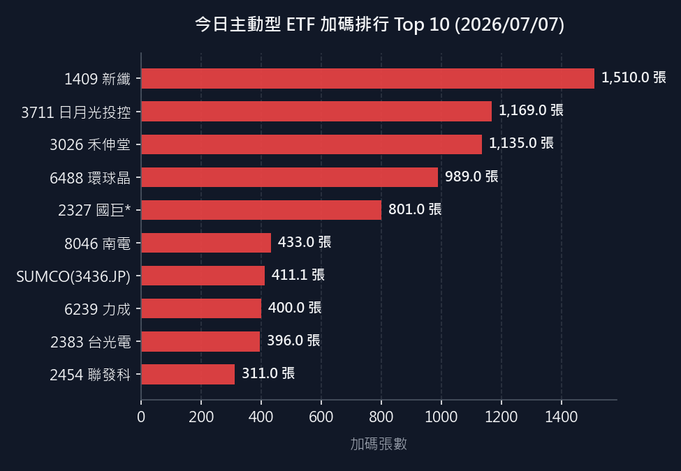
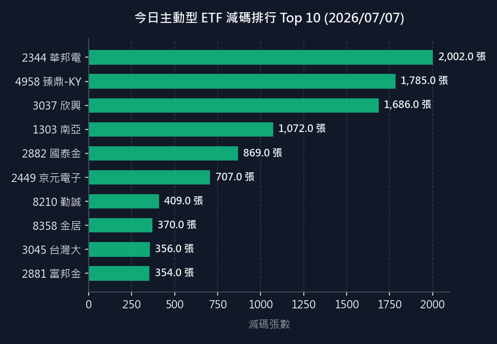

# 主動型 ETF 持股變動

資料來源：`主動型ETF持股明細.xlsx` 最近兩個日期分頁。

比較區間：`20260706` → `20260707`

## 今日加減碼視覺化排行

| 今日加碼 Top 10 | 今日減碼 Top 10 |
| :---: | :---: |
|  |  |

| ETF | 新增 | 刪除 | 比例變動 |
| :-- | --: | --: | --: |
| 00400A | 0 | 1 | 46 |
| 00401A | 0 | 0 | 55 |
| 00402A | 1 | 0 | 44 |
| 00403A | 0 | 0 | 42 |
| 00404A | 0 | 0 | 48 |
| 00405A | 2 | 2 | 40 |
| 00407A | 0 | 0 | 42 |
| 00980A | 0 | 0 | 46 |
| 00980D | 0 | 0 | 15 |
| 00981A | 0 | 0 | 27 |
| 00982A | 0 | 0 | 43 |
| 00983A | 0 | 1 | 37 |
| 00983D | 0 | 0 | 12 |
| 00984A | 3 | 7 | 100 |
| 00985A | 0 | 0 | 44 |
| 00986A | 0 | 0 | 30 |
| 00987A | 0 | 1 | 26 |
| 00988A | 2 | 3 | 39 |
| 00989A | 0 | 0 | 54 |
| 00990A | 4 | 2 | 42 |
| 00991A | 1 | 3 | 26 |
| 00992A | 1 | 0 | 32 |
| 00993A | 12 | 11 | 37 |
| 00994A | 1 | 1 | 28 |
| 00995A | 0 | 0 | 49 |
| 00996A | 0 | 0 | 39 |
| 00997A | 3 | 1 | 48 |
| 00998A | 2 | 2 | 33 |
| 00999A | 0 | 0 | 57 |

## 00400A

### 新增持股

- 無

### 刪除持股

- 2344 華邦電（1.30%，1857 張）

### 投資比例變動

- 1303 南亞：1.20% → 0.41%（-0.79）
- 1590 亞德客-KY：1.03% → 1.05%（+0.02）
- 2059 川湖：2.33% → 2.55%（+0.22）
- 2303 聯電：1.89% → 1.82%（-0.07）
- 2308 台達電：3.42% → 3.33%（-0.09）
- 2313 華通：0.49% → 0.47%（-0.02）
- 2327 國巨*：3.47% → 3.22%（-0.25）
- 2330 台積電：8.77% → 8.96%（+0.19）
- 2345 智邦：2.31% → 2.20%（-0.11）
- 2360 致茂：3.38% → 3.14%（-0.24）
- 2368 金像電：1.80% → 1.72%（-0.08）
- 2382 廣達：0.96% → 0.98%（+0.02）
- 2383 台光電：6.73% → 5.80%（-0.93）
- 2404 漢唐：0.64% → 0.63%（-0.01）
- 2408 南亞科：1.97% → 1.94%（-0.03）
- 2454 聯發科：6.97% → 7.02%（+0.05）
- 2472 立隆電：0.17% → 0.16%（-0.01）
- 2481 強茂：0.49% → 0.48%（-0.01）
- 2881 富邦金：0.38% → 0.40%（+0.02）
- 2885 元大金：1.05% → 1.11%（+0.06）
- 3017 奇鋐：4.08% → 3.86%（-0.22）
- 3036 文曄：1.26% → 1.27%（+0.01）
- 3037 欣興：3.77% → 3.56%（-0.21）
- 3044 健鼎：2.01% → 1.95%（-0.06）
- 3090 日電貿：0.79% → 0.73%（-0.06）
- 3131 弘塑：0.55% → 0.32%（-0.23）
- 3231 緯創：0.85% → 0.86%（+0.01）
- 3374 精材：0.34% → 0.32%（-0.02）
- 3443 創意：0.44% → 1.40%（+0.96）
- 3665 貿聯-KY：1.55% → 2.59%（+1.04）
- 3711 日月光投控：1.59% → 1.57%（-0.02）
- 5274 信驊：2.12% → 2.13%（+0.01）
- 5347 世界：1.92% → 1.87%（-0.05）
- 5434 崇越：0.40% → 0.41%（+0.01）
- 6121 新普：0.32% → 0.31%（-0.01）
- 6147 頎邦：1.03% → 0.98%（-0.05）
- 6187 萬潤：0.60% → 0.59%（-0.01）
- 6223 旺矽：4.50% → 4.27%（-0.23）
- 6285 啟碁：0.72% → 0.70%（-0.02）
- 6442 光聖：0.10% → 0.47%（+0.37）
- 6488 環球晶：4.37% → 4.07%（-0.30）
- 6510 精測：0.82% → 0.79%（-0.03）
- 6515 穎崴：0.41% → 0.86%（+0.45）
- 6669 緯穎：2.71% → 4.03%（+1.32）
- 7769 鴻勁：0.34% → 0.32%（-0.02）
- 8210 勤誠：1.24% → 1.16%（-0.08）

## 00401A

### 新增持股

- 無

### 刪除持股

- 無

### 投資比例變動

- 1216 統一：0.32% → 0.34%（+0.02）
- 2303 聯電：1.37% → 1.31%（-0.06）
- 2308 台達電：4.57% → 4.38%（-0.19）
- 2317 鴻海：0.67% → 0.70%（+0.03）
- 2330 台積電：8.80% → 9.24%（+0.44）
- 2344 華邦電：1.40% → 1.39%（-0.01）
- 2345 智邦：2.44% → 2.31%（-0.13）
- 2357 華碩：1.23% → 1.27%（+0.04）
- 2360 致茂：2.16% → 1.97%（-0.19）
- 2368 金像電：0.50% → 0.46%（-0.04）
- 2379 瑞昱：2.12% → 2.21%（+0.09）
- 2382 廣達：2.37% → 2.46%（+0.09）
- 2383 台光電：2.55% → 2.30%（-0.25）
- 2412 中華電：0.97% → 1.02%（+0.05）
- 2454 聯發科：6.49% → 6.56%（+0.07）
- 2455 全新：0.48% → 0.45%（-0.03）
- 2603 長榮：1.04% → 1.05%（+0.01）
- 2881 富邦金：1.45% → 1.55%（+0.10）
- 2882 國泰金：1.09% → 1.19%（+0.10）
- 2883 凱基金：1.93% → 2.14%（+0.21）
- 2884 玉山金：1.76% → 1.90%（+0.14）
- 2885 元大金：1.83% → 2.00%（+0.17）
- 2886 兆豐金：0.47% → 0.51%（+0.04）
- 2887 台新新光金：1.07% → 1.15%（+0.08）
- 2890 永豐金：0.30% → 0.33%（+0.03）
- 2891 中信金：2.36% → 2.47%（+0.11）
- 2912 統一超：0.30% → 0.33%（+0.03）
- 3005 神基：0.19% → 0.20%（+0.01）
- 3034 聯詠：0.82% → 0.85%（+0.03）
- 3037 欣興：0.72% → 0.66%（-0.06）
- 3044 健鼎：1.52% → 1.46%（-0.06）
- 3131 弘塑：0.68% → 0.60%（-0.08）
- 3231 緯創：0.34% → 0.35%（+0.01）
- 3491 昇達科：1.20% → 1.12%（-0.08）
- 3529 力旺：0.49% → 0.51%（+0.02）
- 3653 健策：1.12% → 1.10%（-0.02）
- 3711 日月光投控：2.54% → 2.55%（+0.01）
- 4904 遠傳：0.91% → 0.94%（+0.03）
- 4938 和碩：0.32% → 0.33%（+0.01）
- 4958 臻鼎-KY：2.70% → 2.54%（-0.16）
- 4991 環宇-KY：0.77% → 0.66%（-0.11）
- 5274 信驊：1.03% → 0.99%（-0.04）
- 5347 世界：1.13% → 1.08%（-0.05）
- 5904 寶雅：0.64% → 0.68%（+0.04）
- 6223 旺矽：2.85% → 2.57%（-0.28）
- 6285 啟碁：2.09% → 2.07%（-0.02）
- 6415 矽力*-KY：0.92% → 0.89%（-0.03）
- 6510 精測：0.99% → 0.89%（-0.10）
- 6515 穎崴：0.88% → 0.75%（-0.13）
- 6531 愛普*：1.47% → 1.40%（-0.07）
- 6944 兆聯實業：0.53% → 0.55%（+0.02）
- 7769 鴻勁：2.86% → 2.71%（-0.15）
- 7828 創新服務：1.51% → 1.32%（-0.19）
- 8021 尖點：0.37% → 0.34%（-0.03）
- 8464 億豐：1.24% → 1.31%（+0.07）

## 00402A

### 新增持股

- SPCX.US SpaceX（0.75%，11.3 張）

### 刪除持股

- 無

### 投資比例變動

- AAPL.US Apple：6.98% → 6.94%（-0.04）
- ADI.US Analog Devices：1.69% → 1.71%（+0.02）
- AMD.US AMD：5.35% → 5.59%（+0.24）
- AMZN.US Amazon：4.61% → 4.20%（-0.41）
- ANET.US Arista Networks：1.03% → 0.76%（-0.27）
- ARM.US Arm：0.98% → 1.13%（+0.15）
- ASML.US ASML Holding：1.56% → 1.58%（+0.02）
- AVGO.US Broadcom：2.31% → 2.36%（+0.05）
- AXON.US Axon Enterprise：1.08% → 1.26%（+0.18）
- BKNG.US Booking Holdings：0.79% → 0.76%（-0.03）
- CDNS.US Cadence Design Systems：1.85% → 1.83%（-0.02）
- CIEN.US Ciena：1.38% → 1.20%（-0.18）
- CLS.US Celestica：0.86% → 0.88%（+0.02）
- COHR.US Coherent：1.60% → 1.58%（-0.02）
- CRWD.US CrowdStrike Holdings：1.40% → 1.41%（+0.01）
- DASH.US DoorDash：0.92% → 0.67%（-0.25）
- GOOG.US Alphabet - Class C Capital Stock：3.44% → 3.46%（+0.02）
- INTC.US Intel：1.45% → 1.44%（-0.01）
- KLAC.US KLA：2.27% → 2.21%（-0.06）
- LITE.US Lumentum：1.19% → 1.17%（-0.02）
- LRCX.US Lam Research：3.78% → 3.69%（-0.09）
- MCHP.US Microchip Technology：1.62% → 1.65%（+0.03）
- MDB.US MongoDB：0.64% → 0.63%（-0.01）
- META.US Meta：2.69% → 2.72%（+0.03）
- MRVL.US Marvell：1.62% → 1.61%（-0.01）
- MSFT.US Microsoft：3.43% → 3.33%（-0.10）
- MU.US Micron：6.47% → 6.41%（-0.06）
- NFLX.US Netflix：1.29% → 1.24%（-0.05）
- NVDA.US NVIDIA：8.10% → 7.94%（-0.16）
- NXPI.US NXP Semiconductors：1.19% → 1.20%（+0.01）
- ON.US ON Semiconductor：0.29% → 0.14%（-0.15）
- PANW.US Palo Alto：3.17% → 3.20%（+0.03）
- PLTR.US Palantir Technologies：1.42% → 1.43%（+0.01）
- SHOP.US Shopify：0.66% → 0.65%（-0.01）
- SIMO.US Silicon Motion：0.68% → 0.87%（+0.19）
- SNOW.US Snowflake：0.72% → 0.71%（-0.01）
- SPOT.US Spotify：0.37% → 0.36%（-0.01）
- STX.US Seagate：1.31% → 1.36%（+0.05）
- TER.US Teradyne：0.65% → 0.66%（+0.01）
- TSM.US TSMC(ADR)：1.60% → 1.64%（+0.04）
- TXN.US Texas Instruments：2.93% → 2.98%（+0.05）
- UBER.US Uber：0.64% → 0.61%（-0.03）
- V.US Visa：1.23% → 1.19%（-0.04）
- WDC.US Western Digital：2.76% → 2.90%（+0.14）

## 00403A

### 新增持股

- 無

### 刪除持股

- 無

### 投資比例變動

- 1303 南亞：0.86% → 0.78%（-0.08）
- 1560 中砂：0.43% → 0.44%（+0.01）
- 2049 上銀：0.20% → 0.22%（+0.02）
- 2303 聯電：7.36% → 7.23%（-0.13）
- 2308 台達電：2.90% → 2.86%（-0.04）
- 2317 鴻海：0.44% → 0.47%（+0.03）
- 2327 國巨*：6.04% → 5.66%（-0.38）
- 2330 台積電：18.01% → 19.44%（+1.43）
- 2337 旺宏：0.82% → 0.87%（+0.05）
- 2344 華邦電：4.20% → 4.29%（+0.09）
- 2345 智邦：3.30% → 3.21%（-0.09）
- 2360 致茂：0.59% → 0.55%（-0.04）
- 2368 金像電：2.06% → 1.94%（-0.12）
- 2383 台光電：3.99% → 3.70%（-0.29）
- 2454 聯發科：3.46% → 4.01%（+0.55）
- 3017 奇鋐：5.48% → 5.26%（-0.22）
- 3037 欣興：5.00% → 3.69%（-1.31）
- 3189 景碩：1.54% → 1.38%（-0.16）
- 3211 順達：0.36% → 0.44%（+0.08）
- 3264 欣銓：0.04% → 0.09%（+0.05）
- 3443 創意：1.39% → 1.34%（-0.05）
- 3529 力旺：0.62% → 0.46%（-0.16）
- 3533 嘉澤：1.55% → 1.52%（-0.03）
- 3583 辛耘：0.44% → 0.45%（+0.01）
- 3653 健策：1.53% → 1.55%（+0.02）
- 3665 貿聯-KY：0.19% → 0.20%（+0.01）
- 3711 日月光投控：2.20% → 2.39%（+0.19）
- 4958 臻鼎-KY：2.27% → 2.20%（-0.07）
- 4966 譜瑞-KY：0.34% → 0.32%（-0.02）
- 5274 信驊：0.45% → 0.44%（-0.01）
- 6196 帆宣：0.34% → 0.35%（+0.01）
- 6223 旺矽：4.25% → 3.93%（-0.32）
- 6239 力成：0.10% → 0.18%（+0.08）
- 6274 台燿：1.75% → 1.67%（-0.08）
- 6442 光聖：0.28% → 0.29%（+0.01）
- 6488 環球晶：1.44% → 1.50%（+0.06）
- 6515 穎崴：1.14% → 1.00%（-0.14）
- 6669 緯穎：2.39% → 2.47%（+0.08）
- 7769 鴻勁：1.10% → 1.07%（-0.03）
- 8046 南電：0.54% → 0.51%（-0.03）
- 8358 金居：0.66% → 0.63%（-0.03）
- 8996 高力：1.24% → 1.30%（+0.06）

## 00404A

### 新增持股

- 無

### 刪除持股

- 無

### 投資比例變動

- 1303 南亞：0.43% → 0.37%（-0.06）
- 2303 聯電：2.61% → 2.47%（-0.14）
- 2308 台達電：3.95% → 3.73%（-0.22）
- 2317 鴻海：0.39% → 0.40%（+0.01）
- 2327 國巨*：0.66% → 0.60%（-0.06）
- 2330 台積電：21.85% → 22.65%（+0.80）
- 2345 智邦：1.02% → 0.96%（-0.06）
- 2360 致茂：1.04% → 0.94%（-0.10）
- 2382 廣達：2.67% → 2.75%（+0.08）
- 2383 台光電：2.10% → 1.88%（-0.22）
- 2454 聯發科：6.35% → 6.33%（-0.02）
- 2618 長榮航：1.89% → 1.90%（+0.01）
- 2883 凱基金：1.99% → 2.19%（+0.20）
- 2885 元大金：2.43% → 2.63%（+0.20）
- 2890 永豐金：0.23% → 0.25%（+0.02）
- 2891 中信金：2.80% → 2.89%（+0.09）
- 3014 聯陽：1.73% → 1.72%（-0.01）
- 3017 奇鋐：0.80% → 0.73%（-0.07）
- 3034 聯詠：2.05% → 2.10%（+0.05）
- 3037 欣興：0.45% → 0.40%（-0.05）
- 3044 健鼎：1.84% → 1.75%（-0.09）
- 3189 景碩：0.31% → 0.27%（-0.04）
- 3217 優群：1.25% → 1.26%（+0.01）
- 3227 原相：1.83% → 1.88%（+0.05）
- 3260 威剛：0.39% → 0.40%（+0.01）
- 3264 欣銓：1.09% → 1.06%（-0.03）
- 3265 台星科：1.24% → 1.21%（-0.03）
- 3293 鈊象：1.65% → 1.66%（+0.01）
- 3443 創意：0.15% → 0.13%（-0.02）
- 3592 瑞鼎：1.25% → 1.30%（+0.05）
- 3711 日月光投控：3.48% → 3.45%（-0.03）
- 5274 信驊：2.19% → 2.09%（-0.10）
- 5347 世界：0.70% → 0.66%（-0.04）
- 5434 崇越：1.79% → 1.81%（+0.02）
- 5904 寶雅：1.87% → 1.95%（+0.08）
- 6121 新普：1.14% → 1.24%（+0.10）
- 6139 亞翔：0.25% → 0.24%（-0.01）
- 6223 旺矽：0.96% → 0.85%（-0.11）
- 6257 矽格：1.85% → 1.83%（-0.02）
- 6515 穎崴：0.43% → 0.36%（-0.07）
- 6531 愛普*：0.20% → 0.19%（-0.01）
- 6903 巨漢：0.29% → 0.28%（-0.01）
- 8016 矽創：0.12% → 0.13%（+0.01）
- 8081 致新：1.85% → 1.83%（-0.02）
- 8299 群聯：1.19% → 1.16%（-0.03）
- 臺指選擇權07/26 48600 買權：-0.23% → -0.05%（+0.18）
- 臺指選擇權08/26 50400 買權：-0.03% → -0.02%（+0.01）
- 臺股期貨07/26：16.80% → 16.97%（+0.17）

## 00405A

### 新增持股

- 3026 禾伸堂（0.82%，230 張）
- 6488 環球晶（2.88%，580 張）

### 刪除持股

- 4979 華星光（0.05%，25 張）
- 6805 富世達（0.03%，5 張）

### 投資比例變動

- 2059 川湖：1.35% → 1.43%（+0.08）
- 2308 台達電：1.20% → 1.12%（-0.08）
- 2327 國巨*：5.32% → 4.74%（-0.58）
- 2330 台積電：2.34% → 2.40%（+0.06）
- 2344 華邦電：4.36% → 4.23%（-0.13）
- 2345 智邦：5.15% → 5.35%（+0.20）
- 2360 致茂：1.32% → 1.17%（-0.15）
- 2368 金像電：1.59% → 1.42%（-0.17）
- 2383 台光電：2.68% → 2.37%（-0.31）
- 2449 京元電子：1.07% → 1.04%（-0.03）
- 2454 聯發科：7.24% → 7.14%（-0.10）
- 3017 奇鋐：7.01% → 6.99%（-0.02）
- 3037 欣興：5.02% → 4.46%（-0.56）
- 3081 聯亞：1.21% → 1.13%（-0.08）
- 3105 穩懋：2.00% → 2.04%（+0.04）
- 3131 弘塑：4.97% → 4.29%（-0.68）
- 3163 波若威：0.25% → 0.23%（-0.02）
- 3443 創意：3.72% → 5.24%（+1.52）
- 3583 辛耘：2.06% → 2.01%（-0.05）
- 3653 健策：2.47% → 2.37%（-0.10）
- 3711 日月光投控：0.88% → 0.87%（-0.01）
- 4576 大銀微系統：0.06% → 0.07%（+0.01）
- 5274 信驊：2.29% → 2.16%（-0.13）
- 5347 世界：0.16% → 0.15%（-0.01）
- 6187 萬潤：2.29% → 2.22%（-0.07）
- 6223 旺矽：6.75% → 5.93%（-0.82）
- 6274 台燿：0.48% → 0.43%（-0.05）
- 6291 沛亨：0.47% → 0.43%（-0.04）
- 6442 光聖：0.46% → 0.44%（-0.02）
- 6510 精測：1.80% → 1.58%（-0.22）
- 6515 穎崴：0.91% → 0.76%（-0.15）
- 6526 達發：0.41% → 0.39%（-0.02）
- 6669 緯穎：0.11% → 0.10%（-0.01）
- 7734 印能科技：2.03% → 1.81%（-0.22）
- 7769 鴻勁：2.75% → 2.55%（-0.20）
- 8028 昇陽半導體：1.19% → 1.13%（-0.06）
- 8046 南電：2.71% → 2.41%（-0.30）
- 8210 勤誠：2.45% → 2.27%（-0.18）
- 8299 群聯：1.61% → 1.55%（-0.06）
- 8996 高力：1.56% → 1.55%（-0.01）

## 00407A

### 新增持股

- 無

### 刪除持股

- 無

### 投資比例變動

- 1303 南亞：0.62% → 0.54%（-0.08）
- 1590 亞德客-KY：1.82% → 1.81%（-0.01）
- 2059 川湖：1.96% → 2.09%（+0.13）
- 2303 聯電：1.99% → 1.87%（-0.12）
- 2308 台達電：4.27% → 4.02%（-0.25）
- 2327 國巨*：2.85% → 2.55%（-0.30）
- 2330 台積電：8.88% → 9.18%（+0.30）
- 2344 華邦電：1.81% → 1.77%（-0.04）
- 2345 智邦：3.61% → 3.36%（-0.25）
- 2360 致茂：1.98% → 1.78%（-0.20）
- 2368 金像電：2.42% → 2.17%（-0.25）
- 2379 瑞昱：0.80% → 0.82%（+0.02）
- 2383 台光電：1.59% → 3.02%（+1.43）
- 2395 研華：1.60% → 1.58%（-0.02）
- 2408 南亞科：1.59% → 1.62%（+0.03）
- 2412 中華電：1.67% → 1.72%（+0.05）
- 2454 聯發科：6.87% → 6.83%（-0.04）
- 2458 義隆：0.11% → 0.12%（+0.01）
- 3017 奇鋐：3.80% → 3.49%（-0.31）
- 3034 聯詠：0.70% → 0.71%（+0.01）
- 3037 欣興：3.06% → 2.74%（-0.32）
- 3443 創意：2.04% → 1.88%（-0.16）
- 3491 昇達科：0.42% → 0.39%（-0.03）
- 3529 力旺：1.75% → 1.79%（+0.04）
- 3533 嘉澤：0.88% → 0.82%（-0.06）
- 3665 貿聯-KY：1.96% → 2.02%（+0.06）
- 3711 日月光投控：1.98% → 1.95%（-0.03）
- 4958 臻鼎-KY：2.27% → 2.10%（-0.17）
- 5274 信驊：2.01% → 1.91%（-0.10）
- 5536 聖暉*：2.18% → 2.20%（+0.02）
- 6223 旺矽：2.76% → 2.44%（-0.32）
- 6274 台燿：2.29% → 2.47%（+0.18）
- 6415 矽力*-KY：0.48% → 0.46%（-0.02）
- 6446 藥華藥：2.35% → 2.60%（+0.25）
- 6515 穎崴：1.99% → 1.67%（-0.32）
- 6526 達發：0.35% → 0.34%（-0.01）
- 6531 愛普*：1.60% → 1.50%（-0.10）
- 6669 緯穎：2.13% → 2.52%（+0.39）
- 6805 富世達：1.68% → 1.59%（-0.09）
- 8046 南電：2.28% → 2.05%（-0.23）
- 8210 勤誠：1.87% → 1.74%（-0.13）
- 8299 群聯：0.16% → 0.15%（-0.01）

## 00980A

### 新增持股

- 無

### 刪除持股

- 無

### 投資比例變動

- 2059 川湖：4.97% → 5.49%（+0.52）
- 2308 台達電：5.50% → 5.43%（-0.07）
- 2317 鴻海：1.81% → 1.84%（+0.03）
- 2327 國巨*：2.01% → 1.89%（-0.12）
- 2330 台積電：9.05% → 9.35%（+0.30）
- 2344 華邦電：1.22% → 1.21%（-0.01）
- 2345 智邦：1.99% → 1.93%（-0.06）
- 2360 致茂：1.81% → 1.70%（-0.11）
- 2368 金像電：2.79% → 2.70%（-0.09）
- 2376 技嘉：0.83% → 0.84%（+0.01）
- 2382 廣達：1.16% → 1.19%（+0.03）
- 2383 台光電：4.80% → 4.76%（-0.04）
- 2408 南亞科：1.39% → 1.38%（-0.01）
- 2454 聯發科：6.44% → 6.55%（+0.11）
- 2884 玉山金：0.77% → 0.81%（+0.04）
- 2891 中信金：1.18% → 1.21%（+0.03）
- 3008 大立光：0.84% → 0.82%（-0.02）
- 3017 奇鋐：2.03% → 1.94%（-0.09）
- 3026 禾伸堂：0.75% → 0.70%（-0.05）
- 3036 文曄：1.36% → 1.38%（+0.02）
- 3037 欣興：2.99% → 2.85%（-0.14）
- 3044 健鼎：0.48% → 0.47%（-0.01）
- 3081 聯亞：2.51% → 2.49%（-0.02）
- 3189 景碩：0.62% → 0.58%（-0.04）
- 3231 緯創：0.64% → 0.66%（+0.02）
- 3264 欣銓：0.26% → 0.24%（-0.02）
- 3293 鈊象：0.57% → 0.58%（+0.01）
- 3443 創意：1.87% → 1.90%（+0.03）
- 3529 力旺：0.98% → 0.99%（+0.01）
- 3533 嘉澤：0.16% → 0.15%（-0.01）
- 3653 健策：2.91% → 2.92%（+0.01）
- 3665 貿聯-KY：0.60% → 0.64%（+0.04）
- 3711 日月光投控：1.58% → 1.57%（-0.01）
- 4958 臻鼎-KY：1.46% → 1.44%（-0.02）
- 5274 信驊：1.23% → 1.25%（+0.02）
- 5904 寶雅：1.34% → 1.37%（+0.03）
- 6223 旺矽：3.02% → 2.90%（-0.12）
- 6274 台燿：1.23% → 1.24%（+0.01）
- 6515 穎崴：2.84% → 2.67%（-0.17）
- 6669 緯穎：1.14% → 1.18%（+0.04）
- 6831 邁科：0.41% → 0.39%（-0.02）
- 7769 鴻勁：3.67% → 3.47%（-0.20）
- 8046 南電：1.37% → 1.36%（-0.01）
- 8210 勤誠：0.84% → 0.80%（-0.04）
- 8299 群聯：1.05% → 1.02%（-0.03）
- 8996 高力：1.83% → 1.78%（-0.05）

## 00980D

### 新增持股

- 無

### 刪除持股

- 無

### 投資比例變動

- APA CORP 6.750000 % 15-FEB-2055：0.36% → 0.37%（+0.01）
- CHC GROUP LLC SER REGS 11.750000 % 01-SEP-2030：0.42% → 0.40%（-0.02）
- CONCENTRIX CORP (REG) 6.6% 02AUG2028：0.50% → 0.51%（+0.01）
- COX COMMUNICATIONS INC SER REGS 5.950000 % 01SEP2054：0.57% → 0.56%（-0.01）
- ENBRIDGE ENERGY PARTNERS (REG) 7.375% 15OCT2045：0.52% → 0.53%（+0.01）
- GETTY IMAGES INC SER REGS 11.250000 % 21FEB2030：0.49% → 0.51%（+0.02）
- GLOBAL AUTO HO/AAG FH UK SER REGS (REG S) 11.5% 15AUG2029：0.36% → 0.37%（+0.01）
- SABRE FINANCIAL BORROWER SER REGS 11.125 % 15-JUN-2029：0.53% → 0.52%（-0.01）
- SABRE GLBL INC SER REGS 11.125000 % 15JUL2030：0.44% → 0.45%（+0.01）
- STAPLES INC SER REGS (REG S) 10.75% 01SEP2029：0.45% → 0.44%（-0.01）
- STELLANTIS FIN US INC SER REGS 6.450000 % 18MAR2035：0.32% → 0.33%（+0.01）
- UNISYS CORP SER REGS 10.625000 % 15JAN2031：0.58% → 0.59%（+0.01）
- US 10YR NOTE (CBT)SEP26 21-SEP-2026：18.48% → 18.47%（-0.01）
- US 5YR NOTE (CBT) SEP26 30-SEP-2026：-16.01% → -16.00%（+0.01）
- US ACUTE CARE SOLUTIONS SER REGS (REG S) 9.75% 15MAY2029：0.32% → 0.31%（-0.01）

## 00981A

### 新增持股

- 無

### 刪除持股

- 無

### 投資比例變動

- 1590 亞德客-KY：0.26% → 0.27%（+0.01）
- 2002 中鋼：0.03% → 0.04%（+0.01）
- 2303 聯電：4.99% → 4.95%（-0.04）
- 2308 台達電：3.54% → 3.52%（-0.02）
- 2327 國巨*：8.87% → 8.38%（-0.49）
- 2330 台積電：9.89% → 10.77%（+0.88）
- 2345 智邦：5.86% → 5.74%（-0.12）
- 2368 金像電：3.67% → 3.48%（-0.19）
- 2383 台光電：9.22% → 8.86%（-0.36）
- 2449 京元電子：0.39% → 0.22%（-0.17）
- 2454 聯發科：7.14% → 7.63%（+0.49）
- 3017 奇鋐：4.84% → 4.69%（-0.15）
- 3037 欣興：4.98% → 4.71%（-0.27）
- 3653 健策：2.62% → 2.67%（+0.05）
- 3665 貿聯-KY：3.26% → 3.53%（+0.27）
- 3711 日月光投控：2.94% → 3.06%（+0.12）
- 5274 信驊：2.21% → 2.22%（+0.01）
- 5439 高技：0.42% → 0.43%（+0.01）
- 6187 萬潤：0.46% → 0.48%（+0.02）
- 6223 旺矽：5.94% → 5.55%（-0.39）
- 6271 同欣電：0.28% → 0.27%（-0.01）
- 6274 台燿：3.12% → 3.00%（-0.12）
- 6510 精測：0.46% → 0.43%（-0.03）
- 6515 穎崴：0.76% → 0.60%（-0.16）
- 6669 緯穎：4.30% → 4.47%（+0.17）
- 8046 南電：3.59% → 3.40%（-0.19）
- 8210 勤誠：1.00% → 0.98%（-0.02）

## 00982A

### 新增持股

- 無

### 刪除持股

- 無

### 投資比例變動

- 1785 光洋科：1.55% → 1.48%（-0.07）
- 2059 川湖：2.66% → 2.92%（+0.26）
- 2303 聯電：2.76% → 2.67%（-0.09）
- 2316 楠梓電：1.36% → 1.34%（-0.02）
- 2327 國巨*：1.60% → 1.48%（-0.12）
- 2330 台積電：8.74% → 9.27%（+0.53）
- 2345 智邦：3.95% → 3.77%（-0.18）
- 2351 順德：0.34% → 0.37%（+0.03）
- 2360 致茂：3.39% → 3.13%（-0.26）
- 2368 金像電：0.92% → 0.85%（-0.07）
- 2376 技嘉：0.65% → 0.67%（+0.02）
- 2377 微星：1.47% → 1.49%（+0.02）
- 2383 台光電：3.60% → 3.29%（-0.31）
- 2451 創見：0.25% → 0.26%（+0.01）
- 2454 聯發科：6.53% → 6.67%（+0.14）
- 2467 志聖：1.61% → 1.70%（+0.09）
- 2472 立隆電：1.81% → 1.67%（-0.14）
- 2885 元大金：0.26% → 0.29%（+0.03）
- 3008 大立光：1.53% → 1.50%（-0.03）
- 3017 奇鋐：2.04% → 1.93%（-0.11）
- 3036 文曄：0.91% → 0.94%（+0.03）
- 3105 穩懋：3.09% → 3.28%（+0.19）
- 3264 欣銓：2.08% → 2.07%（-0.01）
- 3491 昇達科：2.35% → 2.23%（-0.12）
- 3583 辛耘：1.71% → 1.73%（+0.02）
- 3702 大聯大：1.07% → 1.12%（+0.05）
- 3711 日月光投控：1.23% → 1.25%（+0.02）
- 4958 臻鼎-KY：3.51% → 3.33%（-0.18）
- 5536 聖暉*：9.66% → 10.02%（+0.36）
- 6139 亞翔：5.28% → 5.23%（-0.05）
- 6147 頎邦：0.90% → 0.89%（-0.01）
- 6223 旺矽：4.12% → 3.74%（-0.38）
- 6239 力成：0.43% → 0.44%（+0.01）
- 6257 矽格：2.14% → 2.16%（+0.02）
- 6274 台燿：1.42% → 1.33%（-0.09）
- 6278 台表科：0.83% → 0.82%（-0.01）
- 6488 環球晶：2.59% → 2.64%（+0.05）
- 6531 愛普*：1.24% → 1.20%（-0.04）
- 6669 緯穎：2.84% → 2.88%（+0.04）
- 6805 富世達：0.36% → 0.35%（-0.01）
- 7769 鴻勁：1.14% → 1.09%（-0.05）
- 8016 矽創：1.33% → 1.49%（+0.16）
- 8996 高力：0.94% → 0.97%（+0.03）

## 00983A

### 新增持股

- 無

### 刪除持股

- P.US Everpure（0.27%，1.738 張）

### 投資比例變動

- AMD.US AMD：6.14% → 6.16%（+0.02）
- AMZN.US Amazon：2.79% → 2.64%（-0.15）
- AVGO.US Broadcom：0.49% → 0.26%（-0.23）
- BEAM.US Beam Therapeutics：4.05% → 3.87%（-0.18）
- BWXT.US BWX Technologies：0.87% → 0.84%（-0.03）
- CBRS.US Cerebras：0.49% → 0.50%（+0.01）
- CCJ.US Cameco：0.11% → 0.10%（-0.01）
- COIN.US Coinbase：1.18% → 1.14%（-0.04）
- CRSP.US CRISPR Therapeutics：3.93% → 5.00%（+1.07）
- CRWV.US CoreWeave：1.46% → 1.04%（-0.42）
- DE.US Deere：0.94% → 0.90%（-0.04）
- GOOG.US Alphabet - Class C Capital Stock：1.15% → 1.11%（-0.04）
- GOOGL.US Alphabet - Class A Common Stock：1.53% → 1.47%（-0.06）
- HOOD.US Robinhood Markets：7.14% → 7.01%（-0.13）
- ILMN.US Illumina：3.19% → 3.09%（-0.10）
- JOBY.US Joby Aviation：0.11% → 0.00%（-0.11）
- LLY.US Eli Lilly：1.71% → 1.84%（+0.13）
- META.US Meta：0.22% → 0.21%（-0.01）
- NTLA.US Intellia Therapeutics：3.44% → 3.91%（+0.47）
- NTRA.US Natera：3.66% → 3.50%（-0.16）
- NVDA.US NVIDIA：1.93% → 1.42%（-0.51）
- PLTR.US Palantir Technologies：0.55% → 0.53%（-0.02）
- RBLX.US Roblox：1.40% → 1.56%（+0.16）
- ROKU.US Roku：0.30% → 0.29%（-0.01）
- SHOP.US Shopify：4.07% → 4.78%（+0.71）
- SNOW.US Snowflake：0.36% → 0.39%（+0.03）
- SOFI.US SoFi Technologies：0.62% → 0.59%（-0.03）
- SPCX.US SpaceX：4.27% → 4.60%（+0.33）
- TEM.US Tempus：5.51% → 6.03%（+0.52）
- TER.US Teradyne：2.28% → 1.75%（-0.53）
- TSLA.US Tesla：8.28% → 8.32%（+0.04）
- TSM.US TSMC(ADR)：3.44% → 3.37%（-0.07）
- TWST.US Twist Bioscience：5.17% → 4.90%（-0.27）
- TXG.US 10x Genomics：5.49% → 5.29%（-0.20）
- VCYT.US Veracyte：2.77% → 2.31%（-0.46）
- WGS.US GeneDx：1.09% → 1.21%（+0.12）
- XYZ.US Block：2.31% → 2.17%（-0.14）

## 00983D

### 新增持股

- 無

### 刪除持股

- 無

### 投資比例變動

- C 8 1/8 07/15/39：2.34% → 2.33%（-0.01）
- CMCSA 6.95 08/15/37：1.01% → 1.00%（-0.01）
- DELL 8.35 07/15/46：1.62% → 1.63%（+0.01）
- DOW 6.9 05/15/53：0.74% → 0.73%（-0.01）
- GTN 10 1/2 07/15/29：1.66% → 1.65%（-0.01）
- HPE 6.35 10/15/45：1.00% → 1.01%（+0.01）
- IEP 10 11/15/29：1.48% → 1.49%（+0.01）
- MINAU 9 1/4 10/01/28：0.87% → 0.86%（-0.01）
- OXY 6.6 03/15/46：0.75% → 0.74%（-0.01）
- SPCX 6.6 07/15/46：0.59% → 0.60%（+0.01）
- TELEFONICA EMISIONES SAU 7.045 06/20/36：1.56% → 1.55%（-0.01）
- TLTW.US iShares 20+ Year Treasury Bond B：7.31% → 7.29%（-0.02）

## 00984A

### 新增持股

- 1326 台化（0.65%，892 張）
- 2478 大毅（0.48%，215 張）
- 3532 台勝科（0.59%，133 張）

### 刪除持股

- 2455 全新（0.39%，94 張）
- 3006 晶豪科（0.01%，5 張）
- 3105 穩懋（0.01%，3 張）
- 6116 彩晶（0.02%，81 張）
- 7734 印能科技（0.04%，1 張）
- 7750 新代（0.03%，1 張）
- 8039 台虹（0.02%，11 張）

### 投資比例變動

- 1102 亞泥：1.25% → 1.30%（+0.05）
- 1216 統一：1.78% → 1.89%（+0.11）
- 1402 遠東新：1.00% → 1.01%（+0.01）
- 1409 新纖：0.13% → 0.68%（+0.55）
- 1513 中興電：0.25% → 0.26%（+0.01）
- 1560 中砂：0.49% → 0.47%（-0.02）
- 1785 光洋科：0.58% → 0.54%（-0.04）
- 1795 美時：0.37% → 0.40%（+0.03）
- 1907 永豐餘：0.26% → 0.27%（+0.01）
- 2006 東和鋼鐵：0.37% → 0.38%（+0.01）
- 2049 上銀：0.58% → 0.59%（+0.01）
- 2059 川湖：0.56% → 0.57%（+0.01）
- 2105 正新：0.39% → 0.40%（+0.01）
- 2204 中華：0.26% → 0.27%（+0.01）
- 2206 三陽工業：0.38% → 0.39%（+0.01）
- 2303 聯電：2.70% → 2.43%（-0.27）
- 2327 國巨*：1.39% → 1.26%（-0.13）
- 2330 台積電：2.70% → 2.88%（+0.18）
- 2337 旺宏：0.49% → 0.50%（+0.01）
- 2345 智邦：0.41% → 0.37%（-0.04）
- 2357 華碩：2.34% → 2.38%（+0.04）
- 2360 致茂：0.71% → 0.61%（-0.10）
- 2368 金像電：0.14% → 0.13%（-0.01）
- 2377 微星：0.88% → 0.87%（-0.01）
- 2382 廣達：2.30% → 2.36%（+0.06）
- 2383 台光電：2.04% → 1.80%（-0.24）
- 2385 群光：0.37% → 0.38%（+0.01）
- 2404 漢唐：1.92% → 1.87%（-0.05）
- 2412 中華電：2.38% → 2.48%（+0.10）
- 2454 聯發科：1.41% → 1.43%（+0.02）
- 2458 義隆：0.35% → 0.37%（+0.02）
- 2467 志聖：0.53% → 0.55%（+0.02）
- 2472 立隆電：0.50% → 0.45%（-0.05）
- 2474 可成：0.77% → 0.78%（+0.01）
- 2501 國建：0.25% → 0.26%（+0.01）
- 2606 裕民：0.37% → 0.39%（+0.02）
- 2618 長榮航：1.37% → 1.35%（-0.02）
- 2633 台灣高鐵：1.28% → 1.31%（+0.03）
- 2634 漢翔：0.34% → 0.38%（+0.04）
- 2645 長榮航太：0.29% → 0.30%（+0.01）
- 2646 星宇航空：0.36% → 0.38%（+0.02）
- 2855 統一證：0.56% → 0.57%（+0.01）
- 2881 富邦金：2.36% → 2.40%（+0.04）
- 2882 國泰金：0.25% → 0.27%（+0.02）
- 2885 元大金：0.38% → 0.41%（+0.03）
- 2891 中信金：2.33% → 2.40%（+0.07）
- 2897 王道銀行：0.25% → 0.26%（+0.01）
- 2912 統一超：1.33% → 1.44%（+0.11）
- 3005 神基：0.38% → 0.39%（+0.01）
- 3008 大立光：0.64% → 0.63%（-0.01）
- 3026 禾伸堂：1.25% → 1.14%（-0.11）
- 3034 聯詠：1.91% → 1.96%（+0.05）
- 3037 欣興：1.66% → 1.50%（-0.16）
- 3044 健鼎：0.36% → 0.34%（-0.02）
- 3045 台灣大：1.85% → 1.90%（+0.05）
- 3090 日電貿：1.28% → 1.22%（-0.06）
- 3167 大量：0.54% → 0.55%（+0.01）
- 3189 景碩：1.31% → 1.07%（-0.24）
- 3264 欣銓：0.26% → 0.25%（-0.01）
- 3443 創意：0.64% → 0.62%（-0.02）
- 3481 群創：0.54% → 0.52%（-0.02）
- 3592 瑞鼎：0.25% → 0.26%（+0.01）
- 3702 大聯大：0.92% → 0.95%（+0.03）
- 4904 遠傳：1.64% → 1.67%（+0.03）
- 4919 新唐：0.55% → 0.53%（-0.02）
- 4938 和碩：0.36% → 0.37%（+0.01）
- 4958 臻鼎-KY：1.91% → 1.77%（-0.14）
- 5274 信驊：0.40% → 0.36%（-0.04）
- 5434 崇越：1.03% → 1.04%（+0.01）
- 5483 中美晶：0.42% → 0.41%（-0.01）
- 5536 聖暉*：0.58% → 0.59%（+0.01）
- 5871 中租-KY：1.04% → 1.06%（+0.02）
- 5876 上海商銀：1.11% → 1.17%（+0.06）
- 6121 新普：0.62% → 0.68%（+0.06）
- 6139 亞翔：0.54% → 0.53%（-0.01）
- 6147 頎邦：0.55% → 0.53%（-0.02）
- 6176 瑞儀：0.37% → 0.39%（+0.02）
- 6182 合晶：0.71% → 0.66%（-0.05）
- 6196 帆宣：1.13% → 1.12%（-0.01）
- 6213 聯茂：0.93% → 1.14%（+0.21）
- 6223 旺矽：1.20% → 1.09%（-0.11）
- 6274 台燿：2.16% → 1.97%（-0.19）
- 6285 啟碁：0.54% → 0.53%（-0.01）
- 6446 藥華藥：1.94% → 2.15%（+0.21）
- 6531 愛普*：1.18% → 1.12%（-0.06）
- 6715 嘉基：0.52% → 0.48%（-0.04）
- 6831 邁科：0.56% → 0.49%（-0.07）
- 6890 來億-KY：0.27% → 0.28%（+0.01）
- 7769 鴻勁：0.56% → 0.57%（+0.01）
- 8016 矽創：0.90% → 0.99%（+0.09）
- 8021 尖點：1.69% → 1.50%（-0.19）
- 8046 南電：1.04% → 0.95%（-0.09）
- 8064 東捷：0.54% → 0.50%（-0.04）
- 8081 致新：0.27% → 0.26%（-0.01）
- 8210 勤誠：0.29% → 0.27%（-0.02）
- 8261 富鼎：0.93% → 1.03%（+0.10）
- 8358 金居：1.35% → 1.24%（-0.11）
- 8415 大國鋼：0.23% → 0.24%（+0.01）
- 9939 宏全：0.25% → 0.27%（+0.02）
- 元大期貨：0.26% → 0.27%（+0.01）

## 00985A

### 新增持股

- 無

### 刪除持股

- 無

### 投資比例變動

- 1216 統一：0.97% → 1.01%（+0.04）
- 1802 台玻：1.01% → 1.00%（-0.01）
- 2049 上銀：1.06% → 1.03%（-0.03）
- 2059 川湖：2.77% → 3.03%（+0.26）
- 2303 聯電：1.92% → 1.85%（-0.07）
- 2308 台達電：1.30% → 1.28%（-0.02）
- 2330 台積電：25.91% → 26.53%（+0.62）
- 2344 華邦電：1.50% → 1.47%（-0.03）
- 2345 智邦：2.34% → 2.24%（-0.10）
- 2360 致茂：1.89% → 1.75%（-0.14）
- 2368 金像電：1.42% → 1.36%（-0.06）
- 2376 技嘉：3.44% → 3.45%（+0.01）
- 2383 台光電：2.16% → 2.12%（-0.04）
- 2395 研華：2.70% → 2.68%（-0.02）
- 2408 南亞科：1.54% → 1.53%（-0.01）
- 2412 中華電：1.95% → 2.00%（+0.05）
- 2454 聯發科：1.51% → 1.52%（+0.01）
- 2881 富邦金：0.69% → 0.72%（+0.03）
- 2891 中信金：0.53% → 0.54%（+0.01）
- 3008 大立光：2.70% → 2.62%（-0.08）
- 3017 奇鋐：1.75% → 1.65%（-0.10）
- 3036 文曄：2.34% → 2.36%（+0.02）
- 3081 聯亞：1.29% → 1.27%（-0.02）
- 3105 穩懋：0.60% → 0.61%（+0.01）
- 3131 弘塑：2.14% → 2.05%（-0.09）
- 3529 力旺：0.67% → 0.68%（+0.01）
- 3533 嘉澤：0.20% → 0.19%（-0.01）
- 3653 健策：1.18% → 1.17%（-0.01）
- 3661 世芯-KY：2.96% → 2.92%（-0.04）
- 3665 貿聯-KY：0.24% → 0.26%（+0.02）
- 3711 日月光投控：0.91% → 0.90%（-0.01）
- 4904 遠傳：0.58% → 0.60%（+0.02）
- 4958 臻鼎-KY：2.30% → 2.25%（-0.05）
- 6147 頎邦：1.90% → 1.81%（-0.09）
- 6187 萬潤：1.92% → 1.86%（-0.06）
- 6223 旺矽：1.45% → 1.38%（-0.07）
- 6415 矽力*-KY：0.58% → 0.54%（-0.04）
- 6442 光聖：3.07% → 3.06%（-0.01）
- 6488 環球晶：0.51% → 0.48%（-0.03）
- 6669 緯穎：0.73% → 0.75%（+0.02）
- 7769 鴻勁：0.85% → 0.80%（-0.05）
- 8046 南電：1.22% → 1.21%（-0.01）
- 8299 群聯：1.34% → 1.30%（-0.04）
- 8996 高力：0.81% → 0.78%（-0.03）

## 00986A

### 新增持股

- 無

### 刪除持股

- 無

### 投資比例變動

- 2330 台積電：8.55% → 8.41%（-0.14）
- AMD.US AMD：2.34% → 2.47%（+0.13）
- AMZN.US Amazon：3.42% → 3.41%（-0.01）
- AVGO.US Broadcom：5.08% → 4.47%（-0.61）
- CAT.US Caterpillar：2.67% → 2.66%（-0.01）
- COHR.US Coherent：2.18% → 2.17%（-0.01）
- CRWD.US CrowdStrike Holdings：3.66% → 3.73%（+0.07）
- ETN.US Eaton：2.01% → 2.06%（+0.05）
- GEV.US GE Vernova：3.64% → 3.73%（+0.09）
- GOOGL.US Alphabet - Class A Common Stock：7.25% → 7.30%（+0.05）
- GS.US Goldman Sachs：2.83% → 2.89%（+0.06）
- HWM.US Howmet Aerospace：2.31% → 2.35%（+0.04）
- IBIDEN(4062.JP)：2.55% → 2.30%（-0.25）
- LITE.US Lumentum：2.86% → 2.84%（-0.02）
- LLY.US Eli Lilly：2.44% → 2.69%（+0.25）
- LRCX.US Lam Research：3.58% → 3.53%（-0.05）
- MRVL.US Marvell：1.36% → 1.37%（+0.01）
- MSFT.US Microsoft：1.97% → 1.93%（-0.04）
- MU.US Micron：6.10% → 5.40%（-0.70）
- MUFG(8306.JP)：1.23% → 1.24%（+0.01）
- Murata Mfg.(6981.JP)：1.69% → 1.57%（-0.12）
- NET.US Cloudflare：1.46% → 1.48%（+0.02）
- NVDA.US NVIDIA：5.59% → 5.16%（-0.43）
- SNDK.US Sandisk：1.93% → 1.91%（-0.02）
- Siemens Energy AG：2.09% → 2.13%（+0.04）
- TSLA.US Tesla：1.09% → 1.15%（+0.06）
- WMT.US Walmart：1.01% → 0.99%（-0.02）
- Yaskawa Electric(6506.JP)：1.62% → 2.29%（+0.67）
- 施奈德電機公司：1.50% → 1.51%（+0.01）
- 英飛凌科技股份有限公司：3.50% → 3.52%（+0.02）

## 00987A

### 新增持股

- 無

### 刪除持股

- 2308 台達電（3.27%，47 張）

### 投資比例變動

- 2327 國巨*：3.89% → 3.68%（-0.21）
- 2330 台積電：7.38% → 8.05%（+0.67）
- 2345 智邦：2.57% → 2.52%（-0.05）
- 2383 台光電：6.93% → 6.50%（-0.43）
- 2408 南亞科：2.21% → 2.38%（+0.17）
- 2454 聯發科：2.39% → 2.51%（+0.12）
- 2455 全新：2.46% → 2.39%（-0.07）
- 3017 奇鋐：7.96% → 7.72%（-0.24）
- 3037 欣興：6.17% → 5.85%（-0.32）
- 3081 聯亞：2.60% → 3.14%（+0.54）
- 3131 弘塑：1.52% → 1.40%（-0.12）
- 3167 大量：1.06% → 2.08%（+1.02）
- 3363 上詮：1.81% → 1.99%（+0.18）
- 3443 創意：4.05% → 3.94%（-0.11）
- 3653 健策：2.06% → 2.11%（+0.05）
- 3665 貿聯-KY：3.34% → 3.63%（+0.29）
- 4764 雙鍵：1.19% → 1.28%（+0.09）
- 6139 亞翔：3.05% → 3.11%（+0.06）
- 6223 旺矽：6.68% → 6.24%（-0.44）
- 6274 台燿：4.50% → 4.33%（-0.17）
- 6515 穎崴：1.66% → 1.47%（-0.19）
- 6683 雍智科技：3.15% → 3.16%（+0.01）
- 8028 昇陽半導體：1.01% → 2.00%（+0.99）
- 8155 博智：3.38% → 3.36%（-0.02）
- 8358 金居：2.25% → 2.18%（-0.07）
- 8996 高力：4.02% → 4.26%（+0.24）

## 00988A

### 新增持股

- SK hynix(000660.KS)（0.95%，12 張）
- samsung electronics co ltd(005930 KS)（2.15%，200 張）

### 刪除持股

- ARM.US Arm（0.12%，6.946 張）
- Furuya Metal(7826.JP)（0.11%，42 張）
- Mitsui Kinzoku(5706.JP)（1.65%，130 張）

### 投資比例變動

- 2303 聯電：1.67% → 1.60%（-0.07）
- 2308 台達電：0.58% → 0.56%（-0.02）
- 2327 國巨*：2.84% → 3.56%（+0.72）
- 2330 台積電：1.87% → 1.78%（-0.09）
- 2383 台光電：3.14% → 2.91%（-0.23）
- 2454 聯發科：3.26% → 2.95%（-0.31）
- 3017 奇鋐：0.99% → 0.92%（-0.07）
- 3037 欣興：3.63% → 3.24%（-0.39）
- 3711 日月光投控：1.35% → 1.20%（-0.15）
- 6223 旺矽：1.40% → 1.27%（-0.13）
- 6274 台燿：1.07% → 0.98%（-0.09）
- AIXTRON SE：1.08% → 1.12%（+0.04）
- AMAT.US Applied Materials：3.02% → 3.51%（+0.49）
- AMD.US AMD：5.43% → 5.55%（+0.12）
- BE.US Bloom Energy：3.35% → 3.50%（+0.15）
- CHAOZHOU THREE-CIRCLE GROU-A：0.47% → 0.43%（-0.04）
- COHR.US Coherent：0.99% → 0.95%（-0.04）
- CRDO.US Credo：1.56% → 1.64%（+0.08）
- IBIDEN(4062.JP)：2.14% → 1.87%（-0.27）
- INFINEON TECHNOLOGIES AG：2.92% → 2.84%（-0.08）
- KLAC.US KLA：0.76% → 1.56%（+0.80）
- Kioxia Holdings(285A.JP)：5.19% → 5.31%（+0.12）
- LITE.US Lumentum：2.43% → 2.34%（-0.09）
- Lasertec Corporation(6920.JP)：1.39% → 1.31%（-0.08）
- MICRONICS(6871.JP)：0.74% → 0.67%（-0.07）
- MRVL.US Marvell：3.04% → 2.96%（-0.08）
- MU.US Micron：6.09% → 5.89%（-0.20）
- Meiko Electronics(6787.JP)：0.47% → 0.44%（-0.03）
- Murata Mfg.(6981.JP)：3.85% → 3.47%（-0.38）
- Nippon Chemi-Con(6997.JP)：2.18% → 2.03%（-0.15）
- PERIC SPECIAL GASES CO LTD-A：0.69% → 0.55%（-0.14）
- SNDK.US Sandisk：4.22% → 4.05%（-0.17）
- SUMCO(3436.JP)：1.70% → 2.12%（+0.42）
- Samsung Elec Mech(009150.KS)：5.38% → 4.88%（-0.50）
- TAIYO YUDEN(6976.JP)：5.15% → 4.44%（-0.71）
- Tokyo Electron(8035.JP)：2.13% → 2.02%（-0.11）
- Union Tool(6278.JP)：0.64% → 0.60%（-0.04）
- VSH.US Vishay：1.73% → 1.67%（-0.06）
- WDC.US Western Digital：2.61% → 2.68%（+0.07）

## 00989A

### 新增持股

- 無

### 刪除持股

- 無

### 投資比例變動

- ADI.US Analog Devices：1.05% → 1.06%（+0.01）
- AMAT.US Applied Materials：0.67% → 0.64%（-0.03）
- AMD.US AMD：3.52% → 3.67%（+0.15）
- AMKR.US Amkor：1.04% → 1.02%（-0.02）
- AMZN.US Amazon：0.66% → 0.65%（-0.01）
- APP.US Applovin：1.23% → 1.25%（+0.02）
- ASML.US ASML Holding：3.03% → 3.06%（+0.03）
- AVGO.US Broadcom：3.59% → 3.65%（+0.06）
- BE.US Bloom Energy：1.67% → 1.78%（+0.11）
- CBRS.US Cerebras：0.17% → 0.16%（-0.01）
- CDNS.US Cadence Design Systems：1.04% → 1.03%（-0.01）
- CIEN.US Ciena：1.94% → 1.95%（+0.01）
- CRCL.US Circle：0.28% → 0.29%（+0.01）
- CRM.US Salesforce：0.82% → 0.80%（-0.02）
- CRWD.US CrowdStrike Holdings：2.79% → 2.81%（+0.02）
- DOCN.US DigitalOcean：1.41% → 1.40%（-0.01）
- ENPH.US Enphase Energy：0.13% → 0.14%（+0.01）
- ENTG.US Entegris：1.20% → 1.17%（-0.03）
- FIGR.US Figure：0.79% → 0.78%（-0.01）
- FN.US Fabrinet：0.68% → 0.67%（-0.01）
- GFS.US GlobalFoundries：1.46% → 1.42%（-0.04）
- GLW.US Corning：2.14% → 2.07%（-0.07）
- GOOG.US Alphabet - Class C Capital Stock：4.37% → 4.39%（+0.02）
- HOOD.US Robinhood Markets：2.66% → 2.71%（+0.05）
- INTC.US Intel：4.64% → 4.61%（-0.03）
- LITE.US Lumentum：1.37% → 1.35%（-0.02）
- LMND.US Lemonade：1.11% → 1.20%（+0.09）
- LRCX.US Lam Research：4.41% → 4.31%（-0.10）
- META.US Meta：1.71% → 1.73%（+0.02）
- MSFT.US Microsoft：1.06% → 1.02%（-0.04）
- MTSI.US MACOM Technology Solutions：1.13% → 1.12%（-0.01）
- MU.US Micron：2.45% → 2.42%（-0.03）
- MXL.US MaxLinear：0.48% → 0.49%（+0.01）
- NU.US Nu：0.87% → 0.88%（+0.01）
- NVDA.US NVIDIA：3.61% → 3.55%（-0.06）
- ON.US ON Semiconductor：1.70% → 1.73%（+0.03）
- PANW.US Palo Alto：4.12% → 4.15%（+0.03）
- RIVN.US Rivian：1.29% → 1.37%（+0.08）
- SHOP.US Shopify：1.23% → 1.21%（-0.02）
- SNDK.US Sandisk：2.71% → 2.66%（-0.05）
- SNOW.US Snowflake：2.33% → 2.30%（-0.03）
- SPCX.US SpaceX：0.61% → 0.59%（-0.02）
- SYM.US Symbotic：0.34% → 0.35%（+0.01）
- TEM.US Tempus：0.98% → 0.96%（-0.02）
- TSLA.US Tesla：3.08% → 3.22%（+0.14）
- TSM.US TSMC(ADR)：1.84% → 1.87%（+0.03）
- TTMI.US TTM Technologies：0.66% → 0.62%（-0.04）
- TTWO.US Take-Two：3.80% → 3.77%（-0.03）
- TWLO.US Twilio：2.04% → 1.99%（-0.05）
- TXN.US Texas Instruments：1.53% → 1.56%（+0.03）
- VICR.US Vicor Corporation：1.14% → 1.13%（-0.01）
- WRBY.US Warby Parker：0.70% → 0.69%（-0.01）
- XYZ.US Block：0.75% → 0.74%（-0.01）
- ZM.US Zoom：1.61% → 1.53%（-0.08）

## 00990A

### 新增持股

- 2449 京元電子（0.66%，834 張）
- 3711 日月光投控（0.70%，455 張）
- ASML.US ASML Holding（0.83%，6.34 張）
- ON SEMICONDUCTOR（0.51%，74.8 張）

### 刪除持股

- ASML HOLDING NV-NY REG SHS（0.82%，6.34 張）
- Lasertec Corporation(6920.JP)（0.57%，26.3 張）

### 投資比例變動

- 2303 聯電：1.23% → 1.22%（-0.01）
- 2308 台達電：3.35% → 2.54%（-0.81）
- 2330 台積電：2.04% → 2.01%（-0.03）
- 2383 台光電：1.86% → 1.78%（-0.08）
- 2454 聯發科：2.92% → 2.73%（-0.19）
- 3037 欣興：1.73% → 1.60%（-0.13）
- 3443 創意：0.84% → 0.72%（-0.12）
- 3665 貿聯-KY：0.67% → 0.63%（-0.04）
- 4958 臻鼎-KY：0.64% → 0.61%（-0.03）
- 5347 世界：1.13% → 1.04%（-0.09）
- 6223 旺矽：1.24% → 1.16%（-0.08）
- 6274 台燿：1.03% → 0.98%（-0.05）
- AMAT.US Applied Materials：3.17% → 3.57%（+0.40）
- AMD.US AMD：6.16% → 6.50%（+0.34）
- BE.US Bloom Energy：2.73% → 2.94%（+0.21）
- COHR.US Coherent：1.65% → 1.64%（-0.01）
- GLW.US Corning：0.33% → 0.32%（-0.01）
- IBIDEN(4062.JP)：2.49% → 2.24%（-0.25）
- INFINEON TECHNOLOGIES AG：2.70% → 2.71%（+0.01）
- KOKUSAI ELECTRIC(6525.JP)：0.67% → 1.44%（+0.77）
- Kioxia Holdings(285A.JP)：5.25% → 5.53%（+0.28）
- LITE.US Lumentum：2.73% → 2.71%（-0.02）
- LRCX.US Lam Research：2.06% → 2.03%（-0.03）
- MKSI.US MKS：1.77% → 1.76%（-0.01）
- MRVL.US Marvell：2.42% → 2.43%（+0.01）
- MU.US Micron：5.90% → 5.89%（-0.01）
- Murata Mfg.(6981.JP)：3.39% → 3.14%（-0.25）
- Nippon Chemi-Con(6997.JP)：1.11% → 1.07%（-0.04）
- ONTO.US Onto Innovation：1.00% → 0.98%（-0.02）
- PENG.US Penguin Solutions：0.75% → 0.81%（+0.06）
- Renesas Electronics(6723.JP)：1.63% → 1.57%（-0.06）
- SCREEN Holdings(7735.JP)：0.70% → 1.17%（+0.47）
- SK hynix(000660.KS)：2.06% → 2.20%（+0.14）
- SNDK.US Sandisk：5.83% → 5.76%（-0.07）
- SUMCO(3436.JP)：1.48% → 2.19%（+0.71）
- Samsung Elec Mech(009150.KS)：4.81% → 4.85%（+0.04）
- TAIYO YUDEN(6976.JP)：5.39% → 4.79%（-0.60）
- Tokyo Electron(8035.JP)：1.53% → 1.49%（-0.04）
- UCTT.US Ultra Clean Holdings：0.90% → 0.88%（-0.02）
- VECO.US Veeco Instruments Inc.：0.73% → 0.68%（-0.05）
- VICR.US Vicor Corporation：0.90% → 0.89%（-0.01）
- WDC.US Western Digital：2.49% → 2.64%（+0.15）

## 00991A

### 新增持股

- 3026 禾伸堂（1.09%，900 張）

### 刪除持股

- 4958 臻鼎-KY（1.25%，1500 張）
- 8210 勤誠（0.73%，410 張）
- 8996 高力（0.23%，121 張）

### 投資比例變動

- 2059 川湖：3.36% → 3.59%（+0.23）
- 2303 聯電：3.23% → 3.04%（-0.19）
- 2308 台達電：0.03% → 0.02%（-0.01）
- 2327 國巨*：8.70% → 8.11%（-0.59）
- 2330 台積電：11.59% → 12.98%（+1.39）
- 2344 華邦電：1.20% → 1.17%（-0.03）
- 2345 智邦：3.70% → 3.78%（+0.08）
- 2368 金像電：0.02% → 0.01%（-0.01）
- 2383 台光電：7.00% → 8.04%（+1.04）
- 2404 漢唐：1.19% → 1.15%（-0.04）
- 2408 南亞科：4.99% → 5.08%（+0.09）
- 2454 聯發科：5.11% → 5.36%（+0.25）
- 2492 華新科：2.44% → 2.25%（-0.19）
- 3017 奇鋐：2.39% → 2.26%（-0.13）
- 3037 欣興：4.99% → 4.59%（-0.40）
- 3189 景碩：3.16% → 2.69%（-0.47）
- 3665 貿聯-KY：0.70% → 0.72%（+0.02）
- 3711 日月光投控：2.68% → 2.92%（+0.24）
- 5274 信驊：2.81% → 2.55%（-0.26）
- 6223 旺矽：5.00% → 4.68%（-0.32）
- 6274 台燿：4.61% → 4.41%（-0.20）
- 6515 穎崴：2.82% → 2.47%（-0.35）
- 6669 緯穎：2.42% → 2.46%（+0.04）
- 7769 鴻勁：2.79% → 2.60%（-0.19）
- 8046 南電：3.69% → 3.75%（+0.06）
- 8299 群聯：4.66% → 4.50%（-0.16）

## 00992A

### 新增持股

- 6488 環球晶（1.14%，394 張）

### 刪除持股

- 無

### 投資比例變動

- 2059 川湖：5.26% → 5.84%（+0.58）
- 2303 聯電：2.68% → 2.62%（-0.06）
- 2327 國巨*：3.67% → 3.42%（-0.25）
- 2330 台積電：7.72% → 8.27%（+0.55）
- 2337 旺宏：0.43% → 0.45%（+0.02）
- 2345 智邦：6.00% → 5.78%（-0.22）
- 2383 台光電：7.68% → 7.09%（-0.59）
- 2454 聯發科：3.82% → 3.95%（+0.13）
- 2455 全新：2.21% → 2.11%（-0.10）
- 3008 大立光：3.99% → 3.94%（-0.05）
- 3017 奇鋐：6.25% → 5.96%（-0.29）
- 3037 欣興：4.56% → 4.25%（-0.31）
- 3189 景碩：0.82% → 0.73%（-0.09）
- 3260 威剛：0.33% → 0.35%（+0.02）
- 3363 上詮：0.39% → 0.42%（+0.03）
- 3443 創意：3.52% → 3.36%（-0.16）
- 3583 辛耘：1.08% → 1.10%（+0.02）
- 3661 世芯-KY：2.24% → 2.09%（-0.15）
- 3665 貿聯-KY：4.28% → 4.56%（+0.28）
- 3711 日月光投控：2.49% → 2.56%（+0.07）
- 5289 宜鼎：0.36% → 0.38%（+0.02）
- 6182 合晶：1.65% → 1.58%（-0.07）
- 6187 萬潤：2.82% → 2.87%（+0.05）
- 6223 旺矽：5.40% → 4.96%（-0.44）
- 6515 穎崴：2.67% → 2.32%（-0.35）
- 6584 南俊國際：3.54% → 3.57%（+0.03）
- 6805 富世達：0.40% → 0.39%（-0.01）
- 7734 印能科技：0.40% → 0.37%（-0.03）
- 7751 竑騰：1.20% → 1.22%（+0.02）
- 8021 尖點：1.88% → 1.80%（-0.08）
- 8299 群聯：2.29% → 2.30%（+0.01）
- 8996 高力：5.05% → 5.25%（+0.20）

## 00993A

### 新增持股

- 1590 亞德客-KY（0.16%，12 張）
- 2059 川湖（1.42%，18 張）
- 2395 研華（0.23%，48 張）
- 3023 信邦（0.18%，57 張）
- 3042 晶技（0.27%，134 張）
- 3702 大聯大（0.22%，215 張）
- 5289 宜鼎（0.26%，17 張）
- 6213 聯茂（0.25%，70 張）
- 6257 矽格（0.24%，103 張）
- 7769 鴻勁（0.12%，2 張）
- 8046 南電（1.27%，129 張）
- 8150 南茂（0.21%，203 張）

### 刪除持股

- 2412 中華電（0.39%，318 張）
- 2637 慧洋-KY（0.41%，629 張）
- 2882 國泰金（0.72%，880 張）
- 3008 大立光（0.37%，10 張）
- 3044 健鼎（0.42%，91 張）
- 3045 台灣大（0.41%，405 張）
- 3357 臺慶科（0.30%，119 張）
- 3406 玉晶光（0.40%，72 張）
- 3443 創意（1.15%，26 張）
- 6147 頎邦（0.38%，200 張）
- 8358 金居（1.97%，380 張）

### 投資比例變動

- 1303 南亞：0.24% → 0.22%（-0.02）
- 2303 聯電：3.33% → 3.28%（-0.05）
- 2308 台達電：4.01% → 3.46%（-0.55）
- 2327 國巨*：6.37% → 5.68%（-0.69）
- 2330 台積電：10.03% → 10.81%（+0.78）
- 2344 華邦電：2.90% → 2.73%（-0.17）
- 2345 智邦：3.48% → 4.40%（+0.92）
- 2347 聯強：0.56% → 0.53%（-0.03）
- 2368 金像電：1.98% → 2.01%（+0.03）
- 2383 台光電：6.14% → 5.67%（-0.47）
- 2408 南亞科：2.03% → 1.67%（-0.36）
- 2454 聯發科：6.04% → 6.29%（+0.25）
- 2472 立隆電：0.47% → 0.41%（-0.06）
- 2618 長榮航：0.38% → 0.40%（+0.02）
- 2881 富邦金：1.23% → 0.92%（-0.31）
- 2883 凱基金：0.83% → 0.87%（+0.04）
- 2885 元大金：0.91% → 0.97%（+0.06）
- 2890 永豐金：0.78% → 0.79%（+0.01）
- 2891 中信金：0.71% → 0.67%（-0.04）
- 3017 奇鋐：3.83% → 4.06%（+0.23）
- 3037 欣興：3.13% → 3.77%（+0.64）
- 3189 景碩：2.06% → 1.85%（-0.21）
- 3264 欣銓：1.63% → 1.00%（-0.63）
- 3481 群創：0.41% → 0.40%（-0.01）
- 3665 貿聯-KY：1.54% → 1.96%（+0.42）
- 3711 日月光投控：1.87% → 2.59%（+0.72）
- 4958 臻鼎-KY：2.94% → 1.64%（-1.30）
- 5274 信驊：2.42% → 2.28%（-0.14）
- 5536 聖暉*：1.90% → 2.54%（+0.64）
- 5904 寶雅：0.44% → 0.59%（+0.15）
- 6196 帆宣：0.44% → 0.48%（+0.04）
- 6274 台燿：3.35% → 3.14%（-0.21）
- 6446 藥華藥：0.44% → 0.68%（+0.24）
- 6515 穎崴：2.87% → 2.60%（-0.27）
- 6669 緯穎：2.13% → 2.67%（+0.54）
- 8021 尖點：0.42% → 0.41%（-0.01）
- 8996 高力：0.53% → 0.56%（+0.03）

## 00994A

### 新增持股

- 6488 環球晶（0.36%，15 張）

### 刪除持股

- 3008 大立光（0.08%，1 張）

### 投資比例變動

- 2059 川湖：2.94% → 3.30%（+0.36）
- 2303 聯電：1.00% → 0.99%（-0.01）
- 2308 台達電：2.95% → 2.93%（-0.02）
- 2327 國巨*：6.85% → 6.09%（-0.76）
- 2330 台積電：15.54% → 16.91%（+1.37）
- 2344 華邦電：1.63% → 1.67%（+0.04）
- 2345 智邦：5.02% → 4.90%（-0.12）
- 2360 致茂：0.87% → 0.82%（-0.05）
- 2368 金像電：2.78% → 2.63%（-0.15）
- 2383 台光電：7.82% → 7.30%（-0.52）
- 2408 南亞科：1.96% → 2.09%（+0.13）
- 2449 京元電子：0.49% → 0.51%（+0.02）
- 2454 聯發科：6.63% → 6.92%（+0.29）
- 3017 奇鋐：3.37% → 3.25%（-0.12）
- 3037 欣興：5.57% → 5.25%（-0.32）
- 3131 弘塑：0.42% → 0.38%（-0.04）
- 3231 緯創：0.32% → 0.34%（+0.02）
- 3443 創意：1.76% → 1.70%（-0.06）
- 3711 日月光投控：3.27% → 3.39%（+0.12）
- 4958 臻鼎-KY：2.84% → 2.04%（-0.80）
- 5347 世界：0.75% → 0.73%（-0.02）
- 6223 旺矽：4.60% → 3.89%（-0.71）
- 6257 矽格：0.56% → 0.87%（+0.31）
- 6274 台燿：5.16% → 4.94%（-0.22）
- 6515 穎崴：1.45% → 1.28%（-0.17）
- 6669 緯穎：0.97% → 1.00%（+0.03）
- 7769 鴻勁：1.14% → 1.11%（-0.03）
- 8046 南電：5.12% → 4.83%（-0.29）

## 00995A

### 新增持股

- 無

### 刪除持股

- 無

### 投資比例變動

- 2303 聯電：2.14% → 2.12%（-0.02）
- 2308 台達電：3.64% → 3.63%（-0.01）
- 2313 華通：0.37% → 0.38%（+0.01）
- 2327 國巨*：5.67% → 5.37%（-0.30）
- 2330 台積電：9.10% → 9.95%（+0.85）
- 2344 華邦電：0.86% → 0.89%（+0.03）
- 2345 智邦：5.38% → 5.29%（-0.09）
- 2360 致茂：1.05% → 1.00%（-0.05）
- 2368 金像電：3.15% → 3.00%（-0.15）
- 2383 台光電：8.38% → 7.87%（-0.51）
- 2449 京元電子：0.46% → 0.48%（+0.02）
- 2454 聯發科：5.56% → 5.84%（+0.28）
- 2455 全新：0.65% → 0.63%（-0.02）
- 2467 志聖：0.30% → 0.32%（+0.02）
- 2472 立隆電：1.23% → 1.17%（-0.06）
- 2885 元大金：0.59% → 0.67%（+0.08）
- 3017 奇鋐：3.95% → 3.84%（-0.11）
- 3023 信邦：0.68% → 0.72%（+0.04）
- 3037 欣興：4.02% → 3.82%（-0.20）
- 3105 穩懋：0.44% → 0.48%（+0.04）
- 3189 景碩：0.46% → 0.42%（-0.04）
- 3211 順達：0.22% → 0.23%（+0.01）
- 3264 欣銓：0.47% → 0.49%（+0.02）
- 3443 創意：0.45% → 0.44%（-0.01）
- 3653 健策：1.84% → 1.88%（+0.04）
- 3665 貿聯-KY：2.54% → 2.75%（+0.21）
- 3711 日月光投控：2.53% → 2.64%（+0.11）
- 4958 臻鼎-KY：1.17% → 1.15%（-0.02）
- 5274 信驊：2.47% → 2.48%（+0.01）
- 5289 宜鼎：0.64% → 0.68%（+0.04）
- 5439 高技：0.41% → 0.42%（+0.01）
- 5536 聖暉*：0.31% → 0.33%（+0.02）
- 6147 頎邦：0.46% → 0.47%（+0.01）
- 6187 萬潤：0.44% → 0.46%（+0.02）
- 6213 聯茂：0.35% → 0.37%（+0.02）
- 6223 旺矽：4.76% → 4.45%（-0.31）
- 6274 台燿：2.18% → 2.10%（-0.08）
- 6438 迅得：0.41% → 0.42%（+0.01）
- 6510 精測：0.48% → 0.44%（-0.04）
- 6515 穎崴：2.30% → 2.04%（-0.26）
- 6531 愛普*：0.48% → 0.47%（-0.01）
- 6669 緯穎：4.05% → 4.22%（+0.17）
- 7750 新代：0.47% → 0.49%（+0.02）
- 7769 鴻勁：1.97% → 1.94%（-0.03）
- 8046 南電：3.61% → 3.43%（-0.18）
- 8150 南茂：0.34% → 0.38%（+0.04）
- 8210 勤誠：0.89% → 0.87%（-0.02）
- 8358 金居：0.21% → 0.20%（-0.01）
- 8996 高力：0.79% → 0.84%（+0.05）

## 00996A

### 新增持股

- 無

### 刪除持股

- 無

### 投資比例變動

- 1303 南亞：0.52% → 0.49%（-0.03）
- 2317 鴻海：0.04% → 0.05%（+0.01）
- 2327 國巨*：7.60% → 7.22%（-0.38）
- 2330 台積電：8.77% → 9.17%（+0.40）
- 2337 旺宏：0.26% → 0.27%（+0.01）
- 2344 華邦電：3.26% → 3.27%（+0.01）
- 2345 智邦：1.42% → 1.39%（-0.03）
- 2360 致茂：1.09% → 1.03%（-0.06）
- 2368 金像電：0.34% → 0.33%（-0.01）
- 2383 台光電：5.56% → 5.59%（+0.03）
- 2408 南亞科：2.48% → 2.50%（+0.02）
- 2454 聯發科：6.65% → 6.85%（+0.20）
- 2467 志聖：0.33% → 0.32%（-0.01）
- 2472 立隆電：4.85% → 4.65%（-0.20）
- 3017 奇鋐：0.58% → 0.57%（-0.01）
- 3037 欣興：2.21% → 2.13%（-0.08）
- 3042 晶技：2.96% → 2.92%（-0.04）
- 3131 弘塑：1.70% → 1.67%（-0.03）
- 3189 景碩：0.85% → 0.81%（-0.04）
- 3443 創意：2.38% → 2.44%（+0.06）
- 3653 健策：1.32% → 1.34%（+0.02）
- 3661 世芯-KY：1.51% → 1.52%（+0.01）
- 3665 貿聯-KY：0.12% → 0.13%（+0.01）
- 3693 營邦：0.30% → 0.34%（+0.04）
- 3711 日月光投控：1.22% → 1.23%（+0.01）
- 4583 台灣精銳：0.37% → 0.39%（+0.02）
- 4958 臻鼎-KY：7.04% → 7.03%（-0.01）
- 5269 祥碩：0.67% → 0.69%（+0.02）
- 6213 聯茂：2.18% → 2.20%（+0.02）
- 6223 旺矽：2.59% → 2.52%（-0.07）
- 6239 力成：0.89% → 0.88%（-0.01）
- 6510 精測：2.38% → 2.32%（-0.06）
- 6531 愛普*：1.79% → 1.77%（-0.02）
- 6770 力積電：1.21% → 1.23%（+0.02）
- 6830 汎銓：1.73% → 1.76%（+0.03）
- 6831 邁科：3.03% → 2.88%（-0.15）
- 8021 尖點：0.87% → 0.86%（-0.01）
- 8046 南電：3.75% → 3.78%（+0.03）
- 8210 勤誠：1.72% → 1.65%（-0.07）

## 00997A

### 新增持股

- EW.US Edwards Lifesciences（1.02%，52 張）
- GEV.US GE Vernova（1.07%，4.5 張）
- PANW.US Palo Alto（1.33%，18 張）

### 刪除持股

- TTMI.US TTM Technologies（1.14%，33.991 張）

### 投資比例變動

- 2327 國巨*：2.07% → 1.88%（-0.19）
- 2330 台積電：2.25% → 2.15%（-0.10）
- 2345 智邦：2.01% → 1.85%（-0.16）
- 2383 台光電：1.60% → 1.49%（-0.11）
- 2454 聯發科：0.73% → 0.67%（-0.06）
- AAPL.US Apple：0.79% → 0.76%（-0.03）
- ADBE.US Adobe：0.40% → 0.38%（-0.02）
- ALAB.US Astera Labs：1.05% → 1.60%（+0.55）
- AMAT.US Applied Materials：4.24% → 4.49%（+0.25）
- AMD.US AMD：4.49% → 5.51%（+1.02）
- AMZN.US Amazon：0.51% → 0.49%（-0.02）
- ANET.US Arista Networks：0.57% → 0.59%（+0.02）
- APH.US Amphenol：0.97% → 0.94%（-0.03）
- APP.US Applovin：0.38% → 0.37%（-0.01）
- ARM.US Arm：1.09% → 1.07%（-0.02）
- BE.US Bloom Energy：2.67% → 2.79%（+0.12）
- CDNS.US Cadence Design Systems：0.31% → 0.30%（-0.01）
- CIEN.US Ciena：1.10% → 1.09%（-0.01）
- COHR.US Coherent：1.02% → 0.98%（-0.04）
- CSCO.US Cisco：0.58% → 0.57%（-0.01）
- DT.US Dynatrace：1.16% → 1.32%（+0.16）
- FTNT.US Fortinet：2.07% → 2.06%（-0.01）
- GE.US GE Aerospace：0.75% → 0.72%（-0.03）
- GLW.US Corning：1.79% → 1.70%（-0.09）
- GOOGL.US Alphabet - Class A Common Stock：2.42% → 2.36%（-0.06）
- HWM.US Howmet Aerospace：0.86% → 0.85%（-0.01）
- IBIDEN(4062.JP)：2.83% → 2.48%（-0.35）
- INTC.US Intel：2.69% → 2.62%（-0.07）
- KEYS.US Keysight Technologies：0.57% → 0.56%（-0.01）
- KLAC.US KLA：1.37% → 1.31%（-0.06）
- Kioxia Holdings(285A.JP)：1.02% → 1.04%（+0.02）
- LITE.US Lumentum：1.16% → 1.12%（-0.04）
- LRCX.US Lam Research：2.89% → 2.76%（-0.13）
- META.US Meta：0.51% → 0.50%（-0.01）
- MPWR.US Monolithic Power Systems：0.51% → 0.52%（+0.01）
- MRVL.US Marvell：3.18% → 3.10%（-0.08）
- MSFT.US Microsoft：0.42% → 0.39%（-0.03）
- MU.US Micron：5.70% → 5.89%（+0.19）
- Murata Mfg.(6981.JP)：3.23% → 2.92%（-0.31）
- NBIS.US Nebius Group：0.74% → 0.71%（-0.03）
- NVDA.US NVIDIA：1.76% → 1.69%（-0.07）
- PLTR.US Palantir Technologies：0.80% → 0.78%（-0.02）
- SNDK.US Sandisk：5.66% → 5.43%（-0.23）
- STX.US Seagate：3.42% → 3.47%（+0.05）
- Samsung Elec Mech(009150.KS)：3.80% → 3.50%（-0.30）
- TER.US Teradyne：1.86% → 1.83%（-0.03）
- WDC.US Western Digital：4.53% → 5.13%（+0.60）
- 意法半導體公司：0.38% → 0.37%（-0.01）

## 00998A

### 新增持股

- 勞埃德銀行集團（1.28%，936 張）
- 國民西敏集團公開有限公司（1.28%，158 張）

### 刪除持股

- NLY.US Annaly Capital Management（2.65%，130 張）
- 荷蘭保險公司（1.18%，150 張）

### 投資比例變動

- BNY.US Bank of New York Mellon：2.25% → 2.26%（+0.01）
- BPM銀行股份公司：1.73% → 1.74%（+0.01）
- C.US Citigroup：3.80% → 3.82%（+0.02）
- Chiba Bank(8331.JP)：1.79% → 1.85%（+0.06）
- GS.US Goldman Sachs：1.85% → 1.87%（+0.02）
- Hokuhoku FG(8377.JP)：2.37% → 2.42%（+0.05）
- IBKR.US Interactive Brokers：1.98% → 2.04%（+0.06）
- JAPAN POST BANK(7182.JP)：2.12% → 2.14%（+0.02）
- JPM.US JPMorgan Chase：1.82% → 1.79%（-0.03）
- MFG.US Mizuho Financial Group：0.90% → 0.92%（+0.02）
- MRX.US Marex：1.98% → 2.05%（+0.07）
- MS.US Morgan Stanley：2.71% → 2.75%（+0.04）
- Mebuki Financial Group(7167.JP)：2.49% → 2.50%（+0.01）
- Piraeus Bank SA：3.84% → 3.82%（-0.02）
- Resona(8308.JP)：1.23% → 1.25%（+0.02）
- SKSQUARE(402340.KS)：1.16% → 0.60%（-0.56）
- SNEX.US StoneX Group：1.42% → 1.41%（-0.01）
- Samsung Life Insurance(032830.KS)：1.43% → 1.50%（+0.07）
- Sumitomo Mitsui Trust Group(8309.JP)：1.89% → 1.93%（+0.04）
- UBS.US UBS Group：1.99% → 1.98%（-0.01）
- Unipol保險股份公司：4.59% → 4.58%（-0.01）
- 匯豐控股有限公司：3.84% → 3.81%（-0.03）
- 巴克萊集團：2.83% → 3.13%（+0.30）
- 希臘國家銀行：3.04% → 3.06%（+0.02）
- 德國商業銀行：1.49% → 2.62%（+1.13）
- 東方匯理資產管理有限責任公司：3.11% → 3.17%（+0.06）
- 標準人壽公開有限公司：2.25% → 2.23%（-0.02）
- 法國巴黎銀行有限責任公司：3.27% → 3.25%（-0.02）
- 法國興業銀行股份有限公司：3.44% → 3.38%（-0.06）
- 法通保險集團公開有限公司：1.76% → 1.73%（-0.03）
- 渣打集團有限公司：3.03% → 3.05%（+0.02）
- 義大利西恩那銀行股份公司：4.52% → 4.53%（+0.01）
- 裕信銀行：2.96% → 2.90%（-0.06）

## 00999A

### 新增持股

- 無

### 刪除持股

- 無

### 投資比例變動

- 1319 東陽：0.97% → 1.00%（+0.03）
- 2059 川湖：4.67% → 5.12%（+0.45）
- 2204 中華：1.11% → 1.14%（+0.03）
- 2308 台達電：4.26% → 4.17%（-0.09）
- 2317 鴻海：0.92% → 0.94%（+0.02）
- 2330 台積電：8.71% → 7.97%（-0.74）
- 2345 智邦：1.99% → 1.91%（-0.08）
- 2347 聯強：1.14% → 1.15%（+0.01）
- 2357 華碩：1.01% → 1.02%（+0.01）
- 2360 致茂：1.95% → 1.81%（-0.14）
- 2368 金像電：2.51% → 2.40%（-0.11）
- 2382 廣達：1.23% → 1.25%（+0.02）
- 2383 台光電：3.97% → 3.91%（-0.06）
- 2393 億光：1.24% → 1.27%（+0.03）
- 2408 南亞科：2.43% → 2.40%（-0.03）
- 2451 創見：0.90% → 0.88%（-0.02）
- 2454 聯發科：4.56% → 4.60%（+0.04）
- 2618 長榮航：2.55% → 2.57%（+0.02）
- 2727 王品：1.16% → 1.20%（+0.04）
- 2884 玉山金：0.80% → 0.83%（+0.03）
- 2886 兆豐金：0.95% → 1.00%（+0.05）
- 2892 第一金：0.95% → 0.99%（+0.04）
- 3017 奇鋐：1.45% → 1.37%（-0.08）
- 3045 台灣大：0.96% → 0.98%（+0.02）
- 3081 聯亞：1.71% → 1.68%（-0.03）
- 3090 日電貿：0.90% → 0.84%（-0.06）
- 3227 原相：0.79% → 0.81%（+0.02）
- 3592 瑞鼎：1.24% → 1.26%（+0.02）
- 3653 健策：2.31% → 2.29%（-0.02）
- 3665 貿聯-KY：1.38% → 1.45%（+0.07）
- 3702 大聯大：0.87% → 0.89%（+0.02）
- 3711 日月光投控：1.80% → 1.78%（-0.02）
- 4746 台耀：0.92% → 0.97%（+0.05）
- 4904 遠傳：0.92% → 0.95%（+0.03）
- 4915 致伸：1.42% → 1.45%（+0.03）
- 5274 信驊：1.19% → 1.20%（+0.01）
- 5534 長虹：1.22% → 1.24%（+0.02）
- 5904 寶雅：0.95% → 0.97%（+0.02）
- 6121 新普：1.48% → 1.46%（-0.02）
- 6138 茂達：0.89% → 0.82%（-0.07）
- 6223 旺矽：2.11% → 2.00%（-0.11）
- 6515 穎崴：2.35% → 2.18%（-0.17）
- 6669 緯穎：1.25% → 1.29%（+0.04）
- 6670 復盛應用：1.18% → 1.22%（+0.04）
- 6768 志強-KY：0.79% → 0.80%（+0.01）
- 6782 視陽：0.47% → 0.49%（+0.02）
- 6805 富世達：1.02% → 1.00%（-0.02）
- 7769 鴻勁：3.08% → 2.90%（-0.18）
- 8112 至上：1.04% → 1.08%（+0.04）
- 8210 勤誠：1.06% → 0.99%（-0.07）
- 8299 群聯：1.34% → 1.30%（-0.04）
- 9802 鈺齊-KY：0.70% → 0.71%（+0.01）
- 9907 統一實：0.97% → 1.00%（+0.03）
- 9938 百和：1.13% → 1.16%（+0.03）
- 9939 宏全：0.80% → 0.83%（+0.03）
- 9941 裕融：1.13% → 1.16%（+0.03）
- 9958 世紀鋼：0.55% → 0.56%（+0.01）
