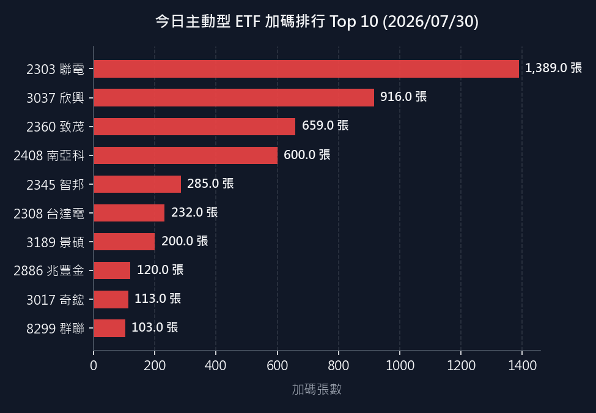
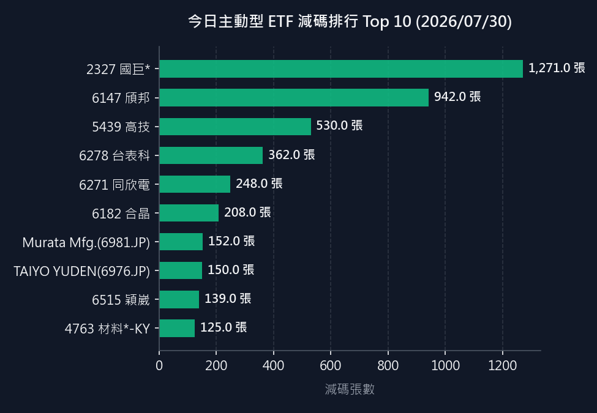

# 主動型 ETF 持股變動

資料來源：`主動型ETF持股明細.xlsx` 最近兩個日期分頁。

比較區間：`20260729` → `20260730`

## 今日加減碼視覺化排行

| 今日加碼 Top 10 | 今日減碼 Top 10 |
| :---: | :---: |
|  |  |

| ETF | 新增 | 刪除 | 比例變動 |
| :-- | --: | --: | --: |
| 00400A | 0 | 0 | 0 |
| 00401A | 0 | 0 | 58 |
| 00402A | 0 | 0 | 49 |
| 00403A | 0 | 0 | 0 |
| 00404A | 0 | 0 | 43 |
| 00405A | 1 | 1 | 33 |
| 00407A | 0 | 0 | 0 |
| 00408A | 0 | 1 | 36 |
| 00980A | 0 | 0 | 0 |
| 00980D | 0 | 0 | 43 |
| 00981A | 0 | 0 | 33 |
| 00982A | 0 | 0 | 0 |
| 00983A | 1 | 0 | 37 |
| 00983D | 0 | 0 | 40 |
| 00984A | 0 | 0 | 0 |
| 00985A | 0 | 0 | 0 |
| 00986A | 0 | 0 | 30 |
| 00987A | 0 | 1 | 22 |
| 00988A | 0 | 1 | 37 |
| 00989A | 1 | 0 | 58 |
| 00990A | 2 | 0 | 45 |
| 00991A | 1 | 1 | 22 |
| 00992A | 0 | 0 | 0 |
| 00993A | 0 | 0 | 46 |
| 00994A | 0 | 0 | 0 |
| 00995A | 0 | 2 | 53 |
| 00996A | 0 | 0 | 40 |
| 00997A | 0 | 2 | 46 |
| 00998A | 1 | 1 | 35 |
| 00999A | 0 | 0 | 56 |

## 00400A

### 新增持股

- 無

### 刪除持股

- 無

### 投資比例變動

- 無

## 00401A

### 新增持股

- 無

### 刪除持股

- 無

### 投資比例變動

- 1216 統一：0.39% → 0.38%（-0.01）
- 2303 聯電：0.94% → 1.01%（+0.07）
- 2308 台達電：3.79% → 3.90%（+0.11）
- 2313 華通：1.06% → 0.96%（-0.10）
- 2317 鴻海：0.76% → 0.74%（-0.02）
- 2330 台積電：9.02% → 9.09%（+0.07）
- 2344 華邦電：1.13% → 1.03%（-0.10）
- 2345 智邦：2.57% → 2.61%（+0.04）
- 2357 華碩：1.59% → 1.55%（-0.04）
- 2360 致茂：1.98% → 2.07%（+0.09）
- 2368 金像電：0.33% → 0.32%（-0.01）
- 2379 瑞昱：2.28% → 1.72%（-0.56）
- 2382 廣達：2.23% → 2.02%（-0.21）
- 2383 台光電：1.79% → 1.89%（+0.10）
- 2449 京元電子：0.54% → 0.52%（-0.02）
- 2454 聯發科：6.77% → 6.98%（+0.21）
- 2455 全新：1.20% → 1.17%（-0.03）
- 2603 長榮：1.22% → 1.23%（+0.01）
- 2881 富邦金：1.99% → 2.01%（+0.02）
- 2882 國泰金：1.26% → 1.28%（+0.02）
- 2883 凱基金：2.07% → 2.06%（-0.01）
- 2884 玉山金：2.19% → 2.27%（+0.08）
- 2885 元大金：1.26% → 1.29%（+0.03）
- 2886 兆豐金：1.88% → 1.94%（+0.06）
- 2887 台新新光金：1.18% → 1.20%（+0.02）
- 2890 永豐金：0.36% → 0.37%（+0.01）
- 2891 中信金：1.94% → 1.98%（+0.04）
- 2912 統一超：0.39% → 0.37%（-0.02）
- 3008 大立光：2.15% → 2.09%（-0.06）
- 3034 聯詠：0.87% → 0.57%（-0.30）
- 3037 欣興：0.62% → 2.09%（+1.47）
- 3131 弘塑：0.49% → 0.47%（-0.02）
- 3167 大量：0.41% → 0.38%（-0.03）
- 3231 緯創：0.44% → 0.41%（-0.03）
- 3491 昇達科：1.18% → 1.24%（+0.06）
- 3529 力旺：0.62% → 0.69%（+0.07）
- 3653 健策：1.19% → 1.13%（-0.06）
- 3711 日月光投控：2.12% → 2.16%（+0.04）
- 4938 和碩：0.38% → 0.37%（-0.01）
- 4958 臻鼎-KY：2.04% → 1.90%（-0.14）
- 4991 環宇-KY：0.58% → 0.53%（-0.05）
- 5274 信驊：1.03% → 1.05%（+0.02）
- 5347 世界：1.50% → 1.57%（+0.07）
- 5871 中租-KY：0.20% → 0.19%（-0.01）
- 5904 寶雅：0.72% → 0.73%（+0.01）
- 6187 萬潤：0.67% → 0.64%（-0.03）
- 6223 旺矽：2.16% → 2.17%（+0.01）
- 6285 啟碁：2.00% → 1.63%（-0.37）
- 6415 矽力*-KY：0.64% → 0.65%（+0.01）
- 6510 精測：0.68% → 0.66%（-0.02）
- 6515 穎崴：1.11% → 1.09%（-0.02）
- 6531 愛普*：1.05% → 1.02%（-0.03）
- 6669 緯穎：2.68% → 2.39%（-0.29）
- 6944 兆聯實業：0.53% → 0.51%（-0.02）
- 7769 鴻勁：2.51% → 2.74%（+0.23）
- 7828 創新服務：1.73% → 1.65%（-0.08）
- 8021 尖點：0.26% → 0.24%（-0.02）
- 8464 億豐：1.45% → 1.48%（+0.03）

## 00402A

### 新增持股

- 無

### 刪除持股

- 無

### 投資比例變動

- AAPL.US Apple：8.74% → 8.93%（+0.19）
- ADI.US Analog Devices：1.87% → 1.86%（-0.01）
- AMD.US AMD：5.34% → 5.20%（-0.14）
- AMZN.US Amazon：3.97% → 4.01%（+0.04）
- ANET.US Arista Networks：0.75% → 0.72%（-0.03）
- ARM.US Arm：0.99% → 0.94%（-0.05）
- ASML.US ASML Holding：1.59% → 1.60%（+0.01）
- AVGO.US Broadcom：2.56% → 2.57%（+0.01）
- BABA.US Alibaba Group：0.57% → 0.59%（+0.02）
- BKNG.US Booking Holdings：0.71% → 0.74%（+0.03）
- CDNS.US Cadence Design Systems：1.94% → 1.93%（-0.01）
- CIEN.US Ciena：1.12% → 1.09%（-0.03）
- CLS.US Celestica：1.02% → 0.99%（-0.03）
- COHR.US Coherent：1.32% → 1.25%（-0.07）
- CRWD.US CrowdStrike Holdings：1.28% → 1.30%（+0.02）
- DASH.US DoorDash：0.28% → 0.29%（+0.01）
- FSLY.US Fastly：0.33% → 0.34%（+0.01）
- GOOG.US Alphabet - Class C Capital Stock：3.44% → 3.58%（+0.14）
- GOOGL.US Alphabet - Class A Common Stock：3.39% → 3.53%（+0.14）
- INTC.US Intel：1.18% → 1.16%（-0.02）
- IOT.US Samsara：0.24% → 0.26%（+0.02）
- KLAC.US KLA：2.23% → 2.05%（-0.18）
- LITE.US Lumentum：1.21% → 1.16%（-0.05）
- LRCX.US Lam Research：3.29% → 3.18%（-0.11）
- MCHP.US Microchip Technology：1.45% → 1.41%（-0.04）
- MDB.US MongoDB：0.64% → 0.68%（+0.04）
- META.US Meta：2.97% → 3.02%（+0.05）
- MRVL.US Marvell：1.31% → 1.26%（-0.05）
- MSFT.US Microsoft：3.58% → 3.67%（+0.09）
- MU.US Micron：6.19% → 5.74%（-0.45）
- NFLX.US Netflix：0.83% → 0.87%（+0.04）
- NOW.US ServiceNow：0.25% → 0.27%（+0.02）
- NVDA.US NVIDIA：8.45% → 8.40%（-0.05）
- NXPI.US NXP Semiconductors：1.29% → 1.23%（-0.06）
- PANW.US Palo Alto：3.15% → 3.20%（+0.05）
- PLTR.US Palantir Technologies：1.13% → 1.16%（+0.03）
- SHOP.US Shopify：0.47% → 0.48%（+0.01）
- SIMO.US Silicon Motion：0.70% → 0.68%（-0.02）
- SKHY.US SK hynix：0.86% → 0.87%（+0.01）
- SNOW.US Snowflake：0.85% → 0.92%（+0.07）
- SPOT.US Spotify：0.29% → 0.31%（+0.02）
- STX.US Seagate：1.36% → 1.43%（+0.07）
- TER.US Teradyne：0.78% → 0.80%（+0.02）
- TSM.US TSMC(ADR)：1.65% → 1.62%（-0.03）
- TTWO.US Take-Two：0.60% → 0.62%（+0.02）
- TXN.US Texas Instruments：2.66% → 2.68%（+0.02）
- UBER.US Uber：0.48% → 0.50%（+0.02）
- V.US Visa：1.15% → 1.20%（+0.05）
- WDC.US Western Digital：2.70% → 2.77%（+0.07）

## 00403A

### 新增持股

- 無

### 刪除持股

- 無

### 投資比例變動

- 無

## 00404A

### 新增持股

- 無

### 刪除持股

- 無

### 投資比例變動

- 1216 統一：2.23% → 2.14%（-0.09）
- 2303 聯電：1.91% → 2.82%（+0.91）
- 2308 台達電：3.49% → 3.89%（+0.40）
- 2327 國巨*：0.56% → 0.65%（+0.09）
- 2330 台積電：23.15% → 22.49%（-0.66）
- 2360 致茂：1.13% → 1.11%（-0.02）
- 2376 技嘉：2.07% → 1.93%（-0.14）
- 2382 廣達：0.43% → 0.39%（-0.04）
- 2383 台光電：1.86% → 1.94%（+0.08）
- 2454 聯發科：6.38% → 6.51%（+0.13）
- 2885 元大金：3.12% → 3.08%（-0.04）
- 2887 台新新光金：3.43% → 3.46%（+0.03）
- 3014 聯陽：1.12% → 1.10%（-0.02）
- 3034 聯詠：0.70% → 0.58%（-0.12）
- 3037 欣興：0.51% → 0.53%（+0.02）
- 3131 弘塑：0.66% → 0.76%（+0.10）
- 3260 威剛：0.46% → 0.39%（-0.07）
- 3264 欣銓：0.82% → 0.96%（+0.14）
- 3265 台星科：0.43% → 0.42%（-0.01）
- 3702 大聯大：1.87% → 1.79%（-0.08）
- 3711 日月光投控：3.05% → 3.67%（+0.62）
- 4763 材料*-KY：2.00% → 1.82%（-0.18）
- 5269 祥碩：1.93% → 1.60%（-0.33）
- 5274 信驊：2.02% → 2.06%（+0.04）
- 5347 世界：0.36% → 0.37%（+0.01）
- 5434 崇越：1.62% → 1.67%（+0.05）
- 5871 中租-KY：2.01% → 1.96%（-0.05）
- 5876 上海商銀：2.06% → 2.07%（+0.01）
- 6138 茂達：1.72% → 1.62%（-0.10）
- 6139 亞翔：0.24% → 0.23%（-0.01）
- 6196 帆宣：0.35% → 0.34%（-0.01）
- 6206 飛捷：1.99% → 1.72%（-0.27）
- 6223 旺矽：0.70% → 0.85%（+0.15）
- 6239 力成：1.33% → 1.44%（+0.11）
- 6257 矽格：1.54% → 1.46%（-0.08）
- 6488 環球晶：0.14% → 0.13%（-0.01）
- 6515 穎崴：0.26% → 0.43%（+0.17）
- 6691 洋基工程：0.73% → 0.70%（-0.03）
- 8069 元太：0.43% → 0.44%（+0.01）
- 8299 群聯：0.98% → 1.11%（+0.13）
- 臺指選擇權08/26 49100 買權：-0.02% → -0.01%（+0.01）
- 臺指選擇權09/26 50300 買權：-0.01% → 0.00%（+0.01）
- 臺股期貨08/26：15.93% → 15.81%（-0.12）

## 00405A

### 新增持股

- 1590 亞德客-KY（0.01%，1 張）

### 刪除持股

- 2327 國巨*（2.73%，1270 張）

### 投資比例變動

- 2059 川湖：1.27% → 1.28%（+0.01）
- 2303 聯電：0.03% → 0.04%（+0.01）
- 2308 台達電：0.91% → 1.93%（+1.02）
- 2344 華邦電：3.25% → 2.99%（-0.26）
- 2345 智邦：4.28% → 4.39%（+0.11）
- 2383 台光電：2.73% → 2.90%（+0.17）
- 2408 南亞科：1.27% → 1.19%（-0.08）
- 2449 京元電子：0.75% → 0.73%（-0.02）
- 2454 聯發科：6.41% → 6.65%（+0.24）
- 3017 奇鋐：6.15% → 6.26%（+0.11）
- 3026 禾伸堂：1.17% → 1.06%（-0.11）
- 3037 欣興：4.58% → 4.82%（+0.24）
- 3081 聯亞：1.03% → 1.01%（-0.02）
- 3131 弘塑：3.13% → 3.02%（-0.11）
- 3443 創意：4.66% → 4.95%（+0.29）
- 3583 辛耘：0.72% → 0.70%（-0.02）
- 3653 健策：3.44% → 3.29%（-0.15）
- 3665 貿聯-KY：5.98% → 5.52%（-0.46）
- 3711 日月光投控：0.68% → 0.70%（+0.02）
- 5274 信驊：1.99% → 2.05%（+0.06）
- 6187 萬潤：0.75% → 0.72%（-0.03）
- 6223 旺矽：5.54% → 5.61%（+0.07）
- 6442 光聖：0.33% → 0.31%（-0.02）
- 6488 環球晶：4.25% → 3.87%（-0.38）
- 6510 精測：1.36% → 1.31%（-0.05）
- 6515 穎崴：0.53% → 0.52%（-0.01）
- 6669 緯穎：3.16% → 3.04%（-0.12）
- 7734 印能科技：2.08% → 2.09%（+0.01）
- 7769 鴻勁：2.19% → 2.41%（+0.22）
- 8028 昇陽半導體：0.95% → 0.87%（-0.08）
- 8046 南電：3.87% → 3.73%（-0.14）
- 8210 勤誠：0.70% → 0.68%（-0.02）
- 8996 高力：1.03% → 0.94%（-0.09）

## 00407A

### 新增持股

- 無

### 刪除持股

- 無

### 投資比例變動

- 無

## 00408A

### 新增持股

- 無

### 刪除持股

- 2382 廣達（1.20%，61 張）

### 投資比例變動

- 1216 統一：1.84% → 1.77%（-0.07）
- 1477 聚陽：1.24% → 1.26%（+0.02）
- 2308 台達電：3.23% → 3.30%（+0.07）
- 2317 鴻海：2.26% → 2.18%（-0.08）
- 2330 台積電：4.77% → 4.73%（-0.04）
- 2345 智邦：2.55% → 2.57%（+0.02）
- 2356 英業達：1.27% → 1.20%（-0.07）
- 2357 華碩：2.08% → 2.01%（-0.07）
- 2360 致茂：2.22% → 2.30%（+0.08）
- 2368 金像電：1.76% → 1.74%（-0.02）
- 2376 技嘉：2.15% → 2.12%（-0.03）
- 2383 台光電：2.87% → 3.01%（+0.14）
- 2395 研華：1.92% → 1.91%（-0.01）
- 2404 漢唐：1.61% → 1.60%（-0.01）
- 2408 南亞科：0.45% → 0.42%（-0.03）
- 2412 中華電：3.58% → 3.56%（-0.02）
- 2454 聯發科：3.61% → 3.89%（+0.28）
- 2603 長榮：1.92% → 1.91%（-0.01）
- 2880 華南金：1.73% → 1.76%（+0.03）
- 2886 兆豐金：2.38% → 2.84%（+0.46）
- 2891 中信金：0.95% → 0.96%（+0.01）
- 2912 統一超：3.14% → 2.99%（-0.15）
- 3017 奇鋐：2.13% → 2.14%（+0.01）
- 3037 欣興：2.28% → 2.36%（+0.08）
- 3231 緯創：3.34% → 3.14%（-0.20）
- 3665 貿聯-KY：1.86% → 1.69%（-0.17）
- 3702 大聯大：1.75% → 1.74%（-0.01）
- 4904 遠傳：0.61% → 0.60%（-0.01）
- 5347 世界：0.42% → 0.44%（+0.02）
- 5434 崇越：2.44% → 2.35%（-0.09）
- 5876 上海商銀：2.34% → 2.35%（+0.01）
- 5904 寶雅：1.88% → 1.87%（-0.01）
- 6274 台燿：1.23% → 1.22%（-0.01）
- 6669 緯穎：3.59% → 3.41%（-0.18）
- 7769 鴻勁：1.48% → 1.60%（+0.12）
- 8046 南電：2.01% → 1.91%（-0.10）

## 00980A

### 新增持股

- 無

### 刪除持股

- 無

### 投資比例變動

- 無

## 00980D

### 新增持股

- 無

### 刪除持股

- 無

### 投資比例變動

- APA CORP 6.750000 % 15-FEB-2055：0.37% → 0.36%（-0.01）
- ATHENE HOLDING LTD 6.625000 % 19MAY2055：0.58% → 0.57%（-0.01）
- BANCO SANTANDER SA 6.921% 08AUG2033：0.34% → 0.35%（+0.01）
- BAT CAPITAL CORP (REG) 7.081% 02AUG2053：0.59% → 0.58%（-0.01）
- BAYER US FINANCE LLC SER REGS 6.875000 % 21NOV2053：0.36% → 0.35%（-0.01）
- BLACKSTONE PRIVATE CRE 7.300000 % 27NOV2028：0.47% → 0.48%（+0.01）
- BLUE OWL CREDIT INCOME SER WI (REG) 7.75% 16SEP2027：0.55% → 0.56%（+0.01）
- BOSTON PROPERTIES LP (REG) 6.750000 % 01-DEC-2027：0.46% → 0.47%（+0.01）
- BPCE SA SER REGS VAR 14JAN2046：0.41% → 0.40%（-0.01）
- CHARTER COMM OPT 6.484% 23OCT2045 W/I：0.46% → 0.45%（-0.01）
- CHARTER COMM OPT LLC/CAP (REG) 5.5% 01APR2063：0.50% → 0.49%（-0.01）
- CHARTER COMM OPT LLC/CAP (REG) 6.834000 % 23OCT2055：0.46% → 0.45%（-0.01）
- CHS/COMMUNITY HEALTH SYS SER REGS 9.750000 % 15JAN2034：0.33% → 0.34%（+0.01）
- COREWEAVE INC SER REGS (REG S) 9.25% 01JUN2030：0.42% → 0.41%（-0.01）
- COX COMMUNICATIONS INC SER REGS 5.800000 % 15DEC2053：0.40% → 0.39%（-0.01）
- DELL INT LLC / EMC CORP (REG) 8.1% 15JUL2036：0.60% → 0.59%（-0.01）
- DELL INT LLC / EMC CORP (REG) 8.35% 15JUL2046：0.57% → 0.56%（-0.01）
- ENEL FINANCE INTL NV SER REGS (REG S) 7.75% 14OCT2052：0.38% → 0.37%（-0.01）
- F&G ANNUITIES & LIFE INC 6.250000 % 04OCT2034：0.51% → 0.52%（+0.01）
- GENERAL MOTORS CO (REG) 6.8% 01OCT2027：0.56% → 0.57%（+0.01）
- GETTY IMAGES INC SER REGS 11.250000 % 21FEB2030：0.52% → 0.51%（-0.01）
- HERTZ CORP/THE SER REGS (REG S) 12.625% 15JUL2029：0.32% → 0.30%（-0.02）
- MYLAN INC (REG) 5.4% 29/11/2043：0.34% → 0.33%（-0.01）
- MYLAN NV 5.25% 15JUN2046 WI：0.53% → 0.52%（-0.01）
- NAVIENT CORP (REG) 11.5% 15MAR2031：0.31% → 0.32%（+0.01）
- ONEOK INC 6.625% 01SEP2053：0.59% → 0.58%（-0.01）
- ORACLE CORP (REG) 5.500000 % 27SEP2064：0.55% → 0.54%（-0.01）
- ORACLE CORP 5.55% 06FEB2053：0.25% → 0.24%（-0.01）
- ORACLE CORP 6.000000 % 03AUG2055：0.31% → 0.30%（-0.01）
- ORACLE CORP 6.125000 % 03AUG2065：0.52% → 0.51%（-0.01）
- ORACLE CORP 6.9% 09NOV2052：0.52% → 0.51%（-0.01）
- OVINTIV INC 7.375% 01NOV2031：0.33% → 0.34%（+0.01）
- RR DONNELLEY & SONS CO SER REGS (REG S) 9.5% 01AUG2029：0.42% → 0.43%（+0.01）
- SABRE GLBL INC SER REGS (REG) 10.750000 % 15NOV2029：0.13% → 0.14%（+0.01）
- SABRE GLBL INC SER REGS 11.125000 % 15JUL2030：0.44% → 0.45%（+0.01）
- TIME WARNER ENTERTAINMEN 8.375% 15JUL2033：0.66% → 0.65%（-0.01）
- UNISYS CORP SER REGS 10.625000 % 15JAN2031：0.59% → 0.60%（+0.01）
- US 10YR NOTE (CBT)SEP26 21-SEP-2026：18.72% → 18.78%（+0.06）
- US 10YR ULTRA FUT SEP26 21-SEP-2026：-2.85% → -2.86%（-0.01）
- US 2YR NOTE (CBT) SEP26 30-SEP-2026：1.98% → 1.99%（+0.01）
- US 5YR NOTE (CBT) SEP26 30-SEP-2026：-16.24% → -16.32%（-0.08）
- VIACOM INC (REG) 5.85% 01SEP2043：0.57% → 0.56%（-0.01）
- WESTLAKE CORP 6.375000 % 15-NOV-2055：0.53% → 0.52%（-0.01）

## 00981A

### 新增持股

- 無

### 刪除持股

- 無

### 投資比例變動

- 2303 聯電：3.70% → 3.95%（+0.25）
- 2308 台達電：3.47% → 3.54%（+0.07）
- 2327 國巨*：5.31% → 4.76%（-0.55）
- 2330 台積電：9.86% → 9.71%（-0.15）
- 2345 智邦：5.05% → 5.09%（+0.04）
- 2368 金像電：2.28% → 2.24%（-0.04）
- 2383 台光電：7.96% → 8.34%（+0.38）
- 2408 南亞科：0.14% → 0.13%（-0.01）
- 2449 京元電子：0.66% → 0.63%（-0.03）
- 2454 聯發科：6.75% → 6.89%（+0.14）
- 3017 奇鋐：4.74% → 4.75%（+0.01）
- 3037 欣興：4.87% → 5.23%（+0.36）
- 3264 欣銓：0.11% → 0.10%（-0.01）
- 3376 新日興：0.12% → 0.11%（-0.01）
- 3653 健策：3.13% → 2.95%（-0.18）
- 3665 貿聯-KY：4.22% → 3.83%（-0.39）
- 3711 日月光投控：3.40% → 3.38%（-0.02）
- 4958 臻鼎-KY：0.28% → 0.26%（-0.02）
- 4979 華星光：0.30% → 0.27%（-0.03）
- 5274 信驊：2.42% → 2.46%（+0.04）
- 5439 高技：0.09% → 0.04%（-0.05）
- 6147 頎邦：0.20% → 0.14%（-0.06）
- 6187 萬潤：0.50% → 0.46%（-0.04）
- 6223 旺矽：4.88% → 4.81%（-0.07）
- 6271 同欣電：0.17% → 0.15%（-0.02）
- 6274 台燿：2.20% → 2.16%（-0.04）
- 6278 台表科：0.23% → 0.19%（-0.04）
- 6510 精測：0.32% → 0.27%（-0.05）
- 6515 穎崴：0.21% → 0.20%（-0.01）
- 6669 緯穎：5.18% → 4.92%（-0.26）
- 6805 富世達：1.02% → 0.99%（-0.03）
- 8046 南電：3.49% → 3.27%（-0.22）
- 8210 勤誠：0.93% → 0.90%（-0.03）

## 00982A

### 新增持股

- 無

### 刪除持股

- 無

### 投資比例變動

- 無

## 00983A

### 新增持股

- SPCX.US SpaceX（0.16%，0.473 張）

### 刪除持股

- 無

### 投資比例變動

- ACHR.US Archer：0.31% → 0.29%（-0.02）
- AMD.US AMD：6.30% → 5.66%（-0.64）
- AVGO.US Broadcom：1.95% → 1.93%（-0.02）
- BEAM.US Beam Therapeutics：2.41% → 2.44%（+0.03）
- BLSH.US Bullish：0.89% → 0.87%（-0.02）
- BMNR.US BitMine：0.88% → 0.85%（-0.03）
- CBRS.US Cerebras：0.83% → 0.74%（-0.09）
- COIN.US Coinbase：2.01% → 2.19%（+0.18）
- CRCL.US Circle：1.83% → 1.94%（+0.11）
- CRSP.US CRISPR Therapeutics：4.01% → 4.04%（+0.03）
- CRWV.US CoreWeave：1.09% → 1.00%（-0.09）
- DE.US Deere：1.54% → 1.50%（-0.04）
- FIG.US Figma：0.44% → 0.46%（+0.02）
- GOOG.US Alphabet - Class C Capital Stock：1.28% → 1.32%（+0.04）
- GOOGL.US Alphabet - Class A Common Stock：1.69% → 1.74%（+0.05）
- HOOD.US Robinhood Markets：4.34% → 4.28%（-0.06）
- ILMN.US Illumina：3.88% → 3.99%（+0.11）
- KTOS.US Kratos Defense & Security：0.31% → 0.28%（-0.03）
- LLY.US Eli Lilly：2.11% → 2.13%（+0.02）
- META.US Meta：1.49% → 1.50%（+0.01）
- NTLA.US Intellia Therapeutics：1.28% → 1.30%（+0.02）
- NTRA.US Natera：2.48% → 2.24%（-0.24）
- NVDA.US NVIDIA：0.84% → 0.98%（+0.14）
- PLTR.US Palantir Technologies：0.50% → 0.51%（+0.01）
- RBLX.US Roblox：3.25% → 3.36%（+0.11）
- SHOP.US Shopify：6.88% → 6.95%（+0.07）
- SNOW.US Snowflake：0.99% → 1.16%（+0.17）
- SOFI.US SoFi Technologies：0.67% → 0.62%（-0.05）
- TEM.US Tempus：3.20% → 3.06%（-0.14）
- TER.US Teradyne：0.56% → 0.57%（+0.01）
- TSLA.US Tesla：7.48% → 7.42%（-0.06）
- TSM.US TSMC(ADR)：3.46% → 3.37%（-0.09）
- TWST.US Twist Bioscience：4.10% → 4.03%（-0.07）
- TXG.US 10x Genomics：5.86% → 5.89%（+0.03）
- VCYT.US Veracyte：1.34% → 1.37%（+0.03）
- WGS.US GeneDx：1.37% → 1.44%（+0.07）
- XYZ.US Block：2.48% → 2.50%（+0.02）

## 00983D

### 新增持股

- 無

### 刪除持股

- 無

### 投資比例變動

- AMCX 10 1/2 07/15/32：1.61% → 1.62%（+0.01）
- BACR 7.437 11/02/33：1.28% → 1.29%（+0.01）
- BATSLN 7.079 08/02/43：1.10% → 1.09%（-0.01）
- BHCCN 11 09/30/28：1.81% → 1.83%（+0.02）
- BNCN 7 3/8 03/01/33：1.12% → 1.13%（+0.01）
- BRITEL 9 5/8 12/15/30：1.36% → 1.37%（+0.01）
- BRKHEC 6 3/4 07/01/37：0.82% → 0.83%（+0.01）
- CRWV 9 02/01/31：1.23% → 1.22%（-0.01）
- CYH 10 7/8 01/15/32：1.49% → 1.50%（+0.01）
- DELL 8.35 07/15/46：1.44% → 1.41%（-0.03）
- DOW 6.9 05/15/53：0.75% → 0.74%（-0.01）
- DOW 9.4 05/15/39：1.94% → 1.95%（+0.01）
- DTV 8 7/8 02/01/30：1.59% → 1.60%（+0.01）
- ENBCN 6.7 11/15/53：1.14% → 1.13%（-0.01）
- FFHCN 6.35 03/22/54：0.71% → 0.70%（-0.01）
- GE 6 3/4 03/15/32：0.58% → 0.59%（+0.01）
- GE 6 7/8 01/10/39：0.86% → 0.85%（-0.01）
- GM 6 3/4 04/01/46：1.20% → 1.19%（-0.01）
- GTN 10 1/2 07/15/29：1.69% → 1.70%（+0.01）
- HPE 6.35 10/15/45：1.00% → 0.99%（-0.01）
- HSBC 6.332 03/09/44：1.08% → 1.07%（-0.01）
- IEP 10 11/15/29：1.53% → 1.54%（+0.01）
- LQDW.US iShares Investment Grade Corpora：7.39% → 7.40%（+0.01）
- MBGGR 8 1/2 01/18/31：1.32% → 1.33%（+0.01）
- MINAU 9 1/4 10/01/28：0.88% → 0.89%（+0.01）
- MOHEGN 11 7/8 04/15/31：1.36% → 1.37%（+0.01）
- MPC 6 1/2 03/01/41：0.16% → 0.17%（+0.01）
- MS 7 1/4 04/01/32：1.64% → 1.65%（+0.01）
- NVDA 5.55 06/15/46：1.17% → 1.16%（-0.01）
- ORCL 6.9 11/09/52：0.84% → 0.83%（-0.01）
- OXY 6.6 03/15/46：0.75% → 0.74%（-0.01）
- PCG 6 3/4 01/15/53：1.16% → 1.15%（-0.01）
- PDM 9 1/4 07/20/28：0.84% → 0.85%（+0.01）
- RAKUTN 11 1/4 02/15/27：1.81% → 1.82%（+0.01）
- RIOLN 7 1/4 03/15/31：0.51% → 0.52%（+0.01）
- SABHLD 10 3/4 11/15/29：0.59% → 0.60%（+0.01）
- TELEFO 8 1/4 09/15/30：1.01% → 1.02%（+0.01）
- TELEFONICA EMISIONES SAU 7.045 06/20/36：1.56% → 1.57%（+0.01）
- TLTW.US iShares 20+ Year Treasury Bond B：7.38% → 7.30%（-0.08）
- VENLNG 9 1/2 02/01/29：1.41% → 1.42%（+0.01）

## 00984A

### 新增持股

- 無

### 刪除持股

- 無

### 投資比例變動

- 無

## 00985A

### 新增持股

- 無

### 刪除持股

- 無

### 投資比例變動

- 無

## 00986A

### 新增持股

- 無

### 刪除持股

- 無

### 投資比例變動

- 2330 台積電：8.85% → 8.83%（-0.02）
- AAPL.US Apple：1.17% → 1.20%（+0.03）
- AMD.US AMD：2.86% → 2.79%（-0.07）
- AMZN.US Amazon：3.70% → 3.75%（+0.05）
- AVGO.US Broadcom：5.23% → 5.25%（+0.02）
- CAT.US Caterpillar：2.65% → 2.54%（-0.11）
- COHR.US Coherent：1.81% → 1.70%（-0.11）
- CRWD.US CrowdStrike Holdings：3.90% → 3.97%（+0.07）
- ETN.US Eaton：2.21% → 2.14%（-0.07）
- GEV.US GE Vernova：3.51% → 3.19%（-0.32）
- GOOGL.US Alphabet - Class A Common Stock：7.64% → 7.95%（+0.31）
- GS.US Goldman Sachs：3.25% → 3.18%（-0.07）
- HWM.US Howmet Aerospace：2.78% → 2.74%（-0.04）
- JPM.US JPMorgan Chase：1.64% → 1.63%（-0.01）
- LITE.US Lumentum：2.91% → 2.77%（-0.14）
- LLY.US Eli Lilly：3.14% → 3.21%（+0.07）
- LRCX.US Lam Research：3.12% → 2.53%（-0.59）
- MSFT.US Microsoft：2.25% → 2.31%（+0.06）
- MU.US Micron：3.76% → 3.49%（-0.27）
- MUFG(8306.JP)：1.54% → 1.58%（+0.04）
- Murata Mfg.(6981.JP)：1.75% → 1.57%（-0.18）
- NET.US Cloudflare：1.81% → 1.92%（+0.11）
- NVDA.US NVIDIA：5.98% → 5.94%（-0.04）
- SNDK.US Sandisk：0.06% → 0.02%（-0.04）
- SNOW.US Snowflake：1.32% → 1.42%（+0.10）
- Siemens Energy AG：1.97% → 2.00%（+0.03）
- Yaskawa Electric(6506.JP)：1.83% → 1.84%（+0.01）
- 嘉能可公司：1.54% → 1.64%（+0.10）
- 施奈德電機公司：1.62% → 1.64%（+0.02）
- 英飛凌科技股份有限公司：3.01% → 2.93%（-0.08）

## 00987A

### 新增持股

- 無

### 刪除持股

- 6488 環球晶（2.22%，55 張）

### 投資比例變動

- 2330 台積電：9.23% → 9.50%（+0.27）
- 2345 智邦：2.49% → 2.59%（+0.10）
- 2383 台光電：6.50% → 7.02%（+0.52）
- 2408 南亞科：3.96% → 3.77%（-0.19）
- 2454 聯發科：4.70% → 4.96%（+0.26）
- 3017 奇鋐：8.40% → 8.69%（+0.29）
- 3037 欣興：6.10% → 6.51%（+0.41）
- 3363 上詮：2.10% → 1.94%（-0.16）
- 3443 創意：4.61% → 5.63%（+1.02）
- 3653 健策：2.78% → 2.70%（-0.08）
- 3665 貿聯-KY：4.87% → 4.57%（-0.30）
- 4764 雙鍵：2.02% → 1.94%（-0.08）
- 5274 信驊：0.18% → 0.19%（+0.01）
- 6139 亞翔：3.00% → 2.95%（-0.05）
- 6223 旺矽：6.03% → 6.20%（+0.17）
- 6274 台燿：3.57% → 3.63%（+0.06）
- 6683 雍智科技：2.27% → 2.10%（-0.17）
- 6739 竹陞科技：0.79% → 0.74%（-0.05）
- 7769 鴻勁：2.41% → 2.69%（+0.28）
- 8028 昇陽半導體：2.07% → 1.92%（-0.15）
- 8046 南電：3.12% → 3.65%（+0.53）
- 8358 金居：1.60% → 1.48%（-0.12）

## 00988A

### 新增持股

- 無

### 刪除持股

- KLAC.US KLA（0.97%，80 張）

### 投資比例變動

- 2303 聯電：0.56% → 0.54%（-0.02）
- 2308 台達電：0.99% → 1.00%（+0.01）
- 2327 國巨*：1.99% → 1.64%（-0.35）
- 2330 台積電：3.35% → 3.45%（+0.10）
- 2383 台光電：3.54% → 3.52%（-0.02）
- 2454 聯發科：2.89% → 2.93%（+0.04）
- 3017 奇鋐：0.51% → 0.50%（-0.01）
- 3037 欣興：3.59% → 3.46%（-0.13）
- 3665 貿聯-KY：2.26% → 2.27%（+0.01）
- 3711 日月光投控：1.96% → 1.88%（-0.08）
- 6223 旺矽：1.92% → 1.90%（-0.02）
- AIXTRON SE：0.50% → 0.51%（+0.01）
- AMAT.US Applied Materials：4.09% → 3.99%（-0.10）
- AMD.US AMD：5.93% → 5.97%（+0.04）
- BE.US Bloom Energy：2.23% → 2.33%（+0.10）
- CRDO.US Credo：2.45% → 2.40%（-0.05）
- FTNT.US Fortinet：1.91% → 1.04%（-0.87）
- IBIDEN(4062.JP)：0.35% → 0.33%（-0.02）
- INFINEON TECHNOLOGIES AG：2.61% → 2.63%（+0.02）
- Kioxia Holdings(285A.JP)：3.11% → 2.86%（-0.25）
- LITE.US Lumentum：3.19% → 3.14%（-0.05）
- LMT.US Lockheed Martin：0.92% → 1.47%（+0.55）
- Lasertec Corporation(6920.JP)：1.89% → 0.92%（-0.97）
- MICRONICS(6871.JP)：1.86% → 1.72%（-0.14）
- MU.US Micron：5.66% → 5.44%（-0.22）
- Murata Mfg.(6981.JP)：3.75% → 3.48%（-0.27）
- NOW.US ServiceNow：1.90% → 2.12%（+0.22）
- Nippon Chemi-Con(6997.JP)：1.40% → 1.36%（-0.04）
- PANW.US Palo Alto：1.83% → 1.92%（+0.09）
- SNDK.US Sandisk：1.95% → 1.93%（-0.02）
- Samsung Elec Mech(009150.KS)：3.56% → 3.19%（-0.37）
- TAIYO YUDEN(6976.JP)：2.39% → 1.68%（-0.71）
- TSEM.US Tower Semiconductor：2.41% → 2.38%（-0.03）
- Tokyo Electron(8035.JP)：2.39% → 2.28%（-0.11）
- WDC.US Western Digital：2.36% → 2.50%（+0.14）
- 三環集團(300408.SZ)：0.85% → 0.98%（+0.13）
- 鼎泰高科(301377.SZ)：0.67% → 0.69%（+0.02）

## 00989A

### 新增持股

- ADBE.US Adobe（1.09%，1.441 張）

### 刪除持股

- 無

### 投資比例變動

- ADI.US Analog Devices：1.13% → 1.12%（-0.01）
- ALGM.US Allegro MicroSystems：0.70% → 0.68%（-0.02）
- AMAT.US Applied Materials：0.72% → 0.67%（-0.05）
- AMD.US AMD：3.00% → 2.81%（-0.19）
- AMKR.US Amkor：0.80% → 0.77%（-0.03）
- AMZN.US Amazon：0.94% → 0.95%（+0.01）
- APP.US Applovin：1.08% → 1.06%（-0.02）
- ASML.US ASML Holding：1.70% → 1.71%（+0.01）
- AVGO.US Broadcom：4.19% → 4.18%（-0.01）
- BE.US Bloom Energy：0.91% → 0.92%（+0.01）
- CBRS.US Cerebras：0.19% → 0.17%（-0.02）
- CDNS.US Cadence Design Systems：1.05% → 1.04%（-0.01）
- CIEN.US Ciena：1.83% → 1.78%（-0.05）
- CRCL.US Circle：0.33% → 0.32%（-0.01）
- CRM.US Salesforce：2.51% → 2.67%（+0.16）
- CRWD.US CrowdStrike Holdings：2.98% → 3.02%（+0.04）
- DOCN.US DigitalOcean：1.44% → 1.40%（-0.04）
- ENTG.US Entegris：1.00% → 0.65%（-0.35）
- FIGR.US Figure：0.75% → 0.70%（-0.05）
- FN.US Fabrinet：0.66% → 0.62%（-0.04）
- GFS.US GlobalFoundries：1.13% → 1.11%（-0.02）
- GLW.US Corning：1.61% → 1.73%（+0.12）
- GOOG.US Alphabet - Class C Capital Stock：4.48% → 4.54%（+0.06）
- HOOD.US Robinhood Markets：2.29% → 2.27%（-0.02）
- HUBS.US HubSpot：1.75% → 1.90%（+0.15）
- INTC.US Intel：3.30% → 2.77%（-0.53）
- LITE.US Lumentum：1.36% → 1.29%（-0.07）
- LMND.US Lemonade：1.04% → 0.81%（-0.23）
- LRCX.US Lam Research：2.45% → 2.07%（-0.38）
- META.US Meta：2.73% → 2.77%（+0.04）
- MSFT.US Microsoft：2.61% → 2.66%（+0.05）
- MTSI.US MACOM Technology Solutions：0.96% → 0.90%（-0.06）
- MU.US Micron：1.27% → 0.76%（-0.51）
- NET.US Cloudflare：2.67% → 2.81%（+0.14）
- NOW.US ServiceNow：0.54% → 1.55%（+1.01）
- NU.US Nu：1.00% → 0.98%（-0.02）
- NVDA.US NVIDIA：3.87% → 3.84%（-0.03）
- ON.US ON Semiconductor：1.76% → 1.69%（-0.07）
- ORCL.US Oracle：1.24% → 1.25%（+0.01）
- PANW.US Palo Alto：4.08% → 4.13%（+0.05）
- PLTR.US Palantir Technologies：0.46% → 0.47%（+0.01）
- RIVN.US Rivian：1.54% → 1.55%（+0.01）
- SHOP.US Shopify：2.00% → 2.03%（+0.03）
- SNDK.US Sandisk：0.64% → 0.61%（-0.03）
- SNOW.US Snowflake：2.84% → 3.06%（+0.22）
- SPCX.US SpaceX：0.66% → 0.65%（-0.01）
- TEM.US Tempus：0.82% → 0.81%（-0.01）
- TSLA.US Tesla：2.72% → 2.71%（-0.01）
- TSM.US TSMC(ADR)：1.15% → 1.13%（-0.02）
- TTMI.US TTM Technologies：0.54% → 0.52%（-0.02）
- TTWO.US Take-Two：4.16% → 4.25%（+0.09）
- TWLO.US Twilio：2.22% → 2.21%（-0.01）
- TXN.US Texas Instruments：1.62% → 1.63%（+0.01）
- U.US Unity Software：0.35% → 0.36%（+0.01）
- VICR.US Vicor Corporation：0.91% → 0.89%（-0.02）
- WRBY.US Warby Parker：0.73% → 0.76%（+0.03）
- XYZ.US Block：0.85% → 0.86%（+0.01）
- ZM.US Zoom：1.98% → 2.06%（+0.08）

## 00990A

### 新增持股

- PANW.US Palo Alto（1.56%，51.5 張）
- WDAY.US Workday（1.67%，102.9 張）

### 刪除持股

- 無

### 投資比例變動

- 2303 聯電：0.89% → 0.85%（-0.04）
- 2330 台積電：3.70% → 3.77%（+0.07）
- 2383 台光電：1.79% → 1.76%（-0.03）
- 2449 京元電子：0.67% → 0.64%（-0.03）
- 2454 聯發科：1.65% → 1.66%（+0.01）
- 3037 欣興：2.15% → 2.05%（-0.10）
- 3711 日月光投控：1.00% → 0.95%（-0.05）
- 5347 世界：1.04% → 0.99%（-0.05）
- 6223 旺矽：1.09% → 1.07%（-0.02）
- 6274 台燿：0.85% → 0.81%（-0.04）
- AMAT.US Applied Materials：4.12% → 3.99%（-0.13）
- AMD.US AMD：5.28% → 5.27%（-0.01）
- AMZN.US Amazon：0.95% → 0.99%（+0.04）
- ANET.US Arista Networks：1.33% → 1.31%（-0.02）
- AVGO.US Broadcom：0.95% → 0.97%（+0.02）
- BE.US Bloom Energy：1.64% → 2.74%（+1.10）
- CRDO.US Credo：1.48% → 1.44%（-0.04）
- DDOG.US Datadog：2.35% → 2.61%（+0.26）
- DELL.US Dell：3.20% → 3.18%（-0.02）
- GLW.US Corning：0.32% → 0.33%（+0.01）
- GOOGL.US Alphabet - Class A Common Stock：1.17% → 1.25%（+0.08）
- INFINEON TECHNOLOGIES AG：3.07% → 3.03%（-0.04）
- Kioxia Holdings(285A.JP)：2.41% → 1.77%（-0.64）
- LITE.US Lumentum：4.88% → 4.76%（-0.12）
- META.US Meta：2.09% → 2.18%（+0.09）
- MRVL.US Marvell：1.63% → 1.61%（-0.02）
- MSFT.US Microsoft：2.31% → 2.43%（+0.12）
- MU.US Micron：3.48% → 3.31%（-0.17）
- Murata Mfg.(6981.JP)：1.66% → 0.97%（-0.69）
- NVDA.US NVIDIA：2.09% → 2.13%（+0.04）
- ON.US ON Semiconductor：0.58% → 0.57%（-0.01）
- ONTO.US Onto Innovation：1.13% → 1.08%（-0.05）
- Renesas Electronics(6723.JP)：1.62% → 1.56%（-0.06）
- SCREEN Holdings(7735.JP)：1.64% → 1.43%（-0.21）
- SERVICENOW INC：2.61% → 2.89%（+0.28）
- SHOP.US Shopify：2.00% → 2.10%（+0.10）
- SMTC.US Semtech：1.05% → 1.03%（-0.02）
- SNDK.US Sandisk：1.71% → 1.67%（-0.04）
- SNOW.US Snowflake：2.62% → 2.89%（+0.27）
- Samsung Elec Mech(009150.KS)：2.37% → 2.32%（-0.05）
- TAIYO YUDEN(6976.JP)：1.19% → 1.11%（-0.08）
- TSEM.US Tower Semiconductor：1.74% → 1.70%（-0.04）
- Tokyo Electron(8035.JP)：0.95% → 0.90%（-0.05）
- UCTT.US Ultra Clean Holdings：1.13% → 1.07%（-0.06）
- WDC.US Western Digital：2.68% → 2.82%（+0.14）

## 00991A

### 新增持股

- 2360 致茂（1.91%，660 張）

### 刪除持股

- 6515 穎崴（1.16%，140 張）

### 投資比例變動

- 2059 川湖：4.59% → 4.87%（+0.28）
- 2308 台達電：1.51% → 1.53%（+0.02）
- 2327 國巨*：5.82% → 5.19%（-0.63）
- 2330 台積電：13.47% → 13.37%（-0.10）
- 2345 智邦：4.39% → 4.99%（+0.60）
- 2383 台光電：8.16% → 8.70%（+0.54）
- 2404 漢唐：1.24% → 1.22%（-0.02）
- 2408 南亞科：6.71% → 6.47%（-0.24）
- 2454 聯發科：5.21% → 5.30%（+0.09）
- 3017 奇鋐：2.76% → 2.88%（+0.12）
- 3026 禾伸堂：1.96% → 1.75%（-0.21）
- 3037 欣興：4.48% → 4.61%（+0.13）
- 3189 景碩：2.65% → 2.81%（+0.16）
- 3665 貿聯-KY：1.89% → 1.71%（-0.18）
- 3711 日月光投控：3.21% → 3.22%（+0.01）
- 5274 信驊：1.59% → 1.91%（+0.32）
- 6223 旺矽：4.40% → 4.95%（+0.55）
- 6274 台燿：3.36% → 3.29%（-0.07）
- 6669 緯穎：3.54% → 3.34%（-0.20）
- 7769 鴻勁：2.85% → 3.07%（+0.22）
- 8046 南電：4.04% → 3.81%（-0.23）
- 8299 群聯：2.55% → 2.72%（+0.17）

## 00992A

### 新增持股

- 無

### 刪除持股

- 無

### 投資比例變動

- 無

## 00993A

### 新增持股

- 無

### 刪除持股

- 無

### 投資比例變動

- 1301 台塑：0.46% → 0.45%（-0.01）
- 1303 南亞：0.77% → 0.79%（+0.02）
- 2027 大成鋼：0.55% → 0.56%（+0.01）
- 2059 川湖：3.16% → 3.17%（+0.01）
- 2303 聯電：2.33% → 2.51%（+0.18）
- 2308 台達電：2.75% → 2.82%（+0.07）
- 2327 國巨*：2.24% → 2.02%（-0.22）
- 2330 台積電：15.06% → 15.10%（+0.04）
- 2344 華邦電：2.72% → 2.48%（-0.24）
- 2345 智邦：2.88% → 2.92%（+0.04）
- 2347 聯強：0.67% → 0.68%（+0.01）
- 2360 致茂：1.82% → 1.90%（+0.08）
- 2368 金像電：1.19% → 1.18%（-0.01）
- 2383 台光電：3.73% → 3.93%（+0.20）
- 2408 南亞科：2.13% → 1.98%（-0.15）
- 2412 中華電：0.60% → 0.61%（+0.01）
- 2454 聯發科：4.30% → 4.42%（+0.12）
- 2618 長榮航：0.68% → 0.69%（+0.01）
- 2637 慧洋-KY：0.71% → 0.69%（-0.02）
- 2881 富邦金：1.35% → 1.36%（+0.01）
- 2882 國泰金：0.61% → 0.62%（+0.01）
- 2883 凱基金：2.26% → 2.25%（-0.01）
- 2885 元大金：1.29% → 1.31%（+0.02）
- 2890 永豐金：1.69% → 1.70%（+0.01）
- 2891 中信金：0.82% → 0.84%（+0.02）
- 3017 奇鋐：2.33% → 2.35%（+0.02）
- 3037 欣興：2.48% → 2.58%（+0.10）
- 3189 景碩：1.91% → 1.92%（+0.01）
- 3264 欣銓：1.19% → 1.15%（-0.04）
- 3443 創意：1.30% → 1.37%（+0.07）
- 3653 健策：1.54% → 1.47%（-0.07）
- 3711 日月光投控：2.32% → 2.35%（+0.03）
- 4958 臻鼎-KY：1.55% → 1.44%（-0.11）
- 5274 信驊：2.56% → 2.63%（+0.07）
- 6196 帆宣：0.58% → 0.57%（-0.01）
- 6223 旺矽：5.61% → 5.64%（+0.03）
- 6257 矽格：0.36% → 0.34%（-0.02）
- 6274 台燿：2.64% → 2.62%（-0.02）
- 6446 藥華藥：1.02% → 0.97%（-0.05）
- 6488 環球晶：0.99% → 0.90%（-0.09）
- 6515 穎崴：2.33% → 2.28%（-0.05）
- 6669 緯穎：2.27% → 2.17%（-0.10）
- 7769 鴻勁：1.86% → 2.02%（+0.16）
- 8021 尖點：0.37% → 0.35%（-0.02）
- 8046 南電：1.95% → 1.86%（-0.09）
- 8358 金居：0.83% → 0.75%（-0.08）

## 00994A

### 新增持股

- 無

### 刪除持股

- 無

### 投資比例變動

- 無

## 00995A

### 新增持股

- 無

### 刪除持股

- 3105 穩懋（0.21%，30 張）
- 3357 臺慶科（0.22%，50 張）

### 投資比例變動

- 2303 聯電：1.74% → 1.88%（+0.14）
- 2308 台達電：3.54% → 3.65%（+0.11）
- 2313 華通：0.37% → 0.34%（-0.03）
- 2327 國巨*：3.72% → 2.26%（-1.46）
- 2330 台積電：9.99% → 9.19%（-0.80）
- 2344 華邦電：0.82% → 0.75%（-0.07）
- 2345 智邦：5.08% → 5.18%（+0.10）
- 2360 致茂：1.15% → 1.21%（+0.06）
- 2368 金像電：2.38% → 1.58%（-0.80）
- 2383 台光電：7.63% → 8.09%（+0.46）
- 2449 京元電子：0.42% → 0.40%（-0.02）
- 2454 聯發科：5.64% → 5.83%（+0.19）
- 2455 全新：0.67% → 0.65%（-0.02）
- 2467 志聖：0.30% → 0.29%（-0.01）
- 2472 立隆電：0.86% → 0.80%（-0.06）
- 2486 一詮：0.67% → 0.62%（-0.05）
- 2885 元大金：0.74% → 0.76%（+0.02）
- 3017 奇鋐：4.05% → 4.11%（+0.06）
- 3023 信邦：0.76% → 0.75%（-0.01）
- 3026 禾伸堂：0.06% → 0.05%（-0.01）
- 3037 欣興：3.86% → 4.05%（+0.19）
- 3044 健鼎：0.64% → 0.65%（+0.01）
- 3167 大量：0.18% → 0.16%（-0.02）
- 3189 景碩：0.43% → 0.44%（+0.01）
- 3211 順達：0.22% → 0.21%（-0.01）
- 3264 欣銓：0.43% → 0.42%（-0.01）
- 3443 創意：0.40% → 0.42%（+0.02）
- 3583 辛耘：0.38% → 0.36%（-0.02）
- 3653 健策：2.40% → 2.29%（-0.11）
- 3665 貿聯-KY：3.59% → 3.30%（-0.29）
- 3711 日月光投控：2.50% → 2.55%（+0.05）
- 4958 臻鼎-KY：1.05% → 0.98%（-0.07）
- 5274 信驊：2.75% → 2.83%（+0.08）
- 5289 宜鼎：0.62% → 0.63%（+0.01）
- 5439 高技：0.31% → 0.29%（-0.02）
- 5536 聖暉*：0.27% → 0.26%（-0.01）
- 6139 亞翔：0.28% → 0.27%（-0.01）
- 6187 萬潤：0.52% → 0.49%（-0.03）
- 6213 聯茂：0.30% → 0.29%（-0.01）
- 6223 旺矽：4.17% → 4.21%（+0.04）
- 6274 台燿：1.68% → 1.67%（-0.01）
- 6438 迅得：0.44% → 0.43%（-0.01）
- 6515 穎崴：1.70% → 1.67%（-0.03）
- 6531 愛普*：0.36% → 0.24%（-0.12）
- 6669 緯穎：5.34% → 5.13%（-0.21）
- 6805 富世達：0.28% → 0.27%（-0.01）
- 7750 新代：0.55% → 0.54%（-0.01）
- 7769 鴻勁：2.00% → 2.19%（+0.19）
- 8046 南電：3.61% → 3.47%（-0.14）
- 8150 南茂：0.32% → 0.29%（-0.03）
- 8210 勤誠：0.90% → 0.88%（-0.02）
- 8358 金居：0.15% → 0.13%（-0.02）
- 8996 高力：0.66% → 0.61%（-0.05）

## 00996A

### 新增持股

- 無

### 刪除持股

- 無

### 投資比例變動

- 1303 南亞：1.19% → 1.25%（+0.06）
- 2308 台達電：4.45% → 4.67%（+0.22）
- 2327 國巨*：6.29% → 5.80%（-0.49）
- 2330 台積電：11.17% → 11.47%（+0.30）
- 2344 華邦電：3.30% → 3.08%（-0.22）
- 2345 智邦：1.46% → 1.52%（+0.06）
- 2360 致茂：1.30% → 1.39%（+0.09）
- 2383 台光電：5.93% → 6.40%（+0.47）
- 2408 南亞科：2.97% → 2.82%（-0.15）
- 2454 聯發科：7.24% → 7.62%（+0.38）
- 2467 志聖：0.33% → 0.32%（-0.01）
- 2472 立隆電：3.75% → 3.55%（-0.20）
- 3017 奇鋐：0.65% → 0.68%（+0.03）
- 3026 禾伸堂：0.79% → 0.22%（-0.57）
- 3037 欣興：2.36% → 2.52%（+0.16）
- 3042 晶技：1.88% → 1.48%（-0.40）
- 3131 弘塑：1.60% → 1.57%（-0.03）
- 3189 景碩：1.37% → 1.41%（+0.04）
- 3363 上詮：0.54% → 0.50%（-0.04）
- 3443 創意：2.43% → 2.62%（+0.19）
- 3653 健策：1.88% → 1.82%（-0.06）
- 3661 世芯-KY：1.43% → 1.46%（+0.03）
- 3665 貿聯-KY：0.18% → 0.17%（-0.01）
- 3693 營邦：0.28% → 0.27%（-0.01）
- 3711 日月光投控：1.27% → 1.32%（+0.05）
- 4583 台灣精銳：0.41% → 0.39%（-0.02）
- 4958 臻鼎-KY：6.45% → 6.14%（-0.31）
- 5269 祥碩：0.91% → 0.84%（-0.07）
- 6182 合晶：1.01% → 0.42%（-0.59）
- 6213 聯茂：0.88% → 0.32%（-0.56）
- 6223 旺矽：2.58% → 2.65%（+0.07）
- 6239 力成：1.50% → 1.42%（-0.08）
- 6274 台燿：0.43% → 0.70%（+0.27）
- 6415 矽力*-KY：1.11% → 1.51%（+0.40）
- 6526 達發：1.31% → 1.30%（-0.01）
- 6531 愛普*：1.67% → 1.66%（-0.01）
- 6831 邁科：2.57% → 1.93%（-0.64）
- 8021 尖點：1.29% → 1.23%（-0.06）
- 8046 南電：2.84% → 2.77%（-0.07）
- 8210 勤誠：1.25% → 1.24%（-0.01）

## 00997A

### 新增持股

- 無

### 刪除持股

- 2454 聯發科（0.62%，25 張）
- ALAB.US Astera Labs（0.31%，4.929 張）

### 投資比例變動

- 2345 智邦：1.64% → 1.60%（-0.04）
- 2383 台光電：1.38% → 1.34%（-0.04）
- 3037 欣興：1.37% → 1.28%（-0.09）
- AAPL.US Apple：3.31% → 3.42%（+0.11）
- ADBE.US Adobe：0.51% → 0.56%（+0.05）
- AMAT.US Applied Materials：4.12% → 3.91%（-0.21）
- AMD.US AMD：5.81% → 5.70%（-0.11）
- AMZN.US Amazon：1.57% → 1.60%（+0.03）
- ANET.US Arista Networks：1.63% → 1.57%（-0.06）
- APH.US Amphenol：0.95% → 1.03%（+0.08）
- AVGO.US Broadcom：2.02% → 2.04%（+0.02）
- CIEN.US Ciena：1.03% → 1.00%（-0.03）
- COHR.US Coherent：0.83% → 0.79%（-0.04）
- CRDO.US Credo：0.97% → 0.93%（-0.04）
- CRWD.US CrowdStrike Holdings：2.52% → 2.58%（+0.06）
- CSCO.US Cisco：0.91% → 0.92%（+0.01）
- DT.US Dynatrace：1.64% → 1.70%（+0.06）
- EW.US Edwards Lifesciences：0.75% → 0.80%（+0.05）
- FTNT.US Fortinet：2.58% → 2.74%（+0.16）
- GEV.US GE Vernova：1.10% → 0.49%（-0.61）
- GOOGL.US Alphabet - Class A Common Stock：3.22% → 3.37%（+0.15）
- HWM.US Howmet Aerospace：2.58% → 2.55%（-0.03）
- IBIDEN(4062.JP)：1.99% → 1.88%（-0.11）
- INTC.US Intel：1.87% → 1.84%（-0.03）
- IOT.US Samsara：1.22% → 1.30%（+0.08）
- KEYS.US Keysight Technologies：0.62% → 0.63%（+0.01）
- KLAC.US KLA：1.25% → 1.16%（-0.09）
- Kioxia Holdings(285A.JP)：0.92% → 0.82%（-0.10）
- LITE.US Lumentum：1.55% → 1.49%（-0.06）
- LRCX.US Lam Research：2.49% → 2.41%（-0.08）
- META.US Meta：2.52% → 2.58%（+0.06）
- MPWR.US Monolithic Power Systems：0.57% → 0.58%（+0.01）
- MRVL.US Marvell：2.98% → 2.89%（-0.09）
- MSFT.US Microsoft：0.68% → 0.70%（+0.02）
- MU.US Micron：4.63% → 4.32%（-0.31）
- NVDA.US NVIDIA：2.48% → 2.49%（+0.01）
- OKTA.US Okta：1.60% → 1.66%（+0.06）
- PANW.US Palo Alto：1.75% → 1.79%（+0.04）
- PLTR.US Palantir Technologies：0.85% → 0.88%（+0.03）
- RTX.US RTX：1.32% → 1.35%（+0.03）
- SNDK.US Sandisk：2.38% → 1.44%（-0.94）
- STX.US Seagate：1.90% → 2.01%（+0.11）
- Samsung Elec Mech(009150.KS)：1.29% → 1.25%（-0.04）
- TER.US Teradyne：1.81% → 1.87%（+0.06）
- TXN.US Texas Instruments：0.34% → 0.35%（+0.01）
- WDC.US Western Digital：2.93% → 3.04%（+0.11）

## 00998A

### 新增持股

- 英傑華保險（1.51%，185 張）

### 刪除持股

- MFG.US Mizuho Financial Group（0.89%，100 張）

### 投資比例變動

- AJG.US Arthur J. Gallagher：1.50% → 1.54%（+0.04）
- BAC.US Bank of America：3.61% → 3.55%（-0.06）
- BNY.US Bank of New York Mellon：2.36% → 2.32%（-0.04）
- BPER銀行有限公司：1.11% → 0.56%（-0.55）
- Chiba Bank(8331.JP)：1.83% → 1.84%（+0.01）
- GS.US Goldman Sachs：1.37% → 1.32%（-0.05）
- Hokuhoku FG(8377.JP)：1.46% → 1.45%（-0.01）
- IBKR.US Interactive Brokers：1.93% → 1.85%（-0.08）
- JPM.US JPMorgan Chase：2.85% → 2.78%（-0.07）
- Kyushu Financial(7180.JP)：0.84% → 0.83%（-0.01）
- MRX.US Marex：1.99% → 1.98%（-0.01）
- MS.US Morgan Stanley：1.69% → 1.64%（-0.05）
- Mebuki Financial Group(7167.JP)：2.47% → 2.46%（-0.01）
- Mizuho Financial(8411.JP)：0.96% → 0.95%（-0.01）
- PFG.US Principal Financial：2.02% → 2.03%（+0.01）
- Piraeus Bank SA：6.08% → 6.18%（+0.10）
- Sumitomo Mitsui Trust Group(8309.JP)：1.98% → 2.02%（+0.04）
- UBS.US UBS Group：2.67% → 2.69%（+0.02）
- USB.US U.S. Bancorp：2.00% → 1.97%（-0.03）
- Unipol保險股份公司：3.46% → 3.50%（+0.04）
- V.US Visa：2.01% → 2.05%（+0.04）
- 勞埃德銀行集團：2.93% → 2.92%（-0.01）
- 匯豐控股有限公司：2.92% → 2.95%（+0.03）
- 國民西敏集團公開有限公司：2.98% → 3.01%（+0.03）
- 巴克萊集團：4.16% → 4.10%（-0.06）
- 希臘國家銀行：1.95% → 2.00%（+0.05）
- 東方匯理資產管理有限責任公司：2.24% → 2.25%（+0.01）
- 標準人壽公開有限公司：2.38% → 2.37%（-0.01）
- 法國興業銀行股份有限公司：3.33% → 3.37%（+0.04）
- 法通保險集團公開有限公司：1.75% → 1.76%（+0.01）
- 渣打集團有限公司：3.46% → 3.60%（+0.14）
- 義大利西恩那銀行股份公司：4.66% → 4.68%（+0.02）
- 聯合聖保羅銀行：2.15% → 2.17%（+0.02）
- 荷蘭銀行公眾有限公司：3.81% → 3.77%（-0.04）
- 裕信銀行：2.87% → 2.85%（-0.02）

## 00999A

### 新增持股

- 無

### 刪除持股

- 無

### 投資比例變動

- 2204 中華：1.21% → 1.23%（+0.02）
- 2308 台達電：3.14% → 3.22%（+0.08）
- 2330 台積電：6.01% → 6.04%（+0.03）
- 2345 智邦：1.75% → 1.77%（+0.02）
- 2357 華碩：1.63% → 1.59%（-0.04）
- 2360 致茂：1.43% → 1.49%（+0.06）
- 2368 金像電：1.81% → 1.79%（-0.02）
- 2382 廣達：1.22% → 1.10%（-0.12）
- 2383 台光電：3.60% → 3.80%（+0.20）
- 2393 億光：1.31% → 1.32%（+0.01）
- 2395 研華：1.23% → 1.22%（-0.01）
- 2408 南亞科：1.84% → 1.71%（-0.13）
- 2441 超豐：0.70% → 0.66%（-0.04）
- 2451 創見：1.09% → 1.10%（+0.01）
- 2454 聯發科：3.61% → 3.71%（+0.10）
- 2727 王品：1.31% → 1.33%（+0.02）
- 2880 華南金：1.13% → 1.16%（+0.03）
- 2884 玉山金：1.03% → 1.07%（+0.04）
- 2885 元大金：1.62% → 1.64%（+0.02）
- 2886 兆豐金：1.62% → 1.67%（+0.05）
- 2887 台新新光金：1.71% → 1.74%（+0.03）
- 2890 永豐金：1.38% → 1.39%（+0.01）
- 2892 第一金：1.22% → 1.24%（+0.02）
- 3017 奇鋐：1.04% → 1.05%（+0.01）
- 3026 禾伸堂：0.90% → 0.81%（-0.09）
- 3037 欣興：1.19% → 1.24%（+0.05）
- 3081 聯亞：1.76% → 1.70%（-0.06）
- 3090 日電貿：0.41% → 0.37%（-0.04）
- 3227 原相：0.76% → 0.74%（-0.02）
- 3293 鈊象：1.07% → 1.09%（+0.02）
- 3653 健策：2.79% → 2.65%（-0.14）
- 3665 貿聯-KY：1.21% → 1.10%（-0.11）
- 3706 神達：1.05% → 1.04%（-0.01）
- 3711 日月光投控：3.15% → 3.20%（+0.05）
- 4551 智伸科：0.57% → 0.53%（-0.04）
- 4904 遠傳：1.16% → 1.15%（-0.01）
- 5274 信驊：1.26% → 1.29%（+0.03）
- 5434 崇越：0.86% → 0.84%（-0.02）
- 5439 高技：0.97% → 0.92%（-0.05）
- 5534 長虹：1.43% → 1.44%（+0.01）
- 6138 茂達：0.89% → 0.84%（-0.05）
- 6274 台燿：0.99% → 0.98%（-0.01）
- 6435 大中：0.85% → 0.81%（-0.04）
- 6515 穎崴：1.73% → 1.69%（-0.04）
- 6669 緯穎：1.55% → 1.48%（-0.07）
- 6670 復盛應用：0.55% → 0.54%（-0.01）
- 6768 志強-KY：0.46% → 0.45%（-0.01）
- 6782 視陽：0.48% → 0.49%（+0.01）
- 6805 富世達：1.00% → 0.97%（-0.03）
- 7769 鴻勁：2.85% → 3.10%（+0.25）
- 8210 勤誠：0.98% → 0.95%（-0.03）
- 9802 鈺齊-KY：0.67% → 0.66%（-0.01）
- 9938 百和：1.41% → 1.38%（-0.03）
- 9941 裕融：1.36% → 1.35%（-0.01）
- 9945 潤泰新：0.92% → 0.94%（+0.02）
- 9958 世紀鋼：0.82% → 0.80%（-0.02）
