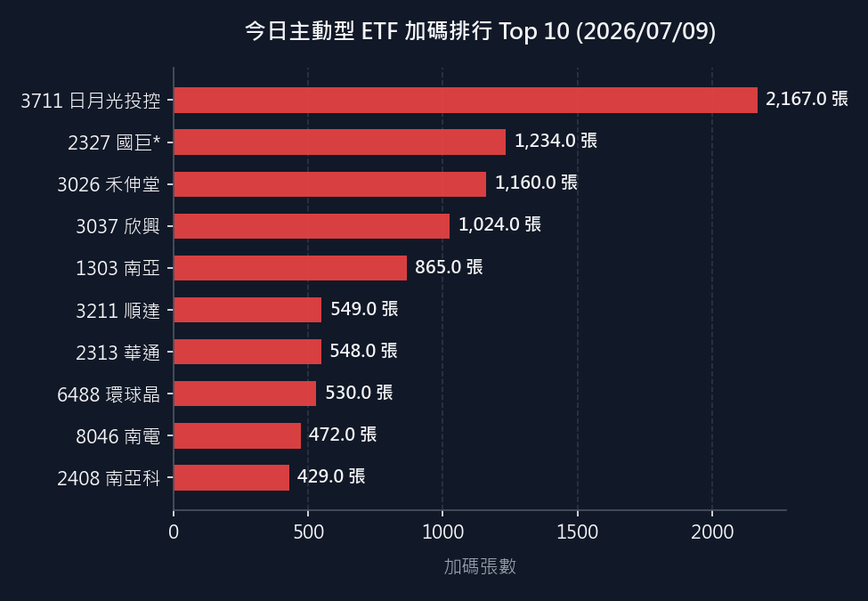
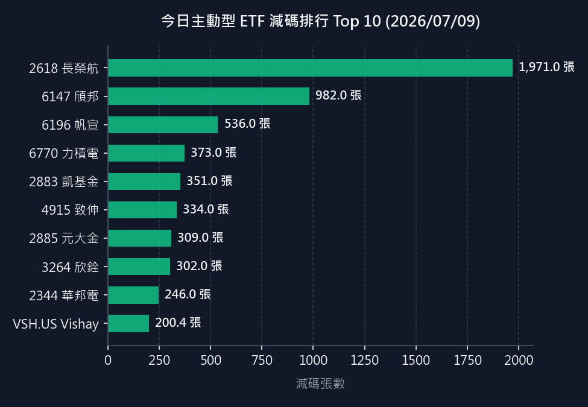

# 主動型 ETF 持股變動

資料來源：`主動型ETF持股明細.xlsx` 最近兩個日期分頁。

比較區間：`20260708` → `20260709`

## 今日加減碼視覺化排行

| 今日加碼 Top 10 | 今日減碼 Top 10 |
| :---: | :---: |
|  |  |

| ETF | 新增 | 刪除 | 比例變動 |
| :-- | --: | --: | --: |
| 00400A | 1 | 1 | 45 |
| 00401A | 0 | 0 | 57 |
| 00402A | 0 | 0 | 47 |
| 00403A | 0 | 1 | 37 |
| 00404A | 3 | 2 | 41 |
| 00405A | 1 | 1 | 43 |
| 00407A | 0 | 0 | 43 |
| 00980A | 0 | 0 | 39 |
| 00980D | 0 | 1 | 47 |
| 00981A | 0 | 0 | 27 |
| 00982A | 0 | 1 | 43 |
| 00983A | 1 | 1 | 33 |
| 00983D | 0 | 0 | 11 |
| 00984A | 2 | 1 | 94 |
| 00985A | 0 | 0 | 44 |
| 00986A | 0 | 0 | 31 |
| 00987A | 2 | 2 | 26 |
| 00988A | 0 | 1 | 40 |
| 00989A | 0 | 0 | 52 |
| 00990A | 0 | 1 | 41 |
| 00991A | 0 | 0 | 25 |
| 00992A | 0 | 0 | 33 |
| 00993A | 0 | 1 | 50 |
| 00994A | 2 | 2 | 30 |
| 00995A | 1 | 0 | 44 |
| 00996A | 2 | 0 | 40 |
| 00997A | 0 | 1 | 50 |
| 00998A | 0 | 0 | 38 |
| 00999A | 0 | 0 | 51 |

## 00400A

### 新增持股

- 3211 順達（0.97%，549 張）

### 刪除持股

- 3131 弘塑（0.30%，25 張）

### 投資比例變動

- 1590 亞德客-KY：1.01% → 0.96%（-0.05）
- 2059 川湖：2.45% → 3.46%（+1.01）
- 2303 聯電：1.87% → 1.79%（-0.08）
- 2313 華通：0.47% → 0.95%（+0.48）
- 2327 國巨*：3.10% → 3.14%（+0.04）
- 2330 台積電：8.88% → 8.99%（+0.11）
- 2345 智邦：2.13% → 2.18%（+0.05）
- 2360 致茂：2.91% → 2.86%（-0.05）
- 2368 金像電：1.70% → 1.09%（-0.61）
- 2376 技嘉：1.19% → 1.20%（+0.01）
- 2382 廣達：0.97% → 0.96%（-0.01）
- 2383 台光電：5.79% → 5.78%（-0.01）
- 2408 南亞科：1.87% → 2.06%（+0.19）
- 2454 聯發科：6.82% → 6.71%（-0.11）
- 2472 立隆電：0.15% → 0.16%（+0.01）
- 2481 強茂：0.46% → 0.47%（+0.01）
- 2885 元大金：1.11% → 1.06%（-0.05）
- 3017 奇鋐：3.59% → 3.63%（+0.04）
- 3036 文曄：1.22% → 1.23%（+0.01）
- 3037 欣興：3.59% → 3.64%（+0.05）
- 3044 健鼎：1.89% → 1.80%（-0.09）
- 3090 日電貿：0.71% → 0.67%（-0.04）
- 3231 緯創：0.80% → 0.79%（-0.01）
- 3293 鈊象：0.39% → 0.38%（-0.01）
- 3374 精材：0.34% → 0.38%（+0.04）
- 3443 創意：1.35% → 2.29%（+0.94）
- 3665 貿聯-KY：2.44% → 2.40%（-0.04）
- 3711 日月光投控：1.47% → 1.60%（+0.13）
- 5274 信驊：2.03% → 1.98%（-0.05）
- 5347 世界：1.85% → 1.81%（-0.04）
- 5434 崇越：0.39% → 0.40%（+0.01）
- 6121 新普：0.31% → 0.29%（-0.02）
- 6147 頎邦：0.96% → 1.04%（+0.08）
- 6187 萬潤：0.56% → 1.42%（+0.86）
- 6223 旺矽：4.29% → 4.70%（+0.41）
- 6274 台燿：0.78% → 0.74%（-0.04）
- 6285 啟碁：0.71% → 0.74%（+0.03）
- 6488 環球晶：4.07% → 4.47%（+0.40）
- 6510 精測：0.77% → 1.26%（+0.49）
- 6669 緯穎：3.98% → 3.97%（-0.01）
- 6715 嘉基：0.24% → 0.21%（-0.03）
- 7769 鴻勁：0.31% → 0.34%（+0.03）
- 8046 南電：0.28% → 0.31%（+0.03）
- 8150 南茂：0.10% → 0.11%（+0.01）
- 8210 勤誠：1.16% → 1.14%（-0.02）

## 00401A

### 新增持股

- 無

### 刪除持股

- 無

### 投資比例變動

- 1301 台塑：0.08% → 0.07%（-0.01）
- 2303 聯電：1.31% → 1.30%（-0.01）
- 2308 台達電：4.38% → 4.31%（-0.07）
- 2313 華通：1.21% → 1.22%（+0.01）
- 2317 鴻海：0.70% → 0.69%（-0.01）
- 2330 台積電：9.24% → 9.05%（-0.19）
- 2345 智邦：2.31% → 2.29%（-0.02）
- 2357 華碩：1.27% → 1.29%（+0.02）
- 2360 致茂：1.97% → 1.80%（-0.17）
- 2368 金像電：0.46% → 0.43%（-0.03）
- 2379 瑞昱：2.21% → 2.37%（+0.16）
- 2382 廣達：2.46% → 2.44%（-0.02）
- 2383 台光電：2.30% → 2.15%（-0.15）
- 2412 中華電：1.02% → 0.95%（-0.07）
- 2449 京元電子：1.85% → 1.78%（-0.07）
- 2454 聯發科：6.56% → 6.32%（-0.24）
- 2455 全新：0.45% → 0.46%（+0.01）
- 2603 長榮：1.05% → 1.08%（+0.03）
- 2881 富邦金：1.55% → 1.83%（+0.28）
- 2882 國泰金：1.19% → 1.17%（-0.02）
- 2883 凱基金：2.14% → 2.12%（-0.02）
- 2884 玉山金：1.90% → 1.89%（-0.01）
- 2885 元大金：2.00% → 1.49%（-0.51）
- 2886 兆豐金：0.51% → 0.69%（+0.18）
- 2887 台新新光金：1.15% → 1.20%（+0.05）
- 2890 永豐金：0.33% → 0.32%（-0.01）
- 2891 中信金：2.47% → 2.43%（-0.04）
- 3005 神基：0.20% → 0.21%（+0.01）
- 3034 聯詠：0.85% → 0.86%（+0.01）
- 3037 欣興：0.66% → 0.68%（+0.02）
- 3044 健鼎：1.46% → 1.19%（-0.27）
- 3131 弘塑：0.60% → 0.61%（+0.01）
- 3167 大量：0.91% → 0.58%（-0.33）
- 3231 緯創：0.35% → 0.32%（-0.03）
- 3491 昇達科：1.12% → 1.30%（+0.18）
- 3529 力旺：0.51% → 0.65%（+0.14）
- 3653 健策：1.10% → 1.09%（-0.01）
- 3711 日月光投控：2.55% → 2.62%（+0.07）
- 4904 遠傳：0.94% → 0.86%（-0.08）
- 4958 臻鼎-KY：2.54% → 2.69%（+0.15）
- 4991 環宇-KY：0.66% → 0.64%（-0.02）
- 5274 信驊：0.99% → 0.93%（-0.06）
- 5347 世界：1.08% → 1.05%（-0.03）
- 5904 寶雅：0.68% → 0.67%（-0.01）
- 6187 萬潤：0.67% → 0.71%（+0.04）
- 6223 旺矽：2.57% → 2.85%（+0.28）
- 6285 啟碁：2.07% → 2.19%（+0.12）
- 6415 矽力*-KY：0.89% → 0.83%（-0.06）
- 6510 精測：0.89% → 0.71%（-0.18）
- 6515 穎崴：0.75% → 0.72%（-0.03）
- 6531 愛普*：1.40% → 1.43%（+0.03）
- 6669 緯穎：2.51% → 2.50%（-0.01）
- 6944 兆聯實業：0.55% → 0.56%（+0.01）
- 7769 鴻勁：2.71% → 2.89%（+0.18）
- 7828 創新服務：1.32% → 1.51%（+0.19）
- 8021 尖點：0.34% → 0.35%（+0.01）
- 8464 億豐：1.31% → 1.26%（-0.05）

## 00402A

### 新增持股

- 無

### 刪除持股

- 無

### 投資比例變動

- AAPL.US Apple：7.15% → 7.16%（+0.01）
- ADI.US Analog Devices：1.73% → 1.75%（+0.02）
- AMD.US AMD：5.42% → 5.39%（-0.03）
- AMZN.US Amazon：4.18% → 4.11%（-0.07）
- ANET.US Arista Networks：0.75% → 0.81%（+0.06）
- ARM.US Arm：1.09% → 1.08%（-0.01）
- AVGO.US Broadcom：2.42% → 2.52%（+0.10）
- AXON.US Axon Enterprise：1.34% → 1.25%（-0.09）
- BABA.US Alibaba Group：0.44% → 0.48%（+0.04）
- BKNG.US Booking Holdings：0.79% → 0.75%（-0.04）
- CIEN.US Ciena：1.20% → 1.25%（+0.05）
- CLS.US Celestica：0.90% → 0.93%（+0.03）
- CRWD.US CrowdStrike Holdings：1.22% → 1.19%（-0.03）
- DASH.US DoorDash：0.72% → 0.69%（-0.03）
- FSLY.US Fastly：0.26% → 0.28%（+0.02）
- GOOG.US Alphabet - Class C Capital Stock：3.57% → 3.50%（-0.07）
- GOOGL.US Alphabet - Class A Common Stock：3.54% → 3.47%（-0.07）
- INTC.US Intel：1.35% → 1.34%（-0.01）
- KLAC.US KLA：2.12% → 2.16%（+0.04）
- LITE.US Lumentum：1.16% → 1.17%（+0.01）
- LRCX.US Lam Research：3.56% → 3.61%（+0.05）
- MCHP.US Microchip Technology：1.64% → 1.65%（+0.01）
- MDB.US MongoDB：0.66% → 0.65%（-0.01）
- META.US Meta：2.89% → 2.81%（-0.08）
- MRVL.US Marvell：1.55% → 1.54%（-0.01）
- MSFT.US Microsoft：3.47% → 3.39%（-0.08）
- MU.US Micron：6.33% → 6.35%（+0.02）
- NFLX.US Netflix：1.28% → 1.27%（-0.01）
- NOW.US ServiceNow：0.38% → 0.37%（-0.01）
- NVDA.US NVIDIA：8.32% → 8.56%（+0.24）
- NXPI.US NXP Semiconductors：1.21% → 1.25%（+0.04）
- PANW.US Palo Alto：2.98% → 2.81%（-0.17）
- PLTR.US Palantir Technologies：1.30% → 1.27%（-0.03）
- SHOP.US Shopify：0.68% → 0.66%（-0.02）
- SIMO.US Silicon Motion：0.83% → 0.88%（+0.05）
- SNOW.US Snowflake：0.74% → 0.73%（-0.01）
- SPCX.US SpaceX：0.72% → 0.71%（-0.01）
- SPOT.US Spotify：0.38% → 0.37%（-0.01）
- STX.US Seagate：1.34% → 1.38%（+0.04）
- TER.US Teradyne：0.62% → 0.63%（+0.01）
- TSM.US TSMC(ADR)：1.62% → 1.63%（+0.01）
- TTWO.US Take-Two：0.78% → 0.76%（-0.02）
- TXN.US Texas Instruments：2.98% → 3.04%（+0.06）
- UBER.US Uber：0.65% → 0.64%（-0.01）
- V.US Visa：1.22% → 1.19%（-0.03）
- WDC.US Western Digital：2.77% → 2.84%（+0.07）
- ZS.US Zscaler：0.15% → 0.14%（-0.01）

## 00403A

### 新增持股

- 無

### 刪除持股

- 6147 頎邦（0.12%，1000 張）

### 投資比例變動

- 1303 南亞：0.89% → 0.95%（+0.06）
- 1560 中砂：0.43% → 0.44%（+0.01）
- 2303 聯電：7.55% → 7.19%（-0.36）
- 2308 台達電：2.83% → 2.81%（-0.02）
- 2327 國巨*：4.95% → 4.98%（+0.03）
- 2330 台積電：19.48% → 19.01%（-0.47）
- 2337 旺宏：0.86% → 0.88%（+0.02）
- 2344 華邦電：4.12% → 4.30%（+0.18）
- 2345 智邦：3.13% → 3.19%（+0.06）
- 2360 致茂：0.52% → 0.50%（-0.02）
- 2368 金像電：1.95% → 1.82%（-0.13）
- 2383 台光電：3.74% → 3.71%（-0.03）
- 2454 聯發科：3.95% → 3.86%（-0.09）
- 3017 奇鋐：4.95% → 4.99%（+0.04）
- 3037 欣興：3.76% → 3.80%（+0.04）
- 3189 景碩：1.50% → 1.57%（+0.07）
- 3211 順達：0.48% → 0.50%（+0.02）
- 3443 創意：1.30% → 1.28%（-0.02）
- 3529 力旺：0.26% → 0.08%（-0.18）
- 3533 嘉澤：1.52% → 1.49%（-0.03）
- 3583 辛耘：0.44% → 0.45%（+0.01）
- 3711 日月光投控：2.28% → 2.46%（+0.18）
- 4958 臻鼎-KY：2.25% → 2.33%（+0.08）
- 4966 譜瑞-KY：0.33% → 0.32%（-0.01）
- 5274 信驊：0.43% → 0.42%（-0.01）
- 6196 帆宣：0.34% → 0.15%（-0.19）
- 6223 旺矽：3.99% → 4.35%（+0.36）
- 6274 台燿：1.73% → 1.64%（-0.09）
- 6415 矽力*-KY：0.31% → 0.29%（-0.02）
- 6442 光聖：0.28% → 0.27%（-0.01）
- 6488 環球晶：1.60% → 1.79%（+0.19）
- 6669 緯穎：2.46% → 2.45%（-0.01）
- 6805 富世達：0.49% → 0.51%（+0.02）
- 7769 鴻勁：1.04% → 1.14%（+0.10）
- 8046 南電：0.72% → 0.92%（+0.20）
- 8358 金居：0.63% → 0.64%（+0.01）
- 8996 高力：1.27% → 1.21%（-0.06）

## 00404A

### 新增持股

- 臺指選擇權08/26 49100 買權（-0.42%，N/A 張）
- 臺指選擇權09/26 50300 買權（-0.03%，N/A 張）
- 臺股期貨08/26（7.39%，N/A 張）

### 刪除持股

- 臺指選擇權07/26 48600 買權（-0.05%，N/A 張）
- 臺指選擇權08/26 50400 買權（-0.02%，N/A 張）

### 投資比例變動

- 1303 南亞：0.37% → 0.41%（+0.04）
- 2308 台達電：3.73% → 3.86%（+0.13）
- 2327 國巨*：0.60% → 0.75%（+0.15）
- 2330 台積電：22.65% → 22.28%（-0.37）
- 2347 聯強：1.79% → 1.73%（-0.06）
- 2356 英業達：0.22% → 0.23%（+0.01）
- 2360 致茂：0.94% → 1.03%（+0.09）
- 2382 廣達：2.75% → 2.73%（-0.02）
- 2383 台光電：1.88% → 1.89%（+0.01）
- 2454 聯發科：6.33% → 6.60%（+0.27）
- 2883 凱基金：2.19% → 1.96%（-0.23）
- 2885 元大金：2.63% → 2.31%（-0.32）
- 2890 永豐金：0.25% → 0.24%（-0.01）
- 2891 中信金：2.89% → 2.86%（-0.03）
- 3014 聯陽：1.72% → 1.56%（-0.16）
- 3017 奇鋐：0.73% → 0.70%（-0.03）
- 3034 聯詠：2.10% → 2.13%（+0.03）
- 3037 欣興：0.40% → 0.42%（+0.02）
- 3044 健鼎：1.75% → 1.78%（+0.03）
- 3189 景碩：0.27% → 0.31%（+0.04）
- 3217 優群：1.26% → 1.25%（-0.01）
- 3227 原相：1.88% → 1.78%（-0.10）
- 3264 欣銓：1.06% → 1.07%（+0.01）
- 3265 台星科：1.21% → 1.20%（-0.01）
- 3293 鈊象：1.66% → 1.59%（-0.07）
- 3711 日月光投控：3.45% → 3.91%（+0.46）
- 5274 信驊：2.09% → 1.97%（-0.12）
- 5347 世界：0.66% → 0.65%（-0.01）
- 5434 崇越：1.81% → 1.77%（-0.04）
- 5904 寶雅：1.95% → 1.93%（-0.02）
- 6121 新普：1.24% → 1.16%（-0.08）
- 6139 亞翔：0.24% → 0.23%（-0.01）
- 6196 帆宣：0.37% → 0.36%（-0.01）
- 6223 旺矽：0.85% → 0.95%（+0.10）
- 6239 力成：0.16% → 0.15%（-0.01）
- 6488 環球晶：0.18% → 0.20%（+0.02）
- 6515 穎崴：0.36% → 0.35%（-0.01）
- 6903 巨漢：0.28% → 0.29%（+0.01）
- 8081 致新：1.83% → 1.69%（-0.14）
- 8299 群聯：1.16% → 1.19%（+0.03）
- 臺股期貨07/26：16.97% → 9.24%（-7.73）

## 00405A

### 新增持股

- 3661 世芯-KY（0.02%，1 張）

### 刪除持股

- 2360 致茂（1.17%，145 張）

### 投資比例變動

- 2049 上銀：0.03% → 0.02%（-0.01）
- 2059 川湖：1.43% → 1.34%（-0.09）
- 2308 台達電：1.12% → 1.05%（-0.07）
- 2327 國巨*：4.74% → 4.43%（-0.31）
- 2330 台積電：2.40% → 2.24%（-0.16）
- 2337 旺宏：1.60% → 1.56%（-0.04）
- 2344 華邦電：4.23% → 4.03%（-0.20）
- 2345 智邦：5.35% → 5.06%（-0.29）
- 2368 金像電：1.42% → 1.26%（-0.16）
- 2383 台光電：2.37% → 3.22%（+0.85）
- 2449 京元電子：1.04% → 0.95%（-0.09）
- 2454 聯發科：7.14% → 6.54%（-0.60）
- 3017 奇鋐：6.99% → 6.31%（-0.68）
- 3026 禾伸堂：0.82% → 0.90%（+0.08）
- 3037 欣興：4.46% → 4.37%（-0.09）
- 3081 聯亞：1.13% → 1.12%（-0.01）
- 3105 穩懋：2.04% → 1.91%（-0.13）
- 3131 弘塑：4.29% → 4.19%（-0.10）
- 3163 波若威：0.23% → 0.22%（-0.01）
- 3443 創意：5.24% → 5.61%（+0.37）
- 3583 辛耘：2.01% → 1.91%（-0.10）
- 3653 健策：2.37% → 2.23%（-0.14）
- 3711 日月光投控：0.87% → 0.85%（-0.02）
- 4576 大銀微系統：0.07% → 0.06%（-0.01）
- 4749 新應材：0.35% → 0.32%（-0.03）
- 5274 信驊：2.16% → 1.92%（-0.24）
- 5347 世界：0.15% → 0.14%（-0.01）
- 6187 萬潤：2.22% → 2.25%（+0.03）
- 6223 旺矽：5.93% → 6.25%（+0.32）
- 6274 台燿：0.43% → 0.41%（-0.02）
- 6291 沛亨：0.43% → 0.39%（-0.04）
- 6442 光聖：0.44% → 0.40%（-0.04）
- 6488 環球晶：2.88% → 5.23%（+2.35）
- 6510 精測：1.58% → 1.49%（-0.09）
- 6515 穎崴：0.76% → 0.69%（-0.07）
- 6526 達發：0.39% → 0.37%（-0.02）
- 7734 印能科技：1.81% → 1.75%（-0.06）
- 7769 鴻勁：2.55% → 2.58%（+0.03）
- 8028 昇陽半導體：1.13% → 1.08%（-0.05）
- 8046 南電：2.41% → 2.68%（+0.27）
- 8210 勤誠：2.27% → 2.13%（-0.14）
- 8299 群聯：1.55% → 1.50%（-0.05）
- 8996 高力：1.55% → 1.34%（-0.21）

## 00407A

### 新增持股

- 無

### 刪除持股

- 無

### 投資比例變動

- 1303 南亞：0.54% → 0.56%（+0.02）
- 1590 亞德客-KY：1.81% → 1.67%（-0.14）
- 2059 川湖：2.09% → 2.08%（-0.01）
- 2303 聯電：1.87% → 1.78%（-0.09）
- 2308 台達電：4.02% → 3.99%（-0.03）
- 2327 國巨*：2.55% → 3.42%（+0.87）
- 2330 台積電：9.18% → 9.06%（-0.12）
- 2344 華邦電：1.77% → 1.79%（+0.02）
- 2345 智邦：3.36% → 3.37%（+0.01）
- 2360 致茂：1.78% → 1.64%（-0.14）
- 2368 金像電：2.17% → 2.05%（-0.12）
- 2376 技嘉：0.70% → 0.72%（+0.02）
- 2379 瑞昱：0.82% → 0.88%（+0.06）
- 2383 台光電：3.02% → 3.92%（+0.90）
- 2395 研華：1.58% → 1.63%（+0.05）
- 2408 南亞科：1.62% → 1.75%（+0.13）
- 2412 中華電：1.72% → 1.63%（-0.09）
- 2451 創見：0.15% → 0.14%（-0.01）
- 2454 聯發科：6.83% → 6.64%（-0.19）
- 2458 義隆：0.12% → 0.11%（-0.01）
- 3017 奇鋐：3.49% → 3.34%（-0.15）
- 3034 聯詠：0.71% → 0.73%（+0.02）
- 3037 欣興：2.74% → 3.76%（+1.02）
- 3293 鈊象：0.59% → 0.57%（-0.02）
- 3443 創意：1.88% → 1.81%（-0.07）
- 3491 昇達科：0.39% → 0.42%（+0.03）
- 3529 力旺：1.79% → 1.69%（-0.10）
- 3665 貿聯-KY：2.02% → 1.90%（-0.12）
- 3711 日月光投控：1.95% → 2.03%（+0.08）
- 4904 遠傳：0.31% → 0.29%（-0.02）
- 4958 臻鼎-KY：2.10% → 2.25%（+0.15）
- 5274 信驊：1.91% → 1.83%（-0.08）
- 5536 聖暉*：2.20% → 1.91%（-0.29）
- 6223 旺矽：2.44% → 2.73%（+0.29）
- 6274 台燿：2.47% → 2.91%（+0.44）
- 6415 矽力*-KY：0.46% → 0.43%（-0.03）
- 6446 藥華藥：2.60% → 2.48%（-0.12）
- 6515 穎崴：1.67% → 1.62%（-0.05）
- 6531 愛普*：1.50% → 1.54%（+0.04）
- 6669 緯穎：2.52% → 3.24%（+0.72）
- 6805 富世達：1.59% → 1.55%（-0.04）
- 8046 南電：2.05% → 2.42%（+0.37）
- 8996 高力：0.50% → 0.46%（-0.04）

## 00980A

### 新增持股

- 無

### 刪除持股

- 無

### 投資比例變動

- 2059 川湖：5.38% → 5.45%（+0.07）
- 2308 台達電：5.41% → 5.36%（-0.05）
- 2317 鴻海：1.84% → 1.83%（-0.01）
- 2330 台積電：9.44% → 9.20%（-0.24）
- 2344 華邦電：1.17% → 1.22%（+0.05）
- 2345 智邦：1.90% → 1.93%（+0.03）
- 2360 致茂：1.60% → 1.56%（-0.04）
- 2368 金像電：2.73% → 2.54%（-0.19）
- 2382 廣達：1.21% → 1.19%（-0.02）
- 2383 台光電：4.85% → 4.80%（-0.05）
- 2408 南亞科：1.36% → 1.49%（+0.13）
- 2454 聯發科：6.49% → 6.34%（-0.15）
- 2891 中信金：1.23% → 1.20%（-0.03）
- 3017 奇鋐：1.84% → 1.85%（+0.01）
- 3026 禾伸堂：0.77% → 0.81%（+0.04）
- 3037 欣興：2.93% → 2.95%（+0.02）
- 3044 健鼎：0.47% → 0.44%（-0.03）
- 3081 聯亞：2.73% → 2.60%（-0.13）
- 3189 景碩：0.63% → 0.66%（+0.03）
- 3231 緯創：0.62% → 0.61%（-0.01）
- 3293 鈊象：0.56% → 0.55%（-0.01）
- 3443 創意：1.86% → 1.82%（-0.04）
- 3529 力旺：0.97% → 0.94%（-0.03）
- 3533 嘉澤：0.16% → 0.15%（-0.01）
- 3653 健策：2.92% → 2.91%（-0.01）
- 3665 貿聯-KY：0.61% → 0.60%（-0.01）
- 3711 日月光投控：1.51% → 1.63%（+0.12）
- 4958 臻鼎-KY：1.49% → 1.54%（+0.05）
- 5274 信驊：1.21% → 1.17%（-0.04）
- 6223 旺矽：2.96% → 3.23%（+0.27）
- 6274 台燿：1.29% → 1.23%（-0.06）
- 6669 緯穎：1.19% → 1.18%（-0.01）
- 6805 富世達：0.45% → 0.47%（+0.02）
- 6831 邁科：0.41% → 0.39%（-0.02）
- 7769 鴻勁：3.40% → 3.72%（+0.32）
- 8046 南電：1.46% → 1.60%（+0.14）
- 8210 勤誠：0.81% → 0.79%（-0.02）
- 8299 群聯：1.02% → 1.05%（+0.03）
- 8996 高力：1.76% → 1.63%（-0.13）

## 00980D

### 新增持股

- 無

### 刪除持股

- EG GLOBAL FINANCE PLC SER REGS (REG S) 12% 30NOV2028（0.33%，N/A 張）

### 投資比例變動

- APA CORP 6.750000 % 15-FEB-2055：0.37% → 0.36%（-0.01）
- ATHENE HOLDING LTD (REG) 6.25% 01APR2054：0.78% → 0.77%（-0.01）
- ATHENE HOLDING LTD 6.625000 % 19MAY2055：0.58% → 0.57%（-0.01）
- BAT CAPITAL CORP (REG) 7.081% 02AUG2053：0.59% → 0.58%（-0.01）
- BAYER US FINANCE LLC SER REGS 6.875000 % 21NOV2053：0.37% → 0.36%（-0.01）
- BLACKSTONE PRIVATE CRE 7.300000 % 27NOV2028：0.46% → 0.47%（+0.01）
- BLUE OWL CREDIT INCOME (REG) 6.65% 15MAR2031：0.52% → 0.53%（+0.01）
- BLUE OWL CREDIT INCOME SER WI (REG) 7.75% 16SEP2027：0.54% → 0.55%（+0.01）
- BRIGHTHOUSE FINANCIAL IN (REG) 4.7% 22JUN2047：0.49% → 0.48%（-0.01）
- CAPITAL ONE FINANCIAL CO SER . (REG) VAR 30OCT2031：0.58% → 0.59%（+0.01）
- CHARTER COMM OPT LLC/CAP (REG) 5.5% 01APR2063：0.52% → 0.51%（-0.01）
- CHC GROUP LLC SER REGS 11.750000 % 01-SEP-2030：0.40% → 0.42%（+0.02）
- CITIGROUP INC 8.125% 15JUL2039：0.64% → 0.63%（-0.01）
- CONCENTRIX CORP (REG) 6.6% 02AUG2028：0.51% → 0.50%（-0.01）
- COX COMMUNICATIONS INC SER REGS 5.800000 % 15DEC2053：0.41% → 0.40%（-0.01）
- DEUTSCHE TELEKOM INT FIN (REG) 9.25% 01JUN2032：0.42% → 0.43%（+0.01）
- ENBRIDGE ENERGY PARTNERS (REG) 7.375% 15OCT2045：0.53% → 0.52%（-0.01）
- ENEL FINANCE INTL NV SER REGS (REG S) 7.75% 14OCT2052：0.38% → 0.37%（-0.01）
- FORD MOTOR COMPANY 5.291% 08DEC2046：0.29% → 0.28%（-0.01）
- GENERAL MOTORS CO (REG) 6.8% 01OCT2027：0.55% → 0.56%（+0.01）
- GLOBAL ATLANTIC FIN CO SER REGS 7.950000 % 15JUN2033：0.66% → 0.67%（+0.01）
- HERTZ CORP/THE SER REGS (REG S) 12.625% 15JUL2029：0.35% → 0.34%（-0.01）
- JETBLUE AIRWAYS/LOYALTY SER REGS (REG S) 9.875% 20SEP2031：0.31% → 0.30%（-0.01）
- META PLATFORMS INC 5.750000 % 15-NOV-2065：0.46% → 0.45%（-0.01）
- MYLAN INC SER WI (REG) 5.2% 15APR2048WI：0.50% → 0.49%（-0.01）
- OCCIDENTAL PETROLEUM COR 8.875% 15JUL2030：0.53% → 0.54%（+0.01）
- ONEOK INC 6.625% 01SEP2053：0.59% → 0.58%（-0.01）
- OPEN TEXT CORP SER REGS (REG) (REG S) 6.9% 01DEC2027：0.65% → 0.66%（+0.01）
- ORACLE CORP (REG) 5.500000 % 27SEP2064：0.58% → 0.57%（-0.01）
- ORACLE CORP 5.950000 % 26-SEP-2055：0.43% → 0.42%（-0.01）
- PBF HOLDING CO LLC SER REGS 9.875000 % 15MAR2030：0.35% → 0.36%（+0.01）
- PROGRESS ENERGY INC (REG) 7.75% 01MAR2031：0.57% → 0.58%（+0.01）
- SABRE FINANCIAL BORROWER SER REGS 11.125 % 15-JUN-2029：0.52% → 0.53%（+0.01）
- SALESFORCE INC (REG) 6.55% 15MAR2056：0.55% → 0.54%（-0.01）
- SANTANDER UK GROUP HLDGS (REG) VAR 10JAN2029：0.32% → 0.33%（+0.01）
- SATURN OIL & GAS INC SER REGS 9.625000 % 15JUN2029：0.61% → 0.62%（+0.01）
- SPRINT CAPITAL CORP (REG) 6.875% 15NOV2028：0.31% → 0.32%（+0.01）
- STAPLES INC SER REGS (REG S) 10.75% 01SEP2029：0.44% → 0.45%（+0.01）
- STELLANTIS FIN US INC SER REGS 6.450000 % 18MAR2035：0.33% → 0.32%（-0.01）
- TOUCAN FINCO LTD/CAN/US SER REGS 9.500000 % 15MAY2030：0.25% → 0.26%（+0.01）
- UNISYS CORP SER REGS 10.625000 % 15JAN2031：0.59% → 0.60%（+0.01）
- US 10YR NOTE (CBT)SEP26 21-SEP-2026：18.47% → 18.49%（+0.02）
- US 2YR NOTE (CBT) SEP26 30-SEP-2026：1.95% → 1.96%（+0.01）
- US 5YR NOTE (CBT) SEP26 30-SEP-2026：-16.00% → -16.05%（-0.05）
- US ACUTE CARE SOLUTIONS SER REGS (REG S) 9.75% 15MAY2029：0.31% → 0.32%（+0.01）
- US LONG BOND(CBT) SEP26 21-SEP-2026：5.49% → 5.47%（-0.02）
- VIACOMCBS INC (REG) 4.95% 19MAY2050：0.51% → 0.50%（-0.01）

## 00981A

### 新增持股

- 無

### 刪除持股

- 無

### 投資比例變動

- 1590 亞德客-KY：0.27% → 0.25%（-0.02）
- 2002 中鋼：0.04% → 0.03%（-0.01）
- 2303 聯電：4.95% → 4.91%（-0.04）
- 2308 台達電：3.52% → 3.46%（-0.06）
- 2327 國巨*：8.38% → 8.22%（-0.16）
- 2330 台積電：10.77% → 10.51%（-0.26）
- 2345 智邦：5.74% → 5.69%（-0.05）
- 2368 金像電：3.48% → 3.25%（-0.23）
- 2383 台光電：8.86% → 8.97%（+0.11）
- 2449 京元電子：0.22% → 0.21%（-0.01）
- 2454 聯發科：7.63% → 7.33%（-0.30）
- 3017 奇鋐：4.69% → 4.44%（-0.25）
- 3037 欣興：4.71% → 5.03%（+0.32）
- 3653 健策：2.67% → 2.64%（-0.03）
- 3665 貿聯-KY：3.53% → 3.28%（-0.25）
- 3711 日月光投控：3.06% → 3.64%（+0.58）
- 5274 信驊：2.22% → 2.07%（-0.15）
- 5439 高技：0.43% → 0.42%（-0.01）
- 6147 頎邦：0.46% → 0.50%（+0.04）
- 6187 萬潤：0.48% → 0.51%（+0.03）
- 6223 旺矽：5.55% → 6.30%（+0.75）
- 6274 台燿：3.00% → 2.95%（-0.05）
- 6515 穎崴：0.60% → 0.58%（-0.02）
- 6669 緯穎：4.47% → 4.43%（-0.04）
- 6805 富世達：1.00% → 0.96%（-0.04）
- 8046 南電：3.40% → 4.05%（+0.65）
- 8210 勤誠：0.98% → 0.97%（-0.01）

## 00982A

### 新增持股

- 無

### 刪除持股

- 6805 富世達（0.35%，121 張）

### 投資比例變動

- 1785 光洋科：1.48% → 1.51%（+0.03）
- 2059 川湖：2.92% → 2.93%（+0.01）
- 2303 聯電：2.67% → 2.70%（+0.03）
- 2316 楠梓電：1.34% → 1.36%（+0.02）
- 2327 國巨*：1.48% → 1.47%（-0.01）
- 2330 台積電：9.27% → 9.22%（-0.05）
- 2345 智邦：3.77% → 3.80%（+0.03）
- 2351 順德：0.37% → 0.35%（-0.02）
- 2360 致茂：3.13% → 2.91%（-0.22）
- 2368 金像電：0.85% → 0.81%（-0.04）
- 2376 技嘉：0.67% → 0.69%（+0.02）
- 2377 微星：1.49% → 1.59%（+0.10）
- 2383 台光電：3.29% → 3.35%（+0.06）
- 2454 聯發科：6.67% → 6.53%（-0.14）
- 2467 志聖：1.70% → 1.55%（-0.15）
- 2472 立隆電：1.67% → 1.71%（+0.04）
- 2885 元大金：0.29% → 0.28%（-0.01）
- 3008 大立光：1.50% → 1.53%（+0.03）
- 3017 奇鋐：1.93% → 1.86%（-0.07）
- 3036 文曄：0.94% → 0.93%（-0.01）
- 3105 穩懋：3.28% → 3.26%（-0.02）
- 3264 欣銓：2.07% → 2.11%（+0.04）
- 3376 新日興：0.13% → 0.14%（+0.01）
- 3491 昇達科：2.23% → 2.38%（+0.15）
- 3583 辛耘：1.73% → 1.75%（+0.02）
- 3702 大聯大：1.12% → 1.10%（-0.02）
- 3711 日月光投控：1.25% → 1.31%（+0.06）
- 4958 臻鼎-KY：3.33% → 3.59%（+0.26）
- 5274 信驊：0.28% → 0.26%（-0.02）
- 5536 聖暉*：10.02% → 8.76%（-1.26）
- 6139 亞翔：5.23% → 5.21%（-0.02）
- 6147 頎邦：0.89% → 0.97%（+0.08）
- 6187 萬潤：0.17% → 0.19%（+0.02）
- 6223 旺矽：3.74% → 4.22%（+0.48）
- 6239 力成：0.44% → 0.43%（-0.01）
- 6257 矽格：2.16% → 2.19%（+0.03）
- 6278 台表科：0.82% → 0.84%（+0.02）
- 6488 環球晶：2.64% → 2.97%（+0.33）
- 6531 愛普*：1.20% → 1.24%（+0.04）
- 6669 緯穎：2.88% → 2.90%（+0.02）
- 7769 鴻勁：1.09% → 1.18%（+0.09）
- 8016 矽創：1.49% → 1.54%（+0.05）
- 8996 高力：0.97% → 0.90%（-0.07）

## 00983A

### 新增持股

- RXRX.US Recursion Pharmaceuticals（0.22%，23.722 張）

### 刪除持股

- JOBY.US Joby Aviation（0.00%，0.062 張）

### 投資比例變動

- AMD.US AMD：6.06% → 6.10%（+0.04）
- AMZN.US Amazon：2.80% → 2.84%（+0.04）
- AVGO.US Broadcom：0.28% → 0.30%（+0.02）
- BEAM.US Beam Therapeutics：4.37% → 4.35%（-0.02）
- BWXT.US BWX Technologies：0.84% → 0.50%（-0.34）
- CBRS.US Cerebras：0.49% → 0.51%（+0.02）
- COIN.US Coinbase：1.16% → 1.15%（-0.01）
- CRCL.US Circle：1.07% → 0.88%（-0.19）
- CRSP.US CRISPR Therapeutics：5.16% → 5.15%（-0.01）
- CRWV.US CoreWeave：1.05% → 0.83%（-0.22）
- DE.US Deere：0.90% → 0.91%（+0.01）
- GOOG.US Alphabet - Class C Capital Stock：1.16% → 1.17%（+0.01）
- GOOGL.US Alphabet - Class A Common Stock：1.54% → 1.56%（+0.02）
- HOOD.US Robinhood Markets：7.07% → 7.28%（+0.21）
- LLY.US Eli Lilly：1.99% → 2.01%（+0.02）
- NTLA.US Intellia Therapeutics：4.02% → 3.98%（-0.04）
- NTRA.US Natera：3.65% → 3.64%（-0.01）
- NVDA.US NVIDIA：1.06% → 0.74%（-0.32）
- PLTR.US Palantir Technologies：0.56% → 0.57%（+0.01）
- RBLX.US Roblox：2.10% → 2.43%（+0.33）
- SHOP.US Shopify：5.10% → 5.11%（+0.01）
- SNOW.US Snowflake：0.41% → 0.42%（+0.01）
- SOFI.US SoFi Technologies：0.59% → 0.61%（+0.02）
- SPCX.US SpaceX：4.51% → 4.58%（+0.07）
- TEM.US Tempus：6.28% → 6.12%（-0.16）
- TER.US Teradyne：0.83% → 0.52%（-0.31）
- TSLA.US Tesla：8.40% → 8.04%（-0.36）
- TSM.US TSMC(ADR)：3.17% → 3.28%（+0.11）
- TWST.US Twist Bioscience：4.69% → 4.02%（-0.67）
- TXG.US 10x Genomics：5.26% → 4.83%（-0.43）
- VCYT.US Veracyte：1.99% → 1.44%（-0.55）
- WGS.US GeneDx：1.20% → 1.24%（+0.04）
- XYZ.US Block：1.93% → 1.95%（+0.02）

## 00983D

### 新增持股

- 無

### 刪除持股

- 無

### 投資比例變動

- ATH 6 5/8 05/19/55：0.86% → 0.85%（-0.01）
- BATSLN 7.081 08/02/53：1.34% → 1.33%（-0.01）
- CMCSA 6.95 08/15/37：1.01% → 1.00%（-0.01）
- DIS 7 3/4 12/01/45：0.80% → 0.79%（-0.01）
- DUK 7 3/4 03/01/31：1.54% → 1.55%（+0.01）
- GTN 10 1/2 07/15/29：1.66% → 1.67%（+0.01）
- HSBC 6.332 03/09/44：1.08% → 1.07%（-0.01）
- HTZ 12 5/8 07/15/29：0.62% → 0.61%（-0.01）
- NVDA 5.55 06/15/46：0.60% → 0.90%（+0.30）
- SPCX 6.6 07/15/46：0.59% → 0.88%（+0.29）
- VENLNG 9 1/2 02/01/29：1.39% → 1.40%（+0.01）

## 00984A

### 新增持股

- 1303 南亞（0.55%，285 張）
- 8096 擎亞（0.60%，340 張）

### 刪除持股

- 8996 高力（0.06%，4 張）

### 投資比例變動

- 1102 亞泥：1.30% → 1.28%（-0.02）
- 1216 統一：1.89% → 1.90%（+0.01）
- 1326 台化：0.65% → 0.62%（-0.03）
- 1402 遠東新：1.01% → 0.98%（-0.03）
- 1409 新纖：0.68% → 0.57%（-0.11）
- 1513 中興電：0.26% → 0.25%（-0.01）
- 1560 中砂：0.47% → 0.48%（+0.01）
- 1785 光洋科：0.54% → 0.55%（+0.01）
- 2006 東和鋼鐵：0.38% → 0.39%（+0.01）
- 2049 上銀：0.59% → 0.57%（-0.02）
- 2059 川湖：0.57% → 0.62%（+0.05）
- 2303 聯電：2.43% → 2.28%（-0.15）
- 2308 台達電：0.07% → 0.06%（-0.01）
- 2330 台積電：2.88% → 2.87%（-0.01）
- 2337 旺宏：0.50% → 0.52%（+0.02）
- 2345 智邦：0.37% → 0.40%（+0.03）
- 2347 聯強：0.93% → 0.91%（-0.02）
- 2357 華碩：2.38% → 2.47%（+0.09）
- 2360 致茂：0.61% → 0.56%（-0.05）
- 2368 金像電：0.13% → 0.11%（-0.02）
- 2371 大同：0.37% → 0.38%（+0.01）
- 2377 微星：0.87% → 0.93%（+0.06）
- 2382 廣達：2.36% → 2.37%（+0.01）
- 2383 台光電：1.80% → 1.86%（+0.06）
- 2404 漢唐：1.87% → 1.80%（-0.07）
- 2412 中華電：2.48% → 2.35%（-0.13）
- 2454 聯發科：1.43% → 1.42%（-0.01）
- 2458 義隆：0.37% → 0.36%（-0.01）
- 2467 志聖：0.55% → 0.50%（-0.05）
- 2472 立隆電：0.45% → 0.46%（+0.01）
- 2478 大毅：0.48% → 0.43%（-0.05）
- 2501 國建：0.26% → 0.25%（-0.01）
- 2618 長榮航：1.35% → 1.32%（-0.03）
- 2633 台灣高鐵：1.31% → 1.33%（+0.02）
- 2634 漢翔：0.38% → 0.39%（+0.01）
- 2645 長榮航太：0.30% → 0.34%（+0.04）
- 2855 統一證：0.57% → 0.56%（-0.01）
- 2881 富邦金：2.40% → 2.44%（+0.04）
- 2885 元大金：0.41% → 0.40%（-0.01）
- 2897 王道銀行：0.26% → 0.27%（+0.01）
- 2912 統一超：1.44% → 1.45%（+0.01）
- 3005 神基：0.39% → 0.41%（+0.02）
- 3026 禾伸堂：1.14% → 1.33%（+0.19）
- 3034 聯詠：1.96% → 2.01%（+0.05）
- 3037 欣興：1.50% → 1.57%（+0.07）
- 3044 健鼎：0.34% → 0.32%（-0.02）
- 3045 台灣大：1.90% → 1.77%（-0.13）
- 3090 日電貿：1.22% → 0.50%（-0.72）
- 3167 大量：0.55% → 0.50%（-0.05）
- 3189 景碩：1.07% → 1.15%（+0.08）
- 3227 原相：0.25% → 0.24%（-0.01）
- 3264 欣銓：0.25% → 0.26%（+0.01）
- 3293 鈊象：1.21% → 1.23%（+0.02）
- 3443 創意：0.62% → 0.60%（-0.02）
- 3481 群創：0.52% → 0.53%（+0.01）
- 3532 台勝科：0.59% → 0.65%（+0.06）
- 3592 瑞鼎：0.26% → 0.27%（+0.01）
- 3702 大聯大：0.95% → 0.93%（-0.02）
- 3711 日月光投控：1.11% → 1.16%（+0.05）
- 4904 遠傳：1.67% → 1.60%（-0.07）
- 4919 新唐：0.53% → 0.52%（-0.01）
- 4958 臻鼎-KY：1.77% → 1.91%（+0.14）
- 5274 信驊：0.36% → 0.32%（-0.04）
- 5434 崇越：1.04% → 1.03%（-0.01）
- 5483 中美晶：0.41% → 0.44%（+0.03）
- 5536 聖暉*：0.59% → 0.52%（-0.07）
- 5871 中租-KY：1.06% → 1.07%（+0.01）
- 5876 上海商銀：1.17% → 1.18%（+0.01）
- 5903 全家：0.05% → 0.06%（+0.01）
- 5904 寶雅：0.27% → 0.28%（+0.01）
- 6023 元大期：0.27% → 0.28%（+0.01）
- 6121 新普：0.68% → 0.64%（-0.04）
- 6139 亞翔：0.53% → 0.52%（-0.01）
- 6147 頎邦：0.53% → 0.57%（+0.04）
- 6182 合晶：0.66% → 0.78%（+0.12）
- 6196 帆宣：1.12% → 1.10%（-0.02）
- 6213 聯茂：1.14% → 1.17%（+0.03）
- 6223 旺矽：1.09% → 1.21%（+0.12）
- 6274 台燿：1.97% → 1.98%（+0.01）
- 6285 啟碁：0.53% → 0.57%（+0.04）
- 6446 藥華藥：2.15% → 2.24%（+0.09）
- 6531 愛普*：1.12% → 1.15%（+0.03）
- 6715 嘉基：0.48% → 0.07%（-0.41）
- 6890 來億-KY：0.28% → 0.27%（-0.01）
- 8016 矽創：0.99% → 1.02%（+0.03）
- 8021 尖點：1.50% → 1.46%（-0.04）
- 8046 南電：0.95% → 1.11%（+0.16）
- 8064 東捷：0.50% → 0.51%（+0.01）
- 8081 致新：0.26% → 0.25%（-0.01）
- 8210 勤誠：0.27% → 0.28%（+0.01）
- 8261 富鼎：1.03% → 0.95%（-0.08）
- 8358 金居：1.24% → 1.27%（+0.03）
- 9914 美利達：0.25% → 0.24%（-0.01）
- 9939 宏全：0.27% → 0.26%（-0.01）

## 00985A

### 新增持股

- 無

### 刪除持股

- 無

### 投資比例變動

- 1216 統一：1.01% → 1.00%（-0.01）
- 1802 台玻：1.01% → 0.99%（-0.02）
- 2049 上銀：1.01% → 0.98%（-0.03）
- 2059 川湖：2.96% → 3.00%（+0.04）
- 2303 聯電：1.94% → 1.85%（-0.09）
- 2308 台達電：1.27% → 1.26%（-0.01）
- 2330 台積電：26.67% → 26.00%（-0.67）
- 2344 華邦電：1.42% → 1.48%（+0.06）
- 2345 智邦：2.19% → 2.23%（+0.04）
- 2360 致茂：1.65% → 1.61%（-0.04）
- 2368 金像電：1.37% → 1.28%（-0.09）
- 2383 台光電：2.15% → 2.13%（-0.02）
- 2395 研華：2.94% → 2.89%（-0.05）
- 2408 南亞科：1.49% → 1.63%（+0.14）
- 2412 中華電：1.97% → 1.88%（-0.09）
- 2454 聯發科：1.50% → 1.47%（-0.03）
- 2881 富邦金：0.73% → 0.72%（-0.01）
- 2891 中信金：0.54% → 0.53%（-0.01）
- 3008 大立光：2.65% → 2.64%（-0.01）
- 3017 奇鋐：1.56% → 1.57%（+0.01）
- 3081 聯亞：1.39% → 1.32%（-0.07）
- 3105 穩懋：0.61% → 0.59%（-0.02）
- 3131 弘塑：2.00% → 2.11%（+0.11）
- 3189 景碩：0.01% → 0.02%（+0.01）
- 3293 鈊象：1.15% → 1.14%（-0.01）
- 3529 力旺：0.66% → 0.64%（-0.02）
- 3533 嘉澤：0.20% → 0.19%（-0.01）
- 3653 健策：1.17% → 1.16%（-0.01）
- 3661 世芯-KY：2.93% → 3.02%（+0.09）
- 3711 日月光投控：0.86% → 0.93%（+0.07）
- 4904 遠傳：0.54% → 0.55%（+0.01）
- 4958 臻鼎-KY：2.30% → 2.39%（+0.09）
- 6147 頎邦：1.79% → 1.94%（+0.15）
- 6187 萬潤：1.82% → 1.99%（+0.17）
- 6223 旺矽：1.40% → 1.53%（+0.13）
- 6415 矽力*-KY：0.53% → 0.50%（-0.03）
- 6442 光聖：2.93% → 2.91%（-0.02）
- 6488 環球晶：0.49% → 0.53%（+0.04）
- 6669 緯穎：0.75% → 0.74%（-0.01）
- 6805 富世達：0.19% → 0.20%（+0.01）
- 7769 鴻勁：0.78% → 0.85%（+0.07）
- 8046 南電：1.29% → 1.41%（+0.12）
- 8299 群聯：1.29% → 1.33%（+0.04）
- 8996 高力：0.77% → 0.71%（-0.06）

## 00986A

### 新增持股

- 無

### 刪除持股

- 無

### 投資比例變動

- 2330 台積電：8.41% → 8.84%（+0.43）
- AMD.US AMD：2.47% → 2.43%（-0.04）
- AMZN.US Amazon：3.41% → 3.57%（+0.16）
- AVGO.US Broadcom：4.47% → 4.88%（+0.41）
- CAT.US Caterpillar：2.66% → 2.73%（+0.07）
- COHR.US Coherent：2.17% → 2.16%（-0.01）
- CRWD.US CrowdStrike Holdings：3.73% → 3.75%（+0.02）
- ETN.US Eaton：2.06% → 2.09%（+0.03）
- GEV.US GE Vernova：3.73% → 3.64%（-0.09）
- GOOGL.US Alphabet - Class A Common Stock：7.30% → 7.57%（+0.27）
- GS.US Goldman Sachs：2.89% → 2.96%（+0.07）
- HWM.US Howmet Aerospace：2.35% → 2.42%（+0.07）
- IBIDEN(4062.JP)：2.30% → 2.16%（-0.14）
- LITE.US Lumentum：2.84% → 2.89%（+0.05）
- LLY.US Eli Lilly：2.69% → 2.86%（+0.17）
- LRCX.US Lam Research：3.53% → 3.52%（-0.01）
- MRVL.US Marvell：1.37% → 1.33%（-0.04）
- MSFT.US Microsoft：1.93% → 2.01%（+0.08）
- MU.US Micron：5.40% → 5.46%（+0.06）
- MUFG(8306.JP)：1.24% → 1.33%（+0.09）
- Murata Mfg.(6981.JP)：1.57% → 2.04%（+0.47）
- NET.US Cloudflare：1.48% → 1.72%（+0.24）
- NVDA.US NVIDIA：5.16% → 5.66%（+0.50）
- SNDK.US Sandisk：1.91% → 1.99%（+0.08）
- SNOW.US Snowflake：1.11% → 1.16%（+0.05）
- Siemens Energy AG：2.13% → 2.00%（-0.13）
- TSLA.US Tesla：1.15% → 1.13%（-0.02）
- WMT.US Walmart：0.99% → 1.07%（+0.08）
- Yaskawa Electric(6506.JP)：2.29% → 2.14%（-0.15）
- 施奈德電機公司：1.51% → 1.50%（-0.01）
- 英飛凌科技股份有限公司：3.52% → 3.36%（-0.16）

## 00987A

### 新增持股

- 6271 同欣電（1.97%，213 張）
- 6488 環球晶（1.73%，35 張）

### 刪除持股

- 6805 富世達（4.15%，76 張）
- 8996 高力（4.26%，87 張）

### 投資比例變動

- 2327 國巨*：3.68% → 3.67%（-0.01）
- 2330 台積電：8.05% → 7.98%（-0.07）
- 2345 智邦：2.52% → 2.54%（+0.02）
- 2383 台光電：6.50% → 6.61%（+0.11）
- 2408 南亞科：2.38% → 2.57%（+0.19）
- 2454 聯發科：2.51% → 2.45%（-0.06）
- 2455 全新：2.39% → 2.49%（+0.10）
- 3017 奇鋐：7.72% → 7.42%（-0.30）
- 3037 欣興：5.85% → 6.10%（+0.25）
- 3081 聯亞：3.14% → 3.38%（+0.24）
- 3131 弘塑：1.40% → 1.46%（+0.06）
- 3167 大量：2.08% → 1.93%（-0.15）
- 3363 上詮：1.99% → 2.07%（+0.08）
- 3443 創意：3.94% → 3.82%（-0.12）
- 3653 健策：2.11% → 2.12%（+0.01）
- 3665 貿聯-KY：3.63% → 3.42%（-0.21）
- 4764 雙鍵：1.28% → 2.11%（+0.83）
- 5274 信驊：1.74% → 1.65%（-0.09）
- 6139 亞翔：3.11% → 3.08%（-0.03）
- 6223 旺矽：6.24% → 7.01%（+0.77）
- 6274 台燿：4.33% → 4.32%（-0.01）
- 6515 穎崴：1.47% → 1.42%（-0.05）
- 6683 雍智科技：3.16% → 3.29%（+0.13）
- 8028 昇陽半導體：2.00% → 2.02%（+0.02）
- 8155 博智：3.36% → 3.37%（+0.01）
- 8358 金居：2.18% → 2.23%（+0.05）

## 00988A

### 新增持股

- 無

### 刪除持股

- Meiko Electronics(6787.JP)（0.44%，50 張）

### 投資比例變動

- 2303 聯電：1.60% → 1.63%（+0.03）
- 2308 台達電：0.56% → 0.55%（-0.01）
- 2327 國巨*：3.56% → 3.27%（-0.29）
- 2330 台積電：1.78% → 2.27%（+0.49）
- 2383 台光電：2.91% → 2.93%（+0.02）
- 2454 聯發科：2.95% → 2.97%（+0.02）
- 3017 奇鋐：0.92% → 0.84%（-0.08）
- 3037 欣興：3.24% → 3.17%（-0.07）
- 3711 日月光投控：1.20% → 1.15%（-0.05）
- 6223 旺矽：1.27% → 1.56%（+0.29）
- 6274 台燿：0.98% → 1.03%（+0.05）
- AIXTRON SE：1.12% → 1.00%（-0.12）
- AMAT.US Applied Materials：3.51% → 3.52%（+0.01）
- AMD.US AMD：5.55% → 5.69%（+0.14）
- BE.US Bloom Energy：3.50% → 3.41%（-0.09）
- CHAOZHOU THREE-CIRCLE GROU-A：0.43% → 0.62%（+0.19）
- COHR.US Coherent：0.95% → 0.47%（-0.48）
- CRDO.US Credo：1.64% → 1.67%（+0.03）
- IBIDEN(4062.JP)：1.87% → 1.74%（-0.13）
- INFINEON TECHNOLOGIES AG：2.84% → 2.69%（-0.15）
- KLAC.US KLA：1.56% → 1.54%（-0.02）
- Kioxia Holdings(285A.JP)：5.31% → 4.87%（-0.44）
- LITE.US Lumentum：2.34% → 1.67%（-0.67）
- Lasertec Corporation(6920.JP)：1.31% → 1.22%（-0.09）
- MICRONICS(6871.JP)：0.67% → 0.69%（+0.02）
- MRVL.US Marvell：2.96% → 2.86%（-0.10）
- MU.US Micron：5.89% → 5.39%（-0.50）
- Murata Mfg.(6981.JP)：3.47% → 3.18%（-0.29）
- Nippon Chemi-Con(6997.JP)：2.03% → 1.65%（-0.38）
- PERIC SPECIAL GASES CO LTD-A：0.55% → 0.63%（+0.08）
- SK hynix(000660.KS)：0.95% → 1.45%（+0.50）
- SNDK.US Sandisk：4.05% → 4.17%（+0.12）
- SUMCO(3436.JP)：2.12% → 1.92%（-0.20）
- Samsung Elec Mech(009150.KS)：4.88% → 4.11%（-0.77）
- TAIYO YUDEN(6976.JP)：4.44% → 3.76%（-0.68）
- Tokyo Electron(8035.JP)：2.02% → 1.96%（-0.06）
- Union Tool(6278.JP)：0.60% → 0.56%（-0.04）
- VSH.US Vishay：1.67% → 1.13%（-0.54）
- WDC.US Western Digital：2.68% → 2.66%（-0.02）
- samsung electronics co ltd(005930 KS)：2.15% → 1.91%（-0.24）

## 00989A

### 新增持股

- 無

### 刪除持股

- 無

### 投資比例變動

- ADI.US Analog Devices：1.07% → 1.08%（+0.01）
- ALGM.US Allegro MicroSystems：0.75% → 0.74%（-0.01）
- AMAT.US Applied Materials：0.62% → 0.64%（+0.02）
- AMKR.US Amkor：0.99% → 1.01%（+0.02）
- AMZN.US Amazon：0.68% → 0.67%（-0.01）
- APP.US Applovin：1.25% → 1.23%（-0.02）
- ASML.US ASML Holding：3.03% → 3.06%（+0.03）
- AVGO.US Broadcom：3.74% → 3.91%（+0.17）
- BE.US Bloom Energy：1.69% → 1.59%（-0.10）
- CDNS.US Cadence Design Systems：1.05% → 1.06%（+0.01）
- CIEN.US Ciena：1.95% → 2.05%（+0.10）
- CRCL.US Circle：0.29% → 0.28%（-0.01）
- CRM.US Salesforce：0.85% → 0.83%（-0.02）
- CRWD.US CrowdStrike Holdings：2.85% → 2.79%（-0.06）
- DOCN.US DigitalOcean：1.51% → 1.54%（+0.03）
- ENTG.US Entegris：1.13% → 1.15%（+0.02）
- FIGR.US Figure：0.73% → 0.72%（-0.01）
- FN.US Fabrinet：0.65% → 0.66%（+0.01）
- GFS.US GlobalFoundries：1.40% → 1.44%（+0.04）
- GLW.US Corning：2.04% → 2.02%（-0.02）
- GOOG.US Alphabet - Class C Capital Stock：4.53% → 4.45%（-0.08）
- HOOD.US Robinhood Markets：2.70% → 2.40%（-0.30）
- INTC.US Intel：4.32% → 4.30%（-0.02）
- LITE.US Lumentum：1.34% → 1.35%（+0.01）
- LMND.US Lemonade：1.22% → 1.12%（-0.10）
- LRCX.US Lam Research：4.15% → 4.23%（+0.08）
- META.US Meta：1.83% → 1.79%（-0.04）
- MSFT.US Microsoft：1.07% → 1.05%（-0.02）
- MU.US Micron：2.39% → 2.41%（+0.02）
- NET.US Cloudflare：2.42% → 2.46%（+0.04）
- NU.US Nu：0.88% → 0.87%（-0.01）
- NVDA.US NVIDIA：3.70% → 3.60%（-0.10）
- ON.US ON Semiconductor：1.72% → 1.77%（+0.05）
- ORCL.US Oracle：1.37% → 1.36%（-0.01）
- PANW.US Palo Alto：4.05% → 3.68%（-0.37）
- PLTR.US Palantir Technologies：0.43% → 0.42%（-0.01）
- RIVN.US Rivian：1.16% → 1.32%（+0.16）
- ROK.US Rockwell Automation：0.94% → 0.92%（-0.02）
- SHOP.US Shopify：1.27% → 1.24%（-0.03）
- SNDK.US Sandisk：2.55% → 2.72%（+0.17）
- SNOW.US Snowflake：2.38% → 2.36%（-0.02）
- SPCX.US SpaceX：0.57% → 0.56%（-0.01）
- TEM.US Tempus：0.99% → 0.94%（-0.05）
- TSLA.US Tesla：3.20% → 3.12%（-0.08）
- TSM.US TSMC(ADR)：1.86% → 1.87%（+0.01）
- TTWO.US Take-Two：3.90% → 3.79%（-0.11）
- TWLO.US Twilio：2.09% → 2.12%（+0.03）
- TXN.US Texas Instruments：1.56% → 1.60%（+0.04）
- VICR.US Vicor Corporation：1.05% → 1.07%（+0.02）
- WRBY.US Warby Parker：0.68% → 0.67%（-0.01）
- XYZ.US Block：0.75% → 0.74%（-0.01）
- ZM.US Zoom：1.60% → 1.63%（+0.03）

## 00990A

### 新增持股

- 無

### 刪除持股

- 3665 貿聯-KY（0.68%，144 張）

### 投資比例變動

- 2303 聯電：1.20% → 1.26%（+0.06）
- 2308 台達電：2.54% → 2.51%（-0.03）
- 2330 台積電：2.61% → 2.62%（+0.01）
- 2383 台光電：1.79% → 1.81%（+0.02）
- 2449 京元電子：0.63% → 0.60%（-0.03）
- 2454 聯發科：2.82% → 2.77%（-0.05）
- 3037 欣興：1.54% → 1.57%（+0.03）
- 3443 創意：0.74% → 0.72%（-0.02）
- 3711 日月光投控：0.70% → 0.67%（-0.03）
- 4958 臻鼎-KY：0.61% → 0.62%（+0.01）
- 6223 旺矽：1.13% → 1.14%（+0.01）
- 6274 台燿：1.00% → 1.04%（+0.04）
- AMAT.US Applied Materials：3.54% → 3.60%（+0.06）
- AMD.US AMD：6.44% → 6.38%（-0.06）
- BE.US Bloom Energy：2.85% → 2.66%（-0.19）
- COHR.US Coherent：1.14% → 1.13%（-0.01）
- GLW.US Corning：0.33% → 0.32%（-0.01）
- IBIDEN(4062.JP)：2.21% → 2.09%（-0.12）
- INFINEON TECHNOLOGIES AG：2.65% → 2.62%（-0.03）
- INTC.US Intel：0.83% → 0.82%（-0.01）
- KOKUSAI ELECTRIC(6525.JP)：1.39% → 1.31%（-0.08）
- Kioxia Holdings(285A.JP)：5.21% → 5.10%（-0.11）
- LRCX.US Lam Research：2.01% → 2.03%（+0.02）
- MKSI.US MKS：1.77% → 1.75%（-0.02）
- MRVL.US Marvell：2.39% → 2.37%（-0.02）
- Murata Mfg.(6981.JP)：3.00% → 2.90%（-0.10）
- Nippon Chemi-Con(6997.JP)：0.96% → 0.88%（-0.08）
- ON SEMICONDUCTOR：0.52% → 0.53%（+0.01）
- ONTO.US Onto Innovation：0.95% → 0.98%（+0.03）
- PENG.US Penguin Solutions：0.80% → 0.99%（+0.19）
- Renesas Electronics(6723.JP)：1.88% → 1.82%（-0.06）
- SCREEN Holdings(7735.JP)：1.19% → 1.16%（-0.03）
- SK hynix(000660.KS)：2.21% → 2.09%（-0.12）
- SNDK.US Sandisk：4.94% → 5.21%（+0.27）
- SUMCO(3436.JP)：2.06% → 2.00%（-0.06）
- Samsung Elec Mech(009150.KS)：4.67% → 4.19%（-0.48）
- TAIYO YUDEN(6976.JP)：4.52% → 4.08%（-0.44）
- Tokyo Electron(8035.JP)：1.52% → 1.45%（-0.07）
- UCTT.US Ultra Clean Holdings：0.81% → 0.89%（+0.08）
- VICR.US Vicor Corporation：0.85% → 0.86%（+0.01）
- WDC.US Western Digital：2.58% → 2.64%（+0.06）

## 00991A

### 新增持股

- 無

### 刪除持股

- 無

### 投資比例變動

- 2059 川湖：3.59% → 3.61%（+0.02）
- 2303 聯電：3.04% → 2.90%（-0.14）
- 2327 國巨*：8.11% → 8.24%（+0.13）
- 2330 台積電：12.98% → 12.50%（-0.48）
- 2344 華邦電：1.17% → 1.12%（-0.05）
- 2345 智邦：3.78% → 3.80%（+0.02）
- 2383 台光電：8.04% → 8.15%（+0.11）
- 2404 漢唐：1.15% → 1.05%（-0.10）
- 2408 南亞科：5.08% → 5.49%（+0.41）
- 2454 聯發科：5.36% → 4.95%（-0.41）
- 2492 華新科：2.25% → 2.22%（-0.03）
- 3017 奇鋐：2.26% → 2.06%（-0.20）
- 3026 禾伸堂：1.09% → 2.67%（+1.58）
- 3037 欣興：4.59% → 4.65%（+0.06）
- 3189 景碩：2.69% → 2.95%（+0.26）
- 3665 貿聯-KY：0.72% → 0.64%（-0.08）
- 3711 日月光投控：2.92% → 2.88%（-0.04）
- 5274 信驊：2.55% → 1.82%（-0.73）
- 6223 旺矽：4.68% → 4.98%（+0.30）
- 6274 台燿：4.41% → 4.17%（-0.24）
- 6515 穎崴：2.47% → 2.27%（-0.20）
- 6669 緯穎：2.46% → 2.34%（-0.12）
- 7769 鴻勁：2.60% → 2.65%（+0.05）
- 8046 南電：3.75% → 4.19%（+0.44）
- 8299 群聯：4.50% → 4.42%（-0.08）

## 00992A

### 新增持股

- 無

### 刪除持股

- 無

### 投資比例變動

- 2059 川湖：5.84% → 5.78%（-0.06）
- 2303 聯電：2.62% → 2.61%（-0.01）
- 2327 國巨*：3.42% → 4.45%（+1.03）
- 2330 台積電：8.27% → 8.12%（-0.15）
- 2337 旺宏：0.45% → 0.46%（+0.01）
- 2345 智邦：5.78% → 5.77%（-0.01）
- 2383 台光電：7.09% → 7.13%（+0.04）
- 2454 聯發科：3.95% → 3.81%（-0.14）
- 2455 全新：2.11% → 2.18%（+0.07）
- 3008 大立光：3.94% → 3.97%（+0.03）
- 3017 奇鋐：5.96% → 5.67%（-0.29）
- 3037 欣興：4.25% → 4.39%（+0.14）
- 3189 景碩：0.73% → 0.84%（+0.11）
- 3363 上詮：0.42% → 0.44%（+0.02）
- 3443 創意：3.36% → 3.23%（-0.13）
- 3583 辛耘：1.10% → 1.11%（+0.01）
- 3661 世芯-KY：2.09% → 2.16%（+0.07）
- 3665 貿聯-KY：4.56% → 4.26%（-0.30）
- 3711 日月光投控：2.56% → 2.64%（+0.08）
- 5289 宜鼎：0.38% → 0.36%（-0.02）
- 6139 亞翔：0.53% → 0.52%（-0.01）
- 6182 合晶：1.58% → 1.86%（+0.28）
- 6187 萬潤：2.87% → 3.06%（+0.19）
- 6223 旺矽：4.96% → 5.52%（+0.56）
- 6488 環球晶：1.14% → 1.27%（+0.13）
- 6515 穎崴：2.32% → 2.23%（-0.09）
- 6584 南俊國際：3.57% → 3.54%（-0.03）
- 6805 富世達：0.39% → 0.38%（-0.01）
- 7734 印能科技：0.37% → 0.38%（+0.01）
- 7751 竑騰：1.22% → 1.15%（-0.07）
- 8021 尖點：1.80% → 1.87%（+0.07）
- 8299 群聯：2.30% → 2.36%（+0.06）
- 8996 高力：5.25% → 4.79%（-0.46）

## 00993A

### 新增持股

- 無

### 刪除持股

- 8996 高力（0.56%，44 張）

### 投資比例變動

- 1303 南亞：0.22% → 0.23%（+0.01）
- 1590 亞德客-KY：0.16% → 0.25%（+0.09）
- 2059 川湖：1.42% → 2.82%（+1.40）
- 2303 聯電：3.28% → 3.29%（+0.01）
- 2308 台達電：3.46% → 2.94%（-0.52）
- 2327 國巨*：5.68% → 5.05%（-0.63）
- 2330 台積電：10.81% → 10.89%（+0.08）
- 2344 華邦電：2.73% → 2.60%（-0.13）
- 2345 智邦：4.40% → 4.94%（+0.54）
- 2347 聯強：0.53% → 0.51%（-0.02）
- 2368 金像電：2.01% → 1.91%（-0.10）
- 2383 台光電：5.67% → 5.52%（-0.15）
- 2395 研華：0.23% → 0.25%（+0.02）
- 2408 南亞科：1.67% → 1.29%（-0.38）
- 2454 聯發科：6.29% → 6.10%（-0.19）
- 2472 立隆電：0.41% → 0.40%（-0.01）
- 2618 長榮航：0.40% → 0.37%（-0.03）
- 2881 富邦金：0.92% → 0.49%（-0.43）
- 2883 凱基金：0.87% → 0.83%（-0.04）
- 2885 元大金：0.97% → 0.94%（-0.03）
- 2890 永豐金：0.79% → 0.70%（-0.09）
- 2891 中信金：0.67% → 0.57%（-0.10）
- 3017 奇鋐：4.06% → 4.10%（+0.04）
- 3023 信邦：0.18% → 0.29%（+0.11）
- 3037 欣興：3.77% → 4.16%（+0.39）
- 3042 晶技：0.27% → 0.40%（+0.13）
- 3189 景碩：1.85% → 2.13%（+0.28）
- 3264 欣銓：1.00% → 0.32%（-0.68）
- 3481 群創：0.40% → 0.37%（-0.03）
- 3665 貿聯-KY：1.96% → 2.26%（+0.30）
- 3702 大聯大：0.22% → 0.37%（+0.15）
- 3711 日月光投控：2.59% → 3.15%（+0.56）
- 4904 遠傳：0.39% → 0.36%（-0.03）
- 4958 臻鼎-KY：1.64% → 0.45%（-1.19）
- 5274 信驊：2.28% → 1.89%（-0.39）
- 5289 宜鼎：0.26% → 0.42%（+0.16）
- 5536 聖暉*：2.54% → 2.71%（+0.17）
- 5904 寶雅：0.59% → 0.67%（+0.08）
- 6196 帆宣：0.48% → 0.51%（+0.03）
- 6213 聯茂：0.25% → 0.41%（+0.16）
- 6223 旺矽：4.99% → 5.57%（+0.58）
- 6257 矽格：0.24% → 0.36%（+0.12）
- 6274 台燿：3.14% → 3.05%（-0.09）
- 6446 藥華藥：0.68% → 0.77%（+0.09）
- 6515 穎崴：2.60% → 2.50%（-0.10）
- 6669 緯穎：2.67% → 3.15%（+0.48）
- 7769 鴻勁：0.12% → 0.19%（+0.07）
- 8021 尖點：0.41% → 0.42%（+0.01）
- 8046 南電：1.27% → 2.23%（+0.96）
- 8150 南茂：0.21% → 0.36%（+0.15）

## 00994A

### 新增持股

- 3026 禾伸堂（0.36%，18 張）
- 3081 聯亞（0.40%，10 張）

### 刪除持股

- 2467 志聖（0.01%，0.5 張）
- 3665 貿聯-KY（0.04%，1 張）

### 投資比例變動

- 2059 川湖：3.30% → 3.42%（+0.12）
- 2308 台達電：2.93% → 2.88%（-0.05）
- 2327 國巨*：6.09% → 5.99%（-0.10）
- 2330 台積電：16.91% → 16.48%（-0.43）
- 2344 華邦電：1.67% → 0.70%（-0.97）
- 2345 智邦：4.90% → 4.88%（-0.02）
- 2360 致茂：0.82% → 0.22%（-0.60）
- 2368 金像電：2.63% → 2.46%（-0.17）
- 2383 台光電：7.30% → 7.32%（+0.02）
- 2408 南亞科：2.09% → 2.24%（+0.15）
- 2449 京元電子：0.51% → 0.49%（-0.02）
- 2454 聯發科：6.92% → 6.67%（-0.25）
- 3017 奇鋐：3.25% → 3.09%（-0.16）
- 3037 欣興：5.25% → 5.41%（+0.16）
- 3044 健鼎：0.38% → 0.09%（-0.29）
- 3131 弘塑：0.38% → 0.39%（+0.01）
- 3231 緯創：0.34% → 0.32%（-0.02）
- 3443 創意：1.70% → 1.63%（-0.07）
- 3711 日月光投控：3.39% → 3.49%（+0.10）
- 4958 臻鼎-KY：2.04% → 2.49%（+0.45）
- 5274 信驊：2.28% → 2.14%（-0.14）
- 5347 世界：0.73% → 0.72%（-0.01）
- 6147 頎邦：0.15% → 0.16%（+0.01）
- 6223 旺矽：3.89% → 5.02%（+1.13）
- 6274 台燿：4.94% → 4.87%（-0.07）
- 6488 環球晶：0.36% → 1.01%（+0.65）
- 6515 穎崴：1.28% → 1.23%（-0.05）
- 7769 鴻勁：1.11% → 1.18%（+0.07）
- 8046 南電：4.83% → 5.64%（+0.81）
- 8299 群聯：0.34% → 0.35%（+0.01）

## 00995A

### 新增持股

- 3167 大量（0.23%，15 張）

### 刪除持股

- 無

### 投資比例變動

- 2308 台達電：3.63% → 3.58%（-0.05）
- 2313 華通：0.38% → 0.39%（+0.01）
- 2327 國巨*：5.37% → 5.29%（-0.08）
- 2330 台積電：9.95% → 8.81%（-1.14）
- 2345 智邦：5.29% → 5.27%（-0.02）
- 2360 致茂：1.00% → 0.92%（-0.08）
- 2368 金像電：3.00% → 2.82%（-0.18）
- 2383 台光電：7.87% → 7.91%（+0.04）
- 2449 京元電子：0.48% → 0.46%（-0.02）
- 2454 聯發科：5.84% → 5.64%（-0.20）
- 2455 全新：0.63% → 0.65%（+0.02）
- 2467 志聖：0.32% → 0.29%（-0.03）
- 2472 立隆電：1.17% → 1.18%（+0.01）
- 2885 元大金：0.67% → 0.65%（-0.02）
- 3017 奇鋐：3.84% → 3.65%（-0.19）
- 3023 信邦：0.72% → 0.71%（-0.01）
- 3037 欣興：3.82% → 3.94%（+0.12）
- 3044 健鼎：0.73% → 0.68%（-0.05）
- 3105 穩懋：0.48% → 0.47%（-0.01）
- 3189 景碩：0.42% → 0.48%（+0.06）
- 3211 順達：0.23% → 0.26%（+0.03）
- 3443 創意：0.44% → 0.42%（-0.02）
- 3653 健策：1.88% → 1.87%（-0.01）
- 3665 貿聯-KY：2.75% → 2.57%（-0.18）
- 3711 日月光投控：2.64% → 2.72%（+0.08）
- 4958 臻鼎-KY：1.15% → 1.22%（+0.07）
- 5274 信驊：2.48% → 2.33%（-0.15）
- 5289 宜鼎：0.68% → 0.65%（-0.03）
- 5439 高技：0.42% → 0.41%（-0.01）
- 5536 聖暉*：0.33% → 0.28%（-0.05）
- 6147 頎邦：0.47% → 0.51%（+0.04）
- 6187 萬潤：0.46% → 0.49%（+0.03）
- 6223 旺矽：4.45% → 4.95%（+0.50）
- 6274 台燿：2.10% → 2.07%（-0.03）
- 6438 迅得：0.42% → 0.41%（-0.01）
- 6515 穎崴：2.04% → 1.96%（-0.08）
- 6531 愛普*：0.47% → 0.48%（+0.01）
- 6669 緯穎：4.22% → 4.21%（-0.01）
- 7750 新代：0.49% → 0.48%（-0.01）
- 7769 鴻勁：1.94% → 2.07%（+0.13）
- 8046 南電：3.43% → 4.01%（+0.58）
- 8150 南茂：0.38% → 0.41%（+0.03）
- 8358 金居：0.20% → 0.21%（+0.01）
- 8996 高力：0.84% → 0.76%（-0.08）

## 00996A

### 新增持股

- 3026 禾伸堂（0.66%，32 張）
- 6182 合晶（0.68%，190 張）

### 刪除持股

- 無

### 投資比例變動

- 1303 南亞：0.49% → 0.52%（+0.03）
- 2049 上銀：0.42% → 0.40%（-0.02）
- 2308 台達電：4.17% → 4.07%（-0.10）
- 2317 鴻海：0.05% → 0.04%（-0.01）
- 2327 國巨*：7.22% → 7.05%（-0.17）
- 2330 台積電：9.17% → 8.92%（-0.25）
- 2344 華邦電：3.27% → 3.26%（-0.01）
- 2345 智邦：1.39% → 1.38%（-0.01）
- 2360 致茂：1.03% → 0.94%（-0.09）
- 2368 金像電：0.33% → 0.31%（-0.02）
- 2383 台光電：5.59% → 5.57%（-0.02）
- 2408 南亞科：2.50% → 2.66%（+0.16）
- 2454 聯發科：6.85% → 6.56%（-0.29）
- 2467 志聖：0.32% → 0.29%（-0.03）
- 2472 立隆電：4.65% → 4.66%（+0.01）
- 3017 奇鋐：0.57% → 0.53%（-0.04）
- 3037 欣興：2.13% → 2.18%（+0.05）
- 3042 晶技：2.92% → 3.16%（+0.24）
- 3131 弘塑：1.67% → 1.70%（+0.03）
- 3189 景碩：0.81% → 0.92%（+0.11）
- 3443 創意：2.44% → 2.33%（-0.11）
- 3653 健策：1.34% → 1.32%（-0.02）
- 3661 世芯-KY：1.52% → 1.56%（+0.04）
- 3665 貿聯-KY：0.13% → 0.12%（-0.01）
- 3693 營邦：0.34% → 0.32%（-0.02）
- 3711 日月光投控：1.23% → 1.26%（+0.03）
- 4583 台灣精銳：0.39% → 0.37%（-0.02）
- 4958 臻鼎-KY：7.03% → 7.41%（+0.38）
- 5269 祥碩：0.69% → 0.67%（-0.02）
- 6223 旺矽：2.52% → 2.77%（+0.25）
- 6239 力成：0.88% → 0.86%（-0.02）
- 6510 精測：2.32% → 1.24%（-1.08）
- 6526 達發：1.24% → 1.22%（-0.02）
- 6531 愛普*：1.77% → 1.79%（+0.02）
- 6770 力積電：1.23% → 0.68%（-0.55）
- 6830 汎銓：1.76% → 1.70%（-0.06）
- 6831 邁科：2.88% → 2.85%（-0.03）
- 8021 尖點：0.86% → 0.88%（+0.02）
- 8046 南電：3.78% → 4.38%（+0.60）
- 8210 勤誠：1.65% → 1.09%（-0.56）

## 00997A

### 新增持股

- 無

### 刪除持股

- ARM.US Arm（1.00%，16 張）

### 投資比例變動

- 2327 國巨*：1.71% → 1.67%（-0.04）
- 2330 台積電：2.14% → 2.15%（+0.01）
- 2345 智邦：1.72% → 1.69%（-0.03）
- 2383 台光電：1.42% → 1.44%（+0.02）
- ALAB.US Astera Labs：1.43% → 1.46%（+0.03）
- AMAT.US Applied Materials：4.24% → 4.33%（+0.09）
- AMD.US AMD：5.20% → 5.18%（-0.02）
- AMZN.US Amazon：0.50% → 0.49%（-0.01）
- ANET.US Arista Networks：1.08% → 1.17%（+0.09）
- APH.US Amphenol：0.90% → 0.89%（-0.01）
- AVGO.US Broadcom：0.67% → 0.70%（+0.03）
- BE.US Bloom Energy：2.58% → 2.42%（-0.16）
- CIEN.US Ciena：1.06% → 1.11%（+0.05）
- CRWD.US CrowdStrike Holdings：1.23% → 1.20%（-0.03）
- CSCO.US Cisco：0.56% → 0.57%（+0.01）
- DT.US Dynatrace：1.46% → 1.41%（-0.05）
- EW.US Edwards Lifesciences：1.46% → 1.44%（-0.02）
- FTNT.US Fortinet：2.03% → 2.00%（-0.03）
- GE.US GE Aerospace：1.31% → 1.27%（-0.04）
- GEV.US GE Vernova：1.57% → 1.55%（-0.02）
- GLW.US Corning：1.00% → 0.99%（-0.01）
- GOOGL.US Alphabet - Class A Common Stock：2.39% → 2.34%（-0.05）
- HWM.US Howmet Aerospace：1.56% → 1.53%（-0.03）
- IBIDEN(4062.JP)：2.33% → 2.22%（-0.11）
- INTC.US Intel：2.39% → 2.37%（-0.02）
- IOT.US Samsara：1.02% → 1.01%（-0.01）
- KEYS.US Keysight Technologies：0.54% → 0.55%（+0.01）
- KLAC.US KLA：1.22% → 1.24%（+0.02）
- LITE.US Lumentum：1.08% → 1.09%（+0.01）
- LRCX.US Lam Research：2.60% → 2.64%（+0.04）
- META.US Meta：0.52% → 0.51%（-0.01）
- MPWR.US Monolithic Power Systems：0.49% → 0.51%（+0.02）
- MRVL.US Marvell：2.90% → 2.89%（-0.01）
- MSFT.US Microsoft：0.40% → 0.39%（-0.01）
- MU.US Micron：5.66% → 5.19%（-0.47）
- Murata Mfg.(6981.JP)：2.65% → 2.58%（-0.07）
- NBIS.US Nebius Group：0.65% → 0.72%（+0.07）
- NOK.US Nokia：0.54% → 0.55%（+0.01）
- NVDA.US NVIDIA：1.72% → 1.77%（+0.05）
- OKTA.US Okta：1.05% → 1.03%（-0.02）
- PANW.US Palo Alto：1.27% → 1.20%（-0.07）
- PLTR.US Palantir Technologies：0.80% → 0.79%（-0.01）
- RTX.US RTX：1.05% → 1.01%（-0.04）
- SNDK.US Sandisk：4.10% → 4.35%（+0.25）
- STX.US Seagate：2.83% → 2.93%（+0.10）
- Samsung Elec Mech(009150.KS)：1.60% → 1.45%（-0.15）
- TER.US Teradyne：1.67% → 1.70%（+0.03）
- TXN.US Texas Instruments：0.31% → 0.32%（+0.01）
- WDC.US Western Digital：4.77% → 4.91%（+0.14）
- 意法半導體公司：0.35% → 0.34%（-0.01）

## 00998A

### 新增持股

- 無

### 刪除持股

- 無

### 投資比例變動

- BAC.US Bank of America：2.94% → 2.91%（-0.03）
- BPER銀行有限公司：1.14% → 1.15%（+0.01）
- C.US Citigroup：3.77% → 3.75%（-0.02）
- Chiba Bank(8331.JP)：1.90% → 1.93%（+0.03）
- GS.US Goldman Sachs：1.86% → 1.87%（+0.01）
- Hokuhoku FG(8377.JP)：2.42% → 2.50%（+0.08）
- IBKR.US Interactive Brokers：2.02% → 2.04%（+0.02）
- JAPAN POST BANK(7182.JP)：2.19% → 2.22%（+0.03）
- JPM.US JPMorgan Chase：1.82% → 2.70%（+0.88）
- Kyushu Financial(7180.JP)：0.83% → 0.86%（+0.03）
- MFG.US Mizuho Financial Group：0.91% → 0.93%（+0.02）
- MRX.US Marex：2.10% → 2.14%（+0.04）
- Mebuki Financial Group(7167.JP)：2.52% → 2.63%（+0.11）
- Mizuho Financial(8411.JP)：0.97% → 0.99%（+0.02）
- Piraeus Bank SA：3.78% → 3.77%（-0.01）
- Resona(8308.JP)：1.28% → 1.32%（+0.04）
- SKSQUARE(402340.KS)：0.56% → 0.54%（-0.02）
- SNEX.US StoneX Group：1.41% → 1.40%（-0.01）
- Samsung Life Insurance(032830.KS)：1.45% → 0.69%（-0.76）
- Sumitomo Mitsui Trust Group(8309.JP)：1.95% → 1.99%（+0.04）
- UBS.US UBS Group：1.97% → 2.00%（+0.03）
- USB.US U.S. Bancorp：1.96% → 1.94%（-0.02）
- Unipol保險股份公司：4.48% → 4.50%（+0.02）
- 勞埃德銀行集團：1.27% → 1.26%（-0.01）
- 匯豐控股有限公司：3.81% → 3.80%（-0.01）
- 國民西敏集團公開有限公司：1.28% → 1.25%（-0.03）
- 巴克萊集團：3.08% → 3.02%（-0.06）
- 希臘國家銀行：3.04% → 3.00%（-0.04）
- 德國商業銀行：2.65% → 2.64%（-0.01）
- 標準人壽公開有限公司：2.27% → 2.28%（+0.01）
- 法國巴黎銀行有限責任公司：3.21% → 3.16%（-0.05）
- 法國興業銀行股份有限公司：3.32% → 3.18%（-0.14）
- 法通保險集團公開有限公司：1.75% → 1.74%（-0.01）
- 渣打集團有限公司：3.04% → 2.97%（-0.07）
- 義大利西恩那銀行股份公司：4.53% → 4.56%（+0.03）
- 聯合聖保羅銀行：2.09% → 2.08%（-0.01）
- 荷蘭銀行公眾有限公司：3.92% → 3.93%（+0.01）
- 裕信銀行：2.93% → 2.90%（-0.03）

## 00999A

### 新增持股

- 無

### 刪除持股

- 無

### 投資比例變動

- 1319 東陽：1.00% → 0.98%（-0.02）
- 2059 川湖：5.12% → 5.14%（+0.02）
- 2330 台積電：7.97% → 6.83%（-1.14）
- 2345 智邦：1.91% → 1.93%（+0.02）
- 2347 聯強：1.15% → 1.12%（-0.03）
- 2357 華碩：1.02% → 1.06%（+0.04）
- 2360 致茂：1.81% → 1.69%（-0.12）
- 2368 金像電：2.40% → 2.29%（-0.11）
- 2382 廣達：1.25% → 1.26%（+0.01）
- 2383 台光電：3.91% → 3.98%（+0.07）
- 2393 億光：1.27% → 1.31%（+0.04）
- 2408 南亞科：2.40% → 2.61%（+0.21）
- 2454 聯發科：4.60% → 4.50%（-0.10）
- 2618 長榮航：2.57% → 1.68%（-0.89）
- 2727 王品：1.20% → 1.18%（-0.02）
- 2884 玉山金：0.83% → 0.84%（+0.01）
- 2892 第一金：0.99% → 1.01%（+0.02）
- 3017 奇鋐：1.37% → 1.32%（-0.05）
- 3045 台灣大：0.98% → 0.92%（-0.06）
- 3081 聯亞：1.68% → 1.78%（+0.10）
- 3090 日電貿：0.84% → 0.79%（-0.05）
- 3227 原相：0.81% → 0.77%（-0.04）
- 3293 鈊象：0.95% → 0.93%（-0.02）
- 3592 瑞鼎：1.26% → 1.28%（+0.02）
- 3653 健策：2.29% → 2.31%（+0.02）
- 3665 貿聯-KY：1.45% → 1.37%（-0.08）
- 3702 大聯大：0.89% → 0.87%（-0.02）
- 3706 神達：0.56% → 0.57%（+0.01）
- 3711 日月光投控：1.78% → 1.86%（+0.08）
- 4746 台耀：0.97% → 0.95%（-0.02）
- 4904 遠傳：0.95% → 0.89%（-0.06）
- 4915 致伸：1.45% → 1.31%（-0.14）
- 5274 信驊：1.20% → 1.14%（-0.06）
- 5534 長虹：1.24% → 1.25%（+0.01）
- 6121 新普：1.46% → 1.38%（-0.08）
- 6138 茂達：0.82% → 0.79%（-0.03）
- 6223 旺矽：2.00% → 2.26%（+0.26）
- 6515 穎崴：2.18% → 2.12%（-0.06）
- 6669 緯穎：1.29% → 1.30%（+0.01）
- 6670 復盛應用：1.22% → 1.24%（+0.02）
- 6805 富世達：1.00% → 0.99%（-0.01）
- 7769 鴻勁：2.90% → 3.14%（+0.24）
- 8112 至上：1.08% → 1.03%（-0.05）
- 8210 勤誠：0.99% → 1.00%（+0.01）
- 8299 群聯：1.30% → 1.35%（+0.05）
- 9802 鈺齊-KY：0.71% → 0.73%（+0.02）
- 9907 統一實：1.00% → 0.98%（-0.02）
- 9938 百和：1.16% → 1.20%（+0.04）
- 9939 宏全：0.83% → 0.82%（-0.01）
- 9941 裕融：1.16% → 1.15%（-0.01）
- 9945 潤泰新：0.77% → 0.78%（+0.01）
