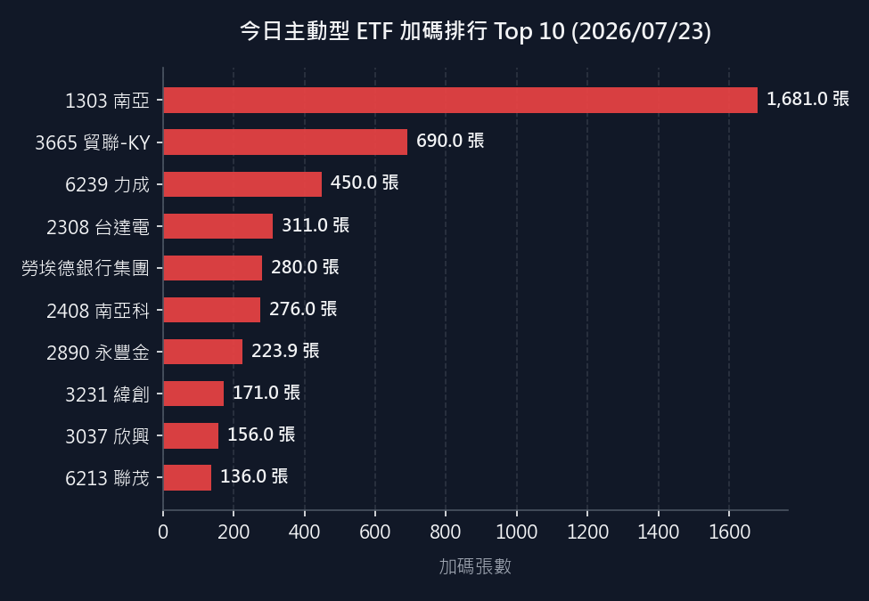
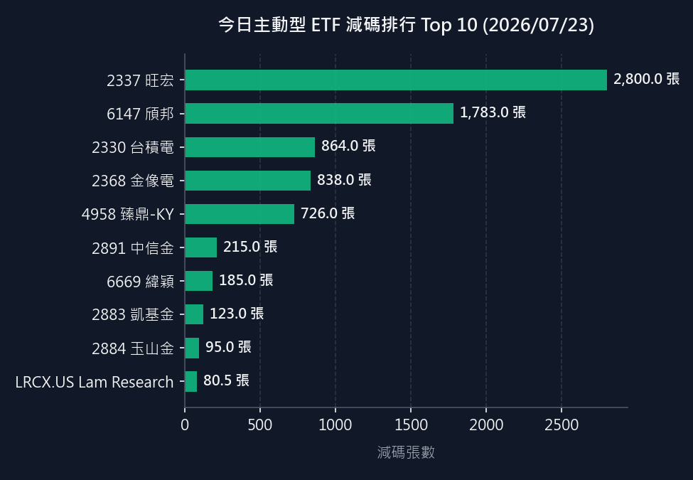

# 主動型 ETF 持股變動

資料來源：`主動型ETF持股明細.xlsx` 最近兩個日期分頁。

比較區間：`20260722` → `20260723`

## 今日加減碼視覺化排行

| 今日加碼 Top 10 | 今日減碼 Top 10 |
| :---: | :---: |
|  |  |

| ETF | 新增 | 刪除 | 比例變動 |
| :-- | --: | --: | --: |
| 00400A | 0 | 0 | 43 |
| 00401A | 0 | 0 | 55 |
| 00402A | 0 | 0 | 38 |
| 00403A | 0 | 0 | 36 |
| 00404A | 0 | 0 | 0 |
| 00405A | 0 | 1 | 32 |
| 00407A | 0 | 0 | 32 |
| 00408A | 1 | 0 | 37 |
| 00980A | 0 | 0 | 45 |
| 00980D | 0 | 0 | 12 |
| 00981A | 0 | 0 | 26 |
| 00982A | 0 | 0 | 35 |
| 00983A | 3 | 0 | 34 |
| 00983D | 0 | 0 | 11 |
| 00984A | 0 | 0 | 76 |
| 00985A | 0 | 0 | 38 |
| 00986A | 0 | 0 | 29 |
| 00987A | 0 | 0 | 0 |
| 00988A | 0 | 0 | 40 |
| 00989A | 1 | 0 | 43 |
| 00990A | 2 | 2 | 48 |
| 00991A | 0 | 0 | 25 |
| 00992A | 0 | 0 | 32 |
| 00993A | 0 | 0 | 42 |
| 00994A | 0 | 0 | 30 |
| 00995A | 0 | 1 | 43 |
| 00996A | 2 | 0 | 38 |
| 00997A | 2 | 0 | 44 |
| 00998A | 0 | 0 | 32 |
| 00999A | 0 | 0 | 56 |

## 00400A

### 新增持股

- 無

### 刪除持股

- 無

### 投資比例變動

- 1303 南亞：0.48% → 0.45%（-0.03）
- 1590 亞德客-KY：1.03% → 1.00%（-0.03）
- 2059 川湖：3.41% → 3.43%（+0.02）
- 2303 聯電：1.04% → 1.03%（-0.01）
- 2308 台達電：3.12% → 3.10%（-0.02）
- 2313 華通：0.86% → 0.88%（+0.02）
- 2317 鴻海：0.90% → 0.92%（+0.02）
- 2327 國巨*：1.52% → 1.50%（-0.02）
- 2330 台積電：8.54% → 8.53%（-0.01）
- 2345 智邦：1.93% → 1.95%（+0.02）
- 2357 華碩：1.35% → 1.37%（+0.02）
- 2360 致茂：5.25% → 5.31%（+0.06）
- 2376 技嘉：1.19% → 1.21%（+0.02）
- 2382 廣達：0.81% → 0.83%（+0.02）
- 2383 台光電：5.54% → 5.49%（-0.05）
- 2404 漢唐：0.55% → 0.54%（-0.01）
- 2408 南亞科：2.02% → 1.92%（-0.10）
- 2454 聯發科：6.30% → 6.31%（+0.01）
- 3008 大立光：0.91% → 0.94%（+0.03）
- 3017 奇鋐：3.85% → 4.13%（+0.28）
- 3036 文曄：1.10% → 1.15%（+0.05）
- 3037 欣興：4.21% → 4.43%（+0.22）
- 3044 健鼎：1.60% → 1.55%（-0.05）
- 3090 日電貿：0.40% → 0.38%（-0.02）
- 3231 緯創：0.85% → 0.90%（+0.05）
- 3374 精材：0.42% → 0.40%（-0.02）
- 3443 創意：3.09% → 3.08%（-0.01）
- 3653 健策：0.82% → 0.87%（+0.05）
- 3665 貿聯-KY：2.78% → 3.00%（+0.22）
- 3711 日月光投控：1.48% → 1.46%（-0.02）
- 4958 臻鼎-KY：1.13% → 1.02%（-0.11）
- 5347 世界：0.86% → 0.84%（-0.02）
- 5434 崇越：0.42% → 0.41%（-0.01）
- 6147 頎邦：0.87% → 0.80%（-0.07）
- 6187 萬潤：2.34% → 2.26%（-0.08）
- 6223 旺矽：3.81% → 3.96%（+0.15）
- 6442 光聖：0.40% → 0.58%（+0.18）
- 6488 環球晶：3.93% → 3.54%（-0.39）
- 6505 台塑化：0.95% → 1.03%（+0.08）
- 6510 精測：1.33% → 1.35%（+0.02）
- 6669 緯穎：4.15% → 4.11%（-0.04）
- 6715 嘉基：0.20% → 0.22%（+0.02）
- 8046 南電：1.26% → 1.18%（-0.08）

## 00401A

### 新增持股

- 無

### 刪除持股

- 無

### 投資比例變動

- 2303 聯電：1.12% → 1.11%（-0.01）
- 2308 台達電：4.22% → 4.18%（-0.04）
- 2313 華通：1.18% → 1.17%（-0.01）
- 2317 鴻海：0.71% → 0.72%（+0.01）
- 2330 台積電：9.00% → 8.66%（-0.34）
- 2345 智邦：2.70% → 2.74%（+0.04）
- 2357 華碩：1.39% → 1.41%（+0.02）
- 2360 致茂：1.99% → 2.05%（+0.06）
- 2368 金像電：0.41% → 0.37%（-0.04）
- 2379 瑞昱：2.12% → 2.02%（-0.10）
- 2382 廣達：2.11% → 2.12%（+0.01）
- 2383 台光電：1.96% → 1.95%（-0.01）
- 2412 中華電：0.99% → 0.95%（-0.04）
- 2449 京元電子：1.18% → 1.17%（-0.01）
- 2454 聯發科：6.75% → 7.30%（+0.55）
- 2455 全新：0.41% → 0.50%（+0.09）
- 2603 長榮：1.12% → 1.09%（-0.03）
- 2881 富邦金：1.81% → 1.82%（+0.01）
- 2882 國泰金：1.17% → 1.15%（-0.02）
- 2883 凱基金：2.09% → 2.10%（+0.01）
- 2884 玉山金：2.01% → 1.87%（-0.14）
- 2886 兆豐金：1.66% → 1.59%（-0.07）
- 2887 台新新光金：1.14% → 1.09%（-0.05）
- 2890 永豐金：0.32% → 0.31%（-0.01）
- 2891 中信金：1.96% → 1.92%（-0.04）
- 3008 大立光：1.78% → 1.90%（+0.12）
- 3034 聯詠：0.74% → 0.76%（+0.02）
- 3037 欣興：0.63% → 0.70%（+0.07）
- 3044 健鼎：0.43% → 0.44%（+0.01）
- 3131 弘塑：0.55% → 0.58%（+0.03）
- 3167 大量：0.54% → 0.52%（-0.02）
- 3231 緯創：0.33% → 0.39%（+0.06）
- 3491 昇達科：1.25% → 1.32%（+0.07）
- 3529 力旺：0.60% → 0.66%（+0.06）
- 3653 健策：1.20% → 1.17%（-0.03）
- 3711 日月光投控：2.63% → 2.61%（-0.02）
- 4904 遠傳：0.92% → 0.90%（-0.02）
- 4938 和碩：0.33% → 0.35%（+0.02）
- 4958 臻鼎-KY：2.32% → 2.24%（-0.08）
- 4991 環宇-KY：0.54% → 0.63%（+0.09）
- 5274 信驊：0.96% → 1.08%（+0.12）
- 5347 世界：1.50% → 1.67%（+0.17）
- 5904 寶雅：0.59% → 0.56%（-0.03）
- 6223 旺矽：2.45% → 2.47%（+0.02）
- 6285 啟碁：2.06% → 2.10%（+0.04）
- 6415 矽力*-KY：0.72% → 0.71%（-0.01）
- 6510 精測：0.65% → 0.70%（+0.05）
- 6515 穎崴：0.62% → 0.63%（+0.01）
- 6531 愛普*：1.31% → 1.33%（+0.02）
- 6669 緯穎：2.39% → 2.51%（+0.12）
- 6944 兆聯實業：0.55% → 0.56%（+0.01）
- 7769 鴻勁：2.90% → 2.75%（-0.15）
- 7828 創新服務：1.97% → 2.04%（+0.07）
- 8021 尖點：0.27% → 0.29%（+0.02）
- 8464 億豐：1.26% → 1.23%（-0.03）

## 00402A

### 新增持股

- 無

### 刪除持股

- 無

### 投資比例變動

- AAPL.US Apple：7.82% → 7.85%（+0.03）
- ADI.US Analog Devices：1.81% → 1.85%（+0.04）
- AMD.US AMD：5.93% → 6.07%（+0.14）
- AMZN.US Amazon：3.95% → 3.94%（-0.01）
- ANET.US Arista Networks：0.72% → 0.73%（+0.01）
- ARM.US Arm：1.09% → 1.08%（-0.01）
- ASML.US ASML Holding：1.68% → 1.69%（+0.01）
- AVGO.US Broadcom：2.41% → 2.50%（+0.09）
- AXON.US Axon Enterprise：1.11% → 1.08%（-0.03）
- CDNS.US Cadence Design Systems：1.80% → 1.78%（-0.02）
- CIEN.US Ciena：1.21% → 1.19%（-0.02）
- CLS.US Celestica：0.92% → 0.91%（-0.01）
- COHR.US Coherent：1.60% → 1.59%（-0.01）
- DASH.US DoorDash：0.25% → 0.24%（-0.01）
- GOOG.US Alphabet - Class C Capital Stock：3.33% → 3.32%（-0.01）
- GOOGL.US Alphabet - Class A Common Stock：3.27% → 3.26%（-0.01）
- INTC.US Intel：1.34% → 1.32%（-0.02）
- KLAC.US KLA：2.36% → 2.35%（-0.01）
- MCHP.US Microchip Technology：1.48% → 1.53%（+0.05）
- META.US Meta：2.99% → 2.94%（-0.05）
- MRVL.US Marvell：1.45% → 1.48%（+0.03）
- MSFT.US Microsoft：3.36% → 3.33%（-0.03）
- MU.US Micron：6.79% → 6.77%（-0.02）
- NFLX.US Netflix：0.94% → 0.74%（-0.20）
- NOW.US ServiceNow：0.21% → 0.20%（-0.01）
- NVDA.US NVIDIA：8.51% → 8.49%（-0.02）
- NXPI.US NXP Semiconductors：1.26% → 1.30%（+0.04）
- PANW.US Palo Alto：3.14% → 3.10%（-0.04）
- PLTR.US Palantir Technologies：1.12% → 1.06%（-0.06）
- SHOP.US Shopify：0.41% → 0.40%（-0.01）
- SIMO.US Silicon Motion：0.81% → 0.83%（+0.02）
- SKHY.US SK hynix：1.06% → 1.03%（-0.03）
- SPCX.US SpaceX：0.62% → 0.58%（-0.04）
- SPOT.US Spotify：0.26% → 0.25%（-0.01）
- STX.US Seagate：1.50% → 1.54%（+0.04）
- TSM.US TSMC(ADR)：1.65% → 1.66%（+0.01）
- TXN.US Texas Instruments：2.59% → 2.64%（+0.05）
- WDC.US Western Digital：2.96% → 3.04%（+0.08）

## 00403A

### 新增持股

- 無

### 刪除持股

- 無

### 投資比例變動

- 1303 南亞：1.32% → 1.25%（-0.07）
- 2303 聯電：6.25% → 6.24%（-0.01）
- 2308 台達電：3.25% → 3.39%（+0.14）
- 2317 鴻海：0.48% → 0.49%（+0.01）
- 2327 國巨*：2.50% → 2.48%（-0.02）
- 2330 台積電：17.34% → 16.55%（-0.79）
- 2337 旺宏：0.80% → 0.77%（-0.03）
- 2344 華邦電：4.05% → 3.82%（-0.23）
- 2345 智邦：3.06% → 3.12%（+0.06）
- 2360 致茂：0.96% → 0.97%（+0.01）
- 2383 台光電：4.04% → 4.02%（-0.02）
- 2404 漢唐：0.13% → 0.12%（-0.01）
- 2454 聯發科：3.94% → 3.98%（+0.04）
- 2455 全新：0.06% → 0.07%（+0.01）
- 3008 大立光：0.14% → 0.15%（+0.01）
- 3017 奇鋐：4.63% → 4.99%（+0.36）
- 3189 景碩：1.52% → 1.50%（-0.02）
- 3211 順達：0.47% → 0.46%（-0.01）
- 3533 嘉澤：1.48% → 1.50%（+0.02）
- 3653 健策：1.81% → 2.05%（+0.24）
- 3665 貿聯-KY：0.61% → 0.81%（+0.20）
- 3711 日月光投控：2.49% → 2.46%（-0.03）
- 4958 臻鼎-KY：2.30% → 1.85%（-0.45）
- 5274 信驊：1.01% → 1.15%（+0.14）
- 6223 旺矽：3.55% → 3.71%（+0.16）
- 6239 力成：0.33% → 0.41%（+0.08）
- 6274 台燿：1.35% → 1.33%（-0.02）
- 6415 矽力*-KY：0.26% → 0.25%（-0.01）
- 6442 光聖：0.18% → 0.19%（+0.01）
- 6488 環球晶：1.73% → 1.56%（-0.17）
- 6515 穎崴：0.57% → 0.58%（+0.01）
- 6669 緯穎：2.57% → 1.95%（-0.62）
- 6805 富世達：0.51% → 0.60%（+0.09）
- 7769 鴻勁：1.14% → 1.15%（+0.01）
- 8046 南電：1.35% → 1.28%（-0.07）
- 8358 金居：0.43% → 0.42%（-0.01）

## 00404A

### 新增持股

- 無

### 刪除持股

- 無

### 投資比例變動

- 無

## 00405A

### 新增持股

- 無

### 刪除持股

- 2337 旺宏（1.38%，2800 張）

### 投資比例變動

- 2059 川湖：1.25% → 1.26%（+0.01）
- 2327 國巨*：3.26% → 3.23%（-0.03）
- 2344 華邦電：3.69% → 3.47%（-0.22）
- 2345 智邦：4.42% → 4.50%（+0.08）
- 2383 台光電：2.94% → 2.92%（-0.02）
- 2408 南亞科：1.38% → 1.32%（-0.06）
- 2449 京元電子：0.86% → 0.83%（-0.03）
- 2454 聯發科：6.75% → 6.80%（+0.05）
- 3017 奇鋐：5.74% → 6.18%（+0.44）
- 3026 禾伸堂：1.41% → 1.48%（+0.07）
- 3037 欣興：5.20% → 5.14%（-0.06）
- 3081 聯亞：0.96% → 1.06%（+0.10）
- 3105 穩懋：1.59% → 1.61%（+0.02）
- 3131 弘塑：3.60% → 3.63%（+0.03）
- 3163 波若威：0.20% → 0.21%（+0.01）
- 3443 創意：5.33% → 5.35%（+0.02）
- 3583 辛耘：1.69% → 1.68%（-0.01）
- 3653 健策：2.30% → 2.44%（+0.14）
- 3665 貿聯-KY：0.89% → 4.13%（+3.24）
- 6187 萬潤：2.13% → 2.07%（-0.06）
- 6223 旺矽：5.99% → 6.24%（+0.25）
- 6274 台燿：1.42% → 1.49%（+0.07）
- 6442 光聖：0.35% → 0.36%（+0.01）
- 6488 環球晶：5.26% → 4.75%（-0.51）
- 6510 精測：1.34% → 1.36%（+0.02）
- 6515 穎崴：0.55% → 0.56%（+0.01）
- 6526 達發：0.32% → 0.31%（-0.01）
- 7734 印能科技：1.82% → 1.91%（+0.09）
- 7769 鴻勁：2.34% → 2.36%（+0.02）
- 8028 昇陽半導體：1.00% → 0.98%（-0.02）
- 8046 南電：4.96% → 4.67%（-0.29）
- 8210 勤誠：0.92% → 0.94%（+0.02）

## 00407A

### 新增持股

- 無

### 刪除持股

- 無

### 投資比例變動

- 1303 南亞：0.65% → 0.62%（-0.03）
- 1590 亞德客-KY：2.17% → 2.13%（-0.04）
- 2059 川湖：2.04% → 2.06%（+0.02）
- 2327 國巨*：2.70% → 2.68%（-0.02）
- 2330 台積電：8.96% → 8.98%（+0.02）
- 2344 華邦電：1.75% → 1.65%（-0.10）
- 2345 智邦：3.14% → 3.20%（+0.06）
- 2360 致茂：1.94% → 1.97%（+0.03）
- 2376 技嘉：0.75% → 0.77%（+0.02）
- 2383 台光電：3.83% → 3.81%（-0.02）
- 2395 研華：1.82% → 1.83%（+0.01）
- 2408 南亞科：1.81% → 1.73%（-0.08）
- 2412 中華電：1.71% → 1.70%（-0.01）
- 2454 聯發科：6.58% → 6.63%（+0.05）
- 3017 奇鋐：3.26% → 3.51%（+0.25）
- 3037 欣興：3.94% → 3.89%（-0.05）
- 3529 力旺：2.01% → 1.93%（-0.08）
- 3533 嘉澤：1.03% → 1.05%（+0.02）
- 3665 貿聯-KY：2.80% → 3.02%（+0.22）
- 3711 日月光投控：2.60% → 2.57%（-0.03）
- 4958 臻鼎-KY：2.17% → 1.96%（-0.21）
- 5536 聖暉*：1.91% → 1.90%（-0.01）
- 6223 旺矽：2.35% → 2.45%（+0.10）
- 6274 台燿：2.54% → 2.50%（-0.04）
- 6415 矽力*-KY：0.40% → 0.39%（-0.01）
- 6446 藥華藥：2.28% → 2.22%（-0.06）
- 6515 穎崴：1.38% → 1.40%（+0.02）
- 6531 愛普*：1.54% → 1.53%（-0.01）
- 6669 緯穎：3.95% → 3.93%（-0.02）
- 6805 富世達：1.79% → 1.87%（+0.08）
- 8046 南電：2.63% → 2.47%（-0.16）
- 8210 勤誠：1.81% → 1.85%（+0.04）

## 00408A

### 新增持股

- 6223 旺矽（0.55%，1.5 張）

### 刪除持股

- 無

### 投資比例變動

- 1303 南亞：0.86% → 0.82%（-0.04）
- 1477 聚陽：1.52% → 1.14%（-0.38）
- 2059 川湖：1.44% → 1.46%（+0.02）
- 2317 鴻海：2.23% → 2.28%（+0.05）
- 2330 台積電：5.37% → 5.38%（+0.01）
- 2345 智邦：2.16% → 2.89%（+0.73）
- 2356 英業達：1.20% → 1.23%（+0.03）
- 2357 華碩：1.92% → 1.96%（+0.04）
- 2360 致茂：2.39% → 2.42%（+0.03）
- 2368 金像電：2.11% → 2.12%（+0.01）
- 2376 技嘉：2.16% → 2.20%（+0.04）
- 2382 廣達：1.19% → 1.21%（+0.02）
- 2383 台光電：3.33% → 3.32%（-0.01）
- 2395 研華：1.94% → 1.95%（+0.01）
- 2404 漢唐：1.74% → 1.72%（-0.02）
- 2408 南亞科：0.53% → 0.50%（-0.03）
- 2454 聯發科：4.09% → 4.13%（+0.04）
- 2603 長榮：1.83% → 1.81%（-0.02）
- 2880 華南金：1.58% → 1.59%（+0.01）
- 2891 中信金：1.51% → 0.90%（-0.61）
- 2912 統一超：2.41% → 2.38%（-0.03）
- 3017 奇鋐：1.34% → 2.31%（+0.97）
- 3037 欣興：2.79% → 2.76%（-0.03）
- 3045 台灣大：3.26% → 3.25%（-0.01）
- 3231 緯創：2.81% → 2.98%（+0.17）
- 3665 貿聯-KY：1.25% → 1.89%（+0.64）
- 3702 大聯大：1.81% → 1.87%（+0.06）
- 5347 世界：0.51% → 0.50%（-0.01）
- 5434 崇越：2.60% → 2.58%（-0.02）
- 5876 上海商銀：2.18% → 2.17%（-0.01）
- 5904 寶雅：1.53% → 1.54%（+0.01）
- 6257 矽格：1.06% → 1.07%（+0.01）
- 6274 台燿：1.52% → 1.50%（-0.02）
- 6488 環球晶：0.59% → 0.53%（-0.06）
- 6669 緯穎：3.57% → 3.56%（-0.01）
- 7769 鴻勁：1.70% → 1.72%（+0.02）
- 8046 南電：2.78% → 2.62%（-0.16）

## 00980A

### 新增持股

- 無

### 刪除持股

- 無

### 投資比例變動

- 1303 南亞：0.96% → 1.46%（+0.50）
- 2059 川湖：5.49% → 4.56%（-0.93）
- 2308 台達電：4.78% → 4.75%（-0.03）
- 2317 鴻海：2.24% → 2.28%（+0.04）
- 2327 國巨*：1.49% → 1.47%（-0.02）
- 2330 台積電：9.35% → 9.31%（-0.04）
- 2344 華邦電：1.21% → 1.13%（-0.08）
- 2345 智邦：2.06% → 2.09%（+0.03）
- 2360 致茂：1.87% → 1.88%（+0.01）
- 2368 金像電：2.27% → 2.26%（-0.01）
- 2376 技嘉：1.18% → 1.35%（+0.17）
- 2382 廣達：1.31% → 1.33%（+0.02）
- 2383 台光電：4.76% → 4.70%（-0.06）
- 2408 南亞科：1.88% → 2.31%（+0.43）
- 2454 聯發科：6.36% → 6.37%（+0.01）
- 2884 玉山金：0.86% → 0.84%（-0.02）
- 2891 中信金：1.28% → 1.27%（-0.01）
- 3008 大立光：0.86% → 0.89%（+0.03）
- 3017 奇鋐：1.82% → 1.95%（+0.13）
- 3026 禾伸堂：0.55% → 0.57%（+0.02）
- 3036 文曄：1.30% → 1.35%（+0.05）
- 3037 欣興：3.13% → 3.08%（-0.05）
- 3044 健鼎：0.42% → 0.41%（-0.01）
- 3081 聯亞：2.43% → 2.66%（+0.23）
- 3189 景碩：0.68% → 0.88%（+0.20）
- 3231 緯創：0.71% → 0.92%（+0.21）
- 3293 鈊象：0.83% → 0.98%（+0.15）
- 3443 創意：1.88% → 1.58%（-0.30）
- 3529 力旺：0.96% → 0.92%（-0.04）
- 3653 健策：2.15% → 2.27%（+0.12）
- 3665 貿聯-KY：0.42% → 0.45%（+0.03）
- 3711 日月光投控：1.61% → 1.59%（-0.02）
- 4958 臻鼎-KY：1.09% → 0.98%（-0.11）
- 5274 信驊：1.36% → 1.55%（+0.19）
- 6213 聯茂：0.42% → 0.68%（+0.26）
- 6223 旺矽：2.80% → 2.90%（+0.10）
- 6274 台燿：1.08% → 1.34%（+0.26）
- 6515 穎崴：2.20% → 2.22%（+0.02）
- 6669 緯穎：1.42% → 1.57%（+0.15）
- 6805 富世達：0.46% → 0.48%（+0.02）
- 6831 邁科：0.32% → 0.34%（+0.02）
- 7769 鴻勁：3.15% → 2.88%（-0.27）
- 8046 南電：1.76% → 1.53%（-0.23）
- 8210 勤誠：0.93% → 0.95%（+0.02）
- 8996 高力：1.47% → 1.19%（-0.28）

## 00980D

### 新增持股

- 無

### 刪除持股

- 無

### 投資比例變動

- AMC GLOBAL MEDIA INC SER REGS (REG) (REG S) 10.5% 15JUL2032：0.72% → 0.71%（-0.01）
- APA CORP 6.750000 % 15-FEB-2055：0.36% → 0.37%（+0.01）
- BANCO SANTANDER SA 6.921% 08AUG2033：0.34% → 0.35%（+0.01）
- BOSTON PROPERTIES LP (REG) 6.750000 % 01-DEC-2027：0.46% → 0.47%（+0.01）
- DAIMLER FINANCE NA LLC REG 8.5% 18JAN2031：0.64% → 0.65%（+0.01）
- GLOBAL AUTO HO/AAG FH UK SER REGS (REG S) 11.5% 15AUG2029：0.37% → 0.38%（+0.01）
- HERTZ CORP/THE SER REGS (REG S) 12.625% 15JUL2029：0.31% → 0.32%（+0.01）
- KELLANOVA SER B (REG) 7.450000 % 01APR2031：0.57% → 0.58%（+0.01）
- OCCIDENTAL PETROLEUM COR (REG) 7.5% 01MAY2031：0.33% → 0.34%（+0.01）
- STAPLES INC SER REGS (REG S) 10.75% 01SEP2029：0.45% → 0.46%（+0.01）
- US 10YR ULTRA FUT SEP26 21-SEP-2026：-2.85% → -2.84%（+0.01）
- US LONG BOND(CBT) SEP26 21-SEP-2026：5.50% → 5.49%（-0.01）

## 00981A

### 新增持股

- 無

### 刪除持股

- 無

### 投資比例變動

- 2002 中鋼：0.03% → 0.04%（+0.01）
- 2303 聯電：4.32% → 4.28%（-0.04）
- 2308 台達電：3.76% → 3.74%（-0.02）
- 2327 國巨*：6.34% → 6.24%（-0.10）
- 2330 台積電：10.21% → 10.17%（-0.04）
- 2345 智邦：5.20% → 5.26%（+0.06）
- 2368 金像電：2.81% → 2.51%（-0.30）
- 2383 台光電：8.57% → 8.47%（-0.10）
- 2408 南亞科：0.15% → 0.14%（-0.01）
- 2449 京元電子：0.75% → 0.72%（-0.03）
- 3017 奇鋐：4.41% → 4.73%（+0.32）
- 3037 欣興：5.53% → 5.43%（-0.10）
- 3653 健策：2.85% → 3.00%（+0.15）
- 3665 貿聯-KY：3.67% → 3.95%（+0.28）
- 3711 日月光投控：3.85% → 3.79%（-0.06）
- 4958 臻鼎-KY：0.34% → 0.30%（-0.04）
- 5274 信驊：2.50% → 2.49%（-0.01）
- 6147 頎邦：0.36% → 0.30%（-0.06）
- 6187 萬潤：0.51% → 0.49%（-0.02）
- 6223 旺矽：5.27% → 5.45%（+0.18）
- 6271 同欣電：0.22% → 0.21%（-0.01）
- 6274 台燿：2.51% → 2.46%（-0.05）
- 6669 緯穎：4.78% → 4.72%（-0.06）
- 6805 富世達：0.94% → 1.00%（+0.06）
- 8046 南電：4.46% → 4.18%（-0.28）
- 8210 勤誠：0.94% → 0.96%（+0.02）

## 00982A

### 新增持股

- 無

### 刪除持股

- 無

### 投資比例變動

- 1785 光洋科：0.99% → 0.97%（-0.02）
- 2059 川湖：2.98% → 3.01%（+0.03）
- 2303 聯電：2.50% → 2.49%（-0.01）
- 2316 楠梓電：1.11% → 1.13%（+0.02）
- 2327 國巨*：1.18% → 1.17%（-0.01）
- 2330 台積電：9.36% → 9.40%（+0.04）
- 2345 智邦：3.68% → 3.75%（+0.07）
- 2351 順德：0.58% → 0.56%（-0.02）
- 2360 致茂：3.53% → 3.58%（+0.05）
- 2376 技嘉：0.73% → 0.75%（+0.02）
- 2377 微星：1.76% → 1.73%（-0.03）
- 2383 台光電：3.37% → 3.36%（-0.01）
- 2451 創見：0.25% → 0.26%（+0.01）
- 2454 聯發科：6.63% → 6.69%（+0.06）
- 2467 志聖：1.59% → 1.57%（-0.02）
- 2472 立隆電：1.33% → 1.31%（-0.02）
- 3008 大立光：1.93% → 2.00%（+0.07）
- 3017 奇鋐：1.83% → 1.97%（+0.14）
- 3036 文曄：0.91% → 0.96%（+0.05）
- 3105 穩懋：3.01% → 3.06%（+0.05）
- 3264 欣銓：2.06% → 2.07%（+0.01）
- 3529 力旺：0.48% → 0.46%（-0.02）
- 3583 辛耘：1.72% → 1.70%（-0.02）
- 3702 大聯大：1.30% → 1.34%（+0.04）
- 3711 日月光投控：1.32% → 1.30%（-0.02）
- 4958 臻鼎-KY：3.52% → 3.19%（-0.33）
- 5536 聖暉*：8.98% → 8.96%（-0.02）
- 6139 亞翔：5.19% → 5.28%（+0.09）
- 6147 頎邦：0.91% → 0.42%（-0.49）
- 6223 旺矽：3.65% → 3.81%（+0.16）
- 6257 矽格：2.09% → 2.12%（+0.03）
- 6274 台燿：1.20% → 1.19%（-0.01）
- 6488 環球晶：2.82% → 2.55%（-0.27）
- 6531 愛普*：2.01% → 2.03%（+0.02）
- 7769 鴻勁：1.18% → 1.19%（+0.01）

## 00983A

### 新增持股

- BLSH.US Bullish（0.45%，6.819 張）
- BMNR.US BitMine（0.51%，10.23 張）
- X-Energy Inc（0.11%，2.406 張）

### 刪除持股

- 無

### 投資比例變動

- AMD.US AMD：7.08% → 7.35%（+0.27）
- AMZN.US Amazon：3.18% → 3.22%（+0.04）
- AVGO.US Broadcom：1.86% → 1.95%（+0.09）
- BEAM.US Beam Therapeutics：2.55% → 2.54%（-0.01）
- CBRS.US Cerebras：0.65% → 0.77%（+0.12）
- COIN.US Coinbase：1.00% → 0.97%（-0.03）
- CRCL.US Circle：0.36% → 0.34%（-0.02）
- CRSP.US CRISPR Therapeutics：3.82% → 3.83%（+0.01）
- CRWV.US CoreWeave：0.22% → 0.71%（+0.49）
- DE.US Deere：0.99% → 1.05%（+0.06）
- GOOG.US Alphabet - Class C Capital Stock：1.25% → 1.26%（+0.01）
- GOOGL.US Alphabet - Class A Common Stock：1.65% → 1.66%（+0.01）
- HOOD.US Robinhood Markets：4.67% → 4.69%（+0.02）
- ILMN.US Illumina：3.64% → 3.68%（+0.04）
- LLY.US Eli Lilly：1.91% → 1.93%（+0.02）
- META.US Meta：1.52% → 1.51%（-0.01）
- NTLA.US Intellia Therapeutics：1.51% → 1.50%（-0.01）
- NTRA.US Natera：2.80% → 2.83%（+0.03）
- NVDA.US NVIDIA：0.83% → 0.87%（+0.04）
- PLTR.US Palantir Technologies：0.63% → 0.60%（-0.03）
- RBLX.US Roblox：3.24% → 3.13%（-0.11）
- SHOP.US Shopify：6.10% → 6.00%（-0.10）
- SNOW.US Snowflake：0.83% → 0.94%（+0.11）
- SOFI.US SoFi Technologies：0.67% → 0.66%（-0.01）
- SPCX.US SpaceX：4.25% → 4.05%（-0.20）
- TEM.US Tempus：4.93% → 4.34%（-0.59）
- TER.US Teradyne：0.61% → 0.62%（+0.01）
- TSLA.US Tesla：8.51% → 8.60%（+0.09）
- TSM.US TSMC(ADR)：3.52% → 3.57%（+0.05）
- TWST.US Twist Bioscience：4.46% → 4.48%（+0.02）
- TXG.US 10x Genomics：5.52% → 5.63%（+0.11）
- VCYT.US Veracyte：1.68% → 1.67%（-0.01）
- WGS.US GeneDx：1.28% → 1.33%（+0.05）
- XYZ.US Block：2.25% → 2.22%（-0.03）

## 00983D

### 新增持股

- 無

### 刪除持股

- 無

### 投資比例變動

- C 8 1/8 07/15/39：2.00% → 1.99%（-0.01）
- CYH 10 7/8 01/15/32：1.52% → 1.53%（+0.01）
- ET 6 1/2 02/01/42：0.17% → 0.16%（-0.01）
- HAL 7.45 09/15/39：1.86% → 1.87%（+0.01）
- HPE 6.35 10/15/45：1.02% → 1.01%（-0.01）
- KHC 6 7/8 01/26/39：1.03% → 1.02%（-0.01）
- LOW 6.65 09/15/37：0.86% → 0.87%（+0.01）
- LQDW.US iShares Investment Grade Corpora：7.49% → 7.50%（+0.01）
- ORCL 6.9 11/09/52：1.13% → 1.12%（-0.01）
- PFE 7.2 03/15/39：1.47% → 1.46%（-0.01）
- TRPCN 7 5/8 01/15/39：1.74% → 1.73%（-0.01）

## 00984A

### 新增持股

- 無

### 刪除持股

- 無

### 投資比例變動

- 1102 亞泥：1.28% → 1.30%（+0.02）
- 1216 統一：1.92% → 1.95%（+0.03）
- 1229 聯華：0.27% → 0.29%（+0.02）
- 1303 南亞：0.73% → 0.69%（-0.04）
- 1326 台化：0.75% → 0.77%（+0.02）
- 1409 新纖：0.54% → 0.53%（-0.01）
- 1513 中興電：0.26% → 0.25%（-0.01）
- 1795 美時：0.39% → 0.38%（-0.01）
- 2059 川湖：0.58% → 0.59%（+0.01）
- 2105 正新：0.40% → 0.41%（+0.01）
- 2204 中華：0.27% → 0.26%（-0.01）
- 2206 三陽工業：0.38% → 0.39%（+0.01）
- 2303 聯電：2.28% → 2.29%（+0.01）
- 2327 國巨*：1.02% → 1.01%（-0.01）
- 2330 台積電：2.92% → 3.04%（+0.12）
- 2337 旺宏：0.50% → 0.48%（-0.02）
- 2345 智邦：0.37% → 0.38%（+0.01）
- 2347 聯強：0.98% → 0.99%（+0.01）
- 2357 華碩：2.82% → 2.89%（+0.07）
- 2360 致茂：0.68% → 0.69%（+0.01）
- 2371 大同：0.37% → 0.38%（+0.01）
- 2377 微星：1.02% → 1.01%（-0.01）
- 2382 廣達：2.26% → 2.32%（+0.06）
- 2412 中華電：2.62% → 2.63%（+0.01）
- 2454 聯發科：1.42% → 1.44%（+0.02）
- 2458 義隆：0.36% → 0.35%（-0.01）
- 2472 立隆電：0.36% → 0.35%（-0.01）
- 2478 大毅：0.38% → 0.35%（-0.03）
- 2481 強茂：0.49% → 0.46%（-0.03）
- 2618 長榮航：1.46% → 1.42%（-0.04）
- 2633 台灣高鐵：1.40% → 1.41%（+0.01）
- 2634 漢翔：0.44% → 0.43%（-0.01）
- 2645 長榮航太：0.29% → 0.30%（+0.01）
- 2881 富邦金：2.57% → 2.63%（+0.06）
- 2882 國泰金：0.28% → 0.29%（+0.01）
- 2885 元大金：0.39% → 0.40%（+0.01）
- 2897 王道銀行：0.27% → 0.26%（-0.01）
- 2912 統一超：1.49% → 1.48%（-0.01）
- 3008 大立光：0.66% → 0.68%（+0.02）
- 3026 禾伸堂：0.89% → 0.94%（+0.05）
- 3034 聯詠：2.01% → 2.04%（+0.03）
- 3044 健鼎：0.32% → 0.31%（-0.01）
- 3090 日電貿：0.33% → 0.31%（-0.02）
- 3189 景碩：1.35% → 1.34%（-0.01）
- 3264 欣銓：0.24% → 0.25%（+0.01）
- 3532 台勝科：0.74% → 0.68%（-0.06）
- 3596 智易：0.37% → 0.38%（+0.01）
- 3702 大聯大：1.06% → 1.10%（+0.04）
- 3711 日月光投控：1.16% → 1.15%（-0.01）
- 4904 遠傳：1.80% → 1.81%（+0.01）
- 4919 新唐：0.48% → 0.47%（-0.01）
- 4938 和碩：0.39% → 0.40%（+0.01）
- 4958 臻鼎-KY：1.86% → 1.69%（-0.17）
- 5483 中美晶：0.50% → 0.46%（-0.04）
- 5871 中租-KY：1.19% → 1.17%（-0.02）
- 5876 上海商銀：1.28% → 1.29%（+0.01）
- 6139 亞翔：0.52% → 0.53%（+0.01）
- 6147 頎邦：0.51% → 0.48%（-0.03）
- 6182 合晶：0.61% → 0.60%（-0.01）
- 6213 聯茂：1.15% → 1.09%（-0.06）
- 6223 旺矽：1.11% → 1.16%（+0.05）
- 6274 台燿：1.74% → 1.72%（-0.02）
- 6285 啟碁：0.57% → 0.59%（+0.02）
- 6446 藥華藥：1.98% → 1.94%（-0.04）
- 6531 愛普*：1.17% → 1.18%（+0.01）
- 6831 邁科：0.41% → 0.44%（+0.03）
- 6890 來億-KY：0.25% → 0.24%（-0.01）
- 7769 鴻勁：0.59% → 0.60%（+0.01）
- 8021 尖點：1.12% → 1.10%（-0.02）
- 8046 南電：1.23% → 1.17%（-0.06）
- 8064 東捷：0.46% → 0.44%（-0.02）
- 8210 勤誠：0.28% → 0.29%（+0.01）
- 8261 富鼎：0.72% → 0.67%（-0.05）
- 8358 金居：1.02% → 1.01%（-0.01）
- 8415 大國鋼：0.26% → 0.27%（+0.01）
- 9958 世紀鋼：0.27% → 0.25%（-0.02）

## 00985A

### 新增持股

- 無

### 刪除持股

- 無

### 投資比例變動

- 1802 台玻：0.53% → 0.52%（-0.01）
- 2027 大成鋼：3.33% → 3.39%（+0.06）
- 2059 川湖：3.32% → 3.36%（+0.04）
- 2327 國巨*：3.58% → 3.55%（-0.03）
- 2330 台積電：21.66% → 18.18%（-3.48）
- 2344 華邦電：1.45% → 1.37%（-0.08）
- 2345 智邦：2.10% → 2.14%（+0.04）
- 2360 致茂：1.19% → 1.21%（+0.02）
- 2376 技嘉：4.06% → 4.14%（+0.08）
- 2383 台光電：2.45% → 2.44%（-0.01）
- 2395 研華：1.48% → 1.49%（+0.01）
- 2408 南亞科：2.09% → 2.00%（-0.09）
- 2454 聯發科：1.15% → 1.16%（+0.01）
- 2881 富邦金：0.46% → 0.47%（+0.01）
- 3008 大立光：2.71% → 2.81%（+0.10）
- 3017 奇鋐：0.99% → 1.07%（+0.08）
- 3036 文曄：2.45% → 2.61%（+0.16）
- 3081 聯亞：0.98% → 1.08%（+0.10）
- 3105 穩懋：0.53% → 0.54%（+0.01）
- 3131 弘塑：1.47% → 1.49%（+0.02）
- 3293 鈊象：1.05% → 1.04%（-0.01）
- 3529 力旺：0.65% → 0.63%（-0.02）
- 3653 健策：1.12% → 1.19%（+0.07）
- 3661 世芯-KY：2.61% → 2.56%（-0.05）
- 3665 貿聯-KY：0.27% → 0.98%（+0.71）
- 3711 日月光投控：0.82% → 0.81%（-0.01）
- 4904 遠傳：2.61% → 2.60%（-0.01）
- 4958 臻鼎-KY：2.47% → 2.24%（-0.23）
- 6147 頎邦：3.14% → 2.90%（-0.24）
- 6187 萬潤：3.16% → 3.07%（-0.09）
- 6223 旺矽：0.78% → 0.81%（+0.03）
- 6442 光聖：3.22% → 3.36%（+0.14）
- 6488 環球晶：0.49% → 0.45%（-0.04）
- 6505 台塑化：1.33% → 1.46%（+0.13）
- 7769 鴻勁：0.70% → 0.71%（+0.01）
- 8046 南電：0.83% → 0.79%（-0.04）
- 8299 群聯：1.01% → 1.02%（+0.01）
- 8996 高力：0.64% → 0.63%（-0.01）

## 00986A

### 新增持股

- 無

### 刪除持股

- 無

### 投資比例變動

- AAPL.US Apple：0.59% → 0.58%（-0.01）
- AMD.US AMD：2.88% → 2.92%（+0.04）
- AMZN.US Amazon：3.66% → 3.63%（-0.03）
- AVGO.US Broadcom：4.90% → 5.04%（+0.14）
- COHR.US Coherent：2.18% → 2.15%（-0.03）
- CRWD.US CrowdStrike Holdings：3.79% → 3.74%（-0.05）
- ETN.US Eaton：2.13% → 2.15%（+0.02）
- GEV.US GE Vernova：3.71% → 3.39%（-0.32）
- GOOGL.US Alphabet - Class A Common Stock：7.34% → 7.24%（-0.10）
- GS.US Goldman Sachs：3.16% → 3.20%（+0.04）
- HWM.US Howmet Aerospace：2.51% → 2.53%（+0.02）
- IBIDEN(4062.JP)：1.98% → 2.07%（+0.09）
- JPM.US JPMorgan Chase：0.91% → 0.92%（+0.01）
- LITE.US Lumentum：3.45% → 3.43%（-0.02）
- LLY.US Eli Lilly：2.80% → 2.77%（-0.03）
- LRCX.US Lam Research：3.44% → 3.42%（-0.02）
- MSFT.US Microsoft：2.10% → 2.07%（-0.03）
- MU.US Micron：4.86% → 4.82%（-0.04）
- MUFG(8306.JP)：1.40% → 1.43%（+0.03）
- Murata Mfg.(6981.JP)：1.82% → 1.89%（+0.07）
- NET.US Cloudflare：1.73% → 1.71%（-0.02）
- NVDA.US NVIDIA：5.81% → 5.95%（+0.14）
- SNDK.US Sandisk：2.10% → 2.12%（+0.02）
- SNOW.US Snowflake：1.22% → 1.21%（-0.01）
- Siemens Energy AG：2.10% → 2.02%（-0.08）
- TSLA.US Tesla：1.10% → 1.09%（-0.01）
- Yaskawa Electric(6506.JP)：1.66% → 1.86%（+0.20）
- 嘉能可公司：1.50% → 1.52%（+0.02）
- 英飛凌科技股份有限公司：3.26% → 3.37%（+0.11）

## 00987A

### 新增持股

- 無

### 刪除持股

- 無

### 投資比例變動

- 無

## 00988A

### 新增持股

- 無

### 刪除持股

- 無

### 投資比例變動

- 2303 聯電：1.37% → 1.40%（+0.03）
- 2308 台達電：0.55% → 1.01%（+0.46）
- 2327 國巨*：2.05% → 2.13%（+0.08）
- 2330 台積電：3.08% → 3.03%（-0.05）
- 2383 台光電：3.37% → 3.53%（+0.16）
- 2454 聯發科：2.78% → 2.88%（+0.10）
- 3017 奇鋐：0.45% → 0.44%（-0.01）
- 3037 欣興：3.37% → 3.66%（+0.29）
- 3665 貿聯-KY：0.43% → 0.89%（+0.46）
- 3711 日月光投控：1.94% → 1.99%（+0.05）
- 6223 旺矽：1.45% → 1.92%（+0.47）
- AEHR.US Aehr Test Systems：0.06% → 0.05%（-0.01）
- AIXTRON SE：0.53% → 0.52%（-0.01）
- AMAT.US Applied Materials：4.20% → 4.07%（-0.13）
- BE.US Bloom Energy：3.87% → 3.68%（-0.19）
- CRDO.US Credo：2.47% → 2.49%（+0.02）
- FTNT.US Fortinet：1.74% → 1.69%（-0.05）
- IBIDEN(4062.JP)：0.35% → 0.37%（+0.02）
- INFINEON TECHNOLOGIES AG：2.66% → 2.71%（+0.05）
- KLAC.US KLA：1.92% → 1.87%（-0.05）
- Kioxia Holdings(285A.JP)：3.73% → 3.86%（+0.13）
- LITE.US Lumentum：2.63% → 2.57%（-0.06）
- Lasertec Corporation(6920.JP)：1.88% → 1.87%（-0.01）
- MICRONICS(6871.JP)：1.52% → 1.93%（+0.41）
- MU.US Micron：5.81% → 5.67%（-0.14）
- Murata Mfg.(6981.JP)：3.39% → 3.75%（+0.36）
- NOW.US ServiceNow：1.52% → 1.40%（-0.12）
- Nippon Chemi-Con(6997.JP)：1.34% → 1.42%（+0.08）
- PANW.US Palo Alto：1.70% → 1.64%（-0.06）
- SNDK.US Sandisk：3.07% → 3.05%（-0.02）
- STM.US STMicroelectronics：1.71% → 1.70%（-0.01）
- SUMCO(3436.JP)：2.08% → 1.99%（-0.09）
- Samsung Elec Mech(009150.KS)：4.12% → 4.10%（-0.02）
- TAIYO YUDEN(6976.JP)：2.39% → 2.51%（+0.12）
- TSEM.US Tower Semiconductor：1.82% → 1.79%（-0.03）
- Tokyo Electron(8035.JP)：2.49% → 2.42%（-0.07）
- VECO.US Veeco Instruments Inc.：1.52% → 1.49%（-0.03）
- WDC.US Western Digital：1.51% → 1.52%（+0.01）
- 三環集團(300408.SZ)：0.53% → 0.50%（-0.03）
- 鼎泰高科(301377.SZ)：0.65% → 0.61%（-0.04）

## 00989A

### 新增持股

- U.US Unity Software（0.30%，3.913 張）

### 刪除持股

- 無

### 投資比例變動

- ADI.US Analog Devices：1.09% → 1.12%（+0.03）
- ALGM.US Allegro MicroSystems：0.71% → 0.73%（+0.02）
- AMD.US AMD：3.83% → 3.93%（+0.10）
- AMKR.US Amkor：1.08% → 1.10%（+0.02）
- APP.US Applovin：1.02% → 0.99%（-0.03）
- ASML.US ASML Holding：2.81% → 2.85%（+0.04）
- AVGO.US Broadcom：3.92% → 4.07%（+0.15）
- BE.US Bloom Energy：1.43% → 1.39%（-0.04）
- CIEN.US Ciena：1.97% → 1.94%（-0.03）
- CRCL.US Circle：0.33% → 0.31%（-0.02）
- CRM.US Salesforce：1.47% → 1.43%（-0.04）
- DOCN.US DigitalOcean：1.61% → 1.70%（+0.09）
- ENPH.US Enphase Energy：0.13% → 0.14%（+0.01）
- FIGR.US Figure：0.79% → 0.77%（-0.02）
- FN.US Fabrinet：0.71% → 0.70%（-0.01）
- GLW.US Corning：1.91% → 1.84%（-0.07）
- GOOG.US Alphabet - Class C Capital Stock：4.30% → 4.31%（+0.01）
- HOOD.US Robinhood Markets：2.42% → 2.40%（-0.02）
- HUBS.US HubSpot：0.67% → 0.63%（-0.04）
- INTC.US Intel：3.71% → 3.66%（-0.05）
- LMND.US Lemonade：1.06% → 0.99%（-0.07）
- LRCX.US Lam Research：3.01% → 3.03%（+0.02）
- META.US Meta：2.73% → 2.70%（-0.03）
- MSFT.US Microsoft：1.90% → 1.89%（-0.01）
- MTSI.US MACOM Technology Solutions：1.00% → 1.02%（+0.02）
- NU.US Nu：0.90% → 0.92%（+0.02）
- NVDA.US NVIDIA：3.76% → 3.89%（+0.13）
- ON.US ON Semiconductor：1.75% → 1.79%（+0.04）
- PANW.US Palo Alto：4.04% → 4.01%（-0.03）
- PLTR.US Palantir Technologies：0.45% → 0.43%（-0.02）
- RIVN.US Rivian：1.51% → 1.48%（-0.03）
- SHOP.US Shopify：1.37% → 1.34%（-0.03）
- SNDK.US Sandisk：1.10% → 1.12%（+0.02）
- SPCX.US SpaceX：0.64% → 0.61%（-0.03）
- TEM.US Tempus：0.86% → 0.84%（-0.02）
- TSM.US TSMC(ADR)：1.95% → 1.96%（+0.01）
- TTWO.US Take-Two：3.65% → 3.66%（+0.01）
- TWLO.US Twilio：2.07% → 1.96%（-0.11）
- TXN.US Texas Instruments：1.57% → 1.61%（+0.04）
- VICR.US Vicor Corporation：0.94% → 0.96%（+0.02）
- WRBY.US Warby Parker：0.64% → 0.65%（+0.01）
- XYZ.US Block：0.76% → 0.74%（-0.02）
- ZM.US Zoom：1.79% → 1.74%（-0.05）

## 00990A

### 新增持股

- DELL.US Dell（1.62%，47 張）
- ICHR.US Ichor Holdings（0.79%，105.9 張）

### 刪除持股

- LRCX.US Lam Research（2.04%，80.473 張）
- MKSI.US MKS（1.00%，36.9 張）

### 投資比例變動

- 2303 聯電：1.07% → 1.09%（+0.02）
- 2308 台達電：2.52% → 2.55%（+0.03）
- 2330 台積電：3.37% → 3.32%（-0.05）
- 2383 台光電：1.69% → 1.77%（+0.08）
- 2449 京元電子：0.57% → 0.59%（+0.02）
- 2454 聯發科：2.10% → 2.17%（+0.07）
- 3037 欣興：2.01% → 2.18%（+0.17）
- 3711 日月光投控：0.99% → 1.01%（+0.02）
- 5347 世界：0.94% → 1.03%（+0.09）
- 6223 旺矽：1.07% → 1.08%（+0.01）
- 6274 台燿：0.80% → 0.87%（+0.07）
- AMAT.US Applied Materials：3.71% → 3.60%（-0.11）
- AMD.US AMD：7.00% → 7.02%（+0.02）
- AMZN.US Amazon：2.00% → 1.46%（-0.54）
- ANET.US Arista Networks：1.18% → 1.17%（-0.01）
- ASML.US ASML Holding：1.44% → 1.42%（-0.02）
- AVGO.US Broadcom：0.83% → 0.84%（+0.01）
- BE.US Bloom Energy：1.92% → 1.83%（-0.09）
- CRDO.US Credo：1.49% → 1.50%（+0.01）
- DDOG.US Datadog：0.81% → 0.77%（-0.04）
- GLW.US Corning：0.36% → 0.33%（-0.03）
- GOOGL.US Alphabet - Class A Common Stock：2.43% → 1.88%（-0.55）
- IBIDEN(4062.JP)：0.98% → 1.01%（+0.03）
- INFINEON TECHNOLOGIES AG：2.61% → 2.64%（+0.03）
- KOKUSAI ELECTRIC(6525.JP)：0.76% → 0.72%（-0.04）
- Kioxia Holdings(285A.JP)：3.03% → 3.66%（+0.63）
- LITE.US Lumentum：6.50% → 6.37%（-0.13）
- META.US Meta：1.96% → 1.89%（-0.07）
- MRVL.US Marvell：1.67% → 1.68%（+0.01）
- MSFT.US Microsoft：2.02% → 1.96%（-0.06）
- MU.US Micron：3.55% → 3.47%（-0.08）
- MXL.US MaxLinear：0.21% → 0.81%（+0.60）
- Murata Mfg.(6981.JP)：2.14% → 2.19%（+0.05）
- NVDA.US NVIDIA：1.60% → 1.62%（+0.02）
- ONTO.US Onto Innovation：1.21% → 1.18%（-0.03）
- Renesas Electronics(6723.JP)：1.64% → 1.67%（+0.03）
- SCREEN Holdings(7735.JP)：1.70% → 1.63%（-0.07）
- SK hynix(000660.KS)：1.41% → 1.38%（-0.03）
- SMTC.US Semtech：0.71% → 0.70%（-0.01）
- SNDK.US Sandisk：2.50% → 2.48%（-0.02）
- SNOW.US Snowflake：1.04% → 1.02%（-0.02）
- SUMCO(3436.JP)：1.15% → 1.11%（-0.04）
- Samsung Elec Mech(009150.KS)：3.94% → 3.99%（+0.05）
- TAIYO YUDEN(6976.JP)：1.77% → 2.33%（+0.56）
- TSEM.US Tower Semiconductor：1.34% → 1.32%（-0.02）
- Tokyo Electron(8035.JP)：1.99% → 1.94%（-0.05）
- UCTT.US Ultra Clean Holdings：1.32% → 1.26%（-0.06）
- WDC.US Western Digital：2.74% → 2.75%（+0.01）

## 00991A

### 新增持股

- 無

### 刪除持股

- 無

### 投資比例變動

- 1303 南亞：1.28% → 1.52%（+0.24）
- 2059 川湖：4.17% → 4.21%（+0.04）
- 2308 台達電：1.47% → 1.59%（+0.12）
- 2327 國巨*：6.77% → 6.70%（-0.07）
- 2330 台積電：12.63% → 12.36%（-0.27）
- 2345 智邦：4.40% → 4.48%（+0.08）
- 2383 台光電：8.55% → 8.51%（-0.04）
- 2404 漢唐：1.21% → 1.20%（-0.01）
- 2408 南亞科：7.09% → 6.78%（-0.31）
- 2454 聯發科：4.94% → 4.98%（+0.04）
- 3017 奇鋐：2.50% → 2.70%（+0.20）
- 3026 禾伸堂：2.30% → 2.42%（+0.12）
- 3037 欣興：4.95% → 4.89%（-0.06）
- 3189 景碩：3.06% → 3.03%（-0.03）
- 3665 貿聯-KY：1.52% → 1.73%（+0.21）
- 3711 日月光投控：3.54% → 3.50%（-0.04）
- 5274 信驊：1.60% → 1.61%（+0.01）
- 6223 旺矽：4.62% → 4.82%（+0.20）
- 6274 台燿：3.65% → 3.69%（+0.04）
- 6488 環球晶：0.48% → 0.43%（-0.05）
- 6515 穎崴：1.75% → 1.78%（+0.03）
- 6669 緯穎：3.18% → 3.16%（-0.02）
- 7769 鴻勁：2.96% → 2.99%（+0.03）
- 8046 南電：5.02% → 4.74%（-0.28）
- 8299 群聯：2.70% → 2.71%（+0.01）

## 00992A

### 新增持股

- 無

### 刪除持股

- 無

### 投資比例變動

- 2059 川湖：6.06% → 6.04%（-0.02）
- 2303 聯電：2.47% → 2.44%（-0.03）
- 2327 國巨*：3.69% → 3.62%（-0.07）
- 2330 台積電：8.58% → 8.50%（-0.08）
- 2337 旺宏：0.46% → 0.44%（-0.02）
- 2345 智邦：6.28% → 6.31%（+0.03）
- 2383 台光電：7.34% → 7.21%（-0.13）
- 2454 聯發科：3.98% → 3.96%（-0.02）
- 2455 全新：2.27% → 2.39%（+0.12）
- 3008 大立光：4.27% → 4.37%（+0.10）
- 3017 奇鋐：5.77% → 6.15%（+0.38）
- 3026 禾伸堂：1.53% → 1.59%（+0.06）
- 3037 欣興：4.84% → 4.72%（-0.12）
- 3189 景碩：0.89% → 0.87%（-0.02）
- 3260 威剛：0.35% → 0.34%（-0.01）
- 3363 上詮：0.43% → 0.44%（+0.01）
- 3443 創意：2.35% → 2.32%（-0.03）
- 3583 辛耘：0.29% → 0.28%（-0.01）
- 3661 世芯-KY：1.96% → 1.90%（-0.06）
- 3665 貿聯-KY：5.14% → 5.49%（+0.35）
- 3711 日月光投控：2.72% → 2.66%（-0.06）
- 6187 萬潤：3.27% → 3.14%（-0.13）
- 6223 旺矽：4.98% → 5.12%（+0.14）
- 6488 環球晶：1.24% → 1.11%（-0.13）
- 6515 穎崴：0.69% → 0.70%（+0.01）
- 6584 南俊國際：3.13% → 3.12%（-0.01）
- 6805 富世達：0.39% → 0.40%（+0.01）
- 7734 印能科技：0.45% → 0.46%（+0.01）
- 7751 竑騰：1.02% → 0.95%（-0.07）
- 8021 尖點：1.60% → 1.53%（-0.07）
- 8299 群聯：2.17% → 2.15%（-0.02）
- 8996 高力：4.48% → 4.41%（-0.07）

## 00993A

### 新增持股

- 無

### 刪除持股

- 無

### 投資比例變動

- 1301 台塑：0.43% → 0.45%（+0.02）
- 1303 南亞：0.90% → 0.89%（-0.01）
- 2027 大成鋼：0.45% → 0.47%（+0.02）
- 2059 川湖：2.98% → 3.02%（+0.04）
- 2308 台達電：2.87% → 2.88%（+0.01）
- 2327 國巨*：2.58% → 2.56%（-0.02）
- 2330 台積電：13.62% → 13.65%（+0.03）
- 2344 華邦電：2.82% → 2.80%（-0.02）
- 2345 智邦：2.86% → 2.91%（+0.05）
- 2360 致茂：1.69% → 1.78%（+0.09）
- 2383 台光電：3.87% → 3.85%（-0.02）
- 2395 研華：0.58% → 0.60%（+0.02）
- 2408 南亞科：1.91% → 2.13%（+0.22）
- 2454 聯發科：4.36% → 4.39%（+0.03）
- 2618 長榮航：0.57% → 0.56%（-0.01）
- 2881 富邦金：1.16% → 1.17%（+0.01）
- 2882 國泰金：0.52% → 0.53%（+0.01）
- 2883 凱基金：1.96% → 1.99%（+0.03）
- 2885 元大金：1.08% → 1.09%（+0.01）
- 2890 永豐金：1.41% → 1.39%（-0.02）
- 2891 中信金：0.71% → 0.70%（-0.01）
- 3017 奇鋐：2.09% → 2.26%（+0.17）
- 3037 欣興：2.71% → 2.68%（-0.03）
- 3189 景碩：2.19% → 2.16%（-0.03）
- 3264 欣銓：1.25% → 1.29%（+0.04）
- 3443 創意：1.34% → 1.44%（+0.10）
- 3653 健策：1.35% → 1.44%（+0.09）
- 3702 大聯大：0.67% → 0.69%（+0.02）
- 3711 日月光投控：2.53% → 2.50%（-0.03）
- 4958 臻鼎-KY：1.27% → 1.61%（+0.34）
- 5274 信驊：2.40% → 2.56%（+0.16）
- 6223 旺矽：5.84% → 6.09%（+0.25）
- 6257 矽格：0.36% → 0.37%（+0.01）
- 6274 台燿：2.76% → 2.87%（+0.11）
- 6446 藥華藥：0.92% → 0.91%（-0.01）
- 6488 環球晶：1.10% → 1.07%（-0.03）
- 6515 穎崴：2.32% → 2.37%（+0.05）
- 6669 緯穎：2.02% → 2.01%（-0.01）
- 7769 鴻勁：1.91% → 1.93%（+0.02）
- 8021 尖點：0.41% → 0.40%（-0.01）
- 8046 南電：2.40% → 2.26%（-0.14）
- 8358 金居：0.88% → 0.93%（+0.05）

## 00994A

### 新增持股

- 無

### 刪除持股

- 無

### 投資比例變動

- 1303 南亞：0.33% → 0.32%（-0.01）
- 2059 川湖：3.43% → 3.47%（+0.04）
- 2303 聯電：1.01% → 1.00%（-0.01）
- 2327 國巨*：4.25% → 3.29%（-0.96）
- 2330 台積電：15.45% → 15.06%（-0.39）
- 2345 智邦：4.64% → 4.78%（+0.14）
- 2360 致茂：1.75% → 1.78%（+0.03）
- 2368 金像電：2.19% → 2.20%（+0.01）
- 2383 台光電：7.73% → 7.70%（-0.03）
- 2408 南亞科：2.54% → 2.44%（-0.10）
- 2449 京元電子：0.47% → 0.46%（-0.01）
- 2454 聯發科：7.12% → 7.18%（+0.06）
- 3017 奇鋐：3.76% → 4.40%（+0.64）
- 3037 欣興：5.71% → 5.65%（-0.06）
- 3081 聯亞：0.03% → 0.04%（+0.01）
- 3231 緯創：0.53% → 0.56%（+0.03）
- 3443 創意：1.67% → 1.68%（+0.01）
- 3665 貿聯-KY：1.06% → 1.70%（+0.64）
- 3711 日月光投控：3.44% → 3.41%（-0.03）
- 4958 臻鼎-KY：1.30% → 0.88%（-0.42）
- 5274 信驊：2.47% → 2.48%（+0.01）
- 5347 世界：0.72% → 0.71%（-0.01）
- 6223 旺矽：4.33% → 4.90%（+0.57）
- 6257 矽格：0.81% → 0.82%（+0.01）
- 6274 台燿：4.30% → 4.25%（-0.05）
- 6488 環球晶：1.35% → 1.22%（-0.13）
- 6515 穎崴：1.05% → 1.06%（+0.01）
- 6669 緯穎：1.88% → 1.87%（-0.01）
- 7769 鴻勁：1.42% → 1.43%（+0.01）
- 8046 南電：6.19% → 5.85%（-0.34）

## 00995A

### 新增持股

- 無

### 刪除持股

- 6510 精測（0.27%，5 張）

### 投資比例變動

- 2303 聯電：1.95% → 1.94%（-0.01）
- 2308 台達電：3.70% → 3.68%（-0.02）
- 2313 華通：0.38% → 0.39%（+0.01）
- 2327 國巨*：4.27% → 4.22%（-0.05）
- 2330 台積電：9.01% → 9.05%（+0.04）
- 2344 華邦電：0.89% → 0.84%（-0.05）
- 2345 智邦：5.04% → 5.11%（+0.07）
- 2360 致茂：1.11% → 1.12%（+0.01）
- 2368 金像電：2.55% → 2.54%（-0.01）
- 2383 台光電：7.92% → 7.84%（-0.08）
- 2449 京元電子：0.46% → 0.44%（-0.02）
- 2454 聯發科：5.71% → 5.73%（+0.02）
- 2455 全新：0.66% → 0.70%（+0.04）
- 2467 志聖：0.30% → 0.29%（-0.01）
- 2472 立隆電：0.92% → 0.89%（-0.03）
- 2486 一詮：0.47% → 0.72%（+0.25）
- 3017 奇鋐：3.63% → 3.90%（+0.27）
- 3023 信邦：0.72% → 0.69%（-0.03）
- 3037 欣興：4.22% → 4.16%（-0.06）
- 3044 健鼎：0.65% → 0.63%（-0.02）
- 3211 順達：0.24% → 0.23%（-0.01）
- 3357 臺慶科：0.22% → 0.21%（-0.01）
- 3653 健策：2.11% → 2.22%（+0.11）
- 3665 貿聯-KY：3.01% → 3.24%（+0.23）
- 3711 日月光投控：2.72% → 2.69%（-0.03）
- 4958 臻鼎-KY：1.20% → 1.08%（-0.12）
- 5274 信驊：2.74% → 2.73%（-0.01）
- 5439 高技：0.33% → 0.32%（-0.01）
- 6147 頎邦：0.46% → 0.21%（-0.25）
- 6187 萬潤：0.51% → 0.49%（-0.02）
- 6213 聯茂：0.37% → 0.34%（-0.03）
- 6223 旺矽：4.33% → 4.50%（+0.17）
- 6274 台燿：1.85% → 1.81%（-0.04）
- 6438 迅得：0.43% → 0.41%（-0.02）
- 6515 穎崴：1.70% → 1.72%（+0.02）
- 6669 緯穎：4.74% → 4.70%（-0.04）
- 6805 富世達：0.25% → 0.26%（+0.01）
- 7750 新代：0.49% → 0.52%（+0.03）
- 7769 鴻勁：2.06% → 2.07%（+0.01）
- 8046 南電：4.45% → 4.18%（-0.27）
- 8150 南茂：0.36% → 0.35%（-0.01）
- 8210 勤誠：0.88% → 0.90%（+0.02）
- 8358 金居：0.17% → 0.16%（-0.01）

## 00996A

### 新增持股

- 3363 上詮（0.10%，7 張）
- 6274 台燿（0.18%，6 張）

### 刪除持股

- 無

### 投資比例變動

- 1303 南亞：1.37% → 1.32%（-0.05）
- 2049 上銀：0.41% → 0.42%（+0.01）
- 2308 台達電：4.39% → 4.46%（+0.07）
- 2327 國巨*：6.83% → 6.87%（+0.04）
- 2330 台積電：9.55% → 9.72%（+0.17）
- 2344 華邦電：3.40% → 3.25%（-0.15）
- 2345 智邦：1.37% → 1.42%（+0.05）
- 2360 致茂：1.18% → 1.22%（+0.04）
- 2368 金像電：0.29% → 0.30%（+0.01）
- 2383 台光電：5.81% → 5.86%（+0.05）
- 2408 南亞科：2.93% → 2.85%（-0.08）
- 2454 聯發科：6.93% → 7.08%（+0.15）
- 2472 立隆電：3.77% → 3.74%（-0.03）
- 3017 奇鋐：0.55% → 0.61%（+0.06）
- 3026 禾伸堂：0.87% → 0.93%（+0.06）
- 3037 欣興：2.44% → 2.45%（+0.01）
- 3042 晶技：1.83% → 1.80%（-0.03）
- 3131 弘塑：1.67% → 1.71%（+0.04）
- 3443 創意：2.52% → 2.57%（+0.05）
- 3653 健策：1.56% → 1.67%（+0.11）
- 3661 世芯-KY：1.44% → 1.43%（-0.01）
- 3665 貿聯-KY：0.14% → 0.15%（+0.01）
- 3711 日月光投控：1.31% → 1.32%（+0.01）
- 4583 台灣精銳：0.39% → 0.40%（+0.01）
- 4958 臻鼎-KY：7.59% → 6.98%（-0.61）
- 5269 祥碩：0.69% → 0.70%（+0.01）
- 6182 合晶：1.09% → 1.08%（-0.01）
- 6213 聯茂：2.26% → 2.15%（-0.11）
- 6223 旺矽：2.53% → 2.68%（+0.15）
- 6239 力成：1.30% → 1.32%（+0.02）
- 6510 精測：0.66% → 0.25%（-0.41）
- 6526 達發：1.20% → 1.21%（+0.01）
- 6531 愛普*：1.90% → 1.92%（+0.02）
- 6770 力積電：0.96% → 0.94%（-0.02）
- 6831 邁科：2.50% → 2.68%（+0.18）
- 8021 尖點：1.15% → 1.32%（+0.17）
- 8046 南電：5.07% → 4.33%（-0.74）
- 8210 勤誠：1.15% → 1.20%（+0.05）

## 00997A

### 新增持股

- Kioxia Holdings(285A.JP)（1.20%，14 張）
- Samsung Elec Mech(009150.KS)（1.39%，7 張）

### 刪除持股

- 無

### 投資比例變動

- 2330 台積電：2.17% → 2.18%（+0.01）
- 2345 智邦：1.60% → 1.66%（+0.06）
- 2383 台光電：1.36% → 1.45%（+0.09）
- 2454 聯發科：0.61% → 0.65%（+0.04）
- ADBE.US Adobe：0.42% → 0.40%（-0.02）
- ALAB.US Astera Labs：1.24% → 1.29%（+0.05）
- AMAT.US Applied Materials：4.95% → 4.89%（-0.06）
- AMD.US AMD：6.23% → 6.36%（+0.13）
- AMZN.US Amazon：1.51% → 1.50%（-0.01）
- ANET.US Arista Networks：1.50% → 1.51%（+0.01）
- APP.US Applovin：0.31% → 0.30%（-0.01）
- AVGO.US Broadcom：1.84% → 1.90%（+0.06）
- CIEN.US Ciena：1.07% → 1.05%（-0.02）
- COHR.US Coherent：0.97% → 0.96%（-0.01）
- CRDO.US Credo：1.01% → 1.04%（+0.03）
- CRWD.US CrowdStrike Holdings：1.97% → 1.95%（-0.02）
- CSCO.US Cisco：0.79% → 0.80%（+0.01）
- DT.US Dynatrace：1.43% → 1.39%（-0.04）
- EW.US Edwards Lifesciences：1.35% → 0.68%（-0.67）
- FTNT.US Fortinet：2.44% → 2.40%（-0.04）
- GEV.US GE Vernova：1.63% → 1.50%（-0.13）
- GOOGL.US Alphabet - Class A Common Stock：3.29% → 2.97%（-0.32）
- HWM.US Howmet Aerospace：2.03% → 2.05%（+0.02）
- IBIDEN(4062.JP)：2.11% → 2.21%（+0.10）
- INTC.US Intel：2.61% → 2.55%（-0.06）
- IOT.US Samsara：1.05% → 0.97%（-0.08）
- KLAC.US KLA：1.28% → 1.27%（-0.01）
- LITE.US Lumentum：1.79% → 1.78%（-0.01）
- LRCX.US Lam Research：2.66% → 2.65%（-0.01）
- META.US Meta：2.45% → 2.39%（-0.06）
- MPWR.US Monolithic Power Systems：0.55% → 0.56%（+0.01）
- MRVL.US Marvell：3.18% → 3.24%（+0.06）
- MU.US Micron：4.90% → 4.87%（-0.03）
- NVDA.US NVIDIA：2.34% → 2.41%（+0.07）
- OKTA.US Okta：1.49% → 1.44%（-0.05）
- PANW.US Palo Alto：1.69% → 1.66%（-0.03）
- PLTR.US Palantir Technologies：0.82% → 0.78%（-0.04）
- RTX.US RTX：1.05% → 1.06%（+0.01）
- SNDK.US Sandisk：3.09% → 3.13%（+0.04）
- STX.US Seagate：2.76% → 2.83%（+0.07）
- TER.US Teradyne：1.89% → 1.88%（-0.01）
- TXN.US Texas Instruments：0.32% → 0.33%（+0.01）
- WDC.US Western Digital：3.52% → 3.59%（+0.07）
- 意法半導體公司：0.35% → 0.36%（+0.01）

## 00998A

### 新增持股

- 無

### 刪除持股

- 無

### 投資比例變動

- AJG.US Arthur J. Gallagher：1.41% → 1.37%（-0.04）
- BAC.US Bank of America：3.53% → 3.52%（-0.01）
- BPM銀行股份公司：1.75% → 1.72%（-0.03）
- C.US Citigroup：1.18% → 1.16%（-0.02）
- Chiba Bank(8331.JP)：1.81% → 1.83%（+0.02）
- Hokuhoku FG(8377.JP)：1.42% → 1.43%（+0.01）
- IBKR.US Interactive Brokers：2.01% → 1.97%（-0.04）
- JAPAN POST BANK(7182.JP)：2.19% → 2.21%（+0.02）
- Kyushu Financial(7180.JP)：0.85% → 0.86%（+0.01）
- MRX.US Marex：2.01% → 2.03%（+0.02）
- Mebuki Financial Group(7167.JP)：2.41% → 2.43%（+0.02）
- Mizuho Financial(8411.JP)：0.97% → 0.99%（+0.02）
- PFG.US Principal Financial：1.94% → 1.90%（-0.04）
- Piraeus Bank SA：3.81% → 3.79%（-0.02）
- Sumitomo Mitsui Trust Group(8309.JP)：1.98% → 2.00%（+0.02）
- USB.US U.S. Bancorp：1.98% → 1.99%（+0.01）
- Unipol保險股份公司：4.51% → 4.56%（+0.05）
- V.US Visa：1.96% → 1.93%（-0.03）
- 勞埃德銀行集團：1.65% → 2.03%（+0.38）
- 匯豐控股有限公司：3.96% → 3.99%（+0.03）
- 國民西敏集團公開有限公司：1.62% → 1.61%（-0.01）
- 巴克萊集團：3.12% → 3.10%（-0.02）
- 德國商業銀行：2.60% → 2.62%（+0.02）
- 東方匯理資產管理有限責任公司：3.16% → 3.09%（-0.07）
- 標準人壽公開有限公司：2.36% → 2.37%（+0.01）
- 法國巴黎銀行股份有限公司：3.30% → 3.32%（+0.02）
- 法國興業銀行股份有限公司：3.36% → 3.37%（+0.01）
- 渣打集團有限公司：3.52% → 3.55%（+0.03）
- 義大利西恩那銀行股份公司：4.60% → 4.66%（+0.06）
- 聯合聖保羅銀行：2.13% → 2.14%（+0.01）
- 荷蘭銀行公眾有限公司：3.87% → 3.84%（-0.03）
- 裕信銀行：2.93% → 2.92%（-0.01）

## 00999A

### 新增持股

- 無

### 刪除持股

- 無

### 投資比例變動

- 2059 川湖：4.44% → 4.47%（+0.03）
- 2204 中華：1.16% → 1.08%（-0.08）
- 2308 台達電：3.53% → 3.52%（-0.01）
- 2330 台積電：5.86% → 5.85%（-0.01）
- 2345 智邦：1.87% → 1.89%（+0.02）
- 2357 華碩：1.45% → 1.47%（+0.02）
- 2360 致茂：1.48% → 1.50%（+0.02）
- 2368 金像電：2.09% → 2.08%（-0.01）
- 2382 廣達：1.16% → 1.18%（+0.02）
- 2383 台光電：4.02% → 3.98%（-0.04）
- 2393 億光：1.29% → 1.28%（-0.01）
- 2408 南亞科：2.07% → 1.97%（-0.10）
- 2441 超豐：0.81% → 0.80%（-0.01）
- 2451 創見：0.87% → 0.88%（+0.01）
- 2454 聯發科：3.94% → 3.95%（+0.01）
- 2618 長榮航：0.32% → 0.31%（-0.01）
- 2727 王品：1.14% → 1.13%（-0.01）
- 2880 華南金：1.00% → 0.99%（-0.01）
- 2884 玉山金：0.91% → 0.90%（-0.01）
- 2887 台新新光金：1.62% → 1.61%（-0.01）
- 2890 永豐金：1.26% → 1.21%（-0.05）
- 2892 第一金：1.07% → 1.06%（-0.01）
- 3017 奇鋐：1.01% → 1.08%（+0.07）
- 3026 禾伸堂：1.12% → 1.17%（+0.05）
- 3037 欣興：1.40% → 1.38%（-0.02）
- 3081 聯亞：1.70% → 1.86%（+0.16）
- 3090 日電貿：0.53% → 0.49%（-0.04）
- 3293 鈊象：0.93% → 0.92%（-0.01）
- 3653 健策：2.64% → 2.78%（+0.14）
- 3665 貿聯-KY：1.09% → 1.17%（+0.08）
- 3702 大聯大：1.01% → 1.03%（+0.02）
- 3706 神達：1.00% → 1.01%（+0.01）
- 3711 日月光投控：3.70% → 3.65%（-0.05）
- 4551 智伸科：0.57% → 0.59%（+0.02）
- 4746 台耀：0.94% → 0.93%（-0.01）
- 4904 遠傳：1.00% → 0.99%（-0.01）
- 5434 崇越：0.89% → 0.87%（-0.02）
- 5439 高技：1.12% → 1.10%（-0.02）
- 5534 長虹：1.31% → 1.30%（-0.01）
- 6121 新普：1.11% → 1.10%（-0.01）
- 6138 茂達：0.99% → 0.94%（-0.05）
- 6223 旺矽：2.00% → 2.07%（+0.07）
- 6274 台燿：1.17% → 1.15%（-0.02）
- 6435 大中：1.05% → 1.01%（-0.04）
- 6515 穎崴：1.85% → 1.88%（+0.03）
- 6669 緯穎：1.48% → 1.47%（-0.01）
- 6768 志強-KY：0.45% → 0.46%（+0.01）
- 6782 視陽：0.46% → 0.45%（-0.01）
- 6805 富世達：0.98% → 1.02%（+0.04）
- 7769 鴻勁：3.15% → 3.16%（+0.01）
- 8210 勤誠：1.02% → 1.04%（+0.02）
- 9802 鈺齊-KY：0.61% → 0.60%（-0.01）
- 9938 百和：1.27% → 1.26%（-0.01）
- 9939 宏全：0.93% → 0.91%（-0.02）
- 9945 潤泰新：0.83% → 0.82%（-0.01）
- 9958 世紀鋼：0.81% → 0.77%（-0.04）
