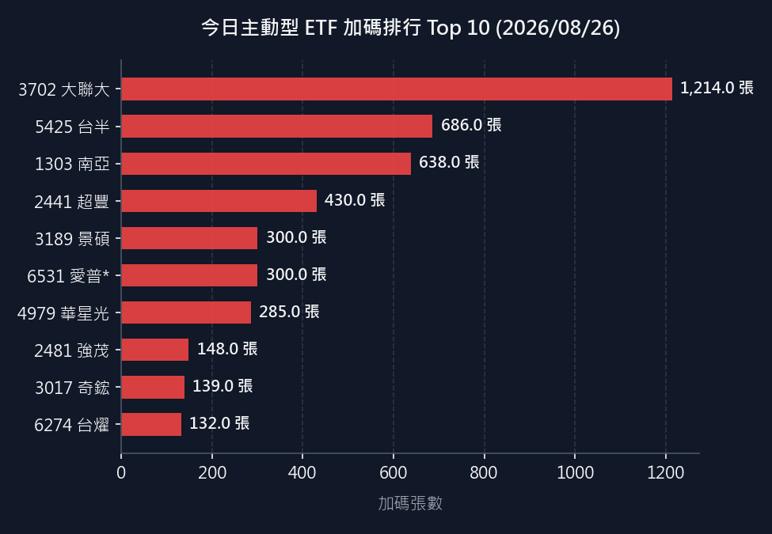
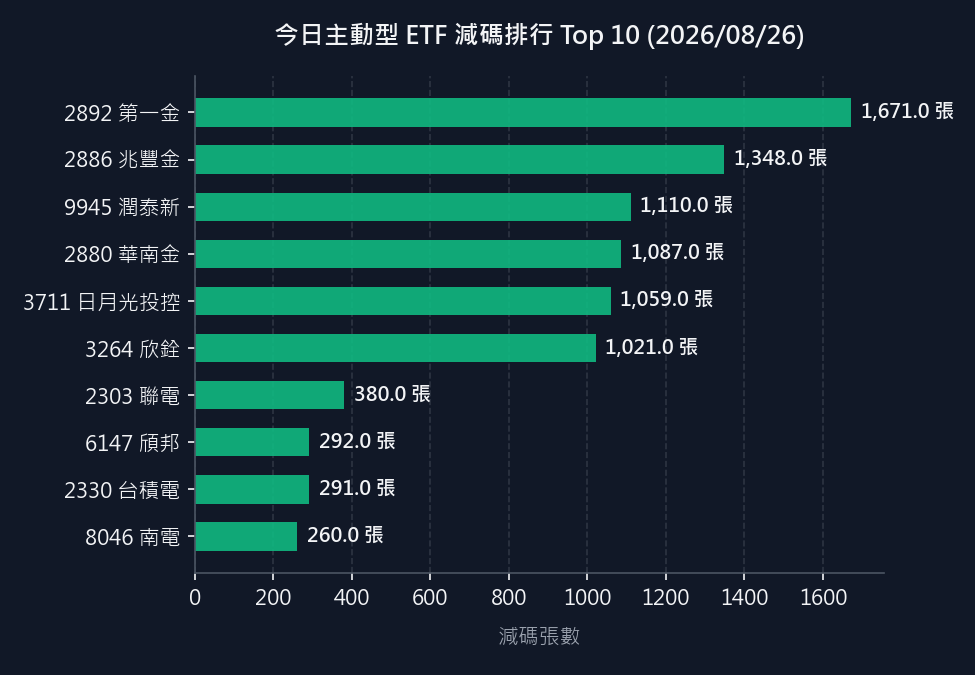

# 主動型 ETF 持股變動

資料來源：`主動型ETF持股明細.xlsx` 最近兩個日期分頁。

比較區間：`20260825` → `20260826`

## 今日加減碼視覺化排行

| 今日加碼 Top 10 | 今日減碼 Top 10 |
| :---: | :---: |
|  |  |

| ETF | 新增 | 刪除 | 比例變動 |
| :-- | --: | --: | --: |
| 00400A | 1 | 1 | 39 |
| 00401A | 1 | 1 | 47 |
| 00402A | 0 | 0 | 44 |
| 00403A | 0 | 0 | 31 |
| 00404A | 1 | 1 | 42 |
| 00405A | 1 | 0 | 37 |
| 00407A | 0 | 0 | 43 |
| 00408A | 0 | 1 | 35 |
| 00980A | 1 | 1 | 44 |
| 00980D | 1 | 1 | 29 |
| 00981A | 1 | 1 | 27 |
| 00982A | 0 | 0 | 43 |
| 00983A | 0 | 0 | 37 |
| 00983D | 0 | 0 | 25 |
| 00984A | 1 | 1 | 0 |
| 00985A | 1 | 1 | 40 |
| 00986A | 0 | 0 | 30 |
| 00987A | 0 | 0 | 24 |
| 00988A | 0 | 2 | 39 |
| 00989A | 4 | 1 | 55 |
| 00990A | 0 | 0 | 42 |
| 00991A | 0 | 0 | 20 |
| 00992A | 0 | 0 | 35 |
| 00993A | 1 | 1 | 0 |
| 00994A | 0 | 0 | 30 |
| 00995A | 0 | 0 | 47 |
| 00996A | 1 | 1 | 43 |
| 00997A | 0 | 1 | 43 |
| 00998A | 0 | 0 | 31 |
| 00999A | 0 | 0 | 52 |

## 00400A

### 新增持股

- 3081 聯亞（0.92%，82 張）

### 刪除持股

- 8046 南電（1.06%，260 張）

### 投資比例變動

- 1303 南亞：1.23% → 1.32%（+0.09）
- 2059 川湖：6.17% → 6.13%（-0.04）
- 2303 聯電：0.92% → 0.89%（-0.03）
- 2313 華通：0.85% → 0.84%（-0.01）
- 2317 鴻海：0.82% → 0.81%（-0.01）
- 2330 台積電：8.64% → 8.58%（-0.06）
- 2345 智邦：1.62% → 1.60%（-0.02）
- 2360 致茂：3.24% → 3.20%（-0.04）
- 2368 金像電：1.20% → 1.26%（+0.06）
- 2382 廣達：0.77% → 0.76%（-0.01）
- 2383 台光電：1.49% → 1.54%（+0.05）
- 2454 聯發科：6.17% → 6.37%（+0.20）
- 2881 富邦金：0.84% → 0.81%（-0.03）
- 2885 元大金：1.37% → 1.35%（-0.02）
- 3008 大立光：3.09% → 3.33%（+0.24）
- 3017 奇鋐：3.48% → 3.64%（+0.16）
- 3026 禾伸堂：0.89% → 0.85%（-0.04）
- 3036 文曄：1.07% → 1.03%（-0.04）
- 3037 欣興：2.39% → 2.47%（+0.08）
- 3044 健鼎：1.68% → 1.71%（+0.03）
- 3090 日電貿：0.35% → 0.34%（-0.01）
- 3167 大量：0.27% → 0.28%（+0.01）
- 3293 鈊象：0.33% → 0.32%（-0.01）
- 3374 精材：0.30% → 0.31%（+0.01）
- 3443 創意：3.72% → 4.00%（+0.28）
- 3529 力旺：0.94% → 1.01%（+0.07）
- 3653 健策：4.52% → 4.86%（+0.34）
- 3665 貿聯-KY：1.22% → 1.16%（-0.06）
- 3711 日月光投控：0.96% → 0.94%（-0.02）
- 4979 華星光：0.62% → 0.60%（-0.02）
- 5274 信驊：2.83% → 2.82%（-0.01）
- 6121 新普：0.25% → 0.24%（-0.01）
- 6223 旺矽：4.68% → 4.12%（-0.56）
- 6274 台燿：2.06% → 2.08%（+0.02）
- 6442 光聖：0.92% → 0.90%（-0.02）
- 6488 環球晶：3.23% → 3.06%（-0.17）
- 6515 穎崴：0.46% → 0.43%（-0.03）
- 6669 緯穎：3.17% → 5.15%（+1.98）
- 7750 新代：1.01% → 0.99%（-0.02）

## 00401A

### 新增持股

- 台股期貨09/26(FITXN*1.TF)（-0.02%，0.024 張）

### 刪除持股

- 台股期貨09/26(FITXN*1)（-0.17%，0.024 張）

### 投資比例變動

- 1216 統一：0.32% → 0.31%（-0.01）
- 1301 台塑：0.07% → 0.08%（+0.01）
- 1477 聚陽：1.01% → 0.97%（-0.04）
- 2303 聯電：0.92% → 0.89%（-0.03）
- 2308 台達電：3.22% → 3.24%（+0.02）
- 2313 華通：1.71% → 1.72%（+0.01）
- 2317 鴻海：0.63% → 0.62%（-0.01）
- 2327 國巨*：0.67% → 0.65%（-0.02）
- 2330 台積電：15.86% → 15.71%（-0.15）
- 2345 智邦：2.17% → 2.16%（-0.01）
- 2357 華碩：1.42% → 1.47%（+0.05）
- 2360 致茂：1.73% → 1.71%（-0.02）
- 2368 金像電：0.27% → 0.29%（+0.02）
- 2379 瑞昱：1.17% → 1.16%（-0.01）
- 2382 廣達：2.39% → 2.38%（-0.01）
- 2383 台光電：1.88% → 1.94%（+0.06）
- 2412 中華電：0.86% → 0.84%（-0.02）
- 2454 聯發科：5.93% → 6.16%（+0.23）
- 2455 全新：2.09% → 2.10%（+0.01）
- 2603 長榮：1.20% → 1.11%（-0.09）
- 2881 富邦金：2.10% → 2.03%（-0.07）
- 2882 國泰金：1.08% → 1.06%（-0.02）
- 2884 玉山金：1.87% → 1.83%（-0.04）
- 2886 兆豐金：1.41% → 1.38%（-0.03）
- 2891 中信金：1.61% → 1.59%（-0.02）
- 2912 統一超：0.29% → 0.28%（-0.01）
- 3008 大立光：2.87% → 3.11%（+0.24）
- 3037 欣興：2.54% → 2.65%（+0.11）
- 3131 弘塑：0.76% → 0.82%（+0.06）
- 3167 大量：0.49% → 0.51%（+0.02）
- 3491 昇達科：1.67% → 1.74%（+0.07）
- 3653 健策：0.43% → 0.47%（+0.04）
- 3711 日月光投控：2.02% → 1.99%（-0.03）
- 4904 遠傳：0.82% → 0.79%（-0.03）
- 4991 環宇-KY：1.02% → 1.10%（+0.08）
- 5347 世界：1.31% → 1.30%（-0.01）
- 5904 寶雅*：0.63% → 0.62%（-0.01）
- 6223 旺矽：1.95% → 1.72%（-0.23）
- 6285 啟碁：1.49% → 1.52%（+0.03）
- 6415 矽力*-KY：0.62% → 0.64%（+0.02）
- 6510 精測：0.65% → 0.63%（-0.02）
- 6515 穎崴：1.08% → 1.03%（-0.05）
- 6531 愛普*：1.18% → 1.22%（+0.04）
- 6669 緯穎：2.16% → 2.24%（+0.08）
- 7769 鴻勁：1.86% → 1.87%（+0.01）
- 7828 創新服務：1.62% → 1.66%（+0.04）
- 臺指選擇權09/26 44500 買權：-0.76% → -1.04%（-0.28）

## 00402A

### 新增持股

- 無

### 刪除持股

- 無

### 投資比例變動

- AAPL.US Apple：7.56% → 7.46%（-0.10）
- ADI.US Analog Devices：1.98% → 1.97%（-0.01）
- AMD.US AMD：4.56% → 4.73%（+0.17）
- AMZN.US Amazon：4.47% → 4.40%（-0.07）
- ANET.US Arista Networks：0.87% → 0.88%（+0.01）
- ASML.US ASML Holding：1.82% → 1.81%（-0.01）
- AVGO.US Broadcom：2.33% → 2.29%（-0.04）
- AXON.US Axon Enterprise：1.19% → 1.21%（+0.02）
- BKNG.US Booking Holdings：0.80% → 0.79%（-0.01）
- CDNS.US Cadence Design Systems：1.51% → 1.57%（+0.06）
- CIEN.US Ciena：0.85% → 0.88%（+0.03）
- CLS.US Celestica：0.90% → 0.92%（+0.02）
- COHR.US Coherent：1.98% → 2.05%（+0.07）
- CRWD.US CrowdStrike Holdings：1.40% → 1.34%（-0.06）
- DASH.US DoorDash：0.34% → 0.35%（+0.01）
- GOOG.US Alphabet - Class C Capital Stock：3.41% → 3.35%（-0.06）
- GOOGL.US Alphabet - Class A Common Stock：3.37% → 3.32%（-0.05）
- INTC.US Intel：1.25% → 1.24%（-0.01）
- IOT.US Samsara：0.27% → 0.26%（-0.01）
- KLAC.US KLA：1.68% → 1.67%（-0.01）
- LITE.US Lumentum：1.82% → 1.92%（+0.10）
- LRCX.US Lam Research：2.97% → 2.98%（+0.01）
- MCHP.US Microchip Technology：1.23% → 1.20%（-0.03）
- META.US Meta：2.93% → 2.95%（+0.02）
- MRVL.US Marvell：1.80% → 1.86%（+0.06）
- MSFT.US Microsoft：4.65% → 5.12%（+0.47）
- MU.US Micron：6.27% → 6.35%（+0.08）
- NFLX.US Netflix：0.96% → 0.98%（+0.02）
- NOW.US ServiceNow：0.82% → 0.81%（-0.01）
- NVDA.US NVIDIA：8.66% → 8.73%（+0.07）
- PANW.US Palo Alto：2.73% → 2.62%（-0.11）
- PLTR.US Palantir Technologies：1.68% → 1.63%（-0.05）
- SHOP.US Shopify：0.87% → 0.88%（+0.01）
- SIMO.US Silicon Motion：0.80% → 0.79%（-0.01）
- SKHY.US SK hynix：1.08% → 1.09%（+0.01）
- SNOW.US Snowflake：1.34% → 1.30%（-0.04）
- SPCX.US SpaceX：0.76% → 0.77%（+0.01）
- SPOT.US Spotify：0.32% → 0.33%（+0.01）
- STX.US Seagate：1.07% → 1.09%（+0.02）
- TER.US Teradyne：0.93% → 0.92%（-0.01）
- TXN.US Texas Instruments：2.30% → 2.28%（-0.02）
- V.US Visa：1.26% → 1.25%（-0.01）
- WDC.US Western Digital：2.17% → 2.22%（+0.05）
- ZS.US Zscaler：0.20% → 0.19%（-0.01）

## 00403A

### 新增持股

- 無

### 刪除持股

- 無

### 投資比例變動

- 1303 南亞：1.12% → 1.25%（+0.13）
- 1717 長興：0.11% → 0.10%（-0.01）
- 2303 聯電：4.46% → 4.31%（-0.15）
- 2308 台達電：3.09% → 2.93%（-0.16）
- 2327 國巨*：3.17% → 3.06%（-0.11）
- 2330 台積電：17.14% → 16.87%（-0.27）
- 2344 華邦電：1.60% → 1.58%（-0.02）
- 2345 智邦：2.79% → 2.76%（-0.03）
- 2360 致茂：1.17% → 1.15%（-0.02）
- 2383 台光電：5.63% → 5.80%（+0.17）
- 2454 聯發科：4.69% → 4.85%（+0.16）
- 3008 大立光：2.13% → 2.29%（+0.16）
- 3017 奇鋐：5.44% → 5.79%（+0.35）
- 3037 欣興：5.51% → 5.71%（+0.20）
- 3189 景碩：2.11% → 2.33%（+0.22）
- 3211 順達：0.39% → 0.42%（+0.03）
- 3443 創意：2.02% → 2.21%（+0.19）
- 3533 嘉澤：0.29% → 0.24%（-0.05）
- 3583 辛耘：0.33% → 0.35%（+0.02）
- 3653 健策：3.34% → 3.62%（+0.28）
- 3665 貿聯-KY：1.48% → 1.40%（-0.08）
- 3711 日月光投控：2.81% → 2.76%（-0.05）
- 6223 旺矽：3.67% → 3.23%（-0.44）
- 6239 力成：0.87% → 0.89%（+0.02）
- 6274 台燿：1.59% → 1.69%（+0.10）
- 6488 環球晶：1.63% → 1.55%（-0.08）
- 6669 緯穎：2.41% → 2.61%（+0.20）
- 6805 富世達：0.86% → 1.02%（+0.16）
- 8046 南電：1.82% → 1.81%（-0.01）
- 8358 金居：0.20% → 0.21%（+0.01）
- 8996 高力：1.24% → 1.21%（-0.03）

## 00404A

### 新增持股

- 台股期貨09/26(FITXN*1.TF)（16.67%，0.061 張）

### 刪除持股

- 台股期貨09/26(FITXN*1)（16.59%，0.061 張）

### 投資比例變動

- 1303 南亞：0.64% → 0.69%（+0.05）
- 2027 大成鋼：0.47% → 0.46%（-0.01）
- 2059 川湖：1.73% → 1.72%（-0.01）
- 2301 光寶科：1.65% → 1.68%（+0.03）
- 2303 聯電：2.73% → 2.65%（-0.08）
- 2308 台達電：1.86% → 1.87%（+0.01）
- 2330 台積電：22.33% → 22.09%（-0.24）
- 2345 智邦：0.74% → 0.73%（-0.01）
- 2347 聯強：0.71% → 0.70%（-0.01）
- 2351 順德：0.49% → 0.53%（+0.04）
- 2379 瑞昱：2.16% → 2.14%（-0.02）
- 2382 廣達：2.21% → 2.20%（-0.01）
- 2383 台光電：3.04% → 3.15%（+0.11）
- 2395 研華：1.54% → 1.55%（+0.01）
- 2428 興勤：1.18% → 1.17%（-0.01）
- 2439 美律：1.06% → 1.04%（-0.02）
- 2441 超豐：1.83% → 1.85%（+0.02）
- 2454 聯發科：5.81% → 6.03%（+0.22）
- 2637 慧洋-KY：1.18% → 1.11%（-0.07）
- 2845 遠東銀：1.78% → 1.74%（-0.04）
- 2885 元大金：2.02% → 2.00%（-0.02）
- 2890 永豐金：0.98% → 0.96%（-0.02）
- 3017 奇鋐：0.98% → 1.03%（+0.05）
- 3034 聯詠：2.15% → 2.12%（-0.03）
- 3037 欣興：0.76% → 0.79%（+0.03）
- 3135 凌航：1.57% → 1.59%（+0.02）
- 3260 威剛：1.37% → 1.33%（-0.04）
- 3293 鈊象：0.49% → 0.48%（-0.01）
- 3443 創意：0.50% → 0.55%（+0.05）
- 3702 大聯大：1.77% → 1.71%（-0.06）
- 3711 日月光投控：3.50% → 3.45%（-0.05）
- 4763 材料*-KY：1.60% → 1.63%（+0.03）
- 4904 遠傳：0.48% → 0.47%（-0.01）
- 5274 信驊：2.25% → 2.26%（+0.01）
- 5434 崇越：1.64% → 1.66%（+0.02）
- 6139 亞翔：1.81% → 1.85%（+0.04）
- 6196 帆宣：1.71% → 1.77%（+0.06）
- 6223 旺矽：1.10% → 0.97%（-0.13）
- 8081 致新：0.87% → 0.89%（+0.02）
- 8271 宇瞻：0.26% → 0.25%（-0.01）
- 台指選擇權09/26 48000 買權：-0.11% → -0.17%（-0.06）
- 台指選擇權10/26 49200 買權：-0.01% → -0.02%（-0.01）

## 00405A

### 新增持股

- 6531 愛普*（0.92%，300 張）

### 刪除持股

- 無

### 投資比例變動

- 1590 亞德客-KY：0.01% → 0.00%（-0.01）
- 2059 川湖：2.09% → 2.05%（-0.04）
- 2308 台達電：0.56% → 0.55%（-0.01）
- 2330 台積電：1.49% → 1.45%（-0.04）
- 2345 智邦：3.74% → 3.65%（-0.09）
- 2368 金像電：3.81% → 3.94%（+0.13）
- 2383 台光電：4.13% → 4.20%（+0.07）
- 2449 京元電子：0.04% → 0.03%（-0.01）
- 2454 聯發科：6.24% → 6.36%（+0.12）
- 3017 奇鋐：8.24% → 8.51%（+0.27）
- 3037 欣興：5.98% → 6.12%（+0.14）
- 3081 聯亞：1.63% → 1.73%（+0.10）
- 3131 弘塑：1.27% → 1.35%（+0.08）
- 3163 波若威：0.04% → 0.03%（-0.01）
- 3264 欣銓：0.03% → 0.02%（-0.01）
- 3443 創意：8.12% → 8.62%（+0.50）
- 3450 聯鈞：1.21% → 1.25%（+0.04）
- 3653 健策：7.73% → 8.21%（+0.48）
- 3665 貿聯-KY：6.61% → 6.16%（-0.45）
- 4749 新應材：0.25% → 0.24%（-0.01）
- 4991 環宇-KY：1.86% → 1.97%（+0.11）
- 5274 信驊：2.91% → 2.86%（-0.05）
- 6187 萬潤：0.87% → 0.86%（-0.01）
- 6223 旺矽：5.32% → 4.62%（-0.70）
- 6274 台燿：1.58% → 1.57%（-0.01）
- 6285 啟碁：0.32% → 0.33%（+0.01）
- 6488 環球晶：0.38% → 0.35%（-0.03）
- 6510 精測：2.28% → 2.16%（-0.12）
- 6515 穎崴：0.50% → 0.47%（-0.03）
- 6669 緯穎：1.12% → 1.14%（+0.02）
- 6805 富世達：1.29% → 1.37%（+0.08）
- 6831 邁科：0.49% → 0.48%（-0.01）
- 7734 印能科技：1.51% → 1.56%（+0.05）
- 7769 鴻勁：2.59% → 2.55%（-0.04）
- 8046 南電：2.98% → 2.93%（-0.05）
- 8210 勤誠：0.56% → 0.55%（-0.01）
- 8996 高力：1.19% → 1.13%（-0.06）

## 00407A

### 新增持股

- 無

### 刪除持股

- 無

### 投資比例變動

- 1303 南亞：0.59% → 0.63%（+0.04）
- 1560 中砂：0.47% → 0.46%（-0.01）
- 2059 川湖：3.74% → 3.72%（-0.02）
- 2301 光寶科：1.09% → 1.11%（+0.02）
- 2303 聯電：1.58% → 1.52%（-0.06）
- 2327 國巨*：2.18% → 2.10%（-0.08）
- 2330 台積電：8.91% → 8.76%（-0.15）
- 2344 華邦電：0.14% → 0.13%（-0.01）
- 2345 智邦：2.78% → 2.75%（-0.03）
- 2360 致茂：1.96% → 1.93%（-0.03）
- 2368 金像電：1.96% → 2.05%（+0.09）
- 2383 台光電：5.64% → 5.80%（+0.16）
- 2395 研華：2.03% → 2.04%（+0.01）
- 2408 南亞科：2.05% → 2.04%（-0.01）
- 2451 創見：0.34% → 0.33%（-0.01）
- 2454 聯發科：4.49% → 4.63%（+0.14）
- 2615 萬海：0.76% → 0.68%（-0.08）
- 3008 大立光：0.66% → 0.71%（+0.05）
- 3017 奇鋐：4.68% → 4.89%（+0.21）
- 3034 聯詠：0.75% → 0.74%（-0.01）
- 3037 欣興：5.37% → 5.56%（+0.19）
- 3081 聯亞：1.00% → 1.07%（+0.07）
- 3260 威剛：0.31% → 0.30%（-0.01）
- 3293 鈊象：0.55% → 0.53%（-0.02）
- 3443 創意：3.40% → 3.65%（+0.25）
- 3491 昇達科：0.44% → 0.45%（+0.01）
- 3529 力旺：0.93% → 1.00%（+0.07）
- 3653 健策：1.91% → 2.05%（+0.14）
- 3665 貿聯-KY：2.00% → 1.89%（-0.11）
- 3711 日月光投控：2.52% → 2.46%（-0.06）
- 4958 臻鼎-KY：1.71% → 1.70%（-0.01）
- 5274 信驊：2.01% → 2.00%（-0.01）
- 5289 宜鼎：0.37% → 0.36%（-0.01）
- 6223 旺矽：3.29% → 2.89%（-0.40）
- 6274 台燿：3.58% → 3.60%（+0.02）
- 6446 藥華藥：1.12% → 1.17%（+0.05）
- 6515 穎崴：1.38% → 1.30%（-0.08）
- 6531 愛普*：0.30% → 0.31%（+0.01）
- 6669 緯穎：4.94% → 5.09%（+0.15）
- 6805 富世達：2.36% → 2.53%（+0.17）
- 8046 南電：2.69% → 2.68%（-0.01）
- 8210 勤誠：0.93% → 0.92%（-0.01）
- 8996 高力：0.73% → 0.70%（-0.03）

## 00408A

### 新增持股

- 無

### 刪除持股

- 1477 聚陽（0.25%，20 張）

### 投資比例變動

- 1303 南亞：0.60% → 1.94%（+1.34）
- 1537 廣隆：0.39% → 0.19%（-0.20）
- 2059 川湖：2.71% → 2.72%（+0.01）
- 2303 聯電：1.70% → 1.66%（-0.04）
- 2308 台達電：2.27% → 2.30%（+0.03）
- 2330 台積電：6.26% → 6.16%（-0.10）
- 2357 華碩：2.52% → 2.61%（+0.09）
- 2360 致茂：1.00% → 0.99%（-0.01）
- 2368 金像電：2.83% → 2.99%（+0.16）
- 2383 台光電：3.54% → 3.68%（+0.14）
- 2395 研華：1.87% → 1.89%（+0.02）
- 2454 聯發科：0.47% → 1.97%（+1.50）
- 2481 強茂：0.33% → 0.71%（+0.38）
- 2880 華南金：1.65% → 1.62%（-0.03）
- 2886 兆豐金：2.59% → 2.53%（-0.06）
- 2891 中信金：0.98% → 0.97%（-0.01）
- 3017 奇鋐：4.86% → 5.12%（+0.26）
- 3037 欣興：2.22% → 2.32%（+0.10）
- 3045 台灣大：2.78% → 2.74%（-0.04）
- 3081 聯亞：0.37% → 0.81%（+0.44）
- 3653 健策：1.98% → 2.15%（+0.17）
- 3702 大聯大：1.81% → 1.75%（-0.06）
- 5434 崇越：1.91% → 1.94%（+0.03）
- 6187 萬潤：1.21% → 1.22%（+0.01）
- 6223 旺矽：0.89% → 0.79%（-0.10）
- 6239 力成：1.16% → 1.20%（+0.04）
- 6274 台燿：1.79% → 2.68%（+0.89）
- 6488 環球晶：1.86% → 1.78%（-0.08）
- 6669 緯穎：5.30% → 5.51%（+0.21）
- 6805 富世達：0.35% → 0.76%（+0.41）
- 7769 鴻勁：1.77% → 1.78%（+0.01）
- 8046 南電：1.91% → 1.92%（+0.01）
- 8436 大江：0.85% → 1.64%（+0.79）
- 8996 高力：0.38% → 0.37%（-0.01）
- 9941 裕融：1.26% → 1.88%（+0.62）

## 00980A

### 新增持股

- 台灣證交所加權股價指數(FITXN*1.TF)（4.99%，0.11 張）

### 刪除持股

- 台灣證交所加權股價指數（5.00%，0.11 張）

### 投資比例變動

- 1303 南亞：2.30% → 2.47%（+0.17）
- 2059 川湖：5.77% → 5.72%（-0.05）
- 2317 鴻海：2.36% → 2.33%（-0.03）
- 2327 國巨*：1.63% → 1.58%（-0.05）
- 2330 台積電：9.13% → 8.97%（-0.16）
- 2344 華邦電：2.07% → 2.05%（-0.02）
- 2345 智邦：1.78% → 1.76%（-0.02）
- 2360 致茂：1.47% → 1.44%（-0.03）
- 2368 金像電：1.93% → 2.02%（+0.09）
- 2376 技嘉：1.22% → 1.20%（-0.02）
- 2382 廣達：1.64% → 1.62%（-0.02）
- 2383 台光電：3.84% → 3.95%（+0.11）
- 2408 南亞科：2.82% → 2.79%（-0.03）
- 2454 聯發科：4.70% → 4.84%（+0.14）
- 2884 玉山金：1.25% → 1.21%（-0.04）
- 2891 中信金：1.47% → 1.44%（-0.03）
- 3008 大立光：0.75% → 0.81%（+0.06）
- 3017 奇鋐：2.00% → 2.08%（+0.08）
- 3026 禾伸堂：0.42% → 0.41%（-0.01）
- 3036 文曄：1.15% → 1.11%（-0.04）
- 3037 欣興：3.11% → 3.22%（+0.11）
- 3044 健鼎：0.81% → 0.82%（+0.01）
- 3081 聯亞：3.42% → 3.67%（+0.25）
- 3189 景碩：0.78% → 0.80%（+0.02）
- 3231 緯創：0.94% → 0.93%（-0.01）
- 3293 鈊象：0.90% → 0.87%（-0.03）
- 3443 創意：1.66% → 1.78%（+0.12）
- 3529 力旺：0.49% → 0.52%（+0.03）
- 3653 健策：1.81% → 1.95%（+0.14）
- 3665 貿聯-KY：0.34% → 0.32%（-0.02）
- 3711 日月光投控：1.57% → 1.54%（-0.03）
- 5904 寶雅*：1.18% → 1.15%（-0.03）
- 6213 聯茂：1.29% → 1.39%（+0.10）
- 6223 旺矽：2.04% → 1.79%（-0.25）
- 6274 台燿：1.57% → 1.58%（+0.01）
- 6442 光聖：0.31% → 0.30%（-0.01）
- 6515 穎崴：1.74% → 1.63%（-0.11）
- 6669 緯穎：1.69% → 1.74%（+0.05）
- 6805 富世達：0.50% → 0.54%（+0.04）
- 7769 鴻勁：2.29% → 2.28%（-0.01）
- 8046 南電：1.19% → 1.18%（-0.01）
- 8210 勤誠：0.94% → 0.93%（-0.01）
- 8299 群聯：2.07% → 2.06%（-0.01）
- 8996 高力：1.11% → 1.07%（-0.04）

## 00980D

### 新增持股

- US 2YR NOTE (CBT) DEC26 31-DEC-2026（1.60%，0.005 張）

### 刪除持股

- US 2YR NOTE (CBT) SEP26 30-SEP-2026（1.93%，0.006 張）

### 投資比例變動

- ALLY FINANCIAL INC (REG) 7.1% 15NOV2027：0.43% → 0.42%（-0.01）
- ALLY FINANCIAL INC (REG) 8% 01NOV2031：0.52% → 0.51%（-0.01）
- ATHENE HOLDING LTD (REG) 6.25% 01APR2054：0.74% → 0.75%（+0.01）
- BRIGHTHOUSE FINANCIAL IN (REG) 4.7% 22JUN2047：0.46% → 0.47%（+0.01）
- CIVITAS RESOURCES INC SER REGS (REG) (REG S) 9.625% 15JUN2033：0.55% → 0.54%（-0.01）
- DEUTSCHE TELEKOM INT FIN (REG) 9.25% 01JUN2032：0.42% → 0.41%（-0.01）
- DISCOVER FINANCIAL SVS (REG) VAR 02NOV2034：0.63% → 0.62%（-0.01）
- FMC CORP (REG) 4.5% 01OCT2049：0.48% → 0.49%（+0.01）
- GENERAL MOTORS CO (REG) 6.8% 01OCT2027：0.55% → 0.54%（-0.01）
- GLOBAL AUTO HO/AAG FH UK SER REGS (REG S) 11.5% 15AUG2029：0.37% → 0.36%（-0.01）
- GLOBAL AUTO HO/AAG FH UK SER REGS (REG S) 8.75% 15JAN2032：0.43% → 0.42%（-0.01）
- GRAY TELEVISION INC SER REGS (REG) (REG S) 10.5% 15JUL2029：0.57% → 0.56%（-0.01）
- JBS USA HOLD/FOOD/LUX CO 7.250000 % 15NOV2053：0.46% → 0.47%（+0.01）
- KELLANOVA SER B (REG) 7.450000 % 01APR2031：0.56% → 0.55%（-0.01）
- MOBIUS MERGER SUB SER REGS 9.000000 % 01JUN2030：0.26% → 0.25%（-0.01）
- NISSAN MOTOR CO SER REGS 8.125000 % 17JUL2035：0.52% → 0.51%（-0.01）
- OCCIDENTAL PETROLEUM COR (REG) 7.5% 01MAY2031：0.33% → 0.32%（-0.01）
- OCCIDENTAL PETROLEUM COR 8.875% 15JUL2030：0.55% → 0.54%（-0.01）
- ONEOK INC 6.625% 01SEP2053：0.56% → 0.57%（+0.01）
- OPEN TEXT CORP SER REGS (REG) (REG S) 6.9% 01DEC2027：0.65% → 0.64%（-0.01）
- ORACLE CORP 5.950000 % 26-SEP-2055：0.39% → 0.40%（+0.01）
- ORACLE CORP 6.100000 % 26-SEP-2065：0.46% → 0.47%（+0.01）
- ORANGE SA (REG) 9% 01MAR2031：0.65% → 0.64%（-0.01）
- STAPLES INC SER REGS (REG S) 10.75% 01SEP2029：0.48% → 0.47%（-0.01）
- TELEFONICA EUROPE BV (REG) 8.25% 15SEP2030：0.41% → 0.40%（-0.01）
- US 10YR NOTE (CBT)SEP26 21-SEP-2026：18.11% → 18.09%（-0.02）
- US 5YR NOTE (CBT) DEC26 31-DEC-2026：-14.91% → -14.87%（+0.04）
- US ACUTE CARE SOLUTIONS SER REGS (REG S) 9.75% 15MAY2029：0.31% → 0.32%（+0.01）
- US LONG BOND(CBT) SEP26 21-SEP-2026：5.30% → 5.31%（+0.01）

## 00981A

### 新增持股

- 台指期貨 2026/09(FITXN*1.TF)（2.15%，0.679 張）

### 刪除持股

- 台指期貨 2026/09(FITXN*1)（2.16%，0.679 張）

### 投資比例變動

- 2303 聯電：3.96% → 3.81%（-0.15）
- 2308 台達電：4.26% → 4.25%（-0.01）
- 2327 國巨*：4.89% → 4.70%（-0.19）
- 2330 台積電：10.09% → 9.90%（-0.19）
- 2345 智邦：4.71% → 4.65%（-0.06）
- 2368 金像電：0.67% → 0.70%（+0.03）
- 2383 台光電：9.59% → 9.85%（+0.26）
- 2449 京元電子：0.96% → 0.95%（-0.01）
- 2454 聯發科：6.80% → 7.01%（+0.21）
- 3017 奇鋐：6.16% → 6.51%（+0.35）
- 3037 欣興：7.86% → 8.12%（+0.26）
- 3264 欣銓：0.45% → 0.44%（-0.01）
- 3443 創意：0.50% → 0.69%（+0.19）
- 3653 健策：4.43% → 4.75%（+0.32）
- 3665 貿聯-KY：3.43% → 3.23%（-0.20）
- 3711 日月光投控：4.07% → 3.98%（-0.09）
- 4979 華星光：0.52% → 0.50%（-0.02）
- 5274 信驊：2.09% → 2.08%（-0.01）
- 6223 旺矽：4.93% → 4.32%（-0.61）
- 6274 台燿：2.89% → 2.90%（+0.01）
- 6278 台表科：0.21% → 0.22%（+0.01）
- 6510 精測：0.45% → 0.43%（-0.02）
- 6669 緯穎：5.07% → 5.21%（+0.14）
- 6805 富世達：1.48% → 1.58%（+0.10）
- 8046 南電：3.95% → 3.92%（-0.03）
- 8210 勤誠：0.85% → 0.83%（-0.02）
- 8996 高力：0.56% → 0.54%（-0.02）

## 00982A

### 新增持股

- 無

### 刪除持股

- 無

### 投資比例變動

- 2059 川湖：5.35% → 5.30%（-0.05）
- 2301 光寶科：1.97% → 1.99%（+0.02）
- 2303 聯電：1.34% → 1.29%（-0.05）
- 2330 台積電：8.67% → 8.50%（-0.17）
- 2345 智邦：2.97% → 2.93%（-0.04）
- 2360 致茂：3.36% → 3.30%（-0.06）
- 2376 技嘉：1.27% → 1.25%（-0.02）
- 2377 微星：1.28% → 1.26%（-0.02）
- 2383 台光電：3.63% → 3.72%（+0.09）
- 2428 興勤：1.19% → 1.17%（-0.02）
- 2454 聯發科：6.56% → 6.75%（+0.19）
- 2455 全新：1.34% → 1.33%（-0.01）
- 2467 志聖：1.08% → 1.12%（+0.04）
- 2478 大毅：1.10% → 1.08%（-0.02）
- 2486 一詮：0.84% → 0.83%（-0.01）
- 2885 元大金：0.28% → 0.27%（-0.01）
- 3008 大立光：2.97% → 3.18%（+0.21）
- 3017 奇鋐：2.26% → 2.36%（+0.10）
- 3090 日電貿：1.14% → 1.11%（-0.03）
- 3105 穩懋：3.67% → 3.82%（+0.15）
- 3231 緯創：1.24% → 1.23%（-0.01）
- 3264 欣銓：0.88% → 0.44%（-0.44）
- 3265 台星科：1.18% → 1.19%（+0.01）
- 3491 昇達科：2.56% → 2.64%（+0.08）
- 3529 力旺：0.41% → 0.44%（+0.03）
- 3583 辛耘：1.62% → 1.68%（+0.06）
- 3617 碩天：0.31% → 0.30%（-0.01）
- 3711 日月光投控：1.15% → 1.12%（-0.03）
- 4958 臻鼎-KY：2.84% → 2.82%（-0.02）
- 5425 台半：0.28% → 0.43%（+0.15）
- 5483 中美晶：1.31% → 1.25%（-0.06）
- 5536 聖暉*：0.79% → 0.77%（-0.02）
- 6139 亞翔：5.96% → 6.04%（+0.08）
- 6196 帆宣：0.30% → 0.31%（+0.01）
- 6213 聯茂：0.34% → 0.37%（+0.03）
- 6214 精誠：1.29% → 1.25%（-0.04）
- 6223 旺矽：3.46% → 3.04%（-0.42）
- 6239 力成：1.05% → 1.07%（+0.02）
- 6472 保瑞：0.98% → 0.93%（-0.05）
- 6488 環球晶：2.22% → 2.09%（-0.13）
- 6531 愛普*：2.91% → 2.97%（+0.06）
- 6669 緯穎：6.62% → 6.79%（+0.17）
- 8996 高力：0.94% → 0.90%（-0.04）

## 00983A

### 新增持股

- 無

### 刪除持股

- 無

### 投資比例變動

- ACHR.US Archer：0.69% → 0.66%（-0.03）
- AMD.US AMD：3.20% → 3.27%（+0.07）
- AMZN.US Amazon：3.47% → 3.36%（-0.11）
- AVGO.US Broadcom：0.62% → 0.60%（-0.02）
- BEAM.US Beam Therapeutics：2.19% → 2.33%（+0.14）
- BLSH.US Bullish：1.66% → 1.69%（+0.03）
- BWXT.US BWX Technologies：0.05% → 0.04%（-0.01）
- CBRS.US Cerebras：0.82% → 0.79%（-0.03）
- COIN.US Coinbase：3.17% → 3.42%（+0.25）
- CRCL.US Circle：4.29% → 4.38%（+0.09）
- CRSP.US CRISPR Therapeutics：4.59% → 4.77%（+0.18）
- CRWV.US CoreWeave：1.47% → 1.46%（-0.01）
- DE.US Deere：1.30% → 1.23%（-0.07）
- FIG.US Figma：0.48% → 0.47%（-0.01）
- GOOG.US Alphabet - Class C Capital Stock：1.28% → 1.24%（-0.04）
- GOOGL.US Alphabet - Class A Common Stock：1.03% → 1.00%（-0.03）
- HOOD.US Robinhood Markets：4.23% → 4.45%（+0.22）
- ILMN.US Illumina：2.57% → 2.41%（-0.16）
- KTOS.US Kratos Defense & Security：1.01% → 0.97%（-0.04）
- LLY.US Eli Lilly：2.08% → 2.01%（-0.07）
- NTLA.US Intellia Therapeutics：1.43% → 1.50%（+0.07）
- NVDA.US NVIDIA：1.60% → 1.59%（-0.01）
- PLTR.US Palantir Technologies：3.47% → 3.32%（-0.15）
- RXRX.US Recursion Pharmaceuticals：0.31% → 0.33%（+0.02）
- SHOP.US Shopify：6.89% → 6.58%（-0.31）
- SNOW.US Snowflake：1.66% → 1.59%（-0.07）
- SOFI.US SoFi Technologies：0.71% → 0.72%（+0.01）
- SPCX.US SpaceX：3.97% → 4.08%（+0.11）
- TEM.US Tempus：5.19% → 5.25%（+0.06）
- TER.US Teradyne：0.61% → 0.60%（-0.01）
- TSLA.US Tesla：8.48% → 8.26%（-0.22）
- TSM.US TSMC(ADR)：2.48% → 2.46%（-0.02）
- TWST.US Twist Bioscience：4.69% → 4.86%（+0.17）
- TXG.US 10x Genomics：4.36% → 4.31%（-0.05）
- VCYT.US Veracyte：0.31% → 0.32%（+0.01）
- XE.US X-Energy：0.77% → 0.79%（+0.02）
- XYZ.US Block：2.35% → 2.24%（-0.11）

## 00983D

### 新增持股

- 無

### 刪除持股

- 無

### 投資比例變動

- ABIBB 8.2 01/15/39：1.95% → 1.96%（+0.01）
- BATSLN 7.081 08/02/53：1.32% → 1.33%（+0.01）
- CYH 10 7/8 01/15/32：1.50% → 1.49%（-0.01）
- DELL 8.1 07/15/36：1.53% → 1.52%（-0.01）
- DIS 7 3/4 12/01/45：0.60% → 0.61%（+0.01）
- DTV 8 7/8 02/01/30：1.60% → 1.59%（-0.01）
- DUK 7 3/4 03/01/31：1.56% → 1.55%（-0.01）
- ED 6 3/4 04/01/38：0.61% → 0.62%（+0.01）
- ENBCN 6.7 11/15/53：1.11% → 1.12%（+0.01）
- GM 6 3/4 04/01/46：1.18% → 1.19%（+0.01）
- GTN 10 1/2 07/15/29：1.69% → 1.68%（-0.01）
- HAL 7.45 09/15/39：1.81% → 1.82%（+0.01）
- IEP 10 11/15/29：1.49% → 1.48%（-0.01）
- KHC 6 7/8 01/26/39：1.00% → 1.01%（+0.01）
- LQDW.US iShares Investment Grade Corpora：7.30% → 7.29%（-0.01）
- MINAU 9 1/4 10/01/28：0.88% → 0.87%（-0.01）
- MOHEGN 11 7/8 04/15/31：1.36% → 1.35%（-0.01）
- MS 7 1/4 04/01/32：1.64% → 1.63%（-0.01）
- PCG 6 3/4 01/15/53：1.15% → 1.16%（+0.01）
- PCG 6.7 04/01/53：1.11% → 1.12%（+0.01）
- PDM 9 1/4 07/20/28：0.84% → 0.83%（-0.01）
- RAKUTN 11 1/4 02/15/27：1.80% → 1.79%（-0.01）
- S 8 3/4 03/15/32：0.66% → 0.65%（-0.01）
- TELEFO 8 1/4 09/15/30：1.01% → 1.00%（-0.01）
- TLTW.US iShares 20+ Year Treasury Bond B：8.00% → 8.02%（+0.02）

## 00984A

### 新增持股

- 台指期貨 2026/09(FITXN*1.TF)（2.16%，0.024 張）

### 刪除持股

- 台指期貨 2026/09(FITXN*1)（2.16%，0.024 張）

### 投資比例變動

- 無

## 00985A

### 新增持股

- 台積電期貨(FICDFN*1.TF)（5.12%，0.11 張）

### 刪除持股

- 台積電期貨(FICDFN*1)（5.18%，0.11 張）

### 投資比例變動

- 1216 統一：1.27% → 1.24%（-0.03）
- 1301 台塑：1.48% → 1.51%（+0.03）
- 1504 東元：2.41% → 2.38%（-0.03）
- 2027 大成鋼：2.08% → 2.01%（-0.07）
- 2059 川湖：1.54% → 1.53%（-0.01）
- 2303 聯電：0.21% → 0.20%（-0.01）
- 2327 國巨*：2.04% → 1.98%（-0.06）
- 2330 台積電：13.85% → 13.64%（-0.21）
- 2344 華邦電：0.43% → 0.42%（-0.01）
- 2345 智邦：2.47% → 2.45%（-0.02）
- 2368 金像電：0.93% → 0.19%（-0.74）
- 2376 技嘉：4.94% → 4.89%（-0.05）
- 2383 台光電：1.76% → 1.81%（+0.05）
- 2395 研華：0.96% → 0.97%（+0.01）
- 2408 南亞科：0.97% → 0.96%（-0.01）
- 2412 中華電：3.79% → 3.70%（-0.09）
- 2454 聯發科：1.83% → 1.90%（+0.07）
- 2603 長榮：1.75% → 1.61%（-0.14）
- 2881 富邦金：0.21% → 0.20%（-0.01）
- 3008 大立光：1.35% → 1.45%（+0.10）
- 3017 奇鋐：1.97% → 2.06%（+0.09）
- 3036 文曄：1.53% → 1.30%（-0.23）
- 3037 欣興：1.72% → 1.78%（+0.06）
- 3081 聯亞：2.41% → 2.60%（+0.19）
- 3105 穩懋：2.44% → 2.15%（-0.29）
- 3131 弘塑：0.27% → 0.29%（+0.02）
- 3653 健策：2.50% → 1.49%（-1.01）
- 3665 貿聯-KY：0.18% → 0.17%（-0.01）
- 3711 日月光投控：1.94% → 1.91%（-0.03）
- 4904 遠傳：3.85% → 3.72%（-0.13）
- 4958 臻鼎-KY：0.48% → 0.20%（-0.28）
- 6147 頎邦：1.69% → 1.30%（-0.39）
- 6187 萬潤：1.88% → 1.89%（+0.01）
- 6442 光聖：2.33% → 1.64%（-0.69）
- 6446 藥華藥：2.02% → 2.10%（+0.08）
- 6488 環球晶：0.10% → 0.09%（-0.01）
- 6669 緯穎：3.35% → 3.46%（+0.11）
- 7750 新代：2.49% → 2.46%（-0.03）
- 8046 南電：0.55% → 0.54%（-0.01）
- 8996 高力：1.35% → 1.30%（-0.05）

## 00986A

### 新增持股

- 無

### 刪除持股

- 無

### 投資比例變動

- 2330 台積電：9.29% → 9.31%（+0.02）
- 2454 聯發科：1.34% → 1.32%（-0.02）
- AAPL.US Apple：1.06% → 1.05%（-0.01）
- AMAT.US Applied Materials：1.92% → 1.89%（-0.03）
- AMD.US AMD：3.63% → 3.77%（+0.14）
- AMZN.US Amazon：4.16% → 4.11%（-0.05）
- AVGO.US Broadcom：3.66% → 3.61%（-0.05）
- COHR.US Coherent：2.03% → 2.11%（+0.08）
- CRDO.US Credo：0.63% → 0.64%（+0.01）
- CRWD.US CrowdStrike Holdings：3.57% → 3.44%（-0.13）
- DDOG.US Datadog：0.64% → 0.63%（-0.01）
- ETN.US Eaton：2.32% → 2.30%（-0.02）
- GEV.US GE Vernova：2.67% → 2.61%（-0.06）
- GOOGL.US Alphabet - Class A Common Stock：5.92% → 5.85%（-0.07）
- GS.US Goldman Sachs：3.23% → 3.27%（+0.04）
- HWM.US Howmet Aerospace：2.54% → 2.52%（-0.02）
- JPM.US JPMorgan Chase：1.92% → 1.91%（-0.01）
- LITE.US Lumentum：3.67% → 3.88%（+0.21）
- LLY.US Eli Lilly：3.18% → 3.12%（-0.06）
- LRCX.US Lam Research：2.64% → 2.65%（+0.01）
- MA.US Mastercard：1.19% → 1.18%（-0.01）
- MU.US Micron：4.13% → 4.20%（+0.07）
- NET.US Cloudflare：1.91% → 1.87%（-0.04）
- NVDA.US NVIDIA：5.91% → 5.99%（+0.08）
- SNDK.US Sandisk：1.69% → 1.67%（-0.02）
- SNOW.US Snowflake：2.01% → 1.96%（-0.05）
- Siemens Energy AG：2.17% → 2.20%（+0.03）
- 嘉能可公司：1.84% → 1.85%（+0.01）
- 施奈德電機公司：1.74% → 1.75%（+0.01）
- 艾司摩爾控股公司：0.99% → 0.98%（-0.01）

## 00987A

### 新增持股

- 無

### 刪除持股

- 無

### 投資比例變動

- 2308 台達電：1.88% → 1.87%（-0.01）
- 2330 台積電：8.50% → 8.29%（-0.21）
- 2345 智邦：2.24% → 2.19%（-0.05）
- 2383 台光電：6.38% → 6.52%（+0.14）
- 2408 南亞科：3.35% → 3.29%（-0.06）
- 2454 聯發科：4.70% → 4.82%（+0.12）
- 2455 全新：3.38% → 3.35%（-0.03）
- 3017 奇鋐：6.73% → 6.98%（+0.25）
- 3037 欣興：7.15% → 7.35%（+0.20）
- 3081 聯亞：4.40% → 4.69%（+0.29）
- 3363 上詮：2.27% → 2.30%（+0.03）
- 3443 創意：4.38% → 4.67%（+0.29）
- 3653 健策：3.69% → 3.93%（+0.24）
- 3665 貿聯-KY：4.08% → 3.82%（-0.26）
- 6187 萬潤：2.35% → 2.33%（-0.02）
- 6223 旺矽：5.95% → 5.19%（-0.76）
- 6515 穎崴：1.97% → 1.84%（-0.13）
- 6683 雍智科技：2.31% → 2.25%（-0.06）
- 6739 竹陞科技：1.89% → 1.91%（+0.02）
- 6805 富世達：3.77% → 4.02%（+0.25）
- 7769 鴻勁：2.93% → 2.90%（-0.03）
- 8046 南電：4.15% → 4.10%（-0.05）
- 8358 金居：1.92% → 1.95%（+0.03）
- 8996 高力：1.67% → 1.60%（-0.07）

## 00988A

### 新增持股

- 無

### 刪除持股

- 3711 日月光投控（1.11%，1000 張）
- WDC.US Western Digital（1.04%，40 張）

### 投資比例變動

- 2308 台達電：2.34% → 2.26%（-0.08）
- 2327 國巨*：1.60% → 1.55%（-0.05）
- 2330 台積電：2.89% → 2.87%（-0.02）
- 2383 台光電：4.52% → 4.57%（+0.05）
- 2454 聯發科：2.11% → 1.37%（-0.74）
- 3017 奇鋐：1.47% → 1.49%（+0.02）
- 4979 華星光：0.46% → 0.81%（+0.35）
- 6223 旺矽：2.52% → 2.49%（-0.03）
- AEHR.US Aehr Test Systems：0.40% → 0.39%（-0.01）
- AEM.US Agnico Eagle Mines：0.78% → 0.79%（+0.01）
- AMD.US AMD：3.55% → 3.65%（+0.10）
- Appier(4180.JP)：0.48% → 0.45%（-0.03）
- BE.US Bloom Energy：2.56% → 3.18%（+0.62）
- COHR.US Coherent：1.56% → 1.60%（+0.04）
- CRCL.US Circle：2.10% → 2.59%（+0.49）
- FORM.US FormFactor：0.97% → 0.95%（-0.02）
- Furukawa Electric(5801.JP)：0.68% → 0.73%（+0.05）
- INFINEON TECHNOLOGIES AG：1.61% → 1.59%（-0.02）
- ISC(095340.KS)：0.33% → 0.35%（+0.02）
- Kioxia Holdings(285A.JP)：3.44% → 3.39%（-0.05）
- LITE.US Lumentum：5.80% → 6.07%（+0.27）
- MRVL.US Marvell：2.81% → 2.89%（+0.08）
- MU.US Micron：3.81% → 3.83%（+0.02）
- Murata Mfg.(6981.JP)：3.58% → 3.54%（-0.04）
- NET.US Cloudflare：0.75% → 0.73%（-0.02）
- Nippon Chemi-Con(6997.JP)：1.29% → 1.26%（-0.03）
- PANW.US Palo Alto：3.14% → 2.99%（-0.15）
- PLTR.US Palantir Technologies：1.89% → 1.82%（-0.07）
- SK hynix(000660.KS)：1.08% → 1.09%（+0.01）
- SNDK.US Sandisk：1.87% → 1.82%（-0.05）
- SNOW.US Snowflake：2.51% → 2.41%（-0.10）
- STX.US Seagate：2.85% → 2.89%（+0.04）
- Samsung Elec Mech(009150.KS)：3.95% → 4.07%（+0.12）
- TER.US Teradyne：1.20% → 1.18%（-0.02）
- TSEM.US Tower Semiconductor：2.73% → 2.70%（-0.03）
- TWLO.US Twilio：0.73% → 0.72%（-0.01）
- 三環集團(300408.SZ)：1.69% → 1.66%（-0.03）
- 中際旭創(3308.HK)：0.85% → 0.83%（-0.02）
- 鼎泰高科(301377.SZ)：1.02% → 1.00%（-0.02）

## 00989A

### 新增持股

- ILMN.US Illumina（0.30%，0.487 張）
- TWST.US Twist Bioscience（0.21%，0.515 張）
- TXG.US 10x Genomics（0.15%，0.852 張）
- VEEV.US Veeva Systems（0.30%，0.438 張）

### 刪除持股

- ENPH.US Enphase Energy（0.19%，1.816 張）

### 投資比例變動

- ADBE.US Adobe：1.34% → 1.32%（-0.02）
- ALGM.US Allegro MicroSystems：0.54% → 0.56%（+0.02）
- AMAT.US Applied Materials：0.70% → 0.69%（-0.01）
- AMD.US AMD：2.48% → 2.59%（+0.11）
- AMKR.US Amkor：0.67% → 0.47%（-0.20）
- AMZN.US Amazon：1.08% → 1.07%（-0.01）
- APP.US Applovin：0.61% → 0.63%（+0.02）
- ASML.US ASML Holding：1.76% → 1.75%（-0.01）
- AVGO.US Broadcom：3.62% → 3.58%（-0.04）
- BE.US Bloom Energy：1.00% → 1.06%（+0.06）
- CDNS.US Cadence Design Systems：0.92% → 0.96%（+0.04）
- CIEN.US Ciena：1.83% → 1.68%（-0.15）
- CRM.US Salesforce：2.37% → 2.31%（-0.06）
- CRWD.US CrowdStrike Holdings：2.85% → 2.76%（-0.09）
- CRWV.US CoreWeave：0.73% → 0.74%（+0.01）
- ENTG.US Entegris：0.79% → 0.78%（-0.01）
- ESTC.US Elastic：0.66% → 0.63%（-0.03）
- FIGR.US Figure：1.02% → 1.07%（+0.05）
- FN.US Fabrinet：0.16% → 0.11%（-0.05）
- GFS.US GlobalFoundries：1.02% → 0.81%（-0.21）
- GLW.US Corning：1.74% → 1.54%（-0.20）
- GOOG.US Alphabet - Class C Capital Stock：2.96% → 2.93%（-0.03）
- HOOD.US Robinhood Markets：1.95% → 2.10%（+0.15）
- HUBS.US HubSpot：2.06% → 1.99%（-0.07）
- INTC.US Intel：2.60% → 2.59%（-0.01）
- INTU.US Intuit：0.88% → 0.85%（-0.03）
- LITE.US Lumentum：1.62% → 1.72%（+0.10）
- LRCX.US Lam Research：2.17% → 2.19%（+0.02）
- META.US Meta：1.51% → 1.53%（+0.02）
- MSFT.US Microsoft：3.21% → 3.22%（+0.01）
- MTSI.US MACOM Technology Solutions：0.95% → 0.98%（+0.03）
- MU.US Micron：0.82% → 0.84%（+0.02）
- NET.US Cloudflare：2.66% → 2.62%（-0.04）
- NOW.US ServiceNow：2.07% → 2.04%（-0.03）
- NU.US Nu：0.64% → 0.65%（+0.01）
- NVDA.US NVIDIA：3.84% → 3.90%（+0.06）
- ON.US ON Semiconductor：1.40% → 1.41%（+0.01）
- ORCL.US Oracle：1.32% → 1.13%（-0.19）
- PANW.US Palo Alto：4.02% → 3.87%（-0.15）
- PLTR.US Palantir Technologies：1.08% → 1.05%（-0.03）
- ROK.US Rockwell Automation：0.87% → 0.86%（-0.01）
- SHOP.US Shopify：2.15% → 2.20%（+0.05）
- SNDK.US Sandisk：0.60% → 0.59%（-0.01）
- SNOW.US Snowflake：3.30% → 3.22%（-0.08）
- SPCX.US SpaceX：0.76% → 0.77%（+0.01）
- TEAM.US Atlassian：1.19% → 1.15%（-0.04）
- TEM.US Tempus：1.14% → 1.17%（+0.03）
- TSM.US TSMC(ADR)：1.16% → 1.17%（+0.01）
- TTMI.US TTM Technologies：0.48% → 0.50%（+0.02）
- TTWO.US Take-Two：3.43% → 3.40%（-0.03）
- U.US Unity Software：0.98% → 0.95%（-0.03）
- VICR.US Vicor Corporation：0.72% → 0.53%（-0.19）
- WRBY.US Warby Parker：0.71% → 0.70%（-0.01）
- XYZ.US Block：0.80% → 0.81%（+0.01）
- ZM.US Zoom：2.19% → 2.09%（-0.10）

## 00990A

### 新增持股

- 無

### 刪除持股

- 無

### 投資比例變動

- 2308 台達電：2.10% → 2.03%（-0.07）
- 2330 台積電：2.64% → 2.62%（-0.02）
- 2345 智邦：0.98% → 0.94%（-0.04）
- 2383 台光電：3.15% → 3.19%（+0.04）
- 2449 京元電子：0.66% → 0.65%（-0.01）
- 2454 聯發科：1.46% → 1.43%（-0.03）
- 3711 日月光投控：1.04% → 1.02%（-0.02）
- 6223 旺矽：1.37% → 1.35%（-0.02）
- AEHR.US Aehr Test Systems：0.59% → 0.57%（-0.02）
- AMAT.US Applied Materials：1.99% → 1.94%（-0.05）
- AMD.US AMD：3.39% → 3.49%（+0.10）
- AMZN.US Amazon：1.52% → 1.49%（-0.03）
- AXON.US Axon Enterprise：1.42% → 1.44%（+0.02）
- AXTI.US AXT：1.07% → 1.08%（+0.01）
- Advantest(6857.JP)：1.67% → 1.63%（-0.04）
- BE.US Bloom Energy：2.58% → 2.70%（+0.12）
- CBRS.US Cerebras：0.42% → 0.41%（-0.01）
- CIEN.US Ciena：0.98% → 1.00%（+0.02）
- COHR.US Coherent：1.26% → 1.30%（+0.04）
- DIOD.US Diodes：0.88% → 0.89%（+0.01）
- IBIDEN(4062.JP)：0.92% → 0.96%（+0.04）
- INFINEON TECHNOLOGIES AG：1.84% → 1.82%（-0.02）
- INTC.US Intel：1.39% → 1.37%（-0.02）
- Kioxia Holdings(285A.JP)：4.51% → 4.45%（-0.06）
- LITE.US Lumentum：7.34% → 7.69%（+0.35）
- MRVL.US Marvell：4.14% → 4.26%（+0.12）
- MU.US Micron：6.41% → 6.45%（+0.04）
- Murata Mfg.(6981.JP)：3.63% → 3.59%（-0.04）
- NOW.US ServiceNow：1.55% → 1.51%（-0.04）
- NTRA.US Natera：1.55% → 1.57%（+0.02）
- PANW.US Palo Alto：1.08% → 1.03%（-0.05）
- PLTR.US Palantir Technologies：0.86% → 0.82%（-0.04）
- RBRK.US Rubrik：1.05% → 0.97%（-0.08）
- SK hynix(000660.KS)：2.22% → 2.19%（-0.03）
- SMTC.US Semtech：1.74% → 1.80%（+0.06）
- SNDK.US Sandisk：3.82% → 3.72%（-0.10）
- SPCX.US SpaceX：1.58% → 1.59%（+0.01）
- Samsung Elec Mech(009150.KS)：3.50% → 3.55%（+0.05）
- TEAM.US Atlassian：1.51% → 1.45%（-0.06）
- TER.US Teradyne：1.48% → 1.45%（-0.03）
- TSEM.US Tower Semiconductor：2.57% → 2.55%（-0.02）
- WDC.US Western Digital：1.87% → 1.90%（+0.03）

## 00991A

### 新增持股

- 無

### 刪除持股

- 無

### 投資比例變動

- 2059 川湖：8.57% → 8.61%（+0.04）
- 2327 國巨*：4.93% → 4.81%（-0.12）
- 2330 台積電：12.71% → 11.80%（-0.91）
- 2345 智邦：4.18% → 4.07%（-0.11）
- 2383 台光電：9.22% → 9.60%（+0.38）
- 2408 南亞科：8.40% → 8.42%（+0.02）
- 2454 聯發科：4.39% → 4.59%（+0.20）
- 3017 奇鋐：4.34% → 4.59%（+0.25）
- 3026 禾伸堂：2.00% → 1.93%（-0.07）
- 3037 欣興：6.44% → 6.75%（+0.31）
- 3081 聯亞：2.44% → 2.65%（+0.21）
- 3189 景碩：4.03% → 4.20%（+0.17）
- 3653 健策：2.08% → 2.27%（+0.19）
- 5274 信驊：2.18% → 2.20%（+0.02）
- 6223 旺矽：4.35% → 3.28%（-1.07）
- 6274 台燿：4.19% → 4.27%（+0.08）
- 6669 緯穎：4.55% → 4.74%（+0.19）
- 7769 鴻勁：2.78% → 2.65%（-0.13）
- 8046 南電：4.44% → 4.46%（+0.02）
- 8299 群聯：2.16% → 2.18%（+0.02）

## 00992A

### 新增持股

- 無

### 刪除持股

- 無

### 投資比例變動

- 1303 南亞：2.42% → 2.59%（+0.17）
- 1815 富喬：2.80% → 2.94%（+0.14）
- 2059 川湖：8.77% → 8.66%（-0.11）
- 2308 台達電：2.55% → 2.54%（-0.01）
- 2330 台積電：7.40% → 7.24%（-0.16）
- 2345 智邦：5.15% → 5.06%（-0.09）
- 2357 華碩：0.43% → 0.44%（+0.01）
- 2376 技嘉：0.42% → 0.41%（-0.01）
- 2383 台光電：6.14% → 6.29%（+0.15）
- 2404 漢唐：0.39% → 0.38%（-0.01）
- 2454 聯發科：2.35% → 2.41%（+0.06）
- 2455 全新：2.73% → 2.70%（-0.03）
- 3008 大立光：4.63% → 4.95%（+0.32）
- 3017 奇鋐：6.97% → 7.25%（+0.28）
- 3026 禾伸堂：0.39% → 0.37%（-0.02）
- 3037 欣興：6.42% → 6.61%（+0.19）
- 3081 聯亞：0.44% → 0.47%（+0.03）
- 3189 景碩：1.66% → 1.71%（+0.05）
- 3231 緯創：3.05% → 3.03%（-0.02）
- 3443 創意：2.16% → 2.30%（+0.14）
- 3653 健策：0.41% → 0.43%（+0.02）
- 3661 世芯-KY：1.96% → 1.95%（-0.01）
- 3665 貿聯-KY：5.69% → 5.34%（-0.35）
- 3711 日月光投控：1.00% → 0.97%（-0.03）
- 4958 臻鼎-KY：1.05% → 1.04%（-0.01）
- 5289 宜鼎：0.35% → 0.34%（-0.01）
- 6139 亞翔：0.45% → 0.46%（+0.01）
- 6213 聯茂：0.47% → 0.50%（+0.03）
- 6223 旺矽：3.54% → 3.10%（-0.44）
- 6584 南俊國際：3.13% → 3.09%（-0.04）
- 6669 緯穎：1.17% → 1.20%（+0.03）
- 8021 尖點：2.56% → 2.58%（+0.02）
- 8046 南電：0.82% → 0.81%（-0.01）
- 8150 南茂：0.40% → 0.41%（+0.01）
- 8996 高力：4.67% → 4.47%（-0.20）

## 00993A

### 新增持股

- 台指期貨 2026/09(FITXN*1.TF)（1.71%，0.019 張）

### 刪除持股

- 台指期貨 2026/09(FITXN*1)（1.71%，0.019 張）

### 投資比例變動

- 無

## 00994A

### 新增持股

- 無

### 刪除持股

- 無

### 投資比例變動

- 1303 南亞：0.53% → 1.32%（+0.79）
- 2059 川湖：6.07% → 6.05%（-0.02）
- 2303 聯電：1.47% → 1.42%（-0.05）
- 2330 台積電：14.25% → 14.11%（-0.14）
- 2345 智邦：2.75% → 2.73%（-0.02）
- 2360 致茂：1.03% → 1.02%（-0.01）
- 2368 金像電：0.31% → 0.33%（+0.02）
- 2382 廣達：0.47% → 0.46%（-0.01）
- 2383 台光電：6.68% → 6.91%（+0.23）
- 2408 南亞科：3.25% → 3.23%（-0.02）
- 2454 聯發科：3.18% → 4.54%（+1.36）
- 2481 強茂：0.25% → 0.60%（+0.35）
- 2886 兆豐金：0.10% → 0.09%（-0.01）
- 3017 奇鋐：6.30% → 6.61%（+0.31）
- 3037 欣興：5.41% → 5.62%（+0.21）
- 3045 台灣大：0.35% → 0.34%（-0.01）
- 3081 聯亞：0.66% → 1.29%（+0.63）
- 3443 創意：2.15% → 2.32%（+0.17）
- 3653 健策：1.79% → 2.84%（+1.05）
- 3665 貿聯-KY：0.21% → 0.20%（-0.01）
- 3711 日月光投控：2.06% → 2.02%（-0.04）
- 6187 萬潤：1.00% → 1.01%（+0.01）
- 6223 旺矽：4.18% → 3.69%（-0.49）
- 6239 力成：0.97% → 0.99%（+0.02）
- 6274 台燿：4.75% → 5.10%（+0.35）
- 6488 環球晶：1.81% → 1.71%（-0.10）
- 6669 緯穎：3.39% → 3.50%（+0.11）
- 6805 富世達：0.37% → 0.80%（+0.43）
- 8046 南電：4.60% → 4.59%（-0.01）
- 8996 高力：0.30% → 0.28%（-0.02）

## 00995A

### 新增持股

- 無

### 刪除持股

- 無

### 投資比例變動

- 1326 台化：0.48% → 0.50%（+0.02）
- 2059 川湖：0.59% → 0.60%（+0.01）
- 2303 聯電：1.80% → 0.81%（-0.99）
- 2308 台達電：3.87% → 3.97%（+0.10）
- 2313 華通：0.40% → 0.00%（-0.40）
- 2327 國巨*：2.02% → 1.99%（-0.03）
- 2330 台積電：9.35% → 9.42%（+0.07）
- 2344 華邦電：1.22% → 1.24%（+0.02）
- 2345 智邦：4.60% → 4.66%（+0.06）
- 2360 致茂：1.05% → 1.06%（+0.01）
- 2368 金像電：1.48% → 1.59%（+0.11）
- 2383 台光電：8.29% → 8.74%（+0.45）
- 2449 京元電子：0.40% → 0.41%（+0.01）
- 2454 聯發科：5.69% → 6.01%（+0.32）
- 2455 全新：0.87% → 0.89%（+0.02）
- 2467 志聖：0.30% → 0.32%（+0.02）
- 2472 立隆電：0.73% → 0.14%（-0.59）
- 2486 一詮：0.80% → 0.81%（+0.01）
- 3017 奇鋐：4.86% → 5.20%（+0.34）
- 3023 信邦：0.75% → 0.73%（-0.02）
- 3037 欣興：5.23% → 5.54%（+0.31）
- 3044 健鼎：0.24% → 0.25%（+0.01）
- 3131 弘塑：0.42% → 0.46%（+0.04）
- 3189 景碩：0.53% → 0.56%（+0.03）
- 3211 順達：0.20% → 0.22%（+0.02）
- 3264 欣銓：0.47% → 0.48%（+0.01）
- 3443 創意：0.57% → 0.63%（+0.06）
- 3450 聯鈞：0.44% → 0.47%（+0.03）
- 3653 健策：3.21% → 3.54%（+0.33）
- 3665 貿聯-KY：3.46% → 3.35%（-0.11）
- 4958 臻鼎-KY：0.98% → 0.35%（-0.63）
- 5274 信驊：2.79% → 2.84%（+0.05）
- 6187 萬潤：0.71% → 0.72%（+0.01）
- 6213 聯茂：0.55% → 0.60%（+0.05）
- 6223 旺矽：4.38% → 3.95%（-0.43）
- 6274 台燿：2.08% → 2.14%（+0.06）
- 6515 穎崴：1.80% → 1.74%（-0.06）
- 6531 愛普*：0.23% → 0.25%（+0.02）
- 6669 緯穎：5.70% → 6.01%（+0.31）
- 6805 富世達：0.34% → 0.38%（+0.04）
- 7750 新代：0.58% → 0.59%（+0.01）
- 7769 鴻勁：2.81% → 2.87%（+0.06）
- 8046 南電：4.06% → 4.13%（+0.07）
- 8150 南茂：0.50% → 0.53%（+0.03）
- 8210 勤誠：0.85% → 0.86%（+0.01）
- 8358 金居：0.31% → 0.32%（+0.01）
- 8996 高力：0.80% → 0.79%（-0.01）

## 00996A

### 新增持股

- 小型臺指期貨(FIMTXN*1.TF)（2.41%，-0.045 張）

### 刪除持股

- 小型臺指期貨(FIMTXN*1)（2.42%，-0.045 張）

### 投資比例變動

- 1303 南亞：1.54% → 1.64%（+0.10）
- 1802 台玻：0.12% → 0.13%（+0.01）
- 2308 台達電：4.70% → 4.69%（-0.01）
- 2327 國巨*：5.30% → 5.10%（-0.20）
- 2330 台積電：10.26% → 10.07%（-0.19）
- 2344 華邦電：1.74% → 1.72%（-0.02）
- 2345 智邦：1.31% → 1.29%（-0.02）
- 2360 致茂：1.17% → 1.15%（-0.02）
- 2368 金像電：0.32% → 0.34%（+0.02）
- 2383 台光電：6.82% → 7.00%（+0.18）
- 2408 南亞科：1.51% → 1.49%（-0.02）
- 2454 聯發科：6.69% → 6.89%（+0.20）
- 2467 志聖：0.32% → 0.33%（+0.01）
- 2472 立隆電：2.75% → 2.69%（-0.06）
- 2881 富邦金：0.07% → 0.06%（-0.01）
- 3017 奇鋐：0.77% → 1.47%（+0.70）
- 3037 欣興：2.56% → 2.65%（+0.09）
- 3042 晶技：1.64% → 1.60%（-0.04）
- 3131 弘塑：0.27% → 0.29%（+0.02）
- 3189 景碩：1.68% → 1.72%（+0.04）
- 3363 上詮：1.54% → 1.56%（+0.02）
- 3443 創意：2.93% → 3.14%（+0.21）
- 3653 健策：2.49% → 2.67%（+0.18）
- 3665 貿聯-KY：0.15% → 0.14%（-0.01）
- 3693 營邦：1.24% → 1.22%（-0.02）
- 3711 日月光投控：0.49% → 0.48%（-0.01）
- 4583 台灣精銳：0.33% → 0.32%（-0.01）
- 4958 臻鼎-KY：5.96% → 5.93%（-0.03）
- 5269 祥碩：0.74% → 0.75%（+0.01）
- 6182 合晶：0.41% → 0.39%（-0.02）
- 6223 旺矽：2.54% → 2.23%（-0.31）
- 6239 力成：2.16% → 2.21%（+0.05）
- 6274 台燿：0.85% → 1.32%（+0.47）
- 6278 台表科：2.64% → 3.09%（+0.45）
- 6415 矽力*-KY：1.68% → 1.70%（+0.02）
- 6531 愛普*：0.10% → 0.11%（+0.01）
- 6830 汎銓：0.52% → 0.82%（+0.30）
- 6831 邁科：1.61% → 2.07%（+0.46）
- 7751 竑騰：0.95% → 1.39%（+0.44）
- 8021 尖點：1.39% → 1.40%（+0.01）
- 8046 南電：2.63% → 2.61%（-0.02）
- 8210 勤誠：1.04% → 1.48%（+0.44）
- 8996 高力：1.92% → 2.09%（+0.17）

## 00997A

### 新增持股

- 無

### 刪除持股

- 2345 智邦（0.90%，56 張）

### 投資比例變動

- 2383 台光電：1.73% → 1.76%（+0.03）
- 3037 欣興：2.00% → 2.02%（+0.02）
- AAPL.US Apple：2.37% → 2.34%（-0.03）
- ADBE.US Adobe：0.57% → 0.55%（-0.02）
- AMAT.US Applied Materials：2.99% → 2.93%（-0.06）
- AMD.US AMD：3.70% → 3.83%（+0.13）
- AMZN.US Amazon：1.77% → 1.74%（-0.03）
- APH.US Amphenol：1.39% → 1.40%（+0.01）
- APP.US Applovin：0.23% → 0.24%（+0.01）
- AVGO.US Broadcom：1.24% → 1.22%（-0.02）
- AXON.US Axon Enterprise：0.96% → 0.97%（+0.01）
- CDNS.US Cadence Design Systems：0.31% → 0.32%（+0.01）
- CIEN.US Ciena：1.88% → 1.93%（+0.05）
- COHR.US Coherent：0.62% → 0.64%（+0.02）
- CRDO.US Credo：2.19% → 2.20%（+0.01）
- CRWD.US CrowdStrike Holdings：2.63% → 2.52%（-0.11）
- DT.US Dynatrace：2.11% → 2.13%（+0.02）
- GE.US GE Aerospace：1.95% → 1.97%（+0.02）
- GOOGL.US Alphabet - Class A Common Stock：3.34% → 3.28%（-0.06）
- HWM.US Howmet Aerospace：2.35% → 2.33%（-0.02）
- IBIDEN(4062.JP)：2.65% → 2.78%（+0.13）
- INTC.US Intel：1.37% → 1.36%（-0.01）
- IOT.US Samsara：1.34% → 1.28%（-0.06）
- KEYS.US Keysight Technologies：0.63% → 0.64%（+0.01）
- KLAC.US KLA：0.51% → 0.50%（-0.01）
- Kioxia Holdings(285A.JP)：0.74% → 0.72%（-0.02）
- LITE.US Lumentum：3.19% → 3.36%（+0.17）
- LRCX.US Lam Research：2.83% → 2.84%（+0.01）
- META.US Meta：0.72% → 0.73%（+0.01）
- MRVL.US Marvell：4.38% → 4.54%（+0.16）
- MU.US Micron：4.53% → 4.59%（+0.06）
- NVDA.US NVIDIA：2.64% → 2.66%（+0.02）
- OKTA.US Okta：1.02% → 1.00%（-0.02）
- PANW.US Palo Alto：2.23% → 2.13%（-0.10）
- PLTR.US Palantir Technologies：1.22% → 1.18%（-0.04）
- RTX.US RTX：1.86% → 1.85%（-0.01）
- SNDK.US Sandisk：3.26% → 3.20%（-0.06）
- SNOW.US Snowflake：2.24% → 2.17%（-0.07）
- STX.US Seagate：2.41% → 2.46%（+0.05）
- Samsung Elec Mech(009150.KS)：2.18% → 2.22%（+0.04）
- TER.US Teradyne：2.55% → 2.53%（-0.02）
- WDC.US Western Digital：0.97% → 0.99%（+0.02）
- 默克藥廠：0.81% → 1.54%（+0.73）

## 00998A

### 新增持股

- 無

### 刪除持股

- 無

### 投資比例變動

- ARES.US Ares Management：1.89% → 1.92%（+0.03）
- ASR荷蘭公眾有限公司：1.96% → 2.94%（+0.98）
- Admiral集團公開有限公司：3.03% → 3.08%（+0.05）
- BAC.US Bank of America：1.73% → 1.48%（-0.25）
- BLK.US BlackRock：2.51% → 2.52%（+0.01）
- BNY.US Bank of New York Mellon：1.16% → 1.17%（+0.01）
- BPM銀行股份公司：3.02% → 2.99%（-0.03）
- BX.US Blackstone：2.39% → 2.38%（-0.01）
- CHYM.US Chime：2.86% → 2.88%（+0.02）
- Chiba Bank(8331.JP)：1.70% → 1.74%（+0.04）
- GPN.US Global Payments：2.55% → 2.53%（-0.02）
- Hokuhoku FG(8377.JP)：1.38% → 1.40%（+0.02）
- JPM.US JPMorgan Chase：1.56% → 1.55%（-0.01）
- Mebuki Financial Group(7167.JP)：2.45% → 2.47%（+0.02）
- PFG.US Principal Financial：1.42% → 1.41%（-0.01）
- Piraeus Bank SA：4.64% → 4.43%（-0.21）
- RELY.US Remitly：1.52% → 1.50%（-0.02）
- Resona(8308.JP)：0.95% → 0.96%（+0.01）
- Sumitomo Mitsui Trust Group(8309.JP)：1.38% → 1.40%（+0.02）
- UBS.US UBS Group：2.13% → 2.15%（+0.02）
- Unipol保險股份公司：2.86% → 2.24%（-0.62）
- 勞埃德銀行集團：3.62% → 3.61%（-0.01）
- 匯豐控股有限公司：1.82% → 1.80%（-0.02）
- 希臘國家銀行：1.83% → 1.84%（+0.01）
- 法國巴黎銀行股份有限公司：2.28% → 2.22%（-0.06）
- 法國興業銀行股份有限公司：3.01% → 2.98%（-0.03）
- 法通保險集團公開有限公司：4.68% → 4.69%（+0.01）
- 渣打集團有限公司：3.33% → 3.24%（-0.09）
- 英傑華保險：2.76% → 3.55%（+0.79）
- 荷蘭保險公司：1.10% → 2.05%（+0.95）
- 荷蘭銀行公眾有限公司：5.77% → 5.28%（-0.49）

## 00999A

### 新增持股

- 無

### 刪除持股

- 無

### 投資比例變動

- 2059 川湖：3.93% → 3.94%（+0.01）
- 2308 台達電：2.57% → 2.60%（+0.03）
- 2330 台積電：5.76% → 5.72%（-0.04）
- 2357 華碩：1.89% → 1.96%（+0.07）
- 2368 金像電：1.83% → 1.93%（+0.10）
- 2383 台光電：4.28% → 4.45%（+0.17）
- 2393 億光：1.15% → 1.17%（+0.02）
- 2395 研華：1.45% → 1.47%（+0.02）
- 2441 超豐：2.43% → 2.89%（+0.46）
- 2451 創見：1.01% → 1.00%（-0.01）
- 2454 聯發科：3.09% → 3.21%（+0.12）
- 2727 王品：1.19% → 1.04%（-0.15）
- 2880 華南金：1.77% → 1.37%（-0.40）
- 2884 玉山金：1.07% → 1.05%（-0.02）
- 2885 元大金：1.40% → 1.39%（-0.01）
- 2886 兆豐金：2.41% → 1.83%（-0.58）
- 2887 台新新光金：1.52% → 1.51%（-0.01）
- 2890 永豐金：1.08% → 1.06%（-0.02）
- 2892 第一金：2.05% → 1.52%（-0.53）
- 3008 大立光：0.79% → 0.85%（+0.06）
- 3017 奇鋐：1.42% → 1.50%（+0.08）
- 3026 禾伸堂：1.15% → 1.28%（+0.13）
- 3037 欣興：2.14% → 2.23%（+0.09）
- 3081 聯亞：2.16% → 2.34%（+0.18）
- 3090 日電貿：0.52% → 0.51%（-0.01）
- 3293 鈊象：0.88% → 0.86%（-0.02）
- 3653 健策：3.45% → 3.74%（+0.29）
- 3665 貿聯-KY：1.16% → 1.11%（-0.05）
- 3702 大聯大：3.84% → 4.83%（+0.99）
- 3706 神達：2.70% → 2.66%（-0.04）
- 3711 日月光投控：0.50% → 0.20%（-0.30）
- 4746 台耀：0.96% → 0.95%（-0.01）
- 4904 遠傳：0.57% → 0.56%（-0.01）
- 5274 信驊：1.19% → 1.20%（+0.01）
- 5434 崇越：0.72% → 0.73%（+0.01）
- 5439 高技：0.89% → 0.90%（+0.01）
- 5534 長虹：1.54% → 1.55%（+0.01）
- 5904 寶雅*：0.69% → 0.68%（-0.01）
- 6121 新普：0.50% → 0.49%（-0.01）
- 6138 茂達：0.69% → 0.70%（+0.01）
- 6223 旺矽：1.93% → 1.71%（-0.22）
- 6274 台燿：0.96% → 0.97%（+0.01）
- 6435 大中：0.83% → 0.58%（-0.25）
- 6515 穎崴：1.78% → 1.69%（-0.09）
- 6669 緯穎：2.22% → 2.30%（+0.08）
- 6805 富世達：1.51% → 1.17%（-0.34）
- 7769 鴻勁：2.67% → 2.69%（+0.02）
- 8210 勤誠：0.65% → 0.64%（-0.01）
- 9939 宏全：0.71% → 0.56%（-0.15）
- 9941 裕融：1.77% → 1.73%（-0.04）
- 9945 潤泰新：0.69% → 0.41%（-0.28）
- 9958 世紀鋼：0.56% → 0.55%（-0.01）
