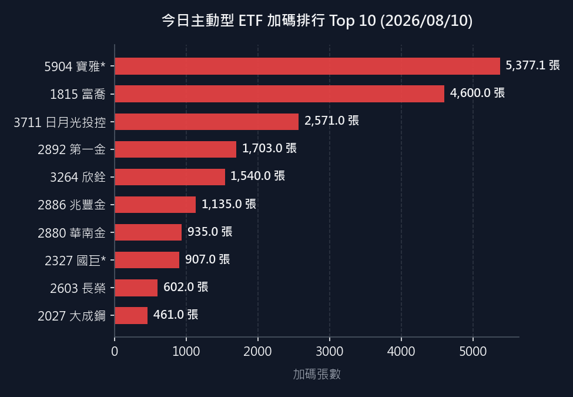
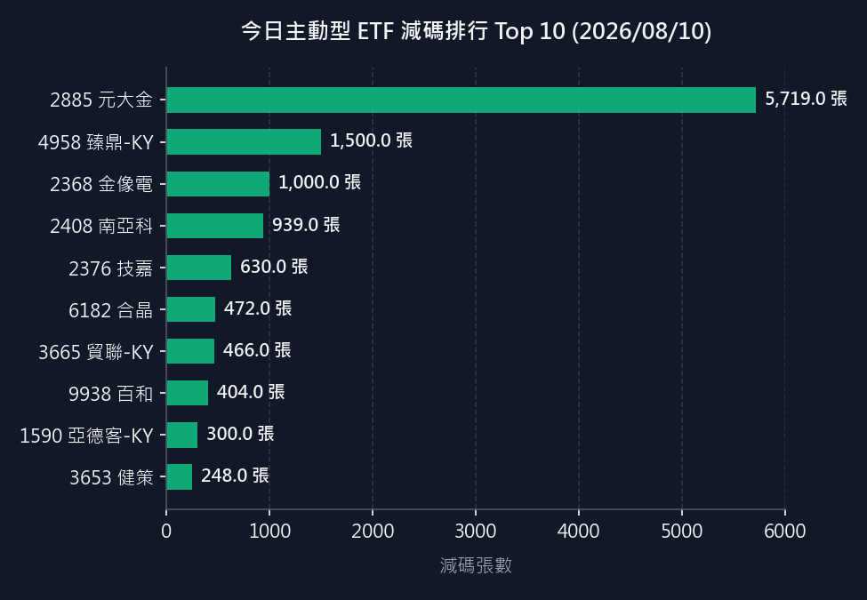

# 主動型 ETF 持股變動

資料來源：`主動型ETF持股明細.xlsx` 最近兩個日期分頁。

比較區間：`20260807` → `20260810`

## 今日加減碼視覺化排行

| 今日加碼 Top 10 | 今日減碼 Top 10 |
| :---: | :---: |
|  |  |

| ETF | 新增 | 刪除 | 比例變動 |
| :-- | --: | --: | --: |
| 00400A | 1 | 0 | 45 |
| 00401A | 0 | 0 | 55 |
| 00402A | 0 | 0 | 45 |
| 00403A | 0 | 0 | 38 |
| 00404A | 0 | 0 | 44 |
| 00405A | 0 | 0 | 41 |
| 00407A | 0 | 0 | 40 |
| 00408A | 3 | 0 | 37 |
| 00980A | 0 | 0 | 47 |
| 00980D | 0 | 0 | 11 |
| 00981A | 0 | 0 | 31 |
| 00982A | 1 | 0 | 41 |
| 00983A | 0 | 0 | 41 |
| 00983D | 0 | 0 | 5 |
| 00984A | 0 | 4 | 90 |
| 00985A | 0 | 0 | 42 |
| 00986A | 0 | 0 | 35 |
| 00987A | 1 | 1 | 24 |
| 00988A | 2 | 2 | 40 |
| 00989A | 0 | 0 | 55 |
| 00990A | 0 | 1 | 44 |
| 00991A | 0 | 0 | 20 |
| 00992A | 0 | 0 | 31 |
| 00993A | 0 | 0 | 43 |
| 00994A | 2 | 0 | 27 |
| 00995A | 0 | 0 | 46 |
| 00996A | 1 | 0 | 42 |
| 00997A | 0 | 0 | 42 |
| 00998A | 0 | 2 | 33 |
| 00999A | 0 | 1 | 61 |

## 00400A

### 新增持股

- 4979 華星光（0.05%，25 張）

### 刪除持股

- 無

### 投資比例變動

- 1303 南亞：0.40% → 0.39%（-0.01）
- 2059 川湖：4.30% → 4.62%（+0.32）
- 2308 台達電：2.52% → 2.78%（+0.26）
- 2313 華通：0.79% → 0.82%（+0.03）
- 2317 鴻海：0.86% → 0.87%（+0.01）
- 2330 台積電：8.33% → 8.37%（+0.04）
- 2345 智邦：1.72% → 1.69%（-0.03）
- 2360 致茂：3.76% → 3.77%（+0.01）
- 2382 廣達：0.68% → 0.71%（+0.03）
- 2383 台光電：5.23% → 5.28%（+0.05）
- 2408 南亞科：1.75% → 1.93%（+0.18）
- 2449 京元電子：1.36% → 1.40%（+0.04）
- 2454 聯發科：6.28% → 6.39%（+0.11）
- 2881 富邦金：0.74% → 0.75%（+0.01）
- 2885 元大金：1.40% → 1.41%（+0.01）
- 2891 中信金：0.87% → 0.88%（+0.01）
- 3008 大立光：2.31% → 2.33%（+0.02）
- 3017 奇鋐：4.65% → 4.62%（-0.03）
- 3036 文曄：1.67% → 1.81%（+0.14）
- 3037 欣興：4.84% → 5.03%（+0.19）
- 3044 健鼎：1.40% → 1.42%（+0.02）
- 3090 日電貿：0.31% → 0.33%（+0.02）
- 3211 順達：0.64% → 0.70%（+0.06）
- 3374 精材：0.28% → 0.31%（+0.03）
- 3443 創意：2.96% → 2.95%（-0.01）
- 3529 力旺：1.14% → 1.19%（+0.05）
- 3653 健策：3.71% → 3.51%（-0.20）
- 3665 貿聯-KY：2.67% → 2.66%（-0.01）
- 3711 日月光投控：1.22% → 1.31%（+0.09）
- 5274 信驊：2.94% → 2.97%（+0.03）
- 5347 世界：0.66% → 0.73%（+0.07）
- 5434 崇越：0.34% → 0.35%（+0.01）
- 6121 新普：0.23% → 0.24%（+0.01）
- 6187 萬潤：2.31% → 2.23%（-0.08）
- 6223 旺矽：4.98% → 5.08%（+0.10）
- 6239 力成：0.93% → 1.02%（+0.09）
- 6274 台燿：1.03% → 1.04%（+0.01）
- 6442 光聖：0.51% → 0.55%（+0.04）
- 6488 環球晶：2.72% → 2.67%（-0.05）
- 6505 台塑化：0.73% → 0.71%（-0.02）
- 6669 緯穎：3.89% → 3.84%（-0.05）
- 6715 嘉基：0.16% → 0.17%（+0.01）
- 7750 新代：0.97% → 1.04%（+0.07）
- 7769 鴻勁：0.74% → 0.73%（-0.01）
- 8046 南電：0.96% → 1.01%（+0.05）

## 00401A

### 新增持股

- 無

### 刪除持股

- 無

### 投資比例變動

- 1216 統一：0.33% → 0.31%（-0.02）
- 1301 台塑：0.08% → 0.07%（-0.01）
- 2303 聯電：0.91% → 0.93%（+0.02）
- 2308 台達電：3.31% → 3.50%（+0.19）
- 2313 華通：1.47% → 1.73%（+0.26）
- 2317 鴻海：0.71% → 0.70%（-0.01）
- 2327 國巨*：0.43% → 0.72%（+0.29）
- 2330 台積電：14.10% → 15.16%（+1.06）
- 2344 華邦電：1.17% → 1.24%（+0.07）
- 2345 智邦：2.52% → 2.37%（-0.15）
- 2357 華碩：1.34% → 1.29%（-0.05）
- 2360 致茂：1.90% → 1.83%（-0.07）
- 2368 金像電：0.30% → 0.27%（-0.03）
- 2379 瑞昱：1.28% → 1.24%（-0.04）
- 2382 廣達：1.83% → 1.86%（+0.03）
- 2383 台光電：1.87% → 1.82%（-0.05）
- 2412 中華電：0.92% → 0.88%（-0.04）
- 2454 聯發科：6.59% → 6.45%（-0.14）
- 2455 全新：1.36% → 1.39%（+0.03）
- 2881 富邦金：2.01% → 1.96%（-0.05）
- 2882 國泰金：1.11% → 1.09%（-0.02）
- 2883 凱基金：1.61% → 1.56%（-0.05）
- 2884 玉山金：1.95% → 1.86%（-0.09）
- 2885 元大金：0.57% → 0.55%（-0.02）
- 2886 兆豐金：1.63% → 1.57%（-0.06）
- 2887 台新新光金：1.08% → 1.06%（-0.02）
- 2890 永豐金：0.31% → 0.30%（-0.01）
- 2891 中信金：1.75% → 1.71%（-0.04）
- 2912 統一超：0.30% → 0.29%（-0.01）
- 3008 大立光：2.05% → 2.26%（+0.21）
- 3034 聯詠：0.25% → 0.24%（-0.01）
- 3167 大量：0.53% → 0.48%（-0.05）
- 3231 緯創：0.40% → 0.41%（+0.01）
- 3491 昇達科：1.73% → 1.67%（-0.06）
- 3653 健策：1.12% → 1.02%（-0.10）
- 3711 日月光投控：2.13% → 2.21%（+0.08）
- 4904 遠傳：0.87% → 0.83%（-0.04）
- 4958 臻鼎-KY：2.04% → 1.95%（-0.09）
- 4991 環宇-KY：0.68% → 0.72%（+0.04）
- 5274 信驊：1.16% → 1.13%（-0.03）
- 5347 世界：1.33% → 1.40%（+0.07）
- 5904 寶雅*：0.65% → 0.69%（+0.04）
- 6187 萬潤：0.73% → 0.68%（-0.05）
- 6223 旺矽：2.26% → 2.22%（-0.04）
- 6285 啟碁：1.58% → 1.67%（+0.09）
- 6415 矽力*-KY：0.65% → 0.66%（+0.01）
- 6510 精測：0.70% → 0.71%（+0.01）
- 6515 穎崴：1.25% → 1.21%（-0.04）
- 6531 愛普*：1.37% → 1.28%（-0.09）
- 6669 緯穎：2.18% → 2.07%（-0.11）
- 6944 兆聯實業：0.51% → 0.48%（-0.03）
- 7769 鴻勁：2.53% → 2.42%（-0.11）
- 7828 創新服務：1.94% → 1.81%（-0.13）
- 8021 尖點：0.28% → 0.29%（+0.01）
- 8464 億豐：1.25% → 1.19%（-0.06）

## 00402A

### 新增持股

- 無

### 刪除持股

- 無

### 投資比例變動

- AAPL.US Apple：7.67% → 7.58%（-0.09）
- ADI.US Analog Devices：1.84% → 1.87%（+0.03）
- AMD.US AMD：5.48% → 5.33%（-0.15）
- AMZN.US Amazon：4.46% → 4.43%（-0.03）
- ANET.US Arista Networks：0.81% → 0.79%（-0.02）
- ARM.US Arm：1.11% → 1.08%（-0.03）
- ASML.US ASML Holding：1.63% → 1.64%（+0.01）
- AVGO.US Broadcom：2.70% → 2.71%（+0.01）
- AXON.US Axon Enterprise：0.95% → 1.02%（+0.07）
- BKNG.US Booking Holdings：0.71% → 0.72%（+0.01）
- CDNS.US Cadence Design Systems：1.82% → 1.80%（-0.02）
- COHR.US Coherent：2.19% → 2.45%（+0.26）
- CRWD.US CrowdStrike Holdings：1.39% → 1.41%（+0.02）
- GOOG.US Alphabet - Class C Capital Stock：3.52% → 3.44%（-0.08）
- GOOGL.US Alphabet - Class A Common Stock：3.47% → 3.39%（-0.08）
- INTC.US Intel：1.30% → 1.31%（+0.01）
- IOT.US Samsara：0.23% → 0.25%（+0.02）
- KLAC.US KLA：2.16% → 2.18%（+0.02）
- LITE.US Lumentum：1.68% → 1.76%（+0.08）
- LRCX.US Lam Research：3.56% → 3.58%（+0.02）
- MCHP.US Microchip Technology：1.12% → 1.26%（+0.14）
- MDB.US MongoDB：0.72% → 0.77%（+0.05）
- META.US Meta：2.82% → 2.79%（-0.03）
- MRVL.US Marvell：1.51% → 1.54%（+0.03）
- MSFT.US Microsoft：4.35% → 4.28%（-0.07）
- MU.US Micron：6.34% → 6.22%（-0.12）
- NFLX.US Netflix：0.81% → 0.80%（-0.01）
- NOW.US ServiceNow：0.25% → 0.26%（+0.01）
- NVDA.US NVIDIA：8.96% → 9.03%（+0.07）
- NXPI.US NXP Semiconductors：1.10% → 1.12%（+0.02）
- PANW.US Palo Alto：3.39% → 3.38%（-0.01）
- PLTR.US Palantir Technologies：1.36% → 1.47%（+0.11）
- SHOP.US Shopify：0.50% → 0.51%（+0.01）
- SIMO.US Silicon Motion：0.80% → 0.76%（-0.04）
- SKHY.US SK hynix：0.91% → 0.86%（-0.05）
- SNOW.US Snowflake：0.96% → 0.98%（+0.02）
- SPCX.US SpaceX：0.59% → 0.67%（+0.08）
- STX.US Seagate：1.48% → 1.39%（-0.09）
- TER.US Teradyne：0.89% → 0.87%（-0.02）
- TSM.US TSMC(ADR)：1.43% → 1.41%（-0.02）
- TTWO.US Take-Two：0.54% → 0.56%（+0.02）
- TXN.US Texas Instruments：2.26% → 2.28%（+0.02）
- UBER.US Uber：0.46% → 0.48%（+0.02）
- V.US Visa：1.11% → 1.07%（-0.04）
- WDC.US Western Digital：2.51% → 2.38%（-0.13）

## 00403A

### 新增持股

- 無

### 刪除持股

- 無

### 投資比例變動

- 1303 南亞：0.11% → 0.10%（-0.01）
- 1560 中砂：0.57% → 0.58%（+0.01）
- 1717 長興：0.06% → 0.07%（+0.01）
- 2303 聯電：5.23% → 5.45%（+0.22）
- 2308 台達電：2.86% → 3.10%（+0.24）
- 2317 鴻海：0.47% → 0.48%（+0.01）
- 2327 國巨*：2.46% → 2.89%（+0.43）
- 2330 台積電：17.14% → 16.94%（-0.20）
- 2337 旺宏：0.52% → 0.56%（+0.04）
- 2344 華邦電：3.94% → 4.26%（+0.32）
- 2345 智邦：2.91% → 2.80%（-0.11）
- 2360 致茂：1.04% → 1.02%（-0.02）
- 2383 台光電：4.47% → 4.60%（+0.13）
- 3008 大立光：0.65% → 0.64%（-0.01）
- 3017 奇鋐：5.48% → 5.35%（-0.13）
- 3037 欣興：4.61% → 4.71%（+0.10）
- 3211 順達：0.39% → 0.42%（+0.03）
- 3264 欣銓：0.08% → 0.09%（+0.01）
- 3443 創意：1.32% → 1.30%（-0.02）
- 3450 聯鈞：0.38% → 0.47%（+0.09）
- 3533 嘉澤：1.35% → 1.36%（+0.01）
- 3583 辛耘：0.36% → 0.35%（-0.01）
- 3653 健策：2.57% → 2.04%（-0.53）
- 3665 貿聯-KY：1.51% → 1.48%（-0.03）
- 3711 日月光投控：2.50% → 2.83%（+0.33）
- 4958 臻鼎-KY：1.40% → 0.98%（-0.42）
- 5274 信驊：1.72% → 1.85%（+0.13）
- 6223 旺矽：3.65% → 3.67%（+0.02）
- 6239 力成：0.80% → 0.87%（+0.07）
- 6415 矽力*-KY：0.08% → 0.07%（-0.01）
- 6442 光聖：0.17% → 0.18%（+0.01）
- 6488 環球晶：1.32% → 1.27%（-0.05）
- 6669 緯穎：1.74% → 1.69%（-0.05）
- 6805 富世達：0.67% → 0.69%（+0.02）
- 7769 鴻勁：0.72% → 0.62%（-0.10）
- 8046 南電：1.08% → 1.11%（+0.03）
- 8358 金居：0.26% → 0.25%（-0.01）
- 8996 高力：0.95% → 0.97%（+0.02）

## 00404A

### 新增持股

- 無

### 刪除持股

- 無

### 投資比例變動

- 1210 大成：1.74% → 1.81%（+0.07）
- 2059 川湖：0.32% → 0.34%（+0.02）
- 2301 光寶科：1.72% → 1.73%（+0.01）
- 2303 聯電：2.82% → 2.97%（+0.15）
- 2308 台達電：0.95% → 0.98%（+0.03）
- 2327 國巨*：0.68% → 0.72%（+0.04）
- 2330 台積電：22.05% → 22.33%（+0.28）
- 2345 智邦：0.45% → 0.43%（-0.02）
- 2351 順德：0.58% → 0.57%（-0.01）
- 2360 致茂：1.28% → 1.16%（-0.12）
- 2377 微星：1.81% → 1.83%（+0.02）
- 2393 億光：0.90% → 0.73%（-0.17）
- 2428 興勤：0.79% → 0.80%（+0.01）
- 2441 超豐：0.44% → 0.48%（+0.04）
- 2454 聯發科：6.55% → 6.72%（+0.17）
- 2458 義隆：0.39% → 0.40%（+0.01）
- 2880 華南金：2.72% → 2.68%（-0.04）
- 2886 兆豐金：3.11% → 3.10%（-0.01）
- 2892 第一金：3.10% → 3.12%（+0.02）
- 3017 奇鋐：1.04% → 1.02%（-0.02）
- 3022 威強電：1.01% → 0.92%（-0.09）
- 3023 信邦：2.24% → 2.20%（-0.04）
- 3034 聯詠：0.58% → 0.57%（-0.01）
- 3037 欣興：1.26% → 1.30%（+0.04）
- 3260 威剛：0.37% → 0.36%（-0.01）
- 3264 欣銓：1.84% → 1.76%（-0.08）
- 3443 創意：1.17% → 1.03%（-0.14）
- 3653 健策：0.25% → 0.24%（-0.01）
- 3702 大聯大：1.84% → 1.94%（+0.10）
- 3711 日月光投控：3.46% → 3.52%（+0.06）
- 4763 材料*-KY：1.84% → 1.83%（-0.01）
- 5274 信驊：2.27% → 2.28%（+0.01）
- 5289 宜鼎：0.30% → 0.29%（-0.01）
- 5434 崇越：1.55% → 1.58%（+0.03）
- 6138 茂達：0.36% → 0.38%（+0.02）
- 6196 帆宣：1.73% → 1.76%（+0.03）
- 6223 旺矽：1.14% → 1.15%（+0.01）
- 6257 矽格：0.38% → 0.39%（+0.01）
- 6488 環球晶：0.13% → 0.12%（-0.01）
- 6491 晶碩：1.76% → 1.85%（+0.09）
- 6691 洋基工程：2.83% → 2.67%（-0.16）
- 8016 矽創：1.24% → 1.18%（-0.06）
- 臺指選擇權08/26 45400 買權：-0.29% → -0.36%（-0.07）
- 臺股期貨08/26：16.28% → 16.42%（+0.14）

## 00405A

### 新增持股

- 無

### 刪除持股

- 無

### 投資比例變動

- 2059 川湖：1.56% → 1.67%（+0.11）
- 2308 台達電：1.62% → 1.79%（+0.17）
- 2330 台積電：1.42% → 1.43%（+0.01）
- 2344 華邦電：3.22% → 3.54%（+0.32）
- 2345 智邦：3.92% → 3.84%（-0.08）
- 2368 金像電：3.70% → 3.49%（-0.21）
- 2383 台光電：3.71% → 3.76%（+0.05）
- 2408 南亞科：1.30% → 1.43%（+0.13）
- 2449 京元電子：0.67% → 0.69%（+0.02）
- 2454 聯發科：6.25% → 6.37%（+0.12）
- 3008 大立光：1.48% → 1.49%（+0.01）
- 3017 奇鋐：7.47% → 7.44%（-0.03）
- 3026 禾伸堂：1.04% → 1.14%（+0.10）
- 3037 欣興：5.01% → 5.22%（+0.21）
- 3081 聯亞：1.22% → 1.34%（+0.12）
- 3131 弘塑：1.77% → 1.84%（+0.07）
- 3264 欣銓：0.02% → 0.03%（+0.01）
- 3583 辛耘：0.63% → 0.64%（+0.01）
- 3653 健策：6.25% → 5.91%（-0.34）
- 3665 貿聯-KY：6.36% → 6.34%（-0.02）
- 3711 日月光投控：0.63% → 0.68%（+0.05）
- 4749 新應材：0.26% → 0.25%（-0.01）
- 5274 信驊：1.98% → 2.01%（+0.03）
- 5347 世界：0.10% → 0.11%（+0.01）
- 6187 萬潤：0.75% → 0.72%（-0.03）
- 6223 旺矽：5.56% → 5.69%（+0.13）
- 6274 台燿：1.47% → 1.50%（+0.03）
- 6442 光聖：0.31% → 0.33%（+0.02）
- 6488 環球晶：0.32% → 0.31%（-0.01）
- 6510 精測：2.21% → 2.33%（+0.12）
- 6515 穎崴：0.52% → 0.53%（+0.01）
- 6526 達發：0.30% → 0.31%（+0.01）
- 6669 緯穎：3.97% → 3.92%（-0.05）
- 6805 富世達：0.56% → 0.59%（+0.03）
- 6831 邁科：0.53% → 0.52%（-0.01）
- 7734 印能科技：2.13% → 2.19%（+0.06）
- 7769 鴻勁：2.53% → 2.52%（-0.01）
- 8028 昇陽半導體：0.75% → 0.79%（+0.04）
- 8046 南電：3.75% → 3.93%（+0.18）
- 8210 勤誠：0.63% → 0.60%（-0.03）
- 8996 高力：0.98% → 1.02%（+0.04）

## 00407A

### 新增持股

- 無

### 刪除持股

- 無

### 投資比例變動

- 1303 南亞：0.54% → 0.53%（-0.01）
- 1590 亞德客-KY：2.27% → 2.31%（+0.04）
- 2059 川湖：2.71% → 2.90%（+0.19）
- 2303 聯電：2.01% → 2.13%（+0.12）
- 2308 台達電：3.28% → 3.60%（+0.32）
- 2327 國巨*：2.01% → 2.13%（+0.12）
- 2330 台積電：8.18% → 8.20%（+0.02）
- 2344 華邦電：1.63% → 1.78%（+0.15）
- 2345 智邦：3.17% → 3.10%（-0.07）
- 2368 金像電：1.84% → 1.73%（-0.11）
- 2376 技嘉：0.69% → 0.70%（+0.01）
- 2383 台光電：4.91% → 4.95%（+0.04）
- 2395 研華：1.79% → 1.88%（+0.09）
- 2408 南亞科：1.71% → 1.88%（+0.17）
- 2412 中華電：1.57% → 1.56%（-0.01）
- 2454 聯發科：6.47% → 6.56%（+0.09）
- 3017 奇鋐：4.11% → 4.08%（-0.03）
- 3037 欣興：4.36% → 4.52%（+0.16）
- 3260 威剛：0.17% → 0.16%（-0.01）
- 3443 創意：1.85% → 1.84%（-0.01）
- 3529 力旺：2.04% → 2.12%（+0.08）
- 3533 嘉澤：0.91% → 0.93%（+0.02）
- 3665 貿聯-KY：2.87% → 2.85%（-0.02）
- 3711 日月光投控：2.32% → 2.50%（+0.18）
- 4958 臻鼎-KY：1.69% → 1.68%（-0.01）
- 5274 信驊：1.99% → 2.01%（+0.02）
- 5289 宜鼎：0.17% → 0.16%（-0.01）
- 5434 崇越：0.17% → 0.18%（+0.01）
- 5536 聖暉*：1.56% → 1.54%（-0.02）
- 6223 旺矽：2.70% → 2.75%（+0.05）
- 6274 台燿：3.23% → 3.27%（+0.04）
- 6415 矽力*-KY：0.34% → 0.36%（+0.02）
- 6446 藥華藥：2.32% → 2.49%（+0.17）
- 6515 穎崴：1.39% → 1.40%（+0.01）
- 6531 愛普*：1.56% → 1.52%（-0.04）
- 6669 緯穎：4.36% → 4.29%（-0.07）
- 6805 富世達：1.98% → 2.08%（+0.10）
- 8046 南電：2.11% → 2.20%（+0.09）
- 8210 勤誠：1.62% → 1.56%（-0.06）
- 8996 高力：0.39% → 0.40%（+0.01）

## 00408A

### 新增持股

- 2382 廣達（0.85%，45 張）
- 3711 日月光投控（0.53%，14 張）
- 6805 富世達（0.32%，3 張）

### 刪除持股

- 無

### 投資比例變動

- 2059 川湖：2.02% → 2.15%（+0.13）
- 2303 聯電：0.91% → 1.29%（+0.38）
- 2308 台達電：3.39% → 3.71%（+0.32）
- 2317 鴻海：2.75% → 2.78%（+0.03）
- 2330 台積電：6.59% → 6.57%（-0.02）
- 2344 華邦電：1.38% → 1.51%（+0.13）
- 2345 智邦：1.61% → 1.56%（-0.05）
- 2356 英業達：1.28% → 1.31%（+0.03）
- 2357 華碩：2.12% → 2.11%（-0.01）
- 2360 致茂：2.82% → 2.80%（-0.02）
- 2368 金像電：2.26% → 2.11%（-0.15）
- 2376 技嘉：2.18% → 2.20%（+0.02）
- 2383 台光電：4.44% → 4.45%（+0.01）
- 2395 研華：2.11% → 2.20%（+0.09）
- 2404 漢唐：1.74% → 1.73%（-0.01）
- 2408 南亞科：1.11% → 1.21%（+0.10）
- 2454 聯發科：4.48% → 4.52%（+0.04）
- 2880 華南金：1.75% → 1.72%（-0.03）
- 2886 兆豐金：2.68% → 2.66%（-0.02）
- 2891 中信金：0.95% → 0.96%（+0.01）
- 3017 奇鋐：3.71% → 3.65%（-0.06）
- 3036 文曄：0.81% → 0.87%（+0.06）
- 3037 欣興：3.58% → 3.69%（+0.11）
- 3045 台灣大：3.31% → 3.26%（-0.05）
- 3231 緯創：1.00% → 1.04%（+0.04）
- 3653 健策：1.32% → 1.24%（-0.08）
- 3665 貿聯-KY：2.66% → 2.63%（-0.03）
- 3702 大聯大：1.93% → 2.03%（+0.10）
- 5434 崇越：1.75% → 1.79%（+0.04）
- 5876 上海商銀：1.47% → 1.45%（-0.02）
- 5904 寶雅*：1.79% → 1.95%（+0.16）
- 6223 旺矽：1.29% → 1.31%（+0.02）
- 6239 力成：1.06% → 1.16%（+0.10）
- 6274 台燿：1.65% → 1.67%（+0.02）
- 6669 緯穎：4.43% → 4.33%（-0.10）
- 7769 鴻勁：1.72% → 1.70%（-0.02）
- 8046 南電：2.35% → 2.44%（+0.09）

## 00980A

### 新增持股

- 無

### 刪除持股

- 無

### 投資比例變動

- 1303 南亞：2.38% → 2.28%（-0.10）
- 2059 川湖：5.30% → 5.52%（+0.22）
- 2308 台達電：3.49% → 3.74%（+0.25）
- 2317 鴻海：2.14% → 2.12%（-0.02）
- 2327 國巨*：0.98% → 1.01%（+0.03）
- 2330 台積電：8.23% → 8.04%（-0.19）
- 2344 華邦電：0.99% → 1.06%（+0.07）
- 2345 智邦：1.71% → 1.62%（-0.09）
- 2360 致茂：1.57% → 1.53%（-0.04）
- 2368 金像電：2.02% → 1.86%（-0.16）
- 2376 技嘉：1.25% → 1.24%（-0.01）
- 2382 廣達：1.54% → 1.58%（+0.04）
- 2383 台光電：4.17% → 4.10%（-0.07）
- 2408 南亞科：2.49% → 2.66%（+0.17）
- 2454 聯發科：5.70% → 5.63%（-0.07）
- 2884 玉山金：0.87% → 0.84%（-0.03）
- 2891 中信金：1.28% → 1.26%（-0.02）
- 3008 大立光：0.83% → 0.81%（-0.02）
- 3017 奇鋐：1.95% → 1.89%（-0.06）
- 3026 禾伸堂：0.38% → 0.40%（+0.02）
- 3036 文曄：1.27% → 1.34%（+0.07）
- 3037 欣興：2.82% → 2.85%（+0.03）
- 3081 聯亞：2.87% → 3.07%（+0.20）
- 3189 景碩：0.80% → 0.79%（-0.01）
- 3231 緯創：1.00% → 1.02%（+0.02）
- 3264 欣銓：0.71% → 0.74%（+0.03）
- 3293 鈊象：1.05% → 1.02%（-0.03）
- 3443 創意：1.40% → 1.36%（-0.04）
- 3529 力旺：0.93% → 0.94%（+0.01）
- 3653 健策：1.58% → 1.45%（-0.13）
- 3665 貿聯-KY：0.37% → 0.36%（-0.01）
- 3711 日月光投控：1.23% → 1.28%（+0.05）
- 4958 臻鼎-KY：0.83% → 0.80%（-0.03）
- 5274 信驊：1.57% → 1.54%（-0.03）
- 5904 寶雅*：1.18% → 1.26%（+0.08）
- 6213 聯茂：0.98% → 1.05%（+0.07）
- 6223 旺矽：2.43% → 2.41%（-0.02）
- 6274 台燿：1.41% → 1.39%（-0.02）
- 6442 光聖：0.26% → 0.28%（+0.02）
- 6515 穎崴：1.95% → 1.92%（-0.03）
- 6669 緯穎：1.66% → 1.59%（-0.07）
- 6805 富世達：0.47% → 0.48%（+0.01）
- 6831 邁科：0.61% → 0.57%（-0.04）
- 7769 鴻勁：2.42% → 2.34%（-0.08）
- 8046 南電：1.15% → 1.17%（+0.02）
- 8210 勤誠：0.81% → 0.76%（-0.05）
- 8299 群聯：2.31% → 2.27%（-0.04）

## 00980D

### 新增持股

- 無

### 刪除持股

- 無

### 投資比例變動

- ALLY FINANCIAL INC (REG) 8% 01/11/2031：0.57% → 0.58%（+0.01）
- CHARTER COMM OPT LLC/CAP (REG) 6.834000 % 23OCT2055：0.44% → 0.45%（+0.01）
- DOW CHEMICAL CO/THE 9.4% 15MAY2039：0.54% → 0.53%（-0.01）
- ENEL FINANCE INTL NV SER REGS (REG S) 7.75% 14OCT2052：0.36% → 0.37%（+0.01）
- GLOBAL AUTO HO/AAG FH UK SER REGS (REG S) 8.75% 15JAN2032：0.42% → 0.43%（+0.01）
- HAH GROUP HOLDING CO LLC SER REGS (REG S) 9.75% 01OCT2031：0.29% → 0.30%（+0.01）
- HERTZ CORP/THE SER REGS (REG S) 12.625% 15JUL2029：0.30% → 0.31%（+0.01）
- JH NORTH AMERICA HOLDING SER REGS 6.125000 % 31JUL2032：0.39% → 0.40%（+0.01）
- RR DONNELLEY & SONS CO SER REGS (REG S) 9.5% 01AUG2029：0.41% → 0.42%（+0.01）
- US LONG BOND(CBT) SEP26 21-SEP-2026：5.33% → 5.32%（-0.01）
- VAR ENERGI ASA SER REGS (REG S) 7.5% 15JAN2028：0.33% → 0.32%（-0.01）

## 00981A

### 新增持股

- 無

### 刪除持股

- 無

### 投資比例變動

- 1590 亞德客-KY：0.27% → 0.12%（-0.15）
- 2303 聯電：3.41% → 3.57%（+0.16）
- 2308 台達電：3.70% → 4.25%（+0.55）
- 2327 國巨*：4.60% → 4.82%（+0.22）
- 2330 台積電：9.63% → 9.56%（-0.07）
- 2345 智邦：4.76% → 4.60%（-0.16）
- 2360 致茂：0.39% → 0.38%（-0.01）
- 2368 金像電：1.64% → 1.23%（-0.41）
- 2383 台光電：8.53% → 8.51%（-0.02）
- 2408 南亞科：0.14% → 0.00%（-0.14）
- 2449 京元電子：0.92% → 0.93%（+0.01）
- 2454 聯發科：7.11% → 7.14%（+0.03）
- 3017 奇鋐：5.41% → 5.31%（-0.10）
- 3037 欣興：6.46% → 6.63%（+0.17）
- 3264 欣銓：0.10% → 0.23%（+0.13）
- 3653 健策：3.48% → 3.25%（-0.23）
- 3665 貿聯-KY：3.40% → 3.35%（-0.05）
- 3711 日月光投控：3.42% → 4.07%（+0.65）
- 4958 臻鼎-KY：0.27% → 0.26%（-0.01）
- 4979 華星光：0.31% → 0.33%（+0.02）
- 6187 萬潤：0.50% → 0.48%（-0.02）
- 6191 精成科：0.11% → 0.12%（+0.01）
- 6223 旺矽：4.99% → 5.03%（+0.04）
- 6274 台燿：2.65% → 2.66%（+0.01）
- 6278 台表科：0.17% → 0.18%（+0.01）
- 6510 精測：0.24% → 0.25%（+0.01）
- 6669 緯穎：5.53% → 5.39%（-0.14）
- 6805 富世達：1.15% → 1.29%（+0.14）
- 8046 南電：3.44% → 3.56%（+0.12）
- 8210 勤誠：0.93% → 0.89%（-0.04）
- 台指期貨(B)：5.75% → 5.78%（+0.03）

## 00982A

### 新增持股

- 6446 藥華藥（0.11%，42 張）

### 刪除持股

- 無

### 投資比例變動

- 1785 光洋科：0.98% → 1.01%（+0.03）
- 2059 川湖：3.62% → 4.29%（+0.67）
- 2303 聯電：2.14% → 2.18%（+0.04）
- 2316 楠梓電：1.09% → 1.11%（+0.02）
- 2330 台積電：8.22% → 8.32%（+0.10）
- 2345 智邦：3.81% → 3.45%（-0.36）
- 2351 順德：0.77% → 0.76%（-0.01）
- 2360 致茂：3.20% → 3.31%（+0.11）
- 2376 技嘉：0.71% → 0.30%（-0.41）
- 2377 微星：1.69% → 1.71%（+0.02）
- 2383 台光電：3.36% → 3.37%（+0.01）
- 2454 聯發科：6.62% → 6.73%（+0.11）
- 2467 志聖：1.51% → 1.61%（+0.10）
- 2472 立隆電：0.71% → 0.72%（+0.01）
- 3008 大立光：2.22% → 2.13%（-0.09）
- 3017 奇鋐：2.32% → 2.19%（-0.13）
- 3036 文曄：1.09% → 1.07%（-0.02）
- 3105 穩懋：3.16% → 3.21%（+0.05）
- 3264 欣銓：1.96% → 2.07%（+0.11）
- 3491 昇達科：2.58% → 2.38%（-0.20）
- 3529 力旺：0.48% → 0.51%（+0.03）
- 3583 辛耘：1.65% → 1.57%（-0.08）
- 3702 大聯大：1.38% → 1.44%（+0.06）
- 3711 日月光投控：1.17% → 1.25%（+0.08）
- 4958 臻鼎-KY：2.97% → 2.91%（-0.06）
- 5274 信驊：0.97% → 0.96%（-0.01）
- 5536 聖暉*：7.74% → 7.61%（-0.13）
- 6139 亞翔：6.11% → 5.94%（-0.17）
- 6187 萬潤：0.21% → 0.19%（-0.02）
- 6223 旺矽：3.75% → 3.72%（-0.03）
- 6239 力成：0.37% → 0.40%（+0.03）
- 6257 矽格：1.93% → 1.95%（+0.02）
- 6274 台燿：1.33% → 1.28%（-0.05）
- 6278 台表科：0.73% → 0.77%（+0.04）
- 6488 環球晶：1.92% → 1.89%（-0.03）
- 6531 愛普*：2.51% → 2.59%（+0.08）
- 6669 緯穎：6.19% → 5.97%（-0.22）
- 6831 邁科：0.38% → 0.36%（-0.02）
- 7769 鴻勁：1.17% → 1.14%（-0.03）
- 8016 矽創：1.36% → 1.38%（+0.02）
- 8996 高力：0.84% → 0.80%（-0.04）

## 00983A

### 新增持股

- 無

### 刪除持股

- 無

### 投資比例變動

- ACHR.US Archer：0.33% → 0.34%（+0.01）
- AMD.US AMD：5.43% → 5.17%（-0.26）
- AMZN.US Amazon：3.64% → 3.54%（-0.10）
- AVGO.US Broadcom：2.11% → 2.07%（-0.04）
- BEAM.US Beam Therapeutics：2.45% → 2.38%（-0.07）
- BLSH.US Bullish：1.00% → 0.99%（-0.01）
- BMNR.US BitMine：1.18% → 1.17%（-0.01）
- CBRS.US Cerebras：0.66% → 0.68%（+0.02）
- CERS.US Cerus：0.41% → 0.40%（-0.01）
- COIN.US Coinbase：2.02% → 2.14%（+0.12）
- CRCL.US Circle：2.04% → 2.24%（+0.20）
- CRWV.US CoreWeave：0.91% → 0.93%（+0.02）
- DE.US Deere：1.45% → 1.41%（-0.04）
- FIG.US Figma：0.43% → 0.40%（-0.03）
- GOOG.US Alphabet - Class C Capital Stock：1.34% → 1.28%（-0.06）
- GOOGL.US Alphabet - Class A Common Stock：1.77% → 1.69%（-0.08）
- HOOD.US Robinhood Markets：3.75% → 3.72%（-0.03）
- ILMN.US Illumina：3.81% → 3.57%（-0.24）
- KTOS.US Kratos Defense & Security：0.63% → 0.81%（+0.18）
- LLY.US Eli Lilly：2.02% → 1.93%（-0.09）
- META.US Meta：1.18% → 1.14%（-0.04）
- NTLA.US Intellia Therapeutics：1.30% → 1.33%（+0.03）
- NTRA.US Natera：2.14% → 2.34%（+0.20）
- NVDA.US NVIDIA：1.70% → 1.67%（-0.03）
- PLTR.US Palantir Technologies：1.80% → 2.13%（+0.33）
- RBLX.US Roblox：1.57% → 1.42%（-0.15）
- RXRX.US Recursion Pharmaceuticals：0.31% → 0.30%（-0.01）
- SHOP.US Shopify：7.21% → 7.15%（-0.06）
- SNOW.US Snowflake：1.58% → 1.66%（+0.08）
- SOFI.US SoFi Technologies：0.71% → 0.70%（-0.01）
- SPCX.US SpaceX：1.82% → 2.13%（+0.31）
- TEM.US Tempus：3.09% → 3.37%（+0.28）
- TER.US Teradyne：0.66% → 0.62%（-0.04）
- TSLA.US Tesla：7.84% → 7.82%（-0.02）
- TSM.US TSMC(ADR)：3.61% → 3.50%（-0.11）
- TWST.US Twist Bioscience：4.70% → 4.64%（-0.06）
- TXG.US 10x Genomics：4.17% → 4.42%（+0.25）
- VCYT.US Veracyte：1.09% → 1.07%（-0.02）
- WGS.US GeneDx：1.51% → 1.61%（+0.10）
- XE.US X-Energy：0.14% → 0.32%（+0.18）
- XYZ.US Block：2.31% → 2.23%（-0.08）

## 00983D

### 新增持股

- 無

### 刪除持股

- 無

### 投資比例變動

- AMCX 10 1/2 07/15/32：1.63% → 1.64%（+0.01）
- NVDA 5.55 06/15/46：1.17% → 1.16%（-0.01）
- SPCX 6.6 07/15/46：1.13% → 1.14%（+0.01）
- TLTW.US iShares 20+ Year Treasury Bond B：7.22% → 7.23%（+0.01）
- VENLNG 9 1/2 02/01/29：1.42% → 1.41%（-0.01）

## 00984A

### 新增持股

- 無

### 刪除持股

- 3167 大量（0.47%，66 張）
- 3532 台勝科（0.50%，155 張）
- 6023 元大期（0.04%，39.3 張）
- 6182 合晶（0.48%，459 張）

### 投資比例變動

- 1303 南亞：2.34% → 2.26%（-0.08）
- 1326 台化：1.07% → 1.05%（-0.02）
- 1409 新纖：0.55% → 0.60%（+0.05）
- 1477 聚陽：0.90% → 0.87%（-0.03）
- 1560 中砂：0.65% → 0.66%（+0.01）
- 1714 和桐：0.27% → 0.28%（+0.01）
- 1907 永豐餘：0.53% → 0.52%（-0.01）
- 2049 上銀：0.65% → 0.64%（-0.01）
- 2059 川湖：4.69% → 4.93%（+0.24）
- 2303 聯電：1.36% → 1.41%（+0.05）
- 2324 仁寶：0.57% → 0.55%（-0.02）
- 2330 台積電：3.66% → 3.60%（-0.06）
- 2345 智邦：0.75% → 0.79%（+0.04）
- 2347 聯強：1.06% → 1.02%（-0.04）
- 2351 順德：0.27% → 0.26%（-0.01）
- 2357 華碩：0.85% → 0.83%（-0.02）
- 2360 致茂：0.88% → 0.86%（-0.02）
- 2375 凱美：0.24% → 0.25%（+0.01）
- 2377 微星：0.46% → 0.45%（-0.01）
- 2383 台光電：1.72% → 1.71%（-0.01）
- 2404 漢唐：1.23% → 1.21%（-0.02）
- 2408 南亞科：1.84% → 1.98%（+0.14）
- 2409 友達：0.53% → 0.57%（+0.04）
- 2412 中華電：0.89% → 0.87%（-0.02）
- 2441 超豐：1.19% → 1.28%（+0.09）
- 2464 盟立：0.72% → 0.74%（+0.02）
- 2472 立隆電：0.25% → 0.26%（+0.01）
- 2474 可成：0.35% → 0.37%（+0.02）
- 2476 鉅祥：0.25% → 0.26%（+0.01）
- 2606 裕民：0.09% → 0.08%（-0.01）
- 2633 台灣高鐵：0.48% → 0.47%（-0.01）
- 2801 彰銀：1.55% → 1.53%（-0.02）
- 2812 台中銀：1.29% → 1.26%（-0.03）
- 2834 臺企銀：1.38% → 1.35%（-0.03）
- 2880 華南金：2.10% → 2.04%（-0.06）
- 2885 元大金：0.78% → 0.77%（-0.01）
- 2886 兆豐金：2.09% → 2.05%（-0.04）
- 2892 第一金：1.79% → 1.73%（-0.06）
- 3008 大立光：2.03% → 2.22%（+0.19）
- 3017 奇鋐：0.09% → 0.08%（-0.01）
- 3023 信邦：1.19% → 1.16%（-0.03）
- 3026 禾伸堂：0.72% → 0.78%（+0.06）
- 3034 聯詠：0.76% → 0.75%（-0.01）
- 3036 文曄：0.52% → 0.58%（+0.06）
- 3037 欣興：0.60% → 0.61%（+0.01）
- 3189 景碩：1.64% → 1.63%（-0.01）
- 3264 欣銓：0.25% → 0.26%（+0.01）
- 3443 創意：0.19% → 0.18%（-0.01）
- 3450 聯鈞：0.65% → 0.70%（+0.05）
- 3533 嘉澤：1.41% → 1.42%（+0.01）
- 3702 大聯大：0.56% → 0.58%（+0.02）
- 3711 日月光投控：1.14% → 1.20%（+0.06）
- 4123 晟德：0.24% → 0.23%（-0.01）
- 4764 雙鍵：0.48% → 0.49%（+0.01）
- 4904 遠傳：0.50% → 0.48%（-0.02）
- 4938 和碩：0.65% → 0.66%（+0.01）
- 4958 臻鼎-KY：0.97% → 0.95%（-0.02）
- 4966 譜瑞-KY：0.86% → 0.89%（+0.03）
- 5289 宜鼎：0.99% → 1.00%（+0.01）
- 5351 鈺創：0.80% → 0.86%（+0.06）
- 5483 中美晶：0.41% → 0.40%（-0.01）
- 5534 長虹：0.23% → 0.22%（-0.01）
- 5536 聖暉*：0.58% → 0.56%（-0.02）
- 5880 合庫金：1.66% → 1.62%（-0.04）
- 5904 寶雅*：0.30% → 0.32%（+0.02）
- 6005 群益證：1.18% → 1.16%（-0.02）
- 6121 新普：0.08% → 0.09%（+0.01）
- 6139 亞翔：2.96% → 2.92%（-0.04）
- 6196 帆宣：1.12% → 1.13%（+0.01）
- 6197 佳必琪：0.55% → 0.56%（+0.01）
- 6202 盛群：0.27% → 0.28%（+0.01）
- 6213 聯茂：1.53% → 1.65%（+0.12）
- 6257 矽格：0.64% → 0.69%（+0.05）
- 6274 台燿：0.67% → 0.66%（-0.01）
- 6282 康舒：0.25% → 0.26%（+0.01）
- 6285 啟碁：0.54% → 0.58%（+0.04）
- 6446 藥華藥：2.34% → 2.46%（+0.12）
- 6469 大樹：0.24% → 0.23%（-0.01）
- 6531 愛普*：1.23% → 1.17%（-0.06）
- 6548 長科*：1.15% → 1.18%（+0.03）
- 6669 緯穎：0.63% → 0.61%（-0.02）
- 6944 兆聯實業：1.07% → 1.09%（+0.02）
- 7734 印能科技：0.49% → 0.52%（+0.03）
- 7769 鴻勁：1.24% → 1.27%（+0.03）
- 8039 台虹：0.65% → 0.71%（+0.06）
- 8046 南電：1.03% → 1.06%（+0.03）
- 8210 勤誠：0.25% → 0.24%（-0.01）
- 8271 宇瞻：0.55% → 0.58%（+0.03）
- 8436 大江：0.24% → 0.25%（+0.01）
- 9914 美利達：0.25% → 0.26%（+0.01）

## 00985A

### 新增持股

- 無

### 刪除持股

- 無

### 投資比例變動

- 1216 統一：0.98% → 0.97%（-0.01）
- 2027 大成鋼：4.80% → 5.06%（+0.26）
- 2059 川湖：2.76% → 1.88%（-0.88）
- 2303 聯電：1.01% → 0.50%（-0.51）
- 2308 台達電：0.49% → 0.54%（+0.05）
- 2327 國巨*：0.99% → 0.50%（-0.49）
- 2330 台積電：13.87% → 13.85%（-0.02）
- 2344 華邦電：0.99% → 1.09%（+0.10）
- 2345 智邦：2.73% → 2.66%（-0.07）
- 2368 金像電：0.96% → 0.90%（-0.06）
- 2376 技嘉：3.48% → 3.51%（+0.03）
- 2383 台光電：2.71% → 2.72%（+0.01）
- 2395 研華：0.32% → 0.33%（+0.01）
- 2408 南亞科：2.03% → 2.22%（+0.19）
- 2412 中華電：3.54% → 3.49%（-0.05）
- 2454 聯發科：1.94% → 1.96%（+0.02）
- 2603 長榮：1.53% → 2.85%（+1.32）
- 2610 華航：1.53% → 1.38%（-0.15）
- 2881 富邦金：0.19% → 0.20%（+0.01）
- 3008 大立光：2.40% → 2.74%（+0.34）
- 3017 奇鋐：1.89% → 1.86%（-0.03）
- 3036 文曄：1.66% → 1.79%（+0.13）
- 3037 欣興：1.52% → 1.57%（+0.05）
- 3081 聯亞：1.90% → 2.08%（+0.18）
- 3105 穩懋：0.54% → 0.57%（+0.03）
- 3131 弘塑：1.16% → 1.20%（+0.04）
- 3529 力旺：0.27% → 0.28%（+0.01）
- 3653 健策：1.40% → 1.31%（-0.09）
- 3665 貿聯-KY：0.94% → 0.37%（-0.57）
- 3711 日月光投控：0.73% → 0.78%（+0.05）
- 4904 遠傳：3.56% → 3.49%（-0.07）
- 4958 臻鼎-KY：2.09% → 2.06%（-0.03）
- 6147 頎邦：1.49% → 1.55%（+0.06）
- 6187 萬潤：2.94% → 2.81%（-0.13）
- 6223 旺矽：0.30% → 0.31%（+0.01）
- 6442 光聖：1.95% → 2.09%（+0.14）
- 6446 藥華藥：2.37% → 2.57%（+0.20）
- 6488 環球晶：0.09% → 0.08%（-0.01）
- 6669 緯穎：2.61% → 2.91%（+0.30）
- 7769 鴻勁：1.13% → 1.12%（-0.01）
- 8046 南電：0.52% → 0.54%（+0.02）
- 8996 高力：1.17% → 1.99%（+0.82）

## 00986A

### 新增持股

- 無

### 刪除持股

- 無

### 投資比例變動

- 2330 台積電：8.52% → 8.43%（-0.09）
- 2454 聯發科：0.64% → 0.63%（-0.01）
- AAPL.US Apple：0.99% → 0.98%（-0.01）
- AMAT.US Applied Materials：1.67% → 1.69%（+0.02）
- AMD.US AMD：3.10% → 3.03%（-0.07）
- AMZN.US Amazon：4.03% → 4.02%（-0.01）
- AVGO.US Broadcom：5.33% → 5.37%（+0.04）
- CAT.US Caterpillar：1.36% → 1.10%（-0.26）
- COHR.US Coherent：2.30% → 2.58%（+0.28）
- CRDO.US Credo：0.13% → 0.39%（+0.26）
- CRWD.US CrowdStrike Holdings：4.11% → 4.21%（+0.10）
- DDOG.US Datadog：0.36% → 0.37%（+0.01）
- ETN.US Eaton：2.37% → 2.35%（-0.02）
- GEV.US GE Vernova：2.64% → 2.59%（-0.05）
- GOOGL.US Alphabet - Class A Common Stock：6.99% → 6.49%（-0.50）
- GS.US Goldman Sachs：3.00% → 2.99%（-0.01）
- HWM.US Howmet Aerospace：2.60% → 2.51%（-0.09）
- JPM.US JPMorgan Chase：1.51% → 1.50%（-0.01）
- LITE.US Lumentum：3.45% → 3.63%（+0.18）
- LLY.US Eli Lilly：2.83% → 2.79%（-0.04）
- LRCX.US Lam Research：2.75% → 2.77%（+0.02）
- MA.US Mastercard：0.91% → 0.88%（-0.03）
- MSFT.US Microsoft：2.64% → 2.62%（-0.02）
- MU.US Micron：3.72% → 3.67%（-0.05）
- MUFG(8306.JP)：1.44% → 1.41%（-0.03）
- Murata Mfg.(6981.JP)：1.74% → 1.68%（-0.06）
- NET.US Cloudflare：1.80% → 1.88%（+0.08）
- NVDA.US NVIDIA：6.02% → 6.09%（+0.07）
- SNDK.US Sandisk：1.33% → 1.27%（-0.06）
- SNOW.US Snowflake：1.85% → 1.90%（+0.05）
- Siemens Energy AG：2.06% → 2.04%（-0.02）
- TSEM.US Tower Semiconductor：0.71% → 0.80%（+0.09）
- Yaskawa Electric(6506.JP)：1.93% → 1.91%（-0.02）
- 嘉能可公司：1.61% → 1.57%（-0.04）
- 英飛凌科技股份有限公司：2.94% → 2.99%（+0.05）

## 00987A

### 新增持股

- 8996 高力（1.44%，35 張）

### 刪除持股

- 4764 雙鍵（1.34%，145 張）

### 投資比例變動

- 2330 台積電：8.34% → 8.19%（-0.15）
- 2345 智邦：2.43% → 2.32%（-0.11）
- 2383 台光電：6.97% → 6.88%（-0.09）
- 2408 南亞科：4.29% → 4.61%（+0.32）
- 2454 聯發科：4.88% → 4.85%（-0.03）
- 2455 全新：2.92% → 3.02%（+0.10）
- 3017 奇鋐：6.32% → 6.14%（-0.18）
- 3037 欣興：7.10% → 7.21%（+0.11）
- 3081 聯亞：3.41% → 3.67%（+0.26）
- 3231 緯創：2.35% → 2.41%（+0.06）
- 3363 上詮：2.11% → 2.27%（+0.16）
- 3443 創意：6.76% → 6.59%（-0.17）
- 3653 健策：3.08% → 2.85%（-0.23）
- 3665 貿聯-KY：4.30% → 4.19%（-0.11）
- 6223 旺矽：6.44% → 6.43%（-0.01）
- 6274 台燿：4.22% → 4.19%（-0.03）
- 6515 穎崴：2.12% → 2.09%（-0.03）
- 6683 雍智科技：2.28% → 2.45%（+0.17）
- 6739 竹陞科技：1.97% → 2.01%（+0.04）
- 6805 富世達：3.20% → 3.29%（+0.09）
- 7769 鴻勁：2.47% → 2.40%（-0.07）
- 8028 昇陽半導體：2.17% → 2.20%（+0.03）
- 8046 南電：3.84% → 3.93%（+0.09）
- 8358 金居：1.57% → 1.51%（-0.06）

## 00988A

### 新增持股

- COHR.US Coherent（1.07%，50 張）
- 中際旭創(3308.HK)（0.72%，90 張）

### 刪除持股

- IBIDEN(4062.JP)（0.41%，60 張）
- Lasertec Corporation(6920.JP)（1.00%，65 張）

### 投資比例變動

- 2303 聯電：0.53% → 0.51%（-0.02）
- 2308 台達電：0.94% → 0.92%（-0.02）
- 2327 國巨*：1.54% → 1.46%（-0.08）
- 2383 台光電：4.12% → 4.07%（-0.05）
- 2454 聯發科：3.04% → 3.03%（-0.01）
- 3017 奇鋐：1.10% → 1.05%（-0.05）
- 3037 欣興：4.41% → 4.33%（-0.08）
- 3665 貿聯-KY：2.15% → 1.50%（-0.65）
- 3711 日月光投控：1.87% → 1.84%（-0.03）
- 6223 旺矽：2.53% → 2.45%（-0.08）
- AEHR.US Aehr Test Systems：0.79% → 0.82%（+0.03）
- AIXTRON SE：0.51% → 0.52%（+0.01）
- AMAT.US Applied Materials：4.01% → 4.11%（+0.10）
- AMD.US AMD：5.08% → 5.03%（-0.05）
- BE.US Bloom Energy：2.70% → 2.60%（-0.10）
- CRDO.US Credo：2.92% → 3.17%（+0.25）
- FORMFACTOR INC：0.97% → 1.00%（+0.03）
- INFINEON TECHNOLOGIES AG：1.66% → 1.72%（+0.06）
- Kioxia Holdings(285A.JP)：3.13% → 3.06%（-0.07）
- LITE.US Lumentum：4.34% → 5.12%（+0.78）
- LMT.US Lockheed Martin：1.25% → 1.26%（+0.01）
- MICRONICS(6871.JP)：1.93% → 1.81%（-0.12）
- MPWR.US Monolithic Power Systems：1.38% → 1.42%（+0.04）
- MRVL.US Marvell：2.43% → 2.53%（+0.10）
- MU.US Micron：6.13% → 6.12%（-0.01）
- Meiko Electronics(6787.JP)：0.68% → 0.80%（+0.12）
- Murata Mfg.(6981.JP)：3.57% → 3.49%（-0.08）
- NOW.US ServiceNow：1.78% → 1.90%（+0.12）
- Nippon Chemi-Con(6997.JP)：1.47% → 1.44%（-0.03）
- PANW.US Palo Alto：2.53% → 2.57%（+0.04）
- SNDK.US Sandisk：1.98% → 1.44%（-0.54）
- SNOW.US Snowflake：2.06% → 2.14%（+0.08）
- Samsung Elec Mech(009150.KS)：3.39% → 3.63%（+0.24）
- TAIYO YUDEN(6976.JP)：1.59% → 1.56%（-0.03）
- TER.US Teradyne：1.19% → 1.18%（-0.01）
- TSEM.US Tower Semiconductor：2.36% → 2.66%（+0.30）
- VECO.US Veeco Instruments Inc.：0.90% → 0.46%（-0.44）
- WDC.US Western Digital：2.67% → 2.57%（-0.10）
- 三環集團(300408.SZ)：1.32% → 1.33%（+0.01）
- 鼎泰高科(301377.SZ)：1.04% → 1.10%（+0.06）

## 00989A

### 新增持股

- 無

### 刪除持股

- 無

### 投資比例變動

- ADBE.US Adobe：0.97% → 0.96%（-0.01）
- ADI.US Analog Devices：1.08% → 1.09%（+0.01）
- AMAT.US Applied Materials：0.74% → 0.73%（-0.01）
- AMD.US AMD：2.64% → 2.53%（-0.11）
- AMKR.US Amkor：0.73% → 0.72%（-0.01）
- AMZN.US Amazon：1.09% → 1.06%（-0.03）
- ASML.US ASML Holding：1.71% → 1.69%（-0.02）
- AVGO.US Broadcom：4.22% → 4.17%（-0.05）
- BE.US Bloom Energy：1.09% → 1.01%（-0.08）
- CBRS.US Cerebras：0.18% → 0.21%（+0.03）
- CDNS.US Cadence Design Systems：0.96% → 0.93%（-0.03）
- CIEN.US Ciena：1.97% → 1.95%（-0.02）
- CRCL.US Circle：0.28% → 0.32%（+0.04）
- CRWD.US CrowdStrike Holdings：3.16% → 3.18%（+0.02）
- CRWV.US CoreWeave：0.49% → 0.55%（+0.06）
- DOCN.US DigitalOcean：1.45% → 1.43%（-0.02）
- ENPH.US Enphase Energy：0.17% → 0.20%（+0.03）
- ENTG.US Entegris：0.78% → 0.81%（+0.03）
- ESTC.US Elastic：0.18% → 0.21%（+0.03）
- FIGR.US Figure：0.73% → 0.71%（-0.02）
- GFS.US GlobalFoundries：1.08% → 1.12%（+0.04）
- GLW.US Corning：1.86% → 1.91%（+0.05）
- GOOG.US Alphabet - Class C Capital Stock：4.41% → 4.24%（-0.17）
- HOOD.US Robinhood Markets：2.15% → 2.14%（-0.01）
- HUBS.US HubSpot：1.39% → 1.40%（+0.01）
- INTC.US Intel：2.96% → 2.92%（-0.04）
- LITE.US Lumentum：1.62% → 1.67%（+0.05）
- LMND.US Lemonade：0.81% → 0.80%（-0.01）
- LRCX.US Lam Research：2.12% → 2.10%（-0.02）
- META.US Meta：2.68% → 2.62%（-0.06）
- MSFT.US Microsoft：3.26% → 3.17%（-0.09）
- MU.US Micron：0.77% → 0.75%（-0.02）
- NET.US Cloudflare：2.68% → 2.74%（+0.06）
- NOW.US ServiceNow：1.51% → 1.56%（+0.05）
- NU.US Nu：0.89% → 0.85%（-0.04）
- NVDA.US NVIDIA：4.00% → 3.98%（-0.02）
- ON.US ON Semiconductor：1.52% → 1.53%（+0.01）
- PANW.US Palo Alto：4.28% → 4.21%（-0.07）
- PLTR.US Palantir Technologies：0.50% → 0.54%（+0.04）
- RIVN.US Rivian：1.32% → 1.33%（+0.01）
- ROK.US Rockwell Automation：0.86% → 0.84%（-0.02）
- SNDK.US Sandisk：0.49% → 0.46%（-0.03）
- SNOW.US Snowflake：3.14% → 3.17%（+0.03）
- SPCX.US SpaceX：0.62% → 0.70%（+0.08）
- SYM.US Symbotic：0.45% → 0.44%（-0.01）
- TEM.US Tempus：0.77% → 0.84%（+0.07）
- TSM.US TSMC(ADR)：1.14% → 1.11%（-0.03）
- TTMI.US TTM Technologies：0.63% → 0.58%（-0.05）
- TTWO.US Take-Two：3.63% → 3.74%（+0.11）
- TWLO.US Twilio：1.98% → 2.40%（+0.42）
- TXN.US Texas Instruments：1.52% → 1.51%（-0.01）
- U.US Unity Software：0.48% → 0.49%（+0.01）
- VICR.US Vicor Corporation：0.80% → 0.79%（-0.01）
- WRBY.US Warby Parker：0.71% → 0.68%（-0.03）
- XYZ.US Block：0.75% → 0.73%（-0.02）

## 00990A

### 新增持股

- 無

### 刪除持股

- ANET.US Arista Networks（1.37%，85.9 張）

### 投資比例變動

- 2303 聯電：0.82% → 0.77%（-0.05）
- 2308 台達電：1.90% → 1.84%（-0.06）
- 2330 台積電：3.50% → 3.45%（-0.05）
- 2383 台光電：2.47% → 2.40%（-0.07）
- 2449 京元電子：0.65% → 0.62%（-0.03）
- 2454 聯發科：2.47% → 2.42%（-0.05）
- 3037 欣興：2.87% → 2.77%（-0.10）
- 3665 貿聯-KY：0.97% → 0.89%（-0.08）
- 3711 日月光投控：0.98% → 0.95%（-0.03）
- 6223 旺矽：1.21% → 1.16%（-0.05）
- 6274 台燿：1.00% → 0.93%（-0.07）
- AMAT.US Applied Materials：4.14% → 4.17%（+0.03）
- AMD.US AMD：2.96% → 2.88%（-0.08）
- AVGO.US Broadcom：1.02% → 1.03%（+0.01）
- AXT INC：1.07% → 1.34%（+0.27）
- Advantest(6857.JP)：1.52% → 1.46%（-0.06）
- BE.US Bloom Energy：3.29% → 3.11%（-0.18）
- CLOUDFLARE INC - CLASS A：0.97% → 1.01%（+0.04）
- COHR.US Coherent：2.10% → 2.39%（+0.29）
- CRDO.US Credo：2.17% → 2.32%（+0.15）
- DDOG.US Datadog：1.73% → 1.74%（+0.01）
- DELL.US Dell：2.73% → 2.79%（+0.06）
- FURUKAWA ELECTRIC CO LTD：1.67% → 1.62%（-0.05）
- INFINEON TECHNOLOGIES AG：1.91% → 1.96%（+0.05）
- Kioxia Holdings(285A.JP)：2.31% → 2.22%（-0.09）
- LITE.US Lumentum：6.74% → 7.37%（+0.63）
- LRCX.US Lam Research：0.94% → 0.95%（+0.01）
- MRVL.US Marvell：2.29% → 2.34%（+0.05）
- MSFT.US Microsoft：4.71% → 4.65%（-0.06）
- MU.US Micron：3.39% → 3.33%（-0.06）
- Mitsui Kinzoku(5706.JP)：1.42% → 1.41%（-0.01）
- Murata Mfg.(6981.JP)：1.67% → 1.60%（-0.07）
- NVDA.US NVIDIA：1.60% → 1.61%（+0.01）
- PLTR.US Palantir Technologies：0.49% → 0.53%（+0.04）
- SHOP.US Shopify：2.06% → 2.09%（+0.03）
- SMTC.US Semtech：1.15% → 1.35%（+0.20）
- SNDK.US Sandisk：1.78% → 1.69%（-0.09）
- SNOW.US Snowflake：3.04% → 3.11%（+0.07）
- Samsung Elec Mech(009150.KS)：2.58% → 2.66%（+0.08）
- TAIYO YUDEN(6976.JP)：0.82% → 0.79%（-0.03）
- TER.US Teradyne：0.97% → 0.94%（-0.03）
- TSEM.US Tower Semiconductor：2.01% → 2.38%（+0.37）
- Tokyo Electron(8035.JP)：0.93% → 0.90%（-0.03）
- WDC.US Western Digital：2.37% → 2.25%（-0.12）

## 00991A

### 新增持股

- 無

### 刪除持股

- 無

### 投資比例變動

- 2059 川湖：6.36% → 6.75%（+0.39）
- 2327 國巨*：4.76% → 5.01%（+0.25）
- 2330 台積電：14.12% → 14.04%（-0.08）
- 2345 智邦：4.57% → 4.42%（-0.15）
- 2408 南亞科：7.33% → 7.98%（+0.65）
- 2454 聯發科：5.14% → 5.17%（+0.03）
- 2885 元大金：0.47% → 0.03%（-0.44）
- 3017 奇鋐：3.83% → 3.77%（-0.06）
- 3026 禾伸堂：1.65% → 1.80%（+0.15）
- 3037 欣興：5.47% → 5.63%（+0.16）
- 3189 景碩：3.39% → 3.42%（+0.03）
- 3231 緯創：1.89% → 1.97%（+0.08）
- 3653 健策：1.63% → 1.08%（-0.55）
- 3665 貿聯-KY：1.92% → 1.12%（-0.80）
- 3711 日月光投控：3.08% → 3.29%（+0.21）
- 6223 旺矽：5.03% → 5.09%（+0.06）
- 6274 台燿：3.79% → 3.81%（+0.02）
- 6669 緯穎：3.98% → 3.89%（-0.09）
- 7769 鴻勁：2.90% → 2.85%（-0.05）
- 8046 南電：3.71% → 3.85%（+0.14）

## 00992A

### 新增持股

- 無

### 刪除持股

- 無

### 投資比例變動

- 1303 南亞：2.42% → 2.39%（-0.03）
- 1815 富喬：1.27% → 2.30%（+1.03）
- 2059 川湖：7.69% → 8.28%（+0.59）
- 2308 台達電：1.17% → 1.29%（+0.12）
- 2330 台積電：7.87% → 7.94%（+0.07）
- 2337 旺宏：0.39% → 0.43%（+0.04）
- 2345 智邦：5.65% → 5.55%（-0.10）
- 2383 台光電：5.77% → 5.85%（+0.08）
- 2454 聯發科：3.74% → 3.81%（+0.07）
- 2455 全新：2.37% → 2.51%（+0.14）
- 3008 大立光：5.39% → 4.38%（-1.01）
- 3017 奇鋐：6.59% → 6.57%（-0.02）
- 3037 欣興：5.63% → 5.88%（+0.25）
- 3189 景碩：1.63% → 1.67%（+0.04）
- 3231 緯創：3.32% → 3.51%（+0.19）
- 3443 創意：2.27% → 1.72%（-0.55）
- 3661 世芯-KY：1.89% → 1.94%（+0.05）
- 3711 日月光投控：2.25% → 2.43%（+0.18）
- 5289 宜鼎：0.35% → 0.34%（-0.01）
- 5347 世界：0.21% → 0.24%（+0.03）
- 6139 亞翔：0.47% → 0.48%（+0.01）
- 6187 萬潤：2.14% → 2.07%（-0.07）
- 6223 旺矽：4.65% → 3.88%（-0.77）
- 6515 穎崴：0.67% → 0.68%（+0.01）
- 6584 南俊國際：2.90% → 2.76%（-0.14）
- 6669 緯穎：1.11% → 1.10%（-0.01）
- 6805 富世達：0.43% → 0.45%（+0.02）
- 7734 印能科技：0.45% → 0.46%（+0.01）
- 7751 竑騰：0.88% → 0.85%（-0.03）
- 8021 尖點：2.33% → 2.76%（+0.43）
- 8996 高力：4.02% → 4.16%（+0.14）

## 00993A

### 新增持股

- 無

### 刪除持股

- 無

### 投資比例變動

- 1303 南亞：0.49% → 0.47%（-0.02）
- 2059 川湖：3.72% → 3.91%（+0.19）
- 2303 聯電：1.93% → 2.00%（+0.07）
- 2308 台達電：2.92% → 3.14%（+0.22）
- 2327 國巨*：1.89% → 1.96%（+0.07）
- 2330 台積電：12.46% → 12.24%（-0.22）
- 2344 華邦電：2.05% → 2.21%（+0.16）
- 2345 智邦：2.95% → 2.82%（-0.13）
- 2347 聯強：0.69% → 0.67%（-0.02）
- 2360 致茂：1.79% → 1.76%（-0.03）
- 2383 台光電：4.68% → 4.63%（-0.05）
- 2395 研華：0.46% → 0.47%（+0.01）
- 2408 南亞科：3.04% → 3.27%（+0.23）
- 2412 中華電：0.41% → 0.40%（-0.01）
- 2454 聯發科：4.79% → 4.77%（-0.02）
- 2610 華航：0.33% → 0.30%（-0.03）
- 2618 長榮航：0.56% → 0.53%（-0.03）
- 2881 富邦金：0.74% → 0.73%（-0.01）
- 2883 凱基金：1.16% → 1.14%（-0.02）
- 2885 元大金：1.86% → 1.84%（-0.02）
- 2890 永豐金：1.23% → 1.20%（-0.03）
- 3008 大立光：1.20% → 1.18%（-0.02）
- 3017 奇鋐：2.46% → 2.39%（-0.07）
- 3037 欣興：3.74% → 3.81%（+0.07）
- 3081 聯亞：1.24% → 1.34%（+0.10）
- 3189 景碩：2.78% → 2.77%（-0.01）
- 3231 緯創：0.37% → 0.38%（+0.01）
- 3264 欣銓：1.30% → 1.36%（+0.06）
- 3293 鈊象：0.32% → 0.31%（-0.01）
- 3443 創意：1.62% → 1.58%（-0.04）
- 3481 群創：0.27% → 0.29%（+0.02）
- 3653 健策：1.47% → 1.36%（-0.11）
- 3702 大聯大：0.49% → 0.51%（+0.02）
- 3711 日月光投控：2.51% → 2.64%（+0.13）
- 4904 遠傳：0.43% → 0.42%（-0.01）
- 5274 信驊：3.92% → 3.88%（-0.04）
- 5289 宜鼎：0.61% → 0.58%（-0.03）
- 6274 台燿：3.50% → 3.47%（-0.03）
- 6446 藥華藥：0.46% → 0.48%（+0.02）
- 6515 穎崴：2.82% → 2.79%（-0.03）
- 6669 緯穎：3.10% → 2.99%（-0.11）
- 7769 鴻勁：1.93% → 1.87%（-0.06）
- 8046 南電：2.03% → 2.08%（+0.05）

## 00994A

### 新增持股

- 2382 廣達（0.31%，50 張）
- 6805 富世達（0.34%，10 張）

### 刪除持股

- 無

### 投資比例變動

- 2059 川湖：4.68% → 4.91%（+0.23）
- 2303 聯電：0.58% → 1.04%（+0.46）
- 2308 台達電：2.47% → 2.65%（+0.18）
- 2327 國巨*：1.51% → 1.56%（+0.05）
- 2330 台積電：14.97% → 14.72%（-0.25）
- 2344 華邦電：0.82% → 0.88%（+0.06）
- 2345 智邦：3.64% → 3.49%（-0.15）
- 2360 致茂：2.16% → 2.11%（-0.05）
- 2383 台光電：7.99% → 7.89%（-0.10）
- 2408 南亞科：2.88% → 3.09%（+0.21）
- 2454 聯發科：7.27% → 7.23%（-0.04）
- 3017 奇鋐：5.61% → 5.46%（-0.15）
- 3036 文曄：0.76% → 0.81%（+0.05）
- 3037 欣興：6.40% → 6.50%（+0.10）
- 3443 創意：1.74% → 1.69%（-0.05）
- 3653 健策：1.14% → 1.06%（-0.08）
- 3665 貿聯-KY：2.16% → 2.11%（-0.05）
- 3711 日月光投控：3.06% → 3.24%（+0.18）
- 4958 臻鼎-KY：0.41% → 0.40%（-0.01）
- 5274 信驊：2.60% → 2.57%（-0.03）
- 6223 旺矽：5.13% → 5.12%（-0.01）
- 6239 力成：0.92% → 0.99%（+0.07）
- 6274 台燿：4.56% → 4.53%（-0.03）
- 6515 穎崴：1.08% → 1.07%（-0.01）
- 6669 緯穎：2.57% → 2.48%（-0.09）
- 7769 鴻勁：1.39% → 1.36%（-0.03）
- 8046 南電：5.11% → 5.24%（+0.13）

## 00995A

### 新增持股

- 無

### 刪除持股

- 無

### 投資比例變動

- 1326 台化：0.48% → 0.47%（-0.01）
- 2303 聯電：2.11% → 2.21%（+0.10）
- 2308 台達電：3.67% → 3.98%（+0.31）
- 2313 華通：0.38% → 0.39%（+0.01）
- 2327 國巨*：1.97% → 2.06%（+0.09）
- 2330 台積電：9.06% → 8.97%（-0.09）
- 2344 華邦電：0.89% → 0.97%（+0.08）
- 2345 智邦：4.93% → 4.75%（-0.18）
- 2360 致茂：1.07% → 1.05%（-0.02）
- 2368 金像電：1.47% → 1.37%（-0.10）
- 2383 台光電：8.49% → 8.44%（-0.05）
- 2404 漢唐：0.12% → 0.11%（-0.01）
- 2454 聯發科：5.84% → 5.85%（+0.01）
- 2455 全新：0.74% → 0.77%（+0.03）
- 2467 志聖：0.27% → 0.30%（+0.03）
- 2472 立隆電：0.75% → 0.78%（+0.03）
- 2885 元大金：0.68% → 0.67%（-0.01）
- 3017 奇鋐：4.51% → 4.41%（-0.10）
- 3023 信邦：0.73% → 0.71%（-0.02）
- 3037 欣興：4.49% → 4.59%（+0.10）
- 3131 弘塑：0.29% → 0.30%（+0.01）
- 3211 順達：0.21% → 0.22%（+0.01）
- 3264 欣銓：0.45% → 0.48%（+0.03）
- 3443 創意：0.46% → 0.45%（-0.01）
- 3450 聯鈞：0.39% → 0.42%（+0.03）
- 3583 辛耘：1.60% → 1.58%（-0.02）
- 3653 健策：2.66% → 2.48%（-0.18）
- 3665 貿聯-KY：3.61% → 3.54%（-0.07）
- 3711 日月光投控：2.45% → 2.60%（+0.15）
- 4958 臻鼎-KY：1.02% → 1.00%（-0.02）
- 5274 信驊：2.91% → 2.90%（-0.01）
- 5289 宜鼎：0.67% → 0.64%（-0.03）
- 5536 聖暉*：0.26% → 0.25%（-0.01）
- 6187 萬潤：0.62% → 0.59%（-0.03）
- 6213 聯茂：0.39% → 0.43%（+0.04）
- 6223 旺矽：4.45% → 4.47%（+0.02）
- 6515 穎崴：1.78% → 1.77%（-0.01）
- 6531 愛普*：0.25% → 0.24%（-0.01）
- 6669 緯穎：5.31% → 5.16%（-0.15）
- 6805 富世達：0.30% → 0.32%（+0.02）
- 7750 新代：0.57% → 0.60%（+0.03）
- 7769 鴻勁：2.82% → 2.76%（-0.06）
- 8046 南電：3.72% → 3.83%（+0.11）
- 8150 南茂：0.49% → 0.52%（+0.03）
- 8210 勤誠：0.97% → 0.92%（-0.05）
- 8996 高力：0.68% → 0.69%（+0.01）

## 00996A

### 新增持股

- 8996 高力（0.37%，15 張）

### 刪除持股

- 無

### 投資比例變動

- 1303 南亞：1.40% → 1.44%（+0.04）
- 2308 台達電：4.43% → 4.77%（+0.34）
- 2327 國巨*：5.88% → 5.89%（+0.01）
- 2330 台積電：9.71% → 9.73%（+0.02）
- 2344 華邦電：3.51% → 3.67%（+0.16）
- 2345 智邦：1.49% → 1.34%（-0.15）
- 2360 致茂：1.13% → 1.16%（+0.03）
- 2368 金像電：0.32% → 0.30%（-0.02）
- 2383 台光電：6.21% → 6.16%（-0.05）
- 2408 南亞科：3.12% → 3.40%（+0.28）
- 2454 聯發科：7.28% → 7.33%（+0.05）
- 2467 志聖：0.30% → 0.31%（+0.01）
- 2472 立隆電：3.46% → 3.48%（+0.02）
- 3017 奇鋐：0.74% → 0.70%（-0.04）
- 3037 欣興：2.70% → 2.74%（+0.04）
- 3042 晶技：1.48% → 1.53%（+0.05）
- 3131 弘塑：0.60% → 0.62%（+0.02）
- 3189 景碩：1.64% → 1.60%（-0.04）
- 3363 上詮：1.25% → 1.32%（+0.07）
- 3443 創意：2.67% → 2.69%（+0.02）
- 3653 健策：2.04% → 1.89%（-0.15）
- 3661 世芯-KY：1.51% → 1.56%（+0.05）
- 3665 貿聯-KY：0.16% → 0.15%（-0.01）
- 3693 營邦：1.16% → 1.08%（-0.08）
- 3711 日月光投控：1.23% → 0.95%（-0.28）
- 4583 台灣精銳：0.35% → 0.34%（-0.01）
- 4749 新應材：0.10% → 0.09%（-0.01）
- 4958 臻鼎-KY：6.21% → 6.04%（-0.17）
- 5269 祥碩：0.71% → 0.70%（-0.01）
- 6182 合晶：0.42% → 0.33%（-0.09）
- 6213 聯茂：0.40% → 0.06%（-0.34）
- 6223 旺矽：2.74% → 2.70%（-0.04）
- 6239 力成：2.05% → 2.18%（+0.13）
- 6274 台燿：0.84% → 0.80%（-0.04）
- 6278 台表科：1.86% → 2.15%（+0.29）
- 6415 矽力*-KY：1.41% → 1.66%（+0.25）
- 6526 達發：0.18% → 0.17%（-0.01）
- 6531 愛普*：1.94% → 1.98%（+0.04）
- 6770 力積電：1.46% → 1.48%（+0.02）
- 8021 尖點：1.38% → 1.43%（+0.05）
- 8046 南電：2.89% → 2.94%（+0.05）
- 8210 勤誠：1.27% → 1.11%（-0.16）

## 00997A

### 新增持股

- 無

### 刪除持股

- 無

### 投資比例變動

- 2330 台積電：2.20% → 2.23%（+0.03）
- 2345 智邦：1.79% → 1.67%（-0.12）
- 3037 欣興：1.61% → 1.60%（-0.01）
- ADBE.US Adobe：0.49% → 0.50%（+0.01）
- ALAB.US Astera Labs：0.53% → 0.51%（-0.02）
- AMAT.US Applied Materials：4.18% → 4.23%（+0.05）
- AMD.US AMD：5.74% → 5.61%（-0.13）
- ANET.US Arista Networks：1.69% → 1.65%（-0.04）
- APH.US Amphenol：1.41% → 1.38%（-0.03）
- AVGO.US Broadcom：2.55% → 2.57%（+0.02）
- CIEN.US Ciena：1.08% → 1.10%（+0.02）
- COHR.US Coherent：0.70% → 0.78%（+0.08）
- CRDO.US Credo：1.54% → 1.66%（+0.12）
- CRWD.US CrowdStrike Holdings：2.63% → 2.70%（+0.07）
- DT.US Dynatrace：1.95% → 1.94%（-0.01）
- FTNT.US Fortinet：2.53% → 2.50%（-0.03）
- GE.US GE Aerospace：1.97% → 1.93%（-0.04）
- GEV.US GE Vernova：0.49% → 0.46%（-0.03）
- GOOGL.US Alphabet - Class A Common Stock：3.17% → 3.11%（-0.06）
- HWM.US Howmet Aerospace：2.40% → 2.31%（-0.09）
- IBIDEN(4062.JP)：2.43% → 2.46%（+0.03）
- INTC.US Intel：1.98% → 2.01%（+0.03）
- IOT.US Samsara：1.14% → 1.23%（+0.09）
- KLAC.US KLA：1.16% → 1.18%（+0.02）
- Kioxia Holdings(285A.JP)：0.64% → 0.63%（-0.01）
- LITE.US Lumentum：2.94% → 3.11%（+0.17）
- LRCX.US Lam Research：2.59% → 2.61%（+0.02）
- META.US Meta：2.30% → 2.28%（-0.02）
- MPWR.US Monolithic Power Systems：0.56% → 0.57%（+0.01）
- MRVL.US Marvell：3.30% → 3.39%（+0.09）
- MU.US Micron：4.56% → 4.49%（-0.07）
- NVDA.US NVIDIA：2.53% → 2.59%（+0.06）
- OKTA.US Okta：1.54% → 1.62%（+0.08）
- PANW.US Palo Alto：2.11% → 2.12%（+0.01）
- PLTR.US Palantir Technologies：0.99% → 1.09%（+0.10）
- RTX.US RTX：1.83% → 1.82%（-0.01）
- SNDK.US Sandisk：1.48% → 1.41%（-0.07）
- SNOW.US Snowflake：2.04% → 2.10%（+0.06）
- STX.US Seagate：1.98% → 1.87%（-0.11）
- Samsung Elec Mech(009150.KS)：2.05% → 2.17%（+0.12）
- TER.US Teradyne：2.49% → 2.43%（-0.06）
- WDC.US Western Digital：1.92% → 1.82%（-0.10）

## 00998A

### 新增持股

- 無

### 刪除持股

- IBKR.US Interactive Brokers（1.01%，14 張）
- 聯合聖保羅銀行（0.66%，100 張）

### 投資比例變動

- AJG.US Arthur J. Gallagher：1.06% → 1.05%（-0.01）
- BAC.US Bank of America：3.44% → 3.47%（+0.03）
- BNY.US Bank of New York Mellon：2.27% → 2.26%（-0.01）
- BPM銀行股份公司：3.33% → 3.31%（-0.02）
- Chiba Bank(8331.JP)：1.77% → 1.78%（+0.01）
- JAPAN POST BANK(7182.JP)：1.03% → 1.02%（-0.01）
- JPM.US JPMorgan Chase：2.70% → 2.72%（+0.02）
- Kyushu Financial(7180.JP)：0.82% → 0.79%（-0.03）
- MRX.US Marex：1.31% → 1.28%（-0.03）
- Mebuki Financial Group(7167.JP)：2.60% → 2.53%（-0.07）
- PFG.US Principal Financial：1.94% → 1.92%（-0.02）
- Piraeus Bank SA：5.32% → 4.84%（-0.48）
- RELY.US Remitly：1.05% → 1.49%（+0.44）
- Resona(8308.JP)：1.25% → 1.23%（-0.02）
- UBS.US UBS Group：2.58% → 2.63%（+0.05）
- USB.US U.S. Bancorp：1.88% → 1.89%（+0.01）
- Unipol保險股份公司：3.05% → 3.04%（-0.01）
- V.US Visa：1.93% → 1.90%（-0.03）
- 勞埃德銀行集團：4.80% → 4.84%（+0.04）
- 匯豐控股有限公司：1.89% → 1.91%（+0.02）
- 國民西敏集團公開有限公司：4.03% → 5.02%（+0.99）
- 巴克萊集團：4.71% → 4.69%（-0.02）
- 希臘國家銀行：1.90% → 1.89%（-0.01）
- 德意志銀行：2.64% → 2.66%（+0.02）
- 東方匯理資產管理有限責任公司：2.36% → 2.35%（-0.01）
- 標準人壽公開有限公司：2.33% → 2.35%（+0.02）
- 法國巴黎銀行股份有限公司：2.51% → 2.52%（+0.01）
- 法通保險集團公開有限公司：1.77% → 1.80%（+0.03）
- 渣打集團有限公司：3.48% → 3.53%（+0.05）
- 義大利西恩那銀行股份公司：3.46% → 3.47%（+0.01）
- 英傑華保險：1.49% → 1.50%（+0.01）
- 荷蘭國際集團：2.35% → 1.78%（-0.57）
- 荷蘭銀行公眾有限公司：5.02% → 5.94%（+0.92）

## 00999A

### 新增持股

- 無

### 刪除持股

- 2204 中華（0.12%，297 張）

### 投資比例變動

- 2059 川湖：4.38% → 4.06%（-0.32）
- 2308 台達電：3.08% → 3.34%（+0.26）
- 2330 台積電：4.95% → 4.89%（-0.06）
- 2345 智邦：1.80% → 1.73%（-0.07）
- 2357 華碩：1.56% → 1.54%（-0.02）
- 2360 致茂：1.41% → 1.39%（-0.02）
- 2368 金像電：2.17% → 2.01%（-0.16）
- 2382 廣達：1.04% → 1.08%（+0.04）
- 2383 台光電：4.09% → 4.06%（-0.03）
- 2393 億光：1.16% → 1.17%（+0.01）
- 2395 研華：1.25% → 1.30%（+0.05）
- 2408 南亞科：1.75% → 1.90%（+0.15）
- 2441 超豐：1.13% → 1.22%（+0.09）
- 2451 創見：1.07% → 1.05%（-0.02）
- 2454 聯發科：3.96% → 3.29%（-0.67）
- 2618 長榮航：0.33% → 0.32%（-0.01）
- 2727 王品：1.20% → 1.21%（+0.01）
- 2880 華南金：2.70% → 2.96%（+0.26）
- 2884 玉山金：0.96% → 0.93%（-0.03）
- 2885 元大金：1.56% → 1.55%（-0.01）
- 2886 兆豐金：3.70% → 4.10%（+0.40）
- 2887 台新新光金：1.63% → 1.64%（+0.01）
- 2890 永豐金：1.23% → 1.21%（-0.02）
- 2892 第一金：3.04% → 3.38%（+0.34）
- 3017 奇鋐：1.23% → 1.20%（-0.03）
- 3026 禾伸堂：0.90% → 0.97%（+0.07）
- 3037 欣興：1.47% → 1.50%（+0.03）
- 3081 聯亞：1.83% → 1.98%（+0.15）
- 3090 日電貿：0.43% → 0.45%（+0.02）
- 3227 原相：0.74% → 0.75%（+0.01）
- 3293 鈊象：1.03% → 1.01%（-0.02）
- 3653 健策：2.59% → 2.41%（-0.18）
- 3665 貿聯-KY：1.13% → 1.10%（-0.03）
- 3702 大聯大：1.20% → 1.26%（+0.06）
- 3706 神達：1.53% → 1.52%（-0.01）
- 3711 日月光投控：3.28% → 3.48%（+0.20）
- 4551 智伸科：0.53% → 0.54%（+0.01）
- 4746 台耀：0.97% → 0.96%（-0.01）
- 4904 遠傳：0.99% → 0.97%（-0.02）
- 5274 信驊：1.42% → 1.41%（-0.01）
- 5434 崇越：0.78% → 0.79%（+0.01）
- 5439 高技：1.06% → 1.05%（-0.01）
- 5534 長虹：1.28% → 1.26%（-0.02）
- 5904 寶雅*：1.00% → 1.09%（+0.09）
- 6121 新普：1.08% → 1.12%（+0.04）
- 6138 茂達：0.80% → 0.82%（+0.02）
- 6223 旺矽：1.63% → 1.64%（+0.01）
- 6274 台燿：1.24% → 1.23%（-0.01）
- 6435 大中：0.87% → 0.88%（+0.01）
- 6515 穎崴：1.92% → 1.91%（-0.01）
- 6669 緯穎：1.63% → 1.59%（-0.04）
- 6768 志強-KY：0.13% → 0.08%（-0.05）
- 6782 視陽：0.48% → 0.46%（-0.02）
- 6805 富世達：1.51% → 1.57%（+0.06）
- 7769 鴻勁：2.54% → 2.49%（-0.05）
- 8210 勤誠：0.98% → 0.93%（-0.05）
- 9802 鈺齊-KY：0.20% → 0.10%（-0.10）
- 9938 百和：0.45% → 0.31%（-0.14）
- 9939 宏全：1.01% → 0.99%（-0.02）
- 9941 裕融：1.51% → 1.50%（-0.01）
- 9958 世紀鋼：0.79% → 0.80%（+0.01）
