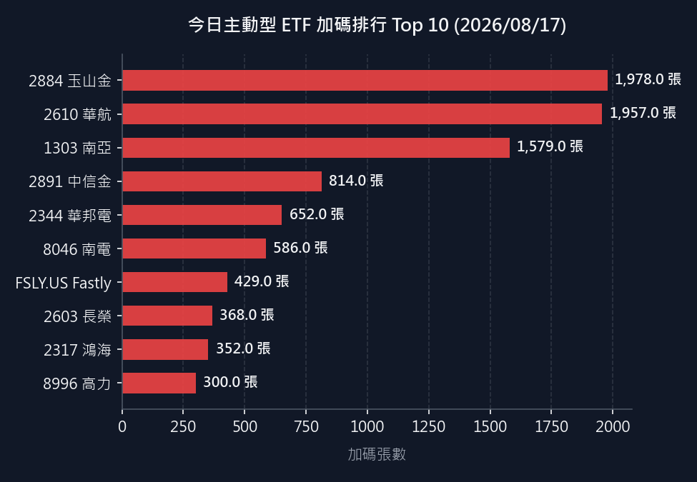
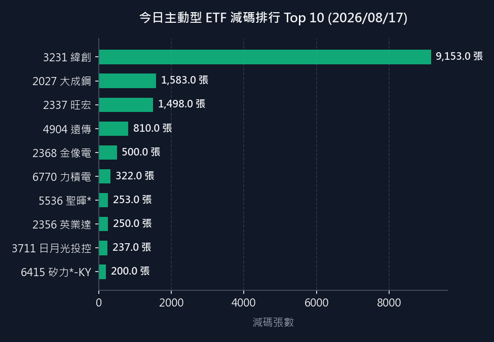

# 主動型 ETF 持股變動

資料來源：`主動型ETF持股明細.xlsx` 最近兩個日期分頁。

比較區間：`20260814` → `20260817`

## 今日加減碼視覺化排行

| 今日加碼 Top 10 | 今日減碼 Top 10 |
| :---: | :---: |
|  |  |

| ETF | 新增 | 刪除 | 比例變動 |
| :-- | --: | --: | --: |
| 00400A | 0 | 0 | 39 |
| 00401A | 1 | 1 | 54 |
| 00402A | 0 | 0 | 44 |
| 00403A | 0 | 0 | 35 |
| 00404A | 0 | 0 | 38 |
| 00405A | 0 | 0 | 32 |
| 00407A | 3 | 2 | 38 |
| 00408A | 1 | 1 | 41 |
| 00980A | 0 | 0 | 50 |
| 00980D | 0 | 0 | 27 |
| 00981A | 0 | 0 | 30 |
| 00982A | 0 | 0 | 37 |
| 00983A | 0 | 0 | 40 |
| 00983D | 0 | 0 | 22 |
| 00984A | 1 | 1 | 92 |
| 00985A | 0 | 0 | 42 |
| 00986A | 0 | 0 | 31 |
| 00987A | 1 | 1 | 25 |
| 00988A | 0 | 0 | 44 |
| 00989A | 0 | 0 | 55 |
| 00990A | 8 | 6 | 39 |
| 00991A | 0 | 0 | 21 |
| 00992A | 0 | 0 | 31 |
| 00993A | 0 | 0 | 41 |
| 00994A | 0 | 0 | 30 |
| 00995A | 0 | 0 | 46 |
| 00996A | 0 | 0 | 39 |
| 00997A | 0 | 0 | 43 |
| 00998A | 1 | 1 | 34 |
| 00999A | 0 | 1 | 48 |

## 00400A

### 新增持股

- 無

### 刪除持股

- 無

### 投資比例變動

- 1303 南亞：0.42% → 0.41%（-0.01）
- 2059 川湖：4.66% → 5.12%（+0.46）
- 2313 華通：0.79% → 0.77%（-0.02）
- 2317 鴻海：0.82% → 0.81%（-0.01）
- 2330 台積電：8.10% → 8.11%（+0.01）
- 2345 智邦：1.72% → 1.71%（-0.01）
- 2360 致茂：4.11% → 4.21%（+0.10）
- 2382 廣達：0.72% → 0.73%（+0.01）
- 2383 台光電：5.92% → 6.09%（+0.17）
- 2408 南亞科：1.89% → 1.93%（+0.04）
- 2449 京元電子：1.34% → 1.35%（+0.01）
- 2454 聯發科：6.53% → 6.28%（-0.25）
- 2881 富邦金：0.73% → 0.70%（-0.03）
- 2885 元大金：1.39% → 1.36%（-0.03）
- 3008 大立光：2.34% → 2.58%（+0.24）
- 3017 奇鋐：5.20% → 3.49%（-1.71）
- 3036 文曄：1.60% → 1.55%（-0.05）
- 3037 欣興：4.98% → 5.46%（+0.48）
- 3044 健鼎：1.67% → 1.65%（-0.02）
- 3090 日電貿：0.34% → 0.32%（-0.02）
- 3293 鈊象：0.33% → 0.32%（-0.01）
- 3374 精材：0.29% → 0.26%（-0.03）
- 3443 創意：3.43% → 3.67%（+0.24）
- 3529 力旺：1.07% → 0.96%（-0.11）
- 3653 健策：3.96% → 4.35%（+0.39）
- 3665 貿聯-KY：2.57% → 2.49%（-0.08）
- 4979 華星光：0.50% → 0.53%（+0.03）
- 5274 信驊：3.06% → 2.94%（-0.12）
- 6187 萬潤：2.51% → 2.72%（+0.21）
- 6223 旺矽：5.06% → 4.55%（-0.51）
- 6274 台燿：1.15% → 1.10%（-0.05）
- 6442 光聖：0.84% → 0.88%（+0.04）
- 6488 環球晶：3.04% → 3.16%（+0.12）
- 6515 穎崴：0.47% → 0.46%（-0.01）
- 6669 緯穎：3.95% → 3.06%（-0.89）
- 6715 嘉基：0.18% → 0.19%（+0.01）
- 7750 新代：0.95% → 0.97%（+0.02）
- 7769 鴻勁：0.74% → 0.76%（+0.02）
- 8046 南電：1.12% → 1.11%（-0.01）

## 00401A

### 新增持股

- TAIEX FUTURES 16SEP26 FTU6（-0.02%，N/A 張）

### 刪除持股

- 臺股期貨08/26（0.01%，N/A 張）

### 投資比例變動

- 1301 台塑：0.08% → 0.07%（-0.01）
- 1477 聚陽：0.86% → 0.81%（-0.05）
- 2059 川湖：0.96% → 1.06%（+0.10）
- 2303 聯電：0.86% → 0.87%（+0.01）
- 2308 台達電：3.45% → 3.44%（-0.01）
- 2313 華通：1.65% → 1.61%（-0.04）
- 2317 鴻海：0.65% → 0.64%（-0.01）
- 2327 國巨*：0.74% → 0.72%（-0.02）
- 2345 智邦：2.39% → 2.38%（-0.01）
- 2357 華碩：1.49% → 1.40%（-0.09）
- 2360 致茂：1.97% → 2.01%（+0.04）
- 2379 瑞昱：1.12% → 1.11%（-0.01）
- 2382 廣達：2.32% → 2.36%（+0.04）
- 2383 台光電：2.01% → 2.07%（+0.06）
- 2454 聯發科：6.50% → 6.24%（-0.26）
- 2455 全新：1.84% → 2.02%（+0.18）
- 2603 長榮：1.04% → 1.09%（+0.05）
- 2881 富邦金：1.87% → 1.81%（-0.06）
- 2882 國泰金：1.03% → 1.00%（-0.03）
- 2883 凱基金：1.50% → 1.49%（-0.01）
- 2885 元大金：0.53% → 0.52%（-0.01）
- 2886 兆豐金：1.39% → 1.36%（-0.03）
- 2887 台新新光金：1.06% → 1.04%（-0.02）
- 2890 永豐金：0.30% → 0.29%（-0.01）
- 2891 中信金：1.60% → 1.59%（-0.01）
- 3008 大立光：2.25% → 2.47%（+0.22）
- 3037 欣興：2.30% → 2.52%（+0.22）
- 3131 弘塑：0.83% → 0.82%（-0.01）
- 3167 大量：0.47% → 0.49%（+0.02）
- 3231 緯創：0.39% → 0.38%（-0.01）
- 3491 昇達科：1.76% → 1.70%（-0.06）
- 3653 健策：0.39% → 0.43%（+0.04）
- 3711 日月光投控：2.05% → 2.04%（-0.01）
- 4904 遠傳：0.77% → 0.78%（+0.01）
- 4938 和碩：0.34% → 0.32%（-0.02）
- 4958 臻鼎-KY：1.93% → 1.98%（+0.05）
- 4991 環宇-KY：1.02% → 1.09%（+0.07）
- 5274 信驊：2.13% → 2.05%（-0.08）
- 5347 世界：1.36% → 1.37%（+0.01）
- 5904 寶雅*：0.65% → 0.63%（-0.02）
- 6187 萬潤：0.75% → 0.81%（+0.06）
- 6223 旺矽：2.18% → 1.96%（-0.22）
- 6285 啟碁：1.52% → 1.50%（-0.02）
- 6415 矽力*-KY：0.64% → 0.61%（-0.03）
- 6510 精測：0.71% → 0.68%（-0.03）
- 6515 穎崴：1.14% → 1.11%（-0.03）
- 6531 愛普*：1.22% → 1.14%（-0.08）
- 6669 緯穎：2.10% → 2.16%（+0.06）
- 6944 兆聯實業：0.45% → 0.46%（+0.01）
- 7769 鴻勁：1.92% → 1.97%（+0.05）
- 7828 創新服務：1.78% → 1.79%（+0.01）
- 8021 尖點：0.28% → 0.27%（-0.01）
- 8464 億豐：1.13% → 1.11%（-0.02）
- 臺指選擇權08/26 45600 買權：-0.30% → -0.24%（+0.06）

## 00402A

### 新增持股

- 無

### 刪除持股

- 無

### 投資比例變動

- AAPL.US Apple：7.03% → 7.09%（+0.06）
- ADI.US Analog Devices：1.84% → 1.89%（+0.05）
- AMD.US AMD：4.36% → 4.68%（+0.32）
- AMZN.US Amazon：4.31% → 4.30%（-0.01）
- ANET.US Arista Networks：0.86% → 0.84%（-0.02）
- ARM.US Arm：1.07% → 1.08%（+0.01）
- ASML.US ASML Holding：1.75% → 1.76%（+0.01）
- AVGO.US Broadcom：2.66% → 2.52%（-0.14）
- BABA.US Alibaba Group：0.57% → 0.59%（+0.02）
- CDNS.US Cadence Design Systems：1.73% → 1.74%（+0.01）
- CIEN.US Ciena：0.92% → 0.90%（-0.02）
- CLS.US Celestica：0.96% → 0.93%（-0.03）
- CRWD.US CrowdStrike Holdings：1.50% → 1.45%（-0.05）
- DASH.US DoorDash：0.29% → 0.30%（+0.01）
- GOOG.US Alphabet - Class C Capital Stock：3.37% → 3.39%（+0.02）
- GOOGL.US Alphabet - Class A Common Stock：3.33% → 3.35%（+0.02）
- INTC.US Intel：1.36% → 1.34%（-0.02）
- IOT.US Samsara：0.25% → 0.24%（-0.01）
- KLAC.US KLA：2.32% → 2.27%（-0.05）
- LITE.US Lumentum：1.75% → 1.85%（+0.10）
- LRCX.US Lam Research：2.92% → 2.90%（-0.02）
- MCHP.US Microchip Technology：1.16% → 1.19%（+0.03）
- MDB.US MongoDB：0.92% → 0.90%（-0.02）
- META.US Meta：2.82% → 2.81%（-0.01）
- MSFT.US Microsoft：4.29% → 4.30%（+0.01）
- MU.US Micron：6.31% → 6.49%（+0.18）
- NFLX.US Netflix：0.85% → 0.86%（+0.01）
- NOW.US ServiceNow：0.27% → 0.26%（-0.01）
- NVDA.US NVIDIA：9.11% → 9.21%（+0.10）
- NXPI.US NXP Semiconductors：1.09% → 1.11%（+0.02）
- PANW.US Palo Alto：3.45% → 3.37%（-0.08）
- PLTR.US Palantir Technologies：1.54% → 1.51%（-0.03）
- SHOP.US Shopify：0.54% → 0.53%（-0.01）
- SIMO.US Silicon Motion：0.74% → 0.81%（+0.07）
- SKHY.US SK hynix：1.04% → 1.05%（+0.01）
- SNOW.US Snowflake：1.01% → 0.99%（-0.02）
- SPOT.US Spotify：0.27% → 0.28%（+0.01）
- STX.US Seagate：1.12% → 1.19%（+0.07）
- TER.US Teradyne：0.95% → 0.97%（+0.02）
- TSM.US TSMC(ADR)：1.46% → 1.45%（-0.01）
- TTWO.US Take-Two：0.56% → 0.57%（+0.01）
- TXN.US Texas Instruments：2.20% → 2.26%（+0.06）
- WDC.US Western Digital：2.20% → 2.31%（+0.11）
- ZS.US Zscaler：0.20% → 0.19%（-0.01）

## 00403A

### 新增持股

- 無

### 刪除持股

- 無

### 投資比例變動

- 1303 南亞：0.86% → 1.01%（+0.15）
- 1560 中砂：0.61% → 0.63%（+0.02）
- 2303 聯電：5.32% → 5.39%（+0.07）
- 2308 台達電：3.19% → 3.22%（+0.03）
- 2327 國巨*：3.39% → 3.34%（-0.05）
- 2330 台積電：15.99% → 16.18%（+0.19）
- 2337 旺宏：0.57% → 0.44%（-0.13）
- 2345 智邦：2.95% → 2.97%（+0.02）
- 2360 致茂：1.28% → 1.33%（+0.05）
- 2383 台光電：5.80% → 6.03%（+0.23）
- 2454 聯發科：4.94% → 4.80%（-0.14）
- 2455 全新：0.07% → 0.08%（+0.01）
- 3008 大立光：1.46% → 1.78%（+0.32）
- 3017 奇鋐：6.33% → 6.22%（-0.11）
- 3037 欣興：4.80% → 5.32%（+0.52）
- 3189 景碩：2.04% → 2.16%（+0.12）
- 3443 創意：1.55% → 1.68%（+0.13）
- 3450 聯鈞：0.45% → 0.49%（+0.04）
- 3533 嘉澤：0.77% → 0.67%（-0.10）
- 3583 辛耘：0.32% → 0.33%（+0.01）
- 3653 健策：2.16% → 2.40%（+0.24）
- 3665 貿聯-KY：1.47% → 1.44%（-0.03）
- 3711 日月光投控：2.74% → 2.76%（+0.02）
- 5274 信驊：2.11% → 2.05%（-0.06）
- 6223 旺矽：3.80% → 3.45%（-0.35）
- 6239 力成：0.83% → 0.84%（+0.01）
- 6274 台燿：1.57% → 1.51%（-0.06）
- 6442 光聖：0.20% → 0.21%（+0.01）
- 6488 環球晶：1.49% → 1.52%（+0.03）
- 6669 緯穎：2.18% → 2.27%（+0.09）
- 6805 富世達：0.70% → 0.76%（+0.06）
- 7769 鴻勁：0.48% → 0.49%（+0.01）
- 8046 南電：1.59% → 1.92%（+0.33）
- 8358 金居：0.21% → 0.19%（-0.02）
- 8996 高力：1.14% → 1.09%（-0.05）

## 00404A

### 新增持股

- 無

### 刪除持股

- 無

### 投資比例變動

- 1210 大成：1.80% → 1.82%（+0.02）
- 2059 川湖：0.36% → 0.40%（+0.04）
- 2303 聯電：2.97% → 2.96%（-0.01）
- 2308 台達電：1.04% → 0.94%（-0.10）
- 2327 國巨*：0.74% → 0.73%（-0.01）
- 2330 台積電：22.48% → 22.39%（-0.09）
- 2351 順德：0.58% → 0.59%（+0.01）
- 2360 致茂：1.20% → 1.18%（-0.02）
- 2377 微星：1.70% → 1.78%（+0.08）
- 2383 台光電：2.86% → 2.61%（-0.25）
- 2428 興勤：0.81% → 0.82%（+0.01）
- 2454 聯發科：7.01% → 6.71%（-0.30）
- 2618 長榮航：0.13% → 0.14%（+0.01）
- 2880 華南金：2.43% → 2.79%（+0.36）
- 2885 元大金：1.41% → 1.40%（-0.01）
- 2886 兆豐金：3.07% → 3.20%（+0.13）
- 2892 第一金：3.22% → 3.20%（-0.02）
- 3017 奇鋐：1.12% → 1.02%（-0.10）
- 3022 威強電：0.77% → 0.80%（+0.03）
- 3023 信邦：2.21% → 2.23%（+0.02）
- 3037 欣興：1.36% → 1.28%（-0.08）
- 3264 欣銓：1.81% → 1.78%（-0.03）
- 3443 創意：1.27% → 1.03%（-0.24）
- 3529 力旺：0.15% → 0.14%（-0.01）
- 3653 健策：0.28% → 0.24%（-0.04）
- 3702 大聯大：1.75% → 1.94%（+0.19）
- 3711 日月光投控：3.50% → 3.54%（+0.04）
- 4763 材料*-KY：1.75% → 1.73%（-0.02）
- 5274 信驊：1.97% → 1.92%（-0.05）
- 5289 宜鼎：0.30% → 0.31%（+0.01）
- 5904 寶雅*：1.40% → 1.37%（-0.03）
- 6139 亞翔：0.25% → 0.26%（+0.01）
- 6196 帆宣：1.80% → 1.78%（-0.02）
- 6223 旺矽：1.21% → 1.11%（-0.10）
- 6515 穎崴：0.29% → 0.19%（-0.10）
- 8271 宇瞻：0.79% → 0.78%（-0.01）
- 台指選擇權09/26 48000 買權：-0.37% → -0.30%（+0.07）
- 台股期貨09/26：16.24% → 16.47%（+0.23）

## 00405A

### 新增持股

- 無

### 刪除持股

- 無

### 投資比例變動

- 2059 川湖：1.68% → 1.85%（+0.17）
- 2308 台達電：1.78% → 1.77%（-0.01）
- 2330 台積電：1.38% → 1.37%（-0.01）
- 2345 智邦：3.90% → 3.87%（-0.03）
- 2368 金像電：3.67% → 3.64%（-0.03）
- 2383 台光電：4.19% → 4.30%（+0.11）
- 2454 聯發科：6.48% → 6.21%（-0.27）
- 3008 大立光：1.49% → 1.64%（+0.15）
- 3017 奇鋐：8.33% → 8.09%（-0.24）
- 3026 禾伸堂：1.20% → 1.28%（+0.08）
- 3037 欣興：5.14% → 5.62%（+0.48）
- 3081 聯亞：1.29% → 1.41%（+0.12）
- 3131 弘塑：1.81% → 1.77%（-0.04）
- 3443 創意：7.35% → 7.84%（+0.49）
- 3653 健策：6.65% → 7.29%（+0.64）
- 3665 貿聯-KY：6.46% → 6.24%（-0.22）
- 3711 日月光投控：0.64% → 0.63%（-0.01）
- 4991 環宇-KY：1.33% → 1.40%（+0.07）
- 5274 信驊：3.08% → 2.95%（-0.13）
- 6187 萬潤：0.81% → 0.88%（+0.07）
- 6223 旺矽：5.64% → 5.06%（-0.58）
- 6274 台燿：1.64% → 1.57%（-0.07）
- 6442 光聖：0.35% → 0.36%（+0.01）
- 6510 精測：2.35% → 2.26%（-0.09）
- 6515 穎崴：0.50% → 0.49%（-0.01）
- 6526 達發：0.29% → 0.28%（-0.01）
- 6669 緯穎：4.03% → 4.13%（+0.10）
- 6805 富世達：1.16% → 1.24%（+0.08）
- 7734 印能科技：1.82% → 1.81%（-0.01）
- 7769 鴻勁：2.54% → 2.59%（+0.05）
- 8046 南電：3.09% → 3.06%（-0.03）
- 8996 高力：1.16% → 1.10%（-0.06）

## 00407A

### 新增持股

- 2301 光寶科（0.09%，100 張）
- 3008 大立光（0.11%，6 張）
- 6187 萬潤（0.48%，100 張）

### 刪除持股

- 4904 遠傳（0.28%，810 張）
- 5536 聖暉*（0.81%，253 張）

### 投資比例變動

- 1303 南亞：0.60% → 0.58%（-0.02）
- 1560 中砂：0.47% → 0.48%（+0.01）
- 2059 川湖：3.03% → 3.37%（+0.34）
- 2303 聯電：2.08% → 2.12%（+0.04）
- 2308 台達電：3.72% → 3.76%（+0.04）
- 2327 國巨*：2.30% → 2.28%（-0.02）
- 2330 台積電：8.21% → 8.33%（+0.12）
- 2345 智邦：2.91% → 2.93%（+0.02）
- 2360 致茂：2.13% → 2.21%（+0.08）
- 2368 金像電：1.89% → 1.90%（+0.01）
- 2376 技嘉：0.79% → 0.72%（-0.07）
- 2379 瑞昱：0.70% → 0.71%（+0.01）
- 2383 台光電：5.74% → 5.98%（+0.24）
- 2395 研華：1.92% → 1.91%（-0.01）
- 2408 南亞科：1.91% → 1.97%（+0.06）
- 2454 聯發科：6.94% → 6.75%（-0.19）
- 3017 奇鋐：4.75% → 4.68%（-0.07）
- 3037 欣興：4.63% → 5.14%（+0.51）
- 3293 鈊象：0.53% → 0.52%（-0.01）
- 3443 創意：2.71% → 2.93%（+0.22）
- 3491 昇達科：0.44% → 0.43%（-0.01）
- 3529 力旺：1.98% → 1.80%（-0.18）
- 3665 貿聯-KY：1.96% → 1.92%（-0.04）
- 3711 日月光投控：2.43% → 2.45%（+0.02）
- 4958 臻鼎-KY：1.74% → 1.81%（+0.07）
- 5274 信驊：2.14% → 2.08%（-0.06）
- 5289 宜鼎：0.16% → 0.17%（+0.01）
- 6223 旺矽：2.83% → 2.58%（-0.25）
- 6274 台燿：3.73% → 3.60%（-0.13）
- 6415 矽力*-KY：0.37% → 0.03%（-0.34）
- 6446 藥華藥：2.79% → 2.65%（-0.14）
- 6515 穎崴：1.38% → 1.37%（-0.01）
- 6531 愛普*：1.52% → 1.44%（-0.08）
- 6669 緯穎：4.57% → 4.75%（+0.18）
- 6805 富世達：2.13% → 2.30%（+0.17）
- 8046 南電：2.53% → 2.54%（+0.01）
- 8210 勤誠：0.89% → 0.91%（+0.02）
- 8996 高力：0.47% → 0.45%（-0.02）

## 00408A

### 新增持股

- 1537 廣隆（0.19%，25 張）

### 刪除持股

- 3036 文曄（0.48%，38 張）

### 投資比例變動

- 1477 聚陽：0.26% → 0.25%（-0.01）
- 2059 川湖：2.26% → 2.50%（+0.24）
- 2303 聯電：1.28% → 1.29%（+0.01）
- 2308 台達電：3.87% → 3.88%（+0.01）
- 2317 鴻海：2.74% → 2.70%（-0.04）
- 2327 國巨*：0.38% → 0.37%（-0.01）
- 2330 台積電：5.92% → 5.95%（+0.03）
- 2344 華邦電：1.55% → 1.54%（-0.01）
- 2356 英業達：1.39% → 0.32%（-1.07）
- 2357 華碩：2.58% → 2.44%（-0.14）
- 2360 致茂：3.19% → 3.28%（+0.09）
- 2368 金像電：2.82% → 2.81%（-0.01）
- 2376 技嘉：2.52% → 1.19%（-1.33）
- 2382 廣達：1.28% → 1.31%（+0.03）
- 2383 台光電：5.97% → 6.13%（+0.16）
- 2395 研華：2.27% → 2.24%（-0.03）
- 2404 漢唐：1.70% → 1.75%（+0.05）
- 2408 南亞科：1.24% → 1.27%（+0.03）
- 2454 聯發科：3.81% → 2.94%（-0.87）
- 2481 強茂：0.32% → 0.33%（+0.01）
- 2801 彰銀：0.87% → 0.88%（+0.01）
- 2880 華南金：1.54% → 1.56%（+0.02）
- 2886 兆豐金：2.49% → 2.45%（-0.04）
- 3017 奇鋐：5.07% → 4.96%（-0.11）
- 3037 欣興：3.81% → 4.20%（+0.39）
- 3045 台灣大：1.17% → 1.21%（+0.04）
- 3231 緯創：1.05% → 1.02%（-0.03）
- 3653 健策：1.46% → 1.62%（+0.16）
- 3665 貿聯-KY：1.59% → 0.13%（-1.46）
- 3702 大聯大：1.80% → 1.75%（-0.05）
- 5434 崇越：1.82% → 1.81%（-0.01）
- 6187 萬潤：0.77% → 1.26%（+0.49）
- 6223 旺矽：1.36% → 1.23%（-0.13）
- 6239 力成：1.12% → 1.13%（+0.01）
- 6274 台燿：1.92% → 1.84%（-0.08）
- 6488 環球晶：0.85% → 1.23%（+0.38）
- 6669 緯穎：5.05% → 5.21%（+0.16）
- 6805 富世達：0.33% → 0.35%（+0.02）
- 7769 鴻勁：1.79% → 1.84%（+0.05）
- 8046 南電：2.83% → 2.82%（-0.01）
- 8996 高力：0.39% → 0.37%（-0.02）

## 00980A

### 新增持股

- 無

### 刪除持股

- 無

### 投資比例變動

- 1303 南亞：2.42% → 2.32%（-0.10）
- 2059 川湖：5.49% → 6.00%（+0.51）
- 2308 台達電：3.68% → 3.65%（-0.03）
- 2317 鴻海：1.97% → 2.35%（+0.38）
- 2327 國巨*：1.04% → 1.50%（+0.46）
- 2330 台積電：7.67% → 7.62%（-0.05）
- 2344 華邦電：1.02% → 1.69%（+0.67）
- 2345 智邦：1.63% → 1.91%（+0.28）
- 2360 致茂：1.64% → 1.67%（+0.03）
- 2368 金像電：1.93% → 1.90%（-0.03）
- 2376 技嘉：1.33% → 1.19%（-0.14）
- 2382 廣達：1.56% → 1.58%（+0.02）
- 2383 台光電：4.53% → 4.14%（-0.39）
- 2408 南亞科：2.57% → 2.75%（+0.18）
- 2454 聯發科：5.67% → 4.93%（-0.74）
- 2884 玉山金：0.79% → 1.15%（+0.36）
- 2891 中信金：1.18% → 1.42%（+0.24）
- 3008 大立光：0.80% → 0.63%（-0.17）
- 3017 奇鋐：2.09% → 2.02%（-0.07）
- 3026 禾伸堂：0.42% → 0.44%（+0.02）
- 3036 文曄：1.16% → 1.12%（-0.04）
- 3037 欣興：2.77% → 3.02%（+0.25）
- 3044 健鼎：0.81% → 0.80%（-0.01）
- 3081 聯亞：2.91% → 3.06%（+0.15）
- 3189 景碩：0.77% → 0.80%（+0.03）
- 3231 緯創：0.97% → 0.93%（-0.04）
- 3264 欣銓：0.71% → 0.68%（-0.03）
- 3293 鈊象：0.91% → 0.88%（-0.03）
- 3443 創意：1.56% → 1.65%（+0.09）
- 3529 力旺：0.83% → 0.50%（-0.33）
- 3533 嘉澤：0.11% → 0.29%（+0.18）
- 3653 健策：1.62% → 1.77%（+0.15）
- 3665 貿聯-KY：0.34% → 0.33%（-0.01）
- 3711 日月光投控：1.19% → 1.55%（+0.36）
- 4958 臻鼎-KY：0.79% → 1.11%（+0.32）
- 5274 信驊：1.56% → 1.49%（-0.07）
- 5904 寶雅*：1.19% → 1.15%（-0.04）
- 6213 聯茂：1.12% → 1.11%（-0.01）
- 6223 旺矽：2.36% → 2.00%（-0.36）
- 6274 台燿：1.51% → 1.43%（-0.08）
- 6442 光聖：0.29% → 0.30%（+0.01）
- 6515 穎崴：1.79% → 1.74%（-0.05）
- 6669 緯穎：1.62% → 1.65%（+0.03）
- 6805 富世達：0.47% → 0.50%（+0.03）
- 7769 鴻勁：2.32% → 2.36%（+0.04）
- 8046 南電：1.28% → 1.26%（-0.02）
- 8210 勤誠：0.67% → 0.93%（+0.26）
- 8299 群聯：2.19% → 1.97%（-0.22）
- 8996 高力：1.12% → 1.05%（-0.07）
- 台灣證交所加權股價指數：6.99% → 6.94%（-0.05）

## 00980D

### 新增持股

- 無

### 刪除持股

- 無

### 投資比例變動

- BAYER US FINANCE LLC SER REGS 6.875000 % 21NOV2053：0.35% → 0.34%（-0.01）
- BPCE SA SER REGS VAR 14JAN2046：0.40% → 0.39%（-0.01）
- CALDERYS FINANCING LLC SER REGS (REG S) 11.25% 01JUN2028：0.32% → 0.33%（+0.01）
- CHC GROUP LLC SER REGS 11.750000 % 01-SEP-2030：0.41% → 0.39%（-0.02）
- CONCENTRIX CORP (REG) 6.85% 02AUG2033：0.69% → 0.70%（+0.01）
- CONOCOPHILLIPS COMPANY (REG) 6.95% 15APR2029：0.50% → 0.51%（+0.01）
- COREWEAVE INC SER REGS (REG S) 9.25% 01JUN2030：0.43% → 0.42%（-0.01）
- ENBRIDGE ENERGY PARTNERS (REG) 7.375% 15OCT2045：0.51% → 0.50%（-0.01）
- ENERGY TRANSFER LP (REG) 7.5% 01JUL2038：0.33% → 0.32%（-0.01）
- FMC CORP (REG) 4.5% 01OCT2049：0.48% → 0.49%（+0.01）
- FORD MOTOR CREDIT CO LLC (REG) 7.35% 04NOV2027：0.32% → 0.33%（+0.01）
- FREEDOM MORTGAGE CORP SER REGS (REG S) 12.25% 01OCT2030：0.46% → 0.47%（+0.01）
- INTESA SANPAOLO SPA SER REGS (REG S) 7.8% 28NOV2053：0.37% → 0.36%（-0.01）
- ONEOK INC 6.625% 01SEP2053：0.57% → 0.56%（-0.01）
- ORACLE CORP 5.55% 06FEB2053：0.25% → 0.24%（-0.01）
- ORACLE CORP 5.950000 % 26-SEP-2055：0.41% → 0.40%（-0.01）
- ORACLE CORP 6.000000 % 03AUG2055：0.31% → 0.30%（-0.01）
- ORACLE CORP 6.125000 % 03AUG2065：0.52% → 0.51%（-0.01）
- RR DONNELLEY & SONS CO SER REGS (REG S) 9.5% 01AUG2029：0.41% → 0.42%（+0.01）
- SABRE FINANCIAL BORROWER SER REGS 11.125 % 15-JUN-2029：0.52% → 0.53%（+0.01）
- SES GLOBAL AMERICAS HLDG SER REGS (REG) 5.300000 % 25MAR2044：0.33% → 0.32%（-0.01）
- TIME WARNER CABLE LLC (REG) 6.75% 15JUN2039：0.31% → 0.30%（-0.01）
- TRANSCANADA PIPELINES LTD 7.625PCT 15/01/2039：0.53% → 0.52%（-0.01）
- US 10YR NOTE (CBT)SEP26 21-SEP-2026：18.25% → 18.23%（-0.02）
- US 5YR NOTE (CBT) SEP26 30-SEP-2026：-15.86% → -15.87%（-0.01）
- US ACUTE CARE SOLUTIONS SER REGS (REG S) 9.75% 15MAY2029：0.31% → 0.32%（+0.01）
- US LONG BOND(CBT) SEP26 21-SEP-2026：5.32% → 5.30%（-0.02）

## 00981A

### 新增持股

- 無

### 刪除持股

- 無

### 投資比例變動

- 2303 聯電：3.40% → 3.45%（+0.05）
- 2308 台達電：4.27% → 4.32%（+0.05）
- 2327 國巨*：5.06% → 5.01%（-0.05）
- 2330 台積電：9.30% → 9.43%（+0.13）
- 2345 智邦：4.85% → 4.89%（+0.04）
- 2360 致茂：0.46% → 0.48%（+0.02）
- 2368 金像電：1.30% → 1.15%（-0.15）
- 2383 台光電：9.60% → 10.00%（+0.40）
- 2449 京元電子：0.89% → 0.91%（+0.02）
- 2454 聯發科：7.34% → 7.15%（-0.19）
- 3017 奇鋐：6.11% → 6.02%（-0.09）
- 3037 欣興：6.60% → 7.38%（+0.78）
- 3264 欣銓：0.43% → 0.42%（-0.01）
- 3653 健策：3.69% → 4.11%（+0.42）
- 3665 貿聯-KY：3.25% → 3.19%（-0.06）
- 3711 日月光投控：3.85% → 3.89%（+0.04）
- 4958 臻鼎-KY：0.26% → 0.27%（+0.01）
- 4979 華星光：0.41% → 0.43%（+0.02）
- 5274 信驊：2.75% → 2.67%（-0.08）
- 6187 萬潤：0.54% → 0.60%（+0.06）
- 6223 旺矽：5.04% → 4.59%（-0.45）
- 6274 台燿：2.95% → 2.85%（-0.10）
- 6510 精測：0.46% → 0.45%（-0.01）
- 6515 穎崴：0.03% → 0.00%（-0.03）
- 6669 緯穎：5.14% → 5.35%（+0.21）
- 6805 富世達：1.31% → 1.41%（+0.10）
- 8046 南電：4.02% → 4.04%（+0.02）
- 8210 勤誠：0.80% → 0.82%（+0.02）
- 8996 高力：0.33% → 0.43%（+0.10）
- 台指期貨(B) 2026/08：1.99% → 2.02%（+0.03）

## 00982A

### 新增持股

- 無

### 刪除持股

- 無

### 投資比例變動

- 2059 川湖：4.39% → 4.82%（+0.43）
- 2303 聯電：2.09% → 2.10%（+0.01）
- 2316 楠梓電：1.05% → 1.10%（+0.05）
- 2327 國巨*：0.82% → 0.80%（-0.02）
- 2330 台積電：8.15% → 8.16%（+0.01）
- 2345 智邦：3.57% → 3.55%（-0.02）
- 2360 致茂：3.65% → 3.75%（+0.10）
- 2376 技嘉：0.33% → 0.30%（-0.03）
- 2377 微星：1.71% → 1.61%（-0.10）
- 2383 台光電：3.83% → 3.94%（+0.11）
- 2454 聯發科：6.97% → 6.70%（-0.27）
- 2467 志聖：1.53% → 1.68%（+0.15）
- 2472 立隆電：0.71% → 0.70%（-0.01）
- 3008 大立光：2.17% → 2.38%（+0.21）
- 3017 奇鋐：2.50% → 2.43%（-0.07）
- 3036 文曄：0.96% → 0.93%（-0.03）
- 3105 穩懋：3.45% → 3.63%（+0.18）
- 3264 欣銓：2.05% → 1.98%（-0.07）
- 3491 昇達科：2.58% → 2.52%（-0.06）
- 3529 力旺：0.47% → 0.42%（-0.05）
- 3583 辛耘：1.56% → 1.60%（+0.04）
- 3702 大聯大：1.24% → 1.19%（-0.05）
- 3711 日月光投控：1.19% → 1.18%（-0.01）
- 4958 臻鼎-KY：2.95% → 3.03%（+0.08）
- 5274 信驊：1.00% → 0.96%（-0.04）
- 5536 聖暉*：6.46% → 6.33%（-0.13）
- 6139 亞翔：6.10% → 6.16%（+0.06）
- 6223 旺矽：3.75% → 3.38%（-0.37）
- 6274 台燿：1.43% → 1.37%（-0.06）
- 6278 台表科：0.76% → 0.82%（+0.06）
- 6446 藥華藥：0.12% → 0.11%（-0.01）
- 6488 環球晶：2.17% → 2.19%（+0.02）
- 6531 愛普*：2.55% → 2.38%（-0.17）
- 6669 緯穎：6.23% → 6.40%（+0.17）
- 7769 鴻勁：1.16% → 1.19%（+0.03）
- 8016 矽創：1.32% → 1.30%（-0.02）
- 8996 高力：0.93% → 0.88%（-0.05）

## 00983A

### 新增持股

- 無

### 刪除持股

- 無

### 投資比例變動

- ACHR.US Archer：0.42% → 0.61%（+0.19）
- AMD.US AMD：4.68% → 4.34%（-0.34）
- AMZN.US Amazon：3.41% → 3.43%（+0.02）
- AVGO.US Broadcom：2.01% → 1.92%（-0.09）
- BEAM.US Beam Therapeutics：1.99% → 2.04%（+0.05）
- BLSH.US Bullish：1.15% → 1.17%（+0.02）
- CBRS.US Cerebras：0.69% → 0.87%（+0.18）
- CERS.US Cerus：0.49% → 0.52%（+0.03）
- COIN.US Coinbase：2.14% → 2.10%（-0.04）
- CRCL.US Circle：2.86% → 2.99%（+0.13）
- CRSP.US CRISPR Therapeutics：4.22% → 4.25%（+0.03）
- CRWV.US CoreWeave：1.48% → 1.49%（+0.01）
- DE.US Deere：1.39% → 1.40%（+0.01）
- FIG.US Figma：0.45% → 0.44%（-0.01）
- GOOG.US Alphabet - Class C Capital Stock：1.24% → 1.26%（+0.02）
- GOOGL.US Alphabet - Class A Common Stock：0.99% → 1.01%（+0.02）
- HOOD.US Robinhood Markets：3.95% → 3.85%（-0.10）
- ILMN.US Illumina：2.16% → 2.17%（+0.01）
- KTOS.US Kratos Defense & Security：1.10% → 1.15%（+0.05）
- LLY.US Eli Lilly：1.97% → 1.95%（-0.02）
- META.US Meta：1.14% → 1.15%（+0.01）
- NET.US Cloudflare：0.11% → 0.10%（-0.01）
- NTLA.US Intellia Therapeutics：1.31% → 1.34%（+0.03）
- NTRA.US Natera：2.16% → 2.19%（+0.03）
- NVDA.US NVIDIA：1.68% → 1.70%（+0.02）
- PLTR.US Palantir Technologies：3.28% → 3.39%（+0.11）
- RBLX.US Roblox：0.65% → 0.66%（+0.01）
- RXRX.US Recursion Pharmaceuticals：0.31% → 0.30%（-0.01）
- SHOP.US Shopify：7.10% → 7.01%（-0.09）
- SNOW.US Snowflake：1.69% → 1.67%（-0.02）
- SPCX.US SpaceX：3.01% → 3.23%（+0.22）
- TEM.US Tempus：3.50% → 3.41%（-0.09）
- TER.US Teradyne：0.67% → 0.70%（+0.03）
- TSLA.US Tesla：8.03% → 8.23%（+0.20）
- TSM.US TSMC(ADR)：3.57% → 3.59%（+0.02）
- TWST.US Twist Bioscience：4.71% → 4.52%（-0.19）
- TXG.US 10x Genomics：4.10% → 3.86%（-0.24）
- VCYT.US Veracyte：0.97% → 0.59%（-0.38）
- XE.US X-Energy：0.49% → 0.68%（+0.19）
- XYZ.US Block：2.33% → 2.36%（+0.03）

## 00983D

### 新增持股

- 無

### 刪除持股

- 無

### 投資比例變動

- ABXCN 7 1/2 09/15/38：0.55% → 0.54%（-0.01）
- BATSLN 7.079 08/02/43：1.09% → 1.08%（-0.01）
- BATSLN 7.081 08/02/53：1.33% → 1.32%（-0.01）
- BHCCN 11 09/30/28：1.86% → 1.87%（+0.01）
- C 8 1/8 07/15/39：1.96% → 1.95%（-0.01）
- CYH 10 7/8 01/15/32：1.50% → 1.51%（+0.01）
- DOW 6.9 05/15/53：0.75% → 0.74%（-0.01）
- DOW 9.4 05/15/39：1.95% → 1.96%（+0.01）
- DTV 8 7/8 02/01/30：1.60% → 1.61%（+0.01）
- DUK 7 3/4 03/01/31：1.56% → 1.57%（+0.01）
- HSBC 6.332 03/09/44：1.07% → 1.06%（-0.01）
- LQDW.US iShares Investment Grade Corpora：7.32% → 7.33%（+0.01）
- MOHEGN 11 7/8 04/15/31：1.36% → 1.37%（+0.01）
- MS 7 1/4 04/01/32：1.64% → 1.65%（+0.01）
- NVDA 5.55 06/15/46：1.16% → 1.15%（-0.01）
- ORCL 6.9 11/09/52：0.86% → 0.85%（-0.01）
- OXY 6.6 03/15/46：0.76% → 0.75%（-0.01）
- PFE 7.2 03/15/39：1.44% → 1.43%（-0.01）
- RAKUTN 11 1/4 02/15/27：1.80% → 1.81%（+0.01）
- RIOLN 7 1/4 03/15/31：0.51% → 0.52%（+0.01）
- SPCX 6.6 07/15/46：1.15% → 1.14%（-0.01）
- TLTW.US iShares 20+ Year Treasury Bond B：7.21% → 7.18%（-0.03）

## 00984A

### 新增持股

- 台指期貨 2026/09（2.16%，N/A 張）

### 刪除持股

- 台指期貨 2026/08（2.16%，N/A 張）

### 投資比例變動

- 1303 南亞：2.49% → 2.39%（-0.10）
- 1326 台化：1.06% → 1.04%（-0.02）
- 1409 新纖：0.60% → 0.58%（-0.02）
- 1477 聚陽：0.84% → 0.79%（-0.05）
- 1560 中砂：0.68% → 0.69%（+0.01）
- 1714 和桐：0.29% → 0.30%（+0.01）
- 1736 喬山：0.70% → 0.67%（-0.03）
- 1907 永豐餘：0.48% → 0.49%（+0.01）
- 2049 上銀：0.60% → 0.61%（+0.01）
- 2059 川湖：5.07% → 5.61%（+0.54）
- 2105 正新：0.25% → 0.26%（+0.01）
- 2303 聯電：1.36% → 1.37%（+0.01）
- 2317 鴻海：1.40% → 1.37%（-0.03）
- 2324 仁寶：0.64% → 0.62%（-0.02）
- 2345 智邦：0.82% → 0.81%（-0.01）
- 2347 聯強：0.99% → 0.96%（-0.03）
- 2357 華碩：0.99% → 0.93%（-0.06）
- 2360 致茂：0.96% → 0.98%（+0.02）
- 2371 大同：0.08% → 0.09%（+0.01）
- 2375 凱美：0.26% → 0.25%（-0.01）
- 2376 技嘉：0.60% → 0.54%（-0.06）
- 2377 微星：0.46% → 0.43%（-0.03）
- 2383 台光電：1.95% → 2.00%（+0.05）
- 2393 億光：0.26% → 0.25%（-0.01）
- 2404 漢唐：1.16% → 1.18%（+0.02）
- 2408 南亞科：1.98% → 2.02%（+0.04）
- 2409 友達：0.57% → 0.60%（+0.03）
- 2441 超豐：1.17% → 1.15%（-0.02）
- 2454 聯發科：1.67% → 1.60%（-0.07）
- 2464 盟立：0.77% → 0.74%（-0.03）
- 2472 立隆電：0.26% → 0.25%（-0.01）
- 2535 達欣工：0.21% → 0.22%（+0.01）
- 2546 根基：0.18% → 0.19%（+0.01）
- 2603 長榮：0.75% → 0.79%（+0.04）
- 2801 彰銀：1.52% → 1.53%（+0.01）
- 2834 臺企銀：1.31% → 1.30%（-0.01）
- 2880 華南金：1.89% → 1.90%（+0.01）
- 2882 國泰金：0.78% → 0.75%（-0.03）
- 2885 元大金：0.77% → 0.76%（-0.01）
- 2886 兆豐金：1.98% → 1.94%（-0.04）
- 2892 第一金：1.62% → 1.61%（-0.01）
- 3008 大立光：2.28% → 2.50%（+0.22）
- 3017 奇鋐：0.10% → 0.09%（-0.01）
- 3023 信邦：1.13% → 1.12%（-0.01）
- 3026 禾伸堂：0.84% → 0.89%（+0.05）
- 3033 威健：0.25% → 0.24%（-0.01）
- 3034 聯詠：0.69% → 0.68%（-0.01）
- 3036 文曄：0.52% → 0.51%（-0.01）
- 3037 欣興：0.62% → 0.67%（+0.05）
- 3189 景碩：1.65% → 1.73%（+0.08）
- 3264 欣銓：0.26% → 0.25%（-0.01）
- 3443 創意：0.22% → 0.23%（+0.01）
- 3450 聯鈞：0.67% → 0.72%（+0.05）
- 3533 嘉澤：1.22% → 1.21%（-0.01）
- 3702 大聯大：0.50% → 0.48%（-0.02）
- 4123 晟德：0.21% → 0.20%（-0.01）
- 4764 雙鍵：0.48% → 0.46%（-0.02）
- 4904 遠傳：0.46% → 0.47%（+0.01）
- 4938 和碩：0.68% → 0.65%（-0.03）
- 4958 臻鼎-KY：0.97% → 0.99%（+0.02）
- 4966 譜瑞-KY：0.83% → 0.82%（-0.01）
- 5274 信驊：0.91% → 0.87%（-0.04）
- 5288 豐祥-KY：0.24% → 0.25%（+0.01）
- 5289 宜鼎：0.99% → 1.03%（+0.04）
- 5351 鈺創：0.99% → 1.00%（+0.01）
- 5434 崇越：0.30% → 0.29%（-0.01）
- 5483 中美晶：0.44% → 0.43%（-0.01）
- 5534 長虹：0.24% → 0.23%（-0.01）
- 5536 聖暉*：0.48% → 0.47%（-0.01）
- 5880 合庫金：1.51% → 1.55%（+0.04）
- 5904 寶雅*：1.12% → 1.08%（-0.04）
- 6005 群益證：1.17% → 1.16%（-0.01）
- 6139 亞翔：2.83% → 2.86%（+0.03）
- 6197 佳必琪：0.55% → 0.54%（-0.01）
- 6223 旺矽：1.27% → 1.14%（-0.13）
- 6274 台燿：0.75% → 0.71%（-0.04）
- 6282 康舒：0.26% → 0.25%（-0.01）
- 6285 啟碁：0.55% → 0.54%（-0.01）
- 6446 藥華藥：2.72% → 2.55%（-0.17）
- 6469 大樹：0.23% → 0.22%（-0.01）
- 6491 晶碩：0.26% → 0.25%（-0.01）
- 6531 愛普*：1.16% → 1.08%（-0.08）
- 6669 緯穎：0.64% → 0.65%（+0.01）
- 6944 兆聯實業：1.05% → 1.07%（+0.02）
- 7734 印能科技：0.46% → 0.45%（-0.01）
- 7769 鴻勁：1.30% → 1.33%（+0.03）
- 8039 台虹：0.84% → 0.80%（-0.04）
- 8046 南電：0.70% → 0.69%（-0.01）
- 8271 宇瞻：0.56% → 0.55%（-0.01）
- 8436 大江：0.24% → 0.25%（+0.01）
- 9914 美利達：0.25% → 0.24%（-0.01）
- 9938 百和：0.24% → 0.23%（-0.01）

## 00985A

### 新增持股

- 無

### 刪除持股

- 無

### 投資比例變動

- 1216 統一：0.96% → 0.94%（-0.02）
- 2027 大成鋼：3.32% → 2.69%（-0.63）
- 2059 川湖：1.33% → 1.45%（+0.12）
- 2308 台達電：1.50% → 1.49%（-0.01）
- 2327 國巨*：0.54% → 0.52%（-0.02）
- 2330 台積電：13.66% → 13.57%（-0.09）
- 2344 華邦電：1.09% → 1.07%（-0.02）
- 2345 智邦：2.77% → 2.73%（-0.04）
- 2368 金像電：0.96% → 0.95%（-0.01）
- 2376 技嘉：4.54% → 4.98%（+0.44）
- 2383 台光電：3.11% → 1.95%（-1.16）
- 2395 研華：0.33% → 0.32%（-0.01）
- 2408 南亞科：2.22% → 2.25%（+0.03）
- 2412 中華電：3.39% → 3.38%（-0.01）
- 2454 聯發科：2.04% → 1.95%（-0.09）
- 2603 長榮：2.85% → 3.81%（+0.96）
- 2610 華航：1.32% → 1.71%（+0.39）
- 2891 中信金：0.20% → 0.19%（-0.01）
- 3008 大立光：3.22% → 2.00%（-1.22）
- 3017 奇鋐：2.13% → 2.06%（-0.07）
- 3036 文曄：1.60% → 1.55%（-0.05）
- 3037 欣興：1.58% → 1.72%（+0.14）
- 3081 聯亞：2.04% → 2.23%（+0.19）
- 3105 穩懋：2.40% → 2.51%（+0.11）
- 3131 弘塑：1.20% → 1.18%（-0.02）
- 3529 力旺：0.26% → 0.23%（-0.03）
- 3653 健策：1.51% → 1.64%（+0.13）
- 3665 貿聯-KY：0.19% → 0.18%（-0.01）
- 3711 日月光投控：1.48% → 1.98%（+0.50）
- 4904 遠傳：3.34% → 3.36%（+0.02）
- 4958 臻鼎-KY：2.10% → 2.14%（+0.04）
- 6147 頎邦：1.56% → 1.65%（+0.09）
- 6187 萬潤：1.43% → 1.54%（+0.11）
- 6223 旺矽：0.31% → 0.28%（-0.03）
- 6442 光聖：2.24% → 2.32%（+0.08）
- 6446 藥華藥：2.84% → 1.46%（-1.38）
- 6669 緯穎：3.06% → 3.37%（+0.31）
- 7769 鴻勁：1.15% → 1.17%（+0.02）
- 8046 南電：0.61% → 0.60%（-0.01）
- 8299 群聯：1.07% → 1.06%（-0.01）
- 8996 高力：1.40% → 1.32%（-0.08）
- 台積電期貨：5.14% → 5.11%（-0.03）

## 00986A

### 新增持股

- 無

### 刪除持股

- 無

### 投資比例變動

- 2330 台積電：8.57% → 8.50%（-0.07）
- 2454 聯發科：1.35% → 1.36%（+0.01）
- AAPL.US Apple：0.94% → 0.95%（+0.01）
- AMAT.US Applied Materials：1.93% → 1.83%（-0.10）
- AMD.US AMD：2.98% → 3.19%（+0.21）
- AMZN.US Amazon：3.82% → 3.80%（-0.02）
- AVGO.US Broadcom：5.16% → 4.87%（-0.29）
- CRDO.US Credo：0.41% → 0.40%（-0.01）
- CRWD.US CrowdStrike Holdings：4.35% → 4.20%（-0.15）
- DDOG.US Datadog：0.39% → 0.40%（+0.01）
- GEV.US GE Vernova：2.70% → 2.75%（+0.05）
- GOOGL.US Alphabet - Class A Common Stock：6.24% → 6.25%（+0.01）
- HWM.US Howmet Aerospace：2.47% → 2.54%（+0.07）
- JPM.US JPMorgan Chase：1.49% → 1.50%（+0.01）
- LITE.US Lumentum：3.53% → 3.73%（+0.20）
- LLY.US Eli Lilly：2.80% → 2.74%（-0.06）
- LRCX.US Lam Research：2.95% → 2.92%（-0.03）
- MA.US Mastercard：1.02% → 1.03%（+0.01）
- MU.US Micron：3.91% → 4.01%（+0.10）
- MUFG(8306.JP)：1.44% → 1.43%（-0.01）
- Murata Mfg.(6981.JP)：1.88% → 1.87%（-0.01）
- NET.US Cloudflare：2.04% → 1.96%（-0.08）
- NVDA.US NVIDIA：6.03% → 6.05%（+0.02）
- SNDK.US Sandisk：1.57% → 1.70%（+0.13）
- SNOW.US Snowflake：1.91% → 1.87%（-0.04）
- Siemens Energy AG：2.10% → 2.11%（+0.01）
- TSEM.US Tower Semiconductor：0.98% → 1.03%（+0.05）
- Yaskawa Electric(6506.JP)：1.95% → 1.94%（-0.01）
- 嘉能可公司：1.56% → 1.53%（-0.03）
- 施奈德電機公司：1.65% → 1.64%（-0.01）
- 英飛凌科技股份有限公司：2.96% → 2.94%（-0.02）

## 00987A

### 新增持股

- 6187 萬潤（1.29%，26 張）

### 刪除持股

- 3231 緯創（1.14%，162 張）

### 投資比例變動

- 2308 台達電：1.91% → 1.89%（-0.02）
- 2330 台積電：7.82% → 7.74%（-0.08）
- 2345 智邦：2.34% → 2.30%（-0.04）
- 2383 台光電：7.60% → 7.74%（+0.14）
- 2408 南亞科：4.46% → 4.51%（+0.05）
- 2454 聯發科：4.88% → 4.64%（-0.24）
- 2455 全新：2.82% → 3.06%（+0.24）
- 3017 奇鋐：6.80% → 6.55%（-0.25）
- 3037 欣興：7.03% → 7.63%（+0.60）
- 3081 聯亞：3.48% → 3.78%（+0.30）
- 3363 上詮：1.97% → 2.07%（+0.10）
- 3443 創意：5.94% → 6.29%（+0.35）
- 3653 健策：3.17% → 3.44%（+0.27）
- 3665 貿聯-KY：3.99% → 3.83%（-0.16）
- 5274 信驊：0.19% → 0.18%（-0.01）
- 6223 旺矽：6.30% → 5.61%（-0.69）
- 6274 台燿：4.56% → 4.30%（-0.26）
- 6515 穎崴：1.96% → 1.90%（-0.06）
- 6683 雍智科技：2.58% → 2.47%（-0.11）
- 6739 竹陞科技：1.83% → 1.84%（+0.01）
- 6805 富世達：3.40% → 3.59%（+0.19）
- 7769 鴻勁：2.87% → 2.90%（+0.03）
- 8046 南電：4.31% → 4.22%（-0.09）
- 8358 金居：1.77% → 1.71%（-0.06）
- 8996 高力：1.62% → 1.52%（-0.10）

## 00988A

### 新增持股

- 無

### 刪除持股

- 無

### 投資比例變動

- 2308 台達電：1.49% → 1.83%（+0.34）
- 2327 國巨*：1.73% → 1.61%（-0.12）
- 2330 台積電：2.67% → 2.60%（-0.07）
- 2383 台光電：4.27% → 4.59%（+0.32）
- 2454 聯發科：3.17% → 3.13%（-0.04）
- 3037 欣興：4.39% → 4.43%（+0.04）
- 3711 日月光投控：1.90% → 1.39%（-0.51）
- 4979 華星光：0.43% → 0.39%（-0.04）
- 6223 旺矽：2.65% → 2.61%（-0.04）
- AEHR.US Aehr Test Systems：0.47% → 0.50%（+0.03）
- AIXTRON SE：0.52% → 0.51%（-0.01）
- AMAT.US Applied Materials：1.97% → 1.30%（-0.67）
- AMD.US AMD：3.41% → 3.58%（+0.17）
- BE.US Bloom Energy：2.69% → 2.58%（-0.11）
- COHR.US Coherent：1.69% → 1.66%（-0.03）
- CRDO.US Credo：3.25% → 3.13%（-0.12）
- FORMFACTOR INC：1.07% → 1.06%（-0.01）
- INFINEON TECHNOLOGIES AG：1.66% → 1.62%（-0.04）
- Kioxia Holdings(285A.JP)：3.17% → 3.25%（+0.08）
- LITE.US Lumentum：5.59% → 5.80%（+0.21）
- LMT.US Lockheed Martin：1.23% → 1.24%（+0.01）
- MICRONICS(6871.JP)：1.82% → 1.87%（+0.05）
- MPWR.US Monolithic Power Systems：1.33% → 1.35%（+0.02）
- MRVL.US Marvell：2.47% → 2.44%（-0.03）
- MU.US Micron：3.61% → 3.64%（+0.03）
- Meiko Electronics(6787.JP)：1.02% → 0.98%（-0.04）
- Murata Mfg.(6981.JP)：3.82% → 3.74%（-0.08）
- NET.US Cloudflare：0.81% → 0.76%（-0.05）
- NOW.US ServiceNow：1.86% → 1.79%（-0.07）
- Nippon Chemi-Con(6997.JP)：1.34% → 1.36%（+0.02）
- PANW.US Palo Alto：3.22% → 3.08%（-0.14）
- PLTR.US Palantir Technologies：1.26% → 1.68%（+0.42）
- SNDK.US Sandisk：1.74% → 1.84%（+0.10）
- SNOW.US Snowflake：2.38% → 2.29%（-0.09）
- SPCX.US SpaceX：0.77% → 1.20%（+0.43）
- STX.US Seagate：1.00% → 2.60%（+1.60）
- Samsung Elec Mech(009150.KS)：3.98% → 4.14%（+0.16）
- TAIYO YUDEN(6976.JP)：1.68% → 1.67%（-0.01）
- TSEM.US Tower Semiconductor：2.98% → 3.08%（+0.10）
- TWLO.US Twilio：0.74% → 0.70%（-0.04）
- WDC.US Western Digital：2.12% → 2.18%（+0.06）
- 三環集團(300408.SZ)：1.81% → 1.79%（-0.02）
- 中際旭創(3308.HK)：0.87% → 0.88%（+0.01）
- 鼎泰高科(301377.SZ)：1.05% → 1.04%（-0.01）

## 00989A

### 新增持股

- 無

### 刪除持股

- 無

### 投資比例變動

- ADBE.US Adobe：0.96% → 0.94%（-0.02）
- ADI.US Analog Devices：1.04% → 1.07%（+0.03）
- ALGM.US Allegro MicroSystems：0.61% → 0.62%（+0.01）
- AMAT.US Applied Materials：0.71% → 0.68%（-0.03）
- AMD.US AMD：2.47% → 2.65%（+0.18）
- AMKR.US Amkor：0.74% → 0.76%（+0.02）
- APP.US Applovin：0.58% → 0.60%（+0.02）
- ASML.US ASML Holding：1.75% → 1.77%（+0.02）
- AVGO.US Broadcom：3.97% → 3.77%（-0.20）
- BE.US Bloom Energy：1.06% → 1.05%（-0.01）
- CDNS.US Cadence Design Systems：0.87% → 0.88%（+0.01）
- CIEN.US Ciena：2.04% → 2.00%（-0.04）
- CRCL.US Circle：0.35% → 0.33%（-0.02）
- CRM.US Salesforce：2.14% → 2.11%（-0.03）
- CRWD.US CrowdStrike Holdings：3.26% → 3.16%（-0.10）
- DOCN.US DigitalOcean：1.49% → 1.48%（-0.01）
- FIGR.US Figure：0.77% → 0.76%（-0.01）
- FN.US Fabrinet：0.73% → 0.74%（+0.01）
- GFS.US GlobalFoundries：1.07% → 1.12%（+0.05）
- GLW.US Corning：1.78% → 1.88%（+0.10）
- GOOG.US Alphabet - Class C Capital Stock：4.03% → 4.06%（+0.03）
- HOOD.US Robinhood Markets：2.23% → 2.16%（-0.07）
- HUBS.US HubSpot：1.56% → 1.47%（-0.09）
- INTC.US Intel：2.93% → 2.90%（-0.03）
- LITE.US Lumentum：1.61% → 1.71%（+0.10）
- LRCX.US Lam Research：2.22% → 2.21%（-0.01）
- META.US Meta：2.56% → 2.57%（+0.01）
- MSFT.US Microsoft：3.07% → 3.09%（+0.02）
- MTSI.US MACOM Technology Solutions：1.04% → 1.08%（+0.04）
- MU.US Micron：0.79% → 0.81%（+0.02）
- NET.US Cloudflare：2.95% → 2.84%（-0.11）
- NOW.US ServiceNow：1.55% → 1.53%（-0.02）
- NU.US Nu：0.83% → 0.92%（+0.09）
- NVDA.US NVIDIA：3.90% → 3.94%（+0.04）
- ON.US ON Semiconductor：1.49% → 1.53%（+0.04）
- ORCL.US Oracle：1.36% → 1.33%（-0.03）
- PANW.US Palo Alto：4.46% → 4.37%（-0.09）
- PLTR.US Palantir Technologies：0.70% → 0.69%（-0.01）
- RIVN.US Rivian：1.28% → 1.26%（-0.02）
- ROK.US Rockwell Automation：0.82% → 0.84%（+0.02）
- SHOP.US Shopify：2.14% → 2.10%（-0.04）
- SNDK.US Sandisk：0.56% → 0.61%（+0.05）
- SNOW.US Snowflake：3.16% → 3.11%（-0.05）
- SYM.US Symbotic：0.45% → 0.46%（+0.01）
- TEM.US Tempus：0.85% → 0.83%（-0.02）
- TSLA.US Tesla：2.65% → 2.69%（+0.04）
- TTMI.US TTM Technologies：0.57% → 0.58%（+0.01）
- TTWO.US Take-Two：3.58% → 3.69%（+0.11）
- TWLO.US Twilio：2.42% → 2.33%（-0.09）
- TXN.US Texas Instruments：1.41% → 1.46%（+0.05）
- U.US Unity Software：0.51% → 0.52%（+0.01）
- VICR.US Vicor Corporation：0.79% → 0.82%（+0.03）
- WRBY.US Warby Parker：0.64% → 0.65%（+0.01）
- XYZ.US Block：0.75% → 0.76%（+0.01）
- ZM.US Zoom：2.15% → 2.10%（-0.05）

## 00990A

### 新增持股

- 8046 南電（0.49%，155 張）
- AEHR.US Aehr Test Systems（1.30%，124.354 張）
- AXTI.US AXT（1.71%，267.32 張）
- FSLY.US Fastly（1.00%，429 張）
- INTC.US Intel（1.46%，182.5 張）
- NBIS.US Nebius Group（1.08%，49.8 張）
- NOW.US ServiceNow（0.95%，98.2 張）
- SK hynix(000660.KS)（0.97%，10.663 張）

### 刪除持股

- AEHR TEST SYSTEMS（1.21%，124.354 張）
- AXT INC（1.63%，267.32 張）
- FASTLY INC - CLASS A（1.02%，429 張）
- MSFT.US Microsoft（2.57%，65.598 張）
- SERVICENOW INC（0.99%，98.2 張）
- WDAY.US Workday（1.11%，68.2 張）

### 投資比例變動

- 2308 台達電：2.04% → 2.03%（-0.01）
- 2330 台積電：2.94% → 2.37%（-0.57）
- 2345 智邦：0.96% → 0.97%（+0.01）
- 2383 台光電：2.53% → 2.72%（+0.19）
- 2449 京元電子：0.63% → 0.61%（-0.02）
- 2454 聯發科：2.54% → 2.52%（-0.02）
- 3037 欣興：2.81% → 2.85%（+0.04）
- 3711 日月光投控：0.98% → 0.96%（-0.02）
- 6223 旺矽：1.20% → 1.41%（+0.21）
- 6274 台燿：1.00% → 1.04%（+0.04）
- AMAT.US Applied Materials：3.99% → 1.87%（-2.12）
- AMD.US AMD：2.29% → 2.41%（+0.12）
- Advantest(6857.JP)：1.57% → 1.59%（+0.02）
- BE.US Bloom Energy：2.70% → 2.60%（-0.10）
- CIEN.US Ciena：0.55% → 1.01%（+0.46）
- COHR.US Coherent：2.94% → 2.90%（-0.04）
- CRDO.US Credo：2.90% → 2.80%（-0.10）
- DELL.US Dell：2.94% → 2.89%（-0.05）
- IBIDEN(4062.JP)：0.96% → 0.92%（-0.04）
- INFINEON TECHNOLOGIES AG：1.88% → 1.86%（-0.02）
- Kioxia Holdings(285A.JP)：2.98% → 3.88%（+0.90）
- LITE.US Lumentum：7.03% → 7.33%（+0.30）
- LRCX.US Lam Research：0.99% → 0.97%（-0.02）
- MRVL.US Marvell：2.80% → 2.77%（-0.03）
- MU.US Micron：5.05% → 5.62%（+0.57）
- Murata Mfg.(6981.JP)：3.29% → 3.23%（-0.06）
- NVDA.US NVIDIA：1.56% → 1.05%（-0.51）
- PANW.US Palo Alto：1.65% → 1.59%（-0.06）
- PLTR.US Palantir Technologies：0.79% → 0.76%（-0.03）
- RBRK.US Rubrik：1.02% → 0.98%（-0.04）
- SHOP.US Shopify：2.11% → 2.03%（-0.08）
- SMTC.US Semtech：1.25% → 1.30%（+0.05）
- SNDK.US Sandisk：2.06% → 3.26%（+1.20）
- SNOW.US Snowflake：2.10% → 2.03%（-0.07）
- Samsung Elec Mech(009150.KS)：3.51% → 3.62%（+0.11）
- TEAM.US Atlassian：0.52% → 0.50%（-0.02）
- TER.US Teradyne：1.50% → 1.52%（+0.02）
- TSEM.US Tower Semiconductor：2.30% → 2.40%（+0.10）
- WDC.US Western Digital：1.89% → 1.96%（+0.07）

## 00991A

### 新增持股

- 無

### 刪除持股

- 無

### 投資比例變動

- 2059 川湖：6.80% → 7.44%（+0.64）
- 2327 國巨*：5.21% → 5.07%（-0.14）
- 2330 台積電：13.02% → 12.99%（-0.03）
- 2345 智邦：4.50% → 4.46%（-0.04）
- 2383 台光電：9.59% → 9.83%（+0.24）
- 2408 南亞科：7.80% → 7.94%（+0.14）
- 2454 聯發科：5.27% → 5.04%（-0.23）
- 3017 奇鋐：4.22% → 4.09%（-0.13）
- 3026 禾伸堂：1.90% → 2.01%（+0.11）
- 3037 欣興：5.55% → 6.06%（+0.51）
- 3081 聯亞：1.38% → 1.75%（+0.37）
- 3189 景碩：3.37% → 3.53%（+0.16）
- 3231 緯創：1.89% → 0.00%（-1.89）
- 3653 健策：1.21% → 1.33%（+0.12）
- 3711 日月光投控：1.94% → 1.93%（-0.01）
- 5274 信驊：2.32% → 2.22%（-0.10）
- 6223 旺矽：5.04% → 4.52%（-0.52）
- 6274 台燿：4.19% → 3.99%（-0.20）
- 6669 緯穎：4.20% → 4.30%（+0.10）
- 7769 鴻勁：2.87% → 2.92%（+0.05）
- 8046 南電：4.26% → 4.21%（-0.05）

## 00992A

### 新增持股

- 無

### 刪除持股

- 無

### 投資比例變動

- 1303 南亞：2.57% → 2.46%（-0.11）
- 1815 富喬：2.27% → 2.37%（+0.10）
- 2059 川湖：8.34% → 8.06%（-0.28）
- 2308 台達電：2.71% → 2.69%（-0.02）
- 2330 台積電：7.67% → 7.61%（-0.06）
- 2337 旺宏：0.42% → 0.39%（-0.03）
- 2345 智邦：5.66% → 5.58%（-0.08）
- 2383 台光電：6.54% → 6.66%（+0.12）
- 2454 聯發科：3.89% → 3.71%（-0.18）
- 2455 全新：2.38% → 2.59%（+0.21）
- 3008 大立光：4.41% → 4.80%（+0.39）
- 3017 奇鋐：7.38% → 7.12%（-0.26）
- 3037 欣興：5.80% → 6.31%（+0.51）
- 3189 景碩：1.65% → 1.71%（+0.06）
- 3231 緯創：3.38% → 3.23%（-0.15）
- 3260 威剛：0.33% → 0.32%（-0.01）
- 3443 創意：1.99% → 2.11%（+0.12）
- 3661 世芯-KY：2.06% → 1.97%（-0.09）
- 3665 貿聯-KY：5.82% → 5.59%（-0.23）
- 3711 日月光投控：2.29% → 2.26%（-0.03）
- 4958 臻鼎-KY：1.11% → 1.13%（+0.02）
- 5289 宜鼎：0.33% → 0.34%（+0.01）
- 6223 旺矽：3.86% → 3.44%（-0.42）
- 6515 穎崴：0.65% → 0.63%（-0.02）
- 6584 南俊國際：3.07% → 3.00%（-0.07）
- 6669 緯穎：1.13% → 1.15%（+0.02）
- 6805 富世達：0.45% → 0.47%（+0.02）
- 7751 竑騰：0.49% → 0.08%（-0.41）
- 8021 尖點：2.65% → 2.59%（-0.06）
- 8046 南電：0.89% → 0.88%（-0.01）
- 8996 高力：4.75% → 4.47%（-0.28）

## 00993A

### 新增持股

- 無

### 刪除持股

- 無

### 投資比例變動

- 1303 南亞：0.50% → 0.48%（-0.02）
- 2027 大成鋼：0.41% → 0.43%（+0.02）
- 2059 川湖：4.01% → 4.42%（+0.41）
- 2303 聯電：1.87% → 1.88%（+0.01）
- 2327 國巨*：2.02% → 1.97%（-0.05）
- 2330 台積電：11.68% → 11.73%（+0.05）
- 2344 華邦電：2.14% → 2.11%（-0.03）
- 2345 智邦：2.82% → 2.81%（-0.01）
- 2347 聯強：0.63% → 0.61%（-0.02）
- 2360 致茂：1.88% → 1.93%（+0.05）
- 2383 台光電：5.10% → 5.25%（+0.15）
- 2408 南亞科：3.15% → 3.23%（+0.08）
- 2454 聯發科：4.75% → 4.57%（-0.18）
- 2610 華航：0.27% → 0.28%（+0.01）
- 2618 長榮航：0.47% → 0.49%（+0.02）
- 2881 富邦金：0.70% → 0.68%（-0.02）
- 2882 國泰金：0.43% → 0.41%（-0.02）
- 2885 元大金：1.79% → 1.75%（-0.04）
- 2890 永豐金：1.19% → 1.16%（-0.03）
- 3008 大立光：1.12% → 1.23%（+0.11）
- 3017 奇鋐：2.64% → 2.57%（-0.07）
- 3037 欣興：3.83% → 4.21%（+0.38）
- 3081 聯亞：1.31% → 1.44%（+0.13）
- 3189 景碩：2.79% → 2.93%（+0.14）
- 3231 緯創：0.36% → 0.35%（-0.01）
- 3264 欣銓：1.31% → 1.27%（-0.04）
- 3293 鈊象：0.27% → 0.26%（-0.01）
- 3443 創意：1.76% → 1.88%（+0.12）
- 3481 群創：0.26% → 0.27%（+0.01）
- 3653 健策：1.56% → 1.71%（+0.15）
- 3702 大聯大：0.43% → 0.41%（-0.02）
- 3711 日月光投控：2.45% → 2.44%（-0.01）
- 5274 信驊：3.72% → 3.58%（-0.14）
- 5289 宜鼎：0.55% → 0.57%（+0.02）
- 6223 旺矽：6.52% → 5.87%（-0.65）
- 6274 台燿：3.90% → 3.72%（-0.18）
- 6446 藥華藥：0.50% → 0.47%（-0.03）
- 6515 穎崴：2.56% → 2.51%（-0.05）
- 6669 緯穎：3.01% → 3.09%（+0.08）
- 7769 鴻勁：1.80% → 1.84%（+0.04）
- 8046 南電：2.32% → 2.31%（-0.01）

## 00994A

### 新增持股

- 無

### 刪除持股

- 無

### 投資比例變動

- 2059 川湖：4.93% → 5.40%（+0.47）
- 2308 台達電：2.64% → 2.63%（-0.01）
- 2327 國巨*：1.94% → 1.89%（-0.05）
- 2330 台積電：13.18% → 13.16%（-0.02）
- 2344 華邦電：0.86% → 0.85%（-0.01）
- 2345 智邦：3.41% → 3.38%（-0.03）
- 2360 致茂：2.29% → 2.34%（+0.05）
- 2382 廣達：0.43% → 0.44%（+0.01）
- 2383 台光電：8.80% → 9.02%（+0.22）
- 2408 南亞科：3.02% → 3.08%（+0.06）
- 2454 聯發科：6.24% → 5.60%（-0.64）
- 2481 強茂：0.23% → 0.24%（+0.01）
- 3017 奇鋐：6.41% → 6.21%（-0.20）
- 3037 欣興：6.40% → 6.99%（+0.59）
- 3231 緯創：0.19% → 0.18%（-0.01）
- 3443 創意：1.95% → 2.08%（+0.13）
- 3653 健策：1.18% → 1.30%（+0.12）
- 3665 貿聯-KY：1.03% → 0.20%（-0.83）
- 3711 日月光投控：3.03% → 3.01%（-0.02）
- 5274 信驊：2.63% → 2.52%（-0.11）
- 5483 中美晶：0.81% → 0.80%（-0.01）
- 6187 萬潤：0.57% → 1.01%（+0.44）
- 6223 旺矽：5.07% → 4.54%（-0.53）
- 6274 台燿：4.97% → 4.73%（-0.24）
- 6488 環球晶：0.85% → 1.14%（+0.29）
- 6669 緯穎：3.14% → 3.22%（+0.08）
- 6805 富世達：0.34% → 0.36%（+0.02）
- 7769 鴻勁：1.36% → 1.39%（+0.03）
- 8046 南電：5.78% → 5.71%（-0.07）
- 8996 高力：0.29% → 0.27%（-0.02）

## 00995A

### 新增持股

- 無

### 刪除持股

- 無

### 投資比例變動

- 1326 台化：0.47% → 0.46%（-0.01）
- 2303 聯電：2.10% → 2.11%（+0.01）
- 2308 台達電：3.99% → 4.00%（+0.01）
- 2327 國巨*：2.16% → 2.11%（-0.05）
- 2330 台積電：8.74% → 8.75%（+0.01）
- 2344 華邦電：1.17% → 1.16%（-0.01）
- 2345 智邦：4.87% → 4.86%（-0.01）
- 2360 致茂：1.15% → 1.18%（+0.03）
- 2368 金像電：1.45% → 1.44%（-0.01）
- 2383 台光電：8.55% → 8.82%（+0.27）
- 2449 京元電子：0.38% → 0.39%（+0.01）
- 2454 聯發科：6.00% → 5.78%（-0.22）
- 2455 全新：0.74% → 0.81%（+0.07）
- 2467 志聖：0.28% → 0.31%（+0.03）
- 2472 立隆電：0.76% → 0.75%（-0.01）
- 2486 一詮：0.65% → 0.69%（+0.04）
- 2885 元大金：0.66% → 0.65%（-0.01）
- 3017 奇鋐：4.99% → 4.86%（-0.13）
- 3037 欣興：4.56% → 5.01%（+0.45）
- 3131 弘塑：0.44% → 0.43%（-0.01）
- 3189 景碩：0.51% → 0.54%（+0.03）
- 3264 欣銓：0.46% → 0.45%（-0.01）
- 3443 創意：0.53% → 0.56%（+0.03）
- 3450 聯鈞：0.39% → 0.42%（+0.03）
- 3653 健策：2.81% → 3.09%（+0.28）
- 3665 貿聯-KY：3.43% → 3.33%（-0.10）
- 3711 日月光投控：2.46% → 2.45%（-0.01）
- 4958 臻鼎-KY：1.01% → 1.04%（+0.03）
- 5274 信驊：3.00% → 2.89%（-0.11）
- 5289 宜鼎：0.63% → 0.65%（+0.02）
- 6139 亞翔：0.29% → 0.02%（-0.27）
- 6187 萬潤：0.66% → 0.72%（+0.06）
- 6223 旺矽：4.47% → 4.25%（-0.22）
- 6274 台燿：2.19% → 2.10%（-0.09）
- 6438 迅得：0.39% → 0.40%（+0.01）
- 6515 穎崴：1.82% → 1.78%（-0.04）
- 6531 愛普*：0.23% → 0.22%（-0.01）
- 6669 緯穎：5.33% → 5.49%（+0.16）
- 6805 富世達：0.31% → 0.33%（+0.02）
- 7750 新代：0.54% → 0.56%（+0.02）
- 7769 鴻勁：2.79% → 2.86%（+0.07）
- 8046 南電：4.27% → 4.25%（-0.02）
- 8150 南茂：0.50% → 0.49%（-0.01）
- 8210 勤誠：0.83% → 0.84%（+0.01）
- 8358 金居：0.29% → 0.28%（-0.01）
- 8996 高力：0.79% → 0.75%（-0.04）

## 00996A

### 新增持股

- 無

### 刪除持股

- 無

### 投資比例變動

- 1303 南亞：1.56% → 1.50%（-0.06）
- 1802 台玻：0.11% → 0.12%（+0.01）
- 2327 國巨*：6.16% → 6.02%（-0.14）
- 2330 台積電：9.43% → 9.45%（+0.02）
- 2344 華邦電：3.61% → 3.03%（-0.58）
- 2345 智邦：1.37% → 1.36%（-0.01）
- 2360 致茂：1.26% → 1.30%（+0.04）
- 2383 台光電：6.91% → 7.12%（+0.21）
- 2408 南亞科：2.78% → 2.28%（-0.50）
- 2454 聯發科：7.50% → 7.22%（-0.28）
- 2467 志聖：0.29% → 0.32%（+0.03）
- 2472 立隆電：3.41% → 3.36%（-0.05）
- 2881 富邦金：0.06% → 0.05%（-0.01）
- 2882 國泰金：0.06% → 0.05%（-0.01）
- 3017 奇鋐：0.78% → 0.76%（-0.02）
- 3037 欣興：2.71% → 2.98%（+0.27）
- 3042 晶技：1.47% → 1.60%（+0.13）
- 3189 景碩：1.59% → 1.67%（+0.08）
- 3363 上詮：1.33% → 1.41%（+0.08）
- 3443 創意：3.12% → 3.35%（+0.23）
- 3533 嘉澤：0.08% → 0.07%（-0.01）
- 3653 健策：2.14% → 2.35%（+0.21）
- 3661 世芯-KY：1.67% → 1.61%（-0.06）
- 3665 貿聯-KY：0.15% → 0.14%（-0.01）
- 3693 營邦：1.11% → 1.09%（-0.02）
- 4958 臻鼎-KY：6.05% → 6.22%（+0.17）
- 6182 合晶：0.38% → 0.42%（+0.04）
- 6223 旺矽：2.69% → 2.42%（-0.27）
- 6274 台燿：0.88% → 0.84%（-0.04）
- 6278 台表科：2.31% → 2.34%（+0.03）
- 6415 矽力*-KY：1.65% → 1.56%（-0.09）
- 6531 愛普*：1.05% → 0.98%（-0.07）
- 6770 力積電：1.84% → 1.23%（-0.61）
- 6831 邁科：3.05% → 3.07%（+0.02）
- 8021 尖點：1.37% → 1.36%（-0.01）
- 8046 南電：3.27% → 2.71%（-0.56）
- 8210 勤誠：0.99% → 1.00%（+0.01）
- 8996 高力：0.79% → 0.75%（-0.04）
- 小型臺指期貨：2.27% → 2.28%（+0.01）

## 00997A

### 新增持股

- 無

### 刪除持股

- 無

### 投資比例變動

- 2330 台積電：2.22% → 2.20%（-0.02）
- 2345 智邦：1.67% → 1.70%（+0.03）
- 2383 台光電：1.61% → 1.76%（+0.15）
- 3037 欣興：1.66% → 1.70%（+0.04）
- AAPL.US Apple：2.67% → 2.68%（+0.01）
- ADBE.US Adobe：0.50% → 0.49%（-0.01）
- AMAT.US Applied Materials：4.11% → 3.90%（-0.21）
- AMD.US AMD：5.49% → 3.75%（-1.74）
- AMZN.US Amazon：1.61% → 1.59%（-0.02）
- ANET.US Arista Networks：1.75% → 1.71%（-0.04）
- APH.US Amphenol：1.33% → 1.34%（+0.01）
- AVGO.US Broadcom：2.46% → 2.32%（-0.14）
- CIEN.US Ciena：1.16% → 1.95%（+0.79）
- COHR.US Coherent：0.66% → 0.65%（-0.01）
- CRDO.US Credo：1.73% → 1.69%（-0.04）
- CRWD.US CrowdStrike Holdings：2.79% → 2.69%（-0.10）
- CSCO.US Cisco：0.81% → 0.80%（-0.01）
- DT.US Dynatrace：1.97% → 1.90%（-0.07）
- FTNT.US Fortinet：2.54% → 2.46%（-0.08）
- GE.US GE Aerospace：1.85% → 1.88%（+0.03）
- HWM.US Howmet Aerospace：2.27% → 2.32%（+0.05）
- IBIDEN(4062.JP)：2.73% → 2.64%（-0.09）
- INTC.US Intel：2.03% → 1.99%（-0.04）
- IOT.US Samsara：1.23% → 1.19%（-0.04）
- KLAC.US KLA：1.22% → 1.19%（-0.03）
- Kioxia Holdings(285A.JP)：0.67% → 0.70%（+0.03）
- LITE.US Lumentum：3.02% → 3.18%（+0.16）
- LRCX.US Lam Research：2.77% → 2.73%（-0.04）
- META.US Meta：2.24% → 1.69%（-0.55）
- MPWR.US Monolithic Power Systems：0.55% → 0.56%（+0.01）
- MRVL.US Marvell：3.37% → 3.82%（+0.45）
- MU.US Micron：4.25% → 4.35%（+0.10）
- OKTA.US Okta：1.67% → 1.59%（-0.08）
- PANW.US Palo Alto：2.26% → 2.20%（-0.06）
- PLTR.US Palantir Technologies：1.11% → 1.08%（-0.03）
- RTX.US RTX：1.76% → 1.78%（+0.02）
- SNDK.US Sandisk：1.74% → 2.81%（+1.07）
- SNOW.US Snowflake：2.10% → 2.05%（-0.05）
- STX.US Seagate：2.08% → 2.65%（+0.57）
- Samsung Elec Mech(009150.KS)：2.47% → 2.57%（+0.10）
- TER.US Teradyne：2.58% → 2.63%（+0.05）
- TXN.US Texas Instruments：0.30% → 0.31%（+0.01）
- WDC.US Western Digital：2.00% → 2.09%（+0.09）

## 00998A

### 新增持股

- ARES.US Ares Management（1.01%，8.6 張）

### 刪除持股

- AJG.US Arthur J. Gallagher（1.04%，5 張）

### 投資比例變動

- Admiral集團公開有限公司：2.50% → 2.51%（+0.01）
- BAC.US Bank of America：3.41% → 2.89%（-0.52）
- BLK.US BlackRock：0.81% → 1.62%（+0.81）
- BX.US Blackstone：1.00% → 0.96%（-0.04）
- CHYM.US Chime：1.85% → 1.83%（-0.02）
- Chiba Bank(8331.JP)：1.83% → 1.81%（-0.02）
- GPN.US Global Payments：1.09% → 1.06%（-0.03）
- Hokuhoku FG(8377.JP)：1.52% → 1.54%（+0.02）
- JPM.US JPMorgan Chase：2.68% → 2.66%（-0.02）
- Kyushu Financial(7180.JP)：0.80% → 0.79%（-0.01）
- MRX.US Marex：1.48% → 1.45%（-0.03）
- Mebuki Financial Group(7167.JP)：2.53% → 2.54%（+0.01）
- Mizuho Financial(8411.JP)：0.97% → 0.95%（-0.02）
- PFG.US Principal Financial：1.51% → 1.49%（-0.02）
- Piraeus Bank SA：4.69% → 4.70%（+0.01）
- RELY.US Remitly：1.51% → 1.54%（+0.03）
- Sumitomo Mitsui Trust Group(8309.JP)：1.46% → 1.44%（-0.02）
- UBS.US UBS Group：2.20% → 2.18%（-0.02）
- Unipol保險股份公司：2.96% → 2.98%（+0.02）
- V.US Visa：1.50% → 1.48%（-0.02）
- 勞埃德銀行集團：4.71% → 4.69%（-0.02）
- 匯豐控股有限公司：1.86% → 1.85%（-0.01）
- 巴克萊集團：4.59% → 4.58%（-0.01）
- 希臘國家銀行：1.82% → 1.86%（+0.04）
- 德意志銀行：2.60% → 2.61%（+0.01）
- 東方匯理資產管理有限責任公司：2.25% → 2.26%（+0.01）
- 法國巴黎銀行股份有限公司：2.44% → 2.43%（-0.01）
- 法國興業銀行股份有限公司：3.37% → 3.33%（-0.04）
- 法通保險集團公開有限公司：1.65% → 1.68%（+0.03）
- 渣打集團有限公司：3.44% → 3.42%（-0.02）
- 英傑華保險：1.46% → 1.48%（+0.02）
- 荷蘭國際集團：1.75% → 1.74%（-0.01）
- 荷蘭銀行公眾有限公司：6.02% → 5.98%（-0.04）
- 裕信銀行：2.82% → 2.81%（-0.01）

## 00999A

### 新增持股

- 無

### 刪除持股

- 6782 視陽（0.12%，77 張）

### 投資比例變動

- 2059 川湖：3.60% → 3.98%（+0.38）
- 2308 台達電：2.89% → 2.50%（-0.39）
- 2330 台積電：4.86% → 4.73%（-0.13）
- 2345 智邦：1.89% → 1.90%（+0.01）
- 2357 華碩：1.93% → 1.83%（-0.10）
- 2360 致茂：1.29% → 1.33%（+0.04）
- 2382 廣達：1.16% → 1.19%（+0.03）
- 2383 台光電：4.88% → 5.06%（+0.18）
- 2393 億光：1.22% → 1.23%（+0.01）
- 2395 研華：1.37% → 1.36%（-0.01）
- 2408 南亞科：1.99% → 2.05%（+0.06）
- 2454 聯發科：3.60% → 3.49%（-0.11）
- 2618 長榮航：0.30% → 0.32%（+0.02）
- 2727 王品：1.20% → 1.21%（+0.01）
- 2880 華南金：2.72% → 2.76%（+0.04）
- 2884 玉山金：0.96% → 0.97%（+0.01）
- 2885 元大金：1.63% → 1.61%（-0.02）
- 2886 兆豐金：3.92% → 3.88%（-0.04）
- 2887 台新新光金：1.78% → 1.76%（-0.02）
- 2890 永豐金：1.30% → 1.28%（-0.02）
- 2892 第一金：3.32% → 3.35%（+0.03）
- 3017 奇鋐：1.45% → 1.42%（-0.03）
- 3026 禾伸堂：1.10% → 1.18%（+0.08）
- 3037 欣興：1.33% → 1.47%（+0.14）
- 3081 聯亞：1.72% → 1.90%（+0.18）
- 3090 日電貿：0.51% → 0.48%（-0.03）
- 3293 鈊象：0.98% → 0.96%（-0.02）
- 3653 健策：2.91% → 3.22%（+0.31）
- 3665 貿聯-KY：1.14% → 1.12%（-0.02）
- 3702 大聯大：1.14% → 1.11%（-0.03）
- 3711 日月光投控：3.29% → 3.30%（+0.01）
- 4551 智伸科：0.52% → 0.55%（+0.03）
- 4746 台耀：0.94% → 0.96%（+0.02）
- 4904 遠傳：0.97% → 0.99%（+0.02）
- 5274 信驊：1.27% → 1.23%（-0.04）
- 5534 長虹：1.31% → 1.32%（+0.01）
- 5904 寶雅*：1.12% → 1.09%（-0.03）
- 6121 新普：1.21% → 1.20%（-0.01）
- 6138 茂達：0.87% → 0.86%（-0.01）
- 6223 旺矽：1.75% → 1.59%（-0.16）
- 6274 台燿：1.14% → 0.97%（-0.17）
- 6435 大中：0.91% → 0.90%（-0.01）
- 6515 穎崴：1.51% → 1.49%（-0.02）
- 6669 緯穎：1.75% → 1.81%（+0.06）
- 6805 富世達：1.66% → 1.78%（+0.12）
- 7769 鴻勁：2.69% → 2.77%（+0.08）
- 8210 勤誠：0.90% → 0.91%（+0.01）
- 9945 潤泰新：0.94% → 0.96%（+0.02）
